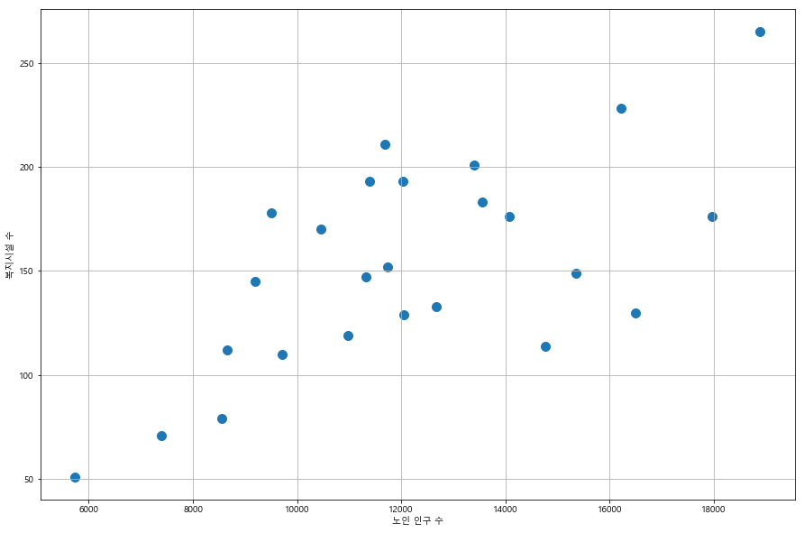

```python
import pandas as pd
import numpy as np
```


```python
WelfareFacility = pd.read_excel('../data/구별 노인복지시설.xls',  encoding='utf-8')
WelfareFacility.head()
```


<div>
<style scoped>
    .dataframe tbody tr th:only-of-type {
        vertical-align: middle;
    }

    .dataframe tbody tr th {
        vertical-align: top;
    }

    .dataframe thead th {
        text-align: right;
    }
</style>
<table border="1" class="dataframe">
  <thead>
    <tr style="text-align: right;">
      <th></th>
      <th>기간</th>
      <th>자치구</th>
      <th>시설합계</th>
      <th>노인복지관</th>
      <th>노인복지관.1</th>
      <th>경로당</th>
      <th>노인교실</th>
    </tr>
  </thead>
  <tbody>
    <tr>
      <th>0</th>
      <td>기간</td>
      <td>자치구</td>
      <td>시설합계</td>
      <td>시설수</td>
      <td>종사자수</td>
      <td>경로당</td>
      <td>노인교실</td>
    </tr>
    <tr>
      <th>1</th>
      <td>2017</td>
      <td>합계</td>
      <td>3815</td>
      <td>80</td>
      <td>1505</td>
      <td>3363</td>
      <td>372</td>
    </tr>
    <tr>
      <th>2</th>
      <td>2017</td>
      <td>종로구</td>
      <td>71</td>
      <td>3</td>
      <td>105</td>
      <td>57</td>
      <td>11</td>
    </tr>
    <tr>
      <th>3</th>
      <td>2017</td>
      <td>중구</td>
      <td>51</td>
      <td>1</td>
      <td>27</td>
      <td>47</td>
      <td>3</td>
    </tr>
    <tr>
      <th>4</th>
      <td>2017</td>
      <td>용산구</td>
      <td>112</td>
      <td>2</td>
      <td>67</td>
      <td>85</td>
      <td>25</td>
    </tr>
  </tbody>
</table>
</div>


```python
del WelfareFacility['기간']
WelfareFacility.drop([0],inplace=True)
WelfareFacility.set_index('자치구', inplace=True)
WelfareFacility.rename(columns={'노인복지관.1' : '종사자수'},
                       index={'합계':'서울시'}, inplace=True)
WelfareFacility.head()
```


<div>
<style scoped>
    .dataframe tbody tr th:only-of-type {
        vertical-align: middle;
    }

    .dataframe tbody tr th {
        vertical-align: top;
    }

    .dataframe thead th {
        text-align: right;
    }
</style>
<table border="1" class="dataframe">
  <thead>
    <tr style="text-align: right;">
      <th></th>
      <th>시설합계</th>
      <th>노인복지관</th>
      <th>종사자수</th>
      <th>경로당</th>
      <th>노인교실</th>
    </tr>
    <tr>
      <th>자치구</th>
      <th></th>
      <th></th>
      <th></th>
      <th></th>
      <th></th>
    </tr>
  </thead>
  <tbody>
    <tr>
      <th>서울시</th>
      <td>3815</td>
      <td>80</td>
      <td>1505</td>
      <td>3363</td>
      <td>372</td>
    </tr>
    <tr>
      <th>종로구</th>
      <td>71</td>
      <td>3</td>
      <td>105</td>
      <td>57</td>
      <td>11</td>
    </tr>
    <tr>
      <th>중구</th>
      <td>51</td>
      <td>1</td>
      <td>27</td>
      <td>47</td>
      <td>3</td>
    </tr>
    <tr>
      <th>용산구</th>
      <td>112</td>
      <td>2</td>
      <td>67</td>
      <td>85</td>
      <td>25</td>
    </tr>
    <tr>
      <th>성동구</th>
      <td>178</td>
      <td>3</td>
      <td>64</td>
      <td>159</td>
      <td>16</td>
    </tr>
  </tbody>
</table>
</div>


```python
Senior_Population = pd.read_excel('../data/구별 노인인구수.xls',  encoding='utf-8')
Senior_Population.head()
```


<div>
<style scoped>
    .dataframe tbody tr th:only-of-type {
        vertical-align: middle;
    }

    .dataframe tbody tr th {
        vertical-align: top;
    }

    .dataframe thead th {
        text-align: right;
    }
</style>
<table border="1" class="dataframe">
  <thead>
    <tr style="text-align: right;">
      <th></th>
      <th>기간</th>
      <th>구분</th>
      <th>합계</th>
      <th>합계.1</th>
      <th>합계.2</th>
      <th>국민기초생활보장수급권자</th>
      <th>국민기초생활보장수급권자.1</th>
      <th>국민기초생활보장수급권자.2</th>
      <th>저소득노인</th>
      <th>저소득노인.1</th>
      <th>저소득노인.2</th>
      <th>일반</th>
      <th>일반.1</th>
      <th>일반.2</th>
    </tr>
  </thead>
  <tbody>
    <tr>
      <th>0</th>
      <td>기간</td>
      <td>구분</td>
      <td>계</td>
      <td>65~79세</td>
      <td>80세 이상</td>
      <td>계</td>
      <td>65~79세</td>
      <td>80세 이상</td>
      <td>계</td>
      <td>65~79세</td>
      <td>80세 이상</td>
      <td>계</td>
      <td>65~79세</td>
      <td>80세 이상</td>
    </tr>
    <tr>
      <th>1</th>
      <td>2017</td>
      <td>합계</td>
      <td>303824</td>
      <td>227093</td>
      <td>76731</td>
      <td>59772</td>
      <td>44654</td>
      <td>15118</td>
      <td>18664</td>
      <td>11693</td>
      <td>6971</td>
      <td>225388</td>
      <td>170746</td>
      <td>54642</td>
    </tr>
    <tr>
      <th>2</th>
      <td>2017</td>
      <td>종로구</td>
      <td>7394</td>
      <td>5476</td>
      <td>1918</td>
      <td>1256</td>
      <td>965</td>
      <td>291</td>
      <td>344</td>
      <td>199</td>
      <td>145</td>
      <td>5794</td>
      <td>4312</td>
      <td>1482</td>
    </tr>
    <tr>
      <th>3</th>
      <td>2017</td>
      <td>중구</td>
      <td>5725</td>
      <td>4356</td>
      <td>1369</td>
      <td>1112</td>
      <td>851</td>
      <td>261</td>
      <td>286</td>
      <td>176</td>
      <td>110</td>
      <td>4327</td>
      <td>3329</td>
      <td>998</td>
    </tr>
    <tr>
      <th>4</th>
      <td>2017</td>
      <td>용산구</td>
      <td>8664</td>
      <td>5988</td>
      <td>2676</td>
      <td>2052</td>
      <td>1345</td>
      <td>707</td>
      <td>403</td>
      <td>227</td>
      <td>176</td>
      <td>6209</td>
      <td>4416</td>
      <td>1793</td>
    </tr>
  </tbody>
</table>
</div>


```python
del Senior_Population['기간']
del Senior_Population['합계.1']
del Senior_Population['합계.2']
del Senior_Population['국민기초생활보장수급권자.1']
del Senior_Population['국민기초생활보장수급권자.2']
del Senior_Population['저소득노인.1']
del Senior_Population['저소득노인.2']
del Senior_Population['일반.1']
del Senior_Population['일반.2']
Senior_Population.drop([0],inplace=True)
Senior_Population.rename(columns={'일반' : '나머지','구분' : '자치구'}, inplace=True)
Senior_Population.set_index('자치구', inplace=True)
Senior_Population.rename(index={'합계':'서울시'}, inplace=True)
Senior_Population['기초수급노인'] = Senior_Population['국민기초생활보장수급권자']+Senior_Population['저소득노인']
del Senior_Population['국민기초생활보장수급권자']
del Senior_Population['저소득노인']
Senior_Population.head()
```


<div>
<style scoped>
    .dataframe tbody tr th:only-of-type {
        vertical-align: middle;
    }

    .dataframe tbody tr th {
        vertical-align: top;
    }

    .dataframe thead th {
        text-align: right;
    }
</style>
<table border="1" class="dataframe">
  <thead>
    <tr style="text-align: right;">
      <th></th>
      <th>합계</th>
      <th>나머지</th>
      <th>기초수급노인</th>
    </tr>
    <tr>
      <th>자치구</th>
      <th></th>
      <th></th>
      <th></th>
    </tr>
  </thead>
  <tbody>
    <tr>
      <th>서울시</th>
      <td>303824</td>
      <td>225388</td>
      <td>78436</td>
    </tr>
    <tr>
      <th>종로구</th>
      <td>7394</td>
      <td>5794</td>
      <td>1600</td>
    </tr>
    <tr>
      <th>중구</th>
      <td>5725</td>
      <td>4327</td>
      <td>1398</td>
    </tr>
    <tr>
      <th>용산구</th>
      <td>8664</td>
      <td>6209</td>
      <td>2455</td>
    </tr>
    <tr>
      <th>성동구</th>
      <td>9508</td>
      <td>7343</td>
      <td>2165</td>
    </tr>
  </tbody>
</table>
</div>


```python
TotalData = pd.merge(Senior_Population,WelfareFacility, on='자치구')
TotalData.rename(columns={'합계':'노인 총 인구 수','기초수급노인':'기초수급노인 수',
                          '나머지':'나머지 인구 수','시설합계':'총 복지시설 수',
                          '종사자수':'복지시설 종사자 수'},inplace=True)
TotalData = TotalData.iloc[:,[0,2,1,3,4,6,7,5]]
TotalData.head()
```


<div>
<style scoped>
    .dataframe tbody tr th:only-of-type {
        vertical-align: middle;
    }

    .dataframe tbody tr th {
        vertical-align: top;
    }

    .dataframe thead th {
        text-align: right;
    }
</style>
<table border="1" class="dataframe">
  <thead>
    <tr style="text-align: right;">
      <th></th>
      <th>노인 총 인구 수</th>
      <th>기초수급노인 수</th>
      <th>나머지 인구 수</th>
      <th>총 복지시설 수</th>
      <th>노인복지관</th>
      <th>경로당</th>
      <th>노인교실</th>
      <th>복지시설 종사자 수</th>
    </tr>
    <tr>
      <th>자치구</th>
      <th></th>
      <th></th>
      <th></th>
      <th></th>
      <th></th>
      <th></th>
      <th></th>
      <th></th>
    </tr>
  </thead>
  <tbody>
    <tr>
      <th>서울시</th>
      <td>303824</td>
      <td>78436</td>
      <td>225388</td>
      <td>3815</td>
      <td>80</td>
      <td>3363</td>
      <td>372</td>
      <td>1505</td>
    </tr>
    <tr>
      <th>종로구</th>
      <td>7394</td>
      <td>1600</td>
      <td>5794</td>
      <td>71</td>
      <td>3</td>
      <td>57</td>
      <td>11</td>
      <td>105</td>
    </tr>
    <tr>
      <th>중구</th>
      <td>5725</td>
      <td>1398</td>
      <td>4327</td>
      <td>51</td>
      <td>1</td>
      <td>47</td>
      <td>3</td>
      <td>27</td>
    </tr>
    <tr>
      <th>용산구</th>
      <td>8664</td>
      <td>2455</td>
      <td>6209</td>
      <td>112</td>
      <td>2</td>
      <td>85</td>
      <td>25</td>
      <td>67</td>
    </tr>
    <tr>
      <th>성동구</th>
      <td>9508</td>
      <td>2165</td>
      <td>7343</td>
      <td>178</td>
      <td>3</td>
      <td>159</td>
      <td>16</td>
      <td>64</td>
    </tr>
  </tbody>
</table>
</div>


```python
TotalData['1인당 복지수준'] = TotalData['총 복지시설 수']  / TotalData['노인 총 인구 수']
TotalData['기초수급노인 비율'] = TotalData['기초수급노인 수']  / TotalData['노인 총 인구 수']
TotalData['복지시설 수준'] = TotalData['복지시설 종사자 수']  / TotalData['총 복지시설 수']
TotalData.drop(['서울시'],inplace=True)
TotalData = TotalData.applymap(lambda x: float(x))
TotalData.head()
```


<div>
<style scoped>
    .dataframe tbody tr th:only-of-type {
        vertical-align: middle;
    }

    .dataframe tbody tr th {
        vertical-align: top;
    }

    .dataframe thead th {
        text-align: right;
    }
</style>
<table border="1" class="dataframe">
  <thead>
    <tr style="text-align: right;">
      <th></th>
      <th>노인 총 인구 수</th>
      <th>기초수급노인 수</th>
      <th>나머지 인구 수</th>
      <th>총 복지시설 수</th>
      <th>노인복지관</th>
      <th>경로당</th>
      <th>노인교실</th>
      <th>복지시설 종사자 수</th>
      <th>1인당 복지수준</th>
      <th>기초수급노인 비율</th>
      <th>복지시설 수준</th>
    </tr>
    <tr>
      <th>자치구</th>
      <th></th>
      <th></th>
      <th></th>
      <th></th>
      <th></th>
      <th></th>
      <th></th>
      <th></th>
      <th></th>
      <th></th>
      <th></th>
    </tr>
  </thead>
  <tbody>
    <tr>
      <th>종로구</th>
      <td>7394.0</td>
      <td>1600.0</td>
      <td>5794.0</td>
      <td>71.0</td>
      <td>3.0</td>
      <td>57.0</td>
      <td>11.0</td>
      <td>105.0</td>
      <td>0.009602</td>
      <td>0.216392</td>
      <td>1.478873</td>
    </tr>
    <tr>
      <th>중구</th>
      <td>5725.0</td>
      <td>1398.0</td>
      <td>4327.0</td>
      <td>51.0</td>
      <td>1.0</td>
      <td>47.0</td>
      <td>3.0</td>
      <td>27.0</td>
      <td>0.008908</td>
      <td>0.244192</td>
      <td>0.529412</td>
    </tr>
    <tr>
      <th>용산구</th>
      <td>8664.0</td>
      <td>2455.0</td>
      <td>6209.0</td>
      <td>112.0</td>
      <td>2.0</td>
      <td>85.0</td>
      <td>25.0</td>
      <td>67.0</td>
      <td>0.012927</td>
      <td>0.283356</td>
      <td>0.598214</td>
    </tr>
    <tr>
      <th>성동구</th>
      <td>9508.0</td>
      <td>2165.0</td>
      <td>7343.0</td>
      <td>178.0</td>
      <td>3.0</td>
      <td>159.0</td>
      <td>16.0</td>
      <td>64.0</td>
      <td>0.018721</td>
      <td>0.227703</td>
      <td>0.359551</td>
    </tr>
    <tr>
      <th>광진구</th>
      <td>9711.0</td>
      <td>2238.0</td>
      <td>7473.0</td>
      <td>110.0</td>
      <td>1.0</td>
      <td>97.0</td>
      <td>12.0</td>
      <td>63.0</td>
      <td>0.011327</td>
      <td>0.230460</td>
      <td>0.572727</td>
    </tr>
  </tbody>
</table>
</div>


```python
import platform
import matplotlib.pyplot as plt
%matplotlib inline  
from matplotlib import font_manager, rc
plt.rcParams['axes.unicode_minus'] = False
path = "c:/Windows/Fonts/malgun.ttf"
font_name = font_manager.FontProperties(fname=path).get_name()
rc('font', family=font_name)
```


```python
plt.figure()
TotalData['1인당 복지수준'].sort_values().plot(kind='barh', grid=True, figsize=(15,10))
plt.xlabel('1인당 복지수준')
plt.show()

plt.figure()
TotalData['기초수급노인 비율'].sort_values().plot(kind='barh', grid=True, figsize=(15,10))
plt.xlabel('기초수급노인 비율')
plt.show()

plt.figure()
TotalData['복지시설 수준'].sort_values().plot(kind='barh', grid=True, figsize=(15,10))
plt.xlabel('복지시설 수준')
plt.show()
```


```python
plt.figure(figsize=(15,10))
plt.scatter(TotalData['노인 총 인구 수'], TotalData['총 복지시설 수'], s=100)
plt.xlabel('노인 인구 수')
plt.ylabel('복지시설 수')
plt.grid()
plt.show()

plt.figure(figsize=(15,10))
plt.scatter(TotalData['기초수급노인 수'], TotalData['총 복지시설 수'], s=100)
plt.xlabel('기초수급노인 수')
plt.ylabel('복지시설 수')
plt.grid()
plt.show()

plt.figure(figsize=(15,10))
plt.scatter(TotalData['총 복지시설 수'], TotalData['복지시설 종사자 수'], s=100)
plt.xlabel('총 복지시설 수')
plt.ylabel('복지시설 종사자 수')
plt.grid()
plt.show()
```





```python
fp1 = np.polyfit(TotalData['노인 총 인구 수'], TotalData['총 복지시설 수'],1)
f1 = np.poly1d(fp1)
fx1 = np.linspace(5000, 20000, 100)

fp2 = np.polyfit(TotalData['기초수급노인 수'], TotalData['총 복지시설 수'],1)
f2 = np.poly1d(fp2)
fx2 = np.linspace(500, 8000, 100)

fp3 = np.polyfit(TotalData['총 복지시설 수'], TotalData['복지시설 종사자 수'],1)
f3 = np.poly1d(fp3)
fx3 = np.linspace(50, 275, 100)

TotalData['오차1'] = np.abs(TotalData['총 복지시설 수'] - f1(TotalData['노인 총 인구 수']))
TotalData['오차2'] = np.abs(TotalData['총 복지시설 수'] - f2(TotalData['기초수급노인 수']))
TotalData['오차3'] = np.abs(TotalData['복지시설 종사자 수'] - f3(TotalData['총 복지시설 수']))
TotalData.head()
```


<div>
<style scoped>
    .dataframe tbody tr th:only-of-type {
        vertical-align: middle;
    }

    .dataframe tbody tr th {
        vertical-align: top;
    }

    .dataframe thead th {
        text-align: right;
    }
</style>
<table border="1" class="dataframe">
  <thead>
    <tr style="text-align: right;">
      <th></th>
      <th>노인 총 인구 수</th>
      <th>기초수급노인 수</th>
      <th>나머지 인구 수</th>
      <th>총 복지시설 수</th>
      <th>노인복지관</th>
      <th>경로당</th>
      <th>노인교실</th>
      <th>복지시설 종사자 수</th>
      <th>1인당 복지수준</th>
      <th>기초수급노인 비율</th>
      <th>복지시설 수준</th>
      <th>오차1</th>
      <th>오차2</th>
      <th>오차3</th>
    </tr>
    <tr>
      <th>자치구</th>
      <th></th>
      <th></th>
      <th></th>
      <th></th>
      <th></th>
      <th></th>
      <th></th>
      <th></th>
      <th></th>
      <th></th>
      <th></th>
      <th></th>
      <th></th>
      <th></th>
    </tr>
  </thead>
  <tbody>
    <tr>
      <th>종로구</th>
      <td>7394.0</td>
      <td>1600.0</td>
      <td>5794.0</td>
      <td>71.0</td>
      <td>3.0</td>
      <td>57.0</td>
      <td>11.0</td>
      <td>105.0</td>
      <td>0.009602</td>
      <td>0.216392</td>
      <td>1.478873</td>
      <td>33.444144</td>
      <td>60.819486</td>
      <td>39.447274</td>
    </tr>
    <tr>
      <th>중구</th>
      <td>5725.0</td>
      <td>1398.0</td>
      <td>4327.0</td>
      <td>51.0</td>
      <td>1.0</td>
      <td>47.0</td>
      <td>3.0</td>
      <td>27.0</td>
      <td>0.008908</td>
      <td>0.244192</td>
      <td>0.529412</td>
      <td>36.555553</td>
      <td>78.089191</td>
      <td>39.864669</td>
    </tr>
    <tr>
      <th>용산구</th>
      <td>8664.0</td>
      <td>2455.0</td>
      <td>6209.0</td>
      <td>112.0</td>
      <td>2.0</td>
      <td>85.0</td>
      <td>25.0</td>
      <td>67.0</td>
      <td>0.012927</td>
      <td>0.283356</td>
      <td>0.598214</td>
      <td>5.295258</td>
      <td>31.375930</td>
      <td>4.136756</td>
    </tr>
    <tr>
      <th>성동구</th>
      <td>9508.0</td>
      <td>2165.0</td>
      <td>7343.0</td>
      <td>178.0</td>
      <td>3.0</td>
      <td>159.0</td>
      <td>16.0</td>
      <td>64.0</td>
      <td>0.018721</td>
      <td>0.227703</td>
      <td>0.359551</td>
      <td>52.164317</td>
      <td>38.543800</td>
      <td>5.466167</td>
    </tr>
    <tr>
      <th>광진구</th>
      <td>9711.0</td>
      <td>2238.0</td>
      <td>7473.0</td>
      <td>110.0</td>
      <td>1.0</td>
      <td>97.0</td>
      <td>12.0</td>
      <td>63.0</td>
      <td>0.011327</td>
      <td>0.230460</td>
      <td>0.572727</td>
      <td>17.889837</td>
      <td>30.442891</td>
      <td>0.005562</td>
    </tr>
  </tbody>
</table>
</div>


```python
print('노인인구와 복지시설수 상관계수\n',np.corrcoef(TotalData['노인 총 인구 수'], TotalData['총 복지시설 수']))
print('기초수급노인과 복지시설수 상관계수\n',np.corrcoef(TotalData['기초수급노인 수'], TotalData['총 복지시설 수']))
print('복지시설 종사자수와 복지시설수 상관계수\n',np.corrcoef(TotalData['총 복지시설 수'], TotalData['복지시설 종사자 수']))
```

    노인인구와 복지시설수 상관계수
     [[1.         0.65917319]
     [0.65917319 1.        ]]
    기초수급노인과 복지시설수 상관계수
     [[1.         0.40232664]
     [0.40232664 1.        ]]
    복지시설 종사자수와 복지시설수 상관계수
     [[ 1.         -0.15385677]
     [-0.15385677  1.        ]]
    


```python
plt.figure(figsize=(20,10))
plt.scatter(TotalData['노인 총 인구 수'], TotalData['총 복지시설 수'], 
            c=TotalData['오차1'], s=50)
plt.plot(fx1, f1(fx1), ls='dashed', lw=3, color='g')
for n in range(25):
    plt.text(TotalData['노인 총 인구 수'][n]*1.02, TotalData['총 복지시설 수'][n]*0.98, 
             TotalData.index[n], fontsize=15)  
plt.xlabel('노인 총 인구 수')
plt.ylabel('총 복지시설 수')
plt.colorbar()
plt.grid()
plt.show()

plt.figure(figsize=(20,10))
plt.scatter(TotalData['기초수급노인 수'], TotalData['총 복지시설 수'], 
            c=TotalData['오차2'], s=50)
plt.plot(fx2, f2(fx2), ls='dashed', lw=3, color='g')
for n in range(25):
    plt.text(TotalData['기초수급노인 수'][n]*1.02, TotalData['총 복지시설 수'][n]*0.98, 
             TotalData.index[n], fontsize=15)  
plt.xlabel('기초수급노인 수')
plt.ylabel('총 복지시설 수')
plt.colorbar()
plt.grid()
plt.show()

plt.figure(figsize=(20,10))
plt.scatter(TotalData['총 복지시설 수'], TotalData['복지시설 종사자 수'], 
            c=TotalData['오차3'], s=50)
plt.plot(fx3, f3(fx3), ls='dashed', lw=3, color='g')
for n in range(25):
    plt.text(TotalData['총 복지시설 수'][n]*1.02, TotalData['복지시설 종사자 수'][n]*0.98, 
             TotalData.index[n], fontsize=15)  
plt.xlabel('총 복지시설 수')
plt.ylabel('복지시설 종사자 수')
plt.colorbar()
plt.grid()
plt.show()
```


