### 경희대학교 산업경영공학과 김태호(2015100915)

# 지난 1년간 서울시 공공자전거 대여소별 이용 분석 

## (1) 주제 선정 이유

  서울시를 돌아다니다보면 따릉이를 타고있는 사람을 보거나 진열된 따릉이를 보거나 대여소를 보는등 서욿시에서 하는 공공자전거 사업인 따릉이를 쉽게 볼 수 있다. 따릉이는 서울시의 친환경사업과 함께 시민들의 더욱더 편한 이동수단을 제공하기 위해 2015년부터 현재까지 계속 이루어지고 있는 사업이다. 실제로 시민들은 가까운거리를 가거나 출퇴근, 산책, 운동을 하는 등 여러 방면에서 따릉이를 이용하고 있다.<br>
  과거에 비해 점점 좋아지고 있기는 하지만 여전히 이용자에 비해 자전거의 수가 턱없이 부족한 실정이다. 이러한 문제를 해결하기 위해서 서울시는 몰려있는 따릉이 부족한곳에 분배시켜주는 따릉이 분배팀을 운영하고 있다. 따릉이분배팀의 원활한 운영을 위해서 자전거를 시간대별, 위치별 이용량을 분석하여 어느곳이 부족한지 알아보고 자전거를 효과적으로 배치해야 한다. 지금부터 서울시에서 제공 따릉이에 관련 데이터를 이용하여 시민들의 이용경향을 분석하고 어디가 언제 부족한지를 분석하여 어떻게 따릉이를 효과적으로 분배해야하는지 생각해 볼 것 이다.

## (2) 가설 정의

지난 1년간 서울시 공공자전거를 대여소별 데이터로 분석하여 시민들의 이용경향을 분석하여 서울시 공공자전거 사업이 잘 운영될 수 있도록 효율적인 따릉이분배방법을 생각해 본다.

## (3) 인터넷을 통한 데이터 획득

- 정부 3.0 공공 데이터 : http://www.data.go.kr/


- 서울시 열린 데이터 광장 : http://data.seoul.go.kr/

위의 두 페이지에 서울시 공공자전거에 대한 대여소별 월간 이용정보, 시간대별 이용정보를 csv형태의 파일로 얻어서 사용하는 목적에 맞게 가공하였다. 

## (4) 분석을 위한 데이터의 가공

### 1. 서울시 공공자전거 사업 17년, 18년 비교 데이터 가공


```python
import pandas as pd 
import numpy as np 
```

#### 서울시 공공자전거 대여소 데이터가공


```python
Bike_Stop = pd.read_csv('../raw data/서울시_공공자전거_대여소_정보.csv', engine='python') 
Bike_Stop.head()
```


<div>
<style scoped>
    .dataframe tbody tr th:only-of-type {
        vertical-align: middle;
    }

    .dataframe tbody tr th {
        vertical-align: top;
    }

    .dataframe thead th {
        text-align: right;
    }
</style>
<table border="1" class="dataframe">
  <thead>
    <tr style="text-align: right;">
      <th></th>
      <th>구분</th>
      <th>대여소번호</th>
      <th>대여소명</th>
      <th>대여소 주소</th>
      <th>거치대수</th>
      <th>위도</th>
      <th>경도</th>
    </tr>
  </thead>
  <tbody>
    <tr>
      <th>0</th>
      <td>강남구</td>
      <td>2301</td>
      <td>현대고등학교 건너편</td>
      <td>서울특별시 강남구 압구정로 134</td>
      <td>10</td>
      <td>37.524071</td>
      <td>127.021790</td>
    </tr>
    <tr>
      <th>1</th>
      <td>강남구</td>
      <td>2302</td>
      <td>교보타워 버스정류장(신논현역 3번출구 후면)</td>
      <td>서울특별시 강남구 봉은사로 지하 102</td>
      <td>10</td>
      <td>37.505581</td>
      <td>127.024277</td>
    </tr>
    <tr>
      <th>2</th>
      <td>강남구</td>
      <td>2303</td>
      <td>논현역 7번출구</td>
      <td>서울특별시 강남구 학동로 지하 102</td>
      <td>15</td>
      <td>37.511517</td>
      <td>127.021477</td>
    </tr>
    <tr>
      <th>3</th>
      <td>강남구</td>
      <td>2304</td>
      <td>신영 ROYAL PALACE 앞</td>
      <td>서울특별시 강남구 언주로 626</td>
      <td>10</td>
      <td>37.512527</td>
      <td>127.035835</td>
    </tr>
    <tr>
      <th>4</th>
      <td>강남구</td>
      <td>2305</td>
      <td>MCM 본사 직영점 앞</td>
      <td>서울특별시 강남구 언주로 734</td>
      <td>10</td>
      <td>37.520641</td>
      <td>127.034508</td>
    </tr>
  </tbody>
</table>
</div>


다른 데이터와 비교하기 쉽게 unique 한 열인 '대여소번호'를 기준으로 오름차순 정렬 후 index를 다시 설정했다.


```python
Bike_Stop = Bike_Stop.sort_values(by="대여소번호", ascending=True) # 대여소번호를 기준으로 오름차순 정렬 
Bike_Stop = Bike_Stop.reset_index(drop='True') # index를 다시 설정
Bike_Stop.head()
```


<div>
<style scoped>
    .dataframe tbody tr th:only-of-type {
        vertical-align: middle;
    }

    .dataframe tbody tr th {
        vertical-align: top;
    }

    .dataframe thead th {
        text-align: right;
    }
</style>
<table border="1" class="dataframe">
  <thead>
    <tr style="text-align: right;">
      <th></th>
      <th>구분</th>
      <th>대여소번호</th>
      <th>대여소명</th>
      <th>대여소 주소</th>
      <th>거치대수</th>
      <th>위도</th>
      <th>경도</th>
    </tr>
  </thead>
  <tbody>
    <tr>
      <th>0</th>
      <td>마포구</td>
      <td>101</td>
      <td>(구)합정동 주민센터</td>
      <td>서울특별시 마포구 동교로8길 58</td>
      <td>5</td>
      <td>37.549561</td>
      <td>126.905754</td>
    </tr>
    <tr>
      <th>1</th>
      <td>마포구</td>
      <td>102</td>
      <td>망원역 1번출구 앞</td>
      <td>서울특별시 마포구 월드컵로 72</td>
      <td>20</td>
      <td>37.556000</td>
      <td>126.910454</td>
    </tr>
    <tr>
      <th>2</th>
      <td>마포구</td>
      <td>103</td>
      <td>망원역 2번출구 앞</td>
      <td>서울특별시 마포구 월드컵로 79</td>
      <td>14</td>
      <td>37.554951</td>
      <td>126.910835</td>
    </tr>
    <tr>
      <th>3</th>
      <td>마포구</td>
      <td>104</td>
      <td>합정역 1번출구 앞</td>
      <td>서울특별시 마포구 양화로 59</td>
      <td>13</td>
      <td>37.550629</td>
      <td>126.914986</td>
    </tr>
    <tr>
      <th>4</th>
      <td>마포구</td>
      <td>105</td>
      <td>합정역 5번출구 앞</td>
      <td>서울특별시 마포구 양화로 48</td>
      <td>5</td>
      <td>37.550007</td>
      <td>126.914825</td>
    </tr>
  </tbody>
</table>
</div>


#### 서울특별시 공공자전거 대여소별 이용정보(17년 상반기) 데이터 가공


```python
Bike_Month = pd.read_csv('../raw data/서울특별시 공공자전거 대여소별 이용정보(월간)_2017_1_12.csv', engine='python')
Bike_Month.head()
```


<div>
<style scoped>
    .dataframe tbody tr th:only-of-type {
        vertical-align: middle;
    }

    .dataframe tbody tr th {
        vertical-align: top;
    }

    .dataframe thead th {
        text-align: right;
    }
</style>
<table border="1" class="dataframe">
  <thead>
    <tr style="text-align: right;">
      <th></th>
      <th>'대여일자'</th>
      <th>'대여소번호'</th>
      <th>'대여소'</th>
      <th>'대여건수'</th>
      <th>'반납건수'</th>
    </tr>
  </thead>
  <tbody>
    <tr>
      <th>0</th>
      <td>'201701'</td>
      <td>'108'</td>
      <td>' 서교동 사거리'</td>
      <td>246</td>
      <td>198</td>
    </tr>
    <tr>
      <th>1</th>
      <td>'201701'</td>
      <td>'503'</td>
      <td>' 더샵스타시티 C동 앞'</td>
      <td>246</td>
      <td>224</td>
    </tr>
    <tr>
      <th>2</th>
      <td>'201701'</td>
      <td>'504'</td>
      <td>' 신자초교입구교차로'</td>
      <td>232</td>
      <td>261</td>
    </tr>
    <tr>
      <th>3</th>
      <td>'201701'</td>
      <td>'505'</td>
      <td>' 자양사거리 광진아크로텔 앞'</td>
      <td>302</td>
      <td>313</td>
    </tr>
    <tr>
      <th>4</th>
      <td>'201701'</td>
      <td>'506'</td>
      <td>' 금호 어울림 아파트 앞'</td>
      <td>72</td>
      <td>77</td>
    </tr>
  </tbody>
</table>
</div>


상반기의 데이터만 필요하기때문에 17년도 상반기의 데이터만 Bike_Month에 복사한다.


```python
Bike_Month = Bike_Month[Bike_Month["'대여일자'"] < "'201707'"].copy()#상반기의테이터만 저장
Bike_Month.tail()
```


<div>
<style scoped>
    .dataframe tbody tr th:only-of-type {
        vertical-align: middle;
    }

    .dataframe tbody tr th {
        vertical-align: top;
    }

    .dataframe thead th {
        text-align: right;
    }
</style>
<table border="1" class="dataframe">
  <thead>
    <tr style="text-align: right;">
      <th></th>
      <th>'대여일자'</th>
      <th>'대여소번호'</th>
      <th>'대여소'</th>
      <th>'대여건수'</th>
      <th>'반납건수'</th>
    </tr>
  </thead>
  <tbody>
    <tr>
      <th>3067</th>
      <td>'201706'</td>
      <td>'415'</td>
      <td>' DMC역 9번출구 앞'</td>
      <td>1929</td>
      <td>1607</td>
    </tr>
    <tr>
      <th>3068</th>
      <td>'201706'</td>
      <td>'416'</td>
      <td>' 상암월드컵파크 1단지 교차로'</td>
      <td>980</td>
      <td>510</td>
    </tr>
    <tr>
      <th>3069</th>
      <td>'201706'</td>
      <td>'500'</td>
      <td>' 어린이대공원역 3번출구 앞'</td>
      <td>1858</td>
      <td>1673</td>
    </tr>
    <tr>
      <th>3070</th>
      <td>'201706'</td>
      <td>'501'</td>
      <td>' 광진구의회 앞'</td>
      <td>2354</td>
      <td>2407</td>
    </tr>
    <tr>
      <th>3071</th>
      <td>'201706'</td>
      <td>'502'</td>
      <td>' 뚝섬유원지역 1번출구 앞'</td>
      <td>4242</td>
      <td>4840</td>
    </tr>
  </tbody>
</table>
</div>


'대여소' 열과 '대여일자'열은 분석에 필요없는 요소가 있기 때문에 삭제한다.


```python
del Bike_Month["'대여일자'"] # '대여일자'열을 삭제
del Bike_Month["'대여소'"] # '대여소'열을 삭제
Bike_Month.head()
```


<div>
<style scoped>
    .dataframe tbody tr th:only-of-type {
        vertical-align: middle;
    }

    .dataframe tbody tr th {
        vertical-align: top;
    }

    .dataframe thead th {
        text-align: right;
    }
</style>
<table border="1" class="dataframe">
  <thead>
    <tr style="text-align: right;">
      <th></th>
      <th>'대여소번호'</th>
      <th>'대여건수'</th>
      <th>'반납건수'</th>
    </tr>
  </thead>
  <tbody>
    <tr>
      <th>0</th>
      <td>'108'</td>
      <td>246</td>
      <td>198</td>
    </tr>
    <tr>
      <th>1</th>
      <td>'503'</td>
      <td>246</td>
      <td>224</td>
    </tr>
    <tr>
      <th>2</th>
      <td>'504'</td>
      <td>232</td>
      <td>261</td>
    </tr>
    <tr>
      <th>3</th>
      <td>'505'</td>
      <td>302</td>
      <td>313</td>
    </tr>
    <tr>
      <th>4</th>
      <td>'506'</td>
      <td>72</td>
      <td>77</td>
    </tr>
  </tbody>
</table>
</div>


데이터가 월별로 나와 있는데 월별데이터를 원하는 것이 아니라 상반기 통합데이터를 원하고 있다.<br>
띠라서 '대여소번호'를 기준으로 통합하여 '대여건수', '반납건수'의 합계를 나타낸다.  


```python
grouped = Bike_Month[["'대여건수'","'반납건수'"]].groupby(Bike_Month["'대여소번호'"]) 
Bike_Month_cumsum = grouped.sum()  # '대여소번호'를 기준으로 그룹화하여 합산을 Bike_Month_cumsum에 대입한다.
Bike_Month_rent = Bike_Month.drop_duplicates(["'대여소번호'"])[["'대여소번호'"]]      
Bike_Month_rent = Bike_Month_rent.sort_values(by="'대여소번호'")  # Bike_Month_rent에 '대여소번호'를 기준으로 정렬한다.
Bike_Month_cumsum = Bike_Month_cumsum.reset_index(drop='True')                          
Bike_Month_rent = Bike_Month_rent.reset_index(drop='True')   #index를 재설정 한다.
Bike_Month = pd.concat([Bike_Month_rent, Bike_Month_cumsum], axis=1) # Bike_Month_rent와 Bike_Month_cumsum을 합친다.
Bike_Month.head()
```


<div>
<style scoped>
    .dataframe tbody tr th:only-of-type {
        vertical-align: middle;
    }

    .dataframe tbody tr th {
        vertical-align: top;
    }

    .dataframe thead th {
        text-align: right;
    }
</style>
<table border="1" class="dataframe">
  <thead>
    <tr style="text-align: right;">
      <th></th>
      <th>'대여소번호'</th>
      <th>'대여건수'</th>
      <th>'반납건수'</th>
    </tr>
  </thead>
  <tbody>
    <tr>
      <th>0</th>
      <td>'1001'</td>
      <td>1410</td>
      <td>1314</td>
    </tr>
    <tr>
      <th>1</th>
      <td>'1002'</td>
      <td>589</td>
      <td>755</td>
    </tr>
    <tr>
      <th>2</th>
      <td>'1003'</td>
      <td>679</td>
      <td>764</td>
    </tr>
    <tr>
      <th>3</th>
      <td>'1004'</td>
      <td>833</td>
      <td>1119</td>
    </tr>
    <tr>
      <th>4</th>
      <td>'1006'</td>
      <td>831</td>
      <td>792</td>
    </tr>
  </tbody>
</table>
</div>


```python
Bike_Month.tail()
```


<div>
<style scoped>
    .dataframe tbody tr th:only-of-type {
        vertical-align: middle;
    }

    .dataframe tbody tr th {
        vertical-align: top;
    }

    .dataframe thead th {
        text-align: right;
    }
</style>
<table border="1" class="dataframe">
  <thead>
    <tr style="text-align: right;">
      <th></th>
      <th>'대여소번호'</th>
      <th>'대여건수'</th>
      <th>'반납건수'</th>
    </tr>
  </thead>
  <tbody>
    <tr>
      <th>694</th>
      <td>'933'</td>
      <td>2377</td>
      <td>2742</td>
    </tr>
    <tr>
      <th>695</th>
      <td>'상암센터 정비실'</td>
      <td>40</td>
      <td>70</td>
    </tr>
    <tr>
      <th>696</th>
      <td>'위트콤'</td>
      <td>158</td>
      <td>153</td>
    </tr>
    <tr>
      <th>697</th>
      <td>'위트콤공장'</td>
      <td>34</td>
      <td>29</td>
    </tr>
    <tr>
      <th>698</th>
      <td>'중랑센터'</td>
      <td>70</td>
      <td>65</td>
    </tr>
  </tbody>
</table>
</div>


'데이터번호'열에 번호가 아닌 필요없는 데이터가 있어서 없애준다


```python
Bike_Month.drop([695], inplace=True) 
Bike_Month.drop([696], inplace=True)
Bike_Month.drop([697], inplace=True)
Bike_Month.drop([698], inplace=True) # 행을 삭제함
Bike_Month.tail()
```


<div>
<style scoped>
    .dataframe tbody tr th:only-of-type {
        vertical-align: middle;
    }

    .dataframe tbody tr th {
        vertical-align: top;
    }

    .dataframe thead th {
        text-align: right;
    }
</style>
<table border="1" class="dataframe">
  <thead>
    <tr style="text-align: right;">
      <th></th>
      <th>'대여소번호'</th>
      <th>'대여건수'</th>
      <th>'반납건수'</th>
    </tr>
  </thead>
  <tbody>
    <tr>
      <th>690</th>
      <td>'928'</td>
      <td>642</td>
      <td>523</td>
    </tr>
    <tr>
      <th>691</th>
      <td>'930'</td>
      <td>723</td>
      <td>791</td>
    </tr>
    <tr>
      <th>692</th>
      <td>'931'</td>
      <td>3202</td>
      <td>4155</td>
    </tr>
    <tr>
      <th>693</th>
      <td>'932'</td>
      <td>2249</td>
      <td>2293</td>
    </tr>
    <tr>
      <th>694</th>
      <td>'933'</td>
      <td>2377</td>
      <td>2742</td>
    </tr>
  </tbody>
</table>
</div>


열의 이름을 알아보기 쉽게 바꾸고 '회수율'이라는 열을 추가한다.<br>
회수율은 대여건수와 반납건수를 비교하기 위한 열이다.
##### 회수율 = '(반납건수 -대여건수) / 100'
회수율이 클수록 반납되는 자전거가 더 많아 자전거가 쌓여있고, 회수율이 작을수록 대여되는 자전거가 더 많아 자전거가 부족할 확률이 높다. <br>
'서울시 공공자전거 대여소' 데이터의 '대여소번호'값과 형태를 같게 하여 두 데이터를 병합하기 쉽게 한다. <br>


```python
Bike_Month.rename(columns={Bike_Month.columns[0] : '대여소번호', 
                          Bike_Month.columns[1] : '17년_대여건수', 
                          Bike_Month.columns[2] : '17년_반납건수'}, inplace=True) # 열의 이름을 바꾼다.
Bike_Month['17년_회수율'] = (Bike_Month['17년_반납건수'] - Bike_Month['17년_대여건수'])/100 # '회수율'열을 추가한다.
Bike_Month['대여소번호'] = list(map(int,map(lambda x : str(x).rstrip("'").lstrip("'") ,Bike_Month['대여소번호']))) # 번호 양쪽의 ''를 없애고
Bike_Month = Bike_Month.sort_values(by="대여소번호", ascending=True) # '대여소번호'를 기준으로 오름차순 정렬한다.
Bike_Month = Bike_Month.reset_index(drop='True') # index를 재설정한다.
Bike_Month.head()
```


<div>
<style scoped>
    .dataframe tbody tr th:only-of-type {
        vertical-align: middle;
    }

    .dataframe tbody tr th {
        vertical-align: top;
    }

    .dataframe thead th {
        text-align: right;
    }
</style>
<table border="1" class="dataframe">
  <thead>
    <tr style="text-align: right;">
      <th></th>
      <th>대여소번호</th>
      <th>17년_대여건수</th>
      <th>17년_반납건수</th>
      <th>17년_회수율</th>
    </tr>
  </thead>
  <tbody>
    <tr>
      <th>0</th>
      <td>101</td>
      <td>1865</td>
      <td>2128</td>
      <td>2.63</td>
    </tr>
    <tr>
      <th>1</th>
      <td>102</td>
      <td>7492</td>
      <td>6758</td>
      <td>-7.34</td>
    </tr>
    <tr>
      <th>2</th>
      <td>103</td>
      <td>5494</td>
      <td>5399</td>
      <td>-0.95</td>
    </tr>
    <tr>
      <th>3</th>
      <td>104</td>
      <td>6147</td>
      <td>4876</td>
      <td>-12.71</td>
    </tr>
    <tr>
      <th>4</th>
      <td>105</td>
      <td>3920</td>
      <td>3176</td>
      <td>-7.44</td>
    </tr>
  </tbody>
</table>
</div>


#### 서울특별시 공공자전거 대여소별 이용정보(18년 상반기) 데이터 가공

위의 '서울특별시 공공자전거 대여소별 이용정보(17년 상반기) 데이터 가공' 과정과 같기 때문에 추가 설명은 생략한다..<br>
(18년데이터에는 '데이터번호'열에 번호가 아닌 필요없는 데이터가 없어서 필요없는 행을 삭제하는 과정은 실시하지 않았다.)


```python
Bike_Month_18 = pd.read_csv('../raw data/서울특별시 공공자전거 대여소별 이용정보(월간)_2018_1_6.csv', engine='python')
del Bike_Month_18["'대여일자'"]
del Bike_Month_18["'대여소'"]
grouped = Bike_Month_18[["'대여건수'","'반납건수'"]].groupby(Bike_Month_18["'대여소번호'"])
Bike_Month_18_cumsum = grouped.sum()
Bike_Month_18_rent = Bike_Month_18.drop_duplicates(["'대여소번호'"])[["'대여소번호'"]]
Bike_Month_18_rent = Bike_Month_18_rent.sort_values(by="'대여소번호'")
Bike_Month_18_cumsum = Bike_Month_18_cumsum.reset_index(drop='True')
Bike_Month_18_rent = Bike_Month_18_rent.reset_index(drop='True')
Bike_Month_18 = pd.concat([Bike_Month_18_rent, Bike_Month_18_cumsum], axis=1)
Bike_Month_18.rename(columns={Bike_Month_18.columns[0] : '대여소번호', 
                          Bike_Month_18.columns[1] : '18년_대여건수', 
                          Bike_Month_18.columns[2] : '18년_반납건수'}, inplace=True) 
Bike_Month_18['18년_회수율'] = (Bike_Month_18['18년_반납건수'] - Bike_Month_18['18년_대여건수'])/100
Bike_Month_18['대여소번호'] = list(map(int,map(lambda x : str(x).rstrip("'").lstrip("'") ,Bike_Month_18['대여소번호'])))
Bike_Month_18 = Bike_Month_18.sort_values(by="대여소번호", ascending=True)
Bike_Month_18 = Bike_Month_18.reset_index(drop='True')
Bike_Month_18.head()
```


<div>
<style scoped>
    .dataframe tbody tr th:only-of-type {
        vertical-align: middle;
    }

    .dataframe tbody tr th {
        vertical-align: top;
    }

    .dataframe thead th {
        text-align: right;
    }
</style>
<table border="1" class="dataframe">
  <thead>
    <tr style="text-align: right;">
      <th></th>
      <th>대여소번호</th>
      <th>18년_대여건수</th>
      <th>18년_반납건수</th>
      <th>18년_회수율</th>
    </tr>
  </thead>
  <tbody>
    <tr>
      <th>0</th>
      <td>101</td>
      <td>2263</td>
      <td>2247</td>
      <td>-0.16</td>
    </tr>
    <tr>
      <th>1</th>
      <td>102</td>
      <td>8735</td>
      <td>8364</td>
      <td>-3.71</td>
    </tr>
    <tr>
      <th>2</th>
      <td>103</td>
      <td>6111</td>
      <td>5748</td>
      <td>-3.63</td>
    </tr>
    <tr>
      <th>3</th>
      <td>104</td>
      <td>5835</td>
      <td>5333</td>
      <td>-5.02</td>
    </tr>
    <tr>
      <th>4</th>
      <td>105</td>
      <td>3692</td>
      <td>3047</td>
      <td>-6.45</td>
    </tr>
  </tbody>
</table>
</div>


#### 대여소 정보와 년도별 이용정보 데이터 통합

대여소 정보와 년도별 이용정보 데이터를 통합하고 csv형태로 저장한다. <br>
통합하는 이유는 최종보고서에서 시각화를 통해 도출해낼 정보에 대여소 위치 정보와 여러 수치를 비교해야 하기 때문이다.


```python
TotalData_17 = pd.merge(Bike_Stop, Bike_Month, on='대여소번호') # 두 데이터를 병합
TotalData_17['17년_하루평균대여'] = round(TotalData_17['17년_대여건수']/181,2) # 하루평균대여 열을 추가함
TotalData_17.rename(columns={TotalData_17.columns[2] : '17_대여소명'}, inplace = True)
TD_17 = TotalData_17.copy()
TD_17.to_csv('../processing data/17년 서울시 공공자전거 대여소및 이용현황.csv', mode ='w')#가공한 데이터를 csv형태로 저장함
TotalData_17.head()
```


<div>
<style scoped>
    .dataframe tbody tr th:only-of-type {
        vertical-align: middle;
    }

    .dataframe tbody tr th {
        vertical-align: top;
    }

    .dataframe thead th {
        text-align: right;
    }
</style>
<table border="1" class="dataframe">
  <thead>
    <tr style="text-align: right;">
      <th></th>
      <th>구분</th>
      <th>대여소번호</th>
      <th>17_대여소명</th>
      <th>대여소 주소</th>
      <th>거치대수</th>
      <th>위도</th>
      <th>경도</th>
      <th>17년_대여건수</th>
      <th>17년_반납건수</th>
      <th>17년_회수율</th>
      <th>17년_하루평균대여</th>
    </tr>
  </thead>
  <tbody>
    <tr>
      <th>0</th>
      <td>마포구</td>
      <td>101</td>
      <td>(구)합정동 주민센터</td>
      <td>서울특별시 마포구 동교로8길 58</td>
      <td>5</td>
      <td>37.549561</td>
      <td>126.905754</td>
      <td>1865</td>
      <td>2128</td>
      <td>2.63</td>
      <td>10.30</td>
    </tr>
    <tr>
      <th>1</th>
      <td>마포구</td>
      <td>102</td>
      <td>망원역 1번출구 앞</td>
      <td>서울특별시 마포구 월드컵로 72</td>
      <td>20</td>
      <td>37.556000</td>
      <td>126.910454</td>
      <td>7492</td>
      <td>6758</td>
      <td>-7.34</td>
      <td>41.39</td>
    </tr>
    <tr>
      <th>2</th>
      <td>마포구</td>
      <td>103</td>
      <td>망원역 2번출구 앞</td>
      <td>서울특별시 마포구 월드컵로 79</td>
      <td>14</td>
      <td>37.554951</td>
      <td>126.910835</td>
      <td>5494</td>
      <td>5399</td>
      <td>-0.95</td>
      <td>30.35</td>
    </tr>
    <tr>
      <th>3</th>
      <td>마포구</td>
      <td>104</td>
      <td>합정역 1번출구 앞</td>
      <td>서울특별시 마포구 양화로 59</td>
      <td>13</td>
      <td>37.550629</td>
      <td>126.914986</td>
      <td>6147</td>
      <td>4876</td>
      <td>-12.71</td>
      <td>33.96</td>
    </tr>
    <tr>
      <th>4</th>
      <td>마포구</td>
      <td>105</td>
      <td>합정역 5번출구 앞</td>
      <td>서울특별시 마포구 양화로 48</td>
      <td>5</td>
      <td>37.550007</td>
      <td>126.914825</td>
      <td>3920</td>
      <td>3176</td>
      <td>-7.44</td>
      <td>21.66</td>
    </tr>
  </tbody>
</table>
</div>


```python
TotalData_18 = pd.merge(Bike_Stop, Bike_Month_18, on='대여소번호')
TotalData_18['18년_하루평균대여'] = round(TotalData_18['18년_대여건수']/181,2)
TotalData_18.rename(columns={TotalData_18.columns[2] : '18_대여소명'}, inplace = True)
TD_18 = TotalData_18.copy()
TD_18.to_csv('../processing data/18년 서울시 공공자전거 대여소및 이용현황.csv', mode ='w')
TotalData_18.head()
```


<div>
<style scoped>
    .dataframe tbody tr th:only-of-type {
        vertical-align: middle;
    }

    .dataframe tbody tr th {
        vertical-align: top;
    }

    .dataframe thead th {
        text-align: right;
    }
</style>
<table border="1" class="dataframe">
  <thead>
    <tr style="text-align: right;">
      <th></th>
      <th>구분</th>
      <th>대여소번호</th>
      <th>18_대여소명</th>
      <th>대여소 주소</th>
      <th>거치대수</th>
      <th>위도</th>
      <th>경도</th>
      <th>18년_대여건수</th>
      <th>18년_반납건수</th>
      <th>18년_회수율</th>
      <th>18년_하루평균대여</th>
    </tr>
  </thead>
  <tbody>
    <tr>
      <th>0</th>
      <td>마포구</td>
      <td>101</td>
      <td>(구)합정동 주민센터</td>
      <td>서울특별시 마포구 동교로8길 58</td>
      <td>5</td>
      <td>37.549561</td>
      <td>126.905754</td>
      <td>2263</td>
      <td>2247</td>
      <td>-0.16</td>
      <td>12.50</td>
    </tr>
    <tr>
      <th>1</th>
      <td>마포구</td>
      <td>102</td>
      <td>망원역 1번출구 앞</td>
      <td>서울특별시 마포구 월드컵로 72</td>
      <td>20</td>
      <td>37.556000</td>
      <td>126.910454</td>
      <td>8735</td>
      <td>8364</td>
      <td>-3.71</td>
      <td>48.26</td>
    </tr>
    <tr>
      <th>2</th>
      <td>마포구</td>
      <td>103</td>
      <td>망원역 2번출구 앞</td>
      <td>서울특별시 마포구 월드컵로 79</td>
      <td>14</td>
      <td>37.554951</td>
      <td>126.910835</td>
      <td>6111</td>
      <td>5748</td>
      <td>-3.63</td>
      <td>33.76</td>
    </tr>
    <tr>
      <th>3</th>
      <td>마포구</td>
      <td>104</td>
      <td>합정역 1번출구 앞</td>
      <td>서울특별시 마포구 양화로 59</td>
      <td>13</td>
      <td>37.550629</td>
      <td>126.914986</td>
      <td>5835</td>
      <td>5333</td>
      <td>-5.02</td>
      <td>32.24</td>
    </tr>
    <tr>
      <th>4</th>
      <td>마포구</td>
      <td>105</td>
      <td>합정역 5번출구 앞</td>
      <td>서울특별시 마포구 양화로 48</td>
      <td>5</td>
      <td>37.550007</td>
      <td>126.914825</td>
      <td>3692</td>
      <td>3047</td>
      <td>-6.45</td>
      <td>20.40</td>
    </tr>
  </tbody>
</table>
</div>


### 2. 시간대별 대여소 이용건수 데이터 가공 

#### 시간별 대여소 이용건수 데이터 가공


```python
Bike_Time1 = pd.read_csv('../raw data/서울특별시 공공자전거 이용정보(시간대별)_2017년_1.csv', engine='python') 
Bike_Time1.head()
```


<div>
<style scoped>
    .dataframe tbody tr th:only-of-type {
        vertical-align: middle;
    }

    .dataframe tbody tr th {
        vertical-align: top;
    }

    .dataframe thead th {
        text-align: right;
    }
</style>
<table border="1" class="dataframe">
  <thead>
    <tr style="text-align: right;">
      <th></th>
      <th>'대여일자'</th>
      <th>'대여시간'</th>
      <th>'대여소번호'</th>
      <th>'대여소'</th>
      <th>'대여구분코드'</th>
      <th>'성별'</th>
      <th>'연령대코드'</th>
      <th>'이용건수'</th>
      <th>'운동량'</th>
      <th>'탄소량'</th>
      <th>'이동거리(M)'</th>
      <th>'이동시간(분)'</th>
    </tr>
  </thead>
  <tbody>
    <tr>
      <th>0</th>
      <td>'2017-01-01'</td>
      <td>'00'</td>
      <td>'230'</td>
      <td>' 영등포구청역 1번출구'</td>
      <td>'정기'</td>
      <td>'F'</td>
      <td>'~10대'</td>
      <td>1</td>
      <td>31.27</td>
      <td>0.39</td>
      <td>1680</td>
      <td>155</td>
    </tr>
    <tr>
      <th>1</th>
      <td>'2017-01-01'</td>
      <td>'00'</td>
      <td>'315'</td>
      <td>' 신한은행 안국역지점 옆'</td>
      <td>'정기'</td>
      <td>'F'</td>
      <td>'20대'</td>
      <td>1</td>
      <td>47.32</td>
      <td>0.55</td>
      <td>2390</td>
      <td>15</td>
    </tr>
    <tr>
      <th>2</th>
      <td>'2017-01-01'</td>
      <td>'00'</td>
      <td>'328'</td>
      <td>' 탑골공원 앞'</td>
      <td>'정기'</td>
      <td>'F'</td>
      <td>'20대'</td>
      <td>1</td>
      <td>57.92</td>
      <td>0.52</td>
      <td>2250</td>
      <td>13</td>
    </tr>
    <tr>
      <th>3</th>
      <td>'2017-01-01'</td>
      <td>'00'</td>
      <td>'175'</td>
      <td>' 홍연2교옆'</td>
      <td>'정기'</td>
      <td>'F'</td>
      <td>'20대'</td>
      <td>1</td>
      <td>133.29</td>
      <td>1.53</td>
      <td>6600</td>
      <td>43</td>
    </tr>
    <tr>
      <th>4</th>
      <td>'2017-01-01'</td>
      <td>'00'</td>
      <td>'817'</td>
      <td>' 삼각지역 4번출구 앞'</td>
      <td>'정기'</td>
      <td>'F'</td>
      <td>'20대'</td>
      <td>1</td>
      <td>33.88</td>
      <td>0.32</td>
      <td>1380</td>
      <td>8</td>
    </tr>
  </tbody>
</table>
</div>


```python
Bike_Time2 = pd.read_csv('../raw data/서울특별시 공공자전거 이용정보(시간대별)_2017년_2.csv', engine='python') 
Bike_Time2.head()
```


<div>
<style scoped>
    .dataframe tbody tr th:only-of-type {
        vertical-align: middle;
    }

    .dataframe tbody tr th {
        vertical-align: top;
    }

    .dataframe thead th {
        text-align: right;
    }
</style>
<table border="1" class="dataframe">
  <thead>
    <tr style="text-align: right;">
      <th></th>
      <th>'대여일자'</th>
      <th>'대여시간'</th>
      <th>'대여소번호'</th>
      <th>'대여소'</th>
      <th>'대여구분코드'</th>
      <th>'성별'</th>
      <th>'연령대코드'</th>
      <th>'이용건수'</th>
      <th>'운동량'</th>
      <th>'탄소량'</th>
      <th>'이동거리(M)'</th>
      <th>'이동시간(분)'</th>
    </tr>
  </thead>
  <tbody>
    <tr>
      <th>0</th>
      <td>'2017-06-01'</td>
      <td>'00'</td>
      <td>'301'</td>
      <td>' 경복궁역 7번출구 앞'</td>
      <td>'정기'</td>
      <td>'F'</td>
      <td>'20대'</td>
      <td>2</td>
      <td>315.77</td>
      <td>2.70</td>
      <td>11640</td>
      <td>98</td>
    </tr>
    <tr>
      <th>1</th>
      <td>'2017-06-01'</td>
      <td>'00'</td>
      <td>'302'</td>
      <td>' 경복궁역 4번출구 뒤'</td>
      <td>'정기'</td>
      <td>'F'</td>
      <td>'20대'</td>
      <td>1</td>
      <td>55.44</td>
      <td>0.58</td>
      <td>2500</td>
      <td>22</td>
    </tr>
    <tr>
      <th>2</th>
      <td>'2017-06-01'</td>
      <td>'00'</td>
      <td>'326'</td>
      <td>' 안국역 5번출구 앞'</td>
      <td>'정기'</td>
      <td>'F'</td>
      <td>'20대'</td>
      <td>1</td>
      <td>11.40</td>
      <td>0.15</td>
      <td>640</td>
      <td>4</td>
    </tr>
    <tr>
      <th>3</th>
      <td>'2017-06-01'</td>
      <td>'00'</td>
      <td>'330'</td>
      <td>' 청계천 한빛광장'</td>
      <td>'정기'</td>
      <td>'F'</td>
      <td>'20대'</td>
      <td>1</td>
      <td>92.58</td>
      <td>0.77</td>
      <td>3340</td>
      <td>21</td>
    </tr>
    <tr>
      <th>4</th>
      <td>'2017-06-01'</td>
      <td>'00'</td>
      <td>'111'</td>
      <td>' 상수역 2번출구 앞'</td>
      <td>'정기'</td>
      <td>'F'</td>
      <td>'20대'</td>
      <td>1</td>
      <td>38.02</td>
      <td>0.46</td>
      <td>2000</td>
      <td>11</td>
    </tr>
  </tbody>
</table>
</div>


상반기의 데이터만 필요하기 때문에 데이터에서 6월까지의 데이터만 가져온다.


```python
Bike_Time2_edit = Bike_Time2[Bike_Time2["'대여일자'"] < "'2017-07-01'"].copy()
Bike_Time2_edit.tail()
```


<div>
<style scoped>
    .dataframe tbody tr th:only-of-type {
        vertical-align: middle;
    }

    .dataframe tbody tr th {
        vertical-align: top;
    }

    .dataframe thead th {
        text-align: right;
    }
</style>
<table border="1" class="dataframe">
  <thead>
    <tr style="text-align: right;">
      <th></th>
      <th>'대여일자'</th>
      <th>'대여시간'</th>
      <th>'대여소번호'</th>
      <th>'대여소'</th>
      <th>'대여구분코드'</th>
      <th>'성별'</th>
      <th>'연령대코드'</th>
      <th>'이용건수'</th>
      <th>'운동량'</th>
      <th>'탄소량'</th>
      <th>'이동거리(M)'</th>
      <th>'이동시간(분)'</th>
    </tr>
  </thead>
  <tbody>
    <tr>
      <th>453326</th>
      <td>'2017-06-30'</td>
      <td>'23'</td>
      <td>'1123'</td>
      <td>' 공암나루근린공원 관리사무소옆'</td>
      <td>'정기(2시간권)'</td>
      <td>'M'</td>
      <td>'40대'</td>
      <td>1</td>
      <td>56.51</td>
      <td>0.47</td>
      <td>2010</td>
      <td>9</td>
    </tr>
    <tr>
      <th>453327</th>
      <td>'2017-06-30'</td>
      <td>'23'</td>
      <td>'1232'</td>
      <td>' 롯데마트 주차장 옆'</td>
      <td>'정기(2시간권)'</td>
      <td>'M'</td>
      <td>'40대'</td>
      <td>1</td>
      <td>1068.75</td>
      <td>6.73</td>
      <td>29020</td>
      <td>104</td>
    </tr>
    <tr>
      <th>453328</th>
      <td>'2017-06-30'</td>
      <td>'23'</td>
      <td>'1403'</td>
      <td>' 중화빌딩 앞 (동부시장)'</td>
      <td>'정기(2시간권)'</td>
      <td>'M'</td>
      <td>'40대'</td>
      <td>1</td>
      <td>63.32</td>
      <td>0.57</td>
      <td>2460</td>
      <td>18</td>
    </tr>
    <tr>
      <th>453329</th>
      <td>'2017-06-30'</td>
      <td>'23'</td>
      <td>'1904'</td>
      <td>' 도림천역 1번 출구 앞'</td>
      <td>'정기(2시간권)'</td>
      <td>'M'</td>
      <td>'40대'</td>
      <td>1</td>
      <td>317.42</td>
      <td>2.42</td>
      <td>10410</td>
      <td>74</td>
    </tr>
    <tr>
      <th>453330</th>
      <td>'2017-06-30'</td>
      <td>'23'</td>
      <td>'1111'</td>
      <td>' 마곡엠밸리6_7단지 마곡중학교'</td>
      <td>'정기(2시간권)'</td>
      <td>'M'</td>
      <td>'50대'</td>
      <td>1</td>
      <td>277.71</td>
      <td>2.26</td>
      <td>9740</td>
      <td>55</td>
    </tr>
  </tbody>
</table>
</div>


두개의 데이터셋을 합쳐 상반기데이터를 완성한다.


```python
Bike_Time = pd.concat([Bike_Time1,Bike_Time2_edit], ignore_index=True)
Bike_Time.head()
```


<div>
<style scoped>
    .dataframe tbody tr th:only-of-type {
        vertical-align: middle;
    }

    .dataframe tbody tr th {
        vertical-align: top;
    }

    .dataframe thead th {
        text-align: right;
    }
</style>
<table border="1" class="dataframe">
  <thead>
    <tr style="text-align: right;">
      <th></th>
      <th>'대여일자'</th>
      <th>'대여시간'</th>
      <th>'대여소번호'</th>
      <th>'대여소'</th>
      <th>'대여구분코드'</th>
      <th>'성별'</th>
      <th>'연령대코드'</th>
      <th>'이용건수'</th>
      <th>'운동량'</th>
      <th>'탄소량'</th>
      <th>'이동거리(M)'</th>
      <th>'이동시간(분)'</th>
    </tr>
  </thead>
  <tbody>
    <tr>
      <th>0</th>
      <td>'2017-01-01'</td>
      <td>'00'</td>
      <td>'230'</td>
      <td>' 영등포구청역 1번출구'</td>
      <td>'정기'</td>
      <td>'F'</td>
      <td>'~10대'</td>
      <td>1</td>
      <td>31.27</td>
      <td>0.39</td>
      <td>1680</td>
      <td>155</td>
    </tr>
    <tr>
      <th>1</th>
      <td>'2017-01-01'</td>
      <td>'00'</td>
      <td>'315'</td>
      <td>' 신한은행 안국역지점 옆'</td>
      <td>'정기'</td>
      <td>'F'</td>
      <td>'20대'</td>
      <td>1</td>
      <td>47.32</td>
      <td>0.55</td>
      <td>2390</td>
      <td>15</td>
    </tr>
    <tr>
      <th>2</th>
      <td>'2017-01-01'</td>
      <td>'00'</td>
      <td>'328'</td>
      <td>' 탑골공원 앞'</td>
      <td>'정기'</td>
      <td>'F'</td>
      <td>'20대'</td>
      <td>1</td>
      <td>57.92</td>
      <td>0.52</td>
      <td>2250</td>
      <td>13</td>
    </tr>
    <tr>
      <th>3</th>
      <td>'2017-01-01'</td>
      <td>'00'</td>
      <td>'175'</td>
      <td>' 홍연2교옆'</td>
      <td>'정기'</td>
      <td>'F'</td>
      <td>'20대'</td>
      <td>1</td>
      <td>133.29</td>
      <td>1.53</td>
      <td>6600</td>
      <td>43</td>
    </tr>
    <tr>
      <th>4</th>
      <td>'2017-01-01'</td>
      <td>'00'</td>
      <td>'817'</td>
      <td>' 삼각지역 4번출구 앞'</td>
      <td>'정기'</td>
      <td>'F'</td>
      <td>'20대'</td>
      <td>1</td>
      <td>33.88</td>
      <td>0.32</td>
      <td>1380</td>
      <td>8</td>
    </tr>
  </tbody>
</table>
</div>


필요없는 데이터를 삭제하고 열의 이름을 바꿔 데이터를 통합하기 편하게 한다.


```python
del Bike_Time["'대여일자'"] # '대여일자'열을 삭제
del Bike_Time["'대여소'"] # '대여소'열을 삭제
del Bike_Time["'성별'"]
del Bike_Time["'연령대코드'"] 
del Bike_Time["'운동량'"] 
del Bike_Time["'탄소량'"]
del Bike_Time["'이동거리(M)'"]
del Bike_Time["'이동시간(분)'"] 
del Bike_Time["'대여구분코드'"]
Bike_Time.rename(columns={Bike_Time.columns[0] : '대여시간', 
                          Bike_Time.columns[1] : '대여소번호', 
                          Bike_Time.columns[2] : '이용건수'}, inplace=True) # 열의 이름을 바꾼다.
Bike_Time.tail()
```


<div>
<style scoped>
    .dataframe tbody tr th:only-of-type {
        vertical-align: middle;
    }

    .dataframe tbody tr th {
        vertical-align: top;
    }

    .dataframe thead th {
        text-align: right;
    }
</style>
<table border="1" class="dataframe">
  <thead>
    <tr style="text-align: right;">
      <th></th>
      <th>대여시간</th>
      <th>대여소번호</th>
      <th>이용건수</th>
    </tr>
  </thead>
  <tbody>
    <tr>
      <th>1422377</th>
      <td>'23'</td>
      <td>'1123'</td>
      <td>1</td>
    </tr>
    <tr>
      <th>1422378</th>
      <td>'23'</td>
      <td>'1232'</td>
      <td>1</td>
    </tr>
    <tr>
      <th>1422379</th>
      <td>'23'</td>
      <td>'1403'</td>
      <td>1</td>
    </tr>
    <tr>
      <th>1422380</th>
      <td>'23'</td>
      <td>'1904'</td>
      <td>1</td>
    </tr>
    <tr>
      <th>1422381</th>
      <td>'23'</td>
      <td>'1111'</td>
      <td>1</td>
    </tr>
  </tbody>
</table>
</div>


월별로 나눌 필요가 없기때문에 (대여소변호,대여시간)을 key로 이용건수를 합친다.


```python
grouped = Bike_Time[["이용건수"]].groupby([Bike_Time['대여소번호'],Bike_Time['대여시간']]) 
Bike_Time_cumsum = grouped.sum()  
Bike_Time_rent = Bike_Time.drop_duplicates(["대여소번호",'대여시간'])[['대여소번호','대여시간']]      
Bike_Time_rent = Bike_Time_rent.sort_values(by=["대여소번호",'대여시간'])  
Bike_Time_cumsum = Bike_Time_cumsum.reset_index(drop='True')                          
Bike_Time_rent = Bike_Time_rent.reset_index(drop='True') 
Bike_Time = pd.concat([Bike_Time_rent, Bike_Time_cumsum], axis=1) 
Bike_Time.head()
```


<div>
<style scoped>
    .dataframe tbody tr th:only-of-type {
        vertical-align: middle;
    }

    .dataframe tbody tr th {
        vertical-align: top;
    }

    .dataframe thead th {
        text-align: right;
    }
</style>
<table border="1" class="dataframe">
  <thead>
    <tr style="text-align: right;">
      <th></th>
      <th>대여소번호</th>
      <th>대여시간</th>
      <th>이용건수</th>
    </tr>
  </thead>
  <tbody>
    <tr>
      <th>0</th>
      <td>'1001'</td>
      <td>'00'</td>
      <td>87.0</td>
    </tr>
    <tr>
      <th>1</th>
      <td>'1001'</td>
      <td>'01'</td>
      <td>45.0</td>
    </tr>
    <tr>
      <th>2</th>
      <td>'1001'</td>
      <td>'02'</td>
      <td>27.0</td>
    </tr>
    <tr>
      <th>3</th>
      <td>'1001'</td>
      <td>'03'</td>
      <td>21.0</td>
    </tr>
    <tr>
      <th>4</th>
      <td>'1001'</td>
      <td>'04'</td>
      <td>5.0</td>
    </tr>
  </tbody>
</table>
</div>


```python
Bike_Time.tail()
```


<div>
<style scoped>
    .dataframe tbody tr th:only-of-type {
        vertical-align: middle;
    }

    .dataframe tbody tr th {
        vertical-align: top;
    }

    .dataframe thead th {
        text-align: right;
    }
</style>
<table border="1" class="dataframe">
  <thead>
    <tr style="text-align: right;">
      <th></th>
      <th>대여소번호</th>
      <th>대여시간</th>
      <th>이용건수</th>
    </tr>
  </thead>
  <tbody>
    <tr>
      <th>15631</th>
      <td>'중랑정비팀test 1005'</td>
      <td>'20'</td>
      <td>15.0</td>
    </tr>
    <tr>
      <th>15632</th>
      <td>'중랑정비팀test 1005'</td>
      <td>'21'</td>
      <td>11.0</td>
    </tr>
    <tr>
      <th>15633</th>
      <td>'중랑정비팀test 1005'</td>
      <td>'22'</td>
      <td>12.0</td>
    </tr>
    <tr>
      <th>15634</th>
      <td>'중랑정비팀test 1005'</td>
      <td>'23'</td>
      <td>13.0</td>
    </tr>
    <tr>
      <th>15635</th>
      <td>NaN</td>
      <td>'19'</td>
      <td>NaN</td>
    </tr>
  </tbody>
</table>
</div>


위와같은 대여소번호가 숫자가 아닌 행을 없애준다.


```python
Bike_Time = Bike_Time[Bike_Time["대여소번호"] < "'9999'"].copy()
Bike_Time.tail()
```


<div>
<style scoped>
    .dataframe tbody tr th:only-of-type {
        vertical-align: middle;
    }

    .dataframe tbody tr th {
        vertical-align: top;
    }

    .dataframe thead th {
        text-align: right;
    }
</style>
<table border="1" class="dataframe">
  <thead>
    <tr style="text-align: right;">
      <th></th>
      <th>대여소번호</th>
      <th>대여시간</th>
      <th>이용건수</th>
    </tr>
  </thead>
  <tbody>
    <tr>
      <th>15561</th>
      <td>'933'</td>
      <td>'19'</td>
      <td>162.0</td>
    </tr>
    <tr>
      <th>15562</th>
      <td>'933'</td>
      <td>'20'</td>
      <td>197.0</td>
    </tr>
    <tr>
      <th>15563</th>
      <td>'933'</td>
      <td>'21'</td>
      <td>217.0</td>
    </tr>
    <tr>
      <th>15564</th>
      <td>'933'</td>
      <td>'22'</td>
      <td>247.0</td>
    </tr>
    <tr>
      <th>15565</th>
      <td>'933'</td>
      <td>'23'</td>
      <td>90.0</td>
    </tr>
  </tbody>
</table>
</div>


데이터의 통합을 위해 자료형을 바꿔준다.


```python
Bike_Time['대여소번호'] = list(map(int,map(lambda x : str(x).rstrip("'").lstrip("'") ,Bike_Time['대여소번호'])))
Bike_Time['이용건수'] = list(map(int,Bike_Time['이용건수']))
Bike_Time.head()
```


<div>
<style scoped>
    .dataframe tbody tr th:only-of-type {
        vertical-align: middle;
    }

    .dataframe tbody tr th {
        vertical-align: top;
    }

    .dataframe thead th {
        text-align: right;
    }
</style>
<table border="1" class="dataframe">
  <thead>
    <tr style="text-align: right;">
      <th></th>
      <th>대여소번호</th>
      <th>대여시간</th>
      <th>이용건수</th>
    </tr>
  </thead>
  <tbody>
    <tr>
      <th>0</th>
      <td>1001</td>
      <td>'00'</td>
      <td>87</td>
    </tr>
    <tr>
      <th>1</th>
      <td>1001</td>
      <td>'01'</td>
      <td>45</td>
    </tr>
    <tr>
      <th>2</th>
      <td>1001</td>
      <td>'02'</td>
      <td>27</td>
    </tr>
    <tr>
      <th>3</th>
      <td>1001</td>
      <td>'03'</td>
      <td>21</td>
    </tr>
    <tr>
      <th>4</th>
      <td>1001</td>
      <td>'04'</td>
      <td>5</td>
    </tr>
  </tbody>
</table>
</div>


대여소 정보 데이터를 가공한다.


```python
Bike_Stop = pd.read_csv('../raw data/서울시_공공자전거_대여소_정보.csv', engine='python') 
del Bike_Stop["거치대수"]
Bike_Stop.head()
```


<div>
<style scoped>
    .dataframe tbody tr th:only-of-type {
        vertical-align: middle;
    }

    .dataframe tbody tr th {
        vertical-align: top;
    }

    .dataframe thead th {
        text-align: right;
    }
</style>
<table border="1" class="dataframe">
  <thead>
    <tr style="text-align: right;">
      <th></th>
      <th>구분</th>
      <th>대여소번호</th>
      <th>대여소명</th>
      <th>대여소 주소</th>
      <th>위도</th>
      <th>경도</th>
    </tr>
  </thead>
  <tbody>
    <tr>
      <th>0</th>
      <td>강남구</td>
      <td>2301</td>
      <td>현대고등학교 건너편</td>
      <td>서울특별시 강남구 압구정로 134</td>
      <td>37.524071</td>
      <td>127.021790</td>
    </tr>
    <tr>
      <th>1</th>
      <td>강남구</td>
      <td>2302</td>
      <td>교보타워 버스정류장(신논현역 3번출구 후면)</td>
      <td>서울특별시 강남구 봉은사로 지하 102</td>
      <td>37.505581</td>
      <td>127.024277</td>
    </tr>
    <tr>
      <th>2</th>
      <td>강남구</td>
      <td>2303</td>
      <td>논현역 7번출구</td>
      <td>서울특별시 강남구 학동로 지하 102</td>
      <td>37.511517</td>
      <td>127.021477</td>
    </tr>
    <tr>
      <th>3</th>
      <td>강남구</td>
      <td>2304</td>
      <td>신영 ROYAL PALACE 앞</td>
      <td>서울특별시 강남구 언주로 626</td>
      <td>37.512527</td>
      <td>127.035835</td>
    </tr>
    <tr>
      <th>4</th>
      <td>강남구</td>
      <td>2305</td>
      <td>MCM 본사 직영점 앞</td>
      <td>서울특별시 강남구 언주로 734</td>
      <td>37.520641</td>
      <td>127.034508</td>
    </tr>
  </tbody>
</table>
</div>


```python
Bike_Stop = Bike_Stop.sort_values(by="대여소번호", ascending=True) # 대여소번호를 기준으로 오름차순 정렬 
Bike_Stop = Bike_Stop.reset_index(drop='True') # index를 다시 설정
Bike_Stop.head()
```


<div>
<style scoped>
    .dataframe tbody tr th:only-of-type {
        vertical-align: middle;
    }

    .dataframe tbody tr th {
        vertical-align: top;
    }

    .dataframe thead th {
        text-align: right;
    }
</style>
<table border="1" class="dataframe">
  <thead>
    <tr style="text-align: right;">
      <th></th>
      <th>구분</th>
      <th>대여소번호</th>
      <th>대여소명</th>
      <th>대여소 주소</th>
      <th>위도</th>
      <th>경도</th>
    </tr>
  </thead>
  <tbody>
    <tr>
      <th>0</th>
      <td>마포구</td>
      <td>101</td>
      <td>(구)합정동 주민센터</td>
      <td>서울특별시 마포구 동교로8길 58</td>
      <td>37.549561</td>
      <td>126.905754</td>
    </tr>
    <tr>
      <th>1</th>
      <td>마포구</td>
      <td>102</td>
      <td>망원역 1번출구 앞</td>
      <td>서울특별시 마포구 월드컵로 72</td>
      <td>37.556000</td>
      <td>126.910454</td>
    </tr>
    <tr>
      <th>2</th>
      <td>마포구</td>
      <td>103</td>
      <td>망원역 2번출구 앞</td>
      <td>서울특별시 마포구 월드컵로 79</td>
      <td>37.554951</td>
      <td>126.910835</td>
    </tr>
    <tr>
      <th>3</th>
      <td>마포구</td>
      <td>104</td>
      <td>합정역 1번출구 앞</td>
      <td>서울특별시 마포구 양화로 59</td>
      <td>37.550629</td>
      <td>126.914986</td>
    </tr>
    <tr>
      <th>4</th>
      <td>마포구</td>
      <td>105</td>
      <td>합정역 5번출구 앞</td>
      <td>서울특별시 마포구 양화로 48</td>
      <td>37.550007</td>
      <td>126.914825</td>
    </tr>
  </tbody>
</table>
</div>


가공한 두 데이터를 병합하고 병합한 데이터를 csv형태로 저장한다.


```python
TotalData_time = pd.merge(Bike_Stop, Bike_Time, on='대여소번호') # 두 데이터를 병합
TD_time = TotalData_time.copy()
TD_time.to_csv('../processing data/17년 서울시 공공자전거 시간별 이용.csv', mode ='w')
TotalData_time.head()
```


<div>
<style scoped>
    .dataframe tbody tr th:only-of-type {
        vertical-align: middle;
    }

    .dataframe tbody tr th {
        vertical-align: top;
    }

    .dataframe thead th {
        text-align: right;
    }
</style>
<table border="1" class="dataframe">
  <thead>
    <tr style="text-align: right;">
      <th></th>
      <th>구분</th>
      <th>대여소번호</th>
      <th>대여소명</th>
      <th>대여소 주소</th>
      <th>위도</th>
      <th>경도</th>
      <th>대여시간</th>
      <th>이용건수</th>
    </tr>
  </thead>
  <tbody>
    <tr>
      <th>0</th>
      <td>마포구</td>
      <td>101</td>
      <td>(구)합정동 주민센터</td>
      <td>서울특별시 마포구 동교로8길 58</td>
      <td>37.549561</td>
      <td>126.905754</td>
      <td>'00'</td>
      <td>62</td>
    </tr>
    <tr>
      <th>1</th>
      <td>마포구</td>
      <td>101</td>
      <td>(구)합정동 주민센터</td>
      <td>서울특별시 마포구 동교로8길 58</td>
      <td>37.549561</td>
      <td>126.905754</td>
      <td>'01'</td>
      <td>34</td>
    </tr>
    <tr>
      <th>2</th>
      <td>마포구</td>
      <td>101</td>
      <td>(구)합정동 주민센터</td>
      <td>서울특별시 마포구 동교로8길 58</td>
      <td>37.549561</td>
      <td>126.905754</td>
      <td>'02'</td>
      <td>17</td>
    </tr>
    <tr>
      <th>3</th>
      <td>마포구</td>
      <td>101</td>
      <td>(구)합정동 주민센터</td>
      <td>서울특별시 마포구 동교로8길 58</td>
      <td>37.549561</td>
      <td>126.905754</td>
      <td>'03'</td>
      <td>19</td>
    </tr>
    <tr>
      <th>4</th>
      <td>마포구</td>
      <td>101</td>
      <td>(구)합정동 주민센터</td>
      <td>서울특별시 마포구 동교로8길 58</td>
      <td>37.549561</td>
      <td>126.905754</td>
      <td>'04'</td>
      <td>14</td>
    </tr>
  </tbody>
</table>
</div>


#### 시간대 구간별 이용건수 비교 데이터 가공

시간대를 5가지 구간[ 새벽(00시~07시), 출근(07시~10시), 낮(10시~17시), 퇴근(17시~20시), 밤(20시~24시) ]으로 나누고 비교하기 편하도록 시간당이용건수를 출력한다.


```python
TotalData_dawn = TotalData_time[TotalData_time["대여시간"] < "'07'"].copy()
del TotalData_dawn["대여시간"]
grouped = TotalData_dawn[["이용건수"]].groupby([TotalData_dawn['대여소번호']]) 
TotalData_dawn_cumsum = round(grouped.sum()/7,2)  # 시간당 이용건수를 TotalData_dawn_cumsum에 저장한다.
TotalData_dawn_rent = TotalData_dawn.drop_duplicates(["대여소번호"])[['대여소번호']]      
TotalData_dawn_rent = TotalData_dawn_rent.sort_values(by=["대여소번호"])  # TotalData_dawn_rent에 '대여소번호'를 기준으로 정렬한다.
TotalData_dawn_cumsum = TotalData_dawn_cumsum.reset_index(drop='True')                          
TotalData_dawn_rent = TotalData_dawn_rent.reset_index(drop='True')   #index를 재설정 한다.
TotalData_dawn = pd.concat([TotalData_dawn_rent, TotalData_dawn_cumsum], axis=1) 
TotalData_dawn.rename(columns={TotalData_dawn.columns[1] : '시간당이용건수(새벽)'}, inplace = True)
TotalData_dawn.head()
```


<div>
<style scoped>
    .dataframe tbody tr th:only-of-type {
        vertical-align: middle;
    }

    .dataframe tbody tr th {
        vertical-align: top;
    }

    .dataframe thead th {
        text-align: right;
    }
</style>
<table border="1" class="dataframe">
  <thead>
    <tr style="text-align: right;">
      <th></th>
      <th>대여소번호</th>
      <th>시간당이용건수(새벽)</th>
    </tr>
  </thead>
  <tbody>
    <tr>
      <th>0</th>
      <td>101</td>
      <td>35.57</td>
    </tr>
    <tr>
      <th>1</th>
      <td>102</td>
      <td>120.14</td>
    </tr>
    <tr>
      <th>2</th>
      <td>103</td>
      <td>98.86</td>
    </tr>
    <tr>
      <th>3</th>
      <td>104</td>
      <td>77.43</td>
    </tr>
    <tr>
      <th>4</th>
      <td>105</td>
      <td>66.00</td>
    </tr>
  </tbody>
</table>
</div>


```python
TotalData_work = TotalData_time[TotalData_time["대여시간"] < "'10'"].copy()
TotalData_work = TotalData_work["'06'" <  TotalData_work["대여시간"]].copy()
del TotalData_work["대여시간"]
grouped = TotalData_work[["이용건수"]].groupby([TotalData_work['대여소번호']]) 
TotalData_work_cumsum = round(grouped.sum()/3,2) 
TotalData_work_rent = TotalData_work.drop_duplicates(["대여소번호"])[['대여소번호']]      
TotalData_work_rent = TotalData_work_rent.sort_values(by=["대여소번호"])  
TotalData_work_cumsum = TotalData_work_cumsum.reset_index(drop='True')                          
TotalData_work_rent = TotalData_work_rent.reset_index(drop='True')   
TotalData_work = pd.concat([TotalData_work_rent, TotalData_work_cumsum], axis=1) 
TotalData_work.rename(columns={TotalData_work.columns[1] : '시간당이용건수(출근)'}, inplace = True)
TotalData_work.head()
```


<div>
<style scoped>
    .dataframe tbody tr th:only-of-type {
        vertical-align: middle;
    }

    .dataframe tbody tr th {
        vertical-align: top;
    }

    .dataframe thead th {
        text-align: right;
    }
</style>
<table border="1" class="dataframe">
  <thead>
    <tr style="text-align: right;">
      <th></th>
      <th>대여소번호</th>
      <th>시간당이용건수(출근)</th>
    </tr>
  </thead>
  <tbody>
    <tr>
      <th>0</th>
      <td>101</td>
      <td>65.00</td>
    </tr>
    <tr>
      <th>1</th>
      <td>102</td>
      <td>364.00</td>
    </tr>
    <tr>
      <th>2</th>
      <td>103</td>
      <td>180.00</td>
    </tr>
    <tr>
      <th>3</th>
      <td>104</td>
      <td>120.33</td>
    </tr>
    <tr>
      <th>4</th>
      <td>105</td>
      <td>120.67</td>
    </tr>
  </tbody>
</table>
</div>


```python
TotalData_day = TotalData_time[TotalData_time["대여시간"] < "'17'"].copy()
TotalData_day = TotalData_day["'09'" <  TotalData_day["대여시간"]].copy()
del TotalData_day["대여시간"]
grouped = TotalData_day[["이용건수"]].groupby([TotalData_day['대여소번호']]) 
TotalData_day_cumsum = round(grouped.sum()/7,2)  
TotalData_day_rent = TotalData_day.drop_duplicates(["대여소번호"])[['대여소번호']]      
TotalData_day_rent = TotalData_day_rent.sort_values(by=["대여소번호"])  
TotalData_day_cumsum = TotalData_day_cumsum.reset_index(drop='True')                          
TotalData_day_rent = TotalData_day_rent.reset_index(drop='True')   
TotalData_day = pd.concat([TotalData_day_rent, TotalData_day_cumsum], axis=1) 
TotalData_day.rename(columns={TotalData_day.columns[1] : '시간당이용건수(낮)'}, inplace = True)
TotalData_day.head()
```


<div>
<style scoped>
    .dataframe tbody tr th:only-of-type {
        vertical-align: middle;
    }

    .dataframe tbody tr th {
        vertical-align: top;
    }

    .dataframe thead th {
        text-align: right;
    }
</style>
<table border="1" class="dataframe">
  <thead>
    <tr style="text-align: right;">
      <th></th>
      <th>대여소번호</th>
      <th>시간당이용건수(낮)</th>
    </tr>
  </thead>
  <tbody>
    <tr>
      <th>0</th>
      <td>101</td>
      <td>100.00</td>
    </tr>
    <tr>
      <th>1</th>
      <td>102</td>
      <td>318.29</td>
    </tr>
    <tr>
      <th>2</th>
      <td>103</td>
      <td>245.43</td>
    </tr>
    <tr>
      <th>3</th>
      <td>104</td>
      <td>276.00</td>
    </tr>
    <tr>
      <th>4</th>
      <td>105</td>
      <td>187.29</td>
    </tr>
  </tbody>
</table>
</div>


```python
TotalData_home = TotalData_time[TotalData_time["대여시간"] < "'20'"].copy()
TotalData_home = TotalData_home["'16'" <  TotalData_home["대여시간"]].copy()
del TotalData_home["대여시간"]
grouped = TotalData_home[["이용건수"]].groupby([TotalData_home['대여소번호']]) 
TotalData_home_cumsum = round(grouped.sum()/3,2)  
TotalData_home_rent = TotalData_home.drop_duplicates(["대여소번호"])[['대여소번호']]      
TotalData_home_rent = TotalData_home_rent.sort_values(by=["대여소번호"])  
TotalData_home_cumsum = TotalData_home_cumsum.reset_index(drop='True')                          
TotalData_home_rent = TotalData_home_rent.reset_index(drop='True') 
TotalData_home = pd.concat([TotalData_home_rent, TotalData_home_cumsum], axis=1) 
TotalData_home.rename(columns={TotalData_home.columns[1] : '시간당이용건수(퇴근)'}, inplace = True)
TotalData_home.head()
```


<div>
<style scoped>
    .dataframe tbody tr th:only-of-type {
        vertical-align: middle;
    }

    .dataframe tbody tr th {
        vertical-align: top;
    }

    .dataframe thead th {
        text-align: right;
    }
</style>
<table border="1" class="dataframe">
  <thead>
    <tr style="text-align: right;">
      <th></th>
      <th>대여소번호</th>
      <th>시간당이용건수(퇴근)</th>
    </tr>
  </thead>
  <tbody>
    <tr>
      <th>0</th>
      <td>101</td>
      <td>154.33</td>
    </tr>
    <tr>
      <th>1</th>
      <td>102</td>
      <td>598.33</td>
    </tr>
    <tr>
      <th>2</th>
      <td>103</td>
      <td>427.00</td>
    </tr>
    <tr>
      <th>3</th>
      <td>104</td>
      <td>595.00</td>
    </tr>
    <tr>
      <th>4</th>
      <td>105</td>
      <td>340.33</td>
    </tr>
  </tbody>
</table>
</div>


```python
TotalData_night = TotalData_time["'19'" <  TotalData_time["대여시간"]].copy()
del TotalData_night["대여시간"]
grouped = TotalData_night[["이용건수"]].groupby([TotalData_night['대여소번호']]) 
TotalData_night_cumsum = round(grouped.sum()/4,2) 
TotalData_night_rent = TotalData_night.drop_duplicates(["대여소번호"])[['대여소번호']]      
TotalData_night_rent = TotalData_night_rent.sort_values(by=["대여소번호"])  
TotalData_night_cumsum = TotalData_night_cumsum.reset_index(drop='True')                          
TotalData_night_rent = TotalData_night_rent.reset_index(drop='True')   
TotalData_night = pd.concat([TotalData_night_rent, TotalData_night_cumsum], axis=1) 
TotalData_night.rename(columns={TotalData_night.columns[1] : '시간당이용건수(밤)'}, inplace = True)
TotalData_night.head()
```


<div>
<style scoped>
    .dataframe tbody tr th:only-of-type {
        vertical-align: middle;
    }

    .dataframe tbody tr th {
        vertical-align: top;
    }

    .dataframe thead th {
        text-align: right;
    }
</style>
<table border="1" class="dataframe">
  <thead>
    <tr style="text-align: right;">
      <th></th>
      <th>대여소번호</th>
      <th>시간당이용건수(밤)</th>
    </tr>
  </thead>
  <tbody>
    <tr>
      <th>0</th>
      <td>101</td>
      <td>83.75</td>
    </tr>
    <tr>
      <th>1</th>
      <td>102</td>
      <td>464.50</td>
    </tr>
    <tr>
      <th>2</th>
      <td>103</td>
      <td>378.25</td>
    </tr>
    <tr>
      <th>3</th>
      <td>104</td>
      <td>435.75</td>
    </tr>
    <tr>
      <th>4</th>
      <td>105</td>
      <td>233.00</td>
    </tr>
  </tbody>
</table>
</div>


나누어 놓은 5가지 구간과 대여소 정보 데이터들을 하나의 데이터로 병합하고 csv형태로 저장한다.


```python
TotalData = pd.merge(Bike_Stop, TotalData_dawn, on='대여소번호') # 두 데이터를 병합
TotalData = pd.merge(TotalData, TotalData_work, on='대여소번호') # 두 데이터를 병합
TotalData = pd.merge(TotalData, TotalData_day, on='대여소번호') # 두 데이터를 병합
TotalData = pd.merge(TotalData, TotalData_home, on='대여소번호') # 두 데이터를 병합
TotalData = pd.merge(TotalData, TotalData_night, on='대여소번호') # 두 데이터를 병합
TD_pertime = TotalData.copy()
TD_pertime.to_csv('../processing data/17년 서울시 공공자전거 시간대별 이용비교.csv', mode ='w')
TotalData.head()
```


<div>
<style scoped>
    .dataframe tbody tr th:only-of-type {
        vertical-align: middle;
    }

    .dataframe tbody tr th {
        vertical-align: top;
    }

    .dataframe thead th {
        text-align: right;
    }
</style>
<table border="1" class="dataframe">
  <thead>
    <tr style="text-align: right;">
      <th></th>
      <th>구분</th>
      <th>대여소번호</th>
      <th>대여소명</th>
      <th>대여소 주소</th>
      <th>위도</th>
      <th>경도</th>
      <th>시간당이용건수(새벽)</th>
      <th>시간당이용건수(출근)</th>
      <th>시간당이용건수(낮)</th>
      <th>시간당이용건수(퇴근)</th>
      <th>시간당이용건수(밤)</th>
    </tr>
  </thead>
  <tbody>
    <tr>
      <th>0</th>
      <td>마포구</td>
      <td>101</td>
      <td>(구)합정동 주민센터</td>
      <td>서울특별시 마포구 동교로8길 58</td>
      <td>37.549561</td>
      <td>126.905754</td>
      <td>35.57</td>
      <td>65.00</td>
      <td>100.00</td>
      <td>154.33</td>
      <td>83.75</td>
    </tr>
    <tr>
      <th>1</th>
      <td>마포구</td>
      <td>102</td>
      <td>망원역 1번출구 앞</td>
      <td>서울특별시 마포구 월드컵로 72</td>
      <td>37.556000</td>
      <td>126.910454</td>
      <td>120.14</td>
      <td>364.00</td>
      <td>318.29</td>
      <td>598.33</td>
      <td>464.50</td>
    </tr>
    <tr>
      <th>2</th>
      <td>마포구</td>
      <td>103</td>
      <td>망원역 2번출구 앞</td>
      <td>서울특별시 마포구 월드컵로 79</td>
      <td>37.554951</td>
      <td>126.910835</td>
      <td>98.86</td>
      <td>180.00</td>
      <td>245.43</td>
      <td>427.00</td>
      <td>378.25</td>
    </tr>
    <tr>
      <th>3</th>
      <td>마포구</td>
      <td>104</td>
      <td>합정역 1번출구 앞</td>
      <td>서울특별시 마포구 양화로 59</td>
      <td>37.550629</td>
      <td>126.914986</td>
      <td>77.43</td>
      <td>120.33</td>
      <td>276.00</td>
      <td>595.00</td>
      <td>435.75</td>
    </tr>
    <tr>
      <th>4</th>
      <td>마포구</td>
      <td>105</td>
      <td>합정역 5번출구 앞</td>
      <td>서울특별시 마포구 양화로 48</td>
      <td>37.550007</td>
      <td>126.914825</td>
      <td>66.00</td>
      <td>120.67</td>
      <td>187.29</td>
      <td>340.33</td>
      <td>233.00</td>
    </tr>
  </tbody>
</table>
</div>


## (5) 분석 결과 도출

### 1. 서울시 공공자전거 사업 17년, 18년 비교 데이터 분석


```python
import matplotlib.pyplot as plt
import matplotlib.image as mpimg
%matplotlib inline
import seaborn as sns
```


```python
img=mpimg.imread('../raw data/서울지도.png')
plt.imshow(img)
```


    <matplotlib.image.AxesImage at 0x2086b3e6828>


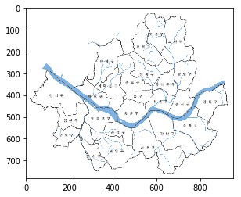


위의 서울시지도를 배경으로 하고 경도와 위도를 각각 x축 y축으로 놓아 산점도를 표시할 것이다. 그림상의 픽셀과 위도 경도의 위치를 맞추기 위하여 특수한 공식으로 위도와 경도값을 바꾼다.


```python
TotalData_sample_17 = TD_17.copy()
TotalData_sample_17['위도'] = ((max(TotalData_sample_17['위도'])-TotalData_sample_17['위도'])/
                          (max(TotalData_sample_17['위도'])-min(TotalData_sample_17['위도'])))*670+57
TotalData_sample_17['경도'] = ((TotalData_sample_17['경도']-min(TotalData_sample_17['경도']))/
                          (max(TotalData_sample_17['경도'])-min(TotalData_sample_17['경도'])))*815+90
TotalData_sample_17.head()
```


<div>
<style scoped>
    .dataframe tbody tr th:only-of-type {
        vertical-align: middle;
    }

    .dataframe tbody tr th {
        vertical-align: top;
    }

    .dataframe thead th {
        text-align: right;
    }
</style>
<table border="1" class="dataframe">
  <thead>
    <tr style="text-align: right;">
      <th></th>
      <th>구분</th>
      <th>대여소번호</th>
      <th>17_대여소명</th>
      <th>대여소 주소</th>
      <th>거치대수</th>
      <th>위도</th>
      <th>경도</th>
      <th>17년_대여건수</th>
      <th>17년_반납건수</th>
      <th>17년_회수율</th>
      <th>17년_하루평균대여</th>
    </tr>
  </thead>
  <tbody>
    <tr>
      <th>0</th>
      <td>마포구</td>
      <td>101</td>
      <td>(구)합정동 주민센터</td>
      <td>서울특별시 마포구 동교로8길 58</td>
      <td>5</td>
      <td>438.145101</td>
      <td>322.665758</td>
      <td>1865</td>
      <td>2128</td>
      <td>2.63</td>
      <td>10.30</td>
    </tr>
    <tr>
      <th>1</th>
      <td>마포구</td>
      <td>102</td>
      <td>망원역 1번출구 앞</td>
      <td>서울특별시 마포구 월드컵로 72</td>
      <td>20</td>
      <td>420.635035</td>
      <td>332.870873</td>
      <td>7492</td>
      <td>6758</td>
      <td>-7.34</td>
      <td>41.39</td>
    </tr>
    <tr>
      <th>2</th>
      <td>마포구</td>
      <td>103</td>
      <td>망원역 2번출구 앞</td>
      <td>서울특별시 마포구 월드컵로 79</td>
      <td>14</td>
      <td>423.487661</td>
      <td>333.698139</td>
      <td>5494</td>
      <td>5399</td>
      <td>-0.95</td>
      <td>30.35</td>
    </tr>
    <tr>
      <th>3</th>
      <td>마포구</td>
      <td>104</td>
      <td>합정역 1번출구 앞</td>
      <td>서울특별시 마포구 양화로 59</td>
      <td>13</td>
      <td>435.240807</td>
      <td>342.711209</td>
      <td>6147</td>
      <td>4876</td>
      <td>-12.71</td>
      <td>33.96</td>
    </tr>
    <tr>
      <th>4</th>
      <td>마포구</td>
      <td>105</td>
      <td>합정역 5번출구 앞</td>
      <td>서울특별시 마포구 양화로 48</td>
      <td>5</td>
      <td>436.932259</td>
      <td>342.361630</td>
      <td>3920</td>
      <td>3176</td>
      <td>-7.44</td>
      <td>21.66</td>
    </tr>
  </tbody>
</table>
</div>


```python
TotalData_sample_18 = TD_18.copy()
TotalData_sample_18['위도'] = ((max(TotalData_sample_18['위도'])-TotalData_sample_18['위도'])/
                          (max(TotalData_sample_18['위도'])-min(TotalData_sample_18['위도'])))*670+57
TotalData_sample_18['경도'] = ((TotalData_sample_18['경도']-min(TotalData_sample_18['경도']))/
                          (max(TotalData_sample_18['경도'])-min(TotalData_sample_18['경도'])))*815+90
TotalData_sample_18.head()
```


<div>
<style scoped>
    .dataframe tbody tr th:only-of-type {
        vertical-align: middle;
    }

    .dataframe tbody tr th {
        vertical-align: top;
    }

    .dataframe thead th {
        text-align: right;
    }
</style>
<table border="1" class="dataframe">
  <thead>
    <tr style="text-align: right;">
      <th></th>
      <th>구분</th>
      <th>대여소번호</th>
      <th>18_대여소명</th>
      <th>대여소 주소</th>
      <th>거치대수</th>
      <th>위도</th>
      <th>경도</th>
      <th>18년_대여건수</th>
      <th>18년_반납건수</th>
      <th>18년_회수율</th>
      <th>18년_하루평균대여</th>
    </tr>
  </thead>
  <tbody>
    <tr>
      <th>0</th>
      <td>마포구</td>
      <td>101</td>
      <td>(구)합정동 주민센터</td>
      <td>서울특별시 마포구 동교로8길 58</td>
      <td>5</td>
      <td>438.145101</td>
      <td>320.417756</td>
      <td>2263</td>
      <td>2247</td>
      <td>-0.16</td>
      <td>12.50</td>
    </tr>
    <tr>
      <th>1</th>
      <td>마포구</td>
      <td>102</td>
      <td>망원역 1번출구 앞</td>
      <td>서울특별시 마포구 월드컵로 72</td>
      <td>20</td>
      <td>420.635035</td>
      <td>330.524270</td>
      <td>8735</td>
      <td>8364</td>
      <td>-3.71</td>
      <td>48.26</td>
    </tr>
    <tr>
      <th>2</th>
      <td>마포구</td>
      <td>103</td>
      <td>망원역 2번출구 앞</td>
      <td>서울특별시 마포구 월드컵로 79</td>
      <td>14</td>
      <td>423.487661</td>
      <td>331.343542</td>
      <td>6111</td>
      <td>5748</td>
      <td>-3.63</td>
      <td>33.76</td>
    </tr>
    <tr>
      <th>3</th>
      <td>마포구</td>
      <td>104</td>
      <td>합정역 1번출구 앞</td>
      <td>서울특별시 마포구 양화로 59</td>
      <td>13</td>
      <td>435.240807</td>
      <td>340.269529</td>
      <td>5835</td>
      <td>5333</td>
      <td>-5.02</td>
      <td>32.24</td>
    </tr>
    <tr>
      <th>4</th>
      <td>마포구</td>
      <td>105</td>
      <td>합정역 5번출구 앞</td>
      <td>서울특별시 마포구 양화로 48</td>
      <td>5</td>
      <td>436.932259</td>
      <td>339.923327</td>
      <td>3692</td>
      <td>3047</td>
      <td>-6.45</td>
      <td>20.40</td>
    </tr>
  </tbody>
</table>
</div>


#### 이용건수와 대여소 수의 증가률 비교


```python
print('대여소 수')
print('2017년 : {}개'.format(len(list(TotalData_17.index)))) #대여소 수 
print('2018년 : {}개'.format(len(list(TotalData_18.index))),'\n')
print('대여소 수 증가률 : {}%'.format(round((len(list(TotalData_18.index))/len(list(TotalData_17.index))*100),2)))
print('-'*30,'\n')
print('이용건수')
print('2017년 : {}건'.format(sum(map(int,list(TotalData_17['17년_대여건수']))))) #이용건수
print('2018년 : {}건'.format(sum(map(int,list(TotalData_18['18년_대여건수'])))),'\n')
print('하루 평균 이용건수')
print('2017년 : {}건'.format(round(sum(map(int,list(TotalData_17['17년_대여건수'])))/181,2))) #하루 평균 이용건수
print('2018년 : {}건'.format(round(sum(map(int,list(TotalData_18['18년_대여건수'])))/181,2)),'\n')
print('이용건수 증가률 : {}%'.format(round((sum(map(int,list(TotalData_18['18년_대여건수'])))/sum(map(int,list(TotalData_17['17년_대여건수'])))*100),2)))
```

    대여소 수
    2017년 : 683개
    2018년 : 1162개 
    
    대여소 수 증가률 : 170.13%
    ------------------------------ 
    
    이용건수
    2017년 : 1584740건
    2018년 : 3369049건 
    
    하루 평균 이용건수
    2017년 : 8755.47건
    2018년 : 18613.53건 
    
    이용건수 증가률 : 212.59%
    

위의 변환된 좌표값으로 지도에 대여소의 위치를 표시한다.


```python
# 17년도 대여소 위치
t = TotalData_sample_17['위도']
y = TotalData_sample_17['경도']
plt.figure(figsize=(19,12))
plt.scatter(y,t,s=150)
plt.xlabel('longitude')
plt.ylabel('latitude')
plt.title('bike stop(2017)')
plt.imshow(img)

# 18년도 대여소 위치
t = TotalData_sample_18['위도']
y = TotalData_sample_18['경도']
plt.figure(figsize=(19,12))
plt.scatter(y,t,s=150)
plt.xlabel('longitude')
plt.ylabel('latitude')
plt.title('bike stop(2018)')
plt.imshow(img)
plt.show()
```


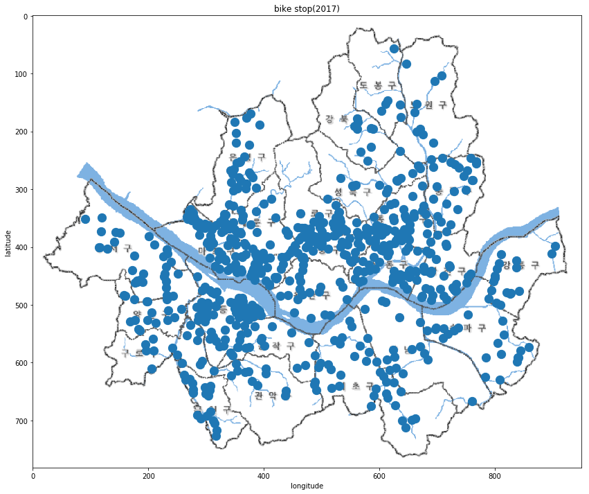


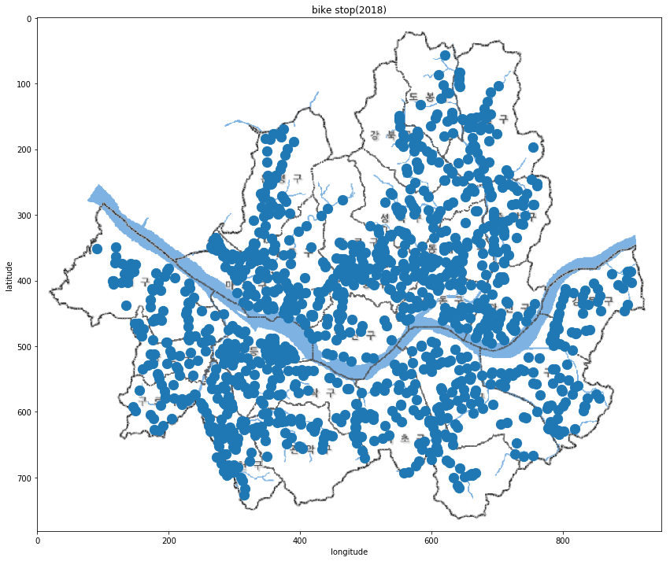


        그림만봐도 알 수 있듯이 지난 1년간 자전거 대여소의 수는 큰폭으로 늘었다. 실제로 자전거 대여소의 수는 전년대비 약 170.13% 증가하였다. 그림에서 보면 알 수 있듯이 2017년에 마포구, 서대문구, 중구, 동대문구, 용산구, 성동구등 중앙에 밀집되어 분포 되어있었다. 하지만 2018년에는 상대적으로 적었던 강북, 강남지역 까지 고르게 퍼진것을 알 수 있다.

        서울시에서 자전거 대여소의 수를 늘려 시민들이 따릉이를 수월하게 이용할 수 있도록 하였다는 것을 알 수 있다. 하지만 이용건수는 전년대비 약 212.59% 증가하였다. 대여소의 수보다 더 큰 폭으로 증가한 것이다. 그렇기 때문에 이러한 서울시의 노력에도 불구하고 자전거 부족현상을 해결하기는 역부족이었을 것이다. 

### 년도별 최대, 최소 대여건수 대여소 비교

#### 년도별 대여건수 상위 5개 대여소


```python
TotalData_17 = TotalData_17.sort_values(by="17년_대여건수", ascending=False)
bmax_stop_17 = TotalData_17.iloc[0:10,[2,6]].reset_index(drop='True')
TotalData_18 = TotalData_18.sort_values(by="18년_대여건수", ascending=False)
bmax_stop_18 = TotalData_18.iloc[0:10,[2,6]].reset_index(drop='True')
Total_bmax = pd.concat([bmax_stop_17, bmax_stop_18], axis = 1)

Total_bmax.head()
```


<div>
<style scoped>
    .dataframe tbody tr th:only-of-type {
        vertical-align: middle;
    }

    .dataframe tbody tr th {
        vertical-align: top;
    }

    .dataframe thead th {
        text-align: right;
    }
</style>
<table border="1" class="dataframe">
  <thead>
    <tr style="text-align: right;">
      <th></th>
      <th>17_대여소명</th>
      <th>경도</th>
      <th>18_대여소명</th>
      <th>경도</th>
    </tr>
  </thead>
  <tbody>
    <tr>
      <th>0</th>
      <td>여의나루역 1번출구 앞</td>
      <td>126.932098</td>
      <td>여의나루역 1번출구 앞</td>
      <td>126.932098</td>
    </tr>
    <tr>
      <th>1</th>
      <td>뚝섬유원지역 1번출구 앞</td>
      <td>127.067192</td>
      <td>뚝섬유원지역 1번출구 앞</td>
      <td>127.067192</td>
    </tr>
    <tr>
      <th>2</th>
      <td>홍대입구역 2번출구 앞</td>
      <td>126.923805</td>
      <td>홍대입구역 2번출구 앞</td>
      <td>126.923805</td>
    </tr>
    <tr>
      <th>3</th>
      <td>마포구민체육센터 앞</td>
      <td>126.898018</td>
      <td>롯데월드타워(잠실역2번출구 쪽)</td>
      <td>127.100960</td>
    </tr>
    <tr>
      <th>4</th>
      <td>합정역 7번출구 앞</td>
      <td>126.912827</td>
      <td>고속터미널역 8-1번 8-2번 출구 사이</td>
      <td>127.003944</td>
    </tr>
  </tbody>
</table>
</div>


#### 년도별 대여건수 하위 5개 대여소


```python
TotalData_17 = TotalData_17.sort_values(by="17년_대여건수", ascending=True)
bmin_stop_17 =  TotalData_17.iloc[0:10,[2,6]].reset_index(drop='True')
TotalData_18 = TotalData_18.sort_values(by="18년_대여건수", ascending=True)
bmin_stop_18 = TotalData_18.iloc[0:10,[2,6]].reset_index(drop='True')
Total_bmin = pd.concat([bmin_stop_17, bmin_stop_18], axis = 1)

Total_bmin.head()
```


<div>
<style scoped>
    .dataframe tbody tr th:only-of-type {
        vertical-align: middle;
    }

    .dataframe tbody tr th {
        vertical-align: top;
    }

    .dataframe thead th {
        text-align: right;
    }
</style>
<table border="1" class="dataframe">
  <thead>
    <tr style="text-align: right;">
      <th></th>
      <th>17_대여소명</th>
      <th>경도</th>
      <th>18_대여소명</th>
      <th>경도</th>
    </tr>
  </thead>
  <tbody>
    <tr>
      <th>0</th>
      <td>신대방삼거리역 3번출구쪽</td>
      <td>126.927094</td>
      <td>탑성마을입구</td>
      <td>127.055885</td>
    </tr>
    <tr>
      <th>1</th>
      <td>마천CU우방점 앞</td>
      <td>127.152504</td>
      <td>안골마을입구</td>
      <td>127.064453</td>
    </tr>
    <tr>
      <th>2</th>
      <td>에이스하이엔드타워8차 앞</td>
      <td>126.884941</td>
      <td>능안마을입구</td>
      <td>127.067101</td>
    </tr>
    <tr>
      <th>3</th>
      <td>거여역 8번출구 뒤</td>
      <td>127.143822</td>
      <td>강일동 에너지 마루</td>
      <td>127.163460</td>
    </tr>
    <tr>
      <th>4</th>
      <td>사육신공원앞</td>
      <td>126.948059</td>
      <td>역삼동 sk뷰 501동앞</td>
      <td>127.050468</td>
    </tr>
  </tbody>
</table>
</div>


```python
# 17년 상반기 대여건수
t = TotalData_sample_17['위도']
y = TotalData_sample_17['경도']
z = (TotalData_sample_17['17년_대여건수']/max(TotalData_sample_17['17년_대여건수'])) #대여건수간의 상대적크기를 알수 있게한다.
k = TotalData_sample_17['17년_대여건수']/12 #원의크기를 줄여 보기 편하게 한다.
plt.figure(figsize=(19,12))
plt.scatter(y,t,s=k,c=z)
plt.colorbar()
plt.xlabel('longitude')
plt.ylabel('latitude')
plt.title('bike utilization(2017)')
plt.imshow(img)

# 18년 상반기 대여건수
t = TotalData_sample_18['위도']
y = TotalData_sample_18['경도']
z = (TotalData_sample_18['18년_대여건수']/max(TotalData_sample_18['18년_대여건수']))
k = TotalData_sample_18['18년_대여건수']/12
plt.figure(figsize=(19,12))
plt.scatter(y,t,s=k,c=z)
plt.colorbar()
plt.xlabel('longitude')
plt.ylabel('latitude')
plt.title('bike utilization(2018)')
plt.imshow(img)
plt.show()
```


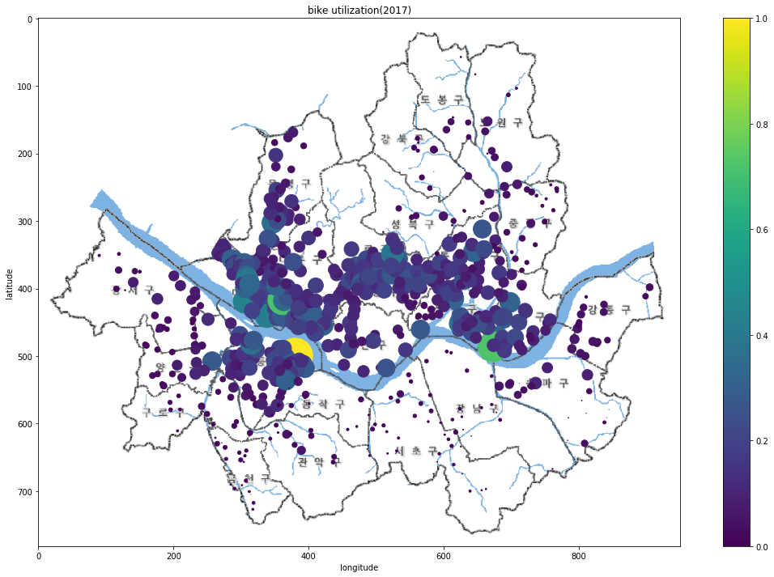


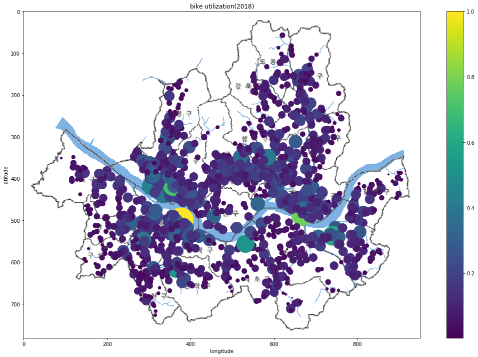


        * 17년, 18년에 대여건수를 보면 둘다 대부분 한강공원근처의 대여소들이 대여건수가 높았다.
        * 1년간 대여소의 수와 대여건수는 전반적으로  많이 늘었고 특히  강북과 강남, 외곽지역의 증가율이 가장크다.
        * 따릉이를 이용하는 수 많은 사람들중 다수가 한강공원 근처와 대헉가에서 이용하고 있다.
        * 대학교 근처에서 이용건수가 많은 것으로 보아 등하교시 이용한다고 추측할 수 있다.
        * 대여건수가 적은 곳은 대부분 서울외곽 지역으로 나타났다.
        * 서울중심에서 멀어질 수 록 자전거 이용률이 낮아지는 것을 알 수 있다.

### 년도별 회수율 비교


```python
TotalData_17 = TotalData_17.sort_values(by="17년_회수율", ascending=True)
return_17 =  TotalData_17.iloc[0:10,[2,8]].reset_index(drop='True')
TotalData_18 = TotalData_18.sort_values(by="18년_회수율", ascending=True)
return_18 =  TotalData_18.iloc[0:10,[2,8]].reset_index(drop='True')
Total_return_H = pd.concat([return_17, return_18], axis = 1)

Total_return_H.head()
```


<div>
<style scoped>
    .dataframe tbody tr th:only-of-type {
        vertical-align: middle;
    }

    .dataframe tbody tr th {
        vertical-align: top;
    }

    .dataframe thead th {
        text-align: right;
    }
</style>
<table border="1" class="dataframe">
  <thead>
    <tr style="text-align: right;">
      <th></th>
      <th>17_대여소명</th>
      <th>17년_반납건수</th>
      <th>18_대여소명</th>
      <th>18년_반납건수</th>
    </tr>
  </thead>
  <tbody>
    <tr>
      <th>0</th>
      <td>서울시립대 정문 앞</td>
      <td>4643</td>
      <td>여의도역 1번출구 옆</td>
      <td>3977</td>
    </tr>
    <tr>
      <th>1</th>
      <td>여의도역 1번출구 옆</td>
      <td>3999</td>
      <td>서울시립대 정문 앞</td>
      <td>4290</td>
    </tr>
    <tr>
      <th>2</th>
      <td>녹사평역1번출구</td>
      <td>2175</td>
      <td>양재역 11번 출구 앞</td>
      <td>2916</td>
    </tr>
    <tr>
      <th>3</th>
      <td>봉원고가차도 밑</td>
      <td>2471</td>
      <td>서울광장 옆</td>
      <td>6709</td>
    </tr>
    <tr>
      <th>4</th>
      <td>상암월드컵파크 1단지 교차로</td>
      <td>1704</td>
      <td>봉원고가차도 밑</td>
      <td>1411</td>
    </tr>
  </tbody>
</table>
</div>


```python
TotalData_17 = TotalData_17.sort_values(by="17년_회수율", ascending=False)
return_17 =  TotalData_17.iloc[0:10,[2,8]].reset_index(drop='True')
TotalData_18 = TotalData_18.sort_values(by="18년_회수율", ascending=False)
return_18 =  TotalData_18.iloc[0:10,[2,8]].reset_index(drop='True')
Total_return_L = pd.concat([return_17, return_18], axis = 1)

Total_return_L.head()
```


<div>
<style scoped>
    .dataframe tbody tr th:only-of-type {
        vertical-align: middle;
    }

    .dataframe tbody tr th {
        vertical-align: top;
    }

    .dataframe thead th {
        text-align: right;
    }
</style>
<table border="1" class="dataframe">
  <thead>
    <tr style="text-align: right;">
      <th></th>
      <th>17_대여소명</th>
      <th>17년_반납건수</th>
      <th>18_대여소명</th>
      <th>18년_반납건수</th>
    </tr>
  </thead>
  <tbody>
    <tr>
      <th>0</th>
      <td>홍대입구역 2번출구 앞</td>
      <td>19618</td>
      <td>홍대입구역 2번출구 앞</td>
      <td>25657</td>
    </tr>
    <tr>
      <th>1</th>
      <td>CJ 드림시티</td>
      <td>11031</td>
      <td>뚝섬유원지역 1번출구 앞</td>
      <td>26706</td>
    </tr>
    <tr>
      <th>2</th>
      <td>마포구민체육센터 앞</td>
      <td>12578</td>
      <td>CJ 드림시티</td>
      <td>13039</td>
    </tr>
    <tr>
      <th>3</th>
      <td>뚝섬유원지역 1번출구 앞</td>
      <td>18737</td>
      <td>마포구민체육센터 앞</td>
      <td>15547</td>
    </tr>
    <tr>
      <th>4</th>
      <td>서빙고동 주민센터 앞</td>
      <td>7661</td>
      <td>노량진역 5번출구</td>
      <td>9593</td>
    </tr>
  </tbody>
</table>
</div>


```python
# 17년도 회수율
t = TotalData_sample_17['위도']
y = TotalData_sample_17['경도']
z = TotalData_sample_17['17년_회수율']
plt.figure(figsize=(19,12))
plt.scatter(y,t,s=150,c=z)
plt.colorbar()
plt.xlabel('longitude')
plt.ylabel('latitude')
plt.title('bike return rate(2017)')
plt.imshow(img)

# 18년도 회수율
t = TotalData_sample_18['위도']
y = TotalData_sample_18['경도']
z = TotalData_sample_18['18년_회수율']
plt.figure(figsize=(19,12))
plt.scatter(y,t,s=150,c=z)
plt.colorbar()
plt.xlabel('longitude')
plt.ylabel('latitude')
plt.title('bike return rate(2018)')
plt.imshow(img)
plt.show()
```


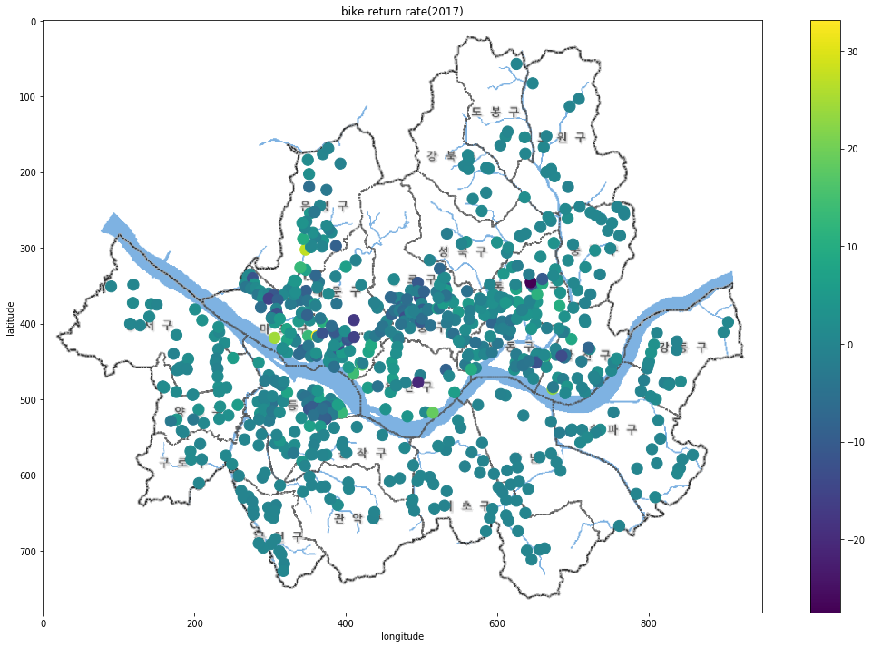


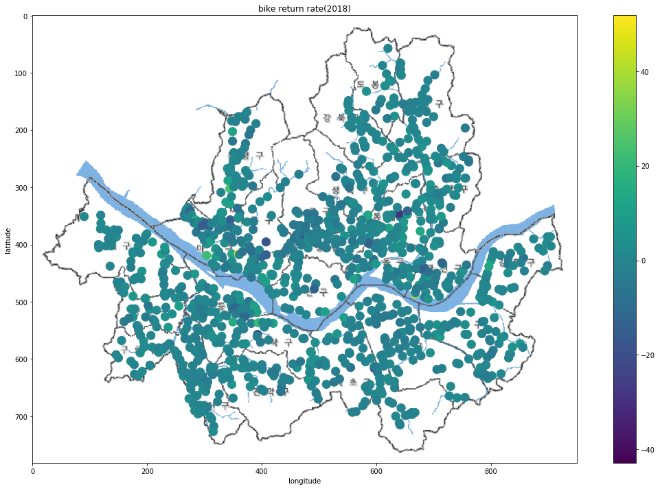


        회수율이 낮은 대여소를 살펴보면 주로 학교나 회사가 밀집되어 있는 곳이었고 회수율이 높은 대여소를 살펴보면 주로 주거지역이었다. 그리고 지도를 보면 알 수 있듯이 1년간 회수율이 0에 가까운 곳의 분포가 더 높아 졌다는것을 알 수 있다.

        * 이를 통해 주로 퇴근을 하거나 하교할때 따릉이를 많이 이용한다고 추측할 수 있다.
        * 1년간 대여소간의 자전거 회수에 대한 문제가 많이 해소됬다는 것을 알 수 있다.

### 2. 시간대별 대여소 이용건수 데이터 분석

### 시간대별 이용건수 비교 분석

위의 서울시지도를 배경으로 하고 경도와 위도를 각각 x축 y축으로 놓아 산점도를 표시할 것이다. 그림상의 픽셀과 위도 경도의 위치를 맞추기 위하여 특수한 공식으로 위도와 경도값을 바꾼다.


```python
TotalData_sample = TotalData.copy()
TotalData_sample['위도'] = ((max(TotalData_sample['위도'])-TotalData_sample['위도'])/
                          (max(TotalData_sample['위도'])-min(TotalData_sample['위도'])))*670+57
TotalData_sample['경도'] = ((TotalData_sample['경도']-min(TotalData_sample['경도']))/
                          (max(TotalData_sample['경도'])-min(TotalData_sample['경도'])))*815+90
```


```python
# 새벽시간대 이용경향 비교
t = TotalData_sample['위도']
y = TotalData_sample['경도']
z = (TotalData_sample['시간당이용건수(새벽)']/max(TotalData_sample['시간당이용건수(새벽)']))
k = TotalData_sample['시간당이용건수(새벽)']
plt.figure(figsize=(19,12))
plt.scatter(y,t,s=k,c=z) #원의크기는 이용건수의 절대적인 크기, 원의색은 상대적인 크기를 나타낸다.
plt.colorbar()
plt.xlabel('longitude')
plt.ylabel('latitude')
plt.title('bike utilization(dawn)')
plt.imshow(img)

# 출근시간대 이용경향 비교
t = TotalData_sample['위도']
y = TotalData_sample['경도']
z = (TotalData_sample['시간당이용건수(출근)']/max(TotalData_sample['시간당이용건수(출근)']))
k = TotalData_sample['시간당이용건수(출근)']
plt.figure(figsize=(19,12))
plt.scatter(y,t,s=k,c=z)
plt.colorbar()
plt.xlabel('longitude')
plt.ylabel('latitude')
plt.title('bike utilization(work)')
plt.imshow(img)

# 낮시간대 이용경향 비교
t = TotalData_sample['위도']
y = TotalData_sample['경도']
z = (TotalData_sample['시간당이용건수(낮)']/max(TotalData_sample['시간당이용건수(낮)']))
k = TotalData_sample['시간당이용건수(낮)']
plt.figure(figsize=(19,12))
plt.scatter(y,t,s=k,c=z)
plt.colorbar()
plt.xlabel('longitude')
plt.ylabel('latitude')
plt.title('bike utilization(day)')
plt.imshow(img)

# 퇴근시간대 이용경향 비교
t = TotalData_sample['위도']
y = TotalData_sample['경도']
z = (TotalData_sample['시간당이용건수(퇴근)']/max(TotalData_sample['시간당이용건수(퇴근)']))
k = TotalData_sample['시간당이용건수(퇴근)']
plt.figure(figsize=(19,12))
plt.scatter(y,t,s=k,c=z)
plt.colorbar()
plt.xlabel('longitude')
plt.ylabel('latitude')
plt.title('bike utilization(home)')
plt.imshow(img)

# 밤시간대 이용경향 비교
t = TotalData_sample['위도']
y = TotalData_sample['경도']
z = (TotalData_sample['시간당이용건수(밤)']/max(TotalData_sample['시간당이용건수(밤)']))
k = TotalData_sample['시간당이용건수(밤)']
plt.figure(figsize=(19,12))
plt.scatter(y,t,s=k,c=z)
plt.colorbar()
plt.xlabel('longitude')
plt.ylabel('latitude')
plt.title('bike utilization(night)')
plt.imshow(img)
plt.show()
```


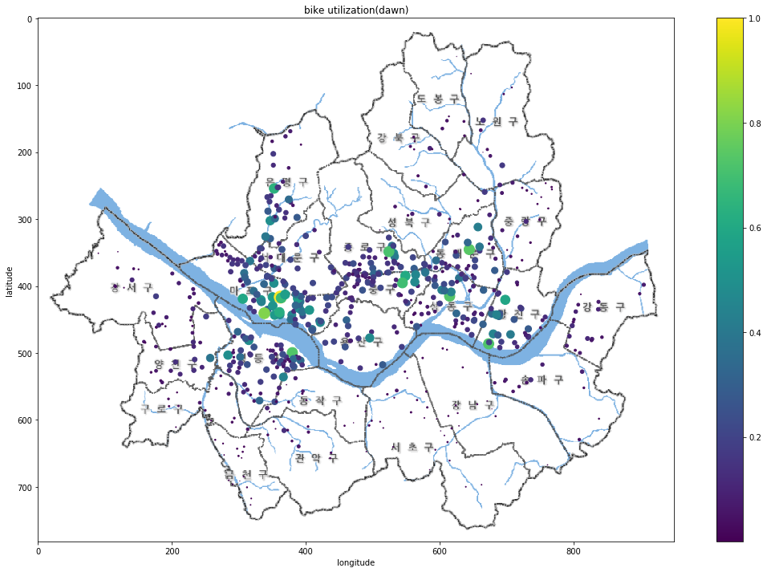


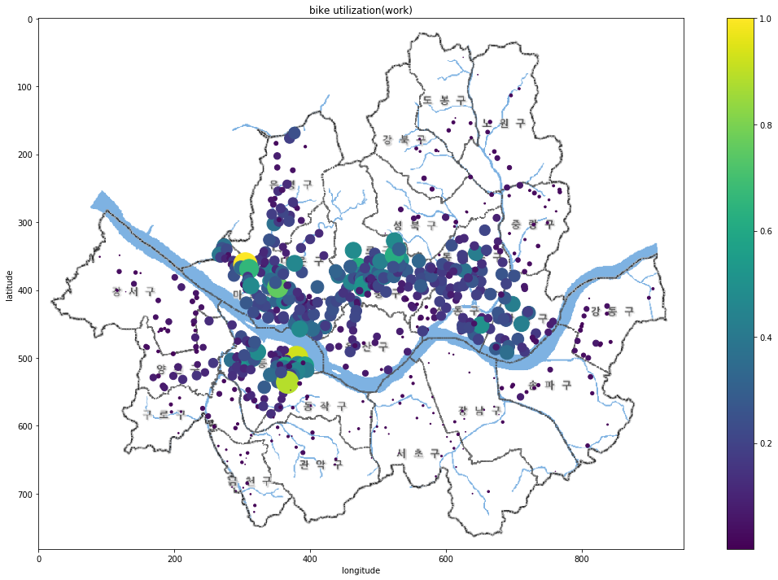


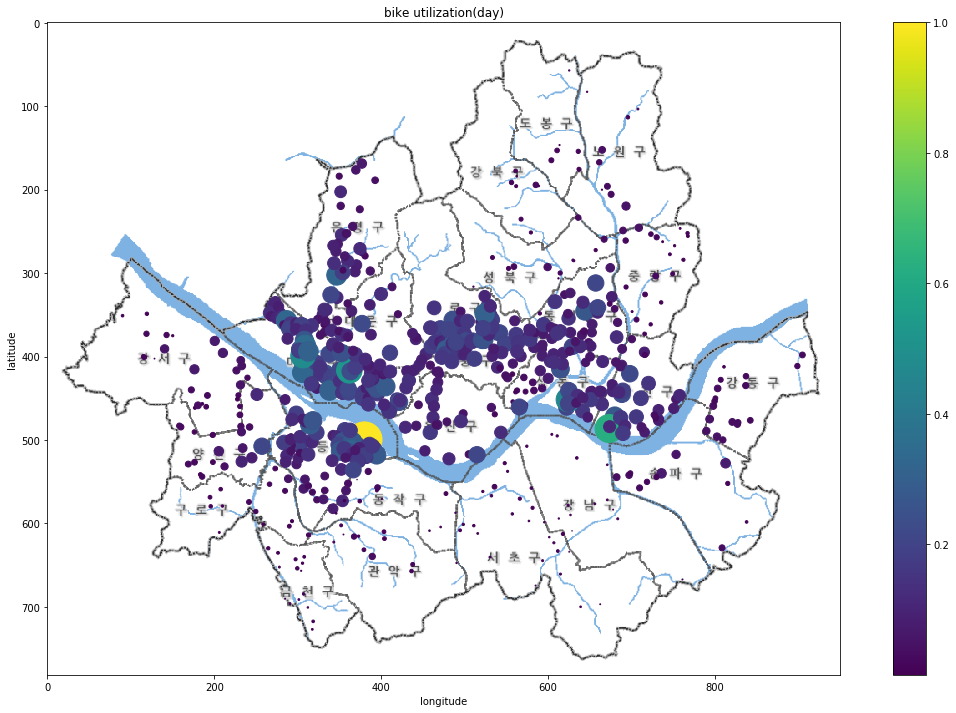


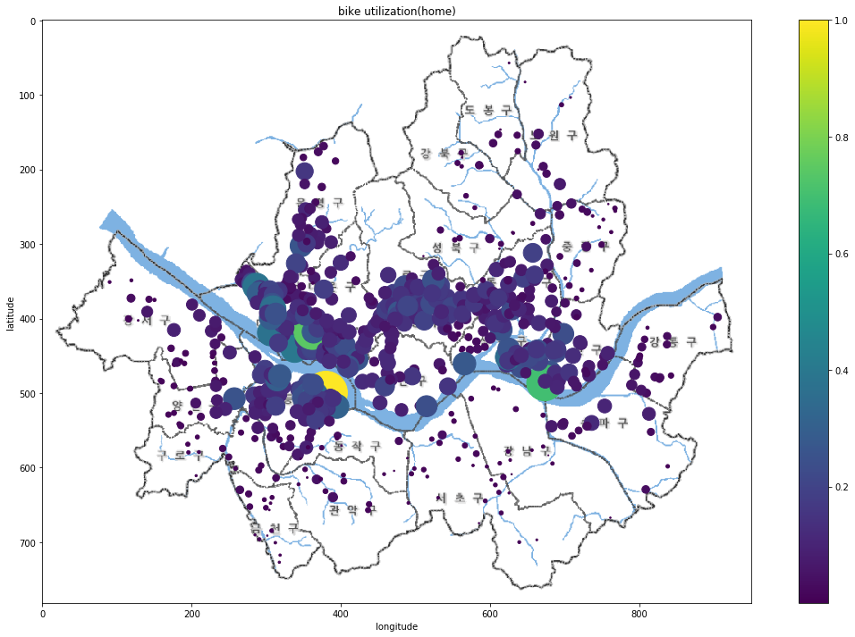


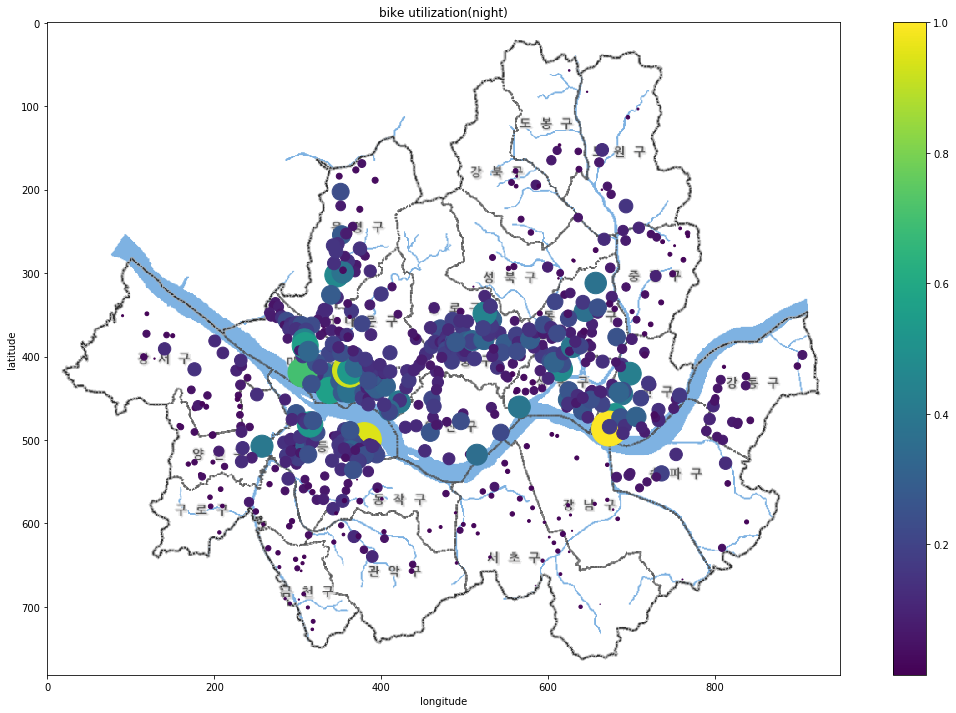


* 먼저 새벽부터 살펴보면 다른 시간대에 비하여 이용건수가 가장 적았다. 그 중 다른대여소에 비하여 상대적으로 많은 곳은 주로 술집이나 유흡업소들이 몰려있는 번화가 근처였다. 새벽시간까지 번화가에서 놀다가 대중교통이 끊겼을때 이동수단으로 따릉이를 이용한다고 추측해 볼 수 있다. 
* 출근시간에는 새벽에 비해 이용량이 많이 늘었다는 것을 알 수 있다. 그리고 새벽시간대와 다르게 회사나 학교근처의 이용량이 큰폭으로 증가했고 주거지역 또한 이용량이 증가한 것을 볼 수 있다.
* 낮에는 이용건수는 출근시간과 비슷했다. 하지만 다른점이 있다면 이용률이 특정지역으로 몰리기 보다는 전체적으로 고르게 퍼진것을 알 수 있다.
* 퇴근시간에는 다른 시간보다 상대적으로 많은 이용률을 보였다. 전반적으로 고르게 이용량이 늘었고 회사가 몰려있는 곳과 한강공원근처에서 전 시간대에 비해 이용률이 크게 증가 한것으로 보아 퇴근을 할때 이용하는 사람들이 많고, 퇴근후 한강공원근처에서 따릉이를 타며 여가생활을 즐기는 사람들이 많다고 추측할 수 있다.
* 밤에는 퇴근시간대와 비슷한 양상이지만 회사근처의 이용률이 줄어들고 공원과 주거지역, 번화가로 이용건수가 집중되는 양상을 보이고 있다.

### 장소의 특징별 이용건수 비교 분석

장소를 '서울시 지적편집도'를 기준으로 dawntown, park, residential, university, business area로 나누고 해당하는 대여소중 대여건수가 일정량 이상 되는 대여소의 24시간동안 이용건수를 한 시간마다 비교한다.


```python
# Downtown의 시간당 이용경향 비교
TD_time1 = TD_time[TD_time["대여소번호"] == 811].copy()
q = int(sum(TD_time1['이용건수']))
TD_time1['이용건수'] =  list(map(lambda x : (x/q)*100 ,TD_time1['이용건수']))
TD_time2 = TD_time[TD_time["대여소번호"] == 810].copy()
q = int(sum(TD_time2['이용건수']))
TD_time2['이용건수'] =  list(map(lambda x : (x/q)*100 ,TD_time2['이용건수']))
TD_time3 = TD_time[TD_time["대여소번호"] == 115].copy()
q = int(sum(TD_time3['이용건수']))
TD_time3['이용건수'] =  list(map(lambda x : (x/q)*100 ,TD_time3['이용건수']))
TD_time4 = TD_time[TD_time["대여소번호"] == 114].copy()
q = int(sum(TD_time4['이용건수']))
TD_time4['이용건수'] =  list(map(lambda x : (x/q)*100 ,TD_time4['이용건수']))
TD_time5 = TD_time[TD_time["대여소번호"] == 128].copy()
q = int(sum(TD_time5['이용건수']))
TD_time5['이용건수'] =  list(map(lambda x : (x/q)*100 ,TD_time5['이용건수']))
TD_time_part = pd.concat([TD_time1,TD_time2,TD_time3,TD_time4,TD_time5])
TD_time_part.rename(columns={TD_time_part.columns[2] : 'Downtown', 
                          TD_time_part.columns[6] : 'Time', TD_time_part.columns[7] : '이용률'}, inplace=True) # 열의 이름을 바꾼다.
TD_time_pv = TD_time_part.pivot('Downtown', "Time", "이용률")
TD_time_pv.head()
plt.figure(figsize=(30,15))
sns.heatmap(TD_time_pv, annot=True, fmt=".0f")
plt.show()

# Park의 시간당 이용경향 비교
TD_time1 = TD_time[TD_time["대여소번호"] == 207].copy()
q = int(sum(TD_time1['이용건수']))
TD_time1['이용건수'] =  list(map(lambda x : (x/q)*100 ,TD_time1['이용건수']))
TD_time2 = TD_time[TD_time["대여소번호"] == 511].copy()
q = int(sum(TD_time2['이용건수']))
TD_time2['이용건수'] =  list(map(lambda x : (x/q)*100 ,TD_time2['이용건수']))
TD_time3 = TD_time[TD_time["대여소번호"] == 152].copy()
q = int(sum(TD_time3['이용건수']))
TD_time3['이용건수'] =  list(map(lambda x : (x/q)*100 ,TD_time3['이용건수']))
TD_time4 = TD_time[TD_time["대여소번호"] == 502].copy()
q = int(sum(TD_time4['이용건수']))
TD_time4['이용건수'] =  list(map(lambda x : (x/q)*100 ,TD_time4['이용건수']))
TD_time5 = TD_time[TD_time["대여소번호"] == 260].copy()
q = int(sum(TD_time5['이용건수']))
TD_time5['이용건수'] =  list(map(lambda x : (x/q)*100 ,TD_time5['이용건수']))
TD_time_part = pd.concat([TD_time1,TD_time2,TD_time3,TD_time4,TD_time5])
TD_time_part.rename(columns={TD_time_part.columns[2] : 'Park', 
                          TD_time_part.columns[6] : 'Time', TD_time_part.columns[7] : '이용률'}, inplace=True) # 열의 이름을 바꾼다.
TD_time_pv = TD_time_part.pivot('Park', "Time", "이용률")
TD_time_pv.head()
plt.figure(figsize=(30,15))
sns.heatmap(TD_time_pv, annot=True, fmt=".0f")
plt.show()

# Residential의 시간당 이용경향 비교
TD_time1 = TD_time[TD_time["대여소번호"] == 144].copy()
q = int(sum(TD_time1['이용건수']))
TD_time1['이용건수'] =  list(map(lambda x : (x/q)*100 ,TD_time1['이용건수']))
TD_time2 = TD_time[TD_time["대여소번호"] == 103].copy()
q = int(sum(TD_time2['이용건수']))
TD_time2['이용건수'] =  list(map(lambda x : (x/q)*100 ,TD_time2['이용건수']))
TD_time3 = TD_time[TD_time["대여소번호"] == 922].copy()
q = int(sum(TD_time3['이용건수']))
TD_time3['이용건수'] =  list(map(lambda x : (x/q)*100 ,TD_time3['이용건수']))
TD_time4 = TD_time[TD_time["대여소번호"] == 536].copy()
q = int(sum(TD_time4['이용건수']))
TD_time4['이용건수'] =  list(map(lambda x : (x/q)*100 ,TD_time4['이용건수']))
TD_time5 = TD_time[TD_time["대여소번호"] == 906].copy()
q = int(sum(TD_time5['이용건수']))
TD_time5['이용건수'] =  list(map(lambda x : (x/q)*100 ,TD_time5['이용건수']))
TD_time_part = pd.concat([TD_time1,TD_time2,TD_time3,TD_time4,TD_time5])
TD_time_part.rename(columns={TD_time_part.columns[2] : 'Residential', 
                          TD_time_part.columns[6] : 'Time', TD_time_part.columns[7] : '이용률'}, inplace=True) # 열의 이름을 바꾼다.
TD_time_pv = TD_time_part.pivot('Residential', "Time", "이용률")
TD_time_pv.head()
plt.figure(figsize=(30,15))
sns.heatmap(TD_time_pv, annot=True, fmt=".0f")
plt.show()

# University의 시간당 이용경향 비교
TD_time1 = TD_time[TD_time["대여소번호"] == 358].copy()
q = int(sum(TD_time1['이용건수']))
TD_time1['이용건수'] =  list(map(lambda x : (x/q)*100 ,TD_time1['이용건수']))
TD_time2 = TD_time[TD_time["대여소번호"] == 141].copy()
q = int(sum(TD_time2['이용건수']))
TD_time2['이용건수'] =  list(map(lambda x : (x/q)*100 ,TD_time2['이용건수']))
TD_time3 = TD_time[TD_time["대여소번호"] == 623].copy()
q = int(sum(TD_time3['이용건수']))
TD_time3['이용건수'] =  list(map(lambda x : (x/q)*100 ,TD_time3['이용건수']))
TD_time4 = TD_time[TD_time["대여소번호"] == 639].copy()
q = int(sum(TD_time4['이용건수']))
TD_time4['이용건수'] =  list(map(lambda x : (x/q)*100 ,TD_time4['이용건수']))
TD_time5 = TD_time[TD_time["대여소번호"] == 634].copy()
q = int(sum(TD_time5['이용건수']))
TD_time5['이용건수'] =  list(map(lambda x : (x/q)*100 ,TD_time5['이용건수']))
TD_time_part = pd.concat([TD_time1,TD_time2,TD_time3,TD_time4,TD_time5])
TD_time_part.rename(columns={TD_time_part.columns[2] : 'University', 
                          TD_time_part.columns[6] : 'Time', TD_time_part.columns[7] : '이용률'}, inplace=True) # 열의 이름을 바꾼다.
TD_time_pv = TD_time_part.pivot('University', "Time", "이용률")
TD_time_pv.head()
plt.figure(figsize=(30,15))
sns.heatmap(TD_time_pv, annot=True, fmt=".0f")
plt.show()

# Business area의 시간당 이용경향 비교
TD_time1 = TD_time[TD_time["대여소번호"] == 316].copy()
q = int(sum(TD_time1['이용건수']))
TD_time1['이용건수'] =  list(map(lambda x : (x/q)*100 ,TD_time1['이용건수']))
TD_time2 = TD_time[TD_time["대여소번호"] == 310].copy()
q = int(sum(TD_time2['이용건수']))
TD_time2['이용건수'] =  list(map(lambda x : (x/q)*100 ,TD_time2['이용건수']))
TD_time3 = TD_time[TD_time["대여소번호"] == 321].copy()
q = int(sum(TD_time3['이용건수']))
TD_time3['이용건수'] =  list(map(lambda x : (x/q)*100 ,TD_time3['이용건수']))
TD_time4 = TD_time[TD_time["대여소번호"] == 309].copy()
q = int(sum(TD_time4['이용건수']))
TD_time4['이용건수'] =  list(map(lambda x : (x/q)*100 ,TD_time4['이용건수']))
TD_time5 = TD_time[TD_time["대여소번호"] == 331].copy()
q = int(sum(TD_time5['이용건수']))
TD_time5['이용건수'] =  list(map(lambda x : (x/q)*100 ,TD_time5['이용건수']))
TD_time_part = pd.concat([TD_time1,TD_time2,TD_time3,TD_time4,TD_time5])
TD_time_part.rename(columns={TD_time_part.columns[2] : 'Business area', 
                          TD_time_part.columns[6] : 'Time', TD_time_part.columns[7] : '이용률'}, inplace=True) # 열의 이름을 바꾼다.
TD_time_pv = TD_time_part.pivot('Business area', "Time", "이용률")
TD_time_pv.head()
plt.figure(figsize=(30,15))
sns.heatmap(TD_time_pv, annot=True, fmt=".0f")
plt.show()
```


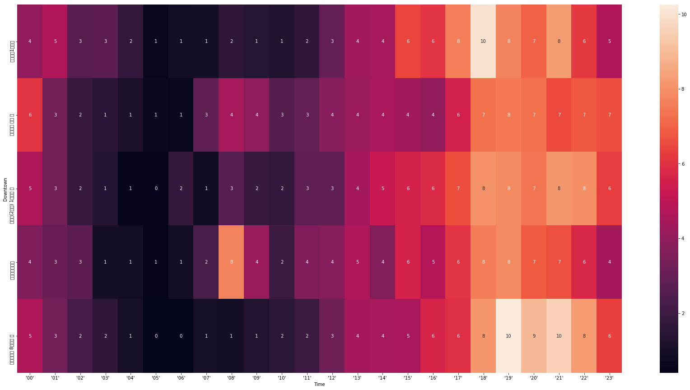


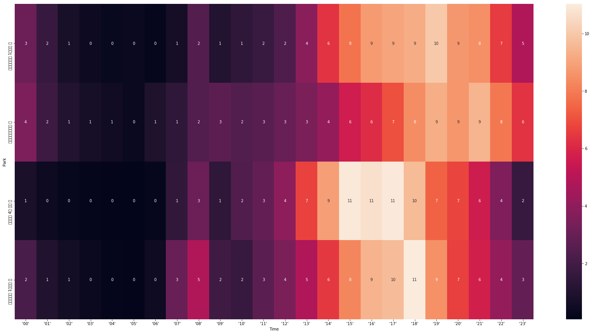


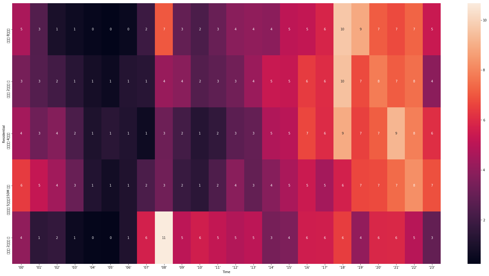


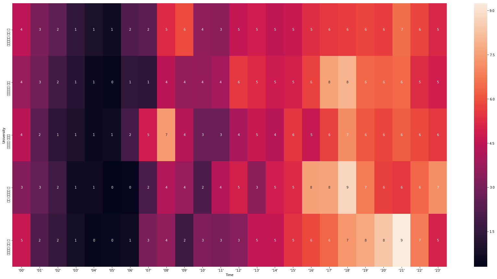


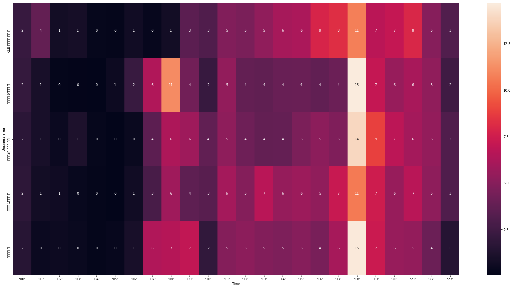


* Downtown은 18시이후에 이용량이 대부분 몰려 있는 것으로 나타났다. 주로 유흥업소들이 여는 시간대에 이용량이 많고 그외의 시간에는 상대적으로 적은것을 알 수 있다.
* Park는 오전과 오후의 이용률 차이가 매우 컸다. 오전에는 이용량이 적은 반면 오후가 되고 특히 퇴근시간 근처에 이용량이 매우 많았다. 
* Residential은 이용량이 출근시간과 저녁시간에 몰려있었다. 출근을 할때 집에서 나와 이용을 하고 퇴근하고 여가생활로서 즐기는 사람들이 많다고 볼 수 있다.
* University는 이용건수가 특정 시간대에 몰리지 않고 전체적으로 가장 고르게 퍼져 있었다. 그리고 다른 장소에 비해 낮시간에 이용률이 높았다. 대학생들이 주로 등하교하는 시간대가 낮시간이라 그렇다고 추측 해볼 수 있다. 
* Business area는 다른 시간대에 비해 이용률이 18시에 크게 치우쳐있고 나머지 시간대에는 매우 낮은 이용률이 나타나는 것을 알 수 있다. 주로 직장인들이 퇴근시간에 이용하고 다른 시간대에는 잘 이용하지 않는 것이라고 볼 수 있다.

## (6) 결론 

       지난 1년간 이용건수가 212.59%증가한거에 비하여 대여소 수는 170.13%밖에 늘지않았다. 지속적인 대여소의 증가가 필요 할 것이다. 대여소는 주로 한강공원, 대학가 근처와 같이 이용건수가 많은곳을 위주로 늘어나야 할 것이다. 대부분 서울 외곽지역보다 중심부에서 이용건수가 훨씬 많았기 때문에 1년간 중심에서 외곽지역으로 대여소를 늘리는 사업에 집중했다면 이제는 다시 중심부에 부족한 지역을 더 신경쓸 필요가 있다. 
       
       회수율을 살펴보면 번화가나 공원은 자체적으로 회수를 잘 하고 있는 것으로 나타나지만 학교나 회사근처에서는 회수율이 매우 낮게 나온것을 볼 수 있다. 위에서 살펴보았듯이 출근으로 따릉이를 이용하여 해당지역에 반납하는 경우에 비해 퇴근이나 하교시에 대여만 하는 경우가 훨씬 많았기 때문이라는 것을 알 수 있다. 그리고 이에 상응하는 결과로 주거지역에서 회수율이 높게 나오는것을 볼 수 있다. 이 또한 퇴근이나 하교시에 타고 온 자전거들이 쌓여 있는 현상이라는 것을 알 수 있다. 따라서 자전거 분배팀은 퇴근시간전에 주거지역에 쌓여있는 자전거들을 학교나 회사근처로 가져다 놓아야 할 것이다.
    
    그 다음으로 장소특징별 가장 많이 이용되는 시간을 살펴보면
        - 번화가 : 18시~02시
        - 공원 : 15시~23시
        - 주거지역 : 08시~09시, 18시~22시
        - 대학가 : 14시~24시
        - 회사근처 : 18시~20시
    로 나타나게 된다. 지금까지 얻은 정보를 통합하여 효과적인 따릉이 분배 방법을 생각해 보면 아래와 같다.
    
    1. 새벽시간 대에 오전이용량이 적은 공원, 번화가에 있는 자전거들을 주거지역, 대학가, 회사근처 순으로 분배한다.
    2. 출근시간이 끝나면 오후이용량이 적은 주거지역, 회사근처에있는 자전거들을 대학가, 공원 순으로 분배한다.
    3. 퇴근시간이 되기전부터 주거지역에 있는 자전거들을 회사근처, 대학가, 번화가 순으로 분배한다.(주거지역은 퇴근시간이후에 자체적으로 회수
       되기때문에 따로 분배 해줄 필요가 없다.)
    4. 퇴근시간이 끝났으면 회사근처에 있는 자전거들을 번화가, 공원 순으로 분배한다.
    5. 지금까지의 루틴을 반복한다.
    
    위와 같은 방법으로 따릉이를 분배한다면 시민들의 편의와 공공자전거 사업의 이익 창출의 두마리 토끼를 다 잡을 수 있게 될 것이다.

## (7) 참고문헌

- "파이썬으로 데이터 주무르기 독특한 예제를 통해 배우는 데이터 분석 입문", 민형기 지음, 비제이퍼블릭, 2017년 12월 29일 출간<br>


- "점프 투 파이썬", 박응용 지음, 이지스퍼블리싱, 2016년 06월 03일 출간<br>


- 정부 3.0 공공 데이터<br>
http://www.data.go.kr/


- 서울시 열린 데이터 광장<br>
http://data.seoul.go.kr/


- 서울시설공단 페이지<br>
http://www.sisul.or.kr/open_content/main/


- 서울지도<br>
http://gis.seoul.go.kr/


- 위키피디아<br>
https://www.wikipedia.org/


- 코딩도장<br>
https://dojang.io/


- 위키독스<br>
https://wikidocs.net/book/1


- Welcome to Dr.Sungwon('Python 질의응답'게시판)<br>
http://mobilelab.khu.ac.kr/webpythonbbs/


- PinkWink<br>
https://pinkwink.kr/


- GitHub<br>
https://github.com/github


- matplotlib<br>
https://matplotlib.org/


- pandas<br>
https://pandas.pydata.org/
