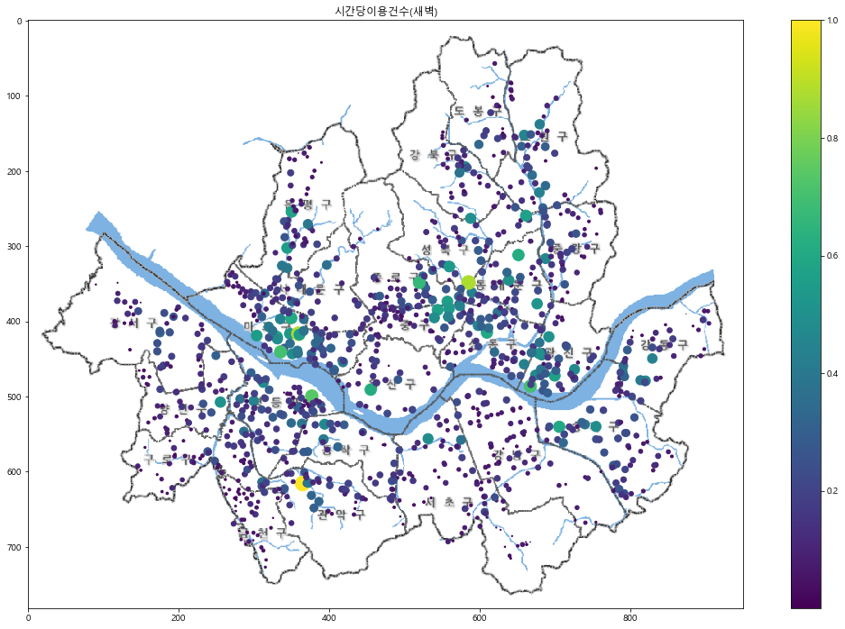

### 경희대학교 산업경영공학과 김태호(2015100915)

# 지난 1년간 서울시 공공자전거 대여소별 이용 분석 

## (1) 주제 선정 이유

  서울시를 돌아다니다보면 따릉이를 타고있는 사람을 보거나 진열된 따릉이를 보거나 대여소를 보는등 서욿시에서 하는 공공자전거 사업인 따릉이를 쉽게 볼 수 있다. 따릉이는 서울시의 친환경사업과 함께 시민들의 더욱더 편한 이동수단을 제공하기 위해 2015년부터 현재까지 계속 이루어지고 있는 사업이다. 실제로 시민들은 가까운거리를 가거나 출퇴근, 산책, 운동을 하는 등 여러 방면에서 따릉이를 이용하고 있다.<br>
  과거에 비해 점점 좋아지고 있기는 하지만 여전히 이용자에 비해 자전거의 수가 턱없이 부족한 실정이다. 이러한 문제를 해결하기 위해서 서울시는 몰려있는 따릉이 부족한곳에 분배시켜주는 따릉이 분배팀을 운영하고 있다. 따릉이분배팀의 원활한 운영을 위해서 자전거를 시간대별, 위치별 이용량을 분석하여 어느곳이 부족한지 알아보고 자전거를 효과적으로 배치해야 한다. 지금부터 서울시에서 제공 따릉이에 관련 데이터를 이용하여 시민들의 이용경향을 분석하고 어디가 언제 부족한지를 분석하여 어떻게 따릉이를 효과적으로 분배해야하는지 생각해 볼 것 이다.

## (2) 가설 정의

지난 1년간 서울시 공공자전거를 대여소별 데이터로 분석하여 시민들의 이용경향을 분석하여 서울시 공공자전거 사업이 잘 운영될 수 있도록 효율적인 따릉이분배방법을 생각해 본다.

## (3) 인터넷을 통한 데이터 획득

- 정부 3.0 공공 데이터 : http://www.data.go.kr/


- 서울시 열린 데이터 광장 : http://data.seoul.go.kr/

위의 두 페이지에 서울시 공공자전거에 대한 대여소별 월간 이용정보, 시간대별 이용정보를 csv형태의 파일로 얻어서 사용하는 목적에 맞게 가공하였다. 

## (4) 분석을 위한 데이터의 가공

### 1. 서울시 공공자전거 사업 17년, 18년 비교 데이터 가공


```python
import pandas as pd 
import numpy as np 
```

#### 서울시 공공자전거 대여소 데이터가공


```python
Bike_Stop = pd.read_csv('../raw data/서울시_공공자전거_대여소_정보.csv', engine='python') 
Bike_Stop.head()
```


<div>
<style scoped>
    .dataframe tbody tr th:only-of-type {
        vertical-align: middle;
    }

    .dataframe tbody tr th {
        vertical-align: top;
    }

    .dataframe thead th {
        text-align: right;
    }
</style>
<table border="1" class="dataframe">
  <thead>
    <tr style="text-align: right;">
      <th></th>
      <th>구분</th>
      <th>대여소번호</th>
      <th>대여소명</th>
      <th>대여소 주소</th>
      <th>거치대수</th>
      <th>위도</th>
      <th>경도</th>
    </tr>
  </thead>
  <tbody>
    <tr>
      <th>0</th>
      <td>강남구</td>
      <td>2301</td>
      <td>현대고등학교 건너편</td>
      <td>서울특별시 강남구 압구정로 134</td>
      <td>10</td>
      <td>37.524071</td>
      <td>127.021790</td>
    </tr>
    <tr>
      <th>1</th>
      <td>강남구</td>
      <td>2302</td>
      <td>교보타워 버스정류장(신논현역 3번출구 후면)</td>
      <td>서울특별시 강남구 봉은사로 지하 102</td>
      <td>10</td>
      <td>37.505581</td>
      <td>127.024277</td>
    </tr>
    <tr>
      <th>2</th>
      <td>강남구</td>
      <td>2303</td>
      <td>논현역 7번출구</td>
      <td>서울특별시 강남구 학동로 지하 102</td>
      <td>15</td>
      <td>37.511517</td>
      <td>127.021477</td>
    </tr>
    <tr>
      <th>3</th>
      <td>강남구</td>
      <td>2304</td>
      <td>신영 ROYAL PALACE 앞</td>
      <td>서울특별시 강남구 언주로 626</td>
      <td>10</td>
      <td>37.512527</td>
      <td>127.035835</td>
    </tr>
    <tr>
      <th>4</th>
      <td>강남구</td>
      <td>2305</td>
      <td>MCM 본사 직영점 앞</td>
      <td>서울특별시 강남구 언주로 734</td>
      <td>10</td>
      <td>37.520641</td>
      <td>127.034508</td>
    </tr>
  </tbody>
</table>
</div>


다른 데이터와 비교하기 쉽게 unique 한 열인 '대여소번호'를 기준으로 오름차순 정렬 후 index를 다시 설정했다.


```python
Bike_Stop = Bike_Stop.sort_values(by="대여소번호", ascending=True) # 대여소번호를 기준으로 오름차순 정렬 
Bike_Stop = Bike_Stop.reset_index(drop='True') # index를 다시 설정
Bike_Stop.head()
```


<div>
<style scoped>
    .dataframe tbody tr th:only-of-type {
        vertical-align: middle;
    }

    .dataframe tbody tr th {
        vertical-align: top;
    }

    .dataframe thead th {
        text-align: right;
    }
</style>
<table border="1" class="dataframe">
  <thead>
    <tr style="text-align: right;">
      <th></th>
      <th>구분</th>
      <th>대여소번호</th>
      <th>대여소명</th>
      <th>대여소 주소</th>
      <th>거치대수</th>
      <th>위도</th>
      <th>경도</th>
    </tr>
  </thead>
  <tbody>
    <tr>
      <th>0</th>
      <td>마포구</td>
      <td>101</td>
      <td>(구)합정동 주민센터</td>
      <td>서울특별시 마포구 동교로8길 58</td>
      <td>5</td>
      <td>37.549561</td>
      <td>126.905754</td>
    </tr>
    <tr>
      <th>1</th>
      <td>마포구</td>
      <td>102</td>
      <td>망원역 1번출구 앞</td>
      <td>서울특별시 마포구 월드컵로 72</td>
      <td>20</td>
      <td>37.556000</td>
      <td>126.910454</td>
    </tr>
    <tr>
      <th>2</th>
      <td>마포구</td>
      <td>103</td>
      <td>망원역 2번출구 앞</td>
      <td>서울특별시 마포구 월드컵로 79</td>
      <td>14</td>
      <td>37.554951</td>
      <td>126.910835</td>
    </tr>
    <tr>
      <th>3</th>
      <td>마포구</td>
      <td>104</td>
      <td>합정역 1번출구 앞</td>
      <td>서울특별시 마포구 양화로 59</td>
      <td>13</td>
      <td>37.550629</td>
      <td>126.914986</td>
    </tr>
    <tr>
      <th>4</th>
      <td>마포구</td>
      <td>105</td>
      <td>합정역 5번출구 앞</td>
      <td>서울특별시 마포구 양화로 48</td>
      <td>5</td>
      <td>37.550007</td>
      <td>126.914825</td>
    </tr>
  </tbody>
</table>
</div>


#### 서울특별시 공공자전거 대여소별 이용정보(17년 상반기) 데이터 가공


```python
Bike_Month = pd.read_csv('../raw data/서울특별시 공공자전거 대여소별 이용정보(월간)_2017_1_12.csv', engine='python')
Bike_Month.head()
```


<div>
<style scoped>
    .dataframe tbody tr th:only-of-type {
        vertical-align: middle;
    }

    .dataframe tbody tr th {
        vertical-align: top;
    }

    .dataframe thead th {
        text-align: right;
    }
</style>
<table border="1" class="dataframe">
  <thead>
    <tr style="text-align: right;">
      <th></th>
      <th>'대여일자'</th>
      <th>'대여소번호'</th>
      <th>'대여소'</th>
      <th>'대여건수'</th>
      <th>'반납건수'</th>
    </tr>
  </thead>
  <tbody>
    <tr>
      <th>0</th>
      <td>'201701'</td>
      <td>'108'</td>
      <td>' 서교동 사거리'</td>
      <td>246</td>
      <td>198</td>
    </tr>
    <tr>
      <th>1</th>
      <td>'201701'</td>
      <td>'503'</td>
      <td>' 더샵스타시티 C동 앞'</td>
      <td>246</td>
      <td>224</td>
    </tr>
    <tr>
      <th>2</th>
      <td>'201701'</td>
      <td>'504'</td>
      <td>' 신자초교입구교차로'</td>
      <td>232</td>
      <td>261</td>
    </tr>
    <tr>
      <th>3</th>
      <td>'201701'</td>
      <td>'505'</td>
      <td>' 자양사거리 광진아크로텔 앞'</td>
      <td>302</td>
      <td>313</td>
    </tr>
    <tr>
      <th>4</th>
      <td>'201701'</td>
      <td>'506'</td>
      <td>' 금호 어울림 아파트 앞'</td>
      <td>72</td>
      <td>77</td>
    </tr>
  </tbody>
</table>
</div>


상반기의 데이터만 필요하기때문에 17년도 상반기의 데이터만 Bike_Month에 복사한다.


```python
Bike_Month = Bike_Month[Bike_Month["'대여일자'"] < "'201707'"].copy()#상반기의테이터만 저장
Bike_Month.tail()
```


<div>
<style scoped>
    .dataframe tbody tr th:only-of-type {
        vertical-align: middle;
    }

    .dataframe tbody tr th {
        vertical-align: top;
    }

    .dataframe thead th {
        text-align: right;
    }
</style>
<table border="1" class="dataframe">
  <thead>
    <tr style="text-align: right;">
      <th></th>
      <th>'대여일자'</th>
      <th>'대여소번호'</th>
      <th>'대여소'</th>
      <th>'대여건수'</th>
      <th>'반납건수'</th>
    </tr>
  </thead>
  <tbody>
    <tr>
      <th>3067</th>
      <td>'201706'</td>
      <td>'415'</td>
      <td>' DMC역 9번출구 앞'</td>
      <td>1929</td>
      <td>1607</td>
    </tr>
    <tr>
      <th>3068</th>
      <td>'201706'</td>
      <td>'416'</td>
      <td>' 상암월드컵파크 1단지 교차로'</td>
      <td>980</td>
      <td>510</td>
    </tr>
    <tr>
      <th>3069</th>
      <td>'201706'</td>
      <td>'500'</td>
      <td>' 어린이대공원역 3번출구 앞'</td>
      <td>1858</td>
      <td>1673</td>
    </tr>
    <tr>
      <th>3070</th>
      <td>'201706'</td>
      <td>'501'</td>
      <td>' 광진구의회 앞'</td>
      <td>2354</td>
      <td>2407</td>
    </tr>
    <tr>
      <th>3071</th>
      <td>'201706'</td>
      <td>'502'</td>
      <td>' 뚝섬유원지역 1번출구 앞'</td>
      <td>4242</td>
      <td>4840</td>
    </tr>
  </tbody>
</table>
</div>


'대여소' 열과 '대여일자'열은 분석에 필요없는 요소가 있기 때문에 삭제한다.


```python
del Bike_Month["'대여일자'"] # '대여일자'열을 삭제
del Bike_Month["'대여소'"] # '대여소'열을 삭제
Bike_Month.head()
```


<div>
<style scoped>
    .dataframe tbody tr th:only-of-type {
        vertical-align: middle;
    }

    .dataframe tbody tr th {
        vertical-align: top;
    }

    .dataframe thead th {
        text-align: right;
    }
</style>
<table border="1" class="dataframe">
  <thead>
    <tr style="text-align: right;">
      <th></th>
      <th>'대여소번호'</th>
      <th>'대여건수'</th>
      <th>'반납건수'</th>
    </tr>
  </thead>
  <tbody>
    <tr>
      <th>0</th>
      <td>'108'</td>
      <td>246</td>
      <td>198</td>
    </tr>
    <tr>
      <th>1</th>
      <td>'503'</td>
      <td>246</td>
      <td>224</td>
    </tr>
    <tr>
      <th>2</th>
      <td>'504'</td>
      <td>232</td>
      <td>261</td>
    </tr>
    <tr>
      <th>3</th>
      <td>'505'</td>
      <td>302</td>
      <td>313</td>
    </tr>
    <tr>
      <th>4</th>
      <td>'506'</td>
      <td>72</td>
      <td>77</td>
    </tr>
  </tbody>
</table>
</div>


데이터가 월별로 나와 있는데 월별데이터를 원하는 것이 아니라 상반기 통합데이터를 원하고 있다.<br>
띠라서 '대여소번호'를 기준으로 통합하여 '대여건수', '반납건수'의 합계를 나타낸다.  


```python
grouped = Bike_Month[["'대여건수'","'반납건수'"]].groupby(Bike_Month["'대여소번호'"]) 
Bike_Month_cumsum = grouped.sum()  # '대여소번호'를 기준으로 그룹화하여 합산을 Bike_Month_cumsum에 대입한다.
Bike_Month_rent = Bike_Month.drop_duplicates(["'대여소번호'"])[["'대여소번호'"]]      
Bike_Month_rent = Bike_Month_rent.sort_values(by="'대여소번호'")  # Bike_Month_rent에 '대여소번호'를 기준으로 정렬한다.
Bike_Month_cumsum = Bike_Month_cumsum.reset_index(drop='True')                          
Bike_Month_rent = Bike_Month_rent.reset_index(drop='True')   #index를 재설정 한다.
Bike_Month = pd.concat([Bike_Month_rent, Bike_Month_cumsum], axis=1) # Bike_Month_rent와 Bike_Month_cumsum을 합친다.
Bike_Month.head()
```


<div>
<style scoped>
    .dataframe tbody tr th:only-of-type {
        vertical-align: middle;
    }

    .dataframe tbody tr th {
        vertical-align: top;
    }

    .dataframe thead th {
        text-align: right;
    }
</style>
<table border="1" class="dataframe">
  <thead>
    <tr style="text-align: right;">
      <th></th>
      <th>'대여소번호'</th>
      <th>'대여건수'</th>
      <th>'반납건수'</th>
    </tr>
  </thead>
  <tbody>
    <tr>
      <th>0</th>
      <td>'1001'</td>
      <td>1410</td>
      <td>1314</td>
    </tr>
    <tr>
      <th>1</th>
      <td>'1002'</td>
      <td>589</td>
      <td>755</td>
    </tr>
    <tr>
      <th>2</th>
      <td>'1003'</td>
      <td>679</td>
      <td>764</td>
    </tr>
    <tr>
      <th>3</th>
      <td>'1004'</td>
      <td>833</td>
      <td>1119</td>
    </tr>
    <tr>
      <th>4</th>
      <td>'1006'</td>
      <td>831</td>
      <td>792</td>
    </tr>
  </tbody>
</table>
</div>


```python
Bike_Month.tail()
```


<div>
<style scoped>
    .dataframe tbody tr th:only-of-type {
        vertical-align: middle;
    }

    .dataframe tbody tr th {
        vertical-align: top;
    }

    .dataframe thead th {
        text-align: right;
    }
</style>
<table border="1" class="dataframe">
  <thead>
    <tr style="text-align: right;">
      <th></th>
      <th>'대여소번호'</th>
      <th>'대여건수'</th>
      <th>'반납건수'</th>
    </tr>
  </thead>
  <tbody>
    <tr>
      <th>694</th>
      <td>'933'</td>
      <td>2377</td>
      <td>2742</td>
    </tr>
    <tr>
      <th>695</th>
      <td>'상암센터 정비실'</td>
      <td>40</td>
      <td>70</td>
    </tr>
    <tr>
      <th>696</th>
      <td>'위트콤'</td>
      <td>158</td>
      <td>153</td>
    </tr>
    <tr>
      <th>697</th>
      <td>'위트콤공장'</td>
      <td>34</td>
      <td>29</td>
    </tr>
    <tr>
      <th>698</th>
      <td>'중랑센터'</td>
      <td>70</td>
      <td>65</td>
    </tr>
  </tbody>
</table>
</div>


'데이터번호'열에 번호가 아닌 필요없는 데이터가 있어서 없애준다


```python
Bike_Month.drop([695], inplace=True) 
Bike_Month.drop([696], inplace=True)
Bike_Month.drop([697], inplace=True)
Bike_Month.drop([698], inplace=True) # 행을 삭제함
Bike_Month.tail()
```


<div>
<style scoped>
    .dataframe tbody tr th:only-of-type {
        vertical-align: middle;
    }

    .dataframe tbody tr th {
        vertical-align: top;
    }

    .dataframe thead th {
        text-align: right;
    }
</style>
<table border="1" class="dataframe">
  <thead>
    <tr style="text-align: right;">
      <th></th>
      <th>'대여소번호'</th>
      <th>'대여건수'</th>
      <th>'반납건수'</th>
    </tr>
  </thead>
  <tbody>
    <tr>
      <th>690</th>
      <td>'928'</td>
      <td>642</td>
      <td>523</td>
    </tr>
    <tr>
      <th>691</th>
      <td>'930'</td>
      <td>723</td>
      <td>791</td>
    </tr>
    <tr>
      <th>692</th>
      <td>'931'</td>
      <td>3202</td>
      <td>4155</td>
    </tr>
    <tr>
      <th>693</th>
      <td>'932'</td>
      <td>2249</td>
      <td>2293</td>
    </tr>
    <tr>
      <th>694</th>
      <td>'933'</td>
      <td>2377</td>
      <td>2742</td>
    </tr>
  </tbody>
</table>
</div>


열의 이름을 알아보기 쉽게 바꾸고 '회수율'이라는 열을 추가한다.<br>
회수율은 대여건수와 반납건수를 비교하기 위한 열이다.
##### 회수율 = '(반납건수 -대여건수) / 100'
회수율이 클수록 반납되는 자전거가 더 많아 자전거가 쌓여있고, 회수율이 작을수록 대여되는 자전거가 더 많아 자전거가 부족할 확률이 높다. <br>
'서울시 공공자전거 대여소' 데이터의 '대여소번호'값과 형태를 같게 하여 두 데이터를 병합하기 쉽게 한다. <br>


```python
Bike_Month.rename(columns={Bike_Month.columns[0] : '대여소번호', 
                          Bike_Month.columns[1] : '17년_대여건수', 
                          Bike_Month.columns[2] : '17년_반납건수'}, inplace=True) # 열의 이름을 바꾼다.
Bike_Month['17년_회수율'] = (Bike_Month['17년_반납건수'] - Bike_Month['17년_대여건수'])/100 # '회수율'열을 추가한다.
Bike_Month['대여소번호'] = Bike_Month['대여소번호'].apply(lambda x : int(str(x).rstrip("'").lstrip("'"))) # 번호 양쪽의 ''를 없애고
Bike_Month = Bike_Month.sort_values(by="대여소번호", ascending=True) # '대여소번호'를 기준으로 오름차순 정렬한다.
Bike_Month = Bike_Month.reset_index(drop='True') # index를 재설정한다.
Bike_Month.head()
```


<div>
<style scoped>
    .dataframe tbody tr th:only-of-type {
        vertical-align: middle;
    }

    .dataframe tbody tr th {
        vertical-align: top;
    }

    .dataframe thead th {
        text-align: right;
    }
</style>
<table border="1" class="dataframe">
  <thead>
    <tr style="text-align: right;">
      <th></th>
      <th>대여소번호</th>
      <th>17년_대여건수</th>
      <th>17년_반납건수</th>
      <th>17년_회수율</th>
    </tr>
  </thead>
  <tbody>
    <tr>
      <th>0</th>
      <td>101</td>
      <td>1865</td>
      <td>2128</td>
      <td>2.63</td>
    </tr>
    <tr>
      <th>1</th>
      <td>102</td>
      <td>7492</td>
      <td>6758</td>
      <td>-7.34</td>
    </tr>
    <tr>
      <th>2</th>
      <td>103</td>
      <td>5494</td>
      <td>5399</td>
      <td>-0.95</td>
    </tr>
    <tr>
      <th>3</th>
      <td>104</td>
      <td>6147</td>
      <td>4876</td>
      <td>-12.71</td>
    </tr>
    <tr>
      <th>4</th>
      <td>105</td>
      <td>3920</td>
      <td>3176</td>
      <td>-7.44</td>
    </tr>
  </tbody>
</table>
</div>


#### 서울특별시 공공자전거 대여소별 이용정보(18년 상반기) 데이터 가공

위의 '서울특별시 공공자전거 대여소별 이용정보(17년 상반기) 데이터 가공' 과정과 같기 때문에 추가 설명은 생략한다..<br>
(18년데이터에는 '데이터번호'열에 번호가 아닌 필요없는 데이터가 없어서 필요없는 행을 삭제하는 과정은 실시하지 않았다.)


```python
Bike_Month_18 = pd.read_csv('../raw data/서울특별시 공공자전거 대여소별 이용정보(월간)_2018_1_6.csv', engine='python')
del Bike_Month_18["'대여일자'"]
del Bike_Month_18["'대여소'"]
grouped = Bike_Month_18[["'대여건수'","'반납건수'"]].groupby(Bike_Month_18["'대여소번호'"])
Bike_Month_18_cumsum = grouped.sum()
Bike_Month_18_rent = Bike_Month_18.drop_duplicates(["'대여소번호'"])[["'대여소번호'"]]
Bike_Month_18_rent = Bike_Month_18_rent.sort_values(by="'대여소번호'")
Bike_Month_18_cumsum = Bike_Month_18_cumsum.reset_index(drop='True')
Bike_Month_18_rent = Bike_Month_18_rent.reset_index(drop='True')
Bike_Month_18 = pd.concat([Bike_Month_18_rent, Bike_Month_18_cumsum], axis=1)
Bike_Month_18.rename(columns={Bike_Month_18.columns[0] : '대여소번호', 
                          Bike_Month_18.columns[1] : '18년_대여건수', 
                          Bike_Month_18.columns[2] : '18년_반납건수'}, inplace=True) 
Bike_Month_18['18년_회수율'] = (Bike_Month_18['18년_반납건수'] - Bike_Month_18['18년_대여건수'])/100
Bike_Month_18['대여소번호'] = Bike_Month_18['대여소번호'].apply(lambda x : int(str(x).rstrip("'").lstrip("'")))
Bike_Month_18 = Bike_Month_18.sort_values(by="대여소번호", ascending=True)
Bike_Month_18 = Bike_Month_18.reset_index(drop='True')
Bike_Month_18.head()
```


<div>
<style scoped>
    .dataframe tbody tr th:only-of-type {
        vertical-align: middle;
    }

    .dataframe tbody tr th {
        vertical-align: top;
    }

    .dataframe thead th {
        text-align: right;
    }
</style>
<table border="1" class="dataframe">
  <thead>
    <tr style="text-align: right;">
      <th></th>
      <th>대여소번호</th>
      <th>18년_대여건수</th>
      <th>18년_반납건수</th>
      <th>18년_회수율</th>
    </tr>
  </thead>
  <tbody>
    <tr>
      <th>0</th>
      <td>101</td>
      <td>2263</td>
      <td>2247</td>
      <td>-0.16</td>
    </tr>
    <tr>
      <th>1</th>
      <td>102</td>
      <td>8735</td>
      <td>8364</td>
      <td>-3.71</td>
    </tr>
    <tr>
      <th>2</th>
      <td>103</td>
      <td>6111</td>
      <td>5748</td>
      <td>-3.63</td>
    </tr>
    <tr>
      <th>3</th>
      <td>104</td>
      <td>5835</td>
      <td>5333</td>
      <td>-5.02</td>
    </tr>
    <tr>
      <th>4</th>
      <td>105</td>
      <td>3692</td>
      <td>3047</td>
      <td>-6.45</td>
    </tr>
  </tbody>
</table>
</div>


#### 대여소 정보와 년도별 이용정보 데이터 통합

대여소 정보와 년도별 이용정보 데이터를 통합하고 csv형태로 저장한다. <br>
통합하는 이유는 최종보고서에서 시각화를 통해 도출해낼 정보에 대여소 위치 정보와 여러 수치를 비교해야 하기 때문이다.


```python
TotalData_17 = pd.merge(Bike_Stop, Bike_Month, on='대여소번호') # 두 데이터를 병합
TotalData_17['17년_하루평균대여'] = round(TotalData_17['17년_대여건수']/181,2) # 하루평균대여 열을 추가함
TotalData_17.rename(columns={TotalData_17.columns[2] : '17_대여소명'}, inplace = True)
TD_17 = TotalData_17.copy()
TD_17.to_csv('../processing data/17년 서울시 공공자전거 대여소및 이용현황.csv', mode ='w')#가공한 데이터를 csv형태로 저장함
TotalData_17.head()
```


<div>
<style scoped>
    .dataframe tbody tr th:only-of-type {
        vertical-align: middle;
    }

    .dataframe tbody tr th {
        vertical-align: top;
    }

    .dataframe thead th {
        text-align: right;
    }
</style>
<table border="1" class="dataframe">
  <thead>
    <tr style="text-align: right;">
      <th></th>
      <th>구분</th>
      <th>대여소번호</th>
      <th>17_대여소명</th>
      <th>대여소 주소</th>
      <th>거치대수</th>
      <th>위도</th>
      <th>경도</th>
      <th>17년_대여건수</th>
      <th>17년_반납건수</th>
      <th>17년_회수율</th>
      <th>17년_하루평균대여</th>
    </tr>
  </thead>
  <tbody>
    <tr>
      <th>0</th>
      <td>마포구</td>
      <td>101</td>
      <td>(구)합정동 주민센터</td>
      <td>서울특별시 마포구 동교로8길 58</td>
      <td>5</td>
      <td>37.549561</td>
      <td>126.905754</td>
      <td>1865</td>
      <td>2128</td>
      <td>2.63</td>
      <td>10.30</td>
    </tr>
    <tr>
      <th>1</th>
      <td>마포구</td>
      <td>102</td>
      <td>망원역 1번출구 앞</td>
      <td>서울특별시 마포구 월드컵로 72</td>
      <td>20</td>
      <td>37.556000</td>
      <td>126.910454</td>
      <td>7492</td>
      <td>6758</td>
      <td>-7.34</td>
      <td>41.39</td>
    </tr>
    <tr>
      <th>2</th>
      <td>마포구</td>
      <td>103</td>
      <td>망원역 2번출구 앞</td>
      <td>서울특별시 마포구 월드컵로 79</td>
      <td>14</td>
      <td>37.554951</td>
      <td>126.910835</td>
      <td>5494</td>
      <td>5399</td>
      <td>-0.95</td>
      <td>30.35</td>
    </tr>
    <tr>
      <th>3</th>
      <td>마포구</td>
      <td>104</td>
      <td>합정역 1번출구 앞</td>
      <td>서울특별시 마포구 양화로 59</td>
      <td>13</td>
      <td>37.550629</td>
      <td>126.914986</td>
      <td>6147</td>
      <td>4876</td>
      <td>-12.71</td>
      <td>33.96</td>
    </tr>
    <tr>
      <th>4</th>
      <td>마포구</td>
      <td>105</td>
      <td>합정역 5번출구 앞</td>
      <td>서울특별시 마포구 양화로 48</td>
      <td>5</td>
      <td>37.550007</td>
      <td>126.914825</td>
      <td>3920</td>
      <td>3176</td>
      <td>-7.44</td>
      <td>21.66</td>
    </tr>
  </tbody>
</table>
</div>


```python
TotalData_18 = pd.merge(Bike_Stop, Bike_Month_18, on='대여소번호')
TotalData_18['18년_하루평균대여'] = round(TotalData_18['18년_대여건수']/181,2)
TotalData_18.rename(columns={TotalData_18.columns[2] : '18_대여소명'}, inplace = True)
TD_18 = TotalData_18.copy()
TD_18.to_csv('../processing data/18년 서울시 공공자전거 대여소및 이용현황.csv', mode ='w')
TotalData_18.head()
```


<div>
<style scoped>
    .dataframe tbody tr th:only-of-type {
        vertical-align: middle;
    }

    .dataframe tbody tr th {
        vertical-align: top;
    }

    .dataframe thead th {
        text-align: right;
    }
</style>
<table border="1" class="dataframe">
  <thead>
    <tr style="text-align: right;">
      <th></th>
      <th>구분</th>
      <th>대여소번호</th>
      <th>18_대여소명</th>
      <th>대여소 주소</th>
      <th>거치대수</th>
      <th>위도</th>
      <th>경도</th>
      <th>18년_대여건수</th>
      <th>18년_반납건수</th>
      <th>18년_회수율</th>
      <th>18년_하루평균대여</th>
    </tr>
  </thead>
  <tbody>
    <tr>
      <th>0</th>
      <td>마포구</td>
      <td>101</td>
      <td>(구)합정동 주민센터</td>
      <td>서울특별시 마포구 동교로8길 58</td>
      <td>5</td>
      <td>37.549561</td>
      <td>126.905754</td>
      <td>2263</td>
      <td>2247</td>
      <td>-0.16</td>
      <td>12.50</td>
    </tr>
    <tr>
      <th>1</th>
      <td>마포구</td>
      <td>102</td>
      <td>망원역 1번출구 앞</td>
      <td>서울특별시 마포구 월드컵로 72</td>
      <td>20</td>
      <td>37.556000</td>
      <td>126.910454</td>
      <td>8735</td>
      <td>8364</td>
      <td>-3.71</td>
      <td>48.26</td>
    </tr>
    <tr>
      <th>2</th>
      <td>마포구</td>
      <td>103</td>
      <td>망원역 2번출구 앞</td>
      <td>서울특별시 마포구 월드컵로 79</td>
      <td>14</td>
      <td>37.554951</td>
      <td>126.910835</td>
      <td>6111</td>
      <td>5748</td>
      <td>-3.63</td>
      <td>33.76</td>
    </tr>
    <tr>
      <th>3</th>
      <td>마포구</td>
      <td>104</td>
      <td>합정역 1번출구 앞</td>
      <td>서울특별시 마포구 양화로 59</td>
      <td>13</td>
      <td>37.550629</td>
      <td>126.914986</td>
      <td>5835</td>
      <td>5333</td>
      <td>-5.02</td>
      <td>32.24</td>
    </tr>
    <tr>
      <th>4</th>
      <td>마포구</td>
      <td>105</td>
      <td>합정역 5번출구 앞</td>
      <td>서울특별시 마포구 양화로 48</td>
      <td>5</td>
      <td>37.550007</td>
      <td>126.914825</td>
      <td>3692</td>
      <td>3047</td>
      <td>-6.45</td>
      <td>20.40</td>
    </tr>
  </tbody>
</table>
</div>


### 2. 시간대별 대여소 이용건수 데이터 가공 

#### 시간별 대여소 이용건수 데이터 가공


```python
Bike_Time1 = pd.read_excel('../raw data/서울특별시 공공자전거 시간대별 대여정보_201801_02.xlsx') 
Bike_Time1.head()
```


<div>
<style scoped>
    .dataframe tbody tr th:only-of-type {
        vertical-align: middle;
    }

    .dataframe tbody tr th {
        vertical-align: top;
    }

    .dataframe thead th {
        text-align: right;
    }
</style>
<table border="1" class="dataframe">
  <thead>
    <tr style="text-align: right;">
      <th></th>
      <th>대여일자</th>
      <th>대여시간</th>
      <th>대여소번호</th>
      <th>대여소명</th>
      <th>대여구분코드</th>
      <th>성별</th>
      <th>연령대코드</th>
      <th>이용건수</th>
      <th>운동량</th>
      <th>탄소량</th>
      <th>이동거리</th>
      <th>이동시간</th>
    </tr>
  </thead>
  <tbody>
    <tr>
      <th>0</th>
      <td>2018-01-01</td>
      <td>0</td>
      <td>300</td>
      <td>정동사거리</td>
      <td>정기권</td>
      <td>F</td>
      <td>~10대</td>
      <td>1</td>
      <td>37.32</td>
      <td>0.34</td>
      <td>1450</td>
      <td>23</td>
    </tr>
    <tr>
      <th>1</th>
      <td>2018-01-01</td>
      <td>0</td>
      <td>505</td>
      <td>자양사거리 광진아크로텔 앞</td>
      <td>정기권</td>
      <td>F</td>
      <td>20대</td>
      <td>1</td>
      <td>54.83</td>
      <td>0.49</td>
      <td>2130</td>
      <td>15</td>
    </tr>
    <tr>
      <th>2</th>
      <td>2018-01-01</td>
      <td>0</td>
      <td>1531</td>
      <td>미아사거리 1번 출구</td>
      <td>정기권</td>
      <td>F</td>
      <td>20대</td>
      <td>1</td>
      <td>78.34</td>
      <td>0.73</td>
      <td>3140</td>
      <td>17</td>
    </tr>
    <tr>
      <th>3</th>
      <td>2018-01-01</td>
      <td>0</td>
      <td>516</td>
      <td>광진메디칼 앞</td>
      <td>정기권</td>
      <td>F</td>
      <td>20대</td>
      <td>1</td>
      <td>29.95</td>
      <td>0.29</td>
      <td>1240</td>
      <td>5</td>
    </tr>
    <tr>
      <th>4</th>
      <td>2018-01-01</td>
      <td>0</td>
      <td>3508</td>
      <td>화양사거리</td>
      <td>정기권</td>
      <td>F</td>
      <td>20대</td>
      <td>1</td>
      <td>46.09</td>
      <td>0.45</td>
      <td>1940</td>
      <td>43</td>
    </tr>
  </tbody>
</table>
</div>


```python
Bike_Time2 = pd.read_excel('../raw data/서울특별시 공공자전거 시간대별 대여정보_201803_04.xlsx') 
Bike_Time3 = pd.read_excel('../raw data/서울특별시 공공자전거 시간대별 대여정보_201805.xlsx') 
Bike_Time4 = pd.read_excel('../raw data/서울특별시 공공자전거 시간대별 대여정보_201806.xlsx') 
```

상반기의 데이터만 필요하기 때문에 데이터에서 6월까지의 데이터만 가져온다.
데이터셋을 합쳐 상반기데이터를 완성한다.


```python
Bike_Time = pd.concat([Bike_Time1,Bike_Time2,Bike_Time3,Bike_Time4], ignore_index=True)
Bike_Time.tail()
```


<div>
<style scoped>
    .dataframe tbody tr th:only-of-type {
        vertical-align: middle;
    }

    .dataframe tbody tr th {
        vertical-align: top;
    }

    .dataframe thead th {
        text-align: right;
    }
</style>
<table border="1" class="dataframe">
  <thead>
    <tr style="text-align: right;">
      <th></th>
      <th>대여일자</th>
      <th>대여시간</th>
      <th>대여소번호</th>
      <th>대여소명</th>
      <th>대여구분코드</th>
      <th>성별</th>
      <th>연령대코드</th>
      <th>이용건수</th>
      <th>운동량</th>
      <th>탄소량</th>
      <th>이동거리</th>
      <th>이동시간</th>
    </tr>
  </thead>
  <tbody>
    <tr>
      <th>2810630</th>
      <td>2018-06-30</td>
      <td>23</td>
      <td>1210</td>
      <td>롯데월드타워(잠실역2번출구 쪽)</td>
      <td>단체권</td>
      <td>F</td>
      <td>40대</td>
      <td>2</td>
      <td>135.83</td>
      <td>1.59</td>
      <td>6860</td>
      <td>90</td>
    </tr>
    <tr>
      <th>2810631</th>
      <td>2018-06-30</td>
      <td>23</td>
      <td>747</td>
      <td>목동3단지 상가</td>
      <td>단체권</td>
      <td>M</td>
      <td>20대</td>
      <td>2</td>
      <td>225.06</td>
      <td>1.78</td>
      <td>7680</td>
      <td>34</td>
    </tr>
    <tr>
      <th>2810632</th>
      <td>2018-06-30</td>
      <td>23</td>
      <td>3509</td>
      <td>세종사이버대학교</td>
      <td>단체권</td>
      <td>M</td>
      <td>20대</td>
      <td>2</td>
      <td>706.57</td>
      <td>6.36</td>
      <td>27450</td>
      <td>216</td>
    </tr>
    <tr>
      <th>2810633</th>
      <td>2018-06-30</td>
      <td>23</td>
      <td>1122</td>
      <td>황금내근린공원</td>
      <td>단체권</td>
      <td>M</td>
      <td>20대</td>
      <td>2</td>
      <td>515.21</td>
      <td>3.87</td>
      <td>16680</td>
      <td>97</td>
    </tr>
    <tr>
      <th>2810634</th>
      <td>2018-06-30</td>
      <td>23</td>
      <td>170</td>
      <td>가재울 뉴타운 주유소 옆</td>
      <td>단체권</td>
      <td>M</td>
      <td>40대</td>
      <td>2</td>
      <td>329.21</td>
      <td>2.97</td>
      <td>12790</td>
      <td>95</td>
    </tr>
  </tbody>
</table>
</div>


필요없는 데이터를 삭제하고 열의 이름을 바꿔 데이터를 통합하기 편하게 한다.


```python
del Bike_Time["대여일자"] # '대여일자'열을 삭제
del Bike_Time["대여소명"] # '대여소'열을 삭제
del Bike_Time["성별"]
del Bike_Time["연령대코드"] 
del Bike_Time["운동량"] 
del Bike_Time["탄소량"]
del Bike_Time["이동거리"]
del Bike_Time["이동시간"] 
del Bike_Time["대여구분코드"]
Bike_Time.rename(columns={Bike_Time.columns[0] : '대여시간', 
                          Bike_Time.columns[1] : '대여소번호', 
                          Bike_Time.columns[2] : '이용건수'}, inplace=True) # 열의 이름을 바꾼다.
Bike_Time.tail()
```


<div>
<style scoped>
    .dataframe tbody tr th:only-of-type {
        vertical-align: middle;
    }

    .dataframe tbody tr th {
        vertical-align: top;
    }

    .dataframe thead th {
        text-align: right;
    }
</style>
<table border="1" class="dataframe">
  <thead>
    <tr style="text-align: right;">
      <th></th>
      <th>대여시간</th>
      <th>대여소번호</th>
      <th>이용건수</th>
    </tr>
  </thead>
  <tbody>
    <tr>
      <th>2810630</th>
      <td>23</td>
      <td>1210</td>
      <td>2</td>
    </tr>
    <tr>
      <th>2810631</th>
      <td>23</td>
      <td>747</td>
      <td>2</td>
    </tr>
    <tr>
      <th>2810632</th>
      <td>23</td>
      <td>3509</td>
      <td>2</td>
    </tr>
    <tr>
      <th>2810633</th>
      <td>23</td>
      <td>1122</td>
      <td>2</td>
    </tr>
    <tr>
      <th>2810634</th>
      <td>23</td>
      <td>170</td>
      <td>2</td>
    </tr>
  </tbody>
</table>
</div>


월별로 나눌 필요가 없기때문에 (대여소변호,대여시간)을 key로 이용건수를 합친다.


```python
grouped = Bike_Time[["이용건수"]].groupby([Bike_Time['대여소번호'],Bike_Time['대여시간']]) 
Bike_Time_cumsum = grouped.sum()  
Bike_Time_rent = Bike_Time.drop_duplicates(["대여소번호",'대여시간'])[['대여소번호','대여시간']]      
Bike_Time_rent = Bike_Time_rent.sort_values(by=["대여소번호",'대여시간'])  
Bike_Time_cumsum = Bike_Time_cumsum.reset_index(drop='True')                          
Bike_Time_rent = Bike_Time_rent.reset_index(drop='True') 
Bike_Time = pd.concat([Bike_Time_rent, Bike_Time_cumsum], axis=1) 
Bike_Time.head()
```


<div>
<style scoped>
    .dataframe tbody tr th:only-of-type {
        vertical-align: middle;
    }

    .dataframe tbody tr th {
        vertical-align: top;
    }

    .dataframe thead th {
        text-align: right;
    }
</style>
<table border="1" class="dataframe">
  <thead>
    <tr style="text-align: right;">
      <th></th>
      <th>대여소번호</th>
      <th>대여시간</th>
      <th>이용건수</th>
    </tr>
  </thead>
  <tbody>
    <tr>
      <th>0</th>
      <td>3</td>
      <td>0</td>
      <td>1</td>
    </tr>
    <tr>
      <th>1</th>
      <td>3</td>
      <td>8</td>
      <td>2</td>
    </tr>
    <tr>
      <th>2</th>
      <td>3</td>
      <td>9</td>
      <td>9</td>
    </tr>
    <tr>
      <th>3</th>
      <td>3</td>
      <td>10</td>
      <td>11</td>
    </tr>
    <tr>
      <th>4</th>
      <td>3</td>
      <td>11</td>
      <td>17</td>
    </tr>
  </tbody>
</table>
</div>


```python
Bike_Time.tail()
```


<div>
<style scoped>
    .dataframe tbody tr th:only-of-type {
        vertical-align: middle;
    }

    .dataframe tbody tr th {
        vertical-align: top;
    }

    .dataframe thead th {
        text-align: right;
    }
</style>
<table border="1" class="dataframe">
  <thead>
    <tr style="text-align: right;">
      <th></th>
      <th>대여소번호</th>
      <th>대여시간</th>
      <th>이용건수</th>
    </tr>
  </thead>
  <tbody>
    <tr>
      <th>30342</th>
      <td>9999</td>
      <td>19</td>
      <td>96</td>
    </tr>
    <tr>
      <th>30343</th>
      <td>9999</td>
      <td>20</td>
      <td>70</td>
    </tr>
    <tr>
      <th>30344</th>
      <td>9999</td>
      <td>21</td>
      <td>48</td>
    </tr>
    <tr>
      <th>30345</th>
      <td>9999</td>
      <td>22</td>
      <td>49</td>
    </tr>
    <tr>
      <th>30346</th>
      <td>9999</td>
      <td>23</td>
      <td>33</td>
    </tr>
  </tbody>
</table>
</div>


위와 같은 필요없는 대여소번호를 지워준다.


```python
Bike_Time = Bike_Time[Bike_Time["대여소번호"] < 9999].copy()
Bike_Time = Bike_Time[Bike_Time["대여소번호"] > 100].copy()
Bike_Time.head()
```


<div>
<style scoped>
    .dataframe tbody tr th:only-of-type {
        vertical-align: middle;
    }

    .dataframe tbody tr th {
        vertical-align: top;
    }

    .dataframe thead th {
        text-align: right;
    }
</style>
<table border="1" class="dataframe">
  <thead>
    <tr style="text-align: right;">
      <th></th>
      <th>대여소번호</th>
      <th>대여시간</th>
      <th>이용건수</th>
    </tr>
  </thead>
  <tbody>
    <tr>
      <th>29</th>
      <td>101</td>
      <td>0</td>
      <td>69</td>
    </tr>
    <tr>
      <th>30</th>
      <td>101</td>
      <td>1</td>
      <td>53</td>
    </tr>
    <tr>
      <th>31</th>
      <td>101</td>
      <td>2</td>
      <td>46</td>
    </tr>
    <tr>
      <th>32</th>
      <td>101</td>
      <td>3</td>
      <td>27</td>
    </tr>
    <tr>
      <th>33</th>
      <td>101</td>
      <td>4</td>
      <td>14</td>
    </tr>
  </tbody>
</table>
</div>


데이터의 통합을 위해 자료형을 바꿔준다.


```python
Bike_Time['이용건수'] = Bike_Time['이용건수'].apply(lambda x : int(x))
Bike_Time.head()
```


<div>
<style scoped>
    .dataframe tbody tr th:only-of-type {
        vertical-align: middle;
    }

    .dataframe tbody tr th {
        vertical-align: top;
    }

    .dataframe thead th {
        text-align: right;
    }
</style>
<table border="1" class="dataframe">
  <thead>
    <tr style="text-align: right;">
      <th></th>
      <th>대여소번호</th>
      <th>대여시간</th>
      <th>이용건수</th>
    </tr>
  </thead>
  <tbody>
    <tr>
      <th>29</th>
      <td>101</td>
      <td>0</td>
      <td>69</td>
    </tr>
    <tr>
      <th>30</th>
      <td>101</td>
      <td>1</td>
      <td>53</td>
    </tr>
    <tr>
      <th>31</th>
      <td>101</td>
      <td>2</td>
      <td>46</td>
    </tr>
    <tr>
      <th>32</th>
      <td>101</td>
      <td>3</td>
      <td>27</td>
    </tr>
    <tr>
      <th>33</th>
      <td>101</td>
      <td>4</td>
      <td>14</td>
    </tr>
  </tbody>
</table>
</div>


```python
Bike_Stop = pd.read_csv('../raw data/서울시_공공자전거_대여소_정보.csv', engine='python') 
del Bike_Stop["거치대수"]
Bike_Stop.head()
```


<div>
<style scoped>
    .dataframe tbody tr th:only-of-type {
        vertical-align: middle;
    }

    .dataframe tbody tr th {
        vertical-align: top;
    }

    .dataframe thead th {
        text-align: right;
    }
</style>
<table border="1" class="dataframe">
  <thead>
    <tr style="text-align: right;">
      <th></th>
      <th>구분</th>
      <th>대여소번호</th>
      <th>대여소명</th>
      <th>대여소 주소</th>
      <th>위도</th>
      <th>경도</th>
    </tr>
  </thead>
  <tbody>
    <tr>
      <th>0</th>
      <td>강남구</td>
      <td>2301</td>
      <td>현대고등학교 건너편</td>
      <td>서울특별시 강남구 압구정로 134</td>
      <td>37.524071</td>
      <td>127.021790</td>
    </tr>
    <tr>
      <th>1</th>
      <td>강남구</td>
      <td>2302</td>
      <td>교보타워 버스정류장(신논현역 3번출구 후면)</td>
      <td>서울특별시 강남구 봉은사로 지하 102</td>
      <td>37.505581</td>
      <td>127.024277</td>
    </tr>
    <tr>
      <th>2</th>
      <td>강남구</td>
      <td>2303</td>
      <td>논현역 7번출구</td>
      <td>서울특별시 강남구 학동로 지하 102</td>
      <td>37.511517</td>
      <td>127.021477</td>
    </tr>
    <tr>
      <th>3</th>
      <td>강남구</td>
      <td>2304</td>
      <td>신영 ROYAL PALACE 앞</td>
      <td>서울특별시 강남구 언주로 626</td>
      <td>37.512527</td>
      <td>127.035835</td>
    </tr>
    <tr>
      <th>4</th>
      <td>강남구</td>
      <td>2305</td>
      <td>MCM 본사 직영점 앞</td>
      <td>서울특별시 강남구 언주로 734</td>
      <td>37.520641</td>
      <td>127.034508</td>
    </tr>
  </tbody>
</table>
</div>


```python
Bike_Stop = Bike_Stop.sort_values(by="대여소번호", ascending=True) # 대여소번호를 기준으로 오름차순 정렬 
Bike_Stop = Bike_Stop.reset_index(drop='True') # index를 다시 설정
Bike_Stop.head()
```


<div>
<style scoped>
    .dataframe tbody tr th:only-of-type {
        vertical-align: middle;
    }

    .dataframe tbody tr th {
        vertical-align: top;
    }

    .dataframe thead th {
        text-align: right;
    }
</style>
<table border="1" class="dataframe">
  <thead>
    <tr style="text-align: right;">
      <th></th>
      <th>구분</th>
      <th>대여소번호</th>
      <th>대여소명</th>
      <th>대여소 주소</th>
      <th>위도</th>
      <th>경도</th>
    </tr>
  </thead>
  <tbody>
    <tr>
      <th>0</th>
      <td>마포구</td>
      <td>101</td>
      <td>(구)합정동 주민센터</td>
      <td>서울특별시 마포구 동교로8길 58</td>
      <td>37.549561</td>
      <td>126.905754</td>
    </tr>
    <tr>
      <th>1</th>
      <td>마포구</td>
      <td>102</td>
      <td>망원역 1번출구 앞</td>
      <td>서울특별시 마포구 월드컵로 72</td>
      <td>37.556000</td>
      <td>126.910454</td>
    </tr>
    <tr>
      <th>2</th>
      <td>마포구</td>
      <td>103</td>
      <td>망원역 2번출구 앞</td>
      <td>서울특별시 마포구 월드컵로 79</td>
      <td>37.554951</td>
      <td>126.910835</td>
    </tr>
    <tr>
      <th>3</th>
      <td>마포구</td>
      <td>104</td>
      <td>합정역 1번출구 앞</td>
      <td>서울특별시 마포구 양화로 59</td>
      <td>37.550629</td>
      <td>126.914986</td>
    </tr>
    <tr>
      <th>4</th>
      <td>마포구</td>
      <td>105</td>
      <td>합정역 5번출구 앞</td>
      <td>서울특별시 마포구 양화로 48</td>
      <td>37.550007</td>
      <td>126.914825</td>
    </tr>
  </tbody>
</table>
</div>


가공한 두 데이터를 병합하고 병합한 데이터를 csv형태로 저장한다.


```python
TotalData_time = pd.merge(Bike_Stop, Bike_Time, on='대여소번호') # 두 데이터를 병합
TD_time = TotalData_time.copy()
TD_time.to_csv('../processing data/18년 서울시 공공자전거 시간별 이용.csv', mode ='w')
TotalData_time.head()
```


<div>
<style scoped>
    .dataframe tbody tr th:only-of-type {
        vertical-align: middle;
    }

    .dataframe tbody tr th {
        vertical-align: top;
    }

    .dataframe thead th {
        text-align: right;
    }
</style>
<table border="1" class="dataframe">
  <thead>
    <tr style="text-align: right;">
      <th></th>
      <th>구분</th>
      <th>대여소번호</th>
      <th>대여소명</th>
      <th>대여소 주소</th>
      <th>위도</th>
      <th>경도</th>
      <th>대여시간</th>
      <th>이용건수</th>
    </tr>
  </thead>
  <tbody>
    <tr>
      <th>0</th>
      <td>마포구</td>
      <td>101</td>
      <td>(구)합정동 주민센터</td>
      <td>서울특별시 마포구 동교로8길 58</td>
      <td>37.549561</td>
      <td>126.905754</td>
      <td>0</td>
      <td>69</td>
    </tr>
    <tr>
      <th>1</th>
      <td>마포구</td>
      <td>101</td>
      <td>(구)합정동 주민센터</td>
      <td>서울특별시 마포구 동교로8길 58</td>
      <td>37.549561</td>
      <td>126.905754</td>
      <td>1</td>
      <td>53</td>
    </tr>
    <tr>
      <th>2</th>
      <td>마포구</td>
      <td>101</td>
      <td>(구)합정동 주민센터</td>
      <td>서울특별시 마포구 동교로8길 58</td>
      <td>37.549561</td>
      <td>126.905754</td>
      <td>2</td>
      <td>46</td>
    </tr>
    <tr>
      <th>3</th>
      <td>마포구</td>
      <td>101</td>
      <td>(구)합정동 주민센터</td>
      <td>서울특별시 마포구 동교로8길 58</td>
      <td>37.549561</td>
      <td>126.905754</td>
      <td>3</td>
      <td>27</td>
    </tr>
    <tr>
      <th>4</th>
      <td>마포구</td>
      <td>101</td>
      <td>(구)합정동 주민센터</td>
      <td>서울특별시 마포구 동교로8길 58</td>
      <td>37.549561</td>
      <td>126.905754</td>
      <td>4</td>
      <td>14</td>
    </tr>
  </tbody>
</table>
</div>


#### 시간대 구간별 이용건수 비교 데이터 가공

시간대를 5가지 구간[ 새벽(00시~07시), 출근(07시~10시), 낮(10시~17시), 퇴근(17시~20시), 밤(20시~24시) ]으로 나누고 비교하기 편하도록 시간당이용건수를 출력한다.


```python
TotalData_dawn = TotalData_time[TotalData_time["대여시간"] < 7].copy()
del TotalData_dawn["대여시간"]
grouped = TotalData_dawn[["이용건수"]].groupby([TotalData_dawn['대여소번호']]) 
TotalData_dawn_cumsum = round(grouped.sum()/7,2)  # 시간당 이용건수를 TotalData_dawn_cumsum에 저장한다.
TotalData_dawn_rent = TotalData_dawn.drop_duplicates(["대여소번호"])[['대여소번호']]      
TotalData_dawn_rent = TotalData_dawn_rent.sort_values(by=["대여소번호"])  # TotalData_dawn_rent에 '대여소번호'를 기준으로 정렬한다.
TotalData_dawn_cumsum = TotalData_dawn_cumsum.reset_index(drop='True')                          
TotalData_dawn_rent = TotalData_dawn_rent.reset_index(drop='True')   #index를 재설정 한다.
TotalData_dawn = pd.concat([TotalData_dawn_rent, TotalData_dawn_cumsum], axis=1) 
TotalData_dawn.rename(columns={TotalData_dawn.columns[1] : '시간당이용건수(새벽)'}, inplace = True)
TotalData_dawn.head()
```


<div>
<style scoped>
    .dataframe tbody tr th:only-of-type {
        vertical-align: middle;
    }

    .dataframe tbody tr th {
        vertical-align: top;
    }

    .dataframe thead th {
        text-align: right;
    }
</style>
<table border="1" class="dataframe">
  <thead>
    <tr style="text-align: right;">
      <th></th>
      <th>대여소번호</th>
      <th>시간당이용건수(새벽)</th>
    </tr>
  </thead>
  <tbody>
    <tr>
      <th>0</th>
      <td>101</td>
      <td>42.14</td>
    </tr>
    <tr>
      <th>1</th>
      <td>102</td>
      <td>160.00</td>
    </tr>
    <tr>
      <th>2</th>
      <td>103</td>
      <td>126.43</td>
    </tr>
    <tr>
      <th>3</th>
      <td>104</td>
      <td>64.57</td>
    </tr>
    <tr>
      <th>4</th>
      <td>105</td>
      <td>65.57</td>
    </tr>
  </tbody>
</table>
</div>


```python
TotalData_work = TotalData_time[TotalData_time["대여시간"] < 10].copy()
TotalData_work = TotalData_work[6 <  TotalData_work["대여시간"]].copy()
del TotalData_work["대여시간"]
grouped = TotalData_work[["이용건수"]].groupby([TotalData_work['대여소번호']]) 
TotalData_work_cumsum = round(grouped.sum()/3,2) 
TotalData_work_rent = TotalData_work.drop_duplicates(["대여소번호"])[['대여소번호']]      
TotalData_work_rent = TotalData_work_rent.sort_values(by=["대여소번호"])  
TotalData_work_cumsum = TotalData_work_cumsum.reset_index(drop='True')                          
TotalData_work_rent = TotalData_work_rent.reset_index(drop='True')   
TotalData_work = pd.concat([TotalData_work_rent, TotalData_work_cumsum], axis=1) 
TotalData_work.rename(columns={TotalData_work.columns[1] : '시간당이용건수(출근)'}, inplace = True)
TotalData_work.head()
```


<div>
<style scoped>
    .dataframe tbody tr th:only-of-type {
        vertical-align: middle;
    }

    .dataframe tbody tr th {
        vertical-align: top;
    }

    .dataframe thead th {
        text-align: right;
    }
</style>
<table border="1" class="dataframe">
  <thead>
    <tr style="text-align: right;">
      <th></th>
      <th>대여소번호</th>
      <th>시간당이용건수(출근)</th>
    </tr>
  </thead>
  <tbody>
    <tr>
      <th>0</th>
      <td>101</td>
      <td>169.67</td>
    </tr>
    <tr>
      <th>1</th>
      <td>102</td>
      <td>352.33</td>
    </tr>
    <tr>
      <th>2</th>
      <td>103</td>
      <td>188.67</td>
    </tr>
    <tr>
      <th>3</th>
      <td>104</td>
      <td>69.33</td>
    </tr>
    <tr>
      <th>4</th>
      <td>105</td>
      <td>122.33</td>
    </tr>
  </tbody>
</table>
</div>


```python
TotalData_day = TotalData_time[TotalData_time["대여시간"] < 17].copy()
TotalData_day = TotalData_day[9 <  TotalData_day["대여시간"]].copy()
del TotalData_day["대여시간"]
grouped = TotalData_day[["이용건수"]].groupby([TotalData_day['대여소번호']]) 
TotalData_day_cumsum = round(grouped.sum()/7,2)  
TotalData_day_rent = TotalData_day.drop_duplicates(["대여소번호"])[['대여소번호']]      
TotalData_day_rent = TotalData_day_rent.sort_values(by=["대여소번호"])  
TotalData_day_cumsum = TotalData_day_cumsum.reset_index(drop='True')                          
TotalData_day_rent = TotalData_day_rent.reset_index(drop='True')   
TotalData_day = pd.concat([TotalData_day_rent, TotalData_day_cumsum], axis=1) 
TotalData_day.rename(columns={TotalData_day.columns[1] : '시간당이용건수(낮)'}, inplace = True)
TotalData_day.head()
```


<div>
<style scoped>
    .dataframe tbody tr th:only-of-type {
        vertical-align: middle;
    }

    .dataframe tbody tr th {
        vertical-align: top;
    }

    .dataframe thead th {
        text-align: right;
    }
</style>
<table border="1" class="dataframe">
  <thead>
    <tr style="text-align: right;">
      <th></th>
      <th>대여소번호</th>
      <th>시간당이용건수(낮)</th>
    </tr>
  </thead>
  <tbody>
    <tr>
      <th>0</th>
      <td>101</td>
      <td>77.14</td>
    </tr>
    <tr>
      <th>1</th>
      <td>102</td>
      <td>352.14</td>
    </tr>
    <tr>
      <th>2</th>
      <td>103</td>
      <td>268.86</td>
    </tr>
    <tr>
      <th>3</th>
      <td>104</td>
      <td>275.43</td>
    </tr>
    <tr>
      <th>4</th>
      <td>105</td>
      <td>146.29</td>
    </tr>
  </tbody>
</table>
</div>


```python
TotalData_home = TotalData_time[TotalData_time["대여시간"] < 20].copy()
TotalData_home = TotalData_home[16 <  TotalData_home["대여시간"]].copy()
del TotalData_home["대여시간"]
grouped = TotalData_home[["이용건수"]].groupby([TotalData_home['대여소번호']]) 
TotalData_home_cumsum = round(grouped.sum()/3,2)  
TotalData_home_rent = TotalData_home.drop_duplicates(["대여소번호"])[['대여소번호']]      
TotalData_home_rent = TotalData_home_rent.sort_values(by=["대여소번호"])  
TotalData_home_cumsum = TotalData_home_cumsum.reset_index(drop='True')                          
TotalData_home_rent = TotalData_home_rent.reset_index(drop='True') 
TotalData_home = pd.concat([TotalData_home_rent, TotalData_home_cumsum], axis=1) 
TotalData_home.rename(columns={TotalData_home.columns[1] : '시간당이용건수(퇴근)'}, inplace = True)
TotalData_home.head()
```


<div>
<style scoped>
    .dataframe tbody tr th:only-of-type {
        vertical-align: middle;
    }

    .dataframe tbody tr th {
        vertical-align: top;
    }

    .dataframe thead th {
        text-align: right;
    }
</style>
<table border="1" class="dataframe">
  <thead>
    <tr style="text-align: right;">
      <th></th>
      <th>대여소번호</th>
      <th>시간당이용건수(퇴근)</th>
    </tr>
  </thead>
  <tbody>
    <tr>
      <th>0</th>
      <td>101</td>
      <td>154.33</td>
    </tr>
    <tr>
      <th>1</th>
      <td>102</td>
      <td>631.33</td>
    </tr>
    <tr>
      <th>2</th>
      <td>103</td>
      <td>391.33</td>
    </tr>
    <tr>
      <th>3</th>
      <td>104</td>
      <td>574.67</td>
    </tr>
    <tr>
      <th>4</th>
      <td>105</td>
      <td>280.67</td>
    </tr>
  </tbody>
</table>
</div>


```python
TotalData_night = TotalData_time[19 <  TotalData_time["대여시간"]].copy()
del TotalData_night["대여시간"]
grouped = TotalData_night[["이용건수"]].groupby([TotalData_night['대여소번호']]) 
TotalData_night_cumsum = round(grouped.sum()/4,2) 
TotalData_night_rent = TotalData_night.drop_duplicates(["대여소번호"])[['대여소번호']]      
TotalData_night_rent = TotalData_night_rent.sort_values(by=["대여소번호"])  
TotalData_night_cumsum = TotalData_night_cumsum.reset_index(drop='True')                          
TotalData_night_rent = TotalData_night_rent.reset_index(drop='True')   
TotalData_night = pd.concat([TotalData_night_rent, TotalData_night_cumsum], axis=1) 
TotalData_night.rename(columns={TotalData_night.columns[1] : '시간당이용건수(밤)'}, inplace = True)
TotalData_night.head()
```


<div>
<style scoped>
    .dataframe tbody tr th:only-of-type {
        vertical-align: middle;
    }

    .dataframe tbody tr th {
        vertical-align: top;
    }

    .dataframe thead th {
        text-align: right;
    }
</style>
<table border="1" class="dataframe">
  <thead>
    <tr style="text-align: right;">
      <th></th>
      <th>대여소번호</th>
      <th>시간당이용건수(밤)</th>
    </tr>
  </thead>
  <tbody>
    <tr>
      <th>0</th>
      <td>101</td>
      <td>90.25</td>
    </tr>
    <tr>
      <th>1</th>
      <td>102</td>
      <td>472.50</td>
    </tr>
    <tr>
      <th>2</th>
      <td>103</td>
      <td>330.50</td>
    </tr>
    <tr>
      <th>3</th>
      <td>104</td>
      <td>323.50</td>
    </tr>
    <tr>
      <th>4</th>
      <td>105</td>
      <td>198.00</td>
    </tr>
  </tbody>
</table>
</div>


나누어 놓은 5가지 구간과 대여소 정보 데이터들을 하나의 데이터로 병합하고 csv형태로 저장한다.


```python
TotalData = pd.merge(Bike_Stop, TotalData_dawn, on='대여소번호') # 두 데이터를 병합
TotalData = pd.merge(TotalData, TotalData_work, on='대여소번호') # 두 데이터를 병합
TotalData = pd.merge(TotalData, TotalData_day, on='대여소번호') # 두 데이터를 병합
TotalData = pd.merge(TotalData, TotalData_home, on='대여소번호') # 두 데이터를 병합
TotalData = pd.merge(TotalData, TotalData_night, on='대여소번호') # 두 데이터를 병합
TD_pertime = TotalData.copy()
TD_pertime.to_csv('../processing data/18년 서울시 공공자전거 시간대별 이용비교.csv', mode ='w')
TotalData.head()
```


<div>
<style scoped>
    .dataframe tbody tr th:only-of-type {
        vertical-align: middle;
    }

    .dataframe tbody tr th {
        vertical-align: top;
    }

    .dataframe thead th {
        text-align: right;
    }
</style>
<table border="1" class="dataframe">
  <thead>
    <tr style="text-align: right;">
      <th></th>
      <th>구분</th>
      <th>대여소번호</th>
      <th>대여소명</th>
      <th>대여소 주소</th>
      <th>위도</th>
      <th>경도</th>
      <th>시간당이용건수(새벽)</th>
      <th>시간당이용건수(출근)</th>
      <th>시간당이용건수(낮)</th>
      <th>시간당이용건수(퇴근)</th>
      <th>시간당이용건수(밤)</th>
    </tr>
  </thead>
  <tbody>
    <tr>
      <th>0</th>
      <td>마포구</td>
      <td>101</td>
      <td>(구)합정동 주민센터</td>
      <td>서울특별시 마포구 동교로8길 58</td>
      <td>37.549561</td>
      <td>126.905754</td>
      <td>42.14</td>
      <td>169.67</td>
      <td>77.14</td>
      <td>154.33</td>
      <td>90.25</td>
    </tr>
    <tr>
      <th>1</th>
      <td>마포구</td>
      <td>102</td>
      <td>망원역 1번출구 앞</td>
      <td>서울특별시 마포구 월드컵로 72</td>
      <td>37.556000</td>
      <td>126.910454</td>
      <td>160.00</td>
      <td>352.33</td>
      <td>352.14</td>
      <td>631.33</td>
      <td>472.50</td>
    </tr>
    <tr>
      <th>2</th>
      <td>마포구</td>
      <td>103</td>
      <td>망원역 2번출구 앞</td>
      <td>서울특별시 마포구 월드컵로 79</td>
      <td>37.554951</td>
      <td>126.910835</td>
      <td>126.43</td>
      <td>188.67</td>
      <td>268.86</td>
      <td>391.33</td>
      <td>330.50</td>
    </tr>
    <tr>
      <th>3</th>
      <td>마포구</td>
      <td>104</td>
      <td>합정역 1번출구 앞</td>
      <td>서울특별시 마포구 양화로 59</td>
      <td>37.550629</td>
      <td>126.914986</td>
      <td>64.57</td>
      <td>69.33</td>
      <td>275.43</td>
      <td>574.67</td>
      <td>323.50</td>
    </tr>
    <tr>
      <th>4</th>
      <td>마포구</td>
      <td>105</td>
      <td>합정역 5번출구 앞</td>
      <td>서울특별시 마포구 양화로 48</td>
      <td>37.550007</td>
      <td>126.914825</td>
      <td>65.57</td>
      <td>122.33</td>
      <td>146.29</td>
      <td>280.67</td>
      <td>198.00</td>
    </tr>
  </tbody>
</table>
</div>


## (5) 분석 결과 도출

### 1. 서울시 공공자전거 사업 17년, 18년 비교 데이터 분석


```python
import matplotlib.pyplot as plt
import matplotlib.image as mpimg
%matplotlib inline
import seaborn as sns
import platform
path = "c:/Windows/Fonts/malgun.ttf"
from matplotlib import font_manager, rc
font_name = font_manager.FontProperties(fname=path).get_name()
rc('font', family=font_name)
import folium
```


```python
img=mpimg.imread('../raw data/서울지도.png')
plt.imshow(img)
```


    <matplotlib.image.AxesImage at 0x29baeb1cd30>


위의 서울시지도를 배경으로 하고 경도와 위도를 각각 x축 y축으로 놓아 산점도를 표시할 것이다. 그림상의 픽셀과 위도 경도의 위치를 맞추기 위하여 특수한 공식으로 위도와 경도값을 바꾼다.


```python
TotalData_sample_17 = TD_17.copy()
TotalData_sample_17['위도'] = ((max(TotalData_sample_17['위도'])-TotalData_sample_17['위도'])/
                          (max(TotalData_sample_17['위도'])-min(TotalData_sample_17['위도'])))*670+57
TotalData_sample_17['경도'] = ((TotalData_sample_17['경도']-min(TotalData_sample_17['경도']))/
                          (max(TotalData_sample_17['경도'])-min(TotalData_sample_17['경도'])))*815+90
TotalData_sample_17.head()
```


<div>
<style scoped>
    .dataframe tbody tr th:only-of-type {
        vertical-align: middle;
    }

    .dataframe tbody tr th {
        vertical-align: top;
    }

    .dataframe thead th {
        text-align: right;
    }
</style>
<table border="1" class="dataframe">
  <thead>
    <tr style="text-align: right;">
      <th></th>
      <th>구분</th>
      <th>대여소번호</th>
      <th>17_대여소명</th>
      <th>대여소 주소</th>
      <th>거치대수</th>
      <th>위도</th>
      <th>경도</th>
      <th>17년_대여건수</th>
      <th>17년_반납건수</th>
      <th>17년_회수율</th>
      <th>17년_하루평균대여</th>
    </tr>
  </thead>
  <tbody>
    <tr>
      <th>0</th>
      <td>마포구</td>
      <td>101</td>
      <td>(구)합정동 주민센터</td>
      <td>서울특별시 마포구 동교로8길 58</td>
      <td>5</td>
      <td>438.145101</td>
      <td>322.665758</td>
      <td>1865</td>
      <td>2128</td>
      <td>2.63</td>
      <td>10.30</td>
    </tr>
    <tr>
      <th>1</th>
      <td>마포구</td>
      <td>102</td>
      <td>망원역 1번출구 앞</td>
      <td>서울특별시 마포구 월드컵로 72</td>
      <td>20</td>
      <td>420.635035</td>
      <td>332.870873</td>
      <td>7492</td>
      <td>6758</td>
      <td>-7.34</td>
      <td>41.39</td>
    </tr>
    <tr>
      <th>2</th>
      <td>마포구</td>
      <td>103</td>
      <td>망원역 2번출구 앞</td>
      <td>서울특별시 마포구 월드컵로 79</td>
      <td>14</td>
      <td>423.487661</td>
      <td>333.698139</td>
      <td>5494</td>
      <td>5399</td>
      <td>-0.95</td>
      <td>30.35</td>
    </tr>
    <tr>
      <th>3</th>
      <td>마포구</td>
      <td>104</td>
      <td>합정역 1번출구 앞</td>
      <td>서울특별시 마포구 양화로 59</td>
      <td>13</td>
      <td>435.240807</td>
      <td>342.711209</td>
      <td>6147</td>
      <td>4876</td>
      <td>-12.71</td>
      <td>33.96</td>
    </tr>
    <tr>
      <th>4</th>
      <td>마포구</td>
      <td>105</td>
      <td>합정역 5번출구 앞</td>
      <td>서울특별시 마포구 양화로 48</td>
      <td>5</td>
      <td>436.932259</td>
      <td>342.361630</td>
      <td>3920</td>
      <td>3176</td>
      <td>-7.44</td>
      <td>21.66</td>
    </tr>
  </tbody>
</table>
</div>


```python
TotalData_sample_18 = TD_18.copy()
TotalData_sample_18['위도'] = ((max(TotalData_sample_18['위도'])-TotalData_sample_18['위도'])/
                          (max(TotalData_sample_18['위도'])-min(TotalData_sample_18['위도'])))*670+57
TotalData_sample_18['경도'] = ((TotalData_sample_18['경도']-min(TotalData_sample_18['경도']))/
                          (max(TotalData_sample_18['경도'])-min(TotalData_sample_18['경도'])))*815+90
TotalData_sample_18.head()
```


<div>
<style scoped>
    .dataframe tbody tr th:only-of-type {
        vertical-align: middle;
    }

    .dataframe tbody tr th {
        vertical-align: top;
    }

    .dataframe thead th {
        text-align: right;
    }
</style>
<table border="1" class="dataframe">
  <thead>
    <tr style="text-align: right;">
      <th></th>
      <th>구분</th>
      <th>대여소번호</th>
      <th>18_대여소명</th>
      <th>대여소 주소</th>
      <th>거치대수</th>
      <th>위도</th>
      <th>경도</th>
      <th>18년_대여건수</th>
      <th>18년_반납건수</th>
      <th>18년_회수율</th>
      <th>18년_하루평균대여</th>
    </tr>
  </thead>
  <tbody>
    <tr>
      <th>0</th>
      <td>마포구</td>
      <td>101</td>
      <td>(구)합정동 주민센터</td>
      <td>서울특별시 마포구 동교로8길 58</td>
      <td>5</td>
      <td>438.145101</td>
      <td>320.417756</td>
      <td>2263</td>
      <td>2247</td>
      <td>-0.16</td>
      <td>12.50</td>
    </tr>
    <tr>
      <th>1</th>
      <td>마포구</td>
      <td>102</td>
      <td>망원역 1번출구 앞</td>
      <td>서울특별시 마포구 월드컵로 72</td>
      <td>20</td>
      <td>420.635035</td>
      <td>330.524270</td>
      <td>8735</td>
      <td>8364</td>
      <td>-3.71</td>
      <td>48.26</td>
    </tr>
    <tr>
      <th>2</th>
      <td>마포구</td>
      <td>103</td>
      <td>망원역 2번출구 앞</td>
      <td>서울특별시 마포구 월드컵로 79</td>
      <td>14</td>
      <td>423.487661</td>
      <td>331.343542</td>
      <td>6111</td>
      <td>5748</td>
      <td>-3.63</td>
      <td>33.76</td>
    </tr>
    <tr>
      <th>3</th>
      <td>마포구</td>
      <td>104</td>
      <td>합정역 1번출구 앞</td>
      <td>서울특별시 마포구 양화로 59</td>
      <td>13</td>
      <td>435.240807</td>
      <td>340.269529</td>
      <td>5835</td>
      <td>5333</td>
      <td>-5.02</td>
      <td>32.24</td>
    </tr>
    <tr>
      <th>4</th>
      <td>마포구</td>
      <td>105</td>
      <td>합정역 5번출구 앞</td>
      <td>서울특별시 마포구 양화로 48</td>
      <td>5</td>
      <td>436.932259</td>
      <td>339.923327</td>
      <td>3692</td>
      <td>3047</td>
      <td>-6.45</td>
      <td>20.40</td>
    </tr>
  </tbody>
</table>
</div>


#### 이용건수와 대여소 수의 증가률 비교


```python
print('대여소 수')
print('2017년 : {}개'.format(len(list(TotalData_17.index)))) #대여소 수 
print('2018년 : {}개'.format(len(list(TotalData_18.index))),'\n')
print('대여소 수 증가률 : {}%'.format(round((len(list(TotalData_18.index))/len(list(TotalData_17.index))*100),2)))
print('-'*30,'\n')
print('이용건수')
print('2017년 : {}건'.format(sum(map(int,list(TotalData_17['17년_대여건수']))))) #이용건수
print('2018년 : {}건'.format(sum(map(int,list(TotalData_18['18년_대여건수'])))),'\n')
print('하루 평균 이용건수')
print('2017년 : {}건'.format(round(sum(map(int,list(TotalData_17['17년_대여건수'])))/181,2))) #하루 평균 이용건수
print('2018년 : {}건'.format(round(sum(map(int,list(TotalData_18['18년_대여건수'])))/181,2)),'\n')
print('이용건수 증가률 : {}%'.format(round((sum(map(int,list(TotalData_18['18년_대여건수'])))/sum(map(int,list(TotalData_17['17년_대여건수'])))*100),2)))
```

    대여소 수
    2017년 : 683개
    2018년 : 1162개 
    
    대여소 수 증가률 : 170.13%
    ------------------------------ 
    
    이용건수
    2017년 : 1584740건
    2018년 : 3369049건 
    
    하루 평균 이용건수
    2017년 : 8755.47건
    2018년 : 18613.53건 
    
    이용건수 증가률 : 212.59%
    

위의 변환된 좌표값으로 지도에 대여소의 위치를 표시한다.


```python
# 17년도 대여소 위치
t = TotalData_sample_17['위도']
y = TotalData_sample_17['경도']
plt.figure(figsize=(19,12))
plt.scatter(y,t,s=150)
plt.title('자전거 대여소(2017)')
plt.imshow(img)

# 18년도 대여소 위치
t = TotalData_sample_18['위도']
y = TotalData_sample_18['경도']
plt.figure(figsize=(19,12))
plt.scatter(y,t,s=150)
plt.title('자전거 대여소(2018)')
plt.imshow(img)
plt.show()
```


        그림만봐도 알 수 있듯이 지난 1년간 자전거 대여소의 수는 큰폭으로 늘었다. 실제로 자전거 대여소의 수는 전년대비 약 170.13% 증가하였다. 그림에서 보면 알 수 있듯이 2017년에 마포구, 서대문구, 중구, 동대문구, 용산구, 성동구등 중앙에 밀집되어 분포 되어있었다. 하지만 2018년에는 상대적으로 적었던 강북, 강남지역 까지 고르게 퍼진것을 알 수 있다.

        서울시에서 자전거 대여소의 수를 늘려 시민들이 따릉이를 수월하게 이용할 수 있도록 하였다는 것을 알 수 있다. 하지만 이용건수는 전년대비 약 212.59% 증가하였다. 대여소의 수보다 더 큰 폭으로 증가한 것이다. 그렇기 때문에 이러한 서울시의 노력에도 불구하고 자전거 부족현상을 해결하기는 역부족이었을 것이다. 

### 년도별 최대, 최소 대여건수 대여소 비교

#### 년도별 대여건수 상위 5개 대여소


```python
TotalData_17 = TotalData_17.sort_values(by="17년_대여건수", ascending=False)
bmax_stop_17 = TotalData_17.iloc[0:10,[2,7]].reset_index(drop='True')
TotalData_18 = TotalData_18.sort_values(by="18년_대여건수", ascending=False)
bmax_stop_18 = TotalData_18.iloc[0:10,[2,7]].reset_index(drop='True')
Total_bmax = pd.concat([bmax_stop_17, bmax_stop_18], axis = 1)

Total_bmax.head()
```


<div>
<style scoped>
    .dataframe tbody tr th:only-of-type {
        vertical-align: middle;
    }

    .dataframe tbody tr th {
        vertical-align: top;
    }

    .dataframe thead th {
        text-align: right;
    }
</style>
<table border="1" class="dataframe">
  <thead>
    <tr style="text-align: right;">
      <th></th>
      <th>17_대여소명</th>
      <th>17년_대여건수</th>
      <th>18_대여소명</th>
      <th>18년_대여건수</th>
    </tr>
  </thead>
  <tbody>
    <tr>
      <th>0</th>
      <td>여의나루역 1번출구 앞</td>
      <td>22845</td>
      <td>여의나루역 1번출구 앞</td>
      <td>29125</td>
    </tr>
    <tr>
      <th>1</th>
      <td>뚝섬유원지역 1번출구 앞</td>
      <td>16420</td>
      <td>뚝섬유원지역 1번출구 앞</td>
      <td>22874</td>
    </tr>
    <tr>
      <th>2</th>
      <td>홍대입구역 2번출구 앞</td>
      <td>16305</td>
      <td>홍대입구역 2번출구 앞</td>
      <td>20476</td>
    </tr>
    <tr>
      <th>3</th>
      <td>마포구민체육센터 앞</td>
      <td>10120</td>
      <td>롯데월드타워(잠실역2번출구 쪽)</td>
      <td>17365</td>
    </tr>
    <tr>
      <th>4</th>
      <td>합정역 7번출구 앞</td>
      <td>9710</td>
      <td>고속터미널역 8-1번 8-2번 출구 사이</td>
      <td>15143</td>
    </tr>
  </tbody>
</table>
</div>


#### 년도별 대여건수 하위 5개 대여소


```python
TotalData_17 = TotalData_17.sort_values(by="17년_대여건수", ascending=True)
bmin_stop_17 =  TotalData_17.iloc[0:10,[2,7]].reset_index(drop='True')
TotalData_18 = TotalData_18.sort_values(by="18년_대여건수", ascending=True)
bmin_stop_18 = TotalData_18.iloc[0:10,[2,7]].reset_index(drop='True')
Total_bmin = pd.concat([bmin_stop_17, bmin_stop_18], axis = 1)

Total_bmin.head()
```


<div>
<style scoped>
    .dataframe tbody tr th:only-of-type {
        vertical-align: middle;
    }

    .dataframe tbody tr th {
        vertical-align: top;
    }

    .dataframe thead th {
        text-align: right;
    }
</style>
<table border="1" class="dataframe">
  <thead>
    <tr style="text-align: right;">
      <th></th>
      <th>17_대여소명</th>
      <th>17년_대여건수</th>
      <th>18_대여소명</th>
      <th>18년_대여건수</th>
    </tr>
  </thead>
  <tbody>
    <tr>
      <th>0</th>
      <td>신대방삼거리역 3번출구쪽</td>
      <td>0</td>
      <td>탑성마을입구</td>
      <td>71</td>
    </tr>
    <tr>
      <th>1</th>
      <td>마천CU우방점 앞</td>
      <td>0</td>
      <td>안골마을입구</td>
      <td>71</td>
    </tr>
    <tr>
      <th>2</th>
      <td>에이스하이엔드타워8차 앞</td>
      <td>0</td>
      <td>능안마을입구</td>
      <td>84</td>
    </tr>
    <tr>
      <th>3</th>
      <td>거여역 8번출구 뒤</td>
      <td>0</td>
      <td>강일동 에너지 마루</td>
      <td>107</td>
    </tr>
    <tr>
      <th>4</th>
      <td>사육신공원앞</td>
      <td>0</td>
      <td>역삼동 sk뷰 501동앞</td>
      <td>130</td>
    </tr>
  </tbody>
</table>
</div>


```python
# 17년 상반기 대여건수
t = TotalData_sample_17['위도']
y = TotalData_sample_17['경도']
z = (TotalData_sample_17['17년_대여건수']/max(TotalData_sample_17['17년_대여건수'])) #대여건수간의 상대적크기를 알수 있게한다.
k = TotalData_sample_17['17년_대여건수']/12 #원의크기를 줄여 보기 편하게 한다.
plt.figure(figsize=(19,12))
plt.scatter(y,t,s=k,c=z)
plt.colorbar()
plt.title('17년_대여건수')
plt.imshow(img)

# 18년 상반기 대여건수
t = TotalData_sample_18['위도']
y = TotalData_sample_18['경도']
z = (TotalData_sample_18['18년_대여건수']/max(TotalData_sample_18['18년_대여건수']))
k = TotalData_sample_18['18년_대여건수']/12
plt.figure(figsize=(19,12))
plt.scatter(y,t,s=k,c=z)
plt.colorbar()
plt.title('18년_대여건수')
plt.imshow(img)
plt.show()
```


```python
# 구글맵으로 자세히 보기
map1 = folium.Map(location=[37.5502, 126.982], zoom_start=12)

for n in TotalData_17.index:
    folium.CircleMarker([TotalData_17['위도'][n], TotalData_17['경도'][n]], 
                        radius = TotalData_17['17년_하루평균대여'][n]*0.5, 
                        color='#3186cc', fill_color='#3186cc', fill=True, popup= '{}    {}대'.format(TotalData_17['17_대여소명'][n],
                        TotalData_17['17년_하루평균대여'][n])).add_to(map1)

map2 = folium.Map(location=[37.5502, 126.982], zoom_start=12)

for n in TotalData_18.index:
    folium.CircleMarker([TotalData_18['위도'][n], TotalData_18['경도'][n]], 
                        radius = TotalData_18['18년_하루평균대여'][n]*0.5, 
                        color='#3186cc', fill_color='#3186cc', fill=True, popup= '{}    {}대'.format(TotalData_18['18_대여소명'][n],
                        TotalData_18['18년_하루평균대여'][n])).add_to(map2)
```


```python
print('17년_하루평균대여 비교')
map1
```

    17년_하루평균대여 비교
    


<div style="width:100%;"><div style="position:relative;width:100%;height:0;padding-bottom:60%;"><iframe src="about:blank" style="position:absolute;width:100%;height:100%;left:0;top:0;border:none !important;" data-html=PCFET0NUWVBFIGh0bWw+CjxoZWFkPiAgICAKICAgIDxtZXRhIGh0dHAtZXF1aXY9ImNvbnRlbnQtdHlwZSIgY29udGVudD0idGV4dC9odG1sOyBjaGFyc2V0PVVURi04IiAvPgogICAgCiAgICAgICAgPHNjcmlwdD4KICAgICAgICAgICAgTF9OT19UT1VDSCA9IGZhbHNlOwogICAgICAgICAgICBMX0RJU0FCTEVfM0QgPSBmYWxzZTsKICAgICAgICA8L3NjcmlwdD4KICAgIAogICAgPHNjcmlwdCBzcmM9Imh0dHBzOi8vY2RuLmpzZGVsaXZyLm5ldC9ucG0vbGVhZmxldEAxLjUuMS9kaXN0L2xlYWZsZXQuanMiPjwvc2NyaXB0PgogICAgPHNjcmlwdCBzcmM9Imh0dHBzOi8vY29kZS5qcXVlcnkuY29tL2pxdWVyeS0xLjEyLjQubWluLmpzIj48L3NjcmlwdD4KICAgIDxzY3JpcHQgc3JjPSJodHRwczovL21heGNkbi5ib290c3RyYXBjZG4uY29tL2Jvb3RzdHJhcC8zLjIuMC9qcy9ib290c3RyYXAubWluLmpzIj48L3NjcmlwdD4KICAgIDxzY3JpcHQgc3JjPSJodHRwczovL2NkbmpzLmNsb3VkZmxhcmUuY29tL2FqYXgvbGlicy9MZWFmbGV0LmF3ZXNvbWUtbWFya2Vycy8yLjAuMi9sZWFmbGV0LmF3ZXNvbWUtbWFya2Vycy5qcyI+PC9zY3JpcHQ+CiAgICA8bGluayByZWw9InN0eWxlc2hlZXQiIGhyZWY9Imh0dHBzOi8vY2RuLmpzZGVsaXZyLm5ldC9ucG0vbGVhZmxldEAxLjUuMS9kaXN0L2xlYWZsZXQuY3NzIi8+CiAgICA8bGluayByZWw9InN0eWxlc2hlZXQiIGhyZWY9Imh0dHBzOi8vbWF4Y2RuLmJvb3RzdHJhcGNkbi5jb20vYm9vdHN0cmFwLzMuMi4wL2Nzcy9ib290c3RyYXAubWluLmNzcyIvPgogICAgPGxpbmsgcmVsPSJzdHlsZXNoZWV0IiBocmVmPSJodHRwczovL21heGNkbi5ib290c3RyYXBjZG4uY29tL2Jvb3RzdHJhcC8zLjIuMC9jc3MvYm9vdHN0cmFwLXRoZW1lLm1pbi5jc3MiLz4KICAgIDxsaW5rIHJlbD0ic3R5bGVzaGVldCIgaHJlZj0iaHR0cHM6Ly9tYXhjZG4uYm9vdHN0cmFwY2RuLmNvbS9mb250LWF3ZXNvbWUvNC42LjMvY3NzL2ZvbnQtYXdlc29tZS5taW4uY3NzIi8+CiAgICA8bGluayByZWw9InN0eWxlc2hlZXQiIGhyZWY9Imh0dHBzOi8vY2RuanMuY2xvdWRmbGFyZS5jb20vYWpheC9saWJzL0xlYWZsZXQuYXdlc29tZS1tYXJrZXJzLzIuMC4yL2xlYWZsZXQuYXdlc29tZS1tYXJrZXJzLmNzcyIvPgogICAgPGxpbmsgcmVsPSJzdHlsZXNoZWV0IiBocmVmPSJodHRwczovL3Jhd2Nkbi5naXRoYWNrLmNvbS9weXRob24tdmlzdWFsaXphdGlvbi9mb2xpdW0vbWFzdGVyL2ZvbGl1bS90ZW1wbGF0ZXMvbGVhZmxldC5hd2Vzb21lLnJvdGF0ZS5jc3MiLz4KICAgIDxzdHlsZT5odG1sLCBib2R5IHt3aWR0aDogMTAwJTtoZWlnaHQ6IDEwMCU7bWFyZ2luOiAwO3BhZGRpbmc6IDA7fTwvc3R5bGU+CiAgICA8c3R5bGU+I21hcCB7cG9zaXRpb246YWJzb2x1dGU7dG9wOjA7Ym90dG9tOjA7cmlnaHQ6MDtsZWZ0OjA7fTwvc3R5bGU+CiAgICAKICAgICAgICAgICAgPG1ldGEgbmFtZT0idmlld3BvcnQiIGNvbnRlbnQ9IndpZHRoPWRldmljZS13aWR0aCwKICAgICAgICAgICAgICAgIGluaXRpYWwtc2NhbGU9MS4wLCBtYXhpbXVtLXNjYWxlPTEuMCwgdXNlci1zY2FsYWJsZT1ubyIgLz4KICAgICAgICAgICAgPHN0eWxlPgogICAgICAgICAgICAgICAgI21hcF82MWJmYjA0ODQ0MTc0ZDQwYWM5MDAyMThhYjFhMjk5OSB7CiAgICAgICAgICAgICAgICAgICAgcG9zaXRpb246IHJlbGF0aXZlOwogICAgICAgICAgICAgICAgICAgIHdpZHRoOiAxMDAuMCU7CiAgICAgICAgICAgICAgICAgICAgaGVpZ2h0OiAxMDAuMCU7CiAgICAgICAgICAgICAgICAgICAgbGVmdDogMC4wJTsKICAgICAgICAgICAgICAgICAgICB0b3A6IDAuMCU7CiAgICAgICAgICAgICAgICB9CiAgICAgICAgICAgIDwvc3R5bGU+CiAgICAgICAgCjwvaGVhZD4KPGJvZHk+ICAgIAogICAgCiAgICAgICAgICAgIDxkaXYgY2xhc3M9ImZvbGl1bS1tYXAiIGlkPSJtYXBfNjFiZmIwNDg0NDE3NGQ0MGFjOTAwMjE4YWIxYTI5OTkiID48L2Rpdj4KICAgICAgICAKPC9ib2R5Pgo8c2NyaXB0PiAgICAKICAgIAogICAgICAgICAgICB2YXIgbWFwXzYxYmZiMDQ4NDQxNzRkNDBhYzkwMDIxOGFiMWEyOTk5ID0gTC5tYXAoCiAgICAgICAgICAgICAgICAibWFwXzYxYmZiMDQ4NDQxNzRkNDBhYzkwMDIxOGFiMWEyOTk5IiwKICAgICAgICAgICAgICAgIHsKICAgICAgICAgICAgICAgICAgICBjZW50ZXI6IFszNy41NTAyLCAxMjYuOTgyXSwKICAgICAgICAgICAgICAgICAgICBjcnM6IEwuQ1JTLkVQU0czODU3LAogICAgICAgICAgICAgICAgICAgIHpvb206IDEyLAogICAgICAgICAgICAgICAgICAgIHpvb21Db250cm9sOiB0cnVlLAogICAgICAgICAgICAgICAgICAgIHByZWZlckNhbnZhczogZmFsc2UsCiAgICAgICAgICAgICAgICB9CiAgICAgICAgICAgICk7CgogICAgICAgICAgICAKCiAgICAgICAgCiAgICAKICAgICAgICAgICAgdmFyIHRpbGVfbGF5ZXJfMWM0ZDI5Y2NhMGNiNDIwNjgyZTM0ZmZhYjBjYTk0ZTUgPSBMLnRpbGVMYXllcigKICAgICAgICAgICAgICAgICJodHRwczovL3tzfS50aWxlLm9wZW5zdHJlZXRtYXAub3JnL3t6fS97eH0ve3l9LnBuZyIsCiAgICAgICAgICAgICAgICB7ImF0dHJpYnV0aW9uIjogIkRhdGEgYnkgXHUwMDI2Y29weTsgXHUwMDNjYSBocmVmPVwiaHR0cDovL29wZW5zdHJlZXRtYXAub3JnXCJcdTAwM2VPcGVuU3RyZWV0TWFwXHUwMDNjL2FcdTAwM2UsIHVuZGVyIFx1MDAzY2EgaHJlZj1cImh0dHA6Ly93d3cub3BlbnN0cmVldG1hcC5vcmcvY29weXJpZ2h0XCJcdTAwM2VPRGJMXHUwMDNjL2FcdTAwM2UuIiwgImRldGVjdFJldGluYSI6IGZhbHNlLCAibWF4TmF0aXZlWm9vbSI6IDE4LCAibWF4Wm9vbSI6IDE4LCAibWluWm9vbSI6IDAsICJub1dyYXAiOiBmYWxzZSwgIm9wYWNpdHkiOiAxLCAic3ViZG9tYWlucyI6ICJhYmMiLCAidG1zIjogZmFsc2V9CiAgICAgICAgICAgICkuYWRkVG8obWFwXzYxYmZiMDQ4NDQxNzRkNDBhYzkwMDIxOGFiMWEyOTk5KTsKICAgICAgICAKICAgIAogICAgICAgICAgICB2YXIgY2lyY2xlX21hcmtlcl84MGFkOGJiYjUzYjM0ZjU4OWVjZDc2MzU4ZmE5OGU4NiA9IEwuY2lyY2xlTWFya2VyKAogICAgICAgICAgICAgICAgWzM3LjQ5OTY0NSwgMTI2LjkyNzA5NF0sCiAgICAgICAgICAgICAgICB7ImJ1YmJsaW5nTW91c2VFdmVudHMiOiB0cnVlLCAiY29sb3IiOiAiIzMxODZjYyIsICJkYXNoQXJyYXkiOiBudWxsLCAiZGFzaE9mZnNldCI6IG51bGwsICJmaWxsIjogdHJ1ZSwgImZpbGxDb2xvciI6ICIjMzE4NmNjIiwgImZpbGxPcGFjaXR5IjogMC4yLCAiZmlsbFJ1bGUiOiAiZXZlbm9kZCIsICJsaW5lQ2FwIjogInJvdW5kIiwgImxpbmVKb2luIjogInJvdW5kIiwgIm9wYWNpdHkiOiAxLjAsICJzdHJva2UiOiB0cnVlLCAid2VpZ2h0IjogM30KICAgICAgICAgICAgKS5hZGRUbyhtYXBfNjFiZmIwNDg0NDE3NGQ0MGFjOTAwMjE4YWIxYTI5OTkpOwogICAgICAgIAogICAgCiAgICAgICAgdmFyIHBvcHVwX2Q0NGRhNTMwMDVhZTRhNGQ5NzVkOGM2MDc2OWMzMzRiID0gTC5wb3B1cCh7Im1heFdpZHRoIjogIjEwMCUifSk7CgogICAgICAgIAogICAgICAgICAgICB2YXIgaHRtbF83OWEzMzlhMDMwMTE0MjA4ODIyZjIzYTliYWZkYzU1MCA9ICQoYDxkaXYgaWQ9Imh0bWxfNzlhMzM5YTAzMDExNDIwODgyMmYyM2E5YmFmZGM1NTAiIHN0eWxlPSJ3aWR0aDogMTAwLjAlOyBoZWlnaHQ6IDEwMC4wJTsiPiDsi6DrjIDrsKnsgrzqsbDrpqzsl60gM+uyiOy2nOq1rOyqvSAgICAwLjDrjIA8L2Rpdj5gKVswXTsKICAgICAgICAgICAgcG9wdXBfZDQ0ZGE1MzAwNWFlNGE0ZDk3NWQ4YzYwNzY5YzMzNGIuc2V0Q29udGVudChodG1sXzc5YTMzOWEwMzAxMTQyMDg4MjJmMjNhOWJhZmRjNTUwKTsKICAgICAgICAKCiAgICAgICAgY2lyY2xlX21hcmtlcl84MGFkOGJiYjUzYjM0ZjU4OWVjZDc2MzU4ZmE5OGU4Ni5iaW5kUG9wdXAocG9wdXBfZDQ0ZGE1MzAwNWFlNGE0ZDk3NWQ4YzYwNzY5YzMzNGIpCiAgICAgICAgOwoKICAgICAgICAKICAgIAogICAgCiAgICAgICAgICAgIHZhciBjaXJjbGVfbWFya2VyXzMyOTU2Y2UyMTA1ZDRjODA4ZGU1NGUzY2M5ZDQxNTYyID0gTC5jaXJjbGVNYXJrZXIoCiAgICAgICAgICAgICAgICBbMzcuNDk5NzU2LCAxMjcuMTUyNTA0MDAwMDAwMDFdLAogICAgICAgICAgICAgICAgeyJidWJibGluZ01vdXNlRXZlbnRzIjogdHJ1ZSwgImNvbG9yIjogIiMzMTg2Y2MiLCAiZGFzaEFycmF5IjogbnVsbCwgImRhc2hPZmZzZXQiOiBudWxsLCAiZmlsbCI6IHRydWUsICJmaWxsQ29sb3IiOiAiIzMxODZjYyIsICJmaWxsT3BhY2l0eSI6IDAuMiwgImZpbGxSdWxlIjogImV2ZW5vZGQiLCAibGluZUNhcCI6ICJyb3VuZCIsICJsaW5lSm9pbiI6ICJyb3VuZCIsICJvcGFjaXR5IjogMS4wLCAic3Ryb2tlIjogdHJ1ZSwgIndlaWdodCI6IDN9CiAgICAgICAgICAgICkuYWRkVG8obWFwXzYxYmZiMDQ4NDQxNzRkNDBhYzkwMDIxOGFiMWEyOTk5KTsKICAgICAgICAKICAgIAogICAgICAgIHZhciBwb3B1cF9iYmU5OGNkOWJhZTc0MDAyYmVlZDBmZmEzOTk0MmFlYiA9IEwucG9wdXAoeyJtYXhXaWR0aCI6ICIxMDAlIn0pOwoKICAgICAgICAKICAgICAgICAgICAgdmFyIGh0bWxfMGNkZDEwMDkzM2NmNGMxMGJiZDg2YjljNmI4Y2JmYTkgPSAkKGA8ZGl2IGlkPSJodG1sXzBjZGQxMDA5MzNjZjRjMTBiYmQ4NmI5YzZiOGNiZmE5IiBzdHlsZT0id2lkdGg6IDEwMC4wJTsgaGVpZ2h0OiAxMDAuMCU7Ij4g66eI7LKcQ1XsmrDrsKnsoJAg7JWeICAgIDAuMOuMgDwvZGl2PmApWzBdOwogICAgICAgICAgICBwb3B1cF9iYmU5OGNkOWJhZTc0MDAyYmVlZDBmZmEzOTk0MmFlYi5zZXRDb250ZW50KGh0bWxfMGNkZDEwMDkzM2NmNGMxMGJiZDg2YjljNmI4Y2JmYTkpOwogICAgICAgIAoKICAgICAgICBjaXJjbGVfbWFya2VyXzMyOTU2Y2UyMTA1ZDRjODA4ZGU1NGUzY2M5ZDQxNTYyLmJpbmRQb3B1cChwb3B1cF9iYmU5OGNkOWJhZTc0MDAyYmVlZDBmZmEzOTk0MmFlYikKICAgICAgICA7CgogICAgICAgIAogICAgCiAgICAKICAgICAgICAgICAgdmFyIGNpcmNsZV9tYXJrZXJfZTc5ZWRkM2IyYjlkNDNjOTgwYTdhNDQ0YmNmNjk4NTcgPSBMLmNpcmNsZU1hcmtlcigKICAgICAgICAgICAgICAgIFszNy40NzMyMDkwMDAwMDAwMDQsIDEyNi44ODQ5NDFdLAogICAgICAgICAgICAgICAgeyJidWJibGluZ01vdXNlRXZlbnRzIjogdHJ1ZSwgImNvbG9yIjogIiMzMTg2Y2MiLCAiZGFzaEFycmF5IjogbnVsbCwgImRhc2hPZmZzZXQiOiBudWxsLCAiZmlsbCI6IHRydWUsICJmaWxsQ29sb3IiOiAiIzMxODZjYyIsICJmaWxsT3BhY2l0eSI6IDAuMiwgImZpbGxSdWxlIjogImV2ZW5vZGQiLCAibGluZUNhcCI6ICJyb3VuZCIsICJsaW5lSm9pbiI6ICJyb3VuZCIsICJvcGFjaXR5IjogMS4wLCAic3Ryb2tlIjogdHJ1ZSwgIndlaWdodCI6IDN9CiAgICAgICAgICAgICkuYWRkVG8obWFwXzYxYmZiMDQ4NDQxNzRkNDBhYzkwMDIxOGFiMWEyOTk5KTsKICAgICAgICAKICAgIAogICAgICAgIHZhciBwb3B1cF8zNTczMTM1YjBmY2E0NzEzOGY5NGI0ZDc5YmEwZmUzMCA9IEwucG9wdXAoeyJtYXhXaWR0aCI6ICIxMDAlIn0pOwoKICAgICAgICAKICAgICAgICAgICAgdmFyIGh0bWxfYzYzZDM3NGQxMDdjNGU0ZmJkNmI2MGZmZThhZDE3ZDkgPSAkKGA8ZGl2IGlkPSJodG1sX2M2M2QzNzRkMTA3YzRlNGZiZDZiNjBmZmU4YWQxN2Q5IiBzdHlsZT0id2lkdGg6IDEwMC4wJTsgaGVpZ2h0OiAxMDAuMCU7Ij4g7JeQ7J207Iqk7ZWY7J207JeU65Oc7YOA7JuMOOywqCDslZ4gICAgMC4w64yAPC9kaXY+YClbMF07CiAgICAgICAgICAgIHBvcHVwXzM1NzMxMzViMGZjYTQ3MTM4Zjk0YjRkNzliYTBmZTMwLnNldENvbnRlbnQoaHRtbF9jNjNkMzc0ZDEwN2M0ZTRmYmQ2YjYwZmZlOGFkMTdkOSk7CiAgICAgICAgCgogICAgICAgIGNpcmNsZV9tYXJrZXJfZTc5ZWRkM2IyYjlkNDNjOTgwYTdhNDQ0YmNmNjk4NTcuYmluZFBvcHVwKHBvcHVwXzM1NzMxMzViMGZjYTQ3MTM4Zjk0YjRkNzliYTBmZTMwKQogICAgICAgIDsKCiAgICAgICAgCiAgICAKICAgIAogICAgICAgICAgICB2YXIgY2lyY2xlX21hcmtlcl9kZTBmNjhhMWJmYTM0MDc3OWJiZGZmNGRhZGNhODI1YSA9IEwuY2lyY2xlTWFya2VyKAogICAgICAgICAgICAgICAgWzM3LjQ5MzEyNjAwMDAwMDAwNCwgMTI3LjE0MzgyMl0sCiAgICAgICAgICAgICAgICB7ImJ1YmJsaW5nTW91c2VFdmVudHMiOiB0cnVlLCAiY29sb3IiOiAiIzMxODZjYyIsICJkYXNoQXJyYXkiOiBudWxsLCAiZGFzaE9mZnNldCI6IG51bGwsICJmaWxsIjogdHJ1ZSwgImZpbGxDb2xvciI6ICIjMzE4NmNjIiwgImZpbGxPcGFjaXR5IjogMC4yLCAiZmlsbFJ1bGUiOiAiZXZlbm9kZCIsICJsaW5lQ2FwIjogInJvdW5kIiwgImxpbmVKb2luIjogInJvdW5kIiwgIm9wYWNpdHkiOiAxLjAsICJzdHJva2UiOiB0cnVlLCAid2VpZ2h0IjogM30KICAgICAgICAgICAgKS5hZGRUbyhtYXBfNjFiZmIwNDg0NDE3NGQ0MGFjOTAwMjE4YWIxYTI5OTkpOwogICAgICAgIAogICAgCiAgICAgICAgdmFyIHBvcHVwXzMyZTUxODZiZmExYzQ5YmVhODlkODlkYWFjOGQ0MTFkID0gTC5wb3B1cCh7Im1heFdpZHRoIjogIjEwMCUifSk7CgogICAgICAgIAogICAgICAgICAgICB2YXIgaHRtbF9lMzQ4ZjYxNzJiNjg0ODI4ODVmZTc3ZDY0OTU3ZWFmZSA9ICQoYDxkaXYgaWQ9Imh0bWxfZTM0OGY2MTcyYjY4NDgyODg1ZmU3N2Q2NDk1N2VhZmUiIHN0eWxlPSJ3aWR0aDogMTAwLjAlOyBoZWlnaHQ6IDEwMC4wJTsiPiDqsbDsl6zsl60gOOuyiOy2nOq1rCDrkqQgICAgMC4w64yAPC9kaXY+YClbMF07CiAgICAgICAgICAgIHBvcHVwXzMyZTUxODZiZmExYzQ5YmVhODlkODlkYWFjOGQ0MTFkLnNldENvbnRlbnQoaHRtbF9lMzQ4ZjYxNzJiNjg0ODI4ODVmZTc3ZDY0OTU3ZWFmZSk7CiAgICAgICAgCgogICAgICAgIGNpcmNsZV9tYXJrZXJfZGUwZjY4YTFiZmEzNDA3NzliYmRmZjRkYWRjYTgyNWEuYmluZFBvcHVwKHBvcHVwXzMyZTUxODZiZmExYzQ5YmVhODlkODlkYWFjOGQ0MTFkKQogICAgICAgIDsKCiAgICAgICAgCiAgICAKICAgIAogICAgICAgICAgICB2YXIgY2lyY2xlX21hcmtlcl8xZWM1ZDY1ODMyZGM0ZDY3YWMxN2EwOTAyZDJkMzg2NiA9IEwuY2lyY2xlTWFya2VyKAogICAgICAgICAgICAgICAgWzM3LjUxMzM1OSwgMTI2Ljk0ODA1OTAwMDAwMDAxXSwKICAgICAgICAgICAgICAgIHsiYnViYmxpbmdNb3VzZUV2ZW50cyI6IHRydWUsICJjb2xvciI6ICIjMzE4NmNjIiwgImRhc2hBcnJheSI6IG51bGwsICJkYXNoT2Zmc2V0IjogbnVsbCwgImZpbGwiOiB0cnVlLCAiZmlsbENvbG9yIjogIiMzMTg2Y2MiLCAiZmlsbE9wYWNpdHkiOiAwLjIsICJmaWxsUnVsZSI6ICJldmVub2RkIiwgImxpbmVDYXAiOiAicm91bmQiLCAibGluZUpvaW4iOiAicm91bmQiLCAib3BhY2l0eSI6IDEuMCwgInN0cm9rZSI6IHRydWUsICJ3ZWlnaHQiOiAzfQogICAgICAgICAgICApLmFkZFRvKG1hcF82MWJmYjA0ODQ0MTc0ZDQwYWM5MDAyMThhYjFhMjk5OSk7CiAgICAgICAgCiAgICAKICAgICAgICB2YXIgcG9wdXBfZjRjMTgxOTUyODk5NGI3MjllMzViNDBiNDQwNWYxMjkgPSBMLnBvcHVwKHsibWF4V2lkdGgiOiAiMTAwJSJ9KTsKCiAgICAgICAgCiAgICAgICAgICAgIHZhciBodG1sXzY4ZjdmZTNlYWVjOTQ5ZThhNjc0YzMxYjdlNTJjZjRkID0gJChgPGRpdiBpZD0iaHRtbF82OGY3ZmUzZWFlYzk0OWU4YTY3NGMzMWI3ZTUyY2Y0ZCIgc3R5bGU9IndpZHRoOiAxMDAuMCU7IGhlaWdodDogMTAwLjAlOyI+IOyCrOycoeyLoOqzteybkOyVniAgICAwLjDrjIA8L2Rpdj5gKVswXTsKICAgICAgICAgICAgcG9wdXBfZjRjMTgxOTUyODk5NGI3MjllMzViNDBiNDQwNWYxMjkuc2V0Q29udGVudChodG1sXzY4ZjdmZTNlYWVjOTQ5ZThhNjc0YzMxYjdlNTJjZjRkKTsKICAgICAgICAKCiAgICAgICAgY2lyY2xlX21hcmtlcl8xZWM1ZDY1ODMyZGM0ZDY3YWMxN2EwOTAyZDJkMzg2Ni5iaW5kUG9wdXAocG9wdXBfZjRjMTgxOTUyODk5NGI3MjllMzViNDBiNDQwNWYxMjkpCiAgICAgICAgOwoKICAgICAgICAKICAgIAogICAgCiAgICAgICAgICAgIHZhciBjaXJjbGVfbWFya2VyXzdiNjBjZjU5ODVjMTQ4ZjI4YmRhOWNlY2JmYWQ5ZjJkID0gTC5jaXJjbGVNYXJrZXIoCiAgICAgICAgICAgICAgICBbMzcuNjA3MzQxOTk5OTk5OTk2LCAxMjcuMDUwNjgyMDAwMDAwMDFdLAogICAgICAgICAgICAgICAgeyJidWJibGluZ01vdXNlRXZlbnRzIjogdHJ1ZSwgImNvbG9yIjogIiMzMTg2Y2MiLCAiZGFzaEFycmF5IjogbnVsbCwgImRhc2hPZmZzZXQiOiBudWxsLCAiZmlsbCI6IHRydWUsICJmaWxsQ29sb3IiOiAiIzMxODZjYyIsICJmaWxsT3BhY2l0eSI6IDAuMiwgImZpbGxSdWxlIjogImV2ZW5vZGQiLCAibGluZUNhcCI6ICJyb3VuZCIsICJsaW5lSm9pbiI6ICJyb3VuZCIsICJvcGFjaXR5IjogMS4wLCAic3Ryb2tlIjogdHJ1ZSwgIndlaWdodCI6IDN9CiAgICAgICAgICAgICkuYWRkVG8obWFwXzYxYmZiMDQ4NDQxNzRkNDBhYzkwMDIxOGFiMWEyOTk5KTsKICAgICAgICAKICAgIAogICAgICAgIHZhciBwb3B1cF8wNDFmMWEwNTk5NWY0ZWY2OWNmYWFiMTRkMDgzZDc1NyA9IEwucG9wdXAoeyJtYXhXaWR0aCI6ICIxMDAlIn0pOwoKICAgICAgICAKICAgICAgICAgICAgdmFyIGh0bWxfNGNhYzcyN2I3N2QzNDMwODgxOWY4NzBiZTQ4ZjcxNGMgPSAkKGA8ZGl2IGlkPSJodG1sXzRjYWM3MjdiNzdkMzQzMDg4MTlmODcwYmU0OGY3MTRjIiBzdHlsZT0id2lkdGg6IDEwMC4wJTsgaGVpZ2h0OiAxMDAuMCU7Ij4g7IOB7JuU6rOh7JetIDPrsojstpzqtawgICAgMC4w64yAPC9kaXY+YClbMF07CiAgICAgICAgICAgIHBvcHVwXzA0MWYxYTA1OTk1ZjRlZjY5Y2ZhYWIxNGQwODNkNzU3LnNldENvbnRlbnQoaHRtbF80Y2FjNzI3Yjc3ZDM0MzA4ODE5Zjg3MGJlNDhmNzE0Yyk7CiAgICAgICAgCgogICAgICAgIGNpcmNsZV9tYXJrZXJfN2I2MGNmNTk4NWMxNDhmMjhiZGE5Y2VjYmZhZDlmMmQuYmluZFBvcHVwKHBvcHVwXzA0MWYxYTA1OTk1ZjRlZjY5Y2ZhYWIxNGQwODNkNzU3KQogICAgICAgIDsKCiAgICAgICAgCiAgICAKICAgIAogICAgICAgICAgICB2YXIgY2lyY2xlX21hcmtlcl8xOGEzMTNjZDAzZDY0MGY2YmM2ZjZmMDcyYTVlYmU2MyA9IEwuY2lyY2xlTWFya2VyKAogICAgICAgICAgICAgICAgWzM3LjYwMjA3NywgMTI3LjA3OTU4Ml0sCiAgICAgICAgICAgICAgICB7ImJ1YmJsaW5nTW91c2VFdmVudHMiOiB0cnVlLCAiY29sb3IiOiAiIzMxODZjYyIsICJkYXNoQXJyYXkiOiBudWxsLCAiZGFzaE9mZnNldCI6IG51bGwsICJmaWxsIjogdHJ1ZSwgImZpbGxDb2xvciI6ICIjMzE4NmNjIiwgImZpbGxPcGFjaXR5IjogMC4yLCAiZmlsbFJ1bGUiOiAiZXZlbm9kZCIsICJsaW5lQ2FwIjogInJvdW5kIiwgImxpbmVKb2luIjogInJvdW5kIiwgIm9wYWNpdHkiOiAxLjAsICJzdHJva2UiOiB0cnVlLCAid2VpZ2h0IjogM30KICAgICAgICAgICAgKS5hZGRUbyhtYXBfNjFiZmIwNDg0NDE3NGQ0MGFjOTAwMjE4YWIxYTI5OTkpOwogICAgICAgIAogICAgCiAgICAgICAgdmFyIHBvcHVwXzE5MWVhYjQ2YzRkYTRlMDc4MmMwZGRjYjBiMGZjOTVlID0gTC5wb3B1cCh7Im1heFdpZHRoIjogIjEwMCUifSk7CgogICAgICAgIAogICAgICAgICAgICB2YXIgaHRtbF9iZmQ4MzA0ZTNiMjg0ZTlmOWU0OTRhYzlhZGY5YjU2NiA9ICQoYDxkaXYgaWQ9Imh0bWxfYmZkODMwNGUzYjI4NGU5ZjllNDk0YWM5YWRmOWI1NjYiIHN0eWxlPSJ3aWR0aDogMTAwLjAlOyBoZWlnaHQ6IDEwMC4wJTsiPiDspJHtmZTsl60gMuuyiOy2nOq1rCAgICAwLjDrjIA8L2Rpdj5gKVswXTsKICAgICAgICAgICAgcG9wdXBfMTkxZWFiNDZjNGRhNGUwNzgyYzBkZGNiMGIwZmM5NWUuc2V0Q29udGVudChodG1sX2JmZDgzMDRlM2IyODRlOWY5ZTQ5NGFjOWFkZjliNTY2KTsKICAgICAgICAKCiAgICAgICAgY2lyY2xlX21hcmtlcl8xOGEzMTNjZDAzZDY0MGY2YmM2ZjZmMDcyYTVlYmU2My5iaW5kUG9wdXAocG9wdXBfMTkxZWFiNDZjNGRhNGUwNzgyYzBkZGNiMGIwZmM5NWUpCiAgICAgICAgOwoKICAgICAgICAKICAgIAogICAgCiAgICAgICAgICAgIHZhciBjaXJjbGVfbWFya2VyXzg2YjU0N2RiMDlmZjQ5MGFhZWZkNTc4NzFlZTJkMDI2ID0gTC5jaXJjbGVNYXJrZXIoCiAgICAgICAgICAgICAgICBbMzcuNjEzNTU2LCAxMjcuMDY2MDkzXSwKICAgICAgICAgICAgICAgIHsiYnViYmxpbmdNb3VzZUV2ZW50cyI6IHRydWUsICJjb2xvciI6ICIjMzE4NmNjIiwgImRhc2hBcnJheSI6IG51bGwsICJkYXNoT2Zmc2V0IjogbnVsbCwgImZpbGwiOiB0cnVlLCAiZmlsbENvbG9yIjogIiMzMTg2Y2MiLCAiZmlsbE9wYWNpdHkiOiAwLjIsICJmaWxsUnVsZSI6ICJldmVub2RkIiwgImxpbmVDYXAiOiAicm91bmQiLCAibGluZUpvaW4iOiAicm91bmQiLCAib3BhY2l0eSI6IDEuMCwgInN0cm9rZSI6IHRydWUsICJ3ZWlnaHQiOiAzfQogICAgICAgICAgICApLmFkZFRvKG1hcF82MWJmYjA0ODQ0MTc0ZDQwYWM5MDAyMThhYjFhMjk5OSk7CiAgICAgICAgCiAgICAKICAgICAgICB2YXIgcG9wdXBfNWRlYzFiYjQxOTBmNGVlY2I2NWI3MjVmYmFmZjQxZGYgPSBMLnBvcHVwKHsibWF4V2lkdGgiOiAiMTAwJSJ9KTsKCiAgICAgICAgCiAgICAgICAgICAgIHZhciBodG1sXzk0ZjQ5NjEyMzc1ODQ3ODc5YjIyZGQ0NzU0OTE4MmUxID0gJChgPGRpdiBpZD0iaHRtbF85NGY0OTYxMjM3NTg0Nzg3OWIyMmRkNDc1NDkxODJlMSIgc3R5bGU9IndpZHRoOiAxMDAuMCU7IGhlaWdodDogMTAwLjAlOyI+IOyEneqzhOyXrSA167KI7Lac6rWsIOqxtOuEiO2OuCAgICAwLjDrjIA8L2Rpdj5gKVswXTsKICAgICAgICAgICAgcG9wdXBfNWRlYzFiYjQxOTBmNGVlY2I2NWI3MjVmYmFmZjQxZGYuc2V0Q29udGVudChodG1sXzk0ZjQ5NjEyMzc1ODQ3ODc5YjIyZGQ0NzU0OTE4MmUxKTsKICAgICAgICAKCiAgICAgICAgY2lyY2xlX21hcmtlcl84NmI1NDdkYjA5ZmY0OTBhYWVmZDU3ODcxZWUyZDAyNi5iaW5kUG9wdXAocG9wdXBfNWRlYzFiYjQxOTBmNGVlY2I2NWI3MjVmYmFmZjQxZGYpCiAgICAgICAgOwoKICAgICAgICAKICAgIAogICAgCiAgICAgICAgICAgIHZhciBjaXJjbGVfbWFya2VyX2FlZmE0ODkxNWEzYjRjZTU4YmFmNjQ3NmJkYjEzYzZlID0gTC5jaXJjbGVNYXJrZXIoCiAgICAgICAgICAgICAgICBbMzcuNDcwNDQsIDEyNy4wMzg4NTcwMDAwMDAwMV0sCiAgICAgICAgICAgICAgICB7ImJ1YmJsaW5nTW91c2VFdmVudHMiOiB0cnVlLCAiY29sb3IiOiAiIzMxODZjYyIsICJkYXNoQXJyYXkiOiBudWxsLCAiZGFzaE9mZnNldCI6IG51bGwsICJmaWxsIjogdHJ1ZSwgImZpbGxDb2xvciI6ICIjMzE4NmNjIiwgImZpbGxPcGFjaXR5IjogMC4yLCAiZmlsbFJ1bGUiOiAiZXZlbm9kZCIsICJsaW5lQ2FwIjogInJvdW5kIiwgImxpbmVKb2luIjogInJvdW5kIiwgIm9wYWNpdHkiOiAxLjAsICJzdHJva2UiOiB0cnVlLCAid2VpZ2h0IjogM30KICAgICAgICAgICAgKS5hZGRUbyhtYXBfNjFiZmIwNDg0NDE3NGQ0MGFjOTAwMjE4YWIxYTI5OTkpOwogICAgICAgIAogICAgCiAgICAgICAgdmFyIHBvcHVwXzI3OWMxOTIxYzY2MTQ3ZmM4ZTljOTFmZGMyMDgzMTk2ID0gTC5wb3B1cCh7Im1heFdpZHRoIjogIjEwMCUifSk7CgogICAgICAgIAogICAgICAgICAgICB2YXIgaHRtbF9jOTI5MTM3ZTEzYmU0NWJlYTViMmIzNzhmOTQxMGI4NCA9ICQoYDxkaXYgaWQ9Imh0bWxfYzkyOTEzN2UxM2JlNDViZWE1YjJiMzc4Zjk0MTBiODQiIHN0eWxlPSJ3aWR0aDogMTAwLjAlOyBoZWlnaHQ6IDEwMC4wJTsiPuyLnOuvvOydmOyIsuyXrSAx67KI7Lac6rWsIOyYhiAgICAwLjDrjIA8L2Rpdj5gKVswXTsKICAgICAgICAgICAgcG9wdXBfMjc5YzE5MjFjNjYxNDdmYzhlOWM5MWZkYzIwODMxOTYuc2V0Q29udGVudChodG1sX2M5MjkxMzdlMTNiZTQ1YmVhNWIyYjM3OGY5NDEwYjg0KTsKICAgICAgICAKCiAgICAgICAgY2lyY2xlX21hcmtlcl9hZWZhNDg5MTVhM2I0Y2U1OGJhZjY0NzZiZGIxM2M2ZS5iaW5kUG9wdXAocG9wdXBfMjc5YzE5MjFjNjYxNDdmYzhlOWM5MWZkYzIwODMxOTYpCiAgICAgICAgOwoKICAgICAgICAKICAgIAogICAgCiAgICAgICAgICAgIHZhciBjaXJjbGVfbWFya2VyXzM0MTBiNWRmNzkxMzRlMTBhOGQ4NDQ4NWExZjc5NTgzID0gTC5jaXJjbGVNYXJrZXIoCiAgICAgICAgICAgICAgICBbMzcuNDQ4OTM1OTk5OTk5OTk2LCAxMjcuMDU0Mzc1XSwKICAgICAgICAgICAgICAgIHsiYnViYmxpbmdNb3VzZUV2ZW50cyI6IHRydWUsICJjb2xvciI6ICIjMzE4NmNjIiwgImRhc2hBcnJheSI6IG51bGwsICJkYXNoT2Zmc2V0IjogbnVsbCwgImZpbGwiOiB0cnVlLCAiZmlsbENvbG9yIjogIiMzMTg2Y2MiLCAiZmlsbE9wYWNpdHkiOiAwLjIsICJmaWxsUnVsZSI6ICJldmVub2RkIiwgImxpbmVDYXAiOiAicm91bmQiLCAibGluZUpvaW4iOiAicm91bmQiLCAib3BhY2l0eSI6IDEuMCwgInN0cm9rZSI6IHRydWUsICJ3ZWlnaHQiOiAzfQogICAgICAgICAgICApLmFkZFRvKG1hcF82MWJmYjA0ODQ0MTc0ZDQwYWM5MDAyMThhYjFhMjk5OSk7CiAgICAgICAgCiAgICAKICAgICAgICB2YXIgcG9wdXBfNmY1YzQxN2IxZTI5NDgwYzhmYWQ2MzQwOWQxNDdkNDAgPSBMLnBvcHVwKHsibWF4V2lkdGgiOiAiMTAwJSJ9KTsKCiAgICAgICAgCiAgICAgICAgICAgIHZhciBodG1sX2E5NDA5OGRiZTFmMzRlMGQ4ZTU3MDRkYzIwZmQxYzkwID0gJChgPGRpdiBpZD0iaHRtbF9hOTQwOThkYmUxZjM0ZTBkOGU1NzA0ZGMyMGZkMWM5MCIgc3R5bGU9IndpZHRoOiAxMDAuMCU7IGhlaWdodDogMTAwLjAlOyI+7LKt6rOE7IKw7J6F6rWs7JetIDHrsojstpzqtawgICAgMC4w64yAPC9kaXY+YClbMF07CiAgICAgICAgICAgIHBvcHVwXzZmNWM0MTdiMWUyOTQ4MGM4ZmFkNjM0MDlkMTQ3ZDQwLnNldENvbnRlbnQoaHRtbF9hOTQwOThkYmUxZjM0ZTBkOGU1NzA0ZGMyMGZkMWM5MCk7CiAgICAgICAgCgogICAgICAgIGNpcmNsZV9tYXJrZXJfMzQxMGI1ZGY3OTEzNGUxMGE4ZDg0NDg1YTFmNzk1ODMuYmluZFBvcHVwKHBvcHVwXzZmNWM0MTdiMWUyOTQ4MGM4ZmFkNjM0MDlkMTQ3ZDQwKQogICAgICAgIDsKCiAgICAgICAgCiAgICAKICAgIAogICAgICAgICAgICB2YXIgY2lyY2xlX21hcmtlcl9jOTlhMzczYTVmNTk0NWM2YjRmMjQ2NjUxZDZlMjRiNiA9IEwuY2lyY2xlTWFya2VyKAogICAgICAgICAgICAgICAgWzM3LjQ1MTQ1OCwgMTI2LjkwMjExNV0sCiAgICAgICAgICAgICAgICB7ImJ1YmJsaW5nTW91c2VFdmVudHMiOiB0cnVlLCAiY29sb3IiOiAiIzMxODZjYyIsICJkYXNoQXJyYXkiOiBudWxsLCAiZGFzaE9mZnNldCI6IG51bGwsICJmaWxsIjogdHJ1ZSwgImZpbGxDb2xvciI6ICIjMzE4NmNjIiwgImZpbGxPcGFjaXR5IjogMC4yLCAiZmlsbFJ1bGUiOiAiZXZlbm9kZCIsICJsaW5lQ2FwIjogInJvdW5kIiwgImxpbmVKb2luIjogInJvdW5kIiwgIm9wYWNpdHkiOiAxLjAsICJyYWRpdXMiOiAwLjAwNSwgInN0cm9rZSI6IHRydWUsICJ3ZWlnaHQiOiAzfQogICAgICAgICAgICApLmFkZFRvKG1hcF82MWJmYjA0ODQ0MTc0ZDQwYWM5MDAyMThhYjFhMjk5OSk7CiAgICAgICAgCiAgICAKICAgICAgICB2YXIgcG9wdXBfYzcxYzE2NTA1MjI0NDEzYmIyNTk2NTY5NjAyNzY1ZjggPSBMLnBvcHVwKHsibWF4V2lkdGgiOiAiMTAwJSJ9KTsKCiAgICAgICAgCiAgICAgICAgICAgIHZhciBodG1sXzE0ZDRjOGRlMTM3MDQ2Njk5NzYyNzE0MmY4NTgzMGI2ID0gJChgPGRpdiBpZD0iaHRtbF8xNGQ0YzhkZTEzNzA0NjY5OTc2MjcxNDJmODU4MzBiNiIgc3R5bGU9IndpZHRoOiAxMDAuMCU7IGhlaWdodDogMTAwLjAlOyI+IO2ZiO2UjOufrOyKpCDsi5ztnaXsoJAg66ee7J2A7Y64IOuLpOu5hOy5mOyViOqyvSDslZ4gICAgMC4wMeuMgDwvZGl2PmApWzBdOwogICAgICAgICAgICBwb3B1cF9jNzFjMTY1MDUyMjQ0MTNiYjI1OTY1Njk2MDI3NjVmOC5zZXRDb250ZW50KGh0bWxfMTRkNGM4ZGUxMzcwNDY2OTk3NjI3MTQyZjg1ODMwYjYpOwogICAgICAgIAoKICAgICAgICBjaXJjbGVfbWFya2VyX2M5OWEzNzNhNWY1OTQ1YzZiNGYyNDY2NTFkNmUyNGI2LmJpbmRQb3B1cChwb3B1cF9jNzFjMTY1MDUyMjQ0MTNiYjI1OTY1Njk2MDI3NjVmOCkKICAgICAgICA7CgogICAgICAgIAogICAgCiAgICAKICAgICAgICAgICAgdmFyIGNpcmNsZV9tYXJrZXJfZWEyY2U5NDcyNjNhNGE5NmFhYThiOTFhOTM3YzE3NmYgPSBMLmNpcmNsZU1hcmtlcigKICAgICAgICAgICAgICAgIFszNy40OTMzNDI5OTk5OTk5OTYsIDEyNy4xNDQ3MzAwMDAwMDAwMV0sCiAgICAgICAgICAgICAgICB7ImJ1YmJsaW5nTW91c2VFdmVudHMiOiB0cnVlLCAiY29sb3IiOiAiIzMxODZjYyIsICJkYXNoQXJyYXkiOiBudWxsLCAiZGFzaE9mZnNldCI6IG51bGwsICJmaWxsIjogdHJ1ZSwgImZpbGxDb2xvciI6ICIjMzE4NmNjIiwgImZpbGxPcGFjaXR5IjogMC4yLCAiZmlsbFJ1bGUiOiAiZXZlbm9kZCIsICJsaW5lQ2FwIjogInJvdW5kIiwgImxpbmVKb2luIjogInJvdW5kIiwgIm9wYWNpdHkiOiAxLjAsICJyYWRpdXMiOiAwLjAwNSwgInN0cm9rZSI6IHRydWUsICJ3ZWlnaHQiOiAzfQogICAgICAgICAgICApLmFkZFRvKG1hcF82MWJmYjA0ODQ0MTc0ZDQwYWM5MDAyMThhYjFhMjk5OSk7CiAgICAgICAgCiAgICAKICAgICAgICB2YXIgcG9wdXBfMDU5YzM5MTYyMjUxNGVhZjk0M2YzYWZjOTBhYWNiMmYgPSBMLnBvcHVwKHsibWF4V2lkdGgiOiAiMTAwJSJ9KTsKCiAgICAgICAgCiAgICAgICAgICAgIHZhciBodG1sXzUwOWI5N2NjNWM3ZjQ1NWNhNzFlZTdhZjgzODQ1MGE3ID0gJChgPGRpdiBpZD0iaHRtbF81MDliOTdjYzVjN2Y0NTVjYTcxZWU3YWY4Mzg0NTBhNyIgc3R5bGU9IndpZHRoOiAxMDAuMCU7IGhlaWdodDogMTAwLjAlOyI+IOqxsOyXrOyXrSAz67KI7Lac6rWsICAgIDAuMDHrjIA8L2Rpdj5gKVswXTsKICAgICAgICAgICAgcG9wdXBfMDU5YzM5MTYyMjUxNGVhZjk0M2YzYWZjOTBhYWNiMmYuc2V0Q29udGVudChodG1sXzUwOWI5N2NjNWM3ZjQ1NWNhNzFlZTdhZjgzODQ1MGE3KTsKICAgICAgICAKCiAgICAgICAgY2lyY2xlX21hcmtlcl9lYTJjZTk0NzI2M2E0YTk2YWFhOGI5MWE5MzdjMTc2Zi5iaW5kUG9wdXAocG9wdXBfMDU5YzM5MTYyMjUxNGVhZjk0M2YzYWZjOTBhYWNiMmYpCiAgICAgICAgOwoKICAgICAgICAKICAgIAogICAgCiAgICAgICAgICAgIHZhciBjaXJjbGVfbWFya2VyXzE3ZjQxMWVmODBiZDRmMjI5MmEzZTFjYjc5NWRlZGYzID0gTC5jaXJjbGVNYXJrZXIoCiAgICAgICAgICAgICAgICBbMzcuNjI3MTQwMDAwMDAwMDA0LCAxMjcuMDI2Njk0OTk5OTk5OTldLAogICAgICAgICAgICAgICAgeyJidWJibGluZ01vdXNlRXZlbnRzIjogdHJ1ZSwgImNvbG9yIjogIiMzMTg2Y2MiLCAiZGFzaEFycmF5IjogbnVsbCwgImRhc2hPZmZzZXQiOiBudWxsLCAiZmlsbCI6IHRydWUsICJmaWxsQ29sb3IiOiAiIzMxODZjYyIsICJmaWxsT3BhY2l0eSI6IDAuMiwgImZpbGxSdWxlIjogImV2ZW5vZGQiLCAibGluZUNhcCI6ICJyb3VuZCIsICJsaW5lSm9pbiI6ICJyb3VuZCIsICJvcGFjaXR5IjogMS4wLCAicmFkaXVzIjogMC4wMDUsICJzdHJva2UiOiB0cnVlLCAid2VpZ2h0IjogM30KICAgICAgICAgICAgKS5hZGRUbyhtYXBfNjFiZmIwNDg0NDE3NGQ0MGFjOTAwMjE4YWIxYTI5OTkpOwogICAgICAgIAogICAgCiAgICAgICAgdmFyIHBvcHVwX2UwYzVjOWIxY2NhNjQ2YmVhOGFhMjg5MmI4NmM5MjVlID0gTC5wb3B1cCh7Im1heFdpZHRoIjogIjEwMCUifSk7CgogICAgICAgIAogICAgICAgICAgICB2YXIgaHRtbF82ZjA3OGZjMjkzMTY0Mjk3ODU4YjM0MDhkNjVjZDU5OCA9ICQoYDxkaXYgaWQ9Imh0bWxfNmYwNzhmYzI5MzE2NDI5Nzg1OGIzNDA4ZDY1Y2Q1OTgiIHN0eWxlPSJ3aWR0aDogMTAwLjAlOyBoZWlnaHQ6IDEwMC4wJTsiPiDrr7jslYTrj5kg67O17ZWp7LKt7IKsICAgIDAuMDHrjIA8L2Rpdj5gKVswXTsKICAgICAgICAgICAgcG9wdXBfZTBjNWM5YjFjY2E2NDZiZWE4YWEyODkyYjg2YzkyNWUuc2V0Q29udGVudChodG1sXzZmMDc4ZmMyOTMxNjQyOTc4NThiMzQwOGQ2NWNkNTk4KTsKICAgICAgICAKCiAgICAgICAgY2lyY2xlX21hcmtlcl8xN2Y0MTFlZjgwYmQ0ZjIyOTJhM2UxY2I3OTVkZWRmMy5iaW5kUG9wdXAocG9wdXBfZTBjNWM5YjFjY2E2NDZiZWE4YWEyODkyYjg2YzkyNWUpCiAgICAgICAgOwoKICAgICAgICAKICAgIAogICAgCiAgICAgICAgICAgIHZhciBjaXJjbGVfbWFya2VyXzNiZDY3YjNjZDkyMTQ4ZWU5NDNhOGY3NjExNzc2MWY1ID0gTC5jaXJjbGVNYXJrZXIoCiAgICAgICAgICAgICAgICBbMzcuNTExOTgyLCAxMjcuMDg1MDUyXSwKICAgICAgICAgICAgICAgIHsiYnViYmxpbmdNb3VzZUV2ZW50cyI6IHRydWUsICJjb2xvciI6ICIjMzE4NmNjIiwgImRhc2hBcnJheSI6IG51bGwsICJkYXNoT2Zmc2V0IjogbnVsbCwgImZpbGwiOiB0cnVlLCAiZmlsbENvbG9yIjogIiMzMTg2Y2MiLCAiZmlsbE9wYWNpdHkiOiAwLjIsICJmaWxsUnVsZSI6ICJldmVub2RkIiwgImxpbmVDYXAiOiAicm91bmQiLCAibGluZUpvaW4iOiAicm91bmQiLCAib3BhY2l0eSI6IDEuMCwgInJhZGl1cyI6IDAuMDA1LCAic3Ryb2tlIjogdHJ1ZSwgIndlaWdodCI6IDN9CiAgICAgICAgICAgICkuYWRkVG8obWFwXzYxYmZiMDQ4NDQxNzRkNDBhYzkwMDIxOGFiMWEyOTk5KTsKICAgICAgICAKICAgIAogICAgICAgIHZhciBwb3B1cF8xZDM3ZTI0NmY0MmM0YmM1OTQ3NmJjZTE4ZWYyNDI0NSA9IEwucG9wdXAoeyJtYXhXaWR0aCI6ICIxMDAlIn0pOwoKICAgICAgICAKICAgICAgICAgICAgdmFyIGh0bWxfMzQwZmE4Zjg2MzUwNDYzYWJlMGM3OTAwMWI4NWY0ZmEgPSAkKGA8ZGl2IGlkPSJodG1sXzM0MGZhOGY4NjM1MDQ2M2FiZTBjNzkwMDFiODVmNGZhIiBzdHlsZT0id2lkdGg6IDEwMC4wJTsgaGVpZ2h0OiAxMDAuMCU7Ij4g7J6g7Iuk7IOI64K07JetIDXrsogg7Lac6rWsIOuSpCAgICAwLjAx64yAPC9kaXY+YClbMF07CiAgICAgICAgICAgIHBvcHVwXzFkMzdlMjQ2ZjQyYzRiYzU5NDc2YmNlMThlZjI0MjQ1LnNldENvbnRlbnQoaHRtbF8zNDBmYThmODYzNTA0NjNhYmUwYzc5MDAxYjg1ZjRmYSk7CiAgICAgICAgCgogICAgICAgIGNpcmNsZV9tYXJrZXJfM2JkNjdiM2NkOTIxNDhlZTk0M2E4Zjc2MTE3NzYxZjUuYmluZFBvcHVwKHBvcHVwXzFkMzdlMjQ2ZjQyYzRiYzU5NDc2YmNlMThlZjI0MjQ1KQogICAgICAgIDsKCiAgICAgICAgCiAgICAKICAgIAogICAgICAgICAgICB2YXIgY2lyY2xlX21hcmtlcl9mMGQ5NGM0ODY1NzY0MWEwOTI0MDk3N2E3ODhkNTRkYSA9IEwuY2lyY2xlTWFya2VyKAogICAgICAgICAgICAgICAgWzM3LjUwOTM4LCAxMjYuOTYzNjE0OTk5OTk5OTldLAogICAgICAgICAgICAgICAgeyJidWJibGluZ01vdXNlRXZlbnRzIjogdHJ1ZSwgImNvbG9yIjogIiMzMTg2Y2MiLCAiZGFzaEFycmF5IjogbnVsbCwgImRhc2hPZmZzZXQiOiBudWxsLCAiZmlsbCI6IHRydWUsICJmaWxsQ29sb3IiOiAiIzMxODZjYyIsICJmaWxsT3BhY2l0eSI6IDAuMiwgImZpbGxSdWxlIjogImV2ZW5vZGQiLCAibGluZUNhcCI6ICJyb3VuZCIsICJsaW5lSm9pbiI6ICJyb3VuZCIsICJvcGFjaXR5IjogMS4wLCAicmFkaXVzIjogMC4wMDUsICJzdHJva2UiOiB0cnVlLCAid2VpZ2h0IjogM30KICAgICAgICAgICAgKS5hZGRUbyhtYXBfNjFiZmIwNDg0NDE3NGQ0MGFjOTAwMjE4YWIxYTI5OTkpOwogICAgICAgIAogICAgCiAgICAgICAgdmFyIHBvcHVwX2JkMzU1ODFhZWNhNDQzNzFhOGZiMDZhZmNiYmE4YjBhID0gTC5wb3B1cCh7Im1heFdpZHRoIjogIjEwMCUifSk7CgogICAgICAgIAogICAgICAgICAgICB2YXIgaHRtbF9lMjZkY2ViNzJjOWM0ZGVmOGRhNTM3MDA2YmJiNDIzNyA9ICQoYDxkaXYgaWQ9Imh0bWxfZTI2ZGNlYjcyYzljNGRlZjhkYTUzNzAwNmJiYjQyMzciIHN0eWxlPSJ3aWR0aDogMTAwLjAlOyBoZWlnaHQ6IDEwMC4wJTsiPiDtnZHshJ3sl60gMeuyiOy2nOq1rCAgICAwLjAx64yAPC9kaXY+YClbMF07CiAgICAgICAgICAgIHBvcHVwX2JkMzU1ODFhZWNhNDQzNzFhOGZiMDZhZmNiYmE4YjBhLnNldENvbnRlbnQoaHRtbF9lMjZkY2ViNzJjOWM0ZGVmOGRhNTM3MDA2YmJiNDIzNyk7CiAgICAgICAgCgogICAgICAgIGNpcmNsZV9tYXJrZXJfZjBkOTRjNDg2NTc2NDFhMDkyNDA5NzdhNzg4ZDU0ZGEuYmluZFBvcHVwKHBvcHVwX2JkMzU1ODFhZWNhNDQzNzFhOGZiMDZhZmNiYmE4YjBhKQogICAgICAgIDsKCiAgICAgICAgCiAgICAKICAgIAogICAgICAgICAgICB2YXIgY2lyY2xlX21hcmtlcl84NTU1MWI3ZTk0ZmQ0YWM0YTIxMGI2NmI1M2QyMmI4MiA9IEwuY2lyY2xlTWFya2VyKAogICAgICAgICAgICAgICAgWzM3LjQ5NzcsIDEyNy4xNDYyMDJdLAogICAgICAgICAgICAgICAgeyJidWJibGluZ01vdXNlRXZlbnRzIjogdHJ1ZSwgImNvbG9yIjogIiMzMTg2Y2MiLCAiZGFzaEFycmF5IjogbnVsbCwgImRhc2hPZmZzZXQiOiBudWxsLCAiZmlsbCI6IHRydWUsICJmaWxsQ29sb3IiOiAiIzMxODZjYyIsICJmaWxsT3BhY2l0eSI6IDAuMiwgImZpbGxSdWxlIjogImV2ZW5vZGQiLCAibGluZUNhcCI6ICJyb3VuZCIsICJsaW5lSm9pbiI6ICJyb3VuZCIsICJvcGFjaXR5IjogMS4wLCAicmFkaXVzIjogMC4wMDUsICJzdHJva2UiOiB0cnVlLCAid2VpZ2h0IjogM30KICAgICAgICAgICAgKS5hZGRUbyhtYXBfNjFiZmIwNDg0NDE3NGQ0MGFjOTAwMjE4YWIxYTI5OTkpOwogICAgICAgIAogICAgCiAgICAgICAgdmFyIHBvcHVwXzY0MzAzOGM2ODM0ODQ1ZGZiMzNhNjA5ZDI0MjU2ZDlmID0gTC5wb3B1cCh7Im1heFdpZHRoIjogIjEwMCUifSk7CgogICAgICAgIAogICAgICAgICAgICB2YXIgaHRtbF9lNWMyZTkzZDdiNmE0NDdhOWJkNTAxNDNkYjJlMjgyZCA9ICQoYDxkaXYgaWQ9Imh0bWxfZTVjMmU5M2Q3YjZhNDQ3YTliZDUwMTQzZGIyZTI4MmQiIHN0eWxlPSJ3aWR0aDogMTAwLjAlOyBoZWlnaHQ6IDEwMC4wJTsiPiDrp4jsspzsgqzqsbDrpqwgICAgIDAuMDHrjIA8L2Rpdj5gKVswXTsKICAgICAgICAgICAgcG9wdXBfNjQzMDM4YzY4MzQ4NDVkZmIzM2E2MDlkMjQyNTZkOWYuc2V0Q29udGVudChodG1sX2U1YzJlOTNkN2I2YTQ0N2E5YmQ1MDE0M2RiMmUyODJkKTsKICAgICAgICAKCiAgICAgICAgY2lyY2xlX21hcmtlcl84NTU1MWI3ZTk0ZmQ0YWM0YTIxMGI2NmI1M2QyMmI4Mi5iaW5kUG9wdXAocG9wdXBfNjQzMDM4YzY4MzQ4NDVkZmIzM2E2MDlkMjQyNTZkOWYpCiAgICAgICAgOwoKICAgICAgICAKICAgIAogICAgCiAgICAgICAgICAgIHZhciBjaXJjbGVfbWFya2VyXzg1ZDc1MTA5OTYyMTRmZTE4YjEwYzIzMGNjNzMwZjJhID0gTC5jaXJjbGVNYXJrZXIoCiAgICAgICAgICAgICAgICBbMzcuNDk1NjcwMDAwMDAwMDA0LCAxMjcuMTMwNTkyXSwKICAgICAgICAgICAgICAgIHsiYnViYmxpbmdNb3VzZUV2ZW50cyI6IHRydWUsICJjb2xvciI6ICIjMzE4NmNjIiwgImRhc2hBcnJheSI6IG51bGwsICJkYXNoT2Zmc2V0IjogbnVsbCwgImZpbGwiOiB0cnVlLCAiZmlsbENvbG9yIjogIiMzMTg2Y2MiLCAiZmlsbE9wYWNpdHkiOiAwLjIsICJmaWxsUnVsZSI6ICJldmVub2RkIiwgImxpbmVDYXAiOiAicm91bmQiLCAibGluZUpvaW4iOiAicm91bmQiLCAib3BhY2l0eSI6IDEuMCwgInJhZGl1cyI6IDAuMDA1LCAic3Ryb2tlIjogdHJ1ZSwgIndlaWdodCI6IDN9CiAgICAgICAgICAgICkuYWRkVG8obWFwXzYxYmZiMDQ4NDQxNzRkNDBhYzkwMDIxOGFiMWEyOTk5KTsKICAgICAgICAKICAgIAogICAgICAgIHZhciBwb3B1cF9lMzliMjBmNTQ2ODU0YWVkYTc4YjE1YWFlZjM3OTQ1MiA9IEwucG9wdXAoeyJtYXhXaWR0aCI6ICIxMDAlIn0pOwoKICAgICAgICAKICAgICAgICAgICAgdmFyIGh0bWxfNWIzNDkwN2RlZjk3NDI1NGI1NDk2YjhlOTEyZDgxZTIgPSAkKGA8ZGl2IGlkPSJodG1sXzViMzQ5MDdkZWY5NzQyNTRiNTQ5NmI4ZTkxMmQ4MWUyIiBzdHlsZT0id2lkdGg6IDEwMC4wJTsgaGVpZ2h0OiAxMDAuMCU7Ij4g7Iah7YyM7KSR7ZWZ6rWQIOygleusuCAgICAwLjAx64yAPC9kaXY+YClbMF07CiAgICAgICAgICAgIHBvcHVwX2UzOWIyMGY1NDY4NTRhZWRhNzhiMTVhYWVmMzc5NDUyLnNldENvbnRlbnQoaHRtbF81YjM0OTA3ZGVmOTc0MjU0YjU0OTZiOGU5MTJkODFlMik7CiAgICAgICAgCgogICAgICAgIGNpcmNsZV9tYXJrZXJfODVkNzUxMDk5NjIxNGZlMThiMTBjMjMwY2M3MzBmMmEuYmluZFBvcHVwKHBvcHVwX2UzOWIyMGY1NDY4NTRhZWRhNzhiMTVhYWVmMzc5NDUyKQogICAgICAgIDsKCiAgICAgICAgCiAgICAKICAgIAogICAgICAgICAgICB2YXIgY2lyY2xlX21hcmtlcl85YTJiMWRmYWE5ZTI0ZjE0YWQwOTU4OTEyYjFiYjNjZSA9IEwuY2lyY2xlTWFya2VyKAogICAgICAgICAgICAgICAgWzM3LjQ3OTU5MSwgMTI2Ljg4MjIwMl0sCiAgICAgICAgICAgICAgICB7ImJ1YmJsaW5nTW91c2VFdmVudHMiOiB0cnVlLCAiY29sb3IiOiAiIzMxODZjYyIsICJkYXNoQXJyYXkiOiBudWxsLCAiZGFzaE9mZnNldCI6IG51bGwsICJmaWxsIjogdHJ1ZSwgImZpbGxDb2xvciI6ICIjMzE4NmNjIiwgImZpbGxPcGFjaXR5IjogMC4yLCAiZmlsbFJ1bGUiOiAiZXZlbm9kZCIsICJsaW5lQ2FwIjogInJvdW5kIiwgImxpbmVKb2luIjogInJvdW5kIiwgIm9wYWNpdHkiOiAxLjAsICJyYWRpdXMiOiAwLjAxLCAic3Ryb2tlIjogdHJ1ZSwgIndlaWdodCI6IDN9CiAgICAgICAgICAgICkuYWRkVG8obWFwXzYxYmZiMDQ4NDQxNzRkNDBhYzkwMDIxOGFiMWEyOTk5KTsKICAgICAgICAKICAgIAogICAgICAgIHZhciBwb3B1cF9hOGYxZTkzZGMxZTM0OTE2OWU2NjNkMmVmNTdmN2E4OSA9IEwucG9wdXAoeyJtYXhXaWR0aCI6ICIxMDAlIn0pOwoKICAgICAgICAKICAgICAgICAgICAgdmFyIGh0bWxfNTY4ZjViYjExYzJlNDFlYzg1MzRjZWQ1NmRlNTM4NmYgPSAkKGA8ZGl2IGlkPSJodG1sXzU2OGY1YmIxMWMyZTQxZWM4NTM0Y2VkNTZkZTUzODZmIiBzdHlsZT0id2lkdGg6IDEwMC4wJTsgaGVpZ2h0OiAxMDAuMCU7Ij4g6rCA7IKw65SU7KeA7YS464uo7KeA7JetIDXrsojstpzqtawgICAgMC4wMuuMgDwvZGl2PmApWzBdOwogICAgICAgICAgICBwb3B1cF9hOGYxZTkzZGMxZTM0OTE2OWU2NjNkMmVmNTdmN2E4OS5zZXRDb250ZW50KGh0bWxfNTY4ZjViYjExYzJlNDFlYzg1MzRjZWQ1NmRlNTM4NmYpOwogICAgICAgIAoKICAgICAgICBjaXJjbGVfbWFya2VyXzlhMmIxZGZhYTllMjRmMTRhZDA5NTg5MTJiMWJiM2NlLmJpbmRQb3B1cChwb3B1cF9hOGYxZTkzZGMxZTM0OTE2OWU2NjNkMmVmNTdmN2E4OSkKICAgICAgICA7CgogICAgICAgIAogICAgCiAgICAKICAgICAgICAgICAgdmFyIGNpcmNsZV9tYXJrZXJfZTk3NTliNzdhMzg3NGI2NWJiMzM3NWM4MWYzMGYyYjQgPSBMLmNpcmNsZU1hcmtlcigKICAgICAgICAgICAgICAgIFszNy40ODA4NDMsIDEyNy4xMTgwMTEwMDAwMDAwMV0sCiAgICAgICAgICAgICAgICB7ImJ1YmJsaW5nTW91c2VFdmVudHMiOiB0cnVlLCAiY29sb3IiOiAiIzMxODZjYyIsICJkYXNoQXJyYXkiOiBudWxsLCAiZGFzaE9mZnNldCI6IG51bGwsICJmaWxsIjogdHJ1ZSwgImZpbGxDb2xvciI6ICIjMzE4NmNjIiwgImZpbGxPcGFjaXR5IjogMC4yLCAiZmlsbFJ1bGUiOiAiZXZlbm9kZCIsICJsaW5lQ2FwIjogInJvdW5kIiwgImxpbmVKb2luIjogInJvdW5kIiwgIm9wYWNpdHkiOiAxLjAsICJyYWRpdXMiOiAwLjAxLCAic3Ryb2tlIjogdHJ1ZSwgIndlaWdodCI6IDN9CiAgICAgICAgICAgICkuYWRkVG8obWFwXzYxYmZiMDQ4NDQxNzRkNDBhYzkwMDIxOGFiMWEyOTk5KTsKICAgICAgICAKICAgIAogICAgICAgIHZhciBwb3B1cF82NzA2YjQzZGJmODg0OWJkODA0ZGQ2ODRmODIyZmY5ZSA9IEwucG9wdXAoeyJtYXhXaWR0aCI6ICIxMDAlIn0pOwoKICAgICAgICAKICAgICAgICAgICAgdmFyIGh0bWxfNDI1Mjc1YWQ1ZDFjNDg1Nzg0MzM1ZTE2ZTRlZGQ3NWUgPSAkKGA8ZGl2IGlkPSJodG1sXzQyNTI3NWFkNWQxYzQ4NTc4NDMzNWUxNmU0ZWRkNzVlIiBzdHlsZT0id2lkdGg6IDEwMC4wJTsgaGVpZ2h0OiAxMDAuMCU7Ij4g66y47KCVIOuyleyhsOuLqOyngDMgICAgMC4wMuuMgDwvZGl2PmApWzBdOwogICAgICAgICAgICBwb3B1cF82NzA2YjQzZGJmODg0OWJkODA0ZGQ2ODRmODIyZmY5ZS5zZXRDb250ZW50KGh0bWxfNDI1Mjc1YWQ1ZDFjNDg1Nzg0MzM1ZTE2ZTRlZGQ3NWUpOwogICAgICAgIAoKICAgICAgICBjaXJjbGVfbWFya2VyX2U5NzU5Yjc3YTM4NzRiNjViYjMzNzVjODFmMzBmMmI0LmJpbmRQb3B1cChwb3B1cF82NzA2YjQzZGJmODg0OWJkODA0ZGQ2ODRmODIyZmY5ZSkKICAgICAgICA7CgogICAgICAgIAogICAgCiAgICAKICAgICAgICAgICAgdmFyIGNpcmNsZV9tYXJrZXJfZWRlMmE1YTVmMWEzNDMyYWJkNjQyOTAxNjI3YzM0MTkgPSBMLmNpcmNsZU1hcmtlcigKICAgICAgICAgICAgICAgIFszNy40NzE1MzksIDEyNy4wNTA1OTFdLAogICAgICAgICAgICAgICAgeyJidWJibGluZ01vdXNlRXZlbnRzIjogdHJ1ZSwgImNvbG9yIjogIiMzMTg2Y2MiLCAiZGFzaEFycmF5IjogbnVsbCwgImRhc2hPZmZzZXQiOiBudWxsLCAiZmlsbCI6IHRydWUsICJmaWxsQ29sb3IiOiAiIzMxODZjYyIsICJmaWxsT3BhY2l0eSI6IDAuMiwgImZpbGxSdWxlIjogImV2ZW5vZGQiLCAibGluZUNhcCI6ICJyb3VuZCIsICJsaW5lSm9pbiI6ICJyb3VuZCIsICJvcGFjaXR5IjogMS4wLCAicmFkaXVzIjogMC4wMTUsICJzdHJva2UiOiB0cnVlLCAid2VpZ2h0IjogM30KICAgICAgICAgICAgKS5hZGRUbyhtYXBfNjFiZmIwNDg0NDE3NGQ0MGFjOTAwMjE4YWIxYTI5OTkpOwogICAgICAgIAogICAgCiAgICAgICAgdmFyIHBvcHVwXzdkZTk5MjJhZDc2ZTQ3ZjBhNWYyODE3NWEwYzQyYzhhID0gTC5wb3B1cCh7Im1heFdpZHRoIjogIjEwMCUifSk7CgogICAgICAgIAogICAgICAgICAgICB2YXIgaHRtbF8yMDc5YmE3NjJiNjM0MTZmODAxZDAwMWU2MDZkNmI4NiA9ICQoYDxkaXYgaWQ9Imh0bWxfMjA3OWJhNzYyYjYzNDE2ZjgwMWQwMDFlNjA2ZDZiODYiIHN0eWxlPSJ3aWR0aDogMTAwLjAlOyBoZWlnaHQ6IDEwMC4wJTsiPuq1rOujoeyCrCDsgrzqsbDrpqwgICAgMC4wM+uMgDwvZGl2PmApWzBdOwogICAgICAgICAgICBwb3B1cF83ZGU5OTIyYWQ3NmU0N2YwYTVmMjgxNzVhMGM0MmM4YS5zZXRDb250ZW50KGh0bWxfMjA3OWJhNzYyYjYzNDE2ZjgwMWQwMDFlNjA2ZDZiODYpOwogICAgICAgIAoKICAgICAgICBjaXJjbGVfbWFya2VyX2VkZTJhNWE1ZjFhMzQzMmFiZDY0MjkwMTYyN2MzNDE5LmJpbmRQb3B1cChwb3B1cF83ZGU5OTIyYWQ3NmU0N2YwYTVmMjgxNzVhMGM0MmM4YSkKICAgICAgICA7CgogICAgICAgIAogICAgCiAgICAKICAgICAgICAgICAgdmFyIGNpcmNsZV9tYXJrZXJfZmFiYzVkZWMyM2MyNGMyMDgwOGM2ZTk3YzNjMThiMTIgPSBMLmNpcmNsZU1hcmtlcigKICAgICAgICAgICAgICAgIFszNy40ODMyNjEsIDEyNy4wNTIyOTldLAogICAgICAgICAgICAgICAgeyJidWJibGluZ01vdXNlRXZlbnRzIjogdHJ1ZSwgImNvbG9yIjogIiMzMTg2Y2MiLCAiZGFzaEFycmF5IjogbnVsbCwgImRhc2hPZmZzZXQiOiBudWxsLCAiZmlsbCI6IHRydWUsICJmaWxsQ29sb3IiOiAiIzMxODZjYyIsICJmaWxsT3BhY2l0eSI6IDAuMiwgImZpbGxSdWxlIjogImV2ZW5vZGQiLCAibGluZUNhcCI6ICJyb3VuZCIsICJsaW5lSm9pbiI6ICJyb3VuZCIsICJvcGFjaXR5IjogMS4wLCAicmFkaXVzIjogMC4wMTUsICJzdHJva2UiOiB0cnVlLCAid2VpZ2h0IjogM30KICAgICAgICAgICAgKS5hZGRUbyhtYXBfNjFiZmIwNDg0NDE3NGQ0MGFjOTAwMjE4YWIxYTI5OTkpOwogICAgICAgIAogICAgCiAgICAgICAgdmFyIHBvcHVwX2ZiMmFiMzliZmI1YzRhZTNiOTAyNzZkNzlhMjA3YjhiID0gTC5wb3B1cCh7Im1heFdpZHRoIjogIjEwMCUifSk7CgogICAgICAgIAogICAgICAgICAgICB2YXIgaHRtbF85YmFlNjM2ODhhZTE0YjllODgwMTk2ZGQ3MGEzMjkwZiA9ICQoYDxkaXYgaWQ9Imh0bWxfOWJhZTYzNjg4YWUxNGI5ZTg4MDE5NmRkNzBhMzI5MGYiIHN0eWxlPSJ3aWR0aDogMTAwLjAlOyBoZWlnaHQ6IDEwMC4wJTsiPiDtmITrjIDslYTtjIztirgg7KCV66y4IOyVniAgICAwLjAz64yAPC9kaXY+YClbMF07CiAgICAgICAgICAgIHBvcHVwX2ZiMmFiMzliZmI1YzRhZTNiOTAyNzZkNzlhMjA3YjhiLnNldENvbnRlbnQoaHRtbF85YmFlNjM2ODhhZTE0YjllODgwMTk2ZGQ3MGEzMjkwZik7CiAgICAgICAgCgogICAgICAgIGNpcmNsZV9tYXJrZXJfZmFiYzVkZWMyM2MyNGMyMDgwOGM2ZTk3YzNjMThiMTIuYmluZFBvcHVwKHBvcHVwX2ZiMmFiMzliZmI1YzRhZTNiOTAyNzZkNzlhMjA3YjhiKQogICAgICAgIDsKCiAgICAgICAgCiAgICAKICAgIAogICAgICAgICAgICB2YXIgY2lyY2xlX21hcmtlcl83NDJmYzMwNmJmZWE0MDJmYTY0MjBiMWU5M2UzNDNjNCA9IEwuY2lyY2xlTWFya2VyKAogICAgICAgICAgICAgICAgWzM3LjQ3NjA4OSwgMTI2Ljk4MTMzMTAwMDAwMDAxXSwKICAgICAgICAgICAgICAgIHsiYnViYmxpbmdNb3VzZUV2ZW50cyI6IHRydWUsICJjb2xvciI6ICIjMzE4NmNjIiwgImRhc2hBcnJheSI6IG51bGwsICJkYXNoT2Zmc2V0IjogbnVsbCwgImZpbGwiOiB0cnVlLCAiZmlsbENvbG9yIjogIiMzMTg2Y2MiLCAiZmlsbE9wYWNpdHkiOiAwLjIsICJmaWxsUnVsZSI6ICJldmVub2RkIiwgImxpbmVDYXAiOiAicm91bmQiLCAibGluZUpvaW4iOiAicm91bmQiLCAib3BhY2l0eSI6IDEuMCwgInJhZGl1cyI6IDAuMDIsICJzdHJva2UiOiB0cnVlLCAid2VpZ2h0IjogM30KICAgICAgICAgICAgKS5hZGRUbyhtYXBfNjFiZmIwNDg0NDE3NGQ0MGFjOTAwMjE4YWIxYTI5OTkpOwogICAgICAgIAogICAgCiAgICAgICAgdmFyIHBvcHVwXzFjOWNmY2Q1MDVjNDQxYWNhZGQ5MDQwN2I4MDFmNjNiID0gTC5wb3B1cCh7Im1heFdpZHRoIjogIjEwMCUifSk7CgogICAgICAgIAogICAgICAgICAgICB2YXIgaHRtbF8xNTE4ZWMyMzNiNWY0MTAzYWU2NGRhMTk5MzY1ODliOCA9ICQoYDxkaXYgaWQ9Imh0bWxfMTUxOGVjMjMzYjVmNDEwM2FlNjRkYTE5OTM2NTg5YjgiIHN0eWxlPSJ3aWR0aDogMTAwLjAlOyBoZWlnaHQ6IDEwMC4wJTsiPiDsgqzri7nsl60gNeuyiOy2nOq1rCAgICAwLjA064yAPC9kaXY+YClbMF07CiAgICAgICAgICAgIHBvcHVwXzFjOWNmY2Q1MDVjNDQxYWNhZGQ5MDQwN2I4MDFmNjNiLnNldENvbnRlbnQoaHRtbF8xNTE4ZWMyMzNiNWY0MTAzYWU2NGRhMTk5MzY1ODliOCk7CiAgICAgICAgCgogICAgICAgIGNpcmNsZV9tYXJrZXJfNzQyZmMzMDZiZmVhNDAyZmE2NDIwYjFlOTNlMzQzYzQuYmluZFBvcHVwKHBvcHVwXzFjOWNmY2Q1MDVjNDQxYWNhZGQ5MDQwN2I4MDFmNjNiKQogICAgICAgIDsKCiAgICAgICAgCiAgICAKICAgIAogICAgICAgICAgICB2YXIgY2lyY2xlX21hcmtlcl8wNWUzNTY3MTNhNTI0MTg3OGZmNzI0NmUwN2ViNDUwMCA9IEwuY2lyY2xlTWFya2VyKAogICAgICAgICAgICAgICAgWzM3LjUwMjU5NCwgMTI3LjEyNzY0N10sCiAgICAgICAgICAgICAgICB7ImJ1YmJsaW5nTW91c2VFdmVudHMiOiB0cnVlLCAiY29sb3IiOiAiIzMxODZjYyIsICJkYXNoQXJyYXkiOiBudWxsLCAiZGFzaE9mZnNldCI6IG51bGwsICJmaWxsIjogdHJ1ZSwgImZpbGxDb2xvciI6ICIjMzE4NmNjIiwgImZpbGxPcGFjaXR5IjogMC4yLCAiZmlsbFJ1bGUiOiAiZXZlbm9kZCIsICJsaW5lQ2FwIjogInJvdW5kIiwgImxpbmVKb2luIjogInJvdW5kIiwgIm9wYWNpdHkiOiAxLjAsICJyYWRpdXMiOiAwLjAyLCAic3Ryb2tlIjogdHJ1ZSwgIndlaWdodCI6IDN9CiAgICAgICAgICAgICkuYWRkVG8obWFwXzYxYmZiMDQ4NDQxNzRkNDBhYzkwMDIxOGFiMWEyOTk5KTsKICAgICAgICAKICAgIAogICAgICAgIHZhciBwb3B1cF9lZWQ1ZDk2Mjg0ZmI0MDMzYWE3NTU5NTUwYzZkODI5OSA9IEwucG9wdXAoeyJtYXhXaWR0aCI6ICIxMDAlIn0pOwoKICAgICAgICAKICAgICAgICAgICAgdmFyIGh0bWxfNWUwYmU4N2Q4MmQzNDc4NjhiMTQwYjE2OGE1YzcwODMgPSAkKGA8ZGl2IGlkPSJodG1sXzVlMGJlODdkODJkMzQ3ODY4YjE0MGIxNjhhNWM3MDgzIiBzdHlsZT0id2lkdGg6IDEwMC4wJTsgaGVpZ2h0OiAxMDAuMCU7Ij4g7Jik6riI7JetIDfrsogg7Lac6rWsIOyduOq3vCAgICAwLjA064yAPC9kaXY+YClbMF07CiAgICAgICAgICAgIHBvcHVwX2VlZDVkOTYyODRmYjQwMzNhYTc1NTk1NTBjNmQ4Mjk5LnNldENvbnRlbnQoaHRtbF81ZTBiZTg3ZDgyZDM0Nzg2OGIxNDBiMTY4YTVjNzA4Myk7CiAgICAgICAgCgogICAgICAgIGNpcmNsZV9tYXJrZXJfMDVlMzU2NzEzYTUyNDE4NzhmZjcyNDZlMDdlYjQ1MDAuYmluZFBvcHVwKHBvcHVwX2VlZDVkOTYyODRmYjQwMzNhYTc1NTk1NTBjNmQ4Mjk5KQogICAgICAgIDsKCiAgICAgICAgCiAgICAKICAgIAogICAgICAgICAgICB2YXIgY2lyY2xlX21hcmtlcl9lZDg1MzhjNzQ4YmQ0NmZjODhjZjI2NjQ1MTM2ZmMxNiA9IEwuY2lyY2xlTWFya2VyKAogICAgICAgICAgICAgICAgWzM3LjQ5MzE3OSwgMTI3LjExODU0Nl0sCiAgICAgICAgICAgICAgICB7ImJ1YmJsaW5nTW91c2VFdmVudHMiOiB0cnVlLCAiY29sb3IiOiAiIzMxODZjYyIsICJkYXNoQXJyYXkiOiBudWxsLCAiZGFzaE9mZnNldCI6IG51bGwsICJmaWxsIjogdHJ1ZSwgImZpbGxDb2xvciI6ICIjMzE4NmNjIiwgImZpbGxPcGFjaXR5IjogMC4yLCAiZmlsbFJ1bGUiOiAiZXZlbm9kZCIsICJsaW5lQ2FwIjogInJvdW5kIiwgImxpbmVKb2luIjogInJvdW5kIiwgIm9wYWNpdHkiOiAxLjAsICJyYWRpdXMiOiAwLjAyLCAic3Ryb2tlIjogdHJ1ZSwgIndlaWdodCI6IDN9CiAgICAgICAgICAgICkuYWRkVG8obWFwXzYxYmZiMDQ4NDQxNzRkNDBhYzkwMDIxOGFiMWEyOTk5KTsKICAgICAgICAKICAgIAogICAgICAgIHZhciBwb3B1cF8zODU5ZTRjZDZhNmY0ZmE0YTkxYmExNTgyNTkzMGRkMiA9IEwucG9wdXAoeyJtYXhXaWR0aCI6ICIxMDAlIn0pOwoKICAgICAgICAKICAgICAgICAgICAgdmFyIGh0bWxfM2E1NTAwZGI5ZTkxNGRiY2JjODRlMTNjZjE4Y2E4OTIgPSAkKGA8ZGl2IGlkPSJodG1sXzNhNTUwMGRiOWU5MTRkYmNiYzg0ZTEzY2YxOGNhODkyIiBzdHlsZT0id2lkdGg6IDEwMC4wJTsgaGVpZ2h0OiAxMDAuMCU7Ij4g6rCA65297Iuc7J6l7JetIDPrsogg7Lac6rWsICAgIDAuMDTrjIA8L2Rpdj5gKVswXTsKICAgICAgICAgICAgcG9wdXBfMzg1OWU0Y2Q2YTZmNGZhNGE5MWJhMTU4MjU5MzBkZDIuc2V0Q29udGVudChodG1sXzNhNTUwMGRiOWU5MTRkYmNiYzg0ZTEzY2YxOGNhODkyKTsKICAgICAgICAKCiAgICAgICAgY2lyY2xlX21hcmtlcl9lZDg1MzhjNzQ4YmQ0NmZjODhjZjI2NjQ1MTM2ZmMxNi5iaW5kUG9wdXAocG9wdXBfMzg1OWU0Y2Q2YTZmNGZhNGE5MWJhMTU4MjU5MzBkZDIpCiAgICAgICAgOwoKICAgICAgICAKICAgIAogICAgCiAgICAgICAgICAgIHZhciBjaXJjbGVfbWFya2VyX2YwYjg0NzU2NWI2NjQzNTQ4NjZiZTFkMDBiNTkwOTI2ID0gTC5jaXJjbGVNYXJrZXIoCiAgICAgICAgICAgICAgICBbMzcuNDYyNjg4LCAxMjcuMDQ2MTEyMDAwMDAwMDFdLAogICAgICAgICAgICAgICAgeyJidWJibGluZ01vdXNlRXZlbnRzIjogdHJ1ZSwgImNvbG9yIjogIiMzMTg2Y2MiLCAiZGFzaEFycmF5IjogbnVsbCwgImRhc2hPZmZzZXQiOiBudWxsLCAiZmlsbCI6IHRydWUsICJmaWxsQ29sb3IiOiAiIzMxODZjYyIsICJmaWxsT3BhY2l0eSI6IDAuMiwgImZpbGxSdWxlIjogImV2ZW5vZGQiLCAibGluZUNhcCI6ICJyb3VuZCIsICJsaW5lSm9pbiI6ICJyb3VuZCIsICJvcGFjaXR5IjogMS4wLCAicmFkaXVzIjogMC4wMiwgInN0cm9rZSI6IHRydWUsICJ3ZWlnaHQiOiAzfQogICAgICAgICAgICApLmFkZFRvKG1hcF82MWJmYjA0ODQ0MTc0ZDQwYWM5MDAyMThhYjFhMjk5OSk7CiAgICAgICAgCiAgICAKICAgICAgICB2YXIgcG9wdXBfZjAzN2MwYTNkOTRlNGVkMWE3YWYyNjdmY2Y1MmE1NzIgPSBMLnBvcHVwKHsibWF4V2lkdGgiOiAiMTAwJSJ9KTsKCiAgICAgICAgCiAgICAgICAgICAgIHZhciBodG1sXzZhZDI4ODA3M2NiNzQ2YzFiN2NlNjEzY2MwZDY2ZGY2ID0gJChgPGRpdiBpZD0iaHRtbF82YWQyODgwNzNjYjc0NmMxYjdjZTYxM2NjMGQ2NmRmNiIgc3R5bGU9IndpZHRoOiAxMDAuMCU7IGhlaWdodDogMTAwLjAlOyI+IO2VmOuCmOuhnO2BtOufvSDslpHsnqzsoJAg66ee7J2A7Y64ICAgIDAuMDTrjIA8L2Rpdj5gKVswXTsKICAgICAgICAgICAgcG9wdXBfZjAzN2MwYTNkOTRlNGVkMWE3YWYyNjdmY2Y1MmE1NzIuc2V0Q29udGVudChodG1sXzZhZDI4ODA3M2NiNzQ2YzFiN2NlNjEzY2MwZDY2ZGY2KTsKICAgICAgICAKCiAgICAgICAgY2lyY2xlX21hcmtlcl9mMGI4NDc1NjViNjY0MzU0ODY2YmUxZDAwYjU5MDkyNi5iaW5kUG9wdXAocG9wdXBfZjAzN2MwYTNkOTRlNGVkMWE3YWYyNjdmY2Y1MmE1NzIpCiAgICAgICAgOwoKICAgICAgICAKICAgIAogICAgCiAgICAgICAgICAgIHZhciBjaXJjbGVfbWFya2VyXzA3ZTYzYWRiMTYwOTQzYWI4NTM0MmM5NDViM2JiYjNhID0gTC5jaXJjbGVNYXJrZXIoCiAgICAgICAgICAgICAgICBbMzcuNDk2MTE3LCAxMjcuMDY5NDQyOTk5OTk5OTldLAogICAgICAgICAgICAgICAgeyJidWJibGluZ01vdXNlRXZlbnRzIjogdHJ1ZSwgImNvbG9yIjogIiMzMTg2Y2MiLCAiZGFzaEFycmF5IjogbnVsbCwgImRhc2hPZmZzZXQiOiBudWxsLCAiZmlsbCI6IHRydWUsICJmaWxsQ29sb3IiOiAiIzMxODZjYyIsICJmaWxsT3BhY2l0eSI6IDAuMiwgImZpbGxSdWxlIjogImV2ZW5vZGQiLCAibGluZUNhcCI6ICJyb3VuZCIsICJsaW5lSm9pbiI6ICJyb3VuZCIsICJvcGFjaXR5IjogMS4wLCAicmFkaXVzIjogMC4wMywgInN0cm9rZSI6IHRydWUsICJ3ZWlnaHQiOiAzfQogICAgICAgICAgICApLmFkZFRvKG1hcF82MWJmYjA0ODQ0MTc0ZDQwYWM5MDAyMThhYjFhMjk5OSk7CiAgICAgICAgCiAgICAKICAgICAgICB2YXIgcG9wdXBfMWVmZGU3MTM5ZjA4NDliNzg5NmI4OTEwMzg4MTMwMDggPSBMLnBvcHVwKHsibWF4V2lkdGgiOiAiMTAwJSJ9KTsKCiAgICAgICAgCiAgICAgICAgICAgIHZhciBodG1sXzNlYmU0ZjY1ODA1MjQ2OGVhYmE5ZGRhODFjYTlhZDhmID0gJChgPGRpdiBpZD0iaHRtbF8zZWJlNGY2NTgwNTI0NjhlYWJhOWRkYTgxY2E5YWQ4ZiIgc3R5bGU9IndpZHRoOiAxMDAuMCU7IGhlaWdodDogMTAwLjAlOyI+IO2VmeyXrOyauOyXrSDsgqzqsbDrpqwgICAgMC4wNuuMgDwvZGl2PmApWzBdOwogICAgICAgICAgICBwb3B1cF8xZWZkZTcxMzlmMDg0OWI3ODk2Yjg5MTAzODgxMzAwOC5zZXRDb250ZW50KGh0bWxfM2ViZTRmNjU4MDUyNDY4ZWFiYTlkZGE4MWNhOWFkOGYpOwogICAgICAgIAoKICAgICAgICBjaXJjbGVfbWFya2VyXzA3ZTYzYWRiMTYwOTQzYWI4NTM0MmM5NDViM2JiYjNhLmJpbmRQb3B1cChwb3B1cF8xZWZkZTcxMzlmMDg0OWI3ODk2Yjg5MTAzODgxMzAwOCkKICAgICAgICA7CgogICAgICAgIAogICAgCiAgICAKICAgICAgICAgICAgdmFyIGNpcmNsZV9tYXJrZXJfZDg1ZDdiMTIyM2I3NGQyYzkxMWI4MGYyNTNmNjZlYzAgPSBMLmNpcmNsZU1hcmtlcigKICAgICAgICAgICAgICAgIFszNy42MDYzMTIsIDEyNy4xMDc3NDE5OTk5OTk5OV0sCiAgICAgICAgICAgICAgICB7ImJ1YmJsaW5nTW91c2VFdmVudHMiOiB0cnVlLCAiY29sb3IiOiAiIzMxODZjYyIsICJkYXNoQXJyYXkiOiBudWxsLCAiZGFzaE9mZnNldCI6IG51bGwsICJmaWxsIjogdHJ1ZSwgImZpbGxDb2xvciI6ICIjMzE4NmNjIiwgImZpbGxPcGFjaXR5IjogMC4yLCAiZmlsbFJ1bGUiOiAiZXZlbm9kZCIsICJsaW5lQ2FwIjogInJvdW5kIiwgImxpbmVKb2luIjogInJvdW5kIiwgIm9wYWNpdHkiOiAxLjAsICJyYWRpdXMiOiAwLjAzLCAic3Ryb2tlIjogdHJ1ZSwgIndlaWdodCI6IDN9CiAgICAgICAgICAgICkuYWRkVG8obWFwXzYxYmZiMDQ4NDQxNzRkNDBhYzkwMDIxOGFiMWEyOTk5KTsKICAgICAgICAKICAgIAogICAgICAgIHZhciBwb3B1cF82MTc3NmJjZWUxM2Q0YzkxOTgxOTgwM2IwNjlmMzMxMyA9IEwucG9wdXAoeyJtYXhXaWR0aCI6ICIxMDAlIn0pOwoKICAgICAgICAKICAgICAgICAgICAgdmFyIGh0bWxfZTZiZTY2ODYzNjc2NDIyOGIwNzUyZTRlZDFhNzc4ZDMgPSAkKGA8ZGl2IGlkPSJodG1sX2U2YmU2Njg2MzY3NjQyMjhiMDc1MmU0ZWQxYTc3OGQzIiBzdHlsZT0id2lkdGg6IDEwMC4wJTsgaGVpZ2h0OiAxMDAuMCU7Ij4g7JaR7JuQ7JetIDLrsojstpzqtawgICAgMC4wNuuMgDwvZGl2PmApWzBdOwogICAgICAgICAgICBwb3B1cF82MTc3NmJjZWUxM2Q0YzkxOTgxOTgwM2IwNjlmMzMxMy5zZXRDb250ZW50KGh0bWxfZTZiZTY2ODYzNjc2NDIyOGIwNzUyZTRlZDFhNzc4ZDMpOwogICAgICAgIAoKICAgICAgICBjaXJjbGVfbWFya2VyX2Q4NWQ3YjEyMjNiNzRkMmM5MTFiODBmMjUzZjY2ZWMwLmJpbmRQb3B1cChwb3B1cF82MTc3NmJjZWUxM2Q0YzkxOTgxOTgwM2IwNjlmMzMxMykKICAgICAgICA7CgogICAgICAgIAogICAgCiAgICAKICAgICAgICAgICAgdmFyIGNpcmNsZV9tYXJrZXJfNmZmNzg2YzBiOGY1NDc3OWE1M2QxMTE3NGVhOWMyODAgPSBMLmNpcmNsZU1hcmtlcigKICAgICAgICAgICAgICAgIFszNy40NjkyLCAxMjcuMDI5MDA3MDAwMDAwMDFdLAogICAgICAgICAgICAgICAgeyJidWJibGluZ01vdXNlRXZlbnRzIjogdHJ1ZSwgImNvbG9yIjogIiMzMTg2Y2MiLCAiZGFzaEFycmF5IjogbnVsbCwgImRhc2hPZmZzZXQiOiBudWxsLCAiZmlsbCI6IHRydWUsICJmaWxsQ29sb3IiOiAiIzMxODZjYyIsICJmaWxsT3BhY2l0eSI6IDAuMiwgImZpbGxSdWxlIjogImV2ZW5vZGQiLCAibGluZUNhcCI6ICJyb3VuZCIsICJsaW5lSm9pbiI6ICJyb3VuZCIsICJvcGFjaXR5IjogMS4wLCAicmFkaXVzIjogMC4wMywgInN0cm9rZSI6IHRydWUsICJ3ZWlnaHQiOiAzfQogICAgICAgICAgICApLmFkZFRvKG1hcF82MWJmYjA0ODQ0MTc0ZDQwYWM5MDAyMThhYjFhMjk5OSk7CiAgICAgICAgCiAgICAKICAgICAgICB2YXIgcG9wdXBfZGZiOTc0N2E0YmNmNDgxYWE3M2I1YmI4MGU0YTBlZjYgPSBMLnBvcHVwKHsibWF4V2lkdGgiOiAiMTAwJSJ9KTsKCiAgICAgICAgCiAgICAgICAgICAgIHZhciBodG1sX2IyYjlkMmRjMjdjMzRiZDRiODBhOGRjYjUxNDU2YTYzID0gJChgPGRpdiBpZD0iaHRtbF9iMmI5ZDJkYzI3YzM0YmQ0YjgwYThkY2I1MTQ1NmE2MyIgc3R5bGU9IndpZHRoOiAxMDAuMCU7IGhlaWdodDogMTAwLjAlOyI+IOyEnOyauOyLnCDtkojsp4jsi5ztl5jshowg7JWeICAgIDAuMDbrjIA8L2Rpdj5gKVswXTsKICAgICAgICAgICAgcG9wdXBfZGZiOTc0N2E0YmNmNDgxYWE3M2I1YmI4MGU0YTBlZjYuc2V0Q29udGVudChodG1sX2IyYjlkMmRjMjdjMzRiZDRiODBhOGRjYjUxNDU2YTYzKTsKICAgICAgICAKCiAgICAgICAgY2lyY2xlX21hcmtlcl82ZmY3ODZjMGI4ZjU0Nzc5YTUzZDExMTc0ZWE5YzI4MC5iaW5kUG9wdXAocG9wdXBfZGZiOTc0N2E0YmNmNDgxYWE3M2I1YmI4MGU0YTBlZjYpCiAgICAgICAgOwoKICAgICAgICAKICAgIAogICAgCiAgICAgICAgICAgIHZhciBjaXJjbGVfbWFya2VyXzgzNjJjZmQ1NGRiYzRkYjY5NjIwOTZkYzVhMGY5YTNmID0gTC5jaXJjbGVNYXJrZXIoCiAgICAgICAgICAgICAgICBbMzcuNTA5MzY5LCAxMjYuOTI4MDY5OTk5OTk5OTldLAogICAgICAgICAgICAgICAgeyJidWJibGluZ01vdXNlRXZlbnRzIjogdHJ1ZSwgImNvbG9yIjogIiMzMTg2Y2MiLCAiZGFzaEFycmF5IjogbnVsbCwgImRhc2hPZmZzZXQiOiBudWxsLCAiZmlsbCI6IHRydWUsICJmaWxsQ29sb3IiOiAiIzMxODZjYyIsICJmaWxsT3BhY2l0eSI6IDAuMiwgImZpbGxSdWxlIjogImV2ZW5vZGQiLCAibGluZUNhcCI6ICJyb3VuZCIsICJsaW5lSm9pbiI6ICJyb3VuZCIsICJvcGFjaXR5IjogMS4wLCAicmFkaXVzIjogMC4wMywgInN0cm9rZSI6IHRydWUsICJ3ZWlnaHQiOiAzfQogICAgICAgICAgICApLmFkZFRvKG1hcF82MWJmYjA0ODQ0MTc0ZDQwYWM5MDAyMThhYjFhMjk5OSk7CiAgICAgICAgCiAgICAKICAgICAgICB2YXIgcG9wdXBfZDdiMGZiOWRmODMzNDRlYzliMTk4ZGYwMmVkMjk4MmMgPSBMLnBvcHVwKHsibWF4V2lkdGgiOiAiMTAwJSJ9KTsKCiAgICAgICAgCiAgICAgICAgICAgIHZhciBodG1sXzE1NWI0NTE5YjE2ZTQxZGU5ODFmNmM1OTcyMzUxZjc1ID0gJChgPGRpdiBpZD0iaHRtbF8xNTViNDUxOWIxNmU0MWRlOTgxZjZjNTk3MjM1MWY3NSIgc3R5bGU9IndpZHRoOiAxMDAuMCU7IGhlaWdodDogMTAwLjAlOyI+IOuFuOufieynhOq3vOumsOqzteybkCDrjIDrsKnqs7Xsm5AgICAgMC4wNuuMgDwvZGl2PmApWzBdOwogICAgICAgICAgICBwb3B1cF9kN2IwZmI5ZGY4MzM0NGVjOWIxOThkZjAyZWQyOTgyYy5zZXRDb250ZW50KGh0bWxfMTU1YjQ1MTliMTZlNDFkZTk4MWY2YzU5NzIzNTFmNzUpOwogICAgICAgIAoKICAgICAgICBjaXJjbGVfbWFya2VyXzgzNjJjZmQ1NGRiYzRkYjY5NjIwOTZkYzVhMGY5YTNmLmJpbmRQb3B1cChwb3B1cF9kN2IwZmI5ZGY4MzM0NGVjOWIxOThkZjAyZWQyOTgyYykKICAgICAgICA7CgogICAgICAgIAogICAgCiAgICAKICAgICAgICAgICAgdmFyIGNpcmNsZV9tYXJrZXJfNmEyYTM5MDRmYTVmNDhhZGI4YzRlMzE4YWE0NDMwZDIgPSBMLmNpcmNsZU1hcmtlcigKICAgICAgICAgICAgICAgIFszNy40ODY3NjcsIDEyNy4wNDY3NjFdLAogICAgICAgICAgICAgICAgeyJidWJibGluZ01vdXNlRXZlbnRzIjogdHJ1ZSwgImNvbG9yIjogIiMzMTg2Y2MiLCAiZGFzaEFycmF5IjogbnVsbCwgImRhc2hPZmZzZXQiOiBudWxsLCAiZmlsbCI6IHRydWUsICJmaWxsQ29sb3IiOiAiIzMxODZjYyIsICJmaWxsT3BhY2l0eSI6IDAuMiwgImZpbGxSdWxlIjogImV2ZW5vZGQiLCAibGluZUNhcCI6ICJyb3VuZCIsICJsaW5lSm9pbiI6ICJyb3VuZCIsICJvcGFjaXR5IjogMS4wLCAicmFkaXVzIjogMC4wMzUsICJzdHJva2UiOiB0cnVlLCAid2VpZ2h0IjogM30KICAgICAgICAgICAgKS5hZGRUbyhtYXBfNjFiZmIwNDg0NDE3NGQ0MGFjOTAwMjE4YWIxYTI5OTkpOwogICAgICAgIAogICAgCiAgICAgICAgdmFyIHBvcHVwXzgxNjM2OWRiNDg5NjQ2NjhiNjE2OGIyMzc4NjgwNjA0ID0gTC5wb3B1cCh7Im1heFdpZHRoIjogIjEwMCUifSk7CgogICAgICAgIAogICAgICAgICAgICB2YXIgaHRtbF9hNWI2NzA5N2FiODI0NmI3YmVjYzkwMTZkMTFjYjZkZSA9ICQoYDxkaXYgaWQ9Imh0bWxfYTViNjcwOTdhYjgyNDZiN2JlY2M5MDE2ZDExY2I2ZGUiIHN0eWxlPSJ3aWR0aDogMTAwLjAlOyBoZWlnaHQ6IDEwMC4wJTsiPiAz7Zi47ISgIOunpOu0ieyXrSAz67KI7Lac6rWs7JWeICAgIDAuMDfrjIA8L2Rpdj5gKVswXTsKICAgICAgICAgICAgcG9wdXBfODE2MzY5ZGI0ODk2NDY2OGI2MTY4YjIzNzg2ODA2MDQuc2V0Q29udGVudChodG1sX2E1YjY3MDk3YWI4MjQ2YjdiZWNjOTAxNmQxMWNiNmRlKTsKICAgICAgICAKCiAgICAgICAgY2lyY2xlX21hcmtlcl82YTJhMzkwNGZhNWY0OGFkYjhjNGUzMThhYTQ0MzBkMi5iaW5kUG9wdXAocG9wdXBfODE2MzY5ZGI0ODk2NDY2OGI2MTY4YjIzNzg2ODA2MDQpCiAgICAgICAgOwoKICAgICAgICAKICAgIAogICAgCiAgICAgICAgICAgIHZhciBjaXJjbGVfbWFya2VyXzE2YjQ1Y2E2YTVkYTQ4MDI4YzIyNTM5OWM1M2UzZWM5ID0gTC5jaXJjbGVNYXJrZXIoCiAgICAgICAgICAgICAgICBbMzcuNDYyNjM5LCAxMjcuMDI2NjE5XSwKICAgICAgICAgICAgICAgIHsiYnViYmxpbmdNb3VzZUV2ZW50cyI6IHRydWUsICJjb2xvciI6ICIjMzE4NmNjIiwgImRhc2hBcnJheSI6IG51bGwsICJkYXNoT2Zmc2V0IjogbnVsbCwgImZpbGwiOiB0cnVlLCAiZmlsbENvbG9yIjogIiMzMTg2Y2MiLCAiZmlsbE9wYWNpdHkiOiAwLjIsICJmaWxsUnVsZSI6ICJldmVub2RkIiwgImxpbmVDYXAiOiAicm91bmQiLCAibGluZUpvaW4iOiAicm91bmQiLCAib3BhY2l0eSI6IDEuMCwgInJhZGl1cyI6IDAuMDQ1LCAic3Ryb2tlIjogdHJ1ZSwgIndlaWdodCI6IDN9CiAgICAgICAgICAgICkuYWRkVG8obWFwXzYxYmZiMDQ4NDQxNzRkNDBhYzkwMDIxOGFiMWEyOTk5KTsKICAgICAgICAKICAgIAogICAgICAgIHZhciBwb3B1cF83M2ZhZWY4ZmY5MDQ0YzRjYTU3OGIyMTZhYzI0YTQzMSA9IEwucG9wdXAoeyJtYXhXaWR0aCI6ICIxMDAlIn0pOwoKICAgICAgICAKICAgICAgICAgICAgdmFyIGh0bWxfODVmNTYwYTViZWZmNGRiMDhkNjYwNGE5NWU3ODUxMDMgPSAkKGA8ZGl2IGlkPSJodG1sXzg1ZjU2MGE1YmVmZjRkYjA4ZDY2MDRhOTVlNzg1MTAzIiBzdHlsZT0id2lkdGg6IDEwMC4wJTsgaGVpZ2h0OiAxMDAuMCU7Ij7shKzrk6Tqt7zrprDqs7Xsm5AgICAgMC4wOeuMgDwvZGl2PmApWzBdOwogICAgICAgICAgICBwb3B1cF83M2ZhZWY4ZmY5MDQ0YzRjYTU3OGIyMTZhYzI0YTQzMS5zZXRDb250ZW50KGh0bWxfODVmNTYwYTViZWZmNGRiMDhkNjYwNGE5NWU3ODUxMDMpOwogICAgICAgIAoKICAgICAgICBjaXJjbGVfbWFya2VyXzE2YjQ1Y2E2YTVkYTQ4MDI4YzIyNTM5OWM1M2UzZWM5LmJpbmRQb3B1cChwb3B1cF83M2ZhZWY4ZmY5MDQ0YzRjYTU3OGIyMTZhYzI0YTQzMSkKICAgICAgICA7CgogICAgICAgIAogICAgCiAgICAKICAgICAgICAgICAgdmFyIGNpcmNsZV9tYXJrZXJfZjgyNWFmMDg0ZGMyNDZiNTg3NDc5ZDYxZjQ4ZGQ0M2MgPSBMLmNpcmNsZU1hcmtlcigKICAgICAgICAgICAgICAgIFszNy40Nzc1MDkwMDAwMDAwMDUsIDEyNy4wNDUxNzRdLAogICAgICAgICAgICAgICAgeyJidWJibGluZ01vdXNlRXZlbnRzIjogdHJ1ZSwgImNvbG9yIjogIiMzMTg2Y2MiLCAiZGFzaEFycmF5IjogbnVsbCwgImRhc2hPZmZzZXQiOiBudWxsLCAiZmlsbCI6IHRydWUsICJmaWxsQ29sb3IiOiAiIzMxODZjYyIsICJmaWxsT3BhY2l0eSI6IDAuMiwgImZpbGxSdWxlIjogImV2ZW5vZGQiLCAibGluZUNhcCI6ICJyb3VuZCIsICJsaW5lSm9pbiI6ICJyb3VuZCIsICJvcGFjaXR5IjogMS4wLCAicmFkaXVzIjogMC4wNTUsICJzdHJva2UiOiB0cnVlLCAid2VpZ2h0IjogM30KICAgICAgICAgICAgKS5hZGRUbyhtYXBfNjFiZmIwNDg0NDE3NGQ0MGFjOTAwMjE4YWIxYTI5OTkpOwogICAgICAgIAogICAgCiAgICAgICAgdmFyIHBvcHVwXzI4Zjk0OGI4YjM4ODQ1YjFhYjVmODkxZWM0NDBhZWU4ID0gTC5wb3B1cCh7Im1heFdpZHRoIjogIjEwMCUifSk7CgogICAgICAgIAogICAgICAgICAgICB2YXIgaHRtbF9mMmE5Nzc4YTlkYzg0OWEzYmQ4YjIyNTBhNzJjYzRkOSA9ICQoYDxkaXYgaWQ9Imh0bWxfZjJhOTc3OGE5ZGM4NDlhM2JkOGIyMjUwYTcyY2M0ZDkiIHN0eWxlPSJ3aWR0aDogMTAwLjAlOyBoZWlnaHQ6IDEwMC4wJTsiPiDsgrztmLjrrLzsgrDrsoTsiqTsoJXrpZjsnqUoMjMzNzApIOyYhiAgICAwLjEx64yAPC9kaXY+YClbMF07CiAgICAgICAgICAgIHBvcHVwXzI4Zjk0OGI4YjM4ODQ1YjFhYjVmODkxZWM0NDBhZWU4LnNldENvbnRlbnQoaHRtbF9mMmE5Nzc4YTlkYzg0OWEzYmQ4YjIyNTBhNzJjYzRkOSk7CiAgICAgICAgCgogICAgICAgIGNpcmNsZV9tYXJrZXJfZjgyNWFmMDg0ZGMyNDZiNTg3NDc5ZDYxZjQ4ZGQ0M2MuYmluZFBvcHVwKHBvcHVwXzI4Zjk0OGI4YjM4ODQ1YjFhYjVmODkxZWM0NDBhZWU4KQogICAgICAgIDsKCiAgICAgICAgCiAgICAKICAgIAogICAgICAgICAgICB2YXIgY2lyY2xlX21hcmtlcl82ZTdkNjFjYjZiZmU0ZWUxYjMxODIzN2M1MzkxOWZhZCA9IEwuY2lyY2xlTWFya2VyKAogICAgICAgICAgICAgICAgWzM3LjQ2NTMxNywgMTI3LjEwNzcyN10sCiAgICAgICAgICAgICAgICB7ImJ1YmJsaW5nTW91c2VFdmVudHMiOiB0cnVlLCAiY29sb3IiOiAiIzMxODZjYyIsICJkYXNoQXJyYXkiOiBudWxsLCAiZGFzaE9mZnNldCI6IG51bGwsICJmaWxsIjogdHJ1ZSwgImZpbGxDb2xvciI6ICIjMzE4NmNjIiwgImZpbGxPcGFjaXR5IjogMC4yLCAiZmlsbFJ1bGUiOiAiZXZlbm9kZCIsICJsaW5lQ2FwIjogInJvdW5kIiwgImxpbmVKb2luIjogInJvdW5kIiwgIm9wYWNpdHkiOiAxLjAsICJyYWRpdXMiOiAwLjA2NSwgInN0cm9rZSI6IHRydWUsICJ3ZWlnaHQiOiAzfQogICAgICAgICAgICApLmFkZFRvKG1hcF82MWJmYjA0ODQ0MTc0ZDQwYWM5MDAyMThhYjFhMjk5OSk7CiAgICAgICAgCiAgICAKICAgICAgICB2YXIgcG9wdXBfMjBiNjkxZjJlZGUzNGYzZjhiNWI5OTgxNDI3ODY4MTcgPSBMLnBvcHVwKHsibWF4V2lkdGgiOiAiMTAwJSJ9KTsKCiAgICAgICAgCiAgICAgICAgICAgIHZhciBodG1sX2NhMWFjMTc3MmNlMjRiYWRiZWE0NDNhZDQ0OGQ2ZWMxID0gJChgPGRpdiBpZD0iaHRtbF9jYTFhYzE3NzJjZTI0YmFkYmVhNDQzYWQ0NDhkNmVjMSIgc3R5bGU9IndpZHRoOiAxMDAuMCU7IGhlaWdodDogMTAwLjAlOyI+IOyEuOqzoeyCrOqxsOumrCDrjIDsmZXtjIzstpzshowg7JWeICAgIDAuMTPrjIA8L2Rpdj5gKVswXTsKICAgICAgICAgICAgcG9wdXBfMjBiNjkxZjJlZGUzNGYzZjhiNWI5OTgxNDI3ODY4MTcuc2V0Q29udGVudChodG1sX2NhMWFjMTc3MmNlMjRiYWRiZWE0NDNhZDQ0OGQ2ZWMxKTsKICAgICAgICAKCiAgICAgICAgY2lyY2xlX21hcmtlcl82ZTdkNjFjYjZiZmU0ZWUxYjMxODIzN2M1MzkxOWZhZC5iaW5kUG9wdXAocG9wdXBfMjBiNjkxZjJlZGUzNGYzZjhiNWI5OTgxNDI3ODY4MTcpCiAgICAgICAgOwoKICAgICAgICAKICAgIAogICAgCiAgICAgICAgICAgIHZhciBjaXJjbGVfbWFya2VyXzg5NDYwNTcxMmRjZjQ1MWM5ZmFmODM5N2YxMzc0MzhlID0gTC5jaXJjbGVNYXJrZXIoCiAgICAgICAgICAgICAgICBbMzcuNDc4MDY5LCAxMjYuOTgyMDMzXSwKICAgICAgICAgICAgICAgIHsiYnViYmxpbmdNb3VzZUV2ZW50cyI6IHRydWUsICJjb2xvciI6ICIjMzE4NmNjIiwgImRhc2hBcnJheSI6IG51bGwsICJkYXNoT2Zmc2V0IjogbnVsbCwgImZpbGwiOiB0cnVlLCAiZmlsbENvbG9yIjogIiMzMTg2Y2MiLCAiZmlsbE9wYWNpdHkiOiAwLjIsICJmaWxsUnVsZSI6ICJldmVub2RkIiwgImxpbmVDYXAiOiAicm91bmQiLCAibGluZUpvaW4iOiAicm91bmQiLCAib3BhY2l0eSI6IDEuMCwgInJhZGl1cyI6IDAuMDY1LCAic3Ryb2tlIjogdHJ1ZSwgIndlaWdodCI6IDN9CiAgICAgICAgICAgICkuYWRkVG8obWFwXzYxYmZiMDQ4NDQxNzRkNDBhYzkwMDIxOGFiMWEyOTk5KTsKICAgICAgICAKICAgIAogICAgICAgIHZhciBwb3B1cF8wYzI4NTMwYWY0YWY0M2ZlOWNjOGIxYzJlYTJlNjk3NyA9IEwucG9wdXAoeyJtYXhXaWR0aCI6ICIxMDAlIn0pOwoKICAgICAgICAKICAgICAgICAgICAgdmFyIGh0bWxfOWExMGE4NTJlOWQ2NDAwOTkwNzI5Mjg5NDhmNTg4NzMgPSAkKGA8ZGl2IGlkPSJodG1sXzlhMTBhODUyZTlkNjQwMDk5MDcyOTI4OTQ4ZjU4ODczIiBzdHlsZT0id2lkdGg6IDEwMC4wJTsgaGVpZ2h0OiAxMDAuMCU7Ij7sgqzri7nsl60gMTLrsojstpzqtawg65KkICAgIDAuMTPrjIA8L2Rpdj5gKVswXTsKICAgICAgICAgICAgcG9wdXBfMGMyODUzMGFmNGFmNDNmZTljYzhiMWMyZWEyZTY5Nzcuc2V0Q29udGVudChodG1sXzlhMTBhODUyZTlkNjQwMDk5MDcyOTI4OTQ4ZjU4ODczKTsKICAgICAgICAKCiAgICAgICAgY2lyY2xlX21hcmtlcl84OTQ2MDU3MTJkY2Y0NTFjOWZhZjgzOTdmMTM3NDM4ZS5iaW5kUG9wdXAocG9wdXBfMGMyODUzMGFmNGFmNDNmZTljYzhiMWMyZWEyZTY5NzcpCiAgICAgICAgOwoKICAgICAgICAKICAgIAogICAgCiAgICAgICAgICAgIHZhciBjaXJjbGVfbWFya2VyXzI5MmJmZDYwMDJiYzRjOTQ5YWJmMjgyYjkyNzRlZWMyID0gTC5jaXJjbGVNYXJrZXIoCiAgICAgICAgICAgICAgICBbMzcuNTk0NDAyLCAxMjYuOTkyMzFdLAogICAgICAgICAgICAgICAgeyJidWJibGluZ01vdXNlRXZlbnRzIjogdHJ1ZSwgImNvbG9yIjogIiMzMTg2Y2MiLCAiZGFzaEFycmF5IjogbnVsbCwgImRhc2hPZmZzZXQiOiBudWxsLCAiZmlsbCI6IHRydWUsICJmaWxsQ29sb3IiOiAiIzMxODZjYyIsICJmaWxsT3BhY2l0eSI6IDAuMiwgImZpbGxSdWxlIjogImV2ZW5vZGQiLCAibGluZUNhcCI6ICJyb3VuZCIsICJsaW5lSm9pbiI6ICJyb3VuZCIsICJvcGFjaXR5IjogMS4wLCAicmFkaXVzIjogMC4wNzUsICJzdHJva2UiOiB0cnVlLCAid2VpZ2h0IjogM30KICAgICAgICAgICAgKS5hZGRUbyhtYXBfNjFiZmIwNDg0NDE3NGQ0MGFjOTAwMjE4YWIxYTI5OTkpOwogICAgICAgIAogICAgCiAgICAgICAgdmFyIHBvcHVwX2MwNDc0NDY0NGQwMDRkYTViMDQ4ODk1Y2Q2NDRkYmZjID0gTC5wb3B1cCh7Im1heFdpZHRoIjogIjEwMCUifSk7CgogICAgICAgIAogICAgICAgICAgICB2YXIgaHRtbF80NTk2OGZhYzIyZDQ0ZmNlODJiYWMzOGE5MjE0NDQyOSA9ICQoYDxkaXYgaWQ9Imh0bWxfNDU5NjhmYWMyMmQ0NGZjZTgyYmFjMzhhOTIxNDQ0MjkiIHN0eWxlPSJ3aWR0aDogMTAwLjAlOyBoZWlnaHQ6IDEwMC4wJTsiPiDrp4ztlbTqs7Xsm5AgICAgMC4xNeuMgDwvZGl2PmApWzBdOwogICAgICAgICAgICBwb3B1cF9jMDQ3NDQ2NDRkMDA0ZGE1YjA0ODg5NWNkNjQ0ZGJmYy5zZXRDb250ZW50KGh0bWxfNDU5NjhmYWMyMmQ0NGZjZTgyYmFjMzhhOTIxNDQ0MjkpOwogICAgICAgIAoKICAgICAgICBjaXJjbGVfbWFya2VyXzI5MmJmZDYwMDJiYzRjOTQ5YWJmMjgyYjkyNzRlZWMyLmJpbmRQb3B1cChwb3B1cF9jMDQ3NDQ2NDRkMDA0ZGE1YjA0ODg5NWNkNjQ0ZGJmYykKICAgICAgICA7CgogICAgICAgIAogICAgCiAgICAKICAgICAgICAgICAgdmFyIGNpcmNsZV9tYXJrZXJfYjg3ZDNhYzJkOGM5NGI2Yjg4NjZiMTllNjE1NjYxNTQgPSBMLmNpcmNsZU1hcmtlcigKICAgICAgICAgICAgICAgIFszNy42MzcxNSwgMTI3LjA2MzI3MV0sCiAgICAgICAgICAgICAgICB7ImJ1YmJsaW5nTW91c2VFdmVudHMiOiB0cnVlLCAiY29sb3IiOiAiIzMxODZjYyIsICJkYXNoQXJyYXkiOiBudWxsLCAiZGFzaE9mZnNldCI6IG51bGwsICJmaWxsIjogdHJ1ZSwgImZpbGxDb2xvciI6ICIjMzE4NmNjIiwgImZpbGxPcGFjaXR5IjogMC4yLCAiZmlsbFJ1bGUiOiAiZXZlbm9kZCIsICJsaW5lQ2FwIjogInJvdW5kIiwgImxpbmVKb2luIjogInJvdW5kIiwgIm9wYWNpdHkiOiAxLjAsICJyYWRpdXMiOiAwLjA3NSwgInN0cm9rZSI6IHRydWUsICJ3ZWlnaHQiOiAzfQogICAgICAgICAgICApLmFkZFRvKG1hcF82MWJmYjA0ODQ0MTc0ZDQwYWM5MDAyMThhYjFhMjk5OSk7CiAgICAgICAgCiAgICAKICAgICAgICB2YXIgcG9wdXBfYWY2MjY1YTNlNDYzNGY3YWFhMWI3ZWMwZTAwY2E2NjMgPSBMLnBvcHVwKHsibWF4V2lkdGgiOiAiMTAwJSJ9KTsKCiAgICAgICAgCiAgICAgICAgICAgIHZhciBodG1sXzQ1MTAzNWE2NjY4NTQzZTlhYmRiMzc3NGM4NTFhYzdlID0gJChgPGRpdiBpZD0iaHRtbF80NTEwMzVhNjY2ODU0M2U5YWJkYjM3NzRjODUxYWM3ZSIgc3R5bGU9IndpZHRoOiAxMDAuMCU7IGhlaWdodDogMTAwLjAlOyI+IO2VmOqzhOuPmSDspJHtj4nslrTrprDsnbTqs7Xsm5Ag7JWeICAgIDAuMTXrjIA8L2Rpdj5gKVswXTsKICAgICAgICAgICAgcG9wdXBfYWY2MjY1YTNlNDYzNGY3YWFhMWI3ZWMwZTAwY2E2NjMuc2V0Q29udGVudChodG1sXzQ1MTAzNWE2NjY4NTQzZTlhYmRiMzc3NGM4NTFhYzdlKTsKICAgICAgICAKCiAgICAgICAgY2lyY2xlX21hcmtlcl9iODdkM2FjMmQ4Yzk0YjZiODg2NmIxOWU2MTU2NjE1NC5iaW5kUG9wdXAocG9wdXBfYWY2MjY1YTNlNDYzNGY3YWFhMWI3ZWMwZTAwY2E2NjMpCiAgICAgICAgOwoKICAgICAgICAKICAgIAogICAgCiAgICAgICAgICAgIHZhciBjaXJjbGVfbWFya2VyXzI2YTQwN2EzM2Q0MjRmMGU4NTJiZGVkZjZlYzU2OTkxID0gTC5jaXJjbGVNYXJrZXIoCiAgICAgICAgICAgICAgICBbMzcuNTYyNjgzLCAxMjYuODE2MjM3OTk5OTk5OThdLAogICAgICAgICAgICAgICAgeyJidWJibGluZ01vdXNlRXZlbnRzIjogdHJ1ZSwgImNvbG9yIjogIiMzMTg2Y2MiLCAiZGFzaEFycmF5IjogbnVsbCwgImRhc2hPZmZzZXQiOiBudWxsLCAiZmlsbCI6IHRydWUsICJmaWxsQ29sb3IiOiAiIzMxODZjYyIsICJmaWxsT3BhY2l0eSI6IDAuMiwgImZpbGxSdWxlIjogImV2ZW5vZGQiLCAibGluZUNhcCI6ICJyb3VuZCIsICJsaW5lSm9pbiI6ICJyb3VuZCIsICJvcGFjaXR5IjogMS4wLCAicmFkaXVzIjogMC4wOCwgInN0cm9rZSI6IHRydWUsICJ3ZWlnaHQiOiAzfQogICAgICAgICAgICApLmFkZFRvKG1hcF82MWJmYjA0ODQ0MTc0ZDQwYWM5MDAyMThhYjFhMjk5OSk7CiAgICAgICAgCiAgICAKICAgICAgICB2YXIgcG9wdXBfYjJmNTBhNDg4YTAzNGVmZTg3MTI3NzBjYWRjMGE5NTAgPSBMLnBvcHVwKHsibWF4V2lkdGgiOiAiMTAwJSJ9KTsKCiAgICAgICAgCiAgICAgICAgICAgIHZhciBodG1sXzVjNjM4MWMzNzdlZjQzODdiNGI5OTEyN2RlYjU4ZGZkID0gJChgPGRpdiBpZD0iaHRtbF81YzYzODFjMzc3ZWY0Mzg3YjRiOTkxMjdkZWI1OGRmZCIgc3R5bGU9IndpZHRoOiAxMDAuMCU7IGhlaWdodDogMTAwLjAlOyI+IOqzte2Vreykke2Vmeq1kOyVniAgICAwLjE264yAPC9kaXY+YClbMF07CiAgICAgICAgICAgIHBvcHVwX2IyZjUwYTQ4OGEwMzRlZmU4NzEyNzcwY2FkYzBhOTUwLnNldENvbnRlbnQoaHRtbF81YzYzODFjMzc3ZWY0Mzg3YjRiOTkxMjdkZWI1OGRmZCk7CiAgICAgICAgCgogICAgICAgIGNpcmNsZV9tYXJrZXJfMjZhNDA3YTMzZDQyNGYwZTg1MmJkZWRmNmVjNTY5OTEuYmluZFBvcHVwKHBvcHVwX2IyZjUwYTQ4OGEwMzRlZmU4NzEyNzcwY2FkYzBhOTUwKQogICAgICAgIDsKCiAgICAgICAgCiAgICAKICAgIAogICAgICAgICAgICB2YXIgY2lyY2xlX21hcmtlcl80YjBiMGY0ZGVlYTk0ZTlkYTE3ZmU0NzdmOTY5ODc2MCA9IEwuY2lyY2xlTWFya2VyKAogICAgICAgICAgICAgICAgWzM3LjY4MDMxMywgMTI3LjA1NTA2ODk5OTk5OTk5XSwKICAgICAgICAgICAgICAgIHsiYnViYmxpbmdNb3VzZUV2ZW50cyI6IHRydWUsICJjb2xvciI6ICIjMzE4NmNjIiwgImRhc2hBcnJheSI6IG51bGwsICJkYXNoT2Zmc2V0IjogbnVsbCwgImZpbGwiOiB0cnVlLCAiZmlsbENvbG9yIjogIiMzMTg2Y2MiLCAiZmlsbE9wYWNpdHkiOiAwLjIsICJmaWxsUnVsZSI6ICJldmVub2RkIiwgImxpbmVDYXAiOiAicm91bmQiLCAibGluZUpvaW4iOiAicm91bmQiLCAib3BhY2l0eSI6IDEuMCwgInJhZGl1cyI6IDAuMDksICJzdHJva2UiOiB0cnVlLCAid2VpZ2h0IjogM30KICAgICAgICAgICAgKS5hZGRUbyhtYXBfNjFiZmIwNDg0NDE3NGQ0MGFjOTAwMjE4YWIxYTI5OTkpOwogICAgICAgIAogICAgCiAgICAgICAgdmFyIHBvcHVwX2NhZGFmMjNkM2NkZTRlOGViOTJjY2ExMDg1YjI2ZGUwID0gTC5wb3B1cCh7Im1heFdpZHRoIjogIjEwMCUifSk7CgogICAgICAgIAogICAgICAgICAgICB2YXIgaHRtbF9lZTYyODgwMmE0N2Y0N2MwOGZhNmU5ZjU0Yjg5ZWRlOCA9ICQoYDxkaXYgaWQ9Imh0bWxfZWU2Mjg4MDJhNDdmNDdjMDhmYTZlOWY1NGI4OWVkZTgiIHN0eWxlPSJ3aWR0aDogMTAwLjAlOyBoZWlnaHQ6IDEwMC4wJTsiPiDtnazshLHsmKTtlLzslZkgICAgMC4xOOuMgDwvZGl2PmApWzBdOwogICAgICAgICAgICBwb3B1cF9jYWRhZjIzZDNjZGU0ZThlYjkyY2NhMTA4NWIyNmRlMC5zZXRDb250ZW50KGh0bWxfZWU2Mjg4MDJhNDdmNDdjMDhmYTZlOWY1NGI4OWVkZTgpOwogICAgICAgIAoKICAgICAgICBjaXJjbGVfbWFya2VyXzRiMGIwZjRkZWVhOTRlOWRhMTdmZTQ3N2Y5Njk4NzYwLmJpbmRQb3B1cChwb3B1cF9jYWRhZjIzZDNjZGU0ZThlYjkyY2NhMTA4NWIyNmRlMCkKICAgICAgICA7CgogICAgICAgIAogICAgCiAgICAKICAgICAgICAgICAgdmFyIGNpcmNsZV9tYXJrZXJfYzg4N2I1Nzg1M2Y2NDQzYThmYjYwMmRiNTM2NTAwODEgPSBMLmNpcmNsZU1hcmtlcigKICAgICAgICAgICAgICAgIFszNy40NjkxMzksIDEyNi44OTcyMDIwMDAwMDAwMV0sCiAgICAgICAgICAgICAgICB7ImJ1YmJsaW5nTW91c2VFdmVudHMiOiB0cnVlLCAiY29sb3IiOiAiIzMxODZjYyIsICJkYXNoQXJyYXkiOiBudWxsLCAiZGFzaE9mZnNldCI6IG51bGwsICJmaWxsIjogdHJ1ZSwgImZpbGxDb2xvciI6ICIjMzE4NmNjIiwgImZpbGxPcGFjaXR5IjogMC4yLCAiZmlsbFJ1bGUiOiAiZXZlbm9kZCIsICJsaW5lQ2FwIjogInJvdW5kIiwgImxpbmVKb2luIjogInJvdW5kIiwgIm9wYWNpdHkiOiAxLjAsICJyYWRpdXMiOiAwLjA5LCAic3Ryb2tlIjogdHJ1ZSwgIndlaWdodCI6IDN9CiAgICAgICAgICAgICkuYWRkVG8obWFwXzYxYmZiMDQ4NDQxNzRkNDBhYzkwMDIxOGFiMWEyOTk5KTsKICAgICAgICAKICAgIAogICAgICAgIHZhciBwb3B1cF9mOWZhNTE4NWVhNTg0ZDY1YmM4YmZkYzIwMmZmYzZkZiA9IEwucG9wdXAoeyJtYXhXaWR0aCI6ICIxMDAlIn0pOwoKICAgICAgICAKICAgICAgICAgICAgdmFyIGh0bWxfODM4MTA2ZGNmZGE2NGZjMWI4ZTk4OTQ2NjE1ZDcwNGEgPSAkKGA8ZGl2IGlkPSJodG1sXzgzODEwNmRjZmRhNjRmYzFiOGU5ODk0NjYxNWQ3MDRhIiBzdHlsZT0id2lkdGg6IDEwMC4wJTsgaGVpZ2h0OiAxMDAuMCU7Ij4g7ZmI7ZSM65+s7IqkIOq4iOyynOygkCDslZ4gICAgMC4xOOuMgDwvZGl2PmApWzBdOwogICAgICAgICAgICBwb3B1cF9mOWZhNTE4NWVhNTg0ZDY1YmM4YmZkYzIwMmZmYzZkZi5zZXRDb250ZW50KGh0bWxfODM4MTA2ZGNmZGE2NGZjMWI4ZTk4OTQ2NjE1ZDcwNGEpOwogICAgICAgIAoKICAgICAgICBjaXJjbGVfbWFya2VyX2M4ODdiNTc4NTNmNjQ0M2E4ZmI2MDJkYjUzNjUwMDgxLmJpbmRQb3B1cChwb3B1cF9mOWZhNTE4NWVhNTg0ZDY1YmM4YmZkYzIwMmZmYzZkZikKICAgICAgICA7CgogICAgICAgIAogICAgCiAgICAKICAgICAgICAgICAgdmFyIGNpcmNsZV9tYXJrZXJfMDQzZTZlNjY3MGZjNDk3ZWIxY2IxODJkODA4YjdkODggPSBMLmNpcmNsZU1hcmtlcigKICAgICAgICAgICAgICAgIFszNy42ODk3MiwgMTI3LjA0NTE5N10sCiAgICAgICAgICAgICAgICB7ImJ1YmJsaW5nTW91c2VFdmVudHMiOiB0cnVlLCAiY29sb3IiOiAiIzMxODZjYyIsICJkYXNoQXJyYXkiOiBudWxsLCAiZGFzaE9mZnNldCI6IG51bGwsICJmaWxsIjogdHJ1ZSwgImZpbGxDb2xvciI6ICIjMzE4NmNjIiwgImZpbGxPcGFjaXR5IjogMC4yLCAiZmlsbFJ1bGUiOiAiZXZlbm9kZCIsICJsaW5lQ2FwIjogInJvdW5kIiwgImxpbmVKb2luIjogInJvdW5kIiwgIm9wYWNpdHkiOiAxLjAsICJyYWRpdXMiOiAwLjA5LCAic3Ryb2tlIjogdHJ1ZSwgIndlaWdodCI6IDN9CiAgICAgICAgICAgICkuYWRkVG8obWFwXzYxYmZiMDQ4NDQxNzRkNDBhYzkwMDIxOGFiMWEyOTk5KTsKICAgICAgICAKICAgIAogICAgICAgIHZhciBwb3B1cF9jNGY4MDdhODEzYzU0YTRiYmM2NTY5N2I4M2YyMTM0ZiA9IEwucG9wdXAoeyJtYXhXaWR0aCI6ICIxMDAlIn0pOwoKICAgICAgICAKICAgICAgICAgICAgdmFyIGh0bWxfMmU5MDk5MDIyODI1NDc2MWE0MWIyMWE0NTk3MzIxOGEgPSAkKGA8ZGl2IGlkPSJodG1sXzJlOTA5OTAyMjgyNTQ3NjFhNDFiMjFhNDU5NzMyMThhIiBzdHlsZT0id2lkdGg6IDEwMC4wJTsgaGVpZ2h0OiAxMDAuMCU7Ij4g64+E67SJ7IKw6rSR7Jet7ZmY7Iq57IS87YSw7JWeICAgICAwLjE464yAPC9kaXY+YClbMF07CiAgICAgICAgICAgIHBvcHVwX2M0ZjgwN2E4MTNjNTRhNGJiYzY1Njk3YjgzZjIxMzRmLnNldENvbnRlbnQoaHRtbF8yZTkwOTkwMjI4MjU0NzYxYTQxYjIxYTQ1OTczMjE4YSk7CiAgICAgICAgCgogICAgICAgIGNpcmNsZV9tYXJrZXJfMDQzZTZlNjY3MGZjNDk3ZWIxY2IxODJkODA4YjdkODguYmluZFBvcHVwKHBvcHVwX2M0ZjgwN2E4MTNjNTRhNGJiYzY1Njk3YjgzZjIxMzRmKQogICAgICAgIDsKCiAgICAgICAgCiAgICAKICAgIAogICAgICAgICAgICB2YXIgY2lyY2xlX21hcmtlcl9lYzRmM2NkMmI2MTA0NDRlYTNkMjRjZTRiZjIzOThiMCA9IEwuY2lyY2xlTWFya2VyKAogICAgICAgICAgICAgICAgWzM3LjQ1NDM5OSwgMTI3LjA2MjMwOTAwMDAwMDAxXSwKICAgICAgICAgICAgICAgIHsiYnViYmxpbmdNb3VzZUV2ZW50cyI6IHRydWUsICJjb2xvciI6ICIjMzE4NmNjIiwgImRhc2hBcnJheSI6IG51bGwsICJkYXNoT2Zmc2V0IjogbnVsbCwgImZpbGwiOiB0cnVlLCAiZmlsbENvbG9yIjogIiMzMTg2Y2MiLCAiZmlsbE9wYWNpdHkiOiAwLjIsICJmaWxsUnVsZSI6ICJldmVub2RkIiwgImxpbmVDYXAiOiAicm91bmQiLCAibGluZUpvaW4iOiAicm91bmQiLCAib3BhY2l0eSI6IDEuMCwgInJhZGl1cyI6IDAuMDk1LCAic3Ryb2tlIjogdHJ1ZSwgIndlaWdodCI6IDN9CiAgICAgICAgICAgICkuYWRkVG8obWFwXzYxYmZiMDQ4NDQxNzRkNDBhYzkwMDIxOGFiMWEyOTk5KTsKICAgICAgICAKICAgIAogICAgICAgIHZhciBwb3B1cF85OGM1YjliMDQ3YWI0OGNkOTY5ZWU3MmNkNThmOTBlOCA9IEwucG9wdXAoeyJtYXhXaWR0aCI6ICIxMDAlIn0pOwoKICAgICAgICAKICAgICAgICAgICAgdmFyIGh0bWxfNTE4YzY3NmVmN2VhNGNhNzlhNGY5YmMwNDBjZThhN2IgPSAkKGA8ZGl2IGlkPSJodG1sXzUxOGM2NzZlZjdlYTRjYTc5YTRmOWJjMDQwY2U4YTdiIiBzdHlsZT0id2lkdGg6IDEwMC4wJTsgaGVpZ2h0OiAxMDAuMCU7Ij4g7Ja464Ko7LSI65Ox7ZWZ6rWQIOyVniAgICAwLjE564yAPC9kaXY+YClbMF07CiAgICAgICAgICAgIHBvcHVwXzk4YzViOWIwNDdhYjQ4Y2Q5NjllZTcyY2Q1OGY5MGU4LnNldENvbnRlbnQoaHRtbF81MThjNjc2ZWY3ZWE0Y2E3OWE0ZjliYzA0MGNlOGE3Yik7CiAgICAgICAgCgogICAgICAgIGNpcmNsZV9tYXJrZXJfZWM0ZjNjZDJiNjEwNDQ0ZWEzZDI0Y2U0YmYyMzk4YjAuYmluZFBvcHVwKHBvcHVwXzk4YzViOWIwNDdhYjQ4Y2Q5NjllZTcyY2Q1OGY5MGU4KQogICAgICAgIDsKCiAgICAgICAgCiAgICAKICAgIAogICAgICAgICAgICB2YXIgY2lyY2xlX21hcmtlcl8wYWEzODAxOGUzYzk0MWUwYWE3ZjdkM2Q2MTI4ZWM4MiA9IEwuY2lyY2xlTWFya2VyKAogICAgICAgICAgICAgICAgWzM3LjQ1Mzc1MTAwMDAwMDAwNCwgMTI3LjA1OTM4XSwKICAgICAgICAgICAgICAgIHsiYnViYmxpbmdNb3VzZUV2ZW50cyI6IHRydWUsICJjb2xvciI6ICIjMzE4NmNjIiwgImRhc2hBcnJheSI6IG51bGwsICJkYXNoT2Zmc2V0IjogbnVsbCwgImZpbGwiOiB0cnVlLCAiZmlsbENvbG9yIjogIiMzMTg2Y2MiLCAiZmlsbE9wYWNpdHkiOiAwLjIsICJmaWxsUnVsZSI6ICJldmVub2RkIiwgImxpbmVDYXAiOiAicm91bmQiLCAibGluZUpvaW4iOiAicm91bmQiLCAib3BhY2l0eSI6IDEuMCwgInJhZGl1cyI6IDAuMDk1LCAic3Ryb2tlIjogdHJ1ZSwgIndlaWdodCI6IDN9CiAgICAgICAgICAgICkuYWRkVG8obWFwXzYxYmZiMDQ4NDQxNzRkNDBhYzkwMDIxOGFiMWEyOTk5KTsKICAgICAgICAKICAgIAogICAgICAgIHZhciBwb3B1cF8xOTZmYTIxYzM4NWM0Mzg3OTNiZTdlNGZiMGRhYzhkNCA9IEwucG9wdXAoeyJtYXhXaWR0aCI6ICIxMDAlIn0pOwoKICAgICAgICAKICAgICAgICAgICAgdmFyIGh0bWxfNjkzZjdiM2JjNmY2NDNkMDkzYzczYzU4ZTVmNzEyNTEgPSAkKGA8ZGl2IGlkPSJodG1sXzY5M2Y3YjNiYzZmNjQzZDA5M2M3M2M1OGU1ZjcxMjUxIiBzdHlsZT0id2lkdGg6IDEwMC4wJTsgaGVpZ2h0OiAxMDAuMCU7Ij4g64K06rOhM+uLqOyngCDslrTrprDsnbTqs7Xsm5Ag7JWeICAgIDAuMTnrjIA8L2Rpdj5gKVswXTsKICAgICAgICAgICAgcG9wdXBfMTk2ZmEyMWMzODVjNDM4NzkzYmU3ZTRmYjBkYWM4ZDQuc2V0Q29udGVudChodG1sXzY5M2Y3YjNiYzZmNjQzZDA5M2M3M2M1OGU1ZjcxMjUxKTsKICAgICAgICAKCiAgICAgICAgY2lyY2xlX21hcmtlcl8wYWEzODAxOGUzYzk0MWUwYWE3ZjdkM2Q2MTI4ZWM4Mi5iaW5kUG9wdXAocG9wdXBfMTk2ZmEyMWMzODVjNDM4NzkzYmU3ZTRmYjBkYWM4ZDQpCiAgICAgICAgOwoKICAgICAgICAKICAgIAogICAgCiAgICAgICAgICAgIHZhciBjaXJjbGVfbWFya2VyXzkyNTU4MWQ3NjU1YzQ1MjJhZDJiZjlhNjcyNjIwMTc3ID0gTC5jaXJjbGVNYXJrZXIoCiAgICAgICAgICAgICAgICBbMzcuNDgyMjg4LCAxMjYuODc3NzY5XSwKICAgICAgICAgICAgICAgIHsiYnViYmxpbmdNb3VzZUV2ZW50cyI6IHRydWUsICJjb2xvciI6ICIjMzE4NmNjIiwgImRhc2hBcnJheSI6IG51bGwsICJkYXNoT2Zmc2V0IjogbnVsbCwgImZpbGwiOiB0cnVlLCAiZmlsbENvbG9yIjogIiMzMTg2Y2MiLCAiZmlsbE9wYWNpdHkiOiAwLjIsICJmaWxsUnVsZSI6ICJldmVub2RkIiwgImxpbmVDYXAiOiAicm91bmQiLCAibGluZUpvaW4iOiAicm91bmQiLCAib3BhY2l0eSI6IDEuMCwgInJhZGl1cyI6IDAuMTA1LCAic3Ryb2tlIjogdHJ1ZSwgIndlaWdodCI6IDN9CiAgICAgICAgICAgICkuYWRkVG8obWFwXzYxYmZiMDQ4NDQxNzRkNDBhYzkwMDIxOGFiMWEyOTk5KTsKICAgICAgICAKICAgIAogICAgICAgIHZhciBwb3B1cF80ZTc1Njk3MWEzNDg0OTFhOTc5NjllOGVkY2ZiZTA1ZiA9IEwucG9wdXAoeyJtYXhXaWR0aCI6ICIxMDAlIn0pOwoKICAgICAgICAKICAgICAgICAgICAgdmFyIGh0bWxfNDQzZmNkMWQ4ZGY4NDZhN2I5ODgyY2Q2ZTcwODk4YzMgPSAkKGA8ZGl2IGlkPSJodG1sXzQ0M2ZjZDFkOGRmODQ2YTdiOTg4MmNkNmU3MDg5OGMzIiBzdHlsZT0id2lkdGg6IDEwMC4wJTsgaGVpZ2h0OiAxMDAuMCU7Ij4g7ISc7Jq465SU7KeA7YS47Jq064+Z7J6lIOyVniAgICAwLjIx64yAPC9kaXY+YClbMF07CiAgICAgICAgICAgIHBvcHVwXzRlNzU2OTcxYTM0ODQ5MWE5Nzk2OWU4ZWRjZmJlMDVmLnNldENvbnRlbnQoaHRtbF80NDNmY2QxZDhkZjg0NmE3Yjk4ODJjZDZlNzA4OThjMyk7CiAgICAgICAgCgogICAgICAgIGNpcmNsZV9tYXJrZXJfOTI1NTgxZDc2NTVjNDUyMmFkMmJmOWE2NzI2MjAxNzcuYmluZFBvcHVwKHBvcHVwXzRlNzU2OTcxYTM0ODQ5MWE5Nzk2OWU4ZWRjZmJlMDVmKQogICAgICAgIDsKCiAgICAgICAgCiAgICAKICAgIAogICAgICAgICAgICB2YXIgY2lyY2xlX21hcmtlcl80YzlkOTM2NDEyZDQ0MzlmYTZmNTZmMmM4MDViOTBmYyA9IEwuY2lyY2xlTWFya2VyKAogICAgICAgICAgICAgICAgWzM3LjQ1NjQ3ODAwMDAwMDAwNCwgMTI2Ljg5NTkyN10sCiAgICAgICAgICAgICAgICB7ImJ1YmJsaW5nTW91c2VFdmVudHMiOiB0cnVlLCAiY29sb3IiOiAiIzMxODZjYyIsICJkYXNoQXJyYXkiOiBudWxsLCAiZGFzaE9mZnNldCI6IG51bGwsICJmaWxsIjogdHJ1ZSwgImZpbGxDb2xvciI6ICIjMzE4NmNjIiwgImZpbGxPcGFjaXR5IjogMC4yLCAiZmlsbFJ1bGUiOiAiZXZlbm9kZCIsICJsaW5lQ2FwIjogInJvdW5kIiwgImxpbmVKb2luIjogInJvdW5kIiwgIm9wYWNpdHkiOiAxLjAsICJyYWRpdXMiOiAwLjExLCAic3Ryb2tlIjogdHJ1ZSwgIndlaWdodCI6IDN9CiAgICAgICAgICAgICkuYWRkVG8obWFwXzYxYmZiMDQ4NDQxNzRkNDBhYzkwMDIxOGFiMWEyOTk5KTsKICAgICAgICAKICAgIAogICAgICAgIHZhciBwb3B1cF85NTBlZTM1ODMwYjg0Yjc2ODJjMmY4YzgwOTEzZjhjZiA9IEwucG9wdXAoeyJtYXhXaWR0aCI6ICIxMDAlIn0pOwoKICAgICAgICAKICAgICAgICAgICAgdmFyIGh0bWxfYTY5NjU0ZTM0MzI5NDJlYzhmY2M0NTVmYTVjNGY1NTEgPSAkKGA8ZGl2IGlkPSJodG1sX2E2OTY1NGUzNDMyOTQyZWM4ZmNjNDU1ZmE1YzRmNTUxIiBzdHlsZT0id2lkdGg6IDEwMC4wJTsgaGVpZ2h0OiAxMDAuMCU7Ij4g6riI7LKc6rWs7LKtIOyVniDsnpDsoITqsbDqsbDsuZjrjIAgICAgMC4yMuuMgDwvZGl2PmApWzBdOwogICAgICAgICAgICBwb3B1cF85NTBlZTM1ODMwYjg0Yjc2ODJjMmY4YzgwOTEzZjhjZi5zZXRDb250ZW50KGh0bWxfYTY5NjU0ZTM0MzI5NDJlYzhmY2M0NTVmYTVjNGY1NTEpOwogICAgICAgIAoKICAgICAgICBjaXJjbGVfbWFya2VyXzRjOWQ5MzY0MTJkNDQzOWZhNmY1NmYyYzgwNWI5MGZjLmJpbmRQb3B1cChwb3B1cF85NTBlZTM1ODMwYjg0Yjc2ODJjMmY4YzgwOTEzZjhjZikKICAgICAgICA7CgogICAgICAgIAogICAgCiAgICAKICAgICAgICAgICAgdmFyIGNpcmNsZV9tYXJrZXJfODk0ODk5YTJlNDdkNGQ1NWJmNWVmY2Y4MjUxZmYxNzIgPSBMLmNpcmNsZU1hcmtlcigKICAgICAgICAgICAgICAgIFszNy42NDMwODUsIDEyNy4wMTYxNjddLAogICAgICAgICAgICAgICAgeyJidWJibGluZ01vdXNlRXZlbnRzIjogdHJ1ZSwgImNvbG9yIjogIiMzMTg2Y2MiLCAiZGFzaEFycmF5IjogbnVsbCwgImRhc2hPZmZzZXQiOiBudWxsLCAiZmlsbCI6IHRydWUsICJmaWxsQ29sb3IiOiAiIzMxODZjYyIsICJmaWxsT3BhY2l0eSI6IDAuMiwgImZpbGxSdWxlIjogImV2ZW5vZGQiLCAibGluZUNhcCI6ICJyb3VuZCIsICJsaW5lSm9pbiI6ICJyb3VuZCIsICJvcGFjaXR5IjogMS4wLCAicmFkaXVzIjogMC4xMiwgInN0cm9rZSI6IHRydWUsICJ3ZWlnaHQiOiAzfQogICAgICAgICAgICApLmFkZFRvKG1hcF82MWJmYjA0ODQ0MTc0ZDQwYWM5MDAyMThhYjFhMjk5OSk7CiAgICAgICAgCiAgICAKICAgICAgICB2YXIgcG9wdXBfNzk2MzEyZTQwZmZlNGI2Zjg5MWJmYzA1YzBkN2VjZjQgPSBMLnBvcHVwKHsibWF4V2lkdGgiOiAiMTAwJSJ9KTsKCiAgICAgICAgCiAgICAgICAgICAgIHZhciBodG1sXzc2ZjJmNjBkMzgxNTQ3MWVhMzlhYTg3MDBlNGU0ZjNjID0gJChgPGRpdiBpZD0iaHRtbF83NmYyZjYwZDM4MTU0NzFlYTM5YWE4NzAwZTRlNGYzYyIgc3R5bGU9IndpZHRoOiAxMDAuMCU7IGhlaWdodDogMTAwLjAlOyI+IFNLIHRlbGVjb20o7IiY7Jyg7KeB7JiB7KCQKSDslZ4gICAgMC4yNOuMgDwvZGl2PmApWzBdOwogICAgICAgICAgICBwb3B1cF83OTYzMTJlNDBmZmU0YjZmODkxYmZjMDVjMGQ3ZWNmNC5zZXRDb250ZW50KGh0bWxfNzZmMmY2MGQzODE1NDcxZWEzOWFhODcwMGU0ZTRmM2MpOwogICAgICAgIAoKICAgICAgICBjaXJjbGVfbWFya2VyXzg5NDg5OWEyZTQ3ZDRkNTViZjVlZmNmODI1MWZmMTcyLmJpbmRQb3B1cChwb3B1cF83OTYzMTJlNDBmZmU0YjZmODkxYmZjMDVjMGQ3ZWNmNCkKICAgICAgICA7CgogICAgICAgIAogICAgCiAgICAKICAgICAgICAgICAgdmFyIGNpcmNsZV9tYXJrZXJfODQ0MTBjNzc4NGFkNGE4ZWExMTkxNWI0YmQxZWRjMTYgPSBMLmNpcmNsZU1hcmtlcigKICAgICAgICAgICAgICAgIFszNy41OTgwNjgsIDEyNy4wMzkyNzZdLAogICAgICAgICAgICAgICAgeyJidWJibGluZ01vdXNlRXZlbnRzIjogdHJ1ZSwgImNvbG9yIjogIiMzMTg2Y2MiLCAiZGFzaEFycmF5IjogbnVsbCwgImRhc2hPZmZzZXQiOiBudWxsLCAiZmlsbCI6IHRydWUsICJmaWxsQ29sb3IiOiAiIzMxODZjYyIsICJmaWxsT3BhY2l0eSI6IDAuMiwgImZpbGxSdWxlIjogImV2ZW5vZGQiLCAibGluZUNhcCI6ICJyb3VuZCIsICJsaW5lSm9pbiI6ICJyb3VuZCIsICJvcGFjaXR5IjogMS4wLCAicmFkaXVzIjogMC4xMiwgInN0cm9rZSI6IHRydWUsICJ3ZWlnaHQiOiAzfQogICAgICAgICAgICApLmFkZFRvKG1hcF82MWJmYjA0ODQ0MTc0ZDQwYWM5MDAyMThhYjFhMjk5OSk7CiAgICAgICAgCiAgICAKICAgICAgICB2YXIgcG9wdXBfMzQ4MDY5MTcxZjFmNDk2NWEzMzNjNWQ0NGFkZDY3OTYgPSBMLnBvcHVwKHsibWF4V2lkdGgiOiAiMTAwJSJ9KTsKCiAgICAgICAgCiAgICAgICAgICAgIHZhciBodG1sXzllYzRhZTcyMzI2YzQ4YTJhZDFhZTlkZTI0OGFmOGI3ID0gJChgPGRpdiBpZD0iaHRtbF85ZWM0YWU3MjMyNmM0OGEyYWQxYWU5ZGUyNDhhZjhiNyIgc3R5bGU9IndpZHRoOiAxMDAuMCU7IGhlaWdodDogMTAwLjAlOyI+IOuemOuvuOyViOudvOyEvO2KuOyVhO2MjO2KuCAxMDPrj5kg7JWeICAgIDAuMjTrjIA8L2Rpdj5gKVswXTsKICAgICAgICAgICAgcG9wdXBfMzQ4MDY5MTcxZjFmNDk2NWEzMzNjNWQ0NGFkZDY3OTYuc2V0Q29udGVudChodG1sXzllYzRhZTcyMzI2YzQ4YTJhZDFhZTlkZTI0OGFmOGI3KTsKICAgICAgICAKCiAgICAgICAgY2lyY2xlX21hcmtlcl84NDQxMGM3Nzg0YWQ0YThlYTExOTE1YjRiZDFlZGMxNi5iaW5kUG9wdXAocG9wdXBfMzQ4MDY5MTcxZjFmNDk2NWEzMzNjNWQ0NGFkZDY3OTYpCiAgICAgICAgOwoKICAgICAgICAKICAgIAogICAgCiAgICAgICAgICAgIHZhciBjaXJjbGVfbWFya2VyX2VjYzU4ODU5MjNmOTQ2OTk4NTg2NTg3OWNiMjgzYjI3ID0gTC5jaXJjbGVNYXJrZXIoCiAgICAgICAgICAgICAgICBbMzcuNDczNzU5LCAxMjYuOTk1MjQ2OTk5OTk5OTldLAogICAgICAgICAgICAgICAgeyJidWJibGluZ01vdXNlRXZlbnRzIjogdHJ1ZSwgImNvbG9yIjogIiMzMTg2Y2MiLCAiZGFzaEFycmF5IjogbnVsbCwgImRhc2hPZmZzZXQiOiBudWxsLCAiZmlsbCI6IHRydWUsICJmaWxsQ29sb3IiOiAiIzMxODZjYyIsICJmaWxsT3BhY2l0eSI6IDAuMiwgImZpbGxSdWxlIjogImV2ZW5vZGQiLCAibGluZUNhcCI6ICJyb3VuZCIsICJsaW5lSm9pbiI6ICJyb3VuZCIsICJvcGFjaXR5IjogMS4wLCAicmFkaXVzIjogMC4xMiwgInN0cm9rZSI6IHRydWUsICJ3ZWlnaHQiOiAzfQogICAgICAgICAgICApLmFkZFRvKG1hcF82MWJmYjA0ODQ0MTc0ZDQwYWM5MDAyMThhYjFhMjk5OSk7CiAgICAgICAgCiAgICAKICAgICAgICB2YXIgcG9wdXBfMjU3NTQ5ZTc0MDA0NGMxMzg3NGQxMzllMGUyMjQzNTggPSBMLnBvcHVwKHsibWF4V2lkdGgiOiAiMTAwJSJ9KTsKCiAgICAgICAgCiAgICAgICAgICAgIHZhciBodG1sXzRiZTQyZWFiYmU2YzQ3OGE4MjE1OGMxOWQ2MjMyNzdiID0gJChgPGRpdiBpZD0iaHRtbF80YmU0MmVhYmJlNmM0NzhhODIxNThjMTlkNjIzMjc3YiIgc3R5bGU9IndpZHRoOiAxMDAuMCU7IGhlaWdodDogMTAwLjAlOyI+67Cx7ISd7JiI7Iig64yA7ZWZ6rWQIOygnDPsuqDtjbzsiqQg7JWeICAgIDAuMjTrjIA8L2Rpdj5gKVswXTsKICAgICAgICAgICAgcG9wdXBfMjU3NTQ5ZTc0MDA0NGMxMzg3NGQxMzllMGUyMjQzNTguc2V0Q29udGVudChodG1sXzRiZTQyZWFiYmU2YzQ3OGE4MjE1OGMxOWQ2MjMyNzdiKTsKICAgICAgICAKCiAgICAgICAgY2lyY2xlX21hcmtlcl9lY2M1ODg1OTIzZjk0Njk5ODU4NjU4NzljYjI4M2IyNy5iaW5kUG9wdXAocG9wdXBfMjU3NTQ5ZTc0MDA0NGMxMzg3NGQxMzllMGUyMjQzNTgpCiAgICAgICAgOwoKICAgICAgICAKICAgIAogICAgCiAgICAgICAgICAgIHZhciBjaXJjbGVfbWFya2VyXzEzYWMxZDhhMjIxZjQyYmFiZjI0NDg4Mzg3M2MxODZiID0gTC5jaXJjbGVNYXJrZXIoCiAgICAgICAgICAgICAgICBbMzcuNDk0NzA0OTk5OTk5OTk2LCAxMjYuOTgyMzkwOTk5OTk5OTldLAogICAgICAgICAgICAgICAgeyJidWJibGluZ01vdXNlRXZlbnRzIjogdHJ1ZSwgImNvbG9yIjogIiMzMTg2Y2MiLCAiZGFzaEFycmF5IjogbnVsbCwgImRhc2hPZmZzZXQiOiBudWxsLCAiZmlsbCI6IHRydWUsICJmaWxsQ29sb3IiOiAiIzMxODZjYyIsICJmaWxsT3BhY2l0eSI6IDAuMiwgImZpbGxSdWxlIjogImV2ZW5vZGQiLCAibGluZUNhcCI6ICJyb3VuZCIsICJsaW5lSm9pbiI6ICJyb3VuZCIsICJvcGFjaXR5IjogMS4wLCAicmFkaXVzIjogMC4xMjUsICJzdHJva2UiOiB0cnVlLCAid2VpZ2h0IjogM30KICAgICAgICAgICAgKS5hZGRUbyhtYXBfNjFiZmIwNDg0NDE3NGQ0MGFjOTAwMjE4YWIxYTI5OTkpOwogICAgICAgIAogICAgCiAgICAgICAgdmFyIHBvcHVwXzVhMjhmYmNiNDMyZDRhNDJiNzMxMDgzNDBkMzI1NDFlID0gTC5wb3B1cCh7Im1heFdpZHRoIjogIjEwMCUifSk7CgogICAgICAgIAogICAgICAgICAgICB2YXIgaHRtbF9mODMwOGUxMjA0YzI0OTMwYWYyZjc1OTc3YjBmYmI4ZCA9ICQoYDxkaXYgaWQ9Imh0bWxfZjgzMDhlMTIwNGMyNDkzMGFmMmY3NTk3N2IwZmJiOGQiIHN0eWxlPSJ3aWR0aDogMTAwLjAlOyBoZWlnaHQ6IDEwMC4wJTsiPiDsoJXquIjrp4jsnYQg66eI7J2E67KE7Iqk7KCV66WY7J6lICAgIDAuMjXrjIA8L2Rpdj5gKVswXTsKICAgICAgICAgICAgcG9wdXBfNWEyOGZiY2I0MzJkNGE0MmI3MzEwODM0MGQzMjU0MWUuc2V0Q29udGVudChodG1sX2Y4MzA4ZTEyMDRjMjQ5MzBhZjJmNzU5NzdiMGZiYjhkKTsKICAgICAgICAKCiAgICAgICAgY2lyY2xlX21hcmtlcl8xM2FjMWQ4YTIyMWY0MmJhYmYyNDQ4ODM4NzNjMTg2Yi5iaW5kUG9wdXAocG9wdXBfNWEyOGZiY2I0MzJkNGE0MmI3MzEwODM0MGQzMjU0MWUpCiAgICAgICAgOwoKICAgICAgICAKICAgIAogICAgCiAgICAgICAgICAgIHZhciBjaXJjbGVfbWFya2VyX2E2Nzc1MjY2NWRhYjRmYTRhNDM3Y2U2YzE2NzhhOWE1ID0gTC5jaXJjbGVNYXJrZXIoCiAgICAgICAgICAgICAgICBbMzcuNDgzOTkwMDAwMDAwMDA2LCAxMjcuMDM0MThdLAogICAgICAgICAgICAgICAgeyJidWJibGluZ01vdXNlRXZlbnRzIjogdHJ1ZSwgImNvbG9yIjogIiMzMTg2Y2MiLCAiZGFzaEFycmF5IjogbnVsbCwgImRhc2hPZmZzZXQiOiBudWxsLCAiZmlsbCI6IHRydWUsICJmaWxsQ29sb3IiOiAiIzMxODZjYyIsICJmaWxsT3BhY2l0eSI6IDAuMiwgImZpbGxSdWxlIjogImV2ZW5vZGQiLCAibGluZUNhcCI6ICJyb3VuZCIsICJsaW5lSm9pbiI6ICJyb3VuZCIsICJvcGFjaXR5IjogMS4wLCAicmFkaXVzIjogMC4xMzUsICJzdHJva2UiOiB0cnVlLCAid2VpZ2h0IjogM30KICAgICAgICAgICAgKS5hZGRUbyhtYXBfNjFiZmIwNDg0NDE3NGQ0MGFjOTAwMjE4YWIxYTI5OTkpOwogICAgICAgIAogICAgCiAgICAgICAgdmFyIHBvcHVwXzY0YTVmOGRlOTczMjQ2OGRiZjg0MDM3Y2JjYzc1NjU1ID0gTC5wb3B1cCh7Im1heFdpZHRoIjogIjEwMCUifSk7CgogICAgICAgIAogICAgICAgICAgICB2YXIgaHRtbF8wZThjMDQyMTk5MDI0ZGZiYWZhNTJlOTZmMjliMzE0MSA9ICQoYDxkaXYgaWQ9Imh0bWxfMGU4YzA0MjE5OTAyNGRmYmFmYTUyZTk2ZjI5YjMxNDEiIHN0eWxlPSJ3aWR0aDogMTAwLjAlOyBoZWlnaHQ6IDEwMC4wJTsiPuyWkeyerOyXrSAxMeuyiCDstpzqtawg7JWeICAgIDAuMjfrjIA8L2Rpdj5gKVswXTsKICAgICAgICAgICAgcG9wdXBfNjRhNWY4ZGU5NzMyNDY4ZGJmODQwMzdjYmNjNzU2NTUuc2V0Q29udGVudChodG1sXzBlOGMwNDIxOTkwMjRkZmJhZmE1MmU5NmYyOWIzMTQxKTsKICAgICAgICAKCiAgICAgICAgY2lyY2xlX21hcmtlcl9hNjc3NTI2NjVkYWI0ZmE0YTQzN2NlNmMxNjc4YTlhNS5iaW5kUG9wdXAocG9wdXBfNjRhNWY4ZGU5NzMyNDY4ZGJmODQwMzdjYmNjNzU2NTUpCiAgICAgICAgOwoKICAgICAgICAKICAgIAogICAgCiAgICAgICAgICAgIHZhciBjaXJjbGVfbWFya2VyXzQ0OTk3ZmI3MzlkYzQ2OGJiYWQ1YTljOGVmZjEwYzFmID0gTC5jaXJjbGVNYXJrZXIoCiAgICAgICAgICAgICAgICBbMzcuNjU2ODMsIDEyNy4wMzk4NDc5OTk5OTk5OV0sCiAgICAgICAgICAgICAgICB7ImJ1YmJsaW5nTW91c2VFdmVudHMiOiB0cnVlLCAiY29sb3IiOiAiIzMxODZjYyIsICJkYXNoQXJyYXkiOiBudWxsLCAiZGFzaE9mZnNldCI6IG51bGwsICJmaWxsIjogdHJ1ZSwgImZpbGxDb2xvciI6ICIjMzE4NmNjIiwgImZpbGxPcGFjaXR5IjogMC4yLCAiZmlsbFJ1bGUiOiAiZXZlbm9kZCIsICJsaW5lQ2FwIjogInJvdW5kIiwgImxpbmVKb2luIjogInJvdW5kIiwgIm9wYWNpdHkiOiAxLjAsICJyYWRpdXMiOiAwLjE0LCAic3Ryb2tlIjogdHJ1ZSwgIndlaWdodCI6IDN9CiAgICAgICAgICAgICkuYWRkVG8obWFwXzYxYmZiMDQ4NDQxNzRkNDBhYzkwMDIxOGFiMWEyOTk5KTsKICAgICAgICAKICAgIAogICAgICAgIHZhciBwb3B1cF80YmZmYjdlZDBjMjY0YjUzYTNlYTFlYjkyN2QzNzc1NCA9IEwucG9wdXAoeyJtYXhXaWR0aCI6ICIxMDAlIn0pOwoKICAgICAgICAKICAgICAgICAgICAgdmFyIGh0bWxfNzlhNTY5OWRiMDVjNDBmNThlNjQ1MjhmYjVjYjYzMjYgPSAkKGA8ZGl2IGlkPSJodG1sXzc5YTU2OTlkYjA1YzQwZjU4ZTY0NTI4ZmI1Y2I2MzI2IiBzdHlsZT0id2lkdGg6IDEwMC4wJTsgaGVpZ2h0OiAxMDAuMCU7Ij4g67O06rG07IaM7IKs6rGw66asKOuLpOu5hOy5mOyViOqyveywveuPmeygkCkgICAgMC4yOOuMgDwvZGl2PmApWzBdOwogICAgICAgICAgICBwb3B1cF80YmZmYjdlZDBjMjY0YjUzYTNlYTFlYjkyN2QzNzc1NC5zZXRDb250ZW50KGh0bWxfNzlhNTY5OWRiMDVjNDBmNThlNjQ1MjhmYjVjYjYzMjYpOwogICAgICAgIAoKICAgICAgICBjaXJjbGVfbWFya2VyXzQ0OTk3ZmI3MzlkYzQ2OGJiYWQ1YTljOGVmZjEwYzFmLmJpbmRQb3B1cChwb3B1cF80YmZmYjdlZDBjMjY0YjUzYTNlYTFlYjkyN2QzNzc1NCkKICAgICAgICA7CgogICAgICAgIAogICAgCiAgICAKICAgICAgICAgICAgdmFyIGNpcmNsZV9tYXJrZXJfOWI1ZmQ3OGRmMGUwNDU5Y2JmNzY5MzY4MGNmYmI0OTYgPSBMLmNpcmNsZU1hcmtlcigKICAgICAgICAgICAgICAgIFszNy41NDE0MTIsIDEyNi44NDAyMjVdLAogICAgICAgICAgICAgICAgeyJidWJibGluZ01vdXNlRXZlbnRzIjogdHJ1ZSwgImNvbG9yIjogIiMzMTg2Y2MiLCAiZGFzaEFycmF5IjogbnVsbCwgImRhc2hPZmZzZXQiOiBudWxsLCAiZmlsbCI6IHRydWUsICJmaWxsQ29sb3IiOiAiIzMxODZjYyIsICJmaWxsT3BhY2l0eSI6IDAuMiwgImZpbGxSdWxlIjogImV2ZW5vZGQiLCAibGluZUNhcCI6ICJyb3VuZCIsICJsaW5lSm9pbiI6ICJyb3VuZCIsICJvcGFjaXR5IjogMS4wLCAicmFkaXVzIjogMC4xNCwgInN0cm9rZSI6IHRydWUsICJ3ZWlnaHQiOiAzfQogICAgICAgICAgICApLmFkZFRvKG1hcF82MWJmYjA0ODQ0MTc0ZDQwYWM5MDAyMThhYjFhMjk5OSk7CiAgICAgICAgCiAgICAKICAgICAgICB2YXIgcG9wdXBfMDBjMWE4MTk3ZDU5NGFlNmFhYjQyYjM5YThkMmI3M2IgPSBMLnBvcHVwKHsibWF4V2lkdGgiOiAiMTAwJSJ9KTsKCiAgICAgICAgCiAgICAgICAgICAgIHZhciBodG1sX2QxZmZiMGRmODk3NTQ4Yjg4M2Y3YWZjNGI1MjM4ZDNmID0gJChgPGRpdiBpZD0iaHRtbF9kMWZmYjBkZjg5NzU0OGI4ODNmN2FmYzRiNTIzOGQzZiIgc3R5bGU9IndpZHRoOiAxMDAuMCU7IGhlaWdodDogMTAwLjAlOyI+IO2ZlOqzoeyXrSA267KI7Lac6rWsICAgIDAuMjjrjIA8L2Rpdj5gKVswXTsKICAgICAgICAgICAgcG9wdXBfMDBjMWE4MTk3ZDU5NGFlNmFhYjQyYjM5YThkMmI3M2Iuc2V0Q29udGVudChodG1sX2QxZmZiMGRmODk3NTQ4Yjg4M2Y3YWZjNGI1MjM4ZDNmKTsKICAgICAgICAKCiAgICAgICAgY2lyY2xlX21hcmtlcl85YjVmZDc4ZGYwZTA0NTljYmY3NjkzNjgwY2ZiYjQ5Ni5iaW5kUG9wdXAocG9wdXBfMDBjMWE4MTk3ZDU5NGFlNmFhYjQyYjM5YThkMmI3M2IpCiAgICAgICAgOwoKICAgICAgICAKICAgIAogICAgCiAgICAgICAgICAgIHZhciBjaXJjbGVfbWFya2VyXzBhMzFiZGNlNDIxODRlZTI5MDJmNjU0ZTAyYjllYWYxID0gTC5jaXJjbGVNYXJrZXIoCiAgICAgICAgICAgICAgICBbMzcuNDU2ODQxLCAxMjYuODg4MzQzOTk5OTk5OTldLAogICAgICAgICAgICAgICAgeyJidWJibGluZ01vdXNlRXZlbnRzIjogdHJ1ZSwgImNvbG9yIjogIiMzMTg2Y2MiLCAiZGFzaEFycmF5IjogbnVsbCwgImRhc2hPZmZzZXQiOiBudWxsLCAiZmlsbCI6IHRydWUsICJmaWxsQ29sb3IiOiAiIzMxODZjYyIsICJmaWxsT3BhY2l0eSI6IDAuMiwgImZpbGxSdWxlIjogImV2ZW5vZGQiLCAibGluZUNhcCI6ICJyb3VuZCIsICJsaW5lSm9pbiI6ICJyb3VuZCIsICJvcGFjaXR5IjogMS4wLCAicmFkaXVzIjogMC4xNSwgInN0cm9rZSI6IHRydWUsICJ3ZWlnaHQiOiAzfQogICAgICAgICAgICApLmFkZFRvKG1hcF82MWJmYjA0ODQ0MTc0ZDQwYWM5MDAyMThhYjFhMjk5OSk7CiAgICAgICAgCiAgICAKICAgICAgICB2YXIgcG9wdXBfZTU5ZGZmMDQyYmI3NGZhMmEwMWU0OWViYjAwMTAyZGIgPSBMLnBvcHVwKHsibWF4V2lkdGgiOiAiMTAwJSJ9KTsKCiAgICAgICAgCiAgICAgICAgICAgIHZhciBodG1sXzQ2ODJhN2RkNDljOTRkMjRhZDliYWYzNzI0ODdiMmUxID0gJChgPGRpdiBpZD0iaHRtbF80NjgyYTdkZDQ5Yzk0ZDI0YWQ5YmFmMzcyNDg3YjJlMSIgc3R5bGU9IndpZHRoOiAxMDAuMCU7IGhlaWdodDogMTAwLjAlOyI+IO2VnOyLoOy9lOyVhCDslZ4gICAgMC4z64yAPC9kaXY+YClbMF07CiAgICAgICAgICAgIHBvcHVwX2U1OWRmZjA0MmJiNzRmYTJhMDFlNDllYmIwMDEwMmRiLnNldENvbnRlbnQoaHRtbF80NjgyYTdkZDQ5Yzk0ZDI0YWQ5YmFmMzcyNDg3YjJlMSk7CiAgICAgICAgCgogICAgICAgIGNpcmNsZV9tYXJrZXJfMGEzMWJkY2U0MjE4NGVlMjkwMmY2NTRlMDJiOWVhZjEuYmluZFBvcHVwKHBvcHVwX2U1OWRmZjA0MmJiNzRmYTJhMDFlNDllYmIwMDEwMmRiKQogICAgICAgIDsKCiAgICAgICAgCiAgICAKICAgIAogICAgICAgICAgICB2YXIgY2lyY2xlX21hcmtlcl8zMWMxZTliNjVjYzU0ZmFlOWE0NjRlNTBjY2QwNDVhYiA9IEwuY2lyY2xlTWFya2VyKAogICAgICAgICAgICAgICAgWzM3LjQ4NTE0MTk5OTk5OTk5NiwgMTI2LjkyMDU2Mjk5OTk5OTk5XSwKICAgICAgICAgICAgICAgIHsiYnViYmxpbmdNb3VzZUV2ZW50cyI6IHRydWUsICJjb2xvciI6ICIjMzE4NmNjIiwgImRhc2hBcnJheSI6IG51bGwsICJkYXNoT2Zmc2V0IjogbnVsbCwgImZpbGwiOiB0cnVlLCAiZmlsbENvbG9yIjogIiMzMTg2Y2MiLCAiZmlsbE9wYWNpdHkiOiAwLjIsICJmaWxsUnVsZSI6ICJldmVub2RkIiwgImxpbmVDYXAiOiAicm91bmQiLCAibGluZUpvaW4iOiAicm91bmQiLCAib3BhY2l0eSI6IDEuMCwgInJhZGl1cyI6IDAuMTUsICJzdHJva2UiOiB0cnVlLCAid2VpZ2h0IjogM30KICAgICAgICAgICAgKS5hZGRUbyhtYXBfNjFiZmIwNDg0NDE3NGQ0MGFjOTAwMjE4YWIxYTI5OTkpOwogICAgICAgIAogICAgCiAgICAgICAgdmFyIHBvcHVwX2M4NzZlNjdiMzdlYjQ4MTg5NzVlMTIzMGNiOGQ3ODVlID0gTC5wb3B1cCh7Im1heFdpZHRoIjogIjEwMCUifSk7CgogICAgICAgIAogICAgICAgICAgICB2YXIgaHRtbF9hNmQzYWI0NWE4OGM0YzJiYTMxMjIyYWQ3YmJjMTEzMyA9ICQoYDxkaXYgaWQ9Imh0bWxfYTZkM2FiNDVhODhjNGMyYmEzMTIyMmFkN2JiYzExMzMiIHN0eWxlPSJ3aWR0aDogMTAwLjAlOyBoZWlnaHQ6IDEwMC4wJTsiPiDshJzsmrjrgqjrtoDstIjrk7HtlZnqtZAg7JiGICAgIDAuM+uMgDwvZGl2PmApWzBdOwogICAgICAgICAgICBwb3B1cF9jODc2ZTY3YjM3ZWI0ODE4OTc1ZTEyMzBjYjhkNzg1ZS5zZXRDb250ZW50KGh0bWxfYTZkM2FiNDVhODhjNGMyYmEzMTIyMmFkN2JiYzExMzMpOwogICAgICAgIAoKICAgICAgICBjaXJjbGVfbWFya2VyXzMxYzFlOWI2NWNjNTRmYWU5YTQ2NGU1MGNjZDA0NWFiLmJpbmRQb3B1cChwb3B1cF9jODc2ZTY3YjM3ZWI0ODE4OTc1ZTEyMzBjYjhkNzg1ZSkKICAgICAgICA7CgogICAgICAgIAogICAgCiAgICAKICAgICAgICAgICAgdmFyIGNpcmNsZV9tYXJrZXJfMDJjNDY2MTIzMGFhNDUyN2JkODEyOGRkMzkzMWRmYWEgPSBMLmNpcmNsZU1hcmtlcigKICAgICAgICAgICAgICAgIFszNy40OTM3NTkwMDAwMDAwMDQsIDEyNy4wNDU4OThdLAogICAgICAgICAgICAgICAgeyJidWJibGluZ01vdXNlRXZlbnRzIjogdHJ1ZSwgImNvbG9yIjogIiMzMTg2Y2MiLCAiZGFzaEFycmF5IjogbnVsbCwgImRhc2hPZmZzZXQiOiBudWxsLCAiZmlsbCI6IHRydWUsICJmaWxsQ29sb3IiOiAiIzMxODZjYyIsICJmaWxsT3BhY2l0eSI6IDAuMiwgImZpbGxSdWxlIjogImV2ZW5vZGQiLCAibGluZUNhcCI6ICJyb3VuZCIsICJsaW5lSm9pbiI6ICJyb3VuZCIsICJvcGFjaXR5IjogMS4wLCAicmFkaXVzIjogMC4xOSwgInN0cm9rZSI6IHRydWUsICJ3ZWlnaHQiOiAzfQogICAgICAgICAgICApLmFkZFRvKG1hcF82MWJmYjA0ODQ0MTc0ZDQwYWM5MDAyMThhYjFhMjk5OSk7CiAgICAgICAgCiAgICAKICAgICAgICB2YXIgcG9wdXBfOTZiMTRhZjI1NDM0NGU1MGI4NDQ1MDk1NGE3OTZlNDcgPSBMLnBvcHVwKHsibWF4V2lkdGgiOiAiMTAwJSJ9KTsKCiAgICAgICAgCiAgICAgICAgICAgIHZhciBodG1sX2ZlZmQ4ZDgzMmYyMzRjYjlhMWEyMzNiMzc4ZTUwNjczID0gJChgPGRpdiBpZD0iaHRtbF9mZWZkOGQ4MzJmMjM0Y2I5YTFhMjMzYjM3OGU1MDY3MyIgc3R5bGU9IndpZHRoOiAxMDAuMCU7IGhlaWdodDogMTAwLjAlOyI+IDgu7IK87Zi4QCAy64+ZICgg6rCE7ISg64+E66GcKSAgICAwLjM464yAPC9kaXY+YClbMF07CiAgICAgICAgICAgIHBvcHVwXzk2YjE0YWYyNTQzNDRlNTBiODQ0NTA5NTRhNzk2ZTQ3LnNldENvbnRlbnQoaHRtbF9mZWZkOGQ4MzJmMjM0Y2I5YTFhMjMzYjM3OGU1MDY3Myk7CiAgICAgICAgCgogICAgICAgIGNpcmNsZV9tYXJrZXJfMDJjNDY2MTIzMGFhNDUyN2JkODEyOGRkMzkzMWRmYWEuYmluZFBvcHVwKHBvcHVwXzk2YjE0YWYyNTQzNDRlNTBiODQ0NTA5NTRhNzk2ZTQ3KQogICAgICAgIDsKCiAgICAgICAgCiAgICAKICAgIAogICAgICAgICAgICB2YXIgY2lyY2xlX21hcmtlcl9kNjJhNGE1MzYxMzU0NzViOWQzYWQyZGQxMDk4YmEwYyA9IEwuY2lyY2xlTWFya2VyKAogICAgICAgICAgICAgICAgWzM3LjUwMDg4MSwgMTI2Ljk0MTc1XSwKICAgICAgICAgICAgICAgIHsiYnViYmxpbmdNb3VzZUV2ZW50cyI6IHRydWUsICJjb2xvciI6ICIjMzE4NmNjIiwgImRhc2hBcnJheSI6IG51bGwsICJkYXNoT2Zmc2V0IjogbnVsbCwgImZpbGwiOiB0cnVlLCAiZmlsbENvbG9yIjogIiMzMTg2Y2MiLCAiZmlsbE9wYWNpdHkiOiAwLjIsICJmaWxsUnVsZSI6ICJldmVub2RkIiwgImxpbmVDYXAiOiAicm91bmQiLCAibGluZUpvaW4iOiAicm91bmQiLCAib3BhY2l0eSI6IDEuMCwgInJhZGl1cyI6IDAuMTk1LCAic3Ryb2tlIjogdHJ1ZSwgIndlaWdodCI6IDN9CiAgICAgICAgICAgICkuYWRkVG8obWFwXzYxYmZiMDQ4NDQxNzRkNDBhYzkwMDIxOGFiMWEyOTk5KTsKICAgICAgICAKICAgIAogICAgICAgIHZhciBwb3B1cF84MTAxYmIzNDdmYmI0OTM3OWM1MDFmZjc1MmNhZTg0NCA9IEwucG9wdXAoeyJtYXhXaWR0aCI6ICIxMDAlIn0pOwoKICAgICAgICAKICAgICAgICAgICAgdmFyIGh0bWxfY2YzODQwMWY2M2YzNDk5NmE5MDg3OWM3MGYzZWEwNmUgPSAkKGA8ZGl2IGlkPSJodG1sX2NmMzg0MDFmNjNmMzQ5OTZhOTA4NzljNzBmM2VhMDZlIiBzdHlsZT0id2lkdGg6IDEwMC4wJTsgaGVpZ2h0OiAxMDAuMCU7Ij4g7IOB64+EIOyVhOydtO2MjO2BrCDslYTtjIztirggICAgMC4zOeuMgDwvZGl2PmApWzBdOwogICAgICAgICAgICBwb3B1cF84MTAxYmIzNDdmYmI0OTM3OWM1MDFmZjc1MmNhZTg0NC5zZXRDb250ZW50KGh0bWxfY2YzODQwMWY2M2YzNDk5NmE5MDg3OWM3MGYzZWEwNmUpOwogICAgICAgIAoKICAgICAgICBjaXJjbGVfbWFya2VyX2Q2MmE0YTUzNjEzNTQ3NWI5ZDNhZDJkZDEwOThiYTBjLmJpbmRQb3B1cChwb3B1cF84MTAxYmIzNDdmYmI0OTM3OWM1MDFmZjc1MmNhZTg0NCkKICAgICAgICA7CgogICAgICAgIAogICAgCiAgICAKICAgICAgICAgICAgdmFyIGNpcmNsZV9tYXJrZXJfNDk2YjgxZTQ4N2JkNGQ0MTllMDMyYTU0OGU4MTlmZmMgPSBMLmNpcmNsZU1hcmtlcigKICAgICAgICAgICAgICAgIFszNy40NzI2MDk5OTk5OTk5OTYsIDEyNi45ODMwMDkwMDAwMDAwMV0sCiAgICAgICAgICAgICAgICB7ImJ1YmJsaW5nTW91c2VFdmVudHMiOiB0cnVlLCAiY29sb3IiOiAiIzMxODZjYyIsICJkYXNoQXJyYXkiOiBudWxsLCAiZGFzaE9mZnNldCI6IG51bGwsICJmaWxsIjogdHJ1ZSwgImZpbGxDb2xvciI6ICIjMzE4NmNjIiwgImZpbGxPcGFjaXR5IjogMC4yLCAiZmlsbFJ1bGUiOiAiZXZlbm9kZCIsICJsaW5lQ2FwIjogInJvdW5kIiwgImxpbmVKb2luIjogInJvdW5kIiwgIm9wYWNpdHkiOiAxLjAsICJyYWRpdXMiOiAwLjIsICJzdHJva2UiOiB0cnVlLCAid2VpZ2h0IjogM30KICAgICAgICAgICAgKS5hZGRUbyhtYXBfNjFiZmIwNDg0NDE3NGQ0MGFjOTAwMjE4YWIxYTI5OTkpOwogICAgICAgIAogICAgCiAgICAgICAgdmFyIHBvcHVwX2M0YzQ0ZDRkZjAzNDRhZGM4YThkNTI1NWJhNzM1NjYxID0gTC5wb3B1cCh7Im1heFdpZHRoIjogIjEwMCUifSk7CgogICAgICAgIAogICAgICAgICAgICB2YXIgaHRtbF9kYmM5NjMyNTBlNDE0MTU4YWE3ODZhZmJiNDkzYWJjMSA9ICQoYDxkaXYgaWQ9Imh0bWxfZGJjOTYzMjUwZTQxNDE1OGFhNzg2YWZiYjQ5M2FiYzEiIHN0eWxlPSJ3aWR0aDogMTAwLjAlOyBoZWlnaHQ6IDEwMC4wJTsiPiDrsKnrsLDrnpjrr7jslYgg7KCV66y4IOyVniAgICAwLjTrjIA8L2Rpdj5gKVswXTsKICAgICAgICAgICAgcG9wdXBfYzRjNDRkNGRmMDM0NGFkYzhhOGQ1MjU1YmE3MzU2NjEuc2V0Q29udGVudChodG1sX2RiYzk2MzI1MGU0MTQxNThhYTc4NmFmYmI0OTNhYmMxKTsKICAgICAgICAKCiAgICAgICAgY2lyY2xlX21hcmtlcl80OTZiODFlNDg3YmQ0ZDQxOWUwMzJhNTQ4ZTgxOWZmYy5iaW5kUG9wdXAocG9wdXBfYzRjNDRkNGRmMDM0NGFkYzhhOGQ1MjU1YmE3MzU2NjEpCiAgICAgICAgOwoKICAgICAgICAKICAgIAogICAgCiAgICAgICAgICAgIHZhciBjaXJjbGVfbWFya2VyXzRmMDZkZWVlMWFhYTRkOGQ4N2Y0MTM0YTgwMjc4MjkxID0gTC5jaXJjbGVNYXJrZXIoCiAgICAgICAgICAgICAgICBbMzcuNDkxMTEyLCAxMjcuMDIyOTU3XSwKICAgICAgICAgICAgICAgIHsiYnViYmxpbmdNb3VzZUV2ZW50cyI6IHRydWUsICJjb2xvciI6ICIjMzE4NmNjIiwgImRhc2hBcnJheSI6IG51bGwsICJkYXNoT2Zmc2V0IjogbnVsbCwgImZpbGwiOiB0cnVlLCAiZmlsbENvbG9yIjogIiMzMTg2Y2MiLCAiZmlsbE9wYWNpdHkiOiAwLjIsICJmaWxsUnVsZSI6ICJldmVub2RkIiwgImxpbmVDYXAiOiAicm91bmQiLCAibGluZUpvaW4iOiAicm91bmQiLCAib3BhY2l0eSI6IDEuMCwgInJhZGl1cyI6IDAuMiwgInN0cm9rZSI6IHRydWUsICJ3ZWlnaHQiOiAzfQogICAgICAgICAgICApLmFkZFRvKG1hcF82MWJmYjA0ODQ0MTc0ZDQwYWM5MDAyMThhYjFhMjk5OSk7CiAgICAgICAgCiAgICAKICAgICAgICB2YXIgcG9wdXBfYjM1MjM4MzMxZDZkNDA0YTg1NTA2YWJkOTA5NjY0MmEgPSBMLnBvcHVwKHsibWF4V2lkdGgiOiAiMTAwJSJ9KTsKCiAgICAgICAgCiAgICAgICAgICAgIHZhciBodG1sXzVkNGVkNTFkNTc3ZDRkNjJhYjZhMjBmN2U5YzMyNmEwID0gJChgPGRpdiBpZD0iaHRtbF81ZDRlZDUxZDU3N2Q0ZDYyYWI2YTIwZjdlOWMzMjZhMCIgc3R5bGU9IndpZHRoOiAxMDAuMCU7IGhlaWdodDogMTAwLjAlOyI+IOyEnOy0iOyLoOuPmeyVhDHssKjslYTtjIztirgg7JiGICAgIDAuNOuMgDwvZGl2PmApWzBdOwogICAgICAgICAgICBwb3B1cF9iMzUyMzgzMzFkNmQ0MDRhODU1MDZhYmQ5MDk2NjQyYS5zZXRDb250ZW50KGh0bWxfNWQ0ZWQ1MWQ1NzdkNGQ2MmFiNmEyMGY3ZTljMzI2YTApOwogICAgICAgIAoKICAgICAgICBjaXJjbGVfbWFya2VyXzRmMDZkZWVlMWFhYTRkOGQ4N2Y0MTM0YTgwMjc4MjkxLmJpbmRQb3B1cChwb3B1cF9iMzUyMzgzMzFkNmQ0MDRhODU1MDZhYmQ5MDk2NjQyYSkKICAgICAgICA7CgogICAgICAgIAogICAgCiAgICAKICAgICAgICAgICAgdmFyIGNpcmNsZV9tYXJrZXJfNmQ5NzJlZTJiZWYwNGVlNDg5MTg3NjYwZGFkYjU3NjMgPSBMLmNpcmNsZU1hcmtlcigKICAgICAgICAgICAgICAgIFszNy40OTQ0OTksIDEyNi45MTY1MjddLAogICAgICAgICAgICAgICAgeyJidWJibGluZ01vdXNlRXZlbnRzIjogdHJ1ZSwgImNvbG9yIjogIiMzMTg2Y2MiLCAiZGFzaEFycmF5IjogbnVsbCwgImRhc2hPZmZzZXQiOiBudWxsLCAiZmlsbCI6IHRydWUsICJmaWxsQ29sb3IiOiAiIzMxODZjYyIsICJmaWxsT3BhY2l0eSI6IDAuMiwgImZpbGxSdWxlIjogImV2ZW5vZGQiLCAibGluZUNhcCI6ICJyb3VuZCIsICJsaW5lSm9pbiI6ICJyb3VuZCIsICJvcGFjaXR5IjogMS4wLCAicmFkaXVzIjogMC4yMDUsICJzdHJva2UiOiB0cnVlLCAid2VpZ2h0IjogM30KICAgICAgICAgICAgKS5hZGRUbyhtYXBfNjFiZmIwNDg0NDE3NGQ0MGFjOTAwMjE4YWIxYTI5OTkpOwogICAgICAgIAogICAgCiAgICAgICAgdmFyIHBvcHVwXzNlMjQ0YTM2YWYyNTQ2NWY4ZTExNzM3MWIyOWI5YmZiID0gTC5wb3B1cCh7Im1heFdpZHRoIjogIjEwMCUifSk7CgogICAgICAgIAogICAgICAgICAgICB2YXIgaHRtbF84Zjc3OWZlYjdhMjI0MTA3OGJmMGU4ZDJkNzEzM2I1NSA9ICQoYDxkaXYgaWQ9Imh0bWxfOGY3NzlmZWI3YTIyNDEwNzhiZjBlOGQyZDcxMzNiNTUiIHN0eWxlPSJ3aWR0aDogMTAwLjAlOyBoZWlnaHQ6IDEwMC4wJTsiPiDrj5nsnpHqtazrr7wg7LK07Jyh7IS87YSwICAgIDAuNDHrjIA8L2Rpdj5gKVswXTsKICAgICAgICAgICAgcG9wdXBfM2UyNDRhMzZhZjI1NDY1ZjhlMTE3MzcxYjI5YjliZmIuc2V0Q29udGVudChodG1sXzhmNzc5ZmViN2EyMjQxMDc4YmYwZThkMmQ3MTMzYjU1KTsKICAgICAgICAKCiAgICAgICAgY2lyY2xlX21hcmtlcl82ZDk3MmVlMmJlZjA0ZWU0ODkxODc2NjBkYWRiNTc2My5iaW5kUG9wdXAocG9wdXBfM2UyNDRhMzZhZjI1NDY1ZjhlMTE3MzcxYjI5YjliZmIpCiAgICAgICAgOwoKICAgICAgICAKICAgIAogICAgCiAgICAgICAgICAgIHZhciBjaXJjbGVfbWFya2VyXzQ2NzljNjJlNWVhMDRkNmVhOTI2M2M3NDYxOWY0ZGUxID0gTC5jaXJjbGVNYXJrZXIoCiAgICAgICAgICAgICAgICBbMzcuNTgxMDk3LCAxMjYuOTI0MDI2XSwKICAgICAgICAgICAgICAgIHsiYnViYmxpbmdNb3VzZUV2ZW50cyI6IHRydWUsICJjb2xvciI6ICIjMzE4NmNjIiwgImRhc2hBcnJheSI6IG51bGwsICJkYXNoT2Zmc2V0IjogbnVsbCwgImZpbGwiOiB0cnVlLCAiZmlsbENvbG9yIjogIiMzMTg2Y2MiLCAiZmlsbE9wYWNpdHkiOiAwLjIsICJmaWxsUnVsZSI6ICJldmVub2RkIiwgImxpbmVDYXAiOiAicm91bmQiLCAibGluZUpvaW4iOiAicm91bmQiLCAib3BhY2l0eSI6IDEuMCwgInJhZGl1cyI6IDAuMjEsICJzdHJva2UiOiB0cnVlLCAid2VpZ2h0IjogM30KICAgICAgICAgICAgKS5hZGRUbyhtYXBfNjFiZmIwNDg0NDE3NGQ0MGFjOTAwMjE4YWIxYTI5OTkpOwogICAgICAgIAogICAgCiAgICAgICAgdmFyIHBvcHVwXzFkNDlkMDAwMWJjNTQ4MjQ5YTU2MzY1YzkzNmJkYTc3ID0gTC5wb3B1cCh7Im1heFdpZHRoIjogIjEwMCUifSk7CgogICAgICAgIAogICAgICAgICAgICB2YXIgaHRtbF9lZDg1ZmNhMDI0YTY0Y2ViYmI2YWJhNWJlOTJjOGJmOCA9ICQoYDxkaXYgaWQ9Imh0bWxfZWQ4NWZjYTAyNGE2NGNlYmJiNmFiYTViZTkyYzhiZjgiIHN0eWxlPSJ3aWR0aDogMTAwLjAlOyBoZWlnaHQ6IDEwMC4wJTsiPuuqheyngOuMgO2Vmeq1kCDrj4TshJzqtIAgICAgMC40MuuMgDwvZGl2PmApWzBdOwogICAgICAgICAgICBwb3B1cF8xZDQ5ZDAwMDFiYzU0ODI0OWE1NjM2NWM5MzZiZGE3Ny5zZXRDb250ZW50KGh0bWxfZWQ4NWZjYTAyNGE2NGNlYmJiNmFiYTViZTkyYzhiZjgpOwogICAgICAgIAoKICAgICAgICBjaXJjbGVfbWFya2VyXzQ2NzljNjJlNWVhMDRkNmVhOTI2M2M3NDYxOWY0ZGUxLmJpbmRQb3B1cChwb3B1cF8xZDQ5ZDAwMDFiYzU0ODI0OWE1NjM2NWM5MzZiZGE3NykKICAgICAgICA7CgogICAgICAgIAogICAgCiAgICAKICAgICAgICAgICAgdmFyIGNpcmNsZV9tYXJrZXJfZTM2YmEyZWJiODA1NDcwYmFjNzQ5MTRjODcxNjFiNWMgPSBMLmNpcmNsZU1hcmtlcigKICAgICAgICAgICAgICAgIFszNy40ODg0NTMsIDEyNi45NzQyMTI5OTk5OTk5OV0sCiAgICAgICAgICAgICAgICB7ImJ1YmJsaW5nTW91c2VFdmVudHMiOiB0cnVlLCAiY29sb3IiOiAiIzMxODZjYyIsICJkYXNoQXJyYXkiOiBudWxsLCAiZGFzaE9mZnNldCI6IG51bGwsICJmaWxsIjogdHJ1ZSwgImZpbGxDb2xvciI6ICIjMzE4NmNjIiwgImZpbGxPcGFjaXR5IjogMC4yLCAiZmlsbFJ1bGUiOiAiZXZlbm9kZCIsICJsaW5lQ2FwIjogInJvdW5kIiwgImxpbmVKb2luIjogInJvdW5kIiwgIm9wYWNpdHkiOiAxLjAsICJyYWRpdXMiOiAwLjIxLCAic3Ryb2tlIjogdHJ1ZSwgIndlaWdodCI6IDN9CiAgICAgICAgICAgICkuYWRkVG8obWFwXzYxYmZiMDQ4NDQxNzRkNDBhYzkwMDIxOGFiMWEyOTk5KTsKICAgICAgICAKICAgIAogICAgICAgIHZhciBwb3B1cF8zZmM0MzU3Njc5Y2I0NGNjOWQ3NWIwZTk0OGZmYTYxMiA9IEwucG9wdXAoeyJtYXhXaWR0aCI6ICIxMDAlIn0pOwoKICAgICAgICAKICAgICAgICAgICAgdmFyIGh0bWxfZjUxOWM2Njk0YzVhNDk5N2FmNWU4MDNlNWFjNzlmYzMgPSAkKGA8ZGl2IGlkPSJodG1sX2Y1MTljNjY5NGM1YTQ5OTdhZjVlODAzZTVhYzc5ZmMzIiBzdHlsZT0id2lkdGg6IDEwMC4wJTsgaGVpZ2h0OiAxMDAuMCU7Ij4g7IK87J287LSI65Ox7ZWZ6rWQIOyduOq3vCAgICAwLjQy64yAPC9kaXY+YClbMF07CiAgICAgICAgICAgIHBvcHVwXzNmYzQzNTc2NzljYjQ0Y2M5ZDc1YjBlOTQ4ZmZhNjEyLnNldENvbnRlbnQoaHRtbF9mNTE5YzY2OTRjNWE0OTk3YWY1ZTgwM2U1YWM3OWZjMyk7CiAgICAgICAgCgogICAgICAgIGNpcmNsZV9tYXJrZXJfZTM2YmEyZWJiODA1NDcwYmFjNzQ5MTRjODcxNjFiNWMuYmluZFBvcHVwKHBvcHVwXzNmYzQzNTc2NzljYjQ0Y2M5ZDc1YjBlOTQ4ZmZhNjEyKQogICAgICAgIDsKCiAgICAgICAgCiAgICAKICAgIAogICAgICAgICAgICB2YXIgY2lyY2xlX21hcmtlcl8zNzExMjFmYmNkZTU0NWY0YTc1OWYyODVkYzRjMGFkOSA9IEwuY2lyY2xlTWFya2VyKAogICAgICAgICAgICAgICAgWzM3LjQ5MDU1MSwgMTI3LjAzMTQ2Mzk5OTk5OTk5XSwKICAgICAgICAgICAgICAgIHsiYnViYmxpbmdNb3VzZUV2ZW50cyI6IHRydWUsICJjb2xvciI6ICIjMzE4NmNjIiwgImRhc2hBcnJheSI6IG51bGwsICJkYXNoT2Zmc2V0IjogbnVsbCwgImZpbGwiOiB0cnVlLCAiZmlsbENvbG9yIjogIiMzMTg2Y2MiLCAiZmlsbE9wYWNpdHkiOiAwLjIsICJmaWxsUnVsZSI6ICJldmVub2RkIiwgImxpbmVDYXAiOiAicm91bmQiLCAibGluZUpvaW4iOiAicm91bmQiLCAib3BhY2l0eSI6IDEuMCwgInJhZGl1cyI6IDAuMjIsICJzdHJva2UiOiB0cnVlLCAid2VpZ2h0IjogM30KICAgICAgICAgICAgKS5hZGRUbyhtYXBfNjFiZmIwNDg0NDE3NGQ0MGFjOTAwMjE4YWIxYTI5OTkpOwogICAgICAgIAogICAgCiAgICAgICAgdmFyIHBvcHVwXzU5ZDBjZWU2ZjUxOTQ5NzZhM2QwNDM1YWUwMmUwMWZjID0gTC5wb3B1cCh7Im1heFdpZHRoIjogIjEwMCUifSk7CgogICAgICAgIAogICAgICAgICAgICB2YXIgaHRtbF84NjU0NmNkNDJjZTA0MjM4OGJjNWE2ZjVhNTAyNWYxMCA9ICQoYDxkaXYgaWQ9Imh0bWxfODY1NDZjZDQyY2UwNDIzODhiYzVhNmY1YTUwMjVmMTAiIHN0eWxlPSJ3aWR0aDogMTAwLjAlOyBoZWlnaHQ6IDEwMC4wJTsiPiDrsYXrsYXsgqzqsbDrpqwg656c65Oc66eI7YGs7YOA7JuMIOyVniAgICAwLjQ064yAPC9kaXY+YClbMF07CiAgICAgICAgICAgIHBvcHVwXzU5ZDBjZWU2ZjUxOTQ5NzZhM2QwNDM1YWUwMmUwMWZjLnNldENvbnRlbnQoaHRtbF84NjU0NmNkNDJjZTA0MjM4OGJjNWE2ZjVhNTAyNWYxMCk7CiAgICAgICAgCgogICAgICAgIGNpcmNsZV9tYXJrZXJfMzcxMTIxZmJjZGU1NDVmNGE3NTlmMjg1ZGM0YzBhZDkuYmluZFBvcHVwKHBvcHVwXzU5ZDBjZWU2ZjUxOTQ5NzZhM2QwNDM1YWUwMmUwMWZjKQogICAgICAgIDsKCiAgICAgICAgCiAgICAKICAgIAogICAgICAgICAgICB2YXIgY2lyY2xlX21hcmtlcl9mNmM3NzNiNmUxZjk0Y2Q3OTgxY2EzNmYzNTNmZTEzMiA9IEwuY2lyY2xlTWFya2VyKAogICAgICAgICAgICAgICAgWzM3LjQ0MzM0LCAxMjYuOTAzMzU4MDAwMDAwMDFdLAogICAgICAgICAgICAgICAgeyJidWJibGluZ01vdXNlRXZlbnRzIjogdHJ1ZSwgImNvbG9yIjogIiMzMTg2Y2MiLCAiZGFzaEFycmF5IjogbnVsbCwgImRhc2hPZmZzZXQiOiBudWxsLCAiZmlsbCI6IHRydWUsICJmaWxsQ29sb3IiOiAiIzMxODZjYyIsICJmaWxsT3BhY2l0eSI6IDAuMiwgImZpbGxSdWxlIjogImV2ZW5vZGQiLCAibGluZUNhcCI6ICJyb3VuZCIsICJsaW5lSm9pbiI6ICJyb3VuZCIsICJvcGFjaXR5IjogMS4wLCAicmFkaXVzIjogMC4yMiwgInN0cm9rZSI6IHRydWUsICJ3ZWlnaHQiOiAzfQogICAgICAgICAgICApLmFkZFRvKG1hcF82MWJmYjA0ODQ0MTc0ZDQwYWM5MDAyMThhYjFhMjk5OSk7CiAgICAgICAgCiAgICAKICAgICAgICB2YXIgcG9wdXBfYTVkYTE1NjM3NDQ0NDFjZGExMGQ2NWM2YTYzZWFmNGYgPSBMLnBvcHVwKHsibWF4V2lkdGgiOiAiMTAwJSJ9KTsKCiAgICAgICAgCiAgICAgICAgICAgIHZhciBodG1sX2EwNjg3MDUzNDYwNDRjMTk4YzU0ZjMzNmEzNDhjYmU5ID0gJChgPGRpdiBpZD0iaHRtbF9hMDY4NzA1MzQ2MDQ0YzE5OGM1NGYzMzZhMzQ4Y2JlOSIgc3R5bGU9IndpZHRoOiAxMDAuMCU7IGhlaWdodDogMTAwLjAlOyI+IOyLoO2VnOydgO2WiSDsi5ztnaXrjIDroZzquIjsnLXshLzthLDsp4DsoJAgICAgMC40NOuMgDwvZGl2PmApWzBdOwogICAgICAgICAgICBwb3B1cF9hNWRhMTU2Mzc0NDQ0MWNkYTEwZDY1YzZhNjNlYWY0Zi5zZXRDb250ZW50KGh0bWxfYTA2ODcwNTM0NjA0NGMxOThjNTRmMzM2YTM0OGNiZTkpOwogICAgICAgIAoKICAgICAgICBjaXJjbGVfbWFya2VyX2Y2Yzc3M2I2ZTFmOTRjZDc5ODFjYTM2ZjM1M2ZlMTMyLmJpbmRQb3B1cChwb3B1cF9hNWRhMTU2Mzc0NDQ0MWNkYTEwZDY1YzZhNjNlYWY0ZikKICAgICAgICA7CgogICAgICAgIAogICAgCiAgICAKICAgICAgICAgICAgdmFyIGNpcmNsZV9tYXJrZXJfZTNkOTE4ZTczYzBiNGM5ZmFmODM3ZjgwMDJiYTFjY2EgPSBMLmNpcmNsZU1hcmtlcigKICAgICAgICAgICAgICAgIFszNy40NzUxODIwMDAwMDAwMDQsIDEyNy4wMDEzODg5OTk5OTk5OV0sCiAgICAgICAgICAgICAgICB7ImJ1YmJsaW5nTW91c2VFdmVudHMiOiB0cnVlLCAiY29sb3IiOiAiIzMxODZjYyIsICJkYXNoQXJyYXkiOiBudWxsLCAiZGFzaE9mZnNldCI6IG51bGwsICJmaWxsIjogdHJ1ZSwgImZpbGxDb2xvciI6ICIjMzE4NmNjIiwgImZpbGxPcGFjaXR5IjogMC4yLCAiZmlsbFJ1bGUiOiAiZXZlbm9kZCIsICJsaW5lQ2FwIjogInJvdW5kIiwgImxpbmVKb2luIjogInJvdW5kIiwgIm9wYWNpdHkiOiAxLjAsICJyYWRpdXMiOiAwLjIyNSwgInN0cm9rZSI6IHRydWUsICJ3ZWlnaHQiOiAzfQogICAgICAgICAgICApLmFkZFRvKG1hcF82MWJmYjA0ODQ0MTc0ZDQwYWM5MDAyMThhYjFhMjk5OSk7CiAgICAgICAgCiAgICAKICAgICAgICB2YXIgcG9wdXBfNWM5MjYyYmM0YTAyNDJjM2IyY2UzNzk3NzRlYmFmZTAgPSBMLnBvcHVwKHsibWF4V2lkdGgiOiAiMTAwJSJ9KTsKCiAgICAgICAgCiAgICAgICAgICAgIHZhciBodG1sXzhjZjU3ZjllM2Y3NzRlM2Q5OThhMDI4NjcwOTZlMzE2ID0gJChgPGRpdiBpZD0iaHRtbF84Y2Y1N2Y5ZTNmNzc0ZTNkOTk4YTAyODY3MDk2ZTMxNiIgc3R5bGU9IndpZHRoOiAxMDAuMCU7IGhlaWdodDogMTAwLjAlOyI+IOyLoOuPmeyVhOufreyKpOu5jOyVhO2MjO2KuCDslZ4gICAgMC40NeuMgDwvZGl2PmApWzBdOwogICAgICAgICAgICBwb3B1cF81YzkyNjJiYzRhMDI0MmMzYjJjZTM3OTc3NGViYWZlMC5zZXRDb250ZW50KGh0bWxfOGNmNTdmOWUzZjc3NGUzZDk5OGEwMjg2NzA5NmUzMTYpOwogICAgICAgIAoKICAgICAgICBjaXJjbGVfbWFya2VyX2UzZDkxOGU3M2MwYjRjOWZhZjgzN2Y4MDAyYmExY2NhLmJpbmRQb3B1cChwb3B1cF81YzkyNjJiYzRhMDI0MmMzYjJjZTM3OTc3NGViYWZlMCkKICAgICAgICA7CgogICAgICAgIAogICAgCiAgICAKICAgICAgICAgICAgdmFyIGNpcmNsZV9tYXJrZXJfMTM0YzI5ZWRhN2M4NGY2Mjg4MDI1YjI0MjdkMTJmYjkgPSBMLmNpcmNsZU1hcmtlcigKICAgICAgICAgICAgICAgIFszNy40NTI5OTEsIDEyNi45MDA5MDkwMDAwMDAwMV0sCiAgICAgICAgICAgICAgICB7ImJ1YmJsaW5nTW91c2VFdmVudHMiOiB0cnVlLCAiY29sb3IiOiAiIzMxODZjYyIsICJkYXNoQXJyYXkiOiBudWxsLCAiZGFzaE9mZnNldCI6IG51bGwsICJmaWxsIjogdHJ1ZSwgImZpbGxDb2xvciI6ICIjMzE4NmNjIiwgImZpbGxPcGFjaXR5IjogMC4yLCAiZmlsbFJ1bGUiOiAiZXZlbm9kZCIsICJsaW5lQ2FwIjogInJvdW5kIiwgImxpbmVKb2luIjogInJvdW5kIiwgIm9wYWNpdHkiOiAxLjAsICJyYWRpdXMiOiAwLjIzNSwgInN0cm9rZSI6IHRydWUsICJ3ZWlnaHQiOiAzfQogICAgICAgICAgICApLmFkZFRvKG1hcF82MWJmYjA0ODQ0MTc0ZDQwYWM5MDAyMThhYjFhMjk5OSk7CiAgICAgICAgCiAgICAKICAgICAgICB2YXIgcG9wdXBfMTQyODc4MmQ1MjExNDkzMTk4NjlmYzI1NWMwNjQ5NzYgPSBMLnBvcHVwKHsibWF4V2lkdGgiOiAiMTAwJSJ9KTsKCiAgICAgICAgCiAgICAgICAgICAgIHZhciBodG1sX2FkNDAyMDFlOTk3MDQwNjc4YjI5ZjY2YzM4ZWIzNmQ5ID0gJChgPGRpdiBpZD0iaHRtbF9hZDQwMjAxZTk5NzA0MDY3OGIyOWY2NmMzOGViMzZkOSIgc3R5bGU9IndpZHRoOiAxMDAuMCU7IGhlaWdodDogMTAwLjAlOyI+IOyEnOyauCDsi5ztnaXrj5nsmrDssrTqta0g7JWeICAgIDAuNDfrjIA8L2Rpdj5gKVswXTsKICAgICAgICAgICAgcG9wdXBfMTQyODc4MmQ1MjExNDkzMTk4NjlmYzI1NWMwNjQ5NzYuc2V0Q29udGVudChodG1sX2FkNDAyMDFlOTk3MDQwNjc4YjI5ZjY2YzM4ZWIzNmQ5KTsKICAgICAgICAKCiAgICAgICAgY2lyY2xlX21hcmtlcl8xMzRjMjllZGE3Yzg0ZjYyODgwMjViMjQyN2QxMmZiOS5iaW5kUG9wdXAocG9wdXBfMTQyODc4MmQ1MjExNDkzMTk4NjlmYzI1NWMwNjQ5NzYpCiAgICAgICAgOwoKICAgICAgICAKICAgIAogICAgCiAgICAgICAgICAgIHZhciBjaXJjbGVfbWFya2VyXzg2MjY4YzIxZDliZDRlM2Y4ZDQ3MzI1MmYxYjFiYzVjID0gTC5jaXJjbGVNYXJrZXIoCiAgICAgICAgICAgICAgICBbMzcuNjcyNzA5OTk5OTk5OTk1LCAxMjcuMDgzMTZdLAogICAgICAgICAgICAgICAgeyJidWJibGluZ01vdXNlRXZlbnRzIjogdHJ1ZSwgImNvbG9yIjogIiMzMTg2Y2MiLCAiZGFzaEFycmF5IjogbnVsbCwgImRhc2hPZmZzZXQiOiBudWxsLCAiZmlsbCI6IHRydWUsICJmaWxsQ29sb3IiOiAiIzMxODZjYyIsICJmaWxsT3BhY2l0eSI6IDAuMiwgImZpbGxSdWxlIjogImV2ZW5vZGQiLCAibGluZUNhcCI6ICJyb3VuZCIsICJsaW5lSm9pbiI6ICJyb3VuZCIsICJvcGFjaXR5IjogMS4wLCAicmFkaXVzIjogMC4yNCwgInN0cm9rZSI6IHRydWUsICJ3ZWlnaHQiOiAzfQogICAgICAgICAgICApLmFkZFRvKG1hcF82MWJmYjA0ODQ0MTc0ZDQwYWM5MDAyMThhYjFhMjk5OSk7CiAgICAgICAgCiAgICAKICAgICAgICB2YXIgcG9wdXBfOWFlZGViOTJlOTlhNDRiOTlmMzBlNzY5NzhiZTQ4MTIgPSBMLnBvcHVwKHsibWF4V2lkdGgiOiAiMTAwJSJ9KTsKCiAgICAgICAgCiAgICAgICAgICAgIHZhciBodG1sX2E5Yjg4YWFlOGM2YzQ2MTdhYjJhZmQ5ZDdkZTgwZmI2ID0gJChgPGRpdiBpZD0iaHRtbF9hOWI4OGFhZThjNmM0NjE3YWIyYWZkOWQ3ZGU4MGZiNiIgc3R5bGU9IndpZHRoOiAxMDAuMCU7IGhlaWdodDogMTAwLjAlOyI+IOyDgeqzhDMuNOuPmSDso7zrr7zshLzthLAg64yA7Jes7IaMICAgIDAuNDjrjIA8L2Rpdj5gKVswXTsKICAgICAgICAgICAgcG9wdXBfOWFlZGViOTJlOTlhNDRiOTlmMzBlNzY5NzhiZTQ4MTIuc2V0Q29udGVudChodG1sX2E5Yjg4YWFlOGM2YzQ2MTdhYjJhZmQ5ZDdkZTgwZmI2KTsKICAgICAgICAKCiAgICAgICAgY2lyY2xlX21hcmtlcl84NjI2OGMyMWQ5YmQ0ZTNmOGQ0NzMyNTJmMWIxYmM1Yy5iaW5kUG9wdXAocG9wdXBfOWFlZGViOTJlOTlhNDRiOTlmMzBlNzY5NzhiZTQ4MTIpCiAgICAgICAgOwoKICAgICAgICAKICAgIAogICAgCiAgICAgICAgICAgIHZhciBjaXJjbGVfbWFya2VyX2ViMDI4YTljNTQzODQxMmNhN2UyYzhkYmIwNTlmZjJjID0gTC5jaXJjbGVNYXJrZXIoCiAgICAgICAgICAgICAgICBbMzcuNDg1NjExLCAxMjYuOTk0NjgyMDAwMDAwMDFdLAogICAgICAgICAgICAgICAgeyJidWJibGluZ01vdXNlRXZlbnRzIjogdHJ1ZSwgImNvbG9yIjogIiMzMTg2Y2MiLCAiZGFzaEFycmF5IjogbnVsbCwgImRhc2hPZmZzZXQiOiBudWxsLCAiZmlsbCI6IHRydWUsICJmaWxsQ29sb3IiOiAiIzMxODZjYyIsICJmaWxsT3BhY2l0eSI6IDAuMiwgImZpbGxSdWxlIjogImV2ZW5vZGQiLCAibGluZUNhcCI6ICJyb3VuZCIsICJsaW5lSm9pbiI6ICJyb3VuZCIsICJvcGFjaXR5IjogMS4wLCAicmFkaXVzIjogMC4yNDUsICJzdHJva2UiOiB0cnVlLCAid2VpZ2h0IjogM30KICAgICAgICAgICAgKS5hZGRUbyhtYXBfNjFiZmIwNDg0NDE3NGQ0MGFjOTAwMjE4YWIxYTI5OTkpOwogICAgICAgIAogICAgCiAgICAgICAgdmFyIHBvcHVwX2M2OTZiNTU0MjAzMTQxMjA5YTUyNWY3ODhiZGVjMzU5ID0gTC5wb3B1cCh7Im1heFdpZHRoIjogIjEwMCUifSk7CgogICAgICAgIAogICAgICAgICAgICB2YXIgaHRtbF8xYmM3YTczMWRiMjg0ODM0YjJlYTcxNDIxZjg4MmI5MCA9ICQoYDxkaXYgaWQ9Imh0bWxfMWJjN2E3MzFkYjI4NDgzNGIyZWE3MTQyMWY4ODJiOTAiIHN0eWxlPSJ3aWR0aDogMTAwLjAlOyBoZWlnaHQ6IDEwMC4wJTsiPu2VmOuCmOydgO2WiSDrsKnrsLDrj5nsp4DsoJAg7JWeICAgIDAuNDnrjIA8L2Rpdj5gKVswXTsKICAgICAgICAgICAgcG9wdXBfYzY5NmI1NTQyMDMxNDEyMDlhNTI1Zjc4OGJkZWMzNTkuc2V0Q29udGVudChodG1sXzFiYzdhNzMxZGIyODQ4MzRiMmVhNzE0MjFmODgyYjkwKTsKICAgICAgICAKCiAgICAgICAgY2lyY2xlX21hcmtlcl9lYjAyOGE5YzU0Mzg0MTJjYTdlMmM4ZGJiMDU5ZmYyYy5iaW5kUG9wdXAocG9wdXBfYzY5NmI1NTQyMDMxNDEyMDlhNTI1Zjc4OGJkZWMzNTkpCiAgICAgICAgOwoKICAgICAgICAKICAgIAogICAgCiAgICAgICAgICAgIHZhciBjaXJjbGVfbWFya2VyXzk4OGEzMWJhYjRiODQ1NDE5ZjllNTU0MWVhZWI4N2NhID0gTC5jaXJjbGVNYXJrZXIoCiAgICAgICAgICAgICAgICBbMzcuNDg2MDYxLCAxMjYuODUyMDEyOTk5OTk5OTldLAogICAgICAgICAgICAgICAgeyJidWJibGluZ01vdXNlRXZlbnRzIjogdHJ1ZSwgImNvbG9yIjogIiMzMTg2Y2MiLCAiZGFzaEFycmF5IjogbnVsbCwgImRhc2hPZmZzZXQiOiBudWxsLCAiZmlsbCI6IHRydWUsICJmaWxsQ29sb3IiOiAiIzMxODZjYyIsICJmaWxsT3BhY2l0eSI6IDAuMiwgImZpbGxSdWxlIjogImV2ZW5vZGQiLCAibGluZUNhcCI6ICJyb3VuZCIsICJsaW5lSm9pbiI6ICJyb3VuZCIsICJvcGFjaXR5IjogMS4wLCAicmFkaXVzIjogMC4yNjUsICJzdHJva2UiOiB0cnVlLCAid2VpZ2h0IjogM30KICAgICAgICAgICAgKS5hZGRUbyhtYXBfNjFiZmIwNDg0NDE3NGQ0MGFjOTAwMjE4YWIxYTI5OTkpOwogICAgICAgIAogICAgCiAgICAgICAgdmFyIHBvcHVwXzA0ZWZhYjRiM2NlZjRkM2ZhZTliZDQ3NTM2NWM1YjIxID0gTC5wb3B1cCh7Im1heFdpZHRoIjogIjEwMCUifSk7CgogICAgICAgIAogICAgICAgICAgICB2YXIgaHRtbF80MWM2ZmI3MDNmMDQ0ZGI5ODAyNzY2YzNlMjFiN2QxYyA9ICQoYDxkaXYgaWQ9Imh0bWxfNDFjNmZiNzAzZjA0NGRiOTgwMjc2NmMzZTIxYjdkMWMiIHN0eWxlPSJ3aWR0aDogMTAwLjAlOyBoZWlnaHQ6IDEwMC4wJTsiPiDtlZzsp4TslYTtjIztirgg7J6F6rWsICAgIDAuNTPrjIA8L2Rpdj5gKVswXTsKICAgICAgICAgICAgcG9wdXBfMDRlZmFiNGIzY2VmNGQzZmFlOWJkNDc1MzY1YzViMjEuc2V0Q29udGVudChodG1sXzQxYzZmYjcwM2YwNDRkYjk4MDI3NjZjM2UyMWI3ZDFjKTsKICAgICAgICAKCiAgICAgICAgY2lyY2xlX21hcmtlcl85ODhhMzFiYWI0Yjg0NTQxOWY5ZTU1NDFlYWViODdjYS5iaW5kUG9wdXAocG9wdXBfMDRlZmFiNGIzY2VmNGQzZmFlOWJkNDc1MzY1YzViMjEpCiAgICAgICAgOwoKICAgICAgICAKICAgIAogICAgCiAgICAgICAgICAgIHZhciBjaXJjbGVfbWFya2VyXzA5OWYzNmRhMjIyMDQ2OGFhOWJhY2NiZTBkNGIzYmZmID0gTC5jaXJjbGVNYXJrZXIoCiAgICAgICAgICAgICAgICBbMzcuNjIwMDk4LCAxMjcuMTA2NDYxMDAwMDAwMDFdLAogICAgICAgICAgICAgICAgeyJidWJibGluZ01vdXNlRXZlbnRzIjogdHJ1ZSwgImNvbG9yIjogIiMzMTg2Y2MiLCAiZGFzaEFycmF5IjogbnVsbCwgImRhc2hPZmZzZXQiOiBudWxsLCAiZmlsbCI6IHRydWUsICJmaWxsQ29sb3IiOiAiIzMxODZjYyIsICJmaWxsT3BhY2l0eSI6IDAuMiwgImZpbGxSdWxlIjogImV2ZW5vZGQiLCAibGluZUNhcCI6ICJyb3VuZCIsICJsaW5lSm9pbiI6ICJyb3VuZCIsICJvcGFjaXR5IjogMS4wLCAicmFkaXVzIjogMC4yNjUsICJzdHJva2UiOiB0cnVlLCAid2VpZ2h0IjogM30KICAgICAgICAgICAgKS5hZGRUbyhtYXBfNjFiZmIwNDg0NDE3NGQ0MGFjOTAwMjE4YWIxYTI5OTkpOwogICAgICAgIAogICAgCiAgICAgICAgdmFyIHBvcHVwXzczOGQwNzZhNzA3MDQ3YzY4OGMwZTlmNmU1ZDdjNDc0ID0gTC5wb3B1cCh7Im1heFdpZHRoIjogIjEwMCUifSk7CgogICAgICAgIAogICAgICAgICAgICB2YXIgaHRtbF85MjMzZWZhNDA3Yzk0OTRlODMzZDIyOGQwZTBiOTRhOSA9ICQoYDxkaXYgaWQ9Imh0bWxfOTIzM2VmYTQwN2M5NDk0ZTgzM2QyMjhkMGUwYjk0YTkiIHN0eWxlPSJ3aWR0aDogMTAwLjAlOyBoZWlnaHQ6IDEwMC4wJTsiPiDsi6DrgrTsmrDrlJTslYjslYTtjIztirggMeuLqOyngCAgICAwLjUz64yAPC9kaXY+YClbMF07CiAgICAgICAgICAgIHBvcHVwXzczOGQwNzZhNzA3MDQ3YzY4OGMwZTlmNmU1ZDdjNDc0LnNldENvbnRlbnQoaHRtbF85MjMzZWZhNDA3Yzk0OTRlODMzZDIyOGQwZTBiOTRhOSk7CiAgICAgICAgCgogICAgICAgIGNpcmNsZV9tYXJrZXJfMDk5ZjM2ZGEyMjIwNDY4YWE5YmFjY2JlMGQ0YjNiZmYuYmluZFBvcHVwKHBvcHVwXzczOGQwNzZhNzA3MDQ3YzY4OGMwZTlmNmU1ZDdjNDc0KQogICAgICAgIDsKCiAgICAgICAgCiAgICAKICAgIAogICAgICAgICAgICB2YXIgY2lyY2xlX21hcmtlcl9kMjkxYzk2YzhhMDA0NGZiOWRjM2FiMzg3MTMxODFjYyA9IEwuY2lyY2xlTWFya2VyKAogICAgICAgICAgICAgICAgWzM3LjQ5ODY1LCAxMjcuMDU5MzE4OTk5OTk5OTldLAogICAgICAgICAgICAgICAgeyJidWJibGluZ01vdXNlRXZlbnRzIjogdHJ1ZSwgImNvbG9yIjogIiMzMTg2Y2MiLCAiZGFzaEFycmF5IjogbnVsbCwgImRhc2hPZmZzZXQiOiBudWxsLCAiZmlsbCI6IHRydWUsICJmaWxsQ29sb3IiOiAiIzMxODZjYyIsICJmaWxsT3BhY2l0eSI6IDAuMiwgImZpbGxSdWxlIjogImV2ZW5vZGQiLCAibGluZUNhcCI6ICJyb3VuZCIsICJsaW5lSm9pbiI6ICJyb3VuZCIsICJvcGFjaXR5IjogMS4wLCAicmFkaXVzIjogMC4yNywgInN0cm9rZSI6IHRydWUsICJ3ZWlnaHQiOiAzfQogICAgICAgICAgICApLmFkZFRvKG1hcF82MWJmYjA0ODQ0MTc0ZDQwYWM5MDAyMThhYjFhMjk5OSk7CiAgICAgICAgCiAgICAKICAgICAgICB2YXIgcG9wdXBfM2M2MWE3ZWYzZGZlNDQ4Yjg4NTJjOGZkMTdjNTA1MWQgPSBMLnBvcHVwKHsibWF4V2lkdGgiOiAiMTAwJSJ9KTsKCiAgICAgICAgCiAgICAgICAgICAgIHZhciBodG1sXzdkNDY4MzlhMjc3MTQ3ZTRiZjRmYmZhZDU4NTM2MzA4ID0gJChgPGRpdiBpZD0iaHRtbF83ZDQ2ODM5YTI3NzE0N2U0YmY0ZmJmYWQ1ODUzNjMwOCIgc3R5bGU9IndpZHRoOiAxMDAuMCU7IGhlaWdodDogMTAwLjAlOyI+IOuMgOy5mOuPmSDrsoTqsbDtgrnrjIDsuZjsoJAgICAgMC41NOuMgDwvZGl2PmApWzBdOwogICAgICAgICAgICBwb3B1cF8zYzYxYTdlZjNkZmU0NDhiODg1MmM4ZmQxN2M1MDUxZC5zZXRDb250ZW50KGh0bWxfN2Q0NjgzOWEyNzcxNDdlNGJmNGZiZmFkNTg1MzYzMDgpOwogICAgICAgIAoKICAgICAgICBjaXJjbGVfbWFya2VyX2QyOTFjOTZjOGEwMDQ0ZmI5ZGMzYWIzODcxMzE4MWNjLmJpbmRQb3B1cChwb3B1cF8zYzYxYTdlZjNkZmU0NDhiODg1MmM4ZmQxN2M1MDUxZCkKICAgICAgICA7CgogICAgICAgIAogICAgCiAgICAKICAgICAgICAgICAgdmFyIGNpcmNsZV9tYXJrZXJfMGViMmY4ODAwNDI5NDBmZDk3ZGQyNDFkZDE0MzIyY2QgPSBMLmNpcmNsZU1hcmtlcigKICAgICAgICAgICAgICAgIFszNy40NTMyODEsIDEyNy4wNTE0ODNdLAogICAgICAgICAgICAgICAgeyJidWJibGluZ01vdXNlRXZlbnRzIjogdHJ1ZSwgImNvbG9yIjogIiMzMTg2Y2MiLCAiZGFzaEFycmF5IjogbnVsbCwgImRhc2hPZmZzZXQiOiBudWxsLCAiZmlsbCI6IHRydWUsICJmaWxsQ29sb3IiOiAiIzMxODZjYyIsICJmaWxsT3BhY2l0eSI6IDAuMiwgImZpbGxSdWxlIjogImV2ZW5vZGQiLCAibGluZUNhcCI6ICJyb3VuZCIsICJsaW5lSm9pbiI6ICJyb3VuZCIsICJvcGFjaXR5IjogMS4wLCAicmFkaXVzIjogMC4yNzUsICJzdHJva2UiOiB0cnVlLCAid2VpZ2h0IjogM30KICAgICAgICAgICAgKS5hZGRUbyhtYXBfNjFiZmIwNDg0NDE3NGQ0MGFjOTAwMjE4YWIxYTI5OTkpOwogICAgICAgIAogICAgCiAgICAgICAgdmFyIHBvcHVwXzhiMWI2MDJkN2NmYjQ1OTQ4MDRmZjI2ZWI1YzI4YjkzID0gTC5wb3B1cCh7Im1heFdpZHRoIjogIjEwMCUifSk7CgogICAgICAgIAogICAgICAgICAgICB2YXIgaHRtbF8wYzYzZTQwZTM5Nzg0NjM0YTFlYjRjNGFlODZiOGNlNCA9ICQoYDxkaXYgaWQ9Imh0bWxfMGM2M2U0MGUzOTc4NDYzNGExZWI0YzRhZTg2YjhjZTQiIHN0eWxlPSJ3aWR0aDogMTAwLjAlOyBoZWlnaHQ6IDEwMC4wJTsiPiDrs7jrp4jsnYQg7KCV66WY7IaMIOyVniAgICAwLjU164yAPC9kaXY+YClbMF07CiAgICAgICAgICAgIHBvcHVwXzhiMWI2MDJkN2NmYjQ1OTQ4MDRmZjI2ZWI1YzI4YjkzLnNldENvbnRlbnQoaHRtbF8wYzYzZTQwZTM5Nzg0NjM0YTFlYjRjNGFlODZiOGNlNCk7CiAgICAgICAgCgogICAgICAgIGNpcmNsZV9tYXJrZXJfMGViMmY4ODAwNDI5NDBmZDk3ZGQyNDFkZDE0MzIyY2QuYmluZFBvcHVwKHBvcHVwXzhiMWI2MDJkN2NmYjQ1OTQ4MDRmZjI2ZWI1YzI4YjkzKQogICAgICAgIDsKCiAgICAgICAgCiAgICAKICAgIAogICAgICAgICAgICB2YXIgY2lyY2xlX21hcmtlcl83NTQ1Nzg4N2I2ZDE0ZTgyYmRhNTEzZTFjMDg5MzAzZiA9IEwuY2lyY2xlTWFya2VyKAogICAgICAgICAgICAgICAgWzM3LjUwMDQzOSwgMTI3LjA2NjIyM10sCiAgICAgICAgICAgICAgICB7ImJ1YmJsaW5nTW91c2VFdmVudHMiOiB0cnVlLCAiY29sb3IiOiAiIzMxODZjYyIsICJkYXNoQXJyYXkiOiBudWxsLCAiZGFzaE9mZnNldCI6IG51bGwsICJmaWxsIjogdHJ1ZSwgImZpbGxDb2xvciI6ICIjMzE4NmNjIiwgImZpbGxPcGFjaXR5IjogMC4yLCAiZmlsbFJ1bGUiOiAiZXZlbm9kZCIsICJsaW5lQ2FwIjogInJvdW5kIiwgImxpbmVKb2luIjogInJvdW5kIiwgIm9wYWNpdHkiOiAxLjAsICJyYWRpdXMiOiAwLjI4LCAic3Ryb2tlIjogdHJ1ZSwgIndlaWdodCI6IDN9CiAgICAgICAgICAgICkuYWRkVG8obWFwXzYxYmZiMDQ4NDQxNzRkNDBhYzkwMDIxOGFiMWEyOTk5KTsKICAgICAgICAKICAgIAogICAgICAgIHZhciBwb3B1cF85YTc1MjI0YjQzOWM0YjA3ODhhYmUwYWM0NGFhYjQ3MyA9IEwucG9wdXAoeyJtYXhXaWR0aCI6ICIxMDAlIn0pOwoKICAgICAgICAKICAgICAgICAgICAgdmFyIGh0bWxfZTRkZDliMWVjZTY1NGU3YmIxYmFiMzQxMzRhZjgzMWUgPSAkKGA8ZGl2IGlkPSJodG1sX2U0ZGQ5YjFlY2U2NTRlN2JiMWJhYjM0MTM0YWY4MzFlIiBzdHlsZT0id2lkdGg6IDEwMC4wJTsgaGVpZ2h0OiAxMDAuMCU7Ij4g7LKc7KO86rWQIOuMgOy5mCAy64+ZIOq1kO2ajCDsmIYgICAgMC41NuuMgDwvZGl2PmApWzBdOwogICAgICAgICAgICBwb3B1cF85YTc1MjI0YjQzOWM0YjA3ODhhYmUwYWM0NGFhYjQ3My5zZXRDb250ZW50KGh0bWxfZTRkZDliMWVjZTY1NGU3YmIxYmFiMzQxMzRhZjgzMWUpOwogICAgICAgIAoKICAgICAgICBjaXJjbGVfbWFya2VyXzc1NDU3ODg3YjZkMTRlODJiZGE1MTNlMWMwODkzMDNmLmJpbmRQb3B1cChwb3B1cF85YTc1MjI0YjQzOWM0YjA3ODhhYmUwYWM0NGFhYjQ3MykKICAgICAgICA7CgogICAgICAgIAogICAgCiAgICAKICAgICAgICAgICAgdmFyIGNpcmNsZV9tYXJrZXJfMGZlZjRlOTM3Y2EyNGRhZTlmNTcwYzlkMGVlYzM0ZGYgPSBMLmNpcmNsZU1hcmtlcigKICAgICAgICAgICAgICAgIFszNy40ODIxNTksIDEyNy4wMDI3MDFdLAogICAgICAgICAgICAgICAgeyJidWJibGluZ01vdXNlRXZlbnRzIjogdHJ1ZSwgImNvbG9yIjogIiMzMTg2Y2MiLCAiZGFzaEFycmF5IjogbnVsbCwgImRhc2hPZmZzZXQiOiBudWxsLCAiZmlsbCI6IHRydWUsICJmaWxsQ29sb3IiOiAiIzMxODZjYyIsICJmaWxsT3BhY2l0eSI6IDAuMiwgImZpbGxSdWxlIjogImV2ZW5vZGQiLCAibGluZUNhcCI6ICJyb3VuZCIsICJsaW5lSm9pbiI6ICJyb3VuZCIsICJvcGFjaXR5IjogMS4wLCAicmFkaXVzIjogMC4yOCwgInN0cm9rZSI6IHRydWUsICJ3ZWlnaHQiOiAzfQogICAgICAgICAgICApLmFkZFRvKG1hcF82MWJmYjA0ODQ0MTc0ZDQwYWM5MDAyMThhYjFhMjk5OSk7CiAgICAgICAgCiAgICAKICAgICAgICB2YXIgcG9wdXBfYzdiMzA5NzRjOGZlNDJkYmJjMDZmOWRjMWI1OTllMzIgPSBMLnBvcHVwKHsibWF4V2lkdGgiOiAiMTAwJSJ9KTsKCiAgICAgICAgCiAgICAgICAgICAgIHZhciBodG1sXzEyZGJmYmNiMjNmZDQ5OTc4YWE4NTY2MDU4ZGM3ZmZjID0gJChgPGRpdiBpZD0iaHRtbF8xMmRiZmJjYjIzZmQ0OTk3OGFhODU2NjA1OGRjN2ZmYyIgc3R5bGU9IndpZHRoOiAxMDAuMCU7IGhlaWdodDogMTAwLjAlOyI+S1Qg7ISc7LSI7KeA7IKsIOyVniAgICAwLjU264yAPC9kaXY+YClbMF07CiAgICAgICAgICAgIHBvcHVwX2M3YjMwOTc0YzhmZTQyZGJiYzA2ZjlkYzFiNTk5ZTMyLnNldENvbnRlbnQoaHRtbF8xMmRiZmJjYjIzZmQ0OTk3OGFhODU2NjA1OGRjN2ZmYyk7CiAgICAgICAgCgogICAgICAgIGNpcmNsZV9tYXJrZXJfMGZlZjRlOTM3Y2EyNGRhZTlmNTcwYzlkMGVlYzM0ZGYuYmluZFBvcHVwKHBvcHVwX2M3YjMwOTc0YzhmZTQyZGJiYzA2ZjlkYzFiNTk5ZTMyKQogICAgICAgIDsKCiAgICAgICAgCiAgICAKICAgIAogICAgICAgICAgICB2YXIgY2lyY2xlX21hcmtlcl9mYjVlMjM5MjYxMGU0MDBiYTI4NDhkY2FiZGYxYWZkYSA9IEwuY2lyY2xlTWFya2VyKAogICAgICAgICAgICAgICAgWzM3LjU4MTYxMiwgMTI2Ljc5ODU5OV0sCiAgICAgICAgICAgICAgICB7ImJ1YmJsaW5nTW91c2VFdmVudHMiOiB0cnVlLCAiY29sb3IiOiAiIzMxODZjYyIsICJkYXNoQXJyYXkiOiBudWxsLCAiZGFzaE9mZnNldCI6IG51bGwsICJmaWxsIjogdHJ1ZSwgImZpbGxDb2xvciI6ICIjMzE4NmNjIiwgImZpbGxPcGFjaXR5IjogMC4yLCAiZmlsbFJ1bGUiOiAiZXZlbm9kZCIsICJsaW5lQ2FwIjogInJvdW5kIiwgImxpbmVKb2luIjogInJvdW5kIiwgIm9wYWNpdHkiOiAxLjAsICJyYWRpdXMiOiAwLjI4LCAic3Ryb2tlIjogdHJ1ZSwgIndlaWdodCI6IDN9CiAgICAgICAgICAgICkuYWRkVG8obWFwXzYxYmZiMDQ4NDQxNzRkNDBhYzkwMDIxOGFiMWEyOTk5KTsKICAgICAgICAKICAgIAogICAgICAgIHZhciBwb3B1cF83MmMxMmYxMTQwZDQ0ODUyYjMxODgxYTZjZTZlOGI0MCA9IEwucG9wdXAoeyJtYXhXaWR0aCI6ICIxMDAlIn0pOwoKICAgICAgICAKICAgICAgICAgICAgdmFyIGh0bWxfMTZkOWY4OWMwY2JkNDBjOTk4ZjFmMDE3Y2JmMTE2YTggPSAkKGA8ZGl2IGlkPSJodG1sXzE2ZDlmODljMGNiZDQwYzk5OGYxZjAxN2NiZjExNmE4IiBzdHlsZT0id2lkdGg6IDEwMC4wJTsgaGVpZ2h0OiAxMDAuMCU7Ij4g6rCc7ZmU64+Z7IOB7IKs66eI7J2E7KKF7KCQIOuyhOyKpOygleulmOyepSAgICAwLjU264yAPC9kaXY+YClbMF07CiAgICAgICAgICAgIHBvcHVwXzcyYzEyZjExNDBkNDQ4NTJiMzE4ODFhNmNlNmU4YjQwLnNldENvbnRlbnQoaHRtbF8xNmQ5Zjg5YzBjYmQ0MGM5OThmMWYwMTdjYmYxMTZhOCk7CiAgICAgICAgCgogICAgICAgIGNpcmNsZV9tYXJrZXJfZmI1ZTIzOTI2MTBlNDAwYmEyODQ4ZGNhYmRmMWFmZGEuYmluZFBvcHVwKHBvcHVwXzcyYzEyZjExNDBkNDQ4NTJiMzE4ODFhNmNlNmU4YjQwKQogICAgICAgIDsKCiAgICAgICAgCiAgICAKICAgIAogICAgICAgICAgICB2YXIgY2lyY2xlX21hcmtlcl9kNTM0MDhkNzk5MDQ0MWE3ODI5MWI1MzkyNDBlNjJiOCA9IEwuY2lyY2xlTWFya2VyKAogICAgICAgICAgICAgICAgWzM3LjYwNjA2OCwgMTI3LjA0NzMxNzk5OTk5OTk5XSwKICAgICAgICAgICAgICAgIHsiYnViYmxpbmdNb3VzZUV2ZW50cyI6IHRydWUsICJjb2xvciI6ICIjMzE4NmNjIiwgImRhc2hBcnJheSI6IG51bGwsICJkYXNoT2Zmc2V0IjogbnVsbCwgImZpbGwiOiB0cnVlLCAiZmlsbENvbG9yIjogIiMzMTg2Y2MiLCAiZmlsbE9wYWNpdHkiOiAwLjIsICJmaWxsUnVsZSI6ICJldmVub2RkIiwgImxpbmVDYXAiOiAicm91bmQiLCAibGluZUpvaW4iOiAicm91bmQiLCAib3BhY2l0eSI6IDEuMCwgInJhZGl1cyI6IDAuMjksICJzdHJva2UiOiB0cnVlLCAid2VpZ2h0IjogM30KICAgICAgICAgICAgKS5hZGRUbyhtYXBfNjFiZmIwNDg0NDE3NGQ0MGFjOTAwMjE4YWIxYTI5OTkpOwogICAgICAgIAogICAgCiAgICAgICAgdmFyIHBvcHVwXzdhZTM3YWM4ZjQ4MTQ5NjNiMjc0YzdhZDlmOGQyOWQxID0gTC5wb3B1cCh7Im1heFdpZHRoIjogIjEwMCUifSk7CgogICAgICAgIAogICAgICAgICAgICB2YXIgaHRtbF81YTQ2ZDZlOTZiMzM0NTI0ODI3YTMzMTMwMDdiOTI3NSA9ICQoYDxkaXYgaWQ9Imh0bWxfNWE0NmQ2ZTk2YjMzNDUyNDgyN2EzMzEzMDA3YjkyNzUiIHN0eWxlPSJ3aWR0aDogMTAwLjAlOyBoZWlnaHQ6IDEwMC4wJTsiPiDsg4Hsm5Tqs6Hsl60gMeuyiOy2nOq1rCAgICAwLjU464yAPC9kaXY+YClbMF07CiAgICAgICAgICAgIHBvcHVwXzdhZTM3YWM4ZjQ4MTQ5NjNiMjc0YzdhZDlmOGQyOWQxLnNldENvbnRlbnQoaHRtbF81YTQ2ZDZlOTZiMzM0NTI0ODI3YTMzMTMwMDdiOTI3NSk7CiAgICAgICAgCgogICAgICAgIGNpcmNsZV9tYXJrZXJfZDUzNDA4ZDc5OTA0NDFhNzgyOTFiNTM5MjQwZTYyYjguYmluZFBvcHVwKHBvcHVwXzdhZTM3YWM4ZjQ4MTQ5NjNiMjc0YzdhZDlmOGQyOWQxKQogICAgICAgIDsKCiAgICAgICAgCiAgICAKICAgIAogICAgICAgICAgICB2YXIgY2lyY2xlX21hcmtlcl9jMzNiZDU1MzIxYmI0MzFhYThjOGI4ZTE3ODI0YzYzZiA9IEwuY2lyY2xlTWFya2VyKAogICAgICAgICAgICAgICAgWzM3LjYwNTgwOCwgMTI3LjA0NzczNzAwMDAwMDAxXSwKICAgICAgICAgICAgICAgIHsiYnViYmxpbmdNb3VzZUV2ZW50cyI6IHRydWUsICJjb2xvciI6ICIjMzE4NmNjIiwgImRhc2hBcnJheSI6IG51bGwsICJkYXNoT2Zmc2V0IjogbnVsbCwgImZpbGwiOiB0cnVlLCAiZmlsbENvbG9yIjogIiMzMTg2Y2MiLCAiZmlsbE9wYWNpdHkiOiAwLjIsICJmaWxsUnVsZSI6ICJldmVub2RkIiwgImxpbmVDYXAiOiAicm91bmQiLCAibGluZUpvaW4iOiAicm91bmQiLCAib3BhY2l0eSI6IDEuMCwgInJhZGl1cyI6IDAuMzA1LCAic3Ryb2tlIjogdHJ1ZSwgIndlaWdodCI6IDN9CiAgICAgICAgICAgICkuYWRkVG8obWFwXzYxYmZiMDQ4NDQxNzRkNDBhYzkwMDIxOGFiMWEyOTk5KTsKICAgICAgICAKICAgIAogICAgICAgIHZhciBwb3B1cF9mNjJiNWU0NzFmMDA0OGJjYTQ1YWYxYWNmNDI3ZDM4YiA9IEwucG9wdXAoeyJtYXhXaWR0aCI6ICIxMDAlIn0pOwoKICAgICAgICAKICAgICAgICAgICAgdmFyIGh0bWxfMzBlNzQyYTBhMzBkNDg1ZjhjNDI3NzE2Y2U3MTIwYjcgPSAkKGA8ZGl2IGlkPSJodG1sXzMwZTc0MmEwYTMwZDQ4NWY4YzQyNzcxNmNlNzEyMGI3IiBzdHlsZT0id2lkdGg6IDEwMC4wJTsgaGVpZ2h0OiAxMDAuMCU7Ij4g7IOB7JuU6rOh7JetIDTrsojstpzqtawgICAgMC42MeuMgDwvZGl2PmApWzBdOwogICAgICAgICAgICBwb3B1cF9mNjJiNWU0NzFmMDA0OGJjYTQ1YWYxYWNmNDI3ZDM4Yi5zZXRDb250ZW50KGh0bWxfMzBlNzQyYTBhMzBkNDg1ZjhjNDI3NzE2Y2U3MTIwYjcpOwogICAgICAgIAoKICAgICAgICBjaXJjbGVfbWFya2VyX2MzM2JkNTUzMjFiYjQzMWFhOGM4YjhlMTc4MjRjNjNmLmJpbmRQb3B1cChwb3B1cF9mNjJiNWU0NzFmMDA0OGJjYTQ1YWYxYWNmNDI3ZDM4YikKICAgICAgICA7CgogICAgICAgIAogICAgCiAgICAKICAgICAgICAgICAgdmFyIGNpcmNsZV9tYXJrZXJfMjUwYzcwNDU3YmFkNDM4ZjlmZDUwNDA3ODllYzBlMzMgPSBMLmNpcmNsZU1hcmtlcigKICAgICAgICAgICAgICAgIFszNy42MTI0NjA5OTk5OTk5OTYsIDEyNy4xMDMzNzhdLAogICAgICAgICAgICAgICAgeyJidWJibGluZ01vdXNlRXZlbnRzIjogdHJ1ZSwgImNvbG9yIjogIiMzMTg2Y2MiLCAiZGFzaEFycmF5IjogbnVsbCwgImRhc2hPZmZzZXQiOiBudWxsLCAiZmlsbCI6IHRydWUsICJmaWxsQ29sb3IiOiAiIzMxODZjYyIsICJmaWxsT3BhY2l0eSI6IDAuMiwgImZpbGxSdWxlIjogImV2ZW5vZGQiLCAibGluZUNhcCI6ICJyb3VuZCIsICJsaW5lSm9pbiI6ICJyb3VuZCIsICJvcGFjaXR5IjogMS4wLCAicmFkaXVzIjogMC4zMDUsICJzdHJva2UiOiB0cnVlLCAid2VpZ2h0IjogM30KICAgICAgICAgICAgKS5hZGRUbyhtYXBfNjFiZmIwNDg0NDE3NGQ0MGFjOTAwMjE4YWIxYTI5OTkpOwogICAgICAgIAogICAgCiAgICAgICAgdmFyIHBvcHVwXzUzNjhjYTAwNDYyNzRhODJhNGE2MDEwN2E3Y2UzNTExID0gTC5wb3B1cCh7Im1heFdpZHRoIjogIjEwMCUifSk7CgogICAgICAgIAogICAgICAgICAgICB2YXIgaHRtbF8wMzk5NDYwNTA2ZjE0Mjk2OTczNjdhMWEwNWRjZDVlNSA9ICQoYDxkaXYgaWQ9Imh0bWxfMDM5OTQ2MDUwNmYxNDI5Njk3MzY3YTFhMDVkY2Q1ZTUiIHN0eWxlPSJ3aWR0aDogMTAwLjAlOyBoZWlnaHQ6IDEwMC4wJTsiPiDsi6DrgrTsl60gNOuyiOy2nOq1rCAgICAwLjYx64yAPC9kaXY+YClbMF07CiAgICAgICAgICAgIHBvcHVwXzUzNjhjYTAwNDYyNzRhODJhNGE2MDEwN2E3Y2UzNTExLnNldENvbnRlbnQoaHRtbF8wMzk5NDYwNTA2ZjE0Mjk2OTczNjdhMWEwNWRjZDVlNSk7CiAgICAgICAgCgogICAgICAgIGNpcmNsZV9tYXJrZXJfMjUwYzcwNDU3YmFkNDM4ZjlmZDUwNDA3ODllYzBlMzMuYmluZFBvcHVwKHBvcHVwXzUzNjhjYTAwNDYyNzRhODJhNGE2MDEwN2E3Y2UzNTExKQogICAgICAgIDsKCiAgICAgICAgCiAgICAKICAgIAogICAgICAgICAgICB2YXIgY2lyY2xlX21hcmtlcl9mOWRjOTRkMzU3MTY0OGFlODA1NmJmYWJlZTdlYjQ1YyA9IEwuY2lyY2xlTWFya2VyKAogICAgICAgICAgICAgICAgWzM3LjQ1NDcsIDEyNi44OTEwNTJdLAogICAgICAgICAgICAgICAgeyJidWJibGluZ01vdXNlRXZlbnRzIjogdHJ1ZSwgImNvbG9yIjogIiMzMTg2Y2MiLCAiZGFzaEFycmF5IjogbnVsbCwgImRhc2hPZmZzZXQiOiBudWxsLCAiZmlsbCI6IHRydWUsICJmaWxsQ29sb3IiOiAiIzMxODZjYyIsICJmaWxsT3BhY2l0eSI6IDAuMiwgImZpbGxSdWxlIjogImV2ZW5vZGQiLCAibGluZUNhcCI6ICJyb3VuZCIsICJsaW5lSm9pbiI6ICJyb3VuZCIsICJvcGFjaXR5IjogMS4wLCAicmFkaXVzIjogMC4zMDUsICJzdHJva2UiOiB0cnVlLCAid2VpZ2h0IjogM30KICAgICAgICAgICAgKS5hZGRUbyhtYXBfNjFiZmIwNDg0NDE3NGQ0MGFjOTAwMjE4YWIxYTI5OTkpOwogICAgICAgIAogICAgCiAgICAgICAgdmFyIHBvcHVwXzlmMmEyM2MwNzAzNjQ4YTM5Yjk1YzRhNTFiZWQ3YTE1ID0gTC5wb3B1cCh7Im1heFdpZHRoIjogIjEwMCUifSk7CgogICAgICAgIAogICAgICAgICAgICB2YXIgaHRtbF9jODU1MGU4OTFkNGM0ZWNlOWE0YTBkYjJlODM1Mjk4MyA9ICQoYDxkaXYgaWQ9Imh0bWxfYzg1NTBlODkxZDRjNGVjZTlhNGEwZGIyZTgzNTI5ODMiIHN0eWxlPSJ3aWR0aDogMTAwLjAlOyBoZWlnaHQ6IDEwMC4wJTsiPiDtlZzsi6DslYTtjIztirgg7JWeIOycoeq1kCDslYTrnpggICAgMC42MeuMgDwvZGl2PmApWzBdOwogICAgICAgICAgICBwb3B1cF85ZjJhMjNjMDcwMzY0OGEzOWI5NWM0YTUxYmVkN2ExNS5zZXRDb250ZW50KGh0bWxfYzg1NTBlODkxZDRjNGVjZTlhNGEwZGIyZTgzNTI5ODMpOwogICAgICAgIAoKICAgICAgICBjaXJjbGVfbWFya2VyX2Y5ZGM5NGQzNTcxNjQ4YWU4MDU2YmZhYmVlN2ViNDVjLmJpbmRQb3B1cChwb3B1cF85ZjJhMjNjMDcwMzY0OGEzOWI5NWM0YTUxYmVkN2ExNSkKICAgICAgICA7CgogICAgICAgIAogICAgCiAgICAKICAgICAgICAgICAgdmFyIGNpcmNsZV9tYXJrZXJfZDJkZmI5MWJlNGY0NDkxMTkxODI1MWJiYjc1ZjkyMTcgPSBMLmNpcmNsZU1hcmtlcigKICAgICAgICAgICAgICAgIFszNy41Mjg2MTQwMDAwMDAwMDUsIDEyNy4wMzg1NTldLAogICAgICAgICAgICAgICAgeyJidWJibGluZ01vdXNlRXZlbnRzIjogdHJ1ZSwgImNvbG9yIjogIiMzMTg2Y2MiLCAiZGFzaEFycmF5IjogbnVsbCwgImRhc2hPZmZzZXQiOiBudWxsLCAiZmlsbCI6IHRydWUsICJmaWxsQ29sb3IiOiAiIzMxODZjYyIsICJmaWxsT3BhY2l0eSI6IDAuMiwgImZpbGxSdWxlIjogImV2ZW5vZGQiLCAibGluZUNhcCI6ICJyb3VuZCIsICJsaW5lSm9pbiI6ICJyb3VuZCIsICJvcGFjaXR5IjogMS4wLCAicmFkaXVzIjogMC4zMiwgInN0cm9rZSI6IHRydWUsICJ3ZWlnaHQiOiAzfQogICAgICAgICAgICApLmFkZFRvKG1hcF82MWJmYjA0ODQ0MTc0ZDQwYWM5MDAyMThhYjFhMjk5OSk7CiAgICAgICAgCiAgICAKICAgICAgICB2YXIgcG9wdXBfMDU1OWFhZjAyMGY2NDhjMDlmMTg0OGY3ODY5NWYwMjEgPSBMLnBvcHVwKHsibWF4V2lkdGgiOiAiMTAwJSJ9KTsKCiAgICAgICAgCiAgICAgICAgICAgIHZhciBodG1sX2RhODEzNjhjOTJhNTRjZWViZjY4Nzg1YTM4NTE2MGIzID0gJChgPGRpdiBpZD0iaHRtbF9kYTgxMzY4YzkyYTU0Y2VlYmY2ODc4NWEzODUxNjBiMyIgc3R5bGU9IndpZHRoOiAxMDAuMCU7IGhlaWdodDogMTAwLjAlOyI+IOyVleq1rOyglSDtlZzslpEgM+ywqCDslYTtjIztirggICAgMC42NOuMgDwvZGl2PmApWzBdOwogICAgICAgICAgICBwb3B1cF8wNTU5YWFmMDIwZjY0OGMwOWYxODQ4Zjc4Njk1ZjAyMS5zZXRDb250ZW50KGh0bWxfZGE4MTM2OGM5MmE1NGNlZWJmNjg3ODVhMzg1MTYwYjMpOwogICAgICAgIAoKICAgICAgICBjaXJjbGVfbWFya2VyX2QyZGZiOTFiZTRmNDQ5MTE5MTgyNTFiYmI3NWY5MjE3LmJpbmRQb3B1cChwb3B1cF8wNTU5YWFmMDIwZjY0OGMwOWYxODQ4Zjc4Njk1ZjAyMSkKICAgICAgICA7CgogICAgICAgIAogICAgCiAgICAKICAgICAgICAgICAgdmFyIGNpcmNsZV9tYXJrZXJfNTA3ZTQwZDQxY2E3NDJlNmJhMjNjY2JjNzIyYjUyYzUgPSBMLmNpcmNsZU1hcmtlcigKICAgICAgICAgICAgICAgIFszNy40ODY4MzUsIDEyNi45NjgwNDhdLAogICAgICAgICAgICAgICAgeyJidWJibGluZ01vdXNlRXZlbnRzIjogdHJ1ZSwgImNvbG9yIjogIiMzMTg2Y2MiLCAiZGFzaEFycmF5IjogbnVsbCwgImRhc2hPZmZzZXQiOiBudWxsLCAiZmlsbCI6IHRydWUsICJmaWxsQ29sb3IiOiAiIzMxODZjYyIsICJmaWxsT3BhY2l0eSI6IDAuMiwgImZpbGxSdWxlIjogImV2ZW5vZGQiLCAibGluZUNhcCI6ICJyb3VuZCIsICJsaW5lSm9pbiI6ICJyb3VuZCIsICJvcGFjaXR5IjogMS4wLCAicmFkaXVzIjogMC4zMiwgInN0cm9rZSI6IHRydWUsICJ3ZWlnaHQiOiAzfQogICAgICAgICAgICApLmFkZFRvKG1hcF82MWJmYjA0ODQ0MTc0ZDQwYWM5MDAyMThhYjFhMjk5OSk7CiAgICAgICAgCiAgICAKICAgICAgICB2YXIgcG9wdXBfNjJlNTEyOWExZjQwNDI0YWE5ZTVmZGM2YjdiYmM1Y2MgPSBMLnBvcHVwKHsibWF4V2lkdGgiOiAiMTAwJSJ9KTsKCiAgICAgICAgCiAgICAgICAgICAgIHZhciBodG1sXzNiM2E2ZDJmMDg4MzQxMTRhOTU5NjYzNDcwYTQzOGVmID0gJChgPGRpdiBpZD0iaHRtbF8zYjNhNmQyZjA4ODM0MTE0YTk1OTY2MzQ3MGE0MzhlZiIgc3R5bGU9IndpZHRoOiAxMDAuMCU7IGhlaWdodDogMTAwLjAlOyI+IOyCrOuLueykke2Vmeq1kCDrsoTsiqTsoJXrpZjshowgICAgMC42NOuMgDwvZGl2PmApWzBdOwogICAgICAgICAgICBwb3B1cF82MmU1MTI5YTFmNDA0MjRhYTllNWZkYzZiN2JiYzVjYy5zZXRDb250ZW50KGh0bWxfM2IzYTZkMmYwODgzNDExNGE5NTk2NjM0NzBhNDM4ZWYpOwogICAgICAgIAoKICAgICAgICBjaXJjbGVfbWFya2VyXzUwN2U0MGQ0MWNhNzQyZTZiYTIzY2NiYzcyMmI1MmM1LmJpbmRQb3B1cChwb3B1cF82MmU1MTI5YTFmNDA0MjRhYTllNWZkYzZiN2JiYzVjYykKICAgICAgICA7CgogICAgICAgIAogICAgCiAgICAKICAgICAgICAgICAgdmFyIGNpcmNsZV9tYXJrZXJfYzhkNDA0OTVjMzY2NDBjMGE4ODZkMWQ2YmY1NzRmZWUgPSBMLmNpcmNsZU1hcmtlcigKICAgICAgICAgICAgICAgIFszNy40NzI1LCAxMjYuODk3OTU3XSwKICAgICAgICAgICAgICAgIHsiYnViYmxpbmdNb3VzZUV2ZW50cyI6IHRydWUsICJjb2xvciI6ICIjMzE4NmNjIiwgImRhc2hBcnJheSI6IG51bGwsICJkYXNoT2Zmc2V0IjogbnVsbCwgImZpbGwiOiB0cnVlLCAiZmlsbENvbG9yIjogIiMzMTg2Y2MiLCAiZmlsbE9wYWNpdHkiOiAwLjIsICJmaWxsUnVsZSI6ICJldmVub2RkIiwgImxpbmVDYXAiOiAicm91bmQiLCAibGluZUpvaW4iOiAicm91bmQiLCAib3BhY2l0eSI6IDEuMCwgInJhZGl1cyI6IDAuMzMsICJzdHJva2UiOiB0cnVlLCAid2VpZ2h0IjogM30KICAgICAgICAgICAgKS5hZGRUbyhtYXBfNjFiZmIwNDg0NDE3NGQ0MGFjOTAwMjE4YWIxYTI5OTkpOwogICAgICAgIAogICAgCiAgICAgICAgdmFyIHBvcHVwXzhiYzAzNWUxODhlZDQ3ZTI4Y2RkYThkYWY5NTBkZWU1ID0gTC5wb3B1cCh7Im1heFdpZHRoIjogIjEwMCUifSk7CgogICAgICAgIAogICAgICAgICAgICB2YXIgaHRtbF84OTAzMDY4YzI1MGY0ZDZiOTg1ZGYzYjkxNGZjOTdmMyA9ICQoYDxkaXYgaWQ9Imh0bWxfODkwMzA2OGMyNTBmNGQ2Yjk4NWRmM2I5MTRmYzk3ZjMiIHN0eWxlPSJ3aWR0aDogMTAwLjAlOyBoZWlnaHQ6IDEwMC4wJTsiPiDrqZTsnbTtgLjsm6jrlKnsu6jrsqTshZgg7JWeICAgIDAuNjbrjIA8L2Rpdj5gKVswXTsKICAgICAgICAgICAgcG9wdXBfOGJjMDM1ZTE4OGVkNDdlMjhjZGRhOGRhZjk1MGRlZTUuc2V0Q29udGVudChodG1sXzg5MDMwNjhjMjUwZjRkNmI5ODVkZjNiOTE0ZmM5N2YzKTsKICAgICAgICAKCiAgICAgICAgY2lyY2xlX21hcmtlcl9jOGQ0MDQ5NWMzNjY0MGMwYTg4NmQxZDZiZjU3NGZlZS5iaW5kUG9wdXAocG9wdXBfOGJjMDM1ZTE4OGVkNDdlMjhjZGRhOGRhZjk1MGRlZTUpCiAgICAgICAgOwoKICAgICAgICAKICAgIAogICAgCiAgICAgICAgICAgIHZhciBjaXJjbGVfbWFya2VyXzBkMGRkZGM5NTc2NjRkNWU5NmM0OTE2OTM0MjVkNjRhID0gTC5jaXJjbGVNYXJrZXIoCiAgICAgICAgICAgICAgICBbMzcuNjM4ODA1LCAxMjcuMDI4MzU4MDAwMDAwMDFdLAogICAgICAgICAgICAgICAgeyJidWJibGluZ01vdXNlRXZlbnRzIjogdHJ1ZSwgImNvbG9yIjogIiMzMTg2Y2MiLCAiZGFzaEFycmF5IjogbnVsbCwgImRhc2hPZmZzZXQiOiBudWxsLCAiZmlsbCI6IHRydWUsICJmaWxsQ29sb3IiOiAiIzMxODZjYyIsICJmaWxsT3BhY2l0eSI6IDAuMiwgImZpbGxSdWxlIjogImV2ZW5vZGQiLCAibGluZUNhcCI6ICJyb3VuZCIsICJsaW5lSm9pbiI6ICJyb3VuZCIsICJvcGFjaXR5IjogMS4wLCAicmFkaXVzIjogMC4zMzUsICJzdHJva2UiOiB0cnVlLCAid2VpZ2h0IjogM30KICAgICAgICAgICAgKS5hZGRUbyhtYXBfNjFiZmIwNDg0NDE3NGQ0MGFjOTAwMjE4YWIxYTI5OTkpOwogICAgICAgIAogICAgCiAgICAgICAgdmFyIHBvcHVwXzMwYmE1MTE2NDBmZjQ2MGViMTNkODJkMWEzNjk3YzMyID0gTC5wb3B1cCh7Im1heFdpZHRoIjogIjEwMCUifSk7CgogICAgICAgIAogICAgICAgICAgICB2YXIgaHRtbF83ZDJhZDhhYWZlNjc0NDEzOTc0MWQzN2U4ZGI1ZmRiZSA9ICQoYDxkaXYgaWQ9Imh0bWxfN2QyYWQ4YWFmZTY3NDQxMzk3NDFkMzdlOGRiNWZkYmUiIHN0eWxlPSJ3aWR0aDogMTAwLjAlOyBoZWlnaHQ6IDEwMC4wJTsiPiDqsJXrtoHqtazssq0g7IKs6rGw66asIOuyhOyKpOygleulmOyGjCDslZ4gICAgMC42N+uMgDwvZGl2PmApWzBdOwogICAgICAgICAgICBwb3B1cF8zMGJhNTExNjQwZmY0NjBlYjEzZDgyZDFhMzY5N2MzMi5zZXRDb250ZW50KGh0bWxfN2QyYWQ4YWFmZTY3NDQxMzk3NDFkMzdlOGRiNWZkYmUpOwogICAgICAgIAoKICAgICAgICBjaXJjbGVfbWFya2VyXzBkMGRkZGM5NTc2NjRkNWU5NmM0OTE2OTM0MjVkNjRhLmJpbmRQb3B1cChwb3B1cF8zMGJhNTExNjQwZmY0NjBlYjEzZDgyZDFhMzY5N2MzMikKICAgICAgICA7CgogICAgICAgIAogICAgCiAgICAKICAgICAgICAgICAgdmFyIGNpcmNsZV9tYXJrZXJfZmZmZDJhOTU4YjRkNDliMThkMTRjZDExYzQyNGJhNzMgPSBMLmNpcmNsZU1hcmtlcigKICAgICAgICAgICAgICAgIFszNy40Njc2OTAwMDAwMDAwMDUsIDEyNy4wNDAzNTkwMDAwMDAwMV0sCiAgICAgICAgICAgICAgICB7ImJ1YmJsaW5nTW91c2VFdmVudHMiOiB0cnVlLCAiY29sb3IiOiAiIzMxODZjYyIsICJkYXNoQXJyYXkiOiBudWxsLCAiZGFzaE9mZnNldCI6IG51bGwsICJmaWxsIjogdHJ1ZSwgImZpbGxDb2xvciI6ICIjMzE4NmNjIiwgImZpbGxPcGFjaXR5IjogMC4yLCAiZmlsbFJ1bGUiOiAiZXZlbm9kZCIsICJsaW5lQ2FwIjogInJvdW5kIiwgImxpbmVKb2luIjogInJvdW5kIiwgIm9wYWNpdHkiOiAxLjAsICJyYWRpdXMiOiAwLjM2LCAic3Ryb2tlIjogdHJ1ZSwgIndlaWdodCI6IDN9CiAgICAgICAgICAgICkuYWRkVG8obWFwXzYxYmZiMDQ4NDQxNzRkNDBhYzkwMDIxOGFiMWEyOTk5KTsKICAgICAgICAKICAgIAogICAgICAgIHZhciBwb3B1cF8zN2Q2ODViMTVlZWY0NTRkODU2ZjA2M2UzYmQyYjgxMiA9IEwucG9wdXAoeyJtYXhXaWR0aCI6ICIxMDAlIn0pOwoKICAgICAgICAKICAgICAgICAgICAgdmFyIGh0bWxfN2YwZGY3YTQwY2I5NDk2ZjlhMmY1YWFlNjA4M2Q5YjcgPSAkKGA8ZGl2IGlkPSJodG1sXzdmMGRmN2E0MGNiOTQ5NmY5YTJmNWFhZTYwODNkOWI3IiBzdHlsZT0id2lkdGg6IDEwMC4wJTsgaGVpZ2h0OiAxMDAuMCU7Ij7slpHsnqzrj5kg6r2D7Iuc7J6lIOyeheq1rCAgICAwLjcy64yAPC9kaXY+YClbMF07CiAgICAgICAgICAgIHBvcHVwXzM3ZDY4NWIxNWVlZjQ1NGQ4NTZmMDYzZTNiZDJiODEyLnNldENvbnRlbnQoaHRtbF83ZjBkZjdhNDBjYjk0OTZmOWEyZjVhYWU2MDgzZDliNyk7CiAgICAgICAgCgogICAgICAgIGNpcmNsZV9tYXJrZXJfZmZmZDJhOTU4YjRkNDliMThkMTRjZDExYzQyNGJhNzMuYmluZFBvcHVwKHBvcHVwXzM3ZDY4NWIxNWVlZjQ1NGQ4NTZmMDYzZTNiZDJiODEyKQogICAgICAgIDsKCiAgICAgICAgCiAgICAKICAgIAogICAgICAgICAgICB2YXIgY2lyY2xlX21hcmtlcl9mZmE4MmY5NjcwYmE0ZDgxYjc2M2FkZWM0NjUyMWYwYiA9IEwuY2lyY2xlTWFya2VyKAogICAgICAgICAgICAgICAgWzM3LjU1OTA2MywgMTI3LjEzMDY0Nl0sCiAgICAgICAgICAgICAgICB7ImJ1YmJsaW5nTW91c2VFdmVudHMiOiB0cnVlLCAiY29sb3IiOiAiIzMxODZjYyIsICJkYXNoQXJyYXkiOiBudWxsLCAiZGFzaE9mZnNldCI6IG51bGwsICJmaWxsIjogdHJ1ZSwgImZpbGxDb2xvciI6ICIjMzE4NmNjIiwgImZpbGxPcGFjaXR5IjogMC4yLCAiZmlsbFJ1bGUiOiAiZXZlbm9kZCIsICJsaW5lQ2FwIjogInJvdW5kIiwgImxpbmVKb2luIjogInJvdW5kIiwgIm9wYWNpdHkiOiAxLjAsICJyYWRpdXMiOiAwLjM3LCAic3Ryb2tlIjogdHJ1ZSwgIndlaWdodCI6IDN9CiAgICAgICAgICAgICkuYWRkVG8obWFwXzYxYmZiMDQ4NDQxNzRkNDBhYzkwMDIxOGFiMWEyOTk5KTsKICAgICAgICAKICAgIAogICAgICAgIHZhciBwb3B1cF8wYmM3ZGU0YWI5YWI0MmE1OWI2NWExMGYwNWRiOGFiYSA9IEwucG9wdXAoeyJtYXhXaWR0aCI6ICIxMDAlIn0pOwoKICAgICAgICAKICAgICAgICAgICAgdmFyIGh0bWxfYThhYWU5YTIzNWQ3NDg0ZmEzNTJmYjQwMGJkODFhZjkgPSAkKGA8ZGl2IGlkPSJodG1sX2E4YWFlOWEyMzVkNzQ4NGZhMzUyZmI0MDBiZDgxYWY5IiBzdHlsZT0id2lkdGg6IDEwMC4wJTsgaGVpZ2h0OiAxMDAuMCU7Ij7slZTsgqzrj5kg7ISg7IKs7Jyg7KCB7KeAICAgIDAuNzTrjIA8L2Rpdj5gKVswXTsKICAgICAgICAgICAgcG9wdXBfMGJjN2RlNGFiOWFiNDJhNTliNjVhMTBmMDVkYjhhYmEuc2V0Q29udGVudChodG1sX2E4YWFlOWEyMzVkNzQ4NGZhMzUyZmI0MDBiZDgxYWY5KTsKICAgICAgICAKCiAgICAgICAgY2lyY2xlX21hcmtlcl9mZmE4MmY5NjcwYmE0ZDgxYjc2M2FkZWM0NjUyMWYwYi5iaW5kUG9wdXAocG9wdXBfMGJjN2RlNGFiOWFiNDJhNTliNjVhMTBmMDVkYjhhYmEpCiAgICAgICAgOwoKICAgICAgICAKICAgIAogICAgCiAgICAgICAgICAgIHZhciBjaXJjbGVfbWFya2VyXzRiY2IzNGUwOTNhNTQxY2ZhYTA3NmZkNmU3MmYzOGE1ID0gTC5jaXJjbGVNYXJrZXIoCiAgICAgICAgICAgICAgICBbMzcuNDkyMTk5LCAxMjcuMDM5NDU5MDAwMDAwMDFdLAogICAgICAgICAgICAgICAgeyJidWJibGluZ01vdXNlRXZlbnRzIjogdHJ1ZSwgImNvbG9yIjogIiMzMTg2Y2MiLCAiZGFzaEFycmF5IjogbnVsbCwgImRhc2hPZmZzZXQiOiBudWxsLCAiZmlsbCI6IHRydWUsICJmaWxsQ29sb3IiOiAiIzMxODZjYyIsICJmaWxsT3BhY2l0eSI6IDAuMiwgImZpbGxSdWxlIjogImV2ZW5vZGQiLCAibGluZUNhcCI6ICJyb3VuZCIsICJsaW5lSm9pbiI6ICJyb3VuZCIsICJvcGFjaXR5IjogMS4wLCAicmFkaXVzIjogMC4zODUsICJzdHJva2UiOiB0cnVlLCAid2VpZ2h0IjogM30KICAgICAgICAgICAgKS5hZGRUbyhtYXBfNjFiZmIwNDg0NDE3NGQ0MGFjOTAwMjE4YWIxYTI5OTkpOwogICAgICAgIAogICAgCiAgICAgICAgdmFyIHBvcHVwXzdkOGJhNmJmZGE3ZTQ0MzNhMWM2NWNiNWVhY2I5ZDg4ID0gTC5wb3B1cCh7Im1heFdpZHRoIjogIjEwMCUifSk7CgogICAgICAgIAogICAgICAgICAgICB2YXIgaHRtbF8yZDNlNGU4ZDczNWQ0YWNlOTZmYTEzNzFjMzk2NTI5NyA9ICQoYDxkaXYgaWQ9Imh0bWxfMmQzZTRlOGQ3MzVkNGFjZTk2ZmExMzcxYzM5NjUyOTciIHN0eWxlPSJ3aWR0aDogMTAwLjAlOyBoZWlnaHQ6IDEwMC4wJTsiPiDsiqTtg4DrsoXsiqQg7JWeICAgIDAuNzfrjIA8L2Rpdj5gKVswXTsKICAgICAgICAgICAgcG9wdXBfN2Q4YmE2YmZkYTdlNDQzM2ExYzY1Y2I1ZWFjYjlkODguc2V0Q29udGVudChodG1sXzJkM2U0ZThkNzM1ZDRhY2U5NmZhMTM3MWMzOTY1Mjk3KTsKICAgICAgICAKCiAgICAgICAgY2lyY2xlX21hcmtlcl80YmNiMzRlMDkzYTU0MWNmYWEwNzZmZDZlNzJmMzhhNS5iaW5kUG9wdXAocG9wdXBfN2Q4YmE2YmZkYTdlNDQzM2ExYzY1Y2I1ZWFjYjlkODgpCiAgICAgICAgOwoKICAgICAgICAKICAgIAogICAgCiAgICAgICAgICAgIHZhciBjaXJjbGVfbWFya2VyXzk0NTlhODQ4YTZhYjQ5OTQ5NDU4ZTZjMWU2ZjFhNmUwID0gTC5jaXJjbGVNYXJrZXIoCiAgICAgICAgICAgICAgICBbMzcuNDgxNDkxLCAxMjcuMDM2NzI4XSwKICAgICAgICAgICAgICAgIHsiYnViYmxpbmdNb3VzZUV2ZW50cyI6IHRydWUsICJjb2xvciI6ICIjMzE4NmNjIiwgImRhc2hBcnJheSI6IG51bGwsICJkYXNoT2Zmc2V0IjogbnVsbCwgImZpbGwiOiB0cnVlLCAiZmlsbENvbG9yIjogIiMzMTg2Y2MiLCAiZmlsbE9wYWNpdHkiOiAwLjIsICJmaWxsUnVsZSI6ICJldmVub2RkIiwgImxpbmVDYXAiOiAicm91bmQiLCAibGluZUpvaW4iOiAicm91bmQiLCAib3BhY2l0eSI6IDEuMCwgInJhZGl1cyI6IDAuNCwgInN0cm9rZSI6IHRydWUsICJ3ZWlnaHQiOiAzfQogICAgICAgICAgICApLmFkZFRvKG1hcF82MWJmYjA0ODQ0MTc0ZDQwYWM5MDAyMThhYjFhMjk5OSk7CiAgICAgICAgCiAgICAKICAgICAgICB2YXIgcG9wdXBfZTkxZGZlNzliOWJjNDZmZWFmZDZiYzY1MGU4Zjg5YTggPSBMLnBvcHVwKHsibWF4V2lkdGgiOiAiMTAwJSJ9KTsKCiAgICAgICAgCiAgICAgICAgICAgIHZhciBodG1sXzMxZDdmYmIxMDAyYzQ2YWU4MzkzZTI5YzlhODI4MzUwID0gJChgPGRpdiBpZD0iaHRtbF8zMWQ3ZmJiMTAwMmM0NmFlODM5M2UyOWM5YTgyODM1MCIgc3R5bGU9IndpZHRoOiAxMDAuMCU7IGhlaWdodDogMTAwLjAlOyI+7ISc7Jq46rCA7KCV67KV7JuQICAgIDAuOOuMgDwvZGl2PmApWzBdOwogICAgICAgICAgICBwb3B1cF9lOTFkZmU3OWI5YmM0NmZlYWZkNmJjNjUwZThmODlhOC5zZXRDb250ZW50KGh0bWxfMzFkN2ZiYjEwMDJjNDZhZTgzOTNlMjljOWE4MjgzNTApOwogICAgICAgIAoKICAgICAgICBjaXJjbGVfbWFya2VyXzk0NTlhODQ4YTZhYjQ5OTQ5NDU4ZTZjMWU2ZjFhNmUwLmJpbmRQb3B1cChwb3B1cF9lOTFkZmU3OWI5YmM0NmZlYWZkNmJjNjUwZThmODlhOCkKICAgICAgICA7CgogICAgICAgIAogICAgCiAgICAKICAgICAgICAgICAgdmFyIGNpcmNsZV9tYXJrZXJfYmI1ZmM1MTJiMTNiNGFlZmFkNTZmMWY3ZWU1YTNhZGIgPSBMLmNpcmNsZU1hcmtlcigKICAgICAgICAgICAgICAgIFszNy40NzM2MTQwMDAwMDAwMDUsIDEyNy4wMzA1MV0sCiAgICAgICAgICAgICAgICB7ImJ1YmJsaW5nTW91c2VFdmVudHMiOiB0cnVlLCAiY29sb3IiOiAiIzMxODZjYyIsICJkYXNoQXJyYXkiOiBudWxsLCAiZGFzaE9mZnNldCI6IG51bGwsICJmaWxsIjogdHJ1ZSwgImZpbGxDb2xvciI6ICIjMzE4NmNjIiwgImZpbGxPcGFjaXR5IjogMC4yLCAiZmlsbFJ1bGUiOiAiZXZlbm9kZCIsICJsaW5lQ2FwIjogInJvdW5kIiwgImxpbmVKb2luIjogInJvdW5kIiwgIm9wYWNpdHkiOiAxLjAsICJyYWRpdXMiOiAwLjQsICJzdHJva2UiOiB0cnVlLCAid2VpZ2h0IjogM30KICAgICAgICAgICAgKS5hZGRUbyhtYXBfNjFiZmIwNDg0NDE3NGQ0MGFjOTAwMjE4YWIxYTI5OTkpOwogICAgICAgIAogICAgCiAgICAgICAgdmFyIHBvcHVwX2ZhM2E4YjQ0ZjE5NDQ0MWM4ZWM4NjM5NDE3ZGJhOTFkID0gTC5wb3B1cCh7Im1heFdpZHRoIjogIjEwMCUifSk7CgogICAgICAgIAogICAgICAgICAgICB2YXIgaHRtbF8yNmRjM2FlODk0NGE0N2RhYmI0ZTM0MDI1M2FiODVkZSA9ICQoYDxkaXYgaWQ9Imh0bWxfMjZkYzNhZTg5NDRhNDdkYWJiNGUzNDAyNTNhYjg1ZGUiIHN0eWxlPSJ3aWR0aDogMTAwLjAlOyBoZWlnaHQ6IDEwMC4wJTsiPuyWkeyerOy0iOuTse2Vmeq1kCDrp57snYDtjrggICAgMC4464yAPC9kaXY+YClbMF07CiAgICAgICAgICAgIHBvcHVwX2ZhM2E4YjQ0ZjE5NDQ0MWM4ZWM4NjM5NDE3ZGJhOTFkLnNldENvbnRlbnQoaHRtbF8yNmRjM2FlODk0NGE0N2RhYmI0ZTM0MDI1M2FiODVkZSk7CiAgICAgICAgCgogICAgICAgIGNpcmNsZV9tYXJrZXJfYmI1ZmM1MTJiMTNiNGFlZmFkNTZmMWY3ZWU1YTNhZGIuYmluZFBvcHVwKHBvcHVwX2ZhM2E4YjQ0ZjE5NDQ0MWM4ZWM4NjM5NDE3ZGJhOTFkKQogICAgICAgIDsKCiAgICAgICAgCiAgICAKICAgIAogICAgICAgICAgICB2YXIgY2lyY2xlX21hcmtlcl85ZDcwZmI4M2UxYzY0ZTg2OTRhNGU4ODE4MTYxMDg0OCA9IEwuY2lyY2xlTWFya2VyKAogICAgICAgICAgICAgICAgWzM3LjQ5ODA1MTAwMDAwMDAwNCwgMTI3LjA0NDYwMV0sCiAgICAgICAgICAgICAgICB7ImJ1YmJsaW5nTW91c2VFdmVudHMiOiB0cnVlLCAiY29sb3IiOiAiIzMxODZjYyIsICJkYXNoQXJyYXkiOiBudWxsLCAiZGFzaE9mZnNldCI6IG51bGwsICJmaWxsIjogdHJ1ZSwgImZpbGxDb2xvciI6ICIjMzE4NmNjIiwgImZpbGxPcGFjaXR5IjogMC4yLCAiZmlsbFJ1bGUiOiAiZXZlbm9kZCIsICJsaW5lQ2FwIjogInJvdW5kIiwgImxpbmVKb2luIjogInJvdW5kIiwgIm9wYWNpdHkiOiAxLjAsICJyYWRpdXMiOiAwLjQsICJzdHJva2UiOiB0cnVlLCAid2VpZ2h0IjogM30KICAgICAgICAgICAgKS5hZGRUbyhtYXBfNjFiZmIwNDg0NDE3NGQ0MGFjOTAwMjE4YWIxYTI5OTkpOwogICAgICAgIAogICAgCiAgICAgICAgdmFyIHBvcHVwXzY5OTBlOWU4MDgxYjQ2ODdiNTFmZjYwMDMxODhkMmE5ID0gTC5wb3B1cCh7Im1heFdpZHRoIjogIjEwMCUifSk7CgogICAgICAgIAogICAgICAgICAgICB2YXIgaHRtbF80YmQyMDdiZDQ3NjI0MWU3YjM5ZmExOWU4NDRhNDAxNSA9ICQoYDxkaXYgaWQ9Imh0bWxfNGJkMjA3YmQ0NzYyNDFlN2IzOWZhMTllODQ0YTQwMTUiIHN0eWxlPSJ3aWR0aDogMTAwLjAlOyBoZWlnaHQ6IDEwMC4wJTsiPiDrj5nsmIHrrLjtmZTshLzthLDslZ4gICAgMC4464yAPC9kaXY+YClbMF07CiAgICAgICAgICAgIHBvcHVwXzY5OTBlOWU4MDgxYjQ2ODdiNTFmZjYwMDMxODhkMmE5LnNldENvbnRlbnQoaHRtbF80YmQyMDdiZDQ3NjI0MWU3YjM5ZmExOWU4NDRhNDAxNSk7CiAgICAgICAgCgogICAgICAgIGNpcmNsZV9tYXJrZXJfOWQ3MGZiODNlMWM2NGU4Njk0YTRlODgxODE2MTA4NDguYmluZFBvcHVwKHBvcHVwXzY5OTBlOWU4MDgxYjQ2ODdiNTFmZjYwMDMxODhkMmE5KQogICAgICAgIDsKCiAgICAgICAgCiAgICAKICAgIAogICAgICAgICAgICB2YXIgY2lyY2xlX21hcmtlcl85YzFhNjg1ZmNmMzc0OGJmOWRlNzZiMzVmNzUyM2Q5NSA9IEwuY2lyY2xlTWFya2VyKAogICAgICAgICAgICAgICAgWzM3LjUxNTg4ODAwMDAwMDAwNCwgMTI3LjA2NjJdLAogICAgICAgICAgICAgICAgeyJidWJibGluZ01vdXNlRXZlbnRzIjogdHJ1ZSwgImNvbG9yIjogIiMzMTg2Y2MiLCAiZGFzaEFycmF5IjogbnVsbCwgImRhc2hPZmZzZXQiOiBudWxsLCAiZmlsbCI6IHRydWUsICJmaWxsQ29sb3IiOiAiIzMxODZjYyIsICJmaWxsT3BhY2l0eSI6IDAuMiwgImZpbGxSdWxlIjogImV2ZW5vZGQiLCAibGluZUNhcCI6ICJyb3VuZCIsICJsaW5lSm9pbiI6ICJyb3VuZCIsICJvcGFjaXR5IjogMS4wLCAicmFkaXVzIjogMC40MjUsICJzdHJva2UiOiB0cnVlLCAid2VpZ2h0IjogM30KICAgICAgICAgICAgKS5hZGRUbyhtYXBfNjFiZmIwNDg0NDE3NGQ0MGFjOTAwMjE4YWIxYTI5OTkpOwogICAgICAgIAogICAgCiAgICAgICAgdmFyIHBvcHVwXzQyNTdjOGIyMjVjOTQ5MzRiNjk4YzI5NWUwNTY0ZTU0ID0gTC5wb3B1cCh7Im1heFdpZHRoIjogIjEwMCUifSk7CgogICAgICAgIAogICAgICAgICAgICB2YXIgaHRtbF81Mzg0MWY1ZDBmNDQ0ZjMwYmI5OTJkYTNmZTNhZmRlZCA9ICQoYDxkaXYgaWQ9Imh0bWxfNTM4NDFmNWQwZjQ0NGYzMGJiOTkyZGEzZmUzYWZkZWQiIHN0eWxlPSJ3aWR0aDogMTAwLjAlOyBoZWlnaHQ6IDEwMC4wJTsiPiDsgrzshLHrj4TroZzqs7Xsm5AgICAgMC44NeuMgDwvZGl2PmApWzBdOwogICAgICAgICAgICBwb3B1cF80MjU3YzhiMjI1Yzk0OTM0YjY5OGMyOTVlMDU2NGU1NC5zZXRDb250ZW50KGh0bWxfNTM4NDFmNWQwZjQ0NGYzMGJiOTkyZGEzZmUzYWZkZWQpOwogICAgICAgIAoKICAgICAgICBjaXJjbGVfbWFya2VyXzljMWE2ODVmY2YzNzQ4YmY5ZGU3NmIzNWY3NTIzZDk1LmJpbmRQb3B1cChwb3B1cF80MjU3YzhiMjI1Yzk0OTM0YjY5OGMyOTVlMDU2NGU1NCkKICAgICAgICA7CgogICAgICAgIAogICAgCiAgICAKICAgICAgICAgICAgdmFyIGNpcmNsZV9tYXJrZXJfMjU4NTkzMzA4MTJjNGM4YThjZDRkYWYwNzg3ODc4NzMgPSBMLmNpcmNsZU1hcmtlcigKICAgICAgICAgICAgICAgIFszNy42MTQyMzEsIDEyNy4wOTY3NjRdLAogICAgICAgICAgICAgICAgeyJidWJibGluZ01vdXNlRXZlbnRzIjogdHJ1ZSwgImNvbG9yIjogIiMzMTg2Y2MiLCAiZGFzaEFycmF5IjogbnVsbCwgImRhc2hPZmZzZXQiOiBudWxsLCAiZmlsbCI6IHRydWUsICJmaWxsQ29sb3IiOiAiIzMxODZjYyIsICJmaWxsT3BhY2l0eSI6IDAuMiwgImZpbGxSdWxlIjogImV2ZW5vZGQiLCAibGluZUNhcCI6ICJyb3VuZCIsICJsaW5lSm9pbiI6ICJyb3VuZCIsICJvcGFjaXR5IjogMS4wLCAicmFkaXVzIjogMC40MjUsICJzdHJva2UiOiB0cnVlLCAid2VpZ2h0IjogM30KICAgICAgICAgICAgKS5hZGRUbyhtYXBfNjFiZmIwNDg0NDE3NGQ0MGFjOTAwMjE4YWIxYTI5OTkpOwogICAgICAgIAogICAgCiAgICAgICAgdmFyIHBvcHVwXzA4MTFhZDVjZTk2ZTQ5YWU4ZGVlMjZmMzlhZjdhOGNmID0gTC5wb3B1cCh7Im1heFdpZHRoIjogIjEwMCUifSk7CgogICAgICAgIAogICAgICAgICAgICB2YXIgaHRtbF83MTIzMjYzNzM4YjU0OTljOTg2Y2FiZWRlMmU4MDZiNCA9ICQoYDxkaXYgaWQ9Imh0bWxfNzEyMzI2MzczOGI1NDk5Yzk4NmNhYmVkZTJlODA2YjQiIHN0eWxlPSJ3aWR0aDogMTAwLjAlOyBoZWlnaHQ6IDEwMC4wJTsiPiDsi6DrgrTslrTsmrjqs7Xsm5Ag7JWeICAgIDAuODXrjIA8L2Rpdj5gKVswXTsKICAgICAgICAgICAgcG9wdXBfMDgxMWFkNWNlOTZlNDlhZThkZWUyNmYzOWFmN2E4Y2Yuc2V0Q29udGVudChodG1sXzcxMjMyNjM3MzhiNTQ5OWM5ODZjYWJlZGUyZTgwNmI0KTsKICAgICAgICAKCiAgICAgICAgY2lyY2xlX21hcmtlcl8yNTg1OTMzMDgxMmM0YzhhOGNkNGRhZjA3ODc4Nzg3My5iaW5kUG9wdXAocG9wdXBfMDgxMWFkNWNlOTZlNDlhZThkZWUyNmYzOWFmN2E4Y2YpCiAgICAgICAgOwoKICAgICAgICAKICAgIAogICAgCiAgICAgICAgICAgIHZhciBjaXJjbGVfbWFya2VyX2I3ZDM2NWQ0NWEyZTQ5Y2I4N2FmMGMxNzg5NTk1ZGIyID0gTC5jaXJjbGVNYXJrZXIoCiAgICAgICAgICAgICAgICBbMzcuNDQ2ODYxLCAxMjYuOTAzODMxMDAwMDAwMDFdLAogICAgICAgICAgICAgICAgeyJidWJibGluZ01vdXNlRXZlbnRzIjogdHJ1ZSwgImNvbG9yIjogIiMzMTg2Y2MiLCAiZGFzaEFycmF5IjogbnVsbCwgImRhc2hPZmZzZXQiOiBudWxsLCAiZmlsbCI6IHRydWUsICJmaWxsQ29sb3IiOiAiIzMxODZjYyIsICJmaWxsT3BhY2l0eSI6IDAuMiwgImZpbGxSdWxlIjogImV2ZW5vZGQiLCAibGluZUNhcCI6ICJyb3VuZCIsICJsaW5lSm9pbiI6ICJyb3VuZCIsICJvcGFjaXR5IjogMS4wLCAicmFkaXVzIjogMC40MzUsICJzdHJva2UiOiB0cnVlLCAid2VpZ2h0IjogM30KICAgICAgICAgICAgKS5hZGRUbyhtYXBfNjFiZmIwNDg0NDE3NGQ0MGFjOTAwMjE4YWIxYTI5OTkpOwogICAgICAgIAogICAgCiAgICAgICAgdmFyIHBvcHVwXzYzOWI4NjhiZmY1NzRiYzliZDM1NzZhNjFjNGRlNThkID0gTC5wb3B1cCh7Im1heFdpZHRoIjogIjEwMCUifSk7CgogICAgICAgIAogICAgICAgICAgICB2YXIgaHRtbF84OWRhM2NlNzEwNGU0ZDcyODE0YzMyZjU5OGI3ZTRiMiA9ICQoYDxkaXYgaWQ9Imh0bWxfODlkYTNjZTcxMDRlNGQ3MjgxNGMzMmY1OThiN2U0YjIiIHN0eWxlPSJ3aWR0aDogMTAwLjAlOyBoZWlnaHQ6IDEwMC4wJTsiPiDquIjsspztj63tj6zqs7Xsm5Ag7JWeICAgIDAuODfrjIA8L2Rpdj5gKVswXTsKICAgICAgICAgICAgcG9wdXBfNjM5Yjg2OGJmZjU3NGJjOWJkMzU3NmE2MWM0ZGU1OGQuc2V0Q29udGVudChodG1sXzg5ZGEzY2U3MTA0ZTRkNzI4MTRjMzJmNTk4YjdlNGIyKTsKICAgICAgICAKCiAgICAgICAgY2lyY2xlX21hcmtlcl9iN2QzNjVkNDVhMmU0OWNiODdhZjBjMTc4OTU5NWRiMi5iaW5kUG9wdXAocG9wdXBfNjM5Yjg2OGJmZjU3NGJjOWJkMzU3NmE2MWM0ZGU1OGQpCiAgICAgICAgOwoKICAgICAgICAKICAgIAogICAgCiAgICAgICAgICAgIHZhciBjaXJjbGVfbWFya2VyXzI4OWJmNGYwMWE0MDRhMjZhZTZlNTU1NzliZjdiM2M0ID0gTC5jaXJjbGVNYXJrZXIoCiAgICAgICAgICAgICAgICBbMzcuNDg5NTg1OTk5OTk5OTk2LCAxMjYuOTg2NzI1XSwKICAgICAgICAgICAgICAgIHsiYnViYmxpbmdNb3VzZUV2ZW50cyI6IHRydWUsICJjb2xvciI6ICIjMzE4NmNjIiwgImRhc2hBcnJheSI6IG51bGwsICJkYXNoT2Zmc2V0IjogbnVsbCwgImZpbGwiOiB0cnVlLCAiZmlsbENvbG9yIjogIiMzMTg2Y2MiLCAiZmlsbE9wYWNpdHkiOiAwLjIsICJmaWxsUnVsZSI6ICJldmVub2RkIiwgImxpbmVDYXAiOiAicm91bmQiLCAibGluZUpvaW4iOiAicm91bmQiLCAib3BhY2l0eSI6IDEuMCwgInJhZGl1cyI6IDAuNDQsICJzdHJva2UiOiB0cnVlLCAid2VpZ2h0IjogM30KICAgICAgICAgICAgKS5hZGRUbyhtYXBfNjFiZmIwNDg0NDE3NGQ0MGFjOTAwMjE4YWIxYTI5OTkpOwogICAgICAgIAogICAgCiAgICAgICAgdmFyIHBvcHVwX2I0NDE2ZTUxOGVkOTQzNmY4MjIyMzdiMDg2ZTg3MGU5ID0gTC5wb3B1cCh7Im1heFdpZHRoIjogIjEwMCUifSk7CgogICAgICAgIAogICAgICAgICAgICB2YXIgaHRtbF8xYjU2YTE4MzEwMWQ0YjYwYmMwY2ZkNzg3MzI3YzhhNSA9ICQoYDxkaXYgaWQ9Imh0bWxfMWI1NmExODMxMDFkNGI2MGJjMGNmZDc4NzMyN2M4YTUiIHN0eWxlPSJ3aWR0aDogMTAwLjAlOyBoZWlnaHQ6IDEwMC4wJTsiPuuSt+uyjOqzteybkCDsmIYgICAgMC44OOuMgDwvZGl2PmApWzBdOwogICAgICAgICAgICBwb3B1cF9iNDQxNmU1MThlZDk0MzZmODIyMjM3YjA4NmU4NzBlOS5zZXRDb250ZW50KGh0bWxfMWI1NmExODMxMDFkNGI2MGJjMGNmZDc4NzMyN2M4YTUpOwogICAgICAgIAoKICAgICAgICBjaXJjbGVfbWFya2VyXzI4OWJmNGYwMWE0MDRhMjZhZTZlNTU1NzliZjdiM2M0LmJpbmRQb3B1cChwb3B1cF9iNDQxNmU1MThlZDk0MzZmODIyMjM3YjA4NmU4NzBlOSkKICAgICAgICA7CgogICAgICAgIAogICAgCiAgICAKICAgICAgICAgICAgdmFyIGNpcmNsZV9tYXJrZXJfZmNhMDRkMGMyZGYxNDVlOWI4MmFiODViOTAzZWU0OWQgPSBMLmNpcmNsZU1hcmtlcigKICAgICAgICAgICAgICAgIFszNy41NzI3ODEsIDEyNi44MjYyNzldLAogICAgICAgICAgICAgICAgeyJidWJibGluZ01vdXNlRXZlbnRzIjogdHJ1ZSwgImNvbG9yIjogIiMzMTg2Y2MiLCAiZGFzaEFycmF5IjogbnVsbCwgImRhc2hPZmZzZXQiOiBudWxsLCAiZmlsbCI6IHRydWUsICJmaWxsQ29sb3IiOiAiIzMxODZjYyIsICJmaWxsT3BhY2l0eSI6IDAuMiwgImZpbGxSdWxlIjogImV2ZW5vZGQiLCAibGluZUNhcCI6ICJyb3VuZCIsICJsaW5lSm9pbiI6ICJyb3VuZCIsICJvcGFjaXR5IjogMS4wLCAicmFkaXVzIjogMC40NSwgInN0cm9rZSI6IHRydWUsICJ3ZWlnaHQiOiAzfQogICAgICAgICAgICApLmFkZFRvKG1hcF82MWJmYjA0ODQ0MTc0ZDQwYWM5MDAyMThhYjFhMjk5OSk7CiAgICAgICAgCiAgICAKICAgICAgICB2YXIgcG9wdXBfMzMwNDdkZTcyZTE3NGU0Yzk1MzEwZDU2MDRjZjU0MzMgPSBMLnBvcHVwKHsibWF4V2lkdGgiOiAiMTAwJSJ9KTsKCiAgICAgICAgCiAgICAgICAgICAgIHZhciBodG1sXzkwYWJhODQxZTUzYzQ0NzY5NjAwMTJkMjZhNTMxMGYyID0gJChgPGRpdiBpZD0iaHRtbF85MGFiYTg0MWU1M2M0NDc2OTYwMDEyZDI2YTUzMTBmMiIgc3R5bGU9IndpZHRoOiAxMDAuMCU7IGhlaWdodDogMTAwLjAlOyI+IOyEnOuCqOusvOyerOyDneyEvO2EsCDrsoTsiqTsoJXrpZjsnqUgICAgMC4564yAPC9kaXY+YClbMF07CiAgICAgICAgICAgIHBvcHVwXzMzMDQ3ZGU3MmUxNzRlNGM5NTMxMGQ1NjA0Y2Y1NDMzLnNldENvbnRlbnQoaHRtbF85MGFiYTg0MWU1M2M0NDc2OTYwMDEyZDI2YTUzMTBmMik7CiAgICAgICAgCgogICAgICAgIGNpcmNsZV9tYXJrZXJfZmNhMDRkMGMyZGYxNDVlOWI4MmFiODViOTAzZWU0OWQuYmluZFBvcHVwKHBvcHVwXzMzMDQ3ZGU3MmUxNzRlNGM5NTMxMGQ1NjA0Y2Y1NDMzKQogICAgICAgIDsKCiAgICAgICAgCiAgICAKICAgIAogICAgICAgICAgICB2YXIgY2lyY2xlX21hcmtlcl85ODNkZDNmMWYxMDg0NmZhODM2NjU5YjRhMDBkM2ViNyA9IEwuY2lyY2xlTWFya2VyKAogICAgICAgICAgICAgICAgWzM3LjQ5NzY4NCwgMTI2Ljg1MzcyOV0sCiAgICAgICAgICAgICAgICB7ImJ1YmJsaW5nTW91c2VFdmVudHMiOiB0cnVlLCAiY29sb3IiOiAiIzMxODZjYyIsICJkYXNoQXJyYXkiOiBudWxsLCAiZGFzaE9mZnNldCI6IG51bGwsICJmaWxsIjogdHJ1ZSwgImZpbGxDb2xvciI6ICIjMzE4NmNjIiwgImZpbGxPcGFjaXR5IjogMC4yLCAiZmlsbFJ1bGUiOiAiZXZlbm9kZCIsICJsaW5lQ2FwIjogInJvdW5kIiwgImxpbmVKb2luIjogInJvdW5kIiwgIm9wYWNpdHkiOiAxLjAsICJyYWRpdXMiOiAwLjQ1NSwgInN0cm9rZSI6IHRydWUsICJ3ZWlnaHQiOiAzfQogICAgICAgICAgICApLmFkZFRvKG1hcF82MWJmYjA0ODQ0MTc0ZDQwYWM5MDAyMThhYjFhMjk5OSk7CiAgICAgICAgCiAgICAKICAgICAgICB2YXIgcG9wdXBfZjVlOGY0Zjc3YTM3NDE3MzkyY2ZmMWNiZmYxZmZhOTkgPSBMLnBvcHVwKHsibWF4V2lkdGgiOiAiMTAwJSJ9KTsKCiAgICAgICAgCiAgICAgICAgICAgIHZhciBodG1sXzY4ZDAwZjIwODE0MTRhMGNiYmE2MWE4N2NlY2FlNjFjID0gJChgPGRpdiBpZD0iaHRtbF82OGQwMGYyMDgxNDE0YTBjYmJhNjFhODdjZWNhZTYxYyIgc3R5bGU9IndpZHRoOiAxMDAuMCU7IGhlaWdodDogMTAwLjAlOyI+IOqwnOu0ieyngOq1rOuMgCDqsJzrtInsuZjslYjshLzthLAgICAgMC45MeuMgDwvZGl2PmApWzBdOwogICAgICAgICAgICBwb3B1cF9mNWU4ZjRmNzdhMzc0MTczOTJjZmYxY2JmZjFmZmE5OS5zZXRDb250ZW50KGh0bWxfNjhkMDBmMjA4MTQxNGEwY2JiYTYxYTg3Y2VjYWU2MWMpOwogICAgICAgIAoKICAgICAgICBjaXJjbGVfbWFya2VyXzk4M2RkM2YxZjEwODQ2ZmE4MzY2NTliNGEwMGQzZWI3LmJpbmRQb3B1cChwb3B1cF9mNWU4ZjRmNzdhMzc0MTczOTJjZmYxY2JmZjFmZmE5OSkKICAgICAgICA7CgogICAgICAgIAogICAgCiAgICAKICAgICAgICAgICAgdmFyIGNpcmNsZV9tYXJrZXJfMGE5ZDJjYmQ5YjMwNDEwZGJhY2I5MDYzZWE3ZmExZmQgPSBMLmNpcmNsZU1hcmtlcigKICAgICAgICAgICAgICAgIFszNy41MjkzMDEwMDAwMDAwMDQsIDEyNy4wMzU1OTldLAogICAgICAgICAgICAgICAgeyJidWJibGluZ01vdXNlRXZlbnRzIjogdHJ1ZSwgImNvbG9yIjogIiMzMTg2Y2MiLCAiZGFzaEFycmF5IjogbnVsbCwgImRhc2hPZmZzZXQiOiBudWxsLCAiZmlsbCI6IHRydWUsICJmaWxsQ29sb3IiOiAiIzMxODZjYyIsICJmaWxsT3BhY2l0eSI6IDAuMiwgImZpbGxSdWxlIjogImV2ZW5vZGQiLCAibGluZUNhcCI6ICJyb3VuZCIsICJsaW5lSm9pbiI6ICJyb3VuZCIsICJvcGFjaXR5IjogMS4wLCAicmFkaXVzIjogMC40NTUsICJzdHJva2UiOiB0cnVlLCAid2VpZ2h0IjogM30KICAgICAgICAgICAgKS5hZGRUbyhtYXBfNjFiZmIwNDg0NDE3NGQ0MGFjOTAwMjE4YWIxYTI5OTkpOwogICAgICAgIAogICAgCiAgICAgICAgdmFyIHBvcHVwXzFlZjYzZmIzOWYyMjQ5MTM4YjYxOTBmYjc3MDQwMGJhID0gTC5wb3B1cCh7Im1heFdpZHRoIjogIjEwMCUifSk7CgogICAgICAgIAogICAgICAgICAgICB2YXIgaHRtbF9hYjY2OGFmYjhiMjU0M2M4OWUxZWJlZTNjMDYwMjUzNSA9ICQoYDxkaXYgaWQ9Imh0bWxfYWI2NjhhZmI4YjI1NDNjODllMWViZWUzYzA2MDI1MzUiIHN0eWxlPSJ3aWR0aDogMTAwLjAlOyBoZWlnaHQ6IDEwMC4wJTsiPiDslZXqtazsoJXtjIzstpzshowg7JWeICAgIDAuOTHrjIA8L2Rpdj5gKVswXTsKICAgICAgICAgICAgcG9wdXBfMWVmNjNmYjM5ZjIyNDkxMzhiNjE5MGZiNzcwNDAwYmEuc2V0Q29udGVudChodG1sX2FiNjY4YWZiOGIyNTQzYzg5ZTFlYmVlM2MwNjAyNTM1KTsKICAgICAgICAKCiAgICAgICAgY2lyY2xlX21hcmtlcl8wYTlkMmNiZDliMzA0MTBkYmFjYjkwNjNlYTdmYTFmZC5iaW5kUG9wdXAocG9wdXBfMWVmNjNmYjM5ZjIyNDkxMzhiNjE5MGZiNzcwNDAwYmEpCiAgICAgICAgOwoKICAgICAgICAKICAgIAogICAgCiAgICAgICAgICAgIHZhciBjaXJjbGVfbWFya2VyXzQxZDg1MmFmYjk5MzQyZjBiZjFmZjk2NTViYzZmZWNmID0gTC5jaXJjbGVNYXJrZXIoCiAgICAgICAgICAgICAgICBbMzcuNDkyMDc3LCAxMjcuMDcxOTc2XSwKICAgICAgICAgICAgICAgIHsiYnViYmxpbmdNb3VzZUV2ZW50cyI6IHRydWUsICJjb2xvciI6ICIjMzE4NmNjIiwgImRhc2hBcnJheSI6IG51bGwsICJkYXNoT2Zmc2V0IjogbnVsbCwgImZpbGwiOiB0cnVlLCAiZmlsbENvbG9yIjogIiMzMTg2Y2MiLCAiZmlsbE9wYWNpdHkiOiAwLjIsICJmaWxsUnVsZSI6ICJldmVub2RkIiwgImxpbmVDYXAiOiAicm91bmQiLCAibGluZUpvaW4iOiAicm91bmQiLCAib3BhY2l0eSI6IDEuMCwgInJhZGl1cyI6IDAuNDY1LCAic3Ryb2tlIjogdHJ1ZSwgIndlaWdodCI6IDN9CiAgICAgICAgICAgICkuYWRkVG8obWFwXzYxYmZiMDQ4NDQxNzRkNDBhYzkwMDIxOGFiMWEyOTk5KTsKICAgICAgICAKICAgIAogICAgICAgIHZhciBwb3B1cF9mZmI2Yjc2MTU2N2Y0Nzk0YmFhMzdiNWQzNDRjYzcyYSA9IEwucG9wdXAoeyJtYXhXaWR0aCI6ICIxMDAlIn0pOwoKICAgICAgICAKICAgICAgICAgICAgdmFyIGh0bWxfMzlkMzVhZTdmZDdiNGFlNjhjNWFhMzQwMTYwMWJhZjMgPSAkKGA8ZGl2IGlkPSJodG1sXzM5ZDM1YWU3ZmQ3YjRhZTY4YzVhYTM0MDE2MDFiYWYzIiBzdHlsZT0id2lkdGg6IDEwMC4wJTsgaGVpZ2h0OiAxMDAuMCU7Ij4g64yA66qo7IKw7J6F6rWs7JetIDLrsojstpzqtawg7JWeICAgIDAuOTPrjIA8L2Rpdj5gKVswXTsKICAgICAgICAgICAgcG9wdXBfZmZiNmI3NjE1NjdmNDc5NGJhYTM3YjVkMzQ0Y2M3MmEuc2V0Q29udGVudChodG1sXzM5ZDM1YWU3ZmQ3YjRhZTY4YzVhYTM0MDE2MDFiYWYzKTsKICAgICAgICAKCiAgICAgICAgY2lyY2xlX21hcmtlcl80MWQ4NTJhZmI5OTM0MmYwYmYxZmY5NjU1YmM2ZmVjZi5iaW5kUG9wdXAocG9wdXBfZmZiNmI3NjE1NjdmNDc5NGJhYTM3YjVkMzQ0Y2M3MmEpCiAgICAgICAgOwoKICAgICAgICAKICAgIAogICAgCiAgICAgICAgICAgIHZhciBjaXJjbGVfbWFya2VyXzkxOGYwMDc2OTZiNTQ0ZWE5MGJiMGRjM2VhZjBlODhmID0gTC5jaXJjbGVNYXJrZXIoCiAgICAgICAgICAgICAgICBbMzcuNTgzNDIwMDAwMDAwMDA0LCAxMjcuMDc5OTI2XSwKICAgICAgICAgICAgICAgIHsiYnViYmxpbmdNb3VzZUV2ZW50cyI6IHRydWUsICJjb2xvciI6ICIjMzE4NmNjIiwgImRhc2hBcnJheSI6IG51bGwsICJkYXNoT2Zmc2V0IjogbnVsbCwgImZpbGwiOiB0cnVlLCAiZmlsbENvbG9yIjogIiMzMTg2Y2MiLCAiZmlsbE9wYWNpdHkiOiAwLjIsICJmaWxsUnVsZSI6ICJldmVub2RkIiwgImxpbmVDYXAiOiAicm91bmQiLCAibGluZUpvaW4iOiAicm91bmQiLCAib3BhY2l0eSI6IDEuMCwgInJhZGl1cyI6IDAuNDcsICJzdHJva2UiOiB0cnVlLCAid2VpZ2h0IjogM30KICAgICAgICAgICAgKS5hZGRUbyhtYXBfNjFiZmIwNDg0NDE3NGQ0MGFjOTAwMjE4YWIxYTI5OTkpOwogICAgICAgIAogICAgCiAgICAgICAgdmFyIHBvcHVwX2VmNTAzNmFkZWU1YzRmZDI4Y2NhMTliOGViZWEwM2M0ID0gTC5wb3B1cCh7Im1heFdpZHRoIjogIjEwMCUifSk7CgogICAgICAgIAogICAgICAgICAgICB2YXIgaHRtbF9lNjlkZmEwY2Y4YWQ0MjAzOTEyMTk4ZTcwZDhjZTVkNyA9ICQoYDxkaXYgaWQ9Imh0bWxfZTY5ZGZhMGNmOGFkNDIwMzkxMjE5OGU3MGQ4Y2U1ZDciIHN0eWxlPSJ3aWR0aDogMTAwLjAlOyBoZWlnaHQ6IDEwMC4wJTsiPiDripjtkbjrpbjqs7Xsm5Ag7JWeICAgIDAuOTTrjIA8L2Rpdj5gKVswXTsKICAgICAgICAgICAgcG9wdXBfZWY1MDM2YWRlZTVjNGZkMjhjY2ExOWI4ZWJlYTAzYzQuc2V0Q29udGVudChodG1sX2U2OWRmYTBjZjhhZDQyMDM5MTIxOThlNzBkOGNlNWQ3KTsKICAgICAgICAKCiAgICAgICAgY2lyY2xlX21hcmtlcl85MThmMDA3Njk2YjU0NGVhOTBiYjBkYzNlYWYwZTg4Zi5iaW5kUG9wdXAocG9wdXBfZWY1MDM2YWRlZTVjNGZkMjhjY2ExOWI4ZWJlYTAzYzQpCiAgICAgICAgOwoKICAgICAgICAKICAgIAogICAgCiAgICAgICAgICAgIHZhciBjaXJjbGVfbWFya2VyX2U1YjcwNzU4MTg5NjQ1Zjg4YTJkYjE2ZDhjMDRlMWM5ID0gTC5jaXJjbGVNYXJrZXIoCiAgICAgICAgICAgICAgICBbMzcuNTgyNDQ2OTk5OTk5OTk1LCAxMjYuODEyMDM1MDAwMDAwMDFdLAogICAgICAgICAgICAgICAgeyJidWJibGluZ01vdXNlRXZlbnRzIjogdHJ1ZSwgImNvbG9yIjogIiMzMTg2Y2MiLCAiZGFzaEFycmF5IjogbnVsbCwgImRhc2hPZmZzZXQiOiBudWxsLCAiZmlsbCI6IHRydWUsICJmaWxsQ29sb3IiOiAiIzMxODZjYyIsICJmaWxsT3BhY2l0eSI6IDAuMiwgImZpbGxSdWxlIjogImV2ZW5vZGQiLCAibGluZUNhcCI6ICJyb3VuZCIsICJsaW5lSm9pbiI6ICJyb3VuZCIsICJvcGFjaXR5IjogMS4wLCAicmFkaXVzIjogMC40OCwgInN0cm9rZSI6IHRydWUsICJ3ZWlnaHQiOiAzfQogICAgICAgICAgICApLmFkZFRvKG1hcF82MWJmYjA0ODQ0MTc0ZDQwYWM5MDAyMThhYjFhMjk5OSk7CiAgICAgICAgCiAgICAKICAgICAgICB2YXIgcG9wdXBfZWJiYmJiODhiMDNkNDBiNTg1OTA1NGI1MzE0NjYwNDkgPSBMLnBvcHVwKHsibWF4V2lkdGgiOiAiMTAwJSJ9KTsKCiAgICAgICAgCiAgICAgICAgICAgIHZhciBodG1sXzJkOGQ3MmYxNTg0YjRhZWY4NGY3Y2U2NTM4Zjc3ZTIzID0gJChgPGRpdiBpZD0iaHRtbF8yZDhkNzJmMTU4NGI0YWVmODRmN2NlNjUzOGY3N2UyMyIgc3R5bGU9IndpZHRoOiAxMDAuMCU7IGhlaWdodDogMTAwLjAlOyI+IOuwqe2ZlOq3vOumsOqzteybkCAgICAwLjk264yAPC9kaXY+YClbMF07CiAgICAgICAgICAgIHBvcHVwX2ViYmJiYjg4YjAzZDQwYjU4NTkwNTRiNTMxNDY2MDQ5LnNldENvbnRlbnQoaHRtbF8yZDhkNzJmMTU4NGI0YWVmODRmN2NlNjUzOGY3N2UyMyk7CiAgICAgICAgCgogICAgICAgIGNpcmNsZV9tYXJrZXJfZTViNzA3NTgxODk2NDVmODhhMmRiMTZkOGMwNGUxYzkuYmluZFBvcHVwKHBvcHVwX2ViYmJiYjg4YjAzZDQwYjU4NTkwNTRiNTMxNDY2MDQ5KQogICAgICAgIDsKCiAgICAgICAgCiAgICAKICAgIAogICAgICAgICAgICB2YXIgY2lyY2xlX21hcmtlcl9mZTU0MTI3MzI2ZWQ0ZDNlODJhMDI5ZDU1ZGMxYmE0ZiA9IEwuY2lyY2xlTWFya2VyKAogICAgICAgICAgICAgICAgWzM3LjYwODY4MSwgMTI3LjEwMDc5Ml0sCiAgICAgICAgICAgICAgICB7ImJ1YmJsaW5nTW91c2VFdmVudHMiOiB0cnVlLCAiY29sb3IiOiAiIzMxODZjYyIsICJkYXNoQXJyYXkiOiBudWxsLCAiZGFzaE9mZnNldCI6IG51bGwsICJmaWxsIjogdHJ1ZSwgImZpbGxDb2xvciI6ICIjMzE4NmNjIiwgImZpbGxPcGFjaXR5IjogMC4yLCAiZmlsbFJ1bGUiOiAiZXZlbm9kZCIsICJsaW5lQ2FwIjogInJvdW5kIiwgImxpbmVKb2luIjogInJvdW5kIiwgIm9wYWNpdHkiOiAxLjAsICJyYWRpdXMiOiAwLjQ5LCAic3Ryb2tlIjogdHJ1ZSwgIndlaWdodCI6IDN9CiAgICAgICAgICAgICkuYWRkVG8obWFwXzYxYmZiMDQ4NDQxNzRkNDBhYzkwMDIxOGFiMWEyOTk5KTsKICAgICAgICAKICAgIAogICAgICAgIHZhciBwb3B1cF9lZmJmOGEzM2U1ZDk0NjljYjc2NzhhNTNkZTVkNmVmOCA9IEwucG9wdXAoeyJtYXhXaWR0aCI6ICIxMDAlIn0pOwoKICAgICAgICAKICAgICAgICAgICAgdmFyIGh0bWxfMTYzODFmOTY4YjNkNGViYzkwNjk0YjQ3MWI3MmU2MDIgPSAkKGA8ZGl2IGlkPSJodG1sXzE2MzgxZjk2OGIzZDRlYmM5MDY5NGI0NzFiNzJlNjAyIiBzdHlsZT0id2lkdGg6IDEwMC4wJTsgaGVpZ2h0OiAxMDAuMCU7Ij4g64ql7IKw7IK86rGw66asICAgIDAuOTjrjIA8L2Rpdj5gKVswXTsKICAgICAgICAgICAgcG9wdXBfZWZiZjhhMzNlNWQ5NDY5Y2I3Njc4YTUzZGU1ZDZlZjguc2V0Q29udGVudChodG1sXzE2MzgxZjk2OGIzZDRlYmM5MDY5NGI0NzFiNzJlNjAyKTsKICAgICAgICAKCiAgICAgICAgY2lyY2xlX21hcmtlcl9mZTU0MTI3MzI2ZWQ0ZDNlODJhMDI5ZDU1ZGMxYmE0Zi5iaW5kUG9wdXAocG9wdXBfZWZiZjhhMzNlNWQ5NDY5Y2I3Njc4YTUzZGU1ZDZlZjgpCiAgICAgICAgOwoKICAgICAgICAKICAgIAogICAgCiAgICAgICAgICAgIHZhciBjaXJjbGVfbWFya2VyX2FhYThmZGU3NGQwMjQ3OTI5NzVjN2QxMjRjYTk2NWEyID0gTC5jaXJjbGVNYXJrZXIoCiAgICAgICAgICAgICAgICBbMzcuNDgxOCwgMTI2LjkxNTIzN10sCiAgICAgICAgICAgICAgICB7ImJ1YmJsaW5nTW91c2VFdmVudHMiOiB0cnVlLCAiY29sb3IiOiAiIzMxODZjYyIsICJkYXNoQXJyYXkiOiBudWxsLCAiZGFzaE9mZnNldCI6IG51bGwsICJmaWxsIjogdHJ1ZSwgImZpbGxDb2xvciI6ICIjMzE4NmNjIiwgImZpbGxPcGFjaXR5IjogMC4yLCAiZmlsbFJ1bGUiOiAiZXZlbm9kZCIsICJsaW5lQ2FwIjogInJvdW5kIiwgImxpbmVKb2luIjogInJvdW5kIiwgIm9wYWNpdHkiOiAxLjAsICJyYWRpdXMiOiAwLjUwNSwgInN0cm9rZSI6IHRydWUsICJ3ZWlnaHQiOiAzfQogICAgICAgICAgICApLmFkZFRvKG1hcF82MWJmYjA0ODQ0MTc0ZDQwYWM5MDAyMThhYjFhMjk5OSk7CiAgICAgICAgCiAgICAKICAgICAgICB2YXIgcG9wdXBfZmI5ZjZlZTlmNzk3NDU5ZGI1N2QwYWU0NTNjMzJjYWEgPSBMLnBvcHVwKHsibWF4V2lkdGgiOiAiMTAwJSJ9KTsKCiAgICAgICAgCiAgICAgICAgICAgIHZhciBodG1sXzAzYjhjODE2MmQzNTQ4ZTQ5ZjI3Zjc4MmY5MzFlYTI0ID0gJChgPGRpdiBpZD0iaHRtbF8wM2I4YzgxNjJkMzU0OGU0OWYyN2Y3ODJmOTMxZWEyNCIgc3R5bGU9IndpZHRoOiAxMDAuMCU7IGhlaWdodDogMTAwLjAlOyI+IOuCnOqzoSDsgqzqsbDrpqwgICAgMS4wMeuMgDwvZGl2PmApWzBdOwogICAgICAgICAgICBwb3B1cF9mYjlmNmVlOWY3OTc0NTlkYjU3ZDBhZTQ1M2MzMmNhYS5zZXRDb250ZW50KGh0bWxfMDNiOGM4MTYyZDM1NDhlNDlmMjdmNzgyZjkzMWVhMjQpOwogICAgICAgIAoKICAgICAgICBjaXJjbGVfbWFya2VyX2FhYThmZGU3NGQwMjQ3OTI5NzVjN2QxMjRjYTk2NWEyLmJpbmRQb3B1cChwb3B1cF9mYjlmNmVlOWY3OTc0NTlkYjU3ZDBhZTQ1M2MzMmNhYSkKICAgICAgICA7CgogICAgICAgIAogICAgCiAgICAKICAgICAgICAgICAgdmFyIGNpcmNsZV9tYXJrZXJfMDk0Y2Y3ZGZjMGJkNGNhMGI3NWJlNmJmOTdjZDQ5NzggPSBMLmNpcmNsZU1hcmtlcigKICAgICAgICAgICAgICAgIFszNy40OTA2ODgsIDEyNy4xNDMxMjddLAogICAgICAgICAgICAgICAgeyJidWJibGluZ01vdXNlRXZlbnRzIjogdHJ1ZSwgImNvbG9yIjogIiMzMTg2Y2MiLCAiZGFzaEFycmF5IjogbnVsbCwgImRhc2hPZmZzZXQiOiBudWxsLCAiZmlsbCI6IHRydWUsICJmaWxsQ29sb3IiOiAiIzMxODZjYyIsICJmaWxsT3BhY2l0eSI6IDAuMiwgImZpbGxSdWxlIjogImV2ZW5vZGQiLCAibGluZUNhcCI6ICJyb3VuZCIsICJsaW5lSm9pbiI6ICJyb3VuZCIsICJvcGFjaXR5IjogMS4wLCAicmFkaXVzIjogMC41MDUsICJzdHJva2UiOiB0cnVlLCAid2VpZ2h0IjogM30KICAgICAgICAgICAgKS5hZGRUbyhtYXBfNjFiZmIwNDg0NDE3NGQ0MGFjOTAwMjE4YWIxYTI5OTkpOwogICAgICAgIAogICAgCiAgICAgICAgdmFyIHBvcHVwXzgyZTAwYWY2MTIxOTQwMTE4YTZmYzIwMzQ5MTRkZDg4ID0gTC5wb3B1cCh7Im1heFdpZHRoIjogIjEwMCUifSk7CgogICAgICAgIAogICAgICAgICAgICB2YXIgaHRtbF85NGNlNzBmMzJkMzU0NDZiYThjNzIxMGJlZDRkYmY0ZCA9ICQoYDxkaXYgaWQ9Imh0bWxfOTRjZTcwZjMyZDM1NDQ2YmE4YzcyMTBiZWQ0ZGJmNGQiIHN0eWxlPSJ3aWR0aDogMTAwLjAlOyBoZWlnaHQ6IDEwMC4wJTsiPiDshqHtjIzssrTsnKHrrLjtmZTtmozqtIAg7JWeICAgIDEuMDHrjIA8L2Rpdj5gKVswXTsKICAgICAgICAgICAgcG9wdXBfODJlMDBhZjYxMjE5NDAxMThhNmZjMjAzNDkxNGRkODguc2V0Q29udGVudChodG1sXzk0Y2U3MGYzMmQzNTQ0NmJhOGM3MjEwYmVkNGRiZjRkKTsKICAgICAgICAKCiAgICAgICAgY2lyY2xlX21hcmtlcl8wOTRjZjdkZmMwYmQ0Y2EwYjc1YmU2YmY5N2NkNDk3OC5iaW5kUG9wdXAocG9wdXBfODJlMDBhZjYxMjE5NDAxMThhNmZjMjAzNDkxNGRkODgpCiAgICAgICAgOwoKICAgICAgICAKICAgIAogICAgCiAgICAgICAgICAgIHZhciBjaXJjbGVfbWFya2VyXzYwNTJiMGZjYThlYzRmYWFiYzNkMmUyMWJhZDNlNmNmID0gTC5jaXJjbGVNYXJrZXIoCiAgICAgICAgICAgICAgICBbMzcuNTA0NDk4LCAxMjYuOTM4OTg4XSwKICAgICAgICAgICAgICAgIHsiYnViYmxpbmdNb3VzZUV2ZW50cyI6IHRydWUsICJjb2xvciI6ICIjMzE4NmNjIiwgImRhc2hBcnJheSI6IG51bGwsICJkYXNoT2Zmc2V0IjogbnVsbCwgImZpbGwiOiB0cnVlLCAiZmlsbENvbG9yIjogIiMzMTg2Y2MiLCAiZmlsbE9wYWNpdHkiOiAwLjIsICJmaWxsUnVsZSI6ICJldmVub2RkIiwgImxpbmVDYXAiOiAicm91bmQiLCAibGluZUpvaW4iOiAicm91bmQiLCAib3BhY2l0eSI6IDEuMCwgInJhZGl1cyI6IDAuNTE1LCAic3Ryb2tlIjogdHJ1ZSwgIndlaWdodCI6IDN9CiAgICAgICAgICAgICkuYWRkVG8obWFwXzYxYmZiMDQ4NDQxNzRkNDBhYzkwMDIxOGFiMWEyOTk5KTsKICAgICAgICAKICAgIAogICAgICAgIHZhciBwb3B1cF81NjNhZDc4OTgyYzI0ZTMyYmNkNWY0ZjNlNzA3MTQwMyA9IEwucG9wdXAoeyJtYXhXaWR0aCI6ICIxMDAlIn0pOwoKICAgICAgICAKICAgICAgICAgICAgdmFyIGh0bWxfM2M1MmZmZDYxODZjNGJiMmIzNjA3ZWYwNzczYjI2MzQgPSAkKGA8ZGl2IGlkPSJodG1sXzNjNTJmZmQ2MTg2YzRiYjJiMzYwN2VmMDc3M2IyNjM0IiBzdHlsZT0id2lkdGg6IDEwMC4wJTsgaGVpZ2h0OiAxMDAuMCU7Ij4g7J6l7Iq567Cw6riw7JetMuuyiOy2nOq1rOuSt+2OuOyqvSAgICAxLjAz64yAPC9kaXY+YClbMF07CiAgICAgICAgICAgIHBvcHVwXzU2M2FkNzg5ODJjMjRlMzJiY2Q1ZjRmM2U3MDcxNDAzLnNldENvbnRlbnQoaHRtbF8zYzUyZmZkNjE4NmM0YmIyYjM2MDdlZjA3NzNiMjYzNCk7CiAgICAgICAgCgogICAgICAgIGNpcmNsZV9tYXJrZXJfNjA1MmIwZmNhOGVjNGZhYWJjM2QyZTIxYmFkM2U2Y2YuYmluZFBvcHVwKHBvcHVwXzU2M2FkNzg5ODJjMjRlMzJiY2Q1ZjRmM2U3MDcxNDAzKQogICAgICAgIDsKCiAgICAgICAgCiAgICAKICAgIAogICAgICAgICAgICB2YXIgY2lyY2xlX21hcmtlcl84OGViMDQyNWYyMDU0Y2UzOTA5M2Y5ZDgxOGI3MzY5NiA9IEwuY2lyY2xlTWFya2VyKAogICAgICAgICAgICAgICAgWzM3LjQ1ODkxMiwgMTI2Ljg5ODU4OTk5OTk5OTk4XSwKICAgICAgICAgICAgICAgIHsiYnViYmxpbmdNb3VzZUV2ZW50cyI6IHRydWUsICJjb2xvciI6ICIjMzE4NmNjIiwgImRhc2hBcnJheSI6IG51bGwsICJkYXNoT2Zmc2V0IjogbnVsbCwgImZpbGwiOiB0cnVlLCAiZmlsbENvbG9yIjogIiMzMTg2Y2MiLCAiZmlsbE9wYWNpdHkiOiAwLjIsICJmaWxsUnVsZSI6ICJldmVub2RkIiwgImxpbmVDYXAiOiAicm91bmQiLCAibGluZUpvaW4iOiAicm91bmQiLCAib3BhY2l0eSI6IDEuMCwgInJhZGl1cyI6IDAuNTMsICJzdHJva2UiOiB0cnVlLCAid2VpZ2h0IjogM30KICAgICAgICAgICAgKS5hZGRUbyhtYXBfNjFiZmIwNDg0NDE3NGQ0MGFjOTAwMjE4YWIxYTI5OTkpOwogICAgICAgIAogICAgCiAgICAgICAgdmFyIHBvcHVwXzlmZDM4Y2U1YjE5YzRmYjdhZTFmZDZhMjQyNjIwZTI0ID0gTC5wb3B1cCh7Im1heFdpZHRoIjogIjEwMCUifSk7CgogICAgICAgIAogICAgICAgICAgICB2YXIgaHRtbF9mYWYyNDYxN2I2ZTI0MjRhOGJiMDk3ZjhiYmY5OGRiMCA9ICQoYDxkaXYgaWQ9Imh0bWxfZmFmMjQ2MTdiNmUyNDI0YThiYjA5N2Y4YmJmOThkYjAiIHN0eWxlPSJ3aWR0aDogMTAwLjAlOyBoZWlnaHQ6IDEwMC4wJTsiPiDsg4Hsi6DsoJXruYTqs7Xsl4Ug7JWeICAgIDEuMDbrjIA8L2Rpdj5gKVswXTsKICAgICAgICAgICAgcG9wdXBfOWZkMzhjZTViMTljNGZiN2FlMWZkNmEyNDI2MjBlMjQuc2V0Q29udGVudChodG1sX2ZhZjI0NjE3YjZlMjQyNGE4YmIwOTdmOGJiZjk4ZGIwKTsKICAgICAgICAKCiAgICAgICAgY2lyY2xlX21hcmtlcl84OGViMDQyNWYyMDU0Y2UzOTA5M2Y5ZDgxOGI3MzY5Ni5iaW5kUG9wdXAocG9wdXBfOWZkMzhjZTViMTljNGZiN2FlMWZkNmEyNDI2MjBlMjQpCiAgICAgICAgOwoKICAgICAgICAKICAgIAogICAgCiAgICAgICAgICAgIHZhciBjaXJjbGVfbWFya2VyX2U0YmVlMDQ3ZDVkMTRiMTA5ZDA5ZWJhNDFmMzc1MGM1ID0gTC5jaXJjbGVNYXJrZXIoCiAgICAgICAgICAgICAgICBbMzcuNDcwNzc5LCAxMjYuODg1MTU1MDAwMDAwMDFdLAogICAgICAgICAgICAgICAgeyJidWJibGluZ01vdXNlRXZlbnRzIjogdHJ1ZSwgImNvbG9yIjogIiMzMTg2Y2MiLCAiZGFzaEFycmF5IjogbnVsbCwgImRhc2hPZmZzZXQiOiBudWxsLCAiZmlsbCI6IHRydWUsICJmaWxsQ29sb3IiOiAiIzMxODZjYyIsICJmaWxsT3BhY2l0eSI6IDAuMiwgImZpbGxSdWxlIjogImV2ZW5vZGQiLCAibGluZUNhcCI6ICJyb3VuZCIsICJsaW5lSm9pbiI6ICJyb3VuZCIsICJvcGFjaXR5IjogMS4wLCAicmFkaXVzIjogMC41MywgInN0cm9rZSI6IHRydWUsICJ3ZWlnaHQiOiAzfQogICAgICAgICAgICApLmFkZFRvKG1hcF82MWJmYjA0ODQ0MTc0ZDQwYWM5MDAyMThhYjFhMjk5OSk7CiAgICAgICAgCiAgICAKICAgICAgICB2YXIgcG9wdXBfY2FkNTNjYWNjZmU2NGUyNGJiMWMyMjg0ZDIyZjI2NjggPSBMLnBvcHVwKHsibWF4V2lkdGgiOiAiMTAwJSJ9KTsKCiAgICAgICAgCiAgICAgICAgICAgIHZhciBodG1sX2ViMzIyMzZkZWZlZDQ0OTk5NmIzYTg1YjFjMTY0NjM5ID0gJChgPGRpdiBpZD0iaHRtbF9lYjMyMjM2ZGVmZWQ0NDk5OTZiM2E4NWIxYzE2NDYzOSIgc3R5bGU9IndpZHRoOiAxMDAuMCU7IGhlaWdodDogMTAwLjAlOyI+IExH7KCE7J6QIOuzhOq0gOuPmSjtmLjshJzrjIAg67Kk7LKY7YOA7JuMIOunnuydgO2OuCkgICAgMS4wNuuMgDwvZGl2PmApWzBdOwogICAgICAgICAgICBwb3B1cF9jYWQ1M2NhY2NmZTY0ZTI0YmIxYzIyODRkMjJmMjY2OC5zZXRDb250ZW50KGh0bWxfZWIzMjIzNmRlZmVkNDQ5OTk2YjNhODViMWMxNjQ2MzkpOwogICAgICAgIAoKICAgICAgICBjaXJjbGVfbWFya2VyX2U0YmVlMDQ3ZDVkMTRiMTA5ZDA5ZWJhNDFmMzc1MGM1LmJpbmRQb3B1cChwb3B1cF9jYWQ1M2NhY2NmZTY0ZTI0YmIxYzIyODRkMjJmMjY2OCkKICAgICAgICA7CgogICAgICAgIAogICAgCiAgICAKICAgICAgICAgICAgdmFyIGNpcmNsZV9tYXJrZXJfODViYTA0MjU1NjgzNDk0ZGJjYjg4MzZkNjI4ZGRhZjAgPSBMLmNpcmNsZU1hcmtlcigKICAgICAgICAgICAgICAgIFszNy41MDU1ODEsIDEyNy4wMjQyNzddLAogICAgICAgICAgICAgICAgeyJidWJibGluZ01vdXNlRXZlbnRzIjogdHJ1ZSwgImNvbG9yIjogIiMzMTg2Y2MiLCAiZGFzaEFycmF5IjogbnVsbCwgImRhc2hPZmZzZXQiOiBudWxsLCAiZmlsbCI6IHRydWUsICJmaWxsQ29sb3IiOiAiIzMxODZjYyIsICJmaWxsT3BhY2l0eSI6IDAuMiwgImZpbGxSdWxlIjogImV2ZW5vZGQiLCAibGluZUNhcCI6ICJyb3VuZCIsICJsaW5lSm9pbiI6ICJyb3VuZCIsICJvcGFjaXR5IjogMS4wLCAicmFkaXVzIjogMC41MzUsICJzdHJva2UiOiB0cnVlLCAid2VpZ2h0IjogM30KICAgICAgICAgICAgKS5hZGRUbyhtYXBfNjFiZmIwNDg0NDE3NGQ0MGFjOTAwMjE4YWIxYTI5OTkpOwogICAgICAgIAogICAgCiAgICAgICAgdmFyIHBvcHVwX2IzODk5YTMwYTUzZjRjOGRhODk5YzhhYjdlM2E4NjZlID0gTC5wb3B1cCh7Im1heFdpZHRoIjogIjEwMCUifSk7CgogICAgICAgIAogICAgICAgICAgICB2YXIgaHRtbF9kMGE0MWUzYWIxY2Y0MDk1YThmMDdiNTc5YzVhNzU3ZiA9ICQoYDxkaXYgaWQ9Imh0bWxfZDBhNDFlM2FiMWNmNDA5NWE4ZjA3YjU3OWM1YTc1N2YiIHN0eWxlPSJ3aWR0aDogMTAwLjAlOyBoZWlnaHQ6IDEwMC4wJTsiPiDqtZDrs7Ttg4Dsm4wg67KE7Iqk7KCV66WY7J6lKOyLoOuFvO2YhOyXrSAz67KI7Lac6rWsIO2bhOuptCkgICAgMS4wN+uMgDwvZGl2PmApWzBdOwogICAgICAgICAgICBwb3B1cF9iMzg5OWEzMGE1M2Y0YzhkYTg5OWM4YWI3ZTNhODY2ZS5zZXRDb250ZW50KGh0bWxfZDBhNDFlM2FiMWNmNDA5NWE4ZjA3YjU3OWM1YTc1N2YpOwogICAgICAgIAoKICAgICAgICBjaXJjbGVfbWFya2VyXzg1YmEwNDI1NTY4MzQ5NGRiY2I4ODM2ZDYyOGRkYWYwLmJpbmRQb3B1cChwb3B1cF9iMzg5OWEzMGE1M2Y0YzhkYTg5OWM4YWI3ZTNhODY2ZSkKICAgICAgICA7CgogICAgICAgIAogICAgCiAgICAKICAgICAgICAgICAgdmFyIGNpcmNsZV9tYXJrZXJfYTAzYTU5Yjk0ZjZlNDA5Mjk1MDA3NTFkY2Y5MjY2YzYgPSBMLmNpcmNsZU1hcmtlcigKICAgICAgICAgICAgICAgIFszNy42Mzg3MDYsIDEyNy4wMTU5MDcwMDAwMDAwMV0sCiAgICAgICAgICAgICAgICB7ImJ1YmJsaW5nTW91c2VFdmVudHMiOiB0cnVlLCAiY29sb3IiOiAiIzMxODZjYyIsICJkYXNoQXJyYXkiOiBudWxsLCAiZGFzaE9mZnNldCI6IG51bGwsICJmaWxsIjogdHJ1ZSwgImZpbGxDb2xvciI6ICIjMzE4NmNjIiwgImZpbGxPcGFjaXR5IjogMC4yLCAiZmlsbFJ1bGUiOiAiZXZlbm9kZCIsICJsaW5lQ2FwIjogInJvdW5kIiwgImxpbmVKb2luIjogInJvdW5kIiwgIm9wYWNpdHkiOiAxLjAsICJyYWRpdXMiOiAwLjU0LCAic3Ryb2tlIjogdHJ1ZSwgIndlaWdodCI6IDN9CiAgICAgICAgICAgICkuYWRkVG8obWFwXzYxYmZiMDQ4NDQxNzRkNDBhYzkwMDIxOGFiMWEyOTk5KTsKICAgICAgICAKICAgIAogICAgICAgIHZhciBwb3B1cF83NTliMzYxMTBjMzU0YTlmYThhNjA3ZWE0NzU2NjJlYyA9IEwucG9wdXAoeyJtYXhXaWR0aCI6ICIxMDAlIn0pOwoKICAgICAgICAKICAgICAgICAgICAgdmFyIGh0bWxfY2Y2ZmEyZTE0MDNlNGI1MGEwOGY2MDJlMGIyNDI0YzQgPSAkKGA8ZGl2IGlkPSJodG1sX2NmNmZhMmUxNDAzZTRiNTBhMDhmNjAyZTBiMjQyNGM0IiBzdHlsZT0id2lkdGg6IDEwMC4wJTsgaGVpZ2h0OiAxMDAuMCU7Ij4g7Jqw7J207LSI65Ox7ZWZ6rWQIO2bhOusuCDsmIYgICAgMS4wOOuMgDwvZGl2PmApWzBdOwogICAgICAgICAgICBwb3B1cF83NTliMzYxMTBjMzU0YTlmYThhNjA3ZWE0NzU2NjJlYy5zZXRDb250ZW50KGh0bWxfY2Y2ZmEyZTE0MDNlNGI1MGEwOGY2MDJlMGIyNDI0YzQpOwogICAgICAgIAoKICAgICAgICBjaXJjbGVfbWFya2VyX2EwM2E1OWI5NGY2ZTQwOTI5NTAwNzUxZGNmOTI2NmM2LmJpbmRQb3B1cChwb3B1cF83NTliMzYxMTBjMzU0YTlmYThhNjA3ZWE0NzU2NjJlYykKICAgICAgICA7CgogICAgICAgIAogICAgCiAgICAKICAgICAgICAgICAgdmFyIGNpcmNsZV9tYXJrZXJfYjc2ZDRjNTc2MWU2NDFlYjk0NDljMTViMTZkNDQwMTAgPSBMLmNpcmNsZU1hcmtlcigKICAgICAgICAgICAgICAgIFszNy40ODk2MzIsIDEyNi44NzYyNTldLAogICAgICAgICAgICAgICAgeyJidWJibGluZ01vdXNlRXZlbnRzIjogdHJ1ZSwgImNvbG9yIjogIiMzMTg2Y2MiLCAiZGFzaEFycmF5IjogbnVsbCwgImRhc2hPZmZzZXQiOiBudWxsLCAiZmlsbCI6IHRydWUsICJmaWxsQ29sb3IiOiAiIzMxODZjYyIsICJmaWxsT3BhY2l0eSI6IDAuMiwgImZpbGxSdWxlIjogImV2ZW5vZGQiLCAibGluZUNhcCI6ICJyb3VuZCIsICJsaW5lSm9pbiI6ICJyb3VuZCIsICJvcGFjaXR5IjogMS4wLCAicmFkaXVzIjogMC41NiwgInN0cm9rZSI6IHRydWUsICJ3ZWlnaHQiOiAzfQogICAgICAgICAgICApLmFkZFRvKG1hcF82MWJmYjA0ODQ0MTc0ZDQwYWM5MDAyMThhYjFhMjk5OSk7CiAgICAgICAgCiAgICAKICAgICAgICB2YXIgcG9wdXBfNzZmYmI3MTI4OTZhNGEwMDg0MTgxN2ZiZjVhYjQ4NDMgPSBMLnBvcHVwKHsibWF4V2lkdGgiOiAiMTAwJSJ9KTsKCiAgICAgICAgCiAgICAgICAgICAgIHZhciBodG1sX2Y5NmIyN2VkMDY0NDQ3ZWViZmYyYzFlMmFiZTNlODUxID0gJChgPGRpdiBpZD0iaHRtbF9mOTZiMjdlZDA2NDQ0N2VlYmZmMmMxZTJhYmUzZTg1MSIgc3R5bGU9IndpZHRoOiAxMDAuMCU7IGhlaWdodDogMTAwLjAlOyI+IOq1rOydvOyasOyEsSjslYQpIOycoeq1kCDrsJEgICAgMS4xMuuMgDwvZGl2PmApWzBdOwogICAgICAgICAgICBwb3B1cF83NmZiYjcxMjg5NmE0YTAwODQxODE3ZmJmNWFiNDg0My5zZXRDb250ZW50KGh0bWxfZjk2YjI3ZWQwNjQ0NDdlZWJmZjJjMWUyYWJlM2U4NTEpOwogICAgICAgIAoKICAgICAgICBjaXJjbGVfbWFya2VyX2I3NmQ0YzU3NjFlNjQxZWI5NDQ5YzE1YjE2ZDQ0MDEwLmJpbmRQb3B1cChwb3B1cF83NmZiYjcxMjg5NmE0YTAwODQxODE3ZmJmNWFiNDg0MykKICAgICAgICA7CgogICAgICAgIAogICAgCiAgICAKICAgICAgICAgICAgdmFyIGNpcmNsZV9tYXJrZXJfNWZiMTQwYWJmZGQxNGU0Y2I3YmVjNDJiNmMwMDdiZjQgPSBMLmNpcmNsZU1hcmtlcigKICAgICAgICAgICAgICAgIFszNy40ODkwNTIsIDEyNi45OTI1MjI5OTk5OTk5OV0sCiAgICAgICAgICAgICAgICB7ImJ1YmJsaW5nTW91c2VFdmVudHMiOiB0cnVlLCAiY29sb3IiOiAiIzMxODZjYyIsICJkYXNoQXJyYXkiOiBudWxsLCAiZGFzaE9mZnNldCI6IG51bGwsICJmaWxsIjogdHJ1ZSwgImZpbGxDb2xvciI6ICIjMzE4NmNjIiwgImZpbGxPcGFjaXR5IjogMC4yLCAiZmlsbFJ1bGUiOiAiZXZlbm9kZCIsICJsaW5lQ2FwIjogInJvdW5kIiwgImxpbmVKb2luIjogInJvdW5kIiwgIm9wYWNpdHkiOiAxLjAsICJyYWRpdXMiOiAwLjU2NSwgInN0cm9rZSI6IHRydWUsICJ3ZWlnaHQiOiAzfQogICAgICAgICAgICApLmFkZFRvKG1hcF82MWJmYjA0ODQ0MTc0ZDQwYWM5MDAyMThhYjFhMjk5OSk7CiAgICAgICAgCiAgICAKICAgICAgICB2YXIgcG9wdXBfMDlkNTg0YmI1ZWMzNGNmYTkyZjRkYjFhNjRjZGY1YTcgPSBMLnBvcHVwKHsibWF4V2lkdGgiOiAiMTAwJSJ9KTsKCiAgICAgICAgCiAgICAgICAgICAgIHZhciBodG1sX2RjZDRlMTMyZGE1MjRhMzliYzRlZjlkNWRiNTllNTE4ID0gJChgPGRpdiBpZD0iaHRtbF9kY2Q0ZTEzMmRhNTI0YTM5YmM0ZWY5ZDVkYjU5ZTUxOCIgc3R5bGU9IndpZHRoOiAxMDAuMCU7IGhlaWdodDogMTAwLjAlOyI+67Cp67Cw7Je066aw66y47ZmU7IS87YSwIOyVniAgICAxLjEz64yAPC9kaXY+YClbMF07CiAgICAgICAgICAgIHBvcHVwXzA5ZDU4NGJiNWVjMzRjZmE5MmY0ZGIxYTY0Y2RmNWE3LnNldENvbnRlbnQoaHRtbF9kY2Q0ZTEzMmRhNTI0YTM5YmM0ZWY5ZDVkYjU5ZTUxOCk7CiAgICAgICAgCgogICAgICAgIGNpcmNsZV9tYXJrZXJfNWZiMTQwYWJmZGQxNGU0Y2I3YmVjNDJiNmMwMDdiZjQuYmluZFBvcHVwKHBvcHVwXzA5ZDU4NGJiNWVjMzRjZmE5MmY0ZGIxYTY0Y2RmNWE3KQogICAgICAgIDsKCiAgICAgICAgCiAgICAKICAgIAogICAgICAgICAgICB2YXIgY2lyY2xlX21hcmtlcl8xOGM4OTg3MjRmOWY0NjY5YjBmM2JhMjVmZDQ0YjkwMyA9IEwuY2lyY2xlTWFya2VyKAogICAgICAgICAgICAgICAgWzM3LjYxNjcxMDk5OTk5OTk5NSwgMTI3LjExMDczMzAwMDAwMDAxXSwKICAgICAgICAgICAgICAgIHsiYnViYmxpbmdNb3VzZUV2ZW50cyI6IHRydWUsICJjb2xvciI6ICIjMzE4NmNjIiwgImRhc2hBcnJheSI6IG51bGwsICJkYXNoT2Zmc2V0IjogbnVsbCwgImZpbGwiOiB0cnVlLCAiZmlsbENvbG9yIjogIiMzMTg2Y2MiLCAiZmlsbE9wYWNpdHkiOiAwLjIsICJmaWxsUnVsZSI6ICJldmVub2RkIiwgImxpbmVDYXAiOiAicm91bmQiLCAibGluZUpvaW4iOiAicm91bmQiLCAib3BhY2l0eSI6IDEuMCwgInJhZGl1cyI6IDAuNTY1LCAic3Ryb2tlIjogdHJ1ZSwgIndlaWdodCI6IDN9CiAgICAgICAgICAgICkuYWRkVG8obWFwXzYxYmZiMDQ4NDQxNzRkNDBhYzkwMDIxOGFiMWEyOTk5KTsKICAgICAgICAKICAgIAogICAgICAgIHZhciBwb3B1cF8xOGE2M2RhN2YwZWQ0ZDY5ODg0ZWZlYzAyOTI5Y2M2MiA9IEwucG9wdXAoeyJtYXhXaWR0aCI6ICIxMDAlIn0pOwoKICAgICAgICAKICAgICAgICAgICAgdmFyIGh0bWxfNmVjZDJiNzY2NGU2NGE2Mjk4Yjc0OTlmNzRiMmM0MzQgPSAkKGA8ZGl2IGlkPSJodG1sXzZlY2QyYjc2NjRlNjRhNjI5OGI3NDk5Zjc0YjJjNDM0IiBzdHlsZT0id2lkdGg6IDEwMC4wJTsgaGVpZ2h0OiAxMDAuMCU7Ij4g7Iug64K064ql66eQ6rO17JuQICAgIDEuMTPrjIA8L2Rpdj5gKVswXTsKICAgICAgICAgICAgcG9wdXBfMThhNjNkYTdmMGVkNGQ2OTg4NGVmZWMwMjkyOWNjNjIuc2V0Q29udGVudChodG1sXzZlY2QyYjc2NjRlNjRhNjI5OGI3NDk5Zjc0YjJjNDM0KTsKICAgICAgICAKCiAgICAgICAgY2lyY2xlX21hcmtlcl8xOGM4OTg3MjRmOWY0NjY5YjBmM2JhMjVmZDQ0YjkwMy5iaW5kUG9wdXAocG9wdXBfMThhNjNkYTdmMGVkNGQ2OTg4NGVmZWMwMjkyOWNjNjIpCiAgICAgICAgOwoKICAgICAgICAKICAgIAogICAgCiAgICAgICAgICAgIHZhciBjaXJjbGVfbWFya2VyXzAzNDY5NTg3NTk2YjQ1ZWU5NWFkNmNhMWEwYmJkOTg3ID0gTC5jaXJjbGVNYXJrZXIoCiAgICAgICAgICAgICAgICBbMzcuNDg0NDA5LCAxMjYuOTI4OTA5XSwKICAgICAgICAgICAgICAgIHsiYnViYmxpbmdNb3VzZUV2ZW50cyI6IHRydWUsICJjb2xvciI6ICIjMzE4NmNjIiwgImRhc2hBcnJheSI6IG51bGwsICJkYXNoT2Zmc2V0IjogbnVsbCwgImZpbGwiOiB0cnVlLCAiZmlsbENvbG9yIjogIiMzMTg2Y2MiLCAiZmlsbE9wYWNpdHkiOiAwLjIsICJmaWxsUnVsZSI6ICJldmVub2RkIiwgImxpbmVDYXAiOiAicm91bmQiLCAibGluZUpvaW4iOiAicm91bmQiLCAib3BhY2l0eSI6IDEuMCwgInJhZGl1cyI6IDAuNTc1LCAic3Ryb2tlIjogdHJ1ZSwgIndlaWdodCI6IDN9CiAgICAgICAgICAgICkuYWRkVG8obWFwXzYxYmZiMDQ4NDQxNzRkNDBhYzkwMDIxOGFiMWEyOTk5KTsKICAgICAgICAKICAgIAogICAgICAgIHZhciBwb3B1cF8xMzdmOTAwYTI5MmY0MTZmOWU0NDA3OTE4NzZmNmM5OCA9IEwucG9wdXAoeyJtYXhXaWR0aCI6ICIxMDAlIn0pOwoKICAgICAgICAKICAgICAgICAgICAgdmFyIGh0bWxfMTQwYmQ2M2I0NDQ2NGVjNmIyODFiY2FiN2VlMDIyZmIgPSAkKGA8ZGl2IGlkPSJodG1sXzE0MGJkNjNiNDQ0NjRlYzZiMjgxYmNhYjdlZTAyMmZiIiBzdHlsZT0id2lkdGg6IDEwMC4wJTsgaGVpZ2h0OiAxMDAuMCU7Ij4g7Iug66a87JetIDXrsojstpzqtawgICAgMS4xNeuMgDwvZGl2PmApWzBdOwogICAgICAgICAgICBwb3B1cF8xMzdmOTAwYTI5MmY0MTZmOWU0NDA3OTE4NzZmNmM5OC5zZXRDb250ZW50KGh0bWxfMTQwYmQ2M2I0NDQ2NGVjNmIyODFiY2FiN2VlMDIyZmIpOwogICAgICAgIAoKICAgICAgICBjaXJjbGVfbWFya2VyXzAzNDY5NTg3NTk2YjQ1ZWU5NWFkNmNhMWEwYmJkOTg3LmJpbmRQb3B1cChwb3B1cF8xMzdmOTAwYTI5MmY0MTZmOWU0NDA3OTE4NzZmNmM5OCkKICAgICAgICA7CgogICAgICAgIAogICAgCiAgICAKICAgICAgICAgICAgdmFyIGNpcmNsZV9tYXJrZXJfYjM3ODVmMmZjNjVlNDg2NDk5YWI3NGUzOTQ0M2U5OTMgPSBMLmNpcmNsZU1hcmtlcigKICAgICAgICAgICAgICAgIFszNy40Nzc4NTIsIDEyNy4wMzg5MTAwMDAwMDAwMl0sCiAgICAgICAgICAgICAgICB7ImJ1YmJsaW5nTW91c2VFdmVudHMiOiB0cnVlLCAiY29sb3IiOiAiIzMxODZjYyIsICJkYXNoQXJyYXkiOiBudWxsLCAiZGFzaE9mZnNldCI6IG51bGwsICJmaWxsIjogdHJ1ZSwgImZpbGxDb2xvciI6ICIjMzE4NmNjIiwgImZpbGxPcGFjaXR5IjogMC4yLCAiZmlsbFJ1bGUiOiAiZXZlbm9kZCIsICJsaW5lQ2FwIjogInJvdW5kIiwgImxpbmVKb2luIjogInJvdW5kIiwgIm9wYWNpdHkiOiAxLjAsICJyYWRpdXMiOiAwLjU3NSwgInN0cm9rZSI6IHRydWUsICJ3ZWlnaHQiOiAzfQogICAgICAgICAgICApLmFkZFRvKG1hcF82MWJmYjA0ODQ0MTc0ZDQwYWM5MDAyMThhYjFhMjk5OSk7CiAgICAgICAgCiAgICAKICAgICAgICB2YXIgcG9wdXBfMzg5YWZkMzE0M2ZmNDQ1ODk3MGRmYmE5ODYxZmM1NDggPSBMLnBvcHVwKHsibWF4V2lkdGgiOiAiMTAwJSJ9KTsKCiAgICAgICAgCiAgICAgICAgICAgIHZhciBodG1sX2QyMGM3YmRiYzU5NzRhYzk4OWQ4ZDJlMzJlY2RhMjRiID0gJChgPGRpdiBpZD0iaHRtbF9kMjBjN2JkYmM1OTc0YWM5ODlkOGQyZTMyZWNkYTI0YiIgc3R5bGU9IndpZHRoOiAxMDAuMCU7IGhlaWdodDogMTAwLjAlOyI+6rWQ7Jyh6rCc67Cc7JuQ7J6F6rWsIOq1kOywqOuhnCAgICAxLjE164yAPC9kaXY+YClbMF07CiAgICAgICAgICAgIHBvcHVwXzM4OWFmZDMxNDNmZjQ0NTg5NzBkZmJhOTg2MWZjNTQ4LnNldENvbnRlbnQoaHRtbF9kMjBjN2JkYmM1OTc0YWM5ODlkOGQyZTMyZWNkYTI0Yik7CiAgICAgICAgCgogICAgICAgIGNpcmNsZV9tYXJrZXJfYjM3ODVmMmZjNjVlNDg2NDk5YWI3NGUzOTQ0M2U5OTMuYmluZFBvcHVwKHBvcHVwXzM4OWFmZDMxNDNmZjQ0NTg5NzBkZmJhOTg2MWZjNTQ4KQogICAgICAgIDsKCiAgICAgICAgCiAgICAKICAgIAogICAgICAgICAgICB2YXIgY2lyY2xlX21hcmtlcl9lMGEyOTZhNjFjNDY0ZTgyODE3ZWQ3MGY1YjYzNTExNiA9IEwuY2lyY2xlTWFya2VyKAogICAgICAgICAgICAgICAgWzM3LjYwNjI1MSwgMTI3LjEwODI2ODk5OTk5OTk5XSwKICAgICAgICAgICAgICAgIHsiYnViYmxpbmdNb3VzZUV2ZW50cyI6IHRydWUsICJjb2xvciI6ICIjMzE4NmNjIiwgImRhc2hBcnJheSI6IG51bGwsICJkYXNoT2Zmc2V0IjogbnVsbCwgImZpbGwiOiB0cnVlLCAiZmlsbENvbG9yIjogIiMzMTg2Y2MiLCAiZmlsbE9wYWNpdHkiOiAwLjIsICJmaWxsUnVsZSI6ICJldmVub2RkIiwgImxpbmVDYXAiOiAicm91bmQiLCAibGluZUpvaW4iOiAicm91bmQiLCAib3BhY2l0eSI6IDEuMCwgInJhZGl1cyI6IDAuNTk1LCAic3Ryb2tlIjogdHJ1ZSwgIndlaWdodCI6IDN9CiAgICAgICAgICAgICkuYWRkVG8obWFwXzYxYmZiMDQ4NDQxNzRkNDBhYzkwMDIxOGFiMWEyOTk5KTsKICAgICAgICAKICAgIAogICAgICAgIHZhciBwb3B1cF9kNDRjZDVhMDhkN2E0ODNkYmYyNTczYWM1YTI0ZDY4NSA9IEwucG9wdXAoeyJtYXhXaWR0aCI6ICIxMDAlIn0pOwoKICAgICAgICAKICAgICAgICAgICAgdmFyIGh0bWxfZGIxZWYwZWI2ZjA1NGExYTlkYTZmMWQ2NzZkZjM0YjAgPSAkKGA8ZGl2IGlkPSJodG1sX2RiMWVmMGViNmYwNTRhMWE5ZGE2ZjFkNjc2ZGYzNGIwIiBzdHlsZT0id2lkdGg6IDEwMC4wJTsgaGVpZ2h0OiAxMDAuMCU7Ij4g66ed7Jqw7LKt7IaM64WE7IiY66Co6rSAICAgIDEuMTnrjIA8L2Rpdj5gKVswXTsKICAgICAgICAgICAgcG9wdXBfZDQ0Y2Q1YTA4ZDdhNDgzZGJmMjU3M2FjNWEyNGQ2ODUuc2V0Q29udGVudChodG1sX2RiMWVmMGViNmYwNTRhMWE5ZGE2ZjFkNjc2ZGYzNGIwKTsKICAgICAgICAKCiAgICAgICAgY2lyY2xlX21hcmtlcl9lMGEyOTZhNjFjNDY0ZTgyODE3ZWQ3MGY1YjYzNTExNi5iaW5kUG9wdXAocG9wdXBfZDQ0Y2Q1YTA4ZDdhNDgzZGJmMjU3M2FjNWEyNGQ2ODUpCiAgICAgICAgOwoKICAgICAgICAKICAgIAogICAgCiAgICAgICAgICAgIHZhciBjaXJjbGVfbWFya2VyXzc2ZWM3NWFmYzg1ZDQ1Nzg5YTc2ZTlhZjUzOTFhNDBhID0gTC5jaXJjbGVNYXJrZXIoCiAgICAgICAgICAgICAgICBbMzcuNDc1MzE5LCAxMjYuODk4ODg3OTk5OTk5OTldLAogICAgICAgICAgICAgICAgeyJidWJibGluZ01vdXNlRXZlbnRzIjogdHJ1ZSwgImNvbG9yIjogIiMzMTg2Y2MiLCAiZGFzaEFycmF5IjogbnVsbCwgImRhc2hPZmZzZXQiOiBudWxsLCAiZmlsbCI6IHRydWUsICJmaWxsQ29sb3IiOiAiIzMxODZjYyIsICJmaWxsT3BhY2l0eSI6IDAuMiwgImZpbGxSdWxlIjogImV2ZW5vZGQiLCAibGluZUNhcCI6ICJyb3VuZCIsICJsaW5lSm9pbiI6ICJyb3VuZCIsICJvcGFjaXR5IjogMS4wLCAicmFkaXVzIjogMC41OTUsICJzdHJva2UiOiB0cnVlLCAid2VpZ2h0IjogM30KICAgICAgICAgICAgKS5hZGRUbyhtYXBfNjFiZmIwNDg0NDE3NGQ0MGFjOTAwMjE4YWIxYTI5OTkpOwogICAgICAgIAogICAgCiAgICAgICAgdmFyIHBvcHVwXzI1Y2Q3NmExMTEwZDQyZDc5MzUyNWVlYzU1NjdiMGNjID0gTC5wb3B1cCh7Im1heFdpZHRoIjogIjEwMCUifSk7CgogICAgICAgIAogICAgICAgICAgICB2YXIgaHRtbF85OGE0OTM5OTIzMjM0OTMxYTU2OGY1MmZmNWRlYjRlYSA9ICQoYDxkaXYgaWQ9Imh0bWxfOThhNDkzOTkyMzIzNDkzMWE1NjhmNTJmZjVkZWI0ZWEiIHN0eWxlPSJ3aWR0aDogMTAwLjAlOyBoZWlnaHQ6IDEwMC4wJTsiPiDtlZzslpHsiJjsnpDsnbjslYTtjIztirgg7JWeICAgIDEuMTnrjIA8L2Rpdj5gKVswXTsKICAgICAgICAgICAgcG9wdXBfMjVjZDc2YTExMTBkNDJkNzkzNTI1ZWVjNTU2N2IwY2Muc2V0Q29udGVudChodG1sXzk4YTQ5Mzk5MjMyMzQ5MzFhNTY4ZjUyZmY1ZGViNGVhKTsKICAgICAgICAKCiAgICAgICAgY2lyY2xlX21hcmtlcl83NmVjNzVhZmM4NWQ0NTc4OWE3NmU5YWY1MzkxYTQwYS5iaW5kUG9wdXAocG9wdXBfMjVjZDc2YTExMTBkNDJkNzkzNTI1ZWVjNTU2N2IwY2MpCiAgICAgICAgOwoKICAgICAgICAKICAgIAogICAgCiAgICAgICAgICAgIHZhciBjaXJjbGVfbWFya2VyX2M1ZjQyYzBiYmFiOTRlOThhMWJhOGM4YWI2ODQzYTY1ID0gTC5jaXJjbGVNYXJrZXIoCiAgICAgICAgICAgICAgICBbMzcuNDk0MjE3LCAxMjcuMDEzNzg2MDAwMDAwMDFdLAogICAgICAgICAgICAgICAgeyJidWJibGluZ01vdXNlRXZlbnRzIjogdHJ1ZSwgImNvbG9yIjogIiMzMTg2Y2MiLCAiZGFzaEFycmF5IjogbnVsbCwgImRhc2hPZmZzZXQiOiBudWxsLCAiZmlsbCI6IHRydWUsICJmaWxsQ29sb3IiOiAiIzMxODZjYyIsICJmaWxsT3BhY2l0eSI6IDAuMiwgImZpbGxSdWxlIjogImV2ZW5vZGQiLCAibGluZUNhcCI6ICJyb3VuZCIsICJsaW5lSm9pbiI6ICJyb3VuZCIsICJvcGFjaXR5IjogMS4wLCAicmFkaXVzIjogMC42LCAic3Ryb2tlIjogdHJ1ZSwgIndlaWdodCI6IDN9CiAgICAgICAgICAgICkuYWRkVG8obWFwXzYxYmZiMDQ4NDQxNzRkNDBhYzkwMDIxOGFiMWEyOTk5KTsKICAgICAgICAKICAgIAogICAgICAgIHZhciBwb3B1cF9kZWUxMjg0NzY5OWU0YWMxYmY3ZDExZWNjYzVhYmIyYiA9IEwucG9wdXAoeyJtYXhXaWR0aCI6ICIxMDAlIn0pOwoKICAgICAgICAKICAgICAgICAgICAgdmFyIGh0bWxfOTcxMTNiMDQ1MmNlNDMyYTgwN2QzZDY1YTg0OGQ5MmIgPSAkKGA8ZGl2IGlkPSJodG1sXzk3MTEzYjA0NTJjZTQzMmE4MDdkM2Q2NWE4NDhkOTJiIiBzdHlsZT0id2lkdGg6IDEwMC4wJTsgaGVpZ2h0OiAxMDAuMCU7Ij7qtZDrjIDsl60gNuuyiOy2nOq1rCAgICAxLjLrjIA8L2Rpdj5gKVswXTsKICAgICAgICAgICAgcG9wdXBfZGVlMTI4NDc2OTllNGFjMWJmN2QxMWVjY2M1YWJiMmIuc2V0Q29udGVudChodG1sXzk3MTEzYjA0NTJjZTQzMmE4MDdkM2Q2NWE4NDhkOTJiKTsKICAgICAgICAKCiAgICAgICAgY2lyY2xlX21hcmtlcl9jNWY0MmMwYmJhYjk0ZTk4YTFiYThjOGFiNjg0M2E2NS5iaW5kUG9wdXAocG9wdXBfZGVlMTI4NDc2OTllNGFjMWJmN2QxMWVjY2M1YWJiMmIpCiAgICAgICAgOwoKICAgICAgICAKICAgIAogICAgCiAgICAgICAgICAgIHZhciBjaXJjbGVfbWFya2VyXzRhZDlhMDJlNzIxYTQ3ZDViZmEwNzM5MDZlYWRkYzZlID0gTC5jaXJjbGVNYXJrZXIoCiAgICAgICAgICAgICAgICBbMzcuNTEyOTg5MDAwMDAwMDA1LCAxMjcuMDExMTc3XSwKICAgICAgICAgICAgICAgIHsiYnViYmxpbmdNb3VzZUV2ZW50cyI6IHRydWUsICJjb2xvciI6ICIjMzE4NmNjIiwgImRhc2hBcnJheSI6IG51bGwsICJkYXNoT2Zmc2V0IjogbnVsbCwgImZpbGwiOiB0cnVlLCAiZmlsbENvbG9yIjogIiMzMTg2Y2MiLCAiZmlsbE9wYWNpdHkiOiAwLjIsICJmaWxsUnVsZSI6ICJldmVub2RkIiwgImxpbmVDYXAiOiAicm91bmQiLCAibGluZUpvaW4iOiAicm91bmQiLCAib3BhY2l0eSI6IDEuMCwgInJhZGl1cyI6IDAuNjEsICJzdHJva2UiOiB0cnVlLCAid2VpZ2h0IjogM30KICAgICAgICAgICAgKS5hZGRUbyhtYXBfNjFiZmIwNDg0NDE3NGQ0MGFjOTAwMjE4YWIxYTI5OTkpOwogICAgICAgIAogICAgCiAgICAgICAgdmFyIHBvcHVwX2I1MjAxN2IzNjZlOTRmYjc4NThkYWQ5NGUxMjgzY2QwID0gTC5wb3B1cCh7Im1heFdpZHRoIjogIjEwMCUifSk7CgogICAgICAgIAogICAgICAgICAgICB2YXIgaHRtbF82MDY1NWNkNzgyMGU0NDJhYWYwYzk4M2MxODQ5MjBhMSA9ICQoYDxkaXYgaWQ9Imh0bWxfNjA2NTVjZDc4MjBlNDQyYWFmMGM5ODNjMTg0OTIwYTEiIHN0eWxlPSJ3aWR0aDogMTAwLjAlOyBoZWlnaHQ6IDEwMC4wJTsiPiDsnqDsm5Dsl60gM+uyiC0067KIIOy2nOq1rOyCrOydtCAgICAgMS4yMuuMgDwvZGl2PmApWzBdOwogICAgICAgICAgICBwb3B1cF9iNTIwMTdiMzY2ZTk0ZmI3ODU4ZGFkOTRlMTI4M2NkMC5zZXRDb250ZW50KGh0bWxfNjA2NTVjZDc4MjBlNDQyYWFmMGM5ODNjMTg0OTIwYTEpOwogICAgICAgIAoKICAgICAgICBjaXJjbGVfbWFya2VyXzRhZDlhMDJlNzIxYTQ3ZDViZmEwNzM5MDZlYWRkYzZlLmJpbmRQb3B1cChwb3B1cF9iNTIwMTdiMzY2ZTk0ZmI3ODU4ZGFkOTRlMTI4M2NkMCkKICAgICAgICA7CgogICAgICAgIAogICAgCiAgICAKICAgICAgICAgICAgdmFyIGNpcmNsZV9tYXJrZXJfYmNmYjY0NzIzZTBlNDczYjk0ZmM0YmYyOGVkMTViNGUgPSBMLmNpcmNsZU1hcmtlcigKICAgICAgICAgICAgICAgIFszNy40NzQyMiwgMTI2Ljg5NDEyN10sCiAgICAgICAgICAgICAgICB7ImJ1YmJsaW5nTW91c2VFdmVudHMiOiB0cnVlLCAiY29sb3IiOiAiIzMxODZjYyIsICJkYXNoQXJyYXkiOiBudWxsLCAiZGFzaE9mZnNldCI6IG51bGwsICJmaWxsIjogdHJ1ZSwgImZpbGxDb2xvciI6ICIjMzE4NmNjIiwgImZpbGxPcGFjaXR5IjogMC4yLCAiZmlsbFJ1bGUiOiAiZXZlbm9kZCIsICJsaW5lQ2FwIjogInJvdW5kIiwgImxpbmVKb2luIjogInJvdW5kIiwgIm9wYWNpdHkiOiAxLjAsICJyYWRpdXMiOiAwLjYyLCAic3Ryb2tlIjogdHJ1ZSwgIndlaWdodCI6IDN9CiAgICAgICAgICAgICkuYWRkVG8obWFwXzYxYmZiMDQ4NDQxNzRkNDBhYzkwMDIxOGFiMWEyOTk5KTsKICAgICAgICAKICAgIAogICAgICAgIHZhciBwb3B1cF9mOTVjZDEyZTExM2I0YTBmOTUwMjczMzI1Y2ZiOTY3ZiA9IEwucG9wdXAoeyJtYXhXaWR0aCI6ICIxMDAlIn0pOwoKICAgICAgICAKICAgICAgICAgICAgdmFyIGh0bWxfYjFjNTI0NTgzMTBkNGVhMzhjMDk0YmVmMzI5ZWRmY2IgPSAkKGA8ZGl2IGlkPSJodG1sX2IxYzUyNDU4MzEwZDRlYTM4YzA5NGJlZjMyOWVkZmNiIiBzdHlsZT0id2lkdGg6IDEwMC4wJTsgaGVpZ2h0OiAxMDAuMCU7Ij4g65GQ7IKw7JyE67iM7JWE7YyM7Yq4IOyYhiDsg4HqsIDqsbTrrLwg7JWeICAgIDEuMjTrjIA8L2Rpdj5gKVswXTsKICAgICAgICAgICAgcG9wdXBfZjk1Y2QxMmUxMTNiNGEwZjk1MDI3MzMyNWNmYjk2N2Yuc2V0Q29udGVudChodG1sX2IxYzUyNDU4MzEwZDRlYTM4YzA5NGJlZjMyOWVkZmNiKTsKICAgICAgICAKCiAgICAgICAgY2lyY2xlX21hcmtlcl9iY2ZiNjQ3MjNlMGU0NzNiOTRmYzRiZjI4ZWQxNWI0ZS5iaW5kUG9wdXAocG9wdXBfZjk1Y2QxMmUxMTNiNGEwZjk1MDI3MzMyNWNmYjk2N2YpCiAgICAgICAgOwoKICAgICAgICAKICAgIAogICAgCiAgICAgICAgICAgIHZhciBjaXJjbGVfbWFya2VyXzI5ODJmODZhNzE4MDQxZjJiMGZiZDdmZThlYmViMTliID0gTC5jaXJjbGVNYXJrZXIoCiAgICAgICAgICAgICAgICBbMzcuNTAwMDc2LCAxMjYuOTIxMDgyMDAwMDAwMDFdLAogICAgICAgICAgICAgICAgeyJidWJibGluZ01vdXNlRXZlbnRzIjogdHJ1ZSwgImNvbG9yIjogIiMzMTg2Y2MiLCAiZGFzaEFycmF5IjogbnVsbCwgImRhc2hPZmZzZXQiOiBudWxsLCAiZmlsbCI6IHRydWUsICJmaWxsQ29sb3IiOiAiIzMxODZjYyIsICJmaWxsT3BhY2l0eSI6IDAuMiwgImZpbGxSdWxlIjogImV2ZW5vZGQiLCAibGluZUNhcCI6ICJyb3VuZCIsICJsaW5lSm9pbiI6ICJyb3VuZCIsICJvcGFjaXR5IjogMS4wLCAicmFkaXVzIjogMC42MjUsICJzdHJva2UiOiB0cnVlLCAid2VpZ2h0IjogM30KICAgICAgICAgICAgKS5hZGRUbyhtYXBfNjFiZmIwNDg0NDE3NGQ0MGFjOTAwMjE4YWIxYTI5OTkpOwogICAgICAgIAogICAgCiAgICAgICAgdmFyIHBvcHVwXzE5MmQ4NzYwZjgxYzRmMWViNGFlMzEyNjZlNGU1NDdlID0gTC5wb3B1cCh7Im1heFdpZHRoIjogIjEwMCUifSk7CgogICAgICAgIAogICAgICAgICAgICB2YXIgaHRtbF85NzEzNjBjMjVkNTc0NDc2YWVhZjJjM2I1MDE2YmEzZSA9ICQoYDxkaXYgaWQ9Imh0bWxfOTcxMzYwYzI1ZDU3NDQ3NmFlYWYyYzNiNTAxNmJhM2UiIHN0eWxlPSJ3aWR0aDogMTAwLjAlOyBoZWlnaHQ6IDEwMC4wJTsiPiDrs7Trnbzrp6Tsl60gOOuyiOy2nOq1rCAgICAxLjI164yAPC9kaXY+YClbMF07CiAgICAgICAgICAgIHBvcHVwXzE5MmQ4NzYwZjgxYzRmMWViNGFlMzEyNjZlNGU1NDdlLnNldENvbnRlbnQoaHRtbF85NzEzNjBjMjVkNTc0NDc2YWVhZjJjM2I1MDE2YmEzZSk7CiAgICAgICAgCgogICAgICAgIGNpcmNsZV9tYXJrZXJfMjk4MmY4NmE3MTgwNDFmMmIwZmJkN2ZlOGViZWIxOWIuYmluZFBvcHVwKHBvcHVwXzE5MmQ4NzYwZjgxYzRmMWViNGFlMzEyNjZlNGU1NDdlKQogICAgICAgIDsKCiAgICAgICAgCiAgICAKICAgIAogICAgICAgICAgICB2YXIgY2lyY2xlX21hcmtlcl82MGFiYjIwYzdmZGQ0ZTllYjg5N2RjOTVjN2ZkNDlmNyA9IEwuY2lyY2xlTWFya2VyKAogICAgICAgICAgICAgICAgWzM3LjUxODkwMjAwMDAwMDAwNCwgMTI3LjA0OTM4NTAwMDAwMDAyXSwKICAgICAgICAgICAgICAgIHsiYnViYmxpbmdNb3VzZUV2ZW50cyI6IHRydWUsICJjb2xvciI6ICIjMzE4NmNjIiwgImRhc2hBcnJheSI6IG51bGwsICJkYXNoT2Zmc2V0IjogbnVsbCwgImZpbGwiOiB0cnVlLCAiZmlsbENvbG9yIjogIiMzMTg2Y2MiLCAiZmlsbE9wYWNpdHkiOiAwLjIsICJmaWxsUnVsZSI6ICJldmVub2RkIiwgImxpbmVDYXAiOiAicm91bmQiLCAibGluZUpvaW4iOiAicm91bmQiLCAib3BhY2l0eSI6IDEuMCwgInJhZGl1cyI6IDAuNjQsICJzdHJva2UiOiB0cnVlLCAid2VpZ2h0IjogM30KICAgICAgICAgICAgKS5hZGRUbyhtYXBfNjFiZmIwNDg0NDE3NGQ0MGFjOTAwMjE4YWIxYTI5OTkpOwogICAgICAgIAogICAgCiAgICAgICAgdmFyIHBvcHVwX2Q5MmM1YmYyYWMwNzQ3ZjI5MzFlZjg3OWY2ZjFiMGY0ID0gTC5wb3B1cCh7Im1heFdpZHRoIjogIjEwMCUifSk7CgogICAgICAgIAogICAgICAgICAgICB2YXIgaHRtbF80OWVmYjA5NjRhYWI0YTkwYWZlYmEwOGVmYTBlNjg5OSA9ICQoYDxkaXYgaWQ9Imh0bWxfNDllZmIwOTY0YWFiNGE5MGFmZWJhMDhlZmEwZTY4OTkiIHN0eWxlPSJ3aWR0aDogMTAwLjAlOyBoZWlnaHQ6IDEwMC4wJTsiPiDssq3ri7Tsl60o7Jqw66as65Ok67OR7JuQIOyVnikgICAgMS4yOOuMgDwvZGl2PmApWzBdOwogICAgICAgICAgICBwb3B1cF9kOTJjNWJmMmFjMDc0N2YyOTMxZWY4NzlmNmYxYjBmNC5zZXRDb250ZW50KGh0bWxfNDllZmIwOTY0YWFiNGE5MGFmZWJhMDhlZmEwZTY4OTkpOwogICAgICAgIAoKICAgICAgICBjaXJjbGVfbWFya2VyXzYwYWJiMjBjN2ZkZDRlOWViODk3ZGM5NWM3ZmQ0OWY3LmJpbmRQb3B1cChwb3B1cF9kOTJjNWJmMmFjMDc0N2YyOTMxZWY4NzlmNmYxYjBmNCkKICAgICAgICA7CgogICAgICAgIAogICAgCiAgICAKICAgICAgICAgICAgdmFyIGNpcmNsZV9tYXJrZXJfMGM0Yjc3YTU5YmViNGZlOThmOGY5N2Y0NzY0MzlkNDMgPSBMLmNpcmNsZU1hcmtlcigKICAgICAgICAgICAgICAgIFszNy41NDI3NTEsIDEyNi44NDI2MjFdLAogICAgICAgICAgICAgICAgeyJidWJibGluZ01vdXNlRXZlbnRzIjogdHJ1ZSwgImNvbG9yIjogIiMzMTg2Y2MiLCAiZGFzaEFycmF5IjogbnVsbCwgImRhc2hPZmZzZXQiOiBudWxsLCAiZmlsbCI6IHRydWUsICJmaWxsQ29sb3IiOiAiIzMxODZjYyIsICJmaWxsT3BhY2l0eSI6IDAuMiwgImZpbGxSdWxlIjogImV2ZW5vZGQiLCAibGluZUNhcCI6ICJyb3VuZCIsICJsaW5lSm9pbiI6ICJyb3VuZCIsICJvcGFjaXR5IjogMS4wLCAicmFkaXVzIjogMC42NjUsICJzdHJva2UiOiB0cnVlLCAid2VpZ2h0IjogM30KICAgICAgICAgICAgKS5hZGRUbyhtYXBfNjFiZmIwNDg0NDE3NGQ0MGFjOTAwMjE4YWIxYTI5OTkpOwogICAgICAgIAogICAgCiAgICAgICAgdmFyIHBvcHVwXzQwMjdjMjQ4YmI2YjQ5NDc4MTM4YzczMDhjYTVlZWFlID0gTC5wb3B1cCh7Im1heFdpZHRoIjogIjEwMCUifSk7CgogICAgICAgIAogICAgICAgICAgICB2YXIgaHRtbF9iOGYyMTZhMDkwYTY0YTNmYmJjMjFiZDJkNDgzNWYzZiA9ICQoYDxkaXYgaWQ9Imh0bWxfYjhmMjE2YTA5MGE2NGEzZmJiYzIxYmQyZDQ4MzVmM2YiIHN0eWxlPSJ3aWR0aDogMTAwLjAlOyBoZWlnaHQ6IDEwMC4wJTsiPiDtmZTqs6Hrs7jrj5nsi5zsnqUg67KE7Iqk7KCV66WY7J6lICAgIDEuMzPrjIA8L2Rpdj5gKVswXTsKICAgICAgICAgICAgcG9wdXBfNDAyN2MyNDhiYjZiNDk0NzgxMzhjNzMwOGNhNWVlYWUuc2V0Q29udGVudChodG1sX2I4ZjIxNmEwOTBhNjRhM2ZiYmMyMWJkMmQ0ODM1ZjNmKTsKICAgICAgICAKCiAgICAgICAgY2lyY2xlX21hcmtlcl8wYzRiNzdhNTliZWI0ZmU5OGY4Zjk3ZjQ3NjQzOWQ0My5iaW5kUG9wdXAocG9wdXBfNDAyN2MyNDhiYjZiNDk0NzgxMzhjNzMwOGNhNWVlYWUpCiAgICAgICAgOwoKICAgICAgICAKICAgIAogICAgCiAgICAgICAgICAgIHZhciBjaXJjbGVfbWFya2VyXzVjYWIyOWM4MDI1ZjRhZWZhZTdlZTUxZmU0NTc1OWNhID0gTC5jaXJjbGVNYXJrZXIoCiAgICAgICAgICAgICAgICBbMzcuNTA0MTE1OTk5OTk5OTk2LCAxMjYuOTk3NDg5OTk5OTk5OThdLAogICAgICAgICAgICAgICAgeyJidWJibGluZ01vdXNlRXZlbnRzIjogdHJ1ZSwgImNvbG9yIjogIiMzMTg2Y2MiLCAiZGFzaEFycmF5IjogbnVsbCwgImRhc2hPZmZzZXQiOiBudWxsLCAiZmlsbCI6IHRydWUsICJmaWxsQ29sb3IiOiAiIzMxODZjYyIsICJmaWxsT3BhY2l0eSI6IDAuMiwgImZpbGxSdWxlIjogImV2ZW5vZGQiLCAibGluZUNhcCI6ICJyb3VuZCIsICJsaW5lSm9pbiI6ICJyb3VuZCIsICJvcGFjaXR5IjogMS4wLCAicmFkaXVzIjogMC42NywgInN0cm9rZSI6IHRydWUsICJ3ZWlnaHQiOiAzfQogICAgICAgICAgICApLmFkZFRvKG1hcF82MWJmYjA0ODQ0MTc0ZDQwYWM5MDAyMThhYjFhMjk5OSk7CiAgICAgICAgCiAgICAKICAgICAgICB2YXIgcG9wdXBfNWJjMzdmZmVlNGI1NGJkM2E0ZDE0NmViYzFhOWYzYTYgPSBMLnBvcHVwKHsibWF4V2lkdGgiOiAiMTAwJSJ9KTsKCiAgICAgICAgCiAgICAgICAgICAgIHZhciBodG1sX2ZiNGQzM2E1MTc3MTRkNWE5MjU0ZmFkY2U1MWJhNDdmID0gJChgPGRpdiBpZD0iaHRtbF9mYjRkMzNhNTE3NzE0ZDVhOTI1NGZhZGNlNTFiYTQ3ZiIgc3R5bGU9IndpZHRoOiAxMDAuMCU7IGhlaWdodDogMTAwLjAlOyI+IOyLoOuwmO2PrOyXrSAy67KI7Lac6rWsIOyVniAgICAxLjM064yAPC9kaXY+YClbMF07CiAgICAgICAgICAgIHBvcHVwXzViYzM3ZmZlZTRiNTRiZDNhNGQxNDZlYmMxYTlmM2E2LnNldENvbnRlbnQoaHRtbF9mYjRkMzNhNTE3NzE0ZDVhOTI1NGZhZGNlNTFiYTQ3Zik7CiAgICAgICAgCgogICAgICAgIGNpcmNsZV9tYXJrZXJfNWNhYjI5YzgwMjVmNGFlZmFlN2VlNTFmZTQ1NzU5Y2EuYmluZFBvcHVwKHBvcHVwXzViYzM3ZmZlZTRiNTRiZDNhNGQxNDZlYmMxYTlmM2E2KQogICAgICAgIDsKCiAgICAgICAgCiAgICAKICAgIAogICAgICAgICAgICB2YXIgY2lyY2xlX21hcmtlcl9lOWUwNWJjNDcyNmI0MzhmYTNkZjQ1NDVkYjk2OGEyNiA9IEwuY2lyY2xlTWFya2VyKAogICAgICAgICAgICAgICAgWzM3LjUyNDA3MSwgMTI3LjAyMTc5XSwKICAgICAgICAgICAgICAgIHsiYnViYmxpbmdNb3VzZUV2ZW50cyI6IHRydWUsICJjb2xvciI6ICIjMzE4NmNjIiwgImRhc2hBcnJheSI6IG51bGwsICJkYXNoT2Zmc2V0IjogbnVsbCwgImZpbGwiOiB0cnVlLCAiZmlsbENvbG9yIjogIiMzMTg2Y2MiLCAiZmlsbE9wYWNpdHkiOiAwLjIsICJmaWxsUnVsZSI6ICJldmVub2RkIiwgImxpbmVDYXAiOiAicm91bmQiLCAibGluZUpvaW4iOiAicm91bmQiLCAib3BhY2l0eSI6IDEuMCwgInJhZGl1cyI6IDAuNjc1LCAic3Ryb2tlIjogdHJ1ZSwgIndlaWdodCI6IDN9CiAgICAgICAgICAgICkuYWRkVG8obWFwXzYxYmZiMDQ4NDQxNzRkNDBhYzkwMDIxOGFiMWEyOTk5KTsKICAgICAgICAKICAgIAogICAgICAgIHZhciBwb3B1cF9jMzM4Mjc0ZDlkZTI0MzJjODQ3MGZhYWYzOGNkYjM0MyA9IEwucG9wdXAoeyJtYXhXaWR0aCI6ICIxMDAlIn0pOwoKICAgICAgICAKICAgICAgICAgICAgdmFyIGh0bWxfYTZlNDdhNDlhOWViNDIxY2FjNmNjMWYwZjE3OTBlYjEgPSAkKGA8ZGl2IGlkPSJodG1sX2E2ZTQ3YTQ5YTllYjQyMWNhYzZjYzFmMGYxNzkwZWIxIiBzdHlsZT0id2lkdGg6IDEwMC4wJTsgaGVpZ2h0OiAxMDAuMCU7Ij4g7ZiE64yA6rOg65Ox7ZWZ6rWQIOqxtOuEiO2OuCAgICAxLjM164yAPC9kaXY+YClbMF07CiAgICAgICAgICAgIHBvcHVwX2MzMzgyNzRkOWRlMjQzMmM4NDcwZmFhZjM4Y2RiMzQzLnNldENvbnRlbnQoaHRtbF9hNmU0N2E0OWE5ZWI0MjFjYWM2Y2MxZjBmMTc5MGViMSk7CiAgICAgICAgCgogICAgICAgIGNpcmNsZV9tYXJrZXJfZTllMDViYzQ3MjZiNDM4ZmEzZGY0NTQ1ZGI5NjhhMjYuYmluZFBvcHVwKHBvcHVwX2MzMzgyNzRkOWRlMjQzMmM4NDcwZmFhZjM4Y2RiMzQzKQogICAgICAgIDsKCiAgICAgICAgCiAgICAKICAgIAogICAgICAgICAgICB2YXIgY2lyY2xlX21hcmtlcl9mOTY3NmQ1NThhMGY0ZjQ0YTAyNmIzNWQ2NTYzODI4YyA9IEwuY2lyY2xlTWFya2VyKAogICAgICAgICAgICAgICAgWzM3LjY2OTA3ODk5OTk5OTk5NiwgMTI3LjA3NzU5MV0sCiAgICAgICAgICAgICAgICB7ImJ1YmJsaW5nTW91c2VFdmVudHMiOiB0cnVlLCAiY29sb3IiOiAiIzMxODZjYyIsICJkYXNoQXJyYXkiOiBudWxsLCAiZGFzaE9mZnNldCI6IG51bGwsICJmaWxsIjogdHJ1ZSwgImZpbGxDb2xvciI6ICIjMzE4NmNjIiwgImZpbGxPcGFjaXR5IjogMC4yLCAiZmlsbFJ1bGUiOiAiZXZlbm9kZCIsICJsaW5lQ2FwIjogInJvdW5kIiwgImxpbmVKb2luIjogInJvdW5kIiwgIm9wYWNpdHkiOiAxLjAsICJyYWRpdXMiOiAwLjcyLCAic3Ryb2tlIjogdHJ1ZSwgIndlaWdodCI6IDN9CiAgICAgICAgICAgICkuYWRkVG8obWFwXzYxYmZiMDQ4NDQxNzRkNDBhYzkwMDIxOGFiMWEyOTk5KTsKICAgICAgICAKICAgIAogICAgICAgIHZhciBwb3B1cF9kZmIyYzAyODA2MzQ0NTM2OTViMWI0ODU0ZTk3MGM0YSA9IEwucG9wdXAoeyJtYXhXaWR0aCI6ICIxMDAlIn0pOwoKICAgICAgICAKICAgICAgICAgICAgdmFyIGh0bWxfMDFlNDcxODQ1ZjExNDk4NmI5ZGZlNzBmOGVlNTMwZTIgPSAkKGA8ZGl2IGlkPSJodG1sXzAxZTQ3MTg0NWYxMTQ5ODZiOWRmZTcwZjhlZTUzMGUyIiBzdHlsZT0id2lkdGg6IDEwMC4wJTsgaGVpZ2h0OiAxMDAuMCU7Ij4g64u56rOg6rCc6rO17JuQIOuMgOyXrOyGjCAgICAxLjQ064yAPC9kaXY+YClbMF07CiAgICAgICAgICAgIHBvcHVwX2RmYjJjMDI4MDYzNDQ1MzY5NWIxYjQ4NTRlOTcwYzRhLnNldENvbnRlbnQoaHRtbF8wMWU0NzE4NDVmMTE0OTg2YjlkZmU3MGY4ZWU1MzBlMik7CiAgICAgICAgCgogICAgICAgIGNpcmNsZV9tYXJrZXJfZjk2NzZkNTU4YTBmNGY0NGEwMjZiMzVkNjU2MzgyOGMuYmluZFBvcHVwKHBvcHVwX2RmYjJjMDI4MDYzNDQ1MzY5NWIxYjQ4NTRlOTcwYzRhKQogICAgICAgIDsKCiAgICAgICAgCiAgICAKICAgIAogICAgICAgICAgICB2YXIgY2lyY2xlX21hcmtlcl8xYjVkY2UxYjM2NDQ0ODNhOGU2ZWE0OGQwNjQ5OGM3OCA9IEwuY2lyY2xlTWFya2VyKAogICAgICAgICAgICAgICAgWzM3LjQ5NzU1MSwgMTI2Ljg0NzI1Ml0sCiAgICAgICAgICAgICAgICB7ImJ1YmJsaW5nTW91c2VFdmVudHMiOiB0cnVlLCAiY29sb3IiOiAiIzMxODZjYyIsICJkYXNoQXJyYXkiOiBudWxsLCAiZGFzaE9mZnNldCI6IG51bGwsICJmaWxsIjogdHJ1ZSwgImZpbGxDb2xvciI6ICIjMzE4NmNjIiwgImZpbGxPcGFjaXR5IjogMC4yLCAiZmlsbFJ1bGUiOiAiZXZlbm9kZCIsICJsaW5lQ2FwIjogInJvdW5kIiwgImxpbmVKb2luIjogInJvdW5kIiwgIm9wYWNpdHkiOiAxLjAsICJyYWRpdXMiOiAwLjcyLCAic3Ryb2tlIjogdHJ1ZSwgIndlaWdodCI6IDN9CiAgICAgICAgICAgICkuYWRkVG8obWFwXzYxYmZiMDQ4NDQxNzRkNDBhYzkwMDIxOGFiMWEyOTk5KTsKICAgICAgICAKICAgIAogICAgICAgIHZhciBwb3B1cF83NDdmOTU4YTBkMzU0Mzg5OTAyOTRmODM0Zjg5MjA5NiA9IEwucG9wdXAoeyJtYXhXaWR0aCI6ICIxMDAlIn0pOwoKICAgICAgICAKICAgICAgICAgICAgdmFyIGh0bWxfYTkwN2I4Y2YzZDhmNGI4ZmIwZTVmODllYmUxYWU5OWYgPSAkKGA8ZGl2IGlkPSJodG1sX2E5MDdiOGNmM2Q4ZjRiOGZiMGU1Zjg5ZWJlMWFlOTlmIiBzdHlsZT0id2lkdGg6IDEwMC4wJTsgaGVpZ2h0OiAxMDAuMCU7Ij4g7JiI7ISxIOudvOyYqO2MsOumrOyKpCDslZ4gICAgMS40NOuMgDwvZGl2PmApWzBdOwogICAgICAgICAgICBwb3B1cF83NDdmOTU4YTBkMzU0Mzg5OTAyOTRmODM0Zjg5MjA5Ni5zZXRDb250ZW50KGh0bWxfYTkwN2I4Y2YzZDhmNGI4ZmIwZTVmODllYmUxYWU5OWYpOwogICAgICAgIAoKICAgICAgICBjaXJjbGVfbWFya2VyXzFiNWRjZTFiMzY0NDQ4M2E4ZTZlYTQ4ZDA2NDk4Yzc4LmJpbmRQb3B1cChwb3B1cF83NDdmOTU4YTBkMzU0Mzg5OTAyOTRmODM0Zjg5MjA5NikKICAgICAgICA7CgogICAgICAgIAogICAgCiAgICAKICAgICAgICAgICAgdmFyIGNpcmNsZV9tYXJrZXJfZGIzMTBmYWU2NzcyNDNmNDk2MjRiZDFlODA5NGZkZjUgPSBMLmNpcmNsZU1hcmtlcigKICAgICAgICAgICAgICAgIFszNy41NDc5MjgwMDAwMDAwMDYsIDEyNy4wMTU1NzE5OTk5OTk5OV0sCiAgICAgICAgICAgICAgICB7ImJ1YmJsaW5nTW91c2VFdmVudHMiOiB0cnVlLCAiY29sb3IiOiAiIzMxODZjYyIsICJkYXNoQXJyYXkiOiBudWxsLCAiZGFzaE9mZnNldCI6IG51bGwsICJmaWxsIjogdHJ1ZSwgImZpbGxDb2xvciI6ICIjMzE4NmNjIiwgImZpbGxPcGFjaXR5IjogMC4yLCAiZmlsbFJ1bGUiOiAiZXZlbm9kZCIsICJsaW5lQ2FwIjogInJvdW5kIiwgImxpbmVKb2luIjogInJvdW5kIiwgIm9wYWNpdHkiOiAxLjAsICJyYWRpdXMiOiAwLjc0LCAic3Ryb2tlIjogdHJ1ZSwgIndlaWdodCI6IDN9CiAgICAgICAgICAgICkuYWRkVG8obWFwXzYxYmZiMDQ4NDQxNzRkNDBhYzkwMDIxOGFiMWEyOTk5KTsKICAgICAgICAKICAgIAogICAgICAgIHZhciBwb3B1cF80YjUyZmMxZjY5ZDI0Y2UwOWJkOWUzZDI3ZWNlMWVhNiA9IEwucG9wdXAoeyJtYXhXaWR0aCI6ICIxMDAlIn0pOwoKICAgICAgICAKICAgICAgICAgICAgdmFyIGh0bWxfYTlhMjgwMDkzMjlmNDU2MGJiMjA3NDBmM2MwMjNmMTUgPSAkKGA8ZGl2IGlkPSJodG1sX2E5YTI4MDA5MzI5ZjQ1NjBiYjIwNzQwZjNjMDIzZjE1IiBzdHlsZT0id2lkdGg6IDEwMC4wJTsgaGVpZ2h0OiAxMDAuMCU7Ij7quIjtmLjsl60gM+uyiOy2nOq1rCAgICAxLjQ464yAPC9kaXY+YClbMF07CiAgICAgICAgICAgIHBvcHVwXzRiNTJmYzFmNjlkMjRjZTA5YmQ5ZTNkMjdlY2UxZWE2LnNldENvbnRlbnQoaHRtbF9hOWEyODAwOTMyOWY0NTYwYmIyMDc0MGYzYzAyM2YxNSk7CiAgICAgICAgCgogICAgICAgIGNpcmNsZV9tYXJrZXJfZGIzMTBmYWU2NzcyNDNmNDk2MjRiZDFlODA5NGZkZjUuYmluZFBvcHVwKHBvcHVwXzRiNTJmYzFmNjlkMjRjZTA5YmQ5ZTNkMjdlY2UxZWE2KQogICAgICAgIDsKCiAgICAgICAgCiAgICAKICAgIAogICAgICAgICAgICB2YXIgY2lyY2xlX21hcmtlcl8yODU4NzRlM2EyNzU0MjVkYTBhYWU2M2U1YzgyYmEzNiA9IEwuY2lyY2xlTWFya2VyKAogICAgICAgICAgICAgICAgWzM3LjUwMjIzMiwgMTI3LjAwMjI1ODAwMDAwMDAxXSwKICAgICAgICAgICAgICAgIHsiYnViYmxpbmdNb3VzZUV2ZW50cyI6IHRydWUsICJjb2xvciI6ICIjMzE4NmNjIiwgImRhc2hBcnJheSI6IG51bGwsICJkYXNoT2Zmc2V0IjogbnVsbCwgImZpbGwiOiB0cnVlLCAiZmlsbENvbG9yIjogIiMzMTg2Y2MiLCAiZmlsbE9wYWNpdHkiOiAwLjIsICJmaWxsUnVsZSI6ICJldmVub2RkIiwgImxpbmVDYXAiOiAicm91bmQiLCAibGluZUpvaW4iOiAicm91bmQiLCAib3BhY2l0eSI6IDEuMCwgInJhZGl1cyI6IDAuNzQ1LCAic3Ryb2tlIjogdHJ1ZSwgIndlaWdodCI6IDN9CiAgICAgICAgICAgICkuYWRkVG8obWFwXzYxYmZiMDQ4NDQxNzRkNDBhYzkwMDIxOGFiMWEyOTk5KTsKICAgICAgICAKICAgIAogICAgICAgIHZhciBwb3B1cF9jODY5NThmNmNhMjk0YTU3YWFlMTk3ZTBlMjkyZWRjMiA9IEwucG9wdXAoeyJtYXhXaWR0aCI6ICIxMDAlIn0pOwoKICAgICAgICAKICAgICAgICAgICAgdmFyIGh0bWxfZjNjNDEzNDFmY2FiNDJkZGJiYTk2N2Q3M2Q1OTMzNjMgPSAkKGA8ZGl2IGlkPSJodG1sX2YzYzQxMzQxZmNhYjQyZGRiYmE5NjdkNzNkNTkzMzYzIiBzdHlsZT0id2lkdGg6IDEwMC4wJTsgaGVpZ2h0OiAxMDAuMCU7Ij4g6rOg7IaN7YSw66+464SQ7JetIDXrsojstpzqtawg7JWeICAgIDEuNDnrjIA8L2Rpdj5gKVswXTsKICAgICAgICAgICAgcG9wdXBfYzg2OTU4ZjZjYTI5NGE1N2FhZTE5N2UwZTI5MmVkYzIuc2V0Q29udGVudChodG1sX2YzYzQxMzQxZmNhYjQyZGRiYmE5NjdkNzNkNTkzMzYzKTsKICAgICAgICAKCiAgICAgICAgY2lyY2xlX21hcmtlcl8yODU4NzRlM2EyNzU0MjVkYTBhYWU2M2U1YzgyYmEzNi5iaW5kUG9wdXAocG9wdXBfYzg2OTU4ZjZjYTI5NGE1N2FhZTE5N2UwZTI5MmVkYzIpCiAgICAgICAgOwoKICAgICAgICAKICAgIAogICAgCiAgICAgICAgICAgIHZhciBjaXJjbGVfbWFya2VyXzY4YTU0OGE2MzRiYzQ5MTFiMGYwMGQ0NWY2MTM4NjYxID0gTC5jaXJjbGVNYXJrZXIoCiAgICAgICAgICAgICAgICBbMzcuNTA1MTM0OTk5OTk5OTk2LCAxMjYuODUyNzZdLAogICAgICAgICAgICAgICAgeyJidWJibGluZ01vdXNlRXZlbnRzIjogdHJ1ZSwgImNvbG9yIjogIiMzMTg2Y2MiLCAiZGFzaEFycmF5IjogbnVsbCwgImRhc2hPZmZzZXQiOiBudWxsLCAiZmlsbCI6IHRydWUsICJmaWxsQ29sb3IiOiAiIzMxODZjYyIsICJmaWxsT3BhY2l0eSI6IDAuMiwgImZpbGxSdWxlIjogImV2ZW5vZGQiLCAibGluZUNhcCI6ICJyb3VuZCIsICJsaW5lSm9pbiI6ICJyb3VuZCIsICJvcGFjaXR5IjogMS4wLCAicmFkaXVzIjogMC43NSwgInN0cm9rZSI6IHRydWUsICJ3ZWlnaHQiOiAzfQogICAgICAgICAgICApLmFkZFRvKG1hcF82MWJmYjA0ODQ0MTc0ZDQwYWM5MDAyMThhYjFhMjk5OSk7CiAgICAgICAgCiAgICAKICAgICAgICB2YXIgcG9wdXBfOTJmM2EyZTkwZDFiNDkzYTlmYzc2MjE4N2U1YzI3MjYgPSBMLnBvcHVwKHsibWF4V2lkdGgiOiAiMTAwJSJ9KTsKCiAgICAgICAgCiAgICAgICAgICAgIHZhciBodG1sX2MxNjIzZGNmODlkZjQzNzViZjlhOGUyMTdhODA1ZjBlID0gJChgPGRpdiBpZD0iaHRtbF9jMTYyM2RjZjg5ZGY0Mzc1YmY5YThlMjE3YTgwNWYwZSIgc3R5bGU9IndpZHRoOiAxMDAuMCU7IGhlaWdodDogMTAwLjAlOyI+IOqzoOyymeq3vOumsOqzteybkCDqs6Dsspnrj4TshJzqtIAg7JWeICAgIDEuNeuMgDwvZGl2PmApWzBdOwogICAgICAgICAgICBwb3B1cF85MmYzYTJlOTBkMWI0OTNhOWZjNzYyMTg3ZTVjMjcyNi5zZXRDb250ZW50KGh0bWxfYzE2MjNkY2Y4OWRmNDM3NWJmOWE4ZTIxN2E4MDVmMGUpOwogICAgICAgIAoKICAgICAgICBjaXJjbGVfbWFya2VyXzY4YTU0OGE2MzRiYzQ5MTFiMGYwMGQ0NWY2MTM4NjYxLmJpbmRQb3B1cChwb3B1cF85MmYzYTJlOTBkMWI0OTNhOWZjNzYyMTg3ZTVjMjcyNikKICAgICAgICA7CgogICAgICAgIAogICAgCiAgICAKICAgICAgICAgICAgdmFyIGNpcmNsZV9tYXJrZXJfOTJmYjQyMDViNmNiNGI1OTg1Y2MxNjBiMDZiZTViZDEgPSBMLmNpcmNsZU1hcmtlcigKICAgICAgICAgICAgICAgIFszNy40OTY5MTQwMDAwMDAwMDQsIDEyNy4wMjQ5NjI5OTk5OTk5OV0sCiAgICAgICAgICAgICAgICB7ImJ1YmJsaW5nTW91c2VFdmVudHMiOiB0cnVlLCAiY29sb3IiOiAiIzMxODZjYyIsICJkYXNoQXJyYXkiOiBudWxsLCAiZGFzaE9mZnNldCI6IG51bGwsICJmaWxsIjogdHJ1ZSwgImZpbGxDb2xvciI6ICIjMzE4NmNjIiwgImZpbGxPcGFjaXR5IjogMC4yLCAiZmlsbFJ1bGUiOiAiZXZlbm9kZCIsICJsaW5lQ2FwIjogInJvdW5kIiwgImxpbmVKb2luIjogInJvdW5kIiwgIm9wYWNpdHkiOiAxLjAsICJyYWRpdXMiOiAwLjc4LCAic3Ryb2tlIjogdHJ1ZSwgIndlaWdodCI6IDN9CiAgICAgICAgICAgICkuYWRkVG8obWFwXzYxYmZiMDQ4NDQxNzRkNDBhYzkwMDIxOGFiMWEyOTk5KTsKICAgICAgICAKICAgIAogICAgICAgIHZhciBwb3B1cF8xMTE4MzEwZjA3NTE0ZThjYTY3OTk1YTZhMGU3ZmIyNSA9IEwucG9wdXAoeyJtYXhXaWR0aCI6ICIxMDAlIn0pOwoKICAgICAgICAKICAgICAgICAgICAgdmFyIGh0bWxfN2IxYWRkNjhjMDFiNGQ5YjkxYmIyMjlhYTcxZGZjMGYgPSAkKGA8ZGl2IGlkPSJodG1sXzdiMWFkZDY4YzAxYjRkOWI5MWJiMjI5YWE3MWRmYzBmIiBzdHlsZT0id2lkdGg6IDEwMC4wJTsgaGVpZ2h0OiAxMDAuMCU7Ij4g7IK87ISx7YOA7Jq0KOyCvOyEseyDneuqhSkgQeuPmSDrp57snYDtjrggICAgMS41NuuMgDwvZGl2PmApWzBdOwogICAgICAgICAgICBwb3B1cF8xMTE4MzEwZjA3NTE0ZThjYTY3OTk1YTZhMGU3ZmIyNS5zZXRDb250ZW50KGh0bWxfN2IxYWRkNjhjMDFiNGQ5YjkxYmIyMjlhYTcxZGZjMGYpOwogICAgICAgIAoKICAgICAgICBjaXJjbGVfbWFya2VyXzkyZmI0MjA1YjZjYjRiNTk4NWNjMTYwYjA2YmU1YmQxLmJpbmRQb3B1cChwb3B1cF8xMTE4MzEwZjA3NTE0ZThjYTY3OTk1YTZhMGU3ZmIyNSkKICAgICAgICA7CgogICAgICAgIAogICAgCiAgICAKICAgICAgICAgICAgdmFyIGNpcmNsZV9tYXJrZXJfMGU1ODBlOWI3Y2FiNDIyODkyNjdlZThhODU3MzM1OGQgPSBMLmNpcmNsZU1hcmtlcigKICAgICAgICAgICAgICAgIFszNy40NjkwNTUsIDEyNi45NTgxNDVdLAogICAgICAgICAgICAgICAgeyJidWJibGluZ01vdXNlRXZlbnRzIjogdHJ1ZSwgImNvbG9yIjogIiMzMTg2Y2MiLCAiZGFzaEFycmF5IjogbnVsbCwgImRhc2hPZmZzZXQiOiBudWxsLCAiZmlsbCI6IHRydWUsICJmaWxsQ29sb3IiOiAiIzMxODZjYyIsICJmaWxsT3BhY2l0eSI6IDAuMiwgImZpbGxSdWxlIjogImV2ZW5vZGQiLCAibGluZUNhcCI6ICJyb3VuZCIsICJsaW5lSm9pbiI6ICJyb3VuZCIsICJvcGFjaXR5IjogMS4wLCAicmFkaXVzIjogMC43ODUsICJzdHJva2UiOiB0cnVlLCAid2VpZ2h0IjogM30KICAgICAgICAgICAgKS5hZGRUbyhtYXBfNjFiZmIwNDg0NDE3NGQ0MGFjOTAwMjE4YWIxYTI5OTkpOwogICAgICAgIAogICAgCiAgICAgICAgdmFyIHBvcHVwXzA5ZmI0ZDg4YWFkNDQ0N2I4YmI2NzZkMGM0YWVjYjgxID0gTC5wb3B1cCh7Im1heFdpZHRoIjogIjEwMCUifSk7CgogICAgICAgIAogICAgICAgICAgICB2YXIgaHRtbF9jMGRjY2FiZGIwZGE0YzJhOGEwMjM5NDBhYzMyZGE2YyA9ICQoYDxkaXYgaWQ9Imh0bWxfYzBkY2NhYmRiMGRhNGMyYThhMDIzOTQwYWMzMmRhNmMiIHN0eWxlPSJ3aWR0aDogMTAwLjAlOyBoZWlnaHQ6IDEwMC4wJTsiPiDrgpnshLHrjIAg6rO87ZWZ7KCE7Iuc6rSAICAgIDEuNTfrjIA8L2Rpdj5gKVswXTsKICAgICAgICAgICAgcG9wdXBfMDlmYjRkODhhYWQ0NDQ3YjhiYjY3NmQwYzRhZWNiODEuc2V0Q29udGVudChodG1sX2MwZGNjYWJkYjBkYTRjMmE4YTAyMzk0MGFjMzJkYTZjKTsKICAgICAgICAKCiAgICAgICAgY2lyY2xlX21hcmtlcl8wZTU4MGU5YjdjYWI0MjI4OTI2N2VlOGE4NTczMzU4ZC5iaW5kUG9wdXAocG9wdXBfMDlmYjRkODhhYWQ0NDQ3YjhiYjY3NmQwYzRhZWNiODEpCiAgICAgICAgOwoKICAgICAgICAKICAgIAogICAgCiAgICAgICAgICAgIHZhciBjaXJjbGVfbWFya2VyX2NmODkxZDNjODQxZDQzOTJiYzM1ODIzNTliYTNjYTE3ID0gTC5jaXJjbGVNYXJrZXIoCiAgICAgICAgICAgICAgICBbMzcuNjEwNTIzLCAxMjcuMDU5Nzk5XSwKICAgICAgICAgICAgICAgIHsiYnViYmxpbmdNb3VzZUV2ZW50cyI6IHRydWUsICJjb2xvciI6ICIjMzE4NmNjIiwgImRhc2hBcnJheSI6IG51bGwsICJkYXNoT2Zmc2V0IjogbnVsbCwgImZpbGwiOiB0cnVlLCAiZmlsbENvbG9yIjogIiMzMTg2Y2MiLCAiZmlsbE9wYWNpdHkiOiAwLjIsICJmaWxsUnVsZSI6ICJldmVub2RkIiwgImxpbmVDYXAiOiAicm91bmQiLCAibGluZUpvaW4iOiAicm91bmQiLCAib3BhY2l0eSI6IDEuMCwgInJhZGl1cyI6IDAuNzg1LCAic3Ryb2tlIjogdHJ1ZSwgIndlaWdodCI6IDN9CiAgICAgICAgICAgICkuYWRkVG8obWFwXzYxYmZiMDQ4NDQxNzRkNDBhYzkwMDIxOGFiMWEyOTk5KTsKICAgICAgICAKICAgIAogICAgICAgIHZhciBwb3B1cF85Yjk4ODk5MzNlOTA0ZTQ3OTJhZDBlMTgxZDNjMGM4MiA9IEwucG9wdXAoeyJtYXhXaWR0aCI6ICIxMDAlIn0pOwoKICAgICAgICAKICAgICAgICAgICAgdmFyIGh0bWxfYjBhODRjYjNmY2ZhNGJlN2EzOWUyMzk4ZTg1MzEzNzkgPSAkKGA8ZGl2IGlkPSJodG1sX2IwYTg0Y2IzZmNmYTRiZTdhMzllMjM5OGU4NTMxMzc5IiBzdHlsZT0id2lkdGg6IDEwMC4wJTsgaGVpZ2h0OiAxMDAuMCU7Ij4g7ISd6rSA7LSI65Ox7ZWZ6rWQIOyVniAgICAxLjU364yAPC9kaXY+YClbMF07CiAgICAgICAgICAgIHBvcHVwXzliOTg4OTkzM2U5MDRlNDc5MmFkMGUxODFkM2MwYzgyLnNldENvbnRlbnQoaHRtbF9iMGE4NGNiM2ZjZmE0YmU3YTM5ZTIzOThlODUzMTM3OSk7CiAgICAgICAgCgogICAgICAgIGNpcmNsZV9tYXJrZXJfY2Y4OTFkM2M4NDFkNDM5MmJjMzU4MjM1OWJhM2NhMTcuYmluZFBvcHVwKHBvcHVwXzliOTg4OTkzM2U5MDRlNDc5MmFkMGUxODFkM2MwYzgyKQogICAgICAgIDsKCiAgICAgICAgCiAgICAKICAgIAogICAgICAgICAgICB2YXIgY2lyY2xlX21hcmtlcl8yYzRmMTEwODU1MDU0Mjg4YTZmMGI5OWM4MjM2YTljOSA9IEwuY2lyY2xlTWFya2VyKAogICAgICAgICAgICAgICAgWzM3LjU0NDc4OCwgMTI2Ljg2MjAwMDAwMDAwMDAxXSwKICAgICAgICAgICAgICAgIHsiYnViYmxpbmdNb3VzZUV2ZW50cyI6IHRydWUsICJjb2xvciI6ICIjMzE4NmNjIiwgImRhc2hBcnJheSI6IG51bGwsICJkYXNoT2Zmc2V0IjogbnVsbCwgImZpbGwiOiB0cnVlLCAiZmlsbENvbG9yIjogIiMzMTg2Y2MiLCAiZmlsbE9wYWNpdHkiOiAwLjIsICJmaWxsUnVsZSI6ICJldmVub2RkIiwgImxpbmVDYXAiOiAicm91bmQiLCAibGluZUpvaW4iOiAicm91bmQiLCAib3BhY2l0eSI6IDEuMCwgInJhZGl1cyI6IDAuNzksICJzdHJva2UiOiB0cnVlLCAid2VpZ2h0IjogM30KICAgICAgICAgICAgKS5hZGRUbyhtYXBfNjFiZmIwNDg0NDE3NGQ0MGFjOTAwMjE4YWIxYTI5OTkpOwogICAgICAgIAogICAgCiAgICAgICAgdmFyIHBvcHVwXzJiMzU5OWFmMWNhMDQzMDVhNWNmZDEyMGMwZjhhN2JlID0gTC5wb3B1cCh7Im1heFdpZHRoIjogIjEwMCUifSk7CgogICAgICAgIAogICAgICAgICAgICB2YXIgaHRtbF84NjczZDU1ZTUxYjA0OGFiODA4OWU2MTM5ZjUxMTE3NiA9ICQoYDxkaXYgaWQ9Imh0bWxfODY3M2Q1NWU1MWIwNDhhYjgwODllNjEzOWY1MTExNzYiIHN0eWxlPSJ3aWR0aDogMTAwLjAlOyBoZWlnaHQ6IDEwMC4wJTsiPiDrk7HstIwy7YyM7Lac7IaMICAgIDEuNTjrjIA8L2Rpdj5gKVswXTsKICAgICAgICAgICAgcG9wdXBfMmIzNTk5YWYxY2EwNDMwNWE1Y2ZkMTIwYzBmOGE3YmUuc2V0Q29udGVudChodG1sXzg2NzNkNTVlNTFiMDQ4YWI4MDg5ZTYxMzlmNTExMTc2KTsKICAgICAgICAKCiAgICAgICAgY2lyY2xlX21hcmtlcl8yYzRmMTEwODU1MDU0Mjg4YTZmMGI5OWM4MjM2YTljOS5iaW5kUG9wdXAocG9wdXBfMmIzNTk5YWYxY2EwNDMwNWE1Y2ZkMTIwYzBmOGE3YmUpCiAgICAgICAgOwoKICAgICAgICAKICAgIAogICAgCiAgICAgICAgICAgIHZhciBjaXJjbGVfbWFya2VyX2QxYWZmMGVjMTY1ZDRmY2Q4YmI4M2RlNWMxZjc4YmQyID0gTC5jaXJjbGVNYXJrZXIoCiAgICAgICAgICAgICAgICBbMzcuNDg3MDEwOTk5OTk5OTk1LCAxMjYuOTg0OTYyMDAwMDAwMDFdLAogICAgICAgICAgICAgICAgeyJidWJibGluZ01vdXNlRXZlbnRzIjogdHJ1ZSwgImNvbG9yIjogIiMzMTg2Y2MiLCAiZGFzaEFycmF5IjogbnVsbCwgImRhc2hPZmZzZXQiOiBudWxsLCAiZmlsbCI6IHRydWUsICJmaWxsQ29sb3IiOiAiIzMxODZjYyIsICJmaWxsT3BhY2l0eSI6IDAuMiwgImZpbGxSdWxlIjogImV2ZW5vZGQiLCAibGluZUNhcCI6ICJyb3VuZCIsICJsaW5lSm9pbiI6ICJyb3VuZCIsICJvcGFjaXR5IjogMS4wLCAicmFkaXVzIjogMC43OTUsICJzdHJva2UiOiB0cnVlLCAid2VpZ2h0IjogM30KICAgICAgICAgICAgKS5hZGRUbyhtYXBfNjFiZmIwNDg0NDE3NGQ0MGFjOTAwMjE4YWIxYTI5OTkpOwogICAgICAgIAogICAgCiAgICAgICAgdmFyIHBvcHVwX2Y4NjRhNDlhMGZiOTQ5YWZiZTMwMWJlODZiNWUwN2JiID0gTC5wb3B1cCh7Im1heFdpZHRoIjogIjEwMCUifSk7CgogICAgICAgIAogICAgICAgICAgICB2YXIgaHRtbF8xYTY0MDIwY2UxYzA0OWQ1YjRkODY4NzdiYjhkZTFmMCA9ICQoYDxkaXYgaWQ9Imh0bWxfMWE2NDAyMGNlMWMwNDlkNWI0ZDg2ODc3YmI4ZGUxZjAiIHN0eWxlPSJ3aWR0aDogMTAwLjAlOyBoZWlnaHQ6IDEwMC4wJTsiPuuhnOqzoOyKpOq1kO2ajCDrp57snYAg7Y64ICAgIDEuNTnrjIA8L2Rpdj5gKVswXTsKICAgICAgICAgICAgcG9wdXBfZjg2NGE0OWEwZmI5NDlhZmJlMzAxYmU4NmI1ZTA3YmIuc2V0Q29udGVudChodG1sXzFhNjQwMjBjZTFjMDQ5ZDViNGQ4Njg3N2JiOGRlMWYwKTsKICAgICAgICAKCiAgICAgICAgY2lyY2xlX21hcmtlcl9kMWFmZjBlYzE2NWQ0ZmNkOGJiODNkZTVjMWY3OGJkMi5iaW5kUG9wdXAocG9wdXBfZjg2NGE0OWEwZmI5NDlhZmJlMzAxYmU4NmI1ZTA3YmIpCiAgICAgICAgOwoKICAgICAgICAKICAgIAogICAgCiAgICAgICAgICAgIHZhciBjaXJjbGVfbWFya2VyX2ViN2I4MjQyM2NhMTRmNzhiMTE5MmRmOWYwZjI5ZjE1ID0gTC5jaXJjbGVNYXJrZXIoCiAgICAgICAgICAgICAgICBbMzcuNDg5MTc4LCAxMjYuOTE5MjczXSwKICAgICAgICAgICAgICAgIHsiYnViYmxpbmdNb3VzZUV2ZW50cyI6IHRydWUsICJjb2xvciI6ICIjMzE4NmNjIiwgImRhc2hBcnJheSI6IG51bGwsICJkYXNoT2Zmc2V0IjogbnVsbCwgImZpbGwiOiB0cnVlLCAiZmlsbENvbG9yIjogIiMzMTg2Y2MiLCAiZmlsbE9wYWNpdHkiOiAwLjIsICJmaWxsUnVsZSI6ICJldmVub2RkIiwgImxpbmVDYXAiOiAicm91bmQiLCAibGluZUpvaW4iOiAicm91bmQiLCAib3BhY2l0eSI6IDEuMCwgInJhZGl1cyI6IDAuOCwgInN0cm9rZSI6IHRydWUsICJ3ZWlnaHQiOiAzfQogICAgICAgICAgICApLmFkZFRvKG1hcF82MWJmYjA0ODQ0MTc0ZDQwYWM5MDAyMThhYjFhMjk5OSk7CiAgICAgICAgCiAgICAKICAgICAgICB2YXIgcG9wdXBfNTAwZGE3ZjgyNGNkNDIzM2I1MWUxZDM3NzFhZDJiYzAgPSBMLnBvcHVwKHsibWF4V2lkdGgiOiAiMTAwJSJ9KTsKCiAgICAgICAgCiAgICAgICAgICAgIHZhciBodG1sXzMxOGU4OGM0MmNhNDRkNzhiNzMzMzc3MTBlYWU5NzE1ID0gJChgPGRpdiBpZD0iaHRtbF8zMThlODhjNDJjYTQ0ZDc4YjczMzM3NzEwZWFlOTcxNSIgc3R5bGU9IndpZHRoOiAxMDAuMCU7IGhlaWdodDogMTAwLjAlOyI+IOyLoOumvOuPmSDsmrDrsKnslYTtjIztirggICAgMS4264yAPC9kaXY+YClbMF07CiAgICAgICAgICAgIHBvcHVwXzUwMGRhN2Y4MjRjZDQyMzNiNTFlMWQzNzcxYWQyYmMwLnNldENvbnRlbnQoaHRtbF8zMThlODhjNDJjYTQ0ZDc4YjczMzM3NzEwZWFlOTcxNSk7CiAgICAgICAgCgogICAgICAgIGNpcmNsZV9tYXJrZXJfZWI3YjgyNDIzY2ExNGY3OGIxMTkyZGY5ZjBmMjlmMTUuYmluZFBvcHVwKHBvcHVwXzUwMGRhN2Y4MjRjZDQyMzNiNTFlMWQzNzcxYWQyYmMwKQogICAgICAgIDsKCiAgICAgICAgCiAgICAKICAgIAogICAgICAgICAgICB2YXIgY2lyY2xlX21hcmtlcl8yYTc1Nzk1ZDE5YjU0ZDE2ODRmZTg4N2NiMDdkNjZhMCA9IEwuY2lyY2xlTWFya2VyKAogICAgICAgICAgICAgICAgWzM3LjQ3NzA3LCAxMjYuODg0NDMwMDAwMDAwMDFdLAogICAgICAgICAgICAgICAgeyJidWJibGluZ01vdXNlRXZlbnRzIjogdHJ1ZSwgImNvbG9yIjogIiMzMTg2Y2MiLCAiZGFzaEFycmF5IjogbnVsbCwgImRhc2hPZmZzZXQiOiBudWxsLCAiZmlsbCI6IHRydWUsICJmaWxsQ29sb3IiOiAiIzMxODZjYyIsICJmaWxsT3BhY2l0eSI6IDAuMiwgImZpbGxSdWxlIjogImV2ZW5vZGQiLCAibGluZUNhcCI6ICJyb3VuZCIsICJsaW5lSm9pbiI6ICJyb3VuZCIsICJvcGFjaXR5IjogMS4wLCAicmFkaXVzIjogMC44MiwgInN0cm9rZSI6IHRydWUsICJ3ZWlnaHQiOiAzfQogICAgICAgICAgICApLmFkZFRvKG1hcF82MWJmYjA0ODQ0MTc0ZDQwYWM5MDAyMThhYjFhMjk5OSk7CiAgICAgICAgCiAgICAKICAgICAgICB2YXIgcG9wdXBfYzM2Yjc3Y2ZlNmYwNGQ1MDlmMGFjYTk3ZTg5MWU3NjYgPSBMLnBvcHVwKHsibWF4V2lkdGgiOiAiMTAwJSJ9KTsKCiAgICAgICAgCiAgICAgICAgICAgIHZhciBodG1sXzkzZjc2NmRmMzExZDRmNWJiNTE1NTBjOWJmZmFlMDk1ID0gJChgPGRpdiBpZD0iaHRtbF85M2Y3NjZkZjMxMWQ0ZjViYjUxNTUwYzliZmZhZTA5NSIgc3R5bGU9IndpZHRoOiAxMDAuMCU7IGhlaWdodDogMTAwLjAlOyI+IFNUWCBW7YOA7JuMICAgIDEuNjTrjIA8L2Rpdj5gKVswXTsKICAgICAgICAgICAgcG9wdXBfYzM2Yjc3Y2ZlNmYwNGQ1MDlmMGFjYTk3ZTg5MWU3NjYuc2V0Q29udGVudChodG1sXzkzZjc2NmRmMzExZDRmNWJiNTE1NTBjOWJmZmFlMDk1KTsKICAgICAgICAKCiAgICAgICAgY2lyY2xlX21hcmtlcl8yYTc1Nzk1ZDE5YjU0ZDE2ODRmZTg4N2NiMDdkNjZhMC5iaW5kUG9wdXAocG9wdXBfYzM2Yjc3Y2ZlNmYwNGQ1MDlmMGFjYTk3ZTg5MWU3NjYpCiAgICAgICAgOwoKICAgICAgICAKICAgIAogICAgCiAgICAgICAgICAgIHZhciBjaXJjbGVfbWFya2VyXzJiNjAzMjZlMzhlMTQ3ZDliYzMwYjIwOWNmNWZjMzk4ID0gTC5jaXJjbGVNYXJrZXIoCiAgICAgICAgICAgICAgICBbMzcuNTgyNTkyLCAxMjcuMDI4OTc2XSwKICAgICAgICAgICAgICAgIHsiYnViYmxpbmdNb3VzZUV2ZW50cyI6IHRydWUsICJjb2xvciI6ICIjMzE4NmNjIiwgImRhc2hBcnJheSI6IG51bGwsICJkYXNoT2Zmc2V0IjogbnVsbCwgImZpbGwiOiB0cnVlLCAiZmlsbENvbG9yIjogIiMzMTg2Y2MiLCAiZmlsbE9wYWNpdHkiOiAwLjIsICJmaWxsUnVsZSI6ICJldmVub2RkIiwgImxpbmVDYXAiOiAicm91bmQiLCAibGluZUpvaW4iOiAicm91bmQiLCAib3BhY2l0eSI6IDEuMCwgInJhZGl1cyI6IDAuODI1LCAic3Ryb2tlIjogdHJ1ZSwgIndlaWdodCI6IDN9CiAgICAgICAgICAgICkuYWRkVG8obWFwXzYxYmZiMDQ4NDQxNzRkNDBhYzkwMDIxOGFiMWEyOTk5KTsKICAgICAgICAKICAgIAogICAgICAgIHZhciBwb3B1cF84MDFjOTJkMGQ2ODY0OGQwYjcwOTE2NDE5OWQ2YjU3OSA9IEwucG9wdXAoeyJtYXhXaWR0aCI6ICIxMDAlIn0pOwoKICAgICAgICAKICAgICAgICAgICAgdmFyIGh0bWxfMDE4OGQ3NDJiYmQyNGQyNDhkZjkxNGY4MWY3MTk4YmMgPSAkKGA8ZGl2IGlkPSJodG1sXzAxODhkNzQyYmJkMjRkMjQ4ZGY5MTRmODFmNzE5OGJjIiBzdHlsZT0id2lkdGg6IDEwMC4wJTsgaGVpZ2h0OiAxMDAuMCU7Ij4g7JWI7JWU66Gc7YSw66asIOuyhOyKpOygleulmOyepSDslZ4gICAgMS42NeuMgDwvZGl2PmApWzBdOwogICAgICAgICAgICBwb3B1cF84MDFjOTJkMGQ2ODY0OGQwYjcwOTE2NDE5OWQ2YjU3OS5zZXRDb250ZW50KGh0bWxfMDE4OGQ3NDJiYmQyNGQyNDhkZjkxNGY4MWY3MTk4YmMpOwogICAgICAgIAoKICAgICAgICBjaXJjbGVfbWFya2VyXzJiNjAzMjZlMzhlMTQ3ZDliYzMwYjIwOWNmNWZjMzk4LmJpbmRQb3B1cChwb3B1cF84MDFjOTJkMGQ2ODY0OGQwYjcwOTE2NDE5OWQ2YjU3OSkKICAgICAgICA7CgogICAgICAgIAogICAgCiAgICAKICAgICAgICAgICAgdmFyIGNpcmNsZV9tYXJrZXJfNGUwY2I4Y2JlOTBlNGZiYWFhMmNjOTY0ODQwYTJkNzUgPSBMLmNpcmNsZU1hcmtlcigKICAgICAgICAgICAgICAgIFszNy42MTc5ODksIDEyNy4xMTA1NDJdLAogICAgICAgICAgICAgICAgeyJidWJibGluZ01vdXNlRXZlbnRzIjogdHJ1ZSwgImNvbG9yIjogIiMzMTg2Y2MiLCAiZGFzaEFycmF5IjogbnVsbCwgImRhc2hPZmZzZXQiOiBudWxsLCAiZmlsbCI6IHRydWUsICJmaWxsQ29sb3IiOiAiIzMxODZjYyIsICJmaWxsT3BhY2l0eSI6IDAuMiwgImZpbGxSdWxlIjogImV2ZW5vZGQiLCAibGluZUNhcCI6ICJyb3VuZCIsICJsaW5lSm9pbiI6ICJyb3VuZCIsICJvcGFjaXR5IjogMS4wLCAicmFkaXVzIjogMC44MywgInN0cm9rZSI6IHRydWUsICJ3ZWlnaHQiOiAzfQogICAgICAgICAgICApLmFkZFRvKG1hcF82MWJmYjA0ODQ0MTc0ZDQwYWM5MDAyMThhYjFhMjk5OSk7CiAgICAgICAgCiAgICAKICAgICAgICB2YXIgcG9wdXBfYjk1YTMwYjMxNDllNGRhOGFmNWIwZTNkOTVlZDM3NzggPSBMLnBvcHVwKHsibWF4V2lkdGgiOiAiMTAwJSJ9KTsKCiAgICAgICAgCiAgICAgICAgICAgIHZhciBodG1sXzczMjI3ZGVmOTA5ZjQ4M2M5OTJlZWVkNzFhNmUzZmZmID0gJChgPGRpdiBpZD0iaHRtbF83MzIyN2RlZjkwOWY0ODNjOTkyZWVlZDcxYTZlM2ZmZiIgc3R5bGU9IndpZHRoOiAxMDAuMCU7IGhlaWdodDogMTAwLjAlOyI+IOyDiOyGlOy0iOuTse2Vmeq1kCAgICAxLjY264yAPC9kaXY+YClbMF07CiAgICAgICAgICAgIHBvcHVwX2I5NWEzMGIzMTQ5ZTRkYThhZjViMGUzZDk1ZWQzNzc4LnNldENvbnRlbnQoaHRtbF83MzIyN2RlZjkwOWY0ODNjOTkyZWVlZDcxYTZlM2ZmZik7CiAgICAgICAgCgogICAgICAgIGNpcmNsZV9tYXJrZXJfNGUwY2I4Y2JlOTBlNGZiYWFhMmNjOTY0ODQwYTJkNzUuYmluZFBvcHVwKHBvcHVwX2I5NWEzMGIzMTQ5ZTRkYThhZjViMGUzZDk1ZWQzNzc4KQogICAgICAgIDsKCiAgICAgICAgCiAgICAKICAgIAogICAgICAgICAgICB2YXIgY2lyY2xlX21hcmtlcl8wM2I5YjE2Y2NhNmU0MmU3ODIwNGYzZTI5YzMwY2U0ZSA9IEwuY2lyY2xlTWFya2VyKAogICAgICAgICAgICAgICAgWzM3LjUwMDk2MSwgMTI3LjAxNzkyOTAwMDAwMDAxXSwKICAgICAgICAgICAgICAgIHsiYnViYmxpbmdNb3VzZUV2ZW50cyI6IHRydWUsICJjb2xvciI6ICIjMzE4NmNjIiwgImRhc2hBcnJheSI6IG51bGwsICJkYXNoT2Zmc2V0IjogbnVsbCwgImZpbGwiOiB0cnVlLCAiZmlsbENvbG9yIjogIiMzMTg2Y2MiLCAiZmlsbE9wYWNpdHkiOiAwLjIsICJmaWxsUnVsZSI6ICJldmVub2RkIiwgImxpbmVDYXAiOiAicm91bmQiLCAibGluZUpvaW4iOiAicm91bmQiLCAib3BhY2l0eSI6IDEuMCwgInJhZGl1cyI6IDAuODQsICJzdHJva2UiOiB0cnVlLCAid2VpZ2h0IjogM30KICAgICAgICAgICAgKS5hZGRUbyhtYXBfNjFiZmIwNDg0NDE3NGQ0MGFjOTAwMjE4YWIxYTI5OTkpOwogICAgICAgIAogICAgCiAgICAgICAgdmFyIHBvcHVwX2I5ZjFhNDM4MGVjNDQzMmFiZDljZGFmMWQ4MGVkM2M3ID0gTC5wb3B1cCh7Im1heFdpZHRoIjogIjEwMCUifSk7CgogICAgICAgIAogICAgICAgICAgICB2YXIgaHRtbF9iZGQ4MTZjMTM0NWM0MmQ0YWU0NWMzZmYzYzkxMGE3NyA9ICQoYDxkaXYgaWQ9Imh0bWxfYmRkODE2YzEzNDVjNDJkNGFlNDVjM2ZmM2M5MTBhNzciIHN0eWxlPSJ3aWR0aDogMTAwLjAlOyBoZWlnaHQ6IDEwMC4wJTsiPuyEnOy0iO2YhOuMgDTssKjslYTtjIztirggMjAx64+ZIOunnuydgO2OuCAgICAxLjY464yAPC9kaXY+YClbMF07CiAgICAgICAgICAgIHBvcHVwX2I5ZjFhNDM4MGVjNDQzMmFiZDljZGFmMWQ4MGVkM2M3LnNldENvbnRlbnQoaHRtbF9iZGQ4MTZjMTM0NWM0MmQ0YWU0NWMzZmYzYzkxMGE3Nyk7CiAgICAgICAgCgogICAgICAgIGNpcmNsZV9tYXJrZXJfMDNiOWIxNmNjYTZlNDJlNzgyMDRmM2UyOWMzMGNlNGUuYmluZFBvcHVwKHBvcHVwX2I5ZjFhNDM4MGVjNDQzMmFiZDljZGFmMWQ4MGVkM2M3KQogICAgICAgIDsKCiAgICAgICAgCiAgICAKICAgIAogICAgICAgICAgICB2YXIgY2lyY2xlX21hcmtlcl85Mzk5NGVkYTNkMjU0ZTJlOTJmYmQ2NmE5MjkyYmRhOCA9IEwuY2lyY2xlTWFya2VyKAogICAgICAgICAgICAgICAgWzM3LjY0NTQ1MSwgMTI3LjAxNTYxNjk5OTk5OTk5XSwKICAgICAgICAgICAgICAgIHsiYnViYmxpbmdNb3VzZUV2ZW50cyI6IHRydWUsICJjb2xvciI6ICIjMzE4NmNjIiwgImRhc2hBcnJheSI6IG51bGwsICJkYXNoT2Zmc2V0IjogbnVsbCwgImZpbGwiOiB0cnVlLCAiZmlsbENvbG9yIjogIiMzMTg2Y2MiLCAiZmlsbE9wYWNpdHkiOiAwLjIsICJmaWxsUnVsZSI6ICJldmVub2RkIiwgImxpbmVDYXAiOiAicm91bmQiLCAibGluZUpvaW4iOiAicm91bmQiLCAib3BhY2l0eSI6IDEuMCwgInJhZGl1cyI6IDAuODYsICJzdHJva2UiOiB0cnVlLCAid2VpZ2h0IjogM30KICAgICAgICAgICAgKS5hZGRUbyhtYXBfNjFiZmIwNDg0NDE3NGQ0MGFjOTAwMjE4YWIxYTI5OTkpOwogICAgICAgIAogICAgCiAgICAgICAgdmFyIHBvcHVwXzM4NjJlMTIzNTJkODRmNTRhZTRjMjRkOWUyNTU3ZjRmID0gTC5wb3B1cCh7Im1heFdpZHRoIjogIjEwMCUifSk7CgogICAgICAgIAogICAgICAgICAgICB2YXIgaHRtbF85Njc5MzVhNGRkYTk0OGJhOTFjY2M2NmEzZGE2MGJhMiA9ICQoYDxkaXYgaWQ9Imh0bWxfOTY3OTM1YTRkZGE5NDhiYTkxY2NjNjZhM2RhNjBiYTIiIHN0eWxlPSJ3aWR0aDogMTAwLjAlOyBoZWlnaHQ6IDEwMC4wJTsiPiDshLjruJDsnbzroIjruJAg7IiY7Jyg7J6l66+47JuQ7KCQIOyVniAgICAxLjcy64yAPC9kaXY+YClbMF07CiAgICAgICAgICAgIHBvcHVwXzM4NjJlMTIzNTJkODRmNTRhZTRjMjRkOWUyNTU3ZjRmLnNldENvbnRlbnQoaHRtbF85Njc5MzVhNGRkYTk0OGJhOTFjY2M2NmEzZGE2MGJhMik7CiAgICAgICAgCgogICAgICAgIGNpcmNsZV9tYXJrZXJfOTM5OTRlZGEzZDI1NGUyZTkyZmJkNjZhOTI5MmJkYTguYmluZFBvcHVwKHBvcHVwXzM4NjJlMTIzNTJkODRmNTRhZTRjMjRkOWUyNTU3ZjRmKQogICAgICAgIDsKCiAgICAgICAgCiAgICAKICAgIAogICAgICAgICAgICB2YXIgY2lyY2xlX21hcmtlcl9jNjBlY2NlNDQ4YmY0Y2FlOWIzMzk1NjU2ZjIyMWFhNCA9IEwuY2lyY2xlTWFya2VyKAogICAgICAgICAgICAgICAgWzM3LjQ4NjM1OSwgMTI2Ljk0MjkyNF0sCiAgICAgICAgICAgICAgICB7ImJ1YmJsaW5nTW91c2VFdmVudHMiOiB0cnVlLCAiY29sb3IiOiAiIzMxODZjYyIsICJkYXNoQXJyYXkiOiBudWxsLCAiZGFzaE9mZnNldCI6IG51bGwsICJmaWxsIjogdHJ1ZSwgImZpbGxDb2xvciI6ICIjMzE4NmNjIiwgImZpbGxPcGFjaXR5IjogMC4yLCAiZmlsbFJ1bGUiOiAiZXZlbm9kZCIsICJsaW5lQ2FwIjogInJvdW5kIiwgImxpbmVKb2luIjogInJvdW5kIiwgIm9wYWNpdHkiOiAxLjAsICJyYWRpdXMiOiAwLjg2NSwgInN0cm9rZSI6IHRydWUsICJ3ZWlnaHQiOiAzfQogICAgICAgICAgICApLmFkZFRvKG1hcF82MWJmYjA0ODQ0MTc0ZDQwYWM5MDAyMThhYjFhMjk5OSk7CiAgICAgICAgCiAgICAKICAgICAgICB2YXIgcG9wdXBfNzEyOTY1Nzg3NmJhNDMzZThkMzQxOWRlMDlkODIyOTMgPSBMLnBvcHVwKHsibWF4V2lkdGgiOiAiMTAwJSJ9KTsKCiAgICAgICAgCiAgICAgICAgICAgIHZhciBodG1sXzk5YWY2MzZkMDZlZTQ0NjhiMzUzNTRkYzQwMGE1Zjc5ID0gJChgPGRpdiBpZD0iaHRtbF85OWFmNjM2ZDA2ZWU0NDY4YjM1MzU0ZGM0MDBhNWY3OSIgc3R5bGU9IndpZHRoOiAxMDAuMCU7IGhlaWdodDogMTAwLjAlOyI+IOydgOyynOy0iOuTse2Vmeq1kCDsnKHqtZAgICAgMS43M+uMgDwvZGl2PmApWzBdOwogICAgICAgICAgICBwb3B1cF83MTI5NjU3ODc2YmE0MzNlOGQzNDE5ZGUwOWQ4MjI5My5zZXRDb250ZW50KGh0bWxfOTlhZjYzNmQwNmVlNDQ2OGIzNTM1NGRjNDAwYTVmNzkpOwogICAgICAgIAoKICAgICAgICBjaXJjbGVfbWFya2VyX2M2MGVjY2U0NDhiZjRjYWU5YjMzOTU2NTZmMjIxYWE0LmJpbmRQb3B1cChwb3B1cF83MTI5NjU3ODc2YmE0MzNlOGQzNDE5ZGUwOWQ4MjI5MykKICAgICAgICA7CgogICAgICAgIAogICAgCiAgICAKICAgICAgICAgICAgdmFyIGNpcmNsZV9tYXJrZXJfOTc5ZWM3MGZmODA5NDZhZjk4NjExYmQwZjkyMWU1NzUgPSBMLmNpcmNsZU1hcmtlcigKICAgICAgICAgICAgICAgIFszNy40NzAyMywgMTI2Ljg5NTA3M10sCiAgICAgICAgICAgICAgICB7ImJ1YmJsaW5nTW91c2VFdmVudHMiOiB0cnVlLCAiY29sb3IiOiAiIzMxODZjYyIsICJkYXNoQXJyYXkiOiBudWxsLCAiZGFzaE9mZnNldCI6IG51bGwsICJmaWxsIjogdHJ1ZSwgImZpbGxDb2xvciI6ICIjMzE4NmNjIiwgImZpbGxPcGFjaXR5IjogMC4yLCAiZmlsbFJ1bGUiOiAiZXZlbm9kZCIsICJsaW5lQ2FwIjogInJvdW5kIiwgImxpbmVKb2luIjogInJvdW5kIiwgIm9wYWNpdHkiOiAxLjAsICJyYWRpdXMiOiAwLjg3NSwgInN0cm9rZSI6IHRydWUsICJ3ZWlnaHQiOiAzfQogICAgICAgICAgICApLmFkZFRvKG1hcF82MWJmYjA0ODQ0MTc0ZDQwYWM5MDAyMThhYjFhMjk5OSk7CiAgICAgICAgCiAgICAKICAgICAgICB2YXIgcG9wdXBfYTc0OWI4YWFlNTJmNGFjZmE2ZjYwNjQyNjkxZjA3N2UgPSBMLnBvcHVwKHsibWF4V2lkdGgiOiAiMTAwJSJ9KTsKCiAgICAgICAgCiAgICAgICAgICAgIHZhciBodG1sX2NiZTdiZDkyY2MwODQ4MmNiOWEzNjBlMDZjMzQwOTNkID0gJChgPGRpdiBpZD0iaHRtbF9jYmU3YmQ5MmNjMDg0ODJjYjlhMzYwZTA2YzM0MDkzZCIgc3R5bGU9IndpZHRoOiAxMDAuMCU7IGhlaWdodDogMTAwLjAlOyI+IOu5heuniOy8kyDquIjsspzsoJAg7JWeICAgIDEuNzXrjIA8L2Rpdj5gKVswXTsKICAgICAgICAgICAgcG9wdXBfYTc0OWI4YWFlNTJmNGFjZmE2ZjYwNjQyNjkxZjA3N2Uuc2V0Q29udGVudChodG1sX2NiZTdiZDkyY2MwODQ4MmNiOWEzNjBlMDZjMzQwOTNkKTsKICAgICAgICAKCiAgICAgICAgY2lyY2xlX21hcmtlcl85NzllYzcwZmY4MDk0NmFmOTg2MTFiZDBmOTIxZTU3NS5iaW5kUG9wdXAocG9wdXBfYTc0OWI4YWFlNTJmNGFjZmE2ZjYwNjQyNjkxZjA3N2UpCiAgICAgICAgOwoKICAgICAgICAKICAgIAogICAgCiAgICAgICAgICAgIHZhciBjaXJjbGVfbWFya2VyXzkyMGVmMWYwYmJmYzRkZDVhYTMxNzRjZGExMjk3NGNkID0gTC5jaXJjbGVNYXJrZXIoCiAgICAgICAgICAgICAgICBbMzcuNTg3NDYsIDEyNy4wOTU5N10sCiAgICAgICAgICAgICAgICB7ImJ1YmJsaW5nTW91c2VFdmVudHMiOiB0cnVlLCAiY29sb3IiOiAiIzMxODZjYyIsICJkYXNoQXJyYXkiOiBudWxsLCAiZGFzaE9mZnNldCI6IG51bGwsICJmaWxsIjogdHJ1ZSwgImZpbGxDb2xvciI6ICIjMzE4NmNjIiwgImZpbGxPcGFjaXR5IjogMC4yLCAiZmlsbFJ1bGUiOiAiZXZlbm9kZCIsICJsaW5lQ2FwIjogInJvdW5kIiwgImxpbmVKb2luIjogInJvdW5kIiwgIm9wYWNpdHkiOiAxLjAsICJyYWRpdXMiOiAwLjg3NSwgInN0cm9rZSI6IHRydWUsICJ3ZWlnaHQiOiAzfQogICAgICAgICAgICApLmFkZFRvKG1hcF82MWJmYjA0ODQ0MTc0ZDQwYWM5MDAyMThhYjFhMjk5OSk7CiAgICAgICAgCiAgICAKICAgICAgICB2YXIgcG9wdXBfMDFiMjE0MzgyMDQwNDgyN2FiYzU5OTg3MWE0Mjc3ZWYgPSBMLnBvcHVwKHsibWF4V2lkdGgiOiAiMTAwJSJ9KTsKCiAgICAgICAgCiAgICAgICAgICAgIHZhciBodG1sX2RhMWFkM2E4MmJhYzQ4MzdiNTMwYTFjZjQxY2RiNjllID0gJChgPGRpdiBpZD0iaHRtbF9kYTFhZDNhODJiYWM0ODM3YjUzMGExY2Y0MWNkYjY5ZSIgc3R5bGU9IndpZHRoOiAxMDAuMCU7IGhlaWdodDogMTAwLjAlOyI+IOyaqeuniOusuO2ZlOuzteyngOyEvO2EsCAgICAxLjc164yAPC9kaXY+YClbMF07CiAgICAgICAgICAgIHBvcHVwXzAxYjIxNDM4MjA0MDQ4MjdhYmM1OTk4NzFhNDI3N2VmLnNldENvbnRlbnQoaHRtbF9kYTFhZDNhODJiYWM0ODM3YjUzMGExY2Y0MWNkYjY5ZSk7CiAgICAgICAgCgogICAgICAgIGNpcmNsZV9tYXJrZXJfOTIwZWYxZjBiYmZjNGRkNWFhMzE3NGNkYTEyOTc0Y2QuYmluZFBvcHVwKHBvcHVwXzAxYjIxNDM4MjA0MDQ4MjdhYmM1OTk4NzFhNDI3N2VmKQogICAgICAgIDsKCiAgICAgICAgCiAgICAKICAgIAogICAgICAgICAgICB2YXIgY2lyY2xlX21hcmtlcl9jY2U4NGVhZTI0Y2Y0MTgzODllOTYyM2M1MmM0MTYyOCA9IEwuY2lyY2xlTWFya2VyKAogICAgICAgICAgICAgICAgWzM3LjQ4NTM3ODAwMDAwMDAwNCwgMTI3LjA0MTcwMl0sCiAgICAgICAgICAgICAgICB7ImJ1YmJsaW5nTW91c2VFdmVudHMiOiB0cnVlLCAiY29sb3IiOiAiIzMxODZjYyIsICJkYXNoQXJyYXkiOiBudWxsLCAiZGFzaE9mZnNldCI6IG51bGwsICJmaWxsIjogdHJ1ZSwgImZpbGxDb2xvciI6ICIjMzE4NmNjIiwgImZpbGxPcGFjaXR5IjogMC4yLCAiZmlsbFJ1bGUiOiAiZXZlbm9kZCIsICJsaW5lQ2FwIjogInJvdW5kIiwgImxpbmVKb2luIjogInJvdW5kIiwgIm9wYWNpdHkiOiAxLjAsICJyYWRpdXMiOiAwLjg4LCAic3Ryb2tlIjogdHJ1ZSwgIndlaWdodCI6IDN9CiAgICAgICAgICAgICkuYWRkVG8obWFwXzYxYmZiMDQ4NDQxNzRkNDBhYzkwMDIxOGFiMWEyOTk5KTsKICAgICAgICAKICAgIAogICAgICAgIHZhciBwb3B1cF9iMTkxZGRlY2I2OWU0N2EyODRlY2VkNjEyYzc5YTg1MSA9IEwucG9wdXAoeyJtYXhXaWR0aCI6ICIxMDAlIn0pOwoKICAgICAgICAKICAgICAgICAgICAgdmFyIGh0bWxfMzI4MmZmNzkzM2M2NDA5ZjlhMWQ1MzU2ZjI1N2M3YmIgPSAkKGA8ZGl2IGlkPSJodG1sXzMyODJmZjc5MzNjNjQwOWY5YTFkNTM1NmYyNTdjN2JiIiBzdHlsZT0id2lkdGg6IDEwMC4wJTsgaGVpZ2h0OiAxMDAuMCU7Ij7slpHsnqzsoITtmZTqta0g7IKs6rGw66asICAgIDEuNzbrjIA8L2Rpdj5gKVswXTsKICAgICAgICAgICAgcG9wdXBfYjE5MWRkZWNiNjllNDdhMjg0ZWNlZDYxMmM3OWE4NTEuc2V0Q29udGVudChodG1sXzMyODJmZjc5MzNjNjQwOWY5YTFkNTM1NmYyNTdjN2JiKTsKICAgICAgICAKCiAgICAgICAgY2lyY2xlX21hcmtlcl9jY2U4NGVhZTI0Y2Y0MTgzODllOTYyM2M1MmM0MTYyOC5iaW5kUG9wdXAocG9wdXBfYjE5MWRkZWNiNjllNDdhMjg0ZWNlZDYxMmM3OWE4NTEpCiAgICAgICAgOwoKICAgICAgICAKICAgIAogICAgCiAgICAgICAgICAgIHZhciBjaXJjbGVfbWFya2VyXzM4ZDFlYzM4NmI2ZDRhZTZhODQ4YzNkNGRlOTEzYjQzID0gTC5jaXJjbGVNYXJrZXIoCiAgICAgICAgICAgICAgICBbMzcuNTQwOTgxLCAxMjYuODM4NTQ2OTk5OTk5OTldLAogICAgICAgICAgICAgICAgeyJidWJibGluZ01vdXNlRXZlbnRzIjogdHJ1ZSwgImNvbG9yIjogIiMzMTg2Y2MiLCAiZGFzaEFycmF5IjogbnVsbCwgImRhc2hPZmZzZXQiOiBudWxsLCAiZmlsbCI6IHRydWUsICJmaWxsQ29sb3IiOiAiIzMxODZjYyIsICJmaWxsT3BhY2l0eSI6IDAuMiwgImZpbGxSdWxlIjogImV2ZW5vZGQiLCAibGluZUNhcCI6ICJyb3VuZCIsICJsaW5lSm9pbiI6ICJyb3VuZCIsICJvcGFjaXR5IjogMS4wLCAicmFkaXVzIjogMC44OTUsICJzdHJva2UiOiB0cnVlLCAid2VpZ2h0IjogM30KICAgICAgICAgICAgKS5hZGRUbyhtYXBfNjFiZmIwNDg0NDE3NGQ0MGFjOTAwMjE4YWIxYTI5OTkpOwogICAgICAgIAogICAgCiAgICAgICAgdmFyIHBvcHVwXzMyNzAxNGEzYWE4NTQzYzU5MTdhZDA0MTRlMDgzODdlID0gTC5wb3B1cCh7Im1heFdpZHRoIjogIjEwMCUifSk7CgogICAgICAgIAogICAgICAgICAgICB2YXIgaHRtbF8yNDUzYmM4YTQyNmU0NGFiYmY3NTBmOTNjZTk5NWIwMCA9ICQoYDxkaXYgaWQ9Imh0bWxfMjQ1M2JjOGE0MjZlNDRhYmJmNzUwZjkzY2U5OTViMDAiIHN0eWxlPSJ3aWR0aDogMTAwLjAlOyBoZWlnaHQ6IDEwMC4wJTsiPiDtmZTqs6Hsl60o7JeQ7J207Iqk7KCV7ZiV7Jm46rO87JWeKSDrsoTsiqTsoJXrpZjsnqUgICAgMS43OeuMgDwvZGl2PmApWzBdOwogICAgICAgICAgICBwb3B1cF8zMjcwMTRhM2FhODU0M2M1OTE3YWQwNDE0ZTA4Mzg3ZS5zZXRDb250ZW50KGh0bWxfMjQ1M2JjOGE0MjZlNDRhYmJmNzUwZjkzY2U5OTViMDApOwogICAgICAgIAoKICAgICAgICBjaXJjbGVfbWFya2VyXzM4ZDFlYzM4NmI2ZDRhZTZhODQ4YzNkNGRlOTEzYjQzLmJpbmRQb3B1cChwb3B1cF8zMjcwMTRhM2FhODU0M2M1OTE3YWQwNDE0ZTA4Mzg3ZSkKICAgICAgICA7CgogICAgICAgIAogICAgCiAgICAKICAgICAgICAgICAgdmFyIGNpcmNsZV9tYXJrZXJfNjczMzllMWUwOTRjNDQwMWI4MWQ3MTAzZWRmMmIxMTEgPSBMLmNpcmNsZU1hcmtlcigKICAgICAgICAgICAgICAgIFszNy41Nzc3ODIsIDEyNy4wOTAxODcwMDAwMDAwMV0sCiAgICAgICAgICAgICAgICB7ImJ1YmJsaW5nTW91c2VFdmVudHMiOiB0cnVlLCAiY29sb3IiOiAiIzMxODZjYyIsICJkYXNoQXJyYXkiOiBudWxsLCAiZGFzaE9mZnNldCI6IG51bGwsICJmaWxsIjogdHJ1ZSwgImZpbGxDb2xvciI6ICIjMzE4NmNjIiwgImZpbGxPcGFjaXR5IjogMC4yLCAiZmlsbFJ1bGUiOiAiZXZlbm9kZCIsICJsaW5lQ2FwIjogInJvdW5kIiwgImxpbmVKb2luIjogInJvdW5kIiwgIm9wYWNpdHkiOiAxLjAsICJyYWRpdXMiOiAwLjksICJzdHJva2UiOiB0cnVlLCAid2VpZ2h0IjogM30KICAgICAgICAgICAgKS5hZGRUbyhtYXBfNjFiZmIwNDg0NDE3NGQ0MGFjOTAwMjE4YWIxYTI5OTkpOwogICAgICAgIAogICAgCiAgICAgICAgdmFyIHBvcHVwXzE5MTFhZDA4ZjYxYzRhN2Q5MWM5MDg0ODczMWE5MjZkID0gTC5wb3B1cCh7Im1heFdpZHRoIjogIjEwMCUifSk7CgogICAgICAgIAogICAgICAgICAgICB2YXIgaHRtbF9iMTc5OGZiNWEwNDI0YWI2OTRjNWM4YjhkYzhkYTRlMiA9ICQoYDxkaXYgaWQ9Imh0bWxfYjE3OThmYjVhMDQyNGFiNjk0YzVjOGI4ZGM4ZGE0ZTIiIHN0eWxlPSJ3aWR0aDogMTAwLjAlOyBoZWlnaHQ6IDEwMC4wJTsiPiDrqbTrqqkg64yA7JuQ7Lm47YOA67mM7JWE7YyM7Yq4ICAgIDEuOOuMgDwvZGl2PmApWzBdOwogICAgICAgICAgICBwb3B1cF8xOTExYWQwOGY2MWM0YTdkOTFjOTA4NDg3MzFhOTI2ZC5zZXRDb250ZW50KGh0bWxfYjE3OThmYjVhMDQyNGFiNjk0YzVjOGI4ZGM4ZGE0ZTIpOwogICAgICAgIAoKICAgICAgICBjaXJjbGVfbWFya2VyXzY3MzM5ZTFlMDk0YzQ0MDFiODFkNzEwM2VkZjJiMTExLmJpbmRQb3B1cChwb3B1cF8xOTExYWQwOGY2MWM0YTdkOTFjOTA4NDg3MzFhOTI2ZCkKICAgICAgICA7CgogICAgICAgIAogICAgCiAgICAKICAgICAgICAgICAgdmFyIGNpcmNsZV9tYXJrZXJfMmNhYTgzNjM3ZDYzNDUzN2I2YjVjZGFmNjBhNGRkM2YgPSBMLmNpcmNsZU1hcmtlcigKICAgICAgICAgICAgICAgIFszNy41MDE1ODMwMDAwMDAwMDQsIDEyNi44NDY4N10sCiAgICAgICAgICAgICAgICB7ImJ1YmJsaW5nTW91c2VFdmVudHMiOiB0cnVlLCAiY29sb3IiOiAiIzMxODZjYyIsICJkYXNoQXJyYXkiOiBudWxsLCAiZGFzaE9mZnNldCI6IG51bGwsICJmaWxsIjogdHJ1ZSwgImZpbGxDb2xvciI6ICIjMzE4NmNjIiwgImZpbGxPcGFjaXR5IjogMC4yLCAiZmlsbFJ1bGUiOiAiZXZlbm9kZCIsICJsaW5lQ2FwIjogInJvdW5kIiwgImxpbmVKb2luIjogInJvdW5kIiwgIm9wYWNpdHkiOiAxLjAsICJyYWRpdXMiOiAwLjksICJzdHJva2UiOiB0cnVlLCAid2VpZ2h0IjogM30KICAgICAgICAgICAgKS5hZGRUbyhtYXBfNjFiZmIwNDg0NDE3NGQ0MGFjOTAwMjE4YWIxYTI5OTkpOwogICAgICAgIAogICAgCiAgICAgICAgdmFyIHBvcHVwX2E5OTA4OTE0YjE5NTRhM2Y4N2U4NTkyZjY4MzFlOTcxID0gTC5wb3B1cCh7Im1heFdpZHRoIjogIjEwMCUifSk7CgogICAgICAgIAogICAgICAgICAgICB2YXIgaHRtbF9hMTQ1MzlmYjYxMjg0MzQzYjI3NmYyMmNhNDhlYmI4NiA9ICQoYDxkaXYgaWQ9Imh0bWxfYTE0NTM5ZmI2MTI4NDM0M2IyNzZmMjJjYTQ4ZWJiODYiIHN0eWxlPSJ3aWR0aDogMTAwLjAlOyBoZWlnaHQ6IDEwMC4wJTsiPiDqsJzrtIntkbjrpbTsp4DsmKTslYTtjIztirgg7IOB6rCAICAgIDEuOOuMgDwvZGl2PmApWzBdOwogICAgICAgICAgICBwb3B1cF9hOTkwODkxNGIxOTU0YTNmODdlODU5MmY2ODMxZTk3MS5zZXRDb250ZW50KGh0bWxfYTE0NTM5ZmI2MTI4NDM0M2IyNzZmMjJjYTQ4ZWJiODYpOwogICAgICAgIAoKICAgICAgICBjaXJjbGVfbWFya2VyXzJjYWE4MzYzN2Q2MzQ1MzdiNmI1Y2RhZjYwYTRkZDNmLmJpbmRQb3B1cChwb3B1cF9hOTkwODkxNGIxOTU0YTNmODdlODU5MmY2ODMxZTk3MSkKICAgICAgICA7CgogICAgICAgIAogICAgCiAgICAKICAgICAgICAgICAgdmFyIGNpcmNsZV9tYXJrZXJfOTk0ZTczN2NlNmY5NDFlOGFmYjZmZTFlOTU2Y2I3ODIgPSBMLmNpcmNsZU1hcmtlcigKICAgICAgICAgICAgICAgIFszNy41MTY1OTc5OTk5OTk5OTUsIDEyNy4wMDk1ODk5OTk5OTk5OV0sCiAgICAgICAgICAgICAgICB7ImJ1YmJsaW5nTW91c2VFdmVudHMiOiB0cnVlLCAiY29sb3IiOiAiIzMxODZjYyIsICJkYXNoQXJyYXkiOiBudWxsLCAiZGFzaE9mZnNldCI6IG51bGwsICJmaWxsIjogdHJ1ZSwgImZpbGxDb2xvciI6ICIjMzE4NmNjIiwgImZpbGxPcGFjaXR5IjogMC4yLCAiZmlsbFJ1bGUiOiAiZXZlbm9kZCIsICJsaW5lQ2FwIjogInJvdW5kIiwgImxpbmVKb2luIjogInJvdW5kIiwgIm9wYWNpdHkiOiAxLjAsICJyYWRpdXMiOiAwLjkwNSwgInN0cm9rZSI6IHRydWUsICJ3ZWlnaHQiOiAzfQogICAgICAgICAgICApLmFkZFRvKG1hcF82MWJmYjA0ODQ0MTc0ZDQwYWM5MDAyMThhYjFhMjk5OSk7CiAgICAgICAgCiAgICAKICAgICAgICB2YXIgcG9wdXBfNjRjNTdlYmYxOTE1NGIzOGFjNjljMGI0ODIwZjU0ODMgPSBMLnBvcHVwKHsibWF4V2lkdGgiOiAiMTAwJSJ9KTsKCiAgICAgICAgCiAgICAgICAgICAgIHZhciBodG1sX2ZjZWI1YzlhNTE5NzQxN2NhZjUzYmQwYmJiOTM3NjllID0gJChgPGRpdiBpZD0iaHRtbF9mY2ViNWM5YTUxOTc0MTdjYWY1M2JkMGJiYjkzNzY5ZSIgc3R5bGU9IndpZHRoOiAxMDAuMCU7IGhlaWdodDogMTAwLjAlOyI+IO2VnOyLoDE27LCo7JWE7YyM7Yq4IDExOeuPmSDslZ4gICAgMS44MeuMgDwvZGl2PmApWzBdOwogICAgICAgICAgICBwb3B1cF82NGM1N2ViZjE5MTU0YjM4YWM2OWMwYjQ4MjBmNTQ4My5zZXRDb250ZW50KGh0bWxfZmNlYjVjOWE1MTk3NDE3Y2FmNTNiZDBiYmI5Mzc2OWUpOwogICAgICAgIAoKICAgICAgICBjaXJjbGVfbWFya2VyXzk5NGU3MzdjZTZmOTQxZThhZmI2ZmUxZTk1NmNiNzgyLmJpbmRQb3B1cChwb3B1cF82NGM1N2ViZjE5MTU0YjM4YWM2OWMwYjQ4MjBmNTQ4MykKICAgICAgICA7CgogICAgICAgIAogICAgCiAgICAKICAgICAgICAgICAgdmFyIGNpcmNsZV9tYXJrZXJfNzIyZWZiMThhNGI0NDA0Y2I0MDk5MjlmOWVlZTczNzAgPSBMLmNpcmNsZU1hcmtlcigKICAgICAgICAgICAgICAgIFszNy41NDE2NDksIDEyNi44NjMzNjQ5OTk5OTk5OV0sCiAgICAgICAgICAgICAgICB7ImJ1YmJsaW5nTW91c2VFdmVudHMiOiB0cnVlLCAiY29sb3IiOiAiIzMxODZjYyIsICJkYXNoQXJyYXkiOiBudWxsLCAiZGFzaE9mZnNldCI6IG51bGwsICJmaWxsIjogdHJ1ZSwgImZpbGxDb2xvciI6ICIjMzE4NmNjIiwgImZpbGxPcGFjaXR5IjogMC4yLCAiZmlsbFJ1bGUiOiAiZXZlbm9kZCIsICJsaW5lQ2FwIjogInJvdW5kIiwgImxpbmVKb2luIjogInJvdW5kIiwgIm9wYWNpdHkiOiAxLjAsICJyYWRpdXMiOiAwLjkyNSwgInN0cm9rZSI6IHRydWUsICJ3ZWlnaHQiOiAzfQogICAgICAgICAgICApLmFkZFRvKG1hcF82MWJmYjA0ODQ0MTc0ZDQwYWM5MDAyMThhYjFhMjk5OSk7CiAgICAgICAgCiAgICAKICAgICAgICB2YXIgcG9wdXBfODA2MmE5OTUzMWVkNGE2M2E5NjZiMDJiNWVlOTYzOGYgPSBMLnBvcHVwKHsibWF4V2lkdGgiOiAiMTAwJSJ9KTsKCiAgICAgICAgCiAgICAgICAgICAgIHZhciBodG1sXzE2NzZkYTE2MDE4MjRiYmM5NmQ3MmYzOGM1ZTQ0OTJjID0gJChgPGRpdiBpZD0iaHRtbF8xNjc2ZGExNjAxODI0YmJjOTZkNzJmMzhjNWU0NDkyYyIgc3R5bGU9IndpZHRoOiAxMDAuMCU7IGhlaWdodDogMTAwLjAlOyI+IOuTsey0jDLrj5nso7zrr7zshLzthLAgICAgMS44NeuMgDwvZGl2PmApWzBdOwogICAgICAgICAgICBwb3B1cF84MDYyYTk5NTMxZWQ0YTYzYTk2NmIwMmI1ZWU5NjM4Zi5zZXRDb250ZW50KGh0bWxfMTY3NmRhMTYwMTgyNGJiYzk2ZDcyZjM4YzVlNDQ5MmMpOwogICAgICAgIAoKICAgICAgICBjaXJjbGVfbWFya2VyXzcyMmVmYjE4YTRiNDQwNGNiNDA5OTI5ZjllZWU3MzcwLmJpbmRQb3B1cChwb3B1cF84MDYyYTk5NTMxZWQ0YTYzYTk2NmIwMmI1ZWU5NjM4ZikKICAgICAgICA7CgogICAgICAgIAogICAgCiAgICAKICAgICAgICAgICAgdmFyIGNpcmNsZV9tYXJrZXJfNTc1NjZjOGYyMWExNDY3Y2E5NWMzY2ZmNmUwNmMzMTIgPSBMLmNpcmNsZU1hcmtlcigKICAgICAgICAgICAgICAgIFszNy40OTEwMzIwMDAwMDAwMDQsIDEyNi44OTIxNTFdLAogICAgICAgICAgICAgICAgeyJidWJibGluZ01vdXNlRXZlbnRzIjogdHJ1ZSwgImNvbG9yIjogIiMzMTg2Y2MiLCAiZGFzaEFycmF5IjogbnVsbCwgImRhc2hPZmZzZXQiOiBudWxsLCAiZmlsbCI6IHRydWUsICJmaWxsQ29sb3IiOiAiIzMxODZjYyIsICJmaWxsT3BhY2l0eSI6IDAuMiwgImZpbGxSdWxlIjogImV2ZW5vZGQiLCAibGluZUNhcCI6ICJyb3VuZCIsICJsaW5lSm9pbiI6ICJyb3VuZCIsICJvcGFjaXR5IjogMS4wLCAicmFkaXVzIjogMC45ODUsICJzdHJva2UiOiB0cnVlLCAid2VpZ2h0IjogM30KICAgICAgICAgICAgKS5hZGRUbyhtYXBfNjFiZmIwNDg0NDE3NGQ0MGFjOTAwMjE4YWIxYTI5OTkpOwogICAgICAgIAogICAgCiAgICAgICAgdmFyIHBvcHVwX2Q0YzMzZmNjOTEwYzQ5ZDliMjY3Y2RkODk1MGM3MzNhID0gTC5wb3B1cCh7Im1heFdpZHRoIjogIjEwMCUifSk7CgogICAgICAgIAogICAgICAgICAgICB2YXIgaHRtbF9iZmY4NzU5N2Y2ZTU0MjQ0OGMyNjAzNjU5NjRhMjkyNiA9ICQoYDxkaXYgaWQ9Imh0bWxfYmZmODc1OTdmNmU1NDI0NDhjMjYwMzY1OTY0YTI5MjYiIHN0eWxlPSJ3aWR0aDogMTAwLjAlOyBoZWlnaHQ6IDEwMC4wJTsiPiDqtazroZzrpqzqs7Xsm5AgICAgMS45N+uMgDwvZGl2PmApWzBdOwogICAgICAgICAgICBwb3B1cF9kNGMzM2ZjYzkxMGM0OWQ5YjI2N2NkZDg5NTBjNzMzYS5zZXRDb250ZW50KGh0bWxfYmZmODc1OTdmNmU1NDI0NDhjMjYwMzY1OTY0YTI5MjYpOwogICAgICAgIAoKICAgICAgICBjaXJjbGVfbWFya2VyXzU3NTY2YzhmMjFhMTQ2N2NhOTVjM2NmZjZlMDZjMzEyLmJpbmRQb3B1cChwb3B1cF9kNGMzM2ZjYzkxMGM0OWQ5YjI2N2NkZDg5NTBjNzMzYSkKICAgICAgICA7CgogICAgICAgIAogICAgCiAgICAKICAgICAgICAgICAgdmFyIGNpcmNsZV9tYXJrZXJfN2YzNTk1NzQxOTI3NGY4N2I0YWQ0NWI2MzQxMDkzYzMgPSBMLmNpcmNsZU1hcmtlcigKICAgICAgICAgICAgICAgIFszNy41NzM1ODksIDEyNy4wODY4MjNdLAogICAgICAgICAgICAgICAgeyJidWJibGluZ01vdXNlRXZlbnRzIjogdHJ1ZSwgImNvbG9yIjogIiMzMTg2Y2MiLCAiZGFzaEFycmF5IjogbnVsbCwgImRhc2hPZmZzZXQiOiBudWxsLCAiZmlsbCI6IHRydWUsICJmaWxsQ29sb3IiOiAiIzMxODZjYyIsICJmaWxsT3BhY2l0eSI6IDAuMiwgImZpbGxSdWxlIjogImV2ZW5vZGQiLCAibGluZUNhcCI6ICJyb3VuZCIsICJsaW5lSm9pbiI6ICJyb3VuZCIsICJvcGFjaXR5IjogMS4wLCAicmFkaXVzIjogMS4wMTUsICJzdHJva2UiOiB0cnVlLCAid2VpZ2h0IjogM30KICAgICAgICAgICAgKS5hZGRUbyhtYXBfNjFiZmIwNDg0NDE3NGQ0MGFjOTAwMjE4YWIxYTI5OTkpOwogICAgICAgIAogICAgCiAgICAgICAgdmFyIHBvcHVwXzUyMGIxZmUxNjY1NDQwMWU5ZGJhYjM1YTAyOWQ1ZDFmID0gTC5wb3B1cCh7Im1heFdpZHRoIjogIjEwMCUifSk7CgogICAgICAgIAogICAgICAgICAgICB2YXIgaHRtbF82ZTNjNzVlNjI2Mzg0NjAxOTg1MjNlYjRhNzJjMWFkZCA9ICQoYDxkaXYgaWQ9Imh0bWxfNmUzYzc1ZTYyNjM4NDYwMTk4NTIzZWI0YTcyYzFhZGQiIHN0eWxlPSJ3aWR0aDogMTAwLjAlOyBoZWlnaHQ6IDEwMC4wJTsiPiDrqbTrqqnrj4Tsi5zqsJzrsJzslYTtjIztirggMeuPmSDslZ4gICAgMi4wM+uMgDwvZGl2PmApWzBdOwogICAgICAgICAgICBwb3B1cF81MjBiMWZlMTY2NTQ0MDFlOWRiYWIzNWEwMjlkNWQxZi5zZXRDb250ZW50KGh0bWxfNmUzYzc1ZTYyNjM4NDYwMTk4NTIzZWI0YTcyYzFhZGQpOwogICAgICAgIAoKICAgICAgICBjaXJjbGVfbWFya2VyXzdmMzU5NTc0MTkyNzRmODdiNGFkNDViNjM0MTA5M2MzLmJpbmRQb3B1cChwb3B1cF81MjBiMWZlMTY2NTQ0MDFlOWRiYWIzNWEwMjlkNWQxZikKICAgICAgICA7CgogICAgICAgIAogICAgCiAgICAKICAgICAgICAgICAgdmFyIGNpcmNsZV9tYXJrZXJfNTA4Mzk4MDEzMzI4NDliZGJhOGY5Y2M2OWEyMTU5N2YgPSBMLmNpcmNsZU1hcmtlcigKICAgICAgICAgICAgICAgIFszNy40OTk4NTUsIDEyNi45Mjk1NjVdLAogICAgICAgICAgICAgICAgeyJidWJibGluZ01vdXNlRXZlbnRzIjogdHJ1ZSwgImNvbG9yIjogIiMzMTg2Y2MiLCAiZGFzaEFycmF5IjogbnVsbCwgImRhc2hPZmZzZXQiOiBudWxsLCAiZmlsbCI6IHRydWUsICJmaWxsQ29sb3IiOiAiIzMxODZjYyIsICJmaWxsT3BhY2l0eSI6IDAuMiwgImZpbGxSdWxlIjogImV2ZW5vZGQiLCAibGluZUNhcCI6ICJyb3VuZCIsICJsaW5lSm9pbiI6ICJyb3VuZCIsICJvcGFjaXR5IjogMS4wLCAicmFkaXVzIjogMS4wMywgInN0cm9rZSI6IHRydWUsICJ3ZWlnaHQiOiAzfQogICAgICAgICAgICApLmFkZFRvKG1hcF82MWJmYjA0ODQ0MTc0ZDQwYWM5MDAyMThhYjFhMjk5OSk7CiAgICAgICAgCiAgICAKICAgICAgICB2YXIgcG9wdXBfZDE4ZTY5YTk2ZTBlNDM1OWEwODExZjM0ZmIxYzM4ZGEgPSBMLnBvcHVwKHsibWF4V2lkdGgiOiAiMTAwJSJ9KTsKCiAgICAgICAgCiAgICAgICAgICAgIHZhciBodG1sXzZmMTQ2OTg2Yjg4YjRiOGRiMTliOGNmMmYzZjMxZmYzID0gJChgPGRpdiBpZD0iaHRtbF82ZjE0Njk4NmI4OGI0YjhkYjE5YjhjZjJmM2YzMWZmMyIgc3R5bGU9IndpZHRoOiAxMDAuMCU7IGhlaWdodDogMTAwLjAlOyI+IOyLoOuMgOuwqeyCvOqxsOumrOyXrSA267KI7Lac6rWs7Kq9ICAgIDIuMDbrjIA8L2Rpdj5gKVswXTsKICAgICAgICAgICAgcG9wdXBfZDE4ZTY5YTk2ZTBlNDM1OWEwODExZjM0ZmIxYzM4ZGEuc2V0Q29udGVudChodG1sXzZmMTQ2OTg2Yjg4YjRiOGRiMTliOGNmMmYzZjMxZmYzKTsKICAgICAgICAKCiAgICAgICAgY2lyY2xlX21hcmtlcl81MDgzOTgwMTMzMjg0OWJkYmE4ZjljYzY5YTIxNTk3Zi5iaW5kUG9wdXAocG9wdXBfZDE4ZTY5YTk2ZTBlNDM1OWEwODExZjM0ZmIxYzM4ZGEpCiAgICAgICAgOwoKICAgICAgICAKICAgIAogICAgCiAgICAgICAgICAgIHZhciBjaXJjbGVfbWFya2VyX2YzMTJmOGFlYTRjZTRhOTNiMTRhNGZiMzc0NmVjNThkID0gTC5jaXJjbGVNYXJrZXIoCiAgICAgICAgICAgICAgICBbMzcuNTU1ODU5MDAwMDAwMDA1LCAxMjcuMDEzODU1XSwKICAgICAgICAgICAgICAgIHsiYnViYmxpbmdNb3VzZUV2ZW50cyI6IHRydWUsICJjb2xvciI6ICIjMzE4NmNjIiwgImRhc2hBcnJheSI6IG51bGwsICJkYXNoT2Zmc2V0IjogbnVsbCwgImZpbGwiOiB0cnVlLCAiZmlsbENvbG9yIjogIiMzMTg2Y2MiLCAiZmlsbE9wYWNpdHkiOiAwLjIsICJmaWxsUnVsZSI6ICJldmVub2RkIiwgImxpbmVDYXAiOiAicm91bmQiLCAibGluZUpvaW4iOiAicm91bmQiLCAib3BhY2l0eSI6IDEuMCwgInJhZGl1cyI6IDEuMDYsICJzdHJva2UiOiB0cnVlLCAid2VpZ2h0IjogM30KICAgICAgICAgICAgKS5hZGRUbyhtYXBfNjFiZmIwNDg0NDE3NGQ0MGFjOTAwMjE4YWIxYTI5OTkpOwogICAgICAgIAogICAgCiAgICAgICAgdmFyIHBvcHVwXzgzMTc0YTkxMjc0YzRmODRhZWFhZWQwMzViNmU2N2ZhID0gTC5wb3B1cCh7Im1heFdpZHRoIjogIjEwMCUifSk7CgogICAgICAgIAogICAgICAgICAgICB2YXIgaHRtbF8xNDZhMGQ2MDU5YjM0NWJkOTY5MjJhOWM3YWY0ZmUwZSA9ICQoYDxkaXYgaWQ9Imh0bWxfMTQ2YTBkNjA1OWIzNDViZDk2OTIyYTljN2FmNGZlMGUiIHN0eWxlPSJ3aWR0aDogMTAwLjAlOyBoZWlnaHQ6IDEwMC4wJTsiPuyyreq1rCDslrTrprDsnbTqs7Xsm5AgICAgMi4xMuuMgDwvZGl2PmApWzBdOwogICAgICAgICAgICBwb3B1cF84MzE3NGE5MTI3NGM0Zjg0YWVhYWVkMDM1YjZlNjdmYS5zZXRDb250ZW50KGh0bWxfMTQ2YTBkNjA1OWIzNDViZDk2OTIyYTljN2FmNGZlMGUpOwogICAgICAgIAoKICAgICAgICBjaXJjbGVfbWFya2VyX2YzMTJmOGFlYTRjZTRhOTNiMTRhNGZiMzc0NmVjNThkLmJpbmRQb3B1cChwb3B1cF84MzE3NGE5MTI3NGM0Zjg0YWVhYWVkMDM1YjZlNjdmYSkKICAgICAgICA7CgogICAgICAgIAogICAgCiAgICAKICAgICAgICAgICAgdmFyIGNpcmNsZV9tYXJrZXJfYjNhMmRhNjk4MzA3NGEyYjk1NzQwZGMzZWRhYjRjMWIgPSBMLmNpcmNsZU1hcmtlcigKICAgICAgICAgICAgICAgIFszNy42MTgyODYsIDEyNy4wMjQwNDhdLAogICAgICAgICAgICAgICAgeyJidWJibGluZ01vdXNlRXZlbnRzIjogdHJ1ZSwgImNvbG9yIjogIiMzMTg2Y2MiLCAiZGFzaEFycmF5IjogbnVsbCwgImRhc2hPZmZzZXQiOiBudWxsLCAiZmlsbCI6IHRydWUsICJmaWxsQ29sb3IiOiAiIzMxODZjYyIsICJmaWxsT3BhY2l0eSI6IDAuMiwgImZpbGxSdWxlIjogImV2ZW5vZGQiLCAibGluZUNhcCI6ICJyb3VuZCIsICJsaW5lSm9pbiI6ICJyb3VuZCIsICJvcGFjaXR5IjogMS4wLCAicmFkaXVzIjogMS4xMTUsICJzdHJva2UiOiB0cnVlLCAid2VpZ2h0IjogM30KICAgICAgICAgICAgKS5hZGRUbyhtYXBfNjFiZmIwNDg0NDE3NGQ0MGFjOTAwMjE4YWIxYTI5OTkpOwogICAgICAgIAogICAgCiAgICAgICAgdmFyIHBvcHVwXzQxOGVlZTVkNzNjYjQ2ZDE4MmE4ZWI3YmVlY2QxOWYwID0gTC5wb3B1cCh7Im1heFdpZHRoIjogIjEwMCUifSk7CgogICAgICAgIAogICAgICAgICAgICB2YXIgaHRtbF82ZjA4MjgxYWRkYjQ0NzEwYTlkOTEwZjViMDIyMTYyMSA9ICQoYDxkaXYgaWQ9Imh0bWxfNmYwODI4MWFkZGI0NDcxMGE5ZDkxMGY1YjAyMjE2MjEiIHN0eWxlPSJ3aWR0aDogMTAwLjAlOyBoZWlnaHQ6IDEwMC4wJTsiPiDshqHsspzrj5kg7KO866+87IS87YSwICAgIDIuMjPrjIA8L2Rpdj5gKVswXTsKICAgICAgICAgICAgcG9wdXBfNDE4ZWVlNWQ3M2NiNDZkMTgyYThlYjdiZWVjZDE5ZjAuc2V0Q29udGVudChodG1sXzZmMDgyODFhZGRiNDQ3MTBhOWQ5MTBmNWIwMjIxNjIxKTsKICAgICAgICAKCiAgICAgICAgY2lyY2xlX21hcmtlcl9iM2EyZGE2OTgzMDc0YTJiOTU3NDBkYzNlZGFiNGMxYi5iaW5kUG9wdXAocG9wdXBfNDE4ZWVlNWQ3M2NiNDZkMTgyYThlYjdiZWVjZDE5ZjApCiAgICAgICAgOwoKICAgICAgICAKICAgIAogICAgCiAgICAgICAgICAgIHZhciBjaXJjbGVfbWFya2VyXzZhNThkNGMxOGM0MTQxY2M5MjFiMGJiMjczZmViNTc5ID0gTC5jaXJjbGVNYXJrZXIoCiAgICAgICAgICAgICAgICBbMzcuNjQ2MTcyLCAxMjcuMDUwNTZdLAogICAgICAgICAgICAgICAgeyJidWJibGluZ01vdXNlRXZlbnRzIjogdHJ1ZSwgImNvbG9yIjogIiMzMTg2Y2MiLCAiZGFzaEFycmF5IjogbnVsbCwgImRhc2hPZmZzZXQiOiBudWxsLCAiZmlsbCI6IHRydWUsICJmaWxsQ29sb3IiOiAiIzMxODZjYyIsICJmaWxsT3BhY2l0eSI6IDAuMiwgImZpbGxSdWxlIjogImV2ZW5vZGQiLCAibGluZUNhcCI6ICJyb3VuZCIsICJsaW5lSm9pbiI6ICJyb3VuZCIsICJvcGFjaXR5IjogMS4wLCAicmFkaXVzIjogMS4xMiwgInN0cm9rZSI6IHRydWUsICJ3ZWlnaHQiOiAzfQogICAgICAgICAgICApLmFkZFRvKG1hcF82MWJmYjA0ODQ0MTc0ZDQwYWM5MDAyMThhYjFhMjk5OSk7CiAgICAgICAgCiAgICAKICAgICAgICB2YXIgcG9wdXBfNTRmNDIxODY1YjdlNGI2MGFiMjBlMThlMmM5ZThkNmQgPSBMLnBvcHVwKHsibWF4V2lkdGgiOiAiMTAwJSJ9KTsKCiAgICAgICAgCiAgICAgICAgICAgIHZhciBodG1sX2EyMWY3MzdmYTBiOTQ0ODhiNjA4NWY3Yzk3ZDJjMjMyID0gJChgPGRpdiBpZD0iaHRtbF9hMjFmNzM3ZmEwYjk0NDg4YjYwODVmN2M5N2QyYzIzMiIgc3R5bGU9IndpZHRoOiAxMDAuMCU7IGhlaWdodDogMTAwLjAlOyI+IOuFueyynOyXrSAx67KI7Lac6rWsIOyVniAgICAyLjI064yAPC9kaXY+YClbMF07CiAgICAgICAgICAgIHBvcHVwXzU0ZjQyMTg2NWI3ZTRiNjBhYjIwZTE4ZTJjOWU4ZDZkLnNldENvbnRlbnQoaHRtbF9hMjFmNzM3ZmEwYjk0NDg4YjYwODVmN2M5N2QyYzIzMik7CiAgICAgICAgCgogICAgICAgIGNpcmNsZV9tYXJrZXJfNmE1OGQ0YzE4YzQxNDFjYzkyMWIwYmIyNzNmZWI1NzkuYmluZFBvcHVwKHBvcHVwXzU0ZjQyMTg2NWI3ZTRiNjBhYjIwZTE4ZTJjOWU4ZDZkKQogICAgICAgIDsKCiAgICAgICAgCiAgICAKICAgIAogICAgICAgICAgICB2YXIgY2lyY2xlX21hcmtlcl81ZGE0YzdmNjAzZTg0NDc3YTEzYzdiOWU3ZTIzNWM3YiA9IEwuY2lyY2xlTWFya2VyKAogICAgICAgICAgICAgICAgWzM3LjQ3OTA4NCwgMTI2Ljg3OTA0NF0sCiAgICAgICAgICAgICAgICB7ImJ1YmJsaW5nTW91c2VFdmVudHMiOiB0cnVlLCAiY29sb3IiOiAiIzMxODZjYyIsICJkYXNoQXJyYXkiOiBudWxsLCAiZGFzaE9mZnNldCI6IG51bGwsICJmaWxsIjogdHJ1ZSwgImZpbGxDb2xvciI6ICIjMzE4NmNjIiwgImZpbGxPcGFjaXR5IjogMC4yLCAiZmlsbFJ1bGUiOiAiZXZlbm9kZCIsICJsaW5lQ2FwIjogInJvdW5kIiwgImxpbmVKb2luIjogInJvdW5kIiwgIm9wYWNpdHkiOiAxLjAsICJyYWRpdXMiOiAxLjEzNSwgInN0cm9rZSI6IHRydWUsICJ3ZWlnaHQiOiAzfQogICAgICAgICAgICApLmFkZFRvKG1hcF82MWJmYjA0ODQ0MTc0ZDQwYWM5MDAyMThhYjFhMjk5OSk7CiAgICAgICAgCiAgICAKICAgICAgICB2YXIgcG9wdXBfYWQ4ZTVmNThiMmM3NGExNDgxNzMyM2UwZjc0ODg4MmEgPSBMLnBvcHVwKHsibWF4V2lkdGgiOiAiMTAwJSJ9KTsKCiAgICAgICAgCiAgICAgICAgICAgIHZhciBodG1sXzM5N2NjY2ZlNTFiYzQzZTFhYzQ5ZDc0ZTQxZWE3ZWJkID0gJChgPGRpdiBpZD0iaHRtbF8zOTdjY2NmZTUxYmM0M2UxYWM0OWQ3NGU0MWVhN2ViZCIgc3R5bGU9IndpZHRoOiAxMDAuMCU7IGhlaWdodDogMTAwLjAlOyI+IOyblOuTnOuplOultOuUlOyVmSDrsqTsspjshLzthLAgMuywqCAgICAyLjI364yAPC9kaXY+YClbMF07CiAgICAgICAgICAgIHBvcHVwX2FkOGU1ZjU4YjJjNzRhMTQ4MTczMjNlMGY3NDg4ODJhLnNldENvbnRlbnQoaHRtbF8zOTdjY2NmZTUxYmM0M2UxYWM0OWQ3NGU0MWVhN2ViZCk7CiAgICAgICAgCgogICAgICAgIGNpcmNsZV9tYXJrZXJfNWRhNGM3ZjYwM2U4NDQ3N2ExM2M3YjllN2UyMzVjN2IuYmluZFBvcHVwKHBvcHVwX2FkOGU1ZjU4YjJjNzRhMTQ4MTczMjNlMGY3NDg4ODJhKQogICAgICAgIDsKCiAgICAgICAgCiAgICAKICAgIAogICAgICAgICAgICB2YXIgY2lyY2xlX21hcmtlcl83ZjYwYjk0ZjI3Mjg0MTdlOGFkMWMzZTEyMWE3ODk5YiA9IEwuY2lyY2xlTWFya2VyKAogICAgICAgICAgICAgICAgWzM3LjYwMjQ0LCAxMjcuMDExNjg3OTk5OTk5OTldLAogICAgICAgICAgICAgICAgeyJidWJibGluZ01vdXNlRXZlbnRzIjogdHJ1ZSwgImNvbG9yIjogIiMzMTg2Y2MiLCAiZGFzaEFycmF5IjogbnVsbCwgImRhc2hPZmZzZXQiOiBudWxsLCAiZmlsbCI6IHRydWUsICJmaWxsQ29sb3IiOiAiIzMxODZjYyIsICJmaWxsT3BhY2l0eSI6IDAuMiwgImZpbGxSdWxlIjogImV2ZW5vZGQiLCAibGluZUNhcCI6ICJyb3VuZCIsICJsaW5lSm9pbiI6ICJyb3VuZCIsICJvcGFjaXR5IjogMS4wLCAicmFkaXVzIjogMS4xNCwgInN0cm9rZSI6IHRydWUsICJ3ZWlnaHQiOiAzfQogICAgICAgICAgICApLmFkZFRvKG1hcF82MWJmYjA0ODQ0MTc0ZDQwYWM5MDAyMThhYjFhMjk5OSk7CiAgICAgICAgCiAgICAKICAgICAgICB2YXIgcG9wdXBfZmE2OGY2MWJkZjAwNDVhZGI3NzljYmYzZTY2ZDZhOGIgPSBMLnBvcHVwKHsibWF4V2lkdGgiOiAiMTAwJSJ9KTsKCiAgICAgICAgCiAgICAgICAgICAgIHZhciBodG1sX2RmNjdiYzcxNzkxMzQ0Mzg5NzY3YTExYWQ5ZTY3YmIzID0gJChgPGRpdiBpZD0iaHRtbF9kZjY3YmM3MTc5MTM0NDM4OTc2N2ExMWFkOWU2N2JiMyIgc3R5bGU9IndpZHRoOiAxMDAuMCU7IGhlaWdodDogMTAwLjAlOyI+IOygleumieq/iOyXkOq3uOumsDHri6jsp4AgMjAx64+ZIOyVniAgICAyLjI464yAPC9kaXY+YClbMF07CiAgICAgICAgICAgIHBvcHVwX2ZhNjhmNjFiZGYwMDQ1YWRiNzc5Y2JmM2U2NmQ2YThiLnNldENvbnRlbnQoaHRtbF9kZjY3YmM3MTc5MTM0NDM4OTc2N2ExMWFkOWU2N2JiMyk7CiAgICAgICAgCgogICAgICAgIGNpcmNsZV9tYXJrZXJfN2Y2MGI5NGYyNzI4NDE3ZThhZDFjM2UxMjFhNzg5OWIuYmluZFBvcHVwKHBvcHVwX2ZhNjhmNjFiZGYwMDQ1YWRiNzc5Y2JmM2U2NmQ2YThiKQogICAgICAgIDsKCiAgICAgICAgCiAgICAKICAgIAogICAgICAgICAgICB2YXIgY2lyY2xlX21hcmtlcl9jMTQ1MTYxYjJiNDQ0Y2U2YTNlOGEwODUzY2E3NzkzNCA9IEwuY2lyY2xlTWFya2VyKAogICAgICAgICAgICAgICAgWzM3LjU0MTQ3MDAwMDAwMDAwNCwgMTI2Ljg0NDc4XSwKICAgICAgICAgICAgICAgIHsiYnViYmxpbmdNb3VzZUV2ZW50cyI6IHRydWUsICJjb2xvciI6ICIjMzE4NmNjIiwgImRhc2hBcnJheSI6IG51bGwsICJkYXNoT2Zmc2V0IjogbnVsbCwgImZpbGwiOiB0cnVlLCAiZmlsbENvbG9yIjogIiMzMTg2Y2MiLCAiZmlsbE9wYWNpdHkiOiAwLjIsICJmaWxsUnVsZSI6ICJldmVub2RkIiwgImxpbmVDYXAiOiAicm91bmQiLCAibGluZUpvaW4iOiAicm91bmQiLCAib3BhY2l0eSI6IDEuMCwgInJhZGl1cyI6IDEuMTUsICJzdHJva2UiOiB0cnVlLCAid2VpZ2h0IjogM30KICAgICAgICAgICAgKS5hZGRUbyhtYXBfNjFiZmIwNDg0NDE3NGQ0MGFjOTAwMjE4YWIxYTI5OTkpOwogICAgICAgIAogICAgCiAgICAgICAgdmFyIHBvcHVwXzhjOTgxNjE1YWFlYjQ1MDliNjdlY2EwMTdiNDVkODY2ID0gTC5wb3B1cCh7Im1heFdpZHRoIjogIjEwMCUifSk7CgogICAgICAgIAogICAgICAgICAgICB2YXIgaHRtbF8wMjUxNDkyNGYzODk0YjVkYjYxNzBiODJmYTkwMjJkOCA9ICQoYDxkaXYgaWQ9Imh0bWxfMDI1MTQ5MjRmMzg5NGI1ZGI2MTcwYjgyZmE5MDIyZDgiIHN0eWxlPSJ3aWR0aDogMTAwLjAlOyBoZWlnaHQ6IDEwMC4wJTsiPiDrs4/qs6jqs7Xsm5AgICAgMi4z64yAPC9kaXY+YClbMF07CiAgICAgICAgICAgIHBvcHVwXzhjOTgxNjE1YWFlYjQ1MDliNjdlY2EwMTdiNDVkODY2LnNldENvbnRlbnQoaHRtbF8wMjUxNDkyNGYzODk0YjVkYjYxNzBiODJmYTkwMjJkOCk7CiAgICAgICAgCgogICAgICAgIGNpcmNsZV9tYXJrZXJfYzE0NTE2MWIyYjQ0NGNlNmEzZThhMDg1M2NhNzc5MzQuYmluZFBvcHVwKHBvcHVwXzhjOTgxNjE1YWFlYjQ1MDliNjdlY2EwMTdiNDVkODY2KQogICAgICAgIDsKCiAgICAgICAgCiAgICAKICAgIAogICAgICAgICAgICB2YXIgY2lyY2xlX21hcmtlcl9mMmUzODVmMTg3M2I0MzYzOWE3NmE1ZGE4OGE2MGY1OCA9IEwuY2lyY2xlTWFya2VyKAogICAgICAgICAgICAgICAgWzM3LjU0MzY2MywgMTI3LjAxNDA2MTAwMDAwMDAxXSwKICAgICAgICAgICAgICAgIHsiYnViYmxpbmdNb3VzZUV2ZW50cyI6IHRydWUsICJjb2xvciI6ICIjMzE4NmNjIiwgImRhc2hBcnJheSI6IG51bGwsICJkYXNoT2Zmc2V0IjogbnVsbCwgImZpbGwiOiB0cnVlLCAiZmlsbENvbG9yIjogIiMzMTg2Y2MiLCAiZmlsbE9wYWNpdHkiOiAwLjIsICJmaWxsUnVsZSI6ICJldmVub2RkIiwgImxpbmVDYXAiOiAicm91bmQiLCAibGluZUpvaW4iOiAicm91bmQiLCAib3BhY2l0eSI6IDEuMCwgInJhZGl1cyI6IDEuMTU1LCAic3Ryb2tlIjogdHJ1ZSwgIndlaWdodCI6IDN9CiAgICAgICAgICAgICkuYWRkVG8obWFwXzYxYmZiMDQ4NDQxNzRkNDBhYzkwMDIxOGFiMWEyOTk5KTsKICAgICAgICAKICAgIAogICAgICAgIHZhciBwb3B1cF9hYmVhNzViNmJlNDY0ZDgxOWFhMjdhMDhhNWZiYWQ0OSA9IEwucG9wdXAoeyJtYXhXaWR0aCI6ICIxMDAlIn0pOwoKICAgICAgICAKICAgICAgICAgICAgdmFyIGh0bWxfODgwMWRlOTNmNTBkNDM2Y2E3NzNkMjM4NTljYWYzNjggPSAkKGA8ZGl2IGlkPSJodG1sXzg4MDFkZTkzZjUwZDQzNmNhNzczZDIzODU5Y2FmMzY4IiBzdHlsZT0id2lkdGg6IDEwMC4wJTsgaGVpZ2h0OiAxMDAuMCU7Ij7smKXsiJjrj5nshLHri7kg7JiGICAgIDIuMzHrjIA8L2Rpdj5gKVswXTsKICAgICAgICAgICAgcG9wdXBfYWJlYTc1YjZiZTQ2NGQ4MTlhYTI3YTA4YTVmYmFkNDkuc2V0Q29udGVudChodG1sXzg4MDFkZTkzZjUwZDQzNmNhNzczZDIzODU5Y2FmMzY4KTsKICAgICAgICAKCiAgICAgICAgY2lyY2xlX21hcmtlcl9mMmUzODVmMTg3M2I0MzYzOWE3NmE1ZGE4OGE2MGY1OC5iaW5kUG9wdXAocG9wdXBfYWJlYTc1YjZiZTQ2NGQ4MTlhYTI3YTA4YTVmYmFkNDkpCiAgICAgICAgOwoKICAgICAgICAKICAgIAogICAgCiAgICAgICAgICAgIHZhciBjaXJjbGVfbWFya2VyX2FhMzAyMzk5ZjI1NzQ0ZDE4MWZhYzBmMjJkMDU0ZjFkID0gTC5jaXJjbGVNYXJrZXIoCiAgICAgICAgICAgICAgICBbMzcuNTI4OTE5LCAxMjYuODQ4MDgzXSwKICAgICAgICAgICAgICAgIHsiYnViYmxpbmdNb3VzZUV2ZW50cyI6IHRydWUsICJjb2xvciI6ICIjMzE4NmNjIiwgImRhc2hBcnJheSI6IG51bGwsICJkYXNoT2Zmc2V0IjogbnVsbCwgImZpbGwiOiB0cnVlLCAiZmlsbENvbG9yIjogIiMzMTg2Y2MiLCAiZmlsbE9wYWNpdHkiOiAwLjIsICJmaWxsUnVsZSI6ICJldmVub2RkIiwgImxpbmVDYXAiOiAicm91bmQiLCAibGluZUpvaW4iOiAicm91bmQiLCAib3BhY2l0eSI6IDEuMCwgInJhZGl1cyI6IDEuMTc1LCAic3Ryb2tlIjogdHJ1ZSwgIndlaWdodCI6IDN9CiAgICAgICAgICAgICkuYWRkVG8obWFwXzYxYmZiMDQ4NDQxNzRkNDBhYzkwMDIxOGFiMWEyOTk5KTsKICAgICAgICAKICAgIAogICAgICAgIHZhciBwb3B1cF9kOWY3YmRmOTg4NDY0ZDRmODNjMmJlZmQzYjI1YTMwMSA9IEwucG9wdXAoeyJtYXhXaWR0aCI6ICIxMDAlIn0pOwoKICAgICAgICAKICAgICAgICAgICAgdmFyIGh0bWxfYjJlNmRkZDg4ZWE0NDQ5ZTljNzZjZGFjODZlNDYwYzcgPSAkKGA8ZGl2IGlkPSJodG1sX2IyZTZkZGQ4OGVhNDQ0OWU5Yzc2Y2RhYzg2ZTQ2MGM3IiBzdHlsZT0id2lkdGg6IDEwMC4wJTsgaGVpZ2h0OiAxMDAuMCU7Ij4g6rOw64us656YIOusuO2ZlOuzteyngOyEvO2EsCAxLTIgICAgMi4zNeuMgDwvZGl2PmApWzBdOwogICAgICAgICAgICBwb3B1cF9kOWY3YmRmOTg4NDY0ZDRmODNjMmJlZmQzYjI1YTMwMS5zZXRDb250ZW50KGh0bWxfYjJlNmRkZDg4ZWE0NDQ5ZTljNzZjZGFjODZlNDYwYzcpOwogICAgICAgIAoKICAgICAgICBjaXJjbGVfbWFya2VyX2FhMzAyMzk5ZjI1NzQ0ZDE4MWZhYzBmMjJkMDU0ZjFkLmJpbmRQb3B1cChwb3B1cF9kOWY3YmRmOTg4NDY0ZDRmODNjMmJlZmQzYjI1YTMwMSkKICAgICAgICA7CgogICAgICAgIAogICAgCiAgICAKICAgICAgICAgICAgdmFyIGNpcmNsZV9tYXJrZXJfN2IwOTI2MDU1ZjBlNDU0OGI4YTJhNGM2YjM0YmYzYWQgPSBMLmNpcmNsZU1hcmtlcigKICAgICAgICAgICAgICAgIFszNy40NzE5NywgMTI2Ljk1ODc2Mjk5OTk5OTk5XSwKICAgICAgICAgICAgICAgIHsiYnViYmxpbmdNb3VzZUV2ZW50cyI6IHRydWUsICJjb2xvciI6ICIjMzE4NmNjIiwgImRhc2hBcnJheSI6IG51bGwsICJkYXNoT2Zmc2V0IjogbnVsbCwgImZpbGwiOiB0cnVlLCAiZmlsbENvbG9yIjogIiMzMTg2Y2MiLCAiZmlsbE9wYWNpdHkiOiAwLjIsICJmaWxsUnVsZSI6ICJldmVub2RkIiwgImxpbmVDYXAiOiAicm91bmQiLCAibGluZUpvaW4iOiAicm91bmQiLCAib3BhY2l0eSI6IDEuMCwgInJhZGl1cyI6IDEuMTgsICJzdHJva2UiOiB0cnVlLCAid2VpZ2h0IjogM30KICAgICAgICAgICAgKS5hZGRUbyhtYXBfNjFiZmIwNDg0NDE3NGQ0MGFjOTAwMjE4YWIxYTI5OTkpOwogICAgICAgIAogICAgCiAgICAgICAgdmFyIHBvcHVwX2M3YmI0MDE5YjZlZTQyZGI5Nzg2MzMyYWQ2ZDY1ZThiID0gTC5wb3B1cCh7Im1heFdpZHRoIjogIjEwMCUifSk7CgogICAgICAgIAogICAgICAgICAgICB2YXIgaHRtbF81MTI5OTAxN2ZiODA0MzI5YTZhMzM5OWUwZWMyOTIyYyA9ICQoYDxkaXYgaWQ9Imh0bWxfNTEyOTkwMTdmYjgwNDMyOWE2YTMzOTllMGVjMjkyMmMiIHN0eWxlPSJ3aWR0aDogMTAwLjAlOyBoZWlnaHQ6IDEwMC4wJTsiPiDsmIHslrTrp4jsnYQg6rSA7JWF7Lqg7ZSEICAgIDIuMzbrjIA8L2Rpdj5gKVswXTsKICAgICAgICAgICAgcG9wdXBfYzdiYjQwMTliNmVlNDJkYjk3ODYzMzJhZDZkNjVlOGIuc2V0Q29udGVudChodG1sXzUxMjk5MDE3ZmI4MDQzMjlhNmEzMzk5ZTBlYzI5MjJjKTsKICAgICAgICAKCiAgICAgICAgY2lyY2xlX21hcmtlcl83YjA5MjYwNTVmMGU0NTQ4YjhhMmE0YzZiMzRiZjNhZC5iaW5kUG9wdXAocG9wdXBfYzdiYjQwMTliNmVlNDJkYjk3ODYzMzJhZDZkNjVlOGIpCiAgICAgICAgOwoKICAgICAgICAKICAgIAogICAgCiAgICAgICAgICAgIHZhciBjaXJjbGVfbWFya2VyXzA3MmY4ZWRmMzczNzRmZDY5Mjg3MjFmNjU0MDkxNDE4ID0gTC5jaXJjbGVNYXJrZXIoCiAgICAgICAgICAgICAgICBbMzcuNjAwMDcxLCAxMjcuMTAyMzMzXSwKICAgICAgICAgICAgICAgIHsiYnViYmxpbmdNb3VzZUV2ZW50cyI6IHRydWUsICJjb2xvciI6ICIjMzE4NmNjIiwgImRhc2hBcnJheSI6IG51bGwsICJkYXNoT2Zmc2V0IjogbnVsbCwgImZpbGwiOiB0cnVlLCAiZmlsbENvbG9yIjogIiMzMTg2Y2MiLCAiZmlsbE9wYWNpdHkiOiAwLjIsICJmaWxsUnVsZSI6ICJldmVub2RkIiwgImxpbmVDYXAiOiAicm91bmQiLCAibGluZUpvaW4iOiAicm91bmQiLCAib3BhY2l0eSI6IDEuMCwgInJhZGl1cyI6IDEuMTk1LCAic3Ryb2tlIjogdHJ1ZSwgIndlaWdodCI6IDN9CiAgICAgICAgICAgICkuYWRkVG8obWFwXzYxYmZiMDQ4NDQxNzRkNDBhYzkwMDIxOGFiMWEyOTk5KTsKICAgICAgICAKICAgIAogICAgICAgIHZhciBwb3B1cF82ZjI1YmNhNzY3ZmQ0ZDIxYjRiYjk3ZDlkZjljYjQ2YiA9IEwucG9wdXAoeyJtYXhXaWR0aCI6ICIxMDAlIn0pOwoKICAgICAgICAKICAgICAgICAgICAgdmFyIGh0bWxfNDY1Y2U1ZWM1MDQxNDVmOWFkNGYzNjk1NjA5ZTYxODYgPSAkKGA8ZGl2IGlkPSJodG1sXzQ2NWNlNWVjNTA0MTQ1ZjlhZDRmMzY5NTYwOWU2MTg2IiBzdHlsZT0id2lkdGg6IDEwMC4wJTsgaGVpZ2h0OiAxMDAuMCU7Ij4g6riI656A7KO87LCo7J6lIOyVniAgICAyLjM564yAPC9kaXY+YClbMF07CiAgICAgICAgICAgIHBvcHVwXzZmMjViY2E3NjdmZDRkMjFiNGJiOTdkOWRmOWNiNDZiLnNldENvbnRlbnQoaHRtbF80NjVjZTVlYzUwNDE0NWY5YWQ0ZjM2OTU2MDllNjE4Nik7CiAgICAgICAgCgogICAgICAgIGNpcmNsZV9tYXJrZXJfMDcyZjhlZGYzNzM3NGZkNjkyODcyMWY2NTQwOTE0MTguYmluZFBvcHVwKHBvcHVwXzZmMjViY2E3NjdmZDRkMjFiNGJiOTdkOWRmOWNiNDZiKQogICAgICAgIDsKCiAgICAgICAgCiAgICAKICAgIAogICAgICAgICAgICB2YXIgY2lyY2xlX21hcmtlcl8xYTRjZTg2MzM0OGE0MzQ4OGFiZTcwYmUyODc3YWRlZSA9IEwuY2lyY2xlTWFya2VyKAogICAgICAgICAgICAgICAgWzM3LjUxMTU4NSwgMTI2Ljg0MTU2MDAwMDAwMDAyXSwKICAgICAgICAgICAgICAgIHsiYnViYmxpbmdNb3VzZUV2ZW50cyI6IHRydWUsICJjb2xvciI6ICIjMzE4NmNjIiwgImRhc2hBcnJheSI6IG51bGwsICJkYXNoT2Zmc2V0IjogbnVsbCwgImZpbGwiOiB0cnVlLCAiZmlsbENvbG9yIjogIiMzMTg2Y2MiLCAiZmlsbE9wYWNpdHkiOiAwLjIsICJmaWxsUnVsZSI6ICJldmVub2RkIiwgImxpbmVDYXAiOiAicm91bmQiLCAibGluZUpvaW4iOiAicm91bmQiLCAib3BhY2l0eSI6IDEuMCwgInJhZGl1cyI6IDEuMjEsICJzdHJva2UiOiB0cnVlLCAid2VpZ2h0IjogM30KICAgICAgICAgICAgKS5hZGRUbyhtYXBfNjFiZmIwNDg0NDE3NGQ0MGFjOTAwMjE4YWIxYTI5OTkpOwogICAgICAgIAogICAgCiAgICAgICAgdmFyIHBvcHVwXzZmZjFhYjM2ODBlOTQ3MjY4MjNjNTY4YzMzNTM3ZjY1ID0gTC5wb3B1cCh7Im1heFdpZHRoIjogIjEwMCUifSk7CgogICAgICAgIAogICAgICAgICAgICB2YXIgaHRtbF82OWRlZmZhYTcwZTM0YTk5YmZmYzg0MjhhNWNlNWQxMSA9ICQoYDxkaXYgaWQ9Imh0bWxfNjlkZWZmYWE3MGUzNGE5OWJmZmM4NDI4YTVjZTVkMTEiIHN0eWxlPSJ3aWR0aDogMTAwLjAlOyBoZWlnaHQ6IDEwMC4wJTsiPuyLoOyglTPrj5kg7ZiE7J6l66+87JuQ7IukIOyVniAgICAyLjQy64yAPC9kaXY+YClbMF07CiAgICAgICAgICAgIHBvcHVwXzZmZjFhYjM2ODBlOTQ3MjY4MjNjNTY4YzMzNTM3ZjY1LnNldENvbnRlbnQoaHRtbF82OWRlZmZhYTcwZTM0YTk5YmZmYzg0MjhhNWNlNWQxMSk7CiAgICAgICAgCgogICAgICAgIGNpcmNsZV9tYXJrZXJfMWE0Y2U4NjMzNDhhNDM0ODhhYmU3MGJlMjg3N2FkZWUuYmluZFBvcHVwKHBvcHVwXzZmZjFhYjM2ODBlOTQ3MjY4MjNjNTY4YzMzNTM3ZjY1KQogICAgICAgIDsKCiAgICAgICAgCiAgICAKICAgIAogICAgICAgICAgICB2YXIgY2lyY2xlX21hcmtlcl8yNzM3ZDE1MDJmYTY0NTFjOWViY2ZkMWU2OWMyMmIwNCA9IEwuY2lyY2xlTWFya2VyKAogICAgICAgICAgICAgICAgWzM3LjU2MzU1OTk5OTk5OTk5NSwgMTI2LjgxMDE1XSwKICAgICAgICAgICAgICAgIHsiYnViYmxpbmdNb3VzZUV2ZW50cyI6IHRydWUsICJjb2xvciI6ICIjMzE4NmNjIiwgImRhc2hBcnJheSI6IG51bGwsICJkYXNoT2Zmc2V0IjogbnVsbCwgImZpbGwiOiB0cnVlLCAiZmlsbENvbG9yIjogIiMzMTg2Y2MiLCAiZmlsbE9wYWNpdHkiOiAwLjIsICJmaWxsUnVsZSI6ICJldmVub2RkIiwgImxpbmVDYXAiOiAicm91bmQiLCAibGluZUpvaW4iOiAicm91bmQiLCAib3BhY2l0eSI6IDEuMCwgInJhZGl1cyI6IDEuMjQsICJzdHJva2UiOiB0cnVlLCAid2VpZ2h0IjogM30KICAgICAgICAgICAgKS5hZGRUbyhtYXBfNjFiZmIwNDg0NDE3NGQ0MGFjOTAwMjE4YWIxYTI5OTkpOwogICAgICAgIAogICAgCiAgICAgICAgdmFyIHBvcHVwXzhiMzIwYzVjMWJjODQ2MGE5N2I2ZTFkZWUwZTE0ODRiID0gTC5wb3B1cCh7Im1heFdpZHRoIjogIjEwMCUifSk7CgogICAgICAgIAogICAgICAgICAgICB2YXIgaHRtbF9iZTVjY2UwYTllZDU0NDI3YTdjNDQ5MTkwNDRlNDBlMyA9ICQoYDxkaXYgaWQ9Imh0bWxfYmU1Y2NlMGE5ZWQ1NDQyN2E3YzQ0OTE5MDQ0ZTQwZTMiIHN0eWxlPSJ3aWR0aDogMTAwLjAlOyBoZWlnaHQ6IDEwMC4wJTsiPiDqs7Xtla3si5zsnqXsl60gMeuyiOy2nOq1rCAgICAyLjQ464yAPC9kaXY+YClbMF07CiAgICAgICAgICAgIHBvcHVwXzhiMzIwYzVjMWJjODQ2MGE5N2I2ZTFkZWUwZTE0ODRiLnNldENvbnRlbnQoaHRtbF9iZTVjY2UwYTllZDU0NDI3YTdjNDQ5MTkwNDRlNDBlMyk7CiAgICAgICAgCgogICAgICAgIGNpcmNsZV9tYXJrZXJfMjczN2QxNTAyZmE2NDUxYzllYmNmZDFlNjljMjJiMDQuYmluZFBvcHVwKHBvcHVwXzhiMzIwYzVjMWJjODQ2MGE5N2I2ZTFkZWUwZTE0ODRiKQogICAgICAgIDsKCiAgICAgICAgCiAgICAKICAgIAogICAgICAgICAgICB2YXIgY2lyY2xlX21hcmtlcl8wZTRjYWI3NDY2OTc0MmExYTg0MjUwZTQwM2JkOTlkMSA9IEwuY2lyY2xlTWFya2VyKAogICAgICAgICAgICAgICAgWzM3LjY0MDMyNywgMTI3LjAxMzM1OTAwMDAwMDAxXSwKICAgICAgICAgICAgICAgIHsiYnViYmxpbmdNb3VzZUV2ZW50cyI6IHRydWUsICJjb2xvciI6ICIjMzE4NmNjIiwgImRhc2hBcnJheSI6IG51bGwsICJkYXNoT2Zmc2V0IjogbnVsbCwgImZpbGwiOiB0cnVlLCAiZmlsbENvbG9yIjogIiMzMTg2Y2MiLCAiZmlsbE9wYWNpdHkiOiAwLjIsICJmaWxsUnVsZSI6ICJldmVub2RkIiwgImxpbmVDYXAiOiAicm91bmQiLCAibGluZUpvaW4iOiAicm91bmQiLCAib3BhY2l0eSI6IDEuMCwgInJhZGl1cyI6IDEuMjU1LCAic3Ryb2tlIjogdHJ1ZSwgIndlaWdodCI6IDN9CiAgICAgICAgICAgICkuYWRkVG8obWFwXzYxYmZiMDQ4NDQxNzRkNDBhYzkwMDIxOGFiMWEyOTk5KTsKICAgICAgICAKICAgIAogICAgICAgIHZhciBwb3B1cF81YTdkZjE5NjNiMjQ0ODZiYmRiZTIzNjFlNmNhNTg1ZiA9IEwucG9wdXAoeyJtYXhXaWR0aCI6ICIxMDAlIn0pOwoKICAgICAgICAKICAgICAgICAgICAgdmFyIGh0bWxfNmQ0Nzg5NjA5YWY1NDExODk4NzQ4MzUzYjVmYmNlNTcgPSAkKGA8ZGl2IGlkPSJodG1sXzZkNDc4OTYwOWFmNTQxMTg5ODc0ODM1M2I1ZmJjZTU3IiBzdHlsZT0id2lkdGg6IDEwMC4wJTsgaGVpZ2h0OiAxMDAuMCU7Ij4g6rCV67aB66y47ZmU7JiI7Iig7ZqM6rSAICAgIDIuNTHrjIA8L2Rpdj5gKVswXTsKICAgICAgICAgICAgcG9wdXBfNWE3ZGYxOTYzYjI0NDg2YmJkYmUyMzYxZTZjYTU4NWYuc2V0Q29udGVudChodG1sXzZkNDc4OTYwOWFmNTQxMTg5ODc0ODM1M2I1ZmJjZTU3KTsKICAgICAgICAKCiAgICAgICAgY2lyY2xlX21hcmtlcl8wZTRjYWI3NDY2OTc0MmExYTg0MjUwZTQwM2JkOTlkMS5iaW5kUG9wdXAocG9wdXBfNWE3ZGYxOTYzYjI0NDg2YmJkYmUyMzYxZTZjYTU4NWYpCiAgICAgICAgOwoKICAgICAgICAKICAgIAogICAgCiAgICAgICAgICAgIHZhciBjaXJjbGVfbWFya2VyX2ZhYWNlYmM0MWVhYjRlMzU4NTc3YTUyNDcyYzk1ZDQ4ID0gTC5jaXJjbGVNYXJrZXIoCiAgICAgICAgICAgICAgICBbMzcuNDg4OCwgMTI2Ljg5MDY2Mjk5OTk5OTk5XSwKICAgICAgICAgICAgICAgIHsiYnViYmxpbmdNb3VzZUV2ZW50cyI6IHRydWUsICJjb2xvciI6ICIjMzE4NmNjIiwgImRhc2hBcnJheSI6IG51bGwsICJkYXNoT2Zmc2V0IjogbnVsbCwgImZpbGwiOiB0cnVlLCAiZmlsbENvbG9yIjogIiMzMTg2Y2MiLCAiZmlsbE9wYWNpdHkiOiAwLjIsICJmaWxsUnVsZSI6ICJldmVub2RkIiwgImxpbmVDYXAiOiAicm91bmQiLCAibGluZUpvaW4iOiAicm91bmQiLCAib3BhY2l0eSI6IDEuMCwgInJhZGl1cyI6IDEuMjY1LCAic3Ryb2tlIjogdHJ1ZSwgIndlaWdodCI6IDN9CiAgICAgICAgICAgICkuYWRkVG8obWFwXzYxYmZiMDQ4NDQxNzRkNDBhYzkwMDIxOGFiMWEyOTk5KTsKICAgICAgICAKICAgIAogICAgICAgIHZhciBwb3B1cF85NTU0YmQ2YjViNGU0YTQwOTRmMDgwOTNlZGY1MjJkMiA9IEwucG9wdXAoeyJtYXhXaWR0aCI6ICIxMDAlIn0pOwoKICAgICAgICAKICAgICAgICAgICAgdmFyIGh0bWxfNzJjYTg4ZDBmMGVjNGYwYzg2YWViODMxOTU5ZjRmMmYgPSAkKGA8ZGl2IGlkPSJodG1sXzcyY2E4OGQwZjBlYzRmMGM4NmFlYjgzMTk1OWY0ZjJmIiBzdHlsZT0id2lkdGg6IDEwMC4wJTsgaGVpZ2h0OiAxMDAuMCU7Ij4g7ZWc7Iug7Zy07JWE7YyM7Yq4IOyVniAgICAyLjUz64yAPC9kaXY+YClbMF07CiAgICAgICAgICAgIHBvcHVwXzk1NTRiZDZiNWI0ZTRhNDA5NGYwODA5M2VkZjUyMmQyLnNldENvbnRlbnQoaHRtbF83MmNhODhkMGYwZWM0ZjBjODZhZWI4MzE5NTlmNGYyZik7CiAgICAgICAgCgogICAgICAgIGNpcmNsZV9tYXJrZXJfZmFhY2ViYzQxZWFiNGUzNTg1NzdhNTI0NzJjOTVkNDguYmluZFBvcHVwKHBvcHVwXzk1NTRiZDZiNWI0ZTRhNDA5NGYwODA5M2VkZjUyMmQyKQogICAgICAgIDsKCiAgICAgICAgCiAgICAKICAgIAogICAgICAgICAgICB2YXIgY2lyY2xlX21hcmtlcl85ZWVkNzAzZTIxNzc0YmE0YTE0YTFlNDcyMWYxNTY5NiA9IEwuY2lyY2xlTWFya2VyKAogICAgICAgICAgICAgICAgWzM3LjU2MzM0NywgMTI2LjgxMDQ4NjAwMDAwMDAxXSwKICAgICAgICAgICAgICAgIHsiYnViYmxpbmdNb3VzZUV2ZW50cyI6IHRydWUsICJjb2xvciI6ICIjMzE4NmNjIiwgImRhc2hBcnJheSI6IG51bGwsICJkYXNoT2Zmc2V0IjogbnVsbCwgImZpbGwiOiB0cnVlLCAiZmlsbENvbG9yIjogIiMzMTg2Y2MiLCAiZmlsbE9wYWNpdHkiOiAwLjIsICJmaWxsUnVsZSI6ICJldmVub2RkIiwgImxpbmVDYXAiOiAicm91bmQiLCAibGluZUpvaW4iOiAicm91bmQiLCAib3BhY2l0eSI6IDEuMCwgInJhZGl1cyI6IDEuMjc1LCAic3Ryb2tlIjogdHJ1ZSwgIndlaWdodCI6IDN9CiAgICAgICAgICAgICkuYWRkVG8obWFwXzYxYmZiMDQ4NDQxNzRkNDBhYzkwMDIxOGFiMWEyOTk5KTsKICAgICAgICAKICAgIAogICAgICAgIHZhciBwb3B1cF9iMWE2OTE1NmMwOTI0YTJiOTE0YjM2MTQyN2M1NjQ4OSA9IEwucG9wdXAoeyJtYXhXaWR0aCI6ICIxMDAlIn0pOwoKICAgICAgICAKICAgICAgICAgICAgdmFyIGh0bWxfZjdjNGIxYjJhZDllNDY1YzlhOWMzMGE5NzA3NDM2OTIgPSAkKGA8ZGl2IGlkPSJodG1sX2Y3YzRiMWIyYWQ5ZTQ2NWM5YTljMzBhOTcwNzQzNjkyIiBzdHlsZT0id2lkdGg6IDEwMC4wJTsgaGVpZ2h0OiAxMDAuMCU7Ij4g6rO17ZWt7Iuc7J6l7JetIDTrsojstpzqtawgICAgMi41NeuMgDwvZGl2PmApWzBdOwogICAgICAgICAgICBwb3B1cF9iMWE2OTE1NmMwOTI0YTJiOTE0YjM2MTQyN2M1NjQ4OS5zZXRDb250ZW50KGh0bWxfZjdjNGIxYjJhZDllNDY1YzlhOWMzMGE5NzA3NDM2OTIpOwogICAgICAgIAoKICAgICAgICBjaXJjbGVfbWFya2VyXzllZWQ3MDNlMjE3NzRiYTRhMTRhMWU0NzIxZjE1Njk2LmJpbmRQb3B1cChwb3B1cF9iMWE2OTE1NmMwOTI0YTJiOTE0YjM2MTQyN2M1NjQ4OSkKICAgICAgICA7CgogICAgICAgIAogICAgCiAgICAKICAgICAgICAgICAgdmFyIGNpcmNsZV9tYXJrZXJfNjMwNTg3MDVlOTIwNDM5ZGIyYzBmODRhNWU1ZTIyNzkgPSBMLmNpcmNsZU1hcmtlcigKICAgICAgICAgICAgICAgIFszNy40Nzg0MjgsIDEyNi45MzE4NjIwMDAwMDAwMV0sCiAgICAgICAgICAgICAgICB7ImJ1YmJsaW5nTW91c2VFdmVudHMiOiB0cnVlLCAiY29sb3IiOiAiIzMxODZjYyIsICJkYXNoQXJyYXkiOiBudWxsLCAiZGFzaE9mZnNldCI6IG51bGwsICJmaWxsIjogdHJ1ZSwgImZpbGxDb2xvciI6ICIjMzE4NmNjIiwgImZpbGxPcGFjaXR5IjogMC4yLCAiZmlsbFJ1bGUiOiAiZXZlbm9kZCIsICJsaW5lQ2FwIjogInJvdW5kIiwgImxpbmVKb2luIjogInJvdW5kIiwgIm9wYWNpdHkiOiAxLjAsICJyYWRpdXMiOiAxLjI5NSwgInN0cm9rZSI6IHRydWUsICJ3ZWlnaHQiOiAzfQogICAgICAgICAgICApLmFkZFRvKG1hcF82MWJmYjA0ODQ0MTc0ZDQwYWM5MDAyMThhYjFhMjk5OSk7CiAgICAgICAgCiAgICAKICAgICAgICB2YXIgcG9wdXBfNDViNmFkMThhZDJjNGY0OTgyYjQ2OTRmMzNjZTU3NzUgPSBMLnBvcHVwKHsibWF4V2lkdGgiOiAiMTAwJSJ9KTsKCiAgICAgICAgCiAgICAgICAgICAgIHZhciBodG1sX2UyZTE1Nzc2N2QxNzQ1OWI4NTIxOTQ0NzgyNWI5ODYyID0gJChgPGRpdiBpZD0iaHRtbF9lMmUxNTc3NjdkMTc0NTliODUyMTk0NDc4MjViOTg2MiIgc3R5bGU9IndpZHRoOiAxMDAuMCU7IGhlaWdodDogMTAwLjAlOyI+IOyLoOumvDHqtZAg6rWQ7LCo66GcICAgIDIuNTnrjIA8L2Rpdj5gKVswXTsKICAgICAgICAgICAgcG9wdXBfNDViNmFkMThhZDJjNGY0OTgyYjQ2OTRmMzNjZTU3NzUuc2V0Q29udGVudChodG1sX2UyZTE1Nzc2N2QxNzQ1OWI4NTIxOTQ0NzgyNWI5ODYyKTsKICAgICAgICAKCiAgICAgICAgY2lyY2xlX21hcmtlcl82MzA1ODcwNWU5MjA0MzlkYjJjMGY4NGE1ZTVlMjI3OS5iaW5kUG9wdXAocG9wdXBfNDViNmFkMThhZDJjNGY0OTgyYjQ2OTRmMzNjZTU3NzUpCiAgICAgICAgOwoKICAgICAgICAKICAgIAogICAgCiAgICAgICAgICAgIHZhciBjaXJjbGVfbWFya2VyX2QxMmI1NDEzYmFlODQ1ZDliNjBiNzA1ZGY2YTBhYjI3ID0gTC5jaXJjbGVNYXJrZXIoCiAgICAgICAgICAgICAgICBbMzcuNjI0MTU3MDAwMDAwMDA0LCAxMjcuMDE4NjIzXSwKICAgICAgICAgICAgICAgIHsiYnViYmxpbmdNb3VzZUV2ZW50cyI6IHRydWUsICJjb2xvciI6ICIjMzE4NmNjIiwgImRhc2hBcnJheSI6IG51bGwsICJkYXNoT2Zmc2V0IjogbnVsbCwgImZpbGwiOiB0cnVlLCAiZmlsbENvbG9yIjogIiMzMTg2Y2MiLCAiZmlsbE9wYWNpdHkiOiAwLjIsICJmaWxsUnVsZSI6ICJldmVub2RkIiwgImxpbmVDYXAiOiAicm91bmQiLCAibGluZUpvaW4iOiAicm91bmQiLCAib3BhY2l0eSI6IDEuMCwgInJhZGl1cyI6IDEuMzI1LCAic3Ryb2tlIjogdHJ1ZSwgIndlaWdodCI6IDN9CiAgICAgICAgICAgICkuYWRkVG8obWFwXzYxYmZiMDQ4NDQxNzRkNDBhYzkwMDIxOGFiMWEyOTk5KTsKICAgICAgICAKICAgIAogICAgICAgIHZhciBwb3B1cF9iMzU1OTM2ZjA4ZWY0NjAyYTk2NDhkNzcxZmRhOWI4YSA9IEwucG9wdXAoeyJtYXhXaWR0aCI6ICIxMDAlIn0pOwoKICAgICAgICAKICAgICAgICAgICAgdmFyIGh0bWxfN2ZhNTY1YTFhNmRmNGQ2ODhkNDNhN2M0NGY4NDkzM2MgPSAkKGA8ZGl2IGlkPSJodG1sXzdmYTU2NWExYTZkZjRkNjg4ZDQzYTdjNDRmODQ5MzNjIiBzdHlsZT0id2lkdGg6IDEwMC4wJTsgaGVpZ2h0OiAxMDAuMCU7Ij4g64uk7J207IaMIOyCvOyWkeyLnOyepeygkCAgICAyLjY164yAPC9kaXY+YClbMF07CiAgICAgICAgICAgIHBvcHVwX2IzNTU5MzZmMDhlZjQ2MDJhOTY0OGQ3NzFmZGE5YjhhLnNldENvbnRlbnQoaHRtbF83ZmE1NjVhMWE2ZGY0ZDY4OGQ0M2E3YzQ0Zjg0OTMzYyk7CiAgICAgICAgCgogICAgICAgIGNpcmNsZV9tYXJrZXJfZDEyYjU0MTNiYWU4NDVkOWI2MGI3MDVkZjZhMGFiMjcuYmluZFBvcHVwKHBvcHVwX2IzNTU5MzZmMDhlZjQ2MDJhOTY0OGQ3NzFmZGE5YjhhKQogICAgICAgIDsKCiAgICAgICAgCiAgICAKICAgIAogICAgICAgICAgICB2YXIgY2lyY2xlX21hcmtlcl8yZjAzMDA3OGFmZGI0YTMxODg0NjkzMmExYWFjNTQyNiA9IEwuY2lyY2xlTWFya2VyKAogICAgICAgICAgICAgICAgWzM3LjUwMzE4OSwgMTI2Ljk3NzE1XSwKICAgICAgICAgICAgICAgIHsiYnViYmxpbmdNb3VzZUV2ZW50cyI6IHRydWUsICJjb2xvciI6ICIjMzE4NmNjIiwgImRhc2hBcnJheSI6IG51bGwsICJkYXNoT2Zmc2V0IjogbnVsbCwgImZpbGwiOiB0cnVlLCAiZmlsbENvbG9yIjogIiMzMTg2Y2MiLCAiZmlsbE9wYWNpdHkiOiAwLjIsICJmaWxsUnVsZSI6ICJldmVub2RkIiwgImxpbmVDYXAiOiAicm91bmQiLCAibGluZUpvaW4iOiAicm91bmQiLCAib3BhY2l0eSI6IDEuMCwgInJhZGl1cyI6IDEuMzQ1LCAic3Ryb2tlIjogdHJ1ZSwgIndlaWdodCI6IDN9CiAgICAgICAgICAgICkuYWRkVG8obWFwXzYxYmZiMDQ4NDQxNzRkNDBhYzkwMDIxOGFiMWEyOTk5KTsKICAgICAgICAKICAgIAogICAgICAgIHZhciBwb3B1cF82NGY4ZmZlMjgwYjI0MmZmOWY2ODE0MzZkZTJiMDdhNCA9IEwucG9wdXAoeyJtYXhXaWR0aCI6ICIxMDAlIn0pOwoKICAgICAgICAKICAgICAgICAgICAgdmFyIGh0bWxfOGZmNjIxMmI4MzJhNDA2ODgxMDk0MjhhM2VjMTczMDUgPSAkKGA8ZGl2IGlkPSJodG1sXzhmZjYyMTJiODMyYTQwNjg4MTA5NDI4YTNlYzE3MzA1IiBzdHlsZT0id2lkdGg6IDEwMC4wJTsgaGVpZ2h0OiAxMDAuMCU7Ij4g64+Z7J6R7JetIDXrsojstpzqtawg64+Z7J6R7KO87LCo6rO17JuQICAgIDIuNjnrjIA8L2Rpdj5gKVswXTsKICAgICAgICAgICAgcG9wdXBfNjRmOGZmZTI4MGIyNDJmZjlmNjgxNDM2ZGUyYjA3YTQuc2V0Q29udGVudChodG1sXzhmZjYyMTJiODMyYTQwNjg4MTA5NDI4YTNlYzE3MzA1KTsKICAgICAgICAKCiAgICAgICAgY2lyY2xlX21hcmtlcl8yZjAzMDA3OGFmZGI0YTMxODg0NjkzMmExYWFjNTQyNi5iaW5kUG9wdXAocG9wdXBfNjRmOGZmZTI4MGIyNDJmZjlmNjgxNDM2ZGUyYjA3YTQpCiAgICAgICAgOwoKICAgICAgICAKICAgIAogICAgCiAgICAgICAgICAgIHZhciBjaXJjbGVfbWFya2VyXzI5Mzk1NzE2ZTJjZjQ5MzNiMDFmODdjZWJlNGQ2ZjVmID0gTC5jaXJjbGVNYXJrZXIoCiAgICAgICAgICAgICAgICBbMzcuNTA3MzMyLCAxMjYuODc5NzMwMDAwMDAwMDFdLAogICAgICAgICAgICAgICAgeyJidWJibGluZ01vdXNlRXZlbnRzIjogdHJ1ZSwgImNvbG9yIjogIiMzMTg2Y2MiLCAiZGFzaEFycmF5IjogbnVsbCwgImRhc2hPZmZzZXQiOiBudWxsLCAiZmlsbCI6IHRydWUsICJmaWxsQ29sb3IiOiAiIzMxODZjYyIsICJmaWxsT3BhY2l0eSI6IDAuMiwgImZpbGxSdWxlIjogImV2ZW5vZGQiLCAibGluZUNhcCI6ICJyb3VuZCIsICJsaW5lSm9pbiI6ICJyb3VuZCIsICJvcGFjaXR5IjogMS4wLCAicmFkaXVzIjogMS4zNTUsICJzdHJva2UiOiB0cnVlLCAid2VpZ2h0IjogM30KICAgICAgICAgICAgKS5hZGRUbyhtYXBfNjFiZmIwNDg0NDE3NGQ0MGFjOTAwMjE4YWIxYTI5OTkpOwogICAgICAgIAogICAgCiAgICAgICAgdmFyIHBvcHVwXzg5NTcyMjI3ZDdhYTRmN2FiZTFjZmQ0NWZmYjE1MDExID0gTC5wb3B1cCh7Im1heFdpZHRoIjogIjEwMCUifSk7CgogICAgICAgIAogICAgICAgICAgICB2YXIgaHRtbF9jMTZiZTFlZTM4N2Y0ZWZiODYyYmRjMTE0YTk0ZTE1NSA9ICQoYDxkaXYgaWQ9Imh0bWxfYzE2YmUxZWUzODdmNGVmYjg2MmJkYzExNGE5NGUxNTUiIHN0eWxlPSJ3aWR0aDogMTAwLjAlOyBoZWlnaHQ6IDEwMC4wJTsiPiDsi6Drj4Trprzrj5nso7zrr7zshLzthLAg7JWeICAgIDIuNzHrjIA8L2Rpdj5gKVswXTsKICAgICAgICAgICAgcG9wdXBfODk1NzIyMjdkN2FhNGY3YWJlMWNmZDQ1ZmZiMTUwMTEuc2V0Q29udGVudChodG1sX2MxNmJlMWVlMzg3ZjRlZmI4NjJiZGMxMTRhOTRlMTU1KTsKICAgICAgICAKCiAgICAgICAgY2lyY2xlX21hcmtlcl8yOTM5NTcxNmUyY2Y0OTMzYjAxZjg3Y2ViZTRkNmY1Zi5iaW5kUG9wdXAocG9wdXBfODk1NzIyMjdkN2FhNGY3YWJlMWNmZDQ1ZmZiMTUwMTEpCiAgICAgICAgOwoKICAgICAgICAKICAgIAogICAgCiAgICAgICAgICAgIHZhciBjaXJjbGVfbWFya2VyXzgxZDdiZDMwNWJmMDRhYjRhZjA4ODVkOWIxYzNjYjU4ID0gTC5jaXJjbGVNYXJrZXIoCiAgICAgICAgICAgICAgICBbMzcuNjAwNDMzLCAxMjcuMDQwMjA3MDAwMDAwMDFdLAogICAgICAgICAgICAgICAgeyJidWJibGluZ01vdXNlRXZlbnRzIjogdHJ1ZSwgImNvbG9yIjogIiMzMTg2Y2MiLCAiZGFzaEFycmF5IjogbnVsbCwgImRhc2hPZmZzZXQiOiBudWxsLCAiZmlsbCI6IHRydWUsICJmaWxsQ29sb3IiOiAiIzMxODZjYyIsICJmaWxsT3BhY2l0eSI6IDAuMiwgImZpbGxSdWxlIjogImV2ZW5vZGQiLCAibGluZUNhcCI6ICJyb3VuZCIsICJsaW5lSm9pbiI6ICJyb3VuZCIsICJvcGFjaXR5IjogMS4wLCAicmFkaXVzIjogMS4zNywgInN0cm9rZSI6IHRydWUsICJ3ZWlnaHQiOiAzfQogICAgICAgICAgICApLmFkZFRvKG1hcF82MWJmYjA0ODQ0MTc0ZDQwYWM5MDAyMThhYjFhMjk5OSk7CiAgICAgICAgCiAgICAKICAgICAgICB2YXIgcG9wdXBfZjNiNWExZDZjMDYzNDc2YThhMDA2ZGJjZGRmOGI1NTAgPSBMLnBvcHVwKHsibWF4V2lkdGgiOiAiMTAwJSJ9KTsKCiAgICAgICAgCiAgICAgICAgICAgIHZhciBodG1sXzJlOTg4MmI5OGU4NDQzNzY4MzA0M2Q0MDk0YjFiNGJiID0gJChgPGRpdiBpZD0iaHRtbF8yZTk4ODJiOThlODQ0Mzc2ODMwNDNkNDA5NGIxYjRiYiIgc3R5bGU9IndpZHRoOiAxMDAuMCU7IGhlaWdodDogMTAwLjAlOyI+IOyblOqzoeyXrSDsnoXqtawg7Jyh6rWQIOuwkSAgICAyLjc064yAPC9kaXY+YClbMF07CiAgICAgICAgICAgIHBvcHVwX2YzYjVhMWQ2YzA2MzQ3NmE4YTAwNmRiY2RkZjhiNTUwLnNldENvbnRlbnQoaHRtbF8yZTk4ODJiOThlODQ0Mzc2ODMwNDNkNDA5NGIxYjRiYik7CiAgICAgICAgCgogICAgICAgIGNpcmNsZV9tYXJrZXJfODFkN2JkMzA1YmYwNGFiNGFmMDg4NWQ5YjFjM2NiNTguYmluZFBvcHVwKHBvcHVwX2YzYjVhMWQ2YzA2MzQ3NmE4YTAwNmRiY2RkZjhiNTUwKQogICAgICAgIDsKCiAgICAgICAgCiAgICAKICAgIAogICAgICAgICAgICB2YXIgY2lyY2xlX21hcmtlcl9jNGMxMjNmMDA4NjM0MWEzYTlhOTVjNmUyMWYyZmYzNiA9IEwuY2lyY2xlTWFya2VyKAogICAgICAgICAgICAgICAgWzM3LjQ4NDk0LCAxMjYuOTAxMzIxXSwKICAgICAgICAgICAgICAgIHsiYnViYmxpbmdNb3VzZUV2ZW50cyI6IHRydWUsICJjb2xvciI6ICIjMzE4NmNjIiwgImRhc2hBcnJheSI6IG51bGwsICJkYXNoT2Zmc2V0IjogbnVsbCwgImZpbGwiOiB0cnVlLCAiZmlsbENvbG9yIjogIiMzMTg2Y2MiLCAiZmlsbE9wYWNpdHkiOiAwLjIsICJmaWxsUnVsZSI6ICJldmVub2RkIiwgImxpbmVDYXAiOiAicm91bmQiLCAibGluZUpvaW4iOiAicm91bmQiLCAib3BhY2l0eSI6IDEuMCwgInJhZGl1cyI6IDEuNCwgInN0cm9rZSI6IHRydWUsICJ3ZWlnaHQiOiAzfQogICAgICAgICAgICApLmFkZFRvKG1hcF82MWJmYjA0ODQ0MTc0ZDQwYWM5MDAyMThhYjFhMjk5OSk7CiAgICAgICAgCiAgICAKICAgICAgICB2YXIgcG9wdXBfZTM3YWMzNWRiZGQzNDNmOGIzZjU4YTEzZmJjODRmNjkgPSBMLnBvcHVwKHsibWF4V2lkdGgiOiAiMTAwJSJ9KTsKCiAgICAgICAgCiAgICAgICAgICAgIHZhciBodG1sXzZjZjdjMDhmYTRlYTQ1OWM4OWVkNTk5NDRiNjE5Y2VjID0gJChgPGRpdiBpZD0iaHRtbF82Y2Y3YzA4ZmE0ZWE0NTljODllZDU5OTQ0YjYxOWNlYyIgc3R5bGU9IndpZHRoOiAxMDAuMCU7IGhlaWdodDogMTAwLjAlOyI+IOq1rOuhnOuUlOyngO2EuOuLqOyngOyXrSDslZ4gICAgMi4464yAPC9kaXY+YClbMF07CiAgICAgICAgICAgIHBvcHVwX2UzN2FjMzVkYmRkMzQzZjhiM2Y1OGExM2ZiYzg0ZjY5LnNldENvbnRlbnQoaHRtbF82Y2Y3YzA4ZmE0ZWE0NTljODllZDU5OTQ0YjYxOWNlYyk7CiAgICAgICAgCgogICAgICAgIGNpcmNsZV9tYXJrZXJfYzRjMTIzZjAwODYzNDFhM2E5YTk1YzZlMjFmMmZmMzYuYmluZFBvcHVwKHBvcHVwX2UzN2FjMzVkYmRkMzQzZjhiM2Y1OGExM2ZiYzg0ZjY5KQogICAgICAgIDsKCiAgICAgICAgCiAgICAKICAgIAogICAgICAgICAgICB2YXIgY2lyY2xlX21hcmtlcl8wYzk2YjBmZGFlNWU0YmFkYTI3ZGVlZThiYTYwYWM1ZiA9IEwuY2lyY2xlTWFya2VyKAogICAgICAgICAgICAgICAgWzM3LjQ5NTI4NDk5OTk5OTk5NiwgMTI2Ljg3MjE2MjAwMDAwMDAyXSwKICAgICAgICAgICAgICAgIHsiYnViYmxpbmdNb3VzZUV2ZW50cyI6IHRydWUsICJjb2xvciI6ICIjMzE4NmNjIiwgImRhc2hBcnJheSI6IG51bGwsICJkYXNoT2Zmc2V0IjogbnVsbCwgImZpbGwiOiB0cnVlLCAiZmlsbENvbG9yIjogIiMzMTg2Y2MiLCAiZmlsbE9wYWNpdHkiOiAwLjIsICJmaWxsUnVsZSI6ICJldmVub2RkIiwgImxpbmVDYXAiOiAicm91bmQiLCAibGluZUpvaW4iOiAicm91bmQiLCAib3BhY2l0eSI6IDEuMCwgInJhZGl1cyI6IDEuNDEsICJzdHJva2UiOiB0cnVlLCAid2VpZ2h0IjogM30KICAgICAgICAgICAgKS5hZGRUbyhtYXBfNjFiZmIwNDg0NDE3NGQ0MGFjOTAwMjE4YWIxYTI5OTkpOwogICAgICAgIAogICAgCiAgICAgICAgdmFyIHBvcHVwXzY4ZjIwNjRkYWQ3ZTRjNjQ5OGM0NjU1MmYwOWMxODQ4ID0gTC5wb3B1cCh7Im1heFdpZHRoIjogIjEwMCUifSk7CgogICAgICAgIAogICAgICAgICAgICB2YXIgaHRtbF8wYTA5M2IyNGI3OTE0MzEyYWIxNzk5Y2NjMmE3OGE2MSA9ICQoYDxkaXYgaWQ9Imh0bWxfMGEwOTNiMjRiNzkxNDMxMmFiMTc5OWNjYzJhNzhhNjEiIHN0eWxlPSJ3aWR0aDogMTAwLjAlOyBoZWlnaHQ6IDEwMC4wJTsiPiDtlbTsm5DrpqzrsJTtjIztgawg7Jyh6rWQIOuwkSAgICAyLjgy64yAPC9kaXY+YClbMF07CiAgICAgICAgICAgIHBvcHVwXzY4ZjIwNjRkYWQ3ZTRjNjQ5OGM0NjU1MmYwOWMxODQ4LnNldENvbnRlbnQoaHRtbF8wYTA5M2IyNGI3OTE0MzEyYWIxNzk5Y2NjMmE3OGE2MSk7CiAgICAgICAgCgogICAgICAgIGNpcmNsZV9tYXJrZXJfMGM5NmIwZmRhZTVlNGJhZGEyN2RlZWU4YmE2MGFjNWYuYmluZFBvcHVwKHBvcHVwXzY4ZjIwNjRkYWQ3ZTRjNjQ5OGM0NjU1MmYwOWMxODQ4KQogICAgICAgIDsKCiAgICAgICAgCiAgICAKICAgIAogICAgICAgICAgICB2YXIgY2lyY2xlX21hcmtlcl8yYzdiYWY3NWRhNTc0ZWYwODYxZWRkNDUyN2NjNWQ2MiA9IEwuY2lyY2xlTWFya2VyKAogICAgICAgICAgICAgICAgWzM3LjUwNzY1OTk5OTk5OTk5NCwgMTI3LjEzMjczNjAwMDAwMDAxXSwKICAgICAgICAgICAgICAgIHsiYnViYmxpbmdNb3VzZUV2ZW50cyI6IHRydWUsICJjb2xvciI6ICIjMzE4NmNjIiwgImRhc2hBcnJheSI6IG51bGwsICJkYXNoT2Zmc2V0IjogbnVsbCwgImZpbGwiOiB0cnVlLCAiZmlsbENvbG9yIjogIiMzMTg2Y2MiLCAiZmlsbE9wYWNpdHkiOiAwLjIsICJmaWxsUnVsZSI6ICJldmVub2RkIiwgImxpbmVDYXAiOiAicm91bmQiLCAibGluZUpvaW4iOiAicm91bmQiLCAib3BhY2l0eSI6IDEuMCwgInJhZGl1cyI6IDEuNDM1LCAic3Ryb2tlIjogdHJ1ZSwgIndlaWdodCI6IDN9CiAgICAgICAgICAgICkuYWRkVG8obWFwXzYxYmZiMDQ4NDQxNzRkNDBhYzkwMDIxOGFiMWEyOTk5KTsKICAgICAgICAKICAgIAogICAgICAgIHZhciBwb3B1cF9kNTEyYzAzNTE1YWI0N2NlODExNjBiYTIwYjQ1NjRiMSA9IEwucG9wdXAoeyJtYXhXaWR0aCI6ICIxMDAlIn0pOwoKICAgICAgICAKICAgICAgICAgICAgdmFyIGh0bWxfOTdkZmUxMTdhNzQyNDE5N2EzM2VjNzYwOTdiNjk1M2IgPSAkKGA8ZGl2IGlkPSJodG1sXzk3ZGZlMTE3YTc0MjQxOTdhMzNlYzc2MDk3YjY5NTNiIiBzdHlsZT0id2lkdGg6IDEwMC4wJTsgaGVpZ2h0OiAxMDAuMCU7Ij4g67Cx7Yag6rO17JuQIOyVniAgICAyLjg364yAPC9kaXY+YClbMF07CiAgICAgICAgICAgIHBvcHVwX2Q1MTJjMDM1MTVhYjQ3Y2U4MTE2MGJhMjBiNDU2NGIxLnNldENvbnRlbnQoaHRtbF85N2RmZTExN2E3NDI0MTk3YTMzZWM3NjA5N2I2OTUzYik7CiAgICAgICAgCgogICAgICAgIGNpcmNsZV9tYXJrZXJfMmM3YmFmNzVkYTU3NGVmMDg2MWVkZDQ1MjdjYzVkNjIuYmluZFBvcHVwKHBvcHVwX2Q1MTJjMDM1MTVhYjQ3Y2U4MTE2MGJhMjBiNDU2NGIxKQogICAgICAgIDsKCiAgICAgICAgCiAgICAKICAgIAogICAgICAgICAgICB2YXIgY2lyY2xlX21hcmtlcl9jZThlYTViNGQ5MmU0Njk3YTZlMWQwYmQwMWFhM2ZmYSA9IEwuY2lyY2xlTWFya2VyKAogICAgICAgICAgICAgICAgWzM3LjY1NDA0OSwgMTI3LjA1MDIwMV0sCiAgICAgICAgICAgICAgICB7ImJ1YmJsaW5nTW91c2VFdmVudHMiOiB0cnVlLCAiY29sb3IiOiAiIzMxODZjYyIsICJkYXNoQXJyYXkiOiBudWxsLCAiZGFzaE9mZnNldCI6IG51bGwsICJmaWxsIjogdHJ1ZSwgImZpbGxDb2xvciI6ICIjMzE4NmNjIiwgImZpbGxPcGFjaXR5IjogMC4yLCAiZmlsbFJ1bGUiOiAiZXZlbm9kZCIsICJsaW5lQ2FwIjogInJvdW5kIiwgImxpbmVKb2luIjogInJvdW5kIiwgIm9wYWNpdHkiOiAxLjAsICJyYWRpdXMiOiAxLjQzNSwgInN0cm9rZSI6IHRydWUsICJ3ZWlnaHQiOiAzfQogICAgICAgICAgICApLmFkZFRvKG1hcF82MWJmYjA0ODQ0MTc0ZDQwYWM5MDAyMThhYjFhMjk5OSk7CiAgICAgICAgCiAgICAKICAgICAgICB2YXIgcG9wdXBfMDI5YjVkYmNkM2IzNDkxZWJmYmE3YWUzOGNmYjI4MzQgPSBMLnBvcHVwKHsibWF4V2lkdGgiOiAiMTAwJSJ9KTsKCiAgICAgICAgCiAgICAgICAgICAgIHZhciBodG1sX2I1Y2U4ZTk4NWViMDQxODJhMzc0MDVmOGIyZTU1MjNkID0gJChgPGRpdiBpZD0iaHRtbF9iNWNlOGU5ODVlYjA0MTgyYTM3NDA1ZjhiMmU1NTIzZCIgc3R5bGU9IndpZHRoOiAxMDAuMCU7IGhlaWdodDogMTAwLjAlOyI+IOywveuPmeyXreqzteyYgeyjvOywqOyepeyVniAgICAyLjg364yAPC9kaXY+YClbMF07CiAgICAgICAgICAgIHBvcHVwXzAyOWI1ZGJjZDNiMzQ5MWViZmJhN2FlMzhjZmIyODM0LnNldENvbnRlbnQoaHRtbF9iNWNlOGU5ODVlYjA0MTgyYTM3NDA1ZjhiMmU1NTIzZCk7CiAgICAgICAgCgogICAgICAgIGNpcmNsZV9tYXJrZXJfY2U4ZWE1YjRkOTJlNDY5N2E2ZTFkMGJkMDFhYTNmZmEuYmluZFBvcHVwKHBvcHVwXzAyOWI1ZGJjZDNiMzQ5MWViZmJhN2FlMzhjZmIyODM0KQogICAgICAgIDsKCiAgICAgICAgCiAgICAKICAgIAogICAgICAgICAgICB2YXIgY2lyY2xlX21hcmtlcl9lZTA2ZjQ0ZWRhNzI0ZDkyYTIyNTZiZGQ5YjRiNWJkOCA9IEwuY2lyY2xlTWFya2VyKAogICAgICAgICAgICAgICAgWzM3LjUyODQ4OCwgMTI2Ljg5MTY0Njk5OTk5OTk5XSwKICAgICAgICAgICAgICAgIHsiYnViYmxpbmdNb3VzZUV2ZW50cyI6IHRydWUsICJjb2xvciI6ICIjMzE4NmNjIiwgImRhc2hBcnJheSI6IG51bGwsICJkYXNoT2Zmc2V0IjogbnVsbCwgImZpbGwiOiB0cnVlLCAiZmlsbENvbG9yIjogIiMzMTg2Y2MiLCAiZmlsbE9wYWNpdHkiOiAwLjIsICJmaWxsUnVsZSI6ICJldmVub2RkIiwgImxpbmVDYXAiOiAicm91bmQiLCAibGluZUpvaW4iOiAicm91bmQiLCAib3BhY2l0eSI6IDEuMCwgInJhZGl1cyI6IDEuNDQsICJzdHJva2UiOiB0cnVlLCAid2VpZ2h0IjogM30KICAgICAgICAgICAgKS5hZGRUbyhtYXBfNjFiZmIwNDg0NDE3NGQ0MGFjOTAwMjE4YWIxYTI5OTkpOwogICAgICAgIAogICAgCiAgICAgICAgdmFyIHBvcHVwX2NlZDMxN2ZjYzZkYzQ5OWFiYjA0ZjYzNGY3ZjY1OWMyID0gTC5wb3B1cCh7Im1heFdpZHRoIjogIjEwMCUifSk7CgogICAgICAgIAogICAgICAgICAgICB2YXIgaHRtbF9hNDNiNTAwYzIyZTk0M2RlYWRmMGI4OTllODFiZWRiYyA9ICQoYDxkaXYgaWQ9Imh0bWxfYTQzYjUwMGMyMmU5NDNkZWFkZjBiODk5ZTgxYmVkYmMiIHN0eWxlPSJ3aWR0aDogMTAwLjAlOyBoZWlnaHQ6IDEwMC4wJTsiPllQIOyEvO2EsCDslZ4gICAgMi44OOuMgDwvZGl2PmApWzBdOwogICAgICAgICAgICBwb3B1cF9jZWQzMTdmY2M2ZGM0OTlhYmIwNGY2MzRmN2Y2NTljMi5zZXRDb250ZW50KGh0bWxfYTQzYjUwMGMyMmU5NDNkZWFkZjBiODk5ZTgxYmVkYmMpOwogICAgICAgIAoKICAgICAgICBjaXJjbGVfbWFya2VyX2VlMDZmNDRlZGE3MjRkOTJhMjI1NmJkZDliNGI1YmQ4LmJpbmRQb3B1cChwb3B1cF9jZWQzMTdmY2M2ZGM0OTlhYmIwNGY2MzRmN2Y2NTljMikKICAgICAgICA7CgogICAgICAgIAogICAgCiAgICAKICAgICAgICAgICAgdmFyIGNpcmNsZV9tYXJrZXJfY2RlMWMxMjMxZWM4NDQyZGE3NTZjYzFlZjdkNjc5M2YgPSBMLmNpcmNsZU1hcmtlcigKICAgICAgICAgICAgICAgIFszNy41MjkwNiwgMTI2Ljg0ODQ4MDAwMDAwMDAxXSwKICAgICAgICAgICAgICAgIHsiYnViYmxpbmdNb3VzZUV2ZW50cyI6IHRydWUsICJjb2xvciI6ICIjMzE4NmNjIiwgImRhc2hBcnJheSI6IG51bGwsICJkYXNoT2Zmc2V0IjogbnVsbCwgImZpbGwiOiB0cnVlLCAiZmlsbENvbG9yIjogIiMzMTg2Y2MiLCAiZmlsbE9wYWNpdHkiOiAwLjIsICJmaWxsUnVsZSI6ICJldmVub2RkIiwgImxpbmVDYXAiOiAicm91bmQiLCAibGluZUpvaW4iOiAicm91bmQiLCAib3BhY2l0eSI6IDEuMCwgInJhZGl1cyI6IDEuNDYsICJzdHJva2UiOiB0cnVlLCAid2VpZ2h0IjogM30KICAgICAgICAgICAgKS5hZGRUbyhtYXBfNjFiZmIwNDg0NDE3NGQ0MGFjOTAwMjE4YWIxYTI5OTkpOwogICAgICAgIAogICAgCiAgICAgICAgdmFyIHBvcHVwX2I5MTk1MTNhNmEyYjQ0OWFhY2U5ZGZmOWE3MzA4Yjk3ID0gTC5wb3B1cCh7Im1heFdpZHRoIjogIjEwMCUifSk7CgogICAgICAgIAogICAgICAgICAgICB2YXIgaHRtbF83NmU2NTIxMTFhMDA0NTc4ODQ3ODE5MmQxZTU2N2U4NiA9ICQoYDxkaXYgaWQ9Imh0bWxfNzZlNjUyMTExYTAwNDU3ODg0NzgxOTJkMWU1NjdlODYiIHN0eWxlPSJ3aWR0aDogMTAwLjAlOyBoZWlnaHQ6IDEwMC4wJTsiPiDqs7Dri6zrnpgg66y47ZmU67O17KeA7IS87YSwIDEtMSAgICAyLjky64yAPC9kaXY+YClbMF07CiAgICAgICAgICAgIHBvcHVwX2I5MTk1MTNhNmEyYjQ0OWFhY2U5ZGZmOWE3MzA4Yjk3LnNldENvbnRlbnQoaHRtbF83NmU2NTIxMTFhMDA0NTc4ODQ3ODE5MmQxZTU2N2U4Nik7CiAgICAgICAgCgogICAgICAgIGNpcmNsZV9tYXJrZXJfY2RlMWMxMjMxZWM4NDQyZGE3NTZjYzFlZjdkNjc5M2YuYmluZFBvcHVwKHBvcHVwX2I5MTk1MTNhNmEyYjQ0OWFhY2U5ZGZmOWE3MzA4Yjk3KQogICAgICAgIDsKCiAgICAgICAgCiAgICAKICAgIAogICAgICAgICAgICB2YXIgY2lyY2xlX21hcmtlcl9hMDE5YmU4YzQ0ZTQ0YmJlOTg4MDczMjJiZjRkODMwYSA9IEwuY2lyY2xlTWFya2VyKAogICAgICAgICAgICAgICAgWzM3LjUzMzA0Njk5OTk5OTk5NiwgMTI2LjgyOTk1NjAwMDAwMDAxXSwKICAgICAgICAgICAgICAgIHsiYnViYmxpbmdNb3VzZUV2ZW50cyI6IHRydWUsICJjb2xvciI6ICIjMzE4NmNjIiwgImRhc2hBcnJheSI6IG51bGwsICJkYXNoT2Zmc2V0IjogbnVsbCwgImZpbGwiOiB0cnVlLCAiZmlsbENvbG9yIjogIiMzMTg2Y2MiLCAiZmlsbE9wYWNpdHkiOiAwLjIsICJmaWxsUnVsZSI6ICJldmVub2RkIiwgImxpbmVDYXAiOiAicm91bmQiLCAibGluZUpvaW4iOiAicm91bmQiLCAib3BhY2l0eSI6IDEuMCwgInJhZGl1cyI6IDEuNDg1LCAic3Ryb2tlIjogdHJ1ZSwgIndlaWdodCI6IDN9CiAgICAgICAgICAgICkuYWRkVG8obWFwXzYxYmZiMDQ4NDQxNzRkNDBhYzkwMDIxOGFiMWEyOTk5KTsKICAgICAgICAKICAgIAogICAgICAgIHZhciBwb3B1cF80OTRkMTkzNjNlMjc0MGM0YmYxNDBiMGI4NWQyOTA0MCA9IEwucG9wdXAoeyJtYXhXaWR0aCI6ICIxMDAlIn0pOwoKICAgICAgICAKICAgICAgICAgICAgdmFyIGh0bWxfN2U5NGRhYzM3MTg2NDA0MmE0MTlhMmMwMTE3MGU4M2EgPSAkKGA8ZGl2IGlkPSJodG1sXzdlOTRkYWMzNzE4NjQwNDJhNDE5YTJjMDExNzBlODNhIiBzdHlsZT0id2lkdGg6IDEwMC4wJTsgaGVpZ2h0OiAxMDAuMCU7Ij7slpHshJzspJHtlZnqtZAg7JiGICAgIDIuOTfrjIA8L2Rpdj5gKVswXTsKICAgICAgICAgICAgcG9wdXBfNDk0ZDE5MzYzZTI3NDBjNGJmMTQwYjBiODVkMjkwNDAuc2V0Q29udGVudChodG1sXzdlOTRkYWMzNzE4NjQwNDJhNDE5YTJjMDExNzBlODNhKTsKICAgICAgICAKCiAgICAgICAgY2lyY2xlX21hcmtlcl9hMDE5YmU4YzQ0ZTQ0YmJlOTg4MDczMjJiZjRkODMwYS5iaW5kUG9wdXAocG9wdXBfNDk0ZDE5MzYzZTI3NDBjNGJmMTQwYjBiODVkMjkwNDApCiAgICAgICAgOwoKICAgICAgICAKICAgIAogICAgCiAgICAgICAgICAgIHZhciBjaXJjbGVfbWFya2VyXzQwNjE1MDcwNWNiNjQzZTNiYTA3M2FjYzA1YTg5MmIyID0gTC5jaXJjbGVNYXJrZXIoCiAgICAgICAgICAgICAgICBbMzcuNTMwMzM4LCAxMjYuODM4MjU3MDAwMDAwMDFdLAogICAgICAgICAgICAgICAgeyJidWJibGluZ01vdXNlRXZlbnRzIjogdHJ1ZSwgImNvbG9yIjogIiMzMTg2Y2MiLCAiZGFzaEFycmF5IjogbnVsbCwgImRhc2hPZmZzZXQiOiBudWxsLCAiZmlsbCI6IHRydWUsICJmaWxsQ29sb3IiOiAiIzMxODZjYyIsICJmaWxsT3BhY2l0eSI6IDAuMiwgImZpbGxSdWxlIjogImV2ZW5vZGQiLCAibGluZUNhcCI6ICJyb3VuZCIsICJsaW5lSm9pbiI6ICJyb3VuZCIsICJvcGFjaXR5IjogMS4wLCAicmFkaXVzIjogMS41LCAic3Ryb2tlIjogdHJ1ZSwgIndlaWdodCI6IDN9CiAgICAgICAgICAgICkuYWRkVG8obWFwXzYxYmZiMDQ4NDQxNzRkNDBhYzkwMDIxOGFiMWEyOTk5KTsKICAgICAgICAKICAgIAogICAgICAgIHZhciBwb3B1cF9kMWNiOGIyYTU1ZWQ0ODAyYWNhZjQ1YzViMWU1YWUwZiA9IEwucG9wdXAoeyJtYXhXaWR0aCI6ICIxMDAlIn0pOwoKICAgICAgICAKICAgICAgICAgICAgdmFyIGh0bWxfMWJjNWQzNGZhZWU4NDg1NzhhZTAyMTU1MGExM2Q4ZDMgPSAkKGA8ZGl2IGlkPSJodG1sXzFiYzVkMzRmYWVlODQ4NTc4YWUwMjE1NTBhMTNkOGQzIiBzdHlsZT0id2lkdGg6IDEwMC4wJTsgaGVpZ2h0OiAxMDAuMCU7Ij4g6rOw64us656Y7IKs6rGw66asICAgIDMuMOuMgDwvZGl2PmApWzBdOwogICAgICAgICAgICBwb3B1cF9kMWNiOGIyYTU1ZWQ0ODAyYWNhZjQ1YzViMWU1YWUwZi5zZXRDb250ZW50KGh0bWxfMWJjNWQzNGZhZWU4NDg1NzhhZTAyMTU1MGExM2Q4ZDMpOwogICAgICAgIAoKICAgICAgICBjaXJjbGVfbWFya2VyXzQwNjE1MDcwNWNiNjQzZTNiYTA3M2FjYzA1YTg5MmIyLmJpbmRQb3B1cChwb3B1cF9kMWNiOGIyYTU1ZWQ0ODAyYWNhZjQ1YzViMWU1YWUwZikKICAgICAgICA7CgogICAgICAgIAogICAgCiAgICAKICAgICAgICAgICAgdmFyIGNpcmNsZV9tYXJrZXJfOTgxMjZkNWM5OTkyNDc5ZmJlZjE3M2Q2Zjg3YWMzNWIgPSBMLmNpcmNsZU1hcmtlcigKICAgICAgICAgICAgICAgIFszNy40ODMzNDA5OTk5OTk5OTYsIDEyNi45NDMxOTg5OTk5OTk5OV0sCiAgICAgICAgICAgICAgICB7ImJ1YmJsaW5nTW91c2VFdmVudHMiOiB0cnVlLCAiY29sb3IiOiAiIzMxODZjYyIsICJkYXNoQXJyYXkiOiBudWxsLCAiZGFzaE9mZnNldCI6IG51bGwsICJmaWxsIjogdHJ1ZSwgImZpbGxDb2xvciI6ICIjMzE4NmNjIiwgImZpbGxPcGFjaXR5IjogMC4yLCAiZmlsbFJ1bGUiOiAiZXZlbm9kZCIsICJsaW5lQ2FwIjogInJvdW5kIiwgImxpbmVKb2luIjogInJvdW5kIiwgIm9wYWNpdHkiOiAxLjAsICJyYWRpdXMiOiAxLjUwNSwgInN0cm9rZSI6IHRydWUsICJ3ZWlnaHQiOiAzfQogICAgICAgICAgICApLmFkZFRvKG1hcF82MWJmYjA0ODQ0MTc0ZDQwYWM5MDAyMThhYjFhMjk5OSk7CiAgICAgICAgCiAgICAKICAgICAgICB2YXIgcG9wdXBfMDM3MTUyZmNmZTZkNDg0Nzg3Yzg2NTI3NDZlNGZkMWUgPSBMLnBvcHVwKHsibWF4V2lkdGgiOiAiMTAwJSJ9KTsKCiAgICAgICAgCiAgICAgICAgICAgIHZhciBodG1sXzM4ZDM5NTQ4NWU2YjRhZGE5ZDMyYzVjZWMyZmNkNTdmID0gJChgPGRpdiBpZD0iaHRtbF8zOGQzOTU0ODVlNmI0YWRhOWQzMmM1Y2VjMmZjZDU3ZiIgc3R5bGU9IndpZHRoOiAxMDAuMCU7IGhlaWdodDogMTAwLjAlOyI+IOydgOyynOy5mOyViOyEvO2EsCAgICAzLjAx64yAPC9kaXY+YClbMF07CiAgICAgICAgICAgIHBvcHVwXzAzNzE1MmZjZmU2ZDQ4NDc4N2M4NjUyNzQ2ZTRmZDFlLnNldENvbnRlbnQoaHRtbF8zOGQzOTU0ODVlNmI0YWRhOWQzMmM1Y2VjMmZjZDU3Zik7CiAgICAgICAgCgogICAgICAgIGNpcmNsZV9tYXJrZXJfOTgxMjZkNWM5OTkyNDc5ZmJlZjE3M2Q2Zjg3YWMzNWIuYmluZFBvcHVwKHBvcHVwXzAzNzE1MmZjZmU2ZDQ4NDc4N2M4NjUyNzQ2ZTRmZDFlKQogICAgICAgIDsKCiAgICAgICAgCiAgICAKICAgIAogICAgICAgICAgICB2YXIgY2lyY2xlX21hcmtlcl8xM2IwNzZhODZhNTI0NDllYjc0N2FhYjA1NTlhMTc3OSA9IEwuY2lyY2xlTWFya2VyKAogICAgICAgICAgICAgICAgWzM3LjYxNzU2MSwgMTI3LjA5MDMwOV0sCiAgICAgICAgICAgICAgICB7ImJ1YmJsaW5nTW91c2VFdmVudHMiOiB0cnVlLCAiY29sb3IiOiAiIzMxODZjYyIsICJkYXNoQXJyYXkiOiBudWxsLCAiZGFzaE9mZnNldCI6IG51bGwsICJmaWxsIjogdHJ1ZSwgImZpbGxDb2xvciI6ICIjMzE4NmNjIiwgImZpbGxPcGFjaXR5IjogMC4yLCAiZmlsbFJ1bGUiOiAiZXZlbm9kZCIsICJsaW5lQ2FwIjogInJvdW5kIiwgImxpbmVKb2luIjogInJvdW5kIiwgIm9wYWNpdHkiOiAxLjAsICJyYWRpdXMiOiAxLjUyLCAic3Ryb2tlIjogdHJ1ZSwgIndlaWdodCI6IDN9CiAgICAgICAgICAgICkuYWRkVG8obWFwXzYxYmZiMDQ4NDQxNzRkNDBhYzkwMDIxOGFiMWEyOTk5KTsKICAgICAgICAKICAgIAogICAgICAgIHZhciBwb3B1cF83NWE3YTZhYmQzYmY0MjM1OTM3YTM5NWNmMWZmMmI2ZiA9IEwucG9wdXAoeyJtYXhXaWR0aCI6ICIxMDAlIn0pOwoKICAgICAgICAKICAgICAgICAgICAgdmFyIGh0bWxfNWI5NmVjZjkwZGU0NDQ4N2JiZmIyOTk1ZTI2YmQwNjMgPSAkKGA8ZGl2IGlkPSJodG1sXzViOTZlY2Y5MGRlNDQ0ODdiYmZiMjk5NWUyNmJkMDYzIiBzdHlsZT0id2lkdGg6IDEwMC4wJTsgaGVpZ2h0OiAxMDAuMCU7Ij4g67SJ7ZmU7IKw7JetIDXrsojstpzqtawg65KkICAgIDMuMDTrjIA8L2Rpdj5gKVswXTsKICAgICAgICAgICAgcG9wdXBfNzVhN2E2YWJkM2JmNDIzNTkzN2EzOTVjZjFmZjJiNmYuc2V0Q29udGVudChodG1sXzViOTZlY2Y5MGRlNDQ0ODdiYmZiMjk5NWUyNmJkMDYzKTsKICAgICAgICAKCiAgICAgICAgY2lyY2xlX21hcmtlcl8xM2IwNzZhODZhNTI0NDllYjc0N2FhYjA1NTlhMTc3OS5iaW5kUG9wdXAocG9wdXBfNzVhN2E2YWJkM2JmNDIzNTkzN2EzOTVjZjFmZjJiNmYpCiAgICAgICAgOwoKICAgICAgICAKICAgIAogICAgCiAgICAgICAgICAgIHZhciBjaXJjbGVfbWFya2VyXzQxZmY4M2FjNDU3MDQxYWNhNTQyZGJiZjRlMWIxZjkyID0gTC5jaXJjbGVNYXJrZXIoCiAgICAgICAgICAgICAgICBbMzcuNTE0MjQsIDEyNi44ODI4NzRdLAogICAgICAgICAgICAgICAgeyJidWJibGluZ01vdXNlRXZlbnRzIjogdHJ1ZSwgImNvbG9yIjogIiMzMTg2Y2MiLCAiZGFzaEFycmF5IjogbnVsbCwgImRhc2hPZmZzZXQiOiBudWxsLCAiZmlsbCI6IHRydWUsICJmaWxsQ29sb3IiOiAiIzMxODZjYyIsICJmaWxsT3BhY2l0eSI6IDAuMiwgImZpbGxSdWxlIjogImV2ZW5vZGQiLCAibGluZUNhcCI6ICJyb3VuZCIsICJsaW5lSm9pbiI6ICJyb3VuZCIsICJvcGFjaXR5IjogMS4wLCAicmFkaXVzIjogMS41MywgInN0cm9rZSI6IHRydWUsICJ3ZWlnaHQiOiAzfQogICAgICAgICAgICApLmFkZFRvKG1hcF82MWJmYjA0ODQ0MTc0ZDQwYWM5MDAyMThhYjFhMjk5OSk7CiAgICAgICAgCiAgICAKICAgICAgICB2YXIgcG9wdXBfZGU2NTAzYTJlY2Q2NDFmMjhmNWRmMWNmOTE1M2QxMDMgPSBMLnBvcHVwKHsibWF4V2lkdGgiOiAiMTAwJSJ9KTsKCiAgICAgICAgCiAgICAgICAgICAgIHZhciBodG1sXzVkMWExMDlhZWViOTQ0MmJhOTY5YWQ1M2E3YmQ5ZjcxID0gJChgPGRpdiBpZD0iaHRtbF81ZDFhMTA5YWVlYjk0NDJiYTk2OWFkNTNhN2JkOWY3MSIgc3R5bGU9IndpZHRoOiAxMDAuMCU7IGhlaWdodDogMTAwLjAlOyI+IOuPhOumvOyynOyXrSAx67KIIOy2nOq1rCDslZ4gICAgMy4wNuuMgDwvZGl2PmApWzBdOwogICAgICAgICAgICBwb3B1cF9kZTY1MDNhMmVjZDY0MWYyOGY1ZGYxY2Y5MTUzZDEwMy5zZXRDb250ZW50KGh0bWxfNWQxYTEwOWFlZWI5NDQyYmE5NjlhZDUzYTdiZDlmNzEpOwogICAgICAgIAoKICAgICAgICBjaXJjbGVfbWFya2VyXzQxZmY4M2FjNDU3MDQxYWNhNTQyZGJiZjRlMWIxZjkyLmJpbmRQb3B1cChwb3B1cF9kZTY1MDNhMmVjZDY0MWYyOGY1ZGYxY2Y5MTUzZDEwMykKICAgICAgICA7CgogICAgICAgIAogICAgCiAgICAKICAgICAgICAgICAgdmFyIGNpcmNsZV9tYXJrZXJfNTAzODYwNzdkNjk5NDc3YThiZGFhODZiZWQxNGY0MWQgPSBMLmNpcmNsZU1hcmtlcigKICAgICAgICAgICAgICAgIFszNy41NzMwOTMsIDEyNi44MjI4OTg5OTk5OTk5OV0sCiAgICAgICAgICAgICAgICB7ImJ1YmJsaW5nTW91c2VFdmVudHMiOiB0cnVlLCAiY29sb3IiOiAiIzMxODZjYyIsICJkYXNoQXJyYXkiOiBudWxsLCAiZGFzaE9mZnNldCI6IG51bGwsICJmaWxsIjogdHJ1ZSwgImZpbGxDb2xvciI6ICIjMzE4NmNjIiwgImZpbGxPcGFjaXR5IjogMC4yLCAiZmlsbFJ1bGUiOiAiZXZlbm9kZCIsICJsaW5lQ2FwIjogInJvdW5kIiwgImxpbmVKb2luIjogInJvdW5kIiwgIm9wYWNpdHkiOiAxLjAsICJyYWRpdXMiOiAxLjU0NSwgInN0cm9rZSI6IHRydWUsICJ3ZWlnaHQiOiAzfQogICAgICAgICAgICApLmFkZFRvKG1hcF82MWJmYjA0ODQ0MTc0ZDQwYWM5MDAyMThhYjFhMjk5OSk7CiAgICAgICAgCiAgICAKICAgICAgICB2YXIgcG9wdXBfNzQ3ZmEzZTA4OWIzNDkzNTkyNThlMzVhZmNlODYyZmYgPSBMLnBvcHVwKHsibWF4V2lkdGgiOiAiMTAwJSJ9KTsKCiAgICAgICAgCiAgICAgICAgICAgIHZhciBodG1sXzdjODNlMTc1MzIyODRkNzhiYzM5YzE3N2Q0Y2NhOGYxID0gJChgPGRpdiBpZD0iaHRtbF83YzgzZTE3NTMyMjg0ZDc4YmMzOWMxNzdkNGNjYThmMSIgc3R5bGU9IndpZHRoOiAxMDAuMCU7IGhlaWdodDogMTAwLjAlOyI+IOyEnOuCqO2ZmOqyveqzteybkCDrsoTsiqTsoJXrpZjsnqUgICAgMy4wOeuMgDwvZGl2PmApWzBdOwogICAgICAgICAgICBwb3B1cF83NDdmYTNlMDg5YjM0OTM1OTI1OGUzNWFmY2U4NjJmZi5zZXRDb250ZW50KGh0bWxfN2M4M2UxNzUzMjI4NGQ3OGJjMzljMTc3ZDRjY2E4ZjEpOwogICAgICAgIAoKICAgICAgICBjaXJjbGVfbWFya2VyXzUwMzg2MDc3ZDY5OTQ3N2E4YmRhYTg2YmVkMTRmNDFkLmJpbmRQb3B1cChwb3B1cF83NDdmYTNlMDg5YjM0OTM1OTI1OGUzNWFmY2U4NjJmZikKICAgICAgICA7CgogICAgICAgIAogICAgCiAgICAKICAgICAgICAgICAgdmFyIGNpcmNsZV9tYXJrZXJfNDllMzNiZTE4ZDJkNDJkNWFlY2IxZWIwY2E0MWM3OTIgPSBMLmNpcmNsZU1hcmtlcigKICAgICAgICAgICAgICAgIFszNy41ODY4MTUsIDEyNy4wNjc1NDNdLAogICAgICAgICAgICAgICAgeyJidWJibGluZ01vdXNlRXZlbnRzIjogdHJ1ZSwgImNvbG9yIjogIiMzMTg2Y2MiLCAiZGFzaEFycmF5IjogbnVsbCwgImRhc2hPZmZzZXQiOiBudWxsLCAiZmlsbCI6IHRydWUsICJmaWxsQ29sb3IiOiAiIzMxODZjYyIsICJmaWxsT3BhY2l0eSI6IDAuMiwgImZpbGxSdWxlIjogImV2ZW5vZGQiLCAibGluZUNhcCI6ICJyb3VuZCIsICJsaW5lSm9pbiI6ICJyb3VuZCIsICJvcGFjaXR5IjogMS4wLCAicmFkaXVzIjogMS41NSwgInN0cm9rZSI6IHRydWUsICJ3ZWlnaHQiOiAzfQogICAgICAgICAgICApLmFkZFRvKG1hcF82MWJmYjA0ODQ0MTc0ZDQwYWM5MDAyMThhYjFhMjk5OSk7CiAgICAgICAgCiAgICAKICAgICAgICB2YXIgcG9wdXBfNTZlYmQxOTAxZTAxNGViYTkxZDIyOWE2NmNlZTFhMDQgPSBMLnBvcHVwKHsibWF4V2lkdGgiOiAiMTAwJSJ9KTsKCiAgICAgICAgCiAgICAgICAgICAgIHZhciBodG1sXzM2OTQ2MWFkMjc0YjRlZTFiMjJkNWNhMmQ3MDUxNGRmID0gJChgPGRpdiBpZD0iaHRtbF8zNjk0NjFhZDI3NGI0ZWUxYjIyZDVjYTJkNzA1MTRkZiIgc3R5bGU9IndpZHRoOiAxMDAuMCU7IGhlaWdodDogMTAwLjAlOyI+7ZyY67SJ6rOg65Ox7ZWZ6rWQIOyVniAgICAzLjHrjIA8L2Rpdj5gKVswXTsKICAgICAgICAgICAgcG9wdXBfNTZlYmQxOTAxZTAxNGViYTkxZDIyOWE2NmNlZTFhMDQuc2V0Q29udGVudChodG1sXzM2OTQ2MWFkMjc0YjRlZTFiMjJkNWNhMmQ3MDUxNGRmKTsKICAgICAgICAKCiAgICAgICAgY2lyY2xlX21hcmtlcl80OWUzM2JlMThkMmQ0MmQ1YWVjYjFlYjBjYTQxYzc5Mi5iaW5kUG9wdXAocG9wdXBfNTZlYmQxOTAxZTAxNGViYTkxZDIyOWE2NmNlZTFhMDQpCiAgICAgICAgOwoKICAgICAgICAKICAgIAogICAgCiAgICAgICAgICAgIHZhciBjaXJjbGVfbWFya2VyXzQ5ZjEzNGEzYzk5ZjQ1NGM5ODdmZDYwYTAxOGVlYmY5ID0gTC5jaXJjbGVNYXJrZXIoCiAgICAgICAgICAgICAgICBbMzcuNjA3MjYyLCAxMjcuMDAyODM3OTk5OTk5OThdLAogICAgICAgICAgICAgICAgeyJidWJibGluZ01vdXNlRXZlbnRzIjogdHJ1ZSwgImNvbG9yIjogIiMzMTg2Y2MiLCAiZGFzaEFycmF5IjogbnVsbCwgImRhc2hPZmZzZXQiOiBudWxsLCAiZmlsbCI6IHRydWUsICJmaWxsQ29sb3IiOiAiIzMxODZjYyIsICJmaWxsT3BhY2l0eSI6IDAuMiwgImZpbGxSdWxlIjogImV2ZW5vZGQiLCAibGluZUNhcCI6ICJyb3VuZCIsICJsaW5lSm9pbiI6ICJyb3VuZCIsICJvcGFjaXR5IjogMS4wLCAicmFkaXVzIjogMS41OTUsICJzdHJva2UiOiB0cnVlLCAid2VpZ2h0IjogM30KICAgICAgICAgICAgKS5hZGRUbyhtYXBfNjFiZmIwNDg0NDE3NGQ0MGFjOTAwMjE4YWIxYTI5OTkpOwogICAgICAgIAogICAgCiAgICAgICAgdmFyIHBvcHVwXzFlZGMyMWU0YzIwNjQwYmViYjdmNzBjMTY2OGFiZjIzID0gTC5wb3B1cCh7Im1heFdpZHRoIjogIjEwMCUifSk7CgogICAgICAgIAogICAgICAgICAgICB2YXIgaHRtbF80ZWI4MDk5M2Y1NzI0MzZjYmY2MTUyOTYyYmE4ZGE5OSA9ICQoYDxkaXYgaWQ9Imh0bWxfNGViODA5OTNmNTcyNDM2Y2JmNjE1Mjk2MmJhOGRhOTkiIHN0eWxlPSJ3aWR0aDogMTAwLjAlOyBoZWlnaHQ6IDEwMC4wJTsiPiDqs6DroKTsgqzrjIDrtoDsho3spJHqs6Ag6rG064SI7Y64ICAgICAzLjE564yAPC9kaXY+YClbMF07CiAgICAgICAgICAgIHBvcHVwXzFlZGMyMWU0YzIwNjQwYmViYjdmNzBjMTY2OGFiZjIzLnNldENvbnRlbnQoaHRtbF80ZWI4MDk5M2Y1NzI0MzZjYmY2MTUyOTYyYmE4ZGE5OSk7CiAgICAgICAgCgogICAgICAgIGNpcmNsZV9tYXJrZXJfNDlmMTM0YTNjOTlmNDU0Yzk4N2ZkNjBhMDE4ZWViZjkuYmluZFBvcHVwKHBvcHVwXzFlZGMyMWU0YzIwNjQwYmViYjdmNzBjMTY2OGFiZjIzKQogICAgICAgIDsKCiAgICAgICAgCiAgICAKICAgIAogICAgICAgICAgICB2YXIgY2lyY2xlX21hcmtlcl84ZGFhZWU2YjAyNDE0NTNkOGY5N2YyYjAzNmE3NTIxMCA9IEwuY2lyY2xlTWFya2VyKAogICAgICAgICAgICAgICAgWzM3LjUzMjU0Njk5OTk5OTk5NCwgMTI2LjgzMDgwM10sCiAgICAgICAgICAgICAgICB7ImJ1YmJsaW5nTW91c2VFdmVudHMiOiB0cnVlLCAiY29sb3IiOiAiIzMxODZjYyIsICJkYXNoQXJyYXkiOiBudWxsLCAiZGFzaE9mZnNldCI6IG51bGwsICJmaWxsIjogdHJ1ZSwgImZpbGxDb2xvciI6ICIjMzE4NmNjIiwgImZpbGxPcGFjaXR5IjogMC4yLCAiZmlsbFJ1bGUiOiAiZXZlbm9kZCIsICJsaW5lQ2FwIjogInJvdW5kIiwgImxpbmVKb2luIjogInJvdW5kIiwgIm9wYWNpdHkiOiAxLjAsICJyYWRpdXMiOiAxLjYsICJzdHJva2UiOiB0cnVlLCAid2VpZ2h0IjogM30KICAgICAgICAgICAgKS5hZGRUbyhtYXBfNjFiZmIwNDg0NDE3NGQ0MGFjOTAwMjE4YWIxYTI5OTkpOwogICAgICAgIAogICAgCiAgICAgICAgdmFyIHBvcHVwX2RhYjI0MzMwMzIxNDQ4MmI4ZGNiNjM1Y2Y4MDU3YmMyID0gTC5wb3B1cCh7Im1heFdpZHRoIjogIjEwMCUifSk7CgogICAgICAgIAogICAgICAgICAgICB2YXIgaHRtbF9kNzBhZjg5YTlhZGI0ODFiYTJhZjlhYzM2YjEyMGRiYiA9ICQoYDxkaXYgaWQ9Imh0bWxfZDcwYWY4OWE5YWRiNDgxYmEyYWY5YWMzNmIxMjBkYmIiIHN0eWxlPSJ3aWR0aDogMTAwLjAlOyBoZWlnaHQ6IDEwMC4wJTsiPu2VnOq1rVNHSSDslpHsspzrrLjtmZTtmozqtIAg7JWeICAgIDMuMuuMgDwvZGl2PmApWzBdOwogICAgICAgICAgICBwb3B1cF9kYWIyNDMzMDMyMTQ0ODJiOGRjYjYzNWNmODA1N2JjMi5zZXRDb250ZW50KGh0bWxfZDcwYWY4OWE5YWRiNDgxYmEyYWY5YWMzNmIxMjBkYmIpOwogICAgICAgIAoKICAgICAgICBjaXJjbGVfbWFya2VyXzhkYWFlZTZiMDI0MTQ1M2Q4Zjk3ZjJiMDM2YTc1MjEwLmJpbmRQb3B1cChwb3B1cF9kYWIyNDMzMDMyMTQ0ODJiOGRjYjYzNWNmODA1N2JjMikKICAgICAgICA7CgogICAgICAgIAogICAgCiAgICAKICAgICAgICAgICAgdmFyIGNpcmNsZV9tYXJrZXJfYTkyMmJlZjRjYmIzNGM0YTgwZGEwNmRiMzE3NDg4MWUgPSBMLmNpcmNsZU1hcmtlcigKICAgICAgICAgICAgICAgIFszNy41NTkzOTksIDEyNy4xNzExNThdLAogICAgICAgICAgICAgICAgeyJidWJibGluZ01vdXNlRXZlbnRzIjogdHJ1ZSwgImNvbG9yIjogIiMzMTg2Y2MiLCAiZGFzaEFycmF5IjogbnVsbCwgImRhc2hPZmZzZXQiOiBudWxsLCAiZmlsbCI6IHRydWUsICJmaWxsQ29sb3IiOiAiIzMxODZjYyIsICJmaWxsT3BhY2l0eSI6IDAuMiwgImZpbGxSdWxlIjogImV2ZW5vZGQiLCAibGluZUNhcCI6ICJyb3VuZCIsICJsaW5lSm9pbiI6ICJyb3VuZCIsICJvcGFjaXR5IjogMS4wLCAicmFkaXVzIjogMS42MSwgInN0cm9rZSI6IHRydWUsICJ3ZWlnaHQiOiAzfQogICAgICAgICAgICApLmFkZFRvKG1hcF82MWJmYjA0ODQ0MTc0ZDQwYWM5MDAyMThhYjFhMjk5OSk7CiAgICAgICAgCiAgICAKICAgICAgICB2YXIgcG9wdXBfZmZlYWM2ZWM3NDQzNDI3NTkzNzY4NTcxYTAzODczMDIgPSBMLnBvcHVwKHsibWF4V2lkdGgiOiAiMTAwJSJ9KTsKCiAgICAgICAgCiAgICAgICAgICAgIHZhciBodG1sX2E0NmFmYTg3NjM0ZjQ4YjU5MDljNDY0ZDMzOGE3MWU2ID0gJChgPGRpdiBpZD0iaHRtbF9hNDZhZmE4NzYzNGY0OGI1OTA5YzQ2NGQzMzhhNzFlNiIgc3R5bGU9IndpZHRoOiAxMDAuMCU7IGhlaWdodDogMTAwLjAlOyI+IO2VtOucqOuKlCDso7zsnKDshozsmIYg66as7JeU7YyM7YGsIDEwOeuPmeyVniAgICAzLjIy64yAPC9kaXY+YClbMF07CiAgICAgICAgICAgIHBvcHVwX2ZmZWFjNmVjNzQ0MzQyNzU5Mzc2ODU3MWEwMzg3MzAyLnNldENvbnRlbnQoaHRtbF9hNDZhZmE4NzYzNGY0OGI1OTA5YzQ2NGQzMzhhNzFlNik7CiAgICAgICAgCgogICAgICAgIGNpcmNsZV9tYXJrZXJfYTkyMmJlZjRjYmIzNGM0YTgwZGEwNmRiMzE3NDg4MWUuYmluZFBvcHVwKHBvcHVwX2ZmZWFjNmVjNzQ0MzQyNzU5Mzc2ODU3MWEwMzg3MzAyKQogICAgICAgIDsKCiAgICAgICAgCiAgICAKICAgIAogICAgICAgICAgICB2YXIgY2lyY2xlX21hcmtlcl9iNjRkZjc0ZTBhZjg0ZDE1YjRhMjE2MmRlM2I0YWMwNCA9IEwuY2lyY2xlTWFya2VyKAogICAgICAgICAgICAgICAgWzM3LjU0NTIxOSwgMTI3LjEyNTkxNTk5OTk5OTk5XSwKICAgICAgICAgICAgICAgIHsiYnViYmxpbmdNb3VzZUV2ZW50cyI6IHRydWUsICJjb2xvciI6ICIjMzE4NmNjIiwgImRhc2hBcnJheSI6IG51bGwsICJkYXNoT2Zmc2V0IjogbnVsbCwgImZpbGwiOiB0cnVlLCAiZmlsbENvbG9yIjogIiMzMTg2Y2MiLCAiZmlsbE9wYWNpdHkiOiAwLjIsICJmaWxsUnVsZSI6ICJldmVub2RkIiwgImxpbmVDYXAiOiAicm91bmQiLCAibGluZUpvaW4iOiAicm91bmQiLCAib3BhY2l0eSI6IDEuMCwgInJhZGl1cyI6IDEuNjI1LCAic3Ryb2tlIjogdHJ1ZSwgIndlaWdodCI6IDN9CiAgICAgICAgICAgICkuYWRkVG8obWFwXzYxYmZiMDQ4NDQxNzRkNDBhYzkwMDIxOGFiMWEyOTk5KTsKICAgICAgICAKICAgIAogICAgICAgIHZhciBwb3B1cF84ZjI5YTg0OGNlMWQ0NWU1YWY3OGMwYzkzMzMyZmVhYSA9IEwucG9wdXAoeyJtYXhXaWR0aCI6ICIxMDAlIn0pOwoKICAgICAgICAKICAgICAgICAgICAgdmFyIGh0bWxfZTVmNDU3MWM3YTBhNGZmMjhkMWM1ZDU0YzYwNzA1ZjcgPSAkKGA8ZGl2IGlkPSJodG1sX2U1ZjQ1NzFjN2EwYTRmZjI4ZDFjNWQ1NGM2MDcwNWY3IiBzdHlsZT0id2lkdGg6IDEwMC4wJTsgaGVpZ2h0OiAxMDAuMCU7Ij4g7ZW06rO16rO17JuQKOyynO2YuOuPmSkgICAgMy4yNeuMgDwvZGl2PmApWzBdOwogICAgICAgICAgICBwb3B1cF84ZjI5YTg0OGNlMWQ0NWU1YWY3OGMwYzkzMzMyZmVhYS5zZXRDb250ZW50KGh0bWxfZTVmNDU3MWM3YTBhNGZmMjhkMWM1ZDU0YzYwNzA1ZjcpOwogICAgICAgIAoKICAgICAgICBjaXJjbGVfbWFya2VyX2I2NGRmNzRlMGFmODRkMTViNGEyMTYyZGUzYjRhYzA0LmJpbmRQb3B1cChwb3B1cF84ZjI5YTg0OGNlMWQ0NWU1YWY3OGMwYzkzMzMyZmVhYSkKICAgICAgICA7CgogICAgICAgIAogICAgCiAgICAKICAgICAgICAgICAgdmFyIGNpcmNsZV9tYXJrZXJfZDEzNzk2MTEwNTI0NGJjYTgyMWEwNTA2ZGJiZDZiZmEgPSBMLmNpcmNsZU1hcmtlcigKICAgICAgICAgICAgICAgIFszNy41MTY5OTgsIDEyNi44MzgzMTc5OTk5OTk5OV0sCiAgICAgICAgICAgICAgICB7ImJ1YmJsaW5nTW91c2VFdmVudHMiOiB0cnVlLCAiY29sb3IiOiAiIzMxODZjYyIsICJkYXNoQXJyYXkiOiBudWxsLCAiZGFzaE9mZnNldCI6IG51bGwsICJmaWxsIjogdHJ1ZSwgImZpbGxDb2xvciI6ICIjMzE4NmNjIiwgImZpbGxPcGFjaXR5IjogMC4yLCAiZmlsbFJ1bGUiOiAiZXZlbm9kZCIsICJsaW5lQ2FwIjogInJvdW5kIiwgImxpbmVKb2luIjogInJvdW5kIiwgIm9wYWNpdHkiOiAxLjAsICJyYWRpdXMiOiAxLjY3LCAic3Ryb2tlIjogdHJ1ZSwgIndlaWdodCI6IDN9CiAgICAgICAgICAgICkuYWRkVG8obWFwXzYxYmZiMDQ4NDQxNzRkNDBhYzkwMDIxOGFiMWEyOTk5KTsKICAgICAgICAKICAgIAogICAgICAgIHZhciBwb3B1cF80MGIxZTlhZjgwMzU0N2M1ODUyMmRkZDUxMjBjN2NiNyA9IEwucG9wdXAoeyJtYXhXaWR0aCI6ICIxMDAlIn0pOwoKICAgICAgICAKICAgICAgICAgICAgdmFyIGh0bWxfMWIxZjJhMTRmNTFiNDc0NjgzNThhNzc3MjA0YjMwNWEgPSAkKGA8ZGl2IGlkPSJodG1sXzFiMWYyYTE0ZjUxYjQ3NDY4MzU4YTc3NzIwNGIzMDVhIiBzdHlsZT0id2lkdGg6IDEwMC4wJTsgaGVpZ2h0OiAxMDAuMCU7Ij7qsJXsm5TstIjqtZDsnoXqtawg7IKs6rGw66asICAgIDMuMzTrjIA8L2Rpdj5gKVswXTsKICAgICAgICAgICAgcG9wdXBfNDBiMWU5YWY4MDM1NDdjNTg1MjJkZGQ1MTIwYzdjYjcuc2V0Q29udGVudChodG1sXzFiMWYyYTE0ZjUxYjQ3NDY4MzU4YTc3NzIwNGIzMDVhKTsKICAgICAgICAKCiAgICAgICAgY2lyY2xlX21hcmtlcl9kMTM3OTYxMTA1MjQ0YmNhODIxYTA1MDZkYmJkNmJmYS5iaW5kUG9wdXAocG9wdXBfNDBiMWU5YWY4MDM1NDdjNTg1MjJkZGQ1MTIwYzdjYjcpCiAgICAgICAgOwoKICAgICAgICAKICAgIAogICAgCiAgICAgICAgICAgIHZhciBjaXJjbGVfbWFya2VyX2FjOWEyMjM1NTEyMTRkNzQ5YWFmOTE0NDU3YWM1OGZlID0gTC5jaXJjbGVNYXJrZXIoCiAgICAgICAgICAgICAgICBbMzcuNTQ4NjQwOTk5OTk5OTk2LCAxMjcuMDE2NDI2XSwKICAgICAgICAgICAgICAgIHsiYnViYmxpbmdNb3VzZUV2ZW50cyI6IHRydWUsICJjb2xvciI6ICIjMzE4NmNjIiwgImRhc2hBcnJheSI6IG51bGwsICJkYXNoT2Zmc2V0IjogbnVsbCwgImZpbGwiOiB0cnVlLCAiZmlsbENvbG9yIjogIiMzMTg2Y2MiLCAiZmlsbE9wYWNpdHkiOiAwLjIsICJmaWxsUnVsZSI6ICJldmVub2RkIiwgImxpbmVDYXAiOiAicm91bmQiLCAibGluZUpvaW4iOiAicm91bmQiLCAib3BhY2l0eSI6IDEuMCwgInJhZGl1cyI6IDEuNzA1LCAic3Ryb2tlIjogdHJ1ZSwgIndlaWdodCI6IDN9CiAgICAgICAgICAgICkuYWRkVG8obWFwXzYxYmZiMDQ4NDQxNzRkNDBhYzkwMDIxOGFiMWEyOTk5KTsKICAgICAgICAKICAgIAogICAgICAgIHZhciBwb3B1cF9kZDg4YzIxNzEwM2E0NDk3YTY3NGI2YzcyMmYzODM5MiA9IEwucG9wdXAoeyJtYXhXaWR0aCI6ICIxMDAlIn0pOwoKICAgICAgICAKICAgICAgICAgICAgdmFyIGh0bWxfMjNiNDJhYjRiYjkxNGZkZmE1ZjBhZTUyNDkzNjdjNzYgPSAkKGA8ZGl2IGlkPSJodG1sXzIzYjQyYWI0YmI5MTRmZGZhNWYwYWU1MjQ5MzY3Yzc2IiBzdHlsZT0id2lkdGg6IDEwMC4wJTsgaGVpZ2h0OiAxMDAuMCU7Ij7quIjtmLjsl60gMeuyiOy2nOq1rCDslZ4gICAgMy40MeuMgDwvZGl2PmApWzBdOwogICAgICAgICAgICBwb3B1cF9kZDg4YzIxNzEwM2E0NDk3YTY3NGI2YzcyMmYzODM5Mi5zZXRDb250ZW50KGh0bWxfMjNiNDJhYjRiYjkxNGZkZmE1ZjBhZTUyNDkzNjdjNzYpOwogICAgICAgIAoKICAgICAgICBjaXJjbGVfbWFya2VyX2FjOWEyMjM1NTEyMTRkNzQ5YWFmOTE0NDU3YWM1OGZlLmJpbmRQb3B1cChwb3B1cF9kZDg4YzIxNzEwM2E0NDk3YTY3NGI2YzcyMmYzODM5MikKICAgICAgICA7CgogICAgICAgIAogICAgCiAgICAKICAgICAgICAgICAgdmFyIGNpcmNsZV9tYXJrZXJfZWM3MDI1YTk4ZWQ1NDM3Y2FjOTQxYWNiMDQyMjBiNDYgPSBMLmNpcmNsZU1hcmtlcigKICAgICAgICAgICAgICAgIFszNy41MzU0NzI5OTk5OTk5OTYsIDEyNy4xNDUxNzJdLAogICAgICAgICAgICAgICAgeyJidWJibGluZ01vdXNlRXZlbnRzIjogdHJ1ZSwgImNvbG9yIjogIiMzMTg2Y2MiLCAiZGFzaEFycmF5IjogbnVsbCwgImRhc2hPZmZzZXQiOiBudWxsLCAiZmlsbCI6IHRydWUsICJmaWxsQ29sb3IiOiAiIzMxODZjYyIsICJmaWxsT3BhY2l0eSI6IDAuMiwgImZpbGxSdWxlIjogImV2ZW5vZGQiLCAibGluZUNhcCI6ICJyb3VuZCIsICJsaW5lSm9pbiI6ICJyb3VuZCIsICJvcGFjaXR5IjogMS4wLCAicmFkaXVzIjogMS43MywgInN0cm9rZSI6IHRydWUsICJ3ZWlnaHQiOiAzfQogICAgICAgICAgICApLmFkZFRvKG1hcF82MWJmYjA0ODQ0MTc0ZDQwYWM5MDAyMThhYjFhMjk5OSk7CiAgICAgICAgCiAgICAKICAgICAgICB2YXIgcG9wdXBfNzk2ZjI2MDIxYjg5NGNjOTg0NjViODk1NWNjZTU1YjMgPSBMLnBvcHVwKHsibWF4V2lkdGgiOiAiMTAwJSJ9KTsKCiAgICAgICAgCiAgICAgICAgICAgIHZhciBodG1sXzQzNTY2ZjE1ODA0MzRjNGM5OTQwZTNkODVmNWU4OGIwID0gJChgPGRpdiBpZD0iaHRtbF80MzU2NmYxNTgwNDM0YzRjOTk0MGUzZDg1ZjVlODhiMCIgc3R5bGU9IndpZHRoOiAxMDAuMCU7IGhlaWdodDogMTAwLjAlOyI+IOunpeuPhOuCoOuTnCjquLjrj5kpICAgIDMuNDbrjIA8L2Rpdj5gKVswXTsKICAgICAgICAgICAgcG9wdXBfNzk2ZjI2MDIxYjg5NGNjOTg0NjViODk1NWNjZTU1YjMuc2V0Q29udGVudChodG1sXzQzNTY2ZjE1ODA0MzRjNGM5OTQwZTNkODVmNWU4OGIwKTsKICAgICAgICAKCiAgICAgICAgY2lyY2xlX21hcmtlcl9lYzcwMjVhOThlZDU0MzdjYWM5NDFhY2IwNDIyMGI0Ni5iaW5kUG9wdXAocG9wdXBfNzk2ZjI2MDIxYjg5NGNjOTg0NjViODk1NWNjZTU1YjMpCiAgICAgICAgOwoKICAgICAgICAKICAgIAogICAgCiAgICAgICAgICAgIHZhciBjaXJjbGVfbWFya2VyXzA1MjM2ZDJiMzA5ODQzMzU5YzQwMzNhNmYyMjJlNmIzID0gTC5jaXJjbGVNYXJrZXIoCiAgICAgICAgICAgICAgICBbMzcuNTc5ODY4LCAxMjcuMDgyMzY2OTk5OTk5OTldLAogICAgICAgICAgICAgICAgeyJidWJibGluZ01vdXNlRXZlbnRzIjogdHJ1ZSwgImNvbG9yIjogIiMzMTg2Y2MiLCAiZGFzaEFycmF5IjogbnVsbCwgImRhc2hPZmZzZXQiOiBudWxsLCAiZmlsbCI6IHRydWUsICJmaWxsQ29sb3IiOiAiIzMxODZjYyIsICJmaWxsT3BhY2l0eSI6IDAuMiwgImZpbGxSdWxlIjogImV2ZW5vZGQiLCAibGluZUNhcCI6ICJyb3VuZCIsICJsaW5lSm9pbiI6ICJyb3VuZCIsICJvcGFjaXR5IjogMS4wLCAicmFkaXVzIjogMS43MywgInN0cm9rZSI6IHRydWUsICJ3ZWlnaHQiOiAzfQogICAgICAgICAgICApLmFkZFRvKG1hcF82MWJmYjA0ODQ0MTc0ZDQwYWM5MDAyMThhYjFhMjk5OSk7CiAgICAgICAgCiAgICAKICAgICAgICB2YXIgcG9wdXBfYzNkNGU2M2I2NzUwNDAwOWFkNzQxZmRmN2JmN2E3MDcgPSBMLnBvcHVwKHsibWF4V2lkdGgiOiAiMTAwJSJ9KTsKCiAgICAgICAgCiAgICAgICAgICAgIHZhciBodG1sXzJiN2JlY2JkNGVhMTQ5OGJiYmYwMjAwNDQxMWRjM2IwID0gJChgPGRpdiBpZD0iaHRtbF8yYjdiZWNiZDRlYTE0OThiYmJmMDIwMDQ0MTFkYzNiMCIgc3R5bGU9IndpZHRoOiAxMDAuMCU7IGhlaWdodDogMTAwLjAlOyI+IO2ZiO2UjOufrOyKpCDrqbTrqqnrj5nsoJAgICAgMy40NuuMgDwvZGl2PmApWzBdOwogICAgICAgICAgICBwb3B1cF9jM2Q0ZTYzYjY3NTA0MDA5YWQ3NDFmZGY3YmY3YTcwNy5zZXRDb250ZW50KGh0bWxfMmI3YmVjYmQ0ZWExNDk4YmJiZjAyMDA0NDExZGMzYjApOwogICAgICAgIAoKICAgICAgICBjaXJjbGVfbWFya2VyXzA1MjM2ZDJiMzA5ODQzMzU5YzQwMzNhNmYyMjJlNmIzLmJpbmRQb3B1cChwb3B1cF9jM2Q0ZTYzYjY3NTA0MDA5YWQ3NDFmZGY3YmY3YTcwNykKICAgICAgICA7CgogICAgICAgIAogICAgCiAgICAKICAgICAgICAgICAgdmFyIGNpcmNsZV9tYXJrZXJfZGYyNmY3ZGFjMjQxNGI2NGI2NGFkY2UyZmQ2YjU2OGYgPSBMLmNpcmNsZU1hcmtlcigKICAgICAgICAgICAgICAgIFszNy41NDY1MzIsIDEyNi44NjI1NDldLAogICAgICAgICAgICAgICAgeyJidWJibGluZ01vdXNlRXZlbnRzIjogdHJ1ZSwgImNvbG9yIjogIiMzMTg2Y2MiLCAiZGFzaEFycmF5IjogbnVsbCwgImRhc2hPZmZzZXQiOiBudWxsLCAiZmlsbCI6IHRydWUsICJmaWxsQ29sb3IiOiAiIzMxODZjYyIsICJmaWxsT3BhY2l0eSI6IDAuMiwgImZpbGxSdWxlIjogImV2ZW5vZGQiLCAibGluZUNhcCI6ICJyb3VuZCIsICJsaW5lSm9pbiI6ICJyb3VuZCIsICJvcGFjaXR5IjogMS4wLCAicmFkaXVzIjogMS43NywgInN0cm9rZSI6IHRydWUsICJ3ZWlnaHQiOiAzfQogICAgICAgICAgICApLmFkZFRvKG1hcF82MWJmYjA0ODQ0MTc0ZDQwYWM5MDAyMThhYjFhMjk5OSk7CiAgICAgICAgCiAgICAKICAgICAgICB2YXIgcG9wdXBfMzMyNWExMzgzMzJmNDdkOTk3YjhjODNkN2I1MTUzOTcgPSBMLnBvcHVwKHsibWF4V2lkdGgiOiAiMTAwJSJ9KTsKCiAgICAgICAgCiAgICAgICAgICAgIHZhciBodG1sXzUxMDY5YTZjM2JmMjRmYjViZDM3MjE4MWJhMzY2MDQ2ID0gJChgPGRpdiBpZD0iaHRtbF81MTA2OWE2YzNiZjI0ZmI1YmQzNzIxODFiYTM2NjA0NiIgc3R5bGU9IndpZHRoOiAxMDAuMCU7IGhlaWdodDogMTAwLjAlOyI+IOqwleyEnOq1rOydmO2ajCAgICAzLjU064yAPC9kaXY+YClbMF07CiAgICAgICAgICAgIHBvcHVwXzMzMjVhMTM4MzMyZjQ3ZDk5N2I4YzgzZDdiNTE1Mzk3LnNldENvbnRlbnQoaHRtbF81MTA2OWE2YzNiZjI0ZmI1YmQzNzIxODFiYTM2NjA0Nik7CiAgICAgICAgCgogICAgICAgIGNpcmNsZV9tYXJrZXJfZGYyNmY3ZGFjMjQxNGI2NGI2NGFkY2UyZmQ2YjU2OGYuYmluZFBvcHVwKHBvcHVwXzMzMjVhMTM4MzMyZjQ3ZDk5N2I4YzgzZDdiNTE1Mzk3KQogICAgICAgIDsKCiAgICAgICAgCiAgICAKICAgIAogICAgICAgICAgICB2YXIgY2lyY2xlX21hcmtlcl83YjA1MjVhZjdjNWU0NjRlYWQxYzY5MjU3YjcxYzkwNSA9IEwuY2lyY2xlTWFya2VyKAogICAgICAgICAgICAgICAgWzM3LjY0MTMxNTAwMDAwMDAwNiwgMTI2LjkzODA0Ml0sCiAgICAgICAgICAgICAgICB7ImJ1YmJsaW5nTW91c2VFdmVudHMiOiB0cnVlLCAiY29sb3IiOiAiIzMxODZjYyIsICJkYXNoQXJyYXkiOiBudWxsLCAiZGFzaE9mZnNldCI6IG51bGwsICJmaWxsIjogdHJ1ZSwgImZpbGxDb2xvciI6ICIjMzE4NmNjIiwgImZpbGxPcGFjaXR5IjogMC4yLCAiZmlsbFJ1bGUiOiAiZXZlbm9kZCIsICJsaW5lQ2FwIjogInJvdW5kIiwgImxpbmVKb2luIjogInJvdW5kIiwgIm9wYWNpdHkiOiAxLjAsICJyYWRpdXMiOiAxLjc3NSwgInN0cm9rZSI6IHRydWUsICJ3ZWlnaHQiOiAzfQogICAgICAgICAgICApLmFkZFRvKG1hcF82MWJmYjA0ODQ0MTc0ZDQwYWM5MDAyMThhYjFhMjk5OSk7CiAgICAgICAgCiAgICAKICAgICAgICB2YXIgcG9wdXBfMzc3NTM4OWFmMjFhNGIwMTk1NTJlMjdjNmI1N2U0ODIgPSBMLnBvcHVwKHsibWF4V2lkdGgiOiAiMTAwJSJ9KTsKCiAgICAgICAgCiAgICAgICAgICAgIHZhciBodG1sXzVhZWQzMzA0MjEwYjQzZTZiZGM3NWQwMjRjOTdiNmUzID0gJChgPGRpdiBpZD0iaHRtbF81YWVkMzMwNDIxMGI0M2U2YmRjNzVkMDI0Yzk3YjZlMyIgc3R5bGU9IndpZHRoOiAxMDAuMCU7IGhlaWdodDogMTAwLjAlOyI+7J2A7Y+J7Jet7IKs7ZWc7Jil67CV66y86rSAICAgIDMuNTXrjIA8L2Rpdj5gKVswXTsKICAgICAgICAgICAgcG9wdXBfMzc3NTM4OWFmMjFhNGIwMTk1NTJlMjdjNmI1N2U0ODIuc2V0Q29udGVudChodG1sXzVhZWQzMzA0MjEwYjQzZTZiZGM3NWQwMjRjOTdiNmUzKTsKICAgICAgICAKCiAgICAgICAgY2lyY2xlX21hcmtlcl83YjA1MjVhZjdjNWU0NjRlYWQxYzY5MjU3YjcxYzkwNS5iaW5kUG9wdXAocG9wdXBfMzc3NTM4OWFmMjFhNGIwMTk1NTJlMjdjNmI1N2U0ODIpCiAgICAgICAgOwoKICAgICAgICAKICAgIAogICAgCiAgICAgICAgICAgIHZhciBjaXJjbGVfbWFya2VyXzNhNmJjMDQxNjAwMzQ0NjliZWQ0YjY3YTRiOTY0OWYxID0gTC5jaXJjbGVNYXJrZXIoCiAgICAgICAgICAgICAgICBbMzcuNTkwOTYxLCAxMjcuMDg3MDY2OTk5OTk5OTldLAogICAgICAgICAgICAgICAgeyJidWJibGluZ01vdXNlRXZlbnRzIjogdHJ1ZSwgImNvbG9yIjogIiMzMTg2Y2MiLCAiZGFzaEFycmF5IjogbnVsbCwgImRhc2hPZmZzZXQiOiBudWxsLCAiZmlsbCI6IHRydWUsICJmaWxsQ29sb3IiOiAiIzMxODZjYyIsICJmaWxsT3BhY2l0eSI6IDAuMiwgImZpbGxSdWxlIjogImV2ZW5vZGQiLCAibGluZUNhcCI6ICJyb3VuZCIsICJsaW5lSm9pbiI6ICJyb3VuZCIsICJvcGFjaXR5IjogMS4wLCAicmFkaXVzIjogMS43NzUsICJzdHJva2UiOiB0cnVlLCAid2VpZ2h0IjogM30KICAgICAgICAgICAgKS5hZGRUbyhtYXBfNjFiZmIwNDg0NDE3NGQ0MGFjOTAwMjE4YWIxYTI5OTkpOwogICAgICAgIAogICAgCiAgICAgICAgdmFyIHBvcHVwXzY2YjgyMjU5ZjI1ZDQ5YzU5YjllOGRjYmIwMTE5NDViID0gTC5wb3B1cCh7Im1heFdpZHRoIjogIjEwMCUifSk7CgogICAgICAgIAogICAgICAgICAgICB2YXIgaHRtbF9jYTZhMTMyZmNjYjM0ODg1YTg0YTYzNTM3YjFhNjEzYiA9ICQoYDxkaXYgaWQ9Imh0bWxfY2E2YTEzMmZjY2IzNDg4NWE4NGE2MzUzN2IxYTYxM2IiIHN0eWxlPSJ3aWR0aDogMTAwLjAlOyBoZWlnaHQ6IDEwMC4wJTsiPiDrqbTrqqnstIjrk7HtlZnqtZAgICAgMy41NeuMgDwvZGl2PmApWzBdOwogICAgICAgICAgICBwb3B1cF82NmI4MjI1OWYyNWQ0OWM1OWI5ZThkY2JiMDExOTQ1Yi5zZXRDb250ZW50KGh0bWxfY2E2YTEzMmZjY2IzNDg4NWE4NGE2MzUzN2IxYTYxM2IpOwogICAgICAgIAoKICAgICAgICBjaXJjbGVfbWFya2VyXzNhNmJjMDQxNjAwMzQ0NjliZWQ0YjY3YTRiOTY0OWYxLmJpbmRQb3B1cChwb3B1cF82NmI4MjI1OWYyNWQ0OWM1OWI5ZThkY2JiMDExOTQ1YikKICAgICAgICA7CgogICAgICAgIAogICAgCiAgICAKICAgICAgICAgICAgdmFyIGNpcmNsZV9tYXJrZXJfZGFhOGM3ZmZmNDZlNDA5OTk2ZmNiYzUyYjM2OWViZDEgPSBMLmNpcmNsZU1hcmtlcigKICAgICAgICAgICAgICAgIFszNy41MDM4MDMwMDAwMDAwMDUsIDEyNi45MDM0MTldLAogICAgICAgICAgICAgICAgeyJidWJibGluZ01vdXNlRXZlbnRzIjogdHJ1ZSwgImNvbG9yIjogIiMzMTg2Y2MiLCAiZGFzaEFycmF5IjogbnVsbCwgImRhc2hPZmZzZXQiOiBudWxsLCAiZmlsbCI6IHRydWUsICJmaWxsQ29sb3IiOiAiIzMxODZjYyIsICJmaWxsT3BhY2l0eSI6IDAuMiwgImZpbGxSdWxlIjogImV2ZW5vZGQiLCAibGluZUNhcCI6ICJyb3VuZCIsICJsaW5lSm9pbiI6ICJyb3VuZCIsICJvcGFjaXR5IjogMS4wLCAicmFkaXVzIjogMS43NzUsICJzdHJva2UiOiB0cnVlLCAid2VpZ2h0IjogM30KICAgICAgICAgICAgKS5hZGRUbyhtYXBfNjFiZmIwNDg0NDE3NGQ0MGFjOTAwMjE4YWIxYTI5OTkpOwogICAgICAgIAogICAgCiAgICAgICAgdmFyIHBvcHVwXzAzMWJiY2E1NzliZjQ0MmVhOWNjZDZmYjE1ZjNhNjI0ID0gTC5wb3B1cCh7Im1heFdpZHRoIjogIjEwMCUifSk7CgogICAgICAgIAogICAgICAgICAgICB2YXIgaHRtbF8xZGExZWFiY2RkYWQ0N2E4YjU2NDc4OWM5OTFhOWQ0MCA9ICQoYDxkaXYgaWQ9Imh0bWxfMWRhMWVhYmNkZGFkNDdhOGI1NjQ3ODljOTkxYTlkNDAiIHN0eWxlPSJ3aWR0aDogMTAwLjAlOyBoZWlnaHQ6IDEwMC4wJTsiPuuPhOumvOyLoO2YkSDslZ4gICAgMy41NeuMgDwvZGl2PmApWzBdOwogICAgICAgICAgICBwb3B1cF8wMzFiYmNhNTc5YmY0NDJlYTljY2Q2ZmIxNWYzYTYyNC5zZXRDb250ZW50KGh0bWxfMWRhMWVhYmNkZGFkNDdhOGI1NjQ3ODljOTkxYTlkNDApOwogICAgICAgIAoKICAgICAgICBjaXJjbGVfbWFya2VyX2RhYThjN2ZmZjQ2ZTQwOTk5NmZjYmM1MmIzNjllYmQxLmJpbmRQb3B1cChwb3B1cF8wMzFiYmNhNTc5YmY0NDJlYTljY2Q2ZmIxNWYzYTYyNCkKICAgICAgICA7CgogICAgICAgIAogICAgCiAgICAKICAgICAgICAgICAgdmFyIGNpcmNsZV9tYXJrZXJfMzkzZmExM2IyNWEzNGQ2YWJiNGJiZTRiMDNkYjllMGMgPSBMLmNpcmNsZU1hcmtlcigKICAgICAgICAgICAgICAgIFszNy41MTcwNTksIDEyNi44NDg0ODc5OTk5OTk5OV0sCiAgICAgICAgICAgICAgICB7ImJ1YmJsaW5nTW91c2VFdmVudHMiOiB0cnVlLCAiY29sb3IiOiAiIzMxODZjYyIsICJkYXNoQXJyYXkiOiBudWxsLCAiZGFzaE9mZnNldCI6IG51bGwsICJmaWxsIjogdHJ1ZSwgImZpbGxDb2xvciI6ICIjMzE4NmNjIiwgImZpbGxPcGFjaXR5IjogMC4yLCAiZmlsbFJ1bGUiOiAiZXZlbm9kZCIsICJsaW5lQ2FwIjogInJvdW5kIiwgImxpbmVKb2luIjogInJvdW5kIiwgIm9wYWNpdHkiOiAxLjAsICJyYWRpdXMiOiAxLjc3NSwgInN0cm9rZSI6IHRydWUsICJ3ZWlnaHQiOiAzfQogICAgICAgICAgICApLmFkZFRvKG1hcF82MWJmYjA0ODQ0MTc0ZDQwYWM5MDAyMThhYjFhMjk5OSk7CiAgICAgICAgCiAgICAKICAgICAgICB2YXIgcG9wdXBfMDQyZGYwZDU0NTc2NGJjOGEyNmZiOWQwMDliMGJiMzcgPSBMLnBvcHVwKHsibWF4V2lkdGgiOiAiMTAwJSJ9KTsKCiAgICAgICAgCiAgICAgICAgICAgIHZhciBodG1sXzM3NTRhNTdjNGE1MDQ2YzdhODc3NWQxOTRkNzc1ZGU3ID0gJChgPGRpdiBpZD0iaHRtbF8zNzU0YTU3YzRhNTA0NmM3YTg3NzVkMTk0ZDc3NWRlNyIgc3R5bGU9IndpZHRoOiAxMDAuMCU7IGhlaWdodDogMTAwLjAlOyI+7Iug7J287ZW07ZS87Yq466as7JWE7YyM7Yq4IOyVniAgICAzLjU164yAPC9kaXY+YClbMF07CiAgICAgICAgICAgIHBvcHVwXzA0MmRmMGQ1NDU3NjRiYzhhMjZmYjlkMDA5YjBiYjM3LnNldENvbnRlbnQoaHRtbF8zNzU0YTU3YzRhNTA0NmM3YTg3NzVkMTk0ZDc3NWRlNyk7CiAgICAgICAgCgogICAgICAgIGNpcmNsZV9tYXJrZXJfMzkzZmExM2IyNWEzNGQ2YWJiNGJiZTRiMDNkYjllMGMuYmluZFBvcHVwKHBvcHVwXzA0MmRmMGQ1NDU3NjRiYzhhMjZmYjlkMDA5YjBiYjM3KQogICAgICAgIDsKCiAgICAgICAgCiAgICAKICAgIAogICAgICAgICAgICB2YXIgY2lyY2xlX21hcmtlcl84NTZiNWJmMWIyYjg0ZjRmOTI0NzhmZTFkZTZmODAyYyA9IEwuY2lyY2xlTWFya2VyKAogICAgICAgICAgICAgICAgWzM3LjUxNjE5NywgMTI2LjgzNDldLAogICAgICAgICAgICAgICAgeyJidWJibGluZ01vdXNlRXZlbnRzIjogdHJ1ZSwgImNvbG9yIjogIiMzMTg2Y2MiLCAiZGFzaEFycmF5IjogbnVsbCwgImRhc2hPZmZzZXQiOiBudWxsLCAiZmlsbCI6IHRydWUsICJmaWxsQ29sb3IiOiAiIzMxODZjYyIsICJmaWxsT3BhY2l0eSI6IDAuMiwgImZpbGxSdWxlIjogImV2ZW5vZGQiLCAibGluZUNhcCI6ICJyb3VuZCIsICJsaW5lSm9pbiI6ICJyb3VuZCIsICJvcGFjaXR5IjogMS4wLCAicmFkaXVzIjogMS43ODUsICJzdHJva2UiOiB0cnVlLCAid2VpZ2h0IjogM30KICAgICAgICAgICAgKS5hZGRUbyhtYXBfNjFiZmIwNDg0NDE3NGQ0MGFjOTAwMjE4YWIxYTI5OTkpOwogICAgICAgIAogICAgCiAgICAgICAgdmFyIHBvcHVwX2UzODgwZjAzMzRkMTRmNDc5ZmMxMTVlZDFjMDFiMjhmID0gTC5wb3B1cCh7Im1heFdpZHRoIjogIjEwMCUifSk7CgogICAgICAgIAogICAgICAgICAgICB2YXIgaHRtbF9kMjlmNDdlMGM1MGI0M2JlYjcyNDZmNTEzN2FhOGVhMCA9ICQoYDxkaXYgaWQ9Imh0bWxfZDI5ZjQ3ZTBjNTBiNDNiZWI3MjQ2ZjUxMzdhYThlYTAiIHN0eWxlPSJ3aWR0aDogMTAwLjAlOyBoZWlnaHQ6IDEwMC4wJTsiPuyEnOyauOqwleyblOy0iOuTse2Vmeq1kCDslZ4gICAgMy41N+uMgDwvZGl2PmApWzBdOwogICAgICAgICAgICBwb3B1cF9lMzg4MGYwMzM0ZDE0ZjQ3OWZjMTE1ZWQxYzAxYjI4Zi5zZXRDb250ZW50KGh0bWxfZDI5ZjQ3ZTBjNTBiNDNiZWI3MjQ2ZjUxMzdhYThlYTApOwogICAgICAgIAoKICAgICAgICBjaXJjbGVfbWFya2VyXzg1NmI1YmYxYjJiODRmNGY5MjQ3OGZlMWRlNmY4MDJjLmJpbmRQb3B1cChwb3B1cF9lMzg4MGYwMzM0ZDE0ZjQ3OWZjMTE1ZWQxYzAxYjI4ZikKICAgICAgICA7CgogICAgICAgIAogICAgCiAgICAKICAgICAgICAgICAgdmFyIGNpcmNsZV9tYXJrZXJfNmFjOTBmOGFiM2FmNGZmOWI4MWQ0ZWJhMDgwMGYyM2MgPSBMLmNpcmNsZU1hcmtlcigKICAgICAgICAgICAgICAgIFszNy41NjQyOTMsIDEyNy4wODY5MzddLAogICAgICAgICAgICAgICAgeyJidWJibGluZ01vdXNlRXZlbnRzIjogdHJ1ZSwgImNvbG9yIjogIiMzMTg2Y2MiLCAiZGFzaEFycmF5IjogbnVsbCwgImRhc2hPZmZzZXQiOiBudWxsLCAiZmlsbCI6IHRydWUsICJmaWxsQ29sb3IiOiAiIzMxODZjYyIsICJmaWxsT3BhY2l0eSI6IDAuMiwgImZpbGxSdWxlIjogImV2ZW5vZGQiLCAibGluZUNhcCI6ICJyb3VuZCIsICJsaW5lSm9pbiI6ICJyb3VuZCIsICJvcGFjaXR5IjogMS4wLCAicmFkaXVzIjogMS43ODUsICJzdHJva2UiOiB0cnVlLCAid2VpZ2h0IjogM30KICAgICAgICAgICAgKS5hZGRUbyhtYXBfNjFiZmIwNDg0NDE3NGQ0MGFjOTAwMjE4YWIxYTI5OTkpOwogICAgICAgIAogICAgCiAgICAgICAgdmFyIHBvcHVwXzUwMWE0N2I5MWRlZTQwZGY4ZjQzYzZmZDAzNzE1MzdkID0gTC5wb3B1cCh7Im1heFdpZHRoIjogIjEwMCUifSk7CgogICAgICAgIAogICAgICAgICAgICB2YXIgaHRtbF80MjQyMjA2OTgxMzU0NmFlODI4OWRmODliY2RlM2ZhNSA9ICQoYDxkaXYgaWQ9Imh0bWxfNDI0MjIwNjk4MTM1NDZhZTgyODlkZjg5YmNkZTNmYTUiIHN0eWxlPSJ3aWR0aDogMTAwLjAlOyBoZWlnaHQ6IDEwMC4wJTsiPuykkeyVmeuGje2YkSDspJHqs6Hsp4DsoJAgICAgMy41N+uMgDwvZGl2PmApWzBdOwogICAgICAgICAgICBwb3B1cF81MDFhNDdiOTFkZWU0MGRmOGY0M2M2ZmQwMzcxNTM3ZC5zZXRDb250ZW50KGh0bWxfNDI0MjIwNjk4MTM1NDZhZTgyODlkZjg5YmNkZTNmYTUpOwogICAgICAgIAoKICAgICAgICBjaXJjbGVfbWFya2VyXzZhYzkwZjhhYjNhZjRmZjliODFkNGViYTA4MDBmMjNjLmJpbmRQb3B1cChwb3B1cF81MDFhNDdiOTFkZWU0MGRmOGY0M2M2ZmQwMzcxNTM3ZCkKICAgICAgICA7CgogICAgICAgIAogICAgCiAgICAKICAgICAgICAgICAgdmFyIGNpcmNsZV9tYXJrZXJfOGMyZTkxNmMzMjY2NDE3MmIzZjY1ZDU3ZDg3OTk1NGYgPSBMLmNpcmNsZU1hcmtlcigKICAgICAgICAgICAgICAgIFszNy41OTQyNSwgMTI3LjA3NjU3Nl0sCiAgICAgICAgICAgICAgICB7ImJ1YmJsaW5nTW91c2VFdmVudHMiOiB0cnVlLCAiY29sb3IiOiAiIzMxODZjYyIsICJkYXNoQXJyYXkiOiBudWxsLCAiZGFzaE9mZnNldCI6IG51bGwsICJmaWxsIjogdHJ1ZSwgImZpbGxDb2xvciI6ICIjMzE4NmNjIiwgImZpbGxPcGFjaXR5IjogMC4yLCAiZmlsbFJ1bGUiOiAiZXZlbm9kZCIsICJsaW5lQ2FwIjogInJvdW5kIiwgImxpbmVKb2luIjogInJvdW5kIiwgIm9wYWNpdHkiOiAxLjAsICJyYWRpdXMiOiAxLjc5NSwgInN0cm9rZSI6IHRydWUsICJ3ZWlnaHQiOiAzfQogICAgICAgICAgICApLmFkZFRvKG1hcF82MWJmYjA0ODQ0MTc0ZDQwYWM5MDAyMThhYjFhMjk5OSk7CiAgICAgICAgCiAgICAKICAgICAgICB2YXIgcG9wdXBfMWFhMThiNTk5YmE1NGFmZjg1YWU2ZTBiZDZkN2IxNzcgPSBMLnBvcHVwKHsibWF4V2lkdGgiOiAiMTAwJSJ9KTsKCiAgICAgICAgCiAgICAgICAgICAgIHZhciBodG1sXzM1MDM1YTZkMDlmYTQzODdiMzJhMjRkMWJhOWJhZTEwID0gJChgPGRpdiBpZD0iaHRtbF8zNTAzNWE2ZDA5ZmE0Mzg3YjMyYTI0ZDFiYTliYWUxMCIgc3R5bGU9IndpZHRoOiAxMDAuMCU7IGhlaWdodDogMTAwLjAlOyI+IOykke2ZlOu5jOuUqSDslZ4gKOuPmeu2gOyLnOyepSkgICAgMy41OeuMgDwvZGl2PmApWzBdOwogICAgICAgICAgICBwb3B1cF8xYWExOGI1OTliYTU0YWZmODVhZTZlMGJkNmQ3YjE3Ny5zZXRDb250ZW50KGh0bWxfMzUwMzVhNmQwOWZhNDM4N2IzMmEyNGQxYmE5YmFlMTApOwogICAgICAgIAoKICAgICAgICBjaXJjbGVfbWFya2VyXzhjMmU5MTZjMzI2NjQxNzJiM2Y2NWQ1N2Q4Nzk5NTRmLmJpbmRQb3B1cChwb3B1cF8xYWExOGI1OTliYTU0YWZmODVhZTZlMGJkNmQ3YjE3NykKICAgICAgICA7CgogICAgICAgIAogICAgCiAgICAKICAgICAgICAgICAgdmFyIGNpcmNsZV9tYXJrZXJfMGQxMjMzNDM0Mjc4NGUxZmJjYmRkM2VlNmU5Y2IwZTAgPSBMLmNpcmNsZU1hcmtlcigKICAgICAgICAgICAgICAgIFszNy42MDMyNDksIDEyNy4wMTQ2NDhdLAogICAgICAgICAgICAgICAgeyJidWJibGluZ01vdXNlRXZlbnRzIjogdHJ1ZSwgImNvbG9yIjogIiMzMTg2Y2MiLCAiZGFzaEFycmF5IjogbnVsbCwgImRhc2hPZmZzZXQiOiBudWxsLCAiZmlsbCI6IHRydWUsICJmaWxsQ29sb3IiOiAiIzMxODZjYyIsICJmaWxsT3BhY2l0eSI6IDAuMiwgImZpbGxSdWxlIjogImV2ZW5vZGQiLCAibGluZUNhcCI6ICJyb3VuZCIsICJsaW5lSm9pbiI6ICJyb3VuZCIsICJvcGFjaXR5IjogMS4wLCAicmFkaXVzIjogMS44NDUsICJzdHJva2UiOiB0cnVlLCAid2VpZ2h0IjogM30KICAgICAgICAgICAgKS5hZGRUbyhtYXBfNjFiZmIwNDg0NDE3NGQ0MGFjOTAwMjE4YWIxYTI5OTkpOwogICAgICAgIAogICAgCiAgICAgICAgdmFyIHBvcHVwXzNjZTQwNDU2NGY4YjRiMTlhZWRiYWIzZmVkZmM1MjY0ID0gTC5wb3B1cCh7Im1heFdpZHRoIjogIjEwMCUifSk7CgogICAgICAgIAogICAgICAgICAgICB2YXIgaHRtbF9hZGRlYTQyNDU1ZjY0NmVlYmFjZTA4M2UwMGE5YjAwZSA9ICQoYDxkaXYgaWQ9Imh0bWxfYWRkZWE0MjQ1NWY2NDZlZWJhY2UwODNlMDBhOWIwMGUiIHN0eWxlPSJ3aWR0aDogMTAwLjAlOyBoZWlnaHQ6IDEwMC4wJTsiPiDsoJXrpontmITrjIDtnpDsiqTthYzsnbTtirggMeywqCDtm4TrrLggICAgMy42OeuMgDwvZGl2PmApWzBdOwogICAgICAgICAgICBwb3B1cF8zY2U0MDQ1NjRmOGI0YjE5YWVkYmFiM2ZlZGZjNTI2NC5zZXRDb250ZW50KGh0bWxfYWRkZWE0MjQ1NWY2NDZlZWJhY2UwODNlMDBhOWIwMGUpOwogICAgICAgIAoKICAgICAgICBjaXJjbGVfbWFya2VyXzBkMTIzMzQzNDI3ODRlMWZiY2JkZDNlZTZlOWNiMGUwLmJpbmRQb3B1cChwb3B1cF8zY2U0MDQ1NjRmOGI0YjE5YWVkYmFiM2ZlZGZjNTI2NCkKICAgICAgICA7CgogICAgICAgIAogICAgCiAgICAKICAgICAgICAgICAgdmFyIGNpcmNsZV9tYXJrZXJfY2M1ZTFkNGM0Nzk5NDgzZWI0N2FmZmEyNGRhYjFmNWIgPSBMLmNpcmNsZU1hcmtlcigKICAgICAgICAgICAgICAgIFszNy41NDM5MTUwMDAwMDAwMDUsIDEyNy4xMjU0NTgwMDAwMDAwMV0sCiAgICAgICAgICAgICAgICB7ImJ1YmJsaW5nTW91c2VFdmVudHMiOiB0cnVlLCAiY29sb3IiOiAiIzMxODZjYyIsICJkYXNoQXJyYXkiOiBudWxsLCAiZGFzaE9mZnNldCI6IG51bGwsICJmaWxsIjogdHJ1ZSwgImZpbGxDb2xvciI6ICIjMzE4NmNjIiwgImZpbGxPcGFjaXR5IjogMC4yLCAiZmlsbFJ1bGUiOiAiZXZlbm9kZCIsICJsaW5lQ2FwIjogInJvdW5kIiwgImxpbmVKb2luIjogInJvdW5kIiwgIm9wYWNpdHkiOiAxLjAsICJyYWRpdXMiOiAxLjg3NSwgInN0cm9rZSI6IHRydWUsICJ3ZWlnaHQiOiAzfQogICAgICAgICAgICApLmFkZFRvKG1hcF82MWJmYjA0ODQ0MTc0ZDQwYWM5MDAyMThhYjFhMjk5OSk7CiAgICAgICAgCiAgICAKICAgICAgICB2YXIgcG9wdXBfMGVmM2UwNWM0ZWY0NDA2NmEwNTk4MmZjNWE1MDYzYjEgPSBMLnBvcHVwKHsibWF4V2lkdGgiOiAiMTAwJSJ9KTsKCiAgICAgICAgCiAgICAgICAgICAgIHZhciBodG1sXzc1ZmEwMzA5ZDliNjQzZjBiYzljNmEzYmQzYjk3Njk2ID0gJChgPGRpdiBpZD0iaHRtbF83NWZhMDMwOWQ5YjY0M2YwYmM5YzZhM2JkM2I5NzY5NiIgc3R5bGU9IndpZHRoOiAxMDAuMCU7IGhlaWdodDogMTAwLjAlOyI+IO2VtOqzteuPhOyEnOq0gOyVniAgICAzLjc164yAPC9kaXY+YClbMF07CiAgICAgICAgICAgIHBvcHVwXzBlZjNlMDVjNGVmNDQwNjZhMDU5ODJmYzVhNTA2M2IxLnNldENvbnRlbnQoaHRtbF83NWZhMDMwOWQ5YjY0M2YwYmM5YzZhM2JkM2I5NzY5Nik7CiAgICAgICAgCgogICAgICAgIGNpcmNsZV9tYXJrZXJfY2M1ZTFkNGM0Nzk5NDgzZWI0N2FmZmEyNGRhYjFmNWIuYmluZFBvcHVwKHBvcHVwXzBlZjNlMDVjNGVmNDQwNjZhMDU5ODJmYzVhNTA2M2IxKQogICAgICAgIDsKCiAgICAgICAgCiAgICAKICAgIAogICAgICAgICAgICB2YXIgY2lyY2xlX21hcmtlcl82NjE1MzY3ZWUzODA0NTIyYTE5MTNiMzRmNjM2ZTkwYyA9IEwuY2lyY2xlTWFya2VyKAogICAgICAgICAgICAgICAgWzM3LjUwNDM3OSwgMTI2Ljg4ODI5Nzk5OTk5OTk5XSwKICAgICAgICAgICAgICAgIHsiYnViYmxpbmdNb3VzZUV2ZW50cyI6IHRydWUsICJjb2xvciI6ICIjMzE4NmNjIiwgImRhc2hBcnJheSI6IG51bGwsICJkYXNoT2Zmc2V0IjogbnVsbCwgImZpbGwiOiB0cnVlLCAiZmlsbENvbG9yIjogIiMzMTg2Y2MiLCAiZmlsbE9wYWNpdHkiOiAwLjIsICJmaWxsUnVsZSI6ICJldmVub2RkIiwgImxpbmVDYXAiOiAicm91bmQiLCAibGluZUpvaW4iOiAicm91bmQiLCAib3BhY2l0eSI6IDEuMCwgInJhZGl1cyI6IDEuOTA1LCAic3Ryb2tlIjogdHJ1ZSwgIndlaWdodCI6IDN9CiAgICAgICAgICAgICkuYWRkVG8obWFwXzYxYmZiMDQ4NDQxNzRkNDBhYzkwMDIxOGFiMWEyOTk5KTsKICAgICAgICAKICAgIAogICAgICAgIHZhciBwb3B1cF9kMGNkNjM0NGRjMWM0ODQ4OTZhODFhZDVmNWExNTg4YyA9IEwucG9wdXAoeyJtYXhXaWR0aCI6ICIxMDAlIn0pOwoKICAgICAgICAKICAgICAgICAgICAgdmFyIGh0bWxfNTczYjEwOTUxMWNkNGVmN2I0Mjk1NTBiMTE0ODQ4OGQgPSAkKGA8ZGl2IGlkPSJodG1sXzU3M2IxMDk1MTFjZDRlZjdiNDI5NTUwYjExNDg0ODhkIiBzdHlsZT0id2lkdGg6IDEwMC4wJTsgaGVpZ2h0OiAxMDAuMCU7Ij4g7ISc7Jq466+4656Y7LSI65Ox7ZWZ6rWQIOyCrOqxsOumrCAgICAzLjgx64yAPC9kaXY+YClbMF07CiAgICAgICAgICAgIHBvcHVwX2QwY2Q2MzQ0ZGMxYzQ4NDg5NmE4MWFkNWY1YTE1ODhjLnNldENvbnRlbnQoaHRtbF81NzNiMTA5NTExY2Q0ZWY3YjQyOTU1MGIxMTQ4NDg4ZCk7CiAgICAgICAgCgogICAgICAgIGNpcmNsZV9tYXJrZXJfNjYxNTM2N2VlMzgwNDUyMmExOTEzYjM0ZjYzNmU5MGMuYmluZFBvcHVwKHBvcHVwX2QwY2Q2MzQ0ZGMxYzQ4NDg5NmE4MWFkNWY1YTE1ODhjKQogICAgICAgIDsKCiAgICAgICAgCiAgICAKICAgIAogICAgICAgICAgICB2YXIgY2lyY2xlX21hcmtlcl8yZWM2NWU1NDAyMzY0MTk1YTRmN2EwODdjODg5MjMxNyA9IEwuY2lyY2xlTWFya2VyKAogICAgICAgICAgICAgICAgWzM3LjYxNjE2OSwgMTI3LjA5MzQ4M10sCiAgICAgICAgICAgICAgICB7ImJ1YmJsaW5nTW91c2VFdmVudHMiOiB0cnVlLCAiY29sb3IiOiAiIzMxODZjYyIsICJkYXNoQXJyYXkiOiBudWxsLCAiZGFzaE9mZnNldCI6IG51bGwsICJmaWxsIjogdHJ1ZSwgImZpbGxDb2xvciI6ICIjMzE4NmNjIiwgImZpbGxPcGFjaXR5IjogMC4yLCAiZmlsbFJ1bGUiOiAiZXZlbm9kZCIsICJsaW5lQ2FwIjogInJvdW5kIiwgImxpbmVKb2luIjogInJvdW5kIiwgIm9wYWNpdHkiOiAxLjAsICJyYWRpdXMiOiAxLjkxLCAic3Ryb2tlIjogdHJ1ZSwgIndlaWdodCI6IDN9CiAgICAgICAgICAgICkuYWRkVG8obWFwXzYxYmZiMDQ4NDQxNzRkNDBhYzkwMDIxOGFiMWEyOTk5KTsKICAgICAgICAKICAgIAogICAgICAgIHZhciBwb3B1cF9kZjQ0MGUzMzkxMTM0M2RmYTIyMmQwZjViMGRkMjNmMyA9IEwucG9wdXAoeyJtYXhXaWR0aCI6ICIxMDAlIn0pOwoKICAgICAgICAKICAgICAgICAgICAgdmFyIGh0bWxfMjIxMmEwMDE4MTJlNGMzOWFhZDdhMTQ5MDY5NzMxY2MgPSAkKGA8ZGl2IGlkPSJodG1sXzIyMTJhMDAxODEyZTRjMzlhYWQ3YTE0OTA2OTczMWNjIiBzdHlsZT0id2lkdGg6IDEwMC4wJTsgaGVpZ2h0OiAxMDAuMCU7Ij4g7ZmI7ZSM65+s7IqkIOyLoOuCtOygkCDslZ4gICAgMy44MuuMgDwvZGl2PmApWzBdOwogICAgICAgICAgICBwb3B1cF9kZjQ0MGUzMzkxMTM0M2RmYTIyMmQwZjViMGRkMjNmMy5zZXRDb250ZW50KGh0bWxfMjIxMmEwMDE4MTJlNGMzOWFhZDdhMTQ5MDY5NzMxY2MpOwogICAgICAgIAoKICAgICAgICBjaXJjbGVfbWFya2VyXzJlYzY1ZTU0MDIzNjQxOTVhNGY3YTA4N2M4ODkyMzE3LmJpbmRQb3B1cChwb3B1cF9kZjQ0MGUzMzkxMTM0M2RmYTIyMmQwZjViMGRkMjNmMykKICAgICAgICA7CgogICAgICAgIAogICAgCiAgICAKICAgICAgICAgICAgdmFyIGNpcmNsZV9tYXJrZXJfZTliYjE0Zjk3NTA0NGEyMDg0MWRjNjEzNjE0MDExMWEgPSBMLmNpcmNsZU1hcmtlcigKICAgICAgICAgICAgICAgIFszNy42NDMxMDgwMDAwMDAwMDUsIDEyNi45MTgyMjFdLAogICAgICAgICAgICAgICAgeyJidWJibGluZ01vdXNlRXZlbnRzIjogdHJ1ZSwgImNvbG9yIjogIiMzMTg2Y2MiLCAiZGFzaEFycmF5IjogbnVsbCwgImRhc2hPZmZzZXQiOiBudWxsLCAiZmlsbCI6IHRydWUsICJmaWxsQ29sb3IiOiAiIzMxODZjYyIsICJmaWxsT3BhY2l0eSI6IDAuMiwgImZpbGxSdWxlIjogImV2ZW5vZGQiLCAibGluZUNhcCI6ICJyb3VuZCIsICJsaW5lSm9pbiI6ICJyb3VuZCIsICJvcGFjaXR5IjogMS4wLCAicmFkaXVzIjogMS45MSwgInN0cm9rZSI6IHRydWUsICJ3ZWlnaHQiOiAzfQogICAgICAgICAgICApLmFkZFRvKG1hcF82MWJmYjA0ODQ0MTc0ZDQwYWM5MDAyMThhYjFhMjk5OSk7CiAgICAgICAgCiAgICAKICAgICAgICB2YXIgcG9wdXBfMDZiNWFmYWFhNWQwNDk3ZWIwNGU3ZWQyZjg2YjQwMjcgPSBMLnBvcHVwKHsibWF4V2lkdGgiOiAiMTAwJSJ9KTsKCiAgICAgICAgCiAgICAgICAgICAgIHZhciBodG1sXzc4YTk2Mjc5ZDcwNDQ1OGVhNmRmNzQxYjE5MDE4ZTJmID0gJChgPGRpdiBpZD0iaHRtbF83OGE5NjI3OWQ3MDQ0NThlYTZkZjc0MWIxOTAxOGUyZiIgc3R5bGU9IndpZHRoOiAxMDAuMCU7IGhlaWdodDogMTAwLjAlOyI+7KeE6rSA64+ZIOydgOu5m+y0iOuTse2Vmeq1kCAgICAzLjgy64yAPC9kaXY+YClbMF07CiAgICAgICAgICAgIHBvcHVwXzA2YjVhZmFhYTVkMDQ5N2ViMDRlN2VkMmY4NmI0MDI3LnNldENvbnRlbnQoaHRtbF83OGE5NjI3OWQ3MDQ0NThlYTZkZjc0MWIxOTAxOGUyZik7CiAgICAgICAgCgogICAgICAgIGNpcmNsZV9tYXJrZXJfZTliYjE0Zjk3NTA0NGEyMDg0MWRjNjEzNjE0MDExMWEuYmluZFBvcHVwKHBvcHVwXzA2YjVhZmFhYTVkMDQ5N2ViMDRlN2VkMmY4NmI0MDI3KQogICAgICAgIDsKCiAgICAgICAgCiAgICAKICAgIAogICAgICAgICAgICB2YXIgY2lyY2xlX21hcmtlcl82N2M1YTU1ZGM1Y2Q0ZDUwYTA2NmM0MzdiMTU2NjI5ZSA9IEwuY2lyY2xlTWFya2VyKAogICAgICAgICAgICAgICAgWzM3LjY1NDQ2MSwgMTI3LjAzODUxM10sCiAgICAgICAgICAgICAgICB7ImJ1YmJsaW5nTW91c2VFdmVudHMiOiB0cnVlLCAiY29sb3IiOiAiIzMxODZjYyIsICJkYXNoQXJyYXkiOiBudWxsLCAiZGFzaE9mZnNldCI6IG51bGwsICJmaWxsIjogdHJ1ZSwgImZpbGxDb2xvciI6ICIjMzE4NmNjIiwgImZpbGxPcGFjaXR5IjogMC4yLCAiZmlsbFJ1bGUiOiAiZXZlbm9kZCIsICJsaW5lQ2FwIjogInJvdW5kIiwgImxpbmVKb2luIjogInJvdW5kIiwgIm9wYWNpdHkiOiAxLjAsICJyYWRpdXMiOiAxLjk1NSwgInN0cm9rZSI6IHRydWUsICJ3ZWlnaHQiOiAzfQogICAgICAgICAgICApLmFkZFRvKG1hcF82MWJmYjA0ODQ0MTc0ZDQwYWM5MDAyMThhYjFhMjk5OSk7CiAgICAgICAgCiAgICAKICAgICAgICB2YXIgcG9wdXBfOTcyNWRkMmFkZDMwNDY2YTk2NDI5NTM5NTcxNjUzZjEgPSBMLnBvcHVwKHsibWF4V2lkdGgiOiAiMTAwJSJ9KTsKCiAgICAgICAgCiAgICAgICAgICAgIHZhciBodG1sX2JjYmU0NWFhYWJhNjQxMzlhMDkxZGM2YzIzNWRkZjRkID0gJChgPGRpdiBpZD0iaHRtbF9iY2JlNDVhYWFiYTY0MTM5YTA5MWRjNmMyMzVkZGY0ZCIgc3R5bGU9IndpZHRoOiAxMDAuMCU7IGhlaWdodDogMTAwLjAlOyI+IOuPhOu0ieq1rOuvvO2ajOq0gCAgICAzLjkx64yAPC9kaXY+YClbMF07CiAgICAgICAgICAgIHBvcHVwXzk3MjVkZDJhZGQzMDQ2NmE5NjQyOTUzOTU3MTY1M2YxLnNldENvbnRlbnQoaHRtbF9iY2JlNDVhYWFiYTY0MTM5YTA5MWRjNmMyMzVkZGY0ZCk7CiAgICAgICAgCgogICAgICAgIGNpcmNsZV9tYXJrZXJfNjdjNWE1NWRjNWNkNGQ1MGEwNjZjNDM3YjE1NjYyOWUuYmluZFBvcHVwKHBvcHVwXzk3MjVkZDJhZGQzMDQ2NmE5NjQyOTUzOTU3MTY1M2YxKQogICAgICAgIDsKCiAgICAgICAgCiAgICAKICAgIAogICAgICAgICAgICB2YXIgY2lyY2xlX21hcmtlcl82NDEyZTY1NzIwZWI0MWZiYTJiNDBiM2FhODU2ZDI1NSA9IEwuY2lyY2xlTWFya2VyKAogICAgICAgICAgICAgICAgWzM3LjYwMTY2MiwgMTI2LjkyMDMwM10sCiAgICAgICAgICAgICAgICB7ImJ1YmJsaW5nTW91c2VFdmVudHMiOiB0cnVlLCAiY29sb3IiOiAiIzMxODZjYyIsICJkYXNoQXJyYXkiOiBudWxsLCAiZGFzaE9mZnNldCI6IG51bGwsICJmaWxsIjogdHJ1ZSwgImZpbGxDb2xvciI6ICIjMzE4NmNjIiwgImZpbGxPcGFjaXR5IjogMC4yLCAiZmlsbFJ1bGUiOiAiZXZlbm9kZCIsICJsaW5lQ2FwIjogInJvdW5kIiwgImxpbmVKb2luIjogInJvdW5kIiwgIm9wYWNpdHkiOiAxLjAsICJyYWRpdXMiOiAxLjk5NSwgInN0cm9rZSI6IHRydWUsICJ3ZWlnaHQiOiAzfQogICAgICAgICAgICApLmFkZFRvKG1hcF82MWJmYjA0ODQ0MTc0ZDQwYWM5MDAyMThhYjFhMjk5OSk7CiAgICAgICAgCiAgICAKICAgICAgICB2YXIgcG9wdXBfYWQ0NDkwM2RiNGQyNGU0MDgyYjk4NDU5ZTZjOGM3NzkgPSBMLnBvcHVwKHsibWF4V2lkdGgiOiAiMTAwJSJ9KTsKCiAgICAgICAgCiAgICAgICAgICAgIHZhciBodG1sXzVmMTQ2YjAwNWFjYTQ5NGE5N2JkYTNkZTg5YTg0Zjc0ID0gJChgPGRpdiBpZD0iaHRtbF81ZjE0NmIwMDVhY2E0OTRhOTdiZGEzZGU4OWE4NGY3NCIgc3R5bGU9IndpZHRoOiAxMDAuMCU7IGhlaWdodDogMTAwLjAlOyI+6rWsIOyEnOu2gOqyveywsOyEnCDqsbTrhIjtjrggICAgMy45OeuMgDwvZGl2PmApWzBdOwogICAgICAgICAgICBwb3B1cF9hZDQ0OTAzZGI0ZDI0ZTQwODJiOTg0NTllNmM4Yzc3OS5zZXRDb250ZW50KGh0bWxfNWYxNDZiMDA1YWNhNDk0YTk3YmRhM2RlODlhODRmNzQpOwogICAgICAgIAoKICAgICAgICBjaXJjbGVfbWFya2VyXzY0MTJlNjU3MjBlYjQxZmJhMmI0MGIzYWE4NTZkMjU1LmJpbmRQb3B1cChwb3B1cF9hZDQ0OTAzZGI0ZDI0ZTQwODJiOTg0NTllNmM4Yzc3OSkKICAgICAgICA7CgogICAgICAgIAogICAgCiAgICAKICAgICAgICAgICAgdmFyIGNpcmNsZV9tYXJrZXJfNjM5YzBkNTk1MjJmNDkyMjlkM2QyYjNjZjFlNmU1MjQgPSBMLmNpcmNsZU1hcmtlcigKICAgICAgICAgICAgICAgIFszNy41NTQzOTAwMDAwMDAwMDUsIDEyNy4wMjAxNDldLAogICAgICAgICAgICAgICAgeyJidWJibGluZ01vdXNlRXZlbnRzIjogdHJ1ZSwgImNvbG9yIjogIiMzMTg2Y2MiLCAiZGFzaEFycmF5IjogbnVsbCwgImRhc2hPZmZzZXQiOiBudWxsLCAiZmlsbCI6IHRydWUsICJmaWxsQ29sb3IiOiAiIzMxODZjYyIsICJmaWxsT3BhY2l0eSI6IDAuMiwgImZpbGxSdWxlIjogImV2ZW5vZGQiLCAibGluZUNhcCI6ICJyb3VuZCIsICJsaW5lSm9pbiI6ICJyb3VuZCIsICJvcGFjaXR5IjogMS4wLCAicmFkaXVzIjogMi4wMTUsICJzdHJva2UiOiB0cnVlLCAid2VpZ2h0IjogM30KICAgICAgICAgICAgKS5hZGRUbyhtYXBfNjFiZmIwNDg0NDE3NGQ0MGFjOTAwMjE4YWIxYTI5OTkpOwogICAgICAgIAogICAgCiAgICAgICAgdmFyIHBvcHVwX2U5NzU3OTk4MDA1YjRlMDliMWQ1NTdkYTg0ZTk5NDQ3ID0gTC5wb3B1cCh7Im1heFdpZHRoIjogIjEwMCUifSk7CgogICAgICAgIAogICAgICAgICAgICB2YXIgaHRtbF9mYWVlNjBjMjFlYTQ0ZmFlODY1M2JiYTBiZGI0MjRlZCA9ICQoYDxkaXYgaWQ9Imh0bWxfZmFlZTYwYzIxZWE0NGZhZTg2NTNiYmEwYmRiNDI0ZWQiIHN0eWxlPSJ3aWR0aDogMTAwLjAlOyBoZWlnaHQ6IDEwMC4wJTsiPuyLoOq4iO2YuOyXrSAz67KI7Lac6rWsIOuSpCAgICA0LjAz64yAPC9kaXY+YClbMF07CiAgICAgICAgICAgIHBvcHVwX2U5NzU3OTk4MDA1YjRlMDliMWQ1NTdkYTg0ZTk5NDQ3LnNldENvbnRlbnQoaHRtbF9mYWVlNjBjMjFlYTQ0ZmFlODY1M2JiYTBiZGI0MjRlZCk7CiAgICAgICAgCgogICAgICAgIGNpcmNsZV9tYXJrZXJfNjM5YzBkNTk1MjJmNDkyMjlkM2QyYjNjZjFlNmU1MjQuYmluZFBvcHVwKHBvcHVwX2U5NzU3OTk4MDA1YjRlMDliMWQ1NTdkYTg0ZTk5NDQ3KQogICAgICAgIDsKCiAgICAgICAgCiAgICAKICAgIAogICAgICAgICAgICB2YXIgY2lyY2xlX21hcmtlcl81MzBiYTE5MTY2NWU0Y2IyYjdkNWZhM2U4MzIwOTFhOCA9IEwuY2lyY2xlTWFya2VyKAogICAgICAgICAgICAgICAgWzM3LjU0ODE0OSwgMTI3LjAyMTA4Nzk5OTk5OTk5XSwKICAgICAgICAgICAgICAgIHsiYnViYmxpbmdNb3VzZUV2ZW50cyI6IHRydWUsICJjb2xvciI6ICIjMzE4NmNjIiwgImRhc2hBcnJheSI6IG51bGwsICJkYXNoT2Zmc2V0IjogbnVsbCwgImZpbGwiOiB0cnVlLCAiZmlsbENvbG9yIjogIiMzMTg2Y2MiLCAiZmlsbE9wYWNpdHkiOiAwLjIsICJmaWxsUnVsZSI6ICJldmVub2RkIiwgImxpbmVDYXAiOiAicm91bmQiLCAibGluZUpvaW4iOiAicm91bmQiLCAib3BhY2l0eSI6IDEuMCwgInJhZGl1cyI6IDIuMDM1LCAic3Ryb2tlIjogdHJ1ZSwgIndlaWdodCI6IDN9CiAgICAgICAgICAgICkuYWRkVG8obWFwXzYxYmZiMDQ4NDQxNzRkNDBhYzkwMDIxOGFiMWEyOTk5KTsKICAgICAgICAKICAgIAogICAgICAgIHZhciBwb3B1cF9lNzcyMTEyOWJiN2U0ZWM2ODQxNTQ3NzkzN2M5MGEzNCA9IEwucG9wdXAoeyJtYXhXaWR0aCI6ICIxMDAlIn0pOwoKICAgICAgICAKICAgICAgICAgICAgdmFyIGh0bWxfZGUyNDZjMjdiNDNlNDE5OWI0ZDYzNzg4OGVkZTc5NWYgPSAkKGA8ZGl2IGlkPSJodG1sX2RlMjQ2YzI3YjQzZTQxOTliNGQ2Mzc4ODhlZGU3OTVmIiBzdHlsZT0id2lkdGg6IDEwMC4wJTsgaGVpZ2h0OiAxMDAuMCU7Ij7smrDrpqzsnYDtlokg6riI7Zi464+ZIOyngOygkCDslZ4gICAgNC4wN+uMgDwvZGl2PmApWzBdOwogICAgICAgICAgICBwb3B1cF9lNzcyMTEyOWJiN2U0ZWM2ODQxNTQ3NzkzN2M5MGEzNC5zZXRDb250ZW50KGh0bWxfZGUyNDZjMjdiNDNlNDE5OWI0ZDYzNzg4OGVkZTc5NWYpOwogICAgICAgIAoKICAgICAgICBjaXJjbGVfbWFya2VyXzUzMGJhMTkxNjY1ZTRjYjJiN2Q1ZmEzZTgzMjA5MWE4LmJpbmRQb3B1cChwb3B1cF9lNzcyMTEyOWJiN2U0ZWM2ODQxNTQ3NzkzN2M5MGEzNCkKICAgICAgICA7CgogICAgICAgIAogICAgCiAgICAKICAgICAgICAgICAgdmFyIGNpcmNsZV9tYXJrZXJfNmI0MjBiMjViYjA2NDY2OWI4MGVmYmFlZjg3YjQ3N2QgPSBMLmNpcmNsZU1hcmtlcigKICAgICAgICAgICAgICAgIFszNy41NTQyNTMsIDEyNi44Njc1NjEwMDAwMDAwMV0sCiAgICAgICAgICAgICAgICB7ImJ1YmJsaW5nTW91c2VFdmVudHMiOiB0cnVlLCAiY29sb3IiOiAiIzMxODZjYyIsICJkYXNoQXJyYXkiOiBudWxsLCAiZGFzaE9mZnNldCI6IG51bGwsICJmaWxsIjogdHJ1ZSwgImZpbGxDb2xvciI6ICIjMzE4NmNjIiwgImZpbGxPcGFjaXR5IjogMC4yLCAiZmlsbFJ1bGUiOiAiZXZlbm9kZCIsICJsaW5lQ2FwIjogInJvdW5kIiwgImxpbmVKb2luIjogInJvdW5kIiwgIm9wYWNpdHkiOiAxLjAsICJyYWRpdXMiOiAyLjA3NSwgInN0cm9rZSI6IHRydWUsICJ3ZWlnaHQiOiAzfQogICAgICAgICAgICApLmFkZFRvKG1hcF82MWJmYjA0ODQ0MTc0ZDQwYWM5MDAyMThhYjFhMjk5OSk7CiAgICAgICAgCiAgICAKICAgICAgICB2YXIgcG9wdXBfMTEwY2QzYzYyNDVkNDhlNTgwNDJhOThhOTBmNjcwOGYgPSBMLnBvcHVwKHsibWF4V2lkdGgiOiAiMTAwJSJ9KTsKCiAgICAgICAgCiAgICAgICAgICAgIHZhciBodG1sX2RlYzRkYmI0ZTJmZDRiN2E5YWMwN2JlYWI5OWZmNGZkID0gJChgPGRpdiBpZD0iaHRtbF9kZWM0ZGJiNGUyZmQ0YjdhOWFjMDdiZWFiOTlmZjRmZCIgc3R5bGU9IndpZHRoOiAxMDAuMCU7IGhlaWdodDogMTAwLjAlOyI+IOyXvOywveuPmSDtlZzrp4jsnYzslYTtjIztirjslZ4o7Je87LC964+ZIOu5m+uCmOuKlCDsnYzslYXtlZnsm5DslZ4pICAgIDQuMTXrjIA8L2Rpdj5gKVswXTsKICAgICAgICAgICAgcG9wdXBfMTEwY2QzYzYyNDVkNDhlNTgwNDJhOThhOTBmNjcwOGYuc2V0Q29udGVudChodG1sX2RlYzRkYmI0ZTJmZDRiN2E5YWMwN2JlYWI5OWZmNGZkKTsKICAgICAgICAKCiAgICAgICAgY2lyY2xlX21hcmtlcl82YjQyMGIyNWJiMDY0NjY5YjgwZWZiYWVmODdiNDc3ZC5iaW5kUG9wdXAocG9wdXBfMTEwY2QzYzYyNDVkNDhlNTgwNDJhOThhOTBmNjcwOGYpCiAgICAgICAgOwoKICAgICAgICAKICAgIAogICAgCiAgICAgICAgICAgIHZhciBjaXJjbGVfbWFya2VyX2RkM2ZlMjE4NzEwMDRkNzNhM2E4MmIyMThkNjVlNjQ2ID0gTC5jaXJjbGVNYXJrZXIoCiAgICAgICAgICAgICAgICBbMzcuNTA4MzM5LCAxMjcuMDg4MTQxOTk5OTk5OTldLAogICAgICAgICAgICAgICAgeyJidWJibGluZ01vdXNlRXZlbnRzIjogdHJ1ZSwgImNvbG9yIjogIiMzMTg2Y2MiLCAiZGFzaEFycmF5IjogbnVsbCwgImRhc2hPZmZzZXQiOiBudWxsLCAiZmlsbCI6IHRydWUsICJmaWxsQ29sb3IiOiAiIzMxODZjYyIsICJmaWxsT3BhY2l0eSI6IDAuMiwgImZpbGxSdWxlIjogImV2ZW5vZGQiLCAibGluZUNhcCI6ICJyb3VuZCIsICJsaW5lSm9pbiI6ICJyb3VuZCIsICJvcGFjaXR5IjogMS4wLCAicmFkaXVzIjogMi4xMSwgInN0cm9rZSI6IHRydWUsICJ3ZWlnaHQiOiAzfQogICAgICAgICAgICApLmFkZFRvKG1hcF82MWJmYjA0ODQ0MTc0ZDQwYWM5MDAyMThhYjFhMjk5OSk7CiAgICAgICAgCiAgICAKICAgICAgICB2YXIgcG9wdXBfYTg0ZDNlMjA0NGM3NGM2OWJkZjM2YmI4OGY5NTVlMjIgPSBMLnBvcHVwKHsibWF4V2lkdGgiOiAiMTAwJSJ9KTsKCiAgICAgICAgCiAgICAgICAgICAgIHZhciBodG1sXzQxMDE5NzBjODk2NzRlNTViM2FhMGZlOGE0MThlYjViID0gJChgPGRpdiBpZD0iaHRtbF80MTAxOTcwYzg5Njc0ZTU1YjNhYTBmZThhNDE4ZWI1YiIgc3R5bGU9IndpZHRoOiAxMDAuMCU7IGhlaWdodDogMTAwLjAlOyI+IOyeoOyLpO2KuOumrOyngOybgDMxMOuPmSDsmIYgICAgNC4yMuuMgDwvZGl2PmApWzBdOwogICAgICAgICAgICBwb3B1cF9hODRkM2UyMDQ0Yzc0YzY5YmRmMzZiYjg4Zjk1NWUyMi5zZXRDb250ZW50KGh0bWxfNDEwMTk3MGM4OTY3NGU1NWIzYWEwZmU4YTQxOGViNWIpOwogICAgICAgIAoKICAgICAgICBjaXJjbGVfbWFya2VyX2RkM2ZlMjE4NzEwMDRkNzNhM2E4MmIyMThkNjVlNjQ2LmJpbmRQb3B1cChwb3B1cF9hODRkM2UyMDQ0Yzc0YzY5YmRmMzZiYjg4Zjk1NWUyMikKICAgICAgICA7CgogICAgICAgIAogICAgCiAgICAKICAgICAgICAgICAgdmFyIGNpcmNsZV9tYXJrZXJfMDcxYzViNDVkMmQ0NDEwM2ExY2EyMTVmNjQwMjk5ZDggPSBMLmNpcmNsZU1hcmtlcigKICAgICAgICAgICAgICAgIFszNy41NzM2NDMsIDEyNi44MTE4MDZdLAogICAgICAgICAgICAgICAgeyJidWJibGluZ01vdXNlRXZlbnRzIjogdHJ1ZSwgImNvbG9yIjogIiMzMTg2Y2MiLCAiZGFzaEFycmF5IjogbnVsbCwgImRhc2hPZmZzZXQiOiBudWxsLCAiZmlsbCI6IHRydWUsICJmaWxsQ29sb3IiOiAiIzMxODZjYyIsICJmaWxsT3BhY2l0eSI6IDAuMiwgImZpbGxSdWxlIjogImV2ZW5vZGQiLCAibGluZUNhcCI6ICJyb3VuZCIsICJsaW5lSm9pbiI6ICJyb3VuZCIsICJvcGFjaXR5IjogMS4wLCAicmFkaXVzIjogMi4xMjUsICJzdHJva2UiOiB0cnVlLCAid2VpZ2h0IjogM30KICAgICAgICAgICAgKS5hZGRUbyhtYXBfNjFiZmIwNDg0NDE3NGQ0MGFjOTAwMjE4YWIxYTI5OTkpOwogICAgICAgIAogICAgCiAgICAgICAgdmFyIHBvcHVwXzIxYmQyZmQ1MTJhODRmNDM4YTdlOGJjNDUzYTY2MDQ0ID0gTC5wb3B1cCh7Im1heFdpZHRoIjogIjEwMCUifSk7CgogICAgICAgIAogICAgICAgICAgICB2YXIgaHRtbF9mNmEzYWU3ZDQwNDE0ZjdmYmRmODAxNTE4NmFiMjg3ZCA9ICQoYDxkaXYgaWQ9Imh0bWxfZjZhM2FlN2Q0MDQxNGY3ZmJkZjgwMTUxODZhYjI4N2QiIHN0eWxlPSJ3aWR0aDogMTAwLjAlOyBoZWlnaHQ6IDEwMC4wJTsiPiDrsKntmZTsgqzqsbDrpqwg66eI7J2E67KE7IqkIOuyhOyKpOygleulmOyepSAgICA0LjI164yAPC9kaXY+YClbMF07CiAgICAgICAgICAgIHBvcHVwXzIxYmQyZmQ1MTJhODRmNDM4YTdlOGJjNDUzYTY2MDQ0LnNldENvbnRlbnQoaHRtbF9mNmEzYWU3ZDQwNDE0ZjdmYmRmODAxNTE4NmFiMjg3ZCk7CiAgICAgICAgCgogICAgICAgIGNpcmNsZV9tYXJrZXJfMDcxYzViNDVkMmQ0NDEwM2ExY2EyMTVmNjQwMjk5ZDguYmluZFBvcHVwKHBvcHVwXzIxYmQyZmQ1MTJhODRmNDM4YTdlOGJjNDUzYTY2MDQ0KQogICAgICAgIDsKCiAgICAgICAgCiAgICAKICAgIAogICAgICAgICAgICB2YXIgY2lyY2xlX21hcmtlcl9hNTBjNDVkMTRmNjA0N2Q1ODNjMmVlMzg3NjIzMTkzMCA9IEwuY2lyY2xlTWFya2VyKAogICAgICAgICAgICAgICAgWzM3LjU4NDYyNSwgMTI3LjA3MDI4OTk5OTk5OTk5XSwKICAgICAgICAgICAgICAgIHsiYnViYmxpbmdNb3VzZUV2ZW50cyI6IHRydWUsICJjb2xvciI6ICIjMzE4NmNjIiwgImRhc2hBcnJheSI6IG51bGwsICJkYXNoT2Zmc2V0IjogbnVsbCwgImZpbGwiOiB0cnVlLCAiZmlsbENvbG9yIjogIiMzMTg2Y2MiLCAiZmlsbE9wYWNpdHkiOiAwLjIsICJmaWxsUnVsZSI6ICJldmVub2RkIiwgImxpbmVDYXAiOiAicm91bmQiLCAibGluZUpvaW4iOiAicm91bmQiLCAib3BhY2l0eSI6IDEuMCwgInJhZGl1cyI6IDIuMTM1LCAic3Ryb2tlIjogdHJ1ZSwgIndlaWdodCI6IDN9CiAgICAgICAgICAgICkuYWRkVG8obWFwXzYxYmZiMDQ4NDQxNzRkNDBhYzkwMDIxOGFiMWEyOTk5KTsKICAgICAgICAKICAgIAogICAgICAgIHZhciBwb3B1cF9hZTRlYmUyZjc2Mjc0YTQ3ODExZDk0N2QwYTk4ZTc2YiA9IEwucG9wdXAoeyJtYXhXaWR0aCI6ICIxMDAlIn0pOwoKICAgICAgICAKICAgICAgICAgICAgdmFyIGh0bWxfNGM0NTBlYmQ4ZmU0NGViYjk0YTgzMzU0NGI1ZmQ0N2QgPSAkKGA8ZGl2IGlkPSJodG1sXzRjNDUwZWJkOGZlNDRlYmI5NGE4MzM1NDRiNWZkNDdkIiBzdHlsZT0id2lkdGg6IDEwMC4wJTsgaGVpZ2h0OiAxMDAuMCU7Ij7tnJjqsr3qs7Xqs6DslZ4gICAgNC4yN+uMgDwvZGl2PmApWzBdOwogICAgICAgICAgICBwb3B1cF9hZTRlYmUyZjc2Mjc0YTQ3ODExZDk0N2QwYTk4ZTc2Yi5zZXRDb250ZW50KGh0bWxfNGM0NTBlYmQ4ZmU0NGViYjk0YTgzMzU0NGI1ZmQ0N2QpOwogICAgICAgIAoKICAgICAgICBjaXJjbGVfbWFya2VyX2E1MGM0NWQxNGY2MDQ3ZDU4M2MyZWUzODc2MjMxOTMwLmJpbmRQb3B1cChwb3B1cF9hZTRlYmUyZjc2Mjc0YTQ3ODExZDk0N2QwYTk4ZTc2YikKICAgICAgICA7CgogICAgICAgIAogICAgCiAgICAKICAgICAgICAgICAgdmFyIGNpcmNsZV9tYXJrZXJfNzU3ZGNiYjM5MDIyNGI0ODkwNGRjYjU4YTM5MDhmMmMgPSBMLmNpcmNsZU1hcmtlcigKICAgICAgICAgICAgICAgIFszNy41MDYxOTksIDEyNy4wMDM5NDM5OTk5OTk5OV0sCiAgICAgICAgICAgICAgICB7ImJ1YmJsaW5nTW91c2VFdmVudHMiOiB0cnVlLCAiY29sb3IiOiAiIzMxODZjYyIsICJkYXNoQXJyYXkiOiBudWxsLCAiZGFzaE9mZnNldCI6IG51bGwsICJmaWxsIjogdHJ1ZSwgImZpbGxDb2xvciI6ICIjMzE4NmNjIiwgImZpbGxPcGFjaXR5IjogMC4yLCAiZmlsbFJ1bGUiOiAiZXZlbm9kZCIsICJsaW5lQ2FwIjogInJvdW5kIiwgImxpbmVKb2luIjogInJvdW5kIiwgIm9wYWNpdHkiOiAxLjAsICJyYWRpdXMiOiAyLjE1LCAic3Ryb2tlIjogdHJ1ZSwgIndlaWdodCI6IDN9CiAgICAgICAgICAgICkuYWRkVG8obWFwXzYxYmZiMDQ4NDQxNzRkNDBhYzkwMDIxOGFiMWEyOTk5KTsKICAgICAgICAKICAgIAogICAgICAgIHZhciBwb3B1cF84OGVmNjJjN2IyNjA0NDIxYThjN2I0OTVlYTYyMGU2YyA9IEwucG9wdXAoeyJtYXhXaWR0aCI6ICIxMDAlIn0pOwoKICAgICAgICAKICAgICAgICAgICAgdmFyIGh0bWxfMGEyMmY0YjcwOTkxNGFhOWFkNWI0NzNmNThjYTBhNDEgPSAkKGA8ZGl2IGlkPSJodG1sXzBhMjJmNGI3MDk5MTRhYTlhZDViNDczZjU4Y2EwYTQxIiBzdHlsZT0id2lkdGg6IDEwMC4wJTsgaGVpZ2h0OiAxMDAuMCU7Ij7qs6Dsho3thLDrr7jrhJDsl60gOC0x67KIIDgtMuuyiCDstpzqtawg7IKs7J20ICAgIDQuM+uMgDwvZGl2PmApWzBdOwogICAgICAgICAgICBwb3B1cF84OGVmNjJjN2IyNjA0NDIxYThjN2I0OTVlYTYyMGU2Yy5zZXRDb250ZW50KGh0bWxfMGEyMmY0YjcwOTkxNGFhOWFkNWI0NzNmNThjYTBhNDEpOwogICAgICAgIAoKICAgICAgICBjaXJjbGVfbWFya2VyXzc1N2RjYmIzOTAyMjRiNDg5MDRkY2I1OGEzOTA4ZjJjLmJpbmRQb3B1cChwb3B1cF84OGVmNjJjN2IyNjA0NDIxYThjN2I0OTVlYTYyMGU2YykKICAgICAgICA7CgogICAgICAgIAogICAgCiAgICAKICAgICAgICAgICAgdmFyIGNpcmNsZV9tYXJrZXJfMWNjMTJiNjdiM2ZmNDZlMWE1YzgzZjZlYjcwNGJhMjUgPSBMLmNpcmNsZU1hcmtlcigKICAgICAgICAgICAgICAgIFszNy40NzkyNzEwMDAwMDAwMDQsIDEyNy4xMjk1NzgwMDAwMDAwMV0sCiAgICAgICAgICAgICAgICB7ImJ1YmJsaW5nTW91c2VFdmVudHMiOiB0cnVlLCAiY29sb3IiOiAiIzMxODZjYyIsICJkYXNoQXJyYXkiOiBudWxsLCAiZGFzaE9mZnNldCI6IG51bGwsICJmaWxsIjogdHJ1ZSwgImZpbGxDb2xvciI6ICIjMzE4NmNjIiwgImZpbGxPcGFjaXR5IjogMC4yLCAiZmlsbFJ1bGUiOiAiZXZlbm9kZCIsICJsaW5lQ2FwIjogInJvdW5kIiwgImxpbmVKb2luIjogInJvdW5kIiwgIm9wYWNpdHkiOiAxLjAsICJyYWRpdXMiOiAyLjE4LCAic3Ryb2tlIjogdHJ1ZSwgIndlaWdodCI6IDN9CiAgICAgICAgICAgICkuYWRkVG8obWFwXzYxYmZiMDQ4NDQxNzRkNDBhYzkwMDIxOGFiMWEyOTk5KTsKICAgICAgICAKICAgIAogICAgICAgIHZhciBwb3B1cF80YmEwM2ZhNDk2Y2U0N2IzYWZmZTlmMmVlZTM0ZTlhMCA9IEwucG9wdXAoeyJtYXhXaWR0aCI6ICIxMDAlIn0pOwoKICAgICAgICAKICAgICAgICAgICAgdmFyIGh0bWxfZGMwMDg1NGVlZTYxNDY1MGIyZTU1NTE0ZTBiYmUzYTQgPSAkKGA8ZGl2IGlkPSJodG1sX2RjMDA4NTRlZWU2MTQ2NTBiMmU1NTUxNGUwYmJlM2E0IiBzdHlsZT0id2lkdGg6IDEwMC4wJTsgaGVpZ2h0OiAxMDAuMCU7Ij4g7Iah7YyM7YyM7J247YOA7Jq0IDfri6jsp4AgICAgNC4zNuuMgDwvZGl2PmApWzBdOwogICAgICAgICAgICBwb3B1cF80YmEwM2ZhNDk2Y2U0N2IzYWZmZTlmMmVlZTM0ZTlhMC5zZXRDb250ZW50KGh0bWxfZGMwMDg1NGVlZTYxNDY1MGIyZTU1NTE0ZTBiYmUzYTQpOwogICAgICAgIAoKICAgICAgICBjaXJjbGVfbWFya2VyXzFjYzEyYjY3YjNmZjQ2ZTFhNWM4M2Y2ZWI3MDRiYTI1LmJpbmRQb3B1cChwb3B1cF80YmEwM2ZhNDk2Y2U0N2IzYWZmZTlmMmVlZTM0ZTlhMCkKICAgICAgICA7CgogICAgICAgIAogICAgCiAgICAKICAgICAgICAgICAgdmFyIGNpcmNsZV9tYXJrZXJfNzcyZGVmYjFhY2EyNDUzYzkwZWY3ZWFlNWE3M2E0YTMgPSBMLmNpcmNsZU1hcmtlcigKICAgICAgICAgICAgICAgIFszNy40OTk0NywgMTI2Ljg2ODQwMV0sCiAgICAgICAgICAgICAgICB7ImJ1YmJsaW5nTW91c2VFdmVudHMiOiB0cnVlLCAiY29sb3IiOiAiIzMxODZjYyIsICJkYXNoQXJyYXkiOiBudWxsLCAiZGFzaE9mZnNldCI6IG51bGwsICJmaWxsIjogdHJ1ZSwgImZpbGxDb2xvciI6ICIjMzE4NmNjIiwgImZpbGxPcGFjaXR5IjogMC4yLCAiZmlsbFJ1bGUiOiAiZXZlbm9kZCIsICJsaW5lQ2FwIjogInJvdW5kIiwgImxpbmVKb2luIjogInJvdW5kIiwgIm9wYWNpdHkiOiAxLjAsICJyYWRpdXMiOiAyLjE5NSwgInN0cm9rZSI6IHRydWUsICJ3ZWlnaHQiOiAzfQogICAgICAgICAgICApLmFkZFRvKG1hcF82MWJmYjA0ODQ0MTc0ZDQwYWM5MDAyMThhYjFhMjk5OSk7CiAgICAgICAgCiAgICAKICAgICAgICB2YXIgcG9wdXBfNmQyYTgwNTNjMzEyNDE3NGFhMTBmNTQ2Y2IyMDg1ODEgPSBMLnBvcHVwKHsibWF4V2lkdGgiOiAiMTAwJSJ9KTsKCiAgICAgICAgCiAgICAgICAgICAgIHZhciBodG1sX2FiMzJkNGZhZDVhNjQ2YmU5NWRlNjhkNzc2ZDIxMWZhID0gJChgPGRpdiBpZD0iaHRtbF9hYjMyZDRmYWQ1YTY0NmJlOTVkZTY4ZDc3NmQyMTFmYSIgc3R5bGU9IndpZHRoOiAxMDAuMCU7IGhlaWdodDogMTAwLjAlOyI+IOqzoOyymeyKpOy5tOydtOuPlOq1rOyepSDqtJHsnqUgICAgNC4zOeuMgDwvZGl2PmApWzBdOwogICAgICAgICAgICBwb3B1cF82ZDJhODA1M2MzMTI0MTc0YWExMGY1NDZjYjIwODU4MS5zZXRDb250ZW50KGh0bWxfYWIzMmQ0ZmFkNWE2NDZiZTk1ZGU2OGQ3NzZkMjExZmEpOwogICAgICAgIAoKICAgICAgICBjaXJjbGVfbWFya2VyXzc3MmRlZmIxYWNhMjQ1M2M5MGVmN2VhZTVhNzNhNGEzLmJpbmRQb3B1cChwb3B1cF82ZDJhODA1M2MzMTI0MTc0YWExMGY1NDZjYjIwODU4MSkKICAgICAgICA7CgogICAgICAgIAogICAgCiAgICAKICAgICAgICAgICAgdmFyIGNpcmNsZV9tYXJrZXJfNGRhMzRjNzY1NmQ5NDZmMDkyYTRkOTY2N2FiNzA2ZjIgPSBMLmNpcmNsZU1hcmtlcigKICAgICAgICAgICAgICAgIFszNy41MTA2NTgsIDEyNi44NDI1MzcwMDAwMDAwMV0sCiAgICAgICAgICAgICAgICB7ImJ1YmJsaW5nTW91c2VFdmVudHMiOiB0cnVlLCAiY29sb3IiOiAiIzMxODZjYyIsICJkYXNoQXJyYXkiOiBudWxsLCAiZGFzaE9mZnNldCI6IG51bGwsICJmaWxsIjogdHJ1ZSwgImZpbGxDb2xvciI6ICIjMzE4NmNjIiwgImZpbGxPcGFjaXR5IjogMC4yLCAiZmlsbFJ1bGUiOiAiZXZlbm9kZCIsICJsaW5lQ2FwIjogInJvdW5kIiwgImxpbmVKb2luIjogInJvdW5kIiwgIm9wYWNpdHkiOiAxLjAsICJyYWRpdXMiOiAyLjE5NSwgInN0cm9rZSI6IHRydWUsICJ3ZWlnaHQiOiAzfQogICAgICAgICAgICApLmFkZFRvKG1hcF82MWJmYjA0ODQ0MTc0ZDQwYWM5MDAyMThhYjFhMjk5OSk7CiAgICAgICAgCiAgICAKICAgICAgICB2YXIgcG9wdXBfOTYzYjE3OTQ2NmE5NDI5OGFmOTc1MGI5MTY0NmEzOGYgPSBMLnBvcHVwKHsibWF4V2lkdGgiOiAiMTAwJSJ9KTsKCiAgICAgICAgCiAgICAgICAgICAgIHZhciBodG1sXzM5OWZkY2Q4ZTJkODQ3NTg5Yzk1OTlhNWZhYjEwOTNlID0gJChgPGRpdiBpZD0iaHRtbF8zOTlmZGNkOGUyZDg0NzU4OWM5NTk5YTVmYWIxMDkzZSIgc3R5bGU9IndpZHRoOiAxMDAuMCU7IGhlaWdodDogMTAwLjAlOyI+7ISc67aA7ZmU66y87Yq465+t7YSw66+464SQIOyCrOqxsOumrCAgICA0LjM564yAPC9kaXY+YClbMF07CiAgICAgICAgICAgIHBvcHVwXzk2M2IxNzk0NjZhOTQyOThhZjk3NTBiOTE2NDZhMzhmLnNldENvbnRlbnQoaHRtbF8zOTlmZGNkOGUyZDg0NzU4OWM5NTk5YTVmYWIxMDkzZSk7CiAgICAgICAgCgogICAgICAgIGNpcmNsZV9tYXJrZXJfNGRhMzRjNzY1NmQ5NDZmMDkyYTRkOTY2N2FiNzA2ZjIuYmluZFBvcHVwKHBvcHVwXzk2M2IxNzk0NjZhOTQyOThhZjk3NTBiOTE2NDZhMzhmKQogICAgICAgIDsKCiAgICAgICAgCiAgICAKICAgIAogICAgICAgICAgICB2YXIgY2lyY2xlX21hcmtlcl9kZGYzZDk4NmRiODM0YzhkOGNkYzcxZTYwN2QxZDkxNyA9IEwuY2lyY2xlTWFya2VyKAogICAgICAgICAgICAgICAgWzM3LjUzODEzOSwgMTI3LjAwNDA5N10sCiAgICAgICAgICAgICAgICB7ImJ1YmJsaW5nTW91c2VFdmVudHMiOiB0cnVlLCAiY29sb3IiOiAiIzMxODZjYyIsICJkYXNoQXJyYXkiOiBudWxsLCAiZGFzaE9mZnNldCI6IG51bGwsICJmaWxsIjogdHJ1ZSwgImZpbGxDb2xvciI6ICIjMzE4NmNjIiwgImZpbGxPcGFjaXR5IjogMC4yLCAiZmlsbFJ1bGUiOiAiZXZlbm9kZCIsICJsaW5lQ2FwIjogInJvdW5kIiwgImxpbmVKb2luIjogInJvdW5kIiwgIm9wYWNpdHkiOiAxLjAsICJyYWRpdXMiOiAyLjI0NSwgInN0cm9rZSI6IHRydWUsICJ3ZWlnaHQiOiAzfQogICAgICAgICAgICApLmFkZFRvKG1hcF82MWJmYjA0ODQ0MTc0ZDQwYWM5MDAyMThhYjFhMjk5OSk7CiAgICAgICAgCiAgICAKICAgICAgICB2YXIgcG9wdXBfYmY3NmUxNjY5MjQwNDk2ODlhYjM1MWExMzM2Zjg5ZTkgPSBMLnBvcHVwKHsibWF4V2lkdGgiOiAiMTAwJSJ9KTsKCiAgICAgICAgCiAgICAgICAgICAgIHZhciBodG1sX2MzYjg1MjU3NDhlZDRjYTQ4ODIyZjdjZThjYzAwYmY4ID0gJChgPGRpdiBpZD0iaHRtbF9jM2I4NTI1NzQ4ZWQ0Y2E0ODgyMmY3Y2U4Y2MwMGJmOCIgc3R5bGU9IndpZHRoOiAxMDAuMCU7IGhlaWdodDogMTAwLjAlOyI+7ZWc64Ko7LSI6rWQIOyVniDrs7Trj4TsnKHqtZAgICAgNC40OeuMgDwvZGl2PmApWzBdOwogICAgICAgICAgICBwb3B1cF9iZjc2ZTE2NjkyNDA0OTY4OWFiMzUxYTEzMzZmODllOS5zZXRDb250ZW50KGh0bWxfYzNiODUyNTc0OGVkNGNhNDg4MjJmN2NlOGNjMDBiZjgpOwogICAgICAgIAoKICAgICAgICBjaXJjbGVfbWFya2VyX2RkZjNkOTg2ZGI4MzRjOGQ4Y2RjNzFlNjA3ZDFkOTE3LmJpbmRQb3B1cChwb3B1cF9iZjc2ZTE2NjkyNDA0OTY4OWFiMzUxYTEzMzZmODllOSkKICAgICAgICA7CgogICAgICAgIAogICAgCiAgICAKICAgICAgICAgICAgdmFyIGNpcmNsZV9tYXJrZXJfZDE0OTViZDY0N2U2NGFkNTgwZmNhZjY2MGFkNTc3MWEgPSBMLmNpcmNsZU1hcmtlcigKICAgICAgICAgICAgICAgIFszNy41Mzc4NDksIDEyNy4wOTIxNzFdLAogICAgICAgICAgICAgICAgeyJidWJibGluZ01vdXNlRXZlbnRzIjogdHJ1ZSwgImNvbG9yIjogIiMzMTg2Y2MiLCAiZGFzaEFycmF5IjogbnVsbCwgImRhc2hPZmZzZXQiOiBudWxsLCAiZmlsbCI6IHRydWUsICJmaWxsQ29sb3IiOiAiIzMxODZjYyIsICJmaWxsT3BhY2l0eSI6IDAuMiwgImZpbGxSdWxlIjogImV2ZW5vZGQiLCAibGluZUNhcCI6ICJyb3VuZCIsICJsaW5lSm9pbiI6ICJyb3VuZCIsICJvcGFjaXR5IjogMS4wLCAicmFkaXVzIjogMi4yNDUsICJzdHJva2UiOiB0cnVlLCAid2VpZ2h0IjogM30KICAgICAgICAgICAgKS5hZGRUbyhtYXBfNjFiZmIwNDg0NDE3NGQ0MGFjOTAwMjE4YWIxYTI5OTkpOwogICAgICAgIAogICAgCiAgICAgICAgdmFyIHBvcHVwX2VjNDk1YTFkNTk5NzQ3MGE5YjQ4OWJiNTg3Y2Y3Nzg5ID0gTC5wb3B1cCh7Im1heFdpZHRoIjogIjEwMCUifSk7CgogICAgICAgIAogICAgICAgICAgICB2YXIgaHRtbF84ODU5OGE4MWI4Njk0MjU0ODFhYWRhZGU5NjRhMzJlZSA9ICQoYDxkaXYgaWQ9Imh0bWxfODg1OThhODFiODY5NDI1NDgxYWFkYWRlOTY0YTMyZWUiIHN0eWxlPSJ3aWR0aDogMTAwLjAlOyBoZWlnaHQ6IDEwMC4wJTsiPuq1rOydmDPrj5nso7zrr7zshLzthLAgICAgNC40OeuMgDwvZGl2PmApWzBdOwogICAgICAgICAgICBwb3B1cF9lYzQ5NWExZDU5OTc0NzBhOWI0ODliYjU4N2NmNzc4OS5zZXRDb250ZW50KGh0bWxfODg1OThhODFiODY5NDI1NDgxYWFkYWRlOTY0YTMyZWUpOwogICAgICAgIAoKICAgICAgICBjaXJjbGVfbWFya2VyX2QxNDk1YmQ2NDdlNjRhZDU4MGZjYWY2NjBhZDU3NzFhLmJpbmRQb3B1cChwb3B1cF9lYzQ5NWExZDU5OTc0NzBhOWI0ODliYjU4N2NmNzc4OSkKICAgICAgICA7CgogICAgICAgIAogICAgCiAgICAKICAgICAgICAgICAgdmFyIGNpcmNsZV9tYXJrZXJfZDQ1YWJmOTMwYWViNDQ5Mjk1NTA0ZjM5YzIxMmNmNjIgPSBMLmNpcmNsZU1hcmtlcigKICAgICAgICAgICAgICAgIFszNy41NTg1MzMwMDAwMDAwMDQsIDEyNy4wMDY5ODg5OTk5OTk5OV0sCiAgICAgICAgICAgICAgICB7ImJ1YmJsaW5nTW91c2VFdmVudHMiOiB0cnVlLCAiY29sb3IiOiAiIzMxODZjYyIsICJkYXNoQXJyYXkiOiBudWxsLCAiZGFzaE9mZnNldCI6IG51bGwsICJmaWxsIjogdHJ1ZSwgImZpbGxDb2xvciI6ICIjMzE4NmNjIiwgImZpbGxPcGFjaXR5IjogMC4yLCAiZmlsbFJ1bGUiOiAiZXZlbm9kZCIsICJsaW5lQ2FwIjogInJvdW5kIiwgImxpbmVKb2luIjogInJvdW5kIiwgIm9wYWNpdHkiOiAxLjAsICJyYWRpdXMiOiAyLjI2NSwgInN0cm9rZSI6IHRydWUsICJ3ZWlnaHQiOiAzfQogICAgICAgICAgICApLmFkZFRvKG1hcF82MWJmYjA0ODQ0MTc0ZDQwYWM5MDAyMThhYjFhMjk5OSk7CiAgICAgICAgCiAgICAKICAgICAgICB2YXIgcG9wdXBfNzdjODliYTBiYmNkNDg2NDgxY2I5OTM1Mzg1ZGJjYmMgPSBMLnBvcHVwKHsibWF4V2lkdGgiOiAiMTAwJSJ9KTsKCiAgICAgICAgCiAgICAgICAgICAgIHZhciBodG1sXzMxOWQ0NTcxY2I0ZTQ5OTc4YTVmZWJhODRlZDQ4YTAwID0gJChgPGRpdiBpZD0iaHRtbF8zMTlkNDU3MWNiNGU0OTk3OGE1ZmViYTg0ZWQ0OGEwMCIgc3R5bGU9IndpZHRoOiAxMDAuMCU7IGhlaWdodDogMTAwLjAlOyI+7J6l7Lap7LK07Jyh6rSAICAgIDQuNTPrjIA8L2Rpdj5gKVswXTsKICAgICAgICAgICAgcG9wdXBfNzdjODliYTBiYmNkNDg2NDgxY2I5OTM1Mzg1ZGJjYmMuc2V0Q29udGVudChodG1sXzMxOWQ0NTcxY2I0ZTQ5OTc4YTVmZWJhODRlZDQ4YTAwKTsKICAgICAgICAKCiAgICAgICAgY2lyY2xlX21hcmtlcl9kNDVhYmY5MzBhZWI0NDkyOTU1MDRmMzljMjEyY2Y2Mi5iaW5kUG9wdXAocG9wdXBfNzdjODliYTBiYmNkNDg2NDgxY2I5OTM1Mzg1ZGJjYmMpCiAgICAgICAgOwoKICAgICAgICAKICAgIAogICAgCiAgICAgICAgICAgIHZhciBjaXJjbGVfbWFya2VyX2UzNzUwNDlhNjU2ZjQ2Y2JiNzI1MTVlMmVlYjJjMzcxID0gTC5jaXJjbGVNYXJrZXIoCiAgICAgICAgICAgICAgICBbMzcuNjUwMTI3MDAwMDAwMDA1LCAxMjcuMDM1MzQ3XSwKICAgICAgICAgICAgICAgIHsiYnViYmxpbmdNb3VzZUV2ZW50cyI6IHRydWUsICJjb2xvciI6ICIjMzE4NmNjIiwgImRhc2hBcnJheSI6IG51bGwsICJkYXNoT2Zmc2V0IjogbnVsbCwgImZpbGwiOiB0cnVlLCAiZmlsbENvbG9yIjogIiMzMTg2Y2MiLCAiZmlsbE9wYWNpdHkiOiAwLjIsICJmaWxsUnVsZSI6ICJldmVub2RkIiwgImxpbmVDYXAiOiAicm91bmQiLCAibGluZUpvaW4iOiAicm91bmQiLCAib3BhY2l0eSI6IDEuMCwgInJhZGl1cyI6IDIuMjg1LCAic3Ryb2tlIjogdHJ1ZSwgIndlaWdodCI6IDN9CiAgICAgICAgICAgICkuYWRkVG8obWFwXzYxYmZiMDQ4NDQxNzRkNDBhYzkwMDIxOGFiMWEyOTk5KTsKICAgICAgICAKICAgIAogICAgICAgIHZhciBwb3B1cF8zY2M2Yjg3MGY3Y2Q0NDI5ODJmYWJhNDk1Nzg4MzU1ZSA9IEwucG9wdXAoeyJtYXhXaWR0aCI6ICIxMDAlIn0pOwoKICAgICAgICAKICAgICAgICAgICAgdmFyIGh0bWxfM2E1ZWNmOGNmNDc2NGI5ZjllZDVmNjAxZWY2ZTI4NTQgPSAkKGA8ZGl2IGlkPSJodG1sXzNhNWVjZjhjZjQ3NjRiOWY5ZWQ1ZjYwMWVmNmUyODU0IiBzdHlsZT0id2lkdGg6IDEwMC4wJTsgaGVpZ2h0OiAxMDAuMCU7Ij4g7IyN66y47JetNOuyiOy2nOq1rCDso7zrs4AgICAgNC41N+uMgDwvZGl2PmApWzBdOwogICAgICAgICAgICBwb3B1cF8zY2M2Yjg3MGY3Y2Q0NDI5ODJmYWJhNDk1Nzg4MzU1ZS5zZXRDb250ZW50KGh0bWxfM2E1ZWNmOGNmNDc2NGI5ZjllZDVmNjAxZWY2ZTI4NTQpOwogICAgICAgIAoKICAgICAgICBjaXJjbGVfbWFya2VyX2UzNzUwNDlhNjU2ZjQ2Y2JiNzI1MTVlMmVlYjJjMzcxLmJpbmRQb3B1cChwb3B1cF8zY2M2Yjg3MGY3Y2Q0NDI5ODJmYWJhNDk1Nzg4MzU1ZSkKICAgICAgICA7CgogICAgICAgIAogICAgCiAgICAKICAgICAgICAgICAgdmFyIGNpcmNsZV9tYXJrZXJfY2U2NGMwZTNkNzVjNDE1M2E5NTQyNWU5MmE5OWIxMzIgPSBMLmNpcmNsZU1hcmtlcigKICAgICAgICAgICAgICAgIFszNy41MTA1MDkwMDAwMDAwMDYsIDEyNy4wOTMzNjldLAogICAgICAgICAgICAgICAgeyJidWJibGluZ01vdXNlRXZlbnRzIjogdHJ1ZSwgImNvbG9yIjogIiMzMTg2Y2MiLCAiZGFzaEFycmF5IjogbnVsbCwgImRhc2hPZmZzZXQiOiBudWxsLCAiZmlsbCI6IHRydWUsICJmaWxsQ29sb3IiOiAiIzMxODZjYyIsICJmaWxsT3BhY2l0eSI6IDAuMiwgImZpbGxSdWxlIjogImV2ZW5vZGQiLCAibGluZUNhcCI6ICJyb3VuZCIsICJsaW5lSm9pbiI6ICJyb3VuZCIsICJvcGFjaXR5IjogMS4wLCAicmFkaXVzIjogMi4yOTUsICJzdHJva2UiOiB0cnVlLCAid2VpZ2h0IjogM30KICAgICAgICAgICAgKS5hZGRUbyhtYXBfNjFiZmIwNDg0NDE3NGQ0MGFjOTAwMjE4YWIxYTI5OTkpOwogICAgICAgIAogICAgCiAgICAgICAgdmFyIHBvcHVwXzI2NjM0NmQ3MjA0ZjRkODA4N2QyMWVjNTY4NzJhZmIyID0gTC5wb3B1cCh7Im1heFdpZHRoIjogIjEwMCUifSk7CgogICAgICAgIAogICAgICAgICAgICB2YXIgaHRtbF83MzY0Mjk4YzliZDM0NmFlODhkZjU0ZjFhNGQ1Y2RkMSA9ICQoYDxkaXYgaWQ9Imh0bWxfNzM2NDI5OGM5YmQzNDZhZTg4ZGY1NGYxYTRkNWNkZDEiIHN0eWxlPSJ3aWR0aDogMTAwLjAlOyBoZWlnaHQ6IDEwMC4wJTsiPiDsnqDsi6Qz6rGw66asKOqwpOufrOumrOyVhO2MsOumrOyKpCkgICAgNC41OeuMgDwvZGl2PmApWzBdOwogICAgICAgICAgICBwb3B1cF8yNjYzNDZkNzIwNGY0ZDgwODdkMjFlYzU2ODcyYWZiMi5zZXRDb250ZW50KGh0bWxfNzM2NDI5OGM5YmQzNDZhZTg4ZGY1NGYxYTRkNWNkZDEpOwogICAgICAgIAoKICAgICAgICBjaXJjbGVfbWFya2VyX2NlNjRjMGUzZDc1YzQxNTNhOTU0MjVlOTJhOTliMTMyLmJpbmRQb3B1cChwb3B1cF8yNjYzNDZkNzIwNGY0ZDgwODdkMjFlYzU2ODcyYWZiMikKICAgICAgICA7CgogICAgICAgIAogICAgCiAgICAKICAgICAgICAgICAgdmFyIGNpcmNsZV9tYXJrZXJfY2NjNzczZGFkNWM3NDY3N2JjYWZmNzcxODdjOTQ2MTkgPSBMLmNpcmNsZU1hcmtlcigKICAgICAgICAgICAgICAgIFszNy41NTQ5MiwgMTI3LjE0Mjc5OV0sCiAgICAgICAgICAgICAgICB7ImJ1YmJsaW5nTW91c2VFdmVudHMiOiB0cnVlLCAiY29sb3IiOiAiIzMxODZjYyIsICJkYXNoQXJyYXkiOiBudWxsLCAiZGFzaE9mZnNldCI6IG51bGwsICJmaWxsIjogdHJ1ZSwgImZpbGxDb2xvciI6ICIjMzE4NmNjIiwgImZpbGxPcGFjaXR5IjogMC4yLCAiZmlsbFJ1bGUiOiAiZXZlbm9kZCIsICJsaW5lQ2FwIjogInJvdW5kIiwgImxpbmVKb2luIjogInJvdW5kIiwgIm9wYWNpdHkiOiAxLjAsICJyYWRpdXMiOiAyLjI5NSwgInN0cm9rZSI6IHRydWUsICJ3ZWlnaHQiOiAzfQogICAgICAgICAgICApLmFkZFRvKG1hcF82MWJmYjA0ODQ0MTc0ZDQwYWM5MDAyMThhYjFhMjk5OSk7CiAgICAgICAgCiAgICAKICAgICAgICB2YXIgcG9wdXBfZGI1YmMwODE4MzMwNDg0MmIxMzhkNDRkODIyZGQ1MDQgPSBMLnBvcHVwKHsibWF4V2lkdGgiOiAiMTAwJSJ9KTsKCiAgICAgICAgCiAgICAgICAgICAgIHZhciBodG1sXzdhMzE0NGEyYTE0NzQwYjRhMzA5N2RhNGE4ZWVjODBjID0gJChgPGRpdiBpZD0iaHRtbF83YTMxNDRhMmExNDc0MGI0YTMwOTdkYTRhOGVlYzgwYyIgc3R5bGU9IndpZHRoOiAxMDAuMCU7IGhlaWdodDogMTAwLjAlOyI+IOuhr+uNsOy6kOyKrCAxMTXrj5nslZ4gICAgNC41OeuMgDwvZGl2PmApWzBdOwogICAgICAgICAgICBwb3B1cF9kYjViYzA4MTgzMzA0ODQyYjEzOGQ0NGQ4MjJkZDUwNC5zZXRDb250ZW50KGh0bWxfN2EzMTQ0YTJhMTQ3NDBiNGEzMDk3ZGE0YThlZWM4MGMpOwogICAgICAgIAoKICAgICAgICBjaXJjbGVfbWFya2VyX2NjYzc3M2RhZDVjNzQ2NzdiY2FmZjc3MTg3Yzk0NjE5LmJpbmRQb3B1cChwb3B1cF9kYjViYzA4MTgzMzA0ODQyYjEzOGQ0NGQ4MjJkZDUwNCkKICAgICAgICA7CgogICAgICAgIAogICAgCiAgICAKICAgICAgICAgICAgdmFyIGNpcmNsZV9tYXJrZXJfYzJmYTc0MWJiODc4NDJhZGI1NTkxYWVhMmFkN2Q2N2QgPSBMLmNpcmNsZU1hcmtlcigKICAgICAgICAgICAgICAgIFszNy41NTMzNDksIDEyNy4xMjg4Nl0sCiAgICAgICAgICAgICAgICB7ImJ1YmJsaW5nTW91c2VFdmVudHMiOiB0cnVlLCAiY29sb3IiOiAiIzMxODZjYyIsICJkYXNoQXJyYXkiOiBudWxsLCAiZGFzaE9mZnNldCI6IG51bGwsICJmaWxsIjogdHJ1ZSwgImZpbGxDb2xvciI6ICIjMzE4NmNjIiwgImZpbGxPcGFjaXR5IjogMC4yLCAiZmlsbFJ1bGUiOiAiZXZlbm9kZCIsICJsaW5lQ2FwIjogInJvdW5kIiwgImxpbmVKb2luIjogInJvdW5kIiwgIm9wYWNpdHkiOiAxLjAsICJyYWRpdXMiOiAyLjMsICJzdHJva2UiOiB0cnVlLCAid2VpZ2h0IjogM30KICAgICAgICAgICAgKS5hZGRUbyhtYXBfNjFiZmIwNDg0NDE3NGQ0MGFjOTAwMjE4YWIxYTI5OTkpOwogICAgICAgIAogICAgCiAgICAgICAgdmFyIHBvcHVwXzJlYzUxMDQ0YmMzMDRlMjE4MTMwNmNmNzgxMTQ1YTkwID0gTC5wb3B1cCh7Im1heFdpZHRoIjogIjEwMCUifSk7CgogICAgICAgIAogICAgICAgICAgICB2YXIgaHRtbF9iNTM2YzUyNGI1MTc0MTRlYjJiZWY3NDBiMDI1MmM0NCA9ICQoYDxkaXYgaWQ9Imh0bWxfYjUzNmM1MjRiNTE3NDE0ZWIyYmVmNzQwYjAyNTJjNDQiIHN0eWxlPSJ3aWR0aDogMTAwLjAlOyBoZWlnaHQ6IDEwMC4wJTsiPiDsgrzshLHqtJHrgpjro6jslYTtjIztirgg67KE7Iqk7KCV66WY7J6lICAgIDQuNuuMgDwvZGl2PmApWzBdOwogICAgICAgICAgICBwb3B1cF8yZWM1MTA0NGJjMzA0ZTIxODEzMDZjZjc4MTE0NWE5MC5zZXRDb250ZW50KGh0bWxfYjUzNmM1MjRiNTE3NDE0ZWIyYmVmNzQwYjAyNTJjNDQpOwogICAgICAgIAoKICAgICAgICBjaXJjbGVfbWFya2VyX2MyZmE3NDFiYjg3ODQyYWRiNTU5MWFlYTJhZDdkNjdkLmJpbmRQb3B1cChwb3B1cF8yZWM1MTA0NGJjMzA0ZTIxODEzMDZjZjc4MTE0NWE5MCkKICAgICAgICA7CgogICAgICAgIAogICAgCiAgICAKICAgICAgICAgICAgdmFyIGNpcmNsZV9tYXJrZXJfZmQ1YzJhZGMzZGQwNDkzYWE4YzlhZjI0ZmJjYzUwZDAgPSBMLmNpcmNsZU1hcmtlcigKICAgICAgICAgICAgICAgIFszNy41MDU4NTIwMDAwMDAwMDQsIDEyNi45MzkzNjIwMDAwMDAwMl0sCiAgICAgICAgICAgICAgICB7ImJ1YmJsaW5nTW91c2VFdmVudHMiOiB0cnVlLCAiY29sb3IiOiAiIzMxODZjYyIsICJkYXNoQXJyYXkiOiBudWxsLCAiZGFzaE9mZnNldCI6IG51bGwsICJmaWxsIjogdHJ1ZSwgImZpbGxDb2xvciI6ICIjMzE4NmNjIiwgImZpbGxPcGFjaXR5IjogMC4yLCAiZmlsbFJ1bGUiOiAiZXZlbm9kZCIsICJsaW5lQ2FwIjogInJvdW5kIiwgImxpbmVKb2luIjogInJvdW5kIiwgIm9wYWNpdHkiOiAxLjAsICJyYWRpdXMiOiAyLjMzLCAic3Ryb2tlIjogdHJ1ZSwgIndlaWdodCI6IDN9CiAgICAgICAgICAgICkuYWRkVG8obWFwXzYxYmZiMDQ4NDQxNzRkNDBhYzkwMDIxOGFiMWEyOTk5KTsKICAgICAgICAKICAgIAogICAgICAgIHZhciBwb3B1cF9lOWUyOTBlMTRlNzc0YjE5ODgxODE1MTBhMjUwNjZhYyA9IEwucG9wdXAoeyJtYXhXaWR0aCI6ICIxMDAlIn0pOwoKICAgICAgICAKICAgICAgICAgICAgdmFyIGh0bWxfMGFhZTliMmY5NmFjNDY4N2I4OGM5NDdkNzAyYmUxYWUgPSAkKGA8ZGl2IGlkPSJodG1sXzBhYWU5YjJmOTZhYzQ2ODdiODhjOTQ3ZDcwMmJlMWFlIiBzdHlsZT0id2lkdGg6IDEwMC4wJTsgaGVpZ2h0OiAxMDAuMCU7Ij4g7J6l7Iq567Cw6riw7JetIDXrsojstpzqtawgICAgNC42NuuMgDwvZGl2PmApWzBdOwogICAgICAgICAgICBwb3B1cF9lOWUyOTBlMTRlNzc0YjE5ODgxODE1MTBhMjUwNjZhYy5zZXRDb250ZW50KGh0bWxfMGFhZTliMmY5NmFjNDY4N2I4OGM5NDdkNzAyYmUxYWUpOwogICAgICAgIAoKICAgICAgICBjaXJjbGVfbWFya2VyX2ZkNWMyYWRjM2RkMDQ5M2FhOGM5YWYyNGZiY2M1MGQwLmJpbmRQb3B1cChwb3B1cF9lOWUyOTBlMTRlNzc0YjE5ODgxODE1MTBhMjUwNjZhYykKICAgICAgICA7CgogICAgICAgIAogICAgCiAgICAKICAgICAgICAgICAgdmFyIGNpcmNsZV9tYXJrZXJfYWU5NWQ5NWU0NmM1NDFhNmEzOTZlZTY4NWNkMzc0MTkgPSBMLmNpcmNsZU1hcmtlcigKICAgICAgICAgICAgICAgIFszNy41Mzc4OTA5OTk5OTk5OTUsIDEyNi44NjMzOTZdLAogICAgICAgICAgICAgICAgeyJidWJibGluZ01vdXNlRXZlbnRzIjogdHJ1ZSwgImNvbG9yIjogIiMzMTg2Y2MiLCAiZGFzaEFycmF5IjogbnVsbCwgImRhc2hPZmZzZXQiOiBudWxsLCAiZmlsbCI6IHRydWUsICJmaWxsQ29sb3IiOiAiIzMxODZjYyIsICJmaWxsT3BhY2l0eSI6IDAuMiwgImZpbGxSdWxlIjogImV2ZW5vZGQiLCAibGluZUNhcCI6ICJyb3VuZCIsICJsaW5lSm9pbiI6ICJyb3VuZCIsICJvcGFjaXR5IjogMS4wLCAicmFkaXVzIjogMi4zNCwgInN0cm9rZSI6IHRydWUsICJ3ZWlnaHQiOiAzfQogICAgICAgICAgICApLmFkZFRvKG1hcF82MWJmYjA0ODQ0MTc0ZDQwYWM5MDAyMThhYjFhMjk5OSk7CiAgICAgICAgCiAgICAKICAgICAgICB2YXIgcG9wdXBfOTIwNTJiNjIxNjgyNGQxYzlmZWJlMDlhZmM3NjJlNzQgPSBMLnBvcHVwKHsibWF4V2lkdGgiOiAiMTAwJSJ9KTsKCiAgICAgICAgCiAgICAgICAgICAgIHZhciBodG1sX2UxYzMwYmEyYjQ4YjRhM2NhMGI4NmE0YWZkODAxNjUwID0gJChgPGRpdiBpZD0iaHRtbF9lMWMzMGJhMmI0OGI0YTNjYTBiODZhNGFmZDgwMTY1MCIgc3R5bGU9IndpZHRoOiAxMDAuMCU7IGhlaWdodDogMTAwLjAlOyI+IOyaqeusuOyCrCDrsoTsiqTsoJXrpZjsnqUgICAgNC42OOuMgDwvZGl2PmApWzBdOwogICAgICAgICAgICBwb3B1cF85MjA1MmI2MjE2ODI0ZDFjOWZlYmUwOWFmYzc2MmU3NC5zZXRDb250ZW50KGh0bWxfZTFjMzBiYTJiNDhiNGEzY2EwYjg2YTRhZmQ4MDE2NTApOwogICAgICAgIAoKICAgICAgICBjaXJjbGVfbWFya2VyX2FlOTVkOTVlNDZjNTQxYTZhMzk2ZWU2ODVjZDM3NDE5LmJpbmRQb3B1cChwb3B1cF85MjA1MmI2MjE2ODI0ZDFjOWZlYmUwOWFmYzc2MmU3NCkKICAgICAgICA7CgogICAgICAgIAogICAgCiAgICAKICAgICAgICAgICAgdmFyIGNpcmNsZV9tYXJrZXJfYmQ5M2JjZjJiOTBkNDJlZTk0NzJjMjhlNTBiYzQ0NTYgPSBMLmNpcmNsZU1hcmtlcigKICAgICAgICAgICAgICAgIFszNy41MzM3NjQsIDEyNy4xMzgwMzEwMDAwMDAwMV0sCiAgICAgICAgICAgICAgICB7ImJ1YmJsaW5nTW91c2VFdmVudHMiOiB0cnVlLCAiY29sb3IiOiAiIzMxODZjYyIsICJkYXNoQXJyYXkiOiBudWxsLCAiZGFzaE9mZnNldCI6IG51bGwsICJmaWxsIjogdHJ1ZSwgImZpbGxDb2xvciI6ICIjMzE4NmNjIiwgImZpbGxPcGFjaXR5IjogMC4yLCAiZmlsbFJ1bGUiOiAiZXZlbm9kZCIsICJsaW5lQ2FwIjogInJvdW5kIiwgImxpbmVKb2luIjogInJvdW5kIiwgIm9wYWNpdHkiOiAxLjAsICJyYWRpdXMiOiAyLjM0LCAic3Ryb2tlIjogdHJ1ZSwgIndlaWdodCI6IDN9CiAgICAgICAgICAgICkuYWRkVG8obWFwXzYxYmZiMDQ4NDQxNzRkNDBhYzkwMDIxOGFiMWEyOTk5KTsKICAgICAgICAKICAgIAogICAgICAgIHZhciBwb3B1cF9mYjhmZGQ3NWYzNDE0MjRlOTMyZjc2Y2U4Y2UzMzdlNiA9IEwucG9wdXAoeyJtYXhXaWR0aCI6ICIxMDAlIn0pOwoKICAgICAgICAKICAgICAgICAgICAgdmFyIGh0bWxfZmI0MmQ1NGI5MGNlNDE2NDg0ZTExYTgzMjBkYjRhZTcgPSAkKGA8ZGl2IGlkPSJodG1sX2ZiNDJkNTRiOTBjZTQxNjQ4NGUxMWE4MzIwZGI0YWU3IiBzdHlsZT0id2lkdGg6IDEwMC4wJTsgaGVpZ2h0OiAxMDAuMCU7Ij4g6ri464+ZIOyCrOqxsOumrCjstIjshozslZ4pICAgIDQuNjjrjIA8L2Rpdj5gKVswXTsKICAgICAgICAgICAgcG9wdXBfZmI4ZmRkNzVmMzQxNDI0ZTkzMmY3NmNlOGNlMzM3ZTYuc2V0Q29udGVudChodG1sX2ZiNDJkNTRiOTBjZTQxNjQ4NGUxMWE4MzIwZGI0YWU3KTsKICAgICAgICAKCiAgICAgICAgY2lyY2xlX21hcmtlcl9iZDkzYmNmMmI5MGQ0MmVlOTQ3MmMyOGU1MGJjNDQ1Ni5iaW5kUG9wdXAocG9wdXBfZmI4ZmRkNzVmMzQxNDI0ZTkzMmY3NmNlOGNlMzM3ZTYpCiAgICAgICAgOwoKICAgICAgICAKICAgIAogICAgCiAgICAgICAgICAgIHZhciBjaXJjbGVfbWFya2VyXzIyODUxZmJiOGIyNTRkMDdiMzUyZmJlZGU2ZmRjNGNmID0gTC5jaXJjbGVNYXJrZXIoCiAgICAgICAgICAgICAgICBbMzcuNTQ2NDQ0LCAxMjYuODQ1NDU5XSwKICAgICAgICAgICAgICAgIHsiYnViYmxpbmdNb3VzZUV2ZW50cyI6IHRydWUsICJjb2xvciI6ICIjMzE4NmNjIiwgImRhc2hBcnJheSI6IG51bGwsICJkYXNoT2Zmc2V0IjogbnVsbCwgImZpbGwiOiB0cnVlLCAiZmlsbENvbG9yIjogIiMzMTg2Y2MiLCAiZmlsbE9wYWNpdHkiOiAwLjIsICJmaWxsUnVsZSI6ICJldmVub2RkIiwgImxpbmVDYXAiOiAicm91bmQiLCAibGluZUpvaW4iOiAicm91bmQiLCAib3BhY2l0eSI6IDEuMCwgInJhZGl1cyI6IDIuMzUsICJzdHJva2UiOiB0cnVlLCAid2VpZ2h0IjogM30KICAgICAgICAgICAgKS5hZGRUbyhtYXBfNjFiZmIwNDg0NDE3NGQ0MGFjOTAwMjE4YWIxYTI5OTkpOwogICAgICAgIAogICAgCiAgICAgICAgdmFyIHBvcHVwX2YwNTQyMGJlYTI2MDRhY2FhY2YxMWU4YWIxYmE5MWQ1ID0gTC5wb3B1cCh7Im1heFdpZHRoIjogIjEwMCUifSk7CgogICAgICAgIAogICAgICAgICAgICB2YXIgaHRtbF9jNWFlNzg2OGNjZTA0NmNkYTRlNDE2ZjA1NTkyZmI5NCA9ICQoYDxkaXYgaWQ9Imh0bWxfYzVhZTc4NjhjY2UwNDZjZGE0ZTQxNmYwNTU5MmZiOTQiIHN0eWxlPSJ3aWR0aDogMTAwLjAlOyBoZWlnaHQ6IDEwMC4wJTsiPiDqv4jrj4zsnbTqs7Xsm5Ag7JWeICAgIDQuN+uMgDwvZGl2PmApWzBdOwogICAgICAgICAgICBwb3B1cF9mMDU0MjBiZWEyNjA0YWNhYWNmMTFlOGFiMWJhOTFkNS5zZXRDb250ZW50KGh0bWxfYzVhZTc4NjhjY2UwNDZjZGE0ZTQxNmYwNTU5MmZiOTQpOwogICAgICAgIAoKICAgICAgICBjaXJjbGVfbWFya2VyXzIyODUxZmJiOGIyNTRkMDdiMzUyZmJlZGU2ZmRjNGNmLmJpbmRQb3B1cChwb3B1cF9mMDU0MjBiZWEyNjA0YWNhYWNmMTFlOGFiMWJhOTFkNSkKICAgICAgICA7CgogICAgICAgIAogICAgCiAgICAKICAgICAgICAgICAgdmFyIGNpcmNsZV9tYXJrZXJfOWVlNDBmNTdlMDhlNGRiODljZDJhOTk0ZWFjMmM3YjIgPSBMLmNpcmNsZU1hcmtlcigKICAgICAgICAgICAgICAgIFszNy42Mzg2NDksIDEyNy4wNjYyOTE5OTk5OTk5OV0sCiAgICAgICAgICAgICAgICB7ImJ1YmJsaW5nTW91c2VFdmVudHMiOiB0cnVlLCAiY29sb3IiOiAiIzMxODZjYyIsICJkYXNoQXJyYXkiOiBudWxsLCAiZGFzaE9mZnNldCI6IG51bGwsICJmaWxsIjogdHJ1ZSwgImZpbGxDb2xvciI6ICIjMzE4NmNjIiwgImZpbGxPcGFjaXR5IjogMC4yLCAiZmlsbFJ1bGUiOiAiZXZlbm9kZCIsICJsaW5lQ2FwIjogInJvdW5kIiwgImxpbmVKb2luIjogInJvdW5kIiwgIm9wYWNpdHkiOiAxLjAsICJyYWRpdXMiOiAyLjM4LCAic3Ryb2tlIjogdHJ1ZSwgIndlaWdodCI6IDN9CiAgICAgICAgICAgICkuYWRkVG8obWFwXzYxYmZiMDQ4NDQxNzRkNDBhYzkwMDIxOGFiMWEyOTk5KTsKICAgICAgICAKICAgIAogICAgICAgIHZhciBwb3B1cF8zMDE1ODg0Y2Y0YTg0Yzg5YmVkMWRkMDE5Yzk2OTUzOCA9IEwucG9wdXAoeyJtYXhXaWR0aCI6ICIxMDAlIn0pOwoKICAgICAgICAKICAgICAgICAgICAgdmFyIGh0bWxfMDk5MDc5YThjZGQ1NGE0Njk5ZTY1OThjOWYxODVkMTAgPSAkKGA8ZGl2IGlkPSJodG1sXzA5OTA3OWE4Y2RkNTRhNDY5OWU2NTk4YzlmMTg1ZDEwIiBzdHlsZT0id2lkdGg6IDEwMC4wJTsgaGVpZ2h0OiAxMDAuMCU7Ij4g64W47JuQIOq1rOuvvO2ajOq0gCAgICA0Ljc264yAPC9kaXY+YClbMF07CiAgICAgICAgICAgIHBvcHVwXzMwMTU4ODRjZjRhODRjODliZWQxZGQwMTljOTY5NTM4LnNldENvbnRlbnQoaHRtbF8wOTkwNzlhOGNkZDU0YTQ2OTllNjU5OGM5ZjE4NWQxMCk7CiAgICAgICAgCgogICAgICAgIGNpcmNsZV9tYXJrZXJfOWVlNDBmNTdlMDhlNGRiODljZDJhOTk0ZWFjMmM3YjIuYmluZFBvcHVwKHBvcHVwXzMwMTU4ODRjZjRhODRjODliZWQxZGQwMTljOTY5NTM4KQogICAgICAgIDsKCiAgICAgICAgCiAgICAKICAgIAogICAgICAgICAgICB2YXIgY2lyY2xlX21hcmtlcl9iNWE1MzUyZDIxNWM0YWFkOTExMzc1ZmJiOWY2YTM1YiA9IEwuY2lyY2xlTWFya2VyKAogICAgICAgICAgICAgICAgWzM3LjU0ODkwODAwMDAwMDAwNCwgMTI2LjgzNjU2Mjk5OTk5OTk4XSwKICAgICAgICAgICAgICAgIHsiYnViYmxpbmdNb3VzZUV2ZW50cyI6IHRydWUsICJjb2xvciI6ICIjMzE4NmNjIiwgImRhc2hBcnJheSI6IG51bGwsICJkYXNoT2Zmc2V0IjogbnVsbCwgImZpbGwiOiB0cnVlLCAiZmlsbENvbG9yIjogIiMzMTg2Y2MiLCAiZmlsbE9wYWNpdHkiOiAwLjIsICJmaWxsUnVsZSI6ICJldmVub2RkIiwgImxpbmVDYXAiOiAicm91bmQiLCAibGluZUpvaW4iOiAicm91bmQiLCAib3BhY2l0eSI6IDEuMCwgInJhZGl1cyI6IDIuMzg1LCAic3Ryb2tlIjogdHJ1ZSwgIndlaWdodCI6IDN9CiAgICAgICAgICAgICkuYWRkVG8obWFwXzYxYmZiMDQ4NDQxNzRkNDBhYzkwMDIxOGFiMWEyOTk5KTsKICAgICAgICAKICAgIAogICAgICAgIHZhciBwb3B1cF80Yjk5YzcxZDIxOGM0ZWM0OTU5MWUxYjJkMmY1YmFmMyA9IEwucG9wdXAoeyJtYXhXaWR0aCI6ICIxMDAlIn0pOwoKICAgICAgICAKICAgICAgICAgICAgdmFyIGh0bWxfZDkwYzM3ZGM5ZjBhNDUyZWE4ODIyOWUzZTRlMzUxMWQgPSAkKGA8ZGl2IGlkPSJodG1sX2Q5MGMzN2RjOWYwYTQ1MmVhODgyMjllM2U0ZTM1MTFkIiBzdHlsZT0id2lkdGg6IDEwMC4wJTsgaGVpZ2h0OiAxMDAuMCU7Ij4g7Jqw7J6l7IKw7JetIDHrsojstpzqtazsmIYo7Jqw7J6l7IKw7JWE7J207YyM7YGsMTA164+Z7JWeKSAgICA0Ljc364yAPC9kaXY+YClbMF07CiAgICAgICAgICAgIHBvcHVwXzRiOTljNzFkMjE4YzRlYzQ5NTkxZTFiMmQyZjViYWYzLnNldENvbnRlbnQoaHRtbF9kOTBjMzdkYzlmMGE0NTJlYTg4MjI5ZTNlNGUzNTExZCk7CiAgICAgICAgCgogICAgICAgIGNpcmNsZV9tYXJrZXJfYjVhNTM1MmQyMTVjNGFhZDkxMTM3NWZiYjlmNmEzNWIuYmluZFBvcHVwKHBvcHVwXzRiOTljNzFkMjE4YzRlYzQ5NTkxZTFiMmQyZjViYWYzKQogICAgICAgIDsKCiAgICAgICAgCiAgICAKICAgIAogICAgICAgICAgICB2YXIgY2lyY2xlX21hcmtlcl9iZTU2M2FhNjJmYTg0OTk5OTNiOWJhMGU3MjUxOTVkYyA9IEwuY2lyY2xlTWFya2VyKAogICAgICAgICAgICAgICAgWzM3LjU3NDcxOCwgMTI3LjA1MzM5MDk5OTk5OTk5XSwKICAgICAgICAgICAgICAgIHsiYnViYmxpbmdNb3VzZUV2ZW50cyI6IHRydWUsICJjb2xvciI6ICIjMzE4NmNjIiwgImRhc2hBcnJheSI6IG51bGwsICJkYXNoT2Zmc2V0IjogbnVsbCwgImZpbGwiOiB0cnVlLCAiZmlsbENvbG9yIjogIiMzMTg2Y2MiLCAiZmlsbE9wYWNpdHkiOiAwLjIsICJmaWxsUnVsZSI6ICJldmVub2RkIiwgImxpbmVDYXAiOiAicm91bmQiLCAibGluZUpvaW4iOiAicm91bmQiLCAib3BhY2l0eSI6IDEuMCwgInJhZGl1cyI6IDIuMzk1LCAic3Ryb2tlIjogdHJ1ZSwgIndlaWdodCI6IDN9CiAgICAgICAgICAgICkuYWRkVG8obWFwXzYxYmZiMDQ4NDQxNzRkNDBhYzkwMDIxOGFiMWEyOTk5KTsKICAgICAgICAKICAgIAogICAgICAgIHZhciBwb3B1cF82Y2Y0YWY4MWU4NDY0NWUyYWE3Mjg1MTExZTg2YjFkYiA9IEwucG9wdXAoeyJtYXhXaWR0aCI6ICIxMDAlIn0pOwoKICAgICAgICAKICAgICAgICAgICAgdmFyIGh0bWxfODMyOTYxYjIyOWMxNDQxYmI3M2Y1YTY4ZTQxODA3ZDcgPSAkKGA8ZGl2IGlkPSJodG1sXzgzMjk2MWIyMjljMTQ0MWJiNzNmNWE2OGU0MTgwN2Q3IiBzdHlsZT0id2lkdGg6IDEwMC4wJTsgaGVpZ2h0OiAxMDAuMCU7Ij7rj5nrjIDrrLjspJHtlZnqtZAg7JiGICAgIDQuNznrjIA8L2Rpdj5gKVswXTsKICAgICAgICAgICAgcG9wdXBfNmNmNGFmODFlODQ2NDVlMmFhNzI4NTExMWU4NmIxZGIuc2V0Q29udGVudChodG1sXzgzMjk2MWIyMjljMTQ0MWJiNzNmNWE2OGU0MTgwN2Q3KTsKICAgICAgICAKCiAgICAgICAgY2lyY2xlX21hcmtlcl9iZTU2M2FhNjJmYTg0OTk5OTNiOWJhMGU3MjUxOTVkYy5iaW5kUG9wdXAocG9wdXBfNmNmNGFmODFlODQ2NDVlMmFhNzI4NTExMWU4NmIxZGIpCiAgICAgICAgOwoKICAgICAgICAKICAgIAogICAgCiAgICAgICAgICAgIHZhciBjaXJjbGVfbWFya2VyX2ExNmQwOTUyOThiODQxM2ViMDM4MmRlZmY4YjZhNjdkID0gTC5jaXJjbGVNYXJrZXIoCiAgICAgICAgICAgICAgICBbMzcuNTIwNTAzOTk5OTk5OTk1LCAxMjYuOTg5NzM3OTk5OTk5OTldLAogICAgICAgICAgICAgICAgeyJidWJibGluZ01vdXNlRXZlbnRzIjogdHJ1ZSwgImNvbG9yIjogIiMzMTg2Y2MiLCAiZGFzaEFycmF5IjogbnVsbCwgImRhc2hPZmZzZXQiOiBudWxsLCAiZmlsbCI6IHRydWUsICJmaWxsQ29sb3IiOiAiIzMxODZjYyIsICJmaWxsT3BhY2l0eSI6IDAuMiwgImZpbGxSdWxlIjogImV2ZW5vZGQiLCAibGluZUNhcCI6ICJyb3VuZCIsICJsaW5lSm9pbiI6ICJyb3VuZCIsICJvcGFjaXR5IjogMS4wLCAicmFkaXVzIjogMi40LCAic3Ryb2tlIjogdHJ1ZSwgIndlaWdodCI6IDN9CiAgICAgICAgICAgICkuYWRkVG8obWFwXzYxYmZiMDQ4NDQxNzRkNDBhYzkwMDIxOGFiMWEyOTk5KTsKICAgICAgICAKICAgIAogICAgICAgIHZhciBwb3B1cF81MWQ2MzczNTY2OGY0ZGRhOGYzZWMzMWU4NzhkYzZmZiA9IEwucG9wdXAoeyJtYXhXaWR0aCI6ICIxMDAlIn0pOwoKICAgICAgICAKICAgICAgICAgICAgdmFyIGh0bWxfYjM2YTk3Yzg3OTgzNDA2ODkyMDMxZWMxOWNiNWI5MmYgPSAkKGA8ZGl2IGlkPSJodG1sX2IzNmE5N2M4Nzk4MzQwNjg5MjAzMWVjMTljYjViOTJmIiBzdHlsZT0id2lkdGg6IDEwMC4wJTsgaGVpZ2h0OiAxMDAuMCU7Ij7shJzruZnqs6Drj5kg6riI7Zi466eo7IWYIOyVniAgICA0LjjrjIA8L2Rpdj5gKVswXTsKICAgICAgICAgICAgcG9wdXBfNTFkNjM3MzU2NjhmNGRkYThmM2VjMzFlODc4ZGM2ZmYuc2V0Q29udGVudChodG1sX2IzNmE5N2M4Nzk4MzQwNjg5MjAzMWVjMTljYjViOTJmKTsKICAgICAgICAKCiAgICAgICAgY2lyY2xlX21hcmtlcl9hMTZkMDk1Mjk4Yjg0MTNlYjAzODJkZWZmOGI2YTY3ZC5iaW5kUG9wdXAocG9wdXBfNTFkNjM3MzU2NjhmNGRkYThmM2VjMzFlODc4ZGM2ZmYpCiAgICAgICAgOwoKICAgICAgICAKICAgIAogICAgCiAgICAgICAgICAgIHZhciBjaXJjbGVfbWFya2VyX2I1YjMyYzUzYTAxNzRiZTQ5MTBmYjY4YTdkM2RjOGJmID0gTC5jaXJjbGVNYXJrZXIoCiAgICAgICAgICAgICAgICBbMzcuNjI4NTE2OTk5OTk5OTk1LCAxMjYuOTI5NTgxXSwKICAgICAgICAgICAgICAgIHsiYnViYmxpbmdNb3VzZUV2ZW50cyI6IHRydWUsICJjb2xvciI6ICIjMzE4NmNjIiwgImRhc2hBcnJheSI6IG51bGwsICJkYXNoT2Zmc2V0IjogbnVsbCwgImZpbGwiOiB0cnVlLCAiZmlsbENvbG9yIjogIiMzMTg2Y2MiLCAiZmlsbE9wYWNpdHkiOiAwLjIsICJmaWxsUnVsZSI6ICJldmVub2RkIiwgImxpbmVDYXAiOiAicm91bmQiLCAibGluZUpvaW4iOiAicm91bmQiLCAib3BhY2l0eSI6IDEuMCwgInJhZGl1cyI6IDIuNDA1LCAic3Ryb2tlIjogdHJ1ZSwgIndlaWdodCI6IDN9CiAgICAgICAgICAgICkuYWRkVG8obWFwXzYxYmZiMDQ4NDQxNzRkNDBhYzkwMDIxOGFiMWEyOTk5KTsKICAgICAgICAKICAgIAogICAgICAgIHZhciBwb3B1cF9iZTFhN2RmMTcxZDQ0OWU3OGU4N2U5NTE1Yzc3ODBlMCA9IEwucG9wdXAoeyJtYXhXaWR0aCI6ICIxMDAlIn0pOwoKICAgICAgICAKICAgICAgICAgICAgdmFyIGh0bWxfMjQ1NGZmM2Y0ZDc3NGU4YmEyNGE4OTMyYWY1MjJlMDIgPSAkKGA8ZGl2IGlkPSJodG1sXzI0NTRmZjNmNGQ3NzRlOGJhMjRhODkzMmFmNTIyZTAyIiBzdHlsZT0id2lkdGg6IDEwMC4wJTsgaGVpZ2h0OiAxMDAuMCU7Ij7rqZTrmpzquLDri6TrpqwgICAgNC44MeuMgDwvZGl2PmApWzBdOwogICAgICAgICAgICBwb3B1cF9iZTFhN2RmMTcxZDQ0OWU3OGU4N2U5NTE1Yzc3ODBlMC5zZXRDb250ZW50KGh0bWxfMjQ1NGZmM2Y0ZDc3NGU4YmEyNGE4OTMyYWY1MjJlMDIpOwogICAgICAgIAoKICAgICAgICBjaXJjbGVfbWFya2VyX2I1YjMyYzUzYTAxNzRiZTQ5MTBmYjY4YTdkM2RjOGJmLmJpbmRQb3B1cChwb3B1cF9iZTFhN2RmMTcxZDQ0OWU3OGU4N2U5NTE1Yzc3ODBlMCkKICAgICAgICA7CgogICAgICAgIAogICAgCiAgICAKICAgICAgICAgICAgdmFyIGNpcmNsZV9tYXJrZXJfNjc2MDE2ZTVmM2VhNGM1ZGIzMmNhMGY1YmM1OTIzNGQgPSBMLmNpcmNsZU1hcmtlcigKICAgICAgICAgICAgICAgIFszNy41NTIyLCAxMjcuMDI1MDU1MDAwMDAwMDFdLAogICAgICAgICAgICAgICAgeyJidWJibGluZ01vdXNlRXZlbnRzIjogdHJ1ZSwgImNvbG9yIjogIiMzMTg2Y2MiLCAiZGFzaEFycmF5IjogbnVsbCwgImRhc2hPZmZzZXQiOiBudWxsLCAiZmlsbCI6IHRydWUsICJmaWxsQ29sb3IiOiAiIzMxODZjYyIsICJmaWxsT3BhY2l0eSI6IDAuMiwgImZpbGxSdWxlIjogImV2ZW5vZGQiLCAibGluZUNhcCI6ICJyb3VuZCIsICJsaW5lSm9pbiI6ICJyb3VuZCIsICJvcGFjaXR5IjogMS4wLCAicmFkaXVzIjogMi40MywgInN0cm9rZSI6IHRydWUsICJ3ZWlnaHQiOiAzfQogICAgICAgICAgICApLmFkZFRvKG1hcF82MWJmYjA0ODQ0MTc0ZDQwYWM5MDAyMThhYjFhMjk5OSk7CiAgICAgICAgCiAgICAKICAgICAgICB2YXIgcG9wdXBfMjZlMjY5ODQ5NTdjNGI2YWJmZjBiMjY5MjYxMjlhYzYgPSBMLnBvcHVwKHsibWF4V2lkdGgiOiAiMTAwJSJ9KTsKCiAgICAgICAgCiAgICAgICAgICAgIHZhciBodG1sX2FiOWRlYTE3NjUyZDRmN2FhNjQ5NjM0NWIxNTIwM2E3ID0gJChgPGRpdiBpZD0iaHRtbF9hYjlkZWExNzY1MmQ0ZjdhYTY0OTYzNDViMTUyMDNhNyIgc3R5bGU9IndpZHRoOiAxMDAuMCU7IGhlaWdodDogMTAwLjAlOyI+656Y66+47JWI6riI7Zi47ZWY7J2066as67KEIOyVhO2MjO2KuCAxMDLrj5kg7JiGICAgIDQuODbrjIA8L2Rpdj5gKVswXTsKICAgICAgICAgICAgcG9wdXBfMjZlMjY5ODQ5NTdjNGI2YWJmZjBiMjY5MjYxMjlhYzYuc2V0Q29udGVudChodG1sX2FiOWRlYTE3NjUyZDRmN2FhNjQ5NjM0NWIxNTIwM2E3KTsKICAgICAgICAKCiAgICAgICAgY2lyY2xlX21hcmtlcl82NzYwMTZlNWYzZWE0YzVkYjMyY2EwZjViYzU5MjM0ZC5iaW5kUG9wdXAocG9wdXBfMjZlMjY5ODQ5NTdjNGI2YWJmZjBiMjY5MjYxMjlhYzYpCiAgICAgICAgOwoKICAgICAgICAKICAgIAogICAgCiAgICAgICAgICAgIHZhciBjaXJjbGVfbWFya2VyXzg2NTk4OTVjYzBkYzQwNDM5ZmU5OGM1OWNkMjE3OWE3ID0gTC5jaXJjbGVNYXJrZXIoCiAgICAgICAgICAgICAgICBbMzcuNTc3Njc1LCAxMjYuOTA5ODA1XSwKICAgICAgICAgICAgICAgIHsiYnViYmxpbmdNb3VzZUV2ZW50cyI6IHRydWUsICJjb2xvciI6ICIjMzE4NmNjIiwgImRhc2hBcnJheSI6IG51bGwsICJkYXNoT2Zmc2V0IjogbnVsbCwgImZpbGwiOiB0cnVlLCAiZmlsbENvbG9yIjogIiMzMTg2Y2MiLCAiZmlsbE9wYWNpdHkiOiAwLjIsICJmaWxsUnVsZSI6ICJldmVub2RkIiwgImxpbmVDYXAiOiAicm91bmQiLCAibGluZUpvaW4iOiAicm91bmQiLCAib3BhY2l0eSI6IDEuMCwgInJhZGl1cyI6IDIuNDM1LCAic3Ryb2tlIjogdHJ1ZSwgIndlaWdodCI6IDN9CiAgICAgICAgICAgICkuYWRkVG8obWFwXzYxYmZiMDQ4NDQxNzRkNDBhYzkwMDIxOGFiMWEyOTk5KTsKICAgICAgICAKICAgIAogICAgICAgIHZhciBwb3B1cF8yN2Y0ZjNiNWI5ZWM0NmIwOGVkN2FiNzA3N2NlMzZiYiA9IEwucG9wdXAoeyJtYXhXaWR0aCI6ICIxMDAlIn0pOwoKICAgICAgICAKICAgICAgICAgICAgdmFyIGh0bWxfZTVlMzI1MzBjMGM3NDZhMzhkYTFmMWM2MTIwYmViOGUgPSAkKGA8ZGl2IGlkPSJodG1sX2U1ZTMyNTMwYzBjNzQ2YTM4ZGExZjFjNjEyMGJlYjhlIiBzdHlsZT0id2lkdGg6IDEwMC4wJTsgaGVpZ2h0OiAxMDAuMCU7Ij7rtoHqsIDsoowg7LSI65Ox7ZWZ6rWQICAgIDQuODfrjIA8L2Rpdj5gKVswXTsKICAgICAgICAgICAgcG9wdXBfMjdmNGYzYjViOWVjNDZiMDhlZDdhYjcwNzdjZTM2YmIuc2V0Q29udGVudChodG1sX2U1ZTMyNTMwYzBjNzQ2YTM4ZGExZjFjNjEyMGJlYjhlKTsKICAgICAgICAKCiAgICAgICAgY2lyY2xlX21hcmtlcl84NjU5ODk1Y2MwZGM0MDQzOWZlOThjNTljZDIxNzlhNy5iaW5kUG9wdXAocG9wdXBfMjdmNGYzYjViOWVjNDZiMDhlZDdhYjcwNzdjZTM2YmIpCiAgICAgICAgOwoKICAgICAgICAKICAgIAogICAgCiAgICAgICAgICAgIHZhciBjaXJjbGVfbWFya2VyX2ZhNmE1OGIyOTQ3MjQyNzdiMWJhZGE3ZWRiM2U2NDU2ID0gTC5jaXJjbGVNYXJrZXIoCiAgICAgICAgICAgICAgICBbMzcuNTY0MzAxLCAxMjcuMTczOTVdLAogICAgICAgICAgICAgICAgeyJidWJibGluZ01vdXNlRXZlbnRzIjogdHJ1ZSwgImNvbG9yIjogIiMzMTg2Y2MiLCAiZGFzaEFycmF5IjogbnVsbCwgImRhc2hPZmZzZXQiOiBudWxsLCAiZmlsbCI6IHRydWUsICJmaWxsQ29sb3IiOiAiIzMxODZjYyIsICJmaWxsT3BhY2l0eSI6IDAuMiwgImZpbGxSdWxlIjogImV2ZW5vZGQiLCAibGluZUNhcCI6ICJyb3VuZCIsICJsaW5lSm9pbiI6ICJyb3VuZCIsICJvcGFjaXR5IjogMS4wLCAicmFkaXVzIjogMi40NSwgInN0cm9rZSI6IHRydWUsICJ3ZWlnaHQiOiAzfQogICAgICAgICAgICApLmFkZFRvKG1hcF82MWJmYjA0ODQ0MTc0ZDQwYWM5MDAyMThhYjFhMjk5OSk7CiAgICAgICAgCiAgICAKICAgICAgICB2YXIgcG9wdXBfOTAwOTk0NDE2ZmI2NDQ0OThhYTM1MzdlNDVmZGQyMDUgPSBMLnBvcHVwKHsibWF4V2lkdGgiOiAiMTAwJSJ9KTsKCiAgICAgICAgCiAgICAgICAgICAgIHZhciBodG1sXzE3OGM3NTQ0ZGY0ZjRmN2NhMmU5NDFlMmVlMzA1NzZjID0gJChgPGRpdiBpZD0iaHRtbF8xNzhjNzU0NGRmNGY0ZjdjYTJlOTQxZTJlZTMwNTc2YyIgc3R5bGU9IndpZHRoOiAxMDAuMCU7IGhlaWdodDogMTAwLjAlOyI+IOqwleydvOuPmSDrpqzsiojruYwg67mM65Sp7JWeICAgIDQuOeuMgDwvZGl2PmApWzBdOwogICAgICAgICAgICBwb3B1cF85MDA5OTQ0MTZmYjY0NDQ5OGFhMzUzN2U0NWZkZDIwNS5zZXRDb250ZW50KGh0bWxfMTc4Yzc1NDRkZjRmNGY3Y2EyZTk0MWUyZWUzMDU3NmMpOwogICAgICAgIAoKICAgICAgICBjaXJjbGVfbWFya2VyX2ZhNmE1OGIyOTQ3MjQyNzdiMWJhZGE3ZWRiM2U2NDU2LmJpbmRQb3B1cChwb3B1cF85MDA5OTQ0MTZmYjY0NDQ5OGFhMzUzN2U0NWZkZDIwNSkKICAgICAgICA7CgogICAgICAgIAogICAgCiAgICAKICAgICAgICAgICAgdmFyIGNpcmNsZV9tYXJrZXJfYTk1NzNlZmQ0NGNmNGQ1NWE0NWU3ODg2NGJlZTM0NDEgPSBMLmNpcmNsZU1hcmtlcigKICAgICAgICAgICAgICAgIFszNy41MzY1Nzg5OTk5OTk5OTYsIDEyNy4wOTI5NzJdLAogICAgICAgICAgICAgICAgeyJidWJibGluZ01vdXNlRXZlbnRzIjogdHJ1ZSwgImNvbG9yIjogIiMzMTg2Y2MiLCAiZGFzaEFycmF5IjogbnVsbCwgImRhc2hPZmZzZXQiOiBudWxsLCAiZmlsbCI6IHRydWUsICJmaWxsQ29sb3IiOiAiIzMxODZjYyIsICJmaWxsT3BhY2l0eSI6IDAuMiwgImZpbGxSdWxlIjogImV2ZW5vZGQiLCAibGluZUNhcCI6ICJyb3VuZCIsICJsaW5lSm9pbiI6ICJyb3VuZCIsICJvcGFjaXR5IjogMS4wLCAicmFkaXVzIjogMi40OSwgInN0cm9rZSI6IHRydWUsICJ3ZWlnaHQiOiAzfQogICAgICAgICAgICApLmFkZFRvKG1hcF82MWJmYjA0ODQ0MTc0ZDQwYWM5MDAyMThhYjFhMjk5OSk7CiAgICAgICAgCiAgICAKICAgICAgICB2YXIgcG9wdXBfZjIyYzZjNzkyZjJlNGQ0ZGJjNjFjNjZiMmQ3NmE0NzggPSBMLnBvcHVwKHsibWF4V2lkdGgiOiAiMTAwJSJ9KTsKCiAgICAgICAgCiAgICAgICAgICAgIHZhciBodG1sX2JjYzZhZjM2NzY1YzQyZTc5MmJjZjk0Y2I0ZjU1ZDc5ID0gJChgPGRpdiBpZD0iaHRtbF9iY2M2YWYzNjc2NWM0MmU3OTJiY2Y5NGNiNGY1NWQ3OSIgc3R5bGU9IndpZHRoOiAxMDAuMCU7IGhlaWdodDogMTAwLjAlOyI+64yA66a87JWE7YGs66Gc66as67KEIOyVniAgICA0Ljk464yAPC9kaXY+YClbMF07CiAgICAgICAgICAgIHBvcHVwX2YyMmM2Yzc5MmYyZTRkNGRiYzYxYzY2YjJkNzZhNDc4LnNldENvbnRlbnQoaHRtbF9iY2M2YWYzNjc2NWM0MmU3OTJiY2Y5NGNiNGY1NWQ3OSk7CiAgICAgICAgCgogICAgICAgIGNpcmNsZV9tYXJrZXJfYTk1NzNlZmQ0NGNmNGQ1NWE0NWU3ODg2NGJlZTM0NDEuYmluZFBvcHVwKHBvcHVwX2YyMmM2Yzc5MmYyZTRkNGRiYzYxYzY2YjJkNzZhNDc4KQogICAgICAgIDsKCiAgICAgICAgCiAgICAKICAgIAogICAgICAgICAgICB2YXIgY2lyY2xlX21hcmtlcl80MzdlOTE1MDliNjQ0NmNiOTc0YmE5MzlmMzMzMGMxNCA9IEwuY2lyY2xlTWFya2VyKAogICAgICAgICAgICAgICAgWzM3LjYzNTEwOSwgMTI3LjA2ODMyOV0sCiAgICAgICAgICAgICAgICB7ImJ1YmJsaW5nTW91c2VFdmVudHMiOiB0cnVlLCAiY29sb3IiOiAiIzMxODZjYyIsICJkYXNoQXJyYXkiOiBudWxsLCAiZGFzaE9mZnNldCI6IG51bGwsICJmaWxsIjogdHJ1ZSwgImZpbGxDb2xvciI6ICIjMzE4NmNjIiwgImZpbGxPcGFjaXR5IjogMC4yLCAiZmlsbFJ1bGUiOiAiZXZlbm9kZCIsICJsaW5lQ2FwIjogInJvdW5kIiwgImxpbmVKb2luIjogInJvdW5kIiwgIm9wYWNpdHkiOiAxLjAsICJyYWRpdXMiOiAyLjUyLCAic3Ryb2tlIjogdHJ1ZSwgIndlaWdodCI6IDN9CiAgICAgICAgICAgICkuYWRkVG8obWFwXzYxYmZiMDQ4NDQxNzRkNDBhYzkwMDIxOGFiMWEyOTk5KTsKICAgICAgICAKICAgIAogICAgICAgIHZhciBwb3B1cF9jYmMwOWUxMzgyNDg0YTMzYWQ5MTk4ZjU3MjAyOGE4NiA9IEwucG9wdXAoeyJtYXhXaWR0aCI6ICIxMDAlIn0pOwoKICAgICAgICAKICAgICAgICAgICAgdmFyIGh0bWxfNGFlYzI5MjcxZjk4NDEyMjg3MjY2ZTUzNDhmNDYzY2MgPSAkKGA8ZGl2IGlkPSJodG1sXzRhZWMyOTI3MWY5ODQxMjI4NzI2NmU1MzQ4ZjQ2M2NjIiBzdHlsZT0id2lkdGg6IDEwMC4wJTsgaGVpZ2h0OiAxMDAuMCU7Ij4g7ZWY6rOEMuuPmSDqs7Xtla3rsoTsiqTsoJXrpZjsnqUg7JiGICAgIDUuMDTrjIA8L2Rpdj5gKVswXTsKICAgICAgICAgICAgcG9wdXBfY2JjMDllMTM4MjQ4NGEzM2FkOTE5OGY1NzIwMjhhODYuc2V0Q29udGVudChodG1sXzRhZWMyOTI3MWY5ODQxMjI4NzI2NmU1MzQ4ZjQ2M2NjKTsKICAgICAgICAKCiAgICAgICAgY2lyY2xlX21hcmtlcl80MzdlOTE1MDliNjQ0NmNiOTc0YmE5MzlmMzMzMGMxNC5iaW5kUG9wdXAocG9wdXBfY2JjMDllMTM4MjQ4NGEzM2FkOTE5OGY1NzIwMjhhODYpCiAgICAgICAgOwoKICAgICAgICAKICAgIAogICAgCiAgICAgICAgICAgIHZhciBjaXJjbGVfbWFya2VyXzI5YjEwNGE1MDc3NDRiNjI4MzExY2FkZTQ1YzFmOTg3ID0gTC5jaXJjbGVNYXJrZXIoCiAgICAgICAgICAgICAgICBbMzcuNTgxMzA5OTk5OTk5OTk1LCAxMjcuMDU1MzQzOTk5OTk5OTldLAogICAgICAgICAgICAgICAgeyJidWJibGluZ01vdXNlRXZlbnRzIjogdHJ1ZSwgImNvbG9yIjogIiMzMTg2Y2MiLCAiZGFzaEFycmF5IjogbnVsbCwgImRhc2hPZmZzZXQiOiBudWxsLCAiZmlsbCI6IHRydWUsICJmaWxsQ29sb3IiOiAiIzMxODZjYyIsICJmaWxsT3BhY2l0eSI6IDAuMiwgImZpbGxSdWxlIjogImV2ZW5vZGQiLCAibGluZUNhcCI6ICJyb3VuZCIsICJsaW5lSm9pbiI6ICJyb3VuZCIsICJvcGFjaXR5IjogMS4wLCAicmFkaXVzIjogMi41MywgInN0cm9rZSI6IHRydWUsICJ3ZWlnaHQiOiAzfQogICAgICAgICAgICApLmFkZFRvKG1hcF82MWJmYjA0ODQ0MTc0ZDQwYWM5MDAyMThhYjFhMjk5OSk7CiAgICAgICAgCiAgICAKICAgICAgICB2YXIgcG9wdXBfZGZmNDUwYTljNzJhNGI4NGEzNjlkODNlNmVlY2Y1MGIgPSBMLnBvcHVwKHsibWF4V2lkdGgiOiAiMTAwJSJ9KTsKCiAgICAgICAgCiAgICAgICAgICAgIHZhciBodG1sXzkyYmI2OTRiMmZjNDQyYWViMjc0OTY3ZDE5NWRiMGIyID0gJChgPGRpdiBpZD0iaHRtbF85MmJiNjk0YjJmYzQ0MmFlYjI3NDk2N2QxOTVkYjBiMiIgc3R5bGU9IndpZHRoOiAxMDAuMCU7IGhlaWdodDogMTAwLjAlOyI+7KCE64aN7IK87ISx7JWE7YyM7Yq4ICAgIDUuMDbrjIA8L2Rpdj5gKVswXTsKICAgICAgICAgICAgcG9wdXBfZGZmNDUwYTljNzJhNGI4NGEzNjlkODNlNmVlY2Y1MGIuc2V0Q29udGVudChodG1sXzkyYmI2OTRiMmZjNDQyYWViMjc0OTY3ZDE5NWRiMGIyKTsKICAgICAgICAKCiAgICAgICAgY2lyY2xlX21hcmtlcl8yOWIxMDRhNTA3NzQ0YjYyODMxMWNhZGU0NWMxZjk4Ny5iaW5kUG9wdXAocG9wdXBfZGZmNDUwYTljNzJhNGI4NGEzNjlkODNlNmVlY2Y1MGIpCiAgICAgICAgOwoKICAgICAgICAKICAgIAogICAgCiAgICAgICAgICAgIHZhciBjaXJjbGVfbWFya2VyXzZjMmFlNDkzMjRiZjQ0MWFiMzVlNTc4NzIxYjIzMzAzID0gTC5jaXJjbGVNYXJrZXIoCiAgICAgICAgICAgICAgICBbMzcuNTUwOCwgMTI3LjE0MjYyNF0sCiAgICAgICAgICAgICAgICB7ImJ1YmJsaW5nTW91c2VFdmVudHMiOiB0cnVlLCAiY29sb3IiOiAiIzMxODZjYyIsICJkYXNoQXJyYXkiOiBudWxsLCAiZGFzaE9mZnNldCI6IG51bGwsICJmaWxsIjogdHJ1ZSwgImZpbGxDb2xvciI6ICIjMzE4NmNjIiwgImZpbGxPcGFjaXR5IjogMC4yLCAiZmlsbFJ1bGUiOiAiZXZlbm9kZCIsICJsaW5lQ2FwIjogInJvdW5kIiwgImxpbmVKb2luIjogInJvdW5kIiwgIm9wYWNpdHkiOiAxLjAsICJyYWRpdXMiOiAyLjU0LCAic3Ryb2tlIjogdHJ1ZSwgIndlaWdodCI6IDN9CiAgICAgICAgICAgICkuYWRkVG8obWFwXzYxYmZiMDQ4NDQxNzRkNDBhYzkwMDIxOGFiMWEyOTk5KTsKICAgICAgICAKICAgIAogICAgICAgIHZhciBwb3B1cF83YWU4ZDFhZjJiNzU0YjRiOGE3NjEwYWQ3NjQyZGQ3ZSA9IEwucG9wdXAoeyJtYXhXaWR0aCI6ICIxMDAlIn0pOwoKICAgICAgICAKICAgICAgICAgICAgdmFyIGh0bWxfM2JlMDViY2Y0N2ZmNDcwZWEzZjg4ZDc4Yzc0MjEyMzAgPSAkKGA8ZGl2IGlkPSJodG1sXzNiZTA1YmNmNDdmZjQ3MGVhM2Y4OGQ3OGM3NDIxMjMwIiBzdHlsZT0id2lkdGg6IDEwMC4wJTsgaGVpZ2h0OiAxMDAuMCU7Ij4g6rCV64+Z6rWs7Y+J7IOd7ZWZ7Iq16rSA7JWeICAgIDUuMDjrjIA8L2Rpdj5gKVswXTsKICAgICAgICAgICAgcG9wdXBfN2FlOGQxYWYyYjc1NGI0YjhhNzYxMGFkNzY0MmRkN2Uuc2V0Q29udGVudChodG1sXzNiZTA1YmNmNDdmZjQ3MGVhM2Y4OGQ3OGM3NDIxMjMwKTsKICAgICAgICAKCiAgICAgICAgY2lyY2xlX21hcmtlcl82YzJhZTQ5MzI0YmY0NDFhYjM1ZTU3ODcyMWIyMzMwMy5iaW5kUG9wdXAocG9wdXBfN2FlOGQxYWYyYjc1NGI0YjhhNzYxMGFkNzY0MmRkN2UpCiAgICAgICAgOwoKICAgICAgICAKICAgIAogICAgCiAgICAgICAgICAgIHZhciBjaXJjbGVfbWFya2VyXzJjMWRmZTc0YjM4MzQzM2ViMjkzNDJkMjMzMzhhZjdhID0gTC5jaXJjbGVNYXJrZXIoCiAgICAgICAgICAgICAgICBbMzcuNTEyMTY5LCAxMjcuMDc4OTM0XSwKICAgICAgICAgICAgICAgIHsiYnViYmxpbmdNb3VzZUV2ZW50cyI6IHRydWUsICJjb2xvciI6ICIjMzE4NmNjIiwgImRhc2hBcnJheSI6IG51bGwsICJkYXNoT2Zmc2V0IjogbnVsbCwgImZpbGwiOiB0cnVlLCAiZmlsbENvbG9yIjogIiMzMTg2Y2MiLCAiZmlsbE9wYWNpdHkiOiAwLjIsICJmaWxsUnVsZSI6ICJldmVub2RkIiwgImxpbmVDYXAiOiAicm91bmQiLCAibGluZUpvaW4iOiAicm91bmQiLCAib3BhY2l0eSI6IDEuMCwgInJhZGl1cyI6IDIuNTQ1LCAic3Ryb2tlIjogdHJ1ZSwgIndlaWdodCI6IDN9CiAgICAgICAgICAgICkuYWRkVG8obWFwXzYxYmZiMDQ4NDQxNzRkNDBhYzkwMDIxOGFiMWEyOTk5KTsKICAgICAgICAKICAgIAogICAgICAgIHZhciBwb3B1cF8yZDFmNGYzNWFmZTg0MzBhYTlkMTBhMzVjZmUxZjE2ZSA9IEwucG9wdXAoeyJtYXhXaWR0aCI6ICIxMDAlIn0pOwoKICAgICAgICAKICAgICAgICAgICAgdmFyIGh0bWxfMTUxNzQ3MWRjNDU0NGJlZTgxNTJkMGFmY2EyM2Y0NGQgPSAkKGA8ZGl2IGlkPSJodG1sXzE1MTc0NzFkYzQ1NDRiZWU4MTUyZDBhZmNhMjNmNDRkIiBzdHlsZT0id2lkdGg6IDEwMC4wJTsgaGVpZ2h0OiAxMDAuMCU7Ij4g7JWE7Iuc7JWE7KeA7ZWY67O064+EIDLrsogg7Lac6rWsICAgIDUuMDnrjIA8L2Rpdj5gKVswXTsKICAgICAgICAgICAgcG9wdXBfMmQxZjRmMzVhZmU4NDMwYWE5ZDEwYTM1Y2ZlMWYxNmUuc2V0Q29udGVudChodG1sXzE1MTc0NzFkYzQ1NDRiZWU4MTUyZDBhZmNhMjNmNDRkKTsKICAgICAgICAKCiAgICAgICAgY2lyY2xlX21hcmtlcl8yYzFkZmU3NGIzODM0MzNlYjI5MzQyZDIzMzM4YWY3YS5iaW5kUG9wdXAocG9wdXBfMmQxZjRmMzVhZmU4NDMwYWE5ZDEwYTM1Y2ZlMWYxNmUpCiAgICAgICAgOwoKICAgICAgICAKICAgIAogICAgCiAgICAgICAgICAgIHZhciBjaXJjbGVfbWFya2VyXzBlY2YwOTRjY2QxYzQ3ZDA4MzA1ZDNkZDAzYjdhMzQzID0gTC5jaXJjbGVNYXJrZXIoCiAgICAgICAgICAgICAgICBbMzcuNjQ5MjEyLCAxMjcuMDYxNzY3OTk5OTk5OTldLAogICAgICAgICAgICAgICAgeyJidWJibGluZ01vdXNlRXZlbnRzIjogdHJ1ZSwgImNvbG9yIjogIiMzMTg2Y2MiLCAiZGFzaEFycmF5IjogbnVsbCwgImRhc2hPZmZzZXQiOiBudWxsLCAiZmlsbCI6IHRydWUsICJmaWxsQ29sb3IiOiAiIzMxODZjYyIsICJmaWxsT3BhY2l0eSI6IDAuMiwgImZpbGxSdWxlIjogImV2ZW5vZGQiLCAibGluZUNhcCI6ICJyb3VuZCIsICJsaW5lSm9pbiI6ICJyb3VuZCIsICJvcGFjaXR5IjogMS4wLCAicmFkaXVzIjogMi41NTUsICJzdHJva2UiOiB0cnVlLCAid2VpZ2h0IjogM30KICAgICAgICAgICAgKS5hZGRUbyhtYXBfNjFiZmIwNDg0NDE3NGQ0MGFjOTAwMjE4YWIxYTI5OTkpOwogICAgICAgIAogICAgCiAgICAgICAgdmFyIHBvcHVwX2NhNzg5YTdmMmI5NzRkY2VhNzRkOGEyYWYyYmFiYjZjID0gTC5wb3B1cCh7Im1heFdpZHRoIjogIjEwMCUifSk7CgogICAgICAgIAogICAgICAgICAgICB2YXIgaHRtbF8xNmY1MmIzYmYzNmE0Mjk4ODFmYzEzNjcxNzZjYzQxZCA9ICQoYDxkaXYgaWQ9Imh0bWxfMTZmNTJiM2JmMzZhNDI5ODgxZmMxMzY3MTc2Y2M0MWQiIHN0eWxlPSJ3aWR0aDogMTAwLjAlOyBoZWlnaHQ6IDEwMC4wJTsiPiDrsLHrs5Hsm5Ag7IKs6rGw66asIOuGje2YkeydgO2WiSDslZ4gICAgNS4xMeuMgDwvZGl2PmApWzBdOwogICAgICAgICAgICBwb3B1cF9jYTc4OWE3ZjJiOTc0ZGNlYTc0ZDhhMmFmMmJhYmI2Yy5zZXRDb250ZW50KGh0bWxfMTZmNTJiM2JmMzZhNDI5ODgxZmMxMzY3MTc2Y2M0MWQpOwogICAgICAgIAoKICAgICAgICBjaXJjbGVfbWFya2VyXzBlY2YwOTRjY2QxYzQ3ZDA4MzA1ZDNkZDAzYjdhMzQzLmJpbmRQb3B1cChwb3B1cF9jYTc4OWE3ZjJiOTc0ZGNlYTc0ZDhhMmFmMmJhYmI2YykKICAgICAgICA7CgogICAgICAgIAogICAgCiAgICAKICAgICAgICAgICAgdmFyIGNpcmNsZV9tYXJrZXJfZmNmNTc4MzhmMzNiNDc0YWIzMDA1M2FlMGMwOTljMjkgPSBMLmNpcmNsZU1hcmtlcigKICAgICAgICAgICAgICAgIFszNy42MjQ4NTksIDEyNy4wNTAxMzk5OTk5OTk5OF0sCiAgICAgICAgICAgICAgICB7ImJ1YmJsaW5nTW91c2VFdmVudHMiOiB0cnVlLCAiY29sb3IiOiAiIzMxODZjYyIsICJkYXNoQXJyYXkiOiBudWxsLCAiZGFzaE9mZnNldCI6IG51bGwsICJmaWxsIjogdHJ1ZSwgImZpbGxDb2xvciI6ICIjMzE4NmNjIiwgImZpbGxPcGFjaXR5IjogMC4yLCAiZmlsbFJ1bGUiOiAiZXZlbm9kZCIsICJsaW5lQ2FwIjogInJvdW5kIiwgImxpbmVKb2luIjogInJvdW5kIiwgIm9wYWNpdHkiOiAxLjAsICJyYWRpdXMiOiAyLjU3NSwgInN0cm9rZSI6IHRydWUsICJ3ZWlnaHQiOiAzfQogICAgICAgICAgICApLmFkZFRvKG1hcF82MWJmYjA0ODQ0MTc0ZDQwYWM5MDAyMThhYjFhMjk5OSk7CiAgICAgICAgCiAgICAKICAgICAgICB2YXIgcG9wdXBfNmFhYWQ4ZjM1MDc2NDVhYmFhN2U4ZDkyNWM5YjU4MTggPSBMLnBvcHVwKHsibWF4V2lkdGgiOiAiMTAwJSJ9KTsKCiAgICAgICAgCiAgICAgICAgICAgIHZhciBodG1sXzQ3OTQ2ODc1MzU5ZTRmMWM4NjNiN2JlNzVhZGI5YmU2ID0gJChgPGRpdiBpZD0iaHRtbF80Nzk0Njg3NTM1OWU0ZjFjODYzYjdiZTc1YWRiOWJlNiIgc3R5bGU9IndpZHRoOiAxMDAuMCU7IGhlaWdodDogMTAwLjAlOyI+IOuhr+uNsOy6kOyKrCAxMDLrj5kg7L2U64SIKOyblOqzhOyjvOycoOyGjOqxtOuEiCkgICAgNS4xNeuMgDwvZGl2PmApWzBdOwogICAgICAgICAgICBwb3B1cF82YWFhZDhmMzUwNzY0NWFiYWE3ZThkOTI1YzliNTgxOC5zZXRDb250ZW50KGh0bWxfNDc5NDY4NzUzNTllNGYxYzg2M2I3YmU3NWFkYjliZTYpOwogICAgICAgIAoKICAgICAgICBjaXJjbGVfbWFya2VyX2ZjZjU3ODM4ZjMzYjQ3NGFiMzAwNTNhZTBjMDk5YzI5LmJpbmRQb3B1cChwb3B1cF82YWFhZDhmMzUwNzY0NWFiYWE3ZThkOTI1YzliNTgxOCkKICAgICAgICA7CgogICAgICAgIAogICAgCiAgICAKICAgICAgICAgICAgdmFyIGNpcmNsZV9tYXJrZXJfYTRhNmVmZDM2NzgwNGQxNjlkZDBlNmJmOWQ1N2U0MmUgPSBMLmNpcmNsZU1hcmtlcigKICAgICAgICAgICAgICAgIFszNy41MDA0NjIsIDEyNi45MDU4NDZdLAogICAgICAgICAgICAgICAgeyJidWJibGluZ01vdXNlRXZlbnRzIjogdHJ1ZSwgImNvbG9yIjogIiMzMTg2Y2MiLCAiZGFzaEFycmF5IjogbnVsbCwgImRhc2hPZmZzZXQiOiBudWxsLCAiZmlsbCI6IHRydWUsICJmaWxsQ29sb3IiOiAiIzMxODZjYyIsICJmaWxsT3BhY2l0eSI6IDAuMiwgImZpbGxSdWxlIjogImV2ZW5vZGQiLCAibGluZUNhcCI6ICJyb3VuZCIsICJsaW5lSm9pbiI6ICJyb3VuZCIsICJvcGFjaXR5IjogMS4wLCAicmFkaXVzIjogMi41ODUsICJzdHJva2UiOiB0cnVlLCAid2VpZ2h0IjogM30KICAgICAgICAgICAgKS5hZGRUbyhtYXBfNjFiZmIwNDg0NDE3NGQ0MGFjOTAwMjE4YWIxYTI5OTkpOwogICAgICAgIAogICAgCiAgICAgICAgdmFyIHBvcHVwXzNjZTUwYmZhMTEwYzRjYWI4ZWFmMWQwZDg4NTVmMzZhID0gTC5wb3B1cCh7Im1heFdpZHRoIjogIjEwMCUifSk7CgogICAgICAgIAogICAgICAgICAgICB2YXIgaHRtbF80MTU0NGRmOTNiMzc0OGYzYjZkYTRmZWNmYWU4ODViMCA9ICQoYDxkaXYgaWQ9Imh0bWxfNDE1NDRkZjkzYjM3NDhmM2I2ZGE0ZmVjZmFlODg1YjAiIHN0eWxlPSJ3aWR0aDogMTAwLjAlOyBoZWlnaHQ6IDEwMC4wJTsiPuyYgeuTse2PrOq1rOuvvOyytOycoeyEvO2EsCDslZ4gICAgNS4xN+uMgDwvZGl2PmApWzBdOwogICAgICAgICAgICBwb3B1cF8zY2U1MGJmYTExMGM0Y2FiOGVhZjFkMGQ4ODU1ZjM2YS5zZXRDb250ZW50KGh0bWxfNDE1NDRkZjkzYjM3NDhmM2I2ZGE0ZmVjZmFlODg1YjApOwogICAgICAgIAoKICAgICAgICBjaXJjbGVfbWFya2VyX2E0YTZlZmQzNjc4MDRkMTY5ZGQwZTZiZjlkNTdlNDJlLmJpbmRQb3B1cChwb3B1cF8zY2U1MGJmYTExMGM0Y2FiOGVhZjFkMGQ4ODU1ZjM2YSkKICAgICAgICA7CgogICAgICAgIAogICAgCiAgICAKICAgICAgICAgICAgdmFyIGNpcmNsZV9tYXJrZXJfNDk5MDZiMTU4N2VkNGE3NDg2YzAyYmVkNDY0MjhhZWMgPSBMLmNpcmNsZU1hcmtlcigKICAgICAgICAgICAgICAgIFszNy41MDU2OTE5OTk5OTk5OTYsIDEyNy4wODQwMzc5OTk5OTk5OV0sCiAgICAgICAgICAgICAgICB7ImJ1YmJsaW5nTW91c2VFdmVudHMiOiB0cnVlLCAiY29sb3IiOiAiIzMxODZjYyIsICJkYXNoQXJyYXkiOiBudWxsLCAiZGFzaE9mZnNldCI6IG51bGwsICJmaWxsIjogdHJ1ZSwgImZpbGxDb2xvciI6ICIjMzE4NmNjIiwgImZpbGxPcGFjaXR5IjogMC4yLCAiZmlsbFJ1bGUiOiAiZXZlbm9kZCIsICJsaW5lQ2FwIjogInJvdW5kIiwgImxpbmVKb2luIjogInJvdW5kIiwgIm9wYWNpdHkiOiAxLjAsICJyYWRpdXMiOiAyLjYwNSwgInN0cm9rZSI6IHRydWUsICJ3ZWlnaHQiOiAzfQogICAgICAgICAgICApLmFkZFRvKG1hcF82MWJmYjA0ODQ0MTc0ZDQwYWM5MDAyMThhYjFhMjk5OSk7CiAgICAgICAgCiAgICAKICAgICAgICB2YXIgcG9wdXBfYmNlMDgwMWM5OGFkNGU0ZThmYzY0MzMyMzUxNjBhNmEgPSBMLnBvcHVwKHsibWF4V2lkdGgiOiAiMTAwJSJ9KTsKCiAgICAgICAgCiAgICAgICAgICAgIHZhciBodG1sXzFiNjRhODU5ZTZkZTRkZDBhMjNiMTRlMjJjOTE0MGE2ID0gJChgPGRpdiBpZD0iaHRtbF8xYjY0YTg1OWU2ZGU0ZGQwYTIzYjE0ZTIyYzkxNDBhNiIgc3R5bGU9IndpZHRoOiAxMDAuMCU7IGhlaWdodDogMTAwLjAlOyI+IOyeoOyLpOuzuOuPmeyjvOuvvOyEvO2EsOuSpCDsnqDsi6Tqt7zrprDqs7Xsm5AgICAgNS4yMeuMgDwvZGl2PmApWzBdOwogICAgICAgICAgICBwb3B1cF9iY2UwODAxYzk4YWQ0ZTRlOGZjNjQzMzIzNTE2MGE2YS5zZXRDb250ZW50KGh0bWxfMWI2NGE4NTllNmRlNGRkMGEyM2IxNGUyMmM5MTQwYTYpOwogICAgICAgIAoKICAgICAgICBjaXJjbGVfbWFya2VyXzQ5OTA2YjE1ODdlZDRhNzQ4NmMwMmJlZDQ2NDI4YWVjLmJpbmRQb3B1cChwb3B1cF9iY2UwODAxYzk4YWQ0ZTRlOGZjNjQzMzIzNTE2MGE2YSkKICAgICAgICA7CgogICAgICAgIAogICAgCiAgICAKICAgICAgICAgICAgdmFyIGNpcmNsZV9tYXJrZXJfY2EyMzAzYTcyZDVjNGI0ZWE5ZjkyNTNlZjhlNjQ3MzQgPSBMLmNpcmNsZU1hcmtlcigKICAgICAgICAgICAgICAgIFszNy42MTQ3MzgsIDEyNy4wNzYzNjI5OTk5OTk5OV0sCiAgICAgICAgICAgICAgICB7ImJ1YmJsaW5nTW91c2VFdmVudHMiOiB0cnVlLCAiY29sb3IiOiAiIzMxODZjYyIsICJkYXNoQXJyYXkiOiBudWxsLCAiZGFzaE9mZnNldCI6IG51bGwsICJmaWxsIjogdHJ1ZSwgImZpbGxDb2xvciI6ICIjMzE4NmNjIiwgImZpbGxPcGFjaXR5IjogMC4yLCAiZmlsbFJ1bGUiOiAiZXZlbm9kZCIsICJsaW5lQ2FwIjogInJvdW5kIiwgImxpbmVKb2luIjogInJvdW5kIiwgIm9wYWNpdHkiOiAxLjAsICJyYWRpdXMiOiAyLjYyLCAic3Ryb2tlIjogdHJ1ZSwgIndlaWdodCI6IDN9CiAgICAgICAgICAgICkuYWRkVG8obWFwXzYxYmZiMDQ4NDQxNzRkNDBhYzkwMDIxOGFiMWEyOTk5KTsKICAgICAgICAKICAgIAogICAgICAgIHZhciBwb3B1cF83MzNkYjNiYTEwYzU0ZjQ3ODBhODEwOGM0MTAyYjBjZSA9IEwucG9wdXAoeyJtYXhXaWR0aCI6ICIxMDAlIn0pOwoKICAgICAgICAKICAgICAgICAgICAgdmFyIGh0bWxfNDg1NTZiYzhlMGI5NGI4ZDk5NjA1ZjE4MTU5MjFjOGEgPSAkKGA8ZGl2IGlkPSJodG1sXzQ4NTU2YmM4ZTBiOTRiOGQ5OTYwNWYxODE1OTIxYzhhIiBzdHlsZT0id2lkdGg6IDEwMC4wJTsgaGVpZ2h0OiAxMDAuMCU7Ij4g6re564+Z64qY7ZG466W47JWE7YyM7Yq4ICAgIDUuMjTrjIA8L2Rpdj5gKVswXTsKICAgICAgICAgICAgcG9wdXBfNzMzZGIzYmExMGM1NGY0NzgwYTgxMDhjNDEwMmIwY2Uuc2V0Q29udGVudChodG1sXzQ4NTU2YmM4ZTBiOTRiOGQ5OTYwNWYxODE1OTIxYzhhKTsKICAgICAgICAKCiAgICAgICAgY2lyY2xlX21hcmtlcl9jYTIzMDNhNzJkNWM0YjRlYTlmOTI1M2VmOGU2NDczNC5iaW5kUG9wdXAocG9wdXBfNzMzZGIzYmExMGM1NGY0NzgwYTgxMDhjNDEwMmIwY2UpCiAgICAgICAgOwoKICAgICAgICAKICAgIAogICAgCiAgICAgICAgICAgIHZhciBjaXJjbGVfbWFya2VyX2M1NjIyMzkyYjg0MzRhZWNhZDc4MDAxMDMwMjFiZDViID0gTC5jaXJjbGVNYXJrZXIoCiAgICAgICAgICAgICAgICBbMzcuNjM5Mjc4MDAwMDAwMDA0LCAxMjcuMDI2NzU2XSwKICAgICAgICAgICAgICAgIHsiYnViYmxpbmdNb3VzZUV2ZW50cyI6IHRydWUsICJjb2xvciI6ICIjMzE4NmNjIiwgImRhc2hBcnJheSI6IG51bGwsICJkYXNoT2Zmc2V0IjogbnVsbCwgImZpbGwiOiB0cnVlLCAiZmlsbENvbG9yIjogIiMzMTg2Y2MiLCAiZmlsbE9wYWNpdHkiOiAwLjIsICJmaWxsUnVsZSI6ICJldmVub2RkIiwgImxpbmVDYXAiOiAicm91bmQiLCAibGluZUpvaW4iOiAicm91bmQiLCAib3BhY2l0eSI6IDEuMCwgInJhZGl1cyI6IDIuNjMsICJzdHJva2UiOiB0cnVlLCAid2VpZ2h0IjogM30KICAgICAgICAgICAgKS5hZGRUbyhtYXBfNjFiZmIwNDg0NDE3NGQ0MGFjOTAwMjE4YWIxYTI5OTkpOwogICAgICAgIAogICAgCiAgICAgICAgdmFyIHBvcHVwX2NjOGI4ZTlmMDQyMzQxZDc5MTg0NjI4NDY0ZmU4OTJiID0gTC5wb3B1cCh7Im1heFdpZHRoIjogIjEwMCUifSk7CgogICAgICAgIAogICAgICAgICAgICB2YXIgaHRtbF85NGZiNmEyZDVkMDY0ZDQwYjI1ZmNhNzEwODhlZDNiOCA9ICQoYDxkaXYgaWQ9Imh0bWxfOTRmYjZhMmQ1ZDA2NGQ0MGIyNWZjYTcxMDg4ZWQzYjgiIHN0eWxlPSJ3aWR0aDogMTAwLjAlOyBoZWlnaHQ6IDEwMC4wJTsiPiDsnbTrlJTslbwg7Luk7ZS8IOyImOycoOyXreygkCDslZ4gICAgNS4yNuuMgDwvZGl2PmApWzBdOwogICAgICAgICAgICBwb3B1cF9jYzhiOGU5ZjA0MjM0MWQ3OTE4NDYyODQ2NGZlODkyYi5zZXRDb250ZW50KGh0bWxfOTRmYjZhMmQ1ZDA2NGQ0MGIyNWZjYTcxMDg4ZWQzYjgpOwogICAgICAgIAoKICAgICAgICBjaXJjbGVfbWFya2VyX2M1NjIyMzkyYjg0MzRhZWNhZDc4MDAxMDMwMjFiZDViLmJpbmRQb3B1cChwb3B1cF9jYzhiOGU5ZjA0MjM0MWQ3OTE4NDYyODQ2NGZlODkyYikKICAgICAgICA7CgogICAgICAgIAogICAgCiAgICAKICAgICAgICAgICAgdmFyIGNpcmNsZV9tYXJrZXJfOWJhZWY3NmZmMzBlNGIyY2JmOTA1NjhhYjJmMTU2ZmQgPSBMLmNpcmNsZU1hcmtlcigKICAgICAgICAgICAgICAgIFszNy41MzQ0ODEsIDEyNy4xMzgzNDM5OTk5OTk5OV0sCiAgICAgICAgICAgICAgICB7ImJ1YmJsaW5nTW91c2VFdmVudHMiOiB0cnVlLCAiY29sb3IiOiAiIzMxODZjYyIsICJkYXNoQXJyYXkiOiBudWxsLCAiZGFzaE9mZnNldCI6IG51bGwsICJmaWxsIjogdHJ1ZSwgImZpbGxDb2xvciI6ICIjMzE4NmNjIiwgImZpbGxPcGFjaXR5IjogMC4yLCAiZmlsbFJ1bGUiOiAiZXZlbm9kZCIsICJsaW5lQ2FwIjogInJvdW5kIiwgImxpbmVKb2luIjogInJvdW5kIiwgIm9wYWNpdHkiOiAxLjAsICJyYWRpdXMiOiAyLjYzLCAic3Ryb2tlIjogdHJ1ZSwgIndlaWdodCI6IDN9CiAgICAgICAgICAgICkuYWRkVG8obWFwXzYxYmZiMDQ4NDQxNzRkNDBhYzkwMDIxOGFiMWEyOTk5KTsKICAgICAgICAKICAgIAogICAgICAgIHZhciBwb3B1cF9hMmY1NDQ3M2JjYjQ0ZjVlODEwNmJmZmIxMDQ3ZGRlYSA9IEwucG9wdXAoeyJtYXhXaWR0aCI6ICIxMDAlIn0pOwoKICAgICAgICAKICAgICAgICAgICAgdmFyIGh0bWxfNDRmZjRjNzM2Mzg1NGE3YTliZGU5NmZhYmZlMDk4MzIgPSAkKGA8ZGl2IGlkPSJodG1sXzQ0ZmY0YzczNjM4NTRhN2E5YmRlOTZmYWJmZTA5ODMyIiBzdHlsZT0id2lkdGg6IDEwMC4wJTsgaGVpZ2h0OiAxMDAuMCU7Ij4g6rCV64+Z7IS466y07IScICAgIDUuMjbrjIA8L2Rpdj5gKVswXTsKICAgICAgICAgICAgcG9wdXBfYTJmNTQ0NzNiY2I0NGY1ZTgxMDZiZmZiMTA0N2RkZWEuc2V0Q29udGVudChodG1sXzQ0ZmY0YzczNjM4NTRhN2E5YmRlOTZmYWJmZTA5ODMyKTsKICAgICAgICAKCiAgICAgICAgY2lyY2xlX21hcmtlcl85YmFlZjc2ZmYzMGU0YjJjYmY5MDU2OGFiMmYxNTZmZC5iaW5kUG9wdXAocG9wdXBfYTJmNTQ0NzNiY2I0NGY1ZTgxMDZiZmZiMTA0N2RkZWEpCiAgICAgICAgOwoKICAgICAgICAKICAgIAogICAgCiAgICAgICAgICAgIHZhciBjaXJjbGVfbWFya2VyXzFhZDEwZjNiNmQyODQ0OWQ4ZWU0N2ZiMzUyMTNlMWE5ID0gTC5jaXJjbGVNYXJrZXIoCiAgICAgICAgICAgICAgICBbMzcuNTMyNTQzLCAxMjYuODY4NzI5XSwKICAgICAgICAgICAgICAgIHsiYnViYmxpbmdNb3VzZUV2ZW50cyI6IHRydWUsICJjb2xvciI6ICIjMzE4NmNjIiwgImRhc2hBcnJheSI6IG51bGwsICJkYXNoT2Zmc2V0IjogbnVsbCwgImZpbGwiOiB0cnVlLCAiZmlsbENvbG9yIjogIiMzMTg2Y2MiLCAiZmlsbE9wYWNpdHkiOiAwLjIsICJmaWxsUnVsZSI6ICJldmVub2RkIiwgImxpbmVDYXAiOiAicm91bmQiLCAibGluZUpvaW4iOiAicm91bmQiLCAib3BhY2l0eSI6IDEuMCwgInJhZGl1cyI6IDIuNjc1LCAic3Ryb2tlIjogdHJ1ZSwgIndlaWdodCI6IDN9CiAgICAgICAgICAgICkuYWRkVG8obWFwXzYxYmZiMDQ4NDQxNzRkNDBhYzkwMDIxOGFiMWEyOTk5KTsKICAgICAgICAKICAgIAogICAgICAgIHZhciBwb3B1cF84N2VhOGYwOGJhNzc0M2QyYWMyOThmMmE1N2RhZjMyYSA9IEwucG9wdXAoeyJtYXhXaWR0aCI6ICIxMDAlIn0pOwoKICAgICAgICAKICAgICAgICAgICAgdmFyIGh0bWxfOTcxZWEyYjljZWE2NGExM2E1ZTU2MzllNzhjOTlkNGUgPSAkKGA8ZGl2IGlkPSJodG1sXzk3MWVhMmI5Y2VhNjRhMTNhNWU1NjM5ZTc4Yzk5ZDRlIiBzdHlsZT0id2lkdGg6IDEwMC4wJTsgaGVpZ2h0OiAxMDAuMCU7Ij7rqqk064+Z7KO866+87IS87YSwIOyYhiAgICA1LjM164yAPC9kaXY+YClbMF07CiAgICAgICAgICAgIHBvcHVwXzg3ZWE4ZjA4YmE3NzQzZDJhYzI5OGYyYTU3ZGFmMzJhLnNldENvbnRlbnQoaHRtbF85NzFlYTJiOWNlYTY0YTEzYTVlNTYzOWU3OGM5OWQ0ZSk7CiAgICAgICAgCgogICAgICAgIGNpcmNsZV9tYXJrZXJfMWFkMTBmM2I2ZDI4NDQ5ZDhlZTQ3ZmIzNTIxM2UxYTkuYmluZFBvcHVwKHBvcHVwXzg3ZWE4ZjA4YmE3NzQzZDJhYzI5OGYyYTU3ZGFmMzJhKQogICAgICAgIDsKCiAgICAgICAgCiAgICAKICAgIAogICAgICAgICAgICB2YXIgY2lyY2xlX21hcmtlcl9jZmQ5MGRhYWQ1YjA0YmE5Yjg1NTg3Zjk1ZTRhOWYxYiA9IEwuY2lyY2xlTWFya2VyKAogICAgICAgICAgICAgICAgWzM3LjU0MjA1MywgMTI3LjAyMDQwMV0sCiAgICAgICAgICAgICAgICB7ImJ1YmJsaW5nTW91c2VFdmVudHMiOiB0cnVlLCAiY29sb3IiOiAiIzMxODZjYyIsICJkYXNoQXJyYXkiOiBudWxsLCAiZGFzaE9mZnNldCI6IG51bGwsICJmaWxsIjogdHJ1ZSwgImZpbGxDb2xvciI6ICIjMzE4NmNjIiwgImZpbGxPcGFjaXR5IjogMC4yLCAiZmlsbFJ1bGUiOiAiZXZlbm9kZCIsICJsaW5lQ2FwIjogInJvdW5kIiwgImxpbmVKb2luIjogInJvdW5kIiwgIm9wYWNpdHkiOiAxLjAsICJyYWRpdXMiOiAyLjczLCAic3Ryb2tlIjogdHJ1ZSwgIndlaWdodCI6IDN9CiAgICAgICAgICAgICkuYWRkVG8obWFwXzYxYmZiMDQ4NDQxNzRkNDBhYzkwMDIxOGFiMWEyOTk5KTsKICAgICAgICAKICAgIAogICAgICAgIHZhciBwb3B1cF9mNWI1MDVkYzc5NmE0YjBjOTA5ZDMxNmFlMmVkZDRlZiA9IEwucG9wdXAoeyJtYXhXaWR0aCI6ICIxMDAlIn0pOwoKICAgICAgICAKICAgICAgICAgICAgdmFyIGh0bWxfOTRhNmEzOGZlMWE4NDhiZTk4ZDlmNWFkZmFlNTEwMTMgPSAkKGA8ZGl2IGlkPSJodG1sXzk0YTZhMzhmZTFhODQ4YmU5OGQ5ZjVhZGZhZTUxMDEzIiBzdHlsZT0id2lkdGg6IDEwMC4wJTsgaGVpZ2h0OiAxMDAuMCU7Ij7ri6zrp57snbTqs7Xsm5AgICAgNS40NuuMgDwvZGl2PmApWzBdOwogICAgICAgICAgICBwb3B1cF9mNWI1MDVkYzc5NmE0YjBjOTA5ZDMxNmFlMmVkZDRlZi5zZXRDb250ZW50KGh0bWxfOTRhNmEzOGZlMWE4NDhiZTk4ZDlmNWFkZmFlNTEwMTMpOwogICAgICAgIAoKICAgICAgICBjaXJjbGVfbWFya2VyX2NmZDkwZGFhZDViMDRiYTliODU1ODdmOTVlNGE5ZjFiLmJpbmRQb3B1cChwb3B1cF9mNWI1MDVkYzc5NmE0YjBjOTA5ZDMxNmFlMmVkZDRlZikKICAgICAgICA7CgogICAgICAgIAogICAgCiAgICAKICAgICAgICAgICAgdmFyIGNpcmNsZV9tYXJrZXJfYzg3NGNmZmVmY2M0NGY0Mzk4ZjBhNTVlODJlMDQ2MjEgPSBMLmNpcmNsZU1hcmtlcigKICAgICAgICAgICAgICAgIFszNy42MDc5NDgsIDEyNi45MzI1MDNdLAogICAgICAgICAgICAgICAgeyJidWJibGluZ01vdXNlRXZlbnRzIjogdHJ1ZSwgImNvbG9yIjogIiMzMTg2Y2MiLCAiZGFzaEFycmF5IjogbnVsbCwgImRhc2hPZmZzZXQiOiBudWxsLCAiZmlsbCI6IHRydWUsICJmaWxsQ29sb3IiOiAiIzMxODZjYyIsICJmaWxsT3BhY2l0eSI6IDAuMiwgImZpbGxSdWxlIjogImV2ZW5vZGQiLCAibGluZUNhcCI6ICJyb3VuZCIsICJsaW5lSm9pbiI6ICJyb3VuZCIsICJvcGFjaXR5IjogMS4wLCAicmFkaXVzIjogMi43NDUsICJzdHJva2UiOiB0cnVlLCAid2VpZ2h0IjogM30KICAgICAgICAgICAgKS5hZGRUbyhtYXBfNjFiZmIwNDg0NDE3NGQ0MGFjOTAwMjE4YWIxYTI5OTkpOwogICAgICAgIAogICAgCiAgICAgICAgdmFyIHBvcHVwXzgzMTFjYjdiM2JiMDQ5YjdhNjA3NDg0MmYwODFiNjg0ID0gTC5wb3B1cCh7Im1heFdpZHRoIjogIjEwMCUifSk7CgogICAgICAgIAogICAgICAgICAgICB2YXIgaHRtbF8yOWRkMzE2Njg0ODc0NTJiYjY0MDA3YWM0MmYxMjg5YyA9ICQoYDxkaXYgaWQ9Imh0bWxfMjlkZDMxNjY4NDg3NDUyYmI2NDAwN2FjNDJmMTI4OWMiIHN0eWxlPSJ3aWR0aDogMTAwLjAlOyBoZWlnaHQ6IDEwMC4wJTsiPuyEnOyauO2YgeyLoO2MjO2BrCAgICA1LjQ564yAPC9kaXY+YClbMF07CiAgICAgICAgICAgIHBvcHVwXzgzMTFjYjdiM2JiMDQ5YjdhNjA3NDg0MmYwODFiNjg0LnNldENvbnRlbnQoaHRtbF8yOWRkMzE2Njg0ODc0NTJiYjY0MDA3YWM0MmYxMjg5Yyk7CiAgICAgICAgCgogICAgICAgIGNpcmNsZV9tYXJrZXJfYzg3NGNmZmVmY2M0NGY0Mzk4ZjBhNTVlODJlMDQ2MjEuYmluZFBvcHVwKHBvcHVwXzgzMTFjYjdiM2JiMDQ5YjdhNjA3NDg0MmYwODFiNjg0KQogICAgICAgIDsKCiAgICAgICAgCiAgICAKICAgIAogICAgICAgICAgICB2YXIgY2lyY2xlX21hcmtlcl9jYjg2ZmE3MjdlZjY0ZDE2ODFhZDhkZWFhOTM0MzJmZSA9IEwuY2lyY2xlTWFya2VyKAogICAgICAgICAgICAgICAgWzM3LjU0OTU0OSwgMTI3LjEyNzE1MV0sCiAgICAgICAgICAgICAgICB7ImJ1YmJsaW5nTW91c2VFdmVudHMiOiB0cnVlLCAiY29sb3IiOiAiIzMxODZjYyIsICJkYXNoQXJyYXkiOiBudWxsLCAiZGFzaE9mZnNldCI6IG51bGwsICJmaWxsIjogdHJ1ZSwgImZpbGxDb2xvciI6ICIjMzE4NmNjIiwgImZpbGxPcGFjaXR5IjogMC4yLCAiZmlsbFJ1bGUiOiAiZXZlbm9kZCIsICJsaW5lQ2FwIjogInJvdW5kIiwgImxpbmVKb2luIjogInJvdW5kIiwgIm9wYWNpdHkiOiAxLjAsICJyYWRpdXMiOiAyLjgzLCAic3Ryb2tlIjogdHJ1ZSwgIndlaWdodCI6IDN9CiAgICAgICAgICAgICkuYWRkVG8obWFwXzYxYmZiMDQ4NDQxNzRkNDBhYzkwMDIxOGFiMWEyOTk5KTsKICAgICAgICAKICAgIAogICAgICAgIHZhciBwb3B1cF8yZTkzMDY0NTE3Nzc0NzVmODg5N2RkZjBhNGU4NDRhYiA9IEwucG9wdXAoeyJtYXhXaWR0aCI6ICIxMDAlIn0pOwoKICAgICAgICAKICAgICAgICAgICAgdmFyIGh0bWxfMzlhNDQwZTRjMzY3NGNjYWE4NTE0Njc2ZWIxNThmNGEgPSAkKGA8ZGl2IGlkPSJodG1sXzM5YTQ0MGU0YzM2NzRjY2FhODUxNDY3NmViMTU4ZjRhIiBzdHlsZT0id2lkdGg6IDEwMC4wJTsgaGVpZ2h0OiAxMDAuMCU7Ij4g7JWU7IKs7JetIDPrsojstpzqtawo6rWt66+87J2A7ZaJ7JWeKSAgICA1LjY264yAPC9kaXY+YClbMF07CiAgICAgICAgICAgIHBvcHVwXzJlOTMwNjQ1MTc3NzQ3NWY4ODk3ZGRmMGE0ZTg0NGFiLnNldENvbnRlbnQoaHRtbF8zOWE0NDBlNGMzNjc0Y2NhYTg1MTQ2NzZlYjE1OGY0YSk7CiAgICAgICAgCgogICAgICAgIGNpcmNsZV9tYXJrZXJfY2I4NmZhNzI3ZWY2NGQxNjgxYWQ4ZGVhYTkzNDMyZmUuYmluZFBvcHVwKHBvcHVwXzJlOTMwNjQ1MTc3NzQ3NWY4ODk3ZGRmMGE0ZTg0NGFiKQogICAgICAgIDsKCiAgICAgICAgCiAgICAKICAgIAogICAgICAgICAgICB2YXIgY2lyY2xlX21hcmtlcl84MWI5MGE0NzhjZWE0ZmI3ODA0MWQzZjBhYzhmYWUzZCA9IEwuY2lyY2xlTWFya2VyKAogICAgICAgICAgICAgICAgWzM3LjUyNjgyNSwgMTI3LjEzMDAyOF0sCiAgICAgICAgICAgICAgICB7ImJ1YmJsaW5nTW91c2VFdmVudHMiOiB0cnVlLCAiY29sb3IiOiAiIzMxODZjYyIsICJkYXNoQXJyYXkiOiBudWxsLCAiZGFzaE9mZnNldCI6IG51bGwsICJmaWxsIjogdHJ1ZSwgImZpbGxDb2xvciI6ICIjMzE4NmNjIiwgImZpbGxPcGFjaXR5IjogMC4yLCAiZmlsbFJ1bGUiOiAiZXZlbm9kZCIsICJsaW5lQ2FwIjogInJvdW5kIiwgImxpbmVKb2luIjogInJvdW5kIiwgIm9wYWNpdHkiOiAxLjAsICJyYWRpdXMiOiAyLjg5LCAic3Ryb2tlIjogdHJ1ZSwgIndlaWdodCI6IDN9CiAgICAgICAgICAgICkuYWRkVG8obWFwXzYxYmZiMDQ4NDQxNzRkNDBhYzkwMDIxOGFiMWEyOTk5KTsKICAgICAgICAKICAgIAogICAgICAgIHZhciBwb3B1cF8xNTM1NzgwMTVmMzI0NDBjYWE2NzUwMjQ3YmI2ZWFjMiA9IEwucG9wdXAoeyJtYXhXaWR0aCI6ICIxMDAlIn0pOwoKICAgICAgICAKICAgICAgICAgICAgdmFyIGh0bWxfMGYwZWMwMWE0ZDllNGY4Yzg5NjI2MmM1NjRmMjJhMDkgPSAkKGA8ZGl2IGlkPSJodG1sXzBmMGVjMDFhNGQ5ZTRmOGM4OTYyNjJjNTY0ZjIyYTA5IiBzdHlsZT0id2lkdGg6IDEwMC4wJTsgaGVpZ2h0OiAxMDAuMCU7Ij4g64uk7ISx7J207KaI67mM7JWE7YyM7Yq4KO2YuOybkOuMgCDrjIDqsIHshKAg66ee7J2A7Y64KSAgICA1Ljc464yAPC9kaXY+YClbMF07CiAgICAgICAgICAgIHBvcHVwXzE1MzU3ODAxNWYzMjQ0MGNhYTY3NTAyNDdiYjZlYWMyLnNldENvbnRlbnQoaHRtbF8wZjBlYzAxYTRkOWU0ZjhjODk2MjYyYzU2NGYyMmEwOSk7CiAgICAgICAgCgogICAgICAgIGNpcmNsZV9tYXJrZXJfODFiOTBhNDc4Y2VhNGZiNzgwNDFkM2YwYWM4ZmFlM2QuYmluZFBvcHVwKHBvcHVwXzE1MzU3ODAxNWYzMjQ0MGNhYTY3NTAyNDdiYjZlYWMyKQogICAgICAgIDsKCiAgICAgICAgCiAgICAKICAgIAogICAgICAgICAgICB2YXIgY2lyY2xlX21hcmtlcl9lMTlmNWQ4OTgyOTA0Y2FlYjZkYzliYjJlMTZjZTEwMiA9IEwuY2lyY2xlTWFya2VyKAogICAgICAgICAgICAgICAgWzM3LjUzMjgwMywgMTI2Ljg2MzkzMDAwMDAwMDAxXSwKICAgICAgICAgICAgICAgIHsiYnViYmxpbmdNb3VzZUV2ZW50cyI6IHRydWUsICJjb2xvciI6ICIjMzE4NmNjIiwgImRhc2hBcnJheSI6IG51bGwsICJkYXNoT2Zmc2V0IjogbnVsbCwgImZpbGwiOiB0cnVlLCAiZmlsbENvbG9yIjogIiMzMTg2Y2MiLCAiZmlsbE9wYWNpdHkiOiAwLjIsICJmaWxsUnVsZSI6ICJldmVub2RkIiwgImxpbmVDYXAiOiAicm91bmQiLCAibGluZUpvaW4iOiAicm91bmQiLCAib3BhY2l0eSI6IDEuMCwgInJhZGl1cyI6IDIuODk1LCAic3Ryb2tlIjogdHJ1ZSwgIndlaWdodCI6IDN9CiAgICAgICAgICAgICkuYWRkVG8obWFwXzYxYmZiMDQ4NDQxNzRkNDBhYzkwMDIxOGFiMWEyOTk5KTsKICAgICAgICAKICAgIAogICAgICAgIHZhciBwb3B1cF8zZTNmZmExMzdlNDU0MThiODUzZGU5YmM2Yzk3NDJkOCA9IEwucG9wdXAoeyJtYXhXaWR0aCI6ICIxMDAlIn0pOwoKICAgICAgICAKICAgICAgICAgICAgdmFyIGh0bWxfMjkxMTY1ZTU5YWRhNDQwOWI2NDY4ZjM4NjVkMWIxNjEgPSAkKGA8ZGl2IGlkPSJodG1sXzI5MTE2NWU1OWFkYTQ0MDliNjQ2OGYzODY1ZDFiMTYxIiBzdHlsZT0id2lkdGg6IDEwMC4wJTsgaGVpZ2h0OiAxMDAuMCU7Ij7rqqnrj5nsgqzqsbDrpqwg67aA6re8ICAgIDUuNznrjIA8L2Rpdj5gKVswXTsKICAgICAgICAgICAgcG9wdXBfM2UzZmZhMTM3ZTQ1NDE4Yjg1M2RlOWJjNmM5NzQyZDguc2V0Q29udGVudChodG1sXzI5MTE2NWU1OWFkYTQ0MDliNjQ2OGYzODY1ZDFiMTYxKTsKICAgICAgICAKCiAgICAgICAgY2lyY2xlX21hcmtlcl9lMTlmNWQ4OTgyOTA0Y2FlYjZkYzliYjJlMTZjZTEwMi5iaW5kUG9wdXAocG9wdXBfM2UzZmZhMTM3ZTQ1NDE4Yjg1M2RlOWJjNmM5NzQyZDgpCiAgICAgICAgOwoKICAgICAgICAKICAgIAogICAgCiAgICAgICAgICAgIHZhciBjaXJjbGVfbWFya2VyX2M0NDdiZWNiYmI3MzRkZDJiNTMzOTk2ZTQ1MjI0NWM4ID0gTC5jaXJjbGVNYXJrZXIoCiAgICAgICAgICAgICAgICBbMzcuNTA2NTcyOTk5OTk5OTk2LCAxMjYuOTAxMTMxXSwKICAgICAgICAgICAgICAgIHsiYnViYmxpbmdNb3VzZUV2ZW50cyI6IHRydWUsICJjb2xvciI6ICIjMzE4NmNjIiwgImRhc2hBcnJheSI6IG51bGwsICJkYXNoT2Zmc2V0IjogbnVsbCwgImZpbGwiOiB0cnVlLCAiZmlsbENvbG9yIjogIiMzMTg2Y2MiLCAiZmlsbE9wYWNpdHkiOiAwLjIsICJmaWxsUnVsZSI6ICJldmVub2RkIiwgImxpbmVDYXAiOiAicm91bmQiLCAibGluZUpvaW4iOiAicm91bmQiLCAib3BhY2l0eSI6IDEuMCwgInJhZGl1cyI6IDIuOTQ1LCAic3Ryb2tlIjogdHJ1ZSwgIndlaWdodCI6IDN9CiAgICAgICAgICAgICkuYWRkVG8obWFwXzYxYmZiMDQ4NDQxNzRkNDBhYzkwMDIxOGFiMWEyOTk5KTsKICAgICAgICAKICAgIAogICAgICAgIHZhciBwb3B1cF80ZjhiOTIzZThjYTU0OGRkOWVjOTgwZDVkMmUzOWFkMCA9IEwucG9wdXAoeyJtYXhXaWR0aCI6ICIxMDAlIn0pOwoKICAgICAgICAKICAgICAgICAgICAgdmFyIGh0bWxfNjJlNDZjMjA2ZTY0NDk0NTg5ZTczZmFiYmViMDg1NTMgPSAkKGA8ZGl2IGlkPSJodG1sXzYyZTQ2YzIwNmU2NDQ5NDU4OWU3M2ZhYmJlYjA4NTUzIiBzdHlsZT0id2lkdGg6IDEwMC4wJTsgaGVpZ2h0OiAxMDAuMCU7Ij7rj4Trprw06rGw66asICAgIDUuODnrjIA8L2Rpdj5gKVswXTsKICAgICAgICAgICAgcG9wdXBfNGY4YjkyM2U4Y2E1NDhkZDllYzk4MGQ1ZDJlMzlhZDAuc2V0Q29udGVudChodG1sXzYyZTQ2YzIwNmU2NDQ5NDU4OWU3M2ZhYmJlYjA4NTUzKTsKICAgICAgICAKCiAgICAgICAgY2lyY2xlX21hcmtlcl9jNDQ3YmVjYmJiNzM0ZGQyYjUzMzk5NmU0NTIyNDVjOC5iaW5kUG9wdXAocG9wdXBfNGY4YjkyM2U4Y2E1NDhkZDllYzk4MGQ1ZDJlMzlhZDApCiAgICAgICAgOwoKICAgICAgICAKICAgIAogICAgCiAgICAgICAgICAgIHZhciBjaXJjbGVfbWFya2VyXzc4MmI5MjhmZDExNTRkMmZhMjQ5ZmNlMmFjMjVjYjAxID0gTC5jaXJjbGVNYXJrZXIoCiAgICAgICAgICAgICAgICBbMzcuNTQ4NjM0LCAxMjcuMDI1NzI2XSwKICAgICAgICAgICAgICAgIHsiYnViYmxpbmdNb3VzZUV2ZW50cyI6IHRydWUsICJjb2xvciI6ICIjMzE4NmNjIiwgImRhc2hBcnJheSI6IG51bGwsICJkYXNoT2Zmc2V0IjogbnVsbCwgImZpbGwiOiB0cnVlLCAiZmlsbENvbG9yIjogIiMzMTg2Y2MiLCAiZmlsbE9wYWNpdHkiOiAwLjIsICJmaWxsUnVsZSI6ICJldmVub2RkIiwgImxpbmVDYXAiOiAicm91bmQiLCAibGluZUpvaW4iOiAicm91bmQiLCAib3BhY2l0eSI6IDEuMCwgInJhZGl1cyI6IDIuOTc1LCAic3Ryb2tlIjogdHJ1ZSwgIndlaWdodCI6IDN9CiAgICAgICAgICAgICkuYWRkVG8obWFwXzYxYmZiMDQ4NDQxNzRkNDBhYzkwMDIxOGFiMWEyOTk5KTsKICAgICAgICAKICAgIAogICAgICAgIHZhciBwb3B1cF84Nzg1NGM4YzhlNzM0NjAxOGYxYzA5OTE2MGJkOTFmMSA9IEwucG9wdXAoeyJtYXhXaWR0aCI6ICIxMDAlIn0pOwoKICAgICAgICAKICAgICAgICAgICAgdmFyIGh0bWxfYzgwZGIwMWJjOGJjNDYwNGI0OGQ5YjNiNGE2NjIyYjQgPSAkKGA8ZGl2IGlkPSJodG1sX2M4MGRiMDFiYzhiYzQ2MDRiNDhkOWIzYjRhNjYyMmI0IiBzdHlsZT0id2lkdGg6IDEwMC4wJTsgaGVpZ2h0OiAxMDAuMCU7Ij7quIjtmLjsgqzqsbDrpqwgICAgNS45NeuMgDwvZGl2PmApWzBdOwogICAgICAgICAgICBwb3B1cF84Nzg1NGM4YzhlNzM0NjAxOGYxYzA5OTE2MGJkOTFmMS5zZXRDb250ZW50KGh0bWxfYzgwZGIwMWJjOGJjNDYwNGI0OGQ5YjNiNGE2NjIyYjQpOwogICAgICAgIAoKICAgICAgICBjaXJjbGVfbWFya2VyXzc4MmI5MjhmZDExNTRkMmZhMjQ5ZmNlMmFjMjVjYjAxLmJpbmRQb3B1cChwb3B1cF84Nzg1NGM4YzhlNzM0NjAxOGYxYzA5OTE2MGJkOTFmMSkKICAgICAgICA7CgogICAgICAgIAogICAgCiAgICAKICAgICAgICAgICAgdmFyIGNpcmNsZV9tYXJrZXJfZmRlYjRjMTViMDZkNGNjNDg4NWEwODdiYTQwNDc1ZGEgPSBMLmNpcmNsZU1hcmtlcigKICAgICAgICAgICAgICAgIFszNy41MDQ1NjYsIDEyNi45MTAyMzNdLAogICAgICAgICAgICAgICAgeyJidWJibGluZ01vdXNlRXZlbnRzIjogdHJ1ZSwgImNvbG9yIjogIiMzMTg2Y2MiLCAiZGFzaEFycmF5IjogbnVsbCwgImRhc2hPZmZzZXQiOiBudWxsLCAiZmlsbCI6IHRydWUsICJmaWxsQ29sb3IiOiAiIzMxODZjYyIsICJmaWxsT3BhY2l0eSI6IDAuMiwgImZpbGxSdWxlIjogImV2ZW5vZGQiLCAibGluZUNhcCI6ICJyb3VuZCIsICJsaW5lSm9pbiI6ICJyb3VuZCIsICJvcGFjaXR5IjogMS4wLCAicmFkaXVzIjogMy4wNCwgInN0cm9rZSI6IHRydWUsICJ3ZWlnaHQiOiAzfQogICAgICAgICAgICApLmFkZFRvKG1hcF82MWJmYjA0ODQ0MTc0ZDQwYWM5MDAyMThhYjFhMjk5OSk7CiAgICAgICAgCiAgICAKICAgICAgICB2YXIgcG9wdXBfMTI2ZTc4YWU3OTc4NGY1MGFhYTEyYmY2NDVkZDYzZGYgPSBMLnBvcHVwKHsibWF4V2lkdGgiOiAiMTAwJSJ9KTsKCiAgICAgICAgCiAgICAgICAgICAgIHZhciBodG1sXzFkZTBkNjFhYzQyMDRkMWFiODZhZDk2ODA4ZDNlZGM2ID0gJChgPGRpdiBpZD0iaHRtbF8xZGUwZDYxYWM0MjA0ZDFhYjg2YWQ5NjgwOGQzZWRjNiIgc3R5bGU9IndpZHRoOiAxMDAuMCU7IGhlaWdodDogMTAwLjAlOyI+7Iug6ri464+ZIOyasOumrOydgO2WiSDsmIYgICAgNi4wOOuMgDwvZGl2PmApWzBdOwogICAgICAgICAgICBwb3B1cF8xMjZlNzhhZTc5Nzg0ZjUwYWFhMTJiZjY0NWRkNjNkZi5zZXRDb250ZW50KGh0bWxfMWRlMGQ2MWFjNDIwNGQxYWI4NmFkOTY4MDhkM2VkYzYpOwogICAgICAgIAoKICAgICAgICBjaXJjbGVfbWFya2VyX2ZkZWI0YzE1YjA2ZDRjYzQ4ODVhMDg3YmE0MDQ3NWRhLmJpbmRQb3B1cChwb3B1cF8xMjZlNzhhZTc5Nzg0ZjUwYWFhMTJiZjY0NWRkNjNkZikKICAgICAgICA7CgogICAgICAgIAogICAgCiAgICAKICAgICAgICAgICAgdmFyIGNpcmNsZV9tYXJrZXJfZWI1MmIwZjgyMTdmNGJlNGI4OWViNGZhZjM3Zjk1MDcgPSBMLmNpcmNsZU1hcmtlcigKICAgICAgICAgICAgICAgIFszNy41Njk2NTYsIDEyNy4wNTU5NjIwMDAwMDAwMV0sCiAgICAgICAgICAgICAgICB7ImJ1YmJsaW5nTW91c2VFdmVudHMiOiB0cnVlLCAiY29sb3IiOiAiIzMxODZjYyIsICJkYXNoQXJyYXkiOiBudWxsLCAiZGFzaE9mZnNldCI6IG51bGwsICJmaWxsIjogdHJ1ZSwgImZpbGxDb2xvciI6ICIjMzE4NmNjIiwgImZpbGxPcGFjaXR5IjogMC4yLCAiZmlsbFJ1bGUiOiAiZXZlbm9kZCIsICJsaW5lQ2FwIjogInJvdW5kIiwgImxpbmVKb2luIjogInJvdW5kIiwgIm9wYWNpdHkiOiAxLjAsICJyYWRpdXMiOiAzLjEyNSwgInN0cm9rZSI6IHRydWUsICJ3ZWlnaHQiOiAzfQogICAgICAgICAgICApLmFkZFRvKG1hcF82MWJmYjA0ODQ0MTc0ZDQwYWM5MDAyMThhYjFhMjk5OSk7CiAgICAgICAgCiAgICAKICAgICAgICB2YXIgcG9wdXBfMmI5OGI4YzRlZThiNGRmNDk4MDA4MzkzMzFlNTBiYTkgPSBMLnBvcHVwKHsibWF4V2lkdGgiOiAiMTAwJSJ9KTsKCiAgICAgICAgCiAgICAgICAgICAgIHZhciBodG1sXzNlYjZlNDRhMjMwYTQ3NzhhMGFkYjVhNmI1NDk2MDc1ID0gJChgPGRpdiBpZD0iaHRtbF8zZWI2ZTQ0YTIzMGE0Nzc4YTBhZGI1YTZiNTQ5NjA3NSIgc3R5bGU9IndpZHRoOiAxMDAuMCU7IGhlaWdodDogMTAwLjAlOyI+64u17Iut66as7LSI65Ox7ZWZ6rWQIOyYhiDqs7Xsm5AgICAgNi4yNeuMgDwvZGl2PmApWzBdOwogICAgICAgICAgICBwb3B1cF8yYjk4YjhjNGVlOGI0ZGY0OTgwMDgzOTMzMWU1MGJhOS5zZXRDb250ZW50KGh0bWxfM2ViNmU0NGEyMzBhNDc3OGEwYWRiNWE2YjU0OTYwNzUpOwogICAgICAgIAoKICAgICAgICBjaXJjbGVfbWFya2VyX2ViNTJiMGY4MjE3ZjRiZTRiODllYjRmYWYzN2Y5NTA3LmJpbmRQb3B1cChwb3B1cF8yYjk4YjhjNGVlOGI0ZGY0OTgwMDgzOTMzMWU1MGJhOSkKICAgICAgICA7CgogICAgICAgIAogICAgCiAgICAKICAgICAgICAgICAgdmFyIGNpcmNsZV9tYXJrZXJfMmEwNTg5NjdhZWFkNDFmN2JkMTY3Yjk2NmJkYWFhMWQgPSBMLmNpcmNsZU1hcmtlcigKICAgICAgICAgICAgICAgIFszNy41MTEyOCwgMTI3LjA3ODIzOV0sCiAgICAgICAgICAgICAgICB7ImJ1YmJsaW5nTW91c2VFdmVudHMiOiB0cnVlLCAiY29sb3IiOiAiIzMxODZjYyIsICJkYXNoQXJyYXkiOiBudWxsLCAiZGFzaE9mZnNldCI6IG51bGwsICJmaWxsIjogdHJ1ZSwgImZpbGxDb2xvciI6ICIjMzE4NmNjIiwgImZpbGxPcGFjaXR5IjogMC4yLCAiZmlsbFJ1bGUiOiAiZXZlbm9kZCIsICJsaW5lQ2FwIjogInJvdW5kIiwgImxpbmVKb2luIjogInJvdW5kIiwgIm9wYWNpdHkiOiAxLjAsICJyYWRpdXMiOiAzLjE1NSwgInN0cm9rZSI6IHRydWUsICJ3ZWlnaHQiOiAzfQogICAgICAgICAgICApLmFkZFRvKG1hcF82MWJmYjA0ODQ0MTc0ZDQwYWM5MDAyMThhYjFhMjk5OSk7CiAgICAgICAgCiAgICAKICAgICAgICB2YXIgcG9wdXBfYTY1NGJkNzZlY2QzNDEzYmFiOWJkN2JlNmNmYmI2MzAgPSBMLnBvcHVwKHsibWF4V2lkdGgiOiAiMTAwJSJ9KTsKCiAgICAgICAgCiAgICAgICAgICAgIHZhciBodG1sXzU2MjRkMGZlOTY2MTQyZTg5ZjJlYWQyMDRmMTVjNmU3ID0gJChgPGRpdiBpZD0iaHRtbF81NjI0ZDBmZTk2NjE0MmU4OWYyZWFkMjA0ZjE1YzZlNyIgc3R5bGU9IndpZHRoOiAxMDAuMCU7IGhlaWdodDogMTAwLjAlOyI+IDntmLjshKDsooXtlansmrTrj5nsnqXsl60gOeuyiOy2nOq1rCAgICA2LjMx64yAPC9kaXY+YClbMF07CiAgICAgICAgICAgIHBvcHVwX2E2NTRiZDc2ZWNkMzQxM2JhYjliZDdiZTZjZmJiNjMwLnNldENvbnRlbnQoaHRtbF81NjI0ZDBmZTk2NjE0MmU4OWYyZWFkMjA0ZjE1YzZlNyk7CiAgICAgICAgCgogICAgICAgIGNpcmNsZV9tYXJrZXJfMmEwNTg5NjdhZWFkNDFmN2JkMTY3Yjk2NmJkYWFhMWQuYmluZFBvcHVwKHBvcHVwX2E2NTRiZDc2ZWNkMzQxM2JhYjliZDdiZTZjZmJiNjMwKQogICAgICAgIDsKCiAgICAgICAgCiAgICAKICAgIAogICAgICAgICAgICB2YXIgY2lyY2xlX21hcmtlcl9mY2IzZDM2Njc2Zjg0YjgwODI1Mzc2OTUzZTcyZmM2ZCA9IEwuY2lyY2xlTWFya2VyKAogICAgICAgICAgICAgICAgWzM3LjUyODI5MDAwMDAwMDAwNSwgMTI3LjEyNjgwMV0sCiAgICAgICAgICAgICAgICB7ImJ1YmJsaW5nTW91c2VFdmVudHMiOiB0cnVlLCAiY29sb3IiOiAiIzMxODZjYyIsICJkYXNoQXJyYXkiOiBudWxsLCAiZGFzaE9mZnNldCI6IG51bGwsICJmaWxsIjogdHJ1ZSwgImZpbGxDb2xvciI6ICIjMzE4NmNjIiwgImZpbGxPcGFjaXR5IjogMC4yLCAiZmlsbFJ1bGUiOiAiZXZlbm9kZCIsICJsaW5lQ2FwIjogInJvdW5kIiwgImxpbmVKb2luIjogInJvdW5kIiwgIm9wYWNpdHkiOiAxLjAsICJyYWRpdXMiOiAzLjE1NSwgInN0cm9rZSI6IHRydWUsICJ3ZWlnaHQiOiAzfQogICAgICAgICAgICApLmFkZFRvKG1hcF82MWJmYjA0ODQ0MTc0ZDQwYWM5MDAyMThhYjFhMjk5OSk7CiAgICAgICAgCiAgICAKICAgICAgICB2YXIgcG9wdXBfYzYwNGVjYjVkMWM2NDMwOWE1MDU0NWUyYmQzMmQ3ZDUgPSBMLnBvcHVwKHsibWF4V2lkdGgiOiAiMTAwJSJ9KTsKCiAgICAgICAgCiAgICAgICAgICAgIHZhciBodG1sXzZhZTE4M2YzMGFlODRkNWI4MTFmZjgyNTUwMzA4MGRjID0gJChgPGRpdiBpZD0iaHRtbF82YWUxODNmMzBhZTg0ZDViODExZmY4MjU1MDMwODBkYyIgc3R5bGU9IndpZHRoOiAxMDAuMCU7IGhlaWdodDogMTAwLjAlOyI+IOqwleuPmeqyveywsOyEnCAgICA2LjMx64yAPC9kaXY+YClbMF07CiAgICAgICAgICAgIHBvcHVwX2M2MDRlY2I1ZDFjNjQzMDlhNTA1NDVlMmJkMzJkN2Q1LnNldENvbnRlbnQoaHRtbF82YWUxODNmMzBhZTg0ZDViODExZmY4MjU1MDMwODBkYyk7CiAgICAgICAgCgogICAgICAgIGNpcmNsZV9tYXJrZXJfZmNiM2QzNjY3NmY4NGI4MDgyNTM3Njk1M2U3MmZjNmQuYmluZFBvcHVwKHBvcHVwX2M2MDRlY2I1ZDFjNjQzMDlhNTA1NDVlMmJkMzJkN2Q1KQogICAgICAgIDsKCiAgICAgICAgCiAgICAKICAgIAogICAgICAgICAgICB2YXIgY2lyY2xlX21hcmtlcl9kODUzNDZlZGY0Njc0Yjk4OWI2YmE1NDMwMTk2NzlmNSA9IEwuY2lyY2xlTWFya2VyKAogICAgICAgICAgICAgICAgWzM3LjU1MTM0MiwgMTI2LjkwMjY3Ml0sCiAgICAgICAgICAgICAgICB7ImJ1YmJsaW5nTW91c2VFdmVudHMiOiB0cnVlLCAiY29sb3IiOiAiIzMxODZjYyIsICJkYXNoQXJyYXkiOiBudWxsLCAiZGFzaE9mZnNldCI6IG51bGwsICJmaWxsIjogdHJ1ZSwgImZpbGxDb2xvciI6ICIjMzE4NmNjIiwgImZpbGxPcGFjaXR5IjogMC4yLCAiZmlsbFJ1bGUiOiAiZXZlbm9kZCIsICJsaW5lQ2FwIjogInJvdW5kIiwgImxpbmVKb2luIjogInJvdW5kIiwgIm9wYWNpdHkiOiAxLjAsICJyYWRpdXMiOiAzLjE2LCAic3Ryb2tlIjogdHJ1ZSwgIndlaWdodCI6IDN9CiAgICAgICAgICAgICkuYWRkVG8obWFwXzYxYmZiMDQ4NDQxNzRkNDBhYzkwMDIxOGFiMWEyOTk5KTsKICAgICAgICAKICAgIAogICAgICAgIHZhciBwb3B1cF8zZDMxZmZkMjgyYWU0MGFjODA2ZGUwNGY5YmRlOGRhMiA9IEwucG9wdXAoeyJtYXhXaWR0aCI6ICIxMDAlIn0pOwoKICAgICAgICAKICAgICAgICAgICAgdmFyIGh0bWxfYzI5MjMwMTcyMGMyNDkxNGE4ZThiOTBmNzYyOWE1MjUgPSAkKGA8ZGl2IGlkPSJodG1sX2MyOTIzMDE3MjBjMjQ5MTRhOGU4YjkwZjc2MjlhNTI1IiBzdHlsZT0id2lkdGg6IDEwMC4wJTsgaGVpZ2h0OiAxMDAuMCU7Ij7rp53sm5DstIjroZ3quLgg7J6F6rWsICAgIDYuMzLrjIA8L2Rpdj5gKVswXTsKICAgICAgICAgICAgcG9wdXBfM2QzMWZmZDI4MmFlNDBhYzgwNmRlMDRmOWJkZThkYTIuc2V0Q29udGVudChodG1sX2MyOTIzMDE3MjBjMjQ5MTRhOGU4YjkwZjc2MjlhNTI1KTsKICAgICAgICAKCiAgICAgICAgY2lyY2xlX21hcmtlcl9kODUzNDZlZGY0Njc0Yjk4OWI2YmE1NDMwMTk2NzlmNS5iaW5kUG9wdXAocG9wdXBfM2QzMWZmZDI4MmFlNDBhYzgwNmRlMDRmOWJkZThkYTIpCiAgICAgICAgOwoKICAgICAgICAKICAgIAogICAgCiAgICAgICAgICAgIHZhciBjaXJjbGVfbWFya2VyXzRlNGY2NWNhMjAwNzRmYTFiYzM1NDcxYTUwZjBhYjI2ID0gTC5jaXJjbGVNYXJrZXIoCiAgICAgICAgICAgICAgICBbMzcuNTE1MTU2LCAxMjYuODU0ODk3XSwKICAgICAgICAgICAgICAgIHsiYnViYmxpbmdNb3VzZUV2ZW50cyI6IHRydWUsICJjb2xvciI6ICIjMzE4NmNjIiwgImRhc2hBcnJheSI6IG51bGwsICJkYXNoT2Zmc2V0IjogbnVsbCwgImZpbGwiOiB0cnVlLCAiZmlsbENvbG9yIjogIiMzMTg2Y2MiLCAiZmlsbE9wYWNpdHkiOiAwLjIsICJmaWxsUnVsZSI6ICJldmVub2RkIiwgImxpbmVDYXAiOiAicm91bmQiLCAibGluZUpvaW4iOiAicm91bmQiLCAib3BhY2l0eSI6IDEuMCwgInJhZGl1cyI6IDMuMjU1LCAic3Ryb2tlIjogdHJ1ZSwgIndlaWdodCI6IDN9CiAgICAgICAgICAgICkuYWRkVG8obWFwXzYxYmZiMDQ4NDQxNzRkNDBhYzkwMDIxOGFiMWEyOTk5KTsKICAgICAgICAKICAgIAogICAgICAgIHZhciBwb3B1cF9iMjFkMzM1OWQxZDE0ODNjOGZiNjMyZWM3NDIyZDZkNSA9IEwucG9wdXAoeyJtYXhXaWR0aCI6ICIxMDAlIn0pOwoKICAgICAgICAKICAgICAgICAgICAgdmFyIGh0bWxfMmRmOTVkOGExNWRmNDcyMjlhY2JlYjdmM2IxNDUxZWEgPSAkKGA8ZGl2IGlkPSJodG1sXzJkZjk1ZDhhMTVkZjQ3MjI5YWNiZWI3ZjNiMTQ1MWVhIiBzdHlsZT0id2lkdGg6IDEwMC4wJTsgaGVpZ2h0OiAxMDAuMCU7Ij7si6DsoJUz64+Z7KO866+87IS87YSwICAgIDYuNTHrjIA8L2Rpdj5gKVswXTsKICAgICAgICAgICAgcG9wdXBfYjIxZDMzNTlkMWQxNDgzYzhmYjYzMmVjNzQyMmQ2ZDUuc2V0Q29udGVudChodG1sXzJkZjk1ZDhhMTVkZjQ3MjI5YWNiZWI3ZjNiMTQ1MWVhKTsKICAgICAgICAKCiAgICAgICAgY2lyY2xlX21hcmtlcl80ZTRmNjVjYTIwMDc0ZmExYmMzNTQ3MWE1MGYwYWIyNi5iaW5kUG9wdXAocG9wdXBfYjIxZDMzNTlkMWQxNDgzYzhmYjYzMmVjNzQyMmQ2ZDUpCiAgICAgICAgOwoKICAgICAgICAKICAgIAogICAgCiAgICAgICAgICAgIHZhciBjaXJjbGVfbWFya2VyXzdiYTIzNDY2ZjFmYzQ0YmJiYmY4YWEwZmQ2MDkzNjk5ID0gTC5jaXJjbGVNYXJrZXIoCiAgICAgICAgICAgICAgICBbMzcuNTk5MDk4LCAxMjcuMDkyOTQ5XSwKICAgICAgICAgICAgICAgIHsiYnViYmxpbmdNb3VzZUV2ZW50cyI6IHRydWUsICJjb2xvciI6ICIjMzE4NmNjIiwgImRhc2hBcnJheSI6IG51bGwsICJkYXNoT2Zmc2V0IjogbnVsbCwgImZpbGwiOiB0cnVlLCAiZmlsbENvbG9yIjogIiMzMTg2Y2MiLCAiZmlsbE9wYWNpdHkiOiAwLjIsICJmaWxsUnVsZSI6ICJldmVub2RkIiwgImxpbmVDYXAiOiAicm91bmQiLCAibGluZUpvaW4iOiAicm91bmQiLCAib3BhY2l0eSI6IDEuMCwgInJhZGl1cyI6IDMuMjYsICJzdHJva2UiOiB0cnVlLCAid2VpZ2h0IjogM30KICAgICAgICAgICAgKS5hZGRUbyhtYXBfNjFiZmIwNDg0NDE3NGQ0MGFjOTAwMjE4YWIxYTI5OTkpOwogICAgICAgIAogICAgCiAgICAgICAgdmFyIHBvcHVwXzQ2MTQ1MjVmYzZlMzRmNTE4ZjNlZDIyNGFkZDA2ODU2ID0gTC5wb3B1cCh7Im1heFdpZHRoIjogIjEwMCUifSk7CgogICAgICAgIAogICAgICAgICAgICB2YXIgaHRtbF9mZTc1MWNkZDBjZmM0ODgxYWI2NWQ5OWU2MzFjNTQ2YSA9ICQoYDxkaXYgaWQ9Imh0bWxfZmU3NTFjZGQwY2ZjNDg4MWFiNjVkOTllNjMxYzU0NmEiIHN0eWxlPSJ3aWR0aDogMTAwLjAlOyBoZWlnaHQ6IDEwMC4wJTsiPiDrp53smrDsl60gMeuyiOy2nOq1rCAgICA2LjUy64yAPC9kaXY+YClbMF07CiAgICAgICAgICAgIHBvcHVwXzQ2MTQ1MjVmYzZlMzRmNTE4ZjNlZDIyNGFkZDA2ODU2LnNldENvbnRlbnQoaHRtbF9mZTc1MWNkZDBjZmM0ODgxYWI2NWQ5OWU2MzFjNTQ2YSk7CiAgICAgICAgCgogICAgICAgIGNpcmNsZV9tYXJrZXJfN2JhMjM0NjZmMWZjNDRiYmJiZjhhYTBmZDYwOTM2OTkuYmluZFBvcHVwKHBvcHVwXzQ2MTQ1MjVmYzZlMzRmNTE4ZjNlZDIyNGFkZDA2ODU2KQogICAgICAgIDsKCiAgICAgICAgCiAgICAKICAgIAogICAgICAgICAgICB2YXIgY2lyY2xlX21hcmtlcl9kZWIwY2QwMzI0YjI0NWJmOGVkYzhkN2RjYzVlMzM4MSA9IEwuY2lyY2xlTWFya2VyKAogICAgICAgICAgICAgICAgWzM3LjU0OTU4MywgMTI3LjAzMDI0M10sCiAgICAgICAgICAgICAgICB7ImJ1YmJsaW5nTW91c2VFdmVudHMiOiB0cnVlLCAiY29sb3IiOiAiIzMxODZjYyIsICJkYXNoQXJyYXkiOiBudWxsLCAiZGFzaE9mZnNldCI6IG51bGwsICJmaWxsIjogdHJ1ZSwgImZpbGxDb2xvciI6ICIjMzE4NmNjIiwgImZpbGxPcGFjaXR5IjogMC4yLCAiZmlsbFJ1bGUiOiAiZXZlbm9kZCIsICJsaW5lQ2FwIjogInJvdW5kIiwgImxpbmVKb2luIjogInJvdW5kIiwgIm9wYWNpdHkiOiAxLjAsICJyYWRpdXMiOiAzLjI3LCAic3Ryb2tlIjogdHJ1ZSwgIndlaWdodCI6IDN9CiAgICAgICAgICAgICkuYWRkVG8obWFwXzYxYmZiMDQ4NDQxNzRkNDBhYzkwMDIxOGFiMWEyOTk5KTsKICAgICAgICAKICAgIAogICAgICAgIHZhciBwb3B1cF9mMTVlMTZlMjM4OTI0YzZmYWFiOGM1YjQ1NzQzNjNiYSA9IEwucG9wdXAoeyJtYXhXaWR0aCI6ICIxMDAlIn0pOwoKICAgICAgICAKICAgICAgICAgICAgdmFyIGh0bWxfYzRmZTE3ZjlmNTU4NDM4OWJiMTIzNzI4ZWUxOGUzYTAgPSAkKGA8ZGl2IGlkPSJodG1sX2M0ZmUxN2Y5ZjU1ODQzODliYjEyMzcyOGVlMThlM2EwIiBzdHlsZT0id2lkdGg6IDEwMC4wJTsgaGVpZ2h0OiAxMDAuMCU7Ij7snZHrtIntmITrjIDslYTtjIztirgg7KCV66WY7IaMICAgIDYuNTTrjIA8L2Rpdj5gKVswXTsKICAgICAgICAgICAgcG9wdXBfZjE1ZTE2ZTIzODkyNGM2ZmFhYjhjNWI0NTc0MzYzYmEuc2V0Q29udGVudChodG1sX2M0ZmUxN2Y5ZjU1ODQzODliYjEyMzcyOGVlMThlM2EwKTsKICAgICAgICAKCiAgICAgICAgY2lyY2xlX21hcmtlcl9kZWIwY2QwMzI0YjI0NWJmOGVkYzhkN2RjYzVlMzM4MS5iaW5kUG9wdXAocG9wdXBfZjE1ZTE2ZTIzODkyNGM2ZmFhYjhjNWI0NTc0MzYzYmEpCiAgICAgICAgOwoKICAgICAgICAKICAgIAogICAgCiAgICAgICAgICAgIHZhciBjaXJjbGVfbWFya2VyX2E2ODE2ZTE3ZWJhMjQ4NmY5MDJjNmJjZGI1MDZhZGMwID0gTC5jaXJjbGVNYXJrZXIoCiAgICAgICAgICAgICAgICBbMzcuNTQyMDk5LCAxMjYuODQwMjE4XSwKICAgICAgICAgICAgICAgIHsiYnViYmxpbmdNb3VzZUV2ZW50cyI6IHRydWUsICJjb2xvciI6ICIjMzE4NmNjIiwgImRhc2hBcnJheSI6IG51bGwsICJkYXNoT2Zmc2V0IjogbnVsbCwgImZpbGwiOiB0cnVlLCAiZmlsbENvbG9yIjogIiMzMTg2Y2MiLCAiZmlsbE9wYWNpdHkiOiAwLjIsICJmaWxsUnVsZSI6ICJldmVub2RkIiwgImxpbmVDYXAiOiAicm91bmQiLCAibGluZUpvaW4iOiAicm91bmQiLCAib3BhY2l0eSI6IDEuMCwgInJhZGl1cyI6IDMuMjcsICJzdHJva2UiOiB0cnVlLCAid2VpZ2h0IjogM30KICAgICAgICAgICAgKS5hZGRUbyhtYXBfNjFiZmIwNDg0NDE3NGQ0MGFjOTAwMjE4YWIxYTI5OTkpOwogICAgICAgIAogICAgCiAgICAgICAgdmFyIHBvcHVwX2U4MjdmMDA0MzNjMjQ1NjliYWFkMTk1MDgyZTRkYTkwID0gTC5wb3B1cCh7Im1heFdpZHRoIjogIjEwMCUifSk7CgogICAgICAgIAogICAgICAgICAgICB2YXIgaHRtbF83ZmI5YTNmNzEzY2I0YjU0OWM1NGJmZjFjZGRlOGU1OSA9ICQoYDxkaXYgaWQ9Imh0bWxfN2ZiOWEzZjcxM2NiNGI1NDljNTRiZmYxY2RkZThlNTkiIHN0eWxlPSJ3aWR0aDogMTAwLjAlOyBoZWlnaHQ6IDEwMC4wJTsiPiDtmZTqs6Hsl60gMeuyiCDstpzqtawg7JWeICAgIDYuNTTrjIA8L2Rpdj5gKVswXTsKICAgICAgICAgICAgcG9wdXBfZTgyN2YwMDQzM2MyNDU2OWJhYWQxOTUwODJlNGRhOTAuc2V0Q29udGVudChodG1sXzdmYjlhM2Y3MTNjYjRiNTQ5YzU0YmZmMWNkZGU4ZTU5KTsKICAgICAgICAKCiAgICAgICAgY2lyY2xlX21hcmtlcl9hNjgxNmUxN2ViYTI0ODZmOTAyYzZiY2RiNTA2YWRjMC5iaW5kUG9wdXAocG9wdXBfZTgyN2YwMDQzM2MyNDU2OWJhYWQxOTUwODJlNGRhOTApCiAgICAgICAgOwoKICAgICAgICAKICAgIAogICAgCiAgICAgICAgICAgIHZhciBjaXJjbGVfbWFya2VyXzc3OTAyMDRjZTkwYzRmMTE4ZGM3NjA0NjJlOTUwOGZjID0gTC5jaXJjbGVNYXJrZXIoCiAgICAgICAgICAgICAgICBbMzcuNTMzNDUxLCAxMjYuOTcxNzMzXSwKICAgICAgICAgICAgICAgIHsiYnViYmxpbmdNb3VzZUV2ZW50cyI6IHRydWUsICJjb2xvciI6ICIjMzE4NmNjIiwgImRhc2hBcnJheSI6IG51bGwsICJkYXNoT2Zmc2V0IjogbnVsbCwgImZpbGwiOiB0cnVlLCAiZmlsbENvbG9yIjogIiMzMTg2Y2MiLCAiZmlsbE9wYWNpdHkiOiAwLjIsICJmaWxsUnVsZSI6ICJldmVub2RkIiwgImxpbmVDYXAiOiAicm91bmQiLCAibGluZUpvaW4iOiAicm91bmQiLCAib3BhY2l0eSI6IDEuMCwgInJhZGl1cyI6IDMuMjk1LCAic3Ryb2tlIjogdHJ1ZSwgIndlaWdodCI6IDN9CiAgICAgICAgICAgICkuYWRkVG8obWFwXzYxYmZiMDQ4NDQxNzRkNDBhYzkwMDIxOGFiMWEyOTk5KTsKICAgICAgICAKICAgIAogICAgICAgIHZhciBwb3B1cF9lZjU0NDI2MWM3ZjE0YWU2YmY3NGE0ZTY1ZmVhMjAxOSA9IEwucG9wdXAoeyJtYXhXaWR0aCI6ICIxMDAlIn0pOwoKICAgICAgICAKICAgICAgICAgICAgdmFyIGh0bWxfYTIyODdkYjk0NWI1NGUwNTkyNzMwNTBkZjM0MjJkN2YgPSAkKGA8ZGl2IGlkPSJodG1sX2EyMjg3ZGI5NDViNTRlMDU5MjczMDUwZGYzNDIyZDdmIiBzdHlsZT0id2lkdGg6IDEwMC4wJTsgaGVpZ2h0OiAxMDAuMCU7Ij7sgrzqsIHsp4Dsl60gNOuyiOy2nOq1rCDslZ4gICAgNi41OeuMgDwvZGl2PmApWzBdOwogICAgICAgICAgICBwb3B1cF9lZjU0NDI2MWM3ZjE0YWU2YmY3NGE0ZTY1ZmVhMjAxOS5zZXRDb250ZW50KGh0bWxfYTIyODdkYjk0NWI1NGUwNTkyNzMwNTBkZjM0MjJkN2YpOwogICAgICAgIAoKICAgICAgICBjaXJjbGVfbWFya2VyXzc3OTAyMDRjZTkwYzRmMTE4ZGM3NjA0NjJlOTUwOGZjLmJpbmRQb3B1cChwb3B1cF9lZjU0NDI2MWM3ZjE0YWU2YmY3NGE0ZTY1ZmVhMjAxOSkKICAgICAgICA7CgogICAgICAgIAogICAgCiAgICAKICAgICAgICAgICAgdmFyIGNpcmNsZV9tYXJrZXJfN2NkODlkZjQ5MmM4NDIwODlkZGNhZDY2NDNjY2Y4MmIgPSBMLmNpcmNsZU1hcmtlcigKICAgICAgICAgICAgICAgIFszNy41ODY5OTQsIDEyNi45MjI4ODJdLAogICAgICAgICAgICAgICAgeyJidWJibGluZ01vdXNlRXZlbnRzIjogdHJ1ZSwgImNvbG9yIjogIiMzMTg2Y2MiLCAiZGFzaEFycmF5IjogbnVsbCwgImRhc2hPZmZzZXQiOiBudWxsLCAiZmlsbCI6IHRydWUsICJmaWxsQ29sb3IiOiAiIzMxODZjYyIsICJmaWxsT3BhY2l0eSI6IDAuMiwgImZpbGxSdWxlIjogImV2ZW5vZGQiLCAibGluZUNhcCI6ICJyb3VuZCIsICJsaW5lSm9pbiI6ICJyb3VuZCIsICJvcGFjaXR5IjogMS4wLCAicmFkaXVzIjogMy4zMzUsICJzdHJva2UiOiB0cnVlLCAid2VpZ2h0IjogM30KICAgICAgICAgICAgKS5hZGRUbyhtYXBfNjFiZmIwNDg0NDE3NGQ0MGFjOTAwMjE4YWIxYTI5OTkpOwogICAgICAgIAogICAgCiAgICAgICAgdmFyIHBvcHVwXzVmYmY0YmRkNTgwYjQzODQ4ZDNlNWFkNWY1M2FlYTMwID0gTC5wb3B1cCh7Im1heFdpZHRoIjogIjEwMCUifSk7CgogICAgICAgIAogICAgICAgICAgICB2YXIgaHRtbF9iYzY2OGViMDc2M2I0YTJlOTIxZmFmZmM0YzExMTliMSA9ICQoYDxkaXYgaWQ9Imh0bWxfYmM2NjhlYjA3NjNiNGEyZTkyMWZhZmZjNGMxMTE5YjEiIHN0eWxlPSJ3aWR0aDogMTAwLjAlOyBoZWlnaHQ6IDEwMC4wJTsiPuuwseugqOyCsCDtnpDsiqTthYzsnbTtirggM+ywqCAgICA2LjY364yAPC9kaXY+YClbMF07CiAgICAgICAgICAgIHBvcHVwXzVmYmY0YmRkNTgwYjQzODQ4ZDNlNWFkNWY1M2FlYTMwLnNldENvbnRlbnQoaHRtbF9iYzY2OGViMDc2M2I0YTJlOTIxZmFmZmM0YzExMTliMSk7CiAgICAgICAgCgogICAgICAgIGNpcmNsZV9tYXJrZXJfN2NkODlkZjQ5MmM4NDIwODlkZGNhZDY2NDNjY2Y4MmIuYmluZFBvcHVwKHBvcHVwXzVmYmY0YmRkNTgwYjQzODQ4ZDNlNWFkNWY1M2FlYTMwKQogICAgICAgIDsKCiAgICAgICAgCiAgICAKICAgIAogICAgICAgICAgICB2YXIgY2lyY2xlX21hcmtlcl81YzY0MmVlYWE3NWY0OTkzOWJlOGQyYzBiYjM2YTY1YiA9IEwuY2lyY2xlTWFya2VyKAogICAgICAgICAgICAgICAgWzM3LjQ4NDIzLCAxMjYuOTI2MzkxOTk5OTk5OTldLAogICAgICAgICAgICAgICAgeyJidWJibGluZ01vdXNlRXZlbnRzIjogdHJ1ZSwgImNvbG9yIjogIiMzMTg2Y2MiLCAiZGFzaEFycmF5IjogbnVsbCwgImRhc2hPZmZzZXQiOiBudWxsLCAiZmlsbCI6IHRydWUsICJmaWxsQ29sb3IiOiAiIzMxODZjYyIsICJmaWxsT3BhY2l0eSI6IDAuMiwgImZpbGxSdWxlIjogImV2ZW5vZGQiLCAibGluZUNhcCI6ICJyb3VuZCIsICJsaW5lSm9pbiI6ICJyb3VuZCIsICJvcGFjaXR5IjogMS4wLCAicmFkaXVzIjogMy4zODUsICJzdHJva2UiOiB0cnVlLCAid2VpZ2h0IjogM30KICAgICAgICAgICAgKS5hZGRUbyhtYXBfNjFiZmIwNDg0NDE3NGQ0MGFjOTAwMjE4YWIxYTI5OTkpOwogICAgICAgIAogICAgCiAgICAgICAgdmFyIHBvcHVwXzkyZTc3MjBmM2RiODQ5ODFhZGFkZTAxZDQwNjNhNjlhID0gTC5wb3B1cCh7Im1heFdpZHRoIjogIjEwMCUifSk7CgogICAgICAgIAogICAgICAgICAgICB2YXIgaHRtbF84N2ZmNWM5NGYxZDg0YjViOTBiZmEzZmM4OTVjZGIxZCA9ICQoYDxkaXYgaWQ9Imh0bWxfODdmZjVjOTRmMWQ4NGI1YjkwYmZhM2ZjODk1Y2RiMWQiIHN0eWxlPSJ3aWR0aDogMTAwLjAlOyBoZWlnaHQ6IDEwMC4wJTsiPiDrtInrprzqtZAg6rWQ7Ya17ISsICAgIDYuNzfrjIA8L2Rpdj5gKVswXTsKICAgICAgICAgICAgcG9wdXBfOTJlNzcyMGYzZGI4NDk4MWFkYWRlMDFkNDA2M2E2OWEuc2V0Q29udGVudChodG1sXzg3ZmY1Yzk0ZjFkODRiNWI5MGJmYTNmYzg5NWNkYjFkKTsKICAgICAgICAKCiAgICAgICAgY2lyY2xlX21hcmtlcl81YzY0MmVlYWE3NWY0OTkzOWJlOGQyYzBiYjM2YTY1Yi5iaW5kUG9wdXAocG9wdXBfOTJlNzcyMGYzZGI4NDk4MWFkYWRlMDFkNDA2M2E2OWEpCiAgICAgICAgOwoKICAgICAgICAKICAgIAogICAgCiAgICAgICAgICAgIHZhciBjaXJjbGVfbWFya2VyXzU1ODY1ZjhjYTY4OTQzNGNiZTUzOTM1ZjFhOTE1NDVmID0gTC5jaXJjbGVNYXJrZXIoCiAgICAgICAgICAgICAgICBbMzcuNTEyOTM5LCAxMjYuOTM0MjQyXSwKICAgICAgICAgICAgICAgIHsiYnViYmxpbmdNb3VzZUV2ZW50cyI6IHRydWUsICJjb2xvciI6ICIjMzE4NmNjIiwgImRhc2hBcnJheSI6IG51bGwsICJkYXNoT2Zmc2V0IjogbnVsbCwgImZpbGwiOiB0cnVlLCAiZmlsbENvbG9yIjogIiMzMTg2Y2MiLCAiZmlsbE9wYWNpdHkiOiAwLjIsICJmaWxsUnVsZSI6ICJldmVub2RkIiwgImxpbmVDYXAiOiAicm91bmQiLCAibGluZUpvaW4iOiAicm91bmQiLCAib3BhY2l0eSI6IDEuMCwgInJhZGl1cyI6IDMuNCwgInN0cm9rZSI6IHRydWUsICJ3ZWlnaHQiOiAzfQogICAgICAgICAgICApLmFkZFRvKG1hcF82MWJmYjA0ODQ0MTc0ZDQwYWM5MDAyMThhYjFhMjk5OSk7CiAgICAgICAgCiAgICAKICAgICAgICB2YXIgcG9wdXBfZDhlMDFhNDk5ZTllNDJiMWEzYjZhYjhmYjQwZTA5MzAgPSBMLnBvcHVwKHsibWF4V2lkdGgiOiAiMTAwJSJ9KTsKCiAgICAgICAgCiAgICAgICAgICAgIHZhciBodG1sX2MzNTVkMDAxZTg4MTQ3OGI5ODUwNDRkNGU2YzU5ZTEzID0gJChgPGRpdiBpZD0iaHRtbF9jMzU1ZDAwMWU4ODE0NzhiOTg1MDQ0ZDRlNmM1OWUxMyIgc3R5bGU9IndpZHRoOiAxMDAuMCU7IGhlaWdodDogMTAwLjAlOyI+IOycoO2VnOyWke2WieyVniAgICA2LjjrjIA8L2Rpdj5gKVswXTsKICAgICAgICAgICAgcG9wdXBfZDhlMDFhNDk5ZTllNDJiMWEzYjZhYjhmYjQwZTA5MzAuc2V0Q29udGVudChodG1sX2MzNTVkMDAxZTg4MTQ3OGI5ODUwNDRkNGU2YzU5ZTEzKTsKICAgICAgICAKCiAgICAgICAgY2lyY2xlX21hcmtlcl81NTg2NWY4Y2E2ODk0MzRjYmU1MzkzNWYxYTkxNTQ1Zi5iaW5kUG9wdXAocG9wdXBfZDhlMDFhNDk5ZTllNDJiMWEzYjZhYjhmYjQwZTA5MzApCiAgICAgICAgOwoKICAgICAgICAKICAgIAogICAgCiAgICAgICAgICAgIHZhciBjaXJjbGVfbWFya2VyXzQ2MzFjYmY2MmZhYjQ1NDFiMjVmNzg3ZDdlM2Y2ODMwID0gTC5jaXJjbGVNYXJrZXIoCiAgICAgICAgICAgICAgICBbMzcuNTM0NzcxLCAxMjcuMTM1MjM4OTk5OTk5OThdLAogICAgICAgICAgICAgICAgeyJidWJibGluZ01vdXNlRXZlbnRzIjogdHJ1ZSwgImNvbG9yIjogIiMzMTg2Y2MiLCAiZGFzaEFycmF5IjogbnVsbCwgImRhc2hPZmZzZXQiOiBudWxsLCAiZmlsbCI6IHRydWUsICJmaWxsQ29sb3IiOiAiIzMxODZjYyIsICJmaWxsT3BhY2l0eSI6IDAuMiwgImZpbGxSdWxlIjogImV2ZW5vZGQiLCAibGluZUNhcCI6ICJyb3VuZCIsICJsaW5lSm9pbiI6ICJyb3VuZCIsICJvcGFjaXR5IjogMS4wLCAicmFkaXVzIjogMy40NDUsICJzdHJva2UiOiB0cnVlLCAid2VpZ2h0IjogM30KICAgICAgICAgICAgKS5hZGRUbyhtYXBfNjFiZmIwNDg0NDE3NGQ0MGFjOTAwMjE4YWIxYTI5OTkpOwogICAgICAgIAogICAgCiAgICAgICAgdmFyIHBvcHVwX2QxZDMxZGRlOGEzNzRkNjA5ZmIwY2MyODlmMjRiZmEyID0gTC5wb3B1cCh7Im1heFdpZHRoIjogIjEwMCUifSk7CgogICAgICAgIAogICAgICAgICAgICB2YXIgaHRtbF84NzBmZTUxNzYwOTU0MTRlYTlmODExM2U2ODNmZjUzYiA9ICQoYDxkaXYgaWQ9Imh0bWxfODcwZmU1MTc2MDk1NDE0ZWE5ZjgxMTNlNjgzZmY1M2IiIHN0eWxlPSJ3aWR0aDogMTAwLjAlOyBoZWlnaHQ6IDEwMC4wJTsiPiBMSUdBIOyVhO2MjO2KuCDslZ4gICAgNi44OeuMgDwvZGl2PmApWzBdOwogICAgICAgICAgICBwb3B1cF9kMWQzMWRkZThhMzc0ZDYwOWZiMGNjMjg5ZjI0YmZhMi5zZXRDb250ZW50KGh0bWxfODcwZmU1MTc2MDk1NDE0ZWE5ZjgxMTNlNjgzZmY1M2IpOwogICAgICAgIAoKICAgICAgICBjaXJjbGVfbWFya2VyXzQ2MzFjYmY2MmZhYjQ1NDFiMjVmNzg3ZDdlM2Y2ODMwLmJpbmRQb3B1cChwb3B1cF9kMWQzMWRkZThhMzc0ZDYwOWZiMGNjMjg5ZjI0YmZhMikKICAgICAgICA7CgogICAgICAgIAogICAgCiAgICAKICAgICAgICAgICAgdmFyIGNpcmNsZV9tYXJrZXJfNTc0N2IwYjI5YWRjNGY5NjgxNWYxMWNjOGM0OTA4Y2UgPSBMLmNpcmNsZU1hcmtlcigKICAgICAgICAgICAgICAgIFszNy40NzU0NzEsIDEyNi45MzY0NTUwMDAwMDAwMV0sCiAgICAgICAgICAgICAgICB7ImJ1YmJsaW5nTW91c2VFdmVudHMiOiB0cnVlLCAiY29sb3IiOiAiIzMxODZjYyIsICJkYXNoQXJyYXkiOiBudWxsLCAiZGFzaE9mZnNldCI6IG51bGwsICJmaWxsIjogdHJ1ZSwgImZpbGxDb2xvciI6ICIjMzE4NmNjIiwgImZpbGxPcGFjaXR5IjogMC4yLCAiZmlsbFJ1bGUiOiAiZXZlbm9kZCIsICJsaW5lQ2FwIjogInJvdW5kIiwgImxpbmVKb2luIjogInJvdW5kIiwgIm9wYWNpdHkiOiAxLjAsICJyYWRpdXMiOiAzLjQ1LCAic3Ryb2tlIjogdHJ1ZSwgIndlaWdodCI6IDN9CiAgICAgICAgICAgICkuYWRkVG8obWFwXzYxYmZiMDQ4NDQxNzRkNDBhYzkwMDIxOGFiMWEyOTk5KTsKICAgICAgICAKICAgIAogICAgICAgIHZhciBwb3B1cF8zZDc0ZGNjYjIyNjI0MjdlOWNhMTFhZDNiYWI4ZTVmNCA9IEwucG9wdXAoeyJtYXhXaWR0aCI6ICIxMDAlIn0pOwoKICAgICAgICAKICAgICAgICAgICAgdmFyIGh0bWxfYTU3Y2QxMGZiZDAxNDRkYmI2NzgxN2Y3OTJkYjU2NTQgPSAkKGA8ZGl2IGlkPSJodG1sX2E1N2NkMTBmYmQwMTQ0ZGJiNjc4MTdmNzkyZGI1NjU0IiBzdHlsZT0id2lkdGg6IDEwMC4wJTsgaGVpZ2h0OiAxMDAuMCU7Ij4g64+E66a87LKcIOyLoO2ZlOq1kCAgICA2LjnrjIA8L2Rpdj5gKVswXTsKICAgICAgICAgICAgcG9wdXBfM2Q3NGRjY2IyMjYyNDI3ZTljYTExYWQzYmFiOGU1ZjQuc2V0Q29udGVudChodG1sX2E1N2NkMTBmYmQwMTQ0ZGJiNjc4MTdmNzkyZGI1NjU0KTsKICAgICAgICAKCiAgICAgICAgY2lyY2xlX21hcmtlcl81NzQ3YjBiMjlhZGM0Zjk2ODE1ZjExY2M4YzQ5MDhjZS5iaW5kUG9wdXAocG9wdXBfM2Q3NGRjY2IyMjYyNDI3ZTljYTExYWQzYmFiOGU1ZjQpCiAgICAgICAgOwoKICAgICAgICAKICAgIAogICAgCiAgICAgICAgICAgIHZhciBjaXJjbGVfbWFya2VyXzg1ZWE3NWE0ODRlMDQxOWI5ZTc4OWFhODVkOWFkMGQwID0gTC5jaXJjbGVNYXJrZXIoCiAgICAgICAgICAgICAgICBbMzcuNTgyMjQ1LCAxMjYuOTUwNjQ1XSwKICAgICAgICAgICAgICAgIHsiYnViYmxpbmdNb3VzZUV2ZW50cyI6IHRydWUsICJjb2xvciI6ICIjMzE4NmNjIiwgImRhc2hBcnJheSI6IG51bGwsICJkYXNoT2Zmc2V0IjogbnVsbCwgImZpbGwiOiB0cnVlLCAiZmlsbENvbG9yIjogIiMzMTg2Y2MiLCAiZmlsbE9wYWNpdHkiOiAwLjIsICJmaWxsUnVsZSI6ICJldmVub2RkIiwgImxpbmVDYXAiOiAicm91bmQiLCAibGluZUpvaW4iOiAicm91bmQiLCAib3BhY2l0eSI6IDEuMCwgInJhZGl1cyI6IDMuNDU1LCAic3Ryb2tlIjogdHJ1ZSwgIndlaWdodCI6IDN9CiAgICAgICAgICAgICkuYWRkVG8obWFwXzYxYmZiMDQ4NDQxNzRkNDBhYzkwMDIxOGFiMWEyOTk5KTsKICAgICAgICAKICAgIAogICAgICAgIHZhciBwb3B1cF8zNzUyNTAxODJiMzU0NTE4OTY1ZTRjNWMwOGVhNzk5NCA9IEwucG9wdXAoeyJtYXhXaWR0aCI6ICIxMDAlIn0pOwoKICAgICAgICAKICAgICAgICAgICAgdmFyIGh0bWxfMGRiM2NkMTc0ZDg4NDY1OGI2MTk5ZjIzNDNiODEwYTggPSAkKGA8ZGl2IGlkPSJodG1sXzBkYjNjZDE3NGQ4ODQ2NThiNjE5OWYyMzQzYjgxMGE4IiBzdHlsZT0id2lkdGg6IDEwMC4wJTsgaGVpZ2h0OiAxMDAuMCU7Ij7rrLTslYXsnqzsl60x67KIIOy2nOq1rCAgICA2Ljkx64yAPC9kaXY+YClbMF07CiAgICAgICAgICAgIHBvcHVwXzM3NTI1MDE4MmIzNTQ1MTg5NjVlNGM1YzA4ZWE3OTk0LnNldENvbnRlbnQoaHRtbF8wZGIzY2QxNzRkODg0NjU4YjYxOTlmMjM0M2I4MTBhOCk7CiAgICAgICAgCgogICAgICAgIGNpcmNsZV9tYXJrZXJfODVlYTc1YTQ4NGUwNDE5YjllNzg5YWE4NWQ5YWQwZDAuYmluZFBvcHVwKHBvcHVwXzM3NTI1MDE4MmIzNTQ1MTg5NjVlNGM1YzA4ZWE3OTk0KQogICAgICAgIDsKCiAgICAgICAgCiAgICAKICAgIAogICAgICAgICAgICB2YXIgY2lyY2xlX21hcmtlcl8xOTIwYjRiZjYzMmQ0YmYxYjBhM2JjNDgwMzZmYzg3ZSA9IEwuY2lyY2xlTWFya2VyKAogICAgICAgICAgICAgICAgWzM3LjUwNzY0MSwgMTI2LjkyMzA4XSwKICAgICAgICAgICAgICAgIHsiYnViYmxpbmdNb3VzZUV2ZW50cyI6IHRydWUsICJjb2xvciI6ICIjMzE4NmNjIiwgImRhc2hBcnJheSI6IG51bGwsICJkYXNoT2Zmc2V0IjogbnVsbCwgImZpbGwiOiB0cnVlLCAiZmlsbENvbG9yIjogIiMzMTg2Y2MiLCAiZmlsbE9wYWNpdHkiOiAwLjIsICJmaWxsUnVsZSI6ICJldmVub2RkIiwgImxpbmVDYXAiOiAicm91bmQiLCAibGluZUpvaW4iOiAicm91bmQiLCAib3BhY2l0eSI6IDEuMCwgInJhZGl1cyI6IDMuNTI1LCAic3Ryb2tlIjogdHJ1ZSwgIndlaWdodCI6IDN9CiAgICAgICAgICAgICkuYWRkVG8obWFwXzYxYmZiMDQ4NDQxNzRkNDBhYzkwMDIxOGFiMWEyOTk5KTsKICAgICAgICAKICAgIAogICAgICAgIHZhciBwb3B1cF9iOGNjMTUwOTMyZWI0MWVkYTVmNmI4NTI3M2NhOWViZiA9IEwucG9wdXAoeyJtYXhXaWR0aCI6ICIxMDAlIn0pOwoKICAgICAgICAKICAgICAgICAgICAgdmFyIGh0bWxfOTY4YTYwY2M4YjFlNDQwOWIwNGZhZTY4NGVhMDdjMDkgPSAkKGA8ZGl2IGlkPSJodG1sXzk2OGE2MGNjOGIxZTQ0MDliMDRmYWU2ODRlYTA3YzA5IiBzdHlsZT0id2lkdGg6IDEwMC4wJTsgaGVpZ2h0OiAxMDAuMCU7Ij7rjIDrprzslYTtjIztirgg7IKs6rGw66asICAgIDcuMDXrjIA8L2Rpdj5gKVswXTsKICAgICAgICAgICAgcG9wdXBfYjhjYzE1MDkzMmViNDFlZGE1ZjZiODUyNzNjYTllYmYuc2V0Q29udGVudChodG1sXzk2OGE2MGNjOGIxZTQ0MDliMDRmYWU2ODRlYTA3YzA5KTsKICAgICAgICAKCiAgICAgICAgY2lyY2xlX21hcmtlcl8xOTIwYjRiZjYzMmQ0YmYxYjBhM2JjNDgwMzZmYzg3ZS5iaW5kUG9wdXAocG9wdXBfYjhjYzE1MDkzMmViNDFlZGE1ZjZiODUyNzNjYTllYmYpCiAgICAgICAgOwoKICAgICAgICAKICAgIAogICAgCiAgICAgICAgICAgIHZhciBjaXJjbGVfbWFya2VyXzljMWYyZWExMTU1NjRjNWFiMDNkMGZkZGNiNjNhMDVhID0gTC5jaXJjbGVNYXJrZXIoCiAgICAgICAgICAgICAgICBbMzcuNTQ5MDYxLCAxMjcuMDU3NzkyOTk5OTk5OTldLAogICAgICAgICAgICAgICAgeyJidWJibGluZ01vdXNlRXZlbnRzIjogdHJ1ZSwgImNvbG9yIjogIiMzMTg2Y2MiLCAiZGFzaEFycmF5IjogbnVsbCwgImRhc2hPZmZzZXQiOiBudWxsLCAiZmlsbCI6IHRydWUsICJmaWxsQ29sb3IiOiAiIzMxODZjYyIsICJmaWxsT3BhY2l0eSI6IDAuMiwgImZpbGxSdWxlIjogImV2ZW5vZGQiLCAibGluZUNhcCI6ICJyb3VuZCIsICJsaW5lSm9pbiI6ICJyb3VuZCIsICJvcGFjaXR5IjogMS4wLCAicmFkaXVzIjogMy41MjUsICJzdHJva2UiOiB0cnVlLCAid2VpZ2h0IjogM30KICAgICAgICAgICAgKS5hZGRUbyhtYXBfNjFiZmIwNDg0NDE3NGQ0MGFjOTAwMjE4YWIxYTI5OTkpOwogICAgICAgIAogICAgCiAgICAgICAgdmFyIHBvcHVwX2QxODI0MzgxZTAxOTQ3ODA4NDk2ODkxYmI1MGYzZDE3ID0gTC5wb3B1cCh7Im1heFdpZHRoIjogIjEwMCUifSk7CgogICAgICAgIAogICAgICAgICAgICB2YXIgaHRtbF8yMWVjM2Q5YzA5N2M0MzY3OWQzNjI1NWMzZDE0NDQxYSA9ICQoYDxkaXYgaWQ9Imh0bWxfMjFlYzNkOWMwOTdjNDM2NzlkMzYyNTVjM2QxNDQ0MWEiIHN0eWxlPSJ3aWR0aDogMTAwLjAlOyBoZWlnaHQ6IDEwMC4wJTsiPuq4iO2YuCDslrTsmrjrprwg7JWE7YyM7Yq4IOyVniAgICA3LjA164yAPC9kaXY+YClbMF07CiAgICAgICAgICAgIHBvcHVwX2QxODI0MzgxZTAxOTQ3ODA4NDk2ODkxYmI1MGYzZDE3LnNldENvbnRlbnQoaHRtbF8yMWVjM2Q5YzA5N2M0MzY3OWQzNjI1NWMzZDE0NDQxYSk7CiAgICAgICAgCgogICAgICAgIGNpcmNsZV9tYXJrZXJfOWMxZjJlYTExNTU2NGM1YWIwM2QwZmRkY2I2M2EwNWEuYmluZFBvcHVwKHBvcHVwX2QxODI0MzgxZTAxOTQ3ODA4NDk2ODkxYmI1MGYzZDE3KQogICAgICAgIDsKCiAgICAgICAgCiAgICAKICAgIAogICAgICAgICAgICB2YXIgY2lyY2xlX21hcmtlcl9mNjQ3Nzg3ZmVhZTg0MDcyOGJiYTdkYzNiMzgzMjU3MCA9IEwuY2lyY2xlTWFya2VyKAogICAgICAgICAgICAgICAgWzM3LjU5MDksIDEyNy4wNDI1ODcwMDAwMDAwMV0sCiAgICAgICAgICAgICAgICB7ImJ1YmJsaW5nTW91c2VFdmVudHMiOiB0cnVlLCAiY29sb3IiOiAiIzMxODZjYyIsICJkYXNoQXJyYXkiOiBudWxsLCAiZGFzaE9mZnNldCI6IG51bGwsICJmaWxsIjogdHJ1ZSwgImZpbGxDb2xvciI6ICIjMzE4NmNjIiwgImZpbGxPcGFjaXR5IjogMC4yLCAiZmlsbFJ1bGUiOiAiZXZlbm9kZCIsICJsaW5lQ2FwIjogInJvdW5kIiwgImxpbmVKb2luIjogInJvdW5kIiwgIm9wYWNpdHkiOiAxLjAsICJyYWRpdXMiOiAzLjU0LCAic3Ryb2tlIjogdHJ1ZSwgIndlaWdodCI6IDN9CiAgICAgICAgICAgICkuYWRkVG8obWFwXzYxYmZiMDQ4NDQxNzRkNDBhYzkwMDIxOGFiMWEyOTk5KTsKICAgICAgICAKICAgIAogICAgICAgIHZhciBwb3B1cF82OTdiZTZiOTBkMTE0MWE1OTRjMWMyYWU3NTU1M2VhNyA9IEwucG9wdXAoeyJtYXhXaWR0aCI6ICIxMDAlIn0pOwoKICAgICAgICAKICAgICAgICAgICAgdmFyIGh0bWxfZTZhZGU1M2UwMDU4NDcyMjgxMDAyNTllZTk5MDQ1NmMgPSAkKGA8ZGl2IGlkPSJodG1sX2U2YWRlNTNlMDA1ODQ3MjI4MTAwMjU5ZWU5OTA0NTZjIiBzdHlsZT0id2lkdGg6IDEwMC4wJTsgaGVpZ2h0OiAxMDAuMCU7Ij7shLjsooXrjIDsmZXquLDrhZDqtIAg6rWQ7LCo66GcICAgIDcuMDjrjIA8L2Rpdj5gKVswXTsKICAgICAgICAgICAgcG9wdXBfNjk3YmU2YjkwZDExNDFhNTk0YzFjMmFlNzU1NTNlYTcuc2V0Q29udGVudChodG1sX2U2YWRlNTNlMDA1ODQ3MjI4MTAwMjU5ZWU5OTA0NTZjKTsKICAgICAgICAKCiAgICAgICAgY2lyY2xlX21hcmtlcl9mNjQ3Nzg3ZmVhZTg0MDcyOGJiYTdkYzNiMzgzMjU3MC5iaW5kUG9wdXAocG9wdXBfNjk3YmU2YjkwZDExNDFhNTk0YzFjMmFlNzU1NTNlYTcpCiAgICAgICAgOwoKICAgICAgICAKICAgIAogICAgCiAgICAgICAgICAgIHZhciBjaXJjbGVfbWFya2VyXzQ0ZDAxYTJjN2U3ZjQwZDM4ODU1ZjAzY2QzODRkMTEzID0gTC5jaXJjbGVNYXJrZXIoCiAgICAgICAgICAgICAgICBbMzcuNjE5MTcxLCAxMjcuMDc0OTI4XSwKICAgICAgICAgICAgICAgIHsiYnViYmxpbmdNb3VzZUV2ZW50cyI6IHRydWUsICJjb2xvciI6ICIjMzE4NmNjIiwgImRhc2hBcnJheSI6IG51bGwsICJkYXNoT2Zmc2V0IjogbnVsbCwgImZpbGwiOiB0cnVlLCAiZmlsbENvbG9yIjogIiMzMTg2Y2MiLCAiZmlsbE9wYWNpdHkiOiAwLjIsICJmaWxsUnVsZSI6ICJldmVub2RkIiwgImxpbmVDYXAiOiAicm91bmQiLCAibGluZUpvaW4iOiAicm91bmQiLCAib3BhY2l0eSI6IDEuMCwgInJhZGl1cyI6IDMuNTQ1LCAic3Ryb2tlIjogdHJ1ZSwgIndlaWdodCI6IDN9CiAgICAgICAgICAgICkuYWRkVG8obWFwXzYxYmZiMDQ4NDQxNzRkNDBhYzkwMDIxOGFiMWEyOTk5KTsKICAgICAgICAKICAgIAogICAgICAgIHZhciBwb3B1cF8zYTJhMDZmYzYyOTY0ZWE1ODQyMTM0NWM4ZDA4ZWI0NiA9IEwucG9wdXAoeyJtYXhXaWR0aCI6ICIxMDAlIn0pOwoKICAgICAgICAKICAgICAgICAgICAgdmFyIGh0bWxfZGYyNGVkYTRhYTNmNDJlZjhiODAyMDgwYjhhMWI2MjYgPSAkKGA8ZGl2IGlkPSJodG1sX2RmMjRlZGE0YWEzZjQyZWY4YjgwMjA4MGI4YTFiNjI2IiBzdHlsZT0id2lkdGg6IDEwMC4wJTsgaGVpZ2h0OiAxMDAuMCU7Ij4g7YOc66aJ7J6F6rWs7JetIDPrsojstpzqtawgICAgIDcuMDnrjIA8L2Rpdj5gKVswXTsKICAgICAgICAgICAgcG9wdXBfM2EyYTA2ZmM2Mjk2NGVhNTg0MjEzNDVjOGQwOGViNDYuc2V0Q29udGVudChodG1sX2RmMjRlZGE0YWEzZjQyZWY4YjgwMjA4MGI4YTFiNjI2KTsKICAgICAgICAKCiAgICAgICAgY2lyY2xlX21hcmtlcl80NGQwMWEyYzdlN2Y0MGQzODg1NWYwM2NkMzg0ZDExMy5iaW5kUG9wdXAocG9wdXBfM2EyYTA2ZmM2Mjk2NGVhNTg0MjEzNDVjOGQwOGViNDYpCiAgICAgICAgOwoKICAgICAgICAKICAgIAogICAgCiAgICAgICAgICAgIHZhciBjaXJjbGVfbWFya2VyXzg5NjE4MmE2NjJjNjRkZTdhZDdjYTgwMTQ3N2YwZDNlID0gTC5jaXJjbGVNYXJrZXIoCiAgICAgICAgICAgICAgICBbMzcuNTc0ODIxLCAxMjYuOTE4MDUzXSwKICAgICAgICAgICAgICAgIHsiYnViYmxpbmdNb3VzZUV2ZW50cyI6IHRydWUsICJjb2xvciI6ICIjMzE4NmNjIiwgImRhc2hBcnJheSI6IG51bGwsICJkYXNoT2Zmc2V0IjogbnVsbCwgImZpbGwiOiB0cnVlLCAiZmlsbENvbG9yIjogIiMzMTg2Y2MiLCAiZmlsbE9wYWNpdHkiOiAwLjIsICJmaWxsUnVsZSI6ICJldmVub2RkIiwgImxpbmVDYXAiOiAicm91bmQiLCAibGluZUpvaW4iOiAicm91bmQiLCAib3BhY2l0eSI6IDEuMCwgInJhZGl1cyI6IDMuNTYsICJzdHJva2UiOiB0cnVlLCAid2VpZ2h0IjogM30KICAgICAgICAgICAgKS5hZGRUbyhtYXBfNjFiZmIwNDg0NDE3NGQ0MGFjOTAwMjE4YWIxYTI5OTkpOwogICAgICAgIAogICAgCiAgICAgICAgdmFyIHBvcHVwXzdmY2RiOWQxN2E4ZTRkMWE5MWJhMTliMWYxZmQwMzZhID0gTC5wb3B1cCh7Im1heFdpZHRoIjogIjEwMCUifSk7CgogICAgICAgIAogICAgICAgICAgICB2YXIgaHRtbF84MDM2MzIyNjEyNTk0Mjc1YTY3Mzc0YzI2YzM2YmUzNiA9ICQoYDxkaXYgaWQ9Imh0bWxfODAzNjMyMjYxMjU5NDI3NWE2NzM3NGMyNmMzNmJlMzYiIHN0eWxlPSJ3aWR0aDogMTAwLjAlOyBoZWlnaHQ6IDEwMC4wJTsiPuuCqOqwgOyijOuPmSDsgqzqsbDrpqwgICAgNy4xMuuMgDwvZGl2PmApWzBdOwogICAgICAgICAgICBwb3B1cF83ZmNkYjlkMTdhOGU0ZDFhOTFiYTE5YjFmMWZkMDM2YS5zZXRDb250ZW50KGh0bWxfODAzNjMyMjYxMjU5NDI3NWE2NzM3NGMyNmMzNmJlMzYpOwogICAgICAgIAoKICAgICAgICBjaXJjbGVfbWFya2VyXzg5NjE4MmE2NjJjNjRkZTdhZDdjYTgwMTQ3N2YwZDNlLmJpbmRQb3B1cChwb3B1cF83ZmNkYjlkMTdhOGU0ZDFhOTFiYTE5YjFmMWZkMDM2YSkKICAgICAgICA7CgogICAgICAgIAogICAgCiAgICAKICAgICAgICAgICAgdmFyIGNpcmNsZV9tYXJrZXJfMzNhMTExOTM4ZDRiNDhmY2I1YmFiOWViNTJmMGQxYmEgPSBMLmNpcmNsZU1hcmtlcigKICAgICAgICAgICAgICAgIFszNy41MTA0Mjg5OTk5OTk5OTUsIDEyNy4wNzEzNzNdLAogICAgICAgICAgICAgICAgeyJidWJibGluZ01vdXNlRXZlbnRzIjogdHJ1ZSwgImNvbG9yIjogIiMzMTg2Y2MiLCAiZGFzaEFycmF5IjogbnVsbCwgImRhc2hPZmZzZXQiOiBudWxsLCAiZmlsbCI6IHRydWUsICJmaWxsQ29sb3IiOiAiIzMxODZjYyIsICJmaWxsT3BhY2l0eSI6IDAuMiwgImZpbGxSdWxlIjogImV2ZW5vZGQiLCAibGluZUNhcCI6ICJyb3VuZCIsICJsaW5lSm9pbiI6ICJyb3VuZCIsICJvcGFjaXR5IjogMS4wLCAicmFkaXVzIjogMy41ODUsICJzdHJva2UiOiB0cnVlLCAid2VpZ2h0IjogM30KICAgICAgICAgICAgKS5hZGRUbyhtYXBfNjFiZmIwNDg0NDE3NGQ0MGFjOTAwMjE4YWIxYTI5OTkpOwogICAgICAgIAogICAgCiAgICAgICAgdmFyIHBvcHVwX2I5YWM2ZjRiMGMzYTQ5YTZhZTRiNDZmYjcyY2E5NzI1ID0gTC5wb3B1cCh7Im1heFdpZHRoIjogIjEwMCUifSk7CgogICAgICAgIAogICAgICAgICAgICB2YXIgaHRtbF9lODZiZDJmOTI0NjE0MWViODg3ZGQ2YjkyYTQyYzQ4NCA9ICQoYDxkaXYgaWQ9Imh0bWxfZTg2YmQyZjkyNDYxNDFlYjg4N2RkNmI5MmE0MmM0ODQiIHN0eWxlPSJ3aWR0aDogMTAwLjAlOyBoZWlnaHQ6IDEwMC4wJTsiPiDsooXtlansmrTrj5nsnqXsl60gNOuyiOy2nOq1rCAgICA3LjE364yAPC9kaXY+YClbMF07CiAgICAgICAgICAgIHBvcHVwX2I5YWM2ZjRiMGMzYTQ5YTZhZTRiNDZmYjcyY2E5NzI1LnNldENvbnRlbnQoaHRtbF9lODZiZDJmOTI0NjE0MWViODg3ZGQ2YjkyYTQyYzQ4NCk7CiAgICAgICAgCgogICAgICAgIGNpcmNsZV9tYXJrZXJfMzNhMTExOTM4ZDRiNDhmY2I1YmFiOWViNTJmMGQxYmEuYmluZFBvcHVwKHBvcHVwX2I5YWM2ZjRiMGMzYTQ5YTZhZTRiNDZmYjcyY2E5NzI1KQogICAgICAgIDsKCiAgICAgICAgCiAgICAKICAgIAogICAgICAgICAgICB2YXIgY2lyY2xlX21hcmtlcl9jYjIyZTI1NWQ4MDM0NjkyOTg3NGVmNjYyNDUxNGE2MyA9IEwuY2lyY2xlTWFya2VyKAogICAgICAgICAgICAgICAgWzM3LjYwOTU2NiwgMTI2LjkzMDk3N10sCiAgICAgICAgICAgICAgICB7ImJ1YmJsaW5nTW91c2VFdmVudHMiOiB0cnVlLCAiY29sb3IiOiAiIzMxODZjYyIsICJkYXNoQXJyYXkiOiBudWxsLCAiZGFzaE9mZnNldCI6IG51bGwsICJmaWxsIjogdHJ1ZSwgImZpbGxDb2xvciI6ICIjMzE4NmNjIiwgImZpbGxPcGFjaXR5IjogMC4yLCAiZmlsbFJ1bGUiOiAiZXZlbm9kZCIsICJsaW5lQ2FwIjogInJvdW5kIiwgImxpbmVKb2luIjogInJvdW5kIiwgIm9wYWNpdHkiOiAxLjAsICJyYWRpdXMiOiAzLjU4NSwgInN0cm9rZSI6IHRydWUsICJ3ZWlnaHQiOiAzfQogICAgICAgICAgICApLmFkZFRvKG1hcF82MWJmYjA0ODQ0MTc0ZDQwYWM5MDAyMThhYjFhMjk5OSk7CiAgICAgICAgCiAgICAKICAgICAgICB2YXIgcG9wdXBfYWM0ZDQxYjEyYTFiNDZmYjkyZTJmYmYwOTEwODgzMzIgPSBMLnBvcHVwKHsibWF4V2lkdGgiOiAiMTAwJSJ9KTsKCiAgICAgICAgCiAgICAgICAgICAgIHZhciBodG1sXzdiYWY0YzcxNjFlYjQ1NGU4ZWRhYmVjZGZjYWFmOTM2ID0gJChgPGRpdiBpZD0iaHRtbF83YmFmNGM3MTYxZWI0NTRlOGVkYWJlY2RmY2FhZjkzNiIgc3R5bGU9IndpZHRoOiAxMDAuMCU7IGhlaWdodDogMTAwLjAlOyI+67aI6rSR7JetIDLrsojstpzqtawgICAgNy4xN+uMgDwvZGl2PmApWzBdOwogICAgICAgICAgICBwb3B1cF9hYzRkNDFiMTJhMWI0NmZiOTJlMmZiZjA5MTA4ODMzMi5zZXRDb250ZW50KGh0bWxfN2JhZjRjNzE2MWViNDU0ZThlZGFiZWNkZmNhYWY5MzYpOwogICAgICAgIAoKICAgICAgICBjaXJjbGVfbWFya2VyX2NiMjJlMjU1ZDgwMzQ2OTI5ODc0ZWY2NjI0NTE0YTYzLmJpbmRQb3B1cChwb3B1cF9hYzRkNDFiMTJhMWI0NmZiOTJlMmZiZjA5MTA4ODMzMikKICAgICAgICA7CgogICAgICAgIAogICAgCiAgICAKICAgICAgICAgICAgdmFyIGNpcmNsZV9tYXJrZXJfNjFiMTBjYjBiMjAxNDBhYjlmMjMxYmZjYmI3YzVkMTAgPSBMLmNpcmNsZU1hcmtlcigKICAgICAgICAgICAgICAgIFszNy41NDIzMjAwMDAwMDAwMDQsIDEyNi45NjE5Nl0sCiAgICAgICAgICAgICAgICB7ImJ1YmJsaW5nTW91c2VFdmVudHMiOiB0cnVlLCAiY29sb3IiOiAiIzMxODZjYyIsICJkYXNoQXJyYXkiOiBudWxsLCAiZGFzaE9mZnNldCI6IG51bGwsICJmaWxsIjogdHJ1ZSwgImZpbGxDb2xvciI6ICIjMzE4NmNjIiwgImZpbGxPcGFjaXR5IjogMC4yLCAiZmlsbFJ1bGUiOiAiZXZlbm9kZCIsICJsaW5lQ2FwIjogInJvdW5kIiwgImxpbmVKb2luIjogInJvdW5kIiwgIm9wYWNpdHkiOiAxLjAsICJyYWRpdXMiOiAzLjYxLCAic3Ryb2tlIjogdHJ1ZSwgIndlaWdodCI6IDN9CiAgICAgICAgICAgICkuYWRkVG8obWFwXzYxYmZiMDQ4NDQxNzRkNDBhYzkwMDIxOGFiMWEyOTk5KTsKICAgICAgICAKICAgIAogICAgICAgIHZhciBwb3B1cF8yYjg4YzM5NWNlZmE0MTFjYjY2NDliNDNlNjQ1MDRmMyA9IEwucG9wdXAoeyJtYXhXaWR0aCI6ICIxMDAlIn0pOwoKICAgICAgICAKICAgICAgICAgICAgdmFyIGh0bWxfZTkyMzRmYmM5N2Q5NDg4Mjg2MWFiOWNiNGRlYmU0N2EgPSAkKGA8ZGl2IGlkPSJodG1sX2U5MjM0ZmJjOTdkOTQ4ODI4NjFhYjljYjRkZWJlNDdhIiBzdHlsZT0id2lkdGg6IDEwMC4wJTsgaGVpZ2h0OiAxMDAuMCU7Ij7tmqjssL3rj5nso7zrr7zshLzthLAg7JWeICAgIDcuMjLrjIA8L2Rpdj5gKVswXTsKICAgICAgICAgICAgcG9wdXBfMmI4OGMzOTVjZWZhNDExY2I2NjQ5YjQzZTY0NTA0ZjMuc2V0Q29udGVudChodG1sX2U5MjM0ZmJjOTdkOTQ4ODI4NjFhYjljYjRkZWJlNDdhKTsKICAgICAgICAKCiAgICAgICAgY2lyY2xlX21hcmtlcl82MWIxMGNiMGIyMDE0MGFiOWYyMzFiZmNiYjdjNWQxMC5iaW5kUG9wdXAocG9wdXBfMmI4OGMzOTVjZWZhNDExY2I2NjQ5YjQzZTY0NTA0ZjMpCiAgICAgICAgOwoKICAgICAgICAKICAgIAogICAgCiAgICAgICAgICAgIHZhciBjaXJjbGVfbWFya2VyXzkyZmJiOWViMmY2NzRjZjhiY2JhNTIyYzVhN2FkN2Q4ID0gTC5jaXJjbGVNYXJrZXIoCiAgICAgICAgICAgICAgICBbMzcuNTI0NTA2LCAxMjYuODkxODIzXSwKICAgICAgICAgICAgICAgIHsiYnViYmxpbmdNb3VzZUV2ZW50cyI6IHRydWUsICJjb2xvciI6ICIjMzE4NmNjIiwgImRhc2hBcnJheSI6IG51bGwsICJkYXNoT2Zmc2V0IjogbnVsbCwgImZpbGwiOiB0cnVlLCAiZmlsbENvbG9yIjogIiMzMTg2Y2MiLCAiZmlsbE9wYWNpdHkiOiAwLjIsICJmaWxsUnVsZSI6ICJldmVub2RkIiwgImxpbmVDYXAiOiAicm91bmQiLCAibGluZUpvaW4iOiAicm91bmQiLCAib3BhY2l0eSI6IDEuMCwgInJhZGl1cyI6IDMuNjIsICJzdHJva2UiOiB0cnVlLCAid2VpZ2h0IjogM30KICAgICAgICAgICAgKS5hZGRUbyhtYXBfNjFiZmIwNDg0NDE3NGQ0MGFjOTAwMjE4YWIxYTI5OTkpOwogICAgICAgIAogICAgCiAgICAgICAgdmFyIHBvcHVwXzkwOGYxYjg1MmRlMzQ4NzM4ZjM2YzEwODNmYmIzMjFkID0gTC5wb3B1cCh7Im1heFdpZHRoIjogIjEwMCUifSk7CgogICAgICAgIAogICAgICAgICAgICB2YXIgaHRtbF9lMTY2ODNkNWI1ZmE0YmVmYTVmN2Y2NDg1ZjJiMjJkNiA9ICQoYDxkaXYgaWQ9Imh0bWxfZTE2NjgzZDViNWZhNGJlZmE1ZjdmNjQ4NWYyYjIyZDYiIHN0eWxlPSJ3aWR0aDogMTAwLjAlOyBoZWlnaHQ6IDEwMC4wJTsiPuuCqOu2gOqzoOyaqeuFuOuPmeyngOyyrSDrgqjsuKEgICAgNy4yNOuMgDwvZGl2PmApWzBdOwogICAgICAgICAgICBwb3B1cF85MDhmMWI4NTJkZTM0ODczOGYzNmMxMDgzZmJiMzIxZC5zZXRDb250ZW50KGh0bWxfZTE2NjgzZDViNWZhNGJlZmE1ZjdmNjQ4NWYyYjIyZDYpOwogICAgICAgIAoKICAgICAgICBjaXJjbGVfbWFya2VyXzkyZmJiOWViMmY2NzRjZjhiY2JhNTIyYzVhN2FkN2Q4LmJpbmRQb3B1cChwb3B1cF85MDhmMWI4NTJkZTM0ODczOGYzNmMxMDgzZmJiMzIxZCkKICAgICAgICA7CgogICAgICAgIAogICAgCiAgICAKICAgICAgICAgICAgdmFyIGNpcmNsZV9tYXJrZXJfYTQ0NTJhZTkwNDk0NDY2M2ExNjc4OWY1OTY5ZjFjYjYgPSBMLmNpcmNsZU1hcmtlcigKICAgICAgICAgICAgICAgIFszNy41MDQ0OTQsIDEyNi45MjE5NTFdLAogICAgICAgICAgICAgICAgeyJidWJibGluZ01vdXNlRXZlbnRzIjogdHJ1ZSwgImNvbG9yIjogIiMzMTg2Y2MiLCAiZGFzaEFycmF5IjogbnVsbCwgImRhc2hPZmZzZXQiOiBudWxsLCAiZmlsbCI6IHRydWUsICJmaWxsQ29sb3IiOiAiIzMxODZjYyIsICJmaWxsT3BhY2l0eSI6IDAuMiwgImZpbGxSdWxlIjogImV2ZW5vZGQiLCAibGluZUNhcCI6ICJyb3VuZCIsICJsaW5lSm9pbiI6ICJyb3VuZCIsICJvcGFjaXR5IjogMS4wLCAicmFkaXVzIjogMy42NCwgInN0cm9rZSI6IHRydWUsICJ3ZWlnaHQiOiAzfQogICAgICAgICAgICApLmFkZFRvKG1hcF82MWJmYjA0ODQ0MTc0ZDQwYWM5MDAyMThhYjFhMjk5OSk7CiAgICAgICAgCiAgICAKICAgICAgICB2YXIgcG9wdXBfOTdlM2QwMThmZGI2NDQ5ZGFlNWU1ZmQ0ZjVjNzBlNWEgPSBMLnBvcHVwKHsibWF4V2lkdGgiOiAiMTAwJSJ9KTsKCiAgICAgICAgCiAgICAgICAgICAgIHZhciBodG1sXzlhYmEzYmUzNGQxNzQ1ZGFiOTY5YjA1Yjc5MDg0ZDM0ID0gJChgPGRpdiBpZD0iaHRtbF85YWJhM2JlMzRkMTc0NWRhYjk2OWIwNWI3OTA4NGQzNCIgc3R5bGU9IndpZHRoOiAxMDAuMCU7IGhlaWdodDogMTAwLjAlOyI+7ISc7Jq47KeA67Cp67OR66y07LKtIOuyhOyKpOygleulmOyepSAgICA3LjI464yAPC9kaXY+YClbMF07CiAgICAgICAgICAgIHBvcHVwXzk3ZTNkMDE4ZmRiNjQ0OWRhZTVlNWZkNGY1YzcwZTVhLnNldENvbnRlbnQoaHRtbF85YWJhM2JlMzRkMTc0NWRhYjk2OWIwNWI3OTA4NGQzNCk7CiAgICAgICAgCgogICAgICAgIGNpcmNsZV9tYXJrZXJfYTQ0NTJhZTkwNDk0NDY2M2ExNjc4OWY1OTY5ZjFjYjYuYmluZFBvcHVwKHBvcHVwXzk3ZTNkMDE4ZmRiNjQ0OWRhZTVlNWZkNGY1YzcwZTVhKQogICAgICAgIDsKCiAgICAgICAgCiAgICAKICAgIAogICAgICAgICAgICB2YXIgY2lyY2xlX21hcmtlcl83YTdjZTQxMGU0M2I0OTU4YWE5OWNiY2JmMzE4NGM5ZCA9IEwuY2lyY2xlTWFya2VyKAogICAgICAgICAgICAgICAgWzM3LjUzMDc3Mjk5OTk5OTk5NiwgMTI3LjEyMDkyNl0sCiAgICAgICAgICAgICAgICB7ImJ1YmJsaW5nTW91c2VFdmVudHMiOiB0cnVlLCAiY29sb3IiOiAiIzMxODZjYyIsICJkYXNoQXJyYXkiOiBudWxsLCAiZGFzaE9mZnNldCI6IG51bGwsICJmaWxsIjogdHJ1ZSwgImZpbGxDb2xvciI6ICIjMzE4NmNjIiwgImZpbGxPcGFjaXR5IjogMC4yLCAiZmlsbFJ1bGUiOiAiZXZlbm9kZCIsICJsaW5lQ2FwIjogInJvdW5kIiwgImxpbmVKb2luIjogInJvdW5kIiwgIm9wYWNpdHkiOiAxLjAsICJyYWRpdXMiOiAzLjY0NSwgInN0cm9rZSI6IHRydWUsICJ3ZWlnaHQiOiAzfQogICAgICAgICAgICApLmFkZFRvKG1hcF82MWJmYjA0ODQ0MTc0ZDQwYWM5MDAyMThhYjFhMjk5OSk7CiAgICAgICAgCiAgICAKICAgICAgICB2YXIgcG9wdXBfOWU1NDc0NjZiZTA3NGUwZWE0ZTdjOWIwNTgyNjMyOWIgPSBMLnBvcHVwKHsibWF4V2lkdGgiOiAiMTAwJSJ9KTsKCiAgICAgICAgCiAgICAgICAgICAgIHZhciBodG1sXzIyZTZjNDRhMDE3YTQ1Yzg4MDY1ZWJiMWY5OTdiZjMwID0gJChgPGRpdiBpZD0iaHRtbF8yMmU2YzQ0YTAxN2E0NWM4ODA2NWViYjFmOTk3YmYzMCIgc3R5bGU9IndpZHRoOiAxMDAuMCU7IGhlaWdodDogMTAwLjAlOyI+IOqwleuPmeq1rOyyreyXrSAx67KIIOy2nOyeheq1rCAgICA3LjI564yAPC9kaXY+YClbMF07CiAgICAgICAgICAgIHBvcHVwXzllNTQ3NDY2YmUwNzRlMGVhNGU3YzliMDU4MjYzMjliLnNldENvbnRlbnQoaHRtbF8yMmU2YzQ0YTAxN2E0NWM4ODA2NWViYjFmOTk3YmYzMCk7CiAgICAgICAgCgogICAgICAgIGNpcmNsZV9tYXJrZXJfN2E3Y2U0MTBlNDNiNDk1OGFhOTljYmNiZjMxODRjOWQuYmluZFBvcHVwKHBvcHVwXzllNTQ3NDY2YmUwNzRlMGVhNGU3YzliMDU4MjYzMjliKQogICAgICAgIDsKCiAgICAgICAgCiAgICAKICAgIAogICAgICAgICAgICB2YXIgY2lyY2xlX21hcmtlcl83M2U2MzM5MmE1Yzg0YjU0YTFjNGNhMjFkMzU4NGM0MyA9IEwuY2lyY2xlTWFya2VyKAogICAgICAgICAgICAgICAgWzM3LjU1NTE5OSwgMTI3LjAxMDA0OF0sCiAgICAgICAgICAgICAgICB7ImJ1YmJsaW5nTW91c2VFdmVudHMiOiB0cnVlLCAiY29sb3IiOiAiIzMxODZjYyIsICJkYXNoQXJyYXkiOiBudWxsLCAiZGFzaE9mZnNldCI6IG51bGwsICJmaWxsIjogdHJ1ZSwgImZpbGxDb2xvciI6ICIjMzE4NmNjIiwgImZpbGxPcGFjaXR5IjogMC4yLCAiZmlsbFJ1bGUiOiAiZXZlbm9kZCIsICJsaW5lQ2FwIjogInJvdW5kIiwgImxpbmVKb2luIjogInJvdW5kIiwgIm9wYWNpdHkiOiAxLjAsICJyYWRpdXMiOiAzLjY2NSwgInN0cm9rZSI6IHRydWUsICJ3ZWlnaHQiOiAzfQogICAgICAgICAgICApLmFkZFRvKG1hcF82MWJmYjA0ODQ0MTc0ZDQwYWM5MDAyMThhYjFhMjk5OSk7CiAgICAgICAgCiAgICAKICAgICAgICB2YXIgcG9wdXBfOWQzZDQ1Y2NhNDlhNDRmY2JjMjg4MTg3N2Q3ZWY3MWMgPSBMLnBvcHVwKHsibWF4V2lkdGgiOiAiMTAwJSJ9KTsKCiAgICAgICAgCiAgICAgICAgICAgIHZhciBodG1sXzBjOTdlMDY2ODdlZTRlZWY5ZGZiMjBmOGFjNGE0NzBmID0gJChgPGRpdiBpZD0iaHRtbF8wYzk3ZTA2Njg3ZWU0ZWVmOWRmYjIwZjhhYzRhNDcwZiIgc3R5bGU9IndpZHRoOiAxMDAuMCU7IGhlaWdodDogMTAwLjAlOyI+7JW97IiY7JetIDEw67KI7Lac6rWsIOyVniAgICA3LjMz64yAPC9kaXY+YClbMF07CiAgICAgICAgICAgIHBvcHVwXzlkM2Q0NWNjYTQ5YTQ0ZmNiYzI4ODE4NzdkN2VmNzFjLnNldENvbnRlbnQoaHRtbF8wYzk3ZTA2Njg3ZWU0ZWVmOWRmYjIwZjhhYzRhNDcwZik7CiAgICAgICAgCgogICAgICAgIGNpcmNsZV9tYXJrZXJfNzNlNjMzOTJhNWM4NGI1NGExYzRjYTIxZDM1ODRjNDMuYmluZFBvcHVwKHBvcHVwXzlkM2Q0NWNjYTQ5YTQ0ZmNiYzI4ODE4NzdkN2VmNzFjKQogICAgICAgIDsKCiAgICAgICAgCiAgICAKICAgIAogICAgICAgICAgICB2YXIgY2lyY2xlX21hcmtlcl9kNmEyYzM1NmRmYjg0YjUzYmUzYjAxZDNkOWE3N2IwZSA9IEwuY2lyY2xlTWFya2VyKAogICAgICAgICAgICAgICAgWzM3LjYyMDk0ODk5OTk5OTk5NiwgMTI2LjkyNTYzNjAwMDAwMDAxXSwKICAgICAgICAgICAgICAgIHsiYnViYmxpbmdNb3VzZUV2ZW50cyI6IHRydWUsICJjb2xvciI6ICIjMzE4NmNjIiwgImRhc2hBcnJheSI6IG51bGwsICJkYXNoT2Zmc2V0IjogbnVsbCwgImZpbGwiOiB0cnVlLCAiZmlsbENvbG9yIjogIiMzMTg2Y2MiLCAiZmlsbE9wYWNpdHkiOiAwLjIsICJmaWxsUnVsZSI6ICJldmVub2RkIiwgImxpbmVDYXAiOiAicm91bmQiLCAibGluZUpvaW4iOiAicm91bmQiLCAib3BhY2l0eSI6IDEuMCwgInJhZGl1cyI6IDMuNywgInN0cm9rZSI6IHRydWUsICJ3ZWlnaHQiOiAzfQogICAgICAgICAgICApLmFkZFRvKG1hcF82MWJmYjA0ODQ0MTc0ZDQwYWM5MDAyMThhYjFhMjk5OSk7CiAgICAgICAgCiAgICAKICAgICAgICB2YXIgcG9wdXBfNjBmYmFlNjE4NjY2NDY2NWEwMzdmNWE4YmQzMjY5NzUgPSBMLnBvcHVwKHsibWF4V2lkdGgiOiAiMTAwJSJ9KTsKCiAgICAgICAgCiAgICAgICAgICAgIHZhciBodG1sXzM1NmM5NTM1OTE0YjRjMTdhNmFmOGM4ZDVlMTQzMmJjID0gJChgPGRpdiBpZD0iaHRtbF8zNTZjOTUzNTkxNGI0YzE3YTZhZjhjOGQ1ZTE0MzJiYyIgc3R5bGU9IndpZHRoOiAxMDAuMCU7IGhlaWdodDogMTAwLjAlOyI+6rWt66+87J2A7ZaJIOyXsOyEnOyngOygkCAgICA3LjTrjIA8L2Rpdj5gKVswXTsKICAgICAgICAgICAgcG9wdXBfNjBmYmFlNjE4NjY2NDY2NWEwMzdmNWE4YmQzMjY5NzUuc2V0Q29udGVudChodG1sXzM1NmM5NTM1OTE0YjRjMTdhNmFmOGM4ZDVlMTQzMmJjKTsKICAgICAgICAKCiAgICAgICAgY2lyY2xlX21hcmtlcl9kNmEyYzM1NmRmYjg0YjUzYmUzYjAxZDNkOWE3N2IwZS5iaW5kUG9wdXAocG9wdXBfNjBmYmFlNjE4NjY2NDY2NWEwMzdmNWE4YmQzMjY5NzUpCiAgICAgICAgOwoKICAgICAgICAKICAgIAogICAgCiAgICAgICAgICAgIHZhciBjaXJjbGVfbWFya2VyXzIxNDkwY2JmNWI4MDQwZWJiYzVmMjY3OWIzYWVlOTM1ID0gTC5jaXJjbGVNYXJrZXIoCiAgICAgICAgICAgICAgICBbMzcuNTc3NDk2MDAwMDAwMDA0LCAxMjYuODg3NzcyXSwKICAgICAgICAgICAgICAgIHsiYnViYmxpbmdNb3VzZUV2ZW50cyI6IHRydWUsICJjb2xvciI6ICIjMzE4NmNjIiwgImRhc2hBcnJheSI6IG51bGwsICJkYXNoT2Zmc2V0IjogbnVsbCwgImZpbGwiOiB0cnVlLCAiZmlsbENvbG9yIjogIiMzMTg2Y2MiLCAiZmlsbE9wYWNpdHkiOiAwLjIsICJmaWxsUnVsZSI6ICJldmVub2RkIiwgImxpbmVDYXAiOiAicm91bmQiLCAibGluZUpvaW4iOiAicm91bmQiLCAib3BhY2l0eSI6IDEuMCwgInJhZGl1cyI6IDMuNzE1LCAic3Ryb2tlIjogdHJ1ZSwgIndlaWdodCI6IDN9CiAgICAgICAgICAgICkuYWRkVG8obWFwXzYxYmZiMDQ4NDQxNzRkNDBhYzkwMDIxOGFiMWEyOTk5KTsKICAgICAgICAKICAgIAogICAgICAgIHZhciBwb3B1cF82OTdiYzI5NDkxNDU0MzFkODMyODc3Yjk5YzVkOWEyYyA9IEwucG9wdXAoeyJtYXhXaWR0aCI6ICIxMDAlIn0pOwoKICAgICAgICAKICAgICAgICAgICAgdmFyIGh0bWxfYzgyMzZiMGI0NDMxNDU5YmJiM2QyMjc5Njc2NmM5OWQgPSAkKGA8ZGl2IGlkPSJodG1sX2M4MjM2YjBiNDQzMTQ1OWJiYjNkMjI3OTY3NjZjOTlkIiBzdHlsZT0id2lkdGg6IDEwMC4wJTsgaGVpZ2h0OiAxMDAuMCU7Ij7sg4HslZTspJHtlZnqtZAg7JiGICAgIDcuNDPrjIA8L2Rpdj5gKVswXTsKICAgICAgICAgICAgcG9wdXBfNjk3YmMyOTQ5MTQ1NDMxZDgzMjg3N2I5OWM1ZDlhMmMuc2V0Q29udGVudChodG1sX2M4MjM2YjBiNDQzMTQ1OWJiYjNkMjI3OTY3NjZjOTlkKTsKICAgICAgICAKCiAgICAgICAgY2lyY2xlX21hcmtlcl8yMTQ5MGNiZjViODA0MGViYmM1ZjI2NzliM2FlZTkzNS5iaW5kUG9wdXAocG9wdXBfNjk3YmMyOTQ5MTQ1NDMxZDgzMjg3N2I5OWM1ZDlhMmMpCiAgICAgICAgOwoKICAgICAgICAKICAgIAogICAgCiAgICAgICAgICAgIHZhciBjaXJjbGVfbWFya2VyX2YyNTAxZDYwZjc0NTRjYTE5NGVjYzI1Mjg5Mjg1MDgxID0gTC5jaXJjbGVNYXJrZXIoCiAgICAgICAgICAgICAgICBbMzcuNTU5NDc4OTk5OTk5OTk2LCAxMjYuODY0MzgwMDAwMDAwMDFdLAogICAgICAgICAgICAgICAgeyJidWJibGluZ01vdXNlRXZlbnRzIjogdHJ1ZSwgImNvbG9yIjogIiMzMTg2Y2MiLCAiZGFzaEFycmF5IjogbnVsbCwgImRhc2hPZmZzZXQiOiBudWxsLCAiZmlsbCI6IHRydWUsICJmaWxsQ29sb3IiOiAiIzMxODZjYyIsICJmaWxsT3BhY2l0eSI6IDAuMiwgImZpbGxSdWxlIjogImV2ZW5vZGQiLCAibGluZUNhcCI6ICJyb3VuZCIsICJsaW5lSm9pbiI6ICJyb3VuZCIsICJvcGFjaXR5IjogMS4wLCAicmFkaXVzIjogMy43MywgInN0cm9rZSI6IHRydWUsICJ3ZWlnaHQiOiAzfQogICAgICAgICAgICApLmFkZFRvKG1hcF82MWJmYjA0ODQ0MTc0ZDQwYWM5MDAyMThhYjFhMjk5OSk7CiAgICAgICAgCiAgICAKICAgICAgICB2YXIgcG9wdXBfZGY3YjVmMDUzYjdlNDE4M2FjNjVkNzM2MTZkNzM5YWMgPSBMLnBvcHVwKHsibWF4V2lkdGgiOiAiMTAwJSJ9KTsKCiAgICAgICAgCiAgICAgICAgICAgIHZhciBodG1sXzY3NzVmZjM2MzA3YTQ5MjQ5YjVjY2Y1YjIzYjkxYjQyID0gJChgPGRpdiBpZD0iaHRtbF82Nzc1ZmYzNjMwN2E0OTI0OWI1Y2NmNWIyM2I5MWI0MiIgc3R5bGU9IndpZHRoOiAxMDAuMCU7IGhlaWdodDogMTAwLjAlOyI+IOqwgOyWkeugiO2PrOy4oOyEvO2EsOyVniAgICA3LjQ264yAPC9kaXY+YClbMF07CiAgICAgICAgICAgIHBvcHVwX2RmN2I1ZjA1M2I3ZTQxODNhYzY1ZDczNjE2ZDczOWFjLnNldENvbnRlbnQoaHRtbF82Nzc1ZmYzNjMwN2E0OTI0OWI1Y2NmNWIyM2I5MWI0Mik7CiAgICAgICAgCgogICAgICAgIGNpcmNsZV9tYXJrZXJfZjI1MDFkNjBmNzQ1NGNhMTk0ZWNjMjUyODkyODUwODEuYmluZFBvcHVwKHBvcHVwX2RmN2I1ZjA1M2I3ZTQxODNhYzY1ZDczNjE2ZDczOWFjKQogICAgICAgIDsKCiAgICAgICAgCiAgICAKICAgIAogICAgICAgICAgICB2YXIgY2lyY2xlX21hcmtlcl9lYzg4MzhkNTUzMTk0NzgzYjU5OTFkMmIwMjg5MDk4MyA9IEwuY2lyY2xlTWFya2VyKAogICAgICAgICAgICAgICAgWzM3LjYwMzA0MywgMTI3LjAzMzI3Ml0sCiAgICAgICAgICAgICAgICB7ImJ1YmJsaW5nTW91c2VFdmVudHMiOiB0cnVlLCAiY29sb3IiOiAiIzMxODZjYyIsICJkYXNoQXJyYXkiOiBudWxsLCAiZGFzaE9mZnNldCI6IG51bGwsICJmaWxsIjogdHJ1ZSwgImZpbGxDb2xvciI6ICIjMzE4NmNjIiwgImZpbGxPcGFjaXR5IjogMC4yLCAiZmlsbFJ1bGUiOiAiZXZlbm9kZCIsICJsaW5lQ2FwIjogInJvdW5kIiwgImxpbmVKb2luIjogInJvdW5kIiwgIm9wYWNpdHkiOiAxLjAsICJyYWRpdXMiOiAzLjc4LCAic3Ryb2tlIjogdHJ1ZSwgIndlaWdodCI6IDN9CiAgICAgICAgICAgICkuYWRkVG8obWFwXzYxYmZiMDQ4NDQxNzRkNDBhYzkwMDIxOGFiMWEyOTk5KTsKICAgICAgICAKICAgIAogICAgICAgIHZhciBwb3B1cF83YzJiMjcwMGU4MDg0ZWNkODYwNzllNzRhMzA4NjI3YSA9IEwucG9wdXAoeyJtYXhXaWR0aCI6ICIxMDAlIn0pOwoKICAgICAgICAKICAgICAgICAgICAgdmFyIGh0bWxfMWE2YzY3Yzk1ZmU1NDAzMzk5ZjBkN2EyMTY3YWQ2Y2IgPSAkKGA8ZGl2IGlkPSJodG1sXzFhNmM2N2M5NWZlNTQwMzM5OWYwZDdhMjE2N2FkNmNiIiBzdHlsZT0id2lkdGg6IDEwMC4wJTsgaGVpZ2h0OiAxMDAuMCU7Ij4g7KKF7JWU7IKs6rGw66asIOu2hOyImOuMgCAgICA3LjU264yAPC9kaXY+YClbMF07CiAgICAgICAgICAgIHBvcHVwXzdjMmIyNzAwZTgwODRlY2Q4NjA3OWU3NGEzMDg2MjdhLnNldENvbnRlbnQoaHRtbF8xYTZjNjdjOTVmZTU0MDMzOTlmMGQ3YTIxNjdhZDZjYik7CiAgICAgICAgCgogICAgICAgIGNpcmNsZV9tYXJrZXJfZWM4ODM4ZDU1MzE5NDc4M2I1OTkxZDJiMDI4OTA5ODMuYmluZFBvcHVwKHBvcHVwXzdjMmIyNzAwZTgwODRlY2Q4NjA3OWU3NGEzMDg2MjdhKQogICAgICAgIDsKCiAgICAgICAgCiAgICAKICAgIAogICAgICAgICAgICB2YXIgY2lyY2xlX21hcmtlcl9iNDgyMDU5ZGJmOGE0YWExOTM4MGViYmIzYjllZWE3NCA9IEwuY2lyY2xlTWFya2VyKAogICAgICAgICAgICAgICAgWzM3LjU5NDMzLCAxMjYuOTQ3Mzg3OTk5OTk5OTldLAogICAgICAgICAgICAgICAgeyJidWJibGluZ01vdXNlRXZlbnRzIjogdHJ1ZSwgImNvbG9yIjogIiMzMTg2Y2MiLCAiZGFzaEFycmF5IjogbnVsbCwgImRhc2hPZmZzZXQiOiBudWxsLCAiZmlsbCI6IHRydWUsICJmaWxsQ29sb3IiOiAiIzMxODZjYyIsICJmaWxsT3BhY2l0eSI6IDAuMiwgImZpbGxSdWxlIjogImV2ZW5vZGQiLCAibGluZUNhcCI6ICJyb3VuZCIsICJsaW5lSm9pbiI6ICJyb3VuZCIsICJvcGFjaXR5IjogMS4wLCAicmFkaXVzIjogMy44MjUsICJzdHJva2UiOiB0cnVlLCAid2VpZ2h0IjogM30KICAgICAgICAgICAgKS5hZGRUbyhtYXBfNjFiZmIwNDg0NDE3NGQ0MGFjOTAwMjE4YWIxYTI5OTkpOwogICAgICAgIAogICAgCiAgICAgICAgdmFyIHBvcHVwXzQwYmFjYzg3ODU4NzQ5MWNiMTVmZjFjNWNlYTE2YjI1ID0gTC5wb3B1cCh7Im1heFdpZHRoIjogIjEwMCUifSk7CgogICAgICAgIAogICAgICAgICAgICB2YXIgaHRtbF80Yjg5OTgxZDBmMzY0NjRiYjkxNjIwOTljM2Q0YThhNiA9ICQoYDxkaXYgaWQ9Imh0bWxfNGI4OTk4MWQwZjM2NDY0YmI5MTYyMDk5YzNkNGE4YTYiIHN0eWxlPSJ3aWR0aDogMTAwLjAlOyBoZWlnaHQ6IDEwMC4wJTsiPuusuO2ZlOy0jCDqs7Xsm5AgICAgNy42NeuMgDwvZGl2PmApWzBdOwogICAgICAgICAgICBwb3B1cF80MGJhY2M4Nzg1ODc0OTFjYjE1ZmYxYzVjZWExNmIyNS5zZXRDb250ZW50KGh0bWxfNGI4OTk4MWQwZjM2NDY0YmI5MTYyMDk5YzNkNGE4YTYpOwogICAgICAgIAoKICAgICAgICBjaXJjbGVfbWFya2VyX2I0ODIwNTlkYmY4YTRhYTE5MzgwZWJiYjNiOWVlYTc0LmJpbmRQb3B1cChwb3B1cF80MGJhY2M4Nzg1ODc0OTFjYjE1ZmYxYzVjZWExNmIyNSkKICAgICAgICA7CgogICAgICAgIAogICAgCiAgICAKICAgICAgICAgICAgdmFyIGNpcmNsZV9tYXJrZXJfZGNmODE4Mzg4N2UxNGJhY2IzN2MwOGM1ODNlNDJhNjIgPSBMLmNpcmNsZU1hcmtlcigKICAgICAgICAgICAgICAgIFszNy41MzQ4NCwgMTI2Ljk3NzY2MTAwMDAwMDAxXSwKICAgICAgICAgICAgICAgIHsiYnViYmxpbmdNb3VzZUV2ZW50cyI6IHRydWUsICJjb2xvciI6ICIjMzE4NmNjIiwgImRhc2hBcnJheSI6IG51bGwsICJkYXNoT2Zmc2V0IjogbnVsbCwgImZpbGwiOiB0cnVlLCAiZmlsbENvbG9yIjogIiMzMTg2Y2MiLCAiZmlsbE9wYWNpdHkiOiAwLjIsICJmaWxsUnVsZSI6ICJldmVub2RkIiwgImxpbmVDYXAiOiAicm91bmQiLCAibGluZUpvaW4iOiAicm91bmQiLCAib3BhY2l0eSI6IDEuMCwgInJhZGl1cyI6IDMuODQsICJzdHJva2UiOiB0cnVlLCAid2VpZ2h0IjogM30KICAgICAgICAgICAgKS5hZGRUbyhtYXBfNjFiZmIwNDg0NDE3NGQ0MGFjOTAwMjE4YWIxYTI5OTkpOwogICAgICAgIAogICAgCiAgICAgICAgdmFyIHBvcHVwX2RiNjdmMDU5NTM2MDQ1YjhiN2FmYWE5NzE3MWI5MGFmID0gTC5wb3B1cCh7Im1heFdpZHRoIjogIjEwMCUifSk7CgogICAgICAgIAogICAgICAgICAgICB2YXIgaHRtbF84NDVhMmVhMGE5MGI0ZmYwODg4ZTBlZDk2MTk5NzQ2NiA9ICQoYDxkaXYgaWQ9Imh0bWxfODQ1YTJlYTBhOTBiNGZmMDg4OGUwZWQ5NjE5OTc0NjYiIHN0eWxlPSJ3aWR0aDogMTAwLjAlOyBoZWlnaHQ6IDEwMC4wJTsiPuyaqeyCsOyghOyfgeq4sOuFkOq0gCAgICA3LjY464yAPC9kaXY+YClbMF07CiAgICAgICAgICAgIHBvcHVwX2RiNjdmMDU5NTM2MDQ1YjhiN2FmYWE5NzE3MWI5MGFmLnNldENvbnRlbnQoaHRtbF84NDVhMmVhMGE5MGI0ZmYwODg4ZTBlZDk2MTk5NzQ2Nik7CiAgICAgICAgCgogICAgICAgIGNpcmNsZV9tYXJrZXJfZGNmODE4Mzg4N2UxNGJhY2IzN2MwOGM1ODNlNDJhNjIuYmluZFBvcHVwKHBvcHVwX2RiNjdmMDU5NTM2MDQ1YjhiN2FmYWE5NzE3MWI5MGFmKQogICAgICAgIDsKCiAgICAgICAgCiAgICAKICAgIAogICAgICAgICAgICB2YXIgY2lyY2xlX21hcmtlcl80NTEzMWIxZTEwNjQ0NTc4OTdmOTVlMDNlMTg2ZmExNSA9IEwuY2lyY2xlTWFya2VyKAogICAgICAgICAgICAgICAgWzM3LjYzMDAxNiwgMTI2LjkxOTAyOTAwMDAwMDAxXSwKICAgICAgICAgICAgICAgIHsiYnViYmxpbmdNb3VzZUV2ZW50cyI6IHRydWUsICJjb2xvciI6ICIjMzE4NmNjIiwgImRhc2hBcnJheSI6IG51bGwsICJkYXNoT2Zmc2V0IjogbnVsbCwgImZpbGwiOiB0cnVlLCAiZmlsbENvbG9yIjogIiMzMTg2Y2MiLCAiZmlsbE9wYWNpdHkiOiAwLjIsICJmaWxsUnVsZSI6ICJldmVub2RkIiwgImxpbmVDYXAiOiAicm91bmQiLCAibGluZUpvaW4iOiAicm91bmQiLCAib3BhY2l0eSI6IDEuMCwgInJhZGl1cyI6IDMuODU1LCAic3Ryb2tlIjogdHJ1ZSwgIndlaWdodCI6IDN9CiAgICAgICAgICAgICkuYWRkVG8obWFwXzYxYmZiMDQ4NDQxNzRkNDBhYzkwMDIxOGFiMWEyOTk5KTsKICAgICAgICAKICAgIAogICAgICAgIHZhciBwb3B1cF8yMjVjZjIwODM5ODc0Y2QyODc4MTEwMmUyZGRiNzMxOCA9IEwucG9wdXAoeyJtYXhXaWR0aCI6ICIxMDAlIn0pOwoKICAgICAgICAKICAgICAgICAgICAgdmFyIGh0bWxfOWY4YjlkMDhiZDA1NDhmNjliMzk4NjUxMWZhNDdlYjIgPSAkKGA8ZGl2IGlkPSJodG1sXzlmOGI5ZDA4YmQwNTQ4ZjY5YjM5ODY1MTFmYTQ3ZWIyIiBzdHlsZT0id2lkdGg6IDEwMC4wJTsgaGVpZ2h0OiAxMDAuMCU7Ij7si6Drj4Tqs6Drk7HtlZnqtZAgICAgNy43MeuMgDwvZGl2PmApWzBdOwogICAgICAgICAgICBwb3B1cF8yMjVjZjIwODM5ODc0Y2QyODc4MTEwMmUyZGRiNzMxOC5zZXRDb250ZW50KGh0bWxfOWY4YjlkMDhiZDA1NDhmNjliMzk4NjUxMWZhNDdlYjIpOwogICAgICAgIAoKICAgICAgICBjaXJjbGVfbWFya2VyXzQ1MTMxYjFlMTA2NDQ1Nzg5N2Y5NWUwM2UxODZmYTE1LmJpbmRQb3B1cChwb3B1cF8yMjVjZjIwODM5ODc0Y2QyODc4MTEwMmUyZGRiNzMxOCkKICAgICAgICA7CgogICAgICAgIAogICAgCiAgICAKICAgICAgICAgICAgdmFyIGNpcmNsZV9tYXJrZXJfYTNkOTUwNGEzMWI2NGQ1NzliNzFkN2VlMjRhYWFkNjMgPSBMLmNpcmNsZU1hcmtlcigKICAgICAgICAgICAgICAgIFszNy41MDk0NzYsIDEyNi44OTkzXSwKICAgICAgICAgICAgICAgIHsiYnViYmxpbmdNb3VzZUV2ZW50cyI6IHRydWUsICJjb2xvciI6ICIjMzE4NmNjIiwgImRhc2hBcnJheSI6IG51bGwsICJkYXNoT2Zmc2V0IjogbnVsbCwgImZpbGwiOiB0cnVlLCAiZmlsbENvbG9yIjogIiMzMTg2Y2MiLCAiZmlsbE9wYWNpdHkiOiAwLjIsICJmaWxsUnVsZSI6ICJldmVub2RkIiwgImxpbmVDYXAiOiAicm91bmQiLCAibGluZUpvaW4iOiAicm91bmQiLCAib3BhY2l0eSI6IDEuMCwgInJhZGl1cyI6IDMuODksICJzdHJva2UiOiB0cnVlLCAid2VpZ2h0IjogM30KICAgICAgICAgICAgKS5hZGRUbyhtYXBfNjFiZmIwNDg0NDE3NGQ0MGFjOTAwMjE4YWIxYTI5OTkpOwogICAgICAgIAogICAgCiAgICAgICAgdmFyIHBvcHVwX2RjYmMxZDBhMzc4ZjRlY2I4YjAwNzM2YTg4Mjk4YmVmID0gTC5wb3B1cCh7Im1heFdpZHRoIjogIjEwMCUifSk7CgogICAgICAgIAogICAgICAgICAgICB2YXIgaHRtbF9lNmM0ZWY5MjQ3YzQ0MDk5YmZjZjA3MzI5ZjVlNjlkMiA9ICQoYDxkaXYgaWQ9Imh0bWxfZTZjNGVmOTI0N2M0NDA5OWJmY2YwNzMyOWY1ZTY5ZDIiIHN0eWxlPSJ3aWR0aDogMTAwLjAlOyBoZWlnaHQ6IDEwMC4wJTsiPuuPmeyVhOyXkOy9lOu5jOyeheq1rCAgICA3Ljc464yAPC9kaXY+YClbMF07CiAgICAgICAgICAgIHBvcHVwX2RjYmMxZDBhMzc4ZjRlY2I4YjAwNzM2YTg4Mjk4YmVmLnNldENvbnRlbnQoaHRtbF9lNmM0ZWY5MjQ3YzQ0MDk5YmZjZjA3MzI5ZjVlNjlkMik7CiAgICAgICAgCgogICAgICAgIGNpcmNsZV9tYXJrZXJfYTNkOTUwNGEzMWI2NGQ1NzliNzFkN2VlMjRhYWFkNjMuYmluZFBvcHVwKHBvcHVwX2RjYmMxZDBhMzc4ZjRlY2I4YjAwNzM2YTg4Mjk4YmVmKQogICAgICAgIDsKCiAgICAgICAgCiAgICAKICAgIAogICAgICAgICAgICB2YXIgY2lyY2xlX21hcmtlcl8wNjRmMDhhODRhNmU0ZDVhOTQ3ZTliY2NmZGQxMWM4NiA9IEwuY2lyY2xlTWFya2VyKAogICAgICAgICAgICAgICAgWzM3LjU0MTgwNSwgMTI3LjEyNDcxNzk5OTk5OTk5XSwKICAgICAgICAgICAgICAgIHsiYnViYmxpbmdNb3VzZUV2ZW50cyI6IHRydWUsICJjb2xvciI6ICIjMzE4NmNjIiwgImRhc2hBcnJheSI6IG51bGwsICJkYXNoT2Zmc2V0IjogbnVsbCwgImZpbGwiOiB0cnVlLCAiZmlsbENvbG9yIjogIiMzMTg2Y2MiLCAiZmlsbE9wYWNpdHkiOiAwLjIsICJmaWxsUnVsZSI6ICJldmVub2RkIiwgImxpbmVDYXAiOiAicm91bmQiLCAibGluZUpvaW4iOiAicm91bmQiLCAib3BhY2l0eSI6IDEuMCwgInJhZGl1cyI6IDMuODk1LCAic3Ryb2tlIjogdHJ1ZSwgIndlaWdodCI6IDN9CiAgICAgICAgICAgICkuYWRkVG8obWFwXzYxYmZiMDQ4NDQxNzRkNDBhYzkwMDIxOGFiMWEyOTk5KTsKICAgICAgICAKICAgIAogICAgICAgIHZhciBwb3B1cF81MmMyNWMxMWQ0MDc0YzNiOGFmZWE3ZDc2YTc5YjczMSA9IEwucG9wdXAoeyJtYXhXaWR0aCI6ICIxMDAlIn0pOwoKICAgICAgICAKICAgICAgICAgICAgdmFyIGh0bWxfYjhkMDQ2ZjM2ZWU3NDkwNmFiMjIyYjIzYTYyMWVhM2EgPSAkKGA8ZGl2IGlkPSJodG1sX2I4ZDA0NmYzNmVlNzQ5MDZhYjIyMmIyM2E2MjFlYTNhIiBzdHlsZT0id2lkdGg6IDEwMC4wJTsgaGVpZ2h0OiAxMDAuMCU7Ij4g6rSR7KeE6rWQIOuCqOuLqCDsgqzqsbDrpqwo65SU7KeA7YS47ZSE65287J6Q7JWeKSAgICA3Ljc564yAPC9kaXY+YClbMF07CiAgICAgICAgICAgIHBvcHVwXzUyYzI1YzExZDQwNzRjM2I4YWZlYTdkNzZhNzliNzMxLnNldENvbnRlbnQoaHRtbF9iOGQwNDZmMzZlZTc0OTA2YWIyMjJiMjNhNjIxZWEzYSk7CiAgICAgICAgCgogICAgICAgIGNpcmNsZV9tYXJrZXJfMDY0ZjA4YTg0YTZlNGQ1YTk0N2U5YmNjZmRkMTFjODYuYmluZFBvcHVwKHBvcHVwXzUyYzI1YzExZDQwNzRjM2I4YWZlYTdkNzZhNzliNzMxKQogICAgICAgIDsKCiAgICAgICAgCiAgICAKICAgIAogICAgICAgICAgICB2YXIgY2lyY2xlX21hcmtlcl80ZjZjM2JhZTBkNGM0YTg4YTRhNzM1Njg3NTdmMDc1MyA9IEwuY2lyY2xlTWFya2VyKAogICAgICAgICAgICAgICAgWzM3LjU3OTQ2LCAxMjYuOTE3MTNdLAogICAgICAgICAgICAgICAgeyJidWJibGluZ01vdXNlRXZlbnRzIjogdHJ1ZSwgImNvbG9yIjogIiMzMTg2Y2MiLCAiZGFzaEFycmF5IjogbnVsbCwgImRhc2hPZmZzZXQiOiBudWxsLCAiZmlsbCI6IHRydWUsICJmaWxsQ29sb3IiOiAiIzMxODZjYyIsICJmaWxsT3BhY2l0eSI6IDAuMiwgImZpbGxSdWxlIjogImV2ZW5vZGQiLCAibGluZUNhcCI6ICJyb3VuZCIsICJsaW5lSm9pbiI6ICJyb3VuZCIsICJvcGFjaXR5IjogMS4wLCAicmFkaXVzIjogMy45NCwgInN0cm9rZSI6IHRydWUsICJ3ZWlnaHQiOiAzfQogICAgICAgICAgICApLmFkZFRvKG1hcF82MWJmYjA0ODQ0MTc0ZDQwYWM5MDAyMThhYjFhMjk5OSk7CiAgICAgICAgCiAgICAKICAgICAgICB2YXIgcG9wdXBfYjc3NWQ1M2M2MDZkNDkyZmIzMGExOWZiMTNlODhiMTMgPSBMLnBvcHVwKHsibWF4V2lkdGgiOiAiMTAwJSJ9KTsKCiAgICAgICAgCiAgICAgICAgICAgIHZhciBodG1sX2E0MTIzZGNmZWQ5ZTRhYjE4OTRhMWRiZTcwNGIzYjJkID0gJChgPGRpdiBpZD0iaHRtbF9hNDEyM2RjZmVkOWU0YWIxODk0YTFkYmU3MDRiM2IyZCIgc3R5bGU9IndpZHRoOiAxMDAuMCU7IGhlaWdodDogMTAwLjAlOyI+7Jew6rCA7LSI65Ox7ZWZ6rWQIOyYhiAgICA3Ljg464yAPC9kaXY+YClbMF07CiAgICAgICAgICAgIHBvcHVwX2I3NzVkNTNjNjA2ZDQ5MmZiMzBhMTlmYjEzZTg4YjEzLnNldENvbnRlbnQoaHRtbF9hNDEyM2RjZmVkOWU0YWIxODk0YTFkYmU3MDRiM2IyZCk7CiAgICAgICAgCgogICAgICAgIGNpcmNsZV9tYXJrZXJfNGY2YzNiYWUwZDRjNGE4OGE0YTczNTY4NzU3ZjA3NTMuYmluZFBvcHVwKHBvcHVwX2I3NzVkNTNjNjA2ZDQ5MmZiMzBhMTlmYjEzZTg4YjEzKQogICAgICAgIDsKCiAgICAgICAgCiAgICAKICAgIAogICAgICAgICAgICB2YXIgY2lyY2xlX21hcmtlcl80YTc1MGY3OTBhN2I0Y2FiODU1NjAzM2M3MzVlYTBiYSA9IEwuY2lyY2xlTWFya2VyKAogICAgICAgICAgICAgICAgWzM3LjU2ODE5OSwgMTI2LjkxNzg0N10sCiAgICAgICAgICAgICAgICB7ImJ1YmJsaW5nTW91c2VFdmVudHMiOiB0cnVlLCAiY29sb3IiOiAiIzMxODZjYyIsICJkYXNoQXJyYXkiOiBudWxsLCAiZGFzaE9mZnNldCI6IG51bGwsICJmaWxsIjogdHJ1ZSwgImZpbGxDb2xvciI6ICIjMzE4NmNjIiwgImZpbGxPcGFjaXR5IjogMC4yLCAiZmlsbFJ1bGUiOiAiZXZlbm9kZCIsICJsaW5lQ2FwIjogInJvdW5kIiwgImxpbmVKb2luIjogInJvdW5kIiwgIm9wYWNpdHkiOiAxLjAsICJyYWRpdXMiOiAzLjk0NSwgInN0cm9rZSI6IHRydWUsICJ3ZWlnaHQiOiAzfQogICAgICAgICAgICApLmFkZFRvKG1hcF82MWJmYjA0ODQ0MTc0ZDQwYWM5MDAyMThhYjFhMjk5OSk7CiAgICAgICAgCiAgICAKICAgICAgICB2YXIgcG9wdXBfYTEwYjM3NWQwMTY2NDVjZWEzZjcwZmEyNDg1YjIyMDcgPSBMLnBvcHVwKHsibWF4V2lkdGgiOiAiMTAwJSJ9KTsKCiAgICAgICAgCiAgICAgICAgICAgIHZhciBodG1sXzhkNzJlZTY4OTUzOTQwNzg4NWU3NzFlYWMyM2NlODc1ID0gJChgPGRpdiBpZD0iaHRtbF84ZDcyZWU2ODk1Mzk0MDc4ODVlNzcxZWFjMjNjZTg3NSIgc3R5bGU9IndpZHRoOiAxMDAuMCU7IGhlaWdodDogMTAwLjAlOyI+7IKs7LKc6rWQICAgIDcuODnrjIA8L2Rpdj5gKVswXTsKICAgICAgICAgICAgcG9wdXBfYTEwYjM3NWQwMTY2NDVjZWEzZjcwZmEyNDg1YjIyMDcuc2V0Q29udGVudChodG1sXzhkNzJlZTY4OTUzOTQwNzg4NWU3NzFlYWMyM2NlODc1KTsKICAgICAgICAKCiAgICAgICAgY2lyY2xlX21hcmtlcl80YTc1MGY3OTBhN2I0Y2FiODU1NjAzM2M3MzVlYTBiYS5iaW5kUG9wdXAocG9wdXBfYTEwYjM3NWQwMTY2NDVjZWEzZjcwZmEyNDg1YjIyMDcpCiAgICAgICAgOwoKICAgICAgICAKICAgIAogICAgCiAgICAgICAgICAgIHZhciBjaXJjbGVfbWFya2VyXzM4NWY0NzdlMGQ0NDRkN2E4Y2IwOTUwYzAyNjkxMTVmID0gTC5jaXJjbGVNYXJrZXIoCiAgICAgICAgICAgICAgICBbMzcuNTUxMTA5MDAwMDAwMDA0LCAxMjYuODYzNzA4XSwKICAgICAgICAgICAgICAgIHsiYnViYmxpbmdNb3VzZUV2ZW50cyI6IHRydWUsICJjb2xvciI6ICIjMzE4NmNjIiwgImRhc2hBcnJheSI6IG51bGwsICJkYXNoT2Zmc2V0IjogbnVsbCwgImZpbGwiOiB0cnVlLCAiZmlsbENvbG9yIjogIiMzMTg2Y2MiLCAiZmlsbE9wYWNpdHkiOiAwLjIsICJmaWxsUnVsZSI6ICJldmVub2RkIiwgImxpbmVDYXAiOiAicm91bmQiLCAibGluZUpvaW4iOiAicm91bmQiLCAib3BhY2l0eSI6IDEuMCwgInJhZGl1cyI6IDMuOTU1LCAic3Ryb2tlIjogdHJ1ZSwgIndlaWdodCI6IDN9CiAgICAgICAgICAgICkuYWRkVG8obWFwXzYxYmZiMDQ4NDQxNzRkNDBhYzkwMDIxOGFiMWEyOTk5KTsKICAgICAgICAKICAgIAogICAgICAgIHZhciBwb3B1cF80NjVlYTExYTRiZDI0MjcyOGZhMWRhMTYwZTRlZWMwZiA9IEwucG9wdXAoeyJtYXhXaWR0aCI6ICIxMDAlIn0pOwoKICAgICAgICAKICAgICAgICAgICAgdmFyIGh0bWxfMDAzOGIzNWQxYTc3NDk4ZmI5ZmI3MzI5YmYzYzFmMjUgPSAkKGA8ZGl2IGlkPSJodG1sXzAwMzhiMzVkMWE3NzQ5OGZiOWZiNzMyOWJmM2MxZjI1IiBzdHlsZT0id2lkdGg6IDEwMC4wJTsgaGVpZ2h0OiAxMDAuMCU7Ij4g65Ox7LSM7JetIDfrsojstpzqtawgICAgNy45MeuMgDwvZGl2PmApWzBdOwogICAgICAgICAgICBwb3B1cF80NjVlYTExYTRiZDI0MjcyOGZhMWRhMTYwZTRlZWMwZi5zZXRDb250ZW50KGh0bWxfMDAzOGIzNWQxYTc3NDk4ZmI5ZmI3MzI5YmYzYzFmMjUpOwogICAgICAgIAoKICAgICAgICBjaXJjbGVfbWFya2VyXzM4NWY0NzdlMGQ0NDRkN2E4Y2IwOTUwYzAyNjkxMTVmLmJpbmRQb3B1cChwb3B1cF80NjVlYTExYTRiZDI0MjcyOGZhMWRhMTYwZTRlZWMwZikKICAgICAgICA7CgogICAgICAgIAogICAgCiAgICAKICAgICAgICAgICAgdmFyIGNpcmNsZV9tYXJrZXJfODI3YWJmMTAxNDk3NDIwY2JmNTQwMWIzYmU2NzY2YTQgPSBMLmNpcmNsZU1hcmtlcigKICAgICAgICAgICAgICAgIFszNy42NDU4NjYsIDEyNi45MjczOTA5OTk5OTk5OV0sCiAgICAgICAgICAgICAgICB7ImJ1YmJsaW5nTW91c2VFdmVudHMiOiB0cnVlLCAiY29sb3IiOiAiIzMxODZjYyIsICJkYXNoQXJyYXkiOiBudWxsLCAiZGFzaE9mZnNldCI6IG51bGwsICJmaWxsIjogdHJ1ZSwgImZpbGxDb2xvciI6ICIjMzE4NmNjIiwgImZpbGxPcGFjaXR5IjogMC4yLCAiZmlsbFJ1bGUiOiAiZXZlbm9kZCIsICJsaW5lQ2FwIjogInJvdW5kIiwgImxpbmVKb2luIjogInJvdW5kIiwgIm9wYWNpdHkiOiAxLjAsICJyYWRpdXMiOiAzLjk2NSwgInN0cm9rZSI6IHRydWUsICJ3ZWlnaHQiOiAzfQogICAgICAgICAgICApLmFkZFRvKG1hcF82MWJmYjA0ODQ0MTc0ZDQwYWM5MDAyMThhYjFhMjk5OSk7CiAgICAgICAgCiAgICAKICAgICAgICB2YXIgcG9wdXBfYTg0YTBhMDA1Mjk0NDE0YzhjOTUzY2JmODMyMTgwNWMgPSBMLnBvcHVwKHsibWF4V2lkdGgiOiAiMTAwJSJ9KTsKCiAgICAgICAgCiAgICAgICAgICAgIHZhciBodG1sX2E2YmEzMzA5MzBiMDRmYzViNjM3NzhkZmJiY2RhMTlmID0gJChgPGRpdiBpZD0iaHRtbF9hNmJhMzMwOTMwYjA0ZmM1YjYzNzc4ZGZiYmNkYTE5ZiIgc3R5bGU9IndpZHRoOiAxMDAuMCU7IGhlaWdodDogMTAwLjAlOyI+7J2A7Y+J64m07YOA7Jq0IOyVhOydtO2MjO2BrCAgICA3Ljkz64yAPC9kaXY+YClbMF07CiAgICAgICAgICAgIHBvcHVwX2E4NGEwYTAwNTI5NDQxNGM4Yzk1M2NiZjgzMjE4MDVjLnNldENvbnRlbnQoaHRtbF9hNmJhMzMwOTMwYjA0ZmM1YjYzNzc4ZGZiYmNkYTE5Zik7CiAgICAgICAgCgogICAgICAgIGNpcmNsZV9tYXJrZXJfODI3YWJmMTAxNDk3NDIwY2JmNTQwMWIzYmU2NzY2YTQuYmluZFBvcHVwKHBvcHVwX2E4NGEwYTAwNTI5NDQxNGM4Yzk1M2NiZjgzMjE4MDVjKQogICAgICAgIDsKCiAgICAgICAgCiAgICAKICAgIAogICAgICAgICAgICB2YXIgY2lyY2xlX21hcmtlcl8xNzk0ZmJhNDliOTk0YWUxODk3MmNhOTgwNWI4NjU0OSA9IEwuY2lyY2xlTWFya2VyKAogICAgICAgICAgICAgICAgWzM3LjU3MzAwMiwgMTI2LjkwNzc5OV0sCiAgICAgICAgICAgICAgICB7ImJ1YmJsaW5nTW91c2VFdmVudHMiOiB0cnVlLCAiY29sb3IiOiAiIzMxODZjYyIsICJkYXNoQXJyYXkiOiBudWxsLCAiZGFzaE9mZnNldCI6IG51bGwsICJmaWxsIjogdHJ1ZSwgImZpbGxDb2xvciI6ICIjMzE4NmNjIiwgImZpbGxPcGFjaXR5IjogMC4yLCAiZmlsbFJ1bGUiOiAiZXZlbm9kZCIsICJsaW5lQ2FwIjogInJvdW5kIiwgImxpbmVKb2luIjogInJvdW5kIiwgIm9wYWNpdHkiOiAxLjAsICJyYWRpdXMiOiAzLjk4LCAic3Ryb2tlIjogdHJ1ZSwgIndlaWdodCI6IDN9CiAgICAgICAgICAgICkuYWRkVG8obWFwXzYxYmZiMDQ4NDQxNzRkNDBhYzkwMDIxOGFiMWEyOTk5KTsKICAgICAgICAKICAgIAogICAgICAgIHZhciBwb3B1cF82ZGI3Mzg0ZDA4MTU0Y2FlYWIyODk5NzdjNjk1NDYzNCA9IEwucG9wdXAoeyJtYXhXaWR0aCI6ICIxMDAlIn0pOwoKICAgICAgICAKICAgICAgICAgICAgdmFyIGh0bWxfODU5YzczYTk3YzY4NGM3NWI0ZmViMDI5MTQxYmUzZmIgPSAkKGA8ZGl2IGlkPSJodG1sXzg1OWM3M2E5N2M2ODRjNzViNGZlYjAyOTE0MWJlM2ZiIiBzdHlsZT0id2lkdGg6IDEwMC4wJTsgaGVpZ2h0OiAxMDAuMCU7Ij7rtoHqsIDsoowg7IK86rGw66asICAgIDcuOTbrjIA8L2Rpdj5gKVswXTsKICAgICAgICAgICAgcG9wdXBfNmRiNzM4NGQwODE1NGNhZWFiMjg5OTc3YzY5NTQ2MzQuc2V0Q29udGVudChodG1sXzg1OWM3M2E5N2M2ODRjNzViNGZlYjAyOTE0MWJlM2ZiKTsKICAgICAgICAKCiAgICAgICAgY2lyY2xlX21hcmtlcl8xNzk0ZmJhNDliOTk0YWUxODk3MmNhOTgwNWI4NjU0OS5iaW5kUG9wdXAocG9wdXBfNmRiNzM4NGQwODE1NGNhZWFiMjg5OTc3YzY5NTQ2MzQpCiAgICAgICAgOwoKICAgICAgICAKICAgIAogICAgCiAgICAgICAgICAgIHZhciBjaXJjbGVfbWFya2VyX2I2YTA4MGFhMDYxMDQ4YWNiNzQwM2ZkMmJlZDFiYmNkID0gTC5jaXJjbGVNYXJrZXIoCiAgICAgICAgICAgICAgICBbMzcuNTYxMTUzMDAwMDAwMDA0LCAxMjcuMDcwOTY4OTk5OTk5OTldLAogICAgICAgICAgICAgICAgeyJidWJibGluZ01vdXNlRXZlbnRzIjogdHJ1ZSwgImNvbG9yIjogIiMzMTg2Y2MiLCAiZGFzaEFycmF5IjogbnVsbCwgImRhc2hPZmZzZXQiOiBudWxsLCAiZmlsbCI6IHRydWUsICJmaWxsQ29sb3IiOiAiIzMxODZjYyIsICJmaWxsT3BhY2l0eSI6IDAuMiwgImZpbGxSdWxlIjogImV2ZW5vZGQiLCAibGluZUNhcCI6ICJyb3VuZCIsICJsaW5lSm9pbiI6ICJyb3VuZCIsICJvcGFjaXR5IjogMS4wLCAicmFkaXVzIjogNC4wLCAic3Ryb2tlIjogdHJ1ZSwgIndlaWdodCI6IDN9CiAgICAgICAgICAgICkuYWRkVG8obWFwXzYxYmZiMDQ4NDQxNzRkNDBhYzkwMDIxOGFiMWEyOTk5KTsKICAgICAgICAKICAgIAogICAgICAgIHZhciBwb3B1cF8zOTNmYTcyM2I4MjI0NzM5OGUxOTk3YjI3MmJkNDYyZSA9IEwucG9wdXAoeyJtYXhXaWR0aCI6ICIxMDAlIn0pOwoKICAgICAgICAKICAgICAgICAgICAgdmFyIGh0bWxfYmNmODhiODVmNmZjNDc3NTkyZjE1NDJkNjE0NTg4NjcgPSAkKGA8ZGl2IGlkPSJodG1sX2JjZjg4Yjg1ZjZmYzQ3NzU5MmYxNTQyZDYxNDU4ODY3IiBzdHlsZT0id2lkdGg6IDEwMC4wJTsgaGVpZ2h0OiAxMDAuMCU7Ij7qtbDsnpDqtZAg7ISc7LihIOuFueyngOuMgCAgICA4LjDrjIA8L2Rpdj5gKVswXTsKICAgICAgICAgICAgcG9wdXBfMzkzZmE3MjNiODIyNDczOThlMTk5N2IyNzJiZDQ2MmUuc2V0Q29udGVudChodG1sX2JjZjg4Yjg1ZjZmYzQ3NzU5MmYxNTQyZDYxNDU4ODY3KTsKICAgICAgICAKCiAgICAgICAgY2lyY2xlX21hcmtlcl9iNmEwODBhYTA2MTA0OGFjYjc0MDNmZDJiZWQxYmJjZC5iaW5kUG9wdXAocG9wdXBfMzkzZmE3MjNiODIyNDczOThlMTk5N2IyNzJiZDQ2MmUpCiAgICAgICAgOwoKICAgICAgICAKICAgIAogICAgCiAgICAgICAgICAgIHZhciBjaXJjbGVfbWFya2VyXzkwMTJkMWU0ZDQ0ZjQ4NDViOWU2MGJlN2RlMzAxMTI4ID0gTC5jaXJjbGVNYXJrZXIoCiAgICAgICAgICAgICAgICBbMzcuNTU3MjE3LCAxMjYuOTczMDA3MDAwMDAwMDFdLAogICAgICAgICAgICAgICAgeyJidWJibGluZ01vdXNlRXZlbnRzIjogdHJ1ZSwgImNvbG9yIjogIiMzMTg2Y2MiLCAiZGFzaEFycmF5IjogbnVsbCwgImRhc2hPZmZzZXQiOiBudWxsLCAiZmlsbCI6IHRydWUsICJmaWxsQ29sb3IiOiAiIzMxODZjYyIsICJmaWxsT3BhY2l0eSI6IDAuMiwgImZpbGxSdWxlIjogImV2ZW5vZGQiLCAibGluZUNhcCI6ICJyb3VuZCIsICJsaW5lSm9pbiI6ICJyb3VuZCIsICJvcGFjaXR5IjogMS4wLCAicmFkaXVzIjogNC4wMDUsICJzdHJva2UiOiB0cnVlLCAid2VpZ2h0IjogM30KICAgICAgICAgICAgKS5hZGRUbyhtYXBfNjFiZmIwNDg0NDE3NGQ0MGFjOTAwMjE4YWIxYTI5OTkpOwogICAgICAgIAogICAgCiAgICAgICAgdmFyIHBvcHVwXzVhMmRlZDExM2ZiODQ2YTE4ZjRhNDU5NzcwMGY1ZjEyID0gTC5wb3B1cCh7Im1heFdpZHRoIjogIjEwMCUifSk7CgogICAgICAgIAogICAgICAgICAgICB2YXIgaHRtbF8zMjE3MWRkMDY3OGU0ODU4YjJmZGIxZjI3YzEzZTkzZiA9ICQoYDxkaXYgaWQ9Imh0bWxfMzIxNzFkZDA2NzhlNDg1OGIyZmRiMWYyN2MxM2U5M2YiIHN0eWxlPSJ3aWR0aDogMTAwLjAlOyBoZWlnaHQ6IDEwMC4wJTsiPuyEnOyauOyXrSA067KI7Lac6rWsIOyVniAgICA4LjAx64yAPC9kaXY+YClbMF07CiAgICAgICAgICAgIHBvcHVwXzVhMmRlZDExM2ZiODQ2YTE4ZjRhNDU5NzcwMGY1ZjEyLnNldENvbnRlbnQoaHRtbF8zMjE3MWRkMDY3OGU0ODU4YjJmZGIxZjI3YzEzZTkzZik7CiAgICAgICAgCgogICAgICAgIGNpcmNsZV9tYXJrZXJfOTAxMmQxZTRkNDRmNDg0NWI5ZTYwYmU3ZGUzMDExMjguYmluZFBvcHVwKHBvcHVwXzVhMmRlZDExM2ZiODQ2YTE4ZjRhNDU5NzcwMGY1ZjEyKQogICAgICAgIDsKCiAgICAgICAgCiAgICAKICAgIAogICAgICAgICAgICB2YXIgY2lyY2xlX21hcmtlcl8xZTIyNjczMjJkMDA0NGY0OGViNzQyMjk4ZmFlZWQ0MiA9IEwuY2lyY2xlTWFya2VyKAogICAgICAgICAgICAgICAgWzM3LjYyMDM2OTAwMDAwMDAwNCwgMTI3LjA4MzY0MDk5OTk5OTk5XSwKICAgICAgICAgICAgICAgIHsiYnViYmxpbmdNb3VzZUV2ZW50cyI6IHRydWUsICJjb2xvciI6ICIjMzE4NmNjIiwgImRhc2hBcnJheSI6IG51bGwsICJkYXNoT2Zmc2V0IjogbnVsbCwgImZpbGwiOiB0cnVlLCAiZmlsbENvbG9yIjogIiMzMTg2Y2MiLCAiZmlsbE9wYWNpdHkiOiAwLjIsICJmaWxsUnVsZSI6ICJldmVub2RkIiwgImxpbmVDYXAiOiAicm91bmQiLCAibGluZUpvaW4iOiAicm91bmQiLCAib3BhY2l0eSI6IDEuMCwgInJhZGl1cyI6IDQuMDE1LCAic3Ryb2tlIjogdHJ1ZSwgIndlaWdodCI6IDN9CiAgICAgICAgICAgICkuYWRkVG8obWFwXzYxYmZiMDQ4NDQxNzRkNDBhYzkwMDIxOGFiMWEyOTk5KTsKICAgICAgICAKICAgIAogICAgICAgIHZhciBwb3B1cF8yNmE2NDcxYWYzNDM0NzQyYmJkZWUwNDY4N2Q1ZTgzMSA9IEwucG9wdXAoeyJtYXhXaWR0aCI6ICIxMDAlIn0pOwoKICAgICAgICAKICAgICAgICAgICAgdmFyIGh0bWxfM2VkMjQxYTY5MTQxNDg2NWIxYzc4NjRjMjMyMzQyM2YgPSAkKGA8ZGl2IGlkPSJodG1sXzNlZDI0MWE2OTE0MTQ4NjViMWM3ODY0YzIzMjM0MjNmIiBzdHlsZT0id2lkdGg6IDEwMC4wJTsgaGVpZ2h0OiAxMDAuMCU7Ij4g7ZmU656R64yA7JetIDLrsojstpzqtawg7JWeICAgIDguMDPrjIA8L2Rpdj5gKVswXTsKICAgICAgICAgICAgcG9wdXBfMjZhNjQ3MWFmMzQzNDc0MmJiZGVlMDQ2ODdkNWU4MzEuc2V0Q29udGVudChodG1sXzNlZDI0MWE2OTE0MTQ4NjViMWM3ODY0YzIzMjM0MjNmKTsKICAgICAgICAKCiAgICAgICAgY2lyY2xlX21hcmtlcl8xZTIyNjczMjJkMDA0NGY0OGViNzQyMjk4ZmFlZWQ0Mi5iaW5kUG9wdXAocG9wdXBfMjZhNjQ3MWFmMzQzNDc0MmJiZGVlMDQ2ODdkNWU4MzEpCiAgICAgICAgOwoKICAgICAgICAKICAgIAogICAgCiAgICAgICAgICAgIHZhciBjaXJjbGVfbWFya2VyXzY0ZmNkNGFlZGFmODQxZDZiOGUwYjRjMzE4MWQwMWJiID0gTC5jaXJjbGVNYXJrZXIoCiAgICAgICAgICAgICAgICBbMzcuNTIyMzQzLCAxMjYuOTI3MTAxMDAwMDAwMDFdLAogICAgICAgICAgICAgICAgeyJidWJibGluZ01vdXNlRXZlbnRzIjogdHJ1ZSwgImNvbG9yIjogIiMzMTg2Y2MiLCAiZGFzaEFycmF5IjogbnVsbCwgImRhc2hPZmZzZXQiOiBudWxsLCAiZmlsbCI6IHRydWUsICJmaWxsQ29sb3IiOiAiIzMxODZjYyIsICJmaWxsT3BhY2l0eSI6IDAuMiwgImZpbGxSdWxlIjogImV2ZW5vZGQiLCAibGluZUNhcCI6ICJyb3VuZCIsICJsaW5lSm9pbiI6ICJyb3VuZCIsICJvcGFjaXR5IjogMS4wLCAicmFkaXVzIjogNC4wNCwgInN0cm9rZSI6IHRydWUsICJ3ZWlnaHQiOiAzfQogICAgICAgICAgICApLmFkZFRvKG1hcF82MWJmYjA0ODQ0MTc0ZDQwYWM5MDAyMThhYjFhMjk5OSk7CiAgICAgICAgCiAgICAKICAgICAgICB2YXIgcG9wdXBfYzI5YTJkM2Y0ZDQ0NDg2Njk0OTdkZjQ1YzE2MzU2YmQgPSBMLnBvcHVwKHsibWF4V2lkdGgiOiAiMTAwJSJ9KTsKCiAgICAgICAgCiAgICAgICAgICAgIHZhciBodG1sX2QzYWFlY2Y4MmE2NDRlOTFiN2ZlMzg0NjZjNDQzYjM4ID0gJChgPGRpdiBpZD0iaHRtbF9kM2FhZWNmODJhNjQ0ZTkxYjdmZTM4NDY2YzQ0M2IzOCIgc3R5bGU9IndpZHRoOiAxMDAuMCU7IGhlaWdodDogMTAwLjAlOyI+7Kad6raM6rGw656Y7IaM7ZuE66y46rWQ7LCo66GcICAgIDguMDjrjIA8L2Rpdj5gKVswXTsKICAgICAgICAgICAgcG9wdXBfYzI5YTJkM2Y0ZDQ0NDg2Njk0OTdkZjQ1YzE2MzU2YmQuc2V0Q29udGVudChodG1sX2QzYWFlY2Y4MmE2NDRlOTFiN2ZlMzg0NjZjNDQzYjM4KTsKICAgICAgICAKCiAgICAgICAgY2lyY2xlX21hcmtlcl82NGZjZDRhZWRhZjg0MWQ2YjhlMGI0YzMxODFkMDFiYi5iaW5kUG9wdXAocG9wdXBfYzI5YTJkM2Y0ZDQ0NDg2Njk0OTdkZjQ1YzE2MzU2YmQpCiAgICAgICAgOwoKICAgICAgICAKICAgIAogICAgCiAgICAgICAgICAgIHZhciBjaXJjbGVfbWFya2VyX2NkOTEzMTRkYjI1YjRmNzJhOTM5NmE2YzJiODc2ZGM4ID0gTC5jaXJjbGVNYXJrZXIoCiAgICAgICAgICAgICAgICBbMzcuNTA1MzI4OTk5OTk5OTk2LCAxMjYuODk4NDgzMDAwMDAwMDFdLAogICAgICAgICAgICAgICAgeyJidWJibGluZ01vdXNlRXZlbnRzIjogdHJ1ZSwgImNvbG9yIjogIiMzMTg2Y2MiLCAiZGFzaEFycmF5IjogbnVsbCwgImRhc2hPZmZzZXQiOiBudWxsLCAiZmlsbCI6IHRydWUsICJmaWxsQ29sb3IiOiAiIzMxODZjYyIsICJmaWxsT3BhY2l0eSI6IDAuMiwgImZpbGxSdWxlIjogImV2ZW5vZGQiLCAibGluZUNhcCI6ICJyb3VuZCIsICJsaW5lSm9pbiI6ICJyb3VuZCIsICJvcGFjaXR5IjogMS4wLCAicmFkaXVzIjogNC4wNSwgInN0cm9rZSI6IHRydWUsICJ3ZWlnaHQiOiAzfQogICAgICAgICAgICApLmFkZFRvKG1hcF82MWJmYjA0ODQ0MTc0ZDQwYWM5MDAyMThhYjFhMjk5OSk7CiAgICAgICAgCiAgICAKICAgICAgICB2YXIgcG9wdXBfYWJmODAzZTRjZGI5NDc2ODg2YTM1ZGM3NDY1NTY4MTMgPSBMLnBvcHVwKHsibWF4V2lkdGgiOiAiMTAwJSJ9KTsKCiAgICAgICAgCiAgICAgICAgICAgIHZhciBodG1sXzk0ZGU3MWQxOTgxNzRhMzI5N2NlY2M3MjljN2IyYWE2ID0gJChgPGRpdiBpZD0iaHRtbF85NGRlNzFkMTk4MTc0YTMyOTdjZWNjNzI5YzdiMmFhNiIgc3R5bGU9IndpZHRoOiAxMDAuMCU7IGhlaWdodDogMTAwLjAlOyI+7Iug6ri47Jqw7ISxMeywqOyVhO2MjO2KuCDslZ4g6rO17JuQICAgIDguMeuMgDwvZGl2PmApWzBdOwogICAgICAgICAgICBwb3B1cF9hYmY4MDNlNGNkYjk0NzY4ODZhMzVkYzc0NjU1NjgxMy5zZXRDb250ZW50KGh0bWxfOTRkZTcxZDE5ODE3NGEzMjk3Y2VjYzcyOWM3YjJhYTYpOwogICAgICAgIAoKICAgICAgICBjaXJjbGVfbWFya2VyX2NkOTEzMTRkYjI1YjRmNzJhOTM5NmE2YzJiODc2ZGM4LmJpbmRQb3B1cChwb3B1cF9hYmY4MDNlNGNkYjk0NzY4ODZhMzVkYzc0NjU1NjgxMykKICAgICAgICA7CgogICAgICAgIAogICAgCiAgICAKICAgICAgICAgICAgdmFyIGNpcmNsZV9tYXJrZXJfNjM0ZGRhMmMzNjM2NGU4NmFmZGNmZjg3NWZjZWFlNjIgPSBMLmNpcmNsZU1hcmtlcigKICAgICAgICAgICAgICAgIFszNy41Nzg2MzIsIDEyNy4wNzE5MDcwMDAwMDAwMV0sCiAgICAgICAgICAgICAgICB7ImJ1YmJsaW5nTW91c2VFdmVudHMiOiB0cnVlLCAiY29sb3IiOiAiIzMxODZjYyIsICJkYXNoQXJyYXkiOiBudWxsLCAiZGFzaE9mZnNldCI6IG51bGwsICJmaWxsIjogdHJ1ZSwgImZpbGxDb2xvciI6ICIjMzE4NmNjIiwgImZpbGxPcGFjaXR5IjogMC4yLCAiZmlsbFJ1bGUiOiAiZXZlbm9kZCIsICJsaW5lQ2FwIjogInJvdW5kIiwgImxpbmVKb2luIjogInJvdW5kIiwgIm9wYWNpdHkiOiAxLjAsICJyYWRpdXMiOiA0LjA3LCAic3Ryb2tlIjogdHJ1ZSwgIndlaWdodCI6IDN9CiAgICAgICAgICAgICkuYWRkVG8obWFwXzYxYmZiMDQ4NDQxNzRkNDBhYzkwMDIxOGFiMWEyOTk5KTsKICAgICAgICAKICAgIAogICAgICAgIHZhciBwb3B1cF8zN2YyNmI5NWZiM2Q0MWI2ODlhN2JmNWRhMGI0NDY3NiA9IEwucG9wdXAoeyJtYXhXaWR0aCI6ICIxMDAlIn0pOwoKICAgICAgICAKICAgICAgICAgICAgdmFyIGh0bWxfY2FkMDQwOTYyODI2NDA4NTk3MTQ4MmE3MTUzNTc4OTYgPSAkKGA8ZGl2IGlkPSJodG1sX2NhZDA0MDk2MjgyNjQwODU5NzE0ODJhNzE1MzU3ODk2IiBzdHlsZT0id2lkdGg6IDEwMC4wJTsgaGVpZ2h0OiAxMDAuMCU7Ij7snqXslYjrj5nsgrzqsbDrpqwg6rWQ7Ya17ISsICAgIDguMTTrjIA8L2Rpdj5gKVswXTsKICAgICAgICAgICAgcG9wdXBfMzdmMjZiOTVmYjNkNDFiNjg5YTdiZjVkYTBiNDQ2NzYuc2V0Q29udGVudChodG1sX2NhZDA0MDk2MjgyNjQwODU5NzE0ODJhNzE1MzU3ODk2KTsKICAgICAgICAKCiAgICAgICAgY2lyY2xlX21hcmtlcl82MzRkZGEyYzM2MzY0ZTg2YWZkY2ZmODc1ZmNlYWU2Mi5iaW5kUG9wdXAocG9wdXBfMzdmMjZiOTVmYjNkNDFiNjg5YTdiZjVkYTBiNDQ2NzYpCiAgICAgICAgOwoKICAgICAgICAKICAgIAogICAgCiAgICAgICAgICAgIHZhciBjaXJjbGVfbWFya2VyXzU2ZTdmMDFhMDc1MDQzYzViMjEyOTNjMmM5MmVkN2ZhID0gTC5jaXJjbGVNYXJrZXIoCiAgICAgICAgICAgICAgICBbMzcuNTIxMTMzLCAxMjYuODk2NTM3OTk5OTk5OTldLAogICAgICAgICAgICAgICAgeyJidWJibGluZ01vdXNlRXZlbnRzIjogdHJ1ZSwgImNvbG9yIjogIiMzMTg2Y2MiLCAiZGFzaEFycmF5IjogbnVsbCwgImRhc2hPZmZzZXQiOiBudWxsLCAiZmlsbCI6IHRydWUsICJmaWxsQ29sb3IiOiAiIzMxODZjYyIsICJmaWxsT3BhY2l0eSI6IDAuMiwgImZpbGxSdWxlIjogImV2ZW5vZGQiLCAibGluZUNhcCI6ICJyb3VuZCIsICJsaW5lSm9pbiI6ICJyb3VuZCIsICJvcGFjaXR5IjogMS4wLCAicmFkaXVzIjogNC4xMTUsICJzdHJva2UiOiB0cnVlLCAid2VpZ2h0IjogM30KICAgICAgICAgICAgKS5hZGRUbyhtYXBfNjFiZmIwNDg0NDE3NGQ0MGFjOTAwMjE4YWIxYTI5OTkpOwogICAgICAgIAogICAgCiAgICAgICAgdmFyIHBvcHVwX2Y2YjBiZWJhNWUyYjRhMGM4MDkzMjFjNDk1NzVkMmY4ID0gTC5wb3B1cCh7Im1heFdpZHRoIjogIjEwMCUifSk7CgogICAgICAgIAogICAgICAgICAgICB2YXIgaHRtbF8xNjg4ZDFhY2Y2NTE0NDFmYmJiZWQ3YmY4ODhmMzM4MSA9ICQoYDxkaXYgaWQ9Imh0bWxfMTY4OGQxYWNmNjUxNDQxZmJiYmVkN2JmODg4ZjMzODEiIHN0eWxlPSJ3aWR0aDogMTAwLjAlOyBoZWlnaHQ6IDEwMC4wJTsiPuyYgeuTse2PrOycoO2GteyDgeqwgCDsgqzqsbDrpqwgICAgOC4yM+uMgDwvZGl2PmApWzBdOwogICAgICAgICAgICBwb3B1cF9mNmIwYmViYTVlMmI0YTBjODA5MzIxYzQ5NTc1ZDJmOC5zZXRDb250ZW50KGh0bWxfMTY4OGQxYWNmNjUxNDQxZmJiYmVkN2JmODg4ZjMzODEpOwogICAgICAgIAoKICAgICAgICBjaXJjbGVfbWFya2VyXzU2ZTdmMDFhMDc1MDQzYzViMjEyOTNjMmM5MmVkN2ZhLmJpbmRQb3B1cChwb3B1cF9mNmIwYmViYTVlMmI0YTBjODA5MzIxYzQ5NTc1ZDJmOCkKICAgICAgICA7CgogICAgICAgIAogICAgCiAgICAKICAgICAgICAgICAgdmFyIGNpcmNsZV9tYXJrZXJfNDZhYTU1M2YxMzIwNDg3YmI1YTNjN2Q3ODYyNTM0NjMgPSBMLmNpcmNsZU1hcmtlcigKICAgICAgICAgICAgICAgIFszNy42MTc4MDIwMDAwMDAwMDUsIDEyNi45MjE5NjddLAogICAgICAgICAgICAgICAgeyJidWJibGluZ01vdXNlRXZlbnRzIjogdHJ1ZSwgImNvbG9yIjogIiMzMTg2Y2MiLCAiZGFzaEFycmF5IjogbnVsbCwgImRhc2hPZmZzZXQiOiBudWxsLCAiZmlsbCI6IHRydWUsICJmaWxsQ29sb3IiOiAiIzMxODZjYyIsICJmaWxsT3BhY2l0eSI6IDAuMiwgImZpbGxSdWxlIjogImV2ZW5vZGQiLCAibGluZUNhcCI6ICJyb3VuZCIsICJsaW5lSm9pbiI6ICJyb3VuZCIsICJvcGFjaXR5IjogMS4wLCAicmFkaXVzIjogNC4xMiwgInN0cm9rZSI6IHRydWUsICJ3ZWlnaHQiOiAzfQogICAgICAgICAgICApLmFkZFRvKG1hcF82MWJmYjA0ODQ0MTc0ZDQwYWM5MDAyMThhYjFhMjk5OSk7CiAgICAgICAgCiAgICAKICAgICAgICB2YXIgcG9wdXBfZmEzNTUzZGI1NTQ4NDgzZmI3MzA5M2E2Yzg5NWZmNDEgPSBMLnBvcHVwKHsibWF4V2lkdGgiOiAiMTAwJSJ9KTsKCiAgICAgICAgCiAgICAgICAgICAgIHZhciBodG1sXzljYjliY2Q2OWI4ZDQyNmE4Mjg1MDJlMTM0OTcxMWUxID0gJChgPGRpdiBpZD0iaHRtbF85Y2I5YmNkNjliOGQ0MjZhODI4NTAyZTEzNDk3MTFlMSIgc3R5bGU9IndpZHRoOiAxMDAuMCU7IGhlaWdodDogMTAwLjAlOyI+7Jew7Iug64K07JetIDTrsojstpzqtawgICAgOC4yNOuMgDwvZGl2PmApWzBdOwogICAgICAgICAgICBwb3B1cF9mYTM1NTNkYjU1NDg0ODNmYjczMDkzYTZjODk1ZmY0MS5zZXRDb250ZW50KGh0bWxfOWNiOWJjZDY5YjhkNDI2YTgyODUwMmUxMzQ5NzExZTEpOwogICAgICAgIAoKICAgICAgICBjaXJjbGVfbWFya2VyXzQ2YWE1NTNmMTMyMDQ4N2JiNWEzYzdkNzg2MjUzNDYzLmJpbmRQb3B1cChwb3B1cF9mYTM1NTNkYjU1NDg0ODNmYjczMDkzYTZjODk1ZmY0MSkKICAgICAgICA7CgogICAgICAgIAogICAgCiAgICAKICAgICAgICAgICAgdmFyIGNpcmNsZV9tYXJrZXJfNWEyNjQxMWNlOTQ5NDkzM2ExNWRjNjlmOGM0MzYyN2QgPSBMLmNpcmNsZU1hcmtlcigKICAgICAgICAgICAgICAgIFszNy42MTUyOTksIDEyNy4wNjQ0Njc5OTk5OTk5OV0sCiAgICAgICAgICAgICAgICB7ImJ1YmJsaW5nTW91c2VFdmVudHMiOiB0cnVlLCAiY29sb3IiOiAiIzMxODZjYyIsICJkYXNoQXJyYXkiOiBudWxsLCAiZGFzaE9mZnNldCI6IG51bGwsICJmaWxsIjogdHJ1ZSwgImZpbGxDb2xvciI6ICIjMzE4NmNjIiwgImZpbGxPcGFjaXR5IjogMC4yLCAiZmlsbFJ1bGUiOiAiZXZlbm9kZCIsICJsaW5lQ2FwIjogInJvdW5kIiwgImxpbmVKb2luIjogInJvdW5kIiwgIm9wYWNpdHkiOiAxLjAsICJyYWRpdXMiOiA0LjE1NSwgInN0cm9rZSI6IHRydWUsICJ3ZWlnaHQiOiAzfQogICAgICAgICAgICApLmFkZFRvKG1hcF82MWJmYjA0ODQ0MTc0ZDQwYWM5MDAyMThhYjFhMjk5OSk7CiAgICAgICAgCiAgICAKICAgICAgICB2YXIgcG9wdXBfMGI5ZjZkZWZhYTIyNDQ4MGE3MThmN2M5NDU0M2YyNjEgPSBMLnBvcHVwKHsibWF4V2lkdGgiOiAiMTAwJSJ9KTsKCiAgICAgICAgCiAgICAgICAgICAgIHZhciBodG1sXzVlM2NjYzhmN2YyZTQ5ODY4MWE1YWM1ZmY2MGQ0ZmQyID0gJChgPGRpdiBpZD0iaHRtbF81ZTNjY2M4ZjdmMmU0OTg2ODFhNWFjNWZmNjBkNGZkMiIgc3R5bGU9IndpZHRoOiAxMDAuMCU7IGhlaWdodDogMTAwLjAlOyI+IOyEneqzhOyXrSDrrLjtmZTqtJHsnqUg64K0IOyekOyghOqxsCDrs7TqtIDshowgICAgOC4zMeuMgDwvZGl2PmApWzBdOwogICAgICAgICAgICBwb3B1cF8wYjlmNmRlZmFhMjI0NDgwYTcxOGY3Yzk0NTQzZjI2MS5zZXRDb250ZW50KGh0bWxfNWUzY2NjOGY3ZjJlNDk4NjgxYTVhYzVmZjYwZDRmZDIpOwogICAgICAgIAoKICAgICAgICBjaXJjbGVfbWFya2VyXzVhMjY0MTFjZTk0OTQ5MzNhMTVkYzY5ZjhjNDM2MjdkLmJpbmRQb3B1cChwb3B1cF8wYjlmNmRlZmFhMjI0NDgwYTcxOGY3Yzk0NTQzZjI2MSkKICAgICAgICA7CgogICAgICAgIAogICAgCiAgICAKICAgICAgICAgICAgdmFyIGNpcmNsZV9tYXJrZXJfMDdkNDUxYzljMzMyNDU1MmJjY2JjNWMyYWE3NGVjOGUgPSBMLmNpcmNsZU1hcmtlcigKICAgICAgICAgICAgICAgIFszNy42MTc4NTUsIDEyNi45MjI1MjNdLAogICAgICAgICAgICAgICAgeyJidWJibGluZ01vdXNlRXZlbnRzIjogdHJ1ZSwgImNvbG9yIjogIiMzMTg2Y2MiLCAiZGFzaEFycmF5IjogbnVsbCwgImRhc2hPZmZzZXQiOiBudWxsLCAiZmlsbCI6IHRydWUsICJmaWxsQ29sb3IiOiAiIzMxODZjYyIsICJmaWxsT3BhY2l0eSI6IDAuMiwgImZpbGxSdWxlIjogImV2ZW5vZGQiLCAibGluZUNhcCI6ICJyb3VuZCIsICJsaW5lSm9pbiI6ICJyb3VuZCIsICJvcGFjaXR5IjogMS4wLCAicmFkaXVzIjogNC4xNTUsICJzdHJva2UiOiB0cnVlLCAid2VpZ2h0IjogM30KICAgICAgICAgICAgKS5hZGRUbyhtYXBfNjFiZmIwNDg0NDE3NGQ0MGFjOTAwMjE4YWIxYTI5OTkpOwogICAgICAgIAogICAgCiAgICAgICAgdmFyIHBvcHVwX2ZkNzhlOTIyMzQzMzRlMTg4Zjk3OGI2NWYwYjdiYmI1ID0gTC5wb3B1cCh7Im1heFdpZHRoIjogIjEwMCUifSk7CgogICAgICAgIAogICAgICAgICAgICB2YXIgaHRtbF9hNjg1ZTUwY2I2OTU0NzA3ODRlNzEyMTFkMDMzYzkxZiA9ICQoYDxkaXYgaWQ9Imh0bWxfYTY4NWU1MGNiNjk1NDcwNzg0ZTcxMjExZDAzM2M5MWYiIHN0eWxlPSJ3aWR0aDogMTAwLjAlOyBoZWlnaHQ6IDEwMC4wJTsiPuyXsOyLoOuCtOyXrSAz67KI7Lac6rWsIOyduOq3vCAgICA4LjMx64yAPC9kaXY+YClbMF07CiAgICAgICAgICAgIHBvcHVwX2ZkNzhlOTIyMzQzMzRlMTg4Zjk3OGI2NWYwYjdiYmI1LnNldENvbnRlbnQoaHRtbF9hNjg1ZTUwY2I2OTU0NzA3ODRlNzEyMTFkMDMzYzkxZik7CiAgICAgICAgCgogICAgICAgIGNpcmNsZV9tYXJrZXJfMDdkNDUxYzljMzMyNDU1MmJjY2JjNWMyYWE3NGVjOGUuYmluZFBvcHVwKHBvcHVwX2ZkNzhlOTIyMzQzMzRlMTg4Zjk3OGI2NWYwYjdiYmI1KQogICAgICAgIDsKCiAgICAgICAgCiAgICAKICAgIAogICAgICAgICAgICB2YXIgY2lyY2xlX21hcmtlcl9hNTkzZDhlYjhhNGM0MGNkODc4ZTgwODQwZmFmZWIyNCA9IEwuY2lyY2xlTWFya2VyKAogICAgICAgICAgICAgICAgWzM3LjU4MjQ1NDk5OTk5OTk5NiwgMTI3LjA0NDQ5NV0sCiAgICAgICAgICAgICAgICB7ImJ1YmJsaW5nTW91c2VFdmVudHMiOiB0cnVlLCAiY29sb3IiOiAiIzMxODZjYyIsICJkYXNoQXJyYXkiOiBudWxsLCAiZGFzaE9mZnNldCI6IG51bGwsICJmaWxsIjogdHJ1ZSwgImZpbGxDb2xvciI6ICIjMzE4NmNjIiwgImZpbGxPcGFjaXR5IjogMC4yLCAiZmlsbFJ1bGUiOiAiZXZlbm9kZCIsICJsaW5lQ2FwIjogInJvdW5kIiwgImxpbmVKb2luIjogInJvdW5kIiwgIm9wYWNpdHkiOiAxLjAsICJyYWRpdXMiOiA0LjE2NSwgInN0cm9rZSI6IHRydWUsICJ3ZWlnaHQiOiAzfQogICAgICAgICAgICApLmFkZFRvKG1hcF82MWJmYjA0ODQ0MTc0ZDQwYWM5MDAyMThhYjFhMjk5OSk7CiAgICAgICAgCiAgICAKICAgICAgICB2YXIgcG9wdXBfMTMzMjczYzdhNjc3NDY1YmFjMWI1ZTliZWE5MTMzYmEgPSBMLnBvcHVwKHsibWF4V2lkdGgiOiAiMTAwJSJ9KTsKCiAgICAgICAgCiAgICAgICAgICAgIHZhciBodG1sX2E2MmY0N2VjYjU5MDQwMzZhMDhiOTc0ZmM0MjcyNTViID0gJChgPGRpdiBpZD0iaHRtbF9hNjJmNDdlY2I1OTA0MDM2YTA4Yjk3NGZjNDI3MjU1YiIgc3R5bGU9IndpZHRoOiAxMDAuMCU7IGhlaWdodDogMTAwLjAlOyI+S0VC7ZWY64KY7J2A7ZaJIOyyreufieumrOyXreyngOygkCAgICA4LjMz64yAPC9kaXY+YClbMF07CiAgICAgICAgICAgIHBvcHVwXzEzMzI3M2M3YTY3NzQ2NWJhYzFiNWU5YmVhOTEzM2JhLnNldENvbnRlbnQoaHRtbF9hNjJmNDdlY2I1OTA0MDM2YTA4Yjk3NGZjNDI3MjU1Yik7CiAgICAgICAgCgogICAgICAgIGNpcmNsZV9tYXJrZXJfYTU5M2Q4ZWI4YTRjNDBjZDg3OGU4MDg0MGZhZmViMjQuYmluZFBvcHVwKHBvcHVwXzEzMzI3M2M3YTY3NzQ2NWJhYzFiNWU5YmVhOTEzM2JhKQogICAgICAgIDsKCiAgICAgICAgCiAgICAKICAgIAogICAgICAgICAgICB2YXIgY2lyY2xlX21hcmtlcl9hZjI4MWZjNGEwZGM0N2UzYmNlOWYwM2YzOGQwZWQwMCA9IEwuY2lyY2xlTWFya2VyKAogICAgICAgICAgICAgICAgWzM3LjU3MTUyNiwgMTI3LjAzNTM1NTAwMDAwMDAxXSwKICAgICAgICAgICAgICAgIHsiYnViYmxpbmdNb3VzZUV2ZW50cyI6IHRydWUsICJjb2xvciI6ICIjMzE4NmNjIiwgImRhc2hBcnJheSI6IG51bGwsICJkYXNoT2Zmc2V0IjogbnVsbCwgImZpbGwiOiB0cnVlLCAiZmlsbENvbG9yIjogIiMzMTg2Y2MiLCAiZmlsbE9wYWNpdHkiOiAwLjIsICJmaWxsUnVsZSI6ICJldmVub2RkIiwgImxpbmVDYXAiOiAicm91bmQiLCAibGluZUpvaW4iOiAicm91bmQiLCAib3BhY2l0eSI6IDEuMCwgInJhZGl1cyI6IDQuMjA1LCAic3Ryb2tlIjogdHJ1ZSwgIndlaWdodCI6IDN9CiAgICAgICAgICAgICkuYWRkVG8obWFwXzYxYmZiMDQ4NDQxNzRkNDBhYzkwMDIxOGFiMWEyOTk5KTsKICAgICAgICAKICAgIAogICAgICAgIHZhciBwb3B1cF8yNzllNmJlNzc2YTY0NjBmOGZjNWEyZjM4ZjIwYjY1ZCA9IEwucG9wdXAoeyJtYXhXaWR0aCI6ICIxMDAlIn0pOwoKICAgICAgICAKICAgICAgICAgICAgdmFyIGh0bWxfZTU0M2Y0MGMxMzhkNDg2YjgzM2M4MmU3MmViYmQ1MzYgPSAkKGA8ZGl2IGlkPSJodG1sX2U1NDNmNDBjMTM4ZDQ4NmI4MzNjODJlNzJlYmJkNTM2IiBzdHlsZT0id2lkdGg6IDEwMC4wJTsgaGVpZ2h0OiAxMDAuMCU7Ij7ssq3qs4Tsspwg67CV66y86rSAIOyVniAgICA4LjQx64yAPC9kaXY+YClbMF07CiAgICAgICAgICAgIHBvcHVwXzI3OWU2YmU3NzZhNjQ2MGY4ZmM1YTJmMzhmMjBiNjVkLnNldENvbnRlbnQoaHRtbF9lNTQzZjQwYzEzOGQ0ODZiODMzYzgyZTcyZWJiZDUzNik7CiAgICAgICAgCgogICAgICAgIGNpcmNsZV9tYXJrZXJfYWYyODFmYzRhMGRjNDdlM2JjZTlmMDNmMzhkMGVkMDAuYmluZFBvcHVwKHBvcHVwXzI3OWU2YmU3NzZhNjQ2MGY4ZmM1YTJmMzhmMjBiNjVkKQogICAgICAgIDsKCiAgICAgICAgCiAgICAKICAgIAogICAgICAgICAgICB2YXIgY2lyY2xlX21hcmtlcl8wZmJmMTBjNGNkMzg0MDZmOWYyNzQ1NDk1NmQxMmMzNiA9IEwuY2lyY2xlTWFya2VyKAogICAgICAgICAgICAgICAgWzM3LjUzODQxLCAxMjYuOTg2NjQ5XSwKICAgICAgICAgICAgICAgIHsiYnViYmxpbmdNb3VzZUV2ZW50cyI6IHRydWUsICJjb2xvciI6ICIjMzE4NmNjIiwgImRhc2hBcnJheSI6IG51bGwsICJkYXNoT2Zmc2V0IjogbnVsbCwgImZpbGwiOiB0cnVlLCAiZmlsbENvbG9yIjogIiMzMTg2Y2MiLCAiZmlsbE9wYWNpdHkiOiAwLjIsICJmaWxsUnVsZSI6ICJldmVub2RkIiwgImxpbmVDYXAiOiAicm91bmQiLCAibGluZUpvaW4iOiAicm91bmQiLCAib3BhY2l0eSI6IDEuMCwgInJhZGl1cyI6IDQuMjIsICJzdHJva2UiOiB0cnVlLCAid2VpZ2h0IjogM30KICAgICAgICAgICAgKS5hZGRUbyhtYXBfNjFiZmIwNDg0NDE3NGQ0MGFjOTAwMjE4YWIxYTI5OTkpOwogICAgICAgIAogICAgCiAgICAgICAgdmFyIHBvcHVwXzc2NjEzMTIwMmQ1MzRkZjk5Y2E2OGY2YmM3MjU0MjljID0gTC5wb3B1cCh7Im1heFdpZHRoIjogIjEwMCUifSk7CgogICAgICAgIAogICAgICAgICAgICB2YXIgaHRtbF9iZTYwNTIxYmQ0OGU0MDIxOGYwYmFkMmJmNDlkODRjZiA9ICQoYDxkaXYgaWQ9Imh0bWxfYmU2MDUyMWJkNDhlNDAyMThmMGJhZDJiZjQ5ZDg0Y2YiIHN0eWxlPSJ3aWR0aDogMTAwLjAlOyBoZWlnaHQ6IDEwMC4wJTsiPuydtO2DnOybkOyngO2VmOuztOuPhCAgICA4LjQ064yAPC9kaXY+YClbMF07CiAgICAgICAgICAgIHBvcHVwXzc2NjEzMTIwMmQ1MzRkZjk5Y2E2OGY2YmM3MjU0MjljLnNldENvbnRlbnQoaHRtbF9iZTYwNTIxYmQ0OGU0MDIxOGYwYmFkMmJmNDlkODRjZik7CiAgICAgICAgCgogICAgICAgIGNpcmNsZV9tYXJrZXJfMGZiZjEwYzRjZDM4NDA2ZjlmMjc0NTQ5NTZkMTJjMzYuYmluZFBvcHVwKHBvcHVwXzc2NjEzMTIwMmQ1MzRkZjk5Y2E2OGY2YmM3MjU0MjljKQogICAgICAgIDsKCiAgICAgICAgCiAgICAKICAgIAogICAgICAgICAgICB2YXIgY2lyY2xlX21hcmtlcl8yNTc3NjY2MzIwY2Q0MmFlYjgwNmU1NDM5YTYwNmRjZSA9IEwuY2lyY2xlTWFya2VyKAogICAgICAgICAgICAgICAgWzM3LjU3NTk0NywgMTI3LjAzNzM2MV0sCiAgICAgICAgICAgICAgICB7ImJ1YmJsaW5nTW91c2VFdmVudHMiOiB0cnVlLCAiY29sb3IiOiAiIzMxODZjYyIsICJkYXNoQXJyYXkiOiBudWxsLCAiZGFzaE9mZnNldCI6IG51bGwsICJmaWxsIjogdHJ1ZSwgImZpbGxDb2xvciI6ICIjMzE4NmNjIiwgImZpbGxPcGFjaXR5IjogMC4yLCAiZmlsbFJ1bGUiOiAiZXZlbm9kZCIsICJsaW5lQ2FwIjogInJvdW5kIiwgImxpbmVKb2luIjogInJvdW5kIiwgIm9wYWNpdHkiOiAxLjAsICJyYWRpdXMiOiA0LjI0NSwgInN0cm9rZSI6IHRydWUsICJ3ZWlnaHQiOiAzfQogICAgICAgICAgICApLmFkZFRvKG1hcF82MWJmYjA0ODQ0MTc0ZDQwYWM5MDAyMThhYjFhMjk5OSk7CiAgICAgICAgCiAgICAKICAgICAgICB2YXIgcG9wdXBfNjE3OTcwZTQyY2Y0NGYxOGExMjE2NDEwMDhkOGM3MjQgPSBMLnBvcHVwKHsibWF4V2lkdGgiOiAiMTAwJSJ9KTsKCiAgICAgICAgCiAgICAgICAgICAgIHZhciBodG1sXzg2ZjEwZTJjNmIyMjQ5ZGM4ZDc0ZTIzNGQyMDI2OTkxID0gJChgPGRpdiBpZD0iaHRtbF84NmYxMGUyYzZiMjI0OWRjOGQ3NGUyMzRkMjAyNjk5MSIgc3R5bGU9IndpZHRoOiAxMDAuMCU7IGhlaWdodDogMTAwLjAlOyI+7Jqp7Iug64+Z7KO866+87IS87YSwICAgIDguNDnrjIA8L2Rpdj5gKVswXTsKICAgICAgICAgICAgcG9wdXBfNjE3OTcwZTQyY2Y0NGYxOGExMjE2NDEwMDhkOGM3MjQuc2V0Q29udGVudChodG1sXzg2ZjEwZTJjNmIyMjQ5ZGM4ZDc0ZTIzNGQyMDI2OTkxKTsKICAgICAgICAKCiAgICAgICAgY2lyY2xlX21hcmtlcl8yNTc3NjY2MzIwY2Q0MmFlYjgwNmU1NDM5YTYwNmRjZS5iaW5kUG9wdXAocG9wdXBfNjE3OTcwZTQyY2Y0NGYxOGExMjE2NDEwMDhkOGM3MjQpCiAgICAgICAgOwoKICAgICAgICAKICAgIAogICAgCiAgICAgICAgICAgIHZhciBjaXJjbGVfbWFya2VyXzRmNzgzYTcwZDZmYjQ5Y2NhODhjZTllMzU5MzBhZmE2ID0gTC5jaXJjbGVNYXJrZXIoCiAgICAgICAgICAgICAgICBbMzcuNjU0NzAxLCAxMjcuMDYzNF0sCiAgICAgICAgICAgICAgICB7ImJ1YmJsaW5nTW91c2VFdmVudHMiOiB0cnVlLCAiY29sb3IiOiAiIzMxODZjYyIsICJkYXNoQXJyYXkiOiBudWxsLCAiZGFzaE9mZnNldCI6IG51bGwsICJmaWxsIjogdHJ1ZSwgImZpbGxDb2xvciI6ICIjMzE4NmNjIiwgImZpbGxPcGFjaXR5IjogMC4yLCAiZmlsbFJ1bGUiOiAiZXZlbm9kZCIsICJsaW5lQ2FwIjogInJvdW5kIiwgImxpbmVKb2luIjogInJvdW5kIiwgIm9wYWNpdHkiOiAxLjAsICJyYWRpdXMiOiA0LjI4NSwgInN0cm9rZSI6IHRydWUsICJ3ZWlnaHQiOiAzfQogICAgICAgICAgICApLmFkZFRvKG1hcF82MWJmYjA0ODQ0MTc0ZDQwYWM5MDAyMThhYjFhMjk5OSk7CiAgICAgICAgCiAgICAKICAgICAgICB2YXIgcG9wdXBfMzFmNzcxNDJkMWFlNDM2ZGFlZTk2NWNiODdjZmNiNzIgPSBMLnBvcHVwKHsibWF4V2lkdGgiOiAiMTAwJSJ9KTsKCiAgICAgICAgCiAgICAgICAgICAgIHZhciBodG1sX2VhZTI2NTRkZTVkNjRmNjY5MmRiN2M1MWE3MTZhNjJiID0gJChgPGRpdiBpZD0iaHRtbF9lYWUyNjU0ZGU1ZDY0ZjY2OTJkYjdjNTFhNzE2YTYyYiIgc3R5bGU9IndpZHRoOiAxMDAuMCU7IGhlaWdodDogMTAwLjAlOyI+IEtUIOuFuOybkOygkCDqsbTrrLwg7JWeICAgIDguNTfrjIA8L2Rpdj5gKVswXTsKICAgICAgICAgICAgcG9wdXBfMzFmNzcxNDJkMWFlNDM2ZGFlZTk2NWNiODdjZmNiNzIuc2V0Q29udGVudChodG1sX2VhZTI2NTRkZTVkNjRmNjY5MmRiN2M1MWE3MTZhNjJiKTsKICAgICAgICAKCiAgICAgICAgY2lyY2xlX21hcmtlcl80Zjc4M2E3MGQ2ZmI0OWNjYTg4Y2U5ZTM1OTMwYWZhNi5iaW5kUG9wdXAocG9wdXBfMzFmNzcxNDJkMWFlNDM2ZGFlZTk2NWNiODdjZmNiNzIpCiAgICAgICAgOwoKICAgICAgICAKICAgIAogICAgCiAgICAgICAgICAgIHZhciBjaXJjbGVfbWFya2VyXzMzNjU2ODU2MDM5YTRkZTRiOTBkZWMzM2MzOWQ2YTg1ID0gTC5jaXJjbGVNYXJrZXIoCiAgICAgICAgICAgICAgICBbMzcuNTM2MDI2LCAxMjcuMTIyNzI2XSwKICAgICAgICAgICAgICAgIHsiYnViYmxpbmdNb3VzZUV2ZW50cyI6IHRydWUsICJjb2xvciI6ICIjMzE4NmNjIiwgImRhc2hBcnJheSI6IG51bGwsICJkYXNoT2Zmc2V0IjogbnVsbCwgImZpbGwiOiB0cnVlLCAiZmlsbENvbG9yIjogIiMzMTg2Y2MiLCAiZmlsbE9wYWNpdHkiOiAwLjIsICJmaWxsUnVsZSI6ICJldmVub2RkIiwgImxpbmVDYXAiOiAicm91bmQiLCAibGluZUpvaW4iOiAicm91bmQiLCAib3BhY2l0eSI6IDEuMCwgInJhZGl1cyI6IDQuMjk1LCAic3Ryb2tlIjogdHJ1ZSwgIndlaWdodCI6IDN9CiAgICAgICAgICAgICkuYWRkVG8obWFwXzYxYmZiMDQ4NDQxNzRkNDBhYzkwMDIxOGFiMWEyOTk5KTsKICAgICAgICAKICAgIAogICAgICAgIHZhciBwb3B1cF84YThlNmYwM2E4NGI0MjFmYTkxMzc1YTQwYjgxZDFjYyA9IEwucG9wdXAoeyJtYXhXaWR0aCI6ICIxMDAlIn0pOwoKICAgICAgICAKICAgICAgICAgICAgdmFyIGh0bWxfYTliNDJmZGFjMDhiNGQ0Yzk0Y2E0YTFmZDliMjA2ZDMgPSAkKGA8ZGl2IGlkPSJodG1sX2E5YjQyZmRhYzA4YjRkNGM5NGNhNGExZmQ5YjIwNmQzIiBzdHlsZT0id2lkdGg6IDEwMC4wJTsgaGVpZ2h0OiAxMDAuMCU7Ij4g7ISc7Jq4IOyDgeyatOywqOufiSAgICA4LjU564yAPC9kaXY+YClbMF07CiAgICAgICAgICAgIHBvcHVwXzhhOGU2ZjAzYTg0YjQyMWZhOTEzNzVhNDBiODFkMWNjLnNldENvbnRlbnQoaHRtbF9hOWI0MmZkYWMwOGI0ZDRjOTRjYTRhMWZkOWIyMDZkMyk7CiAgICAgICAgCgogICAgICAgIGNpcmNsZV9tYXJrZXJfMzM2NTY4NTYwMzlhNGRlNGI5MGRlYzMzYzM5ZDZhODUuYmluZFBvcHVwKHBvcHVwXzhhOGU2ZjAzYTg0YjQyMWZhOTEzNzVhNDBiODFkMWNjKQogICAgICAgIDsKCiAgICAgICAgCiAgICAKICAgIAogICAgICAgICAgICB2YXIgY2lyY2xlX21hcmtlcl85ZTJiMjNjYjRmN2Q0YjEzOGE5OTgwOGMxM2UzNGE0OSA9IEwuY2lyY2xlTWFya2VyKAogICAgICAgICAgICAgICAgWzM3LjU1NzQ2MDk5OTk5OTk5NiwgMTI2Ljg2MTQ1ODAwMDAwMDAxXSwKICAgICAgICAgICAgICAgIHsiYnViYmxpbmdNb3VzZUV2ZW50cyI6IHRydWUsICJjb2xvciI6ICIjMzE4NmNjIiwgImRhc2hBcnJheSI6IG51bGwsICJkYXNoT2Zmc2V0IjogbnVsbCwgImZpbGwiOiB0cnVlLCAiZmlsbENvbG9yIjogIiMzMTg2Y2MiLCAiZmlsbE9wYWNpdHkiOiAwLjIsICJmaWxsUnVsZSI6ICJldmVub2RkIiwgImxpbmVDYXAiOiAicm91bmQiLCAibGluZUpvaW4iOiAicm91bmQiLCAib3BhY2l0eSI6IDEuMCwgInJhZGl1cyI6IDQuMzM1LCAic3Ryb2tlIjogdHJ1ZSwgIndlaWdodCI6IDN9CiAgICAgICAgICAgICkuYWRkVG8obWFwXzYxYmZiMDQ4NDQxNzRkNDBhYzkwMDIxOGFiMWEyOTk5KTsKICAgICAgICAKICAgIAogICAgICAgIHZhciBwb3B1cF9lY2FlN2MyODJmYTg0MzQ0YWFmYTFkMjEyMmIwNjhiMCA9IEwucG9wdXAoeyJtYXhXaWR0aCI6ICIxMDAlIn0pOwoKICAgICAgICAKICAgICAgICAgICAgdmFyIGh0bWxfYzkzYjEzZWExZjhjNGU1OGJiMmQxNmQ5OTJkZGI3MjYgPSAkKGA8ZGl2IGlkPSJodG1sX2M5M2IxM2VhMWY4YzRlNThiYjJkMTZkOTkyZGRiNzI2IiBzdHlsZT0id2lkdGg6IDEwMC4wJTsgaGVpZ2h0OiAxMDAuMCU7Ij4g7Kad66+47JetIDPrsojstpzqtazrkqQo65Ox7LSM65GQ7IKw7JyE67iM7IS87Yuw7JuA7Jik7ZS87Iqk7YWUKSAgICA4LjY364yAPC9kaXY+YClbMF07CiAgICAgICAgICAgIHBvcHVwX2VjYWU3YzI4MmZhODQzNDRhYWZhMWQyMTIyYjA2OGIwLnNldENvbnRlbnQoaHRtbF9jOTNiMTNlYTFmOGM0ZTU4YmIyZDE2ZDk5MmRkYjcyNik7CiAgICAgICAgCgogICAgICAgIGNpcmNsZV9tYXJrZXJfOWUyYjIzY2I0ZjdkNGIxMzhhOTk4MDhjMTNlMzRhNDkuYmluZFBvcHVwKHBvcHVwX2VjYWU3YzI4MmZhODQzNDRhYWZhMWQyMTIyYjA2OGIwKQogICAgICAgIDsKCiAgICAgICAgCiAgICAKICAgIAogICAgICAgICAgICB2YXIgY2lyY2xlX21hcmtlcl84NzUwMDE3YmYyY2Y0MDdiYjMzZTliZTZlOThlYThjOSA9IEwuY2lyY2xlTWFya2VyKAogICAgICAgICAgICAgICAgWzM3LjUzMDM2OSwgMTI2Ljg2NDI1OF0sCiAgICAgICAgICAgICAgICB7ImJ1YmJsaW5nTW91c2VFdmVudHMiOiB0cnVlLCAiY29sb3IiOiAiIzMxODZjYyIsICJkYXNoQXJyYXkiOiBudWxsLCAiZGFzaE9mZnNldCI6IG51bGwsICJmaWxsIjogdHJ1ZSwgImZpbGxDb2xvciI6ICIjMzE4NmNjIiwgImZpbGxPcGFjaXR5IjogMC4yLCAiZmlsbFJ1bGUiOiAiZXZlbm9kZCIsICJsaW5lQ2FwIjogInJvdW5kIiwgImxpbmVKb2luIjogInJvdW5kIiwgIm9wYWNpdHkiOiAxLjAsICJyYWRpdXMiOiA0LjM0NSwgInN0cm9rZSI6IHRydWUsICJ3ZWlnaHQiOiAzfQogICAgICAgICAgICApLmFkZFRvKG1hcF82MWJmYjA0ODQ0MTc0ZDQwYWM5MDAyMThhYjFhMjk5OSk7CiAgICAgICAgCiAgICAKICAgICAgICB2YXIgcG9wdXBfYTU3NzM0ZTRiZWY0NDQ3NWE5NWZjZDE1OTVlZmY4MjAgPSBMLnBvcHVwKHsibWF4V2lkdGgiOiAiMTAwJSJ9KTsKCiAgICAgICAgCiAgICAgICAgICAgIHZhciBodG1sXzY2NTA1N2Q4MjIxOTQ0MzM5NzhmMTQwMjU4YjgyNWEzID0gJChgPGRpdiBpZD0iaHRtbF82NjUwNTdkODIyMTk0NDMzOTc4ZjE0MDI1OGI4MjVhMyIgc3R5bGU9IndpZHRoOiAxMDAuMCU7IGhlaWdodDogMTAwLjAlOyI+7ZmN7J2167OR7JuQ7JWeIOq1kOywqOuhnCAgICA4LjY564yAPC9kaXY+YClbMF07CiAgICAgICAgICAgIHBvcHVwX2E1NzczNGU0YmVmNDQ0NzVhOTVmY2QxNTk1ZWZmODIwLnNldENvbnRlbnQoaHRtbF82NjUwNTdkODIyMTk0NDMzOTc4ZjE0MDI1OGI4MjVhMyk7CiAgICAgICAgCgogICAgICAgIGNpcmNsZV9tYXJrZXJfODc1MDAxN2JmMmNmNDA3YmIzM2U5YmU2ZTk4ZWE4YzkuYmluZFBvcHVwKHBvcHVwX2E1NzczNGU0YmVmNDQ0NzVhOTVmY2QxNTk1ZWZmODIwKQogICAgICAgIDsKCiAgICAgICAgCiAgICAKICAgIAogICAgICAgICAgICB2YXIgY2lyY2xlX21hcmtlcl81Njg1ZGE2OTQ5ZWI0NWMzODEwZmVhNmFmZTJiMGQ4MSA9IEwuY2lyY2xlTWFya2VyKAogICAgICAgICAgICAgICAgWzM3LjYwMjcxMSwgMTI3LjA2Nzg2Mjk5OTk5OTk5XSwKICAgICAgICAgICAgICAgIHsiYnViYmxpbmdNb3VzZUV2ZW50cyI6IHRydWUsICJjb2xvciI6ICIjMzE4NmNjIiwgImRhc2hBcnJheSI6IG51bGwsICJkYXNoT2Zmc2V0IjogbnVsbCwgImZpbGwiOiB0cnVlLCAiZmlsbENvbG9yIjogIiMzMTg2Y2MiLCAiZmlsbE9wYWNpdHkiOiAwLjIsICJmaWxsUnVsZSI6ICJldmVub2RkIiwgImxpbmVDYXAiOiAicm91bmQiLCAibGluZUpvaW4iOiAicm91bmQiLCAib3BhY2l0eSI6IDEuMCwgInJhZGl1cyI6IDQuMzQ1LCAic3Ryb2tlIjogdHJ1ZSwgIndlaWdodCI6IDN9CiAgICAgICAgICAgICkuYWRkVG8obWFwXzYxYmZiMDQ4NDQxNzRkNDBhYzkwMDIxOGFiMWEyOTk5KTsKICAgICAgICAKICAgIAogICAgICAgIHZhciBwb3B1cF9hYWU1ZTAyMTlkZmU0MmRiYjk0Yjg4ZWE0ODM2MThkYSA9IEwucG9wdXAoeyJtYXhXaWR0aCI6ICIxMDAlIn0pOwoKICAgICAgICAKICAgICAgICAgICAgdmFyIGh0bWxfYTJmOGFhZDI0ODAwNDhkNThkMTBiODg3ODgxNTlmZjIgPSAkKGA8ZGl2IGlkPSJodG1sX2EyZjhhYWQyNDgwMDQ4ZDU4ZDEwYjg4Nzg4MTU5ZmYyIiBzdHlsZT0id2lkdGg6IDEwMC4wJTsgaGVpZ2h0OiAxMDAuMCU7Ij7si6DsnbTrrLjsl60gMuuyiOy2nOq1rCAgICA4LjY564yAPC9kaXY+YClbMF07CiAgICAgICAgICAgIHBvcHVwX2FhZTVlMDIxOWRmZTQyZGJiOTRiODhlYTQ4MzYxOGRhLnNldENvbnRlbnQoaHRtbF9hMmY4YWFkMjQ4MDA0OGQ1OGQxMGI4ODc4ODE1OWZmMik7CiAgICAgICAgCgogICAgICAgIGNpcmNsZV9tYXJrZXJfNTY4NWRhNjk0OWViNDVjMzgxMGZlYTZhZmUyYjBkODEuYmluZFBvcHVwKHBvcHVwX2FhZTVlMDIxOWRmZTQyZGJiOTRiODhlYTQ4MzYxOGRhKQogICAgICAgIDsKCiAgICAgICAgCiAgICAKICAgIAogICAgICAgICAgICB2YXIgY2lyY2xlX21hcmtlcl9iZWE3OTBhOTJjM2E0ZDM1YjIxOGJiMzUyYzhiNjUzNCA9IEwuY2lyY2xlTWFya2VyKAogICAgICAgICAgICAgICAgWzM3LjU3ODg5MTk5OTk5OTk5NiwgMTI2LjkxMDczNjAwMDAwMDAxXSwKICAgICAgICAgICAgICAgIHsiYnViYmxpbmdNb3VzZUV2ZW50cyI6IHRydWUsICJjb2xvciI6ICIjMzE4NmNjIiwgImRhc2hBcnJheSI6IG51bGwsICJkYXNoT2Zmc2V0IjogbnVsbCwgImZpbGwiOiB0cnVlLCAiZmlsbENvbG9yIjogIiMzMTg2Y2MiLCAiZmlsbE9wYWNpdHkiOiAwLjIsICJmaWxsUnVsZSI6ICJldmVub2RkIiwgImxpbmVDYXAiOiAicm91bmQiLCAibGluZUpvaW4iOiAicm91bmQiLCAib3BhY2l0eSI6IDEuMCwgInJhZGl1cyI6IDQuMzgsICJzdHJva2UiOiB0cnVlLCAid2VpZ2h0IjogM30KICAgICAgICAgICAgKS5hZGRUbyhtYXBfNjFiZmIwNDg0NDE3NGQ0MGFjOTAwMjE4YWIxYTI5OTkpOwogICAgICAgIAogICAgCiAgICAgICAgdmFyIHBvcHVwXzRmZjQyYWRjMmQxNDQ2ZDI5YzMyZTdmODRjNDc0YmYzID0gTC5wb3B1cCh7Im1heFdpZHRoIjogIjEwMCUifSk7CgogICAgICAgIAogICAgICAgICAgICB2YXIgaHRtbF81MzE2Mjk2MzA2ZGI0NjE3OGJhYmI5NzhmYmM5YmRlOCA9ICQoYDxkaXYgaWQ9Imh0bWxfNTMxNjI5NjMwNmRiNDYxNzhiYWJiOTc4ZmJjOWJkZTgiIHN0eWxlPSJ3aWR0aDogMTAwLjAlOyBoZWlnaHQ6IDEwMC4wJTsiPuygleuqhe2VmeybkCAgICA4Ljc264yAPC9kaXY+YClbMF07CiAgICAgICAgICAgIHBvcHVwXzRmZjQyYWRjMmQxNDQ2ZDI5YzMyZTdmODRjNDc0YmYzLnNldENvbnRlbnQoaHRtbF81MzE2Mjk2MzA2ZGI0NjE3OGJhYmI5NzhmYmM5YmRlOCk7CiAgICAgICAgCgogICAgICAgIGNpcmNsZV9tYXJrZXJfYmVhNzkwYTkyYzNhNGQzNWIyMThiYjM1MmM4YjY1MzQuYmluZFBvcHVwKHBvcHVwXzRmZjQyYWRjMmQxNDQ2ZDI5YzMyZTdmODRjNDc0YmYzKQogICAgICAgIDsKCiAgICAgICAgCiAgICAKICAgIAogICAgICAgICAgICB2YXIgY2lyY2xlX21hcmtlcl8zYzUxZjBjYmVmNDI0NTc0OGY4OTBmYjU5MmU4MmNkOSA9IEwuY2lyY2xlTWFya2VyKAogICAgICAgICAgICAgICAgWzM3LjU1NDI5NSwgMTI3LjAxMTJdLAogICAgICAgICAgICAgICAgeyJidWJibGluZ01vdXNlRXZlbnRzIjogdHJ1ZSwgImNvbG9yIjogIiMzMTg2Y2MiLCAiZGFzaEFycmF5IjogbnVsbCwgImRhc2hPZmZzZXQiOiBudWxsLCAiZmlsbCI6IHRydWUsICJmaWxsQ29sb3IiOiAiIzMxODZjYyIsICJmaWxsT3BhY2l0eSI6IDAuMiwgImZpbGxSdWxlIjogImV2ZW5vZGQiLCAibGluZUNhcCI6ICJyb3VuZCIsICJsaW5lSm9pbiI6ICJyb3VuZCIsICJvcGFjaXR5IjogMS4wLCAicmFkaXVzIjogNC40MjUsICJzdHJva2UiOiB0cnVlLCAid2VpZ2h0IjogM30KICAgICAgICAgICAgKS5hZGRUbyhtYXBfNjFiZmIwNDg0NDE3NGQ0MGFjOTAwMjE4YWIxYTI5OTkpOwogICAgICAgIAogICAgCiAgICAgICAgdmFyIHBvcHVwX2M3ZDVlOWYyOTRjMDRkZjI4YzQ5MjBlMWZhNjdhOGViID0gTC5wb3B1cCh7Im1heFdpZHRoIjogIjEwMCUifSk7CgogICAgICAgIAogICAgICAgICAgICB2YXIgaHRtbF85ZDEyY2FkZTdmYjM0YWUzYmYwZjMyM2IwZDM0ODk4NCA9ICQoYDxkaXYgaWQ9Imh0bWxfOWQxMmNhZGU3ZmIzNGFlM2JmMGYzMjNiMGQzNDg5ODQiIHN0eWxlPSJ3aWR0aDogMTAwLjAlOyBoZWlnaHQ6IDEwMC4wJTsiPuyVveyImOyXrSAz67KI7Lac6rWsIOuSpCAgICA4Ljg164yAPC9kaXY+YClbMF07CiAgICAgICAgICAgIHBvcHVwX2M3ZDVlOWYyOTRjMDRkZjI4YzQ5MjBlMWZhNjdhOGViLnNldENvbnRlbnQoaHRtbF85ZDEyY2FkZTdmYjM0YWUzYmYwZjMyM2IwZDM0ODk4NCk7CiAgICAgICAgCgogICAgICAgIGNpcmNsZV9tYXJrZXJfM2M1MWYwY2JlZjQyNDU3NDhmODkwZmI1OTJlODJjZDkuYmluZFBvcHVwKHBvcHVwX2M3ZDVlOWYyOTRjMDRkZjI4YzQ5MjBlMWZhNjdhOGViKQogICAgICAgIDsKCiAgICAgICAgCiAgICAKICAgIAogICAgICAgICAgICB2YXIgY2lyY2xlX21hcmtlcl9iZGUwYWE5MzBiMzU0NjRmYTBhMmFiMDg1ODI2ZDliMiA9IEwuY2lyY2xlTWFya2VyKAogICAgICAgICAgICAgICAgWzM3LjU0NDgzLCAxMjcuMTA0MjYyOTk5OTk5OTldLAogICAgICAgICAgICAgICAgeyJidWJibGluZ01vdXNlRXZlbnRzIjogdHJ1ZSwgImNvbG9yIjogIiMzMTg2Y2MiLCAiZGFzaEFycmF5IjogbnVsbCwgImRhc2hPZmZzZXQiOiBudWxsLCAiZmlsbCI6IHRydWUsICJmaWxsQ29sb3IiOiAiIzMxODZjYyIsICJmaWxsT3BhY2l0eSI6IDAuMiwgImZpbGxSdWxlIjogImV2ZW5vZGQiLCAibGluZUNhcCI6ICJyb3VuZCIsICJsaW5lSm9pbiI6ICJyb3VuZCIsICJvcGFjaXR5IjogMS4wLCAicmFkaXVzIjogNC40MzUsICJzdHJva2UiOiB0cnVlLCAid2VpZ2h0IjogM30KICAgICAgICAgICAgKS5hZGRUbyhtYXBfNjFiZmIwNDg0NDE3NGQ0MGFjOTAwMjE4YWIxYTI5OTkpOwogICAgICAgIAogICAgCiAgICAgICAgdmFyIHBvcHVwXzllM2NlNTZmNzZlMDRmMGM4NmE2YjlkODgxZDk1MTI2ID0gTC5wb3B1cCh7Im1heFdpZHRoIjogIjEwMCUifSk7CgogICAgICAgIAogICAgICAgICAgICB2YXIgaHRtbF9iNDc5ZmI5YThkMWU0OTVkYTg2MmMwNjMwOTczM2VmZSA9ICQoYDxkaXYgaWQ9Imh0bWxfYjQ3OWZiOWE4ZDFlNDk1ZGE4NjJjMDYzMDk3MzNlZmUiIHN0eWxlPSJ3aWR0aDogMTAwLjAlOyBoZWlnaHQ6IDEwMC4wJTsiPuq0keuCmOujqOyXrSAz67KIIOy2nOq1rCAgICA4Ljg364yAPC9kaXY+YClbMF07CiAgICAgICAgICAgIHBvcHVwXzllM2NlNTZmNzZlMDRmMGM4NmE2YjlkODgxZDk1MTI2LnNldENvbnRlbnQoaHRtbF9iNDc5ZmI5YThkMWU0OTVkYTg2MmMwNjMwOTczM2VmZSk7CiAgICAgICAgCgogICAgICAgIGNpcmNsZV9tYXJrZXJfYmRlMGFhOTMwYjM1NDY0ZmEwYTJhYjA4NTgyNmQ5YjIuYmluZFBvcHVwKHBvcHVwXzllM2NlNTZmNzZlMDRmMGM4NmE2YjlkODgxZDk1MTI2KQogICAgICAgIDsKCiAgICAgICAgCiAgICAKICAgIAogICAgICAgICAgICB2YXIgY2lyY2xlX21hcmtlcl9iNjU0N2JiM2Q2YmY0YTA0YTMxMTU0ZTc3ZTgzZWIyMCA9IEwuY2lyY2xlTWFya2VyKAogICAgICAgICAgICAgICAgWzM3LjU3MjIyNzAwMDAwMDAwNSwgMTI2LjkyMzA2NV0sCiAgICAgICAgICAgICAgICB7ImJ1YmJsaW5nTW91c2VFdmVudHMiOiB0cnVlLCAiY29sb3IiOiAiIzMxODZjYyIsICJkYXNoQXJyYXkiOiBudWxsLCAiZGFzaE9mZnNldCI6IG51bGwsICJmaWxsIjogdHJ1ZSwgImZpbGxDb2xvciI6ICIjMzE4NmNjIiwgImZpbGxPcGFjaXR5IjogMC4yLCAiZmlsbFJ1bGUiOiAiZXZlbm9kZCIsICJsaW5lQ2FwIjogInJvdW5kIiwgImxpbmVKb2luIjogInJvdW5kIiwgIm9wYWNpdHkiOiAxLjAsICJyYWRpdXMiOiA0LjQzNSwgInN0cm9rZSI6IHRydWUsICJ3ZWlnaHQiOiAzfQogICAgICAgICAgICApLmFkZFRvKG1hcF82MWJmYjA0ODQ0MTc0ZDQwYWM5MDAyMThhYjFhMjk5OSk7CiAgICAgICAgCiAgICAKICAgICAgICB2YXIgcG9wdXBfYTIwMzUxMTA5M2Q3NDVmMWI4MThkNmU2MzA5MTc4OTAgPSBMLnBvcHVwKHsibWF4V2lkdGgiOiAiMTAwJSJ9KTsKCiAgICAgICAgCiAgICAgICAgICAgIHZhciBodG1sX2Y4OTJhZWQ4ZWYxNTRjZDg5YTI2OTY0MjMyOWQ2OWY3ID0gJChgPGRpdiBpZD0iaHRtbF9mODkyYWVkOGVmMTU0Y2Q4OWEyNjk2NDIzMjlkNjlmNyIgc3R5bGU9IndpZHRoOiAxMDAuMCU7IGhlaWdodDogMTAwLjAlOyI+7Jew7ISc7Ja066aw7J206rO17JuQICAgIDguODfrjIA8L2Rpdj5gKVswXTsKICAgICAgICAgICAgcG9wdXBfYTIwMzUxMTA5M2Q3NDVmMWI4MThkNmU2MzA5MTc4OTAuc2V0Q29udGVudChodG1sX2Y4OTJhZWQ4ZWYxNTRjZDg5YTI2OTY0MjMyOWQ2OWY3KTsKICAgICAgICAKCiAgICAgICAgY2lyY2xlX21hcmtlcl9iNjU0N2JiM2Q2YmY0YTA0YTMxMTU0ZTc3ZTgzZWIyMC5iaW5kUG9wdXAocG9wdXBfYTIwMzUxMTA5M2Q3NDVmMWI4MThkNmU2MzA5MTc4OTApCiAgICAgICAgOwoKICAgICAgICAKICAgIAogICAgCiAgICAgICAgICAgIHZhciBjaXJjbGVfbWFya2VyXzIxZjYwNmQ4ZjczMTQ3ZTZhZWU2MDgwYTc3MmIzNWI0ID0gTC5jaXJjbGVNYXJrZXIoCiAgICAgICAgICAgICAgICBbMzcuNTU1NjkwOTk5OTk5OTk2LCAxMjYuOTQyNDUxXSwKICAgICAgICAgICAgICAgIHsiYnViYmxpbmdNb3VzZUV2ZW50cyI6IHRydWUsICJjb2xvciI6ICIjMzE4NmNjIiwgImRhc2hBcnJheSI6IG51bGwsICJkYXNoT2Zmc2V0IjogbnVsbCwgImZpbGwiOiB0cnVlLCAiZmlsbENvbG9yIjogIiMzMTg2Y2MiLCAiZmlsbE9wYWNpdHkiOiAwLjIsICJmaWxsUnVsZSI6ICJldmVub2RkIiwgImxpbmVDYXAiOiAicm91bmQiLCAibGluZUpvaW4iOiAicm91bmQiLCAib3BhY2l0eSI6IDEuMCwgInJhZGl1cyI6IDQuNDM1LCAic3Ryb2tlIjogdHJ1ZSwgIndlaWdodCI6IDN9CiAgICAgICAgICAgICkuYWRkVG8obWFwXzYxYmZiMDQ4NDQxNzRkNDBhYzkwMDIxOGFiMWEyOTk5KTsKICAgICAgICAKICAgIAogICAgICAgIHZhciBwb3B1cF80YWY4OWIxMzI5ZjU0NzczODBhM2JmNGM2NWFiYTQ2MyA9IEwucG9wdXAoeyJtYXhXaWR0aCI6ICIxMDAlIn0pOwoKICAgICAgICAKICAgICAgICAgICAgdmFyIGh0bWxfYzM5NTExNjMxZDZhNGUyN2E1YzY0YjkzNWU3MjJhZWIgPSAkKGA8ZGl2IGlkPSJodG1sX2MzOTUxMTYzMWQ2YTRlMjdhNWM2NGI5MzVlNzIyYWViIiBzdHlsZT0id2lkdGg6IDEwMC4wJTsgaGVpZ2h0OiAxMDAuMCU7Ij7rjIDtnaXrj5kg7KO866+87IS87YSwICAgIDguODfrjIA8L2Rpdj5gKVswXTsKICAgICAgICAgICAgcG9wdXBfNGFmODliMTMyOWY1NDc3MzgwYTNiZjRjNjVhYmE0NjMuc2V0Q29udGVudChodG1sX2MzOTUxMTYzMWQ2YTRlMjdhNWM2NGI5MzVlNzIyYWViKTsKICAgICAgICAKCiAgICAgICAgY2lyY2xlX21hcmtlcl8yMWY2MDZkOGY3MzE0N2U2YWVlNjA4MGE3NzJiMzViNC5iaW5kUG9wdXAocG9wdXBfNGFmODliMTMyOWY1NDc3MzgwYTNiZjRjNjVhYmE0NjMpCiAgICAgICAgOwoKICAgICAgICAKICAgIAogICAgCiAgICAgICAgICAgIHZhciBjaXJjbGVfbWFya2VyX2M3M2M5ZTZhMDA4OTRhN2ViYmE0ZDQzMGNiMjMwNmJiID0gTC5jaXJjbGVNYXJrZXIoCiAgICAgICAgICAgICAgICBbMzcuNTc0MiwgMTI3LjAyNjQ5Njk5OTk5OTk5XSwKICAgICAgICAgICAgICAgIHsiYnViYmxpbmdNb3VzZUV2ZW50cyI6IHRydWUsICJjb2xvciI6ICIjMzE4NmNjIiwgImRhc2hBcnJheSI6IG51bGwsICJkYXNoT2Zmc2V0IjogbnVsbCwgImZpbGwiOiB0cnVlLCAiZmlsbENvbG9yIjogIiMzMTg2Y2MiLCAiZmlsbE9wYWNpdHkiOiAwLjIsICJmaWxsUnVsZSI6ICJldmVub2RkIiwgImxpbmVDYXAiOiAicm91bmQiLCAibGluZUpvaW4iOiAicm91bmQiLCAib3BhY2l0eSI6IDEuMCwgInJhZGl1cyI6IDQuNDUsICJzdHJva2UiOiB0cnVlLCAid2VpZ2h0IjogM30KICAgICAgICAgICAgKS5hZGRUbyhtYXBfNjFiZmIwNDg0NDE3NGQ0MGFjOTAwMjE4YWIxYTI5OTkpOwogICAgICAgIAogICAgCiAgICAgICAgdmFyIHBvcHVwX2M3NWFkOGUwMWY1MzRiNmM4YWI5ZGJjNzZiOWE3ZTkwID0gTC5wb3B1cCh7Im1heFdpZHRoIjogIjEwMCUifSk7CgogICAgICAgIAogICAgICAgICAgICB2YXIgaHRtbF9kOTI4YWYyYjhjNmQ0NTAyYTJiZGNjOGMwYTJlMzkwNSA9ICQoYDxkaXYgaWQ9Imh0bWxfZDkyOGFmMmI4YzZkNDUwMmEyYmRjYzhjMGEyZTM5MDUiIHN0eWxlPSJ3aWR0aDogMTAwLjAlOyBoZWlnaHQ6IDEwMC4wJTsiPuyLoOyEpOuPmeyXrTjrsojstpzqtawgICAgOC4564yAPC9kaXY+YClbMF07CiAgICAgICAgICAgIHBvcHVwX2M3NWFkOGUwMWY1MzRiNmM4YWI5ZGJjNzZiOWE3ZTkwLnNldENvbnRlbnQoaHRtbF9kOTI4YWYyYjhjNmQ0NTAyYTJiZGNjOGMwYTJlMzkwNSk7CiAgICAgICAgCgogICAgICAgIGNpcmNsZV9tYXJrZXJfYzczYzllNmEwMDg5NGE3ZWJiYTRkNDMwY2IyMzA2YmIuYmluZFBvcHVwKHBvcHVwX2M3NWFkOGUwMWY1MzRiNmM4YWI5ZGJjNzZiOWE3ZTkwKQogICAgICAgIDsKCiAgICAgICAgCiAgICAKICAgIAogICAgICAgICAgICB2YXIgY2lyY2xlX21hcmtlcl82ZDU2OTBjYmZkMWI0NGRkODEyM2Y5Mzk4NzhiYjQ2ZSA9IEwuY2lyY2xlTWFya2VyKAogICAgICAgICAgICAgICAgWzM3LjU3MjAyOSwgMTI2Ljk2MDc4NTAwMDAwMDAyXSwKICAgICAgICAgICAgICAgIHsiYnViYmxpbmdNb3VzZUV2ZW50cyI6IHRydWUsICJjb2xvciI6ICIjMzE4NmNjIiwgImRhc2hBcnJheSI6IG51bGwsICJkYXNoT2Zmc2V0IjogbnVsbCwgImZpbGwiOiB0cnVlLCAiZmlsbENvbG9yIjogIiMzMTg2Y2MiLCAiZmlsbE9wYWNpdHkiOiAwLjIsICJmaWxsUnVsZSI6ICJldmVub2RkIiwgImxpbmVDYXAiOiAicm91bmQiLCAibGluZUpvaW4iOiAicm91bmQiLCAib3BhY2l0eSI6IDEuMCwgInJhZGl1cyI6IDQuNDYsICJzdHJva2UiOiB0cnVlLCAid2VpZ2h0IjogM30KICAgICAgICAgICAgKS5hZGRUbyhtYXBfNjFiZmIwNDg0NDE3NGQ0MGFjOTAwMjE4YWIxYTI5OTkpOwogICAgICAgIAogICAgCiAgICAgICAgdmFyIHBvcHVwXzllM2NkZmI5ZjllYTRhMjFiOGQ1MDAzNzhiMjliMjFmID0gTC5wb3B1cCh7Im1heFdpZHRoIjogIjEwMCUifSk7CgogICAgICAgIAogICAgICAgICAgICB2YXIgaHRtbF9iYjllYjE0MTRiYTY0NjFlODVkY2NjMzgxOTRlNjI1YiA9ICQoYDxkaXYgaWQ9Imh0bWxfYmI5ZWIxNDE0YmE2NDYxZTg1ZGNjYzM4MTk0ZTYyNWIiIHN0eWxlPSJ3aWR0aDogMTAwLjAlOyBoZWlnaHQ6IDEwMC4wJTsiPuuPheumveusuOyXrSDsgqzqsbDrpqwgICAgOC45MuuMgDwvZGl2PmApWzBdOwogICAgICAgICAgICBwb3B1cF85ZTNjZGZiOWY5ZWE0YTIxYjhkNTAwMzc4YjI5YjIxZi5zZXRDb250ZW50KGh0bWxfYmI5ZWIxNDE0YmE2NDYxZTg1ZGNjYzM4MTk0ZTYyNWIpOwogICAgICAgIAoKICAgICAgICBjaXJjbGVfbWFya2VyXzZkNTY5MGNiZmQxYjQ0ZGQ4MTIzZjkzOTg3OGJiNDZlLmJpbmRQb3B1cChwb3B1cF85ZTNjZGZiOWY5ZWE0YTIxYjhkNTAwMzc4YjI5YjIxZikKICAgICAgICA7CgogICAgICAgIAogICAgCiAgICAKICAgICAgICAgICAgdmFyIGNpcmNsZV9tYXJrZXJfOGEyZGEzODIwYzgxNDI0MGI4M2ExYWY3Yjg5MDVjOWMgPSBMLmNpcmNsZU1hcmtlcigKICAgICAgICAgICAgICAgIFszNy41Nzk4NzYsIDEyNi45MDYzNDldLAogICAgICAgICAgICAgICAgeyJidWJibGluZ01vdXNlRXZlbnRzIjogdHJ1ZSwgImNvbG9yIjogIiMzMTg2Y2MiLCAiZGFzaEFycmF5IjogbnVsbCwgImRhc2hPZmZzZXQiOiBudWxsLCAiZmlsbCI6IHRydWUsICJmaWxsQ29sb3IiOiAiIzMxODZjYyIsICJmaWxsT3BhY2l0eSI6IDAuMiwgImZpbGxSdWxlIjogImV2ZW5vZGQiLCAibGluZUNhcCI6ICJyb3VuZCIsICJsaW5lSm9pbiI6ICJyb3VuZCIsICJvcGFjaXR5IjogMS4wLCAicmFkaXVzIjogNC40OCwgInN0cm9rZSI6IHRydWUsICJ3ZWlnaHQiOiAzfQogICAgICAgICAgICApLmFkZFRvKG1hcF82MWJmYjA0ODQ0MTc0ZDQwYWM5MDAyMThhYjFhMjk5OSk7CiAgICAgICAgCiAgICAKICAgICAgICB2YXIgcG9wdXBfNjlhYTk3ZGVkM2IzNDVkNGE5NmE1YWY5YWQxN2NlOTIgPSBMLnBvcHVwKHsibWF4V2lkdGgiOiAiMTAwJSJ9KTsKCiAgICAgICAgCiAgICAgICAgICAgIHZhciBodG1sXzdlYjdhODJmNGM1MzRlODE5MDFhOGViMTEzMzJlOWE3ID0gJChgPGRpdiBpZD0iaHRtbF83ZWI3YTgyZjRjNTM0ZTgxOTAxYThlYjExMzMyZTlhNyIgc3R5bGU9IndpZHRoOiAxMDAuMCU7IGhlaWdodDogMTAwLjAlOyI+7Kad7IKwM+q1kCDslZ4gICAgOC45NuuMgDwvZGl2PmApWzBdOwogICAgICAgICAgICBwb3B1cF82OWFhOTdkZWQzYjM0NWQ0YTk2YTVhZjlhZDE3Y2U5Mi5zZXRDb250ZW50KGh0bWxfN2ViN2E4MmY0YzUzNGU4MTkwMWE4ZWIxMTMzMmU5YTcpOwogICAgICAgIAoKICAgICAgICBjaXJjbGVfbWFya2VyXzhhMmRhMzgyMGM4MTQyNDBiODNhMWFmN2I4OTA1YzljLmJpbmRQb3B1cChwb3B1cF82OWFhOTdkZWQzYjM0NWQ0YTk2YTVhZjlhZDE3Y2U5MikKICAgICAgICA7CgogICAgICAgIAogICAgCiAgICAKICAgICAgICAgICAgdmFyIGNpcmNsZV9tYXJrZXJfODBmYzgzMTM3OGY4NDUzYzlkODEwNTBmZjg2NDQwOGEgPSBMLmNpcmNsZU1hcmtlcigKICAgICAgICAgICAgICAgIFszNy41NTk3Nzk5OTk5OTk5OTYsIDEyNi45Njg1MDZdLAogICAgICAgICAgICAgICAgeyJidWJibGluZ01vdXNlRXZlbnRzIjogdHJ1ZSwgImNvbG9yIjogIiMzMTg2Y2MiLCAiZGFzaEFycmF5IjogbnVsbCwgImRhc2hPZmZzZXQiOiBudWxsLCAiZmlsbCI6IHRydWUsICJmaWxsQ29sb3IiOiAiIzMxODZjYyIsICJmaWxsT3BhY2l0eSI6IDAuMiwgImZpbGxSdWxlIjogImV2ZW5vZGQiLCAibGluZUNhcCI6ICJyb3VuZCIsICJsaW5lSm9pbiI6ICJyb3VuZCIsICJvcGFjaXR5IjogMS4wLCAicmFkaXVzIjogNC41NywgInN0cm9rZSI6IHRydWUsICJ3ZWlnaHQiOiAzfQogICAgICAgICAgICApLmFkZFRvKG1hcF82MWJmYjA0ODQ0MTc0ZDQwYWM5MDAyMThhYjFhMjk5OSk7CiAgICAgICAgCiAgICAKICAgICAgICB2YXIgcG9wdXBfMGNiOTczODdiMjI4NDg5N2JkNGZkN2YzMDkyMTUxZDIgPSBMLnBvcHVwKHsibWF4V2lkdGgiOiAiMTAwJSJ9KTsKCiAgICAgICAgCiAgICAgICAgICAgIHZhciBodG1sXzcxY2M5ZGRkZDdjYTQyOTA5NDAyOWExNjAzYTVkYmRhID0gJChgPGRpdiBpZD0iaHRtbF83MWNjOWRkZGQ3Y2E0MjkwOTQwMjlhMTYwM2E1ZGJkYSIgc3R5bGU9IndpZHRoOiAxMDAuMCU7IGhlaWdodDogMTAwLjAlOyI+7KKF66Gc7ZWZ7JuQ67O47JuQICAgICA5LjE064yAPC9kaXY+YClbMF07CiAgICAgICAgICAgIHBvcHVwXzBjYjk3Mzg3YjIyODQ4OTdiZDRmZDdmMzA5MjE1MWQyLnNldENvbnRlbnQoaHRtbF83MWNjOWRkZGQ3Y2E0MjkwOTQwMjlhMTYwM2E1ZGJkYSk7CiAgICAgICAgCgogICAgICAgIGNpcmNsZV9tYXJrZXJfODBmYzgzMTM3OGY4NDUzYzlkODEwNTBmZjg2NDQwOGEuYmluZFBvcHVwKHBvcHVwXzBjYjk3Mzg3YjIyODQ4OTdiZDRmZDdmMzA5MjE1MWQyKQogICAgICAgIDsKCiAgICAgICAgCiAgICAKICAgIAogICAgICAgICAgICB2YXIgY2lyY2xlX21hcmtlcl9hMjI0NTRhM2E1Nzg0YjkyOTM4M2E0MTg4ODk5M2NkZCA9IEwuY2lyY2xlTWFya2VyKAogICAgICAgICAgICAgICAgWzM3LjU2MTAxMiwgMTI3LjA1NDIzNzAwMDAwMDAxXSwKICAgICAgICAgICAgICAgIHsiYnViYmxpbmdNb3VzZUV2ZW50cyI6IHRydWUsICJjb2xvciI6ICIjMzE4NmNjIiwgImRhc2hBcnJheSI6IG51bGwsICJkYXNoT2Zmc2V0IjogbnVsbCwgImZpbGwiOiB0cnVlLCAiZmlsbENvbG9yIjogIiMzMTg2Y2MiLCAiZmlsbE9wYWNpdHkiOiAwLjIsICJmaWxsUnVsZSI6ICJldmVub2RkIiwgImxpbmVDYXAiOiAicm91bmQiLCAibGluZUpvaW4iOiAicm91bmQiLCAib3BhY2l0eSI6IDEuMCwgInJhZGl1cyI6IDQuNiwgInN0cm9rZSI6IHRydWUsICJ3ZWlnaHQiOiAzfQogICAgICAgICAgICApLmFkZFRvKG1hcF82MWJmYjA0ODQ0MTc0ZDQwYWM5MDAyMThhYjFhMjk5OSk7CiAgICAgICAgCiAgICAKICAgICAgICB2YXIgcG9wdXBfZTc4YjczZjMxZDk2NDJkNWJmMDViMzA0ZTQ2ODc3YTcgPSBMLnBvcHVwKHsibWF4V2lkdGgiOiAiMTAwJSJ9KTsKCiAgICAgICAgCiAgICAgICAgICAgIHZhciBodG1sXzZmZDU5NzRiZGVhNTQyYWJiODc1ZDkxMGQxZWIxNmIxID0gJChgPGRpdiBpZD0iaHRtbF82ZmQ1OTc0YmRlYTU0MmFiYjg3NWQ5MTBkMWViMTZiMSIgc3R5bGU9IndpZHRoOiAxMDAuMCU7IGhlaWdodDogMTAwLjAlOyI+7Jqp64u17LSI65Ox7ZWZ6rWQICAgIDkuMuuMgDwvZGl2PmApWzBdOwogICAgICAgICAgICBwb3B1cF9lNzhiNzNmMzFkOTY0MmQ1YmYwNWIzMDRlNDY4NzdhNy5zZXRDb250ZW50KGh0bWxfNmZkNTk3NGJkZWE1NDJhYmI4NzVkOTEwZDFlYjE2YjEpOwogICAgICAgIAoKICAgICAgICBjaXJjbGVfbWFya2VyX2EyMjQ1NGEzYTU3ODRiOTI5MzgzYTQxODg4OTkzY2RkLmJpbmRQb3B1cChwb3B1cF9lNzhiNzNmMzFkOTY0MmQ1YmYwNWIzMDRlNDY4NzdhNykKICAgICAgICA7CgogICAgICAgIAogICAgCiAgICAKICAgICAgICAgICAgdmFyIGNpcmNsZV9tYXJrZXJfMGNkMzk3NzNiMGU2NDEzZmEwZjMyY2Q2MzZjYjhlODYgPSBMLmNpcmNsZU1hcmtlcigKICAgICAgICAgICAgICAgIFszNy41NDExNTMsIDEyNy4wMDIyMTI5OTk5OTk5OF0sCiAgICAgICAgICAgICAgICB7ImJ1YmJsaW5nTW91c2VFdmVudHMiOiB0cnVlLCAiY29sb3IiOiAiIzMxODZjYyIsICJkYXNoQXJyYXkiOiBudWxsLCAiZGFzaE9mZnNldCI6IG51bGwsICJmaWxsIjogdHJ1ZSwgImZpbGxDb2xvciI6ICIjMzE4NmNjIiwgImZpbGxPcGFjaXR5IjogMC4yLCAiZmlsbFJ1bGUiOiAiZXZlbm9kZCIsICJsaW5lQ2FwIjogInJvdW5kIiwgImxpbmVKb2luIjogInJvdW5kIiwgIm9wYWNpdHkiOiAxLjAsICJyYWRpdXMiOiA0LjYxLCAic3Ryb2tlIjogdHJ1ZSwgIndlaWdodCI6IDN9CiAgICAgICAgICAgICkuYWRkVG8obWFwXzYxYmZiMDQ4NDQxNzRkNDBhYzkwMDIxOGFiMWEyOTk5KTsKICAgICAgICAKICAgIAogICAgICAgIHZhciBwb3B1cF81YmMxNTViNTNiMjg0ZjI0YjkwMTY1ZTk4YjE3NWVkNSA9IEwucG9wdXAoeyJtYXhXaWR0aCI6ICIxMDAlIn0pOwoKICAgICAgICAKICAgICAgICAgICAgdmFyIGh0bWxfNWJlMGNmYjc0MmY3NGVmNWI4YjcxNDVmZTNlODZjYWEgPSAkKGA8ZGl2IGlkPSJodG1sXzViZTBjZmI3NDJmNzRlZjViOGI3MTQ1ZmUzZTg2Y2FhIiBzdHlsZT0id2lkdGg6IDEwMC4wJTsgaGVpZ2h0OiAxMDAuMCU7Ij7tlZzqsJXsp4Tsl60gMuuyiCDstpzqtawg7JWeICAgIDkuMjLrjIA8L2Rpdj5gKVswXTsKICAgICAgICAgICAgcG9wdXBfNWJjMTU1YjUzYjI4NGYyNGI5MDE2NWU5OGIxNzVlZDUuc2V0Q29udGVudChodG1sXzViZTBjZmI3NDJmNzRlZjViOGI3MTQ1ZmUzZTg2Y2FhKTsKICAgICAgICAKCiAgICAgICAgY2lyY2xlX21hcmtlcl8wY2QzOTc3M2IwZTY0MTNmYTBmMzJjZDYzNmNiOGU4Ni5iaW5kUG9wdXAocG9wdXBfNWJjMTU1YjUzYjI4NGYyNGI5MDE2NWU5OGIxNzVlZDUpCiAgICAgICAgOwoKICAgICAgICAKICAgIAogICAgCiAgICAgICAgICAgIHZhciBjaXJjbGVfbWFya2VyXzMyZTM3NjdlM2NlMTQ4NzU5M2NkYjk2NTA1MTNlMTE3ID0gTC5jaXJjbGVNYXJrZXIoCiAgICAgICAgICAgICAgICBbMzcuNTY1OTQwOTk5OTk5OTk1LCAxMjcuMDQ1Mzk1XSwKICAgICAgICAgICAgICAgIHsiYnViYmxpbmdNb3VzZUV2ZW50cyI6IHRydWUsICJjb2xvciI6ICIjMzE4NmNjIiwgImRhc2hBcnJheSI6IG51bGwsICJkYXNoT2Zmc2V0IjogbnVsbCwgImZpbGwiOiB0cnVlLCAiZmlsbENvbG9yIjogIiMzMTg2Y2MiLCAiZmlsbE9wYWNpdHkiOiAwLjIsICJmaWxsUnVsZSI6ICJldmVub2RkIiwgImxpbmVDYXAiOiAicm91bmQiLCAibGluZUpvaW4iOiAicm91bmQiLCAib3BhY2l0eSI6IDEuMCwgInJhZGl1cyI6IDQuNjE1LCAic3Ryb2tlIjogdHJ1ZSwgIndlaWdodCI6IDN9CiAgICAgICAgICAgICkuYWRkVG8obWFwXzYxYmZiMDQ4NDQxNzRkNDBhYzkwMDIxOGFiMWEyOTk5KTsKICAgICAgICAKICAgIAogICAgICAgIHZhciBwb3B1cF85NzVmNmQ1Njk5MDI0YzU1YjA1MDhhZGEzN2UxYzZmYiA9IEwucG9wdXAoeyJtYXhXaWR0aCI6ICIxMDAlIn0pOwoKICAgICAgICAKICAgICAgICAgICAgdmFyIGh0bWxfYmE1NDhlMzhjNTFiNGYyNzg4NzBmZjU1OTc4NmNiNzAgPSAkKGA8ZGl2IGlkPSJodG1sX2JhNTQ4ZTM4YzUxYjRmMjc4ODcwZmY1NTk3ODZjYjcwIiBzdHlsZT0id2lkdGg6IDEwMC4wJTsgaGVpZ2h0OiAxMDAuMCU7Ij7rp4jsnqXrj5kg7KO866+87IS87YSwICAgIDkuMjPrjIA8L2Rpdj5gKVswXTsKICAgICAgICAgICAgcG9wdXBfOTc1ZjZkNTY5OTAyNGM1NWIwNTA4YWRhMzdlMWM2ZmIuc2V0Q29udGVudChodG1sX2JhNTQ4ZTM4YzUxYjRmMjc4ODcwZmY1NTk3ODZjYjcwKTsKICAgICAgICAKCiAgICAgICAgY2lyY2xlX21hcmtlcl8zMmUzNzY3ZTNjZTE0ODc1OTNjZGI5NjUwNTEzZTExNy5iaW5kUG9wdXAocG9wdXBfOTc1ZjZkNTY5OTAyNGM1NWIwNTA4YWRhMzdlMWM2ZmIpCiAgICAgICAgOwoKICAgICAgICAKICAgIAogICAgCiAgICAgICAgICAgIHZhciBjaXJjbGVfbWFya2VyXzFmYjRmZjExZDQ2YzRmNjc5N2QwNjQyZGFjZmIxOTI0ID0gTC5jaXJjbGVNYXJrZXIoCiAgICAgICAgICAgICAgICBbMzcuNTA5NzIsIDEyNi44OTAwOTg5OTk5OTk5OV0sCiAgICAgICAgICAgICAgICB7ImJ1YmJsaW5nTW91c2VFdmVudHMiOiB0cnVlLCAiY29sb3IiOiAiIzMxODZjYyIsICJkYXNoQXJyYXkiOiBudWxsLCAiZGFzaE9mZnNldCI6IG51bGwsICJmaWxsIjogdHJ1ZSwgImZpbGxDb2xvciI6ICIjMzE4NmNjIiwgImZpbGxPcGFjaXR5IjogMC4yLCAiZmlsbFJ1bGUiOiAiZXZlbm9kZCIsICJsaW5lQ2FwIjogInJvdW5kIiwgImxpbmVKb2luIjogInJvdW5kIiwgIm9wYWNpdHkiOiAxLjAsICJyYWRpdXMiOiA0LjYxNSwgInN0cm9rZSI6IHRydWUsICJ3ZWlnaHQiOiAzfQogICAgICAgICAgICApLmFkZFRvKG1hcF82MWJmYjA0ODQ0MTc0ZDQwYWM5MDAyMThhYjFhMjk5OSk7CiAgICAgICAgCiAgICAKICAgICAgICB2YXIgcG9wdXBfYzg0ZWYwMjYyMDcyNGRmYThkNWQxNWYzN2I2MmY5ZDMgPSBMLnBvcHVwKHsibWF4V2lkdGgiOiAiMTAwJSJ9KTsKCiAgICAgICAgCiAgICAgICAgICAgIHZhciBodG1sXzU5OTljMzE5NmIwYTQ4Y2JhZTQwMjBlNTRmZmU5MTc0ID0gJChgPGRpdiBpZD0iaHRtbF81OTk5YzMxOTZiMGE0OGNiYWU0MDIwZTU0ZmZlOTE3NCIgc3R5bGU9IndpZHRoOiAxMDAuMCU7IGhlaWdodDogMTAwLjAlOyI+IOyLoOuPhOumvOyXrSAx67KIIOy2nOq1rCDslZ4gICAgOS4yM+uMgDwvZGl2PmApWzBdOwogICAgICAgICAgICBwb3B1cF9jODRlZjAyNjIwNzI0ZGZhOGQ1ZDE1ZjM3YjYyZjlkMy5zZXRDb250ZW50KGh0bWxfNTk5OWMzMTk2YjBhNDhjYmFlNDAyMGU1NGZmZTkxNzQpOwogICAgICAgIAoKICAgICAgICBjaXJjbGVfbWFya2VyXzFmYjRmZjExZDQ2YzRmNjc5N2QwNjQyZGFjZmIxOTI0LmJpbmRQb3B1cChwb3B1cF9jODRlZjAyNjIwNzI0ZGZhOGQ1ZDE1ZjM3YjYyZjlkMykKICAgICAgICA7CgogICAgICAgIAogICAgCiAgICAKICAgICAgICAgICAgdmFyIGNpcmNsZV9tYXJrZXJfNzdjMjA1MTg3NzBhNDVhOWFiZjYzZDM3MDJhNDU4OTIgPSBMLmNpcmNsZU1hcmtlcigKICAgICAgICAgICAgICAgIFszNy41NjU1MzYsIDEyNy4wODY3XSwKICAgICAgICAgICAgICAgIHsiYnViYmxpbmdNb3VzZUV2ZW50cyI6IHRydWUsICJjb2xvciI6ICIjMzE4NmNjIiwgImRhc2hBcnJheSI6IG51bGwsICJkYXNoT2Zmc2V0IjogbnVsbCwgImZpbGwiOiB0cnVlLCAiZmlsbENvbG9yIjogIiMzMTg2Y2MiLCAiZmlsbE9wYWNpdHkiOiAwLjIsICJmaWxsUnVsZSI6ICJldmVub2RkIiwgImxpbmVDYXAiOiAicm91bmQiLCAibGluZUpvaW4iOiAicm91bmQiLCAib3BhY2l0eSI6IDEuMCwgInJhZGl1cyI6IDQuNjg1LCAic3Ryb2tlIjogdHJ1ZSwgIndlaWdodCI6IDN9CiAgICAgICAgICAgICkuYWRkVG8obWFwXzYxYmZiMDQ4NDQxNzRkNDBhYzkwMDIxOGFiMWEyOTk5KTsKICAgICAgICAKICAgIAogICAgICAgIHZhciBwb3B1cF8xNGViMzc4ZDA1MDE0MWI2YjFjYzg4ODgzMDA2NjlmNyA9IEwucG9wdXAoeyJtYXhXaWR0aCI6ICIxMDAlIn0pOwoKICAgICAgICAKICAgICAgICAgICAgdmFyIGh0bWxfZTY2MWE1NWQ3MTBmNDViMmExNjcxNThiZjRlZTNhMWUgPSAkKGA8ZGl2IGlkPSJodG1sX2U2NjFhNTVkNzEwZjQ1YjJhMTY3MTU4YmY0ZWUzYTFlIiBzdHlsZT0id2lkdGg6IDEwMC4wJTsgaGVpZ2h0OiAxMDAuMCU7Ij7qta3rpr3soJXsi6Ag6rG06rCV7IS87YSwIOyVniAgICA5LjM364yAPC9kaXY+YClbMF07CiAgICAgICAgICAgIHBvcHVwXzE0ZWIzNzhkMDUwMTQxYjZiMWNjODg4ODMwMDY2OWY3LnNldENvbnRlbnQoaHRtbF9lNjYxYTU1ZDcxMGY0NWIyYTE2NzE1OGJmNGVlM2ExZSk7CiAgICAgICAgCgogICAgICAgIGNpcmNsZV9tYXJrZXJfNzdjMjA1MTg3NzBhNDVhOWFiZjYzZDM3MDJhNDU4OTIuYmluZFBvcHVwKHBvcHVwXzE0ZWIzNzhkMDUwMTQxYjZiMWNjODg4ODMwMDY2OWY3KQogICAgICAgIDsKCiAgICAgICAgCiAgICAKICAgIAogICAgICAgICAgICB2YXIgY2lyY2xlX21hcmtlcl9kZTc1OGRmMDZjM2Q0MDA4YWE3MjEyYWU3YWJhYzMwMyA9IEwuY2lyY2xlTWFya2VyKAogICAgICAgICAgICAgICAgWzM3LjYwNzg0OSwgMTI2LjkyMTMyNjAwMDAwMDAxXSwKICAgICAgICAgICAgICAgIHsiYnViYmxpbmdNb3VzZUV2ZW50cyI6IHRydWUsICJjb2xvciI6ICIjMzE4NmNjIiwgImRhc2hBcnJheSI6IG51bGwsICJkYXNoT2Zmc2V0IjogbnVsbCwgImZpbGwiOiB0cnVlLCAiZmlsbENvbG9yIjogIiMzMTg2Y2MiLCAiZmlsbE9wYWNpdHkiOiAwLjIsICJmaWxsUnVsZSI6ICJldmVub2RkIiwgImxpbmVDYXAiOiAicm91bmQiLCAibGluZUpvaW4iOiAicm91bmQiLCAib3BhY2l0eSI6IDEuMCwgInJhZGl1cyI6IDQuNjksICJzdHJva2UiOiB0cnVlLCAid2VpZ2h0IjogM30KICAgICAgICAgICAgKS5hZGRUbyhtYXBfNjFiZmIwNDg0NDE3NGQ0MGFjOTAwMjE4YWIxYTI5OTkpOwogICAgICAgIAogICAgCiAgICAgICAgdmFyIHBvcHVwX2Q5YmVkNmExZDI5OTQyMmJhNGU1ZTc3Y2M4Mjg5NzZiID0gTC5wb3B1cCh7Im1heFdpZHRoIjogIjEwMCUifSk7CgogICAgICAgIAogICAgICAgICAgICB2YXIgaHRtbF9jYTlmYTE1MzkwMTY0NjA4YTMwMmRiMmI5ZWUzMDcxNCA9ICQoYDxkaXYgaWQ9Imh0bWxfY2E5ZmExNTM5MDE2NDYwOGEzMDJkYjJiOWVlMzA3MTQiIHN0eWxlPSJ3aWR0aDogMTAwLjAlOyBoZWlnaHQ6IDEwMC4wJTsiPu2PieyDne2VmeyKteq0gCDslZ4gICAgOS4zOOuMgDwvZGl2PmApWzBdOwogICAgICAgICAgICBwb3B1cF9kOWJlZDZhMWQyOTk0MjJiYTRlNWU3N2NjODI4OTc2Yi5zZXRDb250ZW50KGh0bWxfY2E5ZmExNTM5MDE2NDYwOGEzMDJkYjJiOWVlMzA3MTQpOwogICAgICAgIAoKICAgICAgICBjaXJjbGVfbWFya2VyX2RlNzU4ZGYwNmMzZDQwMDhhYTcyMTJhZTdhYmFjMzAzLmJpbmRQb3B1cChwb3B1cF9kOWJlZDZhMWQyOTk0MjJiYTRlNWU3N2NjODI4OTc2YikKICAgICAgICA7CgogICAgICAgIAogICAgCiAgICAKICAgICAgICAgICAgdmFyIGNpcmNsZV9tYXJrZXJfNWU3MTI0YTgwYzdmNGYyM2E0MjBhNzE4ZjVjMjJkMzMgPSBMLmNpcmNsZU1hcmtlcigKICAgICAgICAgICAgICAgIFszNy41NjE5MzIsIDEyNi44NjM4NjldLAogICAgICAgICAgICAgICAgeyJidWJibGluZ01vdXNlRXZlbnRzIjogdHJ1ZSwgImNvbG9yIjogIiMzMTg2Y2MiLCAiZGFzaEFycmF5IjogbnVsbCwgImRhc2hPZmZzZXQiOiBudWxsLCAiZmlsbCI6IHRydWUsICJmaWxsQ29sb3IiOiAiIzMxODZjYyIsICJmaWxsT3BhY2l0eSI6IDAuMiwgImZpbGxSdWxlIjogImV2ZW5vZGQiLCAibGluZUNhcCI6ICJyb3VuZCIsICJsaW5lSm9pbiI6ICJyb3VuZCIsICJvcGFjaXR5IjogMS4wLCAicmFkaXVzIjogNC43MjUsICJzdHJva2UiOiB0cnVlLCAid2VpZ2h0IjogM30KICAgICAgICAgICAgKS5hZGRUbyhtYXBfNjFiZmIwNDg0NDE3NGQ0MGFjOTAwMjE4YWIxYTI5OTkpOwogICAgICAgIAogICAgCiAgICAgICAgdmFyIHBvcHVwXzkwYmIyNjgyNDZmNzQ1M2NhNzUwNGY2MjkzNjE2ODU4ID0gTC5wb3B1cCh7Im1heFdpZHRoIjogIjEwMCUifSk7CgogICAgICAgIAogICAgICAgICAgICB2YXIgaHRtbF9jNTFjNmU1ZjYzMmM0N2YxYWZhMjhlOTQxOGI5MWFkZiA9ICQoYDxkaXYgaWQ9Imh0bWxfYzUxYzZlNWY2MzJjNDdmMWFmYTI4ZTk0MThiOTFhZGYiIHN0eWxlPSJ3aWR0aDogMTAwLjAlOyBoZWlnaHQ6IDEwMC4wJTsiPiDtmanquIjrgrTqt7zrprDqs7Xsm5AgICAgOS40NeuMgDwvZGl2PmApWzBdOwogICAgICAgICAgICBwb3B1cF85MGJiMjY4MjQ2Zjc0NTNjYTc1MDRmNjI5MzYxNjg1OC5zZXRDb250ZW50KGh0bWxfYzUxYzZlNWY2MzJjNDdmMWFmYTI4ZTk0MThiOTFhZGYpOwogICAgICAgIAoKICAgICAgICBjaXJjbGVfbWFya2VyXzVlNzEyNGE4MGM3ZjRmMjNhNDIwYTcxOGY1YzIyZDMzLmJpbmRQb3B1cChwb3B1cF85MGJiMjY4MjQ2Zjc0NTNjYTc1MDRmNjI5MzYxNjg1OCkKICAgICAgICA7CgogICAgICAgIAogICAgCiAgICAKICAgICAgICAgICAgdmFyIGNpcmNsZV9tYXJrZXJfMTExYWVkODAxYjI2NDA0N2I2OTRlZGNmMmE5ODUxNGQgPSBMLmNpcmNsZU1hcmtlcigKICAgICAgICAgICAgICAgIFszNy41NzMwODU5OTk5OTk5OTYsIDEyNy4wNTIxNjIwMDAwMDAwMV0sCiAgICAgICAgICAgICAgICB7ImJ1YmJsaW5nTW91c2VFdmVudHMiOiB0cnVlLCAiY29sb3IiOiAiIzMxODZjYyIsICJkYXNoQXJyYXkiOiBudWxsLCAiZGFzaE9mZnNldCI6IG51bGwsICJmaWxsIjogdHJ1ZSwgImZpbGxDb2xvciI6ICIjMzE4NmNjIiwgImZpbGxPcGFjaXR5IjogMC4yLCAiZmlsbFJ1bGUiOiAiZXZlbm9kZCIsICJsaW5lQ2FwIjogInJvdW5kIiwgImxpbmVKb2luIjogInJvdW5kIiwgIm9wYWNpdHkiOiAxLjAsICJyYWRpdXMiOiA0LjcyNSwgInN0cm9rZSI6IHRydWUsICJ3ZWlnaHQiOiAzfQogICAgICAgICAgICApLmFkZFRvKG1hcF82MWJmYjA0ODQ0MTc0ZDQwYWM5MDAyMThhYjFhMjk5OSk7CiAgICAgICAgCiAgICAKICAgICAgICB2YXIgcG9wdXBfYjczYjk1NjYwMDkxNDE4YThmMTQ3MzQzMGFlNmYzNDQgPSBMLnBvcHVwKHsibWF4V2lkdGgiOiAiMTAwJSJ9KTsKCiAgICAgICAgCiAgICAgICAgICAgIHZhciBodG1sXzY3MmZmYjY0YjYzNDRjZGRiYzU0ZmEzYmNiNzNlNDBmID0gJChgPGRpdiBpZD0iaHRtbF82NzJmZmI2NGI2MzQ0Y2RkYmM1NGZhM2JjYjczZTQwZiIgc3R5bGU9IndpZHRoOiAxMDAuMCU7IGhlaWdodDogMTAwLjAlOyI+64+Z64yA66y47KSRIOq1kOywqOuhnCAgICA5LjQ164yAPC9kaXY+YClbMF07CiAgICAgICAgICAgIHBvcHVwX2I3M2I5NTY2MDA5MTQxOGE4ZjE0NzM0MzBhZTZmMzQ0LnNldENvbnRlbnQoaHRtbF82NzJmZmI2NGI2MzQ0Y2RkYmM1NGZhM2JjYjczZTQwZik7CiAgICAgICAgCgogICAgICAgIGNpcmNsZV9tYXJrZXJfMTExYWVkODAxYjI2NDA0N2I2OTRlZGNmMmE5ODUxNGQuYmluZFBvcHVwKHBvcHVwX2I3M2I5NTY2MDA5MTQxOGE4ZjE0NzM0MzBhZTZmMzQ0KQogICAgICAgIDsKCiAgICAgICAgCiAgICAKICAgIAogICAgICAgICAgICB2YXIgY2lyY2xlX21hcmtlcl82Zjc3MTBiOTBkY2Y0ZTlhOWM5YzYwNmY2MDNlODAyYyA9IEwuY2lyY2xlTWFya2VyKAogICAgICAgICAgICAgICAgWzM3LjU0MDcyOTk5OTk5OTk5NiwgMTI3LjEwMjkwNV0sCiAgICAgICAgICAgICAgICB7ImJ1YmJsaW5nTW91c2VFdmVudHMiOiB0cnVlLCAiY29sb3IiOiAiIzMxODZjYyIsICJkYXNoQXJyYXkiOiBudWxsLCAiZGFzaE9mZnNldCI6IG51bGwsICJmaWxsIjogdHJ1ZSwgImZpbGxDb2xvciI6ICIjMzE4NmNjIiwgImZpbGxPcGFjaXR5IjogMC4yLCAiZmlsbFJ1bGUiOiAiZXZlbm9kZCIsICJsaW5lQ2FwIjogInJvdW5kIiwgImxpbmVKb2luIjogInJvdW5kIiwgIm9wYWNpdHkiOiAxLjAsICJyYWRpdXMiOiA0LjczLCAic3Ryb2tlIjogdHJ1ZSwgIndlaWdodCI6IDN9CiAgICAgICAgICAgICkuYWRkVG8obWFwXzYxYmZiMDQ4NDQxNzRkNDBhYzkwMDIxOGFiMWEyOTk5KTsKICAgICAgICAKICAgIAogICAgICAgIHZhciBwb3B1cF8wYjQ2ZmU2NWZmYWU0ZTgyYTU1YjFhM2VkNDFiMGUzNSA9IEwucG9wdXAoeyJtYXhXaWR0aCI6ICIxMDAlIn0pOwoKICAgICAgICAKICAgICAgICAgICAgdmFyIGh0bWxfNTQ0YWVhNWY3MTNjNGRlYmJiM2U1MTQ1YWY1MTY5ZmIgPSAkKGA8ZGl2IGlkPSJodG1sXzU0NGFlYTVmNzEzYzRkZWJiYjNlNTE0NWFmNTE2OWZiIiBzdHlsZT0id2lkdGg6IDEwMC4wJTsgaGVpZ2h0OiAxMDAuMCU7Ij7qtJHrgqjspJHtlZnqtZAgICAgOS40NuuMgDwvZGl2PmApWzBdOwogICAgICAgICAgICBwb3B1cF8wYjQ2ZmU2NWZmYWU0ZTgyYTU1YjFhM2VkNDFiMGUzNS5zZXRDb250ZW50KGh0bWxfNTQ0YWVhNWY3MTNjNGRlYmJiM2U1MTQ1YWY1MTY5ZmIpOwogICAgICAgIAoKICAgICAgICBjaXJjbGVfbWFya2VyXzZmNzcxMGI5MGRjZjRlOWE5YzljNjA2ZjYwM2U4MDJjLmJpbmRQb3B1cChwb3B1cF8wYjQ2ZmU2NWZmYWU0ZTgyYTU1YjFhM2VkNDFiMGUzNSkKICAgICAgICA7CgogICAgICAgIAogICAgCiAgICAKICAgICAgICAgICAgdmFyIGNpcmNsZV9tYXJrZXJfNGY0ZjgwMzBlNTVmNGNiODg3NTkyNTE2NmEyNWExMGEgPSBMLmNpcmNsZU1hcmtlcigKICAgICAgICAgICAgICAgIFszNy41NjY5NzEsIDEyNy4wNzQ0MTddLAogICAgICAgICAgICAgICAgeyJidWJibGluZ01vdXNlRXZlbnRzIjogdHJ1ZSwgImNvbG9yIjogIiMzMTg2Y2MiLCAiZGFzaEFycmF5IjogbnVsbCwgImRhc2hPZmZzZXQiOiBudWxsLCAiZmlsbCI6IHRydWUsICJmaWxsQ29sb3IiOiAiIzMxODZjYyIsICJmaWxsT3BhY2l0eSI6IDAuMiwgImZpbGxSdWxlIjogImV2ZW5vZGQiLCAibGluZUNhcCI6ICJyb3VuZCIsICJsaW5lSm9pbiI6ICJyb3VuZCIsICJvcGFjaXR5IjogMS4wLCAicmFkaXVzIjogNC44NSwgInN0cm9rZSI6IHRydWUsICJ3ZWlnaHQiOiAzfQogICAgICAgICAgICApLmFkZFRvKG1hcF82MWJmYjA0ODQ0MTc0ZDQwYWM5MDAyMThhYjFhMjk5OSk7CiAgICAgICAgCiAgICAKICAgICAgICB2YXIgcG9wdXBfNGI3MTRjYWZjMzA4NGJiNzlhYmZkNTRjOGQ5YmRkNTIgPSBMLnBvcHVwKHsibWF4V2lkdGgiOiAiMTAwJSJ9KTsKCiAgICAgICAgCiAgICAgICAgICAgIHZhciBodG1sXzgzZWNhY2E1NDk1YzQ4YWJhMmJiMGQ5NzQ4NzIxZjQyID0gJChgPGRpdiBpZD0iaHRtbF84M2VjYWNhNTQ5NWM0OGFiYTJiYjBkOTc0ODcyMWY0MiIgc3R5bGU9IndpZHRoOiAxMDAuMCU7IGhlaWdodDogMTAwLjAlOyI+64+Z64yA66y46rWs66+87LK07Jyh7IS87YSwICjsnKHqtZDslYTrnpgpICAgIDkuN+uMgDwvZGl2PmApWzBdOwogICAgICAgICAgICBwb3B1cF80YjcxNGNhZmMzMDg0YmI3OWFiZmQ1NGM4ZDliZGQ1Mi5zZXRDb250ZW50KGh0bWxfODNlY2FjYTU0OTVjNDhhYmEyYmIwZDk3NDg3MjFmNDIpOwogICAgICAgIAoKICAgICAgICBjaXJjbGVfbWFya2VyXzRmNGY4MDMwZTU1ZjRjYjg4NzU5MjUxNjZhMjVhMTBhLmJpbmRQb3B1cChwb3B1cF80YjcxNGNhZmMzMDg0YmI3OWFiZmQ1NGM4ZDliZGQ1MikKICAgICAgICA7CgogICAgICAgIAogICAgCiAgICAKICAgICAgICAgICAgdmFyIGNpcmNsZV9tYXJrZXJfZTk2YmZkODQ4ZmUwNDhmM2I0MTNhZmEyYmQzOTE2ZTAgPSBMLmNpcmNsZU1hcmtlcigKICAgICAgICAgICAgICAgIFszNy42NDg2NzQsIDEyNi45MzA3MDJdLAogICAgICAgICAgICAgICAgeyJidWJibGluZ01vdXNlRXZlbnRzIjogdHJ1ZSwgImNvbG9yIjogIiMzMTg2Y2MiLCAiZGFzaEFycmF5IjogbnVsbCwgImRhc2hPZmZzZXQiOiBudWxsLCAiZmlsbCI6IHRydWUsICJmaWxsQ29sb3IiOiAiIzMxODZjYyIsICJmaWxsT3BhY2l0eSI6IDAuMiwgImZpbGxSdWxlIjogImV2ZW5vZGQiLCAibGluZUNhcCI6ICJyb3VuZCIsICJsaW5lSm9pbiI6ICJyb3VuZCIsICJvcGFjaXR5IjogMS4wLCAicmFkaXVzIjogNC44OCwgInN0cm9rZSI6IHRydWUsICJ3ZWlnaHQiOiAzfQogICAgICAgICAgICApLmFkZFRvKG1hcF82MWJmYjA0ODQ0MTc0ZDQwYWM5MDAyMThhYjFhMjk5OSk7CiAgICAgICAgCiAgICAKICAgICAgICB2YXIgcG9wdXBfMTEwNzJkMmJiMDNiNGVlNWIyMzk2YjBhYjg3MmU0MjcgPSBMLnBvcHVwKHsibWF4V2lkdGgiOiAiMTAwJSJ9KTsKCiAgICAgICAgCiAgICAgICAgICAgIHZhciBodG1sXzYxZmQxMzRkNzUxMTRiMWRiNDRhZDU1NjhlNDkyOWE3ID0gJChgPGRpdiBpZD0iaHRtbF82MWZkMTM0ZDc1MTE0YjFkYjQ0YWQ1NTY4ZTQ5MjlhNyIgc3R5bGU9IndpZHRoOiAxMDAuMCU7IGhlaWdodDogMTAwLjAlOyI+7J2A7Y+J64m07YOA7Jq0IO2RuOultOyngOyYpCAgICA5Ljc264yAPC9kaXY+YClbMF07CiAgICAgICAgICAgIHBvcHVwXzExMDcyZDJiYjAzYjRlZTViMjM5NmIwYWI4NzJlNDI3LnNldENvbnRlbnQoaHRtbF82MWZkMTM0ZDc1MTE0YjFkYjQ0YWQ1NTY4ZTQ5MjlhNyk7CiAgICAgICAgCgogICAgICAgIGNpcmNsZV9tYXJrZXJfZTk2YmZkODQ4ZmUwNDhmM2I0MTNhZmEyYmQzOTE2ZTAuYmluZFBvcHVwKHBvcHVwXzExMDcyZDJiYjAzYjRlZTViMjM5NmIwYWI4NzJlNDI3KQogICAgICAgIDsKCiAgICAgICAgCiAgICAKICAgIAogICAgICAgICAgICB2YXIgY2lyY2xlX21hcmtlcl9kMjY1YWQwZmFhMjc0NmZkOGE1MGQ0ZDFkYjBlNjI3MCA9IEwuY2lyY2xlTWFya2VyKAogICAgICAgICAgICAgICAgWzM3LjU2Njk4MiwgMTI2LjgyMThdLAogICAgICAgICAgICAgICAgeyJidWJibGluZ01vdXNlRXZlbnRzIjogdHJ1ZSwgImNvbG9yIjogIiMzMTg2Y2MiLCAiZGFzaEFycmF5IjogbnVsbCwgImRhc2hPZmZzZXQiOiBudWxsLCAiZmlsbCI6IHRydWUsICJmaWxsQ29sb3IiOiAiIzMxODZjYyIsICJmaWxsT3BhY2l0eSI6IDAuMiwgImZpbGxSdWxlIjogImV2ZW5vZGQiLCAibGluZUNhcCI6ICJyb3VuZCIsICJsaW5lSm9pbiI6ICJyb3VuZCIsICJvcGFjaXR5IjogMS4wLCAicmFkaXVzIjogNC45MSwgInN0cm9rZSI6IHRydWUsICJ3ZWlnaHQiOiAzfQogICAgICAgICAgICApLmFkZFRvKG1hcF82MWJmYjA0ODQ0MTc0ZDQwYWM5MDAyMThhYjFhMjk5OSk7CiAgICAgICAgCiAgICAKICAgICAgICB2YXIgcG9wdXBfN2JjMzE0YWQ2NDZkNGQ2MDgzYjVmYjYxMjExZjZkNTUgPSBMLnBvcHVwKHsibWF4V2lkdGgiOiAiMTAwJSJ9KTsKCiAgICAgICAgCiAgICAgICAgICAgIHZhciBodG1sX2UzYjNkMWI2YWMxNzQ0YmNhOTMyOWJlN2JmYWEwNWRkID0gJChgPGRpdiBpZD0iaHRtbF9lM2IzZDFiNmFjMTc0NGJjYTkzMjliZTdiZmFhMDVkZCIgc3R5bGU9IndpZHRoOiAxMDAuMCU7IGhlaWdodDogMTAwLjAlOyI+IOuniOqzoeyXoOuwuOumrDZfN+uLqOyngCDrp4jqs6HspJHtlZnqtZAgICAgOS44MuuMgDwvZGl2PmApWzBdOwogICAgICAgICAgICBwb3B1cF83YmMzMTRhZDY0NmQ0ZDYwODNiNWZiNjEyMTFmNmQ1NS5zZXRDb250ZW50KGh0bWxfZTNiM2QxYjZhYzE3NDRiY2E5MzI5YmU3YmZhYTA1ZGQpOwogICAgICAgIAoKICAgICAgICBjaXJjbGVfbWFya2VyX2QyNjVhZDBmYWEyNzQ2ZmQ4YTUwZDRkMWRiMGU2MjcwLmJpbmRQb3B1cChwb3B1cF83YmMzMTRhZDY0NmQ0ZDYwODNiNWZiNjEyMTFmNmQ1NSkKICAgICAgICA7CgogICAgICAgIAogICAgCiAgICAKICAgICAgICAgICAgdmFyIGNpcmNsZV9tYXJrZXJfMjllMGFkMjZmNWVjNDRkMGFjODIwMzIwYzQ0MDA0OGMgPSBMLmNpcmNsZU1hcmtlcigKICAgICAgICAgICAgICAgIFszNy41MjE4ODEsIDEyNi44NTE3NTNdLAogICAgICAgICAgICAgICAgeyJidWJibGluZ01vdXNlRXZlbnRzIjogdHJ1ZSwgImNvbG9yIjogIiMzMTg2Y2MiLCAiZGFzaEFycmF5IjogbnVsbCwgImRhc2hPZmZzZXQiOiBudWxsLCAiZmlsbCI6IHRydWUsICJmaWxsQ29sb3IiOiAiIzMxODZjYyIsICJmaWxsT3BhY2l0eSI6IDAuMiwgImZpbGxSdWxlIjogImV2ZW5vZGQiLCAibGluZUNhcCI6ICJyb3VuZCIsICJsaW5lSm9pbiI6ICJyb3VuZCIsICJvcGFjaXR5IjogMS4wLCAicmFkaXVzIjogNC45NCwgInN0cm9rZSI6IHRydWUsICJ3ZWlnaHQiOiAzfQogICAgICAgICAgICApLmFkZFRvKG1hcF82MWJmYjA0ODQ0MTc0ZDQwYWM5MDAyMThhYjFhMjk5OSk7CiAgICAgICAgCiAgICAKICAgICAgICB2YXIgcG9wdXBfZDAyZTAwMzYwZTc4NDZkMjg1NWEwNWQ1ZGNjMzM4MGUgPSBMLnBvcHVwKHsibWF4V2lkdGgiOiAiMTAwJSJ9KTsKCiAgICAgICAgCiAgICAgICAgICAgIHZhciBodG1sX2FjYTg4ZDUxMTY5ZDQ0ZGNhOTliM2JjMmRlMmMyYjlhID0gJChgPGRpdiBpZD0iaHRtbF9hY2E4OGQ1MTE2OWQ0NGRjYTk5YjNiYzJkZTJjMmI5YSIgc3R5bGU9IndpZHRoOiAxMDAuMCU7IGhlaWdodDogMTAwLjAlOyI+7Iug7KCV64Sk6rGw66as7JetICAgIDkuODjrjIA8L2Rpdj5gKVswXTsKICAgICAgICAgICAgcG9wdXBfZDAyZTAwMzYwZTc4NDZkMjg1NWEwNWQ1ZGNjMzM4MGUuc2V0Q29udGVudChodG1sX2FjYTg4ZDUxMTY5ZDQ0ZGNhOTliM2JjMmRlMmMyYjlhKTsKICAgICAgICAKCiAgICAgICAgY2lyY2xlX21hcmtlcl8yOWUwYWQyNmY1ZWM0NGQwYWM4MjAzMjBjNDQwMDQ4Yy5iaW5kUG9wdXAocG9wdXBfZDAyZTAwMzYwZTc4NDZkMjg1NWEwNWQ1ZGNjMzM4MGUpCiAgICAgICAgOwoKICAgICAgICAKICAgIAogICAgCiAgICAgICAgICAgIHZhciBjaXJjbGVfbWFya2VyXzBlOTc2MjA3OWI0OTQ2MGE4YmZmY2YxNzAxZDc3NzAzID0gTC5jaXJjbGVNYXJrZXIoCiAgICAgICAgICAgICAgICBbMzcuNTc0NDc4MDAwMDAwMDA2LCAxMjYuOTEwMDQ5XSwKICAgICAgICAgICAgICAgIHsiYnViYmxpbmdNb3VzZUV2ZW50cyI6IHRydWUsICJjb2xvciI6ICIjMzE4NmNjIiwgImRhc2hBcnJheSI6IG51bGwsICJkYXNoT2Zmc2V0IjogbnVsbCwgImZpbGwiOiB0cnVlLCAiZmlsbENvbG9yIjogIiMzMTg2Y2MiLCAiZmlsbE9wYWNpdHkiOiAwLjIsICJmaWxsUnVsZSI6ICJldmVub2RkIiwgImxpbmVDYXAiOiAicm91bmQiLCAibGluZUpvaW4iOiAicm91bmQiLCAib3BhY2l0eSI6IDEuMCwgInJhZGl1cyI6IDQuOTU1LCAic3Ryb2tlIjogdHJ1ZSwgIndlaWdodCI6IDN9CiAgICAgICAgICAgICkuYWRkVG8obWFwXzYxYmZiMDQ4NDQxNzRkNDBhYzkwMDIxOGFiMWEyOTk5KTsKICAgICAgICAKICAgIAogICAgICAgIHZhciBwb3B1cF85MTk1YmE2ODAxMmE0OTk5OTYxOGZmYmMxMTBjMTg5YiA9IEwucG9wdXAoeyJtYXhXaWR0aCI6ICIxMDAlIn0pOwoKICAgICAgICAKICAgICAgICAgICAgdmFyIGh0bWxfYTM1ZWZlYWRhYjQxNGYxNTg4NDZjNmFjMmMyMjY0OGEgPSAkKGA8ZGl2IGlkPSJodG1sX2EzNWVmZWFkYWI0MTRmMTU4ODQ2YzZhYzJjMjI2NDhhIiBzdHlsZT0id2lkdGg6IDEwMC4wJTsgaGVpZ2h0OiAxMDAuMCU7Ij7rtoHqsIDsoowx64+ZIOyjvOuvvOyEvO2EsCAgICAgOS45MeuMgDwvZGl2PmApWzBdOwogICAgICAgICAgICBwb3B1cF85MTk1YmE2ODAxMmE0OTk5OTYxOGZmYmMxMTBjMTg5Yi5zZXRDb250ZW50KGh0bWxfYTM1ZWZlYWRhYjQxNGYxNTg4NDZjNmFjMmMyMjY0OGEpOwogICAgICAgIAoKICAgICAgICBjaXJjbGVfbWFya2VyXzBlOTc2MjA3OWI0OTQ2MGE4YmZmY2YxNzAxZDc3NzAzLmJpbmRQb3B1cChwb3B1cF85MTk1YmE2ODAxMmE0OTk5OTYxOGZmYmMxMTBjMTg5YikKICAgICAgICA7CgogICAgICAgIAogICAgCiAgICAKICAgICAgICAgICAgdmFyIGNpcmNsZV9tYXJrZXJfNzNlN2M4YjA2ZWJmNGY3Yzg4NWJiOGEyODE0ZWRlYjUgPSBMLmNpcmNsZU1hcmtlcigKICAgICAgICAgICAgICAgIFszNy41NTYsIDEyNi45NzMzNThdLAogICAgICAgICAgICAgICAgeyJidWJibGluZ01vdXNlRXZlbnRzIjogdHJ1ZSwgImNvbG9yIjogIiMzMTg2Y2MiLCAiZGFzaEFycmF5IjogbnVsbCwgImRhc2hPZmZzZXQiOiBudWxsLCAiZmlsbCI6IHRydWUsICJmaWxsQ29sb3IiOiAiIzMxODZjYyIsICJmaWxsT3BhY2l0eSI6IDAuMiwgImZpbGxSdWxlIjogImV2ZW5vZGQiLCAibGluZUNhcCI6ICJyb3VuZCIsICJsaW5lSm9pbiI6ICJyb3VuZCIsICJvcGFjaXR5IjogMS4wLCAicmFkaXVzIjogNC45NTUsICJzdHJva2UiOiB0cnVlLCAid2VpZ2h0IjogM30KICAgICAgICAgICAgKS5hZGRUbyhtYXBfNjFiZmIwNDg0NDE3NGQ0MGFjOTAwMjE4YWIxYTI5OTkpOwogICAgICAgIAogICAgCiAgICAgICAgdmFyIHBvcHVwXzEzMjBiOWQ0MDY5MjRhZTRhYmQ2ODAwMDNkZmNkYTU4ID0gTC5wb3B1cCh7Im1heFdpZHRoIjogIjEwMCUifSk7CgogICAgICAgIAogICAgICAgICAgICB2YXIgaHRtbF8yZDFmYTMzZDA1MTA0MDY2ODU1YWNhZjNhZGVhMDNlNSA9ICQoYDxkaXYgaWQ9Imh0bWxfMmQxZmEzM2QwNTEwNDA2Njg1NWFjYWYzYWRlYTAzZTUiIHN0eWxlPSJ3aWR0aDogMTAwLjAlOyBoZWlnaHQ6IDEwMC4wJTsiPuyEnOyauOyXrTnrsojstpzqtawgICAgOS45MeuMgDwvZGl2PmApWzBdOwogICAgICAgICAgICBwb3B1cF8xMzIwYjlkNDA2OTI0YWU0YWJkNjgwMDAzZGZjZGE1OC5zZXRDb250ZW50KGh0bWxfMmQxZmEzM2QwNTEwNDA2Njg1NWFjYWYzYWRlYTAzZTUpOwogICAgICAgIAoKICAgICAgICBjaXJjbGVfbWFya2VyXzczZTdjOGIwNmViZjRmN2M4ODViYjhhMjgxNGVkZWI1LmJpbmRQb3B1cChwb3B1cF8xMzIwYjlkNDA2OTI0YWU0YWJkNjgwMDAzZGZjZGE1OCkKICAgICAgICA7CgogICAgICAgIAogICAgCiAgICAKICAgICAgICAgICAgdmFyIGNpcmNsZV9tYXJrZXJfYTRhMTE4YmZiMzhlNGRhNWI0YTYyZmJjYzIwZWZiZWYgPSBMLmNpcmNsZU1hcmtlcigKICAgICAgICAgICAgICAgIFszNy41NjA0NzQsIDEyNy4wMTQwNzZdLAogICAgICAgICAgICAgICAgeyJidWJibGluZ01vdXNlRXZlbnRzIjogdHJ1ZSwgImNvbG9yIjogIiMzMTg2Y2MiLCAiZGFzaEFycmF5IjogbnVsbCwgImRhc2hPZmZzZXQiOiBudWxsLCAiZmlsbCI6IHRydWUsICJmaWxsQ29sb3IiOiAiIzMxODZjYyIsICJmaWxsT3BhY2l0eSI6IDAuMiwgImZpbGxSdWxlIjogImV2ZW5vZGQiLCAibGluZUNhcCI6ICJyb3VuZCIsICJsaW5lSm9pbiI6ICJyb3VuZCIsICJvcGFjaXR5IjogMS4wLCAicmFkaXVzIjogNC45NiwgInN0cm9rZSI6IHRydWUsICJ3ZWlnaHQiOiAzfQogICAgICAgICAgICApLmFkZFRvKG1hcF82MWJmYjA0ODQ0MTc0ZDQwYWM5MDAyMThhYjFhMjk5OSk7CiAgICAgICAgCiAgICAKICAgICAgICB2YXIgcG9wdXBfODY3YjM4ODFlNjdlNGYwZjg1YTMxOGZkMDMyMDMzMmUgPSBMLnBvcHVwKHsibWF4V2lkdGgiOiAiMTAwJSJ9KTsKCiAgICAgICAgCiAgICAgICAgICAgIHZhciBodG1sXzZlZWYyNDk0NzEwODQ4OTI4MjFlNGMzNWU3ZGYyYmIyID0gJChgPGRpdiBpZD0iaHRtbF82ZWVmMjQ5NDcxMDg0ODkyODIxZTRjMzVlN2RmMmJiMiIgc3R5bGU9IndpZHRoOiAxMDAuMCU7IGhlaWdodDogMTAwLjAlOyI+7LKt6rWs7JetIDLrsojstpzqtawg7JWeICAgIDkuOTLrjIA8L2Rpdj5gKVswXTsKICAgICAgICAgICAgcG9wdXBfODY3YjM4ODFlNjdlNGYwZjg1YTMxOGZkMDMyMDMzMmUuc2V0Q29udGVudChodG1sXzZlZWYyNDk0NzEwODQ4OTI4MjFlNGMzNWU3ZGYyYmIyKTsKICAgICAgICAKCiAgICAgICAgY2lyY2xlX21hcmtlcl9hNGExMThiZmIzOGU0ZGE1YjRhNjJmYmNjMjBlZmJlZi5iaW5kUG9wdXAocG9wdXBfODY3YjM4ODFlNjdlNGYwZjg1YTMxOGZkMDMyMDMzMmUpCiAgICAgICAgOwoKICAgICAgICAKICAgIAogICAgCiAgICAgICAgICAgIHZhciBjaXJjbGVfbWFya2VyX2UwODIxM2JiMDMyNzRlYWJiZmVlOTM2NjQ1NTUwMDE4ID0gTC5jaXJjbGVNYXJrZXIoCiAgICAgICAgICAgICAgICBbMzcuNTcwNDc5OTk5OTk5OTk2LCAxMjYuODQ5NTAzXSwKICAgICAgICAgICAgICAgIHsiYnViYmxpbmdNb3VzZUV2ZW50cyI6IHRydWUsICJjb2xvciI6ICIjMzE4NmNjIiwgImRhc2hBcnJheSI6IG51bGwsICJkYXNoT2Zmc2V0IjogbnVsbCwgImZpbGwiOiB0cnVlLCAiZmlsbENvbG9yIjogIiMzMTg2Y2MiLCAiZmlsbE9wYWNpdHkiOiAwLjIsICJmaWxsUnVsZSI6ICJldmVub2RkIiwgImxpbmVDYXAiOiAicm91bmQiLCAibGluZUpvaW4iOiAicm91bmQiLCAib3BhY2l0eSI6IDEuMCwgInJhZGl1cyI6IDUuMDUsICJzdHJva2UiOiB0cnVlLCAid2VpZ2h0IjogM30KICAgICAgICAgICAgKS5hZGRUbyhtYXBfNjFiZmIwNDg0NDE3NGQ0MGFjOTAwMjE4YWIxYTI5OTkpOwogICAgICAgIAogICAgCiAgICAgICAgdmFyIHBvcHVwX2Y0ZWY0ZjFlMDA0YjQ3MGNiN2JkZmJkY2VkNWE4NzY2ID0gTC5wb3B1cCh7Im1heFdpZHRoIjogIjEwMCUifSk7CgogICAgICAgIAogICAgICAgICAgICB2YXIgaHRtbF84ZDQ4NTM2NjU2YjQ0OWUzYWVhODgxZjVjNzVjNjVjYiA9ICQoYDxkaXYgaWQ9Imh0bWxfOGQ0ODUzNjY1NmI0NDllM2FlYTg4MWY1Yzc1YzY1Y2IiIHN0eWxlPSJ3aWR0aDogMTAwLjAlOyBoZWlnaHQ6IDEwMC4wJTsiPiDqs7XslZTrgpjro6jqt7zrprDqs7Xsm5Ag6rSA66as7IKs66y07IaM7JiGICAgIDEwLjHrjIA8L2Rpdj5gKVswXTsKICAgICAgICAgICAgcG9wdXBfZjRlZjRmMWUwMDRiNDcwY2I3YmRmYmRjZWQ1YTg3NjYuc2V0Q29udGVudChodG1sXzhkNDg1MzY2NTZiNDQ5ZTNhZWE4ODFmNWM3NWM2NWNiKTsKICAgICAgICAKCiAgICAgICAgY2lyY2xlX21hcmtlcl9lMDgyMTNiYjAzMjc0ZWFiYmZlZTkzNjY0NTU1MDAxOC5iaW5kUG9wdXAocG9wdXBfZjRlZjRmMWUwMDRiNDcwY2I3YmRmYmRjZWQ1YTg3NjYpCiAgICAgICAgOwoKICAgICAgICAKICAgIAogICAgCiAgICAgICAgICAgIHZhciBjaXJjbGVfbWFya2VyX2ZhN2JlOTU5MjBjNTQyODBiMDNjNWEwNWI2YzdlMDFiID0gTC5jaXJjbGVNYXJrZXIoCiAgICAgICAgICAgICAgICBbMzcuNTE5MzYzLCAxMjYuOTI2MDQ4XSwKICAgICAgICAgICAgICAgIHsiYnViYmxpbmdNb3VzZUV2ZW50cyI6IHRydWUsICJjb2xvciI6ICIjMzE4NmNjIiwgImRhc2hBcnJheSI6IG51bGwsICJkYXNoT2Zmc2V0IjogbnVsbCwgImZpbGwiOiB0cnVlLCAiZmlsbENvbG9yIjogIiMzMTg2Y2MiLCAiZmlsbE9wYWNpdHkiOiAwLjIsICJmaWxsUnVsZSI6ICJldmVub2RkIiwgImxpbmVDYXAiOiAicm91bmQiLCAibGluZUpvaW4iOiAicm91bmQiLCAib3BhY2l0eSI6IDEuMCwgInJhZGl1cyI6IDUuMDg1LCAic3Ryb2tlIjogdHJ1ZSwgIndlaWdodCI6IDN9CiAgICAgICAgICAgICkuYWRkVG8obWFwXzYxYmZiMDQ4NDQxNzRkNDBhYzkwMDIxOGFiMWEyOTk5KTsKICAgICAgICAKICAgIAogICAgICAgIHZhciBwb3B1cF84NDE3Yjk2NjcwMGM0MmEwOTM3MjE5NzczMmVlMmQzMiA9IEwucG9wdXAoeyJtYXhXaWR0aCI6ICIxMDAlIn0pOwoKICAgICAgICAKICAgICAgICAgICAgdmFyIGh0bWxfNTcyZGZmMGNkYzM4NGYxNzg4ZWEzOWU1OTgyZGY4NjkgPSAkKGA8ZGl2IGlkPSJodG1sXzU3MmRmZjBjZGMzODRmMTc4OGVhMzllNTk4MmRmODY5IiBzdHlsZT0id2lkdGg6IDEwMC4wJTsgaGVpZ2h0OiAxMDAuMCU7Ij7rr7jshLHslYTtjIztirggQeuPmSDslZ4gICAgMTAuMTfrjIA8L2Rpdj5gKVswXTsKICAgICAgICAgICAgcG9wdXBfODQxN2I5NjY3MDBjNDJhMDkzNzIxOTc3MzJlZTJkMzIuc2V0Q29udGVudChodG1sXzU3MmRmZjBjZGMzODRmMTc4OGVhMzllNTk4MmRmODY5KTsKICAgICAgICAKCiAgICAgICAgY2lyY2xlX21hcmtlcl9mYTdiZTk1OTIwYzU0MjgwYjAzYzVhMDViNmM3ZTAxYi5iaW5kUG9wdXAocG9wdXBfODQxN2I5NjY3MDBjNDJhMDkzNzIxOTc3MzJlZTJkMzIpCiAgICAgICAgOwoKICAgICAgICAKICAgIAogICAgCiAgICAgICAgICAgIHZhciBjaXJjbGVfbWFya2VyXzljZDRjZDBhZjJmYjQ3ZGZiYTk1ZDUyMjVkZGNlODQ2ID0gTC5jaXJjbGVNYXJrZXIoCiAgICAgICAgICAgICAgICBbMzcuNTIxOTMxLCAxMjYuODkxNjE3XSwKICAgICAgICAgICAgICAgIHsiYnViYmxpbmdNb3VzZUV2ZW50cyI6IHRydWUsICJjb2xvciI6ICIjMzE4NmNjIiwgImRhc2hBcnJheSI6IG51bGwsICJkYXNoT2Zmc2V0IjogbnVsbCwgImZpbGwiOiB0cnVlLCAiZmlsbENvbG9yIjogIiMzMTg2Y2MiLCAiZmlsbE9wYWNpdHkiOiAwLjIsICJmaWxsUnVsZSI6ICJldmVub2RkIiwgImxpbmVDYXAiOiAicm91bmQiLCAibGluZUpvaW4iOiAicm91bmQiLCAib3BhY2l0eSI6IDEuMCwgInJhZGl1cyI6IDUuMDk1LCAic3Ryb2tlIjogdHJ1ZSwgIndlaWdodCI6IDN9CiAgICAgICAgICAgICkuYWRkVG8obWFwXzYxYmZiMDQ4NDQxNzRkNDBhYzkwMDIxOGFiMWEyOTk5KTsKICAgICAgICAKICAgIAogICAgICAgIHZhciBwb3B1cF8wMjllNTEwMjQ5MzY0NDgyOTBlYmMzMDBkYTdjMzVkMyA9IEwucG9wdXAoeyJtYXhXaWR0aCI6ICIxMDAlIn0pOwoKICAgICAgICAKICAgICAgICAgICAgdmFyIGh0bWxfZmYyMWY1NTc0MDU2NGU2Zjg4NzdmMmU1N2NiODVhZmUgPSAkKGA8ZGl2IGlkPSJodG1sX2ZmMjFmNTU3NDA1NjRlNmY4ODc3ZjJlNTdjYjg1YWZlIiBzdHlsZT0id2lkdGg6IDEwMC4wJTsgaGVpZ2h0OiAxMDAuMCU7Ij7qtZDrs7Tsg53rqoXrs7Ttl5gg7JWeICAgIDEwLjE564yAPC9kaXY+YClbMF07CiAgICAgICAgICAgIHBvcHVwXzAyOWU1MTAyNDkzNjQ0ODI5MGViYzMwMGRhN2MzNWQzLnNldENvbnRlbnQoaHRtbF9mZjIxZjU1NzQwNTY0ZTZmODg3N2YyZTU3Y2I4NWFmZSk7CiAgICAgICAgCgogICAgICAgIGNpcmNsZV9tYXJrZXJfOWNkNGNkMGFmMmZiNDdkZmJhOTVkNTIyNWRkY2U4NDYuYmluZFBvcHVwKHBvcHVwXzAyOWU1MTAyNDkzNjQ0ODI5MGViYzMwMGRhN2MzNWQzKQogICAgICAgIDsKCiAgICAgICAgCiAgICAKICAgIAogICAgICAgICAgICB2YXIgY2lyY2xlX21hcmtlcl9mZjM1YWJjMjViZDg0NWQ5YTY2YmIzOTZkMGI2MjI2NyA9IEwuY2lyY2xlTWFya2VyKAogICAgICAgICAgICAgICAgWzM3LjU4MTMxNCwgMTI2Ljg4MDU4NTAwMDAwMDAxXSwKICAgICAgICAgICAgICAgIHsiYnViYmxpbmdNb3VzZUV2ZW50cyI6IHRydWUsICJjb2xvciI6ICIjMzE4NmNjIiwgImRhc2hBcnJheSI6IG51bGwsICJkYXNoT2Zmc2V0IjogbnVsbCwgImZpbGwiOiB0cnVlLCAiZmlsbENvbG9yIjogIiMzMTg2Y2MiLCAiZmlsbE9wYWNpdHkiOiAwLjIsICJmaWxsUnVsZSI6ICJldmVub2RkIiwgImxpbmVDYXAiOiAicm91bmQiLCAibGluZUpvaW4iOiAicm91bmQiLCAib3BhY2l0eSI6IDEuMCwgInJhZGl1cyI6IDUuMTIsICJzdHJva2UiOiB0cnVlLCAid2VpZ2h0IjogM30KICAgICAgICAgICAgKS5hZGRUbyhtYXBfNjFiZmIwNDg0NDE3NGQ0MGFjOTAwMjE4YWIxYTI5OTkpOwogICAgICAgIAogICAgCiAgICAgICAgdmFyIHBvcHVwX2FiOWQ0MjQ5OWFkNTQzOGNhMzAxYjFjMjU4NzU4OTRmID0gTC5wb3B1cCh7Im1heFdpZHRoIjogIjEwMCUifSk7CgogICAgICAgIAogICAgICAgICAgICB2YXIgaHRtbF9iZTE4YTYzMjhhMTg0YzE4YTk4OWRiOWE3YWFlYzcyOCA9ICQoYDxkaXYgaWQ9Imh0bWxfYmUxOGE2MzI4YTE4NGMxOGE5ODlkYjlhN2FhZWM3MjgiIHN0eWxlPSJ3aWR0aDogMTAwLjAlOyBoZWlnaHQ6IDEwMC4wJTsiPuyDgeyVlOyblOuTnOy7te2MjO2BrCA364uo7KeAIOyVniAgICAxMC4yNOuMgDwvZGl2PmApWzBdOwogICAgICAgICAgICBwb3B1cF9hYjlkNDI0OTlhZDU0MzhjYTMwMWIxYzI1ODc1ODk0Zi5zZXRDb250ZW50KGh0bWxfYmUxOGE2MzI4YTE4NGMxOGE5ODlkYjlhN2FhZWM3MjgpOwogICAgICAgIAoKICAgICAgICBjaXJjbGVfbWFya2VyX2ZmMzVhYmMyNWJkODQ1ZDlhNjZiYjM5NmQwYjYyMjY3LmJpbmRQb3B1cChwb3B1cF9hYjlkNDI0OTlhZDU0MzhjYTMwMWIxYzI1ODc1ODk0ZikKICAgICAgICA7CgogICAgICAgIAogICAgCiAgICAKICAgICAgICAgICAgdmFyIGNpcmNsZV9tYXJrZXJfMWFhMWE3YTU4N2YyNDRhYjg2ZDA5ZWY1NzI5NmM0MWIgPSBMLmNpcmNsZU1hcmtlcigKICAgICAgICAgICAgICAgIFszNy41NDMxNzg5OTk5OTk5OTUsIDEyNy4wNDkwOF0sCiAgICAgICAgICAgICAgICB7ImJ1YmJsaW5nTW91c2VFdmVudHMiOiB0cnVlLCAiY29sb3IiOiAiIzMxODZjYyIsICJkYXNoQXJyYXkiOiBudWxsLCAiZGFzaE9mZnNldCI6IG51bGwsICJmaWxsIjogdHJ1ZSwgImZpbGxDb2xvciI6ICIjMzE4NmNjIiwgImZpbGxPcGFjaXR5IjogMC4yLCAiZmlsbFJ1bGUiOiAiZXZlbm9kZCIsICJsaW5lQ2FwIjogInJvdW5kIiwgImxpbmVKb2luIjogInJvdW5kIiwgIm9wYWNpdHkiOiAxLjAsICJyYWRpdXMiOiA1LjEyNSwgInN0cm9rZSI6IHRydWUsICJ3ZWlnaHQiOiAzfQogICAgICAgICAgICApLmFkZFRvKG1hcF82MWJmYjA0ODQ0MTc0ZDQwYWM5MDAyMThhYjFhMjk5OSk7CiAgICAgICAgCiAgICAKICAgICAgICB2YXIgcG9wdXBfY2ZmOTUyZjAzOTY2NGFkYzgxNTlhMmFlNTNhYWMwMWUgPSBMLnBvcHVwKHsibWF4V2lkdGgiOiAiMTAwJSJ9KTsKCiAgICAgICAgCiAgICAgICAgICAgIHZhciBodG1sXzE0NmI0NTkxZWI4MTQ0MjFhYjk1YTRiODU1MDUyYzdhID0gJChgPGRpdiBpZD0iaHRtbF8xNDZiNDU5MWViODE0NDIxYWI5NWE0Yjg1NTA1MmM3YSIgc3R5bGU9IndpZHRoOiAxMDAuMCU7IGhlaWdodDogMTAwLjAlOyI+6rK97J287KSR7ZWZ6rWQIOyVniAgICAxMC4yNeuMgDwvZGl2PmApWzBdOwogICAgICAgICAgICBwb3B1cF9jZmY5NTJmMDM5NjY0YWRjODE1OWEyYWU1M2FhYzAxZS5zZXRDb250ZW50KGh0bWxfMTQ2YjQ1OTFlYjgxNDQyMWFiOTVhNGI4NTUwNTJjN2EpOwogICAgICAgIAoKICAgICAgICBjaXJjbGVfbWFya2VyXzFhYTFhN2E1ODdmMjQ0YWI4NmQwOWVmNTcyOTZjNDFiLmJpbmRQb3B1cChwb3B1cF9jZmY5NTJmMDM5NjY0YWRjODE1OWEyYWU1M2FhYzAxZSkKICAgICAgICA7CgogICAgICAgIAogICAgCiAgICAKICAgICAgICAgICAgdmFyIGNpcmNsZV9tYXJrZXJfODgyZDZjMGJmOGM0NGJkZmI4YWM1N2MxNzNjZjdmN2UgPSBMLmNpcmNsZU1hcmtlcigKICAgICAgICAgICAgICAgIFszNy41NDk1NjEsIDEyNi45MDU3NTRdLAogICAgICAgICAgICAgICAgeyJidWJibGluZ01vdXNlRXZlbnRzIjogdHJ1ZSwgImNvbG9yIjogIiMzMTg2Y2MiLCAiZGFzaEFycmF5IjogbnVsbCwgImRhc2hPZmZzZXQiOiBudWxsLCAiZmlsbCI6IHRydWUsICJmaWxsQ29sb3IiOiAiIzMxODZjYyIsICJmaWxsT3BhY2l0eSI6IDAuMiwgImZpbGxSdWxlIjogImV2ZW5vZGQiLCAibGluZUNhcCI6ICJyb3VuZCIsICJsaW5lSm9pbiI6ICJyb3VuZCIsICJvcGFjaXR5IjogMS4wLCAicmFkaXVzIjogNS4xNSwgInN0cm9rZSI6IHRydWUsICJ3ZWlnaHQiOiAzfQogICAgICAgICAgICApLmFkZFRvKG1hcF82MWJmYjA0ODQ0MTc0ZDQwYWM5MDAyMThhYjFhMjk5OSk7CiAgICAgICAgCiAgICAKICAgICAgICB2YXIgcG9wdXBfYjE4ZWMwZjIzYWYwNDJjODk4MjEyNzg4NDM1NTlmYjAgPSBMLnBvcHVwKHsibWF4V2lkdGgiOiAiMTAwJSJ9KTsKCiAgICAgICAgCiAgICAgICAgICAgIHZhciBodG1sXzEwMzE0NjU0Yjc2ODQzZGU5NWNhZmMyMzhhNmE0ZjE2ID0gJChgPGRpdiBpZD0iaHRtbF8xMDMxNDY1NGI3Njg0M2RlOTVjYWZjMjM4YTZhNGYxNiIgc3R5bGU9IndpZHRoOiAxMDAuMCU7IGhlaWdodDogMTAwLjAlOyI+KOq1rCntlansoJXrj5kg7KO866+87IS87YSwICAgIDEwLjPrjIA8L2Rpdj5gKVswXTsKICAgICAgICAgICAgcG9wdXBfYjE4ZWMwZjIzYWYwNDJjODk4MjEyNzg4NDM1NTlmYjAuc2V0Q29udGVudChodG1sXzEwMzE0NjU0Yjc2ODQzZGU5NWNhZmMyMzhhNmE0ZjE2KTsKICAgICAgICAKCiAgICAgICAgY2lyY2xlX21hcmtlcl84ODJkNmMwYmY4YzQ0YmRmYjhhYzU3YzE3M2NmN2Y3ZS5iaW5kUG9wdXAocG9wdXBfYjE4ZWMwZjIzYWYwNDJjODk4MjEyNzg4NDM1NTlmYjApCiAgICAgICAgOwoKICAgICAgICAKICAgIAogICAgCiAgICAgICAgICAgIHZhciBjaXJjbGVfbWFya2VyXzZlYmQ2NzQzZjRlMDRkYzhhNmQ5YjM2MGMxMjhlNWE4ID0gTC5jaXJjbGVNYXJrZXIoCiAgICAgICAgICAgICAgICBbMzcuNTcwMTU2LCAxMjcuMDQ4NTg0XSwKICAgICAgICAgICAgICAgIHsiYnViYmxpbmdNb3VzZUV2ZW50cyI6IHRydWUsICJjb2xvciI6ICIjMzE4NmNjIiwgImRhc2hBcnJheSI6IG51bGwsICJkYXNoT2Zmc2V0IjogbnVsbCwgImZpbGwiOiB0cnVlLCAiZmlsbENvbG9yIjogIiMzMTg2Y2MiLCAiZmlsbE9wYWNpdHkiOiAwLjIsICJmaWxsUnVsZSI6ICJldmVub2RkIiwgImxpbmVDYXAiOiAicm91bmQiLCAibGluZUpvaW4iOiAicm91bmQiLCAib3BhY2l0eSI6IDEuMCwgInJhZGl1cyI6IDUuMTcsICJzdHJva2UiOiB0cnVlLCAid2VpZ2h0IjogM30KICAgICAgICAgICAgKS5hZGRUbyhtYXBfNjFiZmIwNDg0NDE3NGQ0MGFjOTAwMjE4YWIxYTI5OTkpOwogICAgICAgIAogICAgCiAgICAgICAgdmFyIHBvcHVwX2E1ZGZhZTgzN2U5YzRlZjRhNGM1MjUxZDdiYTczYmNiID0gTC5wb3B1cCh7Im1heFdpZHRoIjogIjEwMCUifSk7CgogICAgICAgIAogICAgICAgICAgICB2YXIgaHRtbF9iYzg0MDM2M2NiMmQ0ZDMzYWM0YTI4MWM4Njk4NjJlZCA9ICQoYDxkaXYgaWQ9Imh0bWxfYmM4NDAzNjNjYjJkNGQzM2FjNGEyODFjODY5ODYyZWQiIHN0eWxlPSJ3aWR0aDogMTAwLjAlOyBoZWlnaHQ6IDEwMC4wJTsiPuyLoOuLteyXrSDsgqzqsbDrpqwgICAgMTAuMzTrjIA8L2Rpdj5gKVswXTsKICAgICAgICAgICAgcG9wdXBfYTVkZmFlODM3ZTljNGVmNGE0YzUyNTFkN2JhNzNiY2Iuc2V0Q29udGVudChodG1sX2JjODQwMzYzY2IyZDRkMzNhYzRhMjgxYzg2OTg2MmVkKTsKICAgICAgICAKCiAgICAgICAgY2lyY2xlX21hcmtlcl82ZWJkNjc0M2Y0ZTA0ZGM4YTZkOWIzNjBjMTI4ZTVhOC5iaW5kUG9wdXAocG9wdXBfYTVkZmFlODM3ZTljNGVmNGE0YzUyNTFkN2JhNzNiY2IpCiAgICAgICAgOwoKICAgICAgICAKICAgIAogICAgCiAgICAgICAgICAgIHZhciBjaXJjbGVfbWFya2VyXzhiNTlmYjUyZDAyNzQ3ZDNhZTg4MjY0M2RkMjFlODM3ID0gTC5jaXJjbGVNYXJrZXIoCiAgICAgICAgICAgICAgICBbMzcuNTkxNjE0LCAxMjcuMDQ1NzkxOTk5OTk5OTldLAogICAgICAgICAgICAgICAgeyJidWJibGluZ01vdXNlRXZlbnRzIjogdHJ1ZSwgImNvbG9yIjogIiMzMTg2Y2MiLCAiZGFzaEFycmF5IjogbnVsbCwgImRhc2hPZmZzZXQiOiBudWxsLCAiZmlsbCI6IHRydWUsICJmaWxsQ29sb3IiOiAiIzMxODZjYyIsICJmaWxsT3BhY2l0eSI6IDAuMiwgImZpbGxSdWxlIjogImV2ZW5vZGQiLCAibGluZUNhcCI6ICJyb3VuZCIsICJsaW5lSm9pbiI6ICJyb3VuZCIsICJvcGFjaXR5IjogMS4wLCAicmFkaXVzIjogNS4xOCwgInN0cm9rZSI6IHRydWUsICJ3ZWlnaHQiOiAzfQogICAgICAgICAgICApLmFkZFRvKG1hcF82MWJmYjA0ODQ0MTc0ZDQwYWM5MDAyMThhYjFhMjk5OSk7CiAgICAgICAgCiAgICAKICAgICAgICB2YXIgcG9wdXBfM2QyN2VjY2U1MzBkNDI3OWFkNmY1M2ExNWUyOWFiMjQgPSBMLnBvcHVwKHsibWF4V2lkdGgiOiAiMTAwJSJ9KTsKCiAgICAgICAgCiAgICAgICAgICAgIHZhciBodG1sXzcwZjllYTgwMjQzMTQ5YmQ4ZTk2YjVlNTFlNmQ3YTgwID0gJChgPGRpdiBpZD0iaHRtbF83MGY5ZWE4MDI0MzE0OWJkOGU5NmI1ZTUxZTZkN2E4MCIgc3R5bGU9IndpZHRoOiAxMDAuMCU7IGhlaWdodDogMTAwLjAlOyI+S0FJU1Qg6rK97JiB64yA7ZWZIOyVniAgICAxMC4zNuuMgDwvZGl2PmApWzBdOwogICAgICAgICAgICBwb3B1cF8zZDI3ZWNjZTUzMGQ0Mjc5YWQ2ZjUzYTE1ZTI5YWIyNC5zZXRDb250ZW50KGh0bWxfNzBmOWVhODAyNDMxNDliZDhlOTZiNWU1MWU2ZDdhODApOwogICAgICAgIAoKICAgICAgICBjaXJjbGVfbWFya2VyXzhiNTlmYjUyZDAyNzQ3ZDNhZTg4MjY0M2RkMjFlODM3LmJpbmRQb3B1cChwb3B1cF8zZDI3ZWNjZTUzMGQ0Mjc5YWQ2ZjUzYTE1ZTI5YWIyNCkKICAgICAgICA7CgogICAgICAgIAogICAgCiAgICAKICAgICAgICAgICAgdmFyIGNpcmNsZV9tYXJrZXJfNzY2OTI2Y2IzZjM1NGNhN2I0ZDNiMDljNGYxMmQxMWIgPSBMLmNpcmNsZU1hcmtlcigKICAgICAgICAgICAgICAgIFszNy41MTYxNTUsIDEyNi44OTQ2MTQ5OTk5OTk5OV0sCiAgICAgICAgICAgICAgICB7ImJ1YmJsaW5nTW91c2VFdmVudHMiOiB0cnVlLCAiY29sb3IiOiAiIzMxODZjYyIsICJkYXNoQXJyYXkiOiBudWxsLCAiZGFzaE9mZnNldCI6IG51bGwsICJmaWxsIjogdHJ1ZSwgImZpbGxDb2xvciI6ICIjMzE4NmNjIiwgImZpbGxPcGFjaXR5IjogMC4yLCAiZmlsbFJ1bGUiOiAiZXZlbm9kZCIsICJsaW5lQ2FwIjogInJvdW5kIiwgImxpbmVKb2luIjogInJvdW5kIiwgIm9wYWNpdHkiOiAxLjAsICJyYWRpdXMiOiA1LjE5LCAic3Ryb2tlIjogdHJ1ZSwgIndlaWdodCI6IDN9CiAgICAgICAgICAgICkuYWRkVG8obWFwXzYxYmZiMDQ4NDQxNzRkNDBhYzkwMDIxOGFiMWEyOTk5KTsKICAgICAgICAKICAgIAogICAgICAgIHZhciBwb3B1cF9hZWM0NWNmOTYxODY0NTFlOTE0MDMyMjM3ODI5ZjBiMyA9IEwucG9wdXAoeyJtYXhXaWR0aCI6ICIxMDAlIn0pOwoKICAgICAgICAKICAgICAgICAgICAgdmFyIGh0bWxfMDlmODgxYmYxMzA4NGZhYjkwN2RlNmI5NGM1OTJlM2MgPSAkKGA8ZGl2IGlkPSJodG1sXzA5Zjg4MWJmMTMwODRmYWI5MDdkZTZiOTRjNTkyZTNjIiBzdHlsZT0id2lkdGg6IDEwMC4wJTsgaGVpZ2h0OiAxMDAuMCU7Ij7rrLjrnpjrj5nsnpDsnbTslYTtjIztirgg7JWeICAgIDEwLjM464yAPC9kaXY+YClbMF07CiAgICAgICAgICAgIHBvcHVwX2FlYzQ1Y2Y5NjE4NjQ1MWU5MTQwMzIyMzc4MjlmMGIzLnNldENvbnRlbnQoaHRtbF8wOWY4ODFiZjEzMDg0ZmFiOTA3ZGU2Yjk0YzU5MmUzYyk7CiAgICAgICAgCgogICAgICAgIGNpcmNsZV9tYXJrZXJfNzY2OTI2Y2IzZjM1NGNhN2I0ZDNiMDljNGYxMmQxMWIuYmluZFBvcHVwKHBvcHVwX2FlYzQ1Y2Y5NjE4NjQ1MWU5MTQwMzIyMzc4MjlmMGIzKQogICAgICAgIDsKCiAgICAgICAgCiAgICAKICAgIAogICAgICAgICAgICB2YXIgY2lyY2xlX21hcmtlcl85MTRjMWE2NDJkMTY0NzQ3YmMyN2UxYTM2YmZkNmYyNCA9IEwuY2lyY2xlTWFya2VyKAogICAgICAgICAgICAgICAgWzM3LjYxMzE4NiwgMTI2LjkxNzM1MV0sCiAgICAgICAgICAgICAgICB7ImJ1YmJsaW5nTW91c2VFdmVudHMiOiB0cnVlLCAiY29sb3IiOiAiIzMxODZjYyIsICJkYXNoQXJyYXkiOiBudWxsLCAiZGFzaE9mZnNldCI6IG51bGwsICJmaWxsIjogdHJ1ZSwgImZpbGxDb2xvciI6ICIjMzE4NmNjIiwgImZpbGxPcGFjaXR5IjogMC4yLCAiZmlsbFJ1bGUiOiAiZXZlbm9kZCIsICJsaW5lQ2FwIjogInJvdW5kIiwgImxpbmVKb2luIjogInJvdW5kIiwgIm9wYWNpdHkiOiAxLjAsICJyYWRpdXMiOiA1LjI1LCAic3Ryb2tlIjogdHJ1ZSwgIndlaWdodCI6IDN9CiAgICAgICAgICAgICkuYWRkVG8obWFwXzYxYmZiMDQ4NDQxNzRkNDBhYzkwMDIxOGFiMWEyOTk5KTsKICAgICAgICAKICAgIAogICAgICAgIHZhciBwb3B1cF82NmQ0MDEyMDhlMDQ0YTZlYTNlZGZmYTRiMmZhODQzOCA9IEwucG9wdXAoeyJtYXhXaWR0aCI6ICIxMDAlIn0pOwoKICAgICAgICAKICAgICAgICAgICAgdmFyIGh0bWxfOTI1ZGE2MDY2NzE0NDYwZWFhMDc5MmFhMTg1MWJhZGUgPSAkKGA8ZGl2IGlkPSJodG1sXzkyNWRhNjA2NjcxNDQ2MGVhYTA3OTJhYTE4NTFiYWRlIiBzdHlsZT0id2lkdGg6IDEwMC4wJTsgaGVpZ2h0OiAxMDAuMCU7Ij7qtazsgrDsl60gNOuyiOy2nOq1rCAgICAxMC4164yAPC9kaXY+YClbMF07CiAgICAgICAgICAgIHBvcHVwXzY2ZDQwMTIwOGUwNDRhNmVhM2VkZmZhNGIyZmE4NDM4LnNldENvbnRlbnQoaHRtbF85MjVkYTYwNjY3MTQ0NjBlYWEwNzkyYWExODUxYmFkZSk7CiAgICAgICAgCgogICAgICAgIGNpcmNsZV9tYXJrZXJfOTE0YzFhNjQyZDE2NDc0N2JjMjdlMWEzNmJmZDZmMjQuYmluZFBvcHVwKHBvcHVwXzY2ZDQwMTIwOGUwNDRhNmVhM2VkZmZhNGIyZmE4NDM4KQogICAgICAgIDsKCiAgICAgICAgCiAgICAKICAgIAogICAgICAgICAgICB2YXIgY2lyY2xlX21hcmtlcl8wMTYxMjAzNzIxYTE0ZDU0YTI4ZjdmMzU0NzNkOWFmZCA9IEwuY2lyY2xlTWFya2VyKAogICAgICAgICAgICAgICAgWzM3LjU2ODc0OCwgMTI3LjAzMDQwM10sCiAgICAgICAgICAgICAgICB7ImJ1YmJsaW5nTW91c2VFdmVudHMiOiB0cnVlLCAiY29sb3IiOiAiIzMxODZjYyIsICJkYXNoQXJyYXkiOiBudWxsLCAiZGFzaE9mZnNldCI6IG51bGwsICJmaWxsIjogdHJ1ZSwgImZpbGxDb2xvciI6ICIjMzE4NmNjIiwgImZpbGxPcGFjaXR5IjogMC4yLCAiZmlsbFJ1bGUiOiAiZXZlbm9kZCIsICJsaW5lQ2FwIjogInJvdW5kIiwgImxpbmVKb2luIjogInJvdW5kIiwgIm9wYWNpdHkiOiAxLjAsICJyYWRpdXMiOiA1LjI2LCAic3Ryb2tlIjogdHJ1ZSwgIndlaWdodCI6IDN9CiAgICAgICAgICAgICkuYWRkVG8obWFwXzYxYmZiMDQ4NDQxNzRkNDBhYzkwMDIxOGFiMWEyOTk5KTsKICAgICAgICAKICAgIAogICAgICAgIHZhciBwb3B1cF8xODg0Nzg2YzQ3ZGU0MTY4OGU1YjYwYjczNjgzNzBmZCA9IEwucG9wdXAoeyJtYXhXaWR0aCI6ICIxMDAlIn0pOwoKICAgICAgICAKICAgICAgICAgICAgdmFyIGh0bWxfM2U3ZjZlODYxNjRjNGJlZmEzOTNhZWQ4MjQyMTJiOTcgPSAkKGA8ZGl2IGlkPSJodG1sXzNlN2Y2ZTg2MTY0YzRiZWZhMzkzYWVkODI0MjEyYjk3IiBzdHlsZT0id2lkdGg6IDEwMC4wJTsgaGVpZ2h0OiAxMDAuMCU7Ij7ssq3qs4Trsr3sgrDslYTtjIztirgg7JWeICAgIDEwLjUy64yAPC9kaXY+YClbMF07CiAgICAgICAgICAgIHBvcHVwXzE4ODQ3ODZjNDdkZTQxNjg4ZTViNjBiNzM2ODM3MGZkLnNldENvbnRlbnQoaHRtbF8zZTdmNmU4NjE2NGM0YmVmYTM5M2FlZDgyNDIxMmI5Nyk7CiAgICAgICAgCgogICAgICAgIGNpcmNsZV9tYXJrZXJfMDE2MTIwMzcyMWExNGQ1NGEyOGY3ZjM1NDczZDlhZmQuYmluZFBvcHVwKHBvcHVwXzE4ODQ3ODZjNDdkZTQxNjg4ZTViNjBiNzM2ODM3MGZkKQogICAgICAgIDsKCiAgICAgICAgCiAgICAKICAgIAogICAgICAgICAgICB2YXIgY2lyY2xlX21hcmtlcl8zOTEyMjczOTljYTg0M2Y0OTZiOTQyOTg5NDUxNzFmMCA9IEwuY2lyY2xlTWFya2VyKAogICAgICAgICAgICAgICAgWzM3LjUzMjQ3ODAwMDAwMDAwNSwgMTI3LjA4NTA5MDk5OTk5OTk5XSwKICAgICAgICAgICAgICAgIHsiYnViYmxpbmdNb3VzZUV2ZW50cyI6IHRydWUsICJjb2xvciI6ICIjMzE4NmNjIiwgImRhc2hBcnJheSI6IG51bGwsICJkYXNoT2Zmc2V0IjogbnVsbCwgImZpbGwiOiB0cnVlLCAiZmlsbENvbG9yIjogIiMzMTg2Y2MiLCAiZmlsbE9wYWNpdHkiOiAwLjIsICJmaWxsUnVsZSI6ICJldmVub2RkIiwgImxpbmVDYXAiOiAicm91bmQiLCAibGluZUpvaW4iOiAicm91bmQiLCAib3BhY2l0eSI6IDEuMCwgInJhZGl1cyI6IDUuMywgInN0cm9rZSI6IHRydWUsICJ3ZWlnaHQiOiAzfQogICAgICAgICAgICApLmFkZFRvKG1hcF82MWJmYjA0ODQ0MTc0ZDQwYWM5MDAyMThhYjFhMjk5OSk7CiAgICAgICAgCiAgICAKICAgICAgICB2YXIgcG9wdXBfZTIxYjk4YzdkNjZjNDBjOThiYjU5OGU1MjJiYjNiYTQgPSBMLnBvcHVwKHsibWF4V2lkdGgiOiAiMTAwJSJ9KTsKCiAgICAgICAgCiAgICAgICAgICAgIHZhciBodG1sXzAwYjY1NTE0OTA0NjQ2ZThiZjc1Yjk1NDg3MzkyMWEyID0gJChgPGRpdiBpZD0iaHRtbF8wMGI2NTUxNDkwNDY0NmU4YmY3NWI5NTQ4NzM5MjFhMiIgc3R5bGU9IndpZHRoOiAxMDAuMCU7IGhlaWdodDogMTAwLjAlOyI+7J6g7Iuk64yA6rWQ67aB64uoIOq1kOywqOuhnCAgICAxMC4264yAPC9kaXY+YClbMF07CiAgICAgICAgICAgIHBvcHVwX2UyMWI5OGM3ZDY2YzQwYzk4YmI1OThlNTIyYmIzYmE0LnNldENvbnRlbnQoaHRtbF8wMGI2NTUxNDkwNDY0NmU4YmY3NWI5NTQ4NzM5MjFhMik7CiAgICAgICAgCgogICAgICAgIGNpcmNsZV9tYXJrZXJfMzkxMjI3Mzk5Y2E4NDNmNDk2Yjk0Mjk4OTQ1MTcxZjAuYmluZFBvcHVwKHBvcHVwX2UyMWI5OGM3ZDY2YzQwYzk4YmI1OThlNTIyYmIzYmE0KQogICAgICAgIDsKCiAgICAgICAgCiAgICAKICAgIAogICAgICAgICAgICB2YXIgY2lyY2xlX21hcmtlcl80MzY3ZDZlYTcxZGE0YmNjOWVlMTYzYmY5NWY5OWMwZiA9IEwuY2lyY2xlTWFya2VyKAogICAgICAgICAgICAgICAgWzM3LjUzMDIzNSwgMTI3LjA4NjgzXSwKICAgICAgICAgICAgICAgIHsiYnViYmxpbmdNb3VzZUV2ZW50cyI6IHRydWUsICJjb2xvciI6ICIjMzE4NmNjIiwgImRhc2hBcnJheSI6IG51bGwsICJkYXNoT2Zmc2V0IjogbnVsbCwgImZpbGwiOiB0cnVlLCAiZmlsbENvbG9yIjogIiMzMTg2Y2MiLCAiZmlsbE9wYWNpdHkiOiAwLjIsICJmaWxsUnVsZSI6ICJldmVub2RkIiwgImxpbmVDYXAiOiAicm91bmQiLCAibGluZUpvaW4iOiAicm91bmQiLCAib3BhY2l0eSI6IDEuMCwgInJhZGl1cyI6IDUuMzEsICJzdHJva2UiOiB0cnVlLCAid2VpZ2h0IjogM30KICAgICAgICAgICAgKS5hZGRUbyhtYXBfNjFiZmIwNDg0NDE3NGQ0MGFjOTAwMjE4YWIxYTI5OTkpOwogICAgICAgIAogICAgCiAgICAgICAgdmFyIHBvcHVwXzgzZDJjMTZmNDhiOTQ1M2NiMWRlY2U5MjU2ZDI4NjEyID0gTC5wb3B1cCh7Im1heFdpZHRoIjogIjEwMCUifSk7CgogICAgICAgIAogICAgICAgICAgICB2YXIgaHRtbF85YTM1M2MwZjA1ZTY0ZDdhOWRiMmY3ZjQyMDE4MWMzYSA9ICQoYDxkaXYgaWQ9Imh0bWxfOWEzNTNjMGYwNWU2NGQ3YTlkYjJmN2Y0MjAxODFjM2EiIHN0eWxlPSJ3aWR0aDogMTAwLjAlOyBoZWlnaHQ6IDEwMC4wJTsiPuq0keyWkeykke2Vmeq1kCDslZ4gICAgMTAuNjLrjIA8L2Rpdj5gKVswXTsKICAgICAgICAgICAgcG9wdXBfODNkMmMxNmY0OGI5NDUzY2IxZGVjZTkyNTZkMjg2MTIuc2V0Q29udGVudChodG1sXzlhMzUzYzBmMDVlNjRkN2E5ZGIyZjdmNDIwMTgxYzNhKTsKICAgICAgICAKCiAgICAgICAgY2lyY2xlX21hcmtlcl80MzY3ZDZlYTcxZGE0YmNjOWVlMTYzYmY5NWY5OWMwZi5iaW5kUG9wdXAocG9wdXBfODNkMmMxNmY0OGI5NDUzY2IxZGVjZTkyNTZkMjg2MTIpCiAgICAgICAgOwoKICAgICAgICAKICAgIAogICAgCiAgICAgICAgICAgIHZhciBjaXJjbGVfbWFya2VyXzY1MDZmMjIxOTcxOTQ5Nzc5MGZmZTE5M2I3ZThiNDY0ID0gTC5jaXJjbGVNYXJrZXIoCiAgICAgICAgICAgICAgICBbMzcuNTcxMjU1LCAxMjcuMDc5ODAzXSwKICAgICAgICAgICAgICAgIHsiYnViYmxpbmdNb3VzZUV2ZW50cyI6IHRydWUsICJjb2xvciI6ICIjMzE4NmNjIiwgImRhc2hBcnJheSI6IG51bGwsICJkYXNoT2Zmc2V0IjogbnVsbCwgImZpbGwiOiB0cnVlLCAiZmlsbENvbG9yIjogIiMzMTg2Y2MiLCAiZmlsbE9wYWNpdHkiOiAwLjIsICJmaWxsUnVsZSI6ICJldmVub2RkIiwgImxpbmVDYXAiOiAicm91bmQiLCAibGluZUpvaW4iOiAicm91bmQiLCAib3BhY2l0eSI6IDEuMCwgInJhZGl1cyI6IDUuMzE1LCAic3Ryb2tlIjogdHJ1ZSwgIndlaWdodCI6IDN9CiAgICAgICAgICAgICkuYWRkVG8obWFwXzYxYmZiMDQ4NDQxNzRkNDBhYzkwMDIxOGFiMWEyOTk5KTsKICAgICAgICAKICAgIAogICAgICAgIHZhciBwb3B1cF8wZGVhYTdhN2VjZjg0YzcwYmNiOWZmZmFiYWE1ZGJmNyA9IEwucG9wdXAoeyJtYXhXaWR0aCI6ICIxMDAlIn0pOwoKICAgICAgICAKICAgICAgICAgICAgdmFyIGh0bWxfZjQxZWQ5MGQ3ZGU2NGMyZmIyM2MxODhjYzhjYThjNWEgPSAkKGA8ZGl2IGlkPSJodG1sX2Y0MWVkOTBkN2RlNjRjMmZiMjNjMTg4Y2M4Y2E4YzVhIiBzdHlsZT0id2lkdGg6IDEwMC4wJTsgaGVpZ2h0OiAxMDAuMCU7Ij7spJHqs6Eg7ISx7JuQQVBUIOyVniAgICAxMC42M+uMgDwvZGl2PmApWzBdOwogICAgICAgICAgICBwb3B1cF8wZGVhYTdhN2VjZjg0YzcwYmNiOWZmZmFiYWE1ZGJmNy5zZXRDb250ZW50KGh0bWxfZjQxZWQ5MGQ3ZGU2NGMyZmIyM2MxODhjYzhjYThjNWEpOwogICAgICAgIAoKICAgICAgICBjaXJjbGVfbWFya2VyXzY1MDZmMjIxOTcxOTQ5Nzc5MGZmZTE5M2I3ZThiNDY0LmJpbmRQb3B1cChwb3B1cF8wZGVhYTdhN2VjZjg0YzcwYmNiOWZmZmFiYWE1ZGJmNykKICAgICAgICA7CgogICAgICAgIAogICAgCiAgICAKICAgICAgICAgICAgdmFyIGNpcmNsZV9tYXJrZXJfMTc0NDFjZjg4MjA1NDAwYTk5ZGUyOGU2YmU5MDYzNDAgPSBMLmNpcmNsZU1hcmtlcigKICAgICAgICAgICAgICAgIFszNy41ODM0MTYsIDEyNi45ODUyMzcwMDAwMDAwMV0sCiAgICAgICAgICAgICAgICB7ImJ1YmJsaW5nTW91c2VFdmVudHMiOiB0cnVlLCAiY29sb3IiOiAiIzMxODZjYyIsICJkYXNoQXJyYXkiOiBudWxsLCAiZGFzaE9mZnNldCI6IG51bGwsICJmaWxsIjogdHJ1ZSwgImZpbGxDb2xvciI6ICIjMzE4NmNjIiwgImZpbGxPcGFjaXR5IjogMC4yLCAiZmlsbFJ1bGUiOiAiZXZlbm9kZCIsICJsaW5lQ2FwIjogInJvdW5kIiwgImxpbmVKb2luIjogInJvdW5kIiwgIm9wYWNpdHkiOiAxLjAsICJyYWRpdXMiOiA1LjMzNSwgInN0cm9rZSI6IHRydWUsICJ3ZWlnaHQiOiAzfQogICAgICAgICAgICApLmFkZFRvKG1hcF82MWJmYjA0ODQ0MTc0ZDQwYWM5MDAyMThhYjFhMjk5OSk7CiAgICAgICAgCiAgICAKICAgICAgICB2YXIgcG9wdXBfYTdmYzFhZTVmMzA5NGQ4YWIxZDBjYTRkNWY2NDIzM2IgPSBMLnBvcHVwKHsibWF4V2lkdGgiOiAiMTAwJSJ9KTsKCiAgICAgICAgCiAgICAgICAgICAgIHZhciBodG1sXzkwMGYzNWQ2OTQxNjQxYmVhZDY4Mzk3OTVkYTk5Y2Q5ID0gJChgPGRpdiBpZD0iaHRtbF85MDBmMzVkNjk0MTY0MWJlYWQ2ODM5Nzk1ZGE5OWNkOSIgc3R5bGU9IndpZHRoOiAxMDAuMCU7IGhlaWdodDogMTAwLjAlOyI+7KSR7JWZ6rOg7J6F6rWsIOyCvOqxsOumrCAgICAxMC42N+uMgDwvZGl2PmApWzBdOwogICAgICAgICAgICBwb3B1cF9hN2ZjMWFlNWYzMDk0ZDhhYjFkMGNhNGQ1ZjY0MjMzYi5zZXRDb250ZW50KGh0bWxfOTAwZjM1ZDY5NDE2NDFiZWFkNjgzOTc5NWRhOTljZDkpOwogICAgICAgIAoKICAgICAgICBjaXJjbGVfbWFya2VyXzE3NDQxY2Y4ODIwNTQwMGE5OWRlMjhlNmJlOTA2MzQwLmJpbmRQb3B1cChwb3B1cF9hN2ZjMWFlNWYzMDk0ZDhhYjFkMGNhNGQ1ZjY0MjMzYikKICAgICAgICA7CgogICAgICAgIAogICAgCiAgICAKICAgICAgICAgICAgdmFyIGNpcmNsZV9tYXJrZXJfODM4NDZkMDRmMTgwNDA2YTk1MzFhNTUwNmUxNTI3MDQgPSBMLmNpcmNsZU1hcmtlcigKICAgICAgICAgICAgICAgIFszNy41NDgyMDMsIDEyNy4wNTcxMTM5OTk5OTk5OF0sCiAgICAgICAgICAgICAgICB7ImJ1YmJsaW5nTW91c2VFdmVudHMiOiB0cnVlLCAiY29sb3IiOiAiIzMxODZjYyIsICJkYXNoQXJyYXkiOiBudWxsLCAiZGFzaE9mZnNldCI6IG51bGwsICJmaWxsIjogdHJ1ZSwgImZpbGxDb2xvciI6ICIjMzE4NmNjIiwgImZpbGxPcGFjaXR5IjogMC4yLCAiZmlsbFJ1bGUiOiAiZXZlbm9kZCIsICJsaW5lQ2FwIjogInJvdW5kIiwgImxpbmVKb2luIjogInJvdW5kIiwgIm9wYWNpdHkiOiAxLjAsICJyYWRpdXMiOiA1LjM2LCAic3Ryb2tlIjogdHJ1ZSwgIndlaWdodCI6IDN9CiAgICAgICAgICAgICkuYWRkVG8obWFwXzYxYmZiMDQ4NDQxNzRkNDBhYzkwMDIxOGFiMWEyOTk5KTsKICAgICAgICAKICAgIAogICAgICAgIHZhciBwb3B1cF8xOTU1MDkxZDg3YzY0N2ViODNiNjg0YzkzYTg5ZDBiMSA9IEwucG9wdXAoeyJtYXhXaWR0aCI6ICIxMDAlIn0pOwoKICAgICAgICAKICAgICAgICAgICAgdmFyIGh0bWxfYTRmYzM4NzI3N2QyNGI2OTgzMjI2ZTYwODM2MjcxMjQgPSAkKGA8ZGl2IGlkPSJodG1sX2E0ZmMzODcyNzdkMjRiNjk4MzIyNmU2MDgzNjI3MTI0IiBzdHlsZT0id2lkdGg6IDEwMC4wJTsgaGVpZ2h0OiAxMDAuMCU7Ij7shLHsiJjslYTsnbTsl5DsiqTruYTspojtg4Dsm4wg7JWeICAgIDEwLjcy64yAPC9kaXY+YClbMF07CiAgICAgICAgICAgIHBvcHVwXzE5NTUwOTFkODdjNjQ3ZWI4M2I2ODRjOTNhODlkMGIxLnNldENvbnRlbnQoaHRtbF9hNGZjMzg3Mjc3ZDI0YjY5ODMyMjZlNjA4MzYyNzEyNCk7CiAgICAgICAgCgogICAgICAgIGNpcmNsZV9tYXJrZXJfODM4NDZkMDRmMTgwNDA2YTk1MzFhNTUwNmUxNTI3MDQuYmluZFBvcHVwKHBvcHVwXzE5NTUwOTFkODdjNjQ3ZWI4M2I2ODRjOTNhODlkMGIxKQogICAgICAgIDsKCiAgICAgICAgCiAgICAKICAgIAogICAgICAgICAgICB2YXIgY2lyY2xlX21hcmtlcl9jOGZiYjBlNDA1ZDM0MDUzOGNmNjg1Yjk2Nzc5YWQzNiA9IEwuY2lyY2xlTWFya2VyKAogICAgICAgICAgICAgICAgWzM3LjU2NTE4OTAwMDAwMDAwNCwgMTI2Ljg1Mzk5Nl0sCiAgICAgICAgICAgICAgICB7ImJ1YmJsaW5nTW91c2VFdmVudHMiOiB0cnVlLCAiY29sb3IiOiAiIzMxODZjYyIsICJkYXNoQXJyYXkiOiBudWxsLCAiZGFzaE9mZnNldCI6IG51bGwsICJmaWxsIjogdHJ1ZSwgImZpbGxDb2xvciI6ICIjMzE4NmNjIiwgImZpbGxPcGFjaXR5IjogMC4yLCAiZmlsbFJ1bGUiOiAiZXZlbm9kZCIsICJsaW5lQ2FwIjogInJvdW5kIiwgImxpbmVKb2luIjogInJvdW5kIiwgIm9wYWNpdHkiOiAxLjAsICJyYWRpdXMiOiA1LjM2LCAic3Ryb2tlIjogdHJ1ZSwgIndlaWdodCI6IDN9CiAgICAgICAgICAgICkuYWRkVG8obWFwXzYxYmZiMDQ4NDQxNzRkNDBhYzkwMDIxOGFiMWEyOTk5KTsKICAgICAgICAKICAgIAogICAgICAgIHZhciBwb3B1cF9mM2NkNzZjZmQ2MzE0ZGEwODVmMGFlZjFkNTIwMDFjNiA9IEwucG9wdXAoeyJtYXhXaWR0aCI6ICIxMDAlIn0pOwoKICAgICAgICAKICAgICAgICAgICAgdmFyIGh0bWxfNGJjNTE2NDFjMjljNDA3M2FjODI0MDI3ZWM2NGYwNjggPSAkKGA8ZGl2IGlkPSJodG1sXzRiYzUxNjQxYzI5YzQwNzNhYzgyNDAyN2VjNjRmMDY4IiBzdHlsZT0id2lkdGg6IDEwMC4wJTsgaGVpZ2h0OiAxMDAuMCU7Ij4g64yA66a86rK964+Z7JWE7YyM7Yq47JWeICAgIDEwLjcy64yAPC9kaXY+YClbMF07CiAgICAgICAgICAgIHBvcHVwX2YzY2Q3NmNmZDYzMTRkYTA4NWYwYWVmMWQ1MjAwMWM2LnNldENvbnRlbnQoaHRtbF80YmM1MTY0MWMyOWM0MDczYWM4MjQwMjdlYzY0ZjA2OCk7CiAgICAgICAgCgogICAgICAgIGNpcmNsZV9tYXJrZXJfYzhmYmIwZTQwNWQzNDA1MzhjZjY4NWI5Njc3OWFkMzYuYmluZFBvcHVwKHBvcHVwX2YzY2Q3NmNmZDYzMTRkYTA4NWYwYWVmMWQ1MjAwMWM2KQogICAgICAgIDsKCiAgICAgICAgCiAgICAKICAgIAogICAgICAgICAgICB2YXIgY2lyY2xlX21hcmtlcl84ZWRiOWZhOThhN2M0NzUyOTJmOTZiN2YwNmRiZDEyYSA9IEwuY2lyY2xlTWFya2VyKAogICAgICAgICAgICAgICAgWzM3LjU2NjEyLCAxMjYuOTI1ODk2XSwKICAgICAgICAgICAgICAgIHsiYnViYmxpbmdNb3VzZUV2ZW50cyI6IHRydWUsICJjb2xvciI6ICIjMzE4NmNjIiwgImRhc2hBcnJheSI6IG51bGwsICJkYXNoT2Zmc2V0IjogbnVsbCwgImZpbGwiOiB0cnVlLCAiZmlsbENvbG9yIjogIiMzMTg2Y2MiLCAiZmlsbE9wYWNpdHkiOiAwLjIsICJmaWxsUnVsZSI6ICJldmVub2RkIiwgImxpbmVDYXAiOiAicm91bmQiLCAibGluZUpvaW4iOiAicm91bmQiLCAib3BhY2l0eSI6IDEuMCwgInJhZGl1cyI6IDUuMzYsICJzdHJva2UiOiB0cnVlLCAid2VpZ2h0IjogM30KICAgICAgICAgICAgKS5hZGRUbyhtYXBfNjFiZmIwNDg0NDE3NGQ0MGFjOTAwMjE4YWIxYTI5OTkpOwogICAgICAgIAogICAgCiAgICAgICAgdmFyIHBvcHVwX2EzZGMwMGFiNDlhMDQ1ZjlhNzE4OGU1ZjBkNzhjZWY0ID0gTC5wb3B1cCh7Im1heFdpZHRoIjogIjEwMCUifSk7CgogICAgICAgIAogICAgICAgICAgICB2YXIgaHRtbF80NzM1Y2IwOGFlNmY0ZDJlYTAzZDAyYzUzOTI3ZmI2ZCA9ICQoYDxkaXYgaWQ9Imh0bWxfNDczNWNiMDhhZTZmNGQyZWEwM2QwMmM1MzkyN2ZiNmQiIHN0eWxlPSJ3aWR0aDogMTAwLjAlOyBoZWlnaHQ6IDEwMC4wJTsiPuyXsO2drOq1kOywqOuhnCDsnbjqt7wgICAgMTAuNzLrjIA8L2Rpdj5gKVswXTsKICAgICAgICAgICAgcG9wdXBfYTNkYzAwYWI0OWEwNDVmOWE3MTg4ZTVmMGQ3OGNlZjQuc2V0Q29udGVudChodG1sXzQ3MzVjYjA4YWU2ZjRkMmVhMDNkMDJjNTM5MjdmYjZkKTsKICAgICAgICAKCiAgICAgICAgY2lyY2xlX21hcmtlcl84ZWRiOWZhOThhN2M0NzUyOTJmOTZiN2YwNmRiZDEyYS5iaW5kUG9wdXAocG9wdXBfYTNkYzAwYWI0OWEwNDVmOWE3MTg4ZTVmMGQ3OGNlZjQpCiAgICAgICAgOwoKICAgICAgICAKICAgIAogICAgCiAgICAgICAgICAgIHZhciBjaXJjbGVfbWFya2VyXzY0ZTNjMTZkZjk5YzRlYmI5NGI3YjBhNmQ2ZTdlMGZjID0gTC5jaXJjbGVNYXJrZXIoCiAgICAgICAgICAgICAgICBbMzcuNTQ1MjQyLCAxMjYuOTM0MTEyOTk5OTk5OThdLAogICAgICAgICAgICAgICAgeyJidWJibGluZ01vdXNlRXZlbnRzIjogdHJ1ZSwgImNvbG9yIjogIiMzMTg2Y2MiLCAiZGFzaEFycmF5IjogbnVsbCwgImRhc2hPZmZzZXQiOiBudWxsLCAiZmlsbCI6IHRydWUsICJmaWxsQ29sb3IiOiAiIzMxODZjYyIsICJmaWxsT3BhY2l0eSI6IDAuMiwgImZpbGxSdWxlIjogImV2ZW5vZGQiLCAibGluZUNhcCI6ICJyb3VuZCIsICJsaW5lSm9pbiI6ICJyb3VuZCIsICJvcGFjaXR5IjogMS4wLCAicmFkaXVzIjogNS4zOTUsICJzdHJva2UiOiB0cnVlLCAid2VpZ2h0IjogM30KICAgICAgICAgICAgKS5hZGRUbyhtYXBfNjFiZmIwNDg0NDE3NGQ0MGFjOTAwMjE4YWIxYTI5OTkpOwogICAgICAgIAogICAgCiAgICAgICAgdmFyIHBvcHVwX2NkNDdiMmRkNDc2NDRlNGRhM2RiMDRhMDIxZGU0OTNjID0gTC5wb3B1cCh7Im1heFdpZHRoIjogIjEwMCUifSk7CgogICAgICAgIAogICAgICAgICAgICB2YXIgaHRtbF81ZDFmNmViMTAzODg0NGMxYTI3MmRkNGJhMzQxMWI2ZCA9ICQoYDxkaXYgaWQ9Imh0bWxfNWQxZjZlYjEwMzg4NDRjMWEyNzJkZDRiYTM0MTFiNmQiIHN0eWxlPSJ3aWR0aDogMTAwLjAlOyBoZWlnaHQ6IDEwMC4wJTsiPuyLoOyImOuPmSDsgqzqsbDrpqwgICAgMTAuNznrjIA8L2Rpdj5gKVswXTsKICAgICAgICAgICAgcG9wdXBfY2Q0N2IyZGQ0NzY0NGU0ZGEzZGIwNGEwMjFkZTQ5M2Muc2V0Q29udGVudChodG1sXzVkMWY2ZWIxMDM4ODQ0YzFhMjcyZGQ0YmEzNDExYjZkKTsKICAgICAgICAKCiAgICAgICAgY2lyY2xlX21hcmtlcl82NGUzYzE2ZGY5OWM0ZWJiOTRiN2IwYTZkNmU3ZTBmYy5iaW5kUG9wdXAocG9wdXBfY2Q0N2IyZGQ0NzY0NGU0ZGEzZGIwNGEwMjFkZTQ5M2MpCiAgICAgICAgOwoKICAgICAgICAKICAgIAogICAgCiAgICAgICAgICAgIHZhciBjaXJjbGVfbWFya2VyXzIzMjE2NzA3YTVjYzQxMTZiNWQxYzllZDEyMTQ5ODZlID0gTC5jaXJjbGVNYXJrZXIoCiAgICAgICAgICAgICAgICBbMzcuNTE4OTYzLCAxMjYuOTIxNjE1OTk5OTk5OTldLAogICAgICAgICAgICAgICAgeyJidWJibGluZ01vdXNlRXZlbnRzIjogdHJ1ZSwgImNvbG9yIjogIiMzMTg2Y2MiLCAiZGFzaEFycmF5IjogbnVsbCwgImRhc2hPZmZzZXQiOiBudWxsLCAiZmlsbCI6IHRydWUsICJmaWxsQ29sb3IiOiAiIzMxODZjYyIsICJmaWxsT3BhY2l0eSI6IDAuMiwgImZpbGxSdWxlIjogImV2ZW5vZGQiLCAibGluZUNhcCI6ICJyb3VuZCIsICJsaW5lSm9pbiI6ICJyb3VuZCIsICJvcGFjaXR5IjogMS4wLCAicmFkaXVzIjogNS40MSwgInN0cm9rZSI6IHRydWUsICJ3ZWlnaHQiOiAzfQogICAgICAgICAgICApLmFkZFRvKG1hcF82MWJmYjA0ODQ0MTc0ZDQwYWM5MDAyMThhYjFhMjk5OSk7CiAgICAgICAgCiAgICAKICAgICAgICB2YXIgcG9wdXBfY2U2YmZkNTUyMTU2NGQ2YWIyZjY2YzBiM2M1YmI2MDEgPSBMLnBvcHVwKHsibWF4V2lkdGgiOiAiMTAwJSJ9KTsKCiAgICAgICAgCiAgICAgICAgICAgIHZhciBodG1sXzM4MDRhZTM1MTJmODQwYjY5NjJjZGRkOGRkOTIyYTU2ID0gJChgPGRpdiBpZD0iaHRtbF8zODA0YWUzNTEyZjg0MGI2OTYyY2RkZDhkZDkyMmE1NiIgc3R5bGU9IndpZHRoOiAxMDAuMCU7IGhlaWdodDogMTAwLjAlOyI+7IOb6rCV7IOd7YOc6rO17JuQ67Cp66y47J6Q7IS87YSwIOyVniAgICAxMC44MuuMgDwvZGl2PmApWzBdOwogICAgICAgICAgICBwb3B1cF9jZTZiZmQ1NTIxNTY0ZDZhYjJmNjZjMGIzYzViYjYwMS5zZXRDb250ZW50KGh0bWxfMzgwNGFlMzUxMmY4NDBiNjk2MmNkZGQ4ZGQ5MjJhNTYpOwogICAgICAgIAoKICAgICAgICBjaXJjbGVfbWFya2VyXzIzMjE2NzA3YTVjYzQxMTZiNWQxYzllZDEyMTQ5ODZlLmJpbmRQb3B1cChwb3B1cF9jZTZiZmQ1NTIxNTY0ZDZhYjJmNjZjMGIzYzViYjYwMSkKICAgICAgICA7CgogICAgICAgIAogICAgCiAgICAKICAgICAgICAgICAgdmFyIGNpcmNsZV9tYXJrZXJfMDFlOWI0ZTlkMTI2NDgzNDg1ZTZlY2MyMWU5NjdlZmIgPSBMLmNpcmNsZU1hcmtlcigKICAgICAgICAgICAgICAgIFszNy41MTA5MzMsIDEyNi45MTAyMjVdLAogICAgICAgICAgICAgICAgeyJidWJibGluZ01vdXNlRXZlbnRzIjogdHJ1ZSwgImNvbG9yIjogIiMzMTg2Y2MiLCAiZGFzaEFycmF5IjogbnVsbCwgImRhc2hPZmZzZXQiOiBudWxsLCAiZmlsbCI6IHRydWUsICJmaWxsQ29sb3IiOiAiIzMxODZjYyIsICJmaWxsT3BhY2l0eSI6IDAuMiwgImZpbGxSdWxlIjogImV2ZW5vZGQiLCAibGluZUNhcCI6ICJyb3VuZCIsICJsaW5lSm9pbiI6ICJyb3VuZCIsICJvcGFjaXR5IjogMS4wLCAicmFkaXVzIjogNS40NDUsICJzdHJva2UiOiB0cnVlLCAid2VpZ2h0IjogM30KICAgICAgICAgICAgKS5hZGRUbyhtYXBfNjFiZmIwNDg0NDE3NGQ0MGFjOTAwMjE4YWIxYTI5OTkpOwogICAgICAgIAogICAgCiAgICAgICAgdmFyIHBvcHVwX2YwYzBjMDNmMjY4NDQwMmU5ZTAzMTZmMjExZWQ0NGRiID0gTC5wb3B1cCh7Im1heFdpZHRoIjogIjEwMCUifSk7CgogICAgICAgIAogICAgICAgICAgICB2YXIgaHRtbF82MzEzMjA2MGI1YmE0NWIxOTRiN2ZhNzgzMzY1N2VhNSA9ICQoYDxkaXYgaWQ9Imh0bWxfNjMxMzIwNjBiNWJhNDViMTk0YjdmYTc4MzM2NTdlYTUiIHN0eWxlPSJ3aWR0aDogMTAwLjAlOyBoZWlnaHQ6IDEwMC4wJTsiPuyLoOq4uOyEoOybkOqwgOyZgOyduOyVhO2MjO2KuCDslZ4gICAgMTAuODnrjIA8L2Rpdj5gKVswXTsKICAgICAgICAgICAgcG9wdXBfZjBjMGMwM2YyNjg0NDAyZTllMDMxNmYyMTFlZDQ0ZGIuc2V0Q29udGVudChodG1sXzYzMTMyMDYwYjViYTQ1YjE5NGI3ZmE3ODMzNjU3ZWE1KTsKICAgICAgICAKCiAgICAgICAgY2lyY2xlX21hcmtlcl8wMWU5YjRlOWQxMjY0ODM0ODVlNmVjYzIxZTk2N2VmYi5iaW5kUG9wdXAocG9wdXBfZjBjMGMwM2YyNjg0NDAyZTllMDMxNmYyMTFlZDQ0ZGIpCiAgICAgICAgOwoKICAgICAgICAKICAgIAogICAgCiAgICAgICAgICAgIHZhciBjaXJjbGVfbWFya2VyXzM2ODU4NDg4Nzk2NzRiNjBiZjZiYjFhYzM3ODA3NzdhID0gTC5jaXJjbGVNYXJrZXIoCiAgICAgICAgICAgICAgICBbMzcuNjI5OTQwMDAwMDAwMDA1LCAxMjcuMDc2NTUzXSwKICAgICAgICAgICAgICAgIHsiYnViYmxpbmdNb3VzZUV2ZW50cyI6IHRydWUsICJjb2xvciI6ICIjMzE4NmNjIiwgImRhc2hBcnJheSI6IG51bGwsICJkYXNoT2Zmc2V0IjogbnVsbCwgImZpbGwiOiB0cnVlLCAiZmlsbENvbG9yIjogIiMzMTg2Y2MiLCAiZmlsbE9wYWNpdHkiOiAwLjIsICJmaWxsUnVsZSI6ICJldmVub2RkIiwgImxpbmVDYXAiOiAicm91bmQiLCAibGluZUpvaW4iOiAicm91bmQiLCAib3BhY2l0eSI6IDEuMCwgInJhZGl1cyI6IDUuNDYsICJzdHJva2UiOiB0cnVlLCAid2VpZ2h0IjogM30KICAgICAgICAgICAgKS5hZGRUbyhtYXBfNjFiZmIwNDg0NDE3NGQ0MGFjOTAwMjE4YWIxYTI5OTkpOwogICAgICAgIAogICAgCiAgICAgICAgdmFyIHBvcHVwX2Y0NTE0MTQ3Y2U1OTQwNGVhODJmNTBkMDMyNGM4ZTQwID0gTC5wb3B1cCh7Im1heFdpZHRoIjogIjEwMCUifSk7CgogICAgICAgIAogICAgICAgICAgICB2YXIgaHRtbF82NmM5NGIzZTU5ZDY0NGM1YWJkNmJjMzE3ODc4MWM1ZCA9ICQoYDxkaXYgaWQ9Imh0bWxfNjZjOTRiM2U1OWQ2NDRjNWFiZDZiYzMxNzg3ODFjNWQiIHN0eWxlPSJ3aWR0aDogMTAwLjAlOyBoZWlnaHQ6IDEwMC4wJTsiPiDqs7zquLDrjIAg7J6F6rWsKOyasCkgICAgMTAuOTLrjIA8L2Rpdj5gKVswXTsKICAgICAgICAgICAgcG9wdXBfZjQ1MTQxNDdjZTU5NDA0ZWE4MmY1MGQwMzI0YzhlNDAuc2V0Q29udGVudChodG1sXzY2Yzk0YjNlNTlkNjQ0YzVhYmQ2YmMzMTc4NzgxYzVkKTsKICAgICAgICAKCiAgICAgICAgY2lyY2xlX21hcmtlcl8zNjg1ODQ4ODc5Njc0YjYwYmY2YmIxYWMzNzgwNzc3YS5iaW5kUG9wdXAocG9wdXBfZjQ1MTQxNDdjZTU5NDA0ZWE4MmY1MGQwMzI0YzhlNDApCiAgICAgICAgOwoKICAgICAgICAKICAgIAogICAgCiAgICAgICAgICAgIHZhciBjaXJjbGVfbWFya2VyXzhlMDc5NGEwODFmMjQyMzlhY2ZiZDJlMjM2NmQ3ZmJjID0gTC5jaXJjbGVNYXJrZXIoCiAgICAgICAgICAgICAgICBbMzcuNTIwNDUxLCAxMjcuMTA0MjAyXSwKICAgICAgICAgICAgICAgIHsiYnViYmxpbmdNb3VzZUV2ZW50cyI6IHRydWUsICJjb2xvciI6ICIjMzE4NmNjIiwgImRhc2hBcnJheSI6IG51bGwsICJkYXNoT2Zmc2V0IjogbnVsbCwgImZpbGwiOiB0cnVlLCAiZmlsbENvbG9yIjogIiMzMTg2Y2MiLCAiZmlsbE9wYWNpdHkiOiAwLjIsICJmaWxsUnVsZSI6ICJldmVub2RkIiwgImxpbmVDYXAiOiAicm91bmQiLCAibGluZUpvaW4iOiAicm91bmQiLCAib3BhY2l0eSI6IDEuMCwgInJhZGl1cyI6IDUuNDcsICJzdHJva2UiOiB0cnVlLCAid2VpZ2h0IjogM30KICAgICAgICAgICAgKS5hZGRUbyhtYXBfNjFiZmIwNDg0NDE3NGQ0MGFjOTAwMjE4YWIxYTI5OTkpOwogICAgICAgIAogICAgCiAgICAgICAgdmFyIHBvcHVwX2I2NGJmNWUwN2Y3NDRiODM5NDhiNDE3ZjJkNzJjNzJlID0gTC5wb3B1cCh7Im1heFdpZHRoIjogIjEwMCUifSk7CgogICAgICAgIAogICAgICAgICAgICB2YXIgaHRtbF80MzEzODVmMzQ5NzI0MTlmOWRlOTNlMTA2ZDhhN2I1OCA9ICQoYDxkaXYgaWQ9Imh0bWxfNDMxMzg1ZjM0OTcyNDE5ZjlkZTkzZTEwNmQ4YTdiNTgiIHN0eWxlPSJ3aWR0aDogMTAwLjAlOyBoZWlnaHQ6IDEwMC4wJTsiPiDsnqDsi6Trgpjro6jsl60gKDLrsogg7Lac6rWsIOyqvSkgICAgMTAuOTTrjIA8L2Rpdj5gKVswXTsKICAgICAgICAgICAgcG9wdXBfYjY0YmY1ZTA3Zjc0NGI4Mzk0OGI0MTdmMmQ3MmM3MmUuc2V0Q29udGVudChodG1sXzQzMTM4NWYzNDk3MjQxOWY5ZGU5M2UxMDZkOGE3YjU4KTsKICAgICAgICAKCiAgICAgICAgY2lyY2xlX21hcmtlcl84ZTA3OTRhMDgxZjI0MjM5YWNmYmQyZTIzNjZkN2ZiYy5iaW5kUG9wdXAocG9wdXBfYjY0YmY1ZTA3Zjc0NGI4Mzk0OGI0MTdmMmQ3MmM3MmUpCiAgICAgICAgOwoKICAgICAgICAKICAgIAogICAgCiAgICAgICAgICAgIHZhciBjaXJjbGVfbWFya2VyX2VjYzgxY2I0YmNiZjQ4YWZiNzJiZWVkMGI3YTBjNTYxID0gTC5jaXJjbGVNYXJrZXIoCiAgICAgICAgICAgICAgICBbMzcuNTI4NzI4LCAxMjYuOTE0OTI1XSwKICAgICAgICAgICAgICAgIHsiYnViYmxpbmdNb3VzZUV2ZW50cyI6IHRydWUsICJjb2xvciI6ICIjMzE4NmNjIiwgImRhc2hBcnJheSI6IG51bGwsICJkYXNoT2Zmc2V0IjogbnVsbCwgImZpbGwiOiB0cnVlLCAiZmlsbENvbG9yIjogIiMzMTg2Y2MiLCAiZmlsbE9wYWNpdHkiOiAwLjIsICJmaWxsUnVsZSI6ICJldmVub2RkIiwgImxpbmVDYXAiOiAicm91bmQiLCAibGluZUpvaW4iOiAicm91bmQiLCAib3BhY2l0eSI6IDEuMCwgInJhZGl1cyI6IDUuNTE1LCAic3Ryb2tlIjogdHJ1ZSwgIndlaWdodCI6IDN9CiAgICAgICAgICAgICkuYWRkVG8obWFwXzYxYmZiMDQ4NDQxNzRkNDBhYzkwMDIxOGFiMWEyOTk5KTsKICAgICAgICAKICAgIAogICAgICAgIHZhciBwb3B1cF84ZWY4ZTk1NmUxYjA0Y2YyYmNjMmY4ZWI1MmIxYTY3NCA9IEwucG9wdXAoeyJtYXhXaWR0aCI6ICIxMDAlIn0pOwoKICAgICAgICAKICAgICAgICAgICAgdmFyIGh0bWxfNjBhYzViYmM3MzZmNGVhMTk4ZjE0ODhjYjdkYjJiZGEgPSAkKGA8ZGl2IGlkPSJodG1sXzYwYWM1YmJjNzM2ZjRlYTE5OGYxNDg4Y2I3ZGIyYmRhIiBzdHlsZT0id2lkdGg6IDEwMC4wJTsgaGVpZ2h0OiAxMDAuMCU7Ij7qta3tmozsnZjsm5DtmozqtIAgICAgMTEuMDPrjIA8L2Rpdj5gKVswXTsKICAgICAgICAgICAgcG9wdXBfOGVmOGU5NTZlMWIwNGNmMmJjYzJmOGViNTJiMWE2NzQuc2V0Q29udGVudChodG1sXzYwYWM1YmJjNzM2ZjRlYTE5OGYxNDg4Y2I3ZGIyYmRhKTsKICAgICAgICAKCiAgICAgICAgY2lyY2xlX21hcmtlcl9lY2M4MWNiNGJjYmY0OGFmYjcyYmVlZDBiN2EwYzU2MS5iaW5kUG9wdXAocG9wdXBfOGVmOGU5NTZlMWIwNGNmMmJjYzJmOGViNTJiMWE2NzQpCiAgICAgICAgOwoKICAgICAgICAKICAgIAogICAgCiAgICAgICAgICAgIHZhciBjaXJjbGVfbWFya2VyXzc2ZWEzOWQ5MmY4MDQ2ODk4ODljMDAwODljNWNlNmMyID0gTC5jaXJjbGVNYXJrZXIoCiAgICAgICAgICAgICAgICBbMzcuNTY2OTk0LCAxMjcuMDAzNDY0XSwKICAgICAgICAgICAgICAgIHsiYnViYmxpbmdNb3VzZUV2ZW50cyI6IHRydWUsICJjb2xvciI6ICIjMzE4NmNjIiwgImRhc2hBcnJheSI6IG51bGwsICJkYXNoT2Zmc2V0IjogbnVsbCwgImZpbGwiOiB0cnVlLCAiZmlsbENvbG9yIjogIiMzMTg2Y2MiLCAiZmlsbE9wYWNpdHkiOiAwLjIsICJmaWxsUnVsZSI6ICJldmVub2RkIiwgImxpbmVDYXAiOiAicm91bmQiLCAibGluZUpvaW4iOiAicm91bmQiLCAib3BhY2l0eSI6IDEuMCwgInJhZGl1cyI6IDUuNTMsICJzdHJva2UiOiB0cnVlLCAid2VpZ2h0IjogM30KICAgICAgICAgICAgKS5hZGRUbyhtYXBfNjFiZmIwNDg0NDE3NGQ0MGFjOTAwMjE4YWIxYTI5OTkpOwogICAgICAgIAogICAgCiAgICAgICAgdmFyIHBvcHVwXzNmMTNhYTA5YzI1YjQ5MGViMWUwOGZkZTExOTVjZTA4ID0gTC5wb3B1cCh7Im1heFdpZHRoIjogIjEwMCUifSk7CgogICAgICAgIAogICAgICAgICAgICB2YXIgaHRtbF9jMGY1NDI0ZDNjODM0NzZlYWM1NzMzMTU3MjM4NDMyZiA9ICQoYDxkaXYgaWQ9Imh0bWxfYzBmNTQyNGQzYzgzNDc2ZWFjNTczMzE1NzIzODQzMmYiIHN0eWxlPSJ3aWR0aDogMTAwLjAlOyBoZWlnaHQ6IDEwMC4wJTsiPu2biOugqOybkOqzteybkOyjvOywqOyepSDslZ4gICAgMTEuMDbrjIA8L2Rpdj5gKVswXTsKICAgICAgICAgICAgcG9wdXBfM2YxM2FhMDljMjViNDkwZWIxZTA4ZmRlMTE5NWNlMDguc2V0Q29udGVudChodG1sX2MwZjU0MjRkM2M4MzQ3NmVhYzU3MzMxNTcyMzg0MzJmKTsKICAgICAgICAKCiAgICAgICAgY2lyY2xlX21hcmtlcl83NmVhMzlkOTJmODA0Njg5ODg5YzAwMDg5YzVjZTZjMi5iaW5kUG9wdXAocG9wdXBfM2YxM2FhMDljMjViNDkwZWIxZTA4ZmRlMTE5NWNlMDgpCiAgICAgICAgOwoKICAgICAgICAKICAgIAogICAgCiAgICAgICAgICAgIHZhciBjaXJjbGVfbWFya2VyX2YzZWYyMWFhNDJjMTRjMjk4NDQyODlkMzE3MTIwNzY4ID0gTC5jaXJjbGVNYXJrZXIoCiAgICAgICAgICAgICAgICBbMzcuNTgyNjU3LCAxMjYuODg1Nzg3OTk5OTk5OTldLAogICAgICAgICAgICAgICAgeyJidWJibGluZ01vdXNlRXZlbnRzIjogdHJ1ZSwgImNvbG9yIjogIiMzMTg2Y2MiLCAiZGFzaEFycmF5IjogbnVsbCwgImRhc2hPZmZzZXQiOiBudWxsLCAiZmlsbCI6IHRydWUsICJmaWxsQ29sb3IiOiAiIzMxODZjYyIsICJmaWxsT3BhY2l0eSI6IDAuMiwgImZpbGxSdWxlIjogImV2ZW5vZGQiLCAibGluZUNhcCI6ICJyb3VuZCIsICJsaW5lSm9pbiI6ICJyb3VuZCIsICJvcGFjaXR5IjogMS4wLCAicmFkaXVzIjogNS41NiwgInN0cm9rZSI6IHRydWUsICJ3ZWlnaHQiOiAzfQogICAgICAgICAgICApLmFkZFRvKG1hcF82MWJmYjA0ODQ0MTc0ZDQwYWM5MDAyMThhYjFhMjk5OSk7CiAgICAgICAgCiAgICAKICAgICAgICB2YXIgcG9wdXBfMjgxM2MxNDA0NGIwNDJmM2FjNGNjNmVmNGZkMDgwMjkgPSBMLnBvcHVwKHsibWF4V2lkdGgiOiAiMTAwJSJ9KTsKCiAgICAgICAgCiAgICAgICAgICAgIHZhciBodG1sXzM2NzgxMzU3NGM3YjRjYzRhYzMwODIxMDgyMjA4MTQwID0gJChgPGRpdiBpZD0iaHRtbF8zNjc4MTM1NzRjN2I0Y2M0YWMzMDgyMTA4MjIwODE0MCIgc3R5bGU9IndpZHRoOiAxMDAuMCU7IGhlaWdodDogMTAwLjAlOyI+RE1D67mMIOyVniAgICAxMS4xMuuMgDwvZGl2PmApWzBdOwogICAgICAgICAgICBwb3B1cF8yODEzYzE0MDQ0YjA0MmYzYWM0Y2M2ZWY0ZmQwODAyOS5zZXRDb250ZW50KGh0bWxfMzY3ODEzNTc0YzdiNGNjNGFjMzA4MjEwODIyMDgxNDApOwogICAgICAgIAoKICAgICAgICBjaXJjbGVfbWFya2VyX2YzZWYyMWFhNDJjMTRjMjk4NDQyODlkMzE3MTIwNzY4LmJpbmRQb3B1cChwb3B1cF8yODEzYzE0MDQ0YjA0MmYzYWM0Y2M2ZWY0ZmQwODAyOSkKICAgICAgICA7CgogICAgICAgIAogICAgCiAgICAKICAgICAgICAgICAgdmFyIGNpcmNsZV9tYXJrZXJfMzg2MTQwNzVlMDcyNDRmOGIzNWEwYzFhZjBjMWZlMGMgPSBMLmNpcmNsZU1hcmtlcigKICAgICAgICAgICAgICAgIFszNy41NjM1MTEsIDEyNy4wNTY3MjVdLAogICAgICAgICAgICAgICAgeyJidWJibGluZ01vdXNlRXZlbnRzIjogdHJ1ZSwgImNvbG9yIjogIiMzMTg2Y2MiLCAiZGFzaEFycmF5IjogbnVsbCwgImRhc2hPZmZzZXQiOiBudWxsLCAiZmlsbCI6IHRydWUsICJmaWxsQ29sb3IiOiAiIzMxODZjYyIsICJmaWxsT3BhY2l0eSI6IDAuMiwgImZpbGxSdWxlIjogImV2ZW5vZGQiLCAibGluZUNhcCI6ICJyb3VuZCIsICJsaW5lSm9pbiI6ICJyb3VuZCIsICJvcGFjaXR5IjogMS4wLCAicmFkaXVzIjogNS41NjUsICJzdHJva2UiOiB0cnVlLCAid2VpZ2h0IjogM30KICAgICAgICAgICAgKS5hZGRUbyhtYXBfNjFiZmIwNDg0NDE3NGQ0MGFjOTAwMjE4YWIxYTI5OTkpOwogICAgICAgIAogICAgCiAgICAgICAgdmFyIHBvcHVwX2QyZDllNDVlNTY4MjRhMjFiMDNkZGQyNDBlMWNhNGJlID0gTC5wb3B1cCh7Im1heFdpZHRoIjogIjEwMCUifSk7CgogICAgICAgIAogICAgICAgICAgICB2YXIgaHRtbF8yNWUyOWY3YzhlY2Y0NDY4YTFlMTQ3ZDJlYzJiOThlZSA9ICQoYDxkaXYgaWQ9Imh0bWxfMjVlMjlmN2M4ZWNmNDQ2OGExZTE0N2QyZWMyYjk4ZWUiIHN0eWxlPSJ3aWR0aDogMTAwLjAlOyBoZWlnaHQ6IDEwMC4wJTsiPuyaqeuLte2GoOyGjeqzteybkCDslZ4gICAgMTEuMTPrjIA8L2Rpdj5gKVswXTsKICAgICAgICAgICAgcG9wdXBfZDJkOWU0NWU1NjgyNGEyMWIwM2RkZDI0MGUxY2E0YmUuc2V0Q29udGVudChodG1sXzI1ZTI5ZjdjOGVjZjQ0NjhhMWUxNDdkMmVjMmI5OGVlKTsKICAgICAgICAKCiAgICAgICAgY2lyY2xlX21hcmtlcl8zODYxNDA3NWUwNzI0NGY4YjM1YTBjMWFmMGMxZmUwYy5iaW5kUG9wdXAocG9wdXBfZDJkOWU0NWU1NjgyNGEyMWIwM2RkZDI0MGUxY2E0YmUpCiAgICAgICAgOwoKICAgICAgICAKICAgIAogICAgCiAgICAgICAgICAgIHZhciBjaXJjbGVfbWFya2VyXzY3N2ZhZTY1NzFkYTRmMjQ5NjU0MzM5M2E2ZTY3MWFkID0gTC5jaXJjbGVNYXJrZXIoCiAgICAgICAgICAgICAgICBbMzcuNTIzMjU0LCAxMjYuODY0OTA2XSwKICAgICAgICAgICAgICAgIHsiYnViYmxpbmdNb3VzZUV2ZW50cyI6IHRydWUsICJjb2xvciI6ICIjMzE4NmNjIiwgImRhc2hBcnJheSI6IG51bGwsICJkYXNoT2Zmc2V0IjogbnVsbCwgImZpbGwiOiB0cnVlLCAiZmlsbENvbG9yIjogIiMzMTg2Y2MiLCAiZmlsbE9wYWNpdHkiOiAwLjIsICJmaWxsUnVsZSI6ICJldmVub2RkIiwgImxpbmVDYXAiOiAicm91bmQiLCAibGluZUpvaW4iOiAicm91bmQiLCAib3BhY2l0eSI6IDEuMCwgInJhZGl1cyI6IDUuNTksICJzdHJva2UiOiB0cnVlLCAid2VpZ2h0IjogM30KICAgICAgICAgICAgKS5hZGRUbyhtYXBfNjFiZmIwNDg0NDE3NGQ0MGFjOTAwMjE4YWIxYTI5OTkpOwogICAgICAgIAogICAgCiAgICAgICAgdmFyIHBvcHVwXzg5NjE4NWFhMmE4MTQwNGE4Yjc1YTYyYzc3OTM5NDFmID0gTC5wb3B1cCh7Im1heFdpZHRoIjogIjEwMCUifSk7CgogICAgICAgIAogICAgICAgICAgICB2YXIgaHRtbF8wMGQ1MWFmYWNhOGE0ZWQyYTY1MGFhODc2NzA0YTA0YSA9ICQoYDxkaXYgaWQ9Imh0bWxfMDBkNTFhZmFjYThhNGVkMmE2NTBhYTg3NjcwNGEwNGEiIHN0eWxlPSJ3aWR0aDogMTAwLjAlOyBoZWlnaHQ6IDEwMC4wJTsiPuuCqOu2gOuyleybkOqygOywsOyyrSDqtZDssKjroZwgICAgMTEuMTjrjIA8L2Rpdj5gKVswXTsKICAgICAgICAgICAgcG9wdXBfODk2MTg1YWEyYTgxNDA0YThiNzVhNjJjNzc5Mzk0MWYuc2V0Q29udGVudChodG1sXzAwZDUxYWZhY2E4YTRlZDJhNjUwYWE4NzY3MDRhMDRhKTsKICAgICAgICAKCiAgICAgICAgY2lyY2xlX21hcmtlcl82NzdmYWU2NTcxZGE0ZjI0OTY1NDMzOTNhNmU2NzFhZC5iaW5kUG9wdXAocG9wdXBfODk2MTg1YWEyYTgxNDA0YThiNzVhNjJjNzc5Mzk0MWYpCiAgICAgICAgOwoKICAgICAgICAKICAgIAogICAgCiAgICAgICAgICAgIHZhciBjaXJjbGVfbWFya2VyX2I2ZTFkNTkxY2Y2YzRlMzVhZDg5MGQyN2I2YTliOWQzID0gTC5jaXJjbGVNYXJrZXIoCiAgICAgICAgICAgICAgICBbMzcuNTM1OTY5LCAxMjcuMDk0NjczXSwKICAgICAgICAgICAgICAgIHsiYnViYmxpbmdNb3VzZUV2ZW50cyI6IHRydWUsICJjb2xvciI6ICIjMzE4NmNjIiwgImRhc2hBcnJheSI6IG51bGwsICJkYXNoT2Zmc2V0IjogbnVsbCwgImZpbGwiOiB0cnVlLCAiZmlsbENvbG9yIjogIiMzMTg2Y2MiLCAiZmlsbE9wYWNpdHkiOiAwLjIsICJmaWxsUnVsZSI6ICJldmVub2RkIiwgImxpbmVDYXAiOiAicm91bmQiLCAibGluZUpvaW4iOiAicm91bmQiLCAib3BhY2l0eSI6IDEuMCwgInJhZGl1cyI6IDUuNjgsICJzdHJva2UiOiB0cnVlLCAid2VpZ2h0IjogM30KICAgICAgICAgICAgKS5hZGRUbyhtYXBfNjFiZmIwNDg0NDE3NGQ0MGFjOTAwMjE4YWIxYTI5OTkpOwogICAgICAgIAogICAgCiAgICAgICAgdmFyIHBvcHVwXzdiMmE3MGQ5OWU1YjQ1YzE4OWZiYjc1ZjQyYjAwOWE2ID0gTC5wb3B1cCh7Im1heFdpZHRoIjogIjEwMCUifSk7CgogICAgICAgIAogICAgICAgICAgICB2YXIgaHRtbF8wZGMwMzc4ODY4N2I0YThiOTgxZWFkYmEzNTUyNmM0ZCA9ICQoYDxkaXYgaWQ9Imh0bWxfMGRjMDM3ODg2ODdiNGE4Yjk4MWVhZGJhMzU1MjZjNGQiIHN0eWxlPSJ3aWR0aDogMTAwLjAlOyBoZWlnaHQ6IDEwMC4wJTsiPuq1rOydmOqzteybkCjthYztgazrhbjrp4jtirgg7JWeKSAgICAxMS4zNuuMgDwvZGl2PmApWzBdOwogICAgICAgICAgICBwb3B1cF83YjJhNzBkOTllNWI0NWMxODlmYmI3NWY0MmIwMDlhNi5zZXRDb250ZW50KGh0bWxfMGRjMDM3ODg2ODdiNGE4Yjk4MWVhZGJhMzU1MjZjNGQpOwogICAgICAgIAoKICAgICAgICBjaXJjbGVfbWFya2VyX2I2ZTFkNTkxY2Y2YzRlMzVhZDg5MGQyN2I2YTliOWQzLmJpbmRQb3B1cChwb3B1cF83YjJhNzBkOTllNWI0NWMxODlmYmI3NWY0MmIwMDlhNikKICAgICAgICA7CgogICAgICAgIAogICAgCiAgICAKICAgICAgICAgICAgdmFyIGNpcmNsZV9tYXJrZXJfMDQyODU3YWI0Njg1NDUyMWFkOTMyMjhiYzgxZmY3YWMgPSBMLmNpcmNsZU1hcmtlcigKICAgICAgICAgICAgICAgIFszNy41MTY1NzEsIDEyNy4xMzE1Mzc5OTk5OTk5OV0sCiAgICAgICAgICAgICAgICB7ImJ1YmJsaW5nTW91c2VFdmVudHMiOiB0cnVlLCAiY29sb3IiOiAiIzMxODZjYyIsICJkYXNoQXJyYXkiOiBudWxsLCAiZGFzaE9mZnNldCI6IG51bGwsICJmaWxsIjogdHJ1ZSwgImZpbGxDb2xvciI6ICIjMzE4NmNjIiwgImZpbGxPcGFjaXR5IjogMC4yLCAiZmlsbFJ1bGUiOiAiZXZlbm9kZCIsICJsaW5lQ2FwIjogInJvdW5kIiwgImxpbmVKb2luIjogInJvdW5kIiwgIm9wYWNpdHkiOiAxLjAsICJyYWRpdXMiOiA1LjY4NSwgInN0cm9rZSI6IHRydWUsICJ3ZWlnaHQiOiAzfQogICAgICAgICAgICApLmFkZFRvKG1hcF82MWJmYjA0ODQ0MTc0ZDQwYWM5MDAyMThhYjFhMjk5OSk7CiAgICAgICAgCiAgICAKICAgICAgICB2YXIgcG9wdXBfOWVlNTNmMTM0YWFhNDViOTgxZjU2ZmI1ZTc2NTU2YzQgPSBMLnBvcHVwKHsibWF4V2lkdGgiOiAiMTAwJSJ9KTsKCiAgICAgICAgCiAgICAgICAgICAgIHZhciBodG1sXzZmNTc1ODZmODY1ZDRlMmZiMGYyYzQ2NmJiMTQ4NmFlID0gJChgPGRpdiBpZD0iaHRtbF82ZjU3NTg2Zjg2NWQ0ZTJmYjBmMmM0NjZiYjE0ODZhZSIgc3R5bGU9IndpZHRoOiAxMDAuMCU7IGhlaWdodDogMTAwLjAlOyI+IOyYrOumvO2UveqzteybkOyXrSAx67KI7Lac6rWsIOyVniAgICAxMS4zN+uMgDwvZGl2PmApWzBdOwogICAgICAgICAgICBwb3B1cF85ZWU1M2YxMzRhYWE0NWI5ODFmNTZmYjVlNzY1NTZjNC5zZXRDb250ZW50KGh0bWxfNmY1NzU4NmY4NjVkNGUyZmIwZjJjNDY2YmIxNDg2YWUpOwogICAgICAgIAoKICAgICAgICBjaXJjbGVfbWFya2VyXzA0Mjg1N2FiNDY4NTQ1MjFhZDkzMjI4YmM4MWZmN2FjLmJpbmRQb3B1cChwb3B1cF85ZWU1M2YxMzRhYWE0NWI5ODFmNTZmYjVlNzY1NTZjNCkKICAgICAgICA7CgogICAgICAgIAogICAgCiAgICAKICAgICAgICAgICAgdmFyIGNpcmNsZV9tYXJrZXJfYzlmNDg3ODhjYjg0NDRhMTlhMTVhMGFlMGZmMGM2NzEgPSBMLmNpcmNsZU1hcmtlcigKICAgICAgICAgICAgICAgIFszNy41NzM2NjU5OTk5OTk5OTYsIDEyNy4wMzA4MTQ5OTk5OTk5OV0sCiAgICAgICAgICAgICAgICB7ImJ1YmJsaW5nTW91c2VFdmVudHMiOiB0cnVlLCAiY29sb3IiOiAiIzMxODZjYyIsICJkYXNoQXJyYXkiOiBudWxsLCAiZGFzaE9mZnNldCI6IG51bGwsICJmaWxsIjogdHJ1ZSwgImZpbGxDb2xvciI6ICIjMzE4NmNjIiwgImZpbGxPcGFjaXR5IjogMC4yLCAiZmlsbFJ1bGUiOiAiZXZlbm9kZCIsICJsaW5lQ2FwIjogInJvdW5kIiwgImxpbmVKb2luIjogInJvdW5kIiwgIm9wYWNpdHkiOiAxLjAsICJyYWRpdXMiOiA1LjY5LCAic3Ryb2tlIjogdHJ1ZSwgIndlaWdodCI6IDN9CiAgICAgICAgICAgICkuYWRkVG8obWFwXzYxYmZiMDQ4NDQxNzRkNDBhYzkwMDIxOGFiMWEyOTk5KTsKICAgICAgICAKICAgIAogICAgICAgIHZhciBwb3B1cF85YzExMWU2MTRkYjM0Yzk5Yjc0YjM3OTlhNzhmOTZhOSA9IEwucG9wdXAoeyJtYXhXaWR0aCI6ICIxMDAlIn0pOwoKICAgICAgICAKICAgICAgICAgICAgdmFyIGh0bWxfOTBkOTQ5ZWRhOGE3NDI4Mjg1MjIxNjVhOWZhZGFjY2IgPSAkKGA8ZGl2IGlkPSJodG1sXzkwZDk0OWVkYThhNzQyODI4NTIyMTY1YTlmYWRhY2NiIiBzdHlsZT0id2lkdGg6IDEwMC4wJTsgaGVpZ2h0OiAxMDAuMCU7Ij7si5zrpr3rj5nrtoDrs5Hsm5Ag7JWeIOyCrOqxsOumrCAgICAxMS4zOOuMgDwvZGl2PmApWzBdOwogICAgICAgICAgICBwb3B1cF85YzExMWU2MTRkYjM0Yzk5Yjc0YjM3OTlhNzhmOTZhOS5zZXRDb250ZW50KGh0bWxfOTBkOTQ5ZWRhOGE3NDI4Mjg1MjIxNjVhOWZhZGFjY2IpOwogICAgICAgIAoKICAgICAgICBjaXJjbGVfbWFya2VyX2M5ZjQ4Nzg4Y2I4NDQ0YTE5YTE1YTBhZTBmZjBjNjcxLmJpbmRQb3B1cChwb3B1cF85YzExMWU2MTRkYjM0Yzk5Yjc0YjM3OTlhNzhmOTZhOSkKICAgICAgICA7CgogICAgICAgIAogICAgCiAgICAKICAgICAgICAgICAgdmFyIGNpcmNsZV9tYXJrZXJfZWM0N2IwZWU5MTQzNGQxYWE4NmJlMWNiNzgzOTQ5ZWEgPSBMLmNpcmNsZU1hcmtlcigKICAgICAgICAgICAgICAgIFszNy41Nzg5NzksIDEyNi45OTY0NzVdLAogICAgICAgICAgICAgICAgeyJidWJibGluZ01vdXNlRXZlbnRzIjogdHJ1ZSwgImNvbG9yIjogIiMzMTg2Y2MiLCAiZGFzaEFycmF5IjogbnVsbCwgImRhc2hPZmZzZXQiOiBudWxsLCAiZmlsbCI6IHRydWUsICJmaWxsQ29sb3IiOiAiIzMxODZjYyIsICJmaWxsT3BhY2l0eSI6IDAuMiwgImZpbGxSdWxlIjogImV2ZW5vZGQiLCAibGluZUNhcCI6ICJyb3VuZCIsICJsaW5lSm9pbiI6ICJyb3VuZCIsICJvcGFjaXR5IjogMS4wLCAicmFkaXVzIjogNS43OTUsICJzdHJva2UiOiB0cnVlLCAid2VpZ2h0IjogM30KICAgICAgICAgICAgKS5hZGRUbyhtYXBfNjFiZmIwNDg0NDE3NGQ0MGFjOTAwMjE4YWIxYTI5OTkpOwogICAgICAgIAogICAgCiAgICAgICAgdmFyIHBvcHVwXzhiMTgyNmExYmI3NjQ1MDViOGRmZGU1YTE3NmFkODkzID0gTC5wb3B1cCh7Im1heFdpZHRoIjogIjEwMCUifSk7CgogICAgICAgIAogICAgICAgICAgICB2YXIgaHRtbF82ZmY2MmZlOTU2M2E0MzdlYmVmNGViNzU3YWM5MWY2ZiA9ICQoYDxkaXYgaWQ9Imh0bWxfNmZmNjJmZTk1NjNhNDM3ZWJlZjRlYjc1N2FjOTFmNmYiIHN0eWxlPSJ3aWR0aDogMTAwLjAlOyBoZWlnaHQ6IDEwMC4wJTsiPuywveqyveq2gSDsnoXqtawgICAgMTEuNTnrjIA8L2Rpdj5gKVswXTsKICAgICAgICAgICAgcG9wdXBfOGIxODI2YTFiYjc2NDUwNWI4ZGZkZTVhMTc2YWQ4OTMuc2V0Q29udGVudChodG1sXzZmZjYyZmU5NTYzYTQzN2ViZWY0ZWI3NTdhYzkxZjZmKTsKICAgICAgICAKCiAgICAgICAgY2lyY2xlX21hcmtlcl9lYzQ3YjBlZTkxNDM0ZDFhYTg2YmUxY2I3ODM5NDllYS5iaW5kUG9wdXAocG9wdXBfOGIxODI2YTFiYjc2NDUwNWI4ZGZkZTVhMTc2YWQ4OTMpCiAgICAgICAgOwoKICAgICAgICAKICAgIAogICAgCiAgICAgICAgICAgIHZhciBjaXJjbGVfbWFya2VyXzI3YTkzYzU5OTAwMjQ0OTQ5OTE3YmQ0ZmYwZTk1MDZhID0gTC5jaXJjbGVNYXJrZXIoCiAgICAgICAgICAgICAgICBbMzcuNTYzNzE3LCAxMjcuMDE4NDI1XSwKICAgICAgICAgICAgICAgIHsiYnViYmxpbmdNb3VzZUV2ZW50cyI6IHRydWUsICJjb2xvciI6ICIjMzE4NmNjIiwgImRhc2hBcnJheSI6IG51bGwsICJkYXNoT2Zmc2V0IjogbnVsbCwgImZpbGwiOiB0cnVlLCAiZmlsbENvbG9yIjogIiMzMTg2Y2MiLCAiZmlsbE9wYWNpdHkiOiAwLjIsICJmaWxsUnVsZSI6ICJldmVub2RkIiwgImxpbmVDYXAiOiAicm91bmQiLCAibGluZUpvaW4iOiAicm91bmQiLCAib3BhY2l0eSI6IDEuMCwgInJhZGl1cyI6IDUuODIsICJzdHJva2UiOiB0cnVlLCAid2VpZ2h0IjogM30KICAgICAgICAgICAgKS5hZGRUbyhtYXBfNjFiZmIwNDg0NDE3NGQ0MGFjOTAwMjE4YWIxYTI5OTkpOwogICAgICAgIAogICAgCiAgICAgICAgdmFyIHBvcHVwXzU0Y2JhNDNiNWIyMDRkZGNiZGU5NTg3OGQyMDU1YmE2ID0gTC5wb3B1cCh7Im1heFdpZHRoIjogIjEwMCUifSk7CgogICAgICAgIAogICAgICAgICAgICB2YXIgaHRtbF81NTBjYzRhMWJkZTE0MjM0YmJmMDQ2YmVhMmEyNjRiMyA9ICQoYDxkaXYgaWQ9Imh0bWxfNTUwY2M0YTFiZGUxNDIzNGJiZjA0NmJlYTJhMjY0YjMiIHN0eWxlPSJ3aWR0aDogMTAwLjAlOyBoZWlnaHQ6IDEwMC4wJTsiPuuLpOyCsCDslrTrprDsnbTqs7Xsm5AgICAgMTEuNjTrjIA8L2Rpdj5gKVswXTsKICAgICAgICAgICAgcG9wdXBfNTRjYmE0M2I1YjIwNGRkY2JkZTk1ODc4ZDIwNTViYTYuc2V0Q29udGVudChodG1sXzU1MGNjNGExYmRlMTQyMzRiYmYwNDZiZWEyYTI2NGIzKTsKICAgICAgICAKCiAgICAgICAgY2lyY2xlX21hcmtlcl8yN2E5M2M1OTkwMDI0NDk0OTkxN2JkNGZmMGU5NTA2YS5iaW5kUG9wdXAocG9wdXBfNTRjYmE0M2I1YjIwNGRkY2JkZTk1ODc4ZDIwNTViYTYpCiAgICAgICAgOwoKICAgICAgICAKICAgIAogICAgCiAgICAgICAgICAgIHZhciBjaXJjbGVfbWFya2VyXzY1YWMxMDQ1Njg4MzQ4NmNiMjJjODdkMzRmOGEyMWEwID0gTC5jaXJjbGVNYXJrZXIoCiAgICAgICAgICAgICAgICBbMzcuNTU3MzUsIDEyNy4wMjkyMTI5OTk5OTk5OF0sCiAgICAgICAgICAgICAgICB7ImJ1YmJsaW5nTW91c2VFdmVudHMiOiB0cnVlLCAiY29sb3IiOiAiIzMxODZjYyIsICJkYXNoQXJyYXkiOiBudWxsLCAiZGFzaE9mZnNldCI6IG51bGwsICJmaWxsIjogdHJ1ZSwgImZpbGxDb2xvciI6ICIjMzE4NmNjIiwgImZpbGxPcGFjaXR5IjogMC4yLCAiZmlsbFJ1bGUiOiAiZXZlbm9kZCIsICJsaW5lQ2FwIjogInJvdW5kIiwgImxpbmVKb2luIjogInJvdW5kIiwgIm9wYWNpdHkiOiAxLjAsICJyYWRpdXMiOiA1Ljg5LCAic3Ryb2tlIjogdHJ1ZSwgIndlaWdodCI6IDN9CiAgICAgICAgICAgICkuYWRkVG8obWFwXzYxYmZiMDQ4NDQxNzRkNDBhYzkwMDIxOGFiMWEyOTk5KTsKICAgICAgICAKICAgIAogICAgICAgIHZhciBwb3B1cF9hYTdiZGNhYTU5ODc0NGY2YmQ5ODA1MmM3NDljZjk1MCA9IEwucG9wdXAoeyJtYXhXaWR0aCI6ICIxMDAlIn0pOwoKICAgICAgICAKICAgICAgICAgICAgdmFyIGh0bWxfZTFlZjVmMzBhYzk0NDVlMTlmODQxNjk4YjJmZDVkZDggPSAkKGA8ZGl2IGlkPSJodG1sX2UxZWY1ZjMwYWM5NDQ1ZTE5Zjg0MTY5OGIyZmQ1ZGQ4IiBzdHlsZT0id2lkdGg6IDEwMC4wJTsgaGVpZ2h0OiAxMDAuMCU7Ij7tlonri7nsl60gMuuyiOy2nOq1rCDslZ4gICAgMTEuNzjrjIA8L2Rpdj5gKVswXTsKICAgICAgICAgICAgcG9wdXBfYWE3YmRjYWE1OTg3NDRmNmJkOTgwNTJjNzQ5Y2Y5NTAuc2V0Q29udGVudChodG1sX2UxZWY1ZjMwYWM5NDQ1ZTE5Zjg0MTY5OGIyZmQ1ZGQ4KTsKICAgICAgICAKCiAgICAgICAgY2lyY2xlX21hcmtlcl82NWFjMTA0NTY4ODM0ODZjYjIyYzg3ZDM0ZjhhMjFhMC5iaW5kUG9wdXAocG9wdXBfYWE3YmRjYWE1OTg3NDRmNmJkOTgwNTJjNzQ5Y2Y5NTApCiAgICAgICAgOwoKICAgICAgICAKICAgIAogICAgCiAgICAgICAgICAgIHZhciBjaXJjbGVfbWFya2VyXzcxMjM2N2EwZDY5NTRkYzNiNTJmY2NjYTk3MDlkZGNkID0gTC5jaXJjbGVNYXJrZXIoCiAgICAgICAgICAgICAgICBbMzcuNTg2MTg5MDAwMDAwMDA1LCAxMjYuODgxNjE1XSwKICAgICAgICAgICAgICAgIHsiYnViYmxpbmdNb3VzZUV2ZW50cyI6IHRydWUsICJjb2xvciI6ICIjMzE4NmNjIiwgImRhc2hBcnJheSI6IG51bGwsICJkYXNoT2Zmc2V0IjogbnVsbCwgImZpbGwiOiB0cnVlLCAiZmlsbENvbG9yIjogIiMzMTg2Y2MiLCAiZmlsbE9wYWNpdHkiOiAwLjIsICJmaWxsUnVsZSI6ICJldmVub2RkIiwgImxpbmVDYXAiOiAicm91bmQiLCAibGluZUpvaW4iOiAicm91bmQiLCAib3BhY2l0eSI6IDEuMCwgInJhZGl1cyI6IDUuODksICJzdHJva2UiOiB0cnVlLCAid2VpZ2h0IjogM30KICAgICAgICAgICAgKS5hZGRUbyhtYXBfNjFiZmIwNDg0NDE3NGQ0MGFjOTAwMjE4YWIxYTI5OTkpOwogICAgICAgIAogICAgCiAgICAgICAgdmFyIHBvcHVwX2U2MGVjMTE4M2I4MzQyZGRiMjJlNTk0N2Q0YzE3N2I0ID0gTC5wb3B1cCh7Im1heFdpZHRoIjogIjEwMCUifSk7CgogICAgICAgIAogICAgICAgICAgICB2YXIgaHRtbF8xNTdkMmMzMTMxMTE0N2RjOGRhMTI4ZTBjNTIyOTdlZSA9ICQoYDxkaXYgaWQ9Imh0bWxfMTU3ZDJjMzEzMTExNDdkYzhkYTEyOGUwYzUyMjk3ZWUiIHN0eWxlPSJ3aWR0aDogMTAwLjAlOyBoZWlnaHQ6IDEwMC4wJTsiPuyDgeyVlOyblOuTnOy7te2MjO2BrCAxMOuLqOyngCDslZ4gICAgMTEuNzjrjIA8L2Rpdj5gKVswXTsKICAgICAgICAgICAgcG9wdXBfZTYwZWMxMTgzYjgzNDJkZGIyMmU1OTQ3ZDRjMTc3YjQuc2V0Q29udGVudChodG1sXzE1N2QyYzMxMzExMTQ3ZGM4ZGExMjhlMGM1MjI5N2VlKTsKICAgICAgICAKCiAgICAgICAgY2lyY2xlX21hcmtlcl83MTIzNjdhMGQ2OTU0ZGMzYjUyZmNjY2E5NzA5ZGRjZC5iaW5kUG9wdXAocG9wdXBfZTYwZWMxMTgzYjgzNDJkZGIyMmU1OTQ3ZDRjMTc3YjQpCiAgICAgICAgOwoKICAgICAgICAKICAgIAogICAgCiAgICAgICAgICAgIHZhciBjaXJjbGVfbWFya2VyX2UxNTYyOTBiOTFkYzQ0YjZhZTM1YmEyMmNlMmQwNjdiID0gTC5jaXJjbGVNYXJrZXIoCiAgICAgICAgICAgICAgICBbMzcuNTM1NDY1LCAxMjcuMDk0NDgyMDAwMDAwMDFdLAogICAgICAgICAgICAgICAgeyJidWJibGluZ01vdXNlRXZlbnRzIjogdHJ1ZSwgImNvbG9yIjogIiMzMTg2Y2MiLCAiZGFzaEFycmF5IjogbnVsbCwgImRhc2hPZmZzZXQiOiBudWxsLCAiZmlsbCI6IHRydWUsICJmaWxsQ29sb3IiOiAiIzMxODZjYyIsICJmaWxsT3BhY2l0eSI6IDAuMiwgImZpbGxSdWxlIjogImV2ZW5vZGQiLCAibGluZUNhcCI6ICJyb3VuZCIsICJsaW5lSm9pbiI6ICJyb3VuZCIsICJvcGFjaXR5IjogMS4wLCAicmFkaXVzIjogNS45MywgInN0cm9rZSI6IHRydWUsICJ3ZWlnaHQiOiAzfQogICAgICAgICAgICApLmFkZFRvKG1hcF82MWJmYjA0ODQ0MTc0ZDQwYWM5MDAyMThhYjFhMjk5OSk7CiAgICAgICAgCiAgICAKICAgICAgICB2YXIgcG9wdXBfMWM3OWIzOGQ4ZWZiNDhkNThjZTM5YjBkZDgyYzM5MjMgPSBMLnBvcHVwKHsibWF4V2lkdGgiOiAiMTAwJSJ9KTsKCiAgICAgICAgCiAgICAgICAgICAgIHZhciBodG1sXzFlNjhiMGRlMTBjNTQ3MDVhMjVlMzJhY2Y5MzkwNTYyID0gJChgPGRpdiBpZD0iaHRtbF8xZTY4YjBkZTEwYzU0NzA1YTI1ZTMyYWNmOTM5MDU2MiIgc3R5bGU9IndpZHRoOiAxMDAuMCU7IGhlaWdodDogMTAwLjAlOyI+6rCV67OA7JetIDTrsojstpzqtawg65KkICAgIDExLjg264yAPC9kaXY+YClbMF07CiAgICAgICAgICAgIHBvcHVwXzFjNzliMzhkOGVmYjQ4ZDU4Y2UzOWIwZGQ4MmMzOTIzLnNldENvbnRlbnQoaHRtbF8xZTY4YjBkZTEwYzU0NzA1YTI1ZTMyYWNmOTM5MDU2Mik7CiAgICAgICAgCgogICAgICAgIGNpcmNsZV9tYXJrZXJfZTE1NjI5MGI5MWRjNDRiNmFlMzViYTIyY2UyZDA2N2IuYmluZFBvcHVwKHBvcHVwXzFjNzliMzhkOGVmYjQ4ZDU4Y2UzOWIwZGQ4MmMzOTIzKQogICAgICAgIDsKCiAgICAgICAgCiAgICAKICAgIAogICAgICAgICAgICB2YXIgY2lyY2xlX21hcmtlcl84YjMzMjFiYmE1ZDI0ZWUzOWE3ZTM5ZDFlY2FlNzlkNCA9IEwuY2lyY2xlTWFya2VyKAogICAgICAgICAgICAgICAgWzM3LjUwMDY0OCwgMTI2LjkwOTUxNDk5OTk5OTk4XSwKICAgICAgICAgICAgICAgIHsiYnViYmxpbmdNb3VzZUV2ZW50cyI6IHRydWUsICJjb2xvciI6ICIjMzE4NmNjIiwgImRhc2hBcnJheSI6IG51bGwsICJkYXNoT2Zmc2V0IjogbnVsbCwgImZpbGwiOiB0cnVlLCAiZmlsbENvbG9yIjogIiMzMTg2Y2MiLCAiZmlsbE9wYWNpdHkiOiAwLjIsICJmaWxsUnVsZSI6ICJldmVub2RkIiwgImxpbmVDYXAiOiAicm91bmQiLCAibGluZUpvaW4iOiAicm91bmQiLCAib3BhY2l0eSI6IDEuMCwgInJhZGl1cyI6IDUuOTg1LCAic3Ryb2tlIjogdHJ1ZSwgIndlaWdodCI6IDN9CiAgICAgICAgICAgICkuYWRkVG8obWFwXzYxYmZiMDQ4NDQxNzRkNDBhYzkwMDIxOGFiMWEyOTk5KTsKICAgICAgICAKICAgIAogICAgICAgIHZhciBwb3B1cF9hODM0YmExMmRmZDc0YjNkYjFmNTlmNzQxY2QxMzUxOSA9IEwucG9wdXAoeyJtYXhXaWR0aCI6ICIxMDAlIn0pOwoKICAgICAgICAKICAgICAgICAgICAgdmFyIGh0bWxfNmQ4MmFhODY2MzY0NDFjMjg2OWU4MGRjZDRiNTA4MDAgPSAkKGA8ZGl2IGlkPSJodG1sXzZkODJhYTg2NjM2NDQxYzI4NjllODBkY2Q0YjUwODAwIiBzdHlsZT0id2lkdGg6IDEwMC4wJTsgaGVpZ2h0OiAxMDAuMCU7Ij7si6Dtko3sl60gNeuyiOy2nOq1rCDsnbjqt7wgICAgMTEuOTfrjIA8L2Rpdj5gKVswXTsKICAgICAgICAgICAgcG9wdXBfYTgzNGJhMTJkZmQ3NGIzZGIxZjU5Zjc0MWNkMTM1MTkuc2V0Q29udGVudChodG1sXzZkODJhYTg2NjM2NDQxYzI4NjllODBkY2Q0YjUwODAwKTsKICAgICAgICAKCiAgICAgICAgY2lyY2xlX21hcmtlcl84YjMzMjFiYmE1ZDI0ZWUzOWE3ZTM5ZDFlY2FlNzlkNC5iaW5kUG9wdXAocG9wdXBfYTgzNGJhMTJkZmQ3NGIzZGIxZjU5Zjc0MWNkMTM1MTkpCiAgICAgICAgOwoKICAgICAgICAKICAgIAogICAgCiAgICAgICAgICAgIHZhciBjaXJjbGVfbWFya2VyXzg3M2M3OThiOGIxODRhYzRiOGNmYTdmYWQ1ZjJkMTljID0gTC5jaXJjbGVNYXJrZXIoCiAgICAgICAgICAgICAgICBbMzcuNTc0MjAzMDAwMDAwMDA0LCAxMjcuMDU3NjkzXSwKICAgICAgICAgICAgICAgIHsiYnViYmxpbmdNb3VzZUV2ZW50cyI6IHRydWUsICJjb2xvciI6ICIjMzE4NmNjIiwgImRhc2hBcnJheSI6IG51bGwsICJkYXNoT2Zmc2V0IjogbnVsbCwgImZpbGwiOiB0cnVlLCAiZmlsbENvbG9yIjogIiMzMTg2Y2MiLCAiZmlsbE9wYWNpdHkiOiAwLjIsICJmaWxsUnVsZSI6ICJldmVub2RkIiwgImxpbmVDYXAiOiAicm91bmQiLCAibGluZUpvaW4iOiAicm91bmQiLCAib3BhY2l0eSI6IDEuMCwgInJhZGl1cyI6IDUuOTksICJzdHJva2UiOiB0cnVlLCAid2VpZ2h0IjogM30KICAgICAgICAgICAgKS5hZGRUbyhtYXBfNjFiZmIwNDg0NDE3NGQ0MGFjOTAwMjE4YWIxYTI5OTkpOwogICAgICAgIAogICAgCiAgICAgICAgdmFyIHBvcHVwXzk0MWQ3MWY4MzM4ODRhY2NiYTIxNTUzMjMwZjA2OGM5ID0gTC5wb3B1cCh7Im1heFdpZHRoIjogIjEwMCUifSk7CgogICAgICAgIAogICAgICAgICAgICB2YXIgaHRtbF80YTE0ZDU5ZjQ5NzQ0YTJhOWJmNjcyYjZjODI4NTRkOCA9ICQoYDxkaXYgaWQ9Imh0bWxfNGExNGQ1OWY0OTc0NGEyYTliZjY3MmI2YzgyODU0ZDgiIHN0eWxlPSJ3aWR0aDogMTAwLjAlOyBoZWlnaHQ6IDEwMC4wJTsiPuyyreyGlOyasOyEseyVhO2MjO2KuCDslZ4gICAgMTEuOTjrjIA8L2Rpdj5gKVswXTsKICAgICAgICAgICAgcG9wdXBfOTQxZDcxZjgzMzg4NGFjY2JhMjE1NTMyMzBmMDY4Yzkuc2V0Q29udGVudChodG1sXzRhMTRkNTlmNDk3NDRhMmE5YmY2NzJiNmM4Mjg1NGQ4KTsKICAgICAgICAKCiAgICAgICAgY2lyY2xlX21hcmtlcl84NzNjNzk4YjhiMTg0YWM0YjhjZmE3ZmFkNWYyZDE5Yy5iaW5kUG9wdXAocG9wdXBfOTQxZDcxZjgzMzg4NGFjY2JhMjE1NTMyMzBmMDY4YzkpCiAgICAgICAgOwoKICAgICAgICAKICAgIAogICAgCiAgICAgICAgICAgIHZhciBjaXJjbGVfbWFya2VyX2ViODhiYWQ3MDdjNDQ3Zjk5NTU2ZDRkZDU1ODkzMmQ2ID0gTC5jaXJjbGVNYXJrZXIoCiAgICAgICAgICAgICAgICBbMzcuNTU2ODEyLCAxMjYuOTQzMTg0XSwKICAgICAgICAgICAgICAgIHsiYnViYmxpbmdNb3VzZUV2ZW50cyI6IHRydWUsICJjb2xvciI6ICIjMzE4NmNjIiwgImRhc2hBcnJheSI6IG51bGwsICJkYXNoT2Zmc2V0IjogbnVsbCwgImZpbGwiOiB0cnVlLCAiZmlsbENvbG9yIjogIiMzMTg2Y2MiLCAiZmlsbE9wYWNpdHkiOiAwLjIsICJmaWxsUnVsZSI6ICJldmVub2RkIiwgImxpbmVDYXAiOiAicm91bmQiLCAibGluZUpvaW4iOiAicm91bmQiLCAib3BhY2l0eSI6IDEuMCwgInJhZGl1cyI6IDYuMDA1LCAic3Ryb2tlIjogdHJ1ZSwgIndlaWdodCI6IDN9CiAgICAgICAgICAgICkuYWRkVG8obWFwXzYxYmZiMDQ4NDQxNzRkNDBhYzkwMDIxOGFiMWEyOTk5KTsKICAgICAgICAKICAgIAogICAgICAgIHZhciBwb3B1cF9mYmE1MDU2YjQyZWM0MmFlOGYzN2RmMTFjMjUyYzMwOSA9IEwucG9wdXAoeyJtYXhXaWR0aCI6ICIxMDAlIn0pOwoKICAgICAgICAKICAgICAgICAgICAgdmFyIGh0bWxfNjIxN2JlMjU4NjBlNGI3MTlmN2M0MzJkZWVhNTBkMjEgPSAkKGA8ZGl2IGlkPSJodG1sXzYyMTdiZTI1ODYwZTRiNzE5ZjdjNDMyZGVlYTUwZDIxIiBzdHlsZT0id2lkdGg6IDEwMC4wJTsgaGVpZ2h0OiAxMDAuMCU7Ij5OSOuGje2YkSDsi6DstIzsp4DsoJAg7JWeICAgIDEyLjAx64yAPC9kaXY+YClbMF07CiAgICAgICAgICAgIHBvcHVwX2ZiYTUwNTZiNDJlYzQyYWU4ZjM3ZGYxMWMyNTJjMzA5LnNldENvbnRlbnQoaHRtbF82MjE3YmUyNTg2MGU0YjcxOWY3YzQzMmRlZWE1MGQyMSk7CiAgICAgICAgCgogICAgICAgIGNpcmNsZV9tYXJrZXJfZWI4OGJhZDcwN2M0NDdmOTk1NTZkNGRkNTU4OTMyZDYuYmluZFBvcHVwKHBvcHVwX2ZiYTUwNTZiNDJlYzQyYWU4ZjM3ZGYxMWMyNTJjMzA5KQogICAgICAgIDsKCiAgICAgICAgCiAgICAKICAgIAogICAgICAgICAgICB2YXIgY2lyY2xlX21hcmtlcl8wMDE4OWI0MDIyZTg0NTIzOGRjMjg3NzkzYjhlYWE5YSA9IEwuY2lyY2xlTWFya2VyKAogICAgICAgICAgICAgICAgWzM3LjU1Nzk2OCwgMTI2LjgzODI4NzAwMDAwMDAxXSwKICAgICAgICAgICAgICAgIHsiYnViYmxpbmdNb3VzZUV2ZW50cyI6IHRydWUsICJjb2xvciI6ICIjMzE4NmNjIiwgImRhc2hBcnJheSI6IG51bGwsICJkYXNoT2Zmc2V0IjogbnVsbCwgImZpbGwiOiB0cnVlLCAiZmlsbENvbG9yIjogIiMzMTg2Y2MiLCAiZmlsbE9wYWNpdHkiOiAwLjIsICJmaWxsUnVsZSI6ICJldmVub2RkIiwgImxpbmVDYXAiOiAicm91bmQiLCAibGluZUpvaW4iOiAicm91bmQiLCAib3BhY2l0eSI6IDEuMCwgInJhZGl1cyI6IDYuMDA1LCAic3Ryb2tlIjogdHJ1ZSwgIndlaWdodCI6IDN9CiAgICAgICAgICAgICkuYWRkVG8obWFwXzYxYmZiMDQ4NDQxNzRkNDBhYzkwMDIxOGFiMWEyOTk5KTsKICAgICAgICAKICAgIAogICAgICAgIHZhciBwb3B1cF84M2ZhOTRiMGFkMzk0NGYzOTZhYWMwZDUzYjc2OWJmNSA9IEwucG9wdXAoeyJtYXhXaWR0aCI6ICIxMDAlIn0pOwoKICAgICAgICAKICAgICAgICAgICAgdmFyIGh0bWxfYjMxODE4OWZhMTdjNDY2MmE4MTYyNTljMWFiOWZkOWYgPSAkKGA8ZGl2IGlkPSJodG1sX2IzMTgxODlmYTE3YzQ2NjJhODE2MjU5YzFhYjlmZDlmIiBzdHlsZT0id2lkdGg6IDEwMC4wJTsgaGVpZ2h0OiAxMDAuMCU7Ij4g67Cc7IKw7JetIDbrsojstpzqtazsmIYo64uk7J207IaM7JWeKSAgICAxMi4wMeuMgDwvZGl2PmApWzBdOwogICAgICAgICAgICBwb3B1cF84M2ZhOTRiMGFkMzk0NGYzOTZhYWMwZDUzYjc2OWJmNS5zZXRDb250ZW50KGh0bWxfYjMxODE4OWZhMTdjNDY2MmE4MTYyNTljMWFiOWZkOWYpOwogICAgICAgIAoKICAgICAgICBjaXJjbGVfbWFya2VyXzAwMTg5YjQwMjJlODQ1MjM4ZGMyODc3OTNiOGVhYTlhLmJpbmRQb3B1cChwb3B1cF84M2ZhOTRiMGFkMzk0NGYzOTZhYWMwZDUzYjc2OWJmNSkKICAgICAgICA7CgogICAgICAgIAogICAgCiAgICAKICAgICAgICAgICAgdmFyIGNpcmNsZV9tYXJrZXJfNTc1ZDM0ZjFiNWUzNDBlNGJiMzUyMzI2ZWRiNTRlOWIgPSBMLmNpcmNsZU1hcmtlcigKICAgICAgICAgICAgICAgIFszNy41NDk3NjY5OTk5OTk5OTYsIDEyNi45MzMxNzRdLAogICAgICAgICAgICAgICAgeyJidWJibGluZ01vdXNlRXZlbnRzIjogdHJ1ZSwgImNvbG9yIjogIiMzMTg2Y2MiLCAiZGFzaEFycmF5IjogbnVsbCwgImRhc2hPZmZzZXQiOiBudWxsLCAiZmlsbCI6IHRydWUsICJmaWxsQ29sb3IiOiAiIzMxODZjYyIsICJmaWxsT3BhY2l0eSI6IDAuMiwgImZpbGxSdWxlIjogImV2ZW5vZGQiLCAibGluZUNhcCI6ICJyb3VuZCIsICJsaW5lSm9pbiI6ICJyb3VuZCIsICJvcGFjaXR5IjogMS4wLCAicmFkaXVzIjogNi4wMSwgInN0cm9rZSI6IHRydWUsICJ3ZWlnaHQiOiAzfQogICAgICAgICAgICApLmFkZFRvKG1hcF82MWJmYjA0ODQ0MTc0ZDQwYWM5MDAyMThhYjFhMjk5OSk7CiAgICAgICAgCiAgICAKICAgICAgICB2YXIgcG9wdXBfNTViNzMzNDc0ZTkyNDQ4MDg0NTVkMWU4YjEyNTA0NTEgPSBMLnBvcHVwKHsibWF4V2lkdGgiOiAiMTAwJSJ9KTsKCiAgICAgICAgCiAgICAgICAgICAgIHZhciBodG1sXzllYzBiZDUyNjE3MzRkZDZhOTdlYjM3MDc4N2JhYzc4ID0gJChgPGRpdiBpZD0iaHRtbF85ZWMwYmQ1MjYxNzM0ZGQ2YTk3ZWIzNzA3ODdiYWM3OCIgc3R5bGU9IndpZHRoOiAxMDAuMCU7IGhlaWdodDogMTAwLjAlOyI+66eI7Y+s7IaM67Cp7IScIOyVniAgICAxMi4wMuuMgDwvZGl2PmApWzBdOwogICAgICAgICAgICBwb3B1cF81NWI3MzM0NzRlOTI0NDgwODQ1NWQxZThiMTI1MDQ1MS5zZXRDb250ZW50KGh0bWxfOWVjMGJkNTI2MTczNGRkNmE5N2ViMzcwNzg3YmFjNzgpOwogICAgICAgIAoKICAgICAgICBjaXJjbGVfbWFya2VyXzU3NWQzNGYxYjVlMzQwZTRiYjM1MjMyNmVkYjU0ZTliLmJpbmRQb3B1cChwb3B1cF81NWI3MzM0NzRlOTI0NDgwODQ1NWQxZThiMTI1MDQ1MSkKICAgICAgICA7CgogICAgICAgIAogICAgCiAgICAKICAgICAgICAgICAgdmFyIGNpcmNsZV9tYXJrZXJfM2IyNWE1ZWU2YzA3NDM2MGI5MWMzNDEzMGU2M2QwMjcgPSBMLmNpcmNsZU1hcmtlcigKICAgICAgICAgICAgICAgIFszNy40OTY1MTMsIDEyNi45MTQ4MDNdLAogICAgICAgICAgICAgICAgeyJidWJibGluZ01vdXNlRXZlbnRzIjogdHJ1ZSwgImNvbG9yIjogIiMzMTg2Y2MiLCAiZGFzaEFycmF5IjogbnVsbCwgImRhc2hPZmZzZXQiOiBudWxsLCAiZmlsbCI6IHRydWUsICJmaWxsQ29sb3IiOiAiIzMxODZjYyIsICJmaWxsT3BhY2l0eSI6IDAuMiwgImZpbGxSdWxlIjogImV2ZW5vZGQiLCAibGluZUNhcCI6ICJyb3VuZCIsICJsaW5lSm9pbiI6ICJyb3VuZCIsICJvcGFjaXR5IjogMS4wLCAicmFkaXVzIjogNi4wMTUsICJzdHJva2UiOiB0cnVlLCAid2VpZ2h0IjogM30KICAgICAgICAgICAgKS5hZGRUbyhtYXBfNjFiZmIwNDg0NDE3NGQ0MGFjOTAwMjE4YWIxYTI5OTkpOwogICAgICAgIAogICAgCiAgICAgICAgdmFyIHBvcHVwX2FkMjE1Y2ZkNzVmZjRkMTk5M2I4ZmFiOWI2OTYyYzk0ID0gTC5wb3B1cCh7Im1heFdpZHRoIjogIjEwMCUifSk7CgogICAgICAgIAogICAgICAgICAgICB2YXIgaHRtbF82YmI2YjFjYjJkNWE0NTE1ODIyMzk3N2FlZmEzNmZjMCA9ICQoYDxkaXYgaWQ9Imh0bWxfNmJiNmIxY2IyZDVhNDUxNTgyMjM5NzdhZWZhMzZmYzAiIHN0eWxlPSJ3aWR0aDogMTAwLjAlOyBoZWlnaHQ6IDEwMC4wJTsiPuuztOudvOunpCDrkZDsgrDsnITruIwg6rG064SI7Y64ICAgIDEyLjAz64yAPC9kaXY+YClbMF07CiAgICAgICAgICAgIHBvcHVwX2FkMjE1Y2ZkNzVmZjRkMTk5M2I4ZmFiOWI2OTYyYzk0LnNldENvbnRlbnQoaHRtbF82YmI2YjFjYjJkNWE0NTE1ODIyMzk3N2FlZmEzNmZjMCk7CiAgICAgICAgCgogICAgICAgIGNpcmNsZV9tYXJrZXJfM2IyNWE1ZWU2YzA3NDM2MGI5MWMzNDEzMGU2M2QwMjcuYmluZFBvcHVwKHBvcHVwX2FkMjE1Y2ZkNzVmZjRkMTk5M2I4ZmFiOWI2OTYyYzk0KQogICAgICAgIDsKCiAgICAgICAgCiAgICAKICAgIAogICAgICAgICAgICB2YXIgY2lyY2xlX21hcmtlcl9hNzZmNTVhOTU2OWU0ZDU2YTMwNzNmNGFlYjY4ZTI5MiA9IEwuY2lyY2xlTWFya2VyKAogICAgICAgICAgICAgICAgWzM3LjU3Nzc5MywgMTI3LjA1NzgzMTAwMDAwMDAxXSwKICAgICAgICAgICAgICAgIHsiYnViYmxpbmdNb3VzZUV2ZW50cyI6IHRydWUsICJjb2xvciI6ICIjMzE4NmNjIiwgImRhc2hBcnJheSI6IG51bGwsICJkYXNoT2Zmc2V0IjogbnVsbCwgImZpbGwiOiB0cnVlLCAiZmlsbENvbG9yIjogIiMzMTg2Y2MiLCAiZmlsbE9wYWNpdHkiOiAwLjIsICJmaWxsUnVsZSI6ICJldmVub2RkIiwgImxpbmVDYXAiOiAicm91bmQiLCAibGluZUpvaW4iOiAicm91bmQiLCAib3BhY2l0eSI6IDEuMCwgInJhZGl1cyI6IDYuMDE1LCAic3Ryb2tlIjogdHJ1ZSwgIndlaWdodCI6IDN9CiAgICAgICAgICAgICkuYWRkVG8obWFwXzYxYmZiMDQ4NDQxNzRkNDBhYzkwMDIxOGFiMWEyOTk5KTsKICAgICAgICAKICAgIAogICAgICAgIHZhciBwb3B1cF8wOTZkZDI5OWQ4ZTA0OTc3YmZmOWU5YTdlOGJhOWI2OCA9IEwucG9wdXAoeyJtYXhXaWR0aCI6ICIxMDAlIn0pOwoKICAgICAgICAKICAgICAgICAgICAgdmFyIGh0bWxfMGRkNmNiOWU2ZWM0NDhjMjk0Y2RhODE1ODY4YjI5OTIgPSAkKGA8ZGl2IGlkPSJodG1sXzBkZDZjYjllNmVjNDQ4YzI5NGNkYTgxNTg2OGIyOTkyIiBzdHlsZT0id2lkdGg6IDEwMC4wJTsgaGVpZ2h0OiAxMDAuMCU7Ij7soITrho3sgqzqsbDrpqwg6rWQ7Ya17ISsICAgIDEyLjAz64yAPC9kaXY+YClbMF07CiAgICAgICAgICAgIHBvcHVwXzA5NmRkMjk5ZDhlMDQ5NzdiZmY5ZTlhN2U4YmE5YjY4LnNldENvbnRlbnQoaHRtbF8wZGQ2Y2I5ZTZlYzQ0OGMyOTRjZGE4MTU4NjhiMjk5Mik7CiAgICAgICAgCgogICAgICAgIGNpcmNsZV9tYXJrZXJfYTc2ZjU1YTk1NjllNGQ1NmEzMDczZjRhZWI2OGUyOTIuYmluZFBvcHVwKHBvcHVwXzA5NmRkMjk5ZDhlMDQ5NzdiZmY5ZTlhN2U4YmE5YjY4KQogICAgICAgIDsKCiAgICAgICAgCiAgICAKICAgIAogICAgICAgICAgICB2YXIgY2lyY2xlX21hcmtlcl8xNWFmNWM0N2Q5YzA0NzI0YTVmYjczMTIzODg0MzM1ZCA9IEwuY2lyY2xlTWFya2VyKAogICAgICAgICAgICAgICAgWzM3LjU4MDYzMSwgMTI2Ljg4MzY3NV0sCiAgICAgICAgICAgICAgICB7ImJ1YmJsaW5nTW91c2VFdmVudHMiOiB0cnVlLCAiY29sb3IiOiAiIzMxODZjYyIsICJkYXNoQXJyYXkiOiBudWxsLCAiZGFzaE9mZnNldCI6IG51bGwsICJmaWxsIjogdHJ1ZSwgImZpbGxDb2xvciI6ICIjMzE4NmNjIiwgImZpbGxPcGFjaXR5IjogMC4yLCAiZmlsbFJ1bGUiOiAiZXZlbm9kZCIsICJsaW5lQ2FwIjogInJvdW5kIiwgImxpbmVKb2luIjogInJvdW5kIiwgIm9wYWNpdHkiOiAxLjAsICJyYWRpdXMiOiA2LjA2LCAic3Ryb2tlIjogdHJ1ZSwgIndlaWdodCI6IDN9CiAgICAgICAgICAgICkuYWRkVG8obWFwXzYxYmZiMDQ4NDQxNzRkNDBhYzkwMDIxOGFiMWEyOTk5KTsKICAgICAgICAKICAgIAogICAgICAgIHZhciBwb3B1cF9jMDczMzRmMDE3YTE0MTA2OWUxNzBmZWZhNmRiMzczNiA9IEwucG9wdXAoeyJtYXhXaWR0aCI6ICIxMDAlIn0pOwoKICAgICAgICAKICAgICAgICAgICAgdmFyIGh0bWxfYTI0MDhjODJlOTlkNDMxM2E5ODExMWI4NjQzMDNmYTYgPSAkKGA8ZGl2IGlkPSJodG1sX2EyNDA4YzgyZTk5ZDQzMTNhOTgxMTFiODY0MzAzZmE2IiBzdHlsZT0id2lkdGg6IDEwMC4wJTsgaGVpZ2h0OiAxMDAuMCU7Ij7rp4jtj6zqtawg7Jyh7JWE7KKF7ZWp7KeA7JuQ7IS87YSwICAgIDEyLjEy64yAPC9kaXY+YClbMF07CiAgICAgICAgICAgIHBvcHVwX2MwNzMzNGYwMTdhMTQxMDY5ZTE3MGZlZmE2ZGIzNzM2LnNldENvbnRlbnQoaHRtbF9hMjQwOGM4MmU5OWQ0MzEzYTk4MTExYjg2NDMwM2ZhNik7CiAgICAgICAgCgogICAgICAgIGNpcmNsZV9tYXJrZXJfMTVhZjVjNDdkOWMwNDcyNGE1ZmI3MzEyMzg4NDMzNWQuYmluZFBvcHVwKHBvcHVwX2MwNzMzNGYwMTdhMTQxMDY5ZTE3MGZlZmE2ZGIzNzM2KQogICAgICAgIDsKCiAgICAgICAgCiAgICAKICAgIAogICAgICAgICAgICB2YXIgY2lyY2xlX21hcmtlcl84YWYxZDBlMjRlZjE0YWVkODY5OTg4ZDU0NzBjMGY1ZSA9IEwuY2lyY2xlTWFya2VyKAogICAgICAgICAgICAgICAgWzM3LjUzMzUxMiwgMTI2Ljk3MjI3NV0sCiAgICAgICAgICAgICAgICB7ImJ1YmJsaW5nTW91c2VFdmVudHMiOiB0cnVlLCAiY29sb3IiOiAiIzMxODZjYyIsICJkYXNoQXJyYXkiOiBudWxsLCAiZGFzaE9mZnNldCI6IG51bGwsICJmaWxsIjogdHJ1ZSwgImZpbGxDb2xvciI6ICIjMzE4NmNjIiwgImZpbGxPcGFjaXR5IjogMC4yLCAiZmlsbFJ1bGUiOiAiZXZlbm9kZCIsICJsaW5lQ2FwIjogInJvdW5kIiwgImxpbmVKb2luIjogInJvdW5kIiwgIm9wYWNpdHkiOiAxLjAsICJyYWRpdXMiOiA2LjA3LCAic3Ryb2tlIjogdHJ1ZSwgIndlaWdodCI6IDN9CiAgICAgICAgICAgICkuYWRkVG8obWFwXzYxYmZiMDQ4NDQxNzRkNDBhYzkwMDIxOGFiMWEyOTk5KTsKICAgICAgICAKICAgIAogICAgICAgIHZhciBwb3B1cF9jOWRlODNlZDQ3ZTQ0ODU1YmRiZGM4NzdmYjIxZDI3MiA9IEwucG9wdXAoeyJtYXhXaWR0aCI6ICIxMDAlIn0pOwoKICAgICAgICAKICAgICAgICAgICAgdmFyIGh0bWxfNDFkOWRkMzM3ZWM0NGZiMmI0Yjc0ZjUxZmY1ZWM0NTUgPSAkKGA8ZGl2IGlkPSJodG1sXzQxZDlkZDMzN2VjNDRmYjJiNGI3NGY1MWZmNWVjNDU1IiBzdHlsZT0id2lkdGg6IDEwMC4wJTsgaGVpZ2h0OiAxMDAuMCU7Ij7sgrzqsIHsp4Dsl60gM+uyiOy2nOq1rCAgICAxMi4xNOuMgDwvZGl2PmApWzBdOwogICAgICAgICAgICBwb3B1cF9jOWRlODNlZDQ3ZTQ0ODU1YmRiZGM4NzdmYjIxZDI3Mi5zZXRDb250ZW50KGh0bWxfNDFkOWRkMzM3ZWM0NGZiMmI0Yjc0ZjUxZmY1ZWM0NTUpOwogICAgICAgIAoKICAgICAgICBjaXJjbGVfbWFya2VyXzhhZjFkMGUyNGVmMTRhZWQ4Njk5ODhkNTQ3MGMwZjVlLmJpbmRQb3B1cChwb3B1cF9jOWRlODNlZDQ3ZTQ0ODU1YmRiZGM4NzdmYjIxZDI3MikKICAgICAgICA7CgogICAgICAgIAogICAgCiAgICAKICAgICAgICAgICAgdmFyIGNpcmNsZV9tYXJrZXJfYjE2OWUwYTkzZTQ1NDRmODgyNGM5ZWEzZWU4Yjg2NGUgPSBMLmNpcmNsZU1hcmtlcigKICAgICAgICAgICAgICAgIFszNy41NjgxOTE5OTk5OTk5OTYsIDEyNy4wNTcxNzVdLAogICAgICAgICAgICAgICAgeyJidWJibGluZ01vdXNlRXZlbnRzIjogdHJ1ZSwgImNvbG9yIjogIiMzMTg2Y2MiLCAiZGFzaEFycmF5IjogbnVsbCwgImRhc2hPZmZzZXQiOiBudWxsLCAiZmlsbCI6IHRydWUsICJmaWxsQ29sb3IiOiAiIzMxODZjYyIsICJmaWxsT3BhY2l0eSI6IDAuMiwgImZpbGxSdWxlIjogImV2ZW5vZGQiLCAibGluZUNhcCI6ICJyb3VuZCIsICJsaW5lSm9pbiI6ICJyb3VuZCIsICJvcGFjaXR5IjogMS4wLCAicmFkaXVzIjogNi4wODUsICJzdHJva2UiOiB0cnVlLCAid2VpZ2h0IjogM30KICAgICAgICAgICAgKS5hZGRUbyhtYXBfNjFiZmIwNDg0NDE3NGQ0MGFjOTAwMjE4YWIxYTI5OTkpOwogICAgICAgIAogICAgCiAgICAgICAgdmFyIHBvcHVwX2EyZTIxZmMwMzEwZTQyMDBhMGE3MGQxNDc3NmM0ZDM1ID0gTC5wb3B1cCh7Im1heFdpZHRoIjogIjEwMCUifSk7CgogICAgICAgIAogICAgICAgICAgICB2YXIgaHRtbF82NWI1YTAxNGUyZmY0MDU0OTBkYzk1YzZlZGJhZDJmZiA9ICQoYDxkaXYgaWQ9Imh0bWxfNjViNWEwMTRlMmZmNDA1NDkwZGM5NWM2ZWRiYWQyZmYiIHN0eWxlPSJ3aWR0aDogMTAwLjAlOyBoZWlnaHQ6IDEwMC4wJTsiPuuLteyLreumrOy0iOuTse2Vmeq1kCDslZ4o7ZiE64yA7Iuc7J6lIOyYhikgICAgMTIuMTfrjIA8L2Rpdj5gKVswXTsKICAgICAgICAgICAgcG9wdXBfYTJlMjFmYzAzMTBlNDIwMGEwYTcwZDE0Nzc2YzRkMzUuc2V0Q29udGVudChodG1sXzY1YjVhMDE0ZTJmZjQwNTQ5MGRjOTVjNmVkYmFkMmZmKTsKICAgICAgICAKCiAgICAgICAgY2lyY2xlX21hcmtlcl9iMTY5ZTBhOTNlNDU0NGY4ODI0YzllYTNlZThiODY0ZS5iaW5kUG9wdXAocG9wdXBfYTJlMjFmYzAzMTBlNDIwMGEwYTcwZDE0Nzc2YzRkMzUpCiAgICAgICAgOwoKICAgICAgICAKICAgIAogICAgCiAgICAgICAgICAgIHZhciBjaXJjbGVfbWFya2VyXzE1NzU3MDViZjNkYzQ3MTc4MDk0MzdmNmZhMjhmNzM5ID0gTC5jaXJjbGVNYXJrZXIoCiAgICAgICAgICAgICAgICBbMzcuNTE4OTcsIDEyNi44Njk5NjVdLAogICAgICAgICAgICAgICAgeyJidWJibGluZ01vdXNlRXZlbnRzIjogdHJ1ZSwgImNvbG9yIjogIiMzMTg2Y2MiLCAiZGFzaEFycmF5IjogbnVsbCwgImRhc2hPZmZzZXQiOiBudWxsLCAiZmlsbCI6IHRydWUsICJmaWxsQ29sb3IiOiAiIzMxODZjYyIsICJmaWxsT3BhY2l0eSI6IDAuMiwgImZpbGxSdWxlIjogImV2ZW5vZGQiLCAibGluZUNhcCI6ICJyb3VuZCIsICJsaW5lSm9pbiI6ICJyb3VuZCIsICJvcGFjaXR5IjogMS4wLCAicmFkaXVzIjogNi4wOTUsICJzdHJva2UiOiB0cnVlLCAid2VpZ2h0IjogM30KICAgICAgICAgICAgKS5hZGRUbyhtYXBfNjFiZmIwNDg0NDE3NGQ0MGFjOTAwMjE4YWIxYTI5OTkpOwogICAgICAgIAogICAgCiAgICAgICAgdmFyIHBvcHVwX2MyMzUyYjRhZGJiNTQ2MmQ5NzJjODUwMTlhMjIwY2ZlID0gTC5wb3B1cCh7Im1heFdpZHRoIjogIjEwMCUifSk7CgogICAgICAgIAogICAgICAgICAgICB2YXIgaHRtbF8yZmUyYTk0MzlmYjA0NjIwOGRhZDk1Y2Y4MTg1ZWYwYSA9ICQoYDxkaXYgaWQ9Imh0bWxfMmZlMmE5NDM5ZmIwNDYyMDhkYWQ5NWNmODE4NWVmMGEiIHN0eWxlPSJ3aWR0aDogMTAwLjAlOyBoZWlnaHQ6IDEwMC4wJTsiPuyEnOyauOy2nOyeheq1req0gOumrOyCrOustOyGjCDslZ4gICAgMTIuMTnrjIA8L2Rpdj5gKVswXTsKICAgICAgICAgICAgcG9wdXBfYzIzNTJiNGFkYmI1NDYyZDk3MmM4NTAxOWEyMjBjZmUuc2V0Q29udGVudChodG1sXzJmZTJhOTQzOWZiMDQ2MjA4ZGFkOTVjZjgxODVlZjBhKTsKICAgICAgICAKCiAgICAgICAgY2lyY2xlX21hcmtlcl8xNTc1NzA1YmYzZGM0NzE3ODA5NDM3ZjZmYTI4ZjczOS5iaW5kUG9wdXAocG9wdXBfYzIzNTJiNGFkYmI1NDYyZDk3MmM4NTAxOWEyMjBjZmUpCiAgICAgICAgOwoKICAgICAgICAKICAgIAogICAgCiAgICAgICAgICAgIHZhciBjaXJjbGVfbWFya2VyXzE2YmU1N2I0ODRjZTRjOWY5Y2MxMjQxMzAxMmI5YjQ1ID0gTC5jaXJjbGVNYXJrZXIoCiAgICAgICAgICAgICAgICBbMzcuNTQ0NjY2LCAxMjYuODg4MzU5MDAwMDAwMDFdLAogICAgICAgICAgICAgICAgeyJidWJibGluZ01vdXNlRXZlbnRzIjogdHJ1ZSwgImNvbG9yIjogIiMzMTg2Y2MiLCAiZGFzaEFycmF5IjogbnVsbCwgImRhc2hPZmZzZXQiOiBudWxsLCAiZmlsbCI6IHRydWUsICJmaWxsQ29sb3IiOiAiIzMxODZjYyIsICJmaWxsT3BhY2l0eSI6IDAuMiwgImZpbGxSdWxlIjogImV2ZW5vZGQiLCAibGluZUNhcCI6ICJyb3VuZCIsICJsaW5lSm9pbiI6ICJyb3VuZCIsICJvcGFjaXR5IjogMS4wLCAicmFkaXVzIjogNi4xMSwgInN0cm9rZSI6IHRydWUsICJ3ZWlnaHQiOiAzfQogICAgICAgICAgICApLmFkZFRvKG1hcF82MWJmYjA0ODQ0MTc0ZDQwYWM5MDAyMThhYjFhMjk5OSk7CiAgICAgICAgCiAgICAKICAgICAgICB2YXIgcG9wdXBfYTUwMDZkYzBkN2U3NGU1NTg1ZDc3MDExZTE1ZmJhMjcgPSBMLnBvcHVwKHsibWF4V2lkdGgiOiAiMTAwJSJ9KTsKCiAgICAgICAgCiAgICAgICAgICAgIHZhciBodG1sX2Y3ZTVhNTYyZWNlYTQwMjc4NjQzZjUzZjJkNTI4YTU2ID0gJChgPGRpdiBpZD0iaHRtbF9mN2U1YTU2MmVjZWE0MDI3ODY0M2Y1M2YyZDUyOGE1NiIgc3R5bGU9IndpZHRoOiAxMDAuMCU7IGhlaWdodDogMTAwLjAlOyI+7JaR7Y+JMuuCmOuTpOuqqSDrs7TtlonthrXroZwg7J6F6rWsICAgIDEyLjIy64yAPC9kaXY+YClbMF07CiAgICAgICAgICAgIHBvcHVwX2E1MDA2ZGMwZDdlNzRlNTU4NWQ3NzAxMWUxNWZiYTI3LnNldENvbnRlbnQoaHRtbF9mN2U1YTU2MmVjZWE0MDI3ODY0M2Y1M2YyZDUyOGE1Nik7CiAgICAgICAgCgogICAgICAgIGNpcmNsZV9tYXJrZXJfMTZiZTU3YjQ4NGNlNGM5ZjljYzEyNDEzMDEyYjliNDUuYmluZFBvcHVwKHBvcHVwX2E1MDA2ZGMwZDdlNzRlNTU4NWQ3NzAxMWUxNWZiYTI3KQogICAgICAgIDsKCiAgICAgICAgCiAgICAKICAgIAogICAgICAgICAgICB2YXIgY2lyY2xlX21hcmtlcl8wZWZiNzljYmVlYTY0ZmRhOGU1MDFjNDQ2ZGFhMGM4NiA9IEwuY2lyY2xlTWFya2VyKAogICAgICAgICAgICAgICAgWzM3LjU0NTQxOCwgMTI3LjA1MjY0Mjk5OTk5OTk5XSwKICAgICAgICAgICAgICAgIHsiYnViYmxpbmdNb3VzZUV2ZW50cyI6IHRydWUsICJjb2xvciI6ICIjMzE4NmNjIiwgImRhc2hBcnJheSI6IG51bGwsICJkYXNoT2Zmc2V0IjogbnVsbCwgImZpbGwiOiB0cnVlLCAiZmlsbENvbG9yIjogIiMzMTg2Y2MiLCAiZmlsbE9wYWNpdHkiOiAwLjIsICJmaWxsUnVsZSI6ICJldmVub2RkIiwgImxpbmVDYXAiOiAicm91bmQiLCAibGluZUpvaW4iOiAicm91bmQiLCAib3BhY2l0eSI6IDEuMCwgInJhZGl1cyI6IDYuMTI1LCAic3Ryb2tlIjogdHJ1ZSwgIndlaWdodCI6IDN9CiAgICAgICAgICAgICkuYWRkVG8obWFwXzYxYmZiMDQ4NDQxNzRkNDBhYzkwMDIxOGFiMWEyOTk5KTsKICAgICAgICAKICAgIAogICAgICAgIHZhciBwb3B1cF85ZGNhZjRjMGRjZDA0NmRhOTc0NWM2N2E0OGI2ZDg4NCA9IEwucG9wdXAoeyJtYXhXaWR0aCI6ICIxMDAlIn0pOwoKICAgICAgICAKICAgICAgICAgICAgdmFyIGh0bWxfYTkyZTk3NWQyNGNkNDY5ZmFiNWZmN2ViMDllYTc0OGUgPSAkKGA8ZGl2IGlkPSJodG1sX2E5MmU5NzVkMjRjZDQ2OWZhYjVmZjdlYjA5ZWE3NDhlIiBzdHlsZT0id2lkdGg6IDEwMC4wJTsgaGVpZ2h0OiAxMDAuMCU7Ij5LRULtlZjrgpjsnYDtlokg7ISx7IiY7KSR7JWZ7KeA7KCQICAgIDEyLjI164yAPC9kaXY+YClbMF07CiAgICAgICAgICAgIHBvcHVwXzlkY2FmNGMwZGNkMDQ2ZGE5NzQ1YzY3YTQ4YjZkODg0LnNldENvbnRlbnQoaHRtbF9hOTJlOTc1ZDI0Y2Q0NjlmYWI1ZmY3ZWIwOWVhNzQ4ZSk7CiAgICAgICAgCgogICAgICAgIGNpcmNsZV9tYXJrZXJfMGVmYjc5Y2JlZWE2NGZkYThlNTAxYzQ0NmRhYTBjODYuYmluZFBvcHVwKHBvcHVwXzlkY2FmNGMwZGNkMDQ2ZGE5NzQ1YzY3YTQ4YjZkODg0KQogICAgICAgIDsKCiAgICAgICAgCiAgICAKICAgIAogICAgICAgICAgICB2YXIgY2lyY2xlX21hcmtlcl9lZDA2NDQ1NmYwMGY0OTljOWY2MGVlMzU2YmFkYTA0YyA9IEwuY2lyY2xlTWFya2VyKAogICAgICAgICAgICAgICAgWzM3LjYwMTI5OSwgMTI2LjkzNTM0OV0sCiAgICAgICAgICAgICAgICB7ImJ1YmJsaW5nTW91c2VFdmVudHMiOiB0cnVlLCAiY29sb3IiOiAiIzMxODZjYyIsICJkYXNoQXJyYXkiOiBudWxsLCAiZGFzaE9mZnNldCI6IG51bGwsICJmaWxsIjogdHJ1ZSwgImZpbGxDb2xvciI6ICIjMzE4NmNjIiwgImZpbGxPcGFjaXR5IjogMC4yLCAiZmlsbFJ1bGUiOiAiZXZlbm9kZCIsICJsaW5lQ2FwIjogInJvdW5kIiwgImxpbmVKb2luIjogInJvdW5kIiwgIm9wYWNpdHkiOiAxLjAsICJyYWRpdXMiOiA2LjEzLCAic3Ryb2tlIjogdHJ1ZSwgIndlaWdodCI6IDN9CiAgICAgICAgICAgICkuYWRkVG8obWFwXzYxYmZiMDQ4NDQxNzRkNDBhYzkwMDIxOGFiMWEyOTk5KTsKICAgICAgICAKICAgIAogICAgICAgIHZhciBwb3B1cF8yMDY5OWM5ZWMyMmI0MDQ1YmYxZDBhMWU5N2Q0M2RmYyA9IEwucG9wdXAoeyJtYXhXaWR0aCI6ICIxMDAlIn0pOwoKICAgICAgICAKICAgICAgICAgICAgdmFyIGh0bWxfZmQ2OGI1NzVlMjY3NDlkMzk4YmE1NzEwNDMxNjVmMDAgPSAkKGA8ZGl2IGlkPSJodG1sX2ZkNjhiNTc1ZTI2NzQ5ZDM5OGJhNTcxMDQzMTY1ZjAwIiBzdHlsZT0id2lkdGg6IDEwMC4wJTsgaGVpZ2h0OiAxMDAuMCU7Ij7rhbnrsojsl60gNOuyiOy2nOq1rCAgICAxMi4yNuuMgDwvZGl2PmApWzBdOwogICAgICAgICAgICBwb3B1cF8yMDY5OWM5ZWMyMmI0MDQ1YmYxZDBhMWU5N2Q0M2RmYy5zZXRDb250ZW50KGh0bWxfZmQ2OGI1NzVlMjY3NDlkMzk4YmE1NzEwNDMxNjVmMDApOwogICAgICAgIAoKICAgICAgICBjaXJjbGVfbWFya2VyX2VkMDY0NDU2ZjAwZjQ5OWM5ZjYwZWUzNTZiYWRhMDRjLmJpbmRQb3B1cChwb3B1cF8yMDY5OWM5ZWMyMmI0MDQ1YmYxZDBhMWU5N2Q0M2RmYykKICAgICAgICA7CgogICAgICAgIAogICAgCiAgICAKICAgICAgICAgICAgdmFyIGNpcmNsZV9tYXJrZXJfODAyYWUxMWRiNmZlNDZjYTlkZmNmZDFmNTdmYTkxMmQgPSBMLmNpcmNsZU1hcmtlcigKICAgICAgICAgICAgICAgIFszNy41ODYzODgsIDEyNi45MzUxMjcwMDAwMDAwMV0sCiAgICAgICAgICAgICAgICB7ImJ1YmJsaW5nTW91c2VFdmVudHMiOiB0cnVlLCAiY29sb3IiOiAiIzMxODZjYyIsICJkYXNoQXJyYXkiOiBudWxsLCAiZGFzaE9mZnNldCI6IG51bGwsICJmaWxsIjogdHJ1ZSwgImZpbGxDb2xvciI6ICIjMzE4NmNjIiwgImZpbGxPcGFjaXR5IjogMC4yLCAiZmlsbFJ1bGUiOiAiZXZlbm9kZCIsICJsaW5lQ2FwIjogInJvdW5kIiwgImxpbmVKb2luIjogInJvdW5kIiwgIm9wYWNpdHkiOiAxLjAsICJyYWRpdXMiOiA2LjEzNSwgInN0cm9rZSI6IHRydWUsICJ3ZWlnaHQiOiAzfQogICAgICAgICAgICApLmFkZFRvKG1hcF82MWJmYjA0ODQ0MTc0ZDQwYWM5MDAyMThhYjFhMjk5OSk7CiAgICAgICAgCiAgICAKICAgICAgICB2YXIgcG9wdXBfMGI3YmVmMjg3NGQ3NDEzODgyMjA3ZTI3YzRlYWI4ZTEgPSBMLnBvcHVwKHsibWF4V2lkdGgiOiAiMTAwJSJ9KTsKCiAgICAgICAgCiAgICAgICAgICAgIHZhciBodG1sX2UzYTI4NTBlYzAxODRmNDY4YTRhNWE2NjBmMGNiY2U0ID0gJChgPGRpdiBpZD0iaHRtbF9lM2EyODUwZWMwMTg0ZjQ2OGE0YTVhNjYwZjBjYmNlNCIgc3R5bGU9IndpZHRoOiAxMDAuMCU7IGhlaWdodDogMTAwLjAlOyI+7ZmN7J2A64+ZIOygleybkOyXrOykkSDsnoXqtawgICAgMTIuMjfrjIA8L2Rpdj5gKVswXTsKICAgICAgICAgICAgcG9wdXBfMGI3YmVmMjg3NGQ3NDEzODgyMjA3ZTI3YzRlYWI4ZTEuc2V0Q29udGVudChodG1sX2UzYTI4NTBlYzAxODRmNDY4YTRhNWE2NjBmMGNiY2U0KTsKICAgICAgICAKCiAgICAgICAgY2lyY2xlX21hcmtlcl84MDJhZTExZGI2ZmU0NmNhOWRmY2ZkMWY1N2ZhOTEyZC5iaW5kUG9wdXAocG9wdXBfMGI3YmVmMjg3NGQ3NDEzODgyMjA3ZTI3YzRlYWI4ZTEpCiAgICAgICAgOwoKICAgICAgICAKICAgIAogICAgCiAgICAgICAgICAgIHZhciBjaXJjbGVfbWFya2VyXzllNGQ5MWVhZWFjNTQzMWI4Zjc2NDFhNjZmOGIxNjA4ID0gTC5jaXJjbGVNYXJrZXIoCiAgICAgICAgICAgICAgICBbMzcuNTg5OTEyLCAxMjcuMDY4NjhdLAogICAgICAgICAgICAgICAgeyJidWJibGluZ01vdXNlRXZlbnRzIjogdHJ1ZSwgImNvbG9yIjogIiMzMTg2Y2MiLCAiZGFzaEFycmF5IjogbnVsbCwgImRhc2hPZmZzZXQiOiBudWxsLCAiZmlsbCI6IHRydWUsICJmaWxsQ29sb3IiOiAiIzMxODZjYyIsICJmaWxsT3BhY2l0eSI6IDAuMiwgImZpbGxSdWxlIjogImV2ZW5vZGQiLCAibGluZUNhcCI6ICJyb3VuZCIsICJsaW5lSm9pbiI6ICJyb3VuZCIsICJvcGFjaXR5IjogMS4wLCAicmFkaXVzIjogNi4xNCwgInN0cm9rZSI6IHRydWUsICJ3ZWlnaHQiOiAzfQogICAgICAgICAgICApLmFkZFRvKG1hcF82MWJmYjA0ODQ0MTc0ZDQwYWM5MDAyMThhYjFhMjk5OSk7CiAgICAgICAgCiAgICAKICAgICAgICB2YXIgcG9wdXBfNDEwODZiNTNmNzk5NDRmYjkyMWZlZTcwZTAwZjc0YjMgPSBMLnBvcHVwKHsibWF4V2lkdGgiOiAiMTAwJSJ9KTsKCiAgICAgICAgCiAgICAgICAgICAgIHZhciBodG1sXzk5MTM4YWNjOGQ2ZjQ3NWJhN2U5ODdhYWRiZTA1Y2JmID0gJChgPGRpdiBpZD0iaHRtbF85OTEzOGFjYzhkNmY0NzViYTdlOTg3YWFkYmUwNWNiZiIgc3R5bGU9IndpZHRoOiAxMDAuMCU7IGhlaWdodDogMTAwLjAlOyI+7ZyY6rK9MuuPmSDso7zrr7zshLzthLAgICAgMTIuMjjrjIA8L2Rpdj5gKVswXTsKICAgICAgICAgICAgcG9wdXBfNDEwODZiNTNmNzk5NDRmYjkyMWZlZTcwZTAwZjc0YjMuc2V0Q29udGVudChodG1sXzk5MTM4YWNjOGQ2ZjQ3NWJhN2U5ODdhYWRiZTA1Y2JmKTsKICAgICAgICAKCiAgICAgICAgY2lyY2xlX21hcmtlcl85ZTRkOTFlYWVhYzU0MzFiOGY3NjQxYTY2ZjhiMTYwOC5iaW5kUG9wdXAocG9wdXBfNDEwODZiNTNmNzk5NDRmYjkyMWZlZTcwZTAwZjc0YjMpCiAgICAgICAgOwoKICAgICAgICAKICAgIAogICAgCiAgICAgICAgICAgIHZhciBjaXJjbGVfbWFya2VyXzFhM2NlYzQ1ODA3YzQwMjNhZWJiYWM2NTU0MjAwOTc5ID0gTC5jaXJjbGVNYXJrZXIoCiAgICAgICAgICAgICAgICBbMzcuNTgyNTYxLCAxMjcuMDU0MzY3XSwKICAgICAgICAgICAgICAgIHsiYnViYmxpbmdNb3VzZUV2ZW50cyI6IHRydWUsICJjb2xvciI6ICIjMzE4NmNjIiwgImRhc2hBcnJheSI6IG51bGwsICJkYXNoT2Zmc2V0IjogbnVsbCwgImZpbGwiOiB0cnVlLCAiZmlsbENvbG9yIjogIiMzMTg2Y2MiLCAiZmlsbE9wYWNpdHkiOiAwLjIsICJmaWxsUnVsZSI6ICJldmVub2RkIiwgImxpbmVDYXAiOiAicm91bmQiLCAibGluZUpvaW4iOiAicm91bmQiLCAib3BhY2l0eSI6IDEuMCwgInJhZGl1cyI6IDYuMTY1LCAic3Ryb2tlIjogdHJ1ZSwgIndlaWdodCI6IDN9CiAgICAgICAgICAgICkuYWRkVG8obWFwXzYxYmZiMDQ4NDQxNzRkNDBhYzkwMDIxOGFiMWEyOTk5KTsKICAgICAgICAKICAgIAogICAgICAgIHZhciBwb3B1cF8yNTQ3Mjc4MTY4MGY0MjIyOWVlMmJmOTM5MTc4MmRlYiA9IEwucG9wdXAoeyJtYXhXaWR0aCI6ICIxMDAlIn0pOwoKICAgICAgICAKICAgICAgICAgICAgdmFyIGh0bWxfMWZlYWI0MWM2N2MyNDg3YmE0NTA1NjczYTk5MGQ1MjUgPSAkKGA8ZGl2IGlkPSJodG1sXzFmZWFiNDFjNjdjMjQ4N2JhNDUwNTY3M2E5OTBkNTI1IiBzdHlsZT0id2lkdGg6IDEwMC4wJTsgaGVpZ2h0OiAxMDAuMCU7Ij7shJzsmrjsi5zrpr3rjIAg7JWeICAgIDEyLjMz64yAPC9kaXY+YClbMF07CiAgICAgICAgICAgIHBvcHVwXzI1NDcyNzgxNjgwZjQyMjI5ZWUyYmY5MzkxNzgyZGViLnNldENvbnRlbnQoaHRtbF8xZmVhYjQxYzY3YzI0ODdiYTQ1MDU2NzNhOTkwZDUyNSk7CiAgICAgICAgCgogICAgICAgIGNpcmNsZV9tYXJrZXJfMWEzY2VjNDU4MDdjNDAyM2FlYmJhYzY1NTQyMDA5NzkuYmluZFBvcHVwKHBvcHVwXzI1NDcyNzgxNjgwZjQyMjI5ZWUyYmY5MzkxNzgyZGViKQogICAgICAgIDsKCiAgICAgICAgCiAgICAKICAgIAogICAgICAgICAgICB2YXIgY2lyY2xlX21hcmtlcl8yN2IwNzcxMWJkZTI0OTVlYjcwZTRhY2JkNmE3OTUzNyA9IEwuY2lyY2xlTWFya2VyKAogICAgICAgICAgICAgICAgWzM3LjYxMDAwMzk5OTk5OTk5NiwgMTI2LjkxNjM5N10sCiAgICAgICAgICAgICAgICB7ImJ1YmJsaW5nTW91c2VFdmVudHMiOiB0cnVlLCAiY29sb3IiOiAiIzMxODZjYyIsICJkYXNoQXJyYXkiOiBudWxsLCAiZGFzaE9mZnNldCI6IG51bGwsICJmaWxsIjogdHJ1ZSwgImZpbGxDb2xvciI6ICIjMzE4NmNjIiwgImZpbGxPcGFjaXR5IjogMC4yLCAiZmlsbFJ1bGUiOiAiZXZlbm9kZCIsICJsaW5lQ2FwIjogInJvdW5kIiwgImxpbmVKb2luIjogInJvdW5kIiwgIm9wYWNpdHkiOiAxLjAsICJyYWRpdXMiOiA2LjIxNSwgInN0cm9rZSI6IHRydWUsICJ3ZWlnaHQiOiAzfQogICAgICAgICAgICApLmFkZFRvKG1hcF82MWJmYjA0ODQ0MTc0ZDQwYWM5MDAyMThhYjFhMjk5OSk7CiAgICAgICAgCiAgICAKICAgICAgICB2YXIgcG9wdXBfZGQzYjcyMmQ3NWE2NDc0NjgxNzkwZDliNzVjMTM5ZWEgPSBMLnBvcHVwKHsibWF4V2lkdGgiOiAiMTAwJSJ9KTsKCiAgICAgICAgCiAgICAgICAgICAgIHZhciBodG1sX2Q2MDAwNWZlZDM2NDRhNmI5ZDhlMTJiZWMyMDRmMjhkID0gJChgPGRpdiBpZD0iaHRtbF9kNjAwMDVmZWQzNjQ0YTZiOWQ4ZTEyYmVjMjA0ZjI4ZCIgc3R5bGU9IndpZHRoOiAxMDAuMCU7IGhlaWdodDogMTAwLjAlOyI+7JiI7J287Jes7KSRICAgIDEyLjQz64yAPC9kaXY+YClbMF07CiAgICAgICAgICAgIHBvcHVwX2RkM2I3MjJkNzVhNjQ3NDY4MTc5MGQ5Yjc1YzEzOWVhLnNldENvbnRlbnQoaHRtbF9kNjAwMDVmZWQzNjQ0YTZiOWQ4ZTEyYmVjMjA0ZjI4ZCk7CiAgICAgICAgCgogICAgICAgIGNpcmNsZV9tYXJrZXJfMjdiMDc3MTFiZGUyNDk1ZWI3MGU0YWNiZDZhNzk1MzcuYmluZFBvcHVwKHBvcHVwX2RkM2I3MjJkNzVhNjQ3NDY4MTc5MGQ5Yjc1YzEzOWVhKQogICAgICAgIDsKCiAgICAgICAgCiAgICAKICAgIAogICAgICAgICAgICB2YXIgY2lyY2xlX21hcmtlcl8zNTViYTcxNjRhZjU0OThhYjNkZjlhNTQxMzUzYmFjNyA9IEwuY2lyY2xlTWFya2VyKAogICAgICAgICAgICAgICAgWzM3LjU3NTQzMiwgMTI3LjAwNDk4MjAwMDAwMDAxXSwKICAgICAgICAgICAgICAgIHsiYnViYmxpbmdNb3VzZUV2ZW50cyI6IHRydWUsICJjb2xvciI6ICIjMzE4NmNjIiwgImRhc2hBcnJheSI6IG51bGwsICJkYXNoT2Zmc2V0IjogbnVsbCwgImZpbGwiOiB0cnVlLCAiZmlsbENvbG9yIjogIiMzMTg2Y2MiLCAiZmlsbE9wYWNpdHkiOiAwLjIsICJmaWxsUnVsZSI6ICJldmVub2RkIiwgImxpbmVDYXAiOiAicm91bmQiLCAibGluZUpvaW4iOiAicm91bmQiLCAib3BhY2l0eSI6IDEuMCwgInJhZGl1cyI6IDYuMjUsICJzdHJva2UiOiB0cnVlLCAid2VpZ2h0IjogM30KICAgICAgICAgICAgKS5hZGRUbyhtYXBfNjFiZmIwNDg0NDE3NGQ0MGFjOTAwMjE4YWIxYTI5OTkpOwogICAgICAgIAogICAgCiAgICAgICAgdmFyIHBvcHVwXzg1ZWU2ZjBjYzA4YzQ2OGRhODNjM2MzMGVlZWZhNzcxID0gTC5wb3B1cCh7Im1heFdpZHRoIjogIjEwMCUifSk7CgogICAgICAgIAogICAgICAgICAgICB2YXIgaHRtbF9hMDRkNmJkMjdiYWY0NjEwODQ2ODZmMDFmN2I5MDU0ZCA9ICQoYDxkaXYgaWQ9Imh0bWxfYTA0ZDZiZDI3YmFmNDYxMDg0Njg2ZjAxZjdiOTA1NGQiIHN0eWxlPSJ3aWR0aDogMTAwLjAlOyBoZWlnaHQ6IDEwMC4wJTsiPuyYiOydvOu5jOuUqSjsnKjqs6HroZwpIOyVniAgICAxMi4164yAPC9kaXY+YClbMF07CiAgICAgICAgICAgIHBvcHVwXzg1ZWU2ZjBjYzA4YzQ2OGRhODNjM2MzMGVlZWZhNzcxLnNldENvbnRlbnQoaHRtbF9hMDRkNmJkMjdiYWY0NjEwODQ2ODZmMDFmN2I5MDU0ZCk7CiAgICAgICAgCgogICAgICAgIGNpcmNsZV9tYXJrZXJfMzU1YmE3MTY0YWY1NDk4YWIzZGY5YTU0MTM1M2JhYzcuYmluZFBvcHVwKHBvcHVwXzg1ZWU2ZjBjYzA4YzQ2OGRhODNjM2MzMGVlZWZhNzcxKQogICAgICAgIDsKCiAgICAgICAgCiAgICAKICAgIAogICAgICAgICAgICB2YXIgY2lyY2xlX21hcmtlcl9iMWMyMWU0OTQ2YTE0NmQwODRiYTljYzE0ZjQxZTkyMCA9IEwuY2lyY2xlTWFya2VyKAogICAgICAgICAgICAgICAgWzM3LjUzNjgwOCwgMTI3LjA1NTQ4OV0sCiAgICAgICAgICAgICAgICB7ImJ1YmJsaW5nTW91c2VFdmVudHMiOiB0cnVlLCAiY29sb3IiOiAiIzMxODZjYyIsICJkYXNoQXJyYXkiOiBudWxsLCAiZGFzaE9mZnNldCI6IG51bGwsICJmaWxsIjogdHJ1ZSwgImZpbGxDb2xvciI6ICIjMzE4NmNjIiwgImZpbGxPcGFjaXR5IjogMC4yLCAiZmlsbFJ1bGUiOiAiZXZlbm9kZCIsICJsaW5lQ2FwIjogInJvdW5kIiwgImxpbmVKb2luIjogInJvdW5kIiwgIm9wYWNpdHkiOiAxLjAsICJyYWRpdXMiOiA2LjI3LCAic3Ryb2tlIjogdHJ1ZSwgIndlaWdodCI6IDN9CiAgICAgICAgICAgICkuYWRkVG8obWFwXzYxYmZiMDQ4NDQxNzRkNDBhYzkwMDIxOGFiMWEyOTk5KTsKICAgICAgICAKICAgIAogICAgICAgIHZhciBwb3B1cF80ZTI5ZTVhMzJiYWQ0NGM1OTBkNjAzYTk3YTk0ZjNiMiA9IEwucG9wdXAoeyJtYXhXaWR0aCI6ICIxMDAlIn0pOwoKICAgICAgICAKICAgICAgICAgICAgdmFyIGh0bWxfZjg3ZjBjZTk0NzM5NDUwMWJiMWE0ZDk5OWI3NTU5NjAgPSAkKGA8ZGl2IGlkPSJodG1sX2Y4N2YwY2U5NDczOTQ1MDFiYjFhNGQ5OTliNzU1OTYwIiBzdHlsZT0id2lkdGg6IDEwMC4wJTsgaGVpZ2h0OiAxMDAuMCU7Ij7shLHsiJgy6rCAMeuPmSDqs7XsmIHso7zssKjsnqUg7J246re8ICAgIDEyLjU064yAPC9kaXY+YClbMF07CiAgICAgICAgICAgIHBvcHVwXzRlMjllNWEzMmJhZDQ0YzU5MGQ2MDNhOTdhOTRmM2IyLnNldENvbnRlbnQoaHRtbF9mODdmMGNlOTQ3Mzk0NTAxYmIxYTRkOTk5Yjc1NTk2MCk7CiAgICAgICAgCgogICAgICAgIGNpcmNsZV9tYXJrZXJfYjFjMjFlNDk0NmExNDZkMDg0YmE5Y2MxNGY0MWU5MjAuYmluZFBvcHVwKHBvcHVwXzRlMjllNWEzMmJhZDQ0YzU5MGQ2MDNhOTdhOTRmM2IyKQogICAgICAgIDsKCiAgICAgICAgCiAgICAKICAgIAogICAgICAgICAgICB2YXIgY2lyY2xlX21hcmtlcl8xNDMyNTlkMTRjNzk0MTEyOTNiMWE3ODM5NWJkMTcxYyA9IEwuY2lyY2xlTWFya2VyKAogICAgICAgICAgICAgICAgWzM3LjUyNzA4NCwgMTI2Ljg5MTM4XSwKICAgICAgICAgICAgICAgIHsiYnViYmxpbmdNb3VzZUV2ZW50cyI6IHRydWUsICJjb2xvciI6ICIjMzE4NmNjIiwgImRhc2hBcnJheSI6IG51bGwsICJkYXNoT2Zmc2V0IjogbnVsbCwgImZpbGwiOiB0cnVlLCAiZmlsbENvbG9yIjogIiMzMTg2Y2MiLCAiZmlsbE9wYWNpdHkiOiAwLjIsICJmaWxsUnVsZSI6ICJldmVub2RkIiwgImxpbmVDYXAiOiAicm91bmQiLCAibGluZUpvaW4iOiAicm91bmQiLCAib3BhY2l0eSI6IDEuMCwgInJhZGl1cyI6IDYuMjcsICJzdHJva2UiOiB0cnVlLCAid2VpZ2h0IjogM30KICAgICAgICAgICAgKS5hZGRUbyhtYXBfNjFiZmIwNDg0NDE3NGQ0MGFjOTAwMjE4YWIxYTI5OTkpOwogICAgICAgIAogICAgCiAgICAgICAgdmFyIHBvcHVwX2Q4MDE0ZWE2M2ZiYTRhNmU5YWJlMWEyZDc1Y2MwNDFmID0gTC5wb3B1cCh7Im1heFdpZHRoIjogIjEwMCUifSk7CgogICAgICAgIAogICAgICAgICAgICB2YXIgaHRtbF83OGY3MzNiMGFiYjY0MjQxYTlkODMwNzhkMzdiNTI0YyA9ICQoYDxkaXYgaWQ9Imh0bWxfNzhmNzMzYjBhYmI2NDI0MWE5ZDgzMDc4ZDM3YjUyNGMiIHN0eWxlPSJ3aWR0aDogMTAwLjAlOyBoZWlnaHQ6IDEwMC4wJTsiPuydtOyVpOyUqOuTnOumvO2DgOybjCDslZ4gICAgMTIuNTTrjIA8L2Rpdj5gKVswXTsKICAgICAgICAgICAgcG9wdXBfZDgwMTRlYTYzZmJhNGE2ZTlhYmUxYTJkNzVjYzA0MWYuc2V0Q29udGVudChodG1sXzc4ZjczM2IwYWJiNjQyNDFhOWQ4MzA3OGQzN2I1MjRjKTsKICAgICAgICAKCiAgICAgICAgY2lyY2xlX21hcmtlcl8xNDMyNTlkMTRjNzk0MTEyOTNiMWE3ODM5NWJkMTcxYy5iaW5kUG9wdXAocG9wdXBfZDgwMTRlYTYzZmJhNGE2ZTlhYmUxYTJkNzVjYzA0MWYpCiAgICAgICAgOwoKICAgICAgICAKICAgIAogICAgCiAgICAgICAgICAgIHZhciBjaXJjbGVfbWFya2VyXzQ5MDVkYzA2YTlmNjRmZWZhZTdjZGU3NzcyM2Y4NTUwID0gTC5jaXJjbGVNYXJrZXIoCiAgICAgICAgICAgICAgICBbMzcuNTU5MjQ2LCAxMjcuMDczNDEwMDAwMDAwMDFdLAogICAgICAgICAgICAgICAgeyJidWJibGluZ01vdXNlRXZlbnRzIjogdHJ1ZSwgImNvbG9yIjogIiMzMTg2Y2MiLCAiZGFzaEFycmF5IjogbnVsbCwgImRhc2hPZmZzZXQiOiBudWxsLCAiZmlsbCI6IHRydWUsICJmaWxsQ29sb3IiOiAiIzMxODZjYyIsICJmaWxsT3BhY2l0eSI6IDAuMiwgImZpbGxSdWxlIjogImV2ZW5vZGQiLCAibGluZUNhcCI6ICJyb3VuZCIsICJsaW5lSm9pbiI6ICJyb3VuZCIsICJvcGFjaXR5IjogMS4wLCAicmFkaXVzIjogNi4yOCwgInN0cm9rZSI6IHRydWUsICJ3ZWlnaHQiOiAzfQogICAgICAgICAgICApLmFkZFRvKG1hcF82MWJmYjA0ODQ0MTc0ZDQwYWM5MDAyMThhYjFhMjk5OSk7CiAgICAgICAgCiAgICAKICAgICAgICB2YXIgcG9wdXBfZTcxZjdjN2YwMWQ4NDQ3NmFiZDMyMzFmNTA1NWE3ODAgPSBMLnBvcHVwKHsibWF4V2lkdGgiOiAiMTAwJSJ9KTsKCiAgICAgICAgCiAgICAgICAgICAgIHZhciBodG1sX2Q0MmRiMjYzZGNlYjRmMjJhNzIzNjI1ZGQ1YWRkNjFjID0gJChgPGRpdiBpZD0iaHRtbF9kNDJkYjI2M2RjZWI0ZjIyYTcyMzYyNWRkNWFkZDYxYyIgc3R5bGU9IndpZHRoOiAxMDAuMCU7IGhlaWdodDogMTAwLjAlOyI+6rWw7J6Q7KeA7ZWY67O064+EIOyVniAgICAxMi41NuuMgDwvZGl2PmApWzBdOwogICAgICAgICAgICBwb3B1cF9lNzFmN2M3ZjAxZDg0NDc2YWJkMzIzMWY1MDU1YTc4MC5zZXRDb250ZW50KGh0bWxfZDQyZGIyNjNkY2ViNGYyMmE3MjM2MjVkZDVhZGQ2MWMpOwogICAgICAgIAoKICAgICAgICBjaXJjbGVfbWFya2VyXzQ5MDVkYzA2YTlmNjRmZWZhZTdjZGU3NzcyM2Y4NTUwLmJpbmRQb3B1cChwb3B1cF9lNzFmN2M3ZjAxZDg0NDc2YWJkMzIzMWY1MDU1YTc4MCkKICAgICAgICA7CgogICAgICAgIAogICAgCiAgICAKICAgICAgICAgICAgdmFyIGNpcmNsZV9tYXJrZXJfYzE5MjI1YzRmYzQwNGNmOWEzYmY2MmQ2ODExOTdjNjYgPSBMLmNpcmNsZU1hcmtlcigKICAgICAgICAgICAgICAgIFszNy42MDM5NDMsIDEyNi45Mjc2OTZdLAogICAgICAgICAgICAgICAgeyJidWJibGluZ01vdXNlRXZlbnRzIjogdHJ1ZSwgImNvbG9yIjogIiMzMTg2Y2MiLCAiZGFzaEFycmF5IjogbnVsbCwgImRhc2hPZmZzZXQiOiBudWxsLCAiZmlsbCI6IHRydWUsICJmaWxsQ29sb3IiOiAiIzMxODZjYyIsICJmaWxsT3BhY2l0eSI6IDAuMiwgImZpbGxSdWxlIjogImV2ZW5vZGQiLCAibGluZUNhcCI6ICJyb3VuZCIsICJsaW5lSm9pbiI6ICJyb3VuZCIsICJvcGFjaXR5IjogMS4wLCAicmFkaXVzIjogNi4yODUsICJzdHJva2UiOiB0cnVlLCAid2VpZ2h0IjogM30KICAgICAgICAgICAgKS5hZGRUbyhtYXBfNjFiZmIwNDg0NDE3NGQ0MGFjOTAwMjE4YWIxYTI5OTkpOwogICAgICAgIAogICAgCiAgICAgICAgdmFyIHBvcHVwXzUxZmM4MGFhNzZjOTQwYjE4YjBkNjE3NTRjNTc4MWZmID0gTC5wb3B1cCh7Im1heFdpZHRoIjogIjEwMCUifSk7CgogICAgICAgIAogICAgICAgICAgICB2YXIgaHRtbF83NGExNDU3ZDU1ODc0ZDM3ODcxYzRjNjliYjQ3MGU2ZiA9ICQoYDxkaXYgaWQ9Imh0bWxfNzRhMTQ1N2Q1NTg3NGQzNzg3MWM0YzY5YmI0NzBlNmYiIHN0eWxlPSJ3aWR0aDogMTAwLjAlOyBoZWlnaHQ6IDEwMC4wJTsiPuydgO2PieyYiOyIoO2ajOq0gCAgICAxMi41N+uMgDwvZGl2PmApWzBdOwogICAgICAgICAgICBwb3B1cF81MWZjODBhYTc2Yzk0MGIxOGIwZDYxNzU0YzU3ODFmZi5zZXRDb250ZW50KGh0bWxfNzRhMTQ1N2Q1NTg3NGQzNzg3MWM0YzY5YmI0NzBlNmYpOwogICAgICAgIAoKICAgICAgICBjaXJjbGVfbWFya2VyX2MxOTIyNWM0ZmM0MDRjZjlhM2JmNjJkNjgxMTk3YzY2LmJpbmRQb3B1cChwb3B1cF81MWZjODBhYTc2Yzk0MGIxOGIwZDYxNzU0YzU3ODFmZikKICAgICAgICA7CgogICAgICAgIAogICAgCiAgICAKICAgICAgICAgICAgdmFyIGNpcmNsZV9tYXJrZXJfMzZiNjI2MGJlMjIxNDVkNjg1ZTllNTA1ZWQ5MGJiOGYgPSBMLmNpcmNsZU1hcmtlcigKICAgICAgICAgICAgICAgIFszNy41NzE2NCwgMTI3LjAzNTY2MDAwMDAwMDAxXSwKICAgICAgICAgICAgICAgIHsiYnViYmxpbmdNb3VzZUV2ZW50cyI6IHRydWUsICJjb2xvciI6ICIjMzE4NmNjIiwgImRhc2hBcnJheSI6IG51bGwsICJkYXNoT2Zmc2V0IjogbnVsbCwgImZpbGwiOiB0cnVlLCAiZmlsbENvbG9yIjogIiMzMTg2Y2MiLCAiZmlsbE9wYWNpdHkiOiAwLjIsICJmaWxsUnVsZSI6ICJldmVub2RkIiwgImxpbmVDYXAiOiAicm91bmQiLCAibGluZUpvaW4iOiAicm91bmQiLCAib3BhY2l0eSI6IDEuMCwgInJhZGl1cyI6IDYuMywgInN0cm9rZSI6IHRydWUsICJ3ZWlnaHQiOiAzfQogICAgICAgICAgICApLmFkZFRvKG1hcF82MWJmYjA0ODQ0MTc0ZDQwYWM5MDAyMThhYjFhMjk5OSk7CiAgICAgICAgCiAgICAKICAgICAgICB2YXIgcG9wdXBfZWY0MzI5YmI2MzU3NDAzMGFmNWFhN2QwNjE1ODYzOTQgPSBMLnBvcHVwKHsibWF4V2lkdGgiOiAiMTAwJSJ9KTsKCiAgICAgICAgCiAgICAgICAgICAgIHZhciBodG1sXzZhZWI0YTVkNzI0MjRkNmJiZTk4YzlmZmIyODhjMzU2ID0gJChgPGRpdiBpZD0iaHRtbF82YWViNGE1ZDcyNDI0ZDZiYmU5OGM5ZmZiMjg4YzM1NiIgc3R5bGU9IndpZHRoOiAxMDAuMCU7IGhlaWdodDogMTAwLjAlOyI+7ISc7Jq47Iuc7ISk6rO164uoIOyVniAgICAxMi4264yAPC9kaXY+YClbMF07CiAgICAgICAgICAgIHBvcHVwX2VmNDMyOWJiNjM1NzQwMzBhZjVhYTdkMDYxNTg2Mzk0LnNldENvbnRlbnQoaHRtbF82YWViNGE1ZDcyNDI0ZDZiYmU5OGM5ZmZiMjg4YzM1Nik7CiAgICAgICAgCgogICAgICAgIGNpcmNsZV9tYXJrZXJfMzZiNjI2MGJlMjIxNDVkNjg1ZTllNTA1ZWQ5MGJiOGYuYmluZFBvcHVwKHBvcHVwX2VmNDMyOWJiNjM1NzQwMzBhZjVhYTdkMDYxNTg2Mzk0KQogICAgICAgIDsKCiAgICAgICAgCiAgICAKICAgIAogICAgICAgICAgICB2YXIgY2lyY2xlX21hcmtlcl8yNzMzODUzMWNjMTg0M2VkODA4YWRiOWVjZDZjNTQ5MiA9IEwuY2lyY2xlTWFya2VyKAogICAgICAgICAgICAgICAgWzM3LjU4MzAwOCwgMTI3LjA2MDk3NF0sCiAgICAgICAgICAgICAgICB7ImJ1YmJsaW5nTW91c2VFdmVudHMiOiB0cnVlLCAiY29sb3IiOiAiIzMxODZjYyIsICJkYXNoQXJyYXkiOiBudWxsLCAiZGFzaE9mZnNldCI6IG51bGwsICJmaWxsIjogdHJ1ZSwgImZpbGxDb2xvciI6ICIjMzE4NmNjIiwgImZpbGxPcGFjaXR5IjogMC4yLCAiZmlsbFJ1bGUiOiAiZXZlbm9kZCIsICJsaW5lQ2FwIjogInJvdW5kIiwgImxpbmVKb2luIjogInJvdW5kIiwgIm9wYWNpdHkiOiAxLjAsICJyYWRpdXMiOiA2LjMyLCAic3Ryb2tlIjogdHJ1ZSwgIndlaWdodCI6IDN9CiAgICAgICAgICAgICkuYWRkVG8obWFwXzYxYmZiMDQ4NDQxNzRkNDBhYzkwMDIxOGFiMWEyOTk5KTsKICAgICAgICAKICAgIAogICAgICAgIHZhciBwb3B1cF9iMTFlOGUxZDFlNTI0NjE5YThiZjNhYjhlZjRlOTJjZSA9IEwucG9wdXAoeyJtYXhXaWR0aCI6ICIxMDAlIn0pOwoKICAgICAgICAKICAgICAgICAgICAgdmFyIGh0bWxfYmI1ZjBiNzMyNWZlNDIwMjg1MmViZjcwYTVjODJlM2QgPSAkKGA8ZGl2IGlkPSJodG1sX2JiNWYwYjczMjVmZTQyMDI4NTJlYmY3MGE1YzgyZTNkIiBzdHlsZT0id2lkdGg6IDEwMC4wJTsgaGVpZ2h0OiAxMDAuMCU7Ij7shJzsmrjsi5zrpr3rjIAg7KCV67O06riw7Iig6rSAICAgIDEyLjY064yAPC9kaXY+YClbMF07CiAgICAgICAgICAgIHBvcHVwX2IxMWU4ZTFkMWU1MjQ2MTlhOGJmM2FiOGVmNGU5MmNlLnNldENvbnRlbnQoaHRtbF9iYjVmMGI3MzI1ZmU0MjAyODUyZWJmNzBhNWM4MmUzZCk7CiAgICAgICAgCgogICAgICAgIGNpcmNsZV9tYXJrZXJfMjczMzg1MzFjYzE4NDNlZDgwOGFkYjllY2Q2YzU0OTIuYmluZFBvcHVwKHBvcHVwX2IxMWU4ZTFkMWU1MjQ2MTlhOGJmM2FiOGVmNGU5MmNlKQogICAgICAgIDsKCiAgICAgICAgCiAgICAKICAgIAogICAgICAgICAgICB2YXIgY2lyY2xlX21hcmtlcl9hYTE3Yjc1YmRhYzY0YTY4OTZjMzA4OWVhNjFlZTBkZiA9IEwuY2lyY2xlTWFya2VyKAogICAgICAgICAgICAgICAgWzM3LjU2NzY0MiwgMTI3LjAyNTY5Nl0sCiAgICAgICAgICAgICAgICB7ImJ1YmJsaW5nTW91c2VFdmVudHMiOiB0cnVlLCAiY29sb3IiOiAiIzMxODZjYyIsICJkYXNoQXJyYXkiOiBudWxsLCAiZGFzaE9mZnNldCI6IG51bGwsICJmaWxsIjogdHJ1ZSwgImZpbGxDb2xvciI6ICIjMzE4NmNjIiwgImZpbGxPcGFjaXR5IjogMC4yLCAiZmlsbFJ1bGUiOiAiZXZlbm9kZCIsICJsaW5lQ2FwIjogInJvdW5kIiwgImxpbmVKb2luIjogInJvdW5kIiwgIm9wYWNpdHkiOiAxLjAsICJyYWRpdXMiOiA2LjM4LCAic3Ryb2tlIjogdHJ1ZSwgIndlaWdodCI6IDN9CiAgICAgICAgICAgICkuYWRkVG8obWFwXzYxYmZiMDQ4NDQxNzRkNDBhYzkwMDIxOGFiMWEyOTk5KTsKICAgICAgICAKICAgIAogICAgICAgIHZhciBwb3B1cF82Mzk2ZWU4OGNmODk0Y2U1YWYzM2I3NzhkNDM5ZmIwNiA9IEwucG9wdXAoeyJtYXhXaWR0aCI6ICIxMDAlIn0pOwoKICAgICAgICAKICAgICAgICAgICAgdmFyIGh0bWxfMzMwNWUzM2U2Mjk4NDdiOWIwNzBkMWE3ZGNjOTE5Y2EgPSAkKGA8ZGl2IGlkPSJodG1sXzMzMDVlMzNlNjI5ODQ3YjliMDcwZDFhN2RjYzkxOWNhIiBzdHlsZT0id2lkdGg6IDEwMC4wJTsgaGVpZ2h0OiAxMDAuMCU7Ij7rj4TshKDrj5kg7KO866+87IS87YSwIOyVniAgICAxMi43NuuMgDwvZGl2PmApWzBdOwogICAgICAgICAgICBwb3B1cF82Mzk2ZWU4OGNmODk0Y2U1YWYzM2I3NzhkNDM5ZmIwNi5zZXRDb250ZW50KGh0bWxfMzMwNWUzM2U2Mjk4NDdiOWIwNzBkMWE3ZGNjOTE5Y2EpOwogICAgICAgIAoKICAgICAgICBjaXJjbGVfbWFya2VyX2FhMTdiNzViZGFjNjRhNjg5NmMzMDg5ZWE2MWVlMGRmLmJpbmRQb3B1cChwb3B1cF82Mzk2ZWU4OGNmODk0Y2U1YWYzM2I3NzhkNDM5ZmIwNikKICAgICAgICA7CgogICAgICAgIAogICAgCiAgICAKICAgICAgICAgICAgdmFyIGNpcmNsZV9tYXJrZXJfNDM1MTZmYTY4ZTBkNDA5YTgzNDU3NGI1YzVjMmMxMzUgPSBMLmNpcmNsZU1hcmtlcigKICAgICAgICAgICAgICAgIFszNy41NjIxMzgsIDEyNi45NjM3NzZdLAogICAgICAgICAgICAgICAgeyJidWJibGluZ01vdXNlRXZlbnRzIjogdHJ1ZSwgImNvbG9yIjogIiMzMTg2Y2MiLCAiZGFzaEFycmF5IjogbnVsbCwgImRhc2hPZmZzZXQiOiBudWxsLCAiZmlsbCI6IHRydWUsICJmaWxsQ29sb3IiOiAiIzMxODZjYyIsICJmaWxsT3BhY2l0eSI6IDAuMiwgImZpbGxSdWxlIjogImV2ZW5vZGQiLCAibGluZUNhcCI6ICJyb3VuZCIsICJsaW5lSm9pbiI6ICJyb3VuZCIsICJvcGFjaXR5IjogMS4wLCAicmFkaXVzIjogNi4zODUsICJzdHJva2UiOiB0cnVlLCAid2VpZ2h0IjogM30KICAgICAgICAgICAgKS5hZGRUbyhtYXBfNjFiZmIwNDg0NDE3NGQ0MGFjOTAwMjE4YWIxYTI5OTkpOwogICAgICAgIAogICAgCiAgICAgICAgdmFyIHBvcHVwX2U3YmNjOTZmMjczMTRmOThiZGUwYmZhZjUwNmZjMDcwID0gTC5wb3B1cCh7Im1heFdpZHRoIjogIjEwMCUifSk7CgogICAgICAgIAogICAgICAgICAgICB2YXIgaHRtbF9lOWEyY2I4M2QyNGM0MWM5OWUzMGNlMTdiZWZlZDIyZCA9ICQoYDxkaXYgaWQ9Imh0bWxfZTlhMmNiODNkMjRjNDFjOTllMzBjZTE3YmVmZWQyMmQiIHN0eWxlPSJ3aWR0aDogMTAwLjAlOyBoZWlnaHQ6IDEwMC4wJTsiPuy2qeyglTLqtZAgICAgMTIuNzfrjIA8L2Rpdj5gKVswXTsKICAgICAgICAgICAgcG9wdXBfZTdiY2M5NmYyNzMxNGY5OGJkZTBiZmFmNTA2ZmMwNzAuc2V0Q29udGVudChodG1sX2U5YTJjYjgzZDI0YzQxYzk5ZTMwY2UxN2JlZmVkMjJkKTsKICAgICAgICAKCiAgICAgICAgY2lyY2xlX21hcmtlcl80MzUxNmZhNjhlMGQ0MDlhODM0NTc0YjVjNWMyYzEzNS5iaW5kUG9wdXAocG9wdXBfZTdiY2M5NmYyNzMxNGY5OGJkZTBiZmFmNTA2ZmMwNzApCiAgICAgICAgOwoKICAgICAgICAKICAgIAogICAgCiAgICAgICAgICAgIHZhciBjaXJjbGVfbWFya2VyXzY1ZTg5MWVhY2IwZjQyY2ViYmNjYzBiMDhiMWRlMmYwID0gTC5jaXJjbGVNYXJrZXIoCiAgICAgICAgICAgICAgICBbMzcuNTUzOTg2LCAxMjcuMDMzNTkyXSwKICAgICAgICAgICAgICAgIHsiYnViYmxpbmdNb3VzZUV2ZW50cyI6IHRydWUsICJjb2xvciI6ICIjMzE4NmNjIiwgImRhc2hBcnJheSI6IG51bGwsICJkYXNoT2Zmc2V0IjogbnVsbCwgImZpbGwiOiB0cnVlLCAiZmlsbENvbG9yIjogIiMzMTg2Y2MiLCAiZmlsbE9wYWNpdHkiOiAwLjIsICJmaWxsUnVsZSI6ICJldmVub2RkIiwgImxpbmVDYXAiOiAicm91bmQiLCAibGluZUpvaW4iOiAicm91bmQiLCAib3BhY2l0eSI6IDEuMCwgInJhZGl1cyI6IDYuMzksICJzdHJva2UiOiB0cnVlLCAid2VpZ2h0IjogM30KICAgICAgICAgICAgKS5hZGRUbyhtYXBfNjFiZmIwNDg0NDE3NGQ0MGFjOTAwMjE4YWIxYTI5OTkpOwogICAgICAgIAogICAgCiAgICAgICAgdmFyIHBvcHVwXzlhZjM3YTg1ZmZmYzQ1YThhYjdiNTNiNmJjMTAzNDRjID0gTC5wb3B1cCh7Im1heFdpZHRoIjogIjEwMCUifSk7CgogICAgICAgIAogICAgICAgICAgICB2YXIgaHRtbF85NGFkZWJkZDVmNmM0NDgxODJlOGZmODY0NTlhYmFkOSA9ICQoYDxkaXYgaWQ9Imh0bWxfOTRhZGViZGQ1ZjZjNDQ4MTgyZThmZjg2NDU5YWJhZDkiIHN0eWxlPSJ3aWR0aDogMTAwLjAlOyBoZWlnaHQ6IDEwMC4wJTsiPuydkeu0ieyCvOqxsOumrCAgICAxMi43OOuMgDwvZGl2PmApWzBdOwogICAgICAgICAgICBwb3B1cF85YWYzN2E4NWZmZmM0NWE4YWI3YjUzYjZiYzEwMzQ0Yy5zZXRDb250ZW50KGh0bWxfOTRhZGViZGQ1ZjZjNDQ4MTgyZThmZjg2NDU5YWJhZDkpOwogICAgICAgIAoKICAgICAgICBjaXJjbGVfbWFya2VyXzY1ZTg5MWVhY2IwZjQyY2ViYmNjYzBiMDhiMWRlMmYwLmJpbmRQb3B1cChwb3B1cF85YWYzN2E4NWZmZmM0NWE4YWI3YjUzYjZiYzEwMzQ0YykKICAgICAgICA7CgogICAgICAgIAogICAgCiAgICAKICAgICAgICAgICAgdmFyIGNpcmNsZV9tYXJrZXJfYzk1OGFlYmUwY2ZhNDI3MGE0NzU2YzY3ZWU1Mzc1YzkgPSBMLmNpcmNsZU1hcmtlcigKICAgICAgICAgICAgICAgIFszNy41NzYzODIsIDEyNy4wMzUxMV0sCiAgICAgICAgICAgICAgICB7ImJ1YmJsaW5nTW91c2VFdmVudHMiOiB0cnVlLCAiY29sb3IiOiAiIzMxODZjYyIsICJkYXNoQXJyYXkiOiBudWxsLCAiZGFzaE9mZnNldCI6IG51bGwsICJmaWxsIjogdHJ1ZSwgImZpbGxDb2xvciI6ICIjMzE4NmNjIiwgImZpbGxPcGFjaXR5IjogMC4yLCAiZmlsbFJ1bGUiOiAiZXZlbm9kZCIsICJsaW5lQ2FwIjogInJvdW5kIiwgImxpbmVKb2luIjogInJvdW5kIiwgIm9wYWNpdHkiOiAxLjAsICJyYWRpdXMiOiA2LjQ1NSwgInN0cm9rZSI6IHRydWUsICJ3ZWlnaHQiOiAzfQogICAgICAgICAgICApLmFkZFRvKG1hcF82MWJmYjA0ODQ0MTc0ZDQwYWM5MDAyMThhYjFhMjk5OSk7CiAgICAgICAgCiAgICAKICAgICAgICB2YXIgcG9wdXBfOTAyNjk5M2Y2MDZjNDQ0ZmI4NzA0NDJlMTY1NmY4NDggPSBMLnBvcHVwKHsibWF4V2lkdGgiOiAiMTAwJSJ9KTsKCiAgICAgICAgCiAgICAgICAgICAgIHZhciBodG1sXzc5ZTQ4OWU2MWQzMjRiNDQ4YzdiMWMzZTYzNGNkOGI1ID0gJChgPGRpdiBpZD0iaHRtbF83OWU0ODllNjFkMzI0YjQ0OGM3YjFjM2U2MzRjZDhiNSIgc3R5bGU9IndpZHRoOiAxMDAuMCU7IGhlaWdodDogMTAwLjAlOyI+7Jqp65GQ64+ZIOugiOuvuOyViO2XiOu4jOumrOy4oOyVhO2MjO2KuCDslZ4gICAgMTIuOTHrjIA8L2Rpdj5gKVswXTsKICAgICAgICAgICAgcG9wdXBfOTAyNjk5M2Y2MDZjNDQ0ZmI4NzA0NDJlMTY1NmY4NDguc2V0Q29udGVudChodG1sXzc5ZTQ4OWU2MWQzMjRiNDQ4YzdiMWMzZTYzNGNkOGI1KTsKICAgICAgICAKCiAgICAgICAgY2lyY2xlX21hcmtlcl9jOTU4YWViZTBjZmE0MjcwYTQ3NTZjNjdlZTUzNzVjOS5iaW5kUG9wdXAocG9wdXBfOTAyNjk5M2Y2MDZjNDQ0ZmI4NzA0NDJlMTY1NmY4NDgpCiAgICAgICAgOwoKICAgICAgICAKICAgIAogICAgCiAgICAgICAgICAgIHZhciBjaXJjbGVfbWFya2VyXzIyODdmOWZkMzZiNzRkZWI5ODkzOTg0ZGY4YWMzNjg2ID0gTC5jaXJjbGVNYXJrZXIoCiAgICAgICAgICAgICAgICBbMzcuNTc5MzM0LCAxMjcuMDE1MDgzXSwKICAgICAgICAgICAgICAgIHsiYnViYmxpbmdNb3VzZUV2ZW50cyI6IHRydWUsICJjb2xvciI6ICIjMzE4NmNjIiwgImRhc2hBcnJheSI6IG51bGwsICJkYXNoT2Zmc2V0IjogbnVsbCwgImZpbGwiOiB0cnVlLCAiZmlsbENvbG9yIjogIiMzMTg2Y2MiLCAiZmlsbE9wYWNpdHkiOiAwLjIsICJmaWxsUnVsZSI6ICJldmVub2RkIiwgImxpbmVDYXAiOiAicm91bmQiLCAibGluZUpvaW4iOiAicm91bmQiLCAib3BhY2l0eSI6IDEuMCwgInJhZGl1cyI6IDYuNTE1LCAic3Ryb2tlIjogdHJ1ZSwgIndlaWdodCI6IDN9CiAgICAgICAgICAgICkuYWRkVG8obWFwXzYxYmZiMDQ4NDQxNzRkNDBhYzkwMDIxOGFiMWEyOTk5KTsKICAgICAgICAKICAgIAogICAgICAgIHZhciBwb3B1cF9jMjI1MTc1MWVlYTY0MTk5OWIzYjc5OWZjMTAxMGI5ZSA9IEwucG9wdXAoeyJtYXhXaWR0aCI6ICIxMDAlIn0pOwoKICAgICAgICAKICAgICAgICAgICAgdmFyIGh0bWxfZTgyNjJjNTIyM2E1NGNhYmE1MGY1N2YxOWQ4ZWM4NDMgPSAkKGA8ZGl2IGlkPSJodG1sX2U4MjYyYzUyMjNhNTRjYWJhNTBmNTdmMTlkOGVjODQzIiBzdHlsZT0id2lkdGg6IDEwMC4wJTsgaGVpZ2h0OiAxMDAuMCU7Ij7ssL3si6Dsl60gMeuyiOy2nOq1rCDslZ4gICAgMTMuMDPrjIA8L2Rpdj5gKVswXTsKICAgICAgICAgICAgcG9wdXBfYzIyNTE3NTFlZWE2NDE5OTliM2I3OTlmYzEwMTBiOWUuc2V0Q29udGVudChodG1sX2U4MjYyYzUyMjNhNTRjYWJhNTBmNTdmMTlkOGVjODQzKTsKICAgICAgICAKCiAgICAgICAgY2lyY2xlX21hcmtlcl8yMjg3ZjlmZDM2Yjc0ZGViOTg5Mzk4NGRmOGFjMzY4Ni5iaW5kUG9wdXAocG9wdXBfYzIyNTE3NTFlZWE2NDE5OTliM2I3OTlmYzEwMTBiOWUpCiAgICAgICAgOwoKICAgICAgICAKICAgIAogICAgCiAgICAgICAgICAgIHZhciBjaXJjbGVfbWFya2VyX2NkM2Q3MGY1ZmU2MzQ5MzI5MWRkZGIzYjRkMDA2Mjg0ID0gTC5jaXJjbGVNYXJrZXIoCiAgICAgICAgICAgICAgICBbMzcuNTgyMDMxLCAxMjYuOTA4OTk3XSwKICAgICAgICAgICAgICAgIHsiYnViYmxpbmdNb3VzZUV2ZW50cyI6IHRydWUsICJjb2xvciI6ICIjMzE4NmNjIiwgImRhc2hBcnJheSI6IG51bGwsICJkYXNoT2Zmc2V0IjogbnVsbCwgImZpbGwiOiB0cnVlLCAiZmlsbENvbG9yIjogIiMzMTg2Y2MiLCAiZmlsbE9wYWNpdHkiOiAwLjIsICJmaWxsUnVsZSI6ICJldmVub2RkIiwgImxpbmVDYXAiOiAicm91bmQiLCAibGluZUpvaW4iOiAicm91bmQiLCAib3BhY2l0eSI6IDEuMCwgInJhZGl1cyI6IDYuNTIsICJzdHJva2UiOiB0cnVlLCAid2VpZ2h0IjogM30KICAgICAgICAgICAgKS5hZGRUbyhtYXBfNjFiZmIwNDg0NDE3NGQ0MGFjOTAwMjE4YWIxYTI5OTkpOwogICAgICAgIAogICAgCiAgICAgICAgdmFyIHBvcHVwX2VhMDI0MjIzMjBkMTQ0ODliNzJjYzA1M2QxYWM3NTBkID0gTC5wb3B1cCh7Im1heFdpZHRoIjogIjEwMCUifSk7CgogICAgICAgIAogICAgICAgICAgICB2YXIgaHRtbF8xZmE4Y2NkMjRkNTM0NzEwYmU5ODc3YzUxZGFlZmIyYyA9ICQoYDxkaXYgaWQ9Imh0bWxfMWZhOGNjZDI0ZDUzNDcxMGJlOTg3N2M1MWRhZWZiMmMiIHN0eWxlPSJ3aWR0aDogMTAwLjAlOyBoZWlnaHQ6IDEwMC4wJTsiPu2VtOuLtOuKlOuLpOumrCAgICAxMy4wNOuMgDwvZGl2PmApWzBdOwogICAgICAgICAgICBwb3B1cF9lYTAyNDIyMzIwZDE0NDg5YjcyY2MwNTNkMWFjNzUwZC5zZXRDb250ZW50KGh0bWxfMWZhOGNjZDI0ZDUzNDcxMGJlOTg3N2M1MWRhZWZiMmMpOwogICAgICAgIAoKICAgICAgICBjaXJjbGVfbWFya2VyX2NkM2Q3MGY1ZmU2MzQ5MzI5MWRkZGIzYjRkMDA2Mjg0LmJpbmRQb3B1cChwb3B1cF9lYTAyNDIyMzIwZDE0NDg5YjcyY2MwNTNkMWFjNzUwZCkKICAgICAgICA7CgogICAgICAgIAogICAgCiAgICAKICAgICAgICAgICAgdmFyIGNpcmNsZV9tYXJrZXJfNzM5ZmVmMTdkODAyNGIwMmFjMjVhMjkwYzEzY2QyYTUgPSBMLmNpcmNsZU1hcmtlcigKICAgICAgICAgICAgICAgIFszNy41NzM4NDg5OTk5OTk5OTYsIDEyNi45NTg2OTRdLAogICAgICAgICAgICAgICAgeyJidWJibGluZ01vdXNlRXZlbnRzIjogdHJ1ZSwgImNvbG9yIjogIiMzMTg2Y2MiLCAiZGFzaEFycmF5IjogbnVsbCwgImRhc2hPZmZzZXQiOiBudWxsLCAiZmlsbCI6IHRydWUsICJmaWxsQ29sb3IiOiAiIzMxODZjYyIsICJmaWxsT3BhY2l0eSI6IDAuMiwgImZpbGxSdWxlIjogImV2ZW5vZGQiLCAibGluZUNhcCI6ICJyb3VuZCIsICJsaW5lSm9pbiI6ICJyb3VuZCIsICJvcGFjaXR5IjogMS4wLCAicmFkaXVzIjogNi41NTUsICJzdHJva2UiOiB0cnVlLCAid2VpZ2h0IjogM30KICAgICAgICAgICAgKS5hZGRUbyhtYXBfNjFiZmIwNDg0NDE3NGQ0MGFjOTAwMjE4YWIxYTI5OTkpOwogICAgICAgIAogICAgCiAgICAgICAgdmFyIHBvcHVwXzE0MGFlZGU4NzgwZjQ2NmM4NWE2NjhmZGVkMWEwMTQ0ID0gTC5wb3B1cCh7Im1heFdpZHRoIjogIjEwMCUifSk7CgogICAgICAgIAogICAgICAgICAgICB2YXIgaHRtbF80NDk0Nzc4NGI0Y2Y0ZGViYTBhMDM1MjYwY2VkYTdiNSA9ICQoYDxkaXYgaWQ9Imh0bWxfNDQ5NDc3ODRiNGNmNGRlYmEwYTAzNTI2MGNlZGE3YjUiIHN0eWxlPSJ3aWR0aDogMTAwLjAlOyBoZWlnaHQ6IDEwMC4wJTsiPuuPheumveusuOyXrSAzLTHrsojstpzqtawgICAgIDEzLjEx64yAPC9kaXY+YClbMF07CiAgICAgICAgICAgIHBvcHVwXzE0MGFlZGU4NzgwZjQ2NmM4NWE2NjhmZGVkMWEwMTQ0LnNldENvbnRlbnQoaHRtbF80NDk0Nzc4NGI0Y2Y0ZGViYTBhMDM1MjYwY2VkYTdiNSk7CiAgICAgICAgCgogICAgICAgIGNpcmNsZV9tYXJrZXJfNzM5ZmVmMTdkODAyNGIwMmFjMjVhMjkwYzEzY2QyYTUuYmluZFBvcHVwKHBvcHVwXzE0MGFlZGU4NzgwZjQ2NmM4NWE2NjhmZGVkMWEwMTQ0KQogICAgICAgIDsKCiAgICAgICAgCiAgICAKICAgIAogICAgICAgICAgICB2YXIgY2lyY2xlX21hcmtlcl80YzI4ZWQ3Y2EzZTk0MjczOGM0NzA2ZjNiYmFiMzM4MiA9IEwuY2lyY2xlTWFya2VyKAogICAgICAgICAgICAgICAgWzM3LjYwMDk3NSwgMTI2LjkyNjk1Nl0sCiAgICAgICAgICAgICAgICB7ImJ1YmJsaW5nTW91c2VFdmVudHMiOiB0cnVlLCAiY29sb3IiOiAiIzMxODZjYyIsICJkYXNoQXJyYXkiOiBudWxsLCAiZGFzaE9mZnNldCI6IG51bGwsICJmaWxsIjogdHJ1ZSwgImZpbGxDb2xvciI6ICIjMzE4NmNjIiwgImZpbGxPcGFjaXR5IjogMC4yLCAiZmlsbFJ1bGUiOiAiZXZlbm9kZCIsICJsaW5lQ2FwIjogInJvdW5kIiwgImxpbmVKb2luIjogInJvdW5kIiwgIm9wYWNpdHkiOiAxLjAsICJyYWRpdXMiOiA2LjU1NSwgInN0cm9rZSI6IHRydWUsICJ3ZWlnaHQiOiAzfQogICAgICAgICAgICApLmFkZFRvKG1hcF82MWJmYjA0ODQ0MTc0ZDQwYWM5MDAyMThhYjFhMjk5OSk7CiAgICAgICAgCiAgICAKICAgICAgICB2YXIgcG9wdXBfNDVhNmY0NjYwMGI4NDNiNGI1NDc2MGVhMDE4Zjg2OWEgPSBMLnBvcHVwKHsibWF4V2lkdGgiOiAiMTAwJSJ9KTsKCiAgICAgICAgCiAgICAgICAgICAgIHZhciBodG1sXzczNmY4YTIyNDA2ZjQ2MTBiYjYxMjFlMGJkMDdjMTRiID0gJChgPGRpdiBpZD0iaHRtbF83MzZmOGEyMjQwNmY0NjEwYmI2MTIxZTBiZDA3YzE0YiIgc3R5bGU9IndpZHRoOiAxMDAuMCU7IGhlaWdodDogMTAwLjAlOyI+7J2R7JWUMeuPmeyCrOustOyGjCAgICAxMy4xMeuMgDwvZGl2PmApWzBdOwogICAgICAgICAgICBwb3B1cF80NWE2ZjQ2NjAwYjg0M2I0YjU0NzYwZWEwMThmODY5YS5zZXRDb250ZW50KGh0bWxfNzM2ZjhhMjI0MDZmNDYxMGJiNjEyMWUwYmQwN2MxNGIpOwogICAgICAgIAoKICAgICAgICBjaXJjbGVfbWFya2VyXzRjMjhlZDdjYTNlOTQyNzM4YzQ3MDZmM2JiYWIzMzgyLmJpbmRQb3B1cChwb3B1cF80NWE2ZjQ2NjAwYjg0M2I0YjU0NzYwZWEwMThmODY5YSkKICAgICAgICA7CgogICAgICAgIAogICAgCiAgICAKICAgICAgICAgICAgdmFyIGNpcmNsZV9tYXJrZXJfMjM3M2ZmZjk2YWQxNDczY2FiZDQ3NzIwZTZkZjViMjggPSBMLmNpcmNsZU1hcmtlcigKICAgICAgICAgICAgICAgIFszNy41NTc4OTE5OTk5OTk5OTUsIDEyNi45MzgwOF0sCiAgICAgICAgICAgICAgICB7ImJ1YmJsaW5nTW91c2VFdmVudHMiOiB0cnVlLCAiY29sb3IiOiAiIzMxODZjYyIsICJkYXNoQXJyYXkiOiBudWxsLCAiZGFzaE9mZnNldCI6IG51bGwsICJmaWxsIjogdHJ1ZSwgImZpbGxDb2xvciI6ICIjMzE4NmNjIiwgImZpbGxPcGFjaXR5IjogMC4yLCAiZmlsbFJ1bGUiOiAiZXZlbm9kZCIsICJsaW5lQ2FwIjogInJvdW5kIiwgImxpbmVKb2luIjogInJvdW5kIiwgIm9wYWNpdHkiOiAxLjAsICJyYWRpdXMiOiA2LjU2NSwgInN0cm9rZSI6IHRydWUsICJ3ZWlnaHQiOiAzfQogICAgICAgICAgICApLmFkZFRvKG1hcF82MWJmYjA0ODQ0MTc0ZDQwYWM5MDAyMThhYjFhMjk5OSk7CiAgICAgICAgCiAgICAKICAgICAgICB2YXIgcG9wdXBfZGY1MGZmN2ZmNThlNGMwZDgyMjZjOWU2MGVlNmNjZDEgPSBMLnBvcHVwKHsibWF4V2lkdGgiOiAiMTAwJSJ9KTsKCiAgICAgICAgCiAgICAgICAgICAgIHZhciBodG1sX2FlNDQzZGVlYzk0OTQxMjM4YTEwMTg5MmM5Zjk4ZTVlID0gJChgPGRpdiBpZD0iaHRtbF9hZTQ0M2RlZWM5NDk0MTIzOGExMDE4OTJjOWY5OGU1ZSIgc3R5bGU9IndpZHRoOiAxMDAuMCU7IGhlaWdodDogMTAwLjAlOyI+7Jew7IS466GcIOuqheusvOq4uCAgICAxMy4xM+uMgDwvZGl2PmApWzBdOwogICAgICAgICAgICBwb3B1cF9kZjUwZmY3ZmY1OGU0YzBkODIyNmM5ZTYwZWU2Y2NkMS5zZXRDb250ZW50KGh0bWxfYWU0NDNkZWVjOTQ5NDEyMzhhMTAxODkyYzlmOThlNWUpOwogICAgICAgIAoKICAgICAgICBjaXJjbGVfbWFya2VyXzIzNzNmZmY5NmFkMTQ3M2NhYmQ0NzcyMGU2ZGY1YjI4LmJpbmRQb3B1cChwb3B1cF9kZjUwZmY3ZmY1OGU0YzBkODIyNmM5ZTYwZWU2Y2NkMSkKICAgICAgICA7CgogICAgICAgIAogICAgCiAgICAKICAgICAgICAgICAgdmFyIGNpcmNsZV9tYXJrZXJfZGU1YTNiMjIzYmJlNGZjYWFhNzUxYzA5NmRmOTI2YmYgPSBMLmNpcmNsZU1hcmtlcigKICAgICAgICAgICAgICAgIFszNy42MTI0ODQsIDEyNi45MTQ4NzldLAogICAgICAgICAgICAgICAgeyJidWJibGluZ01vdXNlRXZlbnRzIjogdHJ1ZSwgImNvbG9yIjogIiMzMTg2Y2MiLCAiZGFzaEFycmF5IjogbnVsbCwgImRhc2hPZmZzZXQiOiBudWxsLCAiZmlsbCI6IHRydWUsICJmaWxsQ29sb3IiOiAiIzMxODZjYyIsICJmaWxsT3BhY2l0eSI6IDAuMiwgImZpbGxSdWxlIjogImV2ZW5vZGQiLCAibGluZUNhcCI6ICJyb3VuZCIsICJsaW5lSm9pbiI6ICJyb3VuZCIsICJvcGFjaXR5IjogMS4wLCAicmFkaXVzIjogNi41NjUsICJzdHJva2UiOiB0cnVlLCAid2VpZ2h0IjogM30KICAgICAgICAgICAgKS5hZGRUbyhtYXBfNjFiZmIwNDg0NDE3NGQ0MGFjOTAwMjE4YWIxYTI5OTkpOwogICAgICAgIAogICAgCiAgICAgICAgdmFyIHBvcHVwXzE1OTc2YTRiMTUxYzQyOTNhOWQxZmE3MzAyM2UzNDQ5ID0gTC5wb3B1cCh7Im1heFdpZHRoIjogIjEwMCUifSk7CgogICAgICAgIAogICAgICAgICAgICB2YXIgaHRtbF80YTlkNzFhMjU3MjE0Y2Q2YjdjNzcxNzdkMDUzZTdjZiA9ICQoYDxkaXYgaWQ9Imh0bWxfNGE5ZDcxYTI1NzIxNGNkNmI3Yzc3MTc3ZDA1M2U3Y2YiIHN0eWxlPSJ3aWR0aDogMTAwLjAlOyBoZWlnaHQ6IDEwMC4wJTsiPkxH7ISc67mE7IqkIOyXrey0jOygkCAgICAxMy4xM+uMgDwvZGl2PmApWzBdOwogICAgICAgICAgICBwb3B1cF8xNTk3NmE0YjE1MWM0MjkzYTlkMWZhNzMwMjNlMzQ0OS5zZXRDb250ZW50KGh0bWxfNGE5ZDcxYTI1NzIxNGNkNmI3Yzc3MTc3ZDA1M2U3Y2YpOwogICAgICAgIAoKICAgICAgICBjaXJjbGVfbWFya2VyX2RlNWEzYjIyM2JiZTRmY2FhYTc1MWMwOTZkZjkyNmJmLmJpbmRQb3B1cChwb3B1cF8xNTk3NmE0YjE1MWM0MjkzYTlkMWZhNzMwMjNlMzQ0OSkKICAgICAgICA7CgogICAgICAgIAogICAgCiAgICAKICAgICAgICAgICAgdmFyIGNpcmNsZV9tYXJrZXJfMDc0YTE3MjI1YjA1NGMyNzgxNzE5MmY4YzljOWM1YzggPSBMLmNpcmNsZU1hcmtlcigKICAgICAgICAgICAgICAgIFszNy41MjIwNDA5OTk5OTk5OTQsIDEyNi45NjU1MjNdLAogICAgICAgICAgICAgICAgeyJidWJibGluZ01vdXNlRXZlbnRzIjogdHJ1ZSwgImNvbG9yIjogIiMzMTg2Y2MiLCAiZGFzaEFycmF5IjogbnVsbCwgImRhc2hPZmZzZXQiOiBudWxsLCAiZmlsbCI6IHRydWUsICJmaWxsQ29sb3IiOiAiIzMxODZjYyIsICJmaWxsT3BhY2l0eSI6IDAuMiwgImZpbGxSdWxlIjogImV2ZW5vZGQiLCAibGluZUNhcCI6ICJyb3VuZCIsICJsaW5lSm9pbiI6ICJyb3VuZCIsICJvcGFjaXR5IjogMS4wLCAicmFkaXVzIjogNi41OCwgInN0cm9rZSI6IHRydWUsICJ3ZWlnaHQiOiAzfQogICAgICAgICAgICApLmFkZFRvKG1hcF82MWJmYjA0ODQ0MTc0ZDQwYWM5MDAyMThhYjFhMjk5OSk7CiAgICAgICAgCiAgICAKICAgICAgICB2YXIgcG9wdXBfZmM0ZmI3MWRiMTM3NGYzYTk2NGM5NmJlODgyZGE3ZTIgPSBMLnBvcHVwKHsibWF4V2lkdGgiOiAiMTAwJSJ9KTsKCiAgICAgICAgCiAgICAgICAgICAgIHZhciBodG1sXzE2MDYxMDhkZjYzYTQwMDFhNjdmNzMzOWI5YTViYjZkID0gJChgPGRpdiBpZD0iaHRtbF8xNjA2MTA4ZGY2M2E0MDAxYTY3ZjczMzliOWE1YmI2ZCIgc3R5bGU9IndpZHRoOiAxMDAuMCU7IGhlaWdodDogMTAwLjAlOyI+7J207LSMMeuPmSDrp4jsnYTqs7Xsm5AgICAgMTMuMTbrjIA8L2Rpdj5gKVswXTsKICAgICAgICAgICAgcG9wdXBfZmM0ZmI3MWRiMTM3NGYzYTk2NGM5NmJlODgyZGE3ZTIuc2V0Q29udGVudChodG1sXzE2MDYxMDhkZjYzYTQwMDFhNjdmNzMzOWI5YTViYjZkKTsKICAgICAgICAKCiAgICAgICAgY2lyY2xlX21hcmtlcl8wNzRhMTcyMjViMDU0YzI3ODE3MTkyZjhjOWM5YzVjOC5iaW5kUG9wdXAocG9wdXBfZmM0ZmI3MWRiMTM3NGYzYTk2NGM5NmJlODgyZGE3ZTIpCiAgICAgICAgOwoKICAgICAgICAKICAgIAogICAgCiAgICAgICAgICAgIHZhciBjaXJjbGVfbWFya2VyXzg3MTBkZGVlNDM3NTQ0ZDc5NWU4OTI1ZmM2YTU0OGNhID0gTC5jaXJjbGVNYXJrZXIoCiAgICAgICAgICAgICAgICBbMzcuNTE3MTUxLCAxMjYuODg4NjI2XSwKICAgICAgICAgICAgICAgIHsiYnViYmxpbmdNb3VzZUV2ZW50cyI6IHRydWUsICJjb2xvciI6ICIjMzE4NmNjIiwgImRhc2hBcnJheSI6IG51bGwsICJkYXNoT2Zmc2V0IjogbnVsbCwgImZpbGwiOiB0cnVlLCAiZmlsbENvbG9yIjogIiMzMTg2Y2MiLCAiZmlsbE9wYWNpdHkiOiAwLjIsICJmaWxsUnVsZSI6ICJldmVub2RkIiwgImxpbmVDYXAiOiAicm91bmQiLCAibGluZUpvaW4iOiAicm91bmQiLCAib3BhY2l0eSI6IDEuMCwgInJhZGl1cyI6IDYuNjA1LCAic3Ryb2tlIjogdHJ1ZSwgIndlaWdodCI6IDN9CiAgICAgICAgICAgICkuYWRkVG8obWFwXzYxYmZiMDQ4NDQxNzRkNDBhYzkwMDIxOGFiMWEyOTk5KTsKICAgICAgICAKICAgIAogICAgICAgIHZhciBwb3B1cF84ZmM1MzlmZTMzZjk0OTY4OTdiNWVkM2U4Mjc4ZWY2MSA9IEwucG9wdXAoeyJtYXhXaWR0aCI6ICIxMDAlIn0pOwoKICAgICAgICAKICAgICAgICAgICAgdmFyIGh0bWxfODAwMGNkYTcwMzc3NDcwMGJmNTk3YjE3NTkwNzNjNDEgPSAkKGA8ZGl2IGlkPSJodG1sXzgwMDBjZGE3MDM3NzQ3MDBiZjU5N2IxNzU5MDczYzQxIiBzdHlsZT0id2lkdGg6IDEwMC4wJTsgaGVpZ2h0OiAxMDAuMCU7Ij7qt7zroZzsnpDtmozqtIAg7IKs6rGw66asICAgIDEzLjIx64yAPC9kaXY+YClbMF07CiAgICAgICAgICAgIHBvcHVwXzhmYzUzOWZlMzNmOTQ5Njg5N2I1ZWQzZTgyNzhlZjYxLnNldENvbnRlbnQoaHRtbF84MDAwY2RhNzAzNzc0NzAwYmY1OTdiMTc1OTA3M2M0MSk7CiAgICAgICAgCgogICAgICAgIGNpcmNsZV9tYXJrZXJfODcxMGRkZWU0Mzc1NDRkNzk1ZTg5MjVmYzZhNTQ4Y2EuYmluZFBvcHVwKHBvcHVwXzhmYzUzOWZlMzNmOTQ5Njg5N2I1ZWQzZTgyNzhlZjYxKQogICAgICAgIDsKCiAgICAgICAgCiAgICAKICAgIAogICAgICAgICAgICB2YXIgY2lyY2xlX21hcmtlcl9lODJkNjYyMzI1MDQ0MWE4YjhlZmU4Mjg5YWVlNTc3MiA9IEwuY2lyY2xlTWFya2VyKAogICAgICAgICAgICAgICAgWzM3LjU3NTc1OTk5OTk5OTk5NSwgMTI3LjAyMjgzNTAwMDAwMDAxXSwKICAgICAgICAgICAgICAgIHsiYnViYmxpbmdNb3VzZUV2ZW50cyI6IHRydWUsICJjb2xvciI6ICIjMzE4NmNjIiwgImRhc2hBcnJheSI6IG51bGwsICJkYXNoT2Zmc2V0IjogbnVsbCwgImZpbGwiOiB0cnVlLCAiZmlsbENvbG9yIjogIiMzMTg2Y2MiLCAiZmlsbE9wYWNpdHkiOiAwLjIsICJmaWxsUnVsZSI6ICJldmVub2RkIiwgImxpbmVDYXAiOiAicm91bmQiLCAibGluZUpvaW4iOiAicm91bmQiLCAib3BhY2l0eSI6IDEuMCwgInJhZGl1cyI6IDYuNjM1LCAic3Ryb2tlIjogdHJ1ZSwgIndlaWdodCI6IDN9CiAgICAgICAgICAgICkuYWRkVG8obWFwXzYxYmZiMDQ4NDQxNzRkNDBhYzkwMDIxOGFiMWEyOTk5KTsKICAgICAgICAKICAgIAogICAgICAgIHZhciBwb3B1cF9hNjU1Y2VkNzFhZWU0MWY4YTJkZGE3NDY4NmEyYzhmYiA9IEwucG9wdXAoeyJtYXhXaWR0aCI6ICIxMDAlIn0pOwoKICAgICAgICAKICAgICAgICAgICAgdmFyIGh0bWxfMGM5YjY0OGQwOTExNDVkMGI3ZThhNzNiNzBlYTBlZDkgPSAkKGA8ZGl2IGlkPSJodG1sXzBjOWI2NDhkMDkxMTQ1ZDBiN2U4YTczYjcwZWEwZWQ5IiBzdHlsZT0id2lkdGg6IDEwMC4wJTsgaGVpZ2h0OiAxMDAuMCU7Ij7si6DshKTrj5nsl60gMTHrsojstpzqtawg65KkICAgIDEzLjI364yAPC9kaXY+YClbMF07CiAgICAgICAgICAgIHBvcHVwX2E2NTVjZWQ3MWFlZTQxZjhhMmRkYTc0Njg2YTJjOGZiLnNldENvbnRlbnQoaHRtbF8wYzliNjQ4ZDA5MTE0NWQwYjdlOGE3M2I3MGVhMGVkOSk7CiAgICAgICAgCgogICAgICAgIGNpcmNsZV9tYXJrZXJfZTgyZDY2MjMyNTA0NDFhOGI4ZWZlODI4OWFlZTU3NzIuYmluZFBvcHVwKHBvcHVwX2E2NTVjZWQ3MWFlZTQxZjhhMmRkYTc0Njg2YTJjOGZiKQogICAgICAgIDsKCiAgICAgICAgCiAgICAKICAgIAogICAgICAgICAgICB2YXIgY2lyY2xlX21hcmtlcl8yOTgyZTkwYTc5MTE0NmM1YTdlNDY1NTY5MzQzODIwYyA9IEwuY2lyY2xlTWFya2VyKAogICAgICAgICAgICAgICAgWzM3LjUzMzA2NiwgMTI2Ljk2MDczMjAwMDAwMDAxXSwKICAgICAgICAgICAgICAgIHsiYnViYmxpbmdNb3VzZUV2ZW50cyI6IHRydWUsICJjb2xvciI6ICIjMzE4NmNjIiwgImRhc2hBcnJheSI6IG51bGwsICJkYXNoT2Zmc2V0IjogbnVsbCwgImZpbGwiOiB0cnVlLCAiZmlsbENvbG9yIjogIiMzMTg2Y2MiLCAiZmlsbE9wYWNpdHkiOiAwLjIsICJmaWxsUnVsZSI6ICJldmVub2RkIiwgImxpbmVDYXAiOiAicm91bmQiLCAibGluZUpvaW4iOiAicm91bmQiLCAib3BhY2l0eSI6IDEuMCwgInJhZGl1cyI6IDYuNjUsICJzdHJva2UiOiB0cnVlLCAid2VpZ2h0IjogM30KICAgICAgICAgICAgKS5hZGRUbyhtYXBfNjFiZmIwNDg0NDE3NGQ0MGFjOTAwMjE4YWIxYTI5OTkpOwogICAgICAgIAogICAgCiAgICAgICAgdmFyIHBvcHVwX2U5OTZiYjhiY2U0MzRhYThhZTg4ZmQxZmM2ZWVhMjhmID0gTC5wb3B1cCh7Im1heFdpZHRoIjogIjEwMCUifSk7CgogICAgICAgIAogICAgICAgICAgICB2YXIgaHRtbF9lNzFmN2MyOTZlNGY0Y2I4OTUzMTRhN2UzMjA3MTViNiA9ICQoYDxkaXYgaWQ9Imh0bWxfZTcxZjdjMjk2ZTRmNGNiODk1MzE0YTdlMzIwNzE1YjYiIHN0eWxlPSJ3aWR0aDogMTAwLjAlOyBoZWlnaHQ6IDEwMC4wJTsiPuyghOyekOuenOuTnCDrs7jqtIAg7JWeICAgIDEzLjPrjIA8L2Rpdj5gKVswXTsKICAgICAgICAgICAgcG9wdXBfZTk5NmJiOGJjZTQzNGFhOGFlODhmZDFmYzZlZWEyOGYuc2V0Q29udGVudChodG1sX2U3MWY3YzI5NmU0ZjRjYjg5NTMxNGE3ZTMyMDcxNWI2KTsKICAgICAgICAKCiAgICAgICAgY2lyY2xlX21hcmtlcl8yOTgyZTkwYTc5MTE0NmM1YTdlNDY1NTY5MzQzODIwYy5iaW5kUG9wdXAocG9wdXBfZTk5NmJiOGJjZTQzNGFhOGFlODhmZDFmYzZlZWEyOGYpCiAgICAgICAgOwoKICAgICAgICAKICAgIAogICAgCiAgICAgICAgICAgIHZhciBjaXJjbGVfbWFya2VyXzBjYjFhY2NmODIyMTQ0NjI5MWUzM2YxNGE5Y2M3NzQxID0gTC5jaXJjbGVNYXJrZXIoCiAgICAgICAgICAgICAgICBbMzcuNTg1NTksIDEyNi44ODQ3MjddLAogICAgICAgICAgICAgICAgeyJidWJibGluZ01vdXNlRXZlbnRzIjogdHJ1ZSwgImNvbG9yIjogIiMzMTg2Y2MiLCAiZGFzaEFycmF5IjogbnVsbCwgImRhc2hPZmZzZXQiOiBudWxsLCAiZmlsbCI6IHRydWUsICJmaWxsQ29sb3IiOiAiIzMxODZjYyIsICJmaWxsT3BhY2l0eSI6IDAuMiwgImZpbGxSdWxlIjogImV2ZW5vZGQiLCAibGluZUNhcCI6ICJyb3VuZCIsICJsaW5lSm9pbiI6ICJyb3VuZCIsICJvcGFjaXR5IjogMS4wLCAicmFkaXVzIjogNi43MTUsICJzdHJva2UiOiB0cnVlLCAid2VpZ2h0IjogM30KICAgICAgICAgICAgKS5hZGRUbyhtYXBfNjFiZmIwNDg0NDE3NGQ0MGFjOTAwMjE4YWIxYTI5OTkpOwogICAgICAgIAogICAgCiAgICAgICAgdmFyIHBvcHVwXzhhZThkZWVlYjRiOTRmZGQ5ZTM5MmYyY2ZhZGM4MmEyID0gTC5wb3B1cCh7Im1heFdpZHRoIjogIjEwMCUifSk7CgogICAgICAgIAogICAgICAgICAgICB2YXIgaHRtbF85OGNkYTY2ZTQxYzA0ZTMyOTNmZjM0OGQ1ODQ3MjAzYiA9ICQoYDxkaXYgaWQ9Imh0bWxfOThjZGE2NmU0MWMwNGUzMjkzZmYzNDhkNTg0NzIwM2IiIHN0eWxlPSJ3aWR0aDogMTAwLjAlOyBoZWlnaHQ6IDEwMC4wJTsiPuu2gOyXieydtOqzteybkCDslZ4gICAgMTMuNDPrjIA8L2Rpdj5gKVswXTsKICAgICAgICAgICAgcG9wdXBfOGFlOGRlZWViNGI5NGZkZDllMzkyZjJjZmFkYzgyYTIuc2V0Q29udGVudChodG1sXzk4Y2RhNjZlNDFjMDRlMzI5M2ZmMzQ4ZDU4NDcyMDNiKTsKICAgICAgICAKCiAgICAgICAgY2lyY2xlX21hcmtlcl8wY2IxYWNjZjgyMjE0NDYyOTFlMzNmMTRhOWNjNzc0MS5iaW5kUG9wdXAocG9wdXBfOGFlOGRlZWViNGI5NGZkZDllMzkyZjJjZmFkYzgyYTIpCiAgICAgICAgOwoKICAgICAgICAKICAgIAogICAgCiAgICAgICAgICAgIHZhciBjaXJjbGVfbWFya2VyXzg0MzZlYzFiZTU1OTQzYzM5MDIyMTJhMGY5N2ZlNjgwID0gTC5jaXJjbGVNYXJrZXIoCiAgICAgICAgICAgICAgICBbMzcuNTY3NjUsIDEyNy4wNTExNTUwMDAwMDAwMV0sCiAgICAgICAgICAgICAgICB7ImJ1YmJsaW5nTW91c2VFdmVudHMiOiB0cnVlLCAiY29sb3IiOiAiIzMxODZjYyIsICJkYXNoQXJyYXkiOiBudWxsLCAiZGFzaE9mZnNldCI6IG51bGwsICJmaWxsIjogdHJ1ZSwgImZpbGxDb2xvciI6ICIjMzE4NmNjIiwgImZpbGxPcGFjaXR5IjogMC4yLCAiZmlsbFJ1bGUiOiAiZXZlbm9kZCIsICJsaW5lQ2FwIjogInJvdW5kIiwgImxpbmVKb2luIjogInJvdW5kIiwgIm9wYWNpdHkiOiAxLjAsICJyYWRpdXMiOiA2LjcyNSwgInN0cm9rZSI6IHRydWUsICJ3ZWlnaHQiOiAzfQogICAgICAgICAgICApLmFkZFRvKG1hcF82MWJmYjA0ODQ0MTc0ZDQwYWM5MDAyMThhYjFhMjk5OSk7CiAgICAgICAgCiAgICAKICAgICAgICB2YXIgcG9wdXBfYTIxOTY2NjEwZWYxNDg1ZDllY2Y3YmRmM2E4MjJlZTggPSBMLnBvcHVwKHsibWF4V2lkdGgiOiAiMTAwJSJ9KTsKCiAgICAgICAgCiAgICAgICAgICAgIHZhciBodG1sX2E5ZDhmMjM0NDM4NDRmMmFhZGI0NDMxZmFhOWFkMzY3ID0gJChgPGRpdiBpZD0iaHRtbF9hOWQ4ZjIzNDQzODQ0ZjJhYWRiNDQzMWZhYTlhZDM2NyIgc3R5bGU9IndpZHRoOiAxMDAuMCU7IGhlaWdodDogMTAwLjAlOyI+64u17Iut66as7JetIDjrsojstpzqtawg7JWeICAgIDEzLjQ164yAPC9kaXY+YClbMF07CiAgICAgICAgICAgIHBvcHVwX2EyMTk2NjYxMGVmMTQ4NWQ5ZWNmN2JkZjNhODIyZWU4LnNldENvbnRlbnQoaHRtbF9hOWQ4ZjIzNDQzODQ0ZjJhYWRiNDQzMWZhYTlhZDM2Nyk7CiAgICAgICAgCgogICAgICAgIGNpcmNsZV9tYXJrZXJfODQzNmVjMWJlNTU5NDNjMzkwMjIxMmEwZjk3ZmU2ODAuYmluZFBvcHVwKHBvcHVwX2EyMTk2NjYxMGVmMTQ4NWQ5ZWNmN2JkZjNhODIyZWU4KQogICAgICAgIDsKCiAgICAgICAgCiAgICAKICAgIAogICAgICAgICAgICB2YXIgY2lyY2xlX21hcmtlcl81ZWY5OTg4MTg2YWE0OGNjODdkN2Q2ZjkxNmM4MDg3YSA9IEwuY2lyY2xlTWFya2VyKAogICAgICAgICAgICAgICAgWzM3LjU0OTAyNiwgMTI2Ljk3MTk0N10sCiAgICAgICAgICAgICAgICB7ImJ1YmJsaW5nTW91c2VFdmVudHMiOiB0cnVlLCAiY29sb3IiOiAiIzMxODZjYyIsICJkYXNoQXJyYXkiOiBudWxsLCAiZGFzaE9mZnNldCI6IG51bGwsICJmaWxsIjogdHJ1ZSwgImZpbGxDb2xvciI6ICIjMzE4NmNjIiwgImZpbGxPcGFjaXR5IjogMC4yLCAiZmlsbFJ1bGUiOiAiZXZlbm9kZCIsICJsaW5lQ2FwIjogInJvdW5kIiwgImxpbmVKb2luIjogInJvdW5kIiwgIm9wYWNpdHkiOiAxLjAsICJyYWRpdXMiOiA2LjczLCAic3Ryb2tlIjogdHJ1ZSwgIndlaWdodCI6IDN9CiAgICAgICAgICAgICkuYWRkVG8obWFwXzYxYmZiMDQ4NDQxNzRkNDBhYzkwMDIxOGFiMWEyOTk5KTsKICAgICAgICAKICAgIAogICAgICAgIHZhciBwb3B1cF83MWQ3NmIwN2FkNTU0ODZhOTUzN2MwNWI2NTE2ODU1ZiA9IEwucG9wdXAoeyJtYXhXaWR0aCI6ICIxMDAlIn0pOwoKICAgICAgICAKICAgICAgICAgICAgdmFyIGh0bWxfOWQ5M2NkZDA4Njc5NGQwZjhmYTE5ZDYwMTU4ODNjYzggPSAkKGA8ZGl2IGlkPSJodG1sXzlkOTNjZGQwODY3OTRkMGY4ZmExOWQ2MDE1ODgzY2M4IiBzdHlsZT0id2lkdGg6IDEwMC4wJTsgaGVpZ2h0OiAxMDAuMCU7Ij7ssq3tjIzrj5nsnoXqtawg6rWQ7LCo66GcICAgIDEzLjQ264yAPC9kaXY+YClbMF07CiAgICAgICAgICAgIHBvcHVwXzcxZDc2YjA3YWQ1NTQ4NmE5NTM3YzA1YjY1MTY4NTVmLnNldENvbnRlbnQoaHRtbF85ZDkzY2RkMDg2Nzk0ZDBmOGZhMTlkNjAxNTg4M2NjOCk7CiAgICAgICAgCgogICAgICAgIGNpcmNsZV9tYXJrZXJfNWVmOTk4ODE4NmFhNDhjYzg3ZDdkNmY5MTZjODA4N2EuYmluZFBvcHVwKHBvcHVwXzcxZDc2YjA3YWQ1NTQ4NmE5NTM3YzA1YjY1MTY4NTVmKQogICAgICAgIDsKCiAgICAgICAgCiAgICAKICAgIAogICAgICAgICAgICB2YXIgY2lyY2xlX21hcmtlcl83NWMwYmE0MWViZDQ0Y2MxOThmOGQxYWJkN2Y4NzA0NyA9IEwuY2lyY2xlTWFya2VyKAogICAgICAgICAgICAgICAgWzM3LjU1MjI3NzAwMDAwMDAwNCwgMTI2Ljk3MjY4NzAwMDAwMDAxXSwKICAgICAgICAgICAgICAgIHsiYnViYmxpbmdNb3VzZUV2ZW50cyI6IHRydWUsICJjb2xvciI6ICIjMzE4NmNjIiwgImRhc2hBcnJheSI6IG51bGwsICJkYXNoT2Zmc2V0IjogbnVsbCwgImZpbGwiOiB0cnVlLCAiZmlsbENvbG9yIjogIiMzMTg2Y2MiLCAiZmlsbE9wYWNpdHkiOiAwLjIsICJmaWxsUnVsZSI6ICJldmVub2RkIiwgImxpbmVDYXAiOiAicm91bmQiLCAibGluZUpvaW4iOiAicm91bmQiLCAib3BhY2l0eSI6IDEuMCwgInJhZGl1cyI6IDYuNzM1LCAic3Ryb2tlIjogdHJ1ZSwgIndlaWdodCI6IDN9CiAgICAgICAgICAgICkuYWRkVG8obWFwXzYxYmZiMDQ4NDQxNzRkNDBhYzkwMDIxOGFiMWEyOTk5KTsKICAgICAgICAKICAgIAogICAgICAgIHZhciBwb3B1cF9iYTRiMzM5ZWQwYWI0Y2E4YmRiNmFlMmMwMTU5NjQyYiA9IEwucG9wdXAoeyJtYXhXaWR0aCI6ICIxMDAlIn0pOwoKICAgICAgICAKICAgICAgICAgICAgdmFyIGh0bWxfMWI3ZTRjMTUyYjk0NDYwN2FmYmM2OGQyOTliYWE1YTggPSAkKGA8ZGl2IGlkPSJodG1sXzFiN2U0YzE1MmI5NDQ2MDdhZmJjNjhkMjk5YmFhNWE4IiBzdHlsZT0id2lkdGg6IDEwMC4wJTsgaGVpZ2h0OiAxMDAuMCU7Ij7shJzsmrjsl60gMTLrsogg7Lac6rWsIOyVniAgICAxMy40N+uMgDwvZGl2PmApWzBdOwogICAgICAgICAgICBwb3B1cF9iYTRiMzM5ZWQwYWI0Y2E4YmRiNmFlMmMwMTU5NjQyYi5zZXRDb250ZW50KGh0bWxfMWI3ZTRjMTUyYjk0NDYwN2FmYmM2OGQyOTliYWE1YTgpOwogICAgICAgIAoKICAgICAgICBjaXJjbGVfbWFya2VyXzc1YzBiYTQxZWJkNDRjYzE5OGY4ZDFhYmQ3Zjg3MDQ3LmJpbmRQb3B1cChwb3B1cF9iYTRiMzM5ZWQwYWI0Y2E4YmRiNmFlMmMwMTU5NjQyYikKICAgICAgICA7CgogICAgICAgIAogICAgCiAgICAKICAgICAgICAgICAgdmFyIGNpcmNsZV9tYXJrZXJfZTAzZTZkYzJlYTQxNGJiMmI3MmNhZjc5YTk5NDI5MDkgPSBMLmNpcmNsZU1hcmtlcigKICAgICAgICAgICAgICAgIFszNy41NTEyMDQ5OTk5OTk5OTYsIDEyNy4wNjg5MzJdLAogICAgICAgICAgICAgICAgeyJidWJibGluZ01vdXNlRXZlbnRzIjogdHJ1ZSwgImNvbG9yIjogIiMzMTg2Y2MiLCAiZGFzaEFycmF5IjogbnVsbCwgImRhc2hPZmZzZXQiOiBudWxsLCAiZmlsbCI6IHRydWUsICJmaWxsQ29sb3IiOiAiIzMxODZjYyIsICJmaWxsT3BhY2l0eSI6IDAuMiwgImZpbGxSdWxlIjogImV2ZW5vZGQiLCAibGluZUNhcCI6ICJyb3VuZCIsICJsaW5lSm9pbiI6ICJyb3VuZCIsICJvcGFjaXR5IjogMS4wLCAicmFkaXVzIjogNi43NSwgInN0cm9rZSI6IHRydWUsICJ3ZWlnaHQiOiAzfQogICAgICAgICAgICApLmFkZFRvKG1hcF82MWJmYjA0ODQ0MTc0ZDQwYWM5MDAyMThhYjFhMjk5OSk7CiAgICAgICAgCiAgICAKICAgICAgICB2YXIgcG9wdXBfNmZlNzk5ZmExZmIxNDA3NmIxZTlhMzk2NTg2ZTRkNjUgPSBMLnBvcHVwKHsibWF4V2lkdGgiOiAiMTAwJSJ9KTsKCiAgICAgICAgCiAgICAgICAgICAgIHZhciBodG1sX2I0MTczMGYwMTcyZTQ3ZGY4NzQ0Y2UzMDU5ODQ4NDY1ID0gJChgPGRpdiBpZD0iaHRtbF9iNDE3MzBmMDE3MmU0N2RmODc0NGNlMzA1OTg0ODQ2NSIgc3R5bGU9IndpZHRoOiAxMDAuMCU7IGhlaWdodDogMTAwLjAlOyI+67mE7KCE6rWQ7ZqMIOyVniAgICAxMy4164yAPC9kaXY+YClbMF07CiAgICAgICAgICAgIHBvcHVwXzZmZTc5OWZhMWZiMTQwNzZiMWU5YTM5NjU4NmU0ZDY1LnNldENvbnRlbnQoaHRtbF9iNDE3MzBmMDE3MmU0N2RmODc0NGNlMzA1OTg0ODQ2NSk7CiAgICAgICAgCgogICAgICAgIGNpcmNsZV9tYXJrZXJfZTAzZTZkYzJlYTQxNGJiMmI3MmNhZjc5YTk5NDI5MDkuYmluZFBvcHVwKHBvcHVwXzZmZTc5OWZhMWZiMTQwNzZiMWU5YTM5NjU4NmU0ZDY1KQogICAgICAgIDsKCiAgICAgICAgCiAgICAKICAgIAogICAgICAgICAgICB2YXIgY2lyY2xlX21hcmtlcl8wZTg0YmU1MDIzNjc0NzI5YmJkM2FhNmFhZmM3MzBhZiA9IEwuY2lyY2xlTWFya2VyKAogICAgICAgICAgICAgICAgWzM3LjU1Njk2MSwgMTI2Ljk3MTc3MDk5OTk5OTk5XSwKICAgICAgICAgICAgICAgIHsiYnViYmxpbmdNb3VzZUV2ZW50cyI6IHRydWUsICJjb2xvciI6ICIjMzE4NmNjIiwgImRhc2hBcnJheSI6IG51bGwsICJkYXNoT2Zmc2V0IjogbnVsbCwgImZpbGwiOiB0cnVlLCAiZmlsbENvbG9yIjogIiMzMTg2Y2MiLCAiZmlsbE9wYWNpdHkiOiAwLjIsICJmaWxsUnVsZSI6ICJldmVub2RkIiwgImxpbmVDYXAiOiAicm91bmQiLCAibGluZUpvaW4iOiAicm91bmQiLCAib3BhY2l0eSI6IDEuMCwgInJhZGl1cyI6IDYuOCwgInN0cm9rZSI6IHRydWUsICJ3ZWlnaHQiOiAzfQogICAgICAgICAgICApLmFkZFRvKG1hcF82MWJmYjA0ODQ0MTc0ZDQwYWM5MDAyMThhYjFhMjk5OSk7CiAgICAgICAgCiAgICAKICAgICAgICB2YXIgcG9wdXBfZDE0MDNjNjhjMjYxNGU0MmJlYjBiYzAxMDc3NmI4ZmQgPSBMLnBvcHVwKHsibWF4V2lkdGgiOiAiMTAwJSJ9KTsKCiAgICAgICAgCiAgICAgICAgICAgIHZhciBodG1sXzVkMmRlYmEwN2ExNzRiZDM4ZTJlYjUzZTdjNWJkYWIwID0gJChgPGRpdiBpZD0iaHRtbF81ZDJkZWJhMDdhMTc0YmQzOGUyZWI1M2U3YzViZGFiMCIgc3R5bGU9IndpZHRoOiAxMDAuMCU7IGhlaWdodDogMTAwLjAlOyI+7ISc7Jq47JetIOq0keyepSDtjIzstpzshowg7JiGICAgIDEzLjbrjIA8L2Rpdj5gKVswXTsKICAgICAgICAgICAgcG9wdXBfZDE0MDNjNjhjMjYxNGU0MmJlYjBiYzAxMDc3NmI4ZmQuc2V0Q29udGVudChodG1sXzVkMmRlYmEwN2ExNzRiZDM4ZTJlYjUzZTdjNWJkYWIwKTsKICAgICAgICAKCiAgICAgICAgY2lyY2xlX21hcmtlcl8wZTg0YmU1MDIzNjc0NzI5YmJkM2FhNmFhZmM3MzBhZi5iaW5kUG9wdXAocG9wdXBfZDE0MDNjNjhjMjYxNGU0MmJlYjBiYzAxMDc3NmI4ZmQpCiAgICAgICAgOwoKICAgICAgICAKICAgIAogICAgCiAgICAgICAgICAgIHZhciBjaXJjbGVfbWFya2VyXzljODhjMDkxMGZmMTQ2ZDliNDU1YjNjY2NkYTBmZjhiID0gTC5jaXJjbGVNYXJrZXIoCiAgICAgICAgICAgICAgICBbMzcuNTY5OTY5LCAxMjYuOTczOTM3OTk5OTk5OTldLAogICAgICAgICAgICAgICAgeyJidWJibGluZ01vdXNlRXZlbnRzIjogdHJ1ZSwgImNvbG9yIjogIiMzMTg2Y2MiLCAiZGFzaEFycmF5IjogbnVsbCwgImRhc2hPZmZzZXQiOiBudWxsLCAiZmlsbCI6IHRydWUsICJmaWxsQ29sb3IiOiAiIzMxODZjYyIsICJmaWxsT3BhY2l0eSI6IDAuMiwgImZpbGxSdWxlIjogImV2ZW5vZGQiLCAibGluZUNhcCI6ICJyb3VuZCIsICJsaW5lSm9pbiI6ICJyb3VuZCIsICJvcGFjaXR5IjogMS4wLCAicmFkaXVzIjogNi44MzUsICJzdHJva2UiOiB0cnVlLCAid2VpZ2h0IjogM30KICAgICAgICAgICAgKS5hZGRUbyhtYXBfNjFiZmIwNDg0NDE3NGQ0MGFjOTAwMjE4YWIxYTI5OTkpOwogICAgICAgIAogICAgCiAgICAgICAgdmFyIHBvcHVwX2RiNjNiYzBkMzY4YzQyNWVhYzU5ODRmOTlkMzU2YmI5ID0gTC5wb3B1cCh7Im1heFdpZHRoIjogIjEwMCUifSk7CgogICAgICAgIAogICAgICAgICAgICB2YXIgaHRtbF8xZDlkYWNlZDc0MGE0MzU5YmQ0NzY0NDUzNzFiMTBkZSA9ICQoYDxkaXYgaWQ9Imh0bWxfMWQ5ZGFjZWQ3NDBhNDM1OWJkNDc2NDQ1MzcxYjEwZGUiIHN0eWxlPSJ3aWR0aDogMTAwLjAlOyBoZWlnaHQ6IDEwMC4wJTsiPuq0ke2ZlOusuCBT7YOA7JuMIOyVniAgICAxMy42N+uMgDwvZGl2PmApWzBdOwogICAgICAgICAgICBwb3B1cF9kYjYzYmMwZDM2OGM0MjVlYWM1OTg0Zjk5ZDM1NmJiOS5zZXRDb250ZW50KGh0bWxfMWQ5ZGFjZWQ3NDBhNDM1OWJkNDc2NDQ1MzcxYjEwZGUpOwogICAgICAgIAoKICAgICAgICBjaXJjbGVfbWFya2VyXzljODhjMDkxMGZmMTQ2ZDliNDU1YjNjY2NkYTBmZjhiLmJpbmRQb3B1cChwb3B1cF9kYjYzYmMwZDM2OGM0MjVlYWM1OTg0Zjk5ZDM1NmJiOSkKICAgICAgICA7CgogICAgICAgIAogICAgCiAgICAKICAgICAgICAgICAgdmFyIGNpcmNsZV9tYXJrZXJfOGVmZTM3MDg4YjNiNDUxYzk4ZmUxMzQ0MGFkOGM4Y2EgPSBMLmNpcmNsZU1hcmtlcigKICAgICAgICAgICAgICAgIFszNy41MzY3NTgsIDEyNi45NzAwMDFdLAogICAgICAgICAgICAgICAgeyJidWJibGluZ01vdXNlRXZlbnRzIjogdHJ1ZSwgImNvbG9yIjogIiMzMTg2Y2MiLCAiZGFzaEFycmF5IjogbnVsbCwgImRhc2hPZmZzZXQiOiBudWxsLCAiZmlsbCI6IHRydWUsICJmaWxsQ29sb3IiOiAiIzMxODZjYyIsICJmaWxsT3BhY2l0eSI6IDAuMiwgImZpbGxSdWxlIjogImV2ZW5vZGQiLCAibGluZUNhcCI6ICJyb3VuZCIsICJsaW5lSm9pbiI6ICJyb3VuZCIsICJvcGFjaXR5IjogMS4wLCAicmFkaXVzIjogNi44MzUsICJzdHJva2UiOiB0cnVlLCAid2VpZ2h0IjogM30KICAgICAgICAgICAgKS5hZGRUbyhtYXBfNjFiZmIwNDg0NDE3NGQ0MGFjOTAwMjE4YWIxYTI5OTkpOwogICAgICAgIAogICAgCiAgICAgICAgdmFyIHBvcHVwXzdlNWJlNmE0OGUzZDQ0ZmM4ZDY5ZWJkMWQ2ZmI1NTJlID0gTC5wb3B1cCh7Im1heFdpZHRoIjogIjEwMCUifSk7CgogICAgICAgIAogICAgICAgICAgICB2YXIgaHRtbF8zOTI3ZTJjNWRiYmE0MDk3YWMyNjdkZjc1ZTcyODRjYyA9ICQoYDxkaXYgaWQ9Imh0bWxfMzkyN2UyYzVkYmJhNDA5N2FjMjY3ZGY3NWU3Mjg0Y2MiIHN0eWxlPSJ3aWR0aDogMTAwLjAlOyBoZWlnaHQ6IDEwMC4wJTsiPuusuOuwsOyWtOumsOydtOqzteybkCDslZ4gICAgMTMuNjfrjIA8L2Rpdj5gKVswXTsKICAgICAgICAgICAgcG9wdXBfN2U1YmU2YTQ4ZTNkNDRmYzhkNjllYmQxZDZmYjU1MmUuc2V0Q29udGVudChodG1sXzM5MjdlMmM1ZGJiYTQwOTdhYzI2N2RmNzVlNzI4NGNjKTsKICAgICAgICAKCiAgICAgICAgY2lyY2xlX21hcmtlcl84ZWZlMzcwODhiM2I0NTFjOThmZTEzNDQwYWQ4YzhjYS5iaW5kUG9wdXAocG9wdXBfN2U1YmU2YTQ4ZTNkNDRmYzhkNjllYmQxZDZmYjU1MmUpCiAgICAgICAgOwoKICAgICAgICAKICAgIAogICAgCiAgICAgICAgICAgIHZhciBjaXJjbGVfbWFya2VyXzVjZDdhN2NlZmY5YzQ1YzQ5Yzk4M2E2ZGI3M2YyYjE3ID0gTC5jaXJjbGVNYXJrZXIoCiAgICAgICAgICAgICAgICBbMzcuNTE4NTA5LCAxMjYuOTc4Nzk4XSwKICAgICAgICAgICAgICAgIHsiYnViYmxpbmdNb3VzZUV2ZW50cyI6IHRydWUsICJjb2xvciI6ICIjMzE4NmNjIiwgImRhc2hBcnJheSI6IG51bGwsICJkYXNoT2Zmc2V0IjogbnVsbCwgImZpbGwiOiB0cnVlLCAiZmlsbENvbG9yIjogIiMzMTg2Y2MiLCAiZmlsbE9wYWNpdHkiOiAwLjIsICJmaWxsUnVsZSI6ICJldmVub2RkIiwgImxpbmVDYXAiOiAicm91bmQiLCAibGluZUpvaW4iOiAicm91bmQiLCAib3BhY2l0eSI6IDEuMCwgInJhZGl1cyI6IDYuODYsICJzdHJva2UiOiB0cnVlLCAid2VpZ2h0IjogM30KICAgICAgICAgICAgKS5hZGRUbyhtYXBfNjFiZmIwNDg0NDE3NGQ0MGFjOTAwMjE4YWIxYTI5OTkpOwogICAgICAgIAogICAgCiAgICAgICAgdmFyIHBvcHVwXzEwMWI0OTljYWViNTRiYjg4NmZhZDIyNDEyODFhZGFhID0gTC5wb3B1cCh7Im1heFdpZHRoIjogIjEwMCUifSk7CgogICAgICAgIAogICAgICAgICAgICB2YXIgaHRtbF8zMjk1ZjAwZjdiY2U0OGMxYTAzMDYzNjk5YzgwZmEzZCA9ICQoYDxkaXYgaWQ9Imh0bWxfMzI5NWYwMGY3YmNlNDhjMWEwMzA2MzY5OWM4MGZhM2QiIHN0eWxlPSJ3aWR0aDogMTAwLjAlOyBoZWlnaHQ6IDEwMC4wJTsiPkxJR+qwley0jOyVhO2MjO2KuCAxMDPrj5nslZ4gICAgMTMuNzLrjIA8L2Rpdj5gKVswXTsKICAgICAgICAgICAgcG9wdXBfMTAxYjQ5OWNhZWI1NGJiODg2ZmFkMjI0MTI4MWFkYWEuc2V0Q29udGVudChodG1sXzMyOTVmMDBmN2JjZTQ4YzFhMDMwNjM2OTljODBmYTNkKTsKICAgICAgICAKCiAgICAgICAgY2lyY2xlX21hcmtlcl81Y2Q3YTdjZWZmOWM0NWM0OWM5ODNhNmRiNzNmMmIxNy5iaW5kUG9wdXAocG9wdXBfMTAxYjQ5OWNhZWI1NGJiODg2ZmFkMjI0MTI4MWFkYWEpCiAgICAgICAgOwoKICAgICAgICAKICAgIAogICAgCiAgICAgICAgICAgIHZhciBjaXJjbGVfbWFya2VyX2RkZWY0YzJkNTY2NjQ0N2M5NjY3NTJmODMwYmQwYzMwID0gTC5jaXJjbGVNYXJrZXIoCiAgICAgICAgICAgICAgICBbMzcuNTU5Nzk1LCAxMjcuMDc0MjAzXSwKICAgICAgICAgICAgICAgIHsiYnViYmxpbmdNb3VzZUV2ZW50cyI6IHRydWUsICJjb2xvciI6ICIjMzE4NmNjIiwgImRhc2hBcnJheSI6IG51bGwsICJkYXNoT2Zmc2V0IjogbnVsbCwgImZpbGwiOiB0cnVlLCAiZmlsbENvbG9yIjogIiMzMTg2Y2MiLCAiZmlsbE9wYWNpdHkiOiAwLjIsICJmaWxsUnVsZSI6ICJldmVub2RkIiwgImxpbmVDYXAiOiAicm91bmQiLCAibGluZUpvaW4iOiAicm91bmQiLCAib3BhY2l0eSI6IDEuMCwgInJhZGl1cyI6IDYuODY1LCAic3Ryb2tlIjogdHJ1ZSwgIndlaWdodCI6IDN9CiAgICAgICAgICAgICkuYWRkVG8obWFwXzYxYmZiMDQ4NDQxNzRkNDBhYzkwMDIxOGFiMWEyOTk5KTsKICAgICAgICAKICAgIAogICAgICAgIHZhciBwb3B1cF9hODIwY2I2ZWVjNjk0ZjNiYmQ3Yzc4NmE0ZDFlMjUzNSA9IEwucG9wdXAoeyJtYXhXaWR0aCI6ICIxMDAlIn0pOwoKICAgICAgICAKICAgICAgICAgICAgdmFyIGh0bWxfOGJlY2U4ZWNjNTFmNDM5OGI0ODNhZTAxNjRiMDZlZjQgPSAkKGA8ZGl2IGlkPSJodG1sXzhiZWNlOGVjYzUxZjQzOThiNDgzYWUwMTY0YjA2ZWY0IiBzdHlsZT0id2lkdGg6IDEwMC4wJTsgaGVpZ2h0OiAxMDAuMCU7Ij7qtbDsnpDqtZDqtZDssKjroZwgICAgMTMuNzPrjIA8L2Rpdj5gKVswXTsKICAgICAgICAgICAgcG9wdXBfYTgyMGNiNmVlYzY5NGYzYmJkN2M3ODZhNGQxZTI1MzUuc2V0Q29udGVudChodG1sXzhiZWNlOGVjYzUxZjQzOThiNDgzYWUwMTY0YjA2ZWY0KTsKICAgICAgICAKCiAgICAgICAgY2lyY2xlX21hcmtlcl9kZGVmNGMyZDU2NjY0NDdjOTY2NzUyZjgzMGJkMGMzMC5iaW5kUG9wdXAocG9wdXBfYTgyMGNiNmVlYzY5NGYzYmJkN2M3ODZhNGQxZTI1MzUpCiAgICAgICAgOwoKICAgICAgICAKICAgIAogICAgCiAgICAgICAgICAgIHZhciBjaXJjbGVfbWFya2VyX2Y4NmE4MWM2YzAwMjQ0MjlhMmI4MmM3NzFiNTcxNjM5ID0gTC5jaXJjbGVNYXJrZXIoCiAgICAgICAgICAgICAgICBbMzcuNTQ1MTY1OTk5OTk5OTk1LCAxMjcuMDU3NTEwMDAwMDAwMDFdLAogICAgICAgICAgICAgICAgeyJidWJibGluZ01vdXNlRXZlbnRzIjogdHJ1ZSwgImNvbG9yIjogIiMzMTg2Y2MiLCAiZGFzaEFycmF5IjogbnVsbCwgImRhc2hPZmZzZXQiOiBudWxsLCAiZmlsbCI6IHRydWUsICJmaWxsQ29sb3IiOiAiIzMxODZjYyIsICJmaWxsT3BhY2l0eSI6IDAuMiwgImZpbGxSdWxlIjogImV2ZW5vZGQiLCAibGluZUNhcCI6ICJyb3VuZCIsICJsaW5lSm9pbiI6ICJyb3VuZCIsICJvcGFjaXR5IjogMS4wLCAicmFkaXVzIjogNi45LCAic3Ryb2tlIjogdHJ1ZSwgIndlaWdodCI6IDN9CiAgICAgICAgICAgICkuYWRkVG8obWFwXzYxYmZiMDQ4NDQxNzRkNDBhYzkwMDIxOGFiMWEyOTk5KTsKICAgICAgICAKICAgIAogICAgICAgIHZhciBwb3B1cF9hYWEwZGJkZGFmM2U0NWExOTRkMzZlNTYzNDVkYjYzYiA9IEwucG9wdXAoeyJtYXhXaWR0aCI6ICIxMDAlIn0pOwoKICAgICAgICAKICAgICAgICAgICAgdmFyIGh0bWxfNTU5MDZkNjA5Y2U5NGNiN2I5NmM0NjU4OWNkNDg3ZmUgPSAkKGA8ZGl2IGlkPSJodG1sXzU1OTA2ZDYwOWNlOTRjYjdiOTZjNDY1ODljZDQ4N2ZlIiBzdHlsZT0id2lkdGg6IDEwMC4wJTsgaGVpZ2h0OiAxMDAuMCU7Ij7shLHsiJjslYTsubTrjbDrr7jtg4Dsm4wg7JWeICAgIDEzLjjrjIA8L2Rpdj5gKVswXTsKICAgICAgICAgICAgcG9wdXBfYWFhMGRiZGRhZjNlNDVhMTk0ZDM2ZTU2MzQ1ZGI2M2Iuc2V0Q29udGVudChodG1sXzU1OTA2ZDYwOWNlOTRjYjdiOTZjNDY1ODljZDQ4N2ZlKTsKICAgICAgICAKCiAgICAgICAgY2lyY2xlX21hcmtlcl9mODZhODFjNmMwMDI0NDI5YTJiODJjNzcxYjU3MTYzOS5iaW5kUG9wdXAocG9wdXBfYWFhMGRiZGRhZjNlNDVhMTk0ZDM2ZTU2MzQ1ZGI2M2IpCiAgICAgICAgOwoKICAgICAgICAKICAgIAogICAgCiAgICAgICAgICAgIHZhciBjaXJjbGVfbWFya2VyXzAwNzM0YjZiMjg5MTRhODBiZDhlZThkMGY4NjdkZTFhID0gTC5jaXJjbGVNYXJrZXIoCiAgICAgICAgICAgICAgICBbMzcuNTE3MjgxLCAxMjYuODY0MzM0MDAwMDAwMDFdLAogICAgICAgICAgICAgICAgeyJidWJibGluZ01vdXNlRXZlbnRzIjogdHJ1ZSwgImNvbG9yIjogIiMzMTg2Y2MiLCAiZGFzaEFycmF5IjogbnVsbCwgImRhc2hPZmZzZXQiOiBudWxsLCAiZmlsbCI6IHRydWUsICJmaWxsQ29sb3IiOiAiIzMxODZjYyIsICJmaWxsT3BhY2l0eSI6IDAuMiwgImZpbGxSdWxlIjogImV2ZW5vZGQiLCAibGluZUNhcCI6ICJyb3VuZCIsICJsaW5lSm9pbiI6ICJyb3VuZCIsICJvcGFjaXR5IjogMS4wLCAicmFkaXVzIjogNi45MzUsICJzdHJva2UiOiB0cnVlLCAid2VpZ2h0IjogM30KICAgICAgICAgICAgKS5hZGRUbyhtYXBfNjFiZmIwNDg0NDE3NGQ0MGFjOTAwMjE4YWIxYTI5OTkpOwogICAgICAgIAogICAgCiAgICAgICAgdmFyIHBvcHVwXzdmY2RlNDQzNTllOTRhYWFhNDBkNjdlNjI0NGQ0NzA5ID0gTC5wb3B1cCh7Im1heFdpZHRoIjogIjEwMCUifSk7CgogICAgICAgIAogICAgICAgICAgICB2YXIgaHRtbF84ZDBlMWE5OWRkNTE0MjZkODM5N2IzODA5MTRmMjM3ZCA9ICQoYDxkaXYgaWQ9Imh0bWxfOGQwZTFhOTlkZDUxNDI2ZDgzOTdiMzgwOTE0ZjIzN2QiIHN0eWxlPSJ3aWR0aDogMTAwLjAlOyBoZWlnaHQ6IDEwMC4wJTsiPuyglTbrj5kg7KO866+87IS87YSwIOyduOq3vCAgICAxMy44N+uMgDwvZGl2PmApWzBdOwogICAgICAgICAgICBwb3B1cF83ZmNkZTQ0MzU5ZTk0YWFhYTQwZDY3ZTYyNDRkNDcwOS5zZXRDb250ZW50KGh0bWxfOGQwZTFhOTlkZDUxNDI2ZDgzOTdiMzgwOTE0ZjIzN2QpOwogICAgICAgIAoKICAgICAgICBjaXJjbGVfbWFya2VyXzAwNzM0YjZiMjg5MTRhODBiZDhlZThkMGY4NjdkZTFhLmJpbmRQb3B1cChwb3B1cF83ZmNkZTQ0MzU5ZTk0YWFhYTQwZDY3ZTYyNDRkNDcwOSkKICAgICAgICA7CgogICAgICAgIAogICAgCiAgICAKICAgICAgICAgICAgdmFyIGNpcmNsZV9tYXJrZXJfNTZkZWE5NzBkYmQxNDZkMTk1ZTRiNjQxMWUxYTk4YWIgPSBMLmNpcmNsZU1hcmtlcigKICAgICAgICAgICAgICAgIFszNy41NjAwMDksIDEyNi45NDA3MzVdLAogICAgICAgICAgICAgICAgeyJidWJibGluZ01vdXNlRXZlbnRzIjogdHJ1ZSwgImNvbG9yIjogIiMzMTg2Y2MiLCAiZGFzaEFycmF5IjogbnVsbCwgImRhc2hPZmZzZXQiOiBudWxsLCAiZmlsbCI6IHRydWUsICJmaWxsQ29sb3IiOiAiIzMxODZjYyIsICJmaWxsT3BhY2l0eSI6IDAuMiwgImZpbGxSdWxlIjogImV2ZW5vZGQiLCAibGluZUNhcCI6ICJyb3VuZCIsICJsaW5lSm9pbiI6ICJyb3VuZCIsICJvcGFjaXR5IjogMS4wLCAicmFkaXVzIjogNy4wMSwgInN0cm9rZSI6IHRydWUsICJ3ZWlnaHQiOiAzfQogICAgICAgICAgICApLmFkZFRvKG1hcF82MWJmYjA0ODQ0MTc0ZDQwYWM5MDAyMThhYjFhMjk5OSk7CiAgICAgICAgCiAgICAKICAgICAgICB2YXIgcG9wdXBfZWJmZjVhODJmODczNGExMmJiMjUzNjFjNDc5MTUzYmUgPSBMLnBvcHVwKHsibWF4V2lkdGgiOiAiMTAwJSJ9KTsKCiAgICAgICAgCiAgICAgICAgICAgIHZhciBodG1sXzc0YTdiZTExZGNhNDRlYjk5MWI5MmUyNWI5MDNmZmNjID0gJChgPGRpdiBpZD0iaHRtbF83NGE3YmUxMWRjYTQ0ZWI5OTFiOTJlMjViOTAzZmZjYyIgc3R5bGU9IndpZHRoOiAxMDAuMCU7IGhlaWdodDogMTAwLjAlOyI+7J207ZmU7Jes64yAIO2bhOusuCAgICAxNC4wMuuMgDwvZGl2PmApWzBdOwogICAgICAgICAgICBwb3B1cF9lYmZmNWE4MmY4NzM0YTEyYmIyNTM2MWM0NzkxNTNiZS5zZXRDb250ZW50KGh0bWxfNzRhN2JlMTFkY2E0NGViOTkxYjkyZTI1YjkwM2ZmY2MpOwogICAgICAgIAoKICAgICAgICBjaXJjbGVfbWFya2VyXzU2ZGVhOTcwZGJkMTQ2ZDE5NWU0YjY0MTFlMWE5OGFiLmJpbmRQb3B1cChwb3B1cF9lYmZmNWE4MmY4NzM0YTEyYmIyNTM2MWM0NzkxNTNiZSkKICAgICAgICA7CgogICAgICAgIAogICAgCiAgICAKICAgICAgICAgICAgdmFyIGNpcmNsZV9tYXJrZXJfYjE3YTdhMGE2MTI1NDY4YmEzNjJmYzk4ZTUyYTZhYzUgPSBMLmNpcmNsZU1hcmtlcigKICAgICAgICAgICAgICAgIFszNy41NTk3OTUsIDEyNi45MzQ0NzkwMDAwMDAwMV0sCiAgICAgICAgICAgICAgICB7ImJ1YmJsaW5nTW91c2VFdmVudHMiOiB0cnVlLCAiY29sb3IiOiAiIzMxODZjYyIsICJkYXNoQXJyYXkiOiBudWxsLCAiZGFzaE9mZnNldCI6IG51bGwsICJmaWxsIjogdHJ1ZSwgImZpbGxDb2xvciI6ICIjMzE4NmNjIiwgImZpbGxPcGFjaXR5IjogMC4yLCAiZmlsbFJ1bGUiOiAiZXZlbm9kZCIsICJsaW5lQ2FwIjogInJvdW5kIiwgImxpbmVKb2luIjogInJvdW5kIiwgIm9wYWNpdHkiOiAxLjAsICJyYWRpdXMiOiA3LjA2NSwgInN0cm9rZSI6IHRydWUsICJ3ZWlnaHQiOiAzfQogICAgICAgICAgICApLmFkZFRvKG1hcF82MWJmYjA0ODQ0MTc0ZDQwYWM5MDAyMThhYjFhMjk5OSk7CiAgICAgICAgCiAgICAKICAgICAgICB2YXIgcG9wdXBfNWQ1Y2NjMjA5OWE2NGM3YWJkMWU1MzlmZGI1ZmQ5YjEgPSBMLnBvcHVwKHsibWF4V2lkdGgiOiAiMTAwJSJ9KTsKCiAgICAgICAgCiAgICAgICAgICAgIHZhciBodG1sXzBmOTZiZjRjYzg3MDQ3MjM5OTZjYjcxZmNjNzI4NzUzID0gJChgPGRpdiBpZD0iaHRtbF8wZjk2YmY0Y2M4NzA0NzIzOTk2Y2I3MWZjYzcyODc1MyIgc3R5bGU9IndpZHRoOiAxMDAuMCU7IGhlaWdodDogMTAwLjAlOyI+7Jew7IS464yAIOygleusuCDqsbTrhIjtjrggICAgMTQuMTPrjIA8L2Rpdj5gKVswXTsKICAgICAgICAgICAgcG9wdXBfNWQ1Y2NjMjA5OWE2NGM3YWJkMWU1MzlmZGI1ZmQ5YjEuc2V0Q29udGVudChodG1sXzBmOTZiZjRjYzg3MDQ3MjM5OTZjYjcxZmNjNzI4NzUzKTsKICAgICAgICAKCiAgICAgICAgY2lyY2xlX21hcmtlcl9iMTdhN2EwYTYxMjU0NjhiYTM2MmZjOThlNTJhNmFjNS5iaW5kUG9wdXAocG9wdXBfNWQ1Y2NjMjA5OWE2NGM3YWJkMWU1MzlmZGI1ZmQ5YjEpCiAgICAgICAgOwoKICAgICAgICAKICAgIAogICAgCiAgICAgICAgICAgIHZhciBjaXJjbGVfbWFya2VyXzViN2Y2YTA2YTdkOTRhNDE5NWJjYjZmM2YzZjZkNWY0ID0gTC5jaXJjbGVNYXJrZXIoCiAgICAgICAgICAgICAgICBbMzcuNTEyMDg5LCAxMjcuMDk2MTkwOTk5OTk5OTldLAogICAgICAgICAgICAgICAgeyJidWJibGluZ01vdXNlRXZlbnRzIjogdHJ1ZSwgImNvbG9yIjogIiMzMTg2Y2MiLCAiZGFzaEFycmF5IjogbnVsbCwgImRhc2hPZmZzZXQiOiBudWxsLCAiZmlsbCI6IHRydWUsICJmaWxsQ29sb3IiOiAiIzMxODZjYyIsICJmaWxsT3BhY2l0eSI6IDAuMiwgImZpbGxSdWxlIjogImV2ZW5vZGQiLCAibGluZUNhcCI6ICJyb3VuZCIsICJsaW5lSm9pbiI6ICJyb3VuZCIsICJvcGFjaXR5IjogMS4wLCAicmFkaXVzIjogNy4wOCwgInN0cm9rZSI6IHRydWUsICJ3ZWlnaHQiOiAzfQogICAgICAgICAgICApLmFkZFRvKG1hcF82MWJmYjA0ODQ0MTc0ZDQwYWM5MDAyMThhYjFhMjk5OSk7CiAgICAgICAgCiAgICAKICAgICAgICB2YXIgcG9wdXBfY2UxZTQ0NzkxYmM1NGRlNTg4MzBjNzk1YzVjNjNkN2EgPSBMLnBvcHVwKHsibWF4V2lkdGgiOiAiMTAwJSJ9KTsKCiAgICAgICAgCiAgICAgICAgICAgIHZhciBodG1sX2ViODI2YjkzNzg1NTQ1NTBiMWQ3ODViYTQ3MGVlMTZhID0gJChgPGRpdiBpZD0iaHRtbF9lYjgyNmI5Mzc4NTU0NTUwYjFkNzg1YmE0NzBlZTE2YSIgc3R5bGU9IndpZHRoOiAxMDAuMCU7IGhlaWdodDogMTAwLjAlOyI+IOuhr+uNsOuniO2KuCDso7zssKjsnqUg7JiGICAgIDE0LjE264yAPC9kaXY+YClbMF07CiAgICAgICAgICAgIHBvcHVwX2NlMWU0NDc5MWJjNTRkZTU4ODMwYzc5NWM1YzYzZDdhLnNldENvbnRlbnQoaHRtbF9lYjgyNmI5Mzc4NTU0NTUwYjFkNzg1YmE0NzBlZTE2YSk7CiAgICAgICAgCgogICAgICAgIGNpcmNsZV9tYXJrZXJfNWI3ZjZhMDZhN2Q5NGE0MTk1YmNiNmYzZjNmNmQ1ZjQuYmluZFBvcHVwKHBvcHVwX2NlMWU0NDc5MWJjNTRkZTU4ODMwYzc5NWM1YzYzZDdhKQogICAgICAgIDsKCiAgICAgICAgCiAgICAKICAgIAogICAgICAgICAgICB2YXIgY2lyY2xlX21hcmtlcl83ZWE2Y2RiODQ4YzI0MGUzOTYxMTRmZjUzMTQ4OTNmNSA9IEwuY2lyY2xlTWFya2VyKAogICAgICAgICAgICAgICAgWzM3LjUyMzI3NywgMTI2LjkyOTIzNzAwMDAwMDAxXSwKICAgICAgICAgICAgICAgIHsiYnViYmxpbmdNb3VzZUV2ZW50cyI6IHRydWUsICJjb2xvciI6ICIjMzE4NmNjIiwgImRhc2hBcnJheSI6IG51bGwsICJkYXNoT2Zmc2V0IjogbnVsbCwgImZpbGwiOiB0cnVlLCAiZmlsbENvbG9yIjogIiMzMTg2Y2MiLCAiZmlsbE9wYWNpdHkiOiAwLjIsICJmaWxsUnVsZSI6ICJldmVub2RkIiwgImxpbmVDYXAiOiAicm91bmQiLCAibGluZUpvaW4iOiAicm91bmQiLCAib3BhY2l0eSI6IDEuMCwgInJhZGl1cyI6IDcuMSwgInN0cm9rZSI6IHRydWUsICJ3ZWlnaHQiOiAzfQogICAgICAgICAgICApLmFkZFRvKG1hcF82MWJmYjA0ODQ0MTc0ZDQwYWM5MDAyMThhYjFhMjk5OSk7CiAgICAgICAgCiAgICAKICAgICAgICB2YXIgcG9wdXBfNzdiMmNlYTg4YWUzNDZlNzg1MjExNWFjZjMzZWFlYmEgPSBMLnBvcHVwKHsibWF4V2lkdGgiOiAiMTAwJSJ9KTsKCiAgICAgICAgCiAgICAgICAgICAgIHZhciBodG1sXzk1NzlkYjVmYTQxMDQ1MGE5ODc4MzllOWYwMjNkNTVhID0gJChgPGRpdiBpZD0iaHRtbF85NTc5ZGI1ZmE0MTA0NTBhOTg3ODM5ZTlmMDIzZDU1YSIgc3R5bGU9IndpZHRoOiAxMDAuMCU7IGhlaWdodDogMTAwLjAlOyI+7Kad6raM6rGw656Y7IaMIOyVniAgICAxNC4y64yAPC9kaXY+YClbMF07CiAgICAgICAgICAgIHBvcHVwXzc3YjJjZWE4OGFlMzQ2ZTc4NTIxMTVhY2YzM2VhZWJhLnNldENvbnRlbnQoaHRtbF85NTc5ZGI1ZmE0MTA0NTBhOTg3ODM5ZTlmMDIzZDU1YSk7CiAgICAgICAgCgogICAgICAgIGNpcmNsZV9tYXJrZXJfN2VhNmNkYjg0OGMyNDBlMzk2MTE0ZmY1MzE0ODkzZjUuYmluZFBvcHVwKHBvcHVwXzc3YjJjZWE4OGFlMzQ2ZTc4NTIxMTVhY2YzM2VhZWJhKQogICAgICAgIDsKCiAgICAgICAgCiAgICAKICAgIAogICAgICAgICAgICB2YXIgY2lyY2xlX21hcmtlcl9lOWJjZDExZWVjNjg0NzQwOThjOGEzOThhZWFlNjhhMSA9IEwuY2lyY2xlTWFya2VyKAogICAgICAgICAgICAgICAgWzM3LjU2Njk5NCwgMTI3LjAyOTkxNDk5OTk5OTk5XSwKICAgICAgICAgICAgICAgIHsiYnViYmxpbmdNb3VzZUV2ZW50cyI6IHRydWUsICJjb2xvciI6ICIjMzE4NmNjIiwgImRhc2hBcnJheSI6IG51bGwsICJkYXNoT2Zmc2V0IjogbnVsbCwgImZpbGwiOiB0cnVlLCAiZmlsbENvbG9yIjogIiMzMTg2Y2MiLCAiZmlsbE9wYWNpdHkiOiAwLjIsICJmaWxsUnVsZSI6ICJldmVub2RkIiwgImxpbmVDYXAiOiAicm91bmQiLCAibGluZUpvaW4iOiAicm91bmQiLCAib3BhY2l0eSI6IDEuMCwgInJhZGl1cyI6IDcuMTI1LCAic3Ryb2tlIjogdHJ1ZSwgIndlaWdodCI6IDN9CiAgICAgICAgICAgICkuYWRkVG8obWFwXzYxYmZiMDQ4NDQxNzRkNDBhYzkwMDIxOGFiMWEyOTk5KTsKICAgICAgICAKICAgIAogICAgICAgIHZhciBwb3B1cF9iOGQwNmUzZjFlYmE0ODhiYjcwMjQ3NzUwZTRhMTE2NyA9IEwucG9wdXAoeyJtYXhXaWR0aCI6ICIxMDAlIn0pOwoKICAgICAgICAKICAgICAgICAgICAgdmFyIGh0bWxfNGNjZGQ1NzJlODc1NGUyMGFmNjgxYWZkODIyYmM4OTggPSAkKGA8ZGl2IGlkPSJodG1sXzRjY2RkNTcyZTg3NTRlMjBhZjY4MWFmZDgyMmJjODk4IiBzdHlsZT0id2lkdGg6IDEwMC4wJTsgaGVpZ2h0OiAxMDAuMCU7Ij7slpHsp4DsgqzqsbDrpqwgICAgMTQuMjXrjIA8L2Rpdj5gKVswXTsKICAgICAgICAgICAgcG9wdXBfYjhkMDZlM2YxZWJhNDg4YmI3MDI0Nzc1MGU0YTExNjcuc2V0Q29udGVudChodG1sXzRjY2RkNTcyZTg3NTRlMjBhZjY4MWFmZDgyMmJjODk4KTsKICAgICAgICAKCiAgICAgICAgY2lyY2xlX21hcmtlcl9lOWJjZDExZWVjNjg0NzQwOThjOGEzOThhZWFlNjhhMS5iaW5kUG9wdXAocG9wdXBfYjhkMDZlM2YxZWJhNDg4YmI3MDI0Nzc1MGU0YTExNjcpCiAgICAgICAgOwoKICAgICAgICAKICAgIAogICAgCiAgICAgICAgICAgIHZhciBjaXJjbGVfbWFya2VyX2FhYTVlZWIwNjcyYjQ3YjhhNmNiZWRmZDNhZTQwYjNlID0gTC5jaXJjbGVNYXJrZXIoCiAgICAgICAgICAgICAgICBbMzcuNTg3NTI0LCAxMjYuODgzMDAzXSwKICAgICAgICAgICAgICAgIHsiYnViYmxpbmdNb3VzZUV2ZW50cyI6IHRydWUsICJjb2xvciI6ICIjMzE4NmNjIiwgImRhc2hBcnJheSI6IG51bGwsICJkYXNoT2Zmc2V0IjogbnVsbCwgImZpbGwiOiB0cnVlLCAiZmlsbENvbG9yIjogIiMzMTg2Y2MiLCAiZmlsbE9wYWNpdHkiOiAwLjIsICJmaWxsUnVsZSI6ICJldmVub2RkIiwgImxpbmVDYXAiOiAicm91bmQiLCAibGluZUpvaW4iOiAicm91bmQiLCAib3BhY2l0eSI6IDEuMCwgInJhZGl1cyI6IDcuMTUsICJzdHJva2UiOiB0cnVlLCAid2VpZ2h0IjogM30KICAgICAgICAgICAgKS5hZGRUbyhtYXBfNjFiZmIwNDg0NDE3NGQ0MGFjOTAwMjE4YWIxYTI5OTkpOwogICAgICAgIAogICAgCiAgICAgICAgdmFyIHBvcHVwXzU0ODE2MzIzMWIyMTRiMTdhYzBkYmU0MDkzNGE4MWNiID0gTC5wb3B1cCh7Im1heFdpZHRoIjogIjEwMCUifSk7CgogICAgICAgIAogICAgICAgICAgICB2YXIgaHRtbF9mMzZjM2I0NmE2MDM0YzM5ODg0MDNmMDA1NDUzOGNlNCA9ICQoYDxkaXYgaWQ9Imh0bWxfZjM2YzNiNDZhNjAzNGMzOTg4NDAzZjAwNTQ1MzhjZTQiIHN0eWxlPSJ3aWR0aDogMTAwLjAlOyBoZWlnaHQ6IDEwMC4wJTsiPuyDgeyVlO2VnO2ZlOyYpOuyqOumrOyKpO2BrCAx7LCoIOyVniAgICAxNC4z64yAPC9kaXY+YClbMF07CiAgICAgICAgICAgIHBvcHVwXzU0ODE2MzIzMWIyMTRiMTdhYzBkYmU0MDkzNGE4MWNiLnNldENvbnRlbnQoaHRtbF9mMzZjM2I0NmE2MDM0YzM5ODg0MDNmMDA1NDUzOGNlNCk7CiAgICAgICAgCgogICAgICAgIGNpcmNsZV9tYXJrZXJfYWFhNWVlYjA2NzJiNDdiOGE2Y2JlZGZkM2FlNDBiM2UuYmluZFBvcHVwKHBvcHVwXzU0ODE2MzIzMWIyMTRiMTdhYzBkYmU0MDkzNGE4MWNiKQogICAgICAgIDsKCiAgICAgICAgCiAgICAKICAgIAogICAgICAgICAgICB2YXIgY2lyY2xlX21hcmtlcl8zNGNlY2Q2MmQ0MWY0N2Y4OGUwZDQ1ZjhhNjJlMjUwZCA9IEwuY2lyY2xlTWFya2VyKAogICAgICAgICAgICAgICAgWzM3LjU2ODUyNywgMTI2Ljk4MjU1Ml0sCiAgICAgICAgICAgICAgICB7ImJ1YmJsaW5nTW91c2VFdmVudHMiOiB0cnVlLCAiY29sb3IiOiAiIzMxODZjYyIsICJkYXNoQXJyYXkiOiBudWxsLCAiZGFzaE9mZnNldCI6IG51bGwsICJmaWxsIjogdHJ1ZSwgImZpbGxDb2xvciI6ICIjMzE4NmNjIiwgImZpbGxPcGFjaXR5IjogMC4yLCAiZmlsbFJ1bGUiOiAiZXZlbm9kZCIsICJsaW5lQ2FwIjogInJvdW5kIiwgImxpbmVKb2luIjogInJvdW5kIiwgIm9wYWNpdHkiOiAxLjAsICJyYWRpdXMiOiA3LjE3NSwgInN0cm9rZSI6IHRydWUsICJ3ZWlnaHQiOiAzfQogICAgICAgICAgICApLmFkZFRvKG1hcF82MWJmYjA0ODQ0MTc0ZDQwYWM5MDAyMThhYjFhMjk5OSk7CiAgICAgICAgCiAgICAKICAgICAgICB2YXIgcG9wdXBfMjk4ZWU5Njg1N2UyNDc2YWJkMWQ3MjMxMzAyZDk0YTIgPSBMLnBvcHVwKHsibWF4V2lkdGgiOiAiMTAwJSJ9KTsKCiAgICAgICAgCiAgICAgICAgICAgIHZhciBodG1sX2ZmMjAzYzg4NTI5ZDRlMTlhYzJjYWMxODY4MTMxMjJiID0gJChgPGRpdiBpZD0iaHRtbF9mZjIwM2M4ODUyOWQ0ZTE5YWMyY2FjMTg2ODEzMTIyYiIgc3R5bGU9IndpZHRoOiAxMDAuMCU7IGhlaWdodDogMTAwLjAlOyI+6rSR6rWQ7IKs6rGw66asIOuCqOy4oSAgICAxNC4zNeuMgDwvZGl2PmApWzBdOwogICAgICAgICAgICBwb3B1cF8yOThlZTk2ODU3ZTI0NzZhYmQxZDcyMzEzMDJkOTRhMi5zZXRDb250ZW50KGh0bWxfZmYyMDNjODg1MjlkNGUxOWFjMmNhYzE4NjgxMzEyMmIpOwogICAgICAgIAoKICAgICAgICBjaXJjbGVfbWFya2VyXzM0Y2VjZDYyZDQxZjQ3Zjg4ZTBkNDVmOGE2MmUyNTBkLmJpbmRQb3B1cChwb3B1cF8yOThlZTk2ODU3ZTI0NzZhYmQxZDcyMzEzMDJkOTRhMikKICAgICAgICA7CgogICAgICAgIAogICAgCiAgICAKICAgICAgICAgICAgdmFyIGNpcmNsZV9tYXJrZXJfODcwNWQ3MzI3ZGZkNDJlOTg4NzMyYzE4ZjFhZTVlYjcgPSBMLmNpcmNsZU1hcmtlcigKICAgICAgICAgICAgICAgIFszNy41NjM4NjYsIDEyNy4wMDI3NDddLAogICAgICAgICAgICAgICAgeyJidWJibGluZ01vdXNlRXZlbnRzIjogdHJ1ZSwgImNvbG9yIjogIiMzMTg2Y2MiLCAiZGFzaEFycmF5IjogbnVsbCwgImRhc2hPZmZzZXQiOiBudWxsLCAiZmlsbCI6IHRydWUsICJmaWxsQ29sb3IiOiAiIzMxODZjYyIsICJmaWxsT3BhY2l0eSI6IDAuMiwgImZpbGxSdWxlIjogImV2ZW5vZGQiLCAibGluZUNhcCI6ICJyb3VuZCIsICJsaW5lSm9pbiI6ICJyb3VuZCIsICJvcGFjaXR5IjogMS4wLCAicmFkaXVzIjogNy4xODUsICJzdHJva2UiOiB0cnVlLCAid2VpZ2h0IjogM30KICAgICAgICAgICAgKS5hZGRUbyhtYXBfNjFiZmIwNDg0NDE3NGQ0MGFjOTAwMjE4YWIxYTI5OTkpOwogICAgICAgIAogICAgCiAgICAgICAgdmFyIHBvcHVwXzg5ODZlZTYxODJlYzQ5ZGY5YTAyOGY4NTlkYmQ3ZTY2ID0gTC5wb3B1cCh7Im1heFdpZHRoIjogIjEwMCUifSk7CgogICAgICAgIAogICAgICAgICAgICB2YXIgaHRtbF81YzY3NDYyY2IyNTQ0YmEwOTNjM2I5MjcwOWI0MDZkOCA9ICQoYDxkaXYgaWQ9Imh0bWxfNWM2NzQ2MmNiMjU0NGJhMDkzYzNiOTI3MDliNDA2ZDgiIHN0eWxlPSJ3aWR0aDogMTAwLjAlOyBoZWlnaHQ6IDEwMC4wJTsiPkNK7KCc7J287KCc64u5IOyVniAgICAxNC4zN+uMgDwvZGl2PmApWzBdOwogICAgICAgICAgICBwb3B1cF84OTg2ZWU2MTgyZWM0OWRmOWEwMjhmODU5ZGJkN2U2Ni5zZXRDb250ZW50KGh0bWxfNWM2NzQ2MmNiMjU0NGJhMDkzYzNiOTI3MDliNDA2ZDgpOwogICAgICAgIAoKICAgICAgICBjaXJjbGVfbWFya2VyXzg3MDVkNzMyN2RmZDQyZTk4ODczMmMxOGYxYWU1ZWI3LmJpbmRQb3B1cChwb3B1cF84OTg2ZWU2MTgyZWM0OWRmOWEwMjhmODU5ZGJkN2U2NikKICAgICAgICA7CgogICAgICAgIAogICAgCiAgICAKICAgICAgICAgICAgdmFyIGNpcmNsZV9tYXJrZXJfZGRmNjk4M2UyYWFlNGY4MzkwMGE0NThmNWYzOWUzMTUgPSBMLmNpcmNsZU1hcmtlcigKICAgICAgICAgICAgICAgIFszNy41ODM2OTgsIDEyNi45MjQ5NjQ5OTk5OTk5OV0sCiAgICAgICAgICAgICAgICB7ImJ1YmJsaW5nTW91c2VFdmVudHMiOiB0cnVlLCAiY29sb3IiOiAiIzMxODZjYyIsICJkYXNoQXJyYXkiOiBudWxsLCAiZGFzaE9mZnNldCI6IG51bGwsICJmaWxsIjogdHJ1ZSwgImZpbGxDb2xvciI6ICIjMzE4NmNjIiwgImZpbGxPcGFjaXR5IjogMC4yLCAiZmlsbFJ1bGUiOiAiZXZlbm9kZCIsICJsaW5lQ2FwIjogInJvdW5kIiwgImxpbmVKb2luIjogInJvdW5kIiwgIm9wYWNpdHkiOiAxLjAsICJyYWRpdXMiOiA3LjI4LCAic3Ryb2tlIjogdHJ1ZSwgIndlaWdodCI6IDN9CiAgICAgICAgICAgICkuYWRkVG8obWFwXzYxYmZiMDQ4NDQxNzRkNDBhYzkwMDIxOGFiMWEyOTk5KTsKICAgICAgICAKICAgIAogICAgICAgIHZhciBwb3B1cF8zMDBiZTY5Y2E4N2Q0NGE3YjUxZDExMDJmZWM2ZmU3MyA9IEwucG9wdXAoeyJtYXhXaWR0aCI6ICIxMDAlIn0pOwoKICAgICAgICAKICAgICAgICAgICAgdmFyIGh0bWxfZjhlODA4ZDcxMzZiNDJhOWExNzg5Y2E4NTUzN2Y0MjAgPSAkKGA8ZGl2IGlkPSJodG1sX2Y4ZTgwOGQ3MTM2YjQyYTlhMTc4OWNhODU1MzdmNDIwIiBzdHlsZT0id2lkdGg6IDEwMC4wJTsgaGVpZ2h0OiAxMDAuMCU7Ij7rqoXsp4DsoITrrLjrjIDtlZnqtZAg7KCV66y4IOyVniAgICAxNC41NuuMgDwvZGl2PmApWzBdOwogICAgICAgICAgICBwb3B1cF8zMDBiZTY5Y2E4N2Q0NGE3YjUxZDExMDJmZWM2ZmU3My5zZXRDb250ZW50KGh0bWxfZjhlODA4ZDcxMzZiNDJhOWExNzg5Y2E4NTUzN2Y0MjApOwogICAgICAgIAoKICAgICAgICBjaXJjbGVfbWFya2VyX2RkZjY5ODNlMmFhZTRmODM5MDBhNDU4ZjVmMzllMzE1LmJpbmRQb3B1cChwb3B1cF8zMDBiZTY5Y2E4N2Q0NGE3YjUxZDExMDJmZWM2ZmU3MykKICAgICAgICA7CgogICAgICAgIAogICAgCiAgICAKICAgICAgICAgICAgdmFyIGNpcmNsZV9tYXJrZXJfYWM0YTcwYTU3MmYxNDZjMTgzNmQ1ZDgyYTA5ZjdlYzkgPSBMLmNpcmNsZU1hcmtlcigKICAgICAgICAgICAgICAgIFszNy41NjU5OSwgMTI2Ljk4Nzc5M10sCiAgICAgICAgICAgICAgICB7ImJ1YmJsaW5nTW91c2VFdmVudHMiOiB0cnVlLCAiY29sb3IiOiAiIzMxODZjYyIsICJkYXNoQXJyYXkiOiBudWxsLCAiZGFzaE9mZnNldCI6IG51bGwsICJmaWxsIjogdHJ1ZSwgImZpbGxDb2xvciI6ICIjMzE4NmNjIiwgImZpbGxPcGFjaXR5IjogMC4yLCAiZmlsbFJ1bGUiOiAiZXZlbm9kZCIsICJsaW5lQ2FwIjogInJvdW5kIiwgImxpbmVKb2luIjogInJvdW5kIiwgIm9wYWNpdHkiOiAxLjAsICJyYWRpdXMiOiA3LjM0NSwgInN0cm9rZSI6IHRydWUsICJ3ZWlnaHQiOiAzfQogICAgICAgICAgICApLmFkZFRvKG1hcF82MWJmYjA0ODQ0MTc0ZDQwYWM5MDAyMThhYjFhMjk5OSk7CiAgICAgICAgCiAgICAKICAgICAgICB2YXIgcG9wdXBfMjQwMDgyN2Y1YzBlNDcwNWE3ZWUyNGI2NDk4OGIwMWQgPSBMLnBvcHVwKHsibWF4V2lkdGgiOiAiMTAwJSJ9KTsKCiAgICAgICAgCiAgICAgICAgICAgIHZhciBodG1sXzY2MjQ2ZTlhMjcwYjRjZDZiYjdlMjYyYTM0ZGEzNTg1ID0gJChgPGRpdiBpZD0iaHRtbF82NjI0NmU5YTI3MGI0Y2Q2YmI3ZTI2MmEzNGRhMzU4NSIgc3R5bGU9IndpZHRoOiAxMDAuMCU7IGhlaWdodDogMTAwLjAlOyI+7J2E7KeA66GcMuqwgCDsgqzqsbDrpqwg64Ko7LihICAgIDE0LjY564yAPC9kaXY+YClbMF07CiAgICAgICAgICAgIHBvcHVwXzI0MDA4MjdmNWMwZTQ3MDVhN2VlMjRiNjQ5ODhiMDFkLnNldENvbnRlbnQoaHRtbF82NjI0NmU5YTI3MGI0Y2Q2YmI3ZTI2MmEzNGRhMzU4NSk7CiAgICAgICAgCgogICAgICAgIGNpcmNsZV9tYXJrZXJfYWM0YTcwYTU3MmYxNDZjMTgzNmQ1ZDgyYTA5ZjdlYzkuYmluZFBvcHVwKHBvcHVwXzI0MDA4MjdmNWMwZTQ3MDVhN2VlMjRiNjQ5ODhiMDFkKQogICAgICAgIDsKCiAgICAgICAgCiAgICAKICAgIAogICAgICAgICAgICB2YXIgY2lyY2xlX21hcmtlcl9hYjhmYWU5MjZhZmM0YjVhOGY4YzhlYjA0OTRhZGZmNSA9IEwuY2lyY2xlTWFya2VyKAogICAgICAgICAgICAgICAgWzM3LjU0ODI4NiwgMTI3LjA2MjA4Nzk5OTk5OTk5XSwKICAgICAgICAgICAgICAgIHsiYnViYmxpbmdNb3VzZUV2ZW50cyI6IHRydWUsICJjb2xvciI6ICIjMzE4NmNjIiwgImRhc2hBcnJheSI6IG51bGwsICJkYXNoT2Zmc2V0IjogbnVsbCwgImZpbGwiOiB0cnVlLCAiZmlsbENvbG9yIjogIiMzMTg2Y2MiLCAiZmlsbE9wYWNpdHkiOiAwLjIsICJmaWxsUnVsZSI6ICJldmVub2RkIiwgImxpbmVDYXAiOiAicm91bmQiLCAibGluZUpvaW4iOiAicm91bmQiLCAib3BhY2l0eSI6IDEuMCwgInJhZGl1cyI6IDcuMzUsICJzdHJva2UiOiB0cnVlLCAid2VpZ2h0IjogM30KICAgICAgICAgICAgKS5hZGRUbyhtYXBfNjFiZmIwNDg0NDE3NGQ0MGFjOTAwMjE4YWIxYTI5OTkpOwogICAgICAgIAogICAgCiAgICAgICAgdmFyIHBvcHVwXzNjN2FkNTEwYjM4YTQ3ZjBiYTdjNWJhMDVjOTc4YjIzID0gTC5wb3B1cCh7Im1heFdpZHRoIjogIjEwMCUifSk7CgogICAgICAgIAogICAgICAgICAgICB2YXIgaHRtbF8wMWI4NGY1YjUwMjE0MDg3YTYyZDAyNGUwMmQzMjMyMiA9ICQoYDxkaXYgaWQ9Imh0bWxfMDFiODRmNWI1MDIxNDA4N2E2MmQwMjRlMDJkMzIzMjIiIHN0eWxlPSJ3aWR0aDogMTAwLjAlOyBoZWlnaHQ6IDEwMC4wJTsiPuyEseuPmeyEuOustOyEnCDrtoDqt7wgICAgMTQuN+uMgDwvZGl2PmApWzBdOwogICAgICAgICAgICBwb3B1cF8zYzdhZDUxMGIzOGE0N2YwYmE3YzViYTA1Yzk3OGIyMy5zZXRDb250ZW50KGh0bWxfMDFiODRmNWI1MDIxNDA4N2E2MmQwMjRlMDJkMzIzMjIpOwogICAgICAgIAoKICAgICAgICBjaXJjbGVfbWFya2VyX2FiOGZhZTkyNmFmYzRiNWE4ZjhjOGViMDQ5NGFkZmY1LmJpbmRQb3B1cChwb3B1cF8zYzdhZDUxMGIzOGE0N2YwYmE3YzViYTA1Yzk3OGIyMykKICAgICAgICA7CgogICAgICAgIAogICAgCiAgICAKICAgICAgICAgICAgdmFyIGNpcmNsZV9tYXJrZXJfYmYwYmIyNDI5MWM4NDdlNmI5Mzc3ZmMyMjZmYjIzOWYgPSBMLmNpcmNsZU1hcmtlcigKICAgICAgICAgICAgICAgIFszNy41MzU5NjEsIDEyNi44OTgzXSwKICAgICAgICAgICAgICAgIHsiYnViYmxpbmdNb3VzZUV2ZW50cyI6IHRydWUsICJjb2xvciI6ICIjMzE4NmNjIiwgImRhc2hBcnJheSI6IG51bGwsICJkYXNoT2Zmc2V0IjogbnVsbCwgImZpbGwiOiB0cnVlLCAiZmlsbENvbG9yIjogIiMzMTg2Y2MiLCAiZmlsbE9wYWNpdHkiOiAwLjIsICJmaWxsUnVsZSI6ICJldmVub2RkIiwgImxpbmVDYXAiOiAicm91bmQiLCAibGluZUpvaW4iOiAicm91bmQiLCAib3BhY2l0eSI6IDEuMCwgInJhZGl1cyI6IDcuMzU1LCAic3Ryb2tlIjogdHJ1ZSwgIndlaWdodCI6IDN9CiAgICAgICAgICAgICkuYWRkVG8obWFwXzYxYmZiMDQ4NDQxNzRkNDBhYzkwMDIxOGFiMWEyOTk5KTsKICAgICAgICAKICAgIAogICAgICAgIHZhciBwb3B1cF9iZDc1ZDg1ODk4NDI0YTk5YjEwYmY5NTJjZmQ3Zjk5YiA9IEwucG9wdXAoeyJtYXhXaWR0aCI6ICIxMDAlIn0pOwoKICAgICAgICAKICAgICAgICAgICAgdmFyIGh0bWxfZWViOTE1MGE0ZTAyNGY4Mjg5MGZhNTE2YjY0YTcxOGQgPSAkKGA8ZGl2IGlkPSJodG1sX2VlYjkxNTBhNGUwMjRmODI4OTBmYTUxNmI2NGE3MThkIiBzdHlsZT0id2lkdGg6IDEwMC4wJTsgaGVpZ2h0OiAxMDAuMCU7Ij7sgrzshLHtmZTsnqwg7IKs7JilIOyYhiAgICAxNC43MeuMgDwvZGl2PmApWzBdOwogICAgICAgICAgICBwb3B1cF9iZDc1ZDg1ODk4NDI0YTk5YjEwYmY5NTJjZmQ3Zjk5Yi5zZXRDb250ZW50KGh0bWxfZWViOTE1MGE0ZTAyNGY4Mjg5MGZhNTE2YjY0YTcxOGQpOwogICAgICAgIAoKICAgICAgICBjaXJjbGVfbWFya2VyX2JmMGJiMjQyOTFjODQ3ZTZiOTM3N2ZjMjI2ZmIyMzlmLmJpbmRQb3B1cChwb3B1cF9iZDc1ZDg1ODk4NDI0YTk5YjEwYmY5NTJjZmQ3Zjk5YikKICAgICAgICA7CgogICAgICAgIAogICAgCiAgICAKICAgICAgICAgICAgdmFyIGNpcmNsZV9tYXJrZXJfNGZiMmMzYjI2ZjljNDE3NzhlOWZmOWQ4M2FlZjM2ODcgPSBMLmNpcmNsZU1hcmtlcigKICAgICAgICAgICAgICAgIFszNy41Njc2NTcwMDAwMDAwMDQsIDEyNi45MTc4MDldLAogICAgICAgICAgICAgICAgeyJidWJibGluZ01vdXNlRXZlbnRzIjogdHJ1ZSwgImNvbG9yIjogIiMzMTg2Y2MiLCAiZGFzaEFycmF5IjogbnVsbCwgImRhc2hPZmZzZXQiOiBudWxsLCAiZmlsbCI6IHRydWUsICJmaWxsQ29sb3IiOiAiIzMxODZjYyIsICJmaWxsT3BhY2l0eSI6IDAuMiwgImZpbGxSdWxlIjogImV2ZW5vZGQiLCAibGluZUNhcCI6ICJyb3VuZCIsICJsaW5lSm9pbiI6ICJyb3VuZCIsICJvcGFjaXR5IjogMS4wLCAicmFkaXVzIjogNy4zOTUsICJzdHJva2UiOiB0cnVlLCAid2VpZ2h0IjogM30KICAgICAgICAgICAgKS5hZGRUbyhtYXBfNjFiZmIwNDg0NDE3NGQ0MGFjOTAwMjE4YWIxYTI5OTkpOwogICAgICAgIAogICAgCiAgICAgICAgdmFyIHBvcHVwXzA5ODQ3MjgyZTlhNzQ4MTM5ODFhMDJiNGE0OWYyNTBmID0gTC5wb3B1cCh7Im1heFdpZHRoIjogIjEwMCUifSk7CgogICAgICAgIAogICAgICAgICAgICB2YXIgaHRtbF84YWY0NWJiNWJmNjQ0MDA2OTNhOTE1N2YxNzg3NjZhOCA9ICQoYDxkaXYgaWQ9Imh0bWxfOGFmNDViYjViZjY0NDAwNjkzYTkxNTdmMTc4NzY2YTgiIHN0eWxlPSJ3aWR0aDogMTAwLjAlOyBoZWlnaHQ6IDEwMC4wJTsiPuuqqOuemOuCtOqzoOqwgOywqOuPhCAgICAgMTQuNznrjIA8L2Rpdj5gKVswXTsKICAgICAgICAgICAgcG9wdXBfMDk4NDcyODJlOWE3NDgxMzk4MWEwMmI0YTQ5ZjI1MGYuc2V0Q29udGVudChodG1sXzhhZjQ1YmI1YmY2NDQwMDY5M2E5MTU3ZjE3ODc2NmE4KTsKICAgICAgICAKCiAgICAgICAgY2lyY2xlX21hcmtlcl80ZmIyYzNiMjZmOWM0MTc3OGU5ZmY5ZDgzYWVmMzY4Ny5iaW5kUG9wdXAocG9wdXBfMDk4NDcyODJlOWE3NDgxMzk4MWEwMmI0YTQ5ZjI1MGYpCiAgICAgICAgOwoKICAgICAgICAKICAgIAogICAgCiAgICAgICAgICAgIHZhciBjaXJjbGVfbWFya2VyXzIwYWE1MzVkNGZkZDQxMDI5NmQ1YmQ4ODc4N2FjMjc0ID0gTC5jaXJjbGVNYXJrZXIoCiAgICAgICAgICAgICAgICBbMzcuNTU3NTQ5LCAxMjYuOTU5MzgxMDAwMDAwMDFdLAogICAgICAgICAgICAgICAgeyJidWJibGluZ01vdXNlRXZlbnRzIjogdHJ1ZSwgImNvbG9yIjogIiMzMTg2Y2MiLCAiZGFzaEFycmF5IjogbnVsbCwgImRhc2hPZmZzZXQiOiBudWxsLCAiZmlsbCI6IHRydWUsICJmaWxsQ29sb3IiOiAiIzMxODZjYyIsICJmaWxsT3BhY2l0eSI6IDAuMiwgImZpbGxSdWxlIjogImV2ZW5vZGQiLCAibGluZUNhcCI6ICJyb3VuZCIsICJsaW5lSm9pbiI6ICJyb3VuZCIsICJvcGFjaXR5IjogMS4wLCAicmFkaXVzIjogNy40MTUsICJzdHJva2UiOiB0cnVlLCAid2VpZ2h0IjogM30KICAgICAgICAgICAgKS5hZGRUbyhtYXBfNjFiZmIwNDg0NDE3NGQ0MGFjOTAwMjE4YWIxYTI5OTkpOwogICAgICAgIAogICAgCiAgICAgICAgdmFyIHBvcHVwXzRiYzg5M2QwNmVlNjQ4YTQ5NGI5ZDY0N2VmYzMwNzEyID0gTC5wb3B1cCh7Im1heFdpZHRoIjogIjEwMCUifSk7CgogICAgICAgIAogICAgICAgICAgICB2YXIgaHRtbF8wNjJhZTgyNGNlMmY0YmQyYjg1NTA2YTczMDhhYTVhNyA9ICQoYDxkaXYgaWQ9Imh0bWxfMDYyYWU4MjRjZTJmNGJkMmI4NTUwNmE3MzA4YWE1YTciIHN0eWxlPSJ3aWR0aDogMTAwLjAlOyBoZWlnaHQ6IDEwMC4wJTsiPuu2geyVhO2YhOuPmSDqsIDqtazqsbDrpqwgICAgMTQuODPrjIA8L2Rpdj5gKVswXTsKICAgICAgICAgICAgcG9wdXBfNGJjODkzZDA2ZWU2NDhhNDk0YjlkNjQ3ZWZjMzA3MTIuc2V0Q29udGVudChodG1sXzA2MmFlODI0Y2UyZjRiZDJiODU1MDZhNzMwOGFhNWE3KTsKICAgICAgICAKCiAgICAgICAgY2lyY2xlX21hcmtlcl8yMGFhNTM1ZDRmZGQ0MTAyOTZkNWJkODg3ODdhYzI3NC5iaW5kUG9wdXAocG9wdXBfNGJjODkzZDA2ZWU2NDhhNDk0YjlkNjQ3ZWZjMzA3MTIpCiAgICAgICAgOwoKICAgICAgICAKICAgIAogICAgCiAgICAgICAgICAgIHZhciBjaXJjbGVfbWFya2VyXzA0ZWQ1NWNjZjVlZDQxMzc5N2U5MDUzZjBlYzA5ZWEyID0gTC5jaXJjbGVNYXJrZXIoCiAgICAgICAgICAgICAgICBbMzcuNTcxNDc2MDAwMDAwMDA0LCAxMjYuODg5Njg3MDAwMDAwMDFdLAogICAgICAgICAgICAgICAgeyJidWJibGluZ01vdXNlRXZlbnRzIjogdHJ1ZSwgImNvbG9yIjogIiMzMTg2Y2MiLCAiZGFzaEFycmF5IjogbnVsbCwgImRhc2hPZmZzZXQiOiBudWxsLCAiZmlsbCI6IHRydWUsICJmaWxsQ29sb3IiOiAiIzMxODZjYyIsICJmaWxsT3BhY2l0eSI6IDAuMiwgImZpbGxSdWxlIjogImV2ZW5vZGQiLCAibGluZUNhcCI6ICJyb3VuZCIsICJsaW5lSm9pbiI6ICJyb3VuZCIsICJvcGFjaXR5IjogMS4wLCAicmFkaXVzIjogNy40NCwgInN0cm9rZSI6IHRydWUsICJ3ZWlnaHQiOiAzfQogICAgICAgICAgICApLmFkZFRvKG1hcF82MWJmYjA0ODQ0MTc0ZDQwYWM5MDAyMThhYjFhMjk5OSk7CiAgICAgICAgCiAgICAKICAgICAgICB2YXIgcG9wdXBfYmQ3NGE3N2QyNmQyNDA2YWJmMzljYWI3YzgxYTBmZDggPSBMLnBvcHVwKHsibWF4V2lkdGgiOiAiMTAwJSJ9KTsKCiAgICAgICAgCiAgICAgICAgICAgIHZhciBodG1sXzk2MmEwOTBiNWQ0MjQzYWFhZGFlYjNmYzNkMjVjNjhiID0gJChgPGRpdiBpZD0iaHRtbF85NjJhMDkwYjVkNDI0M2FhYWRhZWIzZmMzZDI1YzY4YiIgc3R5bGU9IndpZHRoOiAxMDAuMCU7IGhlaWdodDogMTAwLjAlOyI+7IOB7JWU7JuU65Oc7Lu17YyM7YGsIDPri6jsp4Ag7ZuE66y4ICAgIDE0Ljg464yAPC9kaXY+YClbMF07CiAgICAgICAgICAgIHBvcHVwX2JkNzRhNzdkMjZkMjQwNmFiZjM5Y2FiN2M4MWEwZmQ4LnNldENvbnRlbnQoaHRtbF85NjJhMDkwYjVkNDI0M2FhYWRhZWIzZmMzZDI1YzY4Yik7CiAgICAgICAgCgogICAgICAgIGNpcmNsZV9tYXJrZXJfMDRlZDU1Y2NmNWVkNDEzNzk3ZTkwNTNmMGVjMDllYTIuYmluZFBvcHVwKHBvcHVwX2JkNzRhNzdkMjZkMjQwNmFiZjM5Y2FiN2M4MWEwZmQ4KQogICAgICAgIDsKCiAgICAgICAgCiAgICAKICAgIAogICAgICAgICAgICB2YXIgY2lyY2xlX21hcmtlcl9kOGFmMWIyOTI5MzM0ODRlOTMwYTI2ZjhmNWFiZWI1YyA9IEwuY2lyY2xlTWFya2VyKAogICAgICAgICAgICAgICAgWzM3LjU3MzI1NCwgMTI2LjkzNTcyMl0sCiAgICAgICAgICAgICAgICB7ImJ1YmJsaW5nTW91c2VFdmVudHMiOiB0cnVlLCAiY29sb3IiOiAiIzMxODZjYyIsICJkYXNoQXJyYXkiOiBudWxsLCAiZGFzaE9mZnNldCI6IG51bGwsICJmaWxsIjogdHJ1ZSwgImZpbGxDb2xvciI6ICIjMzE4NmNjIiwgImZpbGxPcGFjaXR5IjogMC4yLCAiZmlsbFJ1bGUiOiAiZXZlbm9kZCIsICJsaW5lQ2FwIjogInJvdW5kIiwgImxpbmVKb2luIjogInJvdW5kIiwgIm9wYWNpdHkiOiAxLjAsICJyYWRpdXMiOiA3LjQ4NSwgInN0cm9rZSI6IHRydWUsICJ3ZWlnaHQiOiAzfQogICAgICAgICAgICApLmFkZFRvKG1hcF82MWJmYjA0ODQ0MTc0ZDQwYWM5MDAyMThhYjFhMjk5OSk7CiAgICAgICAgCiAgICAKICAgICAgICB2YXIgcG9wdXBfMzRiZWNhOTIzYTY2NDI4ZWFiMGM4NDA0M2MxNGI0NDYgPSBMLnBvcHVwKHsibWF4V2lkdGgiOiAiMTAwJSJ9KTsKCiAgICAgICAgCiAgICAgICAgICAgIHZhciBodG1sXzYwYzkzOTZhYjRlODRkMWI4YmZiZWViODMxNGZmOGQxID0gJChgPGRpdiBpZD0iaHRtbF82MGM5Mzk2YWI0ZTg0ZDFiOGJmYmVlYjgzMTRmZjhkMSIgc3R5bGU9IndpZHRoOiAxMDAuMCU7IGhlaWdodDogMTAwLjAlOyI+7ISc64yA66y47IaM67Cp7IScICAgIDE0Ljk364yAPC9kaXY+YClbMF07CiAgICAgICAgICAgIHBvcHVwXzM0YmVjYTkyM2E2NjQyOGVhYjBjODQwNDNjMTRiNDQ2LnNldENvbnRlbnQoaHRtbF82MGM5Mzk2YWI0ZTg0ZDFiOGJmYmVlYjgzMTRmZjhkMSk7CiAgICAgICAgCgogICAgICAgIGNpcmNsZV9tYXJrZXJfZDhhZjFiMjkyOTMzNDg0ZTkzMGEyNmY4ZjVhYmViNWMuYmluZFBvcHVwKHBvcHVwXzM0YmVjYTkyM2E2NjQyOGVhYjBjODQwNDNjMTRiNDQ2KQogICAgICAgIDsKCiAgICAgICAgCiAgICAKICAgIAogICAgICAgICAgICB2YXIgY2lyY2xlX21hcmtlcl8yNjdkNjFmZDNkN2E0MGI0YjRmMWE2OThlY2Q4MjhmYyA9IEwuY2lyY2xlTWFya2VyKAogICAgICAgICAgICAgICAgWzM3LjU3NDE4OCwgMTI3LjA0NTg5MV0sCiAgICAgICAgICAgICAgICB7ImJ1YmJsaW5nTW91c2VFdmVudHMiOiB0cnVlLCAiY29sb3IiOiAiIzMxODZjYyIsICJkYXNoQXJyYXkiOiBudWxsLCAiZGFzaE9mZnNldCI6IG51bGwsICJmaWxsIjogdHJ1ZSwgImZpbGxDb2xvciI6ICIjMzE4NmNjIiwgImZpbGxPcGFjaXR5IjogMC4yLCAiZmlsbFJ1bGUiOiAiZXZlbm9kZCIsICJsaW5lQ2FwIjogInJvdW5kIiwgImxpbmVKb2luIjogInJvdW5kIiwgIm9wYWNpdHkiOiAxLjAsICJyYWRpdXMiOiA3LjU0NSwgInN0cm9rZSI6IHRydWUsICJ3ZWlnaHQiOiAzfQogICAgICAgICAgICApLmFkZFRvKG1hcF82MWJmYjA0ODQ0MTc0ZDQwYWM5MDAyMThhYjFhMjk5OSk7CiAgICAgICAgCiAgICAKICAgICAgICB2YXIgcG9wdXBfYmMxOGNiYTM2NDQ0NGZlYjllMzk2MGEwNDIzZWUwNTUgPSBMLnBvcHVwKHsibWF4V2lkdGgiOiAiMTAwJSJ9KTsKCiAgICAgICAgCiAgICAgICAgICAgIHZhciBodG1sXzZjZjQyZWUzZTEwYTQxMmVhNTVmNWQ5ZjRkM2U0OWQ4ID0gJChgPGRpdiBpZD0iaHRtbF82Y2Y0MmVlM2UxMGE0MTJlYTU1ZjVkOWY0ZDNlNDlkOCIgc3R5bGU9IndpZHRoOiAxMDAuMCU7IGhlaWdodDogMTAwLjAlOyI+7KCE64aN64+ZIOuPmeyVhOyVhO2MjO2KuCDslZ4gICAgMTUuMDnrjIA8L2Rpdj5gKVswXTsKICAgICAgICAgICAgcG9wdXBfYmMxOGNiYTM2NDQ0NGZlYjllMzk2MGEwNDIzZWUwNTUuc2V0Q29udGVudChodG1sXzZjZjQyZWUzZTEwYTQxMmVhNTVmNWQ5ZjRkM2U0OWQ4KTsKICAgICAgICAKCiAgICAgICAgY2lyY2xlX21hcmtlcl8yNjdkNjFmZDNkN2E0MGI0YjRmMWE2OThlY2Q4MjhmYy5iaW5kUG9wdXAocG9wdXBfYmMxOGNiYTM2NDQ0NGZlYjllMzk2MGEwNDIzZWUwNTUpCiAgICAgICAgOwoKICAgICAgICAKICAgIAogICAgCiAgICAgICAgICAgIHZhciBjaXJjbGVfbWFya2VyX2RkM2ZlNjIxNTJlYjQ2OGJhYzA4YTU0YmJlZGQ4ZDg0ID0gTC5jaXJjbGVNYXJrZXIoCiAgICAgICAgICAgICAgICBbMzcuNTY2MzgzLCAxMjYuOTg3MjA2XSwKICAgICAgICAgICAgICAgIHsiYnViYmxpbmdNb3VzZUV2ZW50cyI6IHRydWUsICJjb2xvciI6ICIjMzE4NmNjIiwgImRhc2hBcnJheSI6IG51bGwsICJkYXNoT2Zmc2V0IjogbnVsbCwgImZpbGwiOiB0cnVlLCAiZmlsbENvbG9yIjogIiMzMTg2Y2MiLCAiZmlsbE9wYWNpdHkiOiAwLjIsICJmaWxsUnVsZSI6ICJldmVub2RkIiwgImxpbmVDYXAiOiAicm91bmQiLCAibGluZUpvaW4iOiAicm91bmQiLCAib3BhY2l0eSI6IDEuMCwgInJhZGl1cyI6IDcuNTYsICJzdHJva2UiOiB0cnVlLCAid2VpZ2h0IjogM30KICAgICAgICAgICAgKS5hZGRUbyhtYXBfNjFiZmIwNDg0NDE3NGQ0MGFjOTAwMjE4YWIxYTI5OTkpOwogICAgICAgIAogICAgCiAgICAgICAgdmFyIHBvcHVwXzlhNmUxNzZkZjhkMjRiNzE5MDUxNjliZTlhMDkyNjFmID0gTC5wb3B1cCh7Im1heFdpZHRoIjogIjEwMCUifSk7CgogICAgICAgIAogICAgICAgICAgICB2YXIgaHRtbF9mY2FhOTE0OTk1NDY0YzI3YWUyYzllMzk4MDUzMzRmMiA9ICQoYDxkaXYgaWQ9Imh0bWxfZmNhYTkxNDk5NTQ2NGMyN2FlMmM5ZTM5ODA1MzM0ZjIiIHN0eWxlPSJ3aWR0aDogMTAwLjAlOyBoZWlnaHQ6IDEwMC4wJTsiPuydhOyngOuhnDLqsIAg7IKs6rGw66asIOu2gey4oSAgICAxNS4xMuuMgDwvZGl2PmApWzBdOwogICAgICAgICAgICBwb3B1cF85YTZlMTc2ZGY4ZDI0YjcxOTA1MTY5YmU5YTA5MjYxZi5zZXRDb250ZW50KGh0bWxfZmNhYTkxNDk5NTQ2NGMyN2FlMmM5ZTM5ODA1MzM0ZjIpOwogICAgICAgIAoKICAgICAgICBjaXJjbGVfbWFya2VyX2RkM2ZlNjIxNTJlYjQ2OGJhYzA4YTU0YmJlZGQ4ZDg0LmJpbmRQb3B1cChwb3B1cF85YTZlMTc2ZGY4ZDI0YjcxOTA1MTY5YmU5YTA5MjYxZikKICAgICAgICA7CgogICAgICAgIAogICAgCiAgICAKICAgICAgICAgICAgdmFyIGNpcmNsZV9tYXJrZXJfMDc2YWIxMGQwMTNkNDNkZTgwMTcxMzI2ZGY4ZGFiMDggPSBMLmNpcmNsZU1hcmtlcigKICAgICAgICAgICAgICAgIFszNy41NzkzODgsIDEyNi45ODQ5NDY5OTk5OTk5OV0sCiAgICAgICAgICAgICAgICB7ImJ1YmJsaW5nTW91c2VFdmVudHMiOiB0cnVlLCAiY29sb3IiOiAiIzMxODZjYyIsICJkYXNoQXJyYXkiOiBudWxsLCAiZGFzaE9mZnNldCI6IG51bGwsICJmaWxsIjogdHJ1ZSwgImZpbGxDb2xvciI6ICIjMzE4NmNjIiwgImZpbGxPcGFjaXR5IjogMC4yLCAiZmlsbFJ1bGUiOiAiZXZlbm9kZCIsICJsaW5lQ2FwIjogInJvdW5kIiwgImxpbmVKb2luIjogInJvdW5kIiwgIm9wYWNpdHkiOiAxLjAsICJyYWRpdXMiOiA3LjU3NSwgInN0cm9rZSI6IHRydWUsICJ3ZWlnaHQiOiAzfQogICAgICAgICAgICApLmFkZFRvKG1hcF82MWJmYjA0ODQ0MTc0ZDQwYWM5MDAyMThhYjFhMjk5OSk7CiAgICAgICAgCiAgICAKICAgICAgICB2YXIgcG9wdXBfMDA0NWJiMTEyNTllNDhkYWIzYmNkMzYyYjEyYTU5NzMgPSBMLnBvcHVwKHsibWF4V2lkdGgiOiAiMTAwJSJ9KTsKCiAgICAgICAgCiAgICAgICAgICAgIHZhciBodG1sX2UwNDI2YWZlY2YyMzQxZjliMDgxM2EwYTFmZWM4ZTQ2ID0gJChgPGRpdiBpZD0iaHRtbF9lMDQyNmFmZWNmMjM0MWY5YjA4MTNhMGExZmVjOGU0NiIgc3R5bGU9IndpZHRoOiAxMDAuMCU7IGhlaWdodDogMTAwLjAlOyI+7J6s64+Z7LSI6rWQIOyVniDsgrzqsbDrpqwgICAgMTUuMTXrjIA8L2Rpdj5gKVswXTsKICAgICAgICAgICAgcG9wdXBfMDA0NWJiMTEyNTllNDhkYWIzYmNkMzYyYjEyYTU5NzMuc2V0Q29udGVudChodG1sX2UwNDI2YWZlY2YyMzQxZjliMDgxM2EwYTFmZWM4ZTQ2KTsKICAgICAgICAKCiAgICAgICAgY2lyY2xlX21hcmtlcl8wNzZhYjEwZDAxM2Q0M2RlODAxNzEzMjZkZjhkYWIwOC5iaW5kUG9wdXAocG9wdXBfMDA0NWJiMTEyNTllNDhkYWIzYmNkMzYyYjEyYTU5NzMpCiAgICAgICAgOwoKICAgICAgICAKICAgIAogICAgCiAgICAgICAgICAgIHZhciBjaXJjbGVfbWFya2VyXzBlMGVjZjUxNWYxMTRlODE5M2Y4OWNlYjg0NWRlOGU4ID0gTC5jaXJjbGVNYXJrZXIoCiAgICAgICAgICAgICAgICBbMzcuNTUzNTIsIDEyNi45MzY5NTEwMDAwMDAwMV0sCiAgICAgICAgICAgICAgICB7ImJ1YmJsaW5nTW91c2VFdmVudHMiOiB0cnVlLCAiY29sb3IiOiAiIzMxODZjYyIsICJkYXNoQXJyYXkiOiBudWxsLCAiZGFzaE9mZnNldCI6IG51bGwsICJmaWxsIjogdHJ1ZSwgImZpbGxDb2xvciI6ICIjMzE4NmNjIiwgImZpbGxPcGFjaXR5IjogMC4yLCAiZmlsbFJ1bGUiOiAiZXZlbm9kZCIsICJsaW5lQ2FwIjogInJvdW5kIiwgImxpbmVKb2luIjogInJvdW5kIiwgIm9wYWNpdHkiOiAxLjAsICJyYWRpdXMiOiA3LjU4LCAic3Ryb2tlIjogdHJ1ZSwgIndlaWdodCI6IDN9CiAgICAgICAgICAgICkuYWRkVG8obWFwXzYxYmZiMDQ4NDQxNzRkNDBhYzkwMDIxOGFiMWEyOTk5KTsKICAgICAgICAKICAgIAogICAgICAgIHZhciBwb3B1cF9mM2ZiMDFkNDM0MmI0OTY2YjEwMDRmMjhmMTlkYzZhNCA9IEwucG9wdXAoeyJtYXhXaWR0aCI6ICIxMDAlIn0pOwoKICAgICAgICAKICAgICAgICAgICAgdmFyIGh0bWxfODY4MDA3NDM1YTQ0NGZlMjhmODE2YzljYjMyMDJiOGIgPSAkKGA8ZGl2IGlkPSJodG1sXzg2ODAwNzQzNWE0NDRmZTI4ZjgxNmM5Y2IzMjAyYjhiIiBzdHlsZT0id2lkdGg6IDEwMC4wJTsgaGVpZ2h0OiAxMDAuMCU7Ij7tmITrjIDrsqTsspjruYwg7JWeICAgIDE1LjE264yAPC9kaXY+YClbMF07CiAgICAgICAgICAgIHBvcHVwX2YzZmIwMWQ0MzQyYjQ5NjZiMTAwNGYyOGYxOWRjNmE0LnNldENvbnRlbnQoaHRtbF84NjgwMDc0MzVhNDQ0ZmUyOGY4MTZjOWNiMzIwMmI4Yik7CiAgICAgICAgCgogICAgICAgIGNpcmNsZV9tYXJrZXJfMGUwZWNmNTE1ZjExNGU4MTkzZjg5Y2ViODQ1ZGU4ZTguYmluZFBvcHVwKHBvcHVwX2YzZmIwMWQ0MzQyYjQ5NjZiMTAwNGYyOGYxOWRjNmE0KQogICAgICAgIDsKCiAgICAgICAgCiAgICAKICAgIAogICAgICAgICAgICB2YXIgY2lyY2xlX21hcmtlcl8yMThhMmU4ZWYzODk0ZTUzODE3YWQ5MDI5YjYzMjA2OCA9IEwuY2lyY2xlTWFya2VyKAogICAgICAgICAgICAgICAgWzM3LjU1ODg3MTk5OTk5OTk5NCwgMTI3LjAwNTUzODk5OTk5OTk4XSwKICAgICAgICAgICAgICAgIHsiYnViYmxpbmdNb3VzZUV2ZW50cyI6IHRydWUsICJjb2xvciI6ICIjMzE4NmNjIiwgImRhc2hBcnJheSI6IG51bGwsICJkYXNoT2Zmc2V0IjogbnVsbCwgImZpbGwiOiB0cnVlLCAiZmlsbENvbG9yIjogIiMzMTg2Y2MiLCAiZmlsbE9wYWNpdHkiOiAwLjIsICJmaWxsUnVsZSI6ICJldmVub2RkIiwgImxpbmVDYXAiOiAicm91bmQiLCAibGluZUpvaW4iOiAicm91bmQiLCAib3BhY2l0eSI6IDEuMCwgInJhZGl1cyI6IDcuNTg1LCAic3Ryb2tlIjogdHJ1ZSwgIndlaWdodCI6IDN9CiAgICAgICAgICAgICkuYWRkVG8obWFwXzYxYmZiMDQ4NDQxNzRkNDBhYzkwMDIxOGFiMWEyOTk5KTsKICAgICAgICAKICAgIAogICAgICAgIHZhciBwb3B1cF9iMWY4OGVlMWJhYmY0OGM0OTVkMjUxODgzYjAzMjM4NiA9IEwucG9wdXAoeyJtYXhXaWR0aCI6ICIxMDAlIn0pOwoKICAgICAgICAKICAgICAgICAgICAgdmFyIGh0bWxfZTgxZjI0Y2U4MTRhNDU0MmE0ZWQ2ZGZlNjIzNjExZDEgPSAkKGA8ZGl2IGlkPSJodG1sX2U4MWYyNGNlODE0YTQ1NDJhNGVkNmRmZTYyMzYxMWQxIiBzdHlsZT0id2lkdGg6IDEwMC4wJTsgaGVpZ2h0OiAxMDAuMCU7Ij7rj5nrjIDsnoXqtazsl60gNuuyiOy2nOq1rCDrkqQgICAgMTUuMTfrjIA8L2Rpdj5gKVswXTsKICAgICAgICAgICAgcG9wdXBfYjFmODhlZTFiYWJmNDhjNDk1ZDI1MTg4M2IwMzIzODYuc2V0Q29udGVudChodG1sX2U4MWYyNGNlODE0YTQ1NDJhNGVkNmRmZTYyMzYxMWQxKTsKICAgICAgICAKCiAgICAgICAgY2lyY2xlX21hcmtlcl8yMThhMmU4ZWYzODk0ZTUzODE3YWQ5MDI5YjYzMjA2OC5iaW5kUG9wdXAocG9wdXBfYjFmODhlZTFiYWJmNDhjNDk1ZDI1MTg4M2IwMzIzODYpCiAgICAgICAgOwoKICAgICAgICAKICAgIAogICAgCiAgICAgICAgICAgIHZhciBjaXJjbGVfbWFya2VyXzc1Y2YzMGZlOWFkYjQzZjdiZTNmOGY1MjNiYWFhYTI2ID0gTC5jaXJjbGVNYXJrZXIoCiAgICAgICAgICAgICAgICBbMzcuNTQ2NTQ3LCAxMjcuMTA2MTMzMDAwMDAwMDFdLAogICAgICAgICAgICAgICAgeyJidWJibGluZ01vdXNlRXZlbnRzIjogdHJ1ZSwgImNvbG9yIjogIiMzMTg2Y2MiLCAiZGFzaEFycmF5IjogbnVsbCwgImRhc2hPZmZzZXQiOiBudWxsLCAiZmlsbCI6IHRydWUsICJmaWxsQ29sb3IiOiAiIzMxODZjYyIsICJmaWxsT3BhY2l0eSI6IDAuMiwgImZpbGxSdWxlIjogImV2ZW5vZGQiLCAibGluZUNhcCI6ICJyb3VuZCIsICJsaW5lSm9pbiI6ICJyb3VuZCIsICJvcGFjaXR5IjogMS4wLCAicmFkaXVzIjogNy41OSwgInN0cm9rZSI6IHRydWUsICJ3ZWlnaHQiOiAzfQogICAgICAgICAgICApLmFkZFRvKG1hcF82MWJmYjA0ODQ0MTc0ZDQwYWM5MDAyMThhYjFhMjk5OSk7CiAgICAgICAgCiAgICAKICAgICAgICB2YXIgcG9wdXBfZThlMjgyZWI5ZDIxNGIzMDgzMWEwZDNjYmIwMDM0NGMgPSBMLnBvcHVwKHsibWF4V2lkdGgiOiAiMTAwJSJ9KTsKCiAgICAgICAgCiAgICAgICAgICAgIHZhciBodG1sXzQyZGNjNjAyZWE0ZDRiY2VhZTM0ZTUwZGI3OTNjODlhID0gJChgPGRpdiBpZD0iaHRtbF80MmRjYzYwMmVhNGQ0YmNlYWUzNGU1MGRiNzkzYzg5YSIgc3R5bGU9IndpZHRoOiAxMDAuMCU7IGhlaWdodDogMTAwLjAlOyI+6rSR7KeE7LKt7IaM64WE7IiY66Co6rSAICAgIDE1LjE464yAPC9kaXY+YClbMF07CiAgICAgICAgICAgIHBvcHVwX2U4ZTI4MmViOWQyMTRiMzA4MzFhMGQzY2JiMDAzNDRjLnNldENvbnRlbnQoaHRtbF80MmRjYzYwMmVhNGQ0YmNlYWUzNGU1MGRiNzkzYzg5YSk7CiAgICAgICAgCgogICAgICAgIGNpcmNsZV9tYXJrZXJfNzVjZjMwZmU5YWRiNDNmN2JlM2Y4ZjUyM2JhYWFhMjYuYmluZFBvcHVwKHBvcHVwX2U4ZTI4MmViOWQyMTRiMzA4MzFhMGQzY2JiMDAzNDRjKQogICAgICAgIDsKCiAgICAgICAgCiAgICAKICAgIAogICAgICAgICAgICB2YXIgY2lyY2xlX21hcmtlcl9mNTA5YzQyNTMzNjU0MzZjOWNhMzVjZjEzZmExNGEwZSA9IEwuY2lyY2xlTWFya2VyKAogICAgICAgICAgICAgICAgWzM3LjUxODczOCwgMTI2Ljg5NTU3Nl0sCiAgICAgICAgICAgICAgICB7ImJ1YmJsaW5nTW91c2VFdmVudHMiOiB0cnVlLCAiY29sb3IiOiAiIzMxODZjYyIsICJkYXNoQXJyYXkiOiBudWxsLCAiZGFzaE9mZnNldCI6IG51bGwsICJmaWxsIjogdHJ1ZSwgImZpbGxDb2xvciI6ICIjMzE4NmNjIiwgImZpbGxPcGFjaXR5IjogMC4yLCAiZmlsbFJ1bGUiOiAiZXZlbm9kZCIsICJsaW5lQ2FwIjogInJvdW5kIiwgImxpbmVKb2luIjogInJvdW5kIiwgIm9wYWNpdHkiOiAxLjAsICJyYWRpdXMiOiA3LjYxNSwgInN0cm9rZSI6IHRydWUsICJ3ZWlnaHQiOiAzfQogICAgICAgICAgICApLmFkZFRvKG1hcF82MWJmYjA0ODQ0MTc0ZDQwYWM5MDAyMThhYjFhMjk5OSk7CiAgICAgICAgCiAgICAKICAgICAgICB2YXIgcG9wdXBfYWJiNDhmMzhlMjExNGY0Yzk0NzQ5MzU5NjVkMDVhZWMgPSBMLnBvcHVwKHsibWF4V2lkdGgiOiAiMTAwJSJ9KTsKCiAgICAgICAgCiAgICAgICAgICAgIHZhciBodG1sXzc5YTNmMTQ4YmNlOTQ0NTdiMWRlMDU0NDc0NGE2MDg5ID0gJChgPGRpdiBpZD0iaHRtbF83OWEzZjE0OGJjZTk0NDU3YjFkZTA1NDQ3NDRhNjA4OSIgc3R5bGU9IndpZHRoOiAxMDAuMCU7IGhlaWdodDogMTAwLjAlOyI+66y4656Y7JetIDTrsojstpzqtawg7JWeICAgIDE1LjIz64yAPC9kaXY+YClbMF07CiAgICAgICAgICAgIHBvcHVwX2FiYjQ4ZjM4ZTIxMTRmNGM5NDc0OTM1OTY1ZDA1YWVjLnNldENvbnRlbnQoaHRtbF83OWEzZjE0OGJjZTk0NDU3YjFkZTA1NDQ3NDRhNjA4OSk7CiAgICAgICAgCgogICAgICAgIGNpcmNsZV9tYXJrZXJfZjUwOWM0MjUzMzY1NDM2YzljYTM1Y2YxM2ZhMTRhMGUuYmluZFBvcHVwKHBvcHVwX2FiYjQ4ZjM4ZTIxMTRmNGM5NDc0OTM1OTY1ZDA1YWVjKQogICAgICAgIDsKCiAgICAgICAgCiAgICAKICAgIAogICAgICAgICAgICB2YXIgY2lyY2xlX21hcmtlcl9jYzRkODE4ZmZjYWI0ZmNiYjViYjA0YWNiNjNhYTNmNSA9IEwuY2lyY2xlTWFya2VyKAogICAgICAgICAgICAgICAgWzM3LjU4NDM4MSwgMTI2LjkwOTg5N10sCiAgICAgICAgICAgICAgICB7ImJ1YmJsaW5nTW91c2VFdmVudHMiOiB0cnVlLCAiY29sb3IiOiAiIzMxODZjYyIsICJkYXNoQXJyYXkiOiBudWxsLCAiZGFzaE9mZnNldCI6IG51bGwsICJmaWxsIjogdHJ1ZSwgImZpbGxDb2xvciI6ICIjMzE4NmNjIiwgImZpbGxPcGFjaXR5IjogMC4yLCAiZmlsbFJ1bGUiOiAiZXZlbm9kZCIsICJsaW5lQ2FwIjogInJvdW5kIiwgImxpbmVKb2luIjogInJvdW5kIiwgIm9wYWNpdHkiOiAxLjAsICJyYWRpdXMiOiA3LjY5LCAic3Ryb2tlIjogdHJ1ZSwgIndlaWdodCI6IDN9CiAgICAgICAgICAgICkuYWRkVG8obWFwXzYxYmZiMDQ4NDQxNzRkNDBhYzkwMDIxOGFiMWEyOTk5KTsKICAgICAgICAKICAgIAogICAgICAgIHZhciBwb3B1cF80Njg5Y2I2ZGU0MzE0ZGExOGNhNTdkNWYyZjY2MDYyNyA9IEwucG9wdXAoeyJtYXhXaWR0aCI6ICIxMDAlIn0pOwoKICAgICAgICAKICAgICAgICAgICAgdmFyIGh0bWxfZmNiZmEwNWIyNWY4NDFjZWI0YTlkOGUxZTBmMjc1ODEgPSAkKGA8ZGl2IGlkPSJodG1sX2ZjYmZhMDViMjVmODQxY2ViNGE5ZDhlMWUwZjI3NTgxIiBzdHlsZT0id2lkdGg6IDEwMC4wJTsgaGVpZ2h0OiAxMDAuMCU7Ij7spp3sgrDsl60gNOuyiOy2nOq1rCAgICAxNS4zOOuMgDwvZGl2PmApWzBdOwogICAgICAgICAgICBwb3B1cF80Njg5Y2I2ZGU0MzE0ZGExOGNhNTdkNWYyZjY2MDYyNy5zZXRDb250ZW50KGh0bWxfZmNiZmEwNWIyNWY4NDFjZWI0YTlkOGUxZTBmMjc1ODEpOwogICAgICAgIAoKICAgICAgICBjaXJjbGVfbWFya2VyX2NjNGQ4MThmZmNhYjRmY2JiNWJiMDRhY2I2M2FhM2Y1LmJpbmRQb3B1cChwb3B1cF80Njg5Y2I2ZGU0MzE0ZGExOGNhNTdkNWYyZjY2MDYyNykKICAgICAgICA7CgogICAgICAgIAogICAgCiAgICAKICAgICAgICAgICAgdmFyIGNpcmNsZV9tYXJrZXJfYmIwYTYxZThkZDM4NDA4ZjgyMzMyOGQ3YTc0ZDA5N2EgPSBMLmNpcmNsZU1hcmtlcigKICAgICAgICAgICAgICAgIFszNy41NDAwNjIsIDEyNy4wOTQ0OThdLAogICAgICAgICAgICAgICAgeyJidWJibGluZ01vdXNlRXZlbnRzIjogdHJ1ZSwgImNvbG9yIjogIiMzMTg2Y2MiLCAiZGFzaEFycmF5IjogbnVsbCwgImRhc2hPZmZzZXQiOiBudWxsLCAiZmlsbCI6IHRydWUsICJmaWxsQ29sb3IiOiAiIzMxODZjYyIsICJmaWxsT3BhY2l0eSI6IDAuMiwgImZpbGxSdWxlIjogImV2ZW5vZGQiLCAibGluZUNhcCI6ICJyb3VuZCIsICJsaW5lSm9pbiI6ICJyb3VuZCIsICJvcGFjaXR5IjogMS4wLCAicmFkaXVzIjogNy42OSwgInN0cm9rZSI6IHRydWUsICJ3ZWlnaHQiOiAzfQogICAgICAgICAgICApLmFkZFRvKG1hcF82MWJmYjA0ODQ0MTc0ZDQwYWM5MDAyMThhYjFhMjk5OSk7CiAgICAgICAgCiAgICAKICAgICAgICB2YXIgcG9wdXBfNjIzYTMwMDgzNTYzNDAzZWJlODFiMTQwYjQyMDY4YjQgPSBMLnBvcHVwKHsibWF4V2lkdGgiOiAiMTAwJSJ9KTsKCiAgICAgICAgCiAgICAgICAgICAgIHZhciBodG1sXzc3Yjc5ZWVkZDZmODRkY2E4MDc3N2MzYzViNzEzMmQ5ID0gJChgPGRpdiBpZD0iaHRtbF83N2I3OWVlZGQ2Zjg0ZGNhODA3NzdjM2M1YjcxMzJkOSIgc3R5bGU9IndpZHRoOiAxMDAuMCU7IGhlaWdodDogMTAwLjAlOyI+6rWs7J2Y7IK87ISx7ImQ66W067mMIOyVniAgICAxNS4zOOuMgDwvZGl2PmApWzBdOwogICAgICAgICAgICBwb3B1cF82MjNhMzAwODM1NjM0MDNlYmU4MWIxNDBiNDIwNjhiNC5zZXRDb250ZW50KGh0bWxfNzdiNzllZWRkNmY4NGRjYTgwNzc3YzNjNWI3MTMyZDkpOwogICAgICAgIAoKICAgICAgICBjaXJjbGVfbWFya2VyX2JiMGE2MWU4ZGQzODQwOGY4MjMzMjhkN2E3NGQwOTdhLmJpbmRQb3B1cChwb3B1cF82MjNhMzAwODM1NjM0MDNlYmU4MWIxNDBiNDIwNjhiNCkKICAgICAgICA7CgogICAgICAgIAogICAgCiAgICAKICAgICAgICAgICAgdmFyIGNpcmNsZV9tYXJrZXJfYTUwYWIyNzg4OTg0NGNkZmJkODhjNTZlNmFlZWI1YjUgPSBMLmNpcmNsZU1hcmtlcigKICAgICAgICAgICAgICAgIFszNy41NzgyMiwgMTI2Ljg5NDQ3XSwKICAgICAgICAgICAgICAgIHsiYnViYmxpbmdNb3VzZUV2ZW50cyI6IHRydWUsICJjb2xvciI6ICIjMzE4NmNjIiwgImRhc2hBcnJheSI6IG51bGwsICJkYXNoT2Zmc2V0IjogbnVsbCwgImZpbGwiOiB0cnVlLCAiZmlsbENvbG9yIjogIiMzMTg2Y2MiLCAiZmlsbE9wYWNpdHkiOiAwLjIsICJmaWxsUnVsZSI6ICJldmVub2RkIiwgImxpbmVDYXAiOiAicm91bmQiLCAibGluZUpvaW4iOiAicm91bmQiLCAib3BhY2l0eSI6IDEuMCwgInJhZGl1cyI6IDcuNjk1LCAic3Ryb2tlIjogdHJ1ZSwgIndlaWdodCI6IDN9CiAgICAgICAgICAgICkuYWRkVG8obWFwXzYxYmZiMDQ4NDQxNzRkNDBhYzkwMDIxOGFiMWEyOTk5KTsKICAgICAgICAKICAgIAogICAgICAgIHZhciBwb3B1cF9kOTY5MmVjYWQ3YjQ0OTg2YTQxOTc5ZDFkYThiNjAyMiA9IEwucG9wdXAoeyJtYXhXaWR0aCI6ICIxMDAlIn0pOwoKICAgICAgICAKICAgICAgICAgICAgdmFyIGh0bWxfYTM0M2UyMGFkODhhNDc2YmIwYjVjY2NkMDMwNDY2ZGIgPSAkKGA8ZGl2IGlkPSJodG1sX2EzNDNlMjBhZDg4YTQ3NmJiMGI1Y2NjZDAzMDQ2NmRiIiBzdHlsZT0id2lkdGg6IDEwMC4wJTsgaGVpZ2h0OiAxMDAuMCU7Ij7sg4HslZTrj5nso7zrr7zshLzthLAg7JiGICAgIDE1LjM564yAPC9kaXY+YClbMF07CiAgICAgICAgICAgIHBvcHVwX2Q5NjkyZWNhZDdiNDQ5ODZhNDE5NzlkMWRhOGI2MDIyLnNldENvbnRlbnQoaHRtbF9hMzQzZTIwYWQ4OGE0NzZiYjBiNWNjY2QwMzA0NjZkYik7CiAgICAgICAgCgogICAgICAgIGNpcmNsZV9tYXJrZXJfYTUwYWIyNzg4OTg0NGNkZmJkODhjNTZlNmFlZWI1YjUuYmluZFBvcHVwKHBvcHVwX2Q5NjkyZWNhZDdiNDQ5ODZhNDE5NzlkMWRhOGI2MDIyKQogICAgICAgIDsKCiAgICAgICAgCiAgICAKICAgIAogICAgICAgICAgICB2YXIgY2lyY2xlX21hcmtlcl9mZmE5OGU5NjkxYTU0MzI5YmJiYjcyYzE5ZGY3MzM5NSA9IEwuY2lyY2xlTWFya2VyKAogICAgICAgICAgICAgICAgWzM3LjU0Njg0OCwgMTI2Ljg3Mjc3Ml0sCiAgICAgICAgICAgICAgICB7ImJ1YmJsaW5nTW91c2VFdmVudHMiOiB0cnVlLCAiY29sb3IiOiAiIzMxODZjYyIsICJkYXNoQXJyYXkiOiBudWxsLCAiZGFzaE9mZnNldCI6IG51bGwsICJmaWxsIjogdHJ1ZSwgImZpbGxDb2xvciI6ICIjMzE4NmNjIiwgImZpbGxPcGFjaXR5IjogMC4yLCAiZmlsbFJ1bGUiOiAiZXZlbm9kZCIsICJsaW5lQ2FwIjogInJvdW5kIiwgImxpbmVKb2luIjogInJvdW5kIiwgIm9wYWNpdHkiOiAxLjAsICJyYWRpdXMiOiA3LjcyNSwgInN0cm9rZSI6IHRydWUsICJ3ZWlnaHQiOiAzfQogICAgICAgICAgICApLmFkZFRvKG1hcF82MWJmYjA0ODQ0MTc0ZDQwYWM5MDAyMThhYjFhMjk5OSk7CiAgICAgICAgCiAgICAKICAgICAgICB2YXIgcG9wdXBfMzZjYzk3Mzg0NzBlNDllZDgwNDk1ZDBjMTBlOTY4MmIgPSBMLnBvcHVwKHsibWF4V2lkdGgiOiAiMTAwJSJ9KTsKCiAgICAgICAgCiAgICAgICAgICAgIHZhciBodG1sXzg2ZWI2NmFkZTFkNzQzMGQ5ZGU1Y2UxOTY2MmIwYzkyID0gJChgPGRpdiBpZD0iaHRtbF84NmViNjZhZGUxZDc0MzBkOWRlNWNlMTk2NjJiMGM5MiIgc3R5bGU9IndpZHRoOiAxMDAuMCU7IGhlaWdodDogMTAwLjAlOyI+S0Lqta3rr7zsnYDtlokg7Je87LC97JetIOyngOygkCDslZ4gICAgMTUuNDXrjIA8L2Rpdj5gKVswXTsKICAgICAgICAgICAgcG9wdXBfMzZjYzk3Mzg0NzBlNDllZDgwNDk1ZDBjMTBlOTY4MmIuc2V0Q29udGVudChodG1sXzg2ZWI2NmFkZTFkNzQzMGQ5ZGU1Y2UxOTY2MmIwYzkyKTsKICAgICAgICAKCiAgICAgICAgY2lyY2xlX21hcmtlcl9mZmE5OGU5NjkxYTU0MzI5YmJiYjcyYzE5ZGY3MzM5NS5iaW5kUG9wdXAocG9wdXBfMzZjYzk3Mzg0NzBlNDllZDgwNDk1ZDBjMTBlOTY4MmIpCiAgICAgICAgOwoKICAgICAgICAKICAgIAogICAgCiAgICAgICAgICAgIHZhciBjaXJjbGVfbWFya2VyX2Q5MmEyY2I1ZGE0OTQ3NzhiYTQwMjdkY2Y1MmFjZmIzID0gTC5jaXJjbGVNYXJrZXIoCiAgICAgICAgICAgICAgICBbMzcuNTU3MjAxLCAxMjYuOTU1NjY2XSwKICAgICAgICAgICAgICAgIHsiYnViYmxpbmdNb3VzZUV2ZW50cyI6IHRydWUsICJjb2xvciI6ICIjMzE4NmNjIiwgImRhc2hBcnJheSI6IG51bGwsICJkYXNoT2Zmc2V0IjogbnVsbCwgImZpbGwiOiB0cnVlLCAiZmlsbENvbG9yIjogIiMzMTg2Y2MiLCAiZmlsbE9wYWNpdHkiOiAwLjIsICJmaWxsUnVsZSI6ICJldmVub2RkIiwgImxpbmVDYXAiOiAicm91bmQiLCAibGluZUpvaW4iOiAicm91bmQiLCAib3BhY2l0eSI6IDEuMCwgInJhZGl1cyI6IDcuNzcsICJzdHJva2UiOiB0cnVlLCAid2VpZ2h0IjogM30KICAgICAgICAgICAgKS5hZGRUbyhtYXBfNjFiZmIwNDg0NDE3NGQ0MGFjOTAwMjE4YWIxYTI5OTkpOwogICAgICAgIAogICAgCiAgICAgICAgdmFyIHBvcHVwXzM4NDRhNTY0Y2YyNjQyYjFiMTYxZTg2MjgxOWJiZmE1ID0gTC5wb3B1cCh7Im1heFdpZHRoIjogIjEwMCUifSk7CgogICAgICAgIAogICAgICAgICAgICB2YXIgaHRtbF9kNzc3Y2M0MzhiMDA0NzA5OGVjY2Y0ZWRhNmRlN2UzZiA9ICQoYDxkaXYgaWQ9Imh0bWxfZDc3N2NjNDM4YjAwNDcwOThlY2NmNGVkYTZkZTdlM2YiIHN0eWxlPSJ3aWR0aDogMTAwLjAlOyBoZWlnaHQ6IDEwMC4wJTsiPuyVhO2YhOyXrSA067KI7Lac6rWsIOyVniAgICAxNS41NOuMgDwvZGl2PmApWzBdOwogICAgICAgICAgICBwb3B1cF8zODQ0YTU2NGNmMjY0MmIxYjE2MWU4NjI4MTliYmZhNS5zZXRDb250ZW50KGh0bWxfZDc3N2NjNDM4YjAwNDcwOThlY2NmNGVkYTZkZTdlM2YpOwogICAgICAgIAoKICAgICAgICBjaXJjbGVfbWFya2VyX2Q5MmEyY2I1ZGE0OTQ3NzhiYTQwMjdkY2Y1MmFjZmIzLmJpbmRQb3B1cChwb3B1cF8zODQ0YTU2NGNmMjY0MmIxYjE2MWU4NjI4MTliYmZhNSkKICAgICAgICA7CgogICAgICAgIAogICAgCiAgICAKICAgICAgICAgICAgdmFyIGNpcmNsZV9tYXJrZXJfZWYyNDg5MTEyMzUwNDhhZDg0ODNjOTM0Mjc0YTYxZjAgPSBMLmNpcmNsZU1hcmtlcigKICAgICAgICAgICAgICAgIFszNy41NjQ0NzYsIDEyNi45ODY5Njg5OTk5OTk5OV0sCiAgICAgICAgICAgICAgICB7ImJ1YmJsaW5nTW91c2VFdmVudHMiOiB0cnVlLCAiY29sb3IiOiAiIzMxODZjYyIsICJkYXNoQXJyYXkiOiBudWxsLCAiZGFzaE9mZnNldCI6IG51bGwsICJmaWxsIjogdHJ1ZSwgImZpbGxDb2xvciI6ICIjMzE4NmNjIiwgImZpbGxPcGFjaXR5IjogMC4yLCAiZmlsbFJ1bGUiOiAiZXZlbm9kZCIsICJsaW5lQ2FwIjogInJvdW5kIiwgImxpbmVKb2luIjogInJvdW5kIiwgIm9wYWNpdHkiOiAxLjAsICJyYWRpdXMiOiA3Ljc3NSwgInN0cm9rZSI6IHRydWUsICJ3ZWlnaHQiOiAzfQogICAgICAgICAgICApLmFkZFRvKG1hcF82MWJmYjA0ODQ0MTc0ZDQwYWM5MDAyMThhYjFhMjk5OSk7CiAgICAgICAgCiAgICAKICAgICAgICB2YXIgcG9wdXBfNWE2MjA5ODA2ZWNlNGU3NWIzZmIwMjU2MzUwOThjZmUgPSBMLnBvcHVwKHsibWF4V2lkdGgiOiAiMTAwJSJ9KTsKCiAgICAgICAgCiAgICAgICAgICAgIHZhciBodG1sXzZmODBjMjgyNzViZDQzYWNhYTc5NDY3YTNjZjljZDkyID0gJChgPGRpdiBpZD0iaHRtbF82ZjgwYzI4Mjc1YmQ0M2FjYWE3OTQ2N2EzY2Y5Y2Q5MiIgc3R5bGU9IndpZHRoOiAxMDAuMCU7IGhlaWdodDogMTAwLjAlOyI+66qF64+Z7ISx64u5IOyVniAgICAxNS41NeuMgDwvZGl2PmApWzBdOwogICAgICAgICAgICBwb3B1cF81YTYyMDk4MDZlY2U0ZTc1YjNmYjAyNTYzNTA5OGNmZS5zZXRDb250ZW50KGh0bWxfNmY4MGMyODI3NWJkNDNhY2FhNzk0NjdhM2NmOWNkOTIpOwogICAgICAgIAoKICAgICAgICBjaXJjbGVfbWFya2VyX2VmMjQ4OTExMjM1MDQ4YWQ4NDgzYzkzNDI3NGE2MWYwLmJpbmRQb3B1cChwb3B1cF81YTYyMDk4MDZlY2U0ZTc1YjNmYjAyNTYzNTA5OGNmZSkKICAgICAgICA7CgogICAgICAgIAogICAgCiAgICAKICAgICAgICAgICAgdmFyIGNpcmNsZV9tYXJrZXJfZjY3NDc3ZmQ2NDEzNGZlZThmMGM1ZGY5ODFmMzA0OGMgPSBMLmNpcmNsZU1hcmtlcigKICAgICAgICAgICAgICAgIFszNy41NjMyMjksIDEyNi45NzQ4Mzc5OTk5OTk5OV0sCiAgICAgICAgICAgICAgICB7ImJ1YmJsaW5nTW91c2VFdmVudHMiOiB0cnVlLCAiY29sb3IiOiAiIzMxODZjYyIsICJkYXNoQXJyYXkiOiBudWxsLCAiZGFzaE9mZnNldCI6IG51bGwsICJmaWxsIjogdHJ1ZSwgImZpbGxDb2xvciI6ICIjMzE4NmNjIiwgImZpbGxPcGFjaXR5IjogMC4yLCAiZmlsbFJ1bGUiOiAiZXZlbm9kZCIsICJsaW5lQ2FwIjogInJvdW5kIiwgImxpbmVKb2luIjogInJvdW5kIiwgIm9wYWNpdHkiOiAxLjAsICJyYWRpdXMiOiA3Ljc4LCAic3Ryb2tlIjogdHJ1ZSwgIndlaWdodCI6IDN9CiAgICAgICAgICAgICkuYWRkVG8obWFwXzYxYmZiMDQ4NDQxNzRkNDBhYzkwMDIxOGFiMWEyOTk5KTsKICAgICAgICAKICAgIAogICAgICAgIHZhciBwb3B1cF85OTZjNjg2ZWY3YTM0OWRlOGRhY2IzMTI4YzdiNGMzYiA9IEwucG9wdXAoeyJtYXhXaWR0aCI6ICIxMDAlIn0pOwoKICAgICAgICAKICAgICAgICAgICAgdmFyIGh0bWxfMWE5ZmU5ZWE5MGJlNDhmMjkwNmExZGU2ZDAzNDlhMTAgPSAkKGA8ZGl2IGlkPSJodG1sXzFhOWZlOWVhOTBiZTQ4ZjI5MDZhMWRlNmQwMzQ5YTEwIiBzdHlsZT0id2lkdGg6IDEwMC4wJTsgaGVpZ2h0OiAxMDAuMCU7Ij7si5zssq3sl60oMu2YuOyEoCkgOeuyiOy2nOq1rCDrkqQgICAgMTUuNTbrjIA8L2Rpdj5gKVswXTsKICAgICAgICAgICAgcG9wdXBfOTk2YzY4NmVmN2EzNDlkZThkYWNiMzEyOGM3YjRjM2Iuc2V0Q29udGVudChodG1sXzFhOWZlOWVhOTBiZTQ4ZjI5MDZhMWRlNmQwMzQ5YTEwKTsKICAgICAgICAKCiAgICAgICAgY2lyY2xlX21hcmtlcl9mNjc0NzdmZDY0MTM0ZmVlOGYwYzVkZjk4MWYzMDQ4Yy5iaW5kUG9wdXAocG9wdXBfOTk2YzY4NmVmN2EzNDlkZThkYWNiMzEyOGM3YjRjM2IpCiAgICAgICAgOwoKICAgICAgICAKICAgIAogICAgCiAgICAgICAgICAgIHZhciBjaXJjbGVfbWFya2VyX2FjY2M2YzE1ZDQzMjQ3ZGY5Yjc3M2U4ZjNiYjk3NDNjID0gTC5jaXJjbGVNYXJrZXIoCiAgICAgICAgICAgICAgICBbMzcuNDk5OTc3LCAxMjYuOTIwMDM2MDAwMDAwMDFdLAogICAgICAgICAgICAgICAgeyJidWJibGluZ01vdXNlRXZlbnRzIjogdHJ1ZSwgImNvbG9yIjogIiMzMTg2Y2MiLCAiZGFzaEFycmF5IjogbnVsbCwgImRhc2hPZmZzZXQiOiBudWxsLCAiZmlsbCI6IHRydWUsICJmaWxsQ29sb3IiOiAiIzMxODZjYyIsICJmaWxsT3BhY2l0eSI6IDAuMiwgImZpbGxSdWxlIjogImV2ZW5vZGQiLCAibGluZUNhcCI6ICJyb3VuZCIsICJsaW5lSm9pbiI6ICJyb3VuZCIsICJvcGFjaXR5IjogMS4wLCAicmFkaXVzIjogNy44MywgInN0cm9rZSI6IHRydWUsICJ3ZWlnaHQiOiAzfQogICAgICAgICAgICApLmFkZFRvKG1hcF82MWJmYjA0ODQ0MTc0ZDQwYWM5MDAyMThhYjFhMjk5OSk7CiAgICAgICAgCiAgICAKICAgICAgICB2YXIgcG9wdXBfNmU2MzY2Y2JkNTJlNGVmNDk4ZTRjNDZlYWUwNjAxMzAgPSBMLnBvcHVwKHsibWF4V2lkdGgiOiAiMTAwJSJ9KTsKCiAgICAgICAgCiAgICAgICAgICAgIHZhciBodG1sXzZlMDIyYTQwNTVlNjRiMTk5N2ZhZGI4MDE3MTc0ZmMyID0gJChgPGRpdiBpZD0iaHRtbF82ZTAyMmE0MDU1ZTY0YjE5OTdmYWRiODAxNzE3NGZjMiIgc3R5bGU9IndpZHRoOiAxMDAuMCU7IGhlaWdodDogMTAwLjAlOyI+67O0652866ek7JetNOuyiOy2nOq1rCAgICAxNS42NuuMgDwvZGl2PmApWzBdOwogICAgICAgICAgICBwb3B1cF82ZTYzNjZjYmQ1MmU0ZWY0OThlNGM0NmVhZTA2MDEzMC5zZXRDb250ZW50KGh0bWxfNmUwMjJhNDA1NWU2NGIxOTk3ZmFkYjgwMTcxNzRmYzIpOwogICAgICAgIAoKICAgICAgICBjaXJjbGVfbWFya2VyX2FjY2M2YzE1ZDQzMjQ3ZGY5Yjc3M2U4ZjNiYjk3NDNjLmJpbmRQb3B1cChwb3B1cF82ZTYzNjZjYmQ1MmU0ZWY0OThlNGM0NmVhZTA2MDEzMCkKICAgICAgICA7CgogICAgICAgIAogICAgCiAgICAKICAgICAgICAgICAgdmFyIGNpcmNsZV9tYXJrZXJfYTJhYmUwMDgzOWE5NDI4NDlkMjA4N2JiN2IyYWI4ZjggPSBMLmNpcmNsZU1hcmtlcigKICAgICAgICAgICAgICAgIFszNy41MjA2OTUsIDEyNi45MjU4MzVdLAogICAgICAgICAgICAgICAgeyJidWJibGluZ01vdXNlRXZlbnRzIjogdHJ1ZSwgImNvbG9yIjogIiMzMTg2Y2MiLCAiZGFzaEFycmF5IjogbnVsbCwgImRhc2hPZmZzZXQiOiBudWxsLCAiZmlsbCI6IHRydWUsICJmaWxsQ29sb3IiOiAiIzMxODZjYyIsICJmaWxsT3BhY2l0eSI6IDAuMiwgImZpbGxSdWxlIjogImV2ZW5vZGQiLCAibGluZUNhcCI6ICJyb3VuZCIsICJsaW5lSm9pbiI6ICJyb3VuZCIsICJvcGFjaXR5IjogMS4wLCAicmFkaXVzIjogNy45LCAic3Ryb2tlIjogdHJ1ZSwgIndlaWdodCI6IDN9CiAgICAgICAgICAgICkuYWRkVG8obWFwXzYxYmZiMDQ4NDQxNzRkNDBhYzkwMDIxOGFiMWEyOTk5KTsKICAgICAgICAKICAgIAogICAgICAgIHZhciBwb3B1cF84YmQxOWI3Y2NiZjQ0NGU2ODMyZmM0MDRhZTBlNjY1MCA9IEwucG9wdXAoeyJtYXhXaWR0aCI6ICIxMDAlIn0pOwoKICAgICAgICAKICAgICAgICAgICAgdmFyIGh0bWxfMmYyMTVkNmE4MzhmNDJmMDgwMWE2YzYxNjhlNjcyNWMgPSAkKGA8ZGl2IGlkPSJodG1sXzJmMjE1ZDZhODM4ZjQyZjA4MDFhNmM2MTY4ZTY3MjVjIiBzdHlsZT0id2lkdGg6IDEwMC4wJTsgaGVpZ2h0OiAxMDAuMCU7Ij7roa/rjbDsupDsiqzsl6DtjIzsnbTslrQg7JiGICAgIDE1LjjrjIA8L2Rpdj5gKVswXTsKICAgICAgICAgICAgcG9wdXBfOGJkMTliN2NjYmY0NDRlNjgzMmZjNDA0YWUwZTY2NTAuc2V0Q29udGVudChodG1sXzJmMjE1ZDZhODM4ZjQyZjA4MDFhNmM2MTY4ZTY3MjVjKTsKICAgICAgICAKCiAgICAgICAgY2lyY2xlX21hcmtlcl9hMmFiZTAwODM5YTk0Mjg0OWQyMDg3YmI3YjJhYjhmOC5iaW5kUG9wdXAocG9wdXBfOGJkMTliN2NjYmY0NDRlNjgzMmZjNDA0YWUwZTY2NTApCiAgICAgICAgOwoKICAgICAgICAKICAgIAogICAgCiAgICAgICAgICAgIHZhciBjaXJjbGVfbWFya2VyXzQxYjVhOGY4OGEwYjQwYzZhNTBkZGU1M2VhN2NiYTk3ID0gTC5jaXJjbGVNYXJrZXIoCiAgICAgICAgICAgICAgICBbMzcuNTcwODA4LCAxMjYuOTc2NDMzMDAwMDAwMDFdLAogICAgICAgICAgICAgICAgeyJidWJibGluZ01vdXNlRXZlbnRzIjogdHJ1ZSwgImNvbG9yIjogIiMzMTg2Y2MiLCAiZGFzaEFycmF5IjogbnVsbCwgImRhc2hPZmZzZXQiOiBudWxsLCAiZmlsbCI6IHRydWUsICJmaWxsQ29sb3IiOiAiIzMxODZjYyIsICJmaWxsT3BhY2l0eSI6IDAuMiwgImZpbGxSdWxlIjogImV2ZW5vZGQiLCAibGluZUNhcCI6ICJyb3VuZCIsICJsaW5lSm9pbiI6ICJyb3VuZCIsICJvcGFjaXR5IjogMS4wLCAicmFkaXVzIjogNy45MDUsICJzdHJva2UiOiB0cnVlLCAid2VpZ2h0IjogM30KICAgICAgICAgICAgKS5hZGRUbyhtYXBfNjFiZmIwNDg0NDE3NGQ0MGFjOTAwMjE4YWIxYTI5OTkpOwogICAgICAgIAogICAgCiAgICAgICAgdmFyIHBvcHVwX2E0ZWI2ODI0MjY4MzRlY2FiODVlYTg5ZDk0YWQ2ZWJkID0gTC5wb3B1cCh7Im1heFdpZHRoIjogIjEwMCUifSk7CgogICAgICAgIAogICAgICAgICAgICB2YXIgaHRtbF81YmI4YmI2NWE1N2Y0NTAzYmFhMTYyNDEyMWM4NGRkZiA9ICQoYDxkaXYgaWQ9Imh0bWxfNWJiOGJiNjVhNTdmNDUwM2JhYTE2MjQxMjFjODRkZGYiIHN0eWxlPSJ3aWR0aDogMTAwLjAlOyBoZWlnaHQ6IDEwMC4wJTsiPuq0ke2ZlOusuOyXrSA367KI7Lac6rWsIOyVniAgICAxNS44MeuMgDwvZGl2PmApWzBdOwogICAgICAgICAgICBwb3B1cF9hNGViNjgyNDI2ODM0ZWNhYjg1ZWE4OWQ5NGFkNmViZC5zZXRDb250ZW50KGh0bWxfNWJiOGJiNjVhNTdmNDUwM2JhYTE2MjQxMjFjODRkZGYpOwogICAgICAgIAoKICAgICAgICBjaXJjbGVfbWFya2VyXzQxYjVhOGY4OGEwYjQwYzZhNTBkZGU1M2VhN2NiYTk3LmJpbmRQb3B1cChwb3B1cF9hNGViNjgyNDI2ODM0ZWNhYjg1ZWE4OWQ5NGFkNmViZCkKICAgICAgICA7CgogICAgICAgIAogICAgCiAgICAKICAgICAgICAgICAgdmFyIGNpcmNsZV9tYXJrZXJfYjdmYmQ2NWZjYzY5NGRlMjgzM2I4YmZkMzgxMWZkZGUgPSBMLmNpcmNsZU1hcmtlcigKICAgICAgICAgICAgICAgIFszNy41MzQ3MTgsIDEyNi45MDAwMDJdLAogICAgICAgICAgICAgICAgeyJidWJibGluZ01vdXNlRXZlbnRzIjogdHJ1ZSwgImNvbG9yIjogIiMzMTg2Y2MiLCAiZGFzaEFycmF5IjogbnVsbCwgImRhc2hPZmZzZXQiOiBudWxsLCAiZmlsbCI6IHRydWUsICJmaWxsQ29sb3IiOiAiIzMxODZjYyIsICJmaWxsT3BhY2l0eSI6IDAuMiwgImZpbGxSdWxlIjogImV2ZW5vZGQiLCAibGluZUNhcCI6ICJyb3VuZCIsICJsaW5lSm9pbiI6ICJyb3VuZCIsICJvcGFjaXR5IjogMS4wLCAicmFkaXVzIjogNy45NCwgInN0cm9rZSI6IHRydWUsICJ3ZWlnaHQiOiAzfQogICAgICAgICAgICApLmFkZFRvKG1hcF82MWJmYjA0ODQ0MTc0ZDQwYWM5MDAyMThhYjFhMjk5OSk7CiAgICAgICAgCiAgICAKICAgICAgICB2YXIgcG9wdXBfZjljZDNhMzdjOGQ5NGU1YmE1MWVlNjhiYWY4NzY5NjAgPSBMLnBvcHVwKHsibWF4V2lkdGgiOiAiMTAwJSJ9KTsKCiAgICAgICAgCiAgICAgICAgICAgIHZhciBodG1sXzhhZTNlODQ2NDE4YjQ5NWI5NDhhNWNlNWVjNDkxOTVlID0gJChgPGRpdiBpZD0iaHRtbF84YWUzZTg0NjQxOGI0OTViOTQ4YTVjZTVlYzQ5MTk1ZSIgc3R5bGU9IndpZHRoOiAxMDAuMCU7IGhlaWdodDogMTAwLjAlOyI+6re4656c65Oc7Luo67Kk7IWY7IS87YSwIOyVniAgICAxNS44OOuMgDwvZGl2PmApWzBdOwogICAgICAgICAgICBwb3B1cF9mOWNkM2EzN2M4ZDk0ZTViYTUxZWU2OGJhZjg3Njk2MC5zZXRDb250ZW50KGh0bWxfOGFlM2U4NDY0MThiNDk1Yjk0OGE1Y2U1ZWM0OTE5NWUpOwogICAgICAgIAoKICAgICAgICBjaXJjbGVfbWFya2VyX2I3ZmJkNjVmY2M2OTRkZTI4MzNiOGJmZDM4MTFmZGRlLmJpbmRQb3B1cChwb3B1cF9mOWNkM2EzN2M4ZDk0ZTViYTUxZWU2OGJhZjg3Njk2MCkKICAgICAgICA7CgogICAgICAgIAogICAgCiAgICAKICAgICAgICAgICAgdmFyIGNpcmNsZV9tYXJrZXJfNjRlOTMwODZkNzE1NGNiYjgwYjgxMTBkOThhNGMyM2QgPSBMLmNpcmNsZU1hcmtlcigKICAgICAgICAgICAgICAgIFszNy41NTEyMjQsIDEyNy4wODk3MDZdLAogICAgICAgICAgICAgICAgeyJidWJibGluZ01vdXNlRXZlbnRzIjogdHJ1ZSwgImNvbG9yIjogIiMzMTg2Y2MiLCAiZGFzaEFycmF5IjogbnVsbCwgImRhc2hPZmZzZXQiOiBudWxsLCAiZmlsbCI6IHRydWUsICJmaWxsQ29sb3IiOiAiIzMxODZjYyIsICJmaWxsT3BhY2l0eSI6IDAuMiwgImZpbGxSdWxlIjogImV2ZW5vZGQiLCAibGluZUNhcCI6ICJyb3VuZCIsICJsaW5lSm9pbiI6ICJyb3VuZCIsICJvcGFjaXR5IjogMS4wLCAicmFkaXVzIjogNy45ODUsICJzdHJva2UiOiB0cnVlLCAid2VpZ2h0IjogM30KICAgICAgICAgICAgKS5hZGRUbyhtYXBfNjFiZmIwNDg0NDE3NGQ0MGFjOTAwMjE4YWIxYTI5OTkpOwogICAgICAgIAogICAgCiAgICAgICAgdmFyIHBvcHVwXzkxMzBiNmI2ZjcxOTQ2OTU4NzQ0MjlhMTcxNDI5ZmUxID0gTC5wb3B1cCh7Im1heFdpZHRoIjogIjEwMCUifSk7CgogICAgICAgIAogICAgICAgICAgICB2YXIgaHRtbF82ZDViNzA5ZTFhN2U0YWY3OGZkMjFkYzA3MzEzZjA5MyA9ICQoYDxkaXYgaWQ9Imh0bWxfNmQ1YjcwOWUxYTdlNGFmNzhmZDIxZGMwNzMxM2YwOTMiIHN0eWxlPSJ3aWR0aDogMTAwLjAlOyBoZWlnaHQ6IDEwMC4wJTsiPuyVhOywqOyCsOyXrSAz67KI7Lac6rWsICAgIDE1Ljk364yAPC9kaXY+YClbMF07CiAgICAgICAgICAgIHBvcHVwXzkxMzBiNmI2ZjcxOTQ2OTU4NzQ0MjlhMTcxNDI5ZmUxLnNldENvbnRlbnQoaHRtbF82ZDViNzA5ZTFhN2U0YWY3OGZkMjFkYzA3MzEzZjA5Myk7CiAgICAgICAgCgogICAgICAgIGNpcmNsZV9tYXJrZXJfNjRlOTMwODZkNzE1NGNiYjgwYjgxMTBkOThhNGMyM2QuYmluZFBvcHVwKHBvcHVwXzkxMzBiNmI2ZjcxOTQ2OTU4NzQ0MjlhMTcxNDI5ZmUxKQogICAgICAgIDsKCiAgICAgICAgCiAgICAKICAgIAogICAgICAgICAgICB2YXIgY2lyY2xlX21hcmtlcl9lZjQwZDc2MThkNGU0ZGZhOTk5N2NhODMwNDgwMzI3OSA9IEwuY2lyY2xlTWFya2VyKAogICAgICAgICAgICAgICAgWzM3LjUzMjQzMzAwMDAwMDAwNSwgMTI2Ljk1NDc0Ml0sCiAgICAgICAgICAgICAgICB7ImJ1YmJsaW5nTW91c2VFdmVudHMiOiB0cnVlLCAiY29sb3IiOiAiIzMxODZjYyIsICJkYXNoQXJyYXkiOiBudWxsLCAiZGFzaE9mZnNldCI6IG51bGwsICJmaWxsIjogdHJ1ZSwgImZpbGxDb2xvciI6ICIjMzE4NmNjIiwgImZpbGxPcGFjaXR5IjogMC4yLCAiZmlsbFJ1bGUiOiAiZXZlbm9kZCIsICJsaW5lQ2FwIjogInJvdW5kIiwgImxpbmVKb2luIjogInJvdW5kIiwgIm9wYWNpdHkiOiAxLjAsICJyYWRpdXMiOiA4LjAxLCAic3Ryb2tlIjogdHJ1ZSwgIndlaWdodCI6IDN9CiAgICAgICAgICAgICkuYWRkVG8obWFwXzYxYmZiMDQ4NDQxNzRkNDBhYzkwMDIxOGFiMWEyOTk5KTsKICAgICAgICAKICAgIAogICAgICAgIHZhciBwb3B1cF80MjEyYTdkNzMyZWE0NjFjYTI3YmRlYWI5NmM0OWVmOCA9IEwucG9wdXAoeyJtYXhXaWR0aCI6ICIxMDAlIn0pOwoKICAgICAgICAKICAgICAgICAgICAgdmFyIGh0bWxfMDM1ODlkNTVkMDk3NDczMTgwNDczMTExZjdiMWExZWMgPSAkKGA8ZGl2IGlkPSJodG1sXzAzNTg5ZDU1ZDA5NzQ3MzE4MDQ3MzExMWY3YjFhMWVjIiBzdHlsZT0id2lkdGg6IDEwMC4wJTsgaGVpZ2h0OiAxMDAuMCU7Ij7rqqnsm5Tqs7Xsm5Ag7JWeICAgIDE2LjAy64yAPC9kaXY+YClbMF07CiAgICAgICAgICAgIHBvcHVwXzQyMTJhN2Q3MzJlYTQ2MWNhMjdiZGVhYjk2YzQ5ZWY4LnNldENvbnRlbnQoaHRtbF8wMzU4OWQ1NWQwOTc0NzMxODA0NzMxMTFmN2IxYTFlYyk7CiAgICAgICAgCgogICAgICAgIGNpcmNsZV9tYXJrZXJfZWY0MGQ3NjE4ZDRlNGRmYTk5OTdjYTgzMDQ4MDMyNzkuYmluZFBvcHVwKHBvcHVwXzQyMTJhN2Q3MzJlYTQ2MWNhMjdiZGVhYjk2YzQ5ZWY4KQogICAgICAgIDsKCiAgICAgICAgCiAgICAKICAgIAogICAgICAgICAgICB2YXIgY2lyY2xlX21hcmtlcl9jMTZlMjdjMDY3YTY0ZGMyYjFlZTVjZjBjMTI0ZGYwYiA9IEwuY2lyY2xlTWFya2VyKAogICAgICAgICAgICAgICAgWzM3LjU2OTI0Nzk5OTk5OTk5NSwgMTI2Ljk4MDUzNzAwMDAwMDAxXSwKICAgICAgICAgICAgICAgIHsiYnViYmxpbmdNb3VzZUV2ZW50cyI6IHRydWUsICJjb2xvciI6ICIjMzE4NmNjIiwgImRhc2hBcnJheSI6IG51bGwsICJkYXNoT2Zmc2V0IjogbnVsbCwgImZpbGwiOiB0cnVlLCAiZmlsbENvbG9yIjogIiMzMTg2Y2MiLCAiZmlsbE9wYWNpdHkiOiAwLjIsICJmaWxsUnVsZSI6ICJldmVub2RkIiwgImxpbmVDYXAiOiAicm91bmQiLCAibGluZUpvaW4iOiAicm91bmQiLCAib3BhY2l0eSI6IDEuMCwgInJhZGl1cyI6IDguMSwgInN0cm9rZSI6IHRydWUsICJ3ZWlnaHQiOiAzfQogICAgICAgICAgICApLmFkZFRvKG1hcF82MWJmYjA0ODQ0MTc0ZDQwYWM5MDAyMThhYjFhMjk5OSk7CiAgICAgICAgCiAgICAKICAgICAgICB2YXIgcG9wdXBfODRjODQxNGYyNWJlNGExODlkODFhYjcwZmU5MWI1OWUgPSBMLnBvcHVwKHsibWF4V2lkdGgiOiAiMTAwJSJ9KTsKCiAgICAgICAgCiAgICAgICAgICAgIHZhciBodG1sX2ZkNWNmYTRhOWIzYzQzYTE5OWFkYzdiODk5NGM1N2Y2ID0gJChgPGRpdiBpZD0iaHRtbF9mZDVjZmE0YTliM2M0M2ExOTlhZGM3Yjg5OTRjNTdmNiIgc3R5bGU9IndpZHRoOiAxMDAuMCU7IGhlaWdodDogMTAwLjAlOyI+U0sg7ISc66aw67mM65SpIOyVniAgICAxNi4y64yAPC9kaXY+YClbMF07CiAgICAgICAgICAgIHBvcHVwXzg0Yzg0MTRmMjViZTRhMTg5ZDgxYWI3MGZlOTFiNTllLnNldENvbnRlbnQoaHRtbF9mZDVjZmE0YTliM2M0M2ExOTlhZGM3Yjg5OTRjNTdmNik7CiAgICAgICAgCgogICAgICAgIGNpcmNsZV9tYXJrZXJfYzE2ZTI3YzA2N2E2NGRjMmIxZWU1Y2YwYzEyNGRmMGIuYmluZFBvcHVwKHBvcHVwXzg0Yzg0MTRmMjViZTRhMTg5ZDgxYWI3MGZlOTFiNTllKQogICAgICAgIDsKCiAgICAgICAgCiAgICAKICAgIAogICAgICAgICAgICB2YXIgY2lyY2xlX21hcmtlcl9lNjhjNjBkYTc2M2I0MjcyOTNhNzlhNGUyMWJhY2RhNyA9IEwuY2lyY2xlTWFya2VyKAogICAgICAgICAgICAgICAgWzM3LjU4NDE3MTAwMDAwMDAwNSwgMTI2LjkxMTEwMl0sCiAgICAgICAgICAgICAgICB7ImJ1YmJsaW5nTW91c2VFdmVudHMiOiB0cnVlLCAiY29sb3IiOiAiIzMxODZjYyIsICJkYXNoQXJyYXkiOiBudWxsLCAiZGFzaE9mZnNldCI6IG51bGwsICJmaWxsIjogdHJ1ZSwgImZpbGxDb2xvciI6ICIjMzE4NmNjIiwgImZpbGxPcGFjaXR5IjogMC4yLCAiZmlsbFJ1bGUiOiAiZXZlbm9kZCIsICJsaW5lQ2FwIjogInJvdW5kIiwgImxpbmVKb2luIjogInJvdW5kIiwgIm9wYWNpdHkiOiAxLjAsICJyYWRpdXMiOiA4LjExLCAic3Ryb2tlIjogdHJ1ZSwgIndlaWdodCI6IDN9CiAgICAgICAgICAgICkuYWRkVG8obWFwXzYxYmZiMDQ4NDQxNzRkNDBhYzkwMDIxOGFiMWEyOTk5KTsKICAgICAgICAKICAgIAogICAgICAgIHZhciBwb3B1cF9mNTJmYzFkZDg4YzA0YTVmODY1ZDQ1MjI2ZDdkN2FiZSA9IEwucG9wdXAoeyJtYXhXaWR0aCI6ICIxMDAlIn0pOwoKICAgICAgICAKICAgICAgICAgICAgdmFyIGh0bWxfODRhMzg4MTlmYzk4NDk0ZGFjMDJhYzI2YmUxZDM1NDcgPSAkKGA8ZGl2IGlkPSJodG1sXzg0YTM4ODE5ZmM5ODQ5NGRhYzAyYWMyNmJlMWQzNTQ3IiBzdHlsZT0id2lkdGg6IDEwMC4wJTsgaGVpZ2h0OiAxMDAuMCU7Ij7spp3sgrAy6rWQICAgIDE2LjIy64yAPC9kaXY+YClbMF07CiAgICAgICAgICAgIHBvcHVwX2Y1MmZjMWRkODhjMDRhNWY4NjVkNDUyMjZkN2Q3YWJlLnNldENvbnRlbnQoaHRtbF84NGEzODgxOWZjOTg0OTRkYWMwMmFjMjZiZTFkMzU0Nyk7CiAgICAgICAgCgogICAgICAgIGNpcmNsZV9tYXJrZXJfZTY4YzYwZGE3NjNiNDI3MjkzYTc5YTRlMjFiYWNkYTcuYmluZFBvcHVwKHBvcHVwX2Y1MmZjMWRkODhjMDRhNWY4NjVkNDUyMjZkN2Q3YWJlKQogICAgICAgIDsKCiAgICAgICAgCiAgICAKICAgIAogICAgICAgICAgICB2YXIgY2lyY2xlX21hcmtlcl8zZjAwM2U0ZGFiNDE0MDYyOGRkNDJjMjk5Y2NiOTgwNiA9IEwuY2lyY2xlTWFya2VyKAogICAgICAgICAgICAgICAgWzM3LjUzMjY4OCwgMTI3LjA2NzQ5N10sCiAgICAgICAgICAgICAgICB7ImJ1YmJsaW5nTW91c2VFdmVudHMiOiB0cnVlLCAiY29sb3IiOiAiIzMxODZjYyIsICJkYXNoQXJyYXkiOiBudWxsLCAiZGFzaE9mZnNldCI6IG51bGwsICJmaWxsIjogdHJ1ZSwgImZpbGxDb2xvciI6ICIjMzE4NmNjIiwgImZpbGxPcGFjaXR5IjogMC4yLCAiZmlsbFJ1bGUiOiAiZXZlbm9kZCIsICJsaW5lQ2FwIjogInJvdW5kIiwgImxpbmVKb2luIjogInJvdW5kIiwgIm9wYWNpdHkiOiAxLjAsICJyYWRpdXMiOiA4LjEzNSwgInN0cm9rZSI6IHRydWUsICJ3ZWlnaHQiOiAzfQogICAgICAgICAgICApLmFkZFRvKG1hcF82MWJmYjA0ODQ0MTc0ZDQwYWM5MDAyMThhYjFhMjk5OSk7CiAgICAgICAgCiAgICAKICAgICAgICB2YXIgcG9wdXBfZWU1ODlmMDlkNjZiNDk4NmJhMjM5Y2ZhYmQ1YzFkMGIgPSBMLnBvcHVwKHsibWF4V2lkdGgiOiAiMTAwJSJ9KTsKCiAgICAgICAgCiAgICAgICAgICAgIHZhciBodG1sXzcxNmM4ZTQ2NGM0MDRjMWI4MDQ0YTVlZDBlYWMzZTYxID0gJChgPGRpdiBpZD0iaHRtbF83MTZjOGU0NjRjNDA0YzFiODA0NGE1ZWQwZWFjM2U2MSIgc3R5bGU9IndpZHRoOiAxMDAuMCU7IGhlaWdodDogMTAwLjAlOyI+65qd7ISsIOycoOybkOyngOyXrSAgICAxNi4yN+uMgDwvZGl2PmApWzBdOwogICAgICAgICAgICBwb3B1cF9lZTU4OWYwOWQ2NmI0OTg2YmEyMzljZmFiZDVjMWQwYi5zZXRDb250ZW50KGh0bWxfNzE2YzhlNDY0YzQwNGMxYjgwNDRhNWVkMGVhYzNlNjEpOwogICAgICAgIAoKICAgICAgICBjaXJjbGVfbWFya2VyXzNmMDAzZTRkYWI0MTQwNjI4ZGQ0MmMyOTljY2I5ODA2LmJpbmRQb3B1cChwb3B1cF9lZTU4OWYwOWQ2NmI0OTg2YmEyMzljZmFiZDVjMWQwYikKICAgICAgICA7CgogICAgICAgIAogICAgCiAgICAKICAgICAgICAgICAgdmFyIGNpcmNsZV9tYXJrZXJfNTQ4ZmJiMWVlYmNiNGMyMWEwNDAzOTJmZGI2NmVlOTAgPSBMLmNpcmNsZU1hcmtlcigKICAgICAgICAgICAgICAgIFszNy41NTk5NjcsIDEyNi45NjI0NjI5OTk5OTk5OV0sCiAgICAgICAgICAgICAgICB7ImJ1YmJsaW5nTW91c2VFdmVudHMiOiB0cnVlLCAiY29sb3IiOiAiIzMxODZjYyIsICJkYXNoQXJyYXkiOiBudWxsLCAiZGFzaE9mZnNldCI6IG51bGwsICJmaWxsIjogdHJ1ZSwgImZpbGxDb2xvciI6ICIjMzE4NmNjIiwgImZpbGxPcGFjaXR5IjogMC4yLCAiZmlsbFJ1bGUiOiAiZXZlbm9kZCIsICJsaW5lQ2FwIjogInJvdW5kIiwgImxpbmVKb2luIjogInJvdW5kIiwgIm9wYWNpdHkiOiAxLjAsICJyYWRpdXMiOiA4LjEzNSwgInN0cm9rZSI6IHRydWUsICJ3ZWlnaHQiOiAzfQogICAgICAgICAgICApLmFkZFRvKG1hcF82MWJmYjA0ODQ0MTc0ZDQwYWM5MDAyMThhYjFhMjk5OSk7CiAgICAgICAgCiAgICAKICAgICAgICB2YXIgcG9wdXBfMDc5ZWUxMTVjNjVmNDIwMDliYTRmZWMwZmQ0ZTRiNTggPSBMLnBvcHVwKHsibWF4V2lkdGgiOiAiMTAwJSJ9KTsKCiAgICAgICAgCiAgICAgICAgICAgIHZhciBodG1sXzVlNjhhY2YxZjhmMjRiYTg4MGRmZWUzZDY5MGM1Mzk4ID0gJChgPGRpdiBpZD0iaHRtbF81ZTY4YWNmMWY4ZjI0YmE4ODBkZmVlM2Q2OTBjNTM5OCIgc3R5bGU9IndpZHRoOiAxMDAuMCU7IGhlaWdodDogMTAwLjAlOyI+7Lap7KCV66Gc7JetIDfrsojstpzqtawg65KkICAgIDE2LjI364yAPC9kaXY+YClbMF07CiAgICAgICAgICAgIHBvcHVwXzA3OWVlMTE1YzY1ZjQyMDA5YmE0ZmVjMGZkNGU0YjU4LnNldENvbnRlbnQoaHRtbF81ZTY4YWNmMWY4ZjI0YmE4ODBkZmVlM2Q2OTBjNTM5OCk7CiAgICAgICAgCgogICAgICAgIGNpcmNsZV9tYXJrZXJfNTQ4ZmJiMWVlYmNiNGMyMWEwNDAzOTJmZGI2NmVlOTAuYmluZFBvcHVwKHBvcHVwXzA3OWVlMTE1YzY1ZjQyMDA5YmE0ZmVjMGZkNGU0YjU4KQogICAgICAgIDsKCiAgICAgICAgCiAgICAKICAgIAogICAgICAgICAgICB2YXIgY2lyY2xlX21hcmtlcl9kNThlMGYyMTg3NTE0MTI1ODc0MDU2MDY0NjY2MmE0MyA9IEwuY2lyY2xlTWFya2VyKAogICAgICAgICAgICAgICAgWzM3LjU3MTI1OTAwMDAwMDAwNSwgMTI2Ljk2MDQ4XSwKICAgICAgICAgICAgICAgIHsiYnViYmxpbmdNb3VzZUV2ZW50cyI6IHRydWUsICJjb2xvciI6ICIjMzE4NmNjIiwgImRhc2hBcnJheSI6IG51bGwsICJkYXNoT2Zmc2V0IjogbnVsbCwgImZpbGwiOiB0cnVlLCAiZmlsbENvbG9yIjogIiMzMTg2Y2MiLCAiZmlsbE9wYWNpdHkiOiAwLjIsICJmaWxsUnVsZSI6ICJldmVub2RkIiwgImxpbmVDYXAiOiAicm91bmQiLCAibGluZUpvaW4iOiAicm91bmQiLCAib3BhY2l0eSI6IDEuMCwgInJhZGl1cyI6IDguMTc1LCAic3Ryb2tlIjogdHJ1ZSwgIndlaWdodCI6IDN9CiAgICAgICAgICAgICkuYWRkVG8obWFwXzYxYmZiMDQ4NDQxNzRkNDBhYzkwMDIxOGFiMWEyOTk5KTsKICAgICAgICAKICAgIAogICAgICAgIHZhciBwb3B1cF9hOWZlODVkZWEyYTY0MDgzYmE3YzZiZGY2NGU3N2Q5OCA9IEwucG9wdXAoeyJtYXhXaWR0aCI6ICIxMDAlIn0pOwoKICAgICAgICAKICAgICAgICAgICAgdmFyIGh0bWxfOWYwZDFmMjdhMGJiNDY5OGI2MmZlYmFlODNhZjUxNzAgPSAkKGA8ZGl2IGlkPSJodG1sXzlmMGQxZjI3YTBiYjQ2OThiNjJmZWJhZTgzYWY1MTcwIiBzdHlsZT0id2lkdGg6IDEwMC4wJTsgaGVpZ2h0OiAxMDAuMCU7Ij7rj4Xrpr3rrLgg7Ja066aw7J20IOqzteybkCAgICAxNi4zNeuMgDwvZGl2PmApWzBdOwogICAgICAgICAgICBwb3B1cF9hOWZlODVkZWEyYTY0MDgzYmE3YzZiZGY2NGU3N2Q5OC5zZXRDb250ZW50KGh0bWxfOWYwZDFmMjdhMGJiNDY5OGI2MmZlYmFlODNhZjUxNzApOwogICAgICAgIAoKICAgICAgICBjaXJjbGVfbWFya2VyX2Q1OGUwZjIxODc1MTQxMjU4NzQwNTYwNjQ2NjYyYTQzLmJpbmRQb3B1cChwb3B1cF9hOWZlODVkZWEyYTY0MDgzYmE3YzZiZGY2NGU3N2Q5OCkKICAgICAgICA7CgogICAgICAgIAogICAgCiAgICAKICAgICAgICAgICAgdmFyIGNpcmNsZV9tYXJrZXJfYTE2Y2YzNmJmN2IwNDM3M2I4NWNmMGY4MzRkZjdiYTIgPSBMLmNpcmNsZU1hcmtlcigKICAgICAgICAgICAgICAgIFszNy41NjgxNjUsIDEyNi45ODQ5NzhdLAogICAgICAgICAgICAgICAgeyJidWJibGluZ01vdXNlRXZlbnRzIjogdHJ1ZSwgImNvbG9yIjogIiMzMTg2Y2MiLCAiZGFzaEFycmF5IjogbnVsbCwgImRhc2hPZmZzZXQiOiBudWxsLCAiZmlsbCI6IHRydWUsICJmaWxsQ29sb3IiOiAiIzMxODZjYyIsICJmaWxsT3BhY2l0eSI6IDAuMiwgImZpbGxSdWxlIjogImV2ZW5vZGQiLCAibGluZUNhcCI6ICJyb3VuZCIsICJsaW5lSm9pbiI6ICJyb3VuZCIsICJvcGFjaXR5IjogMS4wLCAicmFkaXVzIjogOC4yLCAic3Ryb2tlIjogdHJ1ZSwgIndlaWdodCI6IDN9CiAgICAgICAgICAgICkuYWRkVG8obWFwXzYxYmZiMDQ4NDQxNzRkNDBhYzkwMDIxOGFiMWEyOTk5KTsKICAgICAgICAKICAgIAogICAgICAgIHZhciBwb3B1cF81NmYyNDkyNTliODI0Y2QyODZmOTE5NmRlMDZjNzBmNiA9IEwucG9wdXAoeyJtYXhXaWR0aCI6ICIxMDAlIn0pOwoKICAgICAgICAKICAgICAgICAgICAgdmFyIGh0bWxfZjI4YTc2ZTNiZjVkNGM5Y2EwNGUzMzUzM2M0NmMxYTEgPSAkKGA8ZGl2IGlkPSJodG1sX2YyOGE3NmUzYmY1ZDRjOWNhMDRlMzM1MzNjNDZjMWExIiBzdHlsZT0id2lkdGg6IDEwMC4wJTsgaGVpZ2h0OiAxMDAuMCU7Ij7ssq3qs4Tsspwg7ZWc67mb6rSR7J6lICAgIDE2LjTrjIA8L2Rpdj5gKVswXTsKICAgICAgICAgICAgcG9wdXBfNTZmMjQ5MjU5YjgyNGNkMjg2ZjkxOTZkZTA2YzcwZjYuc2V0Q29udGVudChodG1sX2YyOGE3NmUzYmY1ZDRjOWNhMDRlMzM1MzNjNDZjMWExKTsKICAgICAgICAKCiAgICAgICAgY2lyY2xlX21hcmtlcl9hMTZjZjM2YmY3YjA0MzczYjg1Y2YwZjgzNGRmN2JhMi5iaW5kUG9wdXAocG9wdXBfNTZmMjQ5MjU5YjgyNGNkMjg2ZjkxOTZkZTA2YzcwZjYpCiAgICAgICAgOwoKICAgICAgICAKICAgIAogICAgCiAgICAgICAgICAgIHZhciBjaXJjbGVfbWFya2VyX2UxZTc4MDc4MzNkYTRiM2ZiM2YxYzNkMzMzZWE2NzI1ID0gTC5jaXJjbGVNYXJrZXIoCiAgICAgICAgICAgICAgICBbMzcuNTY2MjQ2LCAxMjYuODk2MTc5XSwKICAgICAgICAgICAgICAgIHsiYnViYmxpbmdNb3VzZUV2ZW50cyI6IHRydWUsICJjb2xvciI6ICIjMzE4NmNjIiwgImRhc2hBcnJheSI6IG51bGwsICJkYXNoT2Zmc2V0IjogbnVsbCwgImZpbGwiOiB0cnVlLCAiZmlsbENvbG9yIjogIiMzMTg2Y2MiLCAiZmlsbE9wYWNpdHkiOiAwLjIsICJmaWxsUnVsZSI6ICJldmVub2RkIiwgImxpbmVDYXAiOiAicm91bmQiLCAibGluZUpvaW4iOiAicm91bmQiLCAib3BhY2l0eSI6IDEuMCwgInJhZGl1cyI6IDguMjQsICJzdHJva2UiOiB0cnVlLCAid2VpZ2h0IjogM30KICAgICAgICAgICAgKS5hZGRUbyhtYXBfNjFiZmIwNDg0NDE3NGQ0MGFjOTAwMjE4YWIxYTI5OTkpOwogICAgICAgIAogICAgCiAgICAgICAgdmFyIHBvcHVwXzE0MzQ5NzMzOWI3MTQzMmY5YTUzMzY2MzYyMzc1YmUzID0gTC5wb3B1cCh7Im1heFdpZHRoIjogIjEwMCUifSk7CgogICAgICAgIAogICAgICAgICAgICB2YXIgaHRtbF9mMGMyYTY0MGRkNjI0ZWRlYWIzZGNjYzQ5OWMyZTNjZiA9ICQoYDxkaXYgaWQ9Imh0bWxfZjBjMmE2NDBkZDYyNGVkZWFiM2RjY2M0OTljMmUzY2YiIHN0eWxlPSJ3aWR0aDogMTAwLjAlOyBoZWlnaHQ6IDEwMC4wJTsiPuyEnOyauOyLnCDqs7Xqs7XsnpDsoITqsbAg7IOB7JWU7IS87YSwICAgIDE2LjQ464yAPC9kaXY+YClbMF07CiAgICAgICAgICAgIHBvcHVwXzE0MzQ5NzMzOWI3MTQzMmY5YTUzMzY2MzYyMzc1YmUzLnNldENvbnRlbnQoaHRtbF9mMGMyYTY0MGRkNjI0ZWRlYWIzZGNjYzQ5OWMyZTNjZik7CiAgICAgICAgCgogICAgICAgIGNpcmNsZV9tYXJrZXJfZTFlNzgwNzgzM2RhNGIzZmIzZjFjM2QzMzNlYTY3MjUuYmluZFBvcHVwKHBvcHVwXzE0MzQ5NzMzOWI3MTQzMmY5YTUzMzY2MzYyMzc1YmUzKQogICAgICAgIDsKCiAgICAgICAgCiAgICAKICAgIAogICAgICAgICAgICB2YXIgY2lyY2xlX21hcmtlcl8xZDQ3YWE1OGM2YzI0YTM1ODA3NWNlMTIxMGQzY2JmYSA9IEwuY2lyY2xlTWFya2VyKAogICAgICAgICAgICAgICAgWzM3LjUzNTg3Mjk5OTk5OTk5NSwgMTI2Ljg5MjE4MTAwMDAwMDAxXSwKICAgICAgICAgICAgICAgIHsiYnViYmxpbmdNb3VzZUV2ZW50cyI6IHRydWUsICJjb2xvciI6ICIjMzE4NmNjIiwgImRhc2hBcnJheSI6IG51bGwsICJkYXNoT2Zmc2V0IjogbnVsbCwgImZpbGwiOiB0cnVlLCAiZmlsbENvbG9yIjogIiMzMTg2Y2MiLCAiZmlsbE9wYWNpdHkiOiAwLjIsICJmaWxsUnVsZSI6ICJldmVub2RkIiwgImxpbmVDYXAiOiAicm91bmQiLCAibGluZUpvaW4iOiAicm91bmQiLCAib3BhY2l0eSI6IDEuMCwgInJhZGl1cyI6IDguMzM1LCAic3Ryb2tlIjogdHJ1ZSwgIndlaWdodCI6IDN9CiAgICAgICAgICAgICkuYWRkVG8obWFwXzYxYmZiMDQ4NDQxNzRkNDBhYzkwMDIxOGFiMWEyOTk5KTsKICAgICAgICAKICAgIAogICAgICAgIHZhciBwb3B1cF9kZjM5ZjgyZDM2Mjc0YzJmYTZmNjU0MDBlZDIyZTJiZSA9IEwucG9wdXAoeyJtYXhXaWR0aCI6ICIxMDAlIn0pOwoKICAgICAgICAKICAgICAgICAgICAgdmFyIGh0bWxfNDBhM2NkOTAwODM2NGE3NjkxY2NjMWMzYmZlYzQzOWMgPSAkKGA8ZGl2IGlkPSJodG1sXzQwYTNjZDkwMDgzNjRhNzY5MWNjYzFjM2JmZWM0MzljIiBzdHlsZT0id2lkdGg6IDEwMC4wJTsgaGVpZ2h0OiAxMDAuMCU7Ij7slpHtj4kxIOuztO2Wieycoeq1kCDslZ4gICAgMTYuNjfrjIA8L2Rpdj5gKVswXTsKICAgICAgICAgICAgcG9wdXBfZGYzOWY4MmQzNjI3NGMyZmE2ZjY1NDAwZWQyMmUyYmUuc2V0Q29udGVudChodG1sXzQwYTNjZDkwMDgzNjRhNzY5MWNjYzFjM2JmZWM0MzljKTsKICAgICAgICAKCiAgICAgICAgY2lyY2xlX21hcmtlcl8xZDQ3YWE1OGM2YzI0YTM1ODA3NWNlMTIxMGQzY2JmYS5iaW5kUG9wdXAocG9wdXBfZGYzOWY4MmQzNjI3NGMyZmE2ZjY1NDAwZWQyMmUyYmUpCiAgICAgICAgOwoKICAgICAgICAKICAgIAogICAgCiAgICAgICAgICAgIHZhciBjaXJjbGVfbWFya2VyXzI1MmUzYzMxYjAyODRiYWU4N2VkMWIxMDU5YzY3YjRmID0gTC5jaXJjbGVNYXJrZXIoCiAgICAgICAgICAgICAgICBbMzcuNTc1MjcyLCAxMjcuMDIzNDY4XSwKICAgICAgICAgICAgICAgIHsiYnViYmxpbmdNb3VzZUV2ZW50cyI6IHRydWUsICJjb2xvciI6ICIjMzE4NmNjIiwgImRhc2hBcnJheSI6IG51bGwsICJkYXNoT2Zmc2V0IjogbnVsbCwgImZpbGwiOiB0cnVlLCAiZmlsbENvbG9yIjogIiMzMTg2Y2MiLCAiZmlsbE9wYWNpdHkiOiAwLjIsICJmaWxsUnVsZSI6ICJldmVub2RkIiwgImxpbmVDYXAiOiAicm91bmQiLCAibGluZUpvaW4iOiAicm91bmQiLCAib3BhY2l0eSI6IDEuMCwgInJhZGl1cyI6IDguMzM1LCAic3Ryb2tlIjogdHJ1ZSwgIndlaWdodCI6IDN9CiAgICAgICAgICAgICkuYWRkVG8obWFwXzYxYmZiMDQ4NDQxNzRkNDBhYzkwMDIxOGFiMWEyOTk5KTsKICAgICAgICAKICAgIAogICAgICAgIHZhciBwb3B1cF9hMjdmMDdlZDk2ODg0ZjA1YjBkMGZmMjQ1ZjcwNjY2MyA9IEwucG9wdXAoeyJtYXhXaWR0aCI6ICIxMDAlIn0pOwoKICAgICAgICAKICAgICAgICAgICAgdmFyIGh0bWxfNjc3MzExMTBkMjY3NDBhOGI3ZDI2OTE0ZmUyNDVjZmQgPSAkKGA8ZGl2IGlkPSJodG1sXzY3NzMxMTEwZDI2NzQwYThiN2QyNjkxNGZlMjQ1Y2ZkIiBzdHlsZT0id2lkdGg6IDEwMC4wJTsgaGVpZ2h0OiAxMDAuMCU7Ij7si6DshKTrj5nsl60gMTDrsojstpzqtawg7JWeICAgIDE2LjY364yAPC9kaXY+YClbMF07CiAgICAgICAgICAgIHBvcHVwX2EyN2YwN2VkOTY4ODRmMDViMGQwZmYyNDVmNzA2NjYzLnNldENvbnRlbnQoaHRtbF82NzczMTExMGQyNjc0MGE4YjdkMjY5MTRmZTI0NWNmZCk7CiAgICAgICAgCgogICAgICAgIGNpcmNsZV9tYXJrZXJfMjUyZTNjMzFiMDI4NGJhZTg3ZWQxYjEwNTljNjdiNGYuYmluZFBvcHVwKHBvcHVwX2EyN2YwN2VkOTY4ODRmMDViMGQwZmYyNDVmNzA2NjYzKQogICAgICAgIDsKCiAgICAgICAgCiAgICAKICAgIAogICAgICAgICAgICB2YXIgY2lyY2xlX21hcmtlcl9lNjBlY2M2N2IyYjg0YTQ1YTkxZTMyYWY2YzlhMTYxNSA9IEwuY2lyY2xlTWFya2VyKAogICAgICAgICAgICAgICAgWzM3LjU4NzUxNywgMTI3LjA1Mjc3M10sCiAgICAgICAgICAgICAgICB7ImJ1YmJsaW5nTW91c2VFdmVudHMiOiB0cnVlLCAiY29sb3IiOiAiIzMxODZjYyIsICJkYXNoQXJyYXkiOiBudWxsLCAiZGFzaE9mZnNldCI6IG51bGwsICJmaWxsIjogdHJ1ZSwgImZpbGxDb2xvciI6ICIjMzE4NmNjIiwgImZpbGxPcGFjaXR5IjogMC4yLCAiZmlsbFJ1bGUiOiAiZXZlbm9kZCIsICJsaW5lQ2FwIjogInJvdW5kIiwgImxpbmVKb2luIjogInJvdW5kIiwgIm9wYWNpdHkiOiAxLjAsICJyYWRpdXMiOiA4LjM1NSwgInN0cm9rZSI6IHRydWUsICJ3ZWlnaHQiOiAzfQogICAgICAgICAgICApLmFkZFRvKG1hcF82MWJmYjA0ODQ0MTc0ZDQwYWM5MDAyMThhYjFhMjk5OSk7CiAgICAgICAgCiAgICAKICAgICAgICB2YXIgcG9wdXBfN2FkNzgwMzlkZTY5NDJmZTkyNTY5NmNlNTg2MDk5NDkgPSBMLnBvcHVwKHsibWF4V2lkdGgiOiAiMTAwJSJ9KTsKCiAgICAgICAgCiAgICAgICAgICAgIHZhciBodG1sX2E5NmNjODkxNDYwZDRiMjBhOTc3OTJmOTYzNTgyODgwID0gJChgPGRpdiBpZD0iaHRtbF9hOTZjYzg5MTQ2MGQ0YjIwYTk3NzkyZjk2MzU4Mjg4MCIgc3R5bGU9IndpZHRoOiAxMDAuMCU7IGhlaWdodDogMTAwLjAlOyI+7Iuc7KGw7IKsIOyVniAo7LKt65+J6rOg7KCV66y4IOyYhikgICAgMTYuNzHrjIA8L2Rpdj5gKVswXTsKICAgICAgICAgICAgcG9wdXBfN2FkNzgwMzlkZTY5NDJmZTkyNTY5NmNlNTg2MDk5NDkuc2V0Q29udGVudChodG1sX2E5NmNjODkxNDYwZDRiMjBhOTc3OTJmOTYzNTgyODgwKTsKICAgICAgICAKCiAgICAgICAgY2lyY2xlX21hcmtlcl9lNjBlY2M2N2IyYjg0YTQ1YTkxZTMyYWY2YzlhMTYxNS5iaW5kUG9wdXAocG9wdXBfN2FkNzgwMzlkZTY5NDJmZTkyNTY5NmNlNTg2MDk5NDkpCiAgICAgICAgOwoKICAgICAgICAKICAgIAogICAgCiAgICAgICAgICAgIHZhciBjaXJjbGVfbWFya2VyXzllMWNkNGUxNmFlZDRjZDE4ZjdkZjZhM2E5NWQ4ODc2ID0gTC5jaXJjbGVNYXJrZXIoCiAgICAgICAgICAgICAgICBbMzcuNTQxNjUzMDAwMDAwMDA0LCAxMjYuOTcwNTA1XSwKICAgICAgICAgICAgICAgIHsiYnViYmxpbmdNb3VzZUV2ZW50cyI6IHRydWUsICJjb2xvciI6ICIjMzE4NmNjIiwgImRhc2hBcnJheSI6IG51bGwsICJkYXNoT2Zmc2V0IjogbnVsbCwgImZpbGwiOiB0cnVlLCAiZmlsbENvbG9yIjogIiMzMTg2Y2MiLCAiZmlsbE9wYWNpdHkiOiAwLjIsICJmaWxsUnVsZSI6ICJldmVub2RkIiwgImxpbmVDYXAiOiAicm91bmQiLCAibGluZUpvaW4iOiAicm91bmQiLCAib3BhY2l0eSI6IDEuMCwgInJhZGl1cyI6IDguMzYsICJzdHJva2UiOiB0cnVlLCAid2VpZ2h0IjogM30KICAgICAgICAgICAgKS5hZGRUbyhtYXBfNjFiZmIwNDg0NDE3NGQ0MGFjOTAwMjE4YWIxYTI5OTkpOwogICAgICAgIAogICAgCiAgICAgICAgdmFyIHBvcHVwXzhiYTYxNDlhNTgyNzQxNjI5NDIyYWQ2ODZlZDYxNzg4ID0gTC5wb3B1cCh7Im1heFdpZHRoIjogIjEwMCUifSk7CgogICAgICAgIAogICAgICAgICAgICB2YXIgaHRtbF9lNzQwMWJmY2FmYzc0NDU0OWM3Y2Y1MGY5YjFhYjU3OSA9ICQoYDxkaXYgaWQ9Imh0bWxfZTc0MDFiZmNhZmM3NDQ1NDljN2NmNTBmOWIxYWI1NzkiIHN0eWxlPSJ3aWR0aDogMTAwLjAlOyBoZWlnaHQ6IDEwMC4wJTsiPuyEoOumsOyduO2EsOuEtyDqs6Drk7HtlZnqtZAgICAgMTYuNzLrjIA8L2Rpdj5gKVswXTsKICAgICAgICAgICAgcG9wdXBfOGJhNjE0OWE1ODI3NDE2Mjk0MjJhZDY4NmVkNjE3ODguc2V0Q29udGVudChodG1sX2U3NDAxYmZjYWZjNzQ0NTQ5YzdjZjUwZjliMWFiNTc5KTsKICAgICAgICAKCiAgICAgICAgY2lyY2xlX21hcmtlcl85ZTFjZDRlMTZhZWQ0Y2QxOGY3ZGY2YTNhOTVkODg3Ni5iaW5kUG9wdXAocG9wdXBfOGJhNjE0OWE1ODI3NDE2Mjk0MjJhZDY4NmVkNjE3ODgpCiAgICAgICAgOwoKICAgICAgICAKICAgIAogICAgCiAgICAgICAgICAgIHZhciBjaXJjbGVfbWFya2VyXzg0ZTNmZWU3OWMzYjRiNWNhZmJkNTUxYmYzYTUyYWIxID0gTC5jaXJjbGVNYXJrZXIoCiAgICAgICAgICAgICAgICBbMzcuNTYzODU4LCAxMjcuMDMwMzE4OTk5OTk5OTldLAogICAgICAgICAgICAgICAgeyJidWJibGluZ01vdXNlRXZlbnRzIjogdHJ1ZSwgImNvbG9yIjogIiMzMTg2Y2MiLCAiZGFzaEFycmF5IjogbnVsbCwgImRhc2hPZmZzZXQiOiBudWxsLCAiZmlsbCI6IHRydWUsICJmaWxsQ29sb3IiOiAiIzMxODZjYyIsICJmaWxsT3BhY2l0eSI6IDAuMiwgImZpbGxSdWxlIjogImV2ZW5vZGQiLCAibGluZUNhcCI6ICJyb3VuZCIsICJsaW5lSm9pbiI6ICJyb3VuZCIsICJvcGFjaXR5IjogMS4wLCAicmFkaXVzIjogOC4zODUsICJzdHJva2UiOiB0cnVlLCAid2VpZ2h0IjogM30KICAgICAgICAgICAgKS5hZGRUbyhtYXBfNjFiZmIwNDg0NDE3NGQ0MGFjOTAwMjE4YWIxYTI5OTkpOwogICAgICAgIAogICAgCiAgICAgICAgdmFyIHBvcHVwXzBhMzUzYjY4ZWJkZTQ3MGU4NzExMTgxMmVjOWEzNGU1ID0gTC5wb3B1cCh7Im1heFdpZHRoIjogIjEwMCUifSk7CgogICAgICAgIAogICAgICAgICAgICB2YXIgaHRtbF9jYmI0YzBmMjFjN2M0NDI4ODU2M2FkYjZmZjI5ZDBhYyA9ICQoYDxkaXYgaWQ9Imh0bWxfY2JiNGMwZjIxYzdjNDQyODg1NjNhZGI2ZmYyOWQwYWMiIHN0eWxlPSJ3aWR0aDogMTAwLjAlOyBoZWlnaHQ6IDEwMC4wJTsiPuyDgeyZleyLreumrOyXrSA067KIIOy2nOq1rCDslZ4gICAgMTYuNzfrjIA8L2Rpdj5gKVswXTsKICAgICAgICAgICAgcG9wdXBfMGEzNTNiNjhlYmRlNDcwZTg3MTExODEyZWM5YTM0ZTUuc2V0Q29udGVudChodG1sX2NiYjRjMGYyMWM3YzQ0Mjg4NTYzYWRiNmZmMjlkMGFjKTsKICAgICAgICAKCiAgICAgICAgY2lyY2xlX21hcmtlcl84NGUzZmVlNzljM2I0YjVjYWZiZDU1MWJmM2E1MmFiMS5iaW5kUG9wdXAocG9wdXBfMGEzNTNiNjhlYmRlNDcwZTg3MTExODEyZWM5YTM0ZTUpCiAgICAgICAgOwoKICAgICAgICAKICAgIAogICAgCiAgICAgICAgICAgIHZhciBjaXJjbGVfbWFya2VyXzA3ZjlmZGYwNmUyMTRjMzJiMGRkZWNmYzI5MmY0YTAzID0gTC5jaXJjbGVNYXJrZXIoCiAgICAgICAgICAgICAgICBbMzcuNTI4MTY0MDAwMDAwMDA0LCAxMjYuOTE3MDIzXSwKICAgICAgICAgICAgICAgIHsiYnViYmxpbmdNb3VzZUV2ZW50cyI6IHRydWUsICJjb2xvciI6ICIjMzE4NmNjIiwgImRhc2hBcnJheSI6IG51bGwsICJkYXNoT2Zmc2V0IjogbnVsbCwgImZpbGwiOiB0cnVlLCAiZmlsbENvbG9yIjogIiMzMTg2Y2MiLCAiZmlsbE9wYWNpdHkiOiAwLjIsICJmaWxsUnVsZSI6ICJldmVub2RkIiwgImxpbmVDYXAiOiAicm91bmQiLCAibGluZUpvaW4iOiAicm91bmQiLCAib3BhY2l0eSI6IDEuMCwgInJhZGl1cyI6IDguNDMsICJzdHJva2UiOiB0cnVlLCAid2VpZ2h0IjogM30KICAgICAgICAgICAgKS5hZGRUbyhtYXBfNjFiZmIwNDg0NDE3NGQ0MGFjOTAwMjE4YWIxYTI5OTkpOwogICAgICAgIAogICAgCiAgICAgICAgdmFyIHBvcHVwXzliMGQxYTJkZThlZjQzODFhOThlZDI5NjFjNWFkYTE2ID0gTC5wb3B1cCh7Im1heFdpZHRoIjogIjEwMCUifSk7CgogICAgICAgIAogICAgICAgICAgICB2YXIgaHRtbF9hNDAyYzNkMDY2ZDY0NjA5OWVkZmY1ODAwMzU3Zjg3NiA9ICQoYDxkaXYgaWQ9Imh0bWxfYTQwMmMzZDA2NmQ2NDYwOTllZGZmNTgwMDM1N2Y4NzYiIHN0eWxlPSJ3aWR0aDogMTAwLjAlOyBoZWlnaHQ6IDEwMC4wJTsiPuq1re2ajOydmOyCrOuLueyXrSA167KI7Lac6rWsIOyYhiAgICAxNi44NuuMgDwvZGl2PmApWzBdOwogICAgICAgICAgICBwb3B1cF85YjBkMWEyZGU4ZWY0MzgxYTk4ZWQyOTYxYzVhZGExNi5zZXRDb250ZW50KGh0bWxfYTQwMmMzZDA2NmQ2NDYwOTllZGZmNTgwMDM1N2Y4NzYpOwogICAgICAgIAoKICAgICAgICBjaXJjbGVfbWFya2VyXzA3ZjlmZGYwNmUyMTRjMzJiMGRkZWNmYzI5MmY0YTAzLmJpbmRQb3B1cChwb3B1cF85YjBkMWEyZGU4ZWY0MzgxYTk4ZWQyOTYxYzVhZGExNikKICAgICAgICA7CgogICAgICAgIAogICAgCiAgICAKICAgICAgICAgICAgdmFyIGNpcmNsZV9tYXJrZXJfNjQ0ZGVhNThkMDFlNDlmOTk2MzMzZmYyODdjMGNkYzcgPSBMLmNpcmNsZU1hcmtlcigKICAgICAgICAgICAgICAgIFszNy42MDU1ODMsIDEyNi45MjI5MzUwMDAwMDAwMV0sCiAgICAgICAgICAgICAgICB7ImJ1YmJsaW5nTW91c2VFdmVudHMiOiB0cnVlLCAiY29sb3IiOiAiIzMxODZjYyIsICJkYXNoQXJyYXkiOiBudWxsLCAiZGFzaE9mZnNldCI6IG51bGwsICJmaWxsIjogdHJ1ZSwgImZpbGxDb2xvciI6ICIjMzE4NmNjIiwgImZpbGxPcGFjaXR5IjogMC4yLCAiZmlsbFJ1bGUiOiAiZXZlbm9kZCIsICJsaW5lQ2FwIjogInJvdW5kIiwgImxpbmVKb2luIjogInJvdW5kIiwgIm9wYWNpdHkiOiAxLjAsICJyYWRpdXMiOiA4LjQ0NSwgInN0cm9rZSI6IHRydWUsICJ3ZWlnaHQiOiAzfQogICAgICAgICAgICApLmFkZFRvKG1hcF82MWJmYjA0ODQ0MTc0ZDQwYWM5MDAyMThhYjFhMjk5OSk7CiAgICAgICAgCiAgICAKICAgICAgICB2YXIgcG9wdXBfZTdhZDYzNmM1MGUxNDBhZmIxMzNhZDcyM2M1MzE4NjIgPSBMLnBvcHVwKHsibWF4V2lkdGgiOiAiMTAwJSJ9KTsKCiAgICAgICAgCiAgICAgICAgICAgIHZhciBodG1sXzUxZTc3ODI4YzRkODQ0NGFiZjZkZTNhZGY2Nzk0OWVkID0gJChgPGRpdiBpZD0iaHRtbF81MWU3NzgyOGM0ZDg0NDRhYmY2ZGUzYWRmNjc5NDllZCIgc3R5bGU9IndpZHRoOiAxMDAuMCU7IGhlaWdodDogMTAwLjAlOyI+7J2A7Y+J7Y+J7ZmU6rO17JuQKOyXrey0jOyXrTTrsojstpzqtawpICAgIDE2Ljg564yAPC9kaXY+YClbMF07CiAgICAgICAgICAgIHBvcHVwX2U3YWQ2MzZjNTBlMTQwYWZiMTMzYWQ3MjNjNTMxODYyLnNldENvbnRlbnQoaHRtbF81MWU3NzgyOGM0ZDg0NDRhYmY2ZGUzYWRmNjc5NDllZCk7CiAgICAgICAgCgogICAgICAgIGNpcmNsZV9tYXJrZXJfNjQ0ZGVhNThkMDFlNDlmOTk2MzMzZmYyODdjMGNkYzcuYmluZFBvcHVwKHBvcHVwX2U3YWQ2MzZjNTBlMTQwYWZiMTMzYWQ3MjNjNTMxODYyKQogICAgICAgIDsKCiAgICAgICAgCiAgICAKICAgIAogICAgICAgICAgICB2YXIgY2lyY2xlX21hcmtlcl81NjI0Y2ZiZWY4NDE0ODgzYmY4MTVmYWViOTgwYWQ5MyA9IEwuY2lyY2xlTWFya2VyKAogICAgICAgICAgICAgICAgWzM3LjU2ODg3ODAwMDAwMDAwNSwgMTI2Ljk3NzQ3XSwKICAgICAgICAgICAgICAgIHsiYnViYmxpbmdNb3VzZUV2ZW50cyI6IHRydWUsICJjb2xvciI6ICIjMzE4NmNjIiwgImRhc2hBcnJheSI6IG51bGwsICJkYXNoT2Zmc2V0IjogbnVsbCwgImZpbGwiOiB0cnVlLCAiZmlsbENvbG9yIjogIiMzMTg2Y2MiLCAiZmlsbE9wYWNpdHkiOiAwLjIsICJmaWxsUnVsZSI6ICJldmVub2RkIiwgImxpbmVDYXAiOiAicm91bmQiLCAibGluZUpvaW4iOiAicm91bmQiLCAib3BhY2l0eSI6IDEuMCwgInJhZGl1cyI6IDguNDYsICJzdHJva2UiOiB0cnVlLCAid2VpZ2h0IjogM30KICAgICAgICAgICAgKS5hZGRUbyhtYXBfNjFiZmIwNDg0NDE3NGQ0MGFjOTAwMjE4YWIxYTI5OTkpOwogICAgICAgIAogICAgCiAgICAgICAgdmFyIHBvcHVwXzZjYjhlNjRlOWRjMzQ5MjNhYjk5Njk5Y2IxZjkyMTk5ID0gTC5wb3B1cCh7Im1heFdpZHRoIjogIjEwMCUifSk7CgogICAgICAgIAogICAgICAgICAgICB2YXIgaHRtbF8yMzUxMWIxZjYxNDM0NDEyYTJiOTlmZDRlN2M0NTMxMyA9ICQoYDxkaXYgaWQ9Imh0bWxfMjM1MTFiMWY2MTQzNDQxMmEyYjk5ZmQ0ZTdjNDUzMTMiIHN0eWxlPSJ3aWR0aDogMTAwLjAlOyBoZWlnaHQ6IDEwMC4wJTsiPuyyreqzhOq0keyepSDsmIYgICAgMTYuOTLrjIA8L2Rpdj5gKVswXTsKICAgICAgICAgICAgcG9wdXBfNmNiOGU2NGU5ZGMzNDkyM2FiOTk2OTljYjFmOTIxOTkuc2V0Q29udGVudChodG1sXzIzNTExYjFmNjE0MzQ0MTJhMmI5OWZkNGU3YzQ1MzEzKTsKICAgICAgICAKCiAgICAgICAgY2lyY2xlX21hcmtlcl81NjI0Y2ZiZWY4NDE0ODgzYmY4MTVmYWViOTgwYWQ5My5iaW5kUG9wdXAocG9wdXBfNmNiOGU2NGU5ZGMzNDkyM2FiOTk2OTljYjFmOTIxOTkpCiAgICAgICAgOwoKICAgICAgICAKICAgIAogICAgCiAgICAgICAgICAgIHZhciBjaXJjbGVfbWFya2VyXzc2YTIwZjdkN2U1NTQ3NzVhYjE4MDhmYzZmMjU4YmQ0ID0gTC5jaXJjbGVNYXJrZXIoCiAgICAgICAgICAgICAgICBbMzcuNTc0ODUyLCAxMjcuMDQwMzA2XSwKICAgICAgICAgICAgICAgIHsiYnViYmxpbmdNb3VzZUV2ZW50cyI6IHRydWUsICJjb2xvciI6ICIjMzE4NmNjIiwgImRhc2hBcnJheSI6IG51bGwsICJkYXNoT2Zmc2V0IjogbnVsbCwgImZpbGwiOiB0cnVlLCAiZmlsbENvbG9yIjogIiMzMTg2Y2MiLCAiZmlsbE9wYWNpdHkiOiAwLjIsICJmaWxsUnVsZSI6ICJldmVub2RkIiwgImxpbmVDYXAiOiAicm91bmQiLCAibGluZUpvaW4iOiAicm91bmQiLCAib3BhY2l0eSI6IDEuMCwgInJhZGl1cyI6IDguNSwgInN0cm9rZSI6IHRydWUsICJ3ZWlnaHQiOiAzfQogICAgICAgICAgICApLmFkZFRvKG1hcF82MWJmYjA0ODQ0MTc0ZDQwYWM5MDAyMThhYjFhMjk5OSk7CiAgICAgICAgCiAgICAKICAgICAgICB2YXIgcG9wdXBfNWE3NmZkNDM0M2M2NDRlNDk1OTI4MWQwNzAyYjVmYTcgPSBMLnBvcHVwKHsibWF4V2lkdGgiOiAiMTAwJSJ9KTsKCiAgICAgICAgCiAgICAgICAgICAgIHZhciBodG1sXzNiY2Y3YTlmZjViOTQ5OTI4YWRhMzE4NmQ0OWEzZDhkID0gJChgPGRpdiBpZD0iaHRtbF8zYmNmN2E5ZmY1Yjk0OTkyOGFkYTMxODZkNDlhM2Q4ZCIgc3R5bGU9IndpZHRoOiAxMDAuMCU7IGhlaWdodDogMTAwLjAlOyI+64+Z64yA66y46rWsIOuztOqxtOyGjCAgICAxNy4w64yAPC9kaXY+YClbMF07CiAgICAgICAgICAgIHBvcHVwXzVhNzZmZDQzNDNjNjQ0ZTQ5NTkyODFkMDcwMmI1ZmE3LnNldENvbnRlbnQoaHRtbF8zYmNmN2E5ZmY1Yjk0OTkyOGFkYTMxODZkNDlhM2Q4ZCk7CiAgICAgICAgCgogICAgICAgIGNpcmNsZV9tYXJrZXJfNzZhMjBmN2Q3ZTU1NDc3NWFiMTgwOGZjNmYyNThiZDQuYmluZFBvcHVwKHBvcHVwXzVhNzZmZDQzNDNjNjQ0ZTQ5NTkyODFkMDcwMmI1ZmE3KQogICAgICAgIDsKCiAgICAgICAgCiAgICAKICAgIAogICAgICAgICAgICB2YXIgY2lyY2xlX21hcmtlcl85ZDVhOWQ3ZTlmZmI0NjRiYWIxZjM0MjJiN2Q2ODUzNCA9IEwuY2lyY2xlTWFya2VyKAogICAgICAgICAgICAgICAgWzM3LjU2NDYwNiwgMTI3LjAzNjUyMTk5OTk5OTk5XSwKICAgICAgICAgICAgICAgIHsiYnViYmxpbmdNb3VzZUV2ZW50cyI6IHRydWUsICJjb2xvciI6ICIjMzE4NmNjIiwgImRhc2hBcnJheSI6IG51bGwsICJkYXNoT2Zmc2V0IjogbnVsbCwgImZpbGwiOiB0cnVlLCAiZmlsbENvbG9yIjogIiMzMTg2Y2MiLCAiZmlsbE9wYWNpdHkiOiAwLjIsICJmaWxsUnVsZSI6ICJldmVub2RkIiwgImxpbmVDYXAiOiAicm91bmQiLCAibGluZUpvaW4iOiAicm91bmQiLCAib3BhY2l0eSI6IDEuMCwgInJhZGl1cyI6IDguNTEsICJzdHJva2UiOiB0cnVlLCAid2VpZ2h0IjogM30KICAgICAgICAgICAgKS5hZGRUbyhtYXBfNjFiZmIwNDg0NDE3NGQ0MGFjOTAwMjE4YWIxYTI5OTkpOwogICAgICAgIAogICAgCiAgICAgICAgdmFyIHBvcHVwX2Y1YzdhNDFjNWFhODQ5NTY4N2UxMDM2ZDZjMDEyZjU2ID0gTC5wb3B1cCh7Im1heFdpZHRoIjogIjEwMCUifSk7CgogICAgICAgIAogICAgICAgICAgICB2YXIgaHRtbF8zY2M3YWRmMzAyYTc0MTM3OWI2YTVhMTRkOWE5YzE2ZiA9ICQoYDxkaXYgaWQ9Imh0bWxfM2NjN2FkZjMwMmE3NDEzNzliNmE1YTE0ZDlhOWMxNmYiIHN0eWxlPSJ3aWR0aDogMTAwLjAlOyBoZWlnaHQ6IDEwMC4wJTsiPuyEseuPmeq0keynhCDqtZDsnKHsp4Dsm5Dssq0g7JWeICAgIDE3LjAy64yAPC9kaXY+YClbMF07CiAgICAgICAgICAgIHBvcHVwX2Y1YzdhNDFjNWFhODQ5NTY4N2UxMDM2ZDZjMDEyZjU2LnNldENvbnRlbnQoaHRtbF8zY2M3YWRmMzAyYTc0MTM3OWI2YTVhMTRkOWE5YzE2Zik7CiAgICAgICAgCgogICAgICAgIGNpcmNsZV9tYXJrZXJfOWQ1YTlkN2U5ZmZiNDY0YmFiMWYzNDIyYjdkNjg1MzQuYmluZFBvcHVwKHBvcHVwX2Y1YzdhNDFjNWFhODQ5NTY4N2UxMDM2ZDZjMDEyZjU2KQogICAgICAgIDsKCiAgICAgICAgCiAgICAKICAgIAogICAgICAgICAgICB2YXIgY2lyY2xlX21hcmtlcl83MmJkMzg2NmUwMjU0ZWEzODU0NTUzMWE3MjViYjQ0MyA9IEwuY2lyY2xlTWFya2VyKAogICAgICAgICAgICAgICAgWzM3LjU2NTIwNSwgMTI3LjA0MTg0N10sCiAgICAgICAgICAgICAgICB7ImJ1YmJsaW5nTW91c2VFdmVudHMiOiB0cnVlLCAiY29sb3IiOiAiIzMxODZjYyIsICJkYXNoQXJyYXkiOiBudWxsLCAiZGFzaE9mZnNldCI6IG51bGwsICJmaWxsIjogdHJ1ZSwgImZpbGxDb2xvciI6ICIjMzE4NmNjIiwgImZpbGxPcGFjaXR5IjogMC4yLCAiZmlsbFJ1bGUiOiAiZXZlbm9kZCIsICJsaW5lQ2FwIjogInJvdW5kIiwgImxpbmVKb2luIjogInJvdW5kIiwgIm9wYWNpdHkiOiAxLjAsICJyYWRpdXMiOiA4LjU1LCAic3Ryb2tlIjogdHJ1ZSwgIndlaWdodCI6IDN9CiAgICAgICAgICAgICkuYWRkVG8obWFwXzYxYmZiMDQ4NDQxNzRkNDBhYzkwMDIxOGFiMWEyOTk5KTsKICAgICAgICAKICAgIAogICAgICAgIHZhciBwb3B1cF84Y2M4NTgyYTM4Y2U0MjA2YTUxYzk5ZjA1MzJhMTA0OCA9IEwucG9wdXAoeyJtYXhXaWR0aCI6ICIxMDAlIn0pOwoKICAgICAgICAKICAgICAgICAgICAgdmFyIGh0bWxfY2QwMzIxYTk4ODQ5NGJjNGIwNmY4MDEzZWRkZjE2OWYgPSAkKGA8ZGl2IGlkPSJodG1sX2NkMDMyMWE5ODg0OTRiYzRiMDZmODAxM2VkZGYxNjlmIiBzdHlsZT0id2lkdGg6IDEwMC4wJTsgaGVpZ2h0OiAxMDAuMCU7Ij7rp4jsnqXsl60gNOuyiOy2nOq1rCAgICAxNy4x64yAPC9kaXY+YClbMF07CiAgICAgICAgICAgIHBvcHVwXzhjYzg1ODJhMzhjZTQyMDZhNTFjOTlmMDUzMmExMDQ4LnNldENvbnRlbnQoaHRtbF9jZDAzMjFhOTg4NDk0YmM0YjA2ZjgwMTNlZGRmMTY5Zik7CiAgICAgICAgCgogICAgICAgIGNpcmNsZV9tYXJrZXJfNzJiZDM4NjZlMDI1NGVhMzg1NDU1MzFhNzI1YmI0NDMuYmluZFBvcHVwKHBvcHVwXzhjYzg1ODJhMzhjZTQyMDZhNTFjOTlmMDUzMmExMDQ4KQogICAgICAgIDsKCiAgICAgICAgCiAgICAKICAgIAogICAgICAgICAgICB2YXIgY2lyY2xlX21hcmtlcl8zZGQ0Yzk4OWIyOWE0ZjhjYWEyODRiZTc5ODUyYzI0ZCA9IEwuY2lyY2xlTWFya2VyKAogICAgICAgICAgICAgICAgWzM3LjUyNTg1MiwgMTI2LjkwMzI4Ml0sCiAgICAgICAgICAgICAgICB7ImJ1YmJsaW5nTW91c2VFdmVudHMiOiB0cnVlLCAiY29sb3IiOiAiIzMxODZjYyIsICJkYXNoQXJyYXkiOiBudWxsLCAiZGFzaE9mZnNldCI6IG51bGwsICJmaWxsIjogdHJ1ZSwgImZpbGxDb2xvciI6ICIjMzE4NmNjIiwgImZpbGxPcGFjaXR5IjogMC4yLCAiZmlsbFJ1bGUiOiAiZXZlbm9kZCIsICJsaW5lQ2FwIjogInJvdW5kIiwgImxpbmVKb2luIjogInJvdW5kIiwgIm9wYWNpdHkiOiAxLjAsICJyYWRpdXMiOiA4LjU3LCAic3Ryb2tlIjogdHJ1ZSwgIndlaWdodCI6IDN9CiAgICAgICAgICAgICkuYWRkVG8obWFwXzYxYmZiMDQ4NDQxNzRkNDBhYzkwMDIxOGFiMWEyOTk5KTsKICAgICAgICAKICAgIAogICAgICAgIHZhciBwb3B1cF85NGJlNDU0ODE0Zjk0NzIwYWRkM2MxMmZiN2E2ZjNmMCA9IEwucG9wdXAoeyJtYXhXaWR0aCI6ICIxMDAlIn0pOwoKICAgICAgICAKICAgICAgICAgICAgdmFyIGh0bWxfYTQ2ZTVkYzI0MTQyNGY2MzkzOWQwZmU4YmQxOWRmYWMgPSAkKGA8ZGl2IGlkPSJodG1sX2E0NmU1ZGMyNDE0MjRmNjM5MzlkMGZlOGJkMTlkZmFjIiBzdHlsZT0id2lkdGg6IDEwMC4wJTsgaGVpZ2h0OiAxMDAuMCU7Ij7snKDsiqTtmLjsiqTthZQg7JWeICAgIDE3LjE064yAPC9kaXY+YClbMF07CiAgICAgICAgICAgIHBvcHVwXzk0YmU0NTQ4MTRmOTQ3MjBhZGQzYzEyZmI3YTZmM2YwLnNldENvbnRlbnQoaHRtbF9hNDZlNWRjMjQxNDI0ZjYzOTM5ZDBmZThiZDE5ZGZhYyk7CiAgICAgICAgCgogICAgICAgIGNpcmNsZV9tYXJrZXJfM2RkNGM5ODliMjlhNGY4Y2FhMjg0YmU3OTg1MmMyNGQuYmluZFBvcHVwKHBvcHVwXzk0YmU0NTQ4MTRmOTQ3MjBhZGQzYzEyZmI3YTZmM2YwKQogICAgICAgIDsKCiAgICAgICAgCiAgICAKICAgIAogICAgICAgICAgICB2YXIgY2lyY2xlX21hcmtlcl81ZTlhOTE1ZTdjZTg0NzQ5OTBjNTE0NDQ4ZGVlYmZlOCA9IEwuY2lyY2xlTWFya2VyKAogICAgICAgICAgICAgICAgWzM3LjU4Mjg1NSwgMTI2Ljg3OTgyMTk5OTk5OTk5XSwKICAgICAgICAgICAgICAgIHsiYnViYmxpbmdNb3VzZUV2ZW50cyI6IHRydWUsICJjb2xvciI6ICIjMzE4NmNjIiwgImRhc2hBcnJheSI6IG51bGwsICJkYXNoT2Zmc2V0IjogbnVsbCwgImZpbGwiOiB0cnVlLCAiZmlsbENvbG9yIjogIiMzMTg2Y2MiLCAiZmlsbE9wYWNpdHkiOiAwLjIsICJmaWxsUnVsZSI6ICJldmVub2RkIiwgImxpbmVDYXAiOiAicm91bmQiLCAibGluZUpvaW4iOiAicm91bmQiLCAib3BhY2l0eSI6IDEuMCwgInJhZGl1cyI6IDguNiwgInN0cm9rZSI6IHRydWUsICJ3ZWlnaHQiOiAzfQogICAgICAgICAgICApLmFkZFRvKG1hcF82MWJmYjA0ODQ0MTc0ZDQwYWM5MDAyMThhYjFhMjk5OSk7CiAgICAgICAgCiAgICAKICAgICAgICB2YXIgcG9wdXBfMjNjZTAxYzNkOWFlNDFjYmIzMDFkYjM5ZTJmZTYxM2QgPSBMLnBvcHVwKHsibWF4V2lkdGgiOiAiMTAwJSJ9KTsKCiAgICAgICAgCiAgICAgICAgICAgIHZhciBodG1sX2I4NzBhZDM3NzFlODQxYTZhYTE4Yjg0YTFjMDRjZGQyID0gJChgPGRpdiBpZD0iaHRtbF9iODcwYWQzNzcxZTg0MWE2YWExOGI4NGExYzA0Y2RkMiIgc3R5bGU9IndpZHRoOiAxMDAuMCU7IGhlaWdodDogMTAwLjAlOyI+7IOB7JWU7JuU65Oc7Lu17YyM7YGsIDnri6jsp4Ag7JWeICAgIDE3LjLrjIA8L2Rpdj5gKVswXTsKICAgICAgICAgICAgcG9wdXBfMjNjZTAxYzNkOWFlNDFjYmIzMDFkYjM5ZTJmZTYxM2Quc2V0Q29udGVudChodG1sX2I4NzBhZDM3NzFlODQxYTZhYTE4Yjg0YTFjMDRjZGQyKTsKICAgICAgICAKCiAgICAgICAgY2lyY2xlX21hcmtlcl81ZTlhOTE1ZTdjZTg0NzQ5OTBjNTE0NDQ4ZGVlYmZlOC5iaW5kUG9wdXAocG9wdXBfMjNjZTAxYzNkOWFlNDFjYmIzMDFkYjM5ZTJmZTYxM2QpCiAgICAgICAgOwoKICAgICAgICAKICAgIAogICAgCiAgICAgICAgICAgIHZhciBjaXJjbGVfbWFya2VyXzRjMTgyYTM3NTUwNzRhYzRhMGQ0MDQ2Mjk4MGJhZGJmID0gTC5jaXJjbGVNYXJrZXIoCiAgICAgICAgICAgICAgICBbMzcuNTI0MTIsIDEyNi45MzY1NDU5OTk5OTk5OV0sCiAgICAgICAgICAgICAgICB7ImJ1YmJsaW5nTW91c2VFdmVudHMiOiB0cnVlLCAiY29sb3IiOiAiIzMxODZjYyIsICJkYXNoQXJyYXkiOiBudWxsLCAiZGFzaE9mZnNldCI6IG51bGwsICJmaWxsIjogdHJ1ZSwgImZpbGxDb2xvciI6ICIjMzE4NmNjIiwgImZpbGxPcGFjaXR5IjogMC4yLCAiZmlsbFJ1bGUiOiAiZXZlbm9kZCIsICJsaW5lQ2FwIjogInJvdW5kIiwgImxpbmVKb2luIjogInJvdW5kIiwgIm9wYWNpdHkiOiAxLjAsICJyYWRpdXMiOiA4LjY0NSwgInN0cm9rZSI6IHRydWUsICJ3ZWlnaHQiOiAzfQogICAgICAgICAgICApLmFkZFRvKG1hcF82MWJmYjA0ODQ0MTc0ZDQwYWM5MDAyMThhYjFhMjk5OSk7CiAgICAgICAgCiAgICAKICAgICAgICB2YXIgcG9wdXBfNGUwYWZkNjZlZTRkNDE0MGIxZDU1ZjMwNTQ0OGZlMWMgPSBMLnBvcHVwKHsibWF4V2lkdGgiOiAiMTAwJSJ9KTsKCiAgICAgICAgCiAgICAgICAgICAgIHZhciBodG1sXzAxZmEyYmFiODNlMzRmMTE4MTliZDVmZDIwOWQ4NTM4ID0gJChgPGRpdiBpZD0iaHRtbF8wMWZhMmJhYjgzZTM0ZjExODE5YmQ1ZmQyMDlkODUzOCIgc3R5bGU9IndpZHRoOiAxMDAuMCU7IGhlaWdodDogMTAwLjAlOyI+7Jes7J2Y64+E7KSR7ZWZ6rWQIOyYhiAgICAxNy4yOeuMgDwvZGl2PmApWzBdOwogICAgICAgICAgICBwb3B1cF80ZTBhZmQ2NmVlNGQ0MTQwYjFkNTVmMzA1NDQ4ZmUxYy5zZXRDb250ZW50KGh0bWxfMDFmYTJiYWI4M2UzNGYxMTgxOWJkNWZkMjA5ZDg1MzgpOwogICAgICAgIAoKICAgICAgICBjaXJjbGVfbWFya2VyXzRjMTgyYTM3NTUwNzRhYzRhMGQ0MDQ2Mjk4MGJhZGJmLmJpbmRQb3B1cChwb3B1cF80ZTBhZmQ2NmVlNGQ0MTQwYjFkNTVmMzA1NDQ4ZmUxYykKICAgICAgICA7CgogICAgICAgIAogICAgCiAgICAKICAgICAgICAgICAgdmFyIGNpcmNsZV9tYXJrZXJfYThjMjA5Y2Q4YjFhNDZmNjk3OTI1NDRhY2Y5NzVhMWMgPSBMLmNpcmNsZU1hcmtlcigKICAgICAgICAgICAgICAgIFszNy41NjIzODIsIDEyNi45MzI2NDhdLAogICAgICAgICAgICAgICAgeyJidWJibGluZ01vdXNlRXZlbnRzIjogdHJ1ZSwgImNvbG9yIjogIiMzMTg2Y2MiLCAiZGFzaEFycmF5IjogbnVsbCwgImRhc2hPZmZzZXQiOiBudWxsLCAiZmlsbCI6IHRydWUsICJmaWxsQ29sb3IiOiAiIzMxODZjYyIsICJmaWxsT3BhY2l0eSI6IDAuMiwgImZpbGxSdWxlIjogImV2ZW5vZGQiLCAibGluZUNhcCI6ICJyb3VuZCIsICJsaW5lSm9pbiI6ICJyb3VuZCIsICJvcGFjaXR5IjogMS4wLCAicmFkaXVzIjogOC42NTUsICJzdHJva2UiOiB0cnVlLCAid2VpZ2h0IjogM30KICAgICAgICAgICAgKS5hZGRUbyhtYXBfNjFiZmIwNDg0NDE3NGQ0MGFjOTAwMjE4YWIxYTI5OTkpOwogICAgICAgIAogICAgCiAgICAgICAgdmFyIHBvcHVwXzM1NTVmMjQ2NGI2NzQ3NzRiZWFmOGJiM2M4ZDg0ZGU1ID0gTC5wb3B1cCh7Im1heFdpZHRoIjogIjEwMCUifSk7CgogICAgICAgIAogICAgICAgICAgICB2YXIgaHRtbF85ODZjODIyMjJmNTE0YmJiOGY4MzlmNjNhZDY1Y2M4ZiA9ICQoYDxkaXYgaWQ9Imh0bWxfOTg2YzgyMjIyZjUxNGJiYjhmODM5ZjYzYWQ2NWNjOGYiIHN0eWxlPSJ3aWR0aDogMTAwLjAlOyBoZWlnaHQ6IDEwMC4wJTsiPuyXsOuMgCDrjIDsmrTrj5nsnqUg7JiGICAgIDE3LjMx64yAPC9kaXY+YClbMF07CiAgICAgICAgICAgIHBvcHVwXzM1NTVmMjQ2NGI2NzQ3NzRiZWFmOGJiM2M4ZDg0ZGU1LnNldENvbnRlbnQoaHRtbF85ODZjODIyMjJmNTE0YmJiOGY4MzlmNjNhZDY1Y2M4Zik7CiAgICAgICAgCgogICAgICAgIGNpcmNsZV9tYXJrZXJfYThjMjA5Y2Q4YjFhNDZmNjk3OTI1NDRhY2Y5NzVhMWMuYmluZFBvcHVwKHBvcHVwXzM1NTVmMjQ2NGI2NzQ3NzRiZWFmOGJiM2M4ZDg0ZGU1KQogICAgICAgIDsKCiAgICAgICAgCiAgICAKICAgIAogICAgICAgICAgICB2YXIgY2lyY2xlX21hcmtlcl9mMGMxYjNiNzI4MjQ0Yjc0OTRhNjAxODBiOGIwZjIzMiA9IEwuY2lyY2xlTWFya2VyKAogICAgICAgICAgICAgICAgWzM3LjUxOTkyOCwgMTI2Ljg4OTE4M10sCiAgICAgICAgICAgICAgICB7ImJ1YmJsaW5nTW91c2VFdmVudHMiOiB0cnVlLCAiY29sb3IiOiAiIzMxODZjYyIsICJkYXNoQXJyYXkiOiBudWxsLCAiZGFzaE9mZnNldCI6IG51bGwsICJmaWxsIjogdHJ1ZSwgImZpbGxDb2xvciI6ICIjMzE4NmNjIiwgImZpbGxPcGFjaXR5IjogMC4yLCAiZmlsbFJ1bGUiOiAiZXZlbm9kZCIsICJsaW5lQ2FwIjogInJvdW5kIiwgImxpbmVKb2luIjogInJvdW5kIiwgIm9wYWNpdHkiOiAxLjAsICJyYWRpdXMiOiA4LjY1NSwgInN0cm9rZSI6IHRydWUsICJ3ZWlnaHQiOiAzfQogICAgICAgICAgICApLmFkZFRvKG1hcF82MWJmYjA0ODQ0MTc0ZDQwYWM5MDAyMThhYjFhMjk5OSk7CiAgICAgICAgCiAgICAKICAgICAgICB2YXIgcG9wdXBfNTlhN2EyYzZiM2M0NDZkNjg4MzU4NTI2YWIzNDNjOWIgPSBMLnBvcHVwKHsibWF4V2lkdGgiOiAiMTAwJSJ9KTsKCiAgICAgICAgCiAgICAgICAgICAgIHZhciBodG1sX2E1NDZhM2RhOGE5YTRlMDE5NzNmYzQ0ODYxMjFmZDgzID0gJChgPGRpdiBpZD0iaHRtbF9hNTQ2YTNkYThhOWE0ZTAxOTczZmM0NDg2MTIxZmQ4MyIgc3R5bGU9IndpZHRoOiAxMDAuMCU7IGhlaWdodDogMTAwLjAlOyI+7JiB66y47LSI65Ox7ZWZ6rWQIOyCrOqxsOumrCAgICAxNy4zMeuMgDwvZGl2PmApWzBdOwogICAgICAgICAgICBwb3B1cF81OWE3YTJjNmIzYzQ0NmQ2ODgzNTg1MjZhYjM0M2M5Yi5zZXRDb250ZW50KGh0bWxfYTU0NmEzZGE4YTlhNGUwMTk3M2ZjNDQ4NjEyMWZkODMpOwogICAgICAgIAoKICAgICAgICBjaXJjbGVfbWFya2VyX2YwYzFiM2I3MjgyNDRiNzQ5NGE2MDE4MGI4YjBmMjMyLmJpbmRQb3B1cChwb3B1cF81OWE3YTJjNmIzYzQ0NmQ2ODgzNTg1MjZhYjM0M2M5YikKICAgICAgICA7CgogICAgICAgIAogICAgCiAgICAKICAgICAgICAgICAgdmFyIGNpcmNsZV9tYXJrZXJfYTA0ZDBlM2I2MTdmNDdiYTkxNzUwZTJlOGQzMjllMjAgPSBMLmNpcmNsZU1hcmtlcigKICAgICAgICAgICAgICAgIFszNy41MzI5NywgMTI3LjA3NTkzNTAwMDAwMDAyXSwKICAgICAgICAgICAgICAgIHsiYnViYmxpbmdNb3VzZUV2ZW50cyI6IHRydWUsICJjb2xvciI6ICIjMzE4NmNjIiwgImRhc2hBcnJheSI6IG51bGwsICJkYXNoT2Zmc2V0IjogbnVsbCwgImZpbGwiOiB0cnVlLCAiZmlsbENvbG9yIjogIiMzMTg2Y2MiLCAiZmlsbE9wYWNpdHkiOiAwLjIsICJmaWxsUnVsZSI6ICJldmVub2RkIiwgImxpbmVDYXAiOiAicm91bmQiLCAibGluZUpvaW4iOiAicm91bmQiLCAib3BhY2l0eSI6IDEuMCwgInJhZGl1cyI6IDguNzg1LCAic3Ryb2tlIjogdHJ1ZSwgIndlaWdodCI6IDN9CiAgICAgICAgICAgICkuYWRkVG8obWFwXzYxYmZiMDQ4NDQxNzRkNDBhYzkwMDIxOGFiMWEyOTk5KTsKICAgICAgICAKICAgIAogICAgICAgIHZhciBwb3B1cF9lODViMjY2ZjMzYjY0ZDIzOTIwMTMyYmJmZDkwYzZmOSA9IEwucG9wdXAoeyJtYXhXaWR0aCI6ICIxMDAlIn0pOwoKICAgICAgICAKICAgICAgICAgICAgdmFyIGh0bWxfYTE2ZTQzZWI5Nzk4NGM2Y2E5MDY4MzAwNDI0NTJlNTUgPSAkKGA8ZGl2IGlkPSJodG1sX2ExNmU0M2ViOTc5ODRjNmNhOTA2ODMwMDQyNDUyZTU1IiBzdHlsZT0id2lkdGg6IDEwMC4wJTsgaGVpZ2h0OiAxMDAuMCU7Ij7si6DsnpDstIjqtZDsnoXqtazqtZDssKjroZwgICAgMTcuNTfrjIA8L2Rpdj5gKVswXTsKICAgICAgICAgICAgcG9wdXBfZTg1YjI2NmYzM2I2NGQyMzkyMDEzMmJiZmQ5MGM2Zjkuc2V0Q29udGVudChodG1sX2ExNmU0M2ViOTc5ODRjNmNhOTA2ODMwMDQyNDUyZTU1KTsKICAgICAgICAKCiAgICAgICAgY2lyY2xlX21hcmtlcl9hMDRkMGUzYjYxN2Y0N2JhOTE3NTBlMmU4ZDMyOWUyMC5iaW5kUG9wdXAocG9wdXBfZTg1YjI2NmYzM2I2NGQyMzkyMDEzMmJiZmQ5MGM2ZjkpCiAgICAgICAgOwoKICAgICAgICAKICAgIAogICAgCiAgICAgICAgICAgIHZhciBjaXJjbGVfbWFya2VyXzdiOGViMDE5Zjc5MDRkZDk5N2Y3MzYwMjJkZTIxOGE4ID0gTC5jaXJjbGVNYXJrZXIoCiAgICAgICAgICAgICAgICBbMzcuNTg5NjYxLCAxMjYuOTE2OTQ2XSwKICAgICAgICAgICAgICAgIHsiYnViYmxpbmdNb3VzZUV2ZW50cyI6IHRydWUsICJjb2xvciI6ICIjMzE4NmNjIiwgImRhc2hBcnJheSI6IG51bGwsICJkYXNoT2Zmc2V0IjogbnVsbCwgImZpbGwiOiB0cnVlLCAiZmlsbENvbG9yIjogIiMzMTg2Y2MiLCAiZmlsbE9wYWNpdHkiOiAwLjIsICJmaWxsUnVsZSI6ICJldmVub2RkIiwgImxpbmVDYXAiOiAicm91bmQiLCAibGluZUpvaW4iOiAicm91bmQiLCAib3BhY2l0eSI6IDEuMCwgInJhZGl1cyI6IDguODA1LCAic3Ryb2tlIjogdHJ1ZSwgIndlaWdodCI6IDN9CiAgICAgICAgICAgICkuYWRkVG8obWFwXzYxYmZiMDQ4NDQxNzRkNDBhYzkwMDIxOGFiMWEyOTk5KTsKICAgICAgICAKICAgIAogICAgICAgIHZhciBwb3B1cF9iY2E4ZWJiZWEwNjc0MmRhOTAxNTI3OGQzMzk3MWM4NSA9IEwucG9wdXAoeyJtYXhXaWR0aCI6ICIxMDAlIn0pOwoKICAgICAgICAKICAgICAgICAgICAgdmFyIGh0bWxfY2JhNzI1NTMyYjQ3NDA3M2FiOTMyMTEyMjdiZWU3MmEgPSAkKGA8ZGl2IGlkPSJodG1sX2NiYTcyNTUzMmI0NzQwNzNhYjkzMjExMjI3YmVlNzJhIiBzdHlsZT0id2lkdGg6IDEwMC4wJTsgaGVpZ2h0OiAxMDAuMCU7Ij7snZHslZTsmKTqsbDrpqwgICAgMTcuNjHrjIA8L2Rpdj5gKVswXTsKICAgICAgICAgICAgcG9wdXBfYmNhOGViYmVhMDY3NDJkYTkwMTUyNzhkMzM5NzFjODUuc2V0Q29udGVudChodG1sX2NiYTcyNTUzMmI0NzQwNzNhYjkzMjExMjI3YmVlNzJhKTsKICAgICAgICAKCiAgICAgICAgY2lyY2xlX21hcmtlcl83YjhlYjAxOWY3OTA0ZGQ5OTdmNzM2MDIyZGUyMThhOC5iaW5kUG9wdXAocG9wdXBfYmNhOGViYmVhMDY3NDJkYTkwMTUyNzhkMzM5NzFjODUpCiAgICAgICAgOwoKICAgICAgICAKICAgIAogICAgCiAgICAgICAgICAgIHZhciBjaXJjbGVfbWFya2VyX2NmMmU2MGI0NjIyYzQzOGY5ZGQ5ZTVlZjQ0ZGY1ZjMxID0gTC5jaXJjbGVNYXJrZXIoCiAgICAgICAgICAgICAgICBbMzcuNTczMTEyLCAxMjYuOTIyNDQ2OTk5OTk5OTldLAogICAgICAgICAgICAgICAgeyJidWJibGluZ01vdXNlRXZlbnRzIjogdHJ1ZSwgImNvbG9yIjogIiMzMTg2Y2MiLCAiZGFzaEFycmF5IjogbnVsbCwgImRhc2hPZmZzZXQiOiBudWxsLCAiZmlsbCI6IHRydWUsICJmaWxsQ29sb3IiOiAiIzMxODZjYyIsICJmaWxsT3BhY2l0eSI6IDAuMiwgImZpbGxSdWxlIjogImV2ZW5vZGQiLCAibGluZUNhcCI6ICJyb3VuZCIsICJsaW5lSm9pbiI6ICJyb3VuZCIsICJvcGFjaXR5IjogMS4wLCAicmFkaXVzIjogOC44MSwgInN0cm9rZSI6IHRydWUsICJ3ZWlnaHQiOiAzfQogICAgICAgICAgICApLmFkZFRvKG1hcF82MWJmYjA0ODQ0MTc0ZDQwYWM5MDAyMThhYjFhMjk5OSk7CiAgICAgICAgCiAgICAKICAgICAgICB2YXIgcG9wdXBfNWNhOTUyOWQyMjk3NDQzZmEzMGMzZGFmMDQ4ZTM3ZTEgPSBMLnBvcHVwKHsibWF4V2lkdGgiOiAiMTAwJSJ9KTsKCiAgICAgICAgCiAgICAgICAgICAgIHZhciBodG1sXzE4OTFmNjRmY2VkMDQ4NmI5MTU4MjljMmZlNGFhY2FlID0gJChgPGRpdiBpZD0iaHRtbF8xODkxZjY0ZmNlZDA0ODZiOTE1ODI5YzJmZTRhYWNhZSIgc3R5bGU9IndpZHRoOiAxMDAuMCU7IGhlaWdodDogMTAwLjAlOyI+6rCA7J6s7Jq4IOuJtO2DgOyatCDso7zsnKDshowg7JiGICAgIDE3LjYy64yAPC9kaXY+YClbMF07CiAgICAgICAgICAgIHBvcHVwXzVjYTk1MjlkMjI5NzQ0M2ZhMzBjM2RhZjA0OGUzN2UxLnNldENvbnRlbnQoaHRtbF8xODkxZjY0ZmNlZDA0ODZiOTE1ODI5YzJmZTRhYWNhZSk7CiAgICAgICAgCgogICAgICAgIGNpcmNsZV9tYXJrZXJfY2YyZTYwYjQ2MjJjNDM4ZjlkZDllNWVmNDRkZjVmMzEuYmluZFBvcHVwKHBvcHVwXzVjYTk1MjlkMjI5NzQ0M2ZhMzBjM2RhZjA0OGUzN2UxKQogICAgICAgIDsKCiAgICAgICAgCiAgICAKICAgIAogICAgICAgICAgICB2YXIgY2lyY2xlX21hcmtlcl8xMGNjOWQ3NTdjOTg0OTcwODQ4M2NmM2U4NmU1NjM2OSA9IEwuY2lyY2xlTWFya2VyKAogICAgICAgICAgICAgICAgWzM3LjUxMzg0NCwgMTI2LjkxOTM1N10sCiAgICAgICAgICAgICAgICB7ImJ1YmJsaW5nTW91c2VFdmVudHMiOiB0cnVlLCAiY29sb3IiOiAiIzMxODZjYyIsICJkYXNoQXJyYXkiOiBudWxsLCAiZGFzaE9mZnNldCI6IG51bGwsICJmaWxsIjogdHJ1ZSwgImZpbGxDb2xvciI6ICIjMzE4NmNjIiwgImZpbGxPcGFjaXR5IjogMC4yLCAiZmlsbFJ1bGUiOiAiZXZlbm9kZCIsICJsaW5lQ2FwIjogInJvdW5kIiwgImxpbmVKb2luIjogInJvdW5kIiwgIm9wYWNpdHkiOiAxLjAsICJyYWRpdXMiOiA4LjgzNSwgInN0cm9rZSI6IHRydWUsICJ3ZWlnaHQiOiAzfQogICAgICAgICAgICApLmFkZFRvKG1hcF82MWJmYjA0ODQ0MTc0ZDQwYWM5MDAyMThhYjFhMjk5OSk7CiAgICAgICAgCiAgICAKICAgICAgICB2YXIgcG9wdXBfYjE1ZDFmN2M4ZWI1NGFjOGFhOWVlMjVjM2QxYTUwOGUgPSBMLnBvcHVwKHsibWF4V2lkdGgiOiAiMTAwJSJ9KTsKCiAgICAgICAgCiAgICAgICAgICAgIHZhciBodG1sXzBhNzc0MTE1ODJmNTRjZDQ5NWVjYTYzZjAxZmQ5Y2U4ID0gJChgPGRpdiBpZD0iaHRtbF8wYTc3NDExNTgyZjU0Y2Q0OTVlY2E2M2YwMWZkOWNlOCIgc3R5bGU9IndpZHRoOiAxMDAuMCU7IGhlaWdodDogMTAwLjAlOyI+7Iug6ri47IK86rGw66asKOyasOumrOydgO2WiSkgICAgMTcuNjfrjIA8L2Rpdj5gKVswXTsKICAgICAgICAgICAgcG9wdXBfYjE1ZDFmN2M4ZWI1NGFjOGFhOWVlMjVjM2QxYTUwOGUuc2V0Q29udGVudChodG1sXzBhNzc0MTE1ODJmNTRjZDQ5NWVjYTYzZjAxZmQ5Y2U4KTsKICAgICAgICAKCiAgICAgICAgY2lyY2xlX21hcmtlcl8xMGNjOWQ3NTdjOTg0OTcwODQ4M2NmM2U4NmU1NjM2OS5iaW5kUG9wdXAocG9wdXBfYjE1ZDFmN2M4ZWI1NGFjOGFhOWVlMjVjM2QxYTUwOGUpCiAgICAgICAgOwoKICAgICAgICAKICAgIAogICAgCiAgICAgICAgICAgIHZhciBjaXJjbGVfbWFya2VyXzhmZWRhMDJhNzJlMTRlZjdhZDk2ZGZhMGIzM2UwOGJjID0gTC5jaXJjbGVNYXJrZXIoCiAgICAgICAgICAgICAgICBbMzcuNjA0NzM1OTk5OTk5OTk1LCAxMjYuOTE1MzM3MDAwMDAwMDFdLAogICAgICAgICAgICAgICAgeyJidWJibGluZ01vdXNlRXZlbnRzIjogdHJ1ZSwgImNvbG9yIjogIiMzMTg2Y2MiLCAiZGFzaEFycmF5IjogbnVsbCwgImRhc2hPZmZzZXQiOiBudWxsLCAiZmlsbCI6IHRydWUsICJmaWxsQ29sb3IiOiAiIzMxODZjYyIsICJmaWxsT3BhY2l0eSI6IDAuMiwgImZpbGxSdWxlIjogImV2ZW5vZGQiLCAibGluZUNhcCI6ICJyb3VuZCIsICJsaW5lSm9pbiI6ICJyb3VuZCIsICJvcGFjaXR5IjogMS4wLCAicmFkaXVzIjogOC44NDUsICJzdHJva2UiOiB0cnVlLCAid2VpZ2h0IjogM30KICAgICAgICAgICAgKS5hZGRUbyhtYXBfNjFiZmIwNDg0NDE3NGQ0MGFjOTAwMjE4YWIxYTI5OTkpOwogICAgICAgIAogICAgCiAgICAgICAgdmFyIHBvcHVwX2Y4YWI4YTgwYjNmZDRmZGNhZGUwYTJhNGUxNGFiMjc2ID0gTC5wb3B1cCh7Im1heFdpZHRoIjogIjEwMCUifSk7CgogICAgICAgIAogICAgICAgICAgICB2YXIgaHRtbF84MjA3YWNkOTJiNTg0Yjc0YTY5MzJmMzRlNTE2ZjQ5OSA9ICQoYDxkaXYgaWQ9Imh0bWxfODIwN2FjZDkyYjU4NGI3NGE2OTMyZjM0ZTUxNmY0OTkiIHN0eWxlPSJ3aWR0aDogMTAwLjAlOyBoZWlnaHQ6IDEwMC4wJTsiPuyXrey0jO2MjOy2nOyGjCAgICAxNy42OeuMgDwvZGl2PmApWzBdOwogICAgICAgICAgICBwb3B1cF9mOGFiOGE4MGIzZmQ0ZmRjYWRlMGEyYTRlMTRhYjI3Ni5zZXRDb250ZW50KGh0bWxfODIwN2FjZDkyYjU4NGI3NGE2OTMyZjM0ZTUxNmY0OTkpOwogICAgICAgIAoKICAgICAgICBjaXJjbGVfbWFya2VyXzhmZWRhMDJhNzJlMTRlZjdhZDk2ZGZhMGIzM2UwOGJjLmJpbmRQb3B1cChwb3B1cF9mOGFiOGE4MGIzZmQ0ZmRjYWRlMGEyYTRlMTRhYjI3NikKICAgICAgICA7CgogICAgICAgIAogICAgCiAgICAKICAgICAgICAgICAgdmFyIGNpcmNsZV9tYXJrZXJfMWE3NDE2MjlmN2NlNDk2NmFlNjM0ZjNhY2JhMWRiMGMgPSBMLmNpcmNsZU1hcmtlcigKICAgICAgICAgICAgICAgIFszNy41NzIyMjQsIDEyNy4wMjI3MDVdLAogICAgICAgICAgICAgICAgeyJidWJibGluZ01vdXNlRXZlbnRzIjogdHJ1ZSwgImNvbG9yIjogIiMzMTg2Y2MiLCAiZGFzaEFycmF5IjogbnVsbCwgImRhc2hPZmZzZXQiOiBudWxsLCAiZmlsbCI6IHRydWUsICJmaWxsQ29sb3IiOiAiIzMxODZjYyIsICJmaWxsT3BhY2l0eSI6IDAuMiwgImZpbGxSdWxlIjogImV2ZW5vZGQiLCAibGluZUNhcCI6ICJyb3VuZCIsICJsaW5lSm9pbiI6ICJyb3VuZCIsICJvcGFjaXR5IjogMS4wLCAicmFkaXVzIjogOC44NTUsICJzdHJva2UiOiB0cnVlLCAid2VpZ2h0IjogM30KICAgICAgICAgICAgKS5hZGRUbyhtYXBfNjFiZmIwNDg0NDE3NGQ0MGFjOTAwMjE4YWIxYTI5OTkpOwogICAgICAgIAogICAgCiAgICAgICAgdmFyIHBvcHVwXzE0NzVjYjFmOTc2NDQ5YmM5MDc5YjgxZWI1Zjk3NmI1ID0gTC5wb3B1cCh7Im1heFdpZHRoIjogIjEwMCUifSk7CgogICAgICAgIAogICAgICAgICAgICB2YXIgaHRtbF9lYzYzNDAzYjk3MDM0NTJmYTM3YmYzNDEwOWMwODc5NSA9ICQoYDxkaXYgaWQ9Imh0bWxfZWM2MzQwM2I5NzAzNDUyZmEzN2JmMzQxMDljMDg3OTUiIHN0eWxlPSJ3aWR0aDogMTAwLjAlOyBoZWlnaHQ6IDEwMC4wJTsiPuyyreqzhDjqsIAg7IKs6rGw66asICAgIDE3Ljcx64yAPC9kaXY+YClbMF07CiAgICAgICAgICAgIHBvcHVwXzE0NzVjYjFmOTc2NDQ5YmM5MDc5YjgxZWI1Zjk3NmI1LnNldENvbnRlbnQoaHRtbF9lYzYzNDAzYjk3MDM0NTJmYTM3YmYzNDEwOWMwODc5NSk7CiAgICAgICAgCgogICAgICAgIGNpcmNsZV9tYXJrZXJfMWE3NDE2MjlmN2NlNDk2NmFlNjM0ZjNhY2JhMWRiMGMuYmluZFBvcHVwKHBvcHVwXzE0NzVjYjFmOTc2NDQ5YmM5MDc5YjgxZWI1Zjk3NmI1KQogICAgICAgIDsKCiAgICAgICAgCiAgICAKICAgIAogICAgICAgICAgICB2YXIgY2lyY2xlX21hcmtlcl8yZjUxZTg1NzdjMmY0YTliODM0MWNhZDg3YThhYmYwOSA9IEwuY2lyY2xlTWFya2VyKAogICAgICAgICAgICAgICAgWzM3LjU0NzkxMywgMTI3LjA2Mjc1Ml0sCiAgICAgICAgICAgICAgICB7ImJ1YmJsaW5nTW91c2VFdmVudHMiOiB0cnVlLCAiY29sb3IiOiAiIzMxODZjYyIsICJkYXNoQXJyYXkiOiBudWxsLCAiZGFzaE9mZnNldCI6IG51bGwsICJmaWxsIjogdHJ1ZSwgImZpbGxDb2xvciI6ICIjMzE4NmNjIiwgImZpbGxPcGFjaXR5IjogMC4yLCAiZmlsbFJ1bGUiOiAiZXZlbm9kZCIsICJsaW5lQ2FwIjogInJvdW5kIiwgImxpbmVKb2luIjogInJvdW5kIiwgIm9wYWNpdHkiOiAxLjAsICJyYWRpdXMiOiA4LjkwNSwgInN0cm9rZSI6IHRydWUsICJ3ZWlnaHQiOiAzfQogICAgICAgICAgICApLmFkZFRvKG1hcF82MWJmYjA0ODQ0MTc0ZDQwYWM5MDAyMThhYjFhMjk5OSk7CiAgICAgICAgCiAgICAKICAgICAgICB2YXIgcG9wdXBfZjY5ZTFiMTljNDdhNDgwMmJkZWZkNzBiMmFlNjkxNTYgPSBMLnBvcHVwKHsibWF4V2lkdGgiOiAiMTAwJSJ9KTsKCiAgICAgICAgCiAgICAgICAgICAgIHZhciBodG1sXzFiODExNWZiMzkyYTRkNDY4MGE4NDA3ZWIzM2QwNDhmID0gJChgPGRpdiBpZD0iaHRtbF8xYjgxMTVmYjM5MmE0ZDQ2ODBhODQwN2ViMzNkMDQ4ZiIgc3R5bGU9IndpZHRoOiAxMDAuMCU7IGhlaWdodDogMTAwLjAlOyI+7ISx64+Z7IS466y07IScIOqxtOuEiO2OuCAgICAxNy44MeuMgDwvZGl2PmApWzBdOwogICAgICAgICAgICBwb3B1cF9mNjllMWIxOWM0N2E0ODAyYmRlZmQ3MGIyYWU2OTE1Ni5zZXRDb250ZW50KGh0bWxfMWI4MTE1ZmIzOTJhNGQ0NjgwYTg0MDdlYjMzZDA0OGYpOwogICAgICAgIAoKICAgICAgICBjaXJjbGVfbWFya2VyXzJmNTFlODU3N2MyZjRhOWI4MzQxY2FkODdhOGFiZjA5LmJpbmRQb3B1cChwb3B1cF9mNjllMWIxOWM0N2E0ODAyYmRlZmQ3MGIyYWU2OTE1NikKICAgICAgICA7CgogICAgICAgIAogICAgCiAgICAKICAgICAgICAgICAgdmFyIGNpcmNsZV9tYXJrZXJfOTI4MzU2NTEyMjRjNGZiZGIwOTIyM2NlMDllMTc1NWMgPSBMLmNpcmNsZU1hcmtlcigKICAgICAgICAgICAgICAgIFszNy41OTAyMzMwMDAwMDAwMDUsIDEyNi45OTg1Ml0sCiAgICAgICAgICAgICAgICB7ImJ1YmJsaW5nTW91c2VFdmVudHMiOiB0cnVlLCAiY29sb3IiOiAiIzMxODZjYyIsICJkYXNoQXJyYXkiOiBudWxsLCAiZGFzaE9mZnNldCI6IG51bGwsICJmaWxsIjogdHJ1ZSwgImZpbGxDb2xvciI6ICIjMzE4NmNjIiwgImZpbGxPcGFjaXR5IjogMC4yLCAiZmlsbFJ1bGUiOiAiZXZlbm9kZCIsICJsaW5lQ2FwIjogInJvdW5kIiwgImxpbmVKb2luIjogInJvdW5kIiwgIm9wYWNpdHkiOiAxLjAsICJyYWRpdXMiOiA4LjkzLCAic3Ryb2tlIjogdHJ1ZSwgIndlaWdodCI6IDN9CiAgICAgICAgICAgICkuYWRkVG8obWFwXzYxYmZiMDQ4NDQxNzRkNDBhYzkwMDIxOGFiMWEyOTk5KTsKICAgICAgICAKICAgIAogICAgICAgIHZhciBwb3B1cF9hOTk5MWNiZjFkNDI0MWQ5OTIyOGM3NTZlZmViOWFmNiA9IEwucG9wdXAoeyJtYXhXaWR0aCI6ICIxMDAlIn0pOwoKICAgICAgICAKICAgICAgICAgICAgdmFyIGh0bWxfZjEwMDE1ODEyMTYyNDQ4OTlmMjljZDVjNThlYTAwMmMgPSAkKGA8ZGl2IGlkPSJodG1sX2YxMDAxNTgxMjE2MjQ0ODk5ZjI5Y2Q1YzU4ZWEwMDJjIiBzdHlsZT0id2lkdGg6IDEwMC4wJTsgaGVpZ2h0OiAxMDAuMCU7Ij7smKzrprztlL3quLDrhZAg6rWt66+87IOd7Zmc6rSAIOyVniAgICAxNy44NuuMgDwvZGl2PmApWzBdOwogICAgICAgICAgICBwb3B1cF9hOTk5MWNiZjFkNDI0MWQ5OTIyOGM3NTZlZmViOWFmNi5zZXRDb250ZW50KGh0bWxfZjEwMDE1ODEyMTYyNDQ4OTlmMjljZDVjNThlYTAwMmMpOwogICAgICAgIAoKICAgICAgICBjaXJjbGVfbWFya2VyXzkyODM1NjUxMjI0YzRmYmRiMDkyMjNjZTA5ZTE3NTVjLmJpbmRQb3B1cChwb3B1cF9hOTk5MWNiZjFkNDI0MWQ5OTIyOGM3NTZlZmViOWFmNikKICAgICAgICA7CgogICAgICAgIAogICAgCiAgICAKICAgICAgICAgICAgdmFyIGNpcmNsZV9tYXJrZXJfYTU1MDVhODdjOWM1NDE0MDgwMjU5MTFhZjE1MTljODMgPSBMLmNpcmNsZU1hcmtlcigKICAgICAgICAgICAgICAgIFszNy42MTExNzksIDEyNi45Mjk2NjQ5OTk5OTk5OV0sCiAgICAgICAgICAgICAgICB7ImJ1YmJsaW5nTW91c2VFdmVudHMiOiB0cnVlLCAiY29sb3IiOiAiIzMxODZjYyIsICJkYXNoQXJyYXkiOiBudWxsLCAiZGFzaE9mZnNldCI6IG51bGwsICJmaWxsIjogdHJ1ZSwgImZpbGxDb2xvciI6ICIjMzE4NmNjIiwgImZpbGxPcGFjaXR5IjogMC4yLCAiZmlsbFJ1bGUiOiAiZXZlbm9kZCIsICJsaW5lQ2FwIjogInJvdW5kIiwgImxpbmVKb2luIjogInJvdW5kIiwgIm9wYWNpdHkiOiAxLjAsICJyYWRpdXMiOiA4Ljk1NSwgInN0cm9rZSI6IHRydWUsICJ3ZWlnaHQiOiAzfQogICAgICAgICAgICApLmFkZFRvKG1hcF82MWJmYjA0ODQ0MTc0ZDQwYWM5MDAyMThhYjFhMjk5OSk7CiAgICAgICAgCiAgICAKICAgICAgICB2YXIgcG9wdXBfNjY4MzkxOTZkNWRjNDEzZGIwMzQ1ZDkzMzAyN2MyZDcgPSBMLnBvcHVwKHsibWF4V2lkdGgiOiAiMTAwJSJ9KTsKCiAgICAgICAgCiAgICAgICAgICAgIHZhciBodG1sX2JmYzU3ZDM0ODdmNjRmMGQ4MzBjMGNlNWU4YTBkN2NiID0gJChgPGRpdiBpZD0iaHRtbF9iZmM1N2QzNDg3ZjY0ZjBkODMwYzBjZTVlOGEwZDdjYiIgc3R5bGU9IndpZHRoOiAxMDAuMCU7IGhlaWdodDogMTAwLjAlOyI+67aI6rSR7JetIDjrsojstpzqtawgICAgMTcuOTHrjIA8L2Rpdj5gKVswXTsKICAgICAgICAgICAgcG9wdXBfNjY4MzkxOTZkNWRjNDEzZGIwMzQ1ZDkzMzAyN2MyZDcuc2V0Q29udGVudChodG1sX2JmYzU3ZDM0ODdmNjRmMGQ4MzBjMGNlNWU4YTBkN2NiKTsKICAgICAgICAKCiAgICAgICAgY2lyY2xlX21hcmtlcl9hNTUwNWE4N2M5YzU0MTQwODAyNTkxMWFmMTUxOWM4My5iaW5kUG9wdXAocG9wdXBfNjY4MzkxOTZkNWRjNDEzZGIwMzQ1ZDkzMzAyN2MyZDcpCiAgICAgICAgOwoKICAgICAgICAKICAgIAogICAgCiAgICAgICAgICAgIHZhciBjaXJjbGVfbWFya2VyX2JiM2U1ZDA0MTJkYjQ1NGM5NWQ2NjdmOGI5MmEwYjNmID0gTC5jaXJjbGVNYXJrZXIoCiAgICAgICAgICAgICAgICBbMzcuNTQ0MjUsIDEyNi45NTE2MzddLAogICAgICAgICAgICAgICAgeyJidWJibGluZ01vdXNlRXZlbnRzIjogdHJ1ZSwgImNvbG9yIjogIiMzMTg2Y2MiLCAiZGFzaEFycmF5IjogbnVsbCwgImRhc2hPZmZzZXQiOiBudWxsLCAiZmlsbCI6IHRydWUsICJmaWxsQ29sb3IiOiAiIzMxODZjYyIsICJmaWxsT3BhY2l0eSI6IDAuMiwgImZpbGxSdWxlIjogImV2ZW5vZGQiLCAibGluZUNhcCI6ICJyb3VuZCIsICJsaW5lSm9pbiI6ICJyb3VuZCIsICJvcGFjaXR5IjogMS4wLCAicmFkaXVzIjogOC45NjUsICJzdHJva2UiOiB0cnVlLCAid2VpZ2h0IjogM30KICAgICAgICAgICAgKS5hZGRUbyhtYXBfNjFiZmIwNDg0NDE3NGQ0MGFjOTAwMjE4YWIxYTI5OTkpOwogICAgICAgIAogICAgCiAgICAgICAgdmFyIHBvcHVwXzU0NjNhNDA1N2I0MDQ5NzFiODc2MWY5YWZlNWJhM2Y2ID0gTC5wb3B1cCh7Im1heFdpZHRoIjogIjEwMCUifSk7CgogICAgICAgIAogICAgICAgICAgICB2YXIgaHRtbF81NTBiMTIyMjY5NmU0OGM2YTU0MWE4ZGZhNTZjZWQ0MCA9ICQoYDxkaXYgaWQ9Imh0bWxfNTUwYjEyMjI2OTZlNDhjNmE1NDFhOGRmYTU2Y2VkNDAiIHN0eWxlPSJ3aWR0aDogMTAwLjAlOyBoZWlnaHQ6IDEwMC4wJTsiPuqzteuNleyXrSA167KI7Lac6rWsICAgIDE3Ljkz64yAPC9kaXY+YClbMF07CiAgICAgICAgICAgIHBvcHVwXzU0NjNhNDA1N2I0MDQ5NzFiODc2MWY5YWZlNWJhM2Y2LnNldENvbnRlbnQoaHRtbF81NTBiMTIyMjY5NmU0OGM2YTU0MWE4ZGZhNTZjZWQ0MCk7CiAgICAgICAgCgogICAgICAgIGNpcmNsZV9tYXJrZXJfYmIzZTVkMDQxMmRiNDU0Yzk1ZDY2N2Y4YjkyYTBiM2YuYmluZFBvcHVwKHBvcHVwXzU0NjNhNDA1N2I0MDQ5NzFiODc2MWY5YWZlNWJhM2Y2KQogICAgICAgIDsKCiAgICAgICAgCiAgICAKICAgIAogICAgICAgICAgICB2YXIgY2lyY2xlX21hcmtlcl9lMjY3MWQ1YzZhMGE0NTgxODVkZmUwY2I0NTczNjhiZiA9IEwuY2lyY2xlTWFya2VyKAogICAgICAgICAgICAgICAgWzM3LjU3NTY2NSwgMTI2Ljg5NDQ0N10sCiAgICAgICAgICAgICAgICB7ImJ1YmJsaW5nTW91c2VFdmVudHMiOiB0cnVlLCAiY29sb3IiOiAiIzMxODZjYyIsICJkYXNoQXJyYXkiOiBudWxsLCAiZGFzaE9mZnNldCI6IG51bGwsICJmaWxsIjogdHJ1ZSwgImZpbGxDb2xvciI6ICIjMzE4NmNjIiwgImZpbGxPcGFjaXR5IjogMC4yLCAiZmlsbFJ1bGUiOiAiZXZlbm9kZCIsICJsaW5lQ2FwIjogInJvdW5kIiwgImxpbmVKb2luIjogInJvdW5kIiwgIm9wYWNpdHkiOiAxLjAsICJyYWRpdXMiOiA5LjAwNSwgInN0cm9rZSI6IHRydWUsICJ3ZWlnaHQiOiAzfQogICAgICAgICAgICApLmFkZFRvKG1hcF82MWJmYjA0ODQ0MTc0ZDQwYWM5MDAyMThhYjFhMjk5OSk7CiAgICAgICAgCiAgICAKICAgICAgICB2YXIgcG9wdXBfN2U4MDZiZDhkZTI2NGM0Njk2MmU1MzYzNjJhZTI5ODQgPSBMLnBvcHVwKHsibWF4V2lkdGgiOiAiMTAwJSJ9KTsKCiAgICAgICAgCiAgICAgICAgICAgIHZhciBodG1sXzVkZTJmZTRiMWM3NDQ5NjA4ZDJjY2IzOGRmZjJkOTk4ID0gJChgPGRpdiBpZD0iaHRtbF81ZGUyZmU0YjFjNzQ0OTYwOGQyY2NiMzhkZmYyZDk5OCIgc3R5bGU9IndpZHRoOiAxMDAuMCU7IGhlaWdodDogMTAwLjAlOyI+7IOB7JWU7JuU65Oc7Lu17YyM7YGsIDHri6jsp4Ag6rWQ7LCo66GcICAgIDE4LjAx64yAPC9kaXY+YClbMF07CiAgICAgICAgICAgIHBvcHVwXzdlODA2YmQ4ZGUyNjRjNDY5NjJlNTM2MzYyYWUyOTg0LnNldENvbnRlbnQoaHRtbF81ZGUyZmU0YjFjNzQ0OTYwOGQyY2NiMzhkZmYyZDk5OCk7CiAgICAgICAgCgogICAgICAgIGNpcmNsZV9tYXJrZXJfZTI2NzFkNWM2YTBhNDU4MTg1ZGZlMGNiNDU3MzY4YmYuYmluZFBvcHVwKHBvcHVwXzdlODA2YmQ4ZGUyNjRjNDY5NjJlNTM2MzYyYWUyOTg0KQogICAgICAgIDsKCiAgICAgICAgCiAgICAKICAgIAogICAgICAgICAgICB2YXIgY2lyY2xlX21hcmtlcl8wNDAwNTZiYTdjMGU0MzNjYTYyNTZhNzc1MDRhNDhlYiA9IEwuY2lyY2xlTWFya2VyKAogICAgICAgICAgICAgICAgWzM3LjU1OTE3NzAwMDAwMDAwNSwgMTI2LjkzNDUyNV0sCiAgICAgICAgICAgICAgICB7ImJ1YmJsaW5nTW91c2VFdmVudHMiOiB0cnVlLCAiY29sb3IiOiAiIzMxODZjYyIsICJkYXNoQXJyYXkiOiBudWxsLCAiZGFzaE9mZnNldCI6IG51bGwsICJmaWxsIjogdHJ1ZSwgImZpbGxDb2xvciI6ICIjMzE4NmNjIiwgImZpbGxPcGFjaXR5IjogMC4yLCAiZmlsbFJ1bGUiOiAiZXZlbm9kZCIsICJsaW5lQ2FwIjogInJvdW5kIiwgImxpbmVKb2luIjogInJvdW5kIiwgIm9wYWNpdHkiOiAxLjAsICJyYWRpdXMiOiA5LjAzLCAic3Ryb2tlIjogdHJ1ZSwgIndlaWdodCI6IDN9CiAgICAgICAgICAgICkuYWRkVG8obWFwXzYxYmZiMDQ4NDQxNzRkNDBhYzkwMDIxOGFiMWEyOTk5KTsKICAgICAgICAKICAgIAogICAgICAgIHZhciBwb3B1cF9jYmQzM2ZmZTI1MGI0MmM2OWQzZWY4NjNjNjJmNjgzNSA9IEwucG9wdXAoeyJtYXhXaWR0aCI6ICIxMDAlIn0pOwoKICAgICAgICAKICAgICAgICAgICAgdmFyIGh0bWxfYjA0OWMwYmRjN2NjNDZiMmJiY2NkNzIyZTQyZTIzMTkgPSAkKGA8ZGl2IGlkPSJodG1sX2IwNDljMGJkYzdjYzQ2YjJiYmNjZDcyMmU0MmUyMzE5IiBzdHlsZT0id2lkdGg6IDEwMC4wJTsgaGVpZ2h0OiAxMDAuMCU7Ij7si6DstIzrj5kg7KCcMeqzteyYgeyjvOywqOyepSDslZ4gICAgMTguMDbrjIA8L2Rpdj5gKVswXTsKICAgICAgICAgICAgcG9wdXBfY2JkMzNmZmUyNTBiNDJjNjlkM2VmODYzYzYyZjY4MzUuc2V0Q29udGVudChodG1sX2IwNDljMGJkYzdjYzQ2YjJiYmNjZDcyMmU0MmUyMzE5KTsKICAgICAgICAKCiAgICAgICAgY2lyY2xlX21hcmtlcl8wNDAwNTZiYTdjMGU0MzNjYTYyNTZhNzc1MDRhNDhlYi5iaW5kUG9wdXAocG9wdXBfY2JkMzNmZmUyNTBiNDJjNjlkM2VmODYzYzYyZjY4MzUpCiAgICAgICAgOwoKICAgICAgICAKICAgIAogICAgCiAgICAgICAgICAgIHZhciBjaXJjbGVfbWFya2VyXzc0M2E4ZGZlZGJiMjQzZTM4NzgwM2FlOGFiODI4MmY1ID0gTC5jaXJjbGVNYXJrZXIoCiAgICAgICAgICAgICAgICBbMzcuNTY0Nzc3LCAxMjYuOTY2MTQ4XSwKICAgICAgICAgICAgICAgIHsiYnViYmxpbmdNb3VzZUV2ZW50cyI6IHRydWUsICJjb2xvciI6ICIjMzE4NmNjIiwgImRhc2hBcnJheSI6IG51bGwsICJkYXNoT2Zmc2V0IjogbnVsbCwgImZpbGwiOiB0cnVlLCAiZmlsbENvbG9yIjogIiMzMTg2Y2MiLCAiZmlsbE9wYWNpdHkiOiAwLjIsICJmaWxsUnVsZSI6ICJldmVub2RkIiwgImxpbmVDYXAiOiAicm91bmQiLCAibGluZUpvaW4iOiAicm91bmQiLCAib3BhY2l0eSI6IDEuMCwgInJhZGl1cyI6IDkuMDQsICJzdHJva2UiOiB0cnVlLCAid2VpZ2h0IjogM30KICAgICAgICAgICAgKS5hZGRUbyhtYXBfNjFiZmIwNDg0NDE3NGQ0MGFjOTAwMjE4YWIxYTI5OTkpOwogICAgICAgIAogICAgCiAgICAgICAgdmFyIHBvcHVwX2RlN2Q4MWE2N2ZhNjRlNDZiNmM2YTdkZTZiOTdlNGZmID0gTC5wb3B1cCh7Im1heFdpZHRoIjogIjEwMCUifSk7CgogICAgICAgIAogICAgICAgICAgICB2YXIgaHRtbF81MzMyN2NlNTg1N2M0MjNlOTljYWUzZWI5Y2U0OThlMiA9ICQoYDxkaXYgaWQ9Imh0bWxfNTMzMjdjZTU4NTdjNDIzZTk5Y2FlM2ViOWNlNDk4ZTIiIHN0eWxlPSJ3aWR0aDogMTAwLjAlOyBoZWlnaHQ6IDEwMC4wJTsiPuyEnOuMgOusuOyXrSA467KI7Lac6rWsIOyVniAgICAxOC4wOOuMgDwvZGl2PmApWzBdOwogICAgICAgICAgICBwb3B1cF9kZTdkODFhNjdmYTY0ZTQ2YjZjNmE3ZGU2Yjk3ZTRmZi5zZXRDb250ZW50KGh0bWxfNTMzMjdjZTU4NTdjNDIzZTk5Y2FlM2ViOWNlNDk4ZTIpOwogICAgICAgIAoKICAgICAgICBjaXJjbGVfbWFya2VyXzc0M2E4ZGZlZGJiMjQzZTM4NzgwM2FlOGFiODI4MmY1LmJpbmRQb3B1cChwb3B1cF9kZTdkODFhNjdmYTY0ZTQ2YjZjNmE3ZGU2Yjk3ZTRmZikKICAgICAgICA7CgogICAgICAgIAogICAgCiAgICAKICAgICAgICAgICAgdmFyIGNpcmNsZV9tYXJrZXJfMmZkYjEwNjllM2Q0NDIxNmI5MDRlZGQxNDJlZTA0MGYgPSBMLmNpcmNsZU1hcmtlcigKICAgICAgICAgICAgICAgIFszNy41NzMzMDcsIDEyNy4wMDA3MTAwMDAwMDAwMV0sCiAgICAgICAgICAgICAgICB7ImJ1YmJsaW5nTW91c2VFdmVudHMiOiB0cnVlLCAiY29sb3IiOiAiIzMxODZjYyIsICJkYXNoQXJyYXkiOiBudWxsLCAiZGFzaE9mZnNldCI6IG51bGwsICJmaWxsIjogdHJ1ZSwgImZpbGxDb2xvciI6ICIjMzE4NmNjIiwgImZpbGxPcGFjaXR5IjogMC4yLCAiZmlsbFJ1bGUiOiAiZXZlbm9kZCIsICJsaW5lQ2FwIjogInJvdW5kIiwgImxpbmVKb2luIjogInJvdW5kIiwgIm9wYWNpdHkiOiAxLjAsICJyYWRpdXMiOiA5LjA1NSwgInN0cm9rZSI6IHRydWUsICJ3ZWlnaHQiOiAzfQogICAgICAgICAgICApLmFkZFRvKG1hcF82MWJmYjA0ODQ0MTc0ZDQwYWM5MDAyMThhYjFhMjk5OSk7CiAgICAgICAgCiAgICAKICAgICAgICB2YXIgcG9wdXBfYjg3MDczMjMwNDlmNDU4MWI3NWZhODJkODI3Y2Y2NTYgPSBMLnBvcHVwKHsibWF4V2lkdGgiOiAiMTAwJSJ9KTsKCiAgICAgICAgCiAgICAgICAgICAgIHZhciBodG1sXzlkMTJhYmI5NjVkZjQ3MjNiNGI0NGM2N2VhNjY5NjA5ID0gJChgPGRpdiBpZD0iaHRtbF85ZDEyYWJiOTY1ZGY0NzIzYjRiNDRjNjdlYTY2OTYwOSIgc3R5bGU9IndpZHRoOiAxMDAuMCU7IGhlaWdodDogMTAwLjAlOyI+7ISc7Jq467O07Kad67O07ZeY67O47IKsIOyVniAgICAxOC4xMeuMgDwvZGl2PmApWzBdOwogICAgICAgICAgICBwb3B1cF9iODcwNzMyMzA0OWY0NTgxYjc1ZmE4MmQ4MjdjZjY1Ni5zZXRDb250ZW50KGh0bWxfOWQxMmFiYjk2NWRmNDcyM2I0YjQ0YzY3ZWE2Njk2MDkpOwogICAgICAgIAoKICAgICAgICBjaXJjbGVfbWFya2VyXzJmZGIxMDY5ZTNkNDQyMTZiOTA0ZWRkMTQyZWUwNDBmLmJpbmRQb3B1cChwb3B1cF9iODcwNzMyMzA0OWY0NTgxYjc1ZmE4MmQ4MjdjZjY1NikKICAgICAgICA7CgogICAgICAgIAogICAgCiAgICAKICAgICAgICAgICAgdmFyIGNpcmNsZV9tYXJrZXJfZDcxOTAxZTU5MjBjNDY5ZGFkMjhiOTYwZGFiOGY0NjQgPSBMLmNpcmNsZU1hcmtlcigKICAgICAgICAgICAgICAgIFszNy41NDYzMDcsIDEyNy4wNDk4MDVdLAogICAgICAgICAgICAgICAgeyJidWJibGluZ01vdXNlRXZlbnRzIjogdHJ1ZSwgImNvbG9yIjogIiMzMTg2Y2MiLCAiZGFzaEFycmF5IjogbnVsbCwgImRhc2hPZmZzZXQiOiBudWxsLCAiZmlsbCI6IHRydWUsICJmaWxsQ29sb3IiOiAiIzMxODZjYyIsICJmaWxsT3BhY2l0eSI6IDAuMiwgImZpbGxSdWxlIjogImV2ZW5vZGQiLCAibGluZUNhcCI6ICJyb3VuZCIsICJsaW5lSm9pbiI6ICJyb3VuZCIsICJvcGFjaXR5IjogMS4wLCAicmFkaXVzIjogOS4xMSwgInN0cm9rZSI6IHRydWUsICJ3ZWlnaHQiOiAzfQogICAgICAgICAgICApLmFkZFRvKG1hcF82MWJmYjA0ODQ0MTc0ZDQwYWM5MDAyMThhYjFhMjk5OSk7CiAgICAgICAgCiAgICAKICAgICAgICB2YXIgcG9wdXBfMzFmNWRmMzgwOTY0NDNkNjk4NzBkMDJiYmIwNWFkYWIgPSBMLnBvcHVwKHsibWF4V2lkdGgiOiAiMTAwJSJ9KTsKCiAgICAgICAgCiAgICAgICAgICAgIHZhciBodG1sX2U5NTgxNDRiMTI5OTQxODM4NzdhOTBjZDY5MWMzYmQzID0gJChgPGRpdiBpZD0iaHRtbF9lOTU4MTQ0YjEyOTk0MTgzODc3YTkwY2Q2OTFjM2JkMyIgc3R5bGU9IndpZHRoOiAxMDAuMCU7IGhlaWdodDogMTAwLjAlOyI+65qd7ISs7JetIDXrsogg7Lac6rWsIOygleulmOyGjCDsmIYgICAgMTguMjLrjIA8L2Rpdj5gKVswXTsKICAgICAgICAgICAgcG9wdXBfMzFmNWRmMzgwOTY0NDNkNjk4NzBkMDJiYmIwNWFkYWIuc2V0Q29udGVudChodG1sX2U5NTgxNDRiMTI5OTQxODM4NzdhOTBjZDY5MWMzYmQzKTsKICAgICAgICAKCiAgICAgICAgY2lyY2xlX21hcmtlcl9kNzE5MDFlNTkyMGM0NjlkYWQyOGI5NjBkYWI4ZjQ2NC5iaW5kUG9wdXAocG9wdXBfMzFmNWRmMzgwOTY0NDNkNjk4NzBkMDJiYmIwNWFkYWIpCiAgICAgICAgOwoKICAgICAgICAKICAgIAogICAgCiAgICAgICAgICAgIHZhciBjaXJjbGVfbWFya2VyXzc1YWZkMDQwYWQ5MTQ1ZGFhMjNlZjg5NzUzZWNhYmVjID0gTC5jaXJjbGVNYXJrZXIoCiAgICAgICAgICAgICAgICBbMzcuNTI0ODM3LCAxMjYuOTM0OTA2MDAwMDAwMDFdLAogICAgICAgICAgICAgICAgeyJidWJibGluZ01vdXNlRXZlbnRzIjogdHJ1ZSwgImNvbG9yIjogIiMzMTg2Y2MiLCAiZGFzaEFycmF5IjogbnVsbCwgImRhc2hPZmZzZXQiOiBudWxsLCAiZmlsbCI6IHRydWUsICJmaWxsQ29sb3IiOiAiIzMxODZjYyIsICJmaWxsT3BhY2l0eSI6IDAuMiwgImZpbGxSdWxlIjogImV2ZW5vZGQiLCAibGluZUNhcCI6ICJyb3VuZCIsICJsaW5lSm9pbiI6ICJyb3VuZCIsICJvcGFjaXR5IjogMS4wLCAicmFkaXVzIjogOS4xMSwgInN0cm9rZSI6IHRydWUsICJ3ZWlnaHQiOiAzfQogICAgICAgICAgICApLmFkZFRvKG1hcF82MWJmYjA0ODQ0MTc0ZDQwYWM5MDAyMThhYjFhMjk5OSk7CiAgICAgICAgCiAgICAKICAgICAgICB2YXIgcG9wdXBfMWQ0M2E1NTE1MGE0NGUzNDkyOWRjM2Q4OTc3NDI4OWUgPSBMLnBvcHVwKHsibWF4V2lkdGgiOiAiMTAwJSJ9KTsKCiAgICAgICAgCiAgICAgICAgICAgIHZhciBodG1sXzE2ZjA5ODBmODNkYjQ3YzI4MzZlOTgzMDM2NDU3NzM3ID0gJChgPGRpdiBpZD0iaHRtbF8xNmYwOTgwZjgzZGI0N2MyODM2ZTk4MzAzNjQ1NzczNyIgc3R5bGU9IndpZHRoOiAxMDAuMCU7IGhlaWdodDogMTAwLjAlOyI+7Jes7J2Y64+E6rOg6rWQIOyVniAgICAxOC4yMuuMgDwvZGl2PmApWzBdOwogICAgICAgICAgICBwb3B1cF8xZDQzYTU1MTUwYTQ0ZTM0OTI5ZGMzZDg5Nzc0Mjg5ZS5zZXRDb250ZW50KGh0bWxfMTZmMDk4MGY4M2RiNDdjMjgzNmU5ODMwMzY0NTc3MzcpOwogICAgICAgIAoKICAgICAgICBjaXJjbGVfbWFya2VyXzc1YWZkMDQwYWQ5MTQ1ZGFhMjNlZjg5NzUzZWNhYmVjLmJpbmRQb3B1cChwb3B1cF8xZDQzYTU1MTUwYTQ0ZTM0OTI5ZGMzZDg5Nzc0Mjg5ZSkKICAgICAgICA7CgogICAgICAgIAogICAgCiAgICAKICAgICAgICAgICAgdmFyIGNpcmNsZV9tYXJrZXJfMzQ2YWZkZjY0MGE5NDQ0NWFkZDQzNGI5ZjNlODEwNTcgPSBMLmNpcmNsZU1hcmtlcigKICAgICAgICAgICAgICAgIFszNy41NTY5NTMsIDEyNi45NDYzNDE5OTk5OTk5OV0sCiAgICAgICAgICAgICAgICB7ImJ1YmJsaW5nTW91c2VFdmVudHMiOiB0cnVlLCAiY29sb3IiOiAiIzMxODZjYyIsICJkYXNoQXJyYXkiOiBudWxsLCAiZGFzaE9mZnNldCI6IG51bGwsICJmaWxsIjogdHJ1ZSwgImZpbGxDb2xvciI6ICIjMzE4NmNjIiwgImZpbGxPcGFjaXR5IjogMC4yLCAiZmlsbFJ1bGUiOiAiZXZlbm9kZCIsICJsaW5lQ2FwIjogInJvdW5kIiwgImxpbmVKb2luIjogInJvdW5kIiwgIm9wYWNpdHkiOiAxLjAsICJyYWRpdXMiOiA5LjExLCAic3Ryb2tlIjogdHJ1ZSwgIndlaWdodCI6IDN9CiAgICAgICAgICAgICkuYWRkVG8obWFwXzYxYmZiMDQ4NDQxNzRkNDBhYzkwMDIxOGFiMWEyOTk5KTsKICAgICAgICAKICAgIAogICAgICAgIHZhciBwb3B1cF85NDRiNThiMWFjZTk0MTczYTI3NjllZmUyZWNlMWMxOCA9IEwucG9wdXAoeyJtYXhXaWR0aCI6ICIxMDAlIn0pOwoKICAgICAgICAKICAgICAgICAgICAgdmFyIGh0bWxfMTYwNzlmZTBjMDU5NDk4ZWI5N2EyZjBmOGQ3N2FkOWQgPSAkKGA8ZGl2IGlkPSJodG1sXzE2MDc5ZmUwYzA1OTQ5OGViOTdhMmYwZjhkNzdhZDlkIiBzdHlsZT0id2lkdGg6IDEwMC4wJTsgaGVpZ2h0OiAxMDAuMCU7Ij7snbTrjIDsl60gNOuyiCDstpzqtawgICAgMTguMjLrjIA8L2Rpdj5gKVswXTsKICAgICAgICAgICAgcG9wdXBfOTQ0YjU4YjFhY2U5NDE3M2EyNzY5ZWZlMmVjZTFjMTguc2V0Q29udGVudChodG1sXzE2MDc5ZmUwYzA1OTQ5OGViOTdhMmYwZjhkNzdhZDlkKTsKICAgICAgICAKCiAgICAgICAgY2lyY2xlX21hcmtlcl8zNDZhZmRmNjQwYTk0NDQ1YWRkNDM0YjlmM2U4MTA1Ny5iaW5kUG9wdXAocG9wdXBfOTQ0YjU4YjFhY2U5NDE3M2EyNzY5ZWZlMmVjZTFjMTgpCiAgICAgICAgOwoKICAgICAgICAKICAgIAogICAgCiAgICAgICAgICAgIHZhciBjaXJjbGVfbWFya2VyXzA2ZGI5YmZmMWEzZDRlNDZiNDkwNjgyMmI4YjBhOTQ2ID0gTC5jaXJjbGVNYXJrZXIoCiAgICAgICAgICAgICAgICBbMzcuNTc1MTM4LCAxMjYuOTEzOTRdLAogICAgICAgICAgICAgICAgeyJidWJibGluZ01vdXNlRXZlbnRzIjogdHJ1ZSwgImNvbG9yIjogIiMzMTg2Y2MiLCAiZGFzaEFycmF5IjogbnVsbCwgImRhc2hPZmZzZXQiOiBudWxsLCAiZmlsbCI6IHRydWUsICJmaWxsQ29sb3IiOiAiIzMxODZjYyIsICJmaWxsT3BhY2l0eSI6IDAuMiwgImZpbGxSdWxlIjogImV2ZW5vZGQiLCAibGluZUNhcCI6ICJyb3VuZCIsICJsaW5lSm9pbiI6ICJyb3VuZCIsICJvcGFjaXR5IjogMS4wLCAicmFkaXVzIjogOS4xMiwgInN0cm9rZSI6IHRydWUsICJ3ZWlnaHQiOiAzfQogICAgICAgICAgICApLmFkZFRvKG1hcF82MWJmYjA0ODQ0MTc0ZDQwYWM5MDAyMThhYjFhMjk5OSk7CiAgICAgICAgCiAgICAKICAgICAgICB2YXIgcG9wdXBfMDcxYzg1M2ZiM2NmNDA0OWFlMzQ5ZmU2NGY0MTUzZGEgPSBMLnBvcHVwKHsibWF4V2lkdGgiOiAiMTAwJSJ9KTsKCiAgICAgICAgCiAgICAgICAgICAgIHZhciBodG1sXzQyN2E5ZGMyOTU4OTRjMzliNTdlMGUxYjZjMDZkOWYyID0gJChgPGRpdiBpZD0iaHRtbF80MjdhOWRjMjk1ODk0YzM5YjU3ZTBlMWI2YzA2ZDlmMiIgc3R5bGU9IndpZHRoOiAxMDAuMCU7IGhlaWdodDogMTAwLjAlOyI+7KSR7JWZ6re866aw6rO17JuQICAgIDE4LjI064yAPC9kaXY+YClbMF07CiAgICAgICAgICAgIHBvcHVwXzA3MWM4NTNmYjNjZjQwNDlhZTM0OWZlNjRmNDE1M2RhLnNldENvbnRlbnQoaHRtbF80MjdhOWRjMjk1ODk0YzM5YjU3ZTBlMWI2YzA2ZDlmMik7CiAgICAgICAgCgogICAgICAgIGNpcmNsZV9tYXJrZXJfMDZkYjliZmYxYTNkNGU0NmI0OTA2ODIyYjhiMGE5NDYuYmluZFBvcHVwKHBvcHVwXzA3MWM4NTNmYjNjZjQwNDlhZTM0OWZlNjRmNDE1M2RhKQogICAgICAgIDsKCiAgICAgICAgCiAgICAKICAgIAogICAgICAgICAgICB2YXIgY2lyY2xlX21hcmtlcl9mMDlhZWFmZTA1YWI0OWM4OWI4NGNhY2E5MjQwZmE1OCA9IEwuY2lyY2xlTWFya2VyKAogICAgICAgICAgICAgICAgWzM3LjU0MTIyMiwgMTI3LjA0MzhdLAogICAgICAgICAgICAgICAgeyJidWJibGluZ01vdXNlRXZlbnRzIjogdHJ1ZSwgImNvbG9yIjogIiMzMTg2Y2MiLCAiZGFzaEFycmF5IjogbnVsbCwgImRhc2hPZmZzZXQiOiBudWxsLCAiZmlsbCI6IHRydWUsICJmaWxsQ29sb3IiOiAiIzMxODZjYyIsICJmaWxsT3BhY2l0eSI6IDAuMiwgImZpbGxSdWxlIjogImV2ZW5vZGQiLCAibGluZUNhcCI6ICJyb3VuZCIsICJsaW5lSm9pbiI6ICJyb3VuZCIsICJvcGFjaXR5IjogMS4wLCAicmFkaXVzIjogOS4xNCwgInN0cm9rZSI6IHRydWUsICJ3ZWlnaHQiOiAzfQogICAgICAgICAgICApLmFkZFRvKG1hcF82MWJmYjA0ODQ0MTc0ZDQwYWM5MDAyMThhYjFhMjk5OSk7CiAgICAgICAgCiAgICAKICAgICAgICB2YXIgcG9wdXBfY2VjYmQ5NmQ4OGQ0NDRkY2I1Mjc3NjM2YmQ1ZDZiYTggPSBMLnBvcHVwKHsibWF4V2lkdGgiOiAiMTAwJSJ9KTsKCiAgICAgICAgCiAgICAgICAgICAgIHZhciBodG1sXzI3OTljYmI4MmYyZjQyZWRhYmM1ODRkMGY0ZjUxM2IwID0gJChgPGRpdiBpZD0iaHRtbF8yNzk5Y2JiODJmMmY0MmVkYWJjNTg0ZDBmNGY1MTNiMCIgc3R5bGU9IndpZHRoOiAxMDAuMCU7IGhlaWdodDogMTAwLjAlOyI+7ISc7Jq47IiyIOuCqOusuCDrsoTsiqTsoJXrpZjshowg7JiGICAgIDE4LjI464yAPC9kaXY+YClbMF07CiAgICAgICAgICAgIHBvcHVwX2NlY2JkOTZkODhkNDQ0ZGNiNTI3NzYzNmJkNWQ2YmE4LnNldENvbnRlbnQoaHRtbF8yNzk5Y2JiODJmMmY0MmVkYWJjNTg0ZDBmNGY1MTNiMCk7CiAgICAgICAgCgogICAgICAgIGNpcmNsZV9tYXJrZXJfZjA5YWVhZmUwNWFiNDljODliODRjYWNhOTI0MGZhNTguYmluZFBvcHVwKHBvcHVwX2NlY2JkOTZkODhkNDQ0ZGNiNTI3NzYzNmJkNWQ2YmE4KQogICAgICAgIDsKCiAgICAgICAgCiAgICAKICAgIAogICAgICAgICAgICB2YXIgY2lyY2xlX21hcmtlcl9hMjExYzJlNGYxNGQ0Y2ExYjhjYTFjMzgxNzIyOWNlMiA9IEwuY2lyY2xlTWFya2VyKAogICAgICAgICAgICAgICAgWzM3LjU0MjM0NywgMTI2Ljk0MzAyNF0sCiAgICAgICAgICAgICAgICB7ImJ1YmJsaW5nTW91c2VFdmVudHMiOiB0cnVlLCAiY29sb3IiOiAiIzMxODZjYyIsICJkYXNoQXJyYXkiOiBudWxsLCAiZGFzaE9mZnNldCI6IG51bGwsICJmaWxsIjogdHJ1ZSwgImZpbGxDb2xvciI6ICIjMzE4NmNjIiwgImZpbGxPcGFjaXR5IjogMC4yLCAiZmlsbFJ1bGUiOiAiZXZlbm9kZCIsICJsaW5lQ2FwIjogInJvdW5kIiwgImxpbmVKb2luIjogInJvdW5kIiwgIm9wYWNpdHkiOiAxLjAsICJyYWRpdXMiOiA5LjI0NSwgInN0cm9rZSI6IHRydWUsICJ3ZWlnaHQiOiAzfQogICAgICAgICAgICApLmFkZFRvKG1hcF82MWJmYjA0ODQ0MTc0ZDQwYWM5MDAyMThhYjFhMjk5OSk7CiAgICAgICAgCiAgICAKICAgICAgICB2YXIgcG9wdXBfZGM1Y2U3MWJlZjFmNGU2ZWJkMjc4NThhMTk3NjI5YWUgPSBMLnBvcHVwKHsibWF4V2lkdGgiOiAiMTAwJSJ9KTsKCiAgICAgICAgCiAgICAgICAgICAgIHZhciBodG1sX2Y5ZjljZjQ1ZGZlOTQwNDQ5YjBiZTRhMDAwOTg3YThhID0gJChgPGRpdiBpZD0iaHRtbF9mOWY5Y2Y0NWRmZTk0MDQ0OWIwYmU0YTAwMDk4N2E4YSIgc3R5bGU9IndpZHRoOiAxMDAuMCU7IGhlaWdodDogMTAwLjAlOyI+7Jqp6rCV64+ZIOyjvOuvvOyEvO2EsCDslZ4gICAgMTguNDnrjIA8L2Rpdj5gKVswXTsKICAgICAgICAgICAgcG9wdXBfZGM1Y2U3MWJlZjFmNGU2ZWJkMjc4NThhMTk3NjI5YWUuc2V0Q29udGVudChodG1sX2Y5ZjljZjQ1ZGZlOTQwNDQ5YjBiZTRhMDAwOTg3YThhKTsKICAgICAgICAKCiAgICAgICAgY2lyY2xlX21hcmtlcl9hMjExYzJlNGYxNGQ0Y2ExYjhjYTFjMzgxNzIyOWNlMi5iaW5kUG9wdXAocG9wdXBfZGM1Y2U3MWJlZjFmNGU2ZWJkMjc4NThhMTk3NjI5YWUpCiAgICAgICAgOwoKICAgICAgICAKICAgIAogICAgCiAgICAgICAgICAgIHZhciBjaXJjbGVfbWFya2VyX2UzZDA5MzgyY2IzZDRlNDk5MTc0ZDBhYjhkMmFjY2U4ID0gTC5jaXJjbGVNYXJrZXIoCiAgICAgICAgICAgICAgICBbMzcuNTg1NzM1LCAxMjcuMDAxNjEwMDAwMDAwMDFdLAogICAgICAgICAgICAgICAgeyJidWJibGluZ01vdXNlRXZlbnRzIjogdHJ1ZSwgImNvbG9yIjogIiMzMTg2Y2MiLCAiZGFzaEFycmF5IjogbnVsbCwgImRhc2hPZmZzZXQiOiBudWxsLCAiZmlsbCI6IHRydWUsICJmaWxsQ29sb3IiOiAiIzMxODZjYyIsICJmaWxsT3BhY2l0eSI6IDAuMiwgImZpbGxSdWxlIjogImV2ZW5vZGQiLCAibGluZUNhcCI6ICJyb3VuZCIsICJsaW5lSm9pbiI6ICJyb3VuZCIsICJvcGFjaXR5IjogMS4wLCAicmFkaXVzIjogOS4yNTUsICJzdHJva2UiOiB0cnVlLCAid2VpZ2h0IjogM30KICAgICAgICAgICAgKS5hZGRUbyhtYXBfNjFiZmIwNDg0NDE3NGQ0MGFjOTAwMjE4YWIxYTI5OTkpOwogICAgICAgIAogICAgCiAgICAgICAgdmFyIHBvcHVwXzVkNWY4NzlhM2M3YTQ4ZWU4YTYwNDk5YmYzM2U1Y2JkID0gTC5wb3B1cCh7Im1heFdpZHRoIjogIjEwMCUifSk7CgogICAgICAgIAogICAgICAgICAgICB2YXIgaHRtbF82MmRmNGFhMGYxNTU0M2ZhYThhMjc5ODMwZDdlMmJiNCA9ICQoYDxkaXYgaWQ9Imh0bWxfNjJkZjRhYTBmMTU1NDNmYWE4YTI3OTgzMGQ3ZTJiYjQiIHN0eWxlPSJ3aWR0aDogMTAwLjAlOyBoZWlnaHQ6IDEwMC4wJTsiPuuPmeyEseykke2Vmeq1kCDslZ4gICAgMTguNTHrjIA8L2Rpdj5gKVswXTsKICAgICAgICAgICAgcG9wdXBfNWQ1Zjg3OWEzYzdhNDhlZThhNjA0OTliZjMzZTVjYmQuc2V0Q29udGVudChodG1sXzYyZGY0YWEwZjE1NTQzZmFhOGEyNzk4MzBkN2UyYmI0KTsKICAgICAgICAKCiAgICAgICAgY2lyY2xlX21hcmtlcl9lM2QwOTM4MmNiM2Q0ZTQ5OTE3NGQwYWI4ZDJhY2NlOC5iaW5kUG9wdXAocG9wdXBfNWQ1Zjg3OWEzYzdhNDhlZThhNjA0OTliZjMzZTVjYmQpCiAgICAgICAgOwoKICAgICAgICAKICAgIAogICAgCiAgICAgICAgICAgIHZhciBjaXJjbGVfbWFya2VyX2NhNzZiZGY2YTJkZDQyOGY4MjFkNmEzZjNlNDViOTMyID0gTC5jaXJjbGVNYXJrZXIoCiAgICAgICAgICAgICAgICBbMzcuNTQ5OTA0LCAxMjYuOTU1MTQ3XSwKICAgICAgICAgICAgICAgIHsiYnViYmxpbmdNb3VzZUV2ZW50cyI6IHRydWUsICJjb2xvciI6ICIjMzE4NmNjIiwgImRhc2hBcnJheSI6IG51bGwsICJkYXNoT2Zmc2V0IjogbnVsbCwgImZpbGwiOiB0cnVlLCAiZmlsbENvbG9yIjogIiMzMTg2Y2MiLCAiZmlsbE9wYWNpdHkiOiAwLjIsICJmaWxsUnVsZSI6ICJldmVub2RkIiwgImxpbmVDYXAiOiAicm91bmQiLCAibGluZUpvaW4iOiAicm91bmQiLCAib3BhY2l0eSI6IDEuMCwgInJhZGl1cyI6IDkuMzE1LCAic3Ryb2tlIjogdHJ1ZSwgIndlaWdodCI6IDN9CiAgICAgICAgICAgICkuYWRkVG8obWFwXzYxYmZiMDQ4NDQxNzRkNDBhYzkwMDIxOGFiMWEyOTk5KTsKICAgICAgICAKICAgIAogICAgICAgIHZhciBwb3B1cF9mODgwNDcwY2MzNDA0MzFhODI2NTgyZjlmOTYyZTMwYyA9IEwucG9wdXAoeyJtYXhXaWR0aCI6ICIxMDAlIn0pOwoKICAgICAgICAKICAgICAgICAgICAgdmFyIGh0bWxfYTIwMTE4Mzc5MDdjNDY1N2FjYzkyNTQxODE0ZjlmYmIgPSAkKGA8ZGl2IGlkPSJodG1sX2EyMDExODM3OTA3YzQ2NTdhY2M5MjU0MTgxNGY5ZmJiIiBzdHlsZT0id2lkdGg6IDEwMC4wJTsgaGVpZ2h0OiAxMDAuMCU7Ij7shJzsmrjshJzrtoDsp4DrsKnrspXsm5Ag7JWeICAgIDE4LjYz64yAPC9kaXY+YClbMF07CiAgICAgICAgICAgIHBvcHVwX2Y4ODA0NzBjYzM0MDQzMWE4MjY1ODJmOWY5NjJlMzBjLnNldENvbnRlbnQoaHRtbF9hMjAxMTgzNzkwN2M0NjU3YWNjOTI1NDE4MTRmOWZiYik7CiAgICAgICAgCgogICAgICAgIGNpcmNsZV9tYXJrZXJfY2E3NmJkZjZhMmRkNDI4ZjgyMWQ2YTNmM2U0NWI5MzIuYmluZFBvcHVwKHBvcHVwX2Y4ODA0NzBjYzM0MDQzMWE4MjY1ODJmOWY5NjJlMzBjKQogICAgICAgIDsKCiAgICAgICAgCiAgICAKICAgIAogICAgICAgICAgICB2YXIgY2lyY2xlX21hcmtlcl82YjU1MzdiOTA4NGI0NTFmYmU1MDIzOGE2MTU1Y2NkZSA9IEwuY2lyY2xlTWFya2VyKAogICAgICAgICAgICAgICAgWzM3LjU1MTg0OSwgMTI3LjA4ODk4Ml0sCiAgICAgICAgICAgICAgICB7ImJ1YmJsaW5nTW91c2VFdmVudHMiOiB0cnVlLCAiY29sb3IiOiAiIzMxODZjYyIsICJkYXNoQXJyYXkiOiBudWxsLCAiZGFzaE9mZnNldCI6IG51bGwsICJmaWxsIjogdHJ1ZSwgImZpbGxDb2xvciI6ICIjMzE4NmNjIiwgImZpbGxPcGFjaXR5IjogMC4yLCAiZmlsbFJ1bGUiOiAiZXZlbm9kZCIsICJsaW5lQ2FwIjogInJvdW5kIiwgImxpbmVKb2luIjogInJvdW5kIiwgIm9wYWNpdHkiOiAxLjAsICJyYWRpdXMiOiA5LjMzLCAic3Ryb2tlIjogdHJ1ZSwgIndlaWdodCI6IDN9CiAgICAgICAgICAgICkuYWRkVG8obWFwXzYxYmZiMDQ4NDQxNzRkNDBhYzkwMDIxOGFiMWEyOTk5KTsKICAgICAgICAKICAgIAogICAgICAgIHZhciBwb3B1cF9iMzg1NDQyZDIwY2M0ZTc3YTQ1YWI1M2M1OTk0NWM0ZCA9IEwucG9wdXAoeyJtYXhXaWR0aCI6ICIxMDAlIn0pOwoKICAgICAgICAKICAgICAgICAgICAgdmFyIGh0bWxfZDJiZDU1NGVhODQ1NGY5Mzg0OTFkYTgxMDUyZDQzMDYgPSAkKGA8ZGl2IGlkPSJodG1sX2QyYmQ1NTRlYTg0NTRmOTM4NDkxZGE4MTA1MmQ0MzA2IiBzdHlsZT0id2lkdGg6IDEwMC4wJTsgaGVpZ2h0OiAxMDAuMCU7Ij7slYTssKjsgrDsl60067KI7Lac6rWsICAgIDE4LjY264yAPC9kaXY+YClbMF07CiAgICAgICAgICAgIHBvcHVwX2IzODU0NDJkMjBjYzRlNzdhNDVhYjUzYzU5OTQ1YzRkLnNldENvbnRlbnQoaHRtbF9kMmJkNTU0ZWE4NDU0ZjkzODQ5MWRhODEwNTJkNDMwNik7CiAgICAgICAgCgogICAgICAgIGNpcmNsZV9tYXJrZXJfNmI1NTM3YjkwODRiNDUxZmJlNTAyMzhhNjE1NWNjZGUuYmluZFBvcHVwKHBvcHVwX2IzODU0NDJkMjBjYzRlNzdhNDVhYjUzYzU5OTQ1YzRkKQogICAgICAgIDsKCiAgICAgICAgCiAgICAKICAgIAogICAgICAgICAgICB2YXIgY2lyY2xlX21hcmtlcl8xNTA3Y2RiZDE5YjM0MTJkODJhMWZkYmIxYTBjNWI4NCA9IEwuY2lyY2xlTWFya2VyKAogICAgICAgICAgICAgICAgWzM3LjU1NTY4NywgMTI2LjkwNTU0OF0sCiAgICAgICAgICAgICAgICB7ImJ1YmJsaW5nTW91c2VFdmVudHMiOiB0cnVlLCAiY29sb3IiOiAiIzMxODZjYyIsICJkYXNoQXJyYXkiOiBudWxsLCAiZGFzaE9mZnNldCI6IG51bGwsICJmaWxsIjogdHJ1ZSwgImZpbGxDb2xvciI6ICIjMzE4NmNjIiwgImZpbGxPcGFjaXR5IjogMC4yLCAiZmlsbFJ1bGUiOiAiZXZlbm9kZCIsICJsaW5lQ2FwIjogInJvdW5kIiwgImxpbmVKb2luIjogInJvdW5kIiwgIm9wYWNpdHkiOiAxLjAsICJyYWRpdXMiOiA5LjM1NSwgInN0cm9rZSI6IHRydWUsICJ3ZWlnaHQiOiAzfQogICAgICAgICAgICApLmFkZFRvKG1hcF82MWJmYjA0ODQ0MTc0ZDQwYWM5MDAyMThhYjFhMjk5OSk7CiAgICAgICAgCiAgICAKICAgICAgICB2YXIgcG9wdXBfNjJmMjBmOTc4MDg0NDM2OGJmNGE0ZmQ2Mzg2ZTlhODYgPSBMLnBvcHVwKHsibWF4V2lkdGgiOiAiMTAwJSJ9KTsKCiAgICAgICAgCiAgICAgICAgICAgIHZhciBodG1sXzUzNGRkZTM4MWYyNDRjNmZiNjVmOGY3M2EzNmFlYjY2ID0gJChgPGRpdiBpZD0iaHRtbF81MzRkZGUzODFmMjQ0YzZmYjY1ZjhmNzNhMzZhZWI2NiIgc3R5bGU9IndpZHRoOiAxMDAuMCU7IGhlaWdodDogMTAwLjAlOyI+66ed7JuQMeuPmeyjvOuvvOyEvO2EsCAgICAxOC43MeuMgDwvZGl2PmApWzBdOwogICAgICAgICAgICBwb3B1cF82MmYyMGY5NzgwODQ0MzY4YmY0YTRmZDYzODZlOWE4Ni5zZXRDb250ZW50KGh0bWxfNTM0ZGRlMzgxZjI0NGM2ZmI2NWY4ZjczYTM2YWViNjYpOwogICAgICAgIAoKICAgICAgICBjaXJjbGVfbWFya2VyXzE1MDdjZGJkMTliMzQxMmQ4MmExZmRiYjFhMGM1Yjg0LmJpbmRQb3B1cChwb3B1cF82MmYyMGY5NzgwODQ0MzY4YmY0YTRmZDYzODZlOWE4NikKICAgICAgICA7CgogICAgICAgIAogICAgCiAgICAKICAgICAgICAgICAgdmFyIGNpcmNsZV9tYXJrZXJfNGE3OWUxMzQ2ZDU1NDg3ZDlkMTlhZWNlMjc4ZDQzZmIgPSBMLmNpcmNsZU1hcmtlcigKICAgICAgICAgICAgICAgIFszNy41NzYzMzIsIDEyNi45Njg1ODk5OTk5OTk5OV0sCiAgICAgICAgICAgICAgICB7ImJ1YmJsaW5nTW91c2VFdmVudHMiOiB0cnVlLCAiY29sb3IiOiAiIzMxODZjYyIsICJkYXNoQXJyYXkiOiBudWxsLCAiZGFzaE9mZnNldCI6IG51bGwsICJmaWxsIjogdHJ1ZSwgImZpbGxDb2xvciI6ICIjMzE4NmNjIiwgImZpbGxPcGFjaXR5IjogMC4yLCAiZmlsbFJ1bGUiOiAiZXZlbm9kZCIsICJsaW5lQ2FwIjogInJvdW5kIiwgImxpbmVKb2luIjogInJvdW5kIiwgIm9wYWNpdHkiOiAxLjAsICJyYWRpdXMiOiA5LjQ5NSwgInN0cm9rZSI6IHRydWUsICJ3ZWlnaHQiOiAzfQogICAgICAgICAgICApLmFkZFRvKG1hcF82MWJmYjA0ODQ0MTc0ZDQwYWM5MDAyMThhYjFhMjk5OSk7CiAgICAgICAgCiAgICAKICAgICAgICB2YXIgcG9wdXBfOGE5ZWE0NTM1OGFhNDA3MDllNTk4OWJlYzkyMjRkOTMgPSBMLnBvcHVwKHsibWF4V2lkdGgiOiAiMTAwJSJ9KTsKCiAgICAgICAgCiAgICAgICAgICAgIHZhciBodG1sXzQ1MmVkZDIxZjZhODQ2Y2ZhNjQ4MDY5YzE5ZGMwNzM5ID0gJChgPGRpdiBpZD0iaHRtbF80NTJlZGQyMWY2YTg0NmNmYTY0ODA2OWMxOWRjMDczOSIgc3R5bGU9IndpZHRoOiAxMDAuMCU7IGhlaWdodDogMTAwLjAlOyI+7IKs7KeB64+Z7KO866+87IS87YSwICAgIDE4Ljk564yAPC9kaXY+YClbMF07CiAgICAgICAgICAgIHBvcHVwXzhhOWVhNDUzNThhYTQwNzA5ZTU5ODliZWM5MjI0ZDkzLnNldENvbnRlbnQoaHRtbF80NTJlZGQyMWY2YTg0NmNmYTY0ODA2OWMxOWRjMDczOSk7CiAgICAgICAgCgogICAgICAgIGNpcmNsZV9tYXJrZXJfNGE3OWUxMzQ2ZDU1NDg3ZDlkMTlhZWNlMjc4ZDQzZmIuYmluZFBvcHVwKHBvcHVwXzhhOWVhNDUzNThhYTQwNzA5ZTU5ODliZWM5MjI0ZDkzKQogICAgICAgIDsKCiAgICAgICAgCiAgICAKICAgIAogICAgICAgICAgICB2YXIgY2lyY2xlX21hcmtlcl8zN2ZkZWFkZDgxMDc0M2VjOTUyMGIyNWIwMmZkNDBkYyA9IEwuY2lyY2xlTWFya2VyKAogICAgICAgICAgICAgICAgWzM3LjU2ODU1LCAxMjYuOTE0NTEyOTk5OTk5OTldLAogICAgICAgICAgICAgICAgeyJidWJibGluZ01vdXNlRXZlbnRzIjogdHJ1ZSwgImNvbG9yIjogIiMzMTg2Y2MiLCAiZGFzaEFycmF5IjogbnVsbCwgImRhc2hPZmZzZXQiOiBudWxsLCAiZmlsbCI6IHRydWUsICJmaWxsQ29sb3IiOiAiIzMxODZjYyIsICJmaWxsT3BhY2l0eSI6IDAuMiwgImZpbGxSdWxlIjogImV2ZW5vZGQiLCAibGluZUNhcCI6ICJyb3VuZCIsICJsaW5lSm9pbiI6ICJyb3VuZCIsICJvcGFjaXR5IjogMS4wLCAicmFkaXVzIjogOS41MDUsICJzdHJva2UiOiB0cnVlLCAid2VpZ2h0IjogM30KICAgICAgICAgICAgKS5hZGRUbyhtYXBfNjFiZmIwNDg0NDE3NGQ0MGFjOTAwMjE4YWIxYTI5OTkpOwogICAgICAgIAogICAgCiAgICAgICAgdmFyIHBvcHVwX2EwNTM0OGY1ZDhkZjRmM2FiYTFlOWJjODE0NDI1OTZiID0gTC5wb3B1cCh7Im1heFdpZHRoIjogIjEwMCUifSk7CgogICAgICAgIAogICAgICAgICAgICB2YXIgaHRtbF8yOGM3NmQyMWY0YTI0NzQwOGM0MzZiYzU2ZmVhM2Y0ZSA9ICQoYDxkaXYgaWQ9Imh0bWxfMjhjNzZkMjFmNGEyNDc0MDhjNDM2YmM1NmZlYTNmNGUiIHN0eWxlPSJ3aWR0aDogMTAwLjAlOyBoZWlnaHQ6IDEwMC4wJTsiPuqwgOyijOyXrTEg67KI7Lac6rWsIOuSpCAgICAxOS4wMeuMgDwvZGl2PmApWzBdOwogICAgICAgICAgICBwb3B1cF9hMDUzNDhmNWQ4ZGY0ZjNhYmExZTliYzgxNDQyNTk2Yi5zZXRDb250ZW50KGh0bWxfMjhjNzZkMjFmNGEyNDc0MDhjNDM2YmM1NmZlYTNmNGUpOwogICAgICAgIAoKICAgICAgICBjaXJjbGVfbWFya2VyXzM3ZmRlYWRkODEwNzQzZWM5NTIwYjI1YjAyZmQ0MGRjLmJpbmRQb3B1cChwb3B1cF9hMDUzNDhmNWQ4ZGY0ZjNhYmExZTliYzgxNDQyNTk2YikKICAgICAgICA7CgogICAgICAgIAogICAgCiAgICAKICAgICAgICAgICAgdmFyIGNpcmNsZV9tYXJrZXJfODM3OTE3YjlkZGFlNDM4NjgzOTBjNTkzOWNhMDhlOTIgPSBMLmNpcmNsZU1hcmtlcigKICAgICAgICAgICAgICAgIFszNy41MjMwMjIsIDEyNi45MjA4MzddLAogICAgICAgICAgICAgICAgeyJidWJibGluZ01vdXNlRXZlbnRzIjogdHJ1ZSwgImNvbG9yIjogIiMzMTg2Y2MiLCAiZGFzaEFycmF5IjogbnVsbCwgImRhc2hPZmZzZXQiOiBudWxsLCAiZmlsbCI6IHRydWUsICJmaWxsQ29sb3IiOiAiIzMxODZjYyIsICJmaWxsT3BhY2l0eSI6IDAuMiwgImZpbGxSdWxlIjogImV2ZW5vZGQiLCAibGluZUNhcCI6ICJyb3VuZCIsICJsaW5lSm9pbiI6ICJyb3VuZCIsICJvcGFjaXR5IjogMS4wLCAicmFkaXVzIjogOS41MDUsICJzdHJva2UiOiB0cnVlLCAid2VpZ2h0IjogM30KICAgICAgICAgICAgKS5hZGRUbyhtYXBfNjFiZmIwNDg0NDE3NGQ0MGFjOTAwMjE4YWIxYTI5OTkpOwogICAgICAgIAogICAgCiAgICAgICAgdmFyIHBvcHVwX2QyMDQyOGVmZmY2MjRkYTk5ZjZkZDVkNzM3OTY4MTdkID0gTC5wb3B1cCh7Im1heFdpZHRoIjogIjEwMCUifSk7CgogICAgICAgIAogICAgICAgICAgICB2YXIgaHRtbF9hMjZkZTBlZjYwMTM0MzJiYjczNTk4ZDY3MzExNTE4ZCA9ICQoYDxkaXYgaWQ9Imh0bWxfYTI2ZGUwZWY2MDEzNDMyYmI3MzU5OGQ2NzMxMTUxOGQiIHN0eWxlPSJ3aWR0aDogMTAwLjAlOyBoZWlnaHQ6IDEwMC4wJTsiPuq4iOycteqwkOuPheybkCDslZ4gICAgMTkuMDHrjIA8L2Rpdj5gKVswXTsKICAgICAgICAgICAgcG9wdXBfZDIwNDI4ZWZmZjYyNGRhOTlmNmRkNWQ3Mzc5NjgxN2Quc2V0Q29udGVudChodG1sX2EyNmRlMGVmNjAxMzQzMmJiNzM1OThkNjczMTE1MThkKTsKICAgICAgICAKCiAgICAgICAgY2lyY2xlX21hcmtlcl84Mzc5MTdiOWRkYWU0Mzg2ODM5MGM1OTM5Y2EwOGU5Mi5iaW5kUG9wdXAocG9wdXBfZDIwNDI4ZWZmZjYyNGRhOTlmNmRkNWQ3Mzc5NjgxN2QpCiAgICAgICAgOwoKICAgICAgICAKICAgIAogICAgCiAgICAgICAgICAgIHZhciBjaXJjbGVfbWFya2VyX2YxNmNkODljM2NlMTRhYWFhNjQ0NzcxYTE2MzNlYjBiID0gTC5jaXJjbGVNYXJrZXIoCiAgICAgICAgICAgICAgICBbMzcuNTQ4NDA0OTk5OTk5OTk1LCAxMjcuMDY5MzY1OTk5OTk5OTldLAogICAgICAgICAgICAgICAgeyJidWJibGluZ01vdXNlRXZlbnRzIjogdHJ1ZSwgImNvbG9yIjogIiMzMTg2Y2MiLCAiZGFzaEFycmF5IjogbnVsbCwgImRhc2hPZmZzZXQiOiBudWxsLCAiZmlsbCI6IHRydWUsICJmaWxsQ29sb3IiOiAiIzMxODZjYyIsICJmaWxsT3BhY2l0eSI6IDAuMiwgImZpbGxSdWxlIjogImV2ZW5vZGQiLCAibGluZUNhcCI6ICJyb3VuZCIsICJsaW5lSm9pbiI6ICJyb3VuZCIsICJvcGFjaXR5IjogMS4wLCAicmFkaXVzIjogOS41NDUsICJzdHJva2UiOiB0cnVlLCAid2VpZ2h0IjogM30KICAgICAgICAgICAgKS5hZGRUbyhtYXBfNjFiZmIwNDg0NDE3NGQ0MGFjOTAwMjE4YWIxYTI5OTkpOwogICAgICAgIAogICAgCiAgICAgICAgdmFyIHBvcHVwX2M1MmExMDZhYTE1MTQyNzU5NmU1OTk2MWNjNmM3NWI3ID0gTC5wb3B1cCh7Im1heFdpZHRoIjogIjEwMCUifSk7CgogICAgICAgIAogICAgICAgICAgICB2YXIgaHRtbF85ZWQxMDFmMTc1MjA0OWZlYWRhM2Y5NWZkYmQzMGZiYiA9ICQoYDxkaXYgaWQ9Imh0bWxfOWVkMTAxZjE3NTIwNDlmZWFkYTNmOTVmZGJkMzBmYmIiIHN0eWxlPSJ3aWR0aDogMTAwLjAlOyBoZWlnaHQ6IDEwMC4wJTsiPuq0keynhOuplOuUlOy5vCDslZ4gICAgMTkuMDnrjIA8L2Rpdj5gKVswXTsKICAgICAgICAgICAgcG9wdXBfYzUyYTEwNmFhMTUxNDI3NTk2ZTU5OTYxY2M2Yzc1Yjcuc2V0Q29udGVudChodG1sXzllZDEwMWYxNzUyMDQ5ZmVhZGEzZjk1ZmRiZDMwZmJiKTsKICAgICAgICAKCiAgICAgICAgY2lyY2xlX21hcmtlcl9mMTZjZDg5YzNjZTE0YWFhYTY0NDc3MWExNjMzZWIwYi5iaW5kUG9wdXAocG9wdXBfYzUyYTEwNmFhMTUxNDI3NTk2ZTU5OTYxY2M2Yzc1YjcpCiAgICAgICAgOwoKICAgICAgICAKICAgIAogICAgCiAgICAgICAgICAgIHZhciBjaXJjbGVfbWFya2VyX2I1YjEzYmYyZWE5ZDRkODViMTg0NmUzYTRmZTZlNDE5ID0gTC5jaXJjbGVNYXJrZXIoCiAgICAgICAgICAgICAgICBbMzcuNTI4MjYzLCAxMjYuODk2NjI5XSwKICAgICAgICAgICAgICAgIHsiYnViYmxpbmdNb3VzZUV2ZW50cyI6IHRydWUsICJjb2xvciI6ICIjMzE4NmNjIiwgImRhc2hBcnJheSI6IG51bGwsICJkYXNoT2Zmc2V0IjogbnVsbCwgImZpbGwiOiB0cnVlLCAiZmlsbENvbG9yIjogIiMzMTg2Y2MiLCAiZmlsbE9wYWNpdHkiOiAwLjIsICJmaWxsUnVsZSI6ICJldmVub2RkIiwgImxpbmVDYXAiOiAicm91bmQiLCAibGluZUpvaW4iOiAicm91bmQiLCAib3BhY2l0eSI6IDEuMCwgInJhZGl1cyI6IDkuNTYsICJzdHJva2UiOiB0cnVlLCAid2VpZ2h0IjogM30KICAgICAgICAgICAgKS5hZGRUbyhtYXBfNjFiZmIwNDg0NDE3NGQ0MGFjOTAwMjE4YWIxYTI5OTkpOwogICAgICAgIAogICAgCiAgICAgICAgdmFyIHBvcHVwXzdjZWY1NjJiZjYwNzRlOWU4OTQ0N2ZmMDliNDIwNWNmID0gTC5wb3B1cCh7Im1heFdpZHRoIjogIjEwMCUifSk7CgogICAgICAgIAogICAgICAgICAgICB2YXIgaHRtbF82OWExMDVmYTAxOWM0MWQwYjM3YjFlOTM0ZjUzMDIzYSA9ICQoYDxkaXYgaWQ9Imh0bWxfNjlhMTA1ZmEwMTljNDFkMGIzN2IxZTkzNGY1MzAyM2EiIHN0eWxlPSJ3aWR0aDogMTAwLjAlOyBoZWlnaHQ6IDEwMC4wJTsiPuyCvOyEseyDneuqhSDri7nsgrDsgqzsmKUg7JWeICAgIDE5LjEy64yAPC9kaXY+YClbMF07CiAgICAgICAgICAgIHBvcHVwXzdjZWY1NjJiZjYwNzRlOWU4OTQ0N2ZmMDliNDIwNWNmLnNldENvbnRlbnQoaHRtbF82OWExMDVmYTAxOWM0MWQwYjM3YjFlOTM0ZjUzMDIzYSk7CiAgICAgICAgCgogICAgICAgIGNpcmNsZV9tYXJrZXJfYjViMTNiZjJlYTlkNGQ4NWIxODQ2ZTNhNGZlNmU0MTkuYmluZFBvcHVwKHBvcHVwXzdjZWY1NjJiZjYwNzRlOWU4OTQ0N2ZmMDliNDIwNWNmKQogICAgICAgIDsKCiAgICAgICAgCiAgICAKICAgIAogICAgICAgICAgICB2YXIgY2lyY2xlX21hcmtlcl84NTMwZDU3OTUxZDk0MmI1OWRhNWI1MTVkYzM4NzMzNSA9IEwuY2lyY2xlTWFya2VyKAogICAgICAgICAgICAgICAgWzM3LjUyMjA3OSwgMTI2LjkzMDM2Njk5OTk5OTk5XSwKICAgICAgICAgICAgICAgIHsiYnViYmxpbmdNb3VzZUV2ZW50cyI6IHRydWUsICJjb2xvciI6ICIjMzE4NmNjIiwgImRhc2hBcnJheSI6IG51bGwsICJkYXNoT2Zmc2V0IjogbnVsbCwgImZpbGwiOiB0cnVlLCAiZmlsbENvbG9yIjogIiMzMTg2Y2MiLCAiZmlsbE9wYWNpdHkiOiAwLjIsICJmaWxsUnVsZSI6ICJldmVub2RkIiwgImxpbmVDYXAiOiAicm91bmQiLCAibGluZUpvaW4iOiAicm91bmQiLCAib3BhY2l0eSI6IDEuMCwgInJhZGl1cyI6IDkuNTcsICJzdHJva2UiOiB0cnVlLCAid2VpZ2h0IjogM30KICAgICAgICAgICAgKS5hZGRUbyhtYXBfNjFiZmIwNDg0NDE3NGQ0MGFjOTAwMjE4YWIxYTI5OTkpOwogICAgICAgIAogICAgCiAgICAgICAgdmFyIHBvcHVwX2U1NDFjNGFiMmE2OTRkZjhiZDc5OTZlYjJlZjA3ZjcyID0gTC5wb3B1cCh7Im1heFdpZHRoIjogIjEwMCUifSk7CgogICAgICAgIAogICAgICAgICAgICB2YXIgaHRtbF84NDFiZDk3ZDhmNTc0YjY0YmQ1ZTc0YThjMDYwMGFmMSA9ICQoYDxkaXYgaWQ9Imh0bWxfODQxYmQ5N2Q4ZjU3NGI2NGJkNWU3NGE4YzA2MDBhZjEiIHN0eWxlPSJ3aWR0aDogMTAwLjAlOyBoZWlnaHQ6IDEwMC4wJTsiPk5I64aN7ZiR7J2A7ZaJIOyVniAgICAxOS4xNOuMgDwvZGl2PmApWzBdOwogICAgICAgICAgICBwb3B1cF9lNTQxYzRhYjJhNjk0ZGY4YmQ3OTk2ZWIyZWYwN2Y3Mi5zZXRDb250ZW50KGh0bWxfODQxYmQ5N2Q4ZjU3NGI2NGJkNWU3NGE4YzA2MDBhZjEpOwogICAgICAgIAoKICAgICAgICBjaXJjbGVfbWFya2VyXzg1MzBkNTc5NTFkOTQyYjU5ZGE1YjUxNWRjMzg3MzM1LmJpbmRQb3B1cChwb3B1cF9lNTQxYzRhYjJhNjk0ZGY4YmQ3OTk2ZWIyZWYwN2Y3MikKICAgICAgICA7CgogICAgICAgIAogICAgCiAgICAKICAgICAgICAgICAgdmFyIGNpcmNsZV9tYXJrZXJfODZjNTRjYTM3OTYwNDRmMjg4YmVjODRjN2U0NGI2NjggPSBMLmNpcmNsZU1hcmtlcigKICAgICAgICAgICAgICAgIFszNy41MTc2OTMsIDEyNi45MTQyOTldLAogICAgICAgICAgICAgICAgeyJidWJibGluZ01vdXNlRXZlbnRzIjogdHJ1ZSwgImNvbG9yIjogIiMzMTg2Y2MiLCAiZGFzaEFycmF5IjogbnVsbCwgImRhc2hPZmZzZXQiOiBudWxsLCAiZmlsbCI6IHRydWUsICJmaWxsQ29sb3IiOiAiIzMxODZjYyIsICJmaWxsT3BhY2l0eSI6IDAuMiwgImZpbGxSdWxlIjogImV2ZW5vZGQiLCAibGluZUNhcCI6ICJyb3VuZCIsICJsaW5lSm9pbiI6ICJyb3VuZCIsICJvcGFjaXR5IjogMS4wLCAicmFkaXVzIjogOS41OTUsICJzdHJva2UiOiB0cnVlLCAid2VpZ2h0IjogM30KICAgICAgICAgICAgKS5hZGRUbyhtYXBfNjFiZmIwNDg0NDE3NGQ0MGFjOTAwMjE4YWIxYTI5OTkpOwogICAgICAgIAogICAgCiAgICAgICAgdmFyIHBvcHVwXzc5MmY1N2ZhZGRhNDQ3YTBiOGFjMDZjODkxMTU1ZGU0ID0gTC5wb3B1cCh7Im1heFdpZHRoIjogIjEwMCUifSk7CgogICAgICAgIAogICAgICAgICAgICB2YXIgaHRtbF81NjgxNTYzMmZkNzM0YmNjYWZlZmQ5ZjJlMjA1ZGNiNCA9ICQoYDxkaXYgaWQ9Imh0bWxfNTY4MTU2MzJmZDczNGJjY2FmZWZkOWYyZTIwNWRjYjQiIHN0eWxlPSJ3aWR0aDogMTAwLjAlOyBoZWlnaHQ6IDEwMC4wJTsiPuyLoOq4uOyXrTPrsojstpzqtawgICAgMTkuMTnrjIA8L2Rpdj5gKVswXTsKICAgICAgICAgICAgcG9wdXBfNzkyZjU3ZmFkZGE0NDdhMGI4YWMwNmM4OTExNTVkZTQuc2V0Q29udGVudChodG1sXzU2ODE1NjMyZmQ3MzRiY2NhZmVmZDlmMmUyMDVkY2I0KTsKICAgICAgICAKCiAgICAgICAgY2lyY2xlX21hcmtlcl84NmM1NGNhMzc5NjA0NGYyODhiZWM4NGM3ZTQ0YjY2OC5iaW5kUG9wdXAocG9wdXBfNzkyZjU3ZmFkZGE0NDdhMGI4YWMwNmM4OTExNTVkZTQpCiAgICAgICAgOwoKICAgICAgICAKICAgIAogICAgCiAgICAgICAgICAgIHZhciBjaXJjbGVfbWFya2VyXzVlNmE2MTE4MzU5NTQwYTNiZmI0OGNiMzY2NTU4OWExID0gTC5jaXJjbGVNYXJrZXIoCiAgICAgICAgICAgICAgICBbMzcuNTkxMTU5OTk5OTk5OTk1LCAxMjYuOTQxMzMwMDAwMDAwMDFdLAogICAgICAgICAgICAgICAgeyJidWJibGluZ01vdXNlRXZlbnRzIjogdHJ1ZSwgImNvbG9yIjogIiMzMTg2Y2MiLCAiZGFzaEFycmF5IjogbnVsbCwgImRhc2hPZmZzZXQiOiBudWxsLCAiZmlsbCI6IHRydWUsICJmaWxsQ29sb3IiOiAiIzMxODZjYyIsICJmaWxsT3BhY2l0eSI6IDAuMiwgImZpbGxSdWxlIjogImV2ZW5vZGQiLCAibGluZUNhcCI6ICJyb3VuZCIsICJsaW5lSm9pbiI6ICJyb3VuZCIsICJvcGFjaXR5IjogMS4wLCAicmFkaXVzIjogOS42MjUsICJzdHJva2UiOiB0cnVlLCAid2VpZ2h0IjogM30KICAgICAgICAgICAgKS5hZGRUbyhtYXBfNjFiZmIwNDg0NDE3NGQ0MGFjOTAwMjE4YWIxYTI5OTkpOwogICAgICAgIAogICAgCiAgICAgICAgdmFyIHBvcHVwX2U1M2Y2YTk1Y2U3MzRmMmRhNGYzMWEwM2NkYzU2MTc2ID0gTC5wb3B1cCh7Im1heFdpZHRoIjogIjEwMCUifSk7CgogICAgICAgIAogICAgICAgICAgICB2YXIgaHRtbF9mNDJlOGQ5YWFmYmU0YmY2OTFkYzMzMTc1MDI5Zjc2YyA9ICQoYDxkaXYgaWQ9Imh0bWxfZjQyZThkOWFhZmJlNGJmNjkxZGMzMzE3NTAyOWY3NmMiIHN0eWxlPSJ3aWR0aDogMTAwLjAlOyBoZWlnaHQ6IDEwMC4wJTsiPu2ZjeydgOyCrOqxsOumrCAgICAxOS4yNeuMgDwvZGl2PmApWzBdOwogICAgICAgICAgICBwb3B1cF9lNTNmNmE5NWNlNzM0ZjJkYTRmMzFhMDNjZGM1NjE3Ni5zZXRDb250ZW50KGh0bWxfZjQyZThkOWFhZmJlNGJmNjkxZGMzMzE3NTAyOWY3NmMpOwogICAgICAgIAoKICAgICAgICBjaXJjbGVfbWFya2VyXzVlNmE2MTE4MzU5NTQwYTNiZmI0OGNiMzY2NTU4OWExLmJpbmRQb3B1cChwb3B1cF9lNTNmNmE5NWNlNzM0ZjJkYTRmMzFhMDNjZGM1NjE3NikKICAgICAgICA7CgogICAgICAgIAogICAgCiAgICAKICAgICAgICAgICAgdmFyIGNpcmNsZV9tYXJrZXJfMTMzNjllYWJjY2JlNGMxZWFjNTU1MGU0NmU2Y2JiNmMgPSBMLmNpcmNsZU1hcmtlcigKICAgICAgICAgICAgICAgIFszNy41Nzc5OTUsIDEyNi44OTE0NzJdLAogICAgICAgICAgICAgICAgeyJidWJibGluZ01vdXNlRXZlbnRzIjogdHJ1ZSwgImNvbG9yIjogIiMzMTg2Y2MiLCAiZGFzaEFycmF5IjogbnVsbCwgImRhc2hPZmZzZXQiOiBudWxsLCAiZmlsbCI6IHRydWUsICJmaWxsQ29sb3IiOiAiIzMxODZjYyIsICJmaWxsT3BhY2l0eSI6IDAuMiwgImZpbGxSdWxlIjogImV2ZW5vZGQiLCAibGluZUNhcCI6ICJyb3VuZCIsICJsaW5lSm9pbiI6ICJyb3VuZCIsICJvcGFjaXR5IjogMS4wLCAicmFkaXVzIjogOS42MjUsICJzdHJva2UiOiB0cnVlLCAid2VpZ2h0IjogM30KICAgICAgICAgICAgKS5hZGRUbyhtYXBfNjFiZmIwNDg0NDE3NGQ0MGFjOTAwMjE4YWIxYTI5OTkpOwogICAgICAgIAogICAgCiAgICAgICAgdmFyIHBvcHVwXzY2OTRhMzJhMDcyOTQwM2NiZGFlMzA3MzNhNWFhYjA4ID0gTC5wb3B1cCh7Im1heFdpZHRoIjogIjEwMCUifSk7CgogICAgICAgIAogICAgICAgICAgICB2YXIgaHRtbF8zMDQ3NmM2ZDY1ZDE0MmRiYmZlNGNiZDlmMzViNTczNiA9ICQoYDxkaXYgaWQ9Imh0bWxfMzA0NzZjNmQ2NWQxNDJkYmJmZTRjYmQ5ZjM1YjU3MzYiIHN0eWxlPSJ3aWR0aDogMTAwLjAlOyBoZWlnaHQ6IDEwMC4wJTsiPkRNQ+2ZjeuztOq0gCAgICAxOS4yNeuMgDwvZGl2PmApWzBdOwogICAgICAgICAgICBwb3B1cF82Njk0YTMyYTA3Mjk0MDNjYmRhZTMwNzMzYTVhYWIwOC5zZXRDb250ZW50KGh0bWxfMzA0NzZjNmQ2NWQxNDJkYmJmZTRjYmQ5ZjM1YjU3MzYpOwogICAgICAgIAoKICAgICAgICBjaXJjbGVfbWFya2VyXzEzMzY5ZWFiY2NiZTRjMWVhYzU1NTBlNDZlNmNiYjZjLmJpbmRQb3B1cChwb3B1cF82Njk0YTMyYTA3Mjk0MDNjYmRhZTMwNzMzYTVhYWIwOCkKICAgICAgICA7CgogICAgICAgIAogICAgCiAgICAKICAgICAgICAgICAgdmFyIGNpcmNsZV9tYXJrZXJfMWVmNWIxNTA1OWM3NDU5Y2FmY2IzZjI2ZGRiY2E1ZjQgPSBMLmNpcmNsZU1hcmtlcigKICAgICAgICAgICAgICAgIFszNy41NTUwNTQsIDEyNi45Mzc1NjldLAogICAgICAgICAgICAgICAgeyJidWJibGluZ01vdXNlRXZlbnRzIjogdHJ1ZSwgImNvbG9yIjogIiMzMTg2Y2MiLCAiZGFzaEFycmF5IjogbnVsbCwgImRhc2hPZmZzZXQiOiBudWxsLCAiZmlsbCI6IHRydWUsICJmaWxsQ29sb3IiOiAiIzMxODZjYyIsICJmaWxsT3BhY2l0eSI6IDAuMiwgImZpbGxSdWxlIjogImV2ZW5vZGQiLCAibGluZUNhcCI6ICJyb3VuZCIsICJsaW5lSm9pbiI6ICJyb3VuZCIsICJvcGFjaXR5IjogMS4wLCAicmFkaXVzIjogOS42NzUsICJzdHJva2UiOiB0cnVlLCAid2VpZ2h0IjogM30KICAgICAgICAgICAgKS5hZGRUbyhtYXBfNjFiZmIwNDg0NDE3NGQ0MGFjOTAwMjE4YWIxYTI5OTkpOwogICAgICAgIAogICAgCiAgICAgICAgdmFyIHBvcHVwX2UwNjcxYjkxMmVhZDQyZDk5NjBhYzRlZWMxNjkyOGNlID0gTC5wb3B1cCh7Im1heFdpZHRoIjogIjEwMCUifSk7CgogICAgICAgIAogICAgICAgICAgICB2YXIgaHRtbF9jY2ZhMGFjZmQyMTc0NTY3YWU2MjQ5OTNjYWY0MzM5ZiA9ICQoYDxkaXYgaWQ9Imh0bWxfY2NmYTBhY2ZkMjE3NDU2N2FlNjI0OTkzY2FmNDMzOWYiIHN0eWxlPSJ3aWR0aDogMTAwLjAlOyBoZWlnaHQ6IDEwMC4wJTsiPuyLoOy0jOyXrSgy7Zi47ISgKSA267KI7Lac6rWsIOyYhiAgICAxOS4zNeuMgDwvZGl2PmApWzBdOwogICAgICAgICAgICBwb3B1cF9lMDY3MWI5MTJlYWQ0MmQ5OTYwYWM0ZWVjMTY5MjhjZS5zZXRDb250ZW50KGh0bWxfY2NmYTBhY2ZkMjE3NDU2N2FlNjI0OTkzY2FmNDMzOWYpOwogICAgICAgIAoKICAgICAgICBjaXJjbGVfbWFya2VyXzFlZjViMTUwNTljNzQ1OWNhZmNiM2YyNmRkYmNhNWY0LmJpbmRQb3B1cChwb3B1cF9lMDY3MWI5MTJlYWQ0MmQ5OTYwYWM0ZWVjMTY5MjhjZSkKICAgICAgICA7CgogICAgICAgIAogICAgCiAgICAKICAgICAgICAgICAgdmFyIGNpcmNsZV9tYXJrZXJfNGQyNmE4NTU1NTdkNGIxOWEyNWQyZjYzMDA1NDEyNTQgPSBMLmNpcmNsZU1hcmtlcigKICAgICAgICAgICAgICAgIFszNy41NjEzNzEsIDEyNy4wNjM2NjAwMDAwMDAwMV0sCiAgICAgICAgICAgICAgICB7ImJ1YmJsaW5nTW91c2VFdmVudHMiOiB0cnVlLCAiY29sb3IiOiAiIzMxODZjYyIsICJkYXNoQXJyYXkiOiBudWxsLCAiZGFzaE9mZnNldCI6IG51bGwsICJmaWxsIjogdHJ1ZSwgImZpbGxDb2xvciI6ICIjMzE4NmNjIiwgImZpbGxPcGFjaXR5IjogMC4yLCAiZmlsbFJ1bGUiOiAiZXZlbm9kZCIsICJsaW5lQ2FwIjogInJvdW5kIiwgImxpbmVKb2luIjogInJvdW5kIiwgIm9wYWNpdHkiOiAxLjAsICJyYWRpdXMiOiA5Ljc0LCAic3Ryb2tlIjogdHJ1ZSwgIndlaWdodCI6IDN9CiAgICAgICAgICAgICkuYWRkVG8obWFwXzYxYmZiMDQ4NDQxNzRkNDBhYzkwMDIxOGFiMWEyOTk5KTsKICAgICAgICAKICAgIAogICAgICAgIHZhciBwb3B1cF9lZWM3MWFkZDg0NDA0NjdmYWE0MDNhMDZiYzI3NGVjMyA9IEwucG9wdXAoeyJtYXhXaWR0aCI6ICIxMDAlIn0pOwoKICAgICAgICAKICAgICAgICAgICAgdmFyIGh0bWxfOTkwNTVkZWU1OTQzNDM4NDliYzU3NmRmOTA2NzJmMTEgPSAkKGA8ZGl2IGlkPSJodG1sXzk5MDU1ZGVlNTk0MzQzODQ5YmM1NzZkZjkwNjcyZjExIiBzdHlsZT0id2lkdGg6IDEwMC4wJTsgaGVpZ2h0OiAxMDAuMCU7Ij7snqXtlZztj4nsl60gOOuyiCDstpzqtawg7JWeICAgIDE5LjQ464yAPC9kaXY+YClbMF07CiAgICAgICAgICAgIHBvcHVwX2VlYzcxYWRkODQ0MDQ2N2ZhYTQwM2EwNmJjMjc0ZWMzLnNldENvbnRlbnQoaHRtbF85OTA1NWRlZTU5NDM0Mzg0OWJjNTc2ZGY5MDY3MmYxMSk7CiAgICAgICAgCgogICAgICAgIGNpcmNsZV9tYXJrZXJfNGQyNmE4NTU1NTdkNGIxOWEyNWQyZjYzMDA1NDEyNTQuYmluZFBvcHVwKHBvcHVwX2VlYzcxYWRkODQ0MDQ2N2ZhYTQwM2EwNmJjMjc0ZWMzKQogICAgICAgIDsKCiAgICAgICAgCiAgICAKICAgIAogICAgICAgICAgICB2YXIgY2lyY2xlX21hcmtlcl85MjBlMGFiYTU5ODU0MDQyODM4Njk1OTU0ZjhiN2VhNyA9IEwuY2lyY2xlTWFya2VyKAogICAgICAgICAgICAgICAgWzM3LjYzNjIzNCwgMTI2LjkxODk5OV0sCiAgICAgICAgICAgICAgICB7ImJ1YmJsaW5nTW91c2VFdmVudHMiOiB0cnVlLCAiY29sb3IiOiAiIzMxODZjYyIsICJkYXNoQXJyYXkiOiBudWxsLCAiZGFzaE9mZnNldCI6IG51bGwsICJmaWxsIjogdHJ1ZSwgImZpbGxDb2xvciI6ICIjMzE4NmNjIiwgImZpbGxPcGFjaXR5IjogMC4yLCAiZmlsbFJ1bGUiOiAiZXZlbm9kZCIsICJsaW5lQ2FwIjogInJvdW5kIiwgImxpbmVKb2luIjogInJvdW5kIiwgIm9wYWNpdHkiOiAxLjAsICJyYWRpdXMiOiA5LjgxLCAic3Ryb2tlIjogdHJ1ZSwgIndlaWdodCI6IDN9CiAgICAgICAgICAgICkuYWRkVG8obWFwXzYxYmZiMDQ4NDQxNzRkNDBhYzkwMDIxOGFiMWEyOTk5KTsKICAgICAgICAKICAgIAogICAgICAgIHZhciBwb3B1cF8xNDczNDYwNjc5YTY0MjU5YWQyM2JkMGMxYjRmMDUyNSA9IEwucG9wdXAoeyJtYXhXaWR0aCI6ICIxMDAlIn0pOwoKICAgICAgICAKICAgICAgICAgICAgdmFyIGh0bWxfY2I5NGY5YTJhOTlhNDlmZWI1NjkyMWNlYTI4M2ExYzcgPSAkKGA8ZGl2IGlkPSJodG1sX2NiOTRmOWEyYTk5YTQ5ZmViNTY5MjFjZWEyODNhMWM3IiBzdHlsZT0id2lkdGg6IDEwMC4wJTsgaGVpZ2h0OiAxMDAuMCU7Ij7qtaztjIzrsJzsl60gMuuyiOy2nOq1rCAgICAxOS42MuuMgDwvZGl2PmApWzBdOwogICAgICAgICAgICBwb3B1cF8xNDczNDYwNjc5YTY0MjU5YWQyM2JkMGMxYjRmMDUyNS5zZXRDb250ZW50KGh0bWxfY2I5NGY5YTJhOTlhNDlmZWI1NjkyMWNlYTI4M2ExYzcpOwogICAgICAgIAoKICAgICAgICBjaXJjbGVfbWFya2VyXzkyMGUwYWJhNTk4NTQwNDI4Mzg2OTU5NTRmOGI3ZWE3LmJpbmRQb3B1cChwb3B1cF8xNDczNDYwNjc5YTY0MjU5YWQyM2JkMGMxYjRmMDUyNSkKICAgICAgICA7CgogICAgICAgIAogICAgCiAgICAKICAgICAgICAgICAgdmFyIGNpcmNsZV9tYXJrZXJfYzBiMmQ1MTE2YmU4NGE2OWEzNDAyMjJhMmQ1NDFiN2MgPSBMLmNpcmNsZU1hcmtlcigKICAgICAgICAgICAgICAgIFszNy41ODA4MTEsIDEyNi44ODY2NV0sCiAgICAgICAgICAgICAgICB7ImJ1YmJsaW5nTW91c2VFdmVudHMiOiB0cnVlLCAiY29sb3IiOiAiIzMxODZjYyIsICJkYXNoQXJyYXkiOiBudWxsLCAiZGFzaE9mZnNldCI6IG51bGwsICJmaWxsIjogdHJ1ZSwgImZpbGxDb2xvciI6ICIjMzE4NmNjIiwgImZpbGxPcGFjaXR5IjogMC4yLCAiZmlsbFJ1bGUiOiAiZXZlbm9kZCIsICJsaW5lQ2FwIjogInJvdW5kIiwgImxpbmVKb2luIjogInJvdW5kIiwgIm9wYWNpdHkiOiAxLjAsICJyYWRpdXMiOiA5Ljg0LCAic3Ryb2tlIjogdHJ1ZSwgIndlaWdodCI6IDN9CiAgICAgICAgICAgICkuYWRkVG8obWFwXzYxYmZiMDQ4NDQxNzRkNDBhYzkwMDIxOGFiMWEyOTk5KTsKICAgICAgICAKICAgIAogICAgICAgIHZhciBwb3B1cF85Nzc4ZTBiZDE3NWE0NGIzOThmZjQyNmJhMjk4ZWNmMCA9IEwucG9wdXAoeyJtYXhXaWR0aCI6ICIxMDAlIn0pOwoKICAgICAgICAKICAgICAgICAgICAgdmFyIGh0bWxfZjVhMGM3OGJlZjI0NDdmN2E5NjQyYTJkNzI1YjJhNzAgPSAkKGA8ZGl2IGlkPSJodG1sX2Y1YTBjNzhiZWYyNDQ3ZjdhOTY0MmEyZDcyNWIyYTcwIiBzdHlsZT0id2lkdGg6IDEwMC4wJTsgaGVpZ2h0OiAxMDAuMCU7Ij5MRyBDTlPslZ4gICAgMTkuNjjrjIA8L2Rpdj5gKVswXTsKICAgICAgICAgICAgcG9wdXBfOTc3OGUwYmQxNzVhNDRiMzk4ZmY0MjZiYTI5OGVjZjAuc2V0Q29udGVudChodG1sX2Y1YTBjNzhiZWYyNDQ3ZjdhOTY0MmEyZDcyNWIyYTcwKTsKICAgICAgICAKCiAgICAgICAgY2lyY2xlX21hcmtlcl9jMGIyZDUxMTZiZTg0YTY5YTM0MDIyMmEyZDU0MWI3Yy5iaW5kUG9wdXAocG9wdXBfOTc3OGUwYmQxNzVhNDRiMzk4ZmY0MjZiYTI5OGVjZjApCiAgICAgICAgOwoKICAgICAgICAKICAgIAogICAgCiAgICAgICAgICAgIHZhciBjaXJjbGVfbWFya2VyX2E3ODM2YjRkNTJiMjQ0ZGFiOGE2YTdiZjQxZWM5Nzk0ID0gTC5jaXJjbGVNYXJrZXIoCiAgICAgICAgICAgICAgICBbMzcuNTY5ODA1LCAxMjcuMDE2OTUzXSwKICAgICAgICAgICAgICAgIHsiYnViYmxpbmdNb3VzZUV2ZW50cyI6IHRydWUsICJjb2xvciI6ICIjMzE4NmNjIiwgImRhc2hBcnJheSI6IG51bGwsICJkYXNoT2Zmc2V0IjogbnVsbCwgImZpbGwiOiB0cnVlLCAiZmlsbENvbG9yIjogIiMzMTg2Y2MiLCAiZmlsbE9wYWNpdHkiOiAwLjIsICJmaWxsUnVsZSI6ICJldmVub2RkIiwgImxpbmVDYXAiOiAicm91bmQiLCAibGluZUpvaW4iOiAicm91bmQiLCAib3BhY2l0eSI6IDEuMCwgInJhZGl1cyI6IDkuODg1LCAic3Ryb2tlIjogdHJ1ZSwgIndlaWdodCI6IDN9CiAgICAgICAgICAgICkuYWRkVG8obWFwXzYxYmZiMDQ4NDQxNzRkNDBhYzkwMDIxOGFiMWEyOTk5KTsKICAgICAgICAKICAgIAogICAgICAgIHZhciBwb3B1cF9iY2JkYjUxZTg5NTY0OGY5YWRiNDMyYWI3NmMyMTViMCA9IEwucG9wdXAoeyJtYXhXaWR0aCI6ICIxMDAlIn0pOwoKICAgICAgICAKICAgICAgICAgICAgdmFyIGh0bWxfZjU1MjdjYzI1ZDRjNDY5YTkxM2E3MTM5OTRlNDIzNTkgPSAkKGA8ZGl2IGlkPSJodG1sX2Y1NTI3Y2MyNWQ0YzQ2OWE5MTNhNzEzOTk0ZTQyMzU5IiBzdHlsZT0id2lkdGg6IDEwMC4wJTsgaGVpZ2h0OiAxMDAuMCU7Ij7ssq3qs4Q36rCAIOyCrOqxsOumrCAgICAxOS43N+uMgDwvZGl2PmApWzBdOwogICAgICAgICAgICBwb3B1cF9iY2JkYjUxZTg5NTY0OGY5YWRiNDMyYWI3NmMyMTViMC5zZXRDb250ZW50KGh0bWxfZjU1MjdjYzI1ZDRjNDY5YTkxM2E3MTM5OTRlNDIzNTkpOwogICAgICAgIAoKICAgICAgICBjaXJjbGVfbWFya2VyX2E3ODM2YjRkNTJiMjQ0ZGFiOGE2YTdiZjQxZWM5Nzk0LmJpbmRQb3B1cChwb3B1cF9iY2JkYjUxZTg5NTY0OGY5YWRiNDMyYWI3NmMyMTViMCkKICAgICAgICA7CgogICAgICAgIAogICAgCiAgICAKICAgICAgICAgICAgdmFyIGNpcmNsZV9tYXJrZXJfOWU3YzhlZGZhZDk2NGRjZjlmMTYyNmI2YTExOTdkMzggPSBMLmNpcmNsZU1hcmtlcigKICAgICAgICAgICAgICAgIFszNy41MzAxNjcsIDEyNy4wMDc0Mzg5OTk5OTk5OV0sCiAgICAgICAgICAgICAgICB7ImJ1YmJsaW5nTW91c2VFdmVudHMiOiB0cnVlLCAiY29sb3IiOiAiIzMxODZjYyIsICJkYXNoQXJyYXkiOiBudWxsLCAiZGFzaE9mZnNldCI6IG51bGwsICJmaWxsIjogdHJ1ZSwgImZpbGxDb2xvciI6ICIjMzE4NmNjIiwgImZpbGxPcGFjaXR5IjogMC4yLCAiZmlsbFJ1bGUiOiAiZXZlbm9kZCIsICJsaW5lQ2FwIjogInJvdW5kIiwgImxpbmVKb2luIjogInJvdW5kIiwgIm9wYWNpdHkiOiAxLjAsICJyYWRpdXMiOiA5Ljk0LCAic3Ryb2tlIjogdHJ1ZSwgIndlaWdodCI6IDN9CiAgICAgICAgICAgICkuYWRkVG8obWFwXzYxYmZiMDQ4NDQxNzRkNDBhYzkwMDIxOGFiMWEyOTk5KTsKICAgICAgICAKICAgIAogICAgICAgIHZhciBwb3B1cF8yYmIyYmQwODM2MmY0NGNlYmRhODI3OWMxYzEzZjZlMiA9IEwucG9wdXAoeyJtYXhXaWR0aCI6ICIxMDAlIn0pOwoKICAgICAgICAKICAgICAgICAgICAgdmFyIGh0bWxfZjEyZmRmMmUzNzY5NGFmYmI5ZjEzYjdiYWE1NjFmNzcgPSAkKGA8ZGl2IGlkPSJodG1sX2YxMmZkZjJlMzc2OTRhZmJiOWYxM2I3YmFhNTYxZjc3IiBzdHlsZT0id2lkdGg6IDEwMC4wJTsgaGVpZ2h0OiAxMDAuMCU7Ij7tlZzrgqgg7Jyg7IiY7KeAIOuzteqwnOyjvOywqOyepSAgICAxOS44OOuMgDwvZGl2PmApWzBdOwogICAgICAgICAgICBwb3B1cF8yYmIyYmQwODM2MmY0NGNlYmRhODI3OWMxYzEzZjZlMi5zZXRDb250ZW50KGh0bWxfZjEyZmRmMmUzNzY5NGFmYmI5ZjEzYjdiYWE1NjFmNzcpOwogICAgICAgIAoKICAgICAgICBjaXJjbGVfbWFya2VyXzllN2M4ZWRmYWQ5NjRkY2Y5ZjE2MjZiNmExMTk3ZDM4LmJpbmRQb3B1cChwb3B1cF8yYmIyYmQwODM2MmY0NGNlYmRhODI3OWMxYzEzZjZlMikKICAgICAgICA7CgogICAgICAgIAogICAgCiAgICAKICAgICAgICAgICAgdmFyIGNpcmNsZV9tYXJrZXJfZjY4ODIxOGE1MjFjNGYxNmEwMDVhNTQ4MDJmMzQ3ZGYgPSBMLmNpcmNsZU1hcmtlcigKICAgICAgICAgICAgICAgIFszNy41Njk4ODksIDEyNi45NzY0NTZdLAogICAgICAgICAgICAgICAgeyJidWJibGluZ01vdXNlRXZlbnRzIjogdHJ1ZSwgImNvbG9yIjogIiMzMTg2Y2MiLCAiZGFzaEFycmF5IjogbnVsbCwgImRhc2hPZmZzZXQiOiBudWxsLCAiZmlsbCI6IHRydWUsICJmaWxsQ29sb3IiOiAiIzMxODZjYyIsICJmaWxsT3BhY2l0eSI6IDAuMiwgImZpbGxSdWxlIjogImV2ZW5vZGQiLCAibGluZUNhcCI6ICJyb3VuZCIsICJsaW5lSm9pbiI6ICJyb3VuZCIsICJvcGFjaXR5IjogMS4wLCAicmFkaXVzIjogMTAuMDI1LCAic3Ryb2tlIjogdHJ1ZSwgIndlaWdodCI6IDN9CiAgICAgICAgICAgICkuYWRkVG8obWFwXzYxYmZiMDQ4NDQxNzRkNDBhYzkwMDIxOGFiMWEyOTk5KTsKICAgICAgICAKICAgIAogICAgICAgIHZhciBwb3B1cF9iZjlmMDM4ZDVmZTA0NDIwYmZiNWRmZDg2YTYyNTIzNiA9IEwucG9wdXAoeyJtYXhXaWR0aCI6ICIxMDAlIn0pOwoKICAgICAgICAKICAgICAgICAgICAgdmFyIGh0bWxfYjNhN2YyNmU4YzQ3NDU4YmJhYzRjZmE1Zjc0OGZhZGUgPSAkKGA8ZGl2IGlkPSJodG1sX2IzYTdmMjZlOGM0NzQ1OGJiYWM0Y2ZhNWY3NDhmYWRlIiBzdHlsZT0id2lkdGg6IDEwMC4wJTsgaGVpZ2h0OiAxMDAuMCU7Ij7qtJHtmZTrrLjsl60gNuuyiOy2nOq1rCDsmIYgICAgMjAuMDXrjIA8L2Rpdj5gKVswXTsKICAgICAgICAgICAgcG9wdXBfYmY5ZjAzOGQ1ZmUwNDQyMGJmYjVkZmQ4NmE2MjUyMzYuc2V0Q29udGVudChodG1sX2IzYTdmMjZlOGM0NzQ1OGJiYWM0Y2ZhNWY3NDhmYWRlKTsKICAgICAgICAKCiAgICAgICAgY2lyY2xlX21hcmtlcl9mNjg4MjE4YTUyMWM0ZjE2YTAwNWE1NDgwMmYzNDdkZi5iaW5kUG9wdXAocG9wdXBfYmY5ZjAzOGQ1ZmUwNDQyMGJmYjVkZmQ4NmE2MjUyMzYpCiAgICAgICAgOwoKICAgICAgICAKICAgIAogICAgCiAgICAgICAgICAgIHZhciBjaXJjbGVfbWFya2VyX2Y0OWM0MGU2ZDAyYjQxYzE4YjkzNmRkMDZjMTU0YTA2ID0gTC5jaXJjbGVNYXJrZXIoCiAgICAgICAgICAgICAgICBbMzcuNTc1NDkzLCAxMjYuOTc4NV0sCiAgICAgICAgICAgICAgICB7ImJ1YmJsaW5nTW91c2VFdmVudHMiOiB0cnVlLCAiY29sb3IiOiAiIzMxODZjYyIsICJkYXNoQXJyYXkiOiBudWxsLCAiZGFzaE9mZnNldCI6IG51bGwsICJmaWxsIjogdHJ1ZSwgImZpbGxDb2xvciI6ICIjMzE4NmNjIiwgImZpbGxPcGFjaXR5IjogMC4yLCAiZmlsbFJ1bGUiOiAiZXZlbm9kZCIsICJsaW5lQ2FwIjogInJvdW5kIiwgImxpbmVKb2luIjogInJvdW5kIiwgIm9wYWNpdHkiOiAxLjAsICJyYWRpdXMiOiAxMC4wNSwgInN0cm9rZSI6IHRydWUsICJ3ZWlnaHQiOiAzfQogICAgICAgICAgICApLmFkZFRvKG1hcF82MWJmYjA0ODQ0MTc0ZDQwYWM5MDAyMThhYjFhMjk5OSk7CiAgICAgICAgCiAgICAKICAgICAgICB2YXIgcG9wdXBfYzQ2Y2M2MGM2MzJjNDg2MTkzNjQ4ZTdjNDAyZWQxNGEgPSBMLnBvcHVwKHsibWF4V2lkdGgiOiAiMTAwJSJ9KTsKCiAgICAgICAgCiAgICAgICAgICAgIHZhciBodG1sXzQzZTE3NDNhMjliMTQ2N2U4ZTZhOTVmOWFiNzg2ZGI3ID0gJChgPGRpdiBpZD0iaHRtbF80M2UxNzQzYTI5YjE0NjdlOGU2YTk1ZjlhYjc4NmRiNyIgc3R5bGU9IndpZHRoOiAxMDAuMCU7IGhlaWdodDogMTAwLjAlOyI+6rSR7ZmU66y4IOyLnOuvvOyXtOumsOuniOuLuSAgICAyMC4x64yAPC9kaXY+YClbMF07CiAgICAgICAgICAgIHBvcHVwX2M0NmNjNjBjNjMyYzQ4NjE5MzY0OGU3YzQwMmVkMTRhLnNldENvbnRlbnQoaHRtbF80M2UxNzQzYTI5YjE0NjdlOGU2YTk1ZjlhYjc4NmRiNyk7CiAgICAgICAgCgogICAgICAgIGNpcmNsZV9tYXJrZXJfZjQ5YzQwZTZkMDJiNDFjMThiOTM2ZGQwNmMxNTRhMDYuYmluZFBvcHVwKHBvcHVwX2M0NmNjNjBjNjMyYzQ4NjE5MzY0OGU3YzQwMmVkMTRhKQogICAgICAgIDsKCiAgICAgICAgCiAgICAKICAgIAogICAgICAgICAgICB2YXIgY2lyY2xlX21hcmtlcl83MDBlMzRkNDFkYWM0ZjU2YTljZWVjMjFkMDgxZWZmYyA9IEwuY2lyY2xlTWFya2VyKAogICAgICAgICAgICAgICAgWzM3LjU1MzAwMSwgMTI2Ljk1NjY4Nzk5OTk5OTk5XSwKICAgICAgICAgICAgICAgIHsiYnViYmxpbmdNb3VzZUV2ZW50cyI6IHRydWUsICJjb2xvciI6ICIjMzE4NmNjIiwgImRhc2hBcnJheSI6IG51bGwsICJkYXNoT2Zmc2V0IjogbnVsbCwgImZpbGwiOiB0cnVlLCAiZmlsbENvbG9yIjogIiMzMTg2Y2MiLCAiZmlsbE9wYWNpdHkiOiAwLjIsICJmaWxsUnVsZSI6ICJldmVub2RkIiwgImxpbmVDYXAiOiAicm91bmQiLCAibGluZUpvaW4iOiAicm91bmQiLCAib3BhY2l0eSI6IDEuMCwgInJhZGl1cyI6IDEwLjEyNSwgInN0cm9rZSI6IHRydWUsICJ3ZWlnaHQiOiAzfQogICAgICAgICAgICApLmFkZFRvKG1hcF82MWJmYjA0ODQ0MTc0ZDQwYWM5MDAyMThhYjFhMjk5OSk7CiAgICAgICAgCiAgICAKICAgICAgICB2YXIgcG9wdXBfZmFmY2QzMmY4ZTg5NGZiYTg3NmE3M2M3YmJlZmFiNDUgPSBMLnBvcHVwKHsibWF4V2lkdGgiOiAiMTAwJSJ9KTsKCiAgICAgICAgCiAgICAgICAgICAgIHZhciBodG1sXzRjY2E4NTZmY2FiMzRjMWFiZTc2ZDcxYjNmODUxNTUzID0gJChgPGRpdiBpZD0iaHRtbF80Y2NhODU2ZmNhYjM0YzFhYmU3NmQ3MWIzZjg1MTU1MyIgc3R5bGU9IndpZHRoOiAxMDAuMCU7IGhlaWdodDogMTAwLjAlOyI+7JWg7Jik6rCc7JetIDTrsojstpzqtawg7JWeICAgIDIwLjI164yAPC9kaXY+YClbMF07CiAgICAgICAgICAgIHBvcHVwX2ZhZmNkMzJmOGU4OTRmYmE4NzZhNzNjN2JiZWZhYjQ1LnNldENvbnRlbnQoaHRtbF80Y2NhODU2ZmNhYjM0YzFhYmU3NmQ3MWIzZjg1MTU1Myk7CiAgICAgICAgCgogICAgICAgIGNpcmNsZV9tYXJrZXJfNzAwZTM0ZDQxZGFjNGY1NmE5Y2VlYzIxZDA4MWVmZmMuYmluZFBvcHVwKHBvcHVwX2ZhZmNkMzJmOGU4OTRmYmE4NzZhNzNjN2JiZWZhYjQ1KQogICAgICAgIDsKCiAgICAgICAgCiAgICAKICAgIAogICAgICAgICAgICB2YXIgY2lyY2xlX21hcmtlcl82NWZmNTYzNGRiZTg0YmI1OWQ3MDhhOGM0YmM0MzUxNSA9IEwuY2lyY2xlTWFya2VyKAogICAgICAgICAgICAgICAgWzM3LjU2ODE4NCwgMTI3LjA1MTI3N10sCiAgICAgICAgICAgICAgICB7ImJ1YmJsaW5nTW91c2VFdmVudHMiOiB0cnVlLCAiY29sb3IiOiAiIzMxODZjYyIsICJkYXNoQXJyYXkiOiBudWxsLCAiZGFzaE9mZnNldCI6IG51bGwsICJmaWxsIjogdHJ1ZSwgImZpbGxDb2xvciI6ICIjMzE4NmNjIiwgImZpbGxPcGFjaXR5IjogMC4yLCAiZmlsbFJ1bGUiOiAiZXZlbm9kZCIsICJsaW5lQ2FwIjogInJvdW5kIiwgImxpbmVKb2luIjogInJvdW5kIiwgIm9wYWNpdHkiOiAxLjAsICJyYWRpdXMiOiAxMC4xNywgInN0cm9rZSI6IHRydWUsICJ3ZWlnaHQiOiAzfQogICAgICAgICAgICApLmFkZFRvKG1hcF82MWJmYjA0ODQ0MTc0ZDQwYWM5MDAyMThhYjFhMjk5OSk7CiAgICAgICAgCiAgICAKICAgICAgICB2YXIgcG9wdXBfYzM3MzA1YWY5NTZkNGY3MWI0YTM5M2Y2ZWY4MDIyOGQgPSBMLnBvcHVwKHsibWF4V2lkdGgiOiAiMTAwJSJ9KTsKCiAgICAgICAgCiAgICAgICAgICAgIHZhciBodG1sX2NmMjJmYTEwZDAzMjQ2ZmJhNTA4ZDViMDkzODBlZWNlID0gJChgPGRpdiBpZD0iaHRtbF9jZjIyZmExMGQwMzI0NmZiYTUwOGQ1YjA5MzgwZWVjZSIgc3R5bGU9IndpZHRoOiAxMDAuMCU7IGhlaWdodDogMTAwLjAlOyI+64u17Iut66as7JetIDHrsojstpzqtawgICAgMjAuMzTrjIA8L2Rpdj5gKVswXTsKICAgICAgICAgICAgcG9wdXBfYzM3MzA1YWY5NTZkNGY3MWI0YTM5M2Y2ZWY4MDIyOGQuc2V0Q29udGVudChodG1sX2NmMjJmYTEwZDAzMjQ2ZmJhNTA4ZDViMDkzODBlZWNlKTsKICAgICAgICAKCiAgICAgICAgY2lyY2xlX21hcmtlcl82NWZmNTYzNGRiZTg0YmI1OWQ3MDhhOGM0YmM0MzUxNS5iaW5kUG9wdXAocG9wdXBfYzM3MzA1YWY5NTZkNGY3MWI0YTM5M2Y2ZWY4MDIyOGQpCiAgICAgICAgOwoKICAgICAgICAKICAgIAogICAgCiAgICAgICAgICAgIHZhciBjaXJjbGVfbWFya2VyXzQwZWI0NzdlZmE0MTRmN2RiOTZlMzI1ZDI3YTIwM2ZjID0gTC5jaXJjbGVNYXJrZXIoCiAgICAgICAgICAgICAgICBbMzcuNTcyNDg3LCAxMjYuOTc3NTAxXSwKICAgICAgICAgICAgICAgIHsiYnViYmxpbmdNb3VzZUV2ZW50cyI6IHRydWUsICJjb2xvciI6ICIjMzE4NmNjIiwgImRhc2hBcnJheSI6IG51bGwsICJkYXNoT2Zmc2V0IjogbnVsbCwgImZpbGwiOiB0cnVlLCAiZmlsbENvbG9yIjogIiMzMTg2Y2MiLCAiZmlsbE9wYWNpdHkiOiAwLjIsICJmaWxsUnVsZSI6ICJldmVub2RkIiwgImxpbmVDYXAiOiAicm91bmQiLCAibGluZUpvaW4iOiAicm91bmQiLCAib3BhY2l0eSI6IDEuMCwgInJhZGl1cyI6IDEwLjE5NSwgInN0cm9rZSI6IHRydWUsICJ3ZWlnaHQiOiAzfQogICAgICAgICAgICApLmFkZFRvKG1hcF82MWJmYjA0ODQ0MTc0ZDQwYWM5MDAyMThhYjFhMjk5OSk7CiAgICAgICAgCiAgICAKICAgICAgICB2YXIgcG9wdXBfYzUxNGUyMTMzZDc2NDY0MThhZThhM2JmN2I1NzY4NzMgPSBMLnBvcHVwKHsibWF4V2lkdGgiOiAiMTAwJSJ9KTsKCiAgICAgICAgCiAgICAgICAgICAgIHZhciBodG1sXzViYTUxM2Y3NWI2MTQwY2E4ZDA2MWRiNGQ5YjA1YmQ4ID0gJChgPGRpdiBpZD0iaHRtbF81YmE1MTNmNzViNjE0MGNhOGQwNjFkYjRkOWIwNWJkOCIgc3R5bGU9IndpZHRoOiAxMDAuMCU7IGhlaWdodDogMTAwLjAlOyI+6rSR7ZmU66y47JetIDLrsojstpzqtawg7JWeICAgIDIwLjM564yAPC9kaXY+YClbMF07CiAgICAgICAgICAgIHBvcHVwX2M1MTRlMjEzM2Q3NjQ2NDE4YWU4YTNiZjdiNTc2ODczLnNldENvbnRlbnQoaHRtbF81YmE1MTNmNzViNjE0MGNhOGQwNjFkYjRkOWIwNWJkOCk7CiAgICAgICAgCgogICAgICAgIGNpcmNsZV9tYXJrZXJfNDBlYjQ3N2VmYTQxNGY3ZGI5NmUzMjVkMjdhMjAzZmMuYmluZFBvcHVwKHBvcHVwX2M1MTRlMjEzM2Q3NjQ2NDE4YWU4YTNiZjdiNTc2ODczKQogICAgICAgIDsKCiAgICAgICAgCiAgICAKICAgIAogICAgICAgICAgICB2YXIgY2lyY2xlX21hcmtlcl84MzdlZjZjN2I0ZTM0MjQ5YjU2ZGI0ZTE3NjY0Y2MxNyA9IEwuY2lyY2xlTWFya2VyKAogICAgICAgICAgICAgICAgWzM3LjU3NjUwODAwMDAwMDAwNCwgMTI3LjAwMjQ1N10sCiAgICAgICAgICAgICAgICB7ImJ1YmJsaW5nTW91c2VFdmVudHMiOiB0cnVlLCAiY29sb3IiOiAiIzMxODZjYyIsICJkYXNoQXJyYXkiOiBudWxsLCAiZGFzaE9mZnNldCI6IG51bGwsICJmaWxsIjogdHJ1ZSwgImZpbGxDb2xvciI6ICIjMzE4NmNjIiwgImZpbGxPcGFjaXR5IjogMC4yLCAiZmlsbFJ1bGUiOiAiZXZlbm9kZCIsICJsaW5lQ2FwIjogInJvdW5kIiwgImxpbmVKb2luIjogInJvdW5kIiwgIm9wYWNpdHkiOiAxLjAsICJyYWRpdXMiOiAxMC4yOTUsICJzdHJva2UiOiB0cnVlLCAid2VpZ2h0IjogM30KICAgICAgICAgICAgKS5hZGRUbyhtYXBfNjFiZmIwNDg0NDE3NGQ0MGFjOTAwMjE4YWIxYTI5OTkpOwogICAgICAgIAogICAgCiAgICAgICAgdmFyIHBvcHVwXzQwMjdkZGVmYjg1NzRiMDJiYzg2Njk4YzNkMTViMWUwID0gTC5wb3B1cCh7Im1heFdpZHRoIjogIjEwMCUifSk7CgogICAgICAgIAogICAgICAgICAgICB2YXIgaHRtbF81OGY4MzFkY2Y5NmU0MDAzOTUzNzBiMGZhOGIxYzg1ZCA9ICQoYDxkaXYgaWQ9Imh0bWxfNThmODMxZGNmOTZlNDAwMzk1MzcwYjBmYThiMWM4NWQiIHN0eWxlPSJ3aWR0aDogMTAwLjAlOyBoZWlnaHQ6IDEwMC4wJTsiPuyEnOyauOyCrOuMgOu2gOyGjey0iOq1kCDslZ4gICAgMjAuNTnrjIA8L2Rpdj5gKVswXTsKICAgICAgICAgICAgcG9wdXBfNDAyN2RkZWZiODU3NGIwMmJjODY2OThjM2QxNWIxZTAuc2V0Q29udGVudChodG1sXzU4ZjgzMWRjZjk2ZTQwMDM5NTM3MGIwZmE4YjFjODVkKTsKICAgICAgICAKCiAgICAgICAgY2lyY2xlX21hcmtlcl84MzdlZjZjN2I0ZTM0MjQ5YjU2ZGI0ZTE3NjY0Y2MxNy5iaW5kUG9wdXAocG9wdXBfNDAyN2RkZWZiODU3NGIwMmJjODY2OThjM2QxNWIxZTApCiAgICAgICAgOwoKICAgICAgICAKICAgIAogICAgCiAgICAgICAgICAgIHZhciBjaXJjbGVfbWFya2VyXzU2Mjk3MmRiZWEwZDRhZDI5N2VlZWFhMDZlMjMwZmFhID0gTC5jaXJjbGVNYXJrZXIoCiAgICAgICAgICAgICAgICBbMzcuNTY1NDY0LCAxMjYuOTg0MTM3OTk5OTk5OTldLAogICAgICAgICAgICAgICAgeyJidWJibGluZ01vdXNlRXZlbnRzIjogdHJ1ZSwgImNvbG9yIjogIiMzMTg2Y2MiLCAiZGFzaEFycmF5IjogbnVsbCwgImRhc2hPZmZzZXQiOiBudWxsLCAiZmlsbCI6IHRydWUsICJmaWxsQ29sb3IiOiAiIzMxODZjYyIsICJmaWxsT3BhY2l0eSI6IDAuMiwgImZpbGxSdWxlIjogImV2ZW5vZGQiLCAibGluZUNhcCI6ICJyb3VuZCIsICJsaW5lSm9pbiI6ICJyb3VuZCIsICJvcGFjaXR5IjogMS4wLCAicmFkaXVzIjogMTAuMzA1LCAic3Ryb2tlIjogdHJ1ZSwgIndlaWdodCI6IDN9CiAgICAgICAgICAgICkuYWRkVG8obWFwXzYxYmZiMDQ4NDQxNzRkNDBhYzkwMDIxOGFiMWEyOTk5KTsKICAgICAgICAKICAgIAogICAgICAgIHZhciBwb3B1cF80MTBlOGE3MTgxNmQ0MjI2YTIxZDNiNDk0ZDUyNjIxZiA9IEwucG9wdXAoeyJtYXhXaWR0aCI6ICIxMDAlIn0pOwoKICAgICAgICAKICAgICAgICAgICAgdmFyIGh0bWxfZTg2ZjUwZjg3OGFhNGZjYWE0MGJlOGEwMmEwYmNiODMgPSAkKGA8ZGl2IGlkPSJodG1sX2U4NmY1MGY4NzhhYTRmY2FhNDBiZThhMDJhMGJjYjgzIiBzdHlsZT0id2lkdGg6IDEwMC4wJTsgaGVpZ2h0OiAxMDAuMCU7Ij5LRUIg7ZWY64KY7J2A7ZaJIOuzuOygkCDslZ4gICAgMjAuNjHrjIA8L2Rpdj5gKVswXTsKICAgICAgICAgICAgcG9wdXBfNDEwZThhNzE4MTZkNDIyNmEyMWQzYjQ5NGQ1MjYyMWYuc2V0Q29udGVudChodG1sX2U4NmY1MGY4NzhhYTRmY2FhNDBiZThhMDJhMGJjYjgzKTsKICAgICAgICAKCiAgICAgICAgY2lyY2xlX21hcmtlcl81NjI5NzJkYmVhMGQ0YWQyOTdlZWVhYTA2ZTIzMGZhYS5iaW5kUG9wdXAocG9wdXBfNDEwZThhNzE4MTZkNDIyNmEyMWQzYjQ5NGQ1MjYyMWYpCiAgICAgICAgOwoKICAgICAgICAKICAgIAogICAgCiAgICAgICAgICAgIHZhciBjaXJjbGVfbWFya2VyXzMxODc4ODE5NzA5MzRmMjM4MGRmZDQzODg3ZDYxOGRkID0gTC5jaXJjbGVNYXJrZXIoCiAgICAgICAgICAgICAgICBbMzcuNTYxMzQsIDEyNi45ODA0XSwKICAgICAgICAgICAgICAgIHsiYnViYmxpbmdNb3VzZUV2ZW50cyI6IHRydWUsICJjb2xvciI6ICIjMzE4NmNjIiwgImRhc2hBcnJheSI6IG51bGwsICJkYXNoT2Zmc2V0IjogbnVsbCwgImZpbGwiOiB0cnVlLCAiZmlsbENvbG9yIjogIiMzMTg2Y2MiLCAiZmlsbE9wYWNpdHkiOiAwLjIsICJmaWxsUnVsZSI6ICJldmVub2RkIiwgImxpbmVDYXAiOiAicm91bmQiLCAibGluZUpvaW4iOiAicm91bmQiLCAib3BhY2l0eSI6IDEuMCwgInJhZGl1cyI6IDEwLjMxLCAic3Ryb2tlIjogdHJ1ZSwgIndlaWdodCI6IDN9CiAgICAgICAgICAgICkuYWRkVG8obWFwXzYxYmZiMDQ4NDQxNzRkNDBhYzkwMDIxOGFiMWEyOTk5KTsKICAgICAgICAKICAgIAogICAgICAgIHZhciBwb3B1cF8xZmE0NWNmNmU2YjM0MzUzOTM1MjAyMTNkZWUyOTQ5YiA9IEwucG9wdXAoeyJtYXhXaWR0aCI6ICIxMDAlIn0pOwoKICAgICAgICAKICAgICAgICAgICAgdmFyIGh0bWxfZDNlMDNjMzU0MDhjNDlhZWI5MGY2ZTUzNmJkMmZhZGMgPSAkKGA8ZGl2IGlkPSJodG1sX2QzZTAzYzM1NDA4YzQ5YWViOTBmNmU1MzZiZDJmYWRjIiBzdHlsZT0id2lkdGg6IDEwMC4wJTsgaGVpZ2h0OiAxMDAuMCU7Ij7si6DshLjqs4TrsLHtmZTsoJAg67O47KCQIOyVniAgICAyMC42MuuMgDwvZGl2PmApWzBdOwogICAgICAgICAgICBwb3B1cF8xZmE0NWNmNmU2YjM0MzUzOTM1MjAyMTNkZWUyOTQ5Yi5zZXRDb250ZW50KGh0bWxfZDNlMDNjMzU0MDhjNDlhZWI5MGY2ZTUzNmJkMmZhZGMpOwogICAgICAgIAoKICAgICAgICBjaXJjbGVfbWFya2VyXzMxODc4ODE5NzA5MzRmMjM4MGRmZDQzODg3ZDYxOGRkLmJpbmRQb3B1cChwb3B1cF8xZmE0NWNmNmU2YjM0MzUzOTM1MjAyMTNkZWUyOTQ5YikKICAgICAgICA7CgogICAgICAgIAogICAgCiAgICAKICAgICAgICAgICAgdmFyIGNpcmNsZV9tYXJrZXJfMmM1MzRkZDk5YWJjNGEzY2E4OWVlYzI5Zjg5NjhmYmMgPSBMLmNpcmNsZU1hcmtlcigKICAgICAgICAgICAgICAgIFszNy41NDQ1NzksIDEyNi45NTAyMTc5OTk5OTk5OV0sCiAgICAgICAgICAgICAgICB7ImJ1YmJsaW5nTW91c2VFdmVudHMiOiB0cnVlLCAiY29sb3IiOiAiIzMxODZjYyIsICJkYXNoQXJyYXkiOiBudWxsLCAiZGFzaE9mZnNldCI6IG51bGwsICJmaWxsIjogdHJ1ZSwgImZpbGxDb2xvciI6ICIjMzE4NmNjIiwgImZpbGxPcGFjaXR5IjogMC4yLCAiZmlsbFJ1bGUiOiAiZXZlbm9kZCIsICJsaW5lQ2FwIjogInJvdW5kIiwgImxpbmVKb2luIjogInJvdW5kIiwgIm9wYWNpdHkiOiAxLjAsICJyYWRpdXMiOiAxMC4zODUsICJzdHJva2UiOiB0cnVlLCAid2VpZ2h0IjogM30KICAgICAgICAgICAgKS5hZGRUbyhtYXBfNjFiZmIwNDg0NDE3NGQ0MGFjOTAwMjE4YWIxYTI5OTkpOwogICAgICAgIAogICAgCiAgICAgICAgdmFyIHBvcHVwX2NmY2NhZjQ0YjgyODQ5YTBiZDI3MDUwMzBjOGE5MWIyID0gTC5wb3B1cCh7Im1heFdpZHRoIjogIjEwMCUifSk7CgogICAgICAgIAogICAgICAgICAgICB2YXIgaHRtbF83MTA1YWEyZTg3ODQ0ZjE0ODBjODViMmUxNjMwNWFmYiA9ICQoYDxkaXYgaWQ9Imh0bWxfNzEwNWFhMmU4Nzg0NGYxNDgwYzg1YjJlMTYzMDVhZmIiIHN0eWxlPSJ3aWR0aDogMTAwLjAlOyBoZWlnaHQ6IDEwMC4wJTsiPuqzteuNleyXrSAy67KI7Lac6rWsICAgIDIwLjc364yAPC9kaXY+YClbMF07CiAgICAgICAgICAgIHBvcHVwX2NmY2NhZjQ0YjgyODQ5YTBiZDI3MDUwMzBjOGE5MWIyLnNldENvbnRlbnQoaHRtbF83MTA1YWEyZTg3ODQ0ZjE0ODBjODViMmUxNjMwNWFmYik7CiAgICAgICAgCgogICAgICAgIGNpcmNsZV9tYXJrZXJfMmM1MzRkZDk5YWJjNGEzY2E4OWVlYzI5Zjg5NjhmYmMuYmluZFBvcHVwKHBvcHVwX2NmY2NhZjQ0YjgyODQ5YTBiZDI3MDUwMzBjOGE5MWIyKQogICAgICAgIDsKCiAgICAgICAgCiAgICAKICAgIAogICAgICAgICAgICB2YXIgY2lyY2xlX21hcmtlcl9mMWYxYTFlNjU2ZTc0ODMwODVlMjEyMmY1OWMxMzkzNCA9IEwuY2lyY2xlTWFya2VyKAogICAgICAgICAgICAgICAgWzM3LjU3NTc5NCwgMTI2Ljk3MTQ1MV0sCiAgICAgICAgICAgICAgICB7ImJ1YmJsaW5nTW91c2VFdmVudHMiOiB0cnVlLCAiY29sb3IiOiAiIzMxODZjYyIsICJkYXNoQXJyYXkiOiBudWxsLCAiZGFzaE9mZnNldCI6IG51bGwsICJmaWxsIjogdHJ1ZSwgImZpbGxDb2xvciI6ICIjMzE4NmNjIiwgImZpbGxPcGFjaXR5IjogMC4yLCAiZmlsbFJ1bGUiOiAiZXZlbm9kZCIsICJsaW5lQ2FwIjogInJvdW5kIiwgImxpbmVKb2luIjogInJvdW5kIiwgIm9wYWNpdHkiOiAxLjAsICJyYWRpdXMiOiAxMC40MjUsICJzdHJva2UiOiB0cnVlLCAid2VpZ2h0IjogM30KICAgICAgICAgICAgKS5hZGRUbyhtYXBfNjFiZmIwNDg0NDE3NGQ0MGFjOTAwMjE4YWIxYTI5OTkpOwogICAgICAgIAogICAgCiAgICAgICAgdmFyIHBvcHVwXzdmNmM1ZjgyOGYxZjQ3NmI5MTJmODE1ZDM0ODAxZDAxID0gTC5wb3B1cCh7Im1heFdpZHRoIjogIjEwMCUifSk7CgogICAgICAgIAogICAgICAgICAgICB2YXIgaHRtbF84ODM1MTQyMTFkNzM0MjcyOTMzYmUyYjU0MjQ4MDVmYiA9ICQoYDxkaXYgaWQ9Imh0bWxfODgzNTE0MjExZDczNDI3MjkzM2JlMmI1NDI0ODA1ZmIiIHN0eWxlPSJ3aWR0aDogMTAwLjAlOyBoZWlnaHQ6IDEwMC4wJTsiPuqyveuzteq2geyXrSA367KI7Lac6rWsIOyVniAgICAyMC44NeuMgDwvZGl2PmApWzBdOwogICAgICAgICAgICBwb3B1cF83ZjZjNWY4MjhmMWY0NzZiOTEyZjgxNWQzNDgwMWQwMS5zZXRDb250ZW50KGh0bWxfODgzNTE0MjExZDczNDI3MjkzM2JlMmI1NDI0ODA1ZmIpOwogICAgICAgIAoKICAgICAgICBjaXJjbGVfbWFya2VyX2YxZjFhMWU2NTZlNzQ4MzA4NWUyMTIyZjU5YzEzOTM0LmJpbmRQb3B1cChwb3B1cF83ZjZjNWY4MjhmMWY0NzZiOTEyZjgxNWQzNDgwMWQwMSkKICAgICAgICA7CgogICAgICAgIAogICAgCiAgICAKICAgICAgICAgICAgdmFyIGNpcmNsZV9tYXJrZXJfNTVmMDU1OWM2ZDM5NGFhNWJiZTVlYzg4MDY4MTY0NTkgPSBMLmNpcmNsZU1hcmtlcigKICAgICAgICAgICAgICAgIFszNy41NDQ4OTUwMDAwMDAwMDQsIDEyNi45NjkzODMwMDAwMDAwMV0sCiAgICAgICAgICAgICAgICB7ImJ1YmJsaW5nTW91c2VFdmVudHMiOiB0cnVlLCAiY29sb3IiOiAiIzMxODZjYyIsICJkYXNoQXJyYXkiOiBudWxsLCAiZGFzaE9mZnNldCI6IG51bGwsICJmaWxsIjogdHJ1ZSwgImZpbGxDb2xvciI6ICIjMzE4NmNjIiwgImZpbGxPcGFjaXR5IjogMC4yLCAiZmlsbFJ1bGUiOiAiZXZlbm9kZCIsICJsaW5lQ2FwIjogInJvdW5kIiwgImxpbmVKb2luIjogInJvdW5kIiwgIm9wYWNpdHkiOiAxLjAsICJyYWRpdXMiOiAxMC40ODUsICJzdHJva2UiOiB0cnVlLCAid2VpZ2h0IjogM30KICAgICAgICAgICAgKS5hZGRUbyhtYXBfNjFiZmIwNDg0NDE3NGQ0MGFjOTAwMjE4YWIxYTI5OTkpOwogICAgICAgIAogICAgCiAgICAgICAgdmFyIHBvcHVwX2E0NzlkOWNmNDcxNTQzMzE4MzBmZTZmNDE4YTJjOTdmID0gTC5wb3B1cCh7Im1heFdpZHRoIjogIjEwMCUifSk7CgogICAgICAgIAogICAgICAgICAgICB2YXIgaHRtbF83ZDIyNTFmNzhlNzk0Zjg0OGM0ZWEzMzM0ODUyZjU0NCA9ICQoYDxkaXYgaWQ9Imh0bWxfN2QyMjUxZjc4ZTc5NGY4NDhjNGVhMzMzNDg1MmY1NDQiIHN0eWxlPSJ3aWR0aDogMTAwLjAlOyBoZWlnaHQ6IDEwMC4wJTsiPuyImeuqheyXrOuMgCDsnoXqtawg6rWQ7LCo66GcICAgIDIwLjk364yAPC9kaXY+YClbMF07CiAgICAgICAgICAgIHBvcHVwX2E0NzlkOWNmNDcxNTQzMzE4MzBmZTZmNDE4YTJjOTdmLnNldENvbnRlbnQoaHRtbF83ZDIyNTFmNzhlNzk0Zjg0OGM0ZWEzMzM0ODUyZjU0NCk7CiAgICAgICAgCgogICAgICAgIGNpcmNsZV9tYXJrZXJfNTVmMDU1OWM2ZDM5NGFhNWJiZTVlYzg4MDY4MTY0NTkuYmluZFBvcHVwKHBvcHVwX2E0NzlkOWNmNDcxNTQzMzE4MzBmZTZmNDE4YTJjOTdmKQogICAgICAgIDsKCiAgICAgICAgCiAgICAKICAgIAogICAgICAgICAgICB2YXIgY2lyY2xlX21hcmtlcl9kZDQ0NTYxMGJmNTA0M2U1YjQ0OTBlYTNjYThiZjA3OCA9IEwuY2lyY2xlTWFya2VyKAogICAgICAgICAgICAgICAgWzM3LjUxNzM2OCwgMTI2LjkyOTI1M10sCiAgICAgICAgICAgICAgICB7ImJ1YmJsaW5nTW91c2VFdmVudHMiOiB0cnVlLCAiY29sb3IiOiAiIzMxODZjYyIsICJkYXNoQXJyYXkiOiBudWxsLCAiZGFzaE9mZnNldCI6IG51bGwsICJmaWxsIjogdHJ1ZSwgImZpbGxDb2xvciI6ICIjMzE4NmNjIiwgImZpbGxPcGFjaXR5IjogMC4yLCAiZmlsbFJ1bGUiOiAiZXZlbm9kZCIsICJsaW5lQ2FwIjogInJvdW5kIiwgImxpbmVKb2luIjogInJvdW5kIiwgIm9wYWNpdHkiOiAxLjAsICJyYWRpdXMiOiAxMC41MSwgInN0cm9rZSI6IHRydWUsICJ3ZWlnaHQiOiAzfQogICAgICAgICAgICApLmFkZFRvKG1hcF82MWJmYjA0ODQ0MTc0ZDQwYWM5MDAyMThhYjFhMjk5OSk7CiAgICAgICAgCiAgICAKICAgICAgICB2YXIgcG9wdXBfZGRiYTAxZTNhNjIzNDQ4NTg0NzhlOTZjYmY3ZjczOTQgPSBMLnBvcHVwKHsibWF4V2lkdGgiOiAiMTAwJSJ9KTsKCiAgICAgICAgCiAgICAgICAgICAgIHZhciBodG1sXzc2MzY0NTQ5OWIyMzQwYjhhZjE3MzA1YjFjODFkM2NlID0gJChgPGRpdiBpZD0iaHRtbF83NjM2NDU0OTliMjM0MGI4YWYxNzMwNWIxYzgxZDNjZSIgc3R5bGU9IndpZHRoOiAxMDAuMCU7IGhlaWdodDogMTAwLjAlOyI+7JWZ7Lm065286rO17JuQIOyVniAgICAyMS4wMuuMgDwvZGl2PmApWzBdOwogICAgICAgICAgICBwb3B1cF9kZGJhMDFlM2E2MjM0NDg1ODQ3OGU5NmNiZjdmNzM5NC5zZXRDb250ZW50KGh0bWxfNzYzNjQ1NDk5YjIzNDBiOGFmMTczMDViMWM4MWQzY2UpOwogICAgICAgIAoKICAgICAgICBjaXJjbGVfbWFya2VyX2RkNDQ1NjEwYmY1MDQzZTViNDQ5MGVhM2NhOGJmMDc4LmJpbmRQb3B1cChwb3B1cF9kZGJhMDFlM2E2MjM0NDg1ODQ3OGU5NmNiZjdmNzM5NCkKICAgICAgICA7CgogICAgICAgIAogICAgCiAgICAKICAgICAgICAgICAgdmFyIGNpcmNsZV9tYXJrZXJfZjA3MDNhODgwOWU4NGM0ZGJiYjA5NDY1NzdkZDdhMGEgPSBMLmNpcmNsZU1hcmtlcigKICAgICAgICAgICAgICAgIFszNy41Mjk3NywgMTI3LjA3NDg2MDAwMDAwMDAyXSwKICAgICAgICAgICAgICAgIHsiYnViYmxpbmdNb3VzZUV2ZW50cyI6IHRydWUsICJjb2xvciI6ICIjMzE4NmNjIiwgImRhc2hBcnJheSI6IG51bGwsICJkYXNoT2Zmc2V0IjogbnVsbCwgImZpbGwiOiB0cnVlLCAiZmlsbENvbG9yIjogIiMzMTg2Y2MiLCAiZmlsbE9wYWNpdHkiOiAwLjIsICJmaWxsUnVsZSI6ICJldmVub2RkIiwgImxpbmVDYXAiOiAicm91bmQiLCAibGluZUpvaW4iOiAicm91bmQiLCAib3BhY2l0eSI6IDEuMCwgInJhZGl1cyI6IDEwLjUzLCAic3Ryb2tlIjogdHJ1ZSwgIndlaWdodCI6IDN9CiAgICAgICAgICAgICkuYWRkVG8obWFwXzYxYmZiMDQ4NDQxNzRkNDBhYzkwMDIxOGFiMWEyOTk5KTsKICAgICAgICAKICAgIAogICAgICAgIHZhciBwb3B1cF9hNmZmNzQ2ZTc0NGE0NmVlYTAwMzY5ZGMzZTliOTNjYyA9IEwucG9wdXAoeyJtYXhXaWR0aCI6ICIxMDAlIn0pOwoKICAgICAgICAKICAgICAgICAgICAgdmFyIGh0bWxfNzQxNzgxYmQ2MDc1NDI1YmJkNDg3ODg2NDc5M2VmYzYgPSAkKGA8ZGl2IGlkPSJodG1sXzc0MTc4MWJkNjA3NTQyNWJiZDQ4Nzg4NjQ3OTNlZmM2IiBzdHlsZT0id2lkdGg6IDEwMC4wJTsgaGVpZ2h0OiAxMDAuMCU7Ij7snpDslpHrgpjrk6TrqqkgICAgMjEuMDbrjIA8L2Rpdj5gKVswXTsKICAgICAgICAgICAgcG9wdXBfYTZmZjc0NmU3NDRhNDZlZWEwMDM2OWRjM2U5YjkzY2Muc2V0Q29udGVudChodG1sXzc0MTc4MWJkNjA3NTQyNWJiZDQ4Nzg4NjQ3OTNlZmM2KTsKICAgICAgICAKCiAgICAgICAgY2lyY2xlX21hcmtlcl9mMDcwM2E4ODA5ZTg0YzRkYmJiMDk0NjU3N2RkN2EwYS5iaW5kUG9wdXAocG9wdXBfYTZmZjc0NmU3NDRhNDZlZWEwMDM2OWRjM2U5YjkzY2MpCiAgICAgICAgOwoKICAgICAgICAKICAgIAogICAgCiAgICAgICAgICAgIHZhciBjaXJjbGVfbWFya2VyX2QzNDQ5MWQzMWUzYjQ2YTE4Nzg2Y2VkZjBjMzAxMmIyID0gTC5jaXJjbGVNYXJrZXIoCiAgICAgICAgICAgICAgICBbMzcuNTczNzUzLCAxMjcuMDM4NTM2MDAwMDAwMDFdLAogICAgICAgICAgICAgICAgeyJidWJibGluZ01vdXNlRXZlbnRzIjogdHJ1ZSwgImNvbG9yIjogIiMzMTg2Y2MiLCAiZGFzaEFycmF5IjogbnVsbCwgImRhc2hPZmZzZXQiOiBudWxsLCAiZmlsbCI6IHRydWUsICJmaWxsQ29sb3IiOiAiIzMxODZjYyIsICJmaWxsT3BhY2l0eSI6IDAuMiwgImZpbGxSdWxlIjogImV2ZW5vZGQiLCAibGluZUNhcCI6ICJyb3VuZCIsICJsaW5lSm9pbiI6ICJyb3VuZCIsICJvcGFjaXR5IjogMS4wLCAicmFkaXVzIjogMTAuNTQ1LCAic3Ryb2tlIjogdHJ1ZSwgIndlaWdodCI6IDN9CiAgICAgICAgICAgICkuYWRkVG8obWFwXzYxYmZiMDQ4NDQxNzRkNDBhYzkwMDIxOGFiMWEyOTk5KTsKICAgICAgICAKICAgIAogICAgICAgIHZhciBwb3B1cF8zMGEzZDMzYzRiN2E0ZjFmYmQ1MjFmYmU1NmVjZGZmMyA9IEwucG9wdXAoeyJtYXhXaWR0aCI6ICIxMDAlIn0pOwoKICAgICAgICAKICAgICAgICAgICAgdmFyIGh0bWxfODYwMzI0NTRkY2M3NGY0YmExMjcyZmQ1ZWUzOTZlYmQgPSAkKGA8ZGl2IGlkPSJodG1sXzg2MDMyNDU0ZGNjNzRmNGJhMTI3MmZkNWVlMzk2ZWJkIiBzdHlsZT0id2lkdGg6IDEwMC4wJTsgaGVpZ2h0OiAxMDAuMCU7Ij7smqnrkZDsl60gNOuyiOy2nOq1rCAgICAyMS4wOeuMgDwvZGl2PmApWzBdOwogICAgICAgICAgICBwb3B1cF8zMGEzZDMzYzRiN2E0ZjFmYmQ1MjFmYmU1NmVjZGZmMy5zZXRDb250ZW50KGh0bWxfODYwMzI0NTRkY2M3NGY0YmExMjcyZmQ1ZWUzOTZlYmQpOwogICAgICAgIAoKICAgICAgICBjaXJjbGVfbWFya2VyX2QzNDQ5MWQzMWUzYjQ2YTE4Nzg2Y2VkZjBjMzAxMmIyLmJpbmRQb3B1cChwb3B1cF8zMGEzZDMzYzRiN2E0ZjFmYmQ1MjFmYmU1NmVjZGZmMykKICAgICAgICA7CgogICAgICAgIAogICAgCiAgICAKICAgICAgICAgICAgdmFyIGNpcmNsZV9tYXJrZXJfOGRlYTRlN2IzNzcxNDdmZmJhMzcwZmJiYjJlODU2NDcgPSBMLmNpcmNsZU1hcmtlcigKICAgICAgICAgICAgICAgIFszNy41NzAxOTgsIDEyNi45OTEyNTddLAogICAgICAgICAgICAgICAgeyJidWJibGluZ01vdXNlRXZlbnRzIjogdHJ1ZSwgImNvbG9yIjogIiMzMTg2Y2MiLCAiZGFzaEFycmF5IjogbnVsbCwgImRhc2hPZmZzZXQiOiBudWxsLCAiZmlsbCI6IHRydWUsICJmaWxsQ29sb3IiOiAiIzMxODZjYyIsICJmaWxsT3BhY2l0eSI6IDAuMiwgImZpbGxSdWxlIjogImV2ZW5vZGQiLCAibGluZUNhcCI6ICJyb3VuZCIsICJsaW5lSm9pbiI6ICJyb3VuZCIsICJvcGFjaXR5IjogMS4wLCAicmFkaXVzIjogMTAuNjIsICJzdHJva2UiOiB0cnVlLCAid2VpZ2h0IjogM30KICAgICAgICAgICAgKS5hZGRUbyhtYXBfNjFiZmIwNDg0NDE3NGQ0MGFjOTAwMjE4YWIxYTI5OTkpOwogICAgICAgIAogICAgCiAgICAgICAgdmFyIHBvcHVwX2FjZmVmNWFmOTY0ZDQ2YjhhNWY5ZWNlZTdkOGEyYTY3ID0gTC5wb3B1cCh7Im1heFdpZHRoIjogIjEwMCUifSk7CgogICAgICAgIAogICAgICAgICAgICB2YXIgaHRtbF83NWE1MDliZDA0NDg0NGU0YjA0ZGNhM2NlNGFlODVkYyA9ICQoYDxkaXYgaWQ9Imh0bWxfNzVhNTA5YmQwNDQ4NDRlNGIwNGRjYTNjZTRhZTg1ZGMiIHN0eWxlPSJ3aWR0aDogMTAwLjAlOyBoZWlnaHQ6IDEwMC4wJTsiPuyiheuhnDPqsIDsl60gMTXrsojstpzqtawg7JWeICAgIDIxLjI064yAPC9kaXY+YClbMF07CiAgICAgICAgICAgIHBvcHVwX2FjZmVmNWFmOTY0ZDQ2YjhhNWY5ZWNlZTdkOGEyYTY3LnNldENvbnRlbnQoaHRtbF83NWE1MDliZDA0NDg0NGU0YjA0ZGNhM2NlNGFlODVkYyk7CiAgICAgICAgCgogICAgICAgIGNpcmNsZV9tYXJrZXJfOGRlYTRlN2IzNzcxNDdmZmJhMzcwZmJiYjJlODU2NDcuYmluZFBvcHVwKHBvcHVwX2FjZmVmNWFmOTY0ZDQ2YjhhNWY5ZWNlZTdkOGEyYTY3KQogICAgICAgIDsKCiAgICAgICAgCiAgICAKICAgIAogICAgICAgICAgICB2YXIgY2lyY2xlX21hcmtlcl82MjBiMGU4MGNjMTY0MDAwYmRiNzFjZTQzOTcyZTlhMiA9IEwuY2lyY2xlTWFya2VyKAogICAgICAgICAgICAgICAgWzM3LjU3LCAxMjYuOTcxMV0sCiAgICAgICAgICAgICAgICB7ImJ1YmJsaW5nTW91c2VFdmVudHMiOiB0cnVlLCAiY29sb3IiOiAiIzMxODZjYyIsICJkYXNoQXJyYXkiOiBudWxsLCAiZGFzaE9mZnNldCI6IG51bGwsICJmaWxsIjogdHJ1ZSwgImZpbGxDb2xvciI6ICIjMzE4NmNjIiwgImZpbGxPcGFjaXR5IjogMC4yLCAiZmlsbFJ1bGUiOiAiZXZlbm9kZCIsICJsaW5lQ2FwIjogInJvdW5kIiwgImxpbmVKb2luIjogInJvdW5kIiwgIm9wYWNpdHkiOiAxLjAsICJyYWRpdXMiOiAxMC42ODUsICJzdHJva2UiOiB0cnVlLCAid2VpZ2h0IjogM30KICAgICAgICAgICAgKS5hZGRUbyhtYXBfNjFiZmIwNDg0NDE3NGQ0MGFjOTAwMjE4YWIxYTI5OTkpOwogICAgICAgIAogICAgCiAgICAgICAgdmFyIHBvcHVwXzBjM2ZmYTVjM2JiOTRjOWJhM2E4MWY0YWMyYzNkNWVkID0gTC5wb3B1cCh7Im1heFdpZHRoIjogIjEwMCUifSk7CgogICAgICAgIAogICAgICAgICAgICB2YXIgaHRtbF8zNjQyZWQ3MGNjMjM0NTE4YTE3Yjg0ZDA4MzdmZmUxNSA9ICQoYDxkaXYgaWQ9Imh0bWxfMzY0MmVkNzBjYzIzNDUxOGExN2I4NGQwODM3ZmZlMTUiIHN0eWxlPSJ3aWR0aDogMTAwLjAlOyBoZWlnaHQ6IDEwMC4wJTsiPuyEnOyauOyXreyCrOuwleusvOq0gCDslZ4gICAgMjEuMzfrjIA8L2Rpdj5gKVswXTsKICAgICAgICAgICAgcG9wdXBfMGMzZmZhNWMzYmI5NGM5YmEzYTgxZjRhYzJjM2Q1ZWQuc2V0Q29udGVudChodG1sXzM2NDJlZDcwY2MyMzQ1MThhMTdiODRkMDgzN2ZmZTE1KTsKICAgICAgICAKCiAgICAgICAgY2lyY2xlX21hcmtlcl82MjBiMGU4MGNjMTY0MDAwYmRiNzFjZTQzOTcyZTlhMi5iaW5kUG9wdXAocG9wdXBfMGMzZmZhNWMzYmI5NGM5YmEzYTgxZjRhYzJjM2Q1ZWQpCiAgICAgICAgOwoKICAgICAgICAKICAgIAogICAgCiAgICAgICAgICAgIHZhciBjaXJjbGVfbWFya2VyX2E3ZGI4NDFkMmJhZDQ0MTdhYjUzM2FjZTlhOGNkZGQ0ID0gTC5jaXJjbGVNYXJrZXIoCiAgICAgICAgICAgICAgICBbMzcuNTgwNDA1OTk5OTk5OTk2LCAxMjcuMDQ0ODIzXSwKICAgICAgICAgICAgICAgIHsiYnViYmxpbmdNb3VzZUV2ZW50cyI6IHRydWUsICJjb2xvciI6ICIjMzE4NmNjIiwgImRhc2hBcnJheSI6IG51bGwsICJkYXNoT2Zmc2V0IjogbnVsbCwgImZpbGwiOiB0cnVlLCAiZmlsbENvbG9yIjogIiMzMTg2Y2MiLCAiZmlsbE9wYWNpdHkiOiAwLjIsICJmaWxsUnVsZSI6ICJldmVub2RkIiwgImxpbmVDYXAiOiAicm91bmQiLCAibGluZUpvaW4iOiAicm91bmQiLCAib3BhY2l0eSI6IDEuMCwgInJhZGl1cyI6IDEwLjc3LCAic3Ryb2tlIjogdHJ1ZSwgIndlaWdodCI6IDN9CiAgICAgICAgICAgICkuYWRkVG8obWFwXzYxYmZiMDQ4NDQxNzRkNDBhYzkwMDIxOGFiMWEyOTk5KTsKICAgICAgICAKICAgIAogICAgICAgIHZhciBwb3B1cF9jYWZkMDcyZTM2ZjE0MWY2YTU0MjViMzMwMjU4ZWZlOCA9IEwucG9wdXAoeyJtYXhXaWR0aCI6ICIxMDAlIn0pOwoKICAgICAgICAKICAgICAgICAgICAgdmFyIGh0bWxfNzIzNTNkMDFhMGJhNDAwMzhlYzFlZjlkNjVkMjBjNTMgPSAkKGA8ZGl2IGlkPSJodG1sXzcyMzUzZDAxYTBiYTQwMDM4ZWMxZWY5ZDY1ZDIwYzUzIiBzdHlsZT0id2lkdGg6IDEwMC4wJTsgaGVpZ2h0OiAxMDAuMCU7Ij7ssq3rn4nrpqwg6riw7JeF7J2A7ZaJIOyVniAgICAyMS41NOuMgDwvZGl2PmApWzBdOwogICAgICAgICAgICBwb3B1cF9jYWZkMDcyZTM2ZjE0MWY2YTU0MjViMzMwMjU4ZWZlOC5zZXRDb250ZW50KGh0bWxfNzIzNTNkMDFhMGJhNDAwMzhlYzFlZjlkNjVkMjBjNTMpOwogICAgICAgIAoKICAgICAgICBjaXJjbGVfbWFya2VyX2E3ZGI4NDFkMmJhZDQ0MTdhYjUzM2FjZTlhOGNkZGQ0LmJpbmRQb3B1cChwb3B1cF9jYWZkMDcyZTM2ZjE0MWY2YTU0MjViMzMwMjU4ZWZlOCkKICAgICAgICA7CgogICAgICAgIAogICAgCiAgICAKICAgICAgICAgICAgdmFyIGNpcmNsZV9tYXJrZXJfMWJhOWM3OTRmMTcyNGY3MTg3ZmI2MTJkMDVjNjJhOTEgPSBMLmNpcmNsZU1hcmtlcigKICAgICAgICAgICAgICAgIFszNy41NjYyMjMsIDEyNi45ODM1ODldLAogICAgICAgICAgICAgICAgeyJidWJibGluZ01vdXNlRXZlbnRzIjogdHJ1ZSwgImNvbG9yIjogIiMzMTg2Y2MiLCAiZGFzaEFycmF5IjogbnVsbCwgImRhc2hPZmZzZXQiOiBudWxsLCAiZmlsbCI6IHRydWUsICJmaWxsQ29sb3IiOiAiIzMxODZjYyIsICJmaWxsT3BhY2l0eSI6IDAuMiwgImZpbGxSdWxlIjogImV2ZW5vZGQiLCAibGluZUNhcCI6ICJyb3VuZCIsICJsaW5lSm9pbiI6ICJyb3VuZCIsICJvcGFjaXR5IjogMS4wLCAicmFkaXVzIjogMTAuNzcsICJzdHJva2UiOiB0cnVlLCAid2VpZ2h0IjogM30KICAgICAgICAgICAgKS5hZGRUbyhtYXBfNjFiZmIwNDg0NDE3NGQ0MGFjOTAwMjE4YWIxYTI5OTkpOwogICAgICAgIAogICAgCiAgICAgICAgdmFyIHBvcHVwXzVjYjMzNzJiOGE2MjQ5MDdhNTE1NDUxYzJmYTE5MWQyID0gTC5wb3B1cCh7Im1heFdpZHRoIjogIjEwMCUifSk7CgogICAgICAgIAogICAgICAgICAgICB2YXIgaHRtbF85YzU3YjhjNzc1YmM0OGYzOTlkNDU2N2U0NDdjOGMwMiA9ICQoYDxkaXYgaWQ9Imh0bWxfOWM1N2I4Yzc3NWJjNDhmMzk5ZDQ1NjdlNDQ3YzhjMDIiIHN0eWxlPSJ3aWR0aDogMTAwLjAlOyBoZWlnaHQ6IDEwMC4wJTsiPuydhOyngOuhnOyeheq1rOyXrSA067KI7Lac6rWsIOyVniAgICAyMS41NOuMgDwvZGl2PmApWzBdOwogICAgICAgICAgICBwb3B1cF81Y2IzMzcyYjhhNjI0OTA3YTUxNTQ1MWMyZmExOTFkMi5zZXRDb250ZW50KGh0bWxfOWM1N2I4Yzc3NWJjNDhmMzk5ZDQ1NjdlNDQ3YzhjMDIpOwogICAgICAgIAoKICAgICAgICBjaXJjbGVfbWFya2VyXzFiYTljNzk0ZjE3MjRmNzE4N2ZiNjEyZDA1YzYyYTkxLmJpbmRQb3B1cChwb3B1cF81Y2IzMzcyYjhhNjI0OTA3YTUxNTQ1MWMyZmExOTFkMikKICAgICAgICA7CgogICAgICAgIAogICAgCiAgICAKICAgICAgICAgICAgdmFyIGNpcmNsZV9tYXJrZXJfZWI0MjY4MmY3MjZjNDFiMjk0ODY4ZDQ4YzAwMjU2YzIgPSBMLmNpcmNsZU1hcmtlcigKICAgICAgICAgICAgICAgIFszNy41NzIxNzQsIDEyNy4wNzEzODc5OTk5OTk5OF0sCiAgICAgICAgICAgICAgICB7ImJ1YmJsaW5nTW91c2VFdmVudHMiOiB0cnVlLCAiY29sb3IiOiAiIzMxODZjYyIsICJkYXNoQXJyYXkiOiBudWxsLCAiZGFzaE9mZnNldCI6IG51bGwsICJmaWxsIjogdHJ1ZSwgImZpbGxDb2xvciI6ICIjMzE4NmNjIiwgImZpbGxPcGFjaXR5IjogMC4yLCAiZmlsbFJ1bGUiOiAiZXZlbm9kZCIsICJsaW5lQ2FwIjogInJvdW5kIiwgImxpbmVKb2luIjogInJvdW5kIiwgIm9wYWNpdHkiOiAxLjAsICJyYWRpdXMiOiAxMC43OSwgInN0cm9rZSI6IHRydWUsICJ3ZWlnaHQiOiAzfQogICAgICAgICAgICApLmFkZFRvKG1hcF82MWJmYjA0ODQ0MTc0ZDQwYWM5MDAyMThhYjFhMjk5OSk7CiAgICAgICAgCiAgICAKICAgICAgICB2YXIgcG9wdXBfYTg1MDZlNmY0Y2I5NDRiMDhlNDMyNzMwMjFlNjM3ODUgPSBMLnBvcHVwKHsibWF4V2lkdGgiOiAiMTAwJSJ9KTsKCiAgICAgICAgCiAgICAgICAgICAgIHZhciBodG1sX2ViMmUxMGUxMmE4NTRmMzBiNTgzZDQ3MjFiNWNlNmEyID0gJChgPGRpdiBpZD0iaHRtbF9lYjJlMTBlMTJhODU0ZjMwYjU4M2Q0NzIxYjVjZTZhMiIgc3R5bGU9IndpZHRoOiAxMDAuMCU7IGhlaWdodDogMTAwLjAlOyI+7J6l7JWI64+ZIOyCrOqxsOumrCAgICAyMS41OOuMgDwvZGl2PmApWzBdOwogICAgICAgICAgICBwb3B1cF9hODUwNmU2ZjRjYjk0NGIwOGU0MzI3MzAyMWU2Mzc4NS5zZXRDb250ZW50KGh0bWxfZWIyZTEwZTEyYTg1NGYzMGI1ODNkNDcyMWI1Y2U2YTIpOwogICAgICAgIAoKICAgICAgICBjaXJjbGVfbWFya2VyX2ViNDI2ODJmNzI2YzQxYjI5NDg2OGQ0OGMwMDI1NmMyLmJpbmRQb3B1cChwb3B1cF9hODUwNmU2ZjRjYjk0NGIwOGU0MzI3MzAyMWU2Mzc4NSkKICAgICAgICA7CgogICAgICAgIAogICAgCiAgICAKICAgICAgICAgICAgdmFyIGNpcmNsZV9tYXJrZXJfZGZmY2YxMmJkYzExNDYyZWFhZmU1ZmI3MWM5MTFmMTggPSBMLmNpcmNsZU1hcmtlcigKICAgICAgICAgICAgICAgIFszNy41MTc3NjUwMDAwMDAwMDQsIDEyNi45Mjg0MTI5OTk5OTk5OV0sCiAgICAgICAgICAgICAgICB7ImJ1YmJsaW5nTW91c2VFdmVudHMiOiB0cnVlLCAiY29sb3IiOiAiIzMxODZjYyIsICJkYXNoQXJyYXkiOiBudWxsLCAiZGFzaE9mZnNldCI6IG51bGwsICJmaWxsIjogdHJ1ZSwgImZpbGxDb2xvciI6ICIjMzE4NmNjIiwgImZpbGxPcGFjaXR5IjogMC4yLCAiZmlsbFJ1bGUiOiAiZXZlbm9kZCIsICJsaW5lQ2FwIjogInJvdW5kIiwgImxpbmVKb2luIjogInJvdW5kIiwgIm9wYWNpdHkiOiAxLjAsICJyYWRpdXMiOiAxMC44LCAic3Ryb2tlIjogdHJ1ZSwgIndlaWdodCI6IDN9CiAgICAgICAgICAgICkuYWRkVG8obWFwXzYxYmZiMDQ4NDQxNzRkNDBhYzkwMDIxOGFiMWEyOTk5KTsKICAgICAgICAKICAgIAogICAgICAgIHZhciBwb3B1cF9jZGEyZTNjOGI3YzA0ZmVlYWU4YWJkMTNiZjlkOThkNCA9IEwucG9wdXAoeyJtYXhXaWR0aCI6ICIxMDAlIn0pOwoKICAgICAgICAKICAgICAgICAgICAgdmFyIGh0bWxfN2RjOGM1NThlYmFjNDc2YmIxNjIxNmNiMTlmZTFkZTUgPSAkKGA8ZGl2IGlkPSJodG1sXzdkYzhjNTU4ZWJhYzQ3NmJiMTYyMTZjYjE5ZmUxZGU1IiBzdHlsZT0id2lkdGg6IDEwMC4wJTsgaGVpZ2h0OiAxMDAuMCU7Ij7sg5vqsJXsl60gMeuyiOy2nOq1rCDslZ4gICAgMjEuNuuMgDwvZGl2PmApWzBdOwogICAgICAgICAgICBwb3B1cF9jZGEyZTNjOGI3YzA0ZmVlYWU4YWJkMTNiZjlkOThkNC5zZXRDb250ZW50KGh0bWxfN2RjOGM1NThlYmFjNDc2YmIxNjIxNmNiMTlmZTFkZTUpOwogICAgICAgIAoKICAgICAgICBjaXJjbGVfbWFya2VyX2RmZmNmMTJiZGMxMTQ2MmVhYWZlNWZiNzFjOTExZjE4LmJpbmRQb3B1cChwb3B1cF9jZGEyZTNjOGI3YzA0ZmVlYWU4YWJkMTNiZjlkOThkNCkKICAgICAgICA7CgogICAgICAgIAogICAgCiAgICAKICAgICAgICAgICAgdmFyIGNpcmNsZV9tYXJrZXJfZTI3MTM1YjEyODljNGE0MmIwN2ZkMzM1ODY1MmM2NTAgPSBMLmNpcmNsZU1hcmtlcigKICAgICAgICAgICAgICAgIFszNy41NTAwMDcsIDEyNi45MTQ4MjVdLAogICAgICAgICAgICAgICAgeyJidWJibGluZ01vdXNlRXZlbnRzIjogdHJ1ZSwgImNvbG9yIjogIiMzMTg2Y2MiLCAiZGFzaEFycmF5IjogbnVsbCwgImRhc2hPZmZzZXQiOiBudWxsLCAiZmlsbCI6IHRydWUsICJmaWxsQ29sb3IiOiAiIzMxODZjYyIsICJmaWxsT3BhY2l0eSI6IDAuMiwgImZpbGxSdWxlIjogImV2ZW5vZGQiLCAibGluZUNhcCI6ICJyb3VuZCIsICJsaW5lSm9pbiI6ICJyb3VuZCIsICJvcGFjaXR5IjogMS4wLCAicmFkaXVzIjogMTAuODMsICJzdHJva2UiOiB0cnVlLCAid2VpZ2h0IjogM30KICAgICAgICAgICAgKS5hZGRUbyhtYXBfNjFiZmIwNDg0NDE3NGQ0MGFjOTAwMjE4YWIxYTI5OTkpOwogICAgICAgIAogICAgCiAgICAgICAgdmFyIHBvcHVwXzFmZDcwNzUxNWNiYjQwNDJiOGIwOTNmZWJhZTIzYTU5ID0gTC5wb3B1cCh7Im1heFdpZHRoIjogIjEwMCUifSk7CgogICAgICAgIAogICAgICAgICAgICB2YXIgaHRtbF84ZTgyYzVlMjkxZTQ0NDA5OGFlMzljYTBiYTQ2MTNlOSA9ICQoYDxkaXYgaWQ9Imh0bWxfOGU4MmM1ZTI5MWU0NDQwOThhZTM5Y2EwYmE0NjEzZTkiIHN0eWxlPSJ3aWR0aDogMTAwLjAlOyBoZWlnaHQ6IDEwMC4wJTsiPu2VqeygleyXrSA167KI7Lac6rWsIOyVniAgICAyMS42NuuMgDwvZGl2PmApWzBdOwogICAgICAgICAgICBwb3B1cF8xZmQ3MDc1MTVjYmI0MDQyYjhiMDkzZmViYWUyM2E1OS5zZXRDb250ZW50KGh0bWxfOGU4MmM1ZTI5MWU0NDQwOThhZTM5Y2EwYmE0NjEzZTkpOwogICAgICAgIAoKICAgICAgICBjaXJjbGVfbWFya2VyX2UyNzEzNWIxMjg5YzRhNDJiMDdmZDMzNTg2NTJjNjUwLmJpbmRQb3B1cChwb3B1cF8xZmQ3MDc1MTVjYmI0MDQyYjhiMDkzZmViYWUyM2E1OSkKICAgICAgICA7CgogICAgICAgIAogICAgCiAgICAKICAgICAgICAgICAgdmFyIGNpcmNsZV9tYXJrZXJfMzJmMzk5ZWIyYmY1NDJjNTg3MjZmYmMxZTUyMTMwZjUgPSBMLmNpcmNsZU1hcmtlcigKICAgICAgICAgICAgICAgIFszNy41NTg5NDksIDEyNi45MDc3NTNdLAogICAgICAgICAgICAgICAgeyJidWJibGluZ01vdXNlRXZlbnRzIjogdHJ1ZSwgImNvbG9yIjogIiMzMTg2Y2MiLCAiZGFzaEFycmF5IjogbnVsbCwgImRhc2hPZmZzZXQiOiBudWxsLCAiZmlsbCI6IHRydWUsICJmaWxsQ29sb3IiOiAiIzMxODZjYyIsICJmaWxsT3BhY2l0eSI6IDAuMiwgImZpbGxSdWxlIjogImV2ZW5vZGQiLCAibGluZUNhcCI6ICJyb3VuZCIsICJsaW5lSm9pbiI6ICJyb3VuZCIsICJvcGFjaXR5IjogMS4wLCAicmFkaXVzIjogMTAuODc1LCAic3Ryb2tlIjogdHJ1ZSwgIndlaWdodCI6IDN9CiAgICAgICAgICAgICkuYWRkVG8obWFwXzYxYmZiMDQ4NDQxNzRkNDBhYzkwMDIxOGFiMWEyOTk5KTsKICAgICAgICAKICAgIAogICAgICAgIHZhciBwb3B1cF80MGM4M2E1Nzc3MDY0MWYwYjg0ZDJiNDc5ZTlkYWQ3MyA9IEwucG9wdXAoeyJtYXhXaWR0aCI6ICIxMDAlIn0pOwoKICAgICAgICAKICAgICAgICAgICAgdmFyIGh0bWxfNmIwMGRiMDU5ODk2NGNmMTkyMGMyYjc5NTI4OGFmN2QgPSAkKGA8ZGl2IGlkPSJodG1sXzZiMDBkYjA1OTg5NjRjZjE5MjBjMmI3OTUyODhhZjdkIiBzdHlsZT0id2lkdGg6IDEwMC4wJTsgaGVpZ2h0OiAxMDAuMCU7Ij5TS+unneybkOuPmeyjvOycoOyGjCDqsbTrhIjtjrggICAgMjEuNzXrjIA8L2Rpdj5gKVswXTsKICAgICAgICAgICAgcG9wdXBfNDBjODNhNTc3NzA2NDFmMGI4NGQyYjQ3OWU5ZGFkNzMuc2V0Q29udGVudChodG1sXzZiMDBkYjA1OTg5NjRjZjE5MjBjMmI3OTUyODhhZjdkKTsKICAgICAgICAKCiAgICAgICAgY2lyY2xlX21hcmtlcl8zMmYzOTllYjJiZjU0MmM1ODcyNmZiYzFlNTIxMzBmNS5iaW5kUG9wdXAocG9wdXBfNDBjODNhNTc3NzA2NDFmMGI4NGQyYjQ3OWU5ZGFkNzMpCiAgICAgICAgOwoKICAgICAgICAKICAgIAogICAgCiAgICAgICAgICAgIHZhciBjaXJjbGVfbWFya2VyXzlhN2IxNDA0NmIxMDQyODFhZTBjY2IyZjM0MjY0ZGMyID0gTC5jaXJjbGVNYXJrZXIoCiAgICAgICAgICAgICAgICBbMzcuNTg1MDc5LCAxMjYuOTcwNjE5XSwKICAgICAgICAgICAgICAgIHsiYnViYmxpbmdNb3VzZUV2ZW50cyI6IHRydWUsICJjb2xvciI6ICIjMzE4NmNjIiwgImRhc2hBcnJheSI6IG51bGwsICJkYXNoT2Zmc2V0IjogbnVsbCwgImZpbGwiOiB0cnVlLCAiZmlsbENvbG9yIjogIiMzMTg2Y2MiLCAiZmlsbE9wYWNpdHkiOiAwLjIsICJmaWxsUnVsZSI6ICJldmVub2RkIiwgImxpbmVDYXAiOiAicm91bmQiLCAibGluZUpvaW4iOiAicm91bmQiLCAib3BhY2l0eSI6IDEuMCwgInJhZGl1cyI6IDEwLjk0LCAic3Ryb2tlIjogdHJ1ZSwgIndlaWdodCI6IDN9CiAgICAgICAgICAgICkuYWRkVG8obWFwXzYxYmZiMDQ4NDQxNzRkNDBhYzkwMDIxOGFiMWEyOTk5KTsKICAgICAgICAKICAgIAogICAgICAgIHZhciBwb3B1cF9mMzc5YjBhNmYwYmU0ZjFiYmYzMDJjNjIxYjIwMzI5NyA9IEwucG9wdXAoeyJtYXhXaWR0aCI6ICIxMDAlIn0pOwoKICAgICAgICAKICAgICAgICAgICAgdmFyIGh0bWxfZjZmZTllODJmYTU4NGRlNzhiMWQ2MjhiMjAwMTExODQgPSAkKGA8ZGl2IGlkPSJodG1sX2Y2ZmU5ZTgyZmE1ODRkZTc4YjFkNjI4YjIwMDExMTg0IiBzdHlsZT0id2lkdGg6IDEwMC4wJTsgaGVpZ2h0OiAxMDAuMCU7Ij7ssq3smrTstIjqtZAg7JWeIOyCvOqxsOumrCAgICAyMS44OOuMgDwvZGl2PmApWzBdOwogICAgICAgICAgICBwb3B1cF9mMzc5YjBhNmYwYmU0ZjFiYmYzMDJjNjIxYjIwMzI5Ny5zZXRDb250ZW50KGh0bWxfZjZmZTllODJmYTU4NGRlNzhiMWQ2MjhiMjAwMTExODQpOwogICAgICAgIAoKICAgICAgICBjaXJjbGVfbWFya2VyXzlhN2IxNDA0NmIxMDQyODFhZTBjY2IyZjM0MjY0ZGMyLmJpbmRQb3B1cChwb3B1cF9mMzc5YjBhNmYwYmU0ZjFiYmYzMDJjNjIxYjIwMzI5NykKICAgICAgICA7CgogICAgICAgIAogICAgCiAgICAKICAgICAgICAgICAgdmFyIGNpcmNsZV9tYXJrZXJfNmM1OGU0MDY2NzNmNDI0NDlkMWM2YTQ0NDBmNDBiOWQgPSBMLmNpcmNsZU1hcmtlcigKICAgICAgICAgICAgICAgIFszNy41NDI4MTU5OTk5OTk5OTUsIDEyNy4wNDQ2N10sCiAgICAgICAgICAgICAgICB7ImJ1YmJsaW5nTW91c2VFdmVudHMiOiB0cnVlLCAiY29sb3IiOiAiIzMxODZjYyIsICJkYXNoQXJyYXkiOiBudWxsLCAiZGFzaE9mZnNldCI6IG51bGwsICJmaWxsIjogdHJ1ZSwgImZpbGxDb2xvciI6ICIjMzE4NmNjIiwgImZpbGxPcGFjaXR5IjogMC4yLCAiZmlsbFJ1bGUiOiAiZXZlbm9kZCIsICJsaW5lQ2FwIjogInJvdW5kIiwgImxpbmVKb2luIjogInJvdW5kIiwgIm9wYWNpdHkiOiAxLjAsICJyYWRpdXMiOiAxMS4wMTUsICJzdHJva2UiOiB0cnVlLCAid2VpZ2h0IjogM30KICAgICAgICAgICAgKS5hZGRUbyhtYXBfNjFiZmIwNDg0NDE3NGQ0MGFjOTAwMjE4YWIxYTI5OTkpOwogICAgICAgIAogICAgCiAgICAgICAgdmFyIHBvcHVwXzBiNTcyM2QwNTdkNDRhMmJiZjdjODM5ZDE1YmVhMDIxID0gTC5wb3B1cCh7Im1heFdpZHRoIjogIjEwMCUifSk7CgogICAgICAgIAogICAgICAgICAgICB2YXIgaHRtbF85YmU4MjcxY2M5MWI0NjY1YmM3ZGI3OTcwMDJjN2U2OCA9ICQoYDxkaXYgaWQ9Imh0bWxfOWJlODI3MWNjOTFiNDY2NWJjN2RiNzk3MDAyYzdlNjgiIHN0eWxlPSJ3aWR0aDogMTAwLjAlOyBoZWlnaHQ6IDEwMC4wJTsiPuyEnOyauOyIsuyXrSAy67KI7Lac6rWsIOyVniAgICAyMi4wM+uMgDwvZGl2PmApWzBdOwogICAgICAgICAgICBwb3B1cF8wYjU3MjNkMDU3ZDQ0YTJiYmY3YzgzOWQxNWJlYTAyMS5zZXRDb250ZW50KGh0bWxfOWJlODI3MWNjOTFiNDY2NWJjN2RiNzk3MDAyYzdlNjgpOwogICAgICAgIAoKICAgICAgICBjaXJjbGVfbWFya2VyXzZjNThlNDA2NjczZjQyNDQ5ZDFjNmE0NDQwZjQwYjlkLmJpbmRQb3B1cChwb3B1cF8wYjU3MjNkMDU3ZDQ0YTJiYmY3YzgzOWQxNWJlYTAyMSkKICAgICAgICA7CgogICAgICAgIAogICAgCiAgICAKICAgICAgICAgICAgdmFyIGNpcmNsZV9tYXJrZXJfNTI0ZTgyM2JkZTc3NDY3ZThhODNjMDA3ODJhYzJjYjAgPSBMLmNpcmNsZU1hcmtlcigKICAgICAgICAgICAgICAgIFszNy41NjY4NDUsIDEyNi44OTY0NDZdLAogICAgICAgICAgICAgICAgeyJidWJibGluZ01vdXNlRXZlbnRzIjogdHJ1ZSwgImNvbG9yIjogIiMzMTg2Y2MiLCAiZGFzaEFycmF5IjogbnVsbCwgImRhc2hPZmZzZXQiOiBudWxsLCAiZmlsbCI6IHRydWUsICJmaWxsQ29sb3IiOiAiIzMxODZjYyIsICJmaWxsT3BhY2l0eSI6IDAuMiwgImZpbGxSdWxlIjogImV2ZW5vZGQiLCAibGluZUNhcCI6ICJyb3VuZCIsICJsaW5lSm9pbiI6ICJyb3VuZCIsICJvcGFjaXR5IjogMS4wLCAicmFkaXVzIjogMTEuMDQ1LCAic3Ryb2tlIjogdHJ1ZSwgIndlaWdodCI6IDN9CiAgICAgICAgICAgICkuYWRkVG8obWFwXzYxYmZiMDQ4NDQxNzRkNDBhYzkwMDIxOGFiMWEyOTk5KTsKICAgICAgICAKICAgIAogICAgICAgIHZhciBwb3B1cF82NzViOGJiMjhmOGI0Y2JiODhjMTlhOTAzOWNmMTZkNCA9IEwucG9wdXAoeyJtYXhXaWR0aCI6ICIxMDAlIn0pOwoKICAgICAgICAKICAgICAgICAgICAgdmFyIGh0bWxfNjRmYmIzMTk4MDJkNDk3MTgyNDE5MmZkMmNlZWY3NWIgPSAkKGA8ZGl2IGlkPSJodG1sXzY0ZmJiMzE5ODAyZDQ5NzE4MjQxOTJmZDJjZWVmNzViIiBzdHlsZT0id2lkdGg6IDEwMC4wJTsgaGVpZ2h0OiAxMDAuMCU7Ij7shJzsmrgg7JuU65Oc7Lu1IOqyveq4sOyepSAgICAyMi4wOeuMgDwvZGl2PmApWzBdOwogICAgICAgICAgICBwb3B1cF82NzViOGJiMjhmOGI0Y2JiODhjMTlhOTAzOWNmMTZkNC5zZXRDb250ZW50KGh0bWxfNjRmYmIzMTk4MDJkNDk3MTgyNDE5MmZkMmNlZWY3NWIpOwogICAgICAgIAoKICAgICAgICBjaXJjbGVfbWFya2VyXzUyNGU4MjNiZGU3NzQ2N2U4YTgzYzAwNzgyYWMyY2IwLmJpbmRQb3B1cChwb3B1cF82NzViOGJiMjhmOGI0Y2JiODhjMTlhOTAzOWNmMTZkNCkKICAgICAgICA7CgogICAgICAgIAogICAgCiAgICAKICAgICAgICAgICAgdmFyIGNpcmNsZV9tYXJrZXJfZjIyMTJlNGExZjRjNDNmMzhlODZlN2VkMzMwMGIwYTUgPSBMLmNpcmNsZU1hcmtlcigKICAgICAgICAgICAgICAgIFszNy41ODc3OTA5OTk5OTk5OTYsIDEyNy4wMzczNjFdLAogICAgICAgICAgICAgICAgeyJidWJibGluZ01vdXNlRXZlbnRzIjogdHJ1ZSwgImNvbG9yIjogIiMzMTg2Y2MiLCAiZGFzaEFycmF5IjogbnVsbCwgImRhc2hPZmZzZXQiOiBudWxsLCAiZmlsbCI6IHRydWUsICJmaWxsQ29sb3IiOiAiIzMxODZjYyIsICJmaWxsT3BhY2l0eSI6IDAuMiwgImZpbGxSdWxlIjogImV2ZW5vZGQiLCAibGluZUNhcCI6ICJyb3VuZCIsICJsaW5lSm9pbiI6ICJyb3VuZCIsICJvcGFjaXR5IjogMS4wLCAicmFkaXVzIjogMTEuMDUsICJzdHJva2UiOiB0cnVlLCAid2VpZ2h0IjogM30KICAgICAgICAgICAgKS5hZGRUbyhtYXBfNjFiZmIwNDg0NDE3NGQ0MGFjOTAwMjE4YWIxYTI5OTkpOwogICAgICAgIAogICAgCiAgICAgICAgdmFyIHBvcHVwX2ZjMGM3NDljNGRjYTRhNDJiZjgyYTU4NzRlZGNmZDM0ID0gTC5wb3B1cCh7Im1heFdpZHRoIjogIjEwMCUifSk7CgogICAgICAgIAogICAgICAgICAgICB2YXIgaHRtbF8wZjg4NThlZjNhODE0N2VlOTM0ZDU5MTgzNDkzYjhmNiA9ICQoYDxkaXYgaWQ9Imh0bWxfMGY4ODU4ZWYzYTgxNDdlZTkzNGQ1OTE4MzQ5M2I4ZjYiIHN0eWxlPSJ3aWR0aDogMTAwLjAlOyBoZWlnaHQ6IDEwMC4wJTsiPuygnOq4sDLqtZAgICAgMjIuMeuMgDwvZGl2PmApWzBdOwogICAgICAgICAgICBwb3B1cF9mYzBjNzQ5YzRkY2E0YTQyYmY4MmE1ODc0ZWRjZmQzNC5zZXRDb250ZW50KGh0bWxfMGY4ODU4ZWYzYTgxNDdlZTkzNGQ1OTE4MzQ5M2I4ZjYpOwogICAgICAgIAoKICAgICAgICBjaXJjbGVfbWFya2VyX2YyMjEyZTRhMWY0YzQzZjM4ZTg2ZTdlZDMzMDBiMGE1LmJpbmRQb3B1cChwb3B1cF9mYzBjNzQ5YzRkY2E0YTQyYmY4MmE1ODc0ZWRjZmQzNCkKICAgICAgICA7CgogICAgICAgIAogICAgCiAgICAKICAgICAgICAgICAgdmFyIGNpcmNsZV9tYXJrZXJfZDlhMWRiMDBhMjQ5NDJiOGJjMDcxZDFkYjI0MGVkZGEgPSBMLmNpcmNsZU1hcmtlcigKICAgICAgICAgICAgICAgIFszNy41NjkxMjIsIDEyNi45MTQ3OTVdLAogICAgICAgICAgICAgICAgeyJidWJibGluZ01vdXNlRXZlbnRzIjogdHJ1ZSwgImNvbG9yIjogIiMzMTg2Y2MiLCAiZGFzaEFycmF5IjogbnVsbCwgImRhc2hPZmZzZXQiOiBudWxsLCAiZmlsbCI6IHRydWUsICJmaWxsQ29sb3IiOiAiIzMxODZjYyIsICJmaWxsT3BhY2l0eSI6IDAuMiwgImZpbGxSdWxlIjogImV2ZW5vZGQiLCAibGluZUNhcCI6ICJyb3VuZCIsICJsaW5lSm9pbiI6ICJyb3VuZCIsICJvcGFjaXR5IjogMS4wLCAicmFkaXVzIjogMTEuMDc1LCAic3Ryb2tlIjogdHJ1ZSwgIndlaWdodCI6IDN9CiAgICAgICAgICAgICkuYWRkVG8obWFwXzYxYmZiMDQ4NDQxNzRkNDBhYzkwMDIxOGFiMWEyOTk5KTsKICAgICAgICAKICAgIAogICAgICAgIHZhciBwb3B1cF9jOWQyZTdkZGRlYmI0Mjk5YjUwYjcxMWZjMDkzZTA0ZiA9IEwucG9wdXAoeyJtYXhXaWR0aCI6ICIxMDAlIn0pOwoKICAgICAgICAKICAgICAgICAgICAgdmFyIGh0bWxfMjQ4M2M4NDkwM2VjNGI3ZGFlMjE0Mjg3NzA5NTljOGEgPSAkKGA8ZGl2IGlkPSJodG1sXzI0ODNjODQ5MDNlYzRiN2RhZTIxNDI4NzcwOTU5YzhhIiBzdHlsZT0id2lkdGg6IDEwMC4wJTsgaGVpZ2h0OiAxMDAuMCU7Ij7qsIDsoozsl60gNOuyiOy2nOq1rCDslZ4gICAgMjIuMTXrjIA8L2Rpdj5gKVswXTsKICAgICAgICAgICAgcG9wdXBfYzlkMmU3ZGRkZWJiNDI5OWI1MGI3MTFmYzA5M2UwNGYuc2V0Q29udGVudChodG1sXzI0ODNjODQ5MDNlYzRiN2RhZTIxNDI4NzcwOTU5YzhhKTsKICAgICAgICAKCiAgICAgICAgY2lyY2xlX21hcmtlcl9kOWExZGIwMGEyNDk0MmI4YmMwNzFkMWRiMjQwZWRkYS5iaW5kUG9wdXAocG9wdXBfYzlkMmU3ZGRkZWJiNDI5OWI1MGI3MTFmYzA5M2UwNGYpCiAgICAgICAgOwoKICAgICAgICAKICAgIAogICAgCiAgICAgICAgICAgIHZhciBjaXJjbGVfbWFya2VyX2FkMGNjNDE4ZmFjZDQ5YzU4ZWU1ZTY3NmViN2NlZGIxID0gTC5jaXJjbGVNYXJrZXIoCiAgICAgICAgICAgICAgICBbMzcuNTYwMzU2LCAxMjcuMDQxMzk3XSwKICAgICAgICAgICAgICAgIHsiYnViYmxpbmdNb3VzZUV2ZW50cyI6IHRydWUsICJjb2xvciI6ICIjMzE4NmNjIiwgImRhc2hBcnJheSI6IG51bGwsICJkYXNoT2Zmc2V0IjogbnVsbCwgImZpbGwiOiB0cnVlLCAiZmlsbENvbG9yIjogIiMzMTg2Y2MiLCAiZmlsbE9wYWNpdHkiOiAwLjIsICJmaWxsUnVsZSI6ICJldmVub2RkIiwgImxpbmVDYXAiOiAicm91bmQiLCAibGluZUpvaW4iOiAicm91bmQiLCAib3BhY2l0eSI6IDEuMCwgInJhZGl1cyI6IDExLjA5NSwgInN0cm9rZSI6IHRydWUsICJ3ZWlnaHQiOiAzfQogICAgICAgICAgICApLmFkZFRvKG1hcF82MWJmYjA0ODQ0MTc0ZDQwYWM5MDAyMThhYjFhMjk5OSk7CiAgICAgICAgCiAgICAKICAgICAgICB2YXIgcG9wdXBfODc3N2M1N2E3Y2Q4NDdhZThiZGViMTVjM2I5MDRhZWEgPSBMLnBvcHVwKHsibWF4V2lkdGgiOiAiMTAwJSJ9KTsKCiAgICAgICAgCiAgICAgICAgICAgIHZhciBodG1sXzJlNDA4OGM1OGE5NzQ4MTE5OTc1MTJkOTAwMjM2MGMxID0gJChgPGRpdiBpZD0iaHRtbF8yZTQwODhjNThhOTc0ODExOTk3NTEyZDkwMDIzNjBjMSIgc3R5bGU9IndpZHRoOiAxMDAuMCU7IGhlaWdodDogMTAwLjAlOyI+7ZWc7JaR64yA7ZuE66y47JetIOu2gOq3vCAgICAyMi4xOeuMgDwvZGl2PmApWzBdOwogICAgICAgICAgICBwb3B1cF84Nzc3YzU3YTdjZDg0N2FlOGJkZWIxNWMzYjkwNGFlYS5zZXRDb250ZW50KGh0bWxfMmU0MDg4YzU4YTk3NDgxMTk5NzUxMmQ5MDAyMzYwYzEpOwogICAgICAgIAoKICAgICAgICBjaXJjbGVfbWFya2VyX2FkMGNjNDE4ZmFjZDQ5YzU4ZWU1ZTY3NmViN2NlZGIxLmJpbmRQb3B1cChwb3B1cF84Nzc3YzU3YTdjZDg0N2FlOGJkZWIxNWMzYjkwNGFlYSkKICAgICAgICA7CgogICAgICAgIAogICAgCiAgICAKICAgICAgICAgICAgdmFyIGNpcmNsZV9tYXJrZXJfNjI5NmQ1MDQ5NmU4NDg5ZDgzMGRiODI5YjE5YzQzZDcgPSBMLmNpcmNsZU1hcmtlcigKICAgICAgICAgICAgICAgIFszNy41NDcyNDksIDEyNi45MzkyOTI5OTk5OTk5OV0sCiAgICAgICAgICAgICAgICB7ImJ1YmJsaW5nTW91c2VFdmVudHMiOiB0cnVlLCAiY29sb3IiOiAiIzMxODZjYyIsICJkYXNoQXJyYXkiOiBudWxsLCAiZGFzaE9mZnNldCI6IG51bGwsICJmaWxsIjogdHJ1ZSwgImZpbGxDb2xvciI6ICIjMzE4NmNjIiwgImZpbGxPcGFjaXR5IjogMC4yLCAiZmlsbFJ1bGUiOiAiZXZlbm9kZCIsICJsaW5lQ2FwIjogInJvdW5kIiwgImxpbmVKb2luIjogInJvdW5kIiwgIm9wYWNpdHkiOiAxLjAsICJyYWRpdXMiOiAxMS4xNzUsICJzdHJva2UiOiB0cnVlLCAid2VpZ2h0IjogM30KICAgICAgICAgICAgKS5hZGRUbyhtYXBfNjFiZmIwNDg0NDE3NGQ0MGFjOTAwMjE4YWIxYTI5OTkpOwogICAgICAgIAogICAgCiAgICAgICAgdmFyIHBvcHVwXzgzNDBmOTNjMDRhYjRhNzRiZDBkMmZkODA1NGZhNzBmID0gTC5wb3B1cCh7Im1heFdpZHRoIjogIjEwMCUifSk7CgogICAgICAgIAogICAgICAgICAgICB2YXIgaHRtbF80OTViNjlhZDAzYTg0NjhkYTlmNTZmZWVhNjFiMjAyNiA9ICQoYDxkaXYgaWQ9Imh0bWxfNDk1YjY5YWQwM2E4NDY4ZGE5ZjU2ZmVlYTYxYjIwMjYiIHN0eWxlPSJ3aWR0aDogMTAwLjAlOyBoZWlnaHQ6IDEwMC4wJTsiPuyLoOyEseq4sOyCrOyLneuLuSDslZ4gICAgMjIuMzXrjIA8L2Rpdj5gKVswXTsKICAgICAgICAgICAgcG9wdXBfODM0MGY5M2MwNGFiNGE3NGJkMGQyZmQ4MDU0ZmE3MGYuc2V0Q29udGVudChodG1sXzQ5NWI2OWFkMDNhODQ2OGRhOWY1NmZlZWE2MWIyMDI2KTsKICAgICAgICAKCiAgICAgICAgY2lyY2xlX21hcmtlcl82Mjk2ZDUwNDk2ZTg0ODlkODMwZGI4MjliMTljNDNkNy5iaW5kUG9wdXAocG9wdXBfODM0MGY5M2MwNGFiNGE3NGJkMGQyZmQ4MDU0ZmE3MGYpCiAgICAgICAgOwoKICAgICAgICAKICAgIAogICAgCiAgICAgICAgICAgIHZhciBjaXJjbGVfbWFya2VyX2E5MjI5ZWUzOWI0OTRlMGE4YmZjMjY2M2E4YjE2ZmVjID0gTC5jaXJjbGVNYXJrZXIoCiAgICAgICAgICAgICAgICBbMzcuNTUyOTU2LCAxMjYuOTM0MzQwOTk5OTk5OTldLAogICAgICAgICAgICAgICAgeyJidWJibGluZ01vdXNlRXZlbnRzIjogdHJ1ZSwgImNvbG9yIjogIiMzMTg2Y2MiLCAiZGFzaEFycmF5IjogbnVsbCwgImRhc2hPZmZzZXQiOiBudWxsLCAiZmlsbCI6IHRydWUsICJmaWxsQ29sb3IiOiAiIzMxODZjYyIsICJmaWxsT3BhY2l0eSI6IDAuMiwgImZpbGxSdWxlIjogImV2ZW5vZGQiLCAibGluZUNhcCI6ICJyb3VuZCIsICJsaW5lSm9pbiI6ICJyb3VuZCIsICJvcGFjaXR5IjogMS4wLCAicmFkaXVzIjogMTEuMzIsICJzdHJva2UiOiB0cnVlLCAid2VpZ2h0IjogM30KICAgICAgICAgICAgKS5hZGRUbyhtYXBfNjFiZmIwNDg0NDE3NGQ0MGFjOTAwMjE4YWIxYTI5OTkpOwogICAgICAgIAogICAgCiAgICAgICAgdmFyIHBvcHVwX2ZiYTRkMDE1MmM4MjQ3NTQ4YzA0OWVkZjQyZGRlZTFhID0gTC5wb3B1cCh7Im1heFdpZHRoIjogIjEwMCUifSk7CgogICAgICAgIAogICAgICAgICAgICB2YXIgaHRtbF80NGFlZjYyMmRjOGI0MWEwYWI0NjAwYTliODExNzNiMCA9ICQoYDxkaXYgaWQ9Imh0bWxfNDRhZWY2MjJkYzhiNDFhMGFiNDYwMGE5YjgxMTczYjAiIHN0eWxlPSJ3aWR0aDogMTAwLjAlOyBoZWlnaHQ6IDEwMC4wJTsiPuyEnOqwleuMgOyXrSAy67KI7Lac6rWsIOyVniAgICAyMi42NOuMgDwvZGl2PmApWzBdOwogICAgICAgICAgICBwb3B1cF9mYmE0ZDAxNTJjODI0NzU0OGMwNDllZGY0MmRkZWUxYS5zZXRDb250ZW50KGh0bWxfNDRhZWY2MjJkYzhiNDFhMGFiNDYwMGE5YjgxMTczYjApOwogICAgICAgIAoKICAgICAgICBjaXJjbGVfbWFya2VyX2E5MjI5ZWUzOWI0OTRlMGE4YmZjMjY2M2E4YjE2ZmVjLmJpbmRQb3B1cChwb3B1cF9mYmE0ZDAxNTJjODI0NzU0OGMwNDllZGY0MmRkZWUxYSkKICAgICAgICA7CgogICAgICAgIAogICAgCiAgICAKICAgICAgICAgICAgdmFyIGNpcmNsZV9tYXJrZXJfNDViNzRmMjYyYzA4NDZhMjlkYTg5YmZjZTg1ZGM2ZTggPSBMLmNpcmNsZU1hcmtlcigKICAgICAgICAgICAgICAgIFszNy41NjE0NDY5OTk5OTk5OTQsIDEyNy4wMzQ5Ml0sCiAgICAgICAgICAgICAgICB7ImJ1YmJsaW5nTW91c2VFdmVudHMiOiB0cnVlLCAiY29sb3IiOiAiIzMxODZjYyIsICJkYXNoQXJyYXkiOiBudWxsLCAiZGFzaE9mZnNldCI6IG51bGwsICJmaWxsIjogdHJ1ZSwgImZpbGxDb2xvciI6ICIjMzE4NmNjIiwgImZpbGxPcGFjaXR5IjogMC4yLCAiZmlsbFJ1bGUiOiAiZXZlbm9kZCIsICJsaW5lQ2FwIjogInJvdW5kIiwgImxpbmVKb2luIjogInJvdW5kIiwgIm9wYWNpdHkiOiAxLjAsICJyYWRpdXMiOiAxMS4zMywgInN0cm9rZSI6IHRydWUsICJ3ZWlnaHQiOiAzfQogICAgICAgICAgICApLmFkZFRvKG1hcF82MWJmYjA0ODQ0MTc0ZDQwYWM5MDAyMThhYjFhMjk5OSk7CiAgICAgICAgCiAgICAKICAgICAgICB2YXIgcG9wdXBfZTJlMTU0ZDI3Y2EwNGU0N2FiMTE0ZmQ0ZDY0MjY3MDggPSBMLnBvcHVwKHsibWF4V2lkdGgiOiAiMTAwJSJ9KTsKCiAgICAgICAgCiAgICAgICAgICAgIHZhciBodG1sXzUxMjM1YTNjNjVhZDQ4MzA5YmFjNGViZDc0ODlmNzk5ID0gJChgPGRpdiBpZD0iaHRtbF81MTIzNWEzYzY1YWQ0ODMwOWJhYzRlYmQ3NDg5Zjc5OSIgc3R5bGU9IndpZHRoOiAxMDAuMCU7IGhlaWdodDogMTAwLjAlOyI+7JmV7Iut66as7JetIDEx67KIIOy2nOq1rCDslZ4gICAgMjIuNjbrjIA8L2Rpdj5gKVswXTsKICAgICAgICAgICAgcG9wdXBfZTJlMTU0ZDI3Y2EwNGU0N2FiMTE0ZmQ0ZDY0MjY3MDguc2V0Q29udGVudChodG1sXzUxMjM1YTNjNjVhZDQ4MzA5YmFjNGViZDc0ODlmNzk5KTsKICAgICAgICAKCiAgICAgICAgY2lyY2xlX21hcmtlcl80NWI3NGYyNjJjMDg0NmEyOWRhODliZmNlODVkYzZlOC5iaW5kUG9wdXAocG9wdXBfZTJlMTU0ZDI3Y2EwNGU0N2FiMTE0ZmQ0ZDY0MjY3MDgpCiAgICAgICAgOwoKICAgICAgICAKICAgIAogICAgCiAgICAgICAgICAgIHZhciBjaXJjbGVfbWFya2VyXzNhODgwNmE4ZjM2YTQ1MmViOTZmYTZiN2IxYTc4OGM1ID0gTC5jaXJjbGVNYXJrZXIoCiAgICAgICAgICAgICAgICBbMzcuNTcyNTgyMDAwMDAwMDA0LCAxMjYuOTc4MzU1MDAwMDAwMDFdLAogICAgICAgICAgICAgICAgeyJidWJibGluZ01vdXNlRXZlbnRzIjogdHJ1ZSwgImNvbG9yIjogIiMzMTg2Y2MiLCAiZGFzaEFycmF5IjogbnVsbCwgImRhc2hPZmZzZXQiOiBudWxsLCAiZmlsbCI6IHRydWUsICJmaWxsQ29sb3IiOiAiIzMxODZjYyIsICJmaWxsT3BhY2l0eSI6IDAuMiwgImZpbGxSdWxlIjogImV2ZW5vZGQiLCAibGluZUNhcCI6ICJyb3VuZCIsICJsaW5lSm9pbiI6ICJyb3VuZCIsICJvcGFjaXR5IjogMS4wLCAicmFkaXVzIjogMTEuMzU1LCAic3Ryb2tlIjogdHJ1ZSwgIndlaWdodCI6IDN9CiAgICAgICAgICAgICkuYWRkVG8obWFwXzYxYmZiMDQ4NDQxNzRkNDBhYzkwMDIxOGFiMWEyOTk5KTsKICAgICAgICAKICAgIAogICAgICAgIHZhciBwb3B1cF9lZmQ1YzhhNzIzZTY0YWI3OTE2M2FmMjJjMzFlMzUxZCA9IEwucG9wdXAoeyJtYXhXaWR0aCI6ICIxMDAlIn0pOwoKICAgICAgICAKICAgICAgICAgICAgdmFyIGh0bWxfYTk3Y2QzMWIzYTRmNDk1YjljMzViNjhlMjZiMTk5MTAgPSAkKGA8ZGl2IGlkPSJodG1sX2E5N2NkMzFiM2E0ZjQ5NWI5YzM1YjY4ZTI2YjE5OTEwIiBzdHlsZT0id2lkdGg6IDEwMC4wJTsgaGVpZ2h0OiAxMDAuMCU7Ij7sooXroZzqtazssq0g7JiGICAgIDIyLjcx64yAPC9kaXY+YClbMF07CiAgICAgICAgICAgIHBvcHVwX2VmZDVjOGE3MjNlNjRhYjc5MTYzYWYyMmMzMWUzNTFkLnNldENvbnRlbnQoaHRtbF9hOTdjZDMxYjNhNGY0OTViOWMzNWI2OGUyNmIxOTkxMCk7CiAgICAgICAgCgogICAgICAgIGNpcmNsZV9tYXJrZXJfM2E4ODA2YThmMzZhNDUyZWI5NmZhNmI3YjFhNzg4YzUuYmluZFBvcHVwKHBvcHVwX2VmZDVjOGE3MjNlNjRhYjc5MTYzYWYyMmMzMWUzNTFkKQogICAgICAgIDsKCiAgICAgICAgCiAgICAKICAgIAogICAgICAgICAgICB2YXIgY2lyY2xlX21hcmtlcl8zNTMyNTBmYzk2YzY0OGY0ODI4MjNiM2I5NDNjYTMyZSA9IEwuY2lyY2xlTWFya2VyKAogICAgICAgICAgICAgICAgWzM3LjU3OTE1NSwgMTI2Ljk4ODk2XSwKICAgICAgICAgICAgICAgIHsiYnViYmxpbmdNb3VzZUV2ZW50cyI6IHRydWUsICJjb2xvciI6ICIjMzE4NmNjIiwgImRhc2hBcnJheSI6IG51bGwsICJkYXNoT2Zmc2V0IjogbnVsbCwgImZpbGwiOiB0cnVlLCAiZmlsbENvbG9yIjogIiMzMTg2Y2MiLCAiZmlsbE9wYWNpdHkiOiAwLjIsICJmaWxsUnVsZSI6ICJldmVub2RkIiwgImxpbmVDYXAiOiAicm91bmQiLCAibGluZUpvaW4iOiAicm91bmQiLCAib3BhY2l0eSI6IDEuMCwgInJhZGl1cyI6IDExLjM4NSwgInN0cm9rZSI6IHRydWUsICJ3ZWlnaHQiOiAzfQogICAgICAgICAgICApLmFkZFRvKG1hcF82MWJmYjA0ODQ0MTc0ZDQwYWM5MDAyMThhYjFhMjk5OSk7CiAgICAgICAgCiAgICAKICAgICAgICB2YXIgcG9wdXBfNWY4MmFlNWM1Y2I3NDU2Nzk3YWY0MDM4MDZkMzc5YjYgPSBMLnBvcHVwKHsibWF4V2lkdGgiOiAiMTAwJSJ9KTsKCiAgICAgICAgCiAgICAgICAgICAgIHZhciBodG1sXzE3MWEzOTFkZGE4NjRmMWM5NzQzYzk2M2VkMjgzNmRkID0gJChgPGRpdiBpZD0iaHRtbF8xNzFhMzkxZGRhODY0ZjFjOTc0M2M5NjNlZDI4MzZkZCIgc3R5bGU9IndpZHRoOiAxMDAuMCU7IGhlaWdodDogMTAwLjAlOyI+7Y+s66W07Yis6rCIIOuMgOyCrOq0gCDslZ4gICAgMjIuNzfrjIA8L2Rpdj5gKVswXTsKICAgICAgICAgICAgcG9wdXBfNWY4MmFlNWM1Y2I3NDU2Nzk3YWY0MDM4MDZkMzc5YjYuc2V0Q29udGVudChodG1sXzE3MWEzOTFkZGE4NjRmMWM5NzQzYzk2M2VkMjgzNmRkKTsKICAgICAgICAKCiAgICAgICAgY2lyY2xlX21hcmtlcl8zNTMyNTBmYzk2YzY0OGY0ODI4MjNiM2I5NDNjYTMyZS5iaW5kUG9wdXAocG9wdXBfNWY4MmFlNWM1Y2I3NDU2Nzk3YWY0MDM4MDZkMzc5YjYpCiAgICAgICAgOwoKICAgICAgICAKICAgIAogICAgCiAgICAgICAgICAgIHZhciBjaXJjbGVfbWFya2VyXzY1NmNlMjRmMmIxYTQ2OTk5ZDJlOTcyODJhNjJjZjY0ID0gTC5jaXJjbGVNYXJrZXIoCiAgICAgICAgICAgICAgICBbMzcuNTU0ODU5LCAxMjYuOTM2MTU3MDAwMDAwMDFdLAogICAgICAgICAgICAgICAgeyJidWJibGluZ01vdXNlRXZlbnRzIjogdHJ1ZSwgImNvbG9yIjogIiMzMTg2Y2MiLCAiZGFzaEFycmF5IjogbnVsbCwgImRhc2hPZmZzZXQiOiBudWxsLCAiZmlsbCI6IHRydWUsICJmaWxsQ29sb3IiOiAiIzMxODZjYyIsICJmaWxsT3BhY2l0eSI6IDAuMiwgImZpbGxSdWxlIjogImV2ZW5vZGQiLCAibGluZUNhcCI6ICJyb3VuZCIsICJsaW5lSm9pbiI6ICJyb3VuZCIsICJvcGFjaXR5IjogMS4wLCAicmFkaXVzIjogMTEuMzksICJzdHJva2UiOiB0cnVlLCAid2VpZ2h0IjogM30KICAgICAgICAgICAgKS5hZGRUbyhtYXBfNjFiZmIwNDg0NDE3NGQ0MGFjOTAwMjE4YWIxYTI5OTkpOwogICAgICAgIAogICAgCiAgICAgICAgdmFyIHBvcHVwXzYwNGQyMTM0OTQ2ZTQ1NTZiNzZhMjFjNWQ1OWU1MGVlID0gTC5wb3B1cCh7Im1heFdpZHRoIjogIjEwMCUifSk7CgogICAgICAgIAogICAgICAgICAgICB2YXIgaHRtbF9hN2U4MThhZmQwOWU0MjU0ODUxMjdjYWFmZjcyOWNmOSA9ICQoYDxkaXYgaWQ9Imh0bWxfYTdlODE4YWZkMDllNDI1NDg1MTI3Y2FhZmY3MjljZjkiIHN0eWxlPSJ3aWR0aDogMTAwLjAlOyBoZWlnaHQ6IDEwMC4wJTsiPuyLoOy0jOyXrSgy7Zi47ISgKSA367KI7Lac6rWsIOyVniAgICAyMi43OOuMgDwvZGl2PmApWzBdOwogICAgICAgICAgICBwb3B1cF82MDRkMjEzNDk0NmU0NTU2Yjc2YTIxYzVkNTllNTBlZS5zZXRDb250ZW50KGh0bWxfYTdlODE4YWZkMDllNDI1NDg1MTI3Y2FhZmY3MjljZjkpOwogICAgICAgIAoKICAgICAgICBjaXJjbGVfbWFya2VyXzY1NmNlMjRmMmIxYTQ2OTk5ZDJlOTcyODJhNjJjZjY0LmJpbmRQb3B1cChwb3B1cF82MDRkMjEzNDk0NmU0NTU2Yjc2YTIxYzVkNTllNTBlZSkKICAgICAgICA7CgogICAgICAgIAogICAgCiAgICAKICAgICAgICAgICAgdmFyIGNpcmNsZV9tYXJrZXJfZWJhNjRlODU4ZTE1NDE3OTk3ZTc4YWM5MWI5ZGNiNGEgPSBMLmNpcmNsZU1hcmtlcigKICAgICAgICAgICAgICAgIFszNy41NzMyNzcwMDAwMDAwMDQsIDEyNi45MTk2NzhdLAogICAgICAgICAgICAgICAgeyJidWJibGluZ01vdXNlRXZlbnRzIjogdHJ1ZSwgImNvbG9yIjogIiMzMTg2Y2MiLCAiZGFzaEFycmF5IjogbnVsbCwgImRhc2hPZmZzZXQiOiBudWxsLCAiZmlsbCI6IHRydWUsICJmaWxsQ29sb3IiOiAiIzMxODZjYyIsICJmaWxsT3BhY2l0eSI6IDAuMiwgImZpbGxSdWxlIjogImV2ZW5vZGQiLCAibGluZUNhcCI6ICJyb3VuZCIsICJsaW5lSm9pbiI6ICJyb3VuZCIsICJvcGFjaXR5IjogMS4wLCAicmFkaXVzIjogMTEuNDA1LCAic3Ryb2tlIjogdHJ1ZSwgIndlaWdodCI6IDN9CiAgICAgICAgICAgICkuYWRkVG8obWFwXzYxYmZiMDQ4NDQxNzRkNDBhYzkwMDIxOGFiMWEyOTk5KTsKICAgICAgICAKICAgIAogICAgICAgIHZhciBwb3B1cF8yNTFlMzY4MTczNGU0OWI5YjM4MTZhZWY0OWRmMmEzNCA9IEwucG9wdXAoeyJtYXhXaWR0aCI6ICIxMDAlIn0pOwoKICAgICAgICAKICAgICAgICAgICAgdmFyIGh0bWxfYTMwZmFmYzhiOTk5NDcwMzkyYmYwMTVhNjU2NDY2MjQgPSAkKGA8ZGl2IGlkPSJodG1sX2EzMGZhZmM4Yjk5OTQ3MDM5MmJmMDE1YTY1NjQ2NjI0IiBzdHlsZT0id2lkdGg6IDEwMC4wJTsgaGVpZ2h0OiAxMDAuMCU7Ij7qsIDsnqzsmrgg7LSI65Ox7ZWZ6rWQICAgIDIyLjgx64yAPC9kaXY+YClbMF07CiAgICAgICAgICAgIHBvcHVwXzI1MWUzNjgxNzM0ZTQ5YjliMzgxNmFlZjQ5ZGYyYTM0LnNldENvbnRlbnQoaHRtbF9hMzBmYWZjOGI5OTk0NzAzOTJiZjAxNWE2NTY0NjYyNCk7CiAgICAgICAgCgogICAgICAgIGNpcmNsZV9tYXJrZXJfZWJhNjRlODU4ZTE1NDE3OTk3ZTc4YWM5MWI5ZGNiNGEuYmluZFBvcHVwKHBvcHVwXzI1MWUzNjgxNzM0ZTQ5YjliMzgxNmFlZjQ5ZGYyYTM0KQogICAgICAgIDsKCiAgICAgICAgCiAgICAKICAgIAogICAgICAgICAgICB2YXIgY2lyY2xlX21hcmtlcl83NmFhODM2N2FhNjI0Njk2YTFiMWEyODE0YjEyYmY0NyA9IEwuY2lyY2xlTWFya2VyKAogICAgICAgICAgICAgICAgWzM3LjUxOTMxNCwgMTI2LjkzMzE2N10sCiAgICAgICAgICAgICAgICB7ImJ1YmJsaW5nTW91c2VFdmVudHMiOiB0cnVlLCAiY29sb3IiOiAiIzMxODZjYyIsICJkYXNoQXJyYXkiOiBudWxsLCAiZGFzaE9mZnNldCI6IG51bGwsICJmaWxsIjogdHJ1ZSwgImZpbGxDb2xvciI6ICIjMzE4NmNjIiwgImZpbGxPcGFjaXR5IjogMC4yLCAiZmlsbFJ1bGUiOiAiZXZlbm9kZCIsICJsaW5lQ2FwIjogInJvdW5kIiwgImxpbmVKb2luIjogInJvdW5kIiwgIm9wYWNpdHkiOiAxLjAsICJyYWRpdXMiOiAxMS40MzUsICJzdHJva2UiOiB0cnVlLCAid2VpZ2h0IjogM30KICAgICAgICAgICAgKS5hZGRUbyhtYXBfNjFiZmIwNDg0NDE3NGQ0MGFjOTAwMjE4YWIxYTI5OTkpOwogICAgICAgIAogICAgCiAgICAgICAgdmFyIHBvcHVwXzIyOGQ3M2U5ZWIzMzQ3OTdiMzdiYjUzNzM1Y2E5M2NjID0gTC5wb3B1cCh7Im1heFdpZHRoIjogIjEwMCUifSk7CgogICAgICAgIAogICAgICAgICAgICB2YXIgaHRtbF9hMzY4ODY3YTVjOTc0MGYwOTc4NDE3NWI3ZGFjYThjNiA9ICQoYDxkaXYgaWQ9Imh0bWxfYTM2ODg2N2E1Yzk3NDBmMDk3ODQxNzViN2RhY2E4YzYiIHN0eWxlPSJ3aWR0aDogMTAwLjAlOyBoZWlnaHQ6IDEwMC4wJTsiPuynhOyjvOyVhO2MjO2KuOyDgeqwgCDslZ4gICAgMjIuODfrjIA8L2Rpdj5gKVswXTsKICAgICAgICAgICAgcG9wdXBfMjI4ZDczZTllYjMzNDc5N2IzN2JiNTM3MzVjYTkzY2Muc2V0Q29udGVudChodG1sX2EzNjg4NjdhNWM5NzQwZjA5Nzg0MTc1YjdkYWNhOGM2KTsKICAgICAgICAKCiAgICAgICAgY2lyY2xlX21hcmtlcl83NmFhODM2N2FhNjI0Njk2YTFiMWEyODE0YjEyYmY0Ny5iaW5kUG9wdXAocG9wdXBfMjI4ZDczZTllYjMzNDc5N2IzN2JiNTM3MzVjYTkzY2MpCiAgICAgICAgOwoKICAgICAgICAKICAgIAogICAgCiAgICAgICAgICAgIHZhciBjaXJjbGVfbWFya2VyX2RjNjQ0NzE0YjcwNzRjMTRhNWNjNTA1ZWVkMWYxZTY2ID0gTC5jaXJjbGVNYXJrZXIoCiAgICAgICAgICAgICAgICBbMzcuNTI2Mzg1OTk5OTk5OTk1LCAxMjYuOTAyNzU2MDAwMDAwMDFdLAogICAgICAgICAgICAgICAgeyJidWJibGluZ01vdXNlRXZlbnRzIjogdHJ1ZSwgImNvbG9yIjogIiMzMTg2Y2MiLCAiZGFzaEFycmF5IjogbnVsbCwgImRhc2hPZmZzZXQiOiBudWxsLCAiZmlsbCI6IHRydWUsICJmaWxsQ29sb3IiOiAiIzMxODZjYyIsICJmaWxsT3BhY2l0eSI6IDAuMiwgImZpbGxSdWxlIjogImV2ZW5vZGQiLCAibGluZUNhcCI6ICJyb3VuZCIsICJsaW5lSm9pbiI6ICJyb3VuZCIsICJvcGFjaXR5IjogMS4wLCAicmFkaXVzIjogMTEuNDcsICJzdHJva2UiOiB0cnVlLCAid2VpZ2h0IjogM30KICAgICAgICAgICAgKS5hZGRUbyhtYXBfNjFiZmIwNDg0NDE3NGQ0MGFjOTAwMjE4YWIxYTI5OTkpOwogICAgICAgIAogICAgCiAgICAgICAgdmFyIHBvcHVwXzYwNmJkNjEwOGVkZDQzOTA4Yzg0NjEwZTZkYmFkNTUwID0gTC5wb3B1cCh7Im1heFdpZHRoIjogIjEwMCUifSk7CgogICAgICAgIAogICAgICAgICAgICB2YXIgaHRtbF80NzUxYmFkZjJjOGY0MDgxOGJkMzc3ZjY1MDU5MDU2YSA9ICQoYDxkaXYgaWQ9Imh0bWxfNDc1MWJhZGYyYzhmNDA4MThiZDM3N2Y2NTA1OTA1NmEiIHN0eWxlPSJ3aWR0aDogMTAwLjAlOyBoZWlnaHQ6IDEwMC4wJTsiPuygnDLqtazrr7zssrTsnKHshLztg4Ag7JWeICAgIDIyLjk064yAPC9kaXY+YClbMF07CiAgICAgICAgICAgIHBvcHVwXzYwNmJkNjEwOGVkZDQzOTA4Yzg0NjEwZTZkYmFkNTUwLnNldENvbnRlbnQoaHRtbF80NzUxYmFkZjJjOGY0MDgxOGJkMzc3ZjY1MDU5MDU2YSk7CiAgICAgICAgCgogICAgICAgIGNpcmNsZV9tYXJrZXJfZGM2NDQ3MTRiNzA3NGMxNGE1Y2M1MDVlZWQxZjFlNjYuYmluZFBvcHVwKHBvcHVwXzYwNmJkNjEwOGVkZDQzOTA4Yzg0NjEwZTZkYmFkNTUwKQogICAgICAgIDsKCiAgICAgICAgCiAgICAKICAgIAogICAgICAgICAgICB2YXIgY2lyY2xlX21hcmtlcl8wM2E1MmZkNDMzZDk0NzQxYmZmN2I2ZDFkMmIxZTI1YyA9IEwuY2lyY2xlTWFya2VyKAogICAgICAgICAgICAgICAgWzM3LjU3MzM1NywgMTI2Ljk4NzQ2NDk5OTk5OTk5XSwKICAgICAgICAgICAgICAgIHsiYnViYmxpbmdNb3VzZUV2ZW50cyI6IHRydWUsICJjb2xvciI6ICIjMzE4NmNjIiwgImRhc2hBcnJheSI6IG51bGwsICJkYXNoT2Zmc2V0IjogbnVsbCwgImZpbGwiOiB0cnVlLCAiZmlsbENvbG9yIjogIiMzMTg2Y2MiLCAiZmlsbE9wYWNpdHkiOiAwLjIsICJmaWxsUnVsZSI6ICJldmVub2RkIiwgImxpbmVDYXAiOiAicm91bmQiLCAibGluZUpvaW4iOiAicm91bmQiLCAib3BhY2l0eSI6IDEuMCwgInJhZGl1cyI6IDExLjQ5NSwgInN0cm9rZSI6IHRydWUsICJ3ZWlnaHQiOiAzfQogICAgICAgICAgICApLmFkZFRvKG1hcF82MWJmYjA0ODQ0MTc0ZDQwYWM5MDAyMThhYjFhMjk5OSk7CiAgICAgICAgCiAgICAKICAgICAgICB2YXIgcG9wdXBfNGQ1NWU3MTFiZWMxNGE1OTkwOTg4ZGU2N2FhMjhlN2YgPSBMLnBvcHVwKHsibWF4V2lkdGgiOiAiMTAwJSJ9KTsKCiAgICAgICAgCiAgICAgICAgICAgIHZhciBodG1sXzlmNGFiOGU5YjJjNTQ5NGE5YmQ2OGM3M2IyMGY0YTU3ID0gJChgPGRpdiBpZD0iaHRtbF85ZjRhYjhlOWIyYzU0OTRhOWJkNjhjNzNiMjBmNGE1NyIgc3R5bGU9IndpZHRoOiAxMDAuMCU7IGhlaWdodDogMTAwLjAlOyI+64KZ7JuQ7IOB6rCAIOyYhiAgICAyMi45OeuMgDwvZGl2PmApWzBdOwogICAgICAgICAgICBwb3B1cF80ZDU1ZTcxMWJlYzE0YTU5OTA5ODhkZTY3YWEyOGU3Zi5zZXRDb250ZW50KGh0bWxfOWY0YWI4ZTliMmM1NDk0YTliZDY4YzczYjIwZjRhNTcpOwogICAgICAgIAoKICAgICAgICBjaXJjbGVfbWFya2VyXzAzYTUyZmQ0MzNkOTQ3NDFiZmY3YjZkMWQyYjFlMjVjLmJpbmRQb3B1cChwb3B1cF80ZDU1ZTcxMWJlYzE0YTU5OTA5ODhkZTY3YWEyOGU3ZikKICAgICAgICA7CgogICAgICAgIAogICAgCiAgICAKICAgICAgICAgICAgdmFyIGNpcmNsZV9tYXJrZXJfZjM2MDZlMGJmZTViNGZmNjhiMDM2M2RiMDY2MzU3MzEgPSBMLmNpcmNsZU1hcmtlcigKICAgICAgICAgICAgICAgIFszNy41MjgwNTcwMDAwMDAwMDQsIDEyNi45MTg3MDFdLAogICAgICAgICAgICAgICAgeyJidWJibGluZ01vdXNlRXZlbnRzIjogdHJ1ZSwgImNvbG9yIjogIiMzMTg2Y2MiLCAiZGFzaEFycmF5IjogbnVsbCwgImRhc2hPZmZzZXQiOiBudWxsLCAiZmlsbCI6IHRydWUsICJmaWxsQ29sb3IiOiAiIzMxODZjYyIsICJmaWxsT3BhY2l0eSI6IDAuMiwgImZpbGxSdWxlIjogImV2ZW5vZGQiLCAibGluZUNhcCI6ICJyb3VuZCIsICJsaW5lSm9pbiI6ICJyb3VuZCIsICJvcGFjaXR5IjogMS4wLCAicmFkaXVzIjogMTEuNTUsICJzdHJva2UiOiB0cnVlLCAid2VpZ2h0IjogM30KICAgICAgICAgICAgKS5hZGRUbyhtYXBfNjFiZmIwNDg0NDE3NGQ0MGFjOTAwMjE4YWIxYTI5OTkpOwogICAgICAgIAogICAgCiAgICAgICAgdmFyIHBvcHVwX2E5YTYyNWE2YTViNTQ3ZTA5M2Q5ZWZlZTAxZGQ1YWI0ID0gTC5wb3B1cCh7Im1heFdpZHRoIjogIjEwMCUifSk7CgogICAgICAgIAogICAgICAgICAgICB2YXIgaHRtbF8wN2M5MmNhYmI1YjU0OGNmODFhYWYzOWNlYjI5MDMyNiA9ICQoYDxkaXYgaWQ9Imh0bWxfMDdjOTJjYWJiNWI1NDhjZjgxYWFmMzljZWIyOTAzMjYiIHN0eWxlPSJ3aWR0aDogMTAwLjAlOyBoZWlnaHQ6IDEwMC4wJTsiPuq1re2ajOydmOyCrOuLueyXrSAz67KI7Lac6rWsIOyYhiAgICAyMy4x64yAPC9kaXY+YClbMF07CiAgICAgICAgICAgIHBvcHVwX2E5YTYyNWE2YTViNTQ3ZTA5M2Q5ZWZlZTAxZGQ1YWI0LnNldENvbnRlbnQoaHRtbF8wN2M5MmNhYmI1YjU0OGNmODFhYWYzOWNlYjI5MDMyNik7CiAgICAgICAgCgogICAgICAgIGNpcmNsZV9tYXJrZXJfZjM2MDZlMGJmZTViNGZmNjhiMDM2M2RiMDY2MzU3MzEuYmluZFBvcHVwKHBvcHVwX2E5YTYyNWE2YTViNTQ3ZTA5M2Q5ZWZlZTAxZGQ1YWI0KQogICAgICAgIDsKCiAgICAgICAgCiAgICAKICAgIAogICAgICAgICAgICB2YXIgY2lyY2xlX21hcmtlcl8wMTg3YjE1YWY3N2M0ZmFkOGI5MjE5ZjJmYTQyNmVjMCA9IEwuY2lyY2xlTWFya2VyKAogICAgICAgICAgICAgICAgWzM3LjUzNjY2NywgMTI3LjA3MzU5Mjk5OTk5OTk5XSwKICAgICAgICAgICAgICAgIHsiYnViYmxpbmdNb3VzZUV2ZW50cyI6IHRydWUsICJjb2xvciI6ICIjMzE4NmNjIiwgImRhc2hBcnJheSI6IG51bGwsICJkYXNoT2Zmc2V0IjogbnVsbCwgImZpbGwiOiB0cnVlLCAiZmlsbENvbG9yIjogIiMzMTg2Y2MiLCAiZmlsbE9wYWNpdHkiOiAwLjIsICJmaWxsUnVsZSI6ICJldmVub2RkIiwgImxpbmVDYXAiOiAicm91bmQiLCAibGluZUpvaW4iOiAicm91bmQiLCAib3BhY2l0eSI6IDEuMCwgInJhZGl1cyI6IDExLjU4NSwgInN0cm9rZSI6IHRydWUsICJ3ZWlnaHQiOiAzfQogICAgICAgICAgICApLmFkZFRvKG1hcF82MWJmYjA0ODQ0MTc0ZDQwYWM5MDAyMThhYjFhMjk5OSk7CiAgICAgICAgCiAgICAKICAgICAgICB2YXIgcG9wdXBfODQxYmNhN2IyODZlNGRmZDgxNzg1NmY0OGJhNjY3MmEgPSBMLnBvcHVwKHsibWF4V2lkdGgiOiAiMTAwJSJ9KTsKCiAgICAgICAgCiAgICAgICAgICAgIHZhciBodG1sXzkwMjM3NjdlNmM4ZDQ4MDc5NGFiNDk4YTdkOTRhZTc5ID0gJChgPGRpdiBpZD0iaHRtbF85MDIzNzY3ZTZjOGQ0ODA3OTRhYjQ5OGE3ZDk0YWU3OSIgc3R5bGU9IndpZHRoOiAxMDAuMCU7IGhlaWdodDogMTAwLjAlOyI+642U7IO17Iqk7YOA7Iuc7YuwIEPrj5kg7JWeICAgIDIzLjE364yAPC9kaXY+YClbMF07CiAgICAgICAgICAgIHBvcHVwXzg0MWJjYTdiMjg2ZTRkZmQ4MTc4NTZmNDhiYTY2NzJhLnNldENvbnRlbnQoaHRtbF85MDIzNzY3ZTZjOGQ0ODA3OTRhYjQ5OGE3ZDk0YWU3OSk7CiAgICAgICAgCgogICAgICAgIGNpcmNsZV9tYXJrZXJfMDE4N2IxNWFmNzdjNGZhZDhiOTIxOWYyZmE0MjZlYzAuYmluZFBvcHVwKHBvcHVwXzg0MWJjYTdiMjg2ZTRkZmQ4MTc4NTZmNDhiYTY2NzJhKQogICAgICAgIDsKCiAgICAgICAgCiAgICAKICAgIAogICAgICAgICAgICB2YXIgY2lyY2xlX21hcmtlcl84ODFhYTk0MGFmNGQ0ZDdlYWMwYTZmNmZmMTk3MWZjZSA9IEwuY2lyY2xlTWFya2VyKAogICAgICAgICAgICAgICAgWzM3LjU3NzE0NSwgMTI3LjAwMjA2MDAwMDAwMDAxXSwKICAgICAgICAgICAgICAgIHsiYnViYmxpbmdNb3VzZUV2ZW50cyI6IHRydWUsICJjb2xvciI6ICIjMzE4NmNjIiwgImRhc2hBcnJheSI6IG51bGwsICJkYXNoT2Zmc2V0IjogbnVsbCwgImZpbGwiOiB0cnVlLCAiZmlsbENvbG9yIjogIiMzMTg2Y2MiLCAiZmlsbE9wYWNpdHkiOiAwLjIsICJmaWxsUnVsZSI6ICJldmVub2RkIiwgImxpbmVDYXAiOiAicm91bmQiLCAibGluZUpvaW4iOiAicm91bmQiLCAib3BhY2l0eSI6IDEuMCwgInJhZGl1cyI6IDExLjYyLCAic3Ryb2tlIjogdHJ1ZSwgIndlaWdodCI6IDN9CiAgICAgICAgICAgICkuYWRkVG8obWFwXzYxYmZiMDQ4NDQxNzRkNDBhYzkwMDIxOGFiMWEyOTk5KTsKICAgICAgICAKICAgIAogICAgICAgIHZhciBwb3B1cF80YWRjMDU2MGFiYTQ0Zjg1OGYwNzY2ODg2YThlN2JkMCA9IEwucG9wdXAoeyJtYXhXaWR0aCI6ICIxMDAlIn0pOwoKICAgICAgICAKICAgICAgICAgICAgdmFyIGh0bWxfMjkyNGE1YTI4MDhkNDA4N2E4N2RiZWM5YjlkMDU3ZmUgPSAkKGA8ZGl2IGlkPSJodG1sXzI5MjRhNWEyODA4ZDQwODdhODdkYmVjOWI5ZDA1N2ZlIiBzdHlsZT0id2lkdGg6IDEwMC4wJTsgaGVpZ2h0OiAxMDAuMCU7Ij5LVO2YnO2ZlOyngOyCrCDslZ4gICAgMjMuMjTrjIA8L2Rpdj5gKVswXTsKICAgICAgICAgICAgcG9wdXBfNGFkYzA1NjBhYmE0NGY4NThmMDc2Njg4NmE4ZTdiZDAuc2V0Q29udGVudChodG1sXzI5MjRhNWEyODA4ZDQwODdhODdkYmVjOWI5ZDA1N2ZlKTsKICAgICAgICAKCiAgICAgICAgY2lyY2xlX21hcmtlcl84ODFhYTk0MGFmNGQ0ZDdlYWMwYTZmNmZmMTk3MWZjZS5iaW5kUG9wdXAocG9wdXBfNGFkYzA1NjBhYmE0NGY4NThmMDc2Njg4NmE4ZTdiZDApCiAgICAgICAgOwoKICAgICAgICAKICAgIAogICAgCiAgICAgICAgICAgIHZhciBjaXJjbGVfbWFya2VyX2Y2ZWUwNWIzYzQ5MDQ0MzhhNWRhMjYxOGQwMjAwMTAyID0gTC5jaXJjbGVNYXJrZXIoCiAgICAgICAgICAgICAgICBbMzcuNTY0NTQxLCAxMjYuOTI3MDcxXSwKICAgICAgICAgICAgICAgIHsiYnViYmxpbmdNb3VzZUV2ZW50cyI6IHRydWUsICJjb2xvciI6ICIjMzE4NmNjIiwgImRhc2hBcnJheSI6IG51bGwsICJkYXNoT2Zmc2V0IjogbnVsbCwgImZpbGwiOiB0cnVlLCAiZmlsbENvbG9yIjogIiMzMTg2Y2MiLCAiZmlsbE9wYWNpdHkiOiAwLjIsICJmaWxsUnVsZSI6ICJldmVub2RkIiwgImxpbmVDYXAiOiAicm91bmQiLCAibGluZUpvaW4iOiAicm91bmQiLCAib3BhY2l0eSI6IDEuMCwgInJhZGl1cyI6IDExLjYzNSwgInN0cm9rZSI6IHRydWUsICJ3ZWlnaHQiOiAzfQogICAgICAgICAgICApLmFkZFRvKG1hcF82MWJmYjA0ODQ0MTc0ZDQwYWM5MDAyMThhYjFhMjk5OSk7CiAgICAgICAgCiAgICAKICAgICAgICB2YXIgcG9wdXBfNzY5ZGQ3NzM2NWI1NDBhYmFjYmE3ZmI3MWZmMjA4MzYgPSBMLnBvcHVwKHsibWF4V2lkdGgiOiAiMTAwJSJ9KTsKCiAgICAgICAgCiAgICAgICAgICAgIHZhciBodG1sX2JmODlkNjk3NDljOTRjMjY5ZjBjMmU2OTgxM2E3YmNhID0gJChgPGRpdiBpZD0iaHRtbF9iZjg5ZDY5NzQ5Yzk0YzI2OWYwYzJlNjk4MTNhN2JjYSIgc3R5bGU9IndpZHRoOiAxMDAuMCU7IGhlaWdodDogMTAwLjAlOyI+7J287KeE7JWE7J207JyM7JWE7YyM7Yq4IOyYhiAgICAyMy4yN+uMgDwvZGl2PmApWzBdOwogICAgICAgICAgICBwb3B1cF83NjlkZDc3MzY1YjU0MGFiYWNiYTdmYjcxZmYyMDgzNi5zZXRDb250ZW50KGh0bWxfYmY4OWQ2OTc0OWM5NGMyNjlmMGMyZTY5ODEzYTdiY2EpOwogICAgICAgIAoKICAgICAgICBjaXJjbGVfbWFya2VyX2Y2ZWUwNWIzYzQ5MDQ0MzhhNWRhMjYxOGQwMjAwMTAyLmJpbmRQb3B1cChwb3B1cF83NjlkZDc3MzY1YjU0MGFiYWNiYTdmYjcxZmYyMDgzNikKICAgICAgICA7CgogICAgICAgIAogICAgCiAgICAKICAgICAgICAgICAgdmFyIGNpcmNsZV9tYXJrZXJfZDM3ODVlZmUwOThjNGYyZDk5NmMwNjAzOWM5NjZiMGQgPSBMLmNpcmNsZU1hcmtlcigKICAgICAgICAgICAgICAgIFszNy41NTY3ODksIDEyNi45MzU4ODNdLAogICAgICAgICAgICAgICAgeyJidWJibGluZ01vdXNlRXZlbnRzIjogdHJ1ZSwgImNvbG9yIjogIiMzMTg2Y2MiLCAiZGFzaEFycmF5IjogbnVsbCwgImRhc2hPZmZzZXQiOiBudWxsLCAiZmlsbCI6IHRydWUsICJmaWxsQ29sb3IiOiAiIzMxODZjYyIsICJmaWxsT3BhY2l0eSI6IDAuMiwgImZpbGxSdWxlIjogImV2ZW5vZGQiLCAibGluZUNhcCI6ICJyb3VuZCIsICJsaW5lSm9pbiI6ICJyb3VuZCIsICJvcGFjaXR5IjogMS4wLCAicmFkaXVzIjogMTEuNjU1LCAic3Ryb2tlIjogdHJ1ZSwgIndlaWdodCI6IDN9CiAgICAgICAgICAgICkuYWRkVG8obWFwXzYxYmZiMDQ4NDQxNzRkNDBhYzkwMDIxOGFiMWEyOTk5KTsKICAgICAgICAKICAgIAogICAgICAgIHZhciBwb3B1cF9iY2FhNmM3NDRhYWM0MTI3YjI5Yjg5OWE4MDM0NzE0MCA9IEwucG9wdXAoeyJtYXhXaWR0aCI6ICIxMDAlIn0pOwoKICAgICAgICAKICAgICAgICAgICAgdmFyIGh0bWxfODhkYzM1ZjkzZDMzNDUwZDg3ZmZjOTYwNjBhMjBmMGMgPSAkKGA8ZGl2IGlkPSJodG1sXzg4ZGMzNWY5M2QzMzQ1MGQ4N2ZmYzk2MDYwYTIwZjBjIiBzdHlsZT0id2lkdGg6IDEwMC4wJTsgaGVpZ2h0OiAxMDAuMCU7Ij7ssL3sspzrrLjtmZTqs7Xsm5AgICAgMjMuMzHrjIA8L2Rpdj5gKVswXTsKICAgICAgICAgICAgcG9wdXBfYmNhYTZjNzQ0YWFjNDEyN2IyOWI4OTlhODAzNDcxNDAuc2V0Q29udGVudChodG1sXzg4ZGMzNWY5M2QzMzQ1MGQ4N2ZmYzk2MDYwYTIwZjBjKTsKICAgICAgICAKCiAgICAgICAgY2lyY2xlX21hcmtlcl9kMzc4NWVmZTA5OGM0ZjJkOTk2YzA2MDM5Yzk2NmIwZC5iaW5kUG9wdXAocG9wdXBfYmNhYTZjNzQ0YWFjNDEyN2IyOWI4OTlhODAzNDcxNDApCiAgICAgICAgOwoKICAgICAgICAKICAgIAogICAgCiAgICAgICAgICAgIHZhciBjaXJjbGVfbWFya2VyXzQ3YzVlOWIwZWM5MTQzMDBhZjBlODdhNzYzOTQwNDIwID0gTC5jaXJjbGVNYXJrZXIoCiAgICAgICAgICAgICAgICBbMzcuNTY1MjY5LCAxMjYuOTQ2MjQzXSwKICAgICAgICAgICAgICAgIHsiYnViYmxpbmdNb3VzZUV2ZW50cyI6IHRydWUsICJjb2xvciI6ICIjMzE4NmNjIiwgImRhc2hBcnJheSI6IG51bGwsICJkYXNoT2Zmc2V0IjogbnVsbCwgImZpbGwiOiB0cnVlLCAiZmlsbENvbG9yIjogIiMzMTg2Y2MiLCAiZmlsbE9wYWNpdHkiOiAwLjIsICJmaWxsUnVsZSI6ICJldmVub2RkIiwgImxpbmVDYXAiOiAicm91bmQiLCAibGluZUpvaW4iOiAicm91bmQiLCAib3BhY2l0eSI6IDEuMCwgInJhZGl1cyI6IDExLjY2NSwgInN0cm9rZSI6IHRydWUsICJ3ZWlnaHQiOiAzfQogICAgICAgICAgICApLmFkZFRvKG1hcF82MWJmYjA0ODQ0MTc0ZDQwYWM5MDAyMThhYjFhMjk5OSk7CiAgICAgICAgCiAgICAKICAgICAgICB2YXIgcG9wdXBfYzcyNjU5NTNlMTI2NGNkMTgyYWE1OThhMzg1ZjdiMDYgPSBMLnBvcHVwKHsibWF4V2lkdGgiOiAiMTAwJSJ9KTsKCiAgICAgICAgCiAgICAgICAgICAgIHZhciBodG1sXzBmNzNkZGM2MTc4ZDRhMDNhYWU1MDNjNTJlOGI2YTZjID0gJChgPGRpdiBpZD0iaHRtbF8wZjczZGRjNjE3OGQ0YTAzYWFlNTAzYzUyZThiNmE2YyIgc3R5bGU9IndpZHRoOiAxMDAuMCU7IGhlaWdodDogMTAwLjAlOyI+67SJ7JuQ6rOg6rCA7LCo64+EIOuwkSAgICAyMy4zM+uMgDwvZGl2PmApWzBdOwogICAgICAgICAgICBwb3B1cF9jNzI2NTk1M2UxMjY0Y2QxODJhYTU5OGEzODVmN2IwNi5zZXRDb250ZW50KGh0bWxfMGY3M2RkYzYxNzhkNGEwM2FhZTUwM2M1MmU4YjZhNmMpOwogICAgICAgIAoKICAgICAgICBjaXJjbGVfbWFya2VyXzQ3YzVlOWIwZWM5MTQzMDBhZjBlODdhNzYzOTQwNDIwLmJpbmRQb3B1cChwb3B1cF9jNzI2NTk1M2UxMjY0Y2QxODJhYTU5OGEzODVmN2IwNikKICAgICAgICA7CgogICAgICAgIAogICAgCiAgICAKICAgICAgICAgICAgdmFyIGNpcmNsZV9tYXJrZXJfYzBhYjc1YTBjOTRiNDc1Mzg0MTBkNTMzNTdkNmJmMTggPSBMLmNpcmNsZU1hcmtlcigKICAgICAgICAgICAgICAgIFszNy41MzEyMzksIDEyNi45MjEzMzNdLAogICAgICAgICAgICAgICAgeyJidWJibGluZ01vdXNlRXZlbnRzIjogdHJ1ZSwgImNvbG9yIjogIiMzMTg2Y2MiLCAiZGFzaEFycmF5IjogbnVsbCwgImRhc2hPZmZzZXQiOiBudWxsLCAiZmlsbCI6IHRydWUsICJmaWxsQ29sb3IiOiAiIzMxODZjYyIsICJmaWxsT3BhY2l0eSI6IDAuMiwgImZpbGxSdWxlIjogImV2ZW5vZGQiLCAibGluZUNhcCI6ICJyb3VuZCIsICJsaW5lSm9pbiI6ICJyb3VuZCIsICJvcGFjaXR5IjogMS4wLCAicmFkaXVzIjogMTEuNjcsICJzdHJva2UiOiB0cnVlLCAid2VpZ2h0IjogM30KICAgICAgICAgICAgKS5hZGRUbyhtYXBfNjFiZmIwNDg0NDE3NGQ0MGFjOTAwMjE4YWIxYTI5OTkpOwogICAgICAgIAogICAgCiAgICAgICAgdmFyIHBvcHVwXzMzMzgxYjUxYzUwMDRmNTlhZmEyZjJiNTdhNzNiNzFkID0gTC5wb3B1cCh7Im1heFdpZHRoIjogIjEwMCUifSk7CgogICAgICAgIAogICAgICAgICAgICB2YXIgaHRtbF8zZWM4OWU0NGRjMzE0YTgxOTRhZmI5MzMzMGIyMWVmMCA9ICQoYDxkaXYgaWQ9Imh0bWxfM2VjODllNDRkYzMxNGE4MTk0YWZiOTMzMzBiMjFlZjAiIHN0eWxlPSJ3aWR0aDogMTAwLjAlOyBoZWlnaHQ6IDEwMC4wJTsiPuynhOuvuO2MjOudvOqzpCDslZ4gICAgMjMuMzTrjIA8L2Rpdj5gKVswXTsKICAgICAgICAgICAgcG9wdXBfMzMzODFiNTFjNTAwNGY1OWFmYTJmMmI1N2E3M2I3MWQuc2V0Q29udGVudChodG1sXzNlYzg5ZTQ0ZGMzMTRhODE5NGFmYjkzMzMwYjIxZWYwKTsKICAgICAgICAKCiAgICAgICAgY2lyY2xlX21hcmtlcl9jMGFiNzVhMGM5NGI0NzUzODQxMGQ1MzM1N2Q2YmYxOC5iaW5kUG9wdXAocG9wdXBfMzMzODFiNTFjNTAwNGY1OWFmYTJmMmI1N2E3M2I3MWQpCiAgICAgICAgOwoKICAgICAgICAKICAgIAogICAgCiAgICAgICAgICAgIHZhciBjaXJjbGVfbWFya2VyXzE4Yjc4YzA4ZjBlMDQ0YjlhMGRjYzExMzRiZmJjOTNlID0gTC5jaXJjbGVNYXJrZXIoCiAgICAgICAgICAgICAgICBbMzcuNTM1MDgsIDEyNi45ODUzODJdLAogICAgICAgICAgICAgICAgeyJidWJibGluZ01vdXNlRXZlbnRzIjogdHJ1ZSwgImNvbG9yIjogIiMzMTg2Y2MiLCAiZGFzaEFycmF5IjogbnVsbCwgImRhc2hPZmZzZXQiOiBudWxsLCAiZmlsbCI6IHRydWUsICJmaWxsQ29sb3IiOiAiIzMxODZjYyIsICJmaWxsT3BhY2l0eSI6IDAuMiwgImZpbGxSdWxlIjogImV2ZW5vZGQiLCAibGluZUNhcCI6ICJyb3VuZCIsICJsaW5lSm9pbiI6ICJyb3VuZCIsICJvcGFjaXR5IjogMS4wLCAicmFkaXVzIjogMTEuNywgInN0cm9rZSI6IHRydWUsICJ3ZWlnaHQiOiAzfQogICAgICAgICAgICApLmFkZFRvKG1hcF82MWJmYjA0ODQ0MTc0ZDQwYWM5MDAyMThhYjFhMjk5OSk7CiAgICAgICAgCiAgICAKICAgICAgICB2YXIgcG9wdXBfMGYxNmQ4ZWYyYjA5NDJjMWE4MzI2MDI3NWEyMWNiYmUgPSBMLnBvcHVwKHsibWF4V2lkdGgiOiAiMTAwJSJ9KTsKCiAgICAgICAgCiAgICAgICAgICAgIHZhciBodG1sXzRmODNiNmIwN2E0ZjRlNjU4NTdiYzAyNzUxYzc1MzRmID0gJChgPGRpdiBpZD0iaHRtbF80ZjgzYjZiMDdhNGY0ZTY1ODU3YmMwMjc1MWM3NTM0ZiIgc3R5bGU9IndpZHRoOiAxMDAuMCU7IGhlaWdodDogMTAwLjAlOyI+64W57IKs7Y+J7JetMeuyiOy2nOq1rCAgICAyMy4064yAPC9kaXY+YClbMF07CiAgICAgICAgICAgIHBvcHVwXzBmMTZkOGVmMmIwOTQyYzFhODMyNjAyNzVhMjFjYmJlLnNldENvbnRlbnQoaHRtbF80ZjgzYjZiMDdhNGY0ZTY1ODU3YmMwMjc1MWM3NTM0Zik7CiAgICAgICAgCgogICAgICAgIGNpcmNsZV9tYXJrZXJfMThiNzhjMDhmMGUwNDRiOWEwZGNjMTEzNGJmYmM5M2UuYmluZFBvcHVwKHBvcHVwXzBmMTZkOGVmMmIwOTQyYzFhODMyNjAyNzVhMjFjYmJlKQogICAgICAgIDsKCiAgICAgICAgCiAgICAKICAgIAogICAgICAgICAgICB2YXIgY2lyY2xlX21hcmtlcl80ZjBhZTI3NjhhODU0OGEyOTM2MzQzNGE0ZWZkZDlmZCA9IEwuY2lyY2xlTWFya2VyKAogICAgICAgICAgICAgICAgWzM3LjU0MjU0NTAwMDAwMDAwNCwgMTI2LjkzNDI5Nl0sCiAgICAgICAgICAgICAgICB7ImJ1YmJsaW5nTW91c2VFdmVudHMiOiB0cnVlLCAiY29sb3IiOiAiIzMxODZjYyIsICJkYXNoQXJyYXkiOiBudWxsLCAiZGFzaE9mZnNldCI6IG51bGwsICJmaWxsIjogdHJ1ZSwgImZpbGxDb2xvciI6ICIjMzE4NmNjIiwgImZpbGxPcGFjaXR5IjogMC4yLCAiZmlsbFJ1bGUiOiAiZXZlbm9kZCIsICJsaW5lQ2FwIjogInJvdW5kIiwgImxpbmVKb2luIjogInJvdW5kIiwgIm9wYWNpdHkiOiAxLjAsICJyYWRpdXMiOiAxMS43NDUsICJzdHJva2UiOiB0cnVlLCAid2VpZ2h0IjogM30KICAgICAgICAgICAgKS5hZGRUbyhtYXBfNjFiZmIwNDg0NDE3NGQ0MGFjOTAwMjE4YWIxYTI5OTkpOwogICAgICAgIAogICAgCiAgICAgICAgdmFyIHBvcHVwX2I1MTljYWNlOWU1ZTQ3MWQ5MTRmNWMxZGYyZTBjZjgwID0gTC5wb3B1cCh7Im1heFdpZHRoIjogIjEwMCUifSk7CgogICAgICAgIAogICAgICAgICAgICB2YXIgaHRtbF80ZWM4YTc2NTFhODQ0MWIwOGVlYTgzOTA1MWFjZDc0OCA9ICQoYDxkaXYgaWQ9Imh0bWxfNGVjOGE3NjUxYTg0NDFiMDhlZWE4MzkwNTFhY2Q3NDgiIHN0eWxlPSJ3aWR0aDogMTAwLjAlOyBoZWlnaHQ6IDEwMC4wJTsiPuuniO2PrCDsi6DsiJjqs7Xsm5Ag7JWeICAgIDIzLjQ564yAPC9kaXY+YClbMF07CiAgICAgICAgICAgIHBvcHVwX2I1MTljYWNlOWU1ZTQ3MWQ5MTRmNWMxZGYyZTBjZjgwLnNldENvbnRlbnQoaHRtbF80ZWM4YTc2NTFhODQ0MWIwOGVlYTgzOTA1MWFjZDc0OCk7CiAgICAgICAgCgogICAgICAgIGNpcmNsZV9tYXJrZXJfNGYwYWUyNzY4YTg1NDhhMjkzNjM0MzRhNGVmZGQ5ZmQuYmluZFBvcHVwKHBvcHVwX2I1MTljYWNlOWU1ZTQ3MWQ5MTRmNWMxZGYyZTBjZjgwKQogICAgICAgIDsKCiAgICAgICAgCiAgICAKICAgIAogICAgICAgICAgICB2YXIgY2lyY2xlX21hcmtlcl9iYWQ0OTE3MmU5Y2Y0N2IxYWJiNDg2N2Q4NzQyMDViMiA9IEwuY2lyY2xlTWFya2VyKAogICAgICAgICAgICAgICAgWzM3LjU0MjU4LCAxMjcuMDYzMzA5XSwKICAgICAgICAgICAgICAgIHsiYnViYmxpbmdNb3VzZUV2ZW50cyI6IHRydWUsICJjb2xvciI6ICIjMzE4NmNjIiwgImRhc2hBcnJheSI6IG51bGwsICJkYXNoT2Zmc2V0IjogbnVsbCwgImZpbGwiOiB0cnVlLCAiZmlsbENvbG9yIjogIiMzMTg2Y2MiLCAiZmlsbE9wYWNpdHkiOiAwLjIsICJmaWxsUnVsZSI6ICJldmVub2RkIiwgImxpbmVDYXAiOiAicm91bmQiLCAibGluZUpvaW4iOiAicm91bmQiLCAib3BhY2l0eSI6IDEuMCwgInJhZGl1cyI6IDExLjgzLCAic3Ryb2tlIjogdHJ1ZSwgIndlaWdodCI6IDN9CiAgICAgICAgICAgICkuYWRkVG8obWFwXzYxYmZiMDQ4NDQxNzRkNDBhYzkwMDIxOGFiMWEyOTk5KTsKICAgICAgICAKICAgIAogICAgICAgIHZhciBwb3B1cF85OWQ1NTRkOWM2NDk0ODNkOWZiYWMwOTYwYzNiNjgzNSA9IEwucG9wdXAoeyJtYXhXaWR0aCI6ICIxMDAlIn0pOwoKICAgICAgICAKICAgICAgICAgICAgdmFyIGh0bWxfMGNhZmQ4M2QzNWNmNDc4MGEyYjM4ZTI4YzI5MGJkMGMgPSAkKGA8ZGl2IGlkPSJodG1sXzBjYWZkODNkMzVjZjQ3ODBhMmIzOGUyOGMyOTBiZDBjIiBzdHlsZT0id2lkdGg6IDEwMC4wJTsgaGVpZ2h0OiAxMDAuMCU7Ij7shLHsiJjsgqzqsbDrpqwg67KE7Iqk7KCV66WY7J6lIOyVniAgICAyMy42NuuMgDwvZGl2PmApWzBdOwogICAgICAgICAgICBwb3B1cF85OWQ1NTRkOWM2NDk0ODNkOWZiYWMwOTYwYzNiNjgzNS5zZXRDb250ZW50KGh0bWxfMGNhZmQ4M2QzNWNmNDc4MGEyYjM4ZTI4YzI5MGJkMGMpOwogICAgICAgIAoKICAgICAgICBjaXJjbGVfbWFya2VyX2JhZDQ5MTcyZTljZjQ3YjFhYmI0ODY3ZDg3NDIwNWIyLmJpbmRQb3B1cChwb3B1cF85OWQ1NTRkOWM2NDk0ODNkOWZiYWMwOTYwYzNiNjgzNSkKICAgICAgICA7CgogICAgICAgIAogICAgCiAgICAKICAgICAgICAgICAgdmFyIGNpcmNsZV9tYXJrZXJfMDlkNzY0YTAyZTliNDAwMThjZGQ5ODNlMjA1ODFjNGQgPSBMLmNpcmNsZU1hcmtlcigKICAgICAgICAgICAgICAgIFszNy41NzMyNDIsIDEyNy4wMTU5MDcwMDAwMDAwMV0sCiAgICAgICAgICAgICAgICB7ImJ1YmJsaW5nTW91c2VFdmVudHMiOiB0cnVlLCAiY29sb3IiOiAiIzMxODZjYyIsICJkYXNoQXJyYXkiOiBudWxsLCAiZGFzaE9mZnNldCI6IG51bGwsICJmaWxsIjogdHJ1ZSwgImZpbGxDb2xvciI6ICIjMzE4NmNjIiwgImZpbGxPcGFjaXR5IjogMC4yLCAiZmlsbFJ1bGUiOiAiZXZlbm9kZCIsICJsaW5lQ2FwIjogInJvdW5kIiwgImxpbmVKb2luIjogInJvdW5kIiwgIm9wYWNpdHkiOiAxLjAsICJyYWRpdXMiOiAxMS44NTUsICJzdHJva2UiOiB0cnVlLCAid2VpZ2h0IjogM30KICAgICAgICAgICAgKS5hZGRUbyhtYXBfNjFiZmIwNDg0NDE3NGQ0MGFjOTAwMjE4YWIxYTI5OTkpOwogICAgICAgIAogICAgCiAgICAgICAgdmFyIHBvcHVwX2UzNTE2MTM5M2MyMTQ4OTRiZTY3Zjc5NTM5OTk5YjQ3ID0gTC5wb3B1cCh7Im1heFdpZHRoIjogIjEwMCUifSk7CgogICAgICAgIAogICAgICAgICAgICB2YXIgaHRtbF8xNDA4M2RjNWU3OWY0YjRiYWMyZWYxYjljZmYyYjc4ZSA9ICQoYDxkaXYgaWQ9Imh0bWxfMTQwODNkYzVlNzlmNGI0YmFjMmVmMWI5Y2ZmMmI3OGUiIHN0eWxlPSJ3aWR0aDogMTAwLjAlOyBoZWlnaHQ6IDEwMC4wJTsiPuuPmeusmOyVnuyXrSAx67KI7Lac6rWsIOuSpCAgICAyMy43MeuMgDwvZGl2PmApWzBdOwogICAgICAgICAgICBwb3B1cF9lMzUxNjEzOTNjMjE0ODk0YmU2N2Y3OTUzOTk5OWI0Ny5zZXRDb250ZW50KGh0bWxfMTQwODNkYzVlNzlmNGI0YmFjMmVmMWI5Y2ZmMmI3OGUpOwogICAgICAgIAoKICAgICAgICBjaXJjbGVfbWFya2VyXzA5ZDc2NGEwMmU5YjQwMDE4Y2RkOTgzZTIwNTgxYzRkLmJpbmRQb3B1cChwb3B1cF9lMzUxNjEzOTNjMjE0ODk0YmU2N2Y3OTUzOTk5OWI0NykKICAgICAgICA7CgogICAgICAgIAogICAgCiAgICAKICAgICAgICAgICAgdmFyIGNpcmNsZV9tYXJrZXJfZWRiOGUwN2FiNDlmNGMxNjgyMzlhMTEyZGNiNzY4OGEgPSBMLmNpcmNsZU1hcmtlcigKICAgICAgICAgICAgICAgIFszNy41MjA0NDcsIDEyNi45MDEwOTI5OTk5OTk5OV0sCiAgICAgICAgICAgICAgICB7ImJ1YmJsaW5nTW91c2VFdmVudHMiOiB0cnVlLCAiY29sb3IiOiAiIzMxODZjYyIsICJkYXNoQXJyYXkiOiBudWxsLCAiZGFzaE9mZnNldCI6IG51bGwsICJmaWxsIjogdHJ1ZSwgImZpbGxDb2xvciI6ICIjMzE4NmNjIiwgImZpbGxPcGFjaXR5IjogMC4yLCAiZmlsbFJ1bGUiOiAiZXZlbm9kZCIsICJsaW5lQ2FwIjogInJvdW5kIiwgImxpbmVKb2luIjogInJvdW5kIiwgIm9wYWNpdHkiOiAxLjAsICJyYWRpdXMiOiAxMS44OCwgInN0cm9rZSI6IHRydWUsICJ3ZWlnaHQiOiAzfQogICAgICAgICAgICApLmFkZFRvKG1hcF82MWJmYjA0ODQ0MTc0ZDQwYWM5MDAyMThhYjFhMjk5OSk7CiAgICAgICAgCiAgICAKICAgICAgICB2YXIgcG9wdXBfY2Y0MTgwMmE0M2M1NDAzZGJkNDgxNjQyNmVjYWFjNTUgPSBMLnBvcHVwKHsibWF4V2lkdGgiOiAiMTAwJSJ9KTsKCiAgICAgICAgCiAgICAgICAgICAgIHZhciBodG1sX2Y3Y2M0MjU3NDQ0ODQ5MDZiODJkZDQ1NTk2ZmZiN2M3ID0gJChgPGRpdiBpZD0iaHRtbF9mN2NjNDI1NzQ0NDg0OTA2YjgyZGQ0NTU5NmZmYjdjNyIgc3R5bGU9IndpZHRoOiAxMDAuMCU7IGhlaWdodDogMTAwLjAlOyI+7JiB65Ox7Y+s7LKt6rO87Iuc7J6lIOyCrOqxsOumrCAgICAyMy43NuuMgDwvZGl2PmApWzBdOwogICAgICAgICAgICBwb3B1cF9jZjQxODAyYTQzYzU0MDNkYmQ0ODE2NDI2ZWNhYWM1NS5zZXRDb250ZW50KGh0bWxfZjdjYzQyNTc0NDQ4NDkwNmI4MmRkNDU1OTZmZmI3YzcpOwogICAgICAgIAoKICAgICAgICBjaXJjbGVfbWFya2VyX2VkYjhlMDdhYjQ5ZjRjMTY4MjM5YTExMmRjYjc2ODhhLmJpbmRQb3B1cChwb3B1cF9jZjQxODAyYTQzYzU0MDNkYmQ0ODE2NDI2ZWNhYWM1NSkKICAgICAgICA7CgogICAgICAgIAogICAgCiAgICAKICAgICAgICAgICAgdmFyIGNpcmNsZV9tYXJrZXJfMGI4MGI4OTQ1ODRkNDYwNWE0MzY2NDI4ZTIzZTgwYjggPSBMLmNpcmNsZU1hcmtlcigKICAgICAgICAgICAgICAgIFszNy41NjEwOTYsIDEyNy4wMzY3OTY5OTk5OTk5OV0sCiAgICAgICAgICAgICAgICB7ImJ1YmJsaW5nTW91c2VFdmVudHMiOiB0cnVlLCAiY29sb3IiOiAiIzMxODZjYyIsICJkYXNoQXJyYXkiOiBudWxsLCAiZGFzaE9mZnNldCI6IG51bGwsICJmaWxsIjogdHJ1ZSwgImZpbGxDb2xvciI6ICIjMzE4NmNjIiwgImZpbGxPcGFjaXR5IjogMC4yLCAiZmlsbFJ1bGUiOiAiZXZlbm9kZCIsICJsaW5lQ2FwIjogInJvdW5kIiwgImxpbmVKb2luIjogInJvdW5kIiwgIm9wYWNpdHkiOiAxLjAsICJyYWRpdXMiOiAxMS44OSwgInN0cm9rZSI6IHRydWUsICJ3ZWlnaHQiOiAzfQogICAgICAgICAgICApLmFkZFRvKG1hcF82MWJmYjA0ODQ0MTc0ZDQwYWM5MDAyMThhYjFhMjk5OSk7CiAgICAgICAgCiAgICAKICAgICAgICB2YXIgcG9wdXBfMGNiMDJiY2RjMzdjNDNmOTliYTFmZjE5ZWU5M2E1YmYgPSBMLnBvcHVwKHsibWF4V2lkdGgiOiAiMTAwJSJ9KTsKCiAgICAgICAgCiAgICAgICAgICAgIHZhciBodG1sXzk1MmZhOWZiNWUwYzQyMWVhNTk5MGYzZjU5M2NjODFmID0gJChgPGRpdiBpZD0iaHRtbF85NTJmYTlmYjVlMGM0MjFlYTU5OTBmM2Y1OTNjYzgxZiIgc3R5bGU9IndpZHRoOiAxMDAuMCU7IGhlaWdodDogMTAwLjAlOyI+7JmV7Iut66as7JetIDTrsogg7Lac6rWsIOqxtOuEiO2OuCAgICAyMy43OOuMgDwvZGl2PmApWzBdOwogICAgICAgICAgICBwb3B1cF8wY2IwMmJjZGMzN2M0M2Y5OWJhMWZmMTllZTkzYTViZi5zZXRDb250ZW50KGh0bWxfOTUyZmE5ZmI1ZTBjNDIxZWE1OTkwZjNmNTkzY2M4MWYpOwogICAgICAgIAoKICAgICAgICBjaXJjbGVfbWFya2VyXzBiODBiODk0NTg0ZDQ2MDVhNDM2NjQyOGUyM2U4MGI4LmJpbmRQb3B1cChwb3B1cF8wY2IwMmJjZGMzN2M0M2Y5OWJhMWZmMTllZTkzYTViZikKICAgICAgICA7CgogICAgICAgIAogICAgCiAgICAKICAgICAgICAgICAgdmFyIGNpcmNsZV9tYXJrZXJfMThhNTVkOGZhOGY5NDc0ZTlhMzFhMWI5YjUyMzQzYjYgPSBMLmNpcmNsZU1hcmtlcigKICAgICAgICAgICAgICAgIFszNy41NzYwNjA5OTk5OTk5OTYsIDEyNi45OTc2ODFdLAogICAgICAgICAgICAgICAgeyJidWJibGluZ01vdXNlRXZlbnRzIjogdHJ1ZSwgImNvbG9yIjogIiMzMTg2Y2MiLCAiZGFzaEFycmF5IjogbnVsbCwgImRhc2hPZmZzZXQiOiBudWxsLCAiZmlsbCI6IHRydWUsICJmaWxsQ29sb3IiOiAiIzMxODZjYyIsICJmaWxsT3BhY2l0eSI6IDAuMiwgImZpbGxSdWxlIjogImV2ZW5vZGQiLCAibGluZUNhcCI6ICJyb3VuZCIsICJsaW5lSm9pbiI6ICJyb3VuZCIsICJvcGFjaXR5IjogMS4wLCAicmFkaXVzIjogMTEuOTk1LCAic3Ryb2tlIjogdHJ1ZSwgIndlaWdodCI6IDN9CiAgICAgICAgICAgICkuYWRkVG8obWFwXzYxYmZiMDQ4NDQxNzRkNDBhYzkwMDIxOGFiMWEyOTk5KTsKICAgICAgICAKICAgIAogICAgICAgIHZhciBwb3B1cF8yOTVjZDdiNzA0MmM0ZTk4OTY2NDJiZWQyYWJmOTU0NSA9IEwucG9wdXAoeyJtYXhXaWR0aCI6ICIxMDAlIn0pOwoKICAgICAgICAKICAgICAgICAgICAgdmFyIGh0bWxfY2FhNTcwNzEwZTMxNDM5MWE2Zjk1ZDEzOWUwYzljMTkgPSAkKGA8ZGl2IGlkPSJodG1sX2NhYTU3MDcxMGUzMTQzOTFhNmY5NWQxMzllMGM5YzE5IiBzdHlsZT0id2lkdGg6IDEwMC4wJTsgaGVpZ2h0OiAxMDAuMCU7Ij7sm5Drgqjrj5nsgqzqsbDrpqwgICAgMjMuOTnrjIA8L2Rpdj5gKVswXTsKICAgICAgICAgICAgcG9wdXBfMjk1Y2Q3YjcwNDJjNGU5ODk2NjQyYmVkMmFiZjk1NDUuc2V0Q29udGVudChodG1sX2NhYTU3MDcxMGUzMTQzOTFhNmY5NWQxMzllMGM5YzE5KTsKICAgICAgICAKCiAgICAgICAgY2lyY2xlX21hcmtlcl8xOGE1NWQ4ZmE4Zjk0NzRlOWEzMWExYjliNTIzNDNiNi5iaW5kUG9wdXAocG9wdXBfMjk1Y2Q3YjcwNDJjNGU5ODk2NjQyYmVkMmFiZjk1NDUpCiAgICAgICAgOwoKICAgICAgICAKICAgIAogICAgCiAgICAgICAgICAgIHZhciBjaXJjbGVfbWFya2VyXzVmNzBhOTBlOGU0NDQ0NzdiODM4YjAxOTUzYTViODNkID0gTC5jaXJjbGVNYXJrZXIoCiAgICAgICAgICAgICAgICBbMzcuNjE3MjEsIDEyNi45MTk1NzldLAogICAgICAgICAgICAgICAgeyJidWJibGluZ01vdXNlRXZlbnRzIjogdHJ1ZSwgImNvbG9yIjogIiMzMTg2Y2MiLCAiZGFzaEFycmF5IjogbnVsbCwgImRhc2hPZmZzZXQiOiBudWxsLCAiZmlsbCI6IHRydWUsICJmaWxsQ29sb3IiOiAiIzMxODZjYyIsICJmaWxsT3BhY2l0eSI6IDAuMiwgImZpbGxSdWxlIjogImV2ZW5vZGQiLCAibGluZUNhcCI6ICJyb3VuZCIsICJsaW5lSm9pbiI6ICJyb3VuZCIsICJvcGFjaXR5IjogMS4wLCAicmFkaXVzIjogMTIuMjU1LCAic3Ryb2tlIjogdHJ1ZSwgIndlaWdodCI6IDN9CiAgICAgICAgICAgICkuYWRkVG8obWFwXzYxYmZiMDQ4NDQxNzRkNDBhYzkwMDIxOGFiMWEyOTk5KTsKICAgICAgICAKICAgIAogICAgICAgIHZhciBwb3B1cF9iYmU0YjA2NzlmZGU0YmFlYjY4YWJiNGQ2MWY3MWFiNiA9IEwucG9wdXAoeyJtYXhXaWR0aCI6ICIxMDAlIn0pOwoKICAgICAgICAKICAgICAgICAgICAgdmFyIGh0bWxfZTcwYTI1MGVkODNiNDJlODk0NGJiMTMzYzAxMDcwMjUgPSAkKGA8ZGl2IGlkPSJodG1sX2U3MGEyNTBlZDgzYjQyZTg5NDRiYjEzM2MwMTA3MDI1IiBzdHlsZT0id2lkdGg6IDEwMC4wJTsgaGVpZ2h0OiAxMDAuMCU7Ij7sl7Dsi6DrgrTsl60gNeuyiOy2nOq1rDE1ME0g7JWE656YICAgIDI0LjUx64yAPC9kaXY+YClbMF07CiAgICAgICAgICAgIHBvcHVwX2JiZTRiMDY3OWZkZTRiYWViNjhhYmI0ZDYxZjcxYWI2LnNldENvbnRlbnQoaHRtbF9lNzBhMjUwZWQ4M2I0MmU4OTQ0YmIxMzNjMDEwNzAyNSk7CiAgICAgICAgCgogICAgICAgIGNpcmNsZV9tYXJrZXJfNWY3MGE5MGU4ZTQ0NDQ3N2I4MzhiMDE5NTNhNWI4M2QuYmluZFBvcHVwKHBvcHVwX2JiZTRiMDY3OWZkZTRiYWViNjhhYmI0ZDYxZjcxYWI2KQogICAgICAgIDsKCiAgICAgICAgCiAgICAKICAgIAogICAgICAgICAgICB2YXIgY2lyY2xlX21hcmtlcl80NjI1NDBjYjJmYjM0ZDQ5OTM4YzRiYWQ5MWVjMGY0ZCA9IEwuY2lyY2xlTWFya2VyKAogICAgICAgICAgICAgICAgWzM3LjU1MTU2NywgMTI2LjkwMjg0N10sCiAgICAgICAgICAgICAgICB7ImJ1YmJsaW5nTW91c2VFdmVudHMiOiB0cnVlLCAiY29sb3IiOiAiIzMxODZjYyIsICJkYXNoQXJyYXkiOiBudWxsLCAiZGFzaE9mZnNldCI6IG51bGwsICJmaWxsIjogdHJ1ZSwgImZpbGxDb2xvciI6ICIjMzE4NmNjIiwgImZpbGxPcGFjaXR5IjogMC4yLCAiZmlsbFJ1bGUiOiAiZXZlbm9kZCIsICJsaW5lQ2FwIjogInJvdW5kIiwgImxpbmVKb2luIjogInJvdW5kIiwgIm9wYWNpdHkiOiAxLjAsICJyYWRpdXMiOiAxMi4zODUsICJzdHJva2UiOiB0cnVlLCAid2VpZ2h0IjogM30KICAgICAgICAgICAgKS5hZGRUbyhtYXBfNjFiZmIwNDg0NDE3NGQ0MGFjOTAwMjE4YWIxYTI5OTkpOwogICAgICAgIAogICAgCiAgICAgICAgdmFyIHBvcHVwX2NmMDY1Y2M5NzIwODRhZTg5Y2E0ZjAxZjgyNzFkNGQwID0gTC5wb3B1cCh7Im1heFdpZHRoIjogIjEwMCUifSk7CgogICAgICAgIAogICAgICAgICAgICB2YXIgaHRtbF84ODhjOGYyN2RiOGY0MzMxOTk0YmVhNGE2Yjk1MWE0ZSA9ICQoYDxkaXYgaWQ9Imh0bWxfODg4YzhmMjdkYjhmNDMzMTk5NGJlYTRhNmI5NTFhNGUiIHN0eWxlPSJ3aWR0aDogMTAwLjAlOyBoZWlnaHQ6IDEwMC4wJTsiPuunneybkDLruZfrrLztjoztlITsnqUg7JWeICAgIDI0Ljc364yAPC9kaXY+YClbMF07CiAgICAgICAgICAgIHBvcHVwX2NmMDY1Y2M5NzIwODRhZTg5Y2E0ZjAxZjgyNzFkNGQwLnNldENvbnRlbnQoaHRtbF84ODhjOGYyN2RiOGY0MzMxOTk0YmVhNGE2Yjk1MWE0ZSk7CiAgICAgICAgCgogICAgICAgIGNpcmNsZV9tYXJrZXJfNDYyNTQwY2IyZmIzNGQ0OTkzOGM0YmFkOTFlYzBmNGQuYmluZFBvcHVwKHBvcHVwX2NmMDY1Y2M5NzIwODRhZTg5Y2E0ZjAxZjgyNzFkNGQwKQogICAgICAgIDsKCiAgICAgICAgCiAgICAKICAgIAogICAgICAgICAgICB2YXIgY2lyY2xlX21hcmtlcl8zYzlmZDI4MTNkNTE0MzZlYmJiNTYyNjI0OGE0YTU1NyA9IEwuY2lyY2xlTWFya2VyKAogICAgICAgICAgICAgICAgWzM3LjU3NzMxNTk5OTk5OTk5NiwgMTI2LjkwMjk2OV0sCiAgICAgICAgICAgICAgICB7ImJ1YmJsaW5nTW91c2VFdmVudHMiOiB0cnVlLCAiY29sb3IiOiAiIzMxODZjYyIsICJkYXNoQXJyYXkiOiBudWxsLCAiZGFzaE9mZnNldCI6IG51bGwsICJmaWxsIjogdHJ1ZSwgImZpbGxDb2xvciI6ICIjMzE4NmNjIiwgImZpbGxPcGFjaXR5IjogMC4yLCAiZmlsbFJ1bGUiOiAiZXZlbm9kZCIsICJsaW5lQ2FwIjogInJvdW5kIiwgImxpbmVKb2luIjogInJvdW5kIiwgIm9wYWNpdHkiOiAxLjAsICJyYWRpdXMiOiAxMi40MDUsICJzdHJva2UiOiB0cnVlLCAid2VpZ2h0IjogM30KICAgICAgICAgICAgKS5hZGRUbyhtYXBfNjFiZmIwNDg0NDE3NGQ0MGFjOTAwMjE4YWIxYTI5OTkpOwogICAgICAgIAogICAgCiAgICAgICAgdmFyIHBvcHVwX2Q2MGZjOTk0OTVlODQzMzliMTNjYmQzMjZjOGI5NjhlID0gTC5wb3B1cCh7Im1heFdpZHRoIjogIjEwMCUifSk7CgogICAgICAgIAogICAgICAgICAgICB2YXIgaHRtbF81MDA0MzZjNGIxNmM0ZDcwYjk5M2QyOWE0NTM2MmY2MSA9ICQoYDxkaXYgaWQ9Imh0bWxfNTAwNDM2YzRiMTZjNGQ3MGI5OTNkMjlhNDUzNjJmNjEiIHN0eWxlPSJ3aWR0aDogMTAwLjAlOyBoZWlnaHQ6IDEwMC4wJTsiPuymneyCsOq1kCDslZ4gICAgMjQuODHrjIA8L2Rpdj5gKVswXTsKICAgICAgICAgICAgcG9wdXBfZDYwZmM5OTQ5NWU4NDMzOWIxM2NiZDMyNmM4Yjk2OGUuc2V0Q29udGVudChodG1sXzUwMDQzNmM0YjE2YzRkNzBiOTkzZDI5YTQ1MzYyZjYxKTsKICAgICAgICAKCiAgICAgICAgY2lyY2xlX21hcmtlcl8zYzlmZDI4MTNkNTE0MzZlYmJiNTYyNjI0OGE0YTU1Ny5iaW5kUG9wdXAocG9wdXBfZDYwZmM5OTQ5NWU4NDMzOWIxM2NiZDMyNmM4Yjk2OGUpCiAgICAgICAgOwoKICAgICAgICAKICAgIAogICAgCiAgICAgICAgICAgIHZhciBjaXJjbGVfbWFya2VyX2EwNjRiMDAzNDAzNjQ1ZDZhYzQ0MjNmZTNiNWE2NGEzID0gTC5jaXJjbGVNYXJrZXIoCiAgICAgICAgICAgICAgICBbMzcuNTYyNjE4LCAxMjYuOTkyODM2MDAwMDAwMDFdLAogICAgICAgICAgICAgICAgeyJidWJibGluZ01vdXNlRXZlbnRzIjogdHJ1ZSwgImNvbG9yIjogIiMzMTg2Y2MiLCAiZGFzaEFycmF5IjogbnVsbCwgImRhc2hPZmZzZXQiOiBudWxsLCAiZmlsbCI6IHRydWUsICJmaWxsQ29sb3IiOiAiIzMxODZjYyIsICJmaWxsT3BhY2l0eSI6IDAuMiwgImZpbGxSdWxlIjogImV2ZW5vZGQiLCAibGluZUNhcCI6ICJyb3VuZCIsICJsaW5lSm9pbiI6ICJyb3VuZCIsICJvcGFjaXR5IjogMS4wLCAicmFkaXVzIjogMTIuNDMsICJzdHJva2UiOiB0cnVlLCAid2VpZ2h0IjogM30KICAgICAgICAgICAgKS5hZGRUbyhtYXBfNjFiZmIwNDg0NDE3NGQ0MGFjOTAwMjE4YWIxYTI5OTkpOwogICAgICAgIAogICAgCiAgICAgICAgdmFyIHBvcHVwXzE0YmY2Mzk0MTIyOTRmZDA4ODQyYTc2OTgxZGEyZjIzID0gTC5wb3B1cCh7Im1heFdpZHRoIjogIjEwMCUifSk7CgogICAgICAgIAogICAgICAgICAgICB2YXIgaHRtbF8xNDQyZjQ1ZjVkYjM0ZjhhOWM1OTgyNzVmZDQ4ODcxZCA9ICQoYDxkaXYgaWQ9Imh0bWxfMTQ0MmY0NWY1ZGIzNGY4YTljNTk4Mjc1ZmQ0ODg3MWQiIHN0eWxlPSJ3aWR0aDogMTAwLjAlOyBoZWlnaHQ6IDEwMC4wJTsiPu2LsOuniO2BrCDtmLjthZQg7JWeICAgIDI0Ljg264yAPC9kaXY+YClbMF07CiAgICAgICAgICAgIHBvcHVwXzE0YmY2Mzk0MTIyOTRmZDA4ODQyYTc2OTgxZGEyZjIzLnNldENvbnRlbnQoaHRtbF8xNDQyZjQ1ZjVkYjM0ZjhhOWM1OTgyNzVmZDQ4ODcxZCk7CiAgICAgICAgCgogICAgICAgIGNpcmNsZV9tYXJrZXJfYTA2NGIwMDM0MDM2NDVkNmFjNDQyM2ZlM2I1YTY0YTMuYmluZFBvcHVwKHBvcHVwXzE0YmY2Mzk0MTIyOTRmZDA4ODQyYTc2OTgxZGEyZjIzKQogICAgICAgIDsKCiAgICAgICAgCiAgICAKICAgIAogICAgICAgICAgICB2YXIgY2lyY2xlX21hcmtlcl8wYTZhOGNlNGZiYTU0Njg5Yjc0OTQ1NjlhNDVlYTY2MyA9IEwuY2lyY2xlTWFya2VyKAogICAgICAgICAgICAgICAgWzM3LjU1Mjc0NiwgMTI2LjkxODYxN10sCiAgICAgICAgICAgICAgICB7ImJ1YmJsaW5nTW91c2VFdmVudHMiOiB0cnVlLCAiY29sb3IiOiAiIzMxODZjYyIsICJkYXNoQXJyYXkiOiBudWxsLCAiZGFzaE9mZnNldCI6IG51bGwsICJmaWxsIjogdHJ1ZSwgImZpbGxDb2xvciI6ICIjMzE4NmNjIiwgImZpbGxPcGFjaXR5IjogMC4yLCAiZmlsbFJ1bGUiOiAiZXZlbm9kZCIsICJsaW5lQ2FwIjogInJvdW5kIiwgImxpbmVKb2luIjogInJvdW5kIiwgIm9wYWNpdHkiOiAxLjAsICJyYWRpdXMiOiAxMi40MzUsICJzdHJva2UiOiB0cnVlLCAid2VpZ2h0IjogM30KICAgICAgICAgICAgKS5hZGRUbyhtYXBfNjFiZmIwNDg0NDE3NGQ0MGFjOTAwMjE4YWIxYTI5OTkpOwogICAgICAgIAogICAgCiAgICAgICAgdmFyIHBvcHVwXzMwNjE2MTRmZmIwODRmNjViMmExNjg2ZWY0ZDBkZTdmID0gTC5wb3B1cCh7Im1heFdpZHRoIjogIjEwMCUifSk7CgogICAgICAgIAogICAgICAgICAgICB2YXIgaHRtbF9lNDc5OTQwM2VmNDg0MmIwYmFkZTUyYTUzMmI5ZDkwMiA9ICQoYDxkaXYgaWQ9Imh0bWxfZTQ3OTk0MDNlZjQ4NDJiMGJhZGU1MmE1MzJiOWQ5MDIiIHN0eWxlPSJ3aWR0aDogMTAwLjAlOyBoZWlnaHQ6IDEwMC4wJTsiPuyEnOq1kOuPmSDsgqzqsbDrpqwgICAgMjQuODfrjIA8L2Rpdj5gKVswXTsKICAgICAgICAgICAgcG9wdXBfMzA2MTYxNGZmYjA4NGY2NWIyYTE2ODZlZjRkMGRlN2Yuc2V0Q29udGVudChodG1sX2U0Nzk5NDAzZWY0ODQyYjBiYWRlNTJhNTMyYjlkOTAyKTsKICAgICAgICAKCiAgICAgICAgY2lyY2xlX21hcmtlcl8wYTZhOGNlNGZiYTU0Njg5Yjc0OTQ1NjlhNDVlYTY2My5iaW5kUG9wdXAocG9wdXBfMzA2MTYxNGZmYjA4NGY2NWIyYTE2ODZlZjRkMGRlN2YpCiAgICAgICAgOwoKICAgICAgICAKICAgIAogICAgCiAgICAgICAgICAgIHZhciBjaXJjbGVfbWFya2VyXzQzMGNhNzkxMmNiNjRmZmJhNDhmZTk4M2IyOTM1NTU5ID0gTC5jaXJjbGVNYXJrZXIoCiAgICAgICAgICAgICAgICBbMzcuNTIzNDkxLCAxMjYuOTMyODk5XSwKICAgICAgICAgICAgICAgIHsiYnViYmxpbmdNb3VzZUV2ZW50cyI6IHRydWUsICJjb2xvciI6ICIjMzE4NmNjIiwgImRhc2hBcnJheSI6IG51bGwsICJkYXNoT2Zmc2V0IjogbnVsbCwgImZpbGwiOiB0cnVlLCAiZmlsbENvbG9yIjogIiMzMTg2Y2MiLCAiZmlsbE9wYWNpdHkiOiAwLjIsICJmaWxsUnVsZSI6ICJldmVub2RkIiwgImxpbmVDYXAiOiAicm91bmQiLCAibGluZUpvaW4iOiAicm91bmQiLCAib3BhY2l0eSI6IDEuMCwgInJhZGl1cyI6IDEyLjQ4NSwgInN0cm9rZSI6IHRydWUsICJ3ZWlnaHQiOiAzfQogICAgICAgICAgICApLmFkZFRvKG1hcF82MWJmYjA0ODQ0MTc0ZDQwYWM5MDAyMThhYjFhMjk5OSk7CiAgICAgICAgCiAgICAKICAgICAgICB2YXIgcG9wdXBfYTVlMjFmMTBkMDIwNDM3NWEzOTBkMGI1ZDI4YjI4ZTUgPSBMLnBvcHVwKHsibWF4V2lkdGgiOiAiMTAwJSJ9KTsKCiAgICAgICAgCiAgICAgICAgICAgIHZhciBodG1sX2RlMDFmZjA3NDk3MDRhNWRhODYwZmI4MzJjMzMzZDgyID0gJChgPGRpdiBpZD0iaHRtbF9kZTAxZmYwNzQ5NzA0YTVkYTg2MGZiODMyYzMzM2Q4MiIgc3R5bGU9IndpZHRoOiAxMDAuMCU7IGhlaWdodDogMTAwLjAlOyI+7IK867aA7JWE7YyM7Yq4MeuPmSDslZ4gICAgMjQuOTfrjIA8L2Rpdj5gKVswXTsKICAgICAgICAgICAgcG9wdXBfYTVlMjFmMTBkMDIwNDM3NWEzOTBkMGI1ZDI4YjI4ZTUuc2V0Q29udGVudChodG1sX2RlMDFmZjA3NDk3MDRhNWRhODYwZmI4MzJjMzMzZDgyKTsKICAgICAgICAKCiAgICAgICAgY2lyY2xlX21hcmtlcl80MzBjYTc5MTJjYjY0ZmZiYTQ4ZmU5ODNiMjkzNTU1OS5iaW5kUG9wdXAocG9wdXBfYTVlMjFmMTBkMDIwNDM3NWEzOTBkMGI1ZDI4YjI4ZTUpCiAgICAgICAgOwoKICAgICAgICAKICAgIAogICAgCiAgICAgICAgICAgIHZhciBjaXJjbGVfbWFya2VyXzIzNWNmYzc5ZDI1MTQzMjM4OTk3YzMxMzg1NzcwMzkxID0gTC5jaXJjbGVNYXJrZXIoCiAgICAgICAgICAgICAgICBbMzcuNTM5MjcyLCAxMjYuOTQ1OTE0OTk5OTk5OTldLAogICAgICAgICAgICAgICAgeyJidWJibGluZ01vdXNlRXZlbnRzIjogdHJ1ZSwgImNvbG9yIjogIiMzMTg2Y2MiLCAiZGFzaEFycmF5IjogbnVsbCwgImRhc2hPZmZzZXQiOiBudWxsLCAiZmlsbCI6IHRydWUsICJmaWxsQ29sb3IiOiAiIzMxODZjYyIsICJmaWxsT3BhY2l0eSI6IDAuMiwgImZpbGxSdWxlIjogImV2ZW5vZGQiLCAibGluZUNhcCI6ICJyb3VuZCIsICJsaW5lSm9pbiI6ICJyb3VuZCIsICJvcGFjaXR5IjogMS4wLCAicmFkaXVzIjogMTIuNTMsICJzdHJva2UiOiB0cnVlLCAid2VpZ2h0IjogM30KICAgICAgICAgICAgKS5hZGRUbyhtYXBfNjFiZmIwNDg0NDE3NGQ0MGFjOTAwMjE4YWIxYTI5OTkpOwogICAgICAgIAogICAgCiAgICAgICAgdmFyIHBvcHVwXzVhYjhhYzBiYWFjYzQwOGVhMDcwNWJhMGYyYjRhMGMyID0gTC5wb3B1cCh7Im1heFdpZHRoIjogIjEwMCUifSk7CgogICAgICAgIAogICAgICAgICAgICB2YXIgaHRtbF84NmI5NGU1OWUxMDY0NTFhOGVlZjM5ZTYxZjMzY2FjMiA9ICQoYDxkaXYgaWQ9Imh0bWxfODZiOTRlNTllMTA2NDUxYThlZWYzOWU2MWYzM2NhYzIiIHN0eWxlPSJ3aWR0aDogMTAwLjAlOyBoZWlnaHQ6IDEwMC4wJTsiPuuniO2PrOyXrSA067KI7Lac6rWsIOuSpCAgICAyNS4wNuuMgDwvZGl2PmApWzBdOwogICAgICAgICAgICBwb3B1cF81YWI4YWMwYmFhY2M0MDhlYTA3MDViYTBmMmI0YTBjMi5zZXRDb250ZW50KGh0bWxfODZiOTRlNTllMTA2NDUxYThlZWYzOWU2MWYzM2NhYzIpOwogICAgICAgIAoKICAgICAgICBjaXJjbGVfbWFya2VyXzIzNWNmYzc5ZDI1MTQzMjM4OTk3YzMxMzg1NzcwMzkxLmJpbmRQb3B1cChwb3B1cF81YWI4YWMwYmFhY2M0MDhlYTA3MDViYTBmMmI0YTBjMikKICAgICAgICA7CgogICAgICAgIAogICAgCiAgICAKICAgICAgICAgICAgdmFyIGNpcmNsZV9tYXJrZXJfNmNjMGVjN2RjMjFiNDU1ZDgzYTkzMGMyMmU4ZDRhNDIgPSBMLmNpcmNsZU1hcmtlcigKICAgICAgICAgICAgICAgIFszNy41NzQwMzYsIDEyNy4wMDY3MjFdLAogICAgICAgICAgICAgICAgeyJidWJibGluZ01vdXNlRXZlbnRzIjogdHJ1ZSwgImNvbG9yIjogIiMzMTg2Y2MiLCAiZGFzaEFycmF5IjogbnVsbCwgImRhc2hPZmZzZXQiOiBudWxsLCAiZmlsbCI6IHRydWUsICJmaWxsQ29sb3IiOiAiIzMxODZjYyIsICJmaWxsT3BhY2l0eSI6IDAuMiwgImZpbGxSdWxlIjogImV2ZW5vZGQiLCAibGluZUNhcCI6ICJyb3VuZCIsICJsaW5lSm9pbiI6ICJyb3VuZCIsICJvcGFjaXR5IjogMS4wLCAicmFkaXVzIjogMTIuNTM1LCAic3Ryb2tlIjogdHJ1ZSwgIndlaWdodCI6IDN9CiAgICAgICAgICAgICkuYWRkVG8obWFwXzYxYmZiMDQ4NDQxNzRkNDBhYzkwMDIxOGFiMWEyOTk5KTsKICAgICAgICAKICAgIAogICAgICAgIHZhciBwb3B1cF9hMTRhNWNkM2Q2NWQ0ZTI2YWRjZTkyNWRkODIxNzdkMSA9IEwucG9wdXAoeyJtYXhXaWR0aCI6ICIxMDAlIn0pOwoKICAgICAgICAKICAgICAgICAgICAgdmFyIGh0bWxfOTQyMGI4MjY4ZTYzNGNhZThmNTllNzM2Mjk3OGE2NDggPSAkKGA8ZGl2IGlkPSJodG1sXzk0MjBiODI2OGU2MzRjYWU4ZjU5ZTczNjI5NzhhNjQ4IiBzdHlsZT0id2lkdGg6IDEwMC4wJTsgaGVpZ2h0OiAxMDAuMCU7Ij7shLHqt6DqtIDrjIAgRe2VmOyasOyKpCDslZ4gICAgMjUuMDfrjIA8L2Rpdj5gKVswXTsKICAgICAgICAgICAgcG9wdXBfYTE0YTVjZDNkNjVkNGUyNmFkY2U5MjVkZDgyMTc3ZDEuc2V0Q29udGVudChodG1sXzk0MjBiODI2OGU2MzRjYWU4ZjU5ZTczNjI5NzhhNjQ4KTsKICAgICAgICAKCiAgICAgICAgY2lyY2xlX21hcmtlcl82Y2MwZWM3ZGMyMWI0NTVkODNhOTMwYzIyZThkNGE0Mi5iaW5kUG9wdXAocG9wdXBfYTE0YTVjZDNkNjVkNGUyNmFkY2U5MjVkZDgyMTc3ZDEpCiAgICAgICAgOwoKICAgICAgICAKICAgIAogICAgCiAgICAgICAgICAgIHZhciBjaXJjbGVfbWFya2VyX2Y2OTJiNGY3M2VjZjQ0NGI4YjA5NzhhNmM1NDBiMzFhID0gTC5jaXJjbGVNYXJrZXIoCiAgICAgICAgICAgICAgICBbMzcuNTI0NjEyLCAxMjYuOTI3ODM0XSwKICAgICAgICAgICAgICAgIHsiYnViYmxpbmdNb3VzZUV2ZW50cyI6IHRydWUsICJjb2xvciI6ICIjMzE4NmNjIiwgImRhc2hBcnJheSI6IG51bGwsICJkYXNoT2Zmc2V0IjogbnVsbCwgImZpbGwiOiB0cnVlLCAiZmlsbENvbG9yIjogIiMzMTg2Y2MiLCAiZmlsbE9wYWNpdHkiOiAwLjIsICJmaWxsUnVsZSI6ICJldmVub2RkIiwgImxpbmVDYXAiOiAicm91bmQiLCAibGluZUpvaW4iOiAicm91bmQiLCAib3BhY2l0eSI6IDEuMCwgInJhZGl1cyI6IDEyLjc1LCAic3Ryb2tlIjogdHJ1ZSwgIndlaWdodCI6IDN9CiAgICAgICAgICAgICkuYWRkVG8obWFwXzYxYmZiMDQ4NDQxNzRkNDBhYzkwMDIxOGFiMWEyOTk5KTsKICAgICAgICAKICAgIAogICAgICAgIHZhciBwb3B1cF83Y2EwMzU4YWYyYTM0NTE1YjdmYzkwNTA0ZDIyMDc1ZSA9IEwucG9wdXAoeyJtYXhXaWR0aCI6ICIxMDAlIn0pOwoKICAgICAgICAKICAgICAgICAgICAgdmFyIGh0bWxfOTFlYWUwNGY0MWQxNGI3NDk2MzQyYWYzOGMxODlhZjYgPSAkKGA8ZGl2IGlkPSJodG1sXzkxZWFlMDRmNDFkMTRiNzQ5NjM0MmFmMzhjMTg5YWY2IiBzdHlsZT0id2lkdGg6IDEwMC4wJTsgaGVpZ2h0OiAxMDAuMCU7Ij7snKDsp4TtiKzsnpDspp3qtozruYzrlKkg7JWeICAgIDI1LjXrjIA8L2Rpdj5gKVswXTsKICAgICAgICAgICAgcG9wdXBfN2NhMDM1OGFmMmEzNDUxNWI3ZmM5MDUwNGQyMjA3NWUuc2V0Q29udGVudChodG1sXzkxZWFlMDRmNDFkMTRiNzQ5NjM0MmFmMzhjMTg5YWY2KTsKICAgICAgICAKCiAgICAgICAgY2lyY2xlX21hcmtlcl9mNjkyYjRmNzNlY2Y0NDRiOGIwOTc4YTZjNTQwYjMxYS5iaW5kUG9wdXAocG9wdXBfN2NhMDM1OGFmMmEzNDUxNWI3ZmM5MDUwNGQyMjA3NWUpCiAgICAgICAgOwoKICAgICAgICAKICAgIAogICAgCiAgICAgICAgICAgIHZhciBjaXJjbGVfbWFya2VyXzc4YzUwMmM0ZTA0YzRhOGRiMjdlMDk1ZGRjMGI3YWI3ID0gTC5jaXJjbGVNYXJrZXIoCiAgICAgICAgICAgICAgICBbMzcuNTQ1Mjg0LCAxMjYuOTMxMDUzXSwKICAgICAgICAgICAgICAgIHsiYnViYmxpbmdNb3VzZUV2ZW50cyI6IHRydWUsICJjb2xvciI6ICIjMzE4NmNjIiwgImRhc2hBcnJheSI6IG51bGwsICJkYXNoT2Zmc2V0IjogbnVsbCwgImZpbGwiOiB0cnVlLCAiZmlsbENvbG9yIjogIiMzMTg2Y2MiLCAiZmlsbE9wYWNpdHkiOiAwLjIsICJmaWxsUnVsZSI6ICJldmVub2RkIiwgImxpbmVDYXAiOiAicm91bmQiLCAibGluZUpvaW4iOiAicm91bmQiLCAib3BhY2l0eSI6IDEuMCwgInJhZGl1cyI6IDEyLjc4NSwgInN0cm9rZSI6IHRydWUsICJ3ZWlnaHQiOiAzfQogICAgICAgICAgICApLmFkZFRvKG1hcF82MWJmYjA0ODQ0MTc0ZDQwYWM5MDAyMThhYjFhMjk5OSk7CiAgICAgICAgCiAgICAKICAgICAgICB2YXIgcG9wdXBfMDVlYzQ0YzEwZTI5NDgyZjk5MGQzMjdlNDI3OTdlNjYgPSBMLnBvcHVwKHsibWF4V2lkdGgiOiAiMTAwJSJ9KTsKCiAgICAgICAgCiAgICAgICAgICAgIHZhciBodG1sX2U3ZjVjY2Q5Mzg3ZTRiNDhiMjU3ZmIyYmZjOWZiMmJmID0gJChgPGRpdiBpZD0iaHRtbF9lN2Y1Y2NkOTM4N2U0YjQ4YjI1N2ZiMmJmYzlmYjJiZiIgc3R5bGU9IndpZHRoOiAxMDAuMCU7IGhlaWdodDogMTAwLjAlOyI+7ISc6rCV64KY66OoIOqzteybkCAgICAyNS41N+uMgDwvZGl2PmApWzBdOwogICAgICAgICAgICBwb3B1cF8wNWVjNDRjMTBlMjk0ODJmOTkwZDMyN2U0Mjc5N2U2Ni5zZXRDb250ZW50KGh0bWxfZTdmNWNjZDkzODdlNGI0OGIyNTdmYjJiZmM5ZmIyYmYpOwogICAgICAgIAoKICAgICAgICBjaXJjbGVfbWFya2VyXzc4YzUwMmM0ZTA0YzRhOGRiMjdlMDk1ZGRjMGI3YWI3LmJpbmRQb3B1cChwb3B1cF8wNWVjNDRjMTBlMjk0ODJmOTkwZDMyN2U0Mjc5N2U2NikKICAgICAgICA7CgogICAgICAgIAogICAgCiAgICAKICAgICAgICAgICAgdmFyIGNpcmNsZV9tYXJrZXJfYjRlNjdiM2M3YTMyNDk0Y2ExZTdjNGEzY2NmZDllYTcgPSBMLmNpcmNsZU1hcmtlcigKICAgICAgICAgICAgICAgIFszNy41Nzc2ODYsIDEyNy4wMzEwMTI5OTk5OTk5OV0sCiAgICAgICAgICAgICAgICB7ImJ1YmJsaW5nTW91c2VFdmVudHMiOiB0cnVlLCAiY29sb3IiOiAiIzMxODZjYyIsICJkYXNoQXJyYXkiOiBudWxsLCAiZGFzaE9mZnNldCI6IG51bGwsICJmaWxsIjogdHJ1ZSwgImZpbGxDb2xvciI6ICIjMzE4NmNjIiwgImZpbGxPcGFjaXR5IjogMC4yLCAiZmlsbFJ1bGUiOiAiZXZlbm9kZCIsICJsaW5lQ2FwIjogInJvdW5kIiwgImxpbmVKb2luIjogInJvdW5kIiwgIm9wYWNpdHkiOiAxLjAsICJyYWRpdXMiOiAxMi44MDUsICJzdHJva2UiOiB0cnVlLCAid2VpZ2h0IjogM30KICAgICAgICAgICAgKS5hZGRUbyhtYXBfNjFiZmIwNDg0NDE3NGQ0MGFjOTAwMjE4YWIxYTI5OTkpOwogICAgICAgIAogICAgCiAgICAgICAgdmFyIHBvcHVwX2MwMzUzOTU2ZjUzMzQ1ZjdhNmNhYzk4YTNkMmJhNmNlID0gTC5wb3B1cCh7Im1heFdpZHRoIjogIjEwMCUifSk7CgogICAgICAgIAogICAgICAgICAgICB2YXIgaHRtbF80MjBlNzk5YzBjZTI0NDFmOGYzNDc4YTMyYmU1M2JlYiA9ICQoYDxkaXYgaWQ9Imh0bWxfNDIwZTc5OWMwY2UyNDQxZjhmMzQ3OGEzMmJlNTNiZWIiIHN0eWxlPSJ3aWR0aDogMTAwLjAlOyBoZWlnaHQ6IDEwMC4wJTsiPuyaqeuRkOuPmSDsgqzqsbDrpqwgICAgMjUuNjHrjIA8L2Rpdj5gKVswXTsKICAgICAgICAgICAgcG9wdXBfYzAzNTM5NTZmNTMzNDVmN2E2Y2FjOThhM2QyYmE2Y2Uuc2V0Q29udGVudChodG1sXzQyMGU3OTljMGNlMjQ0MWY4ZjM0NzhhMzJiZTUzYmViKTsKICAgICAgICAKCiAgICAgICAgY2lyY2xlX21hcmtlcl9iNGU2N2IzYzdhMzI0OTRjYTFlN2M0YTNjY2ZkOWVhNy5iaW5kUG9wdXAocG9wdXBfYzAzNTM5NTZmNTMzNDVmN2E2Y2FjOThhM2QyYmE2Y2UpCiAgICAgICAgOwoKICAgICAgICAKICAgIAogICAgCiAgICAgICAgICAgIHZhciBjaXJjbGVfbWFya2VyXzRjMzk4ZGE1NzU5ODRkNDdiNjZlZmRjOGI1YzllNWU5ID0gTC5jaXJjbGVNYXJrZXIoCiAgICAgICAgICAgICAgICBbMzcuNTY1ODQ5LCAxMjcuMDE2NDAzXSwKICAgICAgICAgICAgICAgIHsiYnViYmxpbmdNb3VzZUV2ZW50cyI6IHRydWUsICJjb2xvciI6ICIjMzE4NmNjIiwgImRhc2hBcnJheSI6IG51bGwsICJkYXNoT2Zmc2V0IjogbnVsbCwgImZpbGwiOiB0cnVlLCAiZmlsbENvbG9yIjogIiMzMTg2Y2MiLCAiZmlsbE9wYWNpdHkiOiAwLjIsICJmaWxsUnVsZSI6ICJldmVub2RkIiwgImxpbmVDYXAiOiAicm91bmQiLCAibGluZUpvaW4iOiAicm91bmQiLCAib3BhY2l0eSI6IDEuMCwgInJhZGl1cyI6IDEyLjgxNSwgInN0cm9rZSI6IHRydWUsICJ3ZWlnaHQiOiAzfQogICAgICAgICAgICApLmFkZFRvKG1hcF82MWJmYjA0ODQ0MTc0ZDQwYWM5MDAyMThhYjFhMjk5OSk7CiAgICAgICAgCiAgICAKICAgICAgICB2YXIgcG9wdXBfZTAyYjY1ZDUxNjNiNDc3YTlhNzczZGFmNTUwMWRjYTcgPSBMLnBvcHVwKHsibWF4V2lkdGgiOiAiMTAwJSJ9KTsKCiAgICAgICAgCiAgICAgICAgICAgIHZhciBodG1sX2Q0ZGVkOGExMDM2ZjRkMGY4MWFlODVjNzc1NzZjM2NlID0gJChgPGRpdiBpZD0iaHRtbF9kNGRlZDhhMTAzNmY0ZDBmODFhZTg1Yzc3NTc2YzNjZSIgc3R5bGU9IndpZHRoOiAxMDAuMCU7IGhlaWdodDogMTAwLjAlOyI+7Iug64u57JetIDEy67KIIOy2nOq1rCDrkqQgICAgMjUuNjPrjIA8L2Rpdj5gKVswXTsKICAgICAgICAgICAgcG9wdXBfZTAyYjY1ZDUxNjNiNDc3YTlhNzczZGFmNTUwMWRjYTcuc2V0Q29udGVudChodG1sX2Q0ZGVkOGExMDM2ZjRkMGY4MWFlODVjNzc1NzZjM2NlKTsKICAgICAgICAKCiAgICAgICAgY2lyY2xlX21hcmtlcl80YzM5OGRhNTc1OTg0ZDQ3YjY2ZWZkYzhiNWM5ZTVlOS5iaW5kUG9wdXAocG9wdXBfZTAyYjY1ZDUxNjNiNDc3YTlhNzczZGFmNTUwMWRjYTcpCiAgICAgICAgOwoKICAgICAgICAKICAgIAogICAgCiAgICAgICAgICAgIHZhciBjaXJjbGVfbWFya2VyXzE3YWU5MTVmMzdmNDQ5ZWZiNTYzMGVmODBjYzhkY2U0ID0gTC5jaXJjbGVNYXJrZXIoCiAgICAgICAgICAgICAgICBbMzcuNTQ4NDk2LCAxMjcuMDc0NzYwMDAwMDAwMDFdLAogICAgICAgICAgICAgICAgeyJidWJibGluZ01vdXNlRXZlbnRzIjogdHJ1ZSwgImNvbG9yIjogIiMzMTg2Y2MiLCAiZGFzaEFycmF5IjogbnVsbCwgImRhc2hPZmZzZXQiOiBudWxsLCAiZmlsbCI6IHRydWUsICJmaWxsQ29sb3IiOiAiIzMxODZjYyIsICJmaWxsT3BhY2l0eSI6IDAuMiwgImZpbGxSdWxlIjogImV2ZW5vZGQiLCAibGluZUNhcCI6ICJyb3VuZCIsICJsaW5lSm9pbiI6ICJyb3VuZCIsICJvcGFjaXR5IjogMS4wLCAicmFkaXVzIjogMTIuODMsICJzdHJva2UiOiB0cnVlLCAid2VpZ2h0IjogM30KICAgICAgICAgICAgKS5hZGRUbyhtYXBfNjFiZmIwNDg0NDE3NGQ0MGFjOTAwMjE4YWIxYTI5OTkpOwogICAgICAgIAogICAgCiAgICAgICAgdmFyIHBvcHVwXzhhMzQxMjQwYjViYTQxNmNhY2Y1OGNhMzNmNDBkODc2ID0gTC5wb3B1cCh7Im1heFdpZHRoIjogIjEwMCUifSk7CgogICAgICAgIAogICAgICAgICAgICB2YXIgaHRtbF9iNDUyNzMwYmVhMGE0MDllOTJhMzFlZjY2YTcwZjAzNyA9ICQoYDxkaXYgaWQ9Imh0bWxfYjQ1MjczMGJlYTBhNDA5ZTkyYTMxZWY2NmE3MGYwMzciIHN0eWxlPSJ3aWR0aDogMTAwLjAlOyBoZWlnaHQ6IDEwMC4wJTsiPuyWtOumsOydtOuMgOqzteybkOyXrTbrsojstpzqtawgICAgMjUuNjbrjIA8L2Rpdj5gKVswXTsKICAgICAgICAgICAgcG9wdXBfOGEzNDEyNDBiNWJhNDE2Y2FjZjU4Y2EzM2Y0MGQ4NzYuc2V0Q29udGVudChodG1sX2I0NTI3MzBiZWEwYTQwOWU5MmEzMWVmNjZhNzBmMDM3KTsKICAgICAgICAKCiAgICAgICAgY2lyY2xlX21hcmtlcl8xN2FlOTE1ZjM3ZjQ0OWVmYjU2MzBlZjgwY2M4ZGNlNC5iaW5kUG9wdXAocG9wdXBfOGEzNDEyNDBiNWJhNDE2Y2FjZjU4Y2EzM2Y0MGQ4NzYpCiAgICAgICAgOwoKICAgICAgICAKICAgIAogICAgCiAgICAgICAgICAgIHZhciBjaXJjbGVfbWFya2VyXzhlYmJmMjJlZTcxZDQ0MzQ4ODRlNWJiMjk3NjA0MTFiID0gTC5jaXJjbGVNYXJrZXIoCiAgICAgICAgICAgICAgICBbMzcuNTQ1MjMxLCAxMjcuMDg0NzMyXSwKICAgICAgICAgICAgICAgIHsiYnViYmxpbmdNb3VzZUV2ZW50cyI6IHRydWUsICJjb2xvciI6ICIjMzE4NmNjIiwgImRhc2hBcnJheSI6IG51bGwsICJkYXNoT2Zmc2V0IjogbnVsbCwgImZpbGwiOiB0cnVlLCAiZmlsbENvbG9yIjogIiMzMTg2Y2MiLCAiZmlsbE9wYWNpdHkiOiAwLjIsICJmaWxsUnVsZSI6ICJldmVub2RkIiwgImxpbmVDYXAiOiAicm91bmQiLCAibGluZUpvaW4iOiAicm91bmQiLCAib3BhY2l0eSI6IDEuMCwgInJhZGl1cyI6IDEyLjkzLCAic3Ryb2tlIjogdHJ1ZSwgIndlaWdodCI6IDN9CiAgICAgICAgICAgICkuYWRkVG8obWFwXzYxYmZiMDQ4NDQxNzRkNDBhYzkwMDIxOGFiMWEyOTk5KTsKICAgICAgICAKICAgIAogICAgICAgIHZhciBwb3B1cF8wMDAzNzExM2JkOTg0Zjk0OWY1NDk1NDdhY2ZmNDk0YSA9IEwucG9wdXAoeyJtYXhXaWR0aCI6ICIxMDAlIn0pOwoKICAgICAgICAKICAgICAgICAgICAgdmFyIGh0bWxfMjc4OGVhY2Y1N2VkNDYwN2FiMTExYzYzOWQ4NTk4NjcgPSAkKGA8ZGl2IGlkPSJodG1sXzI3ODhlYWNmNTdlZDQ2MDdhYjExMWM2MzlkODU5ODY3IiBzdHlsZT0id2lkdGg6IDEwMC4wJTsgaGVpZ2h0OiAxMDAuMCU7Ij7qtazsnZjrrLjso7zssKjsnqUg7JWeICAgIDI1Ljg264yAPC9kaXY+YClbMF07CiAgICAgICAgICAgIHBvcHVwXzAwMDM3MTEzYmQ5ODRmOTQ5ZjU0OTU0N2FjZmY0OTRhLnNldENvbnRlbnQoaHRtbF8yNzg4ZWFjZjU3ZWQ0NjA3YWIxMTFjNjM5ZDg1OTg2Nyk7CiAgICAgICAgCgogICAgICAgIGNpcmNsZV9tYXJrZXJfOGViYmYyMmVlNzFkNDQzNDg4NGU1YmIyOTc2MDQxMWIuYmluZFBvcHVwKHBvcHVwXzAwMDM3MTEzYmQ5ODRmOTQ5ZjU0OTU0N2FjZmY0OTRhKQogICAgICAgIDsKCiAgICAgICAgCiAgICAKICAgIAogICAgICAgICAgICB2YXIgY2lyY2xlX21hcmtlcl9iYzE3OTIyNjkxYWM0YmU5YWRhMzQ1NjY4N2EzOTc2NSA9IEwuY2lyY2xlTWFya2VyKAogICAgICAgICAgICAgICAgWzM3LjUzMTA1NSwgMTI2LjkyNDIxMDAwMDAwMDAyXSwKICAgICAgICAgICAgICAgIHsiYnViYmxpbmdNb3VzZUV2ZW50cyI6IHRydWUsICJjb2xvciI6ICIjMzE4NmNjIiwgImRhc2hBcnJheSI6IG51bGwsICJkYXNoT2Zmc2V0IjogbnVsbCwgImZpbGwiOiB0cnVlLCAiZmlsbENvbG9yIjogIiMzMTg2Y2MiLCAiZmlsbE9wYWNpdHkiOiAwLjIsICJmaWxsUnVsZSI6ICJldmVub2RkIiwgImxpbmVDYXAiOiAicm91bmQiLCAibGluZUpvaW4iOiAicm91bmQiLCAib3BhY2l0eSI6IDEuMCwgInJhZGl1cyI6IDEyLjk0LCAic3Ryb2tlIjogdHJ1ZSwgIndlaWdodCI6IDN9CiAgICAgICAgICAgICkuYWRkVG8obWFwXzYxYmZiMDQ4NDQxNzRkNDBhYzkwMDIxOGFiMWEyOTk5KTsKICAgICAgICAKICAgIAogICAgICAgIHZhciBwb3B1cF8wMjE1ZjRiNGFkMGY0OTgxODA5MjAwYmU5MTVlMGM5MCA9IEwucG9wdXAoeyJtYXhXaWR0aCI6ICIxMDAlIn0pOwoKICAgICAgICAKICAgICAgICAgICAgdmFyIGh0bWxfM2E1ZmZkOWY2MjFhNDhiNTgwOTZjZTFjOGY0ZjBkYzEgPSAkKGA8ZGl2IGlkPSJodG1sXzNhNWZmZDlmNjIxYTQ4YjU4MDk2Y2UxYzhmNGYwZGMxIiBzdHlsZT0id2lkdGg6IDEwMC4wJTsgaGVpZ2h0OiAxMDAuMCU7Ij7stIjsm5DslYTtjIztirgg7JWeICAgIDI1Ljg464yAPC9kaXY+YClbMF07CiAgICAgICAgICAgIHBvcHVwXzAyMTVmNGI0YWQwZjQ5ODE4MDkyMDBiZTkxNWUwYzkwLnNldENvbnRlbnQoaHRtbF8zYTVmZmQ5ZjYyMWE0OGI1ODA5NmNlMWM4ZjRmMGRjMSk7CiAgICAgICAgCgogICAgICAgIGNpcmNsZV9tYXJrZXJfYmMxNzkyMjY5MWFjNGJlOWFkYTM0NTY2ODdhMzk3NjUuYmluZFBvcHVwKHBvcHVwXzAyMTVmNGI0YWQwZjQ5ODE4MDkyMDBiZTkxNWUwYzkwKQogICAgICAgIDsKCiAgICAgICAgCiAgICAKICAgIAogICAgICAgICAgICB2YXIgY2lyY2xlX21hcmtlcl8xMjE0MWUyYTU3OGU0YTI3YmQ5OTk5NTU3YzU3N2I1MCA9IEwuY2lyY2xlTWFya2VyKAogICAgICAgICAgICAgICAgWzM3LjU2NTMzMSwgMTI3LjAwNzg0M10sCiAgICAgICAgICAgICAgICB7ImJ1YmJsaW5nTW91c2VFdmVudHMiOiB0cnVlLCAiY29sb3IiOiAiIzMxODZjYyIsICJkYXNoQXJyYXkiOiBudWxsLCAiZGFzaE9mZnNldCI6IG51bGwsICJmaWxsIjogdHJ1ZSwgImZpbGxDb2xvciI6ICIjMzE4NmNjIiwgImZpbGxPcGFjaXR5IjogMC4yLCAiZmlsbFJ1bGUiOiAiZXZlbm9kZCIsICJsaW5lQ2FwIjogInJvdW5kIiwgImxpbmVKb2luIjogInJvdW5kIiwgIm9wYWNpdHkiOiAxLjAsICJyYWRpdXMiOiAxMi45ODUsICJzdHJva2UiOiB0cnVlLCAid2VpZ2h0IjogM30KICAgICAgICAgICAgKS5hZGRUbyhtYXBfNjFiZmIwNDg0NDE3NGQ0MGFjOTAwMjE4YWIxYTI5OTkpOwogICAgICAgIAogICAgCiAgICAgICAgdmFyIHBvcHVwXzE3MGVlMGRlMTlmMjRhMGJiNDk2Y2VhNWMxZTgxNTZhID0gTC5wb3B1cCh7Im1heFdpZHRoIjogIjEwMCUifSk7CgogICAgICAgIAogICAgICAgICAgICB2YXIgaHRtbF9hNmZiMDBkOGQ4M2U0MWQ5OTJkZWI1NGExZTJhMzFhYyA9ICQoYDxkaXYgaWQ9Imh0bWxfYTZmYjAwZDhkODNlNDFkOTkyZGViNTRhMWUyYTMxYWMiIHN0eWxlPSJ3aWR0aDogMTAwLjAlOyBoZWlnaHQ6IDEwMC4wJTsiPuuPmeuMgOusuOyXreyCrOusuO2ZlOqzteybkOyXrSA567KI7Lac6rWsIOyVniAgICAyNS45N+uMgDwvZGl2PmApWzBdOwogICAgICAgICAgICBwb3B1cF8xNzBlZTBkZTE5ZjI0YTBiYjQ5NmNlYTVjMWU4MTU2YS5zZXRDb250ZW50KGh0bWxfYTZmYjAwZDhkODNlNDFkOTkyZGViNTRhMWUyYTMxYWMpOwogICAgICAgIAoKICAgICAgICBjaXJjbGVfbWFya2VyXzEyMTQxZTJhNTc4ZTRhMjdiZDk5OTk1NTdjNTc3YjUwLmJpbmRQb3B1cChwb3B1cF8xNzBlZTBkZTE5ZjI0YTBiYjQ5NmNlYTVjMWU4MTU2YSkKICAgICAgICA7CgogICAgICAgIAogICAgCiAgICAKICAgICAgICAgICAgdmFyIGNpcmNsZV9tYXJrZXJfNDgyODljN2I0MGQ2NGZhYjgyZDNlZjMzYzFmODkwMmIgPSBMLmNpcmNsZU1hcmtlcigKICAgICAgICAgICAgICAgIFszNy41NDc4MjksIDEyNy4wNzI2MzIwMDAwMDAwMV0sCiAgICAgICAgICAgICAgICB7ImJ1YmJsaW5nTW91c2VFdmVudHMiOiB0cnVlLCAiY29sb3IiOiAiIzMxODZjYyIsICJkYXNoQXJyYXkiOiBudWxsLCAiZGFzaE9mZnNldCI6IG51bGwsICJmaWxsIjogdHJ1ZSwgImZpbGxDb2xvciI6ICIjMzE4NmNjIiwgImZpbGxPcGFjaXR5IjogMC4yLCAiZmlsbFJ1bGUiOiAiZXZlbm9kZCIsICJsaW5lQ2FwIjogInJvdW5kIiwgImxpbmVKb2luIjogInJvdW5kIiwgIm9wYWNpdHkiOiAxLjAsICJyYWRpdXMiOiAxMy4wNiwgInN0cm9rZSI6IHRydWUsICJ3ZWlnaHQiOiAzfQogICAgICAgICAgICApLmFkZFRvKG1hcF82MWJmYjA0ODQ0MTc0ZDQwYWM5MDAyMThhYjFhMjk5OSk7CiAgICAgICAgCiAgICAKICAgICAgICB2YXIgcG9wdXBfNWE1Zjc2MTY1M2NlNDM0ZmE3NDNmYjM5NzdjYmU2YmMgPSBMLnBvcHVwKHsibWF4V2lkdGgiOiAiMTAwJSJ9KTsKCiAgICAgICAgCiAgICAgICAgICAgIHZhciBodG1sXzM2ZGYxMWI2NzY0MDRhODFhYzhiYTk0ZjQ5ZWRjYzQ5ID0gJChgPGRpdiBpZD0iaHRtbF8zNmRmMTFiNjc2NDA0YTgxYWM4YmE5NGY0OWVkY2M0OSIgc3R5bGU9IndpZHRoOiAxMDAuMCU7IGhlaWdodDogMTAwLjAlOyI+6rSR7KeE6rSR7J6lIOq1kO2GteyErCAgICAyNi4xMuuMgDwvZGl2PmApWzBdOwogICAgICAgICAgICBwb3B1cF81YTVmNzYxNjUzY2U0MzRmYTc0M2ZiMzk3N2NiZTZiYy5zZXRDb250ZW50KGh0bWxfMzZkZjExYjY3NjQwNGE4MWFjOGJhOTRmNDllZGNjNDkpOwogICAgICAgIAoKICAgICAgICBjaXJjbGVfbWFya2VyXzQ4Mjg5YzdiNDBkNjRmYWI4MmQzZWYzM2MxZjg5MDJiLmJpbmRQb3B1cChwb3B1cF81YTVmNzYxNjUzY2U0MzRmYTc0M2ZiMzk3N2NiZTZiYykKICAgICAgICA7CgogICAgICAgIAogICAgCiAgICAKICAgICAgICAgICAgdmFyIGNpcmNsZV9tYXJrZXJfNDY3NTRiYmNhMWY3NDY3M2FlYTBmMjgxNjcxMjg0OWQgPSBMLmNpcmNsZU1hcmtlcigKICAgICAgICAgICAgICAgIFszNy41ODE1NywgMTI3LjAwMTc4NTAwMDAwMDAxXSwKICAgICAgICAgICAgICAgIHsiYnViYmxpbmdNb3VzZUV2ZW50cyI6IHRydWUsICJjb2xvciI6ICIjMzE4NmNjIiwgImRhc2hBcnJheSI6IG51bGwsICJkYXNoT2Zmc2V0IjogbnVsbCwgImZpbGwiOiB0cnVlLCAiZmlsbENvbG9yIjogIiMzMTg2Y2MiLCAiZmlsbE9wYWNpdHkiOiAwLjIsICJmaWxsUnVsZSI6ICJldmVub2RkIiwgImxpbmVDYXAiOiAicm91bmQiLCAibGluZUpvaW4iOiAicm91bmQiLCAib3BhY2l0eSI6IDEuMCwgInJhZGl1cyI6IDEzLjA5NSwgInN0cm9rZSI6IHRydWUsICJ3ZWlnaHQiOiAzfQogICAgICAgICAgICApLmFkZFRvKG1hcF82MWJmYjA0ODQ0MTc0ZDQwYWM5MDAyMThhYjFhMjk5OSk7CiAgICAgICAgCiAgICAKICAgICAgICB2YXIgcG9wdXBfM2ZkYzljOTE2MWE2NDlkYzlmZDIxZmFiY2QwNTE0YzkgPSBMLnBvcHVwKHsibWF4V2lkdGgiOiAiMTAwJSJ9KTsKCiAgICAgICAgCiAgICAgICAgICAgIHZhciBodG1sX2Q4MTk3ZGFjMDYzOTQ4YzdiNjliNWJjZThmMjMwYjRmID0gJChgPGRpdiBpZD0iaHRtbF9kODE5N2RhYzA2Mzk0OGM3YjY5YjViY2U4ZjIzMGI0ZiIgc3R5bGU9IndpZHRoOiAxMDAuMCU7IGhlaWdodDogMTAwLjAlOyI+7Zic7ZmU7JetIDPrsojstpzqtawg65KkICAgIDI2LjE564yAPC9kaXY+YClbMF07CiAgICAgICAgICAgIHBvcHVwXzNmZGM5YzkxNjFhNjQ5ZGM5ZmQyMWZhYmNkMDUxNGM5LnNldENvbnRlbnQoaHRtbF9kODE5N2RhYzA2Mzk0OGM3YjY5YjViY2U4ZjIzMGI0Zik7CiAgICAgICAgCgogICAgICAgIGNpcmNsZV9tYXJrZXJfNDY3NTRiYmNhMWY3NDY3M2FlYTBmMjgxNjcxMjg0OWQuYmluZFBvcHVwKHBvcHVwXzNmZGM5YzkxNjFhNjQ5ZGM5ZmQyMWZhYmNkMDUxNGM5KQogICAgICAgIDsKCiAgICAgICAgCiAgICAKICAgIAogICAgICAgICAgICB2YXIgY2lyY2xlX21hcmtlcl9hMGFlYWI3YmJmOTA0ODM4OTRjM2QxNjk2YmZkZDA4MyA9IEwuY2lyY2xlTWFya2VyKAogICAgICAgICAgICAgICAgWzM3LjU0NzY5MSwgMTI2LjkxOTk4M10sCiAgICAgICAgICAgICAgICB7ImJ1YmJsaW5nTW91c2VFdmVudHMiOiB0cnVlLCAiY29sb3IiOiAiIzMxODZjYyIsICJkYXNoQXJyYXkiOiBudWxsLCAiZGFzaE9mZnNldCI6IG51bGwsICJmaWxsIjogdHJ1ZSwgImZpbGxDb2xvciI6ICIjMzE4NmNjIiwgImZpbGxPcGFjaXR5IjogMC4yLCAiZmlsbFJ1bGUiOiAiZXZlbm9kZCIsICJsaW5lQ2FwIjogInJvdW5kIiwgImxpbmVKb2luIjogInJvdW5kIiwgIm9wYWNpdHkiOiAxLjAsICJyYWRpdXMiOiAxMy4zLCAic3Ryb2tlIjogdHJ1ZSwgIndlaWdodCI6IDN9CiAgICAgICAgICAgICkuYWRkVG8obWFwXzYxYmZiMDQ4NDQxNzRkNDBhYzkwMDIxOGFiMWEyOTk5KTsKICAgICAgICAKICAgIAogICAgICAgIHZhciBwb3B1cF9jYTFiNDI4NjRhNjM0NjA4YTI4MDA5MDgwMzE4OGZiZiA9IEwucG9wdXAoeyJtYXhXaWR0aCI6ICIxMDAlIn0pOwoKICAgICAgICAKICAgICAgICAgICAgdmFyIGh0bWxfNmQ3Y2VmMDUzNmVhNGJjNGE2Mjc4MDRiMjJiYmM0MWEgPSAkKGA8ZGl2IGlkPSJodG1sXzZkN2NlZjA1MzZlYTRiYzRhNjI3ODA0YjIyYmJjNDFhIiBzdHlsZT0id2lkdGg6IDEwMC4wJTsgaGVpZ2h0OiAxMDAuMCU7Ij7soJzsnbzruYzrlKkg7JWeICAgIDI2LjbrjIA8L2Rpdj5gKVswXTsKICAgICAgICAgICAgcG9wdXBfY2ExYjQyODY0YTYzNDYwOGEyODAwOTA4MDMxODhmYmYuc2V0Q29udGVudChodG1sXzZkN2NlZjA1MzZlYTRiYzRhNjI3ODA0YjIyYmJjNDFhKTsKICAgICAgICAKCiAgICAgICAgY2lyY2xlX21hcmtlcl9hMGFlYWI3YmJmOTA0ODM4OTRjM2QxNjk2YmZkZDA4My5iaW5kUG9wdXAocG9wdXBfY2ExYjQyODY0YTYzNDYwOGEyODAwOTA4MDMxODhmYmYpCiAgICAgICAgOwoKICAgICAgICAKICAgIAogICAgCiAgICAgICAgICAgIHZhciBjaXJjbGVfbWFya2VyXzFlNGVkMGI5NDc5NTRmNzA5NzRmMWI5MzBhMjU5NmFmID0gTC5jaXJjbGVNYXJrZXIoCiAgICAgICAgICAgICAgICBbMzcuNTY5ODM1OTk5OTk5OTk1LCAxMjYuOTgyNjU4XSwKICAgICAgICAgICAgICAgIHsiYnViYmxpbmdNb3VzZUV2ZW50cyI6IHRydWUsICJjb2xvciI6ICIjMzE4NmNjIiwgImRhc2hBcnJheSI6IG51bGwsICJkYXNoT2Zmc2V0IjogbnVsbCwgImZpbGwiOiB0cnVlLCAiZmlsbENvbG9yIjogIiMzMTg2Y2MiLCAiZmlsbE9wYWNpdHkiOiAwLjIsICJmaWxsUnVsZSI6ICJldmVub2RkIiwgImxpbmVDYXAiOiAicm91bmQiLCAibGluZUpvaW4iOiAicm91bmQiLCAib3BhY2l0eSI6IDEuMCwgInJhZGl1cyI6IDEzLjM1LCAic3Ryb2tlIjogdHJ1ZSwgIndlaWdodCI6IDN9CiAgICAgICAgICAgICkuYWRkVG8obWFwXzYxYmZiMDQ4NDQxNzRkNDBhYzkwMDIxOGFiMWEyOTk5KTsKICAgICAgICAKICAgIAogICAgICAgIHZhciBwb3B1cF9mZTFmODFjMGE2MTU0ZTMzODA2ZDU1NjkzZDE1ZmZmZiA9IEwucG9wdXAoeyJtYXhXaWR0aCI6ICIxMDAlIn0pOwoKICAgICAgICAKICAgICAgICAgICAgdmFyIGh0bWxfYjYxYjQxYjA3NTljNGZlNTg3YTg3ODhkNzZjZDExNDUgPSAkKGA8ZGl2IGlkPSJodG1sX2I2MWI0MWIwNzU5YzRmZTU4N2E4Nzg4ZDc2Y2QxMTQ1IiBzdHlsZT0id2lkdGg6IDEwMC4wJTsgaGVpZ2h0OiAxMDAuMCU7Ij7sooXqsIHsl60gNeuyiOy2nOq1rCAgICAyNi4364yAPC9kaXY+YClbMF07CiAgICAgICAgICAgIHBvcHVwX2ZlMWY4MWMwYTYxNTRlMzM4MDZkNTU2OTNkMTVmZmZmLnNldENvbnRlbnQoaHRtbF9iNjFiNDFiMDc1OWM0ZmU1ODdhODc4OGQ3NmNkMTE0NSk7CiAgICAgICAgCgogICAgICAgIGNpcmNsZV9tYXJrZXJfMWU0ZWQwYjk0Nzk1NGY3MDk3NGYxYjkzMGEyNTk2YWYuYmluZFBvcHVwKHBvcHVwX2ZlMWY4MWMwYTYxNTRlMzM4MDZkNTU2OTNkMTVmZmZmKQogICAgICAgIDsKCiAgICAgICAgCiAgICAKICAgIAogICAgICAgICAgICB2YXIgY2lyY2xlX21hcmtlcl8xNGM0Yzg1NDI4NWE0YjM0ODM4ODY1OTQ0N2EwYmEyOCA9IEwuY2lyY2xlTWFya2VyKAogICAgICAgICAgICAgICAgWzM3LjUzMDE0OCwgMTI2Ljk2ODQ4M10sCiAgICAgICAgICAgICAgICB7ImJ1YmJsaW5nTW91c2VFdmVudHMiOiB0cnVlLCAiY29sb3IiOiAiIzMxODZjYyIsICJkYXNoQXJyYXkiOiBudWxsLCAiZGFzaE9mZnNldCI6IG51bGwsICJmaWxsIjogdHJ1ZSwgImZpbGxDb2xvciI6ICIjMzE4NmNjIiwgImZpbGxPcGFjaXR5IjogMC4yLCAiZmlsbFJ1bGUiOiAiZXZlbm9kZCIsICJsaW5lQ2FwIjogInJvdW5kIiwgImxpbmVKb2luIjogInJvdW5kIiwgIm9wYWNpdHkiOiAxLjAsICJyYWRpdXMiOiAxMy4zODUsICJzdHJva2UiOiB0cnVlLCAid2VpZ2h0IjogM30KICAgICAgICAgICAgKS5hZGRUbyhtYXBfNjFiZmIwNDg0NDE3NGQ0MGFjOTAwMjE4YWIxYTI5OTkpOwogICAgICAgIAogICAgCiAgICAgICAgdmFyIHBvcHVwXzIyYTQzMDJjYWNhNDQyZGZiNTE1Yzg2ZGFlYTI1YWU5ID0gTC5wb3B1cCh7Im1heFdpZHRoIjogIjEwMCUifSk7CgogICAgICAgIAogICAgICAgICAgICB2YXIgaHRtbF80ZDU0OWI3NGRkNDc0MTUzOTBhNjE2MWZmMjkzN2EwZSA9ICQoYDxkaXYgaWQ9Imh0bWxfNGQ1NDliNzRkZDQ3NDE1MzkwYTYxNjFmZjI5MzdhMGUiIHN0eWxlPSJ3aWR0aDogMTAwLjAlOyBoZWlnaHQ6IDEwMC4wJTsiPuyLoOyaqeyCsOyXrSA267KI7Lac6rWsIOyVniAgICAyNi43N+uMgDwvZGl2PmApWzBdOwogICAgICAgICAgICBwb3B1cF8yMmE0MzAyY2FjYTQ0MmRmYjUxNWM4NmRhZWEyNWFlOS5zZXRDb250ZW50KGh0bWxfNGQ1NDliNzRkZDQ3NDE1MzkwYTYxNjFmZjI5MzdhMGUpOwogICAgICAgIAoKICAgICAgICBjaXJjbGVfbWFya2VyXzE0YzRjODU0Mjg1YTRiMzQ4Mzg4NjU5NDQ3YTBiYTI4LmJpbmRQb3B1cChwb3B1cF8yMmE0MzAyY2FjYTQ0MmRmYjUxNWM4NmRhZWEyNWFlOSkKICAgICAgICA7CgogICAgICAgIAogICAgCiAgICAKICAgICAgICAgICAgdmFyIGNpcmNsZV9tYXJrZXJfMmVjNDBkMTM1ZGRmNDQzZmJmZWIxYzM5ZDIyYTcyZDIgPSBMLmNpcmNsZU1hcmtlcigKICAgICAgICAgICAgICAgIFszNy41MjQ2NjU5OTk5OTk5OTYsIDEyNi45MTgwMjJdLAogICAgICAgICAgICAgICAgeyJidWJibGluZ01vdXNlRXZlbnRzIjogdHJ1ZSwgImNvbG9yIjogIiMzMTg2Y2MiLCAiZGFzaEFycmF5IjogbnVsbCwgImRhc2hPZmZzZXQiOiBudWxsLCAiZmlsbCI6IHRydWUsICJmaWxsQ29sb3IiOiAiIzMxODZjYyIsICJmaWxsT3BhY2l0eSI6IDAuMiwgImZpbGxSdWxlIjogImV2ZW5vZGQiLCAibGluZUNhcCI6ICJyb3VuZCIsICJsaW5lSm9pbiI6ICJyb3VuZCIsICJvcGFjaXR5IjogMS4wLCAicmFkaXVzIjogMTMuNDQ1LCAic3Ryb2tlIjogdHJ1ZSwgIndlaWdodCI6IDN9CiAgICAgICAgICAgICkuYWRkVG8obWFwXzYxYmZiMDQ4NDQxNzRkNDBhYzkwMDIxOGFiMWEyOTk5KTsKICAgICAgICAKICAgIAogICAgICAgIHZhciBwb3B1cF81YTI0ZTc4NWIzN2I0MjgxOWMxMTk2ZWQ0NzMxZjljMCA9IEwucG9wdXAoeyJtYXhXaWR0aCI6ICIxMDAlIn0pOwoKICAgICAgICAKICAgICAgICAgICAgdmFyIGh0bWxfYjhmZTQwNTI5ODE4NDQwMThmODA1ZTAzODEzOTNhMjYgPSAkKGA8ZGl2IGlkPSJodG1sX2I4ZmU0MDUyOTgxODQ0MDE4ZjgwNWUwMzgxMzkzYTI2IiBzdHlsZT0id2lkdGg6IDEwMC4wJTsgaGVpZ2h0OiAxMDAuMCU7Ij5LQlMg7JWeICAgIDI2Ljg564yAPC9kaXY+YClbMF07CiAgICAgICAgICAgIHBvcHVwXzVhMjRlNzg1YjM3YjQyODE5YzExOTZlZDQ3MzFmOWMwLnNldENvbnRlbnQoaHRtbF9iOGZlNDA1Mjk4MTg0NDAxOGY4MDVlMDM4MTM5M2EyNik7CiAgICAgICAgCgogICAgICAgIGNpcmNsZV9tYXJrZXJfMmVjNDBkMTM1ZGRmNDQzZmJmZWIxYzM5ZDIyYTcyZDIuYmluZFBvcHVwKHBvcHVwXzVhMjRlNzg1YjM3YjQyODE5YzExOTZlZDQ3MzFmOWMwKQogICAgICAgIDsKCiAgICAgICAgCiAgICAKICAgIAogICAgICAgICAgICB2YXIgY2lyY2xlX21hcmtlcl83ZGU0YzJmNmE2NTM0MzQ1YjRjNzYyY2FkYTY4ZGZjYiA9IEwuY2lyY2xlTWFya2VyKAogICAgICAgICAgICAgICAgWzM3LjUyNTY1LCAxMjYuODg3ODE3XSwKICAgICAgICAgICAgICAgIHsiYnViYmxpbmdNb3VzZUV2ZW50cyI6IHRydWUsICJjb2xvciI6ICIjMzE4NmNjIiwgImRhc2hBcnJheSI6IG51bGwsICJkYXNoT2Zmc2V0IjogbnVsbCwgImZpbGwiOiB0cnVlLCAiZmlsbENvbG9yIjogIiMzMTg2Y2MiLCAiZmlsbE9wYWNpdHkiOiAwLjIsICJmaWxsUnVsZSI6ICJldmVub2RkIiwgImxpbmVDYXAiOiAicm91bmQiLCAibGluZUpvaW4iOiAicm91bmQiLCAib3BhY2l0eSI6IDEuMCwgInJhZGl1cyI6IDEzLjQ2LCAic3Ryb2tlIjogdHJ1ZSwgIndlaWdodCI6IDN9CiAgICAgICAgICAgICkuYWRkVG8obWFwXzYxYmZiMDQ4NDQxNzRkNDBhYzkwMDIxOGFiMWEyOTk5KTsKICAgICAgICAKICAgIAogICAgICAgIHZhciBwb3B1cF9mNTE0MzhhYTEzZjY0NjY3ODI4ZGVmMjdkMjBhYjcyNCA9IEwucG9wdXAoeyJtYXhXaWR0aCI6ICIxMDAlIn0pOwoKICAgICAgICAKICAgICAgICAgICAgdmFyIGh0bWxfODJiM2UxMWM2OWE1NDYwZTk2Yzg3OTdhZGIwYWUwMGMgPSAkKGA8ZGl2IGlkPSJodG1sXzgyYjNlMTFjNjlhNTQ2MGU5NmM4Nzk3YWRiMGFlMDBjIiBzdHlsZT0id2lkdGg6IDEwMC4wJTsgaGVpZ2h0OiAxMDAuMCU7Ij7slpHtj4nsmrDrprwg7J2067mE7KaI7IS87YOAIOyVniAgICAyNi45MuuMgDwvZGl2PmApWzBdOwogICAgICAgICAgICBwb3B1cF9mNTE0MzhhYTEzZjY0NjY3ODI4ZGVmMjdkMjBhYjcyNC5zZXRDb250ZW50KGh0bWxfODJiM2UxMWM2OWE1NDYwZTk2Yzg3OTdhZGIwYWUwMGMpOwogICAgICAgIAoKICAgICAgICBjaXJjbGVfbWFya2VyXzdkZTRjMmY2YTY1MzQzNDViNGM3NjJjYWRhNjhkZmNiLmJpbmRQb3B1cChwb3B1cF9mNTE0MzhhYTEzZjY0NjY3ODI4ZGVmMjdkMjBhYjcyNCkKICAgICAgICA7CgogICAgICAgIAogICAgCiAgICAKICAgICAgICAgICAgdmFyIGNpcmNsZV9tYXJrZXJfNzJjZDBiYmJlNzY5NDIzOGFiYzI3ZmNjNzMzNTVjYzUgPSBMLmNpcmNsZU1hcmtlcigKICAgICAgICAgICAgICAgIFszNy41NjA5MDksIDEyNi45MDU0OTVdLAogICAgICAgICAgICAgICAgeyJidWJibGluZ01vdXNlRXZlbnRzIjogdHJ1ZSwgImNvbG9yIjogIiMzMTg2Y2MiLCAiZGFzaEFycmF5IjogbnVsbCwgImRhc2hPZmZzZXQiOiBudWxsLCAiZmlsbCI6IHRydWUsICJmaWxsQ29sb3IiOiAiIzMxODZjYyIsICJmaWxsT3BhY2l0eSI6IDAuMiwgImZpbGxSdWxlIjogImV2ZW5vZGQiLCAibGluZUNhcCI6ICJyb3VuZCIsICJsaW5lSm9pbiI6ICJyb3VuZCIsICJvcGFjaXR5IjogMS4wLCAicmFkaXVzIjogMTMuNDcsICJzdHJva2UiOiB0cnVlLCAid2VpZ2h0IjogM30KICAgICAgICAgICAgKS5hZGRUbyhtYXBfNjFiZmIwNDg0NDE3NGQ0MGFjOTAwMjE4YWIxYTI5OTkpOwogICAgICAgIAogICAgCiAgICAgICAgdmFyIHBvcHVwXzE1Y2I4MmFhNjNiZTQyOGFhY2MxNjUyNDNmZGY5NThkID0gTC5wb3B1cCh7Im1heFdpZHRoIjogIjEwMCUifSk7CgogICAgICAgIAogICAgICAgICAgICB2YXIgaHRtbF82Mzc5OWU0MTRiOWQ0Mjk1YTZhMTRlZDFkY2I3ZTllNyA9ICQoYDxkaXYgaWQ9Imh0bWxfNjM3OTllNDE0YjlkNDI5NWE2YTE0ZWQxZGNiN2U5ZTciIHN0eWxlPSJ3aWR0aDogMTAwLjAlOyBoZWlnaHQ6IDEwMC4wJTsiPuuniO2PrOq1rOyyreyXrSAgICAgMjYuOTTrjIA8L2Rpdj5gKVswXTsKICAgICAgICAgICAgcG9wdXBfMTVjYjgyYWE2M2JlNDI4YWFjYzE2NTI0M2ZkZjk1OGQuc2V0Q29udGVudChodG1sXzYzNzk5ZTQxNGI5ZDQyOTVhNmExNGVkMWRjYjdlOWU3KTsKICAgICAgICAKCiAgICAgICAgY2lyY2xlX21hcmtlcl83MmNkMGJiYmU3Njk0MjM4YWJjMjdmY2M3MzM1NWNjNS5iaW5kUG9wdXAocG9wdXBfMTVjYjgyYWE2M2JlNDI4YWFjYzE2NTI0M2ZkZjk1OGQpCiAgICAgICAgOwoKICAgICAgICAKICAgIAogICAgCiAgICAgICAgICAgIHZhciBjaXJjbGVfbWFya2VyXzNjZWVkY2YxMzJhZTQ3OGFiZDA4YzVkNjZjNDlmYzBjID0gTC5jaXJjbGVNYXJrZXIoCiAgICAgICAgICAgICAgICBbMzcuNTI2MjY0MDAwMDAwMDA1LCAxMjYuOTIwNTA5MDAwMDAwMDFdLAogICAgICAgICAgICAgICAgeyJidWJibGluZ01vdXNlRXZlbnRzIjogdHJ1ZSwgImNvbG9yIjogIiMzMTg2Y2MiLCAiZGFzaEFycmF5IjogbnVsbCwgImRhc2hPZmZzZXQiOiBudWxsLCAiZmlsbCI6IHRydWUsICJmaWxsQ29sb3IiOiAiIzMxODZjYyIsICJmaWxsT3BhY2l0eSI6IDAuMiwgImZpbGxSdWxlIjogImV2ZW5vZGQiLCAibGluZUNhcCI6ICJyb3VuZCIsICJsaW5lSm9pbiI6ICJyb3VuZCIsICJvcGFjaXR5IjogMS4wLCAicmFkaXVzIjogMTMuNjQsICJzdHJva2UiOiB0cnVlLCAid2VpZ2h0IjogM30KICAgICAgICAgICAgKS5hZGRUbyhtYXBfNjFiZmIwNDg0NDE3NGQ0MGFjOTAwMjE4YWIxYTI5OTkpOwogICAgICAgIAogICAgCiAgICAgICAgdmFyIHBvcHVwX2U3ZDhkYjc1MDFmNDQ3ZGE4ODViMjNhMzE5NTM0NTA5ID0gTC5wb3B1cCh7Im1heFdpZHRoIjogIjEwMCUifSk7CgogICAgICAgIAogICAgICAgICAgICB2YXIgaHRtbF9iYzY0ZjVkN2M0ZGQ0MjI2OGMwNWFlNGU1MGZmNDdlOCA9ICQoYDxkaXYgaWQ9Imh0bWxfYmM2NGY1ZDdjNGRkNDIyNjhjMDVhZTRlNTBmZjQ3ZTgiIHN0eWxlPSJ3aWR0aDogMTAwLjAlOyBoZWlnaHQ6IDEwMC4wJTsiPuyCsOyXheydgO2WiSDslZ4gICAgMjcuMjjrjIA8L2Rpdj5gKVswXTsKICAgICAgICAgICAgcG9wdXBfZTdkOGRiNzUwMWY0NDdkYTg4NWIyM2EzMTk1MzQ1MDkuc2V0Q29udGVudChodG1sX2JjNjRmNWQ3YzRkZDQyMjY4YzA1YWU0ZTUwZmY0N2U4KTsKICAgICAgICAKCiAgICAgICAgY2lyY2xlX21hcmtlcl8zY2VlZGNmMTMyYWU0NzhhYmQwOGM1ZDY2YzQ5ZmMwYy5iaW5kUG9wdXAocG9wdXBfZTdkOGRiNzUwMWY0NDdkYTg4NWIyM2EzMTk1MzQ1MDkpCiAgICAgICAgOwoKICAgICAgICAKICAgIAogICAgCiAgICAgICAgICAgIHZhciBjaXJjbGVfbWFya2VyX2NhMjhlNWQzNDVkOTRjZTZiMDcxYmI3MTc5MTA5NTY0ID0gTC5jaXJjbGVNYXJrZXIoCiAgICAgICAgICAgICAgICBbMzcuNTY4MzQ0LCAxMjYuOTg3ODkxOTk5OTk5OTldLAogICAgICAgICAgICAgICAgeyJidWJibGluZ01vdXNlRXZlbnRzIjogdHJ1ZSwgImNvbG9yIjogIiMzMTg2Y2MiLCAiZGFzaEFycmF5IjogbnVsbCwgImRhc2hPZmZzZXQiOiBudWxsLCAiZmlsbCI6IHRydWUsICJmaWxsQ29sb3IiOiAiIzMxODZjYyIsICJmaWxsT3BhY2l0eSI6IDAuMiwgImZpbGxSdWxlIjogImV2ZW5vZGQiLCAibGluZUNhcCI6ICJyb3VuZCIsICJsaW5lSm9pbiI6ICJyb3VuZCIsICJvcGFjaXR5IjogMS4wLCAicmFkaXVzIjogMTMuNjQsICJzdHJva2UiOiB0cnVlLCAid2VpZ2h0IjogM30KICAgICAgICAgICAgKS5hZGRUbyhtYXBfNjFiZmIwNDg0NDE3NGQ0MGFjOTAwMjE4YWIxYTI5OTkpOwogICAgICAgIAogICAgCiAgICAgICAgdmFyIHBvcHVwXzczNjZhYmE3OTdiZTRkYzliOWI0MTNlOGI1NTgyNjg3ID0gTC5wb3B1cCh7Im1heFdpZHRoIjogIjEwMCUifSk7CgogICAgICAgIAogICAgICAgICAgICB2YXIgaHRtbF8yMjM2YjRlZGM5Mjc0YTAxOGI5YmU0YjVkNDkwODNhOSA9ICQoYDxkaXYgaWQ9Imh0bWxfMjIzNmI0ZWRjOTI3NGEwMThiOWJlNGI1ZDQ5MDgzYTkiIHN0eWxlPSJ3aWR0aDogMTAwLjAlOyBoZWlnaHQ6IDEwMC4wJTsiPuyyreqzhDLqsIAg7IKs6rGw66asIOyYhiAgICAyNy4yOOuMgDwvZGl2PmApWzBdOwogICAgICAgICAgICBwb3B1cF83MzY2YWJhNzk3YmU0ZGM5YjliNDEzZThiNTU4MjY4Ny5zZXRDb250ZW50KGh0bWxfMjIzNmI0ZWRjOTI3NGEwMThiOWJlNGI1ZDQ5MDgzYTkpOwogICAgICAgIAoKICAgICAgICBjaXJjbGVfbWFya2VyX2NhMjhlNWQzNDVkOTRjZTZiMDcxYmI3MTc5MTA5NTY0LmJpbmRQb3B1cChwb3B1cF83MzY2YWJhNzk3YmU0ZGM5YjliNDEzZThiNTU4MjY4NykKICAgICAgICA7CgogICAgICAgIAogICAgCiAgICAKICAgICAgICAgICAgdmFyIGNpcmNsZV9tYXJrZXJfNDY0ZWFiMTAxYmVmNDA5Yzk5NDQ3MWI0ZWE5Y2Y0YzggPSBMLmNpcmNsZU1hcmtlcigKICAgICAgICAgICAgICAgIFszNy41NjQ2OTY5OTk5OTk5OTUsIDEyNi45MTI2MTNdLAogICAgICAgICAgICAgICAgeyJidWJibGluZ01vdXNlRXZlbnRzIjogdHJ1ZSwgImNvbG9yIjogIiMzMTg2Y2MiLCAiZGFzaEFycmF5IjogbnVsbCwgImRhc2hPZmZzZXQiOiBudWxsLCAiZmlsbCI6IHRydWUsICJmaWxsQ29sb3IiOiAiIzMxODZjYyIsICJmaWxsT3BhY2l0eSI6IDAuMiwgImZpbGxSdWxlIjogImV2ZW5vZGQiLCAibGluZUNhcCI6ICJyb3VuZCIsICJsaW5lSm9pbiI6ICJyb3VuZCIsICJvcGFjaXR5IjogMS4wLCAicmFkaXVzIjogMTMuNzE1LCAic3Ryb2tlIjogdHJ1ZSwgIndlaWdodCI6IDN9CiAgICAgICAgICAgICkuYWRkVG8obWFwXzYxYmZiMDQ4NDQxNzRkNDBhYzkwMDIxOGFiMWEyOTk5KTsKICAgICAgICAKICAgIAogICAgICAgIHZhciBwb3B1cF9lMzNkZTc4MWIzMmU0YTMzODE0NTU5NGEyMWJkYTI1MyA9IEwucG9wdXAoeyJtYXhXaWR0aCI6ICIxMDAlIn0pOwoKICAgICAgICAKICAgICAgICAgICAgdmFyIGh0bWxfMTNiNDk1ODEwNGIzNDQ3OThlM2NmMGE4M2NmYTU3YWYgPSAkKGA8ZGl2IGlkPSJodG1sXzEzYjQ5NTgxMDRiMzQ0Nzk4ZTNjZjBhODNjZmE1N2FmIiBzdHlsZT0id2lkdGg6IDEwMC4wJTsgaGVpZ2h0OiAxMDAuMCU7Ij7shLHsgrAy6rWQIOyCrOqxsOumrCAgICAyNy40M+uMgDwvZGl2PmApWzBdOwogICAgICAgICAgICBwb3B1cF9lMzNkZTc4MWIzMmU0YTMzODE0NTU5NGEyMWJkYTI1My5zZXRDb250ZW50KGh0bWxfMTNiNDk1ODEwNGIzNDQ3OThlM2NmMGE4M2NmYTU3YWYpOwogICAgICAgIAoKICAgICAgICBjaXJjbGVfbWFya2VyXzQ2NGVhYjEwMWJlZjQwOWM5OTQ0NzFiNGVhOWNmNGM4LmJpbmRQb3B1cChwb3B1cF9lMzNkZTc4MWIzMmU0YTMzODE0NTU5NGEyMWJkYTI1MykKICAgICAgICA7CgogICAgICAgIAogICAgCiAgICAKICAgICAgICAgICAgdmFyIGNpcmNsZV9tYXJrZXJfOTM3N2I4YWVlYTg2NGRlMTgxZWZkN2I1ODdlZjNmMmEgPSBMLmNpcmNsZU1hcmtlcigKICAgICAgICAgICAgICAgIFszNy41MzAwNzksIDEyNi45MDU3MDhdLAogICAgICAgICAgICAgICAgeyJidWJibGluZ01vdXNlRXZlbnRzIjogdHJ1ZSwgImNvbG9yIjogIiMzMTg2Y2MiLCAiZGFzaEFycmF5IjogbnVsbCwgImRhc2hPZmZzZXQiOiBudWxsLCAiZmlsbCI6IHRydWUsICJmaWxsQ29sb3IiOiAiIzMxODZjYyIsICJmaWxsT3BhY2l0eSI6IDAuMiwgImZpbGxSdWxlIjogImV2ZW5vZGQiLCAibGluZUNhcCI6ICJyb3VuZCIsICJsaW5lSm9pbiI6ICJyb3VuZCIsICJvcGFjaXR5IjogMS4wLCAicmFkaXVzIjogMTMuNzg1LCAic3Ryb2tlIjogdHJ1ZSwgIndlaWdodCI6IDN9CiAgICAgICAgICAgICkuYWRkVG8obWFwXzYxYmZiMDQ4NDQxNzRkNDBhYzkwMDIxOGFiMWEyOTk5KTsKICAgICAgICAKICAgIAogICAgICAgIHZhciBwb3B1cF81MTc5MTFhMTM2YWI0NWUxOTg1MTMyNGRkYTVlYzI5OCA9IEwucG9wdXAoeyJtYXhXaWR0aCI6ICIxMDAlIn0pOwoKICAgICAgICAKICAgICAgICAgICAgdmFyIGh0bWxfYTU0N2FmYmE4YTgzNGVjMzhlZGM1MWFkYWZjN2Y0MmYgPSAkKGA8ZGl2IGlkPSJodG1sX2E1NDdhZmJhOGE4MzRlYzM4ZWRjNTFhZGFmYzdmNDJmIiBzdHlsZT0id2lkdGg6IDEwMC4wJTsgaGVpZ2h0OiAxMDAuMCU7Ij7smIHrk7Htj6zsgrztmZjslYTtjIztirgg7JWeICAgIDI3LjU364yAPC9kaXY+YClbMF07CiAgICAgICAgICAgIHBvcHVwXzUxNzkxMWExMzZhYjQ1ZTE5ODUxMzI0ZGRhNWVjMjk4LnNldENvbnRlbnQoaHRtbF9hNTQ3YWZiYThhODM0ZWMzOGVkYzUxYWRhZmM3ZjQyZik7CiAgICAgICAgCgogICAgICAgIGNpcmNsZV9tYXJrZXJfOTM3N2I4YWVlYTg2NGRlMTgxZWZkN2I1ODdlZjNmMmEuYmluZFBvcHVwKHBvcHVwXzUxNzkxMWExMzZhYjQ1ZTE5ODUxMzI0ZGRhNWVjMjk4KQogICAgICAgIDsKCiAgICAgICAgCiAgICAKICAgIAogICAgICAgICAgICB2YXIgY2lyY2xlX21hcmtlcl8zMzJjYTBlOGRmZGY0ODJlODdlM2JlNTVjNTdhY2ZlZSA9IEwuY2lyY2xlTWFya2VyKAogICAgICAgICAgICAgICAgWzM3LjU0NzczMywgMTI2LjkzMTc2Mjk5OTk5OTk5XSwKICAgICAgICAgICAgICAgIHsiYnViYmxpbmdNb3VzZUV2ZW50cyI6IHRydWUsICJjb2xvciI6ICIjMzE4NmNjIiwgImRhc2hBcnJheSI6IG51bGwsICJkYXNoT2Zmc2V0IjogbnVsbCwgImZpbGwiOiB0cnVlLCAiZmlsbENvbG9yIjogIiMzMTg2Y2MiLCAiZmlsbE9wYWNpdHkiOiAwLjIsICJmaWxsUnVsZSI6ICJldmVub2RkIiwgImxpbmVDYXAiOiAicm91bmQiLCAibGluZUpvaW4iOiAicm91bmQiLCAib3BhY2l0eSI6IDEuMCwgInJhZGl1cyI6IDEzLjg3NSwgInN0cm9rZSI6IHRydWUsICJ3ZWlnaHQiOiAzfQogICAgICAgICAgICApLmFkZFRvKG1hcF82MWJmYjA0ODQ0MTc0ZDQwYWM5MDAyMThhYjFhMjk5OSk7CiAgICAgICAgCiAgICAKICAgICAgICB2YXIgcG9wdXBfNDU5ZDZlYzI3OWNmNDgxYWIwMTA3ZmUwZDU1ZDgzYWUgPSBMLnBvcHVwKHsibWF4V2lkdGgiOiAiMTAwJSJ9KTsKCiAgICAgICAgCiAgICAgICAgICAgIHZhciBodG1sXzUzNDk4Y2NjMThkNjRiNTdiYTBhNTlkMDg1ODkyYWI0ID0gJChgPGRpdiBpZD0iaHRtbF81MzQ5OGNjYzE4ZDY0YjU3YmEwYTU5ZDA4NTg5MmFiNCIgc3R5bGU9IndpZHRoOiAxMDAuMCU7IGhlaWdodDogMTAwLjAlOyI+6rSR7Z2l7LC97JetIDLrsojstpzqtawg7JWeICAgIDI3Ljc164yAPC9kaXY+YClbMF07CiAgICAgICAgICAgIHBvcHVwXzQ1OWQ2ZWMyNzljZjQ4MWFiMDEwN2ZlMGQ1NWQ4M2FlLnNldENvbnRlbnQoaHRtbF81MzQ5OGNjYzE4ZDY0YjU3YmEwYTU5ZDA4NTg5MmFiNCk7CiAgICAgICAgCgogICAgICAgIGNpcmNsZV9tYXJrZXJfMzMyY2EwZThkZmRmNDgyZTg3ZTNiZTU1YzU3YWNmZWUuYmluZFBvcHVwKHBvcHVwXzQ1OWQ2ZWMyNzljZjQ4MWFiMDEwN2ZlMGQ1NWQ4M2FlKQogICAgICAgIDsKCiAgICAgICAgCiAgICAKICAgIAogICAgICAgICAgICB2YXIgY2lyY2xlX21hcmtlcl9kYzI1YmM3ZGQ5ZmY0MjdmODA4Yzc0NTkzMjhkZGQ5ZiA9IEwuY2lyY2xlTWFya2VyKAogICAgICAgICAgICAgICAgWzM3LjU2ODA1LCAxMjYuOTY5MjMxMDAwMDAwMDFdLAogICAgICAgICAgICAgICAgeyJidWJibGluZ01vdXNlRXZlbnRzIjogdHJ1ZSwgImNvbG9yIjogIiMzMTg2Y2MiLCAiZGFzaEFycmF5IjogbnVsbCwgImRhc2hPZmZzZXQiOiBudWxsLCAiZmlsbCI6IHRydWUsICJmaWxsQ29sb3IiOiAiIzMxODZjYyIsICJmaWxsT3BhY2l0eSI6IDAuMiwgImZpbGxSdWxlIjogImV2ZW5vZGQiLCAibGluZUNhcCI6ICJyb3VuZCIsICJsaW5lSm9pbiI6ICJyb3VuZCIsICJvcGFjaXR5IjogMS4wLCAicmFkaXVzIjogMTMuOTE1LCAic3Ryb2tlIjogdHJ1ZSwgIndlaWdodCI6IDN9CiAgICAgICAgICAgICkuYWRkVG8obWFwXzYxYmZiMDQ4NDQxNzRkNDBhYzkwMDIxOGFiMWEyOTk5KTsKICAgICAgICAKICAgIAogICAgICAgIHZhciBwb3B1cF8xZmE1ZjY1YTJiZTY0MGIyOGZlOTY3ZjM4ZWMzN2M2ZSA9IEwucG9wdXAoeyJtYXhXaWR0aCI6ICIxMDAlIn0pOwoKICAgICAgICAKICAgICAgICAgICAgdmFyIGh0bWxfNGE1MDEwZTdjOTNlNDllMjg1MzE2ZTQyODdiYmI1ZmMgPSAkKGA8ZGl2IGlkPSJodG1sXzRhNTAxMGU3YzkzZTQ5ZTI4NTMxNmU0Mjg3YmJiNWZjIiBzdHlsZT0id2lkdGg6IDEwMC4wJTsgaGVpZ2h0OiAxMDAuMCU7Ij7soJXrj5nsgqzqsbDrpqwgICAgMjcuODPrjIA8L2Rpdj5gKVswXTsKICAgICAgICAgICAgcG9wdXBfMWZhNWY2NWEyYmU2NDBiMjhmZTk2N2YzOGVjMzdjNmUuc2V0Q29udGVudChodG1sXzRhNTAxMGU3YzkzZTQ5ZTI4NTMxNmU0Mjg3YmJiNWZjKTsKICAgICAgICAKCiAgICAgICAgY2lyY2xlX21hcmtlcl9kYzI1YmM3ZGQ5ZmY0MjdmODA4Yzc0NTkzMjhkZGQ5Zi5iaW5kUG9wdXAocG9wdXBfMWZhNWY2NWEyYmU2NDBiMjhmZTk2N2YzOGVjMzdjNmUpCiAgICAgICAgOwoKICAgICAgICAKICAgIAogICAgCiAgICAgICAgICAgIHZhciBjaXJjbGVfbWFya2VyXzBiOGUzYjFkNzdkMjRmYWJhZGY3MDIzNTUwY2FkMzNmID0gTC5jaXJjbGVNYXJrZXIoCiAgICAgICAgICAgICAgICBbMzcuNTcxMTAyLCAxMjcuMDIzNTZdLAogICAgICAgICAgICAgICAgeyJidWJibGluZ01vdXNlRXZlbnRzIjogdHJ1ZSwgImNvbG9yIjogIiMzMTg2Y2MiLCAiZGFzaEFycmF5IjogbnVsbCwgImRhc2hPZmZzZXQiOiBudWxsLCAiZmlsbCI6IHRydWUsICJmaWxsQ29sb3IiOiAiIzMxODZjYyIsICJmaWxsT3BhY2l0eSI6IDAuMiwgImZpbGxSdWxlIjogImV2ZW5vZGQiLCAibGluZUNhcCI6ICJyb3VuZCIsICJsaW5lSm9pbiI6ICJyb3VuZCIsICJvcGFjaXR5IjogMS4wLCAicmFkaXVzIjogMTMuOTM1LCAic3Ryb2tlIjogdHJ1ZSwgIndlaWdodCI6IDN9CiAgICAgICAgICAgICkuYWRkVG8obWFwXzYxYmZiMDQ4NDQxNzRkNDBhYzkwMDIxOGFiMWEyOTk5KTsKICAgICAgICAKICAgIAogICAgICAgIHZhciBwb3B1cF9hYWFlZWE4ZWU4MGQ0OTQ4YTY3MDUwMjRhMWVhODM3MSA9IEwucG9wdXAoeyJtYXhXaWR0aCI6ICIxMDAlIn0pOwoKICAgICAgICAKICAgICAgICAgICAgdmFyIGh0bWxfMmYzMjQ1NzM2MTU3NDhkZjhmMGYyNzJmMDI0ZGNkYzQgPSAkKGA8ZGl2IGlkPSJodG1sXzJmMzI0NTczNjE1NzQ4ZGY4ZjBmMjcyZjAyNGRjZGM0IiBzdHlsZT0id2lkdGg6IDEwMC4wJTsgaGVpZ2h0OiAxMDAuMCU7Ij7ssq3qs4Q46rCA7IKs6rGw66asIOu2gOq3vCAgICAyNy44N+uMgDwvZGl2PmApWzBdOwogICAgICAgICAgICBwb3B1cF9hYWFlZWE4ZWU4MGQ0OTQ4YTY3MDUwMjRhMWVhODM3MS5zZXRDb250ZW50KGh0bWxfMmYzMjQ1NzM2MTU3NDhkZjhmMGYyNzJmMDI0ZGNkYzQpOwogICAgICAgIAoKICAgICAgICBjaXJjbGVfbWFya2VyXzBiOGUzYjFkNzdkMjRmYWJhZGY3MDIzNTUwY2FkMzNmLmJpbmRQb3B1cChwb3B1cF9hYWFlZWE4ZWU4MGQ0OTQ4YTY3MDUwMjRhMWVhODM3MSkKICAgICAgICA7CgogICAgICAgIAogICAgCiAgICAKICAgICAgICAgICAgdmFyIGNpcmNsZV9tYXJrZXJfMGY3NTlkNzhjMjZmNGI0YWE5YzFkNzNlYjUzMDQ0M2UgPSBMLmNpcmNsZU1hcmtlcigKICAgICAgICAgICAgICAgIFszNy41Nzk3MDgwMDAwMDAwMDQsIDEyNi45ODA4NTgwMDAwMDAwMV0sCiAgICAgICAgICAgICAgICB7ImJ1YmJsaW5nTW91c2VFdmVudHMiOiB0cnVlLCAiY29sb3IiOiAiIzMxODZjYyIsICJkYXNoQXJyYXkiOiBudWxsLCAiZGFzaE9mZnNldCI6IG51bGwsICJmaWxsIjogdHJ1ZSwgImZpbGxDb2xvciI6ICIjMzE4NmNjIiwgImZpbGxPcGFjaXR5IjogMC4yLCAiZmlsbFJ1bGUiOiAiZXZlbm9kZCIsICJsaW5lQ2FwIjogInJvdW5kIiwgImxpbmVKb2luIjogInJvdW5kIiwgIm9wYWNpdHkiOiAxLjAsICJyYWRpdXMiOiAxMy45NiwgInN0cm9rZSI6IHRydWUsICJ3ZWlnaHQiOiAzfQogICAgICAgICAgICApLmFkZFRvKG1hcF82MWJmYjA0ODQ0MTc0ZDQwYWM5MDAyMThhYjFhMjk5OSk7CiAgICAgICAgCiAgICAKICAgICAgICB2YXIgcG9wdXBfMWE3ZGExMWU0MDE2NDVmOTllMzdiMzJlZDQ3ZWU4ZTQgPSBMLnBvcHVwKHsibWF4V2lkdGgiOiAiMTAwJSJ9KTsKCiAgICAgICAgCiAgICAgICAgICAgIHZhciBodG1sXzBhMWVjMGU2MjVhNjQyNzNhMWFhZGE2Y2QzMjhmZGUxID0gJChgPGRpdiBpZD0iaHRtbF8wYTFlYzBlNjI1YTY0MjczYTFhYWRhNmNkMzI4ZmRlMSIgc3R5bGU9IndpZHRoOiAxMDAuMCU7IGhlaWdodDogMTAwLjAlOyI+6rWt66a97ZiE64yA66+47Iig6rSAICAgIDI3Ljky64yAPC9kaXY+YClbMF07CiAgICAgICAgICAgIHBvcHVwXzFhN2RhMTFlNDAxNjQ1Zjk5ZTM3YjMyZWQ0N2VlOGU0LnNldENvbnRlbnQoaHRtbF8wYTFlYzBlNjI1YTY0MjczYTFhYWRhNmNkMzI4ZmRlMSk7CiAgICAgICAgCgogICAgICAgIGNpcmNsZV9tYXJrZXJfMGY3NTlkNzhjMjZmNGI0YWE5YzFkNzNlYjUzMDQ0M2UuYmluZFBvcHVwKHBvcHVwXzFhN2RhMTFlNDAxNjQ1Zjk5ZTM3YjMyZWQ0N2VlOGU0KQogICAgICAgIDsKCiAgICAgICAgCiAgICAKICAgIAogICAgICAgICAgICB2YXIgY2lyY2xlX21hcmtlcl80NzM3Yjc3ODQwYmU0NDU3YjY2N2Q4MjE3MDA5NmU2OSA9IEwuY2lyY2xlTWFya2VyKAogICAgICAgICAgICAgICAgWzM3LjUzODQ2LCAxMjYuODk0NTA4XSwKICAgICAgICAgICAgICAgIHsiYnViYmxpbmdNb3VzZUV2ZW50cyI6IHRydWUsICJjb2xvciI6ICIjMzE4NmNjIiwgImRhc2hBcnJheSI6IG51bGwsICJkYXNoT2Zmc2V0IjogbnVsbCwgImZpbGwiOiB0cnVlLCAiZmlsbENvbG9yIjogIiMzMTg2Y2MiLCAiZmlsbE9wYWNpdHkiOiAwLjIsICJmaWxsUnVsZSI6ICJldmVub2RkIiwgImxpbmVDYXAiOiAicm91bmQiLCAibGluZUpvaW4iOiAicm91bmQiLCAib3BhY2l0eSI6IDEuMCwgInJhZGl1cyI6IDEzLjk4NSwgInN0cm9rZSI6IHRydWUsICJ3ZWlnaHQiOiAzfQogICAgICAgICAgICApLmFkZFRvKG1hcF82MWJmYjA0ODQ0MTc0ZDQwYWM5MDAyMThhYjFhMjk5OSk7CiAgICAgICAgCiAgICAKICAgICAgICB2YXIgcG9wdXBfMWYxYzNiNzg1YWUzNDYxNmFiMDIzY2YxZmVkMzNlOTEgPSBMLnBvcHVwKHsibWF4V2lkdGgiOiAiMTAwJSJ9KTsKCiAgICAgICAgCiAgICAgICAgICAgIHZhciBodG1sXzg4ZmFmZWRkZDNjODQ2NmM5ZjEzMTkyOTNlOGJhM2FlID0gJChgPGRpdiBpZD0iaHRtbF84OGZhZmVkZGQzYzg0NjZjOWYxMzE5MjkzZThiYTNhZSIgc3R5bGU9IndpZHRoOiAxMDAuMCU7IGhlaWdodDogMTAwLjAlOyI+7ISg7Jyg64+E7JetIDPrsojstpzqtawg7JWeICAgIDI3Ljk364yAPC9kaXY+YClbMF07CiAgICAgICAgICAgIHBvcHVwXzFmMWMzYjc4NWFlMzQ2MTZhYjAyM2NmMWZlZDMzZTkxLnNldENvbnRlbnQoaHRtbF84OGZhZmVkZGQzYzg0NjZjOWYxMzE5MjkzZThiYTNhZSk7CiAgICAgICAgCgogICAgICAgIGNpcmNsZV9tYXJrZXJfNDczN2I3Nzg0MGJlNDQ1N2I2NjdkODIxNzAwOTZlNjkuYmluZFBvcHVwKHBvcHVwXzFmMWMzYjc4NWFlMzQ2MTZhYjAyM2NmMWZlZDMzZTkxKQogICAgICAgIDsKCiAgICAgICAgCiAgICAKICAgIAogICAgICAgICAgICB2YXIgY2lyY2xlX21hcmtlcl84M2UzZjUyMmU4ZDM0OTYyYTQzMzc0N2VhODA3YjRlMCA9IEwuY2lyY2xlTWFya2VyKAogICAgICAgICAgICAgICAgWzM3LjUzOTY1NCwgMTI3LjA1MjU4ODk5OTk5OTk4XSwKICAgICAgICAgICAgICAgIHsiYnViYmxpbmdNb3VzZUV2ZW50cyI6IHRydWUsICJjb2xvciI6ICIjMzE4NmNjIiwgImRhc2hBcnJheSI6IG51bGwsICJkYXNoT2Zmc2V0IjogbnVsbCwgImZpbGwiOiB0cnVlLCAiZmlsbENvbG9yIjogIiMzMTg2Y2MiLCAiZmlsbE9wYWNpdHkiOiAwLjIsICJmaWxsUnVsZSI6ICJldmVub2RkIiwgImxpbmVDYXAiOiAicm91bmQiLCAibGluZUpvaW4iOiAicm91bmQiLCAib3BhY2l0eSI6IDEuMCwgInJhZGl1cyI6IDE0LjAyNSwgInN0cm9rZSI6IHRydWUsICJ3ZWlnaHQiOiAzfQogICAgICAgICAgICApLmFkZFRvKG1hcF82MWJmYjA0ODQ0MTc0ZDQwYWM5MDAyMThhYjFhMjk5OSk7CiAgICAgICAgCiAgICAKICAgICAgICB2YXIgcG9wdXBfNjZjNDc2MDZhMzQ3NGQ4ZDk0NTdjZGNhZDAwY2I4MjIgPSBMLnBvcHVwKHsibWF4V2lkdGgiOiAiMTAwJSJ9KTsKCiAgICAgICAgCiAgICAgICAgICAgIHZhciBodG1sX2VjYWI2NjY2ZmY5ZTRmZDk5MTJkNmViNzBjMDhjMjgyID0gJChgPGRpdiBpZD0iaHRtbF9lY2FiNjY2NmZmOWU0ZmQ5OTEyZDZlYjcwYzA4YzI4MiIgc3R5bGU9IndpZHRoOiAxMDAuMCU7IGhlaWdodDogMTAwLjAlOyI+7J2066eI7Yq4IOuyhOyKpOygleulmOyGjCDsmIYgICAgMjguMDXrjIA8L2Rpdj5gKVswXTsKICAgICAgICAgICAgcG9wdXBfNjZjNDc2MDZhMzQ3NGQ4ZDk0NTdjZGNhZDAwY2I4MjIuc2V0Q29udGVudChodG1sX2VjYWI2NjY2ZmY5ZTRmZDk5MTJkNmViNzBjMDhjMjgyKTsKICAgICAgICAKCiAgICAgICAgY2lyY2xlX21hcmtlcl84M2UzZjUyMmU4ZDM0OTYyYTQzMzc0N2VhODA3YjRlMC5iaW5kUG9wdXAocG9wdXBfNjZjNDc2MDZhMzQ3NGQ4ZDk0NTdjZGNhZDAwY2I4MjIpCiAgICAgICAgOwoKICAgICAgICAKICAgIAogICAgCiAgICAgICAgICAgIHZhciBjaXJjbGVfbWFya2VyXzUwYWIxNGIyZjc4YjQyNzM4ODRkOTllYTczODE0ZWYzID0gTC5jaXJjbGVNYXJrZXIoCiAgICAgICAgICAgICAgICBbMzcuNTg1MTk2OTk5OTk5OTk0LCAxMjcuMDYwOTUxXSwKICAgICAgICAgICAgICAgIHsiYnViYmxpbmdNb3VzZUV2ZW50cyI6IHRydWUsICJjb2xvciI6ICIjMzE4NmNjIiwgImRhc2hBcnJheSI6IG51bGwsICJkYXNoT2Zmc2V0IjogbnVsbCwgImZpbGwiOiB0cnVlLCAiZmlsbENvbG9yIjogIiMzMTg2Y2MiLCAiZmlsbE9wYWNpdHkiOiAwLjIsICJmaWxsUnVsZSI6ICJldmVub2RkIiwgImxpbmVDYXAiOiAicm91bmQiLCAibGluZUpvaW4iOiAicm91bmQiLCAib3BhY2l0eSI6IDEuMCwgInJhZGl1cyI6IDE0LjAzNSwgInN0cm9rZSI6IHRydWUsICJ3ZWlnaHQiOiAzfQogICAgICAgICAgICApLmFkZFRvKG1hcF82MWJmYjA0ODQ0MTc0ZDQwYWM5MDAyMThhYjFhMjk5OSk7CiAgICAgICAgCiAgICAKICAgICAgICB2YXIgcG9wdXBfYjA4OGQ3OTFiMDA0NGRjMWIyNDcwZjA1MDdhMDlkYmIgPSBMLnBvcHVwKHsibWF4V2lkdGgiOiAiMTAwJSJ9KTsKCiAgICAgICAgCiAgICAgICAgICAgIHZhciBodG1sX2I2Mzg1YTdkMWQ4ZTRiM2RiYWViZTMzYTg2MDhkODAyID0gJChgPGRpdiBpZD0iaHRtbF9iNjM4NWE3ZDFkOGU0YjNkYmFlYmUzM2E4NjA4ZDgwMiIgc3R5bGU9IndpZHRoOiAxMDAuMCU7IGhlaWdodDogMTAwLjAlOyI+7ISc7Jq47Iuc66a964yAIO2bhOusuCAgICAyOC4wN+uMgDwvZGl2PmApWzBdOwogICAgICAgICAgICBwb3B1cF9iMDg4ZDc5MWIwMDQ0ZGMxYjI0NzBmMDUwN2EwOWRiYi5zZXRDb250ZW50KGh0bWxfYjYzODVhN2QxZDhlNGIzZGJhZWJlMzNhODYwOGQ4MDIpOwogICAgICAgIAoKICAgICAgICBjaXJjbGVfbWFya2VyXzUwYWIxNGIyZjc4YjQyNzM4ODRkOTllYTczODE0ZWYzLmJpbmRQb3B1cChwb3B1cF9iMDg4ZDc5MWIwMDQ0ZGMxYjI0NzBmMDUwN2EwOWRiYikKICAgICAgICA7CgogICAgICAgIAogICAgCiAgICAKICAgICAgICAgICAgdmFyIGNpcmNsZV9tYXJrZXJfMWJiYTEyMmEwMzE4NDcyNWI2NjI0YmM5ODY1ZGFiMTcgPSBMLmNpcmNsZU1hcmtlcigKICAgICAgICAgICAgICAgIFszNy41MzcwMDk5OTk5OTk5OTUsIDEyNy4wODIyNDVdLAogICAgICAgICAgICAgICAgeyJidWJibGluZ01vdXNlRXZlbnRzIjogdHJ1ZSwgImNvbG9yIjogIiMzMTg2Y2MiLCAiZGFzaEFycmF5IjogbnVsbCwgImRhc2hPZmZzZXQiOiBudWxsLCAiZmlsbCI6IHRydWUsICJmaWxsQ29sb3IiOiAiIzMxODZjYyIsICJmaWxsT3BhY2l0eSI6IDAuMiwgImZpbGxSdWxlIjogImV2ZW5vZGQiLCAibGluZUNhcCI6ICJyb3VuZCIsICJsaW5lSm9pbiI6ICJyb3VuZCIsICJvcGFjaXR5IjogMS4wLCAicmFkaXVzIjogMTQuMDk1LCAic3Ryb2tlIjogdHJ1ZSwgIndlaWdodCI6IDN9CiAgICAgICAgICAgICkuYWRkVG8obWFwXzYxYmZiMDQ4NDQxNzRkNDBhYzkwMDIxOGFiMWEyOTk5KTsKICAgICAgICAKICAgIAogICAgICAgIHZhciBwb3B1cF81NDQ4MjM4NjA2YmU0YmUwODVjNjc4ZDcwN2Y2ZTVkNiA9IEwucG9wdXAoeyJtYXhXaWR0aCI6ICIxMDAlIn0pOwoKICAgICAgICAKICAgICAgICAgICAgdmFyIGh0bWxfZjlmZDdmN2NlNjI4NDhjOTlhM2JkMzEwM2Q5NjM1MDQgPSAkKGA8ZGl2IGlkPSJodG1sX2Y5ZmQ3ZjdjZTYyODQ4Yzk5YTNiZDMxMDNkOTYzNTA0IiBzdHlsZT0id2lkdGg6IDEwMC4wJTsgaGVpZ2h0OiAxMDAuMCU7Ij7snpDslpHsgqzqsbDrpqwg6rSR7KeE7JWE7YGs66Gc7YWUIOyVniAgICAyOC4xOeuMgDwvZGl2PmApWzBdOwogICAgICAgICAgICBwb3B1cF81NDQ4MjM4NjA2YmU0YmUwODVjNjc4ZDcwN2Y2ZTVkNi5zZXRDb250ZW50KGh0bWxfZjlmZDdmN2NlNjI4NDhjOTlhM2JkMzEwM2Q5NjM1MDQpOwogICAgICAgIAoKICAgICAgICBjaXJjbGVfbWFya2VyXzFiYmExMjJhMDMxODQ3MjViNjYyNGJjOTg2NWRhYjE3LmJpbmRQb3B1cChwb3B1cF81NDQ4MjM4NjA2YmU0YmUwODVjNjc4ZDcwN2Y2ZTVkNikKICAgICAgICA7CgogICAgICAgIAogICAgCiAgICAKICAgICAgICAgICAgdmFyIGNpcmNsZV9tYXJrZXJfZjJiOWEyN2ZlZDNiNGE2NmExN2NmNjEyNDJjNTcyYmIgPSBMLmNpcmNsZU1hcmtlcigKICAgICAgICAgICAgICAgIFszNy41MjI2NzUsIDEyNi45Mzc3ODk5OTk5OTk5OV0sCiAgICAgICAgICAgICAgICB7ImJ1YmJsaW5nTW91c2VFdmVudHMiOiB0cnVlLCAiY29sb3IiOiAiIzMxODZjYyIsICJkYXNoQXJyYXkiOiBudWxsLCAiZGFzaE9mZnNldCI6IG51bGwsICJmaWxsIjogdHJ1ZSwgImZpbGxDb2xvciI6ICIjMzE4NmNjIiwgImZpbGxPcGFjaXR5IjogMC4yLCAiZmlsbFJ1bGUiOiAiZXZlbm9kZCIsICJsaW5lQ2FwIjogInJvdW5kIiwgImxpbmVKb2luIjogInJvdW5kIiwgIm9wYWNpdHkiOiAxLjAsICJyYWRpdXMiOiAxNC4yMTUsICJzdHJva2UiOiB0cnVlLCAid2VpZ2h0IjogM30KICAgICAgICAgICAgKS5hZGRUbyhtYXBfNjFiZmIwNDg0NDE3NGQ0MGFjOTAwMjE4YWIxYTI5OTkpOwogICAgICAgIAogICAgCiAgICAgICAgdmFyIHBvcHVwX2JkY2I4MjQzODJkMzRkYjg4MWU4MjA5ZmNjNTgxYzliID0gTC5wb3B1cCh7Im1heFdpZHRoIjogIjEwMCUifSk7CgogICAgICAgIAogICAgICAgICAgICB2YXIgaHRtbF85M2FhYzgzMGVmNDk0YWU0YmU3ZjgxNzRkMzFmZmY4ZSA9ICQoYDxkaXYgaWQ9Imh0bWxfOTNhYWM4MzBlZjQ5NGFlNGJlN2Y4MTc0ZDMxZmZmOGUiIHN0eWxlPSJ3aWR0aDogMTAwLjAlOyBoZWlnaHQ6IDEwMC4wJTsiPuyXrOydmOuPhOy0iOq1kCDslZ4gICAgMjguNDPrjIA8L2Rpdj5gKVswXTsKICAgICAgICAgICAgcG9wdXBfYmRjYjgyNDM4MmQzNGRiODgxZTgyMDlmY2M1ODFjOWIuc2V0Q29udGVudChodG1sXzkzYWFjODMwZWY0OTRhZTRiZTdmODE3NGQzMWZmZjhlKTsKICAgICAgICAKCiAgICAgICAgY2lyY2xlX21hcmtlcl9mMmI5YTI3ZmVkM2I0YTY2YTE3Y2Y2MTI0MmM1NzJiYi5iaW5kUG9wdXAocG9wdXBfYmRjYjgyNDM4MmQzNGRiODgxZTgyMDlmY2M1ODFjOWIpCiAgICAgICAgOwoKICAgICAgICAKICAgIAogICAgCiAgICAgICAgICAgIHZhciBjaXJjbGVfbWFya2VyXzQ5NTJiZDkzNGYwZTQzYTBhNTJiOWI3YzU4NjU4OGU4ID0gTC5jaXJjbGVNYXJrZXIoCiAgICAgICAgICAgICAgICBbMzcuNTY0Njc0LCAxMjYuOTc2NzM3OTk5OTk5OThdLAogICAgICAgICAgICAgICAgeyJidWJibGluZ01vdXNlRXZlbnRzIjogdHJ1ZSwgImNvbG9yIjogIiMzMTg2Y2MiLCAiZGFzaEFycmF5IjogbnVsbCwgImRhc2hPZmZzZXQiOiBudWxsLCAiZmlsbCI6IHRydWUsICJmaWxsQ29sb3IiOiAiIzMxODZjYyIsICJmaWxsT3BhY2l0eSI6IDAuMiwgImZpbGxSdWxlIjogImV2ZW5vZGQiLCAibGluZUNhcCI6ICJyb3VuZCIsICJsaW5lSm9pbiI6ICJyb3VuZCIsICJvcGFjaXR5IjogMS4wLCAicmFkaXVzIjogMTQuMzIsICJzdHJva2UiOiB0cnVlLCAid2VpZ2h0IjogM30KICAgICAgICAgICAgKS5hZGRUbyhtYXBfNjFiZmIwNDg0NDE3NGQ0MGFjOTAwMjE4YWIxYTI5OTkpOwogICAgICAgIAogICAgCiAgICAgICAgdmFyIHBvcHVwXzdjYzVhNTEyNzg2ZjRiN2I4NjRmNjk0NDNmOTc3MTM5ID0gTC5wb3B1cCh7Im1heFdpZHRoIjogIjEwMCUifSk7CgogICAgICAgIAogICAgICAgICAgICB2YXIgaHRtbF8xNmU5MzRlOTZjNTQ0NWNhODkzNmE5NzE3ODJmYjEyMCA9ICQoYDxkaXYgaWQ9Imh0bWxfMTZlOTM0ZTk2YzU0NDVjYTg5MzZhOTcxNzgyZmIxMjAiIHN0eWxlPSJ3aWR0aDogMTAwLjAlOyBoZWlnaHQ6IDEwMC4wJTsiPuyLnOyyreyXrSAx67KI7Lac6rWsIOuSpCAgICAyOC42NOuMgDwvZGl2PmApWzBdOwogICAgICAgICAgICBwb3B1cF83Y2M1YTUxMjc4NmY0YjdiODY0ZjY5NDQzZjk3NzEzOS5zZXRDb250ZW50KGh0bWxfMTZlOTM0ZTk2YzU0NDVjYTg5MzZhOTcxNzgyZmIxMjApOwogICAgICAgIAoKICAgICAgICBjaXJjbGVfbWFya2VyXzQ5NTJiZDkzNGYwZTQzYTBhNTJiOWI3YzU4NjU4OGU4LmJpbmRQb3B1cChwb3B1cF83Y2M1YTUxMjc4NmY0YjdiODY0ZjY5NDQzZjk3NzEzOSkKICAgICAgICA7CgogICAgICAgIAogICAgCiAgICAKICAgICAgICAgICAgdmFyIGNpcmNsZV9tYXJrZXJfZjgzNDUwOTAzYTJkNDJiYTljZWQyYjkyYjM0ZjdiYzkgPSBMLmNpcmNsZU1hcmtlcigKICAgICAgICAgICAgICAgIFszNy41MjAwODgsIDEyNi45MzIzNjQ5OTk5OTk5OV0sCiAgICAgICAgICAgICAgICB7ImJ1YmJsaW5nTW91c2VFdmVudHMiOiB0cnVlLCAiY29sb3IiOiAiIzMxODZjYyIsICJkYXNoQXJyYXkiOiBudWxsLCAiZGFzaE9mZnNldCI6IG51bGwsICJmaWxsIjogdHJ1ZSwgImZpbGxDb2xvciI6ICIjMzE4NmNjIiwgImZpbGxPcGFjaXR5IjogMC4yLCAiZmlsbFJ1bGUiOiAiZXZlbm9kZCIsICJsaW5lQ2FwIjogInJvdW5kIiwgImxpbmVKb2luIjogInJvdW5kIiwgIm9wYWNpdHkiOiAxLjAsICJyYWRpdXMiOiAxNC4zMjUsICJzdHJva2UiOiB0cnVlLCAid2VpZ2h0IjogM30KICAgICAgICAgICAgKS5hZGRUbyhtYXBfNjFiZmIwNDg0NDE3NGQ0MGFjOTAwMjE4YWIxYTI5OTkpOwogICAgICAgIAogICAgCiAgICAgICAgdmFyIHBvcHVwX2NiZmQ0YWNkZjNjMDQ3ZGI4ZDVmYzY5MzM3YjVkZWI2ID0gTC5wb3B1cCh7Im1heFdpZHRoIjogIjEwMCUifSk7CgogICAgICAgIAogICAgICAgICAgICB2YXIgaHRtbF8zM2Y0MmRmYWE5NjE0ODYyOTJkNjAxZmYzNTBmMDIyZSA9ICQoYDxkaXYgaWQ9Imh0bWxfMzNmNDJkZmFhOTYxNDg2MjkyZDYwMWZmMzUwZjAyMmUiIHN0eWxlPSJ3aWR0aDogMTAwLjAlOyBoZWlnaHQ6IDEwMC4wJTsiPuuhr+uNsOy6kOyKrCDslZ4gICAgMjguNjXrjIA8L2Rpdj5gKVswXTsKICAgICAgICAgICAgcG9wdXBfY2JmZDRhY2RmM2MwNDdkYjhkNWZjNjkzMzdiNWRlYjYuc2V0Q29udGVudChodG1sXzMzZjQyZGZhYTk2MTQ4NjI5MmQ2MDFmZjM1MGYwMjJlKTsKICAgICAgICAKCiAgICAgICAgY2lyY2xlX21hcmtlcl9mODM0NTA5MDNhMmQ0MmJhOWNlZDJiOTJiMzRmN2JjOS5iaW5kUG9wdXAocG9wdXBfY2JmZDRhY2RmM2MwNDdkYjhkNWZjNjkzMzdiNWRlYjYpCiAgICAgICAgOwoKICAgICAgICAKICAgIAogICAgCiAgICAgICAgICAgIHZhciBjaXJjbGVfbWFya2VyXzkxM2IyMzU0YzQwMjQ4MGVhNjJmZjg0ZWU4ZWMwMGI1ID0gTC5jaXJjbGVNYXJrZXIoCiAgICAgICAgICAgICAgICBbMzcuNTc1ODAyLCAxMjYuODkwNzM5XSwKICAgICAgICAgICAgICAgIHsiYnViYmxpbmdNb3VzZUV2ZW50cyI6IHRydWUsICJjb2xvciI6ICIjMzE4NmNjIiwgImRhc2hBcnJheSI6IG51bGwsICJkYXNoT2Zmc2V0IjogbnVsbCwgImZpbGwiOiB0cnVlLCAiZmlsbENvbG9yIjogIiMzMTg2Y2MiLCAiZmlsbE9wYWNpdHkiOiAwLjIsICJmaWxsUnVsZSI6ICJldmVub2RkIiwgImxpbmVDYXAiOiAicm91bmQiLCAibGluZUpvaW4iOiAicm91bmQiLCAib3BhY2l0eSI6IDEuMCwgInJhZGl1cyI6IDE0LjM0LCAic3Ryb2tlIjogdHJ1ZSwgIndlaWdodCI6IDN9CiAgICAgICAgICAgICkuYWRkVG8obWFwXzYxYmZiMDQ4NDQxNzRkNDBhYzkwMDIxOGFiMWEyOTk5KTsKICAgICAgICAKICAgIAogICAgICAgIHZhciBwb3B1cF8xMWU5NzVkODcwN2I0YTcxOGM3ZDViMDAxMjBhYzFiMCA9IEwucG9wdXAoeyJtYXhXaWR0aCI6ICIxMDAlIn0pOwoKICAgICAgICAKICAgICAgICAgICAgdmFyIGh0bWxfMmYxZmIyNzBjNWRiNGIzZDk0OWFjMzA1ZDhmODU0YjUgPSAkKGA8ZGl2IGlkPSJodG1sXzJmMWZiMjcwYzVkYjRiM2Q5NDlhYzMwNWQ4Zjg1NGI1IiBzdHlsZT0id2lkdGg6IDEwMC4wJTsgaGVpZ2h0OiAxMDAuMCU7Ij5ETUPsgrDtlZntmJHroKXsl7DqtazshLzthLAg7JWeICAgIDI4LjY464yAPC9kaXY+YClbMF07CiAgICAgICAgICAgIHBvcHVwXzExZTk3NWQ4NzA3YjRhNzE4YzdkNWIwMDEyMGFjMWIwLnNldENvbnRlbnQoaHRtbF8yZjFmYjI3MGM1ZGI0YjNkOTQ5YWMzMDVkOGY4NTRiNSk7CiAgICAgICAgCgogICAgICAgIGNpcmNsZV9tYXJrZXJfOTEzYjIzNTRjNDAyNDgwZWE2MmZmODRlZThlYzAwYjUuYmluZFBvcHVwKHBvcHVwXzExZTk3NWQ4NzA3YjRhNzE4YzdkNWIwMDEyMGFjMWIwKQogICAgICAgIDsKCiAgICAgICAgCiAgICAKICAgIAogICAgICAgICAgICB2YXIgY2lyY2xlX21hcmtlcl9lNjRhNDRhNTJiOGY0ZjZiOGUzYzZkZjEwOTk5OGZjNSA9IEwuY2lyY2xlTWFya2VyKAogICAgICAgICAgICAgICAgWzM3LjU3NTA2OSwgMTI2Ljg5OTkxOF0sCiAgICAgICAgICAgICAgICB7ImJ1YmJsaW5nTW91c2VFdmVudHMiOiB0cnVlLCAiY29sb3IiOiAiIzMxODZjYyIsICJkYXNoQXJyYXkiOiBudWxsLCAiZGFzaE9mZnNldCI6IG51bGwsICJmaWxsIjogdHJ1ZSwgImZpbGxDb2xvciI6ICIjMzE4NmNjIiwgImZpbGxPcGFjaXR5IjogMC4yLCAiZmlsbFJ1bGUiOiAiZXZlbm9kZCIsICJsaW5lQ2FwIjogInJvdW5kIiwgImxpbmVKb2luIjogInJvdW5kIiwgIm9wYWNpdHkiOiAxLjAsICJyYWRpdXMiOiAxNC40NjUsICJzdHJva2UiOiB0cnVlLCAid2VpZ2h0IjogM30KICAgICAgICAgICAgKS5hZGRUbyhtYXBfNjFiZmIwNDg0NDE3NGQ0MGFjOTAwMjE4YWIxYTI5OTkpOwogICAgICAgIAogICAgCiAgICAgICAgdmFyIHBvcHVwX2U3NmM4YzU0ZGFkYTQyZDc5ZjI1YmIyMDk5YzVhYWVkID0gTC5wb3B1cCh7Im1heFdpZHRoIjogIjEwMCUifSk7CgogICAgICAgIAogICAgICAgICAgICB2YXIgaHRtbF8yYjI3MjYzMmYyNjU0YTJmYTBhNzQyZjQ0YWE5MzgzMSA9ICQoYDxkaXYgaWQ9Imh0bWxfMmIyNzI2MzJmMjY1NGEyZmEwYTc0MmY0NGFhOTM4MzEiIHN0eWxlPSJ3aWR0aDogMTAwLjAlOyBoZWlnaHQ6IDEwMC4wJTsiPkRNQ+yXrSAy67KI7Lac6rWsIOyYhiAgICAyOC45M+uMgDwvZGl2PmApWzBdOwogICAgICAgICAgICBwb3B1cF9lNzZjOGM1NGRhZGE0MmQ3OWYyNWJiMjA5OWM1YWFlZC5zZXRDb250ZW50KGh0bWxfMmIyNzI2MzJmMjY1NGEyZmEwYTc0MmY0NGFhOTM4MzEpOwogICAgICAgIAoKICAgICAgICBjaXJjbGVfbWFya2VyX2U2NGE0NGE1MmI4ZjRmNmI4ZTNjNmRmMTA5OTk4ZmM1LmJpbmRQb3B1cChwb3B1cF9lNzZjOGM1NGRhZGE0MmQ3OWYyNWJiMjA5OWM1YWFlZCkKICAgICAgICA7CgogICAgICAgIAogICAgCiAgICAKICAgICAgICAgICAgdmFyIGNpcmNsZV9tYXJrZXJfNGE0MzFjNWFmMmNhNDhlZWJlYTc5OTFmYWNjZTk3ZDggPSBMLmNpcmNsZU1hcmtlcigKICAgICAgICAgICAgICAgIFszNy41NzE3MzIsIDEyNi45NzQ5MjE5OTk5OTk5OV0sCiAgICAgICAgICAgICAgICB7ImJ1YmJsaW5nTW91c2VFdmVudHMiOiB0cnVlLCAiY29sb3IiOiAiIzMxODZjYyIsICJkYXNoQXJyYXkiOiBudWxsLCAiZGFzaE9mZnNldCI6IG51bGwsICJmaWxsIjogdHJ1ZSwgImZpbGxDb2xvciI6ICIjMzE4NmNjIiwgImZpbGxPcGFjaXR5IjogMC4yLCAiZmlsbFJ1bGUiOiAiZXZlbm9kZCIsICJsaW5lQ2FwIjogInJvdW5kIiwgImxpbmVKb2luIjogInJvdW5kIiwgIm9wYWNpdHkiOiAxLjAsICJyYWRpdXMiOiAxNC40OSwgInN0cm9rZSI6IHRydWUsICJ3ZWlnaHQiOiAzfQogICAgICAgICAgICApLmFkZFRvKG1hcF82MWJmYjA0ODQ0MTc0ZDQwYWM5MDAyMThhYjFhMjk5OSk7CiAgICAgICAgCiAgICAKICAgICAgICB2YXIgcG9wdXBfYmQ0N2Y0NmVlNDgyNDJhYTg2ODM5ZjAxYTE2YzZjM2YgPSBMLnBvcHVwKHsibWF4V2lkdGgiOiAiMTAwJSJ9KTsKCiAgICAgICAgCiAgICAgICAgICAgIHZhciBodG1sX2Q0ZTA1N2JiZGY1ODQzMTk4ZDA4MDQzZjUwOGVlMjM0ID0gJChgPGRpdiBpZD0iaHRtbF9kNGUwNTdiYmRmNTg0MzE5OGQwODA0M2Y1MDhlZTIzNCIgc3R5bGU9IndpZHRoOiAxMDAuMCU7IGhlaWdodDogMTAwLjAlOyI+6rSR7ZmU66y47JetIDHrsojstpzqtawg7JWeICAgIDI4Ljk464yAPC9kaXY+YClbMF07CiAgICAgICAgICAgIHBvcHVwX2JkNDdmNDZlZTQ4MjQyYWE4NjgzOWYwMWExNmM2YzNmLnNldENvbnRlbnQoaHRtbF9kNGUwNTdiYmRmNTg0MzE5OGQwODA0M2Y1MDhlZTIzNCk7CiAgICAgICAgCgogICAgICAgIGNpcmNsZV9tYXJrZXJfNGE0MzFjNWFmMmNhNDhlZWJlYTc5OTFmYWNjZTk3ZDguYmluZFBvcHVwKHBvcHVwX2JkNDdmNDZlZTQ4MjQyYWE4NjgzOWYwMWExNmM2YzNmKQogICAgICAgIDsKCiAgICAgICAgCiAgICAKICAgIAogICAgICAgICAgICB2YXIgY2lyY2xlX21hcmtlcl8xYzA4MzZkYWMyYTY0NjE4OTEyODVkMTc4MzA2OTg1YyA9IEwuY2lyY2xlTWFya2VyKAogICAgICAgICAgICAgICAgWzM3LjYwMDcsIDEyNi45MjAxMjhdLAogICAgICAgICAgICAgICAgeyJidWJibGluZ01vdXNlRXZlbnRzIjogdHJ1ZSwgImNvbG9yIjogIiMzMTg2Y2MiLCAiZGFzaEFycmF5IjogbnVsbCwgImRhc2hPZmZzZXQiOiBudWxsLCAiZmlsbCI6IHRydWUsICJmaWxsQ29sb3IiOiAiIzMxODZjYyIsICJmaWxsT3BhY2l0eSI6IDAuMiwgImZpbGxSdWxlIjogImV2ZW5vZGQiLCAibGluZUNhcCI6ICJyb3VuZCIsICJsaW5lSm9pbiI6ICJyb3VuZCIsICJvcGFjaXR5IjogMS4wLCAicmFkaXVzIjogMTQuNzQ1LCAic3Ryb2tlIjogdHJ1ZSwgIndlaWdodCI6IDN9CiAgICAgICAgICAgICkuYWRkVG8obWFwXzYxYmZiMDQ4NDQxNzRkNDBhYzkwMDIxOGFiMWEyOTk5KTsKICAgICAgICAKICAgIAogICAgICAgIHZhciBwb3B1cF9jMTM1MmNlNWJmNDc0YzBhODVlMDkyZTI4M2MxNTgzOCA9IEwucG9wdXAoeyJtYXhXaWR0aCI6ICIxMDAlIn0pOwoKICAgICAgICAKICAgICAgICAgICAgdmFyIGh0bWxfMTk1MTQ0OWJkMDU0NGM3NmJjMmU1ODBiZmQzMTk5NDIgPSAkKGA8ZGl2IGlkPSJodG1sXzE5NTE0NDliZDA1NDRjNzZiYzJlNTgwYmZkMzE5OTQyIiBzdHlsZT0id2lkdGg6IDEwMC4wJTsgaGVpZ2h0OiAxMDAuMCU7Ij7snbTrp4jtirgg7J2A7Y+J7KCQICAgIDI5LjQ564yAPC9kaXY+YClbMF07CiAgICAgICAgICAgIHBvcHVwX2MxMzUyY2U1YmY0NzRjMGE4NWUwOTJlMjgzYzE1ODM4LnNldENvbnRlbnQoaHRtbF8xOTUxNDQ5YmQwNTQ0Yzc2YmMyZTU4MGJmZDMxOTk0Mik7CiAgICAgICAgCgogICAgICAgIGNpcmNsZV9tYXJrZXJfMWMwODM2ZGFjMmE2NDYxODkxMjg1ZDE3ODMwNjk4NWMuYmluZFBvcHVwKHBvcHVwX2MxMzUyY2U1YmY0NzRjMGE4NWUwOTJlMjgzYzE1ODM4KQogICAgICAgIDsKCiAgICAgICAgCiAgICAKICAgIAogICAgICAgICAgICB2YXIgY2lyY2xlX21hcmtlcl8yZWYyYWNiMjdlZjc0YjJkODA3Y2ZlOTUxMTUwZDQzOSA9IEwuY2lyY2xlTWFya2VyKAogICAgICAgICAgICAgICAgWzM3LjU3NjI0MDk5OTk5OTk5NiwgMTI2Ljk4NjE2MDAwMDAwMDAxXSwKICAgICAgICAgICAgICAgIHsiYnViYmxpbmdNb3VzZUV2ZW50cyI6IHRydWUsICJjb2xvciI6ICIjMzE4NmNjIiwgImRhc2hBcnJheSI6IG51bGwsICJkYXNoT2Zmc2V0IjogbnVsbCwgImZpbGwiOiB0cnVlLCAiZmlsbENvbG9yIjogIiMzMTg2Y2MiLCAiZmlsbE9wYWNpdHkiOiAwLjIsICJmaWxsUnVsZSI6ICJldmVub2RkIiwgImxpbmVDYXAiOiAicm91bmQiLCAibGluZUpvaW4iOiAicm91bmQiLCAib3BhY2l0eSI6IDEuMCwgInJhZGl1cyI6IDE0Ljc3NSwgInN0cm9rZSI6IHRydWUsICJ3ZWlnaHQiOiAzfQogICAgICAgICAgICApLmFkZFRvKG1hcF82MWJmYjA0ODQ0MTc0ZDQwYWM5MDAyMThhYjFhMjk5OSk7CiAgICAgICAgCiAgICAKICAgICAgICB2YXIgcG9wdXBfMjU0NWVjODJlYzc2NDBmMTk1NGQzMzRlM2Q3MzgwNWQgPSBMLnBvcHVwKHsibWF4V2lkdGgiOiAiMTAwJSJ9KTsKCiAgICAgICAgCiAgICAgICAgICAgIHZhciBodG1sXzUwMDIxY2U1ZTVkNDRiNjhiMTE3MzI0YTgyODdiNTkwID0gJChgPGRpdiBpZD0iaHRtbF81MDAyMWNlNWU1ZDQ0YjY4YjExNzMyNGE4Mjg3YjU5MCIgc3R5bGU9IndpZHRoOiAxMDAuMCU7IGhlaWdodDogMTAwLjAlOyI+7JWI6rWt7JetIDXrsojstpzqtawg7JWeICAgIDI5LjU164yAPC9kaXY+YClbMF07CiAgICAgICAgICAgIHBvcHVwXzI1NDVlYzgyZWM3NjQwZjE5NTRkMzM0ZTNkNzM4MDVkLnNldENvbnRlbnQoaHRtbF81MDAyMWNlNWU1ZDQ0YjY4YjExNzMyNGE4Mjg3YjU5MCk7CiAgICAgICAgCgogICAgICAgIGNpcmNsZV9tYXJrZXJfMmVmMmFjYjI3ZWY3NGIyZDgwN2NmZTk1MTE1MGQ0MzkuYmluZFBvcHVwKHBvcHVwXzI1NDVlYzgyZWM3NjQwZjE5NTRkMzM0ZTNkNzM4MDVkKQogICAgICAgIDsKCiAgICAgICAgCiAgICAKICAgIAogICAgICAgICAgICB2YXIgY2lyY2xlX21hcmtlcl8zMTczNDg0YTBiM2I0MjZiYThjODM0OTkyZmIyYTEyYiA9IEwuY2lyY2xlTWFya2VyKAogICAgICAgICAgICAgICAgWzM3LjU4NTYyOSwgMTI3LjAwMDY3OV0sCiAgICAgICAgICAgICAgICB7ImJ1YmJsaW5nTW91c2VFdmVudHMiOiB0cnVlLCAiY29sb3IiOiAiIzMxODZjYyIsICJkYXNoQXJyYXkiOiBudWxsLCAiZGFzaE9mZnNldCI6IG51bGwsICJmaWxsIjogdHJ1ZSwgImZpbGxDb2xvciI6ICIjMzE4NmNjIiwgImZpbGxPcGFjaXR5IjogMC4yLCAiZmlsbFJ1bGUiOiAiZXZlbm9kZCIsICJsaW5lQ2FwIjogInJvdW5kIiwgImxpbmVKb2luIjogInJvdW5kIiwgIm9wYWNpdHkiOiAxLjAsICJyYWRpdXMiOiAxNC45OTUsICJzdHJva2UiOiB0cnVlLCAid2VpZ2h0IjogM30KICAgICAgICAgICAgKS5hZGRUbyhtYXBfNjFiZmIwNDg0NDE3NGQ0MGFjOTAwMjE4YWIxYTI5OTkpOwogICAgICAgIAogICAgCiAgICAgICAgdmFyIHBvcHVwXzQxOWZkODM4N2FkNTQ0NTlhMmQyMjBmYjY0OTFjOGNlID0gTC5wb3B1cCh7Im1heFdpZHRoIjogIjEwMCUifSk7CgogICAgICAgIAogICAgICAgICAgICB2YXIgaHRtbF8xNjgwZDI4YmZmYmM0OGQzYjQ2NDg3YjA4ODljZTVmYSA9ICQoYDxkaXYgaWQ9Imh0bWxfMTY4MGQyOGJmZmJjNDhkM2I0NjQ4N2IwODg5Y2U1ZmEiIHN0eWxlPSJ3aWR0aDogMTAwLjAlOyBoZWlnaHQ6IDEwMC4wJTsiPu2YnO2ZlOuPmSDroZzthLDrpqwgICAgMjkuOTnrjIA8L2Rpdj5gKVswXTsKICAgICAgICAgICAgcG9wdXBfNDE5ZmQ4Mzg3YWQ1NDQ1OWEyZDIyMGZiNjQ5MWM4Y2Uuc2V0Q29udGVudChodG1sXzE2ODBkMjhiZmZiYzQ4ZDNiNDY0ODdiMDg4OWNlNWZhKTsKICAgICAgICAKCiAgICAgICAgY2lyY2xlX21hcmtlcl8zMTczNDg0YTBiM2I0MjZiYThjODM0OTkyZmIyYTEyYi5iaW5kUG9wdXAocG9wdXBfNDE5ZmQ4Mzg3YWQ1NDQ1OWEyZDIyMGZiNjQ5MWM4Y2UpCiAgICAgICAgOwoKICAgICAgICAKICAgIAogICAgCiAgICAgICAgICAgIHZhciBjaXJjbGVfbWFya2VyXzE2OTBjZDJiZWUzYTQ5NmVhNTY1NDY0YWU2MTEyNjM0ID0gTC5jaXJjbGVNYXJrZXIoCiAgICAgICAgICAgICAgICBbMzcuNTU0OTUxLCAxMjYuOTEwODM1XSwKICAgICAgICAgICAgICAgIHsiYnViYmxpbmdNb3VzZUV2ZW50cyI6IHRydWUsICJjb2xvciI6ICIjMzE4NmNjIiwgImRhc2hBcnJheSI6IG51bGwsICJkYXNoT2Zmc2V0IjogbnVsbCwgImZpbGwiOiB0cnVlLCAiZmlsbENvbG9yIjogIiMzMTg2Y2MiLCAiZmlsbE9wYWNpdHkiOiAwLjIsICJmaWxsUnVsZSI6ICJldmVub2RkIiwgImxpbmVDYXAiOiAicm91bmQiLCAibGluZUpvaW4iOiAicm91bmQiLCAib3BhY2l0eSI6IDEuMCwgInJhZGl1cyI6IDE1LjE3NSwgInN0cm9rZSI6IHRydWUsICJ3ZWlnaHQiOiAzfQogICAgICAgICAgICApLmFkZFRvKG1hcF82MWJmYjA0ODQ0MTc0ZDQwYWM5MDAyMThhYjFhMjk5OSk7CiAgICAgICAgCiAgICAKICAgICAgICB2YXIgcG9wdXBfNzAwZDk0MTBkZGViNGNlNGJjYzQxYjc2Y2E4Yzg2MTEgPSBMLnBvcHVwKHsibWF4V2lkdGgiOiAiMTAwJSJ9KTsKCiAgICAgICAgCiAgICAgICAgICAgIHZhciBodG1sXzE3MDE2YTI5ZDZlODQ1YTliNGJhYzYyZDkxNjg3OTJjID0gJChgPGRpdiBpZD0iaHRtbF8xNzAxNmEyOWQ2ZTg0NWE5YjRiYWM2MmQ5MTY4NzkyYyIgc3R5bGU9IndpZHRoOiAxMDAuMCU7IGhlaWdodDogMTAwLjAlOyI+66ed7JuQ7JetIDLrsojstpzqtawg7JWeICAgIDMwLjM164yAPC9kaXY+YClbMF07CiAgICAgICAgICAgIHBvcHVwXzcwMGQ5NDEwZGRlYjRjZTRiY2M0MWI3NmNhOGM4NjExLnNldENvbnRlbnQoaHRtbF8xNzAxNmEyOWQ2ZTg0NWE5YjRiYWM2MmQ5MTY4NzkyYyk7CiAgICAgICAgCgogICAgICAgIGNpcmNsZV9tYXJrZXJfMTY5MGNkMmJlZTNhNDk2ZWE1NjU0NjRhZTYxMTI2MzQuYmluZFBvcHVwKHBvcHVwXzcwMGQ5NDEwZGRlYjRjZTRiY2M0MWI3NmNhOGM4NjExKQogICAgICAgIDsKCiAgICAgICAgCiAgICAKICAgIAogICAgICAgICAgICB2YXIgY2lyY2xlX21hcmtlcl9hZjNmYTE2NjgwZWY0NTIzOTZmYjUxNTRmM2U2ZTE3MyA9IEwuY2lyY2xlTWFya2VyKAogICAgICAgICAgICAgICAgWzM3LjU3ODA3MiwgMTI2LjkzMDgxNjk5OTk5OTk5XSwKICAgICAgICAgICAgICAgIHsiYnViYmxpbmdNb3VzZUV2ZW50cyI6IHRydWUsICJjb2xvciI6ICIjMzE4NmNjIiwgImRhc2hBcnJheSI6IG51bGwsICJkYXNoT2Zmc2V0IjogbnVsbCwgImZpbGwiOiB0cnVlLCAiZmlsbENvbG9yIjogIiMzMTg2Y2MiLCAiZmlsbE9wYWNpdHkiOiAwLjIsICJmaWxsUnVsZSI6ICJldmVub2RkIiwgImxpbmVDYXAiOiAicm91bmQiLCAibGluZUpvaW4iOiAicm91bmQiLCAib3BhY2l0eSI6IDEuMCwgInJhZGl1cyI6IDE1LjIsICJzdHJva2UiOiB0cnVlLCAid2VpZ2h0IjogM30KICAgICAgICAgICAgKS5hZGRUbyhtYXBfNjFiZmIwNDg0NDE3NGQ0MGFjOTAwMjE4YWIxYTI5OTkpOwogICAgICAgIAogICAgCiAgICAgICAgdmFyIHBvcHVwXzMyZDU1MmVjMTA5ZjRjNzM5NjBmNTlhMGFmMjFiM2RhID0gTC5wb3B1cCh7Im1heFdpZHRoIjogIjEwMCUifSk7CgogICAgICAgIAogICAgICAgICAgICB2YXIgaHRtbF9hZDViMjU4NmQ1MDI0YTJmODIxMGMzMTdjMWFmNGNkZCA9ICQoYDxkaXYgaWQ9Imh0bWxfYWQ1YjI1ODZkNTAyNGEyZjgyMTBjMzE3YzFhZjRjZGQiIHN0eWxlPSJ3aWR0aDogMTAwLjAlOyBoZWlnaHQ6IDEwMC4wJTsiPu2ZjeyXsDLqtZDsmIYgICAgMzAuNOuMgDwvZGl2PmApWzBdOwogICAgICAgICAgICBwb3B1cF8zMmQ1NTJlYzEwOWY0YzczOTYwZjU5YTBhZjIxYjNkYS5zZXRDb250ZW50KGh0bWxfYWQ1YjI1ODZkNTAyNGEyZjgyMTBjMzE3YzFhZjRjZGQpOwogICAgICAgIAoKICAgICAgICBjaXJjbGVfbWFya2VyX2FmM2ZhMTY2ODBlZjQ1MjM5NmZiNTE1NGYzZTZlMTczLmJpbmRQb3B1cChwb3B1cF8zMmQ1NTJlYzEwOWY0YzczOTYwZjU5YTBhZjIxYjNkYSkKICAgICAgICA7CgogICAgICAgIAogICAgCiAgICAKICAgICAgICAgICAgdmFyIGNpcmNsZV9tYXJrZXJfMzNlZjEwMTcyM2JhNDY2OWE1ZmMzMjE5ODBkMTE1MzMgPSBMLmNpcmNsZU1hcmtlcigKICAgICAgICAgICAgICAgIFszNy41NzA5NTcsIDEyNi45OTcxMjRdLAogICAgICAgICAgICAgICAgeyJidWJibGluZ01vdXNlRXZlbnRzIjogdHJ1ZSwgImNvbG9yIjogIiMzMTg2Y2MiLCAiZGFzaEFycmF5IjogbnVsbCwgImRhc2hPZmZzZXQiOiBudWxsLCAiZmlsbCI6IHRydWUsICJmaWxsQ29sb3IiOiAiIzMxODZjYyIsICJmaWxsT3BhY2l0eSI6IDAuMiwgImZpbGxSdWxlIjogImV2ZW5vZGQiLCAibGluZUNhcCI6ICJyb3VuZCIsICJsaW5lSm9pbiI6ICJyb3VuZCIsICJvcGFjaXR5IjogMS4wLCAicmFkaXVzIjogMTUuMjU1LCAic3Ryb2tlIjogdHJ1ZSwgIndlaWdodCI6IDN9CiAgICAgICAgICAgICkuYWRkVG8obWFwXzYxYmZiMDQ4NDQxNzRkNDBhYzkwMDIxOGFiMWEyOTk5KTsKICAgICAgICAKICAgIAogICAgICAgIHZhciBwb3B1cF8wYTc0NzkwZjUzNjA0ZjMwYjZjYTM0NWEzNTIzYTVmYSA9IEwucG9wdXAoeyJtYXhXaWR0aCI6ICIxMDAlIn0pOwoKICAgICAgICAKICAgICAgICAgICAgdmFyIGh0bWxfN2Y0NDEyMGYzMDE2NDM4ZGE4Y2NkOGE3NDM3MTkxMGIgPSAkKGA8ZGl2IGlkPSJodG1sXzdmNDQxMjBmMzAxNjQzOGRhOGNjZDhhNzQzNzE5MTBiIiBzdHlsZT0id2lkdGg6IDEwMC4wJTsgaGVpZ2h0OiAxMDAuMCU7Ij7shLjsmrTsiqTtgJjslrQg7JWeICAgIDMwLjUx64yAPC9kaXY+YClbMF07CiAgICAgICAgICAgIHBvcHVwXzBhNzQ3OTBmNTM2MDRmMzBiNmNhMzQ1YTM1MjNhNWZhLnNldENvbnRlbnQoaHRtbF83ZjQ0MTIwZjMwMTY0MzhkYThjY2Q4YTc0MzcxOTEwYik7CiAgICAgICAgCgogICAgICAgIGNpcmNsZV9tYXJrZXJfMzNlZjEwMTcyM2JhNDY2OWE1ZmMzMjE5ODBkMTE1MzMuYmluZFBvcHVwKHBvcHVwXzBhNzQ3OTBmNTM2MDRmMzBiNmNhMzQ1YTM1MjNhNWZhKQogICAgICAgIDsKCiAgICAgICAgCiAgICAKICAgIAogICAgICAgICAgICB2YXIgY2lyY2xlX21hcmtlcl8wNzljZDllYTQzM2I0MmNiOWZiODNkNzlmYTVlNTFhYyA9IEwuY2lyY2xlTWFya2VyKAogICAgICAgICAgICAgICAgWzM3LjUyMTkwOCwgMTI2LjkxODk1M10sCiAgICAgICAgICAgICAgICB7ImJ1YmJsaW5nTW91c2VFdmVudHMiOiB0cnVlLCAiY29sb3IiOiAiIzMxODZjYyIsICJkYXNoQXJyYXkiOiBudWxsLCAiZGFzaE9mZnNldCI6IG51bGwsICJmaWxsIjogdHJ1ZSwgImZpbGxDb2xvciI6ICIjMzE4NmNjIiwgImZpbGxPcGFjaXR5IjogMC4yLCAiZmlsbFJ1bGUiOiAiZXZlbm9kZCIsICJsaW5lQ2FwIjogInJvdW5kIiwgImxpbmVKb2luIjogInJvdW5kIiwgIm9wYWNpdHkiOiAxLjAsICJyYWRpdXMiOiAxNS40LCAic3Ryb2tlIjogdHJ1ZSwgIndlaWdodCI6IDN9CiAgICAgICAgICAgICkuYWRkVG8obWFwXzYxYmZiMDQ4NDQxNzRkNDBhYzkwMDIxOGFiMWEyOTk5KTsKICAgICAgICAKICAgIAogICAgICAgIHZhciBwb3B1cF9iZWNmMWU4OTI1MDI0NTUzYWQ3MGNhNTE0ZDU0Mjc1NSA9IEwucG9wdXAoeyJtYXhXaWR0aCI6ICIxMDAlIn0pOwoKICAgICAgICAKICAgICAgICAgICAgdmFyIGh0bWxfM2Q4NWNlMjRkODZiNDhlZjlkZTM4ZjY1ZDQxOGQxMDkgPSAkKGA8ZGl2IGlkPSJodG1sXzNkODVjZTI0ZDg2YjQ4ZWY5ZGUzOGY2NWQ0MThkMTA5IiBzdHlsZT0id2lkdGg6IDEwMC4wJTsgaGVpZ2h0OiAxMDAuMCU7Ij5LVOyVniAgICAzMC4464yAPC9kaXY+YClbMF07CiAgICAgICAgICAgIHBvcHVwX2JlY2YxZTg5MjUwMjQ1NTNhZDcwY2E1MTRkNTQyNzU1LnNldENvbnRlbnQoaHRtbF8zZDg1Y2UyNGQ4NmI0OGVmOWRlMzhmNjVkNDE4ZDEwOSk7CiAgICAgICAgCgogICAgICAgIGNpcmNsZV9tYXJrZXJfMDc5Y2Q5ZWE0MzNiNDJjYjlmYjgzZDc5ZmE1ZTUxYWMuYmluZFBvcHVwKHBvcHVwX2JlY2YxZTg5MjUwMjQ1NTNhZDcwY2E1MTRkNTQyNzU1KQogICAgICAgIDsKCiAgICAgICAgCiAgICAKICAgIAogICAgICAgICAgICB2YXIgY2lyY2xlX21hcmtlcl8xOWY2Yjc2ZGFlMmQ0YWRjODY1MTNjOTQ2NTc0NjU3MyA9IEwuY2lyY2xlTWFya2VyKAogICAgICAgICAgICAgICAgWzM3LjU0NDU5LCAxMjcuMDU3MDgzXSwKICAgICAgICAgICAgICAgIHsiYnViYmxpbmdNb3VzZUV2ZW50cyI6IHRydWUsICJjb2xvciI6ICIjMzE4NmNjIiwgImRhc2hBcnJheSI6IG51bGwsICJkYXNoT2Zmc2V0IjogbnVsbCwgImZpbGwiOiB0cnVlLCAiZmlsbENvbG9yIjogIiMzMTg2Y2MiLCAiZmlsbE9wYWNpdHkiOiAwLjIsICJmaWxsUnVsZSI6ICJldmVub2RkIiwgImxpbmVDYXAiOiAicm91bmQiLCAibGluZUpvaW4iOiAicm91bmQiLCAib3BhY2l0eSI6IDEuMCwgInJhZGl1cyI6IDE1LjUyNSwgInN0cm9rZSI6IHRydWUsICJ3ZWlnaHQiOiAzfQogICAgICAgICAgICApLmFkZFRvKG1hcF82MWJmYjA0ODQ0MTc0ZDQwYWM5MDAyMThhYjFhMjk5OSk7CiAgICAgICAgCiAgICAKICAgICAgICB2YXIgcG9wdXBfYTcxYTgyM2Y0MTA0NDMyZmI3YzI3MDI0MWQ4OWEyYzkgPSBMLnBvcHVwKHsibWF4V2lkdGgiOiAiMTAwJSJ9KTsKCiAgICAgICAgCiAgICAgICAgICAgIHZhciBodG1sX2ZhYTEyZjA0MjNkYzQwYmNhODM4YjFmNjRjNmU3ZTcxID0gJChgPGRpdiBpZD0iaHRtbF9mYWExMmYwNDIzZGM0MGJjYTgzOGIxZjY0YzZlN2U3MSIgc3R5bGU9IndpZHRoOiAxMDAuMCU7IGhlaWdodDogMTAwLjAlOyI+7ISx7IiY7JetIDLrsojstpzqtawg7JWeICAgIDMxLjA164yAPC9kaXY+YClbMF07CiAgICAgICAgICAgIHBvcHVwX2E3MWE4MjNmNDEwNDQzMmZiN2MyNzAyNDFkODlhMmM5LnNldENvbnRlbnQoaHRtbF9mYWExMmYwNDIzZGM0MGJjYTgzOGIxZjY0YzZlN2U3MSk7CiAgICAgICAgCgogICAgICAgIGNpcmNsZV9tYXJrZXJfMTlmNmI3NmRhZTJkNGFkYzg2NTEzYzk0NjU3NDY1NzMuYmluZFBvcHVwKHBvcHVwX2E3MWE4MjNmNDEwNDQzMmZiN2MyNzAyNDFkODlhMmM5KQogICAgICAgIDsKCiAgICAgICAgCiAgICAKICAgIAogICAgICAgICAgICB2YXIgY2lyY2xlX21hcmtlcl9kNDY0Yzg4ZjM4YmU0ODhhOGI5Y2Y2YTI0MDcyZGQ2NSA9IEwuY2lyY2xlTWFya2VyKAogICAgICAgICAgICAgICAgWzM3LjU0ODU2MSwgMTI3LjA0NTAwNl0sCiAgICAgICAgICAgICAgICB7ImJ1YmJsaW5nTW91c2VFdmVudHMiOiB0cnVlLCAiY29sb3IiOiAiIzMxODZjYyIsICJkYXNoQXJyYXkiOiBudWxsLCAiZGFzaE9mZnNldCI6IG51bGwsICJmaWxsIjogdHJ1ZSwgImZpbGxDb2xvciI6ICIjMzE4NmNjIiwgImZpbGxPcGFjaXR5IjogMC4yLCAiZmlsbFJ1bGUiOiAiZXZlbm9kZCIsICJsaW5lQ2FwIjogInJvdW5kIiwgImxpbmVKb2luIjogInJvdW5kIiwgIm9wYWNpdHkiOiAxLjAsICJyYWRpdXMiOiAxNS41NSwgInN0cm9rZSI6IHRydWUsICJ3ZWlnaHQiOiAzfQogICAgICAgICAgICApLmFkZFRvKG1hcF82MWJmYjA0ODQ0MTc0ZDQwYWM5MDAyMThhYjFhMjk5OSk7CiAgICAgICAgCiAgICAKICAgICAgICB2YXIgcG9wdXBfNTQ5OWVmZTUyMzlhNGYwNDhlMGEzOWMyNjA1ODRiNmUgPSBMLnBvcHVwKHsibWF4V2lkdGgiOiAiMTAwJSJ9KTsKCiAgICAgICAgCiAgICAgICAgICAgIHZhciBodG1sX2RmZTViN2E4NTZiMDRmNmZhNTFiYTlkMmQ5ZGMzM2E3ID0gJChgPGRpdiBpZD0iaHRtbF9kZmU1YjdhODU2YjA0ZjZmYTUxYmE5ZDJkOWRjMzNhNyIgc3R5bGU9IndpZHRoOiAxMDAuMCU7IGhlaWdodDogMTAwLjAlOyI+65qd7ISs7JetIDHrsogg7Lac6rWsIOyYhiAgICAzMS4x64yAPC9kaXY+YClbMF07CiAgICAgICAgICAgIHBvcHVwXzU0OTllZmU1MjM5YTRmMDQ4ZTBhMzljMjYwNTg0YjZlLnNldENvbnRlbnQoaHRtbF9kZmU1YjdhODU2YjA0ZjZmYTUxYmE5ZDJkOWRjMzNhNyk7CiAgICAgICAgCgogICAgICAgIGNpcmNsZV9tYXJrZXJfZDQ2NGM4OGYzOGJlNDg4YThiOWNmNmEyNDA3MmRkNjUuYmluZFBvcHVwKHBvcHVwXzU0OTllZmU1MjM5YTRmMDQ4ZTBhMzljMjYwNTg0YjZlKQogICAgICAgIDsKCiAgICAgICAgCiAgICAKICAgIAogICAgICAgICAgICB2YXIgY2lyY2xlX21hcmtlcl9kNWJhZmU3MGY2MTc0YTA4ODUyMmE2YzVkNjA4OWE0NSA9IEwuY2lyY2xlTWFya2VyKAogICAgICAgICAgICAgICAgWzM3LjU5MDc5Njk5OTk5OTk5NSwgMTI2LjkxMzY1MV0sCiAgICAgICAgICAgICAgICB7ImJ1YmJsaW5nTW91c2VFdmVudHMiOiB0cnVlLCAiY29sb3IiOiAiIzMxODZjYyIsICJkYXNoQXJyYXkiOiBudWxsLCAiZGFzaE9mZnNldCI6IG51bGwsICJmaWxsIjogdHJ1ZSwgImZpbGxDb2xvciI6ICIjMzE4NmNjIiwgImZpbGxPcGFjaXR5IjogMC4yLCAiZmlsbFJ1bGUiOiAiZXZlbm9kZCIsICJsaW5lQ2FwIjogInJvdW5kIiwgImxpbmVKb2luIjogInJvdW5kIiwgIm9wYWNpdHkiOiAxLjAsICJyYWRpdXMiOiAxNS43NDUsICJzdHJva2UiOiB0cnVlLCAid2VpZ2h0IjogM30KICAgICAgICAgICAgKS5hZGRUbyhtYXBfNjFiZmIwNDg0NDE3NGQ0MGFjOTAwMjE4YWIxYTI5OTkpOwogICAgICAgIAogICAgCiAgICAgICAgdmFyIHBvcHVwXzZmNzhlYWM4OGU5NzRjOGE5ZWZjZDNhNzU4ZWVmMDhmID0gTC5wb3B1cCh7Im1heFdpZHRoIjogIjEwMCUifSk7CgogICAgICAgIAogICAgICAgICAgICB2YXIgaHRtbF85MWIzZjU5ZDA1Njk0OTM5OGI5Mzk5OTRkZDU0NjU4YiA9ICQoYDxkaXYgaWQ9Imh0bWxfOTFiM2Y1OWQwNTY5NDkzOThiOTM5OTk0ZGQ1NDY1OGIiIHN0eWxlPSJ3aWR0aDogMTAwLjAlOyBoZWlnaHQ6IDEwMC4wJTsiPuyDiOygiOyXrSAy67KI7Lac6rWsICAgIDMxLjQ564yAPC9kaXY+YClbMF07CiAgICAgICAgICAgIHBvcHVwXzZmNzhlYWM4OGU5NzRjOGE5ZWZjZDNhNzU4ZWVmMDhmLnNldENvbnRlbnQoaHRtbF85MWIzZjU5ZDA1Njk0OTM5OGI5Mzk5OTRkZDU0NjU4Yik7CiAgICAgICAgCgogICAgICAgIGNpcmNsZV9tYXJrZXJfZDViYWZlNzBmNjE3NGEwODg1MjJhNmM1ZDYwODlhNDUuYmluZFBvcHVwKHBvcHVwXzZmNzhlYWM4OGU5NzRjOGE5ZWZjZDNhNzU4ZWVmMDhmKQogICAgICAgIDsKCiAgICAgICAgCiAgICAKICAgIAogICAgICAgICAgICB2YXIgY2lyY2xlX21hcmtlcl82NDcyYWRlNTk3ODA0MTMzODg2YmNmODRjZTk0MjQyMCA9IEwuY2lyY2xlTWFya2VyKAogICAgICAgICAgICAgICAgWzM3LjU3MDU5OSwgMTI2Ljk5MTc5MDk5OTk5OTk5XSwKICAgICAgICAgICAgICAgIHsiYnViYmxpbmdNb3VzZUV2ZW50cyI6IHRydWUsICJjb2xvciI6ICIjMzE4NmNjIiwgImRhc2hBcnJheSI6IG51bGwsICJkYXNoT2Zmc2V0IjogbnVsbCwgImZpbGwiOiB0cnVlLCAiZmlsbENvbG9yIjogIiMzMTg2Y2MiLCAiZmlsbE9wYWNpdHkiOiAwLjIsICJmaWxsUnVsZSI6ICJldmVub2RkIiwgImxpbmVDYXAiOiAicm91bmQiLCAibGluZUpvaW4iOiAicm91bmQiLCAib3BhY2l0eSI6IDEuMCwgInJhZGl1cyI6IDE1LjkwNSwgInN0cm9rZSI6IHRydWUsICJ3ZWlnaHQiOiAzfQogICAgICAgICAgICApLmFkZFRvKG1hcF82MWJmYjA0ODQ0MTc0ZDQwYWM5MDAyMThhYjFhMjk5OSk7CiAgICAgICAgCiAgICAKICAgICAgICB2YXIgcG9wdXBfNThlNzhiNzM0NDVmNDA2MDhiNmU4M2MwZWY5MjljYWQgPSBMLnBvcHVwKHsibWF4V2lkdGgiOiAiMTAwJSJ9KTsKCiAgICAgICAgCiAgICAgICAgICAgIHZhciBodG1sXzg0ZGZjNWVjYmFjNzRhYzRiMmJkNGMxMTc0NzgyMDYyID0gJChgPGRpdiBpZD0iaHRtbF84NGRmYzVlY2JhYzc0YWM0YjJiZDRjMTE3NDc4MjA2MiIgc3R5bGU9IndpZHRoOiAxMDAuMCU7IGhlaWdodDogMTAwLjAlOyI+7KKF66GcM+qwgOyXrSAy67KI7Lac6rWsIOuSpCAgICAzMS44MeuMgDwvZGl2PmApWzBdOwogICAgICAgICAgICBwb3B1cF81OGU3OGI3MzQ0NWY0MDYwOGI2ZTgzYzBlZjkyOWNhZC5zZXRDb250ZW50KGh0bWxfODRkZmM1ZWNiYWM3NGFjNGIyYmQ0YzExNzQ3ODIwNjIpOwogICAgICAgIAoKICAgICAgICBjaXJjbGVfbWFya2VyXzY0NzJhZGU1OTc4MDQxMzM4ODZiY2Y4NGNlOTQyNDIwLmJpbmRQb3B1cChwb3B1cF81OGU3OGI3MzQ0NWY0MDYwOGI2ZTgzYzBlZjkyOWNhZCkKICAgICAgICA7CgogICAgICAgIAogICAgCiAgICAKICAgICAgICAgICAgdmFyIGNpcmNsZV9tYXJrZXJfNWZmMDZlMTE4NTg1NDhmMjk4ZDJkMTEwNGZkYWU2OTcgPSBMLmNpcmNsZU1hcmtlcigKICAgICAgICAgICAgICAgIFszNy41NTU0OTYwMDAwMDAwMDUsIDEyNi45MzYzMzk5OTk5OTk5OV0sCiAgICAgICAgICAgICAgICB7ImJ1YmJsaW5nTW91c2VFdmVudHMiOiB0cnVlLCAiY29sb3IiOiAiIzMxODZjYyIsICJkYXNoQXJyYXkiOiBudWxsLCAiZGFzaE9mZnNldCI6IG51bGwsICJmaWxsIjogdHJ1ZSwgImZpbGxDb2xvciI6ICIjMzE4NmNjIiwgImZpbGxPcGFjaXR5IjogMC4yLCAiZmlsbFJ1bGUiOiAiZXZlbm9kZCIsICJsaW5lQ2FwIjogInJvdW5kIiwgImxpbmVKb2luIjogInJvdW5kIiwgIm9wYWNpdHkiOiAxLjAsICJyYWRpdXMiOiAxNS45MiwgInN0cm9rZSI6IHRydWUsICJ3ZWlnaHQiOiAzfQogICAgICAgICAgICApLmFkZFRvKG1hcF82MWJmYjA0ODQ0MTc0ZDQwYWM5MDAyMThhYjFhMjk5OSk7CiAgICAgICAgCiAgICAKICAgICAgICB2YXIgcG9wdXBfNjVjOGJkYzc1Yzc3NDAxMGE5YjdhZTE1MDU0NGJlZDEgPSBMLnBvcHVwKHsibWF4V2lkdGgiOiAiMTAwJSJ9KTsKCiAgICAgICAgCiAgICAgICAgICAgIHZhciBodG1sX2NjYWE5NDNhNjQzZTQ2N2VhYzc2M2Q0ZmMxYTk0OTAzID0gJChgPGRpdiBpZD0iaHRtbF9jY2FhOTQzYTY0M2U0NjdlYWM3NjNkNGZjMWE5NDkwMyIgc3R5bGU9IndpZHRoOiAxMDAuMCU7IGhlaWdodDogMTAwLjAlOyI+7Iug7LSM7JetKDLtmLjshKApIDHrsojstpzqtawg7JiGICAgIDMxLjg064yAPC9kaXY+YClbMF07CiAgICAgICAgICAgIHBvcHVwXzY1YzhiZGM3NWM3NzQwMTBhOWI3YWUxNTA1NDRiZWQxLnNldENvbnRlbnQoaHRtbF9jY2FhOTQzYTY0M2U0NjdlYWM3NjNkNGZjMWE5NDkwMyk7CiAgICAgICAgCgogICAgICAgIGNpcmNsZV9tYXJrZXJfNWZmMDZlMTE4NTg1NDhmMjk4ZDJkMTEwNGZkYWU2OTcuYmluZFBvcHVwKHBvcHVwXzY1YzhiZGM3NWM3NzQwMTBhOWI3YWUxNTA1NDRiZWQxKQogICAgICAgIDsKCiAgICAgICAgCiAgICAKICAgIAogICAgICAgICAgICB2YXIgY2lyY2xlX21hcmtlcl8zNzRiZmQ3OTBhMzU0YzEzOGYzOGI3OWJiMzA0M2FiMyA9IEwuY2lyY2xlTWFya2VyKAogICAgICAgICAgICAgICAgWzM3LjUyMDMzNiwgMTI2Ljk5NDI2Mjk5OTk5OTk5XSwKICAgICAgICAgICAgICAgIHsiYnViYmxpbmdNb3VzZUV2ZW50cyI6IHRydWUsICJjb2xvciI6ICIjMzE4NmNjIiwgImRhc2hBcnJheSI6IG51bGwsICJkYXNoT2Zmc2V0IjogbnVsbCwgImZpbGwiOiB0cnVlLCAiZmlsbENvbG9yIjogIiMzMTg2Y2MiLCAiZmlsbE9wYWNpdHkiOiAwLjIsICJmaWxsUnVsZSI6ICJldmVub2RkIiwgImxpbmVDYXAiOiAicm91bmQiLCAibGluZUpvaW4iOiAicm91bmQiLCAib3BhY2l0eSI6IDEuMCwgInJhZGl1cyI6IDE1Ljk4NSwgInN0cm9rZSI6IHRydWUsICJ3ZWlnaHQiOiAzfQogICAgICAgICAgICApLmFkZFRvKG1hcF82MWJmYjA0ODQ0MTc0ZDQwYWM5MDAyMThhYjFhMjk5OSk7CiAgICAgICAgCiAgICAKICAgICAgICB2YXIgcG9wdXBfNjQyOWFkOWIxZmEyNDQ5YmE1MzYxMGVjNmQ1Nzk5ZTUgPSBMLnBvcHVwKHsibWF4V2lkdGgiOiAiMTAwJSJ9KTsKCiAgICAgICAgCiAgICAgICAgICAgIHZhciBodG1sXzVhMTg2MWM2OTY1MzQ5ZWQ4MWRkMGYzOTI4OTU3NmFkID0gJChgPGRpdiBpZD0iaHRtbF81YTE4NjFjNjk2NTM0OWVkODFkZDBmMzkyODk1NzZhZCIgc3R5bGU9IndpZHRoOiAxMDAuMCU7IGhlaWdodDogMTAwLjAlOyI+7ISc67mZ6rOg64+ZIOyjvOuvvOyEvO2EsCDslZ4gICAgMzEuOTfrjIA8L2Rpdj5gKVswXTsKICAgICAgICAgICAgcG9wdXBfNjQyOWFkOWIxZmEyNDQ5YmE1MzYxMGVjNmQ1Nzk5ZTUuc2V0Q29udGVudChodG1sXzVhMTg2MWM2OTY1MzQ5ZWQ4MWRkMGYzOTI4OTU3NmFkKTsKICAgICAgICAKCiAgICAgICAgY2lyY2xlX21hcmtlcl8zNzRiZmQ3OTBhMzU0YzEzOGYzOGI3OWJiMzA0M2FiMy5iaW5kUG9wdXAocG9wdXBfNjQyOWFkOWIxZmEyNDQ5YmE1MzYxMGVjNmQ1Nzk5ZTUpCiAgICAgICAgOwoKICAgICAgICAKICAgIAogICAgCiAgICAgICAgICAgIHZhciBjaXJjbGVfbWFya2VyXzliZDkwM2RkYWY1ZTQ0YjJhZGQ2NjY4YjY0N2EyMTg5ID0gTC5jaXJjbGVNYXJrZXIoCiAgICAgICAgICAgICAgICBbMzcuNTQ5NDg0LCAxMjYuOTM4OTVdLAogICAgICAgICAgICAgICAgeyJidWJibGluZ01vdXNlRXZlbnRzIjogdHJ1ZSwgImNvbG9yIjogIiMzMTg2Y2MiLCAiZGFzaEFycmF5IjogbnVsbCwgImRhc2hPZmZzZXQiOiBudWxsLCAiZmlsbCI6IHRydWUsICJmaWxsQ29sb3IiOiAiIzMxODZjYyIsICJmaWxsT3BhY2l0eSI6IDAuMiwgImZpbGxSdWxlIjogImV2ZW5vZGQiLCAibGluZUNhcCI6ICJyb3VuZCIsICJsaW5lSm9pbiI6ICJyb3VuZCIsICJvcGFjaXR5IjogMS4wLCAicmFkaXVzIjogMTYuMDIsICJzdHJva2UiOiB0cnVlLCAid2VpZ2h0IjogM30KICAgICAgICAgICAgKS5hZGRUbyhtYXBfNjFiZmIwNDg0NDE3NGQ0MGFjOTAwMjE4YWIxYTI5OTkpOwogICAgICAgIAogICAgCiAgICAgICAgdmFyIHBvcHVwX2JiMmRiMmRkMjhjMjQ2YjhhYjgzMzQ4NTQ3NTBiN2Q1ID0gTC5wb3B1cCh7Im1heFdpZHRoIjogIjEwMCUifSk7CgogICAgICAgIAogICAgICAgICAgICB2YXIgaHRtbF9kNmQ3NmRjY2E2ZmE0YmY2ODUyOTdmM2ViMzAyYmM2NSA9ICQoYDxkaXYgaWQ9Imh0bWxfZDZkNzZkY2NhNmZhNGJmNjg1Mjk3ZjNlYjMwMmJjNjUiIHN0eWxlPSJ3aWR0aDogMTAwLjAlOyBoZWlnaHQ6IDEwMC4wJTsiPuyEnOqwleuMgCDrgqjrrLgg7JiGICAgIDMyLjA064yAPC9kaXY+YClbMF07CiAgICAgICAgICAgIHBvcHVwX2JiMmRiMmRkMjhjMjQ2YjhhYjgzMzQ4NTQ3NTBiN2Q1LnNldENvbnRlbnQoaHRtbF9kNmQ3NmRjY2E2ZmE0YmY2ODUyOTdmM2ViMzAyYmM2NSk7CiAgICAgICAgCgogICAgICAgIGNpcmNsZV9tYXJrZXJfOWJkOTAzZGRhZjVlNDRiMmFkZDY2NjhiNjQ3YTIxODkuYmluZFBvcHVwKHBvcHVwX2JiMmRiMmRkMjhjMjQ2YjhhYjgzMzQ4NTQ3NTBiN2Q1KQogICAgICAgIDsKCiAgICAgICAgCiAgICAKICAgIAogICAgICAgICAgICB2YXIgY2lyY2xlX21hcmtlcl82ODA3MTAwOGJkZmI0Y2U5YTc1NDI2NDczZDMzOGRmMCA9IEwuY2lyY2xlTWFya2VyKAogICAgICAgICAgICAgICAgWzM3LjU2OTE4MywgMTI3LjAwOTg4MDAwMDAwMDAxXSwKICAgICAgICAgICAgICAgIHsiYnViYmxpbmdNb3VzZUV2ZW50cyI6IHRydWUsICJjb2xvciI6ICIjMzE4NmNjIiwgImRhc2hBcnJheSI6IG51bGwsICJkYXNoT2Zmc2V0IjogbnVsbCwgImZpbGwiOiB0cnVlLCAiZmlsbENvbG9yIjogIiMzMTg2Y2MiLCAiZmlsbE9wYWNpdHkiOiAwLjIsICJmaWxsUnVsZSI6ICJldmVub2RkIiwgImxpbmVDYXAiOiAicm91bmQiLCAibGluZUpvaW4iOiAicm91bmQiLCAib3BhY2l0eSI6IDEuMCwgInJhZGl1cyI6IDE2LjA0LCAic3Ryb2tlIjogdHJ1ZSwgIndlaWdodCI6IDN9CiAgICAgICAgICAgICkuYWRkVG8obWFwXzYxYmZiMDQ4NDQxNzRkNDBhYzkwMDIxOGFiMWEyOTk5KTsKICAgICAgICAKICAgIAogICAgICAgIHZhciBwb3B1cF81YjcyNDExYzI4NTY0MzMwOGRiMGM3ZmRlNzMwMDgwMiA9IEwucG9wdXAoeyJtYXhXaWR0aCI6ICIxMDAlIn0pOwoKICAgICAgICAKICAgICAgICAgICAgdmFyIGh0bWxfNGQyNmM0OThmMjJiNGM3YzhlMDRkODlmNGI4YjVkMDEgPSAkKGA8ZGl2IGlkPSJodG1sXzRkMjZjNDk4ZjIyYjRjN2M4ZTA0ZDg5ZjRiOGI1ZDAxIiBzdHlsZT0id2lkdGg6IDEwMC4wJTsgaGVpZ2h0OiAxMDAuMCU7Ij7rp6XsiqTtg4Dsnbwg7JWeICAgIDMyLjA464yAPC9kaXY+YClbMF07CiAgICAgICAgICAgIHBvcHVwXzViNzI0MTFjMjg1NjQzMzA4ZGIwYzdmZGU3MzAwODAyLnNldENvbnRlbnQoaHRtbF80ZDI2YzQ5OGYyMmI0YzdjOGUwNGQ4OWY0YjhiNWQwMSk7CiAgICAgICAgCgogICAgICAgIGNpcmNsZV9tYXJrZXJfNjgwNzEwMDhiZGZiNGNlOWE3NTQyNjQ3M2QzMzhkZjAuYmluZFBvcHVwKHBvcHVwXzViNzI0MTFjMjg1NjQzMzA4ZGIwYzdmZGU3MzAwODAyKQogICAgICAgIDsKCiAgICAgICAgCiAgICAKICAgIAogICAgICAgICAgICB2YXIgY2lyY2xlX21hcmtlcl8zNWU5ZTljMThhNTA0OTZiYTlmMGNmZjg2ZDU1MzAyNiA9IEwuY2lyY2xlTWFya2VyKAogICAgICAgICAgICAgICAgWzM3LjU1ODkzMywgMTI2LjkyNzExNl0sCiAgICAgICAgICAgICAgICB7ImJ1YmJsaW5nTW91c2VFdmVudHMiOiB0cnVlLCAiY29sb3IiOiAiIzMxODZjYyIsICJkYXNoQXJyYXkiOiBudWxsLCAiZGFzaE9mZnNldCI6IG51bGwsICJmaWxsIjogdHJ1ZSwgImZpbGxDb2xvciI6ICIjMzE4NmNjIiwgImZpbGxPcGFjaXR5IjogMC4yLCAiZmlsbFJ1bGUiOiAiZXZlbm9kZCIsICJsaW5lQ2FwIjogInJvdW5kIiwgImxpbmVKb2luIjogInJvdW5kIiwgIm9wYWNpdHkiOiAxLjAsICJyYWRpdXMiOiAxNi4wODUsICJzdHJva2UiOiB0cnVlLCAid2VpZ2h0IjogM30KICAgICAgICAgICAgKS5hZGRUbyhtYXBfNjFiZmIwNDg0NDE3NGQ0MGFjOTAwMjE4YWIxYTI5OTkpOwogICAgICAgIAogICAgCiAgICAgICAgdmFyIHBvcHVwXzFiZmRiNThiYmI4MzRlNmE5ZGRlYmQyMjY0NjY1YTBmID0gTC5wb3B1cCh7Im1heFdpZHRoIjogIjEwMCUifSk7CgogICAgICAgIAogICAgICAgICAgICB2YXIgaHRtbF9jNTU3ODBmY2I3Zjg0ZjY0OWE2ODcyMzE4MDE1MDZmMCA9ICQoYDxkaXYgaWQ9Imh0bWxfYzU1NzgwZmNiN2Y4NGY2NDlhNjg3MjMxODAxNTA2ZjAiIHN0eWxlPSJ3aWR0aDogMTAwLjAlOyBoZWlnaHQ6IDEwMC4wJTsiPuyCrOujqOu5hOyVhCDruYzrlKkg7JWeICAgIDMyLjE364yAPC9kaXY+YClbMF07CiAgICAgICAgICAgIHBvcHVwXzFiZmRiNThiYmI4MzRlNmE5ZGRlYmQyMjY0NjY1YTBmLnNldENvbnRlbnQoaHRtbF9jNTU3ODBmY2I3Zjg0ZjY0OWE2ODcyMzE4MDE1MDZmMCk7CiAgICAgICAgCgogICAgICAgIGNpcmNsZV9tYXJrZXJfMzVlOWU5YzE4YTUwNDk2YmE5ZjBjZmY4NmQ1NTMwMjYuYmluZFBvcHVwKHBvcHVwXzFiZmRiNThiYmI4MzRlNmE5ZGRlYmQyMjY0NjY1YTBmKQogICAgICAgIDsKCiAgICAgICAgCiAgICAKICAgIAogICAgICAgICAgICB2YXIgY2lyY2xlX21hcmtlcl8wYzM3YTdkNjIyYzM0NzM4OGYxYjhjZWEwOTY0ODUxMiA9IEwuY2lyY2xlTWFya2VyKAogICAgICAgICAgICAgICAgWzM3LjU0Nzg3MSwgMTI2LjkyMzUzMTAwMDAwMDAxXSwKICAgICAgICAgICAgICAgIHsiYnViYmxpbmdNb3VzZUV2ZW50cyI6IHRydWUsICJjb2xvciI6ICIjMzE4NmNjIiwgImRhc2hBcnJheSI6IG51bGwsICJkYXNoT2Zmc2V0IjogbnVsbCwgImZpbGwiOiB0cnVlLCAiZmlsbENvbG9yIjogIiMzMTg2Y2MiLCAiZmlsbE9wYWNpdHkiOiAwLjIsICJmaWxsUnVsZSI6ICJldmVub2RkIiwgImxpbmVDYXAiOiAicm91bmQiLCAibGluZUpvaW4iOiAicm91bmQiLCAib3BhY2l0eSI6IDEuMCwgInJhZGl1cyI6IDE2LjI3NSwgInN0cm9rZSI6IHRydWUsICJ3ZWlnaHQiOiAzfQogICAgICAgICAgICApLmFkZFRvKG1hcF82MWJmYjA0ODQ0MTc0ZDQwYWM5MDAyMThhYjFhMjk5OSk7CiAgICAgICAgCiAgICAKICAgICAgICB2YXIgcG9wdXBfNWFkZDA0Yzc3NzgyNDQwYWI2YTI3YjFmMGI5OWY1YjUgPSBMLnBvcHVwKHsibWF4V2lkdGgiOiAiMTAwJSJ9KTsKCiAgICAgICAgCiAgICAgICAgICAgIHZhciBodG1sXzUwZWJmOWVjZDU0ZjQ3YWZhYzNkMmVjMWZhY2I4NzMxID0gJChgPGRpdiBpZD0iaHRtbF81MGViZjllY2Q1NGY0N2FmYWMzZDJlYzFmYWNiODczMSIgc3R5bGU9IndpZHRoOiAxMDAuMCU7IGhlaWdodDogMTAwLjAlOyI+7IOB7IiY7JetIDLrsojstpzqtawg7JWeICAgIDMyLjU164yAPC9kaXY+YClbMF07CiAgICAgICAgICAgIHBvcHVwXzVhZGQwNGM3Nzc4MjQ0MGFiNmEyN2IxZjBiOTlmNWI1LnNldENvbnRlbnQoaHRtbF81MGViZjllY2Q1NGY0N2FmYWMzZDJlYzFmYWNiODczMSk7CiAgICAgICAgCgogICAgICAgIGNpcmNsZV9tYXJrZXJfMGMzN2E3ZDYyMmMzNDczODhmMWI4Y2VhMDk2NDg1MTIuYmluZFBvcHVwKHBvcHVwXzVhZGQwNGM3Nzc4MjQ0MGFiNmEyN2IxZjBiOTlmNWI1KQogICAgICAgIDsKCiAgICAgICAgCiAgICAKICAgIAogICAgICAgICAgICB2YXIgY2lyY2xlX21hcmtlcl85ZTQ4YTY3MGViN2Y0NDM1YTE4YjdiZjFmMGEzMzMzNyA9IEwuY2lyY2xlTWFya2VyKAogICAgICAgICAgICAgICAgWzM3LjUzOTkzNiwgMTI2Ljk0NTgyNF0sCiAgICAgICAgICAgICAgICB7ImJ1YmJsaW5nTW91c2VFdmVudHMiOiB0cnVlLCAiY29sb3IiOiAiIzMxODZjYyIsICJkYXNoQXJyYXkiOiBudWxsLCAiZGFzaE9mZnNldCI6IG51bGwsICJmaWxsIjogdHJ1ZSwgImZpbGxDb2xvciI6ICIjMzE4NmNjIiwgImZpbGxPcGFjaXR5IjogMC4yLCAiZmlsbFJ1bGUiOiAiZXZlbm9kZCIsICJsaW5lQ2FwIjogInJvdW5kIiwgImxpbmVKb2luIjogInJvdW5kIiwgIm9wYWNpdHkiOiAxLjAsICJyYWRpdXMiOiAxNi4zMSwgInN0cm9rZSI6IHRydWUsICJ3ZWlnaHQiOiAzfQogICAgICAgICAgICApLmFkZFRvKG1hcF82MWJmYjA0ODQ0MTc0ZDQwYWM5MDAyMThhYjFhMjk5OSk7CiAgICAgICAgCiAgICAKICAgICAgICB2YXIgcG9wdXBfMTBmOTE4N2UzMzcwNDk4MjkzYzNjZTU1Y2E0ZmRhNGUgPSBMLnBvcHVwKHsibWF4V2lkdGgiOiAiMTAwJSJ9KTsKCiAgICAgICAgCiAgICAgICAgICAgIHZhciBodG1sX2QwNWE1NTFiYWJjNTQyYTRhNWJmNmY3OGJjZTcyM2YyID0gJChgPGRpdiBpZD0iaHRtbF9kMDVhNTUxYmFiYzU0MmE0YTViZjZmNzhiY2U3MjNmMiIgc3R5bGU9IndpZHRoOiAxMDAuMCU7IGhlaWdodDogMTAwLjAlOyI+66eI7Y+s7JetIDHrsojstpzqtawg65KkICAgIDMyLjYy64yAPC9kaXY+YClbMF07CiAgICAgICAgICAgIHBvcHVwXzEwZjkxODdlMzM3MDQ5ODI5M2MzY2U1NWNhNGZkYTRlLnNldENvbnRlbnQoaHRtbF9kMDVhNTUxYmFiYzU0MmE0YTViZjZmNzhiY2U3MjNmMik7CiAgICAgICAgCgogICAgICAgIGNpcmNsZV9tYXJrZXJfOWU0OGE2NzBlYjdmNDQzNWExOGI3YmYxZjBhMzMzMzcuYmluZFBvcHVwKHBvcHVwXzEwZjkxODdlMzM3MDQ5ODI5M2MzY2U1NWNhNGZkYTRlKQogICAgICAgIDsKCiAgICAgICAgCiAgICAKICAgIAogICAgICAgICAgICB2YXIgY2lyY2xlX21hcmtlcl8xYzdhNzY4NmZmNzM0Y2IwOWUwOTNlYjI2NzBiMDIzZSA9IEwuY2lyY2xlTWFya2VyKAogICAgICAgICAgICAgICAgWzM3LjU3NTk0NywgMTI2Ljk3NDA2MDAwMDAwMDAxXSwKICAgICAgICAgICAgICAgIHsiYnViYmxpbmdNb3VzZUV2ZW50cyI6IHRydWUsICJjb2xvciI6ICIjMzE4NmNjIiwgImRhc2hBcnJheSI6IG51bGwsICJkYXNoT2Zmc2V0IjogbnVsbCwgImZpbGwiOiB0cnVlLCAiZmlsbENvbG9yIjogIiMzMTg2Y2MiLCAiZmlsbE9wYWNpdHkiOiAwLjIsICJmaWxsUnVsZSI6ICJldmVub2RkIiwgImxpbmVDYXAiOiAicm91bmQiLCAibGluZUpvaW4iOiAicm91bmQiLCAib3BhY2l0eSI6IDEuMCwgInJhZGl1cyI6IDE2LjMyLCAic3Ryb2tlIjogdHJ1ZSwgIndlaWdodCI6IDN9CiAgICAgICAgICAgICkuYWRkVG8obWFwXzYxYmZiMDQ4NDQxNzRkNDBhYzkwMDIxOGFiMWEyOTk5KTsKICAgICAgICAKICAgIAogICAgICAgIHZhciBwb3B1cF8wNGFjNTJmOWM4YzU0MTY2OTI5MWRkMDY1NDViYTNiMyA9IEwucG9wdXAoeyJtYXhXaWR0aCI6ICIxMDAlIn0pOwoKICAgICAgICAKICAgICAgICAgICAgdmFyIGh0bWxfZjcwMzRlNzU4OTU4NGQyNzllZDRkZjg1YzI1ZmIwNTUgPSAkKGA8ZGl2IGlkPSJodG1sX2Y3MDM0ZTc1ODk1ODRkMjc5ZWQ0ZGY4NWMyNWZiMDU1IiBzdHlsZT0id2lkdGg6IDEwMC4wJTsgaGVpZ2h0OiAxMDAuMCU7Ij7qsr3rs7XqtoHsl60gNOuyiOy2nOq1rCDrkqQgICAgMzIuNjTrjIA8L2Rpdj5gKVswXTsKICAgICAgICAgICAgcG9wdXBfMDRhYzUyZjljOGM1NDE2NjkyOTFkZDA2NTQ1YmEzYjMuc2V0Q29udGVudChodG1sX2Y3MDM0ZTc1ODk1ODRkMjc5ZWQ0ZGY4NWMyNWZiMDU1KTsKICAgICAgICAKCiAgICAgICAgY2lyY2xlX21hcmtlcl8xYzdhNzY4NmZmNzM0Y2IwOWUwOTNlYjI2NzBiMDIzZS5iaW5kUG9wdXAocG9wdXBfMDRhYzUyZjljOGM1NDE2NjkyOTFkZDA2NTQ1YmEzYjMpCiAgICAgICAgOwoKICAgICAgICAKICAgIAogICAgCiAgICAgICAgICAgIHZhciBjaXJjbGVfbWFya2VyX2I1YWQ4NjJjMDU5MjRkZThiMmU3Mzg5OGRiNTg2MzIyID0gTC5jaXJjbGVNYXJrZXIoCiAgICAgICAgICAgICAgICBbMzcuNTcwMzk2LCAxMjYuOTg4MTg5OTk5OTk5OTldLAogICAgICAgICAgICAgICAgeyJidWJibGluZ01vdXNlRXZlbnRzIjogdHJ1ZSwgImNvbG9yIjogIiMzMTg2Y2MiLCAiZGFzaEFycmF5IjogbnVsbCwgImRhc2hPZmZzZXQiOiBudWxsLCAiZmlsbCI6IHRydWUsICJmaWxsQ29sb3IiOiAiIzMxODZjYyIsICJmaWxsT3BhY2l0eSI6IDAuMiwgImZpbGxSdWxlIjogImV2ZW5vZGQiLCAibGluZUNhcCI6ICJyb3VuZCIsICJsaW5lSm9pbiI6ICJyb3VuZCIsICJvcGFjaXR5IjogMS4wLCAicmFkaXVzIjogMTYuMzQ1LCAic3Ryb2tlIjogdHJ1ZSwgIndlaWdodCI6IDN9CiAgICAgICAgICAgICkuYWRkVG8obWFwXzYxYmZiMDQ4NDQxNzRkNDBhYzkwMDIxOGFiMWEyOTk5KTsKICAgICAgICAKICAgIAogICAgICAgIHZhciBwb3B1cF81YzA4YzFlMDRkNjg0MmVhYTQxYzZjZDkzOWRkMmE1ZSA9IEwucG9wdXAoeyJtYXhXaWR0aCI6ICIxMDAlIn0pOwoKICAgICAgICAKICAgICAgICAgICAgdmFyIGh0bWxfZGZhM2E4MzJlZDU0NDhkNmE1NmRkMDhkMDQzZmJkNzIgPSAkKGA8ZGl2IGlkPSJodG1sX2RmYTNhODMyZWQ1NDQ4ZDZhNTZkZDA4ZDA0M2ZiZDcyIiBzdHlsZT0id2lkdGg6IDEwMC4wJTsgaGVpZ2h0OiAxMDAuMCU7Ij7tg5Hqs6jqs7Xsm5Ag7JWeICAgIDMyLjY564yAPC9kaXY+YClbMF07CiAgICAgICAgICAgIHBvcHVwXzVjMDhjMWUwNGQ2ODQyZWFhNDFjNmNkOTM5ZGQyYTVlLnNldENvbnRlbnQoaHRtbF9kZmEzYTgzMmVkNTQ0OGQ2YTU2ZGQwOGQwNDNmYmQ3Mik7CiAgICAgICAgCgogICAgICAgIGNpcmNsZV9tYXJrZXJfYjVhZDg2MmMwNTkyNGRlOGIyZTczODk4ZGI1ODYzMjIuYmluZFBvcHVwKHBvcHVwXzVjMDhjMWUwNGQ2ODQyZWFhNDFjNmNkOTM5ZGQyYTVlKQogICAgICAgIDsKCiAgICAgICAgCiAgICAKICAgIAogICAgICAgICAgICB2YXIgY2lyY2xlX21hcmtlcl85MDUzYTJmYjAxODc0NWY4OWM4MjhiNTJmNDg1ZmMxNiA9IEwuY2lyY2xlTWFya2VyKAogICAgICAgICAgICAgICAgWzM3LjU5NjAyLCAxMjcuMDU5ODNdLAogICAgICAgICAgICAgICAgeyJidWJibGluZ01vdXNlRXZlbnRzIjogdHJ1ZSwgImNvbG9yIjogIiMzMTg2Y2MiLCAiZGFzaEFycmF5IjogbnVsbCwgImRhc2hPZmZzZXQiOiBudWxsLCAiZmlsbCI6IHRydWUsICJmaWxsQ29sb3IiOiAiIzMxODZjYyIsICJmaWxsT3BhY2l0eSI6IDAuMiwgImZpbGxSdWxlIjogImV2ZW5vZGQiLCAibGluZUNhcCI6ICJyb3VuZCIsICJsaW5lSm9pbiI6ICJyb3VuZCIsICJvcGFjaXR5IjogMS4wLCAicmFkaXVzIjogMTYuNjIsICJzdHJva2UiOiB0cnVlLCAid2VpZ2h0IjogM30KICAgICAgICAgICAgKS5hZGRUbyhtYXBfNjFiZmIwNDg0NDE3NGQ0MGFjOTAwMjE4YWIxYTI5OTkpOwogICAgICAgIAogICAgCiAgICAgICAgdmFyIHBvcHVwX2QyNmZjMWZjNjcxZDQzNzg4OTBlYTEyMzljMjA5ZDQ1ID0gTC5wb3B1cCh7Im1heFdpZHRoIjogIjEwMCUifSk7CgogICAgICAgIAogICAgICAgICAgICB2YXIgaHRtbF9kZTVhN2U3MGMwYjE0N2VjOTVkNTVmNWZkN2Y5MmYwNCA9ICQoYDxkaXYgaWQ9Imh0bWxfZGU1YTdlNzBjMGIxNDdlYzk1ZDU1ZjVmZDdmOTJmMDQiIHN0eWxlPSJ3aWR0aDogMTAwLjAlOyBoZWlnaHQ6IDEwMC4wJTsiPuyZuOq1reyWtOuMgCDsoJXrrLgg7JWeICAgIDMzLjI064yAPC9kaXY+YClbMF07CiAgICAgICAgICAgIHBvcHVwX2QyNmZjMWZjNjcxZDQzNzg4OTBlYTEyMzljMjA5ZDQ1LnNldENvbnRlbnQoaHRtbF9kZTVhN2U3MGMwYjE0N2VjOTVkNTVmNWZkN2Y5MmYwNCk7CiAgICAgICAgCgogICAgICAgIGNpcmNsZV9tYXJrZXJfOTA1M2EyZmIwMTg3NDVmODljODI4YjUyZjQ4NWZjMTYuYmluZFBvcHVwKHBvcHVwX2QyNmZjMWZjNjcxZDQzNzg4OTBlYTEyMzljMjA5ZDQ1KQogICAgICAgIDsKCiAgICAgICAgCiAgICAKICAgIAogICAgICAgICAgICB2YXIgY2lyY2xlX21hcmtlcl9mNzVlZWZmNmViNzc0NjA3YjFhNzczNTgwOTE5NjhkYSA9IEwuY2lyY2xlTWFya2VyKAogICAgICAgICAgICAgICAgWzM3LjU1MTE0MDAwMDAwMDAwNCwgMTI2LjkzNjk4ODk5OTk5OTk4XSwKICAgICAgICAgICAgICAgIHsiYnViYmxpbmdNb3VzZUV2ZW50cyI6IHRydWUsICJjb2xvciI6ICIjMzE4NmNjIiwgImRhc2hBcnJheSI6IG51bGwsICJkYXNoT2Zmc2V0IjogbnVsbCwgImZpbGwiOiB0cnVlLCAiZmlsbENvbG9yIjogIiMzMTg2Y2MiLCAiZmlsbE9wYWNpdHkiOiAwLjIsICJmaWxsUnVsZSI6ICJldmVub2RkIiwgImxpbmVDYXAiOiAicm91bmQiLCAibGluZUpvaW4iOiAicm91bmQiLCAib3BhY2l0eSI6IDEuMCwgInJhZGl1cyI6IDE2LjYzNSwgInN0cm9rZSI6IHRydWUsICJ3ZWlnaHQiOiAzfQogICAgICAgICAgICApLmFkZFRvKG1hcF82MWJmYjA0ODQ0MTc0ZDQwYWM5MDAyMThhYjFhMjk5OSk7CiAgICAgICAgCiAgICAKICAgICAgICB2YXIgcG9wdXBfMTRlNWQzYjdlYmI5NDA1OTgwMzMwOGU5NDRkNzRjODkgPSBMLnBvcHVwKHsibWF4V2lkdGgiOiAiMTAwJSJ9KTsKCiAgICAgICAgCiAgICAgICAgICAgIHZhciBodG1sXzMxYzgzNDk3NjU2ODQwYzc4OTE4M2ZhMmJjY2E1NDcyID0gJChgPGRpdiBpZD0iaHRtbF8zMWM4MzQ5NzY1Njg0MGM3ODkxODNmYTJiY2NhNTQ3MiIgc3R5bGU9IndpZHRoOiAxMDAuMCU7IGhlaWdodDogMTAwLjAlOyI+7ISc6rCV64yAIOygleusuCDqsbTrhIjtjrggICAgMzMuMjfrjIA8L2Rpdj5gKVswXTsKICAgICAgICAgICAgcG9wdXBfMTRlNWQzYjdlYmI5NDA1OTgwMzMwOGU5NDRkNzRjODkuc2V0Q29udGVudChodG1sXzMxYzgzNDk3NjU2ODQwYzc4OTE4M2ZhMmJjY2E1NDcyKTsKICAgICAgICAKCiAgICAgICAgY2lyY2xlX21hcmtlcl9mNzVlZWZmNmViNzc0NjA3YjFhNzczNTgwOTE5NjhkYS5iaW5kUG9wdXAocG9wdXBfMTRlNWQzYjdlYmI5NDA1OTgwMzMwOGU5NDRkNzRjODkpCiAgICAgICAgOwoKICAgICAgICAKICAgIAogICAgCiAgICAgICAgICAgIHZhciBjaXJjbGVfbWFya2VyXzI4NjYyMDMzNDhmMDQ4OTZhODhiZTY1NDRmOTJlMTc0ID0gTC5jaXJjbGVNYXJrZXIoCiAgICAgICAgICAgICAgICBbMzcuNTcwMzk2LCAxMjYuOTgxNzg4OTk5OTk5OTldLAogICAgICAgICAgICAgICAgeyJidWJibGluZ01vdXNlRXZlbnRzIjogdHJ1ZSwgImNvbG9yIjogIiMzMTg2Y2MiLCAiZGFzaEFycmF5IjogbnVsbCwgImRhc2hPZmZzZXQiOiBudWxsLCAiZmlsbCI6IHRydWUsICJmaWxsQ29sb3IiOiAiIzMxODZjYyIsICJmaWxsT3BhY2l0eSI6IDAuMiwgImZpbGxSdWxlIjogImV2ZW5vZGQiLCAibGluZUNhcCI6ICJyb3VuZCIsICJsaW5lSm9pbiI6ICJyb3VuZCIsICJvcGFjaXR5IjogMS4wLCAicmFkaXVzIjogMTYuNjg1LCAic3Ryb2tlIjogdHJ1ZSwgIndlaWdodCI6IDN9CiAgICAgICAgICAgICkuYWRkVG8obWFwXzYxYmZiMDQ4NDQxNzRkNDBhYzkwMDIxOGFiMWEyOTk5KTsKICAgICAgICAKICAgIAogICAgICAgIHZhciBwb3B1cF9lZjQ2YjI1ZTNjYzE0NjA3OGEwNjcwYzhhOGMzNmVhZiA9IEwucG9wdXAoeyJtYXhXaWR0aCI6ICIxMDAlIn0pOwoKICAgICAgICAKICAgICAgICAgICAgdmFyIGh0bWxfNWJmZjM1NTAxNmQ2NDAxYTg2YWMwNjljZmZmZmMxOTQgPSAkKGA8ZGl2IGlkPSJodG1sXzViZmYzNTUwMTZkNjQwMWE4NmFjMDY5Y2ZmZmZjMTk0IiBzdHlsZT0id2lkdGg6IDEwMC4wJTsgaGVpZ2h0OiAxMDAuMCU7Ij7sooXqsIHsl60gMeuyiOy2nOq1rCDslZ4gICAgMzMuMzfrjIA8L2Rpdj5gKVswXTsKICAgICAgICAgICAgcG9wdXBfZWY0NmIyNWUzY2MxNDYwNzhhMDY3MGM4YThjMzZlYWYuc2V0Q29udGVudChodG1sXzViZmYzNTUwMTZkNjQwMWE4NmFjMDY5Y2ZmZmZjMTk0KTsKICAgICAgICAKCiAgICAgICAgY2lyY2xlX21hcmtlcl8yODY2MjAzMzQ4ZjA0ODk2YTg4YmU2NTQ0ZjkyZTE3NC5iaW5kUG9wdXAocG9wdXBfZWY0NmIyNWUzY2MxNDYwNzhhMDY3MGM4YThjMzZlYWYpCiAgICAgICAgOwoKICAgICAgICAKICAgIAogICAgCiAgICAgICAgICAgIHZhciBjaXJjbGVfbWFya2VyX2VkNTY3YmQwNDJhYTRiZTA5M2MxMGZiZDUyMGM1OWIzID0gTC5jaXJjbGVNYXJrZXIoCiAgICAgICAgICAgICAgICBbMzcuNTI0NjM0OTk5OTk5OTk2LCAxMjYuODk2MjE3XSwKICAgICAgICAgICAgICAgIHsiYnViYmxpbmdNb3VzZUV2ZW50cyI6IHRydWUsICJjb2xvciI6ICIjMzE4NmNjIiwgImRhc2hBcnJheSI6IG51bGwsICJkYXNoT2Zmc2V0IjogbnVsbCwgImZpbGwiOiB0cnVlLCAiZmlsbENvbG9yIjogIiMzMTg2Y2MiLCAiZmlsbE9wYWNpdHkiOiAwLjIsICJmaWxsUnVsZSI6ICJldmVub2RkIiwgImxpbmVDYXAiOiAicm91bmQiLCAibGluZUpvaW4iOiAicm91bmQiLCAib3BhY2l0eSI6IDEuMCwgInJhZGl1cyI6IDE2Ljc2LCAic3Ryb2tlIjogdHJ1ZSwgIndlaWdodCI6IDN9CiAgICAgICAgICAgICkuYWRkVG8obWFwXzYxYmZiMDQ4NDQxNzRkNDBhYzkwMDIxOGFiMWEyOTk5KTsKICAgICAgICAKICAgIAogICAgICAgIHZhciBwb3B1cF9mYTBiYThkNGIzMzA0MWFlYWU2YzMyNTZlZGU2NjgwZSA9IEwucG9wdXAoeyJtYXhXaWR0aCI6ICIxMDAlIn0pOwoKICAgICAgICAKICAgICAgICAgICAgdmFyIGh0bWxfMmI2NDNmODYzZDhjNGE0YmEyYTFkMmM4NzM4MDkxNjEgPSAkKGA8ZGl2IGlkPSJodG1sXzJiNjQzZjg2M2Q4YzRhNGJhMmExZDJjODczODA5MTYxIiBzdHlsZT0id2lkdGg6IDEwMC4wJTsgaGVpZ2h0OiAxMDAuMCU7Ij7smIHrk7Htj6zqtazssq3sl60gMeuyiOy2nOq1rCAgICAzMy41MuuMgDwvZGl2PmApWzBdOwogICAgICAgICAgICBwb3B1cF9mYTBiYThkNGIzMzA0MWFlYWU2YzMyNTZlZGU2NjgwZS5zZXRDb250ZW50KGh0bWxfMmI2NDNmODYzZDhjNGE0YmEyYTFkMmM4NzM4MDkxNjEpOwogICAgICAgIAoKICAgICAgICBjaXJjbGVfbWFya2VyX2VkNTY3YmQwNDJhYTRiZTA5M2MxMGZiZDUyMGM1OWIzLmJpbmRQb3B1cChwb3B1cF9mYTBiYThkNGIzMzA0MWFlYWU2YzMyNTZlZGU2NjgwZSkKICAgICAgICA7CgogICAgICAgIAogICAgCiAgICAKICAgICAgICAgICAgdmFyIGNpcmNsZV9tYXJrZXJfNzkyZjFiYjQ3NWEyNDFiMjgxMGMwMDlhZjBlNjdiZTcgPSBMLmNpcmNsZU1hcmtlcigKICAgICAgICAgICAgICAgIFszNy41NTc1MSwgMTI2LjkxODUwM10sCiAgICAgICAgICAgICAgICB7ImJ1YmJsaW5nTW91c2VFdmVudHMiOiB0cnVlLCAiY29sb3IiOiAiIzMxODZjYyIsICJkYXNoQXJyYXkiOiBudWxsLCAiZGFzaE9mZnNldCI6IG51bGwsICJmaWxsIjogdHJ1ZSwgImZpbGxDb2xvciI6ICIjMzE4NmNjIiwgImZpbGxPcGFjaXR5IjogMC4yLCAiZmlsbFJ1bGUiOiAiZXZlbm9kZCIsICJsaW5lQ2FwIjogInJvdW5kIiwgImxpbmVKb2luIjogInJvdW5kIiwgIm9wYWNpdHkiOiAxLjAsICJyYWRpdXMiOiAxNi45NTUsICJzdHJva2UiOiB0cnVlLCAid2VpZ2h0IjogM30KICAgICAgICAgICAgKS5hZGRUbyhtYXBfNjFiZmIwNDg0NDE3NGQ0MGFjOTAwMjE4YWIxYTI5OTkpOwogICAgICAgIAogICAgCiAgICAgICAgdmFyIHBvcHVwXzE5OTgwYmI2M2E3MDQ2NmM4MGM3MTZhM2FjM2ZjMWNiID0gTC5wb3B1cCh7Im1heFdpZHRoIjogIjEwMCUifSk7CgogICAgICAgIAogICAgICAgICAgICB2YXIgaHRtbF9jYTA1Y2U3Y2U4YTE0YmI3YTQ2OTYyYTk1NGUyZWUzOSA9ICQoYDxkaXYgaWQ9Imh0bWxfY2EwNWNlN2NlOGExNGJiN2E0Njk2MmE5NTRlMmVlMzkiIHN0eWxlPSJ3aWR0aDogMTAwLjAlOyBoZWlnaHQ6IDEwMC4wJTsiPuyLoO2VnOydgO2WiSDshJzqtZDrj5nquIjsnLXshLzthLDsoJAg7JWeICAgIDMzLjkx64yAPC9kaXY+YClbMF07CiAgICAgICAgICAgIHBvcHVwXzE5OTgwYmI2M2E3MDQ2NmM4MGM3MTZhM2FjM2ZjMWNiLnNldENvbnRlbnQoaHRtbF9jYTA1Y2U3Y2U4YTE0YmI3YTQ2OTYyYTk1NGUyZWUzOSk7CiAgICAgICAgCgogICAgICAgIGNpcmNsZV9tYXJrZXJfNzkyZjFiYjQ3NWEyNDFiMjgxMGMwMDlhZjBlNjdiZTcuYmluZFBvcHVwKHBvcHVwXzE5OTgwYmI2M2E3MDQ2NmM4MGM3MTZhM2FjM2ZjMWNiKQogICAgICAgIDsKCiAgICAgICAgCiAgICAKICAgIAogICAgICAgICAgICB2YXIgY2lyY2xlX21hcmtlcl9iMGZmNmYwOTAyMTk0MzEzOTBjZGUzZWM1OTMxNGFhMiA9IEwuY2lyY2xlTWFya2VyKAogICAgICAgICAgICAgICAgWzM3LjU2Nzk3LCAxMjcuMDQ2ODg5OTk5OTk5OTldLAogICAgICAgICAgICAgICAgeyJidWJibGluZ01vdXNlRXZlbnRzIjogdHJ1ZSwgImNvbG9yIjogIiMzMTg2Y2MiLCAiZGFzaEFycmF5IjogbnVsbCwgImRhc2hPZmZzZXQiOiBudWxsLCAiZmlsbCI6IHRydWUsICJmaWxsQ29sb3IiOiAiIzMxODZjYyIsICJmaWxsT3BhY2l0eSI6IDAuMiwgImZpbGxSdWxlIjogImV2ZW5vZGQiLCAibGluZUNhcCI6ICJyb3VuZCIsICJsaW5lSm9pbiI6ICJyb3VuZCIsICJvcGFjaXR5IjogMS4wLCAicmFkaXVzIjogMTYuOTYsICJzdHJva2UiOiB0cnVlLCAid2VpZ2h0IjogM30KICAgICAgICAgICAgKS5hZGRUbyhtYXBfNjFiZmIwNDg0NDE3NGQ0MGFjOTAwMjE4YWIxYTI5OTkpOwogICAgICAgIAogICAgCiAgICAgICAgdmFyIHBvcHVwXzY1Y2E4NjE2YjAwYTQwMGFhZWUyNGUwNDk5ZmE4NWJjID0gTC5wb3B1cCh7Im1heFdpZHRoIjogIjEwMCUifSk7CgogICAgICAgIAogICAgICAgICAgICB2YXIgaHRtbF84ODc0NTM3ZTQxOGY0MjM3OWE4YzhjMzI5Y2NlYzBlYiA9ICQoYDxkaXYgaWQ9Imh0bWxfODg3NDUzN2U0MThmNDIzNzlhOGM4YzMyOWNjZWMwZWIiIHN0eWxlPSJ3aWR0aDogMTAwLjAlOyBoZWlnaHQ6IDEwMC4wJTsiPuyyreqzhOyynCDsg53tg5zqtZDsi6Qg7JWeICAgIDMzLjky64yAPC9kaXY+YClbMF07CiAgICAgICAgICAgIHBvcHVwXzY1Y2E4NjE2YjAwYTQwMGFhZWUyNGUwNDk5ZmE4NWJjLnNldENvbnRlbnQoaHRtbF84ODc0NTM3ZTQxOGY0MjM3OWE4YzhjMzI5Y2NlYzBlYik7CiAgICAgICAgCgogICAgICAgIGNpcmNsZV9tYXJrZXJfYjBmZjZmMDkwMjE5NDMxMzkwY2RlM2VjNTkzMTRhYTIuYmluZFBvcHVwKHBvcHVwXzY1Y2E4NjE2YjAwYTQwMGFhZWUyNGUwNDk5ZmE4NWJjKQogICAgICAgIDsKCiAgICAgICAgCiAgICAKICAgIAogICAgICAgICAgICB2YXIgY2lyY2xlX21hcmtlcl9kM2ZlYjI4NjNhOTI0ZGI2YTQxZDg2ZWZhMzJmYzM0YyA9IEwuY2lyY2xlTWFya2VyKAogICAgICAgICAgICAgICAgWzM3LjU1MDYyOSwgMTI2LjkxNDk4NjAwMDAwMDAxXSwKICAgICAgICAgICAgICAgIHsiYnViYmxpbmdNb3VzZUV2ZW50cyI6IHRydWUsICJjb2xvciI6ICIjMzE4NmNjIiwgImRhc2hBcnJheSI6IG51bGwsICJkYXNoT2Zmc2V0IjogbnVsbCwgImZpbGwiOiB0cnVlLCAiZmlsbENvbG9yIjogIiMzMTg2Y2MiLCAiZmlsbE9wYWNpdHkiOiAwLjIsICJmaWxsUnVsZSI6ICJldmVub2RkIiwgImxpbmVDYXAiOiAicm91bmQiLCAibGluZUpvaW4iOiAicm91bmQiLCAib3BhY2l0eSI6IDEuMCwgInJhZGl1cyI6IDE2Ljk4LCAic3Ryb2tlIjogdHJ1ZSwgIndlaWdodCI6IDN9CiAgICAgICAgICAgICkuYWRkVG8obWFwXzYxYmZiMDQ4NDQxNzRkNDBhYzkwMDIxOGFiMWEyOTk5KTsKICAgICAgICAKICAgIAogICAgICAgIHZhciBwb3B1cF9hY2Y5MGVjY2I3MWE0OWJlYTMzNzBmZjU2ZmJiOGE2YiA9IEwucG9wdXAoeyJtYXhXaWR0aCI6ICIxMDAlIn0pOwoKICAgICAgICAKICAgICAgICAgICAgdmFyIGh0bWxfNWEzZmZmZDNiODY4NDZhMGFkYWMxZDQ0YjBmNmI3NjQgPSAkKGA8ZGl2IGlkPSJodG1sXzVhM2ZmZmQzYjg2ODQ2YTBhZGFjMWQ0NGIwZjZiNzY0IiBzdHlsZT0id2lkdGg6IDEwMC4wJTsgaGVpZ2h0OiAxMDAuMCU7Ij7tlansoJXsl60gMeuyiOy2nOq1rCDslZ4gICAgMzMuOTbrjIA8L2Rpdj5gKVswXTsKICAgICAgICAgICAgcG9wdXBfYWNmOTBlY2NiNzFhNDliZWEzMzcwZmY1NmZiYjhhNmIuc2V0Q29udGVudChodG1sXzVhM2ZmZmQzYjg2ODQ2YTBhZGFjMWQ0NGIwZjZiNzY0KTsKICAgICAgICAKCiAgICAgICAgY2lyY2xlX21hcmtlcl9kM2ZlYjI4NjNhOTI0ZGI2YTQxZDg2ZWZhMzJmYzM0Yy5iaW5kUG9wdXAocG9wdXBfYWNmOTBlY2NiNzFhNDliZWEzMzcwZmY1NmZiYjhhNmIpCiAgICAgICAgOwoKICAgICAgICAKICAgIAogICAgCiAgICAgICAgICAgIHZhciBjaXJjbGVfbWFya2VyXzE5NDM4N2RlZjk3ODQ1NTRhYTNmYjVmMTgxMGZhMzMyID0gTC5jaXJjbGVNYXJrZXIoCiAgICAgICAgICAgICAgICBbMzcuNTc5Nzg0MDAwMDAwMDA0LCAxMjcuMDAyNTMzMDAwMDAwMDFdLAogICAgICAgICAgICAgICAgeyJidWJibGluZ01vdXNlRXZlbnRzIjogdHJ1ZSwgImNvbG9yIjogIiMzMTg2Y2MiLCAiZGFzaEFycmF5IjogbnVsbCwgImRhc2hPZmZzZXQiOiBudWxsLCAiZmlsbCI6IHRydWUsICJmaWxsQ29sb3IiOiAiIzMxODZjYyIsICJmaWxsT3BhY2l0eSI6IDAuMiwgImZpbGxSdWxlIjogImV2ZW5vZGQiLCAibGluZUNhcCI6ICJyb3VuZCIsICJsaW5lSm9pbiI6ICJyb3VuZCIsICJvcGFjaXR5IjogMS4wLCAicmFkaXVzIjogMTcuMTM1LCAic3Ryb2tlIjogdHJ1ZSwgIndlaWdodCI6IDN9CiAgICAgICAgICAgICkuYWRkVG8obWFwXzYxYmZiMDQ4NDQxNzRkNDBhYzkwMDIxOGFiMWEyOTk5KTsKICAgICAgICAKICAgIAogICAgICAgIHZhciBwb3B1cF8wZWY2NWYzMDY3Mzc0MDFkOTFkZGUxOWJmNjhkYTczNCA9IEwucG9wdXAoeyJtYXhXaWR0aCI6ICIxMDAlIn0pOwoKICAgICAgICAKICAgICAgICAgICAgdmFyIGh0bWxfOWJkYzllMDU4MmUyNDQwNDllYjFhNTNiNTlkZDUyNDYgPSAkKGA8ZGl2IGlkPSJodG1sXzliZGM5ZTA1ODJlMjQ0MDQ5ZWIxYTUzYjU5ZGQ1MjQ2IiBzdHlsZT0id2lkdGg6IDEwMC4wJTsgaGVpZ2h0OiAxMDAuMCU7Ij7rjIDtlZnroZwg66eI66Gc64uI7JeQ6rO17JuQICAgIDM0LjI364yAPC9kaXY+YClbMF07CiAgICAgICAgICAgIHBvcHVwXzBlZjY1ZjMwNjczNzQwMWQ5MWRkZTE5YmY2OGRhNzM0LnNldENvbnRlbnQoaHRtbF85YmRjOWUwNTgyZTI0NDA0OWViMWE1M2I1OWRkNTI0Nik7CiAgICAgICAgCgogICAgICAgIGNpcmNsZV9tYXJrZXJfMTk0Mzg3ZGVmOTc4NDU1NGFhM2ZiNWYxODEwZmEzMzIuYmluZFBvcHVwKHBvcHVwXzBlZjY1ZjMwNjczNzQwMWQ5MWRkZTE5YmY2OGRhNzM0KQogICAgICAgIDsKCiAgICAgICAgCiAgICAKICAgIAogICAgICAgICAgICB2YXIgY2lyY2xlX21hcmtlcl8wN2QwYmM5M2NjNTY0YTQyODczZDZlMWY0MTk4NWE1OCA9IEwuY2lyY2xlTWFya2VyKAogICAgICAgICAgICAgICAgWzM3LjUzNTMzOSwgMTI2LjkwMzY3OV0sCiAgICAgICAgICAgICAgICB7ImJ1YmJsaW5nTW91c2VFdmVudHMiOiB0cnVlLCAiY29sb3IiOiAiIzMxODZjYyIsICJkYXNoQXJyYXkiOiBudWxsLCAiZGFzaE9mZnNldCI6IG51bGwsICJmaWxsIjogdHJ1ZSwgImZpbGxDb2xvciI6ICIjMzE4NmNjIiwgImZpbGxPcGFjaXR5IjogMC4yLCAiZmlsbFJ1bGUiOiAiZXZlbm9kZCIsICJsaW5lQ2FwIjogInJvdW5kIiwgImxpbmVKb2luIjogInJvdW5kIiwgIm9wYWNpdHkiOiAxLjAsICJyYWRpdXMiOiAxNy4yMjUsICJzdHJva2UiOiB0cnVlLCAid2VpZ2h0IjogM30KICAgICAgICAgICAgKS5hZGRUbyhtYXBfNjFiZmIwNDg0NDE3NGQ0MGFjOTAwMjE4YWIxYTI5OTkpOwogICAgICAgIAogICAgCiAgICAgICAgdmFyIHBvcHVwXzdhYzRlY2MwY2RiMDQ4ZDk5MzU3M2EyMjRhMDk4ZWYzID0gTC5wb3B1cCh7Im1heFdpZHRoIjogIjEwMCUifSk7CgogICAgICAgIAogICAgICAgICAgICB2YXIgaHRtbF84YjE3NTJiODZmYmY0MzkwOTZlY2I3ODU3OTE3ZmI1YyA9ICQoYDxkaXYgaWQ9Imh0bWxfOGIxNzUyYjg2ZmJmNDM5MDk2ZWNiNzg1NzkxN2ZiNWMiIHN0eWxlPSJ3aWR0aDogMTAwLjAlOyBoZWlnaHQ6IDEwMC4wJTsiPuuLueyCsOycoeqwkeusuCAgICAzNC40NeuMgDwvZGl2PmApWzBdOwogICAgICAgICAgICBwb3B1cF83YWM0ZWNjMGNkYjA0OGQ5OTM1NzNhMjI0YTA5OGVmMy5zZXRDb250ZW50KGh0bWxfOGIxNzUyYjg2ZmJmNDM5MDk2ZWNiNzg1NzkxN2ZiNWMpOwogICAgICAgIAoKICAgICAgICBjaXJjbGVfbWFya2VyXzA3ZDBiYzkzY2M1NjRhNDI4NzNkNmUxZjQxOTg1YTU4LmJpbmRQb3B1cChwb3B1cF83YWM0ZWNjMGNkYjA0OGQ5OTM1NzNhMjI0YTA5OGVmMykKICAgICAgICA7CgogICAgICAgIAogICAgCiAgICAKICAgICAgICAgICAgdmFyIGNpcmNsZV9tYXJrZXJfZDgyOTYxN2VhNjZjNDQ5ZGE1ZDE2N2RlOTM5Y2Y3OWIgPSBMLmNpcmNsZU1hcmtlcigKICAgICAgICAgICAgICAgIFszNy41MjYwNjYsIDEyNi45MjU1MzddLAogICAgICAgICAgICAgICAgeyJidWJibGluZ01vdXNlRXZlbnRzIjogdHJ1ZSwgImNvbG9yIjogIiMzMTg2Y2MiLCAiZGFzaEFycmF5IjogbnVsbCwgImRhc2hPZmZzZXQiOiBudWxsLCAiZmlsbCI6IHRydWUsICJmaWxsQ29sb3IiOiAiIzMxODZjYyIsICJmaWxsT3BhY2l0eSI6IDAuMiwgImZpbGxSdWxlIjogImV2ZW5vZGQiLCAibGluZUNhcCI6ICJyb3VuZCIsICJsaW5lSm9pbiI6ICJyb3VuZCIsICJvcGFjaXR5IjogMS4wLCAicmFkaXVzIjogMTcuMjQsICJzdHJva2UiOiB0cnVlLCAid2VpZ2h0IjogM30KICAgICAgICAgICAgKS5hZGRUbyhtYXBfNjFiZmIwNDg0NDE3NGQ0MGFjOTAwMjE4YWIxYTI5OTkpOwogICAgICAgIAogICAgCiAgICAgICAgdmFyIHBvcHVwXzVmYTdkZTk4YWYzMzQyYTFiMzI4ZDBkNzZhNDdiNTBiID0gTC5wb3B1cCh7Im1heFdpZHRoIjogIjEwMCUifSk7CgogICAgICAgIAogICAgICAgICAgICB2YXIgaHRtbF9jOTUzOGZiOGMyYTM0ODY5OTRjN2VmNTViZjc2OGU0MyA9ICQoYDxkaXYgaWQ9Imh0bWxfYzk1MzhmYjhjMmEzNDg2OTk0YzdlZjU1YmY3NjhlNDMiIHN0eWxlPSJ3aWR0aDogMTAwLjAlOyBoZWlnaHQ6IDEwMC4wJTsiPklGQ+uqsCAgICAzNC40OOuMgDwvZGl2PmApWzBdOwogICAgICAgICAgICBwb3B1cF81ZmE3ZGU5OGFmMzM0MmExYjMyOGQwZDc2YTQ3YjUwYi5zZXRDb250ZW50KGh0bWxfYzk1MzhmYjhjMmEzNDg2OTk0YzdlZjU1YmY3NjhlNDMpOwogICAgICAgIAoKICAgICAgICBjaXJjbGVfbWFya2VyX2Q4Mjk2MTdlYTY2YzQ0OWRhNWQxNjdkZTkzOWNmNzliLmJpbmRQb3B1cChwb3B1cF81ZmE3ZGU5OGFmMzM0MmExYjMyOGQwZDc2YTQ3YjUwYikKICAgICAgICA7CgogICAgICAgIAogICAgCiAgICAKICAgICAgICAgICAgdmFyIGNpcmNsZV9tYXJrZXJfOTAzZjcwOWVjZmIyNDRkZmExMTlmMDVhMWQ0NTQzZmYgPSBMLmNpcmNsZU1hcmtlcigKICAgICAgICAgICAgICAgIFszNy41NzEwNjgsIDEyNi45OTgxOTE5OTk5OTk5OV0sCiAgICAgICAgICAgICAgICB7ImJ1YmJsaW5nTW91c2VFdmVudHMiOiB0cnVlLCAiY29sb3IiOiAiIzMxODZjYyIsICJkYXNoQXJyYXkiOiBudWxsLCAiZGFzaE9mZnNldCI6IG51bGwsICJmaWxsIjogdHJ1ZSwgImZpbGxDb2xvciI6ICIjMzE4NmNjIiwgImZpbGxPcGFjaXR5IjogMC4yLCAiZmlsbFJ1bGUiOiAiZXZlbm9kZCIsICJsaW5lQ2FwIjogInJvdW5kIiwgImxpbmVKb2luIjogInJvdW5kIiwgIm9wYWNpdHkiOiAxLjAsICJyYWRpdXMiOiAxNy4zOTUsICJzdHJva2UiOiB0cnVlLCAid2VpZ2h0IjogM30KICAgICAgICAgICAgKS5hZGRUbyhtYXBfNjFiZmIwNDg0NDE3NGQ0MGFjOTAwMjE4YWIxYTI5OTkpOwogICAgICAgIAogICAgCiAgICAgICAgdmFyIHBvcHVwXzgwODFiYzRlNjZjODRkODNiODJiMTc4MWQ4YjlhODU5ID0gTC5wb3B1cCh7Im1heFdpZHRoIjogIjEwMCUifSk7CgogICAgICAgIAogICAgICAgICAgICB2YXIgaHRtbF9jOWM4Y2FjNjgyYjU0OTcyYjEyM2RkYTk4N2E1NGU5YyA9ICQoYDxkaXYgaWQ9Imh0bWxfYzljOGNhYzY4MmI1NDk3MmIxMjNkZGE5ODdhNTRlOWMiIHN0eWxlPSJ3aWR0aDogMTAwLjAlOyBoZWlnaHQ6IDEwMC4wJTsiPuyiheuhnDTqsIAg7IKs6rGw66asICAgIDM0Ljc564yAPC9kaXY+YClbMF07CiAgICAgICAgICAgIHBvcHVwXzgwODFiYzRlNjZjODRkODNiODJiMTc4MWQ4YjlhODU5LnNldENvbnRlbnQoaHRtbF9jOWM4Y2FjNjgyYjU0OTcyYjEyM2RkYTk4N2E1NGU5Yyk7CiAgICAgICAgCgogICAgICAgIGNpcmNsZV9tYXJrZXJfOTAzZjcwOWVjZmIyNDRkZmExMTlmMDVhMWQ0NTQzZmYuYmluZFBvcHVwKHBvcHVwXzgwODFiYzRlNjZjODRkODNiODJiMTc4MWQ4YjlhODU5KQogICAgICAgIDsKCiAgICAgICAgCiAgICAKICAgIAogICAgICAgICAgICB2YXIgY2lyY2xlX21hcmtlcl8yNTVlZTg3MGIyNzY0NmNhYjAxZjg5Yjc0NDdhYWZjZCA9IEwuY2lyY2xlTWFya2VyKAogICAgICAgICAgICAgICAgWzM3LjU0MTM2MywgMTI3LjAxNzY2MjAwMDAwMDAyXSwKICAgICAgICAgICAgICAgIHsiYnViYmxpbmdNb3VzZUV2ZW50cyI6IHRydWUsICJjb2xvciI6ICIjMzE4NmNjIiwgImRhc2hBcnJheSI6IG51bGwsICJkYXNoT2Zmc2V0IjogbnVsbCwgImZpbGwiOiB0cnVlLCAiZmlsbENvbG9yIjogIiMzMTg2Y2MiLCAiZmlsbE9wYWNpdHkiOiAwLjIsICJmaWxsUnVsZSI6ICJldmVub2RkIiwgImxpbmVDYXAiOiAicm91bmQiLCAibGluZUpvaW4iOiAicm91bmQiLCAib3BhY2l0eSI6IDEuMCwgInJhZGl1cyI6IDE3LjQsICJzdHJva2UiOiB0cnVlLCAid2VpZ2h0IjogM30KICAgICAgICAgICAgKS5hZGRUbyhtYXBfNjFiZmIwNDg0NDE3NGQ0MGFjOTAwMjE4YWIxYTI5OTkpOwogICAgICAgIAogICAgCiAgICAgICAgdmFyIHBvcHVwXzMxNWFmYjNmODEyNjQ5NTliMjlhMDg5N2VlNjM4M2NlID0gTC5wb3B1cCh7Im1heFdpZHRoIjogIjEwMCUifSk7CgogICAgICAgIAogICAgICAgICAgICB2YXIgaHRtbF8yNWZlMDhiMTYyNjQ0OWVlOGJlOTYzNzA1OGY4MDFlZSA9ICQoYDxkaXYgaWQ9Imh0bWxfMjVmZTA4YjE2MjY0NDllZThiZTk2MzcwNThmODAxZWUiIHN0eWxlPSJ3aWR0aDogMTAwLjAlOyBoZWlnaHQ6IDEwMC4wJTsiPuyYpeyImOyXrSAz67KI7Lac6rWsICAgIDM0LjjrjIA8L2Rpdj5gKVswXTsKICAgICAgICAgICAgcG9wdXBfMzE1YWZiM2Y4MTI2NDk1OWIyOWEwODk3ZWU2MzgzY2Uuc2V0Q29udGVudChodG1sXzI1ZmUwOGIxNjI2NDQ5ZWU4YmU5NjM3MDU4ZjgwMWVlKTsKICAgICAgICAKCiAgICAgICAgY2lyY2xlX21hcmtlcl8yNTVlZTg3MGIyNzY0NmNhYjAxZjg5Yjc0NDdhYWZjZC5iaW5kUG9wdXAocG9wdXBfMzE1YWZiM2Y4MTI2NDk1OWIyOWEwODk3ZWU2MzgzY2UpCiAgICAgICAgOwoKICAgICAgICAKICAgIAogICAgCiAgICAgICAgICAgIHZhciBjaXJjbGVfbWFya2VyXzQ0ODMwNDJlNWQ4ZDRlOTNiYWVhNzA1MThjMGIzYThiID0gTC5jaXJjbGVNYXJrZXIoCiAgICAgICAgICAgICAgICBbMzcuNTIxMzYxOTk5OTk5OTk2LCAxMjYuOTIzNDYyMDAwMDAwMDFdLAogICAgICAgICAgICAgICAgeyJidWJibGluZ01vdXNlRXZlbnRzIjogdHJ1ZSwgImNvbG9yIjogIiMzMTg2Y2MiLCAiZGFzaEFycmF5IjogbnVsbCwgImRhc2hPZmZzZXQiOiBudWxsLCAiZmlsbCI6IHRydWUsICJmaWxsQ29sb3IiOiAiIzMxODZjYyIsICJmaWxsT3BhY2l0eSI6IDAuMiwgImZpbGxSdWxlIjogImV2ZW5vZGQiLCAibGluZUNhcCI6ICJyb3VuZCIsICJsaW5lSm9pbiI6ICJyb3VuZCIsICJvcGFjaXR5IjogMS4wLCAicmFkaXVzIjogMTcuNDEsICJzdHJva2UiOiB0cnVlLCAid2VpZ2h0IjogM30KICAgICAgICAgICAgKS5hZGRUbyhtYXBfNjFiZmIwNDg0NDE3NGQ0MGFjOTAwMjE4YWIxYTI5OTkpOwogICAgICAgIAogICAgCiAgICAgICAgdmFyIHBvcHVwXzkzM2JjNmI2ZGU1MzRlY2RiMDBiYjhhNTUyNTYzNzIyID0gTC5wb3B1cCh7Im1heFdpZHRoIjogIjEwMCUifSk7CgogICAgICAgIAogICAgICAgICAgICB2YXIgaHRtbF80YTBjOWY1MDU5OWY0Y2UwODgwYjgzMzZlNmEyNTYyMSA9ICQoYDxkaXYgaWQ9Imh0bWxfNGEwYzlmNTA1OTlmNGNlMDg4MGI4MzM2ZTZhMjU2MjEiIHN0eWxlPSJ3aWR0aDogMTAwLjAlOyBoZWlnaHQ6IDEwMC4wJTsiPuyXrOydmOuPhOyXrSAx67KI7Lac6rWsIOyYhiAgICAzNC44MuuMgDwvZGl2PmApWzBdOwogICAgICAgICAgICBwb3B1cF85MzNiYzZiNmRlNTM0ZWNkYjAwYmI4YTU1MjU2MzcyMi5zZXRDb250ZW50KGh0bWxfNGEwYzlmNTA1OTlmNGNlMDg4MGI4MzM2ZTZhMjU2MjEpOwogICAgICAgIAoKICAgICAgICBjaXJjbGVfbWFya2VyXzQ0ODMwNDJlNWQ4ZDRlOTNiYWVhNzA1MThjMGIzYThiLmJpbmRQb3B1cChwb3B1cF85MzNiYzZiNmRlNTM0ZWNkYjAwYmI4YTU1MjU2MzcyMikKICAgICAgICA7CgogICAgICAgIAogICAgCiAgICAKICAgICAgICAgICAgdmFyIGNpcmNsZV9tYXJrZXJfY2Y0ZjUyYmQ3OTUyNDAzYzkzNWQwNDk1MTRlMmZiNWIgPSBMLmNpcmNsZU1hcmtlcigKICAgICAgICAgICAgICAgIFszNy41MjQwNjMsIDEyNi44NzU1OF0sCiAgICAgICAgICAgICAgICB7ImJ1YmJsaW5nTW91c2VFdmVudHMiOiB0cnVlLCAiY29sb3IiOiAiIzMxODZjYyIsICJkYXNoQXJyYXkiOiBudWxsLCAiZGFzaE9mZnNldCI6IG51bGwsICJmaWxsIjogdHJ1ZSwgImZpbGxDb2xvciI6ICIjMzE4NmNjIiwgImZpbGxPcGFjaXR5IjogMC4yLCAiZmlsbFJ1bGUiOiAiZXZlbm9kZCIsICJsaW5lQ2FwIjogInJvdW5kIiwgImxpbmVKb2luIjogInJvdW5kIiwgIm9wYWNpdHkiOiAxLjAsICJyYWRpdXMiOiAxNy42MjUsICJzdHJva2UiOiB0cnVlLCAid2VpZ2h0IjogM30KICAgICAgICAgICAgKS5hZGRUbyhtYXBfNjFiZmIwNDg0NDE3NGQ0MGFjOTAwMjE4YWIxYTI5OTkpOwogICAgICAgIAogICAgCiAgICAgICAgdmFyIHBvcHVwX2YzMjMwYWYwN2E1MzRkYzlhMDMwNzM4MzNkNjUzOGRiID0gTC5wb3B1cCh7Im1heFdpZHRoIjogIjEwMCUifSk7CgogICAgICAgIAogICAgICAgICAgICB2YXIgaHRtbF82YTRkOGFiYWYyMDI0Y2RiYTliM2YyY2FhMzU1YjZmNCA9ICQoYDxkaXYgaWQ9Imh0bWxfNmE0ZDhhYmFmMjAyNGNkYmE5YjNmMmNhYTM1NWI2ZjQiIHN0eWxlPSJ3aWR0aDogMTAwLjAlOyBoZWlnaHQ6IDEwMC4wJTsiPuyYpOuqqeq1kOyXrSA367KI7Lac6rWsIOyVniAgICAzNS4yNeuMgDwvZGl2PmApWzBdOwogICAgICAgICAgICBwb3B1cF9mMzIzMGFmMDdhNTM0ZGM5YTAzMDczODMzZDY1MzhkYi5zZXRDb250ZW50KGh0bWxfNmE0ZDhhYmFmMjAyNGNkYmE5YjNmMmNhYTM1NWI2ZjQpOwogICAgICAgIAoKICAgICAgICBjaXJjbGVfbWFya2VyX2NmNGY1MmJkNzk1MjQwM2M5MzVkMDQ5NTE0ZTJmYjViLmJpbmRQb3B1cChwb3B1cF9mMzIzMGFmMDdhNTM0ZGM5YTAzMDczODMzZDY1MzhkYikKICAgICAgICA7CgogICAgICAgIAogICAgCiAgICAKICAgICAgICAgICAgdmFyIGNpcmNsZV9tYXJrZXJfOGFhMjRjNDdmMTQxNGY1ZmI0MjY0NDAxNmZiMTkxNGQgPSBMLmNpcmNsZU1hcmtlcigKICAgICAgICAgICAgICAgIFszNy41NDkyMDIsIDEyNi45MjMyMDNdLAogICAgICAgICAgICAgICAgeyJidWJibGluZ01vdXNlRXZlbnRzIjogdHJ1ZSwgImNvbG9yIjogIiMzMTg2Y2MiLCAiZGFzaEFycmF5IjogbnVsbCwgImRhc2hPZmZzZXQiOiBudWxsLCAiZmlsbCI6IHRydWUsICJmaWxsQ29sb3IiOiAiIzMxODZjYyIsICJmaWxsT3BhY2l0eSI6IDAuMiwgImZpbGxSdWxlIjogImV2ZW5vZGQiLCAibGluZUNhcCI6ICJyb3VuZCIsICJsaW5lSm9pbiI6ICJyb3VuZCIsICJvcGFjaXR5IjogMS4wLCAicmFkaXVzIjogMTcuNjM1LCAic3Ryb2tlIjogdHJ1ZSwgIndlaWdodCI6IDN9CiAgICAgICAgICAgICkuYWRkVG8obWFwXzYxYmZiMDQ4NDQxNzRkNDBhYzkwMDIxOGFiMWEyOTk5KTsKICAgICAgICAKICAgIAogICAgICAgIHZhciBwb3B1cF9lYzA5NmVhNjBhMjI0NGRlODBkMzQ1YzAyN2NhYzQzMSA9IEwucG9wdXAoeyJtYXhXaWR0aCI6ICIxMDAlIn0pOwoKICAgICAgICAKICAgICAgICAgICAgdmFyIGh0bWxfYWJmNzM1NGVlNjdhNDc1Yzk3ZDg3NGQ4MzlkMWExMDggPSAkKGA8ZGl2IGlkPSJodG1sX2FiZjczNTRlZTY3YTQ3NWM5N2Q4NzRkODM5ZDFhMTA4IiBzdHlsZT0id2lkdGg6IDEwMC4wJTsgaGVpZ2h0OiAxMDAuMCU7Ij7qt7nrj5nrsKnshqHqta0g7JWeICAgIDM1LjI364yAPC9kaXY+YClbMF07CiAgICAgICAgICAgIHBvcHVwX2VjMDk2ZWE2MGEyMjQ0ZGU4MGQzNDVjMDI3Y2FjNDMxLnNldENvbnRlbnQoaHRtbF9hYmY3MzU0ZWU2N2E0NzVjOTdkODc0ZDgzOWQxYTEwOCk7CiAgICAgICAgCgogICAgICAgIGNpcmNsZV9tYXJrZXJfOGFhMjRjNDdmMTQxNGY1ZmI0MjY0NDAxNmZiMTkxNGQuYmluZFBvcHVwKHBvcHVwX2VjMDk2ZWE2MGEyMjQ0ZGU4MGQzNDVjMDI3Y2FjNDMxKQogICAgICAgIDsKCiAgICAgICAgCiAgICAKICAgIAogICAgICAgICAgICB2YXIgY2lyY2xlX21hcmtlcl8xOTBiMTJhYTZmY2I0YTY1YjQ0MjFkMzMzYjIwNjhiMiA9IEwuY2lyY2xlTWFya2VyKAogICAgICAgICAgICAgICAgWzM3LjU0NzA3LCAxMjcuMDc0MjcyXSwKICAgICAgICAgICAgICAgIHsiYnViYmxpbmdNb3VzZUV2ZW50cyI6IHRydWUsICJjb2xvciI6ICIjMzE4NmNjIiwgImRhc2hBcnJheSI6IG51bGwsICJkYXNoT2Zmc2V0IjogbnVsbCwgImZpbGwiOiB0cnVlLCAiZmlsbENvbG9yIjogIiMzMTg2Y2MiLCAiZmlsbE9wYWNpdHkiOiAwLjIsICJmaWxsUnVsZSI6ICJldmVub2RkIiwgImxpbmVDYXAiOiAicm91bmQiLCAibGluZUpvaW4iOiAicm91bmQiLCAib3BhY2l0eSI6IDEuMCwgInJhZGl1cyI6IDE3LjY0LCAic3Ryb2tlIjogdHJ1ZSwgIndlaWdodCI6IDN9CiAgICAgICAgICAgICkuYWRkVG8obWFwXzYxYmZiMDQ4NDQxNzRkNDBhYzkwMDIxOGFiMWEyOTk5KTsKICAgICAgICAKICAgIAogICAgICAgIHZhciBwb3B1cF8wNDRlYjQzMTU0MmI0MGQyODcxNTZjMjk2NDc3NGY5OCA9IEwucG9wdXAoeyJtYXhXaWR0aCI6ICIxMDAlIn0pOwoKICAgICAgICAKICAgICAgICAgICAgdmFyIGh0bWxfNjY5ZjdlOGY2ZTc2NGQxM2JiNzAzMTZlYTVmNzNiZGEgPSAkKGA8ZGl2IGlkPSJodG1sXzY2OWY3ZThmNmU3NjRkMTNiYjcwMzE2ZWE1ZjczYmRhIiBzdHlsZT0id2lkdGg6IDEwMC4wJTsgaGVpZ2h0OiAxMDAuMCU7Ij7slrTrprDsnbTrjIDqs7Xsm5Dsl60gM+uyiOy2nOq1rCDslZ4gICAgMzUuMjjrjIA8L2Rpdj5gKVswXTsKICAgICAgICAgICAgcG9wdXBfMDQ0ZWI0MzE1NDJiNDBkMjg3MTU2YzI5NjQ3NzRmOTguc2V0Q29udGVudChodG1sXzY2OWY3ZThmNmU3NjRkMTNiYjcwMzE2ZWE1ZjczYmRhKTsKICAgICAgICAKCiAgICAgICAgY2lyY2xlX21hcmtlcl8xOTBiMTJhYTZmY2I0YTY1YjQ0MjFkMzMzYjIwNjhiMi5iaW5kUG9wdXAocG9wdXBfMDQ0ZWI0MzE1NDJiNDBkMjg3MTU2YzI5NjQ3NzRmOTgpCiAgICAgICAgOwoKICAgICAgICAKICAgIAogICAgCiAgICAgICAgICAgIHZhciBjaXJjbGVfbWFya2VyXzEzYmFlNWIwMmNjMTQ5YjE5YzllNzRlNzcxOGM1MTA1ID0gTC5jaXJjbGVNYXJrZXIoCiAgICAgICAgICAgICAgICBbMzcuNTI4ODE2LCAxMjYuOTI0NTNdLAogICAgICAgICAgICAgICAgeyJidWJibGluZ01vdXNlRXZlbnRzIjogdHJ1ZSwgImNvbG9yIjogIiMzMTg2Y2MiLCAiZGFzaEFycmF5IjogbnVsbCwgImRhc2hPZmZzZXQiOiBudWxsLCAiZmlsbCI6IHRydWUsICJmaWxsQ29sb3IiOiAiIzMxODZjYyIsICJmaWxsT3BhY2l0eSI6IDAuMiwgImZpbGxSdWxlIjogImV2ZW5vZGQiLCAibGluZUNhcCI6ICJyb3VuZCIsICJsaW5lSm9pbiI6ICJyb3VuZCIsICJvcGFjaXR5IjogMS4wLCAicmFkaXVzIjogMTcuNzMsICJzdHJva2UiOiB0cnVlLCAid2VpZ2h0IjogM30KICAgICAgICAgICAgKS5hZGRUbyhtYXBfNjFiZmIwNDg0NDE3NGQ0MGFjOTAwMjE4YWIxYTI5OTkpOwogICAgICAgIAogICAgCiAgICAgICAgdmFyIHBvcHVwX2QxMjNhYzgxZWE3NjRjNWViZjMyNGFhMGI0YTE3MTlkID0gTC5wb3B1cCh7Im1heFdpZHRoIjogIjEwMCUifSk7CgogICAgICAgIAogICAgICAgICAgICB2YXIgaHRtbF82NWRkNWRmZDMyYzM0MjA1OWUxNDAxY2RlMTkwNjQ1NyA9ICQoYDxkaXYgaWQ9Imh0bWxfNjVkZDVkZmQzMmMzNDIwNTllMTQwMWNkZTE5MDY0NTciIHN0eWxlPSJ3aWR0aDogMTAwLjAlOyBoZWlnaHQ6IDEwMC4wJTsiPuq1reuvvOydvOuztCDslZ4gICAgMzUuNDbrjIA8L2Rpdj5gKVswXTsKICAgICAgICAgICAgcG9wdXBfZDEyM2FjODFlYTc2NGM1ZWJmMzI0YWEwYjRhMTcxOWQuc2V0Q29udGVudChodG1sXzY1ZGQ1ZGZkMzJjMzQyMDU5ZTE0MDFjZGUxOTA2NDU3KTsKICAgICAgICAKCiAgICAgICAgY2lyY2xlX21hcmtlcl8xM2JhZTViMDJjYzE0OWIxOWM5ZTc0ZTc3MThjNTEwNS5iaW5kUG9wdXAocG9wdXBfZDEyM2FjODFlYTc2NGM1ZWJmMzI0YWEwYjRhMTcxOWQpCiAgICAgICAgOwoKICAgICAgICAKICAgIAogICAgCiAgICAgICAgICAgIHZhciBjaXJjbGVfbWFya2VyXzJiMDQxZmJmYTFlNzRkMjFiZmUzNTE4ODhmMmYyMjhhID0gTC5jaXJjbGVNYXJrZXIoCiAgICAgICAgICAgICAgICBbMzcuNTIwMjcxLCAxMjYuOTM4ODgxMDAwMDAwMDFdLAogICAgICAgICAgICAgICAgeyJidWJibGluZ01vdXNlRXZlbnRzIjogdHJ1ZSwgImNvbG9yIjogIiMzMTg2Y2MiLCAiZGFzaEFycmF5IjogbnVsbCwgImRhc2hPZmZzZXQiOiBudWxsLCAiZmlsbCI6IHRydWUsICJmaWxsQ29sb3IiOiAiIzMxODZjYyIsICJmaWxsT3BhY2l0eSI6IDAuMiwgImZpbGxSdWxlIjogImV2ZW5vZGQiLCAibGluZUNhcCI6ICJyb3VuZCIsICJsaW5lSm9pbiI6ICJyb3VuZCIsICJvcGFjaXR5IjogMS4wLCAicmFkaXVzIjogMTguMjA1LCAic3Ryb2tlIjogdHJ1ZSwgIndlaWdodCI6IDN9CiAgICAgICAgICAgICkuYWRkVG8obWFwXzYxYmZiMDQ4NDQxNzRkNDBhYzkwMDIxOGFiMWEyOTk5KTsKICAgICAgICAKICAgIAogICAgICAgIHZhciBwb3B1cF9jOTVhZGI0OTM3Y2M0NGM1YmQyNjY4MDgyNzJjMGEzOCA9IEwucG9wdXAoeyJtYXhXaWR0aCI6ICIxMDAlIn0pOwoKICAgICAgICAKICAgICAgICAgICAgdmFyIGh0bWxfNTcwMjk5MjMwNmUxNDFlZmI2ZTU3ZWUwNDhjZjU2N2QgPSAkKGA8ZGl2IGlkPSJodG1sXzU3MDI5OTIzMDZlMTQxZWZiNmU1N2VlMDQ4Y2Y1NjdkIiBzdHlsZT0id2lkdGg6IDEwMC4wJTsgaGVpZ2h0OiAxMDAuMCU7Ij7si5zrspTslYTtjIztirjrsoTsiqTsoJXrpZjsnqUg7JiGICAgIDM2LjQx64yAPC9kaXY+YClbMF07CiAgICAgICAgICAgIHBvcHVwX2M5NWFkYjQ5MzdjYzQ0YzViZDI2NjgwODI3MmMwYTM4LnNldENvbnRlbnQoaHRtbF81NzAyOTkyMzA2ZTE0MWVmYjZlNTdlZTA0OGNmNTY3ZCk7CiAgICAgICAgCgogICAgICAgIGNpcmNsZV9tYXJrZXJfMmIwNDFmYmZhMWU3NGQyMWJmZTM1MTg4OGYyZjIyOGEuYmluZFBvcHVwKHBvcHVwX2M5NWFkYjQ5MzdjYzQ0YzViZDI2NjgwODI3MmMwYTM4KQogICAgICAgIDsKCiAgICAgICAgCiAgICAKICAgIAogICAgICAgICAgICB2YXIgY2lyY2xlX21hcmtlcl9lMzlmNGMzZGY3MmU0YjM1YmYwMWY1NDM2MTY2MDdkMyA9IEwuY2lyY2xlTWFya2VyKAogICAgICAgICAgICAgICAgWzM3LjU2NjYxMiwgMTI2Ljk3NzQ3XSwKICAgICAgICAgICAgICAgIHsiYnViYmxpbmdNb3VzZUV2ZW50cyI6IHRydWUsICJjb2xvciI6ICIjMzE4NmNjIiwgImRhc2hBcnJheSI6IG51bGwsICJkYXNoT2Zmc2V0IjogbnVsbCwgImZpbGwiOiB0cnVlLCAiZmlsbENvbG9yIjogIiMzMTg2Y2MiLCAiZmlsbE9wYWNpdHkiOiAwLjIsICJmaWxsUnVsZSI6ICJldmVub2RkIiwgImxpbmVDYXAiOiAicm91bmQiLCAibGluZUpvaW4iOiAicm91bmQiLCAib3BhY2l0eSI6IDEuMCwgInJhZGl1cyI6IDE4LjYxNSwgInN0cm9rZSI6IHRydWUsICJ3ZWlnaHQiOiAzfQogICAgICAgICAgICApLmFkZFRvKG1hcF82MWJmYjA0ODQ0MTc0ZDQwYWM5MDAyMThhYjFhMjk5OSk7CiAgICAgICAgCiAgICAKICAgICAgICB2YXIgcG9wdXBfYTZmZWNkNzUyOWU5NDdjMmI5YWE4Yzk4MmYxNDZmYzYgPSBMLnBvcHVwKHsibWF4V2lkdGgiOiAiMTAwJSJ9KTsKCiAgICAgICAgCiAgICAgICAgICAgIHZhciBodG1sX2ZiNmIyY2FmZmMzNjQ3NTQ4YjdmZTAzMjVkYzVmNjQxID0gJChgPGRpdiBpZD0iaHRtbF9mYjZiMmNhZmZjMzY0NzU0OGI3ZmUwMzI1ZGM1ZjY0MSIgc3R5bGU9IndpZHRoOiAxMDAuMCU7IGhlaWdodDogMTAwLjAlOyI+7ISc7Jq46rSR7J6lIOyYhiAgICAzNy4yM+uMgDwvZGl2PmApWzBdOwogICAgICAgICAgICBwb3B1cF9hNmZlY2Q3NTI5ZTk0N2MyYjlhYThjOTgyZjE0NmZjNi5zZXRDb250ZW50KGh0bWxfZmI2YjJjYWZmYzM2NDc1NDhiN2ZlMDMyNWRjNWY2NDEpOwogICAgICAgIAoKICAgICAgICBjaXJjbGVfbWFya2VyX2UzOWY0YzNkZjcyZTRiMzViZjAxZjU0MzYxNjYwN2QzLmJpbmRQb3B1cChwb3B1cF9hNmZlY2Q3NTI5ZTk0N2MyYjlhYThjOTgyZjE0NmZjNikKICAgICAgICA7CgogICAgICAgIAogICAgCiAgICAKICAgICAgICAgICAgdmFyIGNpcmNsZV9tYXJrZXJfYTc2OGYyNDEyZTRmNDVkNjg1OWFiNTVlNWU1YWJjOTggPSBMLmNpcmNsZU1hcmtlcigKICAgICAgICAgICAgICAgIFszNy41Nzc0NjksIDEyNi44OTczNjIwMDAwMDAwMl0sCiAgICAgICAgICAgICAgICB7ImJ1YmJsaW5nTW91c2VFdmVudHMiOiB0cnVlLCAiY29sb3IiOiAiIzMxODZjYyIsICJkYXNoQXJyYXkiOiBudWxsLCAiZGFzaE9mZnNldCI6IG51bGwsICJmaWxsIjogdHJ1ZSwgImZpbGxDb2xvciI6ICIjMzE4NmNjIiwgImZpbGxPcGFjaXR5IjogMC4yLCAiZmlsbFJ1bGUiOiAiZXZlbm9kZCIsICJsaW5lQ2FwIjogInJvdW5kIiwgImxpbmVKb2luIjogInJvdW5kIiwgIm9wYWNpdHkiOiAxLjAsICJyYWRpdXMiOiAxOC43MywgInN0cm9rZSI6IHRydWUsICJ3ZWlnaHQiOiAzfQogICAgICAgICAgICApLmFkZFRvKG1hcF82MWJmYjA0ODQ0MTc0ZDQwYWM5MDAyMThhYjFhMjk5OSk7CiAgICAgICAgCiAgICAKICAgICAgICB2YXIgcG9wdXBfZWRjOWQ5YTUwYWYzNDdjYTg0MGIyM2I4MGRhODY4OWIgPSBMLnBvcHVwKHsibWF4V2lkdGgiOiAiMTAwJSJ9KTsKCiAgICAgICAgCiAgICAgICAgICAgIHZhciBodG1sX2YwYzg3MDRlNWFlOTQyNDBhYTBlOGJlZWU1YWVmOTM1ID0gJChgPGRpdiBpZD0iaHRtbF9mMGM4NzA0ZTVhZTk0MjQwYWEwZThiZWVlNWFlZjkzNSIgc3R5bGU9IndpZHRoOiAxMDAuMCU7IGhlaWdodDogMTAwLjAlOyI+RE1D7JetIDnrsojstpzqtawg7JWeICAgIDM3LjQ264yAPC9kaXY+YClbMF07CiAgICAgICAgICAgIHBvcHVwX2VkYzlkOWE1MGFmMzQ3Y2E4NDBiMjNiODBkYTg2ODliLnNldENvbnRlbnQoaHRtbF9mMGM4NzA0ZTVhZTk0MjQwYWEwZThiZWVlNWFlZjkzNSk7CiAgICAgICAgCgogICAgICAgIGNpcmNsZV9tYXJrZXJfYTc2OGYyNDEyZTRmNDVkNjg1OWFiNTVlNWU1YWJjOTguYmluZFBvcHVwKHBvcHVwX2VkYzlkOWE1MGFmMzQ3Y2E4NDBiMjNiODBkYTg2ODliKQogICAgICAgIDsKCiAgICAgICAgCiAgICAKICAgIAogICAgICAgICAgICB2YXIgY2lyY2xlX21hcmtlcl80NDliOWUxZTNiN2E0NGZiYWI3OWU1OTE2MGRmNjQzYSA9IEwuY2lyY2xlTWFya2VyKAogICAgICAgICAgICAgICAgWzM3LjU1MDQxMSwgMTI2Ljk0Mzg0OF0sCiAgICAgICAgICAgICAgICB7ImJ1YmJsaW5nTW91c2VFdmVudHMiOiB0cnVlLCAiY29sb3IiOiAiIzMxODZjYyIsICJkYXNoQXJyYXkiOiBudWxsLCAiZGFzaE9mZnNldCI6IG51bGwsICJmaWxsIjogdHJ1ZSwgImZpbGxDb2xvciI6ICIjMzE4NmNjIiwgImZpbGxPcGFjaXR5IjogMC4yLCAiZmlsbFJ1bGUiOiAiZXZlbm9kZCIsICJsaW5lQ2FwIjogInJvdW5kIiwgImxpbmVKb2luIjogInJvdW5kIiwgIm9wYWNpdHkiOiAxLjAsICJyYWRpdXMiOiAxOC43OTUsICJzdHJva2UiOiB0cnVlLCAid2VpZ2h0IjogM30KICAgICAgICAgICAgKS5hZGRUbyhtYXBfNjFiZmIwNDg0NDE3NGQ0MGFjOTAwMjE4YWIxYTI5OTkpOwogICAgICAgIAogICAgCiAgICAgICAgdmFyIHBvcHVwXzIwMjgyMWZmZjYwYzRiMmRiMTdhYjIyMGU2ZWZhZWE1ID0gTC5wb3B1cCh7Im1heFdpZHRoIjogIjEwMCUifSk7CgogICAgICAgIAogICAgICAgICAgICB2YXIgaHRtbF80ZjJhY2ZmYTcyZGU0OGNiOWU3ZWRiZmNiN2JmMjRlZiA9ICQoYDxkaXYgaWQ9Imh0bWxfNGYyYWNmZmE3MmRlNDhjYjllN2VkYmZjYjdiZjI0ZWYiIHN0eWxlPSJ3aWR0aDogMTAwLjAlOyBoZWlnaHQ6IDEwMC4wJTsiPuyEnOqwleuMgCDtm4TrrLgg7JiGICAgIDM3LjU564yAPC9kaXY+YClbMF07CiAgICAgICAgICAgIHBvcHVwXzIwMjgyMWZmZjYwYzRiMmRiMTdhYjIyMGU2ZWZhZWE1LnNldENvbnRlbnQoaHRtbF80ZjJhY2ZmYTcyZGU0OGNiOWU3ZWRiZmNiN2JmMjRlZik7CiAgICAgICAgCgogICAgICAgIGNpcmNsZV9tYXJrZXJfNDQ5YjllMWUzYjdhNDRmYmFiNzllNTkxNjBkZjY0M2EuYmluZFBvcHVwKHBvcHVwXzIwMjgyMWZmZjYwYzRiMmRiMTdhYjIyMGU2ZWZhZWE1KQogICAgICAgIDsKCiAgICAgICAgCiAgICAKICAgIAogICAgICAgICAgICB2YXIgY2lyY2xlX21hcmtlcl9hMTkyMmVlNzc4YTI0NWNiYWMxYjk4MTMyMTM1MjZjMyA9IEwuY2lyY2xlTWFya2VyKAogICAgICAgICAgICAgICAgWzM3LjUxMzU5MTk5OTk5OTk5NiwgMTI2LjkyNTkzNDAwMDAwMDAxXSwKICAgICAgICAgICAgICAgIHsiYnViYmxpbmdNb3VzZUV2ZW50cyI6IHRydWUsICJjb2xvciI6ICIjMzE4NmNjIiwgImRhc2hBcnJheSI6IG51bGwsICJkYXNoT2Zmc2V0IjogbnVsbCwgImZpbGwiOiB0cnVlLCAiZmlsbENvbG9yIjogIiMzMTg2Y2MiLCAiZmlsbE9wYWNpdHkiOiAwLjIsICJmaWxsUnVsZSI6ICJldmVub2RkIiwgImxpbmVDYXAiOiAicm91bmQiLCAibGluZUpvaW4iOiAicm91bmQiLCAib3BhY2l0eSI6IDEuMCwgInJhZGl1cyI6IDE5LjEzLCAic3Ryb2tlIjogdHJ1ZSwgIndlaWdodCI6IDN9CiAgICAgICAgICAgICkuYWRkVG8obWFwXzYxYmZiMDQ4NDQxNzRkNDBhYzkwMDIxOGFiMWEyOTk5KTsKICAgICAgICAKICAgIAogICAgICAgIHZhciBwb3B1cF85OTVjZWQ5MTM1ODM0YzU3YWZjYTM2NzJjMjI2MzA2YyA9IEwucG9wdXAoeyJtYXhXaWR0aCI6ICIxMDAlIn0pOwoKICAgICAgICAKICAgICAgICAgICAgdmFyIGh0bWxfZmE0NGQyYjlmYjNhNDZjMGFjMzg0MmE4YjUxMDgyNjkgPSAkKGA8ZGl2IGlkPSJodG1sX2ZhNDRkMmI5ZmIzYTQ2YzBhYzM4NDJhOGI1MTA4MjY5IiBzdHlsZT0id2lkdGg6IDEwMC4wJTsgaGVpZ2h0OiAxMDAuMCU7Ij7rjIDrsKnsl60267KI7Lac6rWsICAgIDM4LjI264yAPC9kaXY+YClbMF07CiAgICAgICAgICAgIHBvcHVwXzk5NWNlZDkxMzU4MzRjNTdhZmNhMzY3MmMyMjYzMDZjLnNldENvbnRlbnQoaHRtbF9mYTQ0ZDJiOWZiM2E0NmMwYWMzODQyYThiNTEwODI2OSk7CiAgICAgICAgCgogICAgICAgIGNpcmNsZV9tYXJrZXJfYTE5MjJlZTc3OGEyNDVjYmFjMWI5ODEzMjEzNTI2YzMuYmluZFBvcHVwKHBvcHVwXzk5NWNlZDkxMzU4MzRjNTdhZmNhMzY3MmMyMjYzMDZjKQogICAgICAgIDsKCiAgICAgICAgCiAgICAKICAgIAogICAgICAgICAgICB2YXIgY2lyY2xlX21hcmtlcl9iYjMxN2VhNWIwNWE0OTI3OTJiNGVhNGJkZDc5ZGMyNyA9IEwuY2lyY2xlTWFya2VyKAogICAgICAgICAgICAgICAgWzM3LjU3MDcyMSwgMTI2Ljg5ODk3OV0sCiAgICAgICAgICAgICAgICB7ImJ1YmJsaW5nTW91c2VFdmVudHMiOiB0cnVlLCAiY29sb3IiOiAiIzMxODZjYyIsICJkYXNoQXJyYXkiOiBudWxsLCAiZGFzaE9mZnNldCI6IG51bGwsICJmaWxsIjogdHJ1ZSwgImZpbGxDb2xvciI6ICIjMzE4NmNjIiwgImZpbGxPcGFjaXR5IjogMC4yLCAiZmlsbFJ1bGUiOiAiZXZlbm9kZCIsICJsaW5lQ2FwIjogInJvdW5kIiwgImxpbmVKb2luIjogInJvdW5kIiwgIm9wYWNpdHkiOiAxLjAsICJyYWRpdXMiOiAxOS4yNTUsICJzdHJva2UiOiB0cnVlLCAid2VpZ2h0IjogM30KICAgICAgICAgICAgKS5hZGRUbyhtYXBfNjFiZmIwNDg0NDE3NGQ0MGFjOTAwMjE4YWIxYTI5OTkpOwogICAgICAgIAogICAgCiAgICAgICAgdmFyIHBvcHVwX2Y0MzlmNWY2NTA0MTQzNzY4MzE5NGRiMDM1NDM2NGQ3ID0gTC5wb3B1cCh7Im1heFdpZHRoIjogIjEwMCUifSk7CgogICAgICAgIAogICAgICAgICAgICB2YXIgaHRtbF82NzhhNWNhMTI4MDE0MDFjODBiMTZiZGJiOTJmZDVmMyA9ICQoYDxkaXYgaWQ9Imh0bWxfNjc4YTVjYTEyODAxNDAxYzgwYjE2YmRiYjkyZmQ1ZjMiIHN0eWxlPSJ3aWR0aDogMTAwLjAlOyBoZWlnaHQ6IDEwMC4wJTsiPuyblOuTnOy7teqyveq4sOyepeyXrSAz67KI7Lac6rWsIOyYhiAgICAzOC41MeuMgDwvZGl2PmApWzBdOwogICAgICAgICAgICBwb3B1cF9mNDM5ZjVmNjUwNDE0Mzc2ODMxOTRkYjAzNTQzNjRkNy5zZXRDb250ZW50KGh0bWxfNjc4YTVjYTEyODAxNDAxYzgwYjE2YmRiYjkyZmQ1ZjMpOwogICAgICAgIAoKICAgICAgICBjaXJjbGVfbWFya2VyX2JiMzE3ZWE1YjA1YTQ5Mjc5MmI0ZWE0YmRkNzlkYzI3LmJpbmRQb3B1cChwb3B1cF9mNDM5ZjVmNjUwNDE0Mzc2ODMxOTRkYjAzNTQzNjRkNykKICAgICAgICA7CgogICAgICAgIAogICAgCiAgICAKICAgICAgICAgICAgdmFyIGNpcmNsZV9tYXJrZXJfOTVmYTRlNmI3MDJjNDJiYThmZTNiZjkzZWJkYTYzZjUgPSBMLmNpcmNsZU1hcmtlcigKICAgICAgICAgICAgICAgIFszNy41NzkzOTksIDEyNi44ODkxNl0sCiAgICAgICAgICAgICAgICB7ImJ1YmJsaW5nTW91c2VFdmVudHMiOiB0cnVlLCAiY29sb3IiOiAiIzMxODZjYyIsICJkYXNoQXJyYXkiOiBudWxsLCAiZGFzaE9mZnNldCI6IG51bGwsICJmaWxsIjogdHJ1ZSwgImZpbGxDb2xvciI6ICIjMzE4NmNjIiwgImZpbGxPcGFjaXR5IjogMC4yLCAiZmlsbFJ1bGUiOiAiZXZlbm9kZCIsICJsaW5lQ2FwIjogInJvdW5kIiwgImxpbmVKb2luIjogInJvdW5kIiwgIm9wYWNpdHkiOiAxLjAsICJyYWRpdXMiOiAxOS4zNzUsICJzdHJva2UiOiB0cnVlLCAid2VpZ2h0IjogM30KICAgICAgICAgICAgKS5hZGRUbyhtYXBfNjFiZmIwNDg0NDE3NGQ0MGFjOTAwMjE4YWIxYTI5OTkpOwogICAgICAgIAogICAgCiAgICAgICAgdmFyIHBvcHVwXzJkMzU2Zjc4MTFjNDQ5MTY4NzEzYmY0ZWI1ZmRhOWZhID0gTC5wb3B1cCh7Im1heFdpZHRoIjogIjEwMCUifSk7CgogICAgICAgIAogICAgICAgICAgICB2YXIgaHRtbF8yMTVjNzA3OTI4MTQ0ZjRmYmQ4YTgxZDkyOTExYTk0OCA9ICQoYDxkaXYgaWQ9Imh0bWxfMjE1YzcwNzkyODE0NGY0ZmJkOGE4MWQ5MjkxMWE5NDgiIHN0eWxlPSJ3aWR0aDogMTAwLjAlOyBoZWlnaHQ6IDEwMC4wJTsiPuuIhOumrOq/iOyKpO2AmOyWtCDsmIYgICAgMzguNzXrjIA8L2Rpdj5gKVswXTsKICAgICAgICAgICAgcG9wdXBfMmQzNTZmNzgxMWM0NDkxNjg3MTNiZjRlYjVmZGE5ZmEuc2V0Q29udGVudChodG1sXzIxNWM3MDc5MjgxNDRmNGZiZDhhODFkOTI5MTFhOTQ4KTsKICAgICAgICAKCiAgICAgICAgY2lyY2xlX21hcmtlcl85NWZhNGU2YjcwMmM0MmJhOGZlM2JmOTNlYmRhNjNmNS5iaW5kUG9wdXAocG9wdXBfMmQzNTZmNzgxMWM0NDkxNjg3MTNiZjRlYjVmZGE5ZmEpCiAgICAgICAgOwoKICAgICAgICAKICAgIAogICAgCiAgICAgICAgICAgIHZhciBjaXJjbGVfbWFya2VyXzJhNWVkMDYyZWI2ZjRkOGQ4OGQ1MGVhMDBhYTA0MDc2ID0gTC5jaXJjbGVNYXJrZXIoCiAgICAgICAgICAgICAgICBbMzcuNTYzOTY1LCAxMjYuODk4MjA5MDAwMDAwMDFdLAogICAgICAgICAgICAgICAgeyJidWJibGluZ01vdXNlRXZlbnRzIjogdHJ1ZSwgImNvbG9yIjogIiMzMTg2Y2MiLCAiZGFzaEFycmF5IjogbnVsbCwgImRhc2hPZmZzZXQiOiBudWxsLCAiZmlsbCI6IHRydWUsICJmaWxsQ29sb3IiOiAiIzMxODZjYyIsICJmaWxsT3BhY2l0eSI6IDAuMiwgImZpbGxSdWxlIjogImV2ZW5vZGQiLCAibGluZUNhcCI6ICJyb3VuZCIsICJsaW5lSm9pbiI6ICJyb3VuZCIsICJvcGFjaXR5IjogMS4wLCAicmFkaXVzIjogMTkuNjI1LCAic3Ryb2tlIjogdHJ1ZSwgIndlaWdodCI6IDN9CiAgICAgICAgICAgICkuYWRkVG8obWFwXzYxYmZiMDQ4NDQxNzRkNDBhYzkwMDIxOGFiMWEyOTk5KTsKICAgICAgICAKICAgIAogICAgICAgIHZhciBwb3B1cF9iZTIwNTU1OGMxYTk0NjRiYTZlMGNiNzlhYTFhNDMzZCA9IEwucG9wdXAoeyJtYXhXaWR0aCI6ICIxMDAlIn0pOwoKICAgICAgICAKICAgICAgICAgICAgdmFyIGh0bWxfYTgwMDM2MzcwOTAzNGZiNTgzNjYxY2QxN2NiMTMzOWMgPSAkKGA8ZGl2IGlkPSJodG1sX2E4MDAzNjM3MDkwMzRmYjU4MzY2MWNkMTdjYjEzMzljIiBzdHlsZT0id2lkdGg6IDEwMC4wJTsgaGVpZ2h0OiAxMDAuMCU7Ij7sm5Trk5zsu7Xqs7Xsm5AgICAgMzkuMjXrjIA8L2Rpdj5gKVswXTsKICAgICAgICAgICAgcG9wdXBfYmUyMDU1NThjMWE5NDY0YmE2ZTBjYjc5YWExYTQzM2Quc2V0Q29udGVudChodG1sX2E4MDAzNjM3MDkwMzRmYjU4MzY2MWNkMTdjYjEzMzljKTsKICAgICAgICAKCiAgICAgICAgY2lyY2xlX21hcmtlcl8yYTVlZDA2MmViNmY0ZDhkODhkNTBlYTAwYWEwNDA3Ni5iaW5kUG9wdXAocG9wdXBfYmUyMDU1NThjMWE5NDY0YmE2ZTBjYjc5YWExYTQzM2QpCiAgICAgICAgOwoKICAgICAgICAKICAgIAogICAgCiAgICAgICAgICAgIHZhciBjaXJjbGVfbWFya2VyXzcwYzVlMmJlZDljNjQ4Y2ViNTI4M2U5NWQxM2M4OGIxID0gTC5jaXJjbGVNYXJrZXIoCiAgICAgICAgICAgICAgICBbMzcuNTQzNTc5LCAxMjYuOTUxMzI0XSwKICAgICAgICAgICAgICAgIHsiYnViYmxpbmdNb3VzZUV2ZW50cyI6IHRydWUsICJjb2xvciI6ICIjMzE4NmNjIiwgImRhc2hBcnJheSI6IG51bGwsICJkYXNoT2Zmc2V0IjogbnVsbCwgImZpbGwiOiB0cnVlLCAiZmlsbENvbG9yIjogIiMzMTg2Y2MiLCAiZmlsbE9wYWNpdHkiOiAwLjIsICJmaWxsUnVsZSI6ICJldmVub2RkIiwgImxpbmVDYXAiOiAicm91bmQiLCAibGluZUpvaW4iOiAicm91bmQiLCAib3BhY2l0eSI6IDEuMCwgInJhZGl1cyI6IDE5Ljc5LCAic3Ryb2tlIjogdHJ1ZSwgIndlaWdodCI6IDN9CiAgICAgICAgICAgICkuYWRkVG8obWFwXzYxYmZiMDQ4NDQxNzRkNDBhYzkwMDIxOGFiMWEyOTk5KTsKICAgICAgICAKICAgIAogICAgICAgIHZhciBwb3B1cF9kYjdlNWNkZjI3MmI0MGNiYmZiNWZiYjYyNDJkNmJmOCA9IEwucG9wdXAoeyJtYXhXaWR0aCI6ICIxMDAlIn0pOwoKICAgICAgICAKICAgICAgICAgICAgdmFyIGh0bWxfZTFmYzU2NzJmZWNjNGRlZWJiY2U4Yzk4ODk3ZDE1YzYgPSAkKGA8ZGl2IGlkPSJodG1sX2UxZmM1NjcyZmVjYzRkZWViYmNlOGM5ODg5N2QxNWM2IiBzdHlsZT0id2lkdGg6IDEwMC4wJTsgaGVpZ2h0OiAxMDAuMCU7Ij7qs7XrjZXsl60gOOuyiOy2nOq1rCAgICAzOS41OOuMgDwvZGl2PmApWzBdOwogICAgICAgICAgICBwb3B1cF9kYjdlNWNkZjI3MmI0MGNiYmZiNWZiYjYyNDJkNmJmOC5zZXRDb250ZW50KGh0bWxfZTFmYzU2NzJmZWNjNGRlZWJiY2U4Yzk4ODk3ZDE1YzYpOwogICAgICAgIAoKICAgICAgICBjaXJjbGVfbWFya2VyXzcwYzVlMmJlZDljNjQ4Y2ViNTI4M2U5NWQxM2M4OGIxLmJpbmRQb3B1cChwb3B1cF9kYjdlNWNkZjI3MmI0MGNiYmZiNWZiYjYyNDJkNmJmOCkKICAgICAgICA7CgogICAgICAgIAogICAgCiAgICAKICAgICAgICAgICAgdmFyIGNpcmNsZV9tYXJrZXJfODlmNjBjZmY0NTgxNGQ3M2FhYmI4NThlZTk3NzkxOWUgPSBMLmNpcmNsZU1hcmtlcigKICAgICAgICAgICAgICAgIFszNy41NjUxNjYsIDEyNi45MTkzOTVdLAogICAgICAgICAgICAgICAgeyJidWJibGluZ01vdXNlRXZlbnRzIjogdHJ1ZSwgImNvbG9yIjogIiMzMTg2Y2MiLCAiZGFzaEFycmF5IjogbnVsbCwgImRhc2hPZmZzZXQiOiBudWxsLCAiZmlsbCI6IHRydWUsICJmaWxsQ29sb3IiOiAiIzMxODZjYyIsICJmaWxsT3BhY2l0eSI6IDAuMiwgImZpbGxSdWxlIjogImV2ZW5vZGQiLCAibGluZUNhcCI6ICJyb3VuZCIsICJsaW5lSm9pbiI6ICJyb3VuZCIsICJvcGFjaXR5IjogMS4wLCAicmFkaXVzIjogMTkuOTMsICJzdHJva2UiOiB0cnVlLCAid2VpZ2h0IjogM30KICAgICAgICAgICAgKS5hZGRUbyhtYXBfNjFiZmIwNDg0NDE3NGQ0MGFjOTAwMjE4YWIxYTI5OTkpOwogICAgICAgIAogICAgCiAgICAgICAgdmFyIHBvcHVwXzM2YzEwOGU3ZTcyZDQwOWI4ZmEzNDc0ZWM0MjM5ZWE5ID0gTC5wb3B1cCh7Im1heFdpZHRoIjogIjEwMCUifSk7CgogICAgICAgIAogICAgICAgICAgICB2YXIgaHRtbF9jYzQzNDBkYTE4MTA0ZGE3YjJkMmQ2YTIyNDIzMWNiOSA9ICQoYDxkaXYgaWQ9Imh0bWxfY2M0MzQwZGExODEwNGRhN2IyZDJkNmEyMjQyMzFjYjkiIHN0eWxlPSJ3aWR0aDogMTAwLjAlOyBoZWlnaHQ6IDEwMC4wJTsiPu2VmOuKmOyxhOy9lOyYpOuhseyVhO2MjO2KuCDqsbTrhIjtjrggICAgMzkuODbrjIA8L2Rpdj5gKVswXTsKICAgICAgICAgICAgcG9wdXBfMzZjMTA4ZTdlNzJkNDA5YjhmYTM0NzRlYzQyMzllYTkuc2V0Q29udGVudChodG1sX2NjNDM0MGRhMTgxMDRkYTdiMmQyZDZhMjI0MjMxY2I5KTsKICAgICAgICAKCiAgICAgICAgY2lyY2xlX21hcmtlcl84OWY2MGNmZjQ1ODE0ZDczYWFiYjg1OGVlOTc3OTE5ZS5iaW5kUG9wdXAocG9wdXBfMzZjMTA4ZTdlNzJkNDA5YjhmYTM0NzRlYzQyMzllYTkpCiAgICAgICAgOwoKICAgICAgICAKICAgIAogICAgCiAgICAgICAgICAgIHZhciBjaXJjbGVfbWFya2VyXzRhMGM5MTBmZGZiZTQ0Y2FhN2ZjYzk5ZGIwZGNkMzg1ID0gTC5jaXJjbGVNYXJrZXIoCiAgICAgICAgICAgICAgICBbMzcuNTU4MDUyLCAxMjcuMDQwMzUyXSwKICAgICAgICAgICAgICAgIHsiYnViYmxpbmdNb3VzZUV2ZW50cyI6IHRydWUsICJjb2xvciI6ICIjMzE4NmNjIiwgImRhc2hBcnJheSI6IG51bGwsICJkYXNoT2Zmc2V0IjogbnVsbCwgImZpbGwiOiB0cnVlLCAiZmlsbENvbG9yIjogIiMzMTg2Y2MiLCAiZmlsbE9wYWNpdHkiOiAwLjIsICJmaWxsUnVsZSI6ICJldmVub2RkIiwgImxpbmVDYXAiOiAicm91bmQiLCAibGluZUpvaW4iOiAicm91bmQiLCAib3BhY2l0eSI6IDEuMCwgInJhZGl1cyI6IDIwLjM1LCAic3Ryb2tlIjogdHJ1ZSwgIndlaWdodCI6IDN9CiAgICAgICAgICAgICkuYWRkVG8obWFwXzYxYmZiMDQ4NDQxNzRkNDBhYzkwMDIxOGFiMWEyOTk5KTsKICAgICAgICAKICAgIAogICAgICAgIHZhciBwb3B1cF8yNjlmNDdmMmNlZGY0MzU5ODhkZmJmMzYzMWMwNGY3ZSA9IEwucG9wdXAoeyJtYXhXaWR0aCI6ICIxMDAlIn0pOwoKICAgICAgICAKICAgICAgICAgICAgdmFyIGh0bWxfZmI5YTAxNmJmZWJhNDdmZThmNDI2Zjk4YjU2ZWJlOGIgPSAkKGA8ZGl2IGlkPSJodG1sX2ZiOWEwMTZiZmViYTQ3ZmU4ZjQyNmY5OGI1NmViZThiIiBzdHlsZT0id2lkdGg6IDEwMC4wJTsgaGVpZ2h0OiAxMDAuMCU7Ij7tlZzslpHrjIDrs5Hsm5DsgqzqsbDrpqwgICAgNDAuN+uMgDwvZGl2PmApWzBdOwogICAgICAgICAgICBwb3B1cF8yNjlmNDdmMmNlZGY0MzU5ODhkZmJmMzYzMWMwNGY3ZS5zZXRDb250ZW50KGh0bWxfZmI5YTAxNmJmZWJhNDdmZThmNDI2Zjk4YjU2ZWJlOGIpOwogICAgICAgIAoKICAgICAgICBjaXJjbGVfbWFya2VyXzRhMGM5MTBmZGZiZTQ0Y2FhN2ZjYzk5ZGIwZGNkMzg1LmJpbmRQb3B1cChwb3B1cF8yNjlmNDdmMmNlZGY0MzU5ODhkZmJmMzYzMWMwNGY3ZSkKICAgICAgICA7CgogICAgICAgIAogICAgCiAgICAKICAgICAgICAgICAgdmFyIGNpcmNsZV9tYXJrZXJfYmI0ODJmM2FjY2I3NDQzM2I0MmU5YzMxNDJjOWFhNDIgPSBMLmNpcmNsZU1hcmtlcigKICAgICAgICAgICAgICAgIFszNy41NTYwMywgMTI3LjA3ODY0NF0sCiAgICAgICAgICAgICAgICB7ImJ1YmJsaW5nTW91c2VFdmVudHMiOiB0cnVlLCAiY29sb3IiOiAiIzMxODZjYyIsICJkYXNoQXJyYXkiOiBudWxsLCAiZGFzaE9mZnNldCI6IG51bGwsICJmaWxsIjogdHJ1ZSwgImZpbGxDb2xvciI6ICIjMzE4NmNjIiwgImZpbGxPcGFjaXR5IjogMC4yLCAiZmlsbFJ1bGUiOiAiZXZlbm9kZCIsICJsaW5lQ2FwIjogInJvdW5kIiwgImxpbmVKb2luIjogInJvdW5kIiwgIm9wYWNpdHkiOiAxLjAsICJyYWRpdXMiOiAyMC4zOSwgInN0cm9rZSI6IHRydWUsICJ3ZWlnaHQiOiAzfQogICAgICAgICAgICApLmFkZFRvKG1hcF82MWJmYjA0ODQ0MTc0ZDQwYWM5MDAyMThhYjFhMjk5OSk7CiAgICAgICAgCiAgICAKICAgICAgICB2YXIgcG9wdXBfZTZlMWM1OTI1MjY3NGIzNWFiMDk1Y2M2OWMxZTBiZGUgPSBMLnBvcHVwKHsibWF4V2lkdGgiOiAiMTAwJSJ9KTsKCiAgICAgICAgCiAgICAgICAgICAgIHZhciBodG1sX2FhOWZkMmE3NzU2NTQ4ZmJiZmZlNzlkZmM5M2EyYzI4ID0gJChgPGRpdiBpZD0iaHRtbF9hYTlmZDJhNzc1NjU0OGZiYmZmZTc5ZGZjOTNhMmMyOCIgc3R5bGU9IndpZHRoOiAxMDAuMCU7IGhlaWdodDogMTAwLjAlOyI+6rWw7J6Q7JetIDfrsojstpzqtawg67Kg7Iqk7Yq47IO1IOyVniAgICA0MC43OOuMgDwvZGl2PmApWzBdOwogICAgICAgICAgICBwb3B1cF9lNmUxYzU5MjUyNjc0YjM1YWIwOTVjYzY5YzFlMGJkZS5zZXRDb250ZW50KGh0bWxfYWE5ZmQyYTc3NTY1NDhmYmJmZmU3OWRmYzkzYTJjMjgpOwogICAgICAgIAoKICAgICAgICBjaXJjbGVfbWFya2VyX2JiNDgyZjNhY2NiNzQ0MzNiNDJlOWMzMTQyYzlhYTQyLmJpbmRQb3B1cChwb3B1cF9lNmUxYzU5MjUyNjc0YjM1YWIwOTVjYzY5YzFlMGJkZSkKICAgICAgICA7CgogICAgICAgIAogICAgCiAgICAKICAgICAgICAgICAgdmFyIGNpcmNsZV9tYXJrZXJfM2IwMjdiOTdjYjQ0NDIwMThmZDYyZjMwNTY1OWVkNjMgPSBMLmNpcmNsZU1hcmtlcigKICAgICAgICAgICAgICAgIFszNy41ODM2OTgsIDEyNy4wNTM4NTYwMDAwMDAwMV0sCiAgICAgICAgICAgICAgICB7ImJ1YmJsaW5nTW91c2VFdmVudHMiOiB0cnVlLCAiY29sb3IiOiAiIzMxODZjYyIsICJkYXNoQXJyYXkiOiBudWxsLCAiZGFzaE9mZnNldCI6IG51bGwsICJmaWxsIjogdHJ1ZSwgImZpbGxDb2xvciI6ICIjMzE4NmNjIiwgImZpbGxPcGFjaXR5IjogMC4yLCAiZmlsbFJ1bGUiOiAiZXZlbm9kZCIsICJsaW5lQ2FwIjogInJvdW5kIiwgImxpbmVKb2luIjogInJvdW5kIiwgIm9wYWNpdHkiOiAxLjAsICJyYWRpdXMiOiAyMC40MiwgInN0cm9rZSI6IHRydWUsICJ3ZWlnaHQiOiAzfQogICAgICAgICAgICApLmFkZFRvKG1hcF82MWJmYjA0ODQ0MTc0ZDQwYWM5MDAyMThhYjFhMjk5OSk7CiAgICAgICAgCiAgICAKICAgICAgICB2YXIgcG9wdXBfNDEzOGU0NWE3MzVmNGM0MmE2MmM0OWQ1NGY3MzQ4ODcgPSBMLnBvcHVwKHsibWF4V2lkdGgiOiAiMTAwJSJ9KTsKCiAgICAgICAgCiAgICAgICAgICAgIHZhciBodG1sXzI2M2Q0NTAzMzk5MzQyOGI5MjEzMjcwMjdkYzJkY2MwID0gJChgPGRpdiBpZD0iaHRtbF8yNjNkNDUwMzM5OTM0MjhiOTIxMzI3MDI3ZGMyZGNjMCIgc3R5bGU9IndpZHRoOiAxMDAuMCU7IGhlaWdodDogMTAwLjAlOyI+7ISc7Jq47Iuc66a964yAIOygleusuCDslZ4gICAgNDAuODTrjIA8L2Rpdj5gKVswXTsKICAgICAgICAgICAgcG9wdXBfNDEzOGU0NWE3MzVmNGM0MmE2MmM0OWQ1NGY3MzQ4ODcuc2V0Q29udGVudChodG1sXzI2M2Q0NTAzMzk5MzQyOGI5MjEzMjcwMjdkYzJkY2MwKTsKICAgICAgICAKCiAgICAgICAgY2lyY2xlX21hcmtlcl8zYjAyN2I5N2NiNDQ0MjAxOGZkNjJmMzA1NjU5ZWQ2My5iaW5kUG9wdXAocG9wdXBfNDEzOGU0NWE3MzVmNGM0MmE2MmM0OWQ1NGY3MzQ4ODcpCiAgICAgICAgOwoKICAgICAgICAKICAgIAogICAgCiAgICAgICAgICAgIHZhciBjaXJjbGVfbWFya2VyXzRiZmNlZWY3MTc2NjQxYTZiN2Y1YTdlMWVmODdjNmUwID0gTC5jaXJjbGVNYXJrZXIoCiAgICAgICAgICAgICAgICBbMzcuNTY1OTAzMDAwMDAwMDA2LCAxMjYuOTAxMTg0MDAwMDAwMDFdLAogICAgICAgICAgICAgICAgeyJidWJibGluZ01vdXNlRXZlbnRzIjogdHJ1ZSwgImNvbG9yIjogIiMzMTg2Y2MiLCAiZGFzaEFycmF5IjogbnVsbCwgImRhc2hPZmZzZXQiOiBudWxsLCAiZmlsbCI6IHRydWUsICJmaWxsQ29sb3IiOiAiIzMxODZjYyIsICJmaWxsT3BhY2l0eSI6IDAuMiwgImZpbGxSdWxlIjogImV2ZW5vZGQiLCAibGluZUNhcCI6ICJyb3VuZCIsICJsaW5lSm9pbiI6ICJyb3VuZCIsICJvcGFjaXR5IjogMS4wLCAicmFkaXVzIjogMjAuNDk1LCAic3Ryb2tlIjogdHJ1ZSwgIndlaWdodCI6IDN9CiAgICAgICAgICAgICkuYWRkVG8obWFwXzYxYmZiMDQ4NDQxNzRkNDBhYzkwMDIxOGFiMWEyOTk5KTsKICAgICAgICAKICAgIAogICAgICAgIHZhciBwb3B1cF9mMThkOWVhMzEyYTY0Mjk5YTNiOTA5ZjAxYTA2OWJiNSA9IEwucG9wdXAoeyJtYXhXaWR0aCI6ICIxMDAlIn0pOwoKICAgICAgICAKICAgICAgICAgICAgdmFyIGh0bWxfMDA1ODUxN2U4OTEwNDA4NWIyNDI1YWJiZDdjZDk0ZDkgPSAkKGA8ZGl2IGlkPSJodG1sXzAwNTg1MTdlODkxMDQwODViMjQyNWFiYmQ3Y2Q5NGQ5IiBzdHlsZT0id2lkdGg6IDEwMC4wJTsgaGVpZ2h0OiAxMDAuMCU7Ij7rp4jtj6zqtazssq0g7JWeICAgIDQwLjk564yAPC9kaXY+YClbMF07CiAgICAgICAgICAgIHBvcHVwX2YxOGQ5ZWEzMTJhNjQyOTlhM2I5MDlmMDFhMDY5YmI1LnNldENvbnRlbnQoaHRtbF8wMDU4NTE3ZTg5MTA0MDg1YjI0MjVhYmJkN2NkOTRkOSk7CiAgICAgICAgCgogICAgICAgIGNpcmNsZV9tYXJrZXJfNGJmY2VlZjcxNzY2NDFhNmI3ZjVhN2UxZWY4N2M2ZTAuYmluZFBvcHVwKHBvcHVwX2YxOGQ5ZWEzMTJhNjQyOTlhM2I5MDlmMDFhMDY5YmI1KQogICAgICAgIDsKCiAgICAgICAgCiAgICAKICAgIAogICAgICAgICAgICB2YXIgY2lyY2xlX21hcmtlcl9mNDIzOWYyYWQzYjI0NDlkOWYyNWIzNTQ5NzVkNjY4YSA9IEwuY2lyY2xlTWFya2VyKAogICAgICAgICAgICAgICAgWzM3LjU1NiwgMTI2LjkxMDQ1NF0sCiAgICAgICAgICAgICAgICB7ImJ1YmJsaW5nTW91c2VFdmVudHMiOiB0cnVlLCAiY29sb3IiOiAiIzMxODZjYyIsICJkYXNoQXJyYXkiOiBudWxsLCAiZGFzaE9mZnNldCI6IG51bGwsICJmaWxsIjogdHJ1ZSwgImZpbGxDb2xvciI6ICIjMzE4NmNjIiwgImZpbGxPcGFjaXR5IjogMC4yLCAiZmlsbFJ1bGUiOiAiZXZlbm9kZCIsICJsaW5lQ2FwIjogInJvdW5kIiwgImxpbmVKb2luIjogInJvdW5kIiwgIm9wYWNpdHkiOiAxLjAsICJyYWRpdXMiOiAyMC42OTUsICJzdHJva2UiOiB0cnVlLCAid2VpZ2h0IjogM30KICAgICAgICAgICAgKS5hZGRUbyhtYXBfNjFiZmIwNDg0NDE3NGQ0MGFjOTAwMjE4YWIxYTI5OTkpOwogICAgICAgIAogICAgCiAgICAgICAgdmFyIHBvcHVwXzIxOGY4NDM2YTRjYjQzZjM5MGFiN2M4MTMwMTMwZjZjID0gTC5wb3B1cCh7Im1heFdpZHRoIjogIjEwMCUifSk7CgogICAgICAgIAogICAgICAgICAgICB2YXIgaHRtbF9jNmJjNGI0OGMzNTg0MDNiYmI1MjhhMzRlYTVlZGJmMiA9ICQoYDxkaXYgaWQ9Imh0bWxfYzZiYzRiNDhjMzU4NDAzYmJiNTI4YTM0ZWE1ZWRiZjIiIHN0eWxlPSJ3aWR0aDogMTAwLjAlOyBoZWlnaHQ6IDEwMC4wJTsiPuunneybkOyXrSAx67KI7Lac6rWsIOyVniAgICA0MS4zOeuMgDwvZGl2PmApWzBdOwogICAgICAgICAgICBwb3B1cF8yMThmODQzNmE0Y2I0M2YzOTBhYjdjODEzMDEzMGY2Yy5zZXRDb250ZW50KGh0bWxfYzZiYzRiNDhjMzU4NDAzYmJiNTI4YTM0ZWE1ZWRiZjIpOwogICAgICAgIAoKICAgICAgICBjaXJjbGVfbWFya2VyX2Y0MjM5ZjJhZDNiMjQ0OWQ5ZjI1YjM1NDk3NWQ2NjhhLmJpbmRQb3B1cChwb3B1cF8yMThmODQzNmE0Y2I0M2YzOTBhYjdjODEzMDEzMGY2YykKICAgICAgICA7CgogICAgICAgIAogICAgCiAgICAKICAgICAgICAgICAgdmFyIGNpcmNsZV9tYXJrZXJfZjNhNTdjOWRjOGM0NDBjY2I2MjUxMDM5MWJkZTY2Y2EgPSBMLmNpcmNsZU1hcmtlcigKICAgICAgICAgICAgICAgIFszNy41MzczMDgsIDEyNy4wNzAzNTFdLAogICAgICAgICAgICAgICAgeyJidWJibGluZ01vdXNlRXZlbnRzIjogdHJ1ZSwgImNvbG9yIjogIiMzMTg2Y2MiLCAiZGFzaEFycmF5IjogbnVsbCwgImRhc2hPZmZzZXQiOiBudWxsLCAiZmlsbCI6IHRydWUsICJmaWxsQ29sb3IiOiAiIzMxODZjYyIsICJmaWxsT3BhY2l0eSI6IDAuMiwgImZpbGxSdWxlIjogImV2ZW5vZGQiLCAibGluZUNhcCI6ICJyb3VuZCIsICJsaW5lSm9pbiI6ICJyb3VuZCIsICJvcGFjaXR5IjogMS4wLCAicmFkaXVzIjogMjAuOTI1LCAic3Ryb2tlIjogdHJ1ZSwgIndlaWdodCI6IDN9CiAgICAgICAgICAgICkuYWRkVG8obWFwXzYxYmZiMDQ4NDQxNzRkNDBhYzkwMDIxOGFiMWEyOTk5KTsKICAgICAgICAKICAgIAogICAgICAgIHZhciBwb3B1cF82Mzc0OWUwYmQ2ZmQ0ZDFmODg3ZmJmNTA1YjNjODNmMyA9IEwucG9wdXAoeyJtYXhXaWR0aCI6ICIxMDAlIn0pOwoKICAgICAgICAKICAgICAgICAgICAgdmFyIGh0bWxfMWRkNzc3NGYyNmMxNGQzZmFmZjFjOTMzNTFlMDFkMmQgPSAkKGA8ZGl2IGlkPSJodG1sXzFkZDc3NzRmMjZjMTRkM2ZhZmYxYzkzMzUxZTAxZDJkIiBzdHlsZT0id2lkdGg6IDEwMC4wJTsgaGVpZ2h0OiAxMDAuMCU7Ij7qtJHsp4TqtazsnZjtmowg7JWeICAgIDQxLjg164yAPC9kaXY+YClbMF07CiAgICAgICAgICAgIHBvcHVwXzYzNzQ5ZTBiZDZmZDRkMWY4ODdmYmY1MDViM2M4M2YzLnNldENvbnRlbnQoaHRtbF8xZGQ3Nzc0ZjI2YzE0ZDNmYWZmMWM5MzM1MWUwMWQyZCk7CiAgICAgICAgCgogICAgICAgIGNpcmNsZV9tYXJrZXJfZjNhNTdjOWRjOGM0NDBjY2I2MjUxMDM5MWJkZTY2Y2EuYmluZFBvcHVwKHBvcHVwXzYzNzQ5ZTBiZDZmZDRkMWY4ODdmYmY1MDViM2M4M2YzKQogICAgICAgIDsKCiAgICAgICAgCiAgICAKICAgIAogICAgICAgICAgICB2YXIgY2lyY2xlX21hcmtlcl8wNzRjN2JiNDhlNjE0NzNmOTQ4MjYwNTJiMDU1N2I0NyA9IEwuY2lyY2xlTWFya2VyKAogICAgICAgICAgICAgICAgWzM3LjU1NzA2LCAxMjYuOTI0NDIzXSwKICAgICAgICAgICAgICAgIHsiYnViYmxpbmdNb3VzZUV2ZW50cyI6IHRydWUsICJjb2xvciI6ICIjMzE4NmNjIiwgImRhc2hBcnJheSI6IG51bGwsICJkYXNoT2Zmc2V0IjogbnVsbCwgImZpbGwiOiB0cnVlLCAiZmlsbENvbG9yIjogIiMzMTg2Y2MiLCAiZmlsbE9wYWNpdHkiOiAwLjIsICJmaWxsUnVsZSI6ICJldmVub2RkIiwgImxpbmVDYXAiOiAicm91bmQiLCAibGluZUpvaW4iOiAicm91bmQiLCAib3BhY2l0eSI6IDEuMCwgInJhZGl1cyI6IDIxLjAsICJzdHJva2UiOiB0cnVlLCAid2VpZ2h0IjogM30KICAgICAgICAgICAgKS5hZGRUbyhtYXBfNjFiZmIwNDg0NDE3NGQ0MGFjOTAwMjE4YWIxYTI5OTkpOwogICAgICAgIAogICAgCiAgICAgICAgdmFyIHBvcHVwXzdkNzg0OGQ3OThmZjQ1NDc4NTA4Zjc2NGI0YTlhNWIyID0gTC5wb3B1cCh7Im1heFdpZHRoIjogIjEwMCUifSk7CgogICAgICAgIAogICAgICAgICAgICB2YXIgaHRtbF83M2RjM2Y2MGVlZWY0NzJhYTNkZTE4NDY4MDliOTFmNSA9ICQoYDxkaXYgaWQ9Imh0bWxfNzNkYzNmNjBlZWVmNDcyYWEzZGUxODQ2ODA5YjkxZjUiIHN0eWxlPSJ3aWR0aDogMTAwLjAlOyBoZWlnaHQ6IDEwMC4wJTsiPu2ZjeuMgOyeheq1rOyXrSA467KI7Lac6rWsIOyVniAgICA0Mi4w64yAPC9kaXY+YClbMF07CiAgICAgICAgICAgIHBvcHVwXzdkNzg0OGQ3OThmZjQ1NDc4NTA4Zjc2NGI0YTlhNWIyLnNldENvbnRlbnQoaHRtbF83M2RjM2Y2MGVlZWY0NzJhYTNkZTE4NDY4MDliOTFmNSk7CiAgICAgICAgCgogICAgICAgIGNpcmNsZV9tYXJrZXJfMDc0YzdiYjQ4ZTYxNDczZjk0ODI2MDUyYjA1NTdiNDcuYmluZFBvcHVwKHBvcHVwXzdkNzg0OGQ3OThmZjQ1NDc4NTA4Zjc2NGI0YTlhNWIyKQogICAgICAgIDsKCiAgICAgICAgCiAgICAKICAgIAogICAgICAgICAgICB2YXIgY2lyY2xlX21hcmtlcl8zZDkxMTM0MTQwYWY0NzBhYmMxZDc4YzJjNjgwNjI2NiA9IEwuY2lyY2xlTWFya2VyKAogICAgICAgICAgICAgICAgWzM3LjUyMjIyODAwMDAwMDAwNSwgMTI2LjkyNDYzN10sCiAgICAgICAgICAgICAgICB7ImJ1YmJsaW5nTW91c2VFdmVudHMiOiB0cnVlLCAiY29sb3IiOiAiIzMxODZjYyIsICJkYXNoQXJyYXkiOiBudWxsLCAiZGFzaE9mZnNldCI6IG51bGwsICJmaWxsIjogdHJ1ZSwgImZpbGxDb2xvciI6ICIjMzE4NmNjIiwgImZpbGxPcGFjaXR5IjogMC4yLCAiZmlsbFJ1bGUiOiAiZXZlbm9kZCIsICJsaW5lQ2FwIjogInJvdW5kIiwgImxpbmVKb2luIjogInJvdW5kIiwgIm9wYWNpdHkiOiAxLjAsICJyYWRpdXMiOiAyMi40ODUsICJzdHJva2UiOiB0cnVlLCAid2VpZ2h0IjogM30KICAgICAgICAgICAgKS5hZGRUbyhtYXBfNjFiZmIwNDg0NDE3NGQ0MGFjOTAwMjE4YWIxYTI5OTkpOwogICAgICAgIAogICAgCiAgICAgICAgdmFyIHBvcHVwXzI0MTc5NzQyMmY1ZDQxZTViZjY1OGUyZTc4YzFiMzI1ID0gTC5wb3B1cCh7Im1heFdpZHRoIjogIjEwMCUifSk7CgogICAgICAgIAogICAgICAgICAgICB2YXIgaHRtbF84NWIyYTY0MDgzZGE0MzY4YmI2YzRkMTdmYmNkMzdjZiA9ICQoYDxkaXYgaWQ9Imh0bWxfODViMmE2NDA4M2RhNDM2OGJiNmM0ZDE3ZmJjZDM3Y2YiIHN0eWxlPSJ3aWR0aDogMTAwLjAlOyBoZWlnaHQ6IDEwMC4wJTsiPuyXrOydmOuPhOyXrSA067KI7Lac6rWsIOyYhiAgICA0NC45N+uMgDwvZGl2PmApWzBdOwogICAgICAgICAgICBwb3B1cF8yNDE3OTc0MjJmNWQ0MWU1YmY2NThlMmU3OGMxYjMyNS5zZXRDb250ZW50KGh0bWxfODViMmE2NDA4M2RhNDM2OGJiNmM0ZDE3ZmJjZDM3Y2YpOwogICAgICAgIAoKICAgICAgICBjaXJjbGVfbWFya2VyXzNkOTExMzQxNDBhZjQ3MGFiYzFkNzhjMmM2ODA2MjY2LmJpbmRQb3B1cChwb3B1cF8yNDE3OTc0MjJmNWQ0MWU1YmY2NThlMmU3OGMxYjMyNSkKICAgICAgICA7CgogICAgICAgIAogICAgCiAgICAKICAgICAgICAgICAgdmFyIGNpcmNsZV9tYXJrZXJfMjdjNWNmNjNiYjkzNGJjOGEwMTUxZmY1MDk3YTJlNjAgPSBMLmNpcmNsZU1hcmtlcigKICAgICAgICAgICAgICAgIFszNy41OTk0OTEsIDEyNi45MTY4NjIwMDAwMDAwMV0sCiAgICAgICAgICAgICAgICB7ImJ1YmJsaW5nTW91c2VFdmVudHMiOiB0cnVlLCAiY29sb3IiOiAiIzMxODZjYyIsICJkYXNoQXJyYXkiOiBudWxsLCAiZGFzaE9mZnNldCI6IG51bGwsICJmaWxsIjogdHJ1ZSwgImZpbGxDb2xvciI6ICIjMzE4NmNjIiwgImZpbGxPcGFjaXR5IjogMC4yLCAiZmlsbFJ1bGUiOiAiZXZlbm9kZCIsICJsaW5lQ2FwIjogInJvdW5kIiwgImxpbmVKb2luIjogInJvdW5kIiwgIm9wYWNpdHkiOiAxLjAsICJyYWRpdXMiOiAyMi45MjUsICJzdHJva2UiOiB0cnVlLCAid2VpZ2h0IjogM30KICAgICAgICAgICAgKS5hZGRUbyhtYXBfNjFiZmIwNDg0NDE3NGQ0MGFjOTAwMjE4YWIxYTI5OTkpOwogICAgICAgIAogICAgCiAgICAgICAgdmFyIHBvcHVwXzk1MTMxMzA4MDc3YzRmNDM4NWE1YzllNjBhOTQ2MjJmID0gTC5wb3B1cCh7Im1heFdpZHRoIjogIjEwMCUifSk7CgogICAgICAgIAogICAgICAgICAgICB2YXIgaHRtbF9jZTk1NTdmNDhlZTQ0NjhlYjA3YjY0NGZhMjY2M2M4YSA9ICQoYDxkaXYgaWQ9Imh0bWxfY2U5NTU3ZjQ4ZWU0NDY4ZWIwN2I2NDRmYTI2NjNjOGEiIHN0eWxlPSJ3aWR0aDogMTAwLjAlOyBoZWlnaHQ6IDEwMC4wJTsiPkNKIOuTnOumvOyLnO2LsCAgICA0NS44NeuMgDwvZGl2PmApWzBdOwogICAgICAgICAgICBwb3B1cF85NTEzMTMwODA3N2M0ZjQzODVhNWM5ZTYwYTk0NjIyZi5zZXRDb250ZW50KGh0bWxfY2U5NTU3ZjQ4ZWU0NDY4ZWIwN2I2NDRmYTI2NjNjOGEpOwogICAgICAgIAoKICAgICAgICBjaXJjbGVfbWFya2VyXzI3YzVjZjYzYmI5MzRiYzhhMDE1MWZmNTA5N2EyZTYwLmJpbmRQb3B1cChwb3B1cF85NTEzMTMwODA3N2M0ZjQzODVhNWM5ZTYwYTk0NjIyZikKICAgICAgICA7CgogICAgICAgIAogICAgCiAgICAKICAgICAgICAgICAgdmFyIGNpcmNsZV9tYXJrZXJfYWJjOTY1OGQ5MjMxNDc0YWI1Yjc2MDFiYWI5NmJiMmIgPSBMLmNpcmNsZU1hcmtlcigKICAgICAgICAgICAgICAgIFszNy41NDQ1ODIsIDEyNy4wNDQ2MDkwMDAwMDAwMV0sCiAgICAgICAgICAgICAgICB7ImJ1YmJsaW5nTW91c2VFdmVudHMiOiB0cnVlLCAiY29sb3IiOiAiIzMxODZjYyIsICJkYXNoQXJyYXkiOiBudWxsLCAiZGFzaE9mZnNldCI6IG51bGwsICJmaWxsIjogdHJ1ZSwgImZpbGxDb2xvciI6ICIjMzE4NmNjIiwgImZpbGxPcGFjaXR5IjogMC4yLCAiZmlsbFJ1bGUiOiAiZXZlbm9kZCIsICJsaW5lQ2FwIjogInJvdW5kIiwgImxpbmVKb2luIjogInJvdW5kIiwgIm9wYWNpdHkiOiAxLjAsICJyYWRpdXMiOiAyMy4yNSwgInN0cm9rZSI6IHRydWUsICJ3ZWlnaHQiOiAzfQogICAgICAgICAgICApLmFkZFRvKG1hcF82MWJmYjA0ODQ0MTc0ZDQwYWM5MDAyMThhYjFhMjk5OSk7CiAgICAgICAgCiAgICAKICAgICAgICB2YXIgcG9wdXBfODg2MDI0OTM4MDIyNGI5ZWFlMjJmMDUwOTU2YThmNjYgPSBMLnBvcHVwKHsibWF4V2lkdGgiOiAiMTAwJSJ9KTsKCiAgICAgICAgCiAgICAgICAgICAgIHZhciBodG1sXzQ2Y2MzMzE1YjZiODQ4M2U5OGI4NDJkMTBiNTcxZjRmID0gJChgPGRpdiBpZD0iaHRtbF80NmNjMzMxNWI2Yjg0ODNlOThiODQyZDEwYjU3MWY0ZiIgc3R5bGU9IndpZHRoOiAxMDAuMCU7IGhlaWdodDogMTAwLjAlOyI+7ISc7Jq47Iiy7JetIDTrsogg7Lac6rWsIOyYhiAgICA0Ni4164yAPC9kaXY+YClbMF07CiAgICAgICAgICAgIHBvcHVwXzg4NjAyNDkzODAyMjRiOWVhZTIyZjA1MDk1NmE4ZjY2LnNldENvbnRlbnQoaHRtbF80NmNjMzMxNWI2Yjg0ODNlOThiODQyZDEwYjU3MWY0Zik7CiAgICAgICAgCgogICAgICAgIGNpcmNsZV9tYXJrZXJfYWJjOTY1OGQ5MjMxNDc0YWI1Yjc2MDFiYWI5NmJiMmIuYmluZFBvcHVwKHBvcHVwXzg4NjAyNDkzODAyMjRiOWVhZTIyZjA1MDk1NmE4ZjY2KQogICAgICAgIDsKCiAgICAgICAgCiAgICAKICAgIAogICAgICAgICAgICB2YXIgY2lyY2xlX21hcmtlcl85YTdkOGI1YmVkYzg0ZWNkODZkMTg4ODJlOWUxZmYwOSA9IEwuY2lyY2xlTWFya2VyKAogICAgICAgICAgICAgICAgWzM3LjUzMzY4OCwgMTI2LjkwMjEwN10sCiAgICAgICAgICAgICAgICB7ImJ1YmJsaW5nTW91c2VFdmVudHMiOiB0cnVlLCAiY29sb3IiOiAiIzMxODZjYyIsICJkYXNoQXJyYXkiOiBudWxsLCAiZGFzaE9mZnNldCI6IG51bGwsICJmaWxsIjogdHJ1ZSwgImZpbGxDb2xvciI6ICIjMzE4NmNjIiwgImZpbGxPcGFjaXR5IjogMC4yLCAiZmlsbFJ1bGUiOiAiZXZlbm9kZCIsICJsaW5lQ2FwIjogInJvdW5kIiwgImxpbmVKb2luIjogInJvdW5kIiwgIm9wYWNpdHkiOiAxLjAsICJyYWRpdXMiOiAyMy40MiwgInN0cm9rZSI6IHRydWUsICJ3ZWlnaHQiOiAzfQogICAgICAgICAgICApLmFkZFRvKG1hcF82MWJmYjA0ODQ0MTc0ZDQwYWM5MDAyMThhYjFhMjk5OSk7CiAgICAgICAgCiAgICAKICAgICAgICB2YXIgcG9wdXBfNWM0MGRkNGIxYTUxNDkxN2FhM2E1ODlhMzJkMTY0YjEgPSBMLnBvcHVwKHsibWF4V2lkdGgiOiAiMTAwJSJ9KTsKCiAgICAgICAgCiAgICAgICAgICAgIHZhciBodG1sXzE1NTAzMTYwNGRiNTQ4NThhMTc5YjU3MzM2ODdmOTRmID0gJChgPGRpdiBpZD0iaHRtbF8xNTUwMzE2MDRkYjU0ODU4YTE3OWI1NzMzNjg3Zjk0ZiIgc3R5bGU9IndpZHRoOiAxMDAuMCU7IGhlaWdodDogMTAwLjAlOyI+64u57IKw7JetIDEw67KI7Lac6rWsIOyVniAgICA0Ni44NOuMgDwvZGl2PmApWzBdOwogICAgICAgICAgICBwb3B1cF81YzQwZGQ0YjFhNTE0OTE3YWEzYTU4OWEzMmQxNjRiMS5zZXRDb250ZW50KGh0bWxfMTU1MDMxNjA0ZGI1NDg1OGExNzliNTczMzY4N2Y5NGYpOwogICAgICAgIAoKICAgICAgICBjaXJjbGVfbWFya2VyXzlhN2Q4YjViZWRjODRlY2Q4NmQxODg4MmU5ZTFmZjA5LmJpbmRQb3B1cChwb3B1cF81YzQwZGQ0YjFhNTE0OTE3YWEzYTU4OWEzMmQxNjRiMSkKICAgICAgICA7CgogICAgICAgIAogICAgCiAgICAKICAgICAgICAgICAgdmFyIGNpcmNsZV9tYXJrZXJfNDM3NDUxMzljMWUxNGE0NDhjOGE0NDQ3MWU5NWVkZDYgPSBMLmNpcmNsZU1hcmtlcigKICAgICAgICAgICAgICAgIFszNy41ODI1LCAxMjYuOTk4NTM1XSwKICAgICAgICAgICAgICAgIHsiYnViYmxpbmdNb3VzZUV2ZW50cyI6IHRydWUsICJjb2xvciI6ICIjMzE4NmNjIiwgImRhc2hBcnJheSI6IG51bGwsICJkYXNoT2Zmc2V0IjogbnVsbCwgImZpbGwiOiB0cnVlLCAiZmlsbENvbG9yIjogIiMzMTg2Y2MiLCAiZmlsbE9wYWNpdHkiOiAwLjIsICJmaWxsUnVsZSI6ICJldmVub2RkIiwgImxpbmVDYXAiOiAicm91bmQiLCAibGluZUpvaW4iOiAicm91bmQiLCAib3BhY2l0eSI6IDEuMCwgInJhZGl1cyI6IDI0Ljc4NSwgInN0cm9rZSI6IHRydWUsICJ3ZWlnaHQiOiAzfQogICAgICAgICAgICApLmFkZFRvKG1hcF82MWJmYjA0ODQ0MTc0ZDQwYWM5MDAyMThhYjFhMjk5OSk7CiAgICAgICAgCiAgICAKICAgICAgICB2YXIgcG9wdXBfOGQ1MjliZGUzYTE5NDE1MWE2MDZjODYzNDhlZjVkYzAgPSBMLnBvcHVwKHsibWF4V2lkdGgiOiAiMTAwJSJ9KTsKCiAgICAgICAgCiAgICAgICAgICAgIHZhciBodG1sXzQyODM0NTNhZWM5NjQwY2U4NmZkY2Y0NDdmYTNkZmFkID0gJChgPGRpdiBpZD0iaHRtbF80MjgzNDUzYWVjOTY0MGNlODZmZGNmNDQ3ZmEzZGZhZCIgc3R5bGU9IndpZHRoOiAxMDAuMCU7IGhlaWdodDogMTAwLjAlOyI+7ISx64yA7J6F6rWsIOyCrOqxsOumrCAgICA0OS41N+uMgDwvZGl2PmApWzBdOwogICAgICAgICAgICBwb3B1cF84ZDUyOWJkZTNhMTk0MTUxYTYwNmM4NjM0OGVmNWRjMC5zZXRDb250ZW50KGh0bWxfNDI4MzQ1M2FlYzk2NDBjZTg2ZmRjZjQ0N2ZhM2RmYWQpOwogICAgICAgIAoKICAgICAgICBjaXJjbGVfbWFya2VyXzQzNzQ1MTM5YzFlMTRhNDQ4YzhhNDQ0NzFlOTVlZGQ2LmJpbmRQb3B1cChwb3B1cF84ZDUyOWJkZTNhMTk0MTUxYTYwNmM4NjM0OGVmNWRjMCkKICAgICAgICA7CgogICAgICAgIAogICAgCiAgICAKICAgICAgICAgICAgdmFyIGNpcmNsZV9tYXJrZXJfYzUyYWY2NTRjNTlkNDc4MjllZDBlOGMxNDYxZDQ3NGMgPSBMLmNpcmNsZU1hcmtlcigKICAgICAgICAgICAgICAgIFszNy41Njg0MiwgMTI2Ljg5OTQyOV0sCiAgICAgICAgICAgICAgICB7ImJ1YmJsaW5nTW91c2VFdmVudHMiOiB0cnVlLCAiY29sb3IiOiAiIzMxODZjYyIsICJkYXNoQXJyYXkiOiBudWxsLCAiZGFzaE9mZnNldCI6IG51bGwsICJmaWxsIjogdHJ1ZSwgImZpbGxDb2xvciI6ICIjMzE4NmNjIiwgImZpbGxPcGFjaXR5IjogMC4yLCAiZmlsbFJ1bGUiOiAiZXZlbm9kZCIsICJsaW5lQ2FwIjogInJvdW5kIiwgImxpbmVKb2luIjogInJvdW5kIiwgIm9wYWNpdHkiOiAxLjAsICJyYWRpdXMiOiAyNS4yMDUsICJzdHJva2UiOiB0cnVlLCAid2VpZ2h0IjogM30KICAgICAgICAgICAgKS5hZGRUbyhtYXBfNjFiZmIwNDg0NDE3NGQ0MGFjOTAwMjE4YWIxYTI5OTkpOwogICAgICAgIAogICAgCiAgICAgICAgdmFyIHBvcHVwXzU3MjMxM2MzNzc1ZTRlZTk4M2NjYWVhMjRmZDY5OGJiID0gTC5wb3B1cCh7Im1heFdpZHRoIjogIjEwMCUifSk7CgogICAgICAgIAogICAgICAgICAgICB2YXIgaHRtbF9jZWQzY2NkOWI4YmE0ZTllYWNiNDZiZjdmNGRkNzFjMCA9ICQoYDxkaXYgaWQ9Imh0bWxfY2VkM2NjZDliOGJhNGU5ZWFjYjQ2YmY3ZjRkZDcxYzAiIHN0eWxlPSJ3aWR0aDogMTAwLjAlOyBoZWlnaHQ6IDEwMC4wJTsiPu2ZiO2UjOufrOyKpCDslZ4gICAgNTAuNDHrjIA8L2Rpdj5gKVswXTsKICAgICAgICAgICAgcG9wdXBfNTcyMzEzYzM3NzVlNGVlOTgzY2NhZWEyNGZkNjk4YmIuc2V0Q29udGVudChodG1sX2NlZDNjY2Q5YjhiYTRlOWVhY2I0NmJmN2Y0ZGQ3MWMwKTsKICAgICAgICAKCiAgICAgICAgY2lyY2xlX21hcmtlcl9jNTJhZjY1NGM1OWQ0NzgyOWVkMGU4YzE0NjFkNDc0Yy5iaW5kUG9wdXAocG9wdXBfNTcyMzEzYzM3NzVlNGVlOTgzY2NhZWEyNGZkNjk4YmIpCiAgICAgICAgOwoKICAgICAgICAKICAgIAogICAgCiAgICAgICAgICAgIHZhciBjaXJjbGVfbWFya2VyX2YyYzFmNTVmMTQwZTQ3YzJiNTBkZWYwNzVkZGE4OTJiID0gTC5jaXJjbGVNYXJrZXIoCiAgICAgICAgICAgICAgICBbMzcuNTQ4NjQ1LCAxMjYuOTEyODI3MDAwMDAwMDFdLAogICAgICAgICAgICAgICAgeyJidWJibGluZ01vdXNlRXZlbnRzIjogdHJ1ZSwgImNvbG9yIjogIiMzMTg2Y2MiLCAiZGFzaEFycmF5IjogbnVsbCwgImRhc2hPZmZzZXQiOiBudWxsLCAiZmlsbCI6IHRydWUsICJmaWxsQ29sb3IiOiAiIzMxODZjYyIsICJmaWxsT3BhY2l0eSI6IDAuMiwgImZpbGxSdWxlIjogImV2ZW5vZGQiLCAibGluZUNhcCI6ICJyb3VuZCIsICJsaW5lSm9pbiI6ICJyb3VuZCIsICJvcGFjaXR5IjogMS4wLCAicmFkaXVzIjogMjYuODI1LCAic3Ryb2tlIjogdHJ1ZSwgIndlaWdodCI6IDN9CiAgICAgICAgICAgICkuYWRkVG8obWFwXzYxYmZiMDQ4NDQxNzRkNDBhYzkwMDIxOGFiMWEyOTk5KTsKICAgICAgICAKICAgIAogICAgICAgIHZhciBwb3B1cF9iYjQ2ODJlOTAxNTY0YjRiYTBkNmRiZGQ5NWFiMWVkYyA9IEwucG9wdXAoeyJtYXhXaWR0aCI6ICIxMDAlIn0pOwoKICAgICAgICAKICAgICAgICAgICAgdmFyIGh0bWxfMTkyMjY2ODg5ZTdjNGRmZDgyMjk3NjA0ZjU5NTdhY2MgPSAkKGA8ZGl2IGlkPSJodG1sXzE5MjI2Njg4OWU3YzRkZmQ4MjI5NzYwNGY1OTU3YWNjIiBzdHlsZT0id2lkdGg6IDEwMC4wJTsgaGVpZ2h0OiAxMDAuMCU7Ij7tlansoJXsl60gN+uyiOy2nOq1rCDslZ4gICAgNTMuNjXrjIA8L2Rpdj5gKVswXTsKICAgICAgICAgICAgcG9wdXBfYmI0NjgyZTkwMTU2NGI0YmEwZDZkYmRkOTVhYjFlZGMuc2V0Q29udGVudChodG1sXzE5MjI2Njg4OWU3YzRkZmQ4MjI5NzYwNGY1OTU3YWNjKTsKICAgICAgICAKCiAgICAgICAgY2lyY2xlX21hcmtlcl9mMmMxZjU1ZjE0MGU0N2MyYjUwZGVmMDc1ZGRhODkyYi5iaW5kUG9wdXAocG9wdXBfYmI0NjgyZTkwMTU2NGI0YmEwZDZkYmRkOTVhYjFlZGMpCiAgICAgICAgOwoKICAgICAgICAKICAgIAogICAgCiAgICAgICAgICAgIHZhciBjaXJjbGVfbWFya2VyXzAyZjRmYzQ3N2YyMTRiZTdhYWY1MmEyMTYwNDk4YjM5ID0gTC5jaXJjbGVNYXJrZXIoCiAgICAgICAgICAgICAgICBbMzcuNTU2NjEsIDEyNi44OTgwMThdLAogICAgICAgICAgICAgICAgeyJidWJibGluZ01vdXNlRXZlbnRzIjogdHJ1ZSwgImNvbG9yIjogIiMzMTg2Y2MiLCAiZGFzaEFycmF5IjogbnVsbCwgImRhc2hPZmZzZXQiOiBudWxsLCAiZmlsbCI6IHRydWUsICJmaWxsQ29sb3IiOiAiIzMxODZjYyIsICJmaWxsT3BhY2l0eSI6IDAuMiwgImZpbGxSdWxlIjogImV2ZW5vZGQiLCAibGluZUNhcCI6ICJyb3VuZCIsICJsaW5lSm9pbiI6ICJyb3VuZCIsICJvcGFjaXR5IjogMS4wLCAicmFkaXVzIjogMjcuOTU1LCAic3Ryb2tlIjogdHJ1ZSwgIndlaWdodCI6IDN9CiAgICAgICAgICAgICkuYWRkVG8obWFwXzYxYmZiMDQ4NDQxNzRkNDBhYzkwMDIxOGFiMWEyOTk5KTsKICAgICAgICAKICAgIAogICAgICAgIHZhciBwb3B1cF9kMWI1YzhmYWVlYTk0MmM4YTIzNDM3ZjIzODk2OTYxZiA9IEwucG9wdXAoeyJtYXhXaWR0aCI6ICIxMDAlIn0pOwoKICAgICAgICAKICAgICAgICAgICAgdmFyIGh0bWxfMTUzZjFlNmU1OWJhNGQ2Mzk2MzcxNTJkMWI0MDkyYmEgPSAkKGA8ZGl2IGlkPSJodG1sXzE1M2YxZTZlNTliYTRkNjM5NjM3MTUyZDFiNDA5MmJhIiBzdHlsZT0id2lkdGg6IDEwMC4wJTsgaGVpZ2h0OiAxMDAuMCU7Ij7rp4jtj6zqtazrr7zssrTsnKHshLzthLAg7JWeICAgIDU1Ljkx64yAPC9kaXY+YClbMF07CiAgICAgICAgICAgIHBvcHVwX2QxYjVjOGZhZWVhOTQyYzhhMjM0MzdmMjM4OTY5NjFmLnNldENvbnRlbnQoaHRtbF8xNTNmMWU2ZTU5YmE0ZDYzOTYzNzE1MmQxYjQwOTJiYSk7CiAgICAgICAgCgogICAgICAgIGNpcmNsZV9tYXJrZXJfMDJmNGZjNDc3ZjIxNGJlN2FhZjUyYTIxNjA0OThiMzkuYmluZFBvcHVwKHBvcHVwX2QxYjVjOGZhZWVhOTQyYzhhMjM0MzdmMjM4OTY5NjFmKQogICAgICAgIDsKCiAgICAgICAgCiAgICAKICAgIAogICAgICAgICAgICB2YXIgY2lyY2xlX21hcmtlcl9kNDVlMTA1Zjk2ZjU0YzVlYWYzMDg2YWIzZDQ2MWQxMCA9IEwuY2lyY2xlTWFya2VyKAogICAgICAgICAgICAgICAgWzM3LjU1NzQ5OSwgMTI2LjkyMzgwNV0sCiAgICAgICAgICAgICAgICB7ImJ1YmJsaW5nTW91c2VFdmVudHMiOiB0cnVlLCAiY29sb3IiOiAiIzMxODZjYyIsICJkYXNoQXJyYXkiOiBudWxsLCAiZGFzaE9mZnNldCI6IG51bGwsICJmaWxsIjogdHJ1ZSwgImZpbGxDb2xvciI6ICIjMzE4NmNjIiwgImZpbGxPcGFjaXR5IjogMC4yLCAiZmlsbFJ1bGUiOiAiZXZlbm9kZCIsICJsaW5lQ2FwIjogInJvdW5kIiwgImxpbmVKb2luIjogInJvdW5kIiwgIm9wYWNpdHkiOiAxLjAsICJyYWRpdXMiOiA0NS4wNCwgInN0cm9rZSI6IHRydWUsICJ3ZWlnaHQiOiAzfQogICAgICAgICAgICApLmFkZFRvKG1hcF82MWJmYjA0ODQ0MTc0ZDQwYWM5MDAyMThhYjFhMjk5OSk7CiAgICAgICAgCiAgICAKICAgICAgICB2YXIgcG9wdXBfOTk4YjFlM2JiY2E4NDEyYmJlODEwMDk5MjU0ODk0ZTIgPSBMLnBvcHVwKHsibWF4V2lkdGgiOiAiMTAwJSJ9KTsKCiAgICAgICAgCiAgICAgICAgICAgIHZhciBodG1sXzVmNjI3Y2FjOTNhZTQ2Yjc5ZjRmODhjZTM1OWUyYjA5ID0gJChgPGRpdiBpZD0iaHRtbF81ZjYyN2NhYzkzYWU0NmI3OWY0Zjg4Y2UzNTllMmIwOSIgc3R5bGU9IndpZHRoOiAxMDAuMCU7IGhlaWdodDogMTAwLjAlOyI+7ZmN64yA7J6F6rWs7JetIDLrsojstpzqtawg7JWeICAgIDkwLjA464yAPC9kaXY+YClbMF07CiAgICAgICAgICAgIHBvcHVwXzk5OGIxZTNiYmNhODQxMmJiZTgxMDA5OTI1NDg5NGUyLnNldENvbnRlbnQoaHRtbF81ZjYyN2NhYzkzYWU0NmI3OWY0Zjg4Y2UzNTllMmIwOSk7CiAgICAgICAgCgogICAgICAgIGNpcmNsZV9tYXJrZXJfZDQ1ZTEwNWY5NmY1NGM1ZWFmMzA4NmFiM2Q0NjFkMTAuYmluZFBvcHVwKHBvcHVwXzk5OGIxZTNiYmNhODQxMmJiZTgxMDA5OTI1NDg5NGUyKQogICAgICAgIDsKCiAgICAgICAgCiAgICAKICAgIAogICAgICAgICAgICB2YXIgY2lyY2xlX21hcmtlcl82MTBiOGRmMzY2NDA0NWE4ODQ5NzI1YzQwOTVmOGMwNCA9IEwuY2lyY2xlTWFya2VyKAogICAgICAgICAgICAgICAgWzM3LjUzMTg1OTk5OTk5OTk5NSwgMTI3LjA2NzE5MTk5OTk5OTk5XSwKICAgICAgICAgICAgICAgIHsiYnViYmxpbmdNb3VzZUV2ZW50cyI6IHRydWUsICJjb2xvciI6ICIjMzE4NmNjIiwgImRhc2hBcnJheSI6IG51bGwsICJkYXNoT2Zmc2V0IjogbnVsbCwgImZpbGwiOiB0cnVlLCAiZmlsbENvbG9yIjogIiMzMTg2Y2MiLCAiZmlsbE9wYWNpdHkiOiAwLjIsICJmaWxsUnVsZSI6ICJldmVub2RkIiwgImxpbmVDYXAiOiAicm91bmQiLCAibGluZUpvaW4iOiAicm91bmQiLCAib3BhY2l0eSI6IDEuMCwgInJhZGl1cyI6IDQ1LjM2LCAic3Ryb2tlIjogdHJ1ZSwgIndlaWdodCI6IDN9CiAgICAgICAgICAgICkuYWRkVG8obWFwXzYxYmZiMDQ4NDQxNzRkNDBhYzkwMDIxOGFiMWEyOTk5KTsKICAgICAgICAKICAgIAogICAgICAgIHZhciBwb3B1cF8wYzY2ZDMyNWFiNDA0YTEzOTQyMGI2NWMwNGNlNTJiZCA9IEwucG9wdXAoeyJtYXhXaWR0aCI6ICIxMDAlIn0pOwoKICAgICAgICAKICAgICAgICAgICAgdmFyIGh0bWxfZmNhMDhjYjcyNzVlNGI4NmFhM2Y1ZTZjYTZmZDM1NmEgPSAkKGA8ZGl2IGlkPSJodG1sX2ZjYTA4Y2I3Mjc1ZTRiODZhYTNmNWU2Y2E2ZmQzNTZhIiBzdHlsZT0id2lkdGg6IDEwMC4wJTsgaGVpZ2h0OiAxMDAuMCU7Ij7rmp3shKzsnKDsm5Dsp4Dsl60gMeuyiOy2nOq1rCDslZ4gICAgOTAuNzLrjIA8L2Rpdj5gKVswXTsKICAgICAgICAgICAgcG9wdXBfMGM2NmQzMjVhYjQwNGExMzk0MjBiNjVjMDRjZTUyYmQuc2V0Q29udGVudChodG1sX2ZjYTA4Y2I3Mjc1ZTRiODZhYTNmNWU2Y2E2ZmQzNTZhKTsKICAgICAgICAKCiAgICAgICAgY2lyY2xlX21hcmtlcl82MTBiOGRmMzY2NDA0NWE4ODQ5NzI1YzQwOTVmOGMwNC5iaW5kUG9wdXAocG9wdXBfMGM2NmQzMjVhYjQwNGExMzk0MjBiNjVjMDRjZTUyYmQpCiAgICAgICAgOwoKICAgICAgICAKICAgIAogICAgCiAgICAgICAgICAgIHZhciBjaXJjbGVfbWFya2VyXzk4Y2Y2Yzc0ZTI5YjQzOWViODkyZmFkOWY0MmQ5YmQ5ID0gTC5jaXJjbGVNYXJrZXIoCiAgICAgICAgICAgICAgICBbMzcuNTI2OTg5LCAxMjYuOTMyMDk4XSwKICAgICAgICAgICAgICAgIHsiYnViYmxpbmdNb3VzZUV2ZW50cyI6IHRydWUsICJjb2xvciI6ICIjMzE4NmNjIiwgImRhc2hBcnJheSI6IG51bGwsICJkYXNoT2Zmc2V0IjogbnVsbCwgImZpbGwiOiB0cnVlLCAiZmlsbENvbG9yIjogIiMzMTg2Y2MiLCAiZmlsbE9wYWNpdHkiOiAwLjIsICJmaWxsUnVsZSI6ICJldmVub2RkIiwgImxpbmVDYXAiOiAicm91bmQiLCAibGluZUpvaW4iOiAicm91bmQiLCAib3BhY2l0eSI6IDEuMCwgInJhZGl1cyI6IDYzLjExLCAic3Ryb2tlIjogdHJ1ZSwgIndlaWdodCI6IDN9CiAgICAgICAgICAgICkuYWRkVG8obWFwXzYxYmZiMDQ4NDQxNzRkNDBhYzkwMDIxOGFiMWEyOTk5KTsKICAgICAgICAKICAgIAogICAgICAgIHZhciBwb3B1cF9jYzc2ZjJjNDVhMmY0MDAyODQzOGNmMWI2OGEzNTU0ZCA9IEwucG9wdXAoeyJtYXhXaWR0aCI6ICIxMDAlIn0pOwoKICAgICAgICAKICAgICAgICAgICAgdmFyIGh0bWxfYzRjMTU4MzRjOTE4NGE2N2IwYjI3MDFkNzdjMDhkMjQgPSAkKGA8ZGl2IGlkPSJodG1sX2M0YzE1ODM0YzkxODRhNjdiMGIyNzAxZDc3YzA4ZDI0IiBzdHlsZT0id2lkdGg6IDEwMC4wJTsgaGVpZ2h0OiAxMDAuMCU7Ij7sl6zsnZjrgpjro6jsl60gMeuyiOy2nOq1rCDslZ4gICAgMTI2LjIy64yAPC9kaXY+YClbMF07CiAgICAgICAgICAgIHBvcHVwX2NjNzZmMmM0NWEyZjQwMDI4NDM4Y2YxYjY4YTM1NTRkLnNldENvbnRlbnQoaHRtbF9jNGMxNTgzNGM5MTg0YTY3YjBiMjcwMWQ3N2MwOGQyNCk7CiAgICAgICAgCgogICAgICAgIGNpcmNsZV9tYXJrZXJfOThjZjZjNzRlMjliNDM5ZWI4OTJmYWQ5ZjQyZDliZDkuYmluZFBvcHVwKHBvcHVwX2NjNzZmMmM0NWEyZjQwMDI4NDM4Y2YxYjY4YTM1NTRkKQogICAgICAgIDsKCiAgICAgICAgCiAgICAKPC9zY3JpcHQ+ onload="this.contentDocument.open();this.contentDocument.write(atob(this.getAttribute('data-html')));this.contentDocument.close();" allowfullscreen webkitallowfullscreen mozallowfullscreen></iframe></div></div>


```python
print('18년_하루평균대여 비교')
map2
```

    18년_하루평균대여 비교
    


<div style="width:100%;"><div style="position:relative;width:100%;height:0;padding-bottom:60%;"><iframe src="about:blank" style="position:absolute;width:100%;height:100%;left:0;top:0;border:none !important;" data-html=PCFET0NUWVBFIGh0bWw+CjxoZWFkPiAgICAKICAgIDxtZXRhIGh0dHAtZXF1aXY9ImNvbnRlbnQtdHlwZSIgY29udGVudD0idGV4dC9odG1sOyBjaGFyc2V0PVVURi04IiAvPgogICAgCiAgICAgICAgPHNjcmlwdD4KICAgICAgICAgICAgTF9OT19UT1VDSCA9IGZhbHNlOwogICAgICAgICAgICBMX0RJU0FCTEVfM0QgPSBmYWxzZTsKICAgICAgICA8L3NjcmlwdD4KICAgIAogICAgPHNjcmlwdCBzcmM9Imh0dHBzOi8vY2RuLmpzZGVsaXZyLm5ldC9ucG0vbGVhZmxldEAxLjUuMS9kaXN0L2xlYWZsZXQuanMiPjwvc2NyaXB0PgogICAgPHNjcmlwdCBzcmM9Imh0dHBzOi8vY29kZS5qcXVlcnkuY29tL2pxdWVyeS0xLjEyLjQubWluLmpzIj48L3NjcmlwdD4KICAgIDxzY3JpcHQgc3JjPSJodHRwczovL21heGNkbi5ib290c3RyYXBjZG4uY29tL2Jvb3RzdHJhcC8zLjIuMC9qcy9ib290c3RyYXAubWluLmpzIj48L3NjcmlwdD4KICAgIDxzY3JpcHQgc3JjPSJodHRwczovL2NkbmpzLmNsb3VkZmxhcmUuY29tL2FqYXgvbGlicy9MZWFmbGV0LmF3ZXNvbWUtbWFya2Vycy8yLjAuMi9sZWFmbGV0LmF3ZXNvbWUtbWFya2Vycy5qcyI+PC9zY3JpcHQ+CiAgICA8bGluayByZWw9InN0eWxlc2hlZXQiIGhyZWY9Imh0dHBzOi8vY2RuLmpzZGVsaXZyLm5ldC9ucG0vbGVhZmxldEAxLjUuMS9kaXN0L2xlYWZsZXQuY3NzIi8+CiAgICA8bGluayByZWw9InN0eWxlc2hlZXQiIGhyZWY9Imh0dHBzOi8vbWF4Y2RuLmJvb3RzdHJhcGNkbi5jb20vYm9vdHN0cmFwLzMuMi4wL2Nzcy9ib290c3RyYXAubWluLmNzcyIvPgogICAgPGxpbmsgcmVsPSJzdHlsZXNoZWV0IiBocmVmPSJodHRwczovL21heGNkbi5ib290c3RyYXBjZG4uY29tL2Jvb3RzdHJhcC8zLjIuMC9jc3MvYm9vdHN0cmFwLXRoZW1lLm1pbi5jc3MiLz4KICAgIDxsaW5rIHJlbD0ic3R5bGVzaGVldCIgaHJlZj0iaHR0cHM6Ly9tYXhjZG4uYm9vdHN0cmFwY2RuLmNvbS9mb250LWF3ZXNvbWUvNC42LjMvY3NzL2ZvbnQtYXdlc29tZS5taW4uY3NzIi8+CiAgICA8bGluayByZWw9InN0eWxlc2hlZXQiIGhyZWY9Imh0dHBzOi8vY2RuanMuY2xvdWRmbGFyZS5jb20vYWpheC9saWJzL0xlYWZsZXQuYXdlc29tZS1tYXJrZXJzLzIuMC4yL2xlYWZsZXQuYXdlc29tZS1tYXJrZXJzLmNzcyIvPgogICAgPGxpbmsgcmVsPSJzdHlsZXNoZWV0IiBocmVmPSJodHRwczovL3Jhd2Nkbi5naXRoYWNrLmNvbS9weXRob24tdmlzdWFsaXphdGlvbi9mb2xpdW0vbWFzdGVyL2ZvbGl1bS90ZW1wbGF0ZXMvbGVhZmxldC5hd2Vzb21lLnJvdGF0ZS5jc3MiLz4KICAgIDxzdHlsZT5odG1sLCBib2R5IHt3aWR0aDogMTAwJTtoZWlnaHQ6IDEwMCU7bWFyZ2luOiAwO3BhZGRpbmc6IDA7fTwvc3R5bGU+CiAgICA8c3R5bGU+I21hcCB7cG9zaXRpb246YWJzb2x1dGU7dG9wOjA7Ym90dG9tOjA7cmlnaHQ6MDtsZWZ0OjA7fTwvc3R5bGU+CiAgICAKICAgICAgICAgICAgPG1ldGEgbmFtZT0idmlld3BvcnQiIGNvbnRlbnQ9IndpZHRoPWRldmljZS13aWR0aCwKICAgICAgICAgICAgICAgIGluaXRpYWwtc2NhbGU9MS4wLCBtYXhpbXVtLXNjYWxlPTEuMCwgdXNlci1zY2FsYWJsZT1ubyIgLz4KICAgICAgICAgICAgPHN0eWxlPgogICAgICAgICAgICAgICAgI21hcF9kOWZlNDhiMWY5ZTg0MWI3OGVlN2U0YWIwNmI0ZjA1ZCB7CiAgICAgICAgICAgICAgICAgICAgcG9zaXRpb246IHJlbGF0aXZlOwogICAgICAgICAgICAgICAgICAgIHdpZHRoOiAxMDAuMCU7CiAgICAgICAgICAgICAgICAgICAgaGVpZ2h0OiAxMDAuMCU7CiAgICAgICAgICAgICAgICAgICAgbGVmdDogMC4wJTsKICAgICAgICAgICAgICAgICAgICB0b3A6IDAuMCU7CiAgICAgICAgICAgICAgICB9CiAgICAgICAgICAgIDwvc3R5bGU+CiAgICAgICAgCjwvaGVhZD4KPGJvZHk+ICAgIAogICAgCiAgICAgICAgICAgIDxkaXYgY2xhc3M9ImZvbGl1bS1tYXAiIGlkPSJtYXBfZDlmZTQ4YjFmOWU4NDFiNzhlZTdlNGFiMDZiNGYwNWQiID48L2Rpdj4KICAgICAgICAKPC9ib2R5Pgo8c2NyaXB0PiAgICAKICAgIAogICAgICAgICAgICB2YXIgbWFwX2Q5ZmU0OGIxZjllODQxYjc4ZWU3ZTRhYjA2YjRmMDVkID0gTC5tYXAoCiAgICAgICAgICAgICAgICAibWFwX2Q5ZmU0OGIxZjllODQxYjc4ZWU3ZTRhYjA2YjRmMDVkIiwKICAgICAgICAgICAgICAgIHsKICAgICAgICAgICAgICAgICAgICBjZW50ZXI6IFszNy41NTAyLCAxMjYuOTgyXSwKICAgICAgICAgICAgICAgICAgICBjcnM6IEwuQ1JTLkVQU0czODU3LAogICAgICAgICAgICAgICAgICAgIHpvb206IDEyLAogICAgICAgICAgICAgICAgICAgIHpvb21Db250cm9sOiB0cnVlLAogICAgICAgICAgICAgICAgICAgIHByZWZlckNhbnZhczogZmFsc2UsCiAgICAgICAgICAgICAgICB9CiAgICAgICAgICAgICk7CgogICAgICAgICAgICAKCiAgICAgICAgCiAgICAKICAgICAgICAgICAgdmFyIHRpbGVfbGF5ZXJfNzgwMjdkM2FlMGFmNDc5NmJkZTcyNGExNjliNmY3ODIgPSBMLnRpbGVMYXllcigKICAgICAgICAgICAgICAgICJodHRwczovL3tzfS50aWxlLm9wZW5zdHJlZXRtYXAub3JnL3t6fS97eH0ve3l9LnBuZyIsCiAgICAgICAgICAgICAgICB7ImF0dHJpYnV0aW9uIjogIkRhdGEgYnkgXHUwMDI2Y29weTsgXHUwMDNjYSBocmVmPVwiaHR0cDovL29wZW5zdHJlZXRtYXAub3JnXCJcdTAwM2VPcGVuU3RyZWV0TWFwXHUwMDNjL2FcdTAwM2UsIHVuZGVyIFx1MDAzY2EgaHJlZj1cImh0dHA6Ly93d3cub3BlbnN0cmVldG1hcC5vcmcvY29weXJpZ2h0XCJcdTAwM2VPRGJMXHUwMDNjL2FcdTAwM2UuIiwgImRldGVjdFJldGluYSI6IGZhbHNlLCAibWF4TmF0aXZlWm9vbSI6IDE4LCAibWF4Wm9vbSI6IDE4LCAibWluWm9vbSI6IDAsICJub1dyYXAiOiBmYWxzZSwgIm9wYWNpdHkiOiAxLCAic3ViZG9tYWlucyI6ICJhYmMiLCAidG1zIjogZmFsc2V9CiAgICAgICAgICAgICkuYWRkVG8obWFwX2Q5ZmU0OGIxZjllODQxYjc4ZWU3ZTRhYjA2YjRmMDVkKTsKICAgICAgICAKICAgIAogICAgICAgICAgICB2YXIgY2lyY2xlX21hcmtlcl9hYzk4ZmIyY2UxMTY0N2ZmYWY1Mjc2NDJlZGZjNGIzNyA9IEwuY2lyY2xlTWFya2VyKAogICAgICAgICAgICAgICAgWzM3LjQ1ODU0OSwgMTI3LjA1NTg4NV0sCiAgICAgICAgICAgICAgICB7ImJ1YmJsaW5nTW91c2VFdmVudHMiOiB0cnVlLCAiY29sb3IiOiAiIzMxODZjYyIsICJkYXNoQXJyYXkiOiBudWxsLCAiZGFzaE9mZnNldCI6IG51bGwsICJmaWxsIjogdHJ1ZSwgImZpbGxDb2xvciI6ICIjMzE4NmNjIiwgImZpbGxPcGFjaXR5IjogMC4yLCAiZmlsbFJ1bGUiOiAiZXZlbm9kZCIsICJsaW5lQ2FwIjogInJvdW5kIiwgImxpbmVKb2luIjogInJvdW5kIiwgIm9wYWNpdHkiOiAxLjAsICJyYWRpdXMiOiAwLjE5NSwgInN0cm9rZSI6IHRydWUsICJ3ZWlnaHQiOiAzfQogICAgICAgICAgICApLmFkZFRvKG1hcF9kOWZlNDhiMWY5ZTg0MWI3OGVlN2U0YWIwNmI0ZjA1ZCk7CiAgICAgICAgCiAgICAKICAgICAgICB2YXIgcG9wdXBfNjQ2ZmJiMjNiNTVkNDBiNTgxYWUwMjgzMTNmYWNlZDQgPSBMLnBvcHVwKHsibWF4V2lkdGgiOiAiMTAwJSJ9KTsKCiAgICAgICAgCiAgICAgICAgICAgIHZhciBodG1sXzBiZGYwNzM5MDdhMDQ3MmRhNjY2M2QwMWEzNDc1MWZiID0gJChgPGRpdiBpZD0iaHRtbF8wYmRmMDczOTA3YTA0NzJkYTY2NjNkMDFhMzQ3NTFmYiIgc3R5bGU9IndpZHRoOiAxMDAuMCU7IGhlaWdodDogMTAwLjAlOyI+IO2DkeyEseuniOydhOyeheq1rCAgICAwLjM564yAPC9kaXY+YClbMF07CiAgICAgICAgICAgIHBvcHVwXzY0NmZiYjIzYjU1ZDQwYjU4MWFlMDI4MzEzZmFjZWQ0LnNldENvbnRlbnQoaHRtbF8wYmRmMDczOTA3YTA0NzJkYTY2NjNkMDFhMzQ3NTFmYik7CiAgICAgICAgCgogICAgICAgIGNpcmNsZV9tYXJrZXJfYWM5OGZiMmNlMTE2NDdmZmFmNTI3NjQyZWRmYzRiMzcuYmluZFBvcHVwKHBvcHVwXzY0NmZiYjIzYjU1ZDQwYjU4MWFlMDI4MzEzZmFjZWQ0KQogICAgICAgIDsKCiAgICAgICAgCiAgICAKICAgIAogICAgICAgICAgICB2YXIgY2lyY2xlX21hcmtlcl80ZGExYzYzNzY0ODk0OWM0OTRlZWQ5MGMyZDk0N2JmMyA9IEwuY2lyY2xlTWFya2VyKAogICAgICAgICAgICAgICAgWzM3LjQ1NTYwODAwMDAwMDAwNSwgMTI3LjA2NDQ1M10sCiAgICAgICAgICAgICAgICB7ImJ1YmJsaW5nTW91c2VFdmVudHMiOiB0cnVlLCAiY29sb3IiOiAiIzMxODZjYyIsICJkYXNoQXJyYXkiOiBudWxsLCAiZGFzaE9mZnNldCI6IG51bGwsICJmaWxsIjogdHJ1ZSwgImZpbGxDb2xvciI6ICIjMzE4NmNjIiwgImZpbGxPcGFjaXR5IjogMC4yLCAiZmlsbFJ1bGUiOiAiZXZlbm9kZCIsICJsaW5lQ2FwIjogInJvdW5kIiwgImxpbmVKb2luIjogInJvdW5kIiwgIm9wYWNpdHkiOiAxLjAsICJyYWRpdXMiOiAwLjE5NSwgInN0cm9rZSI6IHRydWUsICJ3ZWlnaHQiOiAzfQogICAgICAgICAgICApLmFkZFRvKG1hcF9kOWZlNDhiMWY5ZTg0MWI3OGVlN2U0YWIwNmI0ZjA1ZCk7CiAgICAgICAgCiAgICAKICAgICAgICB2YXIgcG9wdXBfOTViMTJmMWJjYjc2NGJmNjhiYjBhZDQ1ODE1N2U5ZDIgPSBMLnBvcHVwKHsibWF4V2lkdGgiOiAiMTAwJSJ9KTsKCiAgICAgICAgCiAgICAgICAgICAgIHZhciBodG1sX2RmMWRkZTVlOTYxNzRmZTliMzI1M2M0YmZmYzMxM2U2ID0gJChgPGRpdiBpZD0iaHRtbF9kZjFkZGU1ZTk2MTc0ZmU5YjMyNTNjNGJmZmMzMTNlNiIgc3R5bGU9IndpZHRoOiAxMDAuMCU7IGhlaWdodDogMTAwLjAlOyI+IOyViOqzqOuniOydhOyeheq1rCAgICAwLjM564yAPC9kaXY+YClbMF07CiAgICAgICAgICAgIHBvcHVwXzk1YjEyZjFiY2I3NjRiZjY4YmIwYWQ0NTgxNTdlOWQyLnNldENvbnRlbnQoaHRtbF9kZjFkZGU1ZTk2MTc0ZmU5YjMyNTNjNGJmZmMzMTNlNik7CiAgICAgICAgCgogICAgICAgIGNpcmNsZV9tYXJrZXJfNGRhMWM2Mzc2NDg5NDljNDk0ZWVkOTBjMmQ5NDdiZjMuYmluZFBvcHVwKHBvcHVwXzk1YjEyZjFiY2I3NjRiZjY4YmIwYWQ0NTgxNTdlOWQyKQogICAgICAgIDsKCiAgICAgICAgCiAgICAKICAgIAogICAgICAgICAgICB2YXIgY2lyY2xlX21hcmtlcl85ZmI5YWQ3YTYzMzU0NzI3YmVmYTQ2OWRmNDQzM2I2OSA9IEwuY2lyY2xlTWFya2VyKAogICAgICAgICAgICAgICAgWzM3LjQ1NTYyLCAxMjcuMDY3MTAxXSwKICAgICAgICAgICAgICAgIHsiYnViYmxpbmdNb3VzZUV2ZW50cyI6IHRydWUsICJjb2xvciI6ICIjMzE4NmNjIiwgImRhc2hBcnJheSI6IG51bGwsICJkYXNoT2Zmc2V0IjogbnVsbCwgImZpbGwiOiB0cnVlLCAiZmlsbENvbG9yIjogIiMzMTg2Y2MiLCAiZmlsbE9wYWNpdHkiOiAwLjIsICJmaWxsUnVsZSI6ICJldmVub2RkIiwgImxpbmVDYXAiOiAicm91bmQiLCAibGluZUpvaW4iOiAicm91bmQiLCAib3BhY2l0eSI6IDEuMCwgInJhZGl1cyI6IDAuMjMsICJzdHJva2UiOiB0cnVlLCAid2VpZ2h0IjogM30KICAgICAgICAgICAgKS5hZGRUbyhtYXBfZDlmZTQ4YjFmOWU4NDFiNzhlZTdlNGFiMDZiNGYwNWQpOwogICAgICAgIAogICAgCiAgICAgICAgdmFyIHBvcHVwXzMxZGU5YmQxOWMyYTQ2ZDVhY2FiMGMwZDdlZDRiMzRkID0gTC5wb3B1cCh7Im1heFdpZHRoIjogIjEwMCUifSk7CgogICAgICAgIAogICAgICAgICAgICB2YXIgaHRtbF8xZjc5ZDkyMzJjYmE0MThiOTc3YTJlOTI2MDA5N2VlNSA9ICQoYDxkaXYgaWQ9Imh0bWxfMWY3OWQ5MjMyY2JhNDE4Yjk3N2EyZTkyNjAwOTdlZTUiIHN0eWxlPSJ3aWR0aDogMTAwLjAlOyBoZWlnaHQ6IDEwMC4wJTsiPiDriqXslYjrp4jsnYTsnoXqtawgICAgMC40NuuMgDwvZGl2PmApWzBdOwogICAgICAgICAgICBwb3B1cF8zMWRlOWJkMTljMmE0NmQ1YWNhYjBjMGQ3ZWQ0YjM0ZC5zZXRDb250ZW50KGh0bWxfMWY3OWQ5MjMyY2JhNDE4Yjk3N2EyZTkyNjAwOTdlZTUpOwogICAgICAgIAoKICAgICAgICBjaXJjbGVfbWFya2VyXzlmYjlhZDdhNjMzNTQ3MjdiZWZhNDY5ZGY0NDMzYjY5LmJpbmRQb3B1cChwb3B1cF8zMWRlOWJkMTljMmE0NmQ1YWNhYjBjMGQ3ZWQ0YjM0ZCkKICAgICAgICA7CgogICAgICAgIAogICAgCiAgICAKICAgICAgICAgICAgdmFyIGNpcmNsZV9tYXJrZXJfZmI4NjZhYmYwMDIxNDg1Zjk3OTIwMDU5MWU0YWU3OTUgPSBMLmNpcmNsZU1hcmtlcigKICAgICAgICAgICAgICAgIFszNy41NjcyLCAxMjcuMTYzNDYwMDAwMDAwMDFdLAogICAgICAgICAgICAgICAgeyJidWJibGluZ01vdXNlRXZlbnRzIjogdHJ1ZSwgImNvbG9yIjogIiMzMTg2Y2MiLCAiZGFzaEFycmF5IjogbnVsbCwgImRhc2hPZmZzZXQiOiBudWxsLCAiZmlsbCI6IHRydWUsICJmaWxsQ29sb3IiOiAiIzMxODZjYyIsICJmaWxsT3BhY2l0eSI6IDAuMiwgImZpbGxSdWxlIjogImV2ZW5vZGQiLCAibGluZUNhcCI6ICJyb3VuZCIsICJsaW5lSm9pbiI6ICJyb3VuZCIsICJvcGFjaXR5IjogMS4wLCAicmFkaXVzIjogMC4yOTUsICJzdHJva2UiOiB0cnVlLCAid2VpZ2h0IjogM30KICAgICAgICAgICAgKS5hZGRUbyhtYXBfZDlmZTQ4YjFmOWU4NDFiNzhlZTdlNGFiMDZiNGYwNWQpOwogICAgICAgIAogICAgCiAgICAgICAgdmFyIHBvcHVwXzQyNWZmZjYzMmY5NDQ3N2ViY2Y3YTY4YmQ3NDc2ZjRmID0gTC5wb3B1cCh7Im1heFdpZHRoIjogIjEwMCUifSk7CgogICAgICAgIAogICAgICAgICAgICB2YXIgaHRtbF8wOGIzZGIwMmU4NzA0NmE4OTdlZTAzMTFkYzQwMGYzNCA9ICQoYDxkaXYgaWQ9Imh0bWxfMDhiM2RiMDJlODcwNDZhODk3ZWUwMzExZGM0MDBmMzQiIHN0eWxlPSJ3aWR0aDogMTAwLjAlOyBoZWlnaHQ6IDEwMC4wJTsiPiDqsJXsnbzrj5kg7JeQ64SI7KeAIOuniOujqCAgICAwLjU564yAPC9kaXY+YClbMF07CiAgICAgICAgICAgIHBvcHVwXzQyNWZmZjYzMmY5NDQ3N2ViY2Y3YTY4YmQ3NDc2ZjRmLnNldENvbnRlbnQoaHRtbF8wOGIzZGIwMmU4NzA0NmE4OTdlZTAzMTFkYzQwMGYzNCk7CiAgICAgICAgCgogICAgICAgIGNpcmNsZV9tYXJrZXJfZmI4NjZhYmYwMDIxNDg1Zjk3OTIwMDU5MWU0YWU3OTUuYmluZFBvcHVwKHBvcHVwXzQyNWZmZjYzMmY5NDQ3N2ViY2Y3YTY4YmQ3NDc2ZjRmKQogICAgICAgIDsKCiAgICAgICAgCiAgICAKICAgIAogICAgICAgICAgICB2YXIgY2lyY2xlX21hcmtlcl8zNzNmMTZmZDc5ZTM0NmIzOGMwOGI3ODFlYWZjOWUwMyA9IEwuY2lyY2xlTWFya2VyKAogICAgICAgICAgICAgICAgWzM3LjUwMTM0MywgMTI3LjA1MDQ2OF0sCiAgICAgICAgICAgICAgICB7ImJ1YmJsaW5nTW91c2VFdmVudHMiOiB0cnVlLCAiY29sb3IiOiAiIzMxODZjYyIsICJkYXNoQXJyYXkiOiBudWxsLCAiZGFzaE9mZnNldCI6IG51bGwsICJmaWxsIjogdHJ1ZSwgImZpbGxDb2xvciI6ICIjMzE4NmNjIiwgImZpbGxPcGFjaXR5IjogMC4yLCAiZmlsbFJ1bGUiOiAiZXZlbm9kZCIsICJsaW5lQ2FwIjogInJvdW5kIiwgImxpbmVKb2luIjogInJvdW5kIiwgIm9wYWNpdHkiOiAxLjAsICJyYWRpdXMiOiAwLjM2LCAic3Ryb2tlIjogdHJ1ZSwgIndlaWdodCI6IDN9CiAgICAgICAgICAgICkuYWRkVG8obWFwX2Q5ZmU0OGIxZjllODQxYjc4ZWU3ZTRhYjA2YjRmMDVkKTsKICAgICAgICAKICAgIAogICAgICAgIHZhciBwb3B1cF81YmMwYWFiZDA0ODI0NjM4YjJmOGU0NjVhMTUyMjYwOCA9IEwucG9wdXAoeyJtYXhXaWR0aCI6ICIxMDAlIn0pOwoKICAgICAgICAKICAgICAgICAgICAgdmFyIGh0bWxfN2Y0YjdhNzJjMWJiNDE3MzhhMDFlYTI0ZTdhOGFkMmYgPSAkKGA8ZGl2IGlkPSJodG1sXzdmNGI3YTcyYzFiYjQxNzM4YTAxZWEyNGU3YThhZDJmIiBzdHlsZT0id2lkdGg6IDEwMC4wJTsgaGVpZ2h0OiAxMDAuMCU7Ij4g7Jet7IK864+ZIHNr67ewIDUwMeuPmeyVniAgICAwLjcy64yAPC9kaXY+YClbMF07CiAgICAgICAgICAgIHBvcHVwXzViYzBhYWJkMDQ4MjQ2MzhiMmY4ZTQ2NWExNTIyNjA4LnNldENvbnRlbnQoaHRtbF83ZjRiN2E3MmMxYmI0MTczOGEwMWVhMjRlN2E4YWQyZik7CiAgICAgICAgCgogICAgICAgIGNpcmNsZV9tYXJrZXJfMzczZjE2ZmQ3OWUzNDZiMzhjMDhiNzgxZWFmYzllMDMuYmluZFBvcHVwKHBvcHVwXzViYzBhYWJkMDQ4MjQ2MzhiMmY4ZTQ2NWExNTIyNjA4KQogICAgICAgIDsKCiAgICAgICAgCiAgICAKICAgIAogICAgICAgICAgICB2YXIgY2lyY2xlX21hcmtlcl80Nzg2M2ZkZjNiMzA0NjQ1OWRkMDliNDQxZTlmNTExYSA9IEwuY2lyY2xlTWFya2VyKAogICAgICAgICAgICAgICAgWzM3LjQ2MTU3OCwgMTI3LjA0ODc5OF0sCiAgICAgICAgICAgICAgICB7ImJ1YmJsaW5nTW91c2VFdmVudHMiOiB0cnVlLCAiY29sb3IiOiAiIzMxODZjYyIsICJkYXNoQXJyYXkiOiBudWxsLCAiZGFzaE9mZnNldCI6IG51bGwsICJmaWxsIjogdHJ1ZSwgImZpbGxDb2xvciI6ICIjMzE4NmNjIiwgImZpbGxPcGFjaXR5IjogMC4yLCAiZmlsbFJ1bGUiOiAiZXZlbm9kZCIsICJsaW5lQ2FwIjogInJvdW5kIiwgImxpbmVKb2luIjogInJvdW5kIiwgIm9wYWNpdHkiOiAxLjAsICJyYWRpdXMiOiAwLjUxLCAic3Ryb2tlIjogdHJ1ZSwgIndlaWdodCI6IDN9CiAgICAgICAgICAgICkuYWRkVG8obWFwX2Q5ZmU0OGIxZjllODQxYjc4ZWU3ZTRhYjA2YjRmMDVkKTsKICAgICAgICAKICAgIAogICAgICAgIHZhciBwb3B1cF84NmRlNzhkZTBjZmI0YzI0OTI5MGVkZDZiMDFiNTRiMCA9IEwucG9wdXAoeyJtYXhXaWR0aCI6ICIxMDAlIn0pOwoKICAgICAgICAKICAgICAgICAgICAgdmFyIGh0bWxfYWI5MGVhMDlmYTQ0NDE5NjhmYTc0OTA4NWZlMWU0ZjggPSAkKGA8ZGl2IGlkPSJodG1sX2FiOTBlYTA5ZmE0NDQxOTY4ZmE3NDkwODVmZTFlNGY4IiBzdHlsZT0id2lkdGg6IDEwMC4wJTsgaGVpZ2h0OiAxMDAuMCU7Ij4g7Je86rOh7LmY7JWI7IS87YSwIOqxtOuEiO2OuCAgICAxLjAy64yAPC9kaXY+YClbMF07CiAgICAgICAgICAgIHBvcHVwXzg2ZGU3OGRlMGNmYjRjMjQ5MjkwZWRkNmIwMWI1NGIwLnNldENvbnRlbnQoaHRtbF9hYjkwZWEwOWZhNDQ0MTk2OGZhNzQ5MDg1ZmUxZTRmOCk7CiAgICAgICAgCgogICAgICAgIGNpcmNsZV9tYXJrZXJfNDc4NjNmZGYzYjMwNDY0NTlkZDA5YjQ0MWU5ZjUxMWEuYmluZFBvcHVwKHBvcHVwXzg2ZGU3OGRlMGNmYjRjMjQ5MjkwZWRkNmIwMWI1NGIwKQogICAgICAgIDsKCiAgICAgICAgCiAgICAKICAgIAogICAgICAgICAgICB2YXIgY2lyY2xlX21hcmtlcl8xOGEwYzAyOGQzZjM0MmQ0OWFkMTJiNTIwNWEwMDc4YyA9IEwuY2lyY2xlTWFya2VyKAogICAgICAgICAgICAgICAgWzM3LjU4MTYxMiwgMTI2Ljc5ODU5OV0sCiAgICAgICAgICAgICAgICB7ImJ1YmJsaW5nTW91c2VFdmVudHMiOiB0cnVlLCAiY29sb3IiOiAiIzMxODZjYyIsICJkYXNoQXJyYXkiOiBudWxsLCAiZGFzaE9mZnNldCI6IG51bGwsICJmaWxsIjogdHJ1ZSwgImZpbGxDb2xvciI6ICIjMzE4NmNjIiwgImZpbGxPcGFjaXR5IjogMC4yLCAiZmlsbFJ1bGUiOiAiZXZlbm9kZCIsICJsaW5lQ2FwIjogInJvdW5kIiwgImxpbmVKb2luIjogInJvdW5kIiwgIm9wYWNpdHkiOiAxLjAsICJyYWRpdXMiOiAwLjY0LCAic3Ryb2tlIjogdHJ1ZSwgIndlaWdodCI6IDN9CiAgICAgICAgICAgICkuYWRkVG8obWFwX2Q5ZmU0OGIxZjllODQxYjc4ZWU3ZTRhYjA2YjRmMDVkKTsKICAgICAgICAKICAgIAogICAgICAgIHZhciBwb3B1cF9kMTc2M2Q5NTJiN2Y0YTJlYmIwMjFjMDgyYjM2ZmI3ZiA9IEwucG9wdXAoeyJtYXhXaWR0aCI6ICIxMDAlIn0pOwoKICAgICAgICAKICAgICAgICAgICAgdmFyIGh0bWxfOTc4ZjM2OTBjMWE0NGI4MmE5NTY3ZjkwYzY5NjIyYTYgPSAkKGA8ZGl2IGlkPSJodG1sXzk3OGYzNjkwYzFhNDRiODJhOTU2N2Y5MGM2OTYyMmE2IiBzdHlsZT0id2lkdGg6IDEwMC4wJTsgaGVpZ2h0OiAxMDAuMCU7Ij4g6rCc7ZmU64+Z7IOB7IKs66eI7J2E7KKF7KCQIOuyhOyKpOygleulmOyepSAgICAxLjI464yAPC9kaXY+YClbMF07CiAgICAgICAgICAgIHBvcHVwX2QxNzYzZDk1MmI3ZjRhMmViYjAyMWMwODJiMzZmYjdmLnNldENvbnRlbnQoaHRtbF85NzhmMzY5MGMxYTQ0YjgyYTk1NjdmOTBjNjk2MjJhNik7CiAgICAgICAgCgogICAgICAgIGNpcmNsZV9tYXJrZXJfMThhMGMwMjhkM2YzNDJkNDlhZDEyYjUyMDVhMDA3OGMuYmluZFBvcHVwKHBvcHVwX2QxNzYzZDk1MmI3ZjRhMmViYjAyMWMwODJiMzZmYjdmKQogICAgICAgIDsKCiAgICAgICAgCiAgICAKICAgIAogICAgICAgICAgICB2YXIgY2lyY2xlX21hcmtlcl9iNzUyYjM0NzdjNjQ0NjkyYTVlMjZiYjZhODIxZWY2YyA9IEwuY2lyY2xlTWFya2VyKAogICAgICAgICAgICAgICAgWzM3LjUzOTUyLCAxMjYuODI1NDAxXSwKICAgICAgICAgICAgICAgIHsiYnViYmxpbmdNb3VzZUV2ZW50cyI6IHRydWUsICJjb2xvciI6ICIjMzE4NmNjIiwgImRhc2hBcnJheSI6IG51bGwsICJkYXNoT2Zmc2V0IjogbnVsbCwgImZpbGwiOiB0cnVlLCAiZmlsbENvbG9yIjogIiMzMTg2Y2MiLCAiZmlsbE9wYWNpdHkiOiAwLjIsICJmaWxsUnVsZSI6ICJldmVub2RkIiwgImxpbmVDYXAiOiAicm91bmQiLCAibGluZUpvaW4iOiAicm91bmQiLCAib3BhY2l0eSI6IDEuMCwgInJhZGl1cyI6IDAuNzUsICJzdHJva2UiOiB0cnVlLCAid2VpZ2h0IjogM30KICAgICAgICAgICAgKS5hZGRUbyhtYXBfZDlmZTQ4YjFmOWU4NDFiNzhlZTdlNGFiMDZiNGYwNWQpOwogICAgICAgIAogICAgCiAgICAgICAgdmFyIHBvcHVwXzZhZTY4YTQwMTY4YjRmZTFhNDdiZTFhZWYxMGI1OGUxID0gTC5wb3B1cCh7Im1heFdpZHRoIjogIjEwMCUifSk7CgogICAgICAgIAogICAgICAgICAgICB2YXIgaHRtbF85YzA5YzY5OTQ3NDA0NWI1OTQ4YThhYjA4ZTRmZDAwMCA9ICQoYDxkaXYgaWQ9Imh0bWxfOWMwOWM2OTk0NzQwNDViNTk0OGE4YWIwOGU0ZmQwMDAiIHN0eWxlPSJ3aWR0aDogMTAwLjAlOyBoZWlnaHQ6IDEwMC4wJTsiPu2ZlOqzoeuhnCDsnoXqtawg6rWQ7LCo66GcICAgIDEuNeuMgDwvZGl2PmApWzBdOwogICAgICAgICAgICBwb3B1cF82YWU2OGE0MDE2OGI0ZmUxYTQ3YmUxYWVmMTBiNThlMS5zZXRDb250ZW50KGh0bWxfOWMwOWM2OTk0NzQwNDViNTk0OGE4YWIwOGU0ZmQwMDApOwogICAgICAgIAoKICAgICAgICBjaXJjbGVfbWFya2VyX2I3NTJiMzQ3N2M2NDQ2OTJhNWUyNmJiNmE4MjFlZjZjLmJpbmRQb3B1cChwb3B1cF82YWU2OGE0MDE2OGI0ZmUxYTQ3YmUxYWVmMTBiNThlMSkKICAgICAgICA7CgogICAgICAgIAogICAgCiAgICAKICAgICAgICAgICAgdmFyIGNpcmNsZV9tYXJrZXJfOTVhNTNjZWYwMGY3NDE4MDljZWRkYzE2OWM4OTc3Y2YgPSBMLmNpcmNsZU1hcmtlcigKICAgICAgICAgICAgICAgIFszNy42NDU4NTEsIDEyNi45MjM3OThdLAogICAgICAgICAgICAgICAgeyJidWJibGluZ01vdXNlRXZlbnRzIjogdHJ1ZSwgImNvbG9yIjogIiMzMTg2Y2MiLCAiZGFzaEFycmF5IjogbnVsbCwgImRhc2hPZmZzZXQiOiBudWxsLCAiZmlsbCI6IHRydWUsICJmaWxsQ29sb3IiOiAiIzMxODZjYyIsICJmaWxsT3BhY2l0eSI6IDAuMiwgImZpbGxSdWxlIjogImV2ZW5vZGQiLCAibGluZUNhcCI6ICJyb3VuZCIsICJsaW5lSm9pbiI6ICJyb3VuZCIsICJvcGFjaXR5IjogMS4wLCAicmFkaXVzIjogMC43NywgInN0cm9rZSI6IHRydWUsICJ3ZWlnaHQiOiAzfQogICAgICAgICAgICApLmFkZFRvKG1hcF9kOWZlNDhiMWY5ZTg0MWI3OGVlN2U0YWIwNmI0ZjA1ZCk7CiAgICAgICAgCiAgICAKICAgICAgICB2YXIgcG9wdXBfYmMyZTdjYmVlZjhhNDFlZmJiMTQzYmQ1YTk0NDlhZTAgPSBMLnBvcHVwKHsibWF4V2lkdGgiOiAiMTAwJSJ9KTsKCiAgICAgICAgCiAgICAgICAgICAgIHZhciBodG1sXzg2NmY4MDU5ZDcxZjRhNTY5ZjQ4ZjJmZjRhMWIxZDFjID0gJChgPGRpdiBpZD0iaHRtbF84NjZmODA1OWQ3MWY0YTU2OWY0OGYyZmY0YTFiMWQxYyIgc3R5bGU9IndpZHRoOiAxMDAuMCU7IGhlaWdodDogMTAwLjAlOyI+7IOB66a866eI7J2EIOuhr+uNsOy6kOyKrDLri6jsp4Ag7JiGICAgIDEuNTTrjIA8L2Rpdj5gKVswXTsKICAgICAgICAgICAgcG9wdXBfYmMyZTdjYmVlZjhhNDFlZmJiMTQzYmQ1YTk0NDlhZTAuc2V0Q29udGVudChodG1sXzg2NmY4MDU5ZDcxZjRhNTY5ZjQ4ZjJmZjRhMWIxZDFjKTsKICAgICAgICAKCiAgICAgICAgY2lyY2xlX21hcmtlcl85NWE1M2NlZjAwZjc0MTgwOWNlZGRjMTY5Yzg5NzdjZi5iaW5kUG9wdXAocG9wdXBfYmMyZTdjYmVlZjhhNDFlZmJiMTQzYmQ1YTk0NDlhZTApCiAgICAgICAgOwoKICAgICAgICAKICAgIAogICAgCiAgICAgICAgICAgIHZhciBjaXJjbGVfbWFya2VyXzdlZTk1MDgwNGYwMjRjNmQ5ZGFkMzk4MGM2ZTJlNjIxID0gTC5jaXJjbGVNYXJrZXIoCiAgICAgICAgICAgICAgICBbMzcuNTAxOTAzOTk5OTk5OTk2LCAxMjYuODI4OTYzOTk5OTk5OThdLAogICAgICAgICAgICAgICAgeyJidWJibGluZ01vdXNlRXZlbnRzIjogdHJ1ZSwgImNvbG9yIjogIiMzMTg2Y2MiLCAiZGFzaEFycmF5IjogbnVsbCwgImRhc2hPZmZzZXQiOiBudWxsLCAiZmlsbCI6IHRydWUsICJmaWxsQ29sb3IiOiAiIzMxODZjYyIsICJmaWxsT3BhY2l0eSI6IDAuMiwgImZpbGxSdWxlIjogImV2ZW5vZGQiLCAibGluZUNhcCI6ICJyb3VuZCIsICJsaW5lSm9pbiI6ICJyb3VuZCIsICJvcGFjaXR5IjogMS4wLCAicmFkaXVzIjogMC43NzUsICJzdHJva2UiOiB0cnVlLCAid2VpZ2h0IjogM30KICAgICAgICAgICAgKS5hZGRUbyhtYXBfZDlmZTQ4YjFmOWU4NDFiNzhlZTdlNGFiMDZiNGYwNWQpOwogICAgICAgIAogICAgCiAgICAgICAgdmFyIHBvcHVwXzJlYjdmNmVjNDkyNjQyMmZiY2VhYTNlOTIxMGZjNTM3ID0gTC5wb3B1cCh7Im1heFdpZHRoIjogIjEwMCUifSk7CgogICAgICAgIAogICAgICAgICAgICB2YXIgaHRtbF9lNGZkODQ4MTQ2MTY0NmY4ODJmNzk5ZmUyZjJmYWUyNSA9ICQoYDxkaXYgaWQ9Imh0bWxfZTRmZDg0ODE0NjE2NDZmODgyZjc5OWZlMmYyZmFlMjUiIHN0eWxlPSJ3aWR0aDogMTAwLjAlOyBoZWlnaHQ6IDEwMC4wJTsiPiDqtoHrj5nsg53tg5zqs7Xsm5AgICAgMS41NeuMgDwvZGl2PmApWzBdOwogICAgICAgICAgICBwb3B1cF8yZWI3ZjZlYzQ5MjY0MjJmYmNlYWEzZTkyMTBmYzUzNy5zZXRDb250ZW50KGh0bWxfZTRmZDg0ODE0NjE2NDZmODgyZjc5OWZlMmYyZmFlMjUpOwogICAgICAgIAoKICAgICAgICBjaXJjbGVfbWFya2VyXzdlZTk1MDgwNGYwMjRjNmQ5ZGFkMzk4MGM2ZTJlNjIxLmJpbmRQb3B1cChwb3B1cF8yZWI3ZjZlYzQ5MjY0MjJmYmNlYWEzZTkyMTBmYzUzNykKICAgICAgICA7CgogICAgICAgIAogICAgCiAgICAKICAgICAgICAgICAgdmFyIGNpcmNsZV9tYXJrZXJfNzljOWY4YjBkNTk3NDFkMjgwMGU3OTQ1ZmZiM2MxNzYgPSBMLmNpcmNsZU1hcmtlcigKICAgICAgICAgICAgICAgIFszNy40NjEwMzMsIDEyNi44ODcxXSwKICAgICAgICAgICAgICAgIHsiYnViYmxpbmdNb3VzZUV2ZW50cyI6IHRydWUsICJjb2xvciI6ICIjMzE4NmNjIiwgImRhc2hBcnJheSI6IG51bGwsICJkYXNoT2Zmc2V0IjogbnVsbCwgImZpbGwiOiB0cnVlLCAiZmlsbENvbG9yIjogIiMzMTg2Y2MiLCAiZmlsbE9wYWNpdHkiOiAwLjIsICJmaWxsUnVsZSI6ICJldmVub2RkIiwgImxpbmVDYXAiOiAicm91bmQiLCAibGluZUpvaW4iOiAicm91bmQiLCAib3BhY2l0eSI6IDEuMCwgInJhZGl1cyI6IDAuOCwgInN0cm9rZSI6IHRydWUsICJ3ZWlnaHQiOiAzfQogICAgICAgICAgICApLmFkZFRvKG1hcF9kOWZlNDhiMWY5ZTg0MWI3OGVlN2U0YWIwNmI0ZjA1ZCk7CiAgICAgICAgCiAgICAKICAgICAgICB2YXIgcG9wdXBfNmNjODdiZjkzN2FkNDI5MDk2NjFhZTk5NzZmMThmMGYgPSBMLnBvcHVwKHsibWF4V2lkdGgiOiAiMTAwJSJ9KTsKCiAgICAgICAgCiAgICAgICAgICAgIHZhciBodG1sX2MzMmFiNDJlNDIzYTQ2ZDE5NmM2OGE5N2ZkMTlmOTEzID0gJChgPGRpdiBpZD0iaHRtbF9jMzJhYjQyZTQyM2E0NmQxOTZjNjhhOTdmZDE5ZjkxMyIgc3R5bGU9IndpZHRoOiAxMDAuMCU7IGhlaWdodDogMTAwLjAlOyI+IOuPheyCsOyjvOqztSAxNOuLqOyngCDrsoTsiqTsoJXrpZjshowgICAgMS4264yAPC9kaXY+YClbMF07CiAgICAgICAgICAgIHBvcHVwXzZjYzg3YmY5MzdhZDQyOTA5NjYxYWU5OTc2ZjE4ZjBmLnNldENvbnRlbnQoaHRtbF9jMzJhYjQyZTQyM2E0NmQxOTZjNjhhOTdmZDE5ZjkxMyk7CiAgICAgICAgCgogICAgICAgIGNpcmNsZV9tYXJrZXJfNzljOWY4YjBkNTk3NDFkMjgwMGU3OTQ1ZmZiM2MxNzYuYmluZFBvcHVwKHBvcHVwXzZjYzg3YmY5MzdhZDQyOTA5NjYxYWU5OTc2ZjE4ZjBmKQogICAgICAgIDsKCiAgICAgICAgCiAgICAKICAgIAogICAgICAgICAgICB2YXIgY2lyY2xlX21hcmtlcl9mNTRlYzYyNDQzNTA0NGYzYTZlYjZlMzM0N2E1NDQyNyA9IEwuY2lyY2xlTWFya2VyKAogICAgICAgICAgICAgICAgWzM3LjQ2NTMxNywgMTI3LjEwNzcyN10sCiAgICAgICAgICAgICAgICB7ImJ1YmJsaW5nTW91c2VFdmVudHMiOiB0cnVlLCAiY29sb3IiOiAiIzMxODZjYyIsICJkYXNoQXJyYXkiOiBudWxsLCAiZGFzaE9mZnNldCI6IG51bGwsICJmaWxsIjogdHJ1ZSwgImZpbGxDb2xvciI6ICIjMzE4NmNjIiwgImZpbGxPcGFjaXR5IjogMC4yLCAiZmlsbFJ1bGUiOiAiZXZlbm9kZCIsICJsaW5lQ2FwIjogInJvdW5kIiwgImxpbmVKb2luIjogInJvdW5kIiwgIm9wYWNpdHkiOiAxLjAsICJyYWRpdXMiOiAwLjgwNSwgInN0cm9rZSI6IHRydWUsICJ3ZWlnaHQiOiAzfQogICAgICAgICAgICApLmFkZFRvKG1hcF9kOWZlNDhiMWY5ZTg0MWI3OGVlN2U0YWIwNmI0ZjA1ZCk7CiAgICAgICAgCiAgICAKICAgICAgICB2YXIgcG9wdXBfYTg3N2EyOTk2MzJjNDg5MGE0ZmU1YWU4NWI2MTA0NTEgPSBMLnBvcHVwKHsibWF4V2lkdGgiOiAiMTAwJSJ9KTsKCiAgICAgICAgCiAgICAgICAgICAgIHZhciBodG1sX2I2YWI0ZmMwNTZiYjQxZTk4NzUwN2M5MDMyZWVmMjUxID0gJChgPGRpdiBpZD0iaHRtbF9iNmFiNGZjMDU2YmI0MWU5ODc1MDdjOTAzMmVlZjI1MSIgc3R5bGU9IndpZHRoOiAxMDAuMCU7IGhlaWdodDogMTAwLjAlOyI+IOyEuOqzoeyCrOqxsOumrCDrjIDsmZXtjIzstpzshowg7JWeICAgIDEuNjHrjIA8L2Rpdj5gKVswXTsKICAgICAgICAgICAgcG9wdXBfYTg3N2EyOTk2MzJjNDg5MGE0ZmU1YWU4NWI2MTA0NTEuc2V0Q29udGVudChodG1sX2I2YWI0ZmMwNTZiYjQxZTk4NzUwN2M5MDMyZWVmMjUxKTsKICAgICAgICAKCiAgICAgICAgY2lyY2xlX21hcmtlcl9mNTRlYzYyNDQzNTA0NGYzYTZlYjZlMzM0N2E1NDQyNy5iaW5kUG9wdXAocG9wdXBfYTg3N2EyOTk2MzJjNDg5MGE0ZmU1YWU4NWI2MTA0NTEpCiAgICAgICAgOwoKICAgICAgICAKICAgIAogICAgCiAgICAgICAgICAgIHZhciBjaXJjbGVfbWFya2VyX2M2ODk5MDc5ZTYwODQ1OTk4Njg2ZDEzZWYzZGQ4NjE4ID0gTC5jaXJjbGVNYXJrZXIoCiAgICAgICAgICAgICAgICBbMzcuNjA2MzEyLCAxMjcuMTA3NzQxOTk5OTk5OTldLAogICAgICAgICAgICAgICAgeyJidWJibGluZ01vdXNlRXZlbnRzIjogdHJ1ZSwgImNvbG9yIjogIiMzMTg2Y2MiLCAiZGFzaEFycmF5IjogbnVsbCwgImRhc2hPZmZzZXQiOiBudWxsLCAiZmlsbCI6IHRydWUsICJmaWxsQ29sb3IiOiAiIzMxODZjYyIsICJmaWxsT3BhY2l0eSI6IDAuMiwgImZpbGxSdWxlIjogImV2ZW5vZGQiLCAibGluZUNhcCI6ICJyb3VuZCIsICJsaW5lSm9pbiI6ICJyb3VuZCIsICJvcGFjaXR5IjogMS4wLCAicmFkaXVzIjogMC44NywgInN0cm9rZSI6IHRydWUsICJ3ZWlnaHQiOiAzfQogICAgICAgICAgICApLmFkZFRvKG1hcF9kOWZlNDhiMWY5ZTg0MWI3OGVlN2U0YWIwNmI0ZjA1ZCk7CiAgICAgICAgCiAgICAKICAgICAgICB2YXIgcG9wdXBfNzRkYTg5Y2JkNGQ1NDRlM2E0MDE4NWU2ZWRkZDE1ZjAgPSBMLnBvcHVwKHsibWF4V2lkdGgiOiAiMTAwJSJ9KTsKCiAgICAgICAgCiAgICAgICAgICAgIHZhciBodG1sXzNkMjNjMTRiMThiZjRjNzA4ODcyNTk1ZWFkODQwNzg2ID0gJChgPGRpdiBpZD0iaHRtbF8zZDIzYzE0YjE4YmY0YzcwODg3MjU5NWVhZDg0MDc4NiIgc3R5bGU9IndpZHRoOiAxMDAuMCU7IGhlaWdodDogMTAwLjAlOyI+IOyWkeybkOyXrSAy67KI7Lac6rWsICAgIDEuNzTrjIA8L2Rpdj5gKVswXTsKICAgICAgICAgICAgcG9wdXBfNzRkYTg5Y2JkNGQ1NDRlM2E0MDE4NWU2ZWRkZDE1ZjAuc2V0Q29udGVudChodG1sXzNkMjNjMTRiMThiZjRjNzA4ODcyNTk1ZWFkODQwNzg2KTsKICAgICAgICAKCiAgICAgICAgY2lyY2xlX21hcmtlcl9jNjg5OTA3OWU2MDg0NTk5ODY4NmQxM2VmM2RkODYxOC5iaW5kUG9wdXAocG9wdXBfNzRkYTg5Y2JkNGQ1NDRlM2E0MDE4NWU2ZWRkZDE1ZjApCiAgICAgICAgOwoKICAgICAgICAKICAgIAogICAgCiAgICAgICAgICAgIHZhciBjaXJjbGVfbWFya2VyXzcxMjkyYTUzMDY5NzRjZTlhZTk5NzViY2Q4MjM3Mjk4ID0gTC5jaXJjbGVNYXJrZXIoCiAgICAgICAgICAgICAgICBbMzcuNTU5MDYzLCAxMjcuMTMwNjQ2XSwKICAgICAgICAgICAgICAgIHsiYnViYmxpbmdNb3VzZUV2ZW50cyI6IHRydWUsICJjb2xvciI6ICIjMzE4NmNjIiwgImRhc2hBcnJheSI6IG51bGwsICJkYXNoT2Zmc2V0IjogbnVsbCwgImZpbGwiOiB0cnVlLCAiZmlsbENvbG9yIjogIiMzMTg2Y2MiLCAiZmlsbE9wYWNpdHkiOiAwLjIsICJmaWxsUnVsZSI6ICJldmVub2RkIiwgImxpbmVDYXAiOiAicm91bmQiLCAibGluZUpvaW4iOiAicm91bmQiLCAib3BhY2l0eSI6IDEuMCwgInJhZGl1cyI6IDAuODc1LCAic3Ryb2tlIjogdHJ1ZSwgIndlaWdodCI6IDN9CiAgICAgICAgICAgICkuYWRkVG8obWFwX2Q5ZmU0OGIxZjllODQxYjc4ZWU3ZTRhYjA2YjRmMDVkKTsKICAgICAgICAKICAgIAogICAgICAgIHZhciBwb3B1cF82ZTlmZjczMGVmN2U0ZTA2ODhlOGZlZGU2YzdhN2JjZCA9IEwucG9wdXAoeyJtYXhXaWR0aCI6ICIxMDAlIn0pOwoKICAgICAgICAKICAgICAgICAgICAgdmFyIGh0bWxfODg2YjNjZWE0OTc2NGJkYmFmZTI0ZDU3NDllYzFjNzQgPSAkKGA8ZGl2IGlkPSJodG1sXzg4NmIzY2VhNDk3NjRiZGJhZmUyNGQ1NzQ5ZWMxYzc0IiBzdHlsZT0id2lkdGg6IDEwMC4wJTsgaGVpZ2h0OiAxMDAuMCU7Ij7slZTsgqzrj5kg7ISg7IKs7Jyg7KCB7KeAICAgIDEuNzXrjIA8L2Rpdj5gKVswXTsKICAgICAgICAgICAgcG9wdXBfNmU5ZmY3MzBlZjdlNGUwNjg4ZThmZWRlNmM3YTdiY2Quc2V0Q29udGVudChodG1sXzg4NmIzY2VhNDk3NjRiZGJhZmUyNGQ1NzQ5ZWMxYzc0KTsKICAgICAgICAKCiAgICAgICAgY2lyY2xlX21hcmtlcl83MTI5MmE1MzA2OTc0Y2U5YWU5OTc1YmNkODIzNzI5OC5iaW5kUG9wdXAocG9wdXBfNmU5ZmY3MzBlZjdlNGUwNjg4ZThmZWRlNmM3YTdiY2QpCiAgICAgICAgOwoKICAgICAgICAKICAgIAogICAgCiAgICAgICAgICAgIHZhciBjaXJjbGVfbWFya2VyXzE0OTAyYWQ3ZDQyMTRhYzI4ZjhiYzdjMGZhNzkwZGY3ID0gTC5jaXJjbGVNYXJrZXIoCiAgICAgICAgICAgICAgICBbMzcuNjgsIDEyNy4wNTU1OF0sCiAgICAgICAgICAgICAgICB7ImJ1YmJsaW5nTW91c2VFdmVudHMiOiB0cnVlLCAiY29sb3IiOiAiIzMxODZjYyIsICJkYXNoQXJyYXkiOiBudWxsLCAiZGFzaE9mZnNldCI6IG51bGwsICJmaWxsIjogdHJ1ZSwgImZpbGxDb2xvciI6ICIjMzE4NmNjIiwgImZpbGxPcGFjaXR5IjogMC4yLCAiZmlsbFJ1bGUiOiAiZXZlbm9kZCIsICJsaW5lQ2FwIjogInJvdW5kIiwgImxpbmVKb2luIjogInJvdW5kIiwgIm9wYWNpdHkiOiAxLjAsICJyYWRpdXMiOiAwLjg4NSwgInN0cm9rZSI6IHRydWUsICJ3ZWlnaHQiOiAzfQogICAgICAgICAgICApLmFkZFRvKG1hcF9kOWZlNDhiMWY5ZTg0MWI3OGVlN2U0YWIwNmI0ZjA1ZCk7CiAgICAgICAgCiAgICAKICAgICAgICB2YXIgcG9wdXBfNzNlMDNiZDg4MmFmNDM0Y2IyYzllZTEzMzVjZGI1ZTAgPSBMLnBvcHVwKHsibWF4V2lkdGgiOiAiMTAwJSJ9KTsKCiAgICAgICAgCiAgICAgICAgICAgIHZhciBodG1sXzExODgwNTc2ZDc3ODQzMTA5MDViYTFmZGQzOTAzMzkyID0gJChgPGRpdiBpZD0iaHRtbF8xMTg4MDU3NmQ3Nzg0MzEwOTA1YmExZmRkMzkwMzM5MiIgc3R5bGU9IndpZHRoOiAxMDAuMCU7IGhlaWdodDogMTAwLjAlOyI+IO2MjOultOy9lCDslZ4gICAgMS43N+uMgDwvZGl2PmApWzBdOwogICAgICAgICAgICBwb3B1cF83M2UwM2JkODgyYWY0MzRjYjJjOWVlMTMzNWNkYjVlMC5zZXRDb250ZW50KGh0bWxfMTE4ODA1NzZkNzc4NDMxMDkwNWJhMWZkZDM5MDMzOTIpOwogICAgICAgIAoKICAgICAgICBjaXJjbGVfbWFya2VyXzE0OTAyYWQ3ZDQyMTRhYzI4ZjhiYzdjMGZhNzkwZGY3LmJpbmRQb3B1cChwb3B1cF83M2UwM2JkODgyYWY0MzRjYjJjOWVlMTMzNWNkYjVlMCkKICAgICAgICA7CgogICAgICAgIAogICAgCiAgICAKICAgICAgICAgICAgdmFyIGNpcmNsZV9tYXJrZXJfNmU5M2I2NTA3YWIyNDUxZTg3NjZkZWMxNGMyZjQwNTMgPSBMLmNpcmNsZU1hcmtlcigKICAgICAgICAgICAgICAgIFszNy41NTU4NTkwMDAwMDAwMDUsIDEyNy4wMTM4NTVdLAogICAgICAgICAgICAgICAgeyJidWJibGluZ01vdXNlRXZlbnRzIjogdHJ1ZSwgImNvbG9yIjogIiMzMTg2Y2MiLCAiZGFzaEFycmF5IjogbnVsbCwgImRhc2hPZmZzZXQiOiBudWxsLCAiZmlsbCI6IHRydWUsICJmaWxsQ29sb3IiOiAiIzMxODZjYyIsICJmaWxsT3BhY2l0eSI6IDAuMiwgImZpbGxSdWxlIjogImV2ZW5vZGQiLCAibGluZUNhcCI6ICJyb3VuZCIsICJsaW5lSm9pbiI6ICJyb3VuZCIsICJvcGFjaXR5IjogMS4wLCAicmFkaXVzIjogMC45MzUsICJzdHJva2UiOiB0cnVlLCAid2VpZ2h0IjogM30KICAgICAgICAgICAgKS5hZGRUbyhtYXBfZDlmZTQ4YjFmOWU4NDFiNzhlZTdlNGFiMDZiNGYwNWQpOwogICAgICAgIAogICAgCiAgICAgICAgdmFyIHBvcHVwX2QyNDc2MWM0YzcwMDQ5N2I4N2VhYTYwYTAzY2RhMjZlID0gTC5wb3B1cCh7Im1heFdpZHRoIjogIjEwMCUifSk7CgogICAgICAgIAogICAgICAgICAgICB2YXIgaHRtbF80YWQ1ODk5NGY0YzY0M2Y4YjUyOTJhOTg3YjI5MmY4MiA9ICQoYDxkaXYgaWQ9Imh0bWxfNGFkNTg5OTRmNGM2NDNmOGI1MjkyYTk4N2IyOTJmODIiIHN0eWxlPSJ3aWR0aDogMTAwLjAlOyBoZWlnaHQ6IDEwMC4wJTsiPuyyreq1rCDslrTrprDsnbTqs7Xsm5AgICAgMS44N+uMgDwvZGl2PmApWzBdOwogICAgICAgICAgICBwb3B1cF9kMjQ3NjFjNGM3MDA0OTdiODdlYWE2MGEwM2NkYTI2ZS5zZXRDb250ZW50KGh0bWxfNGFkNTg5OTRmNGM2NDNmOGI1MjkyYTk4N2IyOTJmODIpOwogICAgICAgIAoKICAgICAgICBjaXJjbGVfbWFya2VyXzZlOTNiNjUwN2FiMjQ1MWU4NzY2ZGVjMTRjMmY0MDUzLmJpbmRQb3B1cChwb3B1cF9kMjQ3NjFjNGM3MDA0OTdiODdlYWE2MGEwM2NkYTI2ZSkKICAgICAgICA7CgogICAgICAgIAogICAgCiAgICAKICAgICAgICAgICAgdmFyIGNpcmNsZV9tYXJrZXJfZjZlMGRmNDNlMTcxNDFmZDg4MTg0ZGEyOTYzNTcxMTggPSBMLmNpcmNsZU1hcmtlcigKICAgICAgICAgICAgICAgIFszNy40ODEzNTM5OTk5OTk5OTYsIDEyNi44ODY5NF0sCiAgICAgICAgICAgICAgICB7ImJ1YmJsaW5nTW91c2VFdmVudHMiOiB0cnVlLCAiY29sb3IiOiAiIzMxODZjYyIsICJkYXNoQXJyYXkiOiBudWxsLCAiZGFzaE9mZnNldCI6IG51bGwsICJmaWxsIjogdHJ1ZSwgImZpbGxDb2xvciI6ICIjMzE4NmNjIiwgImZpbGxPcGFjaXR5IjogMC4yLCAiZmlsbFJ1bGUiOiAiZXZlbm9kZCIsICJsaW5lQ2FwIjogInJvdW5kIiwgImxpbmVKb2luIjogInJvdW5kIiwgIm9wYWNpdHkiOiAxLjAsICJyYWRpdXMiOiAwLjk0NSwgInN0cm9rZSI6IHRydWUsICJ3ZWlnaHQiOiAzfQogICAgICAgICAgICApLmFkZFRvKG1hcF9kOWZlNDhiMWY5ZTg0MWI3OGVlN2U0YWIwNmI0ZjA1ZCk7CiAgICAgICAgCiAgICAKICAgICAgICB2YXIgcG9wdXBfYTRjZGU1MjlkYTQ4NGY1Y2FmYzgxZjAwYmMxMmIyNGUgPSBMLnBvcHVwKHsibWF4V2lkdGgiOiAiMTAwJSJ9KTsKCiAgICAgICAgCiAgICAgICAgICAgIHZhciBodG1sXzkzNjViYTdhMTAyMTQzZTI5NjI3NDQzOWM4NDk3ODc5ID0gJChgPGRpdiBpZD0iaHRtbF85MzY1YmE3YTEwMjE0M2UyOTYyNzQ0MzljODQ5Nzg3OSIgc3R5bGU9IndpZHRoOiAxMDAuMCU7IGhlaWdodDogMTAwLjAlOyI+IOuMgOulre2PrOyKpO2KuO2DgOybjDXssKggICAgMS44OeuMgDwvZGl2PmApWzBdOwogICAgICAgICAgICBwb3B1cF9hNGNkZTUyOWRhNDg0ZjVjYWZjODFmMDBiYzEyYjI0ZS5zZXRDb250ZW50KGh0bWxfOTM2NWJhN2ExMDIxNDNlMjk2Mjc0NDM5Yzg0OTc4NzkpOwogICAgICAgIAoKICAgICAgICBjaXJjbGVfbWFya2VyX2Y2ZTBkZjQzZTE3MTQxZmQ4ODE4NGRhMjk2MzU3MTE4LmJpbmRQb3B1cChwb3B1cF9hNGNkZTUyOWRhNDg0ZjVjYWZjODFmMDBiYzEyYjI0ZSkKICAgICAgICA7CgogICAgICAgIAogICAgCiAgICAKICAgICAgICAgICAgdmFyIGNpcmNsZV9tYXJrZXJfMjNmNzI2YjYyYTJhNDU2NjkzZjdiYWVhODhhOTJiNzMgPSBMLmNpcmNsZU1hcmtlcigKICAgICAgICAgICAgICAgIFszNy40NjQyOTgsIDEyNi45ODg1MjVdLAogICAgICAgICAgICAgICAgeyJidWJibGluZ01vdXNlRXZlbnRzIjogdHJ1ZSwgImNvbG9yIjogIiMzMTg2Y2MiLCAiZGFzaEFycmF5IjogbnVsbCwgImRhc2hPZmZzZXQiOiBudWxsLCAiZmlsbCI6IHRydWUsICJmaWxsQ29sb3IiOiAiIzMxODZjYyIsICJmaWxsT3BhY2l0eSI6IDAuMiwgImZpbGxSdWxlIjogImV2ZW5vZGQiLCAibGluZUNhcCI6ICJyb3VuZCIsICJsaW5lSm9pbiI6ICJyb3VuZCIsICJvcGFjaXR5IjogMS4wLCAicmFkaXVzIjogMC45NjUsICJzdHJva2UiOiB0cnVlLCAid2VpZ2h0IjogM30KICAgICAgICAgICAgKS5hZGRUbyhtYXBfZDlmZTQ4YjFmOWU4NDFiNzhlZTdlNGFiMDZiNGYwNWQpOwogICAgICAgIAogICAgCiAgICAgICAgdmFyIHBvcHVwXzg0MTVmYmZkOGRmMzRkNzc4Y2ZiMjYyYjE5NDMyMTY3ID0gTC5wb3B1cCh7Im1heFdpZHRoIjogIjEwMCUifSk7CgogICAgICAgIAogICAgICAgICAgICB2YXIgaHRtbF9lZDMwMDkwNjBjNDE0MDc4OTZlNzIxMjUwNTg2NmM0ZSA9ICQoYDxkaXYgaWQ9Imh0bWxfZWQzMDA5MDYwYzQxNDA3ODk2ZTcyMTI1MDU4NjZjNGUiIHN0eWxlPSJ3aWR0aDogMTAwLjAlOyBoZWlnaHQ6IDEwMC4wJTsiPiDrgqjtg5zroLnsl60gMuuyiOy2nOq1rCAgICAxLjkz64yAPC9kaXY+YClbMF07CiAgICAgICAgICAgIHBvcHVwXzg0MTVmYmZkOGRmMzRkNzc4Y2ZiMjYyYjE5NDMyMTY3LnNldENvbnRlbnQoaHRtbF9lZDMwMDkwNjBjNDE0MDc4OTZlNzIxMjUwNTg2NmM0ZSk7CiAgICAgICAgCgogICAgICAgIGNpcmNsZV9tYXJrZXJfMjNmNzI2YjYyYTJhNDU2NjkzZjdiYWVhODhhOTJiNzMuYmluZFBvcHVwKHBvcHVwXzg0MTVmYmZkOGRmMzRkNzc4Y2ZiMjYyYjE5NDMyMTY3KQogICAgICAgIDsKCiAgICAgICAgCiAgICAKICAgIAogICAgICAgICAgICB2YXIgY2lyY2xlX21hcmtlcl8yY2YxYjY2OTgxOTU0MDZkODkyNjJiN2FiMjVhOGYxOSA9IEwuY2lyY2xlTWFya2VyKAogICAgICAgICAgICAgICAgWzM3LjYxMjc3NCwgMTI3LjAwNjUzMTAwMDAwMDAxXSwKICAgICAgICAgICAgICAgIHsiYnViYmxpbmdNb3VzZUV2ZW50cyI6IHRydWUsICJjb2xvciI6ICIjMzE4NmNjIiwgImRhc2hBcnJheSI6IG51bGwsICJkYXNoT2Zmc2V0IjogbnVsbCwgImZpbGwiOiB0cnVlLCAiZmlsbENvbG9yIjogIiMzMTg2Y2MiLCAiZmlsbE9wYWNpdHkiOiAwLjIsICJmaWxsUnVsZSI6ICJldmVub2RkIiwgImxpbmVDYXAiOiAicm91bmQiLCAibGluZUpvaW4iOiAicm91bmQiLCAib3BhY2l0eSI6IDEuMCwgInJhZGl1cyI6IDAuOTcsICJzdHJva2UiOiB0cnVlLCAid2VpZ2h0IjogM30KICAgICAgICAgICAgKS5hZGRUbyhtYXBfZDlmZTQ4YjFmOWU4NDFiNzhlZTdlNGFiMDZiNGYwNWQpOwogICAgICAgIAogICAgCiAgICAgICAgdmFyIHBvcHVwX2E3NzkxZWI4ZGFjNjRhMjdhNWU0M2YwZDI5MzQwNzI2ID0gTC5wb3B1cCh7Im1heFdpZHRoIjogIjEwMCUifSk7CgogICAgICAgIAogICAgICAgICAgICB2YXIgaHRtbF9kZjJlMDI1YTBhY2Q0NTRhOWY2ZjE1NTg2ZGU1MzUxMiA9ICQoYDxkaXYgaWQ9Imh0bWxfZGYyZTAyNWEwYWNkNDU0YTlmNmYxNTU4NmRlNTM1MTIiIHN0eWxlPSJ3aWR0aDogMTAwLjAlOyBoZWlnaHQ6IDEwMC4wJTsiPiDsoJXrponrj5kg6rWQ7Ya16rSR7J6lICAgIDEuOTTrjIA8L2Rpdj5gKVswXTsKICAgICAgICAgICAgcG9wdXBfYTc3OTFlYjhkYWM2NGEyN2E1ZTQzZjBkMjkzNDA3MjYuc2V0Q29udGVudChodG1sX2RmMmUwMjVhMGFjZDQ1NGE5ZjZmMTU1ODZkZTUzNTEyKTsKICAgICAgICAKCiAgICAgICAgY2lyY2xlX21hcmtlcl8yY2YxYjY2OTgxOTU0MDZkODkyNjJiN2FiMjVhOGYxOS5iaW5kUG9wdXAocG9wdXBfYTc3OTFlYjhkYWM2NGEyN2E1ZTQzZjBkMjkzNDA3MjYpCiAgICAgICAgOwoKICAgICAgICAKICAgIAogICAgCiAgICAgICAgICAgIHZhciBjaXJjbGVfbWFya2VyX2RkZjI3ZjliZTFlYjRmZTc4ODJkM2FlOTFiMTcyZWZiID0gTC5jaXJjbGVNYXJrZXIoCiAgICAgICAgICAgICAgICBbMzcuNDY2MzI4MDAwMDAwMDA0LCAxMjcuMDk0ODg3MDAwMDAwMDFdLAogICAgICAgICAgICAgICAgeyJidWJibGluZ01vdXNlRXZlbnRzIjogdHJ1ZSwgImNvbG9yIjogIiMzMTg2Y2MiLCAiZGFzaEFycmF5IjogbnVsbCwgImRhc2hPZmZzZXQiOiBudWxsLCAiZmlsbCI6IHRydWUsICJmaWxsQ29sb3IiOiAiIzMxODZjYyIsICJmaWxsT3BhY2l0eSI6IDAuMiwgImZpbGxSdWxlIjogImV2ZW5vZGQiLCAibGluZUNhcCI6ICJyb3VuZCIsICJsaW5lSm9pbiI6ICJyb3VuZCIsICJvcGFjaXR5IjogMS4wLCAicmFkaXVzIjogMC45NzUsICJzdHJva2UiOiB0cnVlLCAid2VpZ2h0IjogM30KICAgICAgICAgICAgKS5hZGRUbyhtYXBfZDlmZTQ4YjFmOWU4NDFiNzhlZTdlNGFiMDZiNGYwNWQpOwogICAgICAgIAogICAgCiAgICAgICAgdmFyIHBvcHVwXzkwNGZiY2RmNDkxODRiMzFiMDU5MzBmOTgwZWEyOTJhID0gTC5wb3B1cCh7Im1heFdpZHRoIjogIjEwMCUifSk7CgogICAgICAgIAogICAgICAgICAgICB2YXIgaHRtbF80ODEzN2YwZDY5NDA0MmJlYTQyZjZmZDc3MzI3ZDY0NCA9ICQoYDxkaXYgaWQ9Imh0bWxfNDgxMzdmMGQ2OTQwNDJiZWE0MmY2ZmQ3NzMyN2Q2NDQiIHN0eWxlPSJ3aWR0aDogMTAwLjAlOyBoZWlnaHQ6IDEwMC4wJTsiPiDrs7TquIjsnpDrpqzsoJXsm5AgICAgMS45NeuMgDwvZGl2PmApWzBdOwogICAgICAgICAgICBwb3B1cF85MDRmYmNkZjQ5MTg0YjMxYjA1OTMwZjk4MGVhMjkyYS5zZXRDb250ZW50KGh0bWxfNDgxMzdmMGQ2OTQwNDJiZWE0MmY2ZmQ3NzMyN2Q2NDQpOwogICAgICAgIAoKICAgICAgICBjaXJjbGVfbWFya2VyX2RkZjI3ZjliZTFlYjRmZTc4ODJkM2FlOTFiMTcyZWZiLmJpbmRQb3B1cChwb3B1cF85MDRmYmNkZjQ5MTg0YjMxYjA1OTMwZjk4MGVhMjkyYSkKICAgICAgICA7CgogICAgICAgIAogICAgCiAgICAKICAgICAgICAgICAgdmFyIGNpcmNsZV9tYXJrZXJfYTAzYzE3ODNiNjllNDg4MmJmODE3NDZjNGE5OTZjNzYgPSBMLmNpcmNsZU1hcmtlcigKICAgICAgICAgICAgICAgIFszNy40NjI2ODgsIDEyNy4wNDYxMTIwMDAwMDAwMV0sCiAgICAgICAgICAgICAgICB7ImJ1YmJsaW5nTW91c2VFdmVudHMiOiB0cnVlLCAiY29sb3IiOiAiIzMxODZjYyIsICJkYXNoQXJyYXkiOiBudWxsLCAiZGFzaE9mZnNldCI6IG51bGwsICJmaWxsIjogdHJ1ZSwgImZpbGxDb2xvciI6ICIjMzE4NmNjIiwgImZpbGxPcGFjaXR5IjogMC4yLCAiZmlsbFJ1bGUiOiAiZXZlbm9kZCIsICJsaW5lQ2FwIjogInJvdW5kIiwgImxpbmVKb2luIjogInJvdW5kIiwgIm9wYWNpdHkiOiAxLjAsICJyYWRpdXMiOiAwLjk4NSwgInN0cm9rZSI6IHRydWUsICJ3ZWlnaHQiOiAzfQogICAgICAgICAgICApLmFkZFRvKG1hcF9kOWZlNDhiMWY5ZTg0MWI3OGVlN2U0YWIwNmI0ZjA1ZCk7CiAgICAgICAgCiAgICAKICAgICAgICB2YXIgcG9wdXBfMjgxYzI2ZmRiMmVhNGI0NDljMWIxYjZlNjM4ZDU4ZDQgPSBMLnBvcHVwKHsibWF4V2lkdGgiOiAiMTAwJSJ9KTsKCiAgICAgICAgCiAgICAgICAgICAgIHZhciBodG1sXzFhMjk0ZTc2ODBiOTQ0ZTA5NGNmZGNhMWYyMDY3YjE3ID0gJChgPGRpdiBpZD0iaHRtbF8xYTI5NGU3NjgwYjk0NGUwOTRjZmRjYTFmMjA2N2IxNyIgc3R5bGU9IndpZHRoOiAxMDAuMCU7IGhlaWdodDogMTAwLjAlOyI+IO2VmOuCmOuhnO2BtOufvSDslpHsnqzsoJAg66ee7J2A7Y64ICAgIDEuOTfrjIA8L2Rpdj5gKVswXTsKICAgICAgICAgICAgcG9wdXBfMjgxYzI2ZmRiMmVhNGI0NDljMWIxYjZlNjM4ZDU4ZDQuc2V0Q29udGVudChodG1sXzFhMjk0ZTc2ODBiOTQ0ZTA5NGNmZGNhMWYyMDY3YjE3KTsKICAgICAgICAKCiAgICAgICAgY2lyY2xlX21hcmtlcl9hMDNjMTc4M2I2OWU0ODgyYmY4MTc0NmM0YTk5NmM3Ni5iaW5kUG9wdXAocG9wdXBfMjgxYzI2ZmRiMmVhNGI0NDljMWIxYjZlNjM4ZDU4ZDQpCiAgICAgICAgOwoKICAgICAgICAKICAgIAogICAgCiAgICAgICAgICAgIHZhciBjaXJjbGVfbWFya2VyXzhkMzBiYjJhNzBjZTQ4NWU4OTY4ZmVmMzY2ZThjOTZjID0gTC5jaXJjbGVNYXJrZXIoCiAgICAgICAgICAgICAgICBbMzcuNjQ5MzYxLCAxMjcuMDcwNDQxOTk5OTk5OTldLAogICAgICAgICAgICAgICAgeyJidWJibGluZ01vdXNlRXZlbnRzIjogdHJ1ZSwgImNvbG9yIjogIiMzMTg2Y2MiLCAiZGFzaEFycmF5IjogbnVsbCwgImRhc2hPZmZzZXQiOiBudWxsLCAiZmlsbCI6IHRydWUsICJmaWxsQ29sb3IiOiAiIzMxODZjYyIsICJmaWxsT3BhY2l0eSI6IDAuMiwgImZpbGxSdWxlIjogImV2ZW5vZGQiLCAibGluZUNhcCI6ICJyb3VuZCIsICJsaW5lSm9pbiI6ICJyb3VuZCIsICJvcGFjaXR5IjogMS4wLCAicmFkaXVzIjogMS4wNCwgInN0cm9rZSI6IHRydWUsICJ3ZWlnaHQiOiAzfQogICAgICAgICAgICApLmFkZFRvKG1hcF9kOWZlNDhiMWY5ZTg0MWI3OGVlN2U0YWIwNmI0ZjA1ZCk7CiAgICAgICAgCiAgICAKICAgICAgICB2YXIgcG9wdXBfMWI2YzNkYjdjNzIyNDFjOTk1ZjgyOTRiZTA2NWE3YjkgPSBMLnBvcHVwKHsibWF4V2lkdGgiOiAiMTAwJSJ9KTsKCiAgICAgICAgCiAgICAgICAgICAgIHZhciBodG1sXzcxMWI1ZWViNzMzZjRkOGJhMTIxZmE3NDQ4MGJkMzY1ID0gJChgPGRpdiBpZD0iaHRtbF83MTFiNWVlYjczM2Y0ZDhiYTEyMWZhNzQ0ODBiZDM2NSIgc3R5bGU9IndpZHRoOiAxMDAuMCU7IGhlaWdodDogMTAwLjAlOyI+IOuFuO2VtOq3vOumsOqzteybkOuCtCAgICAyLjA464yAPC9kaXY+YClbMF07CiAgICAgICAgICAgIHBvcHVwXzFiNmMzZGI3YzcyMjQxYzk5NWY4Mjk0YmUwNjVhN2I5LnNldENvbnRlbnQoaHRtbF83MTFiNWVlYjczM2Y0ZDhiYTEyMWZhNzQ0ODBiZDM2NSk7CiAgICAgICAgCgogICAgICAgIGNpcmNsZV9tYXJrZXJfOGQzMGJiMmE3MGNlNDg1ZTg5NjhmZWYzNjZlOGM5NmMuYmluZFBvcHVwKHBvcHVwXzFiNmMzZGI3YzcyMjQxYzk5NWY4Mjk0YmUwNjVhN2I5KQogICAgICAgIDsKCiAgICAgICAgCiAgICAKICAgIAogICAgICAgICAgICB2YXIgY2lyY2xlX21hcmtlcl81Zjg3MTVhODEyOTQ0MDJlODFlMjBkNjNlYjM1Yzk5ZSA9IEwuY2lyY2xlTWFya2VyKAogICAgICAgICAgICAgICAgWzM3LjU3OTk0MSwgMTI3LjA3OTM5OV0sCiAgICAgICAgICAgICAgICB7ImJ1YmJsaW5nTW91c2VFdmVudHMiOiB0cnVlLCAiY29sb3IiOiAiIzMxODZjYyIsICJkYXNoQXJyYXkiOiBudWxsLCAiZGFzaE9mZnNldCI6IG51bGwsICJmaWxsIjogdHJ1ZSwgImZpbGxDb2xvciI6ICIjMzE4NmNjIiwgImZpbGxPcGFjaXR5IjogMC4yLCAiZmlsbFJ1bGUiOiAiZXZlbm9kZCIsICJsaW5lQ2FwIjogInJvdW5kIiwgImxpbmVKb2luIjogInJvdW5kIiwgIm9wYWNpdHkiOiAxLjAsICJyYWRpdXMiOiAxLjA2LCAic3Ryb2tlIjogdHJ1ZSwgIndlaWdodCI6IDN9CiAgICAgICAgICAgICkuYWRkVG8obWFwX2Q5ZmU0OGIxZjllODQxYjc4ZWU3ZTRhYjA2YjRmMDVkKTsKICAgICAgICAKICAgIAogICAgICAgIHZhciBwb3B1cF8wM2IzODcwNjgxYzY0NTNmYWQyYzgzMTlmYzI0YmVjNyA9IEwucG9wdXAoeyJtYXhXaWR0aCI6ICIxMDAlIn0pOwoKICAgICAgICAKICAgICAgICAgICAgdmFyIGh0bWxfZjI1MTllM2JhNWIyNDdhMWFhODEzZDNjYWQ3MTRhYjQgPSAkKGA8ZGl2IGlkPSJodG1sX2YyNTE5ZTNiYTViMjQ3YTFhYTgxM2QzY2FkNzE0YWI0IiBzdHlsZT0id2lkdGg6IDEwMC4wJTsgaGVpZ2h0OiAxMDAuMCU7Ij4g7Jqp66eI7KeA6rWs64yAICAgIDIuMTLrjIA8L2Rpdj5gKVswXTsKICAgICAgICAgICAgcG9wdXBfMDNiMzg3MDY4MWM2NDUzZmFkMmM4MzE5ZmMyNGJlYzcuc2V0Q29udGVudChodG1sX2YyNTE5ZTNiYTViMjQ3YTFhYTgxM2QzY2FkNzE0YWI0KTsKICAgICAgICAKCiAgICAgICAgY2lyY2xlX21hcmtlcl81Zjg3MTVhODEyOTQ0MDJlODFlMjBkNjNlYjM1Yzk5ZS5iaW5kUG9wdXAocG9wdXBfMDNiMzg3MDY4MWM2NDUzZmFkMmM4MzE5ZmMyNGJlYzcpCiAgICAgICAgOwoKICAgICAgICAKICAgIAogICAgCiAgICAgICAgICAgIHZhciBjaXJjbGVfbWFya2VyX2I0N2JkMTFlMjcwZTQwMWI4NzYzNzY2NWYxMTY2YWNkID0gTC5jaXJjbGVNYXJrZXIoCiAgICAgICAgICAgICAgICBbMzcuNDU0NDA3LCAxMjcuMDY0OTI2XSwKICAgICAgICAgICAgICAgIHsiYnViYmxpbmdNb3VzZUV2ZW50cyI6IHRydWUsICJjb2xvciI6ICIjMzE4NmNjIiwgImRhc2hBcnJheSI6IG51bGwsICJkYXNoT2Zmc2V0IjogbnVsbCwgImZpbGwiOiB0cnVlLCAiZmlsbENvbG9yIjogIiMzMTg2Y2MiLCAiZmlsbE9wYWNpdHkiOiAwLjIsICJmaWxsUnVsZSI6ICJldmVub2RkIiwgImxpbmVDYXAiOiAicm91bmQiLCAibGluZUpvaW4iOiAicm91bmQiLCAib3BhY2l0eSI6IDEuMCwgInJhZGl1cyI6IDEuMTE1LCAic3Ryb2tlIjogdHJ1ZSwgIndlaWdodCI6IDN9CiAgICAgICAgICAgICkuYWRkVG8obWFwX2Q5ZmU0OGIxZjllODQxYjc4ZWU3ZTRhYjA2YjRmMDVkKTsKICAgICAgICAKICAgIAogICAgICAgIHZhciBwb3B1cF80OWM0NjQ2Y2E0NDA0ZTAzYjFmYzJjZTIxOTMyZmI2YiA9IEwucG9wdXAoeyJtYXhXaWR0aCI6ICIxMDAlIn0pOwoKICAgICAgICAKICAgICAgICAgICAgdmFyIGh0bWxfOGUzZTFlNjU3Y2RhNDNiOTk0MWMyNzMzNjhhYjg4ODQgPSAkKGA8ZGl2IGlkPSJodG1sXzhlM2UxZTY1N2NkYTQzYjk5NDFjMjczMzY4YWI4ODg0IiBzdHlsZT0id2lkdGg6IDEwMC4wJTsgaGVpZ2h0OiAxMDAuMCU7Ij4g64K06rOh7YyM7Lac7IaMIOuSpCDsoJXsnpAgICAgMi4yM+uMgDwvZGl2PmApWzBdOwogICAgICAgICAgICBwb3B1cF80OWM0NjQ2Y2E0NDA0ZTAzYjFmYzJjZTIxOTMyZmI2Yi5zZXRDb250ZW50KGh0bWxfOGUzZTFlNjU3Y2RhNDNiOTk0MWMyNzMzNjhhYjg4ODQpOwogICAgICAgIAoKICAgICAgICBjaXJjbGVfbWFya2VyX2I0N2JkMTFlMjcwZTQwMWI4NzYzNzY2NWYxMTY2YWNkLmJpbmRQb3B1cChwb3B1cF80OWM0NjQ2Y2E0NDA0ZTAzYjFmYzJjZTIxOTMyZmI2YikKICAgICAgICA7CgogICAgICAgIAogICAgCiAgICAKICAgICAgICAgICAgdmFyIGNpcmNsZV9tYXJrZXJfMzM4ZjY3MjkwMmNiNDBiZTk5YWI0ZTZiYjQxOTUwOTEgPSBMLmNpcmNsZU1hcmtlcigKICAgICAgICAgICAgICAgIFszNy42MDYyNTEsIDEyNy4xMDgyNjg5OTk5OTk5OV0sCiAgICAgICAgICAgICAgICB7ImJ1YmJsaW5nTW91c2VFdmVudHMiOiB0cnVlLCAiY29sb3IiOiAiIzMxODZjYyIsICJkYXNoQXJyYXkiOiBudWxsLCAiZGFzaE9mZnNldCI6IG51bGwsICJmaWxsIjogdHJ1ZSwgImZpbGxDb2xvciI6ICIjMzE4NmNjIiwgImZpbGxPcGFjaXR5IjogMC4yLCAiZmlsbFJ1bGUiOiAiZXZlbm9kZCIsICJsaW5lQ2FwIjogInJvdW5kIiwgImxpbmVKb2luIjogInJvdW5kIiwgIm9wYWNpdHkiOiAxLjAsICJyYWRpdXMiOiAxLjEyLCAic3Ryb2tlIjogdHJ1ZSwgIndlaWdodCI6IDN9CiAgICAgICAgICAgICkuYWRkVG8obWFwX2Q5ZmU0OGIxZjllODQxYjc4ZWU3ZTRhYjA2YjRmMDVkKTsKICAgICAgICAKICAgIAogICAgICAgIHZhciBwb3B1cF84ODZlOGM2MTNjYWY0MDhhOGRjODQyZmZlNGIwYzY3NiA9IEwucG9wdXAoeyJtYXhXaWR0aCI6ICIxMDAlIn0pOwoKICAgICAgICAKICAgICAgICAgICAgdmFyIGh0bWxfMDk2ODdkZTVkNWFlNDUzNWI1OTliZDU1ZDg3MDIyY2QgPSAkKGA8ZGl2IGlkPSJodG1sXzA5Njg3ZGU1ZDVhZTQ1MzViNTk5YmQ1NWQ4NzAyMmNkIiBzdHlsZT0id2lkdGg6IDEwMC4wJTsgaGVpZ2h0OiAxMDAuMCU7Ij4g66ed7Jqw7LKt7IaM64WE7IiY66Co6rSAICAgIDIuMjTrjIA8L2Rpdj5gKVswXTsKICAgICAgICAgICAgcG9wdXBfODg2ZThjNjEzY2FmNDA4YThkYzg0MmZmZTRiMGM2NzYuc2V0Q29udGVudChodG1sXzA5Njg3ZGU1ZDVhZTQ1MzViNTk5YmQ1NWQ4NzAyMmNkKTsKICAgICAgICAKCiAgICAgICAgY2lyY2xlX21hcmtlcl8zMzhmNjcyOTAyY2I0MGJlOTlhYjRlNmJiNDE5NTA5MS5iaW5kUG9wdXAocG9wdXBfODg2ZThjNjEzY2FmNDA4YThkYzg0MmZmZTRiMGM2NzYpCiAgICAgICAgOwoKICAgICAgICAKICAgIAogICAgCiAgICAgICAgICAgIHZhciBjaXJjbGVfbWFya2VyXzZlMDVjNjU2MjgwNDQyNmU5NGViNDdiYmYwYjUzNGIxID0gTC5jaXJjbGVNYXJrZXIoCiAgICAgICAgICAgICAgICBbMzcuNTMwMjUxLCAxMjYuODc5MzAzMDAwMDAwMDFdLAogICAgICAgICAgICAgICAgeyJidWJibGluZ01vdXNlRXZlbnRzIjogdHJ1ZSwgImNvbG9yIjogIiMzMTg2Y2MiLCAiZGFzaEFycmF5IjogbnVsbCwgImRhc2hPZmZzZXQiOiBudWxsLCAiZmlsbCI6IHRydWUsICJmaWxsQ29sb3IiOiAiIzMxODZjYyIsICJmaWxsT3BhY2l0eSI6IDAuMiwgImZpbGxSdWxlIjogImV2ZW5vZGQiLCAibGluZUNhcCI6ICJyb3VuZCIsICJsaW5lSm9pbiI6ICJyb3VuZCIsICJvcGFjaXR5IjogMS4wLCAicmFkaXVzIjogMS4xMiwgInN0cm9rZSI6IHRydWUsICJ3ZWlnaHQiOiAzfQogICAgICAgICAgICApLmFkZFRvKG1hcF9kOWZlNDhiMWY5ZTg0MWI3OGVlN2U0YWIwNmI0ZjA1ZCk7CiAgICAgICAgCiAgICAKICAgICAgICB2YXIgcG9wdXBfYTEzNmI5NzAzNmNiNGY4ZmE0ZGEzZWRkZTIwODcwZTMgPSBMLnBvcHVwKHsibWF4V2lkdGgiOiAiMTAwJSJ9KTsKCiAgICAgICAgCiAgICAgICAgICAgIHZhciBodG1sX2EzZDk5MWZkYjgzZDRjNDNhM2MxY2NmMTk3ODkwNTA2ID0gJChgPGRpdiBpZD0iaHRtbF9hM2Q5OTFmZGI4M2Q0YzQzYTNjMWNjZjE5Nzg5MDUwNiIgc3R5bGU9IndpZHRoOiAxMDAuMCU7IGhlaWdodDogMTAwLjAlOyI+66qp64+Z7Jq064+Z7J6lICAgIDIuMjTrjIA8L2Rpdj5gKVswXTsKICAgICAgICAgICAgcG9wdXBfYTEzNmI5NzAzNmNiNGY4ZmE0ZGEzZWRkZTIwODcwZTMuc2V0Q29udGVudChodG1sX2EzZDk5MWZkYjgzZDRjNDNhM2MxY2NmMTk3ODkwNTA2KTsKICAgICAgICAKCiAgICAgICAgY2lyY2xlX21hcmtlcl82ZTA1YzY1NjI4MDQ0MjZlOTRlYjQ3YmJmMGI1MzRiMS5iaW5kUG9wdXAocG9wdXBfYTEzNmI5NzAzNmNiNGY4ZmE0ZGEzZWRkZTIwODcwZTMpCiAgICAgICAgOwoKICAgICAgICAKICAgIAogICAgCiAgICAgICAgICAgIHZhciBjaXJjbGVfbWFya2VyXzkyMTNmOGUzNTQzMDQxYzliYzA3NzgyNmUwNGJlMDA0ID0gTC5jaXJjbGVNYXJrZXIoCiAgICAgICAgICAgICAgICBbMzcuNDY3NDAzMDAwMDAwMDA0LCAxMjYuOTA4MTQyXSwKICAgICAgICAgICAgICAgIHsiYnViYmxpbmdNb3VzZUV2ZW50cyI6IHRydWUsICJjb2xvciI6ICIjMzE4NmNjIiwgImRhc2hBcnJheSI6IG51bGwsICJkYXNoT2Zmc2V0IjogbnVsbCwgImZpbGwiOiB0cnVlLCAiZmlsbENvbG9yIjogIiMzMTg2Y2MiLCAiZmlsbE9wYWNpdHkiOiAwLjIsICJmaWxsUnVsZSI6ICJldmVub2RkIiwgImxpbmVDYXAiOiAicm91bmQiLCAibGluZUpvaW4iOiAicm91bmQiLCAib3BhY2l0eSI6IDEuMCwgInJhZGl1cyI6IDEuMTIsICJzdHJva2UiOiB0cnVlLCAid2VpZ2h0IjogM30KICAgICAgICAgICAgKS5hZGRUbyhtYXBfZDlmZTQ4YjFmOWU4NDFiNzhlZTdlNGFiMDZiNGYwNWQpOwogICAgICAgIAogICAgCiAgICAgICAgdmFyIHBvcHVwXzBkYTljNTlhYzMzMjQ5M2M5OWY5YTI4OGExZGU0NGM1ID0gTC5wb3B1cCh7Im1heFdpZHRoIjogIjEwMCUifSk7CgogICAgICAgIAogICAgICAgICAgICB2YXIgaHRtbF9lYWY1NTgyMTBlNDY0MTliODNjNmY4YTk2YWFjNmUxMSA9ICQoYDxkaXYgaWQ9Imh0bWxfZWFmNTU4MjEwZTQ2NDE5YjgzYzZmOGE5NmFhYzZlMTEiIHN0eWxlPSJ3aWR0aDogMTAwLjAlOyBoZWlnaHQ6IDEwMC4wJTsiPiDquIjsspzqtazrpr0g64+F7IKw64+E7ISc6rSAICAgIDIuMjTrjIA8L2Rpdj5gKVswXTsKICAgICAgICAgICAgcG9wdXBfMGRhOWM1OWFjMzMyNDkzYzk5ZjlhMjg4YTFkZTQ0YzUuc2V0Q29udGVudChodG1sX2VhZjU1ODIxMGU0NjQxOWI4M2M2ZjhhOTZhYWM2ZTExKTsKICAgICAgICAKCiAgICAgICAgY2lyY2xlX21hcmtlcl85MjEzZjhlMzU0MzA0MWM5YmMwNzc4MjZlMDRiZTAwNC5iaW5kUG9wdXAocG9wdXBfMGRhOWM1OWFjMzMyNDkzYzk5ZjlhMjg4YTFkZTQ0YzUpCiAgICAgICAgOwoKICAgICAgICAKICAgIAogICAgCiAgICAgICAgICAgIHZhciBjaXJjbGVfbWFya2VyXzFjMzdkZWMwNzQ3NzQzMzJiZGM2YTQ4ZDIzOWY5YzkwID0gTC5jaXJjbGVNYXJrZXIoCiAgICAgICAgICAgICAgICBbMzcuNTcyNzgxLCAxMjYuODI2Mjc5XSwKICAgICAgICAgICAgICAgIHsiYnViYmxpbmdNb3VzZUV2ZW50cyI6IHRydWUsICJjb2xvciI6ICIjMzE4NmNjIiwgImRhc2hBcnJheSI6IG51bGwsICJkYXNoT2Zmc2V0IjogbnVsbCwgImZpbGwiOiB0cnVlLCAiZmlsbENvbG9yIjogIiMzMTg2Y2MiLCAiZmlsbE9wYWNpdHkiOiAwLjIsICJmaWxsUnVsZSI6ICJldmVub2RkIiwgImxpbmVDYXAiOiAicm91bmQiLCAibGluZUpvaW4iOiAicm91bmQiLCAib3BhY2l0eSI6IDEuMCwgInJhZGl1cyI6IDEuMTM1LCAic3Ryb2tlIjogdHJ1ZSwgIndlaWdodCI6IDN9CiAgICAgICAgICAgICkuYWRkVG8obWFwX2Q5ZmU0OGIxZjllODQxYjc4ZWU3ZTRhYjA2YjRmMDVkKTsKICAgICAgICAKICAgIAogICAgICAgIHZhciBwb3B1cF84NWU1NzYxODZmMzY0OGExODU0NjM5NzcyY2NmN2UzZiA9IEwucG9wdXAoeyJtYXhXaWR0aCI6ICIxMDAlIn0pOwoKICAgICAgICAKICAgICAgICAgICAgdmFyIGh0bWxfZGZmODk3NGM1MGMxNGY3NGI5YWI0ODk1MzQ4OTU4OTYgPSAkKGA8ZGl2IGlkPSJodG1sX2RmZjg5NzRjNTBjMTRmNzRiOWFiNDg5NTM0ODk1ODk2IiBzdHlsZT0id2lkdGg6IDEwMC4wJTsgaGVpZ2h0OiAxMDAuMCU7Ij4g7ISc64Ko66y87J6s7IOd7IS87YSwIOuyhOyKpOygleulmOyepSAgICAyLjI364yAPC9kaXY+YClbMF07CiAgICAgICAgICAgIHBvcHVwXzg1ZTU3NjE4NmYzNjQ4YTE4NTQ2Mzk3NzJjY2Y3ZTNmLnNldENvbnRlbnQoaHRtbF9kZmY4OTc0YzUwYzE0Zjc0YjlhYjQ4OTUzNDg5NTg5Nik7CiAgICAgICAgCgogICAgICAgIGNpcmNsZV9tYXJrZXJfMWMzN2RlYzA3NDc3NDMzMmJkYzZhNDhkMjM5ZjljOTAuYmluZFBvcHVwKHBvcHVwXzg1ZTU3NjE4NmYzNjQ4YTE4NTQ2Mzk3NzJjY2Y3ZTNmKQogICAgICAgIDsKCiAgICAgICAgCiAgICAKICAgIAogICAgICAgICAgICB2YXIgY2lyY2xlX21hcmtlcl9lYzQ3Y2Y0NGY5ZTU0OTliYTkzMTljYmFkOTc2YzYyZiA9IEwuY2lyY2xlTWFya2VyKAogICAgICAgICAgICAgICAgWzM3LjYwMDgzLCAxMjcuMDIzNTUyXSwKICAgICAgICAgICAgICAgIHsiYnViYmxpbmdNb3VzZUV2ZW50cyI6IHRydWUsICJjb2xvciI6ICIjMzE4NmNjIiwgImRhc2hBcnJheSI6IG51bGwsICJkYXNoT2Zmc2V0IjogbnVsbCwgImZpbGwiOiB0cnVlLCAiZmlsbENvbG9yIjogIiMzMTg2Y2MiLCAiZmlsbE9wYWNpdHkiOiAwLjIsICJmaWxsUnVsZSI6ICJldmVub2RkIiwgImxpbmVDYXAiOiAicm91bmQiLCAibGluZUpvaW4iOiAicm91bmQiLCAib3BhY2l0eSI6IDEuMCwgInJhZGl1cyI6IDEuMTQ1LCAic3Ryb2tlIjogdHJ1ZSwgIndlaWdodCI6IDN9CiAgICAgICAgICAgICkuYWRkVG8obWFwX2Q5ZmU0OGIxZjllODQxYjc4ZWU3ZTRhYjA2YjRmMDVkKTsKICAgICAgICAKICAgIAogICAgICAgIHZhciBwb3B1cF83NmViYzJmYTE0NWE0YWY2YjcyYmM3NWU1ZjI5MzA4OSA9IEwucG9wdXAoeyJtYXhXaWR0aCI6ICIxMDAlIn0pOwoKICAgICAgICAKICAgICAgICAgICAgdmFyIGh0bWxfMGI4ZDc1OTg2OGIwNGNmMDgwNTljZTMyYTBhNGEyNWQgPSAkKGA8ZGl2IGlkPSJodG1sXzBiOGQ3NTk4NjhiMDRjZjA4MDU5Y2UzMmEwYTRhMjVkIiBzdHlsZT0id2lkdGg6IDEwMC4wJTsgaGVpZ2h0OiAxMDAuMCU7Ij4g6riI7Zi47Ja07Jq466a87IS87YSw7Z6QIOuCtCAgICAyLjI564yAPC9kaXY+YClbMF07CiAgICAgICAgICAgIHBvcHVwXzc2ZWJjMmZhMTQ1YTRhZjZiNzJiYzc1ZTVmMjkzMDg5LnNldENvbnRlbnQoaHRtbF8wYjhkNzU5ODY4YjA0Y2YwODA1OWNlMzJhMGE0YTI1ZCk7CiAgICAgICAgCgogICAgICAgIGNpcmNsZV9tYXJrZXJfZWM0N2NmNDRmOWU1NDk5YmE5MzE5Y2JhZDk3NmM2MmYuYmluZFBvcHVwKHBvcHVwXzc2ZWJjMmZhMTQ1YTRhZjZiNzJiYzc1ZTVmMjkzMDg5KQogICAgICAgIDsKCiAgICAgICAgCiAgICAKICAgIAogICAgICAgICAgICB2YXIgY2lyY2xlX21hcmtlcl82OWFkMjlhZGVhMmE0ZGY1OGNkYTJhYzQxODM2NzgyNiA9IEwuY2lyY2xlTWFya2VyKAogICAgICAgICAgICAgICAgWzM3LjY1NTcwODAwMDAwMDAwNCwgMTI3LjA1MDEwMl0sCiAgICAgICAgICAgICAgICB7ImJ1YmJsaW5nTW91c2VFdmVudHMiOiB0cnVlLCAiY29sb3IiOiAiIzMxODZjYyIsICJkYXNoQXJyYXkiOiBudWxsLCAiZGFzaE9mZnNldCI6IG51bGwsICJmaWxsIjogdHJ1ZSwgImZpbGxDb2xvciI6ICIjMzE4NmNjIiwgImZpbGxPcGFjaXR5IjogMC4yLCAiZmlsbFJ1bGUiOiAiZXZlbm9kZCIsICJsaW5lQ2FwIjogInJvdW5kIiwgImxpbmVKb2luIjogInJvdW5kIiwgIm9wYWNpdHkiOiAxLjAsICJyYWRpdXMiOiAxLjE1LCAic3Ryb2tlIjogdHJ1ZSwgIndlaWdodCI6IDN9CiAgICAgICAgICAgICkuYWRkVG8obWFwX2Q5ZmU0OGIxZjllODQxYjc4ZWU3ZTRhYjA2YjRmMDVkKTsKICAgICAgICAKICAgIAogICAgICAgIHZhciBwb3B1cF8zNGRlYTc5OWYwODY0NGI4YjljZTg5NWUyMTYxYmIzYiA9IEwucG9wdXAoeyJtYXhXaWR0aCI6ICIxMDAlIn0pOwoKICAgICAgICAKICAgICAgICAgICAgdmFyIGh0bWxfYTNhZmUxNzFiODljNDg3NDhmM2QyNmE4ZWJiYWQwNDIgPSAkKGA8ZGl2IGlkPSJodG1sX2EzYWZlMTcxYjg5YzQ4NzQ4ZjNkMjZhOGViYmFkMDQyIiBzdHlsZT0id2lkdGg6IDEwMC4wJTsgaGVpZ2h0OiAxMDAuMCU7Ij4g7Iuc66a97LC964+Z7Jq064+Z7J6lIOyeheq1rCAgICAyLjPrjIA8L2Rpdj5gKVswXTsKICAgICAgICAgICAgcG9wdXBfMzRkZWE3OTlmMDg2NDRiOGI5Y2U4OTVlMjE2MWJiM2Iuc2V0Q29udGVudChodG1sX2EzYWZlMTcxYjg5YzQ4NzQ4ZjNkMjZhOGViYmFkMDQyKTsKICAgICAgICAKCiAgICAgICAgY2lyY2xlX21hcmtlcl82OWFkMjlhZGVhMmE0ZGY1OGNkYTJhYzQxODM2NzgyNi5iaW5kUG9wdXAocG9wdXBfMzRkZWE3OTlmMDg2NDRiOGI5Y2U4OTVlMjE2MWJiM2IpCiAgICAgICAgOwoKICAgICAgICAKICAgIAogICAgCiAgICAgICAgICAgIHZhciBjaXJjbGVfbWFya2VyX2U3YjEwNzAyM2U0OTQ3YjQ4ZmNjZDNhMjcxNjNlMzc5ID0gTC5jaXJjbGVNYXJrZXIoCiAgICAgICAgICAgICAgICBbMzcuNDg4NTk3OTk5OTk5OTk2LCAxMjYuODM2NDkzOTk5OTk5OTldLAogICAgICAgICAgICAgICAgeyJidWJibGluZ01vdXNlRXZlbnRzIjogdHJ1ZSwgImNvbG9yIjogIiMzMTg2Y2MiLCAiZGFzaEFycmF5IjogbnVsbCwgImRhc2hPZmZzZXQiOiBudWxsLCAiZmlsbCI6IHRydWUsICJmaWxsQ29sb3IiOiAiIzMxODZjYyIsICJmaWxsT3BhY2l0eSI6IDAuMiwgImZpbGxSdWxlIjogImV2ZW5vZGQiLCAibGluZUNhcCI6ICJyb3VuZCIsICJsaW5lSm9pbiI6ICJyb3VuZCIsICJvcGFjaXR5IjogMS4wLCAicmFkaXVzIjogMS4xNzUsICJzdHJva2UiOiB0cnVlLCAid2VpZ2h0IjogM30KICAgICAgICAgICAgKS5hZGRUbyhtYXBfZDlmZTQ4YjFmOWU4NDFiNzhlZTdlNGFiMDZiNGYwNWQpOwogICAgICAgIAogICAgCiAgICAgICAgdmFyIHBvcHVwXzFmYjk2ZGU4YWE1YjRmN2Q4ZDczZTUwNTk2NjcwNGE1ID0gTC5wb3B1cCh7Im1heFdpZHRoIjogIjEwMCUifSk7CgogICAgICAgIAogICAgICAgICAgICB2YXIgaHRtbF8zMDExZjQ1ZjAzMjI0Y2I4YmE2MzRmMWQzZmM4MGFmOCA9ICQoYDxkaXYgaWQ9Imh0bWxfMzAxMWY0NWYwMzIyNGNiOGJhNjM0ZjFkM2ZjODBhZjgiIHN0eWxlPSJ3aWR0aDogMTAwLjAlOyBoZWlnaHQ6IDEwMC4wJTsiPiDsmKTrpqzroZzsmYAg7ISc7ZW07JWI64+E66GcIOq1kOywqOuhnCDslZ4gICAgMi4zNeuMgDwvZGl2PmApWzBdOwogICAgICAgICAgICBwb3B1cF8xZmI5NmRlOGFhNWI0ZjdkOGQ3M2U1MDU5NjY3MDRhNS5zZXRDb250ZW50KGh0bWxfMzAxMWY0NWYwMzIyNGNiOGJhNjM0ZjFkM2ZjODBhZjgpOwogICAgICAgIAoKICAgICAgICBjaXJjbGVfbWFya2VyX2U3YjEwNzAyM2U0OTQ3YjQ4ZmNjZDNhMjcxNjNlMzc5LmJpbmRQb3B1cChwb3B1cF8xZmI5NmRlOGFhNWI0ZjdkOGQ3M2U1MDU5NjY3MDRhNSkKICAgICAgICA7CgogICAgICAgIAogICAgCiAgICAKICAgICAgICAgICAgdmFyIGNpcmNsZV9tYXJrZXJfNzQ0NTBiMDhjYWZlNDBiNjlhNTIyZDQ4Nzg5MjVlYTIgPSBMLmNpcmNsZU1hcmtlcigKICAgICAgICAgICAgICAgIFszNy40OTA3MjI5OTk5OTk5OTYsIDEyNi44MjYzOTNdLAogICAgICAgICAgICAgICAgeyJidWJibGluZ01vdXNlRXZlbnRzIjogdHJ1ZSwgImNvbG9yIjogIiMzMTg2Y2MiLCAiZGFzaEFycmF5IjogbnVsbCwgImRhc2hPZmZzZXQiOiBudWxsLCAiZmlsbCI6IHRydWUsICJmaWxsQ29sb3IiOiAiIzMxODZjYyIsICJmaWxsT3BhY2l0eSI6IDAuMiwgImZpbGxSdWxlIjogImV2ZW5vZGQiLCAibGluZUNhcCI6ICJyb3VuZCIsICJsaW5lSm9pbiI6ICJyb3VuZCIsICJvcGFjaXR5IjogMS4wLCAicmFkaXVzIjogMS4xODUsICJzdHJva2UiOiB0cnVlLCAid2VpZ2h0IjogM30KICAgICAgICAgICAgKS5hZGRUbyhtYXBfZDlmZTQ4YjFmOWU4NDFiNzhlZTdlNGFiMDZiNGYwNWQpOwogICAgICAgIAogICAgCiAgICAgICAgdmFyIHBvcHVwXzdmYjM4YmJlZTJiYzRhYmI4ZWFmMzQ4NjlhOTU4Mjc0ID0gTC5wb3B1cCh7Im1heFdpZHRoIjogIjEwMCUifSk7CgogICAgICAgIAogICAgICAgICAgICB2YXIgaHRtbF82ZWU1ODBiNjRlYjU0Y2MyOTUyZWNlOTg0OWY3MTZiNSA9ICQoYDxkaXYgaWQ9Imh0bWxfNmVlNTgwYjY0ZWI1NGNjMjk1MmVjZTk4NDlmNzE2YjUiIHN0eWxlPSJ3aWR0aDogMTAwLjAlOyBoZWlnaHQ6IDEwMC4wJTsiPiDsmKTsoJXstIjqtZAg7JWeIOuztOuPhOycoeq1kCAgICAyLjM364yAPC9kaXY+YClbMF07CiAgICAgICAgICAgIHBvcHVwXzdmYjM4YmJlZTJiYzRhYmI4ZWFmMzQ4NjlhOTU4Mjc0LnNldENvbnRlbnQoaHRtbF82ZWU1ODBiNjRlYjU0Y2MyOTUyZWNlOTg0OWY3MTZiNSk7CiAgICAgICAgCgogICAgICAgIGNpcmNsZV9tYXJrZXJfNzQ0NTBiMDhjYWZlNDBiNjlhNTIyZDQ4Nzg5MjVlYTIuYmluZFBvcHVwKHBvcHVwXzdmYjM4YmJlZTJiYzRhYmI4ZWFmMzQ4NjlhOTU4Mjc0KQogICAgICAgIDsKCiAgICAgICAgCiAgICAKICAgIAogICAgICAgICAgICB2YXIgY2lyY2xlX21hcmtlcl85MWUyMjZjOTU4NTY0OTY3OTVmMTZhYjRmYjA0YzMyYSA9IEwuY2lyY2xlTWFya2VyKAogICAgICAgICAgICAgICAgWzM3LjU2MTI3OSwgMTI3LjE2NzgwMV0sCiAgICAgICAgICAgICAgICB7ImJ1YmJsaW5nTW91c2VFdmVudHMiOiB0cnVlLCAiY29sb3IiOiAiIzMxODZjYyIsICJkYXNoQXJyYXkiOiBudWxsLCAiZGFzaE9mZnNldCI6IG51bGwsICJmaWxsIjogdHJ1ZSwgImZpbGxDb2xvciI6ICIjMzE4NmNjIiwgImZpbGxPcGFjaXR5IjogMC4yLCAiZmlsbFJ1bGUiOiAiZXZlbm9kZCIsICJsaW5lQ2FwIjogInJvdW5kIiwgImxpbmVKb2luIjogInJvdW5kIiwgIm9wYWNpdHkiOiAxLjAsICJyYWRpdXMiOiAxLjIsICJzdHJva2UiOiB0cnVlLCAid2VpZ2h0IjogM30KICAgICAgICAgICAgKS5hZGRUbyhtYXBfZDlmZTQ4YjFmOWU4NDFiNzhlZTdlNGFiMDZiNGYwNWQpOwogICAgICAgIAogICAgCiAgICAgICAgdmFyIHBvcHVwXzBlY2VkYzc0MjllYjQzZTg5Yjk0OTk4NGVhMGVlNWM5ID0gTC5wb3B1cCh7Im1heFdpZHRoIjogIjEwMCUifSk7CgogICAgICAgIAogICAgICAgICAgICB2YXIgaHRtbF9lNDY4Y2NiNzBlZjQ0Njk1YTllYmI3YmI0N2ZmY2I2ZSA9ICQoYDxkaXYgaWQ9Imh0bWxfZTQ2OGNjYjcwZWY0NDY5NWE5ZWJiN2JiNDdmZmNiNmUiIHN0eWxlPSJ3aWR0aDogMTAwLjAlOyBoZWlnaHQ6IDEwMC4wJTsiPiDqs6DrjZXstIjrk7HtlZnqtZAgICAgMi4064yAPC9kaXY+YClbMF07CiAgICAgICAgICAgIHBvcHVwXzBlY2VkYzc0MjllYjQzZTg5Yjk0OTk4NGVhMGVlNWM5LnNldENvbnRlbnQoaHRtbF9lNDY4Y2NiNzBlZjQ0Njk1YTllYmI3YmI0N2ZmY2I2ZSk7CiAgICAgICAgCgogICAgICAgIGNpcmNsZV9tYXJrZXJfOTFlMjI2Yzk1ODU2NDk2Nzk1ZjE2YWI0ZmIwNGMzMmEuYmluZFBvcHVwKHBvcHVwXzBlY2VkYzc0MjllYjQzZTg5Yjk0OTk4NGVhMGVlNWM5KQogICAgICAgIDsKCiAgICAgICAgCiAgICAKICAgIAogICAgICAgICAgICB2YXIgY2lyY2xlX21hcmtlcl9hMmI2NzExZmIwZWU0NDE1Yjg5MTE0ZmY4ZWM2NWQ2NCA9IEwuY2lyY2xlTWFya2VyKAogICAgICAgICAgICAgICAgWzM3LjYyMjY1LCAxMjYuOTI1MjQ3XSwKICAgICAgICAgICAgICAgIHsiYnViYmxpbmdNb3VzZUV2ZW50cyI6IHRydWUsICJjb2xvciI6ICIjMzE4NmNjIiwgImRhc2hBcnJheSI6IG51bGwsICJkYXNoT2Zmc2V0IjogbnVsbCwgImZpbGwiOiB0cnVlLCAiZmlsbENvbG9yIjogIiMzMTg2Y2MiLCAiZmlsbE9wYWNpdHkiOiAwLjIsICJmaWxsUnVsZSI6ICJldmVub2RkIiwgImxpbmVDYXAiOiAicm91bmQiLCAibGluZUpvaW4iOiAicm91bmQiLCAib3BhY2l0eSI6IDEuMCwgInJhZGl1cyI6IDEuMjEsICJzdHJva2UiOiB0cnVlLCAid2VpZ2h0IjogM30KICAgICAgICAgICAgKS5hZGRUbyhtYXBfZDlmZTQ4YjFmOWU4NDFiNzhlZTdlNGFiMDZiNGYwNWQpOwogICAgICAgIAogICAgCiAgICAgICAgdmFyIHBvcHVwX2M1YmZkMzI0Mjc1NDQ2NWNhYTY0MGM4Yzk5NDlkOGIwID0gTC5wb3B1cCh7Im1heFdpZHRoIjogIjEwMCUifSk7CgogICAgICAgIAogICAgICAgICAgICB2YXIgaHRtbF9mYzM0YzViNDBkY2Y0MGUzODJlZjk1ZmUxODg4ZDIyZSA9ICQoYDxkaXYgaWQ9Imh0bWxfZmMzNGM1YjQwZGNmNDBlMzgyZWY5NWZlMTg4OGQyMmUiIHN0eWxlPSJ3aWR0aDogMTAwLjAlOyBoZWlnaHQ6IDEwMC4wJTsiPuyEnOyauOyXsOyLoOykke2Vmeq1kCAgICAyLjQy64yAPC9kaXY+YClbMF07CiAgICAgICAgICAgIHBvcHVwX2M1YmZkMzI0Mjc1NDQ2NWNhYTY0MGM4Yzk5NDlkOGIwLnNldENvbnRlbnQoaHRtbF9mYzM0YzViNDBkY2Y0MGUzODJlZjk1ZmUxODg4ZDIyZSk7CiAgICAgICAgCgogICAgICAgIGNpcmNsZV9tYXJrZXJfYTJiNjcxMWZiMGVlNDQxNWI4OTExNGZmOGVjNjVkNjQuYmluZFBvcHVwKHBvcHVwX2M1YmZkMzI0Mjc1NDQ2NWNhYTY0MGM4Yzk5NDlkOGIwKQogICAgICAgIDsKCiAgICAgICAgCiAgICAKICAgIAogICAgICAgICAgICB2YXIgY2lyY2xlX21hcmtlcl9iM2MzNTc0OTIwM2Q0OGRkYWRlNTQ0ODYwZmZlYTllOSA9IEwuY2lyY2xlTWFya2VyKAogICAgICAgICAgICAgICAgWzM3LjQ1MzI4MSwgMTI3LjA1MTQ4M10sCiAgICAgICAgICAgICAgICB7ImJ1YmJsaW5nTW91c2VFdmVudHMiOiB0cnVlLCAiY29sb3IiOiAiIzMxODZjYyIsICJkYXNoQXJyYXkiOiBudWxsLCAiZGFzaE9mZnNldCI6IG51bGwsICJmaWxsIjogdHJ1ZSwgImZpbGxDb2xvciI6ICIjMzE4NmNjIiwgImZpbGxPcGFjaXR5IjogMC4yLCAiZmlsbFJ1bGUiOiAiZXZlbm9kZCIsICJsaW5lQ2FwIjogInJvdW5kIiwgImxpbmVKb2luIjogInJvdW5kIiwgIm9wYWNpdHkiOiAxLjAsICJyYWRpdXMiOiAxLjIyNSwgInN0cm9rZSI6IHRydWUsICJ3ZWlnaHQiOiAzfQogICAgICAgICAgICApLmFkZFRvKG1hcF9kOWZlNDhiMWY5ZTg0MWI3OGVlN2U0YWIwNmI0ZjA1ZCk7CiAgICAgICAgCiAgICAKICAgICAgICB2YXIgcG9wdXBfZWY0NGRkYjI1NmUzNDY5MjkyNTI1ZDUxY2RkMGQ5ODggPSBMLnBvcHVwKHsibWF4V2lkdGgiOiAiMTAwJSJ9KTsKCiAgICAgICAgCiAgICAgICAgICAgIHZhciBodG1sX2ZlOTlkNmM3ODdjYTQ3ZTQ4MWRhNjk1MmU4NTBjMzY4ID0gJChgPGRpdiBpZD0iaHRtbF9mZTk5ZDZjNzg3Y2E0N2U0ODFkYTY5NTJlODUwYzM2OCIgc3R5bGU9IndpZHRoOiAxMDAuMCU7IGhlaWdodDogMTAwLjAlOyI+IOuzuOuniOydhCDsoJXrpZjshowg7JWeICAgIDIuNDXrjIA8L2Rpdj5gKVswXTsKICAgICAgICAgICAgcG9wdXBfZWY0NGRkYjI1NmUzNDY5MjkyNTI1ZDUxY2RkMGQ5ODguc2V0Q29udGVudChodG1sX2ZlOTlkNmM3ODdjYTQ3ZTQ4MWRhNjk1MmU4NTBjMzY4KTsKICAgICAgICAKCiAgICAgICAgY2lyY2xlX21hcmtlcl9iM2MzNTc0OTIwM2Q0OGRkYWRlNTQ0ODYwZmZlYTllOS5iaW5kUG9wdXAocG9wdXBfZWY0NGRkYjI1NmUzNDY5MjkyNTI1ZDUxY2RkMGQ5ODgpCiAgICAgICAgOwoKICAgICAgICAKICAgIAogICAgCiAgICAgICAgICAgIHZhciBjaXJjbGVfbWFya2VyXzAzZjE1M2I3NDkyMDRlNTJiODRlZGMzMTY0ZDFlYmI3ID0gTC5jaXJjbGVNYXJrZXIoCiAgICAgICAgICAgICAgICBbMzcuNDkyMDMxLCAxMjYuODczNzcyXSwKICAgICAgICAgICAgICAgIHsiYnViYmxpbmdNb3VzZUV2ZW50cyI6IHRydWUsICJjb2xvciI6ICIjMzE4NmNjIiwgImRhc2hBcnJheSI6IG51bGwsICJkYXNoT2Zmc2V0IjogbnVsbCwgImZpbGwiOiB0cnVlLCAiZmlsbENvbG9yIjogIiMzMTg2Y2MiLCAiZmlsbE9wYWNpdHkiOiAwLjIsICJmaWxsUnVsZSI6ICJldmVub2RkIiwgImxpbmVDYXAiOiAicm91bmQiLCAibGluZUpvaW4iOiAicm91bmQiLCAib3BhY2l0eSI6IDEuMCwgInJhZGl1cyI6IDEuMjU1LCAic3Ryb2tlIjogdHJ1ZSwgIndlaWdodCI6IDN9CiAgICAgICAgICAgICkuYWRkVG8obWFwX2Q5ZmU0OGIxZjllODQxYjc4ZWU3ZTRhYjA2YjRmMDVkKTsKICAgICAgICAKICAgIAogICAgICAgIHZhciBwb3B1cF9kOTdlOTA4NmZkYTA0YTQ4OGYwOWQxY2I0MTZjMjhmYiA9IEwucG9wdXAoeyJtYXhXaWR0aCI6ICIxMDAlIn0pOwoKICAgICAgICAKICAgICAgICAgICAgdmFyIGh0bWxfYTRlNDdmMTY1OWMyNDMxZGJhOTA5NWYyMTZiOTExMDcgPSAkKGA8ZGl2IGlkPSJodG1sX2E0ZTQ3ZjE2NTljMjQzMWRiYTkwOTVmMjE2YjkxMTA3IiBzdHlsZT0id2lkdGg6IDEwMC4wJTsgaGVpZ2h0OiAxMDAuMCU7Ij4g6rWs66GcMeuPmeyasOyytOq1rSDslZ4gICAgMi41MeuMgDwvZGl2PmApWzBdOwogICAgICAgICAgICBwb3B1cF9kOTdlOTA4NmZkYTA0YTQ4OGYwOWQxY2I0MTZjMjhmYi5zZXRDb250ZW50KGh0bWxfYTRlNDdmMTY1OWMyNDMxZGJhOTA5NWYyMTZiOTExMDcpOwogICAgICAgIAoKICAgICAgICBjaXJjbGVfbWFya2VyXzAzZjE1M2I3NDkyMDRlNTJiODRlZGMzMTY0ZDFlYmI3LmJpbmRQb3B1cChwb3B1cF9kOTdlOTA4NmZkYTA0YTQ4OGYwOWQxY2I0MTZjMjhmYikKICAgICAgICA7CgogICAgICAgIAogICAgCiAgICAKICAgICAgICAgICAgdmFyIGNpcmNsZV9tYXJrZXJfMGYzYTA4MDJmMjRiNGZjN2IwOTZhYTg5NDNkNjA1ZTYgPSBMLmNpcmNsZU1hcmtlcigKICAgICAgICAgICAgICAgIFszNy41MTA2ODEsIDEyNi44NTczOTldLAogICAgICAgICAgICAgICAgeyJidWJibGluZ01vdXNlRXZlbnRzIjogdHJ1ZSwgImNvbG9yIjogIiMzMTg2Y2MiLCAiZGFzaEFycmF5IjogbnVsbCwgImRhc2hPZmZzZXQiOiBudWxsLCAiZmlsbCI6IHRydWUsICJmaWxsQ29sb3IiOiAiIzMxODZjYyIsICJmaWxsT3BhY2l0eSI6IDAuMiwgImZpbGxSdWxlIjogImV2ZW5vZGQiLCAibGluZUNhcCI6ICJyb3VuZCIsICJsaW5lSm9pbiI6ICJyb3VuZCIsICJvcGFjaXR5IjogMS4wLCAicmFkaXVzIjogMS4yNzUsICJzdHJva2UiOiB0cnVlLCAid2VpZ2h0IjogM30KICAgICAgICAgICAgKS5hZGRUbyhtYXBfZDlmZTQ4YjFmOWU4NDFiNzhlZTdlNGFiMDZiNGYwNWQpOwogICAgICAgIAogICAgCiAgICAgICAgdmFyIHBvcHVwXzE3NjNjMTlhOWIyNzQzNTc4ZjBhYTBiMWM4NWJmMzFiID0gTC5wb3B1cCh7Im1heFdpZHRoIjogIjEwMCUifSk7CgogICAgICAgIAogICAgICAgICAgICB2YXIgaHRtbF9iOTY3OTg2MDJmOTY0MzdmOTA0MmM4NjdmNjUxNjcxMiA9ICQoYDxkaXYgaWQ9Imh0bWxfYjk2Nzk4NjAyZjk2NDM3ZjkwNDJjODY3ZjY1MTY3MTIiIHN0eWxlPSJ3aWR0aDogMTAwLjAlOyBoZWlnaHQ6IDEwMC4wJTsiPuqzhOuCqOqzteybkCDsnoXqtawg7KO87Lac7J6F6rWsIOyijOy4oSAgICAyLjU164yAPC9kaXY+YClbMF07CiAgICAgICAgICAgIHBvcHVwXzE3NjNjMTlhOWIyNzQzNTc4ZjBhYTBiMWM4NWJmMzFiLnNldENvbnRlbnQoaHRtbF9iOTY3OTg2MDJmOTY0MzdmOTA0MmM4NjdmNjUxNjcxMik7CiAgICAgICAgCgogICAgICAgIGNpcmNsZV9tYXJrZXJfMGYzYTA4MDJmMjRiNGZjN2IwOTZhYTg5NDNkNjA1ZTYuYmluZFBvcHVwKHBvcHVwXzE3NjNjMTlhOWIyNzQzNTc4ZjBhYTBiMWM4NWJmMzFiKQogICAgICAgIDsKCiAgICAgICAgCiAgICAKICAgIAogICAgICAgICAgICB2YXIgY2lyY2xlX21hcmtlcl81Yzc3Mzk2ODUxMDM0YTFlODQ5ZTVmNDc2Y2E3M2NjNiA9IEwuY2lyY2xlTWFya2VyKAogICAgICAgICAgICAgICAgWzM3LjY3ODY3NywgMTI3LjA0MDc2NF0sCiAgICAgICAgICAgICAgICB7ImJ1YmJsaW5nTW91c2VFdmVudHMiOiB0cnVlLCAiY29sb3IiOiAiIzMxODZjYyIsICJkYXNoQXJyYXkiOiBudWxsLCAiZGFzaE9mZnNldCI6IG51bGwsICJmaWxsIjogdHJ1ZSwgImZpbGxDb2xvciI6ICIjMzE4NmNjIiwgImZpbGxPcGFjaXR5IjogMC4yLCAiZmlsbFJ1bGUiOiAiZXZlbm9kZCIsICJsaW5lQ2FwIjogInJvdW5kIiwgImxpbmVKb2luIjogInJvdW5kIiwgIm9wYWNpdHkiOiAxLjAsICJyYWRpdXMiOiAxLjI4LCAic3Ryb2tlIjogdHJ1ZSwgIndlaWdodCI6IDN9CiAgICAgICAgICAgICkuYWRkVG8obWFwX2Q5ZmU0OGIxZjllODQxYjc4ZWU3ZTRhYjA2YjRmMDVkKTsKICAgICAgICAKICAgIAogICAgICAgIHZhciBwb3B1cF9iNjU4YTMyZGU5NjE0YzFiOTBiNjg2Yjc0YzI5Zjk0YyA9IEwucG9wdXAoeyJtYXhXaWR0aCI6ICIxMDAlIn0pOwoKICAgICAgICAKICAgICAgICAgICAgdmFyIGh0bWxfNWI3ZWIwNTMzZWYxNGNmMWExZjcyMzFkMWM4NmE0OTkgPSAkKGA8ZGl2IGlkPSJodG1sXzViN2ViMDUzM2VmMTRjZjFhMWY3MjMxZDFjODZhNDk5IiBzdHlsZT0id2lkdGg6IDEwMC4wJTsgaGVpZ2h0OiAxMDAuMCU7Ij4g7ISc7Jq464+E67SJ7LSI65Ox7ZWZ6rWQ7J246re8ICAgIDIuNTbrjIA8L2Rpdj5gKVswXTsKICAgICAgICAgICAgcG9wdXBfYjY1OGEzMmRlOTYxNGMxYjkwYjY4NmI3NGMyOWY5NGMuc2V0Q29udGVudChodG1sXzViN2ViMDUzM2VmMTRjZjFhMWY3MjMxZDFjODZhNDk5KTsKICAgICAgICAKCiAgICAgICAgY2lyY2xlX21hcmtlcl81Yzc3Mzk2ODUxMDM0YTFlODQ5ZTVmNDc2Y2E3M2NjNi5iaW5kUG9wdXAocG9wdXBfYjY1OGEzMmRlOTYxNGMxYjkwYjY4NmI3NGMyOWY5NGMpCiAgICAgICAgOwoKICAgICAgICAKICAgIAogICAgCiAgICAgICAgICAgIHZhciBjaXJjbGVfbWFya2VyXzViMGE4M2JiMWM4YzQzMjlhYTM1MDk0NjhhNGMxNzM3ID0gTC5jaXJjbGVNYXJrZXIoCiAgICAgICAgICAgICAgICBbMzcuNTA1MTM4LCAxMjYuODQ0MzM3MDAwMDAwMDFdLAogICAgICAgICAgICAgICAgeyJidWJibGluZ01vdXNlRXZlbnRzIjogdHJ1ZSwgImNvbG9yIjogIiMzMTg2Y2MiLCAiZGFzaEFycmF5IjogbnVsbCwgImRhc2hPZmZzZXQiOiBudWxsLCAiZmlsbCI6IHRydWUsICJmaWxsQ29sb3IiOiAiIzMxODZjYyIsICJmaWxsT3BhY2l0eSI6IDAuMiwgImZpbGxSdWxlIjogImV2ZW5vZGQiLCAibGluZUNhcCI6ICJyb3VuZCIsICJsaW5lSm9pbiI6ICJyb3VuZCIsICJvcGFjaXR5IjogMS4wLCAicmFkaXVzIjogMS4yOCwgInN0cm9rZSI6IHRydWUsICJ3ZWlnaHQiOiAzfQogICAgICAgICAgICApLmFkZFRvKG1hcF9kOWZlNDhiMWY5ZTg0MWI3OGVlN2U0YWIwNmI0ZjA1ZCk7CiAgICAgICAgCiAgICAKICAgICAgICB2YXIgcG9wdXBfY2I4NTA0NGM2ODcyNDliM2E4NDE4YzRjZWEwNWMyZDEgPSBMLnBvcHVwKHsibWF4V2lkdGgiOiAiMTAwJSJ9KTsKCiAgICAgICAgCiAgICAgICAgICAgIHZhciBodG1sX2FjOTMxNjYyZDA2NzQxYmNiZDYwMjMyMmQ3MTEzMzA1ID0gJChgPGRpdiBpZD0iaHRtbF9hYzkzMTY2MmQwNjc0MWJjYmQ2MDIzMjJkNzExMzMwNSIgc3R5bGU9IndpZHRoOiAxMDAuMCU7IGhlaWdodDogMTAwLjAlOyI+IOywuOyDiOqzteybkCjrsLHqs6Hqsr3rhbjri7kpICAgIDIuNTbrjIA8L2Rpdj5gKVswXTsKICAgICAgICAgICAgcG9wdXBfY2I4NTA0NGM2ODcyNDliM2E4NDE4YzRjZWEwNWMyZDEuc2V0Q29udGVudChodG1sX2FjOTMxNjYyZDA2NzQxYmNiZDYwMjMyMmQ3MTEzMzA1KTsKICAgICAgICAKCiAgICAgICAgY2lyY2xlX21hcmtlcl81YjBhODNiYjFjOGM0MzI5YWEzNTA5NDY4YTRjMTczNy5iaW5kUG9wdXAocG9wdXBfY2I4NTA0NGM2ODcyNDliM2E4NDE4YzRjZWEwNWMyZDEpCiAgICAgICAgOwoKICAgICAgICAKICAgIAogICAgCiAgICAgICAgICAgIHZhciBjaXJjbGVfbWFya2VyXzY0OWYzMmJlOWVhNTQxYTg4MjVkMWViMTE2ZTdiZjc3ID0gTC5jaXJjbGVNYXJrZXIoCiAgICAgICAgICAgICAgICBbMzcuNTQ3OTI4MDAwMDAwMDA2LCAxMjcuMDE1NTcxOTk5OTk5OTldLAogICAgICAgICAgICAgICAgeyJidWJibGluZ01vdXNlRXZlbnRzIjogdHJ1ZSwgImNvbG9yIjogIiMzMTg2Y2MiLCAiZGFzaEFycmF5IjogbnVsbCwgImRhc2hPZmZzZXQiOiBudWxsLCAiZmlsbCI6IHRydWUsICJmaWxsQ29sb3IiOiAiIzMxODZjYyIsICJmaWxsT3BhY2l0eSI6IDAuMiwgImZpbGxSdWxlIjogImV2ZW5vZGQiLCAibGluZUNhcCI6ICJyb3VuZCIsICJsaW5lSm9pbiI6ICJyb3VuZCIsICJvcGFjaXR5IjogMS4wLCAicmFkaXVzIjogMS4yOSwgInN0cm9rZSI6IHRydWUsICJ3ZWlnaHQiOiAzfQogICAgICAgICAgICApLmFkZFRvKG1hcF9kOWZlNDhiMWY5ZTg0MWI3OGVlN2U0YWIwNmI0ZjA1ZCk7CiAgICAgICAgCiAgICAKICAgICAgICB2YXIgcG9wdXBfM2ZmZTRiM2VhZDNkNGExMTkwMDRmMWExOWI3M2EyZDcgPSBMLnBvcHVwKHsibWF4V2lkdGgiOiAiMTAwJSJ9KTsKCiAgICAgICAgCiAgICAgICAgICAgIHZhciBodG1sXzRkMzJjY2ViYWZiNzRjNTdiZjQ4MTc5ZjVhMDAzMzYxID0gJChgPGRpdiBpZD0iaHRtbF80ZDMyY2NlYmFmYjc0YzU3YmY0ODE3OWY1YTAwMzM2MSIgc3R5bGU9IndpZHRoOiAxMDAuMCU7IGhlaWdodDogMTAwLjAlOyI+6riI7Zi47JetIDPrsojstpzqtawgICAgMi41OOuMgDwvZGl2PmApWzBdOwogICAgICAgICAgICBwb3B1cF8zZmZlNGIzZWFkM2Q0YTExOTAwNGYxYTE5YjczYTJkNy5zZXRDb250ZW50KGh0bWxfNGQzMmNjZWJhZmI3NGM1N2JmNDgxNzlmNWEwMDMzNjEpOwogICAgICAgIAoKICAgICAgICBjaXJjbGVfbWFya2VyXzY0OWYzMmJlOWVhNTQxYTg4MjVkMWViMTE2ZTdiZjc3LmJpbmRQb3B1cChwb3B1cF8zZmZlNGIzZWFkM2Q0YTExOTAwNGYxYTE5YjczYTJkNykKICAgICAgICA7CgogICAgICAgIAogICAgCiAgICAKICAgICAgICAgICAgdmFyIGNpcmNsZV9tYXJrZXJfZmJiZGRmMzQ1NjdlNDRmNzgxN2JlZTEwOTYyYWQ2ZTkgPSBMLmNpcmNsZU1hcmtlcigKICAgICAgICAgICAgICAgIFszNy40NDMzNCwgMTI2LjkwMzM1ODAwMDAwMDAxXSwKICAgICAgICAgICAgICAgIHsiYnViYmxpbmdNb3VzZUV2ZW50cyI6IHRydWUsICJjb2xvciI6ICIjMzE4NmNjIiwgImRhc2hBcnJheSI6IG51bGwsICJkYXNoT2Zmc2V0IjogbnVsbCwgImZpbGwiOiB0cnVlLCAiZmlsbENvbG9yIjogIiMzMTg2Y2MiLCAiZmlsbE9wYWNpdHkiOiAwLjIsICJmaWxsUnVsZSI6ICJldmVub2RkIiwgImxpbmVDYXAiOiAicm91bmQiLCAibGluZUpvaW4iOiAicm91bmQiLCAib3BhY2l0eSI6IDEuMCwgInJhZGl1cyI6IDEuMzEsICJzdHJva2UiOiB0cnVlLCAid2VpZ2h0IjogM30KICAgICAgICAgICAgKS5hZGRUbyhtYXBfZDlmZTQ4YjFmOWU4NDFiNzhlZTdlNGFiMDZiNGYwNWQpOwogICAgICAgIAogICAgCiAgICAgICAgdmFyIHBvcHVwXzMwNmUwZWRhYTczNTQxM2VhY2ExZjk5ZDg0MmNjZWMwID0gTC5wb3B1cCh7Im1heFdpZHRoIjogIjEwMCUifSk7CgogICAgICAgIAogICAgICAgICAgICB2YXIgaHRtbF8yNmY5M2JhMTYxY2E0YTRlODg2MjhiNzdkYzY5MjI3MSA9ICQoYDxkaXYgaWQ9Imh0bWxfMjZmOTNiYTE2MWNhNGE0ZTg4NjI4Yjc3ZGM2OTIyNzEiIHN0eWxlPSJ3aWR0aDogMTAwLjAlOyBoZWlnaHQ6IDEwMC4wJTsiPiDsi6DtlZzsnYDtlokg7Iuc7Z2l64yA66Gc6riI7Jy17IS87YSw7KeA7KCQICAgIDIuNjLrjIA8L2Rpdj5gKVswXTsKICAgICAgICAgICAgcG9wdXBfMzA2ZTBlZGFhNzM1NDEzZWFjYTFmOTlkODQyY2NlYzAuc2V0Q29udGVudChodG1sXzI2ZjkzYmExNjFjYTRhNGU4ODYyOGI3N2RjNjkyMjcxKTsKICAgICAgICAKCiAgICAgICAgY2lyY2xlX21hcmtlcl9mYmJkZGYzNDU2N2U0NGY3ODE3YmVlMTA5NjJhZDZlOS5iaW5kUG9wdXAocG9wdXBfMzA2ZTBlZGFhNzM1NDEzZWFjYTFmOTlkODQyY2NlYzApCiAgICAgICAgOwoKICAgICAgICAKICAgIAogICAgCiAgICAgICAgICAgIHZhciBjaXJjbGVfbWFya2VyX2JlYWQ5YTc0ZWEzMzRhNDViYmVlMTQwNWRjMDIyMjNiID0gTC5jaXJjbGVNYXJrZXIoCiAgICAgICAgICAgICAgICBbMzcuNjI2NTI5OTk5OTk5OTk1LCAxMjcuMDE4MDU5MDAwMDAwMDFdLAogICAgICAgICAgICAgICAgeyJidWJibGluZ01vdXNlRXZlbnRzIjogdHJ1ZSwgImNvbG9yIjogIiMzMTg2Y2MiLCAiZGFzaEFycmF5IjogbnVsbCwgImRhc2hPZmZzZXQiOiBudWxsLCAiZmlsbCI6IHRydWUsICJmaWxsQ29sb3IiOiAiIzMxODZjYyIsICJmaWxsT3BhY2l0eSI6IDAuMiwgImZpbGxSdWxlIjogImV2ZW5vZGQiLCAibGluZUNhcCI6ICJyb3VuZCIsICJsaW5lSm9pbiI6ICJyb3VuZCIsICJvcGFjaXR5IjogMS4wLCAicmFkaXVzIjogMS4zMywgInN0cm9rZSI6IHRydWUsICJ3ZWlnaHQiOiAzfQogICAgICAgICAgICApLmFkZFRvKG1hcF9kOWZlNDhiMWY5ZTg0MWI3OGVlN2U0YWIwNmI0ZjA1ZCk7CiAgICAgICAgCiAgICAKICAgICAgICB2YXIgcG9wdXBfZDZkYjM1NmMxYThhNDRhMGE4NDZhMzk1YTY5NjA5MzAgPSBMLnBvcHVwKHsibWF4V2lkdGgiOiAiMTAwJSJ9KTsKCiAgICAgICAgCiAgICAgICAgICAgIHZhciBodG1sXzViYTk3ZmJlZjE2ZjQwNGQ5MGE3NGI3OTA5MWZkZGNiID0gJChgPGRpdiBpZD0iaHRtbF81YmE5N2ZiZWYxNmY0MDRkOTBhNzRiNzkwOTFmZGRjYiIgc3R5bGU9IndpZHRoOiAxMDAuMCU7IGhlaWdodDogMTAwLjAlOyI+IOyCvOyWkeyXrSAgICAyLjY264yAPC9kaXY+YClbMF07CiAgICAgICAgICAgIHBvcHVwX2Q2ZGIzNTZjMWE4YTQ0YTBhODQ2YTM5NWE2OTYwOTMwLnNldENvbnRlbnQoaHRtbF81YmE5N2ZiZWYxNmY0MDRkOTBhNzRiNzkwOTFmZGRjYik7CiAgICAgICAgCgogICAgICAgIGNpcmNsZV9tYXJrZXJfYmVhZDlhNzRlYTMzNGE0NWJiZWUxNDA1ZGMwMjIyM2IuYmluZFBvcHVwKHBvcHVwX2Q2ZGIzNTZjMWE4YTQ0YTBhODQ2YTM5NWE2OTYwOTMwKQogICAgICAgIDsKCiAgICAgICAgCiAgICAKICAgIAogICAgICAgICAgICB2YXIgY2lyY2xlX21hcmtlcl8zNTE5N2E3NDFlMjQ0NzZlODU5ZWMyNzNjNjUwMTg3OCA9IEwuY2lyY2xlTWFya2VyKAogICAgICAgICAgICAgICAgWzM3LjYwODY4MSwgMTI3LjEwMDc5Ml0sCiAgICAgICAgICAgICAgICB7ImJ1YmJsaW5nTW91c2VFdmVudHMiOiB0cnVlLCAiY29sb3IiOiAiIzMxODZjYyIsICJkYXNoQXJyYXkiOiBudWxsLCAiZGFzaE9mZnNldCI6IG51bGwsICJmaWxsIjogdHJ1ZSwgImZpbGxDb2xvciI6ICIjMzE4NmNjIiwgImZpbGxPcGFjaXR5IjogMC4yLCAiZmlsbFJ1bGUiOiAiZXZlbm9kZCIsICJsaW5lQ2FwIjogInJvdW5kIiwgImxpbmVKb2luIjogInJvdW5kIiwgIm9wYWNpdHkiOiAxLjAsICJyYWRpdXMiOiAxLjM0NSwgInN0cm9rZSI6IHRydWUsICJ3ZWlnaHQiOiAzfQogICAgICAgICAgICApLmFkZFRvKG1hcF9kOWZlNDhiMWY5ZTg0MWI3OGVlN2U0YWIwNmI0ZjA1ZCk7CiAgICAgICAgCiAgICAKICAgICAgICB2YXIgcG9wdXBfZTA1YzRjOTgzZjBhNGM1NjkyODA1YTZjNWFhYjE4YTAgPSBMLnBvcHVwKHsibWF4V2lkdGgiOiAiMTAwJSJ9KTsKCiAgICAgICAgCiAgICAgICAgICAgIHZhciBodG1sX2QxZmI0NWNmNzZmNDQ1MzJiMjU4NzllNTViMzQ0Yzc5ID0gJChgPGRpdiBpZD0iaHRtbF9kMWZiNDVjZjc2ZjQ0NTMyYjI1ODc5ZTU1YjM0NGM3OSIgc3R5bGU9IndpZHRoOiAxMDAuMCU7IGhlaWdodDogMTAwLjAlOyI+IOuKpeyCsOyCvOqxsOumrCAgICAyLjY564yAPC9kaXY+YClbMF07CiAgICAgICAgICAgIHBvcHVwX2UwNWM0Yzk4M2YwYTRjNTY5MjgwNWE2YzVhYWIxOGEwLnNldENvbnRlbnQoaHRtbF9kMWZiNDVjZjc2ZjQ0NTMyYjI1ODc5ZTU1YjM0NGM3OSk7CiAgICAgICAgCgogICAgICAgIGNpcmNsZV9tYXJrZXJfMzUxOTdhNzQxZTI0NDc2ZTg1OWVjMjczYzY1MDE4NzguYmluZFBvcHVwKHBvcHVwX2UwNWM0Yzk4M2YwYTRjNTY5MjgwNWE2YzVhYWIxOGEwKQogICAgICAgIDsKCiAgICAgICAgCiAgICAKICAgIAogICAgICAgICAgICB2YXIgY2lyY2xlX21hcmtlcl85OTk3NjUyOGIwMjg0MDdkOTMxZDEyOGQxNzEzOTY0NyA9IEwuY2lyY2xlTWFya2VyKAogICAgICAgICAgICAgICAgWzM3LjQ0Njg2MSwgMTI2LjkwMzgzMTAwMDAwMDAxXSwKICAgICAgICAgICAgICAgIHsiYnViYmxpbmdNb3VzZUV2ZW50cyI6IHRydWUsICJjb2xvciI6ICIjMzE4NmNjIiwgImRhc2hBcnJheSI6IG51bGwsICJkYXNoT2Zmc2V0IjogbnVsbCwgImZpbGwiOiB0cnVlLCAiZmlsbENvbG9yIjogIiMzMTg2Y2MiLCAiZmlsbE9wYWNpdHkiOiAwLjIsICJmaWxsUnVsZSI6ICJldmVub2RkIiwgImxpbmVDYXAiOiAicm91bmQiLCAibGluZUpvaW4iOiAicm91bmQiLCAib3BhY2l0eSI6IDEuMCwgInJhZGl1cyI6IDEuMzUsICJzdHJva2UiOiB0cnVlLCAid2VpZ2h0IjogM30KICAgICAgICAgICAgKS5hZGRUbyhtYXBfZDlmZTQ4YjFmOWU4NDFiNzhlZTdlNGFiMDZiNGYwNWQpOwogICAgICAgIAogICAgCiAgICAgICAgdmFyIHBvcHVwX2E3MjNhOTEwZWJiNjQ3ZWE4NjczMTk0NzQ5NWU2YWQ1ID0gTC5wb3B1cCh7Im1heFdpZHRoIjogIjEwMCUifSk7CgogICAgICAgIAogICAgICAgICAgICB2YXIgaHRtbF9jOTg2NTA3ZTMwZGE0OTA1YTc0NjYzNmMxNDkyZjdmYyA9ICQoYDxkaXYgaWQ9Imh0bWxfYzk4NjUwN2UzMGRhNDkwNWE3NDY2MzZjMTQ5MmY3ZmMiIHN0eWxlPSJ3aWR0aDogMTAwLjAlOyBoZWlnaHQ6IDEwMC4wJTsiPiDquIjsspztj63tj6zqs7Xsm5Ag7JWeICAgIDIuN+uMgDwvZGl2PmApWzBdOwogICAgICAgICAgICBwb3B1cF9hNzIzYTkxMGViYjY0N2VhODY3MzE5NDc0OTVlNmFkNS5zZXRDb250ZW50KGh0bWxfYzk4NjUwN2UzMGRhNDkwNWE3NDY2MzZjMTQ5MmY3ZmMpOwogICAgICAgIAoKICAgICAgICBjaXJjbGVfbWFya2VyXzk5OTc2NTI4YjAyODQwN2Q5MzFkMTI4ZDE3MTM5NjQ3LmJpbmRQb3B1cChwb3B1cF9hNzIzYTkxMGViYjY0N2VhODY3MzE5NDc0OTVlNmFkNSkKICAgICAgICA7CgogICAgICAgIAogICAgCiAgICAKICAgICAgICAgICAgdmFyIGNpcmNsZV9tYXJrZXJfNjA3YmYxMjNhZTE1NDZlZTkzODM2N2IyY2IwNDFhNGQgPSBMLmNpcmNsZU1hcmtlcigKICAgICAgICAgICAgICAgIFszNy41NDM0MjcsIDEyNy4wOTY2MTg5OTk5OTk5OV0sCiAgICAgICAgICAgICAgICB7ImJ1YmJsaW5nTW91c2VFdmVudHMiOiB0cnVlLCAiY29sb3IiOiAiIzMxODZjYyIsICJkYXNoQXJyYXkiOiBudWxsLCAiZGFzaE9mZnNldCI6IG51bGwsICJmaWxsIjogdHJ1ZSwgImZpbGxDb2xvciI6ICIjMzE4NmNjIiwgImZpbGxPcGFjaXR5IjogMC4yLCAiZmlsbFJ1bGUiOiAiZXZlbm9kZCIsICJsaW5lQ2FwIjogInJvdW5kIiwgImxpbmVKb2luIjogInJvdW5kIiwgIm9wYWNpdHkiOiAxLjAsICJyYWRpdXMiOiAxLjM3LCAic3Ryb2tlIjogdHJ1ZSwgIndlaWdodCI6IDN9CiAgICAgICAgICAgICkuYWRkVG8obWFwX2Q5ZmU0OGIxZjllODQxYjc4ZWU3ZTRhYjA2YjRmMDVkKTsKICAgICAgICAKICAgIAogICAgICAgIHZhciBwb3B1cF8xYzRmNjg5Mjk4ZDI0M2VhODBhZWZlYWM2Y2M4NmRkMCA9IEwucG9wdXAoeyJtYXhXaWR0aCI6ICIxMDAlIn0pOwoKICAgICAgICAKICAgICAgICAgICAgdmFyIGh0bWxfMGIzZWMyMzM3ZTA0NDQxM2IwOWJhMGU4ZGZiZWNkNzYgPSAkKGA8ZGl2IGlkPSJodG1sXzBiM2VjMjMzN2UwNDQ0MTNiMDliYTBlOGRmYmVjZDc2IiBzdHlsZT0id2lkdGg6IDEwMC4wJTsgaGVpZ2h0OiAxMDAuMCU7Ij4g7ZiE64yA7ZmI7YOA7Jq0IOuSt+q4uCAgICAyLjc064yAPC9kaXY+YClbMF07CiAgICAgICAgICAgIHBvcHVwXzFjNGY2ODkyOThkMjQzZWE4MGFlZmVhYzZjYzg2ZGQwLnNldENvbnRlbnQoaHRtbF8wYjNlYzIzMzdlMDQ0NDEzYjA5YmEwZThkZmJlY2Q3Nik7CiAgICAgICAgCgogICAgICAgIGNpcmNsZV9tYXJrZXJfNjA3YmYxMjNhZTE1NDZlZTkzODM2N2IyY2IwNDFhNGQuYmluZFBvcHVwKHBvcHVwXzFjNGY2ODkyOThkMjQzZWE4MGFlZmVhYzZjYzg2ZGQwKQogICAgICAgIDsKCiAgICAgICAgCiAgICAKICAgIAogICAgICAgICAgICB2YXIgY2lyY2xlX21hcmtlcl9iNjllOWRiMmY0M2U0NGNlOGViNDBkNDMyYmY0OTZmYSA9IEwuY2lyY2xlTWFya2VyKAogICAgICAgICAgICAgICAgWzM3LjQ5ODQ4MiwgMTI2Ljg0NzUwNF0sCiAgICAgICAgICAgICAgICB7ImJ1YmJsaW5nTW91c2VFdmVudHMiOiB0cnVlLCAiY29sb3IiOiAiIzMxODZjYyIsICJkYXNoQXJyYXkiOiBudWxsLCAiZGFzaE9mZnNldCI6IG51bGwsICJmaWxsIjogdHJ1ZSwgImZpbGxDb2xvciI6ICIjMzE4NmNjIiwgImZpbGxPcGFjaXR5IjogMC4yLCAiZmlsbFJ1bGUiOiAiZXZlbm9kZCIsICJsaW5lQ2FwIjogInJvdW5kIiwgImxpbmVKb2luIjogInJvdW5kIiwgIm9wYWNpdHkiOiAxLjAsICJyYWRpdXMiOiAxLjQyNSwgInN0cm9rZSI6IHRydWUsICJ3ZWlnaHQiOiAzfQogICAgICAgICAgICApLmFkZFRvKG1hcF9kOWZlNDhiMWY5ZTg0MWI3OGVlN2U0YWIwNmI0ZjA1ZCk7CiAgICAgICAgCiAgICAKICAgICAgICB2YXIgcG9wdXBfMzViMjlmY2RmODQ0NDVhMTg4YzdjYmQ4MDEwN2RmYmQgPSBMLnBvcHVwKHsibWF4V2lkdGgiOiAiMTAwJSJ9KTsKCiAgICAgICAgCiAgICAgICAgICAgIHZhciBodG1sX2NlZWM2NzU3ZWE2ZjQzNTA4YWYzNzk1YzE3YzI5MTJlID0gJChgPGRpdiBpZD0iaHRtbF9jZWVjNjc1N2VhNmY0MzUwOGFmMzc5NWMxN2MyOTEyZSIgc3R5bGU9IndpZHRoOiAxMDAuMCU7IGhlaWdodDogMTAwLjAlOyI+IOuPmeyduOyYpO2UvOyKpO2FlCDqsbTrhIjtjrgg7IaM6rO17JuQICAgIDIuODXrjIA8L2Rpdj5gKVswXTsKICAgICAgICAgICAgcG9wdXBfMzViMjlmY2RmODQ0NDVhMTg4YzdjYmQ4MDEwN2RmYmQuc2V0Q29udGVudChodG1sX2NlZWM2NzU3ZWE2ZjQzNTA4YWYzNzk1YzE3YzI5MTJlKTsKICAgICAgICAKCiAgICAgICAgY2lyY2xlX21hcmtlcl9iNjllOWRiMmY0M2U0NGNlOGViNDBkNDMyYmY0OTZmYS5iaW5kUG9wdXAocG9wdXBfMzViMjlmY2RmODQ0NDVhMTg4YzdjYmQ4MDEwN2RmYmQpCiAgICAgICAgOwoKICAgICAgICAKICAgIAogICAgCiAgICAgICAgICAgIHZhciBjaXJjbGVfbWFya2VyXzExMWFiNjU2NDBkOTQ1NDJiMmYwODZlNGU4ZGE5MWY4ID0gTC5jaXJjbGVNYXJrZXIoCiAgICAgICAgICAgICAgICBbMzcuNDU0NywgMTI2Ljg5MTA1Ml0sCiAgICAgICAgICAgICAgICB7ImJ1YmJsaW5nTW91c2VFdmVudHMiOiB0cnVlLCAiY29sb3IiOiAiIzMxODZjYyIsICJkYXNoQXJyYXkiOiBudWxsLCAiZGFzaE9mZnNldCI6IG51bGwsICJmaWxsIjogdHJ1ZSwgImZpbGxDb2xvciI6ICIjMzE4NmNjIiwgImZpbGxPcGFjaXR5IjogMC4yLCAiZmlsbFJ1bGUiOiAiZXZlbm9kZCIsICJsaW5lQ2FwIjogInJvdW5kIiwgImxpbmVKb2luIjogInJvdW5kIiwgIm9wYWNpdHkiOiAxLjAsICJyYWRpdXMiOiAxLjQ1LCAic3Ryb2tlIjogdHJ1ZSwgIndlaWdodCI6IDN9CiAgICAgICAgICAgICkuYWRkVG8obWFwX2Q5ZmU0OGIxZjllODQxYjc4ZWU3ZTRhYjA2YjRmMDVkKTsKICAgICAgICAKICAgIAogICAgICAgIHZhciBwb3B1cF84YzExNDhiYTJkYWQ0OTA5YTZkZWUyYmFiNjBjMzI3NSA9IEwucG9wdXAoeyJtYXhXaWR0aCI6ICIxMDAlIn0pOwoKICAgICAgICAKICAgICAgICAgICAgdmFyIGh0bWxfNTc1ODg1YTNiYThkNDJjZGI1NzczOTE3MzU3NzkxNTcgPSAkKGA8ZGl2IGlkPSJodG1sXzU3NTg4NWEzYmE4ZDQyY2RiNTc3MzkxNzM1Nzc5MTU3IiBzdHlsZT0id2lkdGg6IDEwMC4wJTsgaGVpZ2h0OiAxMDAuMCU7Ij4g7ZWc7Iug7JWE7YyM7Yq4IOyVniDsnKHqtZAg7JWE656YICAgIDIuOeuMgDwvZGl2PmApWzBdOwogICAgICAgICAgICBwb3B1cF84YzExNDhiYTJkYWQ0OTA5YTZkZWUyYmFiNjBjMzI3NS5zZXRDb250ZW50KGh0bWxfNTc1ODg1YTNiYThkNDJjZGI1NzczOTE3MzU3NzkxNTcpOwogICAgICAgIAoKICAgICAgICBjaXJjbGVfbWFya2VyXzExMWFiNjU2NDBkOTQ1NDJiMmYwODZlNGU4ZGE5MWY4LmJpbmRQb3B1cChwb3B1cF84YzExNDhiYTJkYWQ0OTA5YTZkZWUyYmFiNjBjMzI3NSkKICAgICAgICA7CgogICAgICAgIAogICAgCiAgICAKICAgICAgICAgICAgdmFyIGNpcmNsZV9tYXJrZXJfNGE5MDA5Mjk3N2FiNDExNWE4NTQyOWY2MDQ2NDkzOWMgPSBMLmNpcmNsZU1hcmtlcigKICAgICAgICAgICAgICAgIFszNy41NjI1ODgsIDEyNy4xNzc2MTIwMDAwMDAwMV0sCiAgICAgICAgICAgICAgICB7ImJ1YmJsaW5nTW91c2VFdmVudHMiOiB0cnVlLCAiY29sb3IiOiAiIzMxODZjYyIsICJkYXNoQXJyYXkiOiBudWxsLCAiZGFzaE9mZnNldCI6IG51bGwsICJmaWxsIjogdHJ1ZSwgImZpbGxDb2xvciI6ICIjMzE4NmNjIiwgImZpbGxPcGFjaXR5IjogMC4yLCAiZmlsbFJ1bGUiOiAiZXZlbm9kZCIsICJsaW5lQ2FwIjogInJvdW5kIiwgImxpbmVKb2luIjogInJvdW5kIiwgIm9wYWNpdHkiOiAxLjAsICJyYWRpdXMiOiAxLjQ2LCAic3Ryb2tlIjogdHJ1ZSwgIndlaWdodCI6IDN9CiAgICAgICAgICAgICkuYWRkVG8obWFwX2Q5ZmU0OGIxZjllODQxYjc4ZWU3ZTRhYjA2YjRmMDVkKTsKICAgICAgICAKICAgIAogICAgICAgIHZhciBwb3B1cF8wMjE3NmNhZmQwNWE0MDQ3OTIzN2VjNmQ3ZDE1YmU5OSA9IEwucG9wdXAoeyJtYXhXaWR0aCI6ICIxMDAlIn0pOwoKICAgICAgICAKICAgICAgICAgICAgdmFyIGh0bWxfN2RjMjVhZjQzNDNhNDdlYzgwNDZiMDQ1YjYyZmJkOWYgPSAkKGA8ZGl2IGlkPSJodG1sXzdkYzI1YWY0MzQzYTQ3ZWM4MDQ2YjA0NWI2MmZiZDlmIiBzdHlsZT0id2lkdGg6IDEwMC4wJTsgaGVpZ2h0OiAxMDAuMCU7Ij4g6rCV7J28IDbri6jsp4AgICAgMi45MuuMgDwvZGl2PmApWzBdOwogICAgICAgICAgICBwb3B1cF8wMjE3NmNhZmQwNWE0MDQ3OTIzN2VjNmQ3ZDE1YmU5OS5zZXRDb250ZW50KGh0bWxfN2RjMjVhZjQzNDNhNDdlYzgwNDZiMDQ1YjYyZmJkOWYpOwogICAgICAgIAoKICAgICAgICBjaXJjbGVfbWFya2VyXzRhOTAwOTI5NzdhYjQxMTVhODU0MjlmNjA0NjQ5MzljLmJpbmRQb3B1cChwb3B1cF8wMjE3NmNhZmQwNWE0MDQ3OTIzN2VjNmQ3ZDE1YmU5OSkKICAgICAgICA7CgogICAgICAgIAogICAgCiAgICAKICAgICAgICAgICAgdmFyIGNpcmNsZV9tYXJrZXJfYThmMjc5ODdjNGJlNGQ2ZDhkMGM5NTc3YmFiODBlZDcgPSBMLmNpcmNsZU1hcmtlcigKICAgICAgICAgICAgICAgIFszNy42MDM5OTIsIDEyNi45NjE5NDVdLAogICAgICAgICAgICAgICAgeyJidWJibGluZ01vdXNlRXZlbnRzIjogdHJ1ZSwgImNvbG9yIjogIiMzMTg2Y2MiLCAiZGFzaEFycmF5IjogbnVsbCwgImRhc2hPZmZzZXQiOiBudWxsLCAiZmlsbCI6IHRydWUsICJmaWxsQ29sb3IiOiAiIzMxODZjYyIsICJmaWxsT3BhY2l0eSI6IDAuMiwgImZpbGxSdWxlIjogImV2ZW5vZGQiLCAibGluZUNhcCI6ICJyb3VuZCIsICJsaW5lSm9pbiI6ICJyb3VuZCIsICJvcGFjaXR5IjogMS4wLCAicmFkaXVzIjogMS40NywgInN0cm9rZSI6IHRydWUsICJ3ZWlnaHQiOiAzfQogICAgICAgICAgICApLmFkZFRvKG1hcF9kOWZlNDhiMWY5ZTg0MWI3OGVlN2U0YWIwNmI0ZjA1ZCk7CiAgICAgICAgCiAgICAKICAgICAgICB2YXIgcG9wdXBfOGQ1OGJhNzg4NDZkNDQzOWFhMzZmZjExNGU4YmRiNDEgPSBMLnBvcHVwKHsibWF4V2lkdGgiOiAiMTAwJSJ9KTsKCiAgICAgICAgCiAgICAgICAgICAgIHZhciBodG1sX2U0ZjU5MzFlZGFiMDQ4ZTE4YmE3ZDVhMTdjZWM2OGE2ID0gJChgPGRpdiBpZD0iaHRtbF9lNGY1OTMxZWRhYjA0OGUxOGJhN2Q1YTE3Y2VjNjhhNiIgc3R5bGU9IndpZHRoOiAxMDAuMCU7IGhlaWdodDogMTAwLjAlOyI+7Iug7JiB64+Z7IK86rGw66asICAgIDIuOTTrjIA8L2Rpdj5gKVswXTsKICAgICAgICAgICAgcG9wdXBfOGQ1OGJhNzg4NDZkNDQzOWFhMzZmZjExNGU4YmRiNDEuc2V0Q29udGVudChodG1sX2U0ZjU5MzFlZGFiMDQ4ZTE4YmE3ZDVhMTdjZWM2OGE2KTsKICAgICAgICAKCiAgICAgICAgY2lyY2xlX21hcmtlcl9hOGYyNzk4N2M0YmU0ZDZkOGQwYzk1NzdiYWI4MGVkNy5iaW5kUG9wdXAocG9wdXBfOGQ1OGJhNzg4NDZkNDQzOWFhMzZmZjExNGU4YmRiNDEpCiAgICAgICAgOwoKICAgICAgICAKICAgIAogICAgCiAgICAgICAgICAgIHZhciBjaXJjbGVfbWFya2VyXzgxZjg2YjdmYThiZjQzMWFhOTliOTZhNzMzYTcyOGFmID0gTC5jaXJjbGVNYXJrZXIoCiAgICAgICAgICAgICAgICBbMzcuNjIwMDk4LCAxMjcuMTA2NDYxMDAwMDAwMDFdLAogICAgICAgICAgICAgICAgeyJidWJibGluZ01vdXNlRXZlbnRzIjogdHJ1ZSwgImNvbG9yIjogIiMzMTg2Y2MiLCAiZGFzaEFycmF5IjogbnVsbCwgImRhc2hPZmZzZXQiOiBudWxsLCAiZmlsbCI6IHRydWUsICJmaWxsQ29sb3IiOiAiIzMxODZjYyIsICJmaWxsT3BhY2l0eSI6IDAuMiwgImZpbGxSdWxlIjogImV2ZW5vZGQiLCAibGluZUNhcCI6ICJyb3VuZCIsICJsaW5lSm9pbiI6ICJyb3VuZCIsICJvcGFjaXR5IjogMS4wLCAicmFkaXVzIjogMS41MDUsICJzdHJva2UiOiB0cnVlLCAid2VpZ2h0IjogM30KICAgICAgICAgICAgKS5hZGRUbyhtYXBfZDlmZTQ4YjFmOWU4NDFiNzhlZTdlNGFiMDZiNGYwNWQpOwogICAgICAgIAogICAgCiAgICAgICAgdmFyIHBvcHVwXzU0NjM4OWVhZDQwMDQ0NGJhZTJkYTUyMThkMDQwNWM0ID0gTC5wb3B1cCh7Im1heFdpZHRoIjogIjEwMCUifSk7CgogICAgICAgIAogICAgICAgICAgICB2YXIgaHRtbF9mNWY5NWE5MWNmMjQ0MjUzYjQ5NGIxMTQ3MDdmM2U1NiA9ICQoYDxkaXYgaWQ9Imh0bWxfZjVmOTVhOTFjZjI0NDI1M2I0OTRiMTE0NzA3ZjNlNTYiIHN0eWxlPSJ3aWR0aDogMTAwLjAlOyBoZWlnaHQ6IDEwMC4wJTsiPiDsi6DrgrTsmrDrlJTslYjslYTtjIztirggMeuLqOyngCAgICAzLjAx64yAPC9kaXY+YClbMF07CiAgICAgICAgICAgIHBvcHVwXzU0NjM4OWVhZDQwMDQ0NGJhZTJkYTUyMThkMDQwNWM0LnNldENvbnRlbnQoaHRtbF9mNWY5NWE5MWNmMjQ0MjUzYjQ5NGIxMTQ3MDdmM2U1Nik7CiAgICAgICAgCgogICAgICAgIGNpcmNsZV9tYXJrZXJfODFmODZiN2ZhOGJmNDMxYWE5OWI5NmE3MzNhNzI4YWYuYmluZFBvcHVwKHBvcHVwXzU0NjM4OWVhZDQwMDQ0NGJhZTJkYTUyMThkMDQwNWM0KQogICAgICAgIDsKCiAgICAgICAgCiAgICAKICAgIAogICAgICAgICAgICB2YXIgY2lyY2xlX21hcmtlcl8wMjY3NGUxNjFjZTg0ZGZkYjM3ZWZmZDRiYzhmNWYyNyA9IEwuY2lyY2xlTWFya2VyKAogICAgICAgICAgICAgICAgWzM3LjQ2MjU3NCwgMTI2LjkwNjg2MDAwMDAwMDAxXSwKICAgICAgICAgICAgICAgIHsiYnViYmxpbmdNb3VzZUV2ZW50cyI6IHRydWUsICJjb2xvciI6ICIjMzE4NmNjIiwgImRhc2hBcnJheSI6IG51bGwsICJkYXNoT2Zmc2V0IjogbnVsbCwgImZpbGwiOiB0cnVlLCAiZmlsbENvbG9yIjogIiMzMTg2Y2MiLCAiZmlsbE9wYWNpdHkiOiAwLjIsICJmaWxsUnVsZSI6ICJldmVub2RkIiwgImxpbmVDYXAiOiAicm91bmQiLCAibGluZUpvaW4iOiAicm91bmQiLCAib3BhY2l0eSI6IDEuMCwgInJhZGl1cyI6IDEuNTEsICJzdHJva2UiOiB0cnVlLCAid2VpZ2h0IjogM30KICAgICAgICAgICAgKS5hZGRUbyhtYXBfZDlmZTQ4YjFmOWU4NDFiNzhlZTdlNGFiMDZiNGYwNWQpOwogICAgICAgIAogICAgCiAgICAgICAgdmFyIHBvcHVwXzViZTg3ZGI3ODNmMzQ2ZmE5MjJkNzYyZjYwYzU3YjZmID0gTC5wb3B1cCh7Im1heFdpZHRoIjogIjEwMCUifSk7CgogICAgICAgIAogICAgICAgICAgICB2YXIgaHRtbF9jZTE0MDhhYjlhZmI0MDRlYmJmNGIzODhiY2YyMzQyMSA9ICQoYDxkaXYgaWQ9Imh0bWxfY2UxNDA4YWI5YWZiNDA0ZWJiZjRiMzg4YmNmMjM0MjEiIHN0eWxlPSJ3aWR0aDogMTAwLjAlOyBoZWlnaHQ6IDEwMC4wJTsiPiDtlZzsmrjspJHtlZnqtZAgICAgMy4wMuuMgDwvZGl2PmApWzBdOwogICAgICAgICAgICBwb3B1cF81YmU4N2RiNzgzZjM0NmZhOTIyZDc2MmY2MGM1N2I2Zi5zZXRDb250ZW50KGh0bWxfY2UxNDA4YWI5YWZiNDA0ZWJiZjRiMzg4YmNmMjM0MjEpOwogICAgICAgIAoKICAgICAgICBjaXJjbGVfbWFya2VyXzAyNjc0ZTE2MWNlODRkZmRiMzdlZmZkNGJjOGY1ZjI3LmJpbmRQb3B1cChwb3B1cF81YmU4N2RiNzgzZjM0NmZhOTIyZDc2MmY2MGM1N2I2ZikKICAgICAgICA7CgogICAgICAgIAogICAgCiAgICAKICAgICAgICAgICAgdmFyIGNpcmNsZV9tYXJrZXJfMjczMDA2YjY3MmMwNDNmNjhjM2YyMmM3ZWY1YWFiMDcgPSBMLmNpcmNsZU1hcmtlcigKICAgICAgICAgICAgICAgIFszNy42MTI0NjA5OTk5OTk5OTYsIDEyNy4xMDMzNzhdLAogICAgICAgICAgICAgICAgeyJidWJibGluZ01vdXNlRXZlbnRzIjogdHJ1ZSwgImNvbG9yIjogIiMzMTg2Y2MiLCAiZGFzaEFycmF5IjogbnVsbCwgImRhc2hPZmZzZXQiOiBudWxsLCAiZmlsbCI6IHRydWUsICJmaWxsQ29sb3IiOiAiIzMxODZjYyIsICJmaWxsT3BhY2l0eSI6IDAuMiwgImZpbGxSdWxlIjogImV2ZW5vZGQiLCAibGluZUNhcCI6ICJyb3VuZCIsICJsaW5lSm9pbiI6ICJyb3VuZCIsICJvcGFjaXR5IjogMS4wLCAicmFkaXVzIjogMS41MTUsICJzdHJva2UiOiB0cnVlLCAid2VpZ2h0IjogM30KICAgICAgICAgICAgKS5hZGRUbyhtYXBfZDlmZTQ4YjFmOWU4NDFiNzhlZTdlNGFiMDZiNGYwNWQpOwogICAgICAgIAogICAgCiAgICAgICAgdmFyIHBvcHVwXzIyY2RmMmVjNjE5MTQ4MTZhYzc5YzA1NGVmZDkyNzUwID0gTC5wb3B1cCh7Im1heFdpZHRoIjogIjEwMCUifSk7CgogICAgICAgIAogICAgICAgICAgICB2YXIgaHRtbF9jOGEyZjEzMGFlZjA0OGUxOTllMDJlYTlmNjM4OWUzNiA9ICQoYDxkaXYgaWQ9Imh0bWxfYzhhMmYxMzBhZWYwNDhlMTk5ZTAyZWE5ZjYzODllMzYiIHN0eWxlPSJ3aWR0aDogMTAwLjAlOyBoZWlnaHQ6IDEwMC4wJTsiPiDsi6DrgrTsl60gNOuyiOy2nOq1rCAgICAzLjAz64yAPC9kaXY+YClbMF07CiAgICAgICAgICAgIHBvcHVwXzIyY2RmMmVjNjE5MTQ4MTZhYzc5YzA1NGVmZDkyNzUwLnNldENvbnRlbnQoaHRtbF9jOGEyZjEzMGFlZjA0OGUxOTllMDJlYTlmNjM4OWUzNik7CiAgICAgICAgCgogICAgICAgIGNpcmNsZV9tYXJrZXJfMjczMDA2YjY3MmMwNDNmNjhjM2YyMmM3ZWY1YWFiMDcuYmluZFBvcHVwKHBvcHVwXzIyY2RmMmVjNjE5MTQ4MTZhYzc5YzA1NGVmZDkyNzUwKQogICAgICAgIDsKCiAgICAgICAgCiAgICAKICAgIAogICAgICAgICAgICB2YXIgY2lyY2xlX21hcmtlcl9lYmE5ZDI3ZjEzZjA0ZTBkYjI5NmVjNjM1NTFhNzA5MCA9IEwuY2lyY2xlTWFya2VyKAogICAgICAgICAgICAgICAgWzM3LjYwODcxOSwgMTI2Ljk3Mjg2Ml0sCiAgICAgICAgICAgICAgICB7ImJ1YmJsaW5nTW91c2VFdmVudHMiOiB0cnVlLCAiY29sb3IiOiAiIzMxODZjYyIsICJkYXNoQXJyYXkiOiBudWxsLCAiZGFzaE9mZnNldCI6IG51bGwsICJmaWxsIjogdHJ1ZSwgImZpbGxDb2xvciI6ICIjMzE4NmNjIiwgImZpbGxPcGFjaXR5IjogMC4yLCAiZmlsbFJ1bGUiOiAiZXZlbm9kZCIsICJsaW5lQ2FwIjogInJvdW5kIiwgImxpbmVKb2luIjogInJvdW5kIiwgIm9wYWNpdHkiOiAxLjAsICJyYWRpdXMiOiAxLjUzLCAic3Ryb2tlIjogdHJ1ZSwgIndlaWdodCI6IDN9CiAgICAgICAgICAgICkuYWRkVG8obWFwX2Q5ZmU0OGIxZjllODQxYjc4ZWU3ZTRhYjA2YjRmMDVkKTsKICAgICAgICAKICAgIAogICAgICAgIHZhciBwb3B1cF8yZGM3MzcwMjkzNTQ0N2UxOTFhYWZlMTdhYWNhMDhmZCA9IEwucG9wdXAoeyJtYXhXaWR0aCI6ICIxMDAlIn0pOwoKICAgICAgICAKICAgICAgICAgICAgdmFyIGh0bWxfMTlhOWY2M2ZlYzQzNGE2NDhhYmNhN2NjNjI5ZmUzYTUgPSAkKGA8ZGl2IGlkPSJodG1sXzE5YTlmNjNmZWM0MzRhNjQ4YWJjYTdjYzYyOWZlM2E1IiBzdHlsZT0id2lkdGg6IDEwMC4wJTsgaGVpZ2h0OiAxMDAuMCU7Ij7snbzshLHslYTtjIztirggICAgMy4wNuuMgDwvZGl2PmApWzBdOwogICAgICAgICAgICBwb3B1cF8yZGM3MzcwMjkzNTQ0N2UxOTFhYWZlMTdhYWNhMDhmZC5zZXRDb250ZW50KGh0bWxfMTlhOWY2M2ZlYzQzNGE2NDhhYmNhN2NjNjI5ZmUzYTUpOwogICAgICAgIAoKICAgICAgICBjaXJjbGVfbWFya2VyX2ViYTlkMjdmMTNmMDRlMGRiMjk2ZWM2MzU1MWE3MDkwLmJpbmRQb3B1cChwb3B1cF8yZGM3MzcwMjkzNTQ0N2UxOTFhYWZlMTdhYWNhMDhmZCkKICAgICAgICA7CgogICAgICAgIAogICAgCiAgICAKICAgICAgICAgICAgdmFyIGNpcmNsZV9tYXJrZXJfNTllZmI4MTM3YzNiNDEwNDk1NTAxZmVmMWQxMWVmNmYgPSBMLmNpcmNsZU1hcmtlcigKICAgICAgICAgICAgICAgIFszNy40OTc1MDUsIDEyNi44ODQzNzddLAogICAgICAgICAgICAgICAgeyJidWJibGluZ01vdXNlRXZlbnRzIjogdHJ1ZSwgImNvbG9yIjogIiMzMTg2Y2MiLCAiZGFzaEFycmF5IjogbnVsbCwgImRhc2hPZmZzZXQiOiBudWxsLCAiZmlsbCI6IHRydWUsICJmaWxsQ29sb3IiOiAiIzMxODZjYyIsICJmaWxsT3BhY2l0eSI6IDAuMiwgImZpbGxSdWxlIjogImV2ZW5vZGQiLCAibGluZUNhcCI6ICJyb3VuZCIsICJsaW5lSm9pbiI6ICJyb3VuZCIsICJvcGFjaXR5IjogMS4wLCAicmFkaXVzIjogMS41MzUsICJzdHJva2UiOiB0cnVlLCAid2VpZ2h0IjogM30KICAgICAgICAgICAgKS5hZGRUbyhtYXBfZDlmZTQ4YjFmOWU4NDFiNzhlZTdlNGFiMDZiNGYwNWQpOwogICAgICAgIAogICAgCiAgICAgICAgdmFyIHBvcHVwXzMwMGI5NjAzYTY2MzQ2MTFiZmE1Nzk1YTliYmMxY2I5ID0gTC5wb3B1cCh7Im1heFdpZHRoIjogIjEwMCUifSk7CgogICAgICAgIAogICAgICAgICAgICB2YXIgaHRtbF8wMTlkZDYxZDJlMTA0ZjRjYWE3NzNjZTAxZWNmYTBmOCA9ICQoYDxkaXYgaWQ9Imh0bWxfMDE5ZGQ2MWQyZTEwNGY0Y2FhNzczY2UwMWVjZmEwZjgiIHN0eWxlPSJ3aWR0aDogMTAwLjAlOyBoZWlnaHQ6IDEwMC4wJTsiPiDrgpnsm5DqtZDtmowg66ee7J2A7Y64ICAgIDMuMDfrjIA8L2Rpdj5gKVswXTsKICAgICAgICAgICAgcG9wdXBfMzAwYjk2MDNhNjYzNDYxMWJmYTU3OTVhOWJiYzFjYjkuc2V0Q29udGVudChodG1sXzAxOWRkNjFkMmUxMDRmNGNhYTc3M2NlMDFlY2ZhMGY4KTsKICAgICAgICAKCiAgICAgICAgY2lyY2xlX21hcmtlcl81OWVmYjgxMzdjM2I0MTA0OTU1MDFmZWYxZDExZWY2Zi5iaW5kUG9wdXAocG9wdXBfMzAwYjk2MDNhNjYzNDYxMWJmYTU3OTVhOWJiYzFjYjkpCiAgICAgICAgOwoKICAgICAgICAKICAgIAogICAgCiAgICAgICAgICAgIHZhciBjaXJjbGVfbWFya2VyXzgwODhmZjk5NWRhMTRkOGViN2EyZmI0ZGY3ODM0ZGIxID0gTC5jaXJjbGVNYXJrZXIoCiAgICAgICAgICAgICAgICBbMzcuNDY4MTAyLCAxMjYuOTg2ODAxXSwKICAgICAgICAgICAgICAgIHsiYnViYmxpbmdNb3VzZUV2ZW50cyI6IHRydWUsICJjb2xvciI6ICIjMzE4NmNjIiwgImRhc2hBcnJheSI6IG51bGwsICJkYXNoT2Zmc2V0IjogbnVsbCwgImZpbGwiOiB0cnVlLCAiZmlsbENvbG9yIjogIiMzMTg2Y2MiLCAiZmlsbE9wYWNpdHkiOiAwLjIsICJmaWxsUnVsZSI6ICJldmVub2RkIiwgImxpbmVDYXAiOiAicm91bmQiLCAibGluZUpvaW4iOiAicm91bmQiLCAib3BhY2l0eSI6IDEuMCwgInJhZGl1cyI6IDEuNTM1LCAic3Ryb2tlIjogdHJ1ZSwgIndlaWdodCI6IDN9CiAgICAgICAgICAgICkuYWRkVG8obWFwX2Q5ZmU0OGIxZjllODQxYjc4ZWU3ZTRhYjA2YjRmMDVkKTsKICAgICAgICAKICAgIAogICAgICAgIHZhciBwb3B1cF83N2RjNzU4NjdlOGI0ZDc0YjQ2Y2EyMWUzMzYxNWRiNiA9IEwucG9wdXAoeyJtYXhXaWR0aCI6ICIxMDAlIn0pOwoKICAgICAgICAKICAgICAgICAgICAgdmFyIGh0bWxfOGFjNzViNTk2ZjI0NDJmZGFhMjlmMDI1Yzk4ZTEwNzAgPSAkKGA8ZGl2IGlkPSJodG1sXzhhYzc1YjU5NmYyNDQyZmRhYTI5ZjAyNWM5OGUxMDcwIiBzdHlsZT0id2lkdGg6IDEwMC4wJTsgaGVpZ2h0OiAxMDAuMCU7Ij4gQ0rsmKTsh7ztlZHslZ4gICAgMy4wN+uMgDwvZGl2PmApWzBdOwogICAgICAgICAgICBwb3B1cF83N2RjNzU4NjdlOGI0ZDc0YjQ2Y2EyMWUzMzYxNWRiNi5zZXRDb250ZW50KGh0bWxfOGFjNzViNTk2ZjI0NDJmZGFhMjlmMDI1Yzk4ZTEwNzApOwogICAgICAgIAoKICAgICAgICBjaXJjbGVfbWFya2VyXzgwODhmZjk5NWRhMTRkOGViN2EyZmI0ZGY3ODM0ZGIxLmJpbmRQb3B1cChwb3B1cF83N2RjNzU4NjdlOGI0ZDc0YjQ2Y2EyMWUzMzYxNWRiNikKICAgICAgICA7CgogICAgICAgIAogICAgCiAgICAKICAgICAgICAgICAgdmFyIGNpcmNsZV9tYXJrZXJfYThjNTcyMWMzZTQ5NDUzMTkwOGM0ZTkxZGVkZWIwNDcgPSBMLmNpcmNsZU1hcmtlcigKICAgICAgICAgICAgICAgIFszNy40NzcyMDMsIDEyNy4wMDU4MzYwMDAwMDAwMl0sCiAgICAgICAgICAgICAgICB7ImJ1YmJsaW5nTW91c2VFdmVudHMiOiB0cnVlLCAiY29sb3IiOiAiIzMxODZjYyIsICJkYXNoQXJyYXkiOiBudWxsLCAiZGFzaE9mZnNldCI6IG51bGwsICJmaWxsIjogdHJ1ZSwgImZpbGxDb2xvciI6ICIjMzE4NmNjIiwgImZpbGxPcGFjaXR5IjogMC4yLCAiZmlsbFJ1bGUiOiAiZXZlbm9kZCIsICJsaW5lQ2FwIjogInJvdW5kIiwgImxpbmVKb2luIjogInJvdW5kIiwgIm9wYWNpdHkiOiAxLjAsICJyYWRpdXMiOiAxLjUzNSwgInN0cm9rZSI6IHRydWUsICJ3ZWlnaHQiOiAzfQogICAgICAgICAgICApLmFkZFRvKG1hcF9kOWZlNDhiMWY5ZTg0MWI3OGVlN2U0YWIwNmI0ZjA1ZCk7CiAgICAgICAgCiAgICAKICAgICAgICB2YXIgcG9wdXBfOTgwYjQ2NDUxNDZmNDhiM2JlNTY2OTI3MzcwYWIyMDMgPSBMLnBvcHVwKHsibWF4V2lkdGgiOiAiMTAwJSJ9KTsKCiAgICAgICAgCiAgICAgICAgICAgIHZhciBodG1sXzhhZmFmZGI2YzdiMTRjMWVhNGZhOGI3YTUyOGM2Y2JmID0gJChgPGRpdiBpZD0iaHRtbF84YWZhZmRiNmM3YjE0YzFlYTRmYThiN2E1MjhjNmNiZiIgc3R5bGU9IndpZHRoOiAxMDAuMCU7IGhlaWdodDogMTAwLjAlOyI+IOuwqeuwsOuemOuvuOyViOyVhO2KuO2ekCAxMDHrj5nslZ4gICAgMy4wN+uMgDwvZGl2PmApWzBdOwogICAgICAgICAgICBwb3B1cF85ODBiNDY0NTE0NmY0OGIzYmU1NjY5MjczNzBhYjIwMy5zZXRDb250ZW50KGh0bWxfOGFmYWZkYjZjN2IxNGMxZWE0ZmE4YjdhNTI4YzZjYmYpOwogICAgICAgIAoKICAgICAgICBjaXJjbGVfbWFya2VyX2E4YzU3MjFjM2U0OTQ1MzE5MDhjNGU5MWRlZGViMDQ3LmJpbmRQb3B1cChwb3B1cF85ODBiNDY0NTE0NmY0OGIzYmU1NjY5MjczNzBhYjIwMykKICAgICAgICA7CgogICAgICAgIAogICAgCiAgICAKICAgICAgICAgICAgdmFyIGNpcmNsZV9tYXJrZXJfODBlOWE2NWM0YTZiNDg3Mjg1NjViZDQ2MzYwZjY0OWYgPSBMLmNpcmNsZU1hcmtlcigKICAgICAgICAgICAgICAgIFszNy40NjAxNzEsIDEyNi44OTYwNDJdLAogICAgICAgICAgICAgICAgeyJidWJibGluZ01vdXNlRXZlbnRzIjogdHJ1ZSwgImNvbG9yIjogIiMzMTg2Y2MiLCAiZGFzaEFycmF5IjogbnVsbCwgImRhc2hPZmZzZXQiOiBudWxsLCAiZmlsbCI6IHRydWUsICJmaWxsQ29sb3IiOiAiIzMxODZjYyIsICJmaWxsT3BhY2l0eSI6IDAuMiwgImZpbGxSdWxlIjogImV2ZW5vZGQiLCAibGluZUNhcCI6ICJyb3VuZCIsICJsaW5lSm9pbiI6ICJyb3VuZCIsICJvcGFjaXR5IjogMS4wLCAicmFkaXVzIjogMS41NCwgInN0cm9rZSI6IHRydWUsICJ3ZWlnaHQiOiAzfQogICAgICAgICAgICApLmFkZFRvKG1hcF9kOWZlNDhiMWY5ZTg0MWI3OGVlN2U0YWIwNmI0ZjA1ZCk7CiAgICAgICAgCiAgICAKICAgICAgICB2YXIgcG9wdXBfM2VhODE1OTkzZWJmNDA5YmFjM2RjOTdjYzY3ZTVkMmIgPSBMLnBvcHVwKHsibWF4V2lkdGgiOiAiMTAwJSJ9KTsKCiAgICAgICAgCiAgICAgICAgICAgIHZhciBodG1sXzZlNGFiNDNjYmQwNjQzNmI5NDIxMGI3YmE3ZmE4YTc2ID0gJChgPGRpdiBpZD0iaHRtbF82ZTRhYjQzY2JkMDY0MzZiOTQyMTBiN2JhN2ZhOGE3NiIgc3R5bGU9IndpZHRoOiAxMDAuMCU7IGhlaWdodDogMTAwLjAlOyI+IOuhr+uNsOy6kOyKrOqzqOuTnO2MjO2BrDHssKgg64+Z66y4ICAgIDMuMDjrjIA8L2Rpdj5gKVswXTsKICAgICAgICAgICAgcG9wdXBfM2VhODE1OTkzZWJmNDA5YmFjM2RjOTdjYzY3ZTVkMmIuc2V0Q29udGVudChodG1sXzZlNGFiNDNjYmQwNjQzNmI5NDIxMGI3YmE3ZmE4YTc2KTsKICAgICAgICAKCiAgICAgICAgY2lyY2xlX21hcmtlcl84MGU5YTY1YzRhNmI0ODcyODU2NWJkNDYzNjBmNjQ5Zi5iaW5kUG9wdXAocG9wdXBfM2VhODE1OTkzZWJmNDA5YmFjM2RjOTdjYzY3ZTVkMmIpCiAgICAgICAgOwoKICAgICAgICAKICAgIAogICAgCiAgICAgICAgICAgIHZhciBjaXJjbGVfbWFya2VyX2FjNzgzY2YxZjhjMTQyNTY5ZTI2ZmM3YWNkODhlYTQxID0gTC5jaXJjbGVNYXJrZXIoCiAgICAgICAgICAgICAgICBbMzcuNjQxMzE1MDAwMDAwMDA2LCAxMjYuOTM4MDQyXSwKICAgICAgICAgICAgICAgIHsiYnViYmxpbmdNb3VzZUV2ZW50cyI6IHRydWUsICJjb2xvciI6ICIjMzE4NmNjIiwgImRhc2hBcnJheSI6IG51bGwsICJkYXNoT2Zmc2V0IjogbnVsbCwgImZpbGwiOiB0cnVlLCAiZmlsbENvbG9yIjogIiMzMTg2Y2MiLCAiZmlsbE9wYWNpdHkiOiAwLjIsICJmaWxsUnVsZSI6ICJldmVub2RkIiwgImxpbmVDYXAiOiAicm91bmQiLCAibGluZUpvaW4iOiAicm91bmQiLCAib3BhY2l0eSI6IDEuMCwgInJhZGl1cyI6IDEuNTQsICJzdHJva2UiOiB0cnVlLCAid2VpZ2h0IjogM30KICAgICAgICAgICAgKS5hZGRUbyhtYXBfZDlmZTQ4YjFmOWU4NDFiNzhlZTdlNGFiMDZiNGYwNWQpOwogICAgICAgIAogICAgCiAgICAgICAgdmFyIHBvcHVwX2I2ODgzOGFmODE4MjQ4NmE4NzAyNDcyYjE5OTBmMzEwID0gTC5wb3B1cCh7Im1heFdpZHRoIjogIjEwMCUifSk7CgogICAgICAgIAogICAgICAgICAgICB2YXIgaHRtbF8wMzE3ZjFhMDM4MzQ0NDM1YjQ5NDM5YTgxZmYyYTFhMSA9ICQoYDxkaXYgaWQ9Imh0bWxfMDMxN2YxYTAzODM0NDQzNWI0OTQzOWE4MWZmMmExYTEiIHN0eWxlPSJ3aWR0aDogMTAwLjAlOyBoZWlnaHQ6IDEwMC4wJTsiPuydgO2PieyXreyCrO2VnOyYpeuwleusvOq0gCAgICAzLjA464yAPC9kaXY+YClbMF07CiAgICAgICAgICAgIHBvcHVwX2I2ODgzOGFmODE4MjQ4NmE4NzAyNDcyYjE5OTBmMzEwLnNldENvbnRlbnQoaHRtbF8wMzE3ZjFhMDM4MzQ0NDM1YjQ5NDM5YTgxZmYyYTFhMSk7CiAgICAgICAgCgogICAgICAgIGNpcmNsZV9tYXJrZXJfYWM3ODNjZjFmOGMxNDI1NjllMjZmYzdhY2Q4OGVhNDEuYmluZFBvcHVwKHBvcHVwX2I2ODgzOGFmODE4MjQ4NmE4NzAyNDcyYjE5OTBmMzEwKQogICAgICAgIDsKCiAgICAgICAgCiAgICAKICAgIAogICAgICAgICAgICB2YXIgY2lyY2xlX21hcmtlcl8zYjgwMTY4NzRhZWU0NGJiYTJjNTY1MGRlNTc0NjMzYyA9IEwuY2lyY2xlTWFya2VyKAogICAgICAgICAgICAgICAgWzM3LjQ4MjA5LCAxMjcuMTE5NzQzXSwKICAgICAgICAgICAgICAgIHsiYnViYmxpbmdNb3VzZUV2ZW50cyI6IHRydWUsICJjb2xvciI6ICIjMzE4NmNjIiwgImRhc2hBcnJheSI6IG51bGwsICJkYXNoT2Zmc2V0IjogbnVsbCwgImZpbGwiOiB0cnVlLCAiZmlsbENvbG9yIjogIiMzMTg2Y2MiLCAiZmlsbE9wYWNpdHkiOiAwLjIsICJmaWxsUnVsZSI6ICJldmVub2RkIiwgImxpbmVDYXAiOiAicm91bmQiLCAibGluZUpvaW4iOiAicm91bmQiLCAib3BhY2l0eSI6IDEuMCwgInJhZGl1cyI6IDEuNTUsICJzdHJva2UiOiB0cnVlLCAid2VpZ2h0IjogM30KICAgICAgICAgICAgKS5hZGRUbyhtYXBfZDlmZTQ4YjFmOWU4NDFiNzhlZTdlNGFiMDZiNGYwNWQpOwogICAgICAgIAogICAgCiAgICAgICAgdmFyIHBvcHVwX2Y3NWZmMGY1NzM1MTQ0ZWFiZTg5NDcxNWMxOTk2YTg0ID0gTC5wb3B1cCh7Im1heFdpZHRoIjogIjEwMCUifSk7CgogICAgICAgIAogICAgICAgICAgICB2YXIgaHRtbF80YmQwMTViN2M5Njk0MGE4OWZmOTZkMmE0OWUxNDBkOCA9ICQoYDxkaXYgaWQ9Imh0bWxfNGJkMDE1YjdjOTY5NDBhODlmZjk2ZDJhNDllMTQwZDgiIHN0eWxlPSJ3aWR0aDogMTAwLjAlOyBoZWlnaHQ6IDEwMC4wJTsiPiDrrLjsoJUg67KV7KGw64uo7KeANiAgICAzLjHrjIA8L2Rpdj5gKVswXTsKICAgICAgICAgICAgcG9wdXBfZjc1ZmYwZjU3MzUxNDRlYWJlODk0NzE1YzE5OTZhODQuc2V0Q29udGVudChodG1sXzRiZDAxNWI3Yzk2OTQwYTg5ZmY5NmQyYTQ5ZTE0MGQ4KTsKICAgICAgICAKCiAgICAgICAgY2lyY2xlX21hcmtlcl8zYjgwMTY4NzRhZWU0NGJiYTJjNTY1MGRlNTc0NjMzYy5iaW5kUG9wdXAocG9wdXBfZjc1ZmYwZjU3MzUxNDRlYWJlODk0NzE1YzE5OTZhODQpCiAgICAgICAgOwoKICAgICAgICAKICAgIAogICAgCiAgICAgICAgICAgIHZhciBjaXJjbGVfbWFya2VyX2Q1NTQ1ZDVjMmU4ZjRjYzE4MjkzY2E5YzlkZmEyN2FkID0gTC5jaXJjbGVNYXJrZXIoCiAgICAgICAgICAgICAgICBbMzcuNTQ5Njk0LCAxMjYuODE5NjYzOTk5OTk5OTldLAogICAgICAgICAgICAgICAgeyJidWJibGluZ01vdXNlRXZlbnRzIjogdHJ1ZSwgImNvbG9yIjogIiMzMTg2Y2MiLCAiZGFzaEFycmF5IjogbnVsbCwgImRhc2hPZmZzZXQiOiBudWxsLCAiZmlsbCI6IHRydWUsICJmaWxsQ29sb3IiOiAiIzMxODZjYyIsICJmaWxsT3BhY2l0eSI6IDAuMiwgImZpbGxSdWxlIjogImV2ZW5vZGQiLCAibGluZUNhcCI6ICJyb3VuZCIsICJsaW5lSm9pbiI6ICJyb3VuZCIsICJvcGFjaXR5IjogMS4wLCAicmFkaXVzIjogMS41NSwgInN0cm9rZSI6IHRydWUsICJ3ZWlnaHQiOiAzfQogICAgICAgICAgICApLmFkZFRvKG1hcF9kOWZlNDhiMWY5ZTg0MWI3OGVlN2U0YWIwNmI0ZjA1ZCk7CiAgICAgICAgCiAgICAKICAgICAgICB2YXIgcG9wdXBfNDVkOWQ5YmYzN2M4NDFmM2IyMDYyMThjMDc1YjAxOGEgPSBMLnBvcHVwKHsibWF4V2lkdGgiOiAiMTAwJSJ9KTsKCiAgICAgICAgCiAgICAgICAgICAgIHZhciBodG1sXzAyZGQ3M2EzMTcwYjQ1ZDhiY2FhNDc5MDViNDJkNTE0ID0gJChgPGRpdiBpZD0iaHRtbF8wMmRkNzNhMzE3MGI0NWQ4YmNhYTQ3OTA1YjQyZDUxNCIgc3R5bGU9IndpZHRoOiAxMDAuMCU7IGhlaWdodDogMTAwLjAlOyI+IOqwleyEnOuptO2XiOyLnO2XmOyepeyVniAgICAzLjHrjIA8L2Rpdj5gKVswXTsKICAgICAgICAgICAgcG9wdXBfNDVkOWQ5YmYzN2M4NDFmM2IyMDYyMThjMDc1YjAxOGEuc2V0Q29udGVudChodG1sXzAyZGQ3M2EzMTcwYjQ1ZDhiY2FhNDc5MDViNDJkNTE0KTsKICAgICAgICAKCiAgICAgICAgY2lyY2xlX21hcmtlcl9kNTU0NWQ1YzJlOGY0Y2MxODI5M2NhOWM5ZGZhMjdhZC5iaW5kUG9wdXAocG9wdXBfNDVkOWQ5YmYzN2M4NDFmM2IyMDYyMThjMDc1YjAxOGEpCiAgICAgICAgOwoKICAgICAgICAKICAgIAogICAgCiAgICAgICAgICAgIHZhciBjaXJjbGVfbWFya2VyX2JjMmQwZDdlN2JkMzQ3N2JhN2Q4ZTc5OTBlYzYxYzU2ID0gTC5jaXJjbGVNYXJrZXIoCiAgICAgICAgICAgICAgICBbMzcuNTU1ODUxMDAwMDAwMDA0LCAxMjcuMTI5ODk4XSwKICAgICAgICAgICAgICAgIHsiYnViYmxpbmdNb3VzZUV2ZW50cyI6IHRydWUsICJjb2xvciI6ICIjMzE4NmNjIiwgImRhc2hBcnJheSI6IG51bGwsICJkYXNoT2Zmc2V0IjogbnVsbCwgImZpbGwiOiB0cnVlLCAiZmlsbENvbG9yIjogIiMzMTg2Y2MiLCAiZmlsbE9wYWNpdHkiOiAwLjIsICJmaWxsUnVsZSI6ICJldmVub2RkIiwgImxpbmVDYXAiOiAicm91bmQiLCAibGluZUpvaW4iOiAicm91bmQiLCAib3BhY2l0eSI6IDEuMCwgInJhZGl1cyI6IDEuNTgsICJzdHJva2UiOiB0cnVlLCAid2VpZ2h0IjogM30KICAgICAgICAgICAgKS5hZGRUbyhtYXBfZDlmZTQ4YjFmOWU4NDFiNzhlZTdlNGFiMDZiNGYwNWQpOwogICAgICAgIAogICAgCiAgICAgICAgdmFyIHBvcHVwXzA5ZDg4NTQ2ODczOTQ1OWViZDcyYzRhMjQxZDVmZjk2ID0gTC5wb3B1cCh7Im1heFdpZHRoIjogIjEwMCUifSk7CgogICAgICAgIAogICAgICAgICAgICB2YXIgaHRtbF83MTFiNjgwNWVmZjA0NTVhOTY4M2RkM2ZlYWZmNDc2MCA9ICQoYDxkaXYgaWQ9Imh0bWxfNzExYjY4MDVlZmYwNDU1YTk2ODNkZDNmZWFmZjQ3NjAiIHN0eWxlPSJ3aWR0aDogMTAwLjAlOyBoZWlnaHQ6IDEwMC4wJTsiPiDslZTsgqzrj5kgQ0JJUyAgICAzLjE264yAPC9kaXY+YClbMF07CiAgICAgICAgICAgIHBvcHVwXzA5ZDg4NTQ2ODczOTQ1OWViZDcyYzRhMjQxZDVmZjk2LnNldENvbnRlbnQoaHRtbF83MTFiNjgwNWVmZjA0NTVhOTY4M2RkM2ZlYWZmNDc2MCk7CiAgICAgICAgCgogICAgICAgIGNpcmNsZV9tYXJrZXJfYmMyZDBkN2U3YmQzNDc3YmE3ZDhlNzk5MGVjNjFjNTYuYmluZFBvcHVwKHBvcHVwXzA5ZDg4NTQ2ODczOTQ1OWViZDcyYzRhMjQxZDVmZjk2KQogICAgICAgIDsKCiAgICAgICAgCiAgICAKICAgIAogICAgICAgICAgICB2YXIgY2lyY2xlX21hcmtlcl84MTk1Njg3MTY5MTk0ZjI1OWZiM2M1NGNjYTUwNWY0NyA9IEwuY2lyY2xlTWFya2VyKAogICAgICAgICAgICAgICAgWzM3LjU2ODY2OCwgMTI3LjE3NDc5N10sCiAgICAgICAgICAgICAgICB7ImJ1YmJsaW5nTW91c2VFdmVudHMiOiB0cnVlLCAiY29sb3IiOiAiIzMxODZjYyIsICJkYXNoQXJyYXkiOiBudWxsLCAiZGFzaE9mZnNldCI6IG51bGwsICJmaWxsIjogdHJ1ZSwgImZpbGxDb2xvciI6ICIjMzE4NmNjIiwgImZpbGxPcGFjaXR5IjogMC4yLCAiZmlsbFJ1bGUiOiAiZXZlbm9kZCIsICJsaW5lQ2FwIjogInJvdW5kIiwgImxpbmVKb2luIjogInJvdW5kIiwgIm9wYWNpdHkiOiAxLjAsICJyYWRpdXMiOiAxLjU4NSwgInN0cm9rZSI6IHRydWUsICJ3ZWlnaHQiOiAzfQogICAgICAgICAgICApLmFkZFRvKG1hcF9kOWZlNDhiMWY5ZTg0MWI3OGVlN2U0YWIwNmI0ZjA1ZCk7CiAgICAgICAgCiAgICAKICAgICAgICB2YXIgcG9wdXBfYTRkMDk5YWJlOWIwNDBhMWE4ZmNmNjhlNTMzMWEyYzYgPSBMLnBvcHVwKHsibWF4V2lkdGgiOiAiMTAwJSJ9KTsKCiAgICAgICAgCiAgICAgICAgICAgIHZhciBodG1sXzEyNDRlNTJmZmFjODRiMGY5ZjA5MGU1MjgyZWM4MTc2ID0gJChgPGRpdiBpZD0iaHRtbF8xMjQ0ZTUyZmZhYzg0YjBmOWYwOTBlNTI4MmVjODE3NiIgc3R5bGU9IndpZHRoOiAxMDAuMCU7IGhlaWdodDogMTAwLjAlOyI+IOqwleydvCDri6Tshpwg7Ja066aw7J20IOqzteybkCAgICAzLjE364yAPC9kaXY+YClbMF07CiAgICAgICAgICAgIHBvcHVwX2E0ZDA5OWFiZTliMDQwYTFhOGZjZjY4ZTUzMzFhMmM2LnNldENvbnRlbnQoaHRtbF8xMjQ0ZTUyZmZhYzg0YjBmOWYwOTBlNTI4MmVjODE3Nik7CiAgICAgICAgCgogICAgICAgIGNpcmNsZV9tYXJrZXJfODE5NTY4NzE2OTE5NGYyNTlmYjNjNTRjY2E1MDVmNDcuYmluZFBvcHVwKHBvcHVwX2E0ZDA5OWFiZTliMDQwYTFhOGZjZjY4ZTUzMzFhMmM2KQogICAgICAgIDsKCiAgICAgICAgCiAgICAKICAgIAogICAgICAgICAgICB2YXIgY2lyY2xlX21hcmtlcl9jYzZiNmY3ZGVhMGY0ODM0YWNlZTRmMjRmMWQyMTAzZiA9IEwuY2lyY2xlTWFya2VyKAogICAgICAgICAgICAgICAgWzM3LjYzMTEyMjk5OTk5OTk5NSwgMTI3LjAzNjAzNDAwMDAwMDAxXSwKICAgICAgICAgICAgICAgIHsiYnViYmxpbmdNb3VzZUV2ZW50cyI6IHRydWUsICJjb2xvciI6ICIjMzE4NmNjIiwgImRhc2hBcnJheSI6IG51bGwsICJkYXNoT2Zmc2V0IjogbnVsbCwgImZpbGwiOiB0cnVlLCAiZmlsbENvbG9yIjogIiMzMTg2Y2MiLCAiZmlsbE9wYWNpdHkiOiAwLjIsICJmaWxsUnVsZSI6ICJldmVub2RkIiwgImxpbmVDYXAiOiAicm91bmQiLCAibGluZUpvaW4iOiAicm91bmQiLCAib3BhY2l0eSI6IDEuMCwgInJhZGl1cyI6IDEuNTk1LCAic3Ryb2tlIjogdHJ1ZSwgIndlaWdodCI6IDN9CiAgICAgICAgICAgICkuYWRkVG8obWFwX2Q5ZmU0OGIxZjllODQxYjc4ZWU3ZTRhYjA2YjRmMDVkKTsKICAgICAgICAKICAgIAogICAgICAgIHZhciBwb3B1cF8yNmExMWU5NjFmMDA0YzI5YTg1NjllMTJhODVlMjgzYyA9IEwucG9wdXAoeyJtYXhXaWR0aCI6ICIxMDAlIn0pOwoKICAgICAgICAKICAgICAgICAgICAgdmFyIGh0bWxfMTQ4NjUyOTgwMTkzNDU4NGI2NmUzNjcwMGZkMDlmZDEgPSAkKGA8ZGl2IGlkPSJodG1sXzE0ODY1Mjk4MDE5MzQ1ODRiNjZlMzY3MDBmZDA5ZmQxIiBzdHlsZT0id2lkdGg6IDEwMC4wJTsgaGVpZ2h0OiAxMDAuMCU7Ij4g67KI64+ZIOq4iO2YuOyWtOyauOumvOyVhO2MjO2KuDEwMuuPmeyVniAgICAzLjE564yAPC9kaXY+YClbMF07CiAgICAgICAgICAgIHBvcHVwXzI2YTExZTk2MWYwMDRjMjlhODU2OWUxMmE4NWUyODNjLnNldENvbnRlbnQoaHRtbF8xNDg2NTI5ODAxOTM0NTg0YjY2ZTM2NzAwZmQwOWZkMSk7CiAgICAgICAgCgogICAgICAgIGNpcmNsZV9tYXJrZXJfY2M2YjZmN2RlYTBmNDgzNGFjZWU0ZjI0ZjFkMjEwM2YuYmluZFBvcHVwKHBvcHVwXzI2YTExZTk2MWYwMDRjMjlhODU2OWUxMmE4NWUyODNjKQogICAgICAgIDsKCiAgICAgICAgCiAgICAKICAgIAogICAgICAgICAgICB2YXIgY2lyY2xlX21hcmtlcl83OGMzYjI2NDE4MTg0MDE1YWE1M2ZiNDM2YjE1MTdjYiA9IEwuY2lyY2xlTWFya2VyKAogICAgICAgICAgICAgICAgWzM3LjU0MzY2MywgMTI3LjAxNDA2MTAwMDAwMDAxXSwKICAgICAgICAgICAgICAgIHsiYnViYmxpbmdNb3VzZUV2ZW50cyI6IHRydWUsICJjb2xvciI6ICIjMzE4NmNjIiwgImRhc2hBcnJheSI6IG51bGwsICJkYXNoT2Zmc2V0IjogbnVsbCwgImZpbGwiOiB0cnVlLCAiZmlsbENvbG9yIjogIiMzMTg2Y2MiLCAiZmlsbE9wYWNpdHkiOiAwLjIsICJmaWxsUnVsZSI6ICJldmVub2RkIiwgImxpbmVDYXAiOiAicm91bmQiLCAibGluZUpvaW4iOiAicm91bmQiLCAib3BhY2l0eSI6IDEuMCwgInJhZGl1cyI6IDEuNjA1LCAic3Ryb2tlIjogdHJ1ZSwgIndlaWdodCI6IDN9CiAgICAgICAgICAgICkuYWRkVG8obWFwX2Q5ZmU0OGIxZjllODQxYjc4ZWU3ZTRhYjA2YjRmMDVkKTsKICAgICAgICAKICAgIAogICAgICAgIHZhciBwb3B1cF85OTc5ZjIyNDkxZDk0YjIyYjI4NTk2MjIxNTg3OTk2YyA9IEwucG9wdXAoeyJtYXhXaWR0aCI6ICIxMDAlIn0pOwoKICAgICAgICAKICAgICAgICAgICAgdmFyIGh0bWxfYThkNmRjODJiMGNjNDJkOGEyYTRlMWUzYjNmYmIzMDQgPSAkKGA8ZGl2IGlkPSJodG1sX2E4ZDZkYzgyYjBjYzQyZDhhMmE0ZTFlM2IzZmJiMzA0IiBzdHlsZT0id2lkdGg6IDEwMC4wJTsgaGVpZ2h0OiAxMDAuMCU7Ij7smKXsiJjrj5nshLHri7kg7JiGICAgIDMuMjHrjIA8L2Rpdj5gKVswXTsKICAgICAgICAgICAgcG9wdXBfOTk3OWYyMjQ5MWQ5NGIyMmIyODU5NjIyMTU4Nzk5NmMuc2V0Q29udGVudChodG1sX2E4ZDZkYzgyYjBjYzQyZDhhMmE0ZTFlM2IzZmJiMzA0KTsKICAgICAgICAKCiAgICAgICAgY2lyY2xlX21hcmtlcl83OGMzYjI2NDE4MTg0MDE1YWE1M2ZiNDM2YjE1MTdjYi5iaW5kUG9wdXAocG9wdXBfOTk3OWYyMjQ5MWQ5NGIyMmIyODU5NjIyMTU4Nzk5NmMpCiAgICAgICAgOwoKICAgICAgICAKICAgIAogICAgCiAgICAgICAgICAgIHZhciBjaXJjbGVfbWFya2VyXzlkMThlN2M1OTc3MDQzNTI5ODcwYWRmODJiYjZkYmE4ID0gTC5jaXJjbGVNYXJrZXIoCiAgICAgICAgICAgICAgICBbMzcuNDk3NTE2OTk5OTk5OTk1LCAxMjcuMTU0Njc4XSwKICAgICAgICAgICAgICAgIHsiYnViYmxpbmdNb3VzZUV2ZW50cyI6IHRydWUsICJjb2xvciI6ICIjMzE4NmNjIiwgImRhc2hBcnJheSI6IG51bGwsICJkYXNoT2Zmc2V0IjogbnVsbCwgImZpbGwiOiB0cnVlLCAiZmlsbENvbG9yIjogIiMzMTg2Y2MiLCAiZmlsbE9wYWNpdHkiOiAwLjIsICJmaWxsUnVsZSI6ICJldmVub2RkIiwgImxpbmVDYXAiOiAicm91bmQiLCAibGluZUpvaW4iOiAicm91bmQiLCAib3BhY2l0eSI6IDEuMCwgInJhZGl1cyI6IDEuNjI1LCAic3Ryb2tlIjogdHJ1ZSwgIndlaWdodCI6IDN9CiAgICAgICAgICAgICkuYWRkVG8obWFwX2Q5ZmU0OGIxZjllODQxYjc4ZWU3ZTRhYjA2YjRmMDVkKTsKICAgICAgICAKICAgIAogICAgICAgIHZhciBwb3B1cF82NDc2MDRjNzlkNjc0ZTFiYWE4MDA1NjFmNzk1MDA3NyA9IEwucG9wdXAoeyJtYXhXaWR0aCI6ICIxMDAlIn0pOwoKICAgICAgICAKICAgICAgICAgICAgdmFyIGh0bWxfMmY2MmI3Mzc1MzY1NGYyNTlkODNjMjQ5ZWIxMmZkMWMgPSAkKGA8ZGl2IGlkPSJodG1sXzJmNjJiNzM3NTM2NTRmMjU5ZDgzYzI0OWViMTJmZDFjIiBzdHlsZT0id2lkdGg6IDEwMC4wJTsgaGVpZ2h0OiAxMDAuMCU7Ij4g66eI7LKc6riI7Zi47Ja07Jq466a8IDHssKjslYTtjIztirgg6rG064SI7Y64ICAgIDMuMjXrjIA8L2Rpdj5gKVswXTsKICAgICAgICAgICAgcG9wdXBfNjQ3NjA0Yzc5ZDY3NGUxYmFhODAwNTYxZjc5NTAwNzcuc2V0Q29udGVudChodG1sXzJmNjJiNzM3NTM2NTRmMjU5ZDgzYzI0OWViMTJmZDFjKTsKICAgICAgICAKCiAgICAgICAgY2lyY2xlX21hcmtlcl85ZDE4ZTdjNTk3NzA0MzUyOTg3MGFkZjgyYmI2ZGJhOC5iaW5kUG9wdXAocG9wdXBfNjQ3NjA0Yzc5ZDY3NGUxYmFhODAwNTYxZjc5NTAwNzcpCiAgICAgICAgOwoKICAgICAgICAKICAgIAogICAgCiAgICAgICAgICAgIHZhciBjaXJjbGVfbWFya2VyXzdmZjkyYmQ4ZTkzNDQ0ZmFhYTkyMTllMzBjOTFiNjM3ID0gTC5jaXJjbGVNYXJrZXIoCiAgICAgICAgICAgICAgICBbMzcuNDg3ODY1LCAxMjYuOTk0MjkzXSwKICAgICAgICAgICAgICAgIHsiYnViYmxpbmdNb3VzZUV2ZW50cyI6IHRydWUsICJjb2xvciI6ICIjMzE4NmNjIiwgImRhc2hBcnJheSI6IG51bGwsICJkYXNoT2Zmc2V0IjogbnVsbCwgImZpbGwiOiB0cnVlLCAiZmlsbENvbG9yIjogIiMzMTg2Y2MiLCAiZmlsbE9wYWNpdHkiOiAwLjIsICJmaWxsUnVsZSI6ICJldmVub2RkIiwgImxpbmVDYXAiOiAicm91bmQiLCAibGluZUpvaW4iOiAicm91bmQiLCAib3BhY2l0eSI6IDEuMCwgInJhZGl1cyI6IDEuNjQ1LCAic3Ryb2tlIjogdHJ1ZSwgIndlaWdodCI6IDN9CiAgICAgICAgICAgICkuYWRkVG8obWFwX2Q5ZmU0OGIxZjllODQxYjc4ZWU3ZTRhYjA2YjRmMDVkKTsKICAgICAgICAKICAgIAogICAgICAgIHZhciBwb3B1cF8xYWI1NzRhMWE4MTY0M2FiYTQwNWU3YzY2ZWIyNjBlZiA9IEwucG9wdXAoeyJtYXhXaWR0aCI6ICIxMDAlIn0pOwoKICAgICAgICAKICAgICAgICAgICAgdmFyIGh0bWxfNDVhYTc2ODMzMTAwNDg1MDlhZmQ1MGU3ODk3MDUyMGUgPSAkKGA8ZGl2IGlkPSJodG1sXzQ1YWE3NjgzMzEwMDQ4NTA5YWZkNTBlNzg5NzA1MjBlIiBzdHlsZT0id2lkdGg6IDEwMC4wJTsgaGVpZ2h0OiAxMDAuMCU7Ij4g64K067Cp7JetIDjrsojstpzqtawg7JWeICAgIDMuMjnrjIA8L2Rpdj5gKVswXTsKICAgICAgICAgICAgcG9wdXBfMWFiNTc0YTFhODE2NDNhYmE0MDVlN2M2NmViMjYwZWYuc2V0Q29udGVudChodG1sXzQ1YWE3NjgzMzEwMDQ4NTA5YWZkNTBlNzg5NzA1MjBlKTsKICAgICAgICAKCiAgICAgICAgY2lyY2xlX21hcmtlcl83ZmY5MmJkOGU5MzQ0NGZhYWE5MjE5ZTMwYzkxYjYzNy5iaW5kUG9wdXAocG9wdXBfMWFiNTc0YTFhODE2NDNhYmE0MDVlN2M2NmViMjYwZWYpCiAgICAgICAgOwoKICAgICAgICAKICAgIAogICAgCiAgICAgICAgICAgIHZhciBjaXJjbGVfbWFya2VyX2MwM2ZiYTNhOTdkMjRkYjY5NjIxYjA1MGUzNTM5ZmVkID0gTC5jaXJjbGVNYXJrZXIoCiAgICAgICAgICAgICAgICBbMzcuNDQ3NjU5LCAxMjcuMDU1MDE2XSwKICAgICAgICAgICAgICAgIHsiYnViYmxpbmdNb3VzZUV2ZW50cyI6IHRydWUsICJjb2xvciI6ICIjMzE4NmNjIiwgImRhc2hBcnJheSI6IG51bGwsICJkYXNoT2Zmc2V0IjogbnVsbCwgImZpbGwiOiB0cnVlLCAiZmlsbENvbG9yIjogIiMzMTg2Y2MiLCAiZmlsbE9wYWNpdHkiOiAwLjIsICJmaWxsUnVsZSI6ICJldmVub2RkIiwgImxpbmVDYXAiOiAicm91bmQiLCAibGluZUpvaW4iOiAicm91bmQiLCAib3BhY2l0eSI6IDEuMCwgInJhZGl1cyI6IDEuNjU1LCAic3Ryb2tlIjogdHJ1ZSwgIndlaWdodCI6IDN9CiAgICAgICAgICAgICkuYWRkVG8obWFwX2Q5ZmU0OGIxZjllODQxYjc4ZWU3ZTRhYjA2YjRmMDVkKTsKICAgICAgICAKICAgIAogICAgICAgIHZhciBwb3B1cF9jYWFkZjFlNzY0NzQ0MTE5OTJjYjlmNGY0NDA5ODI3MyA9IEwucG9wdXAoeyJtYXhXaWR0aCI6ICIxMDAlIn0pOwoKICAgICAgICAKICAgICAgICAgICAgdmFyIGh0bWxfZjUwZTFlOWNiMTM2NDZmNDg1YzQ3YTBiODRiZmJiYmUgPSAkKGA8ZGl2IGlkPSJodG1sX2Y1MGUxZTljYjEzNjQ2ZjQ4NWM0N2EwYjg0YmZiYmJlIiBzdHlsZT0id2lkdGg6IDEwMC4wJTsgaGVpZ2h0OiAxMDAuMCU7Ij4g7LKt6rOE7IKw7J6F6rWs7JetIDLrsojstpzqtawgICAgMy4zMeuMgDwvZGl2PmApWzBdOwogICAgICAgICAgICBwb3B1cF9jYWFkZjFlNzY0NzQ0MTE5OTJjYjlmNGY0NDA5ODI3My5zZXRDb250ZW50KGh0bWxfZjUwZTFlOWNiMTM2NDZmNDg1YzQ3YTBiODRiZmJiYmUpOwogICAgICAgIAoKICAgICAgICBjaXJjbGVfbWFya2VyX2MwM2ZiYTNhOTdkMjRkYjY5NjIxYjA1MGUzNTM5ZmVkLmJpbmRQb3B1cChwb3B1cF9jYWFkZjFlNzY0NzQ0MTE5OTJjYjlmNGY0NDA5ODI3MykKICAgICAgICA7CgogICAgICAgIAogICAgCiAgICAKICAgICAgICAgICAgdmFyIGNpcmNsZV9tYXJrZXJfMDIwNjMyMDQ2Nzg2NGIzMTg3N2Y5YmMwNmY0YWIyY2UgPSBMLmNpcmNsZU1hcmtlcigKICAgICAgICAgICAgICAgIFszNy41NzA0OTksIDEyNi44MjAwODQwMDAwMDAwMV0sCiAgICAgICAgICAgICAgICB7ImJ1YmJsaW5nTW91c2VFdmVudHMiOiB0cnVlLCAiY29sb3IiOiAiIzMxODZjYyIsICJkYXNoQXJyYXkiOiBudWxsLCAiZGFzaE9mZnNldCI6IG51bGwsICJmaWxsIjogdHJ1ZSwgImZpbGxDb2xvciI6ICIjMzE4NmNjIiwgImZpbGxPcGFjaXR5IjogMC4yLCAiZmlsbFJ1bGUiOiAiZXZlbm9kZCIsICJsaW5lQ2FwIjogInJvdW5kIiwgImxpbmVKb2luIjogInJvdW5kIiwgIm9wYWNpdHkiOiAxLjAsICJyYWRpdXMiOiAxLjY3NSwgInN0cm9rZSI6IHRydWUsICJ3ZWlnaHQiOiAzfQogICAgICAgICAgICApLmFkZFRvKG1hcF9kOWZlNDhiMWY5ZTg0MWI3OGVlN2U0YWIwNmI0ZjA1ZCk7CiAgICAgICAgCiAgICAKICAgICAgICB2YXIgcG9wdXBfMTNiNjdiNjYyMzY1NGFjNmFmNDk4MDlmZDZkZDEwNGMgPSBMLnBvcHVwKHsibWF4V2lkdGgiOiAiMTAwJSJ9KTsKCiAgICAgICAgCiAgICAgICAgICAgIHZhciBodG1sXzlhNjVmYzdiMDYyNjQzMTNhN2ZhZjkxNjEyZmEwYTAzID0gJChgPGRpdiBpZD0iaHRtbF85YTY1ZmM3YjA2MjY0MzEzYTdmYWY5MTYxMmZhMGEwMyIgc3R5bGU9IndpZHRoOiAxMDAuMCU7IGhlaWdodDogMTAwLjAlOyI+IOuwqe2ZlOuPmeqwleyEnOq4sOuPmeuMgOyVniAgICAzLjM164yAPC9kaXY+YClbMF07CiAgICAgICAgICAgIHBvcHVwXzEzYjY3YjY2MjM2NTRhYzZhZjQ5ODA5ZmQ2ZGQxMDRjLnNldENvbnRlbnQoaHRtbF85YTY1ZmM3YjA2MjY0MzEzYTdmYWY5MTYxMmZhMGEwMyk7CiAgICAgICAgCgogICAgICAgIGNpcmNsZV9tYXJrZXJfMDIwNjMyMDQ2Nzg2NGIzMTg3N2Y5YmMwNmY0YWIyY2UuYmluZFBvcHVwKHBvcHVwXzEzYjY3YjY2MjM2NTRhYzZhZjQ5ODA5ZmQ2ZGQxMDRjKQogICAgICAgIDsKCiAgICAgICAgCiAgICAKICAgIAogICAgICAgICAgICB2YXIgY2lyY2xlX21hcmtlcl8yMWNiMjA3NzQwYjc0MTBiOWJkMWNlZjZkOTJkZmRlZSA9IEwuY2lyY2xlTWFya2VyKAogICAgICAgICAgICAgICAgWzM3LjUwMzE4MSwgMTI2Ljk3NjA4ODk5OTk5OTk5XSwKICAgICAgICAgICAgICAgIHsiYnViYmxpbmdNb3VzZUV2ZW50cyI6IHRydWUsICJjb2xvciI6ICIjMzE4NmNjIiwgImRhc2hBcnJheSI6IG51bGwsICJkYXNoT2Zmc2V0IjogbnVsbCwgImZpbGwiOiB0cnVlLCAiZmlsbENvbG9yIjogIiMzMTg2Y2MiLCAiZmlsbE9wYWNpdHkiOiAwLjIsICJmaWxsUnVsZSI6ICJldmVub2RkIiwgImxpbmVDYXAiOiAicm91bmQiLCAibGluZUpvaW4iOiAicm91bmQiLCAib3BhY2l0eSI6IDEuMCwgInJhZGl1cyI6IDEuNjgsICJzdHJva2UiOiB0cnVlLCAid2VpZ2h0IjogM30KICAgICAgICAgICAgKS5hZGRUbyhtYXBfZDlmZTQ4YjFmOWU4NDFiNzhlZTdlNGFiMDZiNGYwNWQpOwogICAgICAgIAogICAgCiAgICAgICAgdmFyIHBvcHVwX2JmMDMwM2NkNWJlODQzZDA5NjVjMWI4YzZiMmFlZDM3ID0gTC5wb3B1cCh7Im1heFdpZHRoIjogIjEwMCUifSk7CgogICAgICAgIAogICAgICAgICAgICB2YXIgaHRtbF82Zjc5YzA5OWFkNGE0MDhkOTJiOWQ4MDRhODRhNzlhZCA9ICQoYDxkaXYgaWQ9Imh0bWxfNmY3OWMwOTlhZDRhNDA4ZDkyYjlkODA0YTg0YTc5YWQiIHN0eWxlPSJ3aWR0aDogMTAwLjAlOyBoZWlnaHQ6IDEwMC4wJTsiPiDrj5nsnpHsl60gN+uyiOy2nOq1rCAgICAzLjM264yAPC9kaXY+YClbMF07CiAgICAgICAgICAgIHBvcHVwX2JmMDMwM2NkNWJlODQzZDA5NjVjMWI4YzZiMmFlZDM3LnNldENvbnRlbnQoaHRtbF82Zjc5YzA5OWFkNGE0MDhkOTJiOWQ4MDRhODRhNzlhZCk7CiAgICAgICAgCgogICAgICAgIGNpcmNsZV9tYXJrZXJfMjFjYjIwNzc0MGI3NDEwYjliZDFjZWY2ZDkyZGZkZWUuYmluZFBvcHVwKHBvcHVwX2JmMDMwM2NkNWJlODQzZDA5NjVjMWI4YzZiMmFlZDM3KQogICAgICAgIDsKCiAgICAgICAgCiAgICAKICAgIAogICAgICAgICAgICB2YXIgY2lyY2xlX21hcmtlcl83YjE0ZDRlOTY1ZmM0NzJmOTk2MWZiZGJlYjQyYWM1YSA9IEwuY2lyY2xlTWFya2VyKAogICAgICAgICAgICAgICAgWzM3LjYzOTY0OCwgMTI3LjAyNTEyNF0sCiAgICAgICAgICAgICAgICB7ImJ1YmJsaW5nTW91c2VFdmVudHMiOiB0cnVlLCAiY29sb3IiOiAiIzMxODZjYyIsICJkYXNoQXJyYXkiOiBudWxsLCAiZGFzaE9mZnNldCI6IG51bGwsICJmaWxsIjogdHJ1ZSwgImZpbGxDb2xvciI6ICIjMzE4NmNjIiwgImZpbGxPcGFjaXR5IjogMC4yLCAiZmlsbFJ1bGUiOiAiZXZlbm9kZCIsICJsaW5lQ2FwIjogInJvdW5kIiwgImxpbmVKb2luIjogInJvdW5kIiwgIm9wYWNpdHkiOiAxLjAsICJyYWRpdXMiOiAxLjY5LCAic3Ryb2tlIjogdHJ1ZSwgIndlaWdodCI6IDN9CiAgICAgICAgICAgICkuYWRkVG8obWFwX2Q5ZmU0OGIxZjllODQxYjc4ZWU3ZTRhYjA2YjRmMDVkKTsKICAgICAgICAKICAgIAogICAgICAgIHZhciBwb3B1cF8wMjU4MjNhY2FhYjU0ODg2OTU1ODJjMjI5YzRmOTMxOSA9IEwucG9wdXAoeyJtYXhXaWR0aCI6ICIxMDAlIn0pOwoKICAgICAgICAKICAgICAgICAgICAgdmFyIGh0bWxfYmI4YWEzMDQ0ZmY3NDhiYzhiZDVkZDE3ZGI3YWQ4YzAgPSAkKGA8ZGl2IGlkPSJodG1sX2JiOGFhMzA0NGZmNzQ4YmM4YmQ1ZGQxN2RiN2FkOGMwIiBzdHlsZT0id2lkdGg6IDEwMC4wJTsgaGVpZ2h0OiAxMDAuMCU7Ij4g6rCV67aB6rWs7LKtIOuSt+2OuCAgICAzLjM464yAPC9kaXY+YClbMF07CiAgICAgICAgICAgIHBvcHVwXzAyNTgyM2FjYWFiNTQ4ODY5NTU4MmMyMjljNGY5MzE5LnNldENvbnRlbnQoaHRtbF9iYjhhYTMwNDRmZjc0OGJjOGJkNWRkMTdkYjdhZDhjMCk7CiAgICAgICAgCgogICAgICAgIGNpcmNsZV9tYXJrZXJfN2IxNGQ0ZTk2NWZjNDcyZjk5NjFmYmRiZWI0MmFjNWEuYmluZFBvcHVwKHBvcHVwXzAyNTgyM2FjYWFiNTQ4ODY5NTU4MmMyMjljNGY5MzE5KQogICAgICAgIDsKCiAgICAgICAgCiAgICAKICAgIAogICAgICAgICAgICB2YXIgY2lyY2xlX21hcmtlcl9jN2FlNTU5OTQwOGM0NzY2YjI2ZGE2ZWUyNzViYjFhYSA9IEwuY2lyY2xlTWFya2VyKAogICAgICAgICAgICAgICAgWzM3LjQ3Mzc1OSwgMTI2Ljk5NTI0Njk5OTk5OTk5XSwKICAgICAgICAgICAgICAgIHsiYnViYmxpbmdNb3VzZUV2ZW50cyI6IHRydWUsICJjb2xvciI6ICIjMzE4NmNjIiwgImRhc2hBcnJheSI6IG51bGwsICJkYXNoT2Zmc2V0IjogbnVsbCwgImZpbGwiOiB0cnVlLCAiZmlsbENvbG9yIjogIiMzMTg2Y2MiLCAiZmlsbE9wYWNpdHkiOiAwLjIsICJmaWxsUnVsZSI6ICJldmVub2RkIiwgImxpbmVDYXAiOiAicm91bmQiLCAibGluZUpvaW4iOiAicm91bmQiLCAib3BhY2l0eSI6IDEuMCwgInJhZGl1cyI6IDEuNzA1LCAic3Ryb2tlIjogdHJ1ZSwgIndlaWdodCI6IDN9CiAgICAgICAgICAgICkuYWRkVG8obWFwX2Q5ZmU0OGIxZjllODQxYjc4ZWU3ZTRhYjA2YjRmMDVkKTsKICAgICAgICAKICAgIAogICAgICAgIHZhciBwb3B1cF8yYmZkNzg2YzM3M2M0ZjAwOGE5ODc1MmVkZTRjNDNiMSA9IEwucG9wdXAoeyJtYXhXaWR0aCI6ICIxMDAlIn0pOwoKICAgICAgICAKICAgICAgICAgICAgdmFyIGh0bWxfNGJiODRhYTA0M2MyNDUwNjg5MzNmYjM0ZDExYzA3ZGIgPSAkKGA8ZGl2IGlkPSJodG1sXzRiYjg0YWEwNDNjMjQ1MDY4OTMzZmIzNGQxMWMwN2RiIiBzdHlsZT0id2lkdGg6IDEwMC4wJTsgaGVpZ2h0OiAxMDAuMCU7Ij7rsLHshJ3smIjsiKDrjIDtlZnqtZAg7KCcM+y6oO2NvOyKpCDslZ4gICAgMy40MeuMgDwvZGl2PmApWzBdOwogICAgICAgICAgICBwb3B1cF8yYmZkNzg2YzM3M2M0ZjAwOGE5ODc1MmVkZTRjNDNiMS5zZXRDb250ZW50KGh0bWxfNGJiODRhYTA0M2MyNDUwNjg5MzNmYjM0ZDExYzA3ZGIpOwogICAgICAgIAoKICAgICAgICBjaXJjbGVfbWFya2VyX2M3YWU1NTk5NDA4YzQ3NjZiMjZkYTZlZTI3NWJiMWFhLmJpbmRQb3B1cChwb3B1cF8yYmZkNzg2YzM3M2M0ZjAwOGE5ODc1MmVkZTRjNDNiMSkKICAgICAgICA7CgogICAgICAgIAogICAgCiAgICAKICAgICAgICAgICAgdmFyIGNpcmNsZV9tYXJrZXJfYmMwNGI4MDE0YTE2NGEwYTk5NzYzMTBmNzc4ZDA2MGQgPSBMLmNpcmNsZU1hcmtlcigKICAgICAgICAgICAgICAgIFszNy41ODI0NDY5OTk5OTk5OTUsIDEyNi44MTIwMzUwMDAwMDAwMV0sCiAgICAgICAgICAgICAgICB7ImJ1YmJsaW5nTW91c2VFdmVudHMiOiB0cnVlLCAiY29sb3IiOiAiIzMxODZjYyIsICJkYXNoQXJyYXkiOiBudWxsLCAiZGFzaE9mZnNldCI6IG51bGwsICJmaWxsIjogdHJ1ZSwgImZpbGxDb2xvciI6ICIjMzE4NmNjIiwgImZpbGxPcGFjaXR5IjogMC4yLCAiZmlsbFJ1bGUiOiAiZXZlbm9kZCIsICJsaW5lQ2FwIjogInJvdW5kIiwgImxpbmVKb2luIjogInJvdW5kIiwgIm9wYWNpdHkiOiAxLjAsICJyYWRpdXMiOiAxLjcyNSwgInN0cm9rZSI6IHRydWUsICJ3ZWlnaHQiOiAzfQogICAgICAgICAgICApLmFkZFRvKG1hcF9kOWZlNDhiMWY5ZTg0MWI3OGVlN2U0YWIwNmI0ZjA1ZCk7CiAgICAgICAgCiAgICAKICAgICAgICB2YXIgcG9wdXBfNTNlYmY4NGY0MDc1NDYzMTg3M2E3NDJjODYyZTRkMmIgPSBMLnBvcHVwKHsibWF4V2lkdGgiOiAiMTAwJSJ9KTsKCiAgICAgICAgCiAgICAgICAgICAgIHZhciBodG1sXzM3ODc0ODUzYTE2MDQwYjY5ODZlZWYzOWEwN2RmYjYzID0gJChgPGRpdiBpZD0iaHRtbF8zNzg3NDg1M2ExNjA0MGI2OTg2ZWVmMzlhMDdkZmI2MyIgc3R5bGU9IndpZHRoOiAxMDAuMCU7IGhlaWdodDogMTAwLjAlOyI+IOuwqe2ZlOq3vOumsOqzteybkCAgICAzLjQ164yAPC9kaXY+YClbMF07CiAgICAgICAgICAgIHBvcHVwXzUzZWJmODRmNDA3NTQ2MzE4NzNhNzQyYzg2MmU0ZDJiLnNldENvbnRlbnQoaHRtbF8zNzg3NDg1M2ExNjA0MGI2OTg2ZWVmMzlhMDdkZmI2Myk7CiAgICAgICAgCgogICAgICAgIGNpcmNsZV9tYXJrZXJfYmMwNGI4MDE0YTE2NGEwYTk5NzYzMTBmNzc4ZDA2MGQuYmluZFBvcHVwKHBvcHVwXzUzZWJmODRmNDA3NTQ2MzE4NzNhNzQyYzg2MmU0ZDJiKQogICAgICAgIDsKCiAgICAgICAgCiAgICAKICAgIAogICAgICAgICAgICB2YXIgY2lyY2xlX21hcmtlcl8zMDM0ZWYyNDllZWM0NmM1YjgzNTFhMTFkMTZkMDc3NCA9IEwuY2lyY2xlTWFya2VyKAogICAgICAgICAgICAgICAgWzM3LjQ4NjUyNiwgMTI2Ljk4OTE2Nl0sCiAgICAgICAgICAgICAgICB7ImJ1YmJsaW5nTW91c2VFdmVudHMiOiB0cnVlLCAiY29sb3IiOiAiIzMxODZjYyIsICJkYXNoQXJyYXkiOiBudWxsLCAiZGFzaE9mZnNldCI6IG51bGwsICJmaWxsIjogdHJ1ZSwgImZpbGxDb2xvciI6ICIjMzE4NmNjIiwgImZpbGxPcGFjaXR5IjogMC4yLCAiZmlsbFJ1bGUiOiAiZXZlbm9kZCIsICJsaW5lQ2FwIjogInJvdW5kIiwgImxpbmVKb2luIjogInJvdW5kIiwgIm9wYWNpdHkiOiAxLjAsICJyYWRpdXMiOiAxLjc1NSwgInN0cm9rZSI6IHRydWUsICJ3ZWlnaHQiOiAzfQogICAgICAgICAgICApLmFkZFRvKG1hcF9kOWZlNDhiMWY5ZTg0MWI3OGVlN2U0YWIwNmI0ZjA1ZCk7CiAgICAgICAgCiAgICAKICAgICAgICB2YXIgcG9wdXBfZmNjZjNkNzU4N2IzNGFhNmE5MDY0M2ZlMjc4ZTg3N2QgPSBMLnBvcHVwKHsibWF4V2lkdGgiOiAiMTAwJSJ9KTsKCiAgICAgICAgCiAgICAgICAgICAgIHZhciBodG1sXzc2Yjc1Yzg0MjYwZDRjYzQ4YmE4YWQwYzZjODE0NGU4ID0gJChgPGRpdiBpZD0iaHRtbF83NmI3NWM4NDI2MGQ0Y2M0OGJhOGFkMGM2YzgxNDRlOCIgc3R5bGU9IndpZHRoOiAxMDAuMCU7IGhlaWdodDogMTAwLjAlOyI+IOq3uOujue2VnOu5jOuUqeyYhiAgICAzLjUx64yAPC9kaXY+YClbMF07CiAgICAgICAgICAgIHBvcHVwX2ZjY2YzZDc1ODdiMzRhYTZhOTA2NDNmZTI3OGU4NzdkLnNldENvbnRlbnQoaHRtbF83NmI3NWM4NDI2MGQ0Y2M0OGJhOGFkMGM2YzgxNDRlOCk7CiAgICAgICAgCgogICAgICAgIGNpcmNsZV9tYXJrZXJfMzAzNGVmMjQ5ZWVjNDZjNWI4MzUxYTExZDE2ZDA3NzQuYmluZFBvcHVwKHBvcHVwX2ZjY2YzZDc1ODdiMzRhYTZhOTA2NDNmZTI3OGU4NzdkKQogICAgICAgIDsKCiAgICAgICAgCiAgICAKICAgIAogICAgICAgICAgICB2YXIgY2lyY2xlX21hcmtlcl85ZDJlMTVkNmExYzM0NjM0OWNhYTA3YTlmY2U3MDdjZSA9IEwuY2lyY2xlTWFya2VyKAogICAgICAgICAgICAgICAgWzM3LjQ4NzAxMDk5OTk5OTk5NSwgMTI2Ljk4NDk2MjAwMDAwMDAxXSwKICAgICAgICAgICAgICAgIHsiYnViYmxpbmdNb3VzZUV2ZW50cyI6IHRydWUsICJjb2xvciI6ICIjMzE4NmNjIiwgImRhc2hBcnJheSI6IG51bGwsICJkYXNoT2Zmc2V0IjogbnVsbCwgImZpbGwiOiB0cnVlLCAiZmlsbENvbG9yIjogIiMzMTg2Y2MiLCAiZmlsbE9wYWNpdHkiOiAwLjIsICJmaWxsUnVsZSI6ICJldmVub2RkIiwgImxpbmVDYXAiOiAicm91bmQiLCAibGluZUpvaW4iOiAicm91bmQiLCAib3BhY2l0eSI6IDEuMCwgInJhZGl1cyI6IDEuNzYsICJzdHJva2UiOiB0cnVlLCAid2VpZ2h0IjogM30KICAgICAgICAgICAgKS5hZGRUbyhtYXBfZDlmZTQ4YjFmOWU4NDFiNzhlZTdlNGFiMDZiNGYwNWQpOwogICAgICAgIAogICAgCiAgICAgICAgdmFyIHBvcHVwX2I5NmZlNjcyZWRlZTQwZDFhNTQ1MjI1YzFhNGRkODc3ID0gTC5wb3B1cCh7Im1heFdpZHRoIjogIjEwMCUifSk7CgogICAgICAgIAogICAgICAgICAgICB2YXIgaHRtbF9jZTk5NWZkZjQ3OGQ0YjdkOGNlOWU1NDViOWQwNzM2OSA9ICQoYDxkaXYgaWQ9Imh0bWxfY2U5OTVmZGY0NzhkNGI3ZDhjZTllNTQ1YjlkMDczNjkiIHN0eWxlPSJ3aWR0aDogMTAwLjAlOyBoZWlnaHQ6IDEwMC4wJTsiPuuhnOqzoOyKpOq1kO2ajCDrp57snYAg7Y64ICAgIDMuNTLrjIA8L2Rpdj5gKVswXTsKICAgICAgICAgICAgcG9wdXBfYjk2ZmU2NzJlZGVlNDBkMWE1NDUyMjVjMWE0ZGQ4Nzcuc2V0Q29udGVudChodG1sX2NlOTk1ZmRmNDc4ZDRiN2Q4Y2U5ZTU0NWI5ZDA3MzY5KTsKICAgICAgICAKCiAgICAgICAgY2lyY2xlX21hcmtlcl85ZDJlMTVkNmExYzM0NjM0OWNhYTA3YTlmY2U3MDdjZS5iaW5kUG9wdXAocG9wdXBfYjk2ZmU2NzJlZGVlNDBkMWE1NDUyMjVjMWE0ZGQ4NzcpCiAgICAgICAgOwoKICAgICAgICAKICAgIAogICAgCiAgICAgICAgICAgIHZhciBjaXJjbGVfbWFya2VyX2U0NjlhYWY0NzExOTQ3NzdhZjJjOGE0MzgzNTM0ZjYwID0gTC5jaXJjbGVNYXJrZXIoCiAgICAgICAgICAgICAgICBbMzcuNDkyNzksIDEyNi44MjQ1MjRdLAogICAgICAgICAgICAgICAgeyJidWJibGluZ01vdXNlRXZlbnRzIjogdHJ1ZSwgImNvbG9yIjogIiMzMTg2Y2MiLCAiZGFzaEFycmF5IjogbnVsbCwgImRhc2hPZmZzZXQiOiBudWxsLCAiZmlsbCI6IHRydWUsICJmaWxsQ29sb3IiOiAiIzMxODZjYyIsICJmaWxsT3BhY2l0eSI6IDAuMiwgImZpbGxSdWxlIjogImV2ZW5vZGQiLCAibGluZUNhcCI6ICJyb3VuZCIsICJsaW5lSm9pbiI6ICJyb3VuZCIsICJvcGFjaXR5IjogMS4wLCAicmFkaXVzIjogMS43ODUsICJzdHJva2UiOiB0cnVlLCAid2VpZ2h0IjogM30KICAgICAgICAgICAgKS5hZGRUbyhtYXBfZDlmZTQ4YjFmOWU4NDFiNzhlZTdlNGFiMDZiNGYwNWQpOwogICAgICAgIAogICAgCiAgICAgICAgdmFyIHBvcHVwX2M3Mzc0YWIxYzI4MjQ2NGM4OWQ0MzliMmZiZmEyNThkID0gTC5wb3B1cCh7Im1heFdpZHRoIjogIjEwMCUifSk7CgogICAgICAgIAogICAgICAgICAgICB2YXIgaHRtbF84MTI4ODEyM2U3NmM0YzVmYmE4OGI4YTMzNTI3MTJjZSA9ICQoYDxkaXYgaWQ9Imh0bWxfODEyODgxMjNlNzZjNGM1ZmJhODhiOGEzMzUyNzEyY2UiIHN0eWxlPSJ3aWR0aDogMTAwLjAlOyBoZWlnaHQ6IDEwMC4wJTsiPiDsmKjsiJjsl60g67aB7LihICAgIDMuNTfrjIA8L2Rpdj5gKVswXTsKICAgICAgICAgICAgcG9wdXBfYzczNzRhYjFjMjgyNDY0Yzg5ZDQzOWIyZmJmYTI1OGQuc2V0Q29udGVudChodG1sXzgxMjg4MTIzZTc2YzRjNWZiYTg4YjhhMzM1MjcxMmNlKTsKICAgICAgICAKCiAgICAgICAgY2lyY2xlX21hcmtlcl9lNDY5YWFmNDcxMTk0Nzc3YWYyYzhhNDM4MzUzNGY2MC5iaW5kUG9wdXAocG9wdXBfYzczNzRhYjFjMjgyNDY0Yzg5ZDQzOWIyZmJmYTI1OGQpCiAgICAgICAgOwoKICAgICAgICAKICAgIAogICAgCiAgICAgICAgICAgIHZhciBjaXJjbGVfbWFya2VyX2NlMjk0YjkwNTc5OTQ3YjVhYTk5YzdkZTkyNDhkNmRhID0gTC5jaXJjbGVNYXJrZXIoCiAgICAgICAgICAgICAgICBbMzcuNTA0NTg5LCAxMjcuMTM5MzY2XSwKICAgICAgICAgICAgICAgIHsiYnViYmxpbmdNb3VzZUV2ZW50cyI6IHRydWUsICJjb2xvciI6ICIjMzE4NmNjIiwgImRhc2hBcnJheSI6IG51bGwsICJkYXNoT2Zmc2V0IjogbnVsbCwgImZpbGwiOiB0cnVlLCAiZmlsbENvbG9yIjogIiMzMTg2Y2MiLCAiZmlsbE9wYWNpdHkiOiAwLjIsICJmaWxsUnVsZSI6ICJldmVub2RkIiwgImxpbmVDYXAiOiAicm91bmQiLCAibGluZUpvaW4iOiAicm91bmQiLCAib3BhY2l0eSI6IDEuMCwgInJhZGl1cyI6IDEuODA1LCAic3Ryb2tlIjogdHJ1ZSwgIndlaWdodCI6IDN9CiAgICAgICAgICAgICkuYWRkVG8obWFwX2Q5ZmU0OGIxZjllODQxYjc4ZWU3ZTRhYjA2YjRmMDVkKTsKICAgICAgICAKICAgIAogICAgICAgIHZhciBwb3B1cF81OWIzYTkwMGQ0YWE0YzkyOTRlMzcyYzg0YzFlZmM5NSA9IEwucG9wdXAoeyJtYXhXaWR0aCI6ICIxMDAlIn0pOwoKICAgICAgICAKICAgICAgICAgICAgdmFyIGh0bWxfNzYxYzRmMWRmNmM4NGI1ZWJjZjk5NjM1Yzg2ZmI1YWIgPSAkKGA8ZGl2IGlkPSJodG1sXzc2MWM0ZjFkZjZjODRiNWViY2Y5OTYzNWM4NmZiNWFiIiBzdHlsZT0id2lkdGg6IDEwMC4wJTsgaGVpZ2h0OiAxMDAuMCU7Ij4g6rGw7Jes7LSI65Ox7ZWZ6rWQIOyYhiAgICAzLjYx64yAPC9kaXY+YClbMF07CiAgICAgICAgICAgIHBvcHVwXzU5YjNhOTAwZDRhYTRjOTI5NGUzNzJjODRjMWVmYzk1LnNldENvbnRlbnQoaHRtbF83NjFjNGYxZGY2Yzg0YjVlYmNmOTk2MzVjODZmYjVhYik7CiAgICAgICAgCgogICAgICAgIGNpcmNsZV9tYXJrZXJfY2UyOTRiOTA1Nzk5NDdiNWFhOTljN2RlOTI0OGQ2ZGEuYmluZFBvcHVwKHBvcHVwXzU5YjNhOTAwZDRhYTRjOTI5NGUzNzJjODRjMWVmYzk1KQogICAgICAgIDsKCiAgICAgICAgCiAgICAKICAgIAogICAgICAgICAgICB2YXIgY2lyY2xlX21hcmtlcl9iMDA3N2ZlZDBlOGQ0Yjk5YjRmYjdmOTEwNmJjZDAzMiA9IEwuY2lyY2xlTWFya2VyKAogICAgICAgICAgICAgICAgWzM3LjQ4Mzg3ODk5OTk5OTk5NSwgMTI3LjA4OTAyN10sCiAgICAgICAgICAgICAgICB7ImJ1YmJsaW5nTW91c2VFdmVudHMiOiB0cnVlLCAiY29sb3IiOiAiIzMxODZjYyIsICJkYXNoQXJyYXkiOiBudWxsLCAiZGFzaE9mZnNldCI6IG51bGwsICJmaWxsIjogdHJ1ZSwgImZpbGxDb2xvciI6ICIjMzE4NmNjIiwgImZpbGxPcGFjaXR5IjogMC4yLCAiZmlsbFJ1bGUiOiAiZXZlbm9kZCIsICJsaW5lQ2FwIjogInJvdW5kIiwgImxpbmVKb2luIjogInJvdW5kIiwgIm9wYWNpdHkiOiAxLjAsICJyYWRpdXMiOiAxLjg1LCAic3Ryb2tlIjogdHJ1ZSwgIndlaWdodCI6IDN9CiAgICAgICAgICAgICkuYWRkVG8obWFwX2Q5ZmU0OGIxZjllODQxYjc4ZWU3ZTRhYjA2YjRmMDVkKTsKICAgICAgICAKICAgIAogICAgICAgIHZhciBwb3B1cF81NTFmMzJjZGQwMTY0OGQzYWY5OWExMDI4ZGM5YmE0MyA9IEwucG9wdXAoeyJtYXhXaWR0aCI6ICIxMDAlIn0pOwoKICAgICAgICAKICAgICAgICAgICAgdmFyIGh0bWxfOGVhNDE1Y2FlNWE3NGM0NGExNjUyNWQ1OTNhN2ZmMDMgPSAkKGA8ZGl2IGlkPSJodG1sXzhlYTQxNWNhZTVhNzRjNDRhMTY1MjVkNTkzYTdmZjAzIiBzdHlsZT0id2lkdGg6IDEwMC4wJTsgaGVpZ2h0OiAxMDAuMCU7Ij4g7LKt7IaM64WE7IiY66Co6rSAKOyImOyYgeyepSnslZ4gICAgMy4364yAPC9kaXY+YClbMF07CiAgICAgICAgICAgIHBvcHVwXzU1MWYzMmNkZDAxNjQ4ZDNhZjk5YTEwMjhkYzliYTQzLnNldENvbnRlbnQoaHRtbF84ZWE0MTVjYWU1YTc0YzQ0YTE2NTI1ZDU5M2E3ZmYwMyk7CiAgICAgICAgCgogICAgICAgIGNpcmNsZV9tYXJrZXJfYjAwNzdmZWQwZThkNGI5OWI0ZmI3ZjkxMDZiY2QwMzIuYmluZFBvcHVwKHBvcHVwXzU1MWYzMmNkZDAxNjQ4ZDNhZjk5YTEwMjhkYzliYTQzKQogICAgICAgIDsKCiAgICAgICAgCiAgICAKICAgIAogICAgICAgICAgICB2YXIgY2lyY2xlX21hcmtlcl9iNWU2NDQ2ZjBkZTI0NDk4ODljZDQ4M2YyZmM0MWU2ZSA9IEwuY2lyY2xlTWFya2VyKAogICAgICAgICAgICAgICAgWzM3LjYyMzgyOSwgMTI3LjA1MDIwMV0sCiAgICAgICAgICAgICAgICB7ImJ1YmJsaW5nTW91c2VFdmVudHMiOiB0cnVlLCAiY29sb3IiOiAiIzMxODZjYyIsICJkYXNoQXJyYXkiOiBudWxsLCAiZGFzaE9mZnNldCI6IG51bGwsICJmaWxsIjogdHJ1ZSwgImZpbGxDb2xvciI6ICIjMzE4NmNjIiwgImZpbGxPcGFjaXR5IjogMC4yLCAiZmlsbFJ1bGUiOiAiZXZlbm9kZCIsICJsaW5lQ2FwIjogInJvdW5kIiwgImxpbmVKb2luIjogInJvdW5kIiwgIm9wYWNpdHkiOiAxLjAsICJyYWRpdXMiOiAxLjg1LCAic3Ryb2tlIjogdHJ1ZSwgIndlaWdodCI6IDN9CiAgICAgICAgICAgICkuYWRkVG8obWFwX2Q5ZmU0OGIxZjllODQxYjc4ZWU3ZTRhYjA2YjRmMDVkKTsKICAgICAgICAKICAgIAogICAgICAgIHZhciBwb3B1cF82NjRkMzQwMmMxMzY0OWFjYjM3YWYxYmZlZTEyMGEwZSA9IEwucG9wdXAoeyJtYXhXaWR0aCI6ICIxMDAlIn0pOwoKICAgICAgICAKICAgICAgICAgICAgdmFyIGh0bWxfMzVkMGU0MjE3NTYxNGI0ZTg5YTdmMzJlMDk2OTliNmUgPSAkKGA8ZGl2IGlkPSJodG1sXzM1ZDBlNDIxNzU2MTRiNGU4OWE3ZjMyZTA5Njk5YjZlIiBzdHlsZT0id2lkdGg6IDEwMC4wJTsgaGVpZ2h0OiAxMDAuMCU7Ij4g7JuU6rOEMuq1kCDrsoTsiqTsoJXrpZjsnqUg7JWeICAgIDMuN+uMgDwvZGl2PmApWzBdOwogICAgICAgICAgICBwb3B1cF82NjRkMzQwMmMxMzY0OWFjYjM3YWYxYmZlZTEyMGEwZS5zZXRDb250ZW50KGh0bWxfMzVkMGU0MjE3NTYxNGI0ZTg5YTdmMzJlMDk2OTliNmUpOwogICAgICAgIAoKICAgICAgICBjaXJjbGVfbWFya2VyX2I1ZTY0NDZmMGRlMjQ0OTg4OWNkNDgzZjJmYzQxZTZlLmJpbmRQb3B1cChwb3B1cF82NjRkMzQwMmMxMzY0OWFjYjM3YWYxYmZlZTEyMGEwZSkKICAgICAgICA7CgogICAgICAgIAogICAgCiAgICAKICAgICAgICAgICAgdmFyIGNpcmNsZV9tYXJrZXJfZGVhMGI2ZmNjYWZiNDEwOWI5MTdhNGI5ZmU2NjExYmUgPSBMLmNpcmNsZU1hcmtlcigKICAgICAgICAgICAgICAgIFszNy40NzUxODIwMDAwMDAwMDQsIDEyNy4wMDEzODg5OTk5OTk5OV0sCiAgICAgICAgICAgICAgICB7ImJ1YmJsaW5nTW91c2VFdmVudHMiOiB0cnVlLCAiY29sb3IiOiAiIzMxODZjYyIsICJkYXNoQXJyYXkiOiBudWxsLCAiZGFzaE9mZnNldCI6IG51bGwsICJmaWxsIjogdHJ1ZSwgImZpbGxDb2xvciI6ICIjMzE4NmNjIiwgImZpbGxPcGFjaXR5IjogMC4yLCAiZmlsbFJ1bGUiOiAiZXZlbm9kZCIsICJsaW5lQ2FwIjogInJvdW5kIiwgImxpbmVKb2luIjogInJvdW5kIiwgIm9wYWNpdHkiOiAxLjAsICJyYWRpdXMiOiAxLjg1NSwgInN0cm9rZSI6IHRydWUsICJ3ZWlnaHQiOiAzfQogICAgICAgICAgICApLmFkZFRvKG1hcF9kOWZlNDhiMWY5ZTg0MWI3OGVlN2U0YWIwNmI0ZjA1ZCk7CiAgICAgICAgCiAgICAKICAgICAgICB2YXIgcG9wdXBfNGM4ZDg3MzJiMThjNGRlOGJiMGJiZWJlYzM0ZGIxNTQgPSBMLnBvcHVwKHsibWF4V2lkdGgiOiAiMTAwJSJ9KTsKCiAgICAgICAgCiAgICAgICAgICAgIHZhciBodG1sXzgzODdlOGM2YWQ0ZTQ1ZGJhMGE2YWZhZTUyMDA5YTgyID0gJChgPGRpdiBpZD0iaHRtbF84Mzg3ZThjNmFkNGU0NWRiYTBhNmFmYWU1MjAwOWE4MiIgc3R5bGU9IndpZHRoOiAxMDAuMCU7IGhlaWdodDogMTAwLjAlOyI+IOyLoOuPmeyVhOufreyKpOu5jOyVhO2MjO2KuCDslZ4gICAgMy43MeuMgDwvZGl2PmApWzBdOwogICAgICAgICAgICBwb3B1cF80YzhkODczMmIxOGM0ZGU4YmIwYmJlYmVjMzRkYjE1NC5zZXRDb250ZW50KGh0bWxfODM4N2U4YzZhZDRlNDVkYmEwYTZhZmFlNTIwMDlhODIpOwogICAgICAgIAoKICAgICAgICBjaXJjbGVfbWFya2VyX2RlYTBiNmZjY2FmYjQxMDliOTE3YTRiOWZlNjYxMWJlLmJpbmRQb3B1cChwb3B1cF80YzhkODczMmIxOGM0ZGU4YmIwYmJlYmVjMzRkYjE1NCkKICAgICAgICA7CgogICAgICAgIAogICAgCiAgICAKICAgICAgICAgICAgdmFyIGNpcmNsZV9tYXJrZXJfODgxMGNiMDczYzIwNDE5Njg4MzhkM2RmOGNkOTUyNzkgPSBMLmNpcmNsZU1hcmtlcigKICAgICAgICAgICAgICAgIFszNy41MDg5LCAxMjYuODQyNjgyMDAwMDAwMDFdLAogICAgICAgICAgICAgICAgeyJidWJibGluZ01vdXNlRXZlbnRzIjogdHJ1ZSwgImNvbG9yIjogIiMzMTg2Y2MiLCAiZGFzaEFycmF5IjogbnVsbCwgImRhc2hPZmZzZXQiOiBudWxsLCAiZmlsbCI6IHRydWUsICJmaWxsQ29sb3IiOiAiIzMxODZjYyIsICJmaWxsT3BhY2l0eSI6IDAuMiwgImZpbGxSdWxlIjogImV2ZW5vZGQiLCAibGluZUNhcCI6ICJyb3VuZCIsICJsaW5lSm9pbiI6ICJyb3VuZCIsICJvcGFjaXR5IjogMS4wLCAicmFkaXVzIjogMS44ODUsICJzdHJva2UiOiB0cnVlLCAid2VpZ2h0IjogM30KICAgICAgICAgICAgKS5hZGRUbyhtYXBfZDlmZTQ4YjFmOWU4NDFiNzhlZTdlNGFiMDZiNGYwNWQpOwogICAgICAgIAogICAgCiAgICAgICAgdmFyIHBvcHVwX2IxYWMyMzA3NjcwODQ3ZTViYzRiZjI1MTI5NzcxOTNmID0gTC5wb3B1cCh7Im1heFdpZHRoIjogIjEwMCUifSk7CgogICAgICAgIAogICAgICAgICAgICB2YXIgaHRtbF84NDAzMWI2NTU5ZTE0Y2I4OTg1NWZmNzgzMmQyMDdlYiA9ICQoYDxkaXYgaWQ9Imh0bWxfODQwMzFiNjU1OWUxNGNiODk4NTVmZjc4MzJkMjA3ZWIiIHN0eWxlPSJ3aWR0aDogMTAwLjAlOyBoZWlnaHQ6IDEwMC4wJTsiPu2YhOuMgDbssKjslYTtjIztirggMTAx64+ZIOyYhiAgICAzLjc364yAPC9kaXY+YClbMF07CiAgICAgICAgICAgIHBvcHVwX2IxYWMyMzA3NjcwODQ3ZTViYzRiZjI1MTI5NzcxOTNmLnNldENvbnRlbnQoaHRtbF84NDAzMWI2NTU5ZTE0Y2I4OTg1NWZmNzgzMmQyMDdlYik7CiAgICAgICAgCgogICAgICAgIGNpcmNsZV9tYXJrZXJfODgxMGNiMDczYzIwNDE5Njg4MzhkM2RmOGNkOTUyNzkuYmluZFBvcHVwKHBvcHVwX2IxYWMyMzA3NjcwODQ3ZTViYzRiZjI1MTI5NzcxOTNmKQogICAgICAgIDsKCiAgICAgICAgCiAgICAKICAgIAogICAgICAgICAgICB2YXIgY2lyY2xlX21hcmtlcl9jZDA5MmM4Mjg3OWM0MzlkOTRmMTEzMzQ0YjgwNTJmNSA9IEwuY2lyY2xlTWFya2VyKAogICAgICAgICAgICAgICAgWzM3LjQ5NDE0MSwgMTI2Ljg4OTk4NDAwMDAwMDAxXSwKICAgICAgICAgICAgICAgIHsiYnViYmxpbmdNb3VzZUV2ZW50cyI6IHRydWUsICJjb2xvciI6ICIjMzE4NmNjIiwgImRhc2hBcnJheSI6IG51bGwsICJkYXNoT2Zmc2V0IjogbnVsbCwgImZpbGwiOiB0cnVlLCAiZmlsbENvbG9yIjogIiMzMTg2Y2MiLCAiZmlsbE9wYWNpdHkiOiAwLjIsICJmaWxsUnVsZSI6ICJldmVub2RkIiwgImxpbmVDYXAiOiAicm91bmQiLCAibGluZUpvaW4iOiAicm91bmQiLCAib3BhY2l0eSI6IDEuMCwgInJhZGl1cyI6IDEuODg1LCAic3Ryb2tlIjogdHJ1ZSwgIndlaWdodCI6IDN9CiAgICAgICAgICAgICkuYWRkVG8obWFwX2Q5ZmU0OGIxZjllODQxYjc4ZWU3ZTRhYjA2YjRmMDVkKTsKICAgICAgICAKICAgIAogICAgICAgIHZhciBwb3B1cF8yYmIzMTM1NmE2Yzc0OWM4OTFkMWYzMjc4YWFiOTI1ZSA9IEwucG9wdXAoeyJtYXhXaWR0aCI6ICIxMDAlIn0pOwoKICAgICAgICAKICAgICAgICAgICAgdmFyIGh0bWxfMTZlZmQ1YzkxMjllNDU1YmI3YTZlYjY2OTA0MjdkOTQgPSAkKGA8ZGl2IGlkPSJodG1sXzE2ZWZkNWM5MTI5ZTQ1NWJiN2E2ZWI2NjkwNDI3ZDk0IiBzdHlsZT0id2lkdGg6IDEwMC4wJTsgaGVpZ2h0OiAxMDAuMCU7Ij4g6rWs66Gc7KSR7ZWZ6rWQ7JWeICAgIDMuNzfrjIA8L2Rpdj5gKVswXTsKICAgICAgICAgICAgcG9wdXBfMmJiMzEzNTZhNmM3NDljODkxZDFmMzI3OGFhYjkyNWUuc2V0Q29udGVudChodG1sXzE2ZWZkNWM5MTI5ZTQ1NWJiN2E2ZWI2NjkwNDI3ZDk0KTsKICAgICAgICAKCiAgICAgICAgY2lyY2xlX21hcmtlcl9jZDA5MmM4Mjg3OWM0MzlkOTRmMTEzMzQ0YjgwNTJmNS5iaW5kUG9wdXAocG9wdXBfMmJiMzEzNTZhNmM3NDljODkxZDFmMzI3OGFhYjkyNWUpCiAgICAgICAgOwoKICAgICAgICAKICAgIAogICAgCiAgICAgICAgICAgIHZhciBjaXJjbGVfbWFya2VyX2JjYTZiODFhNzVlNTQ5OGU5NThhNTQ3OTk5NzJkMTU3ID0gTC5jaXJjbGVNYXJrZXIoCiAgICAgICAgICAgICAgICBbMzcuNTYyNjgzLCAxMjYuODE2MjM3OTk5OTk5OThdLAogICAgICAgICAgICAgICAgeyJidWJibGluZ01vdXNlRXZlbnRzIjogdHJ1ZSwgImNvbG9yIjogIiMzMTg2Y2MiLCAiZGFzaEFycmF5IjogbnVsbCwgImRhc2hPZmZzZXQiOiBudWxsLCAiZmlsbCI6IHRydWUsICJmaWxsQ29sb3IiOiAiIzMxODZjYyIsICJmaWxsT3BhY2l0eSI6IDAuMiwgImZpbGxSdWxlIjogImV2ZW5vZGQiLCAibGluZUNhcCI6ICJyb3VuZCIsICJsaW5lSm9pbiI6ICJyb3VuZCIsICJvcGFjaXR5IjogMS4wLCAicmFkaXVzIjogMS44OTUsICJzdHJva2UiOiB0cnVlLCAid2VpZ2h0IjogM30KICAgICAgICAgICAgKS5hZGRUbyhtYXBfZDlmZTQ4YjFmOWU4NDFiNzhlZTdlNGFiMDZiNGYwNWQpOwogICAgICAgIAogICAgCiAgICAgICAgdmFyIHBvcHVwXzZmNDYzOThmNDc5MzQxMzRhNzhiYWM0NWFiMDcwOWM3ID0gTC5wb3B1cCh7Im1heFdpZHRoIjogIjEwMCUifSk7CgogICAgICAgIAogICAgICAgICAgICB2YXIgaHRtbF9kZjE2NDQxNmU5ZWM0NWY2YTZmNGY5YjE0ZTFiNWY5ZiA9ICQoYDxkaXYgaWQ9Imh0bWxfZGYxNjQ0MTZlOWVjNDVmNmE2ZjRmOWIxNGUxYjVmOWYiIHN0eWxlPSJ3aWR0aDogMTAwLjAlOyBoZWlnaHQ6IDEwMC4wJTsiPiDqs7Xtla3spJHtlZnqtZDslZ4gICAgMy43OeuMgDwvZGl2PmApWzBdOwogICAgICAgICAgICBwb3B1cF82ZjQ2Mzk4ZjQ3OTM0MTM0YTc4YmFjNDVhYjA3MDljNy5zZXRDb250ZW50KGh0bWxfZGYxNjQ0MTZlOWVjNDVmNmE2ZjRmOWIxNGUxYjVmOWYpOwogICAgICAgIAoKICAgICAgICBjaXJjbGVfbWFya2VyX2JjYTZiODFhNzVlNTQ5OGU5NThhNTQ3OTk5NzJkMTU3LmJpbmRQb3B1cChwb3B1cF82ZjQ2Mzk4ZjQ3OTM0MTM0YTc4YmFjNDVhYjA3MDljNykKICAgICAgICA7CgogICAgICAgIAogICAgCiAgICAKICAgICAgICAgICAgdmFyIGNpcmNsZV9tYXJrZXJfMDdjMGEzMzAwYTVlNGYxZDlmMmZhOTYxMzUxZWVmNDQgPSBMLmNpcmNsZU1hcmtlcigKICAgICAgICAgICAgICAgIFszNy42MzM3MTcsIDEyNy4wMzU1MTQ5OTk5OTk5OV0sCiAgICAgICAgICAgICAgICB7ImJ1YmJsaW5nTW91c2VFdmVudHMiOiB0cnVlLCAiY29sb3IiOiAiIzMxODZjYyIsICJkYXNoQXJyYXkiOiBudWxsLCAiZGFzaE9mZnNldCI6IG51bGwsICJmaWxsIjogdHJ1ZSwgImZpbGxDb2xvciI6ICIjMzE4NmNjIiwgImZpbGxPcGFjaXR5IjogMC4yLCAiZmlsbFJ1bGUiOiAiZXZlbm9kZCIsICJsaW5lQ2FwIjogInJvdW5kIiwgImxpbmVKb2luIjogInJvdW5kIiwgIm9wYWNpdHkiOiAxLjAsICJyYWRpdXMiOiAxLjksICJzdHJva2UiOiB0cnVlLCAid2VpZ2h0IjogM30KICAgICAgICAgICAgKS5hZGRUbyhtYXBfZDlmZTQ4YjFmOWU4NDFiNzhlZTdlNGFiMDZiNGYwNWQpOwogICAgICAgIAogICAgCiAgICAgICAgdmFyIHBvcHVwX2JhYWM2M2FjN2RlOTQ5OTg4ZTZhM2RhZGNjZmM2OGQ3ID0gTC5wb3B1cCh7Im1heFdpZHRoIjogIjEwMCUifSk7CgogICAgICAgIAogICAgICAgICAgICB2YXIgaHRtbF80ZGU4NjJjZDk4OWM0OTFlOTY0NmY2YzI1NDJmNDczMyA9ICQoYDxkaXYgaWQ9Imh0bWxfNGRlODYyY2Q5ODljNDkxZTk2NDZmNmMyNTQyZjQ3MzMiIHN0eWxlPSJ3aWR0aDogMTAwLjAlOyBoZWlnaHQ6IDEwMC4wJTsiPiDrsojrj5nso7zqs7U164uo7KeAIOq0gOumrOyCrOustOyGjCDslZ4gICAgMy4464yAPC9kaXY+YClbMF07CiAgICAgICAgICAgIHBvcHVwX2JhYWM2M2FjN2RlOTQ5OTg4ZTZhM2RhZGNjZmM2OGQ3LnNldENvbnRlbnQoaHRtbF80ZGU4NjJjZDk4OWM0OTFlOTY0NmY2YzI1NDJmNDczMyk7CiAgICAgICAgCgogICAgICAgIGNpcmNsZV9tYXJrZXJfMDdjMGEzMzAwYTVlNGYxZDlmMmZhOTYxMzUxZWVmNDQuYmluZFBvcHVwKHBvcHVwX2JhYWM2M2FjN2RlOTQ5OTg4ZTZhM2RhZGNjZmM2OGQ3KQogICAgICAgIDsKCiAgICAgICAgCiAgICAKICAgIAogICAgICAgICAgICB2YXIgY2lyY2xlX21hcmtlcl83MDUwMmNjZTEzZDA0N2I3YWM1NDQyYzE4NWM2NjM3ZSA9IEwuY2lyY2xlTWFya2VyKAogICAgICAgICAgICAgICAgWzM3LjY1NjE1ODAwMDAwMDAwNSwgMTI3LjAxMzEzNzk5OTk5OTk4XSwKICAgICAgICAgICAgICAgIHsiYnViYmxpbmdNb3VzZUV2ZW50cyI6IHRydWUsICJjb2xvciI6ICIjMzE4NmNjIiwgImRhc2hBcnJheSI6IG51bGwsICJkYXNoT2Zmc2V0IjogbnVsbCwgImZpbGwiOiB0cnVlLCAiZmlsbENvbG9yIjogIiMzMTg2Y2MiLCAiZmlsbE9wYWNpdHkiOiAwLjIsICJmaWxsUnVsZSI6ICJldmVub2RkIiwgImxpbmVDYXAiOiAicm91bmQiLCAibGluZUpvaW4iOiAicm91bmQiLCAib3BhY2l0eSI6IDEuMCwgInJhZGl1cyI6IDEuOSwgInN0cm9rZSI6IHRydWUsICJ3ZWlnaHQiOiAzfQogICAgICAgICAgICApLmFkZFRvKG1hcF9kOWZlNDhiMWY5ZTg0MWI3OGVlN2U0YWIwNmI0ZjA1ZCk7CiAgICAgICAgCiAgICAKICAgICAgICB2YXIgcG9wdXBfN2JlODRmY2VlMGMwNDdlMGIwMzFkNTc4OWM3ODFmMGUgPSBMLnBvcHVwKHsibWF4V2lkdGgiOiAiMTAwJSJ9KTsKCiAgICAgICAgCiAgICAgICAgICAgIHZhciBodG1sXzJhMTg2MWUxODY2ZTRlNjM4ZGUxNmQ3NDg4M2NlYzRkID0gJChgPGRpdiBpZD0iaHRtbF8yYTE4NjFlMTg2NmU0ZTYzOGRlMTZkNzQ4ODNjZWM0ZCIgc3R5bGU9IndpZHRoOiAxMDAuMCU7IGhlaWdodDogMTAwLjAlOyI+IOyGlOuwreqzteybkOyXrSAgICAzLjjrjIA8L2Rpdj5gKVswXTsKICAgICAgICAgICAgcG9wdXBfN2JlODRmY2VlMGMwNDdlMGIwMzFkNTc4OWM3ODFmMGUuc2V0Q29udGVudChodG1sXzJhMTg2MWUxODY2ZTRlNjM4ZGUxNmQ3NDg4M2NlYzRkKTsKICAgICAgICAKCiAgICAgICAgY2lyY2xlX21hcmtlcl83MDUwMmNjZTEzZDA0N2I3YWM1NDQyYzE4NWM2NjM3ZS5iaW5kUG9wdXAocG9wdXBfN2JlODRmY2VlMGMwNDdlMGIwMzFkNTc4OWM3ODFmMGUpCiAgICAgICAgOwoKICAgICAgICAKICAgIAogICAgCiAgICAgICAgICAgIHZhciBjaXJjbGVfbWFya2VyX2ZiNzgzMDU4MjYyNDRlZGE5NGYxZmFmNGZhMGEwM2U2ID0gTC5jaXJjbGVNYXJrZXIoCiAgICAgICAgICAgICAgICBbMzcuNjcyNzA5OTk5OTk5OTk1LCAxMjcuMDgzMTZdLAogICAgICAgICAgICAgICAgeyJidWJibGluZ01vdXNlRXZlbnRzIjogdHJ1ZSwgImNvbG9yIjogIiMzMTg2Y2MiLCAiZGFzaEFycmF5IjogbnVsbCwgImRhc2hPZmZzZXQiOiBudWxsLCAiZmlsbCI6IHRydWUsICJmaWxsQ29sb3IiOiAiIzMxODZjYyIsICJmaWxsT3BhY2l0eSI6IDAuMiwgImZpbGxSdWxlIjogImV2ZW5vZGQiLCAibGluZUNhcCI6ICJyb3VuZCIsICJsaW5lSm9pbiI6ICJyb3VuZCIsICJvcGFjaXR5IjogMS4wLCAicmFkaXVzIjogMS45MiwgInN0cm9rZSI6IHRydWUsICJ3ZWlnaHQiOiAzfQogICAgICAgICAgICApLmFkZFRvKG1hcF9kOWZlNDhiMWY5ZTg0MWI3OGVlN2U0YWIwNmI0ZjA1ZCk7CiAgICAgICAgCiAgICAKICAgICAgICB2YXIgcG9wdXBfMzYwMDM3YzEyZDcxNGM1MzlkYzVmMDJiY2I2ZDQ1N2QgPSBMLnBvcHVwKHsibWF4V2lkdGgiOiAiMTAwJSJ9KTsKCiAgICAgICAgCiAgICAgICAgICAgIHZhciBodG1sXzNhYTg1NTU0YjQ1MzRmMGJhMDkxMDRiNDdkMTc0YzZkID0gJChgPGRpdiBpZD0iaHRtbF8zYWE4NTU1NGI0NTM0ZjBiYTA5MTA0YjQ3ZDE3NGM2ZCIgc3R5bGU9IndpZHRoOiAxMDAuMCU7IGhlaWdodDogMTAwLjAlOyI+IOyDgeqzhDMuNOuPmSDso7zrr7zshLzthLAg64yA7Jes7IaMICAgIDMuODTrjIA8L2Rpdj5gKVswXTsKICAgICAgICAgICAgcG9wdXBfMzYwMDM3YzEyZDcxNGM1MzlkYzVmMDJiY2I2ZDQ1N2Quc2V0Q29udGVudChodG1sXzNhYTg1NTU0YjQ1MzRmMGJhMDkxMDRiNDdkMTc0YzZkKTsKICAgICAgICAKCiAgICAgICAgY2lyY2xlX21hcmtlcl9mYjc4MzA1ODI2MjQ0ZWRhOTRmMWZhZjRmYTBhMDNlNi5iaW5kUG9wdXAocG9wdXBfMzYwMDM3YzEyZDcxNGM1MzlkYzVmMDJiY2I2ZDQ1N2QpCiAgICAgICAgOwoKICAgICAgICAKICAgIAogICAgCiAgICAgICAgICAgIHZhciBjaXJjbGVfbWFya2VyX2QzYjI2ZjMzZjY0ZDQzODA5MzNkOTAwY2IzZjExNWZiID0gTC5jaXJjbGVNYXJrZXIoCiAgICAgICAgICAgICAgICBbMzcuNTY4NTYyLCAxMjcuMTc3MDAyXSwKICAgICAgICAgICAgICAgIHsiYnViYmxpbmdNb3VzZUV2ZW50cyI6IHRydWUsICJjb2xvciI6ICIjMzE4NmNjIiwgImRhc2hBcnJheSI6IG51bGwsICJkYXNoT2Zmc2V0IjogbnVsbCwgImZpbGwiOiB0cnVlLCAiZmlsbENvbG9yIjogIiMzMTg2Y2MiLCAiZmlsbE9wYWNpdHkiOiAwLjIsICJmaWxsUnVsZSI6ICJldmVub2RkIiwgImxpbmVDYXAiOiAicm91bmQiLCAibGluZUpvaW4iOiAicm91bmQiLCAib3BhY2l0eSI6IDEuMCwgInJhZGl1cyI6IDEuOTIsICJzdHJva2UiOiB0cnVlLCAid2VpZ2h0IjogM30KICAgICAgICAgICAgKS5hZGRUbyhtYXBfZDlmZTQ4YjFmOWU4NDFiNzhlZTdlNGFiMDZiNGYwNWQpOwogICAgICAgIAogICAgCiAgICAgICAgdmFyIHBvcHVwXzE1MWJjZjM0OGQ2NTQzN2M5NDM4NzIxMDQ1ZjU2Nzk1ID0gTC5wb3B1cCh7Im1heFdpZHRoIjogIjEwMCUifSk7CgogICAgICAgIAogICAgICAgICAgICB2YXIgaHRtbF82NmZlODc1YmJmOTM0ZWZmODY1YTIxOGZmOGQyYjhjZCA9ICQoYDxkaXYgaWQ9Imh0bWxfNjZmZTg3NWJiZjkzNGVmZjg2NWEyMThmZjhkMmI4Y2QiIHN0eWxlPSJ3aWR0aDogMTAwLjAlOyBoZWlnaHQ6IDEwMC4wJTsiPiDqsJXsnbwgMi4164uo7KeAIOyCrOydtCAgICAzLjg064yAPC9kaXY+YClbMF07CiAgICAgICAgICAgIHBvcHVwXzE1MWJjZjM0OGQ2NTQzN2M5NDM4NzIxMDQ1ZjU2Nzk1LnNldENvbnRlbnQoaHRtbF82NmZlODc1YmJmOTM0ZWZmODY1YTIxOGZmOGQyYjhjZCk7CiAgICAgICAgCgogICAgICAgIGNpcmNsZV9tYXJrZXJfZDNiMjZmMzNmNjRkNDM4MDkzM2Q5MDBjYjNmMTE1ZmIuYmluZFBvcHVwKHBvcHVwXzE1MWJjZjM0OGQ2NTQzN2M5NDM4NzIxMDQ1ZjU2Nzk1KQogICAgICAgIDsKCiAgICAgICAgCiAgICAKICAgIAogICAgICAgICAgICB2YXIgY2lyY2xlX21hcmtlcl8wODVjZDRlODVjMzI0ZDk3YTQ2ZmE3MzY4ZDM2YjI0NSA9IEwuY2lyY2xlTWFya2VyKAogICAgICAgICAgICAgICAgWzM3LjQ5MDA0NywgMTI3LjExMDc0OF0sCiAgICAgICAgICAgICAgICB7ImJ1YmJsaW5nTW91c2VFdmVudHMiOiB0cnVlLCAiY29sb3IiOiAiIzMxODZjYyIsICJkYXNoQXJyYXkiOiBudWxsLCAiZGFzaE9mZnNldCI6IG51bGwsICJmaWxsIjogdHJ1ZSwgImZpbGxDb2xvciI6ICIjMzE4NmNjIiwgImZpbGxPcGFjaXR5IjogMC4yLCAiZmlsbFJ1bGUiOiAiZXZlbm9kZCIsICJsaW5lQ2FwIjogInJvdW5kIiwgImxpbmVKb2luIjogInJvdW5kIiwgIm9wYWNpdHkiOiAxLjAsICJyYWRpdXMiOiAxLjk0LCAic3Ryb2tlIjogdHJ1ZSwgIndlaWdodCI6IDN9CiAgICAgICAgICAgICkuYWRkVG8obWFwX2Q5ZmU0OGIxZjllODQxYjc4ZWU3ZTRhYjA2YjRmMDVkKTsKICAgICAgICAKICAgIAogICAgICAgIHZhciBwb3B1cF81NTk5OGI1YTdjYzk0ZjA4ODg3OTkzMDczY2IyMDRhZCA9IEwucG9wdXAoeyJtYXhXaWR0aCI6ICIxMDAlIn0pOwoKICAgICAgICAKICAgICAgICAgICAgdmFyIGh0bWxfNTE4MWJhMDUyOTY0NGEyNzhiYzBhMTZkMjVhNjVkM2EgPSAkKGA8ZGl2IGlkPSJodG1sXzUxODFiYTA1Mjk2NDRhMjc4YmMwYTE2ZDI1YTY1ZDNhIiBzdHlsZT0id2lkdGg6IDEwMC4wJTsgaGVpZ2h0OiAxMDAuMCU7Ij7rrLjsoJUy64+ZIOyjvOuvvOyEvO2EsCAgICAzLjg464yAPC9kaXY+YClbMF07CiAgICAgICAgICAgIHBvcHVwXzU1OTk4YjVhN2NjOTRmMDg4ODc5OTMwNzNjYjIwNGFkLnNldENvbnRlbnQoaHRtbF81MTgxYmEwNTI5NjQ0YTI3OGJjMGExNmQyNWE2NWQzYSk7CiAgICAgICAgCgogICAgICAgIGNpcmNsZV9tYXJrZXJfMDg1Y2Q0ZTg1YzMyNGQ5N2E0NmZhNzM2OGQzNmIyNDUuYmluZFBvcHVwKHBvcHVwXzU1OTk4YjVhN2NjOTRmMDg4ODc5OTMwNzNjYjIwNGFkKQogICAgICAgIDsKCiAgICAgICAgCiAgICAKICAgIAogICAgICAgICAgICB2YXIgY2lyY2xlX21hcmtlcl9mZGY1N2FjMTU2MGQ0MjNjYjRiZGUyZmVmZmIzYjJmYyA9IEwuY2lyY2xlTWFya2VyKAogICAgICAgICAgICAgICAgWzM3LjQ3OTMxNywgMTI2Ljg5MDEyMV0sCiAgICAgICAgICAgICAgICB7ImJ1YmJsaW5nTW91c2VFdmVudHMiOiB0cnVlLCAiY29sb3IiOiAiIzMxODZjYyIsICJkYXNoQXJyYXkiOiBudWxsLCAiZGFzaE9mZnNldCI6IG51bGwsICJmaWxsIjogdHJ1ZSwgImZpbGxDb2xvciI6ICIjMzE4NmNjIiwgImZpbGxPcGFjaXR5IjogMC4yLCAiZmlsbFJ1bGUiOiAiZXZlbm9kZCIsICJsaW5lQ2FwIjogInJvdW5kIiwgImxpbmVKb2luIjogInJvdW5kIiwgIm9wYWNpdHkiOiAxLjAsICJyYWRpdXMiOiAxLjk0NSwgInN0cm9rZSI6IHRydWUsICJ3ZWlnaHQiOiAzfQogICAgICAgICAgICApLmFkZFRvKG1hcF9kOWZlNDhiMWY5ZTg0MWI3OGVlN2U0YWIwNmI0ZjA1ZCk7CiAgICAgICAgCiAgICAKICAgICAgICB2YXIgcG9wdXBfOTE5ODNhMjZlZjJjNGY0YmIwNGMxMzUyOTAyZGU3NGMgPSBMLnBvcHVwKHsibWF4V2lkdGgiOiAiMTAwJSJ9KTsKCiAgICAgICAgCiAgICAgICAgICAgIHZhciBodG1sX2ZkMTc1MzQ2ZThlMjQ1NjNiZDYxYTVkYTE0NzdlMzczID0gJChgPGRpdiBpZD0iaHRtbF9mZDE3NTM0NmU4ZTI0NTYzYmQ2MWE1ZGExNDc3ZTM3MyIgc3R5bGU9IndpZHRoOiAxMDAuMCU7IGhlaWdodDogMTAwLjAlOyI+IOuUlOyngO2EuOuLqOyngOyYpOqxsOumrCAgICAzLjg564yAPC9kaXY+YClbMF07CiAgICAgICAgICAgIHBvcHVwXzkxOTgzYTI2ZWYyYzRmNGJiMDRjMTM1MjkwMmRlNzRjLnNldENvbnRlbnQoaHRtbF9mZDE3NTM0NmU4ZTI0NTYzYmQ2MWE1ZGExNDc3ZTM3Myk7CiAgICAgICAgCgogICAgICAgIGNpcmNsZV9tYXJrZXJfZmRmNTdhYzE1NjBkNDIzY2I0YmRlMmZlZmZiM2IyZmMuYmluZFBvcHVwKHBvcHVwXzkxOTgzYTI2ZWYyYzRmNGJiMDRjMTM1MjkwMmRlNzRjKQogICAgICAgIDsKCiAgICAgICAgCiAgICAKICAgIAogICAgICAgICAgICB2YXIgY2lyY2xlX21hcmtlcl9kODljNzBmYmVlMTI0MGRkYmFiYTg1YmQyMzU2ZDU1YSA9IEwuY2lyY2xlTWFya2VyKAogICAgICAgICAgICAgICAgWzM3LjU0MjMyMDAwMDAwMDAwNCwgMTI2Ljk2MTk2XSwKICAgICAgICAgICAgICAgIHsiYnViYmxpbmdNb3VzZUV2ZW50cyI6IHRydWUsICJjb2xvciI6ICIjMzE4NmNjIiwgImRhc2hBcnJheSI6IG51bGwsICJkYXNoT2Zmc2V0IjogbnVsbCwgImZpbGwiOiB0cnVlLCAiZmlsbENvbG9yIjogIiMzMTg2Y2MiLCAiZmlsbE9wYWNpdHkiOiAwLjIsICJmaWxsUnVsZSI6ICJldmVub2RkIiwgImxpbmVDYXAiOiAicm91bmQiLCAibGluZUpvaW4iOiAicm91bmQiLCAib3BhY2l0eSI6IDEuMCwgInJhZGl1cyI6IDEuOTUsICJzdHJva2UiOiB0cnVlLCAid2VpZ2h0IjogM30KICAgICAgICAgICAgKS5hZGRUbyhtYXBfZDlmZTQ4YjFmOWU4NDFiNzhlZTdlNGFiMDZiNGYwNWQpOwogICAgICAgIAogICAgCiAgICAgICAgdmFyIHBvcHVwX2I3N2RkNmE0MDY1ZTQ5MWFhNmNkYjc4OTNlOTAzY2U0ID0gTC5wb3B1cCh7Im1heFdpZHRoIjogIjEwMCUifSk7CgogICAgICAgIAogICAgICAgICAgICB2YXIgaHRtbF8zZDQyOTJhYjU4ODQ0YmQ3YTQxMWU1ZjhjZDRkYzc5NiA9ICQoYDxkaXYgaWQ9Imh0bWxfM2Q0MjkyYWI1ODg0NGJkN2E0MTFlNWY4Y2Q0ZGM3OTYiIHN0eWxlPSJ3aWR0aDogMTAwLjAlOyBoZWlnaHQ6IDEwMC4wJTsiPu2aqOywveuPmeyjvOuvvOyEvO2EsCDslZ4gICAgMy4564yAPC9kaXY+YClbMF07CiAgICAgICAgICAgIHBvcHVwX2I3N2RkNmE0MDY1ZTQ5MWFhNmNkYjc4OTNlOTAzY2U0LnNldENvbnRlbnQoaHRtbF8zZDQyOTJhYjU4ODQ0YmQ3YTQxMWU1ZjhjZDRkYzc5Nik7CiAgICAgICAgCgogICAgICAgIGNpcmNsZV9tYXJrZXJfZDg5YzcwZmJlZTEyNDBkZGJhYmE4NWJkMjM1NmQ1NWEuYmluZFBvcHVwKHBvcHVwX2I3N2RkNmE0MDY1ZTQ5MWFhNmNkYjc4OTNlOTAzY2U0KQogICAgICAgIDsKCiAgICAgICAgCiAgICAKICAgIAogICAgICAgICAgICB2YXIgY2lyY2xlX21hcmtlcl85ZTQ3ZjhmY2U2NDM0ZmI4YTIwZjQzNWJiOTg3M2UzZCA9IEwuY2lyY2xlTWFya2VyKAogICAgICAgICAgICAgICAgWzM3LjU3Nzc4MiwgMTI3LjA5MDE4NzAwMDAwMDAxXSwKICAgICAgICAgICAgICAgIHsiYnViYmxpbmdNb3VzZUV2ZW50cyI6IHRydWUsICJjb2xvciI6ICIjMzE4NmNjIiwgImRhc2hBcnJheSI6IG51bGwsICJkYXNoT2Zmc2V0IjogbnVsbCwgImZpbGwiOiB0cnVlLCAiZmlsbENvbG9yIjogIiMzMTg2Y2MiLCAiZmlsbE9wYWNpdHkiOiAwLjIsICJmaWxsUnVsZSI6ICJldmVub2RkIiwgImxpbmVDYXAiOiAicm91bmQiLCAibGluZUpvaW4iOiAicm91bmQiLCAib3BhY2l0eSI6IDEuMCwgInJhZGl1cyI6IDEuOTYsICJzdHJva2UiOiB0cnVlLCAid2VpZ2h0IjogM30KICAgICAgICAgICAgKS5hZGRUbyhtYXBfZDlmZTQ4YjFmOWU4NDFiNzhlZTdlNGFiMDZiNGYwNWQpOwogICAgICAgIAogICAgCiAgICAgICAgdmFyIHBvcHVwX2JlYmNlMzg1YzFiYTQ5ZGRiZjcxNjJlYWY4ZDg3ZTdkID0gTC5wb3B1cCh7Im1heFdpZHRoIjogIjEwMCUifSk7CgogICAgICAgIAogICAgICAgICAgICB2YXIgaHRtbF9kNTg1MDFiMjg1NTY0YTM5YjE3M2U4MDBjNGIyY2NjYiA9ICQoYDxkaXYgaWQ9Imh0bWxfZDU4NTAxYjI4NTU2NGEzOWIxNzNlODAwYzRiMmNjY2IiIHN0eWxlPSJ3aWR0aDogMTAwLjAlOyBoZWlnaHQ6IDEwMC4wJTsiPiDrqbTrqqkg64yA7JuQ7Lm47YOA67mM7JWE7YyM7Yq4ICAgIDMuOTLrjIA8L2Rpdj5gKVswXTsKICAgICAgICAgICAgcG9wdXBfYmViY2UzODVjMWJhNDlkZGJmNzE2MmVhZjhkODdlN2Quc2V0Q29udGVudChodG1sX2Q1ODUwMWIyODU1NjRhMzliMTczZTgwMGM0YjJjY2NiKTsKICAgICAgICAKCiAgICAgICAgY2lyY2xlX21hcmtlcl85ZTQ3ZjhmY2U2NDM0ZmI4YTIwZjQzNWJiOTg3M2UzZC5iaW5kUG9wdXAocG9wdXBfYmViY2UzODVjMWJhNDlkZGJmNzE2MmVhZjhkODdlN2QpCiAgICAgICAgOwoKICAgICAgICAKICAgIAogICAgCiAgICAgICAgICAgIHZhciBjaXJjbGVfbWFya2VyXzM1MjJkMjY4ZGU5ZDQ1YjRiOGM0ZTMzMjkyNzc5N2RkID0gTC5jaXJjbGVNYXJrZXIoCiAgICAgICAgICAgICAgICBbMzcuNTQ4NjQwOTk5OTk5OTk2LCAxMjcuMDE2NDI2XSwKICAgICAgICAgICAgICAgIHsiYnViYmxpbmdNb3VzZUV2ZW50cyI6IHRydWUsICJjb2xvciI6ICIjMzE4NmNjIiwgImRhc2hBcnJheSI6IG51bGwsICJkYXNoT2Zmc2V0IjogbnVsbCwgImZpbGwiOiB0cnVlLCAiZmlsbENvbG9yIjogIiMzMTg2Y2MiLCAiZmlsbE9wYWNpdHkiOiAwLjIsICJmaWxsUnVsZSI6ICJldmVub2RkIiwgImxpbmVDYXAiOiAicm91bmQiLCAibGluZUpvaW4iOiAicm91bmQiLCAib3BhY2l0eSI6IDEuMCwgInJhZGl1cyI6IDEuOTY1LCAic3Ryb2tlIjogdHJ1ZSwgIndlaWdodCI6IDN9CiAgICAgICAgICAgICkuYWRkVG8obWFwX2Q5ZmU0OGIxZjllODQxYjc4ZWU3ZTRhYjA2YjRmMDVkKTsKICAgICAgICAKICAgIAogICAgICAgIHZhciBwb3B1cF8yN2JkY2M4MGRmNmQ0NTEzOGFjMzBkMGViMDY5YTMyMyA9IEwucG9wdXAoeyJtYXhXaWR0aCI6ICIxMDAlIn0pOwoKICAgICAgICAKICAgICAgICAgICAgdmFyIGh0bWxfMzExNzNmMDQwNWM3NDZkMTliNWZmNDc4OTRkZjViNmIgPSAkKGA8ZGl2IGlkPSJodG1sXzMxMTczZjA0MDVjNzQ2ZDE5YjVmZjQ3ODk0ZGY1YjZiIiBzdHlsZT0id2lkdGg6IDEwMC4wJTsgaGVpZ2h0OiAxMDAuMCU7Ij7quIjtmLjsl60gMeuyiOy2nOq1rCDslZ4gICAgMy45M+uMgDwvZGl2PmApWzBdOwogICAgICAgICAgICBwb3B1cF8yN2JkY2M4MGRmNmQ0NTEzOGFjMzBkMGViMDY5YTMyMy5zZXRDb250ZW50KGh0bWxfMzExNzNmMDQwNWM3NDZkMTliNWZmNDc4OTRkZjViNmIpOwogICAgICAgIAoKICAgICAgICBjaXJjbGVfbWFya2VyXzM1MjJkMjY4ZGU5ZDQ1YjRiOGM0ZTMzMjkyNzc5N2RkLmJpbmRQb3B1cChwb3B1cF8yN2JkY2M4MGRmNmQ0NTEzOGFjMzBkMGViMDY5YTMyMykKICAgICAgICA7CgogICAgICAgIAogICAgCiAgICAKICAgICAgICAgICAgdmFyIGNpcmNsZV9tYXJrZXJfZmFjZjU5YTVjYzg4NDg0NWExZDZmODgyNWY2MDgzMzggPSBMLmNpcmNsZU1hcmtlcigKICAgICAgICAgICAgICAgIFszNy40NTE0NTgsIDEyNi45MDIxMTVdLAogICAgICAgICAgICAgICAgeyJidWJibGluZ01vdXNlRXZlbnRzIjogdHJ1ZSwgImNvbG9yIjogIiMzMTg2Y2MiLCAiZGFzaEFycmF5IjogbnVsbCwgImRhc2hPZmZzZXQiOiBudWxsLCAiZmlsbCI6IHRydWUsICJmaWxsQ29sb3IiOiAiIzMxODZjYyIsICJmaWxsT3BhY2l0eSI6IDAuMiwgImZpbGxSdWxlIjogImV2ZW5vZGQiLCAibGluZUNhcCI6ICJyb3VuZCIsICJsaW5lSm9pbiI6ICJyb3VuZCIsICJvcGFjaXR5IjogMS4wLCAicmFkaXVzIjogMS45NywgInN0cm9rZSI6IHRydWUsICJ3ZWlnaHQiOiAzfQogICAgICAgICAgICApLmFkZFRvKG1hcF9kOWZlNDhiMWY5ZTg0MWI3OGVlN2U0YWIwNmI0ZjA1ZCk7CiAgICAgICAgCiAgICAKICAgICAgICB2YXIgcG9wdXBfMGRlZjljOWY4OTI2NDc3MmJiNTdlZTUzMDUxOTllNDAgPSBMLnBvcHVwKHsibWF4V2lkdGgiOiAiMTAwJSJ9KTsKCiAgICAgICAgCiAgICAgICAgICAgIHZhciBodG1sXzkyYzQ0MTBjYzViMDQ5ZWE4NDZmOGYxMzU0ODhkOWVlID0gJChgPGRpdiBpZD0iaHRtbF85MmM0NDEwY2M1YjA0OWVhODQ2ZjhmMTM1NDg4ZDllZSIgc3R5bGU9IndpZHRoOiAxMDAuMCU7IGhlaWdodDogMTAwLjAlOyI+IO2ZiO2UjOufrOyKpCDsi5ztnaXsoJAg66ee7J2A7Y64IOuLpOu5hOy5mOyViOqyvSDslZ4gICAgMy45NOuMgDwvZGl2PmApWzBdOwogICAgICAgICAgICBwb3B1cF8wZGVmOWM5Zjg5MjY0NzcyYmI1N2VlNTMwNTE5OWU0MC5zZXRDb250ZW50KGh0bWxfOTJjNDQxMGNjNWIwNDllYTg0NmY4ZjEzNTQ4OGQ5ZWUpOwogICAgICAgIAoKICAgICAgICBjaXJjbGVfbWFya2VyX2ZhY2Y1OWE1Y2M4ODQ4NDVhMWQ2Zjg4MjVmNjA4MzM4LmJpbmRQb3B1cChwb3B1cF8wZGVmOWM5Zjg5MjY0NzcyYmI1N2VlNTMwNTE5OWU0MCkKICAgICAgICA7CgogICAgICAgIAogICAgCiAgICAKICAgICAgICAgICAgdmFyIGNpcmNsZV9tYXJrZXJfODk2MjMzY2NiY2I4NDgzYzhlYjBkZTAxNzVlOTRlN2UgPSBMLmNpcmNsZU1hcmtlcigKICAgICAgICAgICAgICAgIFszNy40OTM3NTkwMDAwMDAwMDQsIDEyNy4wNDU4OThdLAogICAgICAgICAgICAgICAgeyJidWJibGluZ01vdXNlRXZlbnRzIjogdHJ1ZSwgImNvbG9yIjogIiMzMTg2Y2MiLCAiZGFzaEFycmF5IjogbnVsbCwgImRhc2hPZmZzZXQiOiBudWxsLCAiZmlsbCI6IHRydWUsICJmaWxsQ29sb3IiOiAiIzMxODZjYyIsICJmaWxsT3BhY2l0eSI6IDAuMiwgImZpbGxSdWxlIjogImV2ZW5vZGQiLCAibGluZUNhcCI6ICJyb3VuZCIsICJsaW5lSm9pbiI6ICJyb3VuZCIsICJvcGFjaXR5IjogMS4wLCAicmFkaXVzIjogMS45NzUsICJzdHJva2UiOiB0cnVlLCAid2VpZ2h0IjogM30KICAgICAgICAgICAgKS5hZGRUbyhtYXBfZDlmZTQ4YjFmOWU4NDFiNzhlZTdlNGFiMDZiNGYwNWQpOwogICAgICAgIAogICAgCiAgICAgICAgdmFyIHBvcHVwXzAwOGU5YWQ4ZDIzMTQwMjc4YzIyZDI3OTcyMTc0Y2NlID0gTC5wb3B1cCh7Im1heFdpZHRoIjogIjEwMCUifSk7CgogICAgICAgIAogICAgICAgICAgICB2YXIgaHRtbF82NmU2MDI5MmNhNGM0ZDRhYTUxODRhYjI2NWMxNTg3NSA9ICQoYDxkaXYgaWQ9Imh0bWxfNjZlNjAyOTJjYTRjNGQ0YWE1MTg0YWIyNjVjMTU4NzUiIHN0eWxlPSJ3aWR0aDogMTAwLjAlOyBoZWlnaHQ6IDEwMC4wJTsiPiA4LuyCvO2YuEAgMuuPmSAoIOqwhOyEoOuPhOuhnCkgICAgMy45NeuMgDwvZGl2PmApWzBdOwogICAgICAgICAgICBwb3B1cF8wMDhlOWFkOGQyMzE0MDI3OGMyMmQyNzk3MjE3NGNjZS5zZXRDb250ZW50KGh0bWxfNjZlNjAyOTJjYTRjNGQ0YWE1MTg0YWIyNjVjMTU4NzUpOwogICAgICAgIAoKICAgICAgICBjaXJjbGVfbWFya2VyXzg5NjIzM2NjYmNiODQ4M2M4ZWIwZGUwMTc1ZTk0ZTdlLmJpbmRQb3B1cChwb3B1cF8wMDhlOWFkOGQyMzE0MDI3OGMyMmQyNzk3MjE3NGNjZSkKICAgICAgICA7CgogICAgICAgIAogICAgCiAgICAKICAgICAgICAgICAgdmFyIGNpcmNsZV9tYXJrZXJfODkzNWNiMmYwZTAyNDk0OGFkNjY4ZTk4MzhhNzk1OWUgPSBMLmNpcmNsZU1hcmtlcigKICAgICAgICAgICAgICAgIFszNy41MTQ3NDgsIDEyNy4wMzUxMzNdLAogICAgICAgICAgICAgICAgeyJidWJibGluZ01vdXNlRXZlbnRzIjogdHJ1ZSwgImNvbG9yIjogIiMzMTg2Y2MiLCAiZGFzaEFycmF5IjogbnVsbCwgImRhc2hPZmZzZXQiOiBudWxsLCAiZmlsbCI6IHRydWUsICJmaWxsQ29sb3IiOiAiIzMxODZjYyIsICJmaWxsT3BhY2l0eSI6IDAuMiwgImZpbGxSdWxlIjogImV2ZW5vZGQiLCAibGluZUNhcCI6ICJyb3VuZCIsICJsaW5lSm9pbiI6ICJyb3VuZCIsICJvcGFjaXR5IjogMS4wLCAicmFkaXVzIjogMS45OCwgInN0cm9rZSI6IHRydWUsICJ3ZWlnaHQiOiAzfQogICAgICAgICAgICApLmFkZFRvKG1hcF9kOWZlNDhiMWY5ZTg0MWI3OGVlN2U0YWIwNmI0ZjA1ZCk7CiAgICAgICAgCiAgICAKICAgICAgICB2YXIgcG9wdXBfNGFhODZjNDQwZDZmNGM3ZmExNGZlNTM5N2Y3ZWRmMzQgPSBMLnBvcHVwKHsibWF4V2lkdGgiOiAiMTAwJSJ9KTsKCiAgICAgICAgCiAgICAgICAgICAgIHZhciBodG1sXzRkZGM1NGExYzA4OTRmZjQ5YzNkNDRhMWQ2ODUwMmM3ID0gJChgPGRpdiBpZD0iaHRtbF80ZGRjNTRhMWMwODk0ZmY0OWMzZDQ0YTFkNjg1MDJjNyIgc3R5bGU9IndpZHRoOiAxMDAuMCU7IGhlaWdodDogMTAwLjAlOyI+IO2VnOq1reyasO2OuOyCrOyXheynhO2dpeybkCAgICAzLjk264yAPC9kaXY+YClbMF07CiAgICAgICAgICAgIHBvcHVwXzRhYTg2YzQ0MGQ2ZjRjN2ZhMTRmZTUzOTdmN2VkZjM0LnNldENvbnRlbnQoaHRtbF80ZGRjNTRhMWMwODk0ZmY0OWMzZDQ0YTFkNjg1MDJjNyk7CiAgICAgICAgCgogICAgICAgIGNpcmNsZV9tYXJrZXJfODkzNWNiMmYwZTAyNDk0OGFkNjY4ZTk4MzhhNzk1OWUuYmluZFBvcHVwKHBvcHVwXzRhYTg2YzQ0MGQ2ZjRjN2ZhMTRmZTUzOTdmN2VkZjM0KQogICAgICAgIDsKCiAgICAgICAgCiAgICAKICAgIAogICAgICAgICAgICB2YXIgY2lyY2xlX21hcmtlcl83ODcxNjRkZGY5N2E0ZWQwYTE1MTVmMmMxZDI2MzVmMSA9IEwuY2lyY2xlTWFya2VyKAogICAgICAgICAgICAgICAgWzM3LjU0ODE0OSwgMTI3LjAyMTA4Nzk5OTk5OTk5XSwKICAgICAgICAgICAgICAgIHsiYnViYmxpbmdNb3VzZUV2ZW50cyI6IHRydWUsICJjb2xvciI6ICIjMzE4NmNjIiwgImRhc2hBcnJheSI6IG51bGwsICJkYXNoT2Zmc2V0IjogbnVsbCwgImZpbGwiOiB0cnVlLCAiZmlsbENvbG9yIjogIiMzMTg2Y2MiLCAiZmlsbE9wYWNpdHkiOiAwLjIsICJmaWxsUnVsZSI6ICJldmVub2RkIiwgImxpbmVDYXAiOiAicm91bmQiLCAibGluZUpvaW4iOiAicm91bmQiLCAib3BhY2l0eSI6IDEuMCwgInJhZGl1cyI6IDIuMCwgInN0cm9rZSI6IHRydWUsICJ3ZWlnaHQiOiAzfQogICAgICAgICAgICApLmFkZFRvKG1hcF9kOWZlNDhiMWY5ZTg0MWI3OGVlN2U0YWIwNmI0ZjA1ZCk7CiAgICAgICAgCiAgICAKICAgICAgICB2YXIgcG9wdXBfNjdmZGJiMGFkYmU1NGIwNzlhOTZmYWVmYTQ2MzI4MzMgPSBMLnBvcHVwKHsibWF4V2lkdGgiOiAiMTAwJSJ9KTsKCiAgICAgICAgCiAgICAgICAgICAgIHZhciBodG1sXzAzNDg5N2NmZTEzMzQ3NDM4ZDVkNWE2ZjRlNGY0ODk4ID0gJChgPGRpdiBpZD0iaHRtbF8wMzQ4OTdjZmUxMzM0NzQzOGQ1ZDVhNmY0ZTRmNDg5OCIgc3R5bGU9IndpZHRoOiAxMDAuMCU7IGhlaWdodDogMTAwLjAlOyI+7Jqw66as7J2A7ZaJIOq4iO2YuOuPmSDsp4DsoJAg7JWeICAgIDQuMOuMgDwvZGl2PmApWzBdOwogICAgICAgICAgICBwb3B1cF82N2ZkYmIwYWRiZTU0YjA3OWE5NmZhZWZhNDYzMjgzMy5zZXRDb250ZW50KGh0bWxfMDM0ODk3Y2ZlMTMzNDc0MzhkNWQ1YTZmNGU0ZjQ4OTgpOwogICAgICAgIAoKICAgICAgICBjaXJjbGVfbWFya2VyXzc4NzE2NGRkZjk3YTRlZDBhMTUxNWYyYzFkMjYzNWYxLmJpbmRQb3B1cChwb3B1cF82N2ZkYmIwYWRiZTU0YjA3OWE5NmZhZWZhNDYzMjgzMykKICAgICAgICA7CgogICAgICAgIAogICAgCiAgICAKICAgICAgICAgICAgdmFyIGNpcmNsZV9tYXJrZXJfZDdkOGU5OWRhNDY5NDJmOTllNzlhNDBkOTk3ZjdmM2MgPSBMLmNpcmNsZU1hcmtlcigKICAgICAgICAgICAgICAgIFszNy41NTQzOTAwMDAwMDAwMDUsIDEyNy4wMjAxNDldLAogICAgICAgICAgICAgICAgeyJidWJibGluZ01vdXNlRXZlbnRzIjogdHJ1ZSwgImNvbG9yIjogIiMzMTg2Y2MiLCAiZGFzaEFycmF5IjogbnVsbCwgImRhc2hPZmZzZXQiOiBudWxsLCAiZmlsbCI6IHRydWUsICJmaWxsQ29sb3IiOiAiIzMxODZjYyIsICJmaWxsT3BhY2l0eSI6IDAuMiwgImZpbGxSdWxlIjogImV2ZW5vZGQiLCAibGluZUNhcCI6ICJyb3VuZCIsICJsaW5lSm9pbiI6ICJyb3VuZCIsICJvcGFjaXR5IjogMS4wLCAicmFkaXVzIjogMi4wMzUsICJzdHJva2UiOiB0cnVlLCAid2VpZ2h0IjogM30KICAgICAgICAgICAgKS5hZGRUbyhtYXBfZDlmZTQ4YjFmOWU4NDFiNzhlZTdlNGFiMDZiNGYwNWQpOwogICAgICAgIAogICAgCiAgICAgICAgdmFyIHBvcHVwX2JjNGExNTYwMTVmZTRmZDVhZTUzZjJlOTdhYWM2OTc5ID0gTC5wb3B1cCh7Im1heFdpZHRoIjogIjEwMCUifSk7CgogICAgICAgIAogICAgICAgICAgICB2YXIgaHRtbF84MTM1NWRlMjA0OGU0ZTZkYWY0ZjljNjM3NGU3N2JkZCA9ICQoYDxkaXYgaWQ9Imh0bWxfODEzNTVkZTIwNDhlNGU2ZGFmNGY5YzYzNzRlNzdiZGQiIHN0eWxlPSJ3aWR0aDogMTAwLjAlOyBoZWlnaHQ6IDEwMC4wJTsiPuyLoOq4iO2YuOyXrSAz67KI7Lac6rWsIOuSpCAgICA0LjA364yAPC9kaXY+YClbMF07CiAgICAgICAgICAgIHBvcHVwX2JjNGExNTYwMTVmZTRmZDVhZTUzZjJlOTdhYWM2OTc5LnNldENvbnRlbnQoaHRtbF84MTM1NWRlMjA0OGU0ZTZkYWY0ZjljNjM3NGU3N2JkZCk7CiAgICAgICAgCgogICAgICAgIGNpcmNsZV9tYXJrZXJfZDdkOGU5OWRhNDY5NDJmOTllNzlhNDBkOTk3ZjdmM2MuYmluZFBvcHVwKHBvcHVwX2JjNGExNTYwMTVmZTRmZDVhZTUzZjJlOTdhYWM2OTc5KQogICAgICAgIDsKCiAgICAgICAgCiAgICAKICAgIAogICAgICAgICAgICB2YXIgY2lyY2xlX21hcmtlcl9hZGYxMTljMzhhZjU0ZmRmYmNmNDE0Yjc5N2JhNGExNyA9IEwuY2lyY2xlTWFya2VyKAogICAgICAgICAgICAgICAgWzM3LjQ3NTEwMSwgMTI2Ljg4ODA2ODk5OTk5OTk5XSwKICAgICAgICAgICAgICAgIHsiYnViYmxpbmdNb3VzZUV2ZW50cyI6IHRydWUsICJjb2xvciI6ICIjMzE4NmNjIiwgImRhc2hBcnJheSI6IG51bGwsICJkYXNoT2Zmc2V0IjogbnVsbCwgImZpbGwiOiB0cnVlLCAiZmlsbENvbG9yIjogIiMzMTg2Y2MiLCAiZmlsbE9wYWNpdHkiOiAwLjIsICJmaWxsUnVsZSI6ICJldmVub2RkIiwgImxpbmVDYXAiOiAicm91bmQiLCAibGluZUpvaW4iOiAicm91bmQiLCAib3BhY2l0eSI6IDEuMCwgInJhZGl1cyI6IDIuMDUsICJzdHJva2UiOiB0cnVlLCAid2VpZ2h0IjogM30KICAgICAgICAgICAgKS5hZGRUbyhtYXBfZDlmZTQ4YjFmOWU4NDFiNzhlZTdlNGFiMDZiNGYwNWQpOwogICAgICAgIAogICAgCiAgICAgICAgdmFyIHBvcHVwX2Y0NzQwMTgxOTZkODQyOTVhNTIyODRhN2IzYTJlYzM5ID0gTC5wb3B1cCh7Im1heFdpZHRoIjogIjEwMCUifSk7CgogICAgICAgIAogICAgICAgICAgICB2YXIgaHRtbF9iYTViMThiYTFjNGI0Y2EzOGZkNTk3NTZkOWRmZDcyMSA9ICQoYDxkaXYgaWQ9Imh0bWxfYmE1YjE4YmExYzRiNGNhMzhmZDU5NzU2ZDlkZmQ3MjEiIHN0eWxlPSJ3aWR0aDogMTAwLjAlOyBoZWlnaHQ6IDEwMC4wJTsiPiDshpTruIzroIjsnbjsnbTsl5Tsp4Ag65Kk7Y64ICAgIDQuMeuMgDwvZGl2PmApWzBdOwogICAgICAgICAgICBwb3B1cF9mNDc0MDE4MTk2ZDg0Mjk1YTUyMjg0YTdiM2EyZWMzOS5zZXRDb250ZW50KGh0bWxfYmE1YjE4YmExYzRiNGNhMzhmZDU5NzU2ZDlkZmQ3MjEpOwogICAgICAgIAoKICAgICAgICBjaXJjbGVfbWFya2VyX2FkZjExOWMzOGFmNTRmZGZiY2Y0MTRiNzk3YmE0YTE3LmJpbmRQb3B1cChwb3B1cF9mNDc0MDE4MTk2ZDg0Mjk1YTUyMjg0YTdiM2EyZWMzOSkKICAgICAgICA7CgogICAgICAgIAogICAgCiAgICAKICAgICAgICAgICAgdmFyIGNpcmNsZV9tYXJrZXJfNjMxMzYxZjhmZTA3NDdhMmFjNGVhYjcxZjFiN2MwNWUgPSBMLmNpcmNsZU1hcmtlcigKICAgICAgICAgICAgICAgIFszNy41NTg1MzMwMDAwMDAwMDQsIDEyNy4wMDY5ODg5OTk5OTk5OV0sCiAgICAgICAgICAgICAgICB7ImJ1YmJsaW5nTW91c2VFdmVudHMiOiB0cnVlLCAiY29sb3IiOiAiIzMxODZjYyIsICJkYXNoQXJyYXkiOiBudWxsLCAiZGFzaE9mZnNldCI6IG51bGwsICJmaWxsIjogdHJ1ZSwgImZpbGxDb2xvciI6ICIjMzE4NmNjIiwgImZpbGxPcGFjaXR5IjogMC4yLCAiZmlsbFJ1bGUiOiAiZXZlbm9kZCIsICJsaW5lQ2FwIjogInJvdW5kIiwgImxpbmVKb2luIjogInJvdW5kIiwgIm9wYWNpdHkiOiAxLjAsICJyYWRpdXMiOiAyLjA2LCAic3Ryb2tlIjogdHJ1ZSwgIndlaWdodCI6IDN9CiAgICAgICAgICAgICkuYWRkVG8obWFwX2Q5ZmU0OGIxZjllODQxYjc4ZWU3ZTRhYjA2YjRmMDVkKTsKICAgICAgICAKICAgIAogICAgICAgIHZhciBwb3B1cF85ZDY5ZWVkMmNmYzQ0NmM0ODUzYWU2ZDZhMzU0ZjNiNyA9IEwucG9wdXAoeyJtYXhXaWR0aCI6ICIxMDAlIn0pOwoKICAgICAgICAKICAgICAgICAgICAgdmFyIGh0bWxfYWI1MjJmNTQ1YzlkNDUwZGJkOTVjODk0ODcyNzgzYzEgPSAkKGA8ZGl2IGlkPSJodG1sX2FiNTIyZjU0NWM5ZDQ1MGRiZDk1Yzg5NDg3Mjc4M2MxIiBzdHlsZT0id2lkdGg6IDEwMC4wJTsgaGVpZ2h0OiAxMDAuMCU7Ij7snqXstqnssrTsnKHqtIAgICAgNC4xMuuMgDwvZGl2PmApWzBdOwogICAgICAgICAgICBwb3B1cF85ZDY5ZWVkMmNmYzQ0NmM0ODUzYWU2ZDZhMzU0ZjNiNy5zZXRDb250ZW50KGh0bWxfYWI1MjJmNTQ1YzlkNDUwZGJkOTVjODk0ODcyNzgzYzEpOwogICAgICAgIAoKICAgICAgICBjaXJjbGVfbWFya2VyXzYzMTM2MWY4ZmUwNzQ3YTJhYzRlYWI3MWYxYjdjMDVlLmJpbmRQb3B1cChwb3B1cF85ZDY5ZWVkMmNmYzQ0NmM0ODUzYWU2ZDZhMzU0ZjNiNykKICAgICAgICA7CgogICAgICAgIAogICAgCiAgICAKICAgICAgICAgICAgdmFyIGNpcmNsZV9tYXJrZXJfNjhkYjAwNDkxNjkwNDUzMDhiMTNlMWE0NDQ4MmNhNGIgPSBMLmNpcmNsZU1hcmtlcigKICAgICAgICAgICAgICAgIFszNy40NzY0ODIsIDEyNi45NjUzNjI5OTk5OTk5OF0sCiAgICAgICAgICAgICAgICB7ImJ1YmJsaW5nTW91c2VFdmVudHMiOiB0cnVlLCAiY29sb3IiOiAiIzMxODZjYyIsICJkYXNoQXJyYXkiOiBudWxsLCAiZGFzaE9mZnNldCI6IG51bGwsICJmaWxsIjogdHJ1ZSwgImZpbGxDb2xvciI6ICIjMzE4NmNjIiwgImZpbGxPcGFjaXR5IjogMC4yLCAiZmlsbFJ1bGUiOiAiZXZlbm9kZCIsICJsaW5lQ2FwIjogInJvdW5kIiwgImxpbmVKb2luIjogInJvdW5kIiwgIm9wYWNpdHkiOiAxLjAsICJyYWRpdXMiOiAyLjA2LCAic3Ryb2tlIjogdHJ1ZSwgIndlaWdodCI6IDN9CiAgICAgICAgICAgICkuYWRkVG8obWFwX2Q5ZmU0OGIxZjllODQxYjc4ZWU3ZTRhYjA2YjRmMDVkKTsKICAgICAgICAKICAgIAogICAgICAgIHZhciBwb3B1cF9kMGIzMDliOTM0Mjk0NTJkOWM2NzY0YWNmYWFjNzM2MSA9IEwucG9wdXAoeyJtYXhXaWR0aCI6ICIxMDAlIn0pOwoKICAgICAgICAKICAgICAgICAgICAgdmFyIGh0bWxfMzZlZWY5OTE5NzA4NGNiM2I3MjI1NDMzZWNkNDZmZmIgPSAkKGA8ZGl2IGlkPSJodG1sXzM2ZWVmOTkxOTcwODRjYjNiNzIyNTQzM2VjZDQ2ZmZiIiBzdHlsZT0id2lkdGg6IDEwMC4wJTsgaGVpZ2h0OiAxMDAuMCU7Ij4gSkvsnqXtj4ntg4Dsm4wgICAgNC4xMuuMgDwvZGl2PmApWzBdOwogICAgICAgICAgICBwb3B1cF9kMGIzMDliOTM0Mjk0NTJkOWM2NzY0YWNmYWFjNzM2MS5zZXRDb250ZW50KGh0bWxfMzZlZWY5OTE5NzA4NGNiM2I3MjI1NDMzZWNkNDZmZmIpOwogICAgICAgIAoKICAgICAgICBjaXJjbGVfbWFya2VyXzY4ZGIwMDQ5MTY5MDQ1MzA4YjEzZTFhNDQ0ODJjYTRiLmJpbmRQb3B1cChwb3B1cF9kMGIzMDliOTM0Mjk0NTJkOWM2NzY0YWNmYWFjNzM2MSkKICAgICAgICA7CgogICAgICAgIAogICAgCiAgICAKICAgICAgICAgICAgdmFyIGNpcmNsZV9tYXJrZXJfNGUyMDNiZGNmOTI0NGJmOWE2NjY1ZWM0NjE5ZmZiZjkgPSBMLmNpcmNsZU1hcmtlcigKICAgICAgICAgICAgICAgIFszNy40NzYyNzYsIDEyNi44ODUzOTFdLAogICAgICAgICAgICAgICAgeyJidWJibGluZ01vdXNlRXZlbnRzIjogdHJ1ZSwgImNvbG9yIjogIiMzMTg2Y2MiLCAiZGFzaEFycmF5IjogbnVsbCwgImRhc2hPZmZzZXQiOiBudWxsLCAiZmlsbCI6IHRydWUsICJmaWxsQ29sb3IiOiAiIzMxODZjYyIsICJmaWxsT3BhY2l0eSI6IDAuMiwgImZpbGxSdWxlIjogImV2ZW5vZGQiLCAibGluZUNhcCI6ICJyb3VuZCIsICJsaW5lSm9pbiI6ICJyb3VuZCIsICJvcGFjaXR5IjogMS4wLCAicmFkaXVzIjogMi4wNiwgInN0cm9rZSI6IHRydWUsICJ3ZWlnaHQiOiAzfQogICAgICAgICAgICApLmFkZFRvKG1hcF9kOWZlNDhiMWY5ZTg0MWI3OGVlN2U0YWIwNmI0ZjA1ZCk7CiAgICAgICAgCiAgICAKICAgICAgICB2YXIgcG9wdXBfNTdiZmUwOGJkNzQ0NDU4NjlmOGJjYjcxZTI0MzMxNzUgPSBMLnBvcHVwKHsibWF4V2lkdGgiOiAiMTAwJSJ9KTsKCiAgICAgICAgCiAgICAgICAgICAgIHZhciBodG1sXzcyMzIwMmIzYjNjYjQzNWNhOTc0ZDMwNGM0YWIyNjQwID0gJChgPGRpdiBpZD0iaHRtbF83MjMyMDJiM2IzY2I0MzVjYTk3NGQzMDRjNGFiMjY0MCIgc3R5bGU9IndpZHRoOiAxMDAuMCU7IGhlaWdodDogMTAwLjAlOyI+IOuyveyCsCDrlJTsp4DthLjrsLjrpqwgNeywqCAgICA0LjEy64yAPC9kaXY+YClbMF07CiAgICAgICAgICAgIHBvcHVwXzU3YmZlMDhiZDc0NDQ1ODY5ZjhiY2I3MWUyNDMzMTc1LnNldENvbnRlbnQoaHRtbF83MjMyMDJiM2IzY2I0MzVjYTk3NGQzMDRjNGFiMjY0MCk7CiAgICAgICAgCgogICAgICAgIGNpcmNsZV9tYXJrZXJfNGUyMDNiZGNmOTI0NGJmOWE2NjY1ZWM0NjE5ZmZiZjkuYmluZFBvcHVwKHBvcHVwXzU3YmZlMDhiZDc0NDQ1ODY5ZjhiY2I3MWUyNDMzMTc1KQogICAgICAgIDsKCiAgICAgICAgCiAgICAKICAgIAogICAgICAgICAgICB2YXIgY2lyY2xlX21hcmtlcl82OGRlOTZmNjlmZTI0N2EwODcwN2EyOWRjOWRmZDgwYyA9IEwuY2lyY2xlTWFya2VyKAogICAgICAgICAgICAgICAgWzM3LjUzNjIwMSwgMTI2LjgyNzc5N10sCiAgICAgICAgICAgICAgICB7ImJ1YmJsaW5nTW91c2VFdmVudHMiOiB0cnVlLCAiY29sb3IiOiAiIzMxODZjYyIsICJkYXNoQXJyYXkiOiBudWxsLCAiZGFzaE9mZnNldCI6IG51bGwsICJmaWxsIjogdHJ1ZSwgImZpbGxDb2xvciI6ICIjMzE4NmNjIiwgImZpbGxPcGFjaXR5IjogMC4yLCAiZmlsbFJ1bGUiOiAiZXZlbm9kZCIsICJsaW5lQ2FwIjogInJvdW5kIiwgImxpbmVKb2luIjogInJvdW5kIiwgIm9wYWNpdHkiOiAxLjAsICJyYWRpdXMiOiAyLjA3LCAic3Ryb2tlIjogdHJ1ZSwgIndlaWdodCI6IDN9CiAgICAgICAgICAgICkuYWRkVG8obWFwX2Q5ZmU0OGIxZjllODQxYjc4ZWU3ZTRhYjA2YjRmMDVkKTsKICAgICAgICAKICAgIAogICAgICAgIHZhciBwb3B1cF9lMTg4YTcxMTI0YWQ0NWU1ODU0ZmFmZWFhMGNjNGFlYiA9IEwucG9wdXAoeyJtYXhXaWR0aCI6ICIxMDAlIn0pOwoKICAgICAgICAKICAgICAgICAgICAgdmFyIGh0bWxfN2Q2NjBkMTEyMzhjNGZiOWFiODk4NGZkMDFiZDQzMDAgPSAkKGA8ZGl2IGlkPSJodG1sXzdkNjYwZDExMjM4YzRmYjlhYjg5ODRmZDAxYmQ0MzAwIiBzdHlsZT0id2lkdGg6IDEwMC4wJTsgaGVpZ2h0OiAxMDAuMCU7Ij7si6Dsm5TsgqzqsbDrpqwgICAgNC4xNOuMgDwvZGl2PmApWzBdOwogICAgICAgICAgICBwb3B1cF9lMTg4YTcxMTI0YWQ0NWU1ODU0ZmFmZWFhMGNjNGFlYi5zZXRDb250ZW50KGh0bWxfN2Q2NjBkMTEyMzhjNGZiOWFiODk4NGZkMDFiZDQzMDApOwogICAgICAgIAoKICAgICAgICBjaXJjbGVfbWFya2VyXzY4ZGU5NmY2OWZlMjQ3YTA4NzA3YTI5ZGM5ZGZkODBjLmJpbmRQb3B1cChwb3B1cF9lMTg4YTcxMTI0YWQ0NWU1ODU0ZmFmZWFhMGNjNGFlYikKICAgICAgICA7CgogICAgICAgIAogICAgCiAgICAKICAgICAgICAgICAgdmFyIGNpcmNsZV9tYXJrZXJfNjJkNWQ3YjgyZDZlNDViNzkxMTA0OWYyNDgxN2EyMDQgPSBMLmNpcmNsZU1hcmtlcigKICAgICAgICAgICAgICAgIFszNy40NzI2MDk5OTk5OTk5OTYsIDEyNi45ODMwMDkwMDAwMDAwMV0sCiAgICAgICAgICAgICAgICB7ImJ1YmJsaW5nTW91c2VFdmVudHMiOiB0cnVlLCAiY29sb3IiOiAiIzMxODZjYyIsICJkYXNoQXJyYXkiOiBudWxsLCAiZGFzaE9mZnNldCI6IG51bGwsICJmaWxsIjogdHJ1ZSwgImZpbGxDb2xvciI6ICIjMzE4NmNjIiwgImZpbGxPcGFjaXR5IjogMC4yLCAiZmlsbFJ1bGUiOiAiZXZlbm9kZCIsICJsaW5lQ2FwIjogInJvdW5kIiwgImxpbmVKb2luIjogInJvdW5kIiwgIm9wYWNpdHkiOiAxLjAsICJyYWRpdXMiOiAyLjA3NSwgInN0cm9rZSI6IHRydWUsICJ3ZWlnaHQiOiAzfQogICAgICAgICAgICApLmFkZFRvKG1hcF9kOWZlNDhiMWY5ZTg0MWI3OGVlN2U0YWIwNmI0ZjA1ZCk7CiAgICAgICAgCiAgICAKICAgICAgICB2YXIgcG9wdXBfYTM4ZDQzOGM1ZjhiNGZiYTg0ODY4MDQwMzgyOWNkZDQgPSBMLnBvcHVwKHsibWF4V2lkdGgiOiAiMTAwJSJ9KTsKCiAgICAgICAgCiAgICAgICAgICAgIHZhciBodG1sX2UwMzVmNzM5OTE2YTQxZjhhYzcwNWUyYjkxNDE2NjcwID0gJChgPGRpdiBpZD0iaHRtbF9lMDM1ZjczOTkxNmE0MWY4YWM3MDVlMmI5MTQxNjY3MCIgc3R5bGU9IndpZHRoOiAxMDAuMCU7IGhlaWdodDogMTAwLjAlOyI+IOuwqeuwsOuemOuvuOyViCDsoJXrrLgg7JWeICAgIDQuMTXrjIA8L2Rpdj5gKVswXTsKICAgICAgICAgICAgcG9wdXBfYTM4ZDQzOGM1ZjhiNGZiYTg0ODY4MDQwMzgyOWNkZDQuc2V0Q29udGVudChodG1sX2UwMzVmNzM5OTE2YTQxZjhhYzcwNWUyYjkxNDE2NjcwKTsKICAgICAgICAKCiAgICAgICAgY2lyY2xlX21hcmtlcl82MmQ1ZDdiODJkNmU0NWI3OTExMDQ5ZjI0ODE3YTIwNC5iaW5kUG9wdXAocG9wdXBfYTM4ZDQzOGM1ZjhiNGZiYTg0ODY4MDQwMzgyOWNkZDQpCiAgICAgICAgOwoKICAgICAgICAKICAgIAogICAgCiAgICAgICAgICAgIHZhciBjaXJjbGVfbWFya2VyX2NlZDU5OGFjYjI3MjQ2OWNiMzNlZTZjOTY2MTU1ZTZkID0gTC5jaXJjbGVNYXJrZXIoCiAgICAgICAgICAgICAgICBbMzcuNjc2MjUsIDEyNy4wNTU1MDRdLAogICAgICAgICAgICAgICAgeyJidWJibGluZ01vdXNlRXZlbnRzIjogdHJ1ZSwgImNvbG9yIjogIiMzMTg2Y2MiLCAiZGFzaEFycmF5IjogbnVsbCwgImRhc2hPZmZzZXQiOiBudWxsLCAiZmlsbCI6IHRydWUsICJmaWxsQ29sb3IiOiAiIzMxODZjYyIsICJmaWxsT3BhY2l0eSI6IDAuMiwgImZpbGxSdWxlIjogImV2ZW5vZGQiLCAibGluZUNhcCI6ICJyb3VuZCIsICJsaW5lSm9pbiI6ICJyb3VuZCIsICJvcGFjaXR5IjogMS4wLCAicmFkaXVzIjogMi4wNzUsICJzdHJva2UiOiB0cnVlLCAid2VpZ2h0IjogM30KICAgICAgICAgICAgKS5hZGRUbyhtYXBfZDlmZTQ4YjFmOWU4NDFiNzhlZTdlNGFiMDZiNGYwNWQpOwogICAgICAgIAogICAgCiAgICAgICAgdmFyIHBvcHVwX2MzYTRhZDYyZmRjZTRlMWM5ZmJiODUyZjNjYzhlNjA3ID0gTC5wb3B1cCh7Im1heFdpZHRoIjogIjEwMCUifSk7CgogICAgICAgIAogICAgICAgICAgICB2YXIgaHRtbF85NGNkOGYyNjRlMjU0ZDNkYjkwNDAwZDJiYWM3MTQ3YiA9ICQoYDxkaXYgaWQ9Imh0bWxfOTRjZDhmMjY0ZTI1NGQzZGI5MDQwMGQyYmFjNzE0N2IiIHN0eWxlPSJ3aWR0aDogMTAwLjAlOyBoZWlnaHQ6IDEwMC4wJTsiPiDsiJjsl7DruYzrlKkg7JWeICAgIDQuMTXrjIA8L2Rpdj5gKVswXTsKICAgICAgICAgICAgcG9wdXBfYzNhNGFkNjJmZGNlNGUxYzlmYmI4NTJmM2NjOGU2MDcuc2V0Q29udGVudChodG1sXzk0Y2Q4ZjI2NGUyNTRkM2RiOTA0MDBkMmJhYzcxNDdiKTsKICAgICAgICAKCiAgICAgICAgY2lyY2xlX21hcmtlcl9jZWQ1OThhY2IyNzI0NjljYjMzZWU2Yzk2NjE1NWU2ZC5iaW5kUG9wdXAocG9wdXBfYzNhNGFkNjJmZGNlNGUxYzlmYmI4NTJmM2NjOGU2MDcpCiAgICAgICAgOwoKICAgICAgICAKICAgIAogICAgCiAgICAgICAgICAgIHZhciBjaXJjbGVfbWFya2VyX2IwNDkyNTRhNWFlMTQ1ZDU5MjU5MTY1MTcwNTMyNGExID0gTC5jaXJjbGVNYXJrZXIoCiAgICAgICAgICAgICAgICBbMzcuNTM2MzY5LCAxMjYuODMxNzExMDAwMDAwMDFdLAogICAgICAgICAgICAgICAgeyJidWJibGluZ01vdXNlRXZlbnRzIjogdHJ1ZSwgImNvbG9yIjogIiMzMTg2Y2MiLCAiZGFzaEFycmF5IjogbnVsbCwgImRhc2hPZmZzZXQiOiBudWxsLCAiZmlsbCI6IHRydWUsICJmaWxsQ29sb3IiOiAiIzMxODZjYyIsICJmaWxsT3BhY2l0eSI6IDAuMiwgImZpbGxSdWxlIjogImV2ZW5vZGQiLCAibGluZUNhcCI6ICJyb3VuZCIsICJsaW5lSm9pbiI6ICJyb3VuZCIsICJvcGFjaXR5IjogMS4wLCAicmFkaXVzIjogMi4xMSwgInN0cm9rZSI6IHRydWUsICJ3ZWlnaHQiOiAzfQogICAgICAgICAgICApLmFkZFRvKG1hcF9kOWZlNDhiMWY5ZTg0MWI3OGVlN2U0YWIwNmI0ZjA1ZCk7CiAgICAgICAgCiAgICAKICAgICAgICB2YXIgcG9wdXBfZjY1MDY2MzJkNWY2NDk2Mzk4OGVmODhkOGNkMmNkY2QgPSBMLnBvcHVwKHsibWF4V2lkdGgiOiAiMTAwJSJ9KTsKCiAgICAgICAgCiAgICAgICAgICAgIHZhciBodG1sXzRiYTYzYjJiODljOTQxYTg4YzZiZGM3NTcxNjEzOThlID0gJChgPGRpdiBpZD0iaHRtbF80YmE2M2IyYjg5Yzk0MWE4OGM2YmRjNzU3MTYxMzk4ZSIgc3R5bGU9IndpZHRoOiAxMDAuMCU7IGhlaWdodDogMTAwLjAlOyI+7Jy865y46rO17JuQICAgIDQuMjLrjIA8L2Rpdj5gKVswXTsKICAgICAgICAgICAgcG9wdXBfZjY1MDY2MzJkNWY2NDk2Mzk4OGVmODhkOGNkMmNkY2Quc2V0Q29udGVudChodG1sXzRiYTYzYjJiODljOTQxYTg4YzZiZGM3NTcxNjEzOThlKTsKICAgICAgICAKCiAgICAgICAgY2lyY2xlX21hcmtlcl9iMDQ5MjU0YTVhZTE0NWQ1OTI1OTE2NTE3MDUzMjRhMS5iaW5kUG9wdXAocG9wdXBfZjY1MDY2MzJkNWY2NDk2Mzk4OGVmODhkOGNkMmNkY2QpCiAgICAgICAgOwoKICAgICAgICAKICAgIAogICAgCiAgICAgICAgICAgIHZhciBjaXJjbGVfbWFya2VyX2IzM2RiMWUzZTA5ZTRkZDZhZDA3ZDAxOGQzMjRiNzYwID0gTC5jaXJjbGVNYXJrZXIoCiAgICAgICAgICAgICAgICBbMzcuNjI4NTE2OTk5OTk5OTk1LCAxMjYuOTI5NTgxXSwKICAgICAgICAgICAgICAgIHsiYnViYmxpbmdNb3VzZUV2ZW50cyI6IHRydWUsICJjb2xvciI6ICIjMzE4NmNjIiwgImRhc2hBcnJheSI6IG51bGwsICJkYXNoT2Zmc2V0IjogbnVsbCwgImZpbGwiOiB0cnVlLCAiZmlsbENvbG9yIjogIiMzMTg2Y2MiLCAiZmlsbE9wYWNpdHkiOiAwLjIsICJmaWxsUnVsZSI6ICJldmVub2RkIiwgImxpbmVDYXAiOiAicm91bmQiLCAibGluZUpvaW4iOiAicm91bmQiLCAib3BhY2l0eSI6IDEuMCwgInJhZGl1cyI6IDIuMTIsICJzdHJva2UiOiB0cnVlLCAid2VpZ2h0IjogM30KICAgICAgICAgICAgKS5hZGRUbyhtYXBfZDlmZTQ4YjFmOWU4NDFiNzhlZTdlNGFiMDZiNGYwNWQpOwogICAgICAgIAogICAgCiAgICAgICAgdmFyIHBvcHVwXzZkYzZkYThlZDBhNzRjYjQ5ZDBkODhlNjI4YjA0ZGU5ID0gTC5wb3B1cCh7Im1heFdpZHRoIjogIjEwMCUifSk7CgogICAgICAgIAogICAgICAgICAgICB2YXIgaHRtbF9hYzlhOTViM2I4Mjc0NzA0YWU3ZWMxNDE0N2U5NGEwMiA9ICQoYDxkaXYgaWQ9Imh0bWxfYWM5YTk1YjNiODI3NDcwNGFlN2VjMTQxNDdlOTRhMDIiIHN0eWxlPSJ3aWR0aDogMTAwLjAlOyBoZWlnaHQ6IDEwMC4wJTsiPuuplOuanOq4sOuLpOumrCAgICA0LjI064yAPC9kaXY+YClbMF07CiAgICAgICAgICAgIHBvcHVwXzZkYzZkYThlZDBhNzRjYjQ5ZDBkODhlNjI4YjA0ZGU5LnNldENvbnRlbnQoaHRtbF9hYzlhOTViM2I4Mjc0NzA0YWU3ZWMxNDE0N2U5NGEwMik7CiAgICAgICAgCgogICAgICAgIGNpcmNsZV9tYXJrZXJfYjMzZGIxZTNlMDllNGRkNmFkMDdkMDE4ZDMyNGI3NjAuYmluZFBvcHVwKHBvcHVwXzZkYzZkYThlZDBhNzRjYjQ5ZDBkODhlNjI4YjA0ZGU5KQogICAgICAgIDsKCiAgICAgICAgCiAgICAKICAgIAogICAgICAgICAgICB2YXIgY2lyY2xlX21hcmtlcl8zY2M5ZmI5MTU2MWY0MTA3YjViOGY0MDg3YWZiNzYyNCA9IEwuY2lyY2xlTWFya2VyKAogICAgICAgICAgICAgICAgWzM3LjU3NzIwMiwgMTI2LjkwMjM1MV0sCiAgICAgICAgICAgICAgICB7ImJ1YmJsaW5nTW91c2VFdmVudHMiOiB0cnVlLCAiY29sb3IiOiAiIzMxODZjYyIsICJkYXNoQXJyYXkiOiBudWxsLCAiZGFzaE9mZnNldCI6IG51bGwsICJmaWxsIjogdHJ1ZSwgImZpbGxDb2xvciI6ICIjMzE4NmNjIiwgImZpbGxPcGFjaXR5IjogMC4yLCAiZmlsbFJ1bGUiOiAiZXZlbm9kZCIsICJsaW5lQ2FwIjogInJvdW5kIiwgImxpbmVKb2luIjogInJvdW5kIiwgIm9wYWNpdHkiOiAxLjAsICJyYWRpdXMiOiAyLjEyNSwgInN0cm9rZSI6IHRydWUsICJ3ZWlnaHQiOiAzfQogICAgICAgICAgICApLmFkZFRvKG1hcF9kOWZlNDhiMWY5ZTg0MWI3OGVlN2U0YWIwNmI0ZjA1ZCk7CiAgICAgICAgCiAgICAKICAgICAgICB2YXIgcG9wdXBfNjQ1MmIzYTRjYzQyNGZmMmEyYmE4YTk3ZjU0OGQyNGYgPSBMLnBvcHVwKHsibWF4V2lkdGgiOiAiMTAwJSJ9KTsKCiAgICAgICAgCiAgICAgICAgICAgIHZhciBodG1sX2FkZDJjYjEyMDYyODQ2ZDNiNTY0NTQyNGI5MzRmYTQ0ID0gJChgPGRpdiBpZD0iaHRtbF9hZGQyY2IxMjA2Mjg0NmQzYjU2NDU0MjRiOTM0ZmE0NCIgc3R5bGU9IndpZHRoOiAxMDAuMCU7IGhlaWdodDogMTAwLjAlOyI+65SU7KeA7YS466+465SU7Ja0IOyLnO2LsOyXrSA067KI7Lac6rWsICAgIDQuMjXrjIA8L2Rpdj5gKVswXTsKICAgICAgICAgICAgcG9wdXBfNjQ1MmIzYTRjYzQyNGZmMmEyYmE4YTk3ZjU0OGQyNGYuc2V0Q29udGVudChodG1sX2FkZDJjYjEyMDYyODQ2ZDNiNTY0NTQyNGI5MzRmYTQ0KTsKICAgICAgICAKCiAgICAgICAgY2lyY2xlX21hcmtlcl8zY2M5ZmI5MTU2MWY0MTA3YjViOGY0MDg3YWZiNzYyNC5iaW5kUG9wdXAocG9wdXBfNjQ1MmIzYTRjYzQyNGZmMmEyYmE4YTk3ZjU0OGQyNGYpCiAgICAgICAgOwoKICAgICAgICAKICAgIAogICAgCiAgICAgICAgICAgIHZhciBjaXJjbGVfbWFya2VyXzhiNDdhOTFkY2Q4YzQ4MTViZWYwMjg1MTZjZDhiZDgzID0gTC5jaXJjbGVNYXJrZXIoCiAgICAgICAgICAgICAgICBbMzcuNTQ2Njk2MDAwMDAwMDA0LCAxMjcuMTcyNTQ2XSwKICAgICAgICAgICAgICAgIHsiYnViYmxpbmdNb3VzZUV2ZW50cyI6IHRydWUsICJjb2xvciI6ICIjMzE4NmNjIiwgImRhc2hBcnJheSI6IG51bGwsICJkYXNoT2Zmc2V0IjogbnVsbCwgImZpbGwiOiB0cnVlLCAiZmlsbENvbG9yIjogIiMzMTg2Y2MiLCAiZmlsbE9wYWNpdHkiOiAwLjIsICJmaWxsUnVsZSI6ICJldmVub2RkIiwgImxpbmVDYXAiOiAicm91bmQiLCAibGluZUpvaW4iOiAicm91bmQiLCAib3BhY2l0eSI6IDEuMCwgInJhZGl1cyI6IDIuMTI1LCAic3Ryb2tlIjogdHJ1ZSwgIndlaWdodCI6IDN9CiAgICAgICAgICAgICkuYWRkVG8obWFwX2Q5ZmU0OGIxZjllODQxYjc4ZWU3ZTRhYjA2YjRmMDVkKTsKICAgICAgICAKICAgIAogICAgICAgIHZhciBwb3B1cF83OGU3ZmI3YTZlOGY0Yjk4ODA3Y2Y0YzVkNzYyNmFjZSA9IEwucG9wdXAoeyJtYXhXaWR0aCI6ICIxMDAlIn0pOwoKICAgICAgICAKICAgICAgICAgICAgdmFyIGh0bWxfZTAyNDYyM2ZhNWZmNDI2ZTgwMjFmZTgxNjdkMzc3ZDAgPSAkKGA8ZGl2IGlkPSJodG1sX2UwMjQ2MjNmYTVmZjQyNmU4MDIxZmU4MTY3ZDM3N2QwIiBzdHlsZT0id2lkdGg6IDEwMC4wJTsgaGVpZ2h0OiAxMDAuMCU7Ij4g7IOB7J287LSI65Ox7ZWZ6rWQICAgIDQuMjXrjIA8L2Rpdj5gKVswXTsKICAgICAgICAgICAgcG9wdXBfNzhlN2ZiN2E2ZThmNGI5ODgwN2NmNGM1ZDc2MjZhY2Uuc2V0Q29udGVudChodG1sX2UwMjQ2MjNmYTVmZjQyNmU4MDIxZmU4MTY3ZDM3N2QwKTsKICAgICAgICAKCiAgICAgICAgY2lyY2xlX21hcmtlcl84YjQ3YTkxZGNkOGM0ODE1YmVmMDI4NTE2Y2Q4YmQ4My5iaW5kUG9wdXAocG9wdXBfNzhlN2ZiN2E2ZThmNGI5ODgwN2NmNGM1ZDc2MjZhY2UpCiAgICAgICAgOwoKICAgICAgICAKICAgIAogICAgCiAgICAgICAgICAgIHZhciBjaXJjbGVfbWFya2VyX2NhNzlkMjVlNDAwMzQxN2VhNmM1MGVhMTVlNGI0NTQzID0gTC5jaXJjbGVNYXJrZXIoCiAgICAgICAgICAgICAgICBbMzcuNTE5Nzg3LCAxMjcuMDU2NzYyOTk5OTk5OTldLAogICAgICAgICAgICAgICAgeyJidWJibGluZ01vdXNlRXZlbnRzIjogdHJ1ZSwgImNvbG9yIjogIiMzMTg2Y2MiLCAiZGFzaEFycmF5IjogbnVsbCwgImRhc2hPZmZzZXQiOiBudWxsLCAiZmlsbCI6IHRydWUsICJmaWxsQ29sb3IiOiAiIzMxODZjYyIsICJmaWxsT3BhY2l0eSI6IDAuMiwgImZpbGxSdWxlIjogImV2ZW5vZGQiLCAibGluZUNhcCI6ICJyb3VuZCIsICJsaW5lSm9pbiI6ICJyb3VuZCIsICJvcGFjaXR5IjogMS4wLCAicmFkaXVzIjogMi4xMzUsICJzdHJva2UiOiB0cnVlLCAid2VpZ2h0IjogM30KICAgICAgICAgICAgKS5hZGRUbyhtYXBfZDlmZTQ4YjFmOWU4NDFiNzhlZTdlNGFiMDZiNGYwNWQpOwogICAgICAgIAogICAgCiAgICAgICAgdmFyIHBvcHVwX2M2MDZkNjk2MWRiNzQxNjdhNGE1MzU5MjllNDIxNGQ2ID0gTC5wb3B1cCh7Im1heFdpZHRoIjogIjEwMCUifSk7CgogICAgICAgIAogICAgICAgICAgICB2YXIgaHRtbF9kNTViYWYxNTE5Njc0ZDFkODI1NjJmYzMxMjE1NTlmYSA9ICQoYDxkaXYgaWQ9Imh0bWxfZDU1YmFmMTUxOTY3NGQxZDgyNTYyZmMzMTIxNTU5ZmEiIHN0eWxlPSJ3aWR0aDogMTAwLjAlOyBoZWlnaHQ6IDEwMC4wJTsiPiDssq3ri7Tsl60gMuuyiOy2nOq1rCAgICA0LjI364yAPC9kaXY+YClbMF07CiAgICAgICAgICAgIHBvcHVwX2M2MDZkNjk2MWRiNzQxNjdhNGE1MzU5MjllNDIxNGQ2LnNldENvbnRlbnQoaHRtbF9kNTViYWYxNTE5Njc0ZDFkODI1NjJmYzMxMjE1NTlmYSk7CiAgICAgICAgCgogICAgICAgIGNpcmNsZV9tYXJrZXJfY2E3OWQyNWU0MDAzNDE3ZWE2YzUwZWExNWU0YjQ1NDMuYmluZFBvcHVwKHBvcHVwX2M2MDZkNjk2MWRiNzQxNjdhNGE1MzU5MjllNDIxNGQ2KQogICAgICAgIDsKCiAgICAgICAgCiAgICAKICAgIAogICAgICAgICAgICB2YXIgY2lyY2xlX21hcmtlcl83ZTk3Y2EwNzg1OTA0YjJjYjA1OWRhYTA4Y2JhMTFlYyA9IEwuY2lyY2xlTWFya2VyKAogICAgICAgICAgICAgICAgWzM3LjUxMTU4NSwgMTI2Ljg0MTU2MDAwMDAwMDAyXSwKICAgICAgICAgICAgICAgIHsiYnViYmxpbmdNb3VzZUV2ZW50cyI6IHRydWUsICJjb2xvciI6ICIjMzE4NmNjIiwgImRhc2hBcnJheSI6IG51bGwsICJkYXNoT2Zmc2V0IjogbnVsbCwgImZpbGwiOiB0cnVlLCAiZmlsbENvbG9yIjogIiMzMTg2Y2MiLCAiZmlsbE9wYWNpdHkiOiAwLjIsICJmaWxsUnVsZSI6ICJldmVub2RkIiwgImxpbmVDYXAiOiAicm91bmQiLCAibGluZUpvaW4iOiAicm91bmQiLCAib3BhY2l0eSI6IDEuMCwgInJhZGl1cyI6IDIuMTQ1LCAic3Ryb2tlIjogdHJ1ZSwgIndlaWdodCI6IDN9CiAgICAgICAgICAgICkuYWRkVG8obWFwX2Q5ZmU0OGIxZjllODQxYjc4ZWU3ZTRhYjA2YjRmMDVkKTsKICAgICAgICAKICAgIAogICAgICAgIHZhciBwb3B1cF8zOTkxNTk5NmExY2E0YmQyODBjYTQ3MTlkMjY5Mjc0ZiA9IEwucG9wdXAoeyJtYXhXaWR0aCI6ICIxMDAlIn0pOwoKICAgICAgICAKICAgICAgICAgICAgdmFyIGh0bWxfZjQ0NWIwZGU1NzMzNGRjOTgyZTBkZThkODBjM2JjNzAgPSAkKGA8ZGl2IGlkPSJodG1sX2Y0NDViMGRlNTczMzRkYzk4MmUwZGU4ZDgwYzNiYzcwIiBzdHlsZT0id2lkdGg6IDEwMC4wJTsgaGVpZ2h0OiAxMDAuMCU7Ij7si6DsoJUz64+ZIO2YhOyepeuvvOybkOyLpCDslZ4gICAgNC4yOeuMgDwvZGl2PmApWzBdOwogICAgICAgICAgICBwb3B1cF8zOTkxNTk5NmExY2E0YmQyODBjYTQ3MTlkMjY5Mjc0Zi5zZXRDb250ZW50KGh0bWxfZjQ0NWIwZGU1NzMzNGRjOTgyZTBkZThkODBjM2JjNzApOwogICAgICAgIAoKICAgICAgICBjaXJjbGVfbWFya2VyXzdlOTdjYTA3ODU5MDRiMmNiMDU5ZGFhMDhjYmExMWVjLmJpbmRQb3B1cChwb3B1cF8zOTkxNTk5NmExY2E0YmQyODBjYTQ3MTlkMjY5Mjc0ZikKICAgICAgICA7CgogICAgICAgIAogICAgCiAgICAKICAgICAgICAgICAgdmFyIGNpcmNsZV9tYXJrZXJfNmQxZjIyN2ExYzYwNDRlYWI1YjdhZGJiZGFlMGExYzMgPSBMLmNpcmNsZU1hcmtlcigKICAgICAgICAgICAgICAgIFszNy42MTk3ODEsIDEyNi45MjA4MDcwMDAwMDAwMV0sCiAgICAgICAgICAgICAgICB7ImJ1YmJsaW5nTW91c2VFdmVudHMiOiB0cnVlLCAiY29sb3IiOiAiIzMxODZjYyIsICJkYXNoQXJyYXkiOiBudWxsLCAiZGFzaE9mZnNldCI6IG51bGwsICJmaWxsIjogdHJ1ZSwgImZpbGxDb2xvciI6ICIjMzE4NmNjIiwgImZpbGxPcGFjaXR5IjogMC4yLCAiZmlsbFJ1bGUiOiAiZXZlbm9kZCIsICJsaW5lQ2FwIjogInJvdW5kIiwgImxpbmVKb2luIjogInJvdW5kIiwgIm9wYWNpdHkiOiAxLjAsICJyYWRpdXMiOiAyLjE1LCAic3Ryb2tlIjogdHJ1ZSwgIndlaWdodCI6IDN9CiAgICAgICAgICAgICkuYWRkVG8obWFwX2Q5ZmU0OGIxZjllODQxYjc4ZWU3ZTRhYjA2YjRmMDVkKTsKICAgICAgICAKICAgIAogICAgICAgIHZhciBwb3B1cF9mMmE3YzQ0MWFlYjY0NThmYjFlOGM5ZWY0OWUwOGE5OSA9IEwucG9wdXAoeyJtYXhXaWR0aCI6ICIxMDAlIn0pOwoKICAgICAgICAKICAgICAgICAgICAgdmFyIGh0bWxfODk0NjIyOGZkNGJmNGIxMjg0MTc3OWJhMmYwMzdkOTIgPSAkKGA8ZGl2IGlkPSJodG1sXzg5NDYyMjhmZDRiZjRiMTI4NDE3NzliYTJmMDM3ZDkyIiBzdHlsZT0id2lkdGg6IDEwMC4wJTsgaGVpZ2h0OiAxMDAuMCU7Ij7sl7Dsi6DrgrTsl60gMeuyiCDstpzqtawgICAgIDQuM+uMgDwvZGl2PmApWzBdOwogICAgICAgICAgICBwb3B1cF9mMmE3YzQ0MWFlYjY0NThmYjFlOGM5ZWY0OWUwOGE5OS5zZXRDb250ZW50KGh0bWxfODk0NjIyOGZkNGJmNGIxMjg0MTc3OWJhMmYwMzdkOTIpOwogICAgICAgIAoKICAgICAgICBjaXJjbGVfbWFya2VyXzZkMWYyMjdhMWM2MDQ0ZWFiNWI3YWRiYmRhZTBhMWMzLmJpbmRQb3B1cChwb3B1cF9mMmE3YzQ0MWFlYjY0NThmYjFlOGM5ZWY0OWUwOGE5OSkKICAgICAgICA7CgogICAgICAgIAogICAgCiAgICAKICAgICAgICAgICAgdmFyIGNpcmNsZV9tYXJrZXJfMzQzODAxZDA2MTQ3NDRhMWE5YTBkNzFkYWViZjJhNTIgPSBMLmNpcmNsZU1hcmtlcigKICAgICAgICAgICAgICAgIFszNy41NjE5MDksIDEyNy4xNTA3NDldLAogICAgICAgICAgICAgICAgeyJidWJibGluZ01vdXNlRXZlbnRzIjogdHJ1ZSwgImNvbG9yIjogIiMzMTg2Y2MiLCAiZGFzaEFycmF5IjogbnVsbCwgImRhc2hPZmZzZXQiOiBudWxsLCAiZmlsbCI6IHRydWUsICJmaWxsQ29sb3IiOiAiIzMxODZjYyIsICJmaWxsT3BhY2l0eSI6IDAuMiwgImZpbGxSdWxlIjogImV2ZW5vZGQiLCAibGluZUNhcCI6ICJyb3VuZCIsICJsaW5lSm9pbiI6ICJyb3VuZCIsICJvcGFjaXR5IjogMS4wLCAicmFkaXVzIjogMi4xNzUsICJzdHJva2UiOiB0cnVlLCAid2VpZ2h0IjogM30KICAgICAgICAgICAgKS5hZGRUbyhtYXBfZDlmZTQ4YjFmOWU4NDFiNzhlZTdlNGFiMDZiNGYwNWQpOwogICAgICAgIAogICAgCiAgICAgICAgdmFyIHBvcHVwXzk1MTFjNGY4M2JhMjQwNmU5ZGRkYTRiMGY5ZjFlZGFjID0gTC5wb3B1cCh7Im1heFdpZHRoIjogIjEwMCUifSk7CgogICAgICAgIAogICAgICAgICAgICB2YXIgaHRtbF8wM2YxMmFlNzAzZDI0MTJkYTljNThhZTllN2Y1MTQwMyA9ICQoYDxkaXYgaWQ9Imh0bWxfMDNmMTJhZTcwM2QyNDEyZGE5YzU4YWU5ZTdmNTE0MDMiIHN0eWxlPSJ3aWR0aDogMTAwLjAlOyBoZWlnaHQ6IDEwMC4wJTsiPiDqs6DrjZXrj5kg656Y66+47JWIIO2ekOyKpO2FjOydtO2KuCAgICA0LjM164yAPC9kaXY+YClbMF07CiAgICAgICAgICAgIHBvcHVwXzk1MTFjNGY4M2JhMjQwNmU5ZGRkYTRiMGY5ZjFlZGFjLnNldENvbnRlbnQoaHRtbF8wM2YxMmFlNzAzZDI0MTJkYTljNThhZTllN2Y1MTQwMyk7CiAgICAgICAgCgogICAgICAgIGNpcmNsZV9tYXJrZXJfMzQzODAxZDA2MTQ3NDRhMWE5YTBkNzFkYWViZjJhNTIuYmluZFBvcHVwKHBvcHVwXzk1MTFjNGY4M2JhMjQwNmU5ZGRkYTRiMGY5ZjFlZGFjKQogICAgICAgIDsKCiAgICAgICAgCiAgICAKICAgIAogICAgICAgICAgICB2YXIgY2lyY2xlX21hcmtlcl9jNDVmZjJhZWYyOWQ0YWJkOGNkMTA2ZDNiOTBmZDMwZCA9IEwuY2lyY2xlTWFya2VyKAogICAgICAgICAgICAgICAgWzM3LjYwNDc5LCAxMjcuMDEwNTgyXSwKICAgICAgICAgICAgICAgIHsiYnViYmxpbmdNb3VzZUV2ZW50cyI6IHRydWUsICJjb2xvciI6ICIjMzE4NmNjIiwgImRhc2hBcnJheSI6IG51bGwsICJkYXNoT2Zmc2V0IjogbnVsbCwgImZpbGwiOiB0cnVlLCAiZmlsbENvbG9yIjogIiMzMTg2Y2MiLCAiZmlsbE9wYWNpdHkiOiAwLjIsICJmaWxsUnVsZSI6ICJldmVub2RkIiwgImxpbmVDYXAiOiAicm91bmQiLCAibGluZUpvaW4iOiAicm91bmQiLCAib3BhY2l0eSI6IDEuMCwgInJhZGl1cyI6IDIuMTc1LCAic3Ryb2tlIjogdHJ1ZSwgIndlaWdodCI6IDN9CiAgICAgICAgICAgICkuYWRkVG8obWFwX2Q5ZmU0OGIxZjllODQxYjc4ZWU3ZTRhYjA2YjRmMDVkKTsKICAgICAgICAKICAgIAogICAgICAgIHZhciBwb3B1cF9jMDE0MTk0YzgzYzE0ZjVhOTU4YTk5OWMyYmNhY2Y0ZCA9IEwucG9wdXAoeyJtYXhXaWR0aCI6ICIxMDAlIn0pOwoKICAgICAgICAKICAgICAgICAgICAgdmFyIGh0bWxfYThlZWU2NzgzZjFmNGYyNThjODA1NWFhNzUzMzVjMjcgPSAkKGA8ZGl2IGlkPSJodG1sX2E4ZWVlNjc4M2YxZjRmMjU4YzgwNTVhYTc1MzM1YzI3IiBzdHlsZT0id2lkdGg6IDEwMC4wJTsgaGVpZ2h0OiAxMDAuMCU7Ij4g7KCV66aJ64+E7ISc6rSAIOyVniAgICA0LjM164yAPC9kaXY+YClbMF07CiAgICAgICAgICAgIHBvcHVwX2MwMTQxOTRjODNjMTRmNWE5NThhOTk5YzJiY2FjZjRkLnNldENvbnRlbnQoaHRtbF9hOGVlZTY3ODNmMWY0ZjI1OGM4MDU1YWE3NTMzNWMyNyk7CiAgICAgICAgCgogICAgICAgIGNpcmNsZV9tYXJrZXJfYzQ1ZmYyYWVmMjlkNGFiZDhjZDEwNmQzYjkwZmQzMGQuYmluZFBvcHVwKHBvcHVwX2MwMTQxOTRjODNjMTRmNWE5NThhOTk5YzJiY2FjZjRkKQogICAgICAgIDsKCiAgICAgICAgCiAgICAKICAgIAogICAgICAgICAgICB2YXIgY2lyY2xlX21hcmtlcl8yMDQyOGRhMzU1ZTE0OTExYTRiYjZhZTg2NmQ4YmI1MyA9IEwuY2lyY2xlTWFya2VyKAogICAgICAgICAgICAgICAgWzM3LjY1NDQ3MiwgMTI3LjAxMjc1NjAwMDAwMDAxXSwKICAgICAgICAgICAgICAgIHsiYnViYmxpbmdNb3VzZUV2ZW50cyI6IHRydWUsICJjb2xvciI6ICIjMzE4NmNjIiwgImRhc2hBcnJheSI6IG51bGwsICJkYXNoT2Zmc2V0IjogbnVsbCwgImZpbGwiOiB0cnVlLCAiZmlsbENvbG9yIjogIiMzMTg2Y2MiLCAiZmlsbE9wYWNpdHkiOiAwLjIsICJmaWxsUnVsZSI6ICJldmVub2RkIiwgImxpbmVDYXAiOiAicm91bmQiLCAibGluZUpvaW4iOiAicm91bmQiLCAib3BhY2l0eSI6IDEuMCwgInJhZGl1cyI6IDIuMTc1LCAic3Ryb2tlIjogdHJ1ZSwgIndlaWdodCI6IDN9CiAgICAgICAgICAgICkuYWRkVG8obWFwX2Q5ZmU0OGIxZjllODQxYjc4ZWU3ZTRhYjA2YjRmMDVkKTsKICAgICAgICAKICAgIAogICAgICAgIHZhciBwb3B1cF82NDQ1NmE4NjlmODU0NjBkOTUyY2U5Y2JhNGJiNmVjNyA9IEwucG9wdXAoeyJtYXhXaWR0aCI6ICIxMDAlIn0pOwoKICAgICAgICAKICAgICAgICAgICAgdmFyIGh0bWxfMjE3MmM1MjA3OWNjNGJkYmEwZWZmYjkwZWMwNGViZTUgPSAkKGA8ZGl2IGlkPSJodG1sXzIxNzJjNTIwNzljYzRiZGJhMGVmZmI5MGVjMDRlYmU1IiBzdHlsZT0id2lkdGg6IDEwMC4wJTsgaGVpZ2h0OiAxMDAuMCU7Ij4g7JuU65Oc7KCE6riw7KGw66qF7J247YWM66as7Ja0KOyasOydtOuPmSkgICAgNC4zNeuMgDwvZGl2PmApWzBdOwogICAgICAgICAgICBwb3B1cF82NDQ1NmE4NjlmODU0NjBkOTUyY2U5Y2JhNGJiNmVjNy5zZXRDb250ZW50KGh0bWxfMjE3MmM1MjA3OWNjNGJkYmEwZWZmYjkwZWMwNGViZTUpOwogICAgICAgIAoKICAgICAgICBjaXJjbGVfbWFya2VyXzIwNDI4ZGEzNTVlMTQ5MTFhNGJiNmFlODY2ZDhiYjUzLmJpbmRQb3B1cChwb3B1cF82NDQ1NmE4NjlmODU0NjBkOTUyY2U5Y2JhNGJiNmVjNykKICAgICAgICA7CgogICAgICAgIAogICAgCiAgICAKICAgICAgICAgICAgdmFyIGNpcmNsZV9tYXJrZXJfMDY3YjlhNjE3ZmUwNDczZTg1NTg4YmYxNTg5MzdlYzUgPSBMLmNpcmNsZU1hcmtlcigKICAgICAgICAgICAgICAgIFszNy41OTQ0MDIsIDEyNi45OTIzMV0sCiAgICAgICAgICAgICAgICB7ImJ1YmJsaW5nTW91c2VFdmVudHMiOiB0cnVlLCAiY29sb3IiOiAiIzMxODZjYyIsICJkYXNoQXJyYXkiOiBudWxsLCAiZGFzaE9mZnNldCI6IG51bGwsICJmaWxsIjogdHJ1ZSwgImZpbGxDb2xvciI6ICIjMzE4NmNjIiwgImZpbGxPcGFjaXR5IjogMC4yLCAiZmlsbFJ1bGUiOiAiZXZlbm9kZCIsICJsaW5lQ2FwIjogInJvdW5kIiwgImxpbmVKb2luIjogInJvdW5kIiwgIm9wYWNpdHkiOiAxLjAsICJyYWRpdXMiOiAyLjE4LCAic3Ryb2tlIjogdHJ1ZSwgIndlaWdodCI6IDN9CiAgICAgICAgICAgICkuYWRkVG8obWFwX2Q5ZmU0OGIxZjllODQxYjc4ZWU3ZTRhYjA2YjRmMDVkKTsKICAgICAgICAKICAgIAogICAgICAgIHZhciBwb3B1cF9mZjI4MWE0ZjY3NTI0MDhlYTExMDIzMTg4YTYwMjdmNCA9IEwucG9wdXAoeyJtYXhXaWR0aCI6ICIxMDAlIn0pOwoKICAgICAgICAKICAgICAgICAgICAgdmFyIGh0bWxfMGZkYWE4Y2M0MGFlNDkxNmI0NGNkZTBlMzg3YjUyMzUgPSAkKGA8ZGl2IGlkPSJodG1sXzBmZGFhOGNjNDBhZTQ5MTZiNDRjZGUwZTM4N2I1MjM1IiBzdHlsZT0id2lkdGg6IDEwMC4wJTsgaGVpZ2h0OiAxMDAuMCU7Ij4g66eM7ZW06rO17JuQICAgIDQuMzbrjIA8L2Rpdj5gKVswXTsKICAgICAgICAgICAgcG9wdXBfZmYyODFhNGY2NzUyNDA4ZWExMTAyMzE4OGE2MDI3ZjQuc2V0Q29udGVudChodG1sXzBmZGFhOGNjNDBhZTQ5MTZiNDRjZGUwZTM4N2I1MjM1KTsKICAgICAgICAKCiAgICAgICAgY2lyY2xlX21hcmtlcl8wNjdiOWE2MTdmZTA0NzNlODU1ODhiZjE1ODkzN2VjNS5iaW5kUG9wdXAocG9wdXBfZmYyODFhNGY2NzUyNDA4ZWExMTAyMzE4OGE2MDI3ZjQpCiAgICAgICAgOwoKICAgICAgICAKICAgIAogICAgCiAgICAgICAgICAgIHZhciBjaXJjbGVfbWFya2VyXzEzNGU5OGY5MzlhZjQ2ZmNiNzcxMDcwMjYwNTljZjk2ID0gTC5jaXJjbGVNYXJrZXIoCiAgICAgICAgICAgICAgICBbMzcuNDg3MzA5LCAxMjcuMDEwNTgyXSwKICAgICAgICAgICAgICAgIHsiYnViYmxpbmdNb3VzZUV2ZW50cyI6IHRydWUsICJjb2xvciI6ICIjMzE4NmNjIiwgImRhc2hBcnJheSI6IG51bGwsICJkYXNoT2Zmc2V0IjogbnVsbCwgImZpbGwiOiB0cnVlLCAiZmlsbENvbG9yIjogIiMzMTg2Y2MiLCAiZmlsbE9wYWNpdHkiOiAwLjIsICJmaWxsUnVsZSI6ICJldmVub2RkIiwgImxpbmVDYXAiOiAicm91bmQiLCAibGluZUpvaW4iOiAicm91bmQiLCAib3BhY2l0eSI6IDEuMCwgInJhZGl1cyI6IDIuMTksICJzdHJva2UiOiB0cnVlLCAid2VpZ2h0IjogM30KICAgICAgICAgICAgKS5hZGRUbyhtYXBfZDlmZTQ4YjFmOWU4NDFiNzhlZTdlNGFiMDZiNGYwNWQpOwogICAgICAgIAogICAgCiAgICAgICAgdmFyIHBvcHVwXzhkYzBiMTdhNzJhYjQ4NjlhOWYwZmY1ODUwMDc0NjE3ID0gTC5wb3B1cCh7Im1heFdpZHRoIjogIjEwMCUifSk7CgogICAgICAgIAogICAgICAgICAgICB2YXIgaHRtbF9hOWZlNGQ1MzU0ZTE0OTdkYjIxN2Q2MDMwNDgzZTUyMyA9ICQoYDxkaXYgaWQ9Imh0bWxfYTlmZTRkNTM1NGUxNDk3ZGIyMTdkNjAzMDQ4M2U1MjMiIHN0eWxlPSJ3aWR0aDogMTAwLjAlOyBoZWlnaHQ6IDEwMC4wJTsiPiDqtZDrjIDsnoXqtawg6rWQ7LCo66GcICAgIDQuMzjrjIA8L2Rpdj5gKVswXTsKICAgICAgICAgICAgcG9wdXBfOGRjMGIxN2E3MmFiNDg2OWE5ZjBmZjU4NTAwNzQ2MTcuc2V0Q29udGVudChodG1sX2E5ZmU0ZDUzNTRlMTQ5N2RiMjE3ZDYwMzA0ODNlNTIzKTsKICAgICAgICAKCiAgICAgICAgY2lyY2xlX21hcmtlcl8xMzRlOThmOTM5YWY0NmZjYjc3MTA3MDI2MDU5Y2Y5Ni5iaW5kUG9wdXAocG9wdXBfOGRjMGIxN2E3MmFiNDg2OWE5ZjBmZjU4NTAwNzQ2MTcpCiAgICAgICAgOwoKICAgICAgICAKICAgIAogICAgCiAgICAgICAgICAgIHZhciBjaXJjbGVfbWFya2VyX2UzMmU4NTIzZmE2NTQxYmM4ZjU2ODhlNmQ5ZGQ1NDAxID0gTC5jaXJjbGVNYXJrZXIoCiAgICAgICAgICAgICAgICBbMzcuNTA2MzU5LCAxMjYuOTY5MDc4XSwKICAgICAgICAgICAgICAgIHsiYnViYmxpbmdNb3VzZUV2ZW50cyI6IHRydWUsICJjb2xvciI6ICIjMzE4NmNjIiwgImRhc2hBcnJheSI6IG51bGwsICJkYXNoT2Zmc2V0IjogbnVsbCwgImZpbGwiOiB0cnVlLCAiZmlsbENvbG9yIjogIiMzMTg2Y2MiLCAiZmlsbE9wYWNpdHkiOiAwLjIsICJmaWxsUnVsZSI6ICJldmVub2RkIiwgImxpbmVDYXAiOiAicm91bmQiLCAibGluZUpvaW4iOiAicm91bmQiLCAib3BhY2l0eSI6IDEuMCwgInJhZGl1cyI6IDIuMjEsICJzdHJva2UiOiB0cnVlLCAid2VpZ2h0IjogM30KICAgICAgICAgICAgKS5hZGRUbyhtYXBfZDlmZTQ4YjFmOWU4NDFiNzhlZTdlNGFiMDZiNGYwNWQpOwogICAgICAgIAogICAgCiAgICAgICAgdmFyIHBvcHVwX2JhOWZjNDk2MDVhZjQwZTQ5NDZjZDQwNGRkYTgzOTYyID0gTC5wb3B1cCh7Im1heFdpZHRoIjogIjEwMCUifSk7CgogICAgICAgIAogICAgICAgICAgICB2YXIgaHRtbF9mY2Q5ZmY3YWMxNjk0YjA3YWJkZjkwYjk0NmE4ZDAyMCA9ICQoYDxkaXYgaWQ9Imh0bWxfZmNkOWZmN2FjMTY5NGIwN2FiZGY5MGI5NDZhOGQwMjAiIHN0eWxlPSJ3aWR0aDogMTAwLjAlOyBoZWlnaHQ6IDEwMC4wJTsiPiDruYTqs4Qg67KE7Iqk7KCV66WY7IaMICAgIDQuNDLrjIA8L2Rpdj5gKVswXTsKICAgICAgICAgICAgcG9wdXBfYmE5ZmM0OTYwNWFmNDBlNDk0NmNkNDA0ZGRhODM5NjIuc2V0Q29udGVudChodG1sX2ZjZDlmZjdhYzE2OTRiMDdhYmRmOTBiOTQ2YThkMDIwKTsKICAgICAgICAKCiAgICAgICAgY2lyY2xlX21hcmtlcl9lMzJlODUyM2ZhNjU0MWJjOGY1Njg4ZTZkOWRkNTQwMS5iaW5kUG9wdXAocG9wdXBfYmE5ZmM0OTYwNWFmNDBlNDk0NmNkNDA0ZGRhODM5NjIpCiAgICAgICAgOwoKICAgICAgICAKICAgIAogICAgCiAgICAgICAgICAgIHZhciBjaXJjbGVfbWFya2VyX2ZhYTdlNzUyZGQwNDQ3OWFhMjRjNjVhOTBjNjNhOGM2ID0gTC5jaXJjbGVNYXJrZXIoCiAgICAgICAgICAgICAgICBbMzcuNTU2NzI4LCAxMjcuMTM2MjA4MDAwMDAwMDFdLAogICAgICAgICAgICAgICAgeyJidWJibGluZ01vdXNlRXZlbnRzIjogdHJ1ZSwgImNvbG9yIjogIiMzMTg2Y2MiLCAiZGFzaEFycmF5IjogbnVsbCwgImRhc2hPZmZzZXQiOiBudWxsLCAiZmlsbCI6IHRydWUsICJmaWxsQ29sb3IiOiAiIzMxODZjYyIsICJmaWxsT3BhY2l0eSI6IDAuMiwgImZpbGxSdWxlIjogImV2ZW5vZGQiLCAibGluZUNhcCI6ICJyb3VuZCIsICJsaW5lSm9pbiI6ICJyb3VuZCIsICJvcGFjaXR5IjogMS4wLCAicmFkaXVzIjogMi4yMjUsICJzdHJva2UiOiB0cnVlLCAid2VpZ2h0IjogM30KICAgICAgICAgICAgKS5hZGRUbyhtYXBfZDlmZTQ4YjFmOWU4NDFiNzhlZTdlNGFiMDZiNGYwNWQpOwogICAgICAgIAogICAgCiAgICAgICAgdmFyIHBvcHVwXzYyNDg2NDE0YzAxMjQ4MzE5MTI3OTU0ZWJhZDU0MjQ1ID0gTC5wb3B1cCh7Im1heFdpZHRoIjogIjEwMCUifSk7CgogICAgICAgIAogICAgICAgICAgICB2YXIgaHRtbF9iMjI1ZmIxZmE3NGE0ZTQyYTA5MDhjZWQ1OTg2MzQ1NyA9ICQoYDxkaXYgaWQ9Imh0bWxfYjIyNWZiMWZhNzRhNGU0MmEwOTA4Y2VkNTk4NjM0NTciIHN0eWxlPSJ3aWR0aDogMTAwLjAlOyBoZWlnaHQ6IDEwMC4wJTsiPiDshKDsgqzqs6Drk7HtlZnqtZAgICAgNC40NeuMgDwvZGl2PmApWzBdOwogICAgICAgICAgICBwb3B1cF82MjQ4NjQxNGMwMTI0ODMxOTEyNzk1NGViYWQ1NDI0NS5zZXRDb250ZW50KGh0bWxfYjIyNWZiMWZhNzRhNGU0MmEwOTA4Y2VkNTk4NjM0NTcpOwogICAgICAgIAoKICAgICAgICBjaXJjbGVfbWFya2VyX2ZhYTdlNzUyZGQwNDQ3OWFhMjRjNjVhOTBjNjNhOGM2LmJpbmRQb3B1cChwb3B1cF82MjQ4NjQxNGMwMTI0ODMxOTEyNzk1NGViYWQ1NDI0NSkKICAgICAgICA7CgogICAgICAgIAogICAgCiAgICAKICAgICAgICAgICAgdmFyIGNpcmNsZV9tYXJrZXJfOTIzODYzZjhmOTQzNDFiNWJiZDUxMTNjNzFhMWQ4YWYgPSBMLmNpcmNsZU1hcmtlcigKICAgICAgICAgICAgICAgIFszNy41ODY4MTUsIDEyNy4wNjc1NDNdLAogICAgICAgICAgICAgICAgeyJidWJibGluZ01vdXNlRXZlbnRzIjogdHJ1ZSwgImNvbG9yIjogIiMzMTg2Y2MiLCAiZGFzaEFycmF5IjogbnVsbCwgImRhc2hPZmZzZXQiOiBudWxsLCAiZmlsbCI6IHRydWUsICJmaWxsQ29sb3IiOiAiIzMxODZjYyIsICJmaWxsT3BhY2l0eSI6IDAuMiwgImZpbGxSdWxlIjogImV2ZW5vZGQiLCAibGluZUNhcCI6ICJyb3VuZCIsICJsaW5lSm9pbiI6ICJyb3VuZCIsICJvcGFjaXR5IjogMS4wLCAicmFkaXVzIjogMi4yMjUsICJzdHJva2UiOiB0cnVlLCAid2VpZ2h0IjogM30KICAgICAgICAgICAgKS5hZGRUbyhtYXBfZDlmZTQ4YjFmOWU4NDFiNzhlZTdlNGFiMDZiNGYwNWQpOwogICAgICAgIAogICAgCiAgICAgICAgdmFyIHBvcHVwXzJkNzY4NjYwMWY3YjQ2NDE4MzU1OTQ3OThkNTJlNWZjID0gTC5wb3B1cCh7Im1heFdpZHRoIjogIjEwMCUifSk7CgogICAgICAgIAogICAgICAgICAgICB2YXIgaHRtbF81MmMxNTY2NjM3ZGI0M2YwOGIwMDU2M2U0YmI2MTQyZiA9ICQoYDxkaXYgaWQ9Imh0bWxfNTJjMTU2NjYzN2RiNDNmMDhiMDA1NjNlNGJiNjE0MmYiIHN0eWxlPSJ3aWR0aDogMTAwLjAlOyBoZWlnaHQ6IDEwMC4wJTsiPu2cmOu0ieqzoOuTse2Vmeq1kCDslZ4gICAgNC40NeuMgDwvZGl2PmApWzBdOwogICAgICAgICAgICBwb3B1cF8yZDc2ODY2MDFmN2I0NjQxODM1NTk0Nzk4ZDUyZTVmYy5zZXRDb250ZW50KGh0bWxfNTJjMTU2NjYzN2RiNDNmMDhiMDA1NjNlNGJiNjE0MmYpOwogICAgICAgIAoKICAgICAgICBjaXJjbGVfbWFya2VyXzkyMzg2M2Y4Zjk0MzQxYjViYmQ1MTEzYzcxYTFkOGFmLmJpbmRQb3B1cChwb3B1cF8yZDc2ODY2MDFmN2I0NjQxODM1NTk0Nzk4ZDUyZTVmYykKICAgICAgICA7CgogICAgICAgIAogICAgCiAgICAKICAgICAgICAgICAgdmFyIGNpcmNsZV9tYXJrZXJfNWE1ZDc3YjVhYjk2NGVlN2JiOGY2NGQ5MDVkOTg3YzMgPSBMLmNpcmNsZU1hcmtlcigKICAgICAgICAgICAgICAgIFszNy42MTIwNzIsIDEyNy4wMDgxMzNdLAogICAgICAgICAgICAgICAgeyJidWJibGluZ01vdXNlRXZlbnRzIjogdHJ1ZSwgImNvbG9yIjogIiMzMTg2Y2MiLCAiZGFzaEFycmF5IjogbnVsbCwgImRhc2hPZmZzZXQiOiBudWxsLCAiZmlsbCI6IHRydWUsICJmaWxsQ29sb3IiOiAiIzMxODZjYyIsICJmaWxsT3BhY2l0eSI6IDAuMiwgImZpbGxSdWxlIjogImV2ZW5vZGQiLCAibGluZUNhcCI6ICJyb3VuZCIsICJsaW5lSm9pbiI6ICJyb3VuZCIsICJvcGFjaXR5IjogMS4wLCAicmFkaXVzIjogMi4yMywgInN0cm9rZSI6IHRydWUsICJ3ZWlnaHQiOiAzfQogICAgICAgICAgICApLmFkZFRvKG1hcF9kOWZlNDhiMWY5ZTg0MWI3OGVlN2U0YWIwNmI0ZjA1ZCk7CiAgICAgICAgCiAgICAKICAgICAgICB2YXIgcG9wdXBfMDA2ZmUxODQ1MGU3NGI5ZGFmM2FiMDVmNTgwNmU0OWUgPSBMLnBvcHVwKHsibWF4V2lkdGgiOiAiMTAwJSJ9KTsKCiAgICAgICAgCiAgICAgICAgICAgIHZhciBodG1sX2RjYjhmNTU3NzYzYzRlYjg4NDUyMzkyN2E5NjE2ZWJmID0gJChgPGRpdiBpZD0iaHRtbF9kY2I4ZjU1Nzc2M2M0ZWI4ODQ1MjM5MjdhOTYxNmViZiIgc3R5bGU9IndpZHRoOiAxMDAuMCU7IGhlaWdodDogMTAwLjAlOyI+IOu2ge2VnOyCsOuztOq1reusuOyXrSAgICA0LjQ264yAPC9kaXY+YClbMF07CiAgICAgICAgICAgIHBvcHVwXzAwNmZlMTg0NTBlNzRiOWRhZjNhYjA1ZjU4MDZlNDllLnNldENvbnRlbnQoaHRtbF9kY2I4ZjU1Nzc2M2M0ZWI4ODQ1MjM5MjdhOTYxNmViZik7CiAgICAgICAgCgogICAgICAgIGNpcmNsZV9tYXJrZXJfNWE1ZDc3YjVhYjk2NGVlN2JiOGY2NGQ5MDVkOTg3YzMuYmluZFBvcHVwKHBvcHVwXzAwNmZlMTg0NTBlNzRiOWRhZjNhYjA1ZjU4MDZlNDllKQogICAgICAgIDsKCiAgICAgICAgCiAgICAKICAgIAogICAgICAgICAgICB2YXIgY2lyY2xlX21hcmtlcl85YjEwOGRjNTA3OTQ0NTUwYTRmZDQ5ZjUzYWZkMzljMCA9IEwuY2lyY2xlTWFya2VyKAogICAgICAgICAgICAgICAgWzM3LjYyMjY2OSwgMTI2LjkxOTk5MV0sCiAgICAgICAgICAgICAgICB7ImJ1YmJsaW5nTW91c2VFdmVudHMiOiB0cnVlLCAiY29sb3IiOiAiIzMxODZjYyIsICJkYXNoQXJyYXkiOiBudWxsLCAiZGFzaE9mZnNldCI6IG51bGwsICJmaWxsIjogdHJ1ZSwgImZpbGxDb2xvciI6ICIjMzE4NmNjIiwgImZpbGxPcGFjaXR5IjogMC4yLCAiZmlsbFJ1bGUiOiAiZXZlbm9kZCIsICJsaW5lQ2FwIjogInJvdW5kIiwgImxpbmVKb2luIjogInJvdW5kIiwgIm9wYWNpdHkiOiAxLjAsICJyYWRpdXMiOiAyLjIzLCAic3Ryb2tlIjogdHJ1ZSwgIndlaWdodCI6IDN9CiAgICAgICAgICAgICkuYWRkVG8obWFwX2Q5ZmU0OGIxZjllODQxYjc4ZWU3ZTRhYjA2YjRmMDVkKTsKICAgICAgICAKICAgIAogICAgICAgIHZhciBwb3B1cF80ZWRmZTU5YzM0ZGQ0NzE0YjdlM2EwYjVmMTg4MjA4NyA9IEwucG9wdXAoeyJtYXhXaWR0aCI6ICIxMDAlIn0pOwoKICAgICAgICAKICAgICAgICAgICAgdmFyIGh0bWxfN2RhZWE3MGU5MTJmNDg3MjgxMWI4N2U2MmM5ZTdiZTEgPSAkKGA8ZGl2IGlkPSJodG1sXzdkYWVhNzBlOTEyZjQ4NzI4MTFiODdlNjJjOWU3YmUxIiBzdHlsZT0id2lkdGg6IDEwMC4wJTsgaGVpZ2h0OiAxMDAuMCU7Ij7sl7Dsi6DrgrQg7ISg7J287ZWY7J207Lig67mMIOygleulmOyGjCAgICA0LjQ264yAPC9kaXY+YClbMF07CiAgICAgICAgICAgIHBvcHVwXzRlZGZlNTljMzRkZDQ3MTRiN2UzYTBiNWYxODgyMDg3LnNldENvbnRlbnQoaHRtbF83ZGFlYTcwZTkxMmY0ODcyODExYjg3ZTYyYzllN2JlMSk7CiAgICAgICAgCgogICAgICAgIGNpcmNsZV9tYXJrZXJfOWIxMDhkYzUwNzk0NDU1MGE0ZmQ0OWY1M2FmZDM5YzAuYmluZFBvcHVwKHBvcHVwXzRlZGZlNTljMzRkZDQ3MTRiN2UzYTBiNWYxODgyMDg3KQogICAgICAgIDsKCiAgICAgICAgCiAgICAKICAgIAogICAgICAgICAgICB2YXIgY2lyY2xlX21hcmtlcl9mNjkxNzQwYTQxOTg0ZTA3OTRkNjFjMDgwYmIxNzFiNyA9IEwuY2lyY2xlTWFya2VyKAogICAgICAgICAgICAgICAgWzM3LjQ4MDE2LCAxMjYuODg2MzY3OTk5OTk5OTldLAogICAgICAgICAgICAgICAgeyJidWJibGluZ01vdXNlRXZlbnRzIjogdHJ1ZSwgImNvbG9yIjogIiMzMTg2Y2MiLCAiZGFzaEFycmF5IjogbnVsbCwgImRhc2hPZmZzZXQiOiBudWxsLCAiZmlsbCI6IHRydWUsICJmaWxsQ29sb3IiOiAiIzMxODZjYyIsICJmaWxsT3BhY2l0eSI6IDAuMiwgImZpbGxSdWxlIjogImV2ZW5vZGQiLCAibGluZUNhcCI6ICJyb3VuZCIsICJsaW5lSm9pbiI6ICJyb3VuZCIsICJvcGFjaXR5IjogMS4wLCAicmFkaXVzIjogMi4yNTUsICJzdHJva2UiOiB0cnVlLCAid2VpZ2h0IjogM30KICAgICAgICAgICAgKS5hZGRUbyhtYXBfZDlmZTQ4YjFmOWU4NDFiNzhlZTdlNGFiMDZiNGYwNWQpOwogICAgICAgIAogICAgCiAgICAgICAgdmFyIHBvcHVwXzBkOTM0ODFmNTAwOTQ4OTU4Mjk5YWVmYjg4Mjc4Njg2ID0gTC5wb3B1cCh7Im1heFdpZHRoIjogIjEwMCUifSk7CgogICAgICAgIAogICAgICAgICAgICB2YXIgaHRtbF85MGU4NjA3MjA4MDQ0NWRlODRmYzVjYjk1ZDRiYTdhMSA9ICQoYDxkaXYgaWQ9Imh0bWxfOTBlODYwNzIwODA0NDVkZTg0ZmM1Y2I5NWQ0YmE3YTEiIHN0eWxlPSJ3aWR0aDogMTAwLjAlOyBoZWlnaHQ6IDEwMC4wJTsiPiDsvZTsmKTrobHthYztgazrhbjrsLjrpqwgICAgNC41MeuMgDwvZGl2PmApWzBdOwogICAgICAgICAgICBwb3B1cF8wZDkzNDgxZjUwMDk0ODk1ODI5OWFlZmI4ODI3ODY4Ni5zZXRDb250ZW50KGh0bWxfOTBlODYwNzIwODA0NDVkZTg0ZmM1Y2I5NWQ0YmE3YTEpOwogICAgICAgIAoKICAgICAgICBjaXJjbGVfbWFya2VyX2Y2OTE3NDBhNDE5ODRlMDc5NGQ2MWMwODBiYjE3MWI3LmJpbmRQb3B1cChwb3B1cF8wZDkzNDgxZjUwMDk0ODk1ODI5OWFlZmI4ODI3ODY4NikKICAgICAgICA7CgogICAgICAgIAogICAgCiAgICAKICAgICAgICAgICAgdmFyIGNpcmNsZV9tYXJrZXJfNTAyMzM2YmYzZDBhNDI2NTk5ODY3YmFkYTVhN2FkOWEgPSBMLmNpcmNsZU1hcmtlcigKICAgICAgICAgICAgICAgIFszNy42MDI3OTgsIDEyNy4wNjcyNjhdLAogICAgICAgICAgICAgICAgeyJidWJibGluZ01vdXNlRXZlbnRzIjogdHJ1ZSwgImNvbG9yIjogIiMzMTg2Y2MiLCAiZGFzaEFycmF5IjogbnVsbCwgImRhc2hPZmZzZXQiOiBudWxsLCAiZmlsbCI6IHRydWUsICJmaWxsQ29sb3IiOiAiIzMxODZjYyIsICJmaWxsT3BhY2l0eSI6IDAuMiwgImZpbGxSdWxlIjogImV2ZW5vZGQiLCAibGluZUNhcCI6ICJyb3VuZCIsICJsaW5lSm9pbiI6ICJyb3VuZCIsICJvcGFjaXR5IjogMS4wLCAicmFkaXVzIjogMi4yNywgInN0cm9rZSI6IHRydWUsICJ3ZWlnaHQiOiAzfQogICAgICAgICAgICApLmFkZFRvKG1hcF9kOWZlNDhiMWY5ZTg0MWI3OGVlN2U0YWIwNmI0ZjA1ZCk7CiAgICAgICAgCiAgICAKICAgICAgICB2YXIgcG9wdXBfODM0OGM3ZmVjZWRlNDFlZTgzODFlMjFkNDM5YmI1YmIgPSBMLnBvcHVwKHsibWF4V2lkdGgiOiAiMTAwJSJ9KTsKCiAgICAgICAgCiAgICAgICAgICAgIHZhciBodG1sXzI5NTgzYzUyNDc1NzRjYzU5YjBkZDVkNjg0YzhiMDE1ID0gJChgPGRpdiBpZD0iaHRtbF8yOTU4M2M1MjQ3NTc0Y2M1OWIwZGQ1ZDY4NGM4YjAxNSIgc3R5bGU9IndpZHRoOiAxMDAuMCU7IGhlaWdodDogMTAwLjAlOyI+7Iug7J2066y47JetIDHrsojstpzqtawgICAgNC41NOuMgDwvZGl2PmApWzBdOwogICAgICAgICAgICBwb3B1cF84MzQ4YzdmZWNlZGU0MWVlODM4MWUyMWQ0MzliYjViYi5zZXRDb250ZW50KGh0bWxfMjk1ODNjNTI0NzU3NGNjNTliMGRkNWQ2ODRjOGIwMTUpOwogICAgICAgIAoKICAgICAgICBjaXJjbGVfbWFya2VyXzUwMjMzNmJmM2QwYTQyNjU5OTg2N2JhZGE1YTdhZDlhLmJpbmRQb3B1cChwb3B1cF84MzQ4YzdmZWNlZGU0MWVlODM4MWUyMWQ0MzliYjViYikKICAgICAgICA7CgogICAgICAgIAogICAgCiAgICAKICAgICAgICAgICAgdmFyIGNpcmNsZV9tYXJrZXJfZThhMWEwMjc4MGNmNGQ2YTg1OTQ0ODc3YThlNzYzMWMgPSBMLmNpcmNsZU1hcmtlcigKICAgICAgICAgICAgICAgIFszNy41NDIwNTMsIDEyNy4wMjA0MDFdLAogICAgICAgICAgICAgICAgeyJidWJibGluZ01vdXNlRXZlbnRzIjogdHJ1ZSwgImNvbG9yIjogIiMzMTg2Y2MiLCAiZGFzaEFycmF5IjogbnVsbCwgImRhc2hPZmZzZXQiOiBudWxsLCAiZmlsbCI6IHRydWUsICJmaWxsQ29sb3IiOiAiIzMxODZjYyIsICJmaWxsT3BhY2l0eSI6IDAuMiwgImZpbGxSdWxlIjogImV2ZW5vZGQiLCAibGluZUNhcCI6ICJyb3VuZCIsICJsaW5lSm9pbiI6ICJyb3VuZCIsICJvcGFjaXR5IjogMS4wLCAicmFkaXVzIjogMi4yOSwgInN0cm9rZSI6IHRydWUsICJ3ZWlnaHQiOiAzfQogICAgICAgICAgICApLmFkZFRvKG1hcF9kOWZlNDhiMWY5ZTg0MWI3OGVlN2U0YWIwNmI0ZjA1ZCk7CiAgICAgICAgCiAgICAKICAgICAgICB2YXIgcG9wdXBfOWMyYjA5NGU2Y2VlNGZlZDg4ODk1MzczOTg1Zjc0YzAgPSBMLnBvcHVwKHsibWF4V2lkdGgiOiAiMTAwJSJ9KTsKCiAgICAgICAgCiAgICAgICAgICAgIHZhciBodG1sXzI3MzNlYmYxOTUyNjQ5MmFiMTc5OGZlZDZjOWEzNzQ4ID0gJChgPGRpdiBpZD0iaHRtbF8yNzMzZWJmMTk1MjY0OTJhYjE3OThmZWQ2YzlhMzc0OCIgc3R5bGU9IndpZHRoOiAxMDAuMCU7IGhlaWdodDogMTAwLjAlOyI+64us66ee7J206rO17JuQICAgIDQuNTjrjIA8L2Rpdj5gKVswXTsKICAgICAgICAgICAgcG9wdXBfOWMyYjA5NGU2Y2VlNGZlZDg4ODk1MzczOTg1Zjc0YzAuc2V0Q29udGVudChodG1sXzI3MzNlYmYxOTUyNjQ5MmFiMTc5OGZlZDZjOWEzNzQ4KTsKICAgICAgICAKCiAgICAgICAgY2lyY2xlX21hcmtlcl9lOGExYTAyNzgwY2Y0ZDZhODU5NDQ4NzdhOGU3NjMxYy5iaW5kUG9wdXAocG9wdXBfOWMyYjA5NGU2Y2VlNGZlZDg4ODk1MzczOTg1Zjc0YzApCiAgICAgICAgOwoKICAgICAgICAKICAgIAogICAgCiAgICAgICAgICAgIHZhciBjaXJjbGVfbWFya2VyX2I4NGQ1OGNlZmM3NjQ1NTY5ZGRmMThlMzRhMTkyYTgyID0gTC5jaXJjbGVNYXJrZXIoCiAgICAgICAgICAgICAgICBbMzcuNTQxNjQ5LCAxMjYuODYzMzY0OTk5OTk5OTldLAogICAgICAgICAgICAgICAgeyJidWJibGluZ01vdXNlRXZlbnRzIjogdHJ1ZSwgImNvbG9yIjogIiMzMTg2Y2MiLCAiZGFzaEFycmF5IjogbnVsbCwgImRhc2hPZmZzZXQiOiBudWxsLCAiZmlsbCI6IHRydWUsICJmaWxsQ29sb3IiOiAiIzMxODZjYyIsICJmaWxsT3BhY2l0eSI6IDAuMiwgImZpbGxSdWxlIjogImV2ZW5vZGQiLCAibGluZUNhcCI6ICJyb3VuZCIsICJsaW5lSm9pbiI6ICJyb3VuZCIsICJvcGFjaXR5IjogMS4wLCAicmFkaXVzIjogMi4yOTUsICJzdHJva2UiOiB0cnVlLCAid2VpZ2h0IjogM30KICAgICAgICAgICAgKS5hZGRUbyhtYXBfZDlmZTQ4YjFmOWU4NDFiNzhlZTdlNGFiMDZiNGYwNWQpOwogICAgICAgIAogICAgCiAgICAgICAgdmFyIHBvcHVwXzM2ODQ0ODBkZGI2ZDRmNDE5YWJkOGNmNmU4ZjdkMmFkID0gTC5wb3B1cCh7Im1heFdpZHRoIjogIjEwMCUifSk7CgogICAgICAgIAogICAgICAgICAgICB2YXIgaHRtbF81YTE0YTM5NDAyZTM0MWI1YWJkNjFmMDNmZDBlNjZiNCA9ICQoYDxkaXYgaWQ9Imh0bWxfNWExNGEzOTQwMmUzNDFiNWFiZDYxZjAzZmQwZTY2YjQiIHN0eWxlPSJ3aWR0aDogMTAwLjAlOyBoZWlnaHQ6IDEwMC4wJTsiPiDrk7HstIwy64+Z7KO866+87IS87YSwICAgIDQuNTnrjIA8L2Rpdj5gKVswXTsKICAgICAgICAgICAgcG9wdXBfMzY4NDQ4MGRkYjZkNGY0MTlhYmQ4Y2Y2ZThmN2QyYWQuc2V0Q29udGVudChodG1sXzVhMTRhMzk0MDJlMzQxYjVhYmQ2MWYwM2ZkMGU2NmI0KTsKICAgICAgICAKCiAgICAgICAgY2lyY2xlX21hcmtlcl9iODRkNThjZWZjNzY0NTU2OWRkZjE4ZTM0YTE5MmE4Mi5iaW5kUG9wdXAocG9wdXBfMzY4NDQ4MGRkYjZkNGY0MTlhYmQ4Y2Y2ZThmN2QyYWQpCiAgICAgICAgOwoKICAgICAgICAKICAgIAogICAgCiAgICAgICAgICAgIHZhciBjaXJjbGVfbWFya2VyXzdmODQ3NmI1MDNlYzRhMjFhMzY3MGM2M2M4Nzk5MGJhID0gTC5jaXJjbGVNYXJrZXIoCiAgICAgICAgICAgICAgICBbMzcuNTQxODg1LCAxMjYuOTc5NjYwMDAwMDAwMDFdLAogICAgICAgICAgICAgICAgeyJidWJibGluZ01vdXNlRXZlbnRzIjogdHJ1ZSwgImNvbG9yIjogIiMzMTg2Y2MiLCAiZGFzaEFycmF5IjogbnVsbCwgImRhc2hPZmZzZXQiOiBudWxsLCAiZmlsbCI6IHRydWUsICJmaWxsQ29sb3IiOiAiIzMxODZjYyIsICJmaWxsT3BhY2l0eSI6IDAuMiwgImZpbGxSdWxlIjogImV2ZW5vZGQiLCAibGluZUNhcCI6ICJyb3VuZCIsICJsaW5lSm9pbiI6ICJyb3VuZCIsICJvcGFjaXR5IjogMS4wLCAicmFkaXVzIjogMi4zMSwgInN0cm9rZSI6IHRydWUsICJ3ZWlnaHQiOiAzfQogICAgICAgICAgICApLmFkZFRvKG1hcF9kOWZlNDhiMWY5ZTg0MWI3OGVlN2U0YWIwNmI0ZjA1ZCk7CiAgICAgICAgCiAgICAKICAgICAgICB2YXIgcG9wdXBfNDNlZTk5YzQxMDA3NDBkMjg2MzdiMTdiZDRmYjczODEgPSBMLnBvcHVwKHsibWF4V2lkdGgiOiAiMTAwJSJ9KTsKCiAgICAgICAgCiAgICAgICAgICAgIHZhciBodG1sX2QzMjA2NWY4MDU2YjQ1YWY5ODgxYjU1NGU4MDg1OTYzID0gJChgPGRpdiBpZD0iaHRtbF9kMzIwNjVmODA1NmI0NWFmOTg4MWI1NTRlODA4NTk2MyIgc3R5bGU9IndpZHRoOiAxMDAuMCU7IGhlaWdodDogMTAwLjAlOyI+6rWt6rWw67O17KeA64uoICAgIDQuNjLrjIA8L2Rpdj5gKVswXTsKICAgICAgICAgICAgcG9wdXBfNDNlZTk5YzQxMDA3NDBkMjg2MzdiMTdiZDRmYjczODEuc2V0Q29udGVudChodG1sX2QzMjA2NWY4MDU2YjQ1YWY5ODgxYjU1NGU4MDg1OTYzKTsKICAgICAgICAKCiAgICAgICAgY2lyY2xlX21hcmtlcl83Zjg0NzZiNTAzZWM0YTIxYTM2NzBjNjNjODc5OTBiYS5iaW5kUG9wdXAocG9wdXBfNDNlZTk5YzQxMDA3NDBkMjg2MzdiMTdiZDRmYjczODEpCiAgICAgICAgOwoKICAgICAgICAKICAgIAogICAgCiAgICAgICAgICAgIHZhciBjaXJjbGVfbWFya2VyXzlkNTVhODI3YmQyMTQzOTM5Y2FlNmU1ODdiYTk4NDI3ID0gTC5jaXJjbGVNYXJrZXIoCiAgICAgICAgICAgICAgICBbMzcuNjM4NzA2LCAxMjcuMDE1OTA3MDAwMDAwMDFdLAogICAgICAgICAgICAgICAgeyJidWJibGluZ01vdXNlRXZlbnRzIjogdHJ1ZSwgImNvbG9yIjogIiMzMTg2Y2MiLCAiZGFzaEFycmF5IjogbnVsbCwgImRhc2hPZmZzZXQiOiBudWxsLCAiZmlsbCI6IHRydWUsICJmaWxsQ29sb3IiOiAiIzMxODZjYyIsICJmaWxsT3BhY2l0eSI6IDAuMiwgImZpbGxSdWxlIjogImV2ZW5vZGQiLCAibGluZUNhcCI6ICJyb3VuZCIsICJsaW5lSm9pbiI6ICJyb3VuZCIsICJvcGFjaXR5IjogMS4wLCAicmFkaXVzIjogMi4zMTUsICJzdHJva2UiOiB0cnVlLCAid2VpZ2h0IjogM30KICAgICAgICAgICAgKS5hZGRUbyhtYXBfZDlmZTQ4YjFmOWU4NDFiNzhlZTdlNGFiMDZiNGYwNWQpOwogICAgICAgIAogICAgCiAgICAgICAgdmFyIHBvcHVwX2MxMzkzOWQ0ODhiZjQ2ODE5MGFjZjY3MDI0MjZlNjYzID0gTC5wb3B1cCh7Im1heFdpZHRoIjogIjEwMCUifSk7CgogICAgICAgIAogICAgICAgICAgICB2YXIgaHRtbF9lZDQ2YmE3MjQ2OGI0MDQ5ODY1MGI3ZDYwNjEwNDkwMSA9ICQoYDxkaXYgaWQ9Imh0bWxfZWQ0NmJhNzI0NjhiNDA0OTg2NTBiN2Q2MDYxMDQ5MDEiIHN0eWxlPSJ3aWR0aDogMTAwLjAlOyBoZWlnaHQ6IDEwMC4wJTsiPiDsmrDsnbTstIjrk7HtlZnqtZAg7ZuE66y4IOyYhiAgICA0LjYz64yAPC9kaXY+YClbMF07CiAgICAgICAgICAgIHBvcHVwX2MxMzkzOWQ0ODhiZjQ2ODE5MGFjZjY3MDI0MjZlNjYzLnNldENvbnRlbnQoaHRtbF9lZDQ2YmE3MjQ2OGI0MDQ5ODY1MGI3ZDYwNjEwNDkwMSk7CiAgICAgICAgCgogICAgICAgIGNpcmNsZV9tYXJrZXJfOWQ1NWE4MjdiZDIxNDM5MzljYWU2ZTU4N2JhOTg0MjcuYmluZFBvcHVwKHBvcHVwX2MxMzkzOWQ0ODhiZjQ2ODE5MGFjZjY3MDI0MjZlNjYzKQogICAgICAgIDsKCiAgICAgICAgCiAgICAKICAgIAogICAgICAgICAgICB2YXIgY2lyY2xlX21hcmtlcl9jZmExMzRhYTBkZGU0N2RjOGQ0MjI3ZjJjNmRiMWFmZCA9IEwuY2lyY2xlTWFya2VyKAogICAgICAgICAgICAgICAgWzM3LjUxNzU5MDAwMDAwMDAwNiwgMTI3LjAzNTAyN10sCiAgICAgICAgICAgICAgICB7ImJ1YmJsaW5nTW91c2VFdmVudHMiOiB0cnVlLCAiY29sb3IiOiAiIzMxODZjYyIsICJkYXNoQXJyYXkiOiBudWxsLCAiZGFzaE9mZnNldCI6IG51bGwsICJmaWxsIjogdHJ1ZSwgImZpbGxDb2xvciI6ICIjMzE4NmNjIiwgImZpbGxPcGFjaXR5IjogMC4yLCAiZmlsbFJ1bGUiOiAiZXZlbm9kZCIsICJsaW5lQ2FwIjogInJvdW5kIiwgImxpbmVKb2luIjogInJvdW5kIiwgIm9wYWNpdHkiOiAxLjAsICJyYWRpdXMiOiAyLjMzNSwgInN0cm9rZSI6IHRydWUsICJ3ZWlnaHQiOiAzfQogICAgICAgICAgICApLmFkZFRvKG1hcF9kOWZlNDhiMWY5ZTg0MWI3OGVlN2U0YWIwNmI0ZjA1ZCk7CiAgICAgICAgCiAgICAKICAgICAgICB2YXIgcG9wdXBfMTc5MzNkMmQ5OGUwNDMxNTg3Njg5ZTdmYmVjODczMzAgPSBMLnBvcHVwKHsibWF4V2lkdGgiOiAiMTAwJSJ9KTsKCiAgICAgICAgCiAgICAgICAgICAgIHZhciBodG1sX2Q1MzljZjE5Yjk4ZjRiMWU5NGQ0MGU1MTlmMzJkYWQ5ID0gJChgPGRpdiBpZD0iaHRtbF9kNTM5Y2YxOWI5OGY0YjFlOTRkNDBlNTE5ZjMyZGFkOSIgc3R5bGU9IndpZHRoOiAxMDAuMCU7IGhlaWdodDogMTAwLjAlOyI+IOyEnOyauOuzuOu2gOyEuOq0gCjqsbTshKTtmozqtIAg7JWeKSAgICA0LjY364yAPC9kaXY+YClbMF07CiAgICAgICAgICAgIHBvcHVwXzE3OTMzZDJkOThlMDQzMTU4NzY4OWU3ZmJlYzg3MzMwLnNldENvbnRlbnQoaHRtbF9kNTM5Y2YxOWI5OGY0YjFlOTRkNDBlNTE5ZjMyZGFkOSk7CiAgICAgICAgCgogICAgICAgIGNpcmNsZV9tYXJrZXJfY2ZhMTM0YWEwZGRlNDdkYzhkNDIyN2YyYzZkYjFhZmQuYmluZFBvcHVwKHBvcHVwXzE3OTMzZDJkOThlMDQzMTU4NzY4OWU3ZmJlYzg3MzMwKQogICAgICAgIDsKCiAgICAgICAgCiAgICAKICAgIAogICAgICAgICAgICB2YXIgY2lyY2xlX21hcmtlcl82N2M5ZGY5NDMzZjU0YjlhODhjNjcwNDc5YWZjNTIyYSA9IEwuY2lyY2xlTWFya2VyKAogICAgICAgICAgICAgICAgWzM3LjYxNzk4OSwgMTI3LjExMDU0Ml0sCiAgICAgICAgICAgICAgICB7ImJ1YmJsaW5nTW91c2VFdmVudHMiOiB0cnVlLCAiY29sb3IiOiAiIzMxODZjYyIsICJkYXNoQXJyYXkiOiBudWxsLCAiZGFzaE9mZnNldCI6IG51bGwsICJmaWxsIjogdHJ1ZSwgImZpbGxDb2xvciI6ICIjMzE4NmNjIiwgImZpbGxPcGFjaXR5IjogMC4yLCAiZmlsbFJ1bGUiOiAiZXZlbm9kZCIsICJsaW5lQ2FwIjogInJvdW5kIiwgImxpbmVKb2luIjogInJvdW5kIiwgIm9wYWNpdHkiOiAxLjAsICJyYWRpdXMiOiAyLjMzNSwgInN0cm9rZSI6IHRydWUsICJ3ZWlnaHQiOiAzfQogICAgICAgICAgICApLmFkZFRvKG1hcF9kOWZlNDhiMWY5ZTg0MWI3OGVlN2U0YWIwNmI0ZjA1ZCk7CiAgICAgICAgCiAgICAKICAgICAgICB2YXIgcG9wdXBfZTIwZjZjMWVmYmY4NDg1NWI0MGU1OGE2Zjk1YTkwMjQgPSBMLnBvcHVwKHsibWF4V2lkdGgiOiAiMTAwJSJ9KTsKCiAgICAgICAgCiAgICAgICAgICAgIHZhciBodG1sXzdjMTBmNDEwMDJhMDQzZjRiNWIyMGE4MTQ5ODM2NDFhID0gJChgPGRpdiBpZD0iaHRtbF83YzEwZjQxMDAyYTA0M2Y0YjViMjBhODE0OTgzNjQxYSIgc3R5bGU9IndpZHRoOiAxMDAuMCU7IGhlaWdodDogMTAwLjAlOyI+IOyDiOyGlOy0iOuTse2Vmeq1kCAgICA0LjY364yAPC9kaXY+YClbMF07CiAgICAgICAgICAgIHBvcHVwX2UyMGY2YzFlZmJmODQ4NTViNDBlNThhNmY5NWE5MDI0LnNldENvbnRlbnQoaHRtbF83YzEwZjQxMDAyYTA0M2Y0YjViMjBhODE0OTgzNjQxYSk7CiAgICAgICAgCgogICAgICAgIGNpcmNsZV9tYXJrZXJfNjdjOWRmOTQzM2Y1NGI5YTg4YzY3MDQ3OWFmYzUyMmEuYmluZFBvcHVwKHBvcHVwX2UyMGY2YzFlZmJmODQ4NTViNDBlNThhNmY5NWE5MDI0KQogICAgICAgIDsKCiAgICAgICAgCiAgICAKICAgIAogICAgICAgICAgICB2YXIgY2lyY2xlX21hcmtlcl85NjY3N2Q3MzkwYTU0OTYwYjYyYmQ2M2M3MTY0NmEwYiA9IEwuY2lyY2xlTWFya2VyKAogICAgICAgICAgICAgICAgWzM3LjY2Mzc5MiwgMTI3LjA3NTQ0N10sCiAgICAgICAgICAgICAgICB7ImJ1YmJsaW5nTW91c2VFdmVudHMiOiB0cnVlLCAiY29sb3IiOiAiIzMxODZjYyIsICJkYXNoQXJyYXkiOiBudWxsLCAiZGFzaE9mZnNldCI6IG51bGwsICJmaWxsIjogdHJ1ZSwgImZpbGxDb2xvciI6ICIjMzE4NmNjIiwgImZpbGxPcGFjaXR5IjogMC4yLCAiZmlsbFJ1bGUiOiAiZXZlbm9kZCIsICJsaW5lQ2FwIjogInJvdW5kIiwgImxpbmVKb2luIjogInJvdW5kIiwgIm9wYWNpdHkiOiAxLjAsICJyYWRpdXMiOiAyLjM0LCAic3Ryb2tlIjogdHJ1ZSwgIndlaWdodCI6IDN9CiAgICAgICAgICAgICkuYWRkVG8obWFwX2Q5ZmU0OGIxZjllODQxYjc4ZWU3ZTRhYjA2YjRmMDVkKTsKICAgICAgICAKICAgIAogICAgICAgIHZhciBwb3B1cF9lNzE5MzUxZmExZmQ0ZDFhOWM0OTU4Yzk1NGMzNDRkNyA9IEwucG9wdXAoeyJtYXhXaWR0aCI6ICIxMDAlIn0pOwoKICAgICAgICAKICAgICAgICAgICAgdmFyIGh0bWxfNzY3MjA3YjFiZTZiNGM0NGI4YzFiM2EyZTMyOTEzMmEgPSAkKGA8ZGl2IGlkPSJodG1sXzc2NzIwN2IxYmU2YjRjNDRiOGMxYjNhMmUzMjkxMzJhIiBzdHlsZT0id2lkdGg6IDEwMC4wJTsgaGVpZ2h0OiAxMDAuMCU7Ij4g64u56rOg6rCc7J6F6rWsIOyYpOqxsOumrCAgICA0LjY464yAPC9kaXY+YClbMF07CiAgICAgICAgICAgIHBvcHVwX2U3MTkzNTFmYTFmZDRkMWE5YzQ5NThjOTU0YzM0NGQ3LnNldENvbnRlbnQoaHRtbF83NjcyMDdiMWJlNmI0YzQ0YjhjMWIzYTJlMzI5MTMyYSk7CiAgICAgICAgCgogICAgICAgIGNpcmNsZV9tYXJrZXJfOTY2NzdkNzM5MGE1NDk2MGI2MmJkNjNjNzE2NDZhMGIuYmluZFBvcHVwKHBvcHVwX2U3MTkzNTFmYTFmZDRkMWE5YzQ5NThjOTU0YzM0NGQ3KQogICAgICAgIDsKCiAgICAgICAgCiAgICAKICAgIAogICAgICAgICAgICB2YXIgY2lyY2xlX21hcmtlcl83MjUxMGQyMTcwMjQ0OTUzODhiMWE5ZTM5OWRlNzBiNCA9IEwuY2lyY2xlTWFya2VyKAogICAgICAgICAgICAgICAgWzM3LjU2NDI5MywgMTI3LjA4NjkzN10sCiAgICAgICAgICAgICAgICB7ImJ1YmJsaW5nTW91c2VFdmVudHMiOiB0cnVlLCAiY29sb3IiOiAiIzMxODZjYyIsICJkYXNoQXJyYXkiOiBudWxsLCAiZGFzaE9mZnNldCI6IG51bGwsICJmaWxsIjogdHJ1ZSwgImZpbGxDb2xvciI6ICIjMzE4NmNjIiwgImZpbGxPcGFjaXR5IjogMC4yLCAiZmlsbFJ1bGUiOiAiZXZlbm9kZCIsICJsaW5lQ2FwIjogInJvdW5kIiwgImxpbmVKb2luIjogInJvdW5kIiwgIm9wYWNpdHkiOiAxLjAsICJyYWRpdXMiOiAyLjM0NSwgInN0cm9rZSI6IHRydWUsICJ3ZWlnaHQiOiAzfQogICAgICAgICAgICApLmFkZFRvKG1hcF9kOWZlNDhiMWY5ZTg0MWI3OGVlN2U0YWIwNmI0ZjA1ZCk7CiAgICAgICAgCiAgICAKICAgICAgICB2YXIgcG9wdXBfY2I0Mjc2ODQzN2E3NDJkZjliZjMyMTNhZjNhODQxYjggPSBMLnBvcHVwKHsibWF4V2lkdGgiOiAiMTAwJSJ9KTsKCiAgICAgICAgCiAgICAgICAgICAgIHZhciBodG1sXzZlOTZiZTViNGRlMDQ0ZDQ4OWFlZDIxMzJlZWRiOWMwID0gJChgPGRpdiBpZD0iaHRtbF82ZTk2YmU1YjRkZTA0NGQ0ODlhZWQyMTMyZWVkYjljMCIgc3R5bGU9IndpZHRoOiAxMDAuMCU7IGhlaWdodDogMTAwLjAlOyI+7KSR7JWZ64aN7ZiRIOykkeqzoeyngOygkCAgICA0LjY564yAPC9kaXY+YClbMF07CiAgICAgICAgICAgIHBvcHVwX2NiNDI3Njg0MzdhNzQyZGY5YmYzMjEzYWYzYTg0MWI4LnNldENvbnRlbnQoaHRtbF82ZTk2YmU1YjRkZTA0NGQ0ODlhZWQyMTMyZWVkYjljMCk7CiAgICAgICAgCgogICAgICAgIGNpcmNsZV9tYXJrZXJfNzI1MTBkMjE3MDI0NDk1Mzg4YjFhOWUzOTlkZTcwYjQuYmluZFBvcHVwKHBvcHVwX2NiNDI3Njg0MzdhNzQyZGY5YmYzMjEzYWYzYTg0MWI4KQogICAgICAgIDsKCiAgICAgICAgCiAgICAKICAgIAogICAgICAgICAgICB2YXIgY2lyY2xlX21hcmtlcl9lZTYxMTVjNmI3OTQ0M2U0YjRiMjUxNzIyN2U2MzgyZSA9IEwuY2lyY2xlTWFya2VyKAogICAgICAgICAgICAgICAgWzM3LjQ5NDcwNDk5OTk5OTk5NiwgMTI2Ljk4MjM5MDk5OTk5OTk5XSwKICAgICAgICAgICAgICAgIHsiYnViYmxpbmdNb3VzZUV2ZW50cyI6IHRydWUsICJjb2xvciI6ICIjMzE4NmNjIiwgImRhc2hBcnJheSI6IG51bGwsICJkYXNoT2Zmc2V0IjogbnVsbCwgImZpbGwiOiB0cnVlLCAiZmlsbENvbG9yIjogIiMzMTg2Y2MiLCAiZmlsbE9wYWNpdHkiOiAwLjIsICJmaWxsUnVsZSI6ICJldmVub2RkIiwgImxpbmVDYXAiOiAicm91bmQiLCAibGluZUpvaW4iOiAicm91bmQiLCAib3BhY2l0eSI6IDEuMCwgInJhZGl1cyI6IDIuMzU1LCAic3Ryb2tlIjogdHJ1ZSwgIndlaWdodCI6IDN9CiAgICAgICAgICAgICkuYWRkVG8obWFwX2Q5ZmU0OGIxZjllODQxYjc4ZWU3ZTRhYjA2YjRmMDVkKTsKICAgICAgICAKICAgIAogICAgICAgIHZhciBwb3B1cF9iY2JkY2FhYjY4ZWY0N2I4YjdlNjNjYjFiMTI1ZDVjMCA9IEwucG9wdXAoeyJtYXhXaWR0aCI6ICIxMDAlIn0pOwoKICAgICAgICAKICAgICAgICAgICAgdmFyIGh0bWxfNWJlOGVhZmRiOThkNDIyNWFhMjA0MzU5YmU0YzRlMmQgPSAkKGA8ZGl2IGlkPSJodG1sXzViZThlYWZkYjk4ZDQyMjVhYTIwNDM1OWJlNGM0ZTJkIiBzdHlsZT0id2lkdGg6IDEwMC4wJTsgaGVpZ2h0OiAxMDAuMCU7Ij4g7KCV6riI66eI7J2EIOuniOydhOuyhOyKpOygleulmOyepSAgICA0Ljcx64yAPC9kaXY+YClbMF07CiAgICAgICAgICAgIHBvcHVwX2JjYmRjYWFiNjhlZjQ3YjhiN2U2M2NiMWIxMjVkNWMwLnNldENvbnRlbnQoaHRtbF81YmU4ZWFmZGI5OGQ0MjI1YWEyMDQzNTliZTRjNGUyZCk7CiAgICAgICAgCgogICAgICAgIGNpcmNsZV9tYXJrZXJfZWU2MTE1YzZiNzk0NDNlNGI0YjI1MTcyMjdlNjM4MmUuYmluZFBvcHVwKHBvcHVwX2JjYmRjYWFiNjhlZjQ3YjhiN2U2M2NiMWIxMjVkNWMwKQogICAgICAgIDsKCiAgICAgICAgCiAgICAKICAgIAogICAgICAgICAgICB2YXIgY2lyY2xlX21hcmtlcl9hMmEyZmVkYmEyMzA0OGM3ODY2OWFlNTNiN2U2MjNkZCA9IEwuY2lyY2xlTWFya2VyKAogICAgICAgICAgICAgICAgWzM3LjQ4NTY4LCAxMjYuODg2NzAzXSwKICAgICAgICAgICAgICAgIHsiYnViYmxpbmdNb3VzZUV2ZW50cyI6IHRydWUsICJjb2xvciI6ICIjMzE4NmNjIiwgImRhc2hBcnJheSI6IG51bGwsICJkYXNoT2Zmc2V0IjogbnVsbCwgImZpbGwiOiB0cnVlLCAiZmlsbENvbG9yIjogIiMzMTg2Y2MiLCAiZmlsbE9wYWNpdHkiOiAwLjIsICJmaWxsUnVsZSI6ICJldmVub2RkIiwgImxpbmVDYXAiOiAicm91bmQiLCAibGluZUpvaW4iOiAicm91bmQiLCAib3BhY2l0eSI6IDEuMCwgInJhZGl1cyI6IDIuMzY1LCAic3Ryb2tlIjogdHJ1ZSwgIndlaWdodCI6IDN9CiAgICAgICAgICAgICkuYWRkVG8obWFwX2Q5ZmU0OGIxZjllODQxYjc4ZWU3ZTRhYjA2YjRmMDVkKTsKICAgICAgICAKICAgIAogICAgICAgIHZhciBwb3B1cF83YWI5NmE4N2Q2ZjI0MDE0YWE0ZDg4NTAzMzNlN2YxYSA9IEwucG9wdXAoeyJtYXhXaWR0aCI6ICIxMDAlIn0pOwoKICAgICAgICAKICAgICAgICAgICAgdmFyIGh0bWxfMzU0ZGE3MzJlYzI5NGQ5NTg0ODU1MGJmZjdjNDg5MWMgPSAkKGA8ZGl2IGlkPSJodG1sXzM1NGRhNzMyZWMyOTRkOTU4NDg1NTBiZmY3YzQ4OTFjIiBzdHlsZT0id2lkdGg6IDEwMC4wJTsgaGVpZ2h0OiAxMDAuMCU7Ij4g64Ko6rWs66Gc7JetIDXrsogg7Lac7J6F6rWsIOyVniAgICA0Ljcz64yAPC9kaXY+YClbMF07CiAgICAgICAgICAgIHBvcHVwXzdhYjk2YTg3ZDZmMjQwMTRhYTRkODg1MDMzM2U3ZjFhLnNldENvbnRlbnQoaHRtbF8zNTRkYTczMmVjMjk0ZDk1ODQ4NTUwYmZmN2M0ODkxYyk7CiAgICAgICAgCgogICAgICAgIGNpcmNsZV9tYXJrZXJfYTJhMmZlZGJhMjMwNDhjNzg2NjlhZTUzYjdlNjIzZGQuYmluZFBvcHVwKHBvcHVwXzdhYjk2YTg3ZDZmMjQwMTRhYTRkODg1MDMzM2U3ZjFhKQogICAgICAgIDsKCiAgICAgICAgCiAgICAKICAgIAogICAgICAgICAgICB2YXIgY2lyY2xlX21hcmtlcl85OGM4ODAyZDI5YTM0NDU3YjFiMDcwYzQyMWNmNThhZCA9IEwuY2lyY2xlTWFya2VyKAogICAgICAgICAgICAgICAgWzM3LjY3MzI4MzAwMDAwMDAwNSwgMTI3LjA0Mzk5MDk5OTk5OTk5XSwKICAgICAgICAgICAgICAgIHsiYnViYmxpbmdNb3VzZUV2ZW50cyI6IHRydWUsICJjb2xvciI6ICIjMzE4NmNjIiwgImRhc2hBcnJheSI6IG51bGwsICJkYXNoT2Zmc2V0IjogbnVsbCwgImZpbGwiOiB0cnVlLCAiZmlsbENvbG9yIjogIiMzMTg2Y2MiLCAiZmlsbE9wYWNpdHkiOiAwLjIsICJmaWxsUnVsZSI6ICJldmVub2RkIiwgImxpbmVDYXAiOiAicm91bmQiLCAibGluZUpvaW4iOiAicm91bmQiLCAib3BhY2l0eSI6IDEuMCwgInJhZGl1cyI6IDIuMzY1LCAic3Ryb2tlIjogdHJ1ZSwgIndlaWdodCI6IDN9CiAgICAgICAgICAgICkuYWRkVG8obWFwX2Q5ZmU0OGIxZjllODQxYjc4ZWU3ZTRhYjA2YjRmMDVkKTsKICAgICAgICAKICAgIAogICAgICAgIHZhciBwb3B1cF9kMzY4NjU2NzY2MmQ0OWE2YjdiYTIzYjc5NTczNjU1NyA9IEwucG9wdXAoeyJtYXhXaWR0aCI6ICIxMDAlIn0pOwoKICAgICAgICAKICAgICAgICAgICAgdmFyIGh0bWxfZWJiYWVjNDJiM2IxNDc4ZmE5ZjE4ZmM4MTRhYjgwNTQgPSAkKGA8ZGl2IGlkPSJodG1sX2ViYmFlYzQyYjNiMTQ3OGZhOWYxOGZjODE0YWI4MDU0IiBzdHlsZT0id2lkdGg6IDEwMC4wJTsgaGVpZ2h0OiAxMDAuMCU7Ij4g7Iug64+E67SJ7IKs6rGw66asIOuyhOyKpOygleulmOyepSAgICA0Ljcz64yAPC9kaXY+YClbMF07CiAgICAgICAgICAgIHBvcHVwX2QzNjg2NTY3NjYyZDQ5YTZiN2JhMjNiNzk1NzM2NTU3LnNldENvbnRlbnQoaHRtbF9lYmJhZWM0MmIzYjE0NzhmYTlmMThmYzgxNGFiODA1NCk7CiAgICAgICAgCgogICAgICAgIGNpcmNsZV9tYXJrZXJfOThjODgwMmQyOWEzNDQ1N2IxYjA3MGM0MjFjZjU4YWQuYmluZFBvcHVwKHBvcHVwX2QzNjg2NTY3NjYyZDQ5YTZiN2JhMjNiNzk1NzM2NTU3KQogICAgICAgIDsKCiAgICAgICAgCiAgICAKICAgIAogICAgICAgICAgICB2YXIgY2lyY2xlX21hcmtlcl84YmE5ZTA0ZWJhM2M0MWI5ODE5YzQ5NGFiNTg2ZWIwZSA9IEwuY2lyY2xlTWFya2VyKAogICAgICAgICAgICAgICAgWzM3LjQ4MDU0MDk5OTk5OTk5NSwgMTI3LjEzNzAxNTk5OTk5OTk5XSwKICAgICAgICAgICAgICAgIHsiYnViYmxpbmdNb3VzZUV2ZW50cyI6IHRydWUsICJjb2xvciI6ICIjMzE4NmNjIiwgImRhc2hBcnJheSI6IG51bGwsICJkYXNoT2Zmc2V0IjogbnVsbCwgImZpbGwiOiB0cnVlLCAiZmlsbENvbG9yIjogIiMzMTg2Y2MiLCAiZmlsbE9wYWNpdHkiOiAwLjIsICJmaWxsUnVsZSI6ICJldmVub2RkIiwgImxpbmVDYXAiOiAicm91bmQiLCAibGluZUpvaW4iOiAicm91bmQiLCAib3BhY2l0eSI6IDEuMCwgInJhZGl1cyI6IDIuMzc1LCAic3Ryb2tlIjogdHJ1ZSwgIndlaWdodCI6IDN9CiAgICAgICAgICAgICkuYWRkVG8obWFwX2Q5ZmU0OGIxZjllODQxYjc4ZWU3ZTRhYjA2YjRmMDVkKTsKICAgICAgICAKICAgIAogICAgICAgIHZhciBwb3B1cF9kYjQxYmI1ZmVjMjU0YzMzOGQwYjQxZWRjY2NiOTg4MSA9IEwucG9wdXAoeyJtYXhXaWR0aCI6ICIxMDAlIn0pOwoKICAgICAgICAKICAgICAgICAgICAgdmFyIGh0bWxfYThiZDYyMjBjNmE0NGM3NmE5NmI0MjdlOGRhNjM3ZGEgPSAkKGA8ZGl2IGlkPSJodG1sX2E4YmQ2MjIwYzZhNDRjNzZhOTZiNDI3ZThkYTYzN2RhIiBzdHlsZT0id2lkdGg6IDEwMC4wJTsgaGVpZ2h0OiAxMDAuMCU7Ij4g7J6l7KeA6rO17JiB7LCo6rOg7KeAICAgIDQuNzXrjIA8L2Rpdj5gKVswXTsKICAgICAgICAgICAgcG9wdXBfZGI0MWJiNWZlYzI1NGMzMzhkMGI0MWVkY2NjYjk4ODEuc2V0Q29udGVudChodG1sX2E4YmQ2MjIwYzZhNDRjNzZhOTZiNDI3ZThkYTYzN2RhKTsKICAgICAgICAKCiAgICAgICAgY2lyY2xlX21hcmtlcl84YmE5ZTA0ZWJhM2M0MWI5ODE5YzQ5NGFiNTg2ZWIwZS5iaW5kUG9wdXAocG9wdXBfZGI0MWJiNWZlYzI1NGMzMzhkMGI0MWVkY2NjYjk4ODEpCiAgICAgICAgOwoKICAgICAgICAKICAgIAogICAgCiAgICAgICAgICAgIHZhciBjaXJjbGVfbWFya2VyX2EwNjVhMzBiNTllMzQzNDJiMzAyNTExYzExYWY5OGVhID0gTC5jaXJjbGVNYXJrZXIoCiAgICAgICAgICAgICAgICBbMzcuNTIyMjgyMDAwMDAwMDA0LCAxMjYuODM5Njk5XSwKICAgICAgICAgICAgICAgIHsiYnViYmxpbmdNb3VzZUV2ZW50cyI6IHRydWUsICJjb2xvciI6ICIjMzE4NmNjIiwgImRhc2hBcnJheSI6IG51bGwsICJkYXNoT2Zmc2V0IjogbnVsbCwgImZpbGwiOiB0cnVlLCAiZmlsbENvbG9yIjogIiMzMTg2Y2MiLCAiZmlsbE9wYWNpdHkiOiAwLjIsICJmaWxsUnVsZSI6ICJldmVub2RkIiwgImxpbmVDYXAiOiAicm91bmQiLCAibGluZUpvaW4iOiAicm91bmQiLCAib3BhY2l0eSI6IDEuMCwgInJhZGl1cyI6IDIuMzg1LCAic3Ryb2tlIjogdHJ1ZSwgIndlaWdodCI6IDN9CiAgICAgICAgICAgICkuYWRkVG8obWFwX2Q5ZmU0OGIxZjllODQxYjc4ZWU3ZTRhYjA2YjRmMDVkKTsKICAgICAgICAKICAgIAogICAgICAgIHZhciBwb3B1cF8zYzRhOGFjZTU2MWY0NzI5ODY3ZDExMDQ4MDVhYjcwZSA9IEwucG9wdXAoeyJtYXhXaWR0aCI6ICIxMDAlIn0pOwoKICAgICAgICAKICAgICAgICAgICAgdmFyIGh0bWxfZDI1OWQ4MDMyYjAxNDc2MWE3YjkwMmQ3NDcwNzRiNDcgPSAkKGA8ZGl2IGlkPSJodG1sX2QyNTlkODAzMmIwMTQ3NjFhN2I5MDJkNzQ3MDc0YjQ3IiBzdHlsZT0id2lkdGg6IDEwMC4wJTsgaGVpZ2h0OiAxMDAuMCU7Ij7qsJXshJzstIjrk7HtlZnqtZAgICAgNC43N+uMgDwvZGl2PmApWzBdOwogICAgICAgICAgICBwb3B1cF8zYzRhOGFjZTU2MWY0NzI5ODY3ZDExMDQ4MDVhYjcwZS5zZXRDb250ZW50KGh0bWxfZDI1OWQ4MDMyYjAxNDc2MWE3YjkwMmQ3NDcwNzRiNDcpOwogICAgICAgIAoKICAgICAgICBjaXJjbGVfbWFya2VyX2EwNjVhMzBiNTllMzQzNDJiMzAyNTExYzExYWY5OGVhLmJpbmRQb3B1cChwb3B1cF8zYzRhOGFjZTU2MWY0NzI5ODY3ZDExMDQ4MDVhYjcwZSkKICAgICAgICA7CgogICAgICAgIAogICAgCiAgICAKICAgICAgICAgICAgdmFyIGNpcmNsZV9tYXJrZXJfOWY0MjJlZmNhMDQzNDVmOWE5Yzg3ZTMyNDZiYWRmMGQgPSBMLmNpcmNsZU1hcmtlcigKICAgICAgICAgICAgICAgIFszNy40NTY4NDEsIDEyNi44ODgzNDM5OTk5OTk5OV0sCiAgICAgICAgICAgICAgICB7ImJ1YmJsaW5nTW91c2VFdmVudHMiOiB0cnVlLCAiY29sb3IiOiAiIzMxODZjYyIsICJkYXNoQXJyYXkiOiBudWxsLCAiZGFzaE9mZnNldCI6IG51bGwsICJmaWxsIjogdHJ1ZSwgImZpbGxDb2xvciI6ICIjMzE4NmNjIiwgImZpbGxPcGFjaXR5IjogMC4yLCAiZmlsbFJ1bGUiOiAiZXZlbm9kZCIsICJsaW5lQ2FwIjogInJvdW5kIiwgImxpbmVKb2luIjogInJvdW5kIiwgIm9wYWNpdHkiOiAxLjAsICJyYWRpdXMiOiAyLjM4NSwgInN0cm9rZSI6IHRydWUsICJ3ZWlnaHQiOiAzfQogICAgICAgICAgICApLmFkZFRvKG1hcF9kOWZlNDhiMWY5ZTg0MWI3OGVlN2U0YWIwNmI0ZjA1ZCk7CiAgICAgICAgCiAgICAKICAgICAgICB2YXIgcG9wdXBfMjkyMmMxYmM1NjUwNDcyYTlmY2U0YjI5ZmZlYTU2ZjIgPSBMLnBvcHVwKHsibWF4V2lkdGgiOiAiMTAwJSJ9KTsKCiAgICAgICAgCiAgICAgICAgICAgIHZhciBodG1sXzU1NzdkYzE1MjA1YzRjN2JiN2QwZDMzZWU5ZWVhY2IzID0gJChgPGRpdiBpZD0iaHRtbF81NTc3ZGMxNTIwNWM0YzdiYjdkMGQzM2VlOWVlYWNiMyIgc3R5bGU9IndpZHRoOiAxMDAuMCU7IGhlaWdodDogMTAwLjAlOyI+IO2VnOyLoOy9lOyVhCDslZ4gICAgNC43N+uMgDwvZGl2PmApWzBdOwogICAgICAgICAgICBwb3B1cF8yOTIyYzFiYzU2NTA0NzJhOWZjZTRiMjlmZmVhNTZmMi5zZXRDb250ZW50KGh0bWxfNTU3N2RjMTUyMDVjNGM3YmI3ZDBkMzNlZTllZWFjYjMpOwogICAgICAgIAoKICAgICAgICBjaXJjbGVfbWFya2VyXzlmNDIyZWZjYTA0MzQ1ZjlhOWM4N2UzMjQ2YmFkZjBkLmJpbmRQb3B1cChwb3B1cF8yOTIyYzFiYzU2NTA0NzJhOWZjZTRiMjlmZmVhNTZmMikKICAgICAgICA7CgogICAgICAgIAogICAgCiAgICAKICAgICAgICAgICAgdmFyIGNpcmNsZV9tYXJrZXJfMTI5MDU2Y2IzNTdmNDc2MDllNDllYjhkYTMwNTQwNTYgPSBMLmNpcmNsZU1hcmtlcigKICAgICAgICAgICAgICAgIFszNy42NDMxMDgwMDAwMDAwMDUsIDEyNi45MTgyMjFdLAogICAgICAgICAgICAgICAgeyJidWJibGluZ01vdXNlRXZlbnRzIjogdHJ1ZSwgImNvbG9yIjogIiMzMTg2Y2MiLCAiZGFzaEFycmF5IjogbnVsbCwgImRhc2hPZmZzZXQiOiBudWxsLCAiZmlsbCI6IHRydWUsICJmaWxsQ29sb3IiOiAiIzMxODZjYyIsICJmaWxsT3BhY2l0eSI6IDAuMiwgImZpbGxSdWxlIjogImV2ZW5vZGQiLCAibGluZUNhcCI6ICJyb3VuZCIsICJsaW5lSm9pbiI6ICJyb3VuZCIsICJvcGFjaXR5IjogMS4wLCAicmFkaXVzIjogMi4zODUsICJzdHJva2UiOiB0cnVlLCAid2VpZ2h0IjogM30KICAgICAgICAgICAgKS5hZGRUbyhtYXBfZDlmZTQ4YjFmOWU4NDFiNzhlZTdlNGFiMDZiNGYwNWQpOwogICAgICAgIAogICAgCiAgICAgICAgdmFyIHBvcHVwX2NiZTc2OGRjYjgzNjRmZDk5YjEyNTBmZDgzMmJhMjFjID0gTC5wb3B1cCh7Im1heFdpZHRoIjogIjEwMCUifSk7CgogICAgICAgIAogICAgICAgICAgICB2YXIgaHRtbF9lNTBkYzU5ODkxMTc0ZTQ1OWRhNGJjYmQyYWIwM2VhNCA9ICQoYDxkaXYgaWQ9Imh0bWxfZTUwZGM1OTg5MTE3NGU0NTlkYTRiY2JkMmFiMDNlYTQiIHN0eWxlPSJ3aWR0aDogMTAwLjAlOyBoZWlnaHQ6IDEwMC4wJTsiPuynhOq0gOuPmSDsnYDruZvstIjrk7HtlZnqtZAgICAgNC43N+uMgDwvZGl2PmApWzBdOwogICAgICAgICAgICBwb3B1cF9jYmU3NjhkY2I4MzY0ZmQ5OWIxMjUwZmQ4MzJiYTIxYy5zZXRDb250ZW50KGh0bWxfZTUwZGM1OTg5MTE3NGU0NTlkYTRiY2JkMmFiMDNlYTQpOwogICAgICAgIAoKICAgICAgICBjaXJjbGVfbWFya2VyXzEyOTA1NmNiMzU3ZjQ3NjA5ZTQ5ZWI4ZGEzMDU0MDU2LmJpbmRQb3B1cChwb3B1cF9jYmU3NjhkY2I4MzY0ZmQ5OWIxMjUwZmQ4MzJiYTIxYykKICAgICAgICA7CgogICAgICAgIAogICAgCiAgICAKICAgICAgICAgICAgdmFyIGNpcmNsZV9tYXJrZXJfMTE1MDA3NzhkYTM1NGYxMGEzZjZmNzljMzJiYzM1YWYgPSBMLmNpcmNsZU1hcmtlcigKICAgICAgICAgICAgICAgIFszNy40ODA4NDMsIDEyNy4xMTgwMTEwMDAwMDAwMV0sCiAgICAgICAgICAgICAgICB7ImJ1YmJsaW5nTW91c2VFdmVudHMiOiB0cnVlLCAiY29sb3IiOiAiIzMxODZjYyIsICJkYXNoQXJyYXkiOiBudWxsLCAiZGFzaE9mZnNldCI6IG51bGwsICJmaWxsIjogdHJ1ZSwgImZpbGxDb2xvciI6ICIjMzE4NmNjIiwgImZpbGxPcGFjaXR5IjogMC4yLCAiZmlsbFJ1bGUiOiAiZXZlbm9kZCIsICJsaW5lQ2FwIjogInJvdW5kIiwgImxpbmVKb2luIjogInJvdW5kIiwgIm9wYWNpdHkiOiAxLjAsICJyYWRpdXMiOiAyLjQyNSwgInN0cm9rZSI6IHRydWUsICJ3ZWlnaHQiOiAzfQogICAgICAgICAgICApLmFkZFRvKG1hcF9kOWZlNDhiMWY5ZTg0MWI3OGVlN2U0YWIwNmI0ZjA1ZCk7CiAgICAgICAgCiAgICAKICAgICAgICB2YXIgcG9wdXBfMzIwNGMwMWZjOGZhNDA5NmJkNmJhM2Y2NTNmNTFkNTYgPSBMLnBvcHVwKHsibWF4V2lkdGgiOiAiMTAwJSJ9KTsKCiAgICAgICAgCiAgICAgICAgICAgIHZhciBodG1sX2I5OGFiZWJiODM3OTRlODY4NTU4ZTUwNzkyYzJiY2UzID0gJChgPGRpdiBpZD0iaHRtbF9iOThhYmViYjgzNzk0ZTg2ODU1OGU1MDc5MmMyYmNlMyIgc3R5bGU9IndpZHRoOiAxMDAuMCU7IGhlaWdodDogMTAwLjAlOyI+IOusuOyglSDrspXsobDri6jsp4AzICAgIDQuODXrjIA8L2Rpdj5gKVswXTsKICAgICAgICAgICAgcG9wdXBfMzIwNGMwMWZjOGZhNDA5NmJkNmJhM2Y2NTNmNTFkNTYuc2V0Q29udGVudChodG1sX2I5OGFiZWJiODM3OTRlODY4NTU4ZTUwNzkyYzJiY2UzKTsKICAgICAgICAKCiAgICAgICAgY2lyY2xlX21hcmtlcl8xMTUwMDc3OGRhMzU0ZjEwYTNmNmY3OWMzMmJjMzVhZi5iaW5kUG9wdXAocG9wdXBfMzIwNGMwMWZjOGZhNDA5NmJkNmJhM2Y2NTNmNTFkNTYpCiAgICAgICAgOwoKICAgICAgICAKICAgIAogICAgCiAgICAgICAgICAgIHZhciBjaXJjbGVfbWFya2VyXzFiZDA5Zjg5NGY1ZjQyYjA5ZTY1Y2IzOTczNmEwNTEwID0gTC5jaXJjbGVNYXJrZXIoCiAgICAgICAgICAgICAgICBbMzcuNTAzODAzMDAwMDAwMDA1LCAxMjYuOTAzNDE5XSwKICAgICAgICAgICAgICAgIHsiYnViYmxpbmdNb3VzZUV2ZW50cyI6IHRydWUsICJjb2xvciI6ICIjMzE4NmNjIiwgImRhc2hBcnJheSI6IG51bGwsICJkYXNoT2Zmc2V0IjogbnVsbCwgImZpbGwiOiB0cnVlLCAiZmlsbENvbG9yIjogIiMzMTg2Y2MiLCAiZmlsbE9wYWNpdHkiOiAwLjIsICJmaWxsUnVsZSI6ICJldmVub2RkIiwgImxpbmVDYXAiOiAicm91bmQiLCAibGluZUpvaW4iOiAicm91bmQiLCAib3BhY2l0eSI6IDEuMCwgInJhZGl1cyI6IDIuNDM1LCAic3Ryb2tlIjogdHJ1ZSwgIndlaWdodCI6IDN9CiAgICAgICAgICAgICkuYWRkVG8obWFwX2Q5ZmU0OGIxZjllODQxYjc4ZWU3ZTRhYjA2YjRmMDVkKTsKICAgICAgICAKICAgIAogICAgICAgIHZhciBwb3B1cF8yNTZmNzE4NjFlNDU0MGM0OTBhOGNjYjZlNGFkMDJiYyA9IEwucG9wdXAoeyJtYXhXaWR0aCI6ICIxMDAlIn0pOwoKICAgICAgICAKICAgICAgICAgICAgdmFyIGh0bWxfODY0NDQwOWY4YWI2NDAyYjlmNTI3M2ZhMTFmMjBkNmEgPSAkKGA8ZGl2IGlkPSJodG1sXzg2NDQ0MDlmOGFiNjQwMmI5ZjUyNzNmYTExZjIwZDZhIiBzdHlsZT0id2lkdGg6IDEwMC4wJTsgaGVpZ2h0OiAxMDAuMCU7Ij7rj4Trprzsi6DtmJEg7JWeICAgIDQuODfrjIA8L2Rpdj5gKVswXTsKICAgICAgICAgICAgcG9wdXBfMjU2ZjcxODYxZTQ1NDBjNDkwYThjY2I2ZTRhZDAyYmMuc2V0Q29udGVudChodG1sXzg2NDQ0MDlmOGFiNjQwMmI5ZjUyNzNmYTExZjIwZDZhKTsKICAgICAgICAKCiAgICAgICAgY2lyY2xlX21hcmtlcl8xYmQwOWY4OTRmNWY0MmIwOWU2NWNiMzk3MzZhMDUxMC5iaW5kUG9wdXAocG9wdXBfMjU2ZjcxODYxZTQ1NDBjNDkwYThjY2I2ZTRhZDAyYmMpCiAgICAgICAgOwoKICAgICAgICAKICAgIAogICAgCiAgICAgICAgICAgIHZhciBjaXJjbGVfbWFya2VyXzJmZDE0MDM0YzM4NDRlOTA5NTVlMGU0MjJiYjJjMzM0ID0gTC5jaXJjbGVNYXJrZXIoCiAgICAgICAgICAgICAgICBbMzcuNDY0ODg2LCAxMjYuOTE5NDc5MDAwMDAwMDFdLAogICAgICAgICAgICAgICAgeyJidWJibGluZ01vdXNlRXZlbnRzIjogdHJ1ZSwgImNvbG9yIjogIiMzMTg2Y2MiLCAiZGFzaEFycmF5IjogbnVsbCwgImRhc2hPZmZzZXQiOiBudWxsLCAiZmlsbCI6IHRydWUsICJmaWxsQ29sb3IiOiAiIzMxODZjYyIsICJmaWxsT3BhY2l0eSI6IDAuMiwgImZpbGxSdWxlIjogImV2ZW5vZGQiLCAibGluZUNhcCI6ICJyb3VuZCIsICJsaW5lSm9pbiI6ICJyb3VuZCIsICJvcGFjaXR5IjogMS4wLCAicmFkaXVzIjogMi40NCwgInN0cm9rZSI6IHRydWUsICJ3ZWlnaHQiOiAzfQogICAgICAgICAgICApLmFkZFRvKG1hcF9kOWZlNDhiMWY5ZTg0MWI3OGVlN2U0YWIwNmI0ZjA1ZCk7CiAgICAgICAgCiAgICAKICAgICAgICB2YXIgcG9wdXBfN2IxOWJjNmFmNDA0NGRmMTg2M2IwM2M2ZmVhZDEzY2MgPSBMLnBvcHVwKHsibWF4V2lkdGgiOiAiMTAwJSJ9KTsKCiAgICAgICAgCiAgICAgICAgICAgIHZhciBodG1sXzE0ZjczOGIxZGFiYTRhNjRhY2FkNTZmNzA4NWNlMmE1ID0gJChgPGRpdiBpZD0iaHRtbF8xNGY3MzhiMWRhYmE0YTY0YWNhZDU2ZjcwODVjZTJhNSIgc3R5bGU9IndpZHRoOiAxMDAuMCU7IGhlaWdodDogMTAwLjAlOyI+IOuztOyEseyatOyImOywqOqzoOyngCDrp57snYDtjrggICAgNC44OOuMgDwvZGl2PmApWzBdOwogICAgICAgICAgICBwb3B1cF83YjE5YmM2YWY0MDQ0ZGYxODYzYjAzYzZmZWFkMTNjYy5zZXRDb250ZW50KGh0bWxfMTRmNzM4YjFkYWJhNGE2NGFjYWQ1NmY3MDg1Y2UyYTUpOwogICAgICAgIAoKICAgICAgICBjaXJjbGVfbWFya2VyXzJmZDE0MDM0YzM4NDRlOTA5NTVlMGU0MjJiYjJjMzM0LmJpbmRQb3B1cChwb3B1cF83YjE5YmM2YWY0MDQ0ZGYxODYzYjAzYzZmZWFkMTNjYykKICAgICAgICA7CgogICAgICAgIAogICAgCiAgICAKICAgICAgICAgICAgdmFyIGNpcmNsZV9tYXJrZXJfNDlhMmUxOTM2NTlhNDJiNjhiMzFhNGRjMTg1M2EyNjUgPSBMLmNpcmNsZU1hcmtlcigKICAgICAgICAgICAgICAgIFszNy42NDI2MDksIDEyNi45MjE0NzgwMDAwMDAwMV0sCiAgICAgICAgICAgICAgICB7ImJ1YmJsaW5nTW91c2VFdmVudHMiOiB0cnVlLCAiY29sb3IiOiAiIzMxODZjYyIsICJkYXNoQXJyYXkiOiBudWxsLCAiZGFzaE9mZnNldCI6IG51bGwsICJmaWxsIjogdHJ1ZSwgImZpbGxDb2xvciI6ICIjMzE4NmNjIiwgImZpbGxPcGFjaXR5IjogMC4yLCAiZmlsbFJ1bGUiOiAiZXZlbm9kZCIsICJsaW5lQ2FwIjogInJvdW5kIiwgImxpbmVKb2luIjogInJvdW5kIiwgIm9wYWNpdHkiOiAxLjAsICJyYWRpdXMiOiAyLjQ3NSwgInN0cm9rZSI6IHRydWUsICJ3ZWlnaHQiOiAzfQogICAgICAgICAgICApLmFkZFRvKG1hcF9kOWZlNDhiMWY5ZTg0MWI3OGVlN2U0YWIwNmI0ZjA1ZCk7CiAgICAgICAgCiAgICAKICAgICAgICB2YXIgcG9wdXBfOTIwZTMxNmE4NWU2NDVkYTg4NWY1M2NkNzg3N2Q3MzEgPSBMLnBvcHVwKHsibWF4V2lkdGgiOiAiMTAwJSJ9KTsKCiAgICAgICAgCiAgICAgICAgICAgIHZhciBodG1sXzFmNzM2ZDY1OGRlNjQ4NzM5MDA4MGQ3YjkxZTgzZjgyID0gJChgPGRpdiBpZD0iaHRtbF8xZjczNmQ2NThkZTY0ODczOTAwODBkN2I5MWU4M2Y4MiIgc3R5bGU9IndpZHRoOiAxMDAuMCU7IGhlaWdodDogMTAwLjAlOyI+7J2A7Y+J64m07YOA7Jq06rWs7YyM67CcOeuLqOyngCAgICA0Ljk164yAPC9kaXY+YClbMF07CiAgICAgICAgICAgIHBvcHVwXzkyMGUzMTZhODVlNjQ1ZGE4ODVmNTNjZDc4NzdkNzMxLnNldENvbnRlbnQoaHRtbF8xZjczNmQ2NThkZTY0ODczOTAwODBkN2I5MWU4M2Y4Mik7CiAgICAgICAgCgogICAgICAgIGNpcmNsZV9tYXJrZXJfNDlhMmUxOTM2NTlhNDJiNjhiMzFhNGRjMTg1M2EyNjUuYmluZFBvcHVwKHBvcHVwXzkyMGUzMTZhODVlNjQ1ZGE4ODVmNTNjZDc4NzdkNzMxKQogICAgICAgIDsKCiAgICAgICAgCiAgICAKICAgIAogICAgICAgICAgICB2YXIgY2lyY2xlX21hcmtlcl9iYjdmZjVmN2U2MzQ0OWU5YTI1NDkwNWE1NTYxZDAxOSA9IEwuY2lyY2xlTWFya2VyKAogICAgICAgICAgICAgICAgWzM3LjQ1NjIzNCwgMTI3LjAxOTM0OF0sCiAgICAgICAgICAgICAgICB7ImJ1YmJsaW5nTW91c2VFdmVudHMiOiB0cnVlLCAiY29sb3IiOiAiIzMxODZjYyIsICJkYXNoQXJyYXkiOiBudWxsLCAiZGFzaE9mZnNldCI6IG51bGwsICJmaWxsIjogdHJ1ZSwgImZpbGxDb2xvciI6ICIjMzE4NmNjIiwgImZpbGxPcGFjaXR5IjogMC4yLCAiZmlsbFJ1bGUiOiAiZXZlbm9kZCIsICJsaW5lQ2FwIjogInJvdW5kIiwgImxpbmVKb2luIjogInJvdW5kIiwgIm9wYWNpdHkiOiAxLjAsICJyYWRpdXMiOiAyLjQ4LCAic3Ryb2tlIjogdHJ1ZSwgIndlaWdodCI6IDN9CiAgICAgICAgICAgICkuYWRkVG8obWFwX2Q5ZmU0OGIxZjllODQxYjc4ZWU3ZTRhYjA2YjRmMDVkKTsKICAgICAgICAKICAgIAogICAgICAgIHZhciBwb3B1cF9mMTdkMjMxOGM2NDQ0MTQwYmM4YmIwN2Q2ZTE0YzE5OSA9IEwucG9wdXAoeyJtYXhXaWR0aCI6ICIxMDAlIn0pOwoKICAgICAgICAKICAgICAgICAgICAgdmFyIGh0bWxfOWVmZjk0YzU0N2Y0NGI3NWExMzE5NzE5MDJkNzRiYjIgPSAkKGA8ZGl2IGlkPSJodG1sXzllZmY5NGM1NDdmNDRiNzVhMTMxOTcxOTAyZDc0YmIyIiBzdHlsZT0id2lkdGg6IDEwMC4wJTsgaGVpZ2h0OiAxMDAuMCU7Ij4g7Jqw7IaU7LSI65Ox7ZWZ6rWQIOunnuydgO2OuCAgICA0Ljk264yAPC9kaXY+YClbMF07CiAgICAgICAgICAgIHBvcHVwX2YxN2QyMzE4YzY0NDQxNDBiYzhiYjA3ZDZlMTRjMTk5LnNldENvbnRlbnQoaHRtbF85ZWZmOTRjNTQ3ZjQ0Yjc1YTEzMTk3MTkwMmQ3NGJiMik7CiAgICAgICAgCgogICAgICAgIGNpcmNsZV9tYXJrZXJfYmI3ZmY1ZjdlNjM0NDllOWEyNTQ5MDVhNTU2MWQwMTkuYmluZFBvcHVwKHBvcHVwX2YxN2QyMzE4YzY0NDQxNDBiYzhiYjA3ZDZlMTRjMTk5KQogICAgICAgIDsKCiAgICAgICAgCiAgICAKICAgIAogICAgICAgICAgICB2YXIgY2lyY2xlX21hcmtlcl9jNTdlMzc5ZjY4MDk0MjBiODY2MmQwN2IwMDYyMGY1NiA9IEwuY2lyY2xlTWFya2VyKAogICAgICAgICAgICAgICAgWzM3LjQ4NjIxNDAwMDAwMDAwNCwgMTI2Ljg3ODYzODk5OTk5OTk5XSwKICAgICAgICAgICAgICAgIHsiYnViYmxpbmdNb3VzZUV2ZW50cyI6IHRydWUsICJjb2xvciI6ICIjMzE4NmNjIiwgImRhc2hBcnJheSI6IG51bGwsICJkYXNoT2Zmc2V0IjogbnVsbCwgImZpbGwiOiB0cnVlLCAiZmlsbENvbG9yIjogIiMzMTg2Y2MiLCAiZmlsbE9wYWNpdHkiOiAwLjIsICJmaWxsUnVsZSI6ICJldmVub2RkIiwgImxpbmVDYXAiOiAicm91bmQiLCAibGluZUpvaW4iOiAicm91bmQiLCAib3BhY2l0eSI6IDEuMCwgInJhZGl1cyI6IDIuNDgsICJzdHJva2UiOiB0cnVlLCAid2VpZ2h0IjogM30KICAgICAgICAgICAgKS5hZGRUbyhtYXBfZDlmZTQ4YjFmOWU4NDFiNzhlZTdlNGFiMDZiNGYwNWQpOwogICAgICAgIAogICAgCiAgICAgICAgdmFyIHBvcHVwXzIxYjY1ZjE2MzAxYTQ0ZDU4ZWQwMWZjNjljMDkxMjk5ID0gTC5wb3B1cCh7Im1heFdpZHRoIjogIjEwMCUifSk7CgogICAgICAgIAogICAgICAgICAgICB2YXIgaHRtbF9jYWMzM2MyYTNmODk0Yzk5OGNhOTNlMWIyOGUzNTVmMiA9ICQoYDxkaXYgaWQ9Imh0bWxfY2FjMzNjMmEzZjg5NGM5OThjYTkzZTFiMjhlMzU1ZjIiIHN0eWxlPSJ3aWR0aDogMTAwLjAlOyBoZWlnaHQ6IDEwMC4wJTsiPiDsl5DsnbTsiqTtlZjsnbTsl5Trk5ztg4Dsm4w57LCoIOyVniAgICA0Ljk264yAPC9kaXY+YClbMF07CiAgICAgICAgICAgIHBvcHVwXzIxYjY1ZjE2MzAxYTQ0ZDU4ZWQwMWZjNjljMDkxMjk5LnNldENvbnRlbnQoaHRtbF9jYWMzM2MyYTNmODk0Yzk5OGNhOTNlMWIyOGUzNTVmMik7CiAgICAgICAgCgogICAgICAgIGNpcmNsZV9tYXJrZXJfYzU3ZTM3OWY2ODA5NDIwYjg2NjJkMDdiMDA2MjBmNTYuYmluZFBvcHVwKHBvcHVwXzIxYjY1ZjE2MzAxYTQ0ZDU4ZWQwMWZjNjljMDkxMjk5KQogICAgICAgIDsKCiAgICAgICAgCiAgICAKICAgIAogICAgICAgICAgICB2YXIgY2lyY2xlX21hcmtlcl8wOWM2MThiM2Y4NTQ0YmI4YTFkYzU0NGMwMjRmYTRjNiA9IEwuY2lyY2xlTWFya2VyKAogICAgICAgICAgICAgICAgWzM3LjU5NTUyLCAxMjcuMDk4Nzc4XSwKICAgICAgICAgICAgICAgIHsiYnViYmxpbmdNb3VzZUV2ZW50cyI6IHRydWUsICJjb2xvciI6ICIjMzE4NmNjIiwgImRhc2hBcnJheSI6IG51bGwsICJkYXNoT2Zmc2V0IjogbnVsbCwgImZpbGwiOiB0cnVlLCAiZmlsbENvbG9yIjogIiMzMTg2Y2MiLCAiZmlsbE9wYWNpdHkiOiAwLjIsICJmaWxsUnVsZSI6ICJldmVub2RkIiwgImxpbmVDYXAiOiAicm91bmQiLCAibGluZUpvaW4iOiAicm91bmQiLCAib3BhY2l0eSI6IDEuMCwgInJhZGl1cyI6IDIuNDgsICJzdHJva2UiOiB0cnVlLCAid2VpZ2h0IjogM30KICAgICAgICAgICAgKS5hZGRUbyhtYXBfZDlmZTQ4YjFmOWU4NDFiNzhlZTdlNGFiMDZiNGYwNWQpOwogICAgICAgIAogICAgCiAgICAgICAgdmFyIHBvcHVwXzJmYmM2YjA1YjE1MDRkOWQ4OTc3NDE5YjFkMjgyMmNkID0gTC5wb3B1cCh7Im1heFdpZHRoIjogIjEwMCUifSk7CgogICAgICAgIAogICAgICAgICAgICB2YXIgaHRtbF9hNWJjYjU1MzVjNWU0YzgxYmVhNmY3NzI1NTI3OTYzNSA9ICQoYDxkaXYgaWQ9Imh0bWxfYTViY2I1NTM1YzVlNGM4MWJlYTZmNzcyNTUyNzk2MzUiIHN0eWxlPSJ3aWR0aDogMTAwLjAlOyBoZWlnaHQ6IDEwMC4wJTsiPiDqtazrpr3rp53smrDssq3shozrhYTrj4XshJzsi6QgICAgNC45NuuMgDwvZGl2PmApWzBdOwogICAgICAgICAgICBwb3B1cF8yZmJjNmIwNWIxNTA0ZDlkODk3NzQxOWIxZDI4MjJjZC5zZXRDb250ZW50KGh0bWxfYTViY2I1NTM1YzVlNGM4MWJlYTZmNzcyNTUyNzk2MzUpOwogICAgICAgIAoKICAgICAgICBjaXJjbGVfbWFya2VyXzA5YzYxOGIzZjg1NDRiYjhhMWRjNTQ0YzAyNGZhNGM2LmJpbmRQb3B1cChwb3B1cF8yZmJjNmIwNWIxNTA0ZDlkODk3NzQxOWIxZDI4MjJjZCkKICAgICAgICA7CgogICAgICAgIAogICAgCiAgICAKICAgICAgICAgICAgdmFyIGNpcmNsZV9tYXJrZXJfOGFlYTFlYzhjZWVlNDU5YThhNzEwNWRhMmVlNWFjMzYgPSBMLmNpcmNsZU1hcmtlcigKICAgICAgICAgICAgICAgIFszNy41NzM1ODksIDEyNy4wODY4MjNdLAogICAgICAgICAgICAgICAgeyJidWJibGluZ01vdXNlRXZlbnRzIjogdHJ1ZSwgImNvbG9yIjogIiMzMTg2Y2MiLCAiZGFzaEFycmF5IjogbnVsbCwgImRhc2hPZmZzZXQiOiBudWxsLCAiZmlsbCI6IHRydWUsICJmaWxsQ29sb3IiOiAiIzMxODZjYyIsICJmaWxsT3BhY2l0eSI6IDAuMiwgImZpbGxSdWxlIjogImV2ZW5vZGQiLCAibGluZUNhcCI6ICJyb3VuZCIsICJsaW5lSm9pbiI6ICJyb3VuZCIsICJvcGFjaXR5IjogMS4wLCAicmFkaXVzIjogMi40OCwgInN0cm9rZSI6IHRydWUsICJ3ZWlnaHQiOiAzfQogICAgICAgICAgICApLmFkZFRvKG1hcF9kOWZlNDhiMWY5ZTg0MWI3OGVlN2U0YWIwNmI0ZjA1ZCk7CiAgICAgICAgCiAgICAKICAgICAgICB2YXIgcG9wdXBfYWFlY2Y1NThjMmY0NGYyNjk2YzNmYWNjMDNhZTBmYWQgPSBMLnBvcHVwKHsibWF4V2lkdGgiOiAiMTAwJSJ9KTsKCiAgICAgICAgCiAgICAgICAgICAgIHZhciBodG1sXzljZGYzNTNjMWFjNzRiMTg5ZDliOGUxYTFjMjllMDE1ID0gJChgPGRpdiBpZD0iaHRtbF85Y2RmMzUzYzFhYzc0YjE4OWQ5YjhlMWExYzI5ZTAxNSIgc3R5bGU9IndpZHRoOiAxMDAuMCU7IGhlaWdodDogMTAwLjAlOyI+IOuptOuqqeuPhOyLnOqwnOuwnOyVhO2MjO2KuCAx64+ZIOyVniAgICA0Ljk264yAPC9kaXY+YClbMF07CiAgICAgICAgICAgIHBvcHVwX2FhZWNmNTU4YzJmNDRmMjY5NmMzZmFjYzAzYWUwZmFkLnNldENvbnRlbnQoaHRtbF85Y2RmMzUzYzFhYzc0YjE4OWQ5YjhlMWExYzI5ZTAxNSk7CiAgICAgICAgCgogICAgICAgIGNpcmNsZV9tYXJrZXJfOGFlYTFlYzhjZWVlNDU5YThhNzEwNWRhMmVlNWFjMzYuYmluZFBvcHVwKHBvcHVwX2FhZWNmNTU4YzJmNDRmMjY5NmMzZmFjYzAzYWUwZmFkKQogICAgICAgIDsKCiAgICAgICAgCiAgICAKICAgIAogICAgICAgICAgICB2YXIgY2lyY2xlX21hcmtlcl8xNzIzNmFmMDRhMDY0MWRkYWM1ODVlNzk0MDAwZTJmZSA9IEwuY2lyY2xlTWFya2VyKAogICAgICAgICAgICAgICAgWzM3LjQ1ODkxMiwgMTI2Ljg5ODU4OTk5OTk5OTk4XSwKICAgICAgICAgICAgICAgIHsiYnViYmxpbmdNb3VzZUV2ZW50cyI6IHRydWUsICJjb2xvciI6ICIjMzE4NmNjIiwgImRhc2hBcnJheSI6IG51bGwsICJkYXNoT2Zmc2V0IjogbnVsbCwgImZpbGwiOiB0cnVlLCAiZmlsbENvbG9yIjogIiMzMTg2Y2MiLCAiZmlsbE9wYWNpdHkiOiAwLjIsICJmaWxsUnVsZSI6ICJldmVub2RkIiwgImxpbmVDYXAiOiAicm91bmQiLCAibGluZUpvaW4iOiAicm91bmQiLCAib3BhY2l0eSI6IDEuMCwgInJhZGl1cyI6IDIuNDgsICJzdHJva2UiOiB0cnVlLCAid2VpZ2h0IjogM30KICAgICAgICAgICAgKS5hZGRUbyhtYXBfZDlmZTQ4YjFmOWU4NDFiNzhlZTdlNGFiMDZiNGYwNWQpOwogICAgICAgIAogICAgCiAgICAgICAgdmFyIHBvcHVwXzNlMDA0YTQzMTBkNDRjZjNhZWQ3MjFkMDdkNjQ1YTI2ID0gTC5wb3B1cCh7Im1heFdpZHRoIjogIjEwMCUifSk7CgogICAgICAgIAogICAgICAgICAgICB2YXIgaHRtbF84ODk2NjQzMjYxYTI0OWFhYjA4ZWMzN2RhMWFkZTZiZCA9ICQoYDxkaXYgaWQ9Imh0bWxfODg5NjY0MzI2MWEyNDlhYWIwOGVjMzdkYTFhZGU2YmQiIHN0eWxlPSJ3aWR0aDogMTAwLjAlOyBoZWlnaHQ6IDEwMC4wJTsiPiDsg4Hsi6DsoJXruYTqs7Xsl4Ug7JWeICAgIDQuOTbrjIA8L2Rpdj5gKVswXTsKICAgICAgICAgICAgcG9wdXBfM2UwMDRhNDMxMGQ0NGNmM2FlZDcyMWQwN2Q2NDVhMjYuc2V0Q29udGVudChodG1sXzg4OTY2NDMyNjFhMjQ5YWFiMDhlYzM3ZGExYWRlNmJkKTsKICAgICAgICAKCiAgICAgICAgY2lyY2xlX21hcmtlcl8xNzIzNmFmMDRhMDY0MWRkYWM1ODVlNzk0MDAwZTJmZS5iaW5kUG9wdXAocG9wdXBfM2UwMDRhNDMxMGQ0NGNmM2FlZDcyMWQwN2Q2NDVhMjYpCiAgICAgICAgOwoKICAgICAgICAKICAgIAogICAgCiAgICAgICAgICAgIHZhciBjaXJjbGVfbWFya2VyXzI5NDExM2Y4MWQzYzQ3NGY4NzQ3ZDlhZDU2Yjk1NDNkID0gTC5jaXJjbGVNYXJrZXIoCiAgICAgICAgICAgICAgICBbMzcuNjU3Nzk5LCAxMjcuMDUwMDQ5XSwKICAgICAgICAgICAgICAgIHsiYnViYmxpbmdNb3VzZUV2ZW50cyI6IHRydWUsICJjb2xvciI6ICIjMzE4NmNjIiwgImRhc2hBcnJheSI6IG51bGwsICJkYXNoT2Zmc2V0IjogbnVsbCwgImZpbGwiOiB0cnVlLCAiZmlsbENvbG9yIjogIiMzMTg2Y2MiLCAiZmlsbE9wYWNpdHkiOiAwLjIsICJmaWxsUnVsZSI6ICJldmVub2RkIiwgImxpbmVDYXAiOiAicm91bmQiLCAibGluZUpvaW4iOiAicm91bmQiLCAib3BhY2l0eSI6IDEuMCwgInJhZGl1cyI6IDIuNDksICJzdHJva2UiOiB0cnVlLCAid2VpZ2h0IjogM30KICAgICAgICAgICAgKS5hZGRUbyhtYXBfZDlmZTQ4YjFmOWU4NDFiNzhlZTdlNGFiMDZiNGYwNWQpOwogICAgICAgIAogICAgCiAgICAgICAgdmFyIHBvcHVwXzVhYmZlMWI3N2I5NjRjZTBhMWI2ZWM3MTQxMzdiZDBlID0gTC5wb3B1cCh7Im1heFdpZHRoIjogIjEwMCUifSk7CgogICAgICAgIAogICAgICAgICAgICB2YXIgaHRtbF9kNWNiMTIxY2M3YjE0NGJiODA3MTY1YzMxOWExYzhhNyA9ICQoYDxkaXYgaWQ9Imh0bWxfZDVjYjEyMWNjN2IxNDRiYjgwNzE2NWMzMTlhMWM4YTciIHN0eWxlPSJ3aWR0aDogMTAwLjAlOyBoZWlnaHQ6IDEwMC4wJTsiPiDssL3rj5nssq3shozrhYTsiJjroKjqtIAgICAgNC45OOuMgDwvZGl2PmApWzBdOwogICAgICAgICAgICBwb3B1cF81YWJmZTFiNzdiOTY0Y2UwYTFiNmVjNzE0MTM3YmQwZS5zZXRDb250ZW50KGh0bWxfZDVjYjEyMWNjN2IxNDRiYjgwNzE2NWMzMTlhMWM4YTcpOwogICAgICAgIAoKICAgICAgICBjaXJjbGVfbWFya2VyXzI5NDExM2Y4MWQzYzQ3NGY4NzQ3ZDlhZDU2Yjk1NDNkLmJpbmRQb3B1cChwb3B1cF81YWJmZTFiNzdiOTY0Y2UwYTFiNmVjNzE0MTM3YmQwZSkKICAgICAgICA7CgogICAgICAgIAogICAgCiAgICAKICAgICAgICAgICAgdmFyIGNpcmNsZV9tYXJrZXJfNTQ2ZDVlOGU2OGY0NDhkMjg1MGJkNWJkNTM1N2ExZmEgPSBMLmNpcmNsZU1hcmtlcigKICAgICAgICAgICAgICAgIFszNy40ODIyODgsIDEyNi44Nzc3NjldLAogICAgICAgICAgICAgICAgeyJidWJibGluZ01vdXNlRXZlbnRzIjogdHJ1ZSwgImNvbG9yIjogIiMzMTg2Y2MiLCAiZGFzaEFycmF5IjogbnVsbCwgImRhc2hPZmZzZXQiOiBudWxsLCAiZmlsbCI6IHRydWUsICJmaWxsQ29sb3IiOiAiIzMxODZjYyIsICJmaWxsT3BhY2l0eSI6IDAuMiwgImZpbGxSdWxlIjogImV2ZW5vZGQiLCAibGluZUNhcCI6ICJyb3VuZCIsICJsaW5lSm9pbiI6ICJyb3VuZCIsICJvcGFjaXR5IjogMS4wLCAicmFkaXVzIjogMi41LCAic3Ryb2tlIjogdHJ1ZSwgIndlaWdodCI6IDN9CiAgICAgICAgICAgICkuYWRkVG8obWFwX2Q5ZmU0OGIxZjllODQxYjc4ZWU3ZTRhYjA2YjRmMDVkKTsKICAgICAgICAKICAgIAogICAgICAgIHZhciBwb3B1cF9lYjg2OTA5ZTViZjQ0NjYyOTFhODc4YTcwNDJiNDczZiA9IEwucG9wdXAoeyJtYXhXaWR0aCI6ICIxMDAlIn0pOwoKICAgICAgICAKICAgICAgICAgICAgdmFyIGh0bWxfNWZiYWNkNjFmMjNmNDhiMGFmNWNkZTY4YTA5N2I2NGUgPSAkKGA8ZGl2IGlkPSJodG1sXzVmYmFjZDYxZjIzZjQ4YjBhZjVjZGU2OGEwOTdiNjRlIiBzdHlsZT0id2lkdGg6IDEwMC4wJTsgaGVpZ2h0OiAxMDAuMCU7Ij4g7ISc7Jq465SU7KeA7YS47Jq064+Z7J6lIOyVniAgICA1LjDrjIA8L2Rpdj5gKVswXTsKICAgICAgICAgICAgcG9wdXBfZWI4NjkwOWU1YmY0NDY2MjkxYTg3OGE3MDQyYjQ3M2Yuc2V0Q29udGVudChodG1sXzVmYmFjZDYxZjIzZjQ4YjBhZjVjZGU2OGEwOTdiNjRlKTsKICAgICAgICAKCiAgICAgICAgY2lyY2xlX21hcmtlcl81NDZkNWU4ZTY4ZjQ0OGQyODUwYmQ1YmQ1MzU3YTFmYS5iaW5kUG9wdXAocG9wdXBfZWI4NjkwOWU1YmY0NDY2MjkxYTg3OGE3MDQyYjQ3M2YpCiAgICAgICAgOwoKICAgICAgICAKICAgIAogICAgCiAgICAgICAgICAgIHZhciBjaXJjbGVfbWFya2VyXzEwYjU2Nzc3MGE4ZjQwYTc5NmUzNzY2MmM5ODA4OWQ4ID0gTC5jaXJjbGVNYXJrZXIoCiAgICAgICAgICAgICAgICBbMzcuNDk0ODIzLCAxMjcuMDQ3OTA1XSwKICAgICAgICAgICAgICAgIHsiYnViYmxpbmdNb3VzZUV2ZW50cyI6IHRydWUsICJjb2xvciI6ICIjMzE4NmNjIiwgImRhc2hBcnJheSI6IG51bGwsICJkYXNoT2Zmc2V0IjogbnVsbCwgImZpbGwiOiB0cnVlLCAiZmlsbENvbG9yIjogIiMzMTg2Y2MiLCAiZmlsbE9wYWNpdHkiOiAwLjIsICJmaWxsUnVsZSI6ICJldmVub2RkIiwgImxpbmVDYXAiOiAicm91bmQiLCAibGluZUpvaW4iOiAicm91bmQiLCAib3BhY2l0eSI6IDEuMCwgInJhZGl1cyI6IDIuNSwgInN0cm9rZSI6IHRydWUsICJ3ZWlnaHQiOiAzfQogICAgICAgICAgICApLmFkZFRvKG1hcF9kOWZlNDhiMWY5ZTg0MWI3OGVlN2U0YWIwNmI0ZjA1ZCk7CiAgICAgICAgCiAgICAKICAgICAgICB2YXIgcG9wdXBfYmZkMTVkOTRjYjE0NDM3OGJkMWQ4M2U2M2E5NDg3MmMgPSBMLnBvcHVwKHsibWF4V2lkdGgiOiAiMTAwJSJ9KTsKCiAgICAgICAgCiAgICAgICAgICAgIHZhciBodG1sX2QxMDM4YjRiNDA0NjQwZDY5ZDQ2ZjY0NGQ5ZjNkNmRkID0gJChgPGRpdiBpZD0iaHRtbF9kMTAzOGI0YjQwNDY0MGQ2OWQ0NmY2NDRkOWYzZDZkZCIgc3R5bGU9IndpZHRoOiAxMDAuMCU7IGhlaWdodDogMTAwLjAlOyI+IOuemOuvuOyViOq3uOugiOydtO2KvDEwMuuPmeyVniAgICA1LjDrjIA8L2Rpdj5gKVswXTsKICAgICAgICAgICAgcG9wdXBfYmZkMTVkOTRjYjE0NDM3OGJkMWQ4M2U2M2E5NDg3MmMuc2V0Q29udGVudChodG1sX2QxMDM4YjRiNDA0NjQwZDY5ZDQ2ZjY0NGQ5ZjNkNmRkKTsKICAgICAgICAKCiAgICAgICAgY2lyY2xlX21hcmtlcl8xMGI1Njc3NzBhOGY0MGE3OTZlMzc2NjJjOTgwODlkOC5iaW5kUG9wdXAocG9wdXBfYmZkMTVkOTRjYjE0NDM3OGJkMWQ4M2U2M2E5NDg3MmMpCiAgICAgICAgOwoKICAgICAgICAKICAgIAogICAgCiAgICAgICAgICAgIHZhciBjaXJjbGVfbWFya2VyX2Y5MTcwZWQwYmUwYjQyZGNiYWEyY2NkYWIyMzFmNDg3ID0gTC5jaXJjbGVNYXJrZXIoCiAgICAgICAgICAgICAgICBbMzcuNTQ0Nzg4LCAxMjYuODYyMDAwMDAwMDAwMDFdLAogICAgICAgICAgICAgICAgeyJidWJibGluZ01vdXNlRXZlbnRzIjogdHJ1ZSwgImNvbG9yIjogIiMzMTg2Y2MiLCAiZGFzaEFycmF5IjogbnVsbCwgImRhc2hPZmZzZXQiOiBudWxsLCAiZmlsbCI6IHRydWUsICJmaWxsQ29sb3IiOiAiIzMxODZjYyIsICJmaWxsT3BhY2l0eSI6IDAuMiwgImZpbGxSdWxlIjogImV2ZW5vZGQiLCAibGluZUNhcCI6ICJyb3VuZCIsICJsaW5lSm9pbiI6ICJyb3VuZCIsICJvcGFjaXR5IjogMS4wLCAicmFkaXVzIjogMi41MTUsICJzdHJva2UiOiB0cnVlLCAid2VpZ2h0IjogM30KICAgICAgICAgICAgKS5hZGRUbyhtYXBfZDlmZTQ4YjFmOWU4NDFiNzhlZTdlNGFiMDZiNGYwNWQpOwogICAgICAgIAogICAgCiAgICAgICAgdmFyIHBvcHVwXzZiMTllMThmODJiNTQzYjk5MWY2NzVhMTc3NzYwNjdjID0gTC5wb3B1cCh7Im1heFdpZHRoIjogIjEwMCUifSk7CgogICAgICAgIAogICAgICAgICAgICB2YXIgaHRtbF9kOTY5MjdhMjA2YjI0YTZlYjYyYjA5ZWUzZjljOWYxOCA9ICQoYDxkaXYgaWQ9Imh0bWxfZDk2OTI3YTIwNmIyNGE2ZWI2MmIwOWVlM2Y5YzlmMTgiIHN0eWxlPSJ3aWR0aDogMTAwLjAlOyBoZWlnaHQ6IDEwMC4wJTsiPiDrk7HstIwy7YyM7Lac7IaMICAgIDUuMDPrjIA8L2Rpdj5gKVswXTsKICAgICAgICAgICAgcG9wdXBfNmIxOWUxOGY4MmI1NDNiOTkxZjY3NWExNzc3NjA2N2Muc2V0Q29udGVudChodG1sX2Q5NjkyN2EyMDZiMjRhNmViNjJiMDllZTNmOWM5ZjE4KTsKICAgICAgICAKCiAgICAgICAgY2lyY2xlX21hcmtlcl9mOTE3MGVkMGJlMGI0MmRjYmFhMmNjZGFiMjMxZjQ4Ny5iaW5kUG9wdXAocG9wdXBfNmIxOWUxOGY4MmI1NDNiOTkxZjY3NWExNzc3NjA2N2MpCiAgICAgICAgOwoKICAgICAgICAKICAgIAogICAgCiAgICAgICAgICAgIHZhciBjaXJjbGVfbWFya2VyXzVhOTBiZmJjMzEzYjQ2MTJhODExN2EzZDdkOWQ3NzViID0gTC5jaXJjbGVNYXJrZXIoCiAgICAgICAgICAgICAgICBbMzcuNTUxMzQyLCAxMjYuOTAyNjcyXSwKICAgICAgICAgICAgICAgIHsiYnViYmxpbmdNb3VzZUV2ZW50cyI6IHRydWUsICJjb2xvciI6ICIjMzE4NmNjIiwgImRhc2hBcnJheSI6IG51bGwsICJkYXNoT2Zmc2V0IjogbnVsbCwgImZpbGwiOiB0cnVlLCAiZmlsbENvbG9yIjogIiMzMTg2Y2MiLCAiZmlsbE9wYWNpdHkiOiAwLjIsICJmaWxsUnVsZSI6ICJldmVub2RkIiwgImxpbmVDYXAiOiAicm91bmQiLCAibGluZUpvaW4iOiAicm91bmQiLCAib3BhY2l0eSI6IDEuMCwgInJhZGl1cyI6IDIuNTIsICJzdHJva2UiOiB0cnVlLCAid2VpZ2h0IjogM30KICAgICAgICAgICAgKS5hZGRUbyhtYXBfZDlmZTQ4YjFmOWU4NDFiNzhlZTdlNGFiMDZiNGYwNWQpOwogICAgICAgIAogICAgCiAgICAgICAgdmFyIHBvcHVwX2EyYTY3ZmQzZDYxYjQzMWQ5MTg2ODJjMGMyZjc0YjVhID0gTC5wb3B1cCh7Im1heFdpZHRoIjogIjEwMCUifSk7CgogICAgICAgIAogICAgICAgICAgICB2YXIgaHRtbF9jZjRlMTVlNGI2NTI0YmNmOTUyNzkzZTU2NzY4N2FmMiA9ICQoYDxkaXYgaWQ9Imh0bWxfY2Y0ZTE1ZTRiNjUyNGJjZjk1Mjc5M2U1Njc2ODdhZjIiIHN0eWxlPSJ3aWR0aDogMTAwLjAlOyBoZWlnaHQ6IDEwMC4wJTsiPuunneybkOy0iOuhneq4uCDsnoXqtawgICAgNS4wNOuMgDwvZGl2PmApWzBdOwogICAgICAgICAgICBwb3B1cF9hMmE2N2ZkM2Q2MWI0MzFkOTE4NjgyYzBjMmY3NGI1YS5zZXRDb250ZW50KGh0bWxfY2Y0ZTE1ZTRiNjUyNGJjZjk1Mjc5M2U1Njc2ODdhZjIpOwogICAgICAgIAoKICAgICAgICBjaXJjbGVfbWFya2VyXzVhOTBiZmJjMzEzYjQ2MTJhODExN2EzZDdkOWQ3NzViLmJpbmRQb3B1cChwb3B1cF9hMmE2N2ZkM2Q2MWI0MzFkOTE4NjgyYzBjMmY3NGI1YSkKICAgICAgICA7CgogICAgICAgIAogICAgCiAgICAKICAgICAgICAgICAgdmFyIGNpcmNsZV9tYXJrZXJfYzQ3ODQxZTllYmQ4NGFkMjkwNTcwYTliODFiMmUwMzggPSBMLmNpcmNsZU1hcmtlcigKICAgICAgICAgICAgICAgIFszNy40ODkzNDIsIDEyNy4wNDEyOThdLAogICAgICAgICAgICAgICAgeyJidWJibGluZ01vdXNlRXZlbnRzIjogdHJ1ZSwgImNvbG9yIjogIiMzMTg2Y2MiLCAiZGFzaEFycmF5IjogbnVsbCwgImRhc2hPZmZzZXQiOiBudWxsLCAiZmlsbCI6IHRydWUsICJmaWxsQ29sb3IiOiAiIzMxODZjYyIsICJmaWxsT3BhY2l0eSI6IDAuMiwgImZpbGxSdWxlIjogImV2ZW5vZGQiLCAibGluZUNhcCI6ICJyb3VuZCIsICJsaW5lSm9pbiI6ICJyb3VuZCIsICJvcGFjaXR5IjogMS4wLCAicmFkaXVzIjogMi41MjUsICJzdHJva2UiOiB0cnVlLCAid2VpZ2h0IjogM30KICAgICAgICAgICAgKS5hZGRUbyhtYXBfZDlmZTQ4YjFmOWU4NDFiNzhlZTdlNGFiMDZiNGYwNWQpOwogICAgICAgIAogICAgCiAgICAgICAgdmFyIHBvcHVwXzVhOTRhYWRmNDI3MjQ3MDU5YjhlODA3Y2E4MDVkYjUyID0gTC5wb3B1cCh7Im1heFdpZHRoIjogIjEwMCUifSk7CgogICAgICAgIAogICAgICAgICAgICB2YXIgaHRtbF84MWU4NmM5ZjYyZWU0OWEwOGMxM2NhNTI1ZDc3OGRkYyA9ICQoYDxkaXYgaWQ9Imh0bWxfODFlODZjOWY2MmVlNDlhMDhjMTNjYTUyNWQ3NzhkZGMiIHN0eWxlPSJ3aWR0aDogMTAwLjAlOyBoZWlnaHQ6IDEwMC4wJTsiPiDrj4Tqs6Hrj5kg6rK964Ko7JWE7YyM7Yq4IOqxtOuEiO2OuCAgICA1LjA164yAPC9kaXY+YClbMF07CiAgICAgICAgICAgIHBvcHVwXzVhOTRhYWRmNDI3MjQ3MDU5YjhlODA3Y2E4MDVkYjUyLnNldENvbnRlbnQoaHRtbF84MWU4NmM5ZjYyZWU0OWEwOGMxM2NhNTI1ZDc3OGRkYyk7CiAgICAgICAgCgogICAgICAgIGNpcmNsZV9tYXJrZXJfYzQ3ODQxZTllYmQ4NGFkMjkwNTcwYTliODFiMmUwMzguYmluZFBvcHVwKHBvcHVwXzVhOTRhYWRmNDI3MjQ3MDU5YjhlODA3Y2E4MDVkYjUyKQogICAgICAgIDsKCiAgICAgICAgCiAgICAKICAgIAogICAgICAgICAgICB2YXIgY2lyY2xlX21hcmtlcl80MmU4Y2VmMTBlNDI0NmUwYmVkZDNlMDk0ZTZhMTBiNiA9IEwuY2lyY2xlTWFya2VyKAogICAgICAgICAgICAgICAgWzM3LjQ3NTk3ODk5OTk5OTk5NSwgMTI2Ljk4NjI4Ml0sCiAgICAgICAgICAgICAgICB7ImJ1YmJsaW5nTW91c2VFdmVudHMiOiB0cnVlLCAiY29sb3IiOiAiIzMxODZjYyIsICJkYXNoQXJyYXkiOiBudWxsLCAiZGFzaE9mZnNldCI6IG51bGwsICJmaWxsIjogdHJ1ZSwgImZpbGxDb2xvciI6ICIjMzE4NmNjIiwgImZpbGxPcGFjaXR5IjogMC4yLCAiZmlsbFJ1bGUiOiAiZXZlbm9kZCIsICJsaW5lQ2FwIjogInJvdW5kIiwgImxpbmVKb2luIjogInJvdW5kIiwgIm9wYWNpdHkiOiAxLjAsICJyYWRpdXMiOiAyLjUzNSwgInN0cm9rZSI6IHRydWUsICJ3ZWlnaHQiOiAzfQogICAgICAgICAgICApLmFkZFRvKG1hcF9kOWZlNDhiMWY5ZTg0MWI3OGVlN2U0YWIwNmI0ZjA1ZCk7CiAgICAgICAgCiAgICAKICAgICAgICB2YXIgcG9wdXBfNzkwNGY2OGM2MDdjNDk4MTk5YTI3NTE0MWE4YzBmZDUgPSBMLnBvcHVwKHsibWF4V2lkdGgiOiAiMTAwJSJ9KTsKCiAgICAgICAgCiAgICAgICAgICAgIHZhciBodG1sX2E2MjhhYjMwZDRiYjQ1MTM4OTk5ZThlZTQ2OTA0ZDBjID0gJChgPGRpdiBpZD0iaHRtbF9hNjI4YWIzMGQ0YmI0NTEzODk5OWU4ZWU0NjkwNGQwYyIgc3R5bGU9IndpZHRoOiAxMDAuMCU7IGhlaWdodDogMTAwLjAlOyI+IOyXsOyEuOyCrOuekeuzkeybkOyLoOq0gOyVniAgICA1LjA364yAPC9kaXY+YClbMF07CiAgICAgICAgICAgIHBvcHVwXzc5MDRmNjhjNjA3YzQ5ODE5OWEyNzUxNDFhOGMwZmQ1LnNldENvbnRlbnQoaHRtbF9hNjI4YWIzMGQ0YmI0NTEzODk5OWU4ZWU0NjkwNGQwYyk7CiAgICAgICAgCgogICAgICAgIGNpcmNsZV9tYXJrZXJfNDJlOGNlZjEwZTQyNDZlMGJlZGQzZTA5NGU2YTEwYjYuYmluZFBvcHVwKHBvcHVwXzc5MDRmNjhjNjA3YzQ5ODE5OWEyNzUxNDFhOGMwZmQ1KQogICAgICAgIDsKCiAgICAgICAgCiAgICAKICAgIAogICAgICAgICAgICB2YXIgY2lyY2xlX21hcmtlcl9iYjc0OGUwOGQxM2Y0NTc0ODQ3OTM3MGQyOTBhOWIyNiA9IEwuY2lyY2xlTWFya2VyKAogICAgICAgICAgICAgICAgWzM3LjU3NDI5ODk5OTk5OTk5NiwgMTI3LjA4NjkxNF0sCiAgICAgICAgICAgICAgICB7ImJ1YmJsaW5nTW91c2VFdmVudHMiOiB0cnVlLCAiY29sb3IiOiAiIzMxODZjYyIsICJkYXNoQXJyYXkiOiBudWxsLCAiZGFzaE9mZnNldCI6IG51bGwsICJmaWxsIjogdHJ1ZSwgImZpbGxDb2xvciI6ICIjMzE4NmNjIiwgImZpbGxPcGFjaXR5IjogMC4yLCAiZmlsbFJ1bGUiOiAiZXZlbm9kZCIsICJsaW5lQ2FwIjogInJvdW5kIiwgImxpbmVKb2luIjogInJvdW5kIiwgIm9wYWNpdHkiOiAxLjAsICJyYWRpdXMiOiAyLjU0LCAic3Ryb2tlIjogdHJ1ZSwgIndlaWdodCI6IDN9CiAgICAgICAgICAgICkuYWRkVG8obWFwX2Q5ZmU0OGIxZjllODQxYjc4ZWU3ZTRhYjA2YjRmMDVkKTsKICAgICAgICAKICAgIAogICAgICAgIHZhciBwb3B1cF9jZjE5NTdjMzQ1MjA0NWYzODUwNWU0MzdhZjhmNDM0NyA9IEwucG9wdXAoeyJtYXhXaWR0aCI6ICIxMDAlIn0pOwoKICAgICAgICAKICAgICAgICAgICAgdmFyIGh0bWxfYjU4ZGZjY2ZjOGJkNGJjNjk5NGU3MjYxNWU3Yjg4YmIgPSAkKGA8ZGl2IGlkPSJodG1sX2I1OGRmY2NmYzhiZDRiYzY5OTRlNzI2MTVlN2I4OGJiIiBzdHlsZT0id2lkdGg6IDEwMC4wJTsgaGVpZ2h0OiAxMDAuMCU7Ij4g7Jqp66eI7IKw7JetIDHrsojstpzqtawgICAgNS4wOOuMgDwvZGl2PmApWzBdOwogICAgICAgICAgICBwb3B1cF9jZjE5NTdjMzQ1MjA0NWYzODUwNWU0MzdhZjhmNDM0Ny5zZXRDb250ZW50KGh0bWxfYjU4ZGZjY2ZjOGJkNGJjNjk5NGU3MjYxNWU3Yjg4YmIpOwogICAgICAgIAoKICAgICAgICBjaXJjbGVfbWFya2VyX2JiNzQ4ZTA4ZDEzZjQ1NzQ4NDc5MzcwZDI5MGE5YjI2LmJpbmRQb3B1cChwb3B1cF9jZjE5NTdjMzQ1MjA0NWYzODUwNWU0MzdhZjhmNDM0NykKICAgICAgICA7CgogICAgICAgIAogICAgCiAgICAKICAgICAgICAgICAgdmFyIGNpcmNsZV9tYXJrZXJfMzAwMDhiMjE2MmE5NGJjZWI0OThjZGFlYzc5MWEyOWUgPSBMLmNpcmNsZU1hcmtlcigKICAgICAgICAgICAgICAgIFszNy42MDI0NCwgMTI3LjAxMTY4Nzk5OTk5OTk5XSwKICAgICAgICAgICAgICAgIHsiYnViYmxpbmdNb3VzZUV2ZW50cyI6IHRydWUsICJjb2xvciI6ICIjMzE4NmNjIiwgImRhc2hBcnJheSI6IG51bGwsICJkYXNoT2Zmc2V0IjogbnVsbCwgImZpbGwiOiB0cnVlLCAiZmlsbENvbG9yIjogIiMzMTg2Y2MiLCAiZmlsbE9wYWNpdHkiOiAwLjIsICJmaWxsUnVsZSI6ICJldmVub2RkIiwgImxpbmVDYXAiOiAicm91bmQiLCAibGluZUpvaW4iOiAicm91bmQiLCAib3BhY2l0eSI6IDEuMCwgInJhZGl1cyI6IDIuNTQsICJzdHJva2UiOiB0cnVlLCAid2VpZ2h0IjogM30KICAgICAgICAgICAgKS5hZGRUbyhtYXBfZDlmZTQ4YjFmOWU4NDFiNzhlZTdlNGFiMDZiNGYwNWQpOwogICAgICAgIAogICAgCiAgICAgICAgdmFyIHBvcHVwX2QxZDI4YzE5MDRhNDQ4ZDI5ZWM0Y2Y5YTY5ZTFkMTYxID0gTC5wb3B1cCh7Im1heFdpZHRoIjogIjEwMCUifSk7CgogICAgICAgIAogICAgICAgICAgICB2YXIgaHRtbF8wZTM1ZDViNDEwZjI0OWNhYTBiNWZhZDUzODg2ZGRlNCA9ICQoYDxkaXYgaWQ9Imh0bWxfMGUzNWQ1YjQxMGYyNDljYWEwYjVmYWQ1Mzg4NmRkZTQiIHN0eWxlPSJ3aWR0aDogMTAwLjAlOyBoZWlnaHQ6IDEwMC4wJTsiPiDsoJXrponqv4jsl5Dqt7jrprAx64uo7KeAIDIwMeuPmSDslZ4gICAgNS4wOOuMgDwvZGl2PmApWzBdOwogICAgICAgICAgICBwb3B1cF9kMWQyOGMxOTA0YTQ0OGQyOWVjNGNmOWE2OWUxZDE2MS5zZXRDb250ZW50KGh0bWxfMGUzNWQ1YjQxMGYyNDljYWEwYjVmYWQ1Mzg4NmRkZTQpOwogICAgICAgIAoKICAgICAgICBjaXJjbGVfbWFya2VyXzMwMDA4YjIxNjJhOTRiY2ViNDk4Y2RhZWM3OTFhMjllLmJpbmRQb3B1cChwb3B1cF9kMWQyOGMxOTA0YTQ0OGQyOWVjNGNmOWE2OWUxZDE2MSkKICAgICAgICA7CgogICAgICAgIAogICAgCiAgICAKICAgICAgICAgICAgdmFyIGNpcmNsZV9tYXJrZXJfNThkNmM1MTg0NWFhNDc4MWExMjA5NTk3NmU1MTc3ZWMgPSBMLmNpcmNsZU1hcmtlcigKICAgICAgICAgICAgICAgIFszNy40OTc1NTEsIDEyNi44NDcyNTJdLAogICAgICAgICAgICAgICAgeyJidWJibGluZ01vdXNlRXZlbnRzIjogdHJ1ZSwgImNvbG9yIjogIiMzMTg2Y2MiLCAiZGFzaEFycmF5IjogbnVsbCwgImRhc2hPZmZzZXQiOiBudWxsLCAiZmlsbCI6IHRydWUsICJmaWxsQ29sb3IiOiAiIzMxODZjYyIsICJmaWxsT3BhY2l0eSI6IDAuMiwgImZpbGxSdWxlIjogImV2ZW5vZGQiLCAibGluZUNhcCI6ICJyb3VuZCIsICJsaW5lSm9pbiI6ICJyb3VuZCIsICJvcGFjaXR5IjogMS4wLCAicmFkaXVzIjogMi41NCwgInN0cm9rZSI6IHRydWUsICJ3ZWlnaHQiOiAzfQogICAgICAgICAgICApLmFkZFRvKG1hcF9kOWZlNDhiMWY5ZTg0MWI3OGVlN2U0YWIwNmI0ZjA1ZCk7CiAgICAgICAgCiAgICAKICAgICAgICB2YXIgcG9wdXBfMzQzMDBkMTBjMGJmNDc0YjhiZTQwMmE1YzU3Mjc2NDEgPSBMLnBvcHVwKHsibWF4V2lkdGgiOiAiMTAwJSJ9KTsKCiAgICAgICAgCiAgICAgICAgICAgIHZhciBodG1sXzU0NmY0YjIzMDYxYjRkYmVhOTk0ZmJhN2U2MzZmOTkxID0gJChgPGRpdiBpZD0iaHRtbF81NDZmNGIyMzA2MWI0ZGJlYTk5NGZiYTdlNjM2Zjk5MSIgc3R5bGU9IndpZHRoOiAxMDAuMCU7IGhlaWdodDogMTAwLjAlOyI+IOyYiOyEsSDrnbzsmKjtjLDrpqzsiqQg7JWeICAgIDUuMDjrjIA8L2Rpdj5gKVswXTsKICAgICAgICAgICAgcG9wdXBfMzQzMDBkMTBjMGJmNDc0YjhiZTQwMmE1YzU3Mjc2NDEuc2V0Q29udGVudChodG1sXzU0NmY0YjIzMDYxYjRkYmVhOTk0ZmJhN2U2MzZmOTkxKTsKICAgICAgICAKCiAgICAgICAgY2lyY2xlX21hcmtlcl81OGQ2YzUxODQ1YWE0NzgxYTEyMDk1OTc2ZTUxNzdlYy5iaW5kUG9wdXAocG9wdXBfMzQzMDBkMTBjMGJmNDc0YjhiZTQwMmE1YzU3Mjc2NDEpCiAgICAgICAgOwoKICAgICAgICAKICAgIAogICAgCiAgICAgICAgICAgIHZhciBjaXJjbGVfbWFya2VyXzAwZmNiZjZkYjBhMTRmMDdhMzc3YzRlODlhNjY1ODE5ID0gTC5jaXJjbGVNYXJrZXIoCiAgICAgICAgICAgICAgICBbMzcuNjQ0NjMsIDEyNy4wNDQ2MDkwMDAwMDAwMV0sCiAgICAgICAgICAgICAgICB7ImJ1YmJsaW5nTW91c2VFdmVudHMiOiB0cnVlLCAiY29sb3IiOiAiIzMxODZjYyIsICJkYXNoQXJyYXkiOiBudWxsLCAiZGFzaE9mZnNldCI6IG51bGwsICJmaWxsIjogdHJ1ZSwgImZpbGxDb2xvciI6ICIjMzE4NmNjIiwgImZpbGxPcGFjaXR5IjogMC4yLCAiZmlsbFJ1bGUiOiAiZXZlbm9kZCIsICJsaW5lQ2FwIjogInJvdW5kIiwgImxpbmVKb2luIjogInJvdW5kIiwgIm9wYWNpdHkiOiAxLjAsICJyYWRpdXMiOiAyLjU1LCAic3Ryb2tlIjogdHJ1ZSwgIndlaWdodCI6IDN9CiAgICAgICAgICAgICkuYWRkVG8obWFwX2Q5ZmU0OGIxZjllODQxYjc4ZWU3ZTRhYjA2YjRmMDVkKTsKICAgICAgICAKICAgIAogICAgICAgIHZhciBwb3B1cF8zZmQyNWFiODVlNWY0ZjhiYjk5MzUzZTRhZjdjYWFkOCA9IEwucG9wdXAoeyJtYXhXaWR0aCI6ICIxMDAlIn0pOwoKICAgICAgICAKICAgICAgICAgICAgdmFyIGh0bWxfOTQzYjZkNGVkMzMyNDY2NmE3MWM4ZWM4NGE0NDhhYWQgPSAkKGA8ZGl2IGlkPSJodG1sXzk0M2I2ZDRlZDMzMjQ2NjZhNzFjOGVjODRhNDQ4YWFkIiBzdHlsZT0id2lkdGg6IDEwMC4wJTsgaGVpZ2h0OiAxMDAuMCU7Ij4g64+E67SJ66y47ZmU7KCV67O064+E7ISc6rSAIOyCvOqxsOumrCAgICA1LjHrjIA8L2Rpdj5gKVswXTsKICAgICAgICAgICAgcG9wdXBfM2ZkMjVhYjg1ZTVmNGY4YmI5OTM1M2U0YWY3Y2FhZDguc2V0Q29udGVudChodG1sXzk0M2I2ZDRlZDMzMjQ2NjZhNzFjOGVjODRhNDQ4YWFkKTsKICAgICAgICAKCiAgICAgICAgY2lyY2xlX21hcmtlcl8wMGZjYmY2ZGIwYTE0ZjA3YTM3N2M0ZTg5YTY2NTgxOS5iaW5kUG9wdXAocG9wdXBfM2ZkMjVhYjg1ZTVmNGY4YmI5OTM1M2U0YWY3Y2FhZDgpCiAgICAgICAgOwoKICAgICAgICAKICAgIAogICAgCiAgICAgICAgICAgIHZhciBjaXJjbGVfbWFya2VyXzNkZDE0YTgxZTI1OTQ4ZWU4MGE4ZmM5MGY0Mzc0NzlmID0gTC5jaXJjbGVNYXJrZXIoCiAgICAgICAgICAgICAgICBbMzcuNTI4NDg4LCAxMjYuODkxNjQ2OTk5OTk5OTldLAogICAgICAgICAgICAgICAgeyJidWJibGluZ01vdXNlRXZlbnRzIjogdHJ1ZSwgImNvbG9yIjogIiMzMTg2Y2MiLCAiZGFzaEFycmF5IjogbnVsbCwgImRhc2hPZmZzZXQiOiBudWxsLCAiZmlsbCI6IHRydWUsICJmaWxsQ29sb3IiOiAiIzMxODZjYyIsICJmaWxsT3BhY2l0eSI6IDAuMiwgImZpbGxSdWxlIjogImV2ZW5vZGQiLCAibGluZUNhcCI6ICJyb3VuZCIsICJsaW5lSm9pbiI6ICJyb3VuZCIsICJvcGFjaXR5IjogMS4wLCAicmFkaXVzIjogMi41NSwgInN0cm9rZSI6IHRydWUsICJ3ZWlnaHQiOiAzfQogICAgICAgICAgICApLmFkZFRvKG1hcF9kOWZlNDhiMWY5ZTg0MWI3OGVlN2U0YWIwNmI0ZjA1ZCk7CiAgICAgICAgCiAgICAKICAgICAgICB2YXIgcG9wdXBfOTUzN2YxZjM0N2Q4NGM5MGE0MWQwODE1YWI3MzU0NGIgPSBMLnBvcHVwKHsibWF4V2lkdGgiOiAiMTAwJSJ9KTsKCiAgICAgICAgCiAgICAgICAgICAgIHZhciBodG1sXzI4NDQ3YjNhY2RkNTRkOTJhNTYwZDYwZDRhYjUyNTUyID0gJChgPGRpdiBpZD0iaHRtbF8yODQ0N2IzYWNkZDU0ZDkyYTU2MGQ2MGQ0YWI1MjU1MiIgc3R5bGU9IndpZHRoOiAxMDAuMCU7IGhlaWdodDogMTAwLjAlOyI+WVAg7IS87YSwIOyVniAgICA1LjHrjIA8L2Rpdj5gKVswXTsKICAgICAgICAgICAgcG9wdXBfOTUzN2YxZjM0N2Q4NGM5MGE0MWQwODE1YWI3MzU0NGIuc2V0Q29udGVudChodG1sXzI4NDQ3YjNhY2RkNTRkOTJhNTYwZDYwZDRhYjUyNTUyKTsKICAgICAgICAKCiAgICAgICAgY2lyY2xlX21hcmtlcl8zZGQxNGE4MWUyNTk0OGVlODBhOGZjOTBmNDM3NDc5Zi5iaW5kUG9wdXAocG9wdXBfOTUzN2YxZjM0N2Q4NGM5MGE0MWQwODE1YWI3MzU0NGIpCiAgICAgICAgOwoKICAgICAgICAKICAgIAogICAgCiAgICAgICAgICAgIHZhciBjaXJjbGVfbWFya2VyXzk5NGM5NDBjMDgzNjRhNDRhZmUyYTRiMTRmMTMzMjgyID0gTC5jaXJjbGVNYXJrZXIoCiAgICAgICAgICAgICAgICBbMzcuNjQyMDcxLCAxMjcuMDc2NjIyXSwKICAgICAgICAgICAgICAgIHsiYnViYmxpbmdNb3VzZUV2ZW50cyI6IHRydWUsICJjb2xvciI6ICIjMzE4NmNjIiwgImRhc2hBcnJheSI6IG51bGwsICJkYXNoT2Zmc2V0IjogbnVsbCwgImZpbGwiOiB0cnVlLCAiZmlsbENvbG9yIjogIiMzMTg2Y2MiLCAiZmlsbE9wYWNpdHkiOiAwLjIsICJmaWxsUnVsZSI6ICJldmVub2RkIiwgImxpbmVDYXAiOiAicm91bmQiLCAibGluZUpvaW4iOiAicm91bmQiLCAib3BhY2l0eSI6IDEuMCwgInJhZGl1cyI6IDIuNTYsICJzdHJva2UiOiB0cnVlLCAid2VpZ2h0IjogM30KICAgICAgICAgICAgKS5hZGRUbyhtYXBfZDlmZTQ4YjFmOWU4NDFiNzhlZTdlNGFiMDZiNGYwNWQpOwogICAgICAgIAogICAgCiAgICAgICAgdmFyIHBvcHVwXzdmZTI3NzBjMWFmOTQwOTA5ZWY5MTMzZmIxOWU0ODdkID0gTC5wb3B1cCh7Im1heFdpZHRoIjogIjEwMCUifSk7CgogICAgICAgIAogICAgICAgICAgICB2YXIgaHRtbF8yNmYxYzEzMDk0NDk0MTIzYTJjOTYyOTc4N2Y0ODI1NiA9ICQoYDxkaXYgaWQ9Imh0bWxfMjZmMWMxMzA5NDQ5NDEyM2EyYzk2Mjk3ODdmNDgyNTYiIHN0eWxlPSJ3aWR0aDogMTAwLjAlOyBoZWlnaHQ6IDEwMC4wJTsiPiDshJzsmrjsi5zrpr3qs7ztlZnqtIAgICAgNS4xMuuMgDwvZGl2PmApWzBdOwogICAgICAgICAgICBwb3B1cF83ZmUyNzcwYzFhZjk0MDkwOWVmOTEzM2ZiMTllNDg3ZC5zZXRDb250ZW50KGh0bWxfMjZmMWMxMzA5NDQ5NDEyM2EyYzk2Mjk3ODdmNDgyNTYpOwogICAgICAgIAoKICAgICAgICBjaXJjbGVfbWFya2VyXzk5NGM5NDBjMDgzNjRhNDRhZmUyYTRiMTRmMTMzMjgyLmJpbmRQb3B1cChwb3B1cF83ZmUyNzcwYzFhZjk0MDkwOWVmOTEzM2ZiMTllNDg3ZCkKICAgICAgICA7CgogICAgICAgIAogICAgCiAgICAKICAgICAgICAgICAgdmFyIGNpcmNsZV9tYXJrZXJfN2I4ODk1NjgxNzU3NGRmMmJhMzMzNTBlZGQyOWI3M2YgPSBMLmNpcmNsZU1hcmtlcigKICAgICAgICAgICAgICAgIFszNy41MzI1NDY5OTk5OTk5OTQsIDEyNi44MzA4MDNdLAogICAgICAgICAgICAgICAgeyJidWJibGluZ01vdXNlRXZlbnRzIjogdHJ1ZSwgImNvbG9yIjogIiMzMTg2Y2MiLCAiZGFzaEFycmF5IjogbnVsbCwgImRhc2hPZmZzZXQiOiBudWxsLCAiZmlsbCI6IHRydWUsICJmaWxsQ29sb3IiOiAiIzMxODZjYyIsICJmaWxsT3BhY2l0eSI6IDAuMiwgImZpbGxSdWxlIjogImV2ZW5vZGQiLCAibGluZUNhcCI6ICJyb3VuZCIsICJsaW5lSm9pbiI6ICJyb3VuZCIsICJvcGFjaXR5IjogMS4wLCAicmFkaXVzIjogMi41NywgInN0cm9rZSI6IHRydWUsICJ3ZWlnaHQiOiAzfQogICAgICAgICAgICApLmFkZFRvKG1hcF9kOWZlNDhiMWY5ZTg0MWI3OGVlN2U0YWIwNmI0ZjA1ZCk7CiAgICAgICAgCiAgICAKICAgICAgICB2YXIgcG9wdXBfMWVmYTRiMjg4M2MzNGY2Y2EzZjVkODc3ZTNkNzFmOGMgPSBMLnBvcHVwKHsibWF4V2lkdGgiOiAiMTAwJSJ9KTsKCiAgICAgICAgCiAgICAgICAgICAgIHZhciBodG1sXzIwZTI3MjcxODI3MzQ0NDc5NTNkM2YxZWQ2MGQ4MWJiID0gJChgPGRpdiBpZD0iaHRtbF8yMGUyNzI3MTgyNzM0NDQ3OTUzZDNmMWVkNjBkODFiYiIgc3R5bGU9IndpZHRoOiAxMDAuMCU7IGhlaWdodDogMTAwLjAlOyI+7ZWc6rWtU0dJIOyWkeyynOusuO2ZlO2ajOq0gCDslZ4gICAgNS4xNOuMgDwvZGl2PmApWzBdOwogICAgICAgICAgICBwb3B1cF8xZWZhNGIyODgzYzM0ZjZjYTNmNWQ4NzdlM2Q3MWY4Yy5zZXRDb250ZW50KGh0bWxfMjBlMjcyNzE4MjczNDQ0Nzk1M2QzZjFlZDYwZDgxYmIpOwogICAgICAgIAoKICAgICAgICBjaXJjbGVfbWFya2VyXzdiODg5NTY4MTc1NzRkZjJiYTMzMzUwZWRkMjliNzNmLmJpbmRQb3B1cChwb3B1cF8xZWZhNGIyODgzYzM0ZjZjYTNmNWQ4NzdlM2Q3MWY4YykKICAgICAgICA7CgogICAgICAgIAogICAgCiAgICAKICAgICAgICAgICAgdmFyIGNpcmNsZV9tYXJrZXJfMGNkOWNkMzNkMDMwNDgzYjlkYzg3YWE4OGY5MDgxNjggPSBMLmNpcmNsZU1hcmtlcigKICAgICAgICAgICAgICAgIFszNy40OTQyMzYsIDEyNy4wNDc0NjIwMDAwMDAwMV0sCiAgICAgICAgICAgICAgICB7ImJ1YmJsaW5nTW91c2VFdmVudHMiOiB0cnVlLCAiY29sb3IiOiAiIzMxODZjYyIsICJkYXNoQXJyYXkiOiBudWxsLCAiZGFzaE9mZnNldCI6IG51bGwsICJmaWxsIjogdHJ1ZSwgImZpbGxDb2xvciI6ICIjMzE4NmNjIiwgImZpbGxPcGFjaXR5IjogMC4yLCAiZmlsbFJ1bGUiOiAiZXZlbm9kZCIsICJsaW5lQ2FwIjogInJvdW5kIiwgImxpbmVKb2luIjogInJvdW5kIiwgIm9wYWNpdHkiOiAxLjAsICJyYWRpdXMiOiAyLjU3NSwgInN0cm9rZSI6IHRydWUsICJ3ZWlnaHQiOiAzfQogICAgICAgICAgICApLmFkZFRvKG1hcF9kOWZlNDhiMWY5ZTg0MWI3OGVlN2U0YWIwNmI0ZjA1ZCk7CiAgICAgICAgCiAgICAKICAgICAgICB2YXIgcG9wdXBfNWNiYzg1Y2M3YzE1NDNiNzk3OWM2ZTc3NmY5OTY1ZjggPSBMLnBvcHVwKHsibWF4V2lkdGgiOiAiMTAwJSJ9KTsKCiAgICAgICAgCiAgICAgICAgICAgIHZhciBodG1sXzVkZjlhZTY1ZmYwYzQ5OGY5ODg3MTg2NjkxYTJhMmZlID0gJChgPGRpdiBpZD0iaHRtbF81ZGY5YWU2NWZmMGM0OThmOTg4NzE4NjY5MWEyYTJmZSIgc3R5bGU9IndpZHRoOiAxMDAuMCU7IGhlaWdodDogMTAwLjAlOyI+IOqwleuCqOyEuOu4jOuegOyKpOq1kOywqOuhnCAg656Y66+47JWI6re466CI7J207Yq8IDEwNOuPmSDslZ4gICAgNS4xNeuMgDwvZGl2PmApWzBdOwogICAgICAgICAgICBwb3B1cF81Y2JjODVjYzdjMTU0M2I3OTc5YzZlNzc2Zjk5NjVmOC5zZXRDb250ZW50KGh0bWxfNWRmOWFlNjVmZjBjNDk4Zjk4ODcxODY2OTFhMmEyZmUpOwogICAgICAgIAoKICAgICAgICBjaXJjbGVfbWFya2VyXzBjZDljZDMzZDAzMDQ4M2I5ZGM4N2FhODhmOTA4MTY4LmJpbmRQb3B1cChwb3B1cF81Y2JjODVjYzdjMTU0M2I3OTc5YzZlNzc2Zjk5NjVmOCkKICAgICAgICA7CgogICAgICAgIAogICAgCiAgICAKICAgICAgICAgICAgdmFyIGNpcmNsZV9tYXJrZXJfZTNhMDZlOWI1ZmZkNDY1ZmJkOTFjMzE3YWIzNjc1NDcgPSBMLmNpcmNsZU1hcmtlcigKICAgICAgICAgICAgICAgIFszNy41MTAzNDksIDEyNy4wMTYwNTJdLAogICAgICAgICAgICAgICAgeyJidWJibGluZ01vdXNlRXZlbnRzIjogdHJ1ZSwgImNvbG9yIjogIiMzMTg2Y2MiLCAiZGFzaEFycmF5IjogbnVsbCwgImRhc2hPZmZzZXQiOiBudWxsLCAiZmlsbCI6IHRydWUsICJmaWxsQ29sb3IiOiAiIzMxODZjYyIsICJmaWxsT3BhY2l0eSI6IDAuMiwgImZpbGxSdWxlIjogImV2ZW5vZGQiLCAibGluZUNhcCI6ICJyb3VuZCIsICJsaW5lSm9pbiI6ICJyb3VuZCIsICJvcGFjaXR5IjogMS4wLCAicmFkaXVzIjogMi41OCwgInN0cm9rZSI6IHRydWUsICJ3ZWlnaHQiOiAzfQogICAgICAgICAgICApLmFkZFRvKG1hcF9kOWZlNDhiMWY5ZTg0MWI3OGVlN2U0YWIwNmI0ZjA1ZCk7CiAgICAgICAgCiAgICAKICAgICAgICB2YXIgcG9wdXBfYTQ5OTU1ZmFjNGVlNDc3NjhjNDNhZjM1ZGQ4YzFjNGYgPSBMLnBvcHVwKHsibWF4V2lkdGgiOiAiMTAwJSJ9KTsKCiAgICAgICAgCiAgICAgICAgICAgIHZhciBodG1sXzhiMGQyYTBhOGU1MDQwYTM4YTMyZDgwMjcyMGQ5YWI5ID0gJChgPGRpdiBpZD0iaHRtbF84YjBkMmEwYThlNTA0MGEzOGEzMmQ4MDI3MjBkOWFiOSIgc3R5bGU9IndpZHRoOiAxMDAuMCU7IGhlaWdodDogMTAwLjAlOyI+IOyjvO2Zjeq1kCDtlZjrtoAgICAgNS4xNuuMgDwvZGl2PmApWzBdOwogICAgICAgICAgICBwb3B1cF9hNDk5NTVmYWM0ZWU0Nzc2OGM0M2FmMzVkZDhjMWM0Zi5zZXRDb250ZW50KGh0bWxfOGIwZDJhMGE4ZTUwNDBhMzhhMzJkODAyNzIwZDlhYjkpOwogICAgICAgIAoKICAgICAgICBjaXJjbGVfbWFya2VyX2UzYTA2ZTliNWZmZDQ2NWZiZDkxYzMxN2FiMzY3NTQ3LmJpbmRQb3B1cChwb3B1cF9hNDk5NTVmYWM0ZWU0Nzc2OGM0M2FmMzVkZDhjMWM0ZikKICAgICAgICA7CgogICAgICAgIAogICAgCiAgICAKICAgICAgICAgICAgdmFyIGNpcmNsZV9tYXJrZXJfYTdiOWJjOGY0YWQ4NGE2ODk3YjY3YTRlMmUwMjdlYzQgPSBMLmNpcmNsZU1hcmtlcigKICAgICAgICAgICAgICAgIFszNy40NzE1MzksIDEyNy4wNTA1OTFdLAogICAgICAgICAgICAgICAgeyJidWJibGluZ01vdXNlRXZlbnRzIjogdHJ1ZSwgImNvbG9yIjogIiMzMTg2Y2MiLCAiZGFzaEFycmF5IjogbnVsbCwgImRhc2hPZmZzZXQiOiBudWxsLCAiZmlsbCI6IHRydWUsICJmaWxsQ29sb3IiOiAiIzMxODZjYyIsICJmaWxsT3BhY2l0eSI6IDAuMiwgImZpbGxSdWxlIjogImV2ZW5vZGQiLCAibGluZUNhcCI6ICJyb3VuZCIsICJsaW5lSm9pbiI6ICJyb3VuZCIsICJvcGFjaXR5IjogMS4wLCAicmFkaXVzIjogMi41OTUsICJzdHJva2UiOiB0cnVlLCAid2VpZ2h0IjogM30KICAgICAgICAgICAgKS5hZGRUbyhtYXBfZDlmZTQ4YjFmOWU4NDFiNzhlZTdlNGFiMDZiNGYwNWQpOwogICAgICAgIAogICAgCiAgICAgICAgdmFyIHBvcHVwXzI5MzY0MGIyZWM4ODQwZTdhNjE0MDYzZGE0YTM0ZTM3ID0gTC5wb3B1cCh7Im1heFdpZHRoIjogIjEwMCUifSk7CgogICAgICAgIAogICAgICAgICAgICB2YXIgaHRtbF81NjVlYWZmNDdiNWI0YWFjYjE2MmU4MGU1YWNkMzY5NSA9ICQoYDxkaXYgaWQ9Imh0bWxfNTY1ZWFmZjQ3YjViNGFhY2IxNjJlODBlNWFjZDM2OTUiIHN0eWxlPSJ3aWR0aDogMTAwLjAlOyBoZWlnaHQ6IDEwMC4wJTsiPuq1rOujoeyCrCDsgrzqsbDrpqwgICAgNS4xOeuMgDwvZGl2PmApWzBdOwogICAgICAgICAgICBwb3B1cF8yOTM2NDBiMmVjODg0MGU3YTYxNDA2M2RhNGEzNGUzNy5zZXRDb250ZW50KGh0bWxfNTY1ZWFmZjQ3YjViNGFhY2IxNjJlODBlNWFjZDM2OTUpOwogICAgICAgIAoKICAgICAgICBjaXJjbGVfbWFya2VyX2E3YjliYzhmNGFkODRhNjg5N2I2N2E0ZTJlMDI3ZWM0LmJpbmRQb3B1cChwb3B1cF8yOTM2NDBiMmVjODg0MGU3YTYxNDA2M2RhNGEzNGUzNykKICAgICAgICA7CgogICAgICAgIAogICAgCiAgICAKICAgICAgICAgICAgdmFyIGNpcmNsZV9tYXJrZXJfYjA4ZjYzYWZhZTk5NDM4MTk2NGRkNzY3ZDIwNGZlOWEgPSBMLmNpcmNsZU1hcmtlcigKICAgICAgICAgICAgICAgIFszNy40NzUwOSwgMTI2Ljk1OTIyOTAwMDAwMDAxXSwKICAgICAgICAgICAgICAgIHsiYnViYmxpbmdNb3VzZUV2ZW50cyI6IHRydWUsICJjb2xvciI6ICIjMzE4NmNjIiwgImRhc2hBcnJheSI6IG51bGwsICJkYXNoT2Zmc2V0IjogbnVsbCwgImZpbGwiOiB0cnVlLCAiZmlsbENvbG9yIjogIiMzMTg2Y2MiLCAiZmlsbE9wYWNpdHkiOiAwLjIsICJmaWxsUnVsZSI6ICJldmVub2RkIiwgImxpbmVDYXAiOiAicm91bmQiLCAibGluZUpvaW4iOiAicm91bmQiLCAib3BhY2l0eSI6IDEuMCwgInJhZGl1cyI6IDIuNiwgInN0cm9rZSI6IHRydWUsICJ3ZWlnaHQiOiAzfQogICAgICAgICAgICApLmFkZFRvKG1hcF9kOWZlNDhiMWY5ZTg0MWI3OGVlN2U0YWIwNmI0ZjA1ZCk7CiAgICAgICAgCiAgICAKICAgICAgICB2YXIgcG9wdXBfNmZmOWJmZTJhMWViNDM2ZjkwYWQ1ZDM2NTY0ZGQyNzQgPSBMLnBvcHVwKHsibWF4V2lkdGgiOiAiMTAwJSJ9KTsKCiAgICAgICAgCiAgICAgICAgICAgIHZhciBodG1sX2NiMTI0MjAxMDVlODQ5NDdiZjcwOTg2ODBkOGIxZjFmID0gJChgPGRpdiBpZD0iaHRtbF9jYjEyNDIwMTA1ZTg0OTQ3YmY3MDk4NjgwZDhiMWYxZiIgc3R5bGU9IndpZHRoOiAxMDAuMCU7IGhlaWdodDogMTAwLjAlOyI+IOyduO2XjOy0iOq1kCAgICA1LjLrjIA8L2Rpdj5gKVswXTsKICAgICAgICAgICAgcG9wdXBfNmZmOWJmZTJhMWViNDM2ZjkwYWQ1ZDM2NTY0ZGQyNzQuc2V0Q29udGVudChodG1sX2NiMTI0MjAxMDVlODQ5NDdiZjcwOTg2ODBkOGIxZjFmKTsKICAgICAgICAKCiAgICAgICAgY2lyY2xlX21hcmtlcl9iMDhmNjNhZmFlOTk0MzgxOTY0ZGQ3NjdkMjA0ZmU5YS5iaW5kUG9wdXAocG9wdXBfNmZmOWJmZTJhMWViNDM2ZjkwYWQ1ZDM2NTY0ZGQyNzQpCiAgICAgICAgOwoKICAgICAgICAKICAgIAogICAgCiAgICAgICAgICAgIHZhciBjaXJjbGVfbWFya2VyXzJhM2E0Y2M0YTFhNTRlODlhZWNhNjIzYzYyMWI5MDU3ID0gTC5jaXJjbGVNYXJrZXIoCiAgICAgICAgICAgICAgICBbMzcuNDgxNTI4OTk5OTk5OTk1LCAxMjYuOTEyMDMzMDAwMDAwMDFdLAogICAgICAgICAgICAgICAgeyJidWJibGluZ01vdXNlRXZlbnRzIjogdHJ1ZSwgImNvbG9yIjogIiMzMTg2Y2MiLCAiZGFzaEFycmF5IjogbnVsbCwgImRhc2hPZmZzZXQiOiBudWxsLCAiZmlsbCI6IHRydWUsICJmaWxsQ29sb3IiOiAiIzMxODZjYyIsICJmaWxsT3BhY2l0eSI6IDAuMiwgImZpbGxSdWxlIjogImV2ZW5vZGQiLCAibGluZUNhcCI6ICJyb3VuZCIsICJsaW5lSm9pbiI6ICJyb3VuZCIsICJvcGFjaXR5IjogMS4wLCAicmFkaXVzIjogMi42MTUsICJzdHJva2UiOiB0cnVlLCAid2VpZ2h0IjogM30KICAgICAgICAgICAgKS5hZGRUbyhtYXBfZDlmZTQ4YjFmOWU4NDFiNzhlZTdlNGFiMDZiNGYwNWQpOwogICAgICAgIAogICAgCiAgICAgICAgdmFyIHBvcHVwX2UzZGNhMWE3NzBmZjQyNDRhZWE0NzJiZWJhOGU3OTM0ID0gTC5wb3B1cCh7Im1heFdpZHRoIjogIjEwMCUifSk7CgogICAgICAgIAogICAgICAgICAgICB2YXIgaHRtbF9jNWMzMDhkMDQ0NDA0NTcyODUzZWIxYjY5MGFmYjJmNiA9ICQoYDxkaXYgaWQ9Imh0bWxfYzVjMzA4ZDA0NDQwNDU3Mjg1M2ViMWI2OTBhZmIyZjYiIHN0eWxlPSJ3aWR0aDogMTAwLjAlOyBoZWlnaHQ6IDEwMC4wJTsiPiDsobDsm5Drj5nshJzsmrjrs7jrs5Hsm5AgICAgNS4yM+uMgDwvZGl2PmApWzBdOwogICAgICAgICAgICBwb3B1cF9lM2RjYTFhNzcwZmY0MjQ0YWVhNDcyYmViYThlNzkzNC5zZXRDb250ZW50KGh0bWxfYzVjMzA4ZDA0NDQwNDU3Mjg1M2ViMWI2OTBhZmIyZjYpOwogICAgICAgIAoKICAgICAgICBjaXJjbGVfbWFya2VyXzJhM2E0Y2M0YTFhNTRlODlhZWNhNjIzYzYyMWI5MDU3LmJpbmRQb3B1cChwb3B1cF9lM2RjYTFhNzcwZmY0MjQ0YWVhNDcyYmViYThlNzkzNCkKICAgICAgICA7CgogICAgICAgIAogICAgCiAgICAKICAgICAgICAgICAgdmFyIGNpcmNsZV9tYXJrZXJfNDU1OWQ5MzJjODMwNGI0N2JhMDYwNTJiZDM4MDE4MGEgPSBMLmNpcmNsZU1hcmtlcigKICAgICAgICAgICAgICAgIFszNy41NjM1NTk5OTk5OTk5OTUsIDEyNi44MTAxNV0sCiAgICAgICAgICAgICAgICB7ImJ1YmJsaW5nTW91c2VFdmVudHMiOiB0cnVlLCAiY29sb3IiOiAiIzMxODZjYyIsICJkYXNoQXJyYXkiOiBudWxsLCAiZGFzaE9mZnNldCI6IG51bGwsICJmaWxsIjogdHJ1ZSwgImZpbGxDb2xvciI6ICIjMzE4NmNjIiwgImZpbGxPcGFjaXR5IjogMC4yLCAiZmlsbFJ1bGUiOiAiZXZlbm9kZCIsICJsaW5lQ2FwIjogInJvdW5kIiwgImxpbmVKb2luIjogInJvdW5kIiwgIm9wYWNpdHkiOiAxLjAsICJyYWRpdXMiOiAyLjYzLCAic3Ryb2tlIjogdHJ1ZSwgIndlaWdodCI6IDN9CiAgICAgICAgICAgICkuYWRkVG8obWFwX2Q5ZmU0OGIxZjllODQxYjc4ZWU3ZTRhYjA2YjRmMDVkKTsKICAgICAgICAKICAgIAogICAgICAgIHZhciBwb3B1cF84NTIzNjMwYzJiYWI0NjZiYWMwN2I3ZjBiMTIwY2E1OCA9IEwucG9wdXAoeyJtYXhXaWR0aCI6ICIxMDAlIn0pOwoKICAgICAgICAKICAgICAgICAgICAgdmFyIGh0bWxfNWE3MGMyNmVkYTc1NDM1OWE0MDhlZTdjMGJmZjE1YWIgPSAkKGA8ZGl2IGlkPSJodG1sXzVhNzBjMjZlZGE3NTQzNTlhNDA4ZWU3YzBiZmYxNWFiIiBzdHlsZT0id2lkdGg6IDEwMC4wJTsgaGVpZ2h0OiAxMDAuMCU7Ij4g6rO17ZWt7Iuc7J6l7JetIDHrsojstpzqtawgICAgNS4yNuuMgDwvZGl2PmApWzBdOwogICAgICAgICAgICBwb3B1cF84NTIzNjMwYzJiYWI0NjZiYWMwN2I3ZjBiMTIwY2E1OC5zZXRDb250ZW50KGh0bWxfNWE3MGMyNmVkYTc1NDM1OWE0MDhlZTdjMGJmZjE1YWIpOwogICAgICAgIAoKICAgICAgICBjaXJjbGVfbWFya2VyXzQ1NTlkOTMyYzgzMDRiNDdiYTA2MDUyYmQzODAxODBhLmJpbmRQb3B1cChwb3B1cF84NTIzNjMwYzJiYWI0NjZiYWMwN2I3ZjBiMTIwY2E1OCkKICAgICAgICA7CgogICAgICAgIAogICAgCiAgICAKICAgICAgICAgICAgdmFyIGNpcmNsZV9tYXJrZXJfYzYxZThkOTcyNzM0NDAzZWFjMzA3ZDEyYmQ1NDlhYWMgPSBMLmNpcmNsZU1hcmtlcigKICAgICAgICAgICAgICAgIFszNy41MzMwNDY5OTk5OTk5OTYsIDEyNi44Mjk5NTYwMDAwMDAwMV0sCiAgICAgICAgICAgICAgICB7ImJ1YmJsaW5nTW91c2VFdmVudHMiOiB0cnVlLCAiY29sb3IiOiAiIzMxODZjYyIsICJkYXNoQXJyYXkiOiBudWxsLCAiZGFzaE9mZnNldCI6IG51bGwsICJmaWxsIjogdHJ1ZSwgImZpbGxDb2xvciI6ICIjMzE4NmNjIiwgImZpbGxPcGFjaXR5IjogMC4yLCAiZmlsbFJ1bGUiOiAiZXZlbm9kZCIsICJsaW5lQ2FwIjogInJvdW5kIiwgImxpbmVKb2luIjogInJvdW5kIiwgIm9wYWNpdHkiOiAxLjAsICJyYWRpdXMiOiAyLjY1LCAic3Ryb2tlIjogdHJ1ZSwgIndlaWdodCI6IDN9CiAgICAgICAgICAgICkuYWRkVG8obWFwX2Q5ZmU0OGIxZjllODQxYjc4ZWU3ZTRhYjA2YjRmMDVkKTsKICAgICAgICAKICAgIAogICAgICAgIHZhciBwb3B1cF8xY2UxZDg3YTU3MTI0MTNmODE4NTQzMmM1Nzc5N2U2YSA9IEwucG9wdXAoeyJtYXhXaWR0aCI6ICIxMDAlIn0pOwoKICAgICAgICAKICAgICAgICAgICAgdmFyIGh0bWxfMGUxOTMzMWMzNjdjNGQ4ZjlhM2E3MDI4NzgyYjBjZTUgPSAkKGA8ZGl2IGlkPSJodG1sXzBlMTkzMzFjMzY3YzRkOGY5YTNhNzAyODc4MmIwY2U1IiBzdHlsZT0id2lkdGg6IDEwMC4wJTsgaGVpZ2h0OiAxMDAuMCU7Ij7slpHshJzspJHtlZnqtZAg7JiGICAgIDUuM+uMgDwvZGl2PmApWzBdOwogICAgICAgICAgICBwb3B1cF8xY2UxZDg3YTU3MTI0MTNmODE4NTQzMmM1Nzc5N2U2YS5zZXRDb250ZW50KGh0bWxfMGUxOTMzMWMzNjdjNGQ4ZjlhM2E3MDI4NzgyYjBjZTUpOwogICAgICAgIAoKICAgICAgICBjaXJjbGVfbWFya2VyX2M2MWU4ZDk3MjczNDQwM2VhYzMwN2QxMmJkNTQ5YWFjLmJpbmRQb3B1cChwb3B1cF8xY2UxZDg3YTU3MTI0MTNmODE4NTQzMmM1Nzc5N2U2YSkKICAgICAgICA7CgogICAgICAgIAogICAgCiAgICAKICAgICAgICAgICAgdmFyIGNpcmNsZV9tYXJrZXJfYWEwM2JjYTc4NThiNGYzZDlkNDQxMjU1MzE0MjBmOWYgPSBMLmNpcmNsZU1hcmtlcigKICAgICAgICAgICAgICAgIFszNy42MTI5OTksIDEyNy4wNjEzMV0sCiAgICAgICAgICAgICAgICB7ImJ1YmJsaW5nTW91c2VFdmVudHMiOiB0cnVlLCAiY29sb3IiOiAiIzMxODZjYyIsICJkYXNoQXJyYXkiOiBudWxsLCAiZGFzaE9mZnNldCI6IG51bGwsICJmaWxsIjogdHJ1ZSwgImZpbGxDb2xvciI6ICIjMzE4NmNjIiwgImZpbGxPcGFjaXR5IjogMC4yLCAiZmlsbFJ1bGUiOiAiZXZlbm9kZCIsICJsaW5lQ2FwIjogInJvdW5kIiwgImxpbmVKb2luIjogInJvdW5kIiwgIm9wYWNpdHkiOiAxLjAsICJyYWRpdXMiOiAyLjY1NSwgInN0cm9rZSI6IHRydWUsICJ3ZWlnaHQiOiAzfQogICAgICAgICAgICApLmFkZFRvKG1hcF9kOWZlNDhiMWY5ZTg0MWI3OGVlN2U0YWIwNmI0ZjA1ZCk7CiAgICAgICAgCiAgICAKICAgICAgICB2YXIgcG9wdXBfZWJlMTM3YTY5YzhkNGFmODhlZGI4NDA0MDY2YjkzMWEgPSBMLnBvcHVwKHsibWF4V2lkdGgiOiAiMTAwJSJ9KTsKCiAgICAgICAgCiAgICAgICAgICAgIHZhciBodG1sX2I3NWRhMGU2ZmRmNjQwZDFhNjAxYmRmN2Q2Y2Y2MjhmID0gJChgPGRpdiBpZD0iaHRtbF9iNzVkYTBlNmZkZjY0MGQxYTYwMWJkZjdkNmNmNjI4ZiIgc3R5bGU9IndpZHRoOiAxMDAuMCU7IGhlaWdodDogMTAwLjAlOyI+IOyEneq0gOuPmeyjvOuvvOyEvO2EsCDslZ4gICAgNS4zMeuMgDwvZGl2PmApWzBdOwogICAgICAgICAgICBwb3B1cF9lYmUxMzdhNjljOGQ0YWY4OGVkYjg0MDQwNjZiOTMxYS5zZXRDb250ZW50KGh0bWxfYjc1ZGEwZTZmZGY2NDBkMWE2MDFiZGY3ZDZjZjYyOGYpOwogICAgICAgIAoKICAgICAgICBjaXJjbGVfbWFya2VyX2FhMDNiY2E3ODU4YjRmM2Q5ZDQ0MTI1NTMxNDIwZjlmLmJpbmRQb3B1cChwb3B1cF9lYmUxMzdhNjljOGQ0YWY4OGVkYjg0MDQwNjZiOTMxYSkKICAgICAgICA7CgogICAgICAgIAogICAgCiAgICAKICAgICAgICAgICAgdmFyIGNpcmNsZV9tYXJrZXJfNTc3YzJkZWNlYzI5NDlkZjk4MDI3ODQ0ZDI4OGU2Y2QgPSBMLmNpcmNsZU1hcmtlcigKICAgICAgICAgICAgICAgIFszNy40ODAyODksIDEyNi44Mzk1XSwKICAgICAgICAgICAgICAgIHsiYnViYmxpbmdNb3VzZUV2ZW50cyI6IHRydWUsICJjb2xvciI6ICIjMzE4NmNjIiwgImRhc2hBcnJheSI6IG51bGwsICJkYXNoT2Zmc2V0IjogbnVsbCwgImZpbGwiOiB0cnVlLCAiZmlsbENvbG9yIjogIiMzMTg2Y2MiLCAiZmlsbE9wYWNpdHkiOiAwLjIsICJmaWxsUnVsZSI6ICJldmVub2RkIiwgImxpbmVDYXAiOiAicm91bmQiLCAibGluZUpvaW4iOiAicm91bmQiLCAib3BhY2l0eSI6IDEuMCwgInJhZGl1cyI6IDIuNjU1LCAic3Ryb2tlIjogdHJ1ZSwgIndlaWdodCI6IDN9CiAgICAgICAgICAgICkuYWRkVG8obWFwX2Q5ZmU0OGIxZjllODQxYjc4ZWU3ZTRhYjA2YjRmMDVkKTsKICAgICAgICAKICAgIAogICAgICAgIHZhciBwb3B1cF83NmI3OTI0OGJmY2I0MTViOGNmM2UxYmRlOTBmMjA3ZSA9IEwucG9wdXAoeyJtYXhXaWR0aCI6ICIxMDAlIn0pOwoKICAgICAgICAKICAgICAgICAgICAgdmFyIGh0bWxfODJhMmU0YTZjOWJhNGM4NjkwZmNhMGZlMGZhNDJhNjYgPSAkKGA8ZGl2IGlkPSJodG1sXzgyYTJlNGE2YzliYTRjODY5MGZjYTBmZTBmYTQyYTY2IiBzdHlsZT0id2lkdGg6IDEwMC4wJTsgaGVpZ2h0OiAxMDAuMCU7Ij4g7LKc7JmV7J207Y6c7ZWY7Jqw7IqkIDTri6jsp4Ag7IOB6rCAIOyVniAgICA1LjMx64yAPC9kaXY+YClbMF07CiAgICAgICAgICAgIHBvcHVwXzc2Yjc5MjQ4YmZjYjQxNWI4Y2YzZTFiZGU5MGYyMDdlLnNldENvbnRlbnQoaHRtbF84MmEyZTRhNmM5YmE0Yzg2OTBmY2EwZmUwZmE0MmE2Nik7CiAgICAgICAgCgogICAgICAgIGNpcmNsZV9tYXJrZXJfNTc3YzJkZWNlYzI5NDlkZjk4MDI3ODQ0ZDI4OGU2Y2QuYmluZFBvcHVwKHBvcHVwXzc2Yjc5MjQ4YmZjYjQxNWI4Y2YzZTFiZGU5MGYyMDdlKQogICAgICAgIDsKCiAgICAgICAgCiAgICAKICAgIAogICAgICAgICAgICB2YXIgY2lyY2xlX21hcmtlcl8wM2VlNDRjY2E4ZWE0MTA5YjRlODIwMmNkNWQwMDAzYyA9IEwuY2lyY2xlTWFya2VyKAogICAgICAgICAgICAgICAgWzM3LjUxNzA1OSwgMTI2Ljg0ODQ4Nzk5OTk5OTk5XSwKICAgICAgICAgICAgICAgIHsiYnViYmxpbmdNb3VzZUV2ZW50cyI6IHRydWUsICJjb2xvciI6ICIjMzE4NmNjIiwgImRhc2hBcnJheSI6IG51bGwsICJkYXNoT2Zmc2V0IjogbnVsbCwgImZpbGwiOiB0cnVlLCAiZmlsbENvbG9yIjogIiMzMTg2Y2MiLCAiZmlsbE9wYWNpdHkiOiAwLjIsICJmaWxsUnVsZSI6ICJldmVub2RkIiwgImxpbmVDYXAiOiAicm91bmQiLCAibGluZUpvaW4iOiAicm91bmQiLCAib3BhY2l0eSI6IDEuMCwgInJhZGl1cyI6IDIuNjYsICJzdHJva2UiOiB0cnVlLCAid2VpZ2h0IjogM30KICAgICAgICAgICAgKS5hZGRUbyhtYXBfZDlmZTQ4YjFmOWU4NDFiNzhlZTdlNGFiMDZiNGYwNWQpOwogICAgICAgIAogICAgCiAgICAgICAgdmFyIHBvcHVwXzY0MzM0MDdmNmE4YjRlNzhhY2Q0NTkyOTViMTRhN2IwID0gTC5wb3B1cCh7Im1heFdpZHRoIjogIjEwMCUifSk7CgogICAgICAgIAogICAgICAgICAgICB2YXIgaHRtbF8zYzkzMTgwZGQyNzI0ZDEyYmZiNWNlM2I5MDg5N2NmNiA9ICQoYDxkaXYgaWQ9Imh0bWxfM2M5MzE4MGRkMjcyNGQxMmJmYjVjZTNiOTA4OTdjZjYiIHN0eWxlPSJ3aWR0aDogMTAwLjAlOyBoZWlnaHQ6IDEwMC4wJTsiPuyLoOydvO2VtO2UvO2KuOumrOyVhO2MjO2KuCDslZ4gICAgNS4zMuuMgDwvZGl2PmApWzBdOwogICAgICAgICAgICBwb3B1cF82NDMzNDA3ZjZhOGI0ZTc4YWNkNDU5Mjk1YjE0YTdiMC5zZXRDb250ZW50KGh0bWxfM2M5MzE4MGRkMjcyNGQxMmJmYjVjZTNiOTA4OTdjZjYpOwogICAgICAgIAoKICAgICAgICBjaXJjbGVfbWFya2VyXzAzZWU0NGNjYThlYTQxMDliNGU4MjAyY2Q1ZDAwMDNjLmJpbmRQb3B1cChwb3B1cF82NDMzNDA3ZjZhOGI0ZTc4YWNkNDU5Mjk1YjE0YTdiMCkKICAgICAgICA7CgogICAgICAgIAogICAgCiAgICAKICAgICAgICAgICAgdmFyIGNpcmNsZV9tYXJrZXJfYmE3NjQ4M2Y3NmZmNGNmZmE5NDRmOWQ5NDc5YTdkMjggPSBMLmNpcmNsZU1hcmtlcigKICAgICAgICAgICAgICAgIFszNy41MjA1MDM5OTk5OTk5OTUsIDEyNi45ODk3Mzc5OTk5OTk5OV0sCiAgICAgICAgICAgICAgICB7ImJ1YmJsaW5nTW91c2VFdmVudHMiOiB0cnVlLCAiY29sb3IiOiAiIzMxODZjYyIsICJkYXNoQXJyYXkiOiBudWxsLCAiZGFzaE9mZnNldCI6IG51bGwsICJmaWxsIjogdHJ1ZSwgImZpbGxDb2xvciI6ICIjMzE4NmNjIiwgImZpbGxPcGFjaXR5IjogMC4yLCAiZmlsbFJ1bGUiOiAiZXZlbm9kZCIsICJsaW5lQ2FwIjogInJvdW5kIiwgImxpbmVKb2luIjogInJvdW5kIiwgIm9wYWNpdHkiOiAxLjAsICJyYWRpdXMiOiAyLjY2LCAic3Ryb2tlIjogdHJ1ZSwgIndlaWdodCI6IDN9CiAgICAgICAgICAgICkuYWRkVG8obWFwX2Q5ZmU0OGIxZjllODQxYjc4ZWU3ZTRhYjA2YjRmMDVkKTsKICAgICAgICAKICAgIAogICAgICAgIHZhciBwb3B1cF85OGIyNWJhMjI4OWQ0ZWIyODVmMjM0ZjgzZTczMWE1NSA9IEwucG9wdXAoeyJtYXhXaWR0aCI6ICIxMDAlIn0pOwoKICAgICAgICAKICAgICAgICAgICAgdmFyIGh0bWxfMWY3MDczYmI2ZGMxNGJhOGJhOWRkZjNlMDNlNzEwZmEgPSAkKGA8ZGl2IGlkPSJodG1sXzFmNzA3M2JiNmRjMTRiYThiYTlkZGYzZTAzZTcxMGZhIiBzdHlsZT0id2lkdGg6IDEwMC4wJTsgaGVpZ2h0OiAxMDAuMCU7Ij7shJzruZnqs6Drj5kg6riI7Zi466eo7IWYIOyVniAgICA1LjMy64yAPC9kaXY+YClbMF07CiAgICAgICAgICAgIHBvcHVwXzk4YjI1YmEyMjg5ZDRlYjI4NWYyMzRmODNlNzMxYTU1LnNldENvbnRlbnQoaHRtbF8xZjcwNzNiYjZkYzE0YmE4YmE5ZGRmM2UwM2U3MTBmYSk7CiAgICAgICAgCgogICAgICAgIGNpcmNsZV9tYXJrZXJfYmE3NjQ4M2Y3NmZmNGNmZmE5NDRmOWQ5NDc5YTdkMjguYmluZFBvcHVwKHBvcHVwXzk4YjI1YmEyMjg5ZDRlYjI4NWYyMzRmODNlNzMxYTU1KQogICAgICAgIDsKCiAgICAgICAgCiAgICAKICAgIAogICAgICAgICAgICB2YXIgY2lyY2xlX21hcmtlcl83ZWQ5MzM0NzAwOWQ0M2U2YjkzZmM0ZDg4M2MwZTRkYSA9IEwuY2lyY2xlTWFya2VyKAogICAgICAgICAgICAgICAgWzM3LjUzOTU1MSwgMTI2LjgyODNdLAogICAgICAgICAgICAgICAgeyJidWJibGluZ01vdXNlRXZlbnRzIjogdHJ1ZSwgImNvbG9yIjogIiMzMTg2Y2MiLCAiZGFzaEFycmF5IjogbnVsbCwgImRhc2hPZmZzZXQiOiBudWxsLCAiZmlsbCI6IHRydWUsICJmaWxsQ29sb3IiOiAiIzMxODZjYyIsICJmaWxsT3BhY2l0eSI6IDAuMiwgImZpbGxSdWxlIjogImV2ZW5vZGQiLCAibGluZUNhcCI6ICJyb3VuZCIsICJsaW5lSm9pbiI6ICJyb3VuZCIsICJvcGFjaXR5IjogMS4wLCAicmFkaXVzIjogMi42NywgInN0cm9rZSI6IHRydWUsICJ3ZWlnaHQiOiAzfQogICAgICAgICAgICApLmFkZFRvKG1hcF9kOWZlNDhiMWY5ZTg0MWI3OGVlN2U0YWIwNmI0ZjA1ZCk7CiAgICAgICAgCiAgICAKICAgICAgICB2YXIgcG9wdXBfMmZhOGE4ZjYzNjE1NDAyY2IyZjhiMDRkMDRiMjcwMTEgPSBMLnBvcHVwKHsibWF4V2lkdGgiOiAiMTAwJSJ9KTsKCiAgICAgICAgCiAgICAgICAgICAgIHZhciBodG1sXzM5ZGE5NWU0MTcxMzQ3OTZhZTc2NjhjOTY2NzUxYzdmID0gJChgPGRpdiBpZD0iaHRtbF8zOWRhOTVlNDE3MTM0Nzk2YWU3NjY4Yzk2Njc1MWM3ZiIgc3R5bGU9IndpZHRoOiAxMDAuMCU7IGhlaWdodDogMTAwLjAlOyI+7Iug7JuU64+ZIOydtOuniO2KuCAgICA1LjM064yAPC9kaXY+YClbMF07CiAgICAgICAgICAgIHBvcHVwXzJmYThhOGY2MzYxNTQwMmNiMmY4YjA0ZDA0YjI3MDExLnNldENvbnRlbnQoaHRtbF8zOWRhOTVlNDE3MTM0Nzk2YWU3NjY4Yzk2Njc1MWM3Zik7CiAgICAgICAgCgogICAgICAgIGNpcmNsZV9tYXJrZXJfN2VkOTMzNDcwMDlkNDNlNmI5M2ZjNGQ4ODNjMGU0ZGEuYmluZFBvcHVwKHBvcHVwXzJmYThhOGY2MzYxNTQwMmNiMmY4YjA0ZDA0YjI3MDExKQogICAgICAgIDsKCiAgICAgICAgCiAgICAKICAgIAogICAgICAgICAgICB2YXIgY2lyY2xlX21hcmtlcl80MTA5NGRjNTZkYzk0YmVhYjQ2M2E0Y2I3OTkzMjg4NyA9IEwuY2lyY2xlTWFya2VyKAogICAgICAgICAgICAgICAgWzM3LjU0Mjc1MSwgMTI2Ljg0MjYyMV0sCiAgICAgICAgICAgICAgICB7ImJ1YmJsaW5nTW91c2VFdmVudHMiOiB0cnVlLCAiY29sb3IiOiAiIzMxODZjYyIsICJkYXNoQXJyYXkiOiBudWxsLCAiZGFzaE9mZnNldCI6IG51bGwsICJmaWxsIjogdHJ1ZSwgImZpbGxDb2xvciI6ICIjMzE4NmNjIiwgImZpbGxPcGFjaXR5IjogMC4yLCAiZmlsbFJ1bGUiOiAiZXZlbm9kZCIsICJsaW5lQ2FwIjogInJvdW5kIiwgImxpbmVKb2luIjogInJvdW5kIiwgIm9wYWNpdHkiOiAxLjAsICJyYWRpdXMiOiAyLjY3LCAic3Ryb2tlIjogdHJ1ZSwgIndlaWdodCI6IDN9CiAgICAgICAgICAgICkuYWRkVG8obWFwX2Q5ZmU0OGIxZjllODQxYjc4ZWU3ZTRhYjA2YjRmMDVkKTsKICAgICAgICAKICAgIAogICAgICAgIHZhciBwb3B1cF9hNjZmN2RhM2FhNTc0ZmJiYmY0ZjY0OGIwZjYxODJhNiA9IEwucG9wdXAoeyJtYXhXaWR0aCI6ICIxMDAlIn0pOwoKICAgICAgICAKICAgICAgICAgICAgdmFyIGh0bWxfZDMzNjRiMDc5MzA4NDBmY2E2NTYxYmViZjJkYTMwMzkgPSAkKGA8ZGl2IGlkPSJodG1sX2QzMzY0YjA3OTMwODQwZmNhNjU2MWJlYmYyZGEzMDM5IiBzdHlsZT0id2lkdGg6IDEwMC4wJTsgaGVpZ2h0OiAxMDAuMCU7Ij4g7ZmU6rOh67O464+Z7Iuc7J6lIOuyhOyKpOygleulmOyepSAgICA1LjM064yAPC9kaXY+YClbMF07CiAgICAgICAgICAgIHBvcHVwX2E2NmY3ZGEzYWE1NzRmYmJiZjRmNjQ4YjBmNjE4MmE2LnNldENvbnRlbnQoaHRtbF9kMzM2NGIwNzkzMDg0MGZjYTY1NjFiZWJmMmRhMzAzOSk7CiAgICAgICAgCgogICAgICAgIGNpcmNsZV9tYXJrZXJfNDEwOTRkYzU2ZGM5NGJlYWI0NjNhNGNiNzk5MzI4ODcuYmluZFBvcHVwKHBvcHVwX2E2NmY3ZGEzYWE1NzRmYmJiZjRmNjQ4YjBmNjE4MmE2KQogICAgICAgIDsKCiAgICAgICAgCiAgICAKICAgIAogICAgICAgICAgICB2YXIgY2lyY2xlX21hcmtlcl8yMzRkZDMxZGVjNmI0OTAzYmIyZGFkODI4ZTYwY2RlMyA9IEwuY2lyY2xlTWFya2VyKAogICAgICAgICAgICAgICAgWzM3LjUxNjE5NywgMTI2LjgzNDldLAogICAgICAgICAgICAgICAgeyJidWJibGluZ01vdXNlRXZlbnRzIjogdHJ1ZSwgImNvbG9yIjogIiMzMTg2Y2MiLCAiZGFzaEFycmF5IjogbnVsbCwgImRhc2hPZmZzZXQiOiBudWxsLCAiZmlsbCI6IHRydWUsICJmaWxsQ29sb3IiOiAiIzMxODZjYyIsICJmaWxsT3BhY2l0eSI6IDAuMiwgImZpbGxSdWxlIjogImV2ZW5vZGQiLCAibGluZUNhcCI6ICJyb3VuZCIsICJsaW5lSm9pbiI6ICJyb3VuZCIsICJvcGFjaXR5IjogMS4wLCAicmFkaXVzIjogMi42OCwgInN0cm9rZSI6IHRydWUsICJ3ZWlnaHQiOiAzfQogICAgICAgICAgICApLmFkZFRvKG1hcF9kOWZlNDhiMWY5ZTg0MWI3OGVlN2U0YWIwNmI0ZjA1ZCk7CiAgICAgICAgCiAgICAKICAgICAgICB2YXIgcG9wdXBfZTI4YmFlMjFlYTI1NGMwZmEzNWUwMDdlYTEyMTJkOGIgPSBMLnBvcHVwKHsibWF4V2lkdGgiOiAiMTAwJSJ9KTsKCiAgICAgICAgCiAgICAgICAgICAgIHZhciBodG1sXzA4YmNjMjk0NDY5ZjQ3ZDVhOWUxYjU5ZjEzZjUwZGYzID0gJChgPGRpdiBpZD0iaHRtbF8wOGJjYzI5NDQ2OWY0N2Q1YTllMWI1OWYxM2Y1MGRmMyIgc3R5bGU9IndpZHRoOiAxMDAuMCU7IGhlaWdodDogMTAwLjAlOyI+7ISc7Jq46rCV7JuU7LSI65Ox7ZWZ6rWQIOyVniAgICA1LjM264yAPC9kaXY+YClbMF07CiAgICAgICAgICAgIHBvcHVwX2UyOGJhZTIxZWEyNTRjMGZhMzVlMDA3ZWExMjEyZDhiLnNldENvbnRlbnQoaHRtbF8wOGJjYzI5NDQ2OWY0N2Q1YTllMWI1OWYxM2Y1MGRmMyk7CiAgICAgICAgCgogICAgICAgIGNpcmNsZV9tYXJrZXJfMjM0ZGQzMWRlYzZiNDkwM2JiMmRhZDgyOGU2MGNkZTMuYmluZFBvcHVwKHBvcHVwX2UyOGJhZTIxZWEyNTRjMGZhMzVlMDA3ZWExMjEyZDhiKQogICAgICAgIDsKCiAgICAgICAgCiAgICAKICAgIAogICAgICAgICAgICB2YXIgY2lyY2xlX21hcmtlcl8zMzJlY2Y2MWQ4NWE0OTdiODYwYjQ5NjU5MjViOTIxYyA9IEwuY2lyY2xlTWFya2VyKAogICAgICAgICAgICAgICAgWzM3LjQ3NzA5NywgMTI2LjkxMTEzM10sCiAgICAgICAgICAgICAgICB7ImJ1YmJsaW5nTW91c2VFdmVudHMiOiB0cnVlLCAiY29sb3IiOiAiIzMxODZjYyIsICJkYXNoQXJyYXkiOiBudWxsLCAiZGFzaE9mZnNldCI6IG51bGwsICJmaWxsIjogdHJ1ZSwgImZpbGxDb2xvciI6ICIjMzE4NmNjIiwgImZpbGxPcGFjaXR5IjogMC4yLCAiZmlsbFJ1bGUiOiAiZXZlbm9kZCIsICJsaW5lQ2FwIjogInJvdW5kIiwgImxpbmVKb2luIjogInJvdW5kIiwgIm9wYWNpdHkiOiAxLjAsICJyYWRpdXMiOiAyLjY4NSwgInN0cm9rZSI6IHRydWUsICJ3ZWlnaHQiOiAzfQogICAgICAgICAgICApLmFkZFRvKG1hcF9kOWZlNDhiMWY5ZTg0MWI3OGVlN2U0YWIwNmI0ZjA1ZCk7CiAgICAgICAgCiAgICAKICAgICAgICB2YXIgcG9wdXBfODNhZDJhNGNhNzk5NGI2ZDhiZWI5ZjVjMjZjODUxMWEgPSBMLnBvcHVwKHsibWF4V2lkdGgiOiAiMTAwJSJ9KTsKCiAgICAgICAgCiAgICAgICAgICAgIHZhciBodG1sXzFlNGQ5YjNjMmZmZTRmZjk5ZjQ5MDJmMzIwZjVkOGNlID0gJChgPGRpdiBpZD0iaHRtbF8xZTRkOWIzYzJmZmU0ZmY5OWY0OTAyZjMyMGY1ZDhjZSIgc3R5bGU9IndpZHRoOiAxMDAuMCU7IGhlaWdodDogMTAwLjAlOyI+IOuPheyCsOqzoOuTse2Vmeq1kCAgICA1LjM364yAPC9kaXY+YClbMF07CiAgICAgICAgICAgIHBvcHVwXzgzYWQyYTRjYTc5OTRiNmQ4YmViOWY1YzI2Yzg1MTFhLnNldENvbnRlbnQoaHRtbF8xZTRkOWIzYzJmZmU0ZmY5OWY0OTAyZjMyMGY1ZDhjZSk7CiAgICAgICAgCgogICAgICAgIGNpcmNsZV9tYXJrZXJfMzMyZWNmNjFkODVhNDk3Yjg2MGI0OTY1OTI1YjkyMWMuYmluZFBvcHVwKHBvcHVwXzgzYWQyYTRjYTc5OTRiNmQ4YmViOWY1YzI2Yzg1MTFhKQogICAgICAgIDsKCiAgICAgICAgCiAgICAKICAgIAogICAgICAgICAgICB2YXIgY2lyY2xlX21hcmtlcl80MmE3YjExMThiNzA0NzJiODRkMjc0ZTBhYTQ0NWJhMSA9IEwuY2lyY2xlTWFya2VyKAogICAgICAgICAgICAgICAgWzM3LjYxOTU2LCAxMjcuMDUzODAyXSwKICAgICAgICAgICAgICAgIHsiYnViYmxpbmdNb3VzZUV2ZW50cyI6IHRydWUsICJjb2xvciI6ICIjMzE4NmNjIiwgImRhc2hBcnJheSI6IG51bGwsICJkYXNoT2Zmc2V0IjogbnVsbCwgImZpbGwiOiB0cnVlLCAiZmlsbENvbG9yIjogIiMzMTg2Y2MiLCAiZmlsbE9wYWNpdHkiOiAwLjIsICJmaWxsUnVsZSI6ICJldmVub2RkIiwgImxpbmVDYXAiOiAicm91bmQiLCAibGluZUpvaW4iOiAicm91bmQiLCAib3BhY2l0eSI6IDEuMCwgInJhZGl1cyI6IDIuNjksICJzdHJva2UiOiB0cnVlLCAid2VpZ2h0IjogM30KICAgICAgICAgICAgKS5hZGRUbyhtYXBfZDlmZTQ4YjFmOWU4NDFiNzhlZTdlNGFiMDZiNGYwNWQpOwogICAgICAgIAogICAgCiAgICAgICAgdmFyIHBvcHVwX2MxMDgzNjlkNTI2ZjQxMzc5YmRjYzQ3OWIwYjIwNjA1ID0gTC5wb3B1cCh7Im1heFdpZHRoIjogIjEwMCUifSk7CgogICAgICAgIAogICAgICAgICAgICB2YXIgaHRtbF83NjgyOWQ1MjRiMTA0ZmRkOGJhZmJmNjg5OWY4N2YyNSA9ICQoYDxkaXYgaWQ9Imh0bWxfNzY4MjlkNTI0YjEwNGZkZDhiYWZiZjY4OTlmODdmMjUiIHN0eWxlPSJ3aWR0aDogMTAwLjAlOyBoZWlnaHQ6IDEwMC4wJTsiPiDqtJHsmrTstIjrk7HtlZnqtZAg7JWeICAgIDUuMzjrjIA8L2Rpdj5gKVswXTsKICAgICAgICAgICAgcG9wdXBfYzEwODM2OWQ1MjZmNDEzNzliZGNjNDc5YjBiMjA2MDUuc2V0Q29udGVudChodG1sXzc2ODI5ZDUyNGIxMDRmZGQ4YmFmYmY2ODk5Zjg3ZjI1KTsKICAgICAgICAKCiAgICAgICAgY2lyY2xlX21hcmtlcl80MmE3YjExMThiNzA0NzJiODRkMjc0ZTBhYTQ0NWJhMS5iaW5kUG9wdXAocG9wdXBfYzEwODM2OWQ1MjZmNDEzNzliZGNjNDc5YjBiMjA2MDUpCiAgICAgICAgOwoKICAgICAgICAKICAgIAogICAgCiAgICAgICAgICAgIHZhciBjaXJjbGVfbWFya2VyXzI1NDRlNTc5ODM2NjRjN2ViNDk5ZmU1N2RiYzJmYzJjID0gTC5jaXJjbGVNYXJrZXIoCiAgICAgICAgICAgICAgICBbMzcuNDc5NDMxLCAxMjYuODQyNjk3XSwKICAgICAgICAgICAgICAgIHsiYnViYmxpbmdNb3VzZUV2ZW50cyI6IHRydWUsICJjb2xvciI6ICIjMzE4NmNjIiwgImRhc2hBcnJheSI6IG51bGwsICJkYXNoT2Zmc2V0IjogbnVsbCwgImZpbGwiOiB0cnVlLCAiZmlsbENvbG9yIjogIiMzMTg2Y2MiLCAiZmlsbE9wYWNpdHkiOiAwLjIsICJmaWxsUnVsZSI6ICJldmVub2RkIiwgImxpbmVDYXAiOiAicm91bmQiLCAibGluZUpvaW4iOiAicm91bmQiLCAib3BhY2l0eSI6IDEuMCwgInJhZGl1cyI6IDIuNywgInN0cm9rZSI6IHRydWUsICJ3ZWlnaHQiOiAzfQogICAgICAgICAgICApLmFkZFRvKG1hcF9kOWZlNDhiMWY5ZTg0MWI3OGVlN2U0YWIwNmI0ZjA1ZCk7CiAgICAgICAgCiAgICAKICAgICAgICB2YXIgcG9wdXBfNzI3YzkxOGI1ZDZhNDAyYzkwNGZlZDVkNmIxMDgxYWYgPSBMLnBvcHVwKHsibWF4V2lkdGgiOiAiMTAwJSJ9KTsKCiAgICAgICAgCiAgICAgICAgICAgIHZhciBodG1sX2QzMjBjY2M1MmE2ZDQ2NTZhYWE1NDI0MzhhMTdmYjYzID0gJChgPGRpdiBpZD0iaHRtbF9kMzIwY2NjNTJhNmQ0NjU2YWFhNTQyNDM4YTE3ZmI2MyIgc3R5bGU9IndpZHRoOiAxMDAuMCU7IGhlaWdodDogMTAwLjAlOyI+IOyynOyZleydtO2OnO2VmOyasOyKpDXri6jsp4Ag7JWeICAgIDUuNOuMgDwvZGl2PmApWzBdOwogICAgICAgICAgICBwb3B1cF83MjdjOTE4YjVkNmE0MDJjOTA0ZmVkNWQ2YjEwODFhZi5zZXRDb250ZW50KGh0bWxfZDMyMGNjYzUyYTZkNDY1NmFhYTU0MjQzOGExN2ZiNjMpOwogICAgICAgIAoKICAgICAgICBjaXJjbGVfbWFya2VyXzI1NDRlNTc5ODM2NjRjN2ViNDk5ZmU1N2RiYzJmYzJjLmJpbmRQb3B1cChwb3B1cF83MjdjOTE4YjVkNmE0MDJjOTA0ZmVkNWQ2YjEwODFhZikKICAgICAgICA7CgogICAgICAgIAogICAgCiAgICAKICAgICAgICAgICAgdmFyIGNpcmNsZV9tYXJrZXJfZmIwMWM5ZGFlYWMzNDY1NGE4OGFmMTA3NDAzZTUzNTUgPSBMLmNpcmNsZU1hcmtlcigKICAgICAgICAgICAgICAgIFszNy42MjQxNTcwMDAwMDAwMDQsIDEyNy4wMTg2MjNdLAogICAgICAgICAgICAgICAgeyJidWJibGluZ01vdXNlRXZlbnRzIjogdHJ1ZSwgImNvbG9yIjogIiMzMTg2Y2MiLCAiZGFzaEFycmF5IjogbnVsbCwgImRhc2hPZmZzZXQiOiBudWxsLCAiZmlsbCI6IHRydWUsICJmaWxsQ29sb3IiOiAiIzMxODZjYyIsICJmaWxsT3BhY2l0eSI6IDAuMiwgImZpbGxSdWxlIjogImV2ZW5vZGQiLCAibGluZUNhcCI6ICJyb3VuZCIsICJsaW5lSm9pbiI6ICJyb3VuZCIsICJvcGFjaXR5IjogMS4wLCAicmFkaXVzIjogMi43MDUsICJzdHJva2UiOiB0cnVlLCAid2VpZ2h0IjogM30KICAgICAgICAgICAgKS5hZGRUbyhtYXBfZDlmZTQ4YjFmOWU4NDFiNzhlZTdlNGFiMDZiNGYwNWQpOwogICAgICAgIAogICAgCiAgICAgICAgdmFyIHBvcHVwX2RlZjY1OTE4NGY2OTRlZDA5NzcxMGMwZWZjODI4ZWNhID0gTC5wb3B1cCh7Im1heFdpZHRoIjogIjEwMCUifSk7CgogICAgICAgIAogICAgICAgICAgICB2YXIgaHRtbF9iN2UxZjA4NDk4ZWQ0ZTJhOWQ3YTE0OWE5NzZhODQ5NSA9ICQoYDxkaXYgaWQ9Imh0bWxfYjdlMWYwODQ5OGVkNGUyYTlkN2ExNDlhOTc2YTg0OTUiIHN0eWxlPSJ3aWR0aDogMTAwLjAlOyBoZWlnaHQ6IDEwMC4wJTsiPiDri6TsnbTshowg7IK87JaR7Iuc7J6l7KCQICAgIDUuNDHrjIA8L2Rpdj5gKVswXTsKICAgICAgICAgICAgcG9wdXBfZGVmNjU5MTg0ZjY5NGVkMDk3NzEwYzBlZmM4MjhlY2Euc2V0Q29udGVudChodG1sX2I3ZTFmMDg0OThlZDRlMmE5ZDdhMTQ5YTk3NmE4NDk1KTsKICAgICAgICAKCiAgICAgICAgY2lyY2xlX21hcmtlcl9mYjAxYzlkYWVhYzM0NjU0YTg4YWYxMDc0MDNlNTM1NS5iaW5kUG9wdXAocG9wdXBfZGVmNjU5MTg0ZjY5NGVkMDk3NzEwYzBlZmM4MjhlY2EpCiAgICAgICAgOwoKICAgICAgICAKICAgIAogICAgCiAgICAgICAgICAgIHZhciBjaXJjbGVfbWFya2VyX2M5NzhjY2YyMGFlNTRiYzU4YTIxY2NkZGYwMTYzOGI1ID0gTC5jaXJjbGVNYXJrZXIoCiAgICAgICAgICAgICAgICBbMzcuNTM0NDI0LCAxMjYuOTQ4NTY5OTk5OTk5OTldLAogICAgICAgICAgICAgICAgeyJidWJibGluZ01vdXNlRXZlbnRzIjogdHJ1ZSwgImNvbG9yIjogIiMzMTg2Y2MiLCAiZGFzaEFycmF5IjogbnVsbCwgImRhc2hPZmZzZXQiOiBudWxsLCAiZmlsbCI6IHRydWUsICJmaWxsQ29sb3IiOiAiIzMxODZjYyIsICJmaWxsT3BhY2l0eSI6IDAuMiwgImZpbGxSdWxlIjogImV2ZW5vZGQiLCAibGluZUNhcCI6ICJyb3VuZCIsICJsaW5lSm9pbiI6ICJyb3VuZCIsICJvcGFjaXR5IjogMS4wLCAicmFkaXVzIjogMi43MTUsICJzdHJva2UiOiB0cnVlLCAid2VpZ2h0IjogM30KICAgICAgICAgICAgKS5hZGRUbyhtYXBfZDlmZTQ4YjFmOWU4NDFiNzhlZTdlNGFiMDZiNGYwNWQpOwogICAgICAgIAogICAgCiAgICAgICAgdmFyIHBvcHVwX2Y0YTlmNThlYzljNzRhNDliMDJiZjVkNTQwMDhkZmRmID0gTC5wb3B1cCh7Im1heFdpZHRoIjogIjEwMCUifSk7CgogICAgICAgIAogICAgICAgICAgICB2YXIgaHRtbF8zOTBhNTk5NDI2MmY0YzIxODcyYWIxOWM1ZWNlZDlmMiA9ICQoYDxkaXYgaWQ9Imh0bWxfMzkwYTU5OTQyNjJmNGMyMTg3MmFiMTljNWVjZWQ5ZjIiIHN0eWxlPSJ3aWR0aDogMTAwLjAlOyBoZWlnaHQ6IDEwMC4wJTsiPuyyreyVlOyekOydtOyVhO2MjO2KuOyVniAgICA1LjQz64yAPC9kaXY+YClbMF07CiAgICAgICAgICAgIHBvcHVwX2Y0YTlmNThlYzljNzRhNDliMDJiZjVkNTQwMDhkZmRmLnNldENvbnRlbnQoaHRtbF8zOTBhNTk5NDI2MmY0YzIxODcyYWIxOWM1ZWNlZDlmMik7CiAgICAgICAgCgogICAgICAgIGNpcmNsZV9tYXJrZXJfYzk3OGNjZjIwYWU1NGJjNThhMjFjY2RkZjAxNjM4YjUuYmluZFBvcHVwKHBvcHVwX2Y0YTlmNThlYzljNzRhNDliMDJiZjVkNTQwMDhkZmRmKQogICAgICAgIDsKCiAgICAgICAgCiAgICAKICAgIAogICAgICAgICAgICB2YXIgY2lyY2xlX21hcmtlcl9kMzY3MTE2M2Q3OTQ0YzRkYjlmNTczZmYzMGFlZjJmMSA9IEwuY2lyY2xlTWFya2VyKAogICAgICAgICAgICAgICAgWzM3LjYxNTAzNTk5OTk5OTk5NiwgMTI3LjAyMDY5OV0sCiAgICAgICAgICAgICAgICB7ImJ1YmJsaW5nTW91c2VFdmVudHMiOiB0cnVlLCAiY29sb3IiOiAiIzMxODZjYyIsICJkYXNoQXJyYXkiOiBudWxsLCAiZGFzaE9mZnNldCI6IG51bGwsICJmaWxsIjogdHJ1ZSwgImZpbGxDb2xvciI6ICIjMzE4NmNjIiwgImZpbGxPcGFjaXR5IjogMC4yLCAiZmlsbFJ1bGUiOiAiZXZlbm9kZCIsICJsaW5lQ2FwIjogInJvdW5kIiwgImxpbmVKb2luIjogInJvdW5kIiwgIm9wYWNpdHkiOiAxLjAsICJyYWRpdXMiOiAyLjcyLCAic3Ryb2tlIjogdHJ1ZSwgIndlaWdodCI6IDN9CiAgICAgICAgICAgICkuYWRkVG8obWFwX2Q5ZmU0OGIxZjllODQxYjc4ZWU3ZTRhYjA2YjRmMDVkKTsKICAgICAgICAKICAgIAogICAgICAgIHZhciBwb3B1cF8zZjg5YTVhMTMxYzk0ZTM2YTIxYjM3ZTg5YzA5NzhiZCA9IEwucG9wdXAoeyJtYXhXaWR0aCI6ICIxMDAlIn0pOwoKICAgICAgICAKICAgICAgICAgICAgdmFyIGh0bWxfOTdiZTI3MGE5ODlhNDBkNmJmMzY3OTFkZGNmZmI0NGYgPSAkKGA8ZGl2IGlkPSJodG1sXzk3YmUyNzBhOTg5YTQwZDZiZjM2NzkxZGRjZmZiNDRmIiBzdHlsZT0id2lkdGg6IDEwMC4wJTsgaGVpZ2h0OiAxMDAuMCU7Ij4g7IK86rCB7IKw64+ZIOyjvOuvvOyEvO2EsCAgICA1LjQ064yAPC9kaXY+YClbMF07CiAgICAgICAgICAgIHBvcHVwXzNmODlhNWExMzFjOTRlMzZhMjFiMzdlODljMDk3OGJkLnNldENvbnRlbnQoaHRtbF85N2JlMjcwYTk4OWE0MGQ2YmYzNjc5MWRkY2ZmYjQ0Zik7CiAgICAgICAgCgogICAgICAgIGNpcmNsZV9tYXJrZXJfZDM2NzExNjNkNzk0NGM0ZGI5ZjU3M2ZmMzBhZWYyZjEuYmluZFBvcHVwKHBvcHVwXzNmODlhNWExMzFjOTRlMzZhMjFiMzdlODljMDk3OGJkKQogICAgICAgIDsKCiAgICAgICAgCiAgICAKICAgIAogICAgICAgICAgICB2YXIgY2lyY2xlX21hcmtlcl81MjMzZDNmYTAwOTQ0YTE0YjlkMTE0NjZhNzRiNmY0ZCA9IEwuY2lyY2xlTWFya2VyKAogICAgICAgICAgICAgICAgWzM3LjU2MzM0NywgMTI2LjgxMDQ4NjAwMDAwMDAxXSwKICAgICAgICAgICAgICAgIHsiYnViYmxpbmdNb3VzZUV2ZW50cyI6IHRydWUsICJjb2xvciI6ICIjMzE4NmNjIiwgImRhc2hBcnJheSI6IG51bGwsICJkYXNoT2Zmc2V0IjogbnVsbCwgImZpbGwiOiB0cnVlLCAiZmlsbENvbG9yIjogIiMzMTg2Y2MiLCAiZmlsbE9wYWNpdHkiOiAwLjIsICJmaWxsUnVsZSI6ICJldmVub2RkIiwgImxpbmVDYXAiOiAicm91bmQiLCAibGluZUpvaW4iOiAicm91bmQiLCAib3BhY2l0eSI6IDEuMCwgInJhZGl1cyI6IDIuNzI1LCAic3Ryb2tlIjogdHJ1ZSwgIndlaWdodCI6IDN9CiAgICAgICAgICAgICkuYWRkVG8obWFwX2Q5ZmU0OGIxZjllODQxYjc4ZWU3ZTRhYjA2YjRmMDVkKTsKICAgICAgICAKICAgIAogICAgICAgIHZhciBwb3B1cF9lMzQ0ZjBlODNhYTM0YjJjODdkZWQyN2I2NzQxOTViMyA9IEwucG9wdXAoeyJtYXhXaWR0aCI6ICIxMDAlIn0pOwoKICAgICAgICAKICAgICAgICAgICAgdmFyIGh0bWxfY2M1ODIzOTBmZDlmNGEzMzlkMjI1MzJiZGJiOTlkZjIgPSAkKGA8ZGl2IGlkPSJodG1sX2NjNTgyMzkwZmQ5ZjRhMzM5ZDIyNTMyYmRiYjk5ZGYyIiBzdHlsZT0id2lkdGg6IDEwMC4wJTsgaGVpZ2h0OiAxMDAuMCU7Ij4g6rO17ZWt7Iuc7J6l7JetIDTrsojstpzqtawgICAgNS40NeuMgDwvZGl2PmApWzBdOwogICAgICAgICAgICBwb3B1cF9lMzQ0ZjBlODNhYTM0YjJjODdkZWQyN2I2NzQxOTViMy5zZXRDb250ZW50KGh0bWxfY2M1ODIzOTBmZDlmNGEzMzlkMjI1MzJiZGJiOTlkZjIpOwogICAgICAgIAoKICAgICAgICBjaXJjbGVfbWFya2VyXzUyMzNkM2ZhMDA5NDRhMTRiOWQxMTQ2NmE3NGI2ZjRkLmJpbmRQb3B1cChwb3B1cF9lMzQ0ZjBlODNhYTM0YjJjODdkZWQyN2I2NzQxOTViMykKICAgICAgICA7CgogICAgICAgIAogICAgCiAgICAKICAgICAgICAgICAgdmFyIGNpcmNsZV9tYXJrZXJfMTJmMTVhZDFhZmI2NDc3YmFjNTRlZDY4Mzc3M2M5NDAgPSBMLmNpcmNsZU1hcmtlcigKICAgICAgICAgICAgICAgIFszNy41MTc3NzMsIDEyNy4wNDMwMjJdLAogICAgICAgICAgICAgICAgeyJidWJibGluZ01vdXNlRXZlbnRzIjogdHJ1ZSwgImNvbG9yIjogIiMzMTg2Y2MiLCAiZGFzaEFycmF5IjogbnVsbCwgImRhc2hPZmZzZXQiOiBudWxsLCAiZmlsbCI6IHRydWUsICJmaWxsQ29sb3IiOiAiIzMxODZjYyIsICJmaWxsT3BhY2l0eSI6IDAuMiwgImZpbGxSdWxlIjogImV2ZW5vZGQiLCAibGluZUNhcCI6ICJyb3VuZCIsICJsaW5lSm9pbiI6ICJyb3VuZCIsICJvcGFjaXR5IjogMS4wLCAicmFkaXVzIjogMi43MywgInN0cm9rZSI6IHRydWUsICJ3ZWlnaHQiOiAzfQogICAgICAgICAgICApLmFkZFRvKG1hcF9kOWZlNDhiMWY5ZTg0MWI3OGVlN2U0YWIwNmI0ZjA1ZCk7CiAgICAgICAgCiAgICAKICAgICAgICB2YXIgcG9wdXBfNjM0YjBhZTMxY2EyNDZjMWFhYzJkY2E1NmE3NTliMzcgPSBMLnBvcHVwKHsibWF4V2lkdGgiOiAiMTAwJSJ9KTsKCiAgICAgICAgCiAgICAgICAgICAgIHZhciBodG1sX2I3YmRjNzY5NDQ5NzRiNTFhMWQyNGY3ZTQ2MmI1NmNmID0gJChgPGRpdiBpZD0iaHRtbF9iN2JkYzc2OTQ0OTc0YjUxYTFkMjRmN2U0NjJiNTZjZiIgc3R5bGU9IndpZHRoOiAxMDAuMCU7IGhlaWdodDogMTAwLjAlOyI+IO2VmeuPmeuhnCDrnpjrr7jslYgg7JWE7YyM7Yq4IOyVniAgICA1LjQ264yAPC9kaXY+YClbMF07CiAgICAgICAgICAgIHBvcHVwXzYzNGIwYWUzMWNhMjQ2YzFhYWMyZGNhNTZhNzU5YjM3LnNldENvbnRlbnQoaHRtbF9iN2JkYzc2OTQ0OTc0YjUxYTFkMjRmN2U0NjJiNTZjZik7CiAgICAgICAgCgogICAgICAgIGNpcmNsZV9tYXJrZXJfMTJmMTVhZDFhZmI2NDc3YmFjNTRlZDY4Mzc3M2M5NDAuYmluZFBvcHVwKHBvcHVwXzYzNGIwYWUzMWNhMjQ2YzFhYWMyZGNhNTZhNzU5YjM3KQogICAgICAgIDsKCiAgICAgICAgCiAgICAKICAgIAogICAgICAgICAgICB2YXIgY2lyY2xlX21hcmtlcl81MjQ5NmNiODdmYTY0OTJjODMwNzc1MDJjMjU1NTJhMyA9IEwuY2lyY2xlTWFya2VyKAogICAgICAgICAgICAgICAgWzM3LjY0MTczOSwgMTI3LjAyNDYyOF0sCiAgICAgICAgICAgICAgICB7ImJ1YmJsaW5nTW91c2VFdmVudHMiOiB0cnVlLCAiY29sb3IiOiAiIzMxODZjYyIsICJkYXNoQXJyYXkiOiBudWxsLCAiZGFzaE9mZnNldCI6IG51bGwsICJmaWxsIjogdHJ1ZSwgImZpbGxDb2xvciI6ICIjMzE4NmNjIiwgImZpbGxPcGFjaXR5IjogMC4yLCAiZmlsbFJ1bGUiOiAiZXZlbm9kZCIsICJsaW5lQ2FwIjogInJvdW5kIiwgImxpbmVKb2luIjogInJvdW5kIiwgIm9wYWNpdHkiOiAxLjAsICJyYWRpdXMiOiAyLjczNSwgInN0cm9rZSI6IHRydWUsICJ3ZWlnaHQiOiAzfQogICAgICAgICAgICApLmFkZFRvKG1hcF9kOWZlNDhiMWY5ZTg0MWI3OGVlN2U0YWIwNmI0ZjA1ZCk7CiAgICAgICAgCiAgICAKICAgICAgICB2YXIgcG9wdXBfZWFkMjA5ZmYwZGQxNGQ0MmEzYWIwOTdlMTBjMzYzNWUgPSBMLnBvcHVwKHsibWF4V2lkdGgiOiAiMTAwJSJ9KTsKCiAgICAgICAgCiAgICAgICAgICAgIHZhciBodG1sX2Y2ZjAzN2I0ZTFmYzQzNjU4MWE0ODUzNWVlYjFjZmJlID0gJChgPGRpdiBpZD0iaHRtbF9mNmYwMzdiNGUxZmM0MzY1ODFhNDg1MzVlZWIxY2ZiZSIgc3R5bGU9IndpZHRoOiAxMDAuMCU7IGhlaWdodDogMTAwLjAlOyI+IOyImOycoOuPmSDssYTshKDri7nslZ4gICAgNS40N+uMgDwvZGl2PmApWzBdOwogICAgICAgICAgICBwb3B1cF9lYWQyMDlmZjBkZDE0ZDQyYTNhYjA5N2UxMGMzNjM1ZS5zZXRDb250ZW50KGh0bWxfZjZmMDM3YjRlMWZjNDM2NTgxYTQ4NTM1ZWViMWNmYmUpOwogICAgICAgIAoKICAgICAgICBjaXJjbGVfbWFya2VyXzUyNDk2Y2I4N2ZhNjQ5MmM4MzA3NzUwMmMyNTU1MmEzLmJpbmRQb3B1cChwb3B1cF9lYWQyMDlmZjBkZDE0ZDQyYTNhYjA5N2UxMGMzNjM1ZSkKICAgICAgICA7CgogICAgICAgIAogICAgCiAgICAKICAgICAgICAgICAgdmFyIGNpcmNsZV9tYXJrZXJfNjc2NzFkMWZkZmRlNDdiN2FiMDZhYjg3YmFkZTRhNTIgPSBMLmNpcmNsZU1hcmtlcigKICAgICAgICAgICAgICAgIFszNy40ODgyNDMsIDEyNy4wMjcwMTU5OTk5OTk5OV0sCiAgICAgICAgICAgICAgICB7ImJ1YmJsaW5nTW91c2VFdmVudHMiOiB0cnVlLCAiY29sb3IiOiAiIzMxODZjYyIsICJkYXNoQXJyYXkiOiBudWxsLCAiZGFzaE9mZnNldCI6IG51bGwsICJmaWxsIjogdHJ1ZSwgImZpbGxDb2xvciI6ICIjMzE4NmNjIiwgImZpbGxPcGFjaXR5IjogMC4yLCAiZmlsbFJ1bGUiOiAiZXZlbm9kZCIsICJsaW5lQ2FwIjogInJvdW5kIiwgImxpbmVKb2luIjogInJvdW5kIiwgIm9wYWNpdHkiOiAxLjAsICJyYWRpdXMiOiAyLjc0LCAic3Ryb2tlIjogdHJ1ZSwgIndlaWdodCI6IDN9CiAgICAgICAgICAgICkuYWRkVG8obWFwX2Q5ZmU0OGIxZjllODQxYjc4ZWU3ZTRhYjA2YjRmMDVkKTsKICAgICAgICAKICAgIAogICAgICAgIHZhciBwb3B1cF80MjhlMzhkYmViNTk0ZmU0YmZmZTdhODQyZDVmZGNiYSA9IEwucG9wdXAoeyJtYXhXaWR0aCI6ICIxMDAlIn0pOwoKICAgICAgICAKICAgICAgICAgICAgdmFyIGh0bWxfNTVjODUyNjM4ZTNlNGFjMDhhNGI2N2ExYTc0ZDRmODYgPSAkKGA8ZGl2IGlkPSJodG1sXzU1Yzg1MjYzOGUzZTRhYzA4YTRiNjdhMWE3NGQ0Zjg2IiBzdHlsZT0id2lkdGg6IDEwMC4wJTsgaGVpZ2h0OiAxMDAuMCU7Ij4g66y07KeA6rCc7JWE7YyM7Yq4IOyVniAgICA1LjQ464yAPC9kaXY+YClbMF07CiAgICAgICAgICAgIHBvcHVwXzQyOGUzOGRiZWI1OTRmZTRiZmZlN2E4NDJkNWZkY2JhLnNldENvbnRlbnQoaHRtbF81NWM4NTI2MzhlM2U0YWMwOGE0YjY3YTFhNzRkNGY4Nik7CiAgICAgICAgCgogICAgICAgIGNpcmNsZV9tYXJrZXJfNjc2NzFkMWZkZmRlNDdiN2FiMDZhYjg3YmFkZTRhNTIuYmluZFBvcHVwKHBvcHVwXzQyOGUzOGRiZWI1OTRmZTRiZmZlN2E4NDJkNWZkY2JhKQogICAgICAgIDsKCiAgICAgICAgCiAgICAKICAgIAogICAgICAgICAgICB2YXIgY2lyY2xlX21hcmtlcl9lMDU1MWVmYTk5ZWQ0NDI5OTgxZjhkYzVkNWVkMjdmMCA9IEwuY2lyY2xlTWFya2VyKAogICAgICAgICAgICAgICAgWzM3LjQ4NjgzNSwgMTI2Ljk2ODA0OF0sCiAgICAgICAgICAgICAgICB7ImJ1YmJsaW5nTW91c2VFdmVudHMiOiB0cnVlLCAiY29sb3IiOiAiIzMxODZjYyIsICJkYXNoQXJyYXkiOiBudWxsLCAiZGFzaE9mZnNldCI6IG51bGwsICJmaWxsIjogdHJ1ZSwgImZpbGxDb2xvciI6ICIjMzE4NmNjIiwgImZpbGxPcGFjaXR5IjogMC4yLCAiZmlsbFJ1bGUiOiAiZXZlbm9kZCIsICJsaW5lQ2FwIjogInJvdW5kIiwgImxpbmVKb2luIjogInJvdW5kIiwgIm9wYWNpdHkiOiAxLjAsICJyYWRpdXMiOiAyLjc1LCAic3Ryb2tlIjogdHJ1ZSwgIndlaWdodCI6IDN9CiAgICAgICAgICAgICkuYWRkVG8obWFwX2Q5ZmU0OGIxZjllODQxYjc4ZWU3ZTRhYjA2YjRmMDVkKTsKICAgICAgICAKICAgIAogICAgICAgIHZhciBwb3B1cF9lMDBhMmI2YzQxMDM0NWNmYjhiYmI3N2JmOThkOTVlMCA9IEwucG9wdXAoeyJtYXhXaWR0aCI6ICIxMDAlIn0pOwoKICAgICAgICAKICAgICAgICAgICAgdmFyIGh0bWxfN2NkMDM3NDBkNDY5NGJhMmFjNGRiZjIwY2NkNWFjOWYgPSAkKGA8ZGl2IGlkPSJodG1sXzdjZDAzNzQwZDQ2OTRiYTJhYzRkYmYyMGNjZDVhYzlmIiBzdHlsZT0id2lkdGg6IDEwMC4wJTsgaGVpZ2h0OiAxMDAuMCU7Ij4g7IKs64u57KSR7ZWZ6rWQIOuyhOyKpOygleulmOyGjCAgICA1LjXrjIA8L2Rpdj5gKVswXTsKICAgICAgICAgICAgcG9wdXBfZTAwYTJiNmM0MTAzNDVjZmI4YmJiNzdiZjk4ZDk1ZTAuc2V0Q29udGVudChodG1sXzdjZDAzNzQwZDQ2OTRiYTJhYzRkYmYyMGNjZDVhYzlmKTsKICAgICAgICAKCiAgICAgICAgY2lyY2xlX21hcmtlcl9lMDU1MWVmYTk5ZWQ0NDI5OTgxZjhkYzVkNWVkMjdmMC5iaW5kUG9wdXAocG9wdXBfZTAwYTJiNmM0MTAzNDVjZmI4YmJiNzdiZjk4ZDk1ZTApCiAgICAgICAgOwoKICAgICAgICAKICAgIAogICAgCiAgICAgICAgICAgIHZhciBjaXJjbGVfbWFya2VyXzBlYjFhMWQwYjc5NDRjNzZiOTcwYjBmZWZjZWRjMDc3ID0gTC5jaXJjbGVNYXJrZXIoCiAgICAgICAgICAgICAgICBbMzcuNTkyNjE3LCAxMjYuOTk3OTMyXSwKICAgICAgICAgICAgICAgIHsiYnViYmxpbmdNb3VzZUV2ZW50cyI6IHRydWUsICJjb2xvciI6ICIjMzE4NmNjIiwgImRhc2hBcnJheSI6IG51bGwsICJkYXNoT2Zmc2V0IjogbnVsbCwgImZpbGwiOiB0cnVlLCAiZmlsbENvbG9yIjogIiMzMTg2Y2MiLCAiZmlsbE9wYWNpdHkiOiAwLjIsICJmaWxsUnVsZSI6ICJldmVub2RkIiwgImxpbmVDYXAiOiAicm91bmQiLCAibGluZUpvaW4iOiAicm91bmQiLCAib3BhY2l0eSI6IDEuMCwgInJhZGl1cyI6IDIuNzUsICJzdHJva2UiOiB0cnVlLCAid2VpZ2h0IjogM30KICAgICAgICAgICAgKS5hZGRUbyhtYXBfZDlmZTQ4YjFmOWU4NDFiNzhlZTdlNGFiMDZiNGYwNWQpOwogICAgICAgIAogICAgCiAgICAgICAgdmFyIHBvcHVwX2MzYWQwN2M5Y2Q1NjQ4ZjNhNjM0NGQ1ODEzNzhjMzk5ID0gTC5wb3B1cCh7Im1heFdpZHRoIjogIjEwMCUifSk7CgogICAgICAgIAogICAgICAgICAgICB2YXIgaHRtbF9kMGZkMzY0ZTA0MmE0YjM3OWViNmY4NjJkMjU1MjNiYiA9ICQoYDxkaXYgaWQ9Imh0bWxfZDBmZDM2NGUwNDJhNGIzNzllYjZmODYyZDI1NTIzYmIiIHN0eWxlPSJ3aWR0aDogMTAwLjAlOyBoZWlnaHQ6IDEwMC4wJTsiPiDshLHrtoHsibzthLAg7JWeICAgIDUuNeuMgDwvZGl2PmApWzBdOwogICAgICAgICAgICBwb3B1cF9jM2FkMDdjOWNkNTY0OGYzYTYzNDRkNTgxMzc4YzM5OS5zZXRDb250ZW50KGh0bWxfZDBmZDM2NGUwNDJhNGIzNzllYjZmODYyZDI1NTIzYmIpOwogICAgICAgIAoKICAgICAgICBjaXJjbGVfbWFya2VyXzBlYjFhMWQwYjc5NDRjNzZiOTcwYjBmZWZjZWRjMDc3LmJpbmRQb3B1cChwb3B1cF9jM2FkMDdjOWNkNTY0OGYzYTYzNDRkNTgxMzc4YzM5OSkKICAgICAgICA7CgogICAgICAgIAogICAgCiAgICAKICAgICAgICAgICAgdmFyIGNpcmNsZV9tYXJrZXJfMWI4NDUxMzIyNDZhNDhjMWEyZjIwMmZiYjIwNjA3N2QgPSBMLmNpcmNsZU1hcmtlcigKICAgICAgICAgICAgICAgIFszNy41MDE5NDg5OTk5OTk5OTYsIDEyNy4wNDI3Njk5OTk5OTk5OV0sCiAgICAgICAgICAgICAgICB7ImJ1YmJsaW5nTW91c2VFdmVudHMiOiB0cnVlLCAiY29sb3IiOiAiIzMxODZjYyIsICJkYXNoQXJyYXkiOiBudWxsLCAiZGFzaE9mZnNldCI6IG51bGwsICJmaWxsIjogdHJ1ZSwgImZpbGxDb2xvciI6ICIjMzE4NmNjIiwgImZpbGxPcGFjaXR5IjogMC4yLCAiZmlsbFJ1bGUiOiAiZXZlbm9kZCIsICJsaW5lQ2FwIjogInJvdW5kIiwgImxpbmVKb2luIjogInJvdW5kIiwgIm9wYWNpdHkiOiAxLjAsICJyYWRpdXMiOiAyLjc1LCAic3Ryb2tlIjogdHJ1ZSwgIndlaWdodCI6IDN9CiAgICAgICAgICAgICkuYWRkVG8obWFwX2Q5ZmU0OGIxZjllODQxYjc4ZWU3ZTRhYjA2YjRmMDVkKTsKICAgICAgICAKICAgIAogICAgICAgIHZhciBwb3B1cF83YWE5NDMwN2VlYjQ0NzFiOTY3ZTVjNjE5ZmI4MmRkZSA9IEwucG9wdXAoeyJtYXhXaWR0aCI6ICIxMDAlIn0pOwoKICAgICAgICAKICAgICAgICAgICAgdmFyIGh0bWxfNDhmZjE4ZGRjZWFhNDg0Mzk2NjExOTgzNTM5YWMxYzggPSAkKGA8ZGl2IGlkPSJodG1sXzQ4ZmYxOGRkY2VhYTQ4NDM5NjYxMTk4MzUzOWFjMWM4IiBzdHlsZT0id2lkdGg6IDEwMC4wJTsgaGVpZ2h0OiAxMDAuMCU7Ij4g66W064Sk7IOB7Iqk7Zi47YWU7IKs6rGw66asIOyXreyCvOyngO2VmOuztOuPhCAz67KI7Lac6rWsIOyVniAo642UIOyYpOuyiCDruYzrlKkg66qF64+Z7Lm86rWt7IiYIOyVnikgICAgNS4164yAPC9kaXY+YClbMF07CiAgICAgICAgICAgIHBvcHVwXzdhYTk0MzA3ZWViNDQ3MWI5NjdlNWM2MTlmYjgyZGRlLnNldENvbnRlbnQoaHRtbF80OGZmMThkZGNlYWE0ODQzOTY2MTE5ODM1MzlhYzFjOCk7CiAgICAgICAgCgogICAgICAgIGNpcmNsZV9tYXJrZXJfMWI4NDUxMzIyNDZhNDhjMWEyZjIwMmZiYjIwNjA3N2QuYmluZFBvcHVwKHBvcHVwXzdhYTk0MzA3ZWViNDQ3MWI5NjdlNWM2MTlmYjgyZGRlKQogICAgICAgIDsKCiAgICAgICAgCiAgICAKICAgIAogICAgICAgICAgICB2YXIgY2lyY2xlX21hcmtlcl81M2JkOTk1ZjBmZWU0YTUzYTlkNTE1ZGExYTljZDc2ZCA9IEwuY2lyY2xlTWFya2VyKAogICAgICAgICAgICAgICAgWzM3LjU4MDU4OSwgMTI2LjkyMzQ0N10sCiAgICAgICAgICAgICAgICB7ImJ1YmJsaW5nTW91c2VFdmVudHMiOiB0cnVlLCAiY29sb3IiOiAiIzMxODZjYyIsICJkYXNoQXJyYXkiOiBudWxsLCAiZGFzaE9mZnNldCI6IG51bGwsICJmaWxsIjogdHJ1ZSwgImZpbGxDb2xvciI6ICIjMzE4NmNjIiwgImZpbGxPcGFjaXR5IjogMC4yLCAiZmlsbFJ1bGUiOiAiZXZlbm9kZCIsICJsaW5lQ2FwIjogInJvdW5kIiwgImxpbmVKb2luIjogInJvdW5kIiwgIm9wYWNpdHkiOiAxLjAsICJyYWRpdXMiOiAyLjc1NSwgInN0cm9rZSI6IHRydWUsICJ3ZWlnaHQiOiAzfQogICAgICAgICAgICApLmFkZFRvKG1hcF9kOWZlNDhiMWY5ZTg0MWI3OGVlN2U0YWIwNmI0ZjA1ZCk7CiAgICAgICAgCiAgICAKICAgICAgICB2YXIgcG9wdXBfYzAwOTlkN2JkYWQxNDAwNjgwZWNlM2IxZjkxY2Y2YmUgPSBMLnBvcHVwKHsibWF4V2lkdGgiOiAiMTAwJSJ9KTsKCiAgICAgICAgCiAgICAgICAgICAgIHZhciBodG1sXzA1OTZkNGVjNWZkZDRjYzk5NDg5NmZkMTJjZWU1MWQxID0gJChgPGRpdiBpZD0iaHRtbF8wNTk2ZDRlYzVmZGQ0Y2M5OTQ4OTZmZDEyY2VlNTFkMSIgc3R5bGU9IndpZHRoOiAxMDAuMCU7IGhlaWdodDogMTAwLjAlOyI+66qF7KeA64yA7ZWZ6rWQIO2VmeyDne2ajOq0gCAgICA1LjUx64yAPC9kaXY+YClbMF07CiAgICAgICAgICAgIHBvcHVwX2MwMDk5ZDdiZGFkMTQwMDY4MGVjZTNiMWY5MWNmNmJlLnNldENvbnRlbnQoaHRtbF8wNTk2ZDRlYzVmZGQ0Y2M5OTQ4OTZmZDEyY2VlNTFkMSk7CiAgICAgICAgCgogICAgICAgIGNpcmNsZV9tYXJrZXJfNTNiZDk5NWYwZmVlNGE1M2E5ZDUxNWRhMWE5Y2Q3NmQuYmluZFBvcHVwKHBvcHVwX2MwMDk5ZDdiZGFkMTQwMDY4MGVjZTNiMWY5MWNmNmJlKQogICAgICAgIDsKCiAgICAgICAgCiAgICAKICAgIAogICAgICAgICAgICB2YXIgY2lyY2xlX21hcmtlcl9iN2JjOTc3MTBlZWM0MTVkYTA4MjgzNTY2YThiYzhiMiA9IEwuY2lyY2xlTWFya2VyKAogICAgICAgICAgICAgICAgWzM3LjUwMjQxMDk5OTk5OTk5NSwgMTI3LjAyMTYwNl0sCiAgICAgICAgICAgICAgICB7ImJ1YmJsaW5nTW91c2VFdmVudHMiOiB0cnVlLCAiY29sb3IiOiAiIzMxODZjYyIsICJkYXNoQXJyYXkiOiBudWxsLCAiZGFzaE9mZnNldCI6IG51bGwsICJmaWxsIjogdHJ1ZSwgImZpbGxDb2xvciI6ICIjMzE4NmNjIiwgImZpbGxPcGFjaXR5IjogMC4yLCAiZmlsbFJ1bGUiOiAiZXZlbm9kZCIsICJsaW5lQ2FwIjogInJvdW5kIiwgImxpbmVKb2luIjogInJvdW5kIiwgIm9wYWNpdHkiOiAxLjAsICJyYWRpdXMiOiAyLjc2LCAic3Ryb2tlIjogdHJ1ZSwgIndlaWdodCI6IDN9CiAgICAgICAgICAgICkuYWRkVG8obWFwX2Q5ZmU0OGIxZjllODQxYjc4ZWU3ZTRhYjA2YjRmMDVkKTsKICAgICAgICAKICAgIAogICAgICAgIHZhciBwb3B1cF80MTk5ZTlkM2Q1NTc0MWI1ODFkNGIyMThmYjc1NWI4ZSA9IEwucG9wdXAoeyJtYXhXaWR0aCI6ICIxMDAlIn0pOwoKICAgICAgICAKICAgICAgICAgICAgdmFyIGh0bWxfYjkzODU3MDI2MDdkNGEwYWEzNjMxYzk4Y2Y5NzY3MmEgPSAkKGA8ZGl2IGlkPSJodG1sX2I5Mzg1NzAyNjA3ZDRhMGFhMzYzMWM5OGNmOTc2NzJhIiBzdHlsZT0id2lkdGg6IDEwMC4wJTsgaGVpZ2h0OiAxMDAuMCU7Ij4g656Y66+47JWI7ISc7LSI7Iqk7JyE7Yq47JWeICAgIDUuNTLrjIA8L2Rpdj5gKVswXTsKICAgICAgICAgICAgcG9wdXBfNDE5OWU5ZDNkNTU3NDFiNTgxZDRiMjE4ZmI3NTViOGUuc2V0Q29udGVudChodG1sX2I5Mzg1NzAyNjA3ZDRhMGFhMzYzMWM5OGNmOTc2NzJhKTsKICAgICAgICAKCiAgICAgICAgY2lyY2xlX21hcmtlcl9iN2JjOTc3MTBlZWM0MTVkYTA4MjgzNTY2YThiYzhiMi5iaW5kUG9wdXAocG9wdXBfNDE5OWU5ZDNkNTU3NDFiNTgxZDRiMjE4ZmI3NTViOGUpCiAgICAgICAgOwoKICAgICAgICAKICAgIAogICAgCiAgICAgICAgICAgIHZhciBjaXJjbGVfbWFya2VyX2ZkMDMwMGJkNmQ2YzRhMzM5MjNmN2E2Yzc0NDYyNWRiID0gTC5jaXJjbGVNYXJrZXIoCiAgICAgICAgICAgICAgICBbMzcuNTYyNjc4OTk5OTk5OTk2LCAxMjYuODIwNDcyOTk5OTk5OTldLAogICAgICAgICAgICAgICAgeyJidWJibGluZ01vdXNlRXZlbnRzIjogdHJ1ZSwgImNvbG9yIjogIiMzMTg2Y2MiLCAiZGFzaEFycmF5IjogbnVsbCwgImRhc2hPZmZzZXQiOiBudWxsLCAiZmlsbCI6IHRydWUsICJmaWxsQ29sb3IiOiAiIzMxODZjYyIsICJmaWxsT3BhY2l0eSI6IDAuMiwgImZpbGxSdWxlIjogImV2ZW5vZGQiLCAibGluZUNhcCI6ICJyb3VuZCIsICJsaW5lSm9pbiI6ICJyb3VuZCIsICJvcGFjaXR5IjogMS4wLCAicmFkaXVzIjogMi43OSwgInN0cm9rZSI6IHRydWUsICJ3ZWlnaHQiOiAzfQogICAgICAgICAgICApLmFkZFRvKG1hcF9kOWZlNDhiMWY5ZTg0MWI3OGVlN2U0YWIwNmI0ZjA1ZCk7CiAgICAgICAgCiAgICAKICAgICAgICB2YXIgcG9wdXBfNTlmZGQyNjlkZjY0NGFiNGE3YWY0NDBlMTg0OTI5ZWYgPSBMLnBvcHVwKHsibWF4V2lkdGgiOiAiMTAwJSJ9KTsKCiAgICAgICAgCiAgICAgICAgICAgIHZhciBodG1sX2YyN2UwMjgyZGIyNDQwYTFhYmI1MjM4NTc0Yjk5ZGZmID0gJChgPGRpdiBpZD0iaHRtbF9mMjdlMDI4MmRiMjQ0MGExYWJiNTIzODU3NGI5OWRmZiIgc3R5bGU9IndpZHRoOiAxMDAuMCU7IGhlaWdodDogMTAwLjAlOyI+IOqzte2Vrey0iOuTse2Vmeq1kOqxtOuEiO2OuCAgICA1LjU464yAPC9kaXY+YClbMF07CiAgICAgICAgICAgIHBvcHVwXzU5ZmRkMjY5ZGY2NDRhYjRhN2FmNDQwZTE4NDkyOWVmLnNldENvbnRlbnQoaHRtbF9mMjdlMDI4MmRiMjQ0MGExYWJiNTIzODU3NGI5OWRmZik7CiAgICAgICAgCgogICAgICAgIGNpcmNsZV9tYXJrZXJfZmQwMzAwYmQ2ZDZjNGEzMzkyM2Y3YTZjNzQ0NjI1ZGIuYmluZFBvcHVwKHBvcHVwXzU5ZmRkMjY5ZGY2NDRhYjRhN2FmNDQwZTE4NDkyOWVmKQogICAgICAgIDsKCiAgICAgICAgCiAgICAKICAgIAogICAgICAgICAgICB2YXIgY2lyY2xlX21hcmtlcl9kNDE5MjlhZGFlNTA0Njc2OWQzNDJkYjQyNGY1Njg1YyA9IEwuY2lyY2xlTWFya2VyKAogICAgICAgICAgICAgICAgWzM3LjYyMzE2NSwgMTI3LjA5MDVdLAogICAgICAgICAgICAgICAgeyJidWJibGluZ01vdXNlRXZlbnRzIjogdHJ1ZSwgImNvbG9yIjogIiMzMTg2Y2MiLCAiZGFzaEFycmF5IjogbnVsbCwgImRhc2hPZmZzZXQiOiBudWxsLCAiZmlsbCI6IHRydWUsICJmaWxsQ29sb3IiOiAiIzMxODZjYyIsICJmaWxsT3BhY2l0eSI6IDAuMiwgImZpbGxSdWxlIjogImV2ZW5vZGQiLCAibGluZUNhcCI6ICJyb3VuZCIsICJsaW5lSm9pbiI6ICJyb3VuZCIsICJvcGFjaXR5IjogMS4wLCAicmFkaXVzIjogMi44LCAic3Ryb2tlIjogdHJ1ZSwgIndlaWdodCI6IDN9CiAgICAgICAgICAgICkuYWRkVG8obWFwX2Q5ZmU0OGIxZjllODQxYjc4ZWU3ZTRhYjA2YjRmMDVkKTsKICAgICAgICAKICAgIAogICAgICAgIHZhciBwb3B1cF9mZTY1ZTNmYzA4YWM0MDMzODMyYWQzYmRiYWY0ZWYyOCA9IEwucG9wdXAoeyJtYXhXaWR0aCI6ICIxMDAlIn0pOwoKICAgICAgICAKICAgICAgICAgICAgdmFyIGh0bWxfYmRkODdkNDliZWJkNDljNTg2NDA2NWViNWRkNmJiODkgPSAkKGA8ZGl2IGlkPSJodG1sX2JkZDg3ZDQ5YmViZDQ5YzU4NjQwNjVlYjVkZDZiYjg5IiBzdHlsZT0id2lkdGg6IDEwMC4wJTsgaGVpZ2h0OiAxMDAuMCU7Ij4g7Jyh6rWw7IKs6rSA7ZWZ6rWQICDslZ4gICAgNS4264yAPC9kaXY+YClbMF07CiAgICAgICAgICAgIHBvcHVwX2ZlNjVlM2ZjMDhhYzQwMzM4MzJhZDNiZGJhZjRlZjI4LnNldENvbnRlbnQoaHRtbF9iZGQ4N2Q0OWJlYmQ0OWM1ODY0MDY1ZWI1ZGQ2YmI4OSk7CiAgICAgICAgCgogICAgICAgIGNpcmNsZV9tYXJrZXJfZDQxOTI5YWRhZTUwNDY3NjlkMzQyZGI0MjRmNTY4NWMuYmluZFBvcHVwKHBvcHVwX2ZlNjVlM2ZjMDhhYzQwMzM4MzJhZDNiZGJhZjRlZjI4KQogICAgICAgIDsKCiAgICAgICAgCiAgICAKICAgIAogICAgICAgICAgICB2YXIgY2lyY2xlX21hcmtlcl8yYWQzMTRmNmE3NGI0N2Y5ODZjNGJkODczNGNlYzhlNiA9IEwuY2lyY2xlTWFya2VyKAogICAgICAgICAgICAgICAgWzM3LjU5MDk2MSwgMTI3LjA4NzA2Njk5OTk5OTk5XSwKICAgICAgICAgICAgICAgIHsiYnViYmxpbmdNb3VzZUV2ZW50cyI6IHRydWUsICJjb2xvciI6ICIjMzE4NmNjIiwgImRhc2hBcnJheSI6IG51bGwsICJkYXNoT2Zmc2V0IjogbnVsbCwgImZpbGwiOiB0cnVlLCAiZmlsbENvbG9yIjogIiMzMTg2Y2MiLCAiZmlsbE9wYWNpdHkiOiAwLjIsICJmaWxsUnVsZSI6ICJldmVub2RkIiwgImxpbmVDYXAiOiAicm91bmQiLCAibGluZUpvaW4iOiAicm91bmQiLCAib3BhY2l0eSI6IDEuMCwgInJhZGl1cyI6IDIuODA1LCAic3Ryb2tlIjogdHJ1ZSwgIndlaWdodCI6IDN9CiAgICAgICAgICAgICkuYWRkVG8obWFwX2Q5ZmU0OGIxZjllODQxYjc4ZWU3ZTRhYjA2YjRmMDVkKTsKICAgICAgICAKICAgIAogICAgICAgIHZhciBwb3B1cF84YThjNTVhNmI2MDY0ZGQ2OGJiMzc4OTM1M2QxMzNjMyA9IEwucG9wdXAoeyJtYXhXaWR0aCI6ICIxMDAlIn0pOwoKICAgICAgICAKICAgICAgICAgICAgdmFyIGh0bWxfMDEwOTE3OTczZGUxNGRlZTliNjAzOTU2MTI0NGNlODMgPSAkKGA8ZGl2IGlkPSJodG1sXzAxMDkxNzk3M2RlMTRkZWU5YjYwMzk1NjEyNDRjZTgzIiBzdHlsZT0id2lkdGg6IDEwMC4wJTsgaGVpZ2h0OiAxMDAuMCU7Ij4g66m066qp7LSI65Ox7ZWZ6rWQICAgIDUuNjHrjIA8L2Rpdj5gKVswXTsKICAgICAgICAgICAgcG9wdXBfOGE4YzU1YTZiNjA2NGRkNjhiYjM3ODkzNTNkMTMzYzMuc2V0Q29udGVudChodG1sXzAxMDkxNzk3M2RlMTRkZWU5YjYwMzk1NjEyNDRjZTgzKTsKICAgICAgICAKCiAgICAgICAgY2lyY2xlX21hcmtlcl8yYWQzMTRmNmE3NGI0N2Y5ODZjNGJkODczNGNlYzhlNi5iaW5kUG9wdXAocG9wdXBfOGE4YzU1YTZiNjA2NGRkNjhiYjM3ODkzNTNkMTMzYzMpCiAgICAgICAgOwoKICAgICAgICAKICAgIAogICAgCiAgICAgICAgICAgIHZhciBjaXJjbGVfbWFya2VyX2ZjMmVkNjFiOWU4ZDQ4YjM4ZWU4N2FlOWU4YTkyZDE5ID0gTC5jaXJjbGVNYXJrZXIoCiAgICAgICAgICAgICAgICBbMzcuNDY3NjkwMDAwMDAwMDA1LCAxMjcuMDQwMzU5MDAwMDAwMDFdLAogICAgICAgICAgICAgICAgeyJidWJibGluZ01vdXNlRXZlbnRzIjogdHJ1ZSwgImNvbG9yIjogIiMzMTg2Y2MiLCAiZGFzaEFycmF5IjogbnVsbCwgImRhc2hPZmZzZXQiOiBudWxsLCAiZmlsbCI6IHRydWUsICJmaWxsQ29sb3IiOiAiIzMxODZjYyIsICJmaWxsT3BhY2l0eSI6IDAuMiwgImZpbGxSdWxlIjogImV2ZW5vZGQiLCAibGluZUNhcCI6ICJyb3VuZCIsICJsaW5lSm9pbiI6ICJyb3VuZCIsICJvcGFjaXR5IjogMS4wLCAicmFkaXVzIjogMi44MTUsICJzdHJva2UiOiB0cnVlLCAid2VpZ2h0IjogM30KICAgICAgICAgICAgKS5hZGRUbyhtYXBfZDlmZTQ4YjFmOWU4NDFiNzhlZTdlNGFiMDZiNGYwNWQpOwogICAgICAgIAogICAgCiAgICAgICAgdmFyIHBvcHVwXzI2MGQ0ZDEzZTlhMzQ2Nzk5MGFmYmE4YWQ3NGM5MDQyID0gTC5wb3B1cCh7Im1heFdpZHRoIjogIjEwMCUifSk7CgogICAgICAgIAogICAgICAgICAgICB2YXIgaHRtbF9kNTk4NzE1ZWRlYjc0ZGM1OWZkZWFkNjJhOTRjOTc4OSA9ICQoYDxkaXYgaWQ9Imh0bWxfZDU5ODcxNWVkZWI3NGRjNTlmZGVhZDYyYTk0Yzk3ODkiIHN0eWxlPSJ3aWR0aDogMTAwLjAlOyBoZWlnaHQ6IDEwMC4wJTsiPuyWkeyerOuPmSDqvYPsi5zsnqUg7J6F6rWsICAgIDUuNjPrjIA8L2Rpdj5gKVswXTsKICAgICAgICAgICAgcG9wdXBfMjYwZDRkMTNlOWEzNDY3OTkwYWZiYThhZDc0YzkwNDIuc2V0Q29udGVudChodG1sX2Q1OTg3MTVlZGViNzRkYzU5ZmRlYWQ2MmE5NGM5Nzg5KTsKICAgICAgICAKCiAgICAgICAgY2lyY2xlX21hcmtlcl9mYzJlZDYxYjllOGQ0OGIzOGVlODdhZTllOGE5MmQxOS5iaW5kUG9wdXAocG9wdXBfMjYwZDRkMTNlOWEzNDY3OTkwYWZiYThhZDc0YzkwNDIpCiAgICAgICAgOwoKICAgICAgICAKICAgIAogICAgCiAgICAgICAgICAgIHZhciBjaXJjbGVfbWFya2VyX2FhMGE2OWIwYTk2MjQ0NWM5ZTNhMmJjMTBkOTY2ZjA2ID0gTC5jaXJjbGVNYXJrZXIoCiAgICAgICAgICAgICAgICBbMzcuNTE4NjM5LCAxMjcuMDM1NF0sCiAgICAgICAgICAgICAgICB7ImJ1YmJsaW5nTW91c2VFdmVudHMiOiB0cnVlLCAiY29sb3IiOiAiIzMxODZjYyIsICJkYXNoQXJyYXkiOiBudWxsLCAiZGFzaE9mZnNldCI6IG51bGwsICJmaWxsIjogdHJ1ZSwgImZpbGxDb2xvciI6ICIjMzE4NmNjIiwgImZpbGxPcGFjaXR5IjogMC4yLCAiZmlsbFJ1bGUiOiAiZXZlbm9kZCIsICJsaW5lQ2FwIjogInJvdW5kIiwgImxpbmVKb2luIjogInJvdW5kIiwgIm9wYWNpdHkiOiAxLjAsICJyYWRpdXMiOiAyLjgxNSwgInN0cm9rZSI6IHRydWUsICJ3ZWlnaHQiOiAzfQogICAgICAgICAgICApLmFkZFRvKG1hcF9kOWZlNDhiMWY5ZTg0MWI3OGVlN2U0YWIwNmI0ZjA1ZCk7CiAgICAgICAgCiAgICAKICAgICAgICB2YXIgcG9wdXBfZDVlZDllMzU4YzQ4NGU3OGFjYTBjMGMxZDcxNzFmNjEgPSBMLnBvcHVwKHsibWF4V2lkdGgiOiAiMTAwJSJ9KTsKCiAgICAgICAgCiAgICAgICAgICAgIHZhciBodG1sXzYzMjViMGU3N2E1MDQ2YzJhMDRmOTczOTUwOWFlYjRiID0gJChgPGRpdiBpZD0iaHRtbF82MzI1YjBlNzdhNTA0NmMyYTA0Zjk3Mzk1MDlhZWI0YiIgc3R5bGU9IndpZHRoOiAxMDAuMCU7IGhlaWdodDogMTAwLjAlOyI+IOuRkOyCsOqxtOyEpCDrs7jsgqwgICAgNS42M+uMgDwvZGl2PmApWzBdOwogICAgICAgICAgICBwb3B1cF9kNWVkOWUzNThjNDg0ZTc4YWNhMGMwYzFkNzE3MWY2MS5zZXRDb250ZW50KGh0bWxfNjMyNWIwZTc3YTUwNDZjMmEwNGY5NzM5NTA5YWViNGIpOwogICAgICAgIAoKICAgICAgICBjaXJjbGVfbWFya2VyX2FhMGE2OWIwYTk2MjQ0NWM5ZTNhMmJjMTBkOTY2ZjA2LmJpbmRQb3B1cChwb3B1cF9kNWVkOWUzNThjNDg0ZTc4YWNhMGMwYzFkNzE3MWY2MSkKICAgICAgICA7CgogICAgICAgIAogICAgCiAgICAKICAgICAgICAgICAgdmFyIGNpcmNsZV9tYXJrZXJfYjc1YTNiYzFkNWY3NDZkNjk5ODY4N2M3YzU5YzJmY2MgPSBMLmNpcmNsZU1hcmtlcigKICAgICAgICAgICAgICAgIFszNy42ODAzMTMsIDEyNy4wNTUwNjg5OTk5OTk5OV0sCiAgICAgICAgICAgICAgICB7ImJ1YmJsaW5nTW91c2VFdmVudHMiOiB0cnVlLCAiY29sb3IiOiAiIzMxODZjYyIsICJkYXNoQXJyYXkiOiBudWxsLCAiZGFzaE9mZnNldCI6IG51bGwsICJmaWxsIjogdHJ1ZSwgImZpbGxDb2xvciI6ICIjMzE4NmNjIiwgImZpbGxPcGFjaXR5IjogMC4yLCAiZmlsbFJ1bGUiOiAiZXZlbm9kZCIsICJsaW5lQ2FwIjogInJvdW5kIiwgImxpbmVKb2luIjogInJvdW5kIiwgIm9wYWNpdHkiOiAxLjAsICJyYWRpdXMiOiAyLjgyLCAic3Ryb2tlIjogdHJ1ZSwgIndlaWdodCI6IDN9CiAgICAgICAgICAgICkuYWRkVG8obWFwX2Q5ZmU0OGIxZjllODQxYjc4ZWU3ZTRhYjA2YjRmMDVkKTsKICAgICAgICAKICAgIAogICAgICAgIHZhciBwb3B1cF85YWUxMjk3NjMxYTc0MzlkYmJjOGNkNGE4OTI5NjMwZCA9IEwucG9wdXAoeyJtYXhXaWR0aCI6ICIxMDAlIn0pOwoKICAgICAgICAKICAgICAgICAgICAgdmFyIGh0bWxfYTY3MmU3YTQxNTQwNGIwMzliNzhlMDllMThmMTY1MDkgPSAkKGA8ZGl2IGlkPSJodG1sX2E2NzJlN2E0MTU0MDRiMDM5Yjc4ZTA5ZTE4ZjE2NTA5IiBzdHlsZT0id2lkdGg6IDEwMC4wJTsgaGVpZ2h0OiAxMDAuMCU7Ij4g7Z2s7ISx7Jik7ZS87JWZICAgIDUuNjTrjIA8L2Rpdj5gKVswXTsKICAgICAgICAgICAgcG9wdXBfOWFlMTI5NzYzMWE3NDM5ZGJiYzhjZDRhODkyOTYzMGQuc2V0Q29udGVudChodG1sX2E2NzJlN2E0MTU0MDRiMDM5Yjc4ZTA5ZTE4ZjE2NTA5KTsKICAgICAgICAKCiAgICAgICAgY2lyY2xlX21hcmtlcl9iNzVhM2JjMWQ1Zjc0NmQ2OTk4Njg3YzdjNTljMmZjYy5iaW5kUG9wdXAocG9wdXBfOWFlMTI5NzYzMWE3NDM5ZGJiYzhjZDRhODkyOTYzMGQpCiAgICAgICAgOwoKICAgICAgICAKICAgIAogICAgCiAgICAgICAgICAgIHZhciBjaXJjbGVfbWFya2VyX2RlNjIyNzkxMGI5MzQ3M2I5ZWYwZGM2MTZhYjcxMGFmID0gTC5jaXJjbGVNYXJrZXIoCiAgICAgICAgICAgICAgICBbMzcuNjIxNTU1LCAxMjcuMDY5NTExXSwKICAgICAgICAgICAgICAgIHsiYnViYmxpbmdNb3VzZUV2ZW50cyI6IHRydWUsICJjb2xvciI6ICIjMzE4NmNjIiwgImRhc2hBcnJheSI6IG51bGwsICJkYXNoT2Zmc2V0IjogbnVsbCwgImZpbGwiOiB0cnVlLCAiZmlsbENvbG9yIjogIiMzMTg2Y2MiLCAiZmlsbE9wYWNpdHkiOiAwLjIsICJmaWxsUnVsZSI6ICJldmVub2RkIiwgImxpbmVDYXAiOiAicm91bmQiLCAibGluZUpvaW4iOiAicm91bmQiLCAib3BhY2l0eSI6IDEuMCwgInJhZGl1cyI6IDIuODI1LCAic3Ryb2tlIjogdHJ1ZSwgIndlaWdodCI6IDN9CiAgICAgICAgICAgICkuYWRkVG8obWFwX2Q5ZmU0OGIxZjllODQxYjc4ZWU3ZTRhYjA2YjRmMDVkKTsKICAgICAgICAKICAgIAogICAgICAgIHZhciBwb3B1cF9iNmVjOTliNGQyYmE0M2YxYjdkNjNkNmE0NzA1NDQ0NCA9IEwucG9wdXAoeyJtYXhXaWR0aCI6ICIxMDAlIn0pOwoKICAgICAgICAKICAgICAgICAgICAgdmFyIGh0bWxfMTI3MDUyNmZkMzU2NDk3ZWIwNjBjNmU5YWUxNTI4ZDQgPSAkKGA8ZGl2IGlkPSJodG1sXzEyNzA1MjZmZDM1NjQ5N2ViMDYwYzZlOWFlMTUyOGQ0IiBzdHlsZT0id2lkdGg6IDEwMC4wJTsgaGVpZ2h0OiAxMDAuMCU7Ij4g7ZWc64K06re866aw6rO17JuQIOuCqOy4oSAgICA1LjY164yAPC9kaXY+YClbMF07CiAgICAgICAgICAgIHBvcHVwX2I2ZWM5OWI0ZDJiYTQzZjFiN2Q2M2Q2YTQ3MDU0NDQ0LnNldENvbnRlbnQoaHRtbF8xMjcwNTI2ZmQzNTY0OTdlYjA2MGM2ZTlhZTE1MjhkNCk7CiAgICAgICAgCgogICAgICAgIGNpcmNsZV9tYXJrZXJfZGU2MjI3OTEwYjkzNDczYjllZjBkYzYxNmFiNzEwYWYuYmluZFBvcHVwKHBvcHVwX2I2ZWM5OWI0ZDJiYTQzZjFiN2Q2M2Q2YTQ3MDU0NDQ0KQogICAgICAgIDsKCiAgICAgICAgCiAgICAKICAgIAogICAgICAgICAgICB2YXIgY2lyY2xlX21hcmtlcl82NzU4ZmVlNjc5MjM0N2I1YTFlNjFlZDNhNjIyOTkzNSA9IEwuY2lyY2xlTWFya2VyKAogICAgICAgICAgICAgICAgWzM3LjYwNzEwNSwgMTI3LjAyMTVdLAogICAgICAgICAgICAgICAgeyJidWJibGluZ01vdXNlRXZlbnRzIjogdHJ1ZSwgImNvbG9yIjogIiMzMTg2Y2MiLCAiZGFzaEFycmF5IjogbnVsbCwgImRhc2hPZmZzZXQiOiBudWxsLCAiZmlsbCI6IHRydWUsICJmaWxsQ29sb3IiOiAiIzMxODZjYyIsICJmaWxsT3BhY2l0eSI6IDAuMiwgImZpbGxSdWxlIjogImV2ZW5vZGQiLCAibGluZUNhcCI6ICJyb3VuZCIsICJsaW5lSm9pbiI6ICJyb3VuZCIsICJvcGFjaXR5IjogMS4wLCAicmFkaXVzIjogMi44MzUsICJzdHJva2UiOiB0cnVlLCAid2VpZ2h0IjogM30KICAgICAgICAgICAgKS5hZGRUbyhtYXBfZDlmZTQ4YjFmOWU4NDFiNzhlZTdlNGFiMDZiNGYwNWQpOwogICAgICAgIAogICAgCiAgICAgICAgdmFyIHBvcHVwXzY2NGU2MDA5Njg1NTQxMDBiYWYwMGY5Mjc3NmQ3ZWNlID0gTC5wb3B1cCh7Im1heFdpZHRoIjogIjEwMCUifSk7CgogICAgICAgIAogICAgICAgICAgICB2YXIgaHRtbF9lZjlhN2ViZjI2ODc0Y2QzOTM3M2YyODNmOTA1ZjUyOSA9ICQoYDxkaXYgaWQ9Imh0bWxfZWY5YTdlYmYyNjg3NGNkMzkzNzNmMjgzZjkwNWY1MjkiIHN0eWxlPSJ3aWR0aDogMTAwLjAlOyBoZWlnaHQ6IDEwMC4wJTsiPiDquLjsnYzrnpjrr7jslYjslYTtjIztirg4MTfrj5kg7IOB6rCAIOyVniAgICA1LjY364yAPC9kaXY+YClbMF07CiAgICAgICAgICAgIHBvcHVwXzY2NGU2MDA5Njg1NTQxMDBiYWYwMGY5Mjc3NmQ3ZWNlLnNldENvbnRlbnQoaHRtbF9lZjlhN2ViZjI2ODc0Y2QzOTM3M2YyODNmOTA1ZjUyOSk7CiAgICAgICAgCgogICAgICAgIGNpcmNsZV9tYXJrZXJfNjc1OGZlZTY3OTIzNDdiNWExZTYxZWQzYTYyMjk5MzUuYmluZFBvcHVwKHBvcHVwXzY2NGU2MDA5Njg1NTQxMDBiYWYwMGY5Mjc3NmQ3ZWNlKQogICAgICAgIDsKCiAgICAgICAgCiAgICAKICAgIAogICAgICAgICAgICB2YXIgY2lyY2xlX21hcmtlcl9iNTgyYTdhMzhhYmQ0MWVkOGE4OTIwNjQ0ZjIxZDEyZSA9IEwuY2lyY2xlTWFya2VyKAogICAgICAgICAgICAgICAgWzM3LjY2MjA3OSwgMTI3LjAyNzcxOF0sCiAgICAgICAgICAgICAgICB7ImJ1YmJsaW5nTW91c2VFdmVudHMiOiB0cnVlLCAiY29sb3IiOiAiIzMxODZjYyIsICJkYXNoQXJyYXkiOiBudWxsLCAiZGFzaE9mZnNldCI6IG51bGwsICJmaWxsIjogdHJ1ZSwgImZpbGxDb2xvciI6ICIjMzE4NmNjIiwgImZpbGxPcGFjaXR5IjogMC4yLCAiZmlsbFJ1bGUiOiAiZXZlbm9kZCIsICJsaW5lQ2FwIjogInJvdW5kIiwgImxpbmVKb2luIjogInJvdW5kIiwgIm9wYWNpdHkiOiAxLjAsICJyYWRpdXMiOiAyLjg0NSwgInN0cm9rZSI6IHRydWUsICJ3ZWlnaHQiOiAzfQogICAgICAgICAgICApLmFkZFRvKG1hcF9kOWZlNDhiMWY5ZTg0MWI3OGVlN2U0YWIwNmI0ZjA1ZCk7CiAgICAgICAgCiAgICAKICAgICAgICB2YXIgcG9wdXBfYjk0NmE0NWI1Mzg5NGI4Njk4OTYwMDhhYWM2MzIwYmEgPSBMLnBvcHVwKHsibWF4V2lkdGgiOiAiMTAwJSJ9KTsKCiAgICAgICAgCiAgICAgICAgICAgIHZhciBodG1sX2QyODMzNWU3ZDMzOTRkNjk5ZDQ1MzA4ZjRkNjM4NWE3ID0gJChgPGRpdiBpZD0iaHRtbF9kMjgzMzVlN2QzMzk0ZDY5OWQ0NTMwOGY0ZDYzODVhNyIgc3R5bGU9IndpZHRoOiAxMDAuMCU7IGhlaWdodDogMTAwLjAlOyI+IOuwqe2VmeuPme2VmeuniOydhOuPhOyEnOq0gCAgICA1LjY564yAPC9kaXY+YClbMF07CiAgICAgICAgICAgIHBvcHVwX2I5NDZhNDViNTM4OTRiODY5ODk2MDA4YWFjNjMyMGJhLnNldENvbnRlbnQoaHRtbF9kMjgzMzVlN2QzMzk0ZDY5OWQ0NTMwOGY0ZDYzODVhNyk7CiAgICAgICAgCgogICAgICAgIGNpcmNsZV9tYXJrZXJfYjU4MmE3YTM4YWJkNDFlZDhhODkyMDY0NGYyMWQxMmUuYmluZFBvcHVwKHBvcHVwX2I5NDZhNDViNTM4OTRiODY5ODk2MDA4YWFjNjMyMGJhKQogICAgICAgIDsKCiAgICAgICAgCiAgICAKICAgIAogICAgICAgICAgICB2YXIgY2lyY2xlX21hcmtlcl81MWM0Y2E1MTgxYzE0YzBjYmU3OGM3MzEyOWExZDE0NCA9IEwuY2lyY2xlTWFya2VyKAogICAgICAgICAgICAgICAgWzM3LjQ2MDI4OSwgMTI2Ljg5MjE4ODk5OTk5OTk5XSwKICAgICAgICAgICAgICAgIHsiYnViYmxpbmdNb3VzZUV2ZW50cyI6IHRydWUsICJjb2xvciI6ICIjMzE4NmNjIiwgImRhc2hBcnJheSI6IG51bGwsICJkYXNoT2Zmc2V0IjogbnVsbCwgImZpbGwiOiB0cnVlLCAiZmlsbENvbG9yIjogIiMzMTg2Y2MiLCAiZmlsbE9wYWNpdHkiOiAwLjIsICJmaWxsUnVsZSI6ICJldmVub2RkIiwgImxpbmVDYXAiOiAicm91bmQiLCAibGluZUpvaW4iOiAicm91bmQiLCAib3BhY2l0eSI6IDEuMCwgInJhZGl1cyI6IDIuODQ1LCAic3Ryb2tlIjogdHJ1ZSwgIndlaWdodCI6IDN9CiAgICAgICAgICAgICkuYWRkVG8obWFwX2Q5ZmU0OGIxZjllODQxYjc4ZWU3ZTRhYjA2YjRmMDVkKTsKICAgICAgICAKICAgIAogICAgICAgIHZhciBwb3B1cF8xZDg1YWYzOWYxZjI0ZTA1OTg1NjFiZTgyOTMxZDg5YSA9IEwucG9wdXAoeyJtYXhXaWR0aCI6ICIxMDAlIn0pOwoKICAgICAgICAKICAgICAgICAgICAgdmFyIGh0bWxfMTVhOTQ4YTU1YTBiNDdiNmFhMTVkMTYxYTI5MGZmYTMgPSAkKGA8ZGl2IGlkPSJodG1sXzE1YTk0OGE1NWEwYjQ3YjZhYTE1ZDE2MWEyOTBmZmEzIiBzdHlsZT0id2lkdGg6IDEwMC4wJTsgaGVpZ2h0OiAxMDAuMCU7Ij4g66Gv642w7LqQ7Iqs6rOo65Oc7YyM7YGsMeywqCDshJzrrLggICAgNS42OeuMgDwvZGl2PmApWzBdOwogICAgICAgICAgICBwb3B1cF8xZDg1YWYzOWYxZjI0ZTA1OTg1NjFiZTgyOTMxZDg5YS5zZXRDb250ZW50KGh0bWxfMTVhOTQ4YTU1YTBiNDdiNmFhMTVkMTYxYTI5MGZmYTMpOwogICAgICAgIAoKICAgICAgICBjaXJjbGVfbWFya2VyXzUxYzRjYTUxODFjMTRjMGNiZTc4YzczMTI5YTFkMTQ0LmJpbmRQb3B1cChwb3B1cF8xZDg1YWYzOWYxZjI0ZTA1OTg1NjFiZTgyOTMxZDg5YSkKICAgICAgICA7CgogICAgICAgIAogICAgCiAgICAKICAgICAgICAgICAgdmFyIGNpcmNsZV9tYXJrZXJfMThkZjA4YmRhMDQwNGMzODlkZWRkNGNkNTgwNzFhOTggPSBMLmNpcmNsZU1hcmtlcigKICAgICAgICAgICAgICAgIFszNy40ODQ3OTgsIDEyNy4wMzY5OTQ5OTk5OTk5OV0sCiAgICAgICAgICAgICAgICB7ImJ1YmJsaW5nTW91c2VFdmVudHMiOiB0cnVlLCAiY29sb3IiOiAiIzMxODZjYyIsICJkYXNoQXJyYXkiOiBudWxsLCAiZGFzaE9mZnNldCI6IG51bGwsICJmaWxsIjogdHJ1ZSwgImZpbGxDb2xvciI6ICIjMzE4NmNjIiwgImZpbGxPcGFjaXR5IjogMC4yLCAiZmlsbFJ1bGUiOiAiZXZlbm9kZCIsICJsaW5lQ2FwIjogInJvdW5kIiwgImxpbmVKb2luIjogInJvdW5kIiwgIm9wYWNpdHkiOiAxLjAsICJyYWRpdXMiOiAyLjg1LCAic3Ryb2tlIjogdHJ1ZSwgIndlaWdodCI6IDN9CiAgICAgICAgICAgICkuYWRkVG8obWFwX2Q5ZmU0OGIxZjllODQxYjc4ZWU3ZTRhYjA2YjRmMDVkKTsKICAgICAgICAKICAgIAogICAgICAgIHZhciBwb3B1cF80NTc2NDJmYTE1YjU0MTA1OTFkNWRjNWQ0NzgyMGQ4NyA9IEwucG9wdXAoeyJtYXhXaWR0aCI6ICIxMDAlIn0pOwoKICAgICAgICAKICAgICAgICAgICAgdmFyIGh0bWxfY2I1NWIxMjJlYjE1NDRmZDhiM2U1NjBlNTIwODUwNzkgPSAkKGA8ZGl2IGlkPSJodG1sX2NiNTViMTIyZWIxNTQ0ZmQ4YjNlNTYwZTUyMDg1MDc5IiBzdHlsZT0id2lkdGg6IDEwMC4wJTsgaGVpZ2h0OiAxMDAuMCU7Ij4gU1BDIOyVniAgICA1LjfrjIA8L2Rpdj5gKVswXTsKICAgICAgICAgICAgcG9wdXBfNDU3NjQyZmExNWI1NDEwNTkxZDVkYzVkNDc4MjBkODcuc2V0Q29udGVudChodG1sX2NiNTViMTIyZWIxNTQ0ZmQ4YjNlNTYwZTUyMDg1MDc5KTsKICAgICAgICAKCiAgICAgICAgY2lyY2xlX21hcmtlcl8xOGRmMDhiZGEwNDA0YzM4OWRlZGQ0Y2Q1ODA3MWE5OC5iaW5kUG9wdXAocG9wdXBfNDU3NjQyZmExNWI1NDEwNTkxZDVkYzVkNDc4MjBkODcpCiAgICAgICAgOwoKICAgICAgICAKICAgIAogICAgCiAgICAgICAgICAgIHZhciBjaXJjbGVfbWFya2VyX2I3MDYyYjVlOTM4MjQ1ZjM4ZTQzNDVjMDZiYjhhNTQyID0gTC5jaXJjbGVNYXJrZXIoCiAgICAgICAgICAgICAgICBbMzcuNDg3MzUsIDEyNy4xMDA5OThdLAogICAgICAgICAgICAgICAgeyJidWJibGluZ01vdXNlRXZlbnRzIjogdHJ1ZSwgImNvbG9yIjogIiMzMTg2Y2MiLCAiZGFzaEFycmF5IjogbnVsbCwgImRhc2hPZmZzZXQiOiBudWxsLCAiZmlsbCI6IHRydWUsICJmaWxsQ29sb3IiOiAiIzMxODZjYyIsICJmaWxsT3BhY2l0eSI6IDAuMiwgImZpbGxSdWxlIjogImV2ZW5vZGQiLCAibGluZUNhcCI6ICJyb3VuZCIsICJsaW5lSm9pbiI6ICJyb3VuZCIsICJvcGFjaXR5IjogMS4wLCAicmFkaXVzIjogMi44NSwgInN0cm9rZSI6IHRydWUsICJ3ZWlnaHQiOiAzfQogICAgICAgICAgICApLmFkZFRvKG1hcF9kOWZlNDhiMWY5ZTg0MWI3OGVlN2U0YWIwNmI0ZjA1ZCk7CiAgICAgICAgCiAgICAKICAgICAgICB2YXIgcG9wdXBfM2JjMmE1ODU4ZjI0NDljZjliZDQ3OTg2OWEyNjc2OTEgPSBMLnBvcHVwKHsibWF4V2lkdGgiOiAiMTAwJSJ9KTsKCiAgICAgICAgCiAgICAgICAgICAgIHZhciBodG1sXzMyNGUwMmY2ZjQzMjQ2NWViZGU0NDA3NGJkNTBiZTRiID0gJChgPGRpdiBpZD0iaHRtbF8zMjRlMDJmNmY0MzI0NjVlYmRlNDQwNzRiZDUwYmU0YiIgc3R5bGU9IndpZHRoOiAxMDAuMCU7IGhlaWdodDogMTAwLjAlOyI+IOyImOyEnOyXrSAx67KI7Lac6rWsIOyVniAgICA1LjfrjIA8L2Rpdj5gKVswXTsKICAgICAgICAgICAgcG9wdXBfM2JjMmE1ODU4ZjI0NDljZjliZDQ3OTg2OWEyNjc2OTEuc2V0Q29udGVudChodG1sXzMyNGUwMmY2ZjQzMjQ2NWViZGU0NDA3NGJkNTBiZTRiKTsKICAgICAgICAKCiAgICAgICAgY2lyY2xlX21hcmtlcl9iNzA2MmI1ZTkzODI0NWYzOGU0MzQ1YzA2YmI4YTU0Mi5iaW5kUG9wdXAocG9wdXBfM2JjMmE1ODU4ZjI0NDljZjliZDQ3OTg2OWEyNjc2OTEpCiAgICAgICAgOwoKICAgICAgICAKICAgIAogICAgCiAgICAgICAgICAgIHZhciBjaXJjbGVfbWFya2VyX2VkNWQwYjQ0NTE4NDQzODZhNWExZGJlM2Q1NzM5NGJkID0gTC5jaXJjbGVNYXJrZXIoCiAgICAgICAgICAgICAgICBbMzcuNDc1MzE5LCAxMjYuODk4ODg3OTk5OTk5OTldLAogICAgICAgICAgICAgICAgeyJidWJibGluZ01vdXNlRXZlbnRzIjogdHJ1ZSwgImNvbG9yIjogIiMzMTg2Y2MiLCAiZGFzaEFycmF5IjogbnVsbCwgImRhc2hPZmZzZXQiOiBudWxsLCAiZmlsbCI6IHRydWUsICJmaWxsQ29sb3IiOiAiIzMxODZjYyIsICJmaWxsT3BhY2l0eSI6IDAuMiwgImZpbGxSdWxlIjogImV2ZW5vZGQiLCAibGluZUNhcCI6ICJyb3VuZCIsICJsaW5lSm9pbiI6ICJyb3VuZCIsICJvcGFjaXR5IjogMS4wLCAicmFkaXVzIjogMi44NjUsICJzdHJva2UiOiB0cnVlLCAid2VpZ2h0IjogM30KICAgICAgICAgICAgKS5hZGRUbyhtYXBfZDlmZTQ4YjFmOWU4NDFiNzhlZTdlNGFiMDZiNGYwNWQpOwogICAgICAgIAogICAgCiAgICAgICAgdmFyIHBvcHVwX2QxZGRlY2FjOWZiMTQzMGQ4ZDE1ZjZmY2NjYWUzODIyID0gTC5wb3B1cCh7Im1heFdpZHRoIjogIjEwMCUifSk7CgogICAgICAgIAogICAgICAgICAgICB2YXIgaHRtbF85MGI0YTZlZmE1ZjE0OGU3ODA2MzkzMzRmYjcxMzUwYyA9ICQoYDxkaXYgaWQ9Imh0bWxfOTBiNGE2ZWZhNWYxNDhlNzgwNjM5MzM0ZmI3MTM1MGMiIHN0eWxlPSJ3aWR0aDogMTAwLjAlOyBoZWlnaHQ6IDEwMC4wJTsiPiDtlZzslpHsiJjsnpDsnbjslYTtjIztirgg7JWeICAgIDUuNzPrjIA8L2Rpdj5gKVswXTsKICAgICAgICAgICAgcG9wdXBfZDFkZGVjYWM5ZmIxNDMwZDhkMTVmNmZjY2NhZTM4MjIuc2V0Q29udGVudChodG1sXzkwYjRhNmVmYTVmMTQ4ZTc4MDYzOTMzNGZiNzEzNTBjKTsKICAgICAgICAKCiAgICAgICAgY2lyY2xlX21hcmtlcl9lZDVkMGI0NDUxODQ0Mzg2YTVhMWRiZTNkNTczOTRiZC5iaW5kUG9wdXAocG9wdXBfZDFkZGVjYWM5ZmIxNDMwZDhkMTVmNmZjY2NhZTM4MjIpCiAgICAgICAgOwoKICAgICAgICAKICAgIAogICAgCiAgICAgICAgICAgIHZhciBjaXJjbGVfbWFya2VyXzZjYWRkYTVmYzM1YjQyM2RhYWM0NDA4NTg4NWE1YWYyID0gTC5jaXJjbGVNYXJrZXIoCiAgICAgICAgICAgICAgICBbMzcuNTE1MTU2LCAxMjYuODU0ODk3XSwKICAgICAgICAgICAgICAgIHsiYnViYmxpbmdNb3VzZUV2ZW50cyI6IHRydWUsICJjb2xvciI6ICIjMzE4NmNjIiwgImRhc2hBcnJheSI6IG51bGwsICJkYXNoT2Zmc2V0IjogbnVsbCwgImZpbGwiOiB0cnVlLCAiZmlsbENvbG9yIjogIiMzMTg2Y2MiLCAiZmlsbE9wYWNpdHkiOiAwLjIsICJmaWxsUnVsZSI6ICJldmVub2RkIiwgImxpbmVDYXAiOiAicm91bmQiLCAibGluZUpvaW4iOiAicm91bmQiLCAib3BhY2l0eSI6IDEuMCwgInJhZGl1cyI6IDIuODg1LCAic3Ryb2tlIjogdHJ1ZSwgIndlaWdodCI6IDN9CiAgICAgICAgICAgICkuYWRkVG8obWFwX2Q5ZmU0OGIxZjllODQxYjc4ZWU3ZTRhYjA2YjRmMDVkKTsKICAgICAgICAKICAgIAogICAgICAgIHZhciBwb3B1cF8yYTAyOTBkMzFmMjc0ZDkyOWYyNGUzZDRjMDlkYzYzYSA9IEwucG9wdXAoeyJtYXhXaWR0aCI6ICIxMDAlIn0pOwoKICAgICAgICAKICAgICAgICAgICAgdmFyIGh0bWxfNjYyMWU0Y2Q2NDVhNDM5NGFkODRmYWFmYzVlYWI2MDQgPSAkKGA8ZGl2IGlkPSJodG1sXzY2MjFlNGNkNjQ1YTQzOTRhZDg0ZmFhZmM1ZWFiNjA0IiBzdHlsZT0id2lkdGg6IDEwMC4wJTsgaGVpZ2h0OiAxMDAuMCU7Ij7si6DsoJUz64+Z7KO866+87IS87YSwICAgIDUuNzfrjIA8L2Rpdj5gKVswXTsKICAgICAgICAgICAgcG9wdXBfMmEwMjkwZDMxZjI3NGQ5MjlmMjRlM2Q0YzA5ZGM2M2Euc2V0Q29udGVudChodG1sXzY2MjFlNGNkNjQ1YTQzOTRhZDg0ZmFhZmM1ZWFiNjA0KTsKICAgICAgICAKCiAgICAgICAgY2lyY2xlX21hcmtlcl82Y2FkZGE1ZmMzNWI0MjNkYWFjNDQwODU4ODVhNWFmMi5iaW5kUG9wdXAocG9wdXBfMmEwMjkwZDMxZjI3NGQ5MjlmMjRlM2Q0YzA5ZGM2M2EpCiAgICAgICAgOwoKICAgICAgICAKICAgIAogICAgCiAgICAgICAgICAgIHZhciBjaXJjbGVfbWFya2VyXzg4N2MyMGQ1NjA2MjRhYWE5N2M2MjlkMWVjNjY3YTE0ID0gTC5jaXJjbGVNYXJrZXIoCiAgICAgICAgICAgICAgICBbMzcuNDk0MjgyLCAxMjYuODU5MjE0OTk5OTk5OTldLAogICAgICAgICAgICAgICAgeyJidWJibGluZ01vdXNlRXZlbnRzIjogdHJ1ZSwgImNvbG9yIjogIiMzMTg2Y2MiLCAiZGFzaEFycmF5IjogbnVsbCwgImRhc2hPZmZzZXQiOiBudWxsLCAiZmlsbCI6IHRydWUsICJmaWxsQ29sb3IiOiAiIzMxODZjYyIsICJmaWxsT3BhY2l0eSI6IDAuMiwgImZpbGxSdWxlIjogImV2ZW5vZGQiLCAibGluZUNhcCI6ICJyb3VuZCIsICJsaW5lSm9pbiI6ICJyb3VuZCIsICJvcGFjaXR5IjogMS4wLCAicmFkaXVzIjogMi45MSwgInN0cm9rZSI6IHRydWUsICJ3ZWlnaHQiOiAzfQogICAgICAgICAgICApLmFkZFRvKG1hcF9kOWZlNDhiMWY5ZTg0MWI3OGVlN2U0YWIwNmI0ZjA1ZCk7CiAgICAgICAgCiAgICAKICAgICAgICB2YXIgcG9wdXBfNjY4MTBkNWE0NDYzNGM5ODlmOTIxZWRkYzQyNjMxNWYgPSBMLnBvcHVwKHsibWF4V2lkdGgiOiAiMTAwJSJ9KTsKCiAgICAgICAgCiAgICAgICAgICAgIHZhciBodG1sXzA5M2M1ZDI3MTczZjQ3NjNhODU0ZjY4MGMzZTc2ZWM2ID0gJChgPGRpdiBpZD0iaHRtbF8wOTNjNWQyNzE3M2Y0NzYzYTg1NGY2ODBjM2U3NmVjNiIgc3R5bGU9IndpZHRoOiAxMDAuMCU7IGhlaWdodDogMTAwLjAlOyI+IOqwnOu0ieyXrSAx67KIIOy2nOq1rCDsnpDsoITqsbDrs7TqtIDshJzsqr0gICAgNS44MuuMgDwvZGl2PmApWzBdOwogICAgICAgICAgICBwb3B1cF82NjgxMGQ1YTQ0NjM0Yzk4OWY5MjFlZGRjNDI2MzE1Zi5zZXRDb250ZW50KGh0bWxfMDkzYzVkMjcxNzNmNDc2M2E4NTRmNjgwYzNlNzZlYzYpOwogICAgICAgIAoKICAgICAgICBjaXJjbGVfbWFya2VyXzg4N2MyMGQ1NjA2MjRhYWE5N2M2MjlkMWVjNjY3YTE0LmJpbmRQb3B1cChwb3B1cF82NjgxMGQ1YTQ0NjM0Yzk4OWY5MjFlZGRjNDI2MzE1ZikKICAgICAgICA7CgogICAgICAgIAogICAgCiAgICAKICAgICAgICAgICAgdmFyIGNpcmNsZV9tYXJrZXJfNzFiNzI2YTA3N2M5NDE1Mzk4NGIzNTAwOWY0NTNlMmMgPSBMLmNpcmNsZU1hcmtlcigKICAgICAgICAgICAgICAgIFszNy42MzQxNCwgMTI2LjkzMjM0Mjk5OTk5OTk5XSwKICAgICAgICAgICAgICAgIHsiYnViYmxpbmdNb3VzZUV2ZW50cyI6IHRydWUsICJjb2xvciI6ICIjMzE4NmNjIiwgImRhc2hBcnJheSI6IG51bGwsICJkYXNoT2Zmc2V0IjogbnVsbCwgImZpbGwiOiB0cnVlLCAiZmlsbENvbG9yIjogIiMzMTg2Y2MiLCAiZmlsbE9wYWNpdHkiOiAwLjIsICJmaWxsUnVsZSI6ICJldmVub2RkIiwgImxpbmVDYXAiOiAicm91bmQiLCAibGluZUpvaW4iOiAicm91bmQiLCAib3BhY2l0eSI6IDEuMCwgInJhZGl1cyI6IDIuOTEsICJzdHJva2UiOiB0cnVlLCAid2VpZ2h0IjogM30KICAgICAgICAgICAgKS5hZGRUbyhtYXBfZDlmZTQ4YjFmOWU4NDFiNzhlZTdlNGFiMDZiNGYwNWQpOwogICAgICAgIAogICAgCiAgICAgICAgdmFyIHBvcHVwXzk0ZWVjNTljMjcwYjQxMTI5ODdjOGMyZGMxNzE5Y2YzID0gTC5wb3B1cCh7Im1heFdpZHRoIjogIjEwMCUifSk7CgogICAgICAgIAogICAgICAgICAgICB2YXIgaHRtbF9iNzc3YjcxZjNkZmU0ZTJmOWU2MWYxZDM5ZGJhOTU1NiA9ICQoYDxkaXYgaWQ9Imh0bWxfYjc3N2I3MWYzZGZlNGUyZjllNjFmMWQzOWRiYTk1NTYiIHN0eWxlPSJ3aWR0aDogMTAwLjAlOyBoZWlnaHQ6IDEwMC4wJTsiPuq4sOyekOy0jCDsgqzqsbDrpqwgICAgNS44MuuMgDwvZGl2PmApWzBdOwogICAgICAgICAgICBwb3B1cF85NGVlYzU5YzI3MGI0MTEyOTg3YzhjMmRjMTcxOWNmMy5zZXRDb250ZW50KGh0bWxfYjc3N2I3MWYzZGZlNGUyZjllNjFmMWQzOWRiYTk1NTYpOwogICAgICAgIAoKICAgICAgICBjaXJjbGVfbWFya2VyXzcxYjcyNmEwNzdjOTQxNTM5ODRiMzUwMDlmNDUzZTJjLmJpbmRQb3B1cChwb3B1cF85NGVlYzU5YzI3MGI0MTEyOTg3YzhjMmRjMTcxOWNmMykKICAgICAgICA7CgogICAgICAgIAogICAgCiAgICAKICAgICAgICAgICAgdmFyIGNpcmNsZV9tYXJrZXJfN2JkMzRhZmJhYjFkNDljNWE5ODQ1YTkzOTg1NTczYzkgPSBMLmNpcmNsZU1hcmtlcigKICAgICAgICAgICAgICAgIFszNy41MjEyNCwgMTI3LjAzMTg5OF0sCiAgICAgICAgICAgICAgICB7ImJ1YmJsaW5nTW91c2VFdmVudHMiOiB0cnVlLCAiY29sb3IiOiAiIzMxODZjYyIsICJkYXNoQXJyYXkiOiBudWxsLCAiZGFzaE9mZnNldCI6IG51bGwsICJmaWxsIjogdHJ1ZSwgImZpbGxDb2xvciI6ICIjMzE4NmNjIiwgImZpbGxPcGFjaXR5IjogMC4yLCAiZmlsbFJ1bGUiOiAiZXZlbm9kZCIsICJsaW5lQ2FwIjogInJvdW5kIiwgImxpbmVKb2luIjogInJvdW5kIiwgIm9wYWNpdHkiOiAxLjAsICJyYWRpdXMiOiAyLjkyLCAic3Ryb2tlIjogdHJ1ZSwgIndlaWdodCI6IDN9CiAgICAgICAgICAgICkuYWRkVG8obWFwX2Q5ZmU0OGIxZjllODQxYjc4ZWU3ZTRhYjA2YjRmMDVkKTsKICAgICAgICAKICAgIAogICAgICAgIHZhciBwb3B1cF8yNjkxNTYzMzAyNDM0ZmQyOTFlMzkzOTFiZGEzODE1MyA9IEwucG9wdXAoeyJtYXhXaWR0aCI6ICIxMDAlIn0pOwoKICAgICAgICAKICAgICAgICAgICAgdmFyIGh0bWxfYjBmNTUyZTQzNGM0NGQzODg5MTEwZjFmMjZmNjJmNmQgPSAkKGA8ZGl2IGlkPSJodG1sX2IwZjU1MmU0MzRjNDRkMzg4OTExMGYxZjI2ZjYyZjZkIiBzdHlsZT0id2lkdGg6IDEwMC4wJTsgaGVpZ2h0OiAxMDAuMCU7Ij4g64+E7IKw64yA66GcIOugieyEnOyKpCDslZ4gICAgNS44NOuMgDwvZGl2PmApWzBdOwogICAgICAgICAgICBwb3B1cF8yNjkxNTYzMzAyNDM0ZmQyOTFlMzkzOTFiZGEzODE1My5zZXRDb250ZW50KGh0bWxfYjBmNTUyZTQzNGM0NGQzODg5MTEwZjFmMjZmNjJmNmQpOwogICAgICAgIAoKICAgICAgICBjaXJjbGVfbWFya2VyXzdiZDM0YWZiYWIxZDQ5YzVhOTg0NWE5Mzk4NTU3M2M5LmJpbmRQb3B1cChwb3B1cF8yNjkxNTYzMzAyNDM0ZmQyOTFlMzkzOTFiZGEzODE1MykKICAgICAgICA7CgogICAgICAgIAogICAgCiAgICAKICAgICAgICAgICAgdmFyIGNpcmNsZV9tYXJrZXJfZjVkNTg0ODliYzMxNGFkZTkzMzc0MTg2ZGQxMzI2NGIgPSBMLmNpcmNsZU1hcmtlcigKICAgICAgICAgICAgICAgIFszNy41MDIyMTMsIDEyNy4wNjcyMDcwMDAwMDAwMV0sCiAgICAgICAgICAgICAgICB7ImJ1YmJsaW5nTW91c2VFdmVudHMiOiB0cnVlLCAiY29sb3IiOiAiIzMxODZjYyIsICJkYXNoQXJyYXkiOiBudWxsLCAiZGFzaE9mZnNldCI6IG51bGwsICJmaWxsIjogdHJ1ZSwgImZpbGxDb2xvciI6ICIjMzE4NmNjIiwgImZpbGxPcGFjaXR5IjogMC4yLCAiZmlsbFJ1bGUiOiAiZXZlbm9kZCIsICJsaW5lQ2FwIjogInJvdW5kIiwgImxpbmVKb2luIjogInJvdW5kIiwgIm9wYWNpdHkiOiAxLjAsICJyYWRpdXMiOiAyLjkyLCAic3Ryb2tlIjogdHJ1ZSwgIndlaWdodCI6IDN9CiAgICAgICAgICAgICkuYWRkVG8obWFwX2Q5ZmU0OGIxZjllODQxYjc4ZWU3ZTRhYjA2YjRmMDVkKTsKICAgICAgICAKICAgIAogICAgICAgIHZhciBwb3B1cF9iODE2MjMzZDQwMWU0ODk2ODYyNjE3YmQyMGQ5ZjM1MCA9IEwucG9wdXAoeyJtYXhXaWR0aCI6ICIxMDAlIn0pOwoKICAgICAgICAKICAgICAgICAgICAgdmFyIGh0bWxfNDdkOGRhMTFkNzFkNGRiM2I4MGEwZjM5NTIxMDdiNzcgPSAkKGA8ZGl2IGlkPSJodG1sXzQ3ZDhkYTExZDcxZDRkYjNiODBhMGYzOTUyMTA3Yjc3IiBzdHlsZT0id2lkdGg6IDEwMC4wJTsgaGVpZ2h0OiAxMDAuMCU7Ij4g7KO87Iud7ZqM7IKsIOyYpOuanOq4sCDsoJXrrLgg7JWeICAgIDUuODTrjIA8L2Rpdj5gKVswXTsKICAgICAgICAgICAgcG9wdXBfYjgxNjIzM2Q0MDFlNDg5Njg2MjYxN2JkMjBkOWYzNTAuc2V0Q29udGVudChodG1sXzQ3ZDhkYTExZDcxZDRkYjNiODBhMGYzOTUyMTA3Yjc3KTsKICAgICAgICAKCiAgICAgICAgY2lyY2xlX21hcmtlcl9mNWQ1ODQ4OWJjMzE0YWRlOTMzNzQxODZkZDEzMjY0Yi5iaW5kUG9wdXAocG9wdXBfYjgxNjIzM2Q0MDFlNDg5Njg2MjYxN2JkMjBkOWYzNTApCiAgICAgICAgOwoKICAgICAgICAKICAgIAogICAgCiAgICAgICAgICAgIHZhciBjaXJjbGVfbWFya2VyXzk4ZmIyMTc3ZjI4NTRlOTQ4YmI2ZmQ4ODc3ZTMwN2MyID0gTC5jaXJjbGVNYXJrZXIoCiAgICAgICAgICAgICAgICBbMzcuNDc2OTUyMDAwMDAwMDA0LCAxMjYuODkxODY5XSwKICAgICAgICAgICAgICAgIHsiYnViYmxpbmdNb3VzZUV2ZW50cyI6IHRydWUsICJjb2xvciI6ICIjMzE4NmNjIiwgImRhc2hBcnJheSI6IG51bGwsICJkYXNoT2Zmc2V0IjogbnVsbCwgImZpbGwiOiB0cnVlLCAiZmlsbENvbG9yIjogIiMzMTg2Y2MiLCAiZmlsbE9wYWNpdHkiOiAwLjIsICJmaWxsUnVsZSI6ICJldmVub2RkIiwgImxpbmVDYXAiOiAicm91bmQiLCAibGluZUpvaW4iOiAicm91bmQiLCAib3BhY2l0eSI6IDEuMCwgInJhZGl1cyI6IDIuOTIsICJzdHJva2UiOiB0cnVlLCAid2VpZ2h0IjogM30KICAgICAgICAgICAgKS5hZGRUbyhtYXBfZDlmZTQ4YjFmOWU4NDFiNzhlZTdlNGFiMDZiNGYwNWQpOwogICAgICAgIAogICAgCiAgICAgICAgdmFyIHBvcHVwX2EwOGJmMzVhOWVkYjQ3NTQ5MzdjODc4NjZhOTRhMmQwID0gTC5wb3B1cCh7Im1heFdpZHRoIjogIjEwMCUifSk7CgogICAgICAgIAogICAgICAgICAgICB2YXIgaHRtbF9kNDA4MTk5NzIzMjY0ZjBmYWRkYWZkZGNlZDUyN2MyZCA9ICQoYDxkaXYgaWQ9Imh0bWxfZDQwODE5OTcyMzI2NGYwZmFkZGFmZGRjZWQ1MjdjMmQiIHN0eWxlPSJ3aWR0aDogMTAwLjAlOyBoZWlnaHQ6IDEwMC4wJTsiPiDqsIDsgrDrj5kg7KO866+87IS87YSwICAgIDUuODTrjIA8L2Rpdj5gKVswXTsKICAgICAgICAgICAgcG9wdXBfYTA4YmYzNWE5ZWRiNDc1NDkzN2M4Nzg2NmE5NGEyZDAuc2V0Q29udGVudChodG1sX2Q0MDgxOTk3MjMyNjRmMGZhZGRhZmRkY2VkNTI3YzJkKTsKICAgICAgICAKCiAgICAgICAgY2lyY2xlX21hcmtlcl85OGZiMjE3N2YyODU0ZTk0OGJiNmZkODg3N2UzMDdjMi5iaW5kUG9wdXAocG9wdXBfYTA4YmYzNWE5ZWRiNDc1NDkzN2M4Nzg2NmE5NGEyZDApCiAgICAgICAgOwoKICAgICAgICAKICAgIAogICAgCiAgICAgICAgICAgIHZhciBjaXJjbGVfbWFya2VyXzIxMzZmYjRjMGY0NzQzNDA5ZDJjNjZkN2ZjZTE5NzJiID0gTC5jaXJjbGVNYXJrZXIoCiAgICAgICAgICAgICAgICBbMzcuNjI1Nzc4MDAwMDAwMDA0LCAxMjYuOTI4ODE3OTk5OTk5OTldLAogICAgICAgICAgICAgICAgeyJidWJibGluZ01vdXNlRXZlbnRzIjogdHJ1ZSwgImNvbG9yIjogIiMzMTg2Y2MiLCAiZGFzaEFycmF5IjogbnVsbCwgImRhc2hPZmZzZXQiOiBudWxsLCAiZmlsbCI6IHRydWUsICJmaWxsQ29sb3IiOiAiIzMxODZjYyIsICJmaWxsT3BhY2l0eSI6IDAuMiwgImZpbGxSdWxlIjogImV2ZW5vZGQiLCAibGluZUNhcCI6ICJyb3VuZCIsICJsaW5lSm9pbiI6ICJyb3VuZCIsICJvcGFjaXR5IjogMS4wLCAicmFkaXVzIjogMi45MiwgInN0cm9rZSI6IHRydWUsICJ3ZWlnaHQiOiAzfQogICAgICAgICAgICApLmFkZFRvKG1hcF9kOWZlNDhiMWY5ZTg0MWI3OGVlN2U0YWIwNmI0ZjA1ZCk7CiAgICAgICAgCiAgICAKICAgICAgICB2YXIgcG9wdXBfNTk0OGMxMGU0ZTg1NDVmYWI5Y2FiYTZmMmViZjg5NDQgPSBMLnBvcHVwKHsibWF4V2lkdGgiOiAiMTAwJSJ9KTsKCiAgICAgICAgCiAgICAgICAgICAgIHZhciBodG1sXzMwMWEyNzFhZTlkMjQ5ODc4YWNiODM3NGJmMzkxNWU0ID0gJChgPGRpdiBpZD0iaHRtbF8zMDFhMjcxYWU5ZDI0OTg3OGFjYjgzNzRiZjM5MTVlNCIgc3R5bGU9IndpZHRoOiAxMDAuMCU7IGhlaWdodDogMTAwLjAlOyI+7ISc7Jq47Jew7Iug7LSI65Ox7ZWZ6rWQICAgIDUuODTrjIA8L2Rpdj5gKVswXTsKICAgICAgICAgICAgcG9wdXBfNTk0OGMxMGU0ZTg1NDVmYWI5Y2FiYTZmMmViZjg5NDQuc2V0Q29udGVudChodG1sXzMwMWEyNzFhZTlkMjQ5ODc4YWNiODM3NGJmMzkxNWU0KTsKICAgICAgICAKCiAgICAgICAgY2lyY2xlX21hcmtlcl8yMTM2ZmI0YzBmNDc0MzQwOWQyYzY2ZDdmY2UxOTcyYi5iaW5kUG9wdXAocG9wdXBfNTk0OGMxMGU0ZTg1NDVmYWI5Y2FiYTZmMmViZjg5NDQpCiAgICAgICAgOwoKICAgICAgICAKICAgIAogICAgCiAgICAgICAgICAgIHZhciBjaXJjbGVfbWFya2VyXzRlMmRiMjMyOTc4MjQyYTViNmY5ZDU1Y2RiNjIxNWQzID0gTC5jaXJjbGVNYXJrZXIoCiAgICAgICAgICAgICAgICBbMzcuNDc3MDcsIDEyNi44ODQ0MzAwMDAwMDAwMV0sCiAgICAgICAgICAgICAgICB7ImJ1YmJsaW5nTW91c2VFdmVudHMiOiB0cnVlLCAiY29sb3IiOiAiIzMxODZjYyIsICJkYXNoQXJyYXkiOiBudWxsLCAiZGFzaE9mZnNldCI6IG51bGwsICJmaWxsIjogdHJ1ZSwgImZpbGxDb2xvciI6ICIjMzE4NmNjIiwgImZpbGxPcGFjaXR5IjogMC4yLCAiZmlsbFJ1bGUiOiAiZXZlbm9kZCIsICJsaW5lQ2FwIjogInJvdW5kIiwgImxpbmVKb2luIjogInJvdW5kIiwgIm9wYWNpdHkiOiAxLjAsICJyYWRpdXMiOiAyLjk0LCAic3Ryb2tlIjogdHJ1ZSwgIndlaWdodCI6IDN9CiAgICAgICAgICAgICkuYWRkVG8obWFwX2Q5ZmU0OGIxZjllODQxYjc4ZWU3ZTRhYjA2YjRmMDVkKTsKICAgICAgICAKICAgIAogICAgICAgIHZhciBwb3B1cF9iYjNhNzdiZTEwZDM0ODcyOGQyN2YzMWNlYjc1M2JkNiA9IEwucG9wdXAoeyJtYXhXaWR0aCI6ICIxMDAlIn0pOwoKICAgICAgICAKICAgICAgICAgICAgdmFyIGh0bWxfYWZlYjE2ZjgwMjkzNDQyYzlkMjA5MmI2YWMwZTBmZmMgPSAkKGA8ZGl2IGlkPSJodG1sX2FmZWIxNmY4MDI5MzQ0MmM5ZDIwOTJiNmFjMGUwZmZjIiBzdHlsZT0id2lkdGg6IDEwMC4wJTsgaGVpZ2h0OiAxMDAuMCU7Ij4gU1RYIFbtg4Dsm4wgICAgNS44OOuMgDwvZGl2PmApWzBdOwogICAgICAgICAgICBwb3B1cF9iYjNhNzdiZTEwZDM0ODcyOGQyN2YzMWNlYjc1M2JkNi5zZXRDb250ZW50KGh0bWxfYWZlYjE2ZjgwMjkzNDQyYzlkMjA5MmI2YWMwZTBmZmMpOwogICAgICAgIAoKICAgICAgICBjaXJjbGVfbWFya2VyXzRlMmRiMjMyOTc4MjQyYTViNmY5ZDU1Y2RiNjIxNWQzLmJpbmRQb3B1cChwb3B1cF9iYjNhNzdiZTEwZDM0ODcyOGQyN2YzMWNlYjc1M2JkNikKICAgICAgICA7CgogICAgICAgIAogICAgCiAgICAKICAgICAgICAgICAgdmFyIGNpcmNsZV9tYXJrZXJfMjk2ODRmMjNmOGM2NDU1NDkyOTYyZjE5YmJkMDdiNGQgPSBMLmNpcmNsZU1hcmtlcigKICAgICAgICAgICAgICAgIFszNy41OTUxMTIsIDEyNy4xMDAzMjcwMDAwMDAwMV0sCiAgICAgICAgICAgICAgICB7ImJ1YmJsaW5nTW91c2VFdmVudHMiOiB0cnVlLCAiY29sb3IiOiAiIzMxODZjYyIsICJkYXNoQXJyYXkiOiBudWxsLCAiZGFzaE9mZnNldCI6IG51bGwsICJmaWxsIjogdHJ1ZSwgImZpbGxDb2xvciI6ICIjMzE4NmNjIiwgImZpbGxPcGFjaXR5IjogMC4yLCAiZmlsbFJ1bGUiOiAiZXZlbm9kZCIsICJsaW5lQ2FwIjogInJvdW5kIiwgImxpbmVKb2luIjogInJvdW5kIiwgIm9wYWNpdHkiOiAxLjAsICJyYWRpdXMiOiAyLjk1NSwgInN0cm9rZSI6IHRydWUsICJ3ZWlnaHQiOiAzfQogICAgICAgICAgICApLmFkZFRvKG1hcF9kOWZlNDhiMWY5ZTg0MWI3OGVlN2U0YWIwNmI0ZjA1ZCk7CiAgICAgICAgCiAgICAKICAgICAgICB2YXIgcG9wdXBfMTk2ZDlkZGYwMjc4NDNjNDgwMmI2MmQwOTIwMDhjODEgPSBMLnBvcHVwKHsibWF4V2lkdGgiOiAiMTAwJSJ9KTsKCiAgICAgICAgCiAgICAgICAgICAgIHZhciBodG1sXzc5ZmFhOTdmYTZkZDQ1MGI4YWY5OWY4ODYyNjI0ZDA3ID0gJChgPGRpdiBpZD0iaHRtbF83OWZhYTk3ZmE2ZGQ0NTBiOGFmOTlmODg2MjYyNGQwNyIgc3R5bGU9IndpZHRoOiAxMDAuMCU7IGhlaWdodDogMTAwLjAlOyI+IOyDgeyVhOu5jOuUqSjsmrDrprzsi5zsnqUg6rWQ7LCo66GcKSAgICA1Ljkx64yAPC9kaXY+YClbMF07CiAgICAgICAgICAgIHBvcHVwXzE5NmQ5ZGRmMDI3ODQzYzQ4MDJiNjJkMDkyMDA4YzgxLnNldENvbnRlbnQoaHRtbF83OWZhYTk3ZmE2ZGQ0NTBiOGFmOTlmODg2MjYyNGQwNyk7CiAgICAgICAgCgogICAgICAgIGNpcmNsZV9tYXJrZXJfMjk2ODRmMjNmOGM2NDU1NDkyOTYyZjE5YmJkMDdiNGQuYmluZFBvcHVwKHBvcHVwXzE5NmQ5ZGRmMDI3ODQzYzQ4MDJiNjJkMDkyMDA4YzgxKQogICAgICAgIDsKCiAgICAgICAgCiAgICAKICAgIAogICAgICAgICAgICB2YXIgY2lyY2xlX21hcmtlcl9iYTIxNDU2NjcxZDc0NjBmYTZkMzA4MzZmZDRkZDE4YiA9IEwuY2lyY2xlTWFya2VyKAogICAgICAgICAgICAgICAgWzM3LjQ5MDY4OCwgMTI3LjE0MzEyN10sCiAgICAgICAgICAgICAgICB7ImJ1YmJsaW5nTW91c2VFdmVudHMiOiB0cnVlLCAiY29sb3IiOiAiIzMxODZjYyIsICJkYXNoQXJyYXkiOiBudWxsLCAiZGFzaE9mZnNldCI6IG51bGwsICJmaWxsIjogdHJ1ZSwgImZpbGxDb2xvciI6ICIjMzE4NmNjIiwgImZpbGxPcGFjaXR5IjogMC4yLCAiZmlsbFJ1bGUiOiAiZXZlbm9kZCIsICJsaW5lQ2FwIjogInJvdW5kIiwgImxpbmVKb2luIjogInJvdW5kIiwgIm9wYWNpdHkiOiAxLjAsICJyYWRpdXMiOiAyLjk1NSwgInN0cm9rZSI6IHRydWUsICJ3ZWlnaHQiOiAzfQogICAgICAgICAgICApLmFkZFRvKG1hcF9kOWZlNDhiMWY5ZTg0MWI3OGVlN2U0YWIwNmI0ZjA1ZCk7CiAgICAgICAgCiAgICAKICAgICAgICB2YXIgcG9wdXBfYjdmYmZlZmZkNmYzNGYzZTlmMjFhNmU1MmI5ZDJkZWMgPSBMLnBvcHVwKHsibWF4V2lkdGgiOiAiMTAwJSJ9KTsKCiAgICAgICAgCiAgICAgICAgICAgIHZhciBodG1sXzFkYzYzNzE3M2I2NzRkYTFiYWRjNTAzOTdkNDEwNGEyID0gJChgPGRpdiBpZD0iaHRtbF8xZGM2MzcxNzNiNjc0ZGExYmFkYzUwMzk3ZDQxMDRhMiIgc3R5bGU9IndpZHRoOiAxMDAuMCU7IGhlaWdodDogMTAwLjAlOyI+IOyGoe2MjOyytOycoeusuO2ZlO2ajOq0gCDslZ4gICAgNS45MeuMgDwvZGl2PmApWzBdOwogICAgICAgICAgICBwb3B1cF9iN2ZiZmVmZmQ2ZjM0ZjNlOWYyMWE2ZTUyYjlkMmRlYy5zZXRDb250ZW50KGh0bWxfMWRjNjM3MTczYjY3NGRhMWJhZGM1MDM5N2Q0MTA0YTIpOwogICAgICAgIAoKICAgICAgICBjaXJjbGVfbWFya2VyX2JhMjE0NTY2NzFkNzQ2MGZhNmQzMDgzNmZkNGRkMThiLmJpbmRQb3B1cChwb3B1cF9iN2ZiZmVmZmQ2ZjM0ZjNlOWYyMWE2ZTUyYjlkMmRlYykKICAgICAgICA7CgogICAgICAgIAogICAgCiAgICAKICAgICAgICAgICAgdmFyIGNpcmNsZV9tYXJrZXJfZTE4YTUzMzI4NzQ4NDA3OGIxYjA1MDNlMTA3NDk4ODcgPSBMLmNpcmNsZU1hcmtlcigKICAgICAgICAgICAgICAgIFszNy41NjkyNiwgMTI2Ljg0ODQxODk5OTk5OTk5XSwKICAgICAgICAgICAgICAgIHsiYnViYmxpbmdNb3VzZUV2ZW50cyI6IHRydWUsICJjb2xvciI6ICIjMzE4NmNjIiwgImRhc2hBcnJheSI6IG51bGwsICJkYXNoT2Zmc2V0IjogbnVsbCwgImZpbGwiOiB0cnVlLCAiZmlsbENvbG9yIjogIiMzMTg2Y2MiLCAiZmlsbE9wYWNpdHkiOiAwLjIsICJmaWxsUnVsZSI6ICJldmVub2RkIiwgImxpbmVDYXAiOiAicm91bmQiLCAibGluZUpvaW4iOiAicm91bmQiLCAib3BhY2l0eSI6IDEuMCwgInJhZGl1cyI6IDIuOTU1LCAic3Ryb2tlIjogdHJ1ZSwgIndlaWdodCI6IDN9CiAgICAgICAgICAgICkuYWRkVG8obWFwX2Q5ZmU0OGIxZjllODQxYjc4ZWU3ZTRhYjA2YjRmMDVkKTsKICAgICAgICAKICAgIAogICAgICAgIHZhciBwb3B1cF85YTBjMWI0MTczODE0MTk3OTQyODRiZTJiNzQ5ZDNhYyA9IEwucG9wdXAoeyJtYXhXaWR0aCI6ICIxMDAlIn0pOwoKICAgICAgICAKICAgICAgICAgICAgdmFyIGh0bWxfZTcwODJlZTBkMTYwNDQ0OWJhNjZmYjEzMmVkODc5YTggPSAkKGA8ZGl2IGlkPSJodG1sX2U3MDgyZWUwZDE2MDQ0NDliYTY2ZmIxMzJlZDg3OWE4IiBzdHlsZT0id2lkdGg6IDEwMC4wJTsgaGVpZ2h0OiAxMDAuMCU7Ij4g6riw7IGc7Jqw66as67O17KeA6rSAICAgIDUuOTHrjIA8L2Rpdj5gKVswXTsKICAgICAgICAgICAgcG9wdXBfOWEwYzFiNDE3MzgxNDE5Nzk0Mjg0YmUyYjc0OWQzYWMuc2V0Q29udGVudChodG1sX2U3MDgyZWUwZDE2MDQ0NDliYTY2ZmIxMzJlZDg3OWE4KTsKICAgICAgICAKCiAgICAgICAgY2lyY2xlX21hcmtlcl9lMThhNTMzMjg3NDg0MDc4YjFiMDUwM2UxMDc0OTg4Ny5iaW5kUG9wdXAocG9wdXBfOWEwYzFiNDE3MzgxNDE5Nzk0Mjg0YmUyYjc0OWQzYWMpCiAgICAgICAgOwoKICAgICAgICAKICAgIAogICAgCiAgICAgICAgICAgIHZhciBjaXJjbGVfbWFya2VyXzc5NDQ4ZmRhNGQyNDRjNGQ4MzdmN2Q1YTUxMTNmNWI1ID0gTC5jaXJjbGVNYXJrZXIoCiAgICAgICAgICAgICAgICBbMzcuNTA1MDk2LCAxMjcuMDEzMTA3XSwKICAgICAgICAgICAgICAgIHsiYnViYmxpbmdNb3VzZUV2ZW50cyI6IHRydWUsICJjb2xvciI6ICIjMzE4NmNjIiwgImRhc2hBcnJheSI6IG51bGwsICJkYXNoT2Zmc2V0IjogbnVsbCwgImZpbGwiOiB0cnVlLCAiZmlsbENvbG9yIjogIiMzMTg2Y2MiLCAiZmlsbE9wYWNpdHkiOiAwLjIsICJmaWxsUnVsZSI6ICJldmVub2RkIiwgImxpbmVDYXAiOiAicm91bmQiLCAibGluZUpvaW4iOiAicm91bmQiLCAib3BhY2l0eSI6IDEuMCwgInJhZGl1cyI6IDIuOTY1LCAic3Ryb2tlIjogdHJ1ZSwgIndlaWdodCI6IDN9CiAgICAgICAgICAgICkuYWRkVG8obWFwX2Q5ZmU0OGIxZjllODQxYjc4ZWU3ZTRhYjA2YjRmMDVkKTsKICAgICAgICAKICAgIAogICAgICAgIHZhciBwb3B1cF83MjYyYTUxMGE0NDE0MmNhYjllN2U3MWZiNTc0ZTJjNyA9IEwucG9wdXAoeyJtYXhXaWR0aCI6ICIxMDAlIn0pOwoKICAgICAgICAKICAgICAgICAgICAgdmFyIGh0bWxfNzQyOWI2NGIwNjg1NGFlNmI3MDFiNzZmNjRiY2UzYTUgPSAkKGA8ZGl2IGlkPSJodG1sXzc0MjliNjRiMDY4NTRhZTZiNzAxYjc2ZjY0YmNlM2E1IiBzdHlsZT0id2lkdGg6IDEwMC4wJTsgaGVpZ2h0OiAxMDAuMCU7Ij4g67CY7Y+sMeuPmSDso7zrr7zshLzthLAg7JWeICAgIDUuOTPrjIA8L2Rpdj5gKVswXTsKICAgICAgICAgICAgcG9wdXBfNzI2MmE1MTBhNDQxNDJjYWI5ZTdlNzFmYjU3NGUyYzcuc2V0Q29udGVudChodG1sXzc0MjliNjRiMDY4NTRhZTZiNzAxYjc2ZjY0YmNlM2E1KTsKICAgICAgICAKCiAgICAgICAgY2lyY2xlX21hcmtlcl83OTQ0OGZkYTRkMjQ0YzRkODM3ZjdkNWE1MTEzZjViNS5iaW5kUG9wdXAocG9wdXBfNzI2MmE1MTBhNDQxNDJjYWI5ZTdlNzFmYjU3NGUyYzcpCiAgICAgICAgOwoKICAgICAgICAKICAgIAogICAgCiAgICAgICAgICAgIHZhciBjaXJjbGVfbWFya2VyX2I5ZWViZWVjYzM3NDRiYTViODQxZjE2NzA5MWI4NmMxID0gTC5jaXJjbGVNYXJrZXIoCiAgICAgICAgICAgICAgICBbMzcuNDc3MzYsIDEyNi44ODUyMjNdLAogICAgICAgICAgICAgICAgeyJidWJibGluZ01vdXNlRXZlbnRzIjogdHJ1ZSwgImNvbG9yIjogIiMzMTg2Y2MiLCAiZGFzaEFycmF5IjogbnVsbCwgImRhc2hPZmZzZXQiOiBudWxsLCAiZmlsbCI6IHRydWUsICJmaWxsQ29sb3IiOiAiIzMxODZjYyIsICJmaWxsT3BhY2l0eSI6IDAuMiwgImZpbGxSdWxlIjogImV2ZW5vZGQiLCAibGluZUNhcCI6ICJyb3VuZCIsICJsaW5lSm9pbiI6ICJyb3VuZCIsICJvcGFjaXR5IjogMS4wLCAicmFkaXVzIjogMi45NywgInN0cm9rZSI6IHRydWUsICJ3ZWlnaHQiOiAzfQogICAgICAgICAgICApLmFkZFRvKG1hcF9kOWZlNDhiMWY5ZTg0MWI3OGVlN2U0YWIwNmI0ZjA1ZCk7CiAgICAgICAgCiAgICAKICAgICAgICB2YXIgcG9wdXBfZDU2NzU3MzQyMjlkNGExNThlZmUzM2M2NWNhNjNkOWEgPSBMLnBvcHVwKHsibWF4V2lkdGgiOiAiMTAwJSJ9KTsKCiAgICAgICAgCiAgICAgICAgICAgIHZhciBodG1sXzVjNTQwNGZkODRhNTQ1N2ZhNGU3YTYwZGFmNmZjZmNlID0gJChgPGRpdiBpZD0iaHRtbF81YzU0MDRmZDg0YTU0NTdmYTRlN2E2MGRhZjZmY2ZjZSIgc3R5bGU9IndpZHRoOiAxMDAuMCU7IGhlaWdodDogMTAwLjAlOyI+IOyImOy2nOydmCDri6Trpqwg7JWE656YICAgIDUuOTTrjIA8L2Rpdj5gKVswXTsKICAgICAgICAgICAgcG9wdXBfZDU2NzU3MzQyMjlkNGExNThlZmUzM2M2NWNhNjNkOWEuc2V0Q29udGVudChodG1sXzVjNTQwNGZkODRhNTQ1N2ZhNGU3YTYwZGFmNmZjZmNlKTsKICAgICAgICAKCiAgICAgICAgY2lyY2xlX21hcmtlcl9iOWVlYmVlY2MzNzQ0YmE1Yjg0MWYxNjcwOTFiODZjMS5iaW5kUG9wdXAocG9wdXBfZDU2NzU3MzQyMjlkNGExNThlZmUzM2M2NWNhNjNkOWEpCiAgICAgICAgOwoKICAgICAgICAKICAgIAogICAgCiAgICAgICAgICAgIHZhciBjaXJjbGVfbWFya2VyX2I2ZmQ2MjZkMmE3YzQ0YmM4NmYwMmE3M2YxZDg2NDFlID0gTC5jaXJjbGVNYXJrZXIoCiAgICAgICAgICAgICAgICBbMzcuNjM3MjYsIDEyNi45MzM3MDFdLAogICAgICAgICAgICAgICAgeyJidWJibGluZ01vdXNlRXZlbnRzIjogdHJ1ZSwgImNvbG9yIjogIiMzMTg2Y2MiLCAiZGFzaEFycmF5IjogbnVsbCwgImRhc2hPZmZzZXQiOiBudWxsLCAiZmlsbCI6IHRydWUsICJmaWxsQ29sb3IiOiAiIzMxODZjYyIsICJmaWxsT3BhY2l0eSI6IDAuMiwgImZpbGxSdWxlIjogImV2ZW5vZGQiLCAibGluZUNhcCI6ICJyb3VuZCIsICJsaW5lSm9pbiI6ICJyb3VuZCIsICJvcGFjaXR5IjogMS4wLCAicmFkaXVzIjogMi45OCwgInN0cm9rZSI6IHRydWUsICJ3ZWlnaHQiOiAzfQogICAgICAgICAgICApLmFkZFRvKG1hcF9kOWZlNDhiMWY5ZTg0MWI3OGVlN2U0YWIwNmI0ZjA1ZCk7CiAgICAgICAgCiAgICAKICAgICAgICB2YXIgcG9wdXBfYjY0ZjBjNjhiNzdkNDFhMWI3NWZjMDY2MWY5ZjA5ZWQgPSBMLnBvcHVwKHsibWF4V2lkdGgiOiAiMTAwJSJ9KTsKCiAgICAgICAgCiAgICAgICAgICAgIHZhciBodG1sXzE4Mjg4N2Q5M2M0YjQ3ZTI5YWZiYjhmMWRkOWEwNTllID0gJChgPGRpdiBpZD0iaHRtbF8xODI4ODdkOTNjNGI0N2UyOWFmYmI4ZjFkZDlhMDU5ZSIgc3R5bGU9IndpZHRoOiAxMDAuMCU7IGhlaWdodDogMTAwLjAlOyI+7J2A7Y+J64m07YOA7Jq0IOuPhOyEnOq0gCAgICA1Ljk264yAPC9kaXY+YClbMF07CiAgICAgICAgICAgIHBvcHVwX2I2NGYwYzY4Yjc3ZDQxYTFiNzVmYzA2NjFmOWYwOWVkLnNldENvbnRlbnQoaHRtbF8xODI4ODdkOTNjNGI0N2UyOWFmYmI4ZjFkZDlhMDU5ZSk7CiAgICAgICAgCgogICAgICAgIGNpcmNsZV9tYXJrZXJfYjZmZDYyNmQyYTdjNDRiYzg2ZjAyYTczZjFkODY0MWUuYmluZFBvcHVwKHBvcHVwX2I2NGYwYzY4Yjc3ZDQxYTFiNzVmYzA2NjFmOWYwOWVkKQogICAgICAgIDsKCiAgICAgICAgCiAgICAKICAgIAogICAgICAgICAgICB2YXIgY2lyY2xlX21hcmtlcl9kMzJhZWRhYWVhOTM0OWFhYTk3ZGQzODEwNWZiMTcyOCA9IEwuY2lyY2xlTWFya2VyKAogICAgICAgICAgICAgICAgWzM3LjQ1NjQ3ODAwMDAwMDAwNCwgMTI2Ljg5NTkyN10sCiAgICAgICAgICAgICAgICB7ImJ1YmJsaW5nTW91c2VFdmVudHMiOiB0cnVlLCAiY29sb3IiOiAiIzMxODZjYyIsICJkYXNoQXJyYXkiOiBudWxsLCAiZGFzaE9mZnNldCI6IG51bGwsICJmaWxsIjogdHJ1ZSwgImZpbGxDb2xvciI6ICIjMzE4NmNjIiwgImZpbGxPcGFjaXR5IjogMC4yLCAiZmlsbFJ1bGUiOiAiZXZlbm9kZCIsICJsaW5lQ2FwIjogInJvdW5kIiwgImxpbmVKb2luIjogInJvdW5kIiwgIm9wYWNpdHkiOiAxLjAsICJyYWRpdXMiOiAyLjk4LCAic3Ryb2tlIjogdHJ1ZSwgIndlaWdodCI6IDN9CiAgICAgICAgICAgICkuYWRkVG8obWFwX2Q5ZmU0OGIxZjllODQxYjc4ZWU3ZTRhYjA2YjRmMDVkKTsKICAgICAgICAKICAgIAogICAgICAgIHZhciBwb3B1cF8zMzQ0NWVkOWVlYmQ0NzQ2YTEwMDY0M2QxOGZkNWEyOSA9IEwucG9wdXAoeyJtYXhXaWR0aCI6ICIxMDAlIn0pOwoKICAgICAgICAKICAgICAgICAgICAgdmFyIGh0bWxfMWQxNDNjOTA0M2E1NDM4YmFkNTNmOGI4NjU0NGZkNmYgPSAkKGA8ZGl2IGlkPSJodG1sXzFkMTQzYzkwNDNhNTQzOGJhZDUzZjhiODY1NDRmZDZmIiBzdHlsZT0id2lkdGg6IDEwMC4wJTsgaGVpZ2h0OiAxMDAuMCU7Ij4g6riI7LKc6rWs7LKtIOyVniDsnpDsoITqsbDqsbDsuZjrjIAgICAgNS45NuuMgDwvZGl2PmApWzBdOwogICAgICAgICAgICBwb3B1cF8zMzQ0NWVkOWVlYmQ0NzQ2YTEwMDY0M2QxOGZkNWEyOS5zZXRDb250ZW50KGh0bWxfMWQxNDNjOTA0M2E1NDM4YmFkNTNmOGI4NjU0NGZkNmYpOwogICAgICAgIAoKICAgICAgICBjaXJjbGVfbWFya2VyX2QzMmFlZGFhZWE5MzQ5YWFhOTdkZDM4MTA1ZmIxNzI4LmJpbmRQb3B1cChwb3B1cF8zMzQ0NWVkOWVlYmQ0NzQ2YTEwMDY0M2QxOGZkNWEyOSkKICAgICAgICA7CgogICAgICAgIAogICAgCiAgICAKICAgICAgICAgICAgdmFyIGNpcmNsZV9tYXJrZXJfZDNmNGRkYmIzODM3NDk2YjlkMTQzMmQwZGIwNDg1MTkgPSBMLmNpcmNsZU1hcmtlcigKICAgICAgICAgICAgICAgIFszNy40NzU5MDYsIDEyNy4wNDYyNDE5OTk5OTk5OV0sCiAgICAgICAgICAgICAgICB7ImJ1YmJsaW5nTW91c2VFdmVudHMiOiB0cnVlLCAiY29sb3IiOiAiIzMxODZjYyIsICJkYXNoQXJyYXkiOiBudWxsLCAiZGFzaE9mZnNldCI6IG51bGwsICJmaWxsIjogdHJ1ZSwgImZpbGxDb2xvciI6ICIjMzE4NmNjIiwgImZpbGxPcGFjaXR5IjogMC4yLCAiZmlsbFJ1bGUiOiAiZXZlbm9kZCIsICJsaW5lQ2FwIjogInJvdW5kIiwgImxpbmVKb2luIjogInJvdW5kIiwgIm9wYWNpdHkiOiAxLjAsICJyYWRpdXMiOiAyLjk4LCAic3Ryb2tlIjogdHJ1ZSwgIndlaWdodCI6IDN9CiAgICAgICAgICAgICkuYWRkVG8obWFwX2Q5ZmU0OGIxZjllODQxYjc4ZWU3ZTRhYjA2YjRmMDVkKTsKICAgICAgICAKICAgIAogICAgICAgIHZhciBwb3B1cF83M2UxNTJiZjhiOTY0OTRmOTBhNDFjN2FjY2YxMmMwOSA9IEwucG9wdXAoeyJtYXhXaWR0aCI6ICIxMDAlIn0pOwoKICAgICAgICAKICAgICAgICAgICAgdmFyIGh0bWxfNTliOGUxZGNmMGMzNDBkNDk3NWQxY2IyYzExMTlkM2IgPSAkKGA8ZGl2IGlkPSJodG1sXzU5YjhlMWRjZjBjMzQwZDQ5NzVkMWNiMmMxMTE5ZDNiIiBzdHlsZT0id2lkdGg6IDEwMC4wJTsgaGVpZ2h0OiAxMDAuMCU7Ij4g65GQ7IOB67mM65SpIOyVniAgICA1Ljk264yAPC9kaXY+YClbMF07CiAgICAgICAgICAgIHBvcHVwXzczZTE1MmJmOGI5NjQ5NGY5MGE0MWM3YWNjZjEyYzA5LnNldENvbnRlbnQoaHRtbF81OWI4ZTFkY2YwYzM0MGQ0OTc1ZDFjYjJjMTExOWQzYik7CiAgICAgICAgCgogICAgICAgIGNpcmNsZV9tYXJrZXJfZDNmNGRkYmIzODM3NDk2YjlkMTQzMmQwZGIwNDg1MTkuYmluZFBvcHVwKHBvcHVwXzczZTE1MmJmOGI5NjQ5NGY5MGE0MWM3YWNjZjEyYzA5KQogICAgICAgIDsKCiAgICAgICAgCiAgICAKICAgIAogICAgICAgICAgICB2YXIgY2lyY2xlX21hcmtlcl85OWUzZjY0YTBmOWQ0MWU5OTMzMGFmZmQ3YmVmODRiYiA9IEwuY2lyY2xlTWFya2VyKAogICAgICAgICAgICAgICAgWzM3LjU0OTU4MywgMTI3LjAzMDI0M10sCiAgICAgICAgICAgICAgICB7ImJ1YmJsaW5nTW91c2VFdmVudHMiOiB0cnVlLCAiY29sb3IiOiAiIzMxODZjYyIsICJkYXNoQXJyYXkiOiBudWxsLCAiZGFzaE9mZnNldCI6IG51bGwsICJmaWxsIjogdHJ1ZSwgImZpbGxDb2xvciI6ICIjMzE4NmNjIiwgImZpbGxPcGFjaXR5IjogMC4yLCAiZmlsbFJ1bGUiOiAiZXZlbm9kZCIsICJsaW5lQ2FwIjogInJvdW5kIiwgImxpbmVKb2luIjogInJvdW5kIiwgIm9wYWNpdHkiOiAxLjAsICJyYWRpdXMiOiAyLjk4NSwgInN0cm9rZSI6IHRydWUsICJ3ZWlnaHQiOiAzfQogICAgICAgICAgICApLmFkZFRvKG1hcF9kOWZlNDhiMWY5ZTg0MWI3OGVlN2U0YWIwNmI0ZjA1ZCk7CiAgICAgICAgCiAgICAKICAgICAgICB2YXIgcG9wdXBfOTFlMWM2NjlkMjdhNDlhYmI3YzJmZTM1NTZjN2QyZDEgPSBMLnBvcHVwKHsibWF4V2lkdGgiOiAiMTAwJSJ9KTsKCiAgICAgICAgCiAgICAgICAgICAgIHZhciBodG1sX2IxZWNjZTFjNmJiNDRkMjA5ODg3NDQ0YzU2N2RlOWNhID0gJChgPGRpdiBpZD0iaHRtbF9iMWVjY2UxYzZiYjQ0ZDIwOTg4NzQ0NGM1NjdkZTljYSIgc3R5bGU9IndpZHRoOiAxMDAuMCU7IGhlaWdodDogMTAwLjAlOyI+7J2R67SJ7ZiE64yA7JWE7YyM7Yq4IOygleulmOyGjCAgICA1Ljk364yAPC9kaXY+YClbMF07CiAgICAgICAgICAgIHBvcHVwXzkxZTFjNjY5ZDI3YTQ5YWJiN2MyZmUzNTU2YzdkMmQxLnNldENvbnRlbnQoaHRtbF9iMWVjY2UxYzZiYjQ0ZDIwOTg4NzQ0NGM1NjdkZTljYSk7CiAgICAgICAgCgogICAgICAgIGNpcmNsZV9tYXJrZXJfOTllM2Y2NGEwZjlkNDFlOTkzMzBhZmZkN2JlZjg0YmIuYmluZFBvcHVwKHBvcHVwXzkxZTFjNjY5ZDI3YTQ5YWJiN2MyZmUzNTU2YzdkMmQxKQogICAgICAgIDsKCiAgICAgICAgCiAgICAKICAgIAogICAgICAgICAgICB2YXIgY2lyY2xlX21hcmtlcl9iYjgzMjE0M2RlZmE0NDRlOTZmMTk3ZGQ1ZGNlMDNhMiA9IEwuY2lyY2xlTWFya2VyKAogICAgICAgICAgICAgICAgWzM3LjY3MzYxOCwgMTI3LjA1NTI1Ml0sCiAgICAgICAgICAgICAgICB7ImJ1YmJsaW5nTW91c2VFdmVudHMiOiB0cnVlLCAiY29sb3IiOiAiIzMxODZjYyIsICJkYXNoQXJyYXkiOiBudWxsLCAiZGFzaE9mZnNldCI6IG51bGwsICJmaWxsIjogdHJ1ZSwgImZpbGxDb2xvciI6ICIjMzE4NmNjIiwgImZpbGxPcGFjaXR5IjogMC4yLCAiZmlsbFJ1bGUiOiAiZXZlbm9kZCIsICJsaW5lQ2FwIjogInJvdW5kIiwgImxpbmVKb2luIjogInJvdW5kIiwgIm9wYWNpdHkiOiAxLjAsICJyYWRpdXMiOiAyLjk4NSwgInN0cm9rZSI6IHRydWUsICJ3ZWlnaHQiOiAzfQogICAgICAgICAgICApLmFkZFRvKG1hcF9kOWZlNDhiMWY5ZTg0MWI3OGVlN2U0YWIwNmI0ZjA1ZCk7CiAgICAgICAgCiAgICAKICAgICAgICB2YXIgcG9wdXBfOWJjMWRhM2UzZWEzNDYxYzlmMzU2YWRkMzc3NGI3NTkgPSBMLnBvcHVwKHsibWF4V2lkdGgiOiAiMTAwJSJ9KTsKCiAgICAgICAgCiAgICAgICAgICAgIHZhciBodG1sXzM5ZGU1ZTAzOGIwMzQzYTY4Njg5YTQ5MjlmYWI2MjZjID0gJChgPGRpdiBpZD0iaHRtbF8zOWRlNWUwMzhiMDM0M2E2ODY4OWE0OTI5ZmFiNjI2YyIgc3R5bGU9IndpZHRoOiAxMDAuMCU7IGhlaWdodDogMTAwLjAlOyI+IOuFuOydvOy0iOuTse2Vmeq1kCDslZ4gICAgNS45N+uMgDwvZGl2PmApWzBdOwogICAgICAgICAgICBwb3B1cF85YmMxZGEzZTNlYTM0NjFjOWYzNTZhZGQzNzc0Yjc1OS5zZXRDb250ZW50KGh0bWxfMzlkZTVlMDM4YjAzNDNhNjg2ODlhNDkyOWZhYjYyNmMpOwogICAgICAgIAoKICAgICAgICBjaXJjbGVfbWFya2VyX2JiODMyMTQzZGVmYTQ0NGU5NmYxOTdkZDVkY2UwM2EyLmJpbmRQb3B1cChwb3B1cF85YmMxZGEzZTNlYTM0NjFjOWYzNTZhZGQzNzc0Yjc1OSkKICAgICAgICA7CgogICAgICAgIAogICAgCiAgICAKICAgICAgICAgICAgdmFyIGNpcmNsZV9tYXJrZXJfYTQyYmViNjQwMzg2NDE0NGIwYWFlZWNiZmY3MGYyYWIgPSBMLmNpcmNsZU1hcmtlcigKICAgICAgICAgICAgICAgIFszNy40OTc2ODQsIDEyNi44NTM3MjldLAogICAgICAgICAgICAgICAgeyJidWJibGluZ01vdXNlRXZlbnRzIjogdHJ1ZSwgImNvbG9yIjogIiMzMTg2Y2MiLCAiZGFzaEFycmF5IjogbnVsbCwgImRhc2hPZmZzZXQiOiBudWxsLCAiZmlsbCI6IHRydWUsICJmaWxsQ29sb3IiOiAiIzMxODZjYyIsICJmaWxsT3BhY2l0eSI6IDAuMiwgImZpbGxSdWxlIjogImV2ZW5vZGQiLCAibGluZUNhcCI6ICJyb3VuZCIsICJsaW5lSm9pbiI6ICJyb3VuZCIsICJvcGFjaXR5IjogMS4wLCAicmFkaXVzIjogMi45OSwgInN0cm9rZSI6IHRydWUsICJ3ZWlnaHQiOiAzfQogICAgICAgICAgICApLmFkZFRvKG1hcF9kOWZlNDhiMWY5ZTg0MWI3OGVlN2U0YWIwNmI0ZjA1ZCk7CiAgICAgICAgCiAgICAKICAgICAgICB2YXIgcG9wdXBfNzVlYjU1MGM4MzIyNDgyMTk5ZDNhOWQwMzkzYWI1OTQgPSBMLnBvcHVwKHsibWF4V2lkdGgiOiAiMTAwJSJ9KTsKCiAgICAgICAgCiAgICAgICAgICAgIHZhciBodG1sXzExZjhhMDc0MGIyNzQ1NzU4NmRjMDk1MzU3MTFjOTkwID0gJChgPGRpdiBpZD0iaHRtbF8xMWY4YTA3NDBiMjc0NTc1ODZkYzA5NTM1NzExYzk5MCIgc3R5bGU9IndpZHRoOiAxMDAuMCU7IGhlaWdodDogMTAwLjAlOyI+IOqwnOu0ieyngOq1rOuMgCDqsJzrtInsuZjslYjshLzthLAgICAgNS45OOuMgDwvZGl2PmApWzBdOwogICAgICAgICAgICBwb3B1cF83NWViNTUwYzgzMjI0ODIxOTlkM2E5ZDAzOTNhYjU5NC5zZXRDb250ZW50KGh0bWxfMTFmOGEwNzQwYjI3NDU3NTg2ZGMwOTUzNTcxMWM5OTApOwogICAgICAgIAoKICAgICAgICBjaXJjbGVfbWFya2VyX2E0MmJlYjY0MDM4NjQxNDRiMGFhZWVjYmZmNzBmMmFiLmJpbmRQb3B1cChwb3B1cF83NWViNTUwYzgzMjI0ODIxOTlkM2E5ZDAzOTNhYjU5NCkKICAgICAgICA7CgogICAgICAgIAogICAgCiAgICAKICAgICAgICAgICAgdmFyIGNpcmNsZV9tYXJrZXJfMTQ4M2VlMTZhM2M4NDhkMDg0M2ZkMTFmMGE3NmQ1MzggPSBMLmNpcmNsZU1hcmtlcigKICAgICAgICAgICAgICAgIFszNy42MTgyODYsIDEyNy4wMjQwNDhdLAogICAgICAgICAgICAgICAgeyJidWJibGluZ01vdXNlRXZlbnRzIjogdHJ1ZSwgImNvbG9yIjogIiMzMTg2Y2MiLCAiZGFzaEFycmF5IjogbnVsbCwgImRhc2hPZmZzZXQiOiBudWxsLCAiZmlsbCI6IHRydWUsICJmaWxsQ29sb3IiOiAiIzMxODZjYyIsICJmaWxsT3BhY2l0eSI6IDAuMiwgImZpbGxSdWxlIjogImV2ZW5vZGQiLCAibGluZUNhcCI6ICJyb3VuZCIsICJsaW5lSm9pbiI6ICJyb3VuZCIsICJvcGFjaXR5IjogMS4wLCAicmFkaXVzIjogMy4wLCAic3Ryb2tlIjogdHJ1ZSwgIndlaWdodCI6IDN9CiAgICAgICAgICAgICkuYWRkVG8obWFwX2Q5ZmU0OGIxZjllODQxYjc4ZWU3ZTRhYjA2YjRmMDVkKTsKICAgICAgICAKICAgIAogICAgICAgIHZhciBwb3B1cF9mNWVmNGQyNDcyMTQ0YjMwYjg0YWY0NTBkYjMwYzI0YiA9IEwucG9wdXAoeyJtYXhXaWR0aCI6ICIxMDAlIn0pOwoKICAgICAgICAKICAgICAgICAgICAgdmFyIGh0bWxfYzc2MjMxOTMxZWYwNDgyNzg3NjVjMzE0NDhkNWUxYjAgPSAkKGA8ZGl2IGlkPSJodG1sX2M3NjIzMTkzMWVmMDQ4Mjc4NzY1YzMxNDQ4ZDVlMWIwIiBzdHlsZT0id2lkdGg6IDEwMC4wJTsgaGVpZ2h0OiAxMDAuMCU7Ij4g7Iah7LKc64+ZIOyjvOuvvOyEvO2EsCAgICA2LjDrjIA8L2Rpdj5gKVswXTsKICAgICAgICAgICAgcG9wdXBfZjVlZjRkMjQ3MjE0NGIzMGI4NGFmNDUwZGIzMGMyNGIuc2V0Q29udGVudChodG1sX2M3NjIzMTkzMWVmMDQ4Mjc4NzY1YzMxNDQ4ZDVlMWIwKTsKICAgICAgICAKCiAgICAgICAgY2lyY2xlX21hcmtlcl8xNDgzZWUxNmEzYzg0OGQwODQzZmQxMWYwYTc2ZDUzOC5iaW5kUG9wdXAocG9wdXBfZjVlZjRkMjQ3MjE0NGIzMGI4NGFmNDUwZGIzMGMyNGIpCiAgICAgICAgOwoKICAgICAgICAKICAgIAogICAgCiAgICAgICAgICAgIHZhciBjaXJjbGVfbWFya2VyXzcwZGFiYzAzMmRmNzRmMDk4ZTAzODE0MDRiYmYwOWNhID0gTC5jaXJjbGVNYXJrZXIoCiAgICAgICAgICAgICAgICBbMzcuNDk1MjY2LCAxMjYuODg4NDc0XSwKICAgICAgICAgICAgICAgIHsiYnViYmxpbmdNb3VzZUV2ZW50cyI6IHRydWUsICJjb2xvciI6ICIjMzE4NmNjIiwgImRhc2hBcnJheSI6IG51bGwsICJkYXNoT2Zmc2V0IjogbnVsbCwgImZpbGwiOiB0cnVlLCAiZmlsbENvbG9yIjogIiMzMTg2Y2MiLCAiZmlsbE9wYWNpdHkiOiAwLjIsICJmaWxsUnVsZSI6ICJldmVub2RkIiwgImxpbmVDYXAiOiAicm91bmQiLCAibGluZUpvaW4iOiAicm91bmQiLCAib3BhY2l0eSI6IDEuMCwgInJhZGl1cyI6IDMuMDA1LCAic3Ryb2tlIjogdHJ1ZSwgIndlaWdodCI6IDN9CiAgICAgICAgICAgICkuYWRkVG8obWFwX2Q5ZmU0OGIxZjllODQxYjc4ZWU3ZTRhYjA2YjRmMDVkKTsKICAgICAgICAKICAgIAogICAgICAgIHZhciBwb3B1cF8wYThiZGE2MzM0YzU0MDM1OWYzY2E0NzAwZTVhNmQyOSA9IEwucG9wdXAoeyJtYXhXaWR0aCI6ICIxMDAlIn0pOwoKICAgICAgICAKICAgICAgICAgICAgdmFyIGh0bWxfN2JhNTI5MDYzMzBhNDhjYjg3YmYwYjEzNDYzZWNmYWMgPSAkKGA8ZGl2IGlkPSJodG1sXzdiYTUyOTA2MzMwYTQ4Y2I4N2JmMGIxMzQ2M2VjZmFjIiBzdHlsZT0id2lkdGg6IDEwMC4wJTsgaGVpZ2h0OiAxMDAuMCU7Ij4g6rWs66Gc6rWs7LKtICAgIDYuMDHrjIA8L2Rpdj5gKVswXTsKICAgICAgICAgICAgcG9wdXBfMGE4YmRhNjMzNGM1NDAzNTlmM2NhNDcwMGU1YTZkMjkuc2V0Q29udGVudChodG1sXzdiYTUyOTA2MzMwYTQ4Y2I4N2JmMGIxMzQ2M2VjZmFjKTsKICAgICAgICAKCiAgICAgICAgY2lyY2xlX21hcmtlcl83MGRhYmMwMzJkZjc0ZjA5OGUwMzgxNDA0YmJmMDljYS5iaW5kUG9wdXAocG9wdXBfMGE4YmRhNjMzNGM1NDAzNTlmM2NhNDcwMGU1YTZkMjkpCiAgICAgICAgOwoKICAgICAgICAKICAgIAogICAgCiAgICAgICAgICAgIHZhciBjaXJjbGVfbWFya2VyXzFkNmExNTJlMWRjZDRmODRiYjg5ZGRkODI0MGNjMjM0ID0gTC5jaXJjbGVNYXJrZXIoCiAgICAgICAgICAgICAgICBbMzcuNDkxMTEyLCAxMjcuMDIyOTU3XSwKICAgICAgICAgICAgICAgIHsiYnViYmxpbmdNb3VzZUV2ZW50cyI6IHRydWUsICJjb2xvciI6ICIjMzE4NmNjIiwgImRhc2hBcnJheSI6IG51bGwsICJkYXNoT2Zmc2V0IjogbnVsbCwgImZpbGwiOiB0cnVlLCAiZmlsbENvbG9yIjogIiMzMTg2Y2MiLCAiZmlsbE9wYWNpdHkiOiAwLjIsICJmaWxsUnVsZSI6ICJldmVub2RkIiwgImxpbmVDYXAiOiAicm91bmQiLCAibGluZUpvaW4iOiAicm91bmQiLCAib3BhY2l0eSI6IDEuMCwgInJhZGl1cyI6IDMuMDE1LCAic3Ryb2tlIjogdHJ1ZSwgIndlaWdodCI6IDN9CiAgICAgICAgICAgICkuYWRkVG8obWFwX2Q5ZmU0OGIxZjllODQxYjc4ZWU3ZTRhYjA2YjRmMDVkKTsKICAgICAgICAKICAgIAogICAgICAgIHZhciBwb3B1cF8wZTM1YjUyMGMzNWI0ZGZlOTY3MzY2YzQ5N2M5NzMyYiA9IEwucG9wdXAoeyJtYXhXaWR0aCI6ICIxMDAlIn0pOwoKICAgICAgICAKICAgICAgICAgICAgdmFyIGh0bWxfMTBlYjJiNmI3YTMxNDI4YmEzNWIzMDY0MjI3OWU2YTQgPSAkKGA8ZGl2IGlkPSJodG1sXzEwZWIyYjZiN2EzMTQyOGJhMzViMzA2NDIyNzllNmE0IiBzdHlsZT0id2lkdGg6IDEwMC4wJTsgaGVpZ2h0OiAxMDAuMCU7Ij4g7ISc7LSI7Iug64+Z7JWEMeywqOyVhO2MjO2KuCDsmIYgICAgNi4wM+uMgDwvZGl2PmApWzBdOwogICAgICAgICAgICBwb3B1cF8wZTM1YjUyMGMzNWI0ZGZlOTY3MzY2YzQ5N2M5NzMyYi5zZXRDb250ZW50KGh0bWxfMTBlYjJiNmI3YTMxNDI4YmEzNWIzMDY0MjI3OWU2YTQpOwogICAgICAgIAoKICAgICAgICBjaXJjbGVfbWFya2VyXzFkNmExNTJlMWRjZDRmODRiYjg5ZGRkODI0MGNjMjM0LmJpbmRQb3B1cChwb3B1cF8wZTM1YjUyMGMzNWI0ZGZlOTY3MzY2YzQ5N2M5NzMyYikKICAgICAgICA7CgogICAgICAgIAogICAgCiAgICAKICAgICAgICAgICAgdmFyIGNpcmNsZV9tYXJrZXJfNjBkNGVjZWM3ZDgzNDYwYmJhZTNiODkyMTQzMjkyNWYgPSBMLmNpcmNsZU1hcmtlcigKICAgICAgICAgICAgICAgIFszNy40NjUwNjEsIDEyNy4xMDExOTZdLAogICAgICAgICAgICAgICAgeyJidWJibGluZ01vdXNlRXZlbnRzIjogdHJ1ZSwgImNvbG9yIjogIiMzMTg2Y2MiLCAiZGFzaEFycmF5IjogbnVsbCwgImRhc2hPZmZzZXQiOiBudWxsLCAiZmlsbCI6IHRydWUsICJmaWxsQ29sb3IiOiAiIzMxODZjYyIsICJmaWxsT3BhY2l0eSI6IDAuMiwgImZpbGxSdWxlIjogImV2ZW5vZGQiLCAibGluZUNhcCI6ICJyb3VuZCIsICJsaW5lSm9pbiI6ICJyb3VuZCIsICJvcGFjaXR5IjogMS4wLCAicmFkaXVzIjogMy4wMiwgInN0cm9rZSI6IHRydWUsICJ3ZWlnaHQiOiAzfQogICAgICAgICAgICApLmFkZFRvKG1hcF9kOWZlNDhiMWY5ZTg0MWI3OGVlN2U0YWIwNmI0ZjA1ZCk7CiAgICAgICAgCiAgICAKICAgICAgICB2YXIgcG9wdXBfMDBiOGE4ZDM3YjZhNDkyNWExYzY2MzgxYTBkMmYwMGEgPSBMLnBvcHVwKHsibWF4V2lkdGgiOiAiMTAwJSJ9KTsKCiAgICAgICAgCiAgICAgICAgICAgIHZhciBodG1sXzAyYzFjMjllZTcxMjQxNDRhZGM3YTk4Y2QwMzY5ZmMzID0gJChgPGRpdiBpZD0iaHRtbF8wMmMxYzI5ZWU3MTI0MTQ0YWRjN2E5OGNkMDM2OWZjMyIgc3R5bGU9IndpZHRoOiAxMDAuMCU7IGhlaWdodDogMTAwLjAlOyI+IOumrOyXlO2MjO2BrCAy64uo7KeAIOyVniAgICA2LjA064yAPC9kaXY+YClbMF07CiAgICAgICAgICAgIHBvcHVwXzAwYjhhOGQzN2I2YTQ5MjVhMWM2NjM4MWEwZDJmMDBhLnNldENvbnRlbnQoaHRtbF8wMmMxYzI5ZWU3MTI0MTQ0YWRjN2E5OGNkMDM2OWZjMyk7CiAgICAgICAgCgogICAgICAgIGNpcmNsZV9tYXJrZXJfNjBkNGVjZWM3ZDgzNDYwYmJhZTNiODkyMTQzMjkyNWYuYmluZFBvcHVwKHBvcHVwXzAwYjhhOGQzN2I2YTQ5MjVhMWM2NjM4MWEwZDJmMDBhKQogICAgICAgIDsKCiAgICAgICAgCiAgICAKICAgIAogICAgICAgICAgICB2YXIgY2lyY2xlX21hcmtlcl8zZDNmMTc0YmYxYTY0MGY5YWQ3OTc3ODMyYmM1N2JiNCA9IEwuY2lyY2xlTWFya2VyKAogICAgICAgICAgICAgICAgWzM3LjUxMjUyNywgMTI3LjAzNTgzNV0sCiAgICAgICAgICAgICAgICB7ImJ1YmJsaW5nTW91c2VFdmVudHMiOiB0cnVlLCAiY29sb3IiOiAiIzMxODZjYyIsICJkYXNoQXJyYXkiOiBudWxsLCAiZGFzaE9mZnNldCI6IG51bGwsICJmaWxsIjogdHJ1ZSwgImZpbGxDb2xvciI6ICIjMzE4NmNjIiwgImZpbGxPcGFjaXR5IjogMC4yLCAiZmlsbFJ1bGUiOiAiZXZlbm9kZCIsICJsaW5lQ2FwIjogInJvdW5kIiwgImxpbmVKb2luIjogInJvdW5kIiwgIm9wYWNpdHkiOiAxLjAsICJyYWRpdXMiOiAzLjAyLCAic3Ryb2tlIjogdHJ1ZSwgIndlaWdodCI6IDN9CiAgICAgICAgICAgICkuYWRkVG8obWFwX2Q5ZmU0OGIxZjllODQxYjc4ZWU3ZTRhYjA2YjRmMDVkKTsKICAgICAgICAKICAgIAogICAgICAgIHZhciBwb3B1cF83MDE0ZTQ5NzEzZDA0YTg0YmQzN2EwNjQ0ZTEwMGUxMiA9IEwucG9wdXAoeyJtYXhXaWR0aCI6ICIxMDAlIn0pOwoKICAgICAgICAKICAgICAgICAgICAgdmFyIGh0bWxfZmVmMjVkYTI4NWJlNGVkNDhiYjA2M2M1ZDlkMWYxMWEgPSAkKGA8ZGl2IGlkPSJodG1sX2ZlZjI1ZGEyODViZTRlZDQ4YmIwNjNjNWQ5ZDFmMTFhIiBzdHlsZT0id2lkdGg6IDEwMC4wJTsgaGVpZ2h0OiAxMDAuMCU7Ij4g7Iug7JiBIFJPWUFMIFBBTEFDRSDslZ4gICAgNi4wNOuMgDwvZGl2PmApWzBdOwogICAgICAgICAgICBwb3B1cF83MDE0ZTQ5NzEzZDA0YTg0YmQzN2EwNjQ0ZTEwMGUxMi5zZXRDb250ZW50KGh0bWxfZmVmMjVkYTI4NWJlNGVkNDhiYjA2M2M1ZDlkMWYxMWEpOwogICAgICAgIAoKICAgICAgICBjaXJjbGVfbWFya2VyXzNkM2YxNzRiZjFhNjQwZjlhZDc5Nzc4MzJiYzU3YmI0LmJpbmRQb3B1cChwb3B1cF83MDE0ZTQ5NzEzZDA0YTg0YmQzN2EwNjQ0ZTEwMGUxMikKICAgICAgICA7CgogICAgICAgIAogICAgCiAgICAKICAgICAgICAgICAgdmFyIGNpcmNsZV9tYXJrZXJfYjlmODk2NDkzZTg4NGE2ODk4ZjZjN2NiZjI0OTRkZDAgPSBMLmNpcmNsZU1hcmtlcigKICAgICAgICAgICAgICAgIFszNy41NDY2MzEsIDEyNy4xNTU4ODQwMDAwMDAwMV0sCiAgICAgICAgICAgICAgICB7ImJ1YmJsaW5nTW91c2VFdmVudHMiOiB0cnVlLCAiY29sb3IiOiAiIzMxODZjYyIsICJkYXNoQXJyYXkiOiBudWxsLCAiZGFzaE9mZnNldCI6IG51bGwsICJmaWxsIjogdHJ1ZSwgImZpbGxDb2xvciI6ICIjMzE4NmNjIiwgImZpbGxPcGFjaXR5IjogMC4yLCAiZmlsbFJ1bGUiOiAiZXZlbm9kZCIsICJsaW5lQ2FwIjogInJvdW5kIiwgImxpbmVKb2luIjogInJvdW5kIiwgIm9wYWNpdHkiOiAxLjAsICJyYWRpdXMiOiAzLjAyLCAic3Ryb2tlIjogdHJ1ZSwgIndlaWdodCI6IDN9CiAgICAgICAgICAgICkuYWRkVG8obWFwX2Q5ZmU0OGIxZjllODQxYjc4ZWU3ZTRhYjA2YjRmMDVkKTsKICAgICAgICAKICAgIAogICAgICAgIHZhciBwb3B1cF84YzNkMGUzNThkZGM0OGNkYTljZDZmMjk2MWQwZmUwNSA9IEwucG9wdXAoeyJtYXhXaWR0aCI6ICIxMDAlIn0pOwoKICAgICAgICAKICAgICAgICAgICAgdmFyIGh0bWxfNWUyZmRkZDczODcxNDBjM2FmMjJiY2JiNjQ1NTRmMTggPSAkKGA8ZGl2IGlkPSJodG1sXzVlMmZkZGQ3Mzg3MTQwYzNhZjIyYmNiYjY0NTU0ZjE4IiBzdHlsZT0id2lkdGg6IDEwMC4wJTsgaGVpZ2h0OiAxMDAuMCU7Ij4g64yA66qF7LSI6rWQIOyeheq1rCDqtZDssKjroZwgICAgNi4wNOuMgDwvZGl2PmApWzBdOwogICAgICAgICAgICBwb3B1cF84YzNkMGUzNThkZGM0OGNkYTljZDZmMjk2MWQwZmUwNS5zZXRDb250ZW50KGh0bWxfNWUyZmRkZDczODcxNDBjM2FmMjJiY2JiNjQ1NTRmMTgpOwogICAgICAgIAoKICAgICAgICBjaXJjbGVfbWFya2VyX2I5Zjg5NjQ5M2U4ODRhNjg5OGY2YzdjYmYyNDk0ZGQwLmJpbmRQb3B1cChwb3B1cF84YzNkMGUzNThkZGM0OGNkYTljZDZmMjk2MWQwZmUwNSkKICAgICAgICA7CgogICAgICAgIAogICAgCiAgICAKICAgICAgICAgICAgdmFyIGNpcmNsZV9tYXJrZXJfOGNlZjAwNmVmNDAyNGIyZGE3ZmM1MzBlZjA2M2RmNjggPSBMLmNpcmNsZU1hcmtlcigKICAgICAgICAgICAgICAgIFszNy42NDMwODUsIDEyNy4wMTYxNjddLAogICAgICAgICAgICAgICAgeyJidWJibGluZ01vdXNlRXZlbnRzIjogdHJ1ZSwgImNvbG9yIjogIiMzMTg2Y2MiLCAiZGFzaEFycmF5IjogbnVsbCwgImRhc2hPZmZzZXQiOiBudWxsLCAiZmlsbCI6IHRydWUsICJmaWxsQ29sb3IiOiAiIzMxODZjYyIsICJmaWxsT3BhY2l0eSI6IDAuMiwgImZpbGxSdWxlIjogImV2ZW5vZGQiLCAibGluZUNhcCI6ICJyb3VuZCIsICJsaW5lSm9pbiI6ICJyb3VuZCIsICJvcGFjaXR5IjogMS4wLCAicmFkaXVzIjogMy4wMjUsICJzdHJva2UiOiB0cnVlLCAid2VpZ2h0IjogM30KICAgICAgICAgICAgKS5hZGRUbyhtYXBfZDlmZTQ4YjFmOWU4NDFiNzhlZTdlNGFiMDZiNGYwNWQpOwogICAgICAgIAogICAgCiAgICAgICAgdmFyIHBvcHVwX2I0NGE5Y2NmNzZkZjQ4MzVhYjM0NDQwMDMwM2M4MGE4ID0gTC5wb3B1cCh7Im1heFdpZHRoIjogIjEwMCUifSk7CgogICAgICAgIAogICAgICAgICAgICB2YXIgaHRtbF9kYzA2MTZhN2ZiZDk0MGNkYjc4MDkwNTc2ODdjYWIzYyA9ICQoYDxkaXYgaWQ9Imh0bWxfZGMwNjE2YTdmYmQ5NDBjZGI3ODA5MDU3Njg3Y2FiM2MiIHN0eWxlPSJ3aWR0aDogMTAwLjAlOyBoZWlnaHQ6IDEwMC4wJTsiPiBTSyB0ZWxlY29tKOyImOycoOyngeyYgeygkCkg7JWeICAgIDYuMDXrjIA8L2Rpdj5gKVswXTsKICAgICAgICAgICAgcG9wdXBfYjQ0YTljY2Y3NmRmNDgzNWFiMzQ0NDAwMzAzYzgwYTguc2V0Q29udGVudChodG1sX2RjMDYxNmE3ZmJkOTQwY2RiNzgwOTA1NzY4N2NhYjNjKTsKICAgICAgICAKCiAgICAgICAgY2lyY2xlX21hcmtlcl84Y2VmMDA2ZWY0MDI0YjJkYTdmYzUzMGVmMDYzZGY2OC5iaW5kUG9wdXAocG9wdXBfYjQ0YTljY2Y3NmRmNDgzNWFiMzQ0NDAwMzAzYzgwYTgpCiAgICAgICAgOwoKICAgICAgICAKICAgIAogICAgCiAgICAgICAgICAgIHZhciBjaXJjbGVfbWFya2VyXzJlYWI4ZTNhM2Q0MzQzYzU5NTk1ZTczOGQ4MmQ3Zjk2ID0gTC5jaXJjbGVNYXJrZXIoCiAgICAgICAgICAgICAgICBbMzcuNjI2MzU0LCAxMjcuMDQ3NDQ2OTk5OTk5OTldLAogICAgICAgICAgICAgICAgeyJidWJibGluZ01vdXNlRXZlbnRzIjogdHJ1ZSwgImNvbG9yIjogIiMzMTg2Y2MiLCAiZGFzaEFycmF5IjogbnVsbCwgImRhc2hPZmZzZXQiOiBudWxsLCAiZmlsbCI6IHRydWUsICJmaWxsQ29sb3IiOiAiIzMxODZjYyIsICJmaWxsT3BhY2l0eSI6IDAuMiwgImZpbGxSdWxlIjogImV2ZW5vZGQiLCAibGluZUNhcCI6ICJyb3VuZCIsICJsaW5lSm9pbiI6ICJyb3VuZCIsICJvcGFjaXR5IjogMS4wLCAicmFkaXVzIjogMy4wMywgInN0cm9rZSI6IHRydWUsICJ3ZWlnaHQiOiAzfQogICAgICAgICAgICApLmFkZFRvKG1hcF9kOWZlNDhiMWY5ZTg0MWI3OGVlN2U0YWIwNmI0ZjA1ZCk7CiAgICAgICAgCiAgICAKICAgICAgICB2YXIgcG9wdXBfY2FjYzI2NTBkNTJlNDVlNThiZWY1ZjU5OTYyMTkxNzYgPSBMLnBvcHVwKHsibWF4V2lkdGgiOiAiMTAwJSJ9KTsKCiAgICAgICAgCiAgICAgICAgICAgIHZhciBodG1sX2E1ZTA5MjgyOTZiMjQ5N2NhZjUyMTY3MDQ1ZDMyMmRiID0gJChgPGRpdiBpZD0iaHRtbF9hNWUwOTI4Mjk2YjI0OTdjYWY1MjE2NzA0NWQzMjJkYiIgc3R5bGU9IndpZHRoOiAxMDAuMCU7IGhlaWdodDogMTAwLjAlOyI+IOuyiDPrj5kg7KO866+87IS87YSwIOq1kOywqOuhnCAgICA2LjA264yAPC9kaXY+YClbMF07CiAgICAgICAgICAgIHBvcHVwX2NhY2MyNjUwZDUyZTQ1ZTU4YmVmNWY1OTk2MjE5MTc2LnNldENvbnRlbnQoaHRtbF9hNWUwOTI4Mjk2YjI0OTdjYWY1MjE2NzA0NWQzMjJkYik7CiAgICAgICAgCgogICAgICAgIGNpcmNsZV9tYXJrZXJfMmVhYjhlM2EzZDQzNDNjNTk1OTVlNzM4ZDgyZDdmOTYuYmluZFBvcHVwKHBvcHVwX2NhY2MyNjUwZDUyZTQ1ZTU4YmVmNWY1OTk2MjE5MTc2KQogICAgICAgIDsKCiAgICAgICAgCiAgICAKICAgIAogICAgICAgICAgICB2YXIgY2lyY2xlX21hcmtlcl8zYmZjNWMzYTQxNDk0NTg5OGZlOGI2ZWNiZWQ0NTBkZiA9IEwuY2lyY2xlTWFya2VyKAogICAgICAgICAgICAgICAgWzM3LjUyNDMzNCwgMTI2Ljg1MDU0OF0sCiAgICAgICAgICAgICAgICB7ImJ1YmJsaW5nTW91c2VFdmVudHMiOiB0cnVlLCAiY29sb3IiOiAiIzMxODZjYyIsICJkYXNoQXJyYXkiOiBudWxsLCAiZGFzaE9mZnNldCI6IG51bGwsICJmaWxsIjogdHJ1ZSwgImZpbGxDb2xvciI6ICIjMzE4NmNjIiwgImZpbGxPcGFjaXR5IjogMC4yLCAiZmlsbFJ1bGUiOiAiZXZlbm9kZCIsICJsaW5lQ2FwIjogInJvdW5kIiwgImxpbmVKb2luIjogInJvdW5kIiwgIm9wYWNpdHkiOiAxLjAsICJyYWRpdXMiOiAzLjAzLCAic3Ryb2tlIjogdHJ1ZSwgIndlaWdodCI6IDN9CiAgICAgICAgICAgICkuYWRkVG8obWFwX2Q5ZmU0OGIxZjllODQxYjc4ZWU3ZTRhYjA2YjRmMDVkKTsKICAgICAgICAKICAgIAogICAgICAgIHZhciBwb3B1cF83ZmZiYTdiNTM4M2Y0MTIzODEyODJhMjliOGM3YmQzYSA9IEwucG9wdXAoeyJtYXhXaWR0aCI6ICIxMDAlIn0pOwoKICAgICAgICAKICAgICAgICAgICAgdmFyIGh0bWxfMTI0ODc3YjlhNDM0NDllMmE3MmQwYTQ5MWQ3Y2E4NzIgPSAkKGA8ZGl2IGlkPSJodG1sXzEyNDg3N2I5YTQzNDQ5ZTJhNzJkMGE0OTFkN2NhODcyIiBzdHlsZT0id2lkdGg6IDEwMC4wJTsgaGVpZ2h0OiAxMDAuMCU7Ij7slpHqsJXspJHtlZnqtZDslZ4g6rWQ7LCo66GcICAgIDYuMDbrjIA8L2Rpdj5gKVswXTsKICAgICAgICAgICAgcG9wdXBfN2ZmYmE3YjUzODNmNDEyMzgxMjgyYTI5YjhjN2JkM2Euc2V0Q29udGVudChodG1sXzEyNDg3N2I5YTQzNDQ5ZTJhNzJkMGE0OTFkN2NhODcyKTsKICAgICAgICAKCiAgICAgICAgY2lyY2xlX21hcmtlcl8zYmZjNWMzYTQxNDk0NTg5OGZlOGI2ZWNiZWQ0NTBkZi5iaW5kUG9wdXAocG9wdXBfN2ZmYmE3YjUzODNmNDEyMzgxMjgyYTI5YjhjN2JkM2EpCiAgICAgICAgOwoKICAgICAgICAKICAgIAogICAgCiAgICAgICAgICAgIHZhciBjaXJjbGVfbWFya2VyX2E3ZjUzMTU0NzZkODRhN2I5YzEyMThjYjIxZjU1NjY5ID0gTC5jaXJjbGVNYXJrZXIoCiAgICAgICAgICAgICAgICBbMzcuNTgzODgxLCAxMjcuMDE3MDk2OTk5OTk5OTldLAogICAgICAgICAgICAgICAgeyJidWJibGluZ01vdXNlRXZlbnRzIjogdHJ1ZSwgImNvbG9yIjogIiMzMTg2Y2MiLCAiZGFzaEFycmF5IjogbnVsbCwgImRhc2hPZmZzZXQiOiBudWxsLCAiZmlsbCI6IHRydWUsICJmaWxsQ29sb3IiOiAiIzMxODZjYyIsICJmaWxsT3BhY2l0eSI6IDAuMiwgImZpbGxSdWxlIjogImV2ZW5vZGQiLCAibGluZUNhcCI6ICJyb3VuZCIsICJsaW5lSm9pbiI6ICJyb3VuZCIsICJvcGFjaXR5IjogMS4wLCAicmFkaXVzIjogMy4wMywgInN0cm9rZSI6IHRydWUsICJ3ZWlnaHQiOiAzfQogICAgICAgICAgICApLmFkZFRvKG1hcF9kOWZlNDhiMWY5ZTg0MWI3OGVlN2U0YWIwNmI0ZjA1ZCk7CiAgICAgICAgCiAgICAKICAgICAgICB2YXIgcG9wdXBfMDg2NGIxNDA0MzA1NGY0OGE1ZWRhOGIxOWRmNGY2Y2EgPSBMLnBvcHVwKHsibWF4V2lkdGgiOiAiMTAwJSJ9KTsKCiAgICAgICAgCiAgICAgICAgICAgIHZhciBodG1sXzhkOThjMjczMjM4NDQ0YWFhNjIxYTEzNzhlODgyNmU1ID0gJChgPGRpdiBpZD0iaHRtbF84ZDk4YzI3MzIzODQ0NGFhYTYyMWExMzc4ZTg4MjZlNSIgc3R5bGU9IndpZHRoOiAxMDAuMCU7IGhlaWdodDogMTAwLjAlOyI+IGUg7Y647ZWc7IS47IOBIOuztOusuOyVhO2MjO2KuCDrgrQgICAgNi4wNuuMgDwvZGl2PmApWzBdOwogICAgICAgICAgICBwb3B1cF8wODY0YjE0MDQzMDU0ZjQ4YTVlZGE4YjE5ZGY0ZjZjYS5zZXRDb250ZW50KGh0bWxfOGQ5OGMyNzMyMzg0NDRhYWE2MjFhMTM3OGU4ODI2ZTUpOwogICAgICAgIAoKICAgICAgICBjaXJjbGVfbWFya2VyX2E3ZjUzMTU0NzZkODRhN2I5YzEyMThjYjIxZjU1NjY5LmJpbmRQb3B1cChwb3B1cF8wODY0YjE0MDQzMDU0ZjQ4YTVlZGE4YjE5ZGY0ZjZjYSkKICAgICAgICA7CgogICAgICAgIAogICAgCiAgICAKICAgICAgICAgICAgdmFyIGNpcmNsZV9tYXJrZXJfNDdkOTMzZjUzZTQ5NDI2ZDlmMTZkZTA1NTFlMTdlZTAgPSBMLmNpcmNsZU1hcmtlcigKICAgICAgICAgICAgICAgIFszNy41MzgxMzksIDEyNy4wMDQwOTddLAogICAgICAgICAgICAgICAgeyJidWJibGluZ01vdXNlRXZlbnRzIjogdHJ1ZSwgImNvbG9yIjogIiMzMTg2Y2MiLCAiZGFzaEFycmF5IjogbnVsbCwgImRhc2hPZmZzZXQiOiBudWxsLCAiZmlsbCI6IHRydWUsICJmaWxsQ29sb3IiOiAiIzMxODZjYyIsICJmaWxsT3BhY2l0eSI6IDAuMiwgImZpbGxSdWxlIjogImV2ZW5vZGQiLCAibGluZUNhcCI6ICJyb3VuZCIsICJsaW5lSm9pbiI6ICJyb3VuZCIsICJvcGFjaXR5IjogMS4wLCAicmFkaXVzIjogMy4wMzUsICJzdHJva2UiOiB0cnVlLCAid2VpZ2h0IjogM30KICAgICAgICAgICAgKS5hZGRUbyhtYXBfZDlmZTQ4YjFmOWU4NDFiNzhlZTdlNGFiMDZiNGYwNWQpOwogICAgICAgIAogICAgCiAgICAgICAgdmFyIHBvcHVwXzdiNThiNmMzZjJjNzQ3MDk5MWY0M2I5MzBkMWFmMmRmID0gTC5wb3B1cCh7Im1heFdpZHRoIjogIjEwMCUifSk7CgogICAgICAgIAogICAgICAgICAgICB2YXIgaHRtbF9iMTllZmZkMTBiMjY0NDlmOWI2YjQzNTIyYTYzMzFhZSA9ICQoYDxkaXYgaWQ9Imh0bWxfYjE5ZWZmZDEwYjI2NDQ5ZjliNmI0MzUyMmE2MzMxYWUiIHN0eWxlPSJ3aWR0aDogMTAwLjAlOyBoZWlnaHQ6IDEwMC4wJTsiPu2VnOuCqOy0iOq1kCDslZ4g67O064+E7Jyh6rWQICAgIDYuMDfrjIA8L2Rpdj5gKVswXTsKICAgICAgICAgICAgcG9wdXBfN2I1OGI2YzNmMmM3NDcwOTkxZjQzYjkzMGQxYWYyZGYuc2V0Q29udGVudChodG1sX2IxOWVmZmQxMGIyNjQ0OWY5YjZiNDM1MjJhNjMzMWFlKTsKICAgICAgICAKCiAgICAgICAgY2lyY2xlX21hcmtlcl80N2Q5MzNmNTNlNDk0MjZkOWYxNmRlMDU1MWUxN2VlMC5iaW5kUG9wdXAocG9wdXBfN2I1OGI2YzNmMmM3NDcwOTkxZjQzYjkzMGQxYWYyZGYpCiAgICAgICAgOwoKICAgICAgICAKICAgIAogICAgCiAgICAgICAgICAgIHZhciBjaXJjbGVfbWFya2VyX2IyMTY5NDdmNGU1MDRmYjQ4ZWY2YjAwYmUzMTMyNDMyID0gTC5jaXJjbGVNYXJrZXIoCiAgICAgICAgICAgICAgICBbMzcuNjU0NDk5LCAxMjcuMDc0Mzg3MDAwMDAwMDJdLAogICAgICAgICAgICAgICAgeyJidWJibGluZ01vdXNlRXZlbnRzIjogdHJ1ZSwgImNvbG9yIjogIiMzMTg2Y2MiLCAiZGFzaEFycmF5IjogbnVsbCwgImRhc2hPZmZzZXQiOiBudWxsLCAiZmlsbCI6IHRydWUsICJmaWxsQ29sb3IiOiAiIzMxODZjYyIsICJmaWxsT3BhY2l0eSI6IDAuMiwgImZpbGxSdWxlIjogImV2ZW5vZGQiLCAibGluZUNhcCI6ICJyb3VuZCIsICJsaW5lSm9pbiI6ICJyb3VuZCIsICJvcGFjaXR5IjogMS4wLCAicmFkaXVzIjogMy4wMzUsICJzdHJva2UiOiB0cnVlLCAid2VpZ2h0IjogM30KICAgICAgICAgICAgKS5hZGRUbyhtYXBfZDlmZTQ4YjFmOWU4NDFiNzhlZTdlNGFiMDZiNGYwNWQpOwogICAgICAgIAogICAgCiAgICAgICAgdmFyIHBvcHVwX2QyMDIxMjBlOWNiZTQ5ZDA5ZDAxZTFlMmY2YzJmMDU2ID0gTC5wb3B1cCh7Im1heFdpZHRoIjogIjEwMCUifSk7CgogICAgICAgIAogICAgICAgICAgICB2YXIgaHRtbF8yMDQ3YTk3M2UyZWM0YmQ0YjhjNjEzODk2ZjgzNDdlMiA9ICQoYDxkaXYgaWQ9Imh0bWxfMjA0N2E5NzNlMmVjNGJkNGI4YzYxMzg5NmY4MzQ3ZTIiIHN0eWxlPSJ3aWR0aDogMTAwLjAlOyBoZWlnaHQ6IDEwMC4wJTsiPiDspJHqs4TspJHtlZnqtZAgICAgNi4wN+uMgDwvZGl2PmApWzBdOwogICAgICAgICAgICBwb3B1cF9kMjAyMTIwZTljYmU0OWQwOWQwMWUxZTJmNmMyZjA1Ni5zZXRDb250ZW50KGh0bWxfMjA0N2E5NzNlMmVjNGJkNGI4YzYxMzg5NmY4MzQ3ZTIpOwogICAgICAgIAoKICAgICAgICBjaXJjbGVfbWFya2VyX2IyMTY5NDdmNGU1MDRmYjQ4ZWY2YjAwYmUzMTMyNDMyLmJpbmRQb3B1cChwb3B1cF9kMjAyMTIwZTljYmU0OWQwOWQwMWUxZTJmNmMyZjA1NikKICAgICAgICA7CgogICAgICAgIAogICAgCiAgICAKICAgICAgICAgICAgdmFyIGNpcmNsZV9tYXJrZXJfNTk5NDVhN2M2Y2EwNGI3NGEzNzk5YjkyZWNkNTU5YjcgPSBMLmNpcmNsZU1hcmtlcigKICAgICAgICAgICAgICAgIFszNy41OTQzNzYwMDAwMDAwMDQsIDEyNi45MTgxNTldLAogICAgICAgICAgICAgICAgeyJidWJibGluZ01vdXNlRXZlbnRzIjogdHJ1ZSwgImNvbG9yIjogIiMzMTg2Y2MiLCAiZGFzaEFycmF5IjogbnVsbCwgImRhc2hPZmZzZXQiOiBudWxsLCAiZmlsbCI6IHRydWUsICJmaWxsQ29sb3IiOiAiIzMxODZjYyIsICJmaWxsT3BhY2l0eSI6IDAuMiwgImZpbGxSdWxlIjogImV2ZW5vZGQiLCAibGluZUNhcCI6ICJyb3VuZCIsICJsaW5lSm9pbiI6ICJyb3VuZCIsICJvcGFjaXR5IjogMS4wLCAicmFkaXVzIjogMy4wNCwgInN0cm9rZSI6IHRydWUsICJ3ZWlnaHQiOiAzfQogICAgICAgICAgICApLmFkZFRvKG1hcF9kOWZlNDhiMWY5ZTg0MWI3OGVlN2U0YWIwNmI0ZjA1ZCk7CiAgICAgICAgCiAgICAKICAgICAgICB2YXIgcG9wdXBfYTFlNTRkZGI3ZGY2NDA1NjllMDA5YjU5MzNlZWEzOWQgPSBMLnBvcHVwKHsibWF4V2lkdGgiOiAiMTAwJSJ9KTsKCiAgICAgICAgCiAgICAgICAgICAgIHZhciBodG1sX2MxMGFmM2Y5YmQ5NTQwMTliYjgwYzU1OGNmNDg1ZDkzID0gJChgPGRpdiBpZD0iaHRtbF9jMTBhZjNmOWJkOTU0MDE5YmI4MGM1NThjZjQ4NWQ5MyIgc3R5bGU9IndpZHRoOiAxMDAuMCU7IGhlaWdodDogMTAwLjAlOyI+7J2R7JWU7Iuc7J6l6rWQ7LCo66GcICAgIDYuMDjrjIA8L2Rpdj5gKVswXTsKICAgICAgICAgICAgcG9wdXBfYTFlNTRkZGI3ZGY2NDA1NjllMDA5YjU5MzNlZWEzOWQuc2V0Q29udGVudChodG1sX2MxMGFmM2Y5YmQ5NTQwMTliYjgwYzU1OGNmNDg1ZDkzKTsKICAgICAgICAKCiAgICAgICAgY2lyY2xlX21hcmtlcl81OTk0NWE3YzZjYTA0Yjc0YTM3OTliOTJlY2Q1NTliNy5iaW5kUG9wdXAocG9wdXBfYTFlNTRkZGI3ZGY2NDA1NjllMDA5YjU5MzNlZWEzOWQpCiAgICAgICAgOwoKICAgICAgICAKICAgIAogICAgCiAgICAgICAgICAgIHZhciBjaXJjbGVfbWFya2VyXzE3MTM4NWM3YWIwNjQxY2Y4NTEyYTE1NDVhZjYwM2QwID0gTC5jaXJjbGVNYXJrZXIoCiAgICAgICAgICAgICAgICBbMzcuNTM1OTk5LCAxMjcuMTQ3Njk3XSwKICAgICAgICAgICAgICAgIHsiYnViYmxpbmdNb3VzZUV2ZW50cyI6IHRydWUsICJjb2xvciI6ICIjMzE4NmNjIiwgImRhc2hBcnJheSI6IG51bGwsICJkYXNoT2Zmc2V0IjogbnVsbCwgImZpbGwiOiB0cnVlLCAiZmlsbENvbG9yIjogIiMzMTg2Y2MiLCAiZmlsbE9wYWNpdHkiOiAwLjIsICJmaWxsUnVsZSI6ICJldmVub2RkIiwgImxpbmVDYXAiOiAicm91bmQiLCAibGluZUpvaW4iOiAicm91bmQiLCAib3BhY2l0eSI6IDEuMCwgInJhZGl1cyI6IDMuMDQsICJzdHJva2UiOiB0cnVlLCAid2VpZ2h0IjogM30KICAgICAgICAgICAgKS5hZGRUbyhtYXBfZDlmZTQ4YjFmOWU4NDFiNzhlZTdlNGFiMDZiNGYwNWQpOwogICAgICAgIAogICAgCiAgICAgICAgdmFyIHBvcHVwXzIyZjUzODY0ZTgzYzRiNDQ5ZTVhMzZjZDU5ZTcxOGVhID0gTC5wb3B1cCh7Im1heFdpZHRoIjogIjEwMCUifSk7CgogICAgICAgIAogICAgICAgICAgICB2YXIgaHRtbF8wODhhOTE4YTNlZGQ0YWMwYjc2YWRiZjUyYThiNTkyZSA9ICQoYDxkaXYgaWQ9Imh0bWxfMDg4YTkxOGEzZWRkNGFjMGI3NmFkYmY1MmE4YjU5MmUiIHN0eWxlPSJ3aWR0aDogMTAwLjAlOyBoZWlnaHQ6IDEwMC4wJTsiPiDtlITrnbzsnpAg7JWE7YyM7Yq4IOyVniAgICA2LjA464yAPC9kaXY+YClbMF07CiAgICAgICAgICAgIHBvcHVwXzIyZjUzODY0ZTgzYzRiNDQ5ZTVhMzZjZDU5ZTcxOGVhLnNldENvbnRlbnQoaHRtbF8wODhhOTE4YTNlZGQ0YWMwYjc2YWRiZjUyYThiNTkyZSk7CiAgICAgICAgCgogICAgICAgIGNpcmNsZV9tYXJrZXJfMTcxMzg1YzdhYjA2NDFjZjg1MTJhMTU0NWFmNjAzZDAuYmluZFBvcHVwKHBvcHVwXzIyZjUzODY0ZTgzYzRiNDQ5ZTVhMzZjZDU5ZTcxOGVhKQogICAgICAgIDsKCiAgICAgICAgCiAgICAKICAgIAogICAgICAgICAgICB2YXIgY2lyY2xlX21hcmtlcl9lZjcwZTBlYWQ5NTU0ZDcwOWEzNDQ2NzhjM2Q0ZTExYyA9IEwuY2lyY2xlTWFya2VyKAogICAgICAgICAgICAgICAgWzM3LjYxOTgwMSwgMTI3LjA0NTA5N10sCiAgICAgICAgICAgICAgICB7ImJ1YmJsaW5nTW91c2VFdmVudHMiOiB0cnVlLCAiY29sb3IiOiAiIzMxODZjYyIsICJkYXNoQXJyYXkiOiBudWxsLCAiZGFzaE9mZnNldCI6IG51bGwsICJmaWxsIjogdHJ1ZSwgImZpbGxDb2xvciI6ICIjMzE4NmNjIiwgImZpbGxPcGFjaXR5IjogMC4yLCAiZmlsbFJ1bGUiOiAiZXZlbm9kZCIsICJsaW5lQ2FwIjogInJvdW5kIiwgImxpbmVKb2luIjogInJvdW5kIiwgIm9wYWNpdHkiOiAxLjAsICJyYWRpdXMiOiAzLjA1LCAic3Ryb2tlIjogdHJ1ZSwgIndlaWdodCI6IDN9CiAgICAgICAgICAgICkuYWRkVG8obWFwX2Q5ZmU0OGIxZjllODQxYjc4ZWU3ZTRhYjA2YjRmMDVkKTsKICAgICAgICAKICAgIAogICAgICAgIHZhciBwb3B1cF83MjI2ZjQ5ODNiNDQ0N2I4OTFlM2YyMjIxZGVkZTgxZiA9IEwucG9wdXAoeyJtYXhXaWR0aCI6ICIxMDAlIn0pOwoKICAgICAgICAKICAgICAgICAgICAgdmFyIGh0bWxfNTA1YmM3MmFmM2IyNDVmYTliODFhZWZlYTg1MDlkOWIgPSAkKGA8ZGl2IGlkPSJodG1sXzUwNWJjNzJhZjNiMjQ1ZmE5YjgxYWVmZWE4NTA5ZDliIiBzdHlsZT0id2lkdGg6IDEwMC4wJTsgaGVpZ2h0OiAxMDAuMCU7Ij4g7J6l7JyE64m07YOA7Jq0IOq/iOyXkCDsiLIg7L2U7Jik66GxIO2VmOuKmOyxhCDslZ4gICAgNi4x64yAPC9kaXY+YClbMF07CiAgICAgICAgICAgIHBvcHVwXzcyMjZmNDk4M2I0NDQ3Yjg5MWUzZjIyMjFkZWRlODFmLnNldENvbnRlbnQoaHRtbF81MDViYzcyYWYzYjI0NWZhOWI4MWFlZmVhODUwOWQ5Yik7CiAgICAgICAgCgogICAgICAgIGNpcmNsZV9tYXJrZXJfZWY3MGUwZWFkOTU1NGQ3MDlhMzQ0Njc4YzNkNGUxMWMuYmluZFBvcHVwKHBvcHVwXzcyMjZmNDk4M2I0NDQ3Yjg5MWUzZjIyMjFkZWRlODFmKQogICAgICAgIDsKCiAgICAgICAgCiAgICAKICAgIAogICAgICAgICAgICB2YXIgY2lyY2xlX21hcmtlcl9jNjk4MGEyZGEzMjU0YjBlOGMwYTA0MTA0ZDRlYWM2NSA9IEwuY2lyY2xlTWFya2VyKAogICAgICAgICAgICAgICAgWzM3LjU1MjIsIDEyNy4wMjUwNTUwMDAwMDAwMV0sCiAgICAgICAgICAgICAgICB7ImJ1YmJsaW5nTW91c2VFdmVudHMiOiB0cnVlLCAiY29sb3IiOiAiIzMxODZjYyIsICJkYXNoQXJyYXkiOiBudWxsLCAiZGFzaE9mZnNldCI6IG51bGwsICJmaWxsIjogdHJ1ZSwgImZpbGxDb2xvciI6ICIjMzE4NmNjIiwgImZpbGxPcGFjaXR5IjogMC4yLCAiZmlsbFJ1bGUiOiAiZXZlbm9kZCIsICJsaW5lQ2FwIjogInJvdW5kIiwgImxpbmVKb2luIjogInJvdW5kIiwgIm9wYWNpdHkiOiAxLjAsICJyYWRpdXMiOiAzLjA1NSwgInN0cm9rZSI6IHRydWUsICJ3ZWlnaHQiOiAzfQogICAgICAgICAgICApLmFkZFRvKG1hcF9kOWZlNDhiMWY5ZTg0MWI3OGVlN2U0YWIwNmI0ZjA1ZCk7CiAgICAgICAgCiAgICAKICAgICAgICB2YXIgcG9wdXBfZGE2MWQ4YTBkYTM0NGJiMmJkNzliMzg0MmQ2NDZhZWYgPSBMLnBvcHVwKHsibWF4V2lkdGgiOiAiMTAwJSJ9KTsKCiAgICAgICAgCiAgICAgICAgICAgIHZhciBodG1sXzk2MDU0NzVmN2U3ZDQ2MjQ4ZWMxY2EzNzhhMDU5MTc0ID0gJChgPGRpdiBpZD0iaHRtbF85NjA1NDc1ZjdlN2Q0NjI0OGVjMWNhMzc4YTA1OTE3NCIgc3R5bGU9IndpZHRoOiAxMDAuMCU7IGhlaWdodDogMTAwLjAlOyI+656Y66+47JWI6riI7Zi47ZWY7J2066as67KEIOyVhO2MjO2KuCAxMDLrj5kg7JiGICAgIDYuMTHrjIA8L2Rpdj5gKVswXTsKICAgICAgICAgICAgcG9wdXBfZGE2MWQ4YTBkYTM0NGJiMmJkNzliMzg0MmQ2NDZhZWYuc2V0Q29udGVudChodG1sXzk2MDU0NzVmN2U3ZDQ2MjQ4ZWMxY2EzNzhhMDU5MTc0KTsKICAgICAgICAKCiAgICAgICAgY2lyY2xlX21hcmtlcl9jNjk4MGEyZGEzMjU0YjBlOGMwYTA0MTA0ZDRlYWM2NS5iaW5kUG9wdXAocG9wdXBfZGE2MWQ4YTBkYTM0NGJiMmJkNzliMzg0MmQ2NDZhZWYpCiAgICAgICAgOwoKICAgICAgICAKICAgIAogICAgCiAgICAgICAgICAgIHZhciBjaXJjbGVfbWFya2VyX2IyMDIyMTcxOTFhYzQwYWE5ODI5OGE2YjVjMjFjMTkxID0gTC5jaXJjbGVNYXJrZXIoCiAgICAgICAgICAgICAgICBbMzcuNTI4OTE5LCAxMjYuODQ4MDgzXSwKICAgICAgICAgICAgICAgIHsiYnViYmxpbmdNb3VzZUV2ZW50cyI6IHRydWUsICJjb2xvciI6ICIjMzE4NmNjIiwgImRhc2hBcnJheSI6IG51bGwsICJkYXNoT2Zmc2V0IjogbnVsbCwgImZpbGwiOiB0cnVlLCAiZmlsbENvbG9yIjogIiMzMTg2Y2MiLCAiZmlsbE9wYWNpdHkiOiAwLjIsICJmaWxsUnVsZSI6ICJldmVub2RkIiwgImxpbmVDYXAiOiAicm91bmQiLCAibGluZUpvaW4iOiAicm91bmQiLCAib3BhY2l0eSI6IDEuMCwgInJhZGl1cyI6IDMuMDcsICJzdHJva2UiOiB0cnVlLCAid2VpZ2h0IjogM30KICAgICAgICAgICAgKS5hZGRUbyhtYXBfZDlmZTQ4YjFmOWU4NDFiNzhlZTdlNGFiMDZiNGYwNWQpOwogICAgICAgIAogICAgCiAgICAgICAgdmFyIHBvcHVwXzRiOTY1M2U3NWRmYTQwZGU5ODMzMjJmNjBmYWU1ODE3ID0gTC5wb3B1cCh7Im1heFdpZHRoIjogIjEwMCUifSk7CgogICAgICAgIAogICAgICAgICAgICB2YXIgaHRtbF9mYjFjYjFlY2E3NTM0OWM1YjMxMTBmMGEyY2EyOWJlNiA9ICQoYDxkaXYgaWQ9Imh0bWxfZmIxY2IxZWNhNzUzNDljNWIzMTEwZjBhMmNhMjliZTYiIHN0eWxlPSJ3aWR0aDogMTAwLjAlOyBoZWlnaHQ6IDEwMC4wJTsiPiDqs7Dri6zrnpgg66y47ZmU67O17KeA7IS87YSwIDEtMiAgICA2LjE064yAPC9kaXY+YClbMF07CiAgICAgICAgICAgIHBvcHVwXzRiOTY1M2U3NWRmYTQwZGU5ODMzMjJmNjBmYWU1ODE3LnNldENvbnRlbnQoaHRtbF9mYjFjYjFlY2E3NTM0OWM1YjMxMTBmMGEyY2EyOWJlNik7CiAgICAgICAgCgogICAgICAgIGNpcmNsZV9tYXJrZXJfYjIwMjIxNzE5MWFjNDBhYTk4Mjk4YTZiNWMyMWMxOTEuYmluZFBvcHVwKHBvcHVwXzRiOTY1M2U3NWRmYTQwZGU5ODMzMjJmNjBmYWU1ODE3KQogICAgICAgIDsKCiAgICAgICAgCiAgICAKICAgIAogICAgICAgICAgICB2YXIgY2lyY2xlX21hcmtlcl9iMDMyMjg0NTE3YzI0YjZlODZhMTBhMTdkNzEzMWE3NiA9IEwuY2lyY2xlTWFya2VyKAogICAgICAgICAgICAgICAgWzM3LjYxOTYyNSwgMTI3LjA4NTAxMzk5OTk5OTk5XSwKICAgICAgICAgICAgICAgIHsiYnViYmxpbmdNb3VzZUV2ZW50cyI6IHRydWUsICJjb2xvciI6ICIjMzE4NmNjIiwgImRhc2hBcnJheSI6IG51bGwsICJkYXNoT2Zmc2V0IjogbnVsbCwgImZpbGwiOiB0cnVlLCAiZmlsbENvbG9yIjogIiMzMTg2Y2MiLCAiZmlsbE9wYWNpdHkiOiAwLjIsICJmaWxsUnVsZSI6ICJldmVub2RkIiwgImxpbmVDYXAiOiAicm91bmQiLCAibGluZUpvaW4iOiAicm91bmQiLCAib3BhY2l0eSI6IDEuMCwgInJhZGl1cyI6IDMuMDcsICJzdHJva2UiOiB0cnVlLCAid2VpZ2h0IjogM30KICAgICAgICAgICAgKS5hZGRUbyhtYXBfZDlmZTQ4YjFmOWU4NDFiNzhlZTdlNGFiMDZiNGYwNWQpOwogICAgICAgIAogICAgCiAgICAgICAgdmFyIHBvcHVwXzQ0ZmU0ZDlkOGRhZjRmOGY4YzMxNmE0OTU1Mzc4MTk0ID0gTC5wb3B1cCh7Im1heFdpZHRoIjogIjEwMCUifSk7CgogICAgICAgIAogICAgICAgICAgICB2YXIgaHRtbF85YWI3YzJjZGNhODU0Nzc3YjMwZDdkNTM3NWMwNDM2MiA9ICQoYDxkaXYgaWQ9Imh0bWxfOWFiN2MyY2RjYTg1NDc3N2IzMGQ3ZDUzNzVjMDQzNjIiIHN0eWxlPSJ3aWR0aDogMTAwLjAlOyBoZWlnaHQ6IDEwMC4wJTsiPiDtmZTrnpHrjIDsl60gN+uyiOy2nOq1rCAgICA2LjE064yAPC9kaXY+YClbMF07CiAgICAgICAgICAgIHBvcHVwXzQ0ZmU0ZDlkOGRhZjRmOGY4YzMxNmE0OTU1Mzc4MTk0LnNldENvbnRlbnQoaHRtbF85YWI3YzJjZGNhODU0Nzc3YjMwZDdkNTM3NWMwNDM2Mik7CiAgICAgICAgCgogICAgICAgIGNpcmNsZV9tYXJrZXJfYjAzMjI4NDUxN2MyNGI2ZTg2YTEwYTE3ZDcxMzFhNzYuYmluZFBvcHVwKHBvcHVwXzQ0ZmU0ZDlkOGRhZjRmOGY4YzMxNmE0OTU1Mzc4MTk0KQogICAgICAgIDsKCiAgICAgICAgCiAgICAKICAgIAogICAgICAgICAgICB2YXIgY2lyY2xlX21hcmtlcl82ZGI4YjRiODg5NjM0OTBkOTY2YzJiY2E0NGY0MzcyYyA9IEwuY2lyY2xlTWFya2VyKAogICAgICAgICAgICAgICAgWzM3LjQ3MDc3OSwgMTI2Ljg4NTE1NTAwMDAwMDAxXSwKICAgICAgICAgICAgICAgIHsiYnViYmxpbmdNb3VzZUV2ZW50cyI6IHRydWUsICJjb2xvciI6ICIjMzE4NmNjIiwgImRhc2hBcnJheSI6IG51bGwsICJkYXNoT2Zmc2V0IjogbnVsbCwgImZpbGwiOiB0cnVlLCAiZmlsbENvbG9yIjogIiMzMTg2Y2MiLCAiZmlsbE9wYWNpdHkiOiAwLjIsICJmaWxsUnVsZSI6ICJldmVub2RkIiwgImxpbmVDYXAiOiAicm91bmQiLCAibGluZUpvaW4iOiAicm91bmQiLCAib3BhY2l0eSI6IDEuMCwgInJhZGl1cyI6IDMuMDg1LCAic3Ryb2tlIjogdHJ1ZSwgIndlaWdodCI6IDN9CiAgICAgICAgICAgICkuYWRkVG8obWFwX2Q5ZmU0OGIxZjllODQxYjc4ZWU3ZTRhYjA2YjRmMDVkKTsKICAgICAgICAKICAgIAogICAgICAgIHZhciBwb3B1cF8xY2IyZDE3MzZjM2Q0ZjY4OWM4M2Y5MzY3ZTUwN2MzNSA9IEwucG9wdXAoeyJtYXhXaWR0aCI6ICIxMDAlIn0pOwoKICAgICAgICAKICAgICAgICAgICAgdmFyIGh0bWxfYWEwOGM1OWNiNzFhNDBiNWJlMTFjYTQxYjY2ZDc2NzggPSAkKGA8ZGl2IGlkPSJodG1sX2FhMDhjNTljYjcxYTQwYjViZTExY2E0MWI2NmQ3Njc4IiBzdHlsZT0id2lkdGg6IDEwMC4wJTsgaGVpZ2h0OiAxMDAuMCU7Ij4gTEfsoITsnpAg67OE6rSA64+ZKO2YuOyEnOuMgCDrsqTsspjtg4Dsm4wg66ee7J2A7Y64KSAgICA2LjE364yAPC9kaXY+YClbMF07CiAgICAgICAgICAgIHBvcHVwXzFjYjJkMTczNmMzZDRmNjg5YzgzZjkzNjdlNTA3YzM1LnNldENvbnRlbnQoaHRtbF9hYTA4YzU5Y2I3MWE0MGI1YmUxMWNhNDFiNjZkNzY3OCk7CiAgICAgICAgCgogICAgICAgIGNpcmNsZV9tYXJrZXJfNmRiOGI0Yjg4OTYzNDkwZDk2NmMyYmNhNDRmNDM3MmMuYmluZFBvcHVwKHBvcHVwXzFjYjJkMTczNmMzZDRmNjg5YzgzZjkzNjdlNTA3YzM1KQogICAgICAgIDsKCiAgICAgICAgCiAgICAKICAgIAogICAgICAgICAgICB2YXIgY2lyY2xlX21hcmtlcl82ODcyZThjNGEzZTI0YjM0OGQwZWE1NzU1YmYxNjQ5YyA9IEwuY2lyY2xlTWFya2VyKAogICAgICAgICAgICAgICAgWzM3LjQ3ODc0MSwgMTI2Ljg5NTA5Nl0sCiAgICAgICAgICAgICAgICB7ImJ1YmJsaW5nTW91c2VFdmVudHMiOiB0cnVlLCAiY29sb3IiOiAiIzMxODZjYyIsICJkYXNoQXJyYXkiOiBudWxsLCAiZGFzaE9mZnNldCI6IG51bGwsICJmaWxsIjogdHJ1ZSwgImZpbGxDb2xvciI6ICIjMzE4NmNjIiwgImZpbGxPcGFjaXR5IjogMC4yLCAiZmlsbFJ1bGUiOiAiZXZlbm9kZCIsICJsaW5lQ2FwIjogInJvdW5kIiwgImxpbmVKb2luIjogInJvdW5kIiwgIm9wYWNpdHkiOiAxLjAsICJyYWRpdXMiOiAzLjA5LCAic3Ryb2tlIjogdHJ1ZSwgIndlaWdodCI6IDN9CiAgICAgICAgICAgICkuYWRkVG8obWFwX2Q5ZmU0OGIxZjllODQxYjc4ZWU3ZTRhYjA2YjRmMDVkKTsKICAgICAgICAKICAgIAogICAgICAgIHZhciBwb3B1cF9lMzgyZDM4ZjY1Yzk0ZmQ3ODU1MDAyZjg0MzM1MTA4YSA9IEwucG9wdXAoeyJtYXhXaWR0aCI6ICIxMDAlIn0pOwoKICAgICAgICAKICAgICAgICAgICAgdmFyIGh0bWxfNzE1OTA1ZDhkNjNlNGUxZGFlOGU1ZTY0NTI2ZjFlMTMgPSAkKGA8ZGl2IGlkPSJodG1sXzcxNTkwNWQ4ZDYzZTRlMWRhZThlNWU2NDUyNmYxZTEzIiBzdHlsZT0id2lkdGg6IDEwMC4wJTsgaGVpZ2h0OiAxMDAuMCU7Ij4g7IK867aA66W064Sk7IOB7Iqk7YyM7YGs67mMICAgIDYuMTjrjIA8L2Rpdj5gKVswXTsKICAgICAgICAgICAgcG9wdXBfZTM4MmQzOGY2NWM5NGZkNzg1NTAwMmY4NDMzNTEwOGEuc2V0Q29udGVudChodG1sXzcxNTkwNWQ4ZDYzZTRlMWRhZThlNWU2NDUyNmYxZTEzKTsKICAgICAgICAKCiAgICAgICAgY2lyY2xlX21hcmtlcl82ODcyZThjNGEzZTI0YjM0OGQwZWE1NzU1YmYxNjQ5Yy5iaW5kUG9wdXAocG9wdXBfZTM4MmQzOGY2NWM5NGZkNzg1NTAwMmY4NDMzNTEwOGEpCiAgICAgICAgOwoKICAgICAgICAKICAgIAogICAgCiAgICAgICAgICAgIHZhciBjaXJjbGVfbWFya2VyXzIzNzhkNzkyY2VjYzQwNDRiN2JiMGM2OTdkMjNmMWU1ID0gTC5jaXJjbGVNYXJrZXIoCiAgICAgICAgICAgICAgICBbMzcuNjM4NDg5LCAxMjcuMTA3OTAzMDAwMDAwMDFdLAogICAgICAgICAgICAgICAgeyJidWJibGluZ01vdXNlRXZlbnRzIjogdHJ1ZSwgImNvbG9yIjogIiMzMTg2Y2MiLCAiZGFzaEFycmF5IjogbnVsbCwgImRhc2hPZmZzZXQiOiBudWxsLCAiZmlsbCI6IHRydWUsICJmaWxsQ29sb3IiOiAiIzMxODZjYyIsICJmaWxsT3BhY2l0eSI6IDAuMiwgImZpbGxSdWxlIjogImV2ZW5vZGQiLCAibGluZUNhcCI6ICJyb3VuZCIsICJsaW5lSm9pbiI6ICJyb3VuZCIsICJvcGFjaXR5IjogMS4wLCAicmFkaXVzIjogMy4wOTUsICJzdHJva2UiOiB0cnVlLCAid2VpZ2h0IjogM30KICAgICAgICAgICAgKS5hZGRUbyhtYXBfZDlmZTQ4YjFmOWU4NDFiNzhlZTdlNGFiMDZiNGYwNWQpOwogICAgICAgIAogICAgCiAgICAgICAgdmFyIHBvcHVwXzA4ODAyMWQ3MWE0YTQ4OGY4ZWM3YWI4ZDdkYTg5ODhkID0gTC5wb3B1cCh7Im1heFdpZHRoIjogIjEwMCUifSk7CgogICAgICAgIAogICAgICAgICAgICB2YXIgaHRtbF84OGI3MGM1YjE5ZjE0NmU3YTY1MmU2NDcwMjk1ZGYzZiA9ICQoYDxkaXYgaWQ9Imh0bWxfODhiNzBjNWIxOWYxNDZlN2E2NTJlNjQ3MDI5NWRmM2YiIHN0eWxlPSJ3aWR0aDogMTAwLjAlOyBoZWlnaHQ6IDEwMC4wJTsiPiDsgrzsnKHrjIAg7J6F6rWsICAgIDYuMTnrjIA8L2Rpdj5gKVswXTsKICAgICAgICAgICAgcG9wdXBfMDg4MDIxZDcxYTRhNDg4ZjhlYzdhYjhkN2RhODk4OGQuc2V0Q29udGVudChodG1sXzg4YjcwYzViMTlmMTQ2ZTdhNjUyZTY0NzAyOTVkZjNmKTsKICAgICAgICAKCiAgICAgICAgY2lyY2xlX21hcmtlcl8yMzc4ZDc5MmNlY2M0MDQ0YjdiYjBjNjk3ZDIzZjFlNS5iaW5kUG9wdXAocG9wdXBfMDg4MDIxZDcxYTRhNDg4ZjhlYzdhYjhkN2RhODk4OGQpCiAgICAgICAgOwoKICAgICAgICAKICAgIAogICAgCiAgICAgICAgICAgIHZhciBjaXJjbGVfbWFya2VyXzQ0MTZlZTQyNzg4OTQ4Yjk4ZjMwMzIxMWFmMTBhYzg3ID0gTC5jaXJjbGVNYXJrZXIoCiAgICAgICAgICAgICAgICBbMzcuNDUyOTkxLCAxMjYuOTAwOTA5MDAwMDAwMDFdLAogICAgICAgICAgICAgICAgeyJidWJibGluZ01vdXNlRXZlbnRzIjogdHJ1ZSwgImNvbG9yIjogIiMzMTg2Y2MiLCAiZGFzaEFycmF5IjogbnVsbCwgImRhc2hPZmZzZXQiOiBudWxsLCAiZmlsbCI6IHRydWUsICJmaWxsQ29sb3IiOiAiIzMxODZjYyIsICJmaWxsT3BhY2l0eSI6IDAuMiwgImZpbGxSdWxlIjogImV2ZW5vZGQiLCAibGluZUNhcCI6ICJyb3VuZCIsICJsaW5lSm9pbiI6ICJyb3VuZCIsICJvcGFjaXR5IjogMS4wLCAicmFkaXVzIjogMy4xMSwgInN0cm9rZSI6IHRydWUsICJ3ZWlnaHQiOiAzfQogICAgICAgICAgICApLmFkZFRvKG1hcF9kOWZlNDhiMWY5ZTg0MWI3OGVlN2U0YWIwNmI0ZjA1ZCk7CiAgICAgICAgCiAgICAKICAgICAgICB2YXIgcG9wdXBfNDVkNjM0N2Q0ODQxNGQ3OGJmNTJiZThjMzM1N2U0YTIgPSBMLnBvcHVwKHsibWF4V2lkdGgiOiAiMTAwJSJ9KTsKCiAgICAgICAgCiAgICAgICAgICAgIHZhciBodG1sXzlmNGZiOWZiYTM0NzRjOTI4Zjg4N2QxNzU2NGM4ZjVmID0gJChgPGRpdiBpZD0iaHRtbF85ZjRmYjlmYmEzNDc0YzkyOGY4ODdkMTc1NjRjOGY1ZiIgc3R5bGU9IndpZHRoOiAxMDAuMCU7IGhlaWdodDogMTAwLjAlOyI+IOyEnOyauCDsi5ztnaXrj5nsmrDssrTqta0g7JWeICAgIDYuMjLrjIA8L2Rpdj5gKVswXTsKICAgICAgICAgICAgcG9wdXBfNDVkNjM0N2Q0ODQxNGQ3OGJmNTJiZThjMzM1N2U0YTIuc2V0Q29udGVudChodG1sXzlmNGZiOWZiYTM0NzRjOTI4Zjg4N2QxNzU2NGM4ZjVmKTsKICAgICAgICAKCiAgICAgICAgY2lyY2xlX21hcmtlcl80NDE2ZWU0Mjc4ODk0OGI5OGYzMDMyMTFhZjEwYWM4Ny5iaW5kUG9wdXAocG9wdXBfNDVkNjM0N2Q0ODQxNGQ3OGJmNTJiZThjMzM1N2U0YTIpCiAgICAgICAgOwoKICAgICAgICAKICAgIAogICAgCiAgICAgICAgICAgIHZhciBjaXJjbGVfbWFya2VyXzlmNWUyODlhMzBkNjQyYzVhNzc0MWQ2OTEwODE3YmEwID0gTC5jaXJjbGVNYXJrZXIoCiAgICAgICAgICAgICAgICBbMzcuNTIwNjQxLCAxMjcuMDM0NTA4XSwKICAgICAgICAgICAgICAgIHsiYnViYmxpbmdNb3VzZUV2ZW50cyI6IHRydWUsICJjb2xvciI6ICIjMzE4NmNjIiwgImRhc2hBcnJheSI6IG51bGwsICJkYXNoT2Zmc2V0IjogbnVsbCwgImZpbGwiOiB0cnVlLCAiZmlsbENvbG9yIjogIiMzMTg2Y2MiLCAiZmlsbE9wYWNpdHkiOiAwLjIsICJmaWxsUnVsZSI6ICJldmVub2RkIiwgImxpbmVDYXAiOiAicm91bmQiLCAibGluZUpvaW4iOiAicm91bmQiLCAib3BhY2l0eSI6IDEuMCwgInJhZGl1cyI6IDMuMTE1LCAic3Ryb2tlIjogdHJ1ZSwgIndlaWdodCI6IDN9CiAgICAgICAgICAgICkuYWRkVG8obWFwX2Q5ZmU0OGIxZjllODQxYjc4ZWU3ZTRhYjA2YjRmMDVkKTsKICAgICAgICAKICAgIAogICAgICAgIHZhciBwb3B1cF9jZmI3MWRhNDU5N2E0NWQ4YWQzN2M4NjdhYjFmYzc0ZCA9IEwucG9wdXAoeyJtYXhXaWR0aCI6ICIxMDAlIn0pOwoKICAgICAgICAKICAgICAgICAgICAgdmFyIGh0bWxfZjU2N2M4MWRiZWE3NDA1NjhmOTgxMzI4NjhmYjIyMGYgPSAkKGA8ZGl2IGlkPSJodG1sX2Y1NjdjODFkYmVhNzQwNTY4Zjk4MTMyODY4ZmIyMjBmIiBzdHlsZT0id2lkdGg6IDEwMC4wJTsgaGVpZ2h0OiAxMDAuMCU7Ij4gTUNNIOuzuOyCrCDsp4HsmIHsoJAg7JWeICAgIDYuMjPrjIA8L2Rpdj5gKVswXTsKICAgICAgICAgICAgcG9wdXBfY2ZiNzFkYTQ1OTdhNDVkOGFkMzdjODY3YWIxZmM3NGQuc2V0Q29udGVudChodG1sX2Y1NjdjODFkYmVhNzQwNTY4Zjk4MTMyODY4ZmIyMjBmKTsKICAgICAgICAKCiAgICAgICAgY2lyY2xlX21hcmtlcl85ZjVlMjg5YTMwZDY0MmM1YTc3NDFkNjkxMDgxN2JhMC5iaW5kUG9wdXAocG9wdXBfY2ZiNzFkYTQ1OTdhNDVkOGFkMzdjODY3YWIxZmM3NGQpCiAgICAgICAgOwoKICAgICAgICAKICAgIAogICAgCiAgICAgICAgICAgIHZhciBjaXJjbGVfbWFya2VyXzFiNjQ0NzIzZDVkZDQ5MjhiMDcxY2JiYjQ1ZTBhNDY5ID0gTC5jaXJjbGVNYXJrZXIoCiAgICAgICAgICAgICAgICBbMzcuNDk4MDUxMDAwMDAwMDA0LCAxMjcuMDQ0NjAxXSwKICAgICAgICAgICAgICAgIHsiYnViYmxpbmdNb3VzZUV2ZW50cyI6IHRydWUsICJjb2xvciI6ICIjMzE4NmNjIiwgImRhc2hBcnJheSI6IG51bGwsICJkYXNoT2Zmc2V0IjogbnVsbCwgImZpbGwiOiB0cnVlLCAiZmlsbENvbG9yIjogIiMzMTg2Y2MiLCAiZmlsbE9wYWNpdHkiOiAwLjIsICJmaWxsUnVsZSI6ICJldmVub2RkIiwgImxpbmVDYXAiOiAicm91bmQiLCAibGluZUpvaW4iOiAicm91bmQiLCAib3BhY2l0eSI6IDEuMCwgInJhZGl1cyI6IDMuMTM1LCAic3Ryb2tlIjogdHJ1ZSwgIndlaWdodCI6IDN9CiAgICAgICAgICAgICkuYWRkVG8obWFwX2Q5ZmU0OGIxZjllODQxYjc4ZWU3ZTRhYjA2YjRmMDVkKTsKICAgICAgICAKICAgIAogICAgICAgIHZhciBwb3B1cF9mZjMwZjM5MjBjYjI0M2MyODc5NWNiNzU3ZjU3OGViNyA9IEwucG9wdXAoeyJtYXhXaWR0aCI6ICIxMDAlIn0pOwoKICAgICAgICAKICAgICAgICAgICAgdmFyIGh0bWxfY2QwMTQ3OGY0ZjFkNDgxZWFmZTAzYWNhY2ZiMWU4YWQgPSAkKGA8ZGl2IGlkPSJodG1sX2NkMDE0NzhmNGYxZDQ4MWVhZmUwM2FjYWNmYjFlOGFkIiBzdHlsZT0id2lkdGg6IDEwMC4wJTsgaGVpZ2h0OiAxMDAuMCU7Ij4g64+Z7JiB66y47ZmU7IS87YSw7JWeICAgIDYuMjfrjIA8L2Rpdj5gKVswXTsKICAgICAgICAgICAgcG9wdXBfZmYzMGYzOTIwY2IyNDNjMjg3OTVjYjc1N2Y1NzhlYjcuc2V0Q29udGVudChodG1sX2NkMDE0NzhmNGYxZDQ4MWVhZmUwM2FjYWNmYjFlOGFkKTsKICAgICAgICAKCiAgICAgICAgY2lyY2xlX21hcmtlcl8xYjY0NDcyM2Q1ZGQ0OTI4YjA3MWNiYmI0NWUwYTQ2OS5iaW5kUG9wdXAocG9wdXBfZmYzMGYzOTIwY2IyNDNjMjg3OTVjYjc1N2Y1NzhlYjcpCiAgICAgICAgOwoKICAgICAgICAKICAgIAogICAgCiAgICAgICAgICAgIHZhciBjaXJjbGVfbWFya2VyX2M4NzcwZjg5MzcxNjQ5Mjk4NTg3ZGZjNTFlMjQ3Y2Y2ID0gTC5jaXJjbGVNYXJrZXIoCiAgICAgICAgICAgICAgICBbMzcuNjI3MTQwMDAwMDAwMDA0LCAxMjcuMDI2Njk0OTk5OTk5OTldLAogICAgICAgICAgICAgICAgeyJidWJibGluZ01vdXNlRXZlbnRzIjogdHJ1ZSwgImNvbG9yIjogIiMzMTg2Y2MiLCAiZGFzaEFycmF5IjogbnVsbCwgImRhc2hPZmZzZXQiOiBudWxsLCAiZmlsbCI6IHRydWUsICJmaWxsQ29sb3IiOiAiIzMxODZjYyIsICJmaWxsT3BhY2l0eSI6IDAuMiwgImZpbGxSdWxlIjogImV2ZW5vZGQiLCAibGluZUNhcCI6ICJyb3VuZCIsICJsaW5lSm9pbiI6ICJyb3VuZCIsICJvcGFjaXR5IjogMS4wLCAicmFkaXVzIjogMy4xNCwgInN0cm9rZSI6IHRydWUsICJ3ZWlnaHQiOiAzfQogICAgICAgICAgICApLmFkZFRvKG1hcF9kOWZlNDhiMWY5ZTg0MWI3OGVlN2U0YWIwNmI0ZjA1ZCk7CiAgICAgICAgCiAgICAKICAgICAgICB2YXIgcG9wdXBfMzY5YWM1OTI0ZjMwNDg2N2IyMzVkNTg5MmM4ZGY0N2QgPSBMLnBvcHVwKHsibWF4V2lkdGgiOiAiMTAwJSJ9KTsKCiAgICAgICAgCiAgICAgICAgICAgIHZhciBodG1sXzA1YTI4ZTgyNmUwODRjNDQ5OWJjNjU1Yzc4ODA4M2JmID0gJChgPGRpdiBpZD0iaHRtbF8wNWEyOGU4MjZlMDg0YzQ0OTliYzY1NWM3ODgwODNiZiIgc3R5bGU9IndpZHRoOiAxMDAuMCU7IGhlaWdodDogMTAwLjAlOyI+IOuvuOyVhOuPmSDrs7Xtlanssq3sgqwgICAgNi4yOOuMgDwvZGl2PmApWzBdOwogICAgICAgICAgICBwb3B1cF8zNjlhYzU5MjRmMzA0ODY3YjIzNWQ1ODkyYzhkZjQ3ZC5zZXRDb250ZW50KGh0bWxfMDVhMjhlODI2ZTA4NGM0NDk5YmM2NTVjNzg4MDgzYmYpOwogICAgICAgIAoKICAgICAgICBjaXJjbGVfbWFya2VyX2M4NzcwZjg5MzcxNjQ5Mjk4NTg3ZGZjNTFlMjQ3Y2Y2LmJpbmRQb3B1cChwb3B1cF8zNjlhYzU5MjRmMzA0ODY3YjIzNWQ1ODkyYzhkZjQ3ZCkKICAgICAgICA7CgogICAgICAgIAogICAgCiAgICAKICAgICAgICAgICAgdmFyIGNpcmNsZV9tYXJrZXJfNDhiMTgyMDdmMWM4NGY4MDlmODhmZjBlM2E1OWM5MDIgPSBMLmNpcmNsZU1hcmtlcigKICAgICAgICAgICAgICAgIFszNy42NDQwODEsIDEyNi45MjkyODMwMDAwMDAwMV0sCiAgICAgICAgICAgICAgICB7ImJ1YmJsaW5nTW91c2VFdmVudHMiOiB0cnVlLCAiY29sb3IiOiAiIzMxODZjYyIsICJkYXNoQXJyYXkiOiBudWxsLCAiZGFzaE9mZnNldCI6IG51bGwsICJmaWxsIjogdHJ1ZSwgImZpbGxDb2xvciI6ICIjMzE4NmNjIiwgImZpbGxPcGFjaXR5IjogMC4yLCAiZmlsbFJ1bGUiOiAiZXZlbm9kZCIsICJsaW5lQ2FwIjogInJvdW5kIiwgImxpbmVKb2luIjogInJvdW5kIiwgIm9wYWNpdHkiOiAxLjAsICJyYWRpdXMiOiAzLjE2NSwgInN0cm9rZSI6IHRydWUsICJ3ZWlnaHQiOiAzfQogICAgICAgICAgICApLmFkZFRvKG1hcF9kOWZlNDhiMWY5ZTg0MWI3OGVlN2U0YWIwNmI0ZjA1ZCk7CiAgICAgICAgCiAgICAKICAgICAgICB2YXIgcG9wdXBfZjA3MjBiZTY2MDc5NDI5N2EwZmEzOTVmMzA4MDAxZWEgPSBMLnBvcHVwKHsibWF4V2lkdGgiOiAiMTAwJSJ9KTsKCiAgICAgICAgCiAgICAgICAgICAgIHZhciBodG1sXzRhOWU0N2Q4NjQ5NjQ2M2Y5NzdhYjVlZmM2MGMzMTZkID0gJChgPGRpdiBpZD0iaHRtbF80YTllNDdkODY0OTY0NjNmOTc3YWI1ZWZjNjBjMzE2ZCIgc3R5bGU9IndpZHRoOiAxMDAuMCU7IGhlaWdodDogMTAwLjAlOyI+7IOB66a866eI7J2EIOyDne2DnOqzteybkCAgICA2LjMz64yAPC9kaXY+YClbMF07CiAgICAgICAgICAgIHBvcHVwX2YwNzIwYmU2NjA3OTQyOTdhMGZhMzk1ZjMwODAwMWVhLnNldENvbnRlbnQoaHRtbF80YTllNDdkODY0OTY0NjNmOTc3YWI1ZWZjNjBjMzE2ZCk7CiAgICAgICAgCgogICAgICAgIGNpcmNsZV9tYXJrZXJfNDhiMTgyMDdmMWM4NGY4MDlmODhmZjBlM2E1OWM5MDIuYmluZFBvcHVwKHBvcHVwX2YwNzIwYmU2NjA3OTQyOTdhMGZhMzk1ZjMwODAwMWVhKQogICAgICAgIDsKCiAgICAgICAgCiAgICAKICAgIAogICAgICAgICAgICB2YXIgY2lyY2xlX21hcmtlcl9kN2Q0MDEwMzcwYzg0OWM5YTQ4MzgxNDA3YWY5YjRkOSA9IEwuY2lyY2xlTWFya2VyKAogICAgICAgICAgICAgICAgWzM3LjU2OTU4NDAwMDAwMDAwNiwgMTI2LjkwMzgxNTk5OTk5OTk5XSwKICAgICAgICAgICAgICAgIHsiYnViYmxpbmdNb3VzZUV2ZW50cyI6IHRydWUsICJjb2xvciI6ICIjMzE4NmNjIiwgImRhc2hBcnJheSI6IG51bGwsICJkYXNoT2Zmc2V0IjogbnVsbCwgImZpbGwiOiB0cnVlLCAiZmlsbENvbG9yIjogIiMzMTg2Y2MiLCAiZmlsbE9wYWNpdHkiOiAwLjIsICJmaWxsUnVsZSI6ICJldmVub2RkIiwgImxpbmVDYXAiOiAicm91bmQiLCAibGluZUpvaW4iOiAicm91bmQiLCAib3BhY2l0eSI6IDEuMCwgInJhZGl1cyI6IDMuMTgsICJzdHJva2UiOiB0cnVlLCAid2VpZ2h0IjogM30KICAgICAgICAgICAgKS5hZGRUbyhtYXBfZDlmZTQ4YjFmOWU4NDFiNzhlZTdlNGFiMDZiNGYwNWQpOwogICAgICAgIAogICAgCiAgICAgICAgdmFyIHBvcHVwXzY2MjIyNDYwMDM2YzRjMzA5NzgyZDE1NDhkZjVlYjg4ID0gTC5wb3B1cCh7Im1heFdpZHRoIjogIjEwMCUifSk7CgogICAgICAgIAogICAgICAgICAgICB2YXIgaHRtbF8zMDI5MzQ2OWQ0YTE0YTUyYTg4YTRhN2UxOGRmNDcwZCA9ICQoYDxkaXYgaWQ9Imh0bWxfMzAyOTM0NjlkNGExNGE1MmE4OGE0YTdlMThkZjQ3MGQiIHN0eWxlPSJ3aWR0aDogMTAwLjAlOyBoZWlnaHQ6IDEwMC4wJTsiPuyEseyCsOyLnOyYgeyVhO2MjO2KuCAgICA2LjM264yAPC9kaXY+YClbMF07CiAgICAgICAgICAgIHBvcHVwXzY2MjIyNDYwMDM2YzRjMzA5NzgyZDE1NDhkZjVlYjg4LnNldENvbnRlbnQoaHRtbF8zMDI5MzQ2OWQ0YTE0YTUyYTg4YTRhN2UxOGRmNDcwZCk7CiAgICAgICAgCgogICAgICAgIGNpcmNsZV9tYXJrZXJfZDdkNDAxMDM3MGM4NDljOWE0ODM4MTQwN2FmOWI0ZDkuYmluZFBvcHVwKHBvcHVwXzY2MjIyNDYwMDM2YzRjMzA5NzgyZDE1NDhkZjVlYjg4KQogICAgICAgIDsKCiAgICAgICAgCiAgICAKICAgIAogICAgICAgICAgICB2YXIgY2lyY2xlX21hcmtlcl80YmUxOWE3YjU5MGU0ZGI2YWMzY2Q2ZjRhZmY1YWU5NiA9IEwuY2lyY2xlTWFya2VyKAogICAgICAgICAgICAgICAgWzM3LjYwMjcxMSwgMTI3LjA2Nzg2Mjk5OTk5OTk5XSwKICAgICAgICAgICAgICAgIHsiYnViYmxpbmdNb3VzZUV2ZW50cyI6IHRydWUsICJjb2xvciI6ICIjMzE4NmNjIiwgImRhc2hBcnJheSI6IG51bGwsICJkYXNoT2Zmc2V0IjogbnVsbCwgImZpbGwiOiB0cnVlLCAiZmlsbENvbG9yIjogIiMzMTg2Y2MiLCAiZmlsbE9wYWNpdHkiOiAwLjIsICJmaWxsUnVsZSI6ICJldmVub2RkIiwgImxpbmVDYXAiOiAicm91bmQiLCAibGluZUpvaW4iOiAicm91bmQiLCAib3BhY2l0eSI6IDEuMCwgInJhZGl1cyI6IDMuMTgsICJzdHJva2UiOiB0cnVlLCAid2VpZ2h0IjogM30KICAgICAgICAgICAgKS5hZGRUbyhtYXBfZDlmZTQ4YjFmOWU4NDFiNzhlZTdlNGFiMDZiNGYwNWQpOwogICAgICAgIAogICAgCiAgICAgICAgdmFyIHBvcHVwXzQxOWM1MmU3Njk5MTQzZjU4NzJjZmM0NDA4ODI1NGU4ID0gTC5wb3B1cCh7Im1heFdpZHRoIjogIjEwMCUifSk7CgogICAgICAgIAogICAgICAgICAgICB2YXIgaHRtbF9jOGU4MmYzZDNkMzM0NmZmYjcyODZmMGIzY2QzZTUyZCA9ICQoYDxkaXYgaWQ9Imh0bWxfYzhlODJmM2QzZDMzNDZmZmI3Mjg2ZjBiM2NkM2U1MmQiIHN0eWxlPSJ3aWR0aDogMTAwLjAlOyBoZWlnaHQ6IDEwMC4wJTsiPuyLoOydtOusuOyXrSAy67KI7Lac6rWsICAgIDYuMzbrjIA8L2Rpdj5gKVswXTsKICAgICAgICAgICAgcG9wdXBfNDE5YzUyZTc2OTkxNDNmNTg3MmNmYzQ0MDg4MjU0ZTguc2V0Q29udGVudChodG1sX2M4ZTgyZjNkM2QzMzQ2ZmZiNzI4NmYwYjNjZDNlNTJkKTsKICAgICAgICAKCiAgICAgICAgY2lyY2xlX21hcmtlcl80YmUxOWE3YjU5MGU0ZGI2YWMzY2Q2ZjRhZmY1YWU5Ni5iaW5kUG9wdXAocG9wdXBfNDE5YzUyZTc2OTkxNDNmNTg3MmNmYzQ0MDg4MjU0ZTgpCiAgICAgICAgOwoKICAgICAgICAKICAgIAogICAgCiAgICAgICAgICAgIHZhciBjaXJjbGVfbWFya2VyXzgwODdmNTEzNzM1ZDQwNThhZjFiYjI5YTkwMDVmMjRkID0gTC5jaXJjbGVNYXJrZXIoCiAgICAgICAgICAgICAgICBbMzcuNDcyNSwgMTI2Ljg5Nzk1N10sCiAgICAgICAgICAgICAgICB7ImJ1YmJsaW5nTW91c2VFdmVudHMiOiB0cnVlLCAiY29sb3IiOiAiIzMxODZjYyIsICJkYXNoQXJyYXkiOiBudWxsLCAiZGFzaE9mZnNldCI6IG51bGwsICJmaWxsIjogdHJ1ZSwgImZpbGxDb2xvciI6ICIjMzE4NmNjIiwgImZpbGxPcGFjaXR5IjogMC4yLCAiZmlsbFJ1bGUiOiAiZXZlbm9kZCIsICJsaW5lQ2FwIjogInJvdW5kIiwgImxpbmVKb2luIjogInJvdW5kIiwgIm9wYWNpdHkiOiAxLjAsICJyYWRpdXMiOiAzLjE4LCAic3Ryb2tlIjogdHJ1ZSwgIndlaWdodCI6IDN9CiAgICAgICAgICAgICkuYWRkVG8obWFwX2Q5ZmU0OGIxZjllODQxYjc4ZWU3ZTRhYjA2YjRmMDVkKTsKICAgICAgICAKICAgIAogICAgICAgIHZhciBwb3B1cF80Mzc5N2Y5MDc2NGQ0NTU0ODg3ODljMGYzMmUyOGIxYSA9IEwucG9wdXAoeyJtYXhXaWR0aCI6ICIxMDAlIn0pOwoKICAgICAgICAKICAgICAgICAgICAgdmFyIGh0bWxfMDIwNjQwMTMzNmZhNGQ5Y2E4NjY2YzQ5Mzg1N2Y5MjIgPSAkKGA8ZGl2IGlkPSJodG1sXzAyMDY0MDEzMzZmYTRkOWNhODY2NmM0OTM4NTdmOTIyIiBzdHlsZT0id2lkdGg6IDEwMC4wJTsgaGVpZ2h0OiAxMDAuMCU7Ij4g66mU7J207YC47Juo65Sp7Luo67Kk7IWYIOyVniAgICA2LjM264yAPC9kaXY+YClbMF07CiAgICAgICAgICAgIHBvcHVwXzQzNzk3ZjkwNzY0ZDQ1NTQ4ODc4OWMwZjMyZTI4YjFhLnNldENvbnRlbnQoaHRtbF8wMjA2NDAxMzM2ZmE0ZDljYTg2NjZjNDkzODU3ZjkyMik7CiAgICAgICAgCgogICAgICAgIGNpcmNsZV9tYXJrZXJfODA4N2Y1MTM3MzVkNDA1OGFmMWJiMjlhOTAwNWYyNGQuYmluZFBvcHVwKHBvcHVwXzQzNzk3ZjkwNzY0ZDQ1NTQ4ODc4OWMwZjMyZTI4YjFhKQogICAgICAgIDsKCiAgICAgICAgCiAgICAKICAgIAogICAgICAgICAgICB2YXIgY2lyY2xlX21hcmtlcl80ZTE4YjYxNDE4OGY0MDIxYmI2ZGM3MmVlN2U0MDQyOSA9IEwuY2lyY2xlTWFya2VyKAogICAgICAgICAgICAgICAgWzM3LjUwMDg4MSwgMTI2Ljk0MTc1XSwKICAgICAgICAgICAgICAgIHsiYnViYmxpbmdNb3VzZUV2ZW50cyI6IHRydWUsICJjb2xvciI6ICIjMzE4NmNjIiwgImRhc2hBcnJheSI6IG51bGwsICJkYXNoT2Zmc2V0IjogbnVsbCwgImZpbGwiOiB0cnVlLCAiZmlsbENvbG9yIjogIiMzMTg2Y2MiLCAiZmlsbE9wYWNpdHkiOiAwLjIsICJmaWxsUnVsZSI6ICJldmVub2RkIiwgImxpbmVDYXAiOiAicm91bmQiLCAibGluZUpvaW4iOiAicm91bmQiLCAib3BhY2l0eSI6IDEuMCwgInJhZGl1cyI6IDMuMTgsICJzdHJva2UiOiB0cnVlLCAid2VpZ2h0IjogM30KICAgICAgICAgICAgKS5hZGRUbyhtYXBfZDlmZTQ4YjFmOWU4NDFiNzhlZTdlNGFiMDZiNGYwNWQpOwogICAgICAgIAogICAgCiAgICAgICAgdmFyIHBvcHVwX2NhYjFhNDkzOWYzMTQ4MDBiNTdjOWE3MjE5Y2JiYjNhID0gTC5wb3B1cCh7Im1heFdpZHRoIjogIjEwMCUifSk7CgogICAgICAgIAogICAgICAgICAgICB2YXIgaHRtbF80MjBjZjRkZGZiNmI0YWEwODlhZWRkOGMxZDljY2ViMSA9ICQoYDxkaXYgaWQ9Imh0bWxfNDIwY2Y0ZGRmYjZiNGFhMDg5YWVkZDhjMWQ5Y2NlYjEiIHN0eWxlPSJ3aWR0aDogMTAwLjAlOyBoZWlnaHQ6IDEwMC4wJTsiPiDsg4Hrj4Qg7JWE7J207YyM7YGsIOyVhO2MjO2KuCAgICA2LjM264yAPC9kaXY+YClbMF07CiAgICAgICAgICAgIHBvcHVwX2NhYjFhNDkzOWYzMTQ4MDBiNTdjOWE3MjE5Y2JiYjNhLnNldENvbnRlbnQoaHRtbF80MjBjZjRkZGZiNmI0YWEwODlhZWRkOGMxZDljY2ViMSk7CiAgICAgICAgCgogICAgICAgIGNpcmNsZV9tYXJrZXJfNGUxOGI2MTQxODhmNDAyMWJiNmRjNzJlZTdlNDA0MjkuYmluZFBvcHVwKHBvcHVwX2NhYjFhNDkzOWYzMTQ4MDBiNTdjOWE3MjE5Y2JiYjNhKQogICAgICAgIDsKCiAgICAgICAgCiAgICAKICAgIAogICAgICAgICAgICB2YXIgY2lyY2xlX21hcmtlcl9jNTU3MTE5Yjc0YmU0ZWNmYThkNjZmYWIwNGU0OTBmZCA9IEwuY2lyY2xlTWFya2VyKAogICAgICAgICAgICAgICAgWzM3LjQ3NTYwNSwgMTI3LjA1MDM3N10sCiAgICAgICAgICAgICAgICB7ImJ1YmJsaW5nTW91c2VFdmVudHMiOiB0cnVlLCAiY29sb3IiOiAiIzMxODZjYyIsICJkYXNoQXJyYXkiOiBudWxsLCAiZGFzaE9mZnNldCI6IG51bGwsICJmaWxsIjogdHJ1ZSwgImZpbGxDb2xvciI6ICIjMzE4NmNjIiwgImZpbGxPcGFjaXR5IjogMC4yLCAiZmlsbFJ1bGUiOiAiZXZlbm9kZCIsICJsaW5lQ2FwIjogInJvdW5kIiwgImxpbmVKb2luIjogInJvdW5kIiwgIm9wYWNpdHkiOiAxLjAsICJyYWRpdXMiOiAzLjE4NSwgInN0cm9rZSI6IHRydWUsICJ3ZWlnaHQiOiAzfQogICAgICAgICAgICApLmFkZFRvKG1hcF9kOWZlNDhiMWY5ZTg0MWI3OGVlN2U0YWIwNmI0ZjA1ZCk7CiAgICAgICAgCiAgICAKICAgICAgICB2YXIgcG9wdXBfMjg5NTI5NjA5NTU5NDBmNWJiYTNkOTdkYzE0NjE3ODAgPSBMLnBvcHVwKHsibWF4V2lkdGgiOiAiMTAwJSJ9KTsKCiAgICAgICAgCiAgICAgICAgICAgIHZhciBodG1sX2JiMjdhN2RkMmM2ODQxYjY5NmE3YjFiOWFmOTQ1NWM0ID0gJChgPGRpdiBpZD0iaHRtbF9iYjI3YTdkZDJjNjg0MWI2OTZhN2IxYjlhZjk0NTVjNCIgc3R5bGU9IndpZHRoOiAxMDAuMCU7IGhlaWdodDogMTAwLjAlOyI+6rWt66a96rWt7JWF7KSR6rOg6rWQIOygleusuCDrp57snYDtjrggICAgNi4zN+uMgDwvZGl2PmApWzBdOwogICAgICAgICAgICBwb3B1cF8yODk1Mjk2MDk1NTk0MGY1YmJhM2Q5N2RjMTQ2MTc4MC5zZXRDb250ZW50KGh0bWxfYmIyN2E3ZGQyYzY4NDFiNjk2YTdiMWI5YWY5NDU1YzQpOwogICAgICAgIAoKICAgICAgICBjaXJjbGVfbWFya2VyX2M1NTcxMTliNzRiZTRlY2ZhOGQ2NmZhYjA0ZTQ5MGZkLmJpbmRQb3B1cChwb3B1cF8yODk1Mjk2MDk1NTk0MGY1YmJhM2Q5N2RjMTQ2MTc4MCkKICAgICAgICA7CgogICAgICAgIAogICAgCiAgICAKICAgICAgICAgICAgdmFyIGNpcmNsZV9tYXJrZXJfMjFiNjhjNzg5ZjFlNDFlMDhkMTg1NDk0OWJkZjJhNDAgPSBMLmNpcmNsZU1hcmtlcigKICAgICAgICAgICAgICAgIFszNy41MDIzOTYwMDAwMDAwMDUsIDEyNy4wNTg4XSwKICAgICAgICAgICAgICAgIHsiYnViYmxpbmdNb3VzZUV2ZW50cyI6IHRydWUsICJjb2xvciI6ICIjMzE4NmNjIiwgImRhc2hBcnJheSI6IG51bGwsICJkYXNoT2Zmc2V0IjogbnVsbCwgImZpbGwiOiB0cnVlLCAiZmlsbENvbG9yIjogIiMzMTg2Y2MiLCAiZmlsbE9wYWNpdHkiOiAwLjIsICJmaWxsUnVsZSI6ICJldmVub2RkIiwgImxpbmVDYXAiOiAicm91bmQiLCAibGluZUpvaW4iOiAicm91bmQiLCAib3BhY2l0eSI6IDEuMCwgInJhZGl1cyI6IDMuMTksICJzdHJva2UiOiB0cnVlLCAid2VpZ2h0IjogM30KICAgICAgICAgICAgKS5hZGRUbyhtYXBfZDlmZTQ4YjFmOWU4NDFiNzhlZTdlNGFiMDZiNGYwNWQpOwogICAgICAgIAogICAgCiAgICAgICAgdmFyIHBvcHVwXzhjZTc4MGNlNzkxZTRiNWM4M2QxZDI1YmFlOGRiOTIwID0gTC5wb3B1cCh7Im1heFdpZHRoIjogIjEwMCUifSk7CgogICAgICAgIAogICAgICAgICAgICB2YXIgaHRtbF85ZTUxNWM1MTJjNDY0ZjA4ODY4YmI1YzRlN2RlMWY1OSA9ICQoYDxkaXYgaWQ9Imh0bWxfOWU1MTVjNTEyYzQ2NGYwODg2OGJiNWM0ZTdkZTFmNTkiIHN0eWxlPSJ3aWR0aDogMTAwLjAlOyBoZWlnaHQ6IDEwMC4wJTsiPiDrjIDsuZjrj5kg7IK87ISx66GcICAgIDYuMzjrjIA8L2Rpdj5gKVswXTsKICAgICAgICAgICAgcG9wdXBfOGNlNzgwY2U3OTFlNGI1YzgzZDFkMjViYWU4ZGI5MjAuc2V0Q29udGVudChodG1sXzllNTE1YzUxMmM0NjRmMDg4NjhiYjVjNGU3ZGUxZjU5KTsKICAgICAgICAKCiAgICAgICAgY2lyY2xlX21hcmtlcl8yMWI2OGM3ODlmMWU0MWUwOGQxODU0OTQ5YmRmMmE0MC5iaW5kUG9wdXAocG9wdXBfOGNlNzgwY2U3OTFlNGI1YzgzZDFkMjViYWU4ZGI5MjApCiAgICAgICAgOwoKICAgICAgICAKICAgIAogICAgCiAgICAgICAgICAgIHZhciBjaXJjbGVfbWFya2VyXzcwOGY4Njk4MzFmODRhMTY5MzAwMzhiMTJjOTExMjJiID0gTC5jaXJjbGVNYXJrZXIoCiAgICAgICAgICAgICAgICBbMzcuNTE2OTk4LCAxMjYuODM4MzE3OTk5OTk5OTldLAogICAgICAgICAgICAgICAgeyJidWJibGluZ01vdXNlRXZlbnRzIjogdHJ1ZSwgImNvbG9yIjogIiMzMTg2Y2MiLCAiZGFzaEFycmF5IjogbnVsbCwgImRhc2hPZmZzZXQiOiBudWxsLCAiZmlsbCI6IHRydWUsICJmaWxsQ29sb3IiOiAiIzMxODZjYyIsICJmaWxsT3BhY2l0eSI6IDAuMiwgImZpbGxSdWxlIjogImV2ZW5vZGQiLCAibGluZUNhcCI6ICJyb3VuZCIsICJsaW5lSm9pbiI6ICJyb3VuZCIsICJvcGFjaXR5IjogMS4wLCAicmFkaXVzIjogMy4yLCAic3Ryb2tlIjogdHJ1ZSwgIndlaWdodCI6IDN9CiAgICAgICAgICAgICkuYWRkVG8obWFwX2Q5ZmU0OGIxZjllODQxYjc4ZWU3ZTRhYjA2YjRmMDVkKTsKICAgICAgICAKICAgIAogICAgICAgIHZhciBwb3B1cF9jZWYzOTQxMmIzZmM0ODZhOTA2MmMwZGRjM2YyYjdhMCA9IEwucG9wdXAoeyJtYXhXaWR0aCI6ICIxMDAlIn0pOwoKICAgICAgICAKICAgICAgICAgICAgdmFyIGh0bWxfODAxMzI1YjEwZmRjNDU5Y2I3ZmNiMzkzYTQxMDZkMDUgPSAkKGA8ZGl2IGlkPSJodG1sXzgwMTMyNWIxMGZkYzQ1OWNiN2ZjYjM5M2E0MTA2ZDA1IiBzdHlsZT0id2lkdGg6IDEwMC4wJTsgaGVpZ2h0OiAxMDAuMCU7Ij7qsJXsm5TstIjqtZDsnoXqtawg7IKs6rGw66asICAgIDYuNOuMgDwvZGl2PmApWzBdOwogICAgICAgICAgICBwb3B1cF9jZWYzOTQxMmIzZmM0ODZhOTA2MmMwZGRjM2YyYjdhMC5zZXRDb250ZW50KGh0bWxfODAxMzI1YjEwZmRjNDU5Y2I3ZmNiMzkzYTQxMDZkMDUpOwogICAgICAgIAoKICAgICAgICBjaXJjbGVfbWFya2VyXzcwOGY4Njk4MzFmODRhMTY5MzAwMzhiMTJjOTExMjJiLmJpbmRQb3B1cChwb3B1cF9jZWYzOTQxMmIzZmM0ODZhOTA2MmMwZGRjM2YyYjdhMCkKICAgICAgICA7CgogICAgICAgIAogICAgCiAgICAKICAgICAgICAgICAgdmFyIGNpcmNsZV9tYXJrZXJfMmRiYjQ3ODY1Nzc0NDc3Njk3MmM0YmRiNzM2ZmM3MmQgPSBMLmNpcmNsZU1hcmtlcigKICAgICAgICAgICAgICAgIFszNy41MTM5NSwgMTI3LjAzMDE1MV0sCiAgICAgICAgICAgICAgICB7ImJ1YmJsaW5nTW91c2VFdmVudHMiOiB0cnVlLCAiY29sb3IiOiAiIzMxODZjYyIsICJkYXNoQXJyYXkiOiBudWxsLCAiZGFzaE9mZnNldCI6IG51bGwsICJmaWxsIjogdHJ1ZSwgImZpbGxDb2xvciI6ICIjMzE4NmNjIiwgImZpbGxPcGFjaXR5IjogMC4yLCAiZmlsbFJ1bGUiOiAiZXZlbm9kZCIsICJsaW5lQ2FwIjogInJvdW5kIiwgImxpbmVKb2luIjogInJvdW5kIiwgIm9wYWNpdHkiOiAxLjAsICJyYWRpdXMiOiAzLjIwNSwgInN0cm9rZSI6IHRydWUsICJ3ZWlnaHQiOiAzfQogICAgICAgICAgICApLmFkZFRvKG1hcF9kOWZlNDhiMWY5ZTg0MWI3OGVlN2U0YWIwNmI0ZjA1ZCk7CiAgICAgICAgCiAgICAKICAgICAgICB2YXIgcG9wdXBfNDM4ZmE0MDFkOTk0NGQ5NTkwZDlhNjhjNTE2YmRmMjcgPSBMLnBvcHVwKHsibWF4V2lkdGgiOiAiMTAwJSJ9KTsKCiAgICAgICAgCiAgICAgICAgICAgIHZhciBodG1sXzdiMzkzOTg0OTk0OTRmNjI4YjZkOGU5MjQwZmY1Y2IxID0gJChgPGRpdiBpZD0iaHRtbF83YjM5Mzk4NDk5NDk0ZjYyOGI2ZDhlOTI0MGZmNWNiMSIgc3R5bGU9IndpZHRoOiAxMDAuMCU7IGhlaWdodDogMTAwLjAlOyI+IO2VmeuPmeyXrSAgICA2LjQx64yAPC9kaXY+YClbMF07CiAgICAgICAgICAgIHBvcHVwXzQzOGZhNDAxZDk5NDRkOTU5MGQ5YTY4YzUxNmJkZjI3LnNldENvbnRlbnQoaHRtbF83YjM5Mzk4NDk5NDk0ZjYyOGI2ZDhlOTI0MGZmNWNiMSk7CiAgICAgICAgCgogICAgICAgIGNpcmNsZV9tYXJrZXJfMmRiYjQ3ODY1Nzc0NDc3Njk3MmM0YmRiNzM2ZmM3MmQuYmluZFBvcHVwKHBvcHVwXzQzOGZhNDAxZDk5NDRkOTU5MGQ5YTY4YzUxNmJkZjI3KQogICAgICAgIDsKCiAgICAgICAgCiAgICAKICAgIAogICAgICAgICAgICB2YXIgY2lyY2xlX21hcmtlcl9jMzQxMGMyOTRlNTE0NDA1YTVkODQwNjVlZTY0NDVjZCA9IEwuY2lyY2xlTWFya2VyKAogICAgICAgICAgICAgICAgWzM3LjYxNDIzMSwgMTI3LjA5Njc2NF0sCiAgICAgICAgICAgICAgICB7ImJ1YmJsaW5nTW91c2VFdmVudHMiOiB0cnVlLCAiY29sb3IiOiAiIzMxODZjYyIsICJkYXNoQXJyYXkiOiBudWxsLCAiZGFzaE9mZnNldCI6IG51bGwsICJmaWxsIjogdHJ1ZSwgImZpbGxDb2xvciI6ICIjMzE4NmNjIiwgImZpbGxPcGFjaXR5IjogMC4yLCAiZmlsbFJ1bGUiOiAiZXZlbm9kZCIsICJsaW5lQ2FwIjogInJvdW5kIiwgImxpbmVKb2luIjogInJvdW5kIiwgIm9wYWNpdHkiOiAxLjAsICJyYWRpdXMiOiAzLjIwNSwgInN0cm9rZSI6IHRydWUsICJ3ZWlnaHQiOiAzfQogICAgICAgICAgICApLmFkZFRvKG1hcF9kOWZlNDhiMWY5ZTg0MWI3OGVlN2U0YWIwNmI0ZjA1ZCk7CiAgICAgICAgCiAgICAKICAgICAgICB2YXIgcG9wdXBfYTI4ZDRhYzVjNTM1NDgyNzhlYzg4Y2UxYTZhOWU5N2IgPSBMLnBvcHVwKHsibWF4V2lkdGgiOiAiMTAwJSJ9KTsKCiAgICAgICAgCiAgICAgICAgICAgIHZhciBodG1sXzFhOWY1YmVkYmI0YTRkM2Q4Nzk2YzdmNmM3M2FiMDBmID0gJChgPGRpdiBpZD0iaHRtbF8xYTlmNWJlZGJiNGE0ZDNkODc5NmM3ZjZjNzNhYjAwZiIgc3R5bGU9IndpZHRoOiAxMDAuMCU7IGhlaWdodDogMTAwLjAlOyI+IOyLoOuCtOyWtOyauOqzteybkCDslZ4gICAgNi40MeuMgDwvZGl2PmApWzBdOwogICAgICAgICAgICBwb3B1cF9hMjhkNGFjNWM1MzU0ODI3OGVjODhjZTFhNmE5ZTk3Yi5zZXRDb250ZW50KGh0bWxfMWE5ZjViZWRiYjRhNGQzZDg3OTZjN2Y2YzczYWIwMGYpOwogICAgICAgIAoKICAgICAgICBjaXJjbGVfbWFya2VyX2MzNDEwYzI5NGU1MTQ0MDVhNWQ4NDA2NWVlNjQ0NWNkLmJpbmRQb3B1cChwb3B1cF9hMjhkNGFjNWM1MzU0ODI3OGVjODhjZTFhNmE5ZTk3YikKICAgICAgICA7CgogICAgICAgIAogICAgCiAgICAKICAgICAgICAgICAgdmFyIGNpcmNsZV9tYXJrZXJfNGU3NjJhZDliZGNmNGExMzg0ZGI5MTQyZWJjMTY0NTcgPSBMLmNpcmNsZU1hcmtlcigKICAgICAgICAgICAgICAgIFszNy41NDE0NzAwMDAwMDAwMDQsIDEyNi44NDQ3OF0sCiAgICAgICAgICAgICAgICB7ImJ1YmJsaW5nTW91c2VFdmVudHMiOiB0cnVlLCAiY29sb3IiOiAiIzMxODZjYyIsICJkYXNoQXJyYXkiOiBudWxsLCAiZGFzaE9mZnNldCI6IG51bGwsICJmaWxsIjogdHJ1ZSwgImZpbGxDb2xvciI6ICIjMzE4NmNjIiwgImZpbGxPcGFjaXR5IjogMC4yLCAiZmlsbFJ1bGUiOiAiZXZlbm9kZCIsICJsaW5lQ2FwIjogInJvdW5kIiwgImxpbmVKb2luIjogInJvdW5kIiwgIm9wYWNpdHkiOiAxLjAsICJyYWRpdXMiOiAzLjIzLCAic3Ryb2tlIjogdHJ1ZSwgIndlaWdodCI6IDN9CiAgICAgICAgICAgICkuYWRkVG8obWFwX2Q5ZmU0OGIxZjllODQxYjc4ZWU3ZTRhYjA2YjRmMDVkKTsKICAgICAgICAKICAgIAogICAgICAgIHZhciBwb3B1cF81ZTJlNTg2MWMzMWI0ODBhODM2ZmE4ZjdlYjJjN2Y5NCA9IEwucG9wdXAoeyJtYXhXaWR0aCI6ICIxMDAlIn0pOwoKICAgICAgICAKICAgICAgICAgICAgdmFyIGh0bWxfMGRmZmU1MjVmOTg2NDI2ZGJlZmYxZjkzMDNmZWFmMWQgPSAkKGA8ZGl2IGlkPSJodG1sXzBkZmZlNTI1Zjk4NjQyNmRiZWZmMWY5MzAzZmVhZjFkIiBzdHlsZT0id2lkdGg6IDEwMC4wJTsgaGVpZ2h0OiAxMDAuMCU7Ij4g67OP6rOo6rO17JuQICAgIDYuNDbrjIA8L2Rpdj5gKVswXTsKICAgICAgICAgICAgcG9wdXBfNWUyZTU4NjFjMzFiNDgwYTgzNmZhOGY3ZWIyYzdmOTQuc2V0Q29udGVudChodG1sXzBkZmZlNTI1Zjk4NjQyNmRiZWZmMWY5MzAzZmVhZjFkKTsKICAgICAgICAKCiAgICAgICAgY2lyY2xlX21hcmtlcl80ZTc2MmFkOWJkY2Y0YTEzODRkYjkxNDJlYmMxNjQ1Ny5iaW5kUG9wdXAocG9wdXBfNWUyZTU4NjFjMzFiNDgwYTgzNmZhOGY3ZWIyYzdmOTQpCiAgICAgICAgOwoKICAgICAgICAKICAgIAogICAgCiAgICAgICAgICAgIHZhciBjaXJjbGVfbWFya2VyXzgxNGRjMDY1OTZmNjRkZmI5ZjgyOWE5MzIwM2JlNWEwID0gTC5jaXJjbGVNYXJrZXIoCiAgICAgICAgICAgICAgICBbMzcuNTUwNzMyLCAxMjYuODY0NTc4MDAwMDAwMDFdLAogICAgICAgICAgICAgICAgeyJidWJibGluZ01vdXNlRXZlbnRzIjogdHJ1ZSwgImNvbG9yIjogIiMzMTg2Y2MiLCAiZGFzaEFycmF5IjogbnVsbCwgImRhc2hPZmZzZXQiOiBudWxsLCAiZmlsbCI6IHRydWUsICJmaWxsQ29sb3IiOiAiIzMxODZjYyIsICJmaWxsT3BhY2l0eSI6IDAuMiwgImZpbGxSdWxlIjogImV2ZW5vZGQiLCAibGluZUNhcCI6ICJyb3VuZCIsICJsaW5lSm9pbiI6ICJyb3VuZCIsICJvcGFjaXR5IjogMS4wLCAicmFkaXVzIjogMy4yMzUsICJzdHJva2UiOiB0cnVlLCAid2VpZ2h0IjogM30KICAgICAgICAgICAgKS5hZGRUbyhtYXBfZDlmZTQ4YjFmOWU4NDFiNzhlZTdlNGFiMDZiNGYwNWQpOwogICAgICAgIAogICAgCiAgICAgICAgdmFyIHBvcHVwXzMzNGQyZDBhNmQ0YTQ2N2E5ZDE5ZDM2NDdkMDgyZjA4ID0gTC5wb3B1cCh7Im1heFdpZHRoIjogIjEwMCUifSk7CgogICAgICAgIAogICAgICAgICAgICB2YXIgaHRtbF8xMTZiOGEwZDk4N2E0NGVhYWVmMjA0MTcyZDU1NWNlZSA9ICQoYDxkaXYgaWQ9Imh0bWxfMTE2YjhhMGQ5ODdhNDRlYWFlZjIwNDE3MmQ1NTVjZWUiIHN0eWxlPSJ3aWR0aDogMTAwLjAlOyBoZWlnaHQ6IDEwMC4wJTsiPuuTsey0jOyXrSA167KIIOy2nOq1rCDrkqQgICAgNi40N+uMgDwvZGl2PmApWzBdOwogICAgICAgICAgICBwb3B1cF8zMzRkMmQwYTZkNGE0NjdhOWQxOWQzNjQ3ZDA4MmYwOC5zZXRDb250ZW50KGh0bWxfMTE2YjhhMGQ5ODdhNDRlYWFlZjIwNDE3MmQ1NTVjZWUpOwogICAgICAgIAoKICAgICAgICBjaXJjbGVfbWFya2VyXzgxNGRjMDY1OTZmNjRkZmI5ZjgyOWE5MzIwM2JlNWEwLmJpbmRQb3B1cChwb3B1cF8zMzRkMmQwYTZkNGE0NjdhOWQxOWQzNjQ3ZDA4MmYwOCkKICAgICAgICA7CgogICAgICAgIAogICAgCiAgICAKICAgICAgICAgICAgdmFyIGNpcmNsZV9tYXJrZXJfNTU4YWMwZDZhNDAwNDZlNTg5N2ZiZTg4OGYzYTUzN2YgPSBMLmNpcmNsZU1hcmtlcigKICAgICAgICAgICAgICAgIFszNy41ODM0MjAwMDAwMDAwMDQsIDEyNy4wNzk5MjZdLAogICAgICAgICAgICAgICAgeyJidWJibGluZ01vdXNlRXZlbnRzIjogdHJ1ZSwgImNvbG9yIjogIiMzMTg2Y2MiLCAiZGFzaEFycmF5IjogbnVsbCwgImRhc2hPZmZzZXQiOiBudWxsLCAiZmlsbCI6IHRydWUsICJmaWxsQ29sb3IiOiAiIzMxODZjYyIsICJmaWxsT3BhY2l0eSI6IDAuMiwgImZpbGxSdWxlIjogImV2ZW5vZGQiLCAibGluZUNhcCI6ICJyb3VuZCIsICJsaW5lSm9pbiI6ICJyb3VuZCIsICJvcGFjaXR5IjogMS4wLCAicmFkaXVzIjogMy4yNDUsICJzdHJva2UiOiB0cnVlLCAid2VpZ2h0IjogM30KICAgICAgICAgICAgKS5hZGRUbyhtYXBfZDlmZTQ4YjFmOWU4NDFiNzhlZTdlNGFiMDZiNGYwNWQpOwogICAgICAgIAogICAgCiAgICAgICAgdmFyIHBvcHVwXzI5YmIzNjUxOWQxMzRlZTY4NjM2MDhhYWU2YTJkN2U0ID0gTC5wb3B1cCh7Im1heFdpZHRoIjogIjEwMCUifSk7CgogICAgICAgIAogICAgICAgICAgICB2YXIgaHRtbF8zMGVhYTM4N2U1YWQ0ZGM2YjliZTc5ODUyNDE4Nzk0NCA9ICQoYDxkaXYgaWQ9Imh0bWxfMzBlYWEzODdlNWFkNGRjNmI5YmU3OTg1MjQxODc5NDQiIHN0eWxlPSJ3aWR0aDogMTAwLjAlOyBoZWlnaHQ6IDEwMC4wJTsiPiDripjtkbjrpbjqs7Xsm5Ag7JWeICAgIDYuNDnrjIA8L2Rpdj5gKVswXTsKICAgICAgICAgICAgcG9wdXBfMjliYjM2NTE5ZDEzNGVlNjg2MzYwOGFhZTZhMmQ3ZTQuc2V0Q29udGVudChodG1sXzMwZWFhMzg3ZTVhZDRkYzZiOWJlNzk4NTI0MTg3OTQ0KTsKICAgICAgICAKCiAgICAgICAgY2lyY2xlX21hcmtlcl81NThhYzBkNmE0MDA0NmU1ODk3ZmJlODg4ZjNhNTM3Zi5iaW5kUG9wdXAocG9wdXBfMjliYjM2NTE5ZDEzNGVlNjg2MzYwOGFhZTZhMmQ3ZTQpCiAgICAgICAgOwoKICAgICAgICAKICAgIAogICAgCiAgICAgICAgICAgIHZhciBjaXJjbGVfbWFya2VyXzcxZWYwYzljZTA3NjQ2NThiNzQ2YTZiMjhiMDNkYTA0ID0gTC5jaXJjbGVNYXJrZXIoCiAgICAgICAgICAgICAgICBbMzcuNTIyMTksIDEyNi44MzY3XSwKICAgICAgICAgICAgICAgIHsiYnViYmxpbmdNb3VzZUV2ZW50cyI6IHRydWUsICJjb2xvciI6ICIjMzE4NmNjIiwgImRhc2hBcnJheSI6IG51bGwsICJkYXNoT2Zmc2V0IjogbnVsbCwgImZpbGwiOiB0cnVlLCAiZmlsbENvbG9yIjogIiMzMTg2Y2MiLCAiZmlsbE9wYWNpdHkiOiAwLjIsICJmaWxsUnVsZSI6ICJldmVub2RkIiwgImxpbmVDYXAiOiAicm91bmQiLCAibGluZUpvaW4iOiAicm91bmQiLCAib3BhY2l0eSI6IDEuMCwgInJhZGl1cyI6IDMuMjYsICJzdHJva2UiOiB0cnVlLCAid2VpZ2h0IjogM30KICAgICAgICAgICAgKS5hZGRUbyhtYXBfZDlmZTQ4YjFmOWU4NDFiNzhlZTdlNGFiMDZiNGYwNWQpOwogICAgICAgIAogICAgCiAgICAgICAgdmFyIHBvcHVwX2ExMzUwZTVjYzIzMTQ0Mjg4M2Q5Yzk2YzYxMWI2OWU3ID0gTC5wb3B1cCh7Im1heFdpZHRoIjogIjEwMCUifSk7CgogICAgICAgIAogICAgICAgICAgICB2YXIgaHRtbF81OTk4ZGMxODdlZmU0YTlmYmMwZmQwODIwZTAzZmY5ZSA9ICQoYDxkaXYgaWQ9Imh0bWxfNTk5OGRjMTg3ZWZlNGE5ZmJjMGZkMDgyMGUwM2ZmOWUiIHN0eWxlPSJ3aWR0aDogMTAwLjAlOyBoZWlnaHQ6IDEwMC4wJTsiPuyYpOyGlOq4uOqzteybkCAgICA2LjUy64yAPC9kaXY+YClbMF07CiAgICAgICAgICAgIHBvcHVwX2ExMzUwZTVjYzIzMTQ0Mjg4M2Q5Yzk2YzYxMWI2OWU3LnNldENvbnRlbnQoaHRtbF81OTk4ZGMxODdlZmU0YTlmYmMwZmQwODIwZTAzZmY5ZSk7CiAgICAgICAgCgogICAgICAgIGNpcmNsZV9tYXJrZXJfNzFlZjBjOWNlMDc2NDY1OGI3NDZhNmIyOGIwM2RhMDQuYmluZFBvcHVwKHBvcHVwX2ExMzUwZTVjYzIzMTQ0Mjg4M2Q5Yzk2YzYxMWI2OWU3KQogICAgICAgIDsKCiAgICAgICAgCiAgICAKICAgIAogICAgICAgICAgICB2YXIgY2lyY2xlX21hcmtlcl81YTBhMzdkNzNiZDE0YTRhODA0Y2ZjOWQ3NTA2M2RlZCA9IEwuY2lyY2xlTWFya2VyKAogICAgICAgICAgICAgICAgWzM3LjQ3Nzc3NiwgMTI2LjkxNjc1Nl0sCiAgICAgICAgICAgICAgICB7ImJ1YmJsaW5nTW91c2VFdmVudHMiOiB0cnVlLCAiY29sb3IiOiAiIzMxODZjYyIsICJkYXNoQXJyYXkiOiBudWxsLCAiZGFzaE9mZnNldCI6IG51bGwsICJmaWxsIjogdHJ1ZSwgImZpbGxDb2xvciI6ICIjMzE4NmNjIiwgImZpbGxPcGFjaXR5IjogMC4yLCAiZmlsbFJ1bGUiOiAiZXZlbm9kZCIsICJsaW5lQ2FwIjogInJvdW5kIiwgImxpbmVKb2luIjogInJvdW5kIiwgIm9wYWNpdHkiOiAxLjAsICJyYWRpdXMiOiAzLjI2LCAic3Ryb2tlIjogdHJ1ZSwgIndlaWdodCI6IDN9CiAgICAgICAgICAgICkuYWRkVG8obWFwX2Q5ZmU0OGIxZjllODQxYjc4ZWU3ZTRhYjA2YjRmMDVkKTsKICAgICAgICAKICAgIAogICAgICAgIHZhciBwb3B1cF9hNTRmZDc5NWFkNjQ0MGYyOGRhODcxNjdhYmE0YjdiZSA9IEwucG9wdXAoeyJtYXhXaWR0aCI6ICIxMDAlIn0pOwoKICAgICAgICAKICAgICAgICAgICAgdmFyIGh0bWxfODBkZTgxYzkxMWU5NGEyYjk4NmMxNzJhNWQzOWMyZWQgPSAkKGA8ZGl2IGlkPSJodG1sXzgwZGU4MWM5MTFlOTRhMmI5ODZjMTcyYTVkMzljMmVkIiBzdHlsZT0id2lkdGg6IDEwMC4wJTsgaGVpZ2h0OiAxMDAuMCU7Ij4g64Kc7Jqw6ri47J6F6rWsICAgIDYuNTLrjIA8L2Rpdj5gKVswXTsKICAgICAgICAgICAgcG9wdXBfYTU0ZmQ3OTVhZDY0NDBmMjhkYTg3MTY3YWJhNGI3YmUuc2V0Q29udGVudChodG1sXzgwZGU4MWM5MTFlOTRhMmI5ODZjMTcyYTVkMzljMmVkKTsKICAgICAgICAKCiAgICAgICAgY2lyY2xlX21hcmtlcl81YTBhMzdkNzNiZDE0YTRhODA0Y2ZjOWQ3NTA2M2RlZC5iaW5kUG9wdXAocG9wdXBfYTU0ZmQ3OTVhZDY0NDBmMjhkYTg3MTY3YWJhNGI3YmUpCiAgICAgICAgOwoKICAgICAgICAKICAgIAogICAgCiAgICAgICAgICAgIHZhciBjaXJjbGVfbWFya2VyXzZjYjRjNjRiZTI5ZjQxMzZhYWY1MjBkZWI3ZjIzMTc1ID0gTC5jaXJjbGVNYXJrZXIoCiAgICAgICAgICAgICAgICBbMzcuNDczNjE0MDAwMDAwMDA1LCAxMjcuMDMwNTFdLAogICAgICAgICAgICAgICAgeyJidWJibGluZ01vdXNlRXZlbnRzIjogdHJ1ZSwgImNvbG9yIjogIiMzMTg2Y2MiLCAiZGFzaEFycmF5IjogbnVsbCwgImRhc2hPZmZzZXQiOiBudWxsLCAiZmlsbCI6IHRydWUsICJmaWxsQ29sb3IiOiAiIzMxODZjYyIsICJmaWxsT3BhY2l0eSI6IDAuMiwgImZpbGxSdWxlIjogImV2ZW5vZGQiLCAibGluZUNhcCI6ICJyb3VuZCIsICJsaW5lSm9pbiI6ICJyb3VuZCIsICJvcGFjaXR5IjogMS4wLCAicmFkaXVzIjogMy4yNywgInN0cm9rZSI6IHRydWUsICJ3ZWlnaHQiOiAzfQogICAgICAgICAgICApLmFkZFRvKG1hcF9kOWZlNDhiMWY5ZTg0MWI3OGVlN2U0YWIwNmI0ZjA1ZCk7CiAgICAgICAgCiAgICAKICAgICAgICB2YXIgcG9wdXBfZjU2ZTJkNDE2NGQ2NGQ1YWEzMWQ1NzkxZjlkYmJkNzggPSBMLnBvcHVwKHsibWF4V2lkdGgiOiAiMTAwJSJ9KTsKCiAgICAgICAgCiAgICAgICAgICAgIHZhciBodG1sX2U3NzJlMDExODFhMzQwYjRhZmY5OTM4MjVjM2IxMjhkID0gJChgPGRpdiBpZD0iaHRtbF9lNzcyZTAxMTgxYTM0MGI0YWZmOTkzODI1YzNiMTI4ZCIgc3R5bGU9IndpZHRoOiAxMDAuMCU7IGhlaWdodDogMTAwLjAlOyI+7JaR7J6s7LSI65Ox7ZWZ6rWQIOunnuydgO2OuCAgICA2LjU064yAPC9kaXY+YClbMF07CiAgICAgICAgICAgIHBvcHVwX2Y1NmUyZDQxNjRkNjRkNWFhMzFkNTc5MWY5ZGJiZDc4LnNldENvbnRlbnQoaHRtbF9lNzcyZTAxMTgxYTM0MGI0YWZmOTkzODI1YzNiMTI4ZCk7CiAgICAgICAgCgogICAgICAgIGNpcmNsZV9tYXJrZXJfNmNiNGM2NGJlMjlmNDEzNmFhZjUyMGRlYjdmMjMxNzUuYmluZFBvcHVwKHBvcHVwX2Y1NmUyZDQxNjRkNjRkNWFhMzFkNTc5MWY5ZGJiZDc4KQogICAgICAgIDsKCiAgICAgICAgCiAgICAKICAgIAogICAgICAgICAgICB2YXIgY2lyY2xlX21hcmtlcl9jNTBiZWU3NjViM2E0YWZkOWRmOGEyM2Y3ZDlkNzQ4YyA9IEwuY2lyY2xlTWFya2VyKAogICAgICAgICAgICAgICAgWzM3LjU1MDQ4OCwgMTI3LjEwODk1NTAwMDAwMDAxXSwKICAgICAgICAgICAgICAgIHsiYnViYmxpbmdNb3VzZUV2ZW50cyI6IHRydWUsICJjb2xvciI6ICIjMzE4NmNjIiwgImRhc2hBcnJheSI6IG51bGwsICJkYXNoT2Zmc2V0IjogbnVsbCwgImZpbGwiOiB0cnVlLCAiZmlsbENvbG9yIjogIiMzMTg2Y2MiLCAiZmlsbE9wYWNpdHkiOiAwLjIsICJmaWxsUnVsZSI6ICJldmVub2RkIiwgImxpbmVDYXAiOiAicm91bmQiLCAibGluZUpvaW4iOiAicm91bmQiLCAib3BhY2l0eSI6IDEuMCwgInJhZGl1cyI6IDMuMjgsICJzdHJva2UiOiB0cnVlLCAid2VpZ2h0IjogM30KICAgICAgICAgICAgKS5hZGRUbyhtYXBfZDlmZTQ4YjFmOWU4NDFiNzhlZTdlNGFiMDZiNGYwNWQpOwogICAgICAgIAogICAgCiAgICAgICAgdmFyIHBvcHVwXzA0MTgyOGNmZmNjYjRlYjViOGUyYzFhNWNlOTUzOTE2ID0gTC5wb3B1cCh7Im1heFdpZHRoIjogIjEwMCUifSk7CgogICAgICAgIAogICAgICAgICAgICB2YXIgaHRtbF81OGIwODY0MDZlOWU0MWI0YTk0NGY1YzUwNTUzZDYzNCA9ICQoYDxkaXYgaWQ9Imh0bWxfNThiMDg2NDA2ZTllNDFiNGE5NDRmNWM1MDU1M2Q2MzQiIHN0eWxlPSJ3aWR0aDogMTAwLjAlOyBoZWlnaHQ6IDEwMC4wJTsiPiDqtJHsp4TsnKDsp4TsiqTsm7AgICAgNi41NuuMgDwvZGl2PmApWzBdOwogICAgICAgICAgICBwb3B1cF8wNDE4MjhjZmZjY2I0ZWI1YjhlMmMxYTVjZTk1MzkxNi5zZXRDb250ZW50KGh0bWxfNThiMDg2NDA2ZTllNDFiNGE5NDRmNWM1MDU1M2Q2MzQpOwogICAgICAgIAoKICAgICAgICBjaXJjbGVfbWFya2VyX2M1MGJlZTc2NWIzYTRhZmQ5ZGY4YTIzZjdkOWQ3NDhjLmJpbmRQb3B1cChwb3B1cF8wNDE4MjhjZmZjY2I0ZWI1YjhlMmMxYTVjZTk1MzkxNikKICAgICAgICA7CgogICAgICAgIAogICAgCiAgICAKICAgICAgICAgICAgdmFyIGNpcmNsZV9tYXJrZXJfMzc5MzJlZGM4MzM4NGFiMGEyMjM1MTQ5NjZiYzQ3ZGIgPSBMLmNpcmNsZU1hcmtlcigKICAgICAgICAgICAgICAgIFszNy42MDMyNDksIDEyNy4wMTQ2NDhdLAogICAgICAgICAgICAgICAgeyJidWJibGluZ01vdXNlRXZlbnRzIjogdHJ1ZSwgImNvbG9yIjogIiMzMTg2Y2MiLCAiZGFzaEFycmF5IjogbnVsbCwgImRhc2hPZmZzZXQiOiBudWxsLCAiZmlsbCI6IHRydWUsICJmaWxsQ29sb3IiOiAiIzMxODZjYyIsICJmaWxsT3BhY2l0eSI6IDAuMiwgImZpbGxSdWxlIjogImV2ZW5vZGQiLCAibGluZUNhcCI6ICJyb3VuZCIsICJsaW5lSm9pbiI6ICJyb3VuZCIsICJvcGFjaXR5IjogMS4wLCAicmFkaXVzIjogMy4yOTUsICJzdHJva2UiOiB0cnVlLCAid2VpZ2h0IjogM30KICAgICAgICAgICAgKS5hZGRUbyhtYXBfZDlmZTQ4YjFmOWU4NDFiNzhlZTdlNGFiMDZiNGYwNWQpOwogICAgICAgIAogICAgCiAgICAgICAgdmFyIHBvcHVwXzg2NjZhZGY0ZTFiNzQ3ZTdhM2QyNmQ4ODk5NTk3YjJmID0gTC5wb3B1cCh7Im1heFdpZHRoIjogIjEwMCUifSk7CgogICAgICAgIAogICAgICAgICAgICB2YXIgaHRtbF84YTNkMTMxMWQ2MDk0ODljOGQxNmRlZTlmMDcxMTA2ZiA9ICQoYDxkaXYgaWQ9Imh0bWxfOGEzZDEzMTFkNjA5NDg5YzhkMTZkZWU5ZjA3MTEwNmYiIHN0eWxlPSJ3aWR0aDogMTAwLjAlOyBoZWlnaHQ6IDEwMC4wJTsiPiDsoJXrpontmITrjIDtnpDsiqTthYzsnbTtirggMeywqCDtm4TrrLggICAgNi41OeuMgDwvZGl2PmApWzBdOwogICAgICAgICAgICBwb3B1cF84NjY2YWRmNGUxYjc0N2U3YTNkMjZkODg5OTU5N2IyZi5zZXRDb250ZW50KGh0bWxfOGEzZDEzMTFkNjA5NDg5YzhkMTZkZWU5ZjA3MTEwNmYpOwogICAgICAgIAoKICAgICAgICBjaXJjbGVfbWFya2VyXzM3OTMyZWRjODMzODRhYjBhMjIzNTE0OTY2YmM0N2RiLmJpbmRQb3B1cChwb3B1cF84NjY2YWRmNGUxYjc0N2U3YTNkMjZkODg5OTU5N2IyZikKICAgICAgICA7CgogICAgICAgIAogICAgCiAgICAKICAgICAgICAgICAgdmFyIGNpcmNsZV9tYXJrZXJfOTA3MWZlYjFmMWIyNDQ0N2I3NzFjZjVjNDc0ZDlkNTYgPSBMLmNpcmNsZU1hcmtlcigKICAgICAgICAgICAgICAgIFszNy40OTEwMzIwMDAwMDAwMDQsIDEyNi44OTIxNTFdLAogICAgICAgICAgICAgICAgeyJidWJibGluZ01vdXNlRXZlbnRzIjogdHJ1ZSwgImNvbG9yIjogIiMzMTg2Y2MiLCAiZGFzaEFycmF5IjogbnVsbCwgImRhc2hPZmZzZXQiOiBudWxsLCAiZmlsbCI6IHRydWUsICJmaWxsQ29sb3IiOiAiIzMxODZjYyIsICJmaWxsT3BhY2l0eSI6IDAuMiwgImZpbGxSdWxlIjogImV2ZW5vZGQiLCAibGluZUNhcCI6ICJyb3VuZCIsICJsaW5lSm9pbiI6ICJyb3VuZCIsICJvcGFjaXR5IjogMS4wLCAicmFkaXVzIjogMy4zMDUsICJzdHJva2UiOiB0cnVlLCAid2VpZ2h0IjogM30KICAgICAgICAgICAgKS5hZGRUbyhtYXBfZDlmZTQ4YjFmOWU4NDFiNzhlZTdlNGFiMDZiNGYwNWQpOwogICAgICAgIAogICAgCiAgICAgICAgdmFyIHBvcHVwX2RmZmNkYTljNWU2NDQ4N2JhOGZjZGM2Yjc0MDljYmYzID0gTC5wb3B1cCh7Im1heFdpZHRoIjogIjEwMCUifSk7CgogICAgICAgIAogICAgICAgICAgICB2YXIgaHRtbF9kNmFjYmJlMWY3YWE0MDAwYjJkZWZkYjUxYjRhNDFkYyA9ICQoYDxkaXYgaWQ9Imh0bWxfZDZhY2JiZTFmN2FhNDAwMGIyZGVmZGI1MWI0YTQxZGMiIHN0eWxlPSJ3aWR0aDogMTAwLjAlOyBoZWlnaHQ6IDEwMC4wJTsiPiDqtazroZzrpqzqs7Xsm5AgICAgNi42MeuMgDwvZGl2PmApWzBdOwogICAgICAgICAgICBwb3B1cF9kZmZjZGE5YzVlNjQ0ODdiYThmY2RjNmI3NDA5Y2JmMy5zZXRDb250ZW50KGh0bWxfZDZhY2JiZTFmN2FhNDAwMGIyZGVmZGI1MWI0YTQxZGMpOwogICAgICAgIAoKICAgICAgICBjaXJjbGVfbWFya2VyXzkwNzFmZWIxZjFiMjQ0NDdiNzcxY2Y1YzQ3NGQ5ZDU2LmJpbmRQb3B1cChwb3B1cF9kZmZjZGE5YzVlNjQ0ODdiYThmY2RjNmI3NDA5Y2JmMykKICAgICAgICA7CgogICAgICAgIAogICAgCiAgICAKICAgICAgICAgICAgdmFyIGNpcmNsZV9tYXJrZXJfZDA5NGJmZDVjNmM0NDNmNmFhMTJhNWZhZDA5ZDUzZDggPSBMLmNpcmNsZU1hcmtlcigKICAgICAgICAgICAgICAgIFszNy40ODEyMzksIDEyNy4xMTk3OTY5OTk5OTk5OV0sCiAgICAgICAgICAgICAgICB7ImJ1YmJsaW5nTW91c2VFdmVudHMiOiB0cnVlLCAiY29sb3IiOiAiIzMxODZjYyIsICJkYXNoQXJyYXkiOiBudWxsLCAiZGFzaE9mZnNldCI6IG51bGwsICJmaWxsIjogdHJ1ZSwgImZpbGxDb2xvciI6ICIjMzE4NmNjIiwgImZpbGxPcGFjaXR5IjogMC4yLCAiZmlsbFJ1bGUiOiAiZXZlbm9kZCIsICJsaW5lQ2FwIjogInJvdW5kIiwgImxpbmVKb2luIjogInJvdW5kIiwgIm9wYWNpdHkiOiAxLjAsICJyYWRpdXMiOiAzLjMyLCAic3Ryb2tlIjogdHJ1ZSwgIndlaWdodCI6IDN9CiAgICAgICAgICAgICkuYWRkVG8obWFwX2Q5ZmU0OGIxZjllODQxYjc4ZWU3ZTRhYjA2YjRmMDVkKTsKICAgICAgICAKICAgIAogICAgICAgIHZhciBwb3B1cF9lZjI5ZmM2YjQwZmU0MWIwODRhOTg5MDU1MjI2ZGZkNCA9IEwucG9wdXAoeyJtYXhXaWR0aCI6ICIxMDAlIn0pOwoKICAgICAgICAKICAgICAgICAgICAgdmFyIGh0bWxfZWNiOWJkMmIyMTY3NDcwOTgzMTFlMGM4MmEyYTYzYzggPSAkKGA8ZGl2IGlkPSJodG1sX2VjYjliZDJiMjE2NzQ3MDk4MzExZTBjODJhMmE2M2M4IiBzdHlsZT0id2lkdGg6IDEwMC4wJTsgaGVpZ2h0OiAxMDAuMCU7Ij4g66y47KCVIOuyleyhsOuLqOyngDUgICAgNi42NOuMgDwvZGl2PmApWzBdOwogICAgICAgICAgICBwb3B1cF9lZjI5ZmM2YjQwZmU0MWIwODRhOTg5MDU1MjI2ZGZkNC5zZXRDb250ZW50KGh0bWxfZWNiOWJkMmIyMTY3NDcwOTgzMTFlMGM4MmEyYTYzYzgpOwogICAgICAgIAoKICAgICAgICBjaXJjbGVfbWFya2VyX2QwOTRiZmQ1YzZjNDQzZjZhYTEyYTVmYWQwOWQ1M2Q4LmJpbmRQb3B1cChwb3B1cF9lZjI5ZmM2YjQwZmU0MWIwODRhOTg5MDU1MjI2ZGZkNCkKICAgICAgICA7CgogICAgICAgIAogICAgCiAgICAKICAgICAgICAgICAgdmFyIGNpcmNsZV9tYXJrZXJfOThjY2FiMzk4N2VmNDg5MmEwMGQwNThhOGFmMjkxZWMgPSBMLmNpcmNsZU1hcmtlcigKICAgICAgICAgICAgICAgIFszNy41MDM3NTcsIDEyNy4xMzcwOTNdLAogICAgICAgICAgICAgICAgeyJidWJibGluZ01vdXNlRXZlbnRzIjogdHJ1ZSwgImNvbG9yIjogIiMzMTg2Y2MiLCAiZGFzaEFycmF5IjogbnVsbCwgImRhc2hPZmZzZXQiOiBudWxsLCAiZmlsbCI6IHRydWUsICJmaWxsQ29sb3IiOiAiIzMxODZjYyIsICJmaWxsT3BhY2l0eSI6IDAuMiwgImZpbGxSdWxlIjogImV2ZW5vZGQiLCAibGluZUNhcCI6ICJyb3VuZCIsICJsaW5lSm9pbiI6ICJyb3VuZCIsICJvcGFjaXR5IjogMS4wLCAicmFkaXVzIjogMy4zMywgInN0cm9rZSI6IHRydWUsICJ3ZWlnaHQiOiAzfQogICAgICAgICAgICApLmFkZFRvKG1hcF9kOWZlNDhiMWY5ZTg0MWI3OGVlN2U0YWIwNmI0ZjA1ZCk7CiAgICAgICAgCiAgICAKICAgICAgICB2YXIgcG9wdXBfM2NkNGQyOWM4Zjg1NGY2ZTliNTI3MWJlMTIyNTc5ZWIgPSBMLnBvcHVwKHsibWF4V2lkdGgiOiAiMTAwJSJ9KTsKCiAgICAgICAgCiAgICAgICAgICAgIHZhciBodG1sXzdlZjhiYmQ1MDJiZDRlMGNiMDVlNmQ2MTg5ZDZjYjA1ID0gJChgPGRpdiBpZD0iaHRtbF83ZWY4YmJkNTAyYmQ0ZTBjYjA1ZTZkNjE4OWQ2Y2IwNSIgc3R5bGU9IndpZHRoOiAxMDAuMCU7IGhlaWdodDogMTAwLjAlOyI+IOyYpOq4iOuPmSDshqHtjIwg7LC467OR7JuQICAgIDYuNjbrjIA8L2Rpdj5gKVswXTsKICAgICAgICAgICAgcG9wdXBfM2NkNGQyOWM4Zjg1NGY2ZTliNTI3MWJlMTIyNTc5ZWIuc2V0Q29udGVudChodG1sXzdlZjhiYmQ1MDJiZDRlMGNiMDVlNmQ2MTg5ZDZjYjA1KTsKICAgICAgICAKCiAgICAgICAgY2lyY2xlX21hcmtlcl85OGNjYWIzOTg3ZWY0ODkyYTAwZDA1OGE4YWYyOTFlYy5iaW5kUG9wdXAocG9wdXBfM2NkNGQyOWM4Zjg1NGY2ZTliNTI3MWJlMTIyNTc5ZWIpCiAgICAgICAgOwoKICAgICAgICAKICAgIAogICAgCiAgICAgICAgICAgIHZhciBjaXJjbGVfbWFya2VyXzRmMzg2OWIyMjg5ZDQxY2I4YzA0ZjMzODBhOGMwMTMxID0gTC5jaXJjbGVNYXJrZXIoCiAgICAgICAgICAgICAgICBbMzcuNTg0NjI1LCAxMjcuMDcwMjg5OTk5OTk5OTldLAogICAgICAgICAgICAgICAgeyJidWJibGluZ01vdXNlRXZlbnRzIjogdHJ1ZSwgImNvbG9yIjogIiMzMTg2Y2MiLCAiZGFzaEFycmF5IjogbnVsbCwgImRhc2hPZmZzZXQiOiBudWxsLCAiZmlsbCI6IHRydWUsICJmaWxsQ29sb3IiOiAiIzMxODZjYyIsICJmaWxsT3BhY2l0eSI6IDAuMiwgImZpbGxSdWxlIjogImV2ZW5vZGQiLCAibGluZUNhcCI6ICJyb3VuZCIsICJsaW5lSm9pbiI6ICJyb3VuZCIsICJvcGFjaXR5IjogMS4wLCAicmFkaXVzIjogMy4zNDUsICJzdHJva2UiOiB0cnVlLCAid2VpZ2h0IjogM30KICAgICAgICAgICAgKS5hZGRUbyhtYXBfZDlmZTQ4YjFmOWU4NDFiNzhlZTdlNGFiMDZiNGYwNWQpOwogICAgICAgIAogICAgCiAgICAgICAgdmFyIHBvcHVwXzVlMDcwYWEyNjBjMDQyODlhODU1YmE3ZDk4ZTZmOTkzID0gTC5wb3B1cCh7Im1heFdpZHRoIjogIjEwMCUifSk7CgogICAgICAgIAogICAgICAgICAgICB2YXIgaHRtbF83ODViN2VmNjljMWQ0OTg1OWVmNDZlNzNmODYxYzcwYSA9ICQoYDxkaXYgaWQ9Imh0bWxfNzg1YjdlZjY5YzFkNDk4NTllZjQ2ZTczZjg2MWM3MGEiIHN0eWxlPSJ3aWR0aDogMTAwLjAlOyBoZWlnaHQ6IDEwMC4wJTsiPu2cmOqyveqzteqzoOyVniAgICA2LjY564yAPC9kaXY+YClbMF07CiAgICAgICAgICAgIHBvcHVwXzVlMDcwYWEyNjBjMDQyODlhODU1YmE3ZDk4ZTZmOTkzLnNldENvbnRlbnQoaHRtbF83ODViN2VmNjljMWQ0OTg1OWVmNDZlNzNmODYxYzcwYSk7CiAgICAgICAgCgogICAgICAgIGNpcmNsZV9tYXJrZXJfNGYzODY5YjIyODlkNDFjYjhjMDRmMzM4MGE4YzAxMzEuYmluZFBvcHVwKHBvcHVwXzVlMDcwYWEyNjBjMDQyODlhODU1YmE3ZDk4ZTZmOTkzKQogICAgICAgIDsKCiAgICAgICAgCiAgICAKICAgIAogICAgICAgICAgICB2YXIgY2lyY2xlX21hcmtlcl9lNzE3YTlhODI5YmE0N2NhYjBlMmEwMjRhOTgzM2FjNiA9IEwuY2lyY2xlTWFya2VyKAogICAgICAgICAgICAgICAgWzM3LjUwMjM1NywgMTI3LjA0MzE5XSwKICAgICAgICAgICAgICAgIHsiYnViYmxpbmdNb3VzZUV2ZW50cyI6IHRydWUsICJjb2xvciI6ICIjMzE4NmNjIiwgImRhc2hBcnJheSI6IG51bGwsICJkYXNoT2Zmc2V0IjogbnVsbCwgImZpbGwiOiB0cnVlLCAiZmlsbENvbG9yIjogIiMzMTg2Y2MiLCAiZmlsbE9wYWNpdHkiOiAwLjIsICJmaWxsUnVsZSI6ICJldmVub2RkIiwgImxpbmVDYXAiOiAicm91bmQiLCAibGluZUpvaW4iOiAicm91bmQiLCAib3BhY2l0eSI6IDEuMCwgInJhZGl1cyI6IDMuMzQ1LCAic3Ryb2tlIjogdHJ1ZSwgIndlaWdodCI6IDN9CiAgICAgICAgICAgICkuYWRkVG8obWFwX2Q5ZmU0OGIxZjllODQxYjc4ZWU3ZTRhYjA2YjRmMDVkKTsKICAgICAgICAKICAgIAogICAgICAgIHZhciBwb3B1cF9iODViY2U0ZTE3N2I0Y2FlOThmMzJjMTQyZGMwMmY0OCA9IEwucG9wdXAoeyJtYXhXaWR0aCI6ICIxMDAlIn0pOwoKICAgICAgICAKICAgICAgICAgICAgdmFyIGh0bWxfNDJhODIxZTA1NGFiNGJjYjhhYzg5MWZhODNiN2RlMzEgPSAkKGA8ZGl2IGlkPSJodG1sXzQyYTgyMWUwNTRhYjRiY2I4YWM4OTFmYTgzYjdkZTMxIiBzdHlsZT0id2lkdGg6IDEwMC4wJTsgaGVpZ2h0OiAxMDAuMCU7Ij4g66W064Sk7IOB7Iqk7Zi47YWU7IKs6rGw66asIOyXreyCvOyngO2VmOuztOuPhCAy67KI7Lac6rWsICAgIDYuNjnrjIA8L2Rpdj5gKVswXTsKICAgICAgICAgICAgcG9wdXBfYjg1YmNlNGUxNzdiNGNhZTk4ZjMyYzE0MmRjMDJmNDguc2V0Q29udGVudChodG1sXzQyYTgyMWUwNTRhYjRiY2I4YWM4OTFmYTgzYjdkZTMxKTsKICAgICAgICAKCiAgICAgICAgY2lyY2xlX21hcmtlcl9lNzE3YTlhODI5YmE0N2NhYjBlMmEwMjRhOTgzM2FjNi5iaW5kUG9wdXAocG9wdXBfYjg1YmNlNGUxNzdiNGNhZTk4ZjMyYzE0MmRjMDJmNDgpCiAgICAgICAgOwoKICAgICAgICAKICAgIAogICAgCiAgICAgICAgICAgIHZhciBjaXJjbGVfbWFya2VyXzcyZDQyNmM0NjRiYzQ2MjQ5NGQxMDk5NDAxNWIyMGMyID0gTC5jaXJjbGVNYXJrZXIoCiAgICAgICAgICAgICAgICBbMzcuNTY1NTM2LCAxMjcuMDg2N10sCiAgICAgICAgICAgICAgICB7ImJ1YmJsaW5nTW91c2VFdmVudHMiOiB0cnVlLCAiY29sb3IiOiAiIzMxODZjYyIsICJkYXNoQXJyYXkiOiBudWxsLCAiZGFzaE9mZnNldCI6IG51bGwsICJmaWxsIjogdHJ1ZSwgImZpbGxDb2xvciI6ICIjMzE4NmNjIiwgImZpbGxPcGFjaXR5IjogMC4yLCAiZmlsbFJ1bGUiOiAiZXZlbm9kZCIsICJsaW5lQ2FwIjogInJvdW5kIiwgImxpbmVKb2luIjogInJvdW5kIiwgIm9wYWNpdHkiOiAxLjAsICJyYWRpdXMiOiAzLjM1NSwgInN0cm9rZSI6IHRydWUsICJ3ZWlnaHQiOiAzfQogICAgICAgICAgICApLmFkZFRvKG1hcF9kOWZlNDhiMWY5ZTg0MWI3OGVlN2U0YWIwNmI0ZjA1ZCk7CiAgICAgICAgCiAgICAKICAgICAgICB2YXIgcG9wdXBfZTA4NGJlMTFmMmVmNDZiNjllMzVhMDJkZWUwMGQyMDkgPSBMLnBvcHVwKHsibWF4V2lkdGgiOiAiMTAwJSJ9KTsKCiAgICAgICAgCiAgICAgICAgICAgIHZhciBodG1sXzc4Y2M0MDAzYjZjNzQ3ZGQ5YzJhM2QxNDJlY2VlOGE3ID0gJChgPGRpdiBpZD0iaHRtbF83OGNjNDAwM2I2Yzc0N2RkOWMyYTNkMTQyZWNlZThhNyIgc3R5bGU9IndpZHRoOiAxMDAuMCU7IGhlaWdodDogMTAwLjAlOyI+6rWt66a97KCV7IugIOqxtOqwleyEvO2EsCDslZ4gICAgNi43MeuMgDwvZGl2PmApWzBdOwogICAgICAgICAgICBwb3B1cF9lMDg0YmUxMWYyZWY0NmI2OWUzNWEwMmRlZTAwZDIwOS5zZXRDb250ZW50KGh0bWxfNzhjYzQwMDNiNmM3NDdkZDljMmEzZDE0MmVjZWU4YTcpOwogICAgICAgIAoKICAgICAgICBjaXJjbGVfbWFya2VyXzcyZDQyNmM0NjRiYzQ2MjQ5NGQxMDk5NDAxNWIyMGMyLmJpbmRQb3B1cChwb3B1cF9lMDg0YmUxMWYyZWY0NmI2OWUzNWEwMmRlZTAwZDIwOSkKICAgICAgICA7CgogICAgICAgIAogICAgCiAgICAKICAgICAgICAgICAgdmFyIGNpcmNsZV9tYXJrZXJfZTQ2YjZiMDk3YTM3NDM0OGEwMmQxOGNiOTRlOTQ3MTkgPSBMLmNpcmNsZU1hcmtlcigKICAgICAgICAgICAgICAgIFszNy42MjczMzQ5OTk5OTk5OTUsIDEyNy4wMjYwNTRdLAogICAgICAgICAgICAgICAgeyJidWJibGluZ01vdXNlRXZlbnRzIjogdHJ1ZSwgImNvbG9yIjogIiMzMTg2Y2MiLCAiZGFzaEFycmF5IjogbnVsbCwgImRhc2hPZmZzZXQiOiBudWxsLCAiZmlsbCI6IHRydWUsICJmaWxsQ29sb3IiOiAiIzMxODZjYyIsICJmaWxsT3BhY2l0eSI6IDAuMiwgImZpbGxSdWxlIjogImV2ZW5vZGQiLCAibGluZUNhcCI6ICJyb3VuZCIsICJsaW5lSm9pbiI6ICJyb3VuZCIsICJvcGFjaXR5IjogMS4wLCAicmFkaXVzIjogMy4zNywgInN0cm9rZSI6IHRydWUsICJ3ZWlnaHQiOiAzfQogICAgICAgICAgICApLmFkZFRvKG1hcF9kOWZlNDhiMWY5ZTg0MWI3OGVlN2U0YWIwNmI0ZjA1ZCk7CiAgICAgICAgCiAgICAKICAgICAgICB2YXIgcG9wdXBfZWM5YmZiMzIwMTJmNDE0OWEzMTdjYjYxY2E4NjVkMzMgPSBMLnBvcHVwKHsibWF4V2lkdGgiOiAiMTAwJSJ9KTsKCiAgICAgICAgCiAgICAgICAgICAgIHZhciBodG1sX2M2ZDA3ZDE0NGZiYTQxNWNhNDZjNGViMzk5OTUxNWFiID0gJChgPGRpdiBpZD0iaHRtbF9jNmQwN2QxNDRmYmE0MTVjYTQ2YzRlYjM5OTk1MTVhYiIgc3R5bGU9IndpZHRoOiAxMDAuMCU7IGhlaWdodDogMTAwLjAlOyI+IOuvuOyVhOyXrSAx67KIIOy2nOq1rCDrkqQgICAgNi43NOuMgDwvZGl2PmApWzBdOwogICAgICAgICAgICBwb3B1cF9lYzliZmIzMjAxMmY0MTQ5YTMxN2NiNjFjYTg2NWQzMy5zZXRDb250ZW50KGh0bWxfYzZkMDdkMTQ0ZmJhNDE1Y2E0NmM0ZWIzOTk5NTE1YWIpOwogICAgICAgIAoKICAgICAgICBjaXJjbGVfbWFya2VyX2U0NmI2YjA5N2EzNzQzNDhhMDJkMThjYjk0ZTk0NzE5LmJpbmRQb3B1cChwb3B1cF9lYzliZmIzMjAxMmY0MTQ5YTMxN2NiNjFjYTg2NWQzMykKICAgICAgICA7CgogICAgICAgIAogICAgCiAgICAKICAgICAgICAgICAgdmFyIGNpcmNsZV9tYXJrZXJfNzc0MDk4MGFhNmQxNDU1NGJkOTE1YTcwMWJhZTNhMTcgPSBMLmNpcmNsZU1hcmtlcigKICAgICAgICAgICAgICAgIFszNy41ODEzMDk5OTk5OTk5OTUsIDEyNy4wNTUzNDM5OTk5OTk5OV0sCiAgICAgICAgICAgICAgICB7ImJ1YmJsaW5nTW91c2VFdmVudHMiOiB0cnVlLCAiY29sb3IiOiAiIzMxODZjYyIsICJkYXNoQXJyYXkiOiBudWxsLCAiZGFzaE9mZnNldCI6IG51bGwsICJmaWxsIjogdHJ1ZSwgImZpbGxDb2xvciI6ICIjMzE4NmNjIiwgImZpbGxPcGFjaXR5IjogMC4yLCAiZmlsbFJ1bGUiOiAiZXZlbm9kZCIsICJsaW5lQ2FwIjogInJvdW5kIiwgImxpbmVKb2luIjogInJvdW5kIiwgIm9wYWNpdHkiOiAxLjAsICJyYWRpdXMiOiAzLjM3NSwgInN0cm9rZSI6IHRydWUsICJ3ZWlnaHQiOiAzfQogICAgICAgICAgICApLmFkZFRvKG1hcF9kOWZlNDhiMWY5ZTg0MWI3OGVlN2U0YWIwNmI0ZjA1ZCk7CiAgICAgICAgCiAgICAKICAgICAgICB2YXIgcG9wdXBfOTBhMjVmNzZlYzJmNDhjZmE0ODY4OGIwMmI4MjczZmUgPSBMLnBvcHVwKHsibWF4V2lkdGgiOiAiMTAwJSJ9KTsKCiAgICAgICAgCiAgICAgICAgICAgIHZhciBodG1sXzE3YWVmNTYyYTgwNjQ0MzM5N2FmZmJiMjgzNjQwNWQ0ID0gJChgPGRpdiBpZD0iaHRtbF8xN2FlZjU2MmE4MDY0NDMzOTdhZmZiYjI4MzY0MDVkNCIgc3R5bGU9IndpZHRoOiAxMDAuMCU7IGhlaWdodDogMTAwLjAlOyI+7KCE64aN7IK87ISx7JWE7YyM7Yq4ICAgIDYuNzXrjIA8L2Rpdj5gKVswXTsKICAgICAgICAgICAgcG9wdXBfOTBhMjVmNzZlYzJmNDhjZmE0ODY4OGIwMmI4MjczZmUuc2V0Q29udGVudChodG1sXzE3YWVmNTYyYTgwNjQ0MzM5N2FmZmJiMjgzNjQwNWQ0KTsKICAgICAgICAKCiAgICAgICAgY2lyY2xlX21hcmtlcl83NzQwOTgwYWE2ZDE0NTU0YmQ5MTVhNzAxYmFlM2ExNy5iaW5kUG9wdXAocG9wdXBfOTBhMjVmNzZlYzJmNDhjZmE0ODY4OGIwMmI4MjczZmUpCiAgICAgICAgOwoKICAgICAgICAKICAgIAogICAgCiAgICAgICAgICAgIHZhciBjaXJjbGVfbWFya2VyXzAzMzFmZDU2NjkwYzRjODNiNzI1ZTlkNjM1NTgxOTAxID0gTC5jaXJjbGVNYXJrZXIoCiAgICAgICAgICAgICAgICBbMzcuNTEwNjU4LCAxMjYuODQyNTM3MDAwMDAwMDFdLAogICAgICAgICAgICAgICAgeyJidWJibGluZ01vdXNlRXZlbnRzIjogdHJ1ZSwgImNvbG9yIjogIiMzMTg2Y2MiLCAiZGFzaEFycmF5IjogbnVsbCwgImRhc2hPZmZzZXQiOiBudWxsLCAiZmlsbCI6IHRydWUsICJmaWxsQ29sb3IiOiAiIzMxODZjYyIsICJmaWxsT3BhY2l0eSI6IDAuMiwgImZpbGxSdWxlIjogImV2ZW5vZGQiLCAibGluZUNhcCI6ICJyb3VuZCIsICJsaW5lSm9pbiI6ICJyb3VuZCIsICJvcGFjaXR5IjogMS4wLCAicmFkaXVzIjogMy4zOSwgInN0cm9rZSI6IHRydWUsICJ3ZWlnaHQiOiAzfQogICAgICAgICAgICApLmFkZFRvKG1hcF9kOWZlNDhiMWY5ZTg0MWI3OGVlN2U0YWIwNmI0ZjA1ZCk7CiAgICAgICAgCiAgICAKICAgICAgICB2YXIgcG9wdXBfY2Q4NzA3ZmNmYjM4NDUyY2EwN2ZmOGI0ZmY3ZTYxZDkgPSBMLnBvcHVwKHsibWF4V2lkdGgiOiAiMTAwJSJ9KTsKCiAgICAgICAgCiAgICAgICAgICAgIHZhciBodG1sXzQzMjY3YThiMGQ3MjQyNGVhZmUxZDUwYjU0ZWVlZWEzID0gJChgPGRpdiBpZD0iaHRtbF80MzI2N2E4YjBkNzI0MjRlYWZlMWQ1MGI1NGVlZWVhMyIgc3R5bGU9IndpZHRoOiAxMDAuMCU7IGhlaWdodDogMTAwLjAlOyI+7ISc67aA7ZmU66y87Yq465+t7YSw66+464SQIOyCrOqxsOumrCAgICA2Ljc464yAPC9kaXY+YClbMF07CiAgICAgICAgICAgIHBvcHVwX2NkODcwN2ZjZmIzODQ1MmNhMDdmZjhiNGZmN2U2MWQ5LnNldENvbnRlbnQoaHRtbF80MzI2N2E4YjBkNzI0MjRlYWZlMWQ1MGI1NGVlZWVhMyk7CiAgICAgICAgCgogICAgICAgIGNpcmNsZV9tYXJrZXJfMDMzMWZkNTY2OTBjNGM4M2I3MjVlOWQ2MzU1ODE5MDEuYmluZFBvcHVwKHBvcHVwX2NkODcwN2ZjZmIzODQ1MmNhMDdmZjhiNGZmN2U2MWQ5KQogICAgICAgIDsKCiAgICAgICAgCiAgICAKICAgIAogICAgICAgICAgICB2YXIgY2lyY2xlX21hcmtlcl8xZDA5NjUxOTAwYTA0MDAwYWQ4MzFjMzNkZWM0NmU5YiA9IEwuY2lyY2xlTWFya2VyKAogICAgICAgICAgICAgICAgWzM3LjY0NTQ1MSwgMTI3LjAxNTYxNjk5OTk5OTk5XSwKICAgICAgICAgICAgICAgIHsiYnViYmxpbmdNb3VzZUV2ZW50cyI6IHRydWUsICJjb2xvciI6ICIjMzE4NmNjIiwgImRhc2hBcnJheSI6IG51bGwsICJkYXNoT2Zmc2V0IjogbnVsbCwgImZpbGwiOiB0cnVlLCAiZmlsbENvbG9yIjogIiMzMTg2Y2MiLCAiZmlsbE9wYWNpdHkiOiAwLjIsICJmaWxsUnVsZSI6ICJldmVub2RkIiwgImxpbmVDYXAiOiAicm91bmQiLCAibGluZUpvaW4iOiAicm91bmQiLCAib3BhY2l0eSI6IDEuMCwgInJhZGl1cyI6IDMuNDA1LCAic3Ryb2tlIjogdHJ1ZSwgIndlaWdodCI6IDN9CiAgICAgICAgICAgICkuYWRkVG8obWFwX2Q5ZmU0OGIxZjllODQxYjc4ZWU3ZTRhYjA2YjRmMDVkKTsKICAgICAgICAKICAgIAogICAgICAgIHZhciBwb3B1cF8xZDJmNGM0ZDM1NDM0N2Y5ODc2OWVmODBkZTc3YTlmOSA9IEwucG9wdXAoeyJtYXhXaWR0aCI6ICIxMDAlIn0pOwoKICAgICAgICAKICAgICAgICAgICAgdmFyIGh0bWxfNjdhZTU1YjdjMGNlNDg2MmJkODg3NGMyZWJjZmQwMDMgPSAkKGA8ZGl2IGlkPSJodG1sXzY3YWU1NWI3YzBjZTQ4NjJiZDg4NzRjMmViY2ZkMDAzIiBzdHlsZT0id2lkdGg6IDEwMC4wJTsgaGVpZ2h0OiAxMDAuMCU7Ij4g7IS467iQ7J2866CI67iQIOyImOycoOyepeuvuOybkOygkCDslZ4gICAgNi44MeuMgDwvZGl2PmApWzBdOwogICAgICAgICAgICBwb3B1cF8xZDJmNGM0ZDM1NDM0N2Y5ODc2OWVmODBkZTc3YTlmOS5zZXRDb250ZW50KGh0bWxfNjdhZTU1YjdjMGNlNDg2MmJkODg3NGMyZWJjZmQwMDMpOwogICAgICAgIAoKICAgICAgICBjaXJjbGVfbWFya2VyXzFkMDk2NTE5MDBhMDQwMDBhZDgzMWMzM2RlYzQ2ZTliLmJpbmRQb3B1cChwb3B1cF8xZDJmNGM0ZDM1NDM0N2Y5ODc2OWVmODBkZTc3YTlmOSkKICAgICAgICA7CgogICAgICAgIAogICAgCiAgICAKICAgICAgICAgICAgdmFyIGNpcmNsZV9tYXJrZXJfZDYyODNjZTYwZTJmNDFmZjgxYzU3ZTBhMjI0NDlmNTEgPSBMLmNpcmNsZU1hcmtlcigKICAgICAgICAgICAgICAgIFszNy42MDU4MDgsIDEyNy4wNDc3MzcwMDAwMDAwMV0sCiAgICAgICAgICAgICAgICB7ImJ1YmJsaW5nTW91c2VFdmVudHMiOiB0cnVlLCAiY29sb3IiOiAiIzMxODZjYyIsICJkYXNoQXJyYXkiOiBudWxsLCAiZGFzaE9mZnNldCI6IG51bGwsICJmaWxsIjogdHJ1ZSwgImZpbGxDb2xvciI6ICIjMzE4NmNjIiwgImZpbGxPcGFjaXR5IjogMC4yLCAiZmlsbFJ1bGUiOiAiZXZlbm9kZCIsICJsaW5lQ2FwIjogInJvdW5kIiwgImxpbmVKb2luIjogInJvdW5kIiwgIm9wYWNpdHkiOiAxLjAsICJyYWRpdXMiOiAzLjQxNSwgInN0cm9rZSI6IHRydWUsICJ3ZWlnaHQiOiAzfQogICAgICAgICAgICApLmFkZFRvKG1hcF9kOWZlNDhiMWY5ZTg0MWI3OGVlN2U0YWIwNmI0ZjA1ZCk7CiAgICAgICAgCiAgICAKICAgICAgICB2YXIgcG9wdXBfMjgwMzQ2NTFmM2MzNGNjNGI2ODAwNTcwZjAzZGQ5NmEgPSBMLnBvcHVwKHsibWF4V2lkdGgiOiAiMTAwJSJ9KTsKCiAgICAgICAgCiAgICAgICAgICAgIHZhciBodG1sX2U1OTY3ZjgwMDBmYjQxYjlhOWIzOGM4MGMwNTk4YTU0ID0gJChgPGRpdiBpZD0iaHRtbF9lNTk2N2Y4MDAwZmI0MWI5YTliMzhjODBjMDU5OGE1NCIgc3R5bGU9IndpZHRoOiAxMDAuMCU7IGhlaWdodDogMTAwLjAlOyI+IOyDgeyblOqzoeyXrSA067KI7Lac6rWsICAgIDYuODPrjIA8L2Rpdj5gKVswXTsKICAgICAgICAgICAgcG9wdXBfMjgwMzQ2NTFmM2MzNGNjNGI2ODAwNTcwZjAzZGQ5NmEuc2V0Q29udGVudChodG1sX2U1OTY3ZjgwMDBmYjQxYjlhOWIzOGM4MGMwNTk4YTU0KTsKICAgICAgICAKCiAgICAgICAgY2lyY2xlX21hcmtlcl9kNjI4M2NlNjBlMmY0MWZmODFjNTdlMGEyMjQ0OWY1MS5iaW5kUG9wdXAocG9wdXBfMjgwMzQ2NTFmM2MzNGNjNGI2ODAwNTcwZjAzZGQ5NmEpCiAgICAgICAgOwoKICAgICAgICAKICAgIAogICAgCiAgICAgICAgICAgIHZhciBjaXJjbGVfbWFya2VyX2NiYzFhMmIwMGJiYTRkMjM4MGMzM2UyZDczM2Y3NzAwID0gTC5jaXJjbGVNYXJrZXIoCiAgICAgICAgICAgICAgICBbMzcuNDg4NTY0MDAwMDAwMDA0LCAxMjYuOTI4NDgyXSwKICAgICAgICAgICAgICAgIHsiYnViYmxpbmdNb3VzZUV2ZW50cyI6IHRydWUsICJjb2xvciI6ICIjMzE4NmNjIiwgImRhc2hBcnJheSI6IG51bGwsICJkYXNoT2Zmc2V0IjogbnVsbCwgImZpbGwiOiB0cnVlLCAiZmlsbENvbG9yIjogIiMzMTg2Y2MiLCAiZmlsbE9wYWNpdHkiOiAwLjIsICJmaWxsUnVsZSI6ICJldmVub2RkIiwgImxpbmVDYXAiOiAicm91bmQiLCAibGluZUpvaW4iOiAicm91bmQiLCAib3BhY2l0eSI6IDEuMCwgInJhZGl1cyI6IDMuNDM1LCAic3Ryb2tlIjogdHJ1ZSwgIndlaWdodCI6IDN9CiAgICAgICAgICAgICkuYWRkVG8obWFwX2Q5ZmU0OGIxZjllODQxYjc4ZWU3ZTRhYjA2YjRmMDVkKTsKICAgICAgICAKICAgIAogICAgICAgIHZhciBwb3B1cF8yZjdiZjk3ZGY4NmM0N2I1YTJmMWU2ZWY3MjFkNmQxZCA9IEwucG9wdXAoeyJtYXhXaWR0aCI6ICIxMDAlIn0pOwoKICAgICAgICAKICAgICAgICAgICAgdmFyIGh0bWxfMzM0YjMxODVlMjkwNDA2MWJiYWYyNWNjNmI2YWFkZGMgPSAkKGA8ZGl2IGlkPSJodG1sXzMzNGIzMTg1ZTI5MDQwNjFiYmFmMjVjYzZiNmFhZGRjIiBzdHlsZT0id2lkdGg6IDEwMC4wJTsgaGVpZ2h0OiAxMDAuMCU7Ij4g7IK87ISx65SU7KeA7YS47ZSE65287J6Q6rSA7JWF7KCQICAgIDYuODfrjIA8L2Rpdj5gKVswXTsKICAgICAgICAgICAgcG9wdXBfMmY3YmY5N2RmODZjNDdiNWEyZjFlNmVmNzIxZDZkMWQuc2V0Q29udGVudChodG1sXzMzNGIzMTg1ZTI5MDQwNjFiYmFmMjVjYzZiNmFhZGRjKTsKICAgICAgICAKCiAgICAgICAgY2lyY2xlX21hcmtlcl9jYmMxYTJiMDBiYmE0ZDIzODBjMzNlMmQ3MzNmNzcwMC5iaW5kUG9wdXAocG9wdXBfMmY3YmY5N2RmODZjNDdiNWEyZjFlNmVmNzIxZDZkMWQpCiAgICAgICAgOwoKICAgICAgICAKICAgIAogICAgCiAgICAgICAgICAgIHZhciBjaXJjbGVfbWFya2VyX2M3ZDU3YzY0ZjY4ZjRiZDc4NjIyNzM1ZmQxODgxZmIyID0gTC5jaXJjbGVNYXJrZXIoCiAgICAgICAgICAgICAgICBbMzcuNDkyMTk5LCAxMjcuMDM5NDU5MDAwMDAwMDFdLAogICAgICAgICAgICAgICAgeyJidWJibGluZ01vdXNlRXZlbnRzIjogdHJ1ZSwgImNvbG9yIjogIiMzMTg2Y2MiLCAiZGFzaEFycmF5IjogbnVsbCwgImRhc2hPZmZzZXQiOiBudWxsLCAiZmlsbCI6IHRydWUsICJmaWxsQ29sb3IiOiAiIzMxODZjYyIsICJmaWxsT3BhY2l0eSI6IDAuMiwgImZpbGxSdWxlIjogImV2ZW5vZGQiLCAibGluZUNhcCI6ICJyb3VuZCIsICJsaW5lSm9pbiI6ICJyb3VuZCIsICJvcGFjaXR5IjogMS4wLCAicmFkaXVzIjogMy40NjUsICJzdHJva2UiOiB0cnVlLCAid2VpZ2h0IjogM30KICAgICAgICAgICAgKS5hZGRUbyhtYXBfZDlmZTQ4YjFmOWU4NDFiNzhlZTdlNGFiMDZiNGYwNWQpOwogICAgICAgIAogICAgCiAgICAgICAgdmFyIHBvcHVwXzljNmI2YTY1NWJjMTRlY2NiNDE0MWE3ZTg1N2RhNmRkID0gTC5wb3B1cCh7Im1heFdpZHRoIjogIjEwMCUifSk7CgogICAgICAgIAogICAgICAgICAgICB2YXIgaHRtbF9hZGVkMDU4YmZiMmM0YmZkODNmNDZjZDIxYWI1YTlmYiA9ICQoYDxkaXYgaWQ9Imh0bWxfYWRlZDA1OGJmYjJjNGJmZDgzZjQ2Y2QyMWFiNWE5ZmIiIHN0eWxlPSJ3aWR0aDogMTAwLjAlOyBoZWlnaHQ6IDEwMC4wJTsiPiDsiqTtg4DrsoXsiqQg7JWeICAgIDYuOTPrjIA8L2Rpdj5gKVswXTsKICAgICAgICAgICAgcG9wdXBfOWM2YjZhNjU1YmMxNGVjY2I0MTQxYTdlODU3ZGE2ZGQuc2V0Q29udGVudChodG1sX2FkZWQwNThiZmIyYzRiZmQ4M2Y0NmNkMjFhYjVhOWZiKTsKICAgICAgICAKCiAgICAgICAgY2lyY2xlX21hcmtlcl9jN2Q1N2M2NGY2OGY0YmQ3ODYyMjczNWZkMTg4MWZiMi5iaW5kUG9wdXAocG9wdXBfOWM2YjZhNjU1YmMxNGVjY2I0MTQxYTdlODU3ZGE2ZGQpCiAgICAgICAgOwoKICAgICAgICAKICAgIAogICAgCiAgICAgICAgICAgIHZhciBjaXJjbGVfbWFya2VyX2Y3Mjc3YzM4YWUxOTRiNTNiODU0NTg0ZmNlN2RiMThiID0gTC5jaXJjbGVNYXJrZXIoCiAgICAgICAgICAgICAgICBbMzcuNjAxNywgMTI2LjkyNzQyMTk5OTk5OTk5XSwKICAgICAgICAgICAgICAgIHsiYnViYmxpbmdNb3VzZUV2ZW50cyI6IHRydWUsICJjb2xvciI6ICIjMzE4NmNjIiwgImRhc2hBcnJheSI6IG51bGwsICJkYXNoT2Zmc2V0IjogbnVsbCwgImZpbGwiOiB0cnVlLCAiZmlsbENvbG9yIjogIiMzMTg2Y2MiLCAiZmlsbE9wYWNpdHkiOiAwLjIsICJmaWxsUnVsZSI6ICJldmVub2RkIiwgImxpbmVDYXAiOiAicm91bmQiLCAibGluZUpvaW4iOiAicm91bmQiLCAib3BhY2l0eSI6IDEuMCwgInJhZGl1cyI6IDMuNDk1LCAic3Ryb2tlIjogdHJ1ZSwgIndlaWdodCI6IDN9CiAgICAgICAgICAgICkuYWRkVG8obWFwX2Q5ZmU0OGIxZjllODQxYjc4ZWU3ZTRhYjA2YjRmMDVkKTsKICAgICAgICAKICAgIAogICAgICAgIHZhciBwb3B1cF8xYWUzMjAxMDk4NTQ0MjM1YjcyOGMwMzdkODY0ZjU2MyA9IEwucG9wdXAoeyJtYXhXaWR0aCI6ICIxMDAlIn0pOwoKICAgICAgICAKICAgICAgICAgICAgdmFyIGh0bWxfZjBiZTY3YjZkMjQ5NDllOWFmNGMyN2Q2ZWY4ZDBmN2UgPSAkKGA8ZGl2IGlkPSJodG1sX2YwYmU2N2I2ZDI0OTQ5ZTlhZjRjMjdkNmVmOGQwZjdlIiBzdHlsZT0id2lkdGg6IDEwMC4wJTsgaGVpZ2h0OiAxMDAuMCU7Ij7snYDtj4nqtazssq0g6rWQ7LCo66GcICAgIDYuOTnrjIA8L2Rpdj5gKVswXTsKICAgICAgICAgICAgcG9wdXBfMWFlMzIwMTA5ODU0NDIzNWI3MjhjMDM3ZDg2NGY1NjMuc2V0Q29udGVudChodG1sX2YwYmU2N2I2ZDI0OTQ5ZTlhZjRjMjdkNmVmOGQwZjdlKTsKICAgICAgICAKCiAgICAgICAgY2lyY2xlX21hcmtlcl9mNzI3N2MzOGFlMTk0YjUzYjg1NDU4NGZjZTdkYjE4Yi5iaW5kUG9wdXAocG9wdXBfMWFlMzIwMTA5ODU0NDIzNWI3MjhjMDM3ZDg2NGY1NjMpCiAgICAgICAgOwoKICAgICAgICAKICAgIAogICAgCiAgICAgICAgICAgIHZhciBjaXJjbGVfbWFya2VyXzlhMDc1MWMyYTllODQ5Y2U5ZTRjYTc3NWI0ODQ3N2YzID0gTC5jaXJjbGVNYXJrZXIoCiAgICAgICAgICAgICAgICBbMzcuNjA1ODgxLCAxMjcuMTAwNjMyXSwKICAgICAgICAgICAgICAgIHsiYnViYmxpbmdNb3VzZUV2ZW50cyI6IHRydWUsICJjb2xvciI6ICIjMzE4NmNjIiwgImRhc2hBcnJheSI6IG51bGwsICJkYXNoT2Zmc2V0IjogbnVsbCwgImZpbGwiOiB0cnVlLCAiZmlsbENvbG9yIjogIiMzMTg2Y2MiLCAiZmlsbE9wYWNpdHkiOiAwLjIsICJmaWxsUnVsZSI6ICJldmVub2RkIiwgImxpbmVDYXAiOiAicm91bmQiLCAibGluZUpvaW4iOiAicm91bmQiLCAib3BhY2l0eSI6IDEuMCwgInJhZGl1cyI6IDMuNTA1LCAic3Ryb2tlIjogdHJ1ZSwgIndlaWdodCI6IDN9CiAgICAgICAgICAgICkuYWRkVG8obWFwX2Q5ZmU0OGIxZjllODQxYjc4ZWU3ZTRhYjA2YjRmMDVkKTsKICAgICAgICAKICAgIAogICAgICAgIHZhciBwb3B1cF9lZWJhYTc5Mjg1ZDM0MTU0OGY2YjJkNDc3ODU1ZTAxZSA9IEwucG9wdXAoeyJtYXhXaWR0aCI6ICIxMDAlIn0pOwoKICAgICAgICAKICAgICAgICAgICAgdmFyIGh0bWxfYjNlZjI4Njg0ZWMyNDVkY2ExMGQ1NWFkNjM0ZmRjYWYgPSAkKGA8ZGl2IGlkPSJodG1sX2IzZWYyODY4NGVjMjQ1ZGNhMTBkNTVhZDYzNGZkY2FmIiBzdHlsZT0id2lkdGg6IDEwMC4wJTsgaGVpZ2h0OiAxMDAuMCU7Ij4g7JiB7ZKN66eI65Oc66CI67mMICAgIDcuMDHrjIA8L2Rpdj5gKVswXTsKICAgICAgICAgICAgcG9wdXBfZWViYWE3OTI4NWQzNDE1NDhmNmIyZDQ3Nzg1NWUwMWUuc2V0Q29udGVudChodG1sX2IzZWYyODY4NGVjMjQ1ZGNhMTBkNTVhZDYzNGZkY2FmKTsKICAgICAgICAKCiAgICAgICAgY2lyY2xlX21hcmtlcl85YTA3NTFjMmE5ZTg0OWNlOWU0Y2E3NzViNDg0NzdmMy5iaW5kUG9wdXAocG9wdXBfZWViYWE3OTI4NWQzNDE1NDhmNmIyZDQ3Nzg1NWUwMWUpCiAgICAgICAgOwoKICAgICAgICAKICAgIAogICAgCiAgICAgICAgICAgIHZhciBjaXJjbGVfbWFya2VyXzk5YzZjN2M1ZWEzNzQzYWQ5MjczYTM4NTk5Zjg5YTg1ID0gTC5jaXJjbGVNYXJrZXIoCiAgICAgICAgICAgICAgICBbMzcuNjQ1ODY2LCAxMjYuOTI3MzkwOTk5OTk5OTldLAogICAgICAgICAgICAgICAgeyJidWJibGluZ01vdXNlRXZlbnRzIjogdHJ1ZSwgImNvbG9yIjogIiMzMTg2Y2MiLCAiZGFzaEFycmF5IjogbnVsbCwgImRhc2hPZmZzZXQiOiBudWxsLCAiZmlsbCI6IHRydWUsICJmaWxsQ29sb3IiOiAiIzMxODZjYyIsICJmaWxsT3BhY2l0eSI6IDAuMiwgImZpbGxSdWxlIjogImV2ZW5vZGQiLCAibGluZUNhcCI6ICJyb3VuZCIsICJsaW5lSm9pbiI6ICJyb3VuZCIsICJvcGFjaXR5IjogMS4wLCAicmFkaXVzIjogMy41MDUsICJzdHJva2UiOiB0cnVlLCAid2VpZ2h0IjogM30KICAgICAgICAgICAgKS5hZGRUbyhtYXBfZDlmZTQ4YjFmOWU4NDFiNzhlZTdlNGFiMDZiNGYwNWQpOwogICAgICAgIAogICAgCiAgICAgICAgdmFyIHBvcHVwX2Q4OWNlYWRmOTE5MTQ3OThhZDk4NzAyNzhiMDQ3OWE4ID0gTC5wb3B1cCh7Im1heFdpZHRoIjogIjEwMCUifSk7CgogICAgICAgIAogICAgICAgICAgICB2YXIgaHRtbF8xYTUyZDgzZmFhNzc0ZDhlODMwMDNmZDkzNGUxMzUyZCA9ICQoYDxkaXYgaWQ9Imh0bWxfMWE1MmQ4M2ZhYTc3NGQ4ZTgzMDAzZmQ5MzRlMTM1MmQiIHN0eWxlPSJ3aWR0aDogMTAwLjAlOyBoZWlnaHQ6IDEwMC4wJTsiPuydgO2PieuJtO2DgOyatCDslYTsnbTtjIztgawgICAgNy4wMeuMgDwvZGl2PmApWzBdOwogICAgICAgICAgICBwb3B1cF9kODljZWFkZjkxOTE0Nzk4YWQ5ODcwMjc4YjA0NzlhOC5zZXRDb250ZW50KGh0bWxfMWE1MmQ4M2ZhYTc3NGQ4ZTgzMDAzZmQ5MzRlMTM1MmQpOwogICAgICAgIAoKICAgICAgICBjaXJjbGVfbWFya2VyXzk5YzZjN2M1ZWEzNzQzYWQ5MjczYTM4NTk5Zjg5YTg1LmJpbmRQb3B1cChwb3B1cF9kODljZWFkZjkxOTE0Nzk4YWQ5ODcwMjc4YjA0NzlhOCkKICAgICAgICA7CgogICAgICAgIAogICAgCiAgICAKICAgICAgICAgICAgdmFyIGNpcmNsZV9tYXJrZXJfOGI4MTExZDE2ODRjNDUyZjhmNjExNTJmYmMxNDRkNjggPSBMLmNpcmNsZU1hcmtlcigKICAgICAgICAgICAgICAgIFszNy41ODM0MTYsIDEyNi45ODUyMzcwMDAwMDAwMV0sCiAgICAgICAgICAgICAgICB7ImJ1YmJsaW5nTW91c2VFdmVudHMiOiB0cnVlLCAiY29sb3IiOiAiIzMxODZjYyIsICJkYXNoQXJyYXkiOiBudWxsLCAiZGFzaE9mZnNldCI6IG51bGwsICJmaWxsIjogdHJ1ZSwgImZpbGxDb2xvciI6ICIjMzE4NmNjIiwgImZpbGxPcGFjaXR5IjogMC4yLCAiZmlsbFJ1bGUiOiAiZXZlbm9kZCIsICJsaW5lQ2FwIjogInJvdW5kIiwgImxpbmVKb2luIjogInJvdW5kIiwgIm9wYWNpdHkiOiAxLjAsICJyYWRpdXMiOiAzLjUxLCAic3Ryb2tlIjogdHJ1ZSwgIndlaWdodCI6IDN9CiAgICAgICAgICAgICkuYWRkVG8obWFwX2Q5ZmU0OGIxZjllODQxYjc4ZWU3ZTRhYjA2YjRmMDVkKTsKICAgICAgICAKICAgIAogICAgICAgIHZhciBwb3B1cF9hOTA5ODI2NjFkMjk0YzkwYTNhYmIxNzU0MjAwMjQ4NiA9IEwucG9wdXAoeyJtYXhXaWR0aCI6ICIxMDAlIn0pOwoKICAgICAgICAKICAgICAgICAgICAgdmFyIGh0bWxfNjEyM2M3YmJhMzY3NDliOWJhZTMxMzNkZjQ4NWJlMjEgPSAkKGA8ZGl2IGlkPSJodG1sXzYxMjNjN2JiYTM2NzQ5YjliYWUzMTMzZGY0ODViZTIxIiBzdHlsZT0id2lkdGg6IDEwMC4wJTsgaGVpZ2h0OiAxMDAuMCU7Ij7spJHslZnqs6DsnoXqtawg7IK86rGw66asICAgIDcuMDLrjIA8L2Rpdj5gKVswXTsKICAgICAgICAgICAgcG9wdXBfYTkwOTgyNjYxZDI5NGM5MGEzYWJiMTc1NDIwMDI0ODYuc2V0Q29udGVudChodG1sXzYxMjNjN2JiYTM2NzQ5YjliYWUzMTMzZGY0ODViZTIxKTsKICAgICAgICAKCiAgICAgICAgY2lyY2xlX21hcmtlcl84YjgxMTFkMTY4NGM0NTJmOGY2MTE1MmZiYzE0NGQ2OC5iaW5kUG9wdXAocG9wdXBfYTkwOTgyNjYxZDI5NGM5MGEzYWJiMTc1NDIwMDI0ODYpCiAgICAgICAgOwoKICAgICAgICAKICAgIAogICAgCiAgICAgICAgICAgIHZhciBjaXJjbGVfbWFya2VyXzkwOTAyOTIwNDM3YTQ5MWZhODQ4MzMwY2QwNzQyMTgwID0gTC5jaXJjbGVNYXJrZXIoCiAgICAgICAgICAgICAgICBbMzcuNDgyMTU5LCAxMjcuMDAyNzAxXSwKICAgICAgICAgICAgICAgIHsiYnViYmxpbmdNb3VzZUV2ZW50cyI6IHRydWUsICJjb2xvciI6ICIjMzE4NmNjIiwgImRhc2hBcnJheSI6IG51bGwsICJkYXNoT2Zmc2V0IjogbnVsbCwgImZpbGwiOiB0cnVlLCAiZmlsbENvbG9yIjogIiMzMTg2Y2MiLCAiZmlsbE9wYWNpdHkiOiAwLjIsICJmaWxsUnVsZSI6ICJldmVub2RkIiwgImxpbmVDYXAiOiAicm91bmQiLCAibGluZUpvaW4iOiAicm91bmQiLCAib3BhY2l0eSI6IDEuMCwgInJhZGl1cyI6IDMuNTIsICJzdHJva2UiOiB0cnVlLCAid2VpZ2h0IjogM30KICAgICAgICAgICAgKS5hZGRUbyhtYXBfZDlmZTQ4YjFmOWU4NDFiNzhlZTdlNGFiMDZiNGYwNWQpOwogICAgICAgIAogICAgCiAgICAgICAgdmFyIHBvcHVwXzUyM2IwMDg1MDk3MTQyZjY4M2RjZDQ0MWViNjliNjdkID0gTC5wb3B1cCh7Im1heFdpZHRoIjogIjEwMCUifSk7CgogICAgICAgIAogICAgICAgICAgICB2YXIgaHRtbF8wM2UwYTdiNTNlYjk0MjA2OGZiYjJiZmU5MThlYTkwOSA9ICQoYDxkaXYgaWQ9Imh0bWxfMDNlMGE3YjUzZWI5NDIwNjhmYmIyYmZlOTE4ZWE5MDkiIHN0eWxlPSJ3aWR0aDogMTAwLjAlOyBoZWlnaHQ6IDEwMC4wJTsiPktUIOyEnOy0iOyngOyCrCDslZ4gICAgNy4wNOuMgDwvZGl2PmApWzBdOwogICAgICAgICAgICBwb3B1cF81MjNiMDA4NTA5NzE0MmY2ODNkY2Q0NDFlYjY5YjY3ZC5zZXRDb250ZW50KGh0bWxfMDNlMGE3YjUzZWI5NDIwNjhmYmIyYmZlOTE4ZWE5MDkpOwogICAgICAgIAoKICAgICAgICBjaXJjbGVfbWFya2VyXzkwOTAyOTIwNDM3YTQ5MWZhODQ4MzMwY2QwNzQyMTgwLmJpbmRQb3B1cChwb3B1cF81MjNiMDA4NTA5NzE0MmY2ODNkY2Q0NDFlYjY5YjY3ZCkKICAgICAgICA7CgogICAgICAgIAogICAgCiAgICAKICAgICAgICAgICAgdmFyIGNpcmNsZV9tYXJrZXJfM2ZjZmVjOTE5M2U0NDdhMmE5MzQ4YjM2NDc0ZDYwOWQgPSBMLmNpcmNsZU1hcmtlcigKICAgICAgICAgICAgICAgIFszNy41MDkwNTYsIDEyNi45NjMyNDldLAogICAgICAgICAgICAgICAgeyJidWJibGluZ01vdXNlRXZlbnRzIjogdHJ1ZSwgImNvbG9yIjogIiMzMTg2Y2MiLCAiZGFzaEFycmF5IjogbnVsbCwgImRhc2hPZmZzZXQiOiBudWxsLCAiZmlsbCI6IHRydWUsICJmaWxsQ29sb3IiOiAiIzMxODZjYyIsICJmaWxsT3BhY2l0eSI6IDAuMiwgImZpbGxSdWxlIjogImV2ZW5vZGQiLCAibGluZUNhcCI6ICJyb3VuZCIsICJsaW5lSm9pbiI6ICJyb3VuZCIsICJvcGFjaXR5IjogMS4wLCAicmFkaXVzIjogMy41MzUsICJzdHJva2UiOiB0cnVlLCAid2VpZ2h0IjogM30KICAgICAgICAgICAgKS5hZGRUbyhtYXBfZDlmZTQ4YjFmOWU4NDFiNzhlZTdlNGFiMDZiNGYwNWQpOwogICAgICAgIAogICAgCiAgICAgICAgdmFyIHBvcHVwX2Y5MjEwOWFiMWI2NTQxNDFhMzA2MDJlNzNmMmYyODcxID0gTC5wb3B1cCh7Im1heFdpZHRoIjogIjEwMCUifSk7CgogICAgICAgIAogICAgICAgICAgICB2YXIgaHRtbF9jZmU2N2E4YzY0Mjg0NjA2OGQzNTljNTgwYzc2MGI0MiA9ICQoYDxkaXYgaWQ9Imh0bWxfY2ZlNjdhOGM2NDI4NDYwNjhkMzU5YzU4MGM3NjBiNDIiIHN0eWxlPSJ3aWR0aDogMTAwLjAlOyBoZWlnaHQ6IDEwMC4wJTsiPiDtnZHshJ3sl60gNOuyiOy2nOq1rCAgICA3LjA364yAPC9kaXY+YClbMF07CiAgICAgICAgICAgIHBvcHVwX2Y5MjEwOWFiMWI2NTQxNDFhMzA2MDJlNzNmMmYyODcxLnNldENvbnRlbnQoaHRtbF9jZmU2N2E4YzY0Mjg0NjA2OGQzNTljNTgwYzc2MGI0Mik7CiAgICAgICAgCgogICAgICAgIGNpcmNsZV9tYXJrZXJfM2ZjZmVjOTE5M2U0NDdhMmE5MzQ4YjM2NDc0ZDYwOWQuYmluZFBvcHVwKHBvcHVwX2Y5MjEwOWFiMWI2NTQxNDFhMzA2MDJlNzNmMmYyODcxKQogICAgICAgIDsKCiAgICAgICAgCiAgICAKICAgIAogICAgICAgICAgICB2YXIgY2lyY2xlX21hcmtlcl85ZTM1ZGRhZTU2OTQ0MTA0OTMxMjUzZDhjODU4OTBlNyA9IEwuY2lyY2xlTWFya2VyKAogICAgICAgICAgICAgICAgWzM3LjYzMDAxNiwgMTI2LjkxOTAyOTAwMDAwMDAxXSwKICAgICAgICAgICAgICAgIHsiYnViYmxpbmdNb3VzZUV2ZW50cyI6IHRydWUsICJjb2xvciI6ICIjMzE4NmNjIiwgImRhc2hBcnJheSI6IG51bGwsICJkYXNoT2Zmc2V0IjogbnVsbCwgImZpbGwiOiB0cnVlLCAiZmlsbENvbG9yIjogIiMzMTg2Y2MiLCAiZmlsbE9wYWNpdHkiOiAwLjIsICJmaWxsUnVsZSI6ICJldmVub2RkIiwgImxpbmVDYXAiOiAicm91bmQiLCAibGluZUpvaW4iOiAicm91bmQiLCAib3BhY2l0eSI6IDEuMCwgInJhZGl1cyI6IDMuNTUsICJzdHJva2UiOiB0cnVlLCAid2VpZ2h0IjogM30KICAgICAgICAgICAgKS5hZGRUbyhtYXBfZDlmZTQ4YjFmOWU4NDFiNzhlZTdlNGFiMDZiNGYwNWQpOwogICAgICAgIAogICAgCiAgICAgICAgdmFyIHBvcHVwXzk1OTYxMTUzMjQzZjRjYTc5ZTIwYWJmOTQ3ZjM2NTZhID0gTC5wb3B1cCh7Im1heFdpZHRoIjogIjEwMCUifSk7CgogICAgICAgIAogICAgICAgICAgICB2YXIgaHRtbF81M2NjYWJlMWI5MjM0OTdjOGZhMWNiZWJjYzg5MGQ4OCA9ICQoYDxkaXYgaWQ9Imh0bWxfNTNjY2FiZTFiOTIzNDk3YzhmYTFjYmViY2M4OTBkODgiIHN0eWxlPSJ3aWR0aDogMTAwLjAlOyBoZWlnaHQ6IDEwMC4wJTsiPuyLoOuPhOqzoOuTse2Vmeq1kCAgICA3LjHrjIA8L2Rpdj5gKVswXTsKICAgICAgICAgICAgcG9wdXBfOTU5NjExNTMyNDNmNGNhNzllMjBhYmY5NDdmMzY1NmEuc2V0Q29udGVudChodG1sXzUzY2NhYmUxYjkyMzQ5N2M4ZmExY2JlYmNjODkwZDg4KTsKICAgICAgICAKCiAgICAgICAgY2lyY2xlX21hcmtlcl85ZTM1ZGRhZTU2OTQ0MTA0OTMxMjUzZDhjODU4OTBlNy5iaW5kUG9wdXAocG9wdXBfOTU5NjExNTMyNDNmNGNhNzllMjBhYmY5NDdmMzY1NmEpCiAgICAgICAgOwoKICAgICAgICAKICAgIAogICAgCiAgICAgICAgICAgIHZhciBjaXJjbGVfbWFya2VyX2Y1YjZlMjJhN2U2MjQ4MGI5NmU2NjRjYWY5ZmUyNDViID0gTC5jaXJjbGVNYXJrZXIoCiAgICAgICAgICAgICAgICBbMzcuNDk3MjMxLCAxMjYuODU5MTkyXSwKICAgICAgICAgICAgICAgIHsiYnViYmxpbmdNb3VzZUV2ZW50cyI6IHRydWUsICJjb2xvciI6ICIjMzE4NmNjIiwgImRhc2hBcnJheSI6IG51bGwsICJkYXNoT2Zmc2V0IjogbnVsbCwgImZpbGwiOiB0cnVlLCAiZmlsbENvbG9yIjogIiMzMTg2Y2MiLCAiZmlsbE9wYWNpdHkiOiAwLjIsICJmaWxsUnVsZSI6ICJldmVub2RkIiwgImxpbmVDYXAiOiAicm91bmQiLCAibGluZUpvaW4iOiAicm91bmQiLCAib3BhY2l0eSI6IDEuMCwgInJhZGl1cyI6IDMuNTksICJzdHJva2UiOiB0cnVlLCAid2VpZ2h0IjogM30KICAgICAgICAgICAgKS5hZGRUbyhtYXBfZDlmZTQ4YjFmOWU4NDFiNzhlZTdlNGFiMDZiNGYwNWQpOwogICAgICAgIAogICAgCiAgICAgICAgdmFyIHBvcHVwXzE0ODE5N2EzZmRlMTQ2MjNiZjMxNDA1NWM1OTVhNDI3ID0gTC5wb3B1cCh7Im1heFdpZHRoIjogIjEwMCUifSk7CgogICAgICAgIAogICAgICAgICAgICB2YXIgaHRtbF9iZmNlMjhkMDYwZTU0MDZkOGQzZWI2MGRmNTUyNjk2ZiA9ICQoYDxkaXYgaWQ9Imh0bWxfYmZjZTI4ZDA2MGU1NDA2ZDhkM2ViNjBkZjU1MjY5NmYiIHN0eWxlPSJ3aWR0aDogMTAwLjAlOyBoZWlnaHQ6IDEwMC4wJTsiPiDsgrztmZjroZzspojruYzslYTtjIztirggMTA164+ZIOyYhiAgICA3LjE464yAPC9kaXY+YClbMF07CiAgICAgICAgICAgIHBvcHVwXzE0ODE5N2EzZmRlMTQ2MjNiZjMxNDA1NWM1OTVhNDI3LnNldENvbnRlbnQoaHRtbF9iZmNlMjhkMDYwZTU0MDZkOGQzZWI2MGRmNTUyNjk2Zik7CiAgICAgICAgCgogICAgICAgIGNpcmNsZV9tYXJrZXJfZjViNmUyMmE3ZTYyNDgwYjk2ZTY2NGNhZjlmZTI0NWIuYmluZFBvcHVwKHBvcHVwXzE0ODE5N2EzZmRlMTQ2MjNiZjMxNDA1NWM1OTVhNDI3KQogICAgICAgIDsKCiAgICAgICAgCiAgICAKICAgIAogICAgICAgICAgICB2YXIgY2lyY2xlX21hcmtlcl85NWYxMDkxYWU0YWI0OGU3YWE2ZWJlMjVjNmI2NWU5MiA9IEwuY2lyY2xlTWFya2VyKAogICAgICAgICAgICAgICAgWzM3LjUxODA3LCAxMjcuMDQ3MTE5XSwKICAgICAgICAgICAgICAgIHsiYnViYmxpbmdNb3VzZUV2ZW50cyI6IHRydWUsICJjb2xvciI6ICIjMzE4NmNjIiwgImRhc2hBcnJheSI6IG51bGwsICJkYXNoT2Zmc2V0IjogbnVsbCwgImZpbGwiOiB0cnVlLCAiZmlsbENvbG9yIjogIiMzMTg2Y2MiLCAiZmlsbE9wYWNpdHkiOiAwLjIsICJmaWxsUnVsZSI6ICJldmVub2RkIiwgImxpbmVDYXAiOiAicm91bmQiLCAibGluZUpvaW4iOiAicm91bmQiLCAib3BhY2l0eSI6IDEuMCwgInJhZGl1cyI6IDMuNTk1LCAic3Ryb2tlIjogdHJ1ZSwgIndlaWdodCI6IDN9CiAgICAgICAgICAgICkuYWRkVG8obWFwX2Q5ZmU0OGIxZjllODQxYjc4ZWU3ZTRhYjA2YjRmMDVkKTsKICAgICAgICAKICAgIAogICAgICAgIHZhciBwb3B1cF9lYzkzZjc4NTU0OTg0NjdiYWNhOTM2NzdjYzViMTZkMSA9IEwucG9wdXAoeyJtYXhXaWR0aCI6ICIxMDAlIn0pOwoKICAgICAgICAKICAgICAgICAgICAgdmFyIGh0bWxfMTJjNWUwYWVhNzMxNGUyN2JiNDhmMDA5OThlYzlhNDEgPSAkKGA8ZGl2IGlkPSJodG1sXzEyYzVlMGFlYTczMTRlMjdiYjQ4ZjAwOTk4ZWM5YTQxIiBzdHlsZT0id2lkdGg6IDEwMC4wJTsgaGVpZ2h0OiAxMDAuMCU7Ij4g6rCV64Ko6rWs7LKtICAgIDcuMTnrjIA8L2Rpdj5gKVswXTsKICAgICAgICAgICAgcG9wdXBfZWM5M2Y3ODU1NDk4NDY3YmFjYTkzNjc3Y2M1YjE2ZDEuc2V0Q29udGVudChodG1sXzEyYzVlMGFlYTczMTRlMjdiYjQ4ZjAwOTk4ZWM5YTQxKTsKICAgICAgICAKCiAgICAgICAgY2lyY2xlX21hcmtlcl85NWYxMDkxYWU0YWI0OGU3YWE2ZWJlMjVjNmI2NWU5Mi5iaW5kUG9wdXAocG9wdXBfZWM5M2Y3ODU1NDk4NDY3YmFjYTkzNjc3Y2M1YjE2ZDEpCiAgICAgICAgOwoKICAgICAgICAKICAgIAogICAgCiAgICAgICAgICAgIHZhciBjaXJjbGVfbWFya2VyXzYyMTE5NGFmMDBkYjQ4NTQ5YjVhM2I5NzRkYTI0YmFhID0gTC5jaXJjbGVNYXJrZXIoCiAgICAgICAgICAgICAgICBbMzcuNTAwOTYxLCAxMjcuMDE3OTI5MDAwMDAwMDFdLAogICAgICAgICAgICAgICAgeyJidWJibGluZ01vdXNlRXZlbnRzIjogdHJ1ZSwgImNvbG9yIjogIiMzMTg2Y2MiLCAiZGFzaEFycmF5IjogbnVsbCwgImRhc2hPZmZzZXQiOiBudWxsLCAiZmlsbCI6IHRydWUsICJmaWxsQ29sb3IiOiAiIzMxODZjYyIsICJmaWxsT3BhY2l0eSI6IDAuMiwgImZpbGxSdWxlIjogImV2ZW5vZGQiLCAibGluZUNhcCI6ICJyb3VuZCIsICJsaW5lSm9pbiI6ICJyb3VuZCIsICJvcGFjaXR5IjogMS4wLCAicmFkaXVzIjogMy42LCAic3Ryb2tlIjogdHJ1ZSwgIndlaWdodCI6IDN9CiAgICAgICAgICAgICkuYWRkVG8obWFwX2Q5ZmU0OGIxZjllODQxYjc4ZWU3ZTRhYjA2YjRmMDVkKTsKICAgICAgICAKICAgIAogICAgICAgIHZhciBwb3B1cF85YWFjZDgxZGM3ZTk0ODZhYmE4NGQ1NDMzMDA0N2M2MyA9IEwucG9wdXAoeyJtYXhXaWR0aCI6ICIxMDAlIn0pOwoKICAgICAgICAKICAgICAgICAgICAgdmFyIGh0bWxfMDU5YzhkNTVjOTRjNDQ3NmE5OGY3MmVhODRkOTNiZTIgPSAkKGA8ZGl2IGlkPSJodG1sXzA1OWM4ZDU1Yzk0YzQ0NzZhOThmNzJlYTg0ZDkzYmUyIiBzdHlsZT0id2lkdGg6IDEwMC4wJTsgaGVpZ2h0OiAxMDAuMCU7Ij7shJzstIjtmITrjIA07LCo7JWE7YyM7Yq4IDIwMeuPmSDrp57snYDtjrggICAgNy4y64yAPC9kaXY+YClbMF07CiAgICAgICAgICAgIHBvcHVwXzlhYWNkODFkYzdlOTQ4NmFiYTg0ZDU0MzMwMDQ3YzYzLnNldENvbnRlbnQoaHRtbF8wNTljOGQ1NWM5NGM0NDc2YTk4ZjcyZWE4NGQ5M2JlMik7CiAgICAgICAgCgogICAgICAgIGNpcmNsZV9tYXJrZXJfNjIxMTk0YWYwMGRiNDg1NDliNWEzYjk3NGRhMjRiYWEuYmluZFBvcHVwKHBvcHVwXzlhYWNkODFkYzdlOTQ4NmFiYTg0ZDU0MzMwMDQ3YzYzKQogICAgICAgIDsKCiAgICAgICAgCiAgICAKICAgIAogICAgICAgICAgICB2YXIgY2lyY2xlX21hcmtlcl8zYTZjMDRiNWJmMGI0OTcxYTYxMTI2NDYyNzI5NzQzNiA9IEwuY2lyY2xlTWFya2VyKAogICAgICAgICAgICAgICAgWzM3LjU3NzY3NSwgMTI2LjkwOTgwNV0sCiAgICAgICAgICAgICAgICB7ImJ1YmJsaW5nTW91c2VFdmVudHMiOiB0cnVlLCAiY29sb3IiOiAiIzMxODZjYyIsICJkYXNoQXJyYXkiOiBudWxsLCAiZGFzaE9mZnNldCI6IG51bGwsICJmaWxsIjogdHJ1ZSwgImZpbGxDb2xvciI6ICIjMzE4NmNjIiwgImZpbGxPcGFjaXR5IjogMC4yLCAiZmlsbFJ1bGUiOiAiZXZlbm9kZCIsICJsaW5lQ2FwIjogInJvdW5kIiwgImxpbmVKb2luIjogInJvdW5kIiwgIm9wYWNpdHkiOiAxLjAsICJyYWRpdXMiOiAzLjYwNSwgInN0cm9rZSI6IHRydWUsICJ3ZWlnaHQiOiAzfQogICAgICAgICAgICApLmFkZFRvKG1hcF9kOWZlNDhiMWY5ZTg0MWI3OGVlN2U0YWIwNmI0ZjA1ZCk7CiAgICAgICAgCiAgICAKICAgICAgICB2YXIgcG9wdXBfMmZiOTM3NGI1NGI2NDc0ZmIyNGE3ODY5ODcxYTYzMjUgPSBMLnBvcHVwKHsibWF4V2lkdGgiOiAiMTAwJSJ9KTsKCiAgICAgICAgCiAgICAgICAgICAgIHZhciBodG1sX2ZlNzFlY2FlMTdiZTQ5MmI4YmViNDAxOWIzMmE0ZjkxID0gJChgPGRpdiBpZD0iaHRtbF9mZTcxZWNhZTE3YmU0OTJiOGJlYjQwMTliMzJhNGY5MSIgc3R5bGU9IndpZHRoOiAxMDAuMCU7IGhlaWdodDogMTAwLjAlOyI+67aB6rCA7KKMIOy0iOuTse2Vmeq1kCAgICA3LjIx64yAPC9kaXY+YClbMF07CiAgICAgICAgICAgIHBvcHVwXzJmYjkzNzRiNTRiNjQ3NGZiMjRhNzg2OTg3MWE2MzI1LnNldENvbnRlbnQoaHRtbF9mZTcxZWNhZTE3YmU0OTJiOGJlYjQwMTliMzJhNGY5MSk7CiAgICAgICAgCgogICAgICAgIGNpcmNsZV9tYXJrZXJfM2E2YzA0YjViZjBiNDk3MWE2MTEyNjQ2MjcyOTc0MzYuYmluZFBvcHVwKHBvcHVwXzJmYjkzNzRiNTRiNjQ3NGZiMjRhNzg2OTg3MWE2MzI1KQogICAgICAgIDsKCiAgICAgICAgCiAgICAKICAgIAogICAgICAgICAgICB2YXIgY2lyY2xlX21hcmtlcl9lZTY2ZTE1Mzg0ZWI0MzY3OGNjZGYyMjBiYmE2MmM4MiA9IEwuY2lyY2xlTWFya2VyKAogICAgICAgICAgICAgICAgWzM3LjY4OTcyLCAxMjcuMDQ1MTk3XSwKICAgICAgICAgICAgICAgIHsiYnViYmxpbmdNb3VzZUV2ZW50cyI6IHRydWUsICJjb2xvciI6ICIjMzE4NmNjIiwgImRhc2hBcnJheSI6IG51bGwsICJkYXNoT2Zmc2V0IjogbnVsbCwgImZpbGwiOiB0cnVlLCAiZmlsbENvbG9yIjogIiMzMTg2Y2MiLCAiZmlsbE9wYWNpdHkiOiAwLjIsICJmaWxsUnVsZSI6ICJldmVub2RkIiwgImxpbmVDYXAiOiAicm91bmQiLCAibGluZUpvaW4iOiAicm91bmQiLCAib3BhY2l0eSI6IDEuMCwgInJhZGl1cyI6IDMuNjEsICJzdHJva2UiOiB0cnVlLCAid2VpZ2h0IjogM30KICAgICAgICAgICAgKS5hZGRUbyhtYXBfZDlmZTQ4YjFmOWU4NDFiNzhlZTdlNGFiMDZiNGYwNWQpOwogICAgICAgIAogICAgCiAgICAgICAgdmFyIHBvcHVwXzQ2NzdkMGE3ZmJiYTQyYTQ5MjI2ZTAzZmU1ZGE4YWQyID0gTC5wb3B1cCh7Im1heFdpZHRoIjogIjEwMCUifSk7CgogICAgICAgIAogICAgICAgICAgICB2YXIgaHRtbF81OTRjYWUwYzk1MWI0ODBkODY4M2NkOTg4OTZjMWIxYyA9ICQoYDxkaXYgaWQ9Imh0bWxfNTk0Y2FlMGM5NTFiNDgwZDg2ODNjZDk4ODk2YzFiMWMiIHN0eWxlPSJ3aWR0aDogMTAwLjAlOyBoZWlnaHQ6IDEwMC4wJTsiPiDrj4TrtInsgrDqtJHsl63tmZjsirnshLzthLDslZ4gICAgIDcuMjLrjIA8L2Rpdj5gKVswXTsKICAgICAgICAgICAgcG9wdXBfNDY3N2QwYTdmYmJhNDJhNDkyMjZlMDNmZTVkYThhZDIuc2V0Q29udGVudChodG1sXzU5NGNhZTBjOTUxYjQ4MGQ4NjgzY2Q5ODg5NmMxYjFjKTsKICAgICAgICAKCiAgICAgICAgY2lyY2xlX21hcmtlcl9lZTY2ZTE1Mzg0ZWI0MzY3OGNjZGYyMjBiYmE2MmM4Mi5iaW5kUG9wdXAocG9wdXBfNDY3N2QwYTdmYmJhNDJhNDkyMjZlMDNmZTVkYThhZDIpCiAgICAgICAgOwoKICAgICAgICAKICAgIAogICAgCiAgICAgICAgICAgIHZhciBjaXJjbGVfbWFya2VyXzFmYjFmMTlhMjlhYTRjODU4NTYzYTg5YTFkMDA2MGVjID0gTC5jaXJjbGVNYXJrZXIoCiAgICAgICAgICAgICAgICBbMzcuNTMyODAzLCAxMjYuODYzOTMwMDAwMDAwMDFdLAogICAgICAgICAgICAgICAgeyJidWJibGluZ01vdXNlRXZlbnRzIjogdHJ1ZSwgImNvbG9yIjogIiMzMTg2Y2MiLCAiZGFzaEFycmF5IjogbnVsbCwgImRhc2hPZmZzZXQiOiBudWxsLCAiZmlsbCI6IHRydWUsICJmaWxsQ29sb3IiOiAiIzMxODZjYyIsICJmaWxsT3BhY2l0eSI6IDAuMiwgImZpbGxSdWxlIjogImV2ZW5vZGQiLCAibGluZUNhcCI6ICJyb3VuZCIsICJsaW5lSm9pbiI6ICJyb3VuZCIsICJvcGFjaXR5IjogMS4wLCAicmFkaXVzIjogMy42MTUsICJzdHJva2UiOiB0cnVlLCAid2VpZ2h0IjogM30KICAgICAgICAgICAgKS5hZGRUbyhtYXBfZDlmZTQ4YjFmOWU4NDFiNzhlZTdlNGFiMDZiNGYwNWQpOwogICAgICAgIAogICAgCiAgICAgICAgdmFyIHBvcHVwXzE4MjMzZThjMmZlZTRkZGFiZDIzYzEwZjkxODhiYmEwID0gTC5wb3B1cCh7Im1heFdpZHRoIjogIjEwMCUifSk7CgogICAgICAgIAogICAgICAgICAgICB2YXIgaHRtbF82YjEyN2Q4OWJkNjk0M2QzODQ4NTcyNTQ0ZmJkN2M2YyA9ICQoYDxkaXYgaWQ9Imh0bWxfNmIxMjdkODliZDY5NDNkMzg0ODU3MjU0NGZiZDdjNmMiIHN0eWxlPSJ3aWR0aDogMTAwLjAlOyBoZWlnaHQ6IDEwMC4wJTsiPuuqqeuPmeyCrOqxsOumrCDrtoDqt7wgICAgNy4yM+uMgDwvZGl2PmApWzBdOwogICAgICAgICAgICBwb3B1cF8xODIzM2U4YzJmZWU0ZGRhYmQyM2MxMGY5MTg4YmJhMC5zZXRDb250ZW50KGh0bWxfNmIxMjdkODliZDY5NDNkMzg0ODU3MjU0NGZiZDdjNmMpOwogICAgICAgIAoKICAgICAgICBjaXJjbGVfbWFya2VyXzFmYjFmMTlhMjlhYTRjODU4NTYzYTg5YTFkMDA2MGVjLmJpbmRQb3B1cChwb3B1cF8xODIzM2U4YzJmZWU0ZGRhYmQyM2MxMGY5MTg4YmJhMCkKICAgICAgICA7CgogICAgICAgIAogICAgCiAgICAKICAgICAgICAgICAgdmFyIGNpcmNsZV9tYXJrZXJfMzBhNWQ3YjVhNTRkNDMzNThiNWY1OGU1NjJhN2QxOGUgPSBMLmNpcmNsZU1hcmtlcigKICAgICAgICAgICAgICAgIFszNy41NTkzOTksIDEyNy4xNzExNThdLAogICAgICAgICAgICAgICAgeyJidWJibGluZ01vdXNlRXZlbnRzIjogdHJ1ZSwgImNvbG9yIjogIiMzMTg2Y2MiLCAiZGFzaEFycmF5IjogbnVsbCwgImRhc2hPZmZzZXQiOiBudWxsLCAiZmlsbCI6IHRydWUsICJmaWxsQ29sb3IiOiAiIzMxODZjYyIsICJmaWxsT3BhY2l0eSI6IDAuMiwgImZpbGxSdWxlIjogImV2ZW5vZGQiLCAibGluZUNhcCI6ICJyb3VuZCIsICJsaW5lSm9pbiI6ICJyb3VuZCIsICJvcGFjaXR5IjogMS4wLCAicmFkaXVzIjogMy42MiwgInN0cm9rZSI6IHRydWUsICJ3ZWlnaHQiOiAzfQogICAgICAgICAgICApLmFkZFRvKG1hcF9kOWZlNDhiMWY5ZTg0MWI3OGVlN2U0YWIwNmI0ZjA1ZCk7CiAgICAgICAgCiAgICAKICAgICAgICB2YXIgcG9wdXBfYjJhMTY0NTJmMjVkNDYzZDlhNzU1NWFiNzU4OTI3ZjcgPSBMLnBvcHVwKHsibWF4V2lkdGgiOiAiMTAwJSJ9KTsKCiAgICAgICAgCiAgICAgICAgICAgIHZhciBodG1sXzJlYTVlODQ2MDAxNTQxMjZiNGI1YTRhNmRiYzhlNDVhID0gJChgPGRpdiBpZD0iaHRtbF8yZWE1ZTg0NjAwMTU0MTI2YjRiNWE0YTZkYmM4ZTQ1YSIgc3R5bGU9IndpZHRoOiAxMDAuMCU7IGhlaWdodDogMTAwLjAlOyI+IO2VtOucqOuKlCDso7zsnKDshozsmIYg66as7JeU7YyM7YGsIDEwOeuPmeyVniAgICA3LjI064yAPC9kaXY+YClbMF07CiAgICAgICAgICAgIHBvcHVwX2IyYTE2NDUyZjI1ZDQ2M2Q5YTc1NTVhYjc1ODkyN2Y3LnNldENvbnRlbnQoaHRtbF8yZWE1ZTg0NjAwMTU0MTI2YjRiNWE0YTZkYmM4ZTQ1YSk7CiAgICAgICAgCgogICAgICAgIGNpcmNsZV9tYXJrZXJfMzBhNWQ3YjVhNTRkNDMzNThiNWY1OGU1NjJhN2QxOGUuYmluZFBvcHVwKHBvcHVwX2IyYTE2NDUyZjI1ZDQ2M2Q5YTc1NTVhYjc1ODkyN2Y3KQogICAgICAgIDsKCiAgICAgICAgCiAgICAKICAgIAogICAgICAgICAgICB2YXIgY2lyY2xlX21hcmtlcl8xNWVkMjM0NWQwZTA0MTY1YTgyYzBhNGQwODRhNDQ0YyA9IEwuY2lyY2xlTWFya2VyKAogICAgICAgICAgICAgICAgWzM3LjY1NTc4MSwgMTI3LjA3MTc3N10sCiAgICAgICAgICAgICAgICB7ImJ1YmJsaW5nTW91c2VFdmVudHMiOiB0cnVlLCAiY29sb3IiOiAiIzMxODZjYyIsICJkYXNoQXJyYXkiOiBudWxsLCAiZGFzaE9mZnNldCI6IG51bGwsICJmaWxsIjogdHJ1ZSwgImZpbGxDb2xvciI6ICIjMzE4NmNjIiwgImZpbGxPcGFjaXR5IjogMC4yLCAiZmlsbFJ1bGUiOiAiZXZlbm9kZCIsICJsaW5lQ2FwIjogInJvdW5kIiwgImxpbmVKb2luIjogInJvdW5kIiwgIm9wYWNpdHkiOiAxLjAsICJyYWRpdXMiOiAzLjYyLCAic3Ryb2tlIjogdHJ1ZSwgIndlaWdodCI6IDN9CiAgICAgICAgICAgICkuYWRkVG8obWFwX2Q5ZmU0OGIxZjllODQxYjc4ZWU3ZTRhYjA2YjRmMDVkKTsKICAgICAgICAKICAgIAogICAgICAgIHZhciBwb3B1cF82M2FlZjJiZjIzYzk0NWZhYmM5ODgzMzBiZTIwOTllMSA9IEwucG9wdXAoeyJtYXhXaWR0aCI6ICIxMDAlIn0pOwoKICAgICAgICAKICAgICAgICAgICAgdmFyIGh0bWxfZTgwMjdjYzI0YWRjNDJkODhiMWRkNDcwZTgzZWMzMTkgPSAkKGA8ZGl2IGlkPSJodG1sX2U4MDI3Y2MyNGFkYzQyZDg4YjFkZDQ3MGU4M2VjMzE5IiBzdHlsZT0id2lkdGg6IDEwMC4wJTsgaGVpZ2h0OiAxMDAuMCU7Ij4g64W47JuQ7IaM67Cp7ISc7J246re8ICAgIDcuMjTrjIA8L2Rpdj5gKVswXTsKICAgICAgICAgICAgcG9wdXBfNjNhZWYyYmYyM2M5NDVmYWJjOTg4MzMwYmUyMDk5ZTEuc2V0Q29udGVudChodG1sX2U4MDI3Y2MyNGFkYzQyZDg4YjFkZDQ3MGU4M2VjMzE5KTsKICAgICAgICAKCiAgICAgICAgY2lyY2xlX21hcmtlcl8xNWVkMjM0NWQwZTA0MTY1YTgyYzBhNGQwODRhNDQ0Yy5iaW5kUG9wdXAocG9wdXBfNjNhZWYyYmYyM2M5NDVmYWJjOTg4MzMwYmUyMDk5ZTEpCiAgICAgICAgOwoKICAgICAgICAKICAgIAogICAgCiAgICAgICAgICAgIHZhciBjaXJjbGVfbWFya2VyX2QwYWY1YzVkNThkNzRmNzJiODEwN2UyZjEyYzNhY2FkID0gTC5jaXJjbGVNYXJrZXIoCiAgICAgICAgICAgICAgICBbMzcuNDgwMjUxLCAxMjYuOTE0NjA0XSwKICAgICAgICAgICAgICAgIHsiYnViYmxpbmdNb3VzZUV2ZW50cyI6IHRydWUsICJjb2xvciI6ICIjMzE4NmNjIiwgImRhc2hBcnJheSI6IG51bGwsICJkYXNoT2Zmc2V0IjogbnVsbCwgImZpbGwiOiB0cnVlLCAiZmlsbENvbG9yIjogIiMzMTg2Y2MiLCAiZmlsbE9wYWNpdHkiOiAwLjIsICJmaWxsUnVsZSI6ICJldmVub2RkIiwgImxpbmVDYXAiOiAicm91bmQiLCAibGluZUpvaW4iOiAicm91bmQiLCAib3BhY2l0eSI6IDEuMCwgInJhZGl1cyI6IDMuNjMsICJzdHJva2UiOiB0cnVlLCAid2VpZ2h0IjogM30KICAgICAgICAgICAgKS5hZGRUbyhtYXBfZDlmZTQ4YjFmOWU4NDFiNzhlZTdlNGFiMDZiNGYwNWQpOwogICAgICAgIAogICAgCiAgICAgICAgdmFyIHBvcHVwX2M1NzIxMDE2NjFjNjQ4NjM4N2Y0ZDI3NDRhYzYyOTk2ID0gTC5wb3B1cCh7Im1heFdpZHRoIjogIjEwMCUifSk7CgogICAgICAgIAogICAgICAgICAgICB2YXIgaHRtbF81NzdkMTJkMjAyMGI0YTcwYmIxNThhMWJmMDYwYWVlNiA9ICQoYDxkaXYgaWQ9Imh0bWxfNTc3ZDEyZDIwMjBiNGE3MGJiMTU4YTFiZjA2MGFlZTYiIHN0eWxlPSJ3aWR0aDogMTAwLjAlOyBoZWlnaHQ6IDEwMC4wJTsiPiDrr7jshLHrj5kg7Iug66a87LK07Jyh7IS87YSwICAgIDcuMjbrjIA8L2Rpdj5gKVswXTsKICAgICAgICAgICAgcG9wdXBfYzU3MjEwMTY2MWM2NDg2Mzg3ZjRkMjc0NGFjNjI5OTYuc2V0Q29udGVudChodG1sXzU3N2QxMmQyMDIwYjRhNzBiYjE1OGExYmYwNjBhZWU2KTsKICAgICAgICAKCiAgICAgICAgY2lyY2xlX21hcmtlcl9kMGFmNWM1ZDU4ZDc0ZjcyYjgxMDdlMmYxMmMzYWNhZC5iaW5kUG9wdXAocG9wdXBfYzU3MjEwMTY2MWM2NDg2Mzg3ZjRkMjc0NGFjNjI5OTYpCiAgICAgICAgOwoKICAgICAgICAKICAgIAogICAgCiAgICAgICAgICAgIHZhciBjaXJjbGVfbWFya2VyXzc4MGQ2NjZiOTE1NDRhYjZiNWZiOTRlZTA0NTVmYjA4ID0gTC5jaXJjbGVNYXJrZXIoCiAgICAgICAgICAgICAgICBbMzcuNTQ5MDYxLCAxMjcuMDU3NzkyOTk5OTk5OTldLAogICAgICAgICAgICAgICAgeyJidWJibGluZ01vdXNlRXZlbnRzIjogdHJ1ZSwgImNvbG9yIjogIiMzMTg2Y2MiLCAiZGFzaEFycmF5IjogbnVsbCwgImRhc2hPZmZzZXQiOiBudWxsLCAiZmlsbCI6IHRydWUsICJmaWxsQ29sb3IiOiAiIzMxODZjYyIsICJmaWxsT3BhY2l0eSI6IDAuMiwgImZpbGxSdWxlIjogImV2ZW5vZGQiLCAibGluZUNhcCI6ICJyb3VuZCIsICJsaW5lSm9pbiI6ICJyb3VuZCIsICJvcGFjaXR5IjogMS4wLCAicmFkaXVzIjogMy42NCwgInN0cm9rZSI6IHRydWUsICJ3ZWlnaHQiOiAzfQogICAgICAgICAgICApLmFkZFRvKG1hcF9kOWZlNDhiMWY5ZTg0MWI3OGVlN2U0YWIwNmI0ZjA1ZCk7CiAgICAgICAgCiAgICAKICAgICAgICB2YXIgcG9wdXBfMThjMDU0NjY2ZjI4NDZiNjgzMGViZTNmZDQxY2E1NzYgPSBMLnBvcHVwKHsibWF4V2lkdGgiOiAiMTAwJSJ9KTsKCiAgICAgICAgCiAgICAgICAgICAgIHZhciBodG1sXzc0YzBkNTIwMGY2NDRjODRhMGJkYmEyNmYxZTEyYmYzID0gJChgPGRpdiBpZD0iaHRtbF83NGMwZDUyMDBmNjQ0Yzg0YTBiZGJhMjZmMWUxMmJmMyIgc3R5bGU9IndpZHRoOiAxMDAuMCU7IGhlaWdodDogMTAwLjAlOyI+6riI7Zi4IOyWtOyauOumvCDslYTtjIztirgg7JWeICAgIDcuMjjrjIA8L2Rpdj5gKVswXTsKICAgICAgICAgICAgcG9wdXBfMThjMDU0NjY2ZjI4NDZiNjgzMGViZTNmZDQxY2E1NzYuc2V0Q29udGVudChodG1sXzc0YzBkNTIwMGY2NDRjODRhMGJkYmEyNmYxZTEyYmYzKTsKICAgICAgICAKCiAgICAgICAgY2lyY2xlX21hcmtlcl83ODBkNjY2YjkxNTQ0YWI2YjVmYjk0ZWUwNDU1ZmIwOC5iaW5kUG9wdXAocG9wdXBfMThjMDU0NjY2ZjI4NDZiNjgzMGViZTNmZDQxY2E1NzYpCiAgICAgICAgOwoKICAgICAgICAKICAgIAogICAgCiAgICAgICAgICAgIHZhciBjaXJjbGVfbWFya2VyXzM3ZWExMzdkMDJjYzQ4NTJiNGViNTEwNTkxNjU3NWYzID0gTC5jaXJjbGVNYXJrZXIoCiAgICAgICAgICAgICAgICBbMzcuNTIwNTc5OTk5OTk5OTk1LCAxMjcuMDU2MzI4MDAwMDAwMDFdLAogICAgICAgICAgICAgICAgeyJidWJibGluZ01vdXNlRXZlbnRzIjogdHJ1ZSwgImNvbG9yIjogIiMzMTg2Y2MiLCAiZGFzaEFycmF5IjogbnVsbCwgImRhc2hPZmZzZXQiOiBudWxsLCAiZmlsbCI6IHRydWUsICJmaWxsQ29sb3IiOiAiIzMxODZjYyIsICJmaWxsT3BhY2l0eSI6IDAuMiwgImZpbGxSdWxlIjogImV2ZW5vZGQiLCAibGluZUNhcCI6ICJyb3VuZCIsICJsaW5lSm9pbiI6ICJyb3VuZCIsICJvcGFjaXR5IjogMS4wLCAicmFkaXVzIjogMy42NSwgInN0cm9rZSI6IHRydWUsICJ3ZWlnaHQiOiAzfQogICAgICAgICAgICApLmFkZFRvKG1hcF9kOWZlNDhiMWY5ZTg0MWI3OGVlN2U0YWIwNmI0ZjA1ZCk7CiAgICAgICAgCiAgICAKICAgICAgICB2YXIgcG9wdXBfNWM2Y2Q0MTJmMjdjNGVmNzhkZDFkZTQ2MWQ3MjFhMDkgPSBMLnBvcHVwKHsibWF4V2lkdGgiOiAiMTAwJSJ9KTsKCiAgICAgICAgCiAgICAgICAgICAgIHZhciBodG1sXzg1MzMzY2Q4YWY5ZjRkMWU5YTg1M2ZlYTRhNjJlNDU1ID0gJChgPGRpdiBpZD0iaHRtbF84NTMzM2NkOGFmOWY0ZDFlOWE4NTNmZWE0YTYyZTQ1NSIgc3R5bGU9IndpZHRoOiAxMDAuMCU7IGhlaWdodDogMTAwLjAlOyI+IOyyreuLtOyXrSAxM+uyiCDstpzqtawg7JWeICAgIDcuM+uMgDwvZGl2PmApWzBdOwogICAgICAgICAgICBwb3B1cF81YzZjZDQxMmYyN2M0ZWY3OGRkMWRlNDYxZDcyMWEwOS5zZXRDb250ZW50KGh0bWxfODUzMzNjZDhhZjlmNGQxZTlhODUzZmVhNGE2MmU0NTUpOwogICAgICAgIAoKICAgICAgICBjaXJjbGVfbWFya2VyXzM3ZWExMzdkMDJjYzQ4NTJiNGViNTEwNTkxNjU3NWYzLmJpbmRQb3B1cChwb3B1cF81YzZjZDQxMmYyN2M0ZWY3OGRkMWRlNDYxZDcyMWEwOSkKICAgICAgICA7CgogICAgICAgIAogICAgCiAgICAKICAgICAgICAgICAgdmFyIGNpcmNsZV9tYXJrZXJfMzcwNzhlNWNjYThjNDg3ZmE4NmEyMGY0MzQ3MTU1YmYgPSBMLmNpcmNsZU1hcmtlcigKICAgICAgICAgICAgICAgIFszNy41NzQ3MTgsIDEyNy4wNTMzOTA5OTk5OTk5OV0sCiAgICAgICAgICAgICAgICB7ImJ1YmJsaW5nTW91c2VFdmVudHMiOiB0cnVlLCAiY29sb3IiOiAiIzMxODZjYyIsICJkYXNoQXJyYXkiOiBudWxsLCAiZGFzaE9mZnNldCI6IG51bGwsICJmaWxsIjogdHJ1ZSwgImZpbGxDb2xvciI6ICIjMzE4NmNjIiwgImZpbGxPcGFjaXR5IjogMC4yLCAiZmlsbFJ1bGUiOiAiZXZlbm9kZCIsICJsaW5lQ2FwIjogInJvdW5kIiwgImxpbmVKb2luIjogInJvdW5kIiwgIm9wYWNpdHkiOiAxLjAsICJyYWRpdXMiOiAzLjY3NSwgInN0cm9rZSI6IHRydWUsICJ3ZWlnaHQiOiAzfQogICAgICAgICAgICApLmFkZFRvKG1hcF9kOWZlNDhiMWY5ZTg0MWI3OGVlN2U0YWIwNmI0ZjA1ZCk7CiAgICAgICAgCiAgICAKICAgICAgICB2YXIgcG9wdXBfOWQ4OWU2ZjZlYmM3NDcyYWFmN2Q3NzEyNTRiZDU0MDMgPSBMLnBvcHVwKHsibWF4V2lkdGgiOiAiMTAwJSJ9KTsKCiAgICAgICAgCiAgICAgICAgICAgIHZhciBodG1sX2Y0MWIyMGM5M2I0ZTRjMTU5OWZlNTRhNGMyNjE0YzJmID0gJChgPGRpdiBpZD0iaHRtbF9mNDFiMjBjOTNiNGU0YzE1OTlmZTU0YTRjMjYxNGMyZiIgc3R5bGU9IndpZHRoOiAxMDAuMCU7IGhlaWdodDogMTAwLjAlOyI+64+Z64yA66y47KSR7ZWZ6rWQIOyYhiAgICA3LjM164yAPC9kaXY+YClbMF07CiAgICAgICAgICAgIHBvcHVwXzlkODllNmY2ZWJjNzQ3MmFhZjdkNzcxMjU0YmQ1NDAzLnNldENvbnRlbnQoaHRtbF9mNDFiMjBjOTNiNGU0YzE1OTlmZTU0YTRjMjYxNGMyZik7CiAgICAgICAgCgogICAgICAgIGNpcmNsZV9tYXJrZXJfMzcwNzhlNWNjYThjNDg3ZmE4NmEyMGY0MzQ3MTU1YmYuYmluZFBvcHVwKHBvcHVwXzlkODllNmY2ZWJjNzQ3MmFhZjdkNzcxMjU0YmQ1NDAzKQogICAgICAgIDsKCiAgICAgICAgCiAgICAKICAgIAogICAgICAgICAgICB2YXIgY2lyY2xlX21hcmtlcl81ODVhOWRjM2ZkMmI0M2UwYTc0N2VkMmNiNGFkZWM5NyA9IEwuY2lyY2xlTWFya2VyKAogICAgICAgICAgICAgICAgWzM3LjY1MDMzLCAxMjcuMDcxNjAyXSwKICAgICAgICAgICAgICAgIHsiYnViYmxpbmdNb3VzZUV2ZW50cyI6IHRydWUsICJjb2xvciI6ICIjMzE4NmNjIiwgImRhc2hBcnJheSI6IG51bGwsICJkYXNoT2Zmc2V0IjogbnVsbCwgImZpbGwiOiB0cnVlLCAiZmlsbENvbG9yIjogIiMzMTg2Y2MiLCAiZmlsbE9wYWNpdHkiOiAwLjIsICJmaWxsUnVsZSI6ICJldmVub2RkIiwgImxpbmVDYXAiOiAicm91bmQiLCAibGluZUpvaW4iOiAicm91bmQiLCAib3BhY2l0eSI6IDEuMCwgInJhZGl1cyI6IDMuNjc1LCAic3Ryb2tlIjogdHJ1ZSwgIndlaWdodCI6IDN9CiAgICAgICAgICAgICkuYWRkVG8obWFwX2Q5ZmU0OGIxZjllODQxYjc4ZWU3ZTRhYjA2YjRmMDVkKTsKICAgICAgICAKICAgIAogICAgICAgIHZhciBwb3B1cF80MGFkOGFmZDI1NDI0ODgzOGZmYmMwMjIyZWIzMTM4ZiA9IEwucG9wdXAoeyJtYXhXaWR0aCI6ICIxMDAlIn0pOwoKICAgICAgICAKICAgICAgICAgICAgdmFyIGh0bWxfYjZlYTdiNGI0ZmNkNDQ5ZWEwMjgwNGVkMTYzMDQyZTUgPSAkKGA8ZGl2IGlkPSJodG1sX2I2ZWE3YjRiNGZjZDQ0OWVhMDI4MDRlZDE2MzA0MmU1IiBzdHlsZT0id2lkdGg6IDEwMC4wJTsgaGVpZ2h0OiAxMDAuMCU7Ij4g7KSR6rOE64+ZIOydhOyngOykke2Vmeq1kCAgICA3LjM164yAPC9kaXY+YClbMF07CiAgICAgICAgICAgIHBvcHVwXzQwYWQ4YWZkMjU0MjQ4ODM4ZmZiYzAyMjJlYjMxMzhmLnNldENvbnRlbnQoaHRtbF9iNmVhN2I0YjRmY2Q0NDllYTAyODA0ZWQxNjMwNDJlNSk7CiAgICAgICAgCgogICAgICAgIGNpcmNsZV9tYXJrZXJfNTg1YTlkYzNmZDJiNDNlMGE3NDdlZDJjYjRhZGVjOTcuYmluZFBvcHVwKHBvcHVwXzQwYWQ4YWZkMjU0MjQ4ODM4ZmZiYzAyMjJlYjMxMzhmKQogICAgICAgIDsKCiAgICAgICAgCiAgICAKICAgIAogICAgICAgICAgICB2YXIgY2lyY2xlX21hcmtlcl80ZThhNzQ0NDY4ZmE0N2IzOTc3ZjBlNzg1ZmY1OTY0MyA9IEwuY2lyY2xlTWFya2VyKAogICAgICAgICAgICAgICAgWzM3LjQ3MjQ1NCwgMTI3LjA5NjA3NzAwMDAwMDAxXSwKICAgICAgICAgICAgICAgIHsiYnViYmxpbmdNb3VzZUV2ZW50cyI6IHRydWUsICJjb2xvciI6ICIjMzE4NmNjIiwgImRhc2hBcnJheSI6IG51bGwsICJkYXNoT2Zmc2V0IjogbnVsbCwgImZpbGwiOiB0cnVlLCAiZmlsbENvbG9yIjogIiMzMTg2Y2MiLCAiZmlsbE9wYWNpdHkiOiAwLjIsICJmaWxsUnVsZSI6ICJldmVub2RkIiwgImxpbmVDYXAiOiAicm91bmQiLCAibGluZUpvaW4iOiAicm91bmQiLCAib3BhY2l0eSI6IDEuMCwgInJhZGl1cyI6IDMuNjc1LCAic3Ryb2tlIjogdHJ1ZSwgIndlaWdodCI6IDN9CiAgICAgICAgICAgICkuYWRkVG8obWFwX2Q5ZmU0OGIxZjllODQxYjc4ZWU3ZTRhYjA2YjRmMDVkKTsKICAgICAgICAKICAgIAogICAgICAgIHZhciBwb3B1cF84N2U3MWNmMzQyNTc0NjQyYjgxYzI5MTE5YWI2ZWE2ZSA9IEwucG9wdXAoeyJtYXhXaWR0aCI6ICIxMDAlIn0pOwoKICAgICAgICAKICAgICAgICAgICAgdmFyIGh0bWxfMmY2ZTRlNDdmYTMwNGUxNmExNTNkZGE0Mjk1ZDE1MDIgPSAkKGA8ZGl2IGlkPSJodG1sXzJmNmU0ZTQ3ZmEzMDRlMTZhMTUzZGRhNDI5NWQxNTAyIiBzdHlsZT0id2lkdGg6IDEwMC4wJTsgaGVpZ2h0OiAxMDAuMCU7Ij4g656Y66+47JWI6rCV64Ko7Z6Q7KaIIOyCrOqxsOumrCAgICA3LjM164yAPC9kaXY+YClbMF07CiAgICAgICAgICAgIHBvcHVwXzg3ZTcxY2YzNDI1NzQ2NDJiODFjMjkxMTlhYjZlYTZlLnNldENvbnRlbnQoaHRtbF8yZjZlNGU0N2ZhMzA0ZTE2YTE1M2RkYTQyOTVkMTUwMik7CiAgICAgICAgCgogICAgICAgIGNpcmNsZV9tYXJrZXJfNGU4YTc0NDQ2OGZhNDdiMzk3N2YwZTc4NWZmNTk2NDMuYmluZFBvcHVwKHBvcHVwXzg3ZTcxY2YzNDI1NzQ2NDJiODFjMjkxMTlhYjZlYTZlKQogICAgICAgIDsKCiAgICAgICAgCiAgICAKICAgIAogICAgICAgICAgICB2YXIgY2lyY2xlX21hcmtlcl80MzQ4NWJkYjY5ZDc0ZTk1YjczZDdjNWQyOTE3OTAxMSA9IEwuY2lyY2xlTWFya2VyKAogICAgICAgICAgICAgICAgWzM3LjYyOTM0OSwgMTI3LjA1NDgyNV0sCiAgICAgICAgICAgICAgICB7ImJ1YmJsaW5nTW91c2VFdmVudHMiOiB0cnVlLCAiY29sb3IiOiAiIzMxODZjYyIsICJkYXNoQXJyYXkiOiBudWxsLCAiZGFzaE9mZnNldCI6IG51bGwsICJmaWxsIjogdHJ1ZSwgImZpbGxDb2xvciI6ICIjMzE4NmNjIiwgImZpbGxPcGFjaXR5IjogMC4yLCAiZmlsbFJ1bGUiOiAiZXZlbm9kZCIsICJsaW5lQ2FwIjogInJvdW5kIiwgImxpbmVKb2luIjogInJvdW5kIiwgIm9wYWNpdHkiOiAxLjAsICJyYWRpdXMiOiAzLjY4LCAic3Ryb2tlIjogdHJ1ZSwgIndlaWdodCI6IDN9CiAgICAgICAgICAgICkuYWRkVG8obWFwX2Q5ZmU0OGIxZjllODQxYjc4ZWU3ZTRhYjA2YjRmMDVkKTsKICAgICAgICAKICAgIAogICAgICAgIHZhciBwb3B1cF85MzliMDY5ZWU0MDY0NzI3YjU0OGRlYWY5MmIyYmIzNCA9IEwucG9wdXAoeyJtYXhXaWR0aCI6ICIxMDAlIn0pOwoKICAgICAgICAKICAgICAgICAgICAgdmFyIGh0bWxfOGIwOTIzMzJlN2FiNGFhYWI5MTFmOWE3ZTMzMWQxZjAgPSAkKGA8ZGl2IGlkPSJodG1sXzhiMDkyMzMyZTdhYjRhYWFiOTExZjlhN2UzMzFkMWYwIiBzdHlsZT0id2lkdGg6IDEwMC4wJTsgaGVpZ2h0OiAxMDAuMCU7Ij4g7J24642V64yA7ZWZ6rWQICAgIDcuMzbrjIA8L2Rpdj5gKVswXTsKICAgICAgICAgICAgcG9wdXBfOTM5YjA2OWVlNDA2NDcyN2I1NDhkZWFmOTJiMmJiMzQuc2V0Q29udGVudChodG1sXzhiMDkyMzMyZTdhYjRhYWFiOTExZjlhN2UzMzFkMWYwKTsKICAgICAgICAKCiAgICAgICAgY2lyY2xlX21hcmtlcl80MzQ4NWJkYjY5ZDc0ZTk1YjczZDdjNWQyOTE3OTAxMS5iaW5kUG9wdXAocG9wdXBfOTM5YjA2OWVlNDA2NDcyN2I1NDhkZWFmOTJiMmJiMzQpCiAgICAgICAgOwoKICAgICAgICAKICAgIAogICAgCiAgICAgICAgICAgIHZhciBjaXJjbGVfbWFya2VyXzQyMWNhN2M2ZWUzODQzMTE4NTk4MDlkNGNkZWExNTY0ID0gTC5jaXJjbGVNYXJrZXIoCiAgICAgICAgICAgICAgICBbMzcuNDkzOTM4LCAxMjYuODQ0MDU1MDAwMDAwMDFdLAogICAgICAgICAgICAgICAgeyJidWJibGluZ01vdXNlRXZlbnRzIjogdHJ1ZSwgImNvbG9yIjogIiMzMTg2Y2MiLCAiZGFzaEFycmF5IjogbnVsbCwgImRhc2hPZmZzZXQiOiBudWxsLCAiZmlsbCI6IHRydWUsICJmaWxsQ29sb3IiOiAiIzMxODZjYyIsICJmaWxsT3BhY2l0eSI6IDAuMiwgImZpbGxSdWxlIjogImV2ZW5vZGQiLCAibGluZUNhcCI6ICJyb3VuZCIsICJsaW5lSm9pbiI6ICJyb3VuZCIsICJvcGFjaXR5IjogMS4wLCAicmFkaXVzIjogMy42OTUsICJzdHJva2UiOiB0cnVlLCAid2VpZ2h0IjogM30KICAgICAgICAgICAgKS5hZGRUbyhtYXBfZDlmZTQ4YjFmOWU4NDFiNzhlZTdlNGFiMDZiNGYwNWQpOwogICAgICAgIAogICAgCiAgICAgICAgdmFyIHBvcHVwXzU0ZjhmNWJhMDQ1ZjQ3YjA4NDYxZTgzZDdmZTk3ZmRiID0gTC5wb3B1cCh7Im1heFdpZHRoIjogIjEwMCUifSk7CgogICAgICAgIAogICAgICAgICAgICB2YXIgaHRtbF84MDlmZjk0MTBjMjA0MGFjOWRhMmE3NzhjOWMyY2Q3YSA9ICQoYDxkaXYgaWQ9Imh0bWxfODA5ZmY5NDEwYzIwNDBhYzlkYTJhNzc4YzljMmNkN2EiIHN0eWxlPSJ3aWR0aDogMTAwLjAlOyBoZWlnaHQ6IDEwMC4wJTsiPiDsmKTrpZjrj5nsl60gMuuyiOy2nOq1rCAgICA3LjM564yAPC9kaXY+YClbMF07CiAgICAgICAgICAgIHBvcHVwXzU0ZjhmNWJhMDQ1ZjQ3YjA4NDYxZTgzZDdmZTk3ZmRiLnNldENvbnRlbnQoaHRtbF84MDlmZjk0MTBjMjA0MGFjOWRhMmE3NzhjOWMyY2Q3YSk7CiAgICAgICAgCgogICAgICAgIGNpcmNsZV9tYXJrZXJfNDIxY2E3YzZlZTM4NDMxMTg1OTgwOWQ0Y2RlYTE1NjQuYmluZFBvcHVwKHBvcHVwXzU0ZjhmNWJhMDQ1ZjQ3YjA4NDYxZTgzZDdmZTk3ZmRiKQogICAgICAgIDsKCiAgICAgICAgCiAgICAKICAgIAogICAgICAgICAgICB2YXIgY2lyY2xlX21hcmtlcl8zNWIyYTlhN2M3ZGE0YmQxODZlOTdjYmU3ZDY3NWUyYiA9IEwuY2lyY2xlTWFya2VyKAogICAgICAgICAgICAgICAgWzM3LjQ4NDkwMSwgMTI2LjkzNjUzMV0sCiAgICAgICAgICAgICAgICB7ImJ1YmJsaW5nTW91c2VFdmVudHMiOiB0cnVlLCAiY29sb3IiOiAiIzMxODZjYyIsICJkYXNoQXJyYXkiOiBudWxsLCAiZGFzaE9mZnNldCI6IG51bGwsICJmaWxsIjogdHJ1ZSwgImZpbGxDb2xvciI6ICIjMzE4NmNjIiwgImZpbGxPcGFjaXR5IjogMC4yLCAiZmlsbFJ1bGUiOiAiZXZlbm9kZCIsICJsaW5lQ2FwIjogInJvdW5kIiwgImxpbmVKb2luIjogInJvdW5kIiwgIm9wYWNpdHkiOiAxLjAsICJyYWRpdXMiOiAzLjcyLCAic3Ryb2tlIjogdHJ1ZSwgIndlaWdodCI6IDN9CiAgICAgICAgICAgICkuYWRkVG8obWFwX2Q5ZmU0OGIxZjllODQxYjc4ZWU3ZTRhYjA2YjRmMDVkKTsKICAgICAgICAKICAgIAogICAgICAgIHZhciBwb3B1cF8yMGY2YTZiZjM2MDQ0MDRmYWE5OWE0ODMyN2E2NmYzYSA9IEwucG9wdXAoeyJtYXhXaWR0aCI6ICIxMDAlIn0pOwoKICAgICAgICAKICAgICAgICAgICAgdmFyIGh0bWxfY2MzM2I5NzcyMDNhNGUzN2JmMjgyMzY0YTliNjBhYzAgPSAkKGA8ZGl2IGlkPSJodG1sX2NjMzNiOTc3MjAzYTRlMzdiZjI4MjM2NGE5YjYwYWMwIiBzdHlsZT0id2lkdGg6IDEwMC4wJTsgaGVpZ2h0OiAxMDAuMCU7Ij4gS1QmRyDqtIDslYXsp4DsoJAgICAgNy40NOuMgDwvZGl2PmApWzBdOwogICAgICAgICAgICBwb3B1cF8yMGY2YTZiZjM2MDQ0MDRmYWE5OWE0ODMyN2E2NmYzYS5zZXRDb250ZW50KGh0bWxfY2MzM2I5NzcyMDNhNGUzN2JmMjgyMzY0YTliNjBhYzApOwogICAgICAgIAoKICAgICAgICBjaXJjbGVfbWFya2VyXzM1YjJhOWE3YzdkYTRiZDE4NmU5N2NiZTdkNjc1ZTJiLmJpbmRQb3B1cChwb3B1cF8yMGY2YTZiZjM2MDQ0MDRmYWE5OWE0ODMyN2E2NmYzYSkKICAgICAgICA7CgogICAgICAgIAogICAgCiAgICAKICAgICAgICAgICAgdmFyIGNpcmNsZV9tYXJrZXJfYjFhMTJiZmIwNDdlNGFkMzhjMzkzMGJjOWRlOGNiMDUgPSBMLmNpcmNsZU1hcmtlcigKICAgICAgICAgICAgICAgIFszNy41MTAwMSwgMTI2Ljg4MjA1XSwKICAgICAgICAgICAgICAgIHsiYnViYmxpbmdNb3VzZUV2ZW50cyI6IHRydWUsICJjb2xvciI6ICIjMzE4NmNjIiwgImRhc2hBcnJheSI6IG51bGwsICJkYXNoT2Zmc2V0IjogbnVsbCwgImZpbGwiOiB0cnVlLCAiZmlsbENvbG9yIjogIiMzMTg2Y2MiLCAiZmlsbE9wYWNpdHkiOiAwLjIsICJmaWxsUnVsZSI6ICJldmVub2RkIiwgImxpbmVDYXAiOiAicm91bmQiLCAibGluZUpvaW4iOiAicm91bmQiLCAib3BhY2l0eSI6IDEuMCwgInJhZGl1cyI6IDMuNzMsICJzdHJva2UiOiB0cnVlLCAid2VpZ2h0IjogM30KICAgICAgICAgICAgKS5hZGRUbyhtYXBfZDlmZTQ4YjFmOWU4NDFiNzhlZTdlNGFiMDZiNGYwNWQpOwogICAgICAgIAogICAgCiAgICAgICAgdmFyIHBvcHVwXzNkYjhkNWQzYzI1ZTRlYjA4YjUzY2RiZTQ5MTFlZmQ1ID0gTC5wb3B1cCh7Im1heFdpZHRoIjogIjEwMCUifSk7CgogICAgICAgIAogICAgICAgICAgICB2YXIgaHRtbF9hMWE0MzY2YzA3Zjg0YWYxYWU3ZGZhOTFiNjkxN2IxZSA9ICQoYDxkaXYgaWQ9Imh0bWxfYTFhNDM2NmMwN2Y4NGFmMWFlN2RmYTkxYjY5MTdiMWUiIHN0eWxlPSJ3aWR0aDogMTAwLjAlOyBoZWlnaHQ6IDEwMC4wJTsiPiDrj4Tslbzrr7jrpqzsiKvrtojqsIjruYQg7JWeICAgIDcuNDbrjIA8L2Rpdj5gKVswXTsKICAgICAgICAgICAgcG9wdXBfM2RiOGQ1ZDNjMjVlNGViMDhiNTNjZGJlNDkxMWVmZDUuc2V0Q29udGVudChodG1sX2ExYTQzNjZjMDdmODRhZjFhZTdkZmE5MWI2OTE3YjFlKTsKICAgICAgICAKCiAgICAgICAgY2lyY2xlX21hcmtlcl9iMWExMmJmYjA0N2U0YWQzOGMzOTMwYmM5ZGU4Y2IwNS5iaW5kUG9wdXAocG9wdXBfM2RiOGQ1ZDNjMjVlNGViMDhiNTNjZGJlNDkxMWVmZDUpCiAgICAgICAgOwoKICAgICAgICAKICAgIAogICAgCiAgICAgICAgICAgIHZhciBjaXJjbGVfbWFya2VyX2Q1YzRmNDI0ZGE4MzRmYzJhNGYwMjkyZjUwMDE1ODc0ID0gTC5jaXJjbGVNYXJrZXIoCiAgICAgICAgICAgICAgICBbMzcuNDgzMzExLCAxMjcuMDg0OTM4XSwKICAgICAgICAgICAgICAgIHsiYnViYmxpbmdNb3VzZUV2ZW50cyI6IHRydWUsICJjb2xvciI6ICIjMzE4NmNjIiwgImRhc2hBcnJheSI6IG51bGwsICJkYXNoT2Zmc2V0IjogbnVsbCwgImZpbGwiOiB0cnVlLCAiZmlsbENvbG9yIjogIiMzMTg2Y2MiLCAiZmlsbE9wYWNpdHkiOiAwLjIsICJmaWxsUnVsZSI6ICJldmVub2RkIiwgImxpbmVDYXAiOiAicm91bmQiLCAibGluZUpvaW4iOiAicm91bmQiLCAib3BhY2l0eSI6IDEuMCwgInJhZGl1cyI6IDMuNzQ1LCAic3Ryb2tlIjogdHJ1ZSwgIndlaWdodCI6IDN9CiAgICAgICAgICAgICkuYWRkVG8obWFwX2Q5ZmU0OGIxZjllODQxYjc4ZWU3ZTRhYjA2YjRmMDVkKTsKICAgICAgICAKICAgIAogICAgICAgIHZhciBwb3B1cF9iNmQ0NDA2ZWI4NTc0MjNjODE5MzFiYjNlNWQyODA3ZSA9IEwucG9wdXAoeyJtYXhXaWR0aCI6ICIxMDAlIn0pOwoKICAgICAgICAKICAgICAgICAgICAgdmFyIGh0bWxfNjU2Mzg0NjhiNjUxNDQyNjhhNjA0OGM5M2E4MjRjMTAgPSAkKGA8ZGl2IGlkPSJodG1sXzY1NjM4NDY4YjY1MTQ0MjY4YTYwNDhjOTNhODI0YzEwIiBzdHlsZT0id2lkdGg6IDEwMC4wJTsgaGVpZ2h0OiAxMDAuMCU7Ij4g7J287JuQ7JetIDR+NeuyiCDstpzqtawg7IKs7J20ICAgIDcuNDnrjIA8L2Rpdj5gKVswXTsKICAgICAgICAgICAgcG9wdXBfYjZkNDQwNmViODU3NDIzYzgxOTMxYmIzZTVkMjgwN2Uuc2V0Q29udGVudChodG1sXzY1NjM4NDY4YjY1MTQ0MjY4YTYwNDhjOTNhODI0YzEwKTsKICAgICAgICAKCiAgICAgICAgY2lyY2xlX21hcmtlcl9kNWM0ZjQyNGRhODM0ZmMyYTRmMDI5MmY1MDAxNTg3NC5iaW5kUG9wdXAocG9wdXBfYjZkNDQwNmViODU3NDIzYzgxOTMxYmIzZTVkMjgwN2UpCiAgICAgICAgOwoKICAgICAgICAKICAgIAogICAgCiAgICAgICAgICAgIHZhciBjaXJjbGVfbWFya2VyX2M5NTlhYTUxZmQyMjQxODk4NDY2YzdiMzMzNThjMDE3ID0gTC5jaXJjbGVNYXJrZXIoCiAgICAgICAgICAgICAgICBbMzcuNDc5MDMxLCAxMjYuODg3Mjk5XSwKICAgICAgICAgICAgICAgIHsiYnViYmxpbmdNb3VzZUV2ZW50cyI6IHRydWUsICJjb2xvciI6ICIjMzE4NmNjIiwgImRhc2hBcnJheSI6IG51bGwsICJkYXNoT2Zmc2V0IjogbnVsbCwgImZpbGwiOiB0cnVlLCAiZmlsbENvbG9yIjogIiMzMTg2Y2MiLCAiZmlsbE9wYWNpdHkiOiAwLjIsICJmaWxsUnVsZSI6ICJldmVub2RkIiwgImxpbmVDYXAiOiAicm91bmQiLCAibGluZUpvaW4iOiAicm91bmQiLCAib3BhY2l0eSI6IDEuMCwgInJhZGl1cyI6IDMuNzUsICJzdHJva2UiOiB0cnVlLCAid2VpZ2h0IjogM30KICAgICAgICAgICAgKS5hZGRUbyhtYXBfZDlmZTQ4YjFmOWU4NDFiNzhlZTdlNGFiMDZiNGYwNWQpOwogICAgICAgIAogICAgCiAgICAgICAgdmFyIHBvcHVwXzBkNmYyZmMyNGU2MTQ4NTBhZjBlOTRiMThhYzI3ZGVhID0gTC5wb3B1cCh7Im1heFdpZHRoIjogIjEwMCUifSk7CgogICAgICAgIAogICAgICAgICAgICB2YXIgaHRtbF9iOTljYjU2YjYwMWE0MDBiOTFmMzJiYmZjMThiMDNhMSA9ICQoYDxkaXYgaWQ9Imh0bWxfYjk5Y2I1NmI2MDFhNDAwYjkxZjMyYmJmYzE4YjAzYTEiIHN0eWxlPSJ3aWR0aDogMTAwLjAlOyBoZWlnaHQ6IDEwMC4wJTsiPiDqsJHsnYTqt7jroIjsnbTtirjrsLjrpqwg7JWeICAgIDcuNeuMgDwvZGl2PmApWzBdOwogICAgICAgICAgICBwb3B1cF8wZDZmMmZjMjRlNjE0ODUwYWYwZTk0YjE4YWMyN2RlYS5zZXRDb250ZW50KGh0bWxfYjk5Y2I1NmI2MDFhNDAwYjkxZjMyYmJmYzE4YjAzYTEpOwogICAgICAgIAoKICAgICAgICBjaXJjbGVfbWFya2VyX2M5NTlhYTUxZmQyMjQxODk4NDY2YzdiMzMzNThjMDE3LmJpbmRQb3B1cChwb3B1cF8wZDZmMmZjMjRlNjE0ODUwYWYwZTk0YjE4YWMyN2RlYSkKICAgICAgICA7CgogICAgICAgIAogICAgCiAgICAKICAgICAgICAgICAgdmFyIGNpcmNsZV9tYXJrZXJfYjFhMWJmODMwM2I5NDBkNDlmN2ZhNTdjNTk1N2RkOWMgPSBMLmNpcmNsZU1hcmtlcigKICAgICAgICAgICAgICAgIFszNy42NzY5NDEsIDEyNy4wNTUwOTldLAogICAgICAgICAgICAgICAgeyJidWJibGluZ01vdXNlRXZlbnRzIjogdHJ1ZSwgImNvbG9yIjogIiMzMTg2Y2MiLCAiZGFzaEFycmF5IjogbnVsbCwgImRhc2hPZmZzZXQiOiBudWxsLCAiZmlsbCI6IHRydWUsICJmaWxsQ29sb3IiOiAiIzMxODZjYyIsICJmaWxsT3BhY2l0eSI6IDAuMiwgImZpbGxSdWxlIjogImV2ZW5vZGQiLCAibGluZUNhcCI6ICJyb3VuZCIsICJsaW5lSm9pbiI6ICJyb3VuZCIsICJvcGFjaXR5IjogMS4wLCAicmFkaXVzIjogMy43NSwgInN0cm9rZSI6IHRydWUsICJ3ZWlnaHQiOiAzfQogICAgICAgICAgICApLmFkZFRvKG1hcF9kOWZlNDhiMWY5ZTg0MWI3OGVlN2U0YWIwNmI0ZjA1ZCk7CiAgICAgICAgCiAgICAKICAgICAgICB2YXIgcG9wdXBfYTg0N2JjOWNiZmVkNDhlMjk3ODcxY2UyNzQ5NmNjNTkgPSBMLnBvcHVwKHsibWF4V2lkdGgiOiAiMTAwJSJ9KTsKCiAgICAgICAgCiAgICAgICAgICAgIHZhciBodG1sXzc3YjNkY2I0ZjIxMzQ3ODk4ZWNhNWMzOGE1OWZmMTAyID0gJChgPGRpdiBpZD0iaHRtbF83N2IzZGNiNGYyMTM0Nzg5OGVjYTVjMzhhNTlmZjEwMiIgc3R5bGU9IndpZHRoOiAxMDAuMCU7IGhlaWdodDogMTAwLjAlOyI+IOyImOudveyCsOyXrSA067KI7Lac6rWsICAgIDcuNeuMgDwvZGl2PmApWzBdOwogICAgICAgICAgICBwb3B1cF9hODQ3YmM5Y2JmZWQ0OGUyOTc4NzFjZTI3NDk2Y2M1OS5zZXRDb250ZW50KGh0bWxfNzdiM2RjYjRmMjEzNDc4OThlY2E1YzM4YTU5ZmYxMDIpOwogICAgICAgIAoKICAgICAgICBjaXJjbGVfbWFya2VyX2IxYTFiZjgzMDNiOTQwZDQ5ZjdmYTU3YzU5NTdkZDljLmJpbmRQb3B1cChwb3B1cF9hODQ3YmM5Y2JmZWQ0OGUyOTc4NzFjZTI3NDk2Y2M1OSkKICAgICAgICA7CgogICAgICAgIAogICAgCiAgICAKICAgICAgICAgICAgdmFyIGNpcmNsZV9tYXJrZXJfYjQ1ODMxNWRlYWU1NDVhODg2YzgyNjU2NWNkZDkzZWEgPSBMLmNpcmNsZU1hcmtlcigKICAgICAgICAgICAgICAgIFszNy41ODIyNDUsIDEyNi45NTA2NDVdLAogICAgICAgICAgICAgICAgeyJidWJibGluZ01vdXNlRXZlbnRzIjogdHJ1ZSwgImNvbG9yIjogIiMzMTg2Y2MiLCAiZGFzaEFycmF5IjogbnVsbCwgImRhc2hPZmZzZXQiOiBudWxsLCAiZmlsbCI6IHRydWUsICJmaWxsQ29sb3IiOiAiIzMxODZjYyIsICJmaWxsT3BhY2l0eSI6IDAuMiwgImZpbGxSdWxlIjogImV2ZW5vZGQiLCAibGluZUNhcCI6ICJyb3VuZCIsICJsaW5lSm9pbiI6ICJyb3VuZCIsICJvcGFjaXR5IjogMS4wLCAicmFkaXVzIjogMy43NTUsICJzdHJva2UiOiB0cnVlLCAid2VpZ2h0IjogM30KICAgICAgICAgICAgKS5hZGRUbyhtYXBfZDlmZTQ4YjFmOWU4NDFiNzhlZTdlNGFiMDZiNGYwNWQpOwogICAgICAgIAogICAgCiAgICAgICAgdmFyIHBvcHVwX2Y5NDkyMzc3YWJjMDRlMzk5OGEyOWIyZWYxODQxN2FiID0gTC5wb3B1cCh7Im1heFdpZHRoIjogIjEwMCUifSk7CgogICAgICAgIAogICAgICAgICAgICB2YXIgaHRtbF9mYmJmYjE4NWQ5NzI0ZTA3YWU4ODY5NDg5MTlhOTU1ZCA9ICQoYDxkaXYgaWQ9Imh0bWxfZmJiZmIxODVkOTcyNGUwN2FlODg2OTQ4OTE5YTk1NWQiIHN0eWxlPSJ3aWR0aDogMTAwLjAlOyBoZWlnaHQ6IDEwMC4wJTsiPuustOyVheyerOyXrTHrsogg7Lac6rWsICAgIDcuNTHrjIA8L2Rpdj5gKVswXTsKICAgICAgICAgICAgcG9wdXBfZjk0OTIzNzdhYmMwNGUzOTk4YTI5YjJlZjE4NDE3YWIuc2V0Q29udGVudChodG1sX2ZiYmZiMTg1ZDk3MjRlMDdhZTg4Njk0ODkxOWE5NTVkKTsKICAgICAgICAKCiAgICAgICAgY2lyY2xlX21hcmtlcl9iNDU4MzE1ZGVhZTU0NWE4ODZjODI2NTY1Y2RkOTNlYS5iaW5kUG9wdXAocG9wdXBfZjk0OTIzNzdhYmMwNGUzOTk4YTI5YjJlZjE4NDE3YWIpCiAgICAgICAgOwoKICAgICAgICAKICAgIAogICAgCiAgICAgICAgICAgIHZhciBjaXJjbGVfbWFya2VyXzFjYjVjMzUxOGU3MDQzNjU4YjE2MmVhODE4OTBhMWNmID0gTC5jaXJjbGVNYXJrZXIoCiAgICAgICAgICAgICAgICBbMzcuNTg3NDYsIDEyNy4wOTU5N10sCiAgICAgICAgICAgICAgICB7ImJ1YmJsaW5nTW91c2VFdmVudHMiOiB0cnVlLCAiY29sb3IiOiAiIzMxODZjYyIsICJkYXNoQXJyYXkiOiBudWxsLCAiZGFzaE9mZnNldCI6IG51bGwsICJmaWxsIjogdHJ1ZSwgImZpbGxDb2xvciI6ICIjMzE4NmNjIiwgImZpbGxPcGFjaXR5IjogMC4yLCAiZmlsbFJ1bGUiOiAiZXZlbm9kZCIsICJsaW5lQ2FwIjogInJvdW5kIiwgImxpbmVKb2luIjogInJvdW5kIiwgIm9wYWNpdHkiOiAxLjAsICJyYWRpdXMiOiAzLjc4LCAic3Ryb2tlIjogdHJ1ZSwgIndlaWdodCI6IDN9CiAgICAgICAgICAgICkuYWRkVG8obWFwX2Q5ZmU0OGIxZjllODQxYjc4ZWU3ZTRhYjA2YjRmMDVkKTsKICAgICAgICAKICAgIAogICAgICAgIHZhciBwb3B1cF8yZjNmN2Q3YWNhMzM0YWVlYTlmYjc3YzQ0OGZkYTkyZCA9IEwucG9wdXAoeyJtYXhXaWR0aCI6ICIxMDAlIn0pOwoKICAgICAgICAKICAgICAgICAgICAgdmFyIGh0bWxfYzQ4ZmQwNGJmYzIyNGUwMDk4ZGVlYjNhNGM2NmM4ZTcgPSAkKGA8ZGl2IGlkPSJodG1sX2M0OGZkMDRiZmMyMjRlMDA5OGRlZWIzYTRjNjZjOGU3IiBzdHlsZT0id2lkdGg6IDEwMC4wJTsgaGVpZ2h0OiAxMDAuMCU7Ij4g7Jqp66eI66y47ZmU67O17KeA7IS87YSwICAgIDcuNTbrjIA8L2Rpdj5gKVswXTsKICAgICAgICAgICAgcG9wdXBfMmYzZjdkN2FjYTMzNGFlZWE5ZmI3N2M0NDhmZGE5MmQuc2V0Q29udGVudChodG1sX2M0OGZkMDRiZmMyMjRlMDA5OGRlZWIzYTRjNjZjOGU3KTsKICAgICAgICAKCiAgICAgICAgY2lyY2xlX21hcmtlcl8xY2I1YzM1MThlNzA0MzY1OGIxNjJlYTgxODkwYTFjZi5iaW5kUG9wdXAocG9wdXBfMmYzZjdkN2FjYTMzNGFlZWE5ZmI3N2M0NDhmZGE5MmQpCiAgICAgICAgOwoKICAgICAgICAKICAgIAogICAgCiAgICAgICAgICAgIHZhciBjaXJjbGVfbWFya2VyX2FiZGViZGIwMWRkNDQ3NTk5MDk0NDkzMTQyMjdmNDEyID0gTC5jaXJjbGVNYXJrZXIoCiAgICAgICAgICAgICAgICBbMzcuNjcyMzc1LCAxMjcuMDU1OTkxOTk5OTk5OTldLAogICAgICAgICAgICAgICAgeyJidWJibGluZ01vdXNlRXZlbnRzIjogdHJ1ZSwgImNvbG9yIjogIiMzMTg2Y2MiLCAiZGFzaEFycmF5IjogbnVsbCwgImRhc2hPZmZzZXQiOiBudWxsLCAiZmlsbCI6IHRydWUsICJmaWxsQ29sb3IiOiAiIzMxODZjYyIsICJmaWxsT3BhY2l0eSI6IDAuMiwgImZpbGxSdWxlIjogImV2ZW5vZGQiLCAibGluZUNhcCI6ICJyb3VuZCIsICJsaW5lSm9pbiI6ICJyb3VuZCIsICJvcGFjaXR5IjogMS4wLCAicmFkaXVzIjogMy43OTUsICJzdHJva2UiOiB0cnVlLCAid2VpZ2h0IjogM30KICAgICAgICAgICAgKS5hZGRUbyhtYXBfZDlmZTQ4YjFmOWU4NDFiNzhlZTdlNGFiMDZiNGYwNWQpOwogICAgICAgIAogICAgCiAgICAgICAgdmFyIHBvcHVwX2U5ZGEzYWFiODNlMTRjNDhhNDcwNjU1NjQyYjE2MzViID0gTC5wb3B1cCh7Im1heFdpZHRoIjogIjEwMCUifSk7CgogICAgICAgIAogICAgICAgICAgICB2YXIgaHRtbF8xYjg4OGIxNTM4MmQ0NmZmYmQ1YTE4M2VmZWRiNzg1OSA9ICQoYDxkaXYgaWQ9Imh0bWxfMWI4ODhiMTUzODJkNDZmZmJkNWExODNlZmVkYjc4NTkiIHN0eWxlPSJ3aWR0aDogMTAwLjAlOyBoZWlnaHQ6IDEwMC4wJTsiPiDrp6Xrj4TrgqDrk5wg7IOB6rOE7KCQIOyVniAgICA3LjU564yAPC9kaXY+YClbMF07CiAgICAgICAgICAgIHBvcHVwX2U5ZGEzYWFiODNlMTRjNDhhNDcwNjU1NjQyYjE2MzViLnNldENvbnRlbnQoaHRtbF8xYjg4OGIxNTM4MmQ0NmZmYmQ1YTE4M2VmZWRiNzg1OSk7CiAgICAgICAgCgogICAgICAgIGNpcmNsZV9tYXJrZXJfYWJkZWJkYjAxZGQ0NDc1OTkwOTQ0OTMxNDIyN2Y0MTIuYmluZFBvcHVwKHBvcHVwX2U5ZGEzYWFiODNlMTRjNDhhNDcwNjU1NjQyYjE2MzViKQogICAgICAgIDsKCiAgICAgICAgCiAgICAKICAgIAogICAgICAgICAgICB2YXIgY2lyY2xlX21hcmtlcl9kNjI1MjJlNGQ0NjQ0Mjc3YmM5NzNiYTUyMjJmYjNlMiA9IEwuY2lyY2xlTWFya2VyKAogICAgICAgICAgICAgICAgWzM3LjQ4NzMwMSwgMTI2LjkyODcwM10sCiAgICAgICAgICAgICAgICB7ImJ1YmJsaW5nTW91c2VFdmVudHMiOiB0cnVlLCAiY29sb3IiOiAiIzMxODZjYyIsICJkYXNoQXJyYXkiOiBudWxsLCAiZGFzaE9mZnNldCI6IG51bGwsICJmaWxsIjogdHJ1ZSwgImZpbGxDb2xvciI6ICIjMzE4NmNjIiwgImZpbGxPcGFjaXR5IjogMC4yLCAiZmlsbFJ1bGUiOiAiZXZlbm9kZCIsICJsaW5lQ2FwIjogInJvdW5kIiwgImxpbmVKb2luIjogInJvdW5kIiwgIm9wYWNpdHkiOiAxLjAsICJyYWRpdXMiOiAzLjgwNSwgInN0cm9rZSI6IHRydWUsICJ3ZWlnaHQiOiAzfQogICAgICAgICAgICApLmFkZFRvKG1hcF9kOWZlNDhiMWY5ZTg0MWI3OGVlN2U0YWIwNmI0ZjA1ZCk7CiAgICAgICAgCiAgICAKICAgICAgICB2YXIgcG9wdXBfN2JjYjNjMjc1YTljNDVjYmIyMzVlOWZmNWNiMmZmZmUgPSBMLnBvcHVwKHsibWF4V2lkdGgiOiAiMTAwJSJ9KTsKCiAgICAgICAgCiAgICAgICAgICAgIHZhciBodG1sXzhkMjVhMTI5MWEyMTRhMjU4NjJhNTcyY2JhMzJjYTlmID0gJChgPGRpdiBpZD0iaHRtbF84ZDI1YTEyOTFhMjE0YTI1ODYyYTU3MmNiYTMyY2E5ZiIgc3R5bGU9IndpZHRoOiAxMDAuMCU7IGhlaWdodDogMTAwLjAlOyI+IOyLoOumvOuPmeqxt+qzoOyLtuydgOusuO2ZlOydmOqxsOumrOyeheq1rCAgICA3LjYx64yAPC9kaXY+YClbMF07CiAgICAgICAgICAgIHBvcHVwXzdiY2IzYzI3NWE5YzQ1Y2JiMjM1ZTlmZjVjYjJmZmZlLnNldENvbnRlbnQoaHRtbF84ZDI1YTEyOTFhMjE0YTI1ODYyYTU3MmNiYTMyY2E5Zik7CiAgICAgICAgCgogICAgICAgIGNpcmNsZV9tYXJrZXJfZDYyNTIyZTRkNDY0NDI3N2JjOTczYmE1MjIyZmIzZTIuYmluZFBvcHVwKHBvcHVwXzdiY2IzYzI3NWE5YzQ1Y2JiMjM1ZTlmZjVjYjJmZmZlKQogICAgICAgIDsKCiAgICAgICAgCiAgICAKICAgIAogICAgICAgICAgICB2YXIgY2lyY2xlX21hcmtlcl81ZDZhNGEzYTU0OTk0NTNkODZkNzBjZjgyYTU2M2QxYSA9IEwuY2lyY2xlTWFya2VyKAogICAgICAgICAgICAgICAgWzM3LjUzNjU3ODk5OTk5OTk5NiwgMTI3LjA5Mjk3Ml0sCiAgICAgICAgICAgICAgICB7ImJ1YmJsaW5nTW91c2VFdmVudHMiOiB0cnVlLCAiY29sb3IiOiAiIzMxODZjYyIsICJkYXNoQXJyYXkiOiBudWxsLCAiZGFzaE9mZnNldCI6IG51bGwsICJmaWxsIjogdHJ1ZSwgImZpbGxDb2xvciI6ICIjMzE4NmNjIiwgImZpbGxPcGFjaXR5IjogMC4yLCAiZmlsbFJ1bGUiOiAiZXZlbm9kZCIsICJsaW5lQ2FwIjogInJvdW5kIiwgImxpbmVKb2luIjogInJvdW5kIiwgIm9wYWNpdHkiOiAxLjAsICJyYWRpdXMiOiAzLjgxLCAic3Ryb2tlIjogdHJ1ZSwgIndlaWdodCI6IDN9CiAgICAgICAgICAgICkuYWRkVG8obWFwX2Q5ZmU0OGIxZjllODQxYjc4ZWU3ZTRhYjA2YjRmMDVkKTsKICAgICAgICAKICAgIAogICAgICAgIHZhciBwb3B1cF9kZDA0YjRjNWFiMjY0OWUwYTQ0ZjYzNjY4ZTBiNDEwOCA9IEwucG9wdXAoeyJtYXhXaWR0aCI6ICIxMDAlIn0pOwoKICAgICAgICAKICAgICAgICAgICAgdmFyIGh0bWxfMTQ2NjY0NWEwYTNmNDVkOWI3YzhkNGUyZThlZDcwMzggPSAkKGA8ZGl2IGlkPSJodG1sXzE0NjY2NDVhMGEzZjQ1ZDliN2M4ZDRlMmU4ZWQ3MDM4IiBzdHlsZT0id2lkdGg6IDEwMC4wJTsgaGVpZ2h0OiAxMDAuMCU7Ij7rjIDrprzslYTtgazroZzrpqzrsoQg7JWeICAgIDcuNjLrjIA8L2Rpdj5gKVswXTsKICAgICAgICAgICAgcG9wdXBfZGQwNGI0YzVhYjI2NDllMGE0NGY2MzY2OGUwYjQxMDguc2V0Q29udGVudChodG1sXzE0NjY2NDVhMGEzZjQ1ZDliN2M4ZDRlMmU4ZWQ3MDM4KTsKICAgICAgICAKCiAgICAgICAgY2lyY2xlX21hcmtlcl81ZDZhNGEzYTU0OTk0NTNkODZkNzBjZjgyYTU2M2QxYS5iaW5kUG9wdXAocG9wdXBfZGQwNGI0YzVhYjI2NDllMGE0NGY2MzY2OGUwYjQxMDgpCiAgICAgICAgOwoKICAgICAgICAKICAgIAogICAgCiAgICAgICAgICAgIHZhciBjaXJjbGVfbWFya2VyXzE3NTNiMDVjYTY1YTRkMjE5MDQ1ZDVlNmNkMGU4YmQxID0gTC5jaXJjbGVNYXJrZXIoCiAgICAgICAgICAgICAgICBbMzcuNDgxMzg0MDAwMDAwMDA2LCAxMjcuMDUzOTE3XSwKICAgICAgICAgICAgICAgIHsiYnViYmxpbmdNb3VzZUV2ZW50cyI6IHRydWUsICJjb2xvciI6ICIjMzE4NmNjIiwgImRhc2hBcnJheSI6IG51bGwsICJkYXNoT2Zmc2V0IjogbnVsbCwgImZpbGwiOiB0cnVlLCAiZmlsbENvbG9yIjogIiMzMTg2Y2MiLCAiZmlsbE9wYWNpdHkiOiAwLjIsICJmaWxsUnVsZSI6ICJldmVub2RkIiwgImxpbmVDYXAiOiAicm91bmQiLCAibGluZUpvaW4iOiAicm91bmQiLCAib3BhY2l0eSI6IDEuMCwgInJhZGl1cyI6IDMuODMsICJzdHJva2UiOiB0cnVlLCAid2VpZ2h0IjogM30KICAgICAgICAgICAgKS5hZGRUbyhtYXBfZDlmZTQ4YjFmOWU4NDFiNzhlZTdlNGFiMDZiNGYwNWQpOwogICAgICAgIAogICAgCiAgICAgICAgdmFyIHBvcHVwX2U0YThhNjdkZGM2YTQ2ZThhYThmMDc2ZWJhY2QyMzdhID0gTC5wb3B1cCh7Im1heFdpZHRoIjogIjEwMCUifSk7CgogICAgICAgIAogICAgICAgICAgICB2YXIgaHRtbF8wZTAxOWU0YWE1MGQ0MjI4YTZiODY2OTRlMGVlNWNmOSA9ICQoYDxkaXYgaWQ9Imh0bWxfMGUwMTllNGFhNTBkNDIyOGE2Yjg2Njk0ZTBlZTVjZjkiIHN0eWxlPSJ3aWR0aDogMTAwLjAlOyBoZWlnaHQ6IDEwMC4wJTsiPiDqtazro6HstIjsgqzqsbDrpqwgKO2YhOuMgOyVhO2MjO2KuDEw64+ZIOyVniApICAgIDcuNjbrjIA8L2Rpdj5gKVswXTsKICAgICAgICAgICAgcG9wdXBfZTRhOGE2N2RkYzZhNDZlOGFhOGYwNzZlYmFjZDIzN2Euc2V0Q29udGVudChodG1sXzBlMDE5ZTRhYTUwZDQyMjhhNmI4NjY5NGUwZWU1Y2Y5KTsKICAgICAgICAKCiAgICAgICAgY2lyY2xlX21hcmtlcl8xNzUzYjA1Y2E2NWE0ZDIxOTA0NWQ1ZTZjZDBlOGJkMS5iaW5kUG9wdXAocG9wdXBfZTRhOGE2N2RkYzZhNDZlOGFhOGYwNzZlYmFjZDIzN2EpCiAgICAgICAgOwoKICAgICAgICAKICAgIAogICAgCiAgICAgICAgICAgIHZhciBjaXJjbGVfbWFya2VyXzcwYTBjN2E4YTdlYTQ3Njc5MzM0MTdjNDc0NjVkM2Q5ID0gTC5jaXJjbGVNYXJrZXIoCiAgICAgICAgICAgICAgICBbMzcuNDY5NDA2LCAxMjYuOTQ0NTExXSwKICAgICAgICAgICAgICAgIHsiYnViYmxpbmdNb3VzZUV2ZW50cyI6IHRydWUsICJjb2xvciI6ICIjMzE4NmNjIiwgImRhc2hBcnJheSI6IG51bGwsICJkYXNoT2Zmc2V0IjogbnVsbCwgImZpbGwiOiB0cnVlLCAiZmlsbENvbG9yIjogIiMzMTg2Y2MiLCAiZmlsbE9wYWNpdHkiOiAwLjIsICJmaWxsUnVsZSI6ICJldmVub2RkIiwgImxpbmVDYXAiOiAicm91bmQiLCAibGluZUpvaW4iOiAicm91bmQiLCAib3BhY2l0eSI6IDEuMCwgInJhZGl1cyI6IDMuODMsICJzdHJva2UiOiB0cnVlLCAid2VpZ2h0IjogM30KICAgICAgICAgICAgKS5hZGRUbyhtYXBfZDlmZTQ4YjFmOWU4NDFiNzhlZTdlNGFiMDZiNGYwNWQpOwogICAgICAgIAogICAgCiAgICAgICAgdmFyIHBvcHVwX2FlN2Y1ZjRjMTg0YjRjNzliN2U3NTQwMmVmZTY0ZTU1ID0gTC5wb3B1cCh7Im1heFdpZHRoIjogIjEwMCUifSk7CgogICAgICAgIAogICAgICAgICAgICB2YXIgaHRtbF9jZmM4MjUyZmE2ZmM0YjVmOWEyMzYwNjIxOWViMjJlNyA9ICQoYDxkaXYgaWQ9Imh0bWxfY2ZjODI1MmZhNmZjNGI1ZjlhMjM2MDYyMTllYjIyZTciIHN0eWxlPSJ3aWR0aDogMTAwLjAlOyBoZWlnaHQ6IDEwMC4wJTsiPiDrgpjrk6Trqqnqs7Xsm5AgICAgNy42NuuMgDwvZGl2PmApWzBdOwogICAgICAgICAgICBwb3B1cF9hZTdmNWY0YzE4NGI0Yzc5YjdlNzU0MDJlZmU2NGU1NS5zZXRDb250ZW50KGh0bWxfY2ZjODI1MmZhNmZjNGI1ZjlhMjM2MDYyMTllYjIyZTcpOwogICAgICAgIAoKICAgICAgICBjaXJjbGVfbWFya2VyXzcwYTBjN2E4YTdlYTQ3Njc5MzM0MTdjNDc0NjVkM2Q5LmJpbmRQb3B1cChwb3B1cF9hZTdmNWY0YzE4NGI0Yzc5YjdlNzU0MDJlZmU2NGU1NSkKICAgICAgICA7CgogICAgICAgIAogICAgCiAgICAKICAgICAgICAgICAgdmFyIGNpcmNsZV9tYXJrZXJfYWVhOTc4MTE3NTE2NDRkOWE0OGM5MDVmNTM1ZTdhNGUgPSBMLmNpcmNsZU1hcmtlcigKICAgICAgICAgICAgICAgIFszNy40OTc4OTAwMDAwMDAwMDUsIDEyNi44NjQ1MDJdLAogICAgICAgICAgICAgICAgeyJidWJibGluZ01vdXNlRXZlbnRzIjogdHJ1ZSwgImNvbG9yIjogIiMzMTg2Y2MiLCAiZGFzaEFycmF5IjogbnVsbCwgImRhc2hPZmZzZXQiOiBudWxsLCAiZmlsbCI6IHRydWUsICJmaWxsQ29sb3IiOiAiIzMxODZjYyIsICJmaWxsT3BhY2l0eSI6IDAuMiwgImZpbGxSdWxlIjogImV2ZW5vZGQiLCAibGluZUNhcCI6ICJyb3VuZCIsICJsaW5lSm9pbiI6ICJyb3VuZCIsICJvcGFjaXR5IjogMS4wLCAicmFkaXVzIjogMy44NSwgInN0cm9rZSI6IHRydWUsICJ3ZWlnaHQiOiAzfQogICAgICAgICAgICApLmFkZFRvKG1hcF9kOWZlNDhiMWY5ZTg0MWI3OGVlN2U0YWIwNmI0ZjA1ZCk7CiAgICAgICAgCiAgICAKICAgICAgICB2YXIgcG9wdXBfZWYyNGE0MDE3ZDVmNDIzOThlMjI1ZGE2MjU3NTQwMDEgPSBMLnBvcHVwKHsibWF4V2lkdGgiOiAiMTAwJSJ9KTsKCiAgICAgICAgCiAgICAgICAgICAgIHZhciBodG1sXzQ4MDFlY2YwMzljODQ2OTI4ZDEwNjEyZTk2YzdhNWVjID0gJChgPGRpdiBpZD0iaHRtbF80ODAxZWNmMDM5Yzg0NjkyOGQxMDYxMmU5NmM3YTVlYyIgc3R5bGU9IndpZHRoOiAxMDAuMCU7IGhlaWdodDogMTAwLjAlOyI+IOybkOuplOuUlO2DgOyatCDslZ4gICAgNy4364yAPC9kaXY+YClbMF07CiAgICAgICAgICAgIHBvcHVwX2VmMjRhNDAxN2Q1ZjQyMzk4ZTIyNWRhNjI1NzU0MDAxLnNldENvbnRlbnQoaHRtbF80ODAxZWNmMDM5Yzg0NjkyOGQxMDYxMmU5NmM3YTVlYyk7CiAgICAgICAgCgogICAgICAgIGNpcmNsZV9tYXJrZXJfYWVhOTc4MTE3NTE2NDRkOWE0OGM5MDVmNTM1ZTdhNGUuYmluZFBvcHVwKHBvcHVwX2VmMjRhNDAxN2Q1ZjQyMzk4ZTIyNWRhNjI1NzU0MDAxKQogICAgICAgIDsKCiAgICAgICAgCiAgICAKICAgIAogICAgICAgICAgICB2YXIgY2lyY2xlX21hcmtlcl84YTcyOTAzOTM2MTA0ZGEzOWE5N2FkYjM3NzliZDhjYiA9IEwuY2lyY2xlTWFya2VyKAogICAgICAgICAgICAgICAgWzM3LjY0OTYzOSwgMTI3LjA2NTYwNV0sCiAgICAgICAgICAgICAgICB7ImJ1YmJsaW5nTW91c2VFdmVudHMiOiB0cnVlLCAiY29sb3IiOiAiIzMxODZjYyIsICJkYXNoQXJyYXkiOiBudWxsLCAiZGFzaE9mZnNldCI6IG51bGwsICJmaWxsIjogdHJ1ZSwgImZpbGxDb2xvciI6ICIjMzE4NmNjIiwgImZpbGxPcGFjaXR5IjogMC4yLCAiZmlsbFJ1bGUiOiAiZXZlbm9kZCIsICJsaW5lQ2FwIjogInJvdW5kIiwgImxpbmVKb2luIjogInJvdW5kIiwgIm9wYWNpdHkiOiAxLjAsICJyYWRpdXMiOiAzLjg1LCAic3Ryb2tlIjogdHJ1ZSwgIndlaWdodCI6IDN9CiAgICAgICAgICAgICkuYWRkVG8obWFwX2Q5ZmU0OGIxZjllODQxYjc4ZWU3ZTRhYjA2YjRmMDVkKTsKICAgICAgICAKICAgIAogICAgICAgIHZhciBwb3B1cF9jMzgwYTY1M2Y3ZWE0NWUxODgxMmQxNDM1NTk0Yjg2MSA9IEwucG9wdXAoeyJtYXhXaWR0aCI6ICIxMDAlIn0pOwoKICAgICAgICAKICAgICAgICAgICAgdmFyIGh0bWxfZmFlMWE3NGU0NjA4NGEzMmIxMmE0NjcyNTEzYzFlYTQgPSAkKGA8ZGl2IGlkPSJodG1sX2ZhZTFhNzRlNDYwODRhMzJiMTJhNDY3MjUxM2MxZWE0IiBzdHlsZT0id2lkdGg6IDEwMC4wJTsgaGVpZ2h0OiAxMDAuMCU7Ij4g64u57ZiE7LKc6re866aw6rO17JuQICAgIDcuN+uMgDwvZGl2PmApWzBdOwogICAgICAgICAgICBwb3B1cF9jMzgwYTY1M2Y3ZWE0NWUxODgxMmQxNDM1NTk0Yjg2MS5zZXRDb250ZW50KGh0bWxfZmFlMWE3NGU0NjA4NGEzMmIxMmE0NjcyNTEzYzFlYTQpOwogICAgICAgIAoKICAgICAgICBjaXJjbGVfbWFya2VyXzhhNzI5MDM5MzYxMDRkYTM5YTk3YWRiMzc3OWJkOGNiLmJpbmRQb3B1cChwb3B1cF9jMzgwYTY1M2Y3ZWE0NWUxODgxMmQxNDM1NTk0Yjg2MSkKICAgICAgICA7CgogICAgICAgIAogICAgCiAgICAKICAgICAgICAgICAgdmFyIGNpcmNsZV9tYXJrZXJfMDQ0ZjU5MDczN2ZjNDFiZmFlOGIyZWVmN2UzOTE4MWQgPSBMLmNpcmNsZU1hcmtlcigKICAgICAgICAgICAgICAgIFszNy40ODIxMDUsIDEyNi44NDU3MjZdLAogICAgICAgICAgICAgICAgeyJidWJibGluZ01vdXNlRXZlbnRzIjogdHJ1ZSwgImNvbG9yIjogIiMzMTg2Y2MiLCAiZGFzaEFycmF5IjogbnVsbCwgImRhc2hPZmZzZXQiOiBudWxsLCAiZmlsbCI6IHRydWUsICJmaWxsQ29sb3IiOiAiIzMxODZjYyIsICJmaWxsT3BhY2l0eSI6IDAuMiwgImZpbGxSdWxlIjogImV2ZW5vZGQiLCAibGluZUNhcCI6ICJyb3VuZCIsICJsaW5lSm9pbiI6ICJyb3VuZCIsICJvcGFjaXR5IjogMS4wLCAicmFkaXVzIjogMy44NTUsICJzdHJva2UiOiB0cnVlLCAid2VpZ2h0IjogM30KICAgICAgICAgICAgKS5hZGRUbyhtYXBfZDlmZTQ4YjFmOWU4NDFiNzhlZTdlNGFiMDZiNGYwNWQpOwogICAgICAgIAogICAgCiAgICAgICAgdmFyIHBvcHVwX2ZlOTU3OGE3ZDlhZjQ4NmM4YjRlNDk0YWY3YTllYjdjID0gTC5wb3B1cCh7Im1heFdpZHRoIjogIjEwMCUifSk7CgogICAgICAgIAogICAgICAgICAgICB2YXIgaHRtbF81ODAzOGI4MmNkMzI0YzA2YmYyODlhNjVmNjAyMTdjMCA9ICQoYDxkaXYgaWQ9Imh0bWxfNTgwMzhiODJjZDMyNGMwNmJmMjg5YTY1ZjYwMjE3YzAiIHN0eWxlPSJ3aWR0aDogMTAwLjAlOyBoZWlnaHQ6IDEwMC4wJTsiPiDsspzsmZXsl7Dsp4Dtg4DsmrQy64uo7KeAIOyVniAgICA3Ljcx64yAPC9kaXY+YClbMF07CiAgICAgICAgICAgIHBvcHVwX2ZlOTU3OGE3ZDlhZjQ4NmM4YjRlNDk0YWY3YTllYjdjLnNldENvbnRlbnQoaHRtbF81ODAzOGI4MmNkMzI0YzA2YmYyODlhNjVmNjAyMTdjMCk7CiAgICAgICAgCgogICAgICAgIGNpcmNsZV9tYXJrZXJfMDQ0ZjU5MDczN2ZjNDFiZmFlOGIyZWVmN2UzOTE4MWQuYmluZFBvcHVwKHBvcHVwX2ZlOTU3OGE3ZDlhZjQ4NmM4YjRlNDk0YWY3YTllYjdjKQogICAgICAgIDsKCiAgICAgICAgCiAgICAKICAgIAogICAgICAgICAgICB2YXIgY2lyY2xlX21hcmtlcl9jYzdkODJlMTk3ZjY0YzYwOTIzOTBlODk1MmI3NjM1ZiA9IEwuY2lyY2xlTWFya2VyKAogICAgICAgICAgICAgICAgWzM3LjU2MTU1LCAxMjYuODEwNDc4XSwKICAgICAgICAgICAgICAgIHsiYnViYmxpbmdNb3VzZUV2ZW50cyI6IHRydWUsICJjb2xvciI6ICIjMzE4NmNjIiwgImRhc2hBcnJheSI6IG51bGwsICJkYXNoT2Zmc2V0IjogbnVsbCwgImZpbGwiOiB0cnVlLCAiZmlsbENvbG9yIjogIiMzMTg2Y2MiLCAiZmlsbE9wYWNpdHkiOiAwLjIsICJmaWxsUnVsZSI6ICJldmVub2RkIiwgImxpbmVDYXAiOiAicm91bmQiLCAibGluZUpvaW4iOiAicm91bmQiLCAib3BhY2l0eSI6IDEuMCwgInJhZGl1cyI6IDMuODYsICJzdHJva2UiOiB0cnVlLCAid2VpZ2h0IjogM30KICAgICAgICAgICAgKS5hZGRUbyhtYXBfZDlmZTQ4YjFmOWU4NDFiNzhlZTdlNGFiMDZiNGYwNWQpOwogICAgICAgIAogICAgCiAgICAgICAgdmFyIHBvcHVwXzA1ODdmYzg2MmU3YjRiMTA4ODE3OTljOTI1YTkzNzk5ID0gTC5wb3B1cCh7Im1heFdpZHRoIjogIjEwMCUifSk7CgogICAgICAgIAogICAgICAgICAgICB2YXIgaHRtbF8zZjM1OTU5NmQ3ZTM0MzdkYWZiZGRjNGUxOWJmMzZiMCA9ICQoYDxkaXYgaWQ9Imh0bWxfM2YzNTk1OTZkN2UzNDM3ZGFmYmRkYzRlMTliZjM2YjAiIHN0eWxlPSJ3aWR0aDogMTAwLjAlOyBoZWlnaHQ6IDEwMC4wJTsiPiDshqHsoJXsl60gMeuyiOy2nOq1rCAgICA3Ljcy64yAPC9kaXY+YClbMF07CiAgICAgICAgICAgIHBvcHVwXzA1ODdmYzg2MmU3YjRiMTA4ODE3OTljOTI1YTkzNzk5LnNldENvbnRlbnQoaHRtbF8zZjM1OTU5NmQ3ZTM0MzdkYWZiZGRjNGUxOWJmMzZiMCk7CiAgICAgICAgCgogICAgICAgIGNpcmNsZV9tYXJrZXJfY2M3ZDgyZTE5N2Y2NGM2MDkyMzkwZTg5NTJiNzYzNWYuYmluZFBvcHVwKHBvcHVwXzA1ODdmYzg2MmU3YjRiMTA4ODE3OTljOTI1YTkzNzk5KQogICAgICAgIDsKCiAgICAgICAgCiAgICAKICAgIAogICAgICAgICAgICB2YXIgY2lyY2xlX21hcmtlcl9kNzYwZmY3NDNjNTI0ZWM3YmNiN2FjODZmNWYwMWFiNyA9IEwuY2lyY2xlTWFya2VyKAogICAgICAgICAgICAgICAgWzM3LjU5NzE0MSwgMTI2LjkwOTU5OV0sCiAgICAgICAgICAgICAgICB7ImJ1YmJsaW5nTW91c2VFdmVudHMiOiB0cnVlLCAiY29sb3IiOiAiIzMxODZjYyIsICJkYXNoQXJyYXkiOiBudWxsLCAiZGFzaE9mZnNldCI6IG51bGwsICJmaWxsIjogdHJ1ZSwgImZpbGxDb2xvciI6ICIjMzE4NmNjIiwgImZpbGxPcGFjaXR5IjogMC4yLCAiZmlsbFJ1bGUiOiAiZXZlbm9kZCIsICJsaW5lQ2FwIjogInJvdW5kIiwgImxpbmVKb2luIjogInJvdW5kIiwgIm9wYWNpdHkiOiAxLjAsICJyYWRpdXMiOiAzLjg2NSwgInN0cm9rZSI6IHRydWUsICJ3ZWlnaHQiOiAzfQogICAgICAgICAgICApLmFkZFRvKG1hcF9kOWZlNDhiMWY5ZTg0MWI3OGVlN2U0YWIwNmI0ZjA1ZCk7CiAgICAgICAgCiAgICAKICAgICAgICB2YXIgcG9wdXBfNjIxNTE4NmEzNTQ4NGNkYzhhNDY5MWFkNzg0MmNmZDYgPSBMLnBvcHVwKHsibWF4V2lkdGgiOiAiMTAwJSJ9KTsKCiAgICAgICAgCiAgICAgICAgICAgIHZhciBodG1sX2JiNTI2Y2U5NTFiZTQwYTQ5MTdkZmM0ZmY2MDM0NDk3ID0gJChgPGRpdiBpZD0iaHRtbF9iYjUyNmNlOTUxYmU0MGE0OTE3ZGZjNGZmNjAzNDQ5NyIgc3R5bGU9IndpZHRoOiAxMDAuMCU7IGhlaWdodDogMTAwLjAlOyI+7Iug7IKs64+ZIOyEseuLuSAgICA3Ljcz64yAPC9kaXY+YClbMF07CiAgICAgICAgICAgIHBvcHVwXzYyMTUxODZhMzU0ODRjZGM4YTQ2OTFhZDc4NDJjZmQ2LnNldENvbnRlbnQoaHRtbF9iYjUyNmNlOTUxYmU0MGE0OTE3ZGZjNGZmNjAzNDQ5Nyk7CiAgICAgICAgCgogICAgICAgIGNpcmNsZV9tYXJrZXJfZDc2MGZmNzQzYzUyNGVjN2JjYjdhYzg2ZjVmMDFhYjcuYmluZFBvcHVwKHBvcHVwXzYyMTUxODZhMzU0ODRjZGM4YTQ2OTFhZDc4NDJjZmQ2KQogICAgICAgIDsKCiAgICAgICAgCiAgICAKICAgIAogICAgICAgICAgICB2YXIgY2lyY2xlX21hcmtlcl83MjQxMTIwOTJkYWI0OWE5YWQ4OTc4YTk4Y2U5MzdjYSA9IEwuY2lyY2xlTWFya2VyKAogICAgICAgICAgICAgICAgWzM3LjU1NDkyLCAxMjcuMTQyNzk5XSwKICAgICAgICAgICAgICAgIHsiYnViYmxpbmdNb3VzZUV2ZW50cyI6IHRydWUsICJjb2xvciI6ICIjMzE4NmNjIiwgImRhc2hBcnJheSI6IG51bGwsICJkYXNoT2Zmc2V0IjogbnVsbCwgImZpbGwiOiB0cnVlLCAiZmlsbENvbG9yIjogIiMzMTg2Y2MiLCAiZmlsbE9wYWNpdHkiOiAwLjIsICJmaWxsUnVsZSI6ICJldmVub2RkIiwgImxpbmVDYXAiOiAicm91bmQiLCAibGluZUpvaW4iOiAicm91bmQiLCAib3BhY2l0eSI6IDEuMCwgInJhZGl1cyI6IDMuODY1LCAic3Ryb2tlIjogdHJ1ZSwgIndlaWdodCI6IDN9CiAgICAgICAgICAgICkuYWRkVG8obWFwX2Q5ZmU0OGIxZjllODQxYjc4ZWU3ZTRhYjA2YjRmMDVkKTsKICAgICAgICAKICAgIAogICAgICAgIHZhciBwb3B1cF8yOWM3YTM2NDU2ZGY0YzUxYTRmOGNkMzE3MzNjMGNlNCA9IEwucG9wdXAoeyJtYXhXaWR0aCI6ICIxMDAlIn0pOwoKICAgICAgICAKICAgICAgICAgICAgdmFyIGh0bWxfNWQxNzg4NmZmNzRiNGJiYWEyMTIxMGY2YWQ2MDk0NjIgPSAkKGA8ZGl2IGlkPSJodG1sXzVkMTc4ODZmZjc0YjRiYmFhMjEyMTBmNmFkNjA5NDYyIiBzdHlsZT0id2lkdGg6IDEwMC4wJTsgaGVpZ2h0OiAxMDAuMCU7Ij4g66Gv642w7LqQ7IqsIDExNeuPmeyVniAgICA3Ljcz64yAPC9kaXY+YClbMF07CiAgICAgICAgICAgIHBvcHVwXzI5YzdhMzY0NTZkZjRjNTFhNGY4Y2QzMTczM2MwY2U0LnNldENvbnRlbnQoaHRtbF81ZDE3ODg2ZmY3NGI0YmJhYTIxMjEwZjZhZDYwOTQ2Mik7CiAgICAgICAgCgogICAgICAgIGNpcmNsZV9tYXJrZXJfNzI0MTEyMDkyZGFiNDlhOWFkODk3OGE5OGNlOTM3Y2EuYmluZFBvcHVwKHBvcHVwXzI5YzdhMzY0NTZkZjRjNTFhNGY4Y2QzMTczM2MwY2U0KQogICAgICAgIDsKCiAgICAgICAgCiAgICAKICAgIAogICAgICAgICAgICB2YXIgY2lyY2xlX21hcmtlcl9lYzg5NDBhYTE4MDM0NWMwYmU0ZWE4NzI2MWNiZDMyMCA9IEwuY2lyY2xlTWFya2VyKAogICAgICAgICAgICAgICAgWzM3LjU3NzQ5NjAwMDAwMDAwNCwgMTI2Ljg4Nzc3Ml0sCiAgICAgICAgICAgICAgICB7ImJ1YmJsaW5nTW91c2VFdmVudHMiOiB0cnVlLCAiY29sb3IiOiAiIzMxODZjYyIsICJkYXNoQXJyYXkiOiBudWxsLCAiZGFzaE9mZnNldCI6IG51bGwsICJmaWxsIjogdHJ1ZSwgImZpbGxDb2xvciI6ICIjMzE4NmNjIiwgImZpbGxPcGFjaXR5IjogMC4yLCAiZmlsbFJ1bGUiOiAiZXZlbm9kZCIsICJsaW5lQ2FwIjogInJvdW5kIiwgImxpbmVKb2luIjogInJvdW5kIiwgIm9wYWNpdHkiOiAxLjAsICJyYWRpdXMiOiAzLjg3NSwgInN0cm9rZSI6IHRydWUsICJ3ZWlnaHQiOiAzfQogICAgICAgICAgICApLmFkZFRvKG1hcF9kOWZlNDhiMWY5ZTg0MWI3OGVlN2U0YWIwNmI0ZjA1ZCk7CiAgICAgICAgCiAgICAKICAgICAgICB2YXIgcG9wdXBfN2RiN2NiOWUyZDMxNDhmZjhhZWMxMWI1MzkyODFiMzMgPSBMLnBvcHVwKHsibWF4V2lkdGgiOiAiMTAwJSJ9KTsKCiAgICAgICAgCiAgICAgICAgICAgIHZhciBodG1sXzEyMjgzNzRmNDY2YzRhYzk5NDIyNDFmN2IzZWIxMThlID0gJChgPGRpdiBpZD0iaHRtbF8xMjI4Mzc0ZjQ2NmM0YWM5OTQyMjQxZjdiM2ViMTE4ZSIgc3R5bGU9IndpZHRoOiAxMDAuMCU7IGhlaWdodDogMTAwLjAlOyI+7IOB7JWU7KSR7ZWZ6rWQIOyYhiAgICA3Ljc164yAPC9kaXY+YClbMF07CiAgICAgICAgICAgIHBvcHVwXzdkYjdjYjllMmQzMTQ4ZmY4YWVjMTFiNTM5MjgxYjMzLnNldENvbnRlbnQoaHRtbF8xMjI4Mzc0ZjQ2NmM0YWM5OTQyMjQxZjdiM2ViMTE4ZSk7CiAgICAgICAgCgogICAgICAgIGNpcmNsZV9tYXJrZXJfZWM4OTQwYWExODAzNDVjMGJlNGVhODcyNjFjYmQzMjAuYmluZFBvcHVwKHBvcHVwXzdkYjdjYjllMmQzMTQ4ZmY4YWVjMTFiNTM5MjgxYjMzKQogICAgICAgIDsKCiAgICAgICAgCiAgICAKICAgIAogICAgICAgICAgICB2YXIgY2lyY2xlX21hcmtlcl9iNzk1NjFiOWQwMWQ0ZDk2OTY2MDc2OTgzNjI1YTFiOSA9IEwuY2lyY2xlTWFya2VyKAogICAgICAgICAgICAgICAgWzM3LjUyMjA0MDk5OTk5OTk5NCwgMTI2Ljk2NTUyM10sCiAgICAgICAgICAgICAgICB7ImJ1YmJsaW5nTW91c2VFdmVudHMiOiB0cnVlLCAiY29sb3IiOiAiIzMxODZjYyIsICJkYXNoQXJyYXkiOiBudWxsLCAiZGFzaE9mZnNldCI6IG51bGwsICJmaWxsIjogdHJ1ZSwgImZpbGxDb2xvciI6ICIjMzE4NmNjIiwgImZpbGxPcGFjaXR5IjogMC4yLCAiZmlsbFJ1bGUiOiAiZXZlbm9kZCIsICJsaW5lQ2FwIjogInJvdW5kIiwgImxpbmVKb2luIjogInJvdW5kIiwgIm9wYWNpdHkiOiAxLjAsICJyYWRpdXMiOiAzLjg4NSwgInN0cm9rZSI6IHRydWUsICJ3ZWlnaHQiOiAzfQogICAgICAgICAgICApLmFkZFRvKG1hcF9kOWZlNDhiMWY5ZTg0MWI3OGVlN2U0YWIwNmI0ZjA1ZCk7CiAgICAgICAgCiAgICAKICAgICAgICB2YXIgcG9wdXBfZjc4MDA2NjYwNzc5NDM5OTgwNzAyMTA3ZWQwYmM1OTcgPSBMLnBvcHVwKHsibWF4V2lkdGgiOiAiMTAwJSJ9KTsKCiAgICAgICAgCiAgICAgICAgICAgIHZhciBodG1sXzE4NzFjYWFhZGNjNzRhM2ViNTFhODFhYjdiNTU1NjMwID0gJChgPGRpdiBpZD0iaHRtbF8xODcxY2FhYWRjYzc0YTNlYjUxYTgxYWI3YjU1NTYzMCIgc3R5bGU9IndpZHRoOiAxMDAuMCU7IGhlaWdodDogMTAwLjAlOyI+7J207LSMMeuPmSDrp4jsnYTqs7Xsm5AgICAgNy43N+uMgDwvZGl2PmApWzBdOwogICAgICAgICAgICBwb3B1cF9mNzgwMDY2NjA3Nzk0Mzk5ODA3MDIxMDdlZDBiYzU5Ny5zZXRDb250ZW50KGh0bWxfMTg3MWNhYWFkY2M3NGEzZWI1MWE4MWFiN2I1NTU2MzApOwogICAgICAgIAoKICAgICAgICBjaXJjbGVfbWFya2VyX2I3OTU2MWI5ZDAxZDRkOTY5NjYwNzY5ODM2MjVhMWI5LmJpbmRQb3B1cChwb3B1cF9mNzgwMDY2NjA3Nzk0Mzk5ODA3MDIxMDdlZDBiYzU5NykKICAgICAgICA7CgogICAgICAgIAogICAgCiAgICAKICAgICAgICAgICAgdmFyIGNpcmNsZV9tYXJrZXJfYjAyZGFlYWNmMzU4NDY3YjgyMDg0NjYxZWJiN2RiMWQgPSBMLmNpcmNsZU1hcmtlcigKICAgICAgICAgICAgICAgIFszNy41NDE0MTIsIDEyNi44NDAyMjVdLAogICAgICAgICAgICAgICAgeyJidWJibGluZ01vdXNlRXZlbnRzIjogdHJ1ZSwgImNvbG9yIjogIiMzMTg2Y2MiLCAiZGFzaEFycmF5IjogbnVsbCwgImRhc2hPZmZzZXQiOiBudWxsLCAiZmlsbCI6IHRydWUsICJmaWxsQ29sb3IiOiAiIzMxODZjYyIsICJmaWxsT3BhY2l0eSI6IDAuMiwgImZpbGxSdWxlIjogImV2ZW5vZGQiLCAibGluZUNhcCI6ICJyb3VuZCIsICJsaW5lSm9pbiI6ICJyb3VuZCIsICJvcGFjaXR5IjogMS4wLCAicmFkaXVzIjogMy44OTUsICJzdHJva2UiOiB0cnVlLCAid2VpZ2h0IjogM30KICAgICAgICAgICAgKS5hZGRUbyhtYXBfZDlmZTQ4YjFmOWU4NDFiNzhlZTdlNGFiMDZiNGYwNWQpOwogICAgICAgIAogICAgCiAgICAgICAgdmFyIHBvcHVwXzU0YTFhMzMyNDkwNDRiM2JhMTUyNGE4YmFkZGVjMTMzID0gTC5wb3B1cCh7Im1heFdpZHRoIjogIjEwMCUifSk7CgogICAgICAgIAogICAgICAgICAgICB2YXIgaHRtbF8wNjZjZWE0YWUzNDM0MzEwYjRhOGRhNmQ1MTU2ODQ1OCA9ICQoYDxkaXYgaWQ9Imh0bWxfMDY2Y2VhNGFlMzQzNDMxMGI0YThkYTZkNTE1Njg0NTgiIHN0eWxlPSJ3aWR0aDogMTAwLjAlOyBoZWlnaHQ6IDEwMC4wJTsiPiDtmZTqs6Hsl60gNuuyiOy2nOq1rCAgICA3Ljc564yAPC9kaXY+YClbMF07CiAgICAgICAgICAgIHBvcHVwXzU0YTFhMzMyNDkwNDRiM2JhMTUyNGE4YmFkZGVjMTMzLnNldENvbnRlbnQoaHRtbF8wNjZjZWE0YWUzNDM0MzEwYjRhOGRhNmQ1MTU2ODQ1OCk7CiAgICAgICAgCgogICAgICAgIGNpcmNsZV9tYXJrZXJfYjAyZGFlYWNmMzU4NDY3YjgyMDg0NjYxZWJiN2RiMWQuYmluZFBvcHVwKHBvcHVwXzU0YTFhMzMyNDkwNDRiM2JhMTUyNGE4YmFkZGVjMTMzKQogICAgICAgIDsKCiAgICAgICAgCiAgICAKICAgIAogICAgICAgICAgICB2YXIgY2lyY2xlX21hcmtlcl80M2E3YzE3ZTY2OGI0ZTU1OTU0MzI0Y2FiYWUyN2NkNyA9IEwuY2lyY2xlTWFya2VyKAogICAgICAgICAgICAgICAgWzM3LjQ3OTE2NDAwMDAwMDAwNCwgMTI2Ljk1MjU4M10sCiAgICAgICAgICAgICAgICB7ImJ1YmJsaW5nTW91c2VFdmVudHMiOiB0cnVlLCAiY29sb3IiOiAiIzMxODZjYyIsICJkYXNoQXJyYXkiOiBudWxsLCAiZGFzaE9mZnNldCI6IG51bGwsICJmaWxsIjogdHJ1ZSwgImZpbGxDb2xvciI6ICIjMzE4NmNjIiwgImZpbGxPcGFjaXR5IjogMC4yLCAiZmlsbFJ1bGUiOiAiZXZlbm9kZCIsICJsaW5lQ2FwIjogInJvdW5kIiwgImxpbmVKb2luIjogInJvdW5kIiwgIm9wYWNpdHkiOiAxLjAsICJyYWRpdXMiOiAzLjkwNSwgInN0cm9rZSI6IHRydWUsICJ3ZWlnaHQiOiAzfQogICAgICAgICAgICApLmFkZFRvKG1hcF9kOWZlNDhiMWY5ZTg0MWI3OGVlN2U0YWIwNmI0ZjA1ZCk7CiAgICAgICAgCiAgICAKICAgICAgICB2YXIgcG9wdXBfZGYxMmJmMGIxZDQ4NDNiMDk5YjE4OGJmMDE5OTVhNDEgPSBMLnBvcHVwKHsibWF4V2lkdGgiOiAiMTAwJSJ9KTsKCiAgICAgICAgCiAgICAgICAgICAgIHZhciBodG1sX2Y0ODBiOWI5YWQ0MTQ0NTI4YTFkYjU1ZTI3YjBkZTliID0gJChgPGRpdiBpZD0iaHRtbF9mNDgwYjliOWFkNDE0NDUyOGExZGI1NWUyN2IwZGU5YiIgc3R5bGU9IndpZHRoOiAxMDAuMCU7IGhlaWdodDogMTAwLjAlOyI+IOq0gOyVheq1rOyyreq1kOywqOuhnCAgICA3Ljgx64yAPC9kaXY+YClbMF07CiAgICAgICAgICAgIHBvcHVwX2RmMTJiZjBiMWQ0ODQzYjA5OWIxODhiZjAxOTk1YTQxLnNldENvbnRlbnQoaHRtbF9mNDgwYjliOWFkNDE0NDUyOGExZGI1NWUyN2IwZGU5Yik7CiAgICAgICAgCgogICAgICAgIGNpcmNsZV9tYXJrZXJfNDNhN2MxN2U2NjhiNGU1NTk1NDMyNGNhYmFlMjdjZDcuYmluZFBvcHVwKHBvcHVwX2RmMTJiZjBiMWQ0ODQzYjA5OWIxODhiZjAxOTk1YTQxKQogICAgICAgIDsKCiAgICAgICAgCiAgICAKICAgIAogICAgICAgICAgICB2YXIgY2lyY2xlX21hcmtlcl83MmM2OTFkNDdkNDk0Yzk2YjM4Mzk2M2RmNmNmODI5YSA9IEwuY2lyY2xlTWFya2VyKAogICAgICAgICAgICAgICAgWzM3LjU2OTY1NiwgMTI3LjA1NTk2MjAwMDAwMDAxXSwKICAgICAgICAgICAgICAgIHsiYnViYmxpbmdNb3VzZUV2ZW50cyI6IHRydWUsICJjb2xvciI6ICIjMzE4NmNjIiwgImRhc2hBcnJheSI6IG51bGwsICJkYXNoT2Zmc2V0IjogbnVsbCwgImZpbGwiOiB0cnVlLCAiZmlsbENvbG9yIjogIiMzMTg2Y2MiLCAiZmlsbE9wYWNpdHkiOiAwLjIsICJmaWxsUnVsZSI6ICJldmVub2RkIiwgImxpbmVDYXAiOiAicm91bmQiLCAibGluZUpvaW4iOiAicm91bmQiLCAib3BhY2l0eSI6IDEuMCwgInJhZGl1cyI6IDMuOTIsICJzdHJva2UiOiB0cnVlLCAid2VpZ2h0IjogM30KICAgICAgICAgICAgKS5hZGRUbyhtYXBfZDlmZTQ4YjFmOWU4NDFiNzhlZTdlNGFiMDZiNGYwNWQpOwogICAgICAgIAogICAgCiAgICAgICAgdmFyIHBvcHVwXzM2ZTlkZjliYTg0NDRkOWM4N2MwNTkyNDIyMzczMjc3ID0gTC5wb3B1cCh7Im1heFdpZHRoIjogIjEwMCUifSk7CgogICAgICAgIAogICAgICAgICAgICB2YXIgaHRtbF8yY2VlODRiZjJjYTY0NTlhYjYxNmQ2YmEwN2ZlNzE0OSA9ICQoYDxkaXYgaWQ9Imh0bWxfMmNlZTg0YmYyY2E2NDU5YWI2MTZkNmJhMDdmZTcxNDkiIHN0eWxlPSJ3aWR0aDogMTAwLjAlOyBoZWlnaHQ6IDEwMC4wJTsiPuuLteyLreumrOy0iOuTse2Vmeq1kCDsmIYg6rO17JuQICAgIDcuODTrjIA8L2Rpdj5gKVswXTsKICAgICAgICAgICAgcG9wdXBfMzZlOWRmOWJhODQ0NGQ5Yzg3YzA1OTI0MjIzNzMyNzcuc2V0Q29udGVudChodG1sXzJjZWU4NGJmMmNhNjQ1OWFiNjE2ZDZiYTA3ZmU3MTQ5KTsKICAgICAgICAKCiAgICAgICAgY2lyY2xlX21hcmtlcl83MmM2OTFkNDdkNDk0Yzk2YjM4Mzk2M2RmNmNmODI5YS5iaW5kUG9wdXAocG9wdXBfMzZlOWRmOWJhODQ0NGQ5Yzg3YzA1OTI0MjIzNzMyNzcpCiAgICAgICAgOwoKICAgICAgICAKICAgIAogICAgCiAgICAgICAgICAgIHZhciBjaXJjbGVfbWFya2VyXzc0N2FkYjVjMDBlMjQ0NmQ4OWQ3ZjM3NDc3ODc5ZGRiID0gTC5jaXJjbGVNYXJrZXIoCiAgICAgICAgICAgICAgICBbMzcuNjA5NTY2LCAxMjYuOTMwOTc3XSwKICAgICAgICAgICAgICAgIHsiYnViYmxpbmdNb3VzZUV2ZW50cyI6IHRydWUsICJjb2xvciI6ICIjMzE4NmNjIiwgImRhc2hBcnJheSI6IG51bGwsICJkYXNoT2Zmc2V0IjogbnVsbCwgImZpbGwiOiB0cnVlLCAiZmlsbENvbG9yIjogIiMzMTg2Y2MiLCAiZmlsbE9wYWNpdHkiOiAwLjIsICJmaWxsUnVsZSI6ICJldmVub2RkIiwgImxpbmVDYXAiOiAicm91bmQiLCAibGluZUpvaW4iOiAicm91bmQiLCAib3BhY2l0eSI6IDEuMCwgInJhZGl1cyI6IDMuOTQsICJzdHJva2UiOiB0cnVlLCAid2VpZ2h0IjogM30KICAgICAgICAgICAgKS5hZGRUbyhtYXBfZDlmZTQ4YjFmOWU4NDFiNzhlZTdlNGFiMDZiNGYwNWQpOwogICAgICAgIAogICAgCiAgICAgICAgdmFyIHBvcHVwXzdiNjcyN2YyMzk2MDRhNjZhYWY1NDI4NGI5MjEwNWY4ID0gTC5wb3B1cCh7Im1heFdpZHRoIjogIjEwMCUifSk7CgogICAgICAgIAogICAgICAgICAgICB2YXIgaHRtbF9hZDFlNjI4NjdlNmU0NTQxYTk1NDU3ZWFmZjFiMzJmMiA9ICQoYDxkaXYgaWQ9Imh0bWxfYWQxZTYyODY3ZTZlNDU0MWE5NTQ1N2VhZmYxYjMyZjIiIHN0eWxlPSJ3aWR0aDogMTAwLjAlOyBoZWlnaHQ6IDEwMC4wJTsiPuu2iOq0keyXrSAy67KI7Lac6rWsICAgIDcuODjrjIA8L2Rpdj5gKVswXTsKICAgICAgICAgICAgcG9wdXBfN2I2NzI3ZjIzOTYwNGE2NmFhZjU0Mjg0YjkyMTA1Zjguc2V0Q29udGVudChodG1sX2FkMWU2Mjg2N2U2ZTQ1NDFhOTU0NTdlYWZmMWIzMmYyKTsKICAgICAgICAKCiAgICAgICAgY2lyY2xlX21hcmtlcl83NDdhZGI1YzAwZTI0NDZkODlkN2YzNzQ3Nzg3OWRkYi5iaW5kUG9wdXAocG9wdXBfN2I2NzI3ZjIzOTYwNGE2NmFhZjU0Mjg0YjkyMTA1ZjgpCiAgICAgICAgOwoKICAgICAgICAKICAgIAogICAgCiAgICAgICAgICAgIHZhciBjaXJjbGVfbWFya2VyXzNkNzBkMTYyYzZjZjRkYThiNzFiOWI1ZGEyODA5ZjM1ID0gTC5jaXJjbGVNYXJrZXIoCiAgICAgICAgICAgICAgICBbMzcuNDg5NjMyLCAxMjYuODc2MjU5XSwKICAgICAgICAgICAgICAgIHsiYnViYmxpbmdNb3VzZUV2ZW50cyI6IHRydWUsICJjb2xvciI6ICIjMzE4NmNjIiwgImRhc2hBcnJheSI6IG51bGwsICJkYXNoT2Zmc2V0IjogbnVsbCwgImZpbGwiOiB0cnVlLCAiZmlsbENvbG9yIjogIiMzMTg2Y2MiLCAiZmlsbE9wYWNpdHkiOiAwLjIsICJmaWxsUnVsZSI6ICJldmVub2RkIiwgImxpbmVDYXAiOiAicm91bmQiLCAibGluZUpvaW4iOiAicm91bmQiLCAib3BhY2l0eSI6IDEuMCwgInJhZGl1cyI6IDMuOTQ1LCAic3Ryb2tlIjogdHJ1ZSwgIndlaWdodCI6IDN9CiAgICAgICAgICAgICkuYWRkVG8obWFwX2Q5ZmU0OGIxZjllODQxYjc4ZWU3ZTRhYjA2YjRmMDVkKTsKICAgICAgICAKICAgIAogICAgICAgIHZhciBwb3B1cF8xMTI4ZmU2ODAyNmI0YmZiYmZlZDU4MDE2MjVlYjQxYiA9IEwucG9wdXAoeyJtYXhXaWR0aCI6ICIxMDAlIn0pOwoKICAgICAgICAKICAgICAgICAgICAgdmFyIGh0bWxfZWMxOWRmMWE5NGY2NDFjMmI0NzkzMGY2NjlkZmFhMjUgPSAkKGA8ZGl2IGlkPSJodG1sX2VjMTlkZjFhOTRmNjQxYzJiNDc5MzBmNjY5ZGZhYTI1IiBzdHlsZT0id2lkdGg6IDEwMC4wJTsgaGVpZ2h0OiAxMDAuMCU7Ij4g6rWs7J287Jqw7ISxKOyVhCkg7Jyh6rWQIOuwkSAgICA3Ljg564yAPC9kaXY+YClbMF07CiAgICAgICAgICAgIHBvcHVwXzExMjhmZTY4MDI2YjRiZmJiZmVkNTgwMTYyNWViNDFiLnNldENvbnRlbnQoaHRtbF9lYzE5ZGYxYTk0ZjY0MWMyYjQ3OTMwZjY2OWRmYWEyNSk7CiAgICAgICAgCgogICAgICAgIGNpcmNsZV9tYXJrZXJfM2Q3MGQxNjJjNmNmNGRhOGI3MWI5YjVkYTI4MDlmMzUuYmluZFBvcHVwKHBvcHVwXzExMjhmZTY4MDI2YjRiZmJiZmVkNTgwMTYyNWViNDFiKQogICAgICAgIDsKCiAgICAgICAgCiAgICAKICAgIAogICAgICAgICAgICB2YXIgY2lyY2xlX21hcmtlcl80Y2VkMDhiYTFkZTQ0MWRhOGYyZDhmZWIzYzA1YjNmYSA9IEwuY2lyY2xlTWFya2VyKAogICAgICAgICAgICAgICAgWzM3LjQ4NjA2MSwgMTI2Ljg1MjAxMjk5OTk5OTk5XSwKICAgICAgICAgICAgICAgIHsiYnViYmxpbmdNb3VzZUV2ZW50cyI6IHRydWUsICJjb2xvciI6ICIjMzE4NmNjIiwgImRhc2hBcnJheSI6IG51bGwsICJkYXNoT2Zmc2V0IjogbnVsbCwgImZpbGwiOiB0cnVlLCAiZmlsbENvbG9yIjogIiMzMTg2Y2MiLCAiZmlsbE9wYWNpdHkiOiAwLjIsICJmaWxsUnVsZSI6ICJldmVub2RkIiwgImxpbmVDYXAiOiAicm91bmQiLCAibGluZUpvaW4iOiAicm91bmQiLCAib3BhY2l0eSI6IDEuMCwgInJhZGl1cyI6IDMuOTQ1LCAic3Ryb2tlIjogdHJ1ZSwgIndlaWdodCI6IDN9CiAgICAgICAgICAgICkuYWRkVG8obWFwX2Q5ZmU0OGIxZjllODQxYjc4ZWU3ZTRhYjA2YjRmMDVkKTsKICAgICAgICAKICAgIAogICAgICAgIHZhciBwb3B1cF82YzUxM2I0NGYxMzc0NDAxYTQ1YjA0MzdhNTA3YjY5YiA9IEwucG9wdXAoeyJtYXhXaWR0aCI6ICIxMDAlIn0pOwoKICAgICAgICAKICAgICAgICAgICAgdmFyIGh0bWxfNTdjNmU1NGRmN2Q1NDYwZGI4OGFkMWFlMDE3NzIwZTUgPSAkKGA8ZGl2IGlkPSJodG1sXzU3YzZlNTRkZjdkNTQ2MGRiODhhZDFhZTAxNzcyMGU1IiBzdHlsZT0id2lkdGg6IDEwMC4wJTsgaGVpZ2h0OiAxMDAuMCU7Ij4g7ZWc7KeE7JWE7YyM7Yq4IOyeheq1rCAgICA3Ljg564yAPC9kaXY+YClbMF07CiAgICAgICAgICAgIHBvcHVwXzZjNTEzYjQ0ZjEzNzQ0MDFhNDViMDQzN2E1MDdiNjliLnNldENvbnRlbnQoaHRtbF81N2M2ZTU0ZGY3ZDU0NjBkYjg4YWQxYWUwMTc3MjBlNSk7CiAgICAgICAgCgogICAgICAgIGNpcmNsZV9tYXJrZXJfNGNlZDA4YmExZGU0NDFkYThmMmQ4ZmViM2MwNWIzZmEuYmluZFBvcHVwKHBvcHVwXzZjNTEzYjQ0ZjEzNzQ0MDFhNDViMDQzN2E1MDdiNjliKQogICAgICAgIDsKCiAgICAgICAgCiAgICAKICAgIAogICAgICAgICAgICB2YXIgY2lyY2xlX21hcmtlcl85NWY0NjMzZGQzY2I0NjUxYjk0Mzk1YjI1MWY3YzBjOSA9IEwuY2lyY2xlTWFya2VyKAogICAgICAgICAgICAgICAgWzM3LjU4OTkxMiwgMTI3LjA2ODY4XSwKICAgICAgICAgICAgICAgIHsiYnViYmxpbmdNb3VzZUV2ZW50cyI6IHRydWUsICJjb2xvciI6ICIjMzE4NmNjIiwgImRhc2hBcnJheSI6IG51bGwsICJkYXNoT2Zmc2V0IjogbnVsbCwgImZpbGwiOiB0cnVlLCAiZmlsbENvbG9yIjogIiMzMTg2Y2MiLCAiZmlsbE9wYWNpdHkiOiAwLjIsICJmaWxsUnVsZSI6ICJldmVub2RkIiwgImxpbmVDYXAiOiAicm91bmQiLCAibGluZUpvaW4iOiAicm91bmQiLCAib3BhY2l0eSI6IDEuMCwgInJhZGl1cyI6IDMuOTc1LCAic3Ryb2tlIjogdHJ1ZSwgIndlaWdodCI6IDN9CiAgICAgICAgICAgICkuYWRkVG8obWFwX2Q5ZmU0OGIxZjllODQxYjc4ZWU3ZTRhYjA2YjRmMDVkKTsKICAgICAgICAKICAgIAogICAgICAgIHZhciBwb3B1cF8zN2YwNDYzYjZkNmM0YTE5YTFkMDI2Mjg3NGJiODU4NyA9IEwucG9wdXAoeyJtYXhXaWR0aCI6ICIxMDAlIn0pOwoKICAgICAgICAKICAgICAgICAgICAgdmFyIGh0bWxfNDcyNjliYWFiNTkwNDRhZGI4NTI2ZTc4NWM5MDlhYzQgPSAkKGA8ZGl2IGlkPSJodG1sXzQ3MjY5YmFhYjU5MDQ0YWRiODUyNmU3ODVjOTA5YWM0IiBzdHlsZT0id2lkdGg6IDEwMC4wJTsgaGVpZ2h0OiAxMDAuMCU7Ij7tnJjqsr0y64+ZIOyjvOuvvOyEvO2EsCAgICA3Ljk164yAPC9kaXY+YClbMF07CiAgICAgICAgICAgIHBvcHVwXzM3ZjA0NjNiNmQ2YzRhMTlhMWQwMjYyODc0YmI4NTg3LnNldENvbnRlbnQoaHRtbF80NzI2OWJhYWI1OTA0NGFkYjg1MjZlNzg1YzkwOWFjNCk7CiAgICAgICAgCgogICAgICAgIGNpcmNsZV9tYXJrZXJfOTVmNDYzM2RkM2NiNDY1MWI5NDM5NWIyNTFmN2MwYzkuYmluZFBvcHVwKHBvcHVwXzM3ZjA0NjNiNmQ2YzRhMTlhMWQwMjYyODc0YmI4NTg3KQogICAgICAgIDsKCiAgICAgICAgCiAgICAKICAgIAogICAgICAgICAgICB2YXIgY2lyY2xlX21hcmtlcl8xMGI0MzI3MGE3NzU0Y2FhODVmYzJiYzU3ZjFjNmFmZSA9IEwuY2lyY2xlTWFya2VyKAogICAgICAgICAgICAgICAgWzM3LjYwNzM0MTk5OTk5OTk5NiwgMTI3LjA1MDY4MjAwMDAwMDAxXSwKICAgICAgICAgICAgICAgIHsiYnViYmxpbmdNb3VzZUV2ZW50cyI6IHRydWUsICJjb2xvciI6ICIjMzE4NmNjIiwgImRhc2hBcnJheSI6IG51bGwsICJkYXNoT2Zmc2V0IjogbnVsbCwgImZpbGwiOiB0cnVlLCAiZmlsbENvbG9yIjogIiMzMTg2Y2MiLCAiZmlsbE9wYWNpdHkiOiAwLjIsICJmaWxsUnVsZSI6ICJldmVub2RkIiwgImxpbmVDYXAiOiAicm91bmQiLCAibGluZUpvaW4iOiAicm91bmQiLCAib3BhY2l0eSI6IDEuMCwgInJhZGl1cyI6IDMuOTg1LCAic3Ryb2tlIjogdHJ1ZSwgIndlaWdodCI6IDN9CiAgICAgICAgICAgICkuYWRkVG8obWFwX2Q5ZmU0OGIxZjllODQxYjc4ZWU3ZTRhYjA2YjRmMDVkKTsKICAgICAgICAKICAgIAogICAgICAgIHZhciBwb3B1cF83NDA5MjM2OThhN2M0ODE1YWNkODRjZTg0YTFiYjRjYyA9IEwucG9wdXAoeyJtYXhXaWR0aCI6ICIxMDAlIn0pOwoKICAgICAgICAKICAgICAgICAgICAgdmFyIGh0bWxfMGE1YThlYzU4ZGM1NDdmYzk2YTNmZTAzZWRjYmYzNmMgPSAkKGA8ZGl2IGlkPSJodG1sXzBhNWE4ZWM1OGRjNTQ3ZmM5NmEzZmUwM2VkY2JmMzZjIiBzdHlsZT0id2lkdGg6IDEwMC4wJTsgaGVpZ2h0OiAxMDAuMCU7Ij4g7IOB7JuU6rOh7JetIDPrsojstpzqtawgICAgNy45N+uMgDwvZGl2PmApWzBdOwogICAgICAgICAgICBwb3B1cF83NDA5MjM2OThhN2M0ODE1YWNkODRjZTg0YTFiYjRjYy5zZXRDb250ZW50KGh0bWxfMGE1YThlYzU4ZGM1NDdmYzk2YTNmZTAzZWRjYmYzNmMpOwogICAgICAgIAoKICAgICAgICBjaXJjbGVfbWFya2VyXzEwYjQzMjcwYTc3NTRjYWE4NWZjMmJjNTdmMWM2YWZlLmJpbmRQb3B1cChwb3B1cF83NDA5MjM2OThhN2M0ODE1YWNkODRjZTg0YTFiYjRjYykKICAgICAgICA7CgogICAgICAgIAogICAgCiAgICAKICAgICAgICAgICAgdmFyIGNpcmNsZV9tYXJrZXJfMzQ4NTdhMmFlYzUzNDM4MzkwYjQwYWZmMjhjYWM5Y2UgPSBMLmNpcmNsZU1hcmtlcigKICAgICAgICAgICAgICAgIFszNy42NTY3OTksIDEyNy4wNzc2MDZdLAogICAgICAgICAgICAgICAgeyJidWJibGluZ01vdXNlRXZlbnRzIjogdHJ1ZSwgImNvbG9yIjogIiMzMTg2Y2MiLCAiZGFzaEFycmF5IjogbnVsbCwgImRhc2hPZmZzZXQiOiBudWxsLCAiZmlsbCI6IHRydWUsICJmaWxsQ29sb3IiOiAiIzMxODZjYyIsICJmaWxsT3BhY2l0eSI6IDAuMiwgImZpbGxSdWxlIjogImV2ZW5vZGQiLCAibGluZUNhcCI6ICJyb3VuZCIsICJsaW5lSm9pbiI6ICJyb3VuZCIsICJvcGFjaXR5IjogMS4wLCAicmFkaXVzIjogMy45OSwgInN0cm9rZSI6IHRydWUsICJ3ZWlnaHQiOiAzfQogICAgICAgICAgICApLmFkZFRvKG1hcF9kOWZlNDhiMWY5ZTg0MWI3OGVlN2U0YWIwNmI0ZjA1ZCk7CiAgICAgICAgCiAgICAKICAgICAgICB2YXIgcG9wdXBfMjdkYzZiZjIyZTg3NDI3Y2IwZTZmNDk4Y2UzZGE4YWUgPSBMLnBvcHVwKHsibWF4V2lkdGgiOiAiMTAwJSJ9KTsKCiAgICAgICAgCiAgICAgICAgICAgIHZhciBodG1sX2FkZGJlYTNhZmQzNDQ0MTA4ZTcwYzBkYjRjYTg2MWM0ID0gJChgPGRpdiBpZD0iaHRtbF9hZGRiZWEzYWZkMzQ0NDEwOGU3MGMwZGI0Y2E4NjFjNCIgc3R5bGU9IndpZHRoOiAxMDAuMCU7IGhlaWdodDogMTAwLjAlOyI+IOykkeqzhOyihe2VqeyCrO2ajOuzteyngOq0gCDqtZDssKjroZwgICAgNy45OOuMgDwvZGl2PmApWzBdOwogICAgICAgICAgICBwb3B1cF8yN2RjNmJmMjJlODc0MjdjYjBlNmY0OThjZTNkYThhZS5zZXRDb250ZW50KGh0bWxfYWRkYmVhM2FmZDM0NDQxMDhlNzBjMGRiNGNhODYxYzQpOwogICAgICAgIAoKICAgICAgICBjaXJjbGVfbWFya2VyXzM0ODU3YTJhZWM1MzQzODM5MGI0MGFmZjI4Y2FjOWNlLmJpbmRQb3B1cChwb3B1cF8yN2RjNmJmMjJlODc0MjdjYjBlNmY0OThjZTNkYThhZSkKICAgICAgICA7CgogICAgICAgIAogICAgCiAgICAKICAgICAgICAgICAgdmFyIGNpcmNsZV9tYXJrZXJfZTEyOWE1NTU1ZjNlNDFlNGE5YTQ2Y2E2NWZkZDU1NWEgPSBMLmNpcmNsZU1hcmtlcigKICAgICAgICAgICAgICAgIFszNy40NjkyLCAxMjcuMDI5MDA3MDAwMDAwMDFdLAogICAgICAgICAgICAgICAgeyJidWJibGluZ01vdXNlRXZlbnRzIjogdHJ1ZSwgImNvbG9yIjogIiMzMTg2Y2MiLCAiZGFzaEFycmF5IjogbnVsbCwgImRhc2hPZmZzZXQiOiBudWxsLCAiZmlsbCI6IHRydWUsICJmaWxsQ29sb3IiOiAiIzMxODZjYyIsICJmaWxsT3BhY2l0eSI6IDAuMiwgImZpbGxSdWxlIjogImV2ZW5vZGQiLCAibGluZUNhcCI6ICJyb3VuZCIsICJsaW5lSm9pbiI6ICJyb3VuZCIsICJvcGFjaXR5IjogMS4wLCAicmFkaXVzIjogMy45OSwgInN0cm9rZSI6IHRydWUsICJ3ZWlnaHQiOiAzfQogICAgICAgICAgICApLmFkZFRvKG1hcF9kOWZlNDhiMWY5ZTg0MWI3OGVlN2U0YWIwNmI0ZjA1ZCk7CiAgICAgICAgCiAgICAKICAgICAgICB2YXIgcG9wdXBfMWVkNWI3MTQ1ZTdiNDBhZDk2MDE4MDkxY2MxZDAyZjQgPSBMLnBvcHVwKHsibWF4V2lkdGgiOiAiMTAwJSJ9KTsKCiAgICAgICAgCiAgICAgICAgICAgIHZhciBodG1sX2RhMzhkZjkwZDU0ZDRjZmViYjRjOGQ0OWE3YzE0NzYzID0gJChgPGRpdiBpZD0iaHRtbF9kYTM4ZGY5MGQ1NGQ0Y2ZlYmI0YzhkNDlhN2MxNDc2MyIgc3R5bGU9IndpZHRoOiAxMDAuMCU7IGhlaWdodDogMTAwLjAlOyI+IOyEnOyauOyLnCDtkojsp4jsi5ztl5jshowg7JWeICAgIDcuOTjrjIA8L2Rpdj5gKVswXTsKICAgICAgICAgICAgcG9wdXBfMWVkNWI3MTQ1ZTdiNDBhZDk2MDE4MDkxY2MxZDAyZjQuc2V0Q29udGVudChodG1sX2RhMzhkZjkwZDU0ZDRjZmViYjRjOGQ0OWE3YzE0NzYzKTsKICAgICAgICAKCiAgICAgICAgY2lyY2xlX21hcmtlcl9lMTI5YTU1NTVmM2U0MWU0YTlhNDZjYTY1ZmRkNTU1YS5iaW5kUG9wdXAocG9wdXBfMWVkNWI3MTQ1ZTdiNDBhZDk2MDE4MDkxY2MxZDAyZjQpCiAgICAgICAgOwoKICAgICAgICAKICAgIAogICAgCiAgICAgICAgICAgIHZhciBjaXJjbGVfbWFya2VyXzJmOTc1MzBmNGRiMjQyZmZiNzU4NTY2M2MyOTBkOWU5ID0gTC5jaXJjbGVNYXJrZXIoCiAgICAgICAgICAgICAgICBbMzcuNTY1ODUzMDAwMDAwMDA0LCAxMjYuODQ2NTk1OTk5OTk5OTldLAogICAgICAgICAgICAgICAgeyJidWJibGluZ01vdXNlRXZlbnRzIjogdHJ1ZSwgImNvbG9yIjogIiMzMTg2Y2MiLCAiZGFzaEFycmF5IjogbnVsbCwgImRhc2hPZmZzZXQiOiBudWxsLCAiZmlsbCI6IHRydWUsICJmaWxsQ29sb3IiOiAiIzMxODZjYyIsICJmaWxsT3BhY2l0eSI6IDAuMiwgImZpbGxSdWxlIjogImV2ZW5vZGQiLCAibGluZUNhcCI6ICJyb3VuZCIsICJsaW5lSm9pbiI6ICJyb3VuZCIsICJvcGFjaXR5IjogMS4wLCAicmFkaXVzIjogMy45OTUsICJzdHJva2UiOiB0cnVlLCAid2VpZ2h0IjogM30KICAgICAgICAgICAgKS5hZGRUbyhtYXBfZDlmZTQ4YjFmOWU4NDFiNzhlZTdlNGFiMDZiNGYwNWQpOwogICAgICAgIAogICAgCiAgICAgICAgdmFyIHBvcHVwX2FjZWE1OGVlMWM2ZTQzOGViNTc2MmM5YWMzNGU1NDljID0gTC5wb3B1cCh7Im1heFdpZHRoIjogIjEwMCUifSk7CgogICAgICAgIAogICAgICAgICAgICB2YXIgaHRtbF84MmQ1ODY0YmUwN2Y0MjJjYjBmN2Q5OGI3ZGY0ZDcyYyA9ICQoYDxkaXYgaWQ9Imh0bWxfODJkNTg2NGJlMDdmNDIyY2IwZjdkOThiN2RmNGQ3MmMiIHN0eWxlPSJ3aWR0aDogMTAwLjAlOyBoZWlnaHQ6IDEwMC4wJTsiPiDshJzshJzsmrjrqqjthLDrpqzsm4DslZ4gICAgNy45OeuMgDwvZGl2PmApWzBdOwogICAgICAgICAgICBwb3B1cF9hY2VhNThlZTFjNmU0MzhlYjU3NjJjOWFjMzRlNTQ5Yy5zZXRDb250ZW50KGh0bWxfODJkNTg2NGJlMDdmNDIyY2IwZjdkOThiN2RmNGQ3MmMpOwogICAgICAgIAoKICAgICAgICBjaXJjbGVfbWFya2VyXzJmOTc1MzBmNGRiMjQyZmZiNzU4NTY2M2MyOTBkOWU5LmJpbmRQb3B1cChwb3B1cF9hY2VhNThlZTFjNmU0MzhlYjU3NjJjOWFjMzRlNTQ5YykKICAgICAgICA7CgogICAgICAgIAogICAgCiAgICAKICAgICAgICAgICAgdmFyIGNpcmNsZV9tYXJrZXJfYjM1MTQ0MzA4ZmIxNDc1YjlhYzg0MmJjMmYwODgxNDcgPSBMLmNpcmNsZU1hcmtlcigKICAgICAgICAgICAgICAgIFszNy41OTI1NDEsIDEyNy4wODY3MzldLAogICAgICAgICAgICAgICAgeyJidWJibGluZ01vdXNlRXZlbnRzIjogdHJ1ZSwgImNvbG9yIjogIiMzMTg2Y2MiLCAiZGFzaEFycmF5IjogbnVsbCwgImRhc2hPZmZzZXQiOiBudWxsLCAiZmlsbCI6IHRydWUsICJmaWxsQ29sb3IiOiAiIzMxODZjYyIsICJmaWxsT3BhY2l0eSI6IDAuMiwgImZpbGxSdWxlIjogImV2ZW5vZGQiLCAibGluZUNhcCI6ICJyb3VuZCIsICJsaW5lSm9pbiI6ICJyb3VuZCIsICJvcGFjaXR5IjogMS4wLCAicmFkaXVzIjogNC4wMSwgInN0cm9rZSI6IHRydWUsICJ3ZWlnaHQiOiAzfQogICAgICAgICAgICApLmFkZFRvKG1hcF9kOWZlNDhiMWY5ZTg0MWI3OGVlN2U0YWIwNmI0ZjA1ZCk7CiAgICAgICAgCiAgICAKICAgICAgICB2YXIgcG9wdXBfY2ZiMjhhNDc0MjZhNDgxMWE2MzkyMTlkNmMxMzVhMDMgPSBMLnBvcHVwKHsibWF4V2lkdGgiOiAiMTAwJSJ9KTsKCiAgICAgICAgCiAgICAgICAgICAgIHZhciBodG1sX2NkMzMwZjM4YTgxYzRhN2JhNDQyNzZmYmE1OWY4MGQwID0gJChgPGRpdiBpZD0iaHRtbF9jZDMzMGYzOGE4MWM0YTdiYTQ0Mjc2ZmJhNTlmODBkMCIgc3R5bGU9IndpZHRoOiAxMDAuMCU7IGhlaWdodDogMTAwLjAlOyI+IOyDgeu0ieyLnOyepeyVniDqtZDssKjroZwg7ZWc7ISx67mM65SpIOyVniAgICA4LjAy64yAPC9kaXY+YClbMF07CiAgICAgICAgICAgIHBvcHVwX2NmYjI4YTQ3NDI2YTQ4MTFhNjM5MjE5ZDZjMTM1YTAzLnNldENvbnRlbnQoaHRtbF9jZDMzMGYzOGE4MWM0YTdiYTQ0Mjc2ZmJhNTlmODBkMCk7CiAgICAgICAgCgogICAgICAgIGNpcmNsZV9tYXJrZXJfYjM1MTQ0MzA4ZmIxNDc1YjlhYzg0MmJjMmYwODgxNDcuYmluZFBvcHVwKHBvcHVwX2NmYjI4YTQ3NDI2YTQ4MTFhNjM5MjE5ZDZjMTM1YTAzKQogICAgICAgIDsKCiAgICAgICAgCiAgICAKICAgIAogICAgICAgICAgICB2YXIgY2lyY2xlX21hcmtlcl9kNjg3YzA1YjZmZTQ0OWNhOGU0MDNiN2Y0MzZmYjZlMyA9IEwuY2lyY2xlTWFya2VyKAogICAgICAgICAgICAgICAgWzM3LjUyMzYxMywgMTI3LjA0MDE3Nl0sCiAgICAgICAgICAgICAgICB7ImJ1YmJsaW5nTW91c2VFdmVudHMiOiB0cnVlLCAiY29sb3IiOiAiIzMxODZjYyIsICJkYXNoQXJyYXkiOiBudWxsLCAiZGFzaE9mZnNldCI6IG51bGwsICJmaWxsIjogdHJ1ZSwgImZpbGxDb2xvciI6ICIjMzE4NmNjIiwgImZpbGxPcGFjaXR5IjogMC4yLCAiZmlsbFJ1bGUiOiAiZXZlbm9kZCIsICJsaW5lQ2FwIjogInJvdW5kIiwgImxpbmVKb2luIjogInJvdW5kIiwgIm9wYWNpdHkiOiAxLjAsICJyYWRpdXMiOiA0LjAxNSwgInN0cm9rZSI6IHRydWUsICJ3ZWlnaHQiOiAzfQogICAgICAgICAgICApLmFkZFRvKG1hcF9kOWZlNDhiMWY5ZTg0MWI3OGVlN2U0YWIwNmI0ZjA1ZCk7CiAgICAgICAgCiAgICAKICAgICAgICB2YXIgcG9wdXBfNzdlMDRkZWUxYThlNDhjMzhhY2JmMDg4Mzk0ODBmM2IgPSBMLnBvcHVwKHsibWF4V2lkdGgiOiAiMTAwJSJ9KTsKCiAgICAgICAgCiAgICAgICAgICAgIHZhciBodG1sXzA4MzYxMmQwMjdkMzQ5ZDFiZTI0Mjg3Y2FmMmE2ODA4ID0gJChgPGRpdiBpZD0iaHRtbF8wODM2MTJkMDI3ZDM0OWQxYmUyNDI4N2NhZjJhNjgwOCIgc3R5bGU9IndpZHRoOiAxMDAuMCU7IGhlaWdodDogMTAwLjAlOyI+IOyyreuLtOuPmSDrp6Xrj4TrgqDrk5wg7JiGKOychOy5mCkgICAgOC4wM+uMgDwvZGl2PmApWzBdOwogICAgICAgICAgICBwb3B1cF83N2UwNGRlZTFhOGU0OGMzOGFjYmYwODgzOTQ4MGYzYi5zZXRDb250ZW50KGh0bWxfMDgzNjEyZDAyN2QzNDlkMWJlMjQyODdjYWYyYTY4MDgpOwogICAgICAgIAoKICAgICAgICBjaXJjbGVfbWFya2VyX2Q2ODdjMDViNmZlNDQ5Y2E4ZTQwM2I3ZjQzNmZiNmUzLmJpbmRQb3B1cChwb3B1cF83N2UwNGRlZTFhOGU0OGMzOGFjYmYwODgzOTQ4MGYzYikKICAgICAgICA7CgogICAgICAgIAogICAgCiAgICAKICAgICAgICAgICAgdmFyIGNpcmNsZV9tYXJrZXJfM2MxZDc4OGZlNTNhNDRkMjhhMTFjNjMyZGI1NWFhNmIgPSBMLmNpcmNsZU1hcmtlcigKICAgICAgICAgICAgICAgIFszNy41NTk3Nzk5OTk5OTk5OTYsIDEyNi45Njg1MDZdLAogICAgICAgICAgICAgICAgeyJidWJibGluZ01vdXNlRXZlbnRzIjogdHJ1ZSwgImNvbG9yIjogIiMzMTg2Y2MiLCAiZGFzaEFycmF5IjogbnVsbCwgImRhc2hPZmZzZXQiOiBudWxsLCAiZmlsbCI6IHRydWUsICJmaWxsQ29sb3IiOiAiIzMxODZjYyIsICJmaWxsT3BhY2l0eSI6IDAuMiwgImZpbGxSdWxlIjogImV2ZW5vZGQiLCAibGluZUNhcCI6ICJyb3VuZCIsICJsaW5lSm9pbiI6ICJyb3VuZCIsICJvcGFjaXR5IjogMS4wLCAicmFkaXVzIjogNC4wMTUsICJzdHJva2UiOiB0cnVlLCAid2VpZ2h0IjogM30KICAgICAgICAgICAgKS5hZGRUbyhtYXBfZDlmZTQ4YjFmOWU4NDFiNzhlZTdlNGFiMDZiNGYwNWQpOwogICAgICAgIAogICAgCiAgICAgICAgdmFyIHBvcHVwXzdjMTZjMTNmZjhjOTRkYjZiZDUyNTg4ZWM2OTkxYzdmID0gTC5wb3B1cCh7Im1heFdpZHRoIjogIjEwMCUifSk7CgogICAgICAgIAogICAgICAgICAgICB2YXIgaHRtbF8xYWZkZDllMDAzZWQ0YzgwODU4ZWUwOTY5Zjc2Y2I4OSA9ICQoYDxkaXYgaWQ9Imh0bWxfMWFmZGQ5ZTAwM2VkNGM4MDg1OGVlMDk2OWY3NmNiODkiIHN0eWxlPSJ3aWR0aDogMTAwLjAlOyBoZWlnaHQ6IDEwMC4wJTsiPuyiheuhnO2VmeybkOuzuOybkCAgICAgOC4wM+uMgDwvZGl2PmApWzBdOwogICAgICAgICAgICBwb3B1cF83YzE2YzEzZmY4Yzk0ZGI2YmQ1MjU4OGVjNjk5MWM3Zi5zZXRDb250ZW50KGh0bWxfMWFmZGQ5ZTAwM2VkNGM4MDg1OGVlMDk2OWY3NmNiODkpOwogICAgICAgIAoKICAgICAgICBjaXJjbGVfbWFya2VyXzNjMWQ3ODhmZTUzYTQ0ZDI4YTExYzYzMmRiNTVhYTZiLmJpbmRQb3B1cChwb3B1cF83YzE2YzEzZmY4Yzk0ZGI2YmQ1MjU4OGVjNjk5MWM3ZikKICAgICAgICA7CgogICAgICAgIAogICAgCiAgICAKICAgICAgICAgICAgdmFyIGNpcmNsZV9tYXJrZXJfZDZmMDZkYjVmNTYwNDUyMGEyMmVmYWE4MTkzZjI2MjYgPSBMLmNpcmNsZU1hcmtlcigKICAgICAgICAgICAgICAgIFszNy40ODA1NzYsIDEyNy4xMTg1NjhdLAogICAgICAgICAgICAgICAgeyJidWJibGluZ01vdXNlRXZlbnRzIjogdHJ1ZSwgImNvbG9yIjogIiMzMTg2Y2MiLCAiZGFzaEFycmF5IjogbnVsbCwgImRhc2hPZmZzZXQiOiBudWxsLCAiZmlsbCI6IHRydWUsICJmaWxsQ29sb3IiOiAiIzMxODZjYyIsICJmaWxsT3BhY2l0eSI6IDAuMiwgImZpbGxSdWxlIjogImV2ZW5vZGQiLCAibGluZUNhcCI6ICJyb3VuZCIsICJsaW5lSm9pbiI6ICJyb3VuZCIsICJvcGFjaXR5IjogMS4wLCAicmFkaXVzIjogNC4wMjUsICJzdHJva2UiOiB0cnVlLCAid2VpZ2h0IjogM30KICAgICAgICAgICAgKS5hZGRUbyhtYXBfZDlmZTQ4YjFmOWU4NDFiNzhlZTdlNGFiMDZiNGYwNWQpOwogICAgICAgIAogICAgCiAgICAgICAgdmFyIHBvcHVwX2IyZjM1ZTc4MzI5MjRlYzdiNzQ2NDQ3YzQwZTU5ZTZjID0gTC5wb3B1cCh7Im1heFdpZHRoIjogIjEwMCUifSk7CgogICAgICAgIAogICAgICAgICAgICB2YXIgaHRtbF9kNjVjOTA3OWY2ODg0Y2U3OGUzZWUzZjc5YWQ1Y2RmZSA9ICQoYDxkaXYgaWQ9Imh0bWxfZDY1YzkwNzlmNjg4NGNlNzhlM2VlM2Y3OWFkNWNkZmUiIHN0eWxlPSJ3aWR0aDogMTAwLjAlOyBoZWlnaHQ6IDEwMC4wJTsiPiDrrLjsoJUg67KV7KGw64uo7KeANCAgICA4LjA164yAPC9kaXY+YClbMF07CiAgICAgICAgICAgIHBvcHVwX2IyZjM1ZTc4MzI5MjRlYzdiNzQ2NDQ3YzQwZTU5ZTZjLnNldENvbnRlbnQoaHRtbF9kNjVjOTA3OWY2ODg0Y2U3OGUzZWUzZjc5YWQ1Y2RmZSk7CiAgICAgICAgCgogICAgICAgIGNpcmNsZV9tYXJrZXJfZDZmMDZkYjVmNTYwNDUyMGEyMmVmYWE4MTkzZjI2MjYuYmluZFBvcHVwKHBvcHVwX2IyZjM1ZTc4MzI5MjRlYzdiNzQ2NDQ3YzQwZTU5ZTZjKQogICAgICAgIDsKCiAgICAgICAgCiAgICAKICAgIAogICAgICAgICAgICB2YXIgY2lyY2xlX21hcmtlcl85NzBiNDZlNTg2ZWQ0MDVmOGIxYjM2NjMwMzY2MWFlYyA9IEwuY2lyY2xlTWFya2VyKAogICAgICAgICAgICAgICAgWzM3LjYwMTY2MiwgMTI2LjkyMDMwM10sCiAgICAgICAgICAgICAgICB7ImJ1YmJsaW5nTW91c2VFdmVudHMiOiB0cnVlLCAiY29sb3IiOiAiIzMxODZjYyIsICJkYXNoQXJyYXkiOiBudWxsLCAiZGFzaE9mZnNldCI6IG51bGwsICJmaWxsIjogdHJ1ZSwgImZpbGxDb2xvciI6ICIjMzE4NmNjIiwgImZpbGxPcGFjaXR5IjogMC4yLCAiZmlsbFJ1bGUiOiAiZXZlbm9kZCIsICJsaW5lQ2FwIjogInJvdW5kIiwgImxpbmVKb2luIjogInJvdW5kIiwgIm9wYWNpdHkiOiAxLjAsICJyYWRpdXMiOiA0LjA0LCAic3Ryb2tlIjogdHJ1ZSwgIndlaWdodCI6IDN9CiAgICAgICAgICAgICkuYWRkVG8obWFwX2Q5ZmU0OGIxZjllODQxYjc4ZWU3ZTRhYjA2YjRmMDVkKTsKICAgICAgICAKICAgIAogICAgICAgIHZhciBwb3B1cF83Y2JiODk0NDdjM2M0ZTI2YmQ0NzIxYzMxYjdiN2M0NiA9IEwucG9wdXAoeyJtYXhXaWR0aCI6ICIxMDAlIn0pOwoKICAgICAgICAKICAgICAgICAgICAgdmFyIGh0bWxfMjE1Y2Y3OWQ3NTFmNDZiODk1MDczNjgyZTdlYjExY2EgPSAkKGA8ZGl2IGlkPSJodG1sXzIxNWNmNzlkNzUxZjQ2Yjg5NTA3MzY4MmU3ZWIxMWNhIiBzdHlsZT0id2lkdGg6IDEwMC4wJTsgaGVpZ2h0OiAxMDAuMCU7Ij7qtawg7ISc67aA6rK97LCw7IScIOqxtOuEiO2OuCAgICA4LjA464yAPC9kaXY+YClbMF07CiAgICAgICAgICAgIHBvcHVwXzdjYmI4OTQ0N2MzYzRlMjZiZDQ3MjFjMzFiN2I3YzQ2LnNldENvbnRlbnQoaHRtbF8yMTVjZjc5ZDc1MWY0NmI4OTUwNzM2ODJlN2ViMTFjYSk7CiAgICAgICAgCgogICAgICAgIGNpcmNsZV9tYXJrZXJfOTcwYjQ2ZTU4NmVkNDA1ZjhiMWIzNjYzMDM2NjFhZWMuYmluZFBvcHVwKHBvcHVwXzdjYmI4OTQ0N2MzYzRlMjZiZDQ3MjFjMzFiN2I3YzQ2KQogICAgICAgIDsKCiAgICAgICAgCiAgICAKICAgIAogICAgICAgICAgICB2YXIgY2lyY2xlX21hcmtlcl84NzAzZjEzZmQ4NzI0ZWY1YTA1OWFmMTk0YzQ0YWE3NCA9IEwuY2lyY2xlTWFya2VyKAogICAgICAgICAgICAgICAgWzM3LjUxNDA5OSwgMTI2LjgzMTAwMV0sCiAgICAgICAgICAgICAgICB7ImJ1YmJsaW5nTW91c2VFdmVudHMiOiB0cnVlLCAiY29sb3IiOiAiIzMxODZjYyIsICJkYXNoQXJyYXkiOiBudWxsLCAiZGFzaE9mZnNldCI6IG51bGwsICJmaWxsIjogdHJ1ZSwgImZpbGxDb2xvciI6ICIjMzE4NmNjIiwgImZpbGxPcGFjaXR5IjogMC4yLCAiZmlsbFJ1bGUiOiAiZXZlbm9kZCIsICJsaW5lQ2FwIjogInJvdW5kIiwgImxpbmVKb2luIjogInJvdW5kIiwgIm9wYWNpdHkiOiAxLjAsICJyYWRpdXMiOiA0LjA1LCAic3Ryb2tlIjogdHJ1ZSwgIndlaWdodCI6IDN9CiAgICAgICAgICAgICkuYWRkVG8obWFwX2Q5ZmU0OGIxZjllODQxYjc4ZWU3ZTRhYjA2YjRmMDVkKTsKICAgICAgICAKICAgIAogICAgICAgIHZhciBwb3B1cF82MTFhOGVkODI5ZjY0MTRhYWE0OWIxZDgzYmExNTc5OCA9IEwucG9wdXAoeyJtYXhXaWR0aCI6ICIxMDAlIn0pOwoKICAgICAgICAKICAgICAgICAgICAgdmFyIGh0bWxfNWYzMDk4MzIwOTM5NGIxNGExZDIzYzNmYTA4ZmY3MGYgPSAkKGA8ZGl2IGlkPSJodG1sXzVmMzA5ODMyMDkzOTRiMTRhMWQyM2MzZmEwOGZmNzBmIiBzdHlsZT0id2lkdGg6IDEwMC4wJTsgaGVpZ2h0OiAxMDAuMCU7Ij7si6DsoJXsnbTtjpztlZjsmrDsiqQzMTTrj5kgICAgOC4x64yAPC9kaXY+YClbMF07CiAgICAgICAgICAgIHBvcHVwXzYxMWE4ZWQ4MjlmNjQxNGFhYTQ5YjFkODNiYTE1Nzk4LnNldENvbnRlbnQoaHRtbF81ZjMwOTgzMjA5Mzk0YjE0YTFkMjNjM2ZhMDhmZjcwZik7CiAgICAgICAgCgogICAgICAgIGNpcmNsZV9tYXJrZXJfODcwM2YxM2ZkODcyNGVmNWEwNTlhZjE5NGM0NGFhNzQuYmluZFBvcHVwKHBvcHVwXzYxMWE4ZWQ4MjlmNjQxNGFhYTQ5YjFkODNiYTE1Nzk4KQogICAgICAgIDsKCiAgICAgICAgCiAgICAKICAgIAogICAgICAgICAgICB2YXIgY2lyY2xlX21hcmtlcl8zYWU2NjA0MWQzNmM0ZWQzOTU0YWY2Y2QwZTI4NGJlMyA9IEwuY2lyY2xlTWFya2VyKAogICAgICAgICAgICAgICAgWzM3LjU1ODM2NSwgMTI3LjA1NjkwOF0sCiAgICAgICAgICAgICAgICB7ImJ1YmJsaW5nTW91c2VFdmVudHMiOiB0cnVlLCAiY29sb3IiOiAiIzMxODZjYyIsICJkYXNoQXJyYXkiOiBudWxsLCAiZGFzaE9mZnNldCI6IG51bGwsICJmaWxsIjogdHJ1ZSwgImZpbGxDb2xvciI6ICIjMzE4NmNjIiwgImZpbGxPcGFjaXR5IjogMC4yLCAiZmlsbFJ1bGUiOiAiZXZlbm9kZCIsICJsaW5lQ2FwIjogInJvdW5kIiwgImxpbmVKb2luIjogInJvdW5kIiwgIm9wYWNpdHkiOiAxLjAsICJyYWRpdXMiOiA0LjA1NSwgInN0cm9rZSI6IHRydWUsICJ3ZWlnaHQiOiAzfQogICAgICAgICAgICApLmFkZFRvKG1hcF9kOWZlNDhiMWY5ZTg0MWI3OGVlN2U0YWIwNmI0ZjA1ZCk7CiAgICAgICAgCiAgICAKICAgICAgICB2YXIgcG9wdXBfMTdkNmNjMTdlNzA4NDEzOTlhMjAwOGQzYTJhYThhOWIgPSBMLnBvcHVwKHsibWF4V2lkdGgiOiAiMTAwJSJ9KTsKCiAgICAgICAgCiAgICAgICAgICAgIHZhciBodG1sXzY5OGVkZGVjNWVkMzRiNWQ4N2U1MzE3M2YzOGY1ZDBiID0gJChgPGRpdiBpZD0iaHRtbF82OThlZGRlYzVlZDM0YjVkODdlNTMxNzNmMzhmNWQwYiIgc3R5bGU9IndpZHRoOiAxMDAuMCU7IGhlaWdodDogMTAwLjAlOyI+7KSR656R66y87J6s7IOd7IS87YSwKOyEnOyauOyDiO2ZnOyaqe2UjOudvOyekCkgICAgOC4xMeuMgDwvZGl2PmApWzBdOwogICAgICAgICAgICBwb3B1cF8xN2Q2Y2MxN2U3MDg0MTM5OWEyMDA4ZDNhMmFhOGE5Yi5zZXRDb250ZW50KGh0bWxfNjk4ZWRkZWM1ZWQzNGI1ZDg3ZTUzMTczZjM4ZjVkMGIpOwogICAgICAgIAoKICAgICAgICBjaXJjbGVfbWFya2VyXzNhZTY2MDQxZDM2YzRlZDM5NTRhZjZjZDBlMjg0YmUzLmJpbmRQb3B1cChwb3B1cF8xN2Q2Y2MxN2U3MDg0MTM5OWEyMDA4ZDNhMmFhOGE5YikKICAgICAgICA7CgogICAgICAgIAogICAgCiAgICAKICAgICAgICAgICAgdmFyIGNpcmNsZV9tYXJrZXJfYjNkMjYzNDBiYTIwNDJlMjkwYjJmZTNjYjU3NWRiMmIgPSBMLmNpcmNsZU1hcmtlcigKICAgICAgICAgICAgICAgIFszNy42MDc5NDgsIDEyNi45MzI1MDNdLAogICAgICAgICAgICAgICAgeyJidWJibGluZ01vdXNlRXZlbnRzIjogdHJ1ZSwgImNvbG9yIjogIiMzMTg2Y2MiLCAiZGFzaEFycmF5IjogbnVsbCwgImRhc2hPZmZzZXQiOiBudWxsLCAiZmlsbCI6IHRydWUsICJmaWxsQ29sb3IiOiAiIzMxODZjYyIsICJmaWxsT3BhY2l0eSI6IDAuMiwgImZpbGxSdWxlIjogImV2ZW5vZGQiLCAibGluZUNhcCI6ICJyb3VuZCIsICJsaW5lSm9pbiI6ICJyb3VuZCIsICJvcGFjaXR5IjogMS4wLCAicmFkaXVzIjogNC4wNjUsICJzdHJva2UiOiB0cnVlLCAid2VpZ2h0IjogM30KICAgICAgICAgICAgKS5hZGRUbyhtYXBfZDlmZTQ4YjFmOWU4NDFiNzhlZTdlNGFiMDZiNGYwNWQpOwogICAgICAgIAogICAgCiAgICAgICAgdmFyIHBvcHVwXzM2YmI2ZTJlNmEwYzRmMzg4NzZjZjBkMDJhNzFkY2Q5ID0gTC5wb3B1cCh7Im1heFdpZHRoIjogIjEwMCUifSk7CgogICAgICAgIAogICAgICAgICAgICB2YXIgaHRtbF81YmUwYWNhNDBjZTI0ODllYTcyNjRmYzRkZWMwNGQ5MyA9ICQoYDxkaXYgaWQ9Imh0bWxfNWJlMGFjYTQwY2UyNDg5ZWE3MjY0ZmM0ZGVjMDRkOTMiIHN0eWxlPSJ3aWR0aDogMTAwLjAlOyBoZWlnaHQ6IDEwMC4wJTsiPuyEnOyauO2YgeyLoO2MjO2BrCAgICA4LjEz64yAPC9kaXY+YClbMF07CiAgICAgICAgICAgIHBvcHVwXzM2YmI2ZTJlNmEwYzRmMzg4NzZjZjBkMDJhNzFkY2Q5LnNldENvbnRlbnQoaHRtbF81YmUwYWNhNDBjZTI0ODllYTcyNjRmYzRkZWMwNGQ5Myk7CiAgICAgICAgCgogICAgICAgIGNpcmNsZV9tYXJrZXJfYjNkMjYzNDBiYTIwNDJlMjkwYjJmZTNjYjU3NWRiMmIuYmluZFBvcHVwKHBvcHVwXzM2YmI2ZTJlNmEwYzRmMzg4NzZjZjBkMDJhNzFkY2Q5KQogICAgICAgIDsKCiAgICAgICAgCiAgICAKICAgIAogICAgICAgICAgICB2YXIgY2lyY2xlX21hcmtlcl9lNGRkYjZmYjYxNWM0MjcwODk1YjFlY2Y0NTEzYjYzNiA9IEwuY2lyY2xlTWFya2VyKAogICAgICAgICAgICAgICAgWzM3LjYzNjI2MSwgMTI3LjAzMjE3M10sCiAgICAgICAgICAgICAgICB7ImJ1YmJsaW5nTW91c2VFdmVudHMiOiB0cnVlLCAiY29sb3IiOiAiIzMxODZjYyIsICJkYXNoQXJyYXkiOiBudWxsLCAiZGFzaE9mZnNldCI6IG51bGwsICJmaWxsIjogdHJ1ZSwgImZpbGxDb2xvciI6ICIjMzE4NmNjIiwgImZpbGxPcGFjaXR5IjogMC4yLCAiZmlsbFJ1bGUiOiAiZXZlbm9kZCIsICJsaW5lQ2FwIjogInJvdW5kIiwgImxpbmVKb2luIjogInJvdW5kIiwgIm9wYWNpdHkiOiAxLjAsICJyYWRpdXMiOiA0LjEwNSwgInN0cm9rZSI6IHRydWUsICJ3ZWlnaHQiOiAzfQogICAgICAgICAgICApLmFkZFRvKG1hcF9kOWZlNDhiMWY5ZTg0MWI3OGVlN2U0YWIwNmI0ZjA1ZCk7CiAgICAgICAgCiAgICAKICAgICAgICB2YXIgcG9wdXBfMzA4ZGUwNjZjNjljNDcyZTk2NGUwNzkxYzJjOTdjODkgPSBMLnBvcHVwKHsibWF4V2lkdGgiOiAiMTAwJSJ9KTsKCiAgICAgICAgCiAgICAgICAgICAgIHZhciBodG1sXzcxMjhjNzZhMWVjYTRiYmZhZmRhOWNiMzRjM2Q0ZmQxID0gJChgPGRpdiBpZD0iaHRtbF83MTI4Yzc2YTFlY2E0YmJmYWZkYTljYjM0YzNkNGZkMSIgc3R5bGU9IndpZHRoOiAxMDAuMCU7IGhlaWdodDogMTAwLjAlOyI+IOuyiOuPmSDrkZDsgrDsnITruIwgMTAx64+ZIOyYhiAgICA4LjIx64yAPC9kaXY+YClbMF07CiAgICAgICAgICAgIHBvcHVwXzMwOGRlMDY2YzY5YzQ3MmU5NjRlMDc5MWMyYzk3Yzg5LnNldENvbnRlbnQoaHRtbF83MTI4Yzc2YTFlY2E0YmJmYWZkYTljYjM0YzNkNGZkMSk7CiAgICAgICAgCgogICAgICAgIGNpcmNsZV9tYXJrZXJfZTRkZGI2ZmI2MTVjNDI3MDg5NWIxZWNmNDUxM2I2MzYuYmluZFBvcHVwKHBvcHVwXzMwOGRlMDY2YzY5YzQ3MmU5NjRlMDc5MWMyYzk3Yzg5KQogICAgICAgIDsKCiAgICAgICAgCiAgICAKICAgIAogICAgICAgICAgICB2YXIgY2lyY2xlX21hcmtlcl9jNDM1YmEzZjViYjc0NjdhYTU1YjQ1MDQ1MDE5YWVjOCA9IEwuY2lyY2xlTWFya2VyKAogICAgICAgICAgICAgICAgWzM3LjU3OTg2OCwgMTI3LjA4MjM2Njk5OTk5OTk5XSwKICAgICAgICAgICAgICAgIHsiYnViYmxpbmdNb3VzZUV2ZW50cyI6IHRydWUsICJjb2xvciI6ICIjMzE4NmNjIiwgImRhc2hBcnJheSI6IG51bGwsICJkYXNoT2Zmc2V0IjogbnVsbCwgImZpbGwiOiB0cnVlLCAiZmlsbENvbG9yIjogIiMzMTg2Y2MiLCAiZmlsbE9wYWNpdHkiOiAwLjIsICJmaWxsUnVsZSI6ICJldmVub2RkIiwgImxpbmVDYXAiOiAicm91bmQiLCAibGluZUpvaW4iOiAicm91bmQiLCAib3BhY2l0eSI6IDEuMCwgInJhZGl1cyI6IDQuMTEsICJzdHJva2UiOiB0cnVlLCAid2VpZ2h0IjogM30KICAgICAgICAgICAgKS5hZGRUbyhtYXBfZDlmZTQ4YjFmOWU4NDFiNzhlZTdlNGFiMDZiNGYwNWQpOwogICAgICAgIAogICAgCiAgICAgICAgdmFyIHBvcHVwXzMyZDNiYzUzNjk3ZDRlNmZiNmU0NmYyNDA0ZGQ4N2U0ID0gTC5wb3B1cCh7Im1heFdpZHRoIjogIjEwMCUifSk7CgogICAgICAgIAogICAgICAgICAgICB2YXIgaHRtbF9iMWZkMzU5MzBmYzU0YzExOGY3NDU2YWI0M2I0M2ViMiA9ICQoYDxkaXYgaWQ9Imh0bWxfYjFmZDM1OTMwZmM1NGMxMThmNzQ1NmFiNDNiNDNlYjIiIHN0eWxlPSJ3aWR0aDogMTAwLjAlOyBoZWlnaHQ6IDEwMC4wJTsiPiDtmYjtlIzrn6zsiqQg66m066qp64+Z7KCQICAgIDguMjLrjIA8L2Rpdj5gKVswXTsKICAgICAgICAgICAgcG9wdXBfMzJkM2JjNTM2OTdkNGU2ZmI2ZTQ2ZjI0MDRkZDg3ZTQuc2V0Q29udGVudChodG1sX2IxZmQzNTkzMGZjNTRjMTE4Zjc0NTZhYjQzYjQzZWIyKTsKICAgICAgICAKCiAgICAgICAgY2lyY2xlX21hcmtlcl9jNDM1YmEzZjViYjc0NjdhYTU1YjQ1MDQ1MDE5YWVjOC5iaW5kUG9wdXAocG9wdXBfMzJkM2JjNTM2OTdkNGU2ZmI2ZTQ2ZjI0MDRkZDg3ZTQpCiAgICAgICAgOwoKICAgICAgICAKICAgIAogICAgCiAgICAgICAgICAgIHZhciBjaXJjbGVfbWFya2VyXzA4ZTg5NmM1ZWJkMzQyOTBiOTg1ZDQzMjczMGU0NjU3ID0gTC5jaXJjbGVNYXJrZXIoCiAgICAgICAgICAgICAgICBbMzcuNDgzMjYxLCAxMjcuMDUyMjk5XSwKICAgICAgICAgICAgICAgIHsiYnViYmxpbmdNb3VzZUV2ZW50cyI6IHRydWUsICJjb2xvciI6ICIjMzE4NmNjIiwgImRhc2hBcnJheSI6IG51bGwsICJkYXNoT2Zmc2V0IjogbnVsbCwgImZpbGwiOiB0cnVlLCAiZmlsbENvbG9yIjogIiMzMTg2Y2MiLCAiZmlsbE9wYWNpdHkiOiAwLjIsICJmaWxsUnVsZSI6ICJldmVub2RkIiwgImxpbmVDYXAiOiAicm91bmQiLCAibGluZUpvaW4iOiAicm91bmQiLCAib3BhY2l0eSI6IDEuMCwgInJhZGl1cyI6IDQuMTEsICJzdHJva2UiOiB0cnVlLCAid2VpZ2h0IjogM30KICAgICAgICAgICAgKS5hZGRUbyhtYXBfZDlmZTQ4YjFmOWU4NDFiNzhlZTdlNGFiMDZiNGYwNWQpOwogICAgICAgIAogICAgCiAgICAgICAgdmFyIHBvcHVwX2NkMjZiMDY2NDIzNTQwODg5MzAzNWM5ZDVkODc4NmQxID0gTC5wb3B1cCh7Im1heFdpZHRoIjogIjEwMCUifSk7CgogICAgICAgIAogICAgICAgICAgICB2YXIgaHRtbF83YTY4MGI1NDhmNmI0ZjFjOGNjNjJlOWYwODUzZTk5NiA9ICQoYDxkaXYgaWQ9Imh0bWxfN2E2ODBiNTQ4ZjZiNGYxYzhjYzYyZTlmMDg1M2U5OTYiIHN0eWxlPSJ3aWR0aDogMTAwLjAlOyBoZWlnaHQ6IDEwMC4wJTsiPiDtmITrjIDslYTtjIztirgg7KCV66y4IOyVniAgICA4LjIy64yAPC9kaXY+YClbMF07CiAgICAgICAgICAgIHBvcHVwX2NkMjZiMDY2NDIzNTQwODg5MzAzNWM5ZDVkODc4NmQxLnNldENvbnRlbnQoaHRtbF83YTY4MGI1NDhmNmI0ZjFjOGNjNjJlOWYwODUzZTk5Nik7CiAgICAgICAgCgogICAgICAgIGNpcmNsZV9tYXJrZXJfMDhlODk2YzVlYmQzNDI5MGI5ODVkNDMyNzMwZTQ2NTcuYmluZFBvcHVwKHBvcHVwX2NkMjZiMDY2NDIzNTQwODg5MzAzNWM5ZDVkODc4NmQxKQogICAgICAgIDsKCiAgICAgICAgCiAgICAKICAgIAogICAgICAgICAgICB2YXIgY2lyY2xlX21hcmtlcl9iYmViMWEzN2E5ZGM0YmJhOGE0OThhYzAyMDE4YWI2YSA9IEwuY2lyY2xlTWFya2VyKAogICAgICAgICAgICAgICAgWzM3LjQ5NjQ5Nzk5OTk5OTk5NSwgMTI2Ljg2MzA5OF0sCiAgICAgICAgICAgICAgICB7ImJ1YmJsaW5nTW91c2VFdmVudHMiOiB0cnVlLCAiY29sb3IiOiAiIzMxODZjYyIsICJkYXNoQXJyYXkiOiBudWxsLCAiZGFzaE9mZnNldCI6IG51bGwsICJmaWxsIjogdHJ1ZSwgImZpbGxDb2xvciI6ICIjMzE4NmNjIiwgImZpbGxPcGFjaXR5IjogMC4yLCAiZmlsbFJ1bGUiOiAiZXZlbm9kZCIsICJsaW5lQ2FwIjogInJvdW5kIiwgImxpbmVKb2luIjogInJvdW5kIiwgIm9wYWNpdHkiOiAxLjAsICJyYWRpdXMiOiA0LjExNSwgInN0cm9rZSI6IHRydWUsICJ3ZWlnaHQiOiAzfQogICAgICAgICAgICApLmFkZFRvKG1hcF9kOWZlNDhiMWY5ZTg0MWI3OGVlN2U0YWIwNmI0ZjA1ZCk7CiAgICAgICAgCiAgICAKICAgICAgICB2YXIgcG9wdXBfN2IyNjdhNjlhNDgzNGE1YWE2YjQ5NWRhY2ViMDlhMWMgPSBMLnBvcHVwKHsibWF4V2lkdGgiOiAiMTAwJSJ9KTsKCiAgICAgICAgCiAgICAgICAgICAgIHZhciBodG1sX2VlMTg0YmEzMDJhZTRlMGFhYjdiNGExODU3NTI4NzE3ID0gJChgPGRpdiBpZD0iaHRtbF9lZTE4NGJhMzAyYWU0ZTBhYWI3YjRhMTg1NzUyODcxNyIgc3R5bGU9IndpZHRoOiAxMDAuMCU7IGhlaWdodDogMTAwLjAlOyI+IO2VnOuniOydhOyVhO2MjO2KuCDsoJXrrLjsg4HqsIAgICAgOC4yM+uMgDwvZGl2PmApWzBdOwogICAgICAgICAgICBwb3B1cF83YjI2N2E2OWE0ODM0YTVhYTZiNDk1ZGFjZWIwOWExYy5zZXRDb250ZW50KGh0bWxfZWUxODRiYTMwMmFlNGUwYWFiN2I0YTE4NTc1Mjg3MTcpOwogICAgICAgIAoKICAgICAgICBjaXJjbGVfbWFya2VyX2JiZWIxYTM3YTlkYzRiYmE4YTQ5OGFjMDIwMThhYjZhLmJpbmRQb3B1cChwb3B1cF83YjI2N2E2OWE0ODM0YTVhYTZiNDk1ZGFjZWIwOWExYykKICAgICAgICA7CgogICAgICAgIAogICAgCiAgICAKICAgICAgICAgICAgdmFyIGNpcmNsZV9tYXJrZXJfOTNkYmUwYjVhYjlkNDRkZGE4ZWNhMGJjNDg2NWQ5NGIgPSBMLmNpcmNsZU1hcmtlcigKICAgICAgICAgICAgICAgIFszNy40NzE5NywgMTI2Ljk1ODc2Mjk5OTk5OTk5XSwKICAgICAgICAgICAgICAgIHsiYnViYmxpbmdNb3VzZUV2ZW50cyI6IHRydWUsICJjb2xvciI6ICIjMzE4NmNjIiwgImRhc2hBcnJheSI6IG51bGwsICJkYXNoT2Zmc2V0IjogbnVsbCwgImZpbGwiOiB0cnVlLCAiZmlsbENvbG9yIjogIiMzMTg2Y2MiLCAiZmlsbE9wYWNpdHkiOiAwLjIsICJmaWxsUnVsZSI6ICJldmVub2RkIiwgImxpbmVDYXAiOiAicm91bmQiLCAibGluZUpvaW4iOiAicm91bmQiLCAib3BhY2l0eSI6IDEuMCwgInJhZGl1cyI6IDQuMTE1LCAic3Ryb2tlIjogdHJ1ZSwgIndlaWdodCI6IDN9CiAgICAgICAgICAgICkuYWRkVG8obWFwX2Q5ZmU0OGIxZjllODQxYjc4ZWU3ZTRhYjA2YjRmMDVkKTsKICAgICAgICAKICAgIAogICAgICAgIHZhciBwb3B1cF84OWViYzY4NDliZDg0NjZmYmI2ZjRkNzg0MWE1MmI0MSA9IEwucG9wdXAoeyJtYXhXaWR0aCI6ICIxMDAlIn0pOwoKICAgICAgICAKICAgICAgICAgICAgdmFyIGh0bWxfYTM4ZTQwNzVmYTNmNDEwYjliMDAzOGQyZDIyNGZhMWEgPSAkKGA8ZGl2IGlkPSJodG1sX2EzOGU0MDc1ZmEzZjQxMGI5YjAwMzhkMmQyMjRmYTFhIiBzdHlsZT0id2lkdGg6IDEwMC4wJTsgaGVpZ2h0OiAxMDAuMCU7Ij4g7JiB7Ja066eI7J2EIOq0gOyVhey6oO2UhCAgICA4LjIz64yAPC9kaXY+YClbMF07CiAgICAgICAgICAgIHBvcHVwXzg5ZWJjNjg0OWJkODQ2NmZiYjZmNGQ3ODQxYTUyYjQxLnNldENvbnRlbnQoaHRtbF9hMzhlNDA3NWZhM2Y0MTBiOWIwMDM4ZDJkMjI0ZmExYSk7CiAgICAgICAgCgogICAgICAgIGNpcmNsZV9tYXJrZXJfOTNkYmUwYjVhYjlkNDRkZGE4ZWNhMGJjNDg2NWQ5NGIuYmluZFBvcHVwKHBvcHVwXzg5ZWJjNjg0OWJkODQ2NmZiYjZmNGQ3ODQxYTUyYjQxKQogICAgICAgIDsKCiAgICAgICAgCiAgICAKICAgIAogICAgICAgICAgICB2YXIgY2lyY2xlX21hcmtlcl82OGI2NjcyZjg2NTE0Yzc4OGU2YTczMGUyYTk5NTAxYSA9IEwuY2lyY2xlTWFya2VyKAogICAgICAgICAgICAgICAgWzM3LjU5OTk1NywgMTI3LjA4MDAwMjAwMDAwMDAxXSwKICAgICAgICAgICAgICAgIHsiYnViYmxpbmdNb3VzZUV2ZW50cyI6IHRydWUsICJjb2xvciI6ICIjMzE4NmNjIiwgImRhc2hBcnJheSI6IG51bGwsICJkYXNoT2Zmc2V0IjogbnVsbCwgImZpbGwiOiB0cnVlLCAiZmlsbENvbG9yIjogIiMzMTg2Y2MiLCAiZmlsbE9wYWNpdHkiOiAwLjIsICJmaWxsUnVsZSI6ICJldmVub2RkIiwgImxpbmVDYXAiOiAicm91bmQiLCAibGluZUpvaW4iOiAicm91bmQiLCAib3BhY2l0eSI6IDEuMCwgInJhZGl1cyI6IDQuMTMsICJzdHJva2UiOiB0cnVlLCAid2VpZ2h0IjogM30KICAgICAgICAgICAgKS5hZGRUbyhtYXBfZDlmZTQ4YjFmOWU4NDFiNzhlZTdlNGFiMDZiNGYwNWQpOwogICAgICAgIAogICAgCiAgICAgICAgdmFyIHBvcHVwXzM5MjU3Yjc3NzI4NDQ0OTc4NWFiYmY0YzVhZTQ4ZThkID0gTC5wb3B1cCh7Im1heFdpZHRoIjogIjEwMCUifSk7CgogICAgICAgIAogICAgICAgICAgICB2YXIgaHRtbF9kZWViODg3Yzk4ZTI0OWI4OWUyZTY5ZWQ3YzNmMzFhNiA9ICQoYDxkaXYgaWQ9Imh0bWxfZGVlYjg4N2M5OGUyNDliODllMmU2OWVkN2MzZjMxYTYiIHN0eWxlPSJ3aWR0aDogMTAwLjAlOyBoZWlnaHQ6IDEwMC4wJTsiPiDsnqXslYjspJHtlZnqtZAgICAgOC4yNuuMgDwvZGl2PmApWzBdOwogICAgICAgICAgICBwb3B1cF8zOTI1N2I3NzcyODQ0NDk3ODVhYmJmNGM1YWU0OGU4ZC5zZXRDb250ZW50KGh0bWxfZGVlYjg4N2M5OGUyNDliODllMmU2OWVkN2MzZjMxYTYpOwogICAgICAgIAoKICAgICAgICBjaXJjbGVfbWFya2VyXzY4YjY2NzJmODY1MTRjNzg4ZTZhNzMwZTJhOTk1MDFhLmJpbmRQb3B1cChwb3B1cF8zOTI1N2I3NzcyODQ0NDk3ODVhYmJmNGM1YWU0OGU4ZCkKICAgICAgICA7CgogICAgICAgIAogICAgCiAgICAKICAgICAgICAgICAgdmFyIGNpcmNsZV9tYXJrZXJfOTE5MDZlMjQ3YTE4NGQzYmI5NDVkZGI3ZWEzNmZhNjcgPSBMLmNpcmNsZU1hcmtlcigKICAgICAgICAgICAgICAgIFszNy40OTI4MDksIDEyNy4wNDEzODldLAogICAgICAgICAgICAgICAgeyJidWJibGluZ01vdXNlRXZlbnRzIjogdHJ1ZSwgImNvbG9yIjogIiMzMTg2Y2MiLCAiZGFzaEFycmF5IjogbnVsbCwgImRhc2hPZmZzZXQiOiBudWxsLCAiZmlsbCI6IHRydWUsICJmaWxsQ29sb3IiOiAiIzMxODZjYyIsICJmaWxsT3BhY2l0eSI6IDAuMiwgImZpbGxSdWxlIjogImV2ZW5vZGQiLCAibGluZUNhcCI6ICJyb3VuZCIsICJsaW5lSm9pbiI6ICJyb3VuZCIsICJvcGFjaXR5IjogMS4wLCAicmFkaXVzIjogNC4xMzUsICJzdHJva2UiOiB0cnVlLCAid2VpZ2h0IjogM30KICAgICAgICAgICAgKS5hZGRUbyhtYXBfZDlmZTQ4YjFmOWU4NDFiNzhlZTdlNGFiMDZiNGYwNWQpOwogICAgICAgIAogICAgCiAgICAgICAgdmFyIHBvcHVwX2Q2MTg5NTQ0NzhmMDQ1NDViMWNlNDA2ZWRjOGQxMzQzID0gTC5wb3B1cCh7Im1heFdpZHRoIjogIjEwMCUifSk7CgogICAgICAgIAogICAgICAgICAgICB2YXIgaHRtbF9jNjhmYzc1YTdhN2Y0YjBiYmJjMzlmZWVjOGY1YzBhMiA9ICQoYDxkaXYgaWQ9Imh0bWxfYzY4ZmM3NWE3YTdmNGIwYmJiYzM5ZmVlYzhmNWMwYTIiIHN0eWxlPSJ3aWR0aDogMTAwLjAlOyBoZWlnaHQ6IDEwMC4wJTsiPiDrj4Tqs6Ex64+ZIOyjvOuvvOyEvO2EsCDqtZDssKjroZwgICAgOC4yN+uMgDwvZGl2PmApWzBdOwogICAgICAgICAgICBwb3B1cF9kNjE4OTU0NDc4ZjA0NTQ1YjFjZTQwNmVkYzhkMTM0My5zZXRDb250ZW50KGh0bWxfYzY4ZmM3NWE3YTdmNGIwYmJiYzM5ZmVlYzhmNWMwYTIpOwogICAgICAgIAoKICAgICAgICBjaXJjbGVfbWFya2VyXzkxOTA2ZTI0N2ExODRkM2JiOTQ1ZGRiN2VhMzZmYTY3LmJpbmRQb3B1cChwb3B1cF9kNjE4OTU0NDc4ZjA0NTQ1YjFjZTQwNmVkYzhkMTM0MykKICAgICAgICA7CgogICAgICAgIAogICAgCiAgICAKICAgICAgICAgICAgdmFyIGNpcmNsZV9tYXJrZXJfOGQ0ZjkwZWI1NzI1NGE4ZmJlNzk2NzU2NTBmNzA2Y2QgPSBMLmNpcmNsZU1hcmtlcigKICAgICAgICAgICAgICAgIFszNy40NTU3OTksIDEyNy4wMTYyODg5OTk5OTk5OV0sCiAgICAgICAgICAgICAgICB7ImJ1YmJsaW5nTW91c2VFdmVudHMiOiB0cnVlLCAiY29sb3IiOiAiIzMxODZjYyIsICJkYXNoQXJyYXkiOiBudWxsLCAiZGFzaE9mZnNldCI6IG51bGwsICJmaWxsIjogdHJ1ZSwgImZpbGxDb2xvciI6ICIjMzE4NmNjIiwgImZpbGxPcGFjaXR5IjogMC4yLCAiZmlsbFJ1bGUiOiAiZXZlbm9kZCIsICJsaW5lQ2FwIjogInJvdW5kIiwgImxpbmVKb2luIjogInJvdW5kIiwgIm9wYWNpdHkiOiAxLjAsICJyYWRpdXMiOiA0LjEzNSwgInN0cm9rZSI6IHRydWUsICJ3ZWlnaHQiOiAzfQogICAgICAgICAgICApLmFkZFRvKG1hcF9kOWZlNDhiMWY5ZTg0MWI3OGVlN2U0YWIwNmI0ZjA1ZCk7CiAgICAgICAgCiAgICAKICAgICAgICB2YXIgcG9wdXBfMWU1ZWU5ODY2ZGVjNGIwNGFmNDgzYTA5Mzc0MTM2ZGEgPSBMLnBvcHVwKHsibWF4V2lkdGgiOiAiMTAwJSJ9KTsKCiAgICAgICAgCiAgICAgICAgICAgIHZhciBodG1sXzUyNTUxOTM3ZTAwYjQyODk5Y2JjMzZlZmE3MzU3ODk0ID0gJChgPGRpdiBpZD0iaHRtbF81MjU1MTkzN2UwMGI0Mjg5OWNiYzM2ZWZhNzM1Nzg5NCIgc3R5bGU9IndpZHRoOiAxMDAuMCU7IGhlaWdodDogMTAwLjAlOyI+IOyEnOy0iOycoOy5mOybkCDrp57snYDtjrggICAgOC4yN+uMgDwvZGl2PmApWzBdOwogICAgICAgICAgICBwb3B1cF8xZTVlZTk4NjZkZWM0YjA0YWY0ODNhMDkzNzQxMzZkYS5zZXRDb250ZW50KGh0bWxfNTI1NTE5MzdlMDBiNDI4OTljYmMzNmVmYTczNTc4OTQpOwogICAgICAgIAoKICAgICAgICBjaXJjbGVfbWFya2VyXzhkNGY5MGViNTcyNTRhOGZiZTc5Njc1NjUwZjcwNmNkLmJpbmRQb3B1cChwb3B1cF8xZTVlZTk4NjZkZWM0YjA0YWY0ODNhMDkzNzQxMzZkYSkKICAgICAgICA7CgogICAgICAgIAogICAgCiAgICAKICAgICAgICAgICAgdmFyIGNpcmNsZV9tYXJrZXJfMTYwMmUzM2RmYWFlNDUzZGI5NmZlYWYyZThkZjBhZWEgPSBMLmNpcmNsZU1hcmtlcigKICAgICAgICAgICAgICAgIFszNy41MzMxLCAxMjcuMTIyNzhdLAogICAgICAgICAgICAgICAgeyJidWJibGluZ01vdXNlRXZlbnRzIjogdHJ1ZSwgImNvbG9yIjogIiMzMTg2Y2MiLCAiZGFzaEFycmF5IjogbnVsbCwgImRhc2hPZmZzZXQiOiBudWxsLCAiZmlsbCI6IHRydWUsICJmaWxsQ29sb3IiOiAiIzMxODZjYyIsICJmaWxsT3BhY2l0eSI6IDAuMiwgImZpbGxSdWxlIjogImV2ZW5vZGQiLCAibGluZUNhcCI6ICJyb3VuZCIsICJsaW5lSm9pbiI6ICJyb3VuZCIsICJvcGFjaXR5IjogMS4wLCAicmFkaXVzIjogNC4xNCwgInN0cm9rZSI6IHRydWUsICJ3ZWlnaHQiOiAzfQogICAgICAgICAgICApLmFkZFRvKG1hcF9kOWZlNDhiMWY5ZTg0MWI3OGVlN2U0YWIwNmI0ZjA1ZCk7CiAgICAgICAgCiAgICAKICAgICAgICB2YXIgcG9wdXBfODllODgyYWM5NWY1NDJiNWIxYjE2YWI2MmI5ODMzZmEgPSBMLnBvcHVwKHsibWF4V2lkdGgiOiAiMTAwJSJ9KTsKCiAgICAgICAgCiAgICAgICAgICAgIHZhciBodG1sXzQxZDg1YmI4ODM0YjQ1M2U5NTI4MGVhODdhNmQ3MWFjID0gJChgPGRpdiBpZD0iaHRtbF80MWQ4NWJiODgzNGI0NTNlOTUyODBlYTg3YTZkNzFhYyIgc3R5bGU9IndpZHRoOiAxMDAuMCU7IGhlaWdodDogMTAwLjAlOyI+IO2PrOugiOyKpCDso7zsg4Hrs7Xtlakg67mM65SpICAgIDguMjjrjIA8L2Rpdj5gKVswXTsKICAgICAgICAgICAgcG9wdXBfODllODgyYWM5NWY1NDJiNWIxYjE2YWI2MmI5ODMzZmEuc2V0Q29udGVudChodG1sXzQxZDg1YmI4ODM0YjQ1M2U5NTI4MGVhODdhNmQ3MWFjKTsKICAgICAgICAKCiAgICAgICAgY2lyY2xlX21hcmtlcl8xNjAyZTMzZGZhYWU0NTNkYjk2ZmVhZjJlOGRmMGFlYS5iaW5kUG9wdXAocG9wdXBfODllODgyYWM5NWY1NDJiNWIxYjE2YWI2MmI5ODMzZmEpCiAgICAgICAgOwoKICAgICAgICAKICAgIAogICAgCiAgICAgICAgICAgIHZhciBjaXJjbGVfbWFya2VyX2JhMmIxMTE2YmNhZjRjOGM4ZGRiODU0ZTM0ZTVlMTUwID0gTC5jaXJjbGVNYXJrZXIoCiAgICAgICAgICAgICAgICBbMzcuNjA0NzUyMDAwMDAwMDA1LCAxMjcuMDIyNzU4MDAwMDAwMDFdLAogICAgICAgICAgICAgICAgeyJidWJibGluZ01vdXNlRXZlbnRzIjogdHJ1ZSwgImNvbG9yIjogIiMzMTg2Y2MiLCAiZGFzaEFycmF5IjogbnVsbCwgImRhc2hPZmZzZXQiOiBudWxsLCAiZmlsbCI6IHRydWUsICJmaWxsQ29sb3IiOiAiIzMxODZjYyIsICJmaWxsT3BhY2l0eSI6IDAuMiwgImZpbGxSdWxlIjogImV2ZW5vZGQiLCAibGluZUNhcCI6ICJyb3VuZCIsICJsaW5lSm9pbiI6ICJyb3VuZCIsICJvcGFjaXR5IjogMS4wLCAicmFkaXVzIjogNC4xNCwgInN0cm9rZSI6IHRydWUsICJ3ZWlnaHQiOiAzfQogICAgICAgICAgICApLmFkZFRvKG1hcF9kOWZlNDhiMWY5ZTg0MWI3OGVlN2U0YWIwNmI0ZjA1ZCk7CiAgICAgICAgCiAgICAKICAgICAgICB2YXIgcG9wdXBfMTRjZWE2YzFkYTNhNDA4N2EyYmFiZDVhNmM0MmIzMDkgPSBMLnBvcHVwKHsibWF4V2lkdGgiOiAiMTAwJSJ9KTsKCiAgICAgICAgCiAgICAgICAgICAgIHZhciBodG1sX2M3NjJmOTJhYTk0MTQxNjZiY2U4ZDFmNDVjZmRjNThiID0gJChgPGRpdiBpZD0iaHRtbF9jNzYyZjkyYWE5NDE0MTY2YmNlOGQxZjQ1Y2ZkYzU4YiIgc3R5bGU9IndpZHRoOiAxMDAuMCU7IGhlaWdodDogMTAwLjAlOyI+IOyEseu2geygnOydvOyDiOuniOydhOq4iOqzoCDrs7jsoJAg7JWeICAgIDguMjjrjIA8L2Rpdj5gKVswXTsKICAgICAgICAgICAgcG9wdXBfMTRjZWE2YzFkYTNhNDA4N2EyYmFiZDVhNmM0MmIzMDkuc2V0Q29udGVudChodG1sX2M3NjJmOTJhYTk0MTQxNjZiY2U4ZDFmNDVjZmRjNThiKTsKICAgICAgICAKCiAgICAgICAgY2lyY2xlX21hcmtlcl9iYTJiMTExNmJjYWY0YzhjOGRkYjg1NGUzNGU1ZTE1MC5iaW5kUG9wdXAocG9wdXBfMTRjZWE2YzFkYTNhNDA4N2EyYmFiZDVhNmM0MmIzMDkpCiAgICAgICAgOwoKICAgICAgICAKICAgIAogICAgCiAgICAgICAgICAgIHZhciBjaXJjbGVfbWFya2VyX2Y5OWY4MDkwNTJjZDRjMTBiN2NmMDgwZTQzMzM3MmNkID0gTC5jaXJjbGVNYXJrZXIoCiAgICAgICAgICAgICAgICBbMzcuNTMyODQ4LCAxMjcuMTIxMDQ4XSwKICAgICAgICAgICAgICAgIHsiYnViYmxpbmdNb3VzZUV2ZW50cyI6IHRydWUsICJjb2xvciI6ICIjMzE4NmNjIiwgImRhc2hBcnJheSI6IG51bGwsICJkYXNoT2Zmc2V0IjogbnVsbCwgImZpbGwiOiB0cnVlLCAiZmlsbENvbG9yIjogIiMzMTg2Y2MiLCAiZmlsbE9wYWNpdHkiOiAwLjIsICJmaWxsUnVsZSI6ICJldmVub2RkIiwgImxpbmVDYXAiOiAicm91bmQiLCAibGluZUpvaW4iOiAicm91bmQiLCAib3BhY2l0eSI6IDEuMCwgInJhZGl1cyI6IDQuMTUsICJzdHJva2UiOiB0cnVlLCAid2VpZ2h0IjogM30KICAgICAgICAgICAgKS5hZGRUbyhtYXBfZDlmZTQ4YjFmOWU4NDFiNzhlZTdlNGFiMDZiNGYwNWQpOwogICAgICAgIAogICAgCiAgICAgICAgdmFyIHBvcHVwXzI3OTU3N2JmYzk5MDQzYjg5ZTcwNzAzOWZjNDEyYmZiID0gTC5wb3B1cCh7Im1heFdpZHRoIjogIjEwMCUifSk7CgogICAgICAgIAogICAgICAgICAgICB2YXIgaHRtbF8zY2ZlZjcwZWJhM2I0YWMxOThjZWVjYmI4OTU1MWZiOSA9ICQoYDxkaXYgaWQ9Imh0bWxfM2NmZWY3MGViYTNiNGFjMTk4Y2VlY2JiODk1NTFmYjkiIHN0eWxlPSJ3aWR0aDogMTAwLjAlOyBoZWlnaHQ6IDEwMC4wJTsiPiDsmIHtjIzsl6zqs6Ag7JWeICAgIDguM+uMgDwvZGl2PmApWzBdOwogICAgICAgICAgICBwb3B1cF8yNzk1NzdiZmM5OTA0M2I4OWU3MDcwMzlmYzQxMmJmYi5zZXRDb250ZW50KGh0bWxfM2NmZWY3MGViYTNiNGFjMTk4Y2VlY2JiODk1NTFmYjkpOwogICAgICAgIAoKICAgICAgICBjaXJjbGVfbWFya2VyX2Y5OWY4MDkwNTJjZDRjMTBiN2NmMDgwZTQzMzM3MmNkLmJpbmRQb3B1cChwb3B1cF8yNzk1NzdiZmM5OTA0M2I4OWU3MDcwMzlmYzQxMmJmYikKICAgICAgICA7CgogICAgICAgIAogICAgCiAgICAKICAgICAgICAgICAgdmFyIGNpcmNsZV9tYXJrZXJfZGNkMTM0NDg3Y2NkNDc5NmJhZDhkMzljNWU3NzcxMTggPSBMLmNpcmNsZU1hcmtlcigKICAgICAgICAgICAgICAgIFszNy40ODQ3NjgsIDEyNi45MzI4NzddLAogICAgICAgICAgICAgICAgeyJidWJibGluZ01vdXNlRXZlbnRzIjogdHJ1ZSwgImNvbG9yIjogIiMzMTg2Y2MiLCAiZGFzaEFycmF5IjogbnVsbCwgImRhc2hPZmZzZXQiOiBudWxsLCAiZmlsbCI6IHRydWUsICJmaWxsQ29sb3IiOiAiIzMxODZjYyIsICJmaWxsT3BhY2l0eSI6IDAuMiwgImZpbGxSdWxlIjogImV2ZW5vZGQiLCAibGluZUNhcCI6ICJyb3VuZCIsICJsaW5lSm9pbiI6ICJyb3VuZCIsICJvcGFjaXR5IjogMS4wLCAicmFkaXVzIjogNC4xNTUsICJzdHJva2UiOiB0cnVlLCAid2VpZ2h0IjogM30KICAgICAgICAgICAgKS5hZGRUbyhtYXBfZDlmZTQ4YjFmOWU4NDFiNzhlZTdlNGFiMDZiNGYwNWQpOwogICAgICAgIAogICAgCiAgICAgICAgdmFyIHBvcHVwXzI3NGZhMTc5MGQ0NzQ1Nzc4MDUyYzliMWJiMmE2YTUxID0gTC5wb3B1cCh7Im1heFdpZHRoIjogIjEwMCUifSk7CgogICAgICAgIAogICAgICAgICAgICB2YXIgaHRtbF85NDZiODY5YWIwODQ0NTM4ODliMzdlNTRmNmEwOTk4YyA9ICQoYDxkaXYgaWQ9Imh0bWxfOTQ2Yjg2OWFiMDg0NDUzODg5YjM3ZTU0ZjZhMDk5OGMiIHN0eWxlPSJ3aWR0aDogMTAwLjAlOyBoZWlnaHQ6IDEwMC4wJTsiPiDqtIDslYXsmrDssrTqta0gICAgOC4zMeuMgDwvZGl2PmApWzBdOwogICAgICAgICAgICBwb3B1cF8yNzRmYTE3OTBkNDc0NTc3ODA1MmM5YjFiYjJhNmE1MS5zZXRDb250ZW50KGh0bWxfOTQ2Yjg2OWFiMDg0NDUzODg5YjM3ZTU0ZjZhMDk5OGMpOwogICAgICAgIAoKICAgICAgICBjaXJjbGVfbWFya2VyX2RjZDEzNDQ4N2NjZDQ3OTZiYWQ4ZDM5YzVlNzc3MTE4LmJpbmRQb3B1cChwb3B1cF8yNzRmYTE3OTBkNDc0NTc3ODA1MmM5YjFiYjJhNmE1MSkKICAgICAgICA7CgogICAgICAgIAogICAgCiAgICAKICAgICAgICAgICAgdmFyIGNpcmNsZV9tYXJrZXJfZGMwZDQwMWEwYWNkNDFjZTgwN2M0OWJjYTVhZjIxZTUgPSBMLmNpcmNsZU1hcmtlcigKICAgICAgICAgICAgICAgIFszNy40OTA1NCwgMTI3LjAwODE2Mjk5OTk5OTk4XSwKICAgICAgICAgICAgICAgIHsiYnViYmxpbmdNb3VzZUV2ZW50cyI6IHRydWUsICJjb2xvciI6ICIjMzE4NmNjIiwgImRhc2hBcnJheSI6IG51bGwsICJkYXNoT2Zmc2V0IjogbnVsbCwgImZpbGwiOiB0cnVlLCAiZmlsbENvbG9yIjogIiMzMTg2Y2MiLCAiZmlsbE9wYWNpdHkiOiAwLjIsICJmaWxsUnVsZSI6ICJldmVub2RkIiwgImxpbmVDYXAiOiAicm91bmQiLCAibGluZUpvaW4iOiAicm91bmQiLCAib3BhY2l0eSI6IDEuMCwgInJhZGl1cyI6IDQuMTYsICJzdHJva2UiOiB0cnVlLCAid2VpZ2h0IjogM30KICAgICAgICAgICAgKS5hZGRUbyhtYXBfZDlmZTQ4YjFmOWU4NDFiNzhlZTdlNGFiMDZiNGYwNWQpOwogICAgICAgIAogICAgCiAgICAgICAgdmFyIHBvcHVwX2NhYjRiMGRjMTNiZjQ4OTNiNWM3NzU5MGVkMWUxZjk0ID0gTC5wb3B1cCh7Im1heFdpZHRoIjogIjEwMCUifSk7CgogICAgICAgIAogICAgICAgICAgICB2YXIgaHRtbF9iYTZmODcwZGMyOTg0NGRhYTk2MTVhYjFmNDljMjA1MSA9ICQoYDxkaXYgaWQ9Imh0bWxfYmE2Zjg3MGRjMjk4NDRkYWE5NjE1YWIxZjQ5YzIwNTEiIHN0eWxlPSJ3aWR0aDogMTAwLjAlOyBoZWlnaHQ6IDEwMC4wJTsiPiDshJzstIjsl60gM+uyiOy2nOq1rCAgICA4LjMy64yAPC9kaXY+YClbMF07CiAgICAgICAgICAgIHBvcHVwX2NhYjRiMGRjMTNiZjQ4OTNiNWM3NzU5MGVkMWUxZjk0LnNldENvbnRlbnQoaHRtbF9iYTZmODcwZGMyOTg0NGRhYTk2MTVhYjFmNDljMjA1MSk7CiAgICAgICAgCgogICAgICAgIGNpcmNsZV9tYXJrZXJfZGMwZDQwMWEwYWNkNDFjZTgwN2M0OWJjYTVhZjIxZTUuYmluZFBvcHVwKHBvcHVwX2NhYjRiMGRjMTNiZjQ4OTNiNWM3NzU5MGVkMWUxZjk0KQogICAgICAgIDsKCiAgICAgICAgCiAgICAKICAgIAogICAgICAgICAgICB2YXIgY2lyY2xlX21hcmtlcl82MzM4MjdmMTVmYjU0MjJmOGY2OThjM2I3NmJjZjg0OCA9IEwuY2lyY2xlTWFya2VyKAogICAgICAgICAgICAgICAgWzM3LjUxMzk1LCAxMjYuODU2MDU2MDAwMDAwMDFdLAogICAgICAgICAgICAgICAgeyJidWJibGluZ01vdXNlRXZlbnRzIjogdHJ1ZSwgImNvbG9yIjogIiMzMTg2Y2MiLCAiZGFzaEFycmF5IjogbnVsbCwgImRhc2hPZmZzZXQiOiBudWxsLCAiZmlsbCI6IHRydWUsICJmaWxsQ29sb3IiOiAiIzMxODZjYyIsICJmaWxsT3BhY2l0eSI6IDAuMiwgImZpbGxSdWxlIjogImV2ZW5vZGQiLCAibGluZUNhcCI6ICJyb3VuZCIsICJsaW5lSm9pbiI6ICJyb3VuZCIsICJvcGFjaXR5IjogMS4wLCAicmFkaXVzIjogNC4xNjUsICJzdHJva2UiOiB0cnVlLCAid2VpZ2h0IjogM30KICAgICAgICAgICAgKS5hZGRUbyhtYXBfZDlmZTQ4YjFmOWU4NDFiNzhlZTdlNGFiMDZiNGYwNWQpOwogICAgICAgIAogICAgCiAgICAgICAgdmFyIHBvcHVwXzE2ZmJlYmY4YWM0OTRhNTNiNTgxNzU3Yjg0NDRlYWVkID0gTC5wb3B1cCh7Im1heFdpZHRoIjogIjEwMCUifSk7CgogICAgICAgIAogICAgICAgICAgICB2YXIgaHRtbF9lNDhkOGI1OWE1MzY0NzBlOGU4ODY5YWNkZWIxZDk1YiA9ICQoYDxkaXYgaWQ9Imh0bWxfZTQ4ZDhiNTlhNTM2NDcwZThlODg2OWFjZGViMWQ5NWIiIHN0eWxlPSJ3aWR0aDogMTAwLjAlOyBoZWlnaHQ6IDEwMC4wJTsiPuyLoO2KuOumrOqzteybkCDsnoXqtawgICAgOC4zM+uMgDwvZGl2PmApWzBdOwogICAgICAgICAgICBwb3B1cF8xNmZiZWJmOGFjNDk0YTUzYjU4MTc1N2I4NDQ0ZWFlZC5zZXRDb250ZW50KGh0bWxfZTQ4ZDhiNTlhNTM2NDcwZThlODg2OWFjZGViMWQ5NWIpOwogICAgICAgIAoKICAgICAgICBjaXJjbGVfbWFya2VyXzYzMzgyN2YxNWZiNTQyMmY4ZjY5OGMzYjc2YmNmODQ4LmJpbmRQb3B1cChwb3B1cF8xNmZiZWJmOGFjNDk0YTUzYjU4MTc1N2I4NDQ0ZWFlZCkKICAgICAgICA7CgogICAgICAgIAogICAgCiAgICAKICAgICAgICAgICAgdmFyIGNpcmNsZV9tYXJrZXJfZTFkMTBiYTc4NjdkNGUwZWIyYWY5ZGY4YWNhNWQzOTAgPSBMLmNpcmNsZU1hcmtlcigKICAgICAgICAgICAgICAgIFszNy42NTQyMDIwMDAwMDAwMDUsIDEyNy4wNTA3MjhdLAogICAgICAgICAgICAgICAgeyJidWJibGluZ01vdXNlRXZlbnRzIjogdHJ1ZSwgImNvbG9yIjogIiMzMTg2Y2MiLCAiZGFzaEFycmF5IjogbnVsbCwgImRhc2hPZmZzZXQiOiBudWxsLCAiZmlsbCI6IHRydWUsICJmaWxsQ29sb3IiOiAiIzMxODZjYyIsICJmaWxsT3BhY2l0eSI6IDAuMiwgImZpbGxSdWxlIjogImV2ZW5vZGQiLCAibGluZUNhcCI6ICJyb3VuZCIsICJsaW5lSm9pbiI6ICJyb3VuZCIsICJvcGFjaXR5IjogMS4wLCAicmFkaXVzIjogNC4xNzUsICJzdHJva2UiOiB0cnVlLCAid2VpZ2h0IjogM30KICAgICAgICAgICAgKS5hZGRUbyhtYXBfZDlmZTQ4YjFmOWU4NDFiNzhlZTdlNGFiMDZiNGYwNWQpOwogICAgICAgIAogICAgCiAgICAgICAgdmFyIHBvcHVwX2NmZTM1YzA2ODY1ZTQzNzRiMGRjYTdkYTI1OTdkMzMyID0gTC5wb3B1cCh7Im1heFdpZHRoIjogIjEwMCUifSk7CgogICAgICAgIAogICAgICAgICAgICB2YXIgaHRtbF9hNTRhOTE0ZDQ4NTM0Zjc5ODVkNGNlMjBkZGFlMTE2YSA9ICQoYDxkaXYgaWQ9Imh0bWxfYTU0YTkxNGQ0ODUzNGY3OTg1ZDRjZTIwZGRhZTExNmEiIHN0eWxlPSJ3aWR0aDogMTAwLjAlOyBoZWlnaHQ6IDEwMC4wJTsiPiDtlZjrgpjroZzrp4jtirgg7LC964+Z7KCQICAgIDguMzXrjIA8L2Rpdj5gKVswXTsKICAgICAgICAgICAgcG9wdXBfY2ZlMzVjMDY4NjVlNDM3NGIwZGNhN2RhMjU5N2QzMzIuc2V0Q29udGVudChodG1sX2E1NGE5MTRkNDg1MzRmNzk4NWQ0Y2UyMGRkYWUxMTZhKTsKICAgICAgICAKCiAgICAgICAgY2lyY2xlX21hcmtlcl9lMWQxMGJhNzg2N2Q0ZTBlYjJhZjlkZjhhY2E1ZDM5MC5iaW5kUG9wdXAocG9wdXBfY2ZlMzVjMDY4NjVlNDM3NGIwZGNhN2RhMjU5N2QzMzIpCiAgICAgICAgOwoKICAgICAgICAKICAgIAogICAgCiAgICAgICAgICAgIHZhciBjaXJjbGVfbWFya2VyXzEzMDdkZDlmNzdlZDRmZjg4OWZkNjJiYTZiNTQ1YTFjID0gTC5jaXJjbGVNYXJrZXIoCiAgICAgICAgICAgICAgICBbMzcuNjM0Mzc3LCAxMjcuMDM1NzUxXSwKICAgICAgICAgICAgICAgIHsiYnViYmxpbmdNb3VzZUV2ZW50cyI6IHRydWUsICJjb2xvciI6ICIjMzE4NmNjIiwgImRhc2hBcnJheSI6IG51bGwsICJkYXNoT2Zmc2V0IjogbnVsbCwgImZpbGwiOiB0cnVlLCAiZmlsbENvbG9yIjogIiMzMTg2Y2MiLCAiZmlsbE9wYWNpdHkiOiAwLjIsICJmaWxsUnVsZSI6ICJldmVub2RkIiwgImxpbmVDYXAiOiAicm91bmQiLCAibGluZUpvaW4iOiAicm91bmQiLCAib3BhY2l0eSI6IDEuMCwgInJhZGl1cyI6IDQuMTc1LCAic3Ryb2tlIjogdHJ1ZSwgIndlaWdodCI6IDN9CiAgICAgICAgICAgICkuYWRkVG8obWFwX2Q5ZmU0OGIxZjllODQxYjc4ZWU3ZTRhYjA2YjRmMDVkKTsKICAgICAgICAKICAgIAogICAgICAgIHZhciBwb3B1cF9lZTUzYzZlOTVhOTM0NjVmOGY1ZTY1Zjk4NmU4YTMzZSA9IEwucG9wdXAoeyJtYXhXaWR0aCI6ICIxMDAlIn0pOwoKICAgICAgICAKICAgICAgICAgICAgdmFyIGh0bWxfN2JmODM5ZWIxYWM1NDczM2EyOTRkMWMyODBiNTc3NzUgPSAkKGA8ZGl2IGlkPSJodG1sXzdiZjgzOWViMWFjNTQ3MzNhMjk0ZDFjMjgwYjU3Nzc1IiBzdHlsZT0id2lkdGg6IDEwMC4wJTsgaGVpZ2h0OiAxMDAuMCU7Ij4g7ISc7Jq467aB67aA7IiY64+E7IKs7JeF7IaMICAgIDguMzXrjIA8L2Rpdj5gKVswXTsKICAgICAgICAgICAgcG9wdXBfZWU1M2M2ZTk1YTkzNDY1ZjhmNWU2NWY5ODZlOGEzM2Uuc2V0Q29udGVudChodG1sXzdiZjgzOWViMWFjNTQ3MzNhMjk0ZDFjMjgwYjU3Nzc1KTsKICAgICAgICAKCiAgICAgICAgY2lyY2xlX21hcmtlcl8xMzA3ZGQ5Zjc3ZWQ0ZmY4ODlmZDYyYmE2YjU0NWExYy5iaW5kUG9wdXAocG9wdXBfZWU1M2M2ZTk1YTkzNDY1ZjhmNWU2NWY5ODZlOGEzM2UpCiAgICAgICAgOwoKICAgICAgICAKICAgIAogICAgCiAgICAgICAgICAgIHZhciBjaXJjbGVfbWFya2VyXzhkODAzOTNkNjEwNzQ5YjU5MzI0MGE5ZmUxZWRiNDU2ID0gTC5jaXJjbGVNYXJrZXIoCiAgICAgICAgICAgICAgICBbMzcuNjQ5NjczLCAxMjcuMDEzNDUxXSwKICAgICAgICAgICAgICAgIHsiYnViYmxpbmdNb3VzZUV2ZW50cyI6IHRydWUsICJjb2xvciI6ICIjMzE4NmNjIiwgImRhc2hBcnJheSI6IG51bGwsICJkYXNoT2Zmc2V0IjogbnVsbCwgImZpbGwiOiB0cnVlLCAiZmlsbENvbG9yIjogIiMzMTg2Y2MiLCAiZmlsbE9wYWNpdHkiOiAwLjIsICJmaWxsUnVsZSI6ICJldmVub2RkIiwgImxpbmVDYXAiOiAicm91bmQiLCAibGluZUpvaW4iOiAicm91bmQiLCAib3BhY2l0eSI6IDEuMCwgInJhZGl1cyI6IDQuMTk1LCAic3Ryb2tlIjogdHJ1ZSwgIndlaWdodCI6IDN9CiAgICAgICAgICAgICkuYWRkVG8obWFwX2Q5ZmU0OGIxZjllODQxYjc4ZWU3ZTRhYjA2YjRmMDVkKTsKICAgICAgICAKICAgIAogICAgICAgIHZhciBwb3B1cF9jMmUyMWNmMjFkNDY0MDkyYjM3MDkzYmEyODg5OGYyNiA9IEwucG9wdXAoeyJtYXhXaWR0aCI6ICIxMDAlIn0pOwoKICAgICAgICAKICAgICAgICAgICAgdmFyIGh0bWxfZmJkY2RjMGYyZGRiNDM3Zjk2NjYzYmUwNzgzMmUxZGQgPSAkKGA8ZGl2IGlkPSJodG1sX2ZiZGNkYzBmMmRkYjQzN2Y5NjY2M2JlMDc4MzJlMWRkIiBzdHlsZT0id2lkdGg6IDEwMC4wJTsgaGVpZ2h0OiAxMDAuMCU7Ij4gNC4xOeuvvOyjvOusmOyngOyXrSAgICA4LjM564yAPC9kaXY+YClbMF07CiAgICAgICAgICAgIHBvcHVwX2MyZTIxY2YyMWQ0NjQwOTJiMzcwOTNiYTI4ODk4ZjI2LnNldENvbnRlbnQoaHRtbF9mYmRjZGMwZjJkZGI0MzdmOTY2NjNiZTA3ODMyZTFkZCk7CiAgICAgICAgCgogICAgICAgIGNpcmNsZV9tYXJrZXJfOGQ4MDM5M2Q2MTA3NDliNTkzMjQwYTlmZTFlZGI0NTYuYmluZFBvcHVwKHBvcHVwX2MyZTIxY2YyMWQ0NjQwOTJiMzcwOTNiYTI4ODk4ZjI2KQogICAgICAgIDsKCiAgICAgICAgCiAgICAKICAgIAogICAgICAgICAgICB2YXIgY2lyY2xlX21hcmtlcl9hNjNiMmFjMTQxY2M0ZGE2OGQ1NGFiYjgzYjVkYjdkYyA9IEwuY2lyY2xlTWFya2VyKAogICAgICAgICAgICAgICAgWzM3LjUwODA5MSwgMTI3LjA2MzEwM10sCiAgICAgICAgICAgICAgICB7ImJ1YmJsaW5nTW91c2VFdmVudHMiOiB0cnVlLCAiY29sb3IiOiAiIzMxODZjYyIsICJkYXNoQXJyYXkiOiBudWxsLCAiZGFzaE9mZnNldCI6IG51bGwsICJmaWxsIjogdHJ1ZSwgImZpbGxDb2xvciI6ICIjMzE4NmNjIiwgImZpbGxPcGFjaXR5IjogMC4yLCAiZmlsbFJ1bGUiOiAiZXZlbm9kZCIsICJsaW5lQ2FwIjogInJvdW5kIiwgImxpbmVKb2luIjogInJvdW5kIiwgIm9wYWNpdHkiOiAxLjAsICJyYWRpdXMiOiA0LjE5NSwgInN0cm9rZSI6IHRydWUsICJ3ZWlnaHQiOiAzfQogICAgICAgICAgICApLmFkZFRvKG1hcF9kOWZlNDhiMWY5ZTg0MWI3OGVlN2U0YWIwNmI0ZjA1ZCk7CiAgICAgICAgCiAgICAKICAgICAgICB2YXIgcG9wdXBfNWRkOGI2YjBlYjE2NGE4NmE4MzUwOTY0MGUzYmZhZGYgPSBMLnBvcHVwKHsibWF4V2lkdGgiOiAiMTAwJSJ9KTsKCiAgICAgICAgCiAgICAgICAgICAgIHZhciBodG1sXzczOTcyMjAwODM2YTRhMTc4MDFkMTU5OTIyYjI1MGU4ID0gJChgPGRpdiBpZD0iaHRtbF83Mzk3MjIwMDgzNmE0YTE3ODAxZDE1OTkyMmIyNTBlOCIgc3R5bGU9IndpZHRoOiAxMDAuMCU7IGhlaWdodDogMTAwLjAlOyI+IOyCvOyEseyXrSAz67KIIOy2nOq1rCAgICA4LjM564yAPC9kaXY+YClbMF07CiAgICAgICAgICAgIHBvcHVwXzVkZDhiNmIwZWIxNjRhODZhODM1MDk2NDBlM2JmYWRmLnNldENvbnRlbnQoaHRtbF83Mzk3MjIwMDgzNmE0YTE3ODAxZDE1OTkyMmIyNTBlOCk7CiAgICAgICAgCgogICAgICAgIGNpcmNsZV9tYXJrZXJfYTYzYjJhYzE0MWNjNGRhNjhkNTRhYmI4M2I1ZGI3ZGMuYmluZFBvcHVwKHBvcHVwXzVkZDhiNmIwZWIxNjRhODZhODM1MDk2NDBlM2JmYWRmKQogICAgICAgIDsKCiAgICAgICAgCiAgICAKICAgIAogICAgICAgICAgICB2YXIgY2lyY2xlX21hcmtlcl80NWQxMjhjMGEyZTA0ZDNhYmU0Mzk2YTI4MTk2NGEzNiA9IEwuY2lyY2xlTWFya2VyKAogICAgICAgICAgICAgICAgWzM3LjQ4MTQ5MSwgMTI2Ljk4MTU4M10sCiAgICAgICAgICAgICAgICB7ImJ1YmJsaW5nTW91c2VFdmVudHMiOiB0cnVlLCAiY29sb3IiOiAiIzMxODZjYyIsICJkYXNoQXJyYXkiOiBudWxsLCAiZGFzaE9mZnNldCI6IG51bGwsICJmaWxsIjogdHJ1ZSwgImZpbGxDb2xvciI6ICIjMzE4NmNjIiwgImZpbGxPcGFjaXR5IjogMC4yLCAiZmlsbFJ1bGUiOiAiZXZlbm9kZCIsICJsaW5lQ2FwIjogInJvdW5kIiwgImxpbmVKb2luIjogInJvdW5kIiwgIm9wYWNpdHkiOiAxLjAsICJyYWRpdXMiOiA0LjIxNSwgInN0cm9rZSI6IHRydWUsICJ3ZWlnaHQiOiAzfQogICAgICAgICAgICApLmFkZFRvKG1hcF9kOWZlNDhiMWY5ZTg0MWI3OGVlN2U0YWIwNmI0ZjA1ZCk7CiAgICAgICAgCiAgICAKICAgICAgICB2YXIgcG9wdXBfZTJkMzU1Nzk0OTJmNGIwZjhhNGI0YWY2MGQ5OTg1NmMgPSBMLnBvcHVwKHsibWF4V2lkdGgiOiAiMTAwJSJ9KTsKCiAgICAgICAgCiAgICAgICAgICAgIHZhciBodG1sX2YzMzcwNTFlODhlMjQ3YmRiNDkxNjY0MWE0Y2FhMzE0ID0gJChgPGRpdiBpZD0iaHRtbF9mMzM3MDUxZTg4ZTI0N2JkYjQ5MTY2NDFhNGNhYTMxNCIgc3R5bGU9IndpZHRoOiAxMDAuMCU7IGhlaWdodDogMTAwLjAlOyI+IOyCrOuLueuPmSDslYTrpbTthYzsiqQg7Juo65Sp7JWeICAgIDguNDPrjIA8L2Rpdj5gKVswXTsKICAgICAgICAgICAgcG9wdXBfZTJkMzU1Nzk0OTJmNGIwZjhhNGI0YWY2MGQ5OTg1NmMuc2V0Q29udGVudChodG1sX2YzMzcwNTFlODhlMjQ3YmRiNDkxNjY0MWE0Y2FhMzE0KTsKICAgICAgICAKCiAgICAgICAgY2lyY2xlX21hcmtlcl80NWQxMjhjMGEyZTA0ZDNhYmU0Mzk2YTI4MTk2NGEzNi5iaW5kUG9wdXAocG9wdXBfZTJkMzU1Nzk0OTJmNGIwZjhhNGI0YWY2MGQ5OTg1NmMpCiAgICAgICAgOwoKICAgICAgICAKICAgIAogICAgCiAgICAgICAgICAgIHZhciBjaXJjbGVfbWFya2VyXzY4NDIzMmIxNjhkZjRkMmQ5N2UzMTk1OGU5ZTg4MWExID0gTC5jaXJjbGVNYXJrZXIoCiAgICAgICAgICAgICAgICBbMzcuNjA1MjAyLCAxMjYuOTIyMTEyMDAwMDAwMDFdLAogICAgICAgICAgICAgICAgeyJidWJibGluZ01vdXNlRXZlbnRzIjogdHJ1ZSwgImNvbG9yIjogIiMzMTg2Y2MiLCAiZGFzaEFycmF5IjogbnVsbCwgImRhc2hPZmZzZXQiOiBudWxsLCAiZmlsbCI6IHRydWUsICJmaWxsQ29sb3IiOiAiIzMxODZjYyIsICJmaWxsT3BhY2l0eSI6IDAuMiwgImZpbGxSdWxlIjogImV2ZW5vZGQiLCAibGluZUNhcCI6ICJyb3VuZCIsICJsaW5lSm9pbiI6ICJyb3VuZCIsICJvcGFjaXR5IjogMS4wLCAicmFkaXVzIjogNC4yMTUsICJzdHJva2UiOiB0cnVlLCAid2VpZ2h0IjogM30KICAgICAgICAgICAgKS5hZGRUbyhtYXBfZDlmZTQ4YjFmOWU4NDFiNzhlZTdlNGFiMDZiNGYwNWQpOwogICAgICAgIAogICAgCiAgICAgICAgdmFyIHBvcHVwXzBhMjEwYjRiM2EwMjQ3NjdhZTU3ODNmMGI4YjZjODRlID0gTC5wb3B1cCh7Im1heFdpZHRoIjogIjEwMCUifSk7CgogICAgICAgIAogICAgICAgICAgICB2YXIgaHRtbF80NmVjN2U5NmFkZjQ0MTQ3YTI3ZTU5ZjY1MTk4Mjc2MSA9ICQoYDxkaXYgaWQ9Imh0bWxfNDZlYzdlOTZhZGY0NDE0N2EyN2U1OWY2NTE5ODI3NjEiIHN0eWxlPSJ3aWR0aDogMTAwLjAlOyBoZWlnaHQ6IDEwMC4wJTsiPuyXrey0jOyXrSAx67KIIOy2nOq1rCAgICA4LjQz64yAPC9kaXY+YClbMF07CiAgICAgICAgICAgIHBvcHVwXzBhMjEwYjRiM2EwMjQ3NjdhZTU3ODNmMGI4YjZjODRlLnNldENvbnRlbnQoaHRtbF80NmVjN2U5NmFkZjQ0MTQ3YTI3ZTU5ZjY1MTk4Mjc2MSk7CiAgICAgICAgCgogICAgICAgIGNpcmNsZV9tYXJrZXJfNjg0MjMyYjE2OGRmNGQyZDk3ZTMxOTU4ZTllODgxYTEuYmluZFBvcHVwKHBvcHVwXzBhMjEwYjRiM2EwMjQ3NjdhZTU3ODNmMGI4YjZjODRlKQogICAgICAgIDsKCiAgICAgICAgCiAgICAKICAgIAogICAgICAgICAgICB2YXIgY2lyY2xlX21hcmtlcl80OGYxMGYwNzdmZTI0ZWJhODFjY2VlZGZjNTBjOTY0MyA9IEwuY2lyY2xlTWFya2VyKAogICAgICAgICAgICAgICAgWzM3LjU0ODYzNCwgMTI3LjAyNTcyNl0sCiAgICAgICAgICAgICAgICB7ImJ1YmJsaW5nTW91c2VFdmVudHMiOiB0cnVlLCAiY29sb3IiOiAiIzMxODZjYyIsICJkYXNoQXJyYXkiOiBudWxsLCAiZGFzaE9mZnNldCI6IG51bGwsICJmaWxsIjogdHJ1ZSwgImZpbGxDb2xvciI6ICIjMzE4NmNjIiwgImZpbGxPcGFjaXR5IjogMC4yLCAiZmlsbFJ1bGUiOiAiZXZlbm9kZCIsICJsaW5lQ2FwIjogInJvdW5kIiwgImxpbmVKb2luIjogInJvdW5kIiwgIm9wYWNpdHkiOiAxLjAsICJyYWRpdXMiOiA0LjIxNSwgInN0cm9rZSI6IHRydWUsICJ3ZWlnaHQiOiAzfQogICAgICAgICAgICApLmFkZFRvKG1hcF9kOWZlNDhiMWY5ZTg0MWI3OGVlN2U0YWIwNmI0ZjA1ZCk7CiAgICAgICAgCiAgICAKICAgICAgICB2YXIgcG9wdXBfM2Y1OGQyYjVlNTIwNDIzY2I4MWQzNzNiZTg2OTIxNGQgPSBMLnBvcHVwKHsibWF4V2lkdGgiOiAiMTAwJSJ9KTsKCiAgICAgICAgCiAgICAgICAgICAgIHZhciBodG1sXzI4MDgxYzcwNDgwMTQ1ZWM5ZDQ4MzhhYmI0ZTQyZTQwID0gJChgPGRpdiBpZD0iaHRtbF8yODA4MWM3MDQ4MDE0NWVjOWQ0ODM4YWJiNGU0MmU0MCIgc3R5bGU9IndpZHRoOiAxMDAuMCU7IGhlaWdodDogMTAwLjAlOyI+6riI7Zi47IKs6rGw66asICAgIDguNDPrjIA8L2Rpdj5gKVswXTsKICAgICAgICAgICAgcG9wdXBfM2Y1OGQyYjVlNTIwNDIzY2I4MWQzNzNiZTg2OTIxNGQuc2V0Q29udGVudChodG1sXzI4MDgxYzcwNDgwMTQ1ZWM5ZDQ4MzhhYmI0ZTQyZTQwKTsKICAgICAgICAKCiAgICAgICAgY2lyY2xlX21hcmtlcl80OGYxMGYwNzdmZTI0ZWJhODFjY2VlZGZjNTBjOTY0My5iaW5kUG9wdXAocG9wdXBfM2Y1OGQyYjVlNTIwNDIzY2I4MWQzNzNiZTg2OTIxNGQpCiAgICAgICAgOwoKICAgICAgICAKICAgIAogICAgCiAgICAgICAgICAgIHZhciBjaXJjbGVfbWFya2VyXzJiOTc2YWVkMTk4MjQyZThhMTAyMGVhNTFlZWVmMGFjID0gTC5jaXJjbGVNYXJrZXIoCiAgICAgICAgICAgICAgICBbMzcuNDg1MTQxOTk5OTk5OTk2LCAxMjYuOTIwNTYyOTk5OTk5OTldLAogICAgICAgICAgICAgICAgeyJidWJibGluZ01vdXNlRXZlbnRzIjogdHJ1ZSwgImNvbG9yIjogIiMzMTg2Y2MiLCAiZGFzaEFycmF5IjogbnVsbCwgImRhc2hPZmZzZXQiOiBudWxsLCAiZmlsbCI6IHRydWUsICJmaWxsQ29sb3IiOiAiIzMxODZjYyIsICJmaWxsT3BhY2l0eSI6IDAuMiwgImZpbGxSdWxlIjogImV2ZW5vZGQiLCAibGluZUNhcCI6ICJyb3VuZCIsICJsaW5lSm9pbiI6ICJyb3VuZCIsICJvcGFjaXR5IjogMS4wLCAicmFkaXVzIjogNC4yMiwgInN0cm9rZSI6IHRydWUsICJ3ZWlnaHQiOiAzfQogICAgICAgICAgICApLmFkZFRvKG1hcF9kOWZlNDhiMWY5ZTg0MWI3OGVlN2U0YWIwNmI0ZjA1ZCk7CiAgICAgICAgCiAgICAKICAgICAgICB2YXIgcG9wdXBfMjU1N2RhZmJmMmQ1NDVlMmIyZWJmMmQ4ZmUxM2JkMDQgPSBMLnBvcHVwKHsibWF4V2lkdGgiOiAiMTAwJSJ9KTsKCiAgICAgICAgCiAgICAgICAgICAgIHZhciBodG1sXzA2MDEzZTE0N2UzMjQ3YmJiZWE3MGM1M2FmM2ZlZGZjID0gJChgPGRpdiBpZD0iaHRtbF8wNjAxM2UxNDdlMzI0N2JiYmVhNzBjNTNhZjNmZWRmYyIgc3R5bGU9IndpZHRoOiAxMDAuMCU7IGhlaWdodDogMTAwLjAlOyI+IOyEnOyauOuCqOu2gOy0iOuTse2Vmeq1kCDsmIYgICAgOC40NOuMgDwvZGl2PmApWzBdOwogICAgICAgICAgICBwb3B1cF8yNTU3ZGFmYmYyZDU0NWUyYjJlYmYyZDhmZTEzYmQwNC5zZXRDb250ZW50KGh0bWxfMDYwMTNlMTQ3ZTMyNDdiYmJlYTcwYzUzYWYzZmVkZmMpOwogICAgICAgIAoKICAgICAgICBjaXJjbGVfbWFya2VyXzJiOTc2YWVkMTk4MjQyZThhMTAyMGVhNTFlZWVmMGFjLmJpbmRQb3B1cChwb3B1cF8yNTU3ZGFmYmYyZDU0NWUyYjJlYmYyZDhmZTEzYmQwNCkKICAgICAgICA7CgogICAgICAgIAogICAgCiAgICAKICAgICAgICAgICAgdmFyIGNpcmNsZV9tYXJrZXJfZmI2MGI2NmE5MzI1NDJiYzk4NzkwNjI3NTU3MTJjNWQgPSBMLmNpcmNsZU1hcmtlcigKICAgICAgICAgICAgICAgIFszNy41NzMwOTMsIDEyNi44MjI4OTg5OTk5OTk5OV0sCiAgICAgICAgICAgICAgICB7ImJ1YmJsaW5nTW91c2VFdmVudHMiOiB0cnVlLCAiY29sb3IiOiAiIzMxODZjYyIsICJkYXNoQXJyYXkiOiBudWxsLCAiZGFzaE9mZnNldCI6IG51bGwsICJmaWxsIjogdHJ1ZSwgImZpbGxDb2xvciI6ICIjMzE4NmNjIiwgImZpbGxPcGFjaXR5IjogMC4yLCAiZmlsbFJ1bGUiOiAiZXZlbm9kZCIsICJsaW5lQ2FwIjogInJvdW5kIiwgImxpbmVKb2luIjogInJvdW5kIiwgIm9wYWNpdHkiOiAxLjAsICJyYWRpdXMiOiA0LjIzNSwgInN0cm9rZSI6IHRydWUsICJ3ZWlnaHQiOiAzfQogICAgICAgICAgICApLmFkZFRvKG1hcF9kOWZlNDhiMWY5ZTg0MWI3OGVlN2U0YWIwNmI0ZjA1ZCk7CiAgICAgICAgCiAgICAKICAgICAgICB2YXIgcG9wdXBfY2M1OGU1YWY0YTg0NGY5YWEzNmU4M2E3ZjYyMzk2ZWQgPSBMLnBvcHVwKHsibWF4V2lkdGgiOiAiMTAwJSJ9KTsKCiAgICAgICAgCiAgICAgICAgICAgIHZhciBodG1sXzJmYmJlYzVmMzYyZDRmYzQ4NTI3MDhhODVkYTI4NDI2ID0gJChgPGRpdiBpZD0iaHRtbF8yZmJiZWM1ZjM2MmQ0ZmM0ODUyNzA4YTg1ZGEyODQyNiIgc3R5bGU9IndpZHRoOiAxMDAuMCU7IGhlaWdodDogMTAwLjAlOyI+IOyEnOuCqO2ZmOqyveqzteybkCDrsoTsiqTsoJXrpZjsnqUgICAgOC40N+uMgDwvZGl2PmApWzBdOwogICAgICAgICAgICBwb3B1cF9jYzU4ZTVhZjRhODQ0ZjlhYTM2ZTgzYTdmNjIzOTZlZC5zZXRDb250ZW50KGh0bWxfMmZiYmVjNWYzNjJkNGZjNDg1MjcwOGE4NWRhMjg0MjYpOwogICAgICAgIAoKICAgICAgICBjaXJjbGVfbWFya2VyX2ZiNjBiNjZhOTMyNTQyYmM5ODc5MDYyNzU1NzEyYzVkLmJpbmRQb3B1cChwb3B1cF9jYzU4ZTVhZjRhODQ0ZjlhYTM2ZTgzYTdmNjIzOTZlZCkKICAgICAgICA7CgogICAgICAgIAogICAgCiAgICAKICAgICAgICAgICAgdmFyIGNpcmNsZV9tYXJrZXJfYzgyM2NkYzFjZjk0NGRlZmE0NmYxMDUyMzBjMzU4MGIgPSBMLmNpcmNsZU1hcmtlcigKICAgICAgICAgICAgICAgIFszNy41ODI1NjEsIDEyNy4wNTQzNjddLAogICAgICAgICAgICAgICAgeyJidWJibGluZ01vdXNlRXZlbnRzIjogdHJ1ZSwgImNvbG9yIjogIiMzMTg2Y2MiLCAiZGFzaEFycmF5IjogbnVsbCwgImRhc2hPZmZzZXQiOiBudWxsLCAiZmlsbCI6IHRydWUsICJmaWxsQ29sb3IiOiAiIzMxODZjYyIsICJmaWxsT3BhY2l0eSI6IDAuMiwgImZpbGxSdWxlIjogImV2ZW5vZGQiLCAibGluZUNhcCI6ICJyb3VuZCIsICJsaW5lSm9pbiI6ICJyb3VuZCIsICJvcGFjaXR5IjogMS4wLCAicmFkaXVzIjogNC4yNDUsICJzdHJva2UiOiB0cnVlLCAid2VpZ2h0IjogM30KICAgICAgICAgICAgKS5hZGRUbyhtYXBfZDlmZTQ4YjFmOWU4NDFiNzhlZTdlNGFiMDZiNGYwNWQpOwogICAgICAgIAogICAgCiAgICAgICAgdmFyIHBvcHVwX2EzMWU3YjE3OGQxNzQxYzY5Zjc3Mjc3MTRhZDE3ZWMxID0gTC5wb3B1cCh7Im1heFdpZHRoIjogIjEwMCUifSk7CgogICAgICAgIAogICAgICAgICAgICB2YXIgaHRtbF9jZmZmY2JjMGRjMDU0ZTUxOTA3NmNlZTFiYWNlZWY1ZiA9ICQoYDxkaXYgaWQ9Imh0bWxfY2ZmZmNiYzBkYzA1NGU1MTkwNzZjZWUxYmFjZWVmNWYiIHN0eWxlPSJ3aWR0aDogMTAwLjAlOyBoZWlnaHQ6IDEwMC4wJTsiPuyEnOyauOyLnOumveuMgCDslZ4gICAgOC40OeuMgDwvZGl2PmApWzBdOwogICAgICAgICAgICBwb3B1cF9hMzFlN2IxNzhkMTc0MWM2OWY3NzI3NzE0YWQxN2VjMS5zZXRDb250ZW50KGh0bWxfY2ZmZmNiYzBkYzA1NGU1MTkwNzZjZWUxYmFjZWVmNWYpOwogICAgICAgIAoKICAgICAgICBjaXJjbGVfbWFya2VyX2M4MjNjZGMxY2Y5NDRkZWZhNDZmMTA1MjMwYzM1ODBiLmJpbmRQb3B1cChwb3B1cF9hMzFlN2IxNzhkMTc0MWM2OWY3NzI3NzE0YWQxN2VjMSkKICAgICAgICA7CgogICAgICAgIAogICAgCiAgICAKICAgICAgICAgICAgdmFyIGNpcmNsZV9tYXJrZXJfYTBjYWMyODY1NTlkNDc4N2JiNzllMTZmNmVkYjUyNjEgPSBMLmNpcmNsZU1hcmtlcigKICAgICAgICAgICAgICAgIFszNy40ODUzNzgwMDAwMDAwMDQsIDEyNy4wNDE3MDJdLAogICAgICAgICAgICAgICAgeyJidWJibGluZ01vdXNlRXZlbnRzIjogdHJ1ZSwgImNvbG9yIjogIiMzMTg2Y2MiLCAiZGFzaEFycmF5IjogbnVsbCwgImRhc2hPZmZzZXQiOiBudWxsLCAiZmlsbCI6IHRydWUsICJmaWxsQ29sb3IiOiAiIzMxODZjYyIsICJmaWxsT3BhY2l0eSI6IDAuMiwgImZpbGxSdWxlIjogImV2ZW5vZGQiLCAibGluZUNhcCI6ICJyb3VuZCIsICJsaW5lSm9pbiI6ICJyb3VuZCIsICJvcGFjaXR5IjogMS4wLCAicmFkaXVzIjogNC4yNDUsICJzdHJva2UiOiB0cnVlLCAid2VpZ2h0IjogM30KICAgICAgICAgICAgKS5hZGRUbyhtYXBfZDlmZTQ4YjFmOWU4NDFiNzhlZTdlNGFiMDZiNGYwNWQpOwogICAgICAgIAogICAgCiAgICAgICAgdmFyIHBvcHVwXzdmMGJlNGI2YjNmZjQ1ZGY4NTg4MWRhOTRmMGE0Y2RhID0gTC5wb3B1cCh7Im1heFdpZHRoIjogIjEwMCUifSk7CgogICAgICAgIAogICAgICAgICAgICB2YXIgaHRtbF8xY2FmYzFiZmJiNzI0OWNmOWMyNzllNTFmNjRmYzRmMyA9ICQoYDxkaXYgaWQ9Imh0bWxfMWNhZmMxYmZiYjcyNDljZjljMjc5ZTUxZjY0ZmM0ZjMiIHN0eWxlPSJ3aWR0aDogMTAwLjAlOyBoZWlnaHQ6IDEwMC4wJTsiPuyWkeyerOyghO2ZlOq1rSDsgqzqsbDrpqwgICAgOC40OeuMgDwvZGl2PmApWzBdOwogICAgICAgICAgICBwb3B1cF83ZjBiZTRiNmIzZmY0NWRmODU4ODFkYTk0ZjBhNGNkYS5zZXRDb250ZW50KGh0bWxfMWNhZmMxYmZiYjcyNDljZjljMjc5ZTUxZjY0ZmM0ZjMpOwogICAgICAgIAoKICAgICAgICBjaXJjbGVfbWFya2VyX2EwY2FjMjg2NTU5ZDQ3ODdiYjc5ZTE2ZjZlZGI1MjYxLmJpbmRQb3B1cChwb3B1cF83ZjBiZTRiNmIzZmY0NWRmODU4ODFkYTk0ZjBhNGNkYSkKICAgICAgICA7CgogICAgICAgIAogICAgCiAgICAKICAgICAgICAgICAgdmFyIGNpcmNsZV9tYXJrZXJfMmJiMTlmNDJjYmQyNGI1N2FhZTI4MmZkOGEyZWI0MzAgPSBMLmNpcmNsZU1hcmtlcigKICAgICAgICAgICAgICAgIFszNy41NjI2NTYsIDEyNy4wODI3NTZdLAogICAgICAgICAgICAgICAgeyJidWJibGluZ01vdXNlRXZlbnRzIjogdHJ1ZSwgImNvbG9yIjogIiMzMTg2Y2MiLCAiZGFzaEFycmF5IjogbnVsbCwgImRhc2hPZmZzZXQiOiBudWxsLCAiZmlsbCI6IHRydWUsICJmaWxsQ29sb3IiOiAiIzMxODZjYyIsICJmaWxsT3BhY2l0eSI6IDAuMiwgImZpbGxSdWxlIjogImV2ZW5vZGQiLCAibGluZUNhcCI6ICJyb3VuZCIsICJsaW5lSm9pbiI6ICJyb3VuZCIsICJvcGFjaXR5IjogMS4wLCAicmFkaXVzIjogNC4yNSwgInN0cm9rZSI6IHRydWUsICJ3ZWlnaHQiOiAzfQogICAgICAgICAgICApLmFkZFRvKG1hcF9kOWZlNDhiMWY5ZTg0MWI3OGVlN2U0YWIwNmI0ZjA1ZCk7CiAgICAgICAgCiAgICAKICAgICAgICB2YXIgcG9wdXBfNDQwYjI3OTMxODk3NDg2ZGE0MzM3ZTgwZWY3MTA4MGIgPSBMLnBvcHVwKHsibWF4V2lkdGgiOiAiMTAwJSJ9KTsKCiAgICAgICAgCiAgICAgICAgICAgIHZhciBodG1sX2NjZGNkMzZiZmNjMjQxYmNiNDVjZDRiNTRlMzI4N2U5ID0gJChgPGRpdiBpZD0iaHRtbF9jY2RjZDM2YmZjYzI0MWJjYjQ1Y2Q0YjU0ZTMyODdlOSIgc3R5bGU9IndpZHRoOiAxMDAuMCU7IGhlaWdodDogMTAwLjAlOyI+IOyaqeuniOyCrOqxsOumrCAgICA4LjXrjIA8L2Rpdj5gKVswXTsKICAgICAgICAgICAgcG9wdXBfNDQwYjI3OTMxODk3NDg2ZGE0MzM3ZTgwZWY3MTA4MGIuc2V0Q29udGVudChodG1sX2NjZGNkMzZiZmNjMjQxYmNiNDVjZDRiNTRlMzI4N2U5KTsKICAgICAgICAKCiAgICAgICAgY2lyY2xlX21hcmtlcl8yYmIxOWY0MmNiZDI0YjU3YWFlMjgyZmQ4YTJlYjQzMC5iaW5kUG9wdXAocG9wdXBfNDQwYjI3OTMxODk3NDg2ZGE0MzM3ZTgwZWY3MTA4MGIpCiAgICAgICAgOwoKICAgICAgICAKICAgIAogICAgCiAgICAgICAgICAgIHZhciBjaXJjbGVfbWFya2VyXzRlZjU5NzUwZTE5ODQ2NThiMTQ1MjQ1YzIwOTJhMzFjID0gTC5jaXJjbGVNYXJrZXIoCiAgICAgICAgICAgICAgICBbMzcuNDg2Mzg1LCAxMjYuODM5MjExXSwKICAgICAgICAgICAgICAgIHsiYnViYmxpbmdNb3VzZUV2ZW50cyI6IHRydWUsICJjb2xvciI6ICIjMzE4NmNjIiwgImRhc2hBcnJheSI6IG51bGwsICJkYXNoT2Zmc2V0IjogbnVsbCwgImZpbGwiOiB0cnVlLCAiZmlsbENvbG9yIjogIiMzMTg2Y2MiLCAiZmlsbE9wYWNpdHkiOiAwLjIsICJmaWxsUnVsZSI6ICJldmVub2RkIiwgImxpbmVDYXAiOiAicm91bmQiLCAibGluZUpvaW4iOiAicm91bmQiLCAib3BhY2l0eSI6IDEuMCwgInJhZGl1cyI6IDQuMjU1LCAic3Ryb2tlIjogdHJ1ZSwgIndlaWdodCI6IDN9CiAgICAgICAgICAgICkuYWRkVG8obWFwX2Q5ZmU0OGIxZjllODQxYjc4ZWU3ZTRhYjA2YjRmMDVkKTsKICAgICAgICAKICAgIAogICAgICAgIHZhciBwb3B1cF8zNTg3ZDI2MWU5NjE0YTk0YWQ0ODMzZGZmZjc4NTBhOCA9IEwucG9wdXAoeyJtYXhXaWR0aCI6ICIxMDAlIn0pOwoKICAgICAgICAKICAgICAgICAgICAgdmFyIGh0bWxfNTRmODU4OTA5MTIwNGE0YWJjNzZlOWUwZDZkN2MwZTMgPSAkKGA8ZGl2IGlkPSJodG1sXzU0Zjg1ODkwOTEyMDRhNGFiYzc2ZTllMGQ2ZDdjMGUzIiBzdHlsZT0id2lkdGg6IDEwMC4wJTsgaGVpZ2h0OiAxMDAuMCU7Ij4g7LKc7JmV7JetIDTrsojstpzqtawg65KkICAgIDguNTHrjIA8L2Rpdj5gKVswXTsKICAgICAgICAgICAgcG9wdXBfMzU4N2QyNjFlOTYxNGE5NGFkNDgzM2RmZmY3ODUwYTguc2V0Q29udGVudChodG1sXzU0Zjg1ODkwOTEyMDRhNGFiYzc2ZTllMGQ2ZDdjMGUzKTsKICAgICAgICAKCiAgICAgICAgY2lyY2xlX21hcmtlcl80ZWY1OTc1MGUxOTg0NjU4YjE0NTI0NWMyMDkyYTMxYy5iaW5kUG9wdXAocG9wdXBfMzU4N2QyNjFlOTYxNGE5NGFkNDgzM2RmZmY3ODUwYTgpCiAgICAgICAgOwoKICAgICAgICAKICAgIAogICAgCiAgICAgICAgICAgIHZhciBjaXJjbGVfbWFya2VyX2I1NmMyNjAxNmM2YjRmNjhiZWVkOThiYmZkYzNmOTMzID0gTC5jaXJjbGVNYXJrZXIoCiAgICAgICAgICAgICAgICBbMzcuNTg2OTk0LCAxMjYuOTIyODgyXSwKICAgICAgICAgICAgICAgIHsiYnViYmxpbmdNb3VzZUV2ZW50cyI6IHRydWUsICJjb2xvciI6ICIjMzE4NmNjIiwgImRhc2hBcnJheSI6IG51bGwsICJkYXNoT2Zmc2V0IjogbnVsbCwgImZpbGwiOiB0cnVlLCAiZmlsbENvbG9yIjogIiMzMTg2Y2MiLCAiZmlsbE9wYWNpdHkiOiAwLjIsICJmaWxsUnVsZSI6ICJldmVub2RkIiwgImxpbmVDYXAiOiAicm91bmQiLCAibGluZUpvaW4iOiAicm91bmQiLCAib3BhY2l0eSI6IDEuMCwgInJhZGl1cyI6IDQuMjYsICJzdHJva2UiOiB0cnVlLCAid2VpZ2h0IjogM30KICAgICAgICAgICAgKS5hZGRUbyhtYXBfZDlmZTQ4YjFmOWU4NDFiNzhlZTdlNGFiMDZiNGYwNWQpOwogICAgICAgIAogICAgCiAgICAgICAgdmFyIHBvcHVwXzEzNWQ2ODNhNzJmNTRlYTM4YjE0ZjIyZWZiYjU5NmU0ID0gTC5wb3B1cCh7Im1heFdpZHRoIjogIjEwMCUifSk7CgogICAgICAgIAogICAgICAgICAgICB2YXIgaHRtbF8wOTc3MGRjNmRiY2Y0NDI0OWEyZmQ4N2YxNzkwNjM1NCA9ICQoYDxkaXYgaWQ9Imh0bWxfMDk3NzBkYzZkYmNmNDQyNDlhMmZkODdmMTc5MDYzNTQiIHN0eWxlPSJ3aWR0aDogMTAwLjAlOyBoZWlnaHQ6IDEwMC4wJTsiPuuwseugqOyCsCDtnpDsiqTthYzsnbTtirggM+ywqCAgICA4LjUy64yAPC9kaXY+YClbMF07CiAgICAgICAgICAgIHBvcHVwXzEzNWQ2ODNhNzJmNTRlYTM4YjE0ZjIyZWZiYjU5NmU0LnNldENvbnRlbnQoaHRtbF8wOTc3MGRjNmRiY2Y0NDI0OWEyZmQ4N2YxNzkwNjM1NCk7CiAgICAgICAgCgogICAgICAgIGNpcmNsZV9tYXJrZXJfYjU2YzI2MDE2YzZiNGY2OGJlZWQ5OGJiZmRjM2Y5MzMuYmluZFBvcHVwKHBvcHVwXzEzNWQ2ODNhNzJmNTRlYTM4YjE0ZjIyZWZiYjU5NmU0KQogICAgICAgIDsKCiAgICAgICAgCiAgICAKICAgIAogICAgICAgICAgICB2YXIgY2lyY2xlX21hcmtlcl8zN2U4ZDU0NzA3MTA0OGRmYWVjMDIzNDg5ZDhiN2UyZCA9IEwuY2lyY2xlTWFya2VyKAogICAgICAgICAgICAgICAgWzM3LjYwNzI2MiwgMTI3LjAwMjgzNzk5OTk5OTk4XSwKICAgICAgICAgICAgICAgIHsiYnViYmxpbmdNb3VzZUV2ZW50cyI6IHRydWUsICJjb2xvciI6ICIjMzE4NmNjIiwgImRhc2hBcnJheSI6IG51bGwsICJkYXNoT2Zmc2V0IjogbnVsbCwgImZpbGwiOiB0cnVlLCAiZmlsbENvbG9yIjogIiMzMTg2Y2MiLCAiZmlsbE9wYWNpdHkiOiAwLjIsICJmaWxsUnVsZSI6ICJldmVub2RkIiwgImxpbmVDYXAiOiAicm91bmQiLCAibGluZUpvaW4iOiAicm91bmQiLCAib3BhY2l0eSI6IDEuMCwgInJhZGl1cyI6IDQuMywgInN0cm9rZSI6IHRydWUsICJ3ZWlnaHQiOiAzfQogICAgICAgICAgICApLmFkZFRvKG1hcF9kOWZlNDhiMWY5ZTg0MWI3OGVlN2U0YWIwNmI0ZjA1ZCk7CiAgICAgICAgCiAgICAKICAgICAgICB2YXIgcG9wdXBfOWM0NTNmMWJlOGMyNDUxZmI3YzQyMDdlMWNkZjJjYzUgPSBMLnBvcHVwKHsibWF4V2lkdGgiOiAiMTAwJSJ9KTsKCiAgICAgICAgCiAgICAgICAgICAgIHZhciBodG1sXzZjYTg3OTgzMmM4ZTQ2NDdhMjg4YzM5MTE3ZTYwZmVkID0gJChgPGRpdiBpZD0iaHRtbF82Y2E4Nzk4MzJjOGU0NjQ3YTI4OGMzOTExN2U2MGZlZCIgc3R5bGU9IndpZHRoOiAxMDAuMCU7IGhlaWdodDogMTAwLjAlOyI+IOqzoOugpOyCrOuMgOu2gOyGjeykkeqzoCDqsbTrhIjtjrggICAgIDguNuuMgDwvZGl2PmApWzBdOwogICAgICAgICAgICBwb3B1cF85YzQ1M2YxYmU4YzI0NTFmYjdjNDIwN2UxY2RmMmNjNS5zZXRDb250ZW50KGh0bWxfNmNhODc5ODMyYzhlNDY0N2EyODhjMzkxMTdlNjBmZWQpOwogICAgICAgIAoKICAgICAgICBjaXJjbGVfbWFya2VyXzM3ZThkNTQ3MDcxMDQ4ZGZhZWMwMjM0ODlkOGI3ZTJkLmJpbmRQb3B1cChwb3B1cF85YzQ1M2YxYmU4YzI0NTFmYjdjNDIwN2UxY2RmMmNjNSkKICAgICAgICA7CgogICAgICAgIAogICAgCiAgICAKICAgICAgICAgICAgdmFyIGNpcmNsZV9tYXJrZXJfNmRhMDkzZmM3NzgzNGQzMTg2MTNjMDYzMjNiMTM0MTggPSBMLmNpcmNsZU1hcmtlcigKICAgICAgICAgICAgICAgIFszNy41MDkzNjksIDEyNi45MjgwNjk5OTk5OTk5OV0sCiAgICAgICAgICAgICAgICB7ImJ1YmJsaW5nTW91c2VFdmVudHMiOiB0cnVlLCAiY29sb3IiOiAiIzMxODZjYyIsICJkYXNoQXJyYXkiOiBudWxsLCAiZGFzaE9mZnNldCI6IG51bGwsICJmaWxsIjogdHJ1ZSwgImZpbGxDb2xvciI6ICIjMzE4NmNjIiwgImZpbGxPcGFjaXR5IjogMC4yLCAiZmlsbFJ1bGUiOiAiZXZlbm9kZCIsICJsaW5lQ2FwIjogInJvdW5kIiwgImxpbmVKb2luIjogInJvdW5kIiwgIm9wYWNpdHkiOiAxLjAsICJyYWRpdXMiOiA0LjMyLCAic3Ryb2tlIjogdHJ1ZSwgIndlaWdodCI6IDN9CiAgICAgICAgICAgICkuYWRkVG8obWFwX2Q5ZmU0OGIxZjllODQxYjc4ZWU3ZTRhYjA2YjRmMDVkKTsKICAgICAgICAKICAgIAogICAgICAgIHZhciBwb3B1cF9hMzRlYzRlZGI5OGU0NDVhYWNjYWY3Njg1YTM1ZDg1ZCA9IEwucG9wdXAoeyJtYXhXaWR0aCI6ICIxMDAlIn0pOwoKICAgICAgICAKICAgICAgICAgICAgdmFyIGh0bWxfYmM4ZTZlYmYyZjg4NDNjMTliMDUxNTM0YjcxMDdhYTAgPSAkKGA8ZGl2IGlkPSJodG1sX2JjOGU2ZWJmMmY4ODQzYzE5YjA1MTUzNGI3MTA3YWEwIiBzdHlsZT0id2lkdGg6IDEwMC4wJTsgaGVpZ2h0OiAxMDAuMCU7Ij4g64W465+J7KeE6re866aw6rO17JuQIOuMgOuwqeqzteybkCAgICA4LjY064yAPC9kaXY+YClbMF07CiAgICAgICAgICAgIHBvcHVwX2EzNGVjNGVkYjk4ZTQ0NWFhY2NhZjc2ODVhMzVkODVkLnNldENvbnRlbnQoaHRtbF9iYzhlNmViZjJmODg0M2MxOWIwNTE1MzRiNzEwN2FhMCk7CiAgICAgICAgCgogICAgICAgIGNpcmNsZV9tYXJrZXJfNmRhMDkzZmM3NzgzNGQzMTg2MTNjMDYzMjNiMTM0MTguYmluZFBvcHVwKHBvcHVwX2EzNGVjNGVkYjk4ZTQ0NWFhY2NhZjc2ODVhMzVkODVkKQogICAgICAgIDsKCiAgICAgICAgCiAgICAKICAgIAogICAgICAgICAgICB2YXIgY2lyY2xlX21hcmtlcl8wNTU2NDIxNjllZDc0ZWVkOTI0ZDEzZTFhNmI1YzZiNSA9IEwuY2lyY2xlTWFya2VyKAogICAgICAgICAgICAgICAgWzM3LjQ5MzE5OCwgMTI3LjEyODk5OF0sCiAgICAgICAgICAgICAgICB7ImJ1YmJsaW5nTW91c2VFdmVudHMiOiB0cnVlLCAiY29sb3IiOiAiIzMxODZjYyIsICJkYXNoQXJyYXkiOiBudWxsLCAiZGFzaE9mZnNldCI6IG51bGwsICJmaWxsIjogdHJ1ZSwgImZpbGxDb2xvciI6ICIjMzE4NmNjIiwgImZpbGxPcGFjaXR5IjogMC4yLCAiZmlsbFJ1bGUiOiAiZXZlbm9kZCIsICJsaW5lQ2FwIjogInJvdW5kIiwgImxpbmVKb2luIjogInJvdW5kIiwgIm9wYWNpdHkiOiAxLjAsICJyYWRpdXMiOiA0LjMzNSwgInN0cm9rZSI6IHRydWUsICJ3ZWlnaHQiOiAzfQogICAgICAgICAgICApLmFkZFRvKG1hcF9kOWZlNDhiMWY5ZTg0MWI3OGVlN2U0YWIwNmI0ZjA1ZCk7CiAgICAgICAgCiAgICAKICAgICAgICB2YXIgcG9wdXBfNWZiNDdkNWYxYmJhNDU5MmJjYThhNGQ1YzhmZTdiMjUgPSBMLnBvcHVwKHsibWF4V2lkdGgiOiAiMTAwJSJ9KTsKCiAgICAgICAgCiAgICAgICAgICAgIHZhciBodG1sX2FiZmVhMzhkMzk1MDQ0OTg5MGI4YTRhMTUyYzljYzZkID0gJChgPGRpdiBpZD0iaHRtbF9hYmZlYTM4ZDM5NTA0NDk4OTBiOGE0YTE1MmM5Y2M2ZCIgc3R5bGU9IndpZHRoOiAxMDAuMCU7IGhlaWdodDogMTAwLjAlOyI+IOqwgOudveuvuOulreyVhO2MjO2KuCDslZ4gICAgOC42N+uMgDwvZGl2PmApWzBdOwogICAgICAgICAgICBwb3B1cF81ZmI0N2Q1ZjFiYmE0NTkyYmNhOGE0ZDVjOGZlN2IyNS5zZXRDb250ZW50KGh0bWxfYWJmZWEzOGQzOTUwNDQ5ODkwYjhhNGExNTJjOWNjNmQpOwogICAgICAgIAoKICAgICAgICBjaXJjbGVfbWFya2VyXzA1NTY0MjE2OWVkNzRlZWQ5MjRkMTNlMWE2YjVjNmI1LmJpbmRQb3B1cChwb3B1cF81ZmI0N2Q1ZjFiYmE0NTkyYmNhOGE0ZDVjOGZlN2IyNSkKICAgICAgICA7CgogICAgICAgIAogICAgCiAgICAKICAgICAgICAgICAgdmFyIGNpcmNsZV9tYXJrZXJfMWQ3NmMxNWFlYWU3NDk2YjkyMTc5NDhjNjgwOGQ4MzMgPSBMLmNpcmNsZU1hcmtlcigKICAgICAgICAgICAgICAgIFszNy41MTY4MTEsIDEyNy4wNDA0NzRdLAogICAgICAgICAgICAgICAgeyJidWJibGluZ01vdXNlRXZlbnRzIjogdHJ1ZSwgImNvbG9yIjogIiMzMTg2Y2MiLCAiZGFzaEFycmF5IjogbnVsbCwgImRhc2hPZmZzZXQiOiBudWxsLCAiZmlsbCI6IHRydWUsICJmaWxsQ29sb3IiOiAiIzMxODZjYyIsICJmaWxsT3BhY2l0eSI6IDAuMiwgImZpbGxSdWxlIjogImV2ZW5vZGQiLCAibGluZUNhcCI6ICJyb3VuZCIsICJsaW5lSm9pbiI6ICJyb3VuZCIsICJvcGFjaXR5IjogMS4wLCAicmFkaXVzIjogNC4zNSwgInN0cm9rZSI6IHRydWUsICJ3ZWlnaHQiOiAzfQogICAgICAgICAgICApLmFkZFRvKG1hcF9kOWZlNDhiMWY5ZTg0MWI3OGVlN2U0YWIwNmI0ZjA1ZCk7CiAgICAgICAgCiAgICAKICAgICAgICB2YXIgcG9wdXBfMzY2ZTkyNjMwMzhlNDE3MmE4OTdiODVmMzVhNDVkNzkgPSBMLnBvcHVwKHsibWF4V2lkdGgiOiAiMTAwJSJ9KTsKCiAgICAgICAgCiAgICAgICAgICAgIHZhciBodG1sXzA0Nzk1NjQ3ZGY2NzRmNDViNGUwMDY2NDY0YjJhNTVjID0gJChgPGRpdiBpZD0iaHRtbF8wNDc5NTY0N2RmNjc0ZjQ1YjRlMDA2NjQ2NGIyYTU1YyIgc3R5bGU9IndpZHRoOiAxMDAuMCU7IGhlaWdodDogMTAwLjAlOyI+IOqwleuCqOq1rOyyreyXrSAy67KI7Lac6rWsIOuSpCAgICA4LjfrjIA8L2Rpdj5gKVswXTsKICAgICAgICAgICAgcG9wdXBfMzY2ZTkyNjMwMzhlNDE3MmE4OTdiODVmMzVhNDVkNzkuc2V0Q29udGVudChodG1sXzA0Nzk1NjQ3ZGY2NzRmNDViNGUwMDY2NDY0YjJhNTVjKTsKICAgICAgICAKCiAgICAgICAgY2lyY2xlX21hcmtlcl8xZDc2YzE1YWVhZTc0OTZiOTIxNzk0OGM2ODA4ZDgzMy5iaW5kUG9wdXAocG9wdXBfMzY2ZTkyNjMwMzhlNDE3MmE4OTdiODVmMzVhNDVkNzkpCiAgICAgICAgOwoKICAgICAgICAKICAgIAogICAgCiAgICAgICAgICAgIHZhciBjaXJjbGVfbWFya2VyXzA3NjE0MGIwZTM4YTQ3MDBiNTg1Y2QzNTU5NDE3NGU3ID0gTC5jaXJjbGVNYXJrZXIoCiAgICAgICAgICAgICAgICBbMzcuNTY5MDg0MDAwMDAwMDA0LCAxMjYuODk0NDI0XSwKICAgICAgICAgICAgICAgIHsiYnViYmxpbmdNb3VzZUV2ZW50cyI6IHRydWUsICJjb2xvciI6ICIjMzE4NmNjIiwgImRhc2hBcnJheSI6IG51bGwsICJkYXNoT2Zmc2V0IjogbnVsbCwgImZpbGwiOiB0cnVlLCAiZmlsbENvbG9yIjogIiMzMTg2Y2MiLCAiZmlsbE9wYWNpdHkiOiAwLjIsICJmaWxsUnVsZSI6ICJldmVub2RkIiwgImxpbmVDYXAiOiAicm91bmQiLCAibGluZUpvaW4iOiAicm91bmQiLCAib3BhY2l0eSI6IDEuMCwgInJhZGl1cyI6IDQuMzU1LCAic3Ryb2tlIjogdHJ1ZSwgIndlaWdodCI6IDN9CiAgICAgICAgICAgICkuYWRkVG8obWFwX2Q5ZmU0OGIxZjllODQxYjc4ZWU3ZTRhYjA2YjRmMDVkKTsKICAgICAgICAKICAgIAogICAgICAgIHZhciBwb3B1cF80M2VkZjg2Y2ZkNGE0OTRhOThlZjg4MDgzNjg4ZWY1NiA9IEwucG9wdXAoeyJtYXhXaWR0aCI6ICIxMDAlIn0pOwoKICAgICAgICAKICAgICAgICAgICAgdmFyIGh0bWxfZjIzZTY2MDUxNmQ0NDY4OGFjMmQwMDBhZWU3ZDJjYzUgPSAkKGA8ZGl2IGlkPSJodG1sX2YyM2U2NjA1MTZkNDQ2ODhhYzJkMDAwYWVlN2QyY2M1IiBzdHlsZT0id2lkdGg6IDEwMC4wJTsgaGVpZ2h0OiAxMDAuMCU7Ij7rrLjtmZTruYTstpXquLDsp4AgICAgOC43MeuMgDwvZGl2PmApWzBdOwogICAgICAgICAgICBwb3B1cF80M2VkZjg2Y2ZkNGE0OTRhOThlZjg4MDgzNjg4ZWY1Ni5zZXRDb250ZW50KGh0bWxfZjIzZTY2MDUxNmQ0NDY4OGFjMmQwMDBhZWU3ZDJjYzUpOwogICAgICAgIAoKICAgICAgICBjaXJjbGVfbWFya2VyXzA3NjE0MGIwZTM4YTQ3MDBiNTg1Y2QzNTU5NDE3NGU3LmJpbmRQb3B1cChwb3B1cF80M2VkZjg2Y2ZkNGE0OTRhOThlZjg4MDgzNjg4ZWY1NikKICAgICAgICA7CgogICAgICAgIAogICAgCiAgICAKICAgICAgICAgICAgdmFyIGNpcmNsZV9tYXJrZXJfYjYyNGIwMWE3NjdhNDg5YzhlYThjNjk1NWU5NDczZTkgPSBMLmNpcmNsZU1hcmtlcigKICAgICAgICAgICAgICAgIFszNy41MDA0NjIsIDEyNi45MDU4NDZdLAogICAgICAgICAgICAgICAgeyJidWJibGluZ01vdXNlRXZlbnRzIjogdHJ1ZSwgImNvbG9yIjogIiMzMTg2Y2MiLCAiZGFzaEFycmF5IjogbnVsbCwgImRhc2hPZmZzZXQiOiBudWxsLCAiZmlsbCI6IHRydWUsICJmaWxsQ29sb3IiOiAiIzMxODZjYyIsICJmaWxsT3BhY2l0eSI6IDAuMiwgImZpbGxSdWxlIjogImV2ZW5vZGQiLCAibGluZUNhcCI6ICJyb3VuZCIsICJsaW5lSm9pbiI6ICJyb3VuZCIsICJvcGFjaXR5IjogMS4wLCAicmFkaXVzIjogNC4zNjUsICJzdHJva2UiOiB0cnVlLCAid2VpZ2h0IjogM30KICAgICAgICAgICAgKS5hZGRUbyhtYXBfZDlmZTQ4YjFmOWU4NDFiNzhlZTdlNGFiMDZiNGYwNWQpOwogICAgICAgIAogICAgCiAgICAgICAgdmFyIHBvcHVwXzhkMGRkMjg1Nzc5OTQzMTg4MDRjYWYxMjAzNGY3YWY1ID0gTC5wb3B1cCh7Im1heFdpZHRoIjogIjEwMCUifSk7CgogICAgICAgIAogICAgICAgICAgICB2YXIgaHRtbF8zNGE1NjdlYjJmYzY0OTM3OTcyODY4MTI2ZGJiM2ZlOCA9ICQoYDxkaXYgaWQ9Imh0bWxfMzRhNTY3ZWIyZmM2NDkzNzk3Mjg2ODEyNmRiYjNmZTgiIHN0eWxlPSJ3aWR0aDogMTAwLjAlOyBoZWlnaHQ6IDEwMC4wJTsiPuyYgeuTse2PrOq1rOuvvOyytOycoeyEvO2EsCDslZ4gICAgOC43M+uMgDwvZGl2PmApWzBdOwogICAgICAgICAgICBwb3B1cF84ZDBkZDI4NTc3OTk0MzE4ODA0Y2FmMTIwMzRmN2FmNS5zZXRDb250ZW50KGh0bWxfMzRhNTY3ZWIyZmM2NDkzNzk3Mjg2ODEyNmRiYjNmZTgpOwogICAgICAgIAoKICAgICAgICBjaXJjbGVfbWFya2VyX2I2MjRiMDFhNzY3YTQ4OWM4ZWE4YzY5NTVlOTQ3M2U5LmJpbmRQb3B1cChwb3B1cF84ZDBkZDI4NTc3OTk0MzE4ODA0Y2FmMTIwMzRmN2FmNSkKICAgICAgICA7CgogICAgICAgIAogICAgCiAgICAKICAgICAgICAgICAgdmFyIGNpcmNsZV9tYXJrZXJfZDk0YzE0ODBjNjk1NDk2MGJlMTUyMmQ4MTVlNTIwN2EgPSBMLmNpcmNsZU1hcmtlcigKICAgICAgICAgICAgICAgIFszNy41ODEzMTQsIDEyNi44ODA1ODUwMDAwMDAwMV0sCiAgICAgICAgICAgICAgICB7ImJ1YmJsaW5nTW91c2VFdmVudHMiOiB0cnVlLCAiY29sb3IiOiAiIzMxODZjYyIsICJkYXNoQXJyYXkiOiBudWxsLCAiZGFzaE9mZnNldCI6IG51bGwsICJmaWxsIjogdHJ1ZSwgImZpbGxDb2xvciI6ICIjMzE4NmNjIiwgImZpbGxPcGFjaXR5IjogMC4yLCAiZmlsbFJ1bGUiOiAiZXZlbm9kZCIsICJsaW5lQ2FwIjogInJvdW5kIiwgImxpbmVKb2luIjogInJvdW5kIiwgIm9wYWNpdHkiOiAxLjAsICJyYWRpdXMiOiA0LjM3LCAic3Ryb2tlIjogdHJ1ZSwgIndlaWdodCI6IDN9CiAgICAgICAgICAgICkuYWRkVG8obWFwX2Q5ZmU0OGIxZjllODQxYjc4ZWU3ZTRhYjA2YjRmMDVkKTsKICAgICAgICAKICAgIAogICAgICAgIHZhciBwb3B1cF8xOWM1MDI0NGFmY2Y0ZDVmYjQxNWRhZDE2MDMzZTUyYSA9IEwucG9wdXAoeyJtYXhXaWR0aCI6ICIxMDAlIn0pOwoKICAgICAgICAKICAgICAgICAgICAgdmFyIGh0bWxfZmU5MTdiMzlhNTQ3NGU3Y2E0MWYwNmI3ZGI4ZmViODAgPSAkKGA8ZGl2IGlkPSJodG1sX2ZlOTE3YjM5YTU0NzRlN2NhNDFmMDZiN2RiOGZlYjgwIiBzdHlsZT0id2lkdGg6IDEwMC4wJTsgaGVpZ2h0OiAxMDAuMCU7Ij7sg4HslZTsm5Trk5zsu7XtjIztgawgN+uLqOyngCDslZ4gICAgOC43NOuMgDwvZGl2PmApWzBdOwogICAgICAgICAgICBwb3B1cF8xOWM1MDI0NGFmY2Y0ZDVmYjQxNWRhZDE2MDMzZTUyYS5zZXRDb250ZW50KGh0bWxfZmU5MTdiMzlhNTQ3NGU3Y2E0MWYwNmI3ZGI4ZmViODApOwogICAgICAgIAoKICAgICAgICBjaXJjbGVfbWFya2VyX2Q5NGMxNDgwYzY5NTQ5NjBiZTE1MjJkODE1ZTUyMDdhLmJpbmRQb3B1cChwb3B1cF8xOWM1MDI0NGFmY2Y0ZDVmYjQxNWRhZDE2MDMzZTUyYSkKICAgICAgICA7CgogICAgICAgIAogICAgCiAgICAKICAgICAgICAgICAgdmFyIGNpcmNsZV9tYXJrZXJfODQyZWYxODU5NmU3NGQ2MmI3NjM4M2VkNGYyNjBkNmQgPSBMLmNpcmNsZU1hcmtlcigKICAgICAgICAgICAgICAgIFszNy40ODMxOTE5OTk5OTk5OTUsIDEyNi45MDIwMzEwMDAwMDAwMV0sCiAgICAgICAgICAgICAgICB7ImJ1YmJsaW5nTW91c2VFdmVudHMiOiB0cnVlLCAiY29sb3IiOiAiIzMxODZjYyIsICJkYXNoQXJyYXkiOiBudWxsLCAiZGFzaE9mZnNldCI6IG51bGwsICJmaWxsIjogdHJ1ZSwgImZpbGxDb2xvciI6ICIjMzE4NmNjIiwgImZpbGxPcGFjaXR5IjogMC4yLCAiZmlsbFJ1bGUiOiAiZXZlbm9kZCIsICJsaW5lQ2FwIjogInJvdW5kIiwgImxpbmVKb2luIjogInJvdW5kIiwgIm9wYWNpdHkiOiAxLjAsICJyYWRpdXMiOiA0LjM4LCAic3Ryb2tlIjogdHJ1ZSwgIndlaWdodCI6IDN9CiAgICAgICAgICAgICkuYWRkVG8obWFwX2Q5ZmU0OGIxZjllODQxYjc4ZWU3ZTRhYjA2YjRmMDVkKTsKICAgICAgICAKICAgIAogICAgICAgIHZhciBwb3B1cF9iY2MwYjViNjM1YmY0ZWY3OTEzMTlkNjFmOTM0NWMyOSA9IEwucG9wdXAoeyJtYXhXaWR0aCI6ICIxMDAlIn0pOwoKICAgICAgICAKICAgICAgICAgICAgdmFyIGh0bWxfZjBjY2E1OGJjNTA5NDc1Mjg1NmFmYWZkNWQ3NTg3N2MgPSAkKGA8ZGl2IGlkPSJodG1sX2YwY2NhNThiYzUwOTQ3NTI4NTZhZmFmZDVkNzU4NzdjIiBzdHlsZT0id2lkdGg6IDEwMC4wJTsgaGVpZ2h0OiAxMDAuMCU7Ij4g7KGw7JuQ64+ZIOuvuOyEseyVhO2MjO2KuCAgICA4Ljc264yAPC9kaXY+YClbMF07CiAgICAgICAgICAgIHBvcHVwX2JjYzBiNWI2MzViZjRlZjc5MTMxOWQ2MWY5MzQ1YzI5LnNldENvbnRlbnQoaHRtbF9mMGNjYTU4YmM1MDk0NzUyODU2YWZhZmQ1ZDc1ODc3Yyk7CiAgICAgICAgCgogICAgICAgIGNpcmNsZV9tYXJrZXJfODQyZWYxODU5NmU3NGQ2MmI3NjM4M2VkNGYyNjBkNmQuYmluZFBvcHVwKHBvcHVwX2JjYzBiNWI2MzViZjRlZjc5MTMxOWQ2MWY5MzQ1YzI5KQogICAgICAgIDsKCiAgICAgICAgCiAgICAKICAgIAogICAgICAgICAgICB2YXIgY2lyY2xlX21hcmtlcl80YTg0MmM2MzM5M2I0YTFkOWVhZGU0OWE1MWQ3MWI5MCA9IEwuY2lyY2xlTWFya2VyKAogICAgICAgICAgICAgICAgWzM3LjYzOTg2MiwgMTI3LjAyMjc4ODk5OTk5OTk5XSwKICAgICAgICAgICAgICAgIHsiYnViYmxpbmdNb3VzZUV2ZW50cyI6IHRydWUsICJjb2xvciI6ICIjMzE4NmNjIiwgImRhc2hBcnJheSI6IG51bGwsICJkYXNoT2Zmc2V0IjogbnVsbCwgImZpbGwiOiB0cnVlLCAiZmlsbENvbG9yIjogIiMzMTg2Y2MiLCAiZmlsbE9wYWNpdHkiOiAwLjIsICJmaWxsUnVsZSI6ICJldmVub2RkIiwgImxpbmVDYXAiOiAicm91bmQiLCAibGluZUpvaW4iOiAicm91bmQiLCAib3BhY2l0eSI6IDEuMCwgInJhZGl1cyI6IDQuMzksICJzdHJva2UiOiB0cnVlLCAid2VpZ2h0IjogM30KICAgICAgICAgICAgKS5hZGRUbyhtYXBfZDlmZTQ4YjFmOWU4NDFiNzhlZTdlNGFiMDZiNGYwNWQpOwogICAgICAgIAogICAgCiAgICAgICAgdmFyIHBvcHVwXzNjYTBhY2EwYzc2MjQ4OWNhNmU1YzU5NTQwMDNmY2U3ID0gTC5wb3B1cCh7Im1heFdpZHRoIjogIjEwMCUifSk7CgogICAgICAgIAogICAgICAgICAgICB2YXIgaHRtbF8xZDhhN2VlZWRjZTU0YzNiOGNiMzgxYTE3ZDcwY2ZhOSA9ICQoYDxkaXYgaWQ9Imh0bWxfMWQ4YTdlZWVkY2U1NGMzYjhjYjM4MWExN2Q3MGNmYTkiIHN0eWxlPSJ3aWR0aDogMTAwLjAlOyBoZWlnaHQ6IDEwMC4wJTsiPiDshLHsi6TqtZDtmowgICAgOC43OOuMgDwvZGl2PmApWzBdOwogICAgICAgICAgICBwb3B1cF8zY2EwYWNhMGM3NjI0ODljYTZlNWM1OTU0MDAzZmNlNy5zZXRDb250ZW50KGh0bWxfMWQ4YTdlZWVkY2U1NGMzYjhjYjM4MWExN2Q3MGNmYTkpOwogICAgICAgIAoKICAgICAgICBjaXJjbGVfbWFya2VyXzRhODQyYzYzMzkzYjRhMWQ5ZWFkZTQ5YTUxZDcxYjkwLmJpbmRQb3B1cChwb3B1cF8zY2EwYWNhMGM3NjI0ODljYTZlNWM1OTU0MDAzZmNlNykKICAgICAgICA7CgogICAgICAgIAogICAgCiAgICAKICAgICAgICAgICAgdmFyIGNpcmNsZV9tYXJrZXJfOTVjYmMyNjg3YWI1NGRlM2JlNTM4MzVjYWY2ZDA5NjIgPSBMLmNpcmNsZU1hcmtlcigKICAgICAgICAgICAgICAgIFszNy41MzAzMzgsIDEyNi44MzgyNTcwMDAwMDAwMV0sCiAgICAgICAgICAgICAgICB7ImJ1YmJsaW5nTW91c2VFdmVudHMiOiB0cnVlLCAiY29sb3IiOiAiIzMxODZjYyIsICJkYXNoQXJyYXkiOiBudWxsLCAiZGFzaE9mZnNldCI6IG51bGwsICJmaWxsIjogdHJ1ZSwgImZpbGxDb2xvciI6ICIjMzE4NmNjIiwgImZpbGxPcGFjaXR5IjogMC4yLCAiZmlsbFJ1bGUiOiAiZXZlbm9kZCIsICJsaW5lQ2FwIjogInJvdW5kIiwgImxpbmVKb2luIjogInJvdW5kIiwgIm9wYWNpdHkiOiAxLjAsICJyYWRpdXMiOiA0LjQsICJzdHJva2UiOiB0cnVlLCAid2VpZ2h0IjogM30KICAgICAgICAgICAgKS5hZGRUbyhtYXBfZDlmZTQ4YjFmOWU4NDFiNzhlZTdlNGFiMDZiNGYwNWQpOwogICAgICAgIAogICAgCiAgICAgICAgdmFyIHBvcHVwXzFlMTczNjI1YzNhODQ5ZWNhOTEyNmNlZGIyZjJkZjc5ID0gTC5wb3B1cCh7Im1heFdpZHRoIjogIjEwMCUifSk7CgogICAgICAgIAogICAgICAgICAgICB2YXIgaHRtbF8zNDIxOGY1Mzk5MmM0MjgwOTU1YzA0N2MzNDRlZGQ2YyA9ICQoYDxkaXYgaWQ9Imh0bWxfMzQyMThmNTM5OTJjNDI4MDk1NWMwNDdjMzQ0ZWRkNmMiIHN0eWxlPSJ3aWR0aDogMTAwLjAlOyBoZWlnaHQ6IDEwMC4wJTsiPiDqs7Dri6zrnpjsgqzqsbDrpqwgICAgOC4464yAPC9kaXY+YClbMF07CiAgICAgICAgICAgIHBvcHVwXzFlMTczNjI1YzNhODQ5ZWNhOTEyNmNlZGIyZjJkZjc5LnNldENvbnRlbnQoaHRtbF8zNDIxOGY1Mzk5MmM0MjgwOTU1YzA0N2MzNDRlZGQ2Yyk7CiAgICAgICAgCgogICAgICAgIGNpcmNsZV9tYXJrZXJfOTVjYmMyNjg3YWI1NGRlM2JlNTM4MzVjYWY2ZDA5NjIuYmluZFBvcHVwKHBvcHVwXzFlMTczNjI1YzNhODQ5ZWNhOTEyNmNlZGIyZjJkZjc5KQogICAgICAgIDsKCiAgICAgICAgCiAgICAKICAgIAogICAgICAgICAgICB2YXIgY2lyY2xlX21hcmtlcl8wNTZjNGQ1NWVmMmI0ZDRkYjU3OTRmMDIwZTBhMTdjYyA9IEwuY2lyY2xlTWFya2VyKAogICAgICAgICAgICAgICAgWzM3LjYwNjA2OCwgMTI3LjA0NzMxNzk5OTk5OTk5XSwKICAgICAgICAgICAgICAgIHsiYnViYmxpbmdNb3VzZUV2ZW50cyI6IHRydWUsICJjb2xvciI6ICIjMzE4NmNjIiwgImRhc2hBcnJheSI6IG51bGwsICJkYXNoT2Zmc2V0IjogbnVsbCwgImZpbGwiOiB0cnVlLCAiZmlsbENvbG9yIjogIiMzMTg2Y2MiLCAiZmlsbE9wYWNpdHkiOiAwLjIsICJmaWxsUnVsZSI6ICJldmVub2RkIiwgImxpbmVDYXAiOiAicm91bmQiLCAibGluZUpvaW4iOiAicm91bmQiLCAib3BhY2l0eSI6IDEuMCwgInJhZGl1cyI6IDQuNDEsICJzdHJva2UiOiB0cnVlLCAid2VpZ2h0IjogM30KICAgICAgICAgICAgKS5hZGRUbyhtYXBfZDlmZTQ4YjFmOWU4NDFiNzhlZTdlNGFiMDZiNGYwNWQpOwogICAgICAgIAogICAgCiAgICAgICAgdmFyIHBvcHVwXzRhNjA2ODY2Y2I1YzQ3YWVhYTI4NGZjMDQ1ZTQ4ZDNkID0gTC5wb3B1cCh7Im1heFdpZHRoIjogIjEwMCUifSk7CgogICAgICAgIAogICAgICAgICAgICB2YXIgaHRtbF9mZGUzMzY3ZWNjNjU0Y2Y4YThjMTU1M2U2Njc5Y2NkYyA9ICQoYDxkaXYgaWQ9Imh0bWxfZmRlMzM2N2VjYzY1NGNmOGE4YzE1NTNlNjY3OWNjZGMiIHN0eWxlPSJ3aWR0aDogMTAwLjAlOyBoZWlnaHQ6IDEwMC4wJTsiPiDsg4Hsm5Tqs6Hsl60gMeuyiOy2nOq1rCAgICA4Ljgy64yAPC9kaXY+YClbMF07CiAgICAgICAgICAgIHBvcHVwXzRhNjA2ODY2Y2I1YzQ3YWVhYTI4NGZjMDQ1ZTQ4ZDNkLnNldENvbnRlbnQoaHRtbF9mZGUzMzY3ZWNjNjU0Y2Y4YThjMTU1M2U2Njc5Y2NkYyk7CiAgICAgICAgCgogICAgICAgIGNpcmNsZV9tYXJrZXJfMDU2YzRkNTVlZjJiNGQ0ZGI1Nzk0ZjAyMGUwYTE3Y2MuYmluZFBvcHVwKHBvcHVwXzRhNjA2ODY2Y2I1YzQ3YWVhYTI4NGZjMDQ1ZTQ4ZDNkKQogICAgICAgIDsKCiAgICAgICAgCiAgICAKICAgIAogICAgICAgICAgICB2YXIgY2lyY2xlX21hcmtlcl8wMmIwYjIxNjFkMmE0OGU4OGI1NzZkOGEzMTNjN2QyYyA9IEwuY2lyY2xlTWFya2VyKAogICAgICAgICAgICAgICAgWzM3LjYxNzgwMjAwMDAwMDAwNSwgMTI2LjkyMTk2N10sCiAgICAgICAgICAgICAgICB7ImJ1YmJsaW5nTW91c2VFdmVudHMiOiB0cnVlLCAiY29sb3IiOiAiIzMxODZjYyIsICJkYXNoQXJyYXkiOiBudWxsLCAiZGFzaE9mZnNldCI6IG51bGwsICJmaWxsIjogdHJ1ZSwgImZpbGxDb2xvciI6ICIjMzE4NmNjIiwgImZpbGxPcGFjaXR5IjogMC4yLCAiZmlsbFJ1bGUiOiAiZXZlbm9kZCIsICJsaW5lQ2FwIjogInJvdW5kIiwgImxpbmVKb2luIjogInJvdW5kIiwgIm9wYWNpdHkiOiAxLjAsICJyYWRpdXMiOiA0LjQxLCAic3Ryb2tlIjogdHJ1ZSwgIndlaWdodCI6IDN9CiAgICAgICAgICAgICkuYWRkVG8obWFwX2Q5ZmU0OGIxZjllODQxYjc4ZWU3ZTRhYjA2YjRmMDVkKTsKICAgICAgICAKICAgIAogICAgICAgIHZhciBwb3B1cF8zMTA5ODI1MjM4YTM0ZjkzYmE1ZGYyNDNkNjdlMWQ2ZSA9IEwucG9wdXAoeyJtYXhXaWR0aCI6ICIxMDAlIn0pOwoKICAgICAgICAKICAgICAgICAgICAgdmFyIGh0bWxfNjk2NjIwMjc3MjgxNDk4YmE0NGYyYmY1ZjY3MjNhNWIgPSAkKGA8ZGl2IGlkPSJodG1sXzY5NjYyMDI3NzI4MTQ5OGJhNDRmMmJmNWY2NzIzYTViIiBzdHlsZT0id2lkdGg6IDEwMC4wJTsgaGVpZ2h0OiAxMDAuMCU7Ij7sl7Dsi6DrgrTsl60gNOuyiOy2nOq1rCAgICA4Ljgy64yAPC9kaXY+YClbMF07CiAgICAgICAgICAgIHBvcHVwXzMxMDk4MjUyMzhhMzRmOTNiYTVkZjI0M2Q2N2UxZDZlLnNldENvbnRlbnQoaHRtbF82OTY2MjAyNzcyODE0OThiYTQ0ZjJiZjVmNjcyM2E1Yik7CiAgICAgICAgCgogICAgICAgIGNpcmNsZV9tYXJrZXJfMDJiMGIyMTYxZDJhNDhlODhiNTc2ZDhhMzEzYzdkMmMuYmluZFBvcHVwKHBvcHVwXzMxMDk4MjUyMzhhMzRmOTNiYTVkZjI0M2Q2N2UxZDZlKQogICAgICAgIDsKCiAgICAgICAgCiAgICAKICAgIAogICAgICAgICAgICB2YXIgY2lyY2xlX21hcmtlcl8yMzNmYjA0NGIwMGI0YjMxOTc4YjI2MWU1OWMzZjViMCA9IEwuY2lyY2xlTWFya2VyKAogICAgICAgICAgICAgICAgWzM3LjQ1OTk1MzAwMDAwMDAwNiwgMTI3LjAyNDc0MTk5OTk5OTk5XSwKICAgICAgICAgICAgICAgIHsiYnViYmxpbmdNb3VzZUV2ZW50cyI6IHRydWUsICJjb2xvciI6ICIjMzE4NmNjIiwgImRhc2hBcnJheSI6IG51bGwsICJkYXNoT2Zmc2V0IjogbnVsbCwgImZpbGwiOiB0cnVlLCAiZmlsbENvbG9yIjogIiMzMTg2Y2MiLCAiZmlsbE9wYWNpdHkiOiAwLjIsICJmaWxsUnVsZSI6ICJldmVub2RkIiwgImxpbmVDYXAiOiAicm91bmQiLCAibGluZUpvaW4iOiAicm91bmQiLCAib3BhY2l0eSI6IDEuMCwgInJhZGl1cyI6IDQuNDEsICJzdHJva2UiOiB0cnVlLCAid2VpZ2h0IjogM30KICAgICAgICAgICAgKS5hZGRUbyhtYXBfZDlmZTQ4YjFmOWU4NDFiNzhlZTdlNGFiMDZiNGYwNWQpOwogICAgICAgIAogICAgCiAgICAgICAgdmFyIHBvcHVwXzk1YTk3M2I4YzMyZDQ2YzdiNmQxMWZhZjA3MjMyNWViID0gTC5wb3B1cCh7Im1heFdpZHRoIjogIjEwMCUifSk7CgogICAgICAgIAogICAgICAgICAgICB2YXIgaHRtbF9hNTczNjIwMzIzNWM0N2NhODllMjIxYjBiOTM1OGY1YyA9ICQoYDxkaXYgaWQ9Imh0bWxfYTU3MzYyMDMyMzVjNDdjYTg5ZTIyMWIwYjkzNThmNWMiIHN0eWxlPSJ3aWR0aDogMTAwLjAlOyBoZWlnaHQ6IDEwMC4wJTsiPiDshJzstIjrpqzsiojruYxTIOq4gOuhnOuyjCDslZ4gICAgOC44MuuMgDwvZGl2PmApWzBdOwogICAgICAgICAgICBwb3B1cF85NWE5NzNiOGMzMmQ0NmM3YjZkMTFmYWYwNzIzMjVlYi5zZXRDb250ZW50KGh0bWxfYTU3MzYyMDMyMzVjNDdjYTg5ZTIyMWIwYjkzNThmNWMpOwogICAgICAgIAoKICAgICAgICBjaXJjbGVfbWFya2VyXzIzM2ZiMDQ0YjAwYjRiMzE5NzhiMjYxZTU5YzNmNWIwLmJpbmRQb3B1cChwb3B1cF85NWE5NzNiOGMzMmQ0NmM3YjZkMTFmYWYwNzIzMjVlYikKICAgICAgICA7CgogICAgICAgIAogICAgCiAgICAKICAgICAgICAgICAgdmFyIGNpcmNsZV9tYXJrZXJfZTk5MWZhZDQ0M2FkNDdjNWE2ZTQ5OTE4YmU1MTI4MDMgPSBMLmNpcmNsZU1hcmtlcigKICAgICAgICAgICAgICAgIFszNy42MjA5NDg5OTk5OTk5OTYsIDEyNi45MjU2MzYwMDAwMDAwMV0sCiAgICAgICAgICAgICAgICB7ImJ1YmJsaW5nTW91c2VFdmVudHMiOiB0cnVlLCAiY29sb3IiOiAiIzMxODZjYyIsICJkYXNoQXJyYXkiOiBudWxsLCAiZGFzaE9mZnNldCI6IG51bGwsICJmaWxsIjogdHJ1ZSwgImZpbGxDb2xvciI6ICIjMzE4NmNjIiwgImZpbGxPcGFjaXR5IjogMC4yLCAiZmlsbFJ1bGUiOiAiZXZlbm9kZCIsICJsaW5lQ2FwIjogInJvdW5kIiwgImxpbmVKb2luIjogInJvdW5kIiwgIm9wYWNpdHkiOiAxLjAsICJyYWRpdXMiOiA0LjQxNSwgInN0cm9rZSI6IHRydWUsICJ3ZWlnaHQiOiAzfQogICAgICAgICAgICApLmFkZFRvKG1hcF9kOWZlNDhiMWY5ZTg0MWI3OGVlN2U0YWIwNmI0ZjA1ZCk7CiAgICAgICAgCiAgICAKICAgICAgICB2YXIgcG9wdXBfY2QzNjI4MWEzZjA5NGVkYjkxMjRkZTBkNjE3ZDhkOWUgPSBMLnBvcHVwKHsibWF4V2lkdGgiOiAiMTAwJSJ9KTsKCiAgICAgICAgCiAgICAgICAgICAgIHZhciBodG1sXzU4YmQ1OWE1MDcxNDRkYmNiYjkwOWRlODEwMjUzNWZjID0gJChgPGRpdiBpZD0iaHRtbF81OGJkNTlhNTA3MTQ0ZGJjYmI5MDlkZTgxMDI1MzVmYyIgc3R5bGU9IndpZHRoOiAxMDAuMCU7IGhlaWdodDogMTAwLjAlOyI+6rWt66+87J2A7ZaJIOyXsOyEnOyngOygkCAgICA4Ljgz64yAPC9kaXY+YClbMF07CiAgICAgICAgICAgIHBvcHVwX2NkMzYyODFhM2YwOTRlZGI5MTI0ZGUwZDYxN2Q4ZDllLnNldENvbnRlbnQoaHRtbF81OGJkNTlhNTA3MTQ0ZGJjYmI5MDlkZTgxMDI1MzVmYyk7CiAgICAgICAgCgogICAgICAgIGNpcmNsZV9tYXJrZXJfZTk5MWZhZDQ0M2FkNDdjNWE2ZTQ5OTE4YmU1MTI4MDMuYmluZFBvcHVwKHBvcHVwX2NkMzYyODFhM2YwOTRlZGI5MTI0ZGUwZDYxN2Q4ZDllKQogICAgICAgIDsKCiAgICAgICAgCiAgICAKICAgIAogICAgICAgICAgICB2YXIgY2lyY2xlX21hcmtlcl8xNzVhMjFhZWY4ZGY0NWUwOTY5OGJhOGZhZTQ2ZjZjNCA9IEwuY2lyY2xlTWFya2VyKAogICAgICAgICAgICAgICAgWzM3LjQ4MDcyMSwgMTI2LjkwOTMyNV0sCiAgICAgICAgICAgICAgICB7ImJ1YmJsaW5nTW91c2VFdmVudHMiOiB0cnVlLCAiY29sb3IiOiAiIzMxODZjYyIsICJkYXNoQXJyYXkiOiBudWxsLCAiZGFzaE9mZnNldCI6IG51bGwsICJmaWxsIjogdHJ1ZSwgImZpbGxDb2xvciI6ICIjMzE4NmNjIiwgImZpbGxPcGFjaXR5IjogMC4yLCAiZmlsbFJ1bGUiOiAiZXZlbm9kZCIsICJsaW5lQ2FwIjogInJvdW5kIiwgImxpbmVKb2luIjogInJvdW5kIiwgIm9wYWNpdHkiOiAxLjAsICJyYWRpdXMiOiA0LjQyNSwgInN0cm9rZSI6IHRydWUsICJ3ZWlnaHQiOiAzfQogICAgICAgICAgICApLmFkZFRvKG1hcF9kOWZlNDhiMWY5ZTg0MWI3OGVlN2U0YWIwNmI0ZjA1ZCk7CiAgICAgICAgCiAgICAKICAgICAgICB2YXIgcG9wdXBfMTRmOTk1YTY5Nzk0NDc3NGI4ZWJmYzQ5ZTU0Y2FkNTYgPSBMLnBvcHVwKHsibWF4V2lkdGgiOiAiMTAwJSJ9KTsKCiAgICAgICAgCiAgICAgICAgICAgIHZhciBodG1sXzc4Mzg4NWEwNjUxNDRmMTg5ZTQxMDU0N2I5ZDQ5OGJjID0gJChgPGRpdiBpZD0iaHRtbF83ODM4ODVhMDY1MTQ0ZjE4OWU0MTA1NDdiOWQ0OThiYyIgc3R5bGU9IndpZHRoOiAxMDAuMCU7IGhlaWdodDogMTAwLjAlOyI+IOuGje2YkSDqtIDslYXrrLjshLHsp4DsoJAgICAgOC44NeuMgDwvZGl2PmApWzBdOwogICAgICAgICAgICBwb3B1cF8xNGY5OTVhNjk3OTQ0Nzc0YjhlYmZjNDllNTRjYWQ1Ni5zZXRDb250ZW50KGh0bWxfNzgzODg1YTA2NTE0NGYxODllNDEwNTQ3YjlkNDk4YmMpOwogICAgICAgIAoKICAgICAgICBjaXJjbGVfbWFya2VyXzE3NWEyMWFlZjhkZjQ1ZTA5Njk4YmE4ZmFlNDZmNmM0LmJpbmRQb3B1cChwb3B1cF8xNGY5OTVhNjk3OTQ0Nzc0YjhlYmZjNDllNTRjYWQ1NikKICAgICAgICA7CgogICAgICAgIAogICAgCiAgICAKICAgICAgICAgICAgdmFyIGNpcmNsZV9tYXJrZXJfMjJlMDc5ODMxNzhkNDFiMWFhMTFkZjQ2MThhMzQ1NWQgPSBMLmNpcmNsZU1hcmtlcigKICAgICAgICAgICAgICAgIFszNy41NTUxOTksIDEyNy4wMTAwNDhdLAogICAgICAgICAgICAgICAgeyJidWJibGluZ01vdXNlRXZlbnRzIjogdHJ1ZSwgImNvbG9yIjogIiMzMTg2Y2MiLCAiZGFzaEFycmF5IjogbnVsbCwgImRhc2hPZmZzZXQiOiBudWxsLCAiZmlsbCI6IHRydWUsICJmaWxsQ29sb3IiOiAiIzMxODZjYyIsICJmaWxsT3BhY2l0eSI6IDAuMiwgImZpbGxSdWxlIjogImV2ZW5vZGQiLCAibGluZUNhcCI6ICJyb3VuZCIsICJsaW5lSm9pbiI6ICJyb3VuZCIsICJvcGFjaXR5IjogMS4wLCAicmFkaXVzIjogNC40MjUsICJzdHJva2UiOiB0cnVlLCAid2VpZ2h0IjogM30KICAgICAgICAgICAgKS5hZGRUbyhtYXBfZDlmZTQ4YjFmOWU4NDFiNzhlZTdlNGFiMDZiNGYwNWQpOwogICAgICAgIAogICAgCiAgICAgICAgdmFyIHBvcHVwXzM0MGE0YmFiMmIzNjQ3N2Q5N2Q3OTVmY2U5MWVkYTQ3ID0gTC5wb3B1cCh7Im1heFdpZHRoIjogIjEwMCUifSk7CgogICAgICAgIAogICAgICAgICAgICB2YXIgaHRtbF9mYTU0ZDNmNjNlYTI0OGQyODM3MGRlMjdiODA1ZGM3NiA9ICQoYDxkaXYgaWQ9Imh0bWxfZmE1NGQzZjYzZWEyNDhkMjgzNzBkZTI3YjgwNWRjNzYiIHN0eWxlPSJ3aWR0aDogMTAwLjAlOyBoZWlnaHQ6IDEwMC4wJTsiPuyVveyImOyXrSAxMOuyiOy2nOq1rCDslZ4gICAgOC44NeuMgDwvZGl2PmApWzBdOwogICAgICAgICAgICBwb3B1cF8zNDBhNGJhYjJiMzY0NzdkOTdkNzk1ZmNlOTFlZGE0Ny5zZXRDb250ZW50KGh0bWxfZmE1NGQzZjYzZWEyNDhkMjgzNzBkZTI3YjgwNWRjNzYpOwogICAgICAgIAoKICAgICAgICBjaXJjbGVfbWFya2VyXzIyZTA3OTgzMTc4ZDQxYjFhYTExZGY0NjE4YTM0NTVkLmJpbmRQb3B1cChwb3B1cF8zNDBhNGJhYjJiMzY0NzdkOTdkNzk1ZmNlOTFlZGE0NykKICAgICAgICA7CgogICAgICAgIAogICAgCiAgICAKICAgICAgICAgICAgdmFyIGNpcmNsZV9tYXJrZXJfZDNkOWIwNjhjMWIzNDU4N2JlODBjZjQ2Njk5NjdkZDkgPSBMLmNpcmNsZU1hcmtlcigKICAgICAgICAgICAgICAgIFszNy41NTc5OTA5OTk5OTk5OTQsIDEyNy4xNDQ3MDcwMDAwMDAwMV0sCiAgICAgICAgICAgICAgICB7ImJ1YmJsaW5nTW91c2VFdmVudHMiOiB0cnVlLCAiY29sb3IiOiAiIzMxODZjYyIsICJkYXNoQXJyYXkiOiBudWxsLCAiZGFzaE9mZnNldCI6IG51bGwsICJmaWxsIjogdHJ1ZSwgImZpbGxDb2xvciI6ICIjMzE4NmNjIiwgImZpbGxPcGFjaXR5IjogMC4yLCAiZmlsbFJ1bGUiOiAiZXZlbm9kZCIsICJsaW5lQ2FwIjogInJvdW5kIiwgImxpbmVKb2luIjogInJvdW5kIiwgIm9wYWNpdHkiOiAxLjAsICJyYWRpdXMiOiA0LjQzNSwgInN0cm9rZSI6IHRydWUsICJ3ZWlnaHQiOiAzfQogICAgICAgICAgICApLmFkZFRvKG1hcF9kOWZlNDhiMWY5ZTg0MWI3OGVlN2U0YWIwNmI0ZjA1ZCk7CiAgICAgICAgCiAgICAKICAgICAgICB2YXIgcG9wdXBfZDBmMWE3YWJjM2NlNDYxMGIxM2M3NDMwMGRjZjk0N2YgPSBMLnBvcHVwKHsibWF4V2lkdGgiOiAiMTAwJSJ9KTsKCiAgICAgICAgCiAgICAgICAgICAgIHZhciBodG1sX2JhMDM1MWFlNTU4YTQ2ZmNiODI5YTgzZGI4YTUzNGRhID0gJChgPGRpdiBpZD0iaHRtbF9iYTAzNTFhZTU1OGE0NmZjYjgyOWE4M2RiOGE1MzRkYSIgc3R5bGU9IndpZHRoOiAxMDAuMCU7IGhlaWdodDogMTAwLjAlOyI+IOqzoOuNleuPmSDslYTrgqjslYTtjIztirggICAgOC44N+uMgDwvZGl2PmApWzBdOwogICAgICAgICAgICBwb3B1cF9kMGYxYTdhYmMzY2U0NjEwYjEzYzc0MzAwZGNmOTQ3Zi5zZXRDb250ZW50KGh0bWxfYmEwMzUxYWU1NThhNDZmY2I4MjlhODNkYjhhNTM0ZGEpOwogICAgICAgIAoKICAgICAgICBjaXJjbGVfbWFya2VyX2QzZDliMDY4YzFiMzQ1ODdiZTgwY2Y0NjY5OTY3ZGQ5LmJpbmRQb3B1cChwb3B1cF9kMGYxYTdhYmMzY2U0NjEwYjEzYzc0MzAwZGNmOTQ3ZikKICAgICAgICA7CgogICAgICAgIAogICAgCiAgICAKICAgICAgICAgICAgdmFyIGNpcmNsZV9tYXJrZXJfZWE5MTA2NmI5NTVlNDA5MTg4M2Q1YTBmNThiYjUwMTIgPSBMLmNpcmNsZU1hcmtlcigKICAgICAgICAgICAgICAgIFszNy41MzI1NDMsIDEyNi44Njg3MjldLAogICAgICAgICAgICAgICAgeyJidWJibGluZ01vdXNlRXZlbnRzIjogdHJ1ZSwgImNvbG9yIjogIiMzMTg2Y2MiLCAiZGFzaEFycmF5IjogbnVsbCwgImRhc2hPZmZzZXQiOiBudWxsLCAiZmlsbCI6IHRydWUsICJmaWxsQ29sb3IiOiAiIzMxODZjYyIsICJmaWxsT3BhY2l0eSI6IDAuMiwgImZpbGxSdWxlIjogImV2ZW5vZGQiLCAibGluZUNhcCI6ICJyb3VuZCIsICJsaW5lSm9pbiI6ICJyb3VuZCIsICJvcGFjaXR5IjogMS4wLCAicmFkaXVzIjogNC40NTUsICJzdHJva2UiOiB0cnVlLCAid2VpZ2h0IjogM30KICAgICAgICAgICAgKS5hZGRUbyhtYXBfZDlmZTQ4YjFmOWU4NDFiNzhlZTdlNGFiMDZiNGYwNWQpOwogICAgICAgIAogICAgCiAgICAgICAgdmFyIHBvcHVwXzcxODc2NGFiMDkwZDQ3NzM4OWVlY2JkNTVhYWMzMjk5ID0gTC5wb3B1cCh7Im1heFdpZHRoIjogIjEwMCUifSk7CgogICAgICAgIAogICAgICAgICAgICB2YXIgaHRtbF9kNDIyODk5YjQ2Yjg0MWY1ODk5NmE3YmE4MzYyNDgyMSA9ICQoYDxkaXYgaWQ9Imh0bWxfZDQyMjg5OWI0NmI4NDFmNTg5OTZhN2JhODM2MjQ4MjEiIHN0eWxlPSJ3aWR0aDogMTAwLjAlOyBoZWlnaHQ6IDEwMC4wJTsiPuuqqTTrj5nso7zrr7zshLzthLAg7JiGICAgIDguOTHrjIA8L2Rpdj5gKVswXTsKICAgICAgICAgICAgcG9wdXBfNzE4NzY0YWIwOTBkNDc3Mzg5ZWVjYmQ1NWFhYzMyOTkuc2V0Q29udGVudChodG1sX2Q0MjI4OTliNDZiODQxZjU4OTk2YTdiYTgzNjI0ODIxKTsKICAgICAgICAKCiAgICAgICAgY2lyY2xlX21hcmtlcl9lYTkxMDY2Yjk1NWU0MDkxODgzZDVhMGY1OGJiNTAxMi5iaW5kUG9wdXAocG9wdXBfNzE4NzY0YWIwOTBkNDc3Mzg5ZWVjYmQ1NWFhYzMyOTkpCiAgICAgICAgOwoKICAgICAgICAKICAgIAogICAgCiAgICAgICAgICAgIHZhciBjaXJjbGVfbWFya2VyX2U2ODlmYjM3MTQ4MzQxZjM4ZDViZWMzNTdlNjA2MThlID0gTC5jaXJjbGVNYXJrZXIoCiAgICAgICAgICAgICAgICBbMzcuNTE4OTAyMDAwMDAwMDA0LCAxMjcuMDQ5Mzg1MDAwMDAwMDJdLAogICAgICAgICAgICAgICAgeyJidWJibGluZ01vdXNlRXZlbnRzIjogdHJ1ZSwgImNvbG9yIjogIiMzMTg2Y2MiLCAiZGFzaEFycmF5IjogbnVsbCwgImRhc2hPZmZzZXQiOiBudWxsLCAiZmlsbCI6IHRydWUsICJmaWxsQ29sb3IiOiAiIzMxODZjYyIsICJmaWxsT3BhY2l0eSI6IDAuMiwgImZpbGxSdWxlIjogImV2ZW5vZGQiLCAibGluZUNhcCI6ICJyb3VuZCIsICJsaW5lSm9pbiI6ICJyb3VuZCIsICJvcGFjaXR5IjogMS4wLCAicmFkaXVzIjogNC40NTUsICJzdHJva2UiOiB0cnVlLCAid2VpZ2h0IjogM30KICAgICAgICAgICAgKS5hZGRUbyhtYXBfZDlmZTQ4YjFmOWU4NDFiNzhlZTdlNGFiMDZiNGYwNWQpOwogICAgICAgIAogICAgCiAgICAgICAgdmFyIHBvcHVwXzI3YzU0ZDM3MTU5YzQ4MmQ4YjRlMmZhMWY5MjNhYTNiID0gTC5wb3B1cCh7Im1heFdpZHRoIjogIjEwMCUifSk7CgogICAgICAgIAogICAgICAgICAgICB2YXIgaHRtbF82NDk5NzAwMzNjMmY0ZmFhOWNmNjdlMjlkNzkzMDk0ZSA9ICQoYDxkaXYgaWQ9Imh0bWxfNjQ5OTcwMDMzYzJmNGZhYTljZjY3ZTI5ZDc5MzA5NGUiIHN0eWxlPSJ3aWR0aDogMTAwLjAlOyBoZWlnaHQ6IDEwMC4wJTsiPiDssq3ri7Tsl60o7Jqw66as65Ok67OR7JuQIOyVnikgICAgOC45MeuMgDwvZGl2PmApWzBdOwogICAgICAgICAgICBwb3B1cF8yN2M1NGQzNzE1OWM0ODJkOGI0ZTJmYTFmOTIzYWEzYi5zZXRDb250ZW50KGh0bWxfNjQ5OTcwMDMzYzJmNGZhYTljZjY3ZTI5ZDc5MzA5NGUpOwogICAgICAgIAoKICAgICAgICBjaXJjbGVfbWFya2VyX2U2ODlmYjM3MTQ4MzQxZjM4ZDViZWMzNTdlNjA2MThlLmJpbmRQb3B1cChwb3B1cF8yN2M1NGQzNzE1OWM0ODJkOGI0ZTJmYTFmOTIzYWEzYikKICAgICAgICA7CgogICAgICAgIAogICAgCiAgICAKICAgICAgICAgICAgdmFyIGNpcmNsZV9tYXJrZXJfODZkZWNhNjVhZDE0NGVhMjg4YTYzNjI5MmUxZTU4OGIgPSBMLmNpcmNsZU1hcmtlcigKICAgICAgICAgICAgICAgIFszNy41NjU2NTkwMDAwMDAwMDQsIDEyNy4wODQyOTY5OTk5OTk5OV0sCiAgICAgICAgICAgICAgICB7ImJ1YmJsaW5nTW91c2VFdmVudHMiOiB0cnVlLCAiY29sb3IiOiAiIzMxODZjYyIsICJkYXNoQXJyYXkiOiBudWxsLCAiZGFzaE9mZnNldCI6IG51bGwsICJmaWxsIjogdHJ1ZSwgImZpbGxDb2xvciI6ICIjMzE4NmNjIiwgImZpbGxPcGFjaXR5IjogMC4yLCAiZmlsbFJ1bGUiOiAiZXZlbm9kZCIsICJsaW5lQ2FwIjogInJvdW5kIiwgImxpbmVKb2luIjogInJvdW5kIiwgIm9wYWNpdHkiOiAxLjAsICJyYWRpdXMiOiA0LjQ2LCAic3Ryb2tlIjogdHJ1ZSwgIndlaWdodCI6IDN9CiAgICAgICAgICAgICkuYWRkVG8obWFwX2Q5ZmU0OGIxZjllODQxYjc4ZWU3ZTRhYjA2YjRmMDVkKTsKICAgICAgICAKICAgIAogICAgICAgIHZhciBwb3B1cF9jN2ZmY2YzYzdiMjA0ZmRiYjA4NmNhZGI1NWVlNGQ2ZCA9IEwucG9wdXAoeyJtYXhXaWR0aCI6ICIxMDAlIn0pOwoKICAgICAgICAKICAgICAgICAgICAgdmFyIGh0bWxfOWEyYmY3ODRhOTYxNDFjYzk1YTFjNmMzM2I5ODRkOGMgPSAkKGA8ZGl2IGlkPSJodG1sXzlhMmJmNzg0YTk2MTQxY2M5NWExYzZjMzNiOTg0ZDhjIiBzdHlsZT0id2lkdGg6IDEwMC4wJTsgaGVpZ2h0OiAxMDAuMCU7Ij4g7KSR6rOh7JetIDHrsojstpzqtawgICAgOC45MuuMgDwvZGl2PmApWzBdOwogICAgICAgICAgICBwb3B1cF9jN2ZmY2YzYzdiMjA0ZmRiYjA4NmNhZGI1NWVlNGQ2ZC5zZXRDb250ZW50KGh0bWxfOWEyYmY3ODRhOTYxNDFjYzk1YTFjNmMzM2I5ODRkOGMpOwogICAgICAgIAoKICAgICAgICBjaXJjbGVfbWFya2VyXzg2ZGVjYTY1YWQxNDRlYTI4OGE2MzYyOTJlMWU1ODhiLmJpbmRQb3B1cChwb3B1cF9jN2ZmY2YzYzdiMjA0ZmRiYjA4NmNhZGI1NWVlNGQ2ZCkKICAgICAgICA7CgogICAgICAgIAogICAgCiAgICAKICAgICAgICAgICAgdmFyIGNpcmNsZV9tYXJrZXJfYzcwNmNjZDM5OWM5NGNlYmJiNjgwYTIxYWI3MjI3MDUgPSBMLmNpcmNsZU1hcmtlcigKICAgICAgICAgICAgICAgIFszNy40OTk3NTYsIDEyNy4xNTI1MDQwMDAwMDAwMV0sCiAgICAgICAgICAgICAgICB7ImJ1YmJsaW5nTW91c2VFdmVudHMiOiB0cnVlLCAiY29sb3IiOiAiIzMxODZjYyIsICJkYXNoQXJyYXkiOiBudWxsLCAiZGFzaE9mZnNldCI6IG51bGwsICJmaWxsIjogdHJ1ZSwgImZpbGxDb2xvciI6ICIjMzE4NmNjIiwgImZpbGxPcGFjaXR5IjogMC4yLCAiZmlsbFJ1bGUiOiAiZXZlbm9kZCIsICJsaW5lQ2FwIjogInJvdW5kIiwgImxpbmVKb2luIjogInJvdW5kIiwgIm9wYWNpdHkiOiAxLjAsICJyYWRpdXMiOiA0LjQ2NSwgInN0cm9rZSI6IHRydWUsICJ3ZWlnaHQiOiAzfQogICAgICAgICAgICApLmFkZFRvKG1hcF9kOWZlNDhiMWY5ZTg0MWI3OGVlN2U0YWIwNmI0ZjA1ZCk7CiAgICAgICAgCiAgICAKICAgICAgICB2YXIgcG9wdXBfZDk2Mzk1MmFiYTc0NGIzY2EyOWI3ZmUwMmMyOTZjYTggPSBMLnBvcHVwKHsibWF4V2lkdGgiOiAiMTAwJSJ9KTsKCiAgICAgICAgCiAgICAgICAgICAgIHZhciBodG1sX2I2MTAyMTg2MzI0NDQ1ZDFiNWJjNTIzMjU0ZTQxZGUwID0gJChgPGRpdiBpZD0iaHRtbF9iNjEwMjE4NjMyNDQ0NWQxYjViYzUyMzI1NGU0MWRlMCIgc3R5bGU9IndpZHRoOiAxMDAuMCU7IGhlaWdodDogMTAwLjAlOyI+IOuniOyynENV7Jqw67Cp7KCQIOyVniAgICA4Ljkz64yAPC9kaXY+YClbMF07CiAgICAgICAgICAgIHBvcHVwX2Q5NjM5NTJhYmE3NDRiM2NhMjliN2ZlMDJjMjk2Y2E4LnNldENvbnRlbnQoaHRtbF9iNjEwMjE4NjMyNDQ0NWQxYjViYzUyMzI1NGU0MWRlMCk7CiAgICAgICAgCgogICAgICAgIGNpcmNsZV9tYXJrZXJfYzcwNmNjZDM5OWM5NGNlYmJiNjgwYTIxYWI3MjI3MDUuYmluZFBvcHVwKHBvcHVwX2Q5NjM5NTJhYmE3NDRiM2NhMjliN2ZlMDJjMjk2Y2E4KQogICAgICAgIDsKCiAgICAgICAgCiAgICAKICAgIAogICAgICAgICAgICB2YXIgY2lyY2xlX21hcmtlcl85YjUzYjQ1ODYxMDE0NzIyODFhODNjMGQ0OWNhMGI5MiA9IEwuY2lyY2xlTWFya2VyKAogICAgICAgICAgICAgICAgWzM3LjQ2NzUwNiwgMTI3LjAzNDQ3N10sCiAgICAgICAgICAgICAgICB7ImJ1YmJsaW5nTW91c2VFdmVudHMiOiB0cnVlLCAiY29sb3IiOiAiIzMxODZjYyIsICJkYXNoQXJyYXkiOiBudWxsLCAiZGFzaE9mZnNldCI6IG51bGwsICJmaWxsIjogdHJ1ZSwgImZpbGxDb2xvciI6ICIjMzE4NmNjIiwgImZpbGxPcGFjaXR5IjogMC4yLCAiZmlsbFJ1bGUiOiAiZXZlbm9kZCIsICJsaW5lQ2FwIjogInJvdW5kIiwgImxpbmVKb2luIjogInJvdW5kIiwgIm9wYWNpdHkiOiAxLjAsICJyYWRpdXMiOiA0LjQ3LCAic3Ryb2tlIjogdHJ1ZSwgIndlaWdodCI6IDN9CiAgICAgICAgICAgICkuYWRkVG8obWFwX2Q5ZmU0OGIxZjllODQxYjc4ZWU3ZTRhYjA2YjRmMDVkKTsKICAgICAgICAKICAgIAogICAgICAgIHZhciBwb3B1cF8zOTkzYTcwN2YyNTM0NDk3ODFmM2U3N2E3OTJhOGQ4OCA9IEwucG9wdXAoeyJtYXhXaWR0aCI6ICIxMDAlIn0pOwoKICAgICAgICAKICAgICAgICAgICAgdmFyIGh0bWxfMTQ1YTU5OTFjMTY5NDIzY2IwNWE4YjczY2JmYzUxMTMgPSAkKGA8ZGl2IGlkPSJodG1sXzE0NWE1OTkxYzE2OTQyM2NiMDVhOGI3M2NiZmM1MTEzIiBzdHlsZT0id2lkdGg6IDEwMC4wJTsgaGVpZ2h0OiAxMDAuMCU7Ij4g642U7LyA7J207Zi47YWUIOyeheq1rCjslpHsnqwyKSAgICAgOC45NOuMgDwvZGl2PmApWzBdOwogICAgICAgICAgICBwb3B1cF8zOTkzYTcwN2YyNTM0NDk3ODFmM2U3N2E3OTJhOGQ4OC5zZXRDb250ZW50KGh0bWxfMTQ1YTU5OTFjMTY5NDIzY2IwNWE4YjczY2JmYzUxMTMpOwogICAgICAgIAoKICAgICAgICBjaXJjbGVfbWFya2VyXzliNTNiNDU4NjEwMTQ3MjI4MWE4M2MwZDQ5Y2EwYjkyLmJpbmRQb3B1cChwb3B1cF8zOTkzYTcwN2YyNTM0NDk3ODFmM2U3N2E3OTJhOGQ4OCkKICAgICAgICA7CgogICAgICAgIAogICAgCiAgICAKICAgICAgICAgICAgdmFyIGNpcmNsZV9tYXJrZXJfNzQ0OGZkMjhmNzIyNGFlY2IwMTYxZjM2ZGUxMDY0MDYgPSBMLmNpcmNsZU1hcmtlcigKICAgICAgICAgICAgICAgIFszNy42MTc4NTUsIDEyNi45MjI1MjNdLAogICAgICAgICAgICAgICAgeyJidWJibGluZ01vdXNlRXZlbnRzIjogdHJ1ZSwgImNvbG9yIjogIiMzMTg2Y2MiLCAiZGFzaEFycmF5IjogbnVsbCwgImRhc2hPZmZzZXQiOiBudWxsLCAiZmlsbCI6IHRydWUsICJmaWxsQ29sb3IiOiAiIzMxODZjYyIsICJmaWxsT3BhY2l0eSI6IDAuMiwgImZpbGxSdWxlIjogImV2ZW5vZGQiLCAibGluZUNhcCI6ICJyb3VuZCIsICJsaW5lSm9pbiI6ICJyb3VuZCIsICJvcGFjaXR5IjogMS4wLCAicmFkaXVzIjogNC40OCwgInN0cm9rZSI6IHRydWUsICJ3ZWlnaHQiOiAzfQogICAgICAgICAgICApLmFkZFRvKG1hcF9kOWZlNDhiMWY5ZTg0MWI3OGVlN2U0YWIwNmI0ZjA1ZCk7CiAgICAgICAgCiAgICAKICAgICAgICB2YXIgcG9wdXBfY2ZiNTU0MThjMjI5NDFlZjk2NWI4MDc2MjM1M2NhMWEgPSBMLnBvcHVwKHsibWF4V2lkdGgiOiAiMTAwJSJ9KTsKCiAgICAgICAgCiAgICAgICAgICAgIHZhciBodG1sX2NmZmJmNDgwNDMyMTQ0ZWJhMGNjYTEyMDM2M2FhNDU2ID0gJChgPGRpdiBpZD0iaHRtbF9jZmZiZjQ4MDQzMjE0NGViYTBjY2ExMjAzNjNhYTQ1NiIgc3R5bGU9IndpZHRoOiAxMDAuMCU7IGhlaWdodDogMTAwLjAlOyI+7Jew7Iug64K07JetIDPrsojstpzqtawg7J246re8ICAgIDguOTbrjIA8L2Rpdj5gKVswXTsKICAgICAgICAgICAgcG9wdXBfY2ZiNTU0MThjMjI5NDFlZjk2NWI4MDc2MjM1M2NhMWEuc2V0Q29udGVudChodG1sX2NmZmJmNDgwNDMyMTQ0ZWJhMGNjYTEyMDM2M2FhNDU2KTsKICAgICAgICAKCiAgICAgICAgY2lyY2xlX21hcmtlcl83NDQ4ZmQyOGY3MjI0YWVjYjAxNjFmMzZkZTEwNjQwNi5iaW5kUG9wdXAocG9wdXBfY2ZiNTU0MThjMjI5NDFlZjk2NWI4MDc2MjM1M2NhMWEpCiAgICAgICAgOwoKICAgICAgICAKICAgIAogICAgCiAgICAgICAgICAgIHZhciBjaXJjbGVfbWFya2VyX2M0MGJkYWFjMGYxZTQxMDI5MjMyNzM2YWYyZmViYmZlID0gTC5jaXJjbGVNYXJrZXIoCiAgICAgICAgICAgICAgICBbMzcuNTU5MTk2LCAxMjcuMTUzMjk3XSwKICAgICAgICAgICAgICAgIHsiYnViYmxpbmdNb3VzZUV2ZW50cyI6IHRydWUsICJjb2xvciI6ICIjMzE4NmNjIiwgImRhc2hBcnJheSI6IG51bGwsICJkYXNoT2Zmc2V0IjogbnVsbCwgImZpbGwiOiB0cnVlLCAiZmlsbENvbG9yIjogIiMzMTg2Y2MiLCAiZmlsbE9wYWNpdHkiOiAwLjIsICJmaWxsUnVsZSI6ICJldmVub2RkIiwgImxpbmVDYXAiOiAicm91bmQiLCAibGluZUpvaW4iOiAicm91bmQiLCAib3BhY2l0eSI6IDEuMCwgInJhZGl1cyI6IDQuNDg1LCAic3Ryb2tlIjogdHJ1ZSwgIndlaWdodCI6IDN9CiAgICAgICAgICAgICkuYWRkVG8obWFwX2Q5ZmU0OGIxZjllODQxYjc4ZWU3ZTRhYjA2YjRmMDVkKTsKICAgICAgICAKICAgIAogICAgICAgIHZhciBwb3B1cF9iMzViMmZjYTMzY2E0MmUyYjBhNjc2YzE0ZDBkY2JjNiA9IEwucG9wdXAoeyJtYXhXaWR0aCI6ICIxMDAlIn0pOwoKICAgICAgICAKICAgICAgICAgICAgdmFyIGh0bWxfOGQyMDIxYTFjODQyNGZkNTk1N2I5OTcyMzE4NTI5ZTggPSAkKGA8ZGl2IGlkPSJodG1sXzhkMjAyMWExYzg0MjRmZDU5NTdiOTk3MjMxODUyOWU4IiBzdHlsZT0id2lkdGg6IDEwMC4wJTsgaGVpZ2h0OiAxMDAuMCU7Ij4g66yY6rOh7LSI65Ox7ZWZ6rWQICAgIDguOTfrjIA8L2Rpdj5gKVswXTsKICAgICAgICAgICAgcG9wdXBfYjM1YjJmY2EzM2NhNDJlMmIwYTY3NmMxNGQwZGNiYzYuc2V0Q29udGVudChodG1sXzhkMjAyMWExYzg0MjRmZDU5NTdiOTk3MjMxODUyOWU4KTsKICAgICAgICAKCiAgICAgICAgY2lyY2xlX21hcmtlcl9jNDBiZGFhYzBmMWU0MTAyOTIzMjczNmFmMmZlYmJmZS5iaW5kUG9wdXAocG9wdXBfYjM1YjJmY2EzM2NhNDJlMmIwYTY3NmMxNGQwZGNiYzYpCiAgICAgICAgOwoKICAgICAgICAKICAgIAogICAgCiAgICAgICAgICAgIHZhciBjaXJjbGVfbWFya2VyX2U3YWNiYmU3ZTU0OTQ3ODNhOWIzMWQ0Njc2ZTY0NTdkID0gTC5jaXJjbGVNYXJrZXIoCiAgICAgICAgICAgICAgICBbMzcuNTAzMTg5LCAxMjYuOTc3MTVdLAogICAgICAgICAgICAgICAgeyJidWJibGluZ01vdXNlRXZlbnRzIjogdHJ1ZSwgImNvbG9yIjogIiMzMTg2Y2MiLCAiZGFzaEFycmF5IjogbnVsbCwgImRhc2hPZmZzZXQiOiBudWxsLCAiZmlsbCI6IHRydWUsICJmaWxsQ29sb3IiOiAiIzMxODZjYyIsICJmaWxsT3BhY2l0eSI6IDAuMiwgImZpbGxSdWxlIjogImV2ZW5vZGQiLCAibGluZUNhcCI6ICJyb3VuZCIsICJsaW5lSm9pbiI6ICJyb3VuZCIsICJvcGFjaXR5IjogMS4wLCAicmFkaXVzIjogNC40OTUsICJzdHJva2UiOiB0cnVlLCAid2VpZ2h0IjogM30KICAgICAgICAgICAgKS5hZGRUbyhtYXBfZDlmZTQ4YjFmOWU4NDFiNzhlZTdlNGFiMDZiNGYwNWQpOwogICAgICAgIAogICAgCiAgICAgICAgdmFyIHBvcHVwXzZhY2E0MGMwMmZkZTQzYzZiZmUyNDMwYjgwNDk2MGFkID0gTC5wb3B1cCh7Im1heFdpZHRoIjogIjEwMCUifSk7CgogICAgICAgIAogICAgICAgICAgICB2YXIgaHRtbF9hMDk1NTM5YzAzN2Y0NGM1YTcxZjY3MzgyOWZkZDRiNiA9ICQoYDxkaXYgaWQ9Imh0bWxfYTA5NTUzOWMwMzdmNDRjNWE3MWY2NzM4MjlmZGQ0YjYiIHN0eWxlPSJ3aWR0aDogMTAwLjAlOyBoZWlnaHQ6IDEwMC4wJTsiPiDrj5nsnpHsl60gNeuyiOy2nOq1rCDrj5nsnpHso7zssKjqs7Xsm5AgICAgOC45OeuMgDwvZGl2PmApWzBdOwogICAgICAgICAgICBwb3B1cF82YWNhNDBjMDJmZGU0M2M2YmZlMjQzMGI4MDQ5NjBhZC5zZXRDb250ZW50KGh0bWxfYTA5NTUzOWMwMzdmNDRjNWE3MWY2NzM4MjlmZGQ0YjYpOwogICAgICAgIAoKICAgICAgICBjaXJjbGVfbWFya2VyX2U3YWNiYmU3ZTU0OTQ3ODNhOWIzMWQ0Njc2ZTY0NTdkLmJpbmRQb3B1cChwb3B1cF82YWNhNDBjMDJmZGU0M2M2YmZlMjQzMGI4MDQ5NjBhZCkKICAgICAgICA7CgogICAgICAgIAogICAgCiAgICAKICAgICAgICAgICAgdmFyIGNpcmNsZV9tYXJrZXJfZWZmMzRkNGNlZmFjNDQwNDgwNzg2YTI3NjVhMTYzMjQgPSBMLmNpcmNsZU1hcmtlcigKICAgICAgICAgICAgICAgIFszNy42NjkwNzg5OTk5OTk5OTYsIDEyNy4wNzc1OTFdLAogICAgICAgICAgICAgICAgeyJidWJibGluZ01vdXNlRXZlbnRzIjogdHJ1ZSwgImNvbG9yIjogIiMzMTg2Y2MiLCAiZGFzaEFycmF5IjogbnVsbCwgImRhc2hPZmZzZXQiOiBudWxsLCAiZmlsbCI6IHRydWUsICJmaWxsQ29sb3IiOiAiIzMxODZjYyIsICJmaWxsT3BhY2l0eSI6IDAuMiwgImZpbGxSdWxlIjogImV2ZW5vZGQiLCAibGluZUNhcCI6ICJyb3VuZCIsICJsaW5lSm9pbiI6ICJyb3VuZCIsICJvcGFjaXR5IjogMS4wLCAicmFkaXVzIjogNC41MDUsICJzdHJva2UiOiB0cnVlLCAid2VpZ2h0IjogM30KICAgICAgICAgICAgKS5hZGRUbyhtYXBfZDlmZTQ4YjFmOWU4NDFiNzhlZTdlNGFiMDZiNGYwNWQpOwogICAgICAgIAogICAgCiAgICAgICAgdmFyIHBvcHVwXzBmYTY3ZDkyYzRkZDQ3YmI4NTdmYTI3YjdjNWE4ZmJlID0gTC5wb3B1cCh7Im1heFdpZHRoIjogIjEwMCUifSk7CgogICAgICAgIAogICAgICAgICAgICB2YXIgaHRtbF9iZjUwNThjOThhYzk0N2ZjYTIwZDVmOTliZjJlNWMzYiA9ICQoYDxkaXYgaWQ9Imh0bWxfYmY1MDU4Yzk4YWM5NDdmY2EyMGQ1Zjk5YmYyZTVjM2IiIHN0eWxlPSJ3aWR0aDogMTAwLjAlOyBoZWlnaHQ6IDEwMC4wJTsiPiDri7nqs6DqsJzqs7Xsm5Ag64yA7Jes7IaMICAgIDkuMDHrjIA8L2Rpdj5gKVswXTsKICAgICAgICAgICAgcG9wdXBfMGZhNjdkOTJjNGRkNDdiYjg1N2ZhMjdiN2M1YThmYmUuc2V0Q29udGVudChodG1sX2JmNTA1OGM5OGFjOTQ3ZmNhMjBkNWY5OWJmMmU1YzNiKTsKICAgICAgICAKCiAgICAgICAgY2lyY2xlX21hcmtlcl9lZmYzNGQ0Y2VmYWM0NDA0ODA3ODZhMjc2NWExNjMyNC5iaW5kUG9wdXAocG9wdXBfMGZhNjdkOTJjNGRkNDdiYjg1N2ZhMjdiN2M1YThmYmUpCiAgICAgICAgOwoKICAgICAgICAKICAgIAogICAgCiAgICAgICAgICAgIHZhciBjaXJjbGVfbWFya2VyX2NiOGQzMWQ5Y2E3ZjQ5N2JhMjYyMDQ4YWU4NWU3NDRkID0gTC5jaXJjbGVNYXJrZXIoCiAgICAgICAgICAgICAgICBbMzcuNjAwMTI4MDAwMDAwMDA1LCAxMjYuOTU3ODMyMDAwMDAwMDFdLAogICAgICAgICAgICAgICAgeyJidWJibGluZ01vdXNlRXZlbnRzIjogdHJ1ZSwgImNvbG9yIjogIiMzMTg2Y2MiLCAiZGFzaEFycmF5IjogbnVsbCwgImRhc2hPZmZzZXQiOiBudWxsLCAiZmlsbCI6IHRydWUsICJmaWxsQ29sb3IiOiAiIzMxODZjYyIsICJmaWxsT3BhY2l0eSI6IDAuMiwgImZpbGxSdWxlIjogImV2ZW5vZGQiLCAibGluZUNhcCI6ICJyb3VuZCIsICJsaW5lSm9pbiI6ICJyb3VuZCIsICJvcGFjaXR5IjogMS4wLCAicmFkaXVzIjogNC41MDUsICJzdHJva2UiOiB0cnVlLCAid2VpZ2h0IjogM30KICAgICAgICAgICAgKS5hZGRUbyhtYXBfZDlmZTQ4YjFmOWU4NDFiNzhlZTdlNGFiMDZiNGYwNWQpOwogICAgICAgIAogICAgCiAgICAgICAgdmFyIHBvcHVwX2IxYmEwZjU5ZjQ3NTQzZGI4MzEzNzQ0ZDYyYTY2ZmZlID0gTC5wb3B1cCh7Im1heFdpZHRoIjogIjEwMCUifSk7CgogICAgICAgIAogICAgICAgICAgICB2YXIgaHRtbF8xNGNlMTQ0MTQ0ZWM0NzdmYmNlZmVhZjlkNDJhNzg3MSA9ICQoYDxkaXYgaWQ9Imh0bWxfMTRjZTE0NDE0NGVjNDc3ZmJjZWZlYWY5ZDQyYTc4NzEiIHN0eWxlPSJ3aWR0aDogMTAwLjAlOyBoZWlnaHQ6IDEwMC4wJTsiPuyDgeuqheuMgOyeheq1rCAgICA5LjAx64yAPC9kaXY+YClbMF07CiAgICAgICAgICAgIHBvcHVwX2IxYmEwZjU5ZjQ3NTQzZGI4MzEzNzQ0ZDYyYTY2ZmZlLnNldENvbnRlbnQoaHRtbF8xNGNlMTQ0MTQ0ZWM0NzdmYmNlZmVhZjlkNDJhNzg3MSk7CiAgICAgICAgCgogICAgICAgIGNpcmNsZV9tYXJrZXJfY2I4ZDMxZDljYTdmNDk3YmEyNjIwNDhhZTg1ZTc0NGQuYmluZFBvcHVwKHBvcHVwX2IxYmEwZjU5ZjQ3NTQzZGI4MzEzNzQ0ZDYyYTY2ZmZlKQogICAgICAgIDsKCiAgICAgICAgCiAgICAKICAgIAogICAgICAgICAgICB2YXIgY2lyY2xlX21hcmtlcl9hZGJiYjE3NzRlNWE0Yjk0OWY1OWU1ZWI5MjdkZTg2OSA9IEwuY2lyY2xlTWFya2VyKAogICAgICAgICAgICAgICAgWzM3LjYzNzE1LCAxMjcuMDYzMjcxXSwKICAgICAgICAgICAgICAgIHsiYnViYmxpbmdNb3VzZUV2ZW50cyI6IHRydWUsICJjb2xvciI6ICIjMzE4NmNjIiwgImRhc2hBcnJheSI6IG51bGwsICJkYXNoT2Zmc2V0IjogbnVsbCwgImZpbGwiOiB0cnVlLCAiZmlsbENvbG9yIjogIiMzMTg2Y2MiLCAiZmlsbE9wYWNpdHkiOiAwLjIsICJmaWxsUnVsZSI6ICJldmVub2RkIiwgImxpbmVDYXAiOiAicm91bmQiLCAibGluZUpvaW4iOiAicm91bmQiLCAib3BhY2l0eSI6IDEuMCwgInJhZGl1cyI6IDQuNTEsICJzdHJva2UiOiB0cnVlLCAid2VpZ2h0IjogM30KICAgICAgICAgICAgKS5hZGRUbyhtYXBfZDlmZTQ4YjFmOWU4NDFiNzhlZTdlNGFiMDZiNGYwNWQpOwogICAgICAgIAogICAgCiAgICAgICAgdmFyIHBvcHVwX2JkODc4YTlhNzM4MDRkYzBhM2M4YzZjODE5NTExYTlhID0gTC5wb3B1cCh7Im1heFdpZHRoIjogIjEwMCUifSk7CgogICAgICAgIAogICAgICAgICAgICB2YXIgaHRtbF9kNjAxYWVkYjJlNTU0YzU3OTVmMGNiNThlY2FjOGM5NSA9ICQoYDxkaXYgaWQ9Imh0bWxfZDYwMWFlZGIyZTU1NGM1Nzk1ZjBjYjU4ZWNhYzhjOTUiIHN0eWxlPSJ3aWR0aDogMTAwLjAlOyBoZWlnaHQ6IDEwMC4wJTsiPiDtlZjqs4Trj5kg7KSR7Y+J7Ja066aw7J206rO17JuQIOyVniAgICA5LjAy64yAPC9kaXY+YClbMF07CiAgICAgICAgICAgIHBvcHVwX2JkODc4YTlhNzM4MDRkYzBhM2M4YzZjODE5NTExYTlhLnNldENvbnRlbnQoaHRtbF9kNjAxYWVkYjJlNTU0YzU3OTVmMGNiNThlY2FjOGM5NSk7CiAgICAgICAgCgogICAgICAgIGNpcmNsZV9tYXJrZXJfYWRiYmIxNzc0ZTVhNGI5NDlmNTllNWViOTI3ZGU4NjkuYmluZFBvcHVwKHBvcHVwX2JkODc4YTlhNzM4MDRkYzBhM2M4YzZjODE5NTExYTlhKQogICAgICAgIDsKCiAgICAgICAgCiAgICAKICAgIAogICAgICAgICAgICB2YXIgY2lyY2xlX21hcmtlcl8zYzA1YjUxMGEyMzg0ODcxOWIyMjRjYjg5MGFiZjZiOCA9IEwuY2lyY2xlTWFya2VyKAogICAgICAgICAgICAgICAgWzM3LjQ5MzYxOCwgMTI3LjAxNDE4M10sCiAgICAgICAgICAgICAgICB7ImJ1YmJsaW5nTW91c2VFdmVudHMiOiB0cnVlLCAiY29sb3IiOiAiIzMxODZjYyIsICJkYXNoQXJyYXkiOiBudWxsLCAiZGFzaE9mZnNldCI6IG51bGwsICJmaWxsIjogdHJ1ZSwgImZpbGxDb2xvciI6ICIjMzE4NmNjIiwgImZpbGxPcGFjaXR5IjogMC4yLCAiZmlsbFJ1bGUiOiAiZXZlbm9kZCIsICJsaW5lQ2FwIjogInJvdW5kIiwgImxpbmVKb2luIjogInJvdW5kIiwgIm9wYWNpdHkiOiAxLjAsICJyYWRpdXMiOiA0LjUyNSwgInN0cm9rZSI6IHRydWUsICJ3ZWlnaHQiOiAzfQogICAgICAgICAgICApLmFkZFRvKG1hcF9kOWZlNDhiMWY5ZTg0MWI3OGVlN2U0YWIwNmI0ZjA1ZCk7CiAgICAgICAgCiAgICAKICAgICAgICB2YXIgcG9wdXBfZjlhYTEzYjhmNWRhNDllNWE2NzJkYTQ0NzZlNDRmZmIgPSBMLnBvcHVwKHsibWF4V2lkdGgiOiAiMTAwJSJ9KTsKCiAgICAgICAgCiAgICAgICAgICAgIHZhciBodG1sXzgzNWY5MzFhN2E2ZTQ5NDliY2Y3MjNhMmM3MTg0NjI0ID0gJChgPGRpdiBpZD0iaHRtbF84MzVmOTMxYTdhNmU0OTQ5YmNmNzIzYTJjNzE4NDYyNCIgc3R5bGU9IndpZHRoOiAxMDAuMCU7IGhlaWdodDogMTAwLjAlOyI+IOq1kOuMgOyXrSA167KI7Lac6rWs65KkICAgIDkuMDXrjIA8L2Rpdj5gKVswXTsKICAgICAgICAgICAgcG9wdXBfZjlhYTEzYjhmNWRhNDllNWE2NzJkYTQ0NzZlNDRmZmIuc2V0Q29udGVudChodG1sXzgzNWY5MzFhN2E2ZTQ5NDliY2Y3MjNhMmM3MTg0NjI0KTsKICAgICAgICAKCiAgICAgICAgY2lyY2xlX21hcmtlcl8zYzA1YjUxMGEyMzg0ODcxOWIyMjRjYjg5MGFiZjZiOC5iaW5kUG9wdXAocG9wdXBfZjlhYTEzYjhmNWRhNDllNWE2NzJkYTQ0NzZlNDRmZmIpCiAgICAgICAgOwoKICAgICAgICAKICAgIAogICAgCiAgICAgICAgICAgIHZhciBjaXJjbGVfbWFya2VyXzM5NTRiY2YyMTBkZjQzNGRhYmE4ODc0MjI4NjAxNGVjID0gTC5jaXJjbGVNYXJrZXIoCiAgICAgICAgICAgICAgICBbMzcuNTg5MjQ5LCAxMjcuMDA3Mzc4XSwKICAgICAgICAgICAgICAgIHsiYnViYmxpbmdNb3VzZUV2ZW50cyI6IHRydWUsICJjb2xvciI6ICIjMzE4NmNjIiwgImRhc2hBcnJheSI6IG51bGwsICJkYXNoT2Zmc2V0IjogbnVsbCwgImZpbGwiOiB0cnVlLCAiZmlsbENvbG9yIjogIiMzMTg2Y2MiLCAiZmlsbE9wYWNpdHkiOiAwLjIsICJmaWxsUnVsZSI6ICJldmVub2RkIiwgImxpbmVDYXAiOiAicm91bmQiLCAibGluZUpvaW4iOiAicm91bmQiLCAib3BhY2l0eSI6IDEuMCwgInJhZGl1cyI6IDQuNTI1LCAic3Ryb2tlIjogdHJ1ZSwgIndlaWdodCI6IDN9CiAgICAgICAgICAgICkuYWRkVG8obWFwX2Q5ZmU0OGIxZjllODQxYjc4ZWU3ZTRhYjA2YjRmMDVkKTsKICAgICAgICAKICAgIAogICAgICAgIHZhciBwb3B1cF8yNzc1NTE0MmVhZDA0NzIyYjVmNGNjYzlmNTcxMWNmYiA9IEwucG9wdXAoeyJtYXhXaWR0aCI6ICIxMDAlIn0pOwoKICAgICAgICAKICAgICAgICAgICAgdmFyIGh0bWxfODMwYWFhMmVmOTk5NDViMDlhOThlOWI4ZmMwY2RkYTcgPSAkKGA8ZGl2IGlkPSJodG1sXzgzMGFhYTJlZjk5OTQ1YjA5YTk4ZTliOGZjMGNkZGE3IiBzdHlsZT0id2lkdGg6IDEwMC4wJTsgaGVpZ2h0OiAxMDAuMCU7Ij4g7ZWc7ISx64yAN+uyiOy2nOq1rCDslZ4gICAgOS4wNeuMgDwvZGl2PmApWzBdOwogICAgICAgICAgICBwb3B1cF8yNzc1NTE0MmVhZDA0NzIyYjVmNGNjYzlmNTcxMWNmYi5zZXRDb250ZW50KGh0bWxfODMwYWFhMmVmOTk5NDViMDlhOThlOWI4ZmMwY2RkYTcpOwogICAgICAgIAoKICAgICAgICBjaXJjbGVfbWFya2VyXzM5NTRiY2YyMTBkZjQzNGRhYmE4ODc0MjI4NjAxNGVjLmJpbmRQb3B1cChwb3B1cF8yNzc1NTE0MmVhZDA0NzIyYjVmNGNjYzlmNTcxMWNmYikKICAgICAgICA7CgogICAgICAgIAogICAgCiAgICAKICAgICAgICAgICAgdmFyIGNpcmNsZV9tYXJrZXJfMjg0MDZmYzA4YmE3NGNhOGFmNDg4ZTM5MWNkMWRjMDggPSBMLmNpcmNsZU1hcmtlcigKICAgICAgICAgICAgICAgIFszNy41NTU2OTA5OTk5OTk5OTYsIDEyNi45NDI0NTFdLAogICAgICAgICAgICAgICAgeyJidWJibGluZ01vdXNlRXZlbnRzIjogdHJ1ZSwgImNvbG9yIjogIiMzMTg2Y2MiLCAiZGFzaEFycmF5IjogbnVsbCwgImRhc2hPZmZzZXQiOiBudWxsLCAiZmlsbCI6IHRydWUsICJmaWxsQ29sb3IiOiAiIzMxODZjYyIsICJmaWxsT3BhY2l0eSI6IDAuMiwgImZpbGxSdWxlIjogImV2ZW5vZGQiLCAibGluZUNhcCI6ICJyb3VuZCIsICJsaW5lSm9pbiI6ICJyb3VuZCIsICJvcGFjaXR5IjogMS4wLCAicmFkaXVzIjogNC41NCwgInN0cm9rZSI6IHRydWUsICJ3ZWlnaHQiOiAzfQogICAgICAgICAgICApLmFkZFRvKG1hcF9kOWZlNDhiMWY5ZTg0MWI3OGVlN2U0YWIwNmI0ZjA1ZCk7CiAgICAgICAgCiAgICAKICAgICAgICB2YXIgcG9wdXBfNzMxNTMyODEyOGJhNGY4ZThjYjBjMWNkNmVlNmU3NDYgPSBMLnBvcHVwKHsibWF4V2lkdGgiOiAiMTAwJSJ9KTsKCiAgICAgICAgCiAgICAgICAgICAgIHZhciBodG1sXzIzMjA1MTVlMzMyNzQ4ZjU5NTA0OGIyZGVlNTk2OWU2ID0gJChgPGRpdiBpZD0iaHRtbF8yMzIwNTE1ZTMzMjc0OGY1OTUwNDhiMmRlZTU5NjllNiIgc3R5bGU9IndpZHRoOiAxMDAuMCU7IGhlaWdodDogMTAwLjAlOyI+64yA7Z2l64+ZIOyjvOuvvOyEvO2EsCAgICA5LjA464yAPC9kaXY+YClbMF07CiAgICAgICAgICAgIHBvcHVwXzczMTUzMjgxMjhiYTRmOGU4Y2IwYzFjZDZlZTZlNzQ2LnNldENvbnRlbnQoaHRtbF8yMzIwNTE1ZTMzMjc0OGY1OTUwNDhiMmRlZTU5NjllNik7CiAgICAgICAgCgogICAgICAgIGNpcmNsZV9tYXJrZXJfMjg0MDZmYzA4YmE3NGNhOGFmNDg4ZTM5MWNkMWRjMDguYmluZFBvcHVwKHBvcHVwXzczMTUzMjgxMjhiYTRmOGU4Y2IwYzFjZDZlZTZlNzQ2KQogICAgICAgIDsKCiAgICAgICAgCiAgICAKICAgIAogICAgICAgICAgICB2YXIgY2lyY2xlX21hcmtlcl9lOWViMGJhMWI1ZWE0ZDI3YjkzMDQwYWI1YWQ4OTQ3OCA9IEwuY2lyY2xlTWFya2VyKAogICAgICAgICAgICAgICAgWzM3LjU2NDMwMSwgMTI3LjE3Mzk1XSwKICAgICAgICAgICAgICAgIHsiYnViYmxpbmdNb3VzZUV2ZW50cyI6IHRydWUsICJjb2xvciI6ICIjMzE4NmNjIiwgImRhc2hBcnJheSI6IG51bGwsICJkYXNoT2Zmc2V0IjogbnVsbCwgImZpbGwiOiB0cnVlLCAiZmlsbENvbG9yIjogIiMzMTg2Y2MiLCAiZmlsbE9wYWNpdHkiOiAwLjIsICJmaWxsUnVsZSI6ICJldmVub2RkIiwgImxpbmVDYXAiOiAicm91bmQiLCAibGluZUpvaW4iOiAicm91bmQiLCAib3BhY2l0eSI6IDEuMCwgInJhZGl1cyI6IDQuNTQ1LCAic3Ryb2tlIjogdHJ1ZSwgIndlaWdodCI6IDN9CiAgICAgICAgICAgICkuYWRkVG8obWFwX2Q5ZmU0OGIxZjllODQxYjc4ZWU3ZTRhYjA2YjRmMDVkKTsKICAgICAgICAKICAgIAogICAgICAgIHZhciBwb3B1cF8xZjE4MzUzZmY0ZTk0ZmVjYjgzOWRlOTA5NjYxYjFjZSA9IEwucG9wdXAoeyJtYXhXaWR0aCI6ICIxMDAlIn0pOwoKICAgICAgICAKICAgICAgICAgICAgdmFyIGh0bWxfNDQ4ODgwNzJiOWYzNGE2YmFhZTVkZjNhYmJmMTU5MjcgPSAkKGA8ZGl2IGlkPSJodG1sXzQ0ODg4MDcyYjlmMzRhNmJhYWU1ZGYzYWJiZjE1OTI3IiBzdHlsZT0id2lkdGg6IDEwMC4wJTsgaGVpZ2h0OiAxMDAuMCU7Ij4g6rCV7J2864+ZIOumrOyKiOu5jCDruYzrlKnslZ4gICAgOS4wOeuMgDwvZGl2PmApWzBdOwogICAgICAgICAgICBwb3B1cF8xZjE4MzUzZmY0ZTk0ZmVjYjgzOWRlOTA5NjYxYjFjZS5zZXRDb250ZW50KGh0bWxfNDQ4ODgwNzJiOWYzNGE2YmFhZTVkZjNhYmJmMTU5MjcpOwogICAgICAgIAoKICAgICAgICBjaXJjbGVfbWFya2VyX2U5ZWIwYmExYjVlYTRkMjdiOTMwNDBhYjVhZDg5NDc4LmJpbmRQb3B1cChwb3B1cF8xZjE4MzUzZmY0ZTk0ZmVjYjgzOWRlOTA5NjYxYjFjZSkKICAgICAgICA7CgogICAgICAgIAogICAgCiAgICAKICAgICAgICAgICAgdmFyIGNpcmNsZV9tYXJrZXJfN2ExM2NmZTQ1YTQwNDg3NmFiYjc0YTU2MjgxMDExY2QgPSBMLmNpcmNsZU1hcmtlcigKICAgICAgICAgICAgICAgIFszNy40OTQyMTcsIDEyNy4wMTM3ODYwMDAwMDAwMV0sCiAgICAgICAgICAgICAgICB7ImJ1YmJsaW5nTW91c2VFdmVudHMiOiB0cnVlLCAiY29sb3IiOiAiIzMxODZjYyIsICJkYXNoQXJyYXkiOiBudWxsLCAiZGFzaE9mZnNldCI6IG51bGwsICJmaWxsIjogdHJ1ZSwgImZpbGxDb2xvciI6ICIjMzE4NmNjIiwgImZpbGxPcGFjaXR5IjogMC4yLCAiZmlsbFJ1bGUiOiAiZXZlbm9kZCIsICJsaW5lQ2FwIjogInJvdW5kIiwgImxpbmVKb2luIjogInJvdW5kIiwgIm9wYWNpdHkiOiAxLjAsICJyYWRpdXMiOiA0LjU1LCAic3Ryb2tlIjogdHJ1ZSwgIndlaWdodCI6IDN9CiAgICAgICAgICAgICkuYWRkVG8obWFwX2Q5ZmU0OGIxZjllODQxYjc4ZWU3ZTRhYjA2YjRmMDVkKTsKICAgICAgICAKICAgIAogICAgICAgIHZhciBwb3B1cF8wZTU2NmI0MTdiOGQ0MWQyOTc0ZTQ1MmY3M2YxZDUzZiA9IEwucG9wdXAoeyJtYXhXaWR0aCI6ICIxMDAlIn0pOwoKICAgICAgICAKICAgICAgICAgICAgdmFyIGh0bWxfOGFmNzQ4ZmE1NTA2NGI2MjkzNTMzOTQ4MTc2NGFmY2MgPSAkKGA8ZGl2IGlkPSJodG1sXzhhZjc0OGZhNTUwNjRiNjI5MzUzMzk0ODE3NjRhZmNjIiBzdHlsZT0id2lkdGg6IDEwMC4wJTsgaGVpZ2h0OiAxMDAuMCU7Ij7qtZDrjIDsl60gNuuyiOy2nOq1rCAgICA5LjHrjIA8L2Rpdj5gKVswXTsKICAgICAgICAgICAgcG9wdXBfMGU1NjZiNDE3YjhkNDFkMjk3NGU0NTJmNzNmMWQ1M2Yuc2V0Q29udGVudChodG1sXzhhZjc0OGZhNTUwNjRiNjI5MzUzMzk0ODE3NjRhZmNjKTsKICAgICAgICAKCiAgICAgICAgY2lyY2xlX21hcmtlcl83YTEzY2ZlNDVhNDA0ODc2YWJiNzRhNTYyODEwMTFjZC5iaW5kUG9wdXAocG9wdXBfMGU1NjZiNDE3YjhkNDFkMjk3NGU0NTJmNzNmMWQ1M2YpCiAgICAgICAgOwoKICAgICAgICAKICAgIAogICAgCiAgICAgICAgICAgIHZhciBjaXJjbGVfbWFya2VyXzNmNzJlMTJkZjhkYjQzNDhhZWFhY2RlMDlmNGEwNmViID0gTC5jaXJjbGVNYXJrZXIoCiAgICAgICAgICAgICAgICBbMzcuNTM0ODQsIDEyNi45Nzc2NjEwMDAwMDAwMV0sCiAgICAgICAgICAgICAgICB7ImJ1YmJsaW5nTW91c2VFdmVudHMiOiB0cnVlLCAiY29sb3IiOiAiIzMxODZjYyIsICJkYXNoQXJyYXkiOiBudWxsLCAiZGFzaE9mZnNldCI6IG51bGwsICJmaWxsIjogdHJ1ZSwgImZpbGxDb2xvciI6ICIjMzE4NmNjIiwgImZpbGxPcGFjaXR5IjogMC4yLCAiZmlsbFJ1bGUiOiAiZXZlbm9kZCIsICJsaW5lQ2FwIjogInJvdW5kIiwgImxpbmVKb2luIjogInJvdW5kIiwgIm9wYWNpdHkiOiAxLjAsICJyYWRpdXMiOiA0LjU2LCAic3Ryb2tlIjogdHJ1ZSwgIndlaWdodCI6IDN9CiAgICAgICAgICAgICkuYWRkVG8obWFwX2Q5ZmU0OGIxZjllODQxYjc4ZWU3ZTRhYjA2YjRmMDVkKTsKICAgICAgICAKICAgIAogICAgICAgIHZhciBwb3B1cF9lNjFlNDE1ZWNiYzA0MjQ4OTFhZGM3YjM1YjY0Yzc5NCA9IEwucG9wdXAoeyJtYXhXaWR0aCI6ICIxMDAlIn0pOwoKICAgICAgICAKICAgICAgICAgICAgdmFyIGh0bWxfYTU5NWYyYjc4MzUwNDhhNGE1N2EyNjllMzk2MmE4Y2QgPSAkKGA8ZGl2IGlkPSJodG1sX2E1OTVmMmI3ODM1MDQ4YTRhNTdhMjY5ZTM5NjJhOGNkIiBzdHlsZT0id2lkdGg6IDEwMC4wJTsgaGVpZ2h0OiAxMDAuMCU7Ij7smqnsgrDsoITsn4HquLDrhZDqtIAgICAgOS4xMuuMgDwvZGl2PmApWzBdOwogICAgICAgICAgICBwb3B1cF9lNjFlNDE1ZWNiYzA0MjQ4OTFhZGM3YjM1YjY0Yzc5NC5zZXRDb250ZW50KGh0bWxfYTU5NWYyYjc4MzUwNDhhNGE1N2EyNjllMzk2MmE4Y2QpOwogICAgICAgIAoKICAgICAgICBjaXJjbGVfbWFya2VyXzNmNzJlMTJkZjhkYjQzNDhhZWFhY2RlMDlmNGEwNmViLmJpbmRQb3B1cChwb3B1cF9lNjFlNDE1ZWNiYzA0MjQ4OTFhZGM3YjM1YjY0Yzc5NCkKICAgICAgICA7CgogICAgICAgIAogICAgCiAgICAKICAgICAgICAgICAgdmFyIGNpcmNsZV9tYXJrZXJfNWE5NTgwODcxMWE0NGVmZDg5YWI5YTVmYjczZTdlODkgPSBMLmNpcmNsZU1hcmtlcigKICAgICAgICAgICAgICAgIFszNy40NjkxMzksIDEyNi44OTcyMDIwMDAwMDAwMV0sCiAgICAgICAgICAgICAgICB7ImJ1YmJsaW5nTW91c2VFdmVudHMiOiB0cnVlLCAiY29sb3IiOiAiIzMxODZjYyIsICJkYXNoQXJyYXkiOiBudWxsLCAiZGFzaE9mZnNldCI6IG51bGwsICJmaWxsIjogdHJ1ZSwgImZpbGxDb2xvciI6ICIjMzE4NmNjIiwgImZpbGxPcGFjaXR5IjogMC4yLCAiZmlsbFJ1bGUiOiAiZXZlbm9kZCIsICJsaW5lQ2FwIjogInJvdW5kIiwgImxpbmVKb2luIjogInJvdW5kIiwgIm9wYWNpdHkiOiAxLjAsICJyYWRpdXMiOiA0LjU3NSwgInN0cm9rZSI6IHRydWUsICJ3ZWlnaHQiOiAzfQogICAgICAgICAgICApLmFkZFRvKG1hcF9kOWZlNDhiMWY5ZTg0MWI3OGVlN2U0YWIwNmI0ZjA1ZCk7CiAgICAgICAgCiAgICAKICAgICAgICB2YXIgcG9wdXBfMWRlYjM1OWFlOGVkNGU3NGFhZWMxYzk1YmFkMjI1MzcgPSBMLnBvcHVwKHsibWF4V2lkdGgiOiAiMTAwJSJ9KTsKCiAgICAgICAgCiAgICAgICAgICAgIHZhciBodG1sX2U0MjNmNDA5NzgyNTQ2NWFhNjliNGVmN2FiNDdhMWIxID0gJChgPGRpdiBpZD0iaHRtbF9lNDIzZjQwOTc4MjU0NjVhYTY5YjRlZjdhYjQ3YTFiMSIgc3R5bGU9IndpZHRoOiAxMDAuMCU7IGhlaWdodDogMTAwLjAlOyI+IO2ZiO2UjOufrOyKpCDquIjsspzsoJAg7JWeICAgIDkuMTXrjIA8L2Rpdj5gKVswXTsKICAgICAgICAgICAgcG9wdXBfMWRlYjM1OWFlOGVkNGU3NGFhZWMxYzk1YmFkMjI1Mzcuc2V0Q29udGVudChodG1sX2U0MjNmNDA5NzgyNTQ2NWFhNjliNGVmN2FiNDdhMWIxKTsKICAgICAgICAKCiAgICAgICAgY2lyY2xlX21hcmtlcl81YTk1ODA4NzExYTQ0ZWZkODlhYjlhNWZiNzNlN2U4OS5iaW5kUG9wdXAocG9wdXBfMWRlYjM1OWFlOGVkNGU3NGFhZWMxYzk1YmFkMjI1MzcpCiAgICAgICAgOwoKICAgICAgICAKICAgIAogICAgCiAgICAgICAgICAgIHZhciBjaXJjbGVfbWFya2VyX2RhODFiY2FmMzg1MTRhNGNhOGYwYzE0Y2VmZjA1ZDA4ID0gTC5jaXJjbGVNYXJrZXIoCiAgICAgICAgICAgICAgICBbMzcuNTY2MTIsIDEyNi45MjU4OTZdLAogICAgICAgICAgICAgICAgeyJidWJibGluZ01vdXNlRXZlbnRzIjogdHJ1ZSwgImNvbG9yIjogIiMzMTg2Y2MiLCAiZGFzaEFycmF5IjogbnVsbCwgImRhc2hPZmZzZXQiOiBudWxsLCAiZmlsbCI6IHRydWUsICJmaWxsQ29sb3IiOiAiIzMxODZjYyIsICJmaWxsT3BhY2l0eSI6IDAuMiwgImZpbGxSdWxlIjogImV2ZW5vZGQiLCAibGluZUNhcCI6ICJyb3VuZCIsICJsaW5lSm9pbiI6ICJyb3VuZCIsICJvcGFjaXR5IjogMS4wLCAicmFkaXVzIjogNC41NzUsICJzdHJva2UiOiB0cnVlLCAid2VpZ2h0IjogM30KICAgICAgICAgICAgKS5hZGRUbyhtYXBfZDlmZTQ4YjFmOWU4NDFiNzhlZTdlNGFiMDZiNGYwNWQpOwogICAgICAgIAogICAgCiAgICAgICAgdmFyIHBvcHVwX2ZiY2YxYWY1YTA3ZTQxOWY4NjJjNGYyNDRlNjI2N2I3ID0gTC5wb3B1cCh7Im1heFdpZHRoIjogIjEwMCUifSk7CgogICAgICAgIAogICAgICAgICAgICB2YXIgaHRtbF8yZTE0MTEzNzQ5NTM0MzFiODMwOGJiNjAyM2M0MzNiZSA9ICQoYDxkaXYgaWQ9Imh0bWxfMmUxNDExMzc0OTUzNDMxYjgzMDhiYjYwMjNjNDMzYmUiIHN0eWxlPSJ3aWR0aDogMTAwLjAlOyBoZWlnaHQ6IDEwMC4wJTsiPuyXsO2drOq1kOywqOuhnCDsnbjqt7wgICAgOS4xNeuMgDwvZGl2PmApWzBdOwogICAgICAgICAgICBwb3B1cF9mYmNmMWFmNWEwN2U0MTlmODYyYzRmMjQ0ZTYyNjdiNy5zZXRDb250ZW50KGh0bWxfMmUxNDExMzc0OTUzNDMxYjgzMDhiYjYwMjNjNDMzYmUpOwogICAgICAgIAoKICAgICAgICBjaXJjbGVfbWFya2VyX2RhODFiY2FmMzg1MTRhNGNhOGYwYzE0Y2VmZjA1ZDA4LmJpbmRQb3B1cChwb3B1cF9mYmNmMWFmNWEwN2U0MTlmODYyYzRmMjQ0ZTYyNjdiNykKICAgICAgICA7CgogICAgICAgIAogICAgCiAgICAKICAgICAgICAgICAgdmFyIGNpcmNsZV9tYXJrZXJfMTU0MTEwODU1N2RjNDg0M2JjYmE1YjE0Yzg0MjgxYTMgPSBMLmNpcmNsZU1hcmtlcigKICAgICAgICAgICAgICAgIFszNy41MDE2NTIsIDEyNy4xMjgxODEwMDAwMDAwMV0sCiAgICAgICAgICAgICAgICB7ImJ1YmJsaW5nTW91c2VFdmVudHMiOiB0cnVlLCAiY29sb3IiOiAiIzMxODZjYyIsICJkYXNoQXJyYXkiOiBudWxsLCAiZGFzaE9mZnNldCI6IG51bGwsICJmaWxsIjogdHJ1ZSwgImZpbGxDb2xvciI6ICIjMzE4NmNjIiwgImZpbGxPcGFjaXR5IjogMC4yLCAiZmlsbFJ1bGUiOiAiZXZlbm9kZCIsICJsaW5lQ2FwIjogInJvdW5kIiwgImxpbmVKb2luIjogInJvdW5kIiwgIm9wYWNpdHkiOiAxLjAsICJyYWRpdXMiOiA0LjU4NSwgInN0cm9rZSI6IHRydWUsICJ3ZWlnaHQiOiAzfQogICAgICAgICAgICApLmFkZFRvKG1hcF9kOWZlNDhiMWY5ZTg0MWI3OGVlN2U0YWIwNmI0ZjA1ZCk7CiAgICAgICAgCiAgICAKICAgICAgICB2YXIgcG9wdXBfMjMyOWY2ZTQzZjUzNGUyMzk4YmYzZjUxZWM4YTM3OWEgPSBMLnBvcHVwKHsibWF4V2lkdGgiOiAiMTAwJSJ9KTsKCiAgICAgICAgCiAgICAgICAgICAgIHZhciBodG1sXzc1NWZjMzZhYzk1ODRlY2I5NmZmMmEyNjBjYmQyOTAzID0gJChgPGRpdiBpZD0iaHRtbF83NTVmYzM2YWM5NTg0ZWNiOTZmZjJhMjYwY2JkMjkwMyIgc3R5bGU9IndpZHRoOiAxMDAuMCU7IGhlaWdodDogMTAwLjAlOyI+IOyYpOq4iOyXrSAz67KIIOy2nOq1rCDrkqQgICAgOS4xN+uMgDwvZGl2PmApWzBdOwogICAgICAgICAgICBwb3B1cF8yMzI5ZjZlNDNmNTM0ZTIzOThiZjNmNTFlYzhhMzc5YS5zZXRDb250ZW50KGh0bWxfNzU1ZmMzNmFjOTU4NGVjYjk2ZmYyYTI2MGNiZDI5MDMpOwogICAgICAgIAoKICAgICAgICBjaXJjbGVfbWFya2VyXzE1NDExMDg1NTdkYzQ4NDNiY2JhNWIxNGM4NDI4MWEzLmJpbmRQb3B1cChwb3B1cF8yMzI5ZjZlNDNmNTM0ZTIzOThiZjNmNTFlYzhhMzc5YSkKICAgICAgICA7CgogICAgICAgIAogICAgCiAgICAKICAgICAgICAgICAgdmFyIGNpcmNsZV9tYXJrZXJfZjg0NjY0NWRhOTg5NGIyYWFiZjg3NWZjYTI3ZjMwMDcgPSBMLmNpcmNsZU1hcmtlcigKICAgICAgICAgICAgICAgIFszNy41NjY5ODIsIDEyNi44MjE4XSwKICAgICAgICAgICAgICAgIHsiYnViYmxpbmdNb3VzZUV2ZW50cyI6IHRydWUsICJjb2xvciI6ICIjMzE4NmNjIiwgImRhc2hBcnJheSI6IG51bGwsICJkYXNoT2Zmc2V0IjogbnVsbCwgImZpbGwiOiB0cnVlLCAiZmlsbENvbG9yIjogIiMzMTg2Y2MiLCAiZmlsbE9wYWNpdHkiOiAwLjIsICJmaWxsUnVsZSI6ICJldmVub2RkIiwgImxpbmVDYXAiOiAicm91bmQiLCAibGluZUpvaW4iOiAicm91bmQiLCAib3BhY2l0eSI6IDEuMCwgInJhZGl1cyI6IDQuNTk1LCAic3Ryb2tlIjogdHJ1ZSwgIndlaWdodCI6IDN9CiAgICAgICAgICAgICkuYWRkVG8obWFwX2Q5ZmU0OGIxZjllODQxYjc4ZWU3ZTRhYjA2YjRmMDVkKTsKICAgICAgICAKICAgIAogICAgICAgIHZhciBwb3B1cF9jYmI5ZDFiMWU4N2M0NmUyYWFkNTE2YjhmNTYwNDRhMCA9IEwucG9wdXAoeyJtYXhXaWR0aCI6ICIxMDAlIn0pOwoKICAgICAgICAKICAgICAgICAgICAgdmFyIGh0bWxfZTQxOTg5OTJhZDAyNDA0N2JkMzJjODAxZTdkMDY1YzEgPSAkKGA8ZGl2IGlkPSJodG1sX2U0MTk4OTkyYWQwMjQwNDdiZDMyYzgwMWU3ZDA2NWMxIiBzdHlsZT0id2lkdGg6IDEwMC4wJTsgaGVpZ2h0OiAxMDAuMCU7Ij4g66eI6rOh7Jeg67C466asNl8364uo7KeAIOuniOqzoeykke2Vmeq1kCAgICA5LjE564yAPC9kaXY+YClbMF07CiAgICAgICAgICAgIHBvcHVwX2NiYjlkMWIxZTg3YzQ2ZTJhYWQ1MTZiOGY1NjA0NGEwLnNldENvbnRlbnQoaHRtbF9lNDE5ODk5MmFkMDI0MDQ3YmQzMmM4MDFlN2QwNjVjMSk7CiAgICAgICAgCgogICAgICAgIGNpcmNsZV9tYXJrZXJfZjg0NjY0NWRhOTg5NGIyYWFiZjg3NWZjYTI3ZjMwMDcuYmluZFBvcHVwKHBvcHVwX2NiYjlkMWIxZTg3YzQ2ZTJhYWQ1MTZiOGY1NjA0NGEwKQogICAgICAgIDsKCiAgICAgICAgCiAgICAKICAgIAogICAgICAgICAgICB2YXIgY2lyY2xlX21hcmtlcl9iMzdhYWE2MjZmZWM0ZTQ2OGZhMzgyODg0MzQxZWFlNyA9IEwuY2lyY2xlTWFya2VyKAogICAgICAgICAgICAgICAgWzM3LjYxNzU2MSwgMTI3LjA5MDMwOV0sCiAgICAgICAgICAgICAgICB7ImJ1YmJsaW5nTW91c2VFdmVudHMiOiB0cnVlLCAiY29sb3IiOiAiIzMxODZjYyIsICJkYXNoQXJyYXkiOiBudWxsLCAiZGFzaE9mZnNldCI6IG51bGwsICJmaWxsIjogdHJ1ZSwgImZpbGxDb2xvciI6ICIjMzE4NmNjIiwgImZpbGxPcGFjaXR5IjogMC4yLCAiZmlsbFJ1bGUiOiAiZXZlbm9kZCIsICJsaW5lQ2FwIjogInJvdW5kIiwgImxpbmVKb2luIjogInJvdW5kIiwgIm9wYWNpdHkiOiAxLjAsICJyYWRpdXMiOiA0LjYsICJzdHJva2UiOiB0cnVlLCAid2VpZ2h0IjogM30KICAgICAgICAgICAgKS5hZGRUbyhtYXBfZDlmZTQ4YjFmOWU4NDFiNzhlZTdlNGFiMDZiNGYwNWQpOwogICAgICAgIAogICAgCiAgICAgICAgdmFyIHBvcHVwX2Y1OWFjYjA1MGU4YjRjM2M5N2M0ZjNkOGIxMWU4OTgzID0gTC5wb3B1cCh7Im1heFdpZHRoIjogIjEwMCUifSk7CgogICAgICAgIAogICAgICAgICAgICB2YXIgaHRtbF9hZmNkZjI0YzFiYmI0ZDdiODhhOTM2ODcyMjc2NmE1OCA9ICQoYDxkaXYgaWQ9Imh0bWxfYWZjZGYyNGMxYmJiNGQ3Yjg4YTkzNjg3MjI3NjZhNTgiIHN0eWxlPSJ3aWR0aDogMTAwLjAlOyBoZWlnaHQ6IDEwMC4wJTsiPiDrtIntmZTsgrDsl60gNeuyiOy2nOq1rCDrkqQgICAgOS4y64yAPC9kaXY+YClbMF07CiAgICAgICAgICAgIHBvcHVwX2Y1OWFjYjA1MGU4YjRjM2M5N2M0ZjNkOGIxMWU4OTgzLnNldENvbnRlbnQoaHRtbF9hZmNkZjI0YzFiYmI0ZDdiODhhOTM2ODcyMjc2NmE1OCk7CiAgICAgICAgCgogICAgICAgIGNpcmNsZV9tYXJrZXJfYjM3YWFhNjI2ZmVjNGU0NjhmYTM4Mjg4NDM0MWVhZTcuYmluZFBvcHVwKHBvcHVwX2Y1OWFjYjA1MGU4YjRjM2M5N2M0ZjNkOGIxMWU4OTgzKQogICAgICAgIDsKCiAgICAgICAgCiAgICAKICAgIAogICAgICAgICAgICB2YXIgY2lyY2xlX21hcmtlcl9hYzNlODEyZGU3ZmM0ZWNlOTVkNDZjMTdmNDA5Yzg2YyA9IEwuY2lyY2xlTWFya2VyKAogICAgICAgICAgICAgICAgWzM3LjU4Mjc0Nzk5OTk5OTk5NSwgMTI3LjA0ODI3OTAwMDAwMDAxXSwKICAgICAgICAgICAgICAgIHsiYnViYmxpbmdNb3VzZUV2ZW50cyI6IHRydWUsICJjb2xvciI6ICIjMzE4NmNjIiwgImRhc2hBcnJheSI6IG51bGwsICJkYXNoT2Zmc2V0IjogbnVsbCwgImZpbGwiOiB0cnVlLCAiZmlsbENvbG9yIjogIiMzMTg2Y2MiLCAiZmlsbE9wYWNpdHkiOiAwLjIsICJmaWxsUnVsZSI6ICJldmVub2RkIiwgImxpbmVDYXAiOiAicm91bmQiLCAibGluZUpvaW4iOiAicm91bmQiLCAib3BhY2l0eSI6IDEuMCwgInJhZGl1cyI6IDQuNjA1LCAic3Ryb2tlIjogdHJ1ZSwgIndlaWdodCI6IDN9CiAgICAgICAgICAgICkuYWRkVG8obWFwX2Q5ZmU0OGIxZjllODQxYjc4ZWU3ZTRhYjA2YjRmMDVkKTsKICAgICAgICAKICAgIAogICAgICAgIHZhciBwb3B1cF9mY2EzZWZhMzk4ODU0OTZiODM3OThiYTVjNmRjMDEzOCA9IEwucG9wdXAoeyJtYXhXaWR0aCI6ICIxMDAlIn0pOwoKICAgICAgICAKICAgICAgICAgICAgdmFyIGh0bWxfM2FjMDhlMDc3ZjNkNDAzNjk1MWI4NWU3ZjdjOGJjZjggPSAkKGA8ZGl2IGlkPSJodG1sXzNhYzA4ZTA3N2YzZDQwMzY5NTFiODVlN2Y3YzhiY2Y4IiBzdHlsZT0id2lkdGg6IDEwMC4wJTsgaGVpZ2h0OiAxMDAuMCU7Ij7smrDrpqzsnYDtlonssq3rn4nrpqzsp4DsoJDslZ4gICAgOS4yMeuMgDwvZGl2PmApWzBdOwogICAgICAgICAgICBwb3B1cF9mY2EzZWZhMzk4ODU0OTZiODM3OThiYTVjNmRjMDEzOC5zZXRDb250ZW50KGh0bWxfM2FjMDhlMDc3ZjNkNDAzNjk1MWI4NWU3ZjdjOGJjZjgpOwogICAgICAgIAoKICAgICAgICBjaXJjbGVfbWFya2VyX2FjM2U4MTJkZTdmYzRlY2U5NWQ0NmMxN2Y0MDljODZjLmJpbmRQb3B1cChwb3B1cF9mY2EzZWZhMzk4ODU0OTZiODM3OThiYTVjNmRjMDEzOCkKICAgICAgICA7CgogICAgICAgIAogICAgCiAgICAKICAgICAgICAgICAgdmFyIGNpcmNsZV9tYXJrZXJfNjVkMzI1YWRjMGE1NDJkZWFjYjQ4OTlmNjI5ZWQyY2EgPSBMLmNpcmNsZU1hcmtlcigKICAgICAgICAgICAgICAgIFszNy41NTE5OTgsIDEyNy4xNTMyOTddLAogICAgICAgICAgICAgICAgeyJidWJibGluZ01vdXNlRXZlbnRzIjogdHJ1ZSwgImNvbG9yIjogIiMzMTg2Y2MiLCAiZGFzaEFycmF5IjogbnVsbCwgImRhc2hPZmZzZXQiOiBudWxsLCAiZmlsbCI6IHRydWUsICJmaWxsQ29sb3IiOiAiIzMxODZjYyIsICJmaWxsT3BhY2l0eSI6IDAuMiwgImZpbGxSdWxlIjogImV2ZW5vZGQiLCAibGluZUNhcCI6ICJyb3VuZCIsICJsaW5lSm9pbiI6ICJyb3VuZCIsICJvcGFjaXR5IjogMS4wLCAicmFkaXVzIjogNC42MDUsICJzdHJva2UiOiB0cnVlLCAid2VpZ2h0IjogM30KICAgICAgICAgICAgKS5hZGRUbyhtYXBfZDlmZTQ4YjFmOWU4NDFiNzhlZTdlNGFiMDZiNGYwNWQpOwogICAgICAgIAogICAgCiAgICAgICAgdmFyIHBvcHVwXzY4YmVmMGU5NzcyZTQ5YmQ5MGMyMGQ1NmQyZmIwZWUwID0gTC5wb3B1cCh7Im1heFdpZHRoIjogIjEwMCUifSk7CgogICAgICAgIAogICAgICAgICAgICB2YXIgaHRtbF83Y2MzYzMwNWZiODg0OTA2OTExY2I2MjM5M2ZjZDJiNSA9ICQoYDxkaXYgaWQ9Imh0bWxfN2NjM2MzMDVmYjg4NDkwNjkxMWNiNjIzOTNmY2QyYjUiIHN0eWxlPSJ3aWR0aDogMTAwLjAlOyBoZWlnaHQ6IDEwMC4wJTsiPiDqs6DrjZXrj5kg7KO87JaR7Ie87ZWRICAgIDkuMjHrjIA8L2Rpdj5gKVswXTsKICAgICAgICAgICAgcG9wdXBfNjhiZWYwZTk3NzJlNDliZDkwYzIwZDU2ZDJmYjBlZTAuc2V0Q29udGVudChodG1sXzdjYzNjMzA1ZmI4ODQ5MDY5MTFjYjYyMzkzZmNkMmI1KTsKICAgICAgICAKCiAgICAgICAgY2lyY2xlX21hcmtlcl82NWQzMjVhZGMwYTU0MmRlYWNiNDg5OWY2MjllZDJjYS5iaW5kUG9wdXAocG9wdXBfNjhiZWYwZTk3NzJlNDliZDkwYzIwZDU2ZDJmYjBlZTApCiAgICAgICAgOwoKICAgICAgICAKICAgIAogICAgCiAgICAgICAgICAgIHZhciBjaXJjbGVfbWFya2VyXzZjYjBhN2JmMDU5MzQ4Nzc4NTkwYmVlYzcwNjY1YWQ5ID0gTC5jaXJjbGVNYXJrZXIoCiAgICAgICAgICAgICAgICBbMzcuNTc0ODIxLCAxMjYuOTE4MDUzXSwKICAgICAgICAgICAgICAgIHsiYnViYmxpbmdNb3VzZUV2ZW50cyI6IHRydWUsICJjb2xvciI6ICIjMzE4NmNjIiwgImRhc2hBcnJheSI6IG51bGwsICJkYXNoT2Zmc2V0IjogbnVsbCwgImZpbGwiOiB0cnVlLCAiZmlsbENvbG9yIjogIiMzMTg2Y2MiLCAiZmlsbE9wYWNpdHkiOiAwLjIsICJmaWxsUnVsZSI6ICJldmVub2RkIiwgImxpbmVDYXAiOiAicm91bmQiLCAibGluZUpvaW4iOiAicm91bmQiLCAib3BhY2l0eSI6IDEuMCwgInJhZGl1cyI6IDQuNjEsICJzdHJva2UiOiB0cnVlLCAid2VpZ2h0IjogM30KICAgICAgICAgICAgKS5hZGRUbyhtYXBfZDlmZTQ4YjFmOWU4NDFiNzhlZTdlNGFiMDZiNGYwNWQpOwogICAgICAgIAogICAgCiAgICAgICAgdmFyIHBvcHVwXzA2NzEwNzMxZDlkNzQ2YzhhNGU3OTE0MWM2NzU3NWI0ID0gTC5wb3B1cCh7Im1heFdpZHRoIjogIjEwMCUifSk7CgogICAgICAgIAogICAgICAgICAgICB2YXIgaHRtbF8zMGIyYWY4ZTJmOWE0ODMyODkyNWQyZTgxYWVjMmQ2NSA9ICQoYDxkaXYgaWQ9Imh0bWxfMzBiMmFmOGUyZjlhNDgzMjg5MjVkMmU4MWFlYzJkNjUiIHN0eWxlPSJ3aWR0aDogMTAwLjAlOyBoZWlnaHQ6IDEwMC4wJTsiPuuCqOqwgOyijOuPmSDsgqzqsbDrpqwgICAgOS4yMuuMgDwvZGl2PmApWzBdOwogICAgICAgICAgICBwb3B1cF8wNjcxMDczMWQ5ZDc0NmM4YTRlNzkxNDFjNjc1NzViNC5zZXRDb250ZW50KGh0bWxfMzBiMmFmOGUyZjlhNDgzMjg5MjVkMmU4MWFlYzJkNjUpOwogICAgICAgIAoKICAgICAgICBjaXJjbGVfbWFya2VyXzZjYjBhN2JmMDU5MzQ4Nzc4NTkwYmVlYzcwNjY1YWQ5LmJpbmRQb3B1cChwb3B1cF8wNjcxMDczMWQ5ZDc0NmM4YTRlNzkxNDFjNjc1NzViNCkKICAgICAgICA7CgogICAgICAgIAogICAgCiAgICAKICAgICAgICAgICAgdmFyIGNpcmNsZV9tYXJrZXJfODNjMzlmOTdjMDdlNGY4MTk3YjAxNzU2Nzk3YjNiMjMgPSBMLmNpcmNsZU1hcmtlcigKICAgICAgICAgICAgICAgIFszNy41MDI1NDgsIDEyNi44ODM4ODFdLAogICAgICAgICAgICAgICAgeyJidWJibGluZ01vdXNlRXZlbnRzIjogdHJ1ZSwgImNvbG9yIjogIiMzMTg2Y2MiLCAiZGFzaEFycmF5IjogbnVsbCwgImRhc2hPZmZzZXQiOiBudWxsLCAiZmlsbCI6IHRydWUsICJmaWxsQ29sb3IiOiAiIzMxODZjYyIsICJmaWxsT3BhY2l0eSI6IDAuMiwgImZpbGxSdWxlIjogImV2ZW5vZGQiLCAibGluZUNhcCI6ICJyb3VuZCIsICJsaW5lSm9pbiI6ICJyb3VuZCIsICJvcGFjaXR5IjogMS4wLCAicmFkaXVzIjogNC42MSwgInN0cm9rZSI6IHRydWUsICJ3ZWlnaHQiOiAzfQogICAgICAgICAgICApLmFkZFRvKG1hcF9kOWZlNDhiMWY5ZTg0MWI3OGVlN2U0YWIwNmI0ZjA1ZCk7CiAgICAgICAgCiAgICAKICAgICAgICB2YXIgcG9wdXBfZDk4MjE5ZjgyMjVkNDFkNDkxNWU1MjkwYzBkMWViOTQgPSBMLnBvcHVwKHsibWF4V2lkdGgiOiAiMTAwJSJ9KTsKCiAgICAgICAgCiAgICAgICAgICAgIHZhciBodG1sXzc0YWIxYTBjZjQ1ODQwYmFiMDUxYzYyZDAzM2YwYmZiID0gJChgPGRpdiBpZD0iaHRtbF83NGFiMWEwY2Y0NTg0MGJhYjA1MWM2MmQwMzNmMGJmYiIgc3R5bGU9IndpZHRoOiAxMDAuMCU7IGhlaWdodDogMTAwLjAlOyI+IOq1rOuhnOuPmeuhr+uNsOyVhO2MjO2KuCAgICA5LjIy64yAPC9kaXY+YClbMF07CiAgICAgICAgICAgIHBvcHVwX2Q5ODIxOWY4MjI1ZDQxZDQ5MTVlNTI5MGMwZDFlYjk0LnNldENvbnRlbnQoaHRtbF83NGFiMWEwY2Y0NTg0MGJhYjA1MWM2MmQwMzNmMGJmYik7CiAgICAgICAgCgogICAgICAgIGNpcmNsZV9tYXJrZXJfODNjMzlmOTdjMDdlNGY4MTk3YjAxNzU2Nzk3YjNiMjMuYmluZFBvcHVwKHBvcHVwX2Q5ODIxOWY4MjI1ZDQxZDQ5MTVlNTI5MGMwZDFlYjk0KQogICAgICAgIDsKCiAgICAgICAgCiAgICAKICAgIAogICAgICAgICAgICB2YXIgY2lyY2xlX21hcmtlcl85YWE1YjE3YjIwYmQ0YmY0OGQ3NTZkM2I1YTJjZTVlYiA9IEwuY2lyY2xlTWFya2VyKAogICAgICAgICAgICAgICAgWzM3LjU0MTE1MywgMTI3LjAwMjIxMjk5OTk5OTk4XSwKICAgICAgICAgICAgICAgIHsiYnViYmxpbmdNb3VzZUV2ZW50cyI6IHRydWUsICJjb2xvciI6ICIjMzE4NmNjIiwgImRhc2hBcnJheSI6IG51bGwsICJkYXNoT2Zmc2V0IjogbnVsbCwgImZpbGwiOiB0cnVlLCAiZmlsbENvbG9yIjogIiMzMTg2Y2MiLCAiZmlsbE9wYWNpdHkiOiAwLjIsICJmaWxsUnVsZSI6ICJldmVub2RkIiwgImxpbmVDYXAiOiAicm91bmQiLCAibGluZUpvaW4iOiAicm91bmQiLCAib3BhY2l0eSI6IDEuMCwgInJhZGl1cyI6IDQuNjE1LCAic3Ryb2tlIjogdHJ1ZSwgIndlaWdodCI6IDN9CiAgICAgICAgICAgICkuYWRkVG8obWFwX2Q5ZmU0OGIxZjllODQxYjc4ZWU3ZTRhYjA2YjRmMDVkKTsKICAgICAgICAKICAgIAogICAgICAgIHZhciBwb3B1cF85MWU2Zjg5OTYxMjU0OTY1ODg0MWMyYzlmNzI0MWQwNiA9IEwucG9wdXAoeyJtYXhXaWR0aCI6ICIxMDAlIn0pOwoKICAgICAgICAKICAgICAgICAgICAgdmFyIGh0bWxfODVhZmRlNWEwNTUyNDIxZjg3YjE0ZTUzNWUzNzAyZjEgPSAkKGA8ZGl2IGlkPSJodG1sXzg1YWZkZTVhMDU1MjQyMWY4N2IxNGU1MzVlMzcwMmYxIiBzdHlsZT0id2lkdGg6IDEwMC4wJTsgaGVpZ2h0OiAxMDAuMCU7Ij7tlZzqsJXsp4Tsl60gMuuyiCDstpzqtawg7JWeICAgIDkuMjPrjIA8L2Rpdj5gKVswXTsKICAgICAgICAgICAgcG9wdXBfOTFlNmY4OTk2MTI1NDk2NTg4NDFjMmM5ZjcyNDFkMDYuc2V0Q29udGVudChodG1sXzg1YWZkZTVhMDU1MjQyMWY4N2IxNGU1MzVlMzcwMmYxKTsKICAgICAgICAKCiAgICAgICAgY2lyY2xlX21hcmtlcl85YWE1YjE3YjIwYmQ0YmY0OGQ3NTZkM2I1YTJjZTVlYi5iaW5kUG9wdXAocG9wdXBfOTFlNmY4OTk2MTI1NDk2NTg4NDFjMmM5ZjcyNDFkMDYpCiAgICAgICAgOwoKICAgICAgICAKICAgIAogICAgCiAgICAgICAgICAgIHZhciBjaXJjbGVfbWFya2VyXzg2YjQ5MzNhZDc2NDQ4NzVhMTVmNTQ2NjkyZjU5ZTZmID0gTC5jaXJjbGVNYXJrZXIoCiAgICAgICAgICAgICAgICBbMzcuNTc3MjIxLCAxMjYuODEyMTk0OTk5OTk5OTldLAogICAgICAgICAgICAgICAgeyJidWJibGluZ01vdXNlRXZlbnRzIjogdHJ1ZSwgImNvbG9yIjogIiMzMTg2Y2MiLCAiZGFzaEFycmF5IjogbnVsbCwgImRhc2hPZmZzZXQiOiBudWxsLCAiZmlsbCI6IHRydWUsICJmaWxsQ29sb3IiOiAiIzMxODZjYyIsICJmaWxsT3BhY2l0eSI6IDAuMiwgImZpbGxSdWxlIjogImV2ZW5vZGQiLCAibGluZUNhcCI6ICJyb3VuZCIsICJsaW5lSm9pbiI6ICJyb3VuZCIsICJvcGFjaXR5IjogMS4wLCAicmFkaXVzIjogNC42MiwgInN0cm9rZSI6IHRydWUsICJ3ZWlnaHQiOiAzfQogICAgICAgICAgICApLmFkZFRvKG1hcF9kOWZlNDhiMWY5ZTg0MWI3OGVlN2U0YWIwNmI0ZjA1ZCk7CiAgICAgICAgCiAgICAKICAgICAgICB2YXIgcG9wdXBfMGZmODY0YzQxOWM4NGVkMmE1MmQ0ZDZjMzc4YjliOTMgPSBMLnBvcHVwKHsibWF4V2lkdGgiOiAiMTAwJSJ9KTsKCiAgICAgICAgCiAgICAgICAgICAgIHZhciBodG1sXzliYzUwNDA4ZDI4ZjRmZTM4MGQ1YzU3OTJmZjY3Y2M0ID0gJChgPGRpdiBpZD0iaHRtbF85YmM1MDQwOGQyOGY0ZmUzODBkNWM1NzkyZmY2N2NjNCIgc3R5bGU9IndpZHRoOiAxMDAuMCU7IGhlaWdodDogMTAwLjAlOyI+IOuwqe2ZlOyXrSA067KI7Lac6rWs7JWeICAgIDkuMjTrjIA8L2Rpdj5gKVswXTsKICAgICAgICAgICAgcG9wdXBfMGZmODY0YzQxOWM4NGVkMmE1MmQ0ZDZjMzc4YjliOTMuc2V0Q29udGVudChodG1sXzliYzUwNDA4ZDI4ZjRmZTM4MGQ1YzU3OTJmZjY3Y2M0KTsKICAgICAgICAKCiAgICAgICAgY2lyY2xlX21hcmtlcl84NmI0OTMzYWQ3NjQ0ODc1YTE1ZjU0NjY5MmY1OWU2Zi5iaW5kUG9wdXAocG9wdXBfMGZmODY0YzQxOWM4NGVkMmE1MmQ0ZDZjMzc4YjliOTMpCiAgICAgICAgOwoKICAgICAgICAKICAgIAogICAgCiAgICAgICAgICAgIHZhciBjaXJjbGVfbWFya2VyX2JjMDFlODdhMTc5YTQ1Mzg4NGFmOWVmY2E4ZTU0NmQ4ID0gTC5jaXJjbGVNYXJrZXIoCiAgICAgICAgICAgICAgICBbMzcuNDg4NDUzLCAxMjYuOTc0MjEyOTk5OTk5OTldLAogICAgICAgICAgICAgICAgeyJidWJibGluZ01vdXNlRXZlbnRzIjogdHJ1ZSwgImNvbG9yIjogIiMzMTg2Y2MiLCAiZGFzaEFycmF5IjogbnVsbCwgImRhc2hPZmZzZXQiOiBudWxsLCAiZmlsbCI6IHRydWUsICJmaWxsQ29sb3IiOiAiIzMxODZjYyIsICJmaWxsT3BhY2l0eSI6IDAuMiwgImZpbGxSdWxlIjogImV2ZW5vZGQiLCAibGluZUNhcCI6ICJyb3VuZCIsICJsaW5lSm9pbiI6ICJyb3VuZCIsICJvcGFjaXR5IjogMS4wLCAicmFkaXVzIjogNC42MjUsICJzdHJva2UiOiB0cnVlLCAid2VpZ2h0IjogM30KICAgICAgICAgICAgKS5hZGRUbyhtYXBfZDlmZTQ4YjFmOWU4NDFiNzhlZTdlNGFiMDZiNGYwNWQpOwogICAgICAgIAogICAgCiAgICAgICAgdmFyIHBvcHVwX2Y5YTVmZTIzNzc0NDQ0MDliM2ZiYjZkMDA3Y2Q0M2RjID0gTC5wb3B1cCh7Im1heFdpZHRoIjogIjEwMCUifSk7CgogICAgICAgIAogICAgICAgICAgICB2YXIgaHRtbF84NzBiYjRmN2I4NGU0NzI3ODEwYmQ5OWUzNWVkODgwNyA9ICQoYDxkaXYgaWQ9Imh0bWxfODcwYmI0ZjdiODRlNDcyNzgxMGJkOTllMzVlZDg4MDciIHN0eWxlPSJ3aWR0aDogMTAwLjAlOyBoZWlnaHQ6IDEwMC4wJTsiPiDsgrzsnbzstIjrk7HtlZnqtZAg7J246re8ICAgIDkuMjXrjIA8L2Rpdj5gKVswXTsKICAgICAgICAgICAgcG9wdXBfZjlhNWZlMjM3NzQ0NDQwOWIzZmJiNmQwMDdjZDQzZGMuc2V0Q29udGVudChodG1sXzg3MGJiNGY3Yjg0ZTQ3Mjc4MTBiZDk5ZTM1ZWQ4ODA3KTsKICAgICAgICAKCiAgICAgICAgY2lyY2xlX21hcmtlcl9iYzAxZTg3YTE3OWE0NTM4ODRhZjllZmNhOGU1NDZkOC5iaW5kUG9wdXAocG9wdXBfZjlhNWZlMjM3NzQ0NDQwOWIzZmJiNmQwMDdjZDQzZGMpCiAgICAgICAgOwoKICAgICAgICAKICAgIAogICAgCiAgICAgICAgICAgIHZhciBjaXJjbGVfbWFya2VyXzUxZjMwYjJhMjEzMzRkMGE4NTkyODFlMjUwNTIyZjY5ID0gTC5jaXJjbGVNYXJrZXIoCiAgICAgICAgICAgICAgICBbMzcuNTQ5OTk5LCAxMjcuMTc0Njg5OTk5OTk5OThdLAogICAgICAgICAgICAgICAgeyJidWJibGluZ01vdXNlRXZlbnRzIjogdHJ1ZSwgImNvbG9yIjogIiMzMTg2Y2MiLCAiZGFzaEFycmF5IjogbnVsbCwgImRhc2hPZmZzZXQiOiBudWxsLCAiZmlsbCI6IHRydWUsICJmaWxsQ29sb3IiOiAiIzMxODZjYyIsICJmaWxsT3BhY2l0eSI6IDAuMiwgImZpbGxSdWxlIjogImV2ZW5vZGQiLCAibGluZUNhcCI6ICJyb3VuZCIsICJsaW5lSm9pbiI6ICJyb3VuZCIsICJvcGFjaXR5IjogMS4wLCAicmFkaXVzIjogNC42NCwgInN0cm9rZSI6IHRydWUsICJ3ZWlnaHQiOiAzfQogICAgICAgICAgICApLmFkZFRvKG1hcF9kOWZlNDhiMWY5ZTg0MWI3OGVlN2U0YWIwNmI0ZjA1ZCk7CiAgICAgICAgCiAgICAKICAgICAgICB2YXIgcG9wdXBfNTI4MmQ5ODk4MjgyNDI4MzhlNmVmNGUwZmEzZTY5N2IgPSBMLnBvcHVwKHsibWF4V2lkdGgiOiAiMTAwJSJ9KTsKCiAgICAgICAgCiAgICAgICAgICAgIHZhciBodG1sXzVlMWM3NTEzZjEwZDQxNDhiZGRmN2JlOWJhYmFkMmE2ID0gJChgPGRpdiBpZD0iaHRtbF81ZTFjNzUxM2YxMGQ0MTQ4YmRkZjdiZTliYWJhZDJhNiIgc3R5bGU9IndpZHRoOiAxMDAuMCU7IGhlaWdodDogMTAwLjAlOyI+IO2VnOq1reyihe2Vqeq4sOyIoOyCrOyYpSDslZ4gICAgOS4yOOuMgDwvZGl2PmApWzBdOwogICAgICAgICAgICBwb3B1cF81MjgyZDk4OTgyODI0MjgzOGU2ZWY0ZTBmYTNlNjk3Yi5zZXRDb250ZW50KGh0bWxfNWUxYzc1MTNmMTBkNDE0OGJkZGY3YmU5YmFiYWQyYTYpOwogICAgICAgIAoKICAgICAgICBjaXJjbGVfbWFya2VyXzUxZjMwYjJhMjEzMzRkMGE4NTkyODFlMjUwNTIyZjY5LmJpbmRQb3B1cChwb3B1cF81MjgyZDk4OTgyODI0MjgzOGU2ZWY0ZTBmYTNlNjk3YikKICAgICAgICA7CgogICAgICAgIAogICAgCiAgICAKICAgICAgICAgICAgdmFyIGNpcmNsZV9tYXJrZXJfNjhlOTVkOTFkNWE1NDU4N2FiNTA4ZDE0NzEwNjk1NzUgPSBMLmNpcmNsZU1hcmtlcigKICAgICAgICAgICAgICAgIFszNy41MzE0MjIsIDEyNi45NTE1XSwKICAgICAgICAgICAgICAgIHsiYnViYmxpbmdNb3VzZUV2ZW50cyI6IHRydWUsICJjb2xvciI6ICIjMzE4NmNjIiwgImRhc2hBcnJheSI6IG51bGwsICJkYXNoT2Zmc2V0IjogbnVsbCwgImZpbGwiOiB0cnVlLCAiZmlsbENvbG9yIjogIiMzMTg2Y2MiLCAiZmlsbE9wYWNpdHkiOiAwLjIsICJmaWxsUnVsZSI6ICJldmVub2RkIiwgImxpbmVDYXAiOiAicm91bmQiLCAibGluZUpvaW4iOiAicm91bmQiLCAib3BhY2l0eSI6IDEuMCwgInJhZGl1cyI6IDQuNjU1LCAic3Ryb2tlIjogdHJ1ZSwgIndlaWdodCI6IDN9CiAgICAgICAgICAgICkuYWRkVG8obWFwX2Q5ZmU0OGIxZjllODQxYjc4ZWU3ZTRhYjA2YjRmMDVkKTsKICAgICAgICAKICAgIAogICAgICAgIHZhciBwb3B1cF80Y2YzNTU3M2E4MjA0ZTEwOTkyODM3OGJkMjgxYWVlYiA9IEwucG9wdXAoeyJtYXhXaWR0aCI6ICIxMDAlIn0pOwoKICAgICAgICAKICAgICAgICAgICAgdmFyIGh0bWxfNWVmZWI4NDU2ZGE5NDE3ZWI5MjA4ZWQ3M2IyODg1YjQgPSAkKGA8ZGl2IGlkPSJodG1sXzVlZmViODQ1NmRhOTQxN2ViOTIwOGVkNzNiMjg4NWI0IiBzdHlsZT0id2lkdGg6IDEwMC4wJTsgaGVpZ2h0OiAxMDAuMCU7Ij7tmITrjIDsnpDrj5nssKjshJzruYTsiqQg7JWeICAgIDkuMzHrjIA8L2Rpdj5gKVswXTsKICAgICAgICAgICAgcG9wdXBfNGNmMzU1NzNhODIwNGUxMDk5MjgzNzhiZDI4MWFlZWIuc2V0Q29udGVudChodG1sXzVlZmViODQ1NmRhOTQxN2ViOTIwOGVkNzNiMjg4NWI0KTsKICAgICAgICAKCiAgICAgICAgY2lyY2xlX21hcmtlcl82OGU5NWQ5MWQ1YTU0NTg3YWI1MDhkMTQ3MTA2OTU3NS5iaW5kUG9wdXAocG9wdXBfNGNmMzU1NzNhODIwNGUxMDk5MjgzNzhiZDI4MWFlZWIpCiAgICAgICAgOwoKICAgICAgICAKICAgIAogICAgCiAgICAgICAgICAgIHZhciBjaXJjbGVfbWFya2VyX2JkYTgwN2VlNDcyZjQyNjliOTBlMjliZjExNmMzODM2ID0gTC5jaXJjbGVNYXJrZXIoCiAgICAgICAgICAgICAgICBbMzcuNDgxMjU1LCAxMjYuODgxMTQyXSwKICAgICAgICAgICAgICAgIHsiYnViYmxpbmdNb3VzZUV2ZW50cyI6IHRydWUsICJjb2xvciI6ICIjMzE4NmNjIiwgImRhc2hBcnJheSI6IG51bGwsICJkYXNoT2Zmc2V0IjogbnVsbCwgImZpbGwiOiB0cnVlLCAiZmlsbENvbG9yIjogIiMzMTg2Y2MiLCAiZmlsbE9wYWNpdHkiOiAwLjIsICJmaWxsUnVsZSI6ICJldmVub2RkIiwgImxpbmVDYXAiOiAicm91bmQiLCAibGluZUpvaW4iOiAicm91bmQiLCAib3BhY2l0eSI6IDEuMCwgInJhZGl1cyI6IDQuNjYsICJzdHJva2UiOiB0cnVlLCAid2VpZ2h0IjogM30KICAgICAgICAgICAgKS5hZGRUbyhtYXBfZDlmZTQ4YjFmOWU4NDFiNzhlZTdlNGFiMDZiNGYwNWQpOwogICAgICAgIAogICAgCiAgICAgICAgdmFyIHBvcHVwX2Y3M2IwZDgxNjIyODRiODI5ZDkwM2E5NzQ1YWM2MmVkID0gTC5wb3B1cCh7Im1heFdpZHRoIjogIjEwMCUifSk7CgogICAgICAgIAogICAgICAgICAgICB2YXIgaHRtbF9mZmQ5NjIzZWEzN2U0NWI4YTQxZThkOTI2Mzg1NGM1YSA9ICQoYDxkaXYgaWQ9Imh0bWxfZmZkOTYyM2VhMzdlNDViOGE0MWU4ZDkyNjM4NTRjNWEiIHN0eWxlPSJ3aWR0aDogMTAwLjAlOyBoZWlnaHQ6IDEwMC4wJTsiPiDqsIDsgrDrlJTsp4DthLjri6jsp4AgN+uyiOy2nOq1rCAgICA5LjMy64yAPC9kaXY+YClbMF07CiAgICAgICAgICAgIHBvcHVwX2Y3M2IwZDgxNjIyODRiODI5ZDkwM2E5NzQ1YWM2MmVkLnNldENvbnRlbnQoaHRtbF9mZmQ5NjIzZWEzN2U0NWI4YTQxZThkOTI2Mzg1NGM1YSk7CiAgICAgICAgCgogICAgICAgIGNpcmNsZV9tYXJrZXJfYmRhODA3ZWU0NzJmNDI2OWI5MGUyOWJmMTE2YzM4MzYuYmluZFBvcHVwKHBvcHVwX2Y3M2IwZDgxNjIyODRiODI5ZDkwM2E5NzQ1YWM2MmVkKQogICAgICAgIDsKCiAgICAgICAgCiAgICAKICAgIAogICAgICAgICAgICB2YXIgY2lyY2xlX21hcmtlcl8xZTRkOTE4M2E5YmM0Y2Y3YTE5YWJmOWE3YTA5ODAzMSA9IEwuY2lyY2xlTWFya2VyKAogICAgICAgICAgICAgICAgWzM3LjUxODk2MywgMTI2LjkyMTYxNTk5OTk5OTk5XSwKICAgICAgICAgICAgICAgIHsiYnViYmxpbmdNb3VzZUV2ZW50cyI6IHRydWUsICJjb2xvciI6ICIjMzE4NmNjIiwgImRhc2hBcnJheSI6IG51bGwsICJkYXNoT2Zmc2V0IjogbnVsbCwgImZpbGwiOiB0cnVlLCAiZmlsbENvbG9yIjogIiMzMTg2Y2MiLCAiZmlsbE9wYWNpdHkiOiAwLjIsICJmaWxsUnVsZSI6ICJldmVub2RkIiwgImxpbmVDYXAiOiAicm91bmQiLCAibGluZUpvaW4iOiAicm91bmQiLCAib3BhY2l0eSI6IDEuMCwgInJhZGl1cyI6IDQuNjY1LCAic3Ryb2tlIjogdHJ1ZSwgIndlaWdodCI6IDN9CiAgICAgICAgICAgICkuYWRkVG8obWFwX2Q5ZmU0OGIxZjllODQxYjc4ZWU3ZTRhYjA2YjRmMDVkKTsKICAgICAgICAKICAgIAogICAgICAgIHZhciBwb3B1cF82OWJmNTdiOGY0ZWY0Yjg4YWI4NTI5YWYxMjAyMjBmYiA9IEwucG9wdXAoeyJtYXhXaWR0aCI6ICIxMDAlIn0pOwoKICAgICAgICAKICAgICAgICAgICAgdmFyIGh0bWxfOTMwYzgxNDBlMGRmNDZiZjg3NDljMDVhYTVjMTEwYzAgPSAkKGA8ZGl2IGlkPSJodG1sXzkzMGM4MTQwZTBkZjQ2YmY4NzQ5YzA1YWE1YzExMGMwIiBzdHlsZT0id2lkdGg6IDEwMC4wJTsgaGVpZ2h0OiAxMDAuMCU7Ij7sg5vqsJXsg53tg5zqs7Xsm5DrsKnrrLjsnpDshLzthLAg7JWeICAgIDkuMzPrjIA8L2Rpdj5gKVswXTsKICAgICAgICAgICAgcG9wdXBfNjliZjU3YjhmNGVmNGI4OGFiODUyOWFmMTIwMjIwZmIuc2V0Q29udGVudChodG1sXzkzMGM4MTQwZTBkZjQ2YmY4NzQ5YzA1YWE1YzExMGMwKTsKICAgICAgICAKCiAgICAgICAgY2lyY2xlX21hcmtlcl8xZTRkOTE4M2E5YmM0Y2Y3YTE5YWJmOWE3YTA5ODAzMS5iaW5kUG9wdXAocG9wdXBfNjliZjU3YjhmNGVmNGI4OGFiODUyOWFmMTIwMjIwZmIpCiAgICAgICAgOwoKICAgICAgICAKICAgIAogICAgCiAgICAgICAgICAgIHZhciBjaXJjbGVfbWFya2VyX2ZhYThhMmM2MGM3OTRkMTc4NzAzYzBjODJhNTBkM2JlID0gTC5jaXJjbGVNYXJrZXIoCiAgICAgICAgICAgICAgICBbMzcuNTczMDMyLCAxMjYuODE2NDUyXSwKICAgICAgICAgICAgICAgIHsiYnViYmxpbmdNb3VzZUV2ZW50cyI6IHRydWUsICJjb2xvciI6ICIjMzE4NmNjIiwgImRhc2hBcnJheSI6IG51bGwsICJkYXNoT2Zmc2V0IjogbnVsbCwgImZpbGwiOiB0cnVlLCAiZmlsbENvbG9yIjogIiMzMTg2Y2MiLCAiZmlsbE9wYWNpdHkiOiAwLjIsICJmaWxsUnVsZSI6ICJldmVub2RkIiwgImxpbmVDYXAiOiAicm91bmQiLCAibGluZUpvaW4iOiAicm91bmQiLCAib3BhY2l0eSI6IDEuMCwgInJhZGl1cyI6IDQuNjcsICJzdHJva2UiOiB0cnVlLCAid2VpZ2h0IjogM30KICAgICAgICAgICAgKS5hZGRUbyhtYXBfZDlmZTQ4YjFmOWU4NDFiNzhlZTdlNGFiMDZiNGYwNWQpOwogICAgICAgIAogICAgCiAgICAgICAgdmFyIHBvcHVwXzUwYzM2M2U5OTdhNTQxYWU4ZDRkMTE0NmZmMWM2MTgzID0gTC5wb3B1cCh7Im1heFdpZHRoIjogIjEwMCUifSk7CgogICAgICAgIAogICAgICAgICAgICB2YXIgaHRtbF9lYzM5ZWRkM2E4ZDQ0YzIwYTJmNDI2NmY1ODMwMDI3YyA9ICQoYDxkaXYgaWQ9Imh0bWxfZWMzOWVkZDNhOGQ0NGMyMGEyZjQyNjZmNTgzMDAyN2MiIHN0eWxlPSJ3aWR0aDogMTAwLjAlOyBoZWlnaHQ6IDEwMC4wJTsiPiDsi6DrsKntmZTsgqzqsbDrpqwgICAgOS4zNOuMgDwvZGl2PmApWzBdOwogICAgICAgICAgICBwb3B1cF81MGMzNjNlOTk3YTU0MWFlOGQ0ZDExNDZmZjFjNjE4My5zZXRDb250ZW50KGh0bWxfZWMzOWVkZDNhOGQ0NGMyMGEyZjQyNjZmNTgzMDAyN2MpOwogICAgICAgIAoKICAgICAgICBjaXJjbGVfbWFya2VyX2ZhYThhMmM2MGM3OTRkMTc4NzAzYzBjODJhNTBkM2JlLmJpbmRQb3B1cChwb3B1cF81MGMzNjNlOTk3YTU0MWFlOGQ0ZDExNDZmZjFjNjE4MykKICAgICAgICA7CgogICAgICAgIAogICAgCiAgICAKICAgICAgICAgICAgdmFyIGNpcmNsZV9tYXJrZXJfY2U4NWNkZTJlMjc4NGQwY2IzZGRjNmExOTUzYjg5NDcgPSBMLmNpcmNsZU1hcmtlcigKICAgICAgICAgICAgICAgIFszNy42MDAyODgsIDEyNy4wMTM3MDJdLAogICAgICAgICAgICAgICAgeyJidWJibGluZ01vdXNlRXZlbnRzIjogdHJ1ZSwgImNvbG9yIjogIiMzMTg2Y2MiLCAiZGFzaEFycmF5IjogbnVsbCwgImRhc2hPZmZzZXQiOiBudWxsLCAiZmlsbCI6IHRydWUsICJmaWxsQ29sb3IiOiAiIzMxODZjYyIsICJmaWxsT3BhY2l0eSI6IDAuMiwgImZpbGxSdWxlIjogImV2ZW5vZGQiLCAibGluZUNhcCI6ICJyb3VuZCIsICJsaW5lSm9pbiI6ICJyb3VuZCIsICJvcGFjaXR5IjogMS4wLCAicmFkaXVzIjogNC42OTUsICJzdHJva2UiOiB0cnVlLCAid2VpZ2h0IjogM30KICAgICAgICAgICAgKS5hZGRUbyhtYXBfZDlmZTQ4YjFmOWU4NDFiNzhlZTdlNGFiMDZiNGYwNWQpOwogICAgICAgIAogICAgCiAgICAgICAgdmFyIHBvcHVwXzM1MTg1NWQxYmJiZjRiMzdiZWI4MmM3YjZjMmJiMjdkID0gTC5wb3B1cCh7Im1heFdpZHRoIjogIjEwMCUifSk7CgogICAgICAgIAogICAgICAgICAgICB2YXIgaHRtbF9iYmY2MzEwNzRjYTM0NTgzOTk0MjgwZDBhNWE3ZWFkZiA9ICQoYDxkaXYgaWQ9Imh0bWxfYmJmNjMxMDc0Y2EzNDU4Mzk5NDI4MGQwYTVhN2VhZGYiIHN0eWxlPSJ3aWR0aDogMTAwLjAlOyBoZWlnaHQ6IDEwMC4wJTsiPiDslYTrpqzrnpHsi5zrhKTshLzthLAg7JWeICAgIDkuMznrjIA8L2Rpdj5gKVswXTsKICAgICAgICAgICAgcG9wdXBfMzUxODU1ZDFiYmJmNGIzN2JlYjgyYzdiNmMyYmIyN2Quc2V0Q29udGVudChodG1sX2JiZjYzMTA3NGNhMzQ1ODM5OTQyODBkMGE1YTdlYWRmKTsKICAgICAgICAKCiAgICAgICAgY2lyY2xlX21hcmtlcl9jZTg1Y2RlMmUyNzg0ZDBjYjNkZGM2YTE5NTNiODk0Ny5iaW5kUG9wdXAocG9wdXBfMzUxODU1ZDFiYmJmNGIzN2JlYjgyYzdiNmMyYmIyN2QpCiAgICAgICAgOwoKICAgICAgICAKICAgIAogICAgCiAgICAgICAgICAgIHZhciBjaXJjbGVfbWFya2VyXzliMjdlZDc2M2FhOTQwOTM5MGJkN2Q5NmZkY2MxZmVlID0gTC5jaXJjbGVNYXJrZXIoCiAgICAgICAgICAgICAgICBbMzcuNTA2NjA3LCAxMjcuMDU0NjhdLAogICAgICAgICAgICAgICAgeyJidWJibGluZ01vdXNlRXZlbnRzIjogdHJ1ZSwgImNvbG9yIjogIiMzMTg2Y2MiLCAiZGFzaEFycmF5IjogbnVsbCwgImRhc2hPZmZzZXQiOiBudWxsLCAiZmlsbCI6IHRydWUsICJmaWxsQ29sb3IiOiAiIzMxODZjYyIsICJmaWxsT3BhY2l0eSI6IDAuMiwgImZpbGxSdWxlIjogImV2ZW5vZGQiLCAibGluZUNhcCI6ICJyb3VuZCIsICJsaW5lSm9pbiI6ICJyb3VuZCIsICJvcGFjaXR5IjogMS4wLCAicmFkaXVzIjogNC43MiwgInN0cm9rZSI6IHRydWUsICJ3ZWlnaHQiOiAzfQogICAgICAgICAgICApLmFkZFRvKG1hcF9kOWZlNDhiMWY5ZTg0MWI3OGVlN2U0YWIwNmI0ZjA1ZCk7CiAgICAgICAgCiAgICAKICAgICAgICB2YXIgcG9wdXBfNTgzNDMwOGVmZGJiNDBlMzhlYWJhODYzYjE4ZGE3ZWUgPSBMLnBvcHVwKHsibWF4V2lkdGgiOiAiMTAwJSJ9KTsKCiAgICAgICAgCiAgICAgICAgICAgIHZhciBodG1sXzI4MWQ3MTg2Yzc4NzRiYjA5ZTMwZmQ1M2ZiOGEwYmFmID0gJChgPGRpdiBpZD0iaHRtbF8yODFkNzE4NmM3ODc0YmIwOWUzMGZkNTNmYjhhMGJhZiIgc3R5bGU9IndpZHRoOiAxMDAuMCU7IGhlaWdodDogMTAwLjAlOyI+IO2PrOyKpOy9lDTqsbDrpqwg7ISc7LihKOyImO2YkSDsgrzshLHrj5kg7KeA7KCQKSAgICA5LjQ064yAPC9kaXY+YClbMF07CiAgICAgICAgICAgIHBvcHVwXzU4MzQzMDhlZmRiYjQwZTM4ZWFiYTg2M2IxOGRhN2VlLnNldENvbnRlbnQoaHRtbF8yODFkNzE4NmM3ODc0YmIwOWUzMGZkNTNmYjhhMGJhZik7CiAgICAgICAgCgogICAgICAgIGNpcmNsZV9tYXJrZXJfOWIyN2VkNzYzYWE5NDA5MzkwYmQ3ZDk2ZmRjYzFmZWUuYmluZFBvcHVwKHBvcHVwXzU4MzQzMDhlZmRiYjQwZTM4ZWFiYTg2M2IxOGRhN2VlKQogICAgICAgIDsKCiAgICAgICAgCiAgICAKICAgIAogICAgICAgICAgICB2YXIgY2lyY2xlX21hcmtlcl82NTNmZjVlODU2YmM0MjdhYmVhMmQ4MzdmODg0NGE2NSA9IEwuY2lyY2xlTWFya2VyKAogICAgICAgICAgICAgICAgWzM3LjUwMzU4NiwgMTI3LjA0MjY0MDk5OTk5OTk5XSwKICAgICAgICAgICAgICAgIHsiYnViYmxpbmdNb3VzZUV2ZW50cyI6IHRydWUsICJjb2xvciI6ICIjMzE4NmNjIiwgImRhc2hBcnJheSI6IG51bGwsICJkYXNoT2Zmc2V0IjogbnVsbCwgImZpbGwiOiB0cnVlLCAiZmlsbENvbG9yIjogIiMzMTg2Y2MiLCAiZmlsbE9wYWNpdHkiOiAwLjIsICJmaWxsUnVsZSI6ICJldmVub2RkIiwgImxpbmVDYXAiOiAicm91bmQiLCAibGluZUpvaW4iOiAicm91bmQiLCAib3BhY2l0eSI6IDEuMCwgInJhZGl1cyI6IDQuNzUsICJzdHJva2UiOiB0cnVlLCAid2VpZ2h0IjogM30KICAgICAgICAgICAgKS5hZGRUbyhtYXBfZDlmZTQ4YjFmOWU4NDFiNzhlZTdlNGFiMDZiNGYwNWQpOwogICAgICAgIAogICAgCiAgICAgICAgdmFyIHBvcHVwXzE1YzU2MWM2NjMzZjRmMTQ5MTg0YzJhZTczMDAzNjZhID0gTC5wb3B1cCh7Im1heFdpZHRoIjogIjEwMCUifSk7CgogICAgICAgIAogICAgICAgICAgICB2YXIgaHRtbF9kNzliNjYwYTE4ZjY0OWIxYTg3N2EwZGZhNTMxZjFmOCA9ICQoYDxkaXYgaWQ9Imh0bWxfZDc5YjY2MGExOGY2NDliMWE4NzdhMGRmYTUzMWYxZjgiIHN0eWxlPSJ3aWR0aDogMTAwLjAlOyBoZWlnaHQ6IDEwMC4wJTsiPiDrpbTrhKTsg4HsiqQg7Zi47YWUIOyCrOqxsOumrCDsl63sgrzsp4DtlZjrs7Trj4QgN+uyiOy2nOq1rCDslZ4gICAgOS4164yAPC9kaXY+YClbMF07CiAgICAgICAgICAgIHBvcHVwXzE1YzU2MWM2NjMzZjRmMTQ5MTg0YzJhZTczMDAzNjZhLnNldENvbnRlbnQoaHRtbF9kNzliNjYwYTE4ZjY0OWIxYTg3N2EwZGZhNTMxZjFmOCk7CiAgICAgICAgCgogICAgICAgIGNpcmNsZV9tYXJrZXJfNjUzZmY1ZTg1NmJjNDI3YWJlYTJkODM3Zjg4NDRhNjUuYmluZFBvcHVwKHBvcHVwXzE1YzU2MWM2NjMzZjRmMTQ5MTg0YzJhZTczMDAzNjZhKQogICAgICAgIDsKCiAgICAgICAgCiAgICAKICAgIAogICAgICAgICAgICB2YXIgY2lyY2xlX21hcmtlcl8wMDhjNWFkYWJhYWQ0NmIzODg0ZmZjN2ZlZGY2MmVjZSA9IEwuY2lyY2xlTWFya2VyKAogICAgICAgICAgICAgICAgWzM3LjYxNjcxMDk5OTk5OTk5NSwgMTI3LjExMDczMzAwMDAwMDAxXSwKICAgICAgICAgICAgICAgIHsiYnViYmxpbmdNb3VzZUV2ZW50cyI6IHRydWUsICJjb2xvciI6ICIjMzE4NmNjIiwgImRhc2hBcnJheSI6IG51bGwsICJkYXNoT2Zmc2V0IjogbnVsbCwgImZpbGwiOiB0cnVlLCAiZmlsbENvbG9yIjogIiMzMTg2Y2MiLCAiZmlsbE9wYWNpdHkiOiAwLjIsICJmaWxsUnVsZSI6ICJldmVub2RkIiwgImxpbmVDYXAiOiAicm91bmQiLCAibGluZUpvaW4iOiAicm91bmQiLCAib3BhY2l0eSI6IDEuMCwgInJhZGl1cyI6IDQuNzgsICJzdHJva2UiOiB0cnVlLCAid2VpZ2h0IjogM30KICAgICAgICAgICAgKS5hZGRUbyhtYXBfZDlmZTQ4YjFmOWU4NDFiNzhlZTdlNGFiMDZiNGYwNWQpOwogICAgICAgIAogICAgCiAgICAgICAgdmFyIHBvcHVwXzY1MzIxNzNlZWUwOTRmMDg5ZGRhOWM0ZDg0MjAyM2FhID0gTC5wb3B1cCh7Im1heFdpZHRoIjogIjEwMCUifSk7CgogICAgICAgIAogICAgICAgICAgICB2YXIgaHRtbF85OGZmMTJjZDRkZjI0YzA1OTEzNjRmMDUxMzQ5OTgxNyA9ICQoYDxkaXYgaWQ9Imh0bWxfOThmZjEyY2Q0ZGYyNGMwNTkxMzY0ZjA1MTM0OTk4MTciIHN0eWxlPSJ3aWR0aDogMTAwLjAlOyBoZWlnaHQ6IDEwMC4wJTsiPiDsi6DrgrTriqXrp5Dqs7Xsm5AgICAgOS41NuuMgDwvZGl2PmApWzBdOwogICAgICAgICAgICBwb3B1cF82NTMyMTczZWVlMDk0ZjA4OWRkYTljNGQ4NDIwMjNhYS5zZXRDb250ZW50KGh0bWxfOThmZjEyY2Q0ZGYyNGMwNTkxMzY0ZjA1MTM0OTk4MTcpOwogICAgICAgIAoKICAgICAgICBjaXJjbGVfbWFya2VyXzAwOGM1YWRhYmFhZDQ2YjM4ODRmZmM3ZmVkZjYyZWNlLmJpbmRQb3B1cChwb3B1cF82NTMyMTczZWVlMDk0ZjA4OWRkYTljNGQ4NDIwMjNhYSkKICAgICAgICA7CgogICAgICAgIAogICAgCiAgICAKICAgICAgICAgICAgdmFyIGNpcmNsZV9tYXJrZXJfNTFmY2YzOTVlMTRmNGRmMTkwN2MwNjI0YjJmNzU3NTIgPSBMLmNpcmNsZU1hcmtlcigKICAgICAgICAgICAgICAgIFszNy42NTMxNzg5OTk5OTk5OTQsIDEyNy4wMTI3ODcwMDAwMDAwMl0sCiAgICAgICAgICAgICAgICB7ImJ1YmJsaW5nTW91c2VFdmVudHMiOiB0cnVlLCAiY29sb3IiOiAiIzMxODZjYyIsICJkYXNoQXJyYXkiOiBudWxsLCAiZGFzaE9mZnNldCI6IG51bGwsICJmaWxsIjogdHJ1ZSwgImZpbGxDb2xvciI6ICIjMzE4NmNjIiwgImZpbGxPcGFjaXR5IjogMC4yLCAiZmlsbFJ1bGUiOiAiZXZlbm9kZCIsICJsaW5lQ2FwIjogInJvdW5kIiwgImxpbmVKb2luIjogInJvdW5kIiwgIm9wYWNpdHkiOiAxLjAsICJyYWRpdXMiOiA0Ljc4NSwgInN0cm9rZSI6IHRydWUsICJ3ZWlnaHQiOiAzfQogICAgICAgICAgICApLmFkZFRvKG1hcF9kOWZlNDhiMWY5ZTg0MWI3OGVlN2U0YWIwNmI0ZjA1ZCk7CiAgICAgICAgCiAgICAKICAgICAgICB2YXIgcG9wdXBfYmZhYzVhNmU4OTEyNDllYzliYjkyMGQyYTMxOWNjNDIgPSBMLnBvcHVwKHsibWF4V2lkdGgiOiAiMTAwJSJ9KTsKCiAgICAgICAgCiAgICAgICAgICAgIHZhciBodG1sXzg3MDM4MGJiYTY1MjQzMWViZmY4NmI0MGQ5NjNiY2ZhID0gJChgPGRpdiBpZD0iaHRtbF84NzAzODBiYmE2NTI0MzFlYmZmODZiNDBkOTYzYmNmYSIgc3R5bGU9IndpZHRoOiAxMDAuMCU7IGhlaWdodDogMTAwLjAlOyI+IOyEnOyauO2KueuzhOyLnOq1kOycoeyyreuPhOu0ieuPhOyEnOq0gCAgICA5LjU364yAPC9kaXY+YClbMF07CiAgICAgICAgICAgIHBvcHVwX2JmYWM1YTZlODkxMjQ5ZWM5YmI5MjBkMmEzMTljYzQyLnNldENvbnRlbnQoaHRtbF84NzAzODBiYmE2NTI0MzFlYmZmODZiNDBkOTYzYmNmYSk7CiAgICAgICAgCgogICAgICAgIGNpcmNsZV9tYXJrZXJfNTFmY2YzOTVlMTRmNGRmMTkwN2MwNjI0YjJmNzU3NTIuYmluZFBvcHVwKHBvcHVwX2JmYWM1YTZlODkxMjQ5ZWM5YmI5MjBkMmEzMTljYzQyKQogICAgICAgIDsKCiAgICAgICAgCiAgICAKICAgIAogICAgICAgICAgICB2YXIgY2lyY2xlX21hcmtlcl83ODNmNTE5MWFhZTc0OWUxODYyOWU1NTZlMDgwMjgyYSA9IEwuY2lyY2xlTWFya2VyKAogICAgICAgICAgICAgICAgWzM3LjUxMTUxNywgMTI3LjAyMTQ3N10sCiAgICAgICAgICAgICAgICB7ImJ1YmJsaW5nTW91c2VFdmVudHMiOiB0cnVlLCAiY29sb3IiOiAiIzMxODZjYyIsICJkYXNoQXJyYXkiOiBudWxsLCAiZGFzaE9mZnNldCI6IG51bGwsICJmaWxsIjogdHJ1ZSwgImZpbGxDb2xvciI6ICIjMzE4NmNjIiwgImZpbGxPcGFjaXR5IjogMC4yLCAiZmlsbFJ1bGUiOiAiZXZlbm9kZCIsICJsaW5lQ2FwIjogInJvdW5kIiwgImxpbmVKb2luIjogInJvdW5kIiwgIm9wYWNpdHkiOiAxLjAsICJyYWRpdXMiOiA0Ljc5NSwgInN0cm9rZSI6IHRydWUsICJ3ZWlnaHQiOiAzfQogICAgICAgICAgICApLmFkZFRvKG1hcF9kOWZlNDhiMWY5ZTg0MWI3OGVlN2U0YWIwNmI0ZjA1ZCk7CiAgICAgICAgCiAgICAKICAgICAgICB2YXIgcG9wdXBfZGNlMGI3ZmU3ODMzNDUxMTliNTNkY2U1OGRmYTEwODkgPSBMLnBvcHVwKHsibWF4V2lkdGgiOiAiMTAwJSJ9KTsKCiAgICAgICAgCiAgICAgICAgICAgIHZhciBodG1sXzc1MjhiY2RlNTc3ZDRjOGI5Nzg5MmFiNTFkZjhhNjVmID0gJChgPGRpdiBpZD0iaHRtbF83NTI4YmNkZTU3N2Q0YzhiOTc4OTJhYjUxZGY4YTY1ZiIgc3R5bGU9IndpZHRoOiAxMDAuMCU7IGhlaWdodDogMTAwLjAlOyI+IOuFvO2YhOyXrSA367KI7Lac6rWsICAgIDkuNTnrjIA8L2Rpdj5gKVswXTsKICAgICAgICAgICAgcG9wdXBfZGNlMGI3ZmU3ODMzNDUxMTliNTNkY2U1OGRmYTEwODkuc2V0Q29udGVudChodG1sXzc1MjhiY2RlNTc3ZDRjOGI5Nzg5MmFiNTFkZjhhNjVmKTsKICAgICAgICAKCiAgICAgICAgY2lyY2xlX21hcmtlcl83ODNmNTE5MWFhZTc0OWUxODYyOWU1NTZlMDgwMjgyYS5iaW5kUG9wdXAocG9wdXBfZGNlMGI3ZmU3ODMzNDUxMTliNTNkY2U1OGRmYTEwODkpCiAgICAgICAgOwoKICAgICAgICAKICAgIAogICAgCiAgICAgICAgICAgIHZhciBjaXJjbGVfbWFya2VyX2FiOTdlODE5ZmZjNzQ5ZmE5ZjVlMTNiN2ZkMzA5YjdjID0gTC5jaXJjbGVNYXJrZXIoCiAgICAgICAgICAgICAgICBbMzcuNDcwNjk1LCAxMjYuOTQyMl0sCiAgICAgICAgICAgICAgICB7ImJ1YmJsaW5nTW91c2VFdmVudHMiOiB0cnVlLCAiY29sb3IiOiAiIzMxODZjYyIsICJkYXNoQXJyYXkiOiBudWxsLCAiZGFzaE9mZnNldCI6IG51bGwsICJmaWxsIjogdHJ1ZSwgImZpbGxDb2xvciI6ICIjMzE4NmNjIiwgImZpbGxPcGFjaXR5IjogMC4yLCAiZmlsbFJ1bGUiOiAiZXZlbm9kZCIsICJsaW5lQ2FwIjogInJvdW5kIiwgImxpbmVKb2luIjogInJvdW5kIiwgIm9wYWNpdHkiOiAxLjAsICJyYWRpdXMiOiA0LjgsICJzdHJva2UiOiB0cnVlLCAid2VpZ2h0IjogM30KICAgICAgICAgICAgKS5hZGRUbyhtYXBfZDlmZTQ4YjFmOWU4NDFiNzhlZTdlNGFiMDZiNGYwNWQpOwogICAgICAgIAogICAgCiAgICAgICAgdmFyIHBvcHVwX2M2MjM2MzEyODVkMTQ5MGNhZDRhZjlhOTA4YTMzMTIzID0gTC5wb3B1cCh7Im1heFdpZHRoIjogIjEwMCUifSk7CgogICAgICAgIAogICAgICAgICAgICB2YXIgaHRtbF80MmJjN2Y1Mjg3YWY0YWUxYWM3YzY5YjMwOWFiZGQ0MiA9ICQoYDxkaXYgaWQ9Imh0bWxfNDJiYzdmNTI4N2FmNGFlMWFjN2M2OWIzMDlhYmRkNDIiIHN0eWxlPSJ3aWR0aDogMTAwLjAlOyBoZWlnaHQ6IDEwMC4wJTsiPiDshJzsmrjsgrDsl4XsoJXrs7TtlZnqtZAgICAgOS4264yAPC9kaXY+YClbMF07CiAgICAgICAgICAgIHBvcHVwX2M2MjM2MzEyODVkMTQ5MGNhZDRhZjlhOTA4YTMzMTIzLnNldENvbnRlbnQoaHRtbF80MmJjN2Y1Mjg3YWY0YWUxYWM3YzY5YjMwOWFiZGQ0Mik7CiAgICAgICAgCgogICAgICAgIGNpcmNsZV9tYXJrZXJfYWI5N2U4MTlmZmM3NDlmYTlmNWUxM2I3ZmQzMDliN2MuYmluZFBvcHVwKHBvcHVwX2M2MjM2MzEyODVkMTQ5MGNhZDRhZjlhOTA4YTMzMTIzKQogICAgICAgIDsKCiAgICAgICAgCiAgICAKICAgIAogICAgICAgICAgICB2YXIgY2lyY2xlX21hcmtlcl8zMDU2YmIxM2UxZmE0MzNkODc5ZTcxNjc3NDVmODFkMyA9IEwuY2lyY2xlTWFya2VyKAogICAgICAgICAgICAgICAgWzM3LjQ3NDIyLCAxMjYuODk0MTI3XSwKICAgICAgICAgICAgICAgIHsiYnViYmxpbmdNb3VzZUV2ZW50cyI6IHRydWUsICJjb2xvciI6ICIjMzE4NmNjIiwgImRhc2hBcnJheSI6IG51bGwsICJkYXNoT2Zmc2V0IjogbnVsbCwgImZpbGwiOiB0cnVlLCAiZmlsbENvbG9yIjogIiMzMTg2Y2MiLCAiZmlsbE9wYWNpdHkiOiAwLjIsICJmaWxsUnVsZSI6ICJldmVub2RkIiwgImxpbmVDYXAiOiAicm91bmQiLCAibGluZUpvaW4iOiAicm91bmQiLCAib3BhY2l0eSI6IDEuMCwgInJhZGl1cyI6IDQuOCwgInN0cm9rZSI6IHRydWUsICJ3ZWlnaHQiOiAzfQogICAgICAgICAgICApLmFkZFRvKG1hcF9kOWZlNDhiMWY5ZTg0MWI3OGVlN2U0YWIwNmI0ZjA1ZCk7CiAgICAgICAgCiAgICAKICAgICAgICB2YXIgcG9wdXBfMDg1Nzk2ZDk3ZTIyNGJkMWE2YjZkMzJmZTMxMzExYjYgPSBMLnBvcHVwKHsibWF4V2lkdGgiOiAiMTAwJSJ9KTsKCiAgICAgICAgCiAgICAgICAgICAgIHZhciBodG1sX2Q0ZGE5NjI1OTM3ZDQwODE4NWE1Y2Q3MTAwOGU2MTY4ID0gJChgPGRpdiBpZD0iaHRtbF9kNGRhOTYyNTkzN2Q0MDgxODVhNWNkNzEwMDhlNjE2OCIgc3R5bGU9IndpZHRoOiAxMDAuMCU7IGhlaWdodDogMTAwLjAlOyI+IOuRkOyCsOychOu4jOyVhO2MjO2KuCDsmIYg7IOB6rCA6rG066y8IOyVniAgICA5LjbrjIA8L2Rpdj5gKVswXTsKICAgICAgICAgICAgcG9wdXBfMDg1Nzk2ZDk3ZTIyNGJkMWE2YjZkMzJmZTMxMzExYjYuc2V0Q29udGVudChodG1sX2Q0ZGE5NjI1OTM3ZDQwODE4NWE1Y2Q3MTAwOGU2MTY4KTsKICAgICAgICAKCiAgICAgICAgY2lyY2xlX21hcmtlcl8zMDU2YmIxM2UxZmE0MzNkODc5ZTcxNjc3NDVmODFkMy5iaW5kUG9wdXAocG9wdXBfMDg1Nzk2ZDk3ZTIyNGJkMWE2YjZkMzJmZTMxMzExYjYpCiAgICAgICAgOwoKICAgICAgICAKICAgIAogICAgCiAgICAgICAgICAgIHZhciBjaXJjbGVfbWFya2VyXzVjMDI0M2VkYjcwNTQ4NTdhZGZlYjRmOWEzZWEyNjEwID0gTC5jaXJjbGVNYXJrZXIoCiAgICAgICAgICAgICAgICBbMzcuNjQ4Njc0LCAxMjYuOTMwNzAyXSwKICAgICAgICAgICAgICAgIHsiYnViYmxpbmdNb3VzZUV2ZW50cyI6IHRydWUsICJjb2xvciI6ICIjMzE4NmNjIiwgImRhc2hBcnJheSI6IG51bGwsICJkYXNoT2Zmc2V0IjogbnVsbCwgImZpbGwiOiB0cnVlLCAiZmlsbENvbG9yIjogIiMzMTg2Y2MiLCAiZmlsbE9wYWNpdHkiOiAwLjIsICJmaWxsUnVsZSI6ICJldmVub2RkIiwgImxpbmVDYXAiOiAicm91bmQiLCAibGluZUpvaW4iOiAicm91bmQiLCAib3BhY2l0eSI6IDEuMCwgInJhZGl1cyI6IDQuODEsICJzdHJva2UiOiB0cnVlLCAid2VpZ2h0IjogM30KICAgICAgICAgICAgKS5hZGRUbyhtYXBfZDlmZTQ4YjFmOWU4NDFiNzhlZTdlNGFiMDZiNGYwNWQpOwogICAgICAgIAogICAgCiAgICAgICAgdmFyIHBvcHVwXzM2NDMyMjQ3YTQwZTQ5NWZhZjQ1MWI5ZGU2NWU2MmVmID0gTC5wb3B1cCh7Im1heFdpZHRoIjogIjEwMCUifSk7CgogICAgICAgIAogICAgICAgICAgICB2YXIgaHRtbF85ZjJhNGMwMjgxMWE0ODNlYjQ0ZGZjNTQ0MTg0M2NhYiA9ICQoYDxkaXYgaWQ9Imh0bWxfOWYyYTRjMDI4MTFhNDgzZWI0NGRmYzU0NDE4NDNjYWIiIHN0eWxlPSJ3aWR0aDogMTAwLjAlOyBoZWlnaHQ6IDEwMC4wJTsiPuydgO2PieuJtO2DgOyatCDtkbjrpbTsp4DsmKQgICAgOS42MuuMgDwvZGl2PmApWzBdOwogICAgICAgICAgICBwb3B1cF8zNjQzMjI0N2E0MGU0OTVmYWY0NTFiOWRlNjVlNjJlZi5zZXRDb250ZW50KGh0bWxfOWYyYTRjMDI4MTFhNDgzZWI0NGRmYzU0NDE4NDNjYWIpOwogICAgICAgIAoKICAgICAgICBjaXJjbGVfbWFya2VyXzVjMDI0M2VkYjcwNTQ4NTdhZGZlYjRmOWEzZWEyNjEwLmJpbmRQb3B1cChwb3B1cF8zNjQzMjI0N2E0MGU0OTVmYWY0NTFiOWRlNjVlNjJlZikKICAgICAgICA7CgogICAgICAgIAogICAgCiAgICAKICAgICAgICAgICAgdmFyIGNpcmNsZV9tYXJrZXJfMGNkMDAwZTIzOGQ0NDkyYzgwZjFlMDdhMTFhNDhiMTMgPSBMLmNpcmNsZU1hcmtlcigKICAgICAgICAgICAgICAgIFszNy41Nzg5NzksIDEyNi45OTY0NzVdLAogICAgICAgICAgICAgICAgeyJidWJibGluZ01vdXNlRXZlbnRzIjogdHJ1ZSwgImNvbG9yIjogIiMzMTg2Y2MiLCAiZGFzaEFycmF5IjogbnVsbCwgImRhc2hPZmZzZXQiOiBudWxsLCAiZmlsbCI6IHRydWUsICJmaWxsQ29sb3IiOiAiIzMxODZjYyIsICJmaWxsT3BhY2l0eSI6IDAuMiwgImZpbGxSdWxlIjogImV2ZW5vZGQiLCAibGluZUNhcCI6ICJyb3VuZCIsICJsaW5lSm9pbiI6ICJyb3VuZCIsICJvcGFjaXR5IjogMS4wLCAicmFkaXVzIjogNC44MiwgInN0cm9rZSI6IHRydWUsICJ3ZWlnaHQiOiAzfQogICAgICAgICAgICApLmFkZFRvKG1hcF9kOWZlNDhiMWY5ZTg0MWI3OGVlN2U0YWIwNmI0ZjA1ZCk7CiAgICAgICAgCiAgICAKICAgICAgICB2YXIgcG9wdXBfNmEzMjI3NDE3NmQyNDk4OTgzZTY5OTk0MDEzZjg0MmEgPSBMLnBvcHVwKHsibWF4V2lkdGgiOiAiMTAwJSJ9KTsKCiAgICAgICAgCiAgICAgICAgICAgIHZhciBodG1sXzU1YWVkNDZlMzE0ZTQwOTg4ZTYyYzg4NzI2ZTNlY2YzID0gJChgPGRpdiBpZD0iaHRtbF81NWFlZDQ2ZTMxNGU0MDk4OGU2MmM4ODcyNmUzZWNmMyIgc3R5bGU9IndpZHRoOiAxMDAuMCU7IGhlaWdodDogMTAwLjAlOyI+7LC96rK96raBIOyeheq1rCAgICA5LjY064yAPC9kaXY+YClbMF07CiAgICAgICAgICAgIHBvcHVwXzZhMzIyNzQxNzZkMjQ5ODk4M2U2OTk5NDAxM2Y4NDJhLnNldENvbnRlbnQoaHRtbF81NWFlZDQ2ZTMxNGU0MDk4OGU2MmM4ODcyNmUzZWNmMyk7CiAgICAgICAgCgogICAgICAgIGNpcmNsZV9tYXJrZXJfMGNkMDAwZTIzOGQ0NDkyYzgwZjFlMDdhMTFhNDhiMTMuYmluZFBvcHVwKHBvcHVwXzZhMzIyNzQxNzZkMjQ5ODk4M2U2OTk5NDAxM2Y4NDJhKQogICAgICAgIDsKCiAgICAgICAgCiAgICAKICAgIAogICAgICAgICAgICB2YXIgY2lyY2xlX21hcmtlcl9jODFmMDZkYmJlMDg0Y2JhOTE5ODg2NmNlMzAwNWNiOSA9IEwuY2lyY2xlTWFya2VyKAogICAgICAgICAgICAgICAgWzM3LjQ2NjU0MSwgMTI2Ljg5MDI4MjAwMDAwMDAxXSwKICAgICAgICAgICAgICAgIHsiYnViYmxpbmdNb3VzZUV2ZW50cyI6IHRydWUsICJjb2xvciI6ICIjMzE4NmNjIiwgImRhc2hBcnJheSI6IG51bGwsICJkYXNoT2Zmc2V0IjogbnVsbCwgImZpbGwiOiB0cnVlLCAiZmlsbENvbG9yIjogIiMzMTg2Y2MiLCAiZmlsbE9wYWNpdHkiOiAwLjIsICJmaWxsUnVsZSI6ICJldmVub2RkIiwgImxpbmVDYXAiOiAicm91bmQiLCAibGluZUpvaW4iOiAicm91bmQiLCAib3BhY2l0eSI6IDEuMCwgInJhZGl1cyI6IDQuODI1LCAic3Ryb2tlIjogdHJ1ZSwgIndlaWdodCI6IDN9CiAgICAgICAgICAgICkuYWRkVG8obWFwX2Q5ZmU0OGIxZjllODQxYjc4ZWU3ZTRhYjA2YjRmMDVkKTsKICAgICAgICAKICAgIAogICAgICAgIHZhciBwb3B1cF8wMjdkNDFjOWU2NzA0OGMwODBiYzI5YjQ2Y2FjYjk5NiA9IEwucG9wdXAoeyJtYXhXaWR0aCI6ICIxMDAlIn0pOwoKICAgICAgICAKICAgICAgICAgICAgdmFyIGh0bWxfMzhiYWY0MWEzMmE3NGVmOWIxMmRmNWVhYWUxZjQzODggPSAkKGA8ZGl2IGlkPSJodG1sXzM4YmFmNDFhMzJhNzRlZjliMTJkZjVlYWFlMWY0Mzg4IiBzdHlsZT0id2lkdGg6IDEwMC4wJTsgaGVpZ2h0OiAxMDAuMCU7Ij4g64+F7IKw7JetIDHrsojstpzqtawg7JWeIOyekOyghOqxsOuztOq0gOyGjCAgICA5LjY164yAPC9kaXY+YClbMF07CiAgICAgICAgICAgIHBvcHVwXzAyN2Q0MWM5ZTY3MDQ4YzA4MGJjMjliNDZjYWNiOTk2LnNldENvbnRlbnQoaHRtbF8zOGJhZjQxYTMyYTc0ZWY5YjEyZGY1ZWFhZTFmNDM4OCk7CiAgICAgICAgCgogICAgICAgIGNpcmNsZV9tYXJrZXJfYzgxZjA2ZGJiZTA4NGNiYTkxOTg4NjZjZTMwMDVjYjkuYmluZFBvcHVwKHBvcHVwXzAyN2Q0MWM5ZTY3MDQ4YzA4MGJjMjliNDZjYWNiOTk2KQogICAgICAgIDsKCiAgICAgICAgCiAgICAKICAgIAogICAgICAgICAgICB2YXIgY2lyY2xlX21hcmtlcl82ZmZmZTVlYjk4OTY0Mzc0ODNiN2EyY2U5ZGJiZWM1NiA9IEwuY2lyY2xlTWFya2VyKAogICAgICAgICAgICAgICAgWzM3LjUwNDQ5OCwgMTI2LjkzODk4OF0sCiAgICAgICAgICAgICAgICB7ImJ1YmJsaW5nTW91c2VFdmVudHMiOiB0cnVlLCAiY29sb3IiOiAiIzMxODZjYyIsICJkYXNoQXJyYXkiOiBudWxsLCAiZGFzaE9mZnNldCI6IG51bGwsICJmaWxsIjogdHJ1ZSwgImZpbGxDb2xvciI6ICIjMzE4NmNjIiwgImZpbGxPcGFjaXR5IjogMC4yLCAiZmlsbFJ1bGUiOiAiZXZlbm9kZCIsICJsaW5lQ2FwIjogInJvdW5kIiwgImxpbmVKb2luIjogInJvdW5kIiwgIm9wYWNpdHkiOiAxLjAsICJyYWRpdXMiOiA0LjgzLCAic3Ryb2tlIjogdHJ1ZSwgIndlaWdodCI6IDN9CiAgICAgICAgICAgICkuYWRkVG8obWFwX2Q5ZmU0OGIxZjllODQxYjc4ZWU3ZTRhYjA2YjRmMDVkKTsKICAgICAgICAKICAgIAogICAgICAgIHZhciBwb3B1cF84ZTRiZTJiNzNhZjE0ZmY4OTI4ZTE1NzUzYzYxMjY0ZCA9IEwucG9wdXAoeyJtYXhXaWR0aCI6ICIxMDAlIn0pOwoKICAgICAgICAKICAgICAgICAgICAgdmFyIGh0bWxfNjA0YThmOTQzMzc1NGNmMDg2NWJkMzQ2YzJhNTAxNGEgPSAkKGA8ZGl2IGlkPSJodG1sXzYwNGE4Zjk0MzM3NTRjZjA4NjViZDM0NmMyYTUwMTRhIiBzdHlsZT0id2lkdGg6IDEwMC4wJTsgaGVpZ2h0OiAxMDAuMCU7Ij4g7J6l7Iq567Cw6riw7JetMuuyiOy2nOq1rOuSt+2OuOyqvSAgICA5LjY264yAPC9kaXY+YClbMF07CiAgICAgICAgICAgIHBvcHVwXzhlNGJlMmI3M2FmMTRmZjg5MjhlMTU3NTNjNjEyNjRkLnNldENvbnRlbnQoaHRtbF82MDRhOGY5NDMzNzU0Y2YwODY1YmQzNDZjMmE1MDE0YSk7CiAgICAgICAgCgogICAgICAgIGNpcmNsZV9tYXJrZXJfNmZmZmU1ZWI5ODk2NDM3NDgzYjdhMmNlOWRiYmVjNTYuYmluZFBvcHVwKHBvcHVwXzhlNGJlMmI3M2FmMTRmZjg5MjhlMTU3NTNjNjEyNjRkKQogICAgICAgIDsKCiAgICAgICAgCiAgICAKICAgIAogICAgICAgICAgICB2YXIgY2lyY2xlX21hcmtlcl9iMmY1NWI5YTg4MDE0YzI1OTc4YmRjYWIwYmI1ZWI5NSA9IEwuY2lyY2xlTWFya2VyKAogICAgICAgICAgICAgICAgWzM3LjU3MzAwMiwgMTI2LjkwNzc5OV0sCiAgICAgICAgICAgICAgICB7ImJ1YmJsaW5nTW91c2VFdmVudHMiOiB0cnVlLCAiY29sb3IiOiAiIzMxODZjYyIsICJkYXNoQXJyYXkiOiBudWxsLCAiZGFzaE9mZnNldCI6IG51bGwsICJmaWxsIjogdHJ1ZSwgImZpbGxDb2xvciI6ICIjMzE4NmNjIiwgImZpbGxPcGFjaXR5IjogMC4yLCAiZmlsbFJ1bGUiOiAiZXZlbm9kZCIsICJsaW5lQ2FwIjogInJvdW5kIiwgImxpbmVKb2luIjogInJvdW5kIiwgIm9wYWNpdHkiOiAxLjAsICJyYWRpdXMiOiA0Ljg0NSwgInN0cm9rZSI6IHRydWUsICJ3ZWlnaHQiOiAzfQogICAgICAgICAgICApLmFkZFRvKG1hcF9kOWZlNDhiMWY5ZTg0MWI3OGVlN2U0YWIwNmI0ZjA1ZCk7CiAgICAgICAgCiAgICAKICAgICAgICB2YXIgcG9wdXBfMmYzMjRmZTY5MDI4NDI5ZWJlOWZkMDEwMWMyYTAxZWQgPSBMLnBvcHVwKHsibWF4V2lkdGgiOiAiMTAwJSJ9KTsKCiAgICAgICAgCiAgICAgICAgICAgIHZhciBodG1sXzJmNDcwN2FlNGRiNDQyMmQ4OTYwMmI1YjE5MjJjOWY0ID0gJChgPGRpdiBpZD0iaHRtbF8yZjQ3MDdhZTRkYjQ0MjJkODk2MDJiNWIxOTIyYzlmNCIgc3R5bGU9IndpZHRoOiAxMDAuMCU7IGhlaWdodDogMTAwLjAlOyI+67aB6rCA7KKMIOyCvOqxsOumrCAgICA5LjY564yAPC9kaXY+YClbMF07CiAgICAgICAgICAgIHBvcHVwXzJmMzI0ZmU2OTAyODQyOWViZTlmZDAxMDFjMmEwMWVkLnNldENvbnRlbnQoaHRtbF8yZjQ3MDdhZTRkYjQ0MjJkODk2MDJiNWIxOTIyYzlmNCk7CiAgICAgICAgCgogICAgICAgIGNpcmNsZV9tYXJrZXJfYjJmNTViOWE4ODAxNGMyNTk3OGJkY2FiMGJiNWViOTUuYmluZFBvcHVwKHBvcHVwXzJmMzI0ZmU2OTAyODQyOWViZTlmZDAxMDFjMmEwMWVkKQogICAgICAgIDsKCiAgICAgICAgCiAgICAKICAgIAogICAgICAgICAgICB2YXIgY2lyY2xlX21hcmtlcl9lYTMwZGQxMjZkNTA0Yjc5YTc5ZWZhODZkYTkwNjVjZiA9IEwuY2lyY2xlTWFya2VyKAogICAgICAgICAgICAgICAgWzM3LjYwMDA3MSwgMTI3LjEwMjMzM10sCiAgICAgICAgICAgICAgICB7ImJ1YmJsaW5nTW91c2VFdmVudHMiOiB0cnVlLCAiY29sb3IiOiAiIzMxODZjYyIsICJkYXNoQXJyYXkiOiBudWxsLCAiZGFzaE9mZnNldCI6IG51bGwsICJmaWxsIjogdHJ1ZSwgImZpbGxDb2xvciI6ICIjMzE4NmNjIiwgImZpbGxPcGFjaXR5IjogMC4yLCAiZmlsbFJ1bGUiOiAiZXZlbm9kZCIsICJsaW5lQ2FwIjogInJvdW5kIiwgImxpbmVKb2luIjogInJvdW5kIiwgIm9wYWNpdHkiOiAxLjAsICJyYWRpdXMiOiA0Ljg1LCAic3Ryb2tlIjogdHJ1ZSwgIndlaWdodCI6IDN9CiAgICAgICAgICAgICkuYWRkVG8obWFwX2Q5ZmU0OGIxZjllODQxYjc4ZWU3ZTRhYjA2YjRmMDVkKTsKICAgICAgICAKICAgIAogICAgICAgIHZhciBwb3B1cF8xZjU1ODE5YWE3MWE0ZTkxOTUwMjE0YWE2OTU4OTdhMiA9IEwucG9wdXAoeyJtYXhXaWR0aCI6ICIxMDAlIn0pOwoKICAgICAgICAKICAgICAgICAgICAgdmFyIGh0bWxfZGY2NWZlNTlkYzk1NDVkODk5ZDY2YzQzYzUyZTE4NjUgPSAkKGA8ZGl2IGlkPSJodG1sX2RmNjVmZTU5ZGM5NTQ1ZDg5OWQ2NmM0M2M1MmUxODY1IiBzdHlsZT0id2lkdGg6IDEwMC4wJTsgaGVpZ2h0OiAxMDAuMCU7Ij4g6riI656A7KO87LCo7J6lIOyVniAgICA5LjfrjIA8L2Rpdj5gKVswXTsKICAgICAgICAgICAgcG9wdXBfMWY1NTgxOWFhNzFhNGU5MTk1MDIxNGFhNjk1ODk3YTIuc2V0Q29udGVudChodG1sX2RmNjVmZTU5ZGM5NTQ1ZDg5OWQ2NmM0M2M1MmUxODY1KTsKICAgICAgICAKCiAgICAgICAgY2lyY2xlX21hcmtlcl9lYTMwZGQxMjZkNTA0Yjc5YTc5ZWZhODZkYTkwNjVjZi5iaW5kUG9wdXAocG9wdXBfMWY1NTgxOWFhNzFhNGU5MTk1MDIxNGFhNjk1ODk3YTIpCiAgICAgICAgOwoKICAgICAgICAKICAgIAogICAgCiAgICAgICAgICAgIHZhciBjaXJjbGVfbWFya2VyX2VmODQ2NDkxMDMyNzQxMzJiMTdhNzkwNDRmNmRiYThiID0gTC5jaXJjbGVNYXJrZXIoCiAgICAgICAgICAgICAgICBbMzcuNTA1MTM0OTk5OTk5OTk2LCAxMjYuODUyNzZdLAogICAgICAgICAgICAgICAgeyJidWJibGluZ01vdXNlRXZlbnRzIjogdHJ1ZSwgImNvbG9yIjogIiMzMTg2Y2MiLCAiZGFzaEFycmF5IjogbnVsbCwgImRhc2hPZmZzZXQiOiBudWxsLCAiZmlsbCI6IHRydWUsICJmaWxsQ29sb3IiOiAiIzMxODZjYyIsICJmaWxsT3BhY2l0eSI6IDAuMiwgImZpbGxSdWxlIjogImV2ZW5vZGQiLCAibGluZUNhcCI6ICJyb3VuZCIsICJsaW5lSm9pbiI6ICJyb3VuZCIsICJvcGFjaXR5IjogMS4wLCAicmFkaXVzIjogNC44NSwgInN0cm9rZSI6IHRydWUsICJ3ZWlnaHQiOiAzfQogICAgICAgICAgICApLmFkZFRvKG1hcF9kOWZlNDhiMWY5ZTg0MWI3OGVlN2U0YWIwNmI0ZjA1ZCk7CiAgICAgICAgCiAgICAKICAgICAgICB2YXIgcG9wdXBfMzg5N2NmMzk3ZjM3NDE5NmI2OWY2NDA1YzgwZmRkMDEgPSBMLnBvcHVwKHsibWF4V2lkdGgiOiAiMTAwJSJ9KTsKCiAgICAgICAgCiAgICAgICAgICAgIHZhciBodG1sXzdkZTYxMjY5ZmVmMjRiYTZhMzcxZWYwMzc3ODZiMTljID0gJChgPGRpdiBpZD0iaHRtbF83ZGU2MTI2OWZlZjI0YmE2YTM3MWVmMDM3Nzg2YjE5YyIgc3R5bGU9IndpZHRoOiAxMDAuMCU7IGhlaWdodDogMTAwLjAlOyI+IOqzoOyymeq3vOumsOqzteybkCDqs6Dsspnrj4TshJzqtIAg7JWeICAgIDkuN+uMgDwvZGl2PmApWzBdOwogICAgICAgICAgICBwb3B1cF8zODk3Y2YzOTdmMzc0MTk2YjY5ZjY0MDVjODBmZGQwMS5zZXRDb250ZW50KGh0bWxfN2RlNjEyNjlmZWYyNGJhNmEzNzFlZjAzNzc4NmIxOWMpOwogICAgICAgIAoKICAgICAgICBjaXJjbGVfbWFya2VyX2VmODQ2NDkxMDMyNzQxMzJiMTdhNzkwNDRmNmRiYThiLmJpbmRQb3B1cChwb3B1cF8zODk3Y2YzOTdmMzc0MTk2YjY5ZjY0MDVjODBmZGQwMSkKICAgICAgICA7CgogICAgICAgIAogICAgCiAgICAKICAgICAgICAgICAgdmFyIGNpcmNsZV9tYXJrZXJfODljN2QwNWIwZmQwNDIyYTkwMzk3MDMzMWYxNGExN2YgPSBMLmNpcmNsZU1hcmtlcigKICAgICAgICAgICAgICAgIFszNy41MTE5OTAwMDAwMDAwMDQsIDEyNi45MjcwODYwMDAwMDAwMl0sCiAgICAgICAgICAgICAgICB7ImJ1YmJsaW5nTW91c2VFdmVudHMiOiB0cnVlLCAiY29sb3IiOiAiIzMxODZjYyIsICJkYXNoQXJyYXkiOiBudWxsLCAiZGFzaE9mZnNldCI6IG51bGwsICJmaWxsIjogdHJ1ZSwgImZpbGxDb2xvciI6ICIjMzE4NmNjIiwgImZpbGxPcGFjaXR5IjogMC4yLCAiZmlsbFJ1bGUiOiAiZXZlbm9kZCIsICJsaW5lQ2FwIjogInJvdW5kIiwgImxpbmVKb2luIjogInJvdW5kIiwgIm9wYWNpdHkiOiAxLjAsICJyYWRpdXMiOiA0Ljg1LCAic3Ryb2tlIjogdHJ1ZSwgIndlaWdodCI6IDN9CiAgICAgICAgICAgICkuYWRkVG8obWFwX2Q5ZmU0OGIxZjllODQxYjc4ZWU3ZTRhYjA2YjRmMDVkKTsKICAgICAgICAKICAgIAogICAgICAgIHZhciBwb3B1cF84MTg2MDUxZDkzNjQ0YjlmOTMxZTQ2ZGRjODVjNzAwYSA9IEwucG9wdXAoeyJtYXhXaWR0aCI6ICIxMDAlIn0pOwoKICAgICAgICAKICAgICAgICAgICAgdmFyIGh0bWxfMWQxZWU2NGYwYzM5NGQ4MGE3MjM0MWNmZjY2NmFjODkgPSAkKGA8ZGl2IGlkPSJodG1sXzFkMWVlNjRmMGMzOTRkODBhNzIzNDFjZmY2NjZhYzg5IiBzdHlsZT0id2lkdGg6IDEwMC4wJTsgaGVpZ2h0OiAxMDAuMCU7Ij4g7ISc7Jq47Iuc7Jes7ISx6rCA7KGx7J6s64uoICAgIDkuN+uMgDwvZGl2PmApWzBdOwogICAgICAgICAgICBwb3B1cF84MTg2MDUxZDkzNjQ0YjlmOTMxZTQ2ZGRjODVjNzAwYS5zZXRDb250ZW50KGh0bWxfMWQxZWU2NGYwYzM5NGQ4MGE3MjM0MWNmZjY2NmFjODkpOwogICAgICAgIAoKICAgICAgICBjaXJjbGVfbWFya2VyXzg5YzdkMDViMGZkMDQyMmE5MDM5NzAzMzFmMTRhMTdmLmJpbmRQb3B1cChwb3B1cF84MTg2MDUxZDkzNjQ0YjlmOTMxZTQ2ZGRjODVjNzAwYSkKICAgICAgICA7CgogICAgICAgIAogICAgCiAgICAKICAgICAgICAgICAgdmFyIGNpcmNsZV9tYXJrZXJfMWMxYjNjZTU3MjgyNDVjYmE1ZGU2ODk5OGIwNjRhYTggPSBMLmNpcmNsZU1hcmtlcigKICAgICAgICAgICAgICAgIFszNy40OTc3LCAxMjcuMTQ2MjAyXSwKICAgICAgICAgICAgICAgIHsiYnViYmxpbmdNb3VzZUV2ZW50cyI6IHRydWUsICJjb2xvciI6ICIjMzE4NmNjIiwgImRhc2hBcnJheSI6IG51bGwsICJkYXNoT2Zmc2V0IjogbnVsbCwgImZpbGwiOiB0cnVlLCAiZmlsbENvbG9yIjogIiMzMTg2Y2MiLCAiZmlsbE9wYWNpdHkiOiAwLjIsICJmaWxsUnVsZSI6ICJldmVub2RkIiwgImxpbmVDYXAiOiAicm91bmQiLCAibGluZUpvaW4iOiAicm91bmQiLCAib3BhY2l0eSI6IDEuMCwgInJhZGl1cyI6IDQuODU1LCAic3Ryb2tlIjogdHJ1ZSwgIndlaWdodCI6IDN9CiAgICAgICAgICAgICkuYWRkVG8obWFwX2Q5ZmU0OGIxZjllODQxYjc4ZWU3ZTRhYjA2YjRmMDVkKTsKICAgICAgICAKICAgIAogICAgICAgIHZhciBwb3B1cF9mNGQ3MjhhZWJiMDY0OTFmOThkOTZlMzg1MWI4ZDc2ZiA9IEwucG9wdXAoeyJtYXhXaWR0aCI6ICIxMDAlIn0pOwoKICAgICAgICAKICAgICAgICAgICAgdmFyIGh0bWxfNDI2YzFiMDlkY2U0NDY4N2I3YWQ0YzE5N2EwNmI2NDkgPSAkKGA8ZGl2IGlkPSJodG1sXzQyNmMxYjA5ZGNlNDQ2ODdiN2FkNGMxOTdhMDZiNjQ5IiBzdHlsZT0id2lkdGg6IDEwMC4wJTsgaGVpZ2h0OiAxMDAuMCU7Ij4g66eI7LKc7IKs6rGw66asICAgICA5Ljcx64yAPC9kaXY+YClbMF07CiAgICAgICAgICAgIHBvcHVwX2Y0ZDcyOGFlYmIwNjQ5MWY5OGQ5NmUzODUxYjhkNzZmLnNldENvbnRlbnQoaHRtbF80MjZjMWIwOWRjZTQ0Njg3YjdhZDRjMTk3YTA2YjY0OSk7CiAgICAgICAgCgogICAgICAgIGNpcmNsZV9tYXJrZXJfMWMxYjNjZTU3MjgyNDVjYmE1ZGU2ODk5OGIwNjRhYTguYmluZFBvcHVwKHBvcHVwX2Y0ZDcyOGFlYmIwNjQ5MWY5OGQ5NmUzODUxYjhkNzZmKQogICAgICAgIDsKCiAgICAgICAgCiAgICAKICAgIAogICAgICAgICAgICB2YXIgY2lyY2xlX21hcmtlcl84MmQ0M2ZiNmE0Zjg0OWU1YTRhM2RkMWM0NWY4M2JjNiA9IEwuY2lyY2xlTWFya2VyKAogICAgICAgICAgICAgICAgWzM3LjUxNDg3LCAxMjcuMDE1MjgyMDAwMDAwMDFdLAogICAgICAgICAgICAgICAgeyJidWJibGluZ01vdXNlRXZlbnRzIjogdHJ1ZSwgImNvbG9yIjogIiMzMTg2Y2MiLCAiZGFzaEFycmF5IjogbnVsbCwgImRhc2hPZmZzZXQiOiBudWxsLCAiZmlsbCI6IHRydWUsICJmaWxsQ29sb3IiOiAiIzMxODZjYyIsICJmaWxsT3BhY2l0eSI6IDAuMiwgImZpbGxSdWxlIjogImV2ZW5vZGQiLCAibGluZUNhcCI6ICJyb3VuZCIsICJsaW5lSm9pbiI6ICJyb3VuZCIsICJvcGFjaXR5IjogMS4wLCAicmFkaXVzIjogNC44NzUsICJzdHJva2UiOiB0cnVlLCAid2VpZ2h0IjogM30KICAgICAgICAgICAgKS5hZGRUbyhtYXBfZDlmZTQ4YjFmOWU4NDFiNzhlZTdlNGFiMDZiNGYwNWQpOwogICAgICAgIAogICAgCiAgICAgICAgdmFyIHBvcHVwX2M1NmJiZWVlZjc1NDQxNmE4ZjQ5YjM1YmI0YTllZjQ0ID0gTC5wb3B1cCh7Im1heFdpZHRoIjogIjEwMCUifSk7CgogICAgICAgIAogICAgICAgICAgICB2YXIgaHRtbF83YmQ1YzlhNGRjZDg0ZmMwOWFmYWJiYzQwYjA0ZDUxNiA9ICQoYDxkaXYgaWQ9Imh0bWxfN2JkNWM5YTRkY2Q4NGZjMDlhZmFiYmM0MGIwNGQ1MTYiIHN0eWxlPSJ3aWR0aDogMTAwLjAlOyBoZWlnaHQ6IDEwMC4wJTsiPiDquLjrp4jspJE06rWQIO2VmOu2gCAgICA5Ljc164yAPC9kaXY+YClbMF07CiAgICAgICAgICAgIHBvcHVwX2M1NmJiZWVlZjc1NDQxNmE4ZjQ5YjM1YmI0YTllZjQ0LnNldENvbnRlbnQoaHRtbF83YmQ1YzlhNGRjZDg0ZmMwOWFmYWJiYzQwYjA0ZDUxNik7CiAgICAgICAgCgogICAgICAgIGNpcmNsZV9tYXJrZXJfODJkNDNmYjZhNGY4NDllNWE0YTNkZDFjNDVmODNiYzYuYmluZFBvcHVwKHBvcHVwX2M1NmJiZWVlZjc1NDQxNmE4ZjQ5YjM1YmI0YTllZjQ0KQogICAgICAgIDsKCiAgICAgICAgCiAgICAKICAgIAogICAgICAgICAgICB2YXIgY2lyY2xlX21hcmtlcl80MWM5YjJlN2JiYjE0ZWE5OGIzZWQ3MDNjNDEwMjJkNSA9IEwuY2lyY2xlTWFya2VyKAogICAgICAgICAgICAgICAgWzM3LjQ5NTc4MSwgMTI2Ljg5MDEyMV0sCiAgICAgICAgICAgICAgICB7ImJ1YmJsaW5nTW91c2VFdmVudHMiOiB0cnVlLCAiY29sb3IiOiAiIzMxODZjYyIsICJkYXNoQXJyYXkiOiBudWxsLCAiZGFzaE9mZnNldCI6IG51bGwsICJmaWxsIjogdHJ1ZSwgImZpbGxDb2xvciI6ICIjMzE4NmNjIiwgImZpbGxPcGFjaXR5IjogMC4yLCAiZmlsbFJ1bGUiOiAiZXZlbm9kZCIsICJsaW5lQ2FwIjogInJvdW5kIiwgImxpbmVKb2luIjogInJvdW5kIiwgIm9wYWNpdHkiOiAxLjAsICJyYWRpdXMiOiA0Ljg4LCAic3Ryb2tlIjogdHJ1ZSwgIndlaWdodCI6IDN9CiAgICAgICAgICAgICkuYWRkVG8obWFwX2Q5ZmU0OGIxZjllODQxYjc4ZWU3ZTRhYjA2YjRmMDVkKTsKICAgICAgICAKICAgIAogICAgICAgIHZhciBwb3B1cF82ZmI3YzYxMTYyOWM0MjRiOTQ4OWZiYjU0NDRmMzRjZSA9IEwucG9wdXAoeyJtYXhXaWR0aCI6ICIxMDAlIn0pOwoKICAgICAgICAKICAgICAgICAgICAgdmFyIGh0bWxfYWEzYzk4NTJjYTc2NGZjMzk2NjA3MmIxM2EwYmU5ODIgPSAkKGA8ZGl2IGlkPSJodG1sX2FhM2M5ODUyY2E3NjRmYzM5NjYwNzJiMTNhMGJlOTgyIiBzdHlsZT0id2lkdGg6IDEwMC4wJTsgaGVpZ2h0OiAxMDAuMCU7Ij4g6rCV7ISc7IiY64+E7IKs7JeF7IaM66+87JuQ7IS87YSwICAgIDkuNzbrjIA8L2Rpdj5gKVswXTsKICAgICAgICAgICAgcG9wdXBfNmZiN2M2MTE2MjljNDI0Yjk0ODlmYmI1NDQ0ZjM0Y2Uuc2V0Q29udGVudChodG1sX2FhM2M5ODUyY2E3NjRmYzM5NjYwNzJiMTNhMGJlOTgyKTsKICAgICAgICAKCiAgICAgICAgY2lyY2xlX21hcmtlcl80MWM5YjJlN2JiYjE0ZWE5OGIzZWQ3MDNjNDEwMjJkNS5iaW5kUG9wdXAocG9wdXBfNmZiN2M2MTE2MjljNDI0Yjk0ODlmYmI1NDQ0ZjM0Y2UpCiAgICAgICAgOwoKICAgICAgICAKICAgIAogICAgCiAgICAgICAgICAgIHZhciBjaXJjbGVfbWFya2VyXzYyMzE4MzI5ZjQ4ODRiYTQ5ZWQ5NzM2NjIwYjliZjQzID0gTC5jaXJjbGVNYXJrZXIoCiAgICAgICAgICAgICAgICBbMzcuNjEwNTY5LCAxMjcuMDMzNTA4MDAwMDAwMDFdLAogICAgICAgICAgICAgICAgeyJidWJibGluZ01vdXNlRXZlbnRzIjogdHJ1ZSwgImNvbG9yIjogIiMzMTg2Y2MiLCAiZGFzaEFycmF5IjogbnVsbCwgImRhc2hPZmZzZXQiOiBudWxsLCAiZmlsbCI6IHRydWUsICJmaWxsQ29sb3IiOiAiIzMxODZjYyIsICJmaWxsT3BhY2l0eSI6IDAuMiwgImZpbGxSdWxlIjogImV2ZW5vZGQiLCAibGluZUNhcCI6ICJyb3VuZCIsICJsaW5lSm9pbiI6ICJyb3VuZCIsICJvcGFjaXR5IjogMS4wLCAicmFkaXVzIjogNC44OTUsICJzdHJva2UiOiB0cnVlLCAid2VpZ2h0IjogM30KICAgICAgICAgICAgKS5hZGRUbyhtYXBfZDlmZTQ4YjFmOWU4NDFiNzhlZTdlNGFiMDZiNGYwNWQpOwogICAgICAgIAogICAgCiAgICAgICAgdmFyIHBvcHVwX2U0OWUyOTBjZjQzNDRiNzdhZGU5NzdjZGM1MTJmMDRjID0gTC5wb3B1cCh7Im1heFdpZHRoIjogIjEwMCUifSk7CgogICAgICAgIAogICAgICAgICAgICB2YXIgaHRtbF83MzRkYTQ0ZjAyNGI0NTI5YTM1ZTQyZGZlNzEzYTRhNCA9ICQoYDxkaXYgaWQ9Imh0bWxfNzM0ZGE0NGYwMjRiNDUyOWEzNWU0MmRmZTcxM2E0YTQiIHN0eWxlPSJ3aWR0aDogMTAwLjAlOyBoZWlnaHQ6IDEwMC4wJTsiPiDsgrzshLHsoITsnpDshJzruYTsiqQg7ISx67aB7IS87YSwICAgIDkuNznrjIA8L2Rpdj5gKVswXTsKICAgICAgICAgICAgcG9wdXBfZTQ5ZTI5MGNmNDM0NGI3N2FkZTk3N2NkYzUxMmYwNGMuc2V0Q29udGVudChodG1sXzczNGRhNDRmMDI0YjQ1MjlhMzVlNDJkZmU3MTNhNGE0KTsKICAgICAgICAKCiAgICAgICAgY2lyY2xlX21hcmtlcl82MjMxODMyOWY0ODg0YmE0OWVkOTczNjYyMGI5YmY0My5iaW5kUG9wdXAocG9wdXBfZTQ5ZTI5MGNmNDM0NGI3N2FkZTk3N2NkYzUxMmYwNGMpCiAgICAgICAgOwoKICAgICAgICAKICAgIAogICAgCiAgICAgICAgICAgIHZhciBjaXJjbGVfbWFya2VyXzQwMzdkZTllZjY3MTRmMmI5M2I0YzJjMGQ0YTQxOWI4ID0gTC5jaXJjbGVNYXJrZXIoCiAgICAgICAgICAgICAgICBbMzcuNDczMjA5MDAwMDAwMDA0LCAxMjYuODg0OTQxXSwKICAgICAgICAgICAgICAgIHsiYnViYmxpbmdNb3VzZUV2ZW50cyI6IHRydWUsICJjb2xvciI6ICIjMzE4NmNjIiwgImRhc2hBcnJheSI6IG51bGwsICJkYXNoT2Zmc2V0IjogbnVsbCwgImZpbGwiOiB0cnVlLCAiZmlsbENvbG9yIjogIiMzMTg2Y2MiLCAiZmlsbE9wYWNpdHkiOiAwLjIsICJmaWxsUnVsZSI6ICJldmVub2RkIiwgImxpbmVDYXAiOiAicm91bmQiLCAibGluZUpvaW4iOiAicm91bmQiLCAib3BhY2l0eSI6IDEuMCwgInJhZGl1cyI6IDQuOTIsICJzdHJva2UiOiB0cnVlLCAid2VpZ2h0IjogM30KICAgICAgICAgICAgKS5hZGRUbyhtYXBfZDlmZTQ4YjFmOWU4NDFiNzhlZTdlNGFiMDZiNGYwNWQpOwogICAgICAgIAogICAgCiAgICAgICAgdmFyIHBvcHVwXzkxN2RhZmZhNDdjNjRjYmFhYzVhMGQ3MzdkMWRmZThjID0gTC5wb3B1cCh7Im1heFdpZHRoIjogIjEwMCUifSk7CgogICAgICAgIAogICAgICAgICAgICB2YXIgaHRtbF84NmFkODlhYTRlNzA0YTUyYjM3NjUyZmU1MDdiMWI0NSA9ICQoYDxkaXYgaWQ9Imh0bWxfODZhZDg5YWE0ZTcwNGE1MmIzNzY1MmZlNTA3YjFiNDUiIHN0eWxlPSJ3aWR0aDogMTAwLjAlOyBoZWlnaHQ6IDEwMC4wJTsiPiDsl5DsnbTsiqTtlZjsnbTsl5Trk5ztg4Dsm4w47LCoIOyVniAgICA5Ljg064yAPC9kaXY+YClbMF07CiAgICAgICAgICAgIHBvcHVwXzkxN2RhZmZhNDdjNjRjYmFhYzVhMGQ3MzdkMWRmZThjLnNldENvbnRlbnQoaHRtbF84NmFkODlhYTRlNzA0YTUyYjM3NjUyZmU1MDdiMWI0NSk7CiAgICAgICAgCgogICAgICAgIGNpcmNsZV9tYXJrZXJfNDAzN2RlOWVmNjcxNGYyYjkzYjRjMmMwZDRhNDE5YjguYmluZFBvcHVwKHBvcHVwXzkxN2RhZmZhNDdjNjRjYmFhYzVhMGQ3MzdkMWRmZThjKQogICAgICAgIDsKCiAgICAgICAgCiAgICAKICAgIAogICAgICAgICAgICB2YXIgY2lyY2xlX21hcmtlcl8zOWI2NWRlNGJkMTY0OGU3YjYxNWFhOWQ0ZDZkMzNlNCA9IEwuY2lyY2xlTWFya2VyKAogICAgICAgICAgICAgICAgWzM3LjU5ODU5MSwgMTI3LjA3OTgxOV0sCiAgICAgICAgICAgICAgICB7ImJ1YmJsaW5nTW91c2VFdmVudHMiOiB0cnVlLCAiY29sb3IiOiAiIzMxODZjYyIsICJkYXNoQXJyYXkiOiBudWxsLCAiZGFzaE9mZnNldCI6IG51bGwsICJmaWxsIjogdHJ1ZSwgImZpbGxDb2xvciI6ICIjMzE4NmNjIiwgImZpbGxPcGFjaXR5IjogMC4yLCAiZmlsbFJ1bGUiOiAiZXZlbm9kZCIsICJsaW5lQ2FwIjogInJvdW5kIiwgImxpbmVKb2luIjogInJvdW5kIiwgIm9wYWNpdHkiOiAxLjAsICJyYWRpdXMiOiA0Ljk2LCAic3Ryb2tlIjogdHJ1ZSwgIndlaWdodCI6IDN9CiAgICAgICAgICAgICkuYWRkVG8obWFwX2Q5ZmU0OGIxZjllODQxYjc4ZWU3ZTRhYjA2YjRmMDVkKTsKICAgICAgICAKICAgIAogICAgICAgIHZhciBwb3B1cF84YjVmNTUyNTk2NWM0NDUzODZiODBiMjVlMTg0MDY5ZSA9IEwucG9wdXAoeyJtYXhXaWR0aCI6ICIxMDAlIn0pOwoKICAgICAgICAKICAgICAgICAgICAgdmFyIGh0bWxfMzZmOWM4YzM2NzQzNDQyNjg2YzA1YjViYjI2ZmYwZWMgPSAkKGA8ZGl2IGlkPSJodG1sXzM2ZjljOGMzNjc0MzQ0MjY4NmMwNWI1YmIyNmZmMGVjIiBzdHlsZT0id2lkdGg6IDEwMC4wJTsgaGVpZ2h0OiAxMDAuMCU7Ij4gKOq1rCnsi6DtlZzsnYDtlokg7KSR656R6rWQ7KeA7KCQICAgIDkuOTLrjIA8L2Rpdj5gKVswXTsKICAgICAgICAgICAgcG9wdXBfOGI1ZjU1MjU5NjVjNDQ1Mzg2YjgwYjI1ZTE4NDA2OWUuc2V0Q29udGVudChodG1sXzM2ZjljOGMzNjc0MzQ0MjY4NmMwNWI1YmIyNmZmMGVjKTsKICAgICAgICAKCiAgICAgICAgY2lyY2xlX21hcmtlcl8zOWI2NWRlNGJkMTY0OGU3YjYxNWFhOWQ0ZDZkMzNlNC5iaW5kUG9wdXAocG9wdXBfOGI1ZjU1MjU5NjVjNDQ1Mzg2YjgwYjI1ZTE4NDA2OWUpCiAgICAgICAgOwoKICAgICAgICAKICAgIAogICAgCiAgICAgICAgICAgIHZhciBjaXJjbGVfbWFya2VyXzJkZDYxZDVlMGE4NjQ0OGI4MmNjY2RhZTIwZTczZDNjID0gTC5jaXJjbGVNYXJrZXIoCiAgICAgICAgICAgICAgICBbMzcuNTIyMzQzLCAxMjYuOTI3MTAxMDAwMDAwMDFdLAogICAgICAgICAgICAgICAgeyJidWJibGluZ01vdXNlRXZlbnRzIjogdHJ1ZSwgImNvbG9yIjogIiMzMTg2Y2MiLCAiZGFzaEFycmF5IjogbnVsbCwgImRhc2hPZmZzZXQiOiBudWxsLCAiZmlsbCI6IHRydWUsICJmaWxsQ29sb3IiOiAiIzMxODZjYyIsICJmaWxsT3BhY2l0eSI6IDAuMiwgImZpbGxSdWxlIjogImV2ZW5vZGQiLCAibGluZUNhcCI6ICJyb3VuZCIsICJsaW5lSm9pbiI6ICJyb3VuZCIsICJvcGFjaXR5IjogMS4wLCAicmFkaXVzIjogNC45NjUsICJzdHJva2UiOiB0cnVlLCAid2VpZ2h0IjogM30KICAgICAgICAgICAgKS5hZGRUbyhtYXBfZDlmZTQ4YjFmOWU4NDFiNzhlZTdlNGFiMDZiNGYwNWQpOwogICAgICAgIAogICAgCiAgICAgICAgdmFyIHBvcHVwXzAwZWM5MDYyZGMwMTRiZDg4NjJjZGU4MmVjZWY2ODc5ID0gTC5wb3B1cCh7Im1heFdpZHRoIjogIjEwMCUifSk7CgogICAgICAgIAogICAgICAgICAgICB2YXIgaHRtbF9mYmQ4ZmZjYWRhYjc0NDNmYjlhYjViZGM0ZTE5NjIyYSA9ICQoYDxkaXYgaWQ9Imh0bWxfZmJkOGZmY2FkYWI3NDQzZmI5YWI1YmRjNGUxOTYyMmEiIHN0eWxlPSJ3aWR0aDogMTAwLjAlOyBoZWlnaHQ6IDEwMC4wJTsiPuymneq2jOqxsOuemOyGjO2bhOusuOq1kOywqOuhnCAgICA5Ljkz64yAPC9kaXY+YClbMF07CiAgICAgICAgICAgIHBvcHVwXzAwZWM5MDYyZGMwMTRiZDg4NjJjZGU4MmVjZWY2ODc5LnNldENvbnRlbnQoaHRtbF9mYmQ4ZmZjYWRhYjc0NDNmYjlhYjViZGM0ZTE5NjIyYSk7CiAgICAgICAgCgogICAgICAgIGNpcmNsZV9tYXJrZXJfMmRkNjFkNWUwYTg2NDQ4YjgyY2NjZGFlMjBlNzNkM2MuYmluZFBvcHVwKHBvcHVwXzAwZWM5MDYyZGMwMTRiZDg4NjJjZGU4MmVjZWY2ODc5KQogICAgICAgIDsKCiAgICAgICAgCiAgICAKICAgIAogICAgICAgICAgICB2YXIgY2lyY2xlX21hcmtlcl80NjdjZmY2ZDEyZjg0YzVkOWM4NzNhYWVhNDQyMzYwNiA9IEwuY2lyY2xlTWFya2VyKAogICAgICAgICAgICAgICAgWzM3LjUzODQxLCAxMjYuOTg2NjQ5XSwKICAgICAgICAgICAgICAgIHsiYnViYmxpbmdNb3VzZUV2ZW50cyI6IHRydWUsICJjb2xvciI6ICIjMzE4NmNjIiwgImRhc2hBcnJheSI6IG51bGwsICJkYXNoT2Zmc2V0IjogbnVsbCwgImZpbGwiOiB0cnVlLCAiZmlsbENvbG9yIjogIiMzMTg2Y2MiLCAiZmlsbE9wYWNpdHkiOiAwLjIsICJmaWxsUnVsZSI6ICJldmVub2RkIiwgImxpbmVDYXAiOiAicm91bmQiLCAibGluZUpvaW4iOiAicm91bmQiLCAib3BhY2l0eSI6IDEuMCwgInJhZGl1cyI6IDQuOTg1LCAic3Ryb2tlIjogdHJ1ZSwgIndlaWdodCI6IDN9CiAgICAgICAgICAgICkuYWRkVG8obWFwX2Q5ZmU0OGIxZjllODQxYjc4ZWU3ZTRhYjA2YjRmMDVkKTsKICAgICAgICAKICAgIAogICAgICAgIHZhciBwb3B1cF80NzMxNjI0NDJjODg0ODgwOWEwODkyZmYwZGFkY2U0MCA9IEwucG9wdXAoeyJtYXhXaWR0aCI6ICIxMDAlIn0pOwoKICAgICAgICAKICAgICAgICAgICAgdmFyIGh0bWxfYTY3MGM0YWUxNDIzNDJiMTk3YzEyNjZhNTRmMjE0NzMgPSAkKGA8ZGl2IGlkPSJodG1sX2E2NzBjNGFlMTQyMzQyYjE5N2MxMjY2YTU0ZjIxNDczIiBzdHlsZT0id2lkdGg6IDEwMC4wJTsgaGVpZ2h0OiAxMDAuMCU7Ij7snbTtg5zsm5Dsp4DtlZjrs7Trj4QgICAgOS45N+uMgDwvZGl2PmApWzBdOwogICAgICAgICAgICBwb3B1cF80NzMxNjI0NDJjODg0ODgwOWEwODkyZmYwZGFkY2U0MC5zZXRDb250ZW50KGh0bWxfYTY3MGM0YWUxNDIzNDJiMTk3YzEyNjZhNTRmMjE0NzMpOwogICAgICAgIAoKICAgICAgICBjaXJjbGVfbWFya2VyXzQ2N2NmZjZkMTJmODRjNWQ5Yzg3M2FhZWE0NDIzNjA2LmJpbmRQb3B1cChwb3B1cF80NzMxNjI0NDJjODg0ODgwOWEwODkyZmYwZGFkY2U0MCkKICAgICAgICA7CgogICAgICAgIAogICAgCiAgICAKICAgICAgICAgICAgdmFyIGNpcmNsZV9tYXJrZXJfNzllZjYxYWVkN2RiNDI3ZDkxNTgzMWNhY2FkMjBjOTAgPSBMLmNpcmNsZU1hcmtlcigKICAgICAgICAgICAgICAgIFszNy41MDI2MzU5OTk5OTk5OTUsIDEyNy4wMTIzMTM5OTk5OTk5OV0sCiAgICAgICAgICAgICAgICB7ImJ1YmJsaW5nTW91c2VFdmVudHMiOiB0cnVlLCAiY29sb3IiOiAiIzMxODZjYyIsICJkYXNoQXJyYXkiOiBudWxsLCAiZGFzaE9mZnNldCI6IG51bGwsICJmaWxsIjogdHJ1ZSwgImZpbGxDb2xvciI6ICIjMzE4NmNjIiwgImZpbGxPcGFjaXR5IjogMC4yLCAiZmlsbFJ1bGUiOiAiZXZlbm9kZCIsICJsaW5lQ2FwIjogInJvdW5kIiwgImxpbmVKb2luIjogInJvdW5kIiwgIm9wYWNpdHkiOiAxLjAsICJyYWRpdXMiOiA0Ljk5NSwgInN0cm9rZSI6IHRydWUsICJ3ZWlnaHQiOiAzfQogICAgICAgICAgICApLmFkZFRvKG1hcF9kOWZlNDhiMWY5ZTg0MWI3OGVlN2U0YWIwNmI0ZjA1ZCk7CiAgICAgICAgCiAgICAKICAgICAgICB2YXIgcG9wdXBfOGIwN2JhZWFmOTI3NGIzMGEzNGZkNDEyNTA3OGVkZGYgPSBMLnBvcHVwKHsibWF4V2lkdGgiOiAiMTAwJSJ9KTsKCiAgICAgICAgCiAgICAgICAgICAgIHZhciBodG1sXzRjMzU0NGNkMTNlMzQ5ZDY5MTAxYjQwYTk2ZTQ4Njg1ID0gJChgPGRpdiBpZD0iaHRtbF80YzM1NDRjZDEzZTM0OWQ2OTEwMWI0MGE5NmU0ODY4NSIgc3R5bGU9IndpZHRoOiAxMDAuMCU7IGhlaWdodDogMTAwLjAlOyI+IOyEnOy0iOq1rOumveuwmO2PrOuPhOyEnOq0gCDslZ4gICAgOS45OeuMgDwvZGl2PmApWzBdOwogICAgICAgICAgICBwb3B1cF84YjA3YmFlYWY5Mjc0YjMwYTM0ZmQ0MTI1MDc4ZWRkZi5zZXRDb250ZW50KGh0bWxfNGMzNTQ0Y2QxM2UzNDlkNjkxMDFiNDBhOTZlNDg2ODUpOwogICAgICAgIAoKICAgICAgICBjaXJjbGVfbWFya2VyXzc5ZWY2MWFlZDdkYjQyN2Q5MTU4MzFjYWNhZDIwYzkwLmJpbmRQb3B1cChwb3B1cF84YjA3YmFlYWY5Mjc0YjMwYTM0ZmQ0MTI1MDc4ZWRkZikKICAgICAgICA7CgogICAgICAgIAogICAgCiAgICAKICAgICAgICAgICAgdmFyIGNpcmNsZV9tYXJrZXJfMDBhOTczMmFiOWY4NGI2ZDhhZjg5NWE3NDM3ODNjNTEgPSBMLmNpcmNsZU1hcmtlcigKICAgICAgICAgICAgICAgIFszNy41OTgwNjgsIDEyNy4wMzkyNzZdLAogICAgICAgICAgICAgICAgeyJidWJibGluZ01vdXNlRXZlbnRzIjogdHJ1ZSwgImNvbG9yIjogIiMzMTg2Y2MiLCAiZGFzaEFycmF5IjogbnVsbCwgImRhc2hPZmZzZXQiOiBudWxsLCAiZmlsbCI6IHRydWUsICJmaWxsQ29sb3IiOiAiIzMxODZjYyIsICJmaWxsT3BhY2l0eSI6IDAuMiwgImZpbGxSdWxlIjogImV2ZW5vZGQiLCAibGluZUNhcCI6ICJyb3VuZCIsICJsaW5lSm9pbiI6ICJyb3VuZCIsICJvcGFjaXR5IjogMS4wLCAicmFkaXVzIjogNS4wMSwgInN0cm9rZSI6IHRydWUsICJ3ZWlnaHQiOiAzfQogICAgICAgICAgICApLmFkZFRvKG1hcF9kOWZlNDhiMWY5ZTg0MWI3OGVlN2U0YWIwNmI0ZjA1ZCk7CiAgICAgICAgCiAgICAKICAgICAgICB2YXIgcG9wdXBfNGYwYjJjOGM0MzVlNGMxYWE4NDAyMDliOTNmNDExMmYgPSBMLnBvcHVwKHsibWF4V2lkdGgiOiAiMTAwJSJ9KTsKCiAgICAgICAgCiAgICAgICAgICAgIHZhciBodG1sX2EzOTdlZGNmODE2MzQwNTc4NmIxYWExOTljZDdhNDQzID0gJChgPGRpdiBpZD0iaHRtbF9hMzk3ZWRjZjgxNjM0MDU3ODZiMWFhMTk5Y2Q3YTQ0MyIgc3R5bGU9IndpZHRoOiAxMDAuMCU7IGhlaWdodDogMTAwLjAlOyI+IOuemOuvuOyViOudvOyEvO2KuOyVhO2MjO2KuCAxMDPrj5kg7JWeICAgIDEwLjAy64yAPC9kaXY+YClbMF07CiAgICAgICAgICAgIHBvcHVwXzRmMGIyYzhjNDM1ZTRjMWFhODQwMjA5YjkzZjQxMTJmLnNldENvbnRlbnQoaHRtbF9hMzk3ZWRjZjgxNjM0MDU3ODZiMWFhMTk5Y2Q3YTQ0Myk7CiAgICAgICAgCgogICAgICAgIGNpcmNsZV9tYXJrZXJfMDBhOTczMmFiOWY4NGI2ZDhhZjg5NWE3NDM3ODNjNTEuYmluZFBvcHVwKHBvcHVwXzRmMGIyYzhjNDM1ZTRjMWFhODQwMjA5YjkzZjQxMTJmKQogICAgICAgIDsKCiAgICAgICAgCiAgICAKICAgIAogICAgICAgICAgICB2YXIgY2lyY2xlX21hcmtlcl84ODM1OTRhMmM3MmU0YmY4OGEzZGI1NWYyN2E4ZjM4NyA9IEwuY2lyY2xlTWFya2VyKAogICAgICAgICAgICAgICAgWzM3LjUxNTg4ODAwMDAwMDAwNCwgMTI3LjA2NjJdLAogICAgICAgICAgICAgICAgeyJidWJibGluZ01vdXNlRXZlbnRzIjogdHJ1ZSwgImNvbG9yIjogIiMzMTg2Y2MiLCAiZGFzaEFycmF5IjogbnVsbCwgImRhc2hPZmZzZXQiOiBudWxsLCAiZmlsbCI6IHRydWUsICJmaWxsQ29sb3IiOiAiIzMxODZjYyIsICJmaWxsT3BhY2l0eSI6IDAuMiwgImZpbGxSdWxlIjogImV2ZW5vZGQiLCAibGluZUNhcCI6ICJyb3VuZCIsICJsaW5lSm9pbiI6ICJyb3VuZCIsICJvcGFjaXR5IjogMS4wLCAicmFkaXVzIjogNS4wMiwgInN0cm9rZSI6IHRydWUsICJ3ZWlnaHQiOiAzfQogICAgICAgICAgICApLmFkZFRvKG1hcF9kOWZlNDhiMWY5ZTg0MWI3OGVlN2U0YWIwNmI0ZjA1ZCk7CiAgICAgICAgCiAgICAKICAgICAgICB2YXIgcG9wdXBfMDlmZWZhOWJjMGQ3NDQyYWE5OTU4YjdmMTVjMjcyMTYgPSBMLnBvcHVwKHsibWF4V2lkdGgiOiAiMTAwJSJ9KTsKCiAgICAgICAgCiAgICAgICAgICAgIHZhciBodG1sXzQ2YWJiNjMxYzgwMTQ1ZDdhYTg1NjFmOTI2NGE0NjE1ID0gJChgPGRpdiBpZD0iaHRtbF80NmFiYjYzMWM4MDE0NWQ3YWE4NTYxZjkyNjRhNDYxNSIgc3R5bGU9IndpZHRoOiAxMDAuMCU7IGhlaWdodDogMTAwLjAlOyI+IOyCvOyEseuPhOuhnOqzteybkCAgICAxMC4wNOuMgDwvZGl2PmApWzBdOwogICAgICAgICAgICBwb3B1cF8wOWZlZmE5YmMwZDc0NDJhYTk5NThiN2YxNWMyNzIxNi5zZXRDb250ZW50KGh0bWxfNDZhYmI2MzFjODAxNDVkN2FhODU2MWY5MjY0YTQ2MTUpOwogICAgICAgIAoKICAgICAgICBjaXJjbGVfbWFya2VyXzg4MzU5NGEyYzcyZTRiZjg4YTNkYjU1ZjI3YThmMzg3LmJpbmRQb3B1cChwb3B1cF8wOWZlZmE5YmMwZDc0NDJhYTk5NThiN2YxNWMyNzIxNikKICAgICAgICA7CgogICAgICAgIAogICAgCiAgICAKICAgICAgICAgICAgdmFyIGNpcmNsZV9tYXJrZXJfZmY2NWQxY2NmMzIwNDM2MTkxODEwMDU0ZThiZjU0YzAgPSBMLmNpcmNsZU1hcmtlcigKICAgICAgICAgICAgICAgIFszNy40OTMzNDI5OTk5OTk5OTYsIDEyNy4xNDQ3MzAwMDAwMDAwMV0sCiAgICAgICAgICAgICAgICB7ImJ1YmJsaW5nTW91c2VFdmVudHMiOiB0cnVlLCAiY29sb3IiOiAiIzMxODZjYyIsICJkYXNoQXJyYXkiOiBudWxsLCAiZGFzaE9mZnNldCI6IG51bGwsICJmaWxsIjogdHJ1ZSwgImZpbGxDb2xvciI6ICIjMzE4NmNjIiwgImZpbGxPcGFjaXR5IjogMC4yLCAiZmlsbFJ1bGUiOiAiZXZlbm9kZCIsICJsaW5lQ2FwIjogInJvdW5kIiwgImxpbmVKb2luIjogInJvdW5kIiwgIm9wYWNpdHkiOiAxLjAsICJyYWRpdXMiOiA1LjAyLCAic3Ryb2tlIjogdHJ1ZSwgIndlaWdodCI6IDN9CiAgICAgICAgICAgICkuYWRkVG8obWFwX2Q5ZmU0OGIxZjllODQxYjc4ZWU3ZTRhYjA2YjRmMDVkKTsKICAgICAgICAKICAgIAogICAgICAgIHZhciBwb3B1cF9jMzcwZWE3ZjFjMjU0OWU5YjM2ODhlNzlmZjQzMmUwZiA9IEwucG9wdXAoeyJtYXhXaWR0aCI6ICIxMDAlIn0pOwoKICAgICAgICAKICAgICAgICAgICAgdmFyIGh0bWxfMDRmYzAzMzgyYWJlNDdhMWI5ZGNjNDEwMDhmOWRmOWUgPSAkKGA8ZGl2IGlkPSJodG1sXzA0ZmMwMzM4MmFiZTQ3YTFiOWRjYzQxMDA4ZjlkZjllIiBzdHlsZT0id2lkdGg6IDEwMC4wJTsgaGVpZ2h0OiAxMDAuMCU7Ij4g6rGw7Jes7JetIDPrsojstpzqtawgICAgMTAuMDTrjIA8L2Rpdj5gKVswXTsKICAgICAgICAgICAgcG9wdXBfYzM3MGVhN2YxYzI1NDllOWIzNjg4ZTc5ZmY0MzJlMGYuc2V0Q29udGVudChodG1sXzA0ZmMwMzM4MmFiZTQ3YTFiOWRjYzQxMDA4ZjlkZjllKTsKICAgICAgICAKCiAgICAgICAgY2lyY2xlX21hcmtlcl9mZjY1ZDFjY2YzMjA0MzYxOTE4MTAwNTRlOGJmNTRjMC5iaW5kUG9wdXAocG9wdXBfYzM3MGVhN2YxYzI1NDllOWIzNjg4ZTc5ZmY0MzJlMGYpCiAgICAgICAgOwoKICAgICAgICAKICAgIAogICAgCiAgICAgICAgICAgIHZhciBjaXJjbGVfbWFya2VyX2EzMzI4NDQ4OWI3YjQ5MjdhNjk5ZTcwYzVjM2Q3Yjk4ID0gTC5jaXJjbGVNYXJrZXIoCiAgICAgICAgICAgICAgICBbMzcuNDgxMjkzLCAxMjYuOTgyNDgzXSwKICAgICAgICAgICAgICAgIHsiYnViYmxpbmdNb3VzZUV2ZW50cyI6IHRydWUsICJjb2xvciI6ICIjMzE4NmNjIiwgImRhc2hBcnJheSI6IG51bGwsICJkYXNoT2Zmc2V0IjogbnVsbCwgImZpbGwiOiB0cnVlLCAiZmlsbENvbG9yIjogIiMzMTg2Y2MiLCAiZmlsbE9wYWNpdHkiOiAwLjIsICJmaWxsUnVsZSI6ICJldmVub2RkIiwgImxpbmVDYXAiOiAicm91bmQiLCAibGluZUpvaW4iOiAicm91bmQiLCAib3BhY2l0eSI6IDEuMCwgInJhZGl1cyI6IDUuMDQ1LCAic3Ryb2tlIjogdHJ1ZSwgIndlaWdodCI6IDN9CiAgICAgICAgICAgICkuYWRkVG8obWFwX2Q5ZmU0OGIxZjllODQxYjc4ZWU3ZTRhYjA2YjRmMDVkKTsKICAgICAgICAKICAgIAogICAgICAgIHZhciBwb3B1cF9hMjA0NjZhZTI0ZGE0MDk0YTJiM2I1ZGIzNWE1YjA5OSA9IEwucG9wdXAoeyJtYXhXaWR0aCI6ICIxMDAlIn0pOwoKICAgICAgICAKICAgICAgICAgICAgdmFyIGh0bWxfMmI1MGQ5YWM2NWQyNDMwOWI1ZDI4NjVhNTUwYmJjOTggPSAkKGA8ZGl2IGlkPSJodG1sXzJiNTBkOWFjNjVkMjQzMDliNWQyODY1YTU1MGJiYzk4IiBzdHlsZT0id2lkdGg6IDEwMC4wJTsgaGVpZ2h0OiAxMDAuMCU7Ij4g67Cp67Cw6rK97LCw7IScIOuvvOybkOu0ieyCrOyLpCDslZ4gICAgMTAuMDnrjIA8L2Rpdj5gKVswXTsKICAgICAgICAgICAgcG9wdXBfYTIwNDY2YWUyNGRhNDA5NGEyYjNiNWRiMzVhNWIwOTkuc2V0Q29udGVudChodG1sXzJiNTBkOWFjNjVkMjQzMDliNWQyODY1YTU1MGJiYzk4KTsKICAgICAgICAKCiAgICAgICAgY2lyY2xlX21hcmtlcl9hMzMyODQ0ODliN2I0OTI3YTY5OWU3MGM1YzNkN2I5OC5iaW5kUG9wdXAocG9wdXBfYTIwNDY2YWUyNGRhNDA5NGEyYjNiNWRiMzVhNWIwOTkpCiAgICAgICAgOwoKICAgICAgICAKICAgIAogICAgCiAgICAgICAgICAgIHZhciBjaXJjbGVfbWFya2VyXzFhNGQ1ODM0OTI2MzRlMjA5OGY1Mjg3MWQ3NTAwMTA1ID0gTC5jaXJjbGVNYXJrZXIoCiAgICAgICAgICAgICAgICBbMzcuNjIzODYzLCAxMjcuMDY4NDg4OTk5OTk5OTldLAogICAgICAgICAgICAgICAgeyJidWJibGluZ01vdXNlRXZlbnRzIjogdHJ1ZSwgImNvbG9yIjogIiMzMTg2Y2MiLCAiZGFzaEFycmF5IjogbnVsbCwgImRhc2hPZmZzZXQiOiBudWxsLCAiZmlsbCI6IHRydWUsICJmaWxsQ29sb3IiOiAiIzMxODZjYyIsICJmaWxsT3BhY2l0eSI6IDAuMiwgImZpbGxSdWxlIjogImV2ZW5vZGQiLCAibGluZUNhcCI6ICJyb3VuZCIsICJsaW5lSm9pbiI6ICJyb3VuZCIsICJvcGFjaXR5IjogMS4wLCAicmFkaXVzIjogNS4wNjUsICJzdHJva2UiOiB0cnVlLCAid2VpZ2h0IjogM30KICAgICAgICAgICAgKS5hZGRUbyhtYXBfZDlmZTQ4YjFmOWU4NDFiNzhlZTdlNGFiMDZiNGYwNWQpOwogICAgICAgIAogICAgCiAgICAgICAgdmFyIHBvcHVwX2I1MWY2MGI4NjVmZTQyZDhhNjNjYzY5Y2FjOGMyNDQxID0gTC5wb3B1cCh7Im1heFdpZHRoIjogIjEwMCUifSk7CgogICAgICAgIAogICAgICAgICAgICB2YXIgaHRtbF9hMmI0NzVlOTgxNDM0OWYxYWUxYzIzMGM1NDc3MDQwZiA9ICQoYDxkaXYgaWQ9Imh0bWxfYTJiNDc1ZTk4MTQzNDlmMWFlMWMyMzBjNTQ3NzA0MGYiIHN0eWxlPSJ3aWR0aDogMTAwLjAlOyBoZWlnaHQ6IDEwMC4wJTsiPiDtlZzrgrTqt7zrprDqs7Xsm5Ag67aB7LihICAgIDEwLjEz64yAPC9kaXY+YClbMF07CiAgICAgICAgICAgIHBvcHVwX2I1MWY2MGI4NjVmZTQyZDhhNjNjYzY5Y2FjOGMyNDQxLnNldENvbnRlbnQoaHRtbF9hMmI0NzVlOTgxNDM0OWYxYWUxYzIzMGM1NDc3MDQwZik7CiAgICAgICAgCgogICAgICAgIGNpcmNsZV9tYXJrZXJfMWE0ZDU4MzQ5MjYzNGUyMDk4ZjUyODcxZDc1MDAxMDUuYmluZFBvcHVwKHBvcHVwX2I1MWY2MGI4NjVmZTQyZDhhNjNjYzY5Y2FjOGMyNDQxKQogICAgICAgIDsKCiAgICAgICAgCiAgICAKICAgIAogICAgICAgICAgICB2YXIgY2lyY2xlX21hcmtlcl8zNzJiNGE5MjFkODI0YTViYjViMGFlMzZlZGVhNmUxOCA9IEwuY2lyY2xlTWFya2VyKAogICAgICAgICAgICAgICAgWzM3LjQ5MzEyNjAwMDAwMDAwNCwgMTI3LjE0MzgyMl0sCiAgICAgICAgICAgICAgICB7ImJ1YmJsaW5nTW91c2VFdmVudHMiOiB0cnVlLCAiY29sb3IiOiAiIzMxODZjYyIsICJkYXNoQXJyYXkiOiBudWxsLCAiZGFzaE9mZnNldCI6IG51bGwsICJmaWxsIjogdHJ1ZSwgImZpbGxDb2xvciI6ICIjMzE4NmNjIiwgImZpbGxPcGFjaXR5IjogMC4yLCAiZmlsbFJ1bGUiOiAiZXZlbm9kZCIsICJsaW5lQ2FwIjogInJvdW5kIiwgImxpbmVKb2luIjogInJvdW5kIiwgIm9wYWNpdHkiOiAxLjAsICJyYWRpdXMiOiA1LjA3NSwgInN0cm9rZSI6IHRydWUsICJ3ZWlnaHQiOiAzfQogICAgICAgICAgICApLmFkZFRvKG1hcF9kOWZlNDhiMWY5ZTg0MWI3OGVlN2U0YWIwNmI0ZjA1ZCk7CiAgICAgICAgCiAgICAKICAgICAgICB2YXIgcG9wdXBfN2YyNGZlYzY5YWRjNDM4MGE2NjNmZjQxZDliMzUyOTggPSBMLnBvcHVwKHsibWF4V2lkdGgiOiAiMTAwJSJ9KTsKCiAgICAgICAgCiAgICAgICAgICAgIHZhciBodG1sX2ZiY2MwOThhZTcxNjRjOTlhYzhlODY2YjA5ODcyNGRhID0gJChgPGRpdiBpZD0iaHRtbF9mYmNjMDk4YWU3MTY0Yzk5YWM4ZTg2NmIwOTg3MjRkYSIgc3R5bGU9IndpZHRoOiAxMDAuMCU7IGhlaWdodDogMTAwLjAlOyI+IOqxsOyXrOyXrSA467KI7Lac6rWsIOuSpCAgICAxMC4xNeuMgDwvZGl2PmApWzBdOwogICAgICAgICAgICBwb3B1cF83ZjI0ZmVjNjlhZGM0MzgwYTY2M2ZmNDFkOWIzNTI5OC5zZXRDb250ZW50KGh0bWxfZmJjYzA5OGFlNzE2NGM5OWFjOGU4NjZiMDk4NzI0ZGEpOwogICAgICAgIAoKICAgICAgICBjaXJjbGVfbWFya2VyXzM3MmI0YTkyMWQ4MjRhNWJiNWIwYWUzNmVkZWE2ZTE4LmJpbmRQb3B1cChwb3B1cF83ZjI0ZmVjNjlhZGM0MzgwYTY2M2ZmNDFkOWIzNTI5OCkKICAgICAgICA7CgogICAgICAgIAogICAgCiAgICAKICAgICAgICAgICAgdmFyIGNpcmNsZV9tYXJrZXJfYzMyZjkwMWZlYTQxNDZkZmFhZGNmNGRjMTY2ZTAxZWEgPSBMLmNpcmNsZU1hcmtlcigKICAgICAgICAgICAgICAgIFszNy41OTA5LCAxMjcuMDQyNTg3MDAwMDAwMDFdLAogICAgICAgICAgICAgICAgeyJidWJibGluZ01vdXNlRXZlbnRzIjogdHJ1ZSwgImNvbG9yIjogIiMzMTg2Y2MiLCAiZGFzaEFycmF5IjogbnVsbCwgImRhc2hPZmZzZXQiOiBudWxsLCAiZmlsbCI6IHRydWUsICJmaWxsQ29sb3IiOiAiIzMxODZjYyIsICJmaWxsT3BhY2l0eSI6IDAuMiwgImZpbGxSdWxlIjogImV2ZW5vZGQiLCAibGluZUNhcCI6ICJyb3VuZCIsICJsaW5lSm9pbiI6ICJyb3VuZCIsICJvcGFjaXR5IjogMS4wLCAicmFkaXVzIjogNS4xMDUsICJzdHJva2UiOiB0cnVlLCAid2VpZ2h0IjogM30KICAgICAgICAgICAgKS5hZGRUbyhtYXBfZDlmZTQ4YjFmOWU4NDFiNzhlZTdlNGFiMDZiNGYwNWQpOwogICAgICAgIAogICAgCiAgICAgICAgdmFyIHBvcHVwX2Y0YTAzZDg2ZjkxYTQxMjZhZTQ4YTc4MTZjYzI4OTRhID0gTC5wb3B1cCh7Im1heFdpZHRoIjogIjEwMCUifSk7CgogICAgICAgIAogICAgICAgICAgICB2YXIgaHRtbF9lYjBkYjllZGE5MDE0ODk2YWMwNDNhZGFjYjVhYmZjYSA9ICQoYDxkaXYgaWQ9Imh0bWxfZWIwZGI5ZWRhOTAxNDg5NmFjMDQzYWRhY2I1YWJmY2EiIHN0eWxlPSJ3aWR0aDogMTAwLjAlOyBoZWlnaHQ6IDEwMC4wJTsiPuyEuOyiheuMgOyZleq4sOuFkOq0gCDqtZDssKjroZwgICAgMTAuMjHrjIA8L2Rpdj5gKVswXTsKICAgICAgICAgICAgcG9wdXBfZjRhMDNkODZmOTFhNDEyNmFlNDhhNzgxNmNjMjg5NGEuc2V0Q29udGVudChodG1sX2ViMGRiOWVkYTkwMTQ4OTZhYzA0M2FkYWNiNWFiZmNhKTsKICAgICAgICAKCiAgICAgICAgY2lyY2xlX21hcmtlcl9jMzJmOTAxZmVhNDE0NmRmYWFkY2Y0ZGMxNjZlMDFlYS5iaW5kUG9wdXAocG9wdXBfZjRhMDNkODZmOTFhNDEyNmFlNDhhNzgxNmNjMjg5NGEpCiAgICAgICAgOwoKICAgICAgICAKICAgIAogICAgCiAgICAgICAgICAgIHZhciBjaXJjbGVfbWFya2VyXzFlZDkxZDFlMTI3YTRmNjE5MTJlMjgxMTc3ZGFiYTMwID0gTC5jaXJjbGVNYXJrZXIoCiAgICAgICAgICAgICAgICBbMzcuNTgyNDU0OTk5OTk5OTk2LCAxMjcuMDQ0NDk1XSwKICAgICAgICAgICAgICAgIHsiYnViYmxpbmdNb3VzZUV2ZW50cyI6IHRydWUsICJjb2xvciI6ICIjMzE4NmNjIiwgImRhc2hBcnJheSI6IG51bGwsICJkYXNoT2Zmc2V0IjogbnVsbCwgImZpbGwiOiB0cnVlLCAiZmlsbENvbG9yIjogIiMzMTg2Y2MiLCAiZmlsbE9wYWNpdHkiOiAwLjIsICJmaWxsUnVsZSI6ICJldmVub2RkIiwgImxpbmVDYXAiOiAicm91bmQiLCAibGluZUpvaW4iOiAicm91bmQiLCAib3BhY2l0eSI6IDEuMCwgInJhZGl1cyI6IDUuMTEsICJzdHJva2UiOiB0cnVlLCAid2VpZ2h0IjogM30KICAgICAgICAgICAgKS5hZGRUbyhtYXBfZDlmZTQ4YjFmOWU4NDFiNzhlZTdlNGFiMDZiNGYwNWQpOwogICAgICAgIAogICAgCiAgICAgICAgdmFyIHBvcHVwXzU4NzdmN2QyODBlMDRhMzRiYWU3ZjM5YTA3NjZlYmY1ID0gTC5wb3B1cCh7Im1heFdpZHRoIjogIjEwMCUifSk7CgogICAgICAgIAogICAgICAgICAgICB2YXIgaHRtbF9iYTQxZTUxNDY0MGU0NmEyOTk5OTU4N2M5ZjI2YjdhYSA9ICQoYDxkaXYgaWQ9Imh0bWxfYmE0MWU1MTQ2NDBlNDZhMjk5OTk1ODdjOWYyNmI3YWEiIHN0eWxlPSJ3aWR0aDogMTAwLjAlOyBoZWlnaHQ6IDEwMC4wJTsiPktFQu2VmOuCmOydgO2WiSDssq3rn4nrpqzsl63sp4DsoJAgICAgMTAuMjLrjIA8L2Rpdj5gKVswXTsKICAgICAgICAgICAgcG9wdXBfNTg3N2Y3ZDI4MGUwNGEzNGJhZTdmMzlhMDc2NmViZjUuc2V0Q29udGVudChodG1sX2JhNDFlNTE0NjQwZTQ2YTI5OTk5NTg3YzlmMjZiN2FhKTsKICAgICAgICAKCiAgICAgICAgY2lyY2xlX21hcmtlcl8xZWQ5MWQxZTEyN2E0ZjYxOTEyZTI4MTE3N2RhYmEzMC5iaW5kUG9wdXAocG9wdXBfNTg3N2Y3ZDI4MGUwNGEzNGJhZTdmMzlhMDc2NmViZjUpCiAgICAgICAgOwoKICAgICAgICAKICAgIAogICAgCiAgICAgICAgICAgIHZhciBjaXJjbGVfbWFya2VyXzIxYTY5N2QyM2Q1MTQ2YmY4N2QzYjQwZjlhZmFiNWFlID0gTC5jaXJjbGVNYXJrZXIoCiAgICAgICAgICAgICAgICBbMzcuNTAxNTgzMDAwMDAwMDA0LCAxMjYuODQ2ODddLAogICAgICAgICAgICAgICAgeyJidWJibGluZ01vdXNlRXZlbnRzIjogdHJ1ZSwgImNvbG9yIjogIiMzMTg2Y2MiLCAiZGFzaEFycmF5IjogbnVsbCwgImRhc2hPZmZzZXQiOiBudWxsLCAiZmlsbCI6IHRydWUsICJmaWxsQ29sb3IiOiAiIzMxODZjYyIsICJmaWxsT3BhY2l0eSI6IDAuMiwgImZpbGxSdWxlIjogImV2ZW5vZGQiLCAibGluZUNhcCI6ICJyb3VuZCIsICJsaW5lSm9pbiI6ICJyb3VuZCIsICJvcGFjaXR5IjogMS4wLCAicmFkaXVzIjogNS4xMjUsICJzdHJva2UiOiB0cnVlLCAid2VpZ2h0IjogM30KICAgICAgICAgICAgKS5hZGRUbyhtYXBfZDlmZTQ4YjFmOWU4NDFiNzhlZTdlNGFiMDZiNGYwNWQpOwogICAgICAgIAogICAgCiAgICAgICAgdmFyIHBvcHVwXzlhNzZkOGY2MjU0NzQ0OTNiZTcxNTk4MjljMzAwMmVjID0gTC5wb3B1cCh7Im1heFdpZHRoIjogIjEwMCUifSk7CgogICAgICAgIAogICAgICAgICAgICB2YXIgaHRtbF9iZGMwNjllNjEzYWI0OWE0OTJiZmJjNmQ5YjVmYzYzYSA9ICQoYDxkaXYgaWQ9Imh0bWxfYmRjMDY5ZTYxM2FiNDlhNDkyYmZiYzZkOWI1ZmM2M2EiIHN0eWxlPSJ3aWR0aDogMTAwLjAlOyBoZWlnaHQ6IDEwMC4wJTsiPiDqsJzrtIntkbjrpbTsp4DsmKTslYTtjIztirgg7IOB6rCAICAgIDEwLjI164yAPC9kaXY+YClbMF07CiAgICAgICAgICAgIHBvcHVwXzlhNzZkOGY2MjU0NzQ0OTNiZTcxNTk4MjljMzAwMmVjLnNldENvbnRlbnQoaHRtbF9iZGMwNjllNjEzYWI0OWE0OTJiZmJjNmQ5YjVmYzYzYSk7CiAgICAgICAgCgogICAgICAgIGNpcmNsZV9tYXJrZXJfMjFhNjk3ZDIzZDUxNDZiZjg3ZDNiNDBmOWFmYWI1YWUuYmluZFBvcHVwKHBvcHVwXzlhNzZkOGY2MjU0NzQ0OTNiZTcxNTk4MjljMzAwMmVjKQogICAgICAgIDsKCiAgICAgICAgCiAgICAKICAgIAogICAgICAgICAgICB2YXIgY2lyY2xlX21hcmtlcl9mMTJiMTkxODVlNzA0NWI4OGEyZmE1MDBiNDNlMTYyOSA9IEwuY2lyY2xlTWFya2VyKAogICAgICAgICAgICAgICAgWzM3LjU5NTIxOSwgMTI3LjA4NTk5OV0sCiAgICAgICAgICAgICAgICB7ImJ1YmJsaW5nTW91c2VFdmVudHMiOiB0cnVlLCAiY29sb3IiOiAiIzMxODZjYyIsICJkYXNoQXJyYXkiOiBudWxsLCAiZGFzaE9mZnNldCI6IG51bGwsICJmaWxsIjogdHJ1ZSwgImZpbGxDb2xvciI6ICIjMzE4NmNjIiwgImZpbGxPcGFjaXR5IjogMC4yLCAiZmlsbFJ1bGUiOiAiZXZlbm9kZCIsICJsaW5lQ2FwIjogInJvdW5kIiwgImxpbmVKb2luIjogInJvdW5kIiwgIm9wYWNpdHkiOiAxLjAsICJyYWRpdXMiOiA1LjEzNSwgInN0cm9rZSI6IHRydWUsICJ3ZWlnaHQiOiAzfQogICAgICAgICAgICApLmFkZFRvKG1hcF9kOWZlNDhiMWY5ZTg0MWI3OGVlN2U0YWIwNmI0ZjA1ZCk7CiAgICAgICAgCiAgICAKICAgICAgICB2YXIgcG9wdXBfNjhkYWY0YWE2YmEzNDNhN2I5ZDhlMGZiYTM1ZDYxYTkgPSBMLnBvcHVwKHsibWF4V2lkdGgiOiAiMTAwJSJ9KTsKCiAgICAgICAgCiAgICAgICAgICAgIHZhciBodG1sXzUyNzAwNzU0MWU0MjQ2YzU4MmMyMmQ2YTU0MjdhNjI5ID0gJChgPGRpdiBpZD0iaHRtbF81MjcwMDc1NDFlNDI0NmM1ODJjMjJkNmE1NDI3YTYyOSIgc3R5bGU9IndpZHRoOiAxMDAuMCU7IGhlaWdodDogMTAwLjAlOyI+IOyDgeu0ieyXrSAz67KI7Lac6rWsICAgIDEwLjI364yAPC9kaXY+YClbMF07CiAgICAgICAgICAgIHBvcHVwXzY4ZGFmNGFhNmJhMzQzYTdiOWQ4ZTBmYmEzNWQ2MWE5LnNldENvbnRlbnQoaHRtbF81MjcwMDc1NDFlNDI0NmM1ODJjMjJkNmE1NDI3YTYyOSk7CiAgICAgICAgCgogICAgICAgIGNpcmNsZV9tYXJrZXJfZjEyYjE5MTg1ZTcwNDViODhhMmZhNTAwYjQzZTE2MjkuYmluZFBvcHVwKHBvcHVwXzY4ZGFmNGFhNmJhMzQzYTdiOWQ4ZTBmYmEzNWQ2MWE5KQogICAgICAgIDsKCiAgICAgICAgCiAgICAKICAgIAogICAgICAgICAgICB2YXIgY2lyY2xlX21hcmtlcl9mMDMzZTUwMzg2ODU0ZGY4OTFkM2FkMTc3MmZmYWE0NSA9IEwuY2lyY2xlTWFya2VyKAogICAgICAgICAgICAgICAgWzM3LjU3MzA4NTk5OTk5OTk5NiwgMTI3LjA1MjE2MjAwMDAwMDAxXSwKICAgICAgICAgICAgICAgIHsiYnViYmxpbmdNb3VzZUV2ZW50cyI6IHRydWUsICJjb2xvciI6ICIjMzE4NmNjIiwgImRhc2hBcnJheSI6IG51bGwsICJkYXNoT2Zmc2V0IjogbnVsbCwgImZpbGwiOiB0cnVlLCAiZmlsbENvbG9yIjogIiMzMTg2Y2MiLCAiZmlsbE9wYWNpdHkiOiAwLjIsICJmaWxsUnVsZSI6ICJldmVub2RkIiwgImxpbmVDYXAiOiAicm91bmQiLCAibGluZUpvaW4iOiAicm91bmQiLCAib3BhY2l0eSI6IDEuMCwgInJhZGl1cyI6IDUuMTQsICJzdHJva2UiOiB0cnVlLCAid2VpZ2h0IjogM30KICAgICAgICAgICAgKS5hZGRUbyhtYXBfZDlmZTQ4YjFmOWU4NDFiNzhlZTdlNGFiMDZiNGYwNWQpOwogICAgICAgIAogICAgCiAgICAgICAgdmFyIHBvcHVwXzE0MGEyYzBkMjNjMzQwNDM5MmJjNWE0YjQ2OGYyN2NkID0gTC5wb3B1cCh7Im1heFdpZHRoIjogIjEwMCUifSk7CgogICAgICAgIAogICAgICAgICAgICB2YXIgaHRtbF8wOTk5YWUzY2E5OGE0MWEzYjhiOWNjMGVhYTEzNDNjZSA9ICQoYDxkaXYgaWQ9Imh0bWxfMDk5OWFlM2NhOThhNDFhM2I4YjljYzBlYWExMzQzY2UiIHN0eWxlPSJ3aWR0aDogMTAwLjAlOyBoZWlnaHQ6IDEwMC4wJTsiPuuPmeuMgOusuOykkSDqtZDssKjroZwgICAgMTAuMjjrjIA8L2Rpdj5gKVswXTsKICAgICAgICAgICAgcG9wdXBfMTQwYTJjMGQyM2MzNDA0MzkyYmM1YTRiNDY4ZjI3Y2Quc2V0Q29udGVudChodG1sXzA5OTlhZTNjYTk4YTQxYTNiOGI5Y2MwZWFhMTM0M2NlKTsKICAgICAgICAKCiAgICAgICAgY2lyY2xlX21hcmtlcl9mMDMzZTUwMzg2ODU0ZGY4OTFkM2FkMTc3MmZmYWE0NS5iaW5kUG9wdXAocG9wdXBfMTQwYTJjMGQyM2MzNDA0MzkyYmM1YTRiNDY4ZjI3Y2QpCiAgICAgICAgOwoKICAgICAgICAKICAgIAogICAgCiAgICAgICAgICAgIHZhciBjaXJjbGVfbWFya2VyX2IwYTUwMzJmYThlNTQzNzViY2IzYmY1MWNjZWU4MTVlID0gTC5jaXJjbGVNYXJrZXIoCiAgICAgICAgICAgICAgICBbMzcuNDkzNDAxLCAxMjYuODc0MzI5XSwKICAgICAgICAgICAgICAgIHsiYnViYmxpbmdNb3VzZUV2ZW50cyI6IHRydWUsICJjb2xvciI6ICIjMzE4NmNjIiwgImRhc2hBcnJheSI6IG51bGwsICJkYXNoT2Zmc2V0IjogbnVsbCwgImZpbGwiOiB0cnVlLCAiZmlsbENvbG9yIjogIiMzMTg2Y2MiLCAiZmlsbE9wYWNpdHkiOiAwLjIsICJmaWxsUnVsZSI6ICJldmVub2RkIiwgImxpbmVDYXAiOiAicm91bmQiLCAibGluZUpvaW4iOiAicm91bmQiLCAib3BhY2l0eSI6IDEuMCwgInJhZGl1cyI6IDUuMTQ1LCAic3Ryb2tlIjogdHJ1ZSwgIndlaWdodCI6IDN9CiAgICAgICAgICAgICkuYWRkVG8obWFwX2Q5ZmU0OGIxZjllODQxYjc4ZWU3ZTRhYjA2YjRmMDVkKTsKICAgICAgICAKICAgIAogICAgICAgIHZhciBwb3B1cF9kMWY1ZGYxMTYxNzE0NmI1YTI5YzIxMGUxMmZlMmYwZiA9IEwucG9wdXAoeyJtYXhXaWR0aCI6ICIxMDAlIn0pOwoKICAgICAgICAKICAgICAgICAgICAgdmFyIGh0bWxfMDVkYTY4OWE0ZDU0NDY2YjgyYWQzYjFkYjBkMmQyY2QgPSAkKGA8ZGl2IGlkPSJodG1sXzA1ZGE2ODlhNGQ1NDQ2NmI4MmFkM2IxZGIwZDJkMmNkIiBzdHlsZT0id2lkdGg6IDEwMC4wJTsgaGVpZ2h0OiAxMDAuMCU7Ij4g6rWs7J286rOg65Ox7ZWZ6rWQIOygleusuCAgICAgMTAuMjnrjIA8L2Rpdj5gKVswXTsKICAgICAgICAgICAgcG9wdXBfZDFmNWRmMTE2MTcxNDZiNWEyOWMyMTBlMTJmZTJmMGYuc2V0Q29udGVudChodG1sXzA1ZGE2ODlhNGQ1NDQ2NmI4MmFkM2IxZGIwZDJkMmNkKTsKICAgICAgICAKCiAgICAgICAgY2lyY2xlX21hcmtlcl9iMGE1MDMyZmE4ZTU0Mzc1YmNiM2JmNTFjY2VlODE1ZS5iaW5kUG9wdXAocG9wdXBfZDFmNWRmMTE2MTcxNDZiNWEyOWMyMTBlMTJmZTJmMGYpCiAgICAgICAgOwoKICAgICAgICAKICAgIAogICAgCiAgICAgICAgICAgIHZhciBjaXJjbGVfbWFya2VyXzM1MDdhODIzMmQ4NjRiMmI4MmM5NzA5Y2QzZThlYTJiID0gTC5jaXJjbGVNYXJrZXIoCiAgICAgICAgICAgICAgICBbMzcuNjQ2MTcyLCAxMjcuMDUwNTZdLAogICAgICAgICAgICAgICAgeyJidWJibGluZ01vdXNlRXZlbnRzIjogdHJ1ZSwgImNvbG9yIjogIiMzMTg2Y2MiLCAiZGFzaEFycmF5IjogbnVsbCwgImRhc2hPZmZzZXQiOiBudWxsLCAiZmlsbCI6IHRydWUsICJmaWxsQ29sb3IiOiAiIzMxODZjYyIsICJmaWxsT3BhY2l0eSI6IDAuMiwgImZpbGxSdWxlIjogImV2ZW5vZGQiLCAibGluZUNhcCI6ICJyb3VuZCIsICJsaW5lSm9pbiI6ICJyb3VuZCIsICJvcGFjaXR5IjogMS4wLCAicmFkaXVzIjogNS4xNSwgInN0cm9rZSI6IHRydWUsICJ3ZWlnaHQiOiAzfQogICAgICAgICAgICApLmFkZFRvKG1hcF9kOWZlNDhiMWY5ZTg0MWI3OGVlN2U0YWIwNmI0ZjA1ZCk7CiAgICAgICAgCiAgICAKICAgICAgICB2YXIgcG9wdXBfM2VhZjlmYzkzYjMxNDQ5YmE0NDNlMjdkZjMzOTA4MjUgPSBMLnBvcHVwKHsibWF4V2lkdGgiOiAiMTAwJSJ9KTsKCiAgICAgICAgCiAgICAgICAgICAgIHZhciBodG1sX2RiMWE5MWZkYTJlMDQ5YTM4YTI4ZmJkMzk1ZWE5MzZjID0gJChgPGRpdiBpZD0iaHRtbF9kYjFhOTFmZGEyZTA0OWEzOGEyOGZiZDM5NWVhOTM2YyIgc3R5bGU9IndpZHRoOiAxMDAuMCU7IGhlaWdodDogMTAwLjAlOyI+IOuFueyynOyXrSAx67KI7Lac6rWsIOyVniAgICAxMC4z64yAPC9kaXY+YClbMF07CiAgICAgICAgICAgIHBvcHVwXzNlYWY5ZmM5M2IzMTQ0OWJhNDQzZTI3ZGYzMzkwODI1LnNldENvbnRlbnQoaHRtbF9kYjFhOTFmZGEyZTA0OWEzOGEyOGZiZDM5NWVhOTM2Yyk7CiAgICAgICAgCgogICAgICAgIGNpcmNsZV9tYXJrZXJfMzUwN2E4MjMyZDg2NGIyYjgyYzk3MDljZDNlOGVhMmIuYmluZFBvcHVwKHBvcHVwXzNlYWY5ZmM5M2IzMTQ0OWJhNDQzZTI3ZGYzMzkwODI1KQogICAgICAgIDsKCiAgICAgICAgCiAgICAKICAgIAogICAgICAgICAgICB2YXIgY2lyY2xlX21hcmtlcl9jYjI5MWM4MzM0ZmI0OTVmYWU1ZmVjOWQ3M2U2ZWU1MiA9IEwuY2lyY2xlTWFya2VyKAogICAgICAgICAgICAgICAgWzM3LjUxMzU3NzAwMDAwMDAwNSwgMTI3LjA1NTAzMV0sCiAgICAgICAgICAgICAgICB7ImJ1YmJsaW5nTW91c2VFdmVudHMiOiB0cnVlLCAiY29sb3IiOiAiIzMxODZjYyIsICJkYXNoQXJyYXkiOiBudWxsLCAiZGFzaE9mZnNldCI6IG51bGwsICJmaWxsIjogdHJ1ZSwgImZpbGxDb2xvciI6ICIjMzE4NmNjIiwgImZpbGxPcGFjaXR5IjogMC4yLCAiZmlsbFJ1bGUiOiAiZXZlbm9kZCIsICJsaW5lQ2FwIjogInJvdW5kIiwgImxpbmVKb2luIjogInJvdW5kIiwgIm9wYWNpdHkiOiAxLjAsICJyYWRpdXMiOiA1LjE1NSwgInN0cm9rZSI6IHRydWUsICJ3ZWlnaHQiOiAzfQogICAgICAgICAgICApLmFkZFRvKG1hcF9kOWZlNDhiMWY5ZTg0MWI3OGVlN2U0YWIwNmI0ZjA1ZCk7CiAgICAgICAgCiAgICAKICAgICAgICB2YXIgcG9wdXBfMjNkOThiYWY0Zjg3NGMyYWIzYWU2NDNjZDQ5ZmZjNWEgPSBMLnBvcHVwKHsibWF4V2lkdGgiOiAiMTAwJSJ9KTsKCiAgICAgICAgCiAgICAgICAgICAgIHZhciBodG1sXzNiNzZlNWIxNjE4MDRlZTU4Yzc3MmUxZjI5NGU4MDI4ID0gJChgPGRpdiBpZD0iaHRtbF8zYjc2ZTViMTYxODA0ZWU1OGM3NzJlMWYyOTRlODAyOCIgc3R5bGU9IndpZHRoOiAxMDAuMCU7IGhlaWdodDogMTAwLjAlOyI+IOyCvOyEseykkeyVmeyXrTTrsojstpzqtawo66y47ZmU7IS87YSw642UIOumrOu5jCkgICAgMTAuMzHrjIA8L2Rpdj5gKVswXTsKICAgICAgICAgICAgcG9wdXBfMjNkOThiYWY0Zjg3NGMyYWIzYWU2NDNjZDQ5ZmZjNWEuc2V0Q29udGVudChodG1sXzNiNzZlNWIxNjE4MDRlZTU4Yzc3MmUxZjI5NGU4MDI4KTsKICAgICAgICAKCiAgICAgICAgY2lyY2xlX21hcmtlcl9jYjI5MWM4MzM0ZmI0OTVmYWU1ZmVjOWQ3M2U2ZWU1Mi5iaW5kUG9wdXAocG9wdXBfMjNkOThiYWY0Zjg3NGMyYWIzYWU2NDNjZDQ5ZmZjNWEpCiAgICAgICAgOwoKICAgICAgICAKICAgIAogICAgCiAgICAgICAgICAgIHZhciBjaXJjbGVfbWFya2VyX2EyZGQ2MzJjNGUyYTRjN2M5NjZjZWFkNjM2MzVkODRlID0gTC5jaXJjbGVNYXJrZXIoCiAgICAgICAgICAgICAgICBbMzcuNDg2MzU5LCAxMjYuOTQyOTI0XSwKICAgICAgICAgICAgICAgIHsiYnViYmxpbmdNb3VzZUV2ZW50cyI6IHRydWUsICJjb2xvciI6ICIjMzE4NmNjIiwgImRhc2hBcnJheSI6IG51bGwsICJkYXNoT2Zmc2V0IjogbnVsbCwgImZpbGwiOiB0cnVlLCAiZmlsbENvbG9yIjogIiMzMTg2Y2MiLCAiZmlsbE9wYWNpdHkiOiAwLjIsICJmaWxsUnVsZSI6ICJldmVub2RkIiwgImxpbmVDYXAiOiAicm91bmQiLCAibGluZUpvaW4iOiAicm91bmQiLCAib3BhY2l0eSI6IDEuMCwgInJhZGl1cyI6IDUuMTY1LCAic3Ryb2tlIjogdHJ1ZSwgIndlaWdodCI6IDN9CiAgICAgICAgICAgICkuYWRkVG8obWFwX2Q5ZmU0OGIxZjllODQxYjc4ZWU3ZTRhYjA2YjRmMDVkKTsKICAgICAgICAKICAgIAogICAgICAgIHZhciBwb3B1cF9hOGRkMGI5Yzg3NGE0MWY5YTZhYTg5ZjliMjY1ZWQxMSA9IEwucG9wdXAoeyJtYXhXaWR0aCI6ICIxMDAlIn0pOwoKICAgICAgICAKICAgICAgICAgICAgdmFyIGh0bWxfMjk2NTk2ZTU2MTgxNDlmZjhhOGQ3NGI4OTY5MzlhMjUgPSAkKGA8ZGl2IGlkPSJodG1sXzI5NjU5NmU1NjE4MTQ5ZmY4YThkNzRiODk2OTM5YTI1IiBzdHlsZT0id2lkdGg6IDEwMC4wJTsgaGVpZ2h0OiAxMDAuMCU7Ij4g7J2A7LKc7LSI65Ox7ZWZ6rWQIOycoeq1kCAgICAxMC4zM+uMgDwvZGl2PmApWzBdOwogICAgICAgICAgICBwb3B1cF9hOGRkMGI5Yzg3NGE0MWY5YTZhYTg5ZjliMjY1ZWQxMS5zZXRDb250ZW50KGh0bWxfMjk2NTk2ZTU2MTgxNDlmZjhhOGQ3NGI4OTY5MzlhMjUpOwogICAgICAgIAoKICAgICAgICBjaXJjbGVfbWFya2VyX2EyZGQ2MzJjNGUyYTRjN2M5NjZjZWFkNjM2MzVkODRlLmJpbmRQb3B1cChwb3B1cF9hOGRkMGI5Yzg3NGE0MWY5YTZhYTg5ZjliMjY1ZWQxMSkKICAgICAgICA7CgogICAgICAgIAogICAgCiAgICAKICAgICAgICAgICAgdmFyIGNpcmNsZV9tYXJrZXJfMzhhNjZhMTgxZGY5NGNjNThlNzc4ZTEyMTUwMDRiZWYgPSBMLmNpcmNsZU1hcmtlcigKICAgICAgICAgICAgICAgIFszNy41ODM2OTgsIDEyNi45MjQ5NjQ5OTk5OTk5OV0sCiAgICAgICAgICAgICAgICB7ImJ1YmJsaW5nTW91c2VFdmVudHMiOiB0cnVlLCAiY29sb3IiOiAiIzMxODZjYyIsICJkYXNoQXJyYXkiOiBudWxsLCAiZGFzaE9mZnNldCI6IG51bGwsICJmaWxsIjogdHJ1ZSwgImZpbGxDb2xvciI6ICIjMzE4NmNjIiwgImZpbGxPcGFjaXR5IjogMC4yLCAiZmlsbFJ1bGUiOiAiZXZlbm9kZCIsICJsaW5lQ2FwIjogInJvdW5kIiwgImxpbmVKb2luIjogInJvdW5kIiwgIm9wYWNpdHkiOiAxLjAsICJyYWRpdXMiOiA1LjE2NSwgInN0cm9rZSI6IHRydWUsICJ3ZWlnaHQiOiAzfQogICAgICAgICAgICApLmFkZFRvKG1hcF9kOWZlNDhiMWY5ZTg0MWI3OGVlN2U0YWIwNmI0ZjA1ZCk7CiAgICAgICAgCiAgICAKICAgICAgICB2YXIgcG9wdXBfMjQ0NmI0ZWNmNmY3NDc1YmJiYTAyMzM3OWQ3OGRiNDIgPSBMLnBvcHVwKHsibWF4V2lkdGgiOiAiMTAwJSJ9KTsKCiAgICAgICAgCiAgICAgICAgICAgIHZhciBodG1sX2NiYjFhY2M0YTY3ZDQ3ZmI4YzYyNDM3NzZmYzA3OTdkID0gJChgPGRpdiBpZD0iaHRtbF9jYmIxYWNjNGE2N2Q0N2ZiOGM2MjQzNzc2ZmMwNzk3ZCIgc3R5bGU9IndpZHRoOiAxMDAuMCU7IGhlaWdodDogMTAwLjAlOyI+66qF7KeA7KCE66y464yA7ZWZ6rWQIOygleusuCDslZ4gICAgMTAuMzPrjIA8L2Rpdj5gKVswXTsKICAgICAgICAgICAgcG9wdXBfMjQ0NmI0ZWNmNmY3NDc1YmJiYTAyMzM3OWQ3OGRiNDIuc2V0Q29udGVudChodG1sX2NiYjFhY2M0YTY3ZDQ3ZmI4YzYyNDM3NzZmYzA3OTdkKTsKICAgICAgICAKCiAgICAgICAgY2lyY2xlX21hcmtlcl8zOGE2NmExODFkZjk0Y2M1OGU3NzhlMTIxNTAwNGJlZi5iaW5kUG9wdXAocG9wdXBfMjQ0NmI0ZWNmNmY3NDc1YmJiYTAyMzM3OWQ3OGRiNDIpCiAgICAgICAgOwoKICAgICAgICAKICAgIAogICAgCiAgICAgICAgICAgIHZhciBjaXJjbGVfbWFya2VyXzA5ZDkzZDk3ZGZhNzQ3MGE4OTBhZTM4N2ZkYjRiNjAyID0gTC5jaXJjbGVNYXJrZXIoCiAgICAgICAgICAgICAgICBbMzcuNDY2NTMsIDEyNi44ODg3MThdLAogICAgICAgICAgICAgICAgeyJidWJibGluZ01vdXNlRXZlbnRzIjogdHJ1ZSwgImNvbG9yIjogIiMzMTg2Y2MiLCAiZGFzaEFycmF5IjogbnVsbCwgImRhc2hPZmZzZXQiOiBudWxsLCAiZmlsbCI6IHRydWUsICJmaWxsQ29sb3IiOiAiIzMxODZjYyIsICJmaWxsT3BhY2l0eSI6IDAuMiwgImZpbGxSdWxlIjogImV2ZW5vZGQiLCAibGluZUNhcCI6ICJyb3VuZCIsICJsaW5lSm9pbiI6ICJyb3VuZCIsICJvcGFjaXR5IjogMS4wLCAicmFkaXVzIjogNS4yLCAic3Ryb2tlIjogdHJ1ZSwgIndlaWdodCI6IDN9CiAgICAgICAgICAgICkuYWRkVG8obWFwX2Q5ZmU0OGIxZjllODQxYjc4ZWU3ZTRhYjA2YjRmMDVkKTsKICAgICAgICAKICAgIAogICAgICAgIHZhciBwb3B1cF8wZDQxZTgzMzFjYzY0ZGVjODY2Y2M4Nzg4MDA4ZmJmNCA9IEwucG9wdXAoeyJtYXhXaWR0aCI6ICIxMDAlIn0pOwoKICAgICAgICAKICAgICAgICAgICAgdmFyIGh0bWxfNGFiYzMyYWZiOTE2NDVlOWI5ZWQ1MTc3ZWJkYmYyYjYgPSAkKGA8ZGl2IGlkPSJodG1sXzRhYmMzMmFmYjkxNjQ1ZTliOWVkNTE3N2ViZGJmMmI2IiBzdHlsZT0id2lkdGg6IDEwMC4wJTsgaGVpZ2h0OiAxMDAuMCU7Ij4g64+F7IKw7JetIDLrsojstpzqtawg7J6Q7KCE6rGw7KO87LCo7J6lICAgIDEwLjTrjIA8L2Rpdj5gKVswXTsKICAgICAgICAgICAgcG9wdXBfMGQ0MWU4MzMxY2M2NGRlYzg2NmNjODc4ODAwOGZiZjQuc2V0Q29udGVudChodG1sXzRhYmMzMmFmYjkxNjQ1ZTliOWVkNTE3N2ViZGJmMmI2KTsKICAgICAgICAKCiAgICAgICAgY2lyY2xlX21hcmtlcl8wOWQ5M2Q5N2RmYTc0NzBhODkwYWUzODdmZGI0YjYwMi5iaW5kUG9wdXAocG9wdXBfMGQ0MWU4MzMxY2M2NGRlYzg2NmNjODc4ODAwOGZiZjQpCiAgICAgICAgOwoKICAgICAgICAKICAgIAogICAgCiAgICAgICAgICAgIHZhciBjaXJjbGVfbWFya2VyXzZjZDEzMDQyYTg1MDQzMDA4MzE0NDY0YzEwMzQ1MzViID0gTC5jaXJjbGVNYXJrZXIoCiAgICAgICAgICAgICAgICBbMzcuNDgxNzA1LCAxMjYuOTUwODI5XSwKICAgICAgICAgICAgICAgIHsiYnViYmxpbmdNb3VzZUV2ZW50cyI6IHRydWUsICJjb2xvciI6ICIjMzE4NmNjIiwgImRhc2hBcnJheSI6IG51bGwsICJkYXNoT2Zmc2V0IjogbnVsbCwgImZpbGwiOiB0cnVlLCAiZmlsbENvbG9yIjogIiMzMTg2Y2MiLCAiZmlsbE9wYWNpdHkiOiAwLjIsICJmaWxsUnVsZSI6ICJldmVub2RkIiwgImxpbmVDYXAiOiAicm91bmQiLCAibGluZUpvaW4iOiAicm91bmQiLCAib3BhY2l0eSI6IDEuMCwgInJhZGl1cyI6IDUuMjE1LCAic3Ryb2tlIjogdHJ1ZSwgIndlaWdodCI6IDN9CiAgICAgICAgICAgICkuYWRkVG8obWFwX2Q5ZmU0OGIxZjllODQxYjc4ZWU3ZTRhYjA2YjRmMDVkKTsKICAgICAgICAKICAgIAogICAgICAgIHZhciBwb3B1cF9mMjgyYzdiNGM4MjI0NjA4YTNlYzYyYzJjMWVmYjE2NyA9IEwucG9wdXAoeyJtYXhXaWR0aCI6ICIxMDAlIn0pOwoKICAgICAgICAKICAgICAgICAgICAgdmFyIGh0bWxfMDM4MmJiYTU3MDg1NGI3NWJjY2Y1MzUzN2U3YWFhZmUgPSAkKGA8ZGl2IGlkPSJodG1sXzAzODJiYmE1NzA4NTRiNzViY2NmNTM1MzdlN2FhYWZlIiBzdHlsZT0id2lkdGg6IDEwMC4wJTsgaGVpZ2h0OiAxMDAuMCU7Ij4g7JeQ7J207Iqk7JeQ7J207KG067mM65SpICAgIDEwLjQz64yAPC9kaXY+YClbMF07CiAgICAgICAgICAgIHBvcHVwX2YyODJjN2I0YzgyMjQ2MDhhM2VjNjJjMmMxZWZiMTY3LnNldENvbnRlbnQoaHRtbF8wMzgyYmJhNTcwODU0Yjc1YmNjZjUzNTM3ZTdhYWFmZSk7CiAgICAgICAgCgogICAgICAgIGNpcmNsZV9tYXJrZXJfNmNkMTMwNDJhODUwNDMwMDgzMTQ0NjRjMTAzNDUzNWIuYmluZFBvcHVwKHBvcHVwX2YyODJjN2I0YzgyMjQ2MDhhM2VjNjJjMmMxZWZiMTY3KQogICAgICAgIDsKCiAgICAgICAgCiAgICAKICAgIAogICAgICAgICAgICB2YXIgY2lyY2xlX21hcmtlcl9kYzI3ODJmMjVmNjY0YjEzOTVlMWI2YTk0YzM0MWZkMyA9IEwuY2lyY2xlTWFya2VyKAogICAgICAgICAgICAgICAgWzM3LjU3OTQ2LCAxMjYuOTE3MTNdLAogICAgICAgICAgICAgICAgeyJidWJibGluZ01vdXNlRXZlbnRzIjogdHJ1ZSwgImNvbG9yIjogIiMzMTg2Y2MiLCAiZGFzaEFycmF5IjogbnVsbCwgImRhc2hPZmZzZXQiOiBudWxsLCAiZmlsbCI6IHRydWUsICJmaWxsQ29sb3IiOiAiIzMxODZjYyIsICJmaWxsT3BhY2l0eSI6IDAuMiwgImZpbGxSdWxlIjogImV2ZW5vZGQiLCAibGluZUNhcCI6ICJyb3VuZCIsICJsaW5lSm9pbiI6ICJyb3VuZCIsICJvcGFjaXR5IjogMS4wLCAicmFkaXVzIjogNS4yMjUsICJzdHJva2UiOiB0cnVlLCAid2VpZ2h0IjogM30KICAgICAgICAgICAgKS5hZGRUbyhtYXBfZDlmZTQ4YjFmOWU4NDFiNzhlZTdlNGFiMDZiNGYwNWQpOwogICAgICAgIAogICAgCiAgICAgICAgdmFyIHBvcHVwX2I3NDRlYmVjODAwZjQyODY5Mzk2YjlkNDZlZjMzZWEyID0gTC5wb3B1cCh7Im1heFdpZHRoIjogIjEwMCUifSk7CgogICAgICAgIAogICAgICAgICAgICB2YXIgaHRtbF9iMTk5MTFlYWM0YTc0MjRlODA0Y2U0YTg5MzQ3NjViYiA9ICQoYDxkaXYgaWQ9Imh0bWxfYjE5OTExZWFjNGE3NDI0ZTgwNGNlNGE4OTM0NzY1YmIiIHN0eWxlPSJ3aWR0aDogMTAwLjAlOyBoZWlnaHQ6IDEwMC4wJTsiPuyXsOqwgOy0iOuTse2Vmeq1kCDsmIYgICAgMTAuNDXrjIA8L2Rpdj5gKVswXTsKICAgICAgICAgICAgcG9wdXBfYjc0NGViZWM4MDBmNDI4NjkzOTZiOWQ0NmVmMzNlYTIuc2V0Q29udGVudChodG1sX2IxOTkxMWVhYzRhNzQyNGU4MDRjZTRhODkzNDc2NWJiKTsKICAgICAgICAKCiAgICAgICAgY2lyY2xlX21hcmtlcl9kYzI3ODJmMjVmNjY0YjEzOTVlMWI2YTk0YzM0MWZkMy5iaW5kUG9wdXAocG9wdXBfYjc0NGViZWM4MDBmNDI4NjkzOTZiOWQ0NmVmMzNlYTIpCiAgICAgICAgOwoKICAgICAgICAKICAgIAogICAgCiAgICAgICAgICAgIHZhciBjaXJjbGVfbWFya2VyX2UxYTdiNDM4ZWNmMzQ5NDViNDUyNTJkNzdkY2Y0MWExID0gTC5jaXJjbGVNYXJrZXIoCiAgICAgICAgICAgICAgICBbMzcuNDY5MDU1LCAxMjYuOTU4MTQ1XSwKICAgICAgICAgICAgICAgIHsiYnViYmxpbmdNb3VzZUV2ZW50cyI6IHRydWUsICJjb2xvciI6ICIjMzE4NmNjIiwgImRhc2hBcnJheSI6IG51bGwsICJkYXNoT2Zmc2V0IjogbnVsbCwgImZpbGwiOiB0cnVlLCAiZmlsbENvbG9yIjogIiMzMTg2Y2MiLCAiZmlsbE9wYWNpdHkiOiAwLjIsICJmaWxsUnVsZSI6ICJldmVub2RkIiwgImxpbmVDYXAiOiAicm91bmQiLCAibGluZUpvaW4iOiAicm91bmQiLCAib3BhY2l0eSI6IDEuMCwgInJhZGl1cyI6IDUuMjQsICJzdHJva2UiOiB0cnVlLCAid2VpZ2h0IjogM30KICAgICAgICAgICAgKS5hZGRUbyhtYXBfZDlmZTQ4YjFmOWU4NDFiNzhlZTdlNGFiMDZiNGYwNWQpOwogICAgICAgIAogICAgCiAgICAgICAgdmFyIHBvcHVwXzA5M2Q0ZDgzNjUxOTRmZDM5MTMwMDI2YTdlNzhlYjJiID0gTC5wb3B1cCh7Im1heFdpZHRoIjogIjEwMCUifSk7CgogICAgICAgIAogICAgICAgICAgICB2YXIgaHRtbF9jMjFjNGM1Yzk1YTA0MzY4OGM4NTc2YWE4MjE3NGRjZCA9ICQoYDxkaXYgaWQ9Imh0bWxfYzIxYzRjNWM5NWEwNDM2ODhjODU3NmFhODIxNzRkY2QiIHN0eWxlPSJ3aWR0aDogMTAwLjAlOyBoZWlnaHQ6IDEwMC4wJTsiPiDrgpnshLHrjIAg6rO87ZWZ7KCE7Iuc6rSAICAgIDEwLjQ464yAPC9kaXY+YClbMF07CiAgICAgICAgICAgIHBvcHVwXzA5M2Q0ZDgzNjUxOTRmZDM5MTMwMDI2YTdlNzhlYjJiLnNldENvbnRlbnQoaHRtbF9jMjFjNGM1Yzk1YTA0MzY4OGM4NTc2YWE4MjE3NGRjZCk7CiAgICAgICAgCgogICAgICAgIGNpcmNsZV9tYXJrZXJfZTFhN2I0MzhlY2YzNDk0NWI0NTI1MmQ3N2RjZjQxYTEuYmluZFBvcHVwKHBvcHVwXzA5M2Q0ZDgzNjUxOTRmZDM5MTMwMDI2YTdlNzhlYjJiKQogICAgICAgIDsKCiAgICAgICAgCiAgICAKICAgIAogICAgICAgICAgICB2YXIgY2lyY2xlX21hcmtlcl9jMGIyYjdjYmZkMDg0OGY0ODYyOGFiNjc2NTY2NDcxZiA9IEwuY2lyY2xlTWFya2VyKAogICAgICAgICAgICAgICAgWzM3LjUzNDU4LCAxMjYuODc1NjQ4XSwKICAgICAgICAgICAgICAgIHsiYnViYmxpbmdNb3VzZUV2ZW50cyI6IHRydWUsICJjb2xvciI6ICIjMzE4NmNjIiwgImRhc2hBcnJheSI6IG51bGwsICJkYXNoT2Zmc2V0IjogbnVsbCwgImZpbGwiOiB0cnVlLCAiZmlsbENvbG9yIjogIiMzMTg2Y2MiLCAiZmlsbE9wYWNpdHkiOiAwLjIsICJmaWxsUnVsZSI6ICJldmVub2RkIiwgImxpbmVDYXAiOiAicm91bmQiLCAibGluZUpvaW4iOiAicm91bmQiLCAib3BhY2l0eSI6IDEuMCwgInJhZGl1cyI6IDUuMjQ1LCAic3Ryb2tlIjogdHJ1ZSwgIndlaWdodCI6IDN9CiAgICAgICAgICAgICkuYWRkVG8obWFwX2Q5ZmU0OGIxZjllODQxYjc4ZWU3ZTRhYjA2YjRmMDVkKTsKICAgICAgICAKICAgIAogICAgICAgIHZhciBwb3B1cF9iZGM4MjU3ZjZiMmE0YTYxODk3MTU0ZDFiZThlYzk5MCA9IEwucG9wdXAoeyJtYXhXaWR0aCI6ICIxMDAlIn0pOwoKICAgICAgICAKICAgICAgICAgICAgdmFyIGh0bWxfOWQ0OTcyNjY2ODVlNDNiM2IwNjVhYTQ2NjNmNTEzZTYgPSAkKGA8ZGl2IGlkPSJodG1sXzlkNDk3MjY2Njg1ZTQzYjNiMDY1YWE0NjYzZjUxM2U2IiBzdHlsZT0id2lkdGg6IDEwMC4wJTsgaGVpZ2h0OiAxMDAuMCU7Ij7rqqnrj5kz64uo7KeAIOyDgeqwgCAgICAxMC40OeuMgDwvZGl2PmApWzBdOwogICAgICAgICAgICBwb3B1cF9iZGM4MjU3ZjZiMmE0YTYxODk3MTU0ZDFiZThlYzk5MC5zZXRDb250ZW50KGh0bWxfOWQ0OTcyNjY2ODVlNDNiM2IwNjVhYTQ2NjNmNTEzZTYpOwogICAgICAgIAoKICAgICAgICBjaXJjbGVfbWFya2VyX2MwYjJiN2NiZmQwODQ4ZjQ4NjI4YWI2NzY1NjY0NzFmLmJpbmRQb3B1cChwb3B1cF9iZGM4MjU3ZjZiMmE0YTYxODk3MTU0ZDFiZThlYzk5MCkKICAgICAgICA7CgogICAgICAgIAogICAgCiAgICAKICAgICAgICAgICAgdmFyIGNpcmNsZV9tYXJrZXJfYzQwODUwZDA1NWQwNGRjNDk1ZDEyNGM3NDVkYjJlYjIgPSBMLmNpcmNsZU1hcmtlcigKICAgICAgICAgICAgICAgIFszNy40NzAyMywgMTI2Ljg5NTA3M10sCiAgICAgICAgICAgICAgICB7ImJ1YmJsaW5nTW91c2VFdmVudHMiOiB0cnVlLCAiY29sb3IiOiAiIzMxODZjYyIsICJkYXNoQXJyYXkiOiBudWxsLCAiZGFzaE9mZnNldCI6IG51bGwsICJmaWxsIjogdHJ1ZSwgImZpbGxDb2xvciI6ICIjMzE4NmNjIiwgImZpbGxPcGFjaXR5IjogMC4yLCAiZmlsbFJ1bGUiOiAiZXZlbm9kZCIsICJsaW5lQ2FwIjogInJvdW5kIiwgImxpbmVKb2luIjogInJvdW5kIiwgIm9wYWNpdHkiOiAxLjAsICJyYWRpdXMiOiA1LjI2NSwgInN0cm9rZSI6IHRydWUsICJ3ZWlnaHQiOiAzfQogICAgICAgICAgICApLmFkZFRvKG1hcF9kOWZlNDhiMWY5ZTg0MWI3OGVlN2U0YWIwNmI0ZjA1ZCk7CiAgICAgICAgCiAgICAKICAgICAgICB2YXIgcG9wdXBfN2U1NzhlNzBiNmNhNDFiNmE1MDM1ZjZhMDZhNWI0YmIgPSBMLnBvcHVwKHsibWF4V2lkdGgiOiAiMTAwJSJ9KTsKCiAgICAgICAgCiAgICAgICAgICAgIHZhciBodG1sXzIzYjkyMmQwYTIwYjQ5MDc4Y2VjMGYyMGVlNGNjZmY5ID0gJChgPGRpdiBpZD0iaHRtbF8yM2I5MjJkMGEyMGI0OTA3OGNlYzBmMjBlZTRjY2ZmOSIgc3R5bGU9IndpZHRoOiAxMDAuMCU7IGhlaWdodDogMTAwLjAlOyI+IOu5heuniOy8kyDquIjsspzsoJAg7JWeICAgIDEwLjUz64yAPC9kaXY+YClbMF07CiAgICAgICAgICAgIHBvcHVwXzdlNTc4ZTcwYjZjYTQxYjZhNTAzNWY2YTA2YTViNGJiLnNldENvbnRlbnQoaHRtbF8yM2I5MjJkMGEyMGI0OTA3OGNlYzBmMjBlZTRjY2ZmOSk7CiAgICAgICAgCgogICAgICAgIGNpcmNsZV9tYXJrZXJfYzQwODUwZDA1NWQwNGRjNDk1ZDEyNGM3NDVkYjJlYjIuYmluZFBvcHVwKHBvcHVwXzdlNTc4ZTcwYjZjYTQxYjZhNTAzNWY2YTA2YTViNGJiKQogICAgICAgIDsKCiAgICAgICAgCiAgICAKICAgIAogICAgICAgICAgICB2YXIgY2lyY2xlX21hcmtlcl8xNWIyNzA1ZDI3YWY0NzZhYWE4ZWRkMWZmMTVmMzNhMSA9IEwuY2lyY2xlTWFya2VyKAogICAgICAgICAgICAgICAgWzM3LjU5NjMyOSwgMTI3LjA4NTg5OV0sCiAgICAgICAgICAgICAgICB7ImJ1YmJsaW5nTW91c2VFdmVudHMiOiB0cnVlLCAiY29sb3IiOiAiIzMxODZjYyIsICJkYXNoQXJyYXkiOiBudWxsLCAiZGFzaE9mZnNldCI6IG51bGwsICJmaWxsIjogdHJ1ZSwgImZpbGxDb2xvciI6ICIjMzE4NmNjIiwgImZpbGxPcGFjaXR5IjogMC4yLCAiZmlsbFJ1bGUiOiAiZXZlbm9kZCIsICJsaW5lQ2FwIjogInJvdW5kIiwgImxpbmVKb2luIjogInJvdW5kIiwgIm9wYWNpdHkiOiAxLjAsICJyYWRpdXMiOiA1LjI3LCAic3Ryb2tlIjogdHJ1ZSwgIndlaWdodCI6IDN9CiAgICAgICAgICAgICkuYWRkVG8obWFwX2Q5ZmU0OGIxZjllODQxYjc4ZWU3ZTRhYjA2YjRmMDVkKTsKICAgICAgICAKICAgIAogICAgICAgIHZhciBwb3B1cF9hZmQyNmUzOGMzYjI0M2UzYmNlMTZmZTE2YzRhMmRkMyA9IEwucG9wdXAoeyJtYXhXaWR0aCI6ICIxMDAlIn0pOwoKICAgICAgICAKICAgICAgICAgICAgdmFyIGh0bWxfZDU0MTY1OWI5ZDJhNDY1NWI3NDIwY2RlM2YxY2E1ODMgPSAkKGA8ZGl2IGlkPSJodG1sX2Q1NDE2NTliOWQyYTQ2NTViNzQyMGNkZTNmMWNhNTgzIiBzdHlsZT0id2lkdGg6IDEwMC4wJTsgaGVpZ2h0OiAxMDAuMCU7Ij4g7IOB67SJ7JetIDLrsogg7Lac6rWsICAgIDEwLjU064yAPC9kaXY+YClbMF07CiAgICAgICAgICAgIHBvcHVwX2FmZDI2ZTM4YzNiMjQzZTNiY2UxNmZlMTZjNGEyZGQzLnNldENvbnRlbnQoaHRtbF9kNTQxNjU5YjlkMmE0NjU1Yjc0MjBjZGUzZjFjYTU4Myk7CiAgICAgICAgCgogICAgICAgIGNpcmNsZV9tYXJrZXJfMTViMjcwNWQyN2FmNDc2YWFhOGVkZDFmZjE1ZjMzYTEuYmluZFBvcHVwKHBvcHVwX2FmZDI2ZTM4YzNiMjQzZTNiY2UxNmZlMTZjNGEyZGQzKQogICAgICAgIDsKCiAgICAgICAgCiAgICAKICAgIAogICAgICAgICAgICB2YXIgY2lyY2xlX21hcmtlcl9hZGM1ZTZiNjczYzU0YTc3OTQyYzJmMGFmNDZkMzRlNyA9IEwuY2lyY2xlTWFya2VyKAogICAgICAgICAgICAgICAgWzM3LjU2MTAxMiwgMTI3LjA1NDIzNzAwMDAwMDAxXSwKICAgICAgICAgICAgICAgIHsiYnViYmxpbmdNb3VzZUV2ZW50cyI6IHRydWUsICJjb2xvciI6ICIjMzE4NmNjIiwgImRhc2hBcnJheSI6IG51bGwsICJkYXNoT2Zmc2V0IjogbnVsbCwgImZpbGwiOiB0cnVlLCAiZmlsbENvbG9yIjogIiMzMTg2Y2MiLCAiZmlsbE9wYWNpdHkiOiAwLjIsICJmaWxsUnVsZSI6ICJldmVub2RkIiwgImxpbmVDYXAiOiAicm91bmQiLCAibGluZUpvaW4iOiAicm91bmQiLCAib3BhY2l0eSI6IDEuMCwgInJhZGl1cyI6IDUuMjc1LCAic3Ryb2tlIjogdHJ1ZSwgIndlaWdodCI6IDN9CiAgICAgICAgICAgICkuYWRkVG8obWFwX2Q5ZmU0OGIxZjllODQxYjc4ZWU3ZTRhYjA2YjRmMDVkKTsKICAgICAgICAKICAgIAogICAgICAgIHZhciBwb3B1cF85ZDQ5MDk5MGY0NjA0MGVmYjExMjU1NTdiNDEwYjI1YyA9IEwucG9wdXAoeyJtYXhXaWR0aCI6ICIxMDAlIn0pOwoKICAgICAgICAKICAgICAgICAgICAgdmFyIGh0bWxfNjc3MDIwN2EyM2JjNGI2ZWJjZTMyOGMwZjM5OTdmODAgPSAkKGA8ZGl2IGlkPSJodG1sXzY3NzAyMDdhMjNiYzRiNmViY2UzMjhjMGYzOTk3ZjgwIiBzdHlsZT0id2lkdGg6IDEwMC4wJTsgaGVpZ2h0OiAxMDAuMCU7Ij7smqnri7XstIjrk7HtlZnqtZAgICAgMTAuNTXrjIA8L2Rpdj5gKVswXTsKICAgICAgICAgICAgcG9wdXBfOWQ0OTA5OTBmNDYwNDBlZmIxMTI1NTU3YjQxMGIyNWMuc2V0Q29udGVudChodG1sXzY3NzAyMDdhMjNiYzRiNmViY2UzMjhjMGYzOTk3ZjgwKTsKICAgICAgICAKCiAgICAgICAgY2lyY2xlX21hcmtlcl9hZGM1ZTZiNjczYzU0YTc3OTQyYzJmMGFmNDZkMzRlNy5iaW5kUG9wdXAocG9wdXBfOWQ0OTA5OTBmNDYwNDBlZmIxMTI1NTU3YjQxMGIyNWMpCiAgICAgICAgOwoKICAgICAgICAKICAgIAogICAgCiAgICAgICAgICAgIHZhciBjaXJjbGVfbWFya2VyXzlhMWQwYzA0YmZjOTQ1Y2U4MjQzOGQxMmFlNjJmNmQ5ID0gTC5jaXJjbGVNYXJrZXIoCiAgICAgICAgICAgICAgICBbMzcuNjEzMTg2LCAxMjYuOTE3MzUxXSwKICAgICAgICAgICAgICAgIHsiYnViYmxpbmdNb3VzZUV2ZW50cyI6IHRydWUsICJjb2xvciI6ICIjMzE4NmNjIiwgImRhc2hBcnJheSI6IG51bGwsICJkYXNoT2Zmc2V0IjogbnVsbCwgImZpbGwiOiB0cnVlLCAiZmlsbENvbG9yIjogIiMzMTg2Y2MiLCAiZmlsbE9wYWNpdHkiOiAwLjIsICJmaWxsUnVsZSI6ICJldmVub2RkIiwgImxpbmVDYXAiOiAicm91bmQiLCAibGluZUpvaW4iOiAicm91bmQiLCAib3BhY2l0eSI6IDEuMCwgInJhZGl1cyI6IDUuMjc1LCAic3Ryb2tlIjogdHJ1ZSwgIndlaWdodCI6IDN9CiAgICAgICAgICAgICkuYWRkVG8obWFwX2Q5ZmU0OGIxZjllODQxYjc4ZWU3ZTRhYjA2YjRmMDVkKTsKICAgICAgICAKICAgIAogICAgICAgIHZhciBwb3B1cF83YzBlN2Y3M2Y3NTI0ZWM4OWY5YWFjNWJiMzIwOGYwNyA9IEwucG9wdXAoeyJtYXhXaWR0aCI6ICIxMDAlIn0pOwoKICAgICAgICAKICAgICAgICAgICAgdmFyIGh0bWxfZGVkMmExNDY4ZDkwNGUwMjhiMTY5ODM4ZGJlZDBlZjUgPSAkKGA8ZGl2IGlkPSJodG1sX2RlZDJhMTQ2OGQ5MDRlMDI4YjE2OTgzOGRiZWQwZWY1IiBzdHlsZT0id2lkdGg6IDEwMC4wJTsgaGVpZ2h0OiAxMDAuMCU7Ij7qtazsgrDsl60gNOuyiOy2nOq1rCAgICAxMC41NeuMgDwvZGl2PmApWzBdOwogICAgICAgICAgICBwb3B1cF83YzBlN2Y3M2Y3NTI0ZWM4OWY5YWFjNWJiMzIwOGYwNy5zZXRDb250ZW50KGh0bWxfZGVkMmExNDY4ZDkwNGUwMjhiMTY5ODM4ZGJlZDBlZjUpOwogICAgICAgIAoKICAgICAgICBjaXJjbGVfbWFya2VyXzlhMWQwYzA0YmZjOTQ1Y2U4MjQzOGQxMmFlNjJmNmQ5LmJpbmRQb3B1cChwb3B1cF83YzBlN2Y3M2Y3NTI0ZWM4OWY5YWFjNWJiMzIwOGYwNykKICAgICAgICA7CgogICAgICAgIAogICAgCiAgICAKICAgICAgICAgICAgdmFyIGNpcmNsZV9tYXJrZXJfM2QyZTZmZjFmNDI0NDk3NTkxMmM1ZTlhZTI3NjA5NzcgPSBMLmNpcmNsZU1hcmtlcigKICAgICAgICAgICAgICAgIFszNy41NTY5NjEsIDEyNi45NzE3NzA5OTk5OTk5OV0sCiAgICAgICAgICAgICAgICB7ImJ1YmJsaW5nTW91c2VFdmVudHMiOiB0cnVlLCAiY29sb3IiOiAiIzMxODZjYyIsICJkYXNoQXJyYXkiOiBudWxsLCAiZGFzaE9mZnNldCI6IG51bGwsICJmaWxsIjogdHJ1ZSwgImZpbGxDb2xvciI6ICIjMzE4NmNjIiwgImZpbGxPcGFjaXR5IjogMC4yLCAiZmlsbFJ1bGUiOiAiZXZlbm9kZCIsICJsaW5lQ2FwIjogInJvdW5kIiwgImxpbmVKb2luIjogInJvdW5kIiwgIm9wYWNpdHkiOiAxLjAsICJyYWRpdXMiOiA1LjI5LCAic3Ryb2tlIjogdHJ1ZSwgIndlaWdodCI6IDN9CiAgICAgICAgICAgICkuYWRkVG8obWFwX2Q5ZmU0OGIxZjllODQxYjc4ZWU3ZTRhYjA2YjRmMDVkKTsKICAgICAgICAKICAgIAogICAgICAgIHZhciBwb3B1cF9jZjQ1ODUzMTQ3MGI0YjhjYTk5NjVkMTU1YTcyNzIwNCA9IEwucG9wdXAoeyJtYXhXaWR0aCI6ICIxMDAlIn0pOwoKICAgICAgICAKICAgICAgICAgICAgdmFyIGh0bWxfODBmYmQzY2FmNzY5NDQxZjg1MzhkYWVkN2JiYWFiZjYgPSAkKGA8ZGl2IGlkPSJodG1sXzgwZmJkM2NhZjc2OTQ0MWY4NTM4ZGFlZDdiYmFhYmY2IiBzdHlsZT0id2lkdGg6IDEwMC4wJTsgaGVpZ2h0OiAxMDAuMCU7Ij7shJzsmrjsl60g6rSR7J6lIO2MjOy2nOyGjCDsmIYgICAgMTAuNTjrjIA8L2Rpdj5gKVswXTsKICAgICAgICAgICAgcG9wdXBfY2Y0NTg1MzE0NzBiNGI4Y2E5OTY1ZDE1NWE3MjcyMDQuc2V0Q29udGVudChodG1sXzgwZmJkM2NhZjc2OTQ0MWY4NTM4ZGFlZDdiYmFhYmY2KTsKICAgICAgICAKCiAgICAgICAgY2lyY2xlX21hcmtlcl8zZDJlNmZmMWY0MjQ0OTc1OTEyYzVlOWFlMjc2MDk3Ny5iaW5kUG9wdXAocG9wdXBfY2Y0NTg1MzE0NzBiNGI4Y2E5OTY1ZDE1NWE3MjcyMDQpCiAgICAgICAgOwoKICAgICAgICAKICAgIAogICAgCiAgICAgICAgICAgIHZhciBjaXJjbGVfbWFya2VyXzkzMmI2YjBiYTMzOTQ4NTM5OTc4ZDMwN2Q5YWMxN2JhID0gTC5jaXJjbGVNYXJrZXIoCiAgICAgICAgICAgICAgICBbMzcuNjQzNzU3LCAxMjcuMDY0OTg3MDAwMDAwMDJdLAogICAgICAgICAgICAgICAgeyJidWJibGluZ01vdXNlRXZlbnRzIjogdHJ1ZSwgImNvbG9yIjogIiMzMTg2Y2MiLCAiZGFzaEFycmF5IjogbnVsbCwgImRhc2hPZmZzZXQiOiBudWxsLCAiZmlsbCI6IHRydWUsICJmaWxsQ29sb3IiOiAiIzMxODZjYyIsICJmaWxsT3BhY2l0eSI6IDAuMiwgImZpbGxSdWxlIjogImV2ZW5vZGQiLCAibGluZUNhcCI6ICJyb3VuZCIsICJsaW5lSm9pbiI6ICJyb3VuZCIsICJvcGFjaXR5IjogMS4wLCAicmFkaXVzIjogNS4yOTUsICJzdHJva2UiOiB0cnVlLCAid2VpZ2h0IjogM30KICAgICAgICAgICAgKS5hZGRUbyhtYXBfZDlmZTQ4YjFmOWU4NDFiNzhlZTdlNGFiMDZiNGYwNWQpOwogICAgICAgIAogICAgCiAgICAgICAgdmFyIHBvcHVwXzBkOGU0NjFmNjk1NTQ4NzE5NjljYjFkYzE3YmUxNjlhID0gTC5wb3B1cCh7Im1heFdpZHRoIjogIjEwMCUifSk7CgogICAgICAgIAogICAgICAgICAgICB2YXIgaHRtbF9iMDgwMTMzYzgyZjM0NjUwOTRjYzYxNzhiMTQzOTE4YyA9ICQoYDxkaXYgaWQ9Imh0bWxfYjA4MDEzM2M4MmYzNDY1MDk0Y2M2MTc4YjE0MzkxOGMiIHN0eWxlPSJ3aWR0aDogMTAwLjAlOyBoZWlnaHQ6IDEwMC4wJTsiPiDspJHqs4Tsl60gM+uyiOy2nOq1rCAgICAxMC41OeuMgDwvZGl2PmApWzBdOwogICAgICAgICAgICBwb3B1cF8wZDhlNDYxZjY5NTU0ODcxOTY5Y2IxZGMxN2JlMTY5YS5zZXRDb250ZW50KGh0bWxfYjA4MDEzM2M4MmYzNDY1MDk0Y2M2MTc4YjE0MzkxOGMpOwogICAgICAgIAoKICAgICAgICBjaXJjbGVfbWFya2VyXzkzMmI2YjBiYTMzOTQ4NTM5OTc4ZDMwN2Q5YWMxN2JhLmJpbmRQb3B1cChwb3B1cF8wZDhlNDYxZjY5NTU0ODcxOTY5Y2IxZGMxN2JlMTY5YSkKICAgICAgICA7CgogICAgICAgIAogICAgCiAgICAKICAgICAgICAgICAgdmFyIGNpcmNsZV9tYXJrZXJfMTI1NDYyZjNiY2Y0NDA0Mjg4OTM0M2M1YTEyNzU4NTUgPSBMLmNpcmNsZU1hcmtlcigKICAgICAgICAgICAgICAgIFszNy41Mzc4OTA5OTk5OTk5OTUsIDEyNi44NjMzOTZdLAogICAgICAgICAgICAgICAgeyJidWJibGluZ01vdXNlRXZlbnRzIjogdHJ1ZSwgImNvbG9yIjogIiMzMTg2Y2MiLCAiZGFzaEFycmF5IjogbnVsbCwgImRhc2hPZmZzZXQiOiBudWxsLCAiZmlsbCI6IHRydWUsICJmaWxsQ29sb3IiOiAiIzMxODZjYyIsICJmaWxsT3BhY2l0eSI6IDAuMiwgImZpbGxSdWxlIjogImV2ZW5vZGQiLCAibGluZUNhcCI6ICJyb3VuZCIsICJsaW5lSm9pbiI6ICJyb3VuZCIsICJvcGFjaXR5IjogMS4wLCAicmFkaXVzIjogNS4zMDUsICJzdHJva2UiOiB0cnVlLCAid2VpZ2h0IjogM30KICAgICAgICAgICAgKS5hZGRUbyhtYXBfZDlmZTQ4YjFmOWU4NDFiNzhlZTdlNGFiMDZiNGYwNWQpOwogICAgICAgIAogICAgCiAgICAgICAgdmFyIHBvcHVwX2MwNmM1NDJjODk1ODRkMjU5Yzg5MzFlODg5NjA1MDcwID0gTC5wb3B1cCh7Im1heFdpZHRoIjogIjEwMCUifSk7CgogICAgICAgIAogICAgICAgICAgICB2YXIgaHRtbF9jNzA0NDhiNWNkZDI0ZjA5YmU2ZmY2ZTY0NDBlMGNiZSA9ICQoYDxkaXYgaWQ9Imh0bWxfYzcwNDQ4YjVjZGQyNGYwOWJlNmZmNmU2NDQwZTBjYmUiIHN0eWxlPSJ3aWR0aDogMTAwLjAlOyBoZWlnaHQ6IDEwMC4wJTsiPiDsmqnrrLjsgqwg67KE7Iqk7KCV66WY7J6lICAgIDEwLjYx64yAPC9kaXY+YClbMF07CiAgICAgICAgICAgIHBvcHVwX2MwNmM1NDJjODk1ODRkMjU5Yzg5MzFlODg5NjA1MDcwLnNldENvbnRlbnQoaHRtbF9jNzA0NDhiNWNkZDI0ZjA5YmU2ZmY2ZTY0NDBlMGNiZSk7CiAgICAgICAgCgogICAgICAgIGNpcmNsZV9tYXJrZXJfMTI1NDYyZjNiY2Y0NDA0Mjg4OTM0M2M1YTEyNzU4NTUuYmluZFBvcHVwKHBvcHVwX2MwNmM1NDJjODk1ODRkMjU5Yzg5MzFlODg5NjA1MDcwKQogICAgICAgIDsKCiAgICAgICAgCiAgICAKICAgIAogICAgICAgICAgICB2YXIgY2lyY2xlX21hcmtlcl9mYTYzZTk0MzQwZWI0M2FhOTJmYjIyNDg1NTYwMmFiNyA9IEwuY2lyY2xlTWFya2VyKAogICAgICAgICAgICAgICAgWzM3LjUwNDM3OSwgMTI2Ljg4ODI5Nzk5OTk5OTk5XSwKICAgICAgICAgICAgICAgIHsiYnViYmxpbmdNb3VzZUV2ZW50cyI6IHRydWUsICJjb2xvciI6ICIjMzE4NmNjIiwgImRhc2hBcnJheSI6IG51bGwsICJkYXNoT2Zmc2V0IjogbnVsbCwgImZpbGwiOiB0cnVlLCAiZmlsbENvbG9yIjogIiMzMTg2Y2MiLCAiZmlsbE9wYWNpdHkiOiAwLjIsICJmaWxsUnVsZSI6ICJldmVub2RkIiwgImxpbmVDYXAiOiAicm91bmQiLCAibGluZUpvaW4iOiAicm91bmQiLCAib3BhY2l0eSI6IDEuMCwgInJhZGl1cyI6IDUuMzM1LCAic3Ryb2tlIjogdHJ1ZSwgIndlaWdodCI6IDN9CiAgICAgICAgICAgICkuYWRkVG8obWFwX2Q5ZmU0OGIxZjllODQxYjc4ZWU3ZTRhYjA2YjRmMDVkKTsKICAgICAgICAKICAgIAogICAgICAgIHZhciBwb3B1cF9kNzFmMDA1Y2JkMzA0YzYzYTE3YzAwOTQwNWIyMWU5OCA9IEwucG9wdXAoeyJtYXhXaWR0aCI6ICIxMDAlIn0pOwoKICAgICAgICAKICAgICAgICAgICAgdmFyIGh0bWxfYjMwZjY2YjFjNGJkNDAxODliYjhhNWE5M2Y0ODZjODYgPSAkKGA8ZGl2IGlkPSJodG1sX2IzMGY2NmIxYzRiZDQwMTg5YmI4YTVhOTNmNDg2Yzg2IiBzdHlsZT0id2lkdGg6IDEwMC4wJTsgaGVpZ2h0OiAxMDAuMCU7Ij4g7ISc7Jq466+4656Y7LSI65Ox7ZWZ6rWQIOyCrOqxsOumrCAgICAxMC42N+uMgDwvZGl2PmApWzBdOwogICAgICAgICAgICBwb3B1cF9kNzFmMDA1Y2JkMzA0YzYzYTE3YzAwOTQwNWIyMWU5OC5zZXRDb250ZW50KGh0bWxfYjMwZjY2YjFjNGJkNDAxODliYjhhNWE5M2Y0ODZjODYpOwogICAgICAgIAoKICAgICAgICBjaXJjbGVfbWFya2VyX2ZhNjNlOTQzNDBlYjQzYWE5MmZiMjI0ODU1NjAyYWI3LmJpbmRQb3B1cChwb3B1cF9kNzFmMDA1Y2JkMzA0YzYzYTE3YzAwOTQwNWIyMWU5OCkKICAgICAgICA7CgogICAgICAgIAogICAgCiAgICAKICAgICAgICAgICAgdmFyIGNpcmNsZV9tYXJrZXJfYzcxZTFiN2FmOGQ2NGFhNGI1ZTg2MmRhYjY2NTk2YjMgPSBMLmNpcmNsZU1hcmtlcigKICAgICAgICAgICAgICAgIFszNy42NTY4MywgMTI3LjAzOTg0Nzk5OTk5OTk5XSwKICAgICAgICAgICAgICAgIHsiYnViYmxpbmdNb3VzZUV2ZW50cyI6IHRydWUsICJjb2xvciI6ICIjMzE4NmNjIiwgImRhc2hBcnJheSI6IG51bGwsICJkYXNoT2Zmc2V0IjogbnVsbCwgImZpbGwiOiB0cnVlLCAiZmlsbENvbG9yIjogIiMzMTg2Y2MiLCAiZmlsbE9wYWNpdHkiOiAwLjIsICJmaWxsUnVsZSI6ICJldmVub2RkIiwgImxpbmVDYXAiOiAicm91bmQiLCAibGluZUpvaW4iOiAicm91bmQiLCAib3BhY2l0eSI6IDEuMCwgInJhZGl1cyI6IDUuMzUsICJzdHJva2UiOiB0cnVlLCAid2VpZ2h0IjogM30KICAgICAgICAgICAgKS5hZGRUbyhtYXBfZDlmZTQ4YjFmOWU4NDFiNzhlZTdlNGFiMDZiNGYwNWQpOwogICAgICAgIAogICAgCiAgICAgICAgdmFyIHBvcHVwX2RjZjdmNTdmMzcwNTRmYTFiZWMwMGI3NzY0ZmFkNzc3ID0gTC5wb3B1cCh7Im1heFdpZHRoIjogIjEwMCUifSk7CgogICAgICAgIAogICAgICAgICAgICB2YXIgaHRtbF83NDdmYmJlZmJiY2U0ZTFiOGQ3MzdlODZhNjkxYzRkMiA9ICQoYDxkaXYgaWQ9Imh0bWxfNzQ3ZmJiZWZiYmNlNGUxYjhkNzM3ZTg2YTY5MWM0ZDIiIHN0eWxlPSJ3aWR0aDogMTAwLjAlOyBoZWlnaHQ6IDEwMC4wJTsiPiDrs7TqsbTshozsgqzqsbDrpqwo64uk67mE7LmY7JWI6rK97LC964+Z7KCQKSAgICAxMC4364yAPC9kaXY+YClbMF07CiAgICAgICAgICAgIHBvcHVwX2RjZjdmNTdmMzcwNTRmYTFiZWMwMGI3NzY0ZmFkNzc3LnNldENvbnRlbnQoaHRtbF83NDdmYmJlZmJiY2U0ZTFiOGQ3MzdlODZhNjkxYzRkMik7CiAgICAgICAgCgogICAgICAgIGNpcmNsZV9tYXJrZXJfYzcxZTFiN2FmOGQ2NGFhNGI1ZTg2MmRhYjY2NTk2YjMuYmluZFBvcHVwKHBvcHVwX2RjZjdmNTdmMzcwNTRmYTFiZWMwMGI3NzY0ZmFkNzc3KQogICAgICAgIDsKCiAgICAgICAgCiAgICAKICAgIAogICAgICAgICAgICB2YXIgY2lyY2xlX21hcmtlcl9lMTc5Y2M3MjJkY2M0NzYxOWViNjJmZTkwMGRlMWNjOSA9IEwuY2lyY2xlTWFya2VyKAogICAgICAgICAgICAgICAgWzM3LjUwNDU2NiwgMTI2LjkxMDIzM10sCiAgICAgICAgICAgICAgICB7ImJ1YmJsaW5nTW91c2VFdmVudHMiOiB0cnVlLCAiY29sb3IiOiAiIzMxODZjYyIsICJkYXNoQXJyYXkiOiBudWxsLCAiZGFzaE9mZnNldCI6IG51bGwsICJmaWxsIjogdHJ1ZSwgImZpbGxDb2xvciI6ICIjMzE4NmNjIiwgImZpbGxPcGFjaXR5IjogMC4yLCAiZmlsbFJ1bGUiOiAiZXZlbm9kZCIsICJsaW5lQ2FwIjogInJvdW5kIiwgImxpbmVKb2luIjogInJvdW5kIiwgIm9wYWNpdHkiOiAxLjAsICJyYWRpdXMiOiA1LjM2NSwgInN0cm9rZSI6IHRydWUsICJ3ZWlnaHQiOiAzfQogICAgICAgICAgICApLmFkZFRvKG1hcF9kOWZlNDhiMWY5ZTg0MWI3OGVlN2U0YWIwNmI0ZjA1ZCk7CiAgICAgICAgCiAgICAKICAgICAgICB2YXIgcG9wdXBfYzIwNTlhOGNhNzdhNDU1ZDgxZGY1MjhlYjZlNzJkNDEgPSBMLnBvcHVwKHsibWF4V2lkdGgiOiAiMTAwJSJ9KTsKCiAgICAgICAgCiAgICAgICAgICAgIHZhciBodG1sX2U3ZTZhMjA0M2RlYzQ1Zjg5Njk3Y2NkNDY4ODgzZGE5ID0gJChgPGRpdiBpZD0iaHRtbF9lN2U2YTIwNDNkZWM0NWY4OTY5N2NjZDQ2ODg4M2RhOSIgc3R5bGU9IndpZHRoOiAxMDAuMCU7IGhlaWdodDogMTAwLjAlOyI+7Iug6ri464+ZIOyasOumrOydgO2WiSDsmIYgICAgMTAuNzPrjIA8L2Rpdj5gKVswXTsKICAgICAgICAgICAgcG9wdXBfYzIwNTlhOGNhNzdhNDU1ZDgxZGY1MjhlYjZlNzJkNDEuc2V0Q29udGVudChodG1sX2U3ZTZhMjA0M2RlYzQ1Zjg5Njk3Y2NkNDY4ODgzZGE5KTsKICAgICAgICAKCiAgICAgICAgY2lyY2xlX21hcmtlcl9lMTc5Y2M3MjJkY2M0NzYxOWViNjJmZTkwMGRlMWNjOS5iaW5kUG9wdXAocG9wdXBfYzIwNTlhOGNhNzdhNDU1ZDgxZGY1MjhlYjZlNzJkNDEpCiAgICAgICAgOwoKICAgICAgICAKICAgIAogICAgCiAgICAgICAgICAgIHZhciBjaXJjbGVfbWFya2VyXzI5NmMzNmEzMWMxMTQwYmFiNDY5YTI0M2U4NGRmM2EwID0gTC5jaXJjbGVNYXJrZXIoCiAgICAgICAgICAgICAgICBbMzcuNjExNTExLCAxMjcuMDc3ODg3OTk5OTk5OTldLAogICAgICAgICAgICAgICAgeyJidWJibGluZ01vdXNlRXZlbnRzIjogdHJ1ZSwgImNvbG9yIjogIiMzMTg2Y2MiLCAiZGFzaEFycmF5IjogbnVsbCwgImRhc2hPZmZzZXQiOiBudWxsLCAiZmlsbCI6IHRydWUsICJmaWxsQ29sb3IiOiAiIzMxODZjYyIsICJmaWxsT3BhY2l0eSI6IDAuMiwgImZpbGxSdWxlIjogImV2ZW5vZGQiLCAibGluZUNhcCI6ICJyb3VuZCIsICJsaW5lSm9pbiI6ICJyb3VuZCIsICJvcGFjaXR5IjogMS4wLCAicmFkaXVzIjogNS4zNzUsICJzdHJva2UiOiB0cnVlLCAid2VpZ2h0IjogM30KICAgICAgICAgICAgKS5hZGRUbyhtYXBfZDlmZTQ4YjFmOWU4NDFiNzhlZTdlNGFiMDZiNGYwNWQpOwogICAgICAgIAogICAgCiAgICAgICAgdmFyIHBvcHVwXzU2NTJjZjI2YmE0ZjQ2ODliMzNhODI2MmM4YmZlZTY1ID0gTC5wb3B1cCh7Im1heFdpZHRoIjogIjEwMCUifSk7CgogICAgICAgIAogICAgICAgICAgICB2YXIgaHRtbF84ZDA0MTk1YzJmZWU0ZTkwYTYzYTFlZmU3YzVhZWMxNyA9ICQoYDxkaXYgaWQ9Imh0bWxfOGQwNDE5NWMyZmVlNGU5MGE2M2ExZWZlN2M1YWVjMTciIHN0eWxlPSJ3aWR0aDogMTAwLjAlOyBoZWlnaHQ6IDEwMC4wJTsiPiDrqLnqs6jsl60gMeuyiOy2nOq1rCDrkqQgICAgMTAuNzXrjIA8L2Rpdj5gKVswXTsKICAgICAgICAgICAgcG9wdXBfNTY1MmNmMjZiYTRmNDY4OWIzM2E4MjYyYzhiZmVlNjUuc2V0Q29udGVudChodG1sXzhkMDQxOTVjMmZlZTRlOTBhNjNhMWVmZTdjNWFlYzE3KTsKICAgICAgICAKCiAgICAgICAgY2lyY2xlX21hcmtlcl8yOTZjMzZhMzFjMTE0MGJhYjQ2OWEyNDNlODRkZjNhMC5iaW5kUG9wdXAocG9wdXBfNTY1MmNmMjZiYTRmNDY4OWIzM2E4MjYyYzhiZmVlNjUpCiAgICAgICAgOwoKICAgICAgICAKICAgIAogICAgCiAgICAgICAgICAgIHZhciBjaXJjbGVfbWFya2VyXzEzNmIyODNhMmY1ZjRhOGVhM2EwMTRlMmQzYjY3YmI1ID0gTC5jaXJjbGVNYXJrZXIoCiAgICAgICAgICAgICAgICBbMzcuNjE2MDIzOTk5OTk5OTk2LCAxMjcuMDg1OTY4XSwKICAgICAgICAgICAgICAgIHsiYnViYmxpbmdNb3VzZUV2ZW50cyI6IHRydWUsICJjb2xvciI6ICIjMzE4NmNjIiwgImRhc2hBcnJheSI6IG51bGwsICJkYXNoT2Zmc2V0IjogbnVsbCwgImZpbGwiOiB0cnVlLCAiZmlsbENvbG9yIjogIiMzMTg2Y2MiLCAiZmlsbE9wYWNpdHkiOiAwLjIsICJmaWxsUnVsZSI6ICJldmVub2RkIiwgImxpbmVDYXAiOiAicm91bmQiLCAibGluZUpvaW4iOiAicm91bmQiLCAib3BhY2l0eSI6IDEuMCwgInJhZGl1cyI6IDUuMzg1LCAic3Ryb2tlIjogdHJ1ZSwgIndlaWdodCI6IDN9CiAgICAgICAgICAgICkuYWRkVG8obWFwX2Q5ZmU0OGIxZjllODQxYjc4ZWU3ZTRhYjA2YjRmMDVkKTsKICAgICAgICAKICAgIAogICAgICAgIHZhciBwb3B1cF84YmQ0MWJhMWVmNWM0MjJlOGU5OTcxMDUzOWU4NDJkYiA9IEwucG9wdXAoeyJtYXhXaWR0aCI6ICIxMDAlIn0pOwoKICAgICAgICAKICAgICAgICAgICAgdmFyIGh0bWxfYmJlOWRkODc1NDUxNDE3ZWI4NWFhOGZmYzdjYzVhYTQgPSAkKGA8ZGl2IGlkPSJodG1sX2JiZTlkZDg3NTQ1MTQxN2ViODVhYThmZmM3Y2M1YWE0IiBzdHlsZT0id2lkdGg6IDEwMC4wJTsgaGVpZ2h0OiAxMDAuMCU7Ij4g7JuQ66y16rOg65Ox7ZWZ6rWQICAgIDEwLjc364yAPC9kaXY+YClbMF07CiAgICAgICAgICAgIHBvcHVwXzhiZDQxYmExZWY1YzQyMmU4ZTk5NzEwNTM5ZTg0MmRiLnNldENvbnRlbnQoaHRtbF9iYmU5ZGQ4NzU0NTE0MTdlYjg1YWE4ZmZjN2NjNWFhNCk7CiAgICAgICAgCgogICAgICAgIGNpcmNsZV9tYXJrZXJfMTM2YjI4M2EyZjVmNGE4ZWEzYTAxNGUyZDNiNjdiYjUuYmluZFBvcHVwKHBvcHVwXzhiZDQxYmExZWY1YzQyMmU4ZTk5NzEwNTM5ZTg0MmRiKQogICAgICAgIDsKCiAgICAgICAgCiAgICAKICAgIAogICAgICAgICAgICB2YXIgY2lyY2xlX21hcmtlcl81ZTcyNWRmNmFlZGY0ZDFlYThiYmNlMGRkOTJkZGM3OSA9IEwuY2lyY2xlTWFya2VyKAogICAgICAgICAgICAgICAgWzM3LjYxMDc3OSwgMTI2LjkxNzM1MV0sCiAgICAgICAgICAgICAgICB7ImJ1YmJsaW5nTW91c2VFdmVudHMiOiB0cnVlLCAiY29sb3IiOiAiIzMxODZjYyIsICJkYXNoQXJyYXkiOiBudWxsLCAiZGFzaE9mZnNldCI6IG51bGwsICJmaWxsIjogdHJ1ZSwgImZpbGxDb2xvciI6ICIjMzE4NmNjIiwgImZpbGxPcGFjaXR5IjogMC4yLCAiZmlsbFJ1bGUiOiAiZXZlbm9kZCIsICJsaW5lQ2FwIjogInJvdW5kIiwgImxpbmVKb2luIjogInJvdW5kIiwgIm9wYWNpdHkiOiAxLjAsICJyYWRpdXMiOiA1LjM4NSwgInN0cm9rZSI6IHRydWUsICJ3ZWlnaHQiOiAzfQogICAgICAgICAgICApLmFkZFRvKG1hcF9kOWZlNDhiMWY5ZTg0MWI3OGVlN2U0YWIwNmI0ZjA1ZCk7CiAgICAgICAgCiAgICAKICAgICAgICB2YXIgcG9wdXBfOTE0NTExZGFjNjZiNGM1ZDhkNWVjZTk5NGRhMWE5N2IgPSBMLnBvcHVwKHsibWF4V2lkdGgiOiAiMTAwJSJ9KTsKCiAgICAgICAgCiAgICAgICAgICAgIHZhciBodG1sX2QyYmVmMjFjM2FhYzQzMWFiZDM2ODk1ZjBlYmZmMTI5ID0gJChgPGRpdiBpZD0iaHRtbF9kMmJlZjIxYzNhYWM0MzFhYmQzNjg5NWYwZWJmZjEyOSIgc3R5bGU9IndpZHRoOiAxMDAuMCU7IGhlaWdodDogMTAwLjAlOyI+6rWs7IKw7JetIDLrsogg7Lac6rWsICAgICAxMC43N+uMgDwvZGl2PmApWzBdOwogICAgICAgICAgICBwb3B1cF85MTQ1MTFkYWM2NmI0YzVkOGQ1ZWNlOTk0ZGExYTk3Yi5zZXRDb250ZW50KGh0bWxfZDJiZWYyMWMzYWFjNDMxYWJkMzY4OTVmMGViZmYxMjkpOwogICAgICAgIAoKICAgICAgICBjaXJjbGVfbWFya2VyXzVlNzI1ZGY2YWVkZjRkMWVhOGJiY2UwZGQ5MmRkYzc5LmJpbmRQb3B1cChwb3B1cF85MTQ1MTFkYWM2NmI0YzVkOGQ1ZWNlOTk0ZGExYTk3YikKICAgICAgICA7CgogICAgICAgIAogICAgCiAgICAKICAgICAgICAgICAgdmFyIGNpcmNsZV9tYXJrZXJfN2YyMTViNDAzZDI4NGM2MGFmNDlhNmM2Njg1ZGQyMTcgPSBMLmNpcmNsZU1hcmtlcigKICAgICAgICAgICAgICAgIFszNy41NzQ0NzgwMDAwMDAwMDYsIDEyNi45MTAwNDldLAogICAgICAgICAgICAgICAgeyJidWJibGluZ01vdXNlRXZlbnRzIjogdHJ1ZSwgImNvbG9yIjogIiMzMTg2Y2MiLCAiZGFzaEFycmF5IjogbnVsbCwgImRhc2hPZmZzZXQiOiBudWxsLCAiZmlsbCI6IHRydWUsICJmaWxsQ29sb3IiOiAiIzMxODZjYyIsICJmaWxsT3BhY2l0eSI6IDAuMiwgImZpbGxSdWxlIjogImV2ZW5vZGQiLCAibGluZUNhcCI6ICJyb3VuZCIsICJsaW5lSm9pbiI6ICJyb3VuZCIsICJvcGFjaXR5IjogMS4wLCAicmFkaXVzIjogNS4zOSwgInN0cm9rZSI6IHRydWUsICJ3ZWlnaHQiOiAzfQogICAgICAgICAgICApLmFkZFRvKG1hcF9kOWZlNDhiMWY5ZTg0MWI3OGVlN2U0YWIwNmI0ZjA1ZCk7CiAgICAgICAgCiAgICAKICAgICAgICB2YXIgcG9wdXBfODE2MDQyNDg2NDUyNDBlYjllZmU3YzNiYmMwMDQxOGYgPSBMLnBvcHVwKHsibWF4V2lkdGgiOiAiMTAwJSJ9KTsKCiAgICAgICAgCiAgICAgICAgICAgIHZhciBodG1sXzJjNzJkNDFmZjA2YzQyYWE4ZmMzMTFmOWZhMDRiOTI2ID0gJChgPGRpdiBpZD0iaHRtbF8yYzcyZDQxZmYwNmM0MmFhOGZjMzExZjlmYTA0YjkyNiIgc3R5bGU9IndpZHRoOiAxMDAuMCU7IGhlaWdodDogMTAwLjAlOyI+67aB6rCA7KKMMeuPmSDso7zrr7zshLzthLAgICAgIDEwLjc464yAPC9kaXY+YClbMF07CiAgICAgICAgICAgIHBvcHVwXzgxNjA0MjQ4NjQ1MjQwZWI5ZWZlN2MzYmJjMDA0MThmLnNldENvbnRlbnQoaHRtbF8yYzcyZDQxZmYwNmM0MmFhOGZjMzExZjlmYTA0YjkyNik7CiAgICAgICAgCgogICAgICAgIGNpcmNsZV9tYXJrZXJfN2YyMTViNDAzZDI4NGM2MGFmNDlhNmM2Njg1ZGQyMTcuYmluZFBvcHVwKHBvcHVwXzgxNjA0MjQ4NjQ1MjQwZWI5ZWZlN2MzYmJjMDA0MThmKQogICAgICAgIDsKCiAgICAgICAgCiAgICAKICAgIAogICAgICAgICAgICB2YXIgY2lyY2xlX21hcmtlcl85NmRlNGY0YTIzZTE0MTAzOTQ4NTcxZjZlNjY1M2E5NCA9IEwuY2lyY2xlTWFya2VyKAogICAgICAgICAgICAgICAgWzM3LjU2Njk5NCwgMTI3LjAwMzQ2NF0sCiAgICAgICAgICAgICAgICB7ImJ1YmJsaW5nTW91c2VFdmVudHMiOiB0cnVlLCAiY29sb3IiOiAiIzMxODZjYyIsICJkYXNoQXJyYXkiOiBudWxsLCAiZGFzaE9mZnNldCI6IG51bGwsICJmaWxsIjogdHJ1ZSwgImZpbGxDb2xvciI6ICIjMzE4NmNjIiwgImZpbGxPcGFjaXR5IjogMC4yLCAiZmlsbFJ1bGUiOiAiZXZlbm9kZCIsICJsaW5lQ2FwIjogInJvdW5kIiwgImxpbmVKb2luIjogInJvdW5kIiwgIm9wYWNpdHkiOiAxLjAsICJyYWRpdXMiOiA1LjM5LCAic3Ryb2tlIjogdHJ1ZSwgIndlaWdodCI6IDN9CiAgICAgICAgICAgICkuYWRkVG8obWFwX2Q5ZmU0OGIxZjllODQxYjc4ZWU3ZTRhYjA2YjRmMDVkKTsKICAgICAgICAKICAgIAogICAgICAgIHZhciBwb3B1cF9lNWY0MzI1MDAzMTI0YmIzYTcwZjk2NjFjZTk4MTJiOCA9IEwucG9wdXAoeyJtYXhXaWR0aCI6ICIxMDAlIn0pOwoKICAgICAgICAKICAgICAgICAgICAgdmFyIGh0bWxfMWY3YjRjMzRhMDMyNDIwNjliYjViYWZiYTkyZmM1NGQgPSAkKGA8ZGl2IGlkPSJodG1sXzFmN2I0YzM0YTAzMjQyMDY5YmI1YmFmYmE5MmZjNTRkIiBzdHlsZT0id2lkdGg6IDEwMC4wJTsgaGVpZ2h0OiAxMDAuMCU7Ij7tm4jroKjsm5Dqs7Xsm5Dso7zssKjsnqUg7JWeICAgIDEwLjc464yAPC9kaXY+YClbMF07CiAgICAgICAgICAgIHBvcHVwX2U1ZjQzMjUwMDMxMjRiYjNhNzBmOTY2MWNlOTgxMmI4LnNldENvbnRlbnQoaHRtbF8xZjdiNGMzNGEwMzI0MjA2OWJiNWJhZmJhOTJmYzU0ZCk7CiAgICAgICAgCgogICAgICAgIGNpcmNsZV9tYXJrZXJfOTZkZTRmNGEyM2UxNDEwMzk0ODU3MWY2ZTY2NTNhOTQuYmluZFBvcHVwKHBvcHVwX2U1ZjQzMjUwMDMxMjRiYjNhNzBmOTY2MWNlOTgxMmI4KQogICAgICAgIDsKCiAgICAgICAgCiAgICAKICAgIAogICAgICAgICAgICB2YXIgY2lyY2xlX21hcmtlcl8yZTFlOWUyMzA4MzU0OTRhYTVjOTg0MzRjYjY2NzAxNCA9IEwuY2lyY2xlTWFya2VyKAogICAgICAgICAgICAgICAgWzM3LjU3NTQzMiwgMTI3LjAwNDk4MjAwMDAwMDAxXSwKICAgICAgICAgICAgICAgIHsiYnViYmxpbmdNb3VzZUV2ZW50cyI6IHRydWUsICJjb2xvciI6ICIjMzE4NmNjIiwgImRhc2hBcnJheSI6IG51bGwsICJkYXNoT2Zmc2V0IjogbnVsbCwgImZpbGwiOiB0cnVlLCAiZmlsbENvbG9yIjogIiMzMTg2Y2MiLCAiZmlsbE9wYWNpdHkiOiAwLjIsICJmaWxsUnVsZSI6ICJldmVub2RkIiwgImxpbmVDYXAiOiAicm91bmQiLCAibGluZUpvaW4iOiAicm91bmQiLCAib3BhY2l0eSI6IDEuMCwgInJhZGl1cyI6IDUuNDI1LCAic3Ryb2tlIjogdHJ1ZSwgIndlaWdodCI6IDN9CiAgICAgICAgICAgICkuYWRkVG8obWFwX2Q5ZmU0OGIxZjllODQxYjc4ZWU3ZTRhYjA2YjRmMDVkKTsKICAgICAgICAKICAgIAogICAgICAgIHZhciBwb3B1cF8zZTU3Y2Y3YjBhMmQ0MDJjYTI3YmNjNTY2ODZhZTJmYSA9IEwucG9wdXAoeyJtYXhXaWR0aCI6ICIxMDAlIn0pOwoKICAgICAgICAKICAgICAgICAgICAgdmFyIGh0bWxfNDBiMjFlYmIwZjA3NDE3Yjk1MDJmMDg2NzMwNTZmN2MgPSAkKGA8ZGl2IGlkPSJodG1sXzQwYjIxZWJiMGYwNzQxN2I5NTAyZjA4NjczMDU2ZjdjIiBzdHlsZT0id2lkdGg6IDEwMC4wJTsgaGVpZ2h0OiAxMDAuMCU7Ij7smIjsnbzruYzrlKko7Jyo6rOh66GcKSDslZ4gICAgMTAuODXrjIA8L2Rpdj5gKVswXTsKICAgICAgICAgICAgcG9wdXBfM2U1N2NmN2IwYTJkNDAyY2EyN2JjYzU2Njg2YWUyZmEuc2V0Q29udGVudChodG1sXzQwYjIxZWJiMGYwNzQxN2I5NTAyZjA4NjczMDU2ZjdjKTsKICAgICAgICAKCiAgICAgICAgY2lyY2xlX21hcmtlcl8yZTFlOWUyMzA4MzU0OTRhYTVjOTg0MzRjYjY2NzAxNC5iaW5kUG9wdXAocG9wdXBfM2U1N2NmN2IwYTJkNDAyY2EyN2JjYzU2Njg2YWUyZmEpCiAgICAgICAgOwoKICAgICAgICAKICAgIAogICAgCiAgICAgICAgICAgIHZhciBjaXJjbGVfbWFya2VyXzliNGQyYTk1ZGIzMDQ5MzFhMTUyNDk1YWQxY2E0MDcyID0gTC5jaXJjbGVNYXJrZXIoCiAgICAgICAgICAgICAgICBbMzcuNjA4OTc4LCAxMjcuMDIwMjQ4XSwKICAgICAgICAgICAgICAgIHsiYnViYmxpbmdNb3VzZUV2ZW50cyI6IHRydWUsICJjb2xvciI6ICIjMzE4NmNjIiwgImRhc2hBcnJheSI6IG51bGwsICJkYXNoT2Zmc2V0IjogbnVsbCwgImZpbGwiOiB0cnVlLCAiZmlsbENvbG9yIjogIiMzMTg2Y2MiLCAiZmlsbE9wYWNpdHkiOiAwLjIsICJmaWxsUnVsZSI6ICJldmVub2RkIiwgImxpbmVDYXAiOiAicm91bmQiLCAibGluZUpvaW4iOiAicm91bmQiLCAib3BhY2l0eSI6IDEuMCwgInJhZGl1cyI6IDUuNDI1LCAic3Ryb2tlIjogdHJ1ZSwgIndlaWdodCI6IDN9CiAgICAgICAgICAgICkuYWRkVG8obWFwX2Q5ZmU0OGIxZjllODQxYjc4ZWU3ZTRhYjA2YjRmMDVkKTsKICAgICAgICAKICAgIAogICAgICAgIHZhciBwb3B1cF9iNWQ0ZTc4NzZhMjM0YTJmOTQ5OWJhMDYzN2NjYzZkNiA9IEwucG9wdXAoeyJtYXhXaWR0aCI6ICIxMDAlIn0pOwoKICAgICAgICAKICAgICAgICAgICAgdmFyIGh0bWxfOTgyYjIzMWQ4MDgxNDkxOWFjNGU1MTk2NTY4OWM3M2YgPSAkKGA8ZGl2IGlkPSJodG1sXzk4MmIyMzFkODA4MTQ5MTlhYzRlNTE5NjU2ODljNzNmIiBzdHlsZT0id2lkdGg6IDEwMC4wJTsgaGVpZ2h0OiAxMDAuMCU7Ij4g6ri47J2MOOqzqOyWtOumsOydtOqzteybkCDsmIYgICAgMTAuODXrjIA8L2Rpdj5gKVswXTsKICAgICAgICAgICAgcG9wdXBfYjVkNGU3ODc2YTIzNGEyZjk0OTliYTA2MzdjY2M2ZDYuc2V0Q29udGVudChodG1sXzk4MmIyMzFkODA4MTQ5MTlhYzRlNTE5NjU2ODljNzNmKTsKICAgICAgICAKCiAgICAgICAgY2lyY2xlX21hcmtlcl85YjRkMmE5NWRiMzA0OTMxYTE1MjQ5NWFkMWNhNDA3Mi5iaW5kUG9wdXAocG9wdXBfYjVkNGU3ODc2YTIzNGEyZjk0OTliYTA2MzdjY2M2ZDYpCiAgICAgICAgOwoKICAgICAgICAKICAgIAogICAgCiAgICAgICAgICAgIHZhciBjaXJjbGVfbWFya2VyXzY4MDRmNGM5NmI5YTRjNjA5NmM1Y2ExNTM2NDE4MmJiID0gTC5jaXJjbGVNYXJrZXIoCiAgICAgICAgICAgICAgICBbMzcuNDc5OTE1OTk5OTk5OTk2LCAxMjYuOTAyODRdLAogICAgICAgICAgICAgICAgeyJidWJibGluZ01vdXNlRXZlbnRzIjogdHJ1ZSwgImNvbG9yIjogIiMzMTg2Y2MiLCAiZGFzaEFycmF5IjogbnVsbCwgImRhc2hPZmZzZXQiOiBudWxsLCAiZmlsbCI6IHRydWUsICJmaWxsQ29sb3IiOiAiIzMxODZjYyIsICJmaWxsT3BhY2l0eSI6IDAuMiwgImZpbGxSdWxlIjogImV2ZW5vZGQiLCAibGluZUNhcCI6ICJyb3VuZCIsICJsaW5lSm9pbiI6ICJyb3VuZCIsICJvcGFjaXR5IjogMS4wLCAicmFkaXVzIjogNS40MzUsICJzdHJva2UiOiB0cnVlLCAid2VpZ2h0IjogM30KICAgICAgICAgICAgKS5hZGRUbyhtYXBfZDlmZTQ4YjFmOWU4NDFiNzhlZTdlNGFiMDZiNGYwNWQpOwogICAgICAgIAogICAgCiAgICAgICAgdmFyIHBvcHVwXzk3MjNlZGMxYzg4YjQzM2I5NjJiYzEzMjg2ZGNiMzU4ID0gTC5wb3B1cCh7Im1heFdpZHRoIjogIjEwMCUifSk7CgogICAgICAgIAogICAgICAgICAgICB2YXIgaHRtbF9hY2Y4Mjc5YWRjM2Q0MDljODdiYzI4ODYwYTk1NjNjOCA9ICQoYDxkaXYgaWQ9Imh0bWxfYWNmODI3OWFkYzNkNDA5Yzg3YmMyODg2MGE5NTYzYzgiIHN0eWxlPSJ3aWR0aDogMTAwLjAlOyBoZWlnaHQ6IDEwMC4wJTsiPiDqtIDslYXrho3tmJHrho3sgrDrrLzrsLHtmZTsoJAgICAgMTAuODfrjIA8L2Rpdj5gKVswXTsKICAgICAgICAgICAgcG9wdXBfOTcyM2VkYzFjODhiNDMzYjk2MmJjMTMyODZkY2IzNTguc2V0Q29udGVudChodG1sX2FjZjgyNzlhZGMzZDQwOWM4N2JjMjg4NjBhOTU2M2M4KTsKICAgICAgICAKCiAgICAgICAgY2lyY2xlX21hcmtlcl82ODA0ZjRjOTZiOWE0YzYwOTZjNWNhMTUzNjQxODJiYi5iaW5kUG9wdXAocG9wdXBfOTcyM2VkYzFjODhiNDMzYjk2MmJjMTMyODZkY2IzNTgpCiAgICAgICAgOwoKICAgICAgICAKICAgIAogICAgCiAgICAgICAgICAgIHZhciBjaXJjbGVfbWFya2VyX2Y1MjI1MjE0MzlkZTQ4Njc5ZmQ1OGI5YjI0YzAzYTc1ID0gTC5jaXJjbGVNYXJrZXIoCiAgICAgICAgICAgICAgICBbMzcuNTAyMzE5LCAxMjcuMDIyMjY5OTk5OTk5OTldLAogICAgICAgICAgICAgICAgeyJidWJibGluZ01vdXNlRXZlbnRzIjogdHJ1ZSwgImNvbG9yIjogIiMzMTg2Y2MiLCAiZGFzaEFycmF5IjogbnVsbCwgImRhc2hPZmZzZXQiOiBudWxsLCAiZmlsbCI6IHRydWUsICJmaWxsQ29sb3IiOiAiIzMxODZjYyIsICJmaWxsT3BhY2l0eSI6IDAuMiwgImZpbGxSdWxlIjogImV2ZW5vZGQiLCAibGluZUNhcCI6ICJyb3VuZCIsICJsaW5lSm9pbiI6ICJyb3VuZCIsICJvcGFjaXR5IjogMS4wLCAicmFkaXVzIjogNS40NCwgInN0cm9rZSI6IHRydWUsICJ3ZWlnaHQiOiAzfQogICAgICAgICAgICApLmFkZFRvKG1hcF9kOWZlNDhiMWY5ZTg0MWI3OGVlN2U0YWIwNmI0ZjA1ZCk7CiAgICAgICAgCiAgICAKICAgICAgICB2YXIgcG9wdXBfMDg4MjEyZWEzODE5NDEwYWE5YTE2YzY4OWU1ODJjYzUgPSBMLnBvcHVwKHsibWF4V2lkdGgiOiAiMTAwJSJ9KTsKCiAgICAgICAgCiAgICAgICAgICAgIHZhciBodG1sXzY2YjMyMzFiNWQ2OTRlM2ZiYTMwZWY0MTIzN2FiNDQ0ID0gJChgPGRpdiBpZD0iaHRtbF82NmIzMjMxYjVkNjk0ZTNmYmEzMGVmNDEyMzdhYjQ0NCIgc3R5bGU9IndpZHRoOiAxMDAuMCU7IGhlaWdodDogMTAwLjAlOyI+IOyEnOy0iDTrj5nso7zrr7zshLzthLAgICAgIDEwLjg464yAPC9kaXY+YClbMF07CiAgICAgICAgICAgIHBvcHVwXzA4ODIxMmVhMzgxOTQxMGFhOWExNmM2ODllNTgyY2M1LnNldENvbnRlbnQoaHRtbF82NmIzMjMxYjVkNjk0ZTNmYmEzMGVmNDEyMzdhYjQ0NCk7CiAgICAgICAgCgogICAgICAgIGNpcmNsZV9tYXJrZXJfZjUyMjUyMTQzOWRlNDg2NzlmZDU4YjliMjRjMDNhNzUuYmluZFBvcHVwKHBvcHVwXzA4ODIxMmVhMzgxOTQxMGFhOWExNmM2ODllNTgyY2M1KQogICAgICAgIDsKCiAgICAgICAgCiAgICAKICAgIAogICAgICAgICAgICB2YXIgY2lyY2xlX21hcmtlcl8zMTNjODRmODJjZTg0OGM4YWI2YjFhOWRiNjE1MmU4ZCA9IEwuY2lyY2xlTWFya2VyKAogICAgICAgICAgICAgICAgWzM3LjU3MzY0MywgMTI2LjgxMTgwNl0sCiAgICAgICAgICAgICAgICB7ImJ1YmJsaW5nTW91c2VFdmVudHMiOiB0cnVlLCAiY29sb3IiOiAiIzMxODZjYyIsICJkYXNoQXJyYXkiOiBudWxsLCAiZGFzaE9mZnNldCI6IG51bGwsICJmaWxsIjogdHJ1ZSwgImZpbGxDb2xvciI6ICIjMzE4NmNjIiwgImZpbGxPcGFjaXR5IjogMC4yLCAiZmlsbFJ1bGUiOiAiZXZlbm9kZCIsICJsaW5lQ2FwIjogInJvdW5kIiwgImxpbmVKb2luIjogInJvdW5kIiwgIm9wYWNpdHkiOiAxLjAsICJyYWRpdXMiOiA1LjQ0NSwgInN0cm9rZSI6IHRydWUsICJ3ZWlnaHQiOiAzfQogICAgICAgICAgICApLmFkZFRvKG1hcF9kOWZlNDhiMWY5ZTg0MWI3OGVlN2U0YWIwNmI0ZjA1ZCk7CiAgICAgICAgCiAgICAKICAgICAgICB2YXIgcG9wdXBfNzBkZDVhNTY2NjVhNDMzMDlkZjRiNDFiMmE2N2U4NmQgPSBMLnBvcHVwKHsibWF4V2lkdGgiOiAiMTAwJSJ9KTsKCiAgICAgICAgCiAgICAgICAgICAgIHZhciBodG1sXzU4N2UxNDU4NGFhNjRmMDU4ZDdhMjAyOWNmZDMzYjFkID0gJChgPGRpdiBpZD0iaHRtbF81ODdlMTQ1ODRhYTY0ZjA1OGQ3YTIwMjljZmQzM2IxZCIgc3R5bGU9IndpZHRoOiAxMDAuMCU7IGhlaWdodDogMTAwLjAlOyI+IOuwqe2ZlOyCrOqxsOumrCDrp4jsnYTrsoTsiqQg67KE7Iqk7KCV66WY7J6lICAgIDEwLjg564yAPC9kaXY+YClbMF07CiAgICAgICAgICAgIHBvcHVwXzcwZGQ1YTU2NjY1YTQzMzA5ZGY0YjQxYjJhNjdlODZkLnNldENvbnRlbnQoaHRtbF81ODdlMTQ1ODRhYTY0ZjA1OGQ3YTIwMjljZmQzM2IxZCk7CiAgICAgICAgCgogICAgICAgIGNpcmNsZV9tYXJrZXJfMzEzYzg0ZjgyY2U4NDhjOGFiNmIxYTlkYjYxNTJlOGQuYmluZFBvcHVwKHBvcHVwXzcwZGQ1YTU2NjY1YTQzMzA5ZGY0YjQxYjJhNjdlODZkKQogICAgICAgIDsKCiAgICAgICAgCiAgICAKICAgIAogICAgICAgICAgICB2YXIgY2lyY2xlX21hcmtlcl82ZmMzM2NlOTE1NTk0ZjY4OGVmMTEwYTM2Y2E2MzNjNiA9IEwuY2lyY2xlTWFya2VyKAogICAgICAgICAgICAgICAgWzM3LjUwNjU3Mjk5OTk5OTk5NiwgMTI2LjkwMTEzMV0sCiAgICAgICAgICAgICAgICB7ImJ1YmJsaW5nTW91c2VFdmVudHMiOiB0cnVlLCAiY29sb3IiOiAiIzMxODZjYyIsICJkYXNoQXJyYXkiOiBudWxsLCAiZGFzaE9mZnNldCI6IG51bGwsICJmaWxsIjogdHJ1ZSwgImZpbGxDb2xvciI6ICIjMzE4NmNjIiwgImZpbGxPcGFjaXR5IjogMC4yLCAiZmlsbFJ1bGUiOiAiZXZlbm9kZCIsICJsaW5lQ2FwIjogInJvdW5kIiwgImxpbmVKb2luIjogInJvdW5kIiwgIm9wYWNpdHkiOiAxLjAsICJyYWRpdXMiOiA1LjQ1LCAic3Ryb2tlIjogdHJ1ZSwgIndlaWdodCI6IDN9CiAgICAgICAgICAgICkuYWRkVG8obWFwX2Q5ZmU0OGIxZjllODQxYjc4ZWU3ZTRhYjA2YjRmMDVkKTsKICAgICAgICAKICAgIAogICAgICAgIHZhciBwb3B1cF80YTU1Mjk4ZTYyMDI0OTc4OWIwNzMxMDM0OThhMjA0NyA9IEwucG9wdXAoeyJtYXhXaWR0aCI6ICIxMDAlIn0pOwoKICAgICAgICAKICAgICAgICAgICAgdmFyIGh0bWxfNmI4NmEzNTkxMWJjNGY1YWI1OTQ0NjEwMmU5ZTI4ZjAgPSAkKGA8ZGl2IGlkPSJodG1sXzZiODZhMzU5MTFiYzRmNWFiNTk0NDYxMDJlOWUyOGYwIiBzdHlsZT0id2lkdGg6IDEwMC4wJTsgaGVpZ2h0OiAxMDAuMCU7Ij7rj4Trprw06rGw66asICAgIDEwLjnrjIA8L2Rpdj5gKVswXTsKICAgICAgICAgICAgcG9wdXBfNGE1NTI5OGU2MjAyNDk3ODliMDczMTAzNDk4YTIwNDcuc2V0Q29udGVudChodG1sXzZiODZhMzU5MTFiYzRmNWFiNTk0NDYxMDJlOWUyOGYwKTsKICAgICAgICAKCiAgICAgICAgY2lyY2xlX21hcmtlcl82ZmMzM2NlOTE1NTk0ZjY4OGVmMTEwYTM2Y2E2MzNjNi5iaW5kUG9wdXAocG9wdXBfNGE1NTI5OGU2MjAyNDk3ODliMDczMTAzNDk4YTIwNDcpCiAgICAgICAgOwoKICAgICAgICAKICAgIAogICAgCiAgICAgICAgICAgIHZhciBjaXJjbGVfbWFya2VyX2RjZGE5MTFlMzIzODQwNzliNTQ5NjNiZjgzYjI3YjZlID0gTC5jaXJjbGVNYXJrZXIoCiAgICAgICAgICAgICAgICBbMzcuNDk1NjcwMDAwMDAwMDA0LCAxMjcuMTMwNTkyXSwKICAgICAgICAgICAgICAgIHsiYnViYmxpbmdNb3VzZUV2ZW50cyI6IHRydWUsICJjb2xvciI6ICIjMzE4NmNjIiwgImRhc2hBcnJheSI6IG51bGwsICJkYXNoT2Zmc2V0IjogbnVsbCwgImZpbGwiOiB0cnVlLCAiZmlsbENvbG9yIjogIiMzMTg2Y2MiLCAiZmlsbE9wYWNpdHkiOiAwLjIsICJmaWxsUnVsZSI6ICJldmVub2RkIiwgImxpbmVDYXAiOiAicm91bmQiLCAibGluZUpvaW4iOiAicm91bmQiLCAib3BhY2l0eSI6IDEuMCwgInJhZGl1cyI6IDUuNDY1LCAic3Ryb2tlIjogdHJ1ZSwgIndlaWdodCI6IDN9CiAgICAgICAgICAgICkuYWRkVG8obWFwX2Q5ZmU0OGIxZjllODQxYjc4ZWU3ZTRhYjA2YjRmMDVkKTsKICAgICAgICAKICAgIAogICAgICAgIHZhciBwb3B1cF9kMzEwOWE2M2QxYWI0OTE5YWU1OWUyZmYxOWNkZjEzZCA9IEwucG9wdXAoeyJtYXhXaWR0aCI6ICIxMDAlIn0pOwoKICAgICAgICAKICAgICAgICAgICAgdmFyIGh0bWxfMGEzNjI3MWYzZDNmNDZmY2JhYzU2ZTVhYzYzMmZjNWIgPSAkKGA8ZGl2IGlkPSJodG1sXzBhMzYyNzFmM2QzZjQ2ZmNiYWM1NmU1YWM2MzJmYzViIiBzdHlsZT0id2lkdGg6IDEwMC4wJTsgaGVpZ2h0OiAxMDAuMCU7Ij4g7Iah7YyM7KSR7ZWZ6rWQIOygleusuCAgICAxMC45M+uMgDwvZGl2PmApWzBdOwogICAgICAgICAgICBwb3B1cF9kMzEwOWE2M2QxYWI0OTE5YWU1OWUyZmYxOWNkZjEzZC5zZXRDb250ZW50KGh0bWxfMGEzNjI3MWYzZDNmNDZmY2JhYzU2ZTVhYzYzMmZjNWIpOwogICAgICAgIAoKICAgICAgICBjaXJjbGVfbWFya2VyX2RjZGE5MTFlMzIzODQwNzliNTQ5NjNiZjgzYjI3YjZlLmJpbmRQb3B1cChwb3B1cF9kMzEwOWE2M2QxYWI0OTE5YWU1OWUyZmYxOWNkZjEzZCkKICAgICAgICA7CgogICAgICAgIAogICAgCiAgICAKICAgICAgICAgICAgdmFyIGNpcmNsZV9tYXJrZXJfMDE2NTQ2NjA5NzMwNGViMzg1ODljYWNlNWE0YTQ5MDIgPSBMLmNpcmNsZU1hcmtlcigKICAgICAgICAgICAgICAgIFszNy41NTAwNzksIDEyNy4xNDY5MTIwMDAwMDAwMV0sCiAgICAgICAgICAgICAgICB7ImJ1YmJsaW5nTW91c2VFdmVudHMiOiB0cnVlLCAiY29sb3IiOiAiIzMxODZjYyIsICJkYXNoQXJyYXkiOiBudWxsLCAiZGFzaE9mZnNldCI6IG51bGwsICJmaWxsIjogdHJ1ZSwgImZpbGxDb2xvciI6ICIjMzE4NmNjIiwgImZpbGxPcGFjaXR5IjogMC4yLCAiZmlsbFJ1bGUiOiAiZXZlbm9kZCIsICJsaW5lQ2FwIjogInJvdW5kIiwgImxpbmVKb2luIjogInJvdW5kIiwgIm9wYWNpdHkiOiAxLjAsICJyYWRpdXMiOiA1LjQ3NSwgInN0cm9rZSI6IHRydWUsICJ3ZWlnaHQiOiAzfQogICAgICAgICAgICApLmFkZFRvKG1hcF9kOWZlNDhiMWY5ZTg0MWI3OGVlN2U0YWIwNmI0ZjA1ZCk7CiAgICAgICAgCiAgICAKICAgICAgICB2YXIgcG9wdXBfYTYyZDcwYzVkZmM5NDU4YmIzMGIyYThjNWRhOWVhYTEgPSBMLnBvcHVwKHsibWF4V2lkdGgiOiAiMTAwJSJ9KTsKCiAgICAgICAgCiAgICAgICAgICAgIHZhciBodG1sXzg5Nzc0NzhiNDMzODQwOWY4ODZlNDVlNDViYjA2Y2U0ID0gJChgPGRpdiBpZD0iaHRtbF84OTc3NDc4YjQzMzg0MDlmODg2ZTQ1ZTQ1YmIwNmNlNCIgc3R5bGU9IndpZHRoOiAxMDAuMCU7IGhlaWdodDogMTAwLjAlOyI+IOyDm+uniOydhCDqt7zrprDqs7Xsm5AgICAgMTAuOTXrjIA8L2Rpdj5gKVswXTsKICAgICAgICAgICAgcG9wdXBfYTYyZDcwYzVkZmM5NDU4YmIzMGIyYThjNWRhOWVhYTEuc2V0Q29udGVudChodG1sXzg5Nzc0NzhiNDMzODQwOWY4ODZlNDVlNDViYjA2Y2U0KTsKICAgICAgICAKCiAgICAgICAgY2lyY2xlX21hcmtlcl8wMTY1NDY2MDk3MzA0ZWIzODU4OWNhY2U1YTRhNDkwMi5iaW5kUG9wdXAocG9wdXBfYTYyZDcwYzVkZmM5NDU4YmIzMGIyYThjNWRhOWVhYTEpCiAgICAgICAgOwoKICAgICAgICAKICAgIAogICAgCiAgICAgICAgICAgIHZhciBjaXJjbGVfbWFya2VyXzE0MWI4N2U1ZjUzNjQwZjhiNmVhNzgxODM3Yzk1ZWM3ID0gTC5jaXJjbGVNYXJrZXIoCiAgICAgICAgICAgICAgICBbMzcuNTIzMywgMTI3LjAzODQ3NV0sCiAgICAgICAgICAgICAgICB7ImJ1YmJsaW5nTW91c2VFdmVudHMiOiB0cnVlLCAiY29sb3IiOiAiIzMxODZjYyIsICJkYXNoQXJyYXkiOiBudWxsLCAiZGFzaE9mZnNldCI6IG51bGwsICJmaWxsIjogdHJ1ZSwgImZpbGxDb2xvciI6ICIjMzE4NmNjIiwgImZpbGxPcGFjaXR5IjogMC4yLCAiZmlsbFJ1bGUiOiAiZXZlbm9kZCIsICJsaW5lQ2FwIjogInJvdW5kIiwgImxpbmVKb2luIjogInJvdW5kIiwgIm9wYWNpdHkiOiAxLjAsICJyYWRpdXMiOiA1LjUxLCAic3Ryb2tlIjogdHJ1ZSwgIndlaWdodCI6IDN9CiAgICAgICAgICAgICkuYWRkVG8obWFwX2Q5ZmU0OGIxZjllODQxYjc4ZWU3ZTRhYjA2YjRmMDVkKTsKICAgICAgICAKICAgIAogICAgICAgIHZhciBwb3B1cF8xNzY2ZjAwOTU0NGU0YjU3Yjc3YjY3NzFmZjcxYzlhYSA9IEwucG9wdXAoeyJtYXhXaWR0aCI6ICIxMDAlIn0pOwoKICAgICAgICAKICAgICAgICAgICAgdmFyIGh0bWxfNzY0ZTg3ZDNmZWFmNDJkNzk0ZTc3NzNkZjllNjM4ZDEgPSAkKGA8ZGl2IGlkPSJodG1sXzc2NGU4N2QzZmVhZjQyZDc5NGU3NzczZGY5ZTYzOGQxIiBzdHlsZT0id2lkdGg6IDEwMC4wJTsgaGVpZ2h0OiAxMDAuMCU7Ij4gSysg7YOA7JuMIOyVniAgICAxMS4wMuuMgDwvZGl2PmApWzBdOwogICAgICAgICAgICBwb3B1cF8xNzY2ZjAwOTU0NGU0YjU3Yjc3YjY3NzFmZjcxYzlhYS5zZXRDb250ZW50KGh0bWxfNzY0ZTg3ZDNmZWFmNDJkNzk0ZTc3NzNkZjllNjM4ZDEpOwogICAgICAgIAoKICAgICAgICBjaXJjbGVfbWFya2VyXzE0MWI4N2U1ZjUzNjQwZjhiNmVhNzgxODM3Yzk1ZWM3LmJpbmRQb3B1cChwb3B1cF8xNzY2ZjAwOTU0NGU0YjU3Yjc3YjY3NzFmZjcxYzlhYSkKICAgICAgICA7CgogICAgICAgIAogICAgCiAgICAKICAgICAgICAgICAgdmFyIGNpcmNsZV9tYXJrZXJfYjMzNTFjNTNiMWJjNDgxMjg3MjllNzNhNTE4ZWQyOGMgPSBMLmNpcmNsZU1hcmtlcigKICAgICAgICAgICAgICAgIFszNy41NDIwOTksIDEyNi44NDAyMThdLAogICAgICAgICAgICAgICAgeyJidWJibGluZ01vdXNlRXZlbnRzIjogdHJ1ZSwgImNvbG9yIjogIiMzMTg2Y2MiLCAiZGFzaEFycmF5IjogbnVsbCwgImRhc2hPZmZzZXQiOiBudWxsLCAiZmlsbCI6IHRydWUsICJmaWxsQ29sb3IiOiAiIzMxODZjYyIsICJmaWxsT3BhY2l0eSI6IDAuMiwgImZpbGxSdWxlIjogImV2ZW5vZGQiLCAibGluZUNhcCI6ICJyb3VuZCIsICJsaW5lSm9pbiI6ICJyb3VuZCIsICJvcGFjaXR5IjogMS4wLCAicmFkaXVzIjogNS41MywgInN0cm9rZSI6IHRydWUsICJ3ZWlnaHQiOiAzfQogICAgICAgICAgICApLmFkZFRvKG1hcF9kOWZlNDhiMWY5ZTg0MWI3OGVlN2U0YWIwNmI0ZjA1ZCk7CiAgICAgICAgCiAgICAKICAgICAgICB2YXIgcG9wdXBfY2M0ZTgzZjEyZGQxNDkwNjk4ZDA5NTYzNDA2ZTUxMzMgPSBMLnBvcHVwKHsibWF4V2lkdGgiOiAiMTAwJSJ9KTsKCiAgICAgICAgCiAgICAgICAgICAgIHZhciBodG1sX2JhZjVkY2FiMDJiMzQ0ZTNiYzRiZTg3Zjc0MDg0MjFkID0gJChgPGRpdiBpZD0iaHRtbF9iYWY1ZGNhYjAyYjM0NGUzYmM0YmU4N2Y3NDA4NDIxZCIgc3R5bGU9IndpZHRoOiAxMDAuMCU7IGhlaWdodDogMTAwLjAlOyI+IO2ZlOqzoeyXrSAx67KIIOy2nOq1rCDslZ4gICAgMTEuMDbrjIA8L2Rpdj5gKVswXTsKICAgICAgICAgICAgcG9wdXBfY2M0ZTgzZjEyZGQxNDkwNjk4ZDA5NTYzNDA2ZTUxMzMuc2V0Q29udGVudChodG1sX2JhZjVkY2FiMDJiMzQ0ZTNiYzRiZTg3Zjc0MDg0MjFkKTsKICAgICAgICAKCiAgICAgICAgY2lyY2xlX21hcmtlcl9iMzM1MWM1M2IxYmM0ODEyODcyOWU3M2E1MThlZDI4Yy5iaW5kUG9wdXAocG9wdXBfY2M0ZTgzZjEyZGQxNDkwNjk4ZDA5NTYzNDA2ZTUxMzMpCiAgICAgICAgOwoKICAgICAgICAKICAgIAogICAgCiAgICAgICAgICAgIHZhciBjaXJjbGVfbWFya2VyXzQxNWIwYzM2YjllNDRmOTFhOWI1MWZlZmZhZjI0ZGQ3ID0gTC5jaXJjbGVNYXJrZXIoCiAgICAgICAgICAgICAgICBbMzcuNTMxMzk5LCAxMjYuODYzNjA5MDAwMDAwMDFdLAogICAgICAgICAgICAgICAgeyJidWJibGluZ01vdXNlRXZlbnRzIjogdHJ1ZSwgImNvbG9yIjogIiMzMTg2Y2MiLCAiZGFzaEFycmF5IjogbnVsbCwgImRhc2hPZmZzZXQiOiBudWxsLCAiZmlsbCI6IHRydWUsICJmaWxsQ29sb3IiOiAiIzMxODZjYyIsICJmaWxsT3BhY2l0eSI6IDAuMiwgImZpbGxSdWxlIjogImV2ZW5vZGQiLCAibGluZUNhcCI6ICJyb3VuZCIsICJsaW5lSm9pbiI6ICJyb3VuZCIsICJvcGFjaXR5IjogMS4wLCAicmFkaXVzIjogNS41MzUsICJzdHJva2UiOiB0cnVlLCAid2VpZ2h0IjogM30KICAgICAgICAgICAgKS5hZGRUbyhtYXBfZDlmZTQ4YjFmOWU4NDFiNzhlZTdlNGFiMDZiNGYwNWQpOwogICAgICAgIAogICAgCiAgICAgICAgdmFyIHBvcHVwXzlkOGYyOTNkYTU4OTQwMjNiZTJlN2IzYjk0Yjc0MmQyID0gTC5wb3B1cCh7Im1heFdpZHRoIjogIjEwMCUifSk7CgogICAgICAgIAogICAgICAgICAgICB2YXIgaHRtbF85YWQzMDM1MWNmZGQ0ZjcxOWUwNTdkNjAwM2NhMzAyMCA9ICQoYDxkaXYgaWQ9Imh0bWxfOWFkMzAzNTFjZmRkNGY3MTllMDU3ZDYwMDNjYTMwMjAiIHN0eWxlPSJ3aWR0aDogMTAwLjAlOyBoZWlnaHQ6IDEwMC4wJTsiPiDrqqnrj5nsgqzqsbDrpqwg67KE7Iqk7KCV66WY7J6lICAgIDExLjA364yAPC9kaXY+YClbMF07CiAgICAgICAgICAgIHBvcHVwXzlkOGYyOTNkYTU4OTQwMjNiZTJlN2IzYjk0Yjc0MmQyLnNldENvbnRlbnQoaHRtbF85YWQzMDM1MWNmZGQ0ZjcxOWUwNTdkNjAwM2NhMzAyMCk7CiAgICAgICAgCgogICAgICAgIGNpcmNsZV9tYXJrZXJfNDE1YjBjMzZiOWU0NGY5MWE5YjUxZmVmZmFmMjRkZDcuYmluZFBvcHVwKHBvcHVwXzlkOGYyOTNkYTU4OTQwMjNiZTJlN2IzYjk0Yjc0MmQyKQogICAgICAgIDsKCiAgICAgICAgCiAgICAKICAgIAogICAgICAgICAgICB2YXIgY2lyY2xlX21hcmtlcl81YWY3MDY5YjhhOTU0ZWNlODkzOWFiMzdhMjE2ZDJiNiA9IEwuY2lyY2xlTWFya2VyKAogICAgICAgICAgICAgICAgWzM3LjQ4NTE1NywgMTI3LjAzNDA3Mjk5OTk5OTk5XSwKICAgICAgICAgICAgICAgIHsiYnViYmxpbmdNb3VzZUV2ZW50cyI6IHRydWUsICJjb2xvciI6ICIjMzE4NmNjIiwgImRhc2hBcnJheSI6IG51bGwsICJkYXNoT2Zmc2V0IjogbnVsbCwgImZpbGwiOiB0cnVlLCAiZmlsbENvbG9yIjogIiMzMTg2Y2MiLCAiZmlsbE9wYWNpdHkiOiAwLjIsICJmaWxsUnVsZSI6ICJldmVub2RkIiwgImxpbmVDYXAiOiAicm91bmQiLCAibGluZUpvaW4iOiAicm91bmQiLCAib3BhY2l0eSI6IDEuMCwgInJhZGl1cyI6IDUuNTM1LCAic3Ryb2tlIjogdHJ1ZSwgIndlaWdodCI6IDN9CiAgICAgICAgICAgICkuYWRkVG8obWFwX2Q5ZmU0OGIxZjllODQxYjc4ZWU3ZTRhYjA2YjRmMDVkKTsKICAgICAgICAKICAgIAogICAgICAgIHZhciBwb3B1cF83ZDViZDAwMjk1ZDg0YmM1ODQxYWMzZDc0NTg4NTY5NiA9IEwucG9wdXAoeyJtYXhXaWR0aCI6ICIxMDAlIn0pOwoKICAgICAgICAKICAgICAgICAgICAgdmFyIGh0bWxfZmJkODBlNWRhNjBkNDAyNmFlYTFjODQ4NTc5MTBkYzQgPSAkKGA8ZGl2IGlkPSJodG1sX2ZiZDgwZTVkYTYwZDQwMjZhZWExYzg0ODU3OTEwZGM0IiBzdHlsZT0id2lkdGg6IDEwMC4wJTsgaGVpZ2h0OiAxMDAuMCU7Ij4g7JaR7J6s7JetIDPrsojstpzqtawg7KO867OAICAgIDExLjA364yAPC9kaXY+YClbMF07CiAgICAgICAgICAgIHBvcHVwXzdkNWJkMDAyOTVkODRiYzU4NDFhYzNkNzQ1ODg1Njk2LnNldENvbnRlbnQoaHRtbF9mYmQ4MGU1ZGE2MGQ0MDI2YWVhMWM4NDg1NzkxMGRjNCk7CiAgICAgICAgCgogICAgICAgIGNpcmNsZV9tYXJrZXJfNWFmNzA2OWI4YTk1NGVjZTg5MzlhYjM3YTIxNmQyYjYuYmluZFBvcHVwKHBvcHVwXzdkNWJkMDAyOTVkODRiYzU4NDFhYzNkNzQ1ODg1Njk2KQogICAgICAgIDsKCiAgICAgICAgCiAgICAKICAgIAogICAgICAgICAgICB2YXIgY2lyY2xlX21hcmtlcl84ZWNjODQyZTgwNTc0NDNhODg5NTUxMzAyNmUyOGNjMCA9IEwuY2lyY2xlTWFya2VyKAogICAgICAgICAgICAgICAgWzM3LjU0MDcyOTk5OTk5OTk5NiwgMTI3LjEwMjkwNV0sCiAgICAgICAgICAgICAgICB7ImJ1YmJsaW5nTW91c2VFdmVudHMiOiB0cnVlLCAiY29sb3IiOiAiIzMxODZjYyIsICJkYXNoQXJyYXkiOiBudWxsLCAiZGFzaE9mZnNldCI6IG51bGwsICJmaWxsIjogdHJ1ZSwgImZpbGxDb2xvciI6ICIjMzE4NmNjIiwgImZpbGxPcGFjaXR5IjogMC4yLCAiZmlsbFJ1bGUiOiAiZXZlbm9kZCIsICJsaW5lQ2FwIjogInJvdW5kIiwgImxpbmVKb2luIjogInJvdW5kIiwgIm9wYWNpdHkiOiAxLjAsICJyYWRpdXMiOiA1LjU0NSwgInN0cm9rZSI6IHRydWUsICJ3ZWlnaHQiOiAzfQogICAgICAgICAgICApLmFkZFRvKG1hcF9kOWZlNDhiMWY5ZTg0MWI3OGVlN2U0YWIwNmI0ZjA1ZCk7CiAgICAgICAgCiAgICAKICAgICAgICB2YXIgcG9wdXBfNTdiMDNmMzE5NDM0NGJhZmIwMzRmMjRkOTYxYTcyNGUgPSBMLnBvcHVwKHsibWF4V2lkdGgiOiAiMTAwJSJ9KTsKCiAgICAgICAgCiAgICAgICAgICAgIHZhciBodG1sX2MyODRmNmVmZjcyMDQ2ZjBiNzUyM2U1M2NiMWJiMDFlID0gJChgPGRpdiBpZD0iaHRtbF9jMjg0ZjZlZmY3MjA0NmYwYjc1MjNlNTNjYjFiYjAxZSIgc3R5bGU9IndpZHRoOiAxMDAuMCU7IGhlaWdodDogMTAwLjAlOyI+6rSR64Ko7KSR7ZWZ6rWQICAgIDExLjA564yAPC9kaXY+YClbMF07CiAgICAgICAgICAgIHBvcHVwXzU3YjAzZjMxOTQzNDRiYWZiMDM0ZjI0ZDk2MWE3MjRlLnNldENvbnRlbnQoaHRtbF9jMjg0ZjZlZmY3MjA0NmYwYjc1MjNlNTNjYjFiYjAxZSk7CiAgICAgICAgCgogICAgICAgIGNpcmNsZV9tYXJrZXJfOGVjYzg0MmU4MDU3NDQzYTg4OTU1MTMwMjZlMjhjYzAuYmluZFBvcHVwKHBvcHVwXzU3YjAzZjMxOTQzNDRiYWZiMDM0ZjI0ZDk2MWE3MjRlKQogICAgICAgIDsKCiAgICAgICAgCiAgICAKICAgIAogICAgICAgICAgICB2YXIgY2lyY2xlX21hcmtlcl84OTdkNDUzOWRiNDg0Nzc5ODczYWYyOTQ3ZDY0NzI1NiA9IEwuY2lyY2xlTWFya2VyKAogICAgICAgICAgICAgICAgWzM3LjU0MzkxNTAwMDAwMDAwNSwgMTI3LjEyNTQ1ODAwMDAwMDAxXSwKICAgICAgICAgICAgICAgIHsiYnViYmxpbmdNb3VzZUV2ZW50cyI6IHRydWUsICJjb2xvciI6ICIjMzE4NmNjIiwgImRhc2hBcnJheSI6IG51bGwsICJkYXNoT2Zmc2V0IjogbnVsbCwgImZpbGwiOiB0cnVlLCAiZmlsbENvbG9yIjogIiMzMTg2Y2MiLCAiZmlsbE9wYWNpdHkiOiAwLjIsICJmaWxsUnVsZSI6ICJldmVub2RkIiwgImxpbmVDYXAiOiAicm91bmQiLCAibGluZUpvaW4iOiAicm91bmQiLCAib3BhY2l0eSI6IDEuMCwgInJhZGl1cyI6IDUuNTUsICJzdHJva2UiOiB0cnVlLCAid2VpZ2h0IjogM30KICAgICAgICAgICAgKS5hZGRUbyhtYXBfZDlmZTQ4YjFmOWU4NDFiNzhlZTdlNGFiMDZiNGYwNWQpOwogICAgICAgIAogICAgCiAgICAgICAgdmFyIHBvcHVwXzU2ZDYwMzk4NWUyNjQ0MWJhZTZjMDM5OTUwMmNmZjJiID0gTC5wb3B1cCh7Im1heFdpZHRoIjogIjEwMCUifSk7CgogICAgICAgIAogICAgICAgICAgICB2YXIgaHRtbF8yYWZjNzE1MTdjYmQ0ZDU4YTQxZWVkMjJlZTRjZGI1NiA9ICQoYDxkaXYgaWQ9Imh0bWxfMmFmYzcxNTE3Y2JkNGQ1OGE0MWVlZDIyZWU0Y2RiNTYiIHN0eWxlPSJ3aWR0aDogMTAwLjAlOyBoZWlnaHQ6IDEwMC4wJTsiPiDtlbTqs7Xrj4TshJzqtIDslZ4gICAgMTEuMeuMgDwvZGl2PmApWzBdOwogICAgICAgICAgICBwb3B1cF81NmQ2MDM5ODVlMjY0NDFiYWU2YzAzOTk1MDJjZmYyYi5zZXRDb250ZW50KGh0bWxfMmFmYzcxNTE3Y2JkNGQ1OGE0MWVlZDIyZWU0Y2RiNTYpOwogICAgICAgIAoKICAgICAgICBjaXJjbGVfbWFya2VyXzg5N2Q0NTM5ZGI0ODQ3Nzk4NzNhZjI5NDdkNjQ3MjU2LmJpbmRQb3B1cChwb3B1cF81NmQ2MDM5ODVlMjY0NDFiYWU2YzAzOTk1MDJjZmYyYikKICAgICAgICA7CgogICAgICAgIAogICAgCiAgICAKICAgICAgICAgICAgdmFyIGNpcmNsZV9tYXJrZXJfMDA3NTZmM2M4MDBkNDcwZGIwZDhlYjhlYzk2NjJiZTYgPSBMLmNpcmNsZU1hcmtlcigKICAgICAgICAgICAgICAgIFszNy40NzYwODksIDEyNi45ODEzMzEwMDAwMDAwMV0sCiAgICAgICAgICAgICAgICB7ImJ1YmJsaW5nTW91c2VFdmVudHMiOiB0cnVlLCAiY29sb3IiOiAiIzMxODZjYyIsICJkYXNoQXJyYXkiOiBudWxsLCAiZGFzaE9mZnNldCI6IG51bGwsICJmaWxsIjogdHJ1ZSwgImZpbGxDb2xvciI6ICIjMzE4NmNjIiwgImZpbGxPcGFjaXR5IjogMC4yLCAiZmlsbFJ1bGUiOiAiZXZlbm9kZCIsICJsaW5lQ2FwIjogInJvdW5kIiwgImxpbmVKb2luIjogInJvdW5kIiwgIm9wYWNpdHkiOiAxLjAsICJyYWRpdXMiOiA1LjU1LCAic3Ryb2tlIjogdHJ1ZSwgIndlaWdodCI6IDN9CiAgICAgICAgICAgICkuYWRkVG8obWFwX2Q5ZmU0OGIxZjllODQxYjc4ZWU3ZTRhYjA2YjRmMDVkKTsKICAgICAgICAKICAgIAogICAgICAgIHZhciBwb3B1cF80YjQzNzZjYzljYzI0Zjk0YmE5MzQ3MzFiMTA2ZDBmNiA9IEwucG9wdXAoeyJtYXhXaWR0aCI6ICIxMDAlIn0pOwoKICAgICAgICAKICAgICAgICAgICAgdmFyIGh0bWxfN2VjMGNjNDg5YjUxNGRkZjk3NjVkOTkzNTQxMTgyM2EgPSAkKGA8ZGl2IGlkPSJodG1sXzdlYzBjYzQ4OWI1MTRkZGY5NzY1ZDk5MzU0MTE4MjNhIiBzdHlsZT0id2lkdGg6IDEwMC4wJTsgaGVpZ2h0OiAxMDAuMCU7Ij4g7IKs64u57JetIDXrsojstpzqtawgICAgMTEuMeuMgDwvZGl2PmApWzBdOwogICAgICAgICAgICBwb3B1cF80YjQzNzZjYzljYzI0Zjk0YmE5MzQ3MzFiMTA2ZDBmNi5zZXRDb250ZW50KGh0bWxfN2VjMGNjNDg5YjUxNGRkZjk3NjVkOTkzNTQxMTgyM2EpOwogICAgICAgIAoKICAgICAgICBjaXJjbGVfbWFya2VyXzAwNzU2ZjNjODAwZDQ3MGRiMGQ4ZWI4ZWM5NjYyYmU2LmJpbmRQb3B1cChwb3B1cF80YjQzNzZjYzljYzI0Zjk0YmE5MzQ3MzFiMTA2ZDBmNikKICAgICAgICA7CgogICAgICAgIAogICAgCiAgICAKICAgICAgICAgICAgdmFyIGNpcmNsZV9tYXJrZXJfYzRiMzM4MGIzYTk0NGNiMTk1ZjZkYTYzODgxMTZkYzYgPSBMLmNpcmNsZU1hcmtlcigKICAgICAgICAgICAgICAgIFszNy41MzM0NTEsIDEyNi45NzE3MzNdLAogICAgICAgICAgICAgICAgeyJidWJibGluZ01vdXNlRXZlbnRzIjogdHJ1ZSwgImNvbG9yIjogIiMzMTg2Y2MiLCAiZGFzaEFycmF5IjogbnVsbCwgImRhc2hPZmZzZXQiOiBudWxsLCAiZmlsbCI6IHRydWUsICJmaWxsQ29sb3IiOiAiIzMxODZjYyIsICJmaWxsT3BhY2l0eSI6IDAuMiwgImZpbGxSdWxlIjogImV2ZW5vZGQiLCAibGluZUNhcCI6ICJyb3VuZCIsICJsaW5lSm9pbiI6ICJyb3VuZCIsICJvcGFjaXR5IjogMS4wLCAicmFkaXVzIjogNS41NiwgInN0cm9rZSI6IHRydWUsICJ3ZWlnaHQiOiAzfQogICAgICAgICAgICApLmFkZFRvKG1hcF9kOWZlNDhiMWY5ZTg0MWI3OGVlN2U0YWIwNmI0ZjA1ZCk7CiAgICAgICAgCiAgICAKICAgICAgICB2YXIgcG9wdXBfZDNmODExZmNmYTc3NDIyOGFkNDA0YTc4NDQyYmNkZDkgPSBMLnBvcHVwKHsibWF4V2lkdGgiOiAiMTAwJSJ9KTsKCiAgICAgICAgCiAgICAgICAgICAgIHZhciBodG1sX2Q5NDIwOTlmNGVlYzQzN2M5NTI0ZmU4MzU4MWQ0NDUwID0gJChgPGRpdiBpZD0iaHRtbF9kOTQyMDk5ZjRlZWM0MzdjOTUyNGZlODM1ODFkNDQ1MCIgc3R5bGU9IndpZHRoOiAxMDAuMCU7IGhlaWdodDogMTAwLjAlOyI+7IK86rCB7KeA7JetIDTrsojstpzqtawg7JWeICAgIDExLjEy64yAPC9kaXY+YClbMF07CiAgICAgICAgICAgIHBvcHVwX2QzZjgxMWZjZmE3NzQyMjhhZDQwNGE3ODQ0MmJjZGQ5LnNldENvbnRlbnQoaHRtbF9kOTQyMDk5ZjRlZWM0MzdjOTUyNGZlODM1ODFkNDQ1MCk7CiAgICAgICAgCgogICAgICAgIGNpcmNsZV9tYXJrZXJfYzRiMzM4MGIzYTk0NGNiMTk1ZjZkYTYzODgxMTZkYzYuYmluZFBvcHVwKHBvcHVwX2QzZjgxMWZjZmE3NzQyMjhhZDQwNGE3ODQ0MmJjZGQ5KQogICAgICAgIDsKCiAgICAgICAgCiAgICAKICAgIAogICAgICAgICAgICB2YXIgY2lyY2xlX21hcmtlcl9hZDBjYmU5MzJjODc0OTNmOTk5NTdkZGY2YmYyZDMyZiA9IEwuY2lyY2xlTWFya2VyKAogICAgICAgICAgICAgICAgWzM3LjUyNDUwNiwgMTI2Ljg5MTgyM10sCiAgICAgICAgICAgICAgICB7ImJ1YmJsaW5nTW91c2VFdmVudHMiOiB0cnVlLCAiY29sb3IiOiAiIzMxODZjYyIsICJkYXNoQXJyYXkiOiBudWxsLCAiZGFzaE9mZnNldCI6IG51bGwsICJmaWxsIjogdHJ1ZSwgImZpbGxDb2xvciI6ICIjMzE4NmNjIiwgImZpbGxPcGFjaXR5IjogMC4yLCAiZmlsbFJ1bGUiOiAiZXZlbm9kZCIsICJsaW5lQ2FwIjogInJvdW5kIiwgImxpbmVKb2luIjogInJvdW5kIiwgIm9wYWNpdHkiOiAxLjAsICJyYWRpdXMiOiA1LjU3LCAic3Ryb2tlIjogdHJ1ZSwgIndlaWdodCI6IDN9CiAgICAgICAgICAgICkuYWRkVG8obWFwX2Q5ZmU0OGIxZjllODQxYjc4ZWU3ZTRhYjA2YjRmMDVkKTsKICAgICAgICAKICAgIAogICAgICAgIHZhciBwb3B1cF83MTY2ODI4ZjZkZjY0MjRmYmY2Y2ZhZGRkYjU3NDU5ZCA9IEwucG9wdXAoeyJtYXhXaWR0aCI6ICIxMDAlIn0pOwoKICAgICAgICAKICAgICAgICAgICAgdmFyIGh0bWxfYjJiOTU3YjdiNmI5NGJmMDk2OTBlODFiYWNhMTU0ZGQgPSAkKGA8ZGl2IGlkPSJodG1sX2IyYjk1N2I3YjZiOTRiZjA5NjkwZTgxYmFjYTE1NGRkIiBzdHlsZT0id2lkdGg6IDEwMC4wJTsgaGVpZ2h0OiAxMDAuMCU7Ij7rgqjrtoDqs6Dsmqnrhbjrj5nsp4Dssq0g64Ko7LihICAgIDExLjE064yAPC9kaXY+YClbMF07CiAgICAgICAgICAgIHBvcHVwXzcxNjY4MjhmNmRmNjQyNGZiZjZjZmFkZGRiNTc0NTlkLnNldENvbnRlbnQoaHRtbF9iMmI5NTdiN2I2Yjk0YmYwOTY5MGU4MWJhY2ExNTRkZCk7CiAgICAgICAgCgogICAgICAgIGNpcmNsZV9tYXJrZXJfYWQwY2JlOTMyYzg3NDkzZjk5OTU3ZGRmNmJmMmQzMmYuYmluZFBvcHVwKHBvcHVwXzcxNjY4MjhmNmRmNjQyNGZiZjZjZmFkZGRiNTc0NTlkKQogICAgICAgIDsKCiAgICAgICAgCiAgICAKICAgIAogICAgICAgICAgICB2YXIgY2lyY2xlX21hcmtlcl81ZjNjZThhOWMxZGM0NjM0ODFlYWQ4ZTliYjI5OTI0YyA9IEwuY2lyY2xlTWFya2VyKAogICAgICAgICAgICAgICAgWzM3LjUyOTI1MSwgMTI3LjEyMzEwOF0sCiAgICAgICAgICAgICAgICB7ImJ1YmJsaW5nTW91c2VFdmVudHMiOiB0cnVlLCAiY29sb3IiOiAiIzMxODZjYyIsICJkYXNoQXJyYXkiOiBudWxsLCAiZGFzaE9mZnNldCI6IG51bGwsICJmaWxsIjogdHJ1ZSwgImZpbGxDb2xvciI6ICIjMzE4NmNjIiwgImZpbGxPcGFjaXR5IjogMC4yLCAiZmlsbFJ1bGUiOiAiZXZlbm9kZCIsICJsaW5lQ2FwIjogInJvdW5kIiwgImxpbmVKb2luIjogInJvdW5kIiwgIm9wYWNpdHkiOiAxLjAsICJyYWRpdXMiOiA1LjU5NSwgInN0cm9rZSI6IHRydWUsICJ3ZWlnaHQiOiAzfQogICAgICAgICAgICApLmFkZFRvKG1hcF9kOWZlNDhiMWY5ZTg0MWI3OGVlN2U0YWIwNmI0ZjA1ZCk7CiAgICAgICAgCiAgICAKICAgICAgICB2YXIgcG9wdXBfOGExNGRjNzVhNTAzNGE2ZjlhOGVlOWIwNjdjZDllNzggPSBMLnBvcHVwKHsibWF4V2lkdGgiOiAiMTAwJSJ9KTsKCiAgICAgICAgCiAgICAgICAgICAgIHZhciBodG1sX2E0ZmQ3NzE2MDQxNjQxYzFhMzAwZWYzYmM0OWIxMzJmID0gJChgPGRpdiBpZD0iaHRtbF9hNGZkNzcxNjA0MTY0MWMxYTMwMGVmM2JjNDliMTMyZiIgc3R5bGU9IndpZHRoOiAxMDAuMCU7IGhlaWdodDogMTAwLjAlOyI+ICDqsJXrj5nqtazssq0g7JWeICAgIDExLjE564yAPC9kaXY+YClbMF07CiAgICAgICAgICAgIHBvcHVwXzhhMTRkYzc1YTUwMzRhNmY5YThlZTliMDY3Y2Q5ZTc4LnNldENvbnRlbnQoaHRtbF9hNGZkNzcxNjA0MTY0MWMxYTMwMGVmM2JjNDliMTMyZik7CiAgICAgICAgCgogICAgICAgIGNpcmNsZV9tYXJrZXJfNWYzY2U4YTljMWRjNDYzNDgxZWFkOGU5YmIyOTkyNGMuYmluZFBvcHVwKHBvcHVwXzhhMTRkYzc1YTUwMzRhNmY5YThlZTliMDY3Y2Q5ZTc4KQogICAgICAgIDsKCiAgICAgICAgCiAgICAKICAgIAogICAgICAgICAgICB2YXIgY2lyY2xlX21hcmtlcl9mMjIzZGJlYzVmOGE0Zjg1YjNmNmZkNGNjOTA1NjcwZCA9IEwuY2lyY2xlTWFya2VyKAogICAgICAgICAgICAgICAgWzM3LjUzNjAyNiwgMTI3LjEyMjcyNl0sCiAgICAgICAgICAgICAgICB7ImJ1YmJsaW5nTW91c2VFdmVudHMiOiB0cnVlLCAiY29sb3IiOiAiIzMxODZjYyIsICJkYXNoQXJyYXkiOiBudWxsLCAiZGFzaE9mZnNldCI6IG51bGwsICJmaWxsIjogdHJ1ZSwgImZpbGxDb2xvciI6ICIjMzE4NmNjIiwgImZpbGxPcGFjaXR5IjogMC4yLCAiZmlsbFJ1bGUiOiAiZXZlbm9kZCIsICJsaW5lQ2FwIjogInJvdW5kIiwgImxpbmVKb2luIjogInJvdW5kIiwgIm9wYWNpdHkiOiAxLjAsICJyYWRpdXMiOiA1LjYwNSwgInN0cm9rZSI6IHRydWUsICJ3ZWlnaHQiOiAzfQogICAgICAgICAgICApLmFkZFRvKG1hcF9kOWZlNDhiMWY5ZTg0MWI3OGVlN2U0YWIwNmI0ZjA1ZCk7CiAgICAgICAgCiAgICAKICAgICAgICB2YXIgcG9wdXBfYmJlYmZiMWI0ZWViNDhmNjllMDQ0NGYwYTA1N2Y4NjIgPSBMLnBvcHVwKHsibWF4V2lkdGgiOiAiMTAwJSJ9KTsKCiAgICAgICAgCiAgICAgICAgICAgIHZhciBodG1sX2FjNGU5NDIyNmU2NzQ2MGI4NDk0YWQ3OGJmMWM5NjU2ID0gJChgPGRpdiBpZD0iaHRtbF9hYzRlOTQyMjZlNjc0NjBiODQ5NGFkNzhiZjFjOTY1NiIgc3R5bGU9IndpZHRoOiAxMDAuMCU7IGhlaWdodDogMTAwLjAlOyI+IOyEnOyauCDsg4HsmrTssKjrn4kgICAgMTEuMjHrjIA8L2Rpdj5gKVswXTsKICAgICAgICAgICAgcG9wdXBfYmJlYmZiMWI0ZWViNDhmNjllMDQ0NGYwYTA1N2Y4NjIuc2V0Q29udGVudChodG1sX2FjNGU5NDIyNmU2NzQ2MGI4NDk0YWQ3OGJmMWM5NjU2KTsKICAgICAgICAKCiAgICAgICAgY2lyY2xlX21hcmtlcl9mMjIzZGJlYzVmOGE0Zjg1YjNmNmZkNGNjOTA1NjcwZC5iaW5kUG9wdXAocG9wdXBfYmJlYmZiMWI0ZWViNDhmNjllMDQ0NGYwYTA1N2Y4NjIpCiAgICAgICAgOwoKICAgICAgICAKICAgIAogICAgCiAgICAgICAgICAgIHZhciBjaXJjbGVfbWFya2VyXzhhYjBkN2JhODdiYjQzYzg4NmFlMWJhODMxOWNiNTdjID0gTC5jaXJjbGVNYXJrZXIoCiAgICAgICAgICAgICAgICBbMzcuNTU3MjE3LCAxMjYuOTczMDA3MDAwMDAwMDFdLAogICAgICAgICAgICAgICAgeyJidWJibGluZ01vdXNlRXZlbnRzIjogdHJ1ZSwgImNvbG9yIjogIiMzMTg2Y2MiLCAiZGFzaEFycmF5IjogbnVsbCwgImRhc2hPZmZzZXQiOiBudWxsLCAiZmlsbCI6IHRydWUsICJmaWxsQ29sb3IiOiAiIzMxODZjYyIsICJmaWxsT3BhY2l0eSI6IDAuMiwgImZpbGxSdWxlIjogImV2ZW5vZGQiLCAibGluZUNhcCI6ICJyb3VuZCIsICJsaW5lSm9pbiI6ICJyb3VuZCIsICJvcGFjaXR5IjogMS4wLCAicmFkaXVzIjogNS42MTUsICJzdHJva2UiOiB0cnVlLCAid2VpZ2h0IjogM30KICAgICAgICAgICAgKS5hZGRUbyhtYXBfZDlmZTQ4YjFmOWU4NDFiNzhlZTdlNGFiMDZiNGYwNWQpOwogICAgICAgIAogICAgCiAgICAgICAgdmFyIHBvcHVwXzBlNmY0YWY5YmMzMzQyZmQ4NmRjZDc5NDdmMDIzMThlID0gTC5wb3B1cCh7Im1heFdpZHRoIjogIjEwMCUifSk7CgogICAgICAgIAogICAgICAgICAgICB2YXIgaHRtbF9hM2UyYjRlOGRiYjk0NWFmOTk5ZmMwZTMzY2IyMzZlZSA9ICQoYDxkaXYgaWQ9Imh0bWxfYTNlMmI0ZThkYmI5NDVhZjk5OWZjMGUzM2NiMjM2ZWUiIHN0eWxlPSJ3aWR0aDogMTAwLjAlOyBoZWlnaHQ6IDEwMC4wJTsiPuyEnOyauOyXrSA067KI7Lac6rWsIOyVniAgICAxMS4yM+uMgDwvZGl2PmApWzBdOwogICAgICAgICAgICBwb3B1cF8wZTZmNGFmOWJjMzM0MmZkODZkY2Q3OTQ3ZjAyMzE4ZS5zZXRDb250ZW50KGh0bWxfYTNlMmI0ZThkYmI5NDVhZjk5OWZjMGUzM2NiMjM2ZWUpOwogICAgICAgIAoKICAgICAgICBjaXJjbGVfbWFya2VyXzhhYjBkN2JhODdiYjQzYzg4NmFlMWJhODMxOWNiNTdjLmJpbmRQb3B1cChwb3B1cF8wZTZmNGFmOWJjMzM0MmZkODZkY2Q3OTQ3ZjAyMzE4ZSkKICAgICAgICA7CgogICAgICAgIAogICAgCiAgICAKICAgICAgICAgICAgdmFyIGNpcmNsZV9tYXJrZXJfMzA4ZjdiZjU1NTViNGJlYzllMzU4OWRhYTliYzA5MjAgPSBMLmNpcmNsZU1hcmtlcigKICAgICAgICAgICAgICAgIFszNy41NjU0MzcsIDEyNi45NzMzMDUwMDAwMDAwMV0sCiAgICAgICAgICAgICAgICB7ImJ1YmJsaW5nTW91c2VFdmVudHMiOiB0cnVlLCAiY29sb3IiOiAiIzMxODZjYyIsICJkYXNoQXJyYXkiOiBudWxsLCAiZGFzaE9mZnNldCI6IG51bGwsICJmaWxsIjogdHJ1ZSwgImZpbGxDb2xvciI6ICIjMzE4NmNjIiwgImZpbGxPcGFjaXR5IjogMC4yLCAiZmlsbFJ1bGUiOiAiZXZlbm9kZCIsICJsaW5lQ2FwIjogInJvdW5kIiwgImxpbmVKb2luIjogInJvdW5kIiwgIm9wYWNpdHkiOiAxLjAsICJyYWRpdXMiOiA1LjYxNSwgInN0cm9rZSI6IHRydWUsICJ3ZWlnaHQiOiAzfQogICAgICAgICAgICApLmFkZFRvKG1hcF9kOWZlNDhiMWY5ZTg0MWI3OGVlN2U0YWIwNmI0ZjA1ZCk7CiAgICAgICAgCiAgICAKICAgICAgICB2YXIgcG9wdXBfMDA2YWIxY2Q2N2QwNGUzOTg4YWI1OGQ5MWI5NjUzNzYgPSBMLnBvcHVwKHsibWF4V2lkdGgiOiAiMTAwJSJ9KTsKCiAgICAgICAgCiAgICAgICAgICAgIHZhciBodG1sXzkzNWVkYjAwM2U3MzRmOGM4MGNlM2I2YTJiYzYwZjg0ID0gJChgPGRpdiBpZD0iaHRtbF85MzVlZGIwMDNlNzM0ZjhjODBjZTNiNmEyYmM2MGY4NCIgc3R5bGU9IndpZHRoOiAxMDAuMCU7IGhlaWdodDogMTAwLjAlOyI+7KCV64+Z6ri47J6F6rWsICAgIDExLjIz64yAPC9kaXY+YClbMF07CiAgICAgICAgICAgIHBvcHVwXzAwNmFiMWNkNjdkMDRlMzk4OGFiNThkOTFiOTY1Mzc2LnNldENvbnRlbnQoaHRtbF85MzVlZGIwMDNlNzM0ZjhjODBjZTNiNmEyYmM2MGY4NCk7CiAgICAgICAgCgogICAgICAgIGNpcmNsZV9tYXJrZXJfMzA4ZjdiZjU1NTViNGJlYzllMzU4OWRhYTliYzA5MjAuYmluZFBvcHVwKHBvcHVwXzAwNmFiMWNkNjdkMDRlMzk4OGFiNThkOTFiOTY1Mzc2KQogICAgICAgIDsKCiAgICAgICAgCiAgICAKICAgIAogICAgICAgICAgICB2YXIgY2lyY2xlX21hcmtlcl82MWNkN2RmYmZmYzQ0MTE4YjE3MjdjMzY2MmJkMzJiMSA9IEwuY2lyY2xlTWFya2VyKAogICAgICAgICAgICAgICAgWzM3LjQ4NDQ3LCAxMjYuOTcxNDI4XSwKICAgICAgICAgICAgICAgIHsiYnViYmxpbmdNb3VzZUV2ZW50cyI6IHRydWUsICJjb2xvciI6ICIjMzE4NmNjIiwgImRhc2hBcnJheSI6IG51bGwsICJkYXNoT2Zmc2V0IjogbnVsbCwgImZpbGwiOiB0cnVlLCAiZmlsbENvbG9yIjogIiMzMTg2Y2MiLCAiZmlsbE9wYWNpdHkiOiAwLjIsICJmaWxsUnVsZSI6ICJldmVub2RkIiwgImxpbmVDYXAiOiAicm91bmQiLCAibGluZUpvaW4iOiAicm91bmQiLCAib3BhY2l0eSI6IDEuMCwgInJhZGl1cyI6IDUuNjE1LCAic3Ryb2tlIjogdHJ1ZSwgIndlaWdodCI6IDN9CiAgICAgICAgICAgICkuYWRkVG8obWFwX2Q5ZmU0OGIxZjllODQxYjc4ZWU3ZTRhYjA2YjRmMDVkKTsKICAgICAgICAKICAgIAogICAgICAgIHZhciBwb3B1cF8xYmJiNjM3MzgzMjE0ZmJhYWY0Y2UxNjEzYTNhN2RmZCA9IEwucG9wdXAoeyJtYXhXaWR0aCI6ICIxMDAlIn0pOwoKICAgICAgICAKICAgICAgICAgICAgdmFyIGh0bWxfZjZlMWNhMmM3NmJlNGM4ZThhOWI0Zjg4NjAzMDJiZjggPSAkKGA8ZGl2IGlkPSJodG1sX2Y2ZTFjYTJjNzZiZTRjOGU4YTliNGY4ODYwMzAyYmY4IiBzdHlsZT0id2lkdGg6IDEwMC4wJTsgaGVpZ2h0OiAxMDAuMCU7Ij4g64Ko7ISx7JetIDLrsojstpzqtawg65K37Y64ICAgIDExLjIz64yAPC9kaXY+YClbMF07CiAgICAgICAgICAgIHBvcHVwXzFiYmI2MzczODMyMTRmYmFhZjRjZTE2MTNhM2E3ZGZkLnNldENvbnRlbnQoaHRtbF9mNmUxY2EyYzc2YmU0YzhlOGE5YjRmODg2MDMwMmJmOCk7CiAgICAgICAgCgogICAgICAgIGNpcmNsZV9tYXJrZXJfNjFjZDdkZmJmZmM0NDExOGIxNzI3YzM2NjJiZDMyYjEuYmluZFBvcHVwKHBvcHVwXzFiYmI2MzczODMyMTRmYmFhZjRjZTE2MTNhM2E3ZGZkKQogICAgICAgIDsKCiAgICAgICAgCiAgICAKICAgIAogICAgICAgICAgICB2YXIgY2lyY2xlX21hcmtlcl9lZmM4YzFiZmM1OTc0ZTU0OWQ2MWI2MzFkNjMxNmE3ZiA9IEwuY2lyY2xlTWFya2VyKAogICAgICAgICAgICAgICAgWzM3LjUyMTQzNSwgMTI2Ljg1NzM4NDAwMDAwMDAxXSwKICAgICAgICAgICAgICAgIHsiYnViYmxpbmdNb3VzZUV2ZW50cyI6IHRydWUsICJjb2xvciI6ICIjMzE4NmNjIiwgImRhc2hBcnJheSI6IG51bGwsICJkYXNoT2Zmc2V0IjogbnVsbCwgImZpbGwiOiB0cnVlLCAiZmlsbENvbG9yIjogIiMzMTg2Y2MiLCAiZmlsbE9wYWNpdHkiOiAwLjIsICJmaWxsUnVsZSI6ICJldmVub2RkIiwgImxpbmVDYXAiOiAicm91bmQiLCAibGluZUpvaW4iOiAicm91bmQiLCAib3BhY2l0eSI6IDEuMCwgInJhZGl1cyI6IDUuNjI1LCAic3Ryb2tlIjogdHJ1ZSwgIndlaWdodCI6IDN9CiAgICAgICAgICAgICkuYWRkVG8obWFwX2Q5ZmU0OGIxZjllODQxYjc4ZWU3ZTRhYjA2YjRmMDVkKTsKICAgICAgICAKICAgIAogICAgICAgIHZhciBwb3B1cF8xNzQ0ZmJiOGU1YmM0NjAxYjE1ZDgzM2E1ZmFkNWU4ZCA9IEwucG9wdXAoeyJtYXhXaWR0aCI6ICIxMDAlIn0pOwoKICAgICAgICAKICAgICAgICAgICAgdmFyIGh0bWxfYmMwZmU4NjFjZjA5NDI2OTgyZWUzNmY5ZGJhZWE5ZjAgPSAkKGA8ZGl2IGlkPSJodG1sX2JjMGZlODYxY2YwOTQyNjk4MmVlMzZmOWRiYWVhOWYwIiBzdHlsZT0id2lkdGg6IDEwMC4wJTsgaGVpZ2h0OiAxMDAuMCU7Ij5MR+yghOyekOuyoOyKpO2KuOyDtSDsi6DsoJXsoJAgICAgIDExLjI164yAPC9kaXY+YClbMF07CiAgICAgICAgICAgIHBvcHVwXzE3NDRmYmI4ZTViYzQ2MDFiMTVkODMzYTVmYWQ1ZThkLnNldENvbnRlbnQoaHRtbF9iYzBmZTg2MWNmMDk0MjY5ODJlZTM2ZjlkYmFlYTlmMCk7CiAgICAgICAgCgogICAgICAgIGNpcmNsZV9tYXJrZXJfZWZjOGMxYmZjNTk3NGU1NDlkNjFiNjMxZDYzMTZhN2YuYmluZFBvcHVwKHBvcHVwXzE3NDRmYmI4ZTViYzQ2MDFiMTVkODMzYTVmYWQ1ZThkKQogICAgICAgIDsKCiAgICAgICAgCiAgICAKICAgIAogICAgICAgICAgICB2YXIgY2lyY2xlX21hcmtlcl82Y2U3OTFkM2UzMzQ0MDg2YjRhNDg1MWQwZmFhZTE5NyA9IEwuY2lyY2xlTWFya2VyKAogICAgICAgICAgICAgICAgWzM3LjU2MjU2OSwgMTI2Ljg0MjQ2MTAwMDAwMDAxXSwKICAgICAgICAgICAgICAgIHsiYnViYmxpbmdNb3VzZUV2ZW50cyI6IHRydWUsICJjb2xvciI6ICIjMzE4NmNjIiwgImRhc2hBcnJheSI6IG51bGwsICJkYXNoT2Zmc2V0IjogbnVsbCwgImZpbGwiOiB0cnVlLCAiZmlsbENvbG9yIjogIiMzMTg2Y2MiLCAiZmlsbE9wYWNpdHkiOiAwLjIsICJmaWxsUnVsZSI6ICJldmVub2RkIiwgImxpbmVDYXAiOiAicm91bmQiLCAibGluZUpvaW4iOiAicm91bmQiLCAib3BhY2l0eSI6IDEuMCwgInJhZGl1cyI6IDUuNjM1LCAic3Ryb2tlIjogdHJ1ZSwgIndlaWdodCI6IDN9CiAgICAgICAgICAgICkuYWRkVG8obWFwX2Q5ZmU0OGIxZjllODQxYjc4ZWU3ZTRhYjA2YjRmMDVkKTsKICAgICAgICAKICAgIAogICAgICAgIHZhciBwb3B1cF9lYTg1MmRjMmM2NzM0Y2E0OTIwZTBkNTk1YTBkNzdjMCA9IEwucG9wdXAoeyJtYXhXaWR0aCI6ICIxMDAlIn0pOwoKICAgICAgICAKICAgICAgICAgICAgdmFyIGh0bWxfOGJlNjYzYTQ0NGQ1NDE2ZWI1MTM3MjAyZmQ5N2VjYjYgPSAkKGA8ZGl2IGlkPSJodG1sXzhiZTY2M2E0NDRkNTQxNmViNTEzNzIwMmZkOTdlY2I2IiBzdHlsZT0id2lkdGg6IDEwMC4wJTsgaGVpZ2h0OiAxMDAuMCU7Ij4g6rCV7ISc6rWs66a965Ox67mb64+E7ISc6rSAICAgIDExLjI364yAPC9kaXY+YClbMF07CiAgICAgICAgICAgIHBvcHVwX2VhODUyZGMyYzY3MzRjYTQ5MjBlMGQ1OTVhMGQ3N2MwLnNldENvbnRlbnQoaHRtbF84YmU2NjNhNDQ0ZDU0MTZlYjUxMzcyMDJmZDk3ZWNiNik7CiAgICAgICAgCgogICAgICAgIGNpcmNsZV9tYXJrZXJfNmNlNzkxZDNlMzM0NDA4NmI0YTQ4NTFkMGZhYWUxOTcuYmluZFBvcHVwKHBvcHVwX2VhODUyZGMyYzY3MzRjYTQ5MjBlMGQ1OTVhMGQ3N2MwKQogICAgICAgIDsKCiAgICAgICAgCiAgICAKICAgIAogICAgICAgICAgICB2YXIgY2lyY2xlX21hcmtlcl9hMjQ0YzJjYjE3MmI0N2Y4OTFiOGRmYzdkYjA3MTJkYiA9IEwuY2lyY2xlTWFya2VyKAogICAgICAgICAgICAgICAgWzM3LjYyMjY2MiwgMTI3LjA2MTg5N10sCiAgICAgICAgICAgICAgICB7ImJ1YmJsaW5nTW91c2VFdmVudHMiOiB0cnVlLCAiY29sb3IiOiAiIzMxODZjYyIsICJkYXNoQXJyYXkiOiBudWxsLCAiZGFzaE9mZnNldCI6IG51bGwsICJmaWxsIjogdHJ1ZSwgImZpbGxDb2xvciI6ICIjMzE4NmNjIiwgImZpbGxPcGFjaXR5IjogMC4yLCAiZmlsbFJ1bGUiOiAiZXZlbm9kZCIsICJsaW5lQ2FwIjogInJvdW5kIiwgImxpbmVKb2luIjogInJvdW5kIiwgIm9wYWNpdHkiOiAxLjAsICJyYWRpdXMiOiA1LjY3NSwgInN0cm9rZSI6IHRydWUsICJ3ZWlnaHQiOiAzfQogICAgICAgICAgICApLmFkZFRvKG1hcF9kOWZlNDhiMWY5ZTg0MWI3OGVlN2U0YWIwNmI0ZjA1ZCk7CiAgICAgICAgCiAgICAKICAgICAgICB2YXIgcG9wdXBfY2U5NzliMWU2MWUwNGVlMzk1YzFkODJkODNjODc5OTUgPSBMLnBvcHVwKHsibWF4V2lkdGgiOiAiMTAwJSJ9KTsKCiAgICAgICAgCiAgICAgICAgICAgIHZhciBodG1sXzhjYmVjZTQxMjc2MDRhZmY4YWE0ZmQ4NzUyZjYxYzdiID0gJChgPGRpdiBpZD0iaHRtbF84Y2JlY2U0MTI3NjA0YWZmOGFhNGZkODc1MmY2MWM3YiIgc3R5bGU9IndpZHRoOiAxMDAuMCU7IGhlaWdodDogMTAwLjAlOyI+IOq0keyatOuMgOyXrSDslZ4gICAgMTEuMzXrjIA8L2Rpdj5gKVswXTsKICAgICAgICAgICAgcG9wdXBfY2U5NzliMWU2MWUwNGVlMzk1YzFkODJkODNjODc5OTUuc2V0Q29udGVudChodG1sXzhjYmVjZTQxMjc2MDRhZmY4YWE0ZmQ4NzUyZjYxYzdiKTsKICAgICAgICAKCiAgICAgICAgY2lyY2xlX21hcmtlcl9hMjQ0YzJjYjE3MmI0N2Y4OTFiOGRmYzdkYjA3MTJkYi5iaW5kUG9wdXAocG9wdXBfY2U5NzliMWU2MWUwNGVlMzk1YzFkODJkODNjODc5OTUpCiAgICAgICAgOwoKICAgICAgICAKICAgIAogICAgCiAgICAgICAgICAgIHZhciBjaXJjbGVfbWFya2VyXzA3YzUzMDA4ZWYzNzQ2NDc5NWQyMzU3ZGRmMzhhZTNhID0gTC5jaXJjbGVNYXJrZXIoCiAgICAgICAgICAgICAgICBbMzcuNDgxNjAyLCAxMjYuODkyNzk5XSwKICAgICAgICAgICAgICAgIHsiYnViYmxpbmdNb3VzZUV2ZW50cyI6IHRydWUsICJjb2xvciI6ICIjMzE4NmNjIiwgImRhc2hBcnJheSI6IG51bGwsICJkYXNoT2Zmc2V0IjogbnVsbCwgImZpbGwiOiB0cnVlLCAiZmlsbENvbG9yIjogIiMzMTg2Y2MiLCAiZmlsbE9wYWNpdHkiOiAwLjIsICJmaWxsUnVsZSI6ICJldmVub2RkIiwgImxpbmVDYXAiOiAicm91bmQiLCAibGluZUpvaW4iOiAicm91bmQiLCAib3BhY2l0eSI6IDEuMCwgInJhZGl1cyI6IDUuNjc1LCAic3Ryb2tlIjogdHJ1ZSwgIndlaWdodCI6IDN9CiAgICAgICAgICAgICkuYWRkVG8obWFwX2Q5ZmU0OGIxZjllODQxYjc4ZWU3ZTRhYjA2YjRmMDVkKTsKICAgICAgICAKICAgIAogICAgICAgIHZhciBwb3B1cF82ZDg0NjgyOTI0OWQ0NDZjOWEzMzk5Yzk5MTVmMDQwMiA9IEwucG9wdXAoeyJtYXhXaWR0aCI6ICIxMDAlIn0pOwoKICAgICAgICAKICAgICAgICAgICAgdmFyIGh0bWxfMGE2ZThjM2NkMGU1NGIxNjkwMDcwZWVmZDVmZmVhMmIgPSAkKGA8ZGl2IGlkPSJodG1sXzBhNmU4YzNjZDBlNTRiMTY5MDA3MGVlZmQ1ZmZlYTJiIiBzdHlsZT0id2lkdGg6IDEwMC4wJTsgaGVpZ2h0OiAxMDAuMCU7Ij4g6rCA66as67SJ64+Z7KO866+87IS87YSwICAgIDExLjM164yAPC9kaXY+YClbMF07CiAgICAgICAgICAgIHBvcHVwXzZkODQ2ODI5MjQ5ZDQ0NmM5YTMzOTljOTkxNWYwNDAyLnNldENvbnRlbnQoaHRtbF8wYTZlOGMzY2QwZTU0YjE2OTAwNzBlZWZkNWZmZWEyYik7CiAgICAgICAgCgogICAgICAgIGNpcmNsZV9tYXJrZXJfMDdjNTMwMDhlZjM3NDY0Nzk1ZDIzNTdkZGYzOGFlM2EuYmluZFBvcHVwKHBvcHVwXzZkODQ2ODI5MjQ5ZDQ0NmM5YTMzOTljOTkxNWYwNDAyKQogICAgICAgIDsKCiAgICAgICAgCiAgICAKICAgIAogICAgICAgICAgICB2YXIgY2lyY2xlX21hcmtlcl8wMDQ5ZGQ4OTkzYjg0MWFkOWIwNzFlMWIxNDI5YmQ4OSA9IEwuY2lyY2xlTWFya2VyKAogICAgICAgICAgICAgICAgWzM3LjU4MzUxNTAwMDAwMDAwNiwgMTI2Ljk3OTY2Nzk5OTk5OTk5XSwKICAgICAgICAgICAgICAgIHsiYnViYmxpbmdNb3VzZUV2ZW50cyI6IHRydWUsICJjb2xvciI6ICIjMzE4NmNjIiwgImRhc2hBcnJheSI6IG51bGwsICJkYXNoT2Zmc2V0IjogbnVsbCwgImZpbGwiOiB0cnVlLCAiZmlsbENvbG9yIjogIiMzMTg2Y2MiLCAiZmlsbE9wYWNpdHkiOiAwLjIsICJmaWxsUnVsZSI6ICJldmVub2RkIiwgImxpbmVDYXAiOiAicm91bmQiLCAibGluZUpvaW4iOiAicm91bmQiLCAib3BhY2l0eSI6IDEuMCwgInJhZGl1cyI6IDUuNjgsICJzdHJva2UiOiB0cnVlLCAid2VpZ2h0IjogM30KICAgICAgICAgICAgKS5hZGRUbyhtYXBfZDlmZTQ4YjFmOWU4NDFiNzhlZTdlNGFiMDZiNGYwNWQpOwogICAgICAgIAogICAgCiAgICAgICAgdmFyIHBvcHVwX2NhZGY4YTQ2OTZhMzQ0YTJiOTIyMmViYzlhZjBiYmNjID0gTC5wb3B1cCh7Im1heFdpZHRoIjogIjEwMCUifSk7CgogICAgICAgIAogICAgICAgICAgICB2YXIgaHRtbF9hOGU0OGZjYTE0ZmU0Y2VkODY1OTE5YzYyYjIwMmEwMiA9ICQoYDxkaXYgaWQ9Imh0bWxfYThlNDhmY2ExNGZlNGNlZDg2NTkxOWM2MmIyMDJhMDIiIHN0eWxlPSJ3aWR0aDogMTAwLjAlOyBoZWlnaHQ6IDEwMC4wJTsiPuyyreyZgOuMgOyVnuq4uCAgICAxMS4zNuuMgDwvZGl2PmApWzBdOwogICAgICAgICAgICBwb3B1cF9jYWRmOGE0Njk2YTM0NGEyYjkyMjJlYmM5YWYwYmJjYy5zZXRDb250ZW50KGh0bWxfYThlNDhmY2ExNGZlNGNlZDg2NTkxOWM2MmIyMDJhMDIpOwogICAgICAgIAoKICAgICAgICBjaXJjbGVfbWFya2VyXzAwNDlkZDg5OTNiODQxYWQ5YjA3MWUxYjE0MjliZDg5LmJpbmRQb3B1cChwb3B1cF9jYWRmOGE0Njk2YTM0NGEyYjkyMjJlYmM5YWYwYmJjYykKICAgICAgICA7CgogICAgICAgIAogICAgCiAgICAKICAgICAgICAgICAgdmFyIGNpcmNsZV9tYXJrZXJfYWRkOGNkZDgzOTg0NGMzMmE2YTA3NzY5ZWIxNDA3NzYgPSBMLmNpcmNsZU1hcmtlcigKICAgICAgICAgICAgICAgIFszNy41NDY1MzIsIDEyNi44NjI1NDldLAogICAgICAgICAgICAgICAgeyJidWJibGluZ01vdXNlRXZlbnRzIjogdHJ1ZSwgImNvbG9yIjogIiMzMTg2Y2MiLCAiZGFzaEFycmF5IjogbnVsbCwgImRhc2hPZmZzZXQiOiBudWxsLCAiZmlsbCI6IHRydWUsICJmaWxsQ29sb3IiOiAiIzMxODZjYyIsICJmaWxsT3BhY2l0eSI6IDAuMiwgImZpbGxSdWxlIjogImV2ZW5vZGQiLCAibGluZUNhcCI6ICJyb3VuZCIsICJsaW5lSm9pbiI6ICJyb3VuZCIsICJvcGFjaXR5IjogMS4wLCAicmFkaXVzIjogNS42OCwgInN0cm9rZSI6IHRydWUsICJ3ZWlnaHQiOiAzfQogICAgICAgICAgICApLmFkZFRvKG1hcF9kOWZlNDhiMWY5ZTg0MWI3OGVlN2U0YWIwNmI0ZjA1ZCk7CiAgICAgICAgCiAgICAKICAgICAgICB2YXIgcG9wdXBfYWE5ZWVjZDhhZjk5NGQ1YWIzOGJhODE4ODFjNTE5ZDMgPSBMLnBvcHVwKHsibWF4V2lkdGgiOiAiMTAwJSJ9KTsKCiAgICAgICAgCiAgICAgICAgICAgIHZhciBodG1sXzQ4N2VjMTJlNzBlNzRlZjc5MjVlOTgzNzNjZWE3ZDVhID0gJChgPGRpdiBpZD0iaHRtbF80ODdlYzEyZTcwZTc0ZWY3OTI1ZTk4MzczY2VhN2Q1YSIgc3R5bGU9IndpZHRoOiAxMDAuMCU7IGhlaWdodDogMTAwLjAlOyI+IOqwleyEnOq1rOydmO2ajCAgICAxMS4zNuuMgDwvZGl2PmApWzBdOwogICAgICAgICAgICBwb3B1cF9hYTllZWNkOGFmOTk0ZDVhYjM4YmE4MTg4MWM1MTlkMy5zZXRDb250ZW50KGh0bWxfNDg3ZWMxMmU3MGU3NGVmNzkyNWU5ODM3M2NlYTdkNWEpOwogICAgICAgIAoKICAgICAgICBjaXJjbGVfbWFya2VyX2FkZDhjZGQ4Mzk4NDRjMzJhNmEwNzc2OWViMTQwNzc2LmJpbmRQb3B1cChwb3B1cF9hYTllZWNkOGFmOTk0ZDVhYjM4YmE4MTg4MWM1MTlkMykKICAgICAgICA7CgogICAgICAgIAogICAgCiAgICAKICAgICAgICAgICAgdmFyIGNpcmNsZV9tYXJrZXJfOTg1YWNkZWRlMGQ2NDU5YmI4MjljZmUwYWQwZTE2YTEgPSBMLmNpcmNsZU1hcmtlcigKICAgICAgICAgICAgICAgIFszNy41NDUyNDIsIDEyNi45MzQxMTI5OTk5OTk5OF0sCiAgICAgICAgICAgICAgICB7ImJ1YmJsaW5nTW91c2VFdmVudHMiOiB0cnVlLCAiY29sb3IiOiAiIzMxODZjYyIsICJkYXNoQXJyYXkiOiBudWxsLCAiZGFzaE9mZnNldCI6IG51bGwsICJmaWxsIjogdHJ1ZSwgImZpbGxDb2xvciI6ICIjMzE4NmNjIiwgImZpbGxPcGFjaXR5IjogMC4yLCAiZmlsbFJ1bGUiOiAiZXZlbm9kZCIsICJsaW5lQ2FwIjogInJvdW5kIiwgImxpbmVKb2luIjogInJvdW5kIiwgIm9wYWNpdHkiOiAxLjAsICJyYWRpdXMiOiA1LjY4NSwgInN0cm9rZSI6IHRydWUsICJ3ZWlnaHQiOiAzfQogICAgICAgICAgICApLmFkZFRvKG1hcF9kOWZlNDhiMWY5ZTg0MWI3OGVlN2U0YWIwNmI0ZjA1ZCk7CiAgICAgICAgCiAgICAKICAgICAgICB2YXIgcG9wdXBfMzk3OTZkNTVlNWIxNGE0Zjg0Y2NmZmFiYzFiNmM4YWMgPSBMLnBvcHVwKHsibWF4V2lkdGgiOiAiMTAwJSJ9KTsKCiAgICAgICAgCiAgICAgICAgICAgIHZhciBodG1sX2Q1MGQ3MDQ1Y2I2MzQyNWFhMzZlMGY1MWZiMmE2NGQwID0gJChgPGRpdiBpZD0iaHRtbF9kNTBkNzA0NWNiNjM0MjVhYTM2ZTBmNTFmYjJhNjRkMCIgc3R5bGU9IndpZHRoOiAxMDAuMCU7IGhlaWdodDogMTAwLjAlOyI+7Iug7IiY64+ZIOyCrOqxsOumrCAgICAxMS4zN+uMgDwvZGl2PmApWzBdOwogICAgICAgICAgICBwb3B1cF8zOTc5NmQ1NWU1YjE0YTRmODRjY2ZmYWJjMWI2YzhhYy5zZXRDb250ZW50KGh0bWxfZDUwZDcwNDVjYjYzNDI1YWEzNmUwZjUxZmIyYTY0ZDApOwogICAgICAgIAoKICAgICAgICBjaXJjbGVfbWFya2VyXzk4NWFjZGVkZTBkNjQ1OWJiODI5Y2ZlMGFkMGUxNmExLmJpbmRQb3B1cChwb3B1cF8zOTc5NmQ1NWU1YjE0YTRmODRjY2ZmYWJjMWI2YzhhYykKICAgICAgICA7CgogICAgICAgIAogICAgCiAgICAKICAgICAgICAgICAgdmFyIGNpcmNsZV9tYXJrZXJfZDBjMjAyODU4MDVjNDU3NDg0MGExMjVhOGQwNDA5MjcgPSBMLmNpcmNsZU1hcmtlcigKICAgICAgICAgICAgICAgIFszNy41NTQyOTUsIDEyNy4wMTEyXSwKICAgICAgICAgICAgICAgIHsiYnViYmxpbmdNb3VzZUV2ZW50cyI6IHRydWUsICJjb2xvciI6ICIjMzE4NmNjIiwgImRhc2hBcnJheSI6IG51bGwsICJkYXNoT2Zmc2V0IjogbnVsbCwgImZpbGwiOiB0cnVlLCAiZmlsbENvbG9yIjogIiMzMTg2Y2MiLCAiZmlsbE9wYWNpdHkiOiAwLjIsICJmaWxsUnVsZSI6ICJldmVub2RkIiwgImxpbmVDYXAiOiAicm91bmQiLCAibGluZUpvaW4iOiAicm91bmQiLCAib3BhY2l0eSI6IDEuMCwgInJhZGl1cyI6IDUuNzA1LCAic3Ryb2tlIjogdHJ1ZSwgIndlaWdodCI6IDN9CiAgICAgICAgICAgICkuYWRkVG8obWFwX2Q5ZmU0OGIxZjllODQxYjc4ZWU3ZTRhYjA2YjRmMDVkKTsKICAgICAgICAKICAgIAogICAgICAgIHZhciBwb3B1cF9iMjE1ODhkNTgwZWU0ZmUzYTJmY2NlZDRhMDkxYzFiNyA9IEwucG9wdXAoeyJtYXhXaWR0aCI6ICIxMDAlIn0pOwoKICAgICAgICAKICAgICAgICAgICAgdmFyIGh0bWxfM2NkMjM2NGMxZGM1NDhmODg5N2FiZTQ3ZTIzMzczMGIgPSAkKGA8ZGl2IGlkPSJodG1sXzNjZDIzNjRjMWRjNTQ4Zjg4OTdhYmU0N2UyMzM3MzBiIiBzdHlsZT0id2lkdGg6IDEwMC4wJTsgaGVpZ2h0OiAxMDAuMCU7Ij7slb3siJjsl60gM+uyiOy2nOq1rCDrkqQgICAgMTEuNDHrjIA8L2Rpdj5gKVswXTsKICAgICAgICAgICAgcG9wdXBfYjIxNTg4ZDU4MGVlNGZlM2EyZmNjZWQ0YTA5MWMxYjcuc2V0Q29udGVudChodG1sXzNjZDIzNjRjMWRjNTQ4Zjg4OTdhYmU0N2UyMzM3MzBiKTsKICAgICAgICAKCiAgICAgICAgY2lyY2xlX21hcmtlcl9kMGMyMDI4NTgwNWM0NTc0ODQwYTEyNWE4ZDA0MDkyNy5iaW5kUG9wdXAocG9wdXBfYjIxNTg4ZDU4MGVlNGZlM2EyZmNjZWQ0YTA5MWMxYjcpCiAgICAgICAgOwoKICAgICAgICAKICAgIAogICAgCiAgICAgICAgICAgIHZhciBjaXJjbGVfbWFya2VyXzk3ODlkYjYxZGVhNDQ1NTRiMjJiMGUwOTA2YzYzZjg0ID0gTC5jaXJjbGVNYXJrZXIoCiAgICAgICAgICAgICAgICBbMzcuNDkxMTMxLCAxMjcuMTI1ODA5XSwKICAgICAgICAgICAgICAgIHsiYnViYmxpbmdNb3VzZUV2ZW50cyI6IHRydWUsICJjb2xvciI6ICIjMzE4NmNjIiwgImRhc2hBcnJheSI6IG51bGwsICJkYXNoT2Zmc2V0IjogbnVsbCwgImZpbGwiOiB0cnVlLCAiZmlsbENvbG9yIjogIiMzMTg2Y2MiLCAiZmlsbE9wYWNpdHkiOiAwLjIsICJmaWxsUnVsZSI6ICJldmVub2RkIiwgImxpbmVDYXAiOiAicm91bmQiLCAibGluZUpvaW4iOiAicm91bmQiLCAib3BhY2l0eSI6IDEuMCwgInJhZGl1cyI6IDUuNzE1LCAic3Ryb2tlIjogdHJ1ZSwgIndlaWdodCI6IDN9CiAgICAgICAgICAgICkuYWRkVG8obWFwX2Q5ZmU0OGIxZjllODQxYjc4ZWU3ZTRhYjA2YjRmMDVkKTsKICAgICAgICAKICAgIAogICAgICAgIHZhciBwb3B1cF9jOTAzYmY5MzhmZGI0ODQxOThmNTJjMTYzMWI4ZTg3MiA9IEwucG9wdXAoeyJtYXhXaWR0aCI6ICIxMDAlIn0pOwoKICAgICAgICAKICAgICAgICAgICAgdmFyIGh0bWxfN2FlNjc4ZTkwMDkzNDMxMGI3ZDhhNjU2YWIyMmJjMjMgPSAkKGA8ZGl2IGlkPSJodG1sXzdhZTY3OGU5MDA5MzQzMTBiN2Q4YTY1NmFiMjJiYzIzIiBzdHlsZT0id2lkdGg6IDEwMC4wJTsgaGVpZ2h0OiAxMDAuMCU7Ij4g66y47KCV7ZiE64yA7JWE7YyM7Yq4IOq1kOywqOuhnCAgICAxMS40M+uMgDwvZGl2PmApWzBdOwogICAgICAgICAgICBwb3B1cF9jOTAzYmY5MzhmZGI0ODQxOThmNTJjMTYzMWI4ZTg3Mi5zZXRDb250ZW50KGh0bWxfN2FlNjc4ZTkwMDkzNDMxMGI3ZDhhNjU2YWIyMmJjMjMpOwogICAgICAgIAoKICAgICAgICBjaXJjbGVfbWFya2VyXzk3ODlkYjYxZGVhNDQ1NTRiMjJiMGUwOTA2YzYzZjg0LmJpbmRQb3B1cChwb3B1cF9jOTAzYmY5MzhmZGI0ODQxOThmNTJjMTYzMWI4ZTg3MikKICAgICAgICA7CgogICAgICAgIAogICAgCiAgICAKICAgICAgICAgICAgdmFyIGNpcmNsZV9tYXJrZXJfOGNiZTU3MGI4NjI4NDM1Zjk5YmMxOGE1YzMwN2M4ZDggPSBMLmNpcmNsZU1hcmtlcigKICAgICAgICAgICAgICAgIFszNy40OTIwNzcsIDEyNy4wNzE5NzZdLAogICAgICAgICAgICAgICAgeyJidWJibGluZ01vdXNlRXZlbnRzIjogdHJ1ZSwgImNvbG9yIjogIiMzMTg2Y2MiLCAiZGFzaEFycmF5IjogbnVsbCwgImRhc2hPZmZzZXQiOiBudWxsLCAiZmlsbCI6IHRydWUsICJmaWxsQ29sb3IiOiAiIzMxODZjYyIsICJmaWxsT3BhY2l0eSI6IDAuMiwgImZpbGxSdWxlIjogImV2ZW5vZGQiLCAibGluZUNhcCI6ICJyb3VuZCIsICJsaW5lSm9pbiI6ICJyb3VuZCIsICJvcGFjaXR5IjogMS4wLCAicmFkaXVzIjogNS43MywgInN0cm9rZSI6IHRydWUsICJ3ZWlnaHQiOiAzfQogICAgICAgICAgICApLmFkZFRvKG1hcF9kOWZlNDhiMWY5ZTg0MWI3OGVlN2U0YWIwNmI0ZjA1ZCk7CiAgICAgICAgCiAgICAKICAgICAgICB2YXIgcG9wdXBfNzM5ZDRiNjFkYmRmNDY3MjkzYzE2OWIxNmZjZDlkMzAgPSBMLnBvcHVwKHsibWF4V2lkdGgiOiAiMTAwJSJ9KTsKCiAgICAgICAgCiAgICAgICAgICAgIHZhciBodG1sXzA3NTFlMGIyYzJjMTQwNzVhYTU3OWFjY2VkNTE3NWJhID0gJChgPGRpdiBpZD0iaHRtbF8wNzUxZTBiMmMyYzE0MDc1YWE1NzlhY2NlZDUxNzViYSIgc3R5bGU9IndpZHRoOiAxMDAuMCU7IGhlaWdodDogMTAwLjAlOyI+IOuMgOuqqOyCsOyeheq1rOyXrSAy67KI7Lac6rWsIOyVniAgICAxMS40NuuMgDwvZGl2PmApWzBdOwogICAgICAgICAgICBwb3B1cF83MzlkNGI2MWRiZGY0NjcyOTNjMTY5YjE2ZmNkOWQzMC5zZXRDb250ZW50KGh0bWxfMDc1MWUwYjJjMmMxNDA3NWFhNTc5YWNjZWQ1MTc1YmEpOwogICAgICAgIAoKICAgICAgICBjaXJjbGVfbWFya2VyXzhjYmU1NzBiODYyODQzNWY5OWJjMThhNWMzMDdjOGQ4LmJpbmRQb3B1cChwb3B1cF83MzlkNGI2MWRiZGY0NjcyOTNjMTY5YjE2ZmNkOWQzMCkKICAgICAgICA7CgogICAgICAgIAogICAgCiAgICAKICAgICAgICAgICAgdmFyIGNpcmNsZV9tYXJrZXJfZDlkNDVlMmMyZWEyNDA1OThiYWRmOTlhMDQ2NTQ0YTQgPSBMLmNpcmNsZU1hcmtlcigKICAgICAgICAgICAgICAgIFszNy41NzU5NDcsIDEyNy4wMzczNjFdLAogICAgICAgICAgICAgICAgeyJidWJibGluZ01vdXNlRXZlbnRzIjogdHJ1ZSwgImNvbG9yIjogIiMzMTg2Y2MiLCAiZGFzaEFycmF5IjogbnVsbCwgImRhc2hPZmZzZXQiOiBudWxsLCAiZmlsbCI6IHRydWUsICJmaWxsQ29sb3IiOiAiIzMxODZjYyIsICJmaWxsT3BhY2l0eSI6IDAuMiwgImZpbGxSdWxlIjogImV2ZW5vZGQiLCAibGluZUNhcCI6ICJyb3VuZCIsICJsaW5lSm9pbiI6ICJyb3VuZCIsICJvcGFjaXR5IjogMS4wLCAicmFkaXVzIjogNS43NCwgInN0cm9rZSI6IHRydWUsICJ3ZWlnaHQiOiAzfQogICAgICAgICAgICApLmFkZFRvKG1hcF9kOWZlNDhiMWY5ZTg0MWI3OGVlN2U0YWIwNmI0ZjA1ZCk7CiAgICAgICAgCiAgICAKICAgICAgICB2YXIgcG9wdXBfODFkZjE0MzcyMTFjNDllZDgxY2NhNjYwY2NlYTQ2ZDcgPSBMLnBvcHVwKHsibWF4V2lkdGgiOiAiMTAwJSJ9KTsKCiAgICAgICAgCiAgICAgICAgICAgIHZhciBodG1sXzhiYzVhNDM3ODJmYTRjYjZhZTlhZWFhYzEyMDkyMzk4ID0gJChgPGRpdiBpZD0iaHRtbF84YmM1YTQzNzgyZmE0Y2I2YWU5YWVhYWMxMjA5MjM5OCIgc3R5bGU9IndpZHRoOiAxMDAuMCU7IGhlaWdodDogMTAwLjAlOyI+7Jqp7Iug64+Z7KO866+87IS87YSwICAgIDExLjQ464yAPC9kaXY+YClbMF07CiAgICAgICAgICAgIHBvcHVwXzgxZGYxNDM3MjExYzQ5ZWQ4MWNjYTY2MGNjZWE0NmQ3LnNldENvbnRlbnQoaHRtbF84YmM1YTQzNzgyZmE0Y2I2YWU5YWVhYWMxMjA5MjM5OCk7CiAgICAgICAgCgogICAgICAgIGNpcmNsZV9tYXJrZXJfZDlkNDVlMmMyZWEyNDA1OThiYWRmOTlhMDQ2NTQ0YTQuYmluZFBvcHVwKHBvcHVwXzgxZGYxNDM3MjExYzQ5ZWQ4MWNjYTY2MGNjZWE0NmQ3KQogICAgICAgIDsKCiAgICAgICAgCiAgICAKICAgIAogICAgICAgICAgICB2YXIgY2lyY2xlX21hcmtlcl81YjQwMThmYjNiYTg0MzgxYTE4ZGM3OTI5MjU2OTdiMCA9IEwuY2lyY2xlTWFya2VyKAogICAgICAgICAgICAgICAgWzM3LjY0MDMyNywgMTI3LjAxMzM1OTAwMDAwMDAxXSwKICAgICAgICAgICAgICAgIHsiYnViYmxpbmdNb3VzZUV2ZW50cyI6IHRydWUsICJjb2xvciI6ICIjMzE4NmNjIiwgImRhc2hBcnJheSI6IG51bGwsICJkYXNoT2Zmc2V0IjogbnVsbCwgImZpbGwiOiB0cnVlLCAiZmlsbENvbG9yIjogIiMzMTg2Y2MiLCAiZmlsbE9wYWNpdHkiOiAwLjIsICJmaWxsUnVsZSI6ICJldmVub2RkIiwgImxpbmVDYXAiOiAicm91bmQiLCAibGluZUpvaW4iOiAicm91bmQiLCAib3BhY2l0eSI6IDEuMCwgInJhZGl1cyI6IDUuNzQsICJzdHJva2UiOiB0cnVlLCAid2VpZ2h0IjogM30KICAgICAgICAgICAgKS5hZGRUbyhtYXBfZDlmZTQ4YjFmOWU4NDFiNzhlZTdlNGFiMDZiNGYwNWQpOwogICAgICAgIAogICAgCiAgICAgICAgdmFyIHBvcHVwXzFiMjIyYmQ5ZjQyZjQxOTY4M2M1MjQ3ZjEzYThhNDA5ID0gTC5wb3B1cCh7Im1heFdpZHRoIjogIjEwMCUifSk7CgogICAgICAgIAogICAgICAgICAgICB2YXIgaHRtbF85OWJlOGJiNmU5YmI0YmNhYWU1Zjk1NWNmNWYzMjVjZCA9ICQoYDxkaXYgaWQ9Imh0bWxfOTliZThiYjZlOWJiNGJjYWFlNWY5NTVjZjVmMzI1Y2QiIHN0eWxlPSJ3aWR0aDogMTAwLjAlOyBoZWlnaHQ6IDEwMC4wJTsiPiDqsJXrtoHrrLjtmZTsmIjsiKDtmozqtIAgICAgMTEuNDjrjIA8L2Rpdj5gKVswXTsKICAgICAgICAgICAgcG9wdXBfMWIyMjJiZDlmNDJmNDE5NjgzYzUyNDdmMTNhOGE0MDkuc2V0Q29udGVudChodG1sXzk5YmU4YmI2ZTliYjRiY2FhZTVmOTU1Y2Y1ZjMyNWNkKTsKICAgICAgICAKCiAgICAgICAgY2lyY2xlX21hcmtlcl81YjQwMThmYjNiYTg0MzgxYTE4ZGM3OTI5MjU2OTdiMC5iaW5kUG9wdXAocG9wdXBfMWIyMjJiZDlmNDJmNDE5NjgzYzUyNDdmMTNhOGE0MDkpCiAgICAgICAgOwoKICAgICAgICAKICAgIAogICAgCiAgICAgICAgICAgIHZhciBjaXJjbGVfbWFya2VyXzgxZTAzMjY0ZjlkNDRhZTJiMTM3NzdjOWJjM2I4YWJhID0gTC5jaXJjbGVNYXJrZXIoCiAgICAgICAgICAgICAgICBbMzcuNTY4MTY1LCAxMjYuOTg0OTc4XSwKICAgICAgICAgICAgICAgIHsiYnViYmxpbmdNb3VzZUV2ZW50cyI6IHRydWUsICJjb2xvciI6ICIjMzE4NmNjIiwgImRhc2hBcnJheSI6IG51bGwsICJkYXNoT2Zmc2V0IjogbnVsbCwgImZpbGwiOiB0cnVlLCAiZmlsbENvbG9yIjogIiMzMTg2Y2MiLCAiZmlsbE9wYWNpdHkiOiAwLjIsICJmaWxsUnVsZSI6ICJldmVub2RkIiwgImxpbmVDYXAiOiAicm91bmQiLCAibGluZUpvaW4iOiAicm91bmQiLCAib3BhY2l0eSI6IDEuMCwgInJhZGl1cyI6IDUuNzQ1LCAic3Ryb2tlIjogdHJ1ZSwgIndlaWdodCI6IDN9CiAgICAgICAgICAgICkuYWRkVG8obWFwX2Q5ZmU0OGIxZjllODQxYjc4ZWU3ZTRhYjA2YjRmMDVkKTsKICAgICAgICAKICAgIAogICAgICAgIHZhciBwb3B1cF9hMjhhMjgwYWJlZjk0NDQ2ODI0YjViOTlkZjc3OTdkMCA9IEwucG9wdXAoeyJtYXhXaWR0aCI6ICIxMDAlIn0pOwoKICAgICAgICAKICAgICAgICAgICAgdmFyIGh0bWxfN2U2ODdkODJiYTNmNDZlMzk2NzIyYjFkMDdkMTE4NWQgPSAkKGA8ZGl2IGlkPSJodG1sXzdlNjg3ZDgyYmEzZjQ2ZTM5NjcyMmIxZDA3ZDExODVkIiBzdHlsZT0id2lkdGg6IDEwMC4wJTsgaGVpZ2h0OiAxMDAuMCU7Ij7ssq3qs4Tsspwg7ZWc67mb6rSR7J6lICAgIDExLjQ564yAPC9kaXY+YClbMF07CiAgICAgICAgICAgIHBvcHVwX2EyOGEyODBhYmVmOTQ0NDY4MjRiNWI5OWRmNzc5N2QwLnNldENvbnRlbnQoaHRtbF83ZTY4N2Q4MmJhM2Y0NmUzOTY3MjJiMWQwN2QxMTg1ZCk7CiAgICAgICAgCgogICAgICAgIGNpcmNsZV9tYXJrZXJfODFlMDMyNjRmOWQ0NGFlMmIxMzc3N2M5YmMzYjhhYmEuYmluZFBvcHVwKHBvcHVwX2EyOGEyODBhYmVmOTQ0NDY4MjRiNWI5OWRmNzc5N2QwKQogICAgICAgIDsKCiAgICAgICAgCiAgICAKICAgIAogICAgICAgICAgICB2YXIgY2lyY2xlX21hcmtlcl9lYWJjOWNhYTkwZTE0M2U5YjUxMWNjMTI5YWI5ZGIzYyA9IEwuY2lyY2xlTWFya2VyKAogICAgICAgICAgICAgICAgWzM3LjYxMDAwMzk5OTk5OTk5NiwgMTI2LjkxNjM5N10sCiAgICAgICAgICAgICAgICB7ImJ1YmJsaW5nTW91c2VFdmVudHMiOiB0cnVlLCAiY29sb3IiOiAiIzMxODZjYyIsICJkYXNoQXJyYXkiOiBudWxsLCAiZGFzaE9mZnNldCI6IG51bGwsICJmaWxsIjogdHJ1ZSwgImZpbGxDb2xvciI6ICIjMzE4NmNjIiwgImZpbGxPcGFjaXR5IjogMC4yLCAiZmlsbFJ1bGUiOiAiZXZlbm9kZCIsICJsaW5lQ2FwIjogInJvdW5kIiwgImxpbmVKb2luIjogInJvdW5kIiwgIm9wYWNpdHkiOiAxLjAsICJyYWRpdXMiOiA1Ljc1LCAic3Ryb2tlIjogdHJ1ZSwgIndlaWdodCI6IDN9CiAgICAgICAgICAgICkuYWRkVG8obWFwX2Q5ZmU0OGIxZjllODQxYjc4ZWU3ZTRhYjA2YjRmMDVkKTsKICAgICAgICAKICAgIAogICAgICAgIHZhciBwb3B1cF9iNmVmZTc0ZGFlNjE0ZjI1OTIzYTcyZGFlNjhkMDA4ZSA9IEwucG9wdXAoeyJtYXhXaWR0aCI6ICIxMDAlIn0pOwoKICAgICAgICAKICAgICAgICAgICAgdmFyIGh0bWxfZDUyYjI4NmQ5YmQ1NGQ3Yjg1MGUxNjlkMDQ0NTRkYTggPSAkKGA8ZGl2IGlkPSJodG1sX2Q1MmIyODZkOWJkNTRkN2I4NTBlMTY5ZDA0NDU0ZGE4IiBzdHlsZT0id2lkdGg6IDEwMC4wJTsgaGVpZ2h0OiAxMDAuMCU7Ij7smIjsnbzsl6zspJEgICAgMTEuNeuMgDwvZGl2PmApWzBdOwogICAgICAgICAgICBwb3B1cF9iNmVmZTc0ZGFlNjE0ZjI1OTIzYTcyZGFlNjhkMDA4ZS5zZXRDb250ZW50KGh0bWxfZDUyYjI4NmQ5YmQ1NGQ3Yjg1MGUxNjlkMDQ0NTRkYTgpOwogICAgICAgIAoKICAgICAgICBjaXJjbGVfbWFya2VyX2VhYmM5Y2FhOTBlMTQzZTliNTExY2MxMjlhYjlkYjNjLmJpbmRQb3B1cChwb3B1cF9iNmVmZTc0ZGFlNjE0ZjI1OTIzYTcyZGFlNjhkMDA4ZSkKICAgICAgICA7CgogICAgICAgIAogICAgCiAgICAKICAgICAgICAgICAgdmFyIGNpcmNsZV9tYXJrZXJfMWU5MTQ5NjhjMTI4NDRkNWI1ZTQ1NDJkODE3ZjEzMzQgPSBMLmNpcmNsZU1hcmtlcigKICAgICAgICAgICAgICAgIFszNy41NzgzODEsIDEyNi45MzYwOTU5OTk5OTk5OV0sCiAgICAgICAgICAgICAgICB7ImJ1YmJsaW5nTW91c2VFdmVudHMiOiB0cnVlLCAiY29sb3IiOiAiIzMxODZjYyIsICJkYXNoQXJyYXkiOiBudWxsLCAiZGFzaE9mZnNldCI6IG51bGwsICJmaWxsIjogdHJ1ZSwgImZpbGxDb2xvciI6ICIjMzE4NmNjIiwgImZpbGxPcGFjaXR5IjogMC4yLCAiZmlsbFJ1bGUiOiAiZXZlbm9kZCIsICJsaW5lQ2FwIjogInJvdW5kIiwgImxpbmVKb2luIjogInJvdW5kIiwgIm9wYWNpdHkiOiAxLjAsICJyYWRpdXMiOiA1Ljc1LCAic3Ryb2tlIjogdHJ1ZSwgIndlaWdodCI6IDN9CiAgICAgICAgICAgICkuYWRkVG8obWFwX2Q5ZmU0OGIxZjllODQxYjc4ZWU3ZTRhYjA2YjRmMDVkKTsKICAgICAgICAKICAgIAogICAgICAgIHZhciBwb3B1cF9mZDEzYzVhM2ZmMWM0MDkyOTRjMjcwNzhiM2M2Y2YwYSA9IEwucG9wdXAoeyJtYXhXaWR0aCI6ICIxMDAlIn0pOwoKICAgICAgICAKICAgICAgICAgICAgdmFyIGh0bWxfMTNjMDYxYmNkZjdlNDRmNWFmNTllNjM2MDRhZjdkYjQgPSAkKGA8ZGl2IGlkPSJodG1sXzEzYzA2MWJjZGY3ZTQ0ZjVhZjU5ZTYzNjA0YWY3ZGI0IiBzdHlsZT0id2lkdGg6IDEwMC4wJTsgaGVpZ2h0OiAxMDAuMCU7Ij4g7ISc64yA66y46rWs7LKtICAgIDExLjXrjIA8L2Rpdj5gKVswXTsKICAgICAgICAgICAgcG9wdXBfZmQxM2M1YTNmZjFjNDA5Mjk0YzI3MDc4YjNjNmNmMGEuc2V0Q29udGVudChodG1sXzEzYzA2MWJjZGY3ZTQ0ZjVhZjU5ZTYzNjA0YWY3ZGI0KTsKICAgICAgICAKCiAgICAgICAgY2lyY2xlX21hcmtlcl8xZTkxNDk2OGMxMjg0NGQ1YjVlNDU0MmQ4MTdmMTMzNC5iaW5kUG9wdXAocG9wdXBfZmQxM2M1YTNmZjFjNDA5Mjk0YzI3MDc4YjNjNmNmMGEpCiAgICAgICAgOwoKICAgICAgICAKICAgIAogICAgCiAgICAgICAgICAgIHZhciBjaXJjbGVfbWFya2VyX2RhMzllNzhmNDc4YzRjZjNiNTE4OThmY2ZhMjQyZDZjID0gTC5jaXJjbGVNYXJrZXIoCiAgICAgICAgICAgICAgICBbMzcuNTUzNTIsIDEyNi45MzY5NTEwMDAwMDAwMV0sCiAgICAgICAgICAgICAgICB7ImJ1YmJsaW5nTW91c2VFdmVudHMiOiB0cnVlLCAiY29sb3IiOiAiIzMxODZjYyIsICJkYXNoQXJyYXkiOiBudWxsLCAiZGFzaE9mZnNldCI6IG51bGwsICJmaWxsIjogdHJ1ZSwgImZpbGxDb2xvciI6ICIjMzE4NmNjIiwgImZpbGxPcGFjaXR5IjogMC4yLCAiZmlsbFJ1bGUiOiAiZXZlbm9kZCIsICJsaW5lQ2FwIjogInJvdW5kIiwgImxpbmVKb2luIjogInJvdW5kIiwgIm9wYWNpdHkiOiAxLjAsICJyYWRpdXMiOiA1Ljc1NSwgInN0cm9rZSI6IHRydWUsICJ3ZWlnaHQiOiAzfQogICAgICAgICAgICApLmFkZFRvKG1hcF9kOWZlNDhiMWY5ZTg0MWI3OGVlN2U0YWIwNmI0ZjA1ZCk7CiAgICAgICAgCiAgICAKICAgICAgICB2YXIgcG9wdXBfODliMDNlM2FhYzYxNDAxN2IxMjA3ZTljZDhmNjJhNTQgPSBMLnBvcHVwKHsibWF4V2lkdGgiOiAiMTAwJSJ9KTsKCiAgICAgICAgCiAgICAgICAgICAgIHZhciBodG1sXzU4Zjk5ZThmY2I0MzRlYmQ5OGNmZTc2ZTM1MDVhYzJiID0gJChgPGRpdiBpZD0iaHRtbF81OGY5OWU4ZmNiNDM0ZWJkOThjZmU3NmUzNTA1YWMyYiIgc3R5bGU9IndpZHRoOiAxMDAuMCU7IGhlaWdodDogMTAwLjAlOyI+7ZiE64yA67Kk7LKY67mMIOyVniAgICAxMS41MeuMgDwvZGl2PmApWzBdOwogICAgICAgICAgICBwb3B1cF84OWIwM2UzYWFjNjE0MDE3YjEyMDdlOWNkOGY2MmE1NC5zZXRDb250ZW50KGh0bWxfNThmOTllOGZjYjQzNGViZDk4Y2ZlNzZlMzUwNWFjMmIpOwogICAgICAgIAoKICAgICAgICBjaXJjbGVfbWFya2VyX2RhMzllNzhmNDc4YzRjZjNiNTE4OThmY2ZhMjQyZDZjLmJpbmRQb3B1cChwb3B1cF84OWIwM2UzYWFjNjE0MDE3YjEyMDdlOWNkOGY2MmE1NCkKICAgICAgICA7CgogICAgICAgIAogICAgCiAgICAKICAgICAgICAgICAgdmFyIGNpcmNsZV9tYXJrZXJfN2Q5NzQ1YjY0NGMxNDU3OGE1ZmU4ZjY1ODA4Zjk0YTcgPSBMLmNpcmNsZU1hcmtlcigKICAgICAgICAgICAgICAgIFszNy42MDI0MDIwMDAwMDAwMDUsIDEyNi45Mjg2NV0sCiAgICAgICAgICAgICAgICB7ImJ1YmJsaW5nTW91c2VFdmVudHMiOiB0cnVlLCAiY29sb3IiOiAiIzMxODZjYyIsICJkYXNoQXJyYXkiOiBudWxsLCAiZGFzaE9mZnNldCI6IG51bGwsICJmaWxsIjogdHJ1ZSwgImZpbGxDb2xvciI6ICIjMzE4NmNjIiwgImZpbGxPcGFjaXR5IjogMC4yLCAiZmlsbFJ1bGUiOiAiZXZlbm9kZCIsICJsaW5lQ2FwIjogInJvdW5kIiwgImxpbmVKb2luIjogInJvdW5kIiwgIm9wYWNpdHkiOiAxLjAsICJyYWRpdXMiOiA1Ljc3LCAic3Ryb2tlIjogdHJ1ZSwgIndlaWdodCI6IDN9CiAgICAgICAgICAgICkuYWRkVG8obWFwX2Q5ZmU0OGIxZjllODQxYjc4ZWU3ZTRhYjA2YjRmMDVkKTsKICAgICAgICAKICAgIAogICAgICAgIHZhciBwb3B1cF8zNjljNDRjNTRiNDk0OWY2YWQxZjllZjc1ZDkwOTNmYSA9IEwucG9wdXAoeyJtYXhXaWR0aCI6ICIxMDAlIn0pOwoKICAgICAgICAKICAgICAgICAgICAgdmFyIGh0bWxfMGQwZjAyNzkxODcxNDk1MThiODE5ZTRkMzEwNzQ4MTggPSAkKGA8ZGl2IGlkPSJodG1sXzBkMGYwMjc5MTg3MTQ5NTE4YjgxOWU0ZDMxMDc0ODE4IiBzdHlsZT0id2lkdGg6IDEwMC4wJTsgaGVpZ2h0OiAxMDAuMCU7Ij7snYDtj4nqtazssq0g67O06rG07IaMICAgIDExLjU064yAPC9kaXY+YClbMF07CiAgICAgICAgICAgIHBvcHVwXzM2OWM0NGM1NGI0OTQ5ZjZhZDFmOWVmNzVkOTA5M2ZhLnNldENvbnRlbnQoaHRtbF8wZDBmMDI3OTE4NzE0OTUxOGI4MTllNGQzMTA3NDgxOCk7CiAgICAgICAgCgogICAgICAgIGNpcmNsZV9tYXJrZXJfN2Q5NzQ1YjY0NGMxNDU3OGE1ZmU4ZjY1ODA4Zjk0YTcuYmluZFBvcHVwKHBvcHVwXzM2OWM0NGM1NGI0OTQ5ZjZhZDFmOWVmNzVkOTA5M2ZhKQogICAgICAgIDsKCiAgICAgICAgCiAgICAKICAgIAogICAgICAgICAgICB2YXIgY2lyY2xlX21hcmtlcl9iOWI0OGRkNzA1NTQ0YWRiOTYzZmUxY2MwZmI2MDExMiA9IEwuY2lyY2xlTWFya2VyKAogICAgICAgICAgICAgICAgWzM3LjUwNzMzMiwgMTI2Ljg3OTczMDAwMDAwMDAxXSwKICAgICAgICAgICAgICAgIHsiYnViYmxpbmdNb3VzZUV2ZW50cyI6IHRydWUsICJjb2xvciI6ICIjMzE4NmNjIiwgImRhc2hBcnJheSI6IG51bGwsICJkYXNoT2Zmc2V0IjogbnVsbCwgImZpbGwiOiB0cnVlLCAiZmlsbENvbG9yIjogIiMzMTg2Y2MiLCAiZmlsbE9wYWNpdHkiOiAwLjIsICJmaWxsUnVsZSI6ICJldmVub2RkIiwgImxpbmVDYXAiOiAicm91bmQiLCAibGluZUpvaW4iOiAicm91bmQiLCAib3BhY2l0eSI6IDEuMCwgInJhZGl1cyI6IDUuNzcsICJzdHJva2UiOiB0cnVlLCAid2VpZ2h0IjogM30KICAgICAgICAgICAgKS5hZGRUbyhtYXBfZDlmZTQ4YjFmOWU4NDFiNzhlZTdlNGFiMDZiNGYwNWQpOwogICAgICAgIAogICAgCiAgICAgICAgdmFyIHBvcHVwX2MxMDJjZTA2OTdhNjQ1NDdiNThmNDc1YzBhMDIxZDc4ID0gTC5wb3B1cCh7Im1heFdpZHRoIjogIjEwMCUifSk7CgogICAgICAgIAogICAgICAgICAgICB2YXIgaHRtbF9lZGFjNzY2NzU1MWI0MTE5ODQwNjBiMDY4NjhhZWE4NCA9ICQoYDxkaXYgaWQ9Imh0bWxfZWRhYzc2Njc1NTFiNDExOTg0MDYwYjA2ODY4YWVhODQiIHN0eWxlPSJ3aWR0aDogMTAwLjAlOyBoZWlnaHQ6IDEwMC4wJTsiPiDsi6Drj4Trprzrj5nso7zrr7zshLzthLAg7JWeICAgIDExLjU064yAPC9kaXY+YClbMF07CiAgICAgICAgICAgIHBvcHVwX2MxMDJjZTA2OTdhNjQ1NDdiNThmNDc1YzBhMDIxZDc4LnNldENvbnRlbnQoaHRtbF9lZGFjNzY2NzU1MWI0MTE5ODQwNjBiMDY4NjhhZWE4NCk7CiAgICAgICAgCgogICAgICAgIGNpcmNsZV9tYXJrZXJfYjliNDhkZDcwNTU0NGFkYjk2M2ZlMWNjMGZiNjAxMTIuYmluZFBvcHVwKHBvcHVwX2MxMDJjZTA2OTdhNjQ1NDdiNThmNDc1YzBhMDIxZDc4KQogICAgICAgIDsKCiAgICAgICAgCiAgICAKICAgIAogICAgICAgICAgICB2YXIgY2lyY2xlX21hcmtlcl9hYjcwOTA2YTAxMmM0MjVlOWQxMjU4NGYzZTU2NmYwYSA9IEwuY2lyY2xlTWFya2VyKAogICAgICAgICAgICAgICAgWzM3LjUyNjg0NCwgMTI3LjAyODI1OV0sCiAgICAgICAgICAgICAgICB7ImJ1YmJsaW5nTW91c2VFdmVudHMiOiB0cnVlLCAiY29sb3IiOiAiIzMxODZjYyIsICJkYXNoQXJyYXkiOiBudWxsLCAiZGFzaE9mZnNldCI6IG51bGwsICJmaWxsIjogdHJ1ZSwgImZpbGxDb2xvciI6ICIjMzE4NmNjIiwgImZpbGxPcGFjaXR5IjogMC4yLCAiZmlsbFJ1bGUiOiAiZXZlbm9kZCIsICJsaW5lQ2FwIjogInJvdW5kIiwgImxpbmVKb2luIjogInJvdW5kIiwgIm9wYWNpdHkiOiAxLjAsICJyYWRpdXMiOiA1Ljc3NSwgInN0cm9rZSI6IHRydWUsICJ3ZWlnaHQiOiAzfQogICAgICAgICAgICApLmFkZFRvKG1hcF9kOWZlNDhiMWY5ZTg0MWI3OGVlN2U0YWIwNmI0ZjA1ZCk7CiAgICAgICAgCiAgICAKICAgICAgICB2YXIgcG9wdXBfZTAwOWQ5ZjNkMjViNDU0MTg1NzRlYjg3OGUzZmIzZDIgPSBMLnBvcHVwKHsibWF4V2lkdGgiOiAiMTAwJSJ9KTsKCiAgICAgICAgCiAgICAgICAgICAgIHZhciBodG1sX2ExYjY2YWRkYWZiMjQxMTg5MWZiOTNkOTMzMjhlM2QwID0gJChgPGRpdiBpZD0iaHRtbF9hMWI2NmFkZGFmYjI0MTE4OTFmYjkzZDkzMzI4ZTNkMCIgc3R5bGU9IndpZHRoOiAxMDAuMCU7IGhlaWdodDogMTAwLjAlOyI+IOyVleq1rOygleyXrSDqtZDssKjroZwgICAgMTEuNTXrjIA8L2Rpdj5gKVswXTsKICAgICAgICAgICAgcG9wdXBfZTAwOWQ5ZjNkMjViNDU0MTg1NzRlYjg3OGUzZmIzZDIuc2V0Q29udGVudChodG1sX2ExYjY2YWRkYWZiMjQxMTg5MWZiOTNkOTMzMjhlM2QwKTsKICAgICAgICAKCiAgICAgICAgY2lyY2xlX21hcmtlcl9hYjcwOTA2YTAxMmM0MjVlOWQxMjU4NGYzZTU2NmYwYS5iaW5kUG9wdXAocG9wdXBfZTAwOWQ5ZjNkMjViNDU0MTg1NzRlYjg3OGUzZmIzZDIpCiAgICAgICAgOwoKICAgICAgICAKICAgIAogICAgCiAgICAgICAgICAgIHZhciBjaXJjbGVfbWFya2VyXzRjZDY4NWFjNWM1ZjRlMDliZGI2YzUwODk2ZmUxMDY2ID0gTC5jaXJjbGVNYXJrZXIoCiAgICAgICAgICAgICAgICBbMzcuNTY1OTQwOTk5OTk5OTk1LCAxMjcuMDQ1Mzk1XSwKICAgICAgICAgICAgICAgIHsiYnViYmxpbmdNb3VzZUV2ZW50cyI6IHRydWUsICJjb2xvciI6ICIjMzE4NmNjIiwgImRhc2hBcnJheSI6IG51bGwsICJkYXNoT2Zmc2V0IjogbnVsbCwgImZpbGwiOiB0cnVlLCAiZmlsbENvbG9yIjogIiMzMTg2Y2MiLCAiZmlsbE9wYWNpdHkiOiAwLjIsICJmaWxsUnVsZSI6ICJldmVub2RkIiwgImxpbmVDYXAiOiAicm91bmQiLCAibGluZUpvaW4iOiAicm91bmQiLCAib3BhY2l0eSI6IDEuMCwgInJhZGl1cyI6IDUuODA1LCAic3Ryb2tlIjogdHJ1ZSwgIndlaWdodCI6IDN9CiAgICAgICAgICAgICkuYWRkVG8obWFwX2Q5ZmU0OGIxZjllODQxYjc4ZWU3ZTRhYjA2YjRmMDVkKTsKICAgICAgICAKICAgIAogICAgICAgIHZhciBwb3B1cF9kODA5N2U2NDk4MWI0OGVmOTBlYTQ1NjEwMGU5MTlkOCA9IEwucG9wdXAoeyJtYXhXaWR0aCI6ICIxMDAlIn0pOwoKICAgICAgICAKICAgICAgICAgICAgdmFyIGh0bWxfYjZlYjFlYTYxNTA0NDRiY2IzNTE2MGI2OWI0YTRiM2IgPSAkKGA8ZGl2IGlkPSJodG1sX2I2ZWIxZWE2MTUwNDQ0YmNiMzUxNjBiNjliNGE0YjNiIiBzdHlsZT0id2lkdGg6IDEwMC4wJTsgaGVpZ2h0OiAxMDAuMCU7Ij7rp4jsnqXrj5kg7KO866+87IS87YSwICAgIDExLjYx64yAPC9kaXY+YClbMF07CiAgICAgICAgICAgIHBvcHVwX2Q4MDk3ZTY0OTgxYjQ4ZWY5MGVhNDU2MTAwZTkxOWQ4LnNldENvbnRlbnQoaHRtbF9iNmViMWVhNjE1MDQ0NGJjYjM1MTYwYjY5YjRhNGIzYik7CiAgICAgICAgCgogICAgICAgIGNpcmNsZV9tYXJrZXJfNGNkNjg1YWM1YzVmNGUwOWJkYjZjNTA4OTZmZTEwNjYuYmluZFBvcHVwKHBvcHVwX2Q4MDk3ZTY0OTgxYjQ4ZWY5MGVhNDU2MTAwZTkxOWQ4KQogICAgICAgIDsKCiAgICAgICAgCiAgICAKICAgIAogICAgICAgICAgICB2YXIgY2lyY2xlX21hcmtlcl8wNDM0N2NkZTRlNDk0NzdkOTM3MTQwOTU2MTYyZDk1NyA9IEwuY2lyY2xlTWFya2VyKAogICAgICAgICAgICAgICAgWzM3LjUxMDM4LCAxMjYuODY2Nzk4XSwKICAgICAgICAgICAgICAgIHsiYnViYmxpbmdNb3VzZUV2ZW50cyI6IHRydWUsICJjb2xvciI6ICIjMzE4NmNjIiwgImRhc2hBcnJheSI6IG51bGwsICJkYXNoT2Zmc2V0IjogbnVsbCwgImZpbGwiOiB0cnVlLCAiZmlsbENvbG9yIjogIiMzMTg2Y2MiLCAiZmlsbE9wYWNpdHkiOiAwLjIsICJmaWxsUnVsZSI6ICJldmVub2RkIiwgImxpbmVDYXAiOiAicm91bmQiLCAibGluZUpvaW4iOiAicm91bmQiLCAib3BhY2l0eSI6IDEuMCwgInJhZGl1cyI6IDUuODA1LCAic3Ryb2tlIjogdHJ1ZSwgIndlaWdodCI6IDN9CiAgICAgICAgICAgICkuYWRkVG8obWFwX2Q5ZmU0OGIxZjllODQxYjc4ZWU3ZTRhYjA2YjRmMDVkKTsKICAgICAgICAKICAgIAogICAgICAgIHZhciBwb3B1cF83ZDc1ZGZhZDA4YjA0Y2ZmYWVkYTk1ZWYzZjg1ZWE1NCA9IEwucG9wdXAoeyJtYXhXaWR0aCI6ICIxMDAlIn0pOwoKICAgICAgICAKICAgICAgICAgICAgdmFyIGh0bWxfZjgzZjMyYTdjZTc0NGJiN2FiZDM1MzUwMzJmYTA0ODQgPSAkKGA8ZGl2IGlkPSJodG1sX2Y4M2YzMmE3Y2U3NDRiYjdhYmQzNTM1MDMyZmEwNDg0IiBzdHlsZT0id2lkdGg6IDEwMC4wJTsgaGVpZ2h0OiAxMDAuMCU7Ij7shJzrtoDsi53snpDsnqzrp4jtirgg6rG064SI7Y64ICAgIDExLjYx64yAPC9kaXY+YClbMF07CiAgICAgICAgICAgIHBvcHVwXzdkNzVkZmFkMDhiMDRjZmZhZWRhOTVlZjNmODVlYTU0LnNldENvbnRlbnQoaHRtbF9mODNmMzJhN2NlNzQ0YmI3YWJkMzUzNTAzMmZhMDQ4NCk7CiAgICAgICAgCgogICAgICAgIGNpcmNsZV9tYXJrZXJfMDQzNDdjZGU0ZTQ5NDc3ZDkzNzE0MDk1NjE2MmQ5NTcuYmluZFBvcHVwKHBvcHVwXzdkNzVkZmFkMDhiMDRjZmZhZWRhOTVlZjNmODVlYTU0KQogICAgICAgIDsKCiAgICAgICAgCiAgICAKICAgIAogICAgICAgICAgICB2YXIgY2lyY2xlX21hcmtlcl84OGZhYmY5OTlhN2Q0Mjg5OTE5YzBlOTA3Y2FhNzMxNiA9IEwuY2lyY2xlTWFya2VyKAogICAgICAgICAgICAgICAgWzM3LjUyNzA2MDk5OTk5OTk5NiwgMTI3LjEyMjA3XSwKICAgICAgICAgICAgICAgIHsiYnViYmxpbmdNb3VzZUV2ZW50cyI6IHRydWUsICJjb2xvciI6ICIjMzE4NmNjIiwgImRhc2hBcnJheSI6IG51bGwsICJkYXNoT2Zmc2V0IjogbnVsbCwgImZpbGwiOiB0cnVlLCAiZmlsbENvbG9yIjogIiMzMTg2Y2MiLCAiZmlsbE9wYWNpdHkiOiAwLjIsICJmaWxsUnVsZSI6ICJldmVub2RkIiwgImxpbmVDYXAiOiAicm91bmQiLCAibGluZUpvaW4iOiAicm91bmQiLCAib3BhY2l0eSI6IDEuMCwgInJhZGl1cyI6IDUuODIsICJzdHJva2UiOiB0cnVlLCAid2VpZ2h0IjogM30KICAgICAgICAgICAgKS5hZGRUbyhtYXBfZDlmZTQ4YjFmOWU4NDFiNzhlZTdlNGFiMDZiNGYwNWQpOwogICAgICAgIAogICAgCiAgICAgICAgdmFyIHBvcHVwX2UxZWU0ZTVkMTM4MDRlZWY4OTlhNGMxYzRjYjJkMGMzID0gTC5wb3B1cCh7Im1heFdpZHRoIjogIjEwMCUifSk7CgogICAgICAgIAogICAgICAgICAgICB2YXIgaHRtbF81MDNmNjg4YmU2YzM0YWE4OWQ1YTRiYmIzYzVlOWI0MSA9ICQoYDxkaXYgaWQ9Imh0bWxfNTAzZjY4OGJlNmMzNGFhODlkNWE0YmJiM2M1ZTliNDEiIHN0eWxlPSJ3aWR0aDogMTAwLjAlOyBoZWlnaHQ6IDEwMC4wJTsiPiDrr7jtmLgg7ZSM656c7Yq4IOyVniAgICAxMS42NOuMgDwvZGl2PmApWzBdOwogICAgICAgICAgICBwb3B1cF9lMWVlNGU1ZDEzODA0ZWVmODk5YTRjMWM0Y2IyZDBjMy5zZXRDb250ZW50KGh0bWxfNTAzZjY4OGJlNmMzNGFhODlkNWE0YmJiM2M1ZTliNDEpOwogICAgICAgIAoKICAgICAgICBjaXJjbGVfbWFya2VyXzg4ZmFiZjk5OWE3ZDQyODk5MTljMGU5MDdjYWE3MzE2LmJpbmRQb3B1cChwb3B1cF9lMWVlNGU1ZDEzODA0ZWVmODk5YTRjMWM0Y2IyZDBjMykKICAgICAgICA7CgogICAgICAgIAogICAgCiAgICAKICAgICAgICAgICAgdmFyIGNpcmNsZV9tYXJrZXJfMjhlZGE2NzVjMDgzNGJjZWI4ZjA2MGEyOWQ0ZjVmYzEgPSBMLmNpcmNsZU1hcmtlcigKICAgICAgICAgICAgICAgIFszNy41MDc5MzEsIDEyNi44OTUyMzNdLAogICAgICAgICAgICAgICAgeyJidWJibGluZ01vdXNlRXZlbnRzIjogdHJ1ZSwgImNvbG9yIjogIiMzMTg2Y2MiLCAiZGFzaEFycmF5IjogbnVsbCwgImRhc2hPZmZzZXQiOiBudWxsLCAiZmlsbCI6IHRydWUsICJmaWxsQ29sb3IiOiAiIzMxODZjYyIsICJmaWxsT3BhY2l0eSI6IDAuMiwgImZpbGxSdWxlIjogImV2ZW5vZGQiLCAibGluZUNhcCI6ICJyb3VuZCIsICJsaW5lSm9pbiI6ICJyb3VuZCIsICJvcGFjaXR5IjogMS4wLCAicmFkaXVzIjogNS44MiwgInN0cm9rZSI6IHRydWUsICJ3ZWlnaHQiOiAzfQogICAgICAgICAgICApLmFkZFRvKG1hcF9kOWZlNDhiMWY5ZTg0MWI3OGVlN2U0YWIwNmI0ZjA1ZCk7CiAgICAgICAgCiAgICAKICAgICAgICB2YXIgcG9wdXBfMTRjYTk4MWYxYWZkNDNlNGE0MGU0ZTcxZjJlOWUyYTggPSBMLnBvcHVwKHsibWF4V2lkdGgiOiAiMTAwJSJ9KTsKCiAgICAgICAgCiAgICAgICAgICAgIHZhciBodG1sXzRiZjVmYzg3ODNmYjQ2NDk4ZDljNjc0NzlhYTRhZDA3ID0gJChgPGRpdiBpZD0iaHRtbF80YmY1ZmM4NzgzZmI0NjQ5OGQ5YzY3NDc5YWE0YWQwNyIgc3R5bGU9IndpZHRoOiAxMDAuMCU7IGhlaWdodDogMTAwLjAlOyI+7IyN7Jqp7ZSM66CI7Yuw64SY7Jik7ZS87Iqk7YWUICAgIDExLjY064yAPC9kaXY+YClbMF07CiAgICAgICAgICAgIHBvcHVwXzE0Y2E5ODFmMWFmZDQzZTRhNDBlNGU3MWYyZTllMmE4LnNldENvbnRlbnQoaHRtbF80YmY1ZmM4NzgzZmI0NjQ5OGQ5YzY3NDc5YWE0YWQwNyk7CiAgICAgICAgCgogICAgICAgIGNpcmNsZV9tYXJrZXJfMjhlZGE2NzVjMDgzNGJjZWI4ZjA2MGEyOWQ0ZjVmYzEuYmluZFBvcHVwKHBvcHVwXzE0Y2E5ODFmMWFmZDQzZTRhNDBlNGU3MWYyZTllMmE4KQogICAgICAgIDsKCiAgICAgICAgCiAgICAKICAgIAogICAgICAgICAgICB2YXIgY2lyY2xlX21hcmtlcl8zNjUxMzU4N2FiMDY0NzNmYjcwYzcyYmY1YzUwNTc2YiA9IEwuY2lyY2xlTWFya2VyKAogICAgICAgICAgICAgICAgWzM3LjUyMTEzMywgMTI2Ljg5NjUzNzk5OTk5OTk5XSwKICAgICAgICAgICAgICAgIHsiYnViYmxpbmdNb3VzZUV2ZW50cyI6IHRydWUsICJjb2xvciI6ICIjMzE4NmNjIiwgImRhc2hBcnJheSI6IG51bGwsICJkYXNoT2Zmc2V0IjogbnVsbCwgImZpbGwiOiB0cnVlLCAiZmlsbENvbG9yIjogIiMzMTg2Y2MiLCAiZmlsbE9wYWNpdHkiOiAwLjIsICJmaWxsUnVsZSI6ICJldmVub2RkIiwgImxpbmVDYXAiOiAicm91bmQiLCAibGluZUpvaW4iOiAicm91bmQiLCAib3BhY2l0eSI6IDEuMCwgInJhZGl1cyI6IDUuODIsICJzdHJva2UiOiB0cnVlLCAid2VpZ2h0IjogM30KICAgICAgICAgICAgKS5hZGRUbyhtYXBfZDlmZTQ4YjFmOWU4NDFiNzhlZTdlNGFiMDZiNGYwNWQpOwogICAgICAgIAogICAgCiAgICAgICAgdmFyIHBvcHVwXzZlZmM0MTY2Y2U3NDQ2YzNiMTJmNjQzNTdhZThkZDNkID0gTC5wb3B1cCh7Im1heFdpZHRoIjogIjEwMCUifSk7CgogICAgICAgIAogICAgICAgICAgICB2YXIgaHRtbF9kODQzMmY4YmY1NmY0MTVhYWQwYmU4ZTVlZjk4ZWJkYiA9ICQoYDxkaXYgaWQ9Imh0bWxfZDg0MzJmOGJmNTZmNDE1YWFkMGJlOGU1ZWY5OGViZGIiIHN0eWxlPSJ3aWR0aDogMTAwLjAlOyBoZWlnaHQ6IDEwMC4wJTsiPuyYgeuTse2PrOycoO2GteyDgeqwgCDsgqzqsbDrpqwgICAgMTEuNjTrjIA8L2Rpdj5gKVswXTsKICAgICAgICAgICAgcG9wdXBfNmVmYzQxNjZjZTc0NDZjM2IxMmY2NDM1N2FlOGRkM2Quc2V0Q29udGVudChodG1sX2Q4NDMyZjhiZjU2ZjQxNWFhZDBiZThlNWVmOThlYmRiKTsKICAgICAgICAKCiAgICAgICAgY2lyY2xlX21hcmtlcl8zNjUxMzU4N2FiMDY0NzNmYjcwYzcyYmY1YzUwNTc2Yi5iaW5kUG9wdXAocG9wdXBfNmVmYzQxNjZjZTc0NDZjM2IxMmY2NDM1N2FlOGRkM2QpCiAgICAgICAgOwoKICAgICAgICAKICAgIAogICAgCiAgICAgICAgICAgIHZhciBjaXJjbGVfbWFya2VyXzliZTVkZDk4NjBmMjQyYmU4OTM5ODAwMjU0YjQxOTBlID0gTC5jaXJjbGVNYXJrZXIoCiAgICAgICAgICAgICAgICBbMzcuNDkyNTgsIDEyNi44OTQ3MzddLAogICAgICAgICAgICAgICAgeyJidWJibGluZ01vdXNlRXZlbnRzIjogdHJ1ZSwgImNvbG9yIjogIiMzMTg2Y2MiLCAiZGFzaEFycmF5IjogbnVsbCwgImRhc2hPZmZzZXQiOiBudWxsLCAiZmlsbCI6IHRydWUsICJmaWxsQ29sb3IiOiAiIzMxODZjYyIsICJmaWxsT3BhY2l0eSI6IDAuMiwgImZpbGxSdWxlIjogImV2ZW5vZGQiLCAibGluZUNhcCI6ICJyb3VuZCIsICJsaW5lSm9pbiI6ICJyb3VuZCIsICJvcGFjaXR5IjogMS4wLCAicmFkaXVzIjogNS44MiwgInN0cm9rZSI6IHRydWUsICJ3ZWlnaHQiOiAzfQogICAgICAgICAgICApLmFkZFRvKG1hcF9kOWZlNDhiMWY5ZTg0MWI3OGVlN2U0YWIwNmI0ZjA1ZCk7CiAgICAgICAgCiAgICAKICAgICAgICB2YXIgcG9wdXBfOTQ4MThmZTE2Njk5NDJmMzhkY2ZjNzJkMDdjMTU3ZDQgPSBMLnBvcHVwKHsibWF4V2lkdGgiOiAiMTAwJSJ9KTsKCiAgICAgICAgCiAgICAgICAgICAgIHZhciBodG1sXzY1MWM1NjhjOTY0MDRlMjhiN2E1NzBhZGE0ZjA0M2I1ID0gJChgPGRpdiBpZD0iaHRtbF82NTFjNTY4Yzk2NDA0ZTI4YjdhNTcwYWRhNGYwNDNiNSIgc3R5bGU9IndpZHRoOiAxMDAuMCU7IGhlaWdodDogMTAwLjAlOyI+IOuMgOumvOyXrSAx67KIIOy2nOyeheq1rCDrsJEgICAgMTEuNjTrjIA8L2Rpdj5gKVswXTsKICAgICAgICAgICAgcG9wdXBfOTQ4MThmZTE2Njk5NDJmMzhkY2ZjNzJkMDdjMTU3ZDQuc2V0Q29udGVudChodG1sXzY1MWM1NjhjOTY0MDRlMjhiN2E1NzBhZGE0ZjA0M2I1KTsKICAgICAgICAKCiAgICAgICAgY2lyY2xlX21hcmtlcl85YmU1ZGQ5ODYwZjI0MmJlODkzOTgwMDI1NGI0MTkwZS5iaW5kUG9wdXAocG9wdXBfOTQ4MThmZTE2Njk5NDJmMzhkY2ZjNzJkMDdjMTU3ZDQpCiAgICAgICAgOwoKICAgICAgICAKICAgIAogICAgCiAgICAgICAgICAgIHZhciBjaXJjbGVfbWFya2VyXzZiYTAyYTNmMGM3MTQ0NjJhM2ViMzM1ODkzZjU0Y2ZhID0gTC5jaXJjbGVNYXJrZXIoCiAgICAgICAgICAgICAgICBbMzcuNTczODQ4OTk5OTk5OTk2LCAxMjYuOTU4Njk0XSwKICAgICAgICAgICAgICAgIHsiYnViYmxpbmdNb3VzZUV2ZW50cyI6IHRydWUsICJjb2xvciI6ICIjMzE4NmNjIiwgImRhc2hBcnJheSI6IG51bGwsICJkYXNoT2Zmc2V0IjogbnVsbCwgImZpbGwiOiB0cnVlLCAiZmlsbENvbG9yIjogIiMzMTg2Y2MiLCAiZmlsbE9wYWNpdHkiOiAwLjIsICJmaWxsUnVsZSI6ICJldmVub2RkIiwgImxpbmVDYXAiOiAicm91bmQiLCAibGluZUpvaW4iOiAicm91bmQiLCAib3BhY2l0eSI6IDEuMCwgInJhZGl1cyI6IDUuODI1LCAic3Ryb2tlIjogdHJ1ZSwgIndlaWdodCI6IDN9CiAgICAgICAgICAgICkuYWRkVG8obWFwX2Q5ZmU0OGIxZjllODQxYjc4ZWU3ZTRhYjA2YjRmMDVkKTsKICAgICAgICAKICAgIAogICAgICAgIHZhciBwb3B1cF8xZjdlMWRlODNmNmQ0Zjg1YWE0Mjg4OWI1Njc5MjYxNCA9IEwucG9wdXAoeyJtYXhXaWR0aCI6ICIxMDAlIn0pOwoKICAgICAgICAKICAgICAgICAgICAgdmFyIGh0bWxfNTYwZjcxODIyMzkyNDQ1YWIwOTgxYWZkMjYyOTUyMjQgPSAkKGA8ZGl2IGlkPSJodG1sXzU2MGY3MTgyMjM5MjQ0NWFiMDk4MWFmZDI2Mjk1MjI0IiBzdHlsZT0id2lkdGg6IDEwMC4wJTsgaGVpZ2h0OiAxMDAuMCU7Ij7rj4Xrpr3rrLjsl60gMy0x67KI7Lac6rWsICAgICAxMS42NeuMgDwvZGl2PmApWzBdOwogICAgICAgICAgICBwb3B1cF8xZjdlMWRlODNmNmQ0Zjg1YWE0Mjg4OWI1Njc5MjYxNC5zZXRDb250ZW50KGh0bWxfNTYwZjcxODIyMzkyNDQ1YWIwOTgxYWZkMjYyOTUyMjQpOwogICAgICAgIAoKICAgICAgICBjaXJjbGVfbWFya2VyXzZiYTAyYTNmMGM3MTQ0NjJhM2ViMzM1ODkzZjU0Y2ZhLmJpbmRQb3B1cChwb3B1cF8xZjdlMWRlODNmNmQ0Zjg1YWE0Mjg4OWI1Njc5MjYxNCkKICAgICAgICA7CgogICAgICAgIAogICAgCiAgICAKICAgICAgICAgICAgdmFyIGNpcmNsZV9tYXJrZXJfNTNjNDMxYzQwODFkNGU3ZDgyZjM0OWIwYzU3NzkyNWYgPSBMLmNpcmNsZU1hcmtlcigKICAgICAgICAgICAgICAgIFszNy41NTg4NzE5OTk5OTk5OTQsIDEyNy4wMDU1Mzg5OTk5OTk5OF0sCiAgICAgICAgICAgICAgICB7ImJ1YmJsaW5nTW91c2VFdmVudHMiOiB0cnVlLCAiY29sb3IiOiAiIzMxODZjYyIsICJkYXNoQXJyYXkiOiBudWxsLCAiZGFzaE9mZnNldCI6IG51bGwsICJmaWxsIjogdHJ1ZSwgImZpbGxDb2xvciI6ICIjMzE4NmNjIiwgImZpbGxPcGFjaXR5IjogMC4yLCAiZmlsbFJ1bGUiOiAiZXZlbm9kZCIsICJsaW5lQ2FwIjogInJvdW5kIiwgImxpbmVKb2luIjogInJvdW5kIiwgIm9wYWNpdHkiOiAxLjAsICJyYWRpdXMiOiA1LjgyNSwgInN0cm9rZSI6IHRydWUsICJ3ZWlnaHQiOiAzfQogICAgICAgICAgICApLmFkZFRvKG1hcF9kOWZlNDhiMWY5ZTg0MWI3OGVlN2U0YWIwNmI0ZjA1ZCk7CiAgICAgICAgCiAgICAKICAgICAgICB2YXIgcG9wdXBfOTNiMTcwYWMzNDJkNDIwMjkyNDQwNDc1MmY2NDgxOTggPSBMLnBvcHVwKHsibWF4V2lkdGgiOiAiMTAwJSJ9KTsKCiAgICAgICAgCiAgICAgICAgICAgIHZhciBodG1sXzNmYjM5OGUyMjU0ZDQ4NTI5OGM5NWQ1MDAxYTc2YWRjID0gJChgPGRpdiBpZD0iaHRtbF8zZmIzOThlMjI1NGQ0ODUyOThjOTVkNTAwMWE3NmFkYyIgc3R5bGU9IndpZHRoOiAxMDAuMCU7IGhlaWdodDogMTAwLjAlOyI+64+Z64yA7J6F6rWs7JetIDbrsojstpzqtawg65KkICAgIDExLjY164yAPC9kaXY+YClbMF07CiAgICAgICAgICAgIHBvcHVwXzkzYjE3MGFjMzQyZDQyMDI5MjQ0MDQ3NTJmNjQ4MTk4LnNldENvbnRlbnQoaHRtbF8zZmIzOThlMjI1NGQ0ODUyOThjOTVkNTAwMWE3NmFkYyk7CiAgICAgICAgCgogICAgICAgIGNpcmNsZV9tYXJrZXJfNTNjNDMxYzQwODFkNGU3ZDgyZjM0OWIwYzU3NzkyNWYuYmluZFBvcHVwKHBvcHVwXzkzYjE3MGFjMzQyZDQyMDI5MjQ0MDQ3NTJmNjQ4MTk4KQogICAgICAgIDsKCiAgICAgICAgCiAgICAKICAgIAogICAgICAgICAgICB2YXIgY2lyY2xlX21hcmtlcl83MjYzY2Q0NDBiZjU0NjRhOWEyMzJhOWJhMWIzOWRiNyA9IEwuY2lyY2xlTWFya2VyKAogICAgICAgICAgICAgICAgWzM3LjU1NiwgMTI2Ljk3MzM1OF0sCiAgICAgICAgICAgICAgICB7ImJ1YmJsaW5nTW91c2VFdmVudHMiOiB0cnVlLCAiY29sb3IiOiAiIzMxODZjYyIsICJkYXNoQXJyYXkiOiBudWxsLCAiZGFzaE9mZnNldCI6IG51bGwsICJmaWxsIjogdHJ1ZSwgImZpbGxDb2xvciI6ICIjMzE4NmNjIiwgImZpbGxPcGFjaXR5IjogMC4yLCAiZmlsbFJ1bGUiOiAiZXZlbm9kZCIsICJsaW5lQ2FwIjogInJvdW5kIiwgImxpbmVKb2luIjogInJvdW5kIiwgIm9wYWNpdHkiOiAxLjAsICJyYWRpdXMiOiA1LjgyNSwgInN0cm9rZSI6IHRydWUsICJ3ZWlnaHQiOiAzfQogICAgICAgICAgICApLmFkZFRvKG1hcF9kOWZlNDhiMWY5ZTg0MWI3OGVlN2U0YWIwNmI0ZjA1ZCk7CiAgICAgICAgCiAgICAKICAgICAgICB2YXIgcG9wdXBfNjdhMGZhNTUzZDA4NDllOTg4Y2RhYTUwODgyMjkwMmQgPSBMLnBvcHVwKHsibWF4V2lkdGgiOiAiMTAwJSJ9KTsKCiAgICAgICAgCiAgICAgICAgICAgIHZhciBodG1sXzFmODkzYmE5MTVhZDQyNTI5OGU5ZGE3M2ViYmFhODZkID0gJChgPGRpdiBpZD0iaHRtbF8xZjg5M2JhOTE1YWQ0MjUyOThlOWRhNzNlYmJhYTg2ZCIgc3R5bGU9IndpZHRoOiAxMDAuMCU7IGhlaWdodDogMTAwLjAlOyI+7ISc7Jq47JetOeuyiOy2nOq1rCAgICAxMS42NeuMgDwvZGl2PmApWzBdOwogICAgICAgICAgICBwb3B1cF82N2EwZmE1NTNkMDg0OWU5ODhjZGFhNTA4ODIyOTAyZC5zZXRDb250ZW50KGh0bWxfMWY4OTNiYTkxNWFkNDI1Mjk4ZTlkYTczZWJiYWE4NmQpOwogICAgICAgIAoKICAgICAgICBjaXJjbGVfbWFya2VyXzcyNjNjZDQ0MGJmNTQ2NGE5YTIzMmE5YmExYjM5ZGI3LmJpbmRQb3B1cChwb3B1cF82N2EwZmE1NTNkMDg0OWU5ODhjZGFhNTA4ODIyOTAyZCkKICAgICAgICA7CgogICAgICAgIAogICAgCiAgICAKICAgICAgICAgICAgdmFyIGNpcmNsZV9tYXJrZXJfYTI2NzEyNDcwMjAzNDAyZmI2Y2RiZDZiZDU3MmRiOGYgPSBMLmNpcmNsZU1hcmtlcigKICAgICAgICAgICAgICAgIFszNy41MjEyNzUsIDEyNy4wNjEwMzVdLAogICAgICAgICAgICAgICAgeyJidWJibGluZ01vdXNlRXZlbnRzIjogdHJ1ZSwgImNvbG9yIjogIiMzMTg2Y2MiLCAiZGFzaEFycmF5IjogbnVsbCwgImRhc2hPZmZzZXQiOiBudWxsLCAiZmlsbCI6IHRydWUsICJmaWxsQ29sb3IiOiAiIzMxODZjYyIsICJmaWxsT3BhY2l0eSI6IDAuMiwgImZpbGxSdWxlIjogImV2ZW5vZGQiLCAibGluZUNhcCI6ICJyb3VuZCIsICJsaW5lSm9pbiI6ICJyb3VuZCIsICJvcGFjaXR5IjogMS4wLCAicmFkaXVzIjogNS44NDUsICJzdHJva2UiOiB0cnVlLCAid2VpZ2h0IjogM30KICAgICAgICAgICAgKS5hZGRUbyhtYXBfZDlmZTQ4YjFmOWU4NDFiNzhlZTdlNGFiMDZiNGYwNWQpOwogICAgICAgIAogICAgCiAgICAgICAgdmFyIHBvcHVwXzU5M2E4ZTdhNmNiMDRkMWRhOGZjMzA1Nzg5OWI0NTc0ID0gTC5wb3B1cCh7Im1heFdpZHRoIjogIjEwMCUifSk7CgogICAgICAgIAogICAgICAgICAgICB2YXIgaHRtbF9jMTkzNzcyZmZkYzU0Yjk1YTNjOWUzZjkzYTBjYTg0YyA9ICQoYDxkaXYgaWQ9Imh0bWxfYzE5Mzc3MmZmZGM1NGI5NWEzYzllM2Y5M2EwY2E4NGMiIHN0eWxlPSJ3aWR0aDogMTAwLjAlOyBoZWlnaHQ6IDEwMC4wJTsiPiDssq3ri7Trgpjrk6TrqqnsnoXqtawgICAgMTEuNjnrjIA8L2Rpdj5gKVswXTsKICAgICAgICAgICAgcG9wdXBfNTkzYThlN2E2Y2IwNGQxZGE4ZmMzMDU3ODk5YjQ1NzQuc2V0Q29udGVudChodG1sX2MxOTM3NzJmZmRjNTRiOTVhM2M5ZTNmOTNhMGNhODRjKTsKICAgICAgICAKCiAgICAgICAgY2lyY2xlX21hcmtlcl9hMjY3MTI0NzAyMDM0MDJmYjZjZGJkNmJkNTcyZGI4Zi5iaW5kUG9wdXAocG9wdXBfNTkzYThlN2E2Y2IwNGQxZGE4ZmMzMDU3ODk5YjQ1NzQpCiAgICAgICAgOwoKICAgICAgICAKICAgIAogICAgCiAgICAgICAgICAgIHZhciBjaXJjbGVfbWFya2VyX2JmMGNlZDJkMzk0OTQ3Mzc5NGFiZDg0OWU5YmZjMTI0ID0gTC5jaXJjbGVNYXJrZXIoCiAgICAgICAgICAgICAgICBbMzcuNjQ1ODAyLCAxMjcuMDgyMjZdLAogICAgICAgICAgICAgICAgeyJidWJibGluZ01vdXNlRXZlbnRzIjogdHJ1ZSwgImNvbG9yIjogIiMzMTg2Y2MiLCAiZGFzaEFycmF5IjogbnVsbCwgImRhc2hPZmZzZXQiOiBudWxsLCAiZmlsbCI6IHRydWUsICJmaWxsQ29sb3IiOiAiIzMxODZjYyIsICJmaWxsT3BhY2l0eSI6IDAuMiwgImZpbGxSdWxlIjogImV2ZW5vZGQiLCAibGluZUNhcCI6ICJyb3VuZCIsICJsaW5lSm9pbiI6ICJyb3VuZCIsICJvcGFjaXR5IjogMS4wLCAicmFkaXVzIjogNS44NSwgInN0cm9rZSI6IHRydWUsICJ3ZWlnaHQiOiAzfQogICAgICAgICAgICApLmFkZFRvKG1hcF9kOWZlNDhiMWY5ZTg0MWI3OGVlN2U0YWIwNmI0ZjA1ZCk7CiAgICAgICAgCiAgICAKICAgICAgICB2YXIgcG9wdXBfOGRjNzA4M2NhNWZlNDRkNGIzODAyYzFiOTJiY2YxNjcgPSBMLnBvcHVwKHsibWF4V2lkdGgiOiAiMTAwJSJ9KTsKCiAgICAgICAgCiAgICAgICAgICAgIHZhciBodG1sXzUwNzBhNTA2MTEyZDQ0ZGE5Y2UyNmNlZWQxMjg1NGE5ID0gJChgPGRpdiBpZD0iaHRtbF81MDcwYTUwNjExMmQ0NGRhOWNlMjZjZWVkMTI4NTRhOSIgc3R5bGU9IndpZHRoOiAxMDAuMCU7IGhlaWdodDogMTAwLjAlOyI+IO2YhOuMgDbssKgg7JWE7YyM7Yq4ICAgIDExLjfrjIA8L2Rpdj5gKVswXTsKICAgICAgICAgICAgcG9wdXBfOGRjNzA4M2NhNWZlNDRkNGIzODAyYzFiOTJiY2YxNjcuc2V0Q29udGVudChodG1sXzUwNzBhNTA2MTEyZDQ0ZGE5Y2UyNmNlZWQxMjg1NGE5KTsKICAgICAgICAKCiAgICAgICAgY2lyY2xlX21hcmtlcl9iZjBjZWQyZDM5NDk0NzM3OTRhYmQ4NDllOWJmYzEyNC5iaW5kUG9wdXAocG9wdXBfOGRjNzA4M2NhNWZlNDRkNGIzODAyYzFiOTJiY2YxNjcpCiAgICAgICAgOwoKICAgICAgICAKICAgIAogICAgCiAgICAgICAgICAgIHZhciBjaXJjbGVfbWFya2VyX2VlMWViZTc2ZTA2ZjRiYTFiMTc1MjZmOWY3NjY4NDZkID0gTC5jaXJjbGVNYXJrZXIoCiAgICAgICAgICAgICAgICBbMzcuNjQ4MjA5LCAxMjcuMDcwMjIwOTk5OTk5OTldLAogICAgICAgICAgICAgICAgeyJidWJibGluZ01vdXNlRXZlbnRzIjogdHJ1ZSwgImNvbG9yIjogIiMzMTg2Y2MiLCAiZGFzaEFycmF5IjogbnVsbCwgImRhc2hPZmZzZXQiOiBudWxsLCAiZmlsbCI6IHRydWUsICJmaWxsQ29sb3IiOiAiIzMxODZjYyIsICJmaWxsT3BhY2l0eSI6IDAuMiwgImZpbGxSdWxlIjogImV2ZW5vZGQiLCAibGluZUNhcCI6ICJyb3VuZCIsICJsaW5lSm9pbiI6ICJyb3VuZCIsICJvcGFjaXR5IjogMS4wLCAicmFkaXVzIjogNS44NTUsICJzdHJva2UiOiB0cnVlLCAid2VpZ2h0IjogM30KICAgICAgICAgICAgKS5hZGRUbyhtYXBfZDlmZTQ4YjFmOWU4NDFiNzhlZTdlNGFiMDZiNGYwNWQpOwogICAgICAgIAogICAgCiAgICAgICAgdmFyIHBvcHVwXzkxMjNmZmI3ODI3ZDQwMWZiOTdjZWM5ODMzMDMyMGQwID0gTC5wb3B1cCh7Im1heFdpZHRoIjogIjEwMCUifSk7CgogICAgICAgIAogICAgICAgICAgICB2YXIgaHRtbF9jMjEyYTY3YzE1Mjc0Yzk1YmUzYjY3ZjVlMzQ4ZWM3NCA9ICQoYDxkaXYgaWQ9Imh0bWxfYzIxMmE2N2MxNTI3NGM5NWJlM2I2N2Y1ZTM0OGVjNzQiIHN0eWxlPSJ3aWR0aDogMTAwLjAlOyBoZWlnaHQ6IDEwMC4wJTsiPiDspJHqs4Trj5kg64W47JuQ6rWs66+87LK07Jyh7IS87YSwIOyYhijspJExLTIpICAgIDExLjcx64yAPC9kaXY+YClbMF07CiAgICAgICAgICAgIHBvcHVwXzkxMjNmZmI3ODI3ZDQwMWZiOTdjZWM5ODMzMDMyMGQwLnNldENvbnRlbnQoaHRtbF9jMjEyYTY3YzE1Mjc0Yzk1YmUzYjY3ZjVlMzQ4ZWM3NCk7CiAgICAgICAgCgogICAgICAgIGNpcmNsZV9tYXJrZXJfZWUxZWJlNzZlMDZmNGJhMWIxNzUyNmY5Zjc2Njg0NmQuYmluZFBvcHVwKHBvcHVwXzkxMjNmZmI3ODI3ZDQwMWZiOTdjZWM5ODMzMDMyMGQwKQogICAgICAgIDsKCiAgICAgICAgCiAgICAKICAgIAogICAgICAgICAgICB2YXIgY2lyY2xlX21hcmtlcl83MTY5NTI3ZWE2NDU0NjE0OGI1OWUwNGFjODkxMDhkMCA9IEwuY2lyY2xlTWFya2VyKAogICAgICAgICAgICAgICAgWzM3LjU1NjgxMiwgMTI2Ljk0MzE4NF0sCiAgICAgICAgICAgICAgICB7ImJ1YmJsaW5nTW91c2VFdmVudHMiOiB0cnVlLCAiY29sb3IiOiAiIzMxODZjYyIsICJkYXNoQXJyYXkiOiBudWxsLCAiZGFzaE9mZnNldCI6IG51bGwsICJmaWxsIjogdHJ1ZSwgImZpbGxDb2xvciI6ICIjMzE4NmNjIiwgImZpbGxPcGFjaXR5IjogMC4yLCAiZmlsbFJ1bGUiOiAiZXZlbm9kZCIsICJsaW5lQ2FwIjogInJvdW5kIiwgImxpbmVKb2luIjogInJvdW5kIiwgIm9wYWNpdHkiOiAxLjAsICJyYWRpdXMiOiA1Ljg5NSwgInN0cm9rZSI6IHRydWUsICJ3ZWlnaHQiOiAzfQogICAgICAgICAgICApLmFkZFRvKG1hcF9kOWZlNDhiMWY5ZTg0MWI3OGVlN2U0YWIwNmI0ZjA1ZCk7CiAgICAgICAgCiAgICAKICAgICAgICB2YXIgcG9wdXBfMmI1ZmI4ZWU2MWI5NGIzNDg2MTZlNzM3ZmYxODhjYWQgPSBMLnBvcHVwKHsibWF4V2lkdGgiOiAiMTAwJSJ9KTsKCiAgICAgICAgCiAgICAgICAgICAgIHZhciBodG1sXzc5OTA3YjZmYWMwMTQ4ODU5NmRjNmIxNmM4MTlmMTRlID0gJChgPGRpdiBpZD0iaHRtbF83OTkwN2I2ZmFjMDE0ODg1OTZkYzZiMTZjODE5ZjE0ZSIgc3R5bGU9IndpZHRoOiAxMDAuMCU7IGhlaWdodDogMTAwLjAlOyI+Tkjrho3tmJEg7Iug7LSM7KeA7KCQIOyVniAgICAxMS43OeuMgDwvZGl2PmApWzBdOwogICAgICAgICAgICBwb3B1cF8yYjVmYjhlZTYxYjk0YjM0ODYxNmU3MzdmZjE4OGNhZC5zZXRDb250ZW50KGh0bWxfNzk5MDdiNmZhYzAxNDg4NTk2ZGM2YjE2YzgxOWYxNGUpOwogICAgICAgIAoKICAgICAgICBjaXJjbGVfbWFya2VyXzcxNjk1MjdlYTY0NTQ2MTQ4YjU5ZTA0YWM4OTEwOGQwLmJpbmRQb3B1cChwb3B1cF8yYjVmYjhlZTYxYjk0YjM0ODYxNmU3MzdmZjE4OGNhZCkKICAgICAgICA7CgogICAgICAgIAogICAgCiAgICAKICAgICAgICAgICAgdmFyIGNpcmNsZV9tYXJrZXJfNzY2YjQzNTY2ZWRjNGE4ZGJiYTVjNTk3MTQ4ZDdmM2QgPSBMLmNpcmNsZU1hcmtlcigKICAgICAgICAgICAgICAgIFszNy41Mjg3MjgsIDEyNi45MTQ5MjVdLAogICAgICAgICAgICAgICAgeyJidWJibGluZ01vdXNlRXZlbnRzIjogdHJ1ZSwgImNvbG9yIjogIiMzMTg2Y2MiLCAiZGFzaEFycmF5IjogbnVsbCwgImRhc2hPZmZzZXQiOiBudWxsLCAiZmlsbCI6IHRydWUsICJmaWxsQ29sb3IiOiAiIzMxODZjYyIsICJmaWxsT3BhY2l0eSI6IDAuMiwgImZpbGxSdWxlIjogImV2ZW5vZGQiLCAibGluZUNhcCI6ICJyb3VuZCIsICJsaW5lSm9pbiI6ICJyb3VuZCIsICJvcGFjaXR5IjogMS4wLCAicmFkaXVzIjogNS45LCAic3Ryb2tlIjogdHJ1ZSwgIndlaWdodCI6IDN9CiAgICAgICAgICAgICkuYWRkVG8obWFwX2Q5ZmU0OGIxZjllODQxYjc4ZWU3ZTRhYjA2YjRmMDVkKTsKICAgICAgICAKICAgIAogICAgICAgIHZhciBwb3B1cF8yMmIzYWU2ZGZjNzU0YWIyYTkzMjU5NTE4OWE4ZWFkOSA9IEwucG9wdXAoeyJtYXhXaWR0aCI6ICIxMDAlIn0pOwoKICAgICAgICAKICAgICAgICAgICAgdmFyIGh0bWxfY2Y1YzRiMDk4NzFkNDI1ODlkMGFmODRjYTZjOGRhMDggPSAkKGA8ZGl2IGlkPSJodG1sX2NmNWM0YjA5ODcxZDQyNTg5ZDBhZjg0Y2E2YzhkYTA4IiBzdHlsZT0id2lkdGg6IDEwMC4wJTsgaGVpZ2h0OiAxMDAuMCU7Ij7qta3tmozsnZjsm5DtmozqtIAgICAgMTEuOOuMgDwvZGl2PmApWzBdOwogICAgICAgICAgICBwb3B1cF8yMmIzYWU2ZGZjNzU0YWIyYTkzMjU5NTE4OWE4ZWFkOS5zZXRDb250ZW50KGh0bWxfY2Y1YzRiMDk4NzFkNDI1ODlkMGFmODRjYTZjOGRhMDgpOwogICAgICAgIAoKICAgICAgICBjaXJjbGVfbWFya2VyXzc2NmI0MzU2NmVkYzRhOGRiYmE1YzU5NzE0OGQ3ZjNkLmJpbmRQb3B1cChwb3B1cF8yMmIzYWU2ZGZjNzU0YWIyYTkzMjU5NTE4OWE4ZWFkOSkKICAgICAgICA7CgogICAgICAgIAogICAgCiAgICAKICAgICAgICAgICAgdmFyIGNpcmNsZV9tYXJrZXJfZmY2NDU1YjQ2M2VmNDBiNGEyYTMyOTVjNGJhNTRmYjIgPSBMLmNpcmNsZU1hcmtlcigKICAgICAgICAgICAgICAgIFszNy40NzQzODgsIDEyNy4wMzg5MDIwMDAwMDAwMV0sCiAgICAgICAgICAgICAgICB7ImJ1YmJsaW5nTW91c2VFdmVudHMiOiB0cnVlLCAiY29sb3IiOiAiIzMxODZjYyIsICJkYXNoQXJyYXkiOiBudWxsLCAiZGFzaE9mZnNldCI6IG51bGwsICJmaWxsIjogdHJ1ZSwgImZpbGxDb2xvciI6ICIjMzE4NmNjIiwgImZpbGxPcGFjaXR5IjogMC4yLCAiZmlsbFJ1bGUiOiAiZXZlbm9kZCIsICJsaW5lQ2FwIjogInJvdW5kIiwgImxpbmVKb2luIjogInJvdW5kIiwgIm9wYWNpdHkiOiAxLjAsICJyYWRpdXMiOiA1LjkxLCAic3Ryb2tlIjogdHJ1ZSwgIndlaWdodCI6IDN9CiAgICAgICAgICAgICkuYWRkVG8obWFwX2Q5ZmU0OGIxZjllODQxYjc4ZWU3ZTRhYjA2YjRmMDVkKTsKICAgICAgICAKICAgIAogICAgICAgIHZhciBwb3B1cF82OGUzNWEyMzgzMDU0MDhmYWExN2VhYjlkZWI2MTI0OSA9IEwucG9wdXAoeyJtYXhXaWR0aCI6ICIxMDAlIn0pOwoKICAgICAgICAKICAgICAgICAgICAgdmFyIGh0bWxfNjM0ZGFjNTM1NWMyNDc4N2FiOTJjZWUyZTUyMDgwNjcgPSAkKGA8ZGl2IGlkPSJodG1sXzYzNGRhYzUzNTVjMjQ3ODdhYjkyY2VlMmU1MjA4MDY3IiBzdHlsZT0id2lkdGg6IDEwMC4wJTsgaGVpZ2h0OiAxMDAuMCU7Ij4g7JiB64+ZMeq1kCAo7JaR7J6s7LKc6re866aw6rO17JuQKSAgICAxMS44MuuMgDwvZGl2PmApWzBdOwogICAgICAgICAgICBwb3B1cF82OGUzNWEyMzgzMDU0MDhmYWExN2VhYjlkZWI2MTI0OS5zZXRDb250ZW50KGh0bWxfNjM0ZGFjNTM1NWMyNDc4N2FiOTJjZWUyZTUyMDgwNjcpOwogICAgICAgIAoKICAgICAgICBjaXJjbGVfbWFya2VyX2ZmNjQ1NWI0NjNlZjQwYjRhMmEzMjk1YzRiYTU0ZmIyLmJpbmRQb3B1cChwb3B1cF82OGUzNWEyMzgzMDU0MDhmYWExN2VhYjlkZWI2MTI0OSkKICAgICAgICA7CgogICAgICAgIAogICAgCiAgICAKICAgICAgICAgICAgdmFyIGNpcmNsZV9tYXJrZXJfMjBhYTE1YzZhYTQ1NGIwYWI1ZGE5YTI0NGRhNGNkMmUgPSBMLmNpcmNsZU1hcmtlcigKICAgICAgICAgICAgICAgIFszNy41NzAxNTYsIDEyNy4wNDg1ODRdLAogICAgICAgICAgICAgICAgeyJidWJibGluZ01vdXNlRXZlbnRzIjogdHJ1ZSwgImNvbG9yIjogIiMzMTg2Y2MiLCAiZGFzaEFycmF5IjogbnVsbCwgImRhc2hPZmZzZXQiOiBudWxsLCAiZmlsbCI6IHRydWUsICJmaWxsQ29sb3IiOiAiIzMxODZjYyIsICJmaWxsT3BhY2l0eSI6IDAuMiwgImZpbGxSdWxlIjogImV2ZW5vZGQiLCAibGluZUNhcCI6ICJyb3VuZCIsICJsaW5lSm9pbiI6ICJyb3VuZCIsICJvcGFjaXR5IjogMS4wLCAicmFkaXVzIjogNS45MjUsICJzdHJva2UiOiB0cnVlLCAid2VpZ2h0IjogM30KICAgICAgICAgICAgKS5hZGRUbyhtYXBfZDlmZTQ4YjFmOWU4NDFiNzhlZTdlNGFiMDZiNGYwNWQpOwogICAgICAgIAogICAgCiAgICAgICAgdmFyIHBvcHVwXzJhYjM1ZmViMTdlODRjYTE4ZmUyMjY1YjBmNTk2NTk5ID0gTC5wb3B1cCh7Im1heFdpZHRoIjogIjEwMCUifSk7CgogICAgICAgIAogICAgICAgICAgICB2YXIgaHRtbF9jZDM2MzYxZDc0MGQ0ZjY1OTRjYTM4YjEyYmRmMGJhMiA9ICQoYDxkaXYgaWQ9Imh0bWxfY2QzNjM2MWQ3NDBkNGY2NTk0Y2EzOGIxMmJkZjBiYTIiIHN0eWxlPSJ3aWR0aDogMTAwLjAlOyBoZWlnaHQ6IDEwMC4wJTsiPuyLoOuLteyXrSDsgqzqsbDrpqwgICAgMTEuODXrjIA8L2Rpdj5gKVswXTsKICAgICAgICAgICAgcG9wdXBfMmFiMzVmZWIxN2U4NGNhMThmZTIyNjViMGY1OTY1OTkuc2V0Q29udGVudChodG1sX2NkMzYzNjFkNzQwZDRmNjU5NGNhMzhiMTJiZGYwYmEyKTsKICAgICAgICAKCiAgICAgICAgY2lyY2xlX21hcmtlcl8yMGFhMTVjNmFhNDU0YjBhYjVkYTlhMjQ0ZGE0Y2QyZS5iaW5kUG9wdXAocG9wdXBfMmFiMzVmZWIxN2U4NGNhMThmZTIyNjViMGY1OTY1OTkpCiAgICAgICAgOwoKICAgICAgICAKICAgIAogICAgCiAgICAgICAgICAgIHZhciBjaXJjbGVfbWFya2VyXzc5ZGUzY2Y0MmNiMzQ1Y2I4YjcxYTRiNzUxMTUwNjU5ID0gTC5jaXJjbGVNYXJrZXIoCiAgICAgICAgICAgICAgICBbMzcuNjU0MDQ5LCAxMjcuMDU3MzI3XSwKICAgICAgICAgICAgICAgIHsiYnViYmxpbmdNb3VzZUV2ZW50cyI6IHRydWUsICJjb2xvciI6ICIjMzE4NmNjIiwgImRhc2hBcnJheSI6IG51bGwsICJkYXNoT2Zmc2V0IjogbnVsbCwgImZpbGwiOiB0cnVlLCAiZmlsbENvbG9yIjogIiMzMTg2Y2MiLCAiZmlsbE9wYWNpdHkiOiAwLjIsICJmaWxsUnVsZSI6ICJldmVub2RkIiwgImxpbmVDYXAiOiAicm91bmQiLCAibGluZUpvaW4iOiAicm91bmQiLCAib3BhY2l0eSI6IDEuMCwgInJhZGl1cyI6IDUuOTMsICJzdHJva2UiOiB0cnVlLCAid2VpZ2h0IjogM30KICAgICAgICAgICAgKS5hZGRUbyhtYXBfZDlmZTQ4YjFmOWU4NDFiNzhlZTdlNGFiMDZiNGYwNWQpOwogICAgICAgIAogICAgCiAgICAgICAgdmFyIHBvcHVwXzFlMDBjMDQzYjBiZTQ4YWY5OWJiYjE0MDE4NWE0YzhhID0gTC5wb3B1cCh7Im1heFdpZHRoIjogIjEwMCUifSk7CgogICAgICAgIAogICAgICAgICAgICB2YXIgaHRtbF9iNzI0NjhjYjMzYTM0ZTgxYTg2M2M4OTQ3YjkzYjAxYiA9ICQoYDxkaXYgaWQ9Imh0bWxfYjcyNDY4Y2IzM2EzNGU4MWE4NjNjODk0N2I5M2IwMWIiIHN0eWxlPSJ3aWR0aDogMTAwLjAlOyBoZWlnaHQ6IDEwMC4wJTsiPiDrhbjsm5Dqtazssq0gICAgIDExLjg264yAPC9kaXY+YClbMF07CiAgICAgICAgICAgIHBvcHVwXzFlMDBjMDQzYjBiZTQ4YWY5OWJiYjE0MDE4NWE0YzhhLnNldENvbnRlbnQoaHRtbF9iNzI0NjhjYjMzYTM0ZTgxYTg2M2M4OTQ3YjkzYjAxYik7CiAgICAgICAgCgogICAgICAgIGNpcmNsZV9tYXJrZXJfNzlkZTNjZjQyY2IzNDVjYjhiNzFhNGI3NTExNTA2NTkuYmluZFBvcHVwKHBvcHVwXzFlMDBjMDQzYjBiZTQ4YWY5OWJiYjE0MDE4NWE0YzhhKQogICAgICAgIDsKCiAgICAgICAgCiAgICAKICAgIAogICAgICAgICAgICB2YXIgY2lyY2xlX21hcmtlcl9iMWEyN2M1NjVhNzU0M2VhOTU1MTk2MjZhYTNiMWRiMSA9IEwuY2lyY2xlTWFya2VyKAogICAgICAgICAgICAgICAgWzM3LjUwMDQzOSwgMTI3LjA2NjIyM10sCiAgICAgICAgICAgICAgICB7ImJ1YmJsaW5nTW91c2VFdmVudHMiOiB0cnVlLCAiY29sb3IiOiAiIzMxODZjYyIsICJkYXNoQXJyYXkiOiBudWxsLCAiZGFzaE9mZnNldCI6IG51bGwsICJmaWxsIjogdHJ1ZSwgImZpbGxDb2xvciI6ICIjMzE4NmNjIiwgImZpbGxPcGFjaXR5IjogMC4yLCAiZmlsbFJ1bGUiOiAiZXZlbm9kZCIsICJsaW5lQ2FwIjogInJvdW5kIiwgImxpbmVKb2luIjogInJvdW5kIiwgIm9wYWNpdHkiOiAxLjAsICJyYWRpdXMiOiA1LjkzLCAic3Ryb2tlIjogdHJ1ZSwgIndlaWdodCI6IDN9CiAgICAgICAgICAgICkuYWRkVG8obWFwX2Q5ZmU0OGIxZjllODQxYjc4ZWU3ZTRhYjA2YjRmMDVkKTsKICAgICAgICAKICAgIAogICAgICAgIHZhciBwb3B1cF9hMWEyNjBmM2MyNTA0ZWU4YjgyYzZjN2NhNTYzNDA2OCA9IEwucG9wdXAoeyJtYXhXaWR0aCI6ICIxMDAlIn0pOwoKICAgICAgICAKICAgICAgICAgICAgdmFyIGh0bWxfZDhiOGM0NzVmNGU3NDg5ZGE5MWViMjdkMzMwYzM1YTggPSAkKGA8ZGl2IGlkPSJodG1sX2Q4YjhjNDc1ZjRlNzQ4OWRhOTFlYjI3ZDMzMGMzNWE4IiBzdHlsZT0id2lkdGg6IDEwMC4wJTsgaGVpZ2h0OiAxMDAuMCU7Ij4g7LKc7KO86rWQIOuMgOy5mCAy64+ZIOq1kO2ajCDsmIYgICAgMTEuODbrjIA8L2Rpdj5gKVswXTsKICAgICAgICAgICAgcG9wdXBfYTFhMjYwZjNjMjUwNGVlOGI4MmM2YzdjYTU2MzQwNjguc2V0Q29udGVudChodG1sX2Q4YjhjNDc1ZjRlNzQ4OWRhOTFlYjI3ZDMzMGMzNWE4KTsKICAgICAgICAKCiAgICAgICAgY2lyY2xlX21hcmtlcl9iMWEyN2M1NjVhNzU0M2VhOTU1MTk2MjZhYTNiMWRiMS5iaW5kUG9wdXAocG9wdXBfYTFhMjYwZjNjMjUwNGVlOGI4MmM2YzdjYTU2MzQwNjgpCiAgICAgICAgOwoKICAgICAgICAKICAgIAogICAgCiAgICAgICAgICAgIHZhciBjaXJjbGVfbWFya2VyX2FiODdhZjdmY2ZlMTQxY2U4ZjIxNjNhODAyYTQxZWUzID0gTC5jaXJjbGVNYXJrZXIoCiAgICAgICAgICAgICAgICBbMzcuNTA5NDc2LCAxMjYuODk5M10sCiAgICAgICAgICAgICAgICB7ImJ1YmJsaW5nTW91c2VFdmVudHMiOiB0cnVlLCAiY29sb3IiOiAiIzMxODZjYyIsICJkYXNoQXJyYXkiOiBudWxsLCAiZGFzaE9mZnNldCI6IG51bGwsICJmaWxsIjogdHJ1ZSwgImZpbGxDb2xvciI6ICIjMzE4NmNjIiwgImZpbGxPcGFjaXR5IjogMC4yLCAiZmlsbFJ1bGUiOiAiZXZlbm9kZCIsICJsaW5lQ2FwIjogInJvdW5kIiwgImxpbmVKb2luIjogInJvdW5kIiwgIm9wYWNpdHkiOiAxLjAsICJyYWRpdXMiOiA1Ljk0LCAic3Ryb2tlIjogdHJ1ZSwgIndlaWdodCI6IDN9CiAgICAgICAgICAgICkuYWRkVG8obWFwX2Q5ZmU0OGIxZjllODQxYjc4ZWU3ZTRhYjA2YjRmMDVkKTsKICAgICAgICAKICAgIAogICAgICAgIHZhciBwb3B1cF83ZDY0M2JkNjE0NDk0OGMwYTY2ZjU3NTA3ZTUwNjM5NiA9IEwucG9wdXAoeyJtYXhXaWR0aCI6ICIxMDAlIn0pOwoKICAgICAgICAKICAgICAgICAgICAgdmFyIGh0bWxfMDA3YWM1OTFkNDkzNGQ1ZGJhOGM2ZTM0N2RhOTU0MTAgPSAkKGA8ZGl2IGlkPSJodG1sXzAwN2FjNTkxZDQ5MzRkNWRiYThjNmUzNDdkYTk1NDEwIiBzdHlsZT0id2lkdGg6IDEwMC4wJTsgaGVpZ2h0OiAxMDAuMCU7Ij7rj5nslYTsl5DsvZTruYzsnoXqtawgICAgMTEuODjrjIA8L2Rpdj5gKVswXTsKICAgICAgICAgICAgcG9wdXBfN2Q2NDNiZDYxNDQ5NDhjMGE2NmY1NzUwN2U1MDYzOTYuc2V0Q29udGVudChodG1sXzAwN2FjNTkxZDQ5MzRkNWRiYThjNmUzNDdkYTk1NDEwKTsKICAgICAgICAKCiAgICAgICAgY2lyY2xlX21hcmtlcl9hYjg3YWY3ZmNmZTE0MWNlOGYyMTYzYTgwMmE0MWVlMy5iaW5kUG9wdXAocG9wdXBfN2Q2NDNiZDYxNDQ5NDhjMGE2NmY1NzUwN2U1MDYzOTYpCiAgICAgICAgOwoKICAgICAgICAKICAgIAogICAgCiAgICAgICAgICAgIHZhciBjaXJjbGVfbWFya2VyX2Q1YjdlZDU2Yzc4YjRhMzFhYTc3YzQ4YzM1OTQxNzgyID0gTC5jaXJjbGVNYXJrZXIoCiAgICAgICAgICAgICAgICBbMzcuNjY1NjY1MDAwMDAwMDA0LCAxMjcuMDQyNjcxXSwKICAgICAgICAgICAgICAgIHsiYnViYmxpbmdNb3VzZUV2ZW50cyI6IHRydWUsICJjb2xvciI6ICIjMzE4NmNjIiwgImRhc2hBcnJheSI6IG51bGwsICJkYXNoT2Zmc2V0IjogbnVsbCwgImZpbGwiOiB0cnVlLCAiZmlsbENvbG9yIjogIiMzMTg2Y2MiLCAiZmlsbE9wYWNpdHkiOiAwLjIsICJmaWxsUnVsZSI6ICJldmVub2RkIiwgImxpbmVDYXAiOiAicm91bmQiLCAibGluZUpvaW4iOiAicm91bmQiLCAib3BhY2l0eSI6IDEuMCwgInJhZGl1cyI6IDUuOTYsICJzdHJva2UiOiB0cnVlLCAid2VpZ2h0IjogM30KICAgICAgICAgICAgKS5hZGRUbyhtYXBfZDlmZTQ4YjFmOWU4NDFiNzhlZTdlNGFiMDZiNGYwNWQpOwogICAgICAgIAogICAgCiAgICAgICAgdmFyIHBvcHVwX2EwY2U5YTEyMzUxYjRjNDNiYzA2MTM0NjY5ZjA4MTBiID0gTC5wb3B1cCh7Im1heFdpZHRoIjogIjEwMCUifSk7CgogICAgICAgIAogICAgICAgICAgICB2YXIgaHRtbF8xM2NkOTJlYTJhMzQ0YjAzODgzMWY3ZDgyOTU2NTBkYyA9ICQoYDxkaXYgaWQ9Imh0bWxfMTNjZDkyZWEyYTM0NGIwMzg4MzFmN2Q4Mjk1NjUwZGMiIHN0eWxlPSJ3aWR0aDogMTAwLjAlOyBoZWlnaHQ6IDEwMC4wJTsiPiDquLDsl4XsnYDtlokg7JWeICAgIDExLjky64yAPC9kaXY+YClbMF07CiAgICAgICAgICAgIHBvcHVwX2EwY2U5YTEyMzUxYjRjNDNiYzA2MTM0NjY5ZjA4MTBiLnNldENvbnRlbnQoaHRtbF8xM2NkOTJlYTJhMzQ0YjAzODgzMWY3ZDgyOTU2NTBkYyk7CiAgICAgICAgCgogICAgICAgIGNpcmNsZV9tYXJrZXJfZDViN2VkNTZjNzhiNGEzMWFhNzdjNDhjMzU5NDE3ODIuYmluZFBvcHVwKHBvcHVwX2EwY2U5YTEyMzUxYjRjNDNiYzA2MTM0NjY5ZjA4MTBiKQogICAgICAgIDsKCiAgICAgICAgCiAgICAKICAgIAogICAgICAgICAgICB2YXIgY2lyY2xlX21hcmtlcl83NDY4YTBhYmMxYzE0ZWUwOWE2MDA3NzQ2Mzk0NGU3ZCA9IEwuY2lyY2xlTWFya2VyKAogICAgICAgICAgICAgICAgWzM3LjQ3Njg5MDk5OTk5OTk5NSwgMTI2Ljk4MDU3Nl0sCiAgICAgICAgICAgICAgICB7ImJ1YmJsaW5nTW91c2VFdmVudHMiOiB0cnVlLCAiY29sb3IiOiAiIzMxODZjYyIsICJkYXNoQXJyYXkiOiBudWxsLCAiZGFzaE9mZnNldCI6IG51bGwsICJmaWxsIjogdHJ1ZSwgImZpbGxDb2xvciI6ICIjMzE4NmNjIiwgImZpbGxPcGFjaXR5IjogMC4yLCAiZmlsbFJ1bGUiOiAiZXZlbm9kZCIsICJsaW5lQ2FwIjogInJvdW5kIiwgImxpbmVKb2luIjogInJvdW5kIiwgIm9wYWNpdHkiOiAxLjAsICJyYWRpdXMiOiA1Ljk3LCAic3Ryb2tlIjogdHJ1ZSwgIndlaWdodCI6IDN9CiAgICAgICAgICAgICkuYWRkVG8obWFwX2Q5ZmU0OGIxZjllODQxYjc4ZWU3ZTRhYjA2YjRmMDVkKTsKICAgICAgICAKICAgIAogICAgICAgIHZhciBwb3B1cF8zZmUwNTZjOWFhOGY0YmNhYTU4OTI3YmU4ZDdkOGQyZSA9IEwucG9wdXAoeyJtYXhXaWR0aCI6ICIxMDAlIn0pOwoKICAgICAgICAKICAgICAgICAgICAgdmFyIGh0bWxfNWE5OTQ1MjU2ZDMxNGQwMGE0NjE3YWFmZDJkMDBkNjggPSAkKGA8ZGl2IGlkPSJodG1sXzVhOTk0NTI1NmQzMTRkMDBhNDYxN2FhZmQyZDAwZDY4IiBzdHlsZT0id2lkdGg6IDEwMC4wJTsgaGVpZ2h0OiAxMDAuMCU7Ij4g7IKs64u57JetIDfrsojstpzqtazsqr0gICAgMTEuOTTrjIA8L2Rpdj5gKVswXTsKICAgICAgICAgICAgcG9wdXBfM2ZlMDU2YzlhYThmNGJjYWE1ODkyN2JlOGQ3ZDhkMmUuc2V0Q29udGVudChodG1sXzVhOTk0NTI1NmQzMTRkMDBhNDYxN2FhZmQyZDAwZDY4KTsKICAgICAgICAKCiAgICAgICAgY2lyY2xlX21hcmtlcl83NDY4YTBhYmMxYzE0ZWUwOWE2MDA3NzQ2Mzk0NGU3ZC5iaW5kUG9wdXAocG9wdXBfM2ZlMDU2YzlhYThmNGJjYWE1ODkyN2JlOGQ3ZDhkMmUpCiAgICAgICAgOwoKICAgICAgICAKICAgIAogICAgCiAgICAgICAgICAgIHZhciBjaXJjbGVfbWFya2VyXzMwNWY4YmU4ZTUyYjQyMzQ5MmU0YWRiYmJmODc4ODU3ID0gTC5jaXJjbGVNYXJrZXIoCiAgICAgICAgICAgICAgICBbMzcuNTAxNzEzLCAxMjYuOTk1NDc2XSwKICAgICAgICAgICAgICAgIHsiYnViYmxpbmdNb3VzZUV2ZW50cyI6IHRydWUsICJjb2xvciI6ICIjMzE4NmNjIiwgImRhc2hBcnJheSI6IG51bGwsICJkYXNoT2Zmc2V0IjogbnVsbCwgImZpbGwiOiB0cnVlLCAiZmlsbENvbG9yIjogIiMzMTg2Y2MiLCAiZmlsbE9wYWNpdHkiOiAwLjIsICJmaWxsUnVsZSI6ICJldmVub2RkIiwgImxpbmVDYXAiOiAicm91bmQiLCAibGluZUpvaW4iOiAicm91bmQiLCAib3BhY2l0eSI6IDEuMCwgInJhZGl1cyI6IDUuOTgsICJzdHJva2UiOiB0cnVlLCAid2VpZ2h0IjogM30KICAgICAgICAgICAgKS5hZGRUbyhtYXBfZDlmZTQ4YjFmOWU4NDFiNzhlZTdlNGFiMDZiNGYwNWQpOwogICAgICAgIAogICAgCiAgICAgICAgdmFyIHBvcHVwXzVmMGJlNjI4MTFlNDRmNTA5Y2M4OWM0ZDAzODU4NzFlID0gTC5wb3B1cCh7Im1heFdpZHRoIjogIjEwMCUifSk7CgogICAgICAgIAogICAgICAgICAgICB2YXIgaHRtbF81YzM4NjA0MGYwMzg0ZDBjODZhMTBlZTUwNjY1MzJhMSA9ICQoYDxkaXYgaWQ9Imh0bWxfNWMzODYwNDBmMDM4NGQwYzg2YTEwZWU1MDY2NTMyYTEiIHN0eWxlPSJ3aWR0aDogMTAwLjAlOyBoZWlnaHQ6IDEwMC4wJTsiPiDrsJjtj6zsooXtlansmrTrj5nsnqUg7J6F6rWsICAgIDExLjk264yAPC9kaXY+YClbMF07CiAgICAgICAgICAgIHBvcHVwXzVmMGJlNjI4MTFlNDRmNTA5Y2M4OWM0ZDAzODU4NzFlLnNldENvbnRlbnQoaHRtbF81YzM4NjA0MGYwMzg0ZDBjODZhMTBlZTUwNjY1MzJhMSk7CiAgICAgICAgCgogICAgICAgIGNpcmNsZV9tYXJrZXJfMzA1ZjhiZThlNTJiNDIzNDkyZTRhZGJiYmY4Nzg4NTcuYmluZFBvcHVwKHBvcHVwXzVmMGJlNjI4MTFlNDRmNTA5Y2M4OWM0ZDAzODU4NzFlKQogICAgICAgIDsKCiAgICAgICAgCiAgICAKICAgIAogICAgICAgICAgICB2YXIgY2lyY2xlX21hcmtlcl9iMGE4NmNiMGY3YjI0YWIyODFhMjk0Y2VhNDE1ZDJiYyA9IEwuY2lyY2xlTWFya2VyKAogICAgICAgICAgICAgICAgWzM3LjQ3NzgyOSwgMTI3LjAzODI2OV0sCiAgICAgICAgICAgICAgICB7ImJ1YmJsaW5nTW91c2VFdmVudHMiOiB0cnVlLCAiY29sb3IiOiAiIzMxODZjYyIsICJkYXNoQXJyYXkiOiBudWxsLCAiZGFzaE9mZnNldCI6IG51bGwsICJmaWxsIjogdHJ1ZSwgImZpbGxDb2xvciI6ICIjMzE4NmNjIiwgImZpbGxPcGFjaXR5IjogMC4yLCAiZmlsbFJ1bGUiOiAiZXZlbm9kZCIsICJsaW5lQ2FwIjogInJvdW5kIiwgImxpbmVKb2luIjogInJvdW5kIiwgIm9wYWNpdHkiOiAxLjAsICJyYWRpdXMiOiA1Ljk4NSwgInN0cm9rZSI6IHRydWUsICJ3ZWlnaHQiOiAzfQogICAgICAgICAgICApLmFkZFRvKG1hcF9kOWZlNDhiMWY5ZTg0MWI3OGVlN2U0YWIwNmI0ZjA1ZCk7CiAgICAgICAgCiAgICAKICAgICAgICB2YXIgcG9wdXBfYTIxY2I3N2QwYmY5NGYxMzk3MWY4NWE4ODU2ZGI1M2MgPSBMLnBvcHVwKHsibWF4V2lkdGgiOiAiMTAwJSJ9KTsKCiAgICAgICAgCiAgICAgICAgICAgIHZhciBodG1sXzAyMDU1NjFjNzBiMDQ3YzBiNTE0YmJiY2I2MGI1NmQ0ID0gJChgPGRpdiBpZD0iaHRtbF8wMjA1NTYxYzcwYjA0N2MwYjUxNGJiYmNiNjBiNTZkNCIgc3R5bGU9IndpZHRoOiAxMDAuMCU7IGhlaWdodDogMTAwLjAlOyI+IOydvOuPmeygnOyVvSDsgqzqsbDrpqwgICAgMTEuOTfrjIA8L2Rpdj5gKVswXTsKICAgICAgICAgICAgcG9wdXBfYTIxY2I3N2QwYmY5NGYxMzk3MWY4NWE4ODU2ZGI1M2Muc2V0Q29udGVudChodG1sXzAyMDU1NjFjNzBiMDQ3YzBiNTE0YmJiY2I2MGI1NmQ0KTsKICAgICAgICAKCiAgICAgICAgY2lyY2xlX21hcmtlcl9iMGE4NmNiMGY3YjI0YWIyODFhMjk0Y2VhNDE1ZDJiYy5iaW5kUG9wdXAocG9wdXBfYTIxY2I3N2QwYmY5NGYxMzk3MWY4NWE4ODU2ZGI1M2MpCiAgICAgICAgOwoKICAgICAgICAKICAgIAogICAgCiAgICAgICAgICAgIHZhciBjaXJjbGVfbWFya2VyXzZkZDY2MzkzYzYyZjQwNTU5YTQ4MzVlMWNmMDNjZTY0ID0gTC5jaXJjbGVNYXJrZXIoCiAgICAgICAgICAgICAgICBbMzcuNTg2MzcyLCAxMjcuMDgwMDY5OTk5OTk5OTldLAogICAgICAgICAgICAgICAgeyJidWJibGluZ01vdXNlRXZlbnRzIjogdHJ1ZSwgImNvbG9yIjogIiMzMTg2Y2MiLCAiZGFzaEFycmF5IjogbnVsbCwgImRhc2hPZmZzZXQiOiBudWxsLCAiZmlsbCI6IHRydWUsICJmaWxsQ29sb3IiOiAiIzMxODZjYyIsICJmaWxsT3BhY2l0eSI6IDAuMiwgImZpbGxSdWxlIjogImV2ZW5vZGQiLCAibGluZUNhcCI6ICJyb3VuZCIsICJsaW5lSm9pbiI6ICJyb3VuZCIsICJvcGFjaXR5IjogMS4wLCAicmFkaXVzIjogNS45OTUsICJzdHJva2UiOiB0cnVlLCAid2VpZ2h0IjogM30KICAgICAgICAgICAgKS5hZGRUbyhtYXBfZDlmZTQ4YjFmOWU4NDFiNzhlZTdlNGFiMDZiNGYwNWQpOwogICAgICAgIAogICAgCiAgICAgICAgdmFyIHBvcHVwXzAwM2E5Zjc4MDUyOTQzNmY5MTQxZGYwZDFkYmM4N2IyID0gTC5wb3B1cCh7Im1heFdpZHRoIjogIjEwMCUifSk7CgogICAgICAgIAogICAgICAgICAgICB2YXIgaHRtbF9kY2U0YmFjMzM1ZTc0MmEyODBlMjI1ZTcyM2VlZDgwNiA9ICQoYDxkaXYgaWQ9Imh0bWxfZGNlNGJhYzMzNWU3NDJhMjgwZTIyNWU3MjNlZWQ4MDYiIHN0eWxlPSJ3aWR0aDogMTAwLjAlOyBoZWlnaHQ6IDEwMC4wJTsiPiDtlZjrgpjsnYDtlokg66m066qp7KeA7KCQICAgIDExLjk564yAPC9kaXY+YClbMF07CiAgICAgICAgICAgIHBvcHVwXzAwM2E5Zjc4MDUyOTQzNmY5MTQxZGYwZDFkYmM4N2IyLnNldENvbnRlbnQoaHRtbF9kY2U0YmFjMzM1ZTc0MmEyODBlMjI1ZTcyM2VlZDgwNik7CiAgICAgICAgCgogICAgICAgIGNpcmNsZV9tYXJrZXJfNmRkNjYzOTNjNjJmNDA1NTlhNDgzNWUxY2YwM2NlNjQuYmluZFBvcHVwKHBvcHVwXzAwM2E5Zjc4MDUyOTQzNmY5MTQxZGYwZDFkYmM4N2IyKQogICAgICAgIDsKCiAgICAgICAgCiAgICAKICAgIAogICAgICAgICAgICB2YXIgY2lyY2xlX21hcmtlcl81ZWJmNmY1MjRlMWE0YWYxODdjMWVkZmRiMmJkNTcxZiA9IEwuY2lyY2xlTWFya2VyKAogICAgICAgICAgICAgICAgWzM3LjYyOTkxNywgMTI3LjA0MDkxNl0sCiAgICAgICAgICAgICAgICB7ImJ1YmJsaW5nTW91c2VFdmVudHMiOiB0cnVlLCAiY29sb3IiOiAiIzMxODZjYyIsICJkYXNoQXJyYXkiOiBudWxsLCAiZGFzaE9mZnNldCI6IG51bGwsICJmaWxsIjogdHJ1ZSwgImZpbGxDb2xvciI6ICIjMzE4NmNjIiwgImZpbGxPcGFjaXR5IjogMC4yLCAiZmlsbFJ1bGUiOiAiZXZlbm9kZCIsICJsaW5lQ2FwIjogInJvdW5kIiwgImxpbmVKb2luIjogInJvdW5kIiwgIm9wYWNpdHkiOiAxLjAsICJyYWRpdXMiOiA2LjAwNSwgInN0cm9rZSI6IHRydWUsICJ3ZWlnaHQiOiAzfQogICAgICAgICAgICApLmFkZFRvKG1hcF9kOWZlNDhiMWY5ZTg0MWI3OGVlN2U0YWIwNmI0ZjA1ZCk7CiAgICAgICAgCiAgICAKICAgICAgICB2YXIgcG9wdXBfZjU2OTM0ZGY4NTEzNDFiYjliMGM4ZDczZThhZTEzNjIgPSBMLnBvcHVwKHsibWF4V2lkdGgiOiAiMTAwJSJ9KTsKCiAgICAgICAgCiAgICAgICAgICAgIHZhciBodG1sXzVkYjEzNjNjYzU4NzRiYWI5YThiNjRjMTJlOTJhODBhID0gJChgPGRpdiBpZD0iaHRtbF81ZGIxMzYzY2M1ODc0YmFiOWE4YjY0YzEyZTkyYTgwYSIgc3R5bGU9IndpZHRoOiAxMDAuMCU7IGhlaWdodDogMTAwLjAlOyI+67KI64+ZIOyjvOqztTMgNOuLqOyngCDqtZDssKjroZwgICAgMTIuMDHrjIA8L2Rpdj5gKVswXTsKICAgICAgICAgICAgcG9wdXBfZjU2OTM0ZGY4NTEzNDFiYjliMGM4ZDczZThhZTEzNjIuc2V0Q29udGVudChodG1sXzVkYjEzNjNjYzU4NzRiYWI5YThiNjRjMTJlOTJhODBhKTsKICAgICAgICAKCiAgICAgICAgY2lyY2xlX21hcmtlcl81ZWJmNmY1MjRlMWE0YWYxODdjMWVkZmRiMmJkNTcxZi5iaW5kUG9wdXAocG9wdXBfZjU2OTM0ZGY4NTEzNDFiYjliMGM4ZDczZThhZTEzNjIpCiAgICAgICAgOwoKICAgICAgICAKICAgIAogICAgCiAgICAgICAgICAgIHZhciBjaXJjbGVfbWFya2VyXzkwY2U1NWFmODdhNDQ2MjhhODk3YWEwMDRkZWZlNDkzID0gTC5jaXJjbGVNYXJrZXIoCiAgICAgICAgICAgICAgICBbMzcuNDk2NTUyLCAxMjcuMDU0Mjk4XSwKICAgICAgICAgICAgICAgIHsiYnViYmxpbmdNb3VzZUV2ZW50cyI6IHRydWUsICJjb2xvciI6ICIjMzE4NmNjIiwgImRhc2hBcnJheSI6IG51bGwsICJkYXNoT2Zmc2V0IjogbnVsbCwgImZpbGwiOiB0cnVlLCAiZmlsbENvbG9yIjogIiMzMTg2Y2MiLCAiZmlsbE9wYWNpdHkiOiAwLjIsICJmaWxsUnVsZSI6ICJldmVub2RkIiwgImxpbmVDYXAiOiAicm91bmQiLCAibGluZUpvaW4iOiAicm91bmQiLCAib3BhY2l0eSI6IDEuMCwgInJhZGl1cyI6IDYuMDEsICJzdHJva2UiOiB0cnVlLCAid2VpZ2h0IjogM30KICAgICAgICAgICAgKS5hZGRUbyhtYXBfZDlmZTQ4YjFmOWU4NDFiNzhlZTdlNGFiMDZiNGYwNWQpOwogICAgICAgIAogICAgCiAgICAgICAgdmFyIHBvcHVwXzliZTgyZDNhZDRhYTRhM2Q4MGRlZmRiNDQ1OWEzYmJlID0gTC5wb3B1cCh7Im1heFdpZHRoIjogIjEwMCUifSk7CgogICAgICAgIAogICAgICAgICAgICB2YXIgaHRtbF9mMWQ0M2ZiMmUxMTQ0NTc0ODYzMmVmYTQ5MjcwODA5YyA9ICQoYDxkaXYgaWQ9Imh0bWxfZjFkNDNmYjJlMTE0NDU3NDg2MzJlZmE0OTI3MDgwOWMiIHN0eWxlPSJ3aWR0aDogMTAwLjAlOyBoZWlnaHQ6IDEwMC4wJTsiPiDtlZzti7Dsl60gM+uyiOy2nOq1rCAgICAxMi4wMuuMgDwvZGl2PmApWzBdOwogICAgICAgICAgICBwb3B1cF85YmU4MmQzYWQ0YWE0YTNkODBkZWZkYjQ0NTlhM2JiZS5zZXRDb250ZW50KGh0bWxfZjFkNDNmYjJlMTE0NDU3NDg2MzJlZmE0OTI3MDgwOWMpOwogICAgICAgIAoKICAgICAgICBjaXJjbGVfbWFya2VyXzkwY2U1NWFmODdhNDQ2MjhhODk3YWEwMDRkZWZlNDkzLmJpbmRQb3B1cChwb3B1cF85YmU4MmQzYWQ0YWE0YTNkODBkZWZkYjQ0NTlhM2JiZSkKICAgICAgICA7CgogICAgICAgIAogICAgCiAgICAKICAgICAgICAgICAgdmFyIGNpcmNsZV9tYXJrZXJfOTI2MGE3MzkzYTg2NDViODlmMTIyMWRhMTA5MWY1ODUgPSBMLmNpcmNsZU1hcmtlcigKICAgICAgICAgICAgICAgIFszNy42NTQ0NjEsIDEyNy4wMzg1MTNdLAogICAgICAgICAgICAgICAgeyJidWJibGluZ01vdXNlRXZlbnRzIjogdHJ1ZSwgImNvbG9yIjogIiMzMTg2Y2MiLCAiZGFzaEFycmF5IjogbnVsbCwgImRhc2hPZmZzZXQiOiBudWxsLCAiZmlsbCI6IHRydWUsICJmaWxsQ29sb3IiOiAiIzMxODZjYyIsICJmaWxsT3BhY2l0eSI6IDAuMiwgImZpbGxSdWxlIjogImV2ZW5vZGQiLCAibGluZUNhcCI6ICJyb3VuZCIsICJsaW5lSm9pbiI6ICJyb3VuZCIsICJvcGFjaXR5IjogMS4wLCAicmFkaXVzIjogNi4wMTUsICJzdHJva2UiOiB0cnVlLCAid2VpZ2h0IjogM30KICAgICAgICAgICAgKS5hZGRUbyhtYXBfZDlmZTQ4YjFmOWU4NDFiNzhlZTdlNGFiMDZiNGYwNWQpOwogICAgICAgIAogICAgCiAgICAgICAgdmFyIHBvcHVwX2MzMGMwYjcwY2YyNzRiODZhZTRmMjgwMzJlYTFiOTdmID0gTC5wb3B1cCh7Im1heFdpZHRoIjogIjEwMCUifSk7CgogICAgICAgIAogICAgICAgICAgICB2YXIgaHRtbF8wOGYyODg3Mzc2ZTI0MzJjOTM3ZjhkMzM5YmYxZjFkNSA9ICQoYDxkaXYgaWQ9Imh0bWxfMDhmMjg4NzM3NmUyNDMyYzkzN2Y4ZDMzOWJmMWYxZDUiIHN0eWxlPSJ3aWR0aDogMTAwLjAlOyBoZWlnaHQ6IDEwMC4wJTsiPiDrj4TrtInqtazrr7ztmozqtIAgICAgMTIuMDPrjIA8L2Rpdj5gKVswXTsKICAgICAgICAgICAgcG9wdXBfYzMwYzBiNzBjZjI3NGI4NmFlNGYyODAzMmVhMWI5N2Yuc2V0Q29udGVudChodG1sXzA4ZjI4ODczNzZlMjQzMmM5MzdmOGQzMzliZjFmMWQ1KTsKICAgICAgICAKCiAgICAgICAgY2lyY2xlX21hcmtlcl85MjYwYTczOTNhODY0NWI4OWYxMjIxZGExMDkxZjU4NS5iaW5kUG9wdXAocG9wdXBfYzMwYzBiNzBjZjI3NGI4NmFlNGYyODAzMmVhMWI5N2YpCiAgICAgICAgOwoKICAgICAgICAKICAgIAogICAgCiAgICAgICAgICAgIHZhciBjaXJjbGVfbWFya2VyXzQzOWJhODZkZWI0ZTQxY2M4OWIxZTVmOWEwNmQyN2I0ID0gTC5jaXJjbGVNYXJrZXIoCiAgICAgICAgICAgICAgICBbMzcuNDg5MDUyLCAxMjYuOTkyNTIyOTk5OTk5OTldLAogICAgICAgICAgICAgICAgeyJidWJibGluZ01vdXNlRXZlbnRzIjogdHJ1ZSwgImNvbG9yIjogIiMzMTg2Y2MiLCAiZGFzaEFycmF5IjogbnVsbCwgImRhc2hPZmZzZXQiOiBudWxsLCAiZmlsbCI6IHRydWUsICJmaWxsQ29sb3IiOiAiIzMxODZjYyIsICJmaWxsT3BhY2l0eSI6IDAuMiwgImZpbGxSdWxlIjogImV2ZW5vZGQiLCAibGluZUNhcCI6ICJyb3VuZCIsICJsaW5lSm9pbiI6ICJyb3VuZCIsICJvcGFjaXR5IjogMS4wLCAicmFkaXVzIjogNi4wMiwgInN0cm9rZSI6IHRydWUsICJ3ZWlnaHQiOiAzfQogICAgICAgICAgICApLmFkZFRvKG1hcF9kOWZlNDhiMWY5ZTg0MWI3OGVlN2U0YWIwNmI0ZjA1ZCk7CiAgICAgICAgCiAgICAKICAgICAgICB2YXIgcG9wdXBfN2IxZTA4ZGE5NjUwNDk3NzllZDg4ZDVkNjVjYTM0MWIgPSBMLnBvcHVwKHsibWF4V2lkdGgiOiAiMTAwJSJ9KTsKCiAgICAgICAgCiAgICAgICAgICAgIHZhciBodG1sX2Y5MTFmMDVmMjMwZDQyN2FhZGZjOTVjMmFiYWNmN2U3ID0gJChgPGRpdiBpZD0iaHRtbF9mOTExZjA1ZjIzMGQ0MjdhYWRmYzk1YzJhYmFjZjdlNyIgc3R5bGU9IndpZHRoOiAxMDAuMCU7IGhlaWdodDogMTAwLjAlOyI+67Cp67Cw7Je066aw66y47ZmU7IS87YSwIOyVniAgICAxMi4wNOuMgDwvZGl2PmApWzBdOwogICAgICAgICAgICBwb3B1cF83YjFlMDhkYTk2NTA0OTc3OWVkODhkNWQ2NWNhMzQxYi5zZXRDb250ZW50KGh0bWxfZjkxMWYwNWYyMzBkNDI3YWFkZmM5NWMyYWJhY2Y3ZTcpOwogICAgICAgIAoKICAgICAgICBjaXJjbGVfbWFya2VyXzQzOWJhODZkZWI0ZTQxY2M4OWIxZTVmOWEwNmQyN2I0LmJpbmRQb3B1cChwb3B1cF83YjFlMDhkYTk2NTA0OTc3OWVkODhkNWQ2NWNhMzQxYikKICAgICAgICA7CgogICAgICAgIAogICAgCiAgICAKICAgICAgICAgICAgdmFyIGNpcmNsZV9tYXJrZXJfOGRhODhlNWYzMTVhNGExNzljYWQwZjY4ZmRiMjFkNmQgPSBMLmNpcmNsZU1hcmtlcigKICAgICAgICAgICAgICAgIFszNy41NDA5ODEsIDEyNi44Mzg1NDY5OTk5OTk5OV0sCiAgICAgICAgICAgICAgICB7ImJ1YmJsaW5nTW91c2VFdmVudHMiOiB0cnVlLCAiY29sb3IiOiAiIzMxODZjYyIsICJkYXNoQXJyYXkiOiBudWxsLCAiZGFzaE9mZnNldCI6IG51bGwsICJmaWxsIjogdHJ1ZSwgImZpbGxDb2xvciI6ICIjMzE4NmNjIiwgImZpbGxPcGFjaXR5IjogMC4yLCAiZmlsbFJ1bGUiOiAiZXZlbm9kZCIsICJsaW5lQ2FwIjogInJvdW5kIiwgImxpbmVKb2luIjogInJvdW5kIiwgIm9wYWNpdHkiOiAxLjAsICJyYWRpdXMiOiA2LjAzNSwgInN0cm9rZSI6IHRydWUsICJ3ZWlnaHQiOiAzfQogICAgICAgICAgICApLmFkZFRvKG1hcF9kOWZlNDhiMWY5ZTg0MWI3OGVlN2U0YWIwNmI0ZjA1ZCk7CiAgICAgICAgCiAgICAKICAgICAgICB2YXIgcG9wdXBfZTIxMjliM2IxY2M4NDcxNWI5YTE1ZWJjNmRlYjk4YWQgPSBMLnBvcHVwKHsibWF4V2lkdGgiOiAiMTAwJSJ9KTsKCiAgICAgICAgCiAgICAgICAgICAgIHZhciBodG1sX2NkZjIyZjQ0Y2Q5ODRlM2Q5OGQ4MjA5YWE5ZjZiMjY0ID0gJChgPGRpdiBpZD0iaHRtbF9jZGYyMmY0NGNkOTg0ZTNkOThkODIwOWFhOWY2YjI2NCIgc3R5bGU9IndpZHRoOiAxMDAuMCU7IGhlaWdodDogMTAwLjAlOyI+IO2ZlOqzoeyXrSjsl5DsnbTsiqTsoJXtmJXsmbjqs7zslZ4pIOuyhOyKpOygleulmOyepSAgICAxMi4wN+uMgDwvZGl2PmApWzBdOwogICAgICAgICAgICBwb3B1cF9lMjEyOWIzYjFjYzg0NzE1YjlhMTVlYmM2ZGViOThhZC5zZXRDb250ZW50KGh0bWxfY2RmMjJmNDRjZDk4NGUzZDk4ZDgyMDlhYTlmNmIyNjQpOwogICAgICAgIAoKICAgICAgICBjaXJjbGVfbWFya2VyXzhkYTg4ZTVmMzE1YTRhMTc5Y2FkMGY2OGZkYjIxZDZkLmJpbmRQb3B1cChwb3B1cF9lMjEyOWIzYjFjYzg0NzE1YjlhMTVlYmM2ZGViOThhZCkKICAgICAgICA7CgogICAgICAgIAogICAgCiAgICAKICAgICAgICAgICAgdmFyIGNpcmNsZV9tYXJrZXJfZjA4OTc1OWViOTcxNGNjODkzNjk4MzIzMTJkY2U1MDcgPSBMLmNpcmNsZU1hcmtlcigKICAgICAgICAgICAgICAgIFszNy41Nzg4OTE5OTk5OTk5OTYsIDEyNi45MTA3MzYwMDAwMDAwMV0sCiAgICAgICAgICAgICAgICB7ImJ1YmJsaW5nTW91c2VFdmVudHMiOiB0cnVlLCAiY29sb3IiOiAiIzMxODZjYyIsICJkYXNoQXJyYXkiOiBudWxsLCAiZGFzaE9mZnNldCI6IG51bGwsICJmaWxsIjogdHJ1ZSwgImZpbGxDb2xvciI6ICIjMzE4NmNjIiwgImZpbGxPcGFjaXR5IjogMC4yLCAiZmlsbFJ1bGUiOiAiZXZlbm9kZCIsICJsaW5lQ2FwIjogInJvdW5kIiwgImxpbmVKb2luIjogInJvdW5kIiwgIm9wYWNpdHkiOiAxLjAsICJyYWRpdXMiOiA2LjA0LCAic3Ryb2tlIjogdHJ1ZSwgIndlaWdodCI6IDN9CiAgICAgICAgICAgICkuYWRkVG8obWFwX2Q5ZmU0OGIxZjllODQxYjc4ZWU3ZTRhYjA2YjRmMDVkKTsKICAgICAgICAKICAgIAogICAgICAgIHZhciBwb3B1cF8yODcyZmFhMGNlMTg0YTlhOTIzMzlhMjk0YjY3MWJkOCA9IEwucG9wdXAoeyJtYXhXaWR0aCI6ICIxMDAlIn0pOwoKICAgICAgICAKICAgICAgICAgICAgdmFyIGh0bWxfNDJjMTY2OTBhYjA0NDExZmFjYTQwNjJhYmY5ODFiOTEgPSAkKGA8ZGl2IGlkPSJodG1sXzQyYzE2NjkwYWIwNDQxMWZhY2E0MDYyYWJmOTgxYjkxIiBzdHlsZT0id2lkdGg6IDEwMC4wJTsgaGVpZ2h0OiAxMDAuMCU7Ij7soJXrqoXtlZnsm5AgICAgMTIuMDjrjIA8L2Rpdj5gKVswXTsKICAgICAgICAgICAgcG9wdXBfMjg3MmZhYTBjZTE4NGE5YTkyMzM5YTI5NGI2NzFiZDguc2V0Q29udGVudChodG1sXzQyYzE2NjkwYWIwNDQxMWZhY2E0MDYyYWJmOTgxYjkxKTsKICAgICAgICAKCiAgICAgICAgY2lyY2xlX21hcmtlcl9mMDg5NzU5ZWI5NzE0Y2M4OTM2OTgzMjMxMmRjZTUwNy5iaW5kUG9wdXAocG9wdXBfMjg3MmZhYTBjZTE4NGE5YTkyMzM5YTI5NGI2NzFiZDgpCiAgICAgICAgOwoKICAgICAgICAKICAgIAogICAgCiAgICAgICAgICAgIHZhciBjaXJjbGVfbWFya2VyX2E0ZmE3N2U3ZDE5ZjRkOGI4ZmM4NzQ2M2VkNDQ0ZjYyID0gTC5jaXJjbGVNYXJrZXIoCiAgICAgICAgICAgICAgICBbMzcuNTAwMDc2LCAxMjYuOTIxMDgyMDAwMDAwMDFdLAogICAgICAgICAgICAgICAgeyJidWJibGluZ01vdXNlRXZlbnRzIjogdHJ1ZSwgImNvbG9yIjogIiMzMTg2Y2MiLCAiZGFzaEFycmF5IjogbnVsbCwgImRhc2hPZmZzZXQiOiBudWxsLCAiZmlsbCI6IHRydWUsICJmaWxsQ29sb3IiOiAiIzMxODZjYyIsICJmaWxsT3BhY2l0eSI6IDAuMiwgImZpbGxSdWxlIjogImV2ZW5vZGQiLCAibGluZUNhcCI6ICJyb3VuZCIsICJsaW5lSm9pbiI6ICJyb3VuZCIsICJvcGFjaXR5IjogMS4wLCAicmFkaXVzIjogNi4wNDUsICJzdHJva2UiOiB0cnVlLCAid2VpZ2h0IjogM30KICAgICAgICAgICAgKS5hZGRUbyhtYXBfZDlmZTQ4YjFmOWU4NDFiNzhlZTdlNGFiMDZiNGYwNWQpOwogICAgICAgIAogICAgCiAgICAgICAgdmFyIHBvcHVwXzVhZTZmYzUyMTU3MDRjZmY4OTc3MjhiMzIwZmVhZmJkID0gTC5wb3B1cCh7Im1heFdpZHRoIjogIjEwMCUifSk7CgogICAgICAgIAogICAgICAgICAgICB2YXIgaHRtbF85N2U1N2M1OWE4ZTQ0OTkwYmVmNzRmOTY3MmMyZjYyYSA9ICQoYDxkaXYgaWQ9Imh0bWxfOTdlNTdjNTlhOGU0NDk5MGJlZjc0Zjk2NzJjMmY2MmEiIHN0eWxlPSJ3aWR0aDogMTAwLjAlOyBoZWlnaHQ6IDEwMC4wJTsiPiDrs7Trnbzrp6Tsl60gOOuyiOy2nOq1rCAgICAxMi4wOeuMgDwvZGl2PmApWzBdOwogICAgICAgICAgICBwb3B1cF81YWU2ZmM1MjE1NzA0Y2ZmODk3NzI4YjMyMGZlYWZiZC5zZXRDb250ZW50KGh0bWxfOTdlNTdjNTlhOGU0NDk5MGJlZjc0Zjk2NzJjMmY2MmEpOwogICAgICAgIAoKICAgICAgICBjaXJjbGVfbWFya2VyX2E0ZmE3N2U3ZDE5ZjRkOGI4ZmM4NzQ2M2VkNDQ0ZjYyLmJpbmRQb3B1cChwb3B1cF81YWU2ZmM1MjE1NzA0Y2ZmODk3NzI4YjMyMGZlYWZiZCkKICAgICAgICA7CgogICAgICAgIAogICAgCiAgICAKICAgICAgICAgICAgdmFyIGNpcmNsZV9tYXJrZXJfOTY1N2NhOTUwNTQwNGIxOGIyZWIxMDYzZTk1MGNjMzQgPSBMLmNpcmNsZU1hcmtlcigKICAgICAgICAgICAgICAgIFszNy41MDU0MjgsIDEyNy4wNTI4NzJdLAogICAgICAgICAgICAgICAgeyJidWJibGluZ01vdXNlRXZlbnRzIjogdHJ1ZSwgImNvbG9yIjogIiMzMTg2Y2MiLCAiZGFzaEFycmF5IjogbnVsbCwgImRhc2hPZmZzZXQiOiBudWxsLCAiZmlsbCI6IHRydWUsICJmaWxsQ29sb3IiOiAiIzMxODZjYyIsICJmaWxsT3BhY2l0eSI6IDAuMiwgImZpbGxSdWxlIjogImV2ZW5vZGQiLCAibGluZUNhcCI6ICJyb3VuZCIsICJsaW5lSm9pbiI6ICJyb3VuZCIsICJvcGFjaXR5IjogMS4wLCAicmFkaXVzIjogNi4wNzUsICJzdHJva2UiOiB0cnVlLCAid2VpZ2h0IjogM30KICAgICAgICAgICAgKS5hZGRUbyhtYXBfZDlmZTQ4YjFmOWU4NDFiNzhlZTdlNGFiMDZiNGYwNWQpOwogICAgICAgIAogICAgCiAgICAgICAgdmFyIHBvcHVwX2M1OTBlN2RlNWY5NzRmOWQ5MzcwMmE5ZDIxNjVkMWE4ID0gTC5wb3B1cCh7Im1heFdpZHRoIjogIjEwMCUifSk7CgogICAgICAgIAogICAgICAgICAgICB2YXIgaHRtbF8wY2E2MWM4YWM3OTk0YjE5ODQ0YjM5NjI3ODJkMmU3NyA9ICQoYDxkaXYgaWQ9Imh0bWxfMGNhNjFjOGFjNzk5NGIxOTg0NGIzOTYyNzgyZDJlNzciIHN0eWxlPSJ3aWR0aDogMTAwLjAlOyBoZWlnaHQ6IDEwMC4wJTsiPiBLVOyEoOumie2DgOybjCAgICAxMi4xNeuMgDwvZGl2PmApWzBdOwogICAgICAgICAgICBwb3B1cF9jNTkwZTdkZTVmOTc0ZjlkOTM3MDJhOWQyMTY1ZDFhOC5zZXRDb250ZW50KGh0bWxfMGNhNjFjOGFjNzk5NGIxOTg0NGIzOTYyNzgyZDJlNzcpOwogICAgICAgIAoKICAgICAgICBjaXJjbGVfbWFya2VyXzk2NTdjYTk1MDU0MDRiMThiMmViMTA2M2U5NTBjYzM0LmJpbmRQb3B1cChwb3B1cF9jNTkwZTdkZTVmOTc0ZjlkOTM3MDJhOWQyMTY1ZDFhOCkKICAgICAgICA7CgogICAgICAgIAogICAgCiAgICAKICAgICAgICAgICAgdmFyIGNpcmNsZV9tYXJrZXJfOTIxNzU2YmZjNmY3NDcxNzhhNGYyNGQ2Mjg5ODZkMTYgPSBMLmNpcmNsZU1hcmtlcigKICAgICAgICAgICAgICAgIFszNy41OTEzMDEsIDEyNy4wODAzM10sCiAgICAgICAgICAgICAgICB7ImJ1YmJsaW5nTW91c2VFdmVudHMiOiB0cnVlLCAiY29sb3IiOiAiIzMxODZjYyIsICJkYXNoQXJyYXkiOiBudWxsLCAiZGFzaE9mZnNldCI6IG51bGwsICJmaWxsIjogdHJ1ZSwgImZpbGxDb2xvciI6ICIjMzE4NmNjIiwgImZpbGxPcGFjaXR5IjogMC4yLCAiZmlsbFJ1bGUiOiAiZXZlbm9kZCIsICJsaW5lQ2FwIjogInJvdW5kIiwgImxpbmVKb2luIjogInJvdW5kIiwgIm9wYWNpdHkiOiAxLjAsICJyYWRpdXMiOiA2LjA4NSwgInN0cm9rZSI6IHRydWUsICJ3ZWlnaHQiOiAzfQogICAgICAgICAgICApLmFkZFRvKG1hcF9kOWZlNDhiMWY5ZTg0MWI3OGVlN2U0YWIwNmI0ZjA1ZCk7CiAgICAgICAgCiAgICAKICAgICAgICB2YXIgcG9wdXBfOWZiMGI1ODU4ZjE0NDQ3N2FiNDQyZTQzZjY0MThlN2YgPSBMLnBvcHVwKHsibWF4V2lkdGgiOiAiMTAwJSJ9KTsKCiAgICAgICAgCiAgICAgICAgICAgIHZhciBodG1sXzJhNzgwNjliNDM0ZDQ3Zjk5MDZiMjQ2NjMyOTVmOWZiID0gJChgPGRpdiBpZD0iaHRtbF8yYTc4MDY5YjQzNGQ0N2Y5OTA2YjI0NjYzMjk1ZjlmYiIgc3R5bGU9IndpZHRoOiAxMDAuMCU7IGhlaWdodDogMTAwLjAlOyI+IOykkeuekeyghO2ZlOq1rSDqtZDssKjroZwgICAgMTIuMTfrjIA8L2Rpdj5gKVswXTsKICAgICAgICAgICAgcG9wdXBfOWZiMGI1ODU4ZjE0NDQ3N2FiNDQyZTQzZjY0MThlN2Yuc2V0Q29udGVudChodG1sXzJhNzgwNjliNDM0ZDQ3Zjk5MDZiMjQ2NjMyOTVmOWZiKTsKICAgICAgICAKCiAgICAgICAgY2lyY2xlX21hcmtlcl85MjE3NTZiZmM2Zjc0NzE3OGE0ZjI0ZDYyODk4NmQxNi5iaW5kUG9wdXAocG9wdXBfOWZiMGI1ODU4ZjE0NDQ3N2FiNDQyZTQzZjY0MThlN2YpCiAgICAgICAgOwoKICAgICAgICAKICAgIAogICAgCiAgICAgICAgICAgIHZhciBjaXJjbGVfbWFya2VyXzdhMWFiNjE5NzhmODQyNmNhNzFmOTQ4NzQyZTI5YzdkID0gTC5jaXJjbGVNYXJrZXIoCiAgICAgICAgICAgICAgICBbMzcuNDY0NTUsIDEyNi44ODM3MjhdLAogICAgICAgICAgICAgICAgeyJidWJibGluZ01vdXNlRXZlbnRzIjogdHJ1ZSwgImNvbG9yIjogIiMzMTg2Y2MiLCAiZGFzaEFycmF5IjogbnVsbCwgImRhc2hPZmZzZXQiOiBudWxsLCAiZmlsbCI6IHRydWUsICJmaWxsQ29sb3IiOiAiIzMxODZjYyIsICJmaWxsT3BhY2l0eSI6IDAuMiwgImZpbGxSdWxlIjogImV2ZW5vZGQiLCAibGluZUNhcCI6ICJyb3VuZCIsICJsaW5lSm9pbiI6ICJyb3VuZCIsICJvcGFjaXR5IjogMS4wLCAicmFkaXVzIjogNi4xMzUsICJzdHJva2UiOiB0cnVlLCAid2VpZ2h0IjogM30KICAgICAgICAgICAgKS5hZGRUbyhtYXBfZDlmZTQ4YjFmOWU4NDFiNzhlZTdlNGFiMDZiNGYwNWQpOwogICAgICAgIAogICAgCiAgICAgICAgdmFyIHBvcHVwXzI0ZTJkNmVlNzlhZTQ5OTJiZDMzMDc0YmU1Y2UxMzY3ID0gTC5wb3B1cCh7Im1heFdpZHRoIjogIjEwMCUifSk7CgogICAgICAgIAogICAgICAgICAgICB2YXIgaHRtbF9lNGZiOTQ5YjgzYzk0MGE4OGVhNGRjZDc4YmM4NWNlNCA9ICQoYDxkaXYgaWQ9Imh0bWxfZTRmYjk0OWI4M2M5NDBhODhlYTRkY2Q3OGJjODVjZTQiIHN0eWxlPSJ3aWR0aDogMTAwLjAlOyBoZWlnaHQ6IDEwMC4wJTsiPiDrj4XsgrDqt7zrprDqs7Xsm5Ag7J6F6rWsICAgIDEyLjI364yAPC9kaXY+YClbMF07CiAgICAgICAgICAgIHBvcHVwXzI0ZTJkNmVlNzlhZTQ5OTJiZDMzMDc0YmU1Y2UxMzY3LnNldENvbnRlbnQoaHRtbF9lNGZiOTQ5YjgzYzk0MGE4OGVhNGRjZDc4YmM4NWNlNCk7CiAgICAgICAgCgogICAgICAgIGNpcmNsZV9tYXJrZXJfN2ExYWI2MTk3OGY4NDI2Y2E3MWY5NDg3NDJlMjljN2QuYmluZFBvcHVwKHBvcHVwXzI0ZTJkNmVlNzlhZTQ5OTJiZDMzMDc0YmU1Y2UxMzY3KQogICAgICAgIDsKCiAgICAgICAgCiAgICAKICAgIAogICAgICAgICAgICB2YXIgY2lyY2xlX21hcmtlcl9lNzI2ODczZDRlMDI0YTQ4YTk3MjRjMWNmNDcxYmI2OCA9IEwuY2lyY2xlTWFya2VyKAogICAgICAgICAgICAgICAgWzM3LjYxMDUyMywgMTI3LjA1OTc5OV0sCiAgICAgICAgICAgICAgICB7ImJ1YmJsaW5nTW91c2VFdmVudHMiOiB0cnVlLCAiY29sb3IiOiAiIzMxODZjYyIsICJkYXNoQXJyYXkiOiBudWxsLCAiZGFzaE9mZnNldCI6IG51bGwsICJmaWxsIjogdHJ1ZSwgImZpbGxDb2xvciI6ICIjMzE4NmNjIiwgImZpbGxPcGFjaXR5IjogMC4yLCAiZmlsbFJ1bGUiOiAiZXZlbm9kZCIsICJsaW5lQ2FwIjogInJvdW5kIiwgImxpbmVKb2luIjogInJvdW5kIiwgIm9wYWNpdHkiOiAxLjAsICJyYWRpdXMiOiA2LjE2NSwgInN0cm9rZSI6IHRydWUsICJ3ZWlnaHQiOiAzfQogICAgICAgICAgICApLmFkZFRvKG1hcF9kOWZlNDhiMWY5ZTg0MWI3OGVlN2U0YWIwNmI0ZjA1ZCk7CiAgICAgICAgCiAgICAKICAgICAgICB2YXIgcG9wdXBfNDFjMjUyMWRlM2U5NGVkZWFkYTc5ZTdiNzIwMTUwOTUgPSBMLnBvcHVwKHsibWF4V2lkdGgiOiAiMTAwJSJ9KTsKCiAgICAgICAgCiAgICAgICAgICAgIHZhciBodG1sX2ExMzEyOGYwOThlMzQzMWE5MjYwMjBjMmE5YjhkNTM5ID0gJChgPGRpdiBpZD0iaHRtbF9hMTMxMjhmMDk4ZTM0MzFhOTI2MDIwYzJhOWI4ZDUzOSIgc3R5bGU9IndpZHRoOiAxMDAuMCU7IGhlaWdodDogMTAwLjAlOyI+IOyEneq0gOy0iOuTse2Vmeq1kCDslZ4gICAgMTIuMzPrjIA8L2Rpdj5gKVswXTsKICAgICAgICAgICAgcG9wdXBfNDFjMjUyMWRlM2U5NGVkZWFkYTc5ZTdiNzIwMTUwOTUuc2V0Q29udGVudChodG1sX2ExMzEyOGYwOThlMzQzMWE5MjYwMjBjMmE5YjhkNTM5KTsKICAgICAgICAKCiAgICAgICAgY2lyY2xlX21hcmtlcl9lNzI2ODczZDRlMDI0YTQ4YTk3MjRjMWNmNDcxYmI2OC5iaW5kUG9wdXAocG9wdXBfNDFjMjUyMWRlM2U5NGVkZWFkYTc5ZTdiNzIwMTUwOTUpCiAgICAgICAgOwoKICAgICAgICAKICAgIAogICAgCiAgICAgICAgICAgIHZhciBjaXJjbGVfbWFya2VyXzZmMGQ3ZmQ5YWE0MDQ5M2JiMGRjZWVkYzQ0NTFjMWFjID0gTC5jaXJjbGVNYXJrZXIoCiAgICAgICAgICAgICAgICBbMzcuNjQzNTUxLCAxMjcuMDIyMzQ2XSwKICAgICAgICAgICAgICAgIHsiYnViYmxpbmdNb3VzZUV2ZW50cyI6IHRydWUsICJjb2xvciI6ICIjMzE4NmNjIiwgImRhc2hBcnJheSI6IG51bGwsICJkYXNoT2Zmc2V0IjogbnVsbCwgImZpbGwiOiB0cnVlLCAiZmlsbENvbG9yIjogIiMzMTg2Y2MiLCAiZmlsbE9wYWNpdHkiOiAwLjIsICJmaWxsUnVsZSI6ICJldmVub2RkIiwgImxpbmVDYXAiOiAicm91bmQiLCAibGluZUpvaW4iOiAicm91bmQiLCAib3BhY2l0eSI6IDEuMCwgInJhZGl1cyI6IDYuMTcsICJzdHJva2UiOiB0cnVlLCAid2VpZ2h0IjogM30KICAgICAgICAgICAgKS5hZGRUbyhtYXBfZDlmZTQ4YjFmOWU4NDFiNzhlZTdlNGFiMDZiNGYwNWQpOwogICAgICAgIAogICAgCiAgICAgICAgdmFyIHBvcHVwX2FjNzkzNzgwYzhjZjRiMDFhMTg5YzI1YTg4NGIwNDQwID0gTC5wb3B1cCh7Im1heFdpZHRoIjogIjEwMCUifSk7CgogICAgICAgIAogICAgICAgICAgICB2YXIgaHRtbF8yNDc2YWVkMmEwZDc0ZWFiOTc3NjU4Zjc1ZGY0NTFkNyA9ICQoYDxkaXYgaWQ9Imh0bWxfMjQ3NmFlZDJhMGQ3NGVhYjk3NzY1OGY3NWRmNDUxZDciIHN0eWxlPSJ3aWR0aDogMTAwLjAlOyBoZWlnaHQ6IDEwMC4wJTsiPiDqtJHsgrDsgqzqsbDrpqwgICAgMTIuMzTrjIA8L2Rpdj5gKVswXTsKICAgICAgICAgICAgcG9wdXBfYWM3OTM3ODBjOGNmNGIwMWExODljMjVhODg0YjA0NDAuc2V0Q29udGVudChodG1sXzI0NzZhZWQyYTBkNzRlYWI5Nzc2NThmNzVkZjQ1MWQ3KTsKICAgICAgICAKCiAgICAgICAgY2lyY2xlX21hcmtlcl82ZjBkN2ZkOWFhNDA0OTNiYjBkY2VlZGM0NDUxYzFhYy5iaW5kUG9wdXAocG9wdXBfYWM3OTM3ODBjOGNmNGIwMWExODljMjVhODg0YjA0NDApCiAgICAgICAgOwoKICAgICAgICAKICAgIAogICAgCiAgICAgICAgICAgIHZhciBjaXJjbGVfbWFya2VyXzk4YzA0YjQ0OTViOTRiYzI5OGIxNmRjOTQ3ZGMzZmI5ID0gTC5jaXJjbGVNYXJrZXIoCiAgICAgICAgICAgICAgICBbMzcuNDk4NjUsIDEyNy4wNTkzMTg5OTk5OTk5OV0sCiAgICAgICAgICAgICAgICB7ImJ1YmJsaW5nTW91c2VFdmVudHMiOiB0cnVlLCAiY29sb3IiOiAiIzMxODZjYyIsICJkYXNoQXJyYXkiOiBudWxsLCAiZGFzaE9mZnNldCI6IG51bGwsICJmaWxsIjogdHJ1ZSwgImZpbGxDb2xvciI6ICIjMzE4NmNjIiwgImZpbGxPcGFjaXR5IjogMC4yLCAiZmlsbFJ1bGUiOiAiZXZlbm9kZCIsICJsaW5lQ2FwIjogInJvdW5kIiwgImxpbmVKb2luIjogInJvdW5kIiwgIm9wYWNpdHkiOiAxLjAsICJyYWRpdXMiOiA2LjE5LCAic3Ryb2tlIjogdHJ1ZSwgIndlaWdodCI6IDN9CiAgICAgICAgICAgICkuYWRkVG8obWFwX2Q5ZmU0OGIxZjllODQxYjc4ZWU3ZTRhYjA2YjRmMDVkKTsKICAgICAgICAKICAgIAogICAgICAgIHZhciBwb3B1cF85N2ExM2YzZjMyMDM0YTg1OWYwYjkyYzhhMjM2MzAxOSA9IEwucG9wdXAoeyJtYXhXaWR0aCI6ICIxMDAlIn0pOwoKICAgICAgICAKICAgICAgICAgICAgdmFyIGh0bWxfY2U4MDQxZGZlY2M0NDM5YmFhNWFkYWJhMzY1MzY2ZjYgPSAkKGA8ZGl2IGlkPSJodG1sX2NlODA0MWRmZWNjNDQzOWJhYTVhZGFiYTM2NTM2NmY2IiBzdHlsZT0id2lkdGg6IDEwMC4wJTsgaGVpZ2h0OiAxMDAuMCU7Ij4g64yA7LmY64+ZIOuyhOqxsO2CueuMgOy5mOygkCAgICAxMi4zOOuMgDwvZGl2PmApWzBdOwogICAgICAgICAgICBwb3B1cF85N2ExM2YzZjMyMDM0YTg1OWYwYjkyYzhhMjM2MzAxOS5zZXRDb250ZW50KGh0bWxfY2U4MDQxZGZlY2M0NDM5YmFhNWFkYWJhMzY1MzY2ZjYpOwogICAgICAgIAoKICAgICAgICBjaXJjbGVfbWFya2VyXzk4YzA0YjQ0OTViOTRiYzI5OGIxNmRjOTQ3ZGMzZmI5LmJpbmRQb3B1cChwb3B1cF85N2ExM2YzZjMyMDM0YTg1OWYwYjkyYzhhMjM2MzAxOSkKICAgICAgICA7CgogICAgICAgIAogICAgCiAgICAKICAgICAgICAgICAgdmFyIGNpcmNsZV9tYXJrZXJfMGZhZmVlNjI4Mjc3NDM2YWEwMDhjNDdkYTk0NTU2ZDQgPSBMLmNpcmNsZU1hcmtlcigKICAgICAgICAgICAgICAgIFszNy41MDc2NDEsIDEyNi45MjMwOF0sCiAgICAgICAgICAgICAgICB7ImJ1YmJsaW5nTW91c2VFdmVudHMiOiB0cnVlLCAiY29sb3IiOiAiIzMxODZjYyIsICJkYXNoQXJyYXkiOiBudWxsLCAiZGFzaE9mZnNldCI6IG51bGwsICJmaWxsIjogdHJ1ZSwgImZpbGxDb2xvciI6ICIjMzE4NmNjIiwgImZpbGxPcGFjaXR5IjogMC4yLCAiZmlsbFJ1bGUiOiAiZXZlbm9kZCIsICJsaW5lQ2FwIjogInJvdW5kIiwgImxpbmVKb2luIjogInJvdW5kIiwgIm9wYWNpdHkiOiAxLjAsICJyYWRpdXMiOiA2LjE5LCAic3Ryb2tlIjogdHJ1ZSwgIndlaWdodCI6IDN9CiAgICAgICAgICAgICkuYWRkVG8obWFwX2Q5ZmU0OGIxZjllODQxYjc4ZWU3ZTRhYjA2YjRmMDVkKTsKICAgICAgICAKICAgIAogICAgICAgIHZhciBwb3B1cF80ZDMxZWQ4NjM0ZmI0NTQyYjYyYzIzZTczYzY5M2FkOCA9IEwucG9wdXAoeyJtYXhXaWR0aCI6ICIxMDAlIn0pOwoKICAgICAgICAKICAgICAgICAgICAgdmFyIGh0bWxfYTI4MzU0ZGI4OTEyNDg1YTgzODc0ZDNkNDcyZTUxMGIgPSAkKGA8ZGl2IGlkPSJodG1sX2EyODM1NGRiODkxMjQ4NWE4Mzg3NGQzZDQ3MmU1MTBiIiBzdHlsZT0id2lkdGg6IDEwMC4wJTsgaGVpZ2h0OiAxMDAuMCU7Ij7rjIDrprzslYTtjIztirgg7IKs6rGw66asICAgIDEyLjM464yAPC9kaXY+YClbMF07CiAgICAgICAgICAgIHBvcHVwXzRkMzFlZDg2MzRmYjQ1NDJiNjJjMjNlNzNjNjkzYWQ4LnNldENvbnRlbnQoaHRtbF9hMjgzNTRkYjg5MTI0ODVhODM4NzRkM2Q0NzJlNTEwYik7CiAgICAgICAgCgogICAgICAgIGNpcmNsZV9tYXJrZXJfMGZhZmVlNjI4Mjc3NDM2YWEwMDhjNDdkYTk0NTU2ZDQuYmluZFBvcHVwKHBvcHVwXzRkMzFlZDg2MzRmYjQ1NDJiNjJjMjNlNzNjNjkzYWQ4KQogICAgICAgIDsKCiAgICAgICAgCiAgICAKICAgIAogICAgICAgICAgICB2YXIgY2lyY2xlX21hcmtlcl8zMDYzY2ZkMGVhMzI0NWEwYTI5ZDA3NGVjYTQwMmE3YiA9IEwuY2lyY2xlTWFya2VyKAogICAgICAgICAgICAgICAgWzM3LjQ1Mzc1MTAwMDAwMDAwNCwgMTI3LjA1OTM4XSwKICAgICAgICAgICAgICAgIHsiYnViYmxpbmdNb3VzZUV2ZW50cyI6IHRydWUsICJjb2xvciI6ICIjMzE4NmNjIiwgImRhc2hBcnJheSI6IG51bGwsICJkYXNoT2Zmc2V0IjogbnVsbCwgImZpbGwiOiB0cnVlLCAiZmlsbENvbG9yIjogIiMzMTg2Y2MiLCAiZmlsbE9wYWNpdHkiOiAwLjIsICJmaWxsUnVsZSI6ICJldmVub2RkIiwgImxpbmVDYXAiOiAicm91bmQiLCAibGluZUpvaW4iOiAicm91bmQiLCAib3BhY2l0eSI6IDEuMCwgInJhZGl1cyI6IDYuMiwgInN0cm9rZSI6IHRydWUsICJ3ZWlnaHQiOiAzfQogICAgICAgICAgICApLmFkZFRvKG1hcF9kOWZlNDhiMWY5ZTg0MWI3OGVlN2U0YWIwNmI0ZjA1ZCk7CiAgICAgICAgCiAgICAKICAgICAgICB2YXIgcG9wdXBfMDgxOWIyMjE3ZDVlNGM0ZWJiYzRjMjYxMjkzYmRiMjkgPSBMLnBvcHVwKHsibWF4V2lkdGgiOiAiMTAwJSJ9KTsKCiAgICAgICAgCiAgICAgICAgICAgIHZhciBodG1sXzA4NmUyYWVlNzQ5ZjRmNDk4NDBmNmE2YjY2ZWY4ZGM5ID0gJChgPGRpdiBpZD0iaHRtbF8wODZlMmFlZTc0OWY0ZjQ5ODQwZjZhNmI2NmVmOGRjOSIgc3R5bGU9IndpZHRoOiAxMDAuMCU7IGhlaWdodDogMTAwLjAlOyI+IOuCtOqzoTPri6jsp4Ag7Ja066aw7J206rO17JuQIOyVniAgICAxMi4064yAPC9kaXY+YClbMF07CiAgICAgICAgICAgIHBvcHVwXzA4MTliMjIxN2Q1ZTRjNGViYmM0YzI2MTI5M2JkYjI5LnNldENvbnRlbnQoaHRtbF8wODZlMmFlZTc0OWY0ZjQ5ODQwZjZhNmI2NmVmOGRjOSk7CiAgICAgICAgCgogICAgICAgIGNpcmNsZV9tYXJrZXJfMzA2M2NmZDBlYTMyNDVhMGEyOWQwNzRlY2E0MDJhN2IuYmluZFBvcHVwKHBvcHVwXzA4MTliMjIxN2Q1ZTRjNGViYmM0YzI2MTI5M2JkYjI5KQogICAgICAgIDsKCiAgICAgICAgCiAgICAKICAgIAogICAgICAgICAgICB2YXIgY2lyY2xlX21hcmtlcl84NDI5NmJlOWQ1Yjk0NDEwOTQ5YzNmZmVkYTk2ODcyNiA9IEwuY2lyY2xlTWFya2VyKAogICAgICAgICAgICAgICAgWzM3LjUyMDExOSwgMTI2LjkwNTE2Njk5OTk5OTk5XSwKICAgICAgICAgICAgICAgIHsiYnViYmxpbmdNb3VzZUV2ZW50cyI6IHRydWUsICJjb2xvciI6ICIjMzE4NmNjIiwgImRhc2hBcnJheSI6IG51bGwsICJkYXNoT2Zmc2V0IjogbnVsbCwgImZpbGwiOiB0cnVlLCAiZmlsbENvbG9yIjogIiMzMTg2Y2MiLCAiZmlsbE9wYWNpdHkiOiAwLjIsICJmaWxsUnVsZSI6ICJldmVub2RkIiwgImxpbmVDYXAiOiAicm91bmQiLCAibGluZUpvaW4iOiAicm91bmQiLCAib3BhY2l0eSI6IDEuMCwgInJhZGl1cyI6IDYuMjA1LCAic3Ryb2tlIjogdHJ1ZSwgIndlaWdodCI6IDN9CiAgICAgICAgICAgICkuYWRkVG8obWFwX2Q5ZmU0OGIxZjllODQxYjc4ZWU3ZTRhYjA2YjRmMDVkKTsKICAgICAgICAKICAgIAogICAgICAgIHZhciBwb3B1cF9kNWU3YzRjM2JlODk0NTU0YTM0NmRhNTFmODAwMDUxMCA9IEwucG9wdXAoeyJtYXhXaWR0aCI6ICIxMDAlIn0pOwoKICAgICAgICAKICAgICAgICAgICAgdmFyIGh0bWxfZGFhYzAxZDc2NzcyNDk1YjgyMDZmNzgxOWNmNDc4YmYgPSAkKGA8ZGl2IGlkPSJodG1sX2RhYWMwMWQ3Njc3MjQ5NWI4MjA2Zjc4MTljZjQ3OGJmIiBzdHlsZT0id2lkdGg6IDEwMC4wJTsgaGVpZ2h0OiAxMDAuMCU7Ij7smIHrk7Htj6zribTtg4DsmrTsp4DtlZjsg4HqsIAgMuuyiOqyjOydtO2KuCAgICAxMi40MeuMgDwvZGl2PmApWzBdOwogICAgICAgICAgICBwb3B1cF9kNWU3YzRjM2JlODk0NTU0YTM0NmRhNTFmODAwMDUxMC5zZXRDb250ZW50KGh0bWxfZGFhYzAxZDc2NzcyNDk1YjgyMDZmNzgxOWNmNDc4YmYpOwogICAgICAgIAoKICAgICAgICBjaXJjbGVfbWFya2VyXzg0Mjk2YmU5ZDViOTQ0MTA5NDljM2ZmZWRhOTY4NzI2LmJpbmRQb3B1cChwb3B1cF9kNWU3YzRjM2JlODk0NTU0YTM0NmRhNTFmODAwMDUxMCkKICAgICAgICA7CgogICAgICAgIAogICAgCiAgICAKICAgICAgICAgICAgdmFyIGNpcmNsZV9tYXJrZXJfODc4YjQ0NDNjYWI3NGZkNDgxZjgzODkxOTEyNzc2ZjMgPSBMLmNpcmNsZU1hcmtlcigKICAgICAgICAgICAgICAgIFszNy41ODYxODkwMDAwMDAwMDUsIDEyNi44ODE2MTVdLAogICAgICAgICAgICAgICAgeyJidWJibGluZ01vdXNlRXZlbnRzIjogdHJ1ZSwgImNvbG9yIjogIiMzMTg2Y2MiLCAiZGFzaEFycmF5IjogbnVsbCwgImRhc2hPZmZzZXQiOiBudWxsLCAiZmlsbCI6IHRydWUsICJmaWxsQ29sb3IiOiAiIzMxODZjYyIsICJmaWxsT3BhY2l0eSI6IDAuMiwgImZpbGxSdWxlIjogImV2ZW5vZGQiLCAibGluZUNhcCI6ICJyb3VuZCIsICJsaW5lSm9pbiI6ICJyb3VuZCIsICJvcGFjaXR5IjogMS4wLCAicmFkaXVzIjogNi4yMiwgInN0cm9rZSI6IHRydWUsICJ3ZWlnaHQiOiAzfQogICAgICAgICAgICApLmFkZFRvKG1hcF9kOWZlNDhiMWY5ZTg0MWI3OGVlN2U0YWIwNmI0ZjA1ZCk7CiAgICAgICAgCiAgICAKICAgICAgICB2YXIgcG9wdXBfZGJkOWM5MmUxNmI0NGM4ZmI3N2RlNWNkNmIwNzZlNTYgPSBMLnBvcHVwKHsibWF4V2lkdGgiOiAiMTAwJSJ9KTsKCiAgICAgICAgCiAgICAgICAgICAgIHZhciBodG1sX2YwZmQ5ZWE1NmEzZTRlOTRiNjRjY2YwOWVjNDZjOGQ3ID0gJChgPGRpdiBpZD0iaHRtbF9mMGZkOWVhNTZhM2U0ZTk0YjY0Y2NmMDllYzQ2YzhkNyIgc3R5bGU9IndpZHRoOiAxMDAuMCU7IGhlaWdodDogMTAwLjAlOyI+7IOB7JWU7JuU65Oc7Lu17YyM7YGsIDEw64uo7KeAIOyVniAgICAxMi40NOuMgDwvZGl2PmApWzBdOwogICAgICAgICAgICBwb3B1cF9kYmQ5YzkyZTE2YjQ0YzhmYjc3ZGU1Y2Q2YjA3NmU1Ni5zZXRDb250ZW50KGh0bWxfZjBmZDllYTU2YTNlNGU5NGI2NGNjZjA5ZWM0NmM4ZDcpOwogICAgICAgIAoKICAgICAgICBjaXJjbGVfbWFya2VyXzg3OGI0NDQzY2FiNzRmZDQ4MWY4Mzg5MTkxMjc3NmYzLmJpbmRQb3B1cChwb3B1cF9kYmQ5YzkyZTE2YjQ0YzhmYjc3ZGU1Y2Q2YjA3NmU1NikKICAgICAgICA7CgogICAgICAgIAogICAgCiAgICAKICAgICAgICAgICAgdmFyIGNpcmNsZV9tYXJrZXJfODFlZGRhOTA3NmE5NGIzNWE2ZjUwNTMwMTVjZjY4NTIgPSBMLmNpcmNsZU1hcmtlcigKICAgICAgICAgICAgICAgIFszNy41Nzk4NzYsIDEyNi45MDYzNDldLAogICAgICAgICAgICAgICAgeyJidWJibGluZ01vdXNlRXZlbnRzIjogdHJ1ZSwgImNvbG9yIjogIiMzMTg2Y2MiLCAiZGFzaEFycmF5IjogbnVsbCwgImRhc2hPZmZzZXQiOiBudWxsLCAiZmlsbCI6IHRydWUsICJmaWxsQ29sb3IiOiAiIzMxODZjYyIsICJmaWxsT3BhY2l0eSI6IDAuMiwgImZpbGxSdWxlIjogImV2ZW5vZGQiLCAibGluZUNhcCI6ICJyb3VuZCIsICJsaW5lSm9pbiI6ICJyb3VuZCIsICJvcGFjaXR5IjogMS4wLCAicmFkaXVzIjogNi4yMiwgInN0cm9rZSI6IHRydWUsICJ3ZWlnaHQiOiAzfQogICAgICAgICAgICApLmFkZFRvKG1hcF9kOWZlNDhiMWY5ZTg0MWI3OGVlN2U0YWIwNmI0ZjA1ZCk7CiAgICAgICAgCiAgICAKICAgICAgICB2YXIgcG9wdXBfNjlkZDNhYjYxMTM0NGJmNzg4YzBhY2NmNWMwYzIyOGQgPSBMLnBvcHVwKHsibWF4V2lkdGgiOiAiMTAwJSJ9KTsKCiAgICAgICAgCiAgICAgICAgICAgIHZhciBodG1sXzVjNTY4ZTU4ZWQ3ZTQ2YjVhN2NkMDRlMDZjOGEyYTdiID0gJChgPGRpdiBpZD0iaHRtbF81YzU2OGU1OGVkN2U0NmI1YTdjZDA0ZTA2YzhhMmE3YiIgc3R5bGU9IndpZHRoOiAxMDAuMCU7IGhlaWdodDogMTAwLjAlOyI+7Kad7IKwM+q1kCDslZ4gICAgMTIuNDTrjIA8L2Rpdj5gKVswXTsKICAgICAgICAgICAgcG9wdXBfNjlkZDNhYjYxMTM0NGJmNzg4YzBhY2NmNWMwYzIyOGQuc2V0Q29udGVudChodG1sXzVjNTY4ZTU4ZWQ3ZTQ2YjVhN2NkMDRlMDZjOGEyYTdiKTsKICAgICAgICAKCiAgICAgICAgY2lyY2xlX21hcmtlcl84MWVkZGE5MDc2YTk0YjM1YTZmNTA1MzAxNWNmNjg1Mi5iaW5kUG9wdXAocG9wdXBfNjlkZDNhYjYxMTM0NGJmNzg4YzBhY2NmNWMwYzIyOGQpCiAgICAgICAgOwoKICAgICAgICAKICAgIAogICAgCiAgICAgICAgICAgIHZhciBjaXJjbGVfbWFya2VyXzE4MjliMzI3MTliMzQ5NjBhODQ2NjUzNWRmNTk1YmNlID0gTC5jaXJjbGVNYXJrZXIoCiAgICAgICAgICAgICAgICBbMzcuNDgxNTQ4LCAxMjYuOTUyMDAzXSwKICAgICAgICAgICAgICAgIHsiYnViYmxpbmdNb3VzZUV2ZW50cyI6IHRydWUsICJjb2xvciI6ICIjMzE4NmNjIiwgImRhc2hBcnJheSI6IG51bGwsICJkYXNoT2Zmc2V0IjogbnVsbCwgImZpbGwiOiB0cnVlLCAiZmlsbENvbG9yIjogIiMzMTg2Y2MiLCAiZmlsbE9wYWNpdHkiOiAwLjIsICJmaWxsUnVsZSI6ICJldmVub2RkIiwgImxpbmVDYXAiOiAicm91bmQiLCAibGluZUpvaW4iOiAicm91bmQiLCAib3BhY2l0eSI6IDEuMCwgInJhZGl1cyI6IDYuMjI1LCAic3Ryb2tlIjogdHJ1ZSwgIndlaWdodCI6IDN9CiAgICAgICAgICAgICkuYWRkVG8obWFwX2Q5ZmU0OGIxZjllODQxYjc4ZWU3ZTRhYjA2YjRmMDVkKTsKICAgICAgICAKICAgIAogICAgICAgIHZhciBwb3B1cF82N2RmOWI5N2QzMjM0Y2FjYjFhMzIxMTcxNTc3YmE3MSA9IEwucG9wdXAoeyJtYXhXaWR0aCI6ICIxMDAlIn0pOwoKICAgICAgICAKICAgICAgICAgICAgdmFyIGh0bWxfYmMxNGY2MTljOTUwNDQyNjlkYWJjZmM1NTE5ZTQzYmEgPSAkKGA8ZGl2IGlkPSJodG1sX2JjMTRmNjE5Yzk1MDQ0MjY5ZGFiY2ZjNTUxOWU0M2JhIiBzdHlsZT0id2lkdGg6IDEwMC4wJTsgaGVpZ2h0OiAxMDAuMCU7Ij4g7ISc7Jq464yA7J6F6rWs7JetIDXrsojstpzqtawgICAgMTIuNDXrjIA8L2Rpdj5gKVswXTsKICAgICAgICAgICAgcG9wdXBfNjdkZjliOTdkMzIzNGNhY2IxYTMyMTE3MTU3N2JhNzEuc2V0Q29udGVudChodG1sX2JjMTRmNjE5Yzk1MDQ0MjY5ZGFiY2ZjNTUxOWU0M2JhKTsKICAgICAgICAKCiAgICAgICAgY2lyY2xlX21hcmtlcl8xODI5YjMyNzE5YjM0OTYwYTg0NjY1MzVkZjU5NWJjZS5iaW5kUG9wdXAocG9wdXBfNjdkZjliOTdkMzIzNGNhY2IxYTMyMTE3MTU3N2JhNzEpCiAgICAgICAgOwoKICAgICAgICAKICAgIAogICAgCiAgICAgICAgICAgIHZhciBjaXJjbGVfbWFya2VyXzYwMDk5MDQyZDBkNzQ5NDJhNTU5OGRmYjYyMjE1Yjc2ID0gTC5jaXJjbGVNYXJrZXIoCiAgICAgICAgICAgICAgICBbMzcuNDk0NDk5LCAxMjcuMDYzNzk3XSwKICAgICAgICAgICAgICAgIHsiYnViYmxpbmdNb3VzZUV2ZW50cyI6IHRydWUsICJjb2xvciI6ICIjMzE4NmNjIiwgImRhc2hBcnJheSI6IG51bGwsICJkYXNoT2Zmc2V0IjogbnVsbCwgImZpbGwiOiB0cnVlLCAiZmlsbENvbG9yIjogIiMzMTg2Y2MiLCAiZmlsbE9wYWNpdHkiOiAwLjIsICJmaWxsUnVsZSI6ICJldmVub2RkIiwgImxpbmVDYXAiOiAicm91bmQiLCAibGluZUpvaW4iOiAicm91bmQiLCAib3BhY2l0eSI6IDEuMCwgInJhZGl1cyI6IDYuMjMsICJzdHJva2UiOiB0cnVlLCAid2VpZ2h0IjogM30KICAgICAgICAgICAgKS5hZGRUbyhtYXBfZDlmZTQ4YjFmOWU4NDFiNzhlZTdlNGFiMDZiNGYwNWQpOwogICAgICAgIAogICAgCiAgICAgICAgdmFyIHBvcHVwXzJiMDdhNDU2OTk1ZTQ4MjM4YzIxYjJjNDZkMTQ4NGY1ID0gTC5wb3B1cCh7Im1heFdpZHRoIjogIjEwMCUifSk7CgogICAgICAgIAogICAgICAgICAgICB2YXIgaHRtbF9lMWI4ZTFhM2M5Mzg0YjZhYjVmY2QxNzA5Y2I2Njk2ZiA9ICQoYDxkaXYgaWQ9Imh0bWxfZTFiOGUxYTNjOTM4NGI2YWI1ZmNkMTcwOWNiNjY5NmYiIHN0eWxlPSJ3aWR0aDogMTAwLjAlOyBoZWlnaHQ6IDEwMC4wJTsiPiDrjIDsuZjsl60g7IKs6rGw66asICAgIDEyLjQ264yAPC9kaXY+YClbMF07CiAgICAgICAgICAgIHBvcHVwXzJiMDdhNDU2OTk1ZTQ4MjM4YzIxYjJjNDZkMTQ4NGY1LnNldENvbnRlbnQoaHRtbF9lMWI4ZTFhM2M5Mzg0YjZhYjVmY2QxNzA5Y2I2Njk2Zik7CiAgICAgICAgCgogICAgICAgIGNpcmNsZV9tYXJrZXJfNjAwOTkwNDJkMGQ3NDk0MmE1NTk4ZGZiNjIyMTViNzYuYmluZFBvcHVwKHBvcHVwXzJiMDdhNDU2OTk1ZTQ4MjM4YzIxYjJjNDZkMTQ4NGY1KQogICAgICAgIDsKCiAgICAgICAgCiAgICAKICAgIAogICAgICAgICAgICB2YXIgY2lyY2xlX21hcmtlcl8zOGY1NDFiZjFjOTY0YjA5ODdkNmJmNDU5ZjNiNjRjMSA9IEwuY2lyY2xlTWFya2VyKAogICAgICAgICAgICAgICAgWzM3LjU4MjY1NywgMTI2Ljg4NTc4Nzk5OTk5OTk5XSwKICAgICAgICAgICAgICAgIHsiYnViYmxpbmdNb3VzZUV2ZW50cyI6IHRydWUsICJjb2xvciI6ICIjMzE4NmNjIiwgImRhc2hBcnJheSI6IG51bGwsICJkYXNoT2Zmc2V0IjogbnVsbCwgImZpbGwiOiB0cnVlLCAiZmlsbENvbG9yIjogIiMzMTg2Y2MiLCAiZmlsbE9wYWNpdHkiOiAwLjIsICJmaWxsUnVsZSI6ICJldmVub2RkIiwgImxpbmVDYXAiOiAicm91bmQiLCAibGluZUpvaW4iOiAicm91bmQiLCAib3BhY2l0eSI6IDEuMCwgInJhZGl1cyI6IDYuMjQsICJzdHJva2UiOiB0cnVlLCAid2VpZ2h0IjogM30KICAgICAgICAgICAgKS5hZGRUbyhtYXBfZDlmZTQ4YjFmOWU4NDFiNzhlZTdlNGFiMDZiNGYwNWQpOwogICAgICAgIAogICAgCiAgICAgICAgdmFyIHBvcHVwXzAzYzkxOTE3ZjRkMDQ0NzBiYmJlYzA3NGI0YmEwZWRmID0gTC5wb3B1cCh7Im1heFdpZHRoIjogIjEwMCUifSk7CgogICAgICAgIAogICAgICAgICAgICB2YXIgaHRtbF8zMmE1OTc4OTZjZWI0ZjEyYmQ2ZWJmNWNkZjkyZTUxNCA9ICQoYDxkaXYgaWQ9Imh0bWxfMzJhNTk3ODk2Y2ViNGYxMmJkNmViZjVjZGY5MmU1MTQiIHN0eWxlPSJ3aWR0aDogMTAwLjAlOyBoZWlnaHQ6IDEwMC4wJTsiPkRNQ+u5jCDslZ4gICAgMTIuNDjrjIA8L2Rpdj5gKVswXTsKICAgICAgICAgICAgcG9wdXBfMDNjOTE5MTdmNGQwNDQ3MGJiYmVjMDc0YjRiYTBlZGYuc2V0Q29udGVudChodG1sXzMyYTU5Nzg5NmNlYjRmMTJiZDZlYmY1Y2RmOTJlNTE0KTsKICAgICAgICAKCiAgICAgICAgY2lyY2xlX21hcmtlcl8zOGY1NDFiZjFjOTY0YjA5ODdkNmJmNDU5ZjNiNjRjMS5iaW5kUG9wdXAocG9wdXBfMDNjOTE5MTdmNGQwNDQ3MGJiYmVjMDc0YjRiYTBlZGYpCiAgICAgICAgOwoKICAgICAgICAKICAgIAogICAgCiAgICAgICAgICAgIHZhciBjaXJjbGVfbWFya2VyXzI5MjZiNmRiYjAzYTQwMTJiMGVkNDkwOWYyMjRkODYzID0gTC5jaXJjbGVNYXJrZXIoCiAgICAgICAgICAgICAgICBbMzcuNjI1NDM0OTk5OTk5OTk2LCAxMjcuMDg4NDkzXSwKICAgICAgICAgICAgICAgIHsiYnViYmxpbmdNb3VzZUV2ZW50cyI6IHRydWUsICJjb2xvciI6ICIjMzE4NmNjIiwgImRhc2hBcnJheSI6IG51bGwsICJkYXNoT2Zmc2V0IjogbnVsbCwgImZpbGwiOiB0cnVlLCAiZmlsbENvbG9yIjogIiMzMTg2Y2MiLCAiZmlsbE9wYWNpdHkiOiAwLjIsICJmaWxsUnVsZSI6ICJldmVub2RkIiwgImxpbmVDYXAiOiAicm91bmQiLCAibGluZUpvaW4iOiAicm91bmQiLCAib3BhY2l0eSI6IDEuMCwgInJhZGl1cyI6IDYuMjQsICJzdHJva2UiOiB0cnVlLCAid2VpZ2h0IjogM30KICAgICAgICAgICAgKS5hZGRUbyhtYXBfZDlmZTQ4YjFmOWU4NDFiNzhlZTdlNGFiMDZiNGYwNWQpOwogICAgICAgIAogICAgCiAgICAgICAgdmFyIHBvcHVwXzBlYTY2MWQ5ZjI4MDQzZWU5NDA0MDA3MGM0OTRmZDFhID0gTC5wb3B1cCh7Im1heFdpZHRoIjogIjEwMCUifSk7CgogICAgICAgIAogICAgICAgICAgICB2YXIgaHRtbF84NTRhYzM3OTcwZmE0Zjg1YTcwZTUxOGY0YWE1YWZlNiA9ICQoYDxkaXYgaWQ9Imh0bWxfODU0YWMzNzk3MGZhNGY4NWE3MGU1MThmNGFhNWFmZTYiIHN0eWxlPSJ3aWR0aDogMTAwLjAlOyBoZWlnaHQ6IDEwMC4wJTsiPiDshJzsmrjsl6zrjIAg64Ko66y4ICAgIDEyLjQ464yAPC9kaXY+YClbMF07CiAgICAgICAgICAgIHBvcHVwXzBlYTY2MWQ5ZjI4MDQzZWU5NDA0MDA3MGM0OTRmZDFhLnNldENvbnRlbnQoaHRtbF84NTRhYzM3OTcwZmE0Zjg1YTcwZTUxOGY0YWE1YWZlNik7CiAgICAgICAgCgogICAgICAgIGNpcmNsZV9tYXJrZXJfMjkyNmI2ZGJiMDNhNDAxMmIwZWQ0OTA5ZjIyNGQ4NjMuYmluZFBvcHVwKHBvcHVwXzBlYTY2MWQ5ZjI4MDQzZWU5NDA0MDA3MGM0OTRmZDFhKQogICAgICAgIDsKCiAgICAgICAgCiAgICAKICAgIAogICAgICAgICAgICB2YXIgY2lyY2xlX21hcmtlcl9iNGU0ODI3MWVmOTg0OTkwODU4ODFlYTQyM2E4ZTkzYyA9IEwuY2lyY2xlTWFya2VyKAogICAgICAgICAgICAgICAgWzM3LjUyMTg4MSwgMTI2Ljg1MTc1M10sCiAgICAgICAgICAgICAgICB7ImJ1YmJsaW5nTW91c2VFdmVudHMiOiB0cnVlLCAiY29sb3IiOiAiIzMxODZjYyIsICJkYXNoQXJyYXkiOiBudWxsLCAiZGFzaE9mZnNldCI6IG51bGwsICJmaWxsIjogdHJ1ZSwgImZpbGxDb2xvciI6ICIjMzE4NmNjIiwgImZpbGxPcGFjaXR5IjogMC4yLCAiZmlsbFJ1bGUiOiAiZXZlbm9kZCIsICJsaW5lQ2FwIjogInJvdW5kIiwgImxpbmVKb2luIjogInJvdW5kIiwgIm9wYWNpdHkiOiAxLjAsICJyYWRpdXMiOiA2LjI0LCAic3Ryb2tlIjogdHJ1ZSwgIndlaWdodCI6IDN9CiAgICAgICAgICAgICkuYWRkVG8obWFwX2Q5ZmU0OGIxZjllODQxYjc4ZWU3ZTRhYjA2YjRmMDVkKTsKICAgICAgICAKICAgIAogICAgICAgIHZhciBwb3B1cF8yMTZkMjA4MmQ5NzU0NzUyYWI0YTNkMDBjOTg2ZGRmYiA9IEwucG9wdXAoeyJtYXhXaWR0aCI6ICIxMDAlIn0pOwoKICAgICAgICAKICAgICAgICAgICAgdmFyIGh0bWxfMGUyNjFiMWNlMzhmNDJjMmFjYThiYjkwZmQ5NWFhZDQgPSAkKGA8ZGl2IGlkPSJodG1sXzBlMjYxYjFjZTM4ZjQyYzJhY2E4YmI5MGZkOTVhYWQ0IiBzdHlsZT0id2lkdGg6IDEwMC4wJTsgaGVpZ2h0OiAxMDAuMCU7Ij7si6DsoJXrhKTqsbDrpqzsl60gICAgMTIuNDjrjIA8L2Rpdj5gKVswXTsKICAgICAgICAgICAgcG9wdXBfMjE2ZDIwODJkOTc1NDc1MmFiNGEzZDAwYzk4NmRkZmIuc2V0Q29udGVudChodG1sXzBlMjYxYjFjZTM4ZjQyYzJhY2E4YmI5MGZkOTVhYWQ0KTsKICAgICAgICAKCiAgICAgICAgY2lyY2xlX21hcmtlcl9iNGU0ODI3MWVmOTg0OTkwODU4ODFlYTQyM2E4ZTkzYy5iaW5kUG9wdXAocG9wdXBfMjE2ZDIwODJkOTc1NDc1MmFiNGEzZDAwYzk4NmRkZmIpCiAgICAgICAgOwoKICAgICAgICAKICAgIAogICAgCiAgICAgICAgICAgIHZhciBjaXJjbGVfbWFya2VyXzc3YjkxMDlkMmIyODQ3NGY5YzhiZTIxZjI2NmVmMmYxID0gTC5jaXJjbGVNYXJrZXIoCiAgICAgICAgICAgICAgICBbMzcuNDg0NTU4LCAxMjcuMDE0ODddLAogICAgICAgICAgICAgICAgeyJidWJibGluZ01vdXNlRXZlbnRzIjogdHJ1ZSwgImNvbG9yIjogIiMzMTg2Y2MiLCAiZGFzaEFycmF5IjogbnVsbCwgImRhc2hPZmZzZXQiOiBudWxsLCAiZmlsbCI6IHRydWUsICJmaWxsQ29sb3IiOiAiIzMxODZjYyIsICJmaWxsT3BhY2l0eSI6IDAuMiwgImZpbGxSdWxlIjogImV2ZW5vZGQiLCAibGluZUNhcCI6ICJyb3VuZCIsICJsaW5lSm9pbiI6ICJyb3VuZCIsICJvcGFjaXR5IjogMS4wLCAicmFkaXVzIjogNi4yNDUsICJzdHJva2UiOiB0cnVlLCAid2VpZ2h0IjogM30KICAgICAgICAgICAgKS5hZGRUbyhtYXBfZDlmZTQ4YjFmOWU4NDFiNzhlZTdlNGFiMDZiNGYwNWQpOwogICAgICAgIAogICAgCiAgICAgICAgdmFyIHBvcHVwXzQ4YmVhZGZhM2NmOTQzMDM4MzQ1Mjk5MzgwNGEyOThjID0gTC5wb3B1cCh7Im1heFdpZHRoIjogIjEwMCUifSk7CgogICAgICAgIAogICAgICAgICAgICB2YXIgaHRtbF9iODc5ZTEyYWNiNTI0NTFmOWMxYjZkNGMyMTczZWJjZiA9ICQoYDxkaXYgaWQ9Imh0bWxfYjg3OWUxMmFjYjUyNDUxZjljMWI2ZDRjMjE3M2ViY2YiIHN0eWxlPSJ3aWR0aDogMTAwLjAlOyBoZWlnaHQ6IDEwMC4wJTsiPuyEnOyauOuCqOu2gO2EsOuvuOuEkCDrjIDtlansi6Qg7J6F6rWsICAgIDEyLjQ564yAPC9kaXY+YClbMF07CiAgICAgICAgICAgIHBvcHVwXzQ4YmVhZGZhM2NmOTQzMDM4MzQ1Mjk5MzgwNGEyOThjLnNldENvbnRlbnQoaHRtbF9iODc5ZTEyYWNiNTI0NTFmOWMxYjZkNGMyMTczZWJjZik7CiAgICAgICAgCgogICAgICAgIGNpcmNsZV9tYXJrZXJfNzdiOTEwOWQyYjI4NDc0ZjljOGJlMjFmMjY2ZWYyZjEuYmluZFBvcHVwKHBvcHVwXzQ4YmVhZGZhM2NmOTQzMDM4MzQ1Mjk5MzgwNGEyOThjKQogICAgICAgIDsKCiAgICAgICAgCiAgICAKICAgIAogICAgICAgICAgICB2YXIgY2lyY2xlX21hcmtlcl9mNmZkNjZkYWI1N2M0ZGI0YTU1ZjliODZhZWNjNjg4NCA9IEwuY2lyY2xlTWFya2VyKAogICAgICAgICAgICAgICAgWzM3LjU0OTU2MSwgMTI2LjkwNTc1NF0sCiAgICAgICAgICAgICAgICB7ImJ1YmJsaW5nTW91c2VFdmVudHMiOiB0cnVlLCAiY29sb3IiOiAiIzMxODZjYyIsICJkYXNoQXJyYXkiOiBudWxsLCAiZGFzaE9mZnNldCI6IG51bGwsICJmaWxsIjogdHJ1ZSwgImZpbGxDb2xvciI6ICIjMzE4NmNjIiwgImZpbGxPcGFjaXR5IjogMC4yLCAiZmlsbFJ1bGUiOiAiZXZlbm9kZCIsICJsaW5lQ2FwIjogInJvdW5kIiwgImxpbmVKb2luIjogInJvdW5kIiwgIm9wYWNpdHkiOiAxLjAsICJyYWRpdXMiOiA2LjI1LCAic3Ryb2tlIjogdHJ1ZSwgIndlaWdodCI6IDN9CiAgICAgICAgICAgICkuYWRkVG8obWFwX2Q5ZmU0OGIxZjllODQxYjc4ZWU3ZTRhYjA2YjRmMDVkKTsKICAgICAgICAKICAgIAogICAgICAgIHZhciBwb3B1cF9jYzhmYmVkZjEwMWQ0NTU5YjI0MWI2OWE0MGUwOWJkYiA9IEwucG9wdXAoeyJtYXhXaWR0aCI6ICIxMDAlIn0pOwoKICAgICAgICAKICAgICAgICAgICAgdmFyIGh0bWxfNmQxYTA2OGQ0ZmQ1NDRhNTlmMWY2ODc3NTA3MzRjY2IgPSAkKGA8ZGl2IGlkPSJodG1sXzZkMWEwNjhkNGZkNTQ0YTU5ZjFmNjg3NzUwNzM0Y2NiIiBzdHlsZT0id2lkdGg6IDEwMC4wJTsgaGVpZ2h0OiAxMDAuMCU7Ij4o6rWsKe2VqeygleuPmSDso7zrr7zshLzthLAgICAgMTIuNeuMgDwvZGl2PmApWzBdOwogICAgICAgICAgICBwb3B1cF9jYzhmYmVkZjEwMWQ0NTU5YjI0MWI2OWE0MGUwOWJkYi5zZXRDb250ZW50KGh0bWxfNmQxYTA2OGQ0ZmQ1NDRhNTlmMWY2ODc3NTA3MzRjY2IpOwogICAgICAgIAoKICAgICAgICBjaXJjbGVfbWFya2VyX2Y2ZmQ2NmRhYjU3YzRkYjRhNTVmOWI4NmFlY2M2ODg0LmJpbmRQb3B1cChwb3B1cF9jYzhmYmVkZjEwMWQ0NTU5YjI0MWI2OWE0MGUwOWJkYikKICAgICAgICA7CgogICAgICAgIAogICAgCiAgICAKICAgICAgICAgICAgdmFyIGNpcmNsZV9tYXJrZXJfM2IwZTQ1ZGMyMDQ3NDliYjhkZjkyMWYyNmY1ZjdlNDggPSBMLmNpcmNsZU1hcmtlcigKICAgICAgICAgICAgICAgIFszNy41NTA4LCAxMjcuMTQyNjI0XSwKICAgICAgICAgICAgICAgIHsiYnViYmxpbmdNb3VzZUV2ZW50cyI6IHRydWUsICJjb2xvciI6ICIjMzE4NmNjIiwgImRhc2hBcnJheSI6IG51bGwsICJkYXNoT2Zmc2V0IjogbnVsbCwgImZpbGwiOiB0cnVlLCAiZmlsbENvbG9yIjogIiMzMTg2Y2MiLCAiZmlsbE9wYWNpdHkiOiAwLjIsICJmaWxsUnVsZSI6ICJldmVub2RkIiwgImxpbmVDYXAiOiAicm91bmQiLCAibGluZUpvaW4iOiAicm91bmQiLCAib3BhY2l0eSI6IDEuMCwgInJhZGl1cyI6IDYuMjU1LCAic3Ryb2tlIjogdHJ1ZSwgIndlaWdodCI6IDN9CiAgICAgICAgICAgICkuYWRkVG8obWFwX2Q5ZmU0OGIxZjllODQxYjc4ZWU3ZTRhYjA2YjRmMDVkKTsKICAgICAgICAKICAgIAogICAgICAgIHZhciBwb3B1cF8zYjk5ZDFkYTg0MGI0MTBjOGE3NGNiMmJlZGM0MjAxYyA9IEwucG9wdXAoeyJtYXhXaWR0aCI6ICIxMDAlIn0pOwoKICAgICAgICAKICAgICAgICAgICAgdmFyIGh0bWxfYThmMGI2OGQ3MjNhNDUyODhhNDVmYjIyMWM3NjVkN2MgPSAkKGA8ZGl2IGlkPSJodG1sX2E4ZjBiNjhkNzIzYTQ1Mjg4YTQ1ZmIyMjFjNzY1ZDdjIiBzdHlsZT0id2lkdGg6IDEwMC4wJTsgaGVpZ2h0OiAxMDAuMCU7Ij4g6rCV64+Z6rWs7Y+J7IOd7ZWZ7Iq16rSA7JWeICAgIDEyLjUx64yAPC9kaXY+YClbMF07CiAgICAgICAgICAgIHBvcHVwXzNiOTlkMWRhODQwYjQxMGM4YTc0Y2IyYmVkYzQyMDFjLnNldENvbnRlbnQoaHRtbF9hOGYwYjY4ZDcyM2E0NTI4OGE0NWZiMjIxYzc2NWQ3Yyk7CiAgICAgICAgCgogICAgICAgIGNpcmNsZV9tYXJrZXJfM2IwZTQ1ZGMyMDQ3NDliYjhkZjkyMWYyNmY1ZjdlNDguYmluZFBvcHVwKHBvcHVwXzNiOTlkMWRhODQwYjQxMGM4YTc0Y2IyYmVkYzQyMDFjKQogICAgICAgIDsKCiAgICAgICAgCiAgICAKICAgIAogICAgICAgICAgICB2YXIgY2lyY2xlX21hcmtlcl9kM2Y4YTAzODNhNzA0MzBhYWViZjFjNzUxMzk5MzAxYyA9IEwuY2lyY2xlTWFya2VyKAogICAgICAgICAgICAgICAgWzM3LjYwMDQzMywgMTI3LjA0MDIwNzAwMDAwMDAxXSwKICAgICAgICAgICAgICAgIHsiYnViYmxpbmdNb3VzZUV2ZW50cyI6IHRydWUsICJjb2xvciI6ICIjMzE4NmNjIiwgImRhc2hBcnJheSI6IG51bGwsICJkYXNoT2Zmc2V0IjogbnVsbCwgImZpbGwiOiB0cnVlLCAiZmlsbENvbG9yIjogIiMzMTg2Y2MiLCAiZmlsbE9wYWNpdHkiOiAwLjIsICJmaWxsUnVsZSI6ICJldmVub2RkIiwgImxpbmVDYXAiOiAicm91bmQiLCAibGluZUpvaW4iOiAicm91bmQiLCAib3BhY2l0eSI6IDEuMCwgInJhZGl1cyI6IDYuMjU1LCAic3Ryb2tlIjogdHJ1ZSwgIndlaWdodCI6IDN9CiAgICAgICAgICAgICkuYWRkVG8obWFwX2Q5ZmU0OGIxZjllODQxYjc4ZWU3ZTRhYjA2YjRmMDVkKTsKICAgICAgICAKICAgIAogICAgICAgIHZhciBwb3B1cF8xMTY0NTUzZTY4NTE0MzFiODhlMTUzNGUwMDA0NTAxMCA9IEwucG9wdXAoeyJtYXhXaWR0aCI6ICIxMDAlIn0pOwoKICAgICAgICAKICAgICAgICAgICAgdmFyIGh0bWxfYmJmMzI0YTk4YjdmNDY4Nzk3OGQ0ZTUzYmJjZDBiNzEgPSAkKGA8ZGl2IGlkPSJodG1sX2JiZjMyNGE5OGI3ZjQ2ODc5NzhkNGU1M2JiY2QwYjcxIiBzdHlsZT0id2lkdGg6IDEwMC4wJTsgaGVpZ2h0OiAxMDAuMCU7Ij4g7JuU6rOh7JetIOyeheq1rCDsnKHqtZAg67CRICAgIDEyLjUx64yAPC9kaXY+YClbMF07CiAgICAgICAgICAgIHBvcHVwXzExNjQ1NTNlNjg1MTQzMWI4OGUxNTM0ZTAwMDQ1MDEwLnNldENvbnRlbnQoaHRtbF9iYmYzMjRhOThiN2Y0Njg3OTc4ZDRlNTNiYmNkMGI3MSk7CiAgICAgICAgCgogICAgICAgIGNpcmNsZV9tYXJrZXJfZDNmOGEwMzgzYTcwNDMwYWFlYmYxYzc1MTM5OTMwMWMuYmluZFBvcHVwKHBvcHVwXzExNjQ1NTNlNjg1MTQzMWI4OGUxNTM0ZTAwMDQ1MDEwKQogICAgICAgIDsKCiAgICAgICAgCiAgICAKICAgIAogICAgICAgICAgICB2YXIgY2lyY2xlX21hcmtlcl9iODQ4NzZkNmRkMjY0MTE1OTVmZWQ0MjE1ZDIwY2M5MyA9IEwuY2lyY2xlTWFya2VyKAogICAgICAgICAgICAgICAgWzM3LjU4NTU5LCAxMjYuODg0NzI3XSwKICAgICAgICAgICAgICAgIHsiYnViYmxpbmdNb3VzZUV2ZW50cyI6IHRydWUsICJjb2xvciI6ICIjMzE4NmNjIiwgImRhc2hBcnJheSI6IG51bGwsICJkYXNoT2Zmc2V0IjogbnVsbCwgImZpbGwiOiB0cnVlLCAiZmlsbENvbG9yIjogIiMzMTg2Y2MiLCAiZmlsbE9wYWNpdHkiOiAwLjIsICJmaWxsUnVsZSI6ICJldmVub2RkIiwgImxpbmVDYXAiOiAicm91bmQiLCAibGluZUpvaW4iOiAicm91bmQiLCAib3BhY2l0eSI6IDEuMCwgInJhZGl1cyI6IDYuMjk1LCAic3Ryb2tlIjogdHJ1ZSwgIndlaWdodCI6IDN9CiAgICAgICAgICAgICkuYWRkVG8obWFwX2Q5ZmU0OGIxZjllODQxYjc4ZWU3ZTRhYjA2YjRmMDVkKTsKICAgICAgICAKICAgIAogICAgICAgIHZhciBwb3B1cF9mNWIwMjI5MTAyNjU0NDM4ODgyNTJmYjQyMzMyMGE3YSA9IEwucG9wdXAoeyJtYXhXaWR0aCI6ICIxMDAlIn0pOwoKICAgICAgICAKICAgICAgICAgICAgdmFyIGh0bWxfYmFlZTEyMTEyNTU3NDVhMzlkMDAzZmYzYzBkYmQ2NzcgPSAkKGA8ZGl2IGlkPSJodG1sX2JhZWUxMjExMjU1NzQ1YTM5ZDAwM2ZmM2MwZGJkNjc3IiBzdHlsZT0id2lkdGg6IDEwMC4wJTsgaGVpZ2h0OiAxMDAuMCU7Ij7rtoDsl4nsnbTqs7Xsm5Ag7JWeICAgIDEyLjU564yAPC9kaXY+YClbMF07CiAgICAgICAgICAgIHBvcHVwX2Y1YjAyMjkxMDI2NTQ0Mzg4ODI1MmZiNDIzMzIwYTdhLnNldENvbnRlbnQoaHRtbF9iYWVlMTIxMTI1NTc0NWEzOWQwMDNmZjNjMGRiZDY3Nyk7CiAgICAgICAgCgogICAgICAgIGNpcmNsZV9tYXJrZXJfYjg0ODc2ZDZkZDI2NDExNTk1ZmVkNDIxNWQyMGNjOTMuYmluZFBvcHVwKHBvcHVwX2Y1YjAyMjkxMDI2NTQ0Mzg4ODI1MmZiNDIzMzIwYTdhKQogICAgICAgIDsKCiAgICAgICAgCiAgICAKICAgIAogICAgICAgICAgICB2YXIgY2lyY2xlX21hcmtlcl9iNjk1MGUwOWRkOGQ0ODE0YTcyNWRmOTZhNDQzOWVkZSA9IEwuY2lyY2xlTWFya2VyKAogICAgICAgICAgICAgICAgWzM3LjQ3OTI3MTAwMDAwMDAwNCwgMTI3LjEyOTU3ODAwMDAwMDAxXSwKICAgICAgICAgICAgICAgIHsiYnViYmxpbmdNb3VzZUV2ZW50cyI6IHRydWUsICJjb2xvciI6ICIjMzE4NmNjIiwgImRhc2hBcnJheSI6IG51bGwsICJkYXNoT2Zmc2V0IjogbnVsbCwgImZpbGwiOiB0cnVlLCAiZmlsbENvbG9yIjogIiMzMTg2Y2MiLCAiZmlsbE9wYWNpdHkiOiAwLjIsICJmaWxsUnVsZSI6ICJldmVub2RkIiwgImxpbmVDYXAiOiAicm91bmQiLCAibGluZUpvaW4iOiAicm91bmQiLCAib3BhY2l0eSI6IDEuMCwgInJhZGl1cyI6IDYuMjk1LCAic3Ryb2tlIjogdHJ1ZSwgIndlaWdodCI6IDN9CiAgICAgICAgICAgICkuYWRkVG8obWFwX2Q5ZmU0OGIxZjllODQxYjc4ZWU3ZTRhYjA2YjRmMDVkKTsKICAgICAgICAKICAgIAogICAgICAgIHZhciBwb3B1cF9kMTc1NDhhN2VlNmQ0OGRmYmEyNGIwZmI2YjI1YTAwZiA9IEwucG9wdXAoeyJtYXhXaWR0aCI6ICIxMDAlIn0pOwoKICAgICAgICAKICAgICAgICAgICAgdmFyIGh0bWxfY2IwNTM1YmVlODBiNDBhNjkxMzhkZjY4MDU0NjZjMDcgPSAkKGA8ZGl2IGlkPSJodG1sX2NiMDUzNWJlZTgwYjQwYTY5MTM4ZGY2ODA1NDY2YzA3IiBzdHlsZT0id2lkdGg6IDEwMC4wJTsgaGVpZ2h0OiAxMDAuMCU7Ij4g7Iah7YyM7YyM7J247YOA7Jq0IDfri6jsp4AgICAgMTIuNTnrjIA8L2Rpdj5gKVswXTsKICAgICAgICAgICAgcG9wdXBfZDE3NTQ4YTdlZTZkNDhkZmJhMjRiMGZiNmIyNWEwMGYuc2V0Q29udGVudChodG1sX2NiMDUzNWJlZTgwYjQwYTY5MTM4ZGY2ODA1NDY2YzA3KTsKICAgICAgICAKCiAgICAgICAgY2lyY2xlX21hcmtlcl9iNjk1MGUwOWRkOGQ0ODE0YTcyNWRmOTZhNDQzOWVkZS5iaW5kUG9wdXAocG9wdXBfZDE3NTQ4YTdlZTZkNDhkZmJhMjRiMGZiNmIyNWEwMGYpCiAgICAgICAgOwoKICAgICAgICAKICAgIAogICAgCiAgICAgICAgICAgIHZhciBjaXJjbGVfbWFya2VyXzVhOTNjNzhmMDAzMzQ2MWFiYzgxMDE2MjU2NjllMTM1ID0gTC5jaXJjbGVNYXJrZXIoCiAgICAgICAgICAgICAgICBbMzcuNjMwMTc5OTk5OTk5OTk2LCAxMjcuMDI0OTFdLAogICAgICAgICAgICAgICAgeyJidWJibGluZ01vdXNlRXZlbnRzIjogdHJ1ZSwgImNvbG9yIjogIiMzMTg2Y2MiLCAiZGFzaEFycmF5IjogbnVsbCwgImRhc2hPZmZzZXQiOiBudWxsLCAiZmlsbCI6IHRydWUsICJmaWxsQ29sb3IiOiAiIzMxODZjYyIsICJmaWxsT3BhY2l0eSI6IDAuMiwgImZpbGxSdWxlIjogImV2ZW5vZGQiLCAibGluZUNhcCI6ICJyb3VuZCIsICJsaW5lSm9pbiI6ICJyb3VuZCIsICJvcGFjaXR5IjogMS4wLCAicmFkaXVzIjogNi4zLCAic3Ryb2tlIjogdHJ1ZSwgIndlaWdodCI6IDN9CiAgICAgICAgICAgICkuYWRkVG8obWFwX2Q5ZmU0OGIxZjllODQxYjc4ZWU3ZTRhYjA2YjRmMDVkKTsKICAgICAgICAKICAgIAogICAgICAgIHZhciBwb3B1cF8xOWVlOTMxMjE0Yzk0NzA3YjEzZTU1MTg5ZjZjZTRjOSA9IEwucG9wdXAoeyJtYXhXaWR0aCI6ICIxMDAlIn0pOwoKICAgICAgICAKICAgICAgICAgICAgdmFyIGh0bWxfNTFjYjZlYjljYzQ4NGIwMmE3MjRiYTZjN2Y3MzFmMzMgPSAkKGA8ZGl2IGlkPSJodG1sXzUxY2I2ZWI5Y2M0ODRiMDJhNzI0YmE2YzdmNzMxZjMzIiBzdHlsZT0id2lkdGg6IDEwMC4wJTsgaGVpZ2h0OiAxMDAuMCU7Ij4g66+47JWE64+ZIO2VnOq1reyghOugpeqzteyCrCAgICAxMi4264yAPC9kaXY+YClbMF07CiAgICAgICAgICAgIHBvcHVwXzE5ZWU5MzEyMTRjOTQ3MDdiMTNlNTUxODlmNmNlNGM5LnNldENvbnRlbnQoaHRtbF81MWNiNmViOWNjNDg0YjAyYTcyNGJhNmM3ZjczMWYzMyk7CiAgICAgICAgCgogICAgICAgIGNpcmNsZV9tYXJrZXJfNWE5M2M3OGYwMDMzNDYxYWJjODEwMTYyNTY2OWUxMzUuYmluZFBvcHVwKHBvcHVwXzE5ZWU5MzEyMTRjOTQ3MDdiMTNlNTUxODlmNmNlNGM5KQogICAgICAgIDsKCiAgICAgICAgCiAgICAKICAgIAogICAgICAgICAgICB2YXIgY2lyY2xlX21hcmtlcl9hOTI2NmQyMWEwYWM0N2YzYWJhMWY0MjgwYTk0ODE0NyA9IEwuY2lyY2xlTWFya2VyKAogICAgICAgICAgICAgICAgWzM3LjU1OTc5NSwgMTI2LjkzNDQ3OTAwMDAwMDAxXSwKICAgICAgICAgICAgICAgIHsiYnViYmxpbmdNb3VzZUV2ZW50cyI6IHRydWUsICJjb2xvciI6ICIjMzE4NmNjIiwgImRhc2hBcnJheSI6IG51bGwsICJkYXNoT2Zmc2V0IjogbnVsbCwgImZpbGwiOiB0cnVlLCAiZmlsbENvbG9yIjogIiMzMTg2Y2MiLCAiZmlsbE9wYWNpdHkiOiAwLjIsICJmaWxsUnVsZSI6ICJldmVub2RkIiwgImxpbmVDYXAiOiAicm91bmQiLCAibGluZUpvaW4iOiAicm91bmQiLCAib3BhY2l0eSI6IDEuMCwgInJhZGl1cyI6IDYuMywgInN0cm9rZSI6IHRydWUsICJ3ZWlnaHQiOiAzfQogICAgICAgICAgICApLmFkZFRvKG1hcF9kOWZlNDhiMWY5ZTg0MWI3OGVlN2U0YWIwNmI0ZjA1ZCk7CiAgICAgICAgCiAgICAKICAgICAgICB2YXIgcG9wdXBfOTYxZDZjYjhmMjY2NGFkZjlkNjM5YjI3NzY5M2MyMzcgPSBMLnBvcHVwKHsibWF4V2lkdGgiOiAiMTAwJSJ9KTsKCiAgICAgICAgCiAgICAgICAgICAgIHZhciBodG1sX2NiY2RlNmJjNzNmMjQ2N2U4N2VkZGNmNzJiOWQ4ODQxID0gJChgPGRpdiBpZD0iaHRtbF9jYmNkZTZiYzczZjI0NjdlODdlZGRjZjcyYjlkODg0MSIgc3R5bGU9IndpZHRoOiAxMDAuMCU7IGhlaWdodDogMTAwLjAlOyI+7Jew7IS464yAIOygleusuCDqsbTrhIjtjrggICAgMTIuNuuMgDwvZGl2PmApWzBdOwogICAgICAgICAgICBwb3B1cF85NjFkNmNiOGYyNjY0YWRmOWQ2MzliMjc3NjkzYzIzNy5zZXRDb250ZW50KGh0bWxfY2JjZGU2YmM3M2YyNDY3ZTg3ZWRkY2Y3MmI5ZDg4NDEpOwogICAgICAgIAoKICAgICAgICBjaXJjbGVfbWFya2VyX2E5MjY2ZDIxYTBhYzQ3ZjNhYmExZjQyODBhOTQ4MTQ3LmJpbmRQb3B1cChwb3B1cF85NjFkNmNiOGYyNjY0YWRmOWQ2MzliMjc3NjkzYzIzNykKICAgICAgICA7CgogICAgICAgIAogICAgCiAgICAKICAgICAgICAgICAgdmFyIGNpcmNsZV9tYXJrZXJfYzZlZWIzMjNiYWUyNDJjZjllNjkzMDFjZWY1NmY3MWEgPSBMLmNpcmNsZU1hcmtlcigKICAgICAgICAgICAgICAgIFszNy40ODkyNzcsIDEyNy4wNjU1NzVdLAogICAgICAgICAgICAgICAgeyJidWJibGluZ01vdXNlRXZlbnRzIjogdHJ1ZSwgImNvbG9yIjogIiMzMTg2Y2MiLCAiZGFzaEFycmF5IjogbnVsbCwgImRhc2hPZmZzZXQiOiBudWxsLCAiZmlsbCI6IHRydWUsICJmaWxsQ29sb3IiOiAiIzMxODZjYyIsICJmaWxsT3BhY2l0eSI6IDAuMiwgImZpbGxSdWxlIjogImV2ZW5vZGQiLCAibGluZUNhcCI6ICJyb3VuZCIsICJsaW5lSm9pbiI6ICJyb3VuZCIsICJvcGFjaXR5IjogMS4wLCAicmFkaXVzIjogNi4zMDUsICJzdHJva2UiOiB0cnVlLCAid2VpZ2h0IjogM30KICAgICAgICAgICAgKS5hZGRUbyhtYXBfZDlmZTQ4YjFmOWU4NDFiNzhlZTdlNGFiMDZiNGYwNWQpOwogICAgICAgIAogICAgCiAgICAgICAgdmFyIHBvcHVwXzYyNDdlYWY4NDgyNDQ1ZmQ5ZjIxZjY5NWIzZDYyOTgwID0gTC5wb3B1cCh7Im1heFdpZHRoIjogIjEwMCUifSk7CgogICAgICAgIAogICAgICAgICAgICB2YXIgaHRtbF9iOGE3ZmJmYzIzM2M0OWQ4YmIwZmMxNjczMjI4YWQ2NyA9ICQoYDxkaXYgaWQ9Imh0bWxfYjhhN2ZiZmMyMzNjNDlkOGJiMGZjMTY3MzIyOGFkNjciIHN0eWxlPSJ3aWR0aDogMTAwLjAlOyBoZWlnaHQ6IDEwMC4wJTsiPiDqsJztj6zrj5nsl60g7IKs6rGw66asICAgIDEyLjYx64yAPC9kaXY+YClbMF07CiAgICAgICAgICAgIHBvcHVwXzYyNDdlYWY4NDgyNDQ1ZmQ5ZjIxZjY5NWIzZDYyOTgwLnNldENvbnRlbnQoaHRtbF9iOGE3ZmJmYzIzM2M0OWQ4YmIwZmMxNjczMjI4YWQ2Nyk7CiAgICAgICAgCgogICAgICAgIGNpcmNsZV9tYXJrZXJfYzZlZWIzMjNiYWUyNDJjZjllNjkzMDFjZWY1NmY3MWEuYmluZFBvcHVwKHBvcHVwXzYyNDdlYWY4NDgyNDQ1ZmQ5ZjIxZjY5NWIzZDYyOTgwKQogICAgICAgIDsKCiAgICAgICAgCiAgICAKICAgIAogICAgICAgICAgICB2YXIgY2lyY2xlX21hcmtlcl9mZTk4ZjAzNTNiZGY0Y2MzYWM0YTc0MDgxZWQxNTAyMSA9IEwuY2lyY2xlTWFya2VyKAogICAgICAgICAgICAgICAgWzM3LjU2MjEzOCwgMTI2Ljk2Mzc3Nl0sCiAgICAgICAgICAgICAgICB7ImJ1YmJsaW5nTW91c2VFdmVudHMiOiB0cnVlLCAiY29sb3IiOiAiIzMxODZjYyIsICJkYXNoQXJyYXkiOiBudWxsLCAiZGFzaE9mZnNldCI6IG51bGwsICJmaWxsIjogdHJ1ZSwgImZpbGxDb2xvciI6ICIjMzE4NmNjIiwgImZpbGxPcGFjaXR5IjogMC4yLCAiZmlsbFJ1bGUiOiAiZXZlbm9kZCIsICJsaW5lQ2FwIjogInJvdW5kIiwgImxpbmVKb2luIjogInJvdW5kIiwgIm9wYWNpdHkiOiAxLjAsICJyYWRpdXMiOiA2LjMxLCAic3Ryb2tlIjogdHJ1ZSwgIndlaWdodCI6IDN9CiAgICAgICAgICAgICkuYWRkVG8obWFwX2Q5ZmU0OGIxZjllODQxYjc4ZWU3ZTRhYjA2YjRmMDVkKTsKICAgICAgICAKICAgIAogICAgICAgIHZhciBwb3B1cF84MWQ1ZDNlZTYzNGM0ZjFjYWQ4NWFjYzdjYTVhNTM2NSA9IEwucG9wdXAoeyJtYXhXaWR0aCI6ICIxMDAlIn0pOwoKICAgICAgICAKICAgICAgICAgICAgdmFyIGh0bWxfNzJlNGViNjE3NjY1NDY2NzhjZTA1ZDhkYWY5MGM4YTcgPSAkKGA8ZGl2IGlkPSJodG1sXzcyZTRlYjYxNzY2NTQ2Njc4Y2UwNWQ4ZGFmOTBjOGE3IiBzdHlsZT0id2lkdGg6IDEwMC4wJTsgaGVpZ2h0OiAxMDAuMCU7Ij7stqnsoJUy6rWQICAgIDEyLjYy64yAPC9kaXY+YClbMF07CiAgICAgICAgICAgIHBvcHVwXzgxZDVkM2VlNjM0YzRmMWNhZDg1YWNjN2NhNWE1MzY1LnNldENvbnRlbnQoaHRtbF83MmU0ZWI2MTc2NjU0NjY3OGNlMDVkOGRhZjkwYzhhNyk7CiAgICAgICAgCgogICAgICAgIGNpcmNsZV9tYXJrZXJfZmU5OGYwMzUzYmRmNGNjM2FjNGE3NDA4MWVkMTUwMjEuYmluZFBvcHVwKHBvcHVwXzgxZDVkM2VlNjM0YzRmMWNhZDg1YWNjN2NhNWE1MzY1KQogICAgICAgIDsKCiAgICAgICAgCiAgICAKICAgIAogICAgICAgICAgICB2YXIgY2lyY2xlX21hcmtlcl9iN2Y1MTY2NmJiZDE0NGNmOTE5ZDVlMmIwYzY4MWY2MyA9IEwuY2lyY2xlTWFya2VyKAogICAgICAgICAgICAgICAgWzM3LjQ4NDI1NywgMTI2Ljk1NDY5N10sCiAgICAgICAgICAgICAgICB7ImJ1YmJsaW5nTW91c2VFdmVudHMiOiB0cnVlLCAiY29sb3IiOiAiIzMxODZjYyIsICJkYXNoQXJyYXkiOiBudWxsLCAiZGFzaE9mZnNldCI6IG51bGwsICJmaWxsIjogdHJ1ZSwgImZpbGxDb2xvciI6ICIjMzE4NmNjIiwgImZpbGxPcGFjaXR5IjogMC4yLCAiZmlsbFJ1bGUiOiAiZXZlbm9kZCIsICJsaW5lQ2FwIjogInJvdW5kIiwgImxpbmVKb2luIjogInJvdW5kIiwgIm9wYWNpdHkiOiAxLjAsICJyYWRpdXMiOiA2LjMxLCAic3Ryb2tlIjogdHJ1ZSwgIndlaWdodCI6IDN9CiAgICAgICAgICAgICkuYWRkVG8obWFwX2Q5ZmU0OGIxZjllODQxYjc4ZWU3ZTRhYjA2YjRmMDVkKTsKICAgICAgICAKICAgIAogICAgICAgIHZhciBwb3B1cF8xODNhOWJkMjAxYTM0N2U0OGU3Yjg0NTRmNmUyZTA2MyA9IEwucG9wdXAoeyJtYXhXaWR0aCI6ICIxMDAlIn0pOwoKICAgICAgICAKICAgICAgICAgICAgdmFyIGh0bWxfNmM0MjAyNWQ4NzBlNDIwZWI2ZTI3YWIyYjUzYWFjY2YgPSAkKGA8ZGl2IGlkPSJodG1sXzZjNDIwMjVkODcwZTQyMGViNmUyN2FiMmI1M2FhY2NmIiBzdHlsZT0id2lkdGg6IDEwMC4wJTsgaGVpZ2h0OiAxMDAuMCU7Ij4g7KSR7JWZ64+ZIOuPmeynhOu5jOuUqSAgICAxMi42MuuMgDwvZGl2PmApWzBdOwogICAgICAgICAgICBwb3B1cF8xODNhOWJkMjAxYTM0N2U0OGU3Yjg0NTRmNmUyZTA2My5zZXRDb250ZW50KGh0bWxfNmM0MjAyNWQ4NzBlNDIwZWI2ZTI3YWIyYjUzYWFjY2YpOwogICAgICAgIAoKICAgICAgICBjaXJjbGVfbWFya2VyX2I3ZjUxNjY2YmJkMTQ0Y2Y5MTlkNWUyYjBjNjgxZjYzLmJpbmRQb3B1cChwb3B1cF8xODNhOWJkMjAxYTM0N2U0OGU3Yjg0NTRmNmUyZTA2MykKICAgICAgICA7CgogICAgICAgIAogICAgCiAgICAKICAgICAgICAgICAgdmFyIGNpcmNsZV9tYXJrZXJfMmQzZmQwYWIyM2QyNDEwNjk3MmQ0NjU1NTk4ZjBkNDQgPSBMLmNpcmNsZU1hcmtlcigKICAgICAgICAgICAgICAgIFszNy41Mzc4NDksIDEyNy4wOTIxNzFdLAogICAgICAgICAgICAgICAgeyJidWJibGluZ01vdXNlRXZlbnRzIjogdHJ1ZSwgImNvbG9yIjogIiMzMTg2Y2MiLCAiZGFzaEFycmF5IjogbnVsbCwgImRhc2hPZmZzZXQiOiBudWxsLCAiZmlsbCI6IHRydWUsICJmaWxsQ29sb3IiOiAiIzMxODZjYyIsICJmaWxsT3BhY2l0eSI6IDAuMiwgImZpbGxSdWxlIjogImV2ZW5vZGQiLCAibGluZUNhcCI6ICJyb3VuZCIsICJsaW5lSm9pbiI6ICJyb3VuZCIsICJvcGFjaXR5IjogMS4wLCAicmFkaXVzIjogNi4zMiwgInN0cm9rZSI6IHRydWUsICJ3ZWlnaHQiOiAzfQogICAgICAgICAgICApLmFkZFRvKG1hcF9kOWZlNDhiMWY5ZTg0MWI3OGVlN2U0YWIwNmI0ZjA1ZCk7CiAgICAgICAgCiAgICAKICAgICAgICB2YXIgcG9wdXBfMDA5NzdhMTQ2Y2ViNDFmODg0NmMzMTQyNTgxNWFhZmYgPSBMLnBvcHVwKHsibWF4V2lkdGgiOiAiMTAwJSJ9KTsKCiAgICAgICAgCiAgICAgICAgICAgIHZhciBodG1sXzU2MzI4NzU3MGUyZTQ4MDhhYjAyOWMzM2NhOTQyZTA1ID0gJChgPGRpdiBpZD0iaHRtbF81NjMyODc1NzBlMmU0ODA4YWIwMjljMzNjYTk0MmUwNSIgc3R5bGU9IndpZHRoOiAxMDAuMCU7IGhlaWdodDogMTAwLjAlOyI+6rWs7J2YM+uPmeyjvOuvvOyEvO2EsCAgICAxMi42NOuMgDwvZGl2PmApWzBdOwogICAgICAgICAgICBwb3B1cF8wMDk3N2ExNDZjZWI0MWY4ODQ2YzMxNDI1ODE1YWFmZi5zZXRDb250ZW50KGh0bWxfNTYzMjg3NTcwZTJlNDgwOGFiMDI5YzMzY2E5NDJlMDUpOwogICAgICAgIAoKICAgICAgICBjaXJjbGVfbWFya2VyXzJkM2ZkMGFiMjNkMjQxMDY5NzJkNDY1NTU5OGYwZDQ0LmJpbmRQb3B1cChwb3B1cF8wMDk3N2ExNDZjZWI0MWY4ODQ2YzMxNDI1ODE1YWFmZikKICAgICAgICA7CgogICAgICAgIAogICAgCiAgICAKICAgICAgICAgICAgdmFyIGNpcmNsZV9tYXJrZXJfOTRlZmFhY2Y0OGZkNDgzMjk3NWIzZGZjNWUxM2VlZGQgPSBMLmNpcmNsZU1hcmtlcigKICAgICAgICAgICAgICAgIFszNy41Njg1MjcsIDEyNi45ODI1NTJdLAogICAgICAgICAgICAgICAgeyJidWJibGluZ01vdXNlRXZlbnRzIjogdHJ1ZSwgImNvbG9yIjogIiMzMTg2Y2MiLCAiZGFzaEFycmF5IjogbnVsbCwgImRhc2hPZmZzZXQiOiBudWxsLCAiZmlsbCI6IHRydWUsICJmaWxsQ29sb3IiOiAiIzMxODZjYyIsICJmaWxsT3BhY2l0eSI6IDAuMiwgImZpbGxSdWxlIjogImV2ZW5vZGQiLCAibGluZUNhcCI6ICJyb3VuZCIsICJsaW5lSm9pbiI6ICJyb3VuZCIsICJvcGFjaXR5IjogMS4wLCAicmFkaXVzIjogNi4zMiwgInN0cm9rZSI6IHRydWUsICJ3ZWlnaHQiOiAzfQogICAgICAgICAgICApLmFkZFRvKG1hcF9kOWZlNDhiMWY5ZTg0MWI3OGVlN2U0YWIwNmI0ZjA1ZCk7CiAgICAgICAgCiAgICAKICAgICAgICB2YXIgcG9wdXBfMDE3ZDExMjExNGI5NDgwYzkzOTIyZWEwN2RlMTJkNTMgPSBMLnBvcHVwKHsibWF4V2lkdGgiOiAiMTAwJSJ9KTsKCiAgICAgICAgCiAgICAgICAgICAgIHZhciBodG1sX2FjYzRjMjhhZjVmMjQzM2Y5OGZmNjczYzc0NjE2YzEyID0gJChgPGRpdiBpZD0iaHRtbF9hY2M0YzI4YWY1ZjI0MzNmOThmZjY3M2M3NDYxNmMxMiIgc3R5bGU9IndpZHRoOiAxMDAuMCU7IGhlaWdodDogMTAwLjAlOyI+6rSR6rWQ7IKs6rGw66asIOuCqOy4oSAgICAxMi42NOuMgDwvZGl2PmApWzBdOwogICAgICAgICAgICBwb3B1cF8wMTdkMTEyMTE0Yjk0ODBjOTM5MjJlYTA3ZGUxMmQ1My5zZXRDb250ZW50KGh0bWxfYWNjNGMyOGFmNWYyNDMzZjk4ZmY2NzNjNzQ2MTZjMTIpOwogICAgICAgIAoKICAgICAgICBjaXJjbGVfbWFya2VyXzk0ZWZhYWNmNDhmZDQ4MzI5NzViM2RmYzVlMTNlZWRkLmJpbmRQb3B1cChwb3B1cF8wMTdkMTEyMTE0Yjk0ODBjOTM5MjJlYTA3ZGUxMmQ1MykKICAgICAgICA7CgogICAgICAgIAogICAgCiAgICAKICAgICAgICAgICAgdmFyIGNpcmNsZV9tYXJrZXJfMTZjNjcxMWYzNDljNDc5NTliZWIwYTdkNDE5OGZjZjMgPSBMLmNpcmNsZU1hcmtlcigKICAgICAgICAgICAgICAgIFszNy41NzQyLCAxMjcuMDI2NDk2OTk5OTk5OTldLAogICAgICAgICAgICAgICAgeyJidWJibGluZ01vdXNlRXZlbnRzIjogdHJ1ZSwgImNvbG9yIjogIiMzMTg2Y2MiLCAiZGFzaEFycmF5IjogbnVsbCwgImRhc2hPZmZzZXQiOiBudWxsLCAiZmlsbCI6IHRydWUsICJmaWxsQ29sb3IiOiAiIzMxODZjYyIsICJmaWxsT3BhY2l0eSI6IDAuMiwgImZpbGxSdWxlIjogImV2ZW5vZGQiLCAibGluZUNhcCI6ICJyb3VuZCIsICJsaW5lSm9pbiI6ICJyb3VuZCIsICJvcGFjaXR5IjogMS4wLCAicmFkaXVzIjogNi4zMiwgInN0cm9rZSI6IHRydWUsICJ3ZWlnaHQiOiAzfQogICAgICAgICAgICApLmFkZFRvKG1hcF9kOWZlNDhiMWY5ZTg0MWI3OGVlN2U0YWIwNmI0ZjA1ZCk7CiAgICAgICAgCiAgICAKICAgICAgICB2YXIgcG9wdXBfZTM5MzE1NDEwZDM3NGZlNjgzZDg3MDUyYzYxOWE4MzkgPSBMLnBvcHVwKHsibWF4V2lkdGgiOiAiMTAwJSJ9KTsKCiAgICAgICAgCiAgICAgICAgICAgIHZhciBodG1sX2UzNDM2NzMyNDIxNjQzZmI5Y2Q5N2MzOGU4Zjg1YzkwID0gJChgPGRpdiBpZD0iaHRtbF9lMzQzNjczMjQyMTY0M2ZiOWNkOTdjMzhlOGY4NWM5MCIgc3R5bGU9IndpZHRoOiAxMDAuMCU7IGhlaWdodDogMTAwLjAlOyI+7Iug7ISk64+Z7JetOOuyiOy2nOq1rCAgICAxMi42NOuMgDwvZGl2PmApWzBdOwogICAgICAgICAgICBwb3B1cF9lMzkzMTU0MTBkMzc0ZmU2ODNkODcwNTJjNjE5YTgzOS5zZXRDb250ZW50KGh0bWxfZTM0MzY3MzI0MjE2NDNmYjljZDk3YzM4ZThmODVjOTApOwogICAgICAgIAoKICAgICAgICBjaXJjbGVfbWFya2VyXzE2YzY3MTFmMzQ5YzQ3OTU5YmViMGE3ZDQxOThmY2YzLmJpbmRQb3B1cChwb3B1cF9lMzkzMTU0MTBkMzc0ZmU2ODNkODcwNTJjNjE5YTgzOSkKICAgICAgICA7CgogICAgICAgIAogICAgCiAgICAKICAgICAgICAgICAgdmFyIGNpcmNsZV9tYXJrZXJfMzEyMjNjOTRkYzYyNGNjZTljZGUxNmFmNjM0MGE1NDcgPSBMLmNpcmNsZU1hcmtlcigKICAgICAgICAgICAgICAgIFszNy41NDkwMjYsIDEyNi45NzE5NDddLAogICAgICAgICAgICAgICAgeyJidWJibGluZ01vdXNlRXZlbnRzIjogdHJ1ZSwgImNvbG9yIjogIiMzMTg2Y2MiLCAiZGFzaEFycmF5IjogbnVsbCwgImRhc2hPZmZzZXQiOiBudWxsLCAiZmlsbCI6IHRydWUsICJmaWxsQ29sb3IiOiAiIzMxODZjYyIsICJmaWxsT3BhY2l0eSI6IDAuMiwgImZpbGxSdWxlIjogImV2ZW5vZGQiLCAibGluZUNhcCI6ICJyb3VuZCIsICJsaW5lSm9pbiI6ICJyb3VuZCIsICJvcGFjaXR5IjogMS4wLCAicmFkaXVzIjogNi4zMywgInN0cm9rZSI6IHRydWUsICJ3ZWlnaHQiOiAzfQogICAgICAgICAgICApLmFkZFRvKG1hcF9kOWZlNDhiMWY5ZTg0MWI3OGVlN2U0YWIwNmI0ZjA1ZCk7CiAgICAgICAgCiAgICAKICAgICAgICB2YXIgcG9wdXBfZDA4NThiNWY0MTc4NDAxN2E3NzlmNTZlM2I0OTIzMWYgPSBMLnBvcHVwKHsibWF4V2lkdGgiOiAiMTAwJSJ9KTsKCiAgICAgICAgCiAgICAgICAgICAgIHZhciBodG1sX2UwNzYyODZhMjViZTRiOTZiMTM0NzE0MGRiZDUyZmZkID0gJChgPGRpdiBpZD0iaHRtbF9lMDc2Mjg2YTI1YmU0Yjk2YjEzNDcxNDBkYmQ1MmZmZCIgc3R5bGU9IndpZHRoOiAxMDAuMCU7IGhlaWdodDogMTAwLjAlOyI+7LKt7YyM64+Z7J6F6rWsIOq1kOywqOuhnCAgICAxMi42NuuMgDwvZGl2PmApWzBdOwogICAgICAgICAgICBwb3B1cF9kMDg1OGI1ZjQxNzg0MDE3YTc3OWY1NmUzYjQ5MjMxZi5zZXRDb250ZW50KGh0bWxfZTA3NjI4NmEyNWJlNGI5NmIxMzQ3MTQwZGJkNTJmZmQpOwogICAgICAgIAoKICAgICAgICBjaXJjbGVfbWFya2VyXzMxMjIzYzk0ZGM2MjRjY2U5Y2RlMTZhZjYzNDBhNTQ3LmJpbmRQb3B1cChwb3B1cF9kMDg1OGI1ZjQxNzg0MDE3YTc3OWY1NmUzYjQ5MjMxZikKICAgICAgICA7CgogICAgICAgIAogICAgCiAgICAKICAgICAgICAgICAgdmFyIGNpcmNsZV9tYXJrZXJfODI2ZDBmMzI0OTUxNDMwZWE5MTgwYWQ3YTc1NWRjOWQgPSBMLmNpcmNsZU1hcmtlcigKICAgICAgICAgICAgICAgIFszNy40OTE5MjgsIDEyNy4wNTY5NjldLAogICAgICAgICAgICAgICAgeyJidWJibGluZ01vdXNlRXZlbnRzIjogdHJ1ZSwgImNvbG9yIjogIiMzMTg2Y2MiLCAiZGFzaEFycmF5IjogbnVsbCwgImRhc2hPZmZzZXQiOiBudWxsLCAiZmlsbCI6IHRydWUsICJmaWxsQ29sb3IiOiAiIzMxODZjYyIsICJmaWxsT3BhY2l0eSI6IDAuMiwgImZpbGxSdWxlIjogImV2ZW5vZGQiLCAibGluZUNhcCI6ICJyb3VuZCIsICJsaW5lSm9pbiI6ICJyb3VuZCIsICJvcGFjaXR5IjogMS4wLCAicmFkaXVzIjogNi4zNDUsICJzdHJva2UiOiB0cnVlLCAid2VpZ2h0IjogM30KICAgICAgICAgICAgKS5hZGRUbyhtYXBfZDlmZTQ4YjFmOWU4NDFiNzhlZTdlNGFiMDZiNGYwNWQpOwogICAgICAgIAogICAgCiAgICAgICAgdmFyIHBvcHVwX2ZkYmNkNjI4MmQxYTRlZjk4Y2QwMmU3OTIxZDg1Y2MzID0gTC5wb3B1cCh7Im1heFdpZHRoIjogIjEwMCUifSk7CgogICAgICAgIAogICAgICAgICAgICB2YXIgaHRtbF84MjIwNGIxMmU0ZWU0Y2E0OWU5ZGM1NjlkZTRmNjJmYSA9ICQoYDxkaXYgaWQ9Imh0bWxfODIyMDRiMTJlNGVlNGNhNDllOWRjNTY5ZGU0ZjYyZmEiIHN0eWxlPSJ3aWR0aDogMTAwLjAlOyBoZWlnaHQ6IDEwMC4wJTsiPiDrj4Tqs6Hsl60g64yA7LmY7KeA6rWs64yAIOuwqe2WpSAgICAxMi42OeuMgDwvZGl2PmApWzBdOwogICAgICAgICAgICBwb3B1cF9mZGJjZDYyODJkMWE0ZWY5OGNkMDJlNzkyMWQ4NWNjMy5zZXRDb250ZW50KGh0bWxfODIyMDRiMTJlNGVlNGNhNDllOWRjNTY5ZGU0ZjYyZmEpOwogICAgICAgIAoKICAgICAgICBjaXJjbGVfbWFya2VyXzgyNmQwZjMyNDk1MTQzMGVhOTE4MGFkN2E3NTVkYzlkLmJpbmRQb3B1cChwb3B1cF9mZGJjZDYyODJkMWE0ZWY5OGNkMDJlNzkyMWQ4NWNjMykKICAgICAgICA7CgogICAgICAgIAogICAgCiAgICAKICAgICAgICAgICAgdmFyIGNpcmNsZV9tYXJrZXJfOWY4ODBmNzQzOGNhNGI4M2FiMGM1N2U1NmY2NmQ1MjMgPSBMLmNpcmNsZU1hcmtlcigKICAgICAgICAgICAgICAgIFszNy41OTUyOTksIDEyNy4wODAwMzJdLAogICAgICAgICAgICAgICAgeyJidWJibGluZ01vdXNlRXZlbnRzIjogdHJ1ZSwgImNvbG9yIjogIiMzMTg2Y2MiLCAiZGFzaEFycmF5IjogbnVsbCwgImRhc2hPZmZzZXQiOiBudWxsLCAiZmlsbCI6IHRydWUsICJmaWxsQ29sb3IiOiAiIzMxODZjYyIsICJmaWxsT3BhY2l0eSI6IDAuMiwgImZpbGxSdWxlIjogImV2ZW5vZGQiLCAibGluZUNhcCI6ICJyb3VuZCIsICJsaW5lSm9pbiI6ICJyb3VuZCIsICJvcGFjaXR5IjogMS4wLCAicmFkaXVzIjogNi4zNDUsICJzdHJva2UiOiB0cnVlLCAid2VpZ2h0IjogM30KICAgICAgICAgICAgKS5hZGRUbyhtYXBfZDlmZTQ4YjFmOWU4NDFiNzhlZTdlNGFiMDZiNGYwNWQpOwogICAgICAgIAogICAgCiAgICAgICAgdmFyIHBvcHVwXzZjZjI4YTk3YTIzNDRkNWNiOTkyMGU2YTIyYThlMjU0ID0gTC5wb3B1cCh7Im1heFdpZHRoIjogIjEwMCUifSk7CgogICAgICAgIAogICAgICAgICAgICB2YXIgaHRtbF9kMjExMjQ3ZTE1N2E0MjIwYjVhNTZiYTA2Y2M5MDA5NCA9ICQoYDxkaXYgaWQ9Imh0bWxfZDIxMTI0N2UxNTdhNDIyMGI1YTU2YmEwNmNjOTAwOTQiIHN0eWxlPSJ3aWR0aDogMTAwLjAlOyBoZWlnaHQ6IDEwMC4wJTsiPiDrj5nsnbzroZwg7KeA7ZWY7LCo64+EICAgIDEyLjY564yAPC9kaXY+YClbMF07CiAgICAgICAgICAgIHBvcHVwXzZjZjI4YTk3YTIzNDRkNWNiOTkyMGU2YTIyYThlMjU0LnNldENvbnRlbnQoaHRtbF9kMjExMjQ3ZTE1N2E0MjIwYjVhNTZiYTA2Y2M5MDA5NCk7CiAgICAgICAgCgogICAgICAgIGNpcmNsZV9tYXJrZXJfOWY4ODBmNzQzOGNhNGI4M2FiMGM1N2U1NmY2NmQ1MjMuYmluZFBvcHVwKHBvcHVwXzZjZjI4YTk3YTIzNDRkNWNiOTkyMGU2YTIyYThlMjU0KQogICAgICAgIDsKCiAgICAgICAgCiAgICAKICAgIAogICAgICAgICAgICB2YXIgY2lyY2xlX21hcmtlcl83NzgzMTdhYWZjY2Y0NGU3YTg2NTdjMTc0NTkzYzM1MyA9IEwuY2lyY2xlTWFya2VyKAogICAgICAgICAgICAgICAgWzM3LjYzMTYyMiwgMTI3LjA2MTYxNDk5OTk5OTk5XSwKICAgICAgICAgICAgICAgIHsiYnViYmxpbmdNb3VzZUV2ZW50cyI6IHRydWUsICJjb2xvciI6ICIjMzE4NmNjIiwgImRhc2hBcnJheSI6IG51bGwsICJkYXNoT2Zmc2V0IjogbnVsbCwgImZpbGwiOiB0cnVlLCAiZmlsbENvbG9yIjogIiMzMTg2Y2MiLCAiZmlsbE9wYWNpdHkiOiAwLjIsICJmaWxsUnVsZSI6ICJldmVub2RkIiwgImxpbmVDYXAiOiAicm91bmQiLCAibGluZUpvaW4iOiAicm91bmQiLCAib3BhY2l0eSI6IDEuMCwgInJhZGl1cyI6IDYuMzQ1LCAic3Ryb2tlIjogdHJ1ZSwgIndlaWdodCI6IDN9CiAgICAgICAgICAgICkuYWRkVG8obWFwX2Q5ZmU0OGIxZjllODQxYjc4ZWU3ZTRhYjA2YjRmMDVkKTsKICAgICAgICAKICAgIAogICAgICAgIHZhciBwb3B1cF9iYmRiOWJhOGUzNzg0Njc0YWI2ZjBhMTMzMzkzZjFjZSA9IEwucG9wdXAoeyJtYXhXaWR0aCI6ICIxMDAlIn0pOwoKICAgICAgICAKICAgICAgICAgICAgdmFyIGh0bWxfNDhmNzU1ODRiYWYyNDhhZWFmYzhkODU1M2QzZmUyMjYgPSAkKGA8ZGl2IGlkPSJodG1sXzQ4Zjc1NTg0YmFmMjQ4YWVhZmM4ZDg1NTNkM2ZlMjI2IiBzdHlsZT0id2lkdGg6IDEwMC4wJTsgaGVpZ2h0OiAxMDAuMCU7Ij4g7Zes7Iqk7LyA7Ja0ICAgIDEyLjY564yAPC9kaXY+YClbMF07CiAgICAgICAgICAgIHBvcHVwX2JiZGI5YmE4ZTM3ODQ2NzRhYjZmMGExMzMzOTNmMWNlLnNldENvbnRlbnQoaHRtbF80OGY3NTU4NGJhZjI0OGFlYWZjOGQ4NTUzZDNmZTIyNik7CiAgICAgICAgCgogICAgICAgIGNpcmNsZV9tYXJrZXJfNzc4MzE3YWFmY2NmNDRlN2E4NjU3YzE3NDU5M2MzNTMuYmluZFBvcHVwKHBvcHVwX2JiZGI5YmE4ZTM3ODQ2NzRhYjZmMGExMzMzOTNmMWNlKQogICAgICAgIDsKCiAgICAgICAgCiAgICAKICAgIAogICAgICAgICAgICB2YXIgY2lyY2xlX21hcmtlcl9jMjNlMjQ4Njg2MTI0YWZkYmYwZGE3NWQyNzMzMWM4OCA9IEwuY2lyY2xlTWFya2VyKAogICAgICAgICAgICAgICAgWzM3LjQ4NTYxMSwgMTI2Ljk5NDY4MjAwMDAwMDAxXSwKICAgICAgICAgICAgICAgIHsiYnViYmxpbmdNb3VzZUV2ZW50cyI6IHRydWUsICJjb2xvciI6ICIjMzE4NmNjIiwgImRhc2hBcnJheSI6IG51bGwsICJkYXNoT2Zmc2V0IjogbnVsbCwgImZpbGwiOiB0cnVlLCAiZmlsbENvbG9yIjogIiMzMTg2Y2MiLCAiZmlsbE9wYWNpdHkiOiAwLjIsICJmaWxsUnVsZSI6ICJldmVub2RkIiwgImxpbmVDYXAiOiAicm91bmQiLCAibGluZUpvaW4iOiAicm91bmQiLCAib3BhY2l0eSI6IDEuMCwgInJhZGl1cyI6IDYuMzUsICJzdHJva2UiOiB0cnVlLCAid2VpZ2h0IjogM30KICAgICAgICAgICAgKS5hZGRUbyhtYXBfZDlmZTQ4YjFmOWU4NDFiNzhlZTdlNGFiMDZiNGYwNWQpOwogICAgICAgIAogICAgCiAgICAgICAgdmFyIHBvcHVwX2JhY2MxMGU2NzI5OTQ4ZmE5OTQ5OGY0MWYxNjA1MDRlID0gTC5wb3B1cCh7Im1heFdpZHRoIjogIjEwMCUifSk7CgogICAgICAgIAogICAgICAgICAgICB2YXIgaHRtbF9jMmQ4YWM3MzM5YWI0NDRiOTA5ZTQwMjE4ZDZlZTA1NSA9ICQoYDxkaXYgaWQ9Imh0bWxfYzJkOGFjNzMzOWFiNDQ0YjkwOWU0MDIxOGQ2ZWUwNTUiIHN0eWxlPSJ3aWR0aDogMTAwLjAlOyBoZWlnaHQ6IDEwMC4wJTsiPu2VmOuCmOydgO2WiSDrsKnrsLDrj5nsp4DsoJAg7JWeICAgIDEyLjfrjIA8L2Rpdj5gKVswXTsKICAgICAgICAgICAgcG9wdXBfYmFjYzEwZTY3Mjk5NDhmYTk5NDk4ZjQxZjE2MDUwNGUuc2V0Q29udGVudChodG1sX2MyZDhhYzczMzlhYjQ0NGI5MDllNDAyMThkNmVlMDU1KTsKICAgICAgICAKCiAgICAgICAgY2lyY2xlX21hcmtlcl9jMjNlMjQ4Njg2MTI0YWZkYmYwZGE3NWQyNzMzMWM4OC5iaW5kUG9wdXAocG9wdXBfYmFjYzEwZTY3Mjk5NDhmYTk5NDk4ZjQxZjE2MDUwNGUpCiAgICAgICAgOwoKICAgICAgICAKICAgIAogICAgCiAgICAgICAgICAgIHZhciBjaXJjbGVfbWFya2VyXzI0ZTNmODc3OTNjYjQ5ZDViMDg1OWJhY2VkZWFkOGU1ID0gTC5jaXJjbGVNYXJrZXIoCiAgICAgICAgICAgICAgICBbMzcuNDgxMzM5LCAxMjYuOTUwNjQ1XSwKICAgICAgICAgICAgICAgIHsiYnViYmxpbmdNb3VzZUV2ZW50cyI6IHRydWUsICJjb2xvciI6ICIjMzE4NmNjIiwgImRhc2hBcnJheSI6IG51bGwsICJkYXNoT2Zmc2V0IjogbnVsbCwgImZpbGwiOiB0cnVlLCAiZmlsbENvbG9yIjogIiMzMTg2Y2MiLCAiZmlsbE9wYWNpdHkiOiAwLjIsICJmaWxsUnVsZSI6ICJldmVub2RkIiwgImxpbmVDYXAiOiAicm91bmQiLCAibGluZUpvaW4iOiAicm91bmQiLCAib3BhY2l0eSI6IDEuMCwgInJhZGl1cyI6IDYuMzYsICJzdHJva2UiOiB0cnVlLCAid2VpZ2h0IjogM30KICAgICAgICAgICAgKS5hZGRUbyhtYXBfZDlmZTQ4YjFmOWU4NDFiNzhlZTdlNGFiMDZiNGYwNWQpOwogICAgICAgIAogICAgCiAgICAgICAgdmFyIHBvcHVwXzM0OTIwOGUzODRiNjQyNzZhZWUyMjIyMmNkNzZhNzA5ID0gTC5wb3B1cCh7Im1heFdpZHRoIjogIjEwMCUifSk7CgogICAgICAgIAogICAgICAgICAgICB2YXIgaHRtbF82ZTlhYWQxNGIzNGU0MDA2YmVmOWI5N2Q3MDY2ZDc5ZSA9ICQoYDxkaXYgaWQ9Imh0bWxfNmU5YWFkMTRiMzRlNDAwNmJlZjliOTdkNzA2NmQ3OWUiIHN0eWxlPSJ3aWR0aDogMTAwLjAlOyBoZWlnaHQ6IDEwMC4wJTsiPiDshJzsmrjrjIDsnoXqtazsl60g66eI7JeQ7Iqk7Yq466GcICAgIDEyLjcy64yAPC9kaXY+YClbMF07CiAgICAgICAgICAgIHBvcHVwXzM0OTIwOGUzODRiNjQyNzZhZWUyMjIyMmNkNzZhNzA5LnNldENvbnRlbnQoaHRtbF82ZTlhYWQxNGIzNGU0MDA2YmVmOWI5N2Q3MDY2ZDc5ZSk7CiAgICAgICAgCgogICAgICAgIGNpcmNsZV9tYXJrZXJfMjRlM2Y4Nzc5M2NiNDlkNWIwODU5YmFjZWRlYWQ4ZTUuYmluZFBvcHVwKHBvcHVwXzM0OTIwOGUzODRiNjQyNzZhZWUyMjIyMmNkNzZhNzA5KQogICAgICAgIDsKCiAgICAgICAgCiAgICAKICAgIAogICAgICAgICAgICB2YXIgY2lyY2xlX21hcmtlcl9mNjQ2ZjVkOWQ1NjA0OTgyYTg3MzhjMzQyYTcxNzNkZSA9IEwuY2lyY2xlTWFya2VyKAogICAgICAgICAgICAgICAgWzM3LjU4ODc2NDAwMDAwMDAwNSwgMTI3LjAwNjMxMDAwMDAwMDAxXSwKICAgICAgICAgICAgICAgIHsiYnViYmxpbmdNb3VzZUV2ZW50cyI6IHRydWUsICJjb2xvciI6ICIjMzE4NmNjIiwgImRhc2hBcnJheSI6IG51bGwsICJkYXNoT2Zmc2V0IjogbnVsbCwgImZpbGwiOiB0cnVlLCAiZmlsbENvbG9yIjogIiMzMTg2Y2MiLCAiZmlsbE9wYWNpdHkiOiAwLjIsICJmaWxsUnVsZSI6ICJldmVub2RkIiwgImxpbmVDYXAiOiAicm91bmQiLCAibGluZUpvaW4iOiAicm91bmQiLCAib3BhY2l0eSI6IDEuMCwgInJhZGl1cyI6IDYuMzYsICJzdHJva2UiOiB0cnVlLCAid2VpZ2h0IjogM30KICAgICAgICAgICAgKS5hZGRUbyhtYXBfZDlmZTQ4YjFmOWU4NDFiNzhlZTdlNGFiMDZiNGYwNWQpOwogICAgICAgIAogICAgCiAgICAgICAgdmFyIHBvcHVwXzJjODRiOTQ0NjI2ZTQ5YWY4MWIxYTFjZDI2NWE0NjdmID0gTC5wb3B1cCh7Im1heFdpZHRoIjogIjEwMCUifSk7CgogICAgICAgIAogICAgICAgICAgICB2YXIgaHRtbF8zOGY5M2Q1OWRhMDg0ZGQ2YTI3NTc4MjM2ZGQyYzNhMCA9ICQoYDxkaXYgaWQ9Imh0bWxfMzhmOTNkNTlkYTA4NGRkNmEyNzU3ODIzNmRkMmMzYTAiIHN0eWxlPSJ3aWR0aDogMTAwLjAlOyBoZWlnaHQ6IDEwMC4wJTsiPiDtlZzshLHrjIDsnoXqtazsl60267KI7Lac6rWsIOuSpCAgICAxMi43MuuMgDwvZGl2PmApWzBdOwogICAgICAgICAgICBwb3B1cF8yYzg0Yjk0NDYyNmU0OWFmODFiMWExY2QyNjVhNDY3Zi5zZXRDb250ZW50KGh0bWxfMzhmOTNkNTlkYTA4NGRkNmEyNzU3ODIzNmRkMmMzYTApOwogICAgICAgIAoKICAgICAgICBjaXJjbGVfbWFya2VyX2Y2NDZmNWQ5ZDU2MDQ5ODJhODczOGMzNDJhNzE3M2RlLmJpbmRQb3B1cChwb3B1cF8yYzg0Yjk0NDYyNmU0OWFmODFiMWExY2QyNjVhNDY3ZikKICAgICAgICA7CgogICAgICAgIAogICAgCiAgICAKICAgICAgICAgICAgdmFyIGNpcmNsZV9tYXJrZXJfMThlOGZkYmVkMTE5NDFlZjk0MzJmOTg2M2JlMTY2MDUgPSBMLmNpcmNsZU1hcmtlcigKICAgICAgICAgICAgICAgIFszNy40OTQ5OTUsIDEyNi44NTgyNTNdLAogICAgICAgICAgICAgICAgeyJidWJibGluZ01vdXNlRXZlbnRzIjogdHJ1ZSwgImNvbG9yIjogIiMzMTg2Y2MiLCAiZGFzaEFycmF5IjogbnVsbCwgImRhc2hPZmZzZXQiOiBudWxsLCAiZmlsbCI6IHRydWUsICJmaWxsQ29sb3IiOiAiIzMxODZjYyIsICJmaWxsT3BhY2l0eSI6IDAuMiwgImZpbGxSdWxlIjogImV2ZW5vZGQiLCAibGluZUNhcCI6ICJyb3VuZCIsICJsaW5lSm9pbiI6ICJyb3VuZCIsICJvcGFjaXR5IjogMS4wLCAicmFkaXVzIjogNi4zNzUsICJzdHJva2UiOiB0cnVlLCAid2VpZ2h0IjogM30KICAgICAgICAgICAgKS5hZGRUbyhtYXBfZDlmZTQ4YjFmOWU4NDFiNzhlZTdlNGFiMDZiNGYwNWQpOwogICAgICAgIAogICAgCiAgICAgICAgdmFyIHBvcHVwXzE3MzI0YjA2ZGM2MzQxN2U5NmFlNjYxMjQwY2RjMGUyID0gTC5wb3B1cCh7Im1heFdpZHRoIjogIjEwMCUifSk7CgogICAgICAgIAogICAgICAgICAgICB2YXIgaHRtbF9mZWZhZThmYmE3YTg0ZWVmYjZiMDc0NDYwMjI1NjgyMSA9ICQoYDxkaXYgaWQ9Imh0bWxfZmVmYWU4ZmJhN2E4NGVlZmI2YjA3NDQ2MDIyNTY4MjEiIHN0eWxlPSJ3aWR0aDogMTAwLjAlOyBoZWlnaHQ6IDEwMC4wJTsiPiDqsJzrtInsl60o67aB7Lih6rSR7J6lKSAgICAxMi43NeuMgDwvZGl2PmApWzBdOwogICAgICAgICAgICBwb3B1cF8xNzMyNGIwNmRjNjM0MTdlOTZhZTY2MTI0MGNkYzBlMi5zZXRDb250ZW50KGh0bWxfZmVmYWU4ZmJhN2E4NGVlZmI2YjA3NDQ2MDIyNTY4MjEpOwogICAgICAgIAoKICAgICAgICBjaXJjbGVfbWFya2VyXzE4ZThmZGJlZDExOTQxZWY5NDMyZjk4NjNiZTE2NjA1LmJpbmRQb3B1cChwb3B1cF8xNzMyNGIwNmRjNjM0MTdlOTZhZTY2MTI0MGNkYzBlMikKICAgICAgICA7CgogICAgICAgIAogICAgCiAgICAKICAgICAgICAgICAgdmFyIGNpcmNsZV9tYXJrZXJfNmNlNTkzMjhhOTkxNDA1OTg3NWUxNzY3MDZiYmYwNDIgPSBMLmNpcmNsZU1hcmtlcigKICAgICAgICAgICAgICAgIFszNy42NTM1NDksIDEyNy4wNTgwODMwMDAwMDAwMV0sCiAgICAgICAgICAgICAgICB7ImJ1YmJsaW5nTW91c2VFdmVudHMiOiB0cnVlLCAiY29sb3IiOiAiIzMxODZjYyIsICJkYXNoQXJyYXkiOiBudWxsLCAiZGFzaE9mZnNldCI6IG51bGwsICJmaWxsIjogdHJ1ZSwgImZpbGxDb2xvciI6ICIjMzE4NmNjIiwgImZpbGxPcGFjaXR5IjogMC4yLCAiZmlsbFJ1bGUiOiAiZXZlbm9kZCIsICJsaW5lQ2FwIjogInJvdW5kIiwgImxpbmVKb2luIjogInJvdW5kIiwgIm9wYWNpdHkiOiAxLjAsICJyYWRpdXMiOiA2LjM4NSwgInN0cm9rZSI6IHRydWUsICJ3ZWlnaHQiOiAzfQogICAgICAgICAgICApLmFkZFRvKG1hcF9kOWZlNDhiMWY5ZTg0MWI3OGVlN2U0YWIwNmI0ZjA1ZCk7CiAgICAgICAgCiAgICAKICAgICAgICB2YXIgcG9wdXBfZGM4YjY5YzUyOTY3NDVlMjk3ZTdiNDIyYTY2MzM3MDMgPSBMLnBvcHVwKHsibWF4V2lkdGgiOiAiMTAwJSJ9KTsKCiAgICAgICAgCiAgICAgICAgICAgIHZhciBodG1sXzk1MmU2NmM1M2IzOTQ2OTY4ZjYzMDBkMmI2NGQ5YjIzID0gJChgPGRpdiBpZD0iaHRtbF85NTJlNjZjNTNiMzk0Njk2OGY2MzAwZDJiNjRkOWIyMyIgc3R5bGU9IndpZHRoOiAxMDAuMCU7IGhlaWdodDogMTAwLjAlOyI+IOyEnOyauOu2geu2gOqzoOyaqeyEvO2EsOyVniAgICAxMi43N+uMgDwvZGl2PmApWzBdOwogICAgICAgICAgICBwb3B1cF9kYzhiNjljNTI5Njc0NWUyOTdlN2I0MjJhNjYzMzcwMy5zZXRDb250ZW50KGh0bWxfOTUyZTY2YzUzYjM5NDY5NjhmNjMwMGQyYjY0ZDliMjMpOwogICAgICAgIAoKICAgICAgICBjaXJjbGVfbWFya2VyXzZjZTU5MzI4YTk5MTQwNTk4NzVlMTc2NzA2YmJmMDQyLmJpbmRQb3B1cChwb3B1cF9kYzhiNjljNTI5Njc0NWUyOTdlN2I0MjJhNjYzMzcwMykKICAgICAgICA7CgogICAgICAgIAogICAgCiAgICAKICAgICAgICAgICAgdmFyIGNpcmNsZV9tYXJrZXJfYzQ4ZmQwNGRkMjVhNGFiY2FjZmUwMGIwM2FmNTg5NTMgPSBMLmNpcmNsZU1hcmtlcigKICAgICAgICAgICAgICAgIFszNy40ODE0OTEsIDEyNy4wMzY3MjhdLAogICAgICAgICAgICAgICAgeyJidWJibGluZ01vdXNlRXZlbnRzIjogdHJ1ZSwgImNvbG9yIjogIiMzMTg2Y2MiLCAiZGFzaEFycmF5IjogbnVsbCwgImRhc2hPZmZzZXQiOiBudWxsLCAiZmlsbCI6IHRydWUsICJmaWxsQ29sb3IiOiAiIzMxODZjYyIsICJmaWxsT3BhY2l0eSI6IDAuMiwgImZpbGxSdWxlIjogImV2ZW5vZGQiLCAibGluZUNhcCI6ICJyb3VuZCIsICJsaW5lSm9pbiI6ICJyb3VuZCIsICJvcGFjaXR5IjogMS4wLCAicmFkaXVzIjogNi4zOTUsICJzdHJva2UiOiB0cnVlLCAid2VpZ2h0IjogM30KICAgICAgICAgICAgKS5hZGRUbyhtYXBfZDlmZTQ4YjFmOWU4NDFiNzhlZTdlNGFiMDZiNGYwNWQpOwogICAgICAgIAogICAgCiAgICAgICAgdmFyIHBvcHVwXzY1MzM4ZGIwYjk5MTQxYWQ4M2YyZDc5NDg2NzFlYTI3ID0gTC5wb3B1cCh7Im1heFdpZHRoIjogIjEwMCUifSk7CgogICAgICAgIAogICAgICAgICAgICB2YXIgaHRtbF8xY2VkOTk1MTgxNDc0ZGY3OGQyZjdmY2NhOGQ2YzdmZCA9ICQoYDxkaXYgaWQ9Imh0bWxfMWNlZDk5NTE4MTQ3NGRmNzhkMmY3ZmNjYThkNmM3ZmQiIHN0eWxlPSJ3aWR0aDogMTAwLjAlOyBoZWlnaHQ6IDEwMC4wJTsiPuyEnOyauOqwgOygleuyleybkCAgICAxMi43OeuMgDwvZGl2PmApWzBdOwogICAgICAgICAgICBwb3B1cF82NTMzOGRiMGI5OTE0MWFkODNmMmQ3OTQ4NjcxZWEyNy5zZXRDb250ZW50KGh0bWxfMWNlZDk5NTE4MTQ3NGRmNzhkMmY3ZmNjYThkNmM3ZmQpOwogICAgICAgIAoKICAgICAgICBjaXJjbGVfbWFya2VyX2M0OGZkMDRkZDI1YTRhYmNhY2ZlMDBiMDNhZjU4OTUzLmJpbmRQb3B1cChwb3B1cF82NTMzOGRiMGI5OTE0MWFkODNmMmQ3OTQ4NjcxZWEyNykKICAgICAgICA7CgogICAgICAgIAogICAgCiAgICAKICAgICAgICAgICAgdmFyIGNpcmNsZV9tYXJrZXJfMGNmNmEwN2YwODIyNDA2OWI5YzI2MmE1OWY5MmEzZGEgPSBMLmNpcmNsZU1hcmtlcigKICAgICAgICAgICAgICAgIFszNy42NjkyMjQsIDEyNy4wNDY1MTZdLAogICAgICAgICAgICAgICAgeyJidWJibGluZ01vdXNlRXZlbnRzIjogdHJ1ZSwgImNvbG9yIjogIiMzMTg2Y2MiLCAiZGFzaEFycmF5IjogbnVsbCwgImRhc2hPZmZzZXQiOiBudWxsLCAiZmlsbCI6IHRydWUsICJmaWxsQ29sb3IiOiAiIzMxODZjYyIsICJmaWxsT3BhY2l0eSI6IDAuMiwgImZpbGxSdWxlIjogImV2ZW5vZGQiLCAibGluZUNhcCI6ICJyb3VuZCIsICJsaW5lSm9pbiI6ICJyb3VuZCIsICJvcGFjaXR5IjogMS4wLCAicmFkaXVzIjogNi40MDUsICJzdHJva2UiOiB0cnVlLCAid2VpZ2h0IjogM30KICAgICAgICAgICAgKS5hZGRUbyhtYXBfZDlmZTQ4YjFmOWU4NDFiNzhlZTdlNGFiMDZiNGYwNWQpOwogICAgICAgIAogICAgCiAgICAgICAgdmFyIHBvcHVwXzU2NzM5ZjdkZWZiODRjMzc5Y2JiZjhkNmQ1ZmFkZGNkID0gTC5wb3B1cCh7Im1heFdpZHRoIjogIjEwMCUifSk7CgogICAgICAgIAogICAgICAgICAgICB2YXIgaHRtbF8xZDRlNWViMGE1Y2I0YjlhYjVhMDdiMTI4YWQ4YWI1ZiA9ICQoYDxkaXYgaWQ9Imh0bWxfMWQ0ZTVlYjBhNWNiNGI5YWI1YTA3YjEyOGFkOGFiNWYiIHN0eWxlPSJ3aWR0aDogMTAwLjAlOyBoZWlnaHQ6IDEwMC4wJTsiPiDrj4TrtInqtazssq0g7KCV66y47JWeICAgIDEyLjgx64yAPC9kaXY+YClbMF07CiAgICAgICAgICAgIHBvcHVwXzU2NzM5ZjdkZWZiODRjMzc5Y2JiZjhkNmQ1ZmFkZGNkLnNldENvbnRlbnQoaHRtbF8xZDRlNWViMGE1Y2I0YjlhYjVhMDdiMTI4YWQ4YWI1Zik7CiAgICAgICAgCgogICAgICAgIGNpcmNsZV9tYXJrZXJfMGNmNmEwN2YwODIyNDA2OWI5YzI2MmE1OWY5MmEzZGEuYmluZFBvcHVwKHBvcHVwXzU2NzM5ZjdkZWZiODRjMzc5Y2JiZjhkNmQ1ZmFkZGNkKQogICAgICAgIDsKCiAgICAgICAgCiAgICAKICAgIAogICAgICAgICAgICB2YXIgY2lyY2xlX21hcmtlcl9iYjFkZGYyMzAxMzY0NzQ5YWZiZGMzNGIxNjk1YTU3OCA9IEwuY2lyY2xlTWFya2VyKAogICAgICAgICAgICAgICAgWzM3LjUyMTkzMSwgMTI2Ljg5MTYxN10sCiAgICAgICAgICAgICAgICB7ImJ1YmJsaW5nTW91c2VFdmVudHMiOiB0cnVlLCAiY29sb3IiOiAiIzMxODZjYyIsICJkYXNoQXJyYXkiOiBudWxsLCAiZGFzaE9mZnNldCI6IG51bGwsICJmaWxsIjogdHJ1ZSwgImZpbGxDb2xvciI6ICIjMzE4NmNjIiwgImZpbGxPcGFjaXR5IjogMC4yLCAiZmlsbFJ1bGUiOiAiZXZlbm9kZCIsICJsaW5lQ2FwIjogInJvdW5kIiwgImxpbmVKb2luIjogInJvdW5kIiwgIm9wYWNpdHkiOiAxLjAsICJyYWRpdXMiOiA2LjQxLCAic3Ryb2tlIjogdHJ1ZSwgIndlaWdodCI6IDN9CiAgICAgICAgICAgICkuYWRkVG8obWFwX2Q5ZmU0OGIxZjllODQxYjc4ZWU3ZTRhYjA2YjRmMDVkKTsKICAgICAgICAKICAgIAogICAgICAgIHZhciBwb3B1cF8zY2UwZjExMDI5YTU0NjVkYTdiNmQxNWM1NWZkNDliYyA9IEwucG9wdXAoeyJtYXhXaWR0aCI6ICIxMDAlIn0pOwoKICAgICAgICAKICAgICAgICAgICAgdmFyIGh0bWxfNmUxMWYzN2IxMzc0NDI0OGFkODE0MDE0YTcxNTQxMGQgPSAkKGA8ZGl2IGlkPSJodG1sXzZlMTFmMzdiMTM3NDQyNDhhZDgxNDAxNGE3MTU0MTBkIiBzdHlsZT0id2lkdGg6IDEwMC4wJTsgaGVpZ2h0OiAxMDAuMCU7Ij7qtZDrs7Tsg53rqoXrs7Ttl5gg7JWeICAgIDEyLjgy64yAPC9kaXY+YClbMF07CiAgICAgICAgICAgIHBvcHVwXzNjZTBmMTEwMjlhNTQ2NWRhN2I2ZDE1YzU1ZmQ0OWJjLnNldENvbnRlbnQoaHRtbF82ZTExZjM3YjEzNzQ0MjQ4YWQ4MTQwMTRhNzE1NDEwZCk7CiAgICAgICAgCgogICAgICAgIGNpcmNsZV9tYXJrZXJfYmIxZGRmMjMwMTM2NDc0OWFmYmRjMzRiMTY5NWE1NzguYmluZFBvcHVwKHBvcHVwXzNjZTBmMTEwMjlhNTQ2NWRhN2I2ZDE1YzU1ZmQ0OWJjKQogICAgICAgIDsKCiAgICAgICAgCiAgICAKICAgIAogICAgICAgICAgICB2YXIgY2lyY2xlX21hcmtlcl83NThjMWYxMmM4M2U0M2I3ODZlMTJkNzQxMmIyYjA5MCA9IEwuY2lyY2xlTWFya2VyKAogICAgICAgICAgICAgICAgWzM3LjU5NDMzLCAxMjYuOTQ3Mzg3OTk5OTk5OTldLAogICAgICAgICAgICAgICAgeyJidWJibGluZ01vdXNlRXZlbnRzIjogdHJ1ZSwgImNvbG9yIjogIiMzMTg2Y2MiLCAiZGFzaEFycmF5IjogbnVsbCwgImRhc2hPZmZzZXQiOiBudWxsLCAiZmlsbCI6IHRydWUsICJmaWxsQ29sb3IiOiAiIzMxODZjYyIsICJmaWxsT3BhY2l0eSI6IDAuMiwgImZpbGxSdWxlIjogImV2ZW5vZGQiLCAibGluZUNhcCI6ICJyb3VuZCIsICJsaW5lSm9pbiI6ICJyb3VuZCIsICJvcGFjaXR5IjogMS4wLCAicmFkaXVzIjogNi40MTUsICJzdHJva2UiOiB0cnVlLCAid2VpZ2h0IjogM30KICAgICAgICAgICAgKS5hZGRUbyhtYXBfZDlmZTQ4YjFmOWU4NDFiNzhlZTdlNGFiMDZiNGYwNWQpOwogICAgICAgIAogICAgCiAgICAgICAgdmFyIHBvcHVwX2Y0NzUzNWEwYzY0ZjQwOGQ4MzRmYjY1MDI2ZjAxZDE0ID0gTC5wb3B1cCh7Im1heFdpZHRoIjogIjEwMCUifSk7CgogICAgICAgIAogICAgICAgICAgICB2YXIgaHRtbF8wNjViOWQ5ZDZkODE0Zjc2OGVlMWVjYWEyMWYwYWY2YSA9ICQoYDxkaXYgaWQ9Imh0bWxfMDY1YjlkOWQ2ZDgxNGY3NjhlZTFlY2FhMjFmMGFmNmEiIHN0eWxlPSJ3aWR0aDogMTAwLjAlOyBoZWlnaHQ6IDEwMC4wJTsiPuusuO2ZlOy0jCDqs7Xsm5AgICAgMTIuODPrjIA8L2Rpdj5gKVswXTsKICAgICAgICAgICAgcG9wdXBfZjQ3NTM1YTBjNjRmNDA4ZDgzNGZiNjUwMjZmMDFkMTQuc2V0Q29udGVudChodG1sXzA2NWI5ZDlkNmQ4MTRmNzY4ZWUxZWNhYTIxZjBhZjZhKTsKICAgICAgICAKCiAgICAgICAgY2lyY2xlX21hcmtlcl83NThjMWYxMmM4M2U0M2I3ODZlMTJkNzQxMmIyYjA5MC5iaW5kUG9wdXAocG9wdXBfZjQ3NTM1YTBjNjRmNDA4ZDgzNGZiNjUwMjZmMDFkMTQpCiAgICAgICAgOwoKICAgICAgICAKICAgIAogICAgCiAgICAgICAgICAgIHZhciBjaXJjbGVfbWFya2VyXzNmMzBjODYwMjZjMjRkYjY5MGZiZDZmZDQzNDVmNWRiID0gTC5jaXJjbGVNYXJrZXIoCiAgICAgICAgICAgICAgICBbMzcuNjE5NjM3LCAxMjcuMDQ0NTMzXSwKICAgICAgICAgICAgICAgIHsiYnViYmxpbmdNb3VzZUV2ZW50cyI6IHRydWUsICJjb2xvciI6ICIjMzE4NmNjIiwgImRhc2hBcnJheSI6IG51bGwsICJkYXNoT2Zmc2V0IjogbnVsbCwgImZpbGwiOiB0cnVlLCAiZmlsbENvbG9yIjogIiMzMTg2Y2MiLCAiZmlsbE9wYWNpdHkiOiAwLjIsICJmaWxsUnVsZSI6ICJldmVub2RkIiwgImxpbmVDYXAiOiAicm91bmQiLCAibGluZUpvaW4iOiAicm91bmQiLCAib3BhY2l0eSI6IDEuMCwgInJhZGl1cyI6IDYuNDE1LCAic3Ryb2tlIjogdHJ1ZSwgIndlaWdodCI6IDN9CiAgICAgICAgICAgICkuYWRkVG8obWFwX2Q5ZmU0OGIxZjllODQxYjc4ZWU3ZTRhYjA2YjRmMDVkKTsKICAgICAgICAKICAgIAogICAgICAgIHZhciBwb3B1cF9jZjk2M2UwNTkzNDE0MThjYmRkMjg1Yjg0ZTExNzhiYiA9IEwucG9wdXAoeyJtYXhXaWR0aCI6ICIxMDAlIn0pOwoKICAgICAgICAKICAgICAgICAgICAgdmFyIGh0bWxfMzM5YzYwMDI5NGU1NDllMDhiNDJlYjQzMTZlOTNmYmUgPSAkKGA8ZGl2IGlkPSJodG1sXzMzOWM2MDAyOTRlNTQ5ZTA4YjQyZWI0MzE2ZTkzZmJlIiBzdHlsZT0id2lkdGg6IDEwMC4wJTsgaGVpZ2h0OiAxMDAuMCU7Ij4g67aB7ISc7Jq4IOq/iOydmCDsiLIg64+Z66y4ICAgIDEyLjgz64yAPC9kaXY+YClbMF07CiAgICAgICAgICAgIHBvcHVwX2NmOTYzZTA1OTM0MTQxOGNiZGQyODViODRlMTE3OGJiLnNldENvbnRlbnQoaHRtbF8zMzljNjAwMjk0ZTU0OWUwOGI0MmViNDMxNmU5M2ZiZSk7CiAgICAgICAgCgogICAgICAgIGNpcmNsZV9tYXJrZXJfM2YzMGM4NjAyNmMyNGRiNjkwZmJkNmZkNDM0NWY1ZGIuYmluZFBvcHVwKHBvcHVwX2NmOTYzZTA1OTM0MTQxOGNiZGQyODViODRlMTE3OGJiKQogICAgICAgIDsKCiAgICAgICAgCiAgICAKICAgIAogICAgICAgICAgICB2YXIgY2lyY2xlX21hcmtlcl84NWFlMjBiYTdiODY0NTlmOTkzM2ViZDk2YTRlNjQxMSA9IEwuY2lyY2xlTWFya2VyKAogICAgICAgICAgICAgICAgWzM3LjU3MTUyNiwgMTI3LjAzNTM1NTAwMDAwMDAxXSwKICAgICAgICAgICAgICAgIHsiYnViYmxpbmdNb3VzZUV2ZW50cyI6IHRydWUsICJjb2xvciI6ICIjMzE4NmNjIiwgImRhc2hBcnJheSI6IG51bGwsICJkYXNoT2Zmc2V0IjogbnVsbCwgImZpbGwiOiB0cnVlLCAiZmlsbENvbG9yIjogIiMzMTg2Y2MiLCAiZmlsbE9wYWNpdHkiOiAwLjIsICJmaWxsUnVsZSI6ICJldmVub2RkIiwgImxpbmVDYXAiOiAicm91bmQiLCAibGluZUpvaW4iOiAicm91bmQiLCAib3BhY2l0eSI6IDEuMCwgInJhZGl1cyI6IDYuNDIsICJzdHJva2UiOiB0cnVlLCAid2VpZ2h0IjogM30KICAgICAgICAgICAgKS5hZGRUbyhtYXBfZDlmZTQ4YjFmOWU4NDFiNzhlZTdlNGFiMDZiNGYwNWQpOwogICAgICAgIAogICAgCiAgICAgICAgdmFyIHBvcHVwX2IyOTZkODBhNTk3MjQ3ODFiOTA1YmQzOGYxOWUwZTE2ID0gTC5wb3B1cCh7Im1heFdpZHRoIjogIjEwMCUifSk7CgogICAgICAgIAogICAgICAgICAgICB2YXIgaHRtbF9hZTJmYWE3MzhiOWI0NDhhOGQ1MWE1YmQzY2ZkMzE4ZSA9ICQoYDxkaXYgaWQ9Imh0bWxfYWUyZmFhNzM4YjliNDQ4YThkNTFhNWJkM2NmZDMxOGUiIHN0eWxlPSJ3aWR0aDogMTAwLjAlOyBoZWlnaHQ6IDEwMC4wJTsiPuyyreqzhOyynCDrsJXrrLzqtIAg7JWeICAgIDEyLjg064yAPC9kaXY+YClbMF07CiAgICAgICAgICAgIHBvcHVwX2IyOTZkODBhNTk3MjQ3ODFiOTA1YmQzOGYxOWUwZTE2LnNldENvbnRlbnQoaHRtbF9hZTJmYWE3MzhiOWI0NDhhOGQ1MWE1YmQzY2ZkMzE4ZSk7CiAgICAgICAgCgogICAgICAgIGNpcmNsZV9tYXJrZXJfODVhZTIwYmE3Yjg2NDU5Zjk5MzNlYmQ5NmE0ZTY0MTEuYmluZFBvcHVwKHBvcHVwX2IyOTZkODBhNTk3MjQ3ODFiOTA1YmQzOGYxOWUwZTE2KQogICAgICAgIDsKCiAgICAgICAgCiAgICAKICAgIAogICAgICAgICAgICB2YXIgY2lyY2xlX21hcmtlcl9hNDAwYWNmOGQyZWU0YmZmODllMWE0OWFlYmQ3ZDYyMiA9IEwuY2lyY2xlTWFya2VyKAogICAgICAgICAgICAgICAgWzM3LjQ3NzAyODAwMDAwMDAwNCwgMTI2Ljk2MzM5NF0sCiAgICAgICAgICAgICAgICB7ImJ1YmJsaW5nTW91c2VFdmVudHMiOiB0cnVlLCAiY29sb3IiOiAiIzMxODZjYyIsICJkYXNoQXJyYXkiOiBudWxsLCAiZGFzaE9mZnNldCI6IG51bGwsICJmaWxsIjogdHJ1ZSwgImZpbGxDb2xvciI6ICIjMzE4NmNjIiwgImZpbGxPcGFjaXR5IjogMC4yLCAiZmlsbFJ1bGUiOiAiZXZlbm9kZCIsICJsaW5lQ2FwIjogInJvdW5kIiwgImxpbmVKb2luIjogInJvdW5kIiwgIm9wYWNpdHkiOiAxLjAsICJyYWRpdXMiOiA2LjQyNSwgInN0cm9rZSI6IHRydWUsICJ3ZWlnaHQiOiAzfQogICAgICAgICAgICApLmFkZFRvKG1hcF9kOWZlNDhiMWY5ZTg0MWI3OGVlN2U0YWIwNmI0ZjA1ZCk7CiAgICAgICAgCiAgICAKICAgICAgICB2YXIgcG9wdXBfZTgwMTZmMGMxMTY0NGVhOGFiYTllMWJiYTRiYzVlMTAgPSBMLnBvcHVwKHsibWF4V2lkdGgiOiAiMTAwJSJ9KTsKCiAgICAgICAgCiAgICAgICAgICAgIHZhciBodG1sXzUzYWNmNDAwYzc0ODQzMDZiNTk3MjlmNjk2MTZjOTgzID0gJChgPGRpdiBpZD0iaHRtbF81M2FjZjQwMGM3NDg0MzA2YjU5NzI5ZjY5NjE2Yzk4MyIgc3R5bGU9IndpZHRoOiAxMDAuMCU7IGhlaWdodDogMTAwLjAlOyI+IOuCmeyEseuMgOyXrSAz67KI7Lac6rWsIOuSpCAgICAxMi44NeuMgDwvZGl2PmApWzBdOwogICAgICAgICAgICBwb3B1cF9lODAxNmYwYzExNjQ0ZWE4YWJhOWUxYmJhNGJjNWUxMC5zZXRDb250ZW50KGh0bWxfNTNhY2Y0MDBjNzQ4NDMwNmI1OTcyOWY2OTYxNmM5ODMpOwogICAgICAgIAoKICAgICAgICBjaXJjbGVfbWFya2VyX2E0MDBhY2Y4ZDJlZTRiZmY4OWUxYTQ5YWViZDdkNjIyLmJpbmRQb3B1cChwb3B1cF9lODAxNmYwYzExNjQ0ZWE4YWJhOWUxYmJhNGJjNWUxMCkKICAgICAgICA7CgogICAgICAgIAogICAgCiAgICAKICAgICAgICAgICAgdmFyIGNpcmNsZV9tYXJrZXJfZDJiMzEyM2RjZThiNDdmY2EzYTQzYjEwOTEwN2ZlYjEgPSBMLmNpcmNsZU1hcmtlcigKICAgICAgICAgICAgICAgIFszNy41MDQ0OTQsIDEyNi45MjE5NTFdLAogICAgICAgICAgICAgICAgeyJidWJibGluZ01vdXNlRXZlbnRzIjogdHJ1ZSwgImNvbG9yIjogIiMzMTg2Y2MiLCAiZGFzaEFycmF5IjogbnVsbCwgImRhc2hPZmZzZXQiOiBudWxsLCAiZmlsbCI6IHRydWUsICJmaWxsQ29sb3IiOiAiIzMxODZjYyIsICJmaWxsT3BhY2l0eSI6IDAuMiwgImZpbGxSdWxlIjogImV2ZW5vZGQiLCAibGluZUNhcCI6ICJyb3VuZCIsICJsaW5lSm9pbiI6ICJyb3VuZCIsICJvcGFjaXR5IjogMS4wLCAicmFkaXVzIjogNi40MjUsICJzdHJva2UiOiB0cnVlLCAid2VpZ2h0IjogM30KICAgICAgICAgICAgKS5hZGRUbyhtYXBfZDlmZTQ4YjFmOWU4NDFiNzhlZTdlNGFiMDZiNGYwNWQpOwogICAgICAgIAogICAgCiAgICAgICAgdmFyIHBvcHVwXzQwOWFmYzYwMzRlYzQyMDdiYmJhOTNiZjIzOGJmYWUzID0gTC5wb3B1cCh7Im1heFdpZHRoIjogIjEwMCUifSk7CgogICAgICAgIAogICAgICAgICAgICB2YXIgaHRtbF83NTkyZTY3N2RhYTk0ZTU4YjgwNTQ2NmI5MTUxOThlMCA9ICQoYDxkaXYgaWQ9Imh0bWxfNzU5MmU2NzdkYWE5NGU1OGI4MDU0NjZiOTE1MTk4ZTAiIHN0eWxlPSJ3aWR0aDogMTAwLjAlOyBoZWlnaHQ6IDEwMC4wJTsiPuyEnOyauOyngOuwqeuzkeustOyyrSDrsoTsiqTsoJXrpZjsnqUgICAgMTIuODXrjIA8L2Rpdj5gKVswXTsKICAgICAgICAgICAgcG9wdXBfNDA5YWZjNjAzNGVjNDIwN2JiYmE5M2JmMjM4YmZhZTMuc2V0Q29udGVudChodG1sXzc1OTJlNjc3ZGFhOTRlNThiODA1NDY2YjkxNTE5OGUwKTsKICAgICAgICAKCiAgICAgICAgY2lyY2xlX21hcmtlcl9kMmIzMTIzZGNlOGI0N2ZjYTNhNDNiMTA5MTA3ZmViMS5iaW5kUG9wdXAocG9wdXBfNDA5YWZjNjAzNGVjNDIwN2JiYmE5M2JmMjM4YmZhZTMpCiAgICAgICAgOwoKICAgICAgICAKICAgIAogICAgCiAgICAgICAgICAgIHZhciBjaXJjbGVfbWFya2VyXzJjZDA3YjFjZGYwYzQwYzRiZTdiOWY4YzVlZDMwZjdmID0gTC5jaXJjbGVNYXJrZXIoCiAgICAgICAgICAgICAgICBbMzcuNTUzOTg2LCAxMjcuMDMzNTkyXSwKICAgICAgICAgICAgICAgIHsiYnViYmxpbmdNb3VzZUV2ZW50cyI6IHRydWUsICJjb2xvciI6ICIjMzE4NmNjIiwgImRhc2hBcnJheSI6IG51bGwsICJkYXNoT2Zmc2V0IjogbnVsbCwgImZpbGwiOiB0cnVlLCAiZmlsbENvbG9yIjogIiMzMTg2Y2MiLCAiZmlsbE9wYWNpdHkiOiAwLjIsICJmaWxsUnVsZSI6ICJldmVub2RkIiwgImxpbmVDYXAiOiAicm91bmQiLCAibGluZUpvaW4iOiAicm91bmQiLCAib3BhY2l0eSI6IDEuMCwgInJhZGl1cyI6IDYuNDI1LCAic3Ryb2tlIjogdHJ1ZSwgIndlaWdodCI6IDN9CiAgICAgICAgICAgICkuYWRkVG8obWFwX2Q5ZmU0OGIxZjllODQxYjc4ZWU3ZTRhYjA2YjRmMDVkKTsKICAgICAgICAKICAgIAogICAgICAgIHZhciBwb3B1cF8wMmQ1ZjY1NGI4NzI0ZTY0YjEyOGRjNjI1NzZiZTQ1OSA9IEwucG9wdXAoeyJtYXhXaWR0aCI6ICIxMDAlIn0pOwoKICAgICAgICAKICAgICAgICAgICAgdmFyIGh0bWxfMTQwZDA3MDRmZGFkNGMzODlmYWJkYzUxMTY5MzI4NmIgPSAkKGA8ZGl2IGlkPSJodG1sXzE0MGQwNzA0ZmRhZDRjMzg5ZmFiZGM1MTE2OTMyODZiIiBzdHlsZT0id2lkdGg6IDEwMC4wJTsgaGVpZ2h0OiAxMDAuMCU7Ij7snZHrtInsgrzqsbDrpqwgICAgMTIuODXrjIA8L2Rpdj5gKVswXTsKICAgICAgICAgICAgcG9wdXBfMDJkNWY2NTRiODcyNGU2NGIxMjhkYzYyNTc2YmU0NTkuc2V0Q29udGVudChodG1sXzE0MGQwNzA0ZmRhZDRjMzg5ZmFiZGM1MTE2OTMyODZiKTsKICAgICAgICAKCiAgICAgICAgY2lyY2xlX21hcmtlcl8yY2QwN2IxY2RmMGM0MGM0YmU3YjlmOGM1ZWQzMGY3Zi5iaW5kUG9wdXAocG9wdXBfMDJkNWY2NTRiODcyNGU2NGIxMjhkYzYyNTc2YmU0NTkpCiAgICAgICAgOwoKICAgICAgICAKICAgIAogICAgCiAgICAgICAgICAgIHZhciBjaXJjbGVfbWFya2VyXzBiMzg1MzY1ZGY1MjQ1OWNiZTBlYTEzMzJjOWY5YWMxID0gTC5jaXJjbGVNYXJrZXIoCiAgICAgICAgICAgICAgICBbMzcuNTEwOTMzLCAxMjYuOTEwMjI1XSwKICAgICAgICAgICAgICAgIHsiYnViYmxpbmdNb3VzZUV2ZW50cyI6IHRydWUsICJjb2xvciI6ICIjMzE4NmNjIiwgImRhc2hBcnJheSI6IG51bGwsICJkYXNoT2Zmc2V0IjogbnVsbCwgImZpbGwiOiB0cnVlLCAiZmlsbENvbG9yIjogIiMzMTg2Y2MiLCAiZmlsbE9wYWNpdHkiOiAwLjIsICJmaWxsUnVsZSI6ICJldmVub2RkIiwgImxpbmVDYXAiOiAicm91bmQiLCAibGluZUpvaW4iOiAicm91bmQiLCAib3BhY2l0eSI6IDEuMCwgInJhZGl1cyI6IDYuNDM1LCAic3Ryb2tlIjogdHJ1ZSwgIndlaWdodCI6IDN9CiAgICAgICAgICAgICkuYWRkVG8obWFwX2Q5ZmU0OGIxZjllODQxYjc4ZWU3ZTRhYjA2YjRmMDVkKTsKICAgICAgICAKICAgIAogICAgICAgIHZhciBwb3B1cF8zMGIxN2VlZmYyNzM0OTFiYjI1YTdmYjMyYzdhZmZhZSA9IEwucG9wdXAoeyJtYXhXaWR0aCI6ICIxMDAlIn0pOwoKICAgICAgICAKICAgICAgICAgICAgdmFyIGh0bWxfZDkwYWNhMTQ5NjkyNDA0YmJmNTg3ZjMxOGQyZjZmNGIgPSAkKGA8ZGl2IGlkPSJodG1sX2Q5MGFjYTE0OTY5MjQwNGJiZjU4N2YzMThkMmY2ZjRiIiBzdHlsZT0id2lkdGg6IDEwMC4wJTsgaGVpZ2h0OiAxMDAuMCU7Ij7si6DquLjshKDsm5DqsIDsmYDsnbjslYTtjIztirgg7JWeICAgIDEyLjg364yAPC9kaXY+YClbMF07CiAgICAgICAgICAgIHBvcHVwXzMwYjE3ZWVmZjI3MzQ5MWJiMjVhN2ZiMzJjN2FmZmFlLnNldENvbnRlbnQoaHRtbF9kOTBhY2ExNDk2OTI0MDRiYmY1ODdmMzE4ZDJmNmY0Yik7CiAgICAgICAgCgogICAgICAgIGNpcmNsZV9tYXJrZXJfMGIzODUzNjVkZjUyNDU5Y2JlMGVhMTMzMmM5ZjlhYzEuYmluZFBvcHVwKHBvcHVwXzMwYjE3ZWVmZjI3MzQ5MWJiMjVhN2ZiMzJjN2FmZmFlKQogICAgICAgIDsKCiAgICAgICAgCiAgICAKICAgIAogICAgICAgICAgICB2YXIgY2lyY2xlX21hcmtlcl83ZjQzNzcxYzE2MTQ0YjJmOGRkMzdhY2I0MWNmMWJhYSA9IEwuY2lyY2xlTWFya2VyKAogICAgICAgICAgICAgICAgWzM3LjQ5NjExNywgMTI3LjA2OTQ0Mjk5OTk5OTk5XSwKICAgICAgICAgICAgICAgIHsiYnViYmxpbmdNb3VzZUV2ZW50cyI6IHRydWUsICJjb2xvciI6ICIjMzE4NmNjIiwgImRhc2hBcnJheSI6IG51bGwsICJkYXNoT2Zmc2V0IjogbnVsbCwgImZpbGwiOiB0cnVlLCAiZmlsbENvbG9yIjogIiMzMTg2Y2MiLCAiZmlsbE9wYWNpdHkiOiAwLjIsICJmaWxsUnVsZSI6ICJldmVub2RkIiwgImxpbmVDYXAiOiAicm91bmQiLCAibGluZUpvaW4iOiAicm91bmQiLCAib3BhY2l0eSI6IDEuMCwgInJhZGl1cyI6IDYuNDUsICJzdHJva2UiOiB0cnVlLCAid2VpZ2h0IjogM30KICAgICAgICAgICAgKS5hZGRUbyhtYXBfZDlmZTQ4YjFmOWU4NDFiNzhlZTdlNGFiMDZiNGYwNWQpOwogICAgICAgIAogICAgCiAgICAgICAgdmFyIHBvcHVwX2QyYjExYmM3NmQ2OTQwMDZiY2VjMjcxZDYzZmZlMmNkID0gTC5wb3B1cCh7Im1heFdpZHRoIjogIjEwMCUifSk7CgogICAgICAgIAogICAgICAgICAgICB2YXIgaHRtbF83ZmU2NDY3YWNiM2I0YmMzODZiNGYzMWRkZjNiYjVkYyA9ICQoYDxkaXYgaWQ9Imh0bWxfN2ZlNjQ2N2FjYjNiNGJjMzg2YjRmMzFkZGYzYmI1ZGMiIHN0eWxlPSJ3aWR0aDogMTAwLjAlOyBoZWlnaHQ6IDEwMC4wJTsiPiDtlZnsl6zsmrjsl60g7IKs6rGw66asICAgIDEyLjnrjIA8L2Rpdj5gKVswXTsKICAgICAgICAgICAgcG9wdXBfZDJiMTFiYzc2ZDY5NDAwNmJjZWMyNzFkNjNmZmUyY2Quc2V0Q29udGVudChodG1sXzdmZTY0NjdhY2IzYjRiYzM4NmI0ZjMxZGRmM2JiNWRjKTsKICAgICAgICAKCiAgICAgICAgY2lyY2xlX21hcmtlcl83ZjQzNzcxYzE2MTQ0YjJmOGRkMzdhY2I0MWNmMWJhYS5iaW5kUG9wdXAocG9wdXBfZDJiMTFiYzc2ZDY5NDAwNmJjZWMyNzFkNjNmZmUyY2QpCiAgICAgICAgOwoKICAgICAgICAKICAgIAogICAgCiAgICAgICAgICAgIHZhciBjaXJjbGVfbWFya2VyX2MyYzQzYjY4ZDVlODQwYmFiNTY5NWVmNGQ0Yzk4MWU2ID0gTC5jaXJjbGVNYXJrZXIoCiAgICAgICAgICAgICAgICBbMzcuNTEzMjI4OTk5OTk5OTk1LCAxMjYuOTA0NDY0OTk5OTk5OTldLAogICAgICAgICAgICAgICAgeyJidWJibGluZ01vdXNlRXZlbnRzIjogdHJ1ZSwgImNvbG9yIjogIiMzMTg2Y2MiLCAiZGFzaEFycmF5IjogbnVsbCwgImRhc2hPZmZzZXQiOiBudWxsLCAiZmlsbCI6IHRydWUsICJmaWxsQ29sb3IiOiAiIzMxODZjYyIsICJmaWxsT3BhY2l0eSI6IDAuMiwgImZpbGxSdWxlIjogImV2ZW5vZGQiLCAibGluZUNhcCI6ICJyb3VuZCIsICJsaW5lSm9pbiI6ICJyb3VuZCIsICJvcGFjaXR5IjogMS4wLCAicmFkaXVzIjogNi40NywgInN0cm9rZSI6IHRydWUsICJ3ZWlnaHQiOiAzfQogICAgICAgICAgICApLmFkZFRvKG1hcF9kOWZlNDhiMWY5ZTg0MWI3OGVlN2U0YWIwNmI0ZjA1ZCk7CiAgICAgICAgCiAgICAKICAgICAgICB2YXIgcG9wdXBfNjE1YzdiY2Y0ZWNmNDZiZDk0ZmVkZmY3MWVmYWVkYWYgPSBMLnBvcHVwKHsibWF4V2lkdGgiOiAiMTAwJSJ9KTsKCiAgICAgICAgCiAgICAgICAgICAgIHZhciBodG1sXzJiOGRhMTA0YzYzYjQzODRiZmVjOTQ2ODVlOTlhOGM3ID0gJChgPGRpdiBpZD0iaHRtbF8yYjhkYTEwNGM2M2I0Mzg0YmZlYzk0Njg1ZTk5YThjNyIgc3R5bGU9IndpZHRoOiAxMDAuMCU7IGhlaWdodDogMTAwLjAlOyI+7JiB65Ox7Y+sIO2RuOultOyngOyYpCDslYTtjIztirggICAgMTIuOTTrjIA8L2Rpdj5gKVswXTsKICAgICAgICAgICAgcG9wdXBfNjE1YzdiY2Y0ZWNmNDZiZDk0ZmVkZmY3MWVmYWVkYWYuc2V0Q29udGVudChodG1sXzJiOGRhMTA0YzYzYjQzODRiZmVjOTQ2ODVlOTlhOGM3KTsKICAgICAgICAKCiAgICAgICAgY2lyY2xlX21hcmtlcl9jMmM0M2I2OGQ1ZTg0MGJhYjU2OTVlZjRkNGM5ODFlNi5iaW5kUG9wdXAocG9wdXBfNjE1YzdiY2Y0ZWNmNDZiZDk0ZmVkZmY3MWVmYWVkYWYpCiAgICAgICAgOwoKICAgICAgICAKICAgIAogICAgCiAgICAgICAgICAgIHZhciBjaXJjbGVfbWFya2VyXzBlNThhYTkwOTM3ZDQyZWRhNWRiOTgxMmM3YTQ2ZTQ3ID0gTC5jaXJjbGVNYXJrZXIoCiAgICAgICAgICAgICAgICBbMzcuNTY4MTk5LCAxMjYuOTE3ODQ3XSwKICAgICAgICAgICAgICAgIHsiYnViYmxpbmdNb3VzZUV2ZW50cyI6IHRydWUsICJjb2xvciI6ICIjMzE4NmNjIiwgImRhc2hBcnJheSI6IG51bGwsICJkYXNoT2Zmc2V0IjogbnVsbCwgImZpbGwiOiB0cnVlLCAiZmlsbENvbG9yIjogIiMzMTg2Y2MiLCAiZmlsbE9wYWNpdHkiOiAwLjIsICJmaWxsUnVsZSI6ICJldmVub2RkIiwgImxpbmVDYXAiOiAicm91bmQiLCAibGluZUpvaW4iOiAicm91bmQiLCAib3BhY2l0eSI6IDEuMCwgInJhZGl1cyI6IDYuNDcsICJzdHJva2UiOiB0cnVlLCAid2VpZ2h0IjogM30KICAgICAgICAgICAgKS5hZGRUbyhtYXBfZDlmZTQ4YjFmOWU4NDFiNzhlZTdlNGFiMDZiNGYwNWQpOwogICAgICAgIAogICAgCiAgICAgICAgdmFyIHBvcHVwXzk1MDUxZGZlNGVjYzQ3ODlhOTI2Yjg2MGJmMmI0ZDE4ID0gTC5wb3B1cCh7Im1heFdpZHRoIjogIjEwMCUifSk7CgogICAgICAgIAogICAgICAgICAgICB2YXIgaHRtbF8xMzI4ZWU2MmE4YWE0ZjgzYWE0YjEzMTY4MzAzODY2NCA9ICQoYDxkaXYgaWQ9Imh0bWxfMTMyOGVlNjJhOGFhNGY4M2FhNGIxMzE2ODMwMzg2NjQiIHN0eWxlPSJ3aWR0aDogMTAwLjAlOyBoZWlnaHQ6IDEwMC4wJTsiPuyCrOyynOq1kCAgICAxMi45NOuMgDwvZGl2PmApWzBdOwogICAgICAgICAgICBwb3B1cF85NTA1MWRmZTRlY2M0Nzg5YTkyNmI4NjBiZjJiNGQxOC5zZXRDb250ZW50KGh0bWxfMTMyOGVlNjJhOGFhNGY4M2FhNGIxMzE2ODMwMzg2NjQpOwogICAgICAgIAoKICAgICAgICBjaXJjbGVfbWFya2VyXzBlNThhYTkwOTM3ZDQyZWRhNWRiOTgxMmM3YTQ2ZTQ3LmJpbmRQb3B1cChwb3B1cF85NTA1MWRmZTRlY2M0Nzg5YTkyNmI4NjBiZjJiNGQxOCkKICAgICAgICA7CgogICAgICAgIAogICAgCiAgICAKICAgICAgICAgICAgdmFyIGNpcmNsZV9tYXJrZXJfNzIyZTM3YzlmMGYwNGZlY2FhYjdmMTRlYzY3N2RlMGYgPSBMLmNpcmNsZU1hcmtlcigKICAgICAgICAgICAgICAgIFszNy41NjU5OSwgMTI2Ljk4Nzc5M10sCiAgICAgICAgICAgICAgICB7ImJ1YmJsaW5nTW91c2VFdmVudHMiOiB0cnVlLCAiY29sb3IiOiAiIzMxODZjYyIsICJkYXNoQXJyYXkiOiBudWxsLCAiZGFzaE9mZnNldCI6IG51bGwsICJmaWxsIjogdHJ1ZSwgImZpbGxDb2xvciI6ICIjMzE4NmNjIiwgImZpbGxPcGFjaXR5IjogMC4yLCAiZmlsbFJ1bGUiOiAiZXZlbm9kZCIsICJsaW5lQ2FwIjogInJvdW5kIiwgImxpbmVKb2luIjogInJvdW5kIiwgIm9wYWNpdHkiOiAxLjAsICJyYWRpdXMiOiA2LjUxLCAic3Ryb2tlIjogdHJ1ZSwgIndlaWdodCI6IDN9CiAgICAgICAgICAgICkuYWRkVG8obWFwX2Q5ZmU0OGIxZjllODQxYjc4ZWU3ZTRhYjA2YjRmMDVkKTsKICAgICAgICAKICAgIAogICAgICAgIHZhciBwb3B1cF81ZjZiMzBkNjg0Nzc0OTYxYjNlYjU0NzdmNDY0NzUxOCA9IEwucG9wdXAoeyJtYXhXaWR0aCI6ICIxMDAlIn0pOwoKICAgICAgICAKICAgICAgICAgICAgdmFyIGh0bWxfYWUyYWVlMTA4OGIwNDUwYmI4M2YyMWZkZmI4MWE0MzkgPSAkKGA8ZGl2IGlkPSJodG1sX2FlMmFlZTEwODhiMDQ1MGJiODNmMjFmZGZiODFhNDM5IiBzdHlsZT0id2lkdGg6IDEwMC4wJTsgaGVpZ2h0OiAxMDAuMCU7Ij7snYTsp4DroZwy6rCAIOyCrOqxsOumrCDrgqjsuKEgICAgMTMuMDLrjIA8L2Rpdj5gKVswXTsKICAgICAgICAgICAgcG9wdXBfNWY2YjMwZDY4NDc3NDk2MWIzZWI1NDc3ZjQ2NDc1MTguc2V0Q29udGVudChodG1sX2FlMmFlZTEwODhiMDQ1MGJiODNmMjFmZGZiODFhNDM5KTsKICAgICAgICAKCiAgICAgICAgY2lyY2xlX21hcmtlcl83MjJlMzdjOWYwZjA0ZmVjYWFiN2YxNGVjNjc3ZGUwZi5iaW5kUG9wdXAocG9wdXBfNWY2YjMwZDY4NDc3NDk2MWIzZWI1NDc3ZjQ2NDc1MTgpCiAgICAgICAgOwoKICAgICAgICAKICAgIAogICAgCiAgICAgICAgICAgIHZhciBjaXJjbGVfbWFya2VyXzgwYTkxZWE1M2I4YzQ0MmZhMTA3ZGRlN2JhZjdmM2Q2ID0gTC5jaXJjbGVNYXJrZXIoCiAgICAgICAgICAgICAgICBbMzcuNTYxMTUzMDAwMDAwMDA0LCAxMjcuMDcwOTY4OTk5OTk5OTldLAogICAgICAgICAgICAgICAgeyJidWJibGluZ01vdXNlRXZlbnRzIjogdHJ1ZSwgImNvbG9yIjogIiMzMTg2Y2MiLCAiZGFzaEFycmF5IjogbnVsbCwgImRhc2hPZmZzZXQiOiBudWxsLCAiZmlsbCI6IHRydWUsICJmaWxsQ29sb3IiOiAiIzMxODZjYyIsICJmaWxsT3BhY2l0eSI6IDAuMiwgImZpbGxSdWxlIjogImV2ZW5vZGQiLCAibGluZUNhcCI6ICJyb3VuZCIsICJsaW5lSm9pbiI6ICJyb3VuZCIsICJvcGFjaXR5IjogMS4wLCAicmFkaXVzIjogNi41MTUsICJzdHJva2UiOiB0cnVlLCAid2VpZ2h0IjogM30KICAgICAgICAgICAgKS5hZGRUbyhtYXBfZDlmZTQ4YjFmOWU4NDFiNzhlZTdlNGFiMDZiNGYwNWQpOwogICAgICAgIAogICAgCiAgICAgICAgdmFyIHBvcHVwX2JlNjE5NTJkMGVlNDRkY2Y4NzBhMTVmMjlhNTFhNzE2ID0gTC5wb3B1cCh7Im1heFdpZHRoIjogIjEwMCUifSk7CgogICAgICAgIAogICAgICAgICAgICB2YXIgaHRtbF81NDJlMWZhZWJiNDE0OGZhYWE2ZDVhODMwZjFmZmE3YSA9ICQoYDxkaXYgaWQ9Imh0bWxfNTQyZTFmYWViYjQxNDhmYWFhNmQ1YTgzMGYxZmZhN2EiIHN0eWxlPSJ3aWR0aDogMTAwLjAlOyBoZWlnaHQ6IDEwMC4wJTsiPuq1sOyekOq1kCDshJzsuKEg64W57KeA64yAICAgIDEzLjAz64yAPC9kaXY+YClbMF07CiAgICAgICAgICAgIHBvcHVwX2JlNjE5NTJkMGVlNDRkY2Y4NzBhMTVmMjlhNTFhNzE2LnNldENvbnRlbnQoaHRtbF81NDJlMWZhZWJiNDE0OGZhYWE2ZDVhODMwZjFmZmE3YSk7CiAgICAgICAgCgogICAgICAgIGNpcmNsZV9tYXJrZXJfODBhOTFlYTUzYjhjNDQyZmExMDdkZGU3YmFmN2YzZDYuYmluZFBvcHVwKHBvcHVwX2JlNjE5NTJkMGVlNDRkY2Y4NzBhMTVmMjlhNTFhNzE2KQogICAgICAgIDsKCiAgICAgICAgCiAgICAKICAgIAogICAgICAgICAgICB2YXIgY2lyY2xlX21hcmtlcl8yYTVjMTNhZDQ2YjY0ZWNjOGMyYWVjNGFhMDFkZTBmYyA9IEwuY2lyY2xlTWFya2VyKAogICAgICAgICAgICAgICAgWzM3LjU3NDIwMzAwMDAwMDAwNCwgMTI3LjA1NzY5M10sCiAgICAgICAgICAgICAgICB7ImJ1YmJsaW5nTW91c2VFdmVudHMiOiB0cnVlLCAiY29sb3IiOiAiIzMxODZjYyIsICJkYXNoQXJyYXkiOiBudWxsLCAiZGFzaE9mZnNldCI6IG51bGwsICJmaWxsIjogdHJ1ZSwgImZpbGxDb2xvciI6ICIjMzE4NmNjIiwgImZpbGxPcGFjaXR5IjogMC4yLCAiZmlsbFJ1bGUiOiAiZXZlbm9kZCIsICJsaW5lQ2FwIjogInJvdW5kIiwgImxpbmVKb2luIjogInJvdW5kIiwgIm9wYWNpdHkiOiAxLjAsICJyYWRpdXMiOiA2LjUyLCAic3Ryb2tlIjogdHJ1ZSwgIndlaWdodCI6IDN9CiAgICAgICAgICAgICkuYWRkVG8obWFwX2Q5ZmU0OGIxZjllODQxYjc4ZWU3ZTRhYjA2YjRmMDVkKTsKICAgICAgICAKICAgIAogICAgICAgIHZhciBwb3B1cF9mYTg1MGZkNjQ4NDM0NGQyYjAwMWRhNjY3NzIzZmY3OCA9IEwucG9wdXAoeyJtYXhXaWR0aCI6ICIxMDAlIn0pOwoKICAgICAgICAKICAgICAgICAgICAgdmFyIGh0bWxfZWRkN2E2MjAwYWQ0NDQzN2I0ZmM1MjdkNDdkN2RmMTcgPSAkKGA8ZGl2IGlkPSJodG1sX2VkZDdhNjIwMGFkNDQ0MzdiNGZjNTI3ZDQ3ZDdkZjE3IiBzdHlsZT0id2lkdGg6IDEwMC4wJTsgaGVpZ2h0OiAxMDAuMCU7Ij7ssq3shpTsmrDshLHslYTtjIztirgg7JWeICAgIDEzLjA064yAPC9kaXY+YClbMF07CiAgICAgICAgICAgIHBvcHVwX2ZhODUwZmQ2NDg0MzQ0ZDJiMDAxZGE2Njc3MjNmZjc4LnNldENvbnRlbnQoaHRtbF9lZGQ3YTYyMDBhZDQ0NDM3YjRmYzUyN2Q0N2Q3ZGYxNyk7CiAgICAgICAgCgogICAgICAgIGNpcmNsZV9tYXJrZXJfMmE1YzEzYWQ0NmI2NGVjYzhjMmFlYzRhYTAxZGUwZmMuYmluZFBvcHVwKHBvcHVwX2ZhODUwZmQ2NDg0MzQ0ZDJiMDAxZGE2Njc3MjNmZjc4KQogICAgICAgIDsKCiAgICAgICAgCiAgICAKICAgIAogICAgICAgICAgICB2YXIgY2lyY2xlX21hcmtlcl81ODAwODhmZTEwZDU0NWYyYmY4ZDQ2ZTYzZWY5NmRhZiA9IEwuY2lyY2xlTWFya2VyKAogICAgICAgICAgICAgICAgWzM3LjU1NzU0OSwgMTI2Ljk1OTM4MTAwMDAwMDAxXSwKICAgICAgICAgICAgICAgIHsiYnViYmxpbmdNb3VzZUV2ZW50cyI6IHRydWUsICJjb2xvciI6ICIjMzE4NmNjIiwgImRhc2hBcnJheSI6IG51bGwsICJkYXNoT2Zmc2V0IjogbnVsbCwgImZpbGwiOiB0cnVlLCAiZmlsbENvbG9yIjogIiMzMTg2Y2MiLCAiZmlsbE9wYWNpdHkiOiAwLjIsICJmaWxsUnVsZSI6ICJldmVub2RkIiwgImxpbmVDYXAiOiAicm91bmQiLCAibGluZUpvaW4iOiAicm91bmQiLCAib3BhY2l0eSI6IDEuMCwgInJhZGl1cyI6IDYuNTUsICJzdHJva2UiOiB0cnVlLCAid2VpZ2h0IjogM30KICAgICAgICAgICAgKS5hZGRUbyhtYXBfZDlmZTQ4YjFmOWU4NDFiNzhlZTdlNGFiMDZiNGYwNWQpOwogICAgICAgIAogICAgCiAgICAgICAgdmFyIHBvcHVwX2VjZDIwMDM2M2I2ZTQ1OTQ4OTQ2MzgyZDhiYjMyYjQ3ID0gTC5wb3B1cCh7Im1heFdpZHRoIjogIjEwMCUifSk7CgogICAgICAgIAogICAgICAgICAgICB2YXIgaHRtbF9kMWQ2MGEwZTY1MDE0OTE1ODUwMDNhMTAxYzY3OGI0NiA9ICQoYDxkaXYgaWQ9Imh0bWxfZDFkNjBhMGU2NTAxNDkxNTg1MDAzYTEwMWM2NzhiNDYiIHN0eWxlPSJ3aWR0aDogMTAwLjAlOyBoZWlnaHQ6IDEwMC4wJTsiPuu2geyVhO2YhOuPmSDqsIDqtazqsbDrpqwgICAgMTMuMeuMgDwvZGl2PmApWzBdOwogICAgICAgICAgICBwb3B1cF9lY2QyMDAzNjNiNmU0NTk0ODk0NjM4MmQ4YmIzMmI0Ny5zZXRDb250ZW50KGh0bWxfZDFkNjBhMGU2NTAxNDkxNTg1MDAzYTEwMWM2NzhiNDYpOwogICAgICAgIAoKICAgICAgICBjaXJjbGVfbWFya2VyXzU4MDA4OGZlMTBkNTQ1ZjJiZjhkNDZlNjNlZjk2ZGFmLmJpbmRQb3B1cChwb3B1cF9lY2QyMDAzNjNiNmU0NTk0ODk0NjM4MmQ4YmIzMmI0NykKICAgICAgICA7CgogICAgICAgIAogICAgCiAgICAKICAgICAgICAgICAgdmFyIGNpcmNsZV9tYXJrZXJfYjc3MjdjMDE4MWNhNDViYmJiMWU1Y2NmYTYzODdkMGQgPSBMLmNpcmNsZU1hcmtlcigKICAgICAgICAgICAgICAgIFszNy41MDU0NjMsIDEyNy4wNzczNDddLAogICAgICAgICAgICAgICAgeyJidWJibGluZ01vdXNlRXZlbnRzIjogdHJ1ZSwgImNvbG9yIjogIiMzMTg2Y2MiLCAiZGFzaEFycmF5IjogbnVsbCwgImRhc2hPZmZzZXQiOiBudWxsLCAiZmlsbCI6IHRydWUsICJmaWxsQ29sb3IiOiAiIzMxODZjYyIsICJmaWxsT3BhY2l0eSI6IDAuMiwgImZpbGxSdWxlIjogImV2ZW5vZGQiLCAibGluZUNhcCI6ICJyb3VuZCIsICJsaW5lSm9pbiI6ICJyb3VuZCIsICJvcGFjaXR5IjogMS4wLCAicmFkaXVzIjogNi41NiwgInN0cm9rZSI6IHRydWUsICJ3ZWlnaHQiOiAzfQogICAgICAgICAgICApLmFkZFRvKG1hcF9kOWZlNDhiMWY5ZTg0MWI3OGVlN2U0YWIwNmI0ZjA1ZCk7CiAgICAgICAgCiAgICAKICAgICAgICB2YXIgcG9wdXBfOTg5YWU0MTM4ZjcwNDdjMmE2N2RmOTNkMGEyMmQ5ODkgPSBMLnBvcHVwKHsibWF4V2lkdGgiOiAiMTAwJSJ9KTsKCiAgICAgICAgCiAgICAgICAgICAgIHZhciBodG1sXzMxNWY1MzY5NTYyODRiMTE4NjgzYzkzZjFhNDlkY2QwID0gJChgPGRpdiBpZD0iaHRtbF8zMTVmNTM2OTU2Mjg0YjExODY4M2M5M2YxYTQ5ZGNkMCIgc3R5bGU9IndpZHRoOiAxMDAuMCU7IGhlaWdodDogMTAwLjAlOyI+IOyVhOyjvOykke2Vmeq1kOqxtOuEiO2OuCAgICAxMy4xMuuMgDwvZGl2PmApWzBdOwogICAgICAgICAgICBwb3B1cF85ODlhZTQxMzhmNzA0N2MyYTY3ZGY5M2QwYTIyZDk4OS5zZXRDb250ZW50KGh0bWxfMzE1ZjUzNjk1NjI4NGIxMTg2ODNjOTNmMWE0OWRjZDApOwogICAgICAgIAoKICAgICAgICBjaXJjbGVfbWFya2VyX2I3NzI3YzAxODFjYTQ1YmJiYjFlNWNjZmE2Mzg3ZDBkLmJpbmRQb3B1cChwb3B1cF85ODlhZTQxMzhmNzA0N2MyYTY3ZGY5M2QwYTIyZDk4OSkKICAgICAgICA7CgogICAgICAgIAogICAgCiAgICAKICAgICAgICAgICAgdmFyIGNpcmNsZV9tYXJrZXJfODhkMDZlZjNhYzAzNGRkNWFiYzA3MDRmODIwZTZlNTUgPSBMLmNpcmNsZU1hcmtlcigKICAgICAgICAgICAgICAgIFszNy42MDc4NDksIDEyNi45MjEzMjYwMDAwMDAwMV0sCiAgICAgICAgICAgICAgICB7ImJ1YmJsaW5nTW91c2VFdmVudHMiOiB0cnVlLCAiY29sb3IiOiAiIzMxODZjYyIsICJkYXNoQXJyYXkiOiBudWxsLCAiZGFzaE9mZnNldCI6IG51bGwsICJmaWxsIjogdHJ1ZSwgImZpbGxDb2xvciI6ICIjMzE4NmNjIiwgImZpbGxPcGFjaXR5IjogMC4yLCAiZmlsbFJ1bGUiOiAiZXZlbm9kZCIsICJsaW5lQ2FwIjogInJvdW5kIiwgImxpbmVKb2luIjogInJvdW5kIiwgIm9wYWNpdHkiOiAxLjAsICJyYWRpdXMiOiA2LjU3NSwgInN0cm9rZSI6IHRydWUsICJ3ZWlnaHQiOiAzfQogICAgICAgICAgICApLmFkZFRvKG1hcF9kOWZlNDhiMWY5ZTg0MWI3OGVlN2U0YWIwNmI0ZjA1ZCk7CiAgICAgICAgCiAgICAKICAgICAgICB2YXIgcG9wdXBfNGRiMWU2MWI0M2Q2NGRkZmI4ZjUzMWNjN2ZhNDgwZDYgPSBMLnBvcHVwKHsibWF4V2lkdGgiOiAiMTAwJSJ9KTsKCiAgICAgICAgCiAgICAgICAgICAgIHZhciBodG1sX2Q4M2E2NDVjMmQxZDQyNDg5OGNhODZlZmViMTZkNzZlID0gJChgPGRpdiBpZD0iaHRtbF9kODNhNjQ1YzJkMWQ0MjQ4OThjYTg2ZWZlYjE2ZDc2ZSIgc3R5bGU9IndpZHRoOiAxMDAuMCU7IGhlaWdodDogMTAwLjAlOyI+7Y+J7IOd7ZWZ7Iq16rSAIOyVniAgICAxMy4xNeuMgDwvZGl2PmApWzBdOwogICAgICAgICAgICBwb3B1cF80ZGIxZTYxYjQzZDY0ZGRmYjhmNTMxY2M3ZmE0ODBkNi5zZXRDb250ZW50KGh0bWxfZDgzYTY0NWMyZDFkNDI0ODk4Y2E4NmVmZWIxNmQ3NmUpOwogICAgICAgIAoKICAgICAgICBjaXJjbGVfbWFya2VyXzg4ZDA2ZWYzYWMwMzRkZDVhYmMwNzA0ZjgyMGU2ZTU1LmJpbmRQb3B1cChwb3B1cF80ZGIxZTYxYjQzZDY0ZGRmYjhmNTMxY2M3ZmE0ODBkNikKICAgICAgICA7CgogICAgICAgIAogICAgCiAgICAKICAgICAgICAgICAgdmFyIGNpcmNsZV9tYXJrZXJfYjFhOTc2MDBkYjg3NDZiMmFhZGY4NjEwYWE3ZjQ5MWYgPSBMLmNpcmNsZU1hcmtlcigKICAgICAgICAgICAgICAgIFszNy41NDM4NDIsIDEyNi44ODI1NDVdLAogICAgICAgICAgICAgICAgeyJidWJibGluZ01vdXNlRXZlbnRzIjogdHJ1ZSwgImNvbG9yIjogIiMzMTg2Y2MiLCAiZGFzaEFycmF5IjogbnVsbCwgImRhc2hPZmZzZXQiOiBudWxsLCAiZmlsbCI6IHRydWUsICJmaWxsQ29sb3IiOiAiIzMxODZjYyIsICJmaWxsT3BhY2l0eSI6IDAuMiwgImZpbGxSdWxlIjogImV2ZW5vZGQiLCAibGluZUNhcCI6ICJyb3VuZCIsICJsaW5lSm9pbiI6ICJyb3VuZCIsICJvcGFjaXR5IjogMS4wLCAicmFkaXVzIjogNi42MSwgInN0cm9rZSI6IHRydWUsICJ3ZWlnaHQiOiAzfQogICAgICAgICAgICApLmFkZFRvKG1hcF9kOWZlNDhiMWY5ZTg0MWI3OGVlN2U0YWIwNmI0ZjA1ZCk7CiAgICAgICAgCiAgICAKICAgICAgICB2YXIgcG9wdXBfODM5MTZjYThmYzk5NDc3MmE5ZTk3YWE0OWIyYjE2YzIgPSBMLnBvcHVwKHsibWF4V2lkdGgiOiAiMTAwJSJ9KTsKCiAgICAgICAgCiAgICAgICAgICAgIHZhciBodG1sXzU5YjRhOGZiZDMxZDQyODViNDE4ZTk5YTg0NzVlMGFiID0gJChgPGRpdiBpZD0iaHRtbF81OWI0YThmYmQzMWQ0Mjg1YjQxOGU5OWE4NDc1ZTBhYiIgc3R5bGU9IndpZHRoOiAxMDAuMCU7IGhlaWdodDogMTAwLjAlOyI+7Iug66qp64+Z7JetIDLrsogg7Lac6rWsICAgIDEzLjIy64yAPC9kaXY+YClbMF07CiAgICAgICAgICAgIHBvcHVwXzgzOTE2Y2E4ZmM5OTQ3NzJhOWU5N2FhNDliMmIxNmMyLnNldENvbnRlbnQoaHRtbF81OWI0YThmYmQzMWQ0Mjg1YjQxOGU5OWE4NDc1ZTBhYik7CiAgICAgICAgCgogICAgICAgIGNpcmNsZV9tYXJrZXJfYjFhOTc2MDBkYjg3NDZiMmFhZGY4NjEwYWE3ZjQ5MWYuYmluZFBvcHVwKHBvcHVwXzgzOTE2Y2E4ZmM5OTQ3NzJhOWU5N2FhNDliMmIxNmMyKQogICAgICAgIDsKCiAgICAgICAgCiAgICAKICAgIAogICAgICAgICAgICB2YXIgY2lyY2xlX21hcmtlcl85MzMyMmJlZjBlODA0ZmM5OTE2N2RjOGU2ZTljNzUyNiA9IEwuY2lyY2xlTWFya2VyKAogICAgICAgICAgICAgICAgWzM3LjUyMzI3NywgMTI2LjkyOTIzNzAwMDAwMDAxXSwKICAgICAgICAgICAgICAgIHsiYnViYmxpbmdNb3VzZUV2ZW50cyI6IHRydWUsICJjb2xvciI6ICIjMzE4NmNjIiwgImRhc2hBcnJheSI6IG51bGwsICJkYXNoT2Zmc2V0IjogbnVsbCwgImZpbGwiOiB0cnVlLCAiZmlsbENvbG9yIjogIiMzMTg2Y2MiLCAiZmlsbE9wYWNpdHkiOiAwLjIsICJmaWxsUnVsZSI6ICJldmVub2RkIiwgImxpbmVDYXAiOiAicm91bmQiLCAibGluZUpvaW4iOiAicm91bmQiLCAib3BhY2l0eSI6IDEuMCwgInJhZGl1cyI6IDYuNjE1LCAic3Ryb2tlIjogdHJ1ZSwgIndlaWdodCI6IDN9CiAgICAgICAgICAgICkuYWRkVG8obWFwX2Q5ZmU0OGIxZjllODQxYjc4ZWU3ZTRhYjA2YjRmMDVkKTsKICAgICAgICAKICAgIAogICAgICAgIHZhciBwb3B1cF83MzIzNDliNzY4YjQ0OWU1YWQzZjg2ZTkzNmI1MjRlMCA9IEwucG9wdXAoeyJtYXhXaWR0aCI6ICIxMDAlIn0pOwoKICAgICAgICAKICAgICAgICAgICAgdmFyIGh0bWxfMmNmYWUyZjU5ZDhmNDE0ZWI0YTFlZTI0MjYzMmViMzQgPSAkKGA8ZGl2IGlkPSJodG1sXzJjZmFlMmY1OWQ4ZjQxNGViNGExZWUyNDI2MzJlYjM0IiBzdHlsZT0id2lkdGg6IDEwMC4wJTsgaGVpZ2h0OiAxMDAuMCU7Ij7spp3qtozqsbDrnpjshowg7JWeICAgIDEzLjIz64yAPC9kaXY+YClbMF07CiAgICAgICAgICAgIHBvcHVwXzczMjM0OWI3NjhiNDQ5ZTVhZDNmODZlOTM2YjUyNGUwLnNldENvbnRlbnQoaHRtbF8yY2ZhZTJmNTlkOGY0MTRlYjRhMWVlMjQyNjMyZWIzNCk7CiAgICAgICAgCgogICAgICAgIGNpcmNsZV9tYXJrZXJfOTMzMjJiZWYwZTgwNGZjOTkxNjdkYzhlNmU5Yzc1MjYuYmluZFBvcHVwKHBvcHVwXzczMjM0OWI3NjhiNDQ5ZTVhZDNmODZlOTM2YjUyNGUwKQogICAgICAgIDsKCiAgICAgICAgCiAgICAKICAgIAogICAgICAgICAgICB2YXIgY2lyY2xlX21hcmtlcl9mNzQ1NmRiMDVhOWU0NDUyOTAxNGYwZDZmNzc4ZGNhNiA9IEwuY2lyY2xlTWFya2VyKAogICAgICAgICAgICAgICAgWzM3LjYwMzk0MywgMTI2LjkyNzY5Nl0sCiAgICAgICAgICAgICAgICB7ImJ1YmJsaW5nTW91c2VFdmVudHMiOiB0cnVlLCAiY29sb3IiOiAiIzMxODZjYyIsICJkYXNoQXJyYXkiOiBudWxsLCAiZGFzaE9mZnNldCI6IG51bGwsICJmaWxsIjogdHJ1ZSwgImZpbGxDb2xvciI6ICIjMzE4NmNjIiwgImZpbGxPcGFjaXR5IjogMC4yLCAiZmlsbFJ1bGUiOiAiZXZlbm9kZCIsICJsaW5lQ2FwIjogInJvdW5kIiwgImxpbmVKb2luIjogInJvdW5kIiwgIm9wYWNpdHkiOiAxLjAsICJyYWRpdXMiOiA2LjYyLCAic3Ryb2tlIjogdHJ1ZSwgIndlaWdodCI6IDN9CiAgICAgICAgICAgICkuYWRkVG8obWFwX2Q5ZmU0OGIxZjllODQxYjc4ZWU3ZTRhYjA2YjRmMDVkKTsKICAgICAgICAKICAgIAogICAgICAgIHZhciBwb3B1cF84NGFlZTFmODA4ZmU0NDNkODE3YjU2MTFkNGFmMjg0YyA9IEwucG9wdXAoeyJtYXhXaWR0aCI6ICIxMDAlIn0pOwoKICAgICAgICAKICAgICAgICAgICAgdmFyIGh0bWxfYjYyZTNiYTMzNTYwNDZiMWJhOWU3ZTAxYzEwZWJmNWEgPSAkKGA8ZGl2IGlkPSJodG1sX2I2MmUzYmEzMzU2MDQ2YjFiYTllN2UwMWMxMGViZjVhIiBzdHlsZT0id2lkdGg6IDEwMC4wJTsgaGVpZ2h0OiAxMDAuMCU7Ij7snYDtj4nsmIjsiKDtmozqtIAgICAgMTMuMjTrjIA8L2Rpdj5gKVswXTsKICAgICAgICAgICAgcG9wdXBfODRhZWUxZjgwOGZlNDQzZDgxN2I1NjExZDRhZjI4NGMuc2V0Q29udGVudChodG1sX2I2MmUzYmEzMzU2MDQ2YjFiYTllN2UwMWMxMGViZjVhKTsKICAgICAgICAKCiAgICAgICAgY2lyY2xlX21hcmtlcl9mNzQ1NmRiMDVhOWU0NDUyOTAxNGYwZDZmNzc4ZGNhNi5iaW5kUG9wdXAocG9wdXBfODRhZWUxZjgwOGZlNDQzZDgxN2I1NjExZDRhZjI4NGMpCiAgICAgICAgOwoKICAgICAgICAKICAgIAogICAgCiAgICAgICAgICAgIHZhciBjaXJjbGVfbWFya2VyXzExNGE3MWNlNDllZTRkMTRhYTM1NjU0MWJiODQzNWQzID0gTC5jaXJjbGVNYXJrZXIoCiAgICAgICAgICAgICAgICBbMzcuNTgzMDA4LCAxMjcuMDYwOTc0XSwKICAgICAgICAgICAgICAgIHsiYnViYmxpbmdNb3VzZUV2ZW50cyI6IHRydWUsICJjb2xvciI6ICIjMzE4NmNjIiwgImRhc2hBcnJheSI6IG51bGwsICJkYXNoT2Zmc2V0IjogbnVsbCwgImZpbGwiOiB0cnVlLCAiZmlsbENvbG9yIjogIiMzMTg2Y2MiLCAiZmlsbE9wYWNpdHkiOiAwLjIsICJmaWxsUnVsZSI6ICJldmVub2RkIiwgImxpbmVDYXAiOiAicm91bmQiLCAibGluZUpvaW4iOiAicm91bmQiLCAib3BhY2l0eSI6IDEuMCwgInJhZGl1cyI6IDYuNjI1LCAic3Ryb2tlIjogdHJ1ZSwgIndlaWdodCI6IDN9CiAgICAgICAgICAgICkuYWRkVG8obWFwX2Q5ZmU0OGIxZjllODQxYjc4ZWU3ZTRhYjA2YjRmMDVkKTsKICAgICAgICAKICAgIAogICAgICAgIHZhciBwb3B1cF84ZWYxMjA0NmEzOGQ0OWFkOTJkN2VhNjkzODkyMDRhMSA9IEwucG9wdXAoeyJtYXhXaWR0aCI6ICIxMDAlIn0pOwoKICAgICAgICAKICAgICAgICAgICAgdmFyIGh0bWxfMTZjZDg3NDRkZDlmNDhmMTg3M2IyMzc2NWY5NjU2NTEgPSAkKGA8ZGl2IGlkPSJodG1sXzE2Y2Q4NzQ0ZGQ5ZjQ4ZjE4NzNiMjM3NjVmOTY1NjUxIiBzdHlsZT0id2lkdGg6IDEwMC4wJTsgaGVpZ2h0OiAxMDAuMCU7Ij7shJzsmrjsi5zrpr3rjIAg7KCV67O06riw7Iig6rSAICAgIDEzLjI164yAPC9kaXY+YClbMF07CiAgICAgICAgICAgIHBvcHVwXzhlZjEyMDQ2YTM4ZDQ5YWQ5MmQ3ZWE2OTM4OTIwNGExLnNldENvbnRlbnQoaHRtbF8xNmNkODc0NGRkOWY0OGYxODczYjIzNzY1Zjk2NTY1MSk7CiAgICAgICAgCgogICAgICAgIGNpcmNsZV9tYXJrZXJfMTE0YTcxY2U0OWVlNGQxNGFhMzU2NTQxYmI4NDM1ZDMuYmluZFBvcHVwKHBvcHVwXzhlZjEyMDQ2YTM4ZDQ5YWQ5MmQ3ZWE2OTM4OTIwNGExKQogICAgICAgIDsKCiAgICAgICAgCiAgICAKICAgIAogICAgICAgICAgICB2YXIgY2lyY2xlX21hcmtlcl81NDQ5YzlkYTIyODA0N2I5YWYwOTU5YThiMzBkODJlMSA9IEwuY2lyY2xlTWFya2VyKAogICAgICAgICAgICAgICAgWzM3LjY0NzI2NTk5OTk5OTk5NSwgMTI3LjAyNTg3OV0sCiAgICAgICAgICAgICAgICB7ImJ1YmJsaW5nTW91c2VFdmVudHMiOiB0cnVlLCAiY29sb3IiOiAiIzMxODZjYyIsICJkYXNoQXJyYXkiOiBudWxsLCAiZGFzaE9mZnNldCI6IG51bGwsICJmaWxsIjogdHJ1ZSwgImZpbGxDb2xvciI6ICIjMzE4NmNjIiwgImZpbGxPcGFjaXR5IjogMC4yLCAiZmlsbFJ1bGUiOiAiZXZlbm9kZCIsICJsaW5lQ2FwIjogInJvdW5kIiwgImxpbmVKb2luIjogInJvdW5kIiwgIm9wYWNpdHkiOiAxLjAsICJyYWRpdXMiOiA2LjYzLCAic3Ryb2tlIjogdHJ1ZSwgIndlaWdodCI6IDN9CiAgICAgICAgICAgICkuYWRkVG8obWFwX2Q5ZmU0OGIxZjllODQxYjc4ZWU3ZTRhYjA2YjRmMDVkKTsKICAgICAgICAKICAgIAogICAgICAgIHZhciBwb3B1cF83NGE4NWZiZDM1NjU0ZDNlOTk1ODhmOTQxNTU4MjIzMCA9IEwucG9wdXAoeyJtYXhXaWR0aCI6ICIxMDAlIn0pOwoKICAgICAgICAKICAgICAgICAgICAgdmFyIGh0bWxfOTQyZDE0MjY5NDM4NDgzNmE5Y2JmMTRlMDQyNDU0NGIgPSAkKGA8ZGl2IGlkPSJodG1sXzk0MmQxNDI2OTQzODQ4MzZhOWNiZjE0ZTA0MjQ1NDRiIiBzdHlsZT0id2lkdGg6IDEwMC4wJTsgaGVpZ2h0OiAxMDAuMCU7Ij4g7IyN66y464+ZIOyyreyGjOuFhCDrnpzrk5wgICAgMTMuMjbrjIA8L2Rpdj5gKVswXTsKICAgICAgICAgICAgcG9wdXBfNzRhODVmYmQzNTY1NGQzZTk5NTg4Zjk0MTU1ODIyMzAuc2V0Q29udGVudChodG1sXzk0MmQxNDI2OTQzODQ4MzZhOWNiZjE0ZTA0MjQ1NDRiKTsKICAgICAgICAKCiAgICAgICAgY2lyY2xlX21hcmtlcl81NDQ5YzlkYTIyODA0N2I5YWYwOTU5YThiMzBkODJlMS5iaW5kUG9wdXAocG9wdXBfNzRhODVmYmQzNTY1NGQzZTk5NTg4Zjk0MTU1ODIyMzApCiAgICAgICAgOwoKICAgICAgICAKICAgIAogICAgCiAgICAgICAgICAgIHZhciBjaXJjbGVfbWFya2VyX2YyOGRlMzA2M2QzYzQwODBiY2E3MmJiYTVmYmJjNTAwID0gTC5jaXJjbGVNYXJrZXIoCiAgICAgICAgICAgICAgICBbMzcuNTMzNTEyLCAxMjYuOTcyMjc1XSwKICAgICAgICAgICAgICAgIHsiYnViYmxpbmdNb3VzZUV2ZW50cyI6IHRydWUsICJjb2xvciI6ICIjMzE4NmNjIiwgImRhc2hBcnJheSI6IG51bGwsICJkYXNoT2Zmc2V0IjogbnVsbCwgImZpbGwiOiB0cnVlLCAiZmlsbENvbG9yIjogIiMzMTg2Y2MiLCAiZmlsbE9wYWNpdHkiOiAwLjIsICJmaWxsUnVsZSI6ICJldmVub2RkIiwgImxpbmVDYXAiOiAicm91bmQiLCAibGluZUpvaW4iOiAicm91bmQiLCAib3BhY2l0eSI6IDEuMCwgInJhZGl1cyI6IDYuNjMsICJzdHJva2UiOiB0cnVlLCAid2VpZ2h0IjogM30KICAgICAgICAgICAgKS5hZGRUbyhtYXBfZDlmZTQ4YjFmOWU4NDFiNzhlZTdlNGFiMDZiNGYwNWQpOwogICAgICAgIAogICAgCiAgICAgICAgdmFyIHBvcHVwXzU4OWQxMjI2ZTI1MzQxNGE4OTE4YWRhZmNkZmJlZWIxID0gTC5wb3B1cCh7Im1heFdpZHRoIjogIjEwMCUifSk7CgogICAgICAgIAogICAgICAgICAgICB2YXIgaHRtbF9lOGY1NWRmMjRlNjE0ODZhYTJmN2Q2YTgwNTk1MTcxNyA9ICQoYDxkaXYgaWQ9Imh0bWxfZThmNTVkZjI0ZTYxNDg2YWEyZjdkNmE4MDU5NTE3MTciIHN0eWxlPSJ3aWR0aDogMTAwLjAlOyBoZWlnaHQ6IDEwMC4wJTsiPuyCvOqwgeyngOyXrSAz67KI7Lac6rWsICAgIDEzLjI264yAPC9kaXY+YClbMF07CiAgICAgICAgICAgIHBvcHVwXzU4OWQxMjI2ZTI1MzQxNGE4OTE4YWRhZmNkZmJlZWIxLnNldENvbnRlbnQoaHRtbF9lOGY1NWRmMjRlNjE0ODZhYTJmN2Q2YTgwNTk1MTcxNyk7CiAgICAgICAgCgogICAgICAgIGNpcmNsZV9tYXJrZXJfZjI4ZGUzMDYzZDNjNDA4MGJjYTcyYmJhNWZiYmM1MDAuYmluZFBvcHVwKHBvcHVwXzU4OWQxMjI2ZTI1MzQxNGE4OTE4YWRhZmNkZmJlZWIxKQogICAgICAgIDsKCiAgICAgICAgCiAgICAKICAgIAogICAgICAgICAgICB2YXIgY2lyY2xlX21hcmtlcl9lYjhmNTIzMDlmNDE0ZGRjOTZkYWMxN2VjNGY2YTg2ZCA9IEwuY2lyY2xlTWFya2VyKAogICAgICAgICAgICAgICAgWzM3LjU1NzM1LCAxMjcuMDI5MjEyOTk5OTk5OThdLAogICAgICAgICAgICAgICAgeyJidWJibGluZ01vdXNlRXZlbnRzIjogdHJ1ZSwgImNvbG9yIjogIiMzMTg2Y2MiLCAiZGFzaEFycmF5IjogbnVsbCwgImRhc2hPZmZzZXQiOiBudWxsLCAiZmlsbCI6IHRydWUsICJmaWxsQ29sb3IiOiAiIzMxODZjYyIsICJmaWxsT3BhY2l0eSI6IDAuMiwgImZpbGxSdWxlIjogImV2ZW5vZGQiLCAibGluZUNhcCI6ICJyb3VuZCIsICJsaW5lSm9pbiI6ICJyb3VuZCIsICJvcGFjaXR5IjogMS4wLCAicmFkaXVzIjogNi42MzUsICJzdHJva2UiOiB0cnVlLCAid2VpZ2h0IjogM30KICAgICAgICAgICAgKS5hZGRUbyhtYXBfZDlmZTQ4YjFmOWU4NDFiNzhlZTdlNGFiMDZiNGYwNWQpOwogICAgICAgIAogICAgCiAgICAgICAgdmFyIHBvcHVwXzNiZGViNjJlMGIwZDQ5YWZhMjVkOTc1OTMzNjE1NThhID0gTC5wb3B1cCh7Im1heFdpZHRoIjogIjEwMCUifSk7CgogICAgICAgIAogICAgICAgICAgICB2YXIgaHRtbF9kMzk3MDg0ZmI1YWI0ZWU1OTJmOTgzMTdkNDI1NmJjZSA9ICQoYDxkaXYgaWQ9Imh0bWxfZDM5NzA4NGZiNWFiNGVlNTkyZjk4MzE3ZDQyNTZiY2UiIHN0eWxlPSJ3aWR0aDogMTAwLjAlOyBoZWlnaHQ6IDEwMC4wJTsiPu2WieuLueyXrSAy67KI7Lac6rWsIOyVniAgICAxMy4yN+uMgDwvZGl2PmApWzBdOwogICAgICAgICAgICBwb3B1cF8zYmRlYjYyZTBiMGQ0OWFmYTI1ZDk3NTkzMzYxNTU4YS5zZXRDb250ZW50KGh0bWxfZDM5NzA4NGZiNWFiNGVlNTkyZjk4MzE3ZDQyNTZiY2UpOwogICAgICAgIAoKICAgICAgICBjaXJjbGVfbWFya2VyX2ViOGY1MjMwOWY0MTRkZGM5NmRhYzE3ZWM0ZjZhODZkLmJpbmRQb3B1cChwb3B1cF8zYmRlYjYyZTBiMGQ0OWFmYTI1ZDk3NTkzMzYxNTU4YSkKICAgICAgICA7CgogICAgICAgIAogICAgCiAgICAKICAgICAgICAgICAgdmFyIGNpcmNsZV9tYXJrZXJfNGFlZWI1YzVkNjAzNDkyYWJiOGVhN2VhNzhjZjljNzMgPSBMLmNpcmNsZU1hcmtlcigKICAgICAgICAgICAgICAgIFszNy41NzMyNTQsIDEyNi45MzU3MjJdLAogICAgICAgICAgICAgICAgeyJidWJibGluZ01vdXNlRXZlbnRzIjogdHJ1ZSwgImNvbG9yIjogIiMzMTg2Y2MiLCAiZGFzaEFycmF5IjogbnVsbCwgImRhc2hPZmZzZXQiOiBudWxsLCAiZmlsbCI6IHRydWUsICJmaWxsQ29sb3IiOiAiIzMxODZjYyIsICJmaWxsT3BhY2l0eSI6IDAuMiwgImZpbGxSdWxlIjogImV2ZW5vZGQiLCAibGluZUNhcCI6ICJyb3VuZCIsICJsaW5lSm9pbiI6ICJyb3VuZCIsICJvcGFjaXR5IjogMS4wLCAicmFkaXVzIjogNi42MzUsICJzdHJva2UiOiB0cnVlLCAid2VpZ2h0IjogM30KICAgICAgICAgICAgKS5hZGRUbyhtYXBfZDlmZTQ4YjFmOWU4NDFiNzhlZTdlNGFiMDZiNGYwNWQpOwogICAgICAgIAogICAgCiAgICAgICAgdmFyIHBvcHVwX2E0ZTVmOWViNzY1NTQ0MTk5NWU0ZTI5Y2E3Y2EyYmRkID0gTC5wb3B1cCh7Im1heFdpZHRoIjogIjEwMCUifSk7CgogICAgICAgIAogICAgICAgICAgICB2YXIgaHRtbF8wODZjYjgwNTM0M2Q0NTcwYTIwYjJkZWViODAyYzgzNyA9ICQoYDxkaXYgaWQ9Imh0bWxfMDg2Y2I4MDUzNDNkNDU3MGEyMGIyZGVlYjgwMmM4MzciIHN0eWxlPSJ3aWR0aDogMTAwLjAlOyBoZWlnaHQ6IDEwMC4wJTsiPuyEnOuMgOusuOyGjOuwqeyEnCAgICAxMy4yN+uMgDwvZGl2PmApWzBdOwogICAgICAgICAgICBwb3B1cF9hNGU1ZjllYjc2NTU0NDE5OTVlNGUyOWNhN2NhMmJkZC5zZXRDb250ZW50KGh0bWxfMDg2Y2I4MDUzNDNkNDU3MGEyMGIyZGVlYjgwMmM4MzcpOwogICAgICAgIAoKICAgICAgICBjaXJjbGVfbWFya2VyXzRhZWViNWM1ZDYwMzQ5MmFiYjhlYTdlYTc4Y2Y5YzczLmJpbmRQb3B1cChwb3B1cF9hNGU1ZjllYjc2NTU0NDE5OTVlNGUyOWNhN2NhMmJkZCkKICAgICAgICA7CgogICAgICAgIAogICAgCiAgICAKICAgICAgICAgICAgdmFyIGNpcmNsZV9tYXJrZXJfYzRhY2VkZDc3OWFmNGM2Mjk0ZjJhNmIyNDk3YzM4OTAgPSBMLmNpcmNsZU1hcmtlcigKICAgICAgICAgICAgICAgIFszNy40ODg4LCAxMjYuODkwNjYyOTk5OTk5OTldLAogICAgICAgICAgICAgICAgeyJidWJibGluZ01vdXNlRXZlbnRzIjogdHJ1ZSwgImNvbG9yIjogIiMzMTg2Y2MiLCAiZGFzaEFycmF5IjogbnVsbCwgImRhc2hPZmZzZXQiOiBudWxsLCAiZmlsbCI6IHRydWUsICJmaWxsQ29sb3IiOiAiIzMxODZjYyIsICJmaWxsT3BhY2l0eSI6IDAuMiwgImZpbGxSdWxlIjogImV2ZW5vZGQiLCAibGluZUNhcCI6ICJyb3VuZCIsICJsaW5lSm9pbiI6ICJyb3VuZCIsICJvcGFjaXR5IjogMS4wLCAicmFkaXVzIjogNi43MTUsICJzdHJva2UiOiB0cnVlLCAid2VpZ2h0IjogM30KICAgICAgICAgICAgKS5hZGRUbyhtYXBfZDlmZTQ4YjFmOWU4NDFiNzhlZTdlNGFiMDZiNGYwNWQpOwogICAgICAgIAogICAgCiAgICAgICAgdmFyIHBvcHVwXzMyYWVhNTQ4YTcyZTRjMDFhNzcyMWI0OTE3N2M2NjczID0gTC5wb3B1cCh7Im1heFdpZHRoIjogIjEwMCUifSk7CgogICAgICAgIAogICAgICAgICAgICB2YXIgaHRtbF82MTY2ZDM2MWVlZjY0ZDhhYmUzYTNhOTljZDY5ZTM0OCA9ICQoYDxkaXYgaWQ9Imh0bWxfNjE2NmQzNjFlZWY2NGQ4YWJlM2EzYTk5Y2Q2OWUzNDgiIHN0eWxlPSJ3aWR0aDogMTAwLjAlOyBoZWlnaHQ6IDEwMC4wJTsiPiDtlZzsi6DtnLTslYTtjIztirgg7JWeICAgIDEzLjQz64yAPC9kaXY+YClbMF07CiAgICAgICAgICAgIHBvcHVwXzMyYWVhNTQ4YTcyZTRjMDFhNzcyMWI0OTE3N2M2NjczLnNldENvbnRlbnQoaHRtbF82MTY2ZDM2MWVlZjY0ZDhhYmUzYTNhOTljZDY5ZTM0OCk7CiAgICAgICAgCgogICAgICAgIGNpcmNsZV9tYXJrZXJfYzRhY2VkZDc3OWFmNGM2Mjk0ZjJhNmIyNDk3YzM4OTAuYmluZFBvcHVwKHBvcHVwXzMyYWVhNTQ4YTcyZTRjMDFhNzcyMWI0OTE3N2M2NjczKQogICAgICAgIDsKCiAgICAgICAgCiAgICAKICAgIAogICAgICAgICAgICB2YXIgY2lyY2xlX21hcmtlcl8wOTgyYTc3NjNlNGM0ODhjYjAzN2JhNmI4NWM1YmMwYyA9IEwuY2lyY2xlTWFya2VyKAogICAgICAgICAgICAgICAgWzM3LjU0NTIxOSwgMTI3LjEyNTkxNTk5OTk5OTk5XSwKICAgICAgICAgICAgICAgIHsiYnViYmxpbmdNb3VzZUV2ZW50cyI6IHRydWUsICJjb2xvciI6ICIjMzE4NmNjIiwgImRhc2hBcnJheSI6IG51bGwsICJkYXNoT2Zmc2V0IjogbnVsbCwgImZpbGwiOiB0cnVlLCAiZmlsbENvbG9yIjogIiMzMTg2Y2MiLCAiZmlsbE9wYWNpdHkiOiAwLjIsICJmaWxsUnVsZSI6ICJldmVub2RkIiwgImxpbmVDYXAiOiAicm91bmQiLCAibGluZUpvaW4iOiAicm91bmQiLCAib3BhY2l0eSI6IDEuMCwgInJhZGl1cyI6IDYuNzIsICJzdHJva2UiOiB0cnVlLCAid2VpZ2h0IjogM30KICAgICAgICAgICAgKS5hZGRUbyhtYXBfZDlmZTQ4YjFmOWU4NDFiNzhlZTdlNGFiMDZiNGYwNWQpOwogICAgICAgIAogICAgCiAgICAgICAgdmFyIHBvcHVwXzNiNTM3MmNhMWEwYTRkMDFhNzY3YzNlOTA5YjlhOGY3ID0gTC5wb3B1cCh7Im1heFdpZHRoIjogIjEwMCUifSk7CgogICAgICAgIAogICAgICAgICAgICB2YXIgaHRtbF9kYWJlMjAyYjVhYWU0YWY5YjliM2JjYTg3MGUxNTRmOSA9ICQoYDxkaXYgaWQ9Imh0bWxfZGFiZTIwMmI1YWFlNGFmOWI5YjNiY2E4NzBlMTU0ZjkiIHN0eWxlPSJ3aWR0aDogMTAwLjAlOyBoZWlnaHQ6IDEwMC4wJTsiPiDtlbTqs7Xqs7Xsm5Ao7LKc7Zi464+ZKSAgICAxMy40NOuMgDwvZGl2PmApWzBdOwogICAgICAgICAgICBwb3B1cF8zYjUzNzJjYTFhMGE0ZDAxYTc2N2MzZTkwOWI5YThmNy5zZXRDb250ZW50KGh0bWxfZGFiZTIwMmI1YWFlNGFmOWI5YjNiY2E4NzBlMTU0ZjkpOwogICAgICAgIAoKICAgICAgICBjaXJjbGVfbWFya2VyXzA5ODJhNzc2M2U0YzQ4OGNiMDM3YmE2Yjg1YzViYzBjLmJpbmRQb3B1cChwb3B1cF8zYjUzNzJjYTFhMGE0ZDAxYTc2N2MzZTkwOWI5YThmNykKICAgICAgICA7CgogICAgICAgIAogICAgCiAgICAKICAgICAgICAgICAgdmFyIGNpcmNsZV9tYXJrZXJfNThmNmQ2ODE5ZjMzNDNmNGI2ZjhlOWYwMGM3ODMyMzQgPSBMLmNpcmNsZU1hcmtlcigKICAgICAgICAgICAgICAgIFszNy41NTExMDkwMDAwMDAwMDQsIDEyNi44NjM3MDhdLAogICAgICAgICAgICAgICAgeyJidWJibGluZ01vdXNlRXZlbnRzIjogdHJ1ZSwgImNvbG9yIjogIiMzMTg2Y2MiLCAiZGFzaEFycmF5IjogbnVsbCwgImRhc2hPZmZzZXQiOiBudWxsLCAiZmlsbCI6IHRydWUsICJmaWxsQ29sb3IiOiAiIzMxODZjYyIsICJmaWxsT3BhY2l0eSI6IDAuMiwgImZpbGxSdWxlIjogImV2ZW5vZGQiLCAibGluZUNhcCI6ICJyb3VuZCIsICJsaW5lSm9pbiI6ICJyb3VuZCIsICJvcGFjaXR5IjogMS4wLCAicmFkaXVzIjogNi43NCwgInN0cm9rZSI6IHRydWUsICJ3ZWlnaHQiOiAzfQogICAgICAgICAgICApLmFkZFRvKG1hcF9kOWZlNDhiMWY5ZTg0MWI3OGVlN2U0YWIwNmI0ZjA1ZCk7CiAgICAgICAgCiAgICAKICAgICAgICB2YXIgcG9wdXBfMTE4YzM3YmU4NTZkNDU0NDkwYWE1MTFiZWYyZjY3YWUgPSBMLnBvcHVwKHsibWF4V2lkdGgiOiAiMTAwJSJ9KTsKCiAgICAgICAgCiAgICAgICAgICAgIHZhciBodG1sXzdhZDAwNDdiOGY2MzQzYjFiZjdlZWFiMDBhNWUzMjMyID0gJChgPGRpdiBpZD0iaHRtbF83YWQwMDQ3YjhmNjM0M2IxYmY3ZWVhYjAwYTVlMzIzMiIgc3R5bGU9IndpZHRoOiAxMDAuMCU7IGhlaWdodDogMTAwLjAlOyI+IOuTsey0jOyXrSA367KI7Lac6rWsICAgIDEzLjQ464yAPC9kaXY+YClbMF07CiAgICAgICAgICAgIHBvcHVwXzExOGMzN2JlODU2ZDQ1NDQ5MGFhNTExYmVmMmY2N2FlLnNldENvbnRlbnQoaHRtbF83YWQwMDQ3YjhmNjM0M2IxYmY3ZWVhYjAwYTVlMzIzMik7CiAgICAgICAgCgogICAgICAgIGNpcmNsZV9tYXJrZXJfNThmNmQ2ODE5ZjMzNDNmNGI2ZjhlOWYwMGM3ODMyMzQuYmluZFBvcHVwKHBvcHVwXzExOGMzN2JlODU2ZDQ1NDQ5MGFhNTExYmVmMmY2N2FlKQogICAgICAgIDsKCiAgICAgICAgCiAgICAKICAgIAogICAgICAgICAgICB2YXIgY2lyY2xlX21hcmtlcl81OGZmZDg0NThhOWY0ODM1YmFjODI0YTM5Njk5Y2NlMiA9IEwuY2lyY2xlTWFya2VyKAogICAgICAgICAgICAgICAgWzM3LjYyNjA4LCAxMjcuMDI2NDgyXSwKICAgICAgICAgICAgICAgIHsiYnViYmxpbmdNb3VzZUV2ZW50cyI6IHRydWUsICJjb2xvciI6ICIjMzE4NmNjIiwgImRhc2hBcnJheSI6IG51bGwsICJkYXNoT2Zmc2V0IjogbnVsbCwgImZpbGwiOiB0cnVlLCAiZmlsbENvbG9yIjogIiMzMTg2Y2MiLCAiZmlsbE9wYWNpdHkiOiAwLjIsICJmaWxsUnVsZSI6ICJldmVub2RkIiwgImxpbmVDYXAiOiAicm91bmQiLCAibGluZUpvaW4iOiAicm91bmQiLCAib3BhY2l0eSI6IDEuMCwgInJhZGl1cyI6IDYuNzU1LCAic3Ryb2tlIjogdHJ1ZSwgIndlaWdodCI6IDN9CiAgICAgICAgICAgICkuYWRkVG8obWFwX2Q5ZmU0OGIxZjllODQxYjc4ZWU3ZTRhYjA2YjRmMDVkKTsKICAgICAgICAKICAgIAogICAgICAgIHZhciBwb3B1cF82Y2FlMzhiZGIxM2Q0MmM3YmVlMmE5OTMzM2VlMDA1YyA9IEwucG9wdXAoeyJtYXhXaWR0aCI6ICIxMDAlIn0pOwoKICAgICAgICAKICAgICAgICAgICAgdmFyIGh0bWxfMzIwYTU1ZjQ4MTc5NDRiMmJjMDc0MTIxNTRhMjgyNDEgPSAkKGA8ZGl2IGlkPSJodG1sXzMyMGE1NWY0ODE3OTQ0YjJiYzA3NDEyMTU0YTI4MjQxIiBzdHlsZT0id2lkdGg6IDEwMC4wJTsgaGVpZ2h0OiAxMDAuMCU7Ij7rr7jslYTsl60gM+uyiDTrsogg7Lac6rWsIOyCrOydtCAgICAxMy41MeuMgDwvZGl2PmApWzBdOwogICAgICAgICAgICBwb3B1cF82Y2FlMzhiZGIxM2Q0MmM3YmVlMmE5OTMzM2VlMDA1Yy5zZXRDb250ZW50KGh0bWxfMzIwYTU1ZjQ4MTc5NDRiMmJjMDc0MTIxNTRhMjgyNDEpOwogICAgICAgIAoKICAgICAgICBjaXJjbGVfbWFya2VyXzU4ZmZkODQ1OGE5ZjQ4MzViYWM4MjRhMzk2OTljY2UyLmJpbmRQb3B1cChwb3B1cF82Y2FlMzhiZGIxM2Q0MmM3YmVlMmE5OTMzM2VlMDA1YykKICAgICAgICA7CgogICAgICAgIAogICAgCiAgICAKICAgICAgICAgICAgdmFyIGNpcmNsZV9tYXJrZXJfZTg1YzI5ZTkzOTExNDBjNTg0NjQwYzVjOTVhMTViNDEgPSBMLmNpcmNsZU1hcmtlcigKICAgICAgICAgICAgICAgIFszNy42NDQ3MzcsIDEyNy4wMjY1NjU5OTk5OTk5OV0sCiAgICAgICAgICAgICAgICB7ImJ1YmJsaW5nTW91c2VFdmVudHMiOiB0cnVlLCAiY29sb3IiOiAiIzMxODZjYyIsICJkYXNoQXJyYXkiOiBudWxsLCAiZGFzaE9mZnNldCI6IG51bGwsICJmaWxsIjogdHJ1ZSwgImZpbGxDb2xvciI6ICIjMzE4NmNjIiwgImZpbGxPcGFjaXR5IjogMC4yLCAiZmlsbFJ1bGUiOiAiZXZlbm9kZCIsICJsaW5lQ2FwIjogInJvdW5kIiwgImxpbmVKb2luIjogInJvdW5kIiwgIm9wYWNpdHkiOiAxLjAsICJyYWRpdXMiOiA2Ljc2LCAic3Ryb2tlIjogdHJ1ZSwgIndlaWdodCI6IDN9CiAgICAgICAgICAgICkuYWRkVG8obWFwX2Q5ZmU0OGIxZjllODQxYjc4ZWU3ZTRhYjA2YjRmMDVkKTsKICAgICAgICAKICAgIAogICAgICAgIHZhciBwb3B1cF80ZDY1MWYxOWRlM2Q0NGEwYmFhYjhiNDc0MTZhNTlhMSA9IEwucG9wdXAoeyJtYXhXaWR0aCI6ICIxMDAlIn0pOwoKICAgICAgICAKICAgICAgICAgICAgdmFyIGh0bWxfZTYwMDQ3ZDEzMmMxNGFiN2EzNGVmYjBhY2I4OWM5MmUgPSAkKGA8ZGl2IGlkPSJodG1sX2U2MDA0N2QxMzJjMTRhYjdhMzRlZmIwYWNiODljOTJlIiBzdHlsZT0id2lkdGg6IDEwMC4wJTsgaGVpZ2h0OiAxMDAuMCU7Ij4g6rCV67aB7KSR7ZWZ6rWQIOyVniAgICAxMy41MuuMgDwvZGl2PmApWzBdOwogICAgICAgICAgICBwb3B1cF80ZDY1MWYxOWRlM2Q0NGEwYmFhYjhiNDc0MTZhNTlhMS5zZXRDb250ZW50KGh0bWxfZTYwMDQ3ZDEzMmMxNGFiN2EzNGVmYjBhY2I4OWM5MmUpOwogICAgICAgIAoKICAgICAgICBjaXJjbGVfbWFya2VyX2U4NWMyOWU5MzkxMTQwYzU4NDY0MGM1Yzk1YTE1YjQxLmJpbmRQb3B1cChwb3B1cF80ZDY1MWYxOWRlM2Q0NGEwYmFhYjhiNDc0MTZhNTlhMSkKICAgICAgICA7CgogICAgICAgIAogICAgCiAgICAKICAgICAgICAgICAgdmFyIGNpcmNsZV9tYXJrZXJfNThkMjRjYmVmYmU2NGQxNjg1ZmZkMGQ0ZmI0NjA3NjQgPSBMLmNpcmNsZU1hcmtlcigKICAgICAgICAgICAgICAgIFszNy41MTA1MDkwMDAwMDAwMDYsIDEyNy4wOTMzNjldLAogICAgICAgICAgICAgICAgeyJidWJibGluZ01vdXNlRXZlbnRzIjogdHJ1ZSwgImNvbG9yIjogIiMzMTg2Y2MiLCAiZGFzaEFycmF5IjogbnVsbCwgImRhc2hPZmZzZXQiOiBudWxsLCAiZmlsbCI6IHRydWUsICJmaWxsQ29sb3IiOiAiIzMxODZjYyIsICJmaWxsT3BhY2l0eSI6IDAuMiwgImZpbGxSdWxlIjogImV2ZW5vZGQiLCAibGluZUNhcCI6ICJyb3VuZCIsICJsaW5lSm9pbiI6ICJyb3VuZCIsICJvcGFjaXR5IjogMS4wLCAicmFkaXVzIjogNi43NiwgInN0cm9rZSI6IHRydWUsICJ3ZWlnaHQiOiAzfQogICAgICAgICAgICApLmFkZFRvKG1hcF9kOWZlNDhiMWY5ZTg0MWI3OGVlN2U0YWIwNmI0ZjA1ZCk7CiAgICAgICAgCiAgICAKICAgICAgICB2YXIgcG9wdXBfZmU4MzEzNzBkY2JmNGE4MjlhNTVjYzc3OGViZjNmYzcgPSBMLnBvcHVwKHsibWF4V2lkdGgiOiAiMTAwJSJ9KTsKCiAgICAgICAgCiAgICAgICAgICAgIHZhciBodG1sXzA4NzA4ZDBhMmIwMzRjOTY5MTc3OTY5MWY0NWFkOWVlID0gJChgPGRpdiBpZD0iaHRtbF8wODcwOGQwYTJiMDM0Yzk2OTE3Nzk2OTFmNDVhZDllZSIgc3R5bGU9IndpZHRoOiAxMDAuMCU7IGhlaWdodDogMTAwLjAlOyI+IOyeoOyLpDPqsbDrpqwo6rCk65+s66as7JWE7Yyw66as7IqkKSAgICAxMy41MuuMgDwvZGl2PmApWzBdOwogICAgICAgICAgICBwb3B1cF9mZTgzMTM3MGRjYmY0YTgyOWE1NWNjNzc4ZWJmM2ZjNy5zZXRDb250ZW50KGh0bWxfMDg3MDhkMGEyYjAzNGM5NjkxNzc5NjkxZjQ1YWQ5ZWUpOwogICAgICAgIAoKICAgICAgICBjaXJjbGVfbWFya2VyXzU4ZDI0Y2JlZmJlNjRkMTY4NWZmZDBkNGZiNDYwNzY0LmJpbmRQb3B1cChwb3B1cF9mZTgzMTM3MGRjYmY0YTgyOWE1NWNjNzc4ZWJmM2ZjNykKICAgICAgICA7CgogICAgICAgIAogICAgCiAgICAKICAgICAgICAgICAgdmFyIGNpcmNsZV9tYXJrZXJfZjU2MGNiMmYwYmJmNGQ5NTk1ODJmODU5MmNmYzVkZGYgPSBMLmNpcmNsZU1hcmtlcigKICAgICAgICAgICAgICAgIFszNy41NDU5NTIsIDEyNy4wNzgwMDMwMDAwMDAwMV0sCiAgICAgICAgICAgICAgICB7ImJ1YmJsaW5nTW91c2VFdmVudHMiOiB0cnVlLCAiY29sb3IiOiAiIzMxODZjYyIsICJkYXNoQXJyYXkiOiBudWxsLCAiZGFzaE9mZnNldCI6IG51bGwsICJmaWxsIjogdHJ1ZSwgImZpbGxDb2xvciI6ICIjMzE4NmNjIiwgImZpbGxPcGFjaXR5IjogMC4yLCAiZmlsbFJ1bGUiOiAiZXZlbm9kZCIsICJsaW5lQ2FwIjogInJvdW5kIiwgImxpbmVKb2luIjogInJvdW5kIiwgIm9wYWNpdHkiOiAxLjAsICJyYWRpdXMiOiA2Ljc5LCAic3Ryb2tlIjogdHJ1ZSwgIndlaWdodCI6IDN9CiAgICAgICAgICAgICkuYWRkVG8obWFwX2Q5ZmU0OGIxZjllODQxYjc4ZWU3ZTRhYjA2YjRmMDVkKTsKICAgICAgICAKICAgIAogICAgICAgIHZhciBwb3B1cF8wMDQ1Yzg0YTdlNTc0Zjg3YjE3NDZlYjE2YWQ1NzE4ZiA9IEwucG9wdXAoeyJtYXhXaWR0aCI6ICIxMDAlIn0pOwoKICAgICAgICAKICAgICAgICAgICAgdmFyIGh0bWxfNjc4YzIyOGUyNTMwNDJmZWE1ZTdlYjFlODhkZTcyNDEgPSAkKGA8ZGl2IGlkPSJodG1sXzY3OGMyMjhlMjUzMDQyZmVhNWU3ZWIxZTg4ZGU3MjQxIiBzdHlsZT0id2lkdGg6IDEwMC4wJTsgaGVpZ2h0OiAxMDAuMCU7Ij4g7Ja066aw7J207ZqM6rSAICAgIDEzLjU464yAPC9kaXY+YClbMF07CiAgICAgICAgICAgIHBvcHVwXzAwNDVjODRhN2U1NzRmODdiMTc0NmViMTZhZDU3MThmLnNldENvbnRlbnQoaHRtbF82NzhjMjI4ZTI1MzA0MmZlYTVlN2ViMWU4OGRlNzI0MSk7CiAgICAgICAgCgogICAgICAgIGNpcmNsZV9tYXJrZXJfZjU2MGNiMmYwYmJmNGQ5NTk1ODJmODU5MmNmYzVkZGYuYmluZFBvcHVwKHBvcHVwXzAwNDVjODRhN2U1NzRmODdiMTc0NmViMTZhZDU3MThmKQogICAgICAgIDsKCiAgICAgICAgCiAgICAKICAgIAogICAgICAgICAgICB2YXIgY2lyY2xlX21hcmtlcl9hZTRmZTJmYmE0ZDU0OTNmODVjM2QyN2Y2ZTdmYzU2YSA9IEwuY2lyY2xlTWFya2VyKAogICAgICAgICAgICAgICAgWzM3LjYwMDk3NSwgMTI2LjkyNjk1Nl0sCiAgICAgICAgICAgICAgICB7ImJ1YmJsaW5nTW91c2VFdmVudHMiOiB0cnVlLCAiY29sb3IiOiAiIzMxODZjYyIsICJkYXNoQXJyYXkiOiBudWxsLCAiZGFzaE9mZnNldCI6IG51bGwsICJmaWxsIjogdHJ1ZSwgImZpbGxDb2xvciI6ICIjMzE4NmNjIiwgImZpbGxPcGFjaXR5IjogMC4yLCAiZmlsbFJ1bGUiOiAiZXZlbm9kZCIsICJsaW5lQ2FwIjogInJvdW5kIiwgImxpbmVKb2luIjogInJvdW5kIiwgIm9wYWNpdHkiOiAxLjAsICJyYWRpdXMiOiA2Ljg0NSwgInN0cm9rZSI6IHRydWUsICJ3ZWlnaHQiOiAzfQogICAgICAgICAgICApLmFkZFRvKG1hcF9kOWZlNDhiMWY5ZTg0MWI3OGVlN2U0YWIwNmI0ZjA1ZCk7CiAgICAgICAgCiAgICAKICAgICAgICB2YXIgcG9wdXBfZDM0MmI2ZmRiOTRkNDA5NWIwZGFiMzRkYzRkYjVmODQgPSBMLnBvcHVwKHsibWF4V2lkdGgiOiAiMTAwJSJ9KTsKCiAgICAgICAgCiAgICAgICAgICAgIHZhciBodG1sXzRjYzM5MDhlMmUyMzRkYWJhMjAyMWU5NTJjZGMxMjJkID0gJChgPGRpdiBpZD0iaHRtbF80Y2MzOTA4ZTJlMjM0ZGFiYTIwMjFlOTUyY2RjMTIyZCIgc3R5bGU9IndpZHRoOiAxMDAuMCU7IGhlaWdodDogMTAwLjAlOyI+7J2R7JWUMeuPmeyCrOustOyGjCAgICAxMy42OeuMgDwvZGl2PmApWzBdOwogICAgICAgICAgICBwb3B1cF9kMzQyYjZmZGI5NGQ0MDk1YjBkYWIzNGRjNGRiNWY4NC5zZXRDb250ZW50KGh0bWxfNGNjMzkwOGUyZTIzNGRhYmEyMDIxZTk1MmNkYzEyMmQpOwogICAgICAgIAoKICAgICAgICBjaXJjbGVfbWFya2VyX2FlNGZlMmZiYTRkNTQ5M2Y4NWMzZDI3ZjZlN2ZjNTZhLmJpbmRQb3B1cChwb3B1cF9kMzQyYjZmZGI5NGQ0MDk1YjBkYWIzNGRjNGRiNWY4NCkKICAgICAgICA7CgogICAgICAgIAogICAgCiAgICAKICAgICAgICAgICAgdmFyIGNpcmNsZV9tYXJrZXJfY2YwYTkyZTViYzAzNDc2MWFlZThmN2NkNTY0YzI0NGQgPSBMLmNpcmNsZU1hcmtlcigKICAgICAgICAgICAgICAgIFszNy41MDc2NTk5OTk5OTk5OTQsIDEyNy4xMzI3MzYwMDAwMDAwMV0sCiAgICAgICAgICAgICAgICB7ImJ1YmJsaW5nTW91c2VFdmVudHMiOiB0cnVlLCAiY29sb3IiOiAiIzMxODZjYyIsICJkYXNoQXJyYXkiOiBudWxsLCAiZGFzaE9mZnNldCI6IG51bGwsICJmaWxsIjogdHJ1ZSwgImZpbGxDb2xvciI6ICIjMzE4NmNjIiwgImZpbGxPcGFjaXR5IjogMC4yLCAiZmlsbFJ1bGUiOiAiZXZlbm9kZCIsICJsaW5lQ2FwIjogInJvdW5kIiwgImxpbmVKb2luIjogInJvdW5kIiwgIm9wYWNpdHkiOiAxLjAsICJyYWRpdXMiOiA2Ljg2NSwgInN0cm9rZSI6IHRydWUsICJ3ZWlnaHQiOiAzfQogICAgICAgICAgICApLmFkZFRvKG1hcF9kOWZlNDhiMWY5ZTg0MWI3OGVlN2U0YWIwNmI0ZjA1ZCk7CiAgICAgICAgCiAgICAKICAgICAgICB2YXIgcG9wdXBfNzFjODBkZWYzMmU2NDNmMWE4OTIzZDdjMGZhYmI0ZWQgPSBMLnBvcHVwKHsibWF4V2lkdGgiOiAiMTAwJSJ9KTsKCiAgICAgICAgCiAgICAgICAgICAgIHZhciBodG1sXzFhN2UwMGRjNzIxYTQ1ZTNiZDBkYjk4MDJiZmUyOGI4ID0gJChgPGRpdiBpZD0iaHRtbF8xYTdlMDBkYzcyMWE0NWUzYmQwZGI5ODAyYmZlMjhiOCIgc3R5bGU9IndpZHRoOiAxMDAuMCU7IGhlaWdodDogMTAwLjAlOyI+IOuwse2GoOqzteybkCDslZ4gICAgMTMuNzPrjIA8L2Rpdj5gKVswXTsKICAgICAgICAgICAgcG9wdXBfNzFjODBkZWYzMmU2NDNmMWE4OTIzZDdjMGZhYmI0ZWQuc2V0Q29udGVudChodG1sXzFhN2UwMGRjNzIxYTQ1ZTNiZDBkYjk4MDJiZmUyOGI4KTsKICAgICAgICAKCiAgICAgICAgY2lyY2xlX21hcmtlcl9jZjBhOTJlNWJjMDM0NzYxYWVlOGY3Y2Q1NjRjMjQ0ZC5iaW5kUG9wdXAocG9wdXBfNzFjODBkZWYzMmU2NDNmMWE4OTIzZDdjMGZhYmI0ZWQpCiAgICAgICAgOwoKICAgICAgICAKICAgIAogICAgCiAgICAgICAgICAgIHZhciBjaXJjbGVfbWFya2VyXzRjZTdlOTI3YzJlMjQ4ODFhNWEzYmNhOGM1ZmNmZDA0ID0gTC5jaXJjbGVNYXJrZXIoCiAgICAgICAgICAgICAgICBbMzcuNTUyOTE0LCAxMjYuODM2NTcwOTk5OTk5OTldLAogICAgICAgICAgICAgICAgeyJidWJibGluZ01vdXNlRXZlbnRzIjogdHJ1ZSwgImNvbG9yIjogIiMzMTg2Y2MiLCAiZGFzaEFycmF5IjogbnVsbCwgImRhc2hPZmZzZXQiOiBudWxsLCAiZmlsbCI6IHRydWUsICJmaWxsQ29sb3IiOiAiIzMxODZjYyIsICJmaWxsT3BhY2l0eSI6IDAuMiwgImZpbGxSdWxlIjogImV2ZW5vZGQiLCAibGluZUNhcCI6ICJyb3VuZCIsICJsaW5lSm9pbiI6ICJyb3VuZCIsICJvcGFjaXR5IjogMS4wLCAicmFkaXVzIjogNi44NjUsICJzdHJva2UiOiB0cnVlLCAid2VpZ2h0IjogM30KICAgICAgICAgICAgKS5hZGRUbyhtYXBfZDlmZTQ4YjFmOWU4NDFiNzhlZTdlNGFiMDZiNGYwNWQpOwogICAgICAgIAogICAgCiAgICAgICAgdmFyIHBvcHVwXzgyMmFhNWU4MjIyOTRkMTA4Y2NkY2I1N2U4MDhhOGU3ID0gTC5wb3B1cCh7Im1heFdpZHRoIjogIjEwMCUifSk7CgogICAgICAgIAogICAgICAgICAgICB2YXIgaHRtbF9lZDI4MTE1NzE2YmQ0YjA0OWViMjI1Y2NiYTY5ZmE3NCA9ICQoYDxkaXYgaWQ9Imh0bWxfZWQyODExNTcxNmJkNGIwNDllYjIyNWNjYmE2OWZhNzQiIHN0eWxlPSJ3aWR0aDogMTAwLjAlOyBoZWlnaHQ6IDEwMC4wJTsiPiDrqoXrjZXqs6DqtZDsnoXqtawo7JiB7KKF67mM65SpKSAgICAxMy43M+uMgDwvZGl2PmApWzBdOwogICAgICAgICAgICBwb3B1cF84MjJhYTVlODIyMjk0ZDEwOGNjZGNiNTdlODA4YThlNy5zZXRDb250ZW50KGh0bWxfZWQyODExNTcxNmJkNGIwNDllYjIyNWNjYmE2OWZhNzQpOwogICAgICAgIAoKICAgICAgICBjaXJjbGVfbWFya2VyXzRjZTdlOTI3YzJlMjQ4ODFhNWEzYmNhOGM1ZmNmZDA0LmJpbmRQb3B1cChwb3B1cF84MjJhYTVlODIyMjk0ZDEwOGNjZGNiNTdlODA4YThlNykKICAgICAgICA7CgogICAgICAgIAogICAgCiAgICAKICAgICAgICAgICAgdmFyIGNpcmNsZV9tYXJrZXJfMGJhNzk2OTcwYmVhNGIxNTkxNzg1OGQ4MzgwYjMyYWMgPSBMLmNpcmNsZU1hcmtlcigKICAgICAgICAgICAgICAgIFszNy42MTA3MjE5OTk5OTk5OTYsIDEyNy4wNzc0NzddLAogICAgICAgICAgICAgICAgeyJidWJibGluZ01vdXNlRXZlbnRzIjogdHJ1ZSwgImNvbG9yIjogIiMzMTg2Y2MiLCAiZGFzaEFycmF5IjogbnVsbCwgImRhc2hPZmZzZXQiOiBudWxsLCAiZmlsbCI6IHRydWUsICJmaWxsQ29sb3IiOiAiIzMxODZjYyIsICJmaWxsT3BhY2l0eSI6IDAuMiwgImZpbGxSdWxlIjogImV2ZW5vZGQiLCAibGluZUNhcCI6ICJyb3VuZCIsICJsaW5lSm9pbiI6ICJyb3VuZCIsICJvcGFjaXR5IjogMS4wLCAicmFkaXVzIjogNi44NjUsICJzdHJva2UiOiB0cnVlLCAid2VpZ2h0IjogM30KICAgICAgICAgICAgKS5hZGRUbyhtYXBfZDlmZTQ4YjFmOWU4NDFiNzhlZTdlNGFiMDZiNGYwNWQpOwogICAgICAgIAogICAgCiAgICAgICAgdmFyIHBvcHVwX2E2ZTBjMDVkNGQ2ZTRkM2VhMWQ2NWQ0MGJmMTcyNzZhID0gTC5wb3B1cCh7Im1heFdpZHRoIjogIjEwMCUifSk7CgogICAgICAgIAogICAgICAgICAgICB2YXIgaHRtbF9kYTNjYjk4YmE5YmI0ZjUwOGMxOTFiYjNkZjg4ZGI4NSA9ICQoYDxkaXYgaWQ9Imh0bWxfZGEzY2I5OGJhOWJiNGY1MDhjMTkxYmIzZGY4OGRiODUiIHN0eWxlPSJ3aWR0aDogMTAwLjAlOyBoZWlnaHQ6IDEwMC4wJTsiPiDrqLnqs6jsl60gNuuyiOy2nOq1rCDslZ4gICAgMTMuNzPrjIA8L2Rpdj5gKVswXTsKICAgICAgICAgICAgcG9wdXBfYTZlMGMwNWQ0ZDZlNGQzZWExZDY1ZDQwYmYxNzI3NmEuc2V0Q29udGVudChodG1sX2RhM2NiOThiYTliYjRmNTA4YzE5MWJiM2RmODhkYjg1KTsKICAgICAgICAKCiAgICAgICAgY2lyY2xlX21hcmtlcl8wYmE3OTY5NzBiZWE0YjE1OTE3ODU4ZDgzODBiMzJhYy5iaW5kUG9wdXAocG9wdXBfYTZlMGMwNWQ0ZDZlNGQzZWExZDY1ZDQwYmYxNzI3NmEpCiAgICAgICAgOwoKICAgICAgICAKICAgIAogICAgCiAgICAgICAgICAgIHZhciBjaXJjbGVfbWFya2VyXzJhODNlODM4OTI3NTRjNmFhYWYxNjRiMGY5YjVmZjFjID0gTC5jaXJjbGVNYXJrZXIoCiAgICAgICAgICAgICAgICBbMzcuNTMwMzY5LCAxMjYuODY0MjU4XSwKICAgICAgICAgICAgICAgIHsiYnViYmxpbmdNb3VzZUV2ZW50cyI6IHRydWUsICJjb2xvciI6ICIjMzE4NmNjIiwgImRhc2hBcnJheSI6IG51bGwsICJkYXNoT2Zmc2V0IjogbnVsbCwgImZpbGwiOiB0cnVlLCAiZmlsbENvbG9yIjogIiMzMTg2Y2MiLCAiZmlsbE9wYWNpdHkiOiAwLjIsICJmaWxsUnVsZSI6ICJldmVub2RkIiwgImxpbmVDYXAiOiAicm91bmQiLCAibGluZUpvaW4iOiAicm91bmQiLCAib3BhY2l0eSI6IDEuMCwgInJhZGl1cyI6IDYuODY1LCAic3Ryb2tlIjogdHJ1ZSwgIndlaWdodCI6IDN9CiAgICAgICAgICAgICkuYWRkVG8obWFwX2Q5ZmU0OGIxZjllODQxYjc4ZWU3ZTRhYjA2YjRmMDVkKTsKICAgICAgICAKICAgIAogICAgICAgIHZhciBwb3B1cF81MzY2YjgwZjc5MTA0MDU3YTdiNWIyN2JhZGMzNmFiYiA9IEwucG9wdXAoeyJtYXhXaWR0aCI6ICIxMDAlIn0pOwoKICAgICAgICAKICAgICAgICAgICAgdmFyIGh0bWxfY2U2NzJjM2FjMGUzNDdiMjgxMmE3NTZmNTMzNmRjOTkgPSAkKGA8ZGl2IGlkPSJodG1sX2NlNjcyYzNhYzBlMzQ3YjI4MTJhNzU2ZjUzMzZkYzk5IiBzdHlsZT0id2lkdGg6IDEwMC4wJTsgaGVpZ2h0OiAxMDAuMCU7Ij7tmY3snbXrs5Hsm5DslZ4g6rWQ7LCo66GcICAgIDEzLjcz64yAPC9kaXY+YClbMF07CiAgICAgICAgICAgIHBvcHVwXzUzNjZiODBmNzkxMDQwNTdhN2I1YjI3YmFkYzM2YWJiLnNldENvbnRlbnQoaHRtbF9jZTY3MmMzYWMwZTM0N2IyODEyYTc1NmY1MzM2ZGM5OSk7CiAgICAgICAgCgogICAgICAgIGNpcmNsZV9tYXJrZXJfMmE4M2U4Mzg5Mjc1NGM2YWFhZjE2NGIwZjliNWZmMWMuYmluZFBvcHVwKHBvcHVwXzUzNjZiODBmNzkxMDQwNTdhN2I1YjI3YmFkYzM2YWJiKQogICAgICAgIDsKCiAgICAgICAgCiAgICAKICAgIAogICAgICAgICAgICB2YXIgY2lyY2xlX21hcmtlcl8wODYzMDczNjQ1MmQ0ZmI5YmNjOGM4ZDk1YTczZWFiMSA9IEwuY2lyY2xlTWFya2VyKAogICAgICAgICAgICAgICAgWzM3LjU1MTY2NiwgMTI2Ljg2NDA4OTk5OTk5OTk5XSwKICAgICAgICAgICAgICAgIHsiYnViYmxpbmdNb3VzZUV2ZW50cyI6IHRydWUsICJjb2xvciI6ICIjMzE4NmNjIiwgImRhc2hBcnJheSI6IG51bGwsICJkYXNoT2Zmc2V0IjogbnVsbCwgImZpbGwiOiB0cnVlLCAiZmlsbENvbG9yIjogIiMzMTg2Y2MiLCAiZmlsbE9wYWNpdHkiOiAwLjIsICJmaWxsUnVsZSI6ICJldmVub2RkIiwgImxpbmVDYXAiOiAicm91bmQiLCAibGluZUpvaW4iOiAicm91bmQiLCAib3BhY2l0eSI6IDEuMCwgInJhZGl1cyI6IDYuOSwgInN0cm9rZSI6IHRydWUsICJ3ZWlnaHQiOiAzfQogICAgICAgICAgICApLmFkZFRvKG1hcF9kOWZlNDhiMWY5ZTg0MWI3OGVlN2U0YWIwNmI0ZjA1ZCk7CiAgICAgICAgCiAgICAKICAgICAgICB2YXIgcG9wdXBfZGIxODIxOWVmYzJlNDJiOGE0M2Q1MGFhOGE1NDZiYTkgPSBMLnBvcHVwKHsibWF4V2lkdGgiOiAiMTAwJSJ9KTsKCiAgICAgICAgCiAgICAgICAgICAgIHZhciBodG1sXzgzZDQwMzdiNDY5ODQ4ZjRiMWY0YzFmZWU0YThhOWY4ID0gJChgPGRpdiBpZD0iaHRtbF84M2Q0MDM3YjQ2OTg0OGY0YjFmNGMxZmVlNGE4YTlmOCIgc3R5bGU9IndpZHRoOiAxMDAuMCU7IGhlaWdodDogMTAwLjAlOyI+IOuTsey0jOyXrSAx67KI7Lac6rWs7JiGICAgIDEzLjjrjIA8L2Rpdj5gKVswXTsKICAgICAgICAgICAgcG9wdXBfZGIxODIxOWVmYzJlNDJiOGE0M2Q1MGFhOGE1NDZiYTkuc2V0Q29udGVudChodG1sXzgzZDQwMzdiNDY5ODQ4ZjRiMWY0YzFmZWU0YThhOWY4KTsKICAgICAgICAKCiAgICAgICAgY2lyY2xlX21hcmtlcl8wODYzMDczNjQ1MmQ0ZmI5YmNjOGM4ZDk1YTczZWFiMS5iaW5kUG9wdXAocG9wdXBfZGIxODIxOWVmYzJlNDJiOGE0M2Q1MGFhOGE1NDZiYTkpCiAgICAgICAgOwoKICAgICAgICAKICAgIAogICAgCiAgICAgICAgICAgIHZhciBjaXJjbGVfbWFya2VyX2M0MGJlNGU0MmYwNTQxMTU5M2Q5ZWNjOWIxMzAwZjAzID0gTC5jaXJjbGVNYXJrZXIoCiAgICAgICAgICAgICAgICBbMzcuNjU0MDQ5LCAxMjcuMDUwMjAxXSwKICAgICAgICAgICAgICAgIHsiYnViYmxpbmdNb3VzZUV2ZW50cyI6IHRydWUsICJjb2xvciI6ICIjMzE4NmNjIiwgImRhc2hBcnJheSI6IG51bGwsICJkYXNoT2Zmc2V0IjogbnVsbCwgImZpbGwiOiB0cnVlLCAiZmlsbENvbG9yIjogIiMzMTg2Y2MiLCAiZmlsbE9wYWNpdHkiOiAwLjIsICJmaWxsUnVsZSI6ICJldmVub2RkIiwgImxpbmVDYXAiOiAicm91bmQiLCAibGluZUpvaW4iOiAicm91bmQiLCAib3BhY2l0eSI6IDEuMCwgInJhZGl1cyI6IDYuOTA1LCAic3Ryb2tlIjogdHJ1ZSwgIndlaWdodCI6IDN9CiAgICAgICAgICAgICkuYWRkVG8obWFwX2Q5ZmU0OGIxZjllODQxYjc4ZWU3ZTRhYjA2YjRmMDVkKTsKICAgICAgICAKICAgIAogICAgICAgIHZhciBwb3B1cF85OTFjYWE5YzI5MjQ0ODBiYWIzY2ZiNDZiY2NmMDk0ZiA9IEwucG9wdXAoeyJtYXhXaWR0aCI6ICIxMDAlIn0pOwoKICAgICAgICAKICAgICAgICAgICAgdmFyIGh0bWxfMDg0MzdjMGIyMDdjNDQ4OGE2YmNjZTEyMWM0ZTNjZTEgPSAkKGA8ZGl2IGlkPSJodG1sXzA4NDM3YzBiMjA3YzQ0ODhhNmJjY2UxMjFjNGUzY2UxIiBzdHlsZT0id2lkdGg6IDEwMC4wJTsgaGVpZ2h0OiAxMDAuMCU7Ij4g7LC964+Z7Jet6rO17JiB7KO87LCo7J6l7JWeICAgIDEzLjgx64yAPC9kaXY+YClbMF07CiAgICAgICAgICAgIHBvcHVwXzk5MWNhYTljMjkyNDQ4MGJhYjNjZmI0NmJjY2YwOTRmLnNldENvbnRlbnQoaHRtbF8wODQzN2MwYjIwN2M0NDg4YTZiY2NlMTIxYzRlM2NlMSk7CiAgICAgICAgCgogICAgICAgIGNpcmNsZV9tYXJrZXJfYzQwYmU0ZTQyZjA1NDExNTkzZDllY2M5YjEzMDBmMDMuYmluZFBvcHVwKHBvcHVwXzk5MWNhYTljMjkyNDQ4MGJhYjNjZmI0NmJjY2YwOTRmKQogICAgICAgIDsKCiAgICAgICAgCiAgICAKICAgIAogICAgICAgICAgICB2YXIgY2lyY2xlX21hcmtlcl9jZmIxY2VmOWYxZWM0ZmI0YWVlNzhkYmFjNzQzYmUwOCA9IEwuY2lyY2xlTWFya2VyKAogICAgICAgICAgICAgICAgWzM3LjQ2OTY1LCAxMjcuMDM5NjEyXSwKICAgICAgICAgICAgICAgIHsiYnViYmxpbmdNb3VzZUV2ZW50cyI6IHRydWUsICJjb2xvciI6ICIjMzE4NmNjIiwgImRhc2hBcnJheSI6IG51bGwsICJkYXNoT2Zmc2V0IjogbnVsbCwgImZpbGwiOiB0cnVlLCAiZmlsbENvbG9yIjogIiMzMTg2Y2MiLCAiZmlsbE9wYWNpdHkiOiAwLjIsICJmaWxsUnVsZSI6ICJldmVub2RkIiwgImxpbmVDYXAiOiAicm91bmQiLCAibGluZUpvaW4iOiAicm91bmQiLCAib3BhY2l0eSI6IDEuMCwgInJhZGl1cyI6IDYuOTA1LCAic3Ryb2tlIjogdHJ1ZSwgIndlaWdodCI6IDN9CiAgICAgICAgICAgICkuYWRkVG8obWFwX2Q5ZmU0OGIxZjllODQxYjc4ZWU3ZTRhYjA2YjRmMDVkKTsKICAgICAgICAKICAgIAogICAgICAgIHZhciBwb3B1cF82NmUyNTcxYzE5YTA0YTIwYjA5YzFmMDExZDBhYTZkMiA9IEwucG9wdXAoeyJtYXhXaWR0aCI6ICIxMDAlIn0pOwoKICAgICAgICAKICAgICAgICAgICAgdmFyIGh0bWxfZDdiMzgxZDY4NDVjNGNlNWIyNGQ2ZWNmMmY5MTRiMzIgPSAkKGA8ZGl2IGlkPSJodG1sX2Q3YjM4MWQ2ODQ1YzRjZTViMjRkNmVjZjJmOTE0YjMyIiBzdHlsZT0id2lkdGg6IDEwMC4wJTsgaGVpZ2h0OiAxMDAuMCU7Ij4g7JaR7J6s7Iuc66+87J2Y7Iiy7JetIDPrsojstpzqtawgICAgMTMuODHrjIA8L2Rpdj5gKVswXTsKICAgICAgICAgICAgcG9wdXBfNjZlMjU3MWMxOWEwNGEyMGIwOWMxZjAxMWQwYWE2ZDIuc2V0Q29udGVudChodG1sX2Q3YjM4MWQ2ODQ1YzRjZTViMjRkNmVjZjJmOTE0YjMyKTsKICAgICAgICAKCiAgICAgICAgY2lyY2xlX21hcmtlcl9jZmIxY2VmOWYxZWM0ZmI0YWVlNzhkYmFjNzQzYmUwOC5iaW5kUG9wdXAocG9wdXBfNjZlMjU3MWMxOWEwNGEyMGIwOWMxZjAxMWQwYWE2ZDIpCiAgICAgICAgOwoKICAgICAgICAKICAgIAogICAgCiAgICAgICAgICAgIHZhciBjaXJjbGVfbWFya2VyXzc5NDYwOWM5YTcyNDQ0ZmNiYzk2MGVlYWRiNzlkZWM4ID0gTC5jaXJjbGVNYXJrZXIoCiAgICAgICAgICAgICAgICBbMzcuNTcxNDc2MDAwMDAwMDA0LCAxMjYuODg5Njg3MDAwMDAwMDFdLAogICAgICAgICAgICAgICAgeyJidWJibGluZ01vdXNlRXZlbnRzIjogdHJ1ZSwgImNvbG9yIjogIiMzMTg2Y2MiLCAiZGFzaEFycmF5IjogbnVsbCwgImRhc2hPZmZzZXQiOiBudWxsLCAiZmlsbCI6IHRydWUsICJmaWxsQ29sb3IiOiAiIzMxODZjYyIsICJmaWxsT3BhY2l0eSI6IDAuMiwgImZpbGxSdWxlIjogImV2ZW5vZGQiLCAibGluZUNhcCI6ICJyb3VuZCIsICJsaW5lSm9pbiI6ICJyb3VuZCIsICJvcGFjaXR5IjogMS4wLCAicmFkaXVzIjogNi45ODUsICJzdHJva2UiOiB0cnVlLCAid2VpZ2h0IjogM30KICAgICAgICAgICAgKS5hZGRUbyhtYXBfZDlmZTQ4YjFmOWU4NDFiNzhlZTdlNGFiMDZiNGYwNWQpOwogICAgICAgIAogICAgCiAgICAgICAgdmFyIHBvcHVwXzIzZmE1NGZjMGNiMDQ4M2NiNGQ3NDk2YjdhN2MxZDA1ID0gTC5wb3B1cCh7Im1heFdpZHRoIjogIjEwMCUifSk7CgogICAgICAgIAogICAgICAgICAgICB2YXIgaHRtbF9mYzRkOTRhNjZiYzI0ZTBkYmFlZDNhOTVkNTljNGU5MyA9ICQoYDxkaXYgaWQ9Imh0bWxfZmM0ZDk0YTY2YmMyNGUwZGJhZWQzYTk1ZDU5YzRlOTMiIHN0eWxlPSJ3aWR0aDogMTAwLjAlOyBoZWlnaHQ6IDEwMC4wJTsiPuyDgeyVlOyblOuTnOy7te2MjO2BrCAz64uo7KeAIO2bhOusuCAgICAxMy45N+uMgDwvZGl2PmApWzBdOwogICAgICAgICAgICBwb3B1cF8yM2ZhNTRmYzBjYjA0ODNjYjRkNzQ5NmI3YTdjMWQwNS5zZXRDb250ZW50KGh0bWxfZmM0ZDk0YTY2YmMyNGUwZGJhZWQzYTk1ZDU5YzRlOTMpOwogICAgICAgIAoKICAgICAgICBjaXJjbGVfbWFya2VyXzc5NDYwOWM5YTcyNDQ0ZmNiYzk2MGVlYWRiNzlkZWM4LmJpbmRQb3B1cChwb3B1cF8yM2ZhNTRmYzBjYjA0ODNjYjRkNzQ5NmI3YTdjMWQwNSkKICAgICAgICA7CgogICAgICAgIAogICAgCiAgICAKICAgICAgICAgICAgdmFyIGNpcmNsZV9tYXJrZXJfYjllZTE3MDJmNzc2NGIzZmI4MmZhMTQ5YTIxMDVjZTAgPSBMLmNpcmNsZU1hcmtlcigKICAgICAgICAgICAgICAgIFszNy41MDI4NSwgMTI2Ljg4OTQ4MV0sCiAgICAgICAgICAgICAgICB7ImJ1YmJsaW5nTW91c2VFdmVudHMiOiB0cnVlLCAiY29sb3IiOiAiIzMxODZjYyIsICJkYXNoQXJyYXkiOiBudWxsLCAiZGFzaE9mZnNldCI6IG51bGwsICJmaWxsIjogdHJ1ZSwgImZpbGxDb2xvciI6ICIjMzE4NmNjIiwgImZpbGxPcGFjaXR5IjogMC4yLCAiZmlsbFJ1bGUiOiAiZXZlbm9kZCIsICJsaW5lQ2FwIjogInJvdW5kIiwgImxpbmVKb2luIjogInJvdW5kIiwgIm9wYWNpdHkiOiAxLjAsICJyYWRpdXMiOiA2Ljk4NSwgInN0cm9rZSI6IHRydWUsICJ3ZWlnaHQiOiAzfQogICAgICAgICAgICApLmFkZFRvKG1hcF9kOWZlNDhiMWY5ZTg0MWI3OGVlN2U0YWIwNmI0ZjA1ZCk7CiAgICAgICAgCiAgICAKICAgICAgICB2YXIgcG9wdXBfYTYwODBkMDg1OWE3NGY3ZmI1ZjIxZWY2MjYwM2ZiNDggPSBMLnBvcHVwKHsibWF4V2lkdGgiOiAiMTAwJSJ9KTsKCiAgICAgICAgCiAgICAgICAgICAgIHZhciBodG1sXzQ5ZjI3ZTVjYzI2MTQ3ZTliNjFmOTQyMzlmNjM5YzdhID0gJChgPGRpdiBpZD0iaHRtbF80OWYyN2U1Y2MyNjE0N2U5YjYxZjk0MjM5ZjYzOWM3YSIgc3R5bGU9IndpZHRoOiAxMDAuMCU7IGhlaWdodDogMTAwLjAlOyI+IO2ZlOq0keyLoOusuOyCrCDslZ4gICAgMTMuOTfrjIA8L2Rpdj5gKVswXTsKICAgICAgICAgICAgcG9wdXBfYTYwODBkMDg1OWE3NGY3ZmI1ZjIxZWY2MjYwM2ZiNDguc2V0Q29udGVudChodG1sXzQ5ZjI3ZTVjYzI2MTQ3ZTliNjFmOTQyMzlmNjM5YzdhKTsKICAgICAgICAKCiAgICAgICAgY2lyY2xlX21hcmtlcl9iOWVlMTcwMmY3NzY0YjNmYjgyZmExNDlhMjEwNWNlMC5iaW5kUG9wdXAocG9wdXBfYTYwODBkMDg1OWE3NGY3ZmI1ZjIxZWY2MjYwM2ZiNDgpCiAgICAgICAgOwoKICAgICAgICAKICAgIAogICAgCiAgICAgICAgICAgIHZhciBjaXJjbGVfbWFya2VyXzk4ZGJhMGI2NjIxMTRkYWI4MzA4MDU5Y2IyMzM5MTljID0gTC5jaXJjbGVNYXJrZXIoCiAgICAgICAgICAgICAgICBbMzcuNTYwNDc0LCAxMjcuMDE0MDc2XSwKICAgICAgICAgICAgICAgIHsiYnViYmxpbmdNb3VzZUV2ZW50cyI6IHRydWUsICJjb2xvciI6ICIjMzE4NmNjIiwgImRhc2hBcnJheSI6IG51bGwsICJkYXNoT2Zmc2V0IjogbnVsbCwgImZpbGwiOiB0cnVlLCAiZmlsbENvbG9yIjogIiMzMTg2Y2MiLCAiZmlsbE9wYWNpdHkiOiAwLjIsICJmaWxsUnVsZSI6ICJldmVub2RkIiwgImxpbmVDYXAiOiAicm91bmQiLCAibGluZUpvaW4iOiAicm91bmQiLCAib3BhY2l0eSI6IDEuMCwgInJhZGl1cyI6IDYuOTg1LCAic3Ryb2tlIjogdHJ1ZSwgIndlaWdodCI6IDN9CiAgICAgICAgICAgICkuYWRkVG8obWFwX2Q5ZmU0OGIxZjllODQxYjc4ZWU3ZTRhYjA2YjRmMDVkKTsKICAgICAgICAKICAgIAogICAgICAgIHZhciBwb3B1cF9kMWY3YWY0NWIwZDE0ODYxYThhZDY1NGEzYzk4NGNlOSA9IEwucG9wdXAoeyJtYXhXaWR0aCI6ICIxMDAlIn0pOwoKICAgICAgICAKICAgICAgICAgICAgdmFyIGh0bWxfMzI5NTE3NjJhOGFlNDFiMDhhMWI3Y2VhYTRjNjFmMDkgPSAkKGA8ZGl2IGlkPSJodG1sXzMyOTUxNzYyYThhZTQxYjA4YTFiN2NlYWE0YzYxZjA5IiBzdHlsZT0id2lkdGg6IDEwMC4wJTsgaGVpZ2h0OiAxMDAuMCU7Ij7ssq3qtazsl60gMuuyiOy2nOq1rCDslZ4gICAgMTMuOTfrjIA8L2Rpdj5gKVswXTsKICAgICAgICAgICAgcG9wdXBfZDFmN2FmNDViMGQxNDg2MWE4YWQ2NTRhM2M5ODRjZTkuc2V0Q29udGVudChodG1sXzMyOTUxNzYyYThhZTQxYjA4YTFiN2NlYWE0YzYxZjA5KTsKICAgICAgICAKCiAgICAgICAgY2lyY2xlX21hcmtlcl85OGRiYTBiNjYyMTE0ZGFiODMwODA1OWNiMjMzOTE5Yy5iaW5kUG9wdXAocG9wdXBfZDFmN2FmNDViMGQxNDg2MWE4YWQ2NTRhM2M5ODRjZTkpCiAgICAgICAgOwoKICAgICAgICAKICAgIAogICAgCiAgICAgICAgICAgIHZhciBjaXJjbGVfbWFya2VyXzVmYzY2MTFhNjc2MjRlZWY5ZTA1ZWVkM2ZjOWQ1ZmYxID0gTC5jaXJjbGVNYXJrZXIoCiAgICAgICAgICAgICAgICBbMzcuNTcyMjI3MDAwMDAwMDA1LCAxMjYuOTIzMDY1XSwKICAgICAgICAgICAgICAgIHsiYnViYmxpbmdNb3VzZUV2ZW50cyI6IHRydWUsICJjb2xvciI6ICIjMzE4NmNjIiwgImRhc2hBcnJheSI6IG51bGwsICJkYXNoT2Zmc2V0IjogbnVsbCwgImZpbGwiOiB0cnVlLCAiZmlsbENvbG9yIjogIiMzMTg2Y2MiLCAiZmlsbE9wYWNpdHkiOiAwLjIsICJmaWxsUnVsZSI6ICJldmVub2RkIiwgImxpbmVDYXAiOiAicm91bmQiLCAibGluZUpvaW4iOiAicm91bmQiLCAib3BhY2l0eSI6IDEuMCwgInJhZGl1cyI6IDYuOTksICJzdHJva2UiOiB0cnVlLCAid2VpZ2h0IjogM30KICAgICAgICAgICAgKS5hZGRUbyhtYXBfZDlmZTQ4YjFmOWU4NDFiNzhlZTdlNGFiMDZiNGYwNWQpOwogICAgICAgIAogICAgCiAgICAgICAgdmFyIHBvcHVwX2RmY2QxYWY3ZGZjNDRjZGZhNTI5ZGY2ZDZlNmM2NDU3ID0gTC5wb3B1cCh7Im1heFdpZHRoIjogIjEwMCUifSk7CgogICAgICAgIAogICAgICAgICAgICB2YXIgaHRtbF8xNmY1OWI4ZjY3ODY0NGIwYTg4ZDlhMzRjODczODlmZiA9ICQoYDxkaXYgaWQ9Imh0bWxfMTZmNTliOGY2Nzg2NDRiMGE4OGQ5YTM0Yzg3Mzg5ZmYiIHN0eWxlPSJ3aWR0aDogMTAwLjAlOyBoZWlnaHQ6IDEwMC4wJTsiPuyXsOyEnOyWtOumsOydtOqzteybkCAgICAxMy45OOuMgDwvZGl2PmApWzBdOwogICAgICAgICAgICBwb3B1cF9kZmNkMWFmN2RmYzQ0Y2RmYTUyOWRmNmQ2ZTZjNjQ1Ny5zZXRDb250ZW50KGh0bWxfMTZmNTliOGY2Nzg2NDRiMGE4OGQ5YTM0Yzg3Mzg5ZmYpOwogICAgICAgIAoKICAgICAgICBjaXJjbGVfbWFya2VyXzVmYzY2MTFhNjc2MjRlZWY5ZTA1ZWVkM2ZjOWQ1ZmYxLmJpbmRQb3B1cChwb3B1cF9kZmNkMWFmN2RmYzQ0Y2RmYTUyOWRmNmQ2ZTZjNjQ1NykKICAgICAgICA7CgogICAgICAgIAogICAgCiAgICAKICAgICAgICAgICAgdmFyIGNpcmNsZV9tYXJrZXJfMzg2OGY0MGMyZjFhNDRhYmE1NGJjZTJjZTBhYzdjMWUgPSBMLmNpcmNsZU1hcmtlcigKICAgICAgICAgICAgICAgIFszNy41MjkwNiwgMTI2Ljg0ODQ4MDAwMDAwMDAxXSwKICAgICAgICAgICAgICAgIHsiYnViYmxpbmdNb3VzZUV2ZW50cyI6IHRydWUsICJjb2xvciI6ICIjMzE4NmNjIiwgImRhc2hBcnJheSI6IG51bGwsICJkYXNoT2Zmc2V0IjogbnVsbCwgImZpbGwiOiB0cnVlLCAiZmlsbENvbG9yIjogIiMzMTg2Y2MiLCAiZmlsbE9wYWNpdHkiOiAwLjIsICJmaWxsUnVsZSI6ICJldmVub2RkIiwgImxpbmVDYXAiOiAicm91bmQiLCAibGluZUpvaW4iOiAicm91bmQiLCAib3BhY2l0eSI6IDEuMCwgInJhZGl1cyI6IDYuOTk1LCAic3Ryb2tlIjogdHJ1ZSwgIndlaWdodCI6IDN9CiAgICAgICAgICAgICkuYWRkVG8obWFwX2Q5ZmU0OGIxZjllODQxYjc4ZWU3ZTRhYjA2YjRmMDVkKTsKICAgICAgICAKICAgIAogICAgICAgIHZhciBwb3B1cF9hM2VkZWE4ZjE1NGY0YTE4YmUyYTBhMmQ2NmFhOGQyZiA9IEwucG9wdXAoeyJtYXhXaWR0aCI6ICIxMDAlIn0pOwoKICAgICAgICAKICAgICAgICAgICAgdmFyIGh0bWxfODllZWNiMjVhM2VmNDJhOTk5NjkwODI1MmI5YTg4OGEgPSAkKGA8ZGl2IGlkPSJodG1sXzg5ZWVjYjI1YTNlZjQyYTk5OTY5MDgyNTJiOWE4ODhhIiBzdHlsZT0id2lkdGg6IDEwMC4wJTsgaGVpZ2h0OiAxMDAuMCU7Ij4g6rOw64us656YIOusuO2ZlOuzteyngOyEvO2EsCAxLTEgICAgMTMuOTnrjIA8L2Rpdj5gKVswXTsKICAgICAgICAgICAgcG9wdXBfYTNlZGVhOGYxNTRmNGExOGJlMmEwYTJkNjZhYThkMmYuc2V0Q29udGVudChodG1sXzg5ZWVjYjI1YTNlZjQyYTk5OTY5MDgyNTJiOWE4ODhhKTsKICAgICAgICAKCiAgICAgICAgY2lyY2xlX21hcmtlcl8zODY4ZjQwYzJmMWE0NGFiYTU0YmNlMmNlMGFjN2MxZS5iaW5kUG9wdXAocG9wdXBfYTNlZGVhOGYxNTRmNGExOGJlMmEwYTJkNjZhYThkMmYpCiAgICAgICAgOwoKICAgICAgICAKICAgIAogICAgCiAgICAgICAgICAgIHZhciBjaXJjbGVfbWFya2VyXzZlMDMwOTU2MTI1MDQzYWFhYzAzMTQ3YzcyZmMzOTdmID0gTC5jaXJjbGVNYXJrZXIoCiAgICAgICAgICAgICAgICBbMzcuNTI1MTE2LCAxMjcuMDUyNDY3XSwKICAgICAgICAgICAgICAgIHsiYnViYmxpbmdNb3VzZUV2ZW50cyI6IHRydWUsICJjb2xvciI6ICIjMzE4NmNjIiwgImRhc2hBcnJheSI6IG51bGwsICJkYXNoT2Zmc2V0IjogbnVsbCwgImZpbGwiOiB0cnVlLCAiZmlsbENvbG9yIjogIiMzMTg2Y2MiLCAiZmlsbE9wYWNpdHkiOiAwLjIsICJmaWxsUnVsZSI6ICJldmVub2RkIiwgImxpbmVDYXAiOiAicm91bmQiLCAibGluZUpvaW4iOiAicm91bmQiLCAib3BhY2l0eSI6IDEuMCwgInJhZGl1cyI6IDYuOTk1LCAic3Ryb2tlIjogdHJ1ZSwgIndlaWdodCI6IDN9CiAgICAgICAgICAgICkuYWRkVG8obWFwX2Q5ZmU0OGIxZjllODQxYjc4ZWU3ZTRhYjA2YjRmMDVkKTsKICAgICAgICAKICAgIAogICAgICAgIHZhciBwb3B1cF8wOTFkYjY3NTI3MmM0Zjk0OTU0ZDc1NmFhNDhhODY2MiA9IEwucG9wdXAoeyJtYXhXaWR0aCI6ICIxMDAlIn0pOwoKICAgICAgICAKICAgICAgICAgICAgdmFyIGh0bWxfYTU3MGVhOGExYmY4NDI2ZWIxYjEzZjM0ZGJiZmQyZGEgPSAkKGA8ZGl2IGlkPSJodG1sX2E1NzBlYThhMWJmODQyNmViMWIxM2YzNGRiYmZkMmRhIiBzdHlsZT0id2lkdGg6IDEwMC4wJTsgaGVpZ2h0OiAxMDAuMCU7Ij4g6riI7JuQ67mM65SpIOyVniAgICAxMy45OeuMgDwvZGl2PmApWzBdOwogICAgICAgICAgICBwb3B1cF8wOTFkYjY3NTI3MmM0Zjk0OTU0ZDc1NmFhNDhhODY2Mi5zZXRDb250ZW50KGh0bWxfYTU3MGVhOGExYmY4NDI2ZWIxYjEzZjM0ZGJiZmQyZGEpOwogICAgICAgIAoKICAgICAgICBjaXJjbGVfbWFya2VyXzZlMDMwOTU2MTI1MDQzYWFhYzAzMTQ3YzcyZmMzOTdmLmJpbmRQb3B1cChwb3B1cF8wOTFkYjY3NTI3MmM0Zjk0OTU0ZDc1NmFhNDhhODY2MikKICAgICAgICA7CgogICAgICAgIAogICAgCiAgICAKICAgICAgICAgICAgdmFyIGNpcmNsZV9tYXJrZXJfMGQ3NWFiODY2NGNjNDY4Mzk5MTRiNDVjZjQ2MzFiYWYgPSBMLmNpcmNsZU1hcmtlcigKICAgICAgICAgICAgICAgIFszNy41MjI4MTYsIDEyNi44ODU2NTFdLAogICAgICAgICAgICAgICAgeyJidWJibGluZ01vdXNlRXZlbnRzIjogdHJ1ZSwgImNvbG9yIjogIiMzMTg2Y2MiLCAiZGFzaEFycmF5IjogbnVsbCwgImRhc2hPZmZzZXQiOiBudWxsLCAiZmlsbCI6IHRydWUsICJmaWxsQ29sb3IiOiAiIzMxODZjYyIsICJmaWxsT3BhY2l0eSI6IDAuMiwgImZpbGxSdWxlIjogImV2ZW5vZGQiLCAibGluZUNhcCI6ICJyb3VuZCIsICJsaW5lSm9pbiI6ICJyb3VuZCIsICJvcGFjaXR5IjogMS4wLCAicmFkaXVzIjogNy4wMDUsICJzdHJva2UiOiB0cnVlLCAid2VpZ2h0IjogM30KICAgICAgICAgICAgKS5hZGRUbyhtYXBfZDlmZTQ4YjFmOWU4NDFiNzhlZTdlNGFiMDZiNGYwNWQpOwogICAgICAgIAogICAgCiAgICAgICAgdmFyIHBvcHVwX2U3NTVmMjY1ZGE5YTQ4NjhiMTBiODk1ZjJiMTU4ZTU3ID0gTC5wb3B1cCh7Im1heFdpZHRoIjogIjEwMCUifSk7CgogICAgICAgIAogICAgICAgICAgICB2YXIgaHRtbF8yNzgyOTY3MjZiMzA0MDQ0OGM2OGY4YWViZjE5M2NmZSA9ICQoYDxkaXYgaWQ9Imh0bWxfMjc4Mjk2NzI2YjMwNDA0NDhjNjhmOGFlYmYxOTNjZmUiIHN0eWxlPSJ3aWR0aDogMTAwLjAlOyBoZWlnaHQ6IDEwMC4wJTsiPuyLoOuPmeyVhOyVhO2MjO2KuCAgICAxNC4wMeuMgDwvZGl2PmApWzBdOwogICAgICAgICAgICBwb3B1cF9lNzU1ZjI2NWRhOWE0ODY4YjEwYjg5NWYyYjE1OGU1Ny5zZXRDb250ZW50KGh0bWxfMjc4Mjk2NzI2YjMwNDA0NDhjNjhmOGFlYmYxOTNjZmUpOwogICAgICAgIAoKICAgICAgICBjaXJjbGVfbWFya2VyXzBkNzVhYjg2NjRjYzQ2ODM5OTE0YjQ1Y2Y0NjMxYmFmLmJpbmRQb3B1cChwb3B1cF9lNzU1ZjI2NWRhOWE0ODY4YjEwYjg5NWYyYjE1OGU1NykKICAgICAgICA7CgogICAgICAgIAogICAgCiAgICAKICAgICAgICAgICAgdmFyIGNpcmNsZV9tYXJrZXJfNTY0NjJkZTQ5ODAyNGU2ZDlkYzE5Zjg1MjhlZjc0ZTUgPSBMLmNpcmNsZU1hcmtlcigKICAgICAgICAgICAgICAgIFszNy40NzM3MjgsIDEyNi45MTg0MDQwMDAwMDAwMV0sCiAgICAgICAgICAgICAgICB7ImJ1YmJsaW5nTW91c2VFdmVudHMiOiB0cnVlLCAiY29sb3IiOiAiIzMxODZjYyIsICJkYXNoQXJyYXkiOiBudWxsLCAiZGFzaE9mZnNldCI6IG51bGwsICJmaWxsIjogdHJ1ZSwgImZpbGxDb2xvciI6ICIjMzE4NmNjIiwgImZpbGxPcGFjaXR5IjogMC4yLCAiZmlsbFJ1bGUiOiAiZXZlbm9kZCIsICJsaW5lQ2FwIjogInJvdW5kIiwgImxpbmVKb2luIjogInJvdW5kIiwgIm9wYWNpdHkiOiAxLjAsICJyYWRpdXMiOiA3LjAyLCAic3Ryb2tlIjogdHJ1ZSwgIndlaWdodCI6IDN9CiAgICAgICAgICAgICkuYWRkVG8obWFwX2Q5ZmU0OGIxZjllODQxYjc4ZWU3ZTRhYjA2YjRmMDVkKTsKICAgICAgICAKICAgIAogICAgICAgIHZhciBwb3B1cF84Y2ZmZTMwYjUzMjA0YThjOWIyMGNkMTZkYThhZTU4NyA9IEwucG9wdXAoeyJtYXhXaWR0aCI6ICIxMDAlIn0pOwoKICAgICAgICAKICAgICAgICAgICAgdmFyIGh0bWxfYzc3M2Q1NDQ2OTViNGMzNmEzNDMyZWY2NjEzOWJhNjQgPSAkKGA8ZGl2IGlkPSJodG1sX2M3NzNkNTQ0Njk1YjRjMzZhMzQzMmVmNjYxMzliYTY0IiBzdHlsZT0id2lkdGg6IDEwMC4wJTsgaGVpZ2h0OiAxMDAuMCU7Ij4g64Kc6rOhIOyDiOuniOydhOq4iOqzoCAgICAxNC4wNOuMgDwvZGl2PmApWzBdOwogICAgICAgICAgICBwb3B1cF84Y2ZmZTMwYjUzMjA0YThjOWIyMGNkMTZkYThhZTU4Ny5zZXRDb250ZW50KGh0bWxfYzc3M2Q1NDQ2OTViNGMzNmEzNDMyZWY2NjEzOWJhNjQpOwogICAgICAgIAoKICAgICAgICBjaXJjbGVfbWFya2VyXzU2NDYyZGU0OTgwMjRlNmQ5ZGMxOWY4NTI4ZWY3NGU1LmJpbmRQb3B1cChwb3B1cF84Y2ZmZTMwYjUzMjA0YThjOWIyMGNkMTZkYThhZTU4NykKICAgICAgICA7CgogICAgICAgIAogICAgCiAgICAKICAgICAgICAgICAgdmFyIGNpcmNsZV9tYXJrZXJfNTM2MWVlMTdhNmNmNDY3ZThkMDYyOTcxYTZlMGYxMWYgPSBMLmNpcmNsZU1hcmtlcigKICAgICAgICAgICAgICAgIFszNy41MzAyMzUsIDEyNy4wODY4M10sCiAgICAgICAgICAgICAgICB7ImJ1YmJsaW5nTW91c2VFdmVudHMiOiB0cnVlLCAiY29sb3IiOiAiIzMxODZjYyIsICJkYXNoQXJyYXkiOiBudWxsLCAiZGFzaE9mZnNldCI6IG51bGwsICJmaWxsIjogdHJ1ZSwgImZpbGxDb2xvciI6ICIjMzE4NmNjIiwgImZpbGxPcGFjaXR5IjogMC4yLCAiZmlsbFJ1bGUiOiAiZXZlbm9kZCIsICJsaW5lQ2FwIjogInJvdW5kIiwgImxpbmVKb2luIjogInJvdW5kIiwgIm9wYWNpdHkiOiAxLjAsICJyYWRpdXMiOiA3LjAzLCAic3Ryb2tlIjogdHJ1ZSwgIndlaWdodCI6IDN9CiAgICAgICAgICAgICkuYWRkVG8obWFwX2Q5ZmU0OGIxZjllODQxYjc4ZWU3ZTRhYjA2YjRmMDVkKTsKICAgICAgICAKICAgIAogICAgICAgIHZhciBwb3B1cF9hYzcwY2M3NjVkODU0NzY5YWE0Y2JmM2JhZGQ1ZWM1NSA9IEwucG9wdXAoeyJtYXhXaWR0aCI6ICIxMDAlIn0pOwoKICAgICAgICAKICAgICAgICAgICAgdmFyIGh0bWxfNGQwYzVjZDdkOTkwNDVhMGEzN2ZjMzg4Zjg0M2QzN2QgPSAkKGA8ZGl2IGlkPSJodG1sXzRkMGM1Y2Q3ZDk5MDQ1YTBhMzdmYzM4OGY4NDNkMzdkIiBzdHlsZT0id2lkdGg6IDEwMC4wJTsgaGVpZ2h0OiAxMDAuMCU7Ij7qtJHslpHspJHtlZnqtZAg7JWeICAgIDE0LjA264yAPC9kaXY+YClbMF07CiAgICAgICAgICAgIHBvcHVwX2FjNzBjYzc2NWQ4NTQ3NjlhYTRjYmYzYmFkZDVlYzU1LnNldENvbnRlbnQoaHRtbF80ZDBjNWNkN2Q5OTA0NWEwYTM3ZmMzODhmODQzZDM3ZCk7CiAgICAgICAgCgogICAgICAgIGNpcmNsZV9tYXJrZXJfNTM2MWVlMTdhNmNmNDY3ZThkMDYyOTcxYTZlMGYxMWYuYmluZFBvcHVwKHBvcHVwX2FjNzBjYzc2NWQ4NTQ3NjlhYTRjYmYzYmFkZDVlYzU1KQogICAgICAgIDsKCiAgICAgICAgCiAgICAKICAgIAogICAgICAgICAgICB2YXIgY2lyY2xlX21hcmtlcl9lNThkNmQ5ZTE4ZjQ0N2NhYjZkNmM0YTAzZGUwYjViOCA9IEwuY2lyY2xlTWFya2VyKAogICAgICAgICAgICAgICAgWzM3LjU2NzY1NzAwMDAwMDAwNCwgMTI2LjkxNzgwOV0sCiAgICAgICAgICAgICAgICB7ImJ1YmJsaW5nTW91c2VFdmVudHMiOiB0cnVlLCAiY29sb3IiOiAiIzMxODZjYyIsICJkYXNoQXJyYXkiOiBudWxsLCAiZGFzaE9mZnNldCI6IG51bGwsICJmaWxsIjogdHJ1ZSwgImZpbGxDb2xvciI6ICIjMzE4NmNjIiwgImZpbGxPcGFjaXR5IjogMC4yLCAiZmlsbFJ1bGUiOiAiZXZlbm9kZCIsICJsaW5lQ2FwIjogInJvdW5kIiwgImxpbmVKb2luIjogInJvdW5kIiwgIm9wYWNpdHkiOiAxLjAsICJyYWRpdXMiOiA3LjAzNSwgInN0cm9rZSI6IHRydWUsICJ3ZWlnaHQiOiAzfQogICAgICAgICAgICApLmFkZFRvKG1hcF9kOWZlNDhiMWY5ZTg0MWI3OGVlN2U0YWIwNmI0ZjA1ZCk7CiAgICAgICAgCiAgICAKICAgICAgICB2YXIgcG9wdXBfMTJmOTYzMzUyYWI2NDRhMzlhNDM0MDZiNDk2YmVlNDggPSBMLnBvcHVwKHsibWF4V2lkdGgiOiAiMTAwJSJ9KTsKCiAgICAgICAgCiAgICAgICAgICAgIHZhciBodG1sXzRhYmU4ZjQwMmIxMTQ4NzA5NDRkNTc4OWM0ZTZjNTEwID0gJChgPGRpdiBpZD0iaHRtbF80YWJlOGY0MDJiMTE0ODcwOTQ0ZDU3ODljNGU2YzUxMCIgc3R5bGU9IndpZHRoOiAxMDAuMCU7IGhlaWdodDogMTAwLjAlOyI+66qo656Y64K06rOg6rCA7LCo64+EICAgICAxNC4wN+uMgDwvZGl2PmApWzBdOwogICAgICAgICAgICBwb3B1cF8xMmY5NjMzNTJhYjY0NGEzOWE0MzQwNmI0OTZiZWU0OC5zZXRDb250ZW50KGh0bWxfNGFiZThmNDAyYjExNDg3MDk0NGQ1Nzg5YzRlNmM1MTApOwogICAgICAgIAoKICAgICAgICBjaXJjbGVfbWFya2VyX2U1OGQ2ZDllMThmNDQ3Y2FiNmQ2YzRhMDNkZTBiNWI4LmJpbmRQb3B1cChwb3B1cF8xMmY5NjMzNTJhYjY0NGEzOWE0MzQwNmI0OTZiZWU0OCkKICAgICAgICA7CgogICAgICAgIAogICAgCiAgICAKICAgICAgICAgICAgdmFyIGNpcmNsZV9tYXJrZXJfMWYxZjJmYWU3ZDExNDBjMjkzNzVkNTAyZGViNDQxMGIgPSBMLmNpcmNsZU1hcmtlcigKICAgICAgICAgICAgICAgIFszNy41OTI3NTgsIDEyNy4wNzI2N10sCiAgICAgICAgICAgICAgICB7ImJ1YmJsaW5nTW91c2VFdmVudHMiOiB0cnVlLCAiY29sb3IiOiAiIzMxODZjYyIsICJkYXNoQXJyYXkiOiBudWxsLCAiZGFzaE9mZnNldCI6IG51bGwsICJmaWxsIjogdHJ1ZSwgImZpbGxDb2xvciI6ICIjMzE4NmNjIiwgImZpbGxPcGFjaXR5IjogMC4yLCAiZmlsbFJ1bGUiOiAiZXZlbm9kZCIsICJsaW5lQ2FwIjogInJvdW5kIiwgImxpbmVKb2luIjogInJvdW5kIiwgIm9wYWNpdHkiOiAxLjAsICJyYWRpdXMiOiA3LjA0LCAic3Ryb2tlIjogdHJ1ZSwgIndlaWdodCI6IDN9CiAgICAgICAgICAgICkuYWRkVG8obWFwX2Q5ZmU0OGIxZjllODQxYjc4ZWU3ZTRhYjA2YjRmMDVkKTsKICAgICAgICAKICAgIAogICAgICAgIHZhciBwb3B1cF85MTkzM2ZkMTNiNDM0YzFjOTBkOTcwZTJiYzJhOTUwNCA9IEwucG9wdXAoeyJtYXhXaWR0aCI6ICIxMDAlIn0pOwoKICAgICAgICAKICAgICAgICAgICAgdmFyIGh0bWxfYmQ1OWE0OGE3MjM0NDFhZWEwODlmOTkwODg1MGQyZTUgPSAkKGA8ZGl2IGlkPSJodG1sX2JkNTlhNDhhNzIzNDQxYWVhMDg5Zjk5MDg4NTBkMmU1IiBzdHlsZT0id2lkdGg6IDEwMC4wJTsgaGVpZ2h0OiAxMDAuMCU7Ij4g7KSR656R7IS466y07IScICAgIDE0LjA464yAPC9kaXY+YClbMF07CiAgICAgICAgICAgIHBvcHVwXzkxOTMzZmQxM2I0MzRjMWM5MGQ5NzBlMmJjMmE5NTA0LnNldENvbnRlbnQoaHRtbF9iZDU5YTQ4YTcyMzQ0MWFlYTA4OWY5OTA4ODUwZDJlNSk7CiAgICAgICAgCgogICAgICAgIGNpcmNsZV9tYXJrZXJfMWYxZjJmYWU3ZDExNDBjMjkzNzVkNTAyZGViNDQxMGIuYmluZFBvcHVwKHBvcHVwXzkxOTMzZmQxM2I0MzRjMWM5MGQ5NzBlMmJjMmE5NTA0KQogICAgICAgIDsKCiAgICAgICAgCiAgICAKICAgIAogICAgICAgICAgICB2YXIgY2lyY2xlX21hcmtlcl80YTcwMmI5YjdmZTk0ZTJhOWNlNTE4Nzg4NzE1NDNkYSA9IEwuY2lyY2xlTWFya2VyKAogICAgICAgICAgICAgICAgWzM3LjU1MzM0OSwgMTI3LjEyODg2XSwKICAgICAgICAgICAgICAgIHsiYnViYmxpbmdNb3VzZUV2ZW50cyI6IHRydWUsICJjb2xvciI6ICIjMzE4NmNjIiwgImRhc2hBcnJheSI6IG51bGwsICJkYXNoT2Zmc2V0IjogbnVsbCwgImZpbGwiOiB0cnVlLCAiZmlsbENvbG9yIjogIiMzMTg2Y2MiLCAiZmlsbE9wYWNpdHkiOiAwLjIsICJmaWxsUnVsZSI6ICJldmVub2RkIiwgImxpbmVDYXAiOiAicm91bmQiLCAibGluZUpvaW4iOiAicm91bmQiLCAib3BhY2l0eSI6IDEuMCwgInJhZGl1cyI6IDcuMDQ1LCAic3Ryb2tlIjogdHJ1ZSwgIndlaWdodCI6IDN9CiAgICAgICAgICAgICkuYWRkVG8obWFwX2Q5ZmU0OGIxZjllODQxYjc4ZWU3ZTRhYjA2YjRmMDVkKTsKICAgICAgICAKICAgIAogICAgICAgIHZhciBwb3B1cF8yOGI0ZDczYTRiNDA0NmViYjRmYWQ4OGQ5MzQ2ODllMyA9IEwucG9wdXAoeyJtYXhXaWR0aCI6ICIxMDAlIn0pOwoKICAgICAgICAKICAgICAgICAgICAgdmFyIGh0bWxfNWRkNmZmYjczZmFhNDFkNmExMTExNTkwMjAwYTlhODAgPSAkKGA8ZGl2IGlkPSJodG1sXzVkZDZmZmI3M2ZhYTQxZDZhMTExMTU5MDIwMGE5YTgwIiBzdHlsZT0id2lkdGg6IDEwMC4wJTsgaGVpZ2h0OiAxMDAuMCU7Ij4g7IK87ISx6rSR64KY66Oo7JWE7YyM7Yq4IOuyhOyKpOygleulmOyepSAgICAxNC4wOeuMgDwvZGl2PmApWzBdOwogICAgICAgICAgICBwb3B1cF8yOGI0ZDczYTRiNDA0NmViYjRmYWQ4OGQ5MzQ2ODllMy5zZXRDb250ZW50KGh0bWxfNWRkNmZmYjczZmFhNDFkNmExMTExNTkwMjAwYTlhODApOwogICAgICAgIAoKICAgICAgICBjaXJjbGVfbWFya2VyXzRhNzAyYjliN2ZlOTRlMmE5Y2U1MTg3ODg3MTU0M2RhLmJpbmRQb3B1cChwb3B1cF8yOGI0ZDczYTRiNDA0NmViYjRmYWQ4OGQ5MzQ2ODllMykKICAgICAgICA7CgogICAgICAgIAogICAgCiAgICAKICAgICAgICAgICAgdmFyIGNpcmNsZV9tYXJrZXJfYWVkNmUwNTM5YTgzNGRkNjhiYmNmNTRiZDQ0N2IzZTIgPSBMLmNpcmNsZU1hcmtlcigKICAgICAgICAgICAgICAgIFszNy40Nzg4MjEsIDEyNy4xMjM1MTJdLAogICAgICAgICAgICAgICAgeyJidWJibGluZ01vdXNlRXZlbnRzIjogdHJ1ZSwgImNvbG9yIjogIiMzMTg2Y2MiLCAiZGFzaEFycmF5IjogbnVsbCwgImRhc2hPZmZzZXQiOiBudWxsLCAiZmlsbCI6IHRydWUsICJmaWxsQ29sb3IiOiAiIzMxODZjYyIsICJmaWxsT3BhY2l0eSI6IDAuMiwgImZpbGxSdWxlIjogImV2ZW5vZGQiLCAibGluZUNhcCI6ICJyb3VuZCIsICJsaW5lSm9pbiI6ICJyb3VuZCIsICJvcGFjaXR5IjogMS4wLCAicmFkaXVzIjogNy4wNDUsICJzdHJva2UiOiB0cnVlLCAid2VpZ2h0IjogM30KICAgICAgICAgICAgKS5hZGRUbyhtYXBfZDlmZTQ4YjFmOWU4NDFiNzhlZTdlNGFiMDZiNGYwNWQpOwogICAgICAgIAogICAgCiAgICAgICAgdmFyIHBvcHVwXzk0M2RmYzRkMTc1ZTRhYmE5YTQ3OTZhNjcwY2Q1NTAwID0gTC5wb3B1cCh7Im1heFdpZHRoIjogIjEwMCUifSk7CgogICAgICAgIAogICAgICAgICAgICB2YXIgaHRtbF8xZDdkNzNkZDJlNGQ0NWQyYjk1NzYyZmE5MWVjOWExYyA9ICQoYDxkaXYgaWQ9Imh0bWxfMWQ3ZDczZGQyZTRkNDVkMmI5NTc2MmZhOTFlYzlhMWMiIHN0eWxlPSJ3aWR0aDogMTAwLjAlOyBoZWlnaHQ6IDEwMC4wJTsiPiDrrLjsoJUg67KV7KGw64uo7KeAMTEgICAgMTQuMDnrjIA8L2Rpdj5gKVswXTsKICAgICAgICAgICAgcG9wdXBfOTQzZGZjNGQxNzVlNGFiYTlhNDc5NmE2NzBjZDU1MDAuc2V0Q29udGVudChodG1sXzFkN2Q3M2RkMmU0ZDQ1ZDJiOTU3NjJmYTkxZWM5YTFjKTsKICAgICAgICAKCiAgICAgICAgY2lyY2xlX21hcmtlcl9hZWQ2ZTA1MzlhODM0ZGQ2OGJiY2Y1NGJkNDQ3YjNlMi5iaW5kUG9wdXAocG9wdXBfOTQzZGZjNGQxNzVlNGFiYTlhNDc5NmE2NzBjZDU1MDApCiAgICAgICAgOwoKICAgICAgICAKICAgIAogICAgCiAgICAgICAgICAgIHZhciBjaXJjbGVfbWFya2VyXzZhYTYwYmRjNWY5NjRiNjI4YmEzZGRiYzkyMjJlYWZiID0gTC5jaXJjbGVNYXJrZXIoCiAgICAgICAgICAgICAgICBbMzcuNTU5MjQ2LCAxMjcuMDczNDEwMDAwMDAwMDFdLAogICAgICAgICAgICAgICAgeyJidWJibGluZ01vdXNlRXZlbnRzIjogdHJ1ZSwgImNvbG9yIjogIiMzMTg2Y2MiLCAiZGFzaEFycmF5IjogbnVsbCwgImRhc2hPZmZzZXQiOiBudWxsLCAiZmlsbCI6IHRydWUsICJmaWxsQ29sb3IiOiAiIzMxODZjYyIsICJmaWxsT3BhY2l0eSI6IDAuMiwgImZpbGxSdWxlIjogImV2ZW5vZGQiLCAibGluZUNhcCI6ICJyb3VuZCIsICJsaW5lSm9pbiI6ICJyb3VuZCIsICJvcGFjaXR5IjogMS4wLCAicmFkaXVzIjogNy4wNjUsICJzdHJva2UiOiB0cnVlLCAid2VpZ2h0IjogM30KICAgICAgICAgICAgKS5hZGRUbyhtYXBfZDlmZTQ4YjFmOWU4NDFiNzhlZTdlNGFiMDZiNGYwNWQpOwogICAgICAgIAogICAgCiAgICAgICAgdmFyIHBvcHVwX2I3YjcyMGJiZmU3ZDQzMmRiNWZlN2IwMDEwZTFjNWZmID0gTC5wb3B1cCh7Im1heFdpZHRoIjogIjEwMCUifSk7CgogICAgICAgIAogICAgICAgICAgICB2YXIgaHRtbF8yMzk4NjkzZWMyYjQ0N2VmOWEwN2E5YThkZTRlZTA3NSA9ICQoYDxkaXYgaWQ9Imh0bWxfMjM5ODY5M2VjMmI0NDdlZjlhMDdhOWE4ZGU0ZWUwNzUiIHN0eWxlPSJ3aWR0aDogMTAwLjAlOyBoZWlnaHQ6IDEwMC4wJTsiPuq1sOyekOyngO2VmOuztOuPhCDslZ4gICAgMTQuMTPrjIA8L2Rpdj5gKVswXTsKICAgICAgICAgICAgcG9wdXBfYjdiNzIwYmJmZTdkNDMyZGI1ZmU3YjAwMTBlMWM1ZmYuc2V0Q29udGVudChodG1sXzIzOTg2OTNlYzJiNDQ3ZWY5YTA3YTlhOGRlNGVlMDc1KTsKICAgICAgICAKCiAgICAgICAgY2lyY2xlX21hcmtlcl82YWE2MGJkYzVmOTY0YjYyOGJhM2RkYmM5MjIyZWFmYi5iaW5kUG9wdXAocG9wdXBfYjdiNzIwYmJmZTdkNDMyZGI1ZmU3YjAwMTBlMWM1ZmYpCiAgICAgICAgOwoKICAgICAgICAKICAgIAogICAgCiAgICAgICAgICAgIHZhciBjaXJjbGVfbWFya2VyXzFkYzZiODBkY2Y4MTRjMTViODAyMzZiZjAxYWI3NmFiID0gTC5jaXJjbGVNYXJrZXIoCiAgICAgICAgICAgICAgICBbMzcuNTk4MjcsIDEyNy4wMzUwMjddLAogICAgICAgICAgICAgICAgeyJidWJibGluZ01vdXNlRXZlbnRzIjogdHJ1ZSwgImNvbG9yIjogIiMzMTg2Y2MiLCAiZGFzaEFycmF5IjogbnVsbCwgImRhc2hPZmZzZXQiOiBudWxsLCAiZmlsbCI6IHRydWUsICJmaWxsQ29sb3IiOiAiIzMxODZjYyIsICJmaWxsT3BhY2l0eSI6IDAuMiwgImZpbGxSdWxlIjogImV2ZW5vZGQiLCAibGluZUNhcCI6ICJyb3VuZCIsICJsaW5lSm9pbiI6ICJyb3VuZCIsICJvcGFjaXR5IjogMS4wLCAicmFkaXVzIjogNy4wNywgInN0cm9rZSI6IHRydWUsICJ3ZWlnaHQiOiAzfQogICAgICAgICAgICApLmFkZFRvKG1hcF9kOWZlNDhiMWY5ZTg0MWI3OGVlN2U0YWIwNmI0ZjA1ZCk7CiAgICAgICAgCiAgICAKICAgICAgICB2YXIgcG9wdXBfN2E0NDU3NjgyNWM0NDA5Zjg0YzdiODNmMTIyODY1NzggPSBMLnBvcHVwKHsibWF4V2lkdGgiOiAiMTAwJSJ9KTsKCiAgICAgICAgCiAgICAgICAgICAgIHZhciBodG1sX2EzNTIwY2FiYjRmMjQzZjRiZGYwNDZiNWZkZDM0NDdhID0gJChgPGRpdiBpZD0iaHRtbF9hMzUyMGNhYmI0ZjI0M2Y0YmRmMDQ2YjVmZGQzNDQ3YSIgc3R5bGU9IndpZHRoOiAxMDAuMCU7IGhlaWdodDogMTAwLjAlOyI+IOyiheyVlCDrho3tmJHsp4DsoJAg7JWeICAgIDE0LjE064yAPC9kaXY+YClbMF07CiAgICAgICAgICAgIHBvcHVwXzdhNDQ1NzY4MjVjNDQwOWY4NGM3YjgzZjEyMjg2NTc4LnNldENvbnRlbnQoaHRtbF9hMzUyMGNhYmI0ZjI0M2Y0YmRmMDQ2YjVmZGQzNDQ3YSk7CiAgICAgICAgCgogICAgICAgIGNpcmNsZV9tYXJrZXJfMWRjNmI4MGRjZjgxNGMxNWI4MDIzNmJmMDFhYjc2YWIuYmluZFBvcHVwKHBvcHVwXzdhNDQ1NzY4MjVjNDQwOWY4NGM3YjgzZjEyMjg2NTc4KQogICAgICAgIDsKCiAgICAgICAgCiAgICAKICAgIAogICAgICAgICAgICB2YXIgY2lyY2xlX21hcmtlcl9mMmVhNWNiNmZlYzA0NjkwODFjZmQ4YWNjNDA5ZjU3ZSA9IEwuY2lyY2xlTWFya2VyKAogICAgICAgICAgICAgICAgWzM3LjQ4MDg2OSwgMTI2Ljk1MzMxNTk5OTk5OTk5XSwKICAgICAgICAgICAgICAgIHsiYnViYmxpbmdNb3VzZUV2ZW50cyI6IHRydWUsICJjb2xvciI6ICIjMzE4NmNjIiwgImRhc2hBcnJheSI6IG51bGwsICJkYXNoT2Zmc2V0IjogbnVsbCwgImZpbGwiOiB0cnVlLCAiZmlsbENvbG9yIjogIiMzMTg2Y2MiLCAiZmlsbE9wYWNpdHkiOiAwLjIsICJmaWxsUnVsZSI6ICJldmVub2RkIiwgImxpbmVDYXAiOiAicm91bmQiLCAibGluZUpvaW4iOiAicm91bmQiLCAib3BhY2l0eSI6IDEuMCwgInJhZGl1cyI6IDcuMTQsICJzdHJva2UiOiB0cnVlLCAid2VpZ2h0IjogM30KICAgICAgICAgICAgKS5hZGRUbyhtYXBfZDlmZTQ4YjFmOWU4NDFiNzhlZTdlNGFiMDZiNGYwNWQpOwogICAgICAgIAogICAgCiAgICAgICAgdmFyIHBvcHVwX2MxYmE4ZThkZWMxMTQ2MDJhMzA0YWUxMzViMWI3NmJmID0gTC5wb3B1cCh7Im1heFdpZHRoIjogIjEwMCUifSk7CgogICAgICAgIAogICAgICAgICAgICB2YXIgaHRtbF80MTBiZWM0MGM1YTg0MjdlYTcwMzdlNjY4YTE4YjUwYSA9ICQoYDxkaXYgaWQ9Imh0bWxfNDEwYmVjNDBjNWE4NDI3ZWE3MDM3ZTY2OGExOGI1MGEiIHN0eWxlPSJ3aWR0aDogMTAwLjAlOyBoZWlnaHQ6IDEwMC4wJTsiPiDshJzsmrjrjIDsnoXqtazsl60gMeuyiOy2nOq1rCAgICAxNC4yOOuMgDwvZGl2PmApWzBdOwogICAgICAgICAgICBwb3B1cF9jMWJhOGU4ZGVjMTE0NjAyYTMwNGFlMTM1YjFiNzZiZi5zZXRDb250ZW50KGh0bWxfNDEwYmVjNDBjNWE4NDI3ZWE3MDM3ZTY2OGExOGI1MGEpOwogICAgICAgIAoKICAgICAgICBjaXJjbGVfbWFya2VyX2YyZWE1Y2I2ZmVjMDQ2OTA4MWNmZDhhY2M0MDlmNTdlLmJpbmRQb3B1cChwb3B1cF9jMWJhOGU4ZGVjMTE0NjAyYTMwNGFlMTM1YjFiNzZiZikKICAgICAgICA7CgogICAgICAgIAogICAgCiAgICAKICAgICAgICAgICAgdmFyIGNpcmNsZV9tYXJrZXJfNzRhNjM1Mzk0NWE5NGRkNjliNjg0ZDQxMTRiMTUwMmQgPSBMLmNpcmNsZU1hcmtlcigKICAgICAgICAgICAgICAgIFszNy41NDU0MTgsIDEyNy4wNTI2NDI5OTk5OTk5OV0sCiAgICAgICAgICAgICAgICB7ImJ1YmJsaW5nTW91c2VFdmVudHMiOiB0cnVlLCAiY29sb3IiOiAiIzMxODZjYyIsICJkYXNoQXJyYXkiOiBudWxsLCAiZGFzaE9mZnNldCI6IG51bGwsICJmaWxsIjogdHJ1ZSwgImZpbGxDb2xvciI6ICIjMzE4NmNjIiwgImZpbGxPcGFjaXR5IjogMC4yLCAiZmlsbFJ1bGUiOiAiZXZlbm9kZCIsICJsaW5lQ2FwIjogInJvdW5kIiwgImxpbmVKb2luIjogInJvdW5kIiwgIm9wYWNpdHkiOiAxLjAsICJyYWRpdXMiOiA3LjE0NSwgInN0cm9rZSI6IHRydWUsICJ3ZWlnaHQiOiAzfQogICAgICAgICAgICApLmFkZFRvKG1hcF9kOWZlNDhiMWY5ZTg0MWI3OGVlN2U0YWIwNmI0ZjA1ZCk7CiAgICAgICAgCiAgICAKICAgICAgICB2YXIgcG9wdXBfODU0ODQyYTEyYzQxNDFlZGIwNmMxNmFjNDYyNmU1MWIgPSBMLnBvcHVwKHsibWF4V2lkdGgiOiAiMTAwJSJ9KTsKCiAgICAgICAgCiAgICAgICAgICAgIHZhciBodG1sXzA0YzE5NTUyZWYzOTQ5MzViNTgxZGVlYmM3ZTdmYmIyID0gJChgPGRpdiBpZD0iaHRtbF8wNGMxOTU1MmVmMzk0OTM1YjU4MWRlZWJjN2U3ZmJiMiIgc3R5bGU9IndpZHRoOiAxMDAuMCU7IGhlaWdodDogMTAwLjAlOyI+S0VC7ZWY64KY7J2A7ZaJIOyEseyImOykkeyVmeyngOygkCAgICAxNC4yOeuMgDwvZGl2PmApWzBdOwogICAgICAgICAgICBwb3B1cF84NTQ4NDJhMTJjNDE0MWVkYjA2YzE2YWM0NjI2ZTUxYi5zZXRDb250ZW50KGh0bWxfMDRjMTk1NTJlZjM5NDkzNWI1ODFkZWViYzdlN2ZiYjIpOwogICAgICAgIAoKICAgICAgICBjaXJjbGVfbWFya2VyXzc0YTYzNTM5NDVhOTRkZDY5YjY4NGQ0MTE0YjE1MDJkLmJpbmRQb3B1cChwb3B1cF84NTQ4NDJhMTJjNDE0MWVkYjA2YzE2YWM0NjI2ZTUxYikKICAgICAgICA7CgogICAgICAgIAogICAgCiAgICAKICAgICAgICAgICAgdmFyIGNpcmNsZV9tYXJrZXJfNmQ2ZGJlYTIzMGZlNGVmOTg0NjBhNTQxOTJkMzIyODYgPSBMLmNpcmNsZU1hcmtlcigKICAgICAgICAgICAgICAgIFszNy41NDMxNzg5OTk5OTk5OTUsIDEyNy4wNDkwOF0sCiAgICAgICAgICAgICAgICB7ImJ1YmJsaW5nTW91c2VFdmVudHMiOiB0cnVlLCAiY29sb3IiOiAiIzMxODZjYyIsICJkYXNoQXJyYXkiOiBudWxsLCAiZGFzaE9mZnNldCI6IG51bGwsICJmaWxsIjogdHJ1ZSwgImZpbGxDb2xvciI6ICIjMzE4NmNjIiwgImZpbGxPcGFjaXR5IjogMC4yLCAiZmlsbFJ1bGUiOiAiZXZlbm9kZCIsICJsaW5lQ2FwIjogInJvdW5kIiwgImxpbmVKb2luIjogInJvdW5kIiwgIm9wYWNpdHkiOiAxLjAsICJyYWRpdXMiOiA3LjE3LCAic3Ryb2tlIjogdHJ1ZSwgIndlaWdodCI6IDN9CiAgICAgICAgICAgICkuYWRkVG8obWFwX2Q5ZmU0OGIxZjllODQxYjc4ZWU3ZTRhYjA2YjRmMDVkKTsKICAgICAgICAKICAgIAogICAgICAgIHZhciBwb3B1cF9mODU5ZDI2YzVjZDA0NmYyOWY4YWQ5M2E4MDQwY2UzMiA9IEwucG9wdXAoeyJtYXhXaWR0aCI6ICIxMDAlIn0pOwoKICAgICAgICAKICAgICAgICAgICAgdmFyIGh0bWxfN2YxMThmMDE0Y2JjNDNlYWE1ZjY1ZDE0NDgzMjc3NDcgPSAkKGA8ZGl2IGlkPSJodG1sXzdmMTE4ZjAxNGNiYzQzZWFhNWY2NWQxNDQ4MzI3NzQ3IiBzdHlsZT0id2lkdGg6IDEwMC4wJTsgaGVpZ2h0OiAxMDAuMCU7Ij7qsr3snbzspJHtlZnqtZAg7JWeICAgIDE0LjM064yAPC9kaXY+YClbMF07CiAgICAgICAgICAgIHBvcHVwX2Y4NTlkMjZjNWNkMDQ2ZjI5ZjhhZDkzYTgwNDBjZTMyLnNldENvbnRlbnQoaHRtbF83ZjExOGYwMTRjYmM0M2VhYTVmNjVkMTQ0ODMyNzc0Nyk7CiAgICAgICAgCgogICAgICAgIGNpcmNsZV9tYXJrZXJfNmQ2ZGJlYTIzMGZlNGVmOTg0NjBhNTQxOTJkMzIyODYuYmluZFBvcHVwKHBvcHVwX2Y4NTlkMjZjNWNkMDQ2ZjI5ZjhhZDkzYTgwNDBjZTMyKQogICAgICAgIDsKCiAgICAgICAgCiAgICAKICAgIAogICAgICAgICAgICB2YXIgY2lyY2xlX21hcmtlcl82YzdlOGJlYjRlMWU0N2FiYjBmNmY2NWYxNGQwNzFjZCA9IEwuY2lyY2xlTWFya2VyKAogICAgICAgICAgICAgICAgWzM3LjU1MjI3NzAwMDAwMDAwNCwgMTI2Ljk3MjY4NzAwMDAwMDAxXSwKICAgICAgICAgICAgICAgIHsiYnViYmxpbmdNb3VzZUV2ZW50cyI6IHRydWUsICJjb2xvciI6ICIjMzE4NmNjIiwgImRhc2hBcnJheSI6IG51bGwsICJkYXNoT2Zmc2V0IjogbnVsbCwgImZpbGwiOiB0cnVlLCAiZmlsbENvbG9yIjogIiMzMTg2Y2MiLCAiZmlsbE9wYWNpdHkiOiAwLjIsICJmaWxsUnVsZSI6ICJldmVub2RkIiwgImxpbmVDYXAiOiAicm91bmQiLCAibGluZUpvaW4iOiAicm91bmQiLCAib3BhY2l0eSI6IDEuMCwgInJhZGl1cyI6IDcuMTcsICJzdHJva2UiOiB0cnVlLCAid2VpZ2h0IjogM30KICAgICAgICAgICAgKS5hZGRUbyhtYXBfZDlmZTQ4YjFmOWU4NDFiNzhlZTdlNGFiMDZiNGYwNWQpOwogICAgICAgIAogICAgCiAgICAgICAgdmFyIHBvcHVwX2E4OWU3NTJmMGNiODQ1YjA4ZGNmY2NkMDY3OTdkMzM1ID0gTC5wb3B1cCh7Im1heFdpZHRoIjogIjEwMCUifSk7CgogICAgICAgIAogICAgICAgICAgICB2YXIgaHRtbF9jM2NlNGIwYWM3OTI0OTFjOGRjZTQzNWEyNTk1ZjYyNyA9ICQoYDxkaXYgaWQ9Imh0bWxfYzNjZTRiMGFjNzkyNDkxYzhkY2U0MzVhMjU5NWY2MjciIHN0eWxlPSJ3aWR0aDogMTAwLjAlOyBoZWlnaHQ6IDEwMC4wJTsiPuyEnOyauOyXrSAxMuuyiCDstpzqtawg7JWeICAgIDE0LjM064yAPC9kaXY+YClbMF07CiAgICAgICAgICAgIHBvcHVwX2E4OWU3NTJmMGNiODQ1YjA4ZGNmY2NkMDY3OTdkMzM1LnNldENvbnRlbnQoaHRtbF9jM2NlNGIwYWM3OTI0OTFjOGRjZTQzNWEyNTk1ZjYyNyk7CiAgICAgICAgCgogICAgICAgIGNpcmNsZV9tYXJrZXJfNmM3ZThiZWI0ZTFlNDdhYmIwZjZmNjVmMTRkMDcxY2QuYmluZFBvcHVwKHBvcHVwX2E4OWU3NTJmMGNiODQ1YjA4ZGNmY2NkMDY3OTdkMzM1KQogICAgICAgIDsKCiAgICAgICAgCiAgICAKICAgIAogICAgICAgICAgICB2YXIgY2lyY2xlX21hcmtlcl8zMTQ4NDBlNzEyMTU0ZWQ4YjgzNDdmODlkZWNkZDAwZiA9IEwuY2lyY2xlTWFya2VyKAogICAgICAgICAgICAgICAgWzM3LjU3OTMzNCwgMTI3LjAxNTA4M10sCiAgICAgICAgICAgICAgICB7ImJ1YmJsaW5nTW91c2VFdmVudHMiOiB0cnVlLCAiY29sb3IiOiAiIzMxODZjYyIsICJkYXNoQXJyYXkiOiBudWxsLCAiZGFzaE9mZnNldCI6IG51bGwsICJmaWxsIjogdHJ1ZSwgImZpbGxDb2xvciI6ICIjMzE4NmNjIiwgImZpbGxPcGFjaXR5IjogMC4yLCAiZmlsbFJ1bGUiOiAiZXZlbm9kZCIsICJsaW5lQ2FwIjogInJvdW5kIiwgImxpbmVKb2luIjogInJvdW5kIiwgIm9wYWNpdHkiOiAxLjAsICJyYWRpdXMiOiA3LjE4LCAic3Ryb2tlIjogdHJ1ZSwgIndlaWdodCI6IDN9CiAgICAgICAgICAgICkuYWRkVG8obWFwX2Q5ZmU0OGIxZjllODQxYjc4ZWU3ZTRhYjA2YjRmMDVkKTsKICAgICAgICAKICAgIAogICAgICAgIHZhciBwb3B1cF9iODYzNTE1ODA5Mjg0YzQwODYwNTBjYTk1MjgyZTFmYiA9IEwucG9wdXAoeyJtYXhXaWR0aCI6ICIxMDAlIn0pOwoKICAgICAgICAKICAgICAgICAgICAgdmFyIGh0bWxfN2JjMTJiNGU5ZTA5NGQ0NTg3OGI1Mzk4OWJlOTQ5NzEgPSAkKGA8ZGl2IGlkPSJodG1sXzdiYzEyYjRlOWUwOTRkNDU4NzhiNTM5ODliZTk0OTcxIiBzdHlsZT0id2lkdGg6IDEwMC4wJTsgaGVpZ2h0OiAxMDAuMCU7Ij7ssL3si6Dsl60gMeuyiOy2nOq1rCDslZ4gICAgMTQuMzbrjIA8L2Rpdj5gKVswXTsKICAgICAgICAgICAgcG9wdXBfYjg2MzUxNTgwOTI4NGM0MDg2MDUwY2E5NTI4MmUxZmIuc2V0Q29udGVudChodG1sXzdiYzEyYjRlOWUwOTRkNDU4NzhiNTM5ODliZTk0OTcxKTsKICAgICAgICAKCiAgICAgICAgY2lyY2xlX21hcmtlcl8zMTQ4NDBlNzEyMTU0ZWQ4YjgzNDdmODlkZWNkZDAwZi5iaW5kUG9wdXAocG9wdXBfYjg2MzUxNTgwOTI4NGM0MDg2MDUwY2E5NTI4MmUxZmIpCiAgICAgICAgOwoKICAgICAgICAKICAgIAogICAgCiAgICAgICAgICAgIHZhciBjaXJjbGVfbWFya2VyXzYzMTU4MmNkYTI1MjQwNTI5MGMwOGU1NWYwZGI1OGQxID0gTC5jaXJjbGVNYXJrZXIoCiAgICAgICAgICAgICAgICBbMzcuNTA1MzI4OTk5OTk5OTk2LCAxMjYuODk4NDgzMDAwMDAwMDFdLAogICAgICAgICAgICAgICAgeyJidWJibGluZ01vdXNlRXZlbnRzIjogdHJ1ZSwgImNvbG9yIjogIiMzMTg2Y2MiLCAiZGFzaEFycmF5IjogbnVsbCwgImRhc2hPZmZzZXQiOiBudWxsLCAiZmlsbCI6IHRydWUsICJmaWxsQ29sb3IiOiAiIzMxODZjYyIsICJmaWxsT3BhY2l0eSI6IDAuMiwgImZpbGxSdWxlIjogImV2ZW5vZGQiLCAibGluZUNhcCI6ICJyb3VuZCIsICJsaW5lSm9pbiI6ICJyb3VuZCIsICJvcGFjaXR5IjogMS4wLCAicmFkaXVzIjogNy4xOSwgInN0cm9rZSI6IHRydWUsICJ3ZWlnaHQiOiAzfQogICAgICAgICAgICApLmFkZFRvKG1hcF9kOWZlNDhiMWY5ZTg0MWI3OGVlN2U0YWIwNmI0ZjA1ZCk7CiAgICAgICAgCiAgICAKICAgICAgICB2YXIgcG9wdXBfNjhiZmYzMWNlYmY0NDhiNmFmNmE3MWZkNGUyNzNkYzUgPSBMLnBvcHVwKHsibWF4V2lkdGgiOiAiMTAwJSJ9KTsKCiAgICAgICAgCiAgICAgICAgICAgIHZhciBodG1sXzA2Mzg2ODFhZGE2ODQxMWE5NjhhOTVlNGU1Y2EzMWRkID0gJChgPGRpdiBpZD0iaHRtbF8wNjM4NjgxYWRhNjg0MTFhOTY4YTk1ZTRlNWNhMzFkZCIgc3R5bGU9IndpZHRoOiAxMDAuMCU7IGhlaWdodDogMTAwLjAlOyI+7Iug6ri47Jqw7ISxMeywqOyVhO2MjO2KuCDslZ4g6rO17JuQICAgIDE0LjM464yAPC9kaXY+YClbMF07CiAgICAgICAgICAgIHBvcHVwXzY4YmZmMzFjZWJmNDQ4YjZhZjZhNzFmZDRlMjczZGM1LnNldENvbnRlbnQoaHRtbF8wNjM4NjgxYWRhNjg0MTFhOTY4YTk1ZTRlNWNhMzFkZCk7CiAgICAgICAgCgogICAgICAgIGNpcmNsZV9tYXJrZXJfNjMxNTgyY2RhMjUyNDA1MjkwYzA4ZTU1ZjBkYjU4ZDEuYmluZFBvcHVwKHBvcHVwXzY4YmZmMzFjZWJmNDQ4YjZhZjZhNzFmZDRlMjczZGM1KQogICAgICAgIDsKCiAgICAgICAgCiAgICAKICAgIAogICAgICAgICAgICB2YXIgY2lyY2xlX21hcmtlcl9mNTZlMmYyM2ExMmE0ODYwODUwNGVlMTY3MmE1MWE3YSA9IEwuY2lyY2xlTWFya2VyKAogICAgICAgICAgICAgICAgWzM3LjQ4MTgsIDEyNi45MTUyMzddLAogICAgICAgICAgICAgICAgeyJidWJibGluZ01vdXNlRXZlbnRzIjogdHJ1ZSwgImNvbG9yIjogIiMzMTg2Y2MiLCAiZGFzaEFycmF5IjogbnVsbCwgImRhc2hPZmZzZXQiOiBudWxsLCAiZmlsbCI6IHRydWUsICJmaWxsQ29sb3IiOiAiIzMxODZjYyIsICJmaWxsT3BhY2l0eSI6IDAuMiwgImZpbGxSdWxlIjogImV2ZW5vZGQiLCAibGluZUNhcCI6ICJyb3VuZCIsICJsaW5lSm9pbiI6ICJyb3VuZCIsICJvcGFjaXR5IjogMS4wLCAicmFkaXVzIjogNy4xOTUsICJzdHJva2UiOiB0cnVlLCAid2VpZ2h0IjogM30KICAgICAgICAgICAgKS5hZGRUbyhtYXBfZDlmZTQ4YjFmOWU4NDFiNzhlZTdlNGFiMDZiNGYwNWQpOwogICAgICAgIAogICAgCiAgICAgICAgdmFyIHBvcHVwXzc0MDQxMzYyZTQzZjQ2NDdhNmZhMmEwMzEyZWZkNjRiID0gTC5wb3B1cCh7Im1heFdpZHRoIjogIjEwMCUifSk7CgogICAgICAgIAogICAgICAgICAgICB2YXIgaHRtbF8zNmRiNjE0MjVjOGE0NDE0OTI1MDFiYWQ4Mzk2MjM5OSA9ICQoYDxkaXYgaWQ9Imh0bWxfMzZkYjYxNDI1YzhhNDQxNDkyNTAxYmFkODM5NjIzOTkiIHN0eWxlPSJ3aWR0aDogMTAwLjAlOyBoZWlnaHQ6IDEwMC4wJTsiPiDrgpzqs6Eg7IKs6rGw66asICAgIDE0LjM564yAPC9kaXY+YClbMF07CiAgICAgICAgICAgIHBvcHVwXzc0MDQxMzYyZTQzZjQ2NDdhNmZhMmEwMzEyZWZkNjRiLnNldENvbnRlbnQoaHRtbF8zNmRiNjE0MjVjOGE0NDE0OTI1MDFiYWQ4Mzk2MjM5OSk7CiAgICAgICAgCgogICAgICAgIGNpcmNsZV9tYXJrZXJfZjU2ZTJmMjNhMTJhNDg2MDg1MDRlZTE2NzJhNTFhN2EuYmluZFBvcHVwKHBvcHVwXzc0MDQxMzYyZTQzZjQ2NDdhNmZhMmEwMzEyZWZkNjRiKQogICAgICAgIDsKCiAgICAgICAgCiAgICAKICAgIAogICAgICAgICAgICB2YXIgY2lyY2xlX21hcmtlcl81NzhjZGZiODMzNTQ0ZjM2YWY4N2Q1NTg2M2I3YTI1YiA9IEwuY2lyY2xlTWFya2VyKAogICAgICAgICAgICAgICAgWzM3LjU0MTY1MzAwMDAwMDAwNCwgMTI2Ljk3MDUwNV0sCiAgICAgICAgICAgICAgICB7ImJ1YmJsaW5nTW91c2VFdmVudHMiOiB0cnVlLCAiY29sb3IiOiAiIzMxODZjYyIsICJkYXNoQXJyYXkiOiBudWxsLCAiZGFzaE9mZnNldCI6IG51bGwsICJmaWxsIjogdHJ1ZSwgImZpbGxDb2xvciI6ICIjMzE4NmNjIiwgImZpbGxPcGFjaXR5IjogMC4yLCAiZmlsbFJ1bGUiOiAiZXZlbm9kZCIsICJsaW5lQ2FwIjogInJvdW5kIiwgImxpbmVKb2luIjogInJvdW5kIiwgIm9wYWNpdHkiOiAxLjAsICJyYWRpdXMiOiA3LjIxNSwgInN0cm9rZSI6IHRydWUsICJ3ZWlnaHQiOiAzfQogICAgICAgICAgICApLmFkZFRvKG1hcF9kOWZlNDhiMWY5ZTg0MWI3OGVlN2U0YWIwNmI0ZjA1ZCk7CiAgICAgICAgCiAgICAKICAgICAgICB2YXIgcG9wdXBfMjRmZmQ1NmQ0OTQ1NDhmZmIyYjAwZjBmMDRjMmM3ODQgPSBMLnBvcHVwKHsibWF4V2lkdGgiOiAiMTAwJSJ9KTsKCiAgICAgICAgCiAgICAgICAgICAgIHZhciBodG1sXzIwOWQ2NDNkMjRhNjRjYTU5ZWMyMjA4Y2JlMDAwMTNkID0gJChgPGRpdiBpZD0iaHRtbF8yMDlkNjQzZDI0YTY0Y2E1OWVjMjIwOGNiZTAwMDEzZCIgc3R5bGU9IndpZHRoOiAxMDAuMCU7IGhlaWdodDogMTAwLjAlOyI+7ISg66aw7J247YSw64S3IOqzoOuTse2Vmeq1kCAgICAxNC40M+uMgDwvZGl2PmApWzBdOwogICAgICAgICAgICBwb3B1cF8yNGZmZDU2ZDQ5NDU0OGZmYjJiMDBmMGYwNGMyYzc4NC5zZXRDb250ZW50KGh0bWxfMjA5ZDY0M2QyNGE2NGNhNTllYzIyMDhjYmUwMDAxM2QpOwogICAgICAgIAoKICAgICAgICBjaXJjbGVfbWFya2VyXzU3OGNkZmI4MzM1NDRmMzZhZjg3ZDU1ODYzYjdhMjViLmJpbmRQb3B1cChwb3B1cF8yNGZmZDU2ZDQ5NDU0OGZmYjJiMDBmMGYwNGMyYzc4NCkKICAgICAgICA7CgogICAgICAgIAogICAgCiAgICAKICAgICAgICAgICAgdmFyIGNpcmNsZV9tYXJrZXJfNDgyMzczYzJmODA1NDJmNzkwYmY5NzU2YWNlNmM4MjEgPSBMLmNpcmNsZU1hcmtlcigKICAgICAgICAgICAgICAgIFszNy40OTQ1OTEsIDEyNi44OTM5MjA5OTk5OTk5OV0sCiAgICAgICAgICAgICAgICB7ImJ1YmJsaW5nTW91c2VFdmVudHMiOiB0cnVlLCAiY29sb3IiOiAiIzMxODZjYyIsICJkYXNoQXJyYXkiOiBudWxsLCAiZGFzaE9mZnNldCI6IG51bGwsICJmaWxsIjogdHJ1ZSwgImZpbGxDb2xvciI6ICIjMzE4NmNjIiwgImZpbGxPcGFjaXR5IjogMC4yLCAiZmlsbFJ1bGUiOiAiZXZlbm9kZCIsICJsaW5lQ2FwIjogInJvdW5kIiwgImxpbmVKb2luIjogInJvdW5kIiwgIm9wYWNpdHkiOiAxLjAsICJyYWRpdXMiOiA3LjIzLCAic3Ryb2tlIjogdHJ1ZSwgIndlaWdodCI6IDN9CiAgICAgICAgICAgICkuYWRkVG8obWFwX2Q5ZmU0OGIxZjllODQxYjc4ZWU3ZTRhYjA2YjRmMDVkKTsKICAgICAgICAKICAgIAogICAgICAgIHZhciBwb3B1cF81YjBjZjY4NDU1ODQ0Njk1YWVjMDJlYTcwMzQ1NjY3NiA9IEwucG9wdXAoeyJtYXhXaWR0aCI6ICIxMDAlIn0pOwoKICAgICAgICAKICAgICAgICAgICAgdmFyIGh0bWxfZjE1MzFlNjY1NDM4NDNjOGFmOGE2MGZkOTY2ZjBkZWIgPSAkKGA8ZGl2IGlkPSJodG1sX2YxNTMxZTY2NTQzODQzYzhhZjhhNjBmZDk2NmYwZGViIiBzdHlsZT0id2lkdGg6IDEwMC4wJTsgaGVpZ2h0OiAxMDAuMCU7Ij4g64yA66a87JetNOuyiOy2nOq1rCAgICAxNC40NuuMgDwvZGl2PmApWzBdOwogICAgICAgICAgICBwb3B1cF81YjBjZjY4NDU1ODQ0Njk1YWVjMDJlYTcwMzQ1NjY3Ni5zZXRDb250ZW50KGh0bWxfZjE1MzFlNjY1NDM4NDNjOGFmOGE2MGZkOTY2ZjBkZWIpOwogICAgICAgIAoKICAgICAgICBjaXJjbGVfbWFya2VyXzQ4MjM3M2MyZjgwNTQyZjc5MGJmOTc1NmFjZTZjODIxLmJpbmRQb3B1cChwb3B1cF81YjBjZjY4NDU1ODQ0Njk1YWVjMDJlYTcwMzQ1NjY3NikKICAgICAgICA7CgogICAgICAgIAogICAgCiAgICAKICAgICAgICAgICAgdmFyIGNpcmNsZV9tYXJrZXJfMTA5OGYwZjg3MThlNDZjZDgyMWM4NTk2ZmFmNWRiNTYgPSBMLmNpcmNsZU1hcmtlcigKICAgICAgICAgICAgICAgIFszNy41MzY1MDMsIDEyNi44Nzc3NDddLAogICAgICAgICAgICAgICAgeyJidWJibGluZ01vdXNlRXZlbnRzIjogdHJ1ZSwgImNvbG9yIjogIiMzMTg2Y2MiLCAiZGFzaEFycmF5IjogbnVsbCwgImRhc2hPZmZzZXQiOiBudWxsLCAiZmlsbCI6IHRydWUsICJmaWxsQ29sb3IiOiAiIzMxODZjYyIsICJmaWxsT3BhY2l0eSI6IDAuMiwgImZpbGxSdWxlIjogImV2ZW5vZGQiLCAibGluZUNhcCI6ICJyb3VuZCIsICJsaW5lSm9pbiI6ICJyb3VuZCIsICJvcGFjaXR5IjogMS4wLCAicmFkaXVzIjogNy4yNCwgInN0cm9rZSI6IHRydWUsICJ3ZWlnaHQiOiAzfQogICAgICAgICAgICApLmFkZFRvKG1hcF9kOWZlNDhiMWY5ZTg0MWI3OGVlN2U0YWIwNmI0ZjA1ZCk7CiAgICAgICAgCiAgICAKICAgICAgICB2YXIgcG9wdXBfYTI1Y2Y4MmQwZTg0NGZkZWE2MWM2NmIzYjk1OGY0ZmEgPSBMLnBvcHVwKHsibWF4V2lkdGgiOiAiMTAwJSJ9KTsKCiAgICAgICAgCiAgICAgICAgICAgIHZhciBodG1sXzg4OGZkYzM1NmM4MzRjMWNiYWM1NmY0YjA4YWZhNjFlID0gJChgPGRpdiBpZD0iaHRtbF84ODhmZGMzNTZjODM0YzFjYmFjNTZmNGIwOGFmYTYxZSIgc3R5bGU9IndpZHRoOiAxMDAuMCU7IGhlaWdodDogMTAwLjAlOyI+66qp64+ZMuuLqOyngCDsg4HqsIAgICAgMTQuNDjrjIA8L2Rpdj5gKVswXTsKICAgICAgICAgICAgcG9wdXBfYTI1Y2Y4MmQwZTg0NGZkZWE2MWM2NmIzYjk1OGY0ZmEuc2V0Q29udGVudChodG1sXzg4OGZkYzM1NmM4MzRjMWNiYWM1NmY0YjA4YWZhNjFlKTsKICAgICAgICAKCiAgICAgICAgY2lyY2xlX21hcmtlcl8xMDk4ZjBmODcxOGU0NmNkODIxYzg1OTZmYWY1ZGI1Ni5iaW5kUG9wdXAocG9wdXBfYTI1Y2Y4MmQwZTg0NGZkZWE2MWM2NmIzYjk1OGY0ZmEpCiAgICAgICAgOwoKICAgICAgICAKICAgIAogICAgCiAgICAgICAgICAgIHZhciBjaXJjbGVfbWFya2VyX2U4MjlmMWJhNTZiMjRlYWI5MGQ5MDM3ZDU5OWFlZGNkID0gTC5jaXJjbGVNYXJrZXIoCiAgICAgICAgICAgICAgICBbMzcuNjI0ODU5LCAxMjcuMDUwMTM5OTk5OTk5OThdLAogICAgICAgICAgICAgICAgeyJidWJibGluZ01vdXNlRXZlbnRzIjogdHJ1ZSwgImNvbG9yIjogIiMzMTg2Y2MiLCAiZGFzaEFycmF5IjogbnVsbCwgImRhc2hPZmZzZXQiOiBudWxsLCAiZmlsbCI6IHRydWUsICJmaWxsQ29sb3IiOiAiIzMxODZjYyIsICJmaWxsT3BhY2l0eSI6IDAuMiwgImZpbGxSdWxlIjogImV2ZW5vZGQiLCAibGluZUNhcCI6ICJyb3VuZCIsICJsaW5lSm9pbiI6ICJyb3VuZCIsICJvcGFjaXR5IjogMS4wLCAicmFkaXVzIjogNy4yNSwgInN0cm9rZSI6IHRydWUsICJ3ZWlnaHQiOiAzfQogICAgICAgICAgICApLmFkZFRvKG1hcF9kOWZlNDhiMWY5ZTg0MWI3OGVlN2U0YWIwNmI0ZjA1ZCk7CiAgICAgICAgCiAgICAKICAgICAgICB2YXIgcG9wdXBfMzdiZDlkZDNmNmNmNGI0NGJhMmRkNmZiNDcyZjliOTIgPSBMLnBvcHVwKHsibWF4V2lkdGgiOiAiMTAwJSJ9KTsKCiAgICAgICAgCiAgICAgICAgICAgIHZhciBodG1sXzk1MDQ0NzRhMDk2MjQzYjJiYjc4MDBlZjA5NThlM2NmID0gJChgPGRpdiBpZD0iaHRtbF85NTA0NDc0YTA5NjI0M2IyYmI3ODAwZWYwOTU4ZTNjZiIgc3R5bGU9IndpZHRoOiAxMDAuMCU7IGhlaWdodDogMTAwLjAlOyI+IOuhr+uNsOy6kOyKrCAxMDLrj5kg7L2U64SIKOyblOqzhOyjvOycoOyGjOqxtOuEiCkgICAgMTQuNeuMgDwvZGl2PmApWzBdOwogICAgICAgICAgICBwb3B1cF8zN2JkOWRkM2Y2Y2Y0YjQ0YmEyZGQ2ZmI0NzJmOWI5Mi5zZXRDb250ZW50KGh0bWxfOTUwNDQ3NGEwOTYyNDNiMmJiNzgwMGVmMDk1OGUzY2YpOwogICAgICAgIAoKICAgICAgICBjaXJjbGVfbWFya2VyX2U4MjlmMWJhNTZiMjRlYWI5MGQ5MDM3ZDU5OWFlZGNkLmJpbmRQb3B1cChwb3B1cF8zN2JkOWRkM2Y2Y2Y0YjQ0YmEyZGQ2ZmI0NzJmOWI5MikKICAgICAgICA7CgogICAgICAgIAogICAgCiAgICAKICAgICAgICAgICAgdmFyIGNpcmNsZV9tYXJrZXJfMWUzOTM2MjY4NjdhNDIyYTkxYzFiOGQ2ZDE4Y2VjMmMgPSBMLmNpcmNsZU1hcmtlcigKICAgICAgICAgICAgICAgIFszNy41NDgyMDMsIDEyNy4wNTcxMTM5OTk5OTk5OF0sCiAgICAgICAgICAgICAgICB7ImJ1YmJsaW5nTW91c2VFdmVudHMiOiB0cnVlLCAiY29sb3IiOiAiIzMxODZjYyIsICJkYXNoQXJyYXkiOiBudWxsLCAiZGFzaE9mZnNldCI6IG51bGwsICJmaWxsIjogdHJ1ZSwgImZpbGxDb2xvciI6ICIjMzE4NmNjIiwgImZpbGxPcGFjaXR5IjogMC4yLCAiZmlsbFJ1bGUiOiAiZXZlbm9kZCIsICJsaW5lQ2FwIjogInJvdW5kIiwgImxpbmVKb2luIjogInJvdW5kIiwgIm9wYWNpdHkiOiAxLjAsICJyYWRpdXMiOiA3LjI2LCAic3Ryb2tlIjogdHJ1ZSwgIndlaWdodCI6IDN9CiAgICAgICAgICAgICkuYWRkVG8obWFwX2Q5ZmU0OGIxZjllODQxYjc4ZWU3ZTRhYjA2YjRmMDVkKTsKICAgICAgICAKICAgIAogICAgICAgIHZhciBwb3B1cF8xNDE2MWM0MDRjM2Q0YjI2YWM4NDVkZmNlNjNkMzBhNiA9IEwucG9wdXAoeyJtYXhXaWR0aCI6ICIxMDAlIn0pOwoKICAgICAgICAKICAgICAgICAgICAgdmFyIGh0bWxfMzBjOWZkMTVjZDc0NGJjMDkwNTc5OGZkYmQ0NDE4OTkgPSAkKGA8ZGl2IGlkPSJodG1sXzMwYzlmZDE1Y2Q3NDRiYzA5MDU3OThmZGJkNDQxODk5IiBzdHlsZT0id2lkdGg6IDEwMC4wJTsgaGVpZ2h0OiAxMDAuMCU7Ij7shLHsiJjslYTsnbTsl5DsiqTruYTspojtg4Dsm4wg7JWeICAgIDE0LjUy64yAPC9kaXY+YClbMF07CiAgICAgICAgICAgIHBvcHVwXzE0MTYxYzQwNGMzZDRiMjZhYzg0NWRmY2U2M2QzMGE2LnNldENvbnRlbnQoaHRtbF8zMGM5ZmQxNWNkNzQ0YmMwOTA1Nzk4ZmRiZDQ0MTg5OSk7CiAgICAgICAgCgogICAgICAgIGNpcmNsZV9tYXJrZXJfMWUzOTM2MjY4NjdhNDIyYTkxYzFiOGQ2ZDE4Y2VjMmMuYmluZFBvcHVwKHBvcHVwXzE0MTYxYzQwNGMzZDRiMjZhYzg0NWRmY2U2M2QzMGE2KQogICAgICAgIDsKCiAgICAgICAgCiAgICAKICAgIAogICAgICAgICAgICB2YXIgY2lyY2xlX21hcmtlcl85MTZkZGE4MWYxOGI0OWRkYmE1NjZlY2Y5MDMyZmE5MyA9IEwuY2lyY2xlTWFya2VyKAogICAgICAgICAgICAgICAgWzM3LjUxMjk4OTAwMDAwMDAwNSwgMTI3LjAxMTE3N10sCiAgICAgICAgICAgICAgICB7ImJ1YmJsaW5nTW91c2VFdmVudHMiOiB0cnVlLCAiY29sb3IiOiAiIzMxODZjYyIsICJkYXNoQXJyYXkiOiBudWxsLCAiZGFzaE9mZnNldCI6IG51bGwsICJmaWxsIjogdHJ1ZSwgImZpbGxDb2xvciI6ICIjMzE4NmNjIiwgImZpbGxPcGFjaXR5IjogMC4yLCAiZmlsbFJ1bGUiOiAiZXZlbm9kZCIsICJsaW5lQ2FwIjogInJvdW5kIiwgImxpbmVKb2luIjogInJvdW5kIiwgIm9wYWNpdHkiOiAxLjAsICJyYWRpdXMiOiA3LjI2LCAic3Ryb2tlIjogdHJ1ZSwgIndlaWdodCI6IDN9CiAgICAgICAgICAgICkuYWRkVG8obWFwX2Q5ZmU0OGIxZjllODQxYjc4ZWU3ZTRhYjA2YjRmMDVkKTsKICAgICAgICAKICAgIAogICAgICAgIHZhciBwb3B1cF8wYjYxZWIyNDRiMWE0NDdiOWM4MTU4N2EzOTUyYzM0YyA9IEwucG9wdXAoeyJtYXhXaWR0aCI6ICIxMDAlIn0pOwoKICAgICAgICAKICAgICAgICAgICAgdmFyIGh0bWxfNTExOTM3YjZkMzk3NDA0MWFiOGQ4NmJiMWEzYzQ3OTIgPSAkKGA8ZGl2IGlkPSJodG1sXzUxMTkzN2I2ZDM5NzQwNDFhYjhkODZiYjFhM2M0NzkyIiBzdHlsZT0id2lkdGg6IDEwMC4wJTsgaGVpZ2h0OiAxMDAuMCU7Ij4g7J6g7JuQ7JetIDPrsogtNOuyiCDstpzqtazsgqzsnbQgICAgIDE0LjUy64yAPC9kaXY+YClbMF07CiAgICAgICAgICAgIHBvcHVwXzBiNjFlYjI0NGIxYTQ0N2I5YzgxNTg3YTM5NTJjMzRjLnNldENvbnRlbnQoaHRtbF81MTE5MzdiNmQzOTc0MDQxYWI4ZDg2YmIxYTNjNDc5Mik7CiAgICAgICAgCgogICAgICAgIGNpcmNsZV9tYXJrZXJfOTE2ZGRhODFmMThiNDlkZGJhNTY2ZWNmOTAzMmZhOTMuYmluZFBvcHVwKHBvcHVwXzBiNjFlYjI0NGIxYTQ0N2I5YzgxNTg3YTM5NTJjMzRjKQogICAgICAgIDsKCiAgICAgICAgCiAgICAKICAgIAogICAgICAgICAgICB2YXIgY2lyY2xlX21hcmtlcl84Yjc0NjZjOWNiZjQ0MDJjYjJlNmQ5ZWQ4N2ZjZDI1NyA9IEwuY2lyY2xlTWFya2VyKAogICAgICAgICAgICAgICAgWzM3LjUxMjA4OSwgMTI3LjA5NjE5MDk5OTk5OTk5XSwKICAgICAgICAgICAgICAgIHsiYnViYmxpbmdNb3VzZUV2ZW50cyI6IHRydWUsICJjb2xvciI6ICIjMzE4NmNjIiwgImRhc2hBcnJheSI6IG51bGwsICJkYXNoT2Zmc2V0IjogbnVsbCwgImZpbGwiOiB0cnVlLCAiZmlsbENvbG9yIjogIiMzMTg2Y2MiLCAiZmlsbE9wYWNpdHkiOiAwLjIsICJmaWxsUnVsZSI6ICJldmVub2RkIiwgImxpbmVDYXAiOiAicm91bmQiLCAibGluZUpvaW4iOiAicm91bmQiLCAib3BhY2l0eSI6IDEuMCwgInJhZGl1cyI6IDcuMzEsICJzdHJva2UiOiB0cnVlLCAid2VpZ2h0IjogM30KICAgICAgICAgICAgKS5hZGRUbyhtYXBfZDlmZTQ4YjFmOWU4NDFiNzhlZTdlNGFiMDZiNGYwNWQpOwogICAgICAgIAogICAgCiAgICAgICAgdmFyIHBvcHVwX2QxNWI3MTBjZjY5NzRjNmRiMzdlYmM2MDdmODRhN2MyID0gTC5wb3B1cCh7Im1heFdpZHRoIjogIjEwMCUifSk7CgogICAgICAgIAogICAgICAgICAgICB2YXIgaHRtbF9lMzI5ZmRmYjQxNjM0ZDE1Yjc3ZmUyMmEyMGRkNjMwZSA9ICQoYDxkaXYgaWQ9Imh0bWxfZTMyOWZkZmI0MTYzNGQxNWI3N2ZlMjJhMjBkZDYzMGUiIHN0eWxlPSJ3aWR0aDogMTAwLjAlOyBoZWlnaHQ6IDEwMC4wJTsiPiDroa/rjbDrp4jtirgg7KO87LCo7J6lIOyYhiAgICAxNC42MuuMgDwvZGl2PmApWzBdOwogICAgICAgICAgICBwb3B1cF9kMTViNzEwY2Y2OTc0YzZkYjM3ZWJjNjA3Zjg0YTdjMi5zZXRDb250ZW50KGh0bWxfZTMyOWZkZmI0MTYzNGQxNWI3N2ZlMjJhMjBkZDYzMGUpOwogICAgICAgIAoKICAgICAgICBjaXJjbGVfbWFya2VyXzhiNzQ2NmM5Y2JmNDQwMmNiMmU2ZDllZDg3ZmNkMjU3LmJpbmRQb3B1cChwb3B1cF9kMTViNzEwY2Y2OTc0YzZkYjM3ZWJjNjA3Zjg0YTdjMikKICAgICAgICA7CgogICAgICAgIAogICAgCiAgICAKICAgICAgICAgICAgdmFyIGNpcmNsZV9tYXJrZXJfN2RkOTU5ZWQzZjA3NDk1Nzk3N2VlZTZmNDVhOTM1MDkgPSBMLmNpcmNsZU1hcmtlcigKICAgICAgICAgICAgICAgIFszNy41MzcwMTQsIDEyNy4wNjEwOTU5OTk5OTk5OV0sCiAgICAgICAgICAgICAgICB7ImJ1YmJsaW5nTW91c2VFdmVudHMiOiB0cnVlLCAiY29sb3IiOiAiIzMxODZjYyIsICJkYXNoQXJyYXkiOiBudWxsLCAiZGFzaE9mZnNldCI6IG51bGwsICJmaWxsIjogdHJ1ZSwgImZpbGxDb2xvciI6ICIjMzE4NmNjIiwgImZpbGxPcGFjaXR5IjogMC4yLCAiZmlsbFJ1bGUiOiAiZXZlbm9kZCIsICJsaW5lQ2FwIjogInJvdW5kIiwgImxpbmVKb2luIjogInJvdW5kIiwgIm9wYWNpdHkiOiAxLjAsICJyYWRpdXMiOiA3LjMyLCAic3Ryb2tlIjogdHJ1ZSwgIndlaWdodCI6IDN9CiAgICAgICAgICAgICkuYWRkVG8obWFwX2Q5ZmU0OGIxZjllODQxYjc4ZWU3ZTRhYjA2YjRmMDVkKTsKICAgICAgICAKICAgIAogICAgICAgIHZhciBwb3B1cF8wOWM2YzkxODM3Y2Q0ZmI3ODNjNDFkYWNlOTY2MGViNCA9IEwucG9wdXAoeyJtYXhXaWR0aCI6ICIxMDAlIn0pOwoKICAgICAgICAKICAgICAgICAgICAgdmFyIGh0bWxfNWE5MjZlYjc3MjNiNDA5ZGJlYzkzODhmM2QxODQyZGQgPSAkKGA8ZGl2IGlkPSJodG1sXzVhOTI2ZWI3NzIzYjQwOWRiZWM5Mzg4ZjNkMTg0MmRkIiBzdHlsZT0id2lkdGg6IDEwMC4wJTsgaGVpZ2h0OiAxMDAuMCU7Ij4g7JiB64+Z64yA6rWQIOu2geuLqCAgICAxNC42NOuMgDwvZGl2PmApWzBdOwogICAgICAgICAgICBwb3B1cF8wOWM2YzkxODM3Y2Q0ZmI3ODNjNDFkYWNlOTY2MGViNC5zZXRDb250ZW50KGh0bWxfNWE5MjZlYjc3MjNiNDA5ZGJlYzkzODhmM2QxODQyZGQpOwogICAgICAgIAoKICAgICAgICBjaXJjbGVfbWFya2VyXzdkZDk1OWVkM2YwNzQ5NTc5NzdlZWU2ZjQ1YTkzNTA5LmJpbmRQb3B1cChwb3B1cF8wOWM2YzkxODM3Y2Q0ZmI3ODNjNDFkYWNlOTY2MGViNCkKICAgICAgICA7CgogICAgICAgIAogICAgCiAgICAKICAgICAgICAgICAgdmFyIGNpcmNsZV9tYXJrZXJfZTVlMmE2ZmVmYzU1NDEyMTkyM2JjMWQ0ZmRjYjhjZTkgPSBMLmNpcmNsZU1hcmtlcigKICAgICAgICAgICAgICAgIFszNy41Nzg2MzIsIDEyNy4wNzE5MDcwMDAwMDAwMV0sCiAgICAgICAgICAgICAgICB7ImJ1YmJsaW5nTW91c2VFdmVudHMiOiB0cnVlLCAiY29sb3IiOiAiIzMxODZjYyIsICJkYXNoQXJyYXkiOiBudWxsLCAiZGFzaE9mZnNldCI6IG51bGwsICJmaWxsIjogdHJ1ZSwgImZpbGxDb2xvciI6ICIjMzE4NmNjIiwgImZpbGxPcGFjaXR5IjogMC4yLCAiZmlsbFJ1bGUiOiAiZXZlbm9kZCIsICJsaW5lQ2FwIjogInJvdW5kIiwgImxpbmVKb2luIjogInJvdW5kIiwgIm9wYWNpdHkiOiAxLjAsICJyYWRpdXMiOiA3LjMyNSwgInN0cm9rZSI6IHRydWUsICJ3ZWlnaHQiOiAzfQogICAgICAgICAgICApLmFkZFRvKG1hcF9kOWZlNDhiMWY5ZTg0MWI3OGVlN2U0YWIwNmI0ZjA1ZCk7CiAgICAgICAgCiAgICAKICAgICAgICB2YXIgcG9wdXBfZDRkYTM4NGQ1OWNmNDFkYzkwOWZlYTFjODU5MzQ0MjQgPSBMLnBvcHVwKHsibWF4V2lkdGgiOiAiMTAwJSJ9KTsKCiAgICAgICAgCiAgICAgICAgICAgIHZhciBodG1sXzE1ZGUzZGEzNGQ5YTQ1N2Y4NGI5ZTZiYjhmNjhkZjE3ID0gJChgPGRpdiBpZD0iaHRtbF8xNWRlM2RhMzRkOWE0NTdmODRiOWU2YmI4ZjY4ZGYxNyIgc3R5bGU9IndpZHRoOiAxMDAuMCU7IGhlaWdodDogMTAwLjAlOyI+7J6l7JWI64+Z7IK86rGw66asIOq1kO2GteyErCAgICAxNC42NeuMgDwvZGl2PmApWzBdOwogICAgICAgICAgICBwb3B1cF9kNGRhMzg0ZDU5Y2Y0MWRjOTA5ZmVhMWM4NTkzNDQyNC5zZXRDb250ZW50KGh0bWxfMTVkZTNkYTM0ZDlhNDU3Zjg0YjllNmJiOGY2OGRmMTcpOwogICAgICAgIAoKICAgICAgICBjaXJjbGVfbWFya2VyX2U1ZTJhNmZlZmM1NTQxMjE5MjNiYzFkNGZkY2I4Y2U5LmJpbmRQb3B1cChwb3B1cF9kNGRhMzg0ZDU5Y2Y0MWRjOTA5ZmVhMWM4NTkzNDQyNCkKICAgICAgICA7CgogICAgICAgIAogICAgCiAgICAKICAgICAgICAgICAgdmFyIGNpcmNsZV9tYXJrZXJfZjY1YzBmNTdmNWRjNDZmMWE4YTc4MTFkNGExYjNhNTMgPSBMLmNpcmNsZU1hcmtlcigKICAgICAgICAgICAgICAgIFszNy41NjY5NzEsIDEyNy4wNzQ0MTddLAogICAgICAgICAgICAgICAgeyJidWJibGluZ01vdXNlRXZlbnRzIjogdHJ1ZSwgImNvbG9yIjogIiMzMTg2Y2MiLCAiZGFzaEFycmF5IjogbnVsbCwgImRhc2hPZmZzZXQiOiBudWxsLCAiZmlsbCI6IHRydWUsICJmaWxsQ29sb3IiOiAiIzMxODZjYyIsICJmaWxsT3BhY2l0eSI6IDAuMiwgImZpbGxSdWxlIjogImV2ZW5vZGQiLCAibGluZUNhcCI6ICJyb3VuZCIsICJsaW5lSm9pbiI6ICJyb3VuZCIsICJvcGFjaXR5IjogMS4wLCAicmFkaXVzIjogNy4zNCwgInN0cm9rZSI6IHRydWUsICJ3ZWlnaHQiOiAzfQogICAgICAgICAgICApLmFkZFRvKG1hcF9kOWZlNDhiMWY5ZTg0MWI3OGVlN2U0YWIwNmI0ZjA1ZCk7CiAgICAgICAgCiAgICAKICAgICAgICB2YXIgcG9wdXBfNWMyN2ZlNDBkYjhlNGQ0ZmIyMzY3YjdhNjc2YTkzOTcgPSBMLnBvcHVwKHsibWF4V2lkdGgiOiAiMTAwJSJ9KTsKCiAgICAgICAgCiAgICAgICAgICAgIHZhciBodG1sX2M2MjZkODI4ODBhNDQyNTJiZGE0YmU1ZGYyOTczYjVkID0gJChgPGRpdiBpZD0iaHRtbF9jNjI2ZDgyODgwYTQ0MjUyYmRhNGJlNWRmMjk3M2I1ZCIgc3R5bGU9IndpZHRoOiAxMDAuMCU7IGhlaWdodDogMTAwLjAlOyI+64+Z64yA66y46rWs66+87LK07Jyh7IS87YSwICjsnKHqtZDslYTrnpgpICAgIDE0LjY464yAPC9kaXY+YClbMF07CiAgICAgICAgICAgIHBvcHVwXzVjMjdmZTQwZGI4ZTRkNGZiMjM2N2I3YTY3NmE5Mzk3LnNldENvbnRlbnQoaHRtbF9jNjI2ZDgyODgwYTQ0MjUyYmRhNGJlNWRmMjk3M2I1ZCk7CiAgICAgICAgCgogICAgICAgIGNpcmNsZV9tYXJrZXJfZjY1YzBmNTdmNWRjNDZmMWE4YTc4MTFkNGExYjNhNTMuYmluZFBvcHVwKHBvcHVwXzVjMjdmZTQwZGI4ZTRkNGZiMjM2N2I3YTY3NmE5Mzk3KQogICAgICAgIDsKCiAgICAgICAgCiAgICAKICAgIAogICAgICAgICAgICB2YXIgY2lyY2xlX21hcmtlcl9iMjY3YmFlMDU0NDQ0MzM5ODZjZjA2MDIxN2MxNTBmMCA9IEwuY2lyY2xlTWFya2VyKAogICAgICAgICAgICAgICAgWzM3LjU0Mjc3ODAwMDAwMDAwNiwgMTI3LjA3NTM3MDk5OTk5OTk5XSwKICAgICAgICAgICAgICAgIHsiYnViYmxpbmdNb3VzZUV2ZW50cyI6IHRydWUsICJjb2xvciI6ICIjMzE4NmNjIiwgImRhc2hBcnJheSI6IG51bGwsICJkYXNoT2Zmc2V0IjogbnVsbCwgImZpbGwiOiB0cnVlLCAiZmlsbENvbG9yIjogIiMzMTg2Y2MiLCAiZmlsbE9wYWNpdHkiOiAwLjIsICJmaWxsUnVsZSI6ICJldmVub2RkIiwgImxpbmVDYXAiOiAicm91bmQiLCAibGluZUpvaW4iOiAicm91bmQiLCAib3BhY2l0eSI6IDEuMCwgInJhZGl1cyI6IDcuMzU1LCAic3Ryb2tlIjogdHJ1ZSwgIndlaWdodCI6IDN9CiAgICAgICAgICAgICkuYWRkVG8obWFwX2Q5ZmU0OGIxZjllODQxYjc4ZWU3ZTRhYjA2YjRmMDVkKTsKICAgICAgICAKICAgIAogICAgICAgIHZhciBwb3B1cF84Njg0NzJiMmNhZWI0YTkyOWE4MmJkNzQ0OTgyNWM5MSA9IEwucG9wdXAoeyJtYXhXaWR0aCI6ICIxMDAlIn0pOwoKICAgICAgICAKICAgICAgICAgICAgdmFyIGh0bWxfNThkZmJhODg2MDUxNDU1Y2JiZDdhOWM3M2I5NWQwYjIgPSAkKGA8ZGl2IGlkPSJodG1sXzU4ZGZiYTg4NjA1MTQ1NWNiYmQ3YTljNzNiOTVkMGIyIiBzdHlsZT0id2lkdGg6IDEwMC4wJTsgaGVpZ2h0OiAxMDAuMCU7Ij7qsbTqta3rjIDtlZnqtZAgKO2Wieygleq0gCkgICAgMTQuNzHrjIA8L2Rpdj5gKVswXTsKICAgICAgICAgICAgcG9wdXBfODY4NDcyYjJjYWViNGE5MjlhODJiZDc0NDk4MjVjOTEuc2V0Q29udGVudChodG1sXzU4ZGZiYTg4NjA1MTQ1NWNiYmQ3YTljNzNiOTVkMGIyKTsKICAgICAgICAKCiAgICAgICAgY2lyY2xlX21hcmtlcl9iMjY3YmFlMDU0NDQ0MzM5ODZjZjA2MDIxN2MxNTBmMC5iaW5kUG9wdXAocG9wdXBfODY4NDcyYjJjYWViNGE5MjlhODJiZDc0NDk4MjVjOTEpCiAgICAgICAgOwoKICAgICAgICAKICAgIAogICAgCiAgICAgICAgICAgIHZhciBjaXJjbGVfbWFya2VyXzZkMzNlOWNjYjY4NjQ3NGNhZjFkYWQyNTcwOTNiMzQ2ID0gTC5jaXJjbGVNYXJrZXIoCiAgICAgICAgICAgICAgICBbMzcuNTgzNjAzMDAwMDAwMDA0LCAxMjYuOTcyNTQ5XSwKICAgICAgICAgICAgICAgIHsiYnViYmxpbmdNb3VzZUV2ZW50cyI6IHRydWUsICJjb2xvciI6ICIjMzE4NmNjIiwgImRhc2hBcnJheSI6IG51bGwsICJkYXNoT2Zmc2V0IjogbnVsbCwgImZpbGwiOiB0cnVlLCAiZmlsbENvbG9yIjogIiMzMTg2Y2MiLCAiZmlsbE9wYWNpdHkiOiAwLjIsICJmaWxsUnVsZSI6ICJldmVub2RkIiwgImxpbmVDYXAiOiAicm91bmQiLCAibGluZUpvaW4iOiAicm91bmQiLCAib3BhY2l0eSI6IDEuMCwgInJhZGl1cyI6IDcuMzcsICJzdHJva2UiOiB0cnVlLCAid2VpZ2h0IjogM30KICAgICAgICAgICAgKS5hZGRUbyhtYXBfZDlmZTQ4YjFmOWU4NDFiNzhlZTdlNGFiMDZiNGYwNWQpOwogICAgICAgIAogICAgCiAgICAgICAgdmFyIHBvcHVwXzM1OTlmMjQ2ZTQ2ZTRlMGZhZDMxMDQ5OWMzNTI4OTg4ID0gTC5wb3B1cCh7Im1heFdpZHRoIjogIjEwMCUifSk7CgogICAgICAgIAogICAgICAgICAgICB2YXIgaHRtbF9kZGUwMTM0NmI3N2U0ZGJlOWUyNTYyZDE5OTI0YzNiYiA9ICQoYDxkaXYgaWQ9Imh0bWxfZGRlMDEzNDZiNzdlNGRiZTllMjU2MmQxOTkyNGMzYmIiIHN0eWxlPSJ3aWR0aDogMTAwLjAlOyBoZWlnaHQ6IDEwMC4wJTsiPu2aqOyekOuPmSDsgrzqsbDrpqwgICAgMTQuNzTrjIA8L2Rpdj5gKVswXTsKICAgICAgICAgICAgcG9wdXBfMzU5OWYyNDZlNDZlNGUwZmFkMzEwNDk5YzM1Mjg5ODguc2V0Q29udGVudChodG1sX2RkZTAxMzQ2Yjc3ZTRkYmU5ZTI1NjJkMTk5MjRjM2JiKTsKICAgICAgICAKCiAgICAgICAgY2lyY2xlX21hcmtlcl82ZDMzZTljY2I2ODY0NzRjYWYxZGFkMjU3MDkzYjM0Ni5iaW5kUG9wdXAocG9wdXBfMzU5OWYyNDZlNDZlNGUwZmFkMzEwNDk5YzM1Mjg5ODgpCiAgICAgICAgOwoKICAgICAgICAKICAgIAogICAgCiAgICAgICAgICAgIHZhciBjaXJjbGVfbWFya2VyXzEwMTAxMTM5ODY5NTRhMDg5OTI3Mjc1MGFkNWE0NjQ0ID0gTC5jaXJjbGVNYXJrZXIoCiAgICAgICAgICAgICAgICBbMzcuNTY0NDc2LCAxMjYuOTg2OTY4OTk5OTk5OTldLAogICAgICAgICAgICAgICAgeyJidWJibGluZ01vdXNlRXZlbnRzIjogdHJ1ZSwgImNvbG9yIjogIiMzMTg2Y2MiLCAiZGFzaEFycmF5IjogbnVsbCwgImRhc2hPZmZzZXQiOiBudWxsLCAiZmlsbCI6IHRydWUsICJmaWxsQ29sb3IiOiAiIzMxODZjYyIsICJmaWxsT3BhY2l0eSI6IDAuMiwgImZpbGxSdWxlIjogImV2ZW5vZGQiLCAibGluZUNhcCI6ICJyb3VuZCIsICJsaW5lSm9pbiI6ICJyb3VuZCIsICJvcGFjaXR5IjogMS4wLCAicmFkaXVzIjogNy4zNzUsICJzdHJva2UiOiB0cnVlLCAid2VpZ2h0IjogM30KICAgICAgICAgICAgKS5hZGRUbyhtYXBfZDlmZTQ4YjFmOWU4NDFiNzhlZTdlNGFiMDZiNGYwNWQpOwogICAgICAgIAogICAgCiAgICAgICAgdmFyIHBvcHVwXzgyNGZkNTY2MDg5ODQwNjY4YmRmYjM1MTUzM2EzYmYxID0gTC5wb3B1cCh7Im1heFdpZHRoIjogIjEwMCUifSk7CgogICAgICAgIAogICAgICAgICAgICB2YXIgaHRtbF9jOTUwMDVjOGZjYzY0NWU2YTBjNGM4ODBmOTY3ZTRhZSA9ICQoYDxkaXYgaWQ9Imh0bWxfYzk1MDA1YzhmY2M2NDVlNmEwYzRjODgwZjk2N2U0YWUiIHN0eWxlPSJ3aWR0aDogMTAwLjAlOyBoZWlnaHQ6IDEwMC4wJTsiPuuqheuPmeyEseuLuSDslZ4gICAgMTQuNzXrjIA8L2Rpdj5gKVswXTsKICAgICAgICAgICAgcG9wdXBfODI0ZmQ1NjYwODk4NDA2NjhiZGZiMzUxNTMzYTNiZjEuc2V0Q29udGVudChodG1sX2M5NTAwNWM4ZmNjNjQ1ZTZhMGM0Yzg4MGY5NjdlNGFlKTsKICAgICAgICAKCiAgICAgICAgY2lyY2xlX21hcmtlcl8xMDEwMTEzOTg2OTU0YTA4OTkyNzI3NTBhZDVhNDY0NC5iaW5kUG9wdXAocG9wdXBfODI0ZmQ1NjYwODk4NDA2NjhiZGZiMzUxNTMzYTNiZjEpCiAgICAgICAgOwoKICAgICAgICAKICAgIAogICAgCiAgICAgICAgICAgIHZhciBjaXJjbGVfbWFya2VyXzdiMjAyZjU1Njg2YTRmMTA4MGIyNjIxNTM5YWFlNDdmID0gTC5jaXJjbGVNYXJrZXIoCiAgICAgICAgICAgICAgICBbMzcuNjU0OTk5LCAxMjcuMDY3NDM2MDAwMDAwMDFdLAogICAgICAgICAgICAgICAgeyJidWJibGluZ01vdXNlRXZlbnRzIjogdHJ1ZSwgImNvbG9yIjogIiMzMTg2Y2MiLCAiZGFzaEFycmF5IjogbnVsbCwgImRhc2hPZmZzZXQiOiBudWxsLCAiZmlsbCI6IHRydWUsICJmaWxsQ29sb3IiOiAiIzMxODZjYyIsICJmaWxsT3BhY2l0eSI6IDAuMiwgImZpbGxSdWxlIjogImV2ZW5vZGQiLCAibGluZUNhcCI6ICJyb3VuZCIsICJsaW5lSm9pbiI6ICJyb3VuZCIsICJvcGFjaXR5IjogMS4wLCAicmFkaXVzIjogNy4zOTUsICJzdHJva2UiOiB0cnVlLCAid2VpZ2h0IjogM30KICAgICAgICAgICAgKS5hZGRUbyhtYXBfZDlmZTQ4YjFmOWU4NDFiNzhlZTdlNGFiMDZiNGYwNWQpOwogICAgICAgIAogICAgCiAgICAgICAgdmFyIHBvcHVwX2Q2NDlkNDdmYTUwZDRlMGFiZWI0YjFjYjc0ZTI2ZTMxID0gTC5wb3B1cCh7Im1heFdpZHRoIjogIjEwMCUifSk7CgogICAgICAgIAogICAgICAgICAgICB2YXIgaHRtbF82ODQ4NDE1M2M0NmY0YWM1YTFlY2NjNjhhMzQ1MmY1ZCA9ICQoYDxkaXYgaWQ9Imh0bWxfNjg0ODQxNTNjNDZmNGFjNWExZWNjYzY4YTM0NTJmNWQiIHN0eWxlPSJ3aWR0aDogMTAwLjAlOyBoZWlnaHQ6IDEwMC4wJTsiPiDspJHslZntlZjsnbTsuKAg7JWE7YyM7Yq4IOyeheq1rCAgICAxNC43OeuMgDwvZGl2PmApWzBdOwogICAgICAgICAgICBwb3B1cF9kNjQ5ZDQ3ZmE1MGQ0ZTBhYmViNGIxY2I3NGUyNmUzMS5zZXRDb250ZW50KGh0bWxfNjg0ODQxNTNjNDZmNGFjNWExZWNjYzY4YTM0NTJmNWQpOwogICAgICAgIAoKICAgICAgICBjaXJjbGVfbWFya2VyXzdiMjAyZjU1Njg2YTRmMTA4MGIyNjIxNTM5YWFlNDdmLmJpbmRQb3B1cChwb3B1cF9kNjQ5ZDQ3ZmE1MGQ0ZTBhYmViNGIxY2I3NGUyNmUzMSkKICAgICAgICA7CgogICAgICAgIAogICAgCiAgICAKICAgICAgICAgICAgdmFyIGNpcmNsZV9tYXJrZXJfOWM0NTFiNzE0MGUzNDI0MWEyMzE5MzdhMzMxYTAxNDEgPSBMLmNpcmNsZU1hcmtlcigKICAgICAgICAgICAgICAgIFszNy41MDA2NDgsIDEyNi45MDk1MTQ5OTk5OTk5OF0sCiAgICAgICAgICAgICAgICB7ImJ1YmJsaW5nTW91c2VFdmVudHMiOiB0cnVlLCAiY29sb3IiOiAiIzMxODZjYyIsICJkYXNoQXJyYXkiOiBudWxsLCAiZGFzaE9mZnNldCI6IG51bGwsICJmaWxsIjogdHJ1ZSwgImZpbGxDb2xvciI6ICIjMzE4NmNjIiwgImZpbGxPcGFjaXR5IjogMC4yLCAiZmlsbFJ1bGUiOiAiZXZlbm9kZCIsICJsaW5lQ2FwIjogInJvdW5kIiwgImxpbmVKb2luIjogInJvdW5kIiwgIm9wYWNpdHkiOiAxLjAsICJyYWRpdXMiOiA3LjQwNSwgInN0cm9rZSI6IHRydWUsICJ3ZWlnaHQiOiAzfQogICAgICAgICAgICApLmFkZFRvKG1hcF9kOWZlNDhiMWY5ZTg0MWI3OGVlN2U0YWIwNmI0ZjA1ZCk7CiAgICAgICAgCiAgICAKICAgICAgICB2YXIgcG9wdXBfNWY3ZDFkMGZhY2VhNGVkY2JiNDRkNTVkM2MzNDA3NDAgPSBMLnBvcHVwKHsibWF4V2lkdGgiOiAiMTAwJSJ9KTsKCiAgICAgICAgCiAgICAgICAgICAgIHZhciBodG1sX2M3ZTMxNTUxNTA2YzRjOTRiMDUyM2VjZGQyN2I2Y2ZmID0gJChgPGRpdiBpZD0iaHRtbF9jN2UzMTU1MTUwNmM0Yzk0YjA1MjNlY2RkMjdiNmNmZiIgc3R5bGU9IndpZHRoOiAxMDAuMCU7IGhlaWdodDogMTAwLjAlOyI+7Iug7ZKN7JetIDXrsojstpzqtawg7J246re8ICAgIDE0Ljgx64yAPC9kaXY+YClbMF07CiAgICAgICAgICAgIHBvcHVwXzVmN2QxZDBmYWNlYTRlZGNiYjQ0ZDU1ZDNjMzQwNzQwLnNldENvbnRlbnQoaHRtbF9jN2UzMTU1MTUwNmM0Yzk0YjA1MjNlY2RkMjdiNmNmZik7CiAgICAgICAgCgogICAgICAgIGNpcmNsZV9tYXJrZXJfOWM0NTFiNzE0MGUzNDI0MWEyMzE5MzdhMzMxYTAxNDEuYmluZFBvcHVwKHBvcHVwXzVmN2QxZDBmYWNlYTRlZGNiYjQ0ZDU1ZDNjMzQwNzQwKQogICAgICAgIDsKCiAgICAgICAgCiAgICAKICAgIAogICAgICAgICAgICB2YXIgY2lyY2xlX21hcmtlcl84MGU4ZDgyNjVhNDc0MmVjYmY0M2M0NTI0OGRjNWE2MSA9IEwuY2lyY2xlTWFya2VyKAogICAgICAgICAgICAgICAgWzM3LjYwNjE1MiwgMTI3LjA5MjU5OF0sCiAgICAgICAgICAgICAgICB7ImJ1YmJsaW5nTW91c2VFdmVudHMiOiB0cnVlLCAiY29sb3IiOiAiIzMxODZjYyIsICJkYXNoQXJyYXkiOiBudWxsLCAiZGFzaE9mZnNldCI6IG51bGwsICJmaWxsIjogdHJ1ZSwgImZpbGxDb2xvciI6ICIjMzE4NmNjIiwgImZpbGxPcGFjaXR5IjogMC4yLCAiZmlsbFJ1bGUiOiAiZXZlbm9kZCIsICJsaW5lQ2FwIjogInJvdW5kIiwgImxpbmVKb2luIjogInJvdW5kIiwgIm9wYWNpdHkiOiAxLjAsICJyYWRpdXMiOiA3LjQyLCAic3Ryb2tlIjogdHJ1ZSwgIndlaWdodCI6IDN9CiAgICAgICAgICAgICkuYWRkVG8obWFwX2Q5ZmU0OGIxZjllODQxYjc4ZWU3ZTRhYjA2YjRmMDVkKTsKICAgICAgICAKICAgIAogICAgICAgIHZhciBwb3B1cF8zNGFhYzg5NWIzN2I0NjEzOWUxM2EwNDE4ZDY5MWFiYiA9IEwucG9wdXAoeyJtYXhXaWR0aCI6ICIxMDAlIn0pOwoKICAgICAgICAKICAgICAgICAgICAgdmFyIGh0bWxfYTAxZTQ0MmMxMjI3NGQwYzllNDY3Zjg5YzQwNDNkOTEgPSAkKGA8ZGl2IGlkPSJodG1sX2EwMWU0NDJjMTIyNzRkMGM5ZTQ2N2Y4OWM0MDQzZDkxIiBzdHlsZT0id2lkdGg6IDEwMC4wJTsgaGVpZ2h0OiAxMDAuMCU7Ij4g7KSR656R6rWs7LKtICAgIDE0Ljg064yAPC9kaXY+YClbMF07CiAgICAgICAgICAgIHBvcHVwXzM0YWFjODk1YjM3YjQ2MTM5ZTEzYTA0MThkNjkxYWJiLnNldENvbnRlbnQoaHRtbF9hMDFlNDQyYzEyMjc0ZDBjOWU0NjdmODljNDA0M2Q5MSk7CiAgICAgICAgCgogICAgICAgIGNpcmNsZV9tYXJrZXJfODBlOGQ4MjY1YTQ3NDJlY2JmNDNjNDUyNDhkYzVhNjEuYmluZFBvcHVwKHBvcHVwXzM0YWFjODk1YjM3YjQ2MTM5ZTEzYTA0MThkNjkxYWJiKQogICAgICAgIDsKCiAgICAgICAgCiAgICAKICAgIAogICAgICAgICAgICB2YXIgY2lyY2xlX21hcmtlcl81ZmY3ZjVhNDFlMzA0MzkxYjVkMDkyNmI1NTExMWVkOSA9IEwuY2lyY2xlTWFya2VyKAogICAgICAgICAgICAgICAgWzM3LjU3MTY0LCAxMjcuMDM1NjYwMDAwMDAwMDFdLAogICAgICAgICAgICAgICAgeyJidWJibGluZ01vdXNlRXZlbnRzIjogdHJ1ZSwgImNvbG9yIjogIiMzMTg2Y2MiLCAiZGFzaEFycmF5IjogbnVsbCwgImRhc2hPZmZzZXQiOiBudWxsLCAiZmlsbCI6IHRydWUsICJmaWxsQ29sb3IiOiAiIzMxODZjYyIsICJmaWxsT3BhY2l0eSI6IDAuMiwgImZpbGxSdWxlIjogImV2ZW5vZGQiLCAibGluZUNhcCI6ICJyb3VuZCIsICJsaW5lSm9pbiI6ICJyb3VuZCIsICJvcGFjaXR5IjogMS4wLCAicmFkaXVzIjogNy40MjUsICJzdHJva2UiOiB0cnVlLCAid2VpZ2h0IjogM30KICAgICAgICAgICAgKS5hZGRUbyhtYXBfZDlmZTQ4YjFmOWU4NDFiNzhlZTdlNGFiMDZiNGYwNWQpOwogICAgICAgIAogICAgCiAgICAgICAgdmFyIHBvcHVwXzliNTM5M2RiOWNjYjQ4OTQ4YWRhMzFkMWZjN2FiNTE4ID0gTC5wb3B1cCh7Im1heFdpZHRoIjogIjEwMCUifSk7CgogICAgICAgIAogICAgICAgICAgICB2YXIgaHRtbF9iNmMwNGExMjkyZGU0MmRkOGRkOTEzYWQzNDRkZDY5NiA9ICQoYDxkaXYgaWQ9Imh0bWxfYjZjMDRhMTI5MmRlNDJkZDhkZDkxM2FkMzQ0ZGQ2OTYiIHN0eWxlPSJ3aWR0aDogMTAwLjAlOyBoZWlnaHQ6IDEwMC4wJTsiPuyEnOyauOyLnOyEpOqzteuLqCDslZ4gICAgMTQuODXrjIA8L2Rpdj5gKVswXTsKICAgICAgICAgICAgcG9wdXBfOWI1MzkzZGI5Y2NiNDg5NDhhZGEzMWQxZmM3YWI1MTguc2V0Q29udGVudChodG1sX2I2YzA0YTEyOTJkZTQyZGQ4ZGQ5MTNhZDM0NGRkNjk2KTsKICAgICAgICAKCiAgICAgICAgY2lyY2xlX21hcmtlcl81ZmY3ZjVhNDFlMzA0MzkxYjVkMDkyNmI1NTExMWVkOS5iaW5kUG9wdXAocG9wdXBfOWI1MzkzZGI5Y2NiNDg5NDhhZGEzMWQxZmM3YWI1MTgpCiAgICAgICAgOwoKICAgICAgICAKICAgIAogICAgCiAgICAgICAgICAgIHZhciBjaXJjbGVfbWFya2VyXzZjN2VkZTA0MjRjZDQyNmZiZDliOTdjMDExYzQ1OWVhID0gTC5jaXJjbGVNYXJrZXIoCiAgICAgICAgICAgICAgICBbMzcuNTM5MDA5LCAxMjYuOTYxMzhdLAogICAgICAgICAgICAgICAgeyJidWJibGluZ01vdXNlRXZlbnRzIjogdHJ1ZSwgImNvbG9yIjogIiMzMTg2Y2MiLCAiZGFzaEFycmF5IjogbnVsbCwgImRhc2hPZmZzZXQiOiBudWxsLCAiZmlsbCI6IHRydWUsICJmaWxsQ29sb3IiOiAiIzMxODZjYyIsICJmaWxsT3BhY2l0eSI6IDAuMiwgImZpbGxSdWxlIjogImV2ZW5vZGQiLCAibGluZUNhcCI6ICJyb3VuZCIsICJsaW5lSm9pbiI6ICJyb3VuZCIsICJvcGFjaXR5IjogMS4wLCAicmFkaXVzIjogNy40NDUsICJzdHJva2UiOiB0cnVlLCAid2VpZ2h0IjogM30KICAgICAgICAgICAgKS5hZGRUbyhtYXBfZDlmZTQ4YjFmOWU4NDFiNzhlZTdlNGFiMDZiNGYwNWQpOwogICAgICAgIAogICAgCiAgICAgICAgdmFyIHBvcHVwXzBmNzViNTJhMzk0NTRkMzE5NWM0YTBlNmQ0Y2QwYjMzID0gTC5wb3B1cCh7Im1heFdpZHRoIjogIjEwMCUifSk7CgogICAgICAgIAogICAgICAgICAgICB2YXIgaHRtbF9mZGEwMDFlZjA1NWI0Y2EzOWM2MmFhYmQ1ZTE2ZDQ4MyA9ICQoYDxkaXYgaWQ9Imh0bWxfZmRhMDAxZWYwNTViNGNhMzljNjJhYWJkNWUxNmQ0ODMiIHN0eWxlPSJ3aWR0aDogMTAwLjAlOyBoZWlnaHQ6IDEwMC4wJTsiPu2aqOywveqzteybkOyVnuyXrSAz67KI7Lac6rWsIOuSpCAgICAxNC44OeuMgDwvZGl2PmApWzBdOwogICAgICAgICAgICBwb3B1cF8wZjc1YjUyYTM5NDU0ZDMxOTVjNGEwZTZkNGNkMGIzMy5zZXRDb250ZW50KGh0bWxfZmRhMDAxZWYwNTViNGNhMzljNjJhYWJkNWUxNmQ0ODMpOwogICAgICAgIAoKICAgICAgICBjaXJjbGVfbWFya2VyXzZjN2VkZTA0MjRjZDQyNmZiZDliOTdjMDExYzQ1OWVhLmJpbmRQb3B1cChwb3B1cF8wZjc1YjUyYTM5NDU0ZDMxOTVjNGEwZTZkNGNkMGIzMykKICAgICAgICA7CgogICAgICAgIAogICAgCiAgICAKICAgICAgICAgICAgdmFyIGNpcmNsZV9tYXJrZXJfNzZkOGZlNjQ0NTllNGJlNThjYmM3NDc3Y2MyZDcxYTcgPSBMLmNpcmNsZU1hcmtlcigKICAgICAgICAgICAgICAgIFszNy41MDcyMzMsIDEyNy4wNTY4NTRdLAogICAgICAgICAgICAgICAgeyJidWJibGluZ01vdXNlRXZlbnRzIjogdHJ1ZSwgImNvbG9yIjogIiMzMTg2Y2MiLCAiZGFzaEFycmF5IjogbnVsbCwgImRhc2hPZmZzZXQiOiBudWxsLCAiZmlsbCI6IHRydWUsICJmaWxsQ29sb3IiOiAiIzMxODZjYyIsICJmaWxsT3BhY2l0eSI6IDAuMiwgImZpbGxSdWxlIjogImV2ZW5vZGQiLCAibGluZUNhcCI6ICJyb3VuZCIsICJsaW5lSm9pbiI6ICJyb3VuZCIsICJvcGFjaXR5IjogMS4wLCAicmFkaXVzIjogNy40NTUsICJzdHJva2UiOiB0cnVlLCAid2VpZ2h0IjogM30KICAgICAgICAgICAgKS5hZGRUbyhtYXBfZDlmZTQ4YjFmOWU4NDFiNzhlZTdlNGFiMDZiNGYwNWQpOwogICAgICAgIAogICAgCiAgICAgICAgdmFyIHBvcHVwXzc5YjAwOGIxZGJmZDQ0OWViNDYyYjhlODQzY2Y0NGIwID0gTC5wb3B1cCh7Im1heFdpZHRoIjogIjEwMCUifSk7CgogICAgICAgIAogICAgICAgICAgICB2YXIgaHRtbF9jOTFlNDZmZmM2ZTU0ZTU4YmRkYWY2NDU4MGRjNWNiYyA9ICQoYDxkaXYgaWQ9Imh0bWxfYzkxZTQ2ZmZjNmU1NGU1OGJkZGFmNjQ1ODBkYzVjYmMiIHN0eWxlPSJ3aWR0aDogMTAwLjAlOyBoZWlnaHQ6IDEwMC4wJTsiPiDtj6zsiqTsvZTsgqzqsbDrpqwo6riw7JeF7J2A7ZaJKSAgICAxNC45MeuMgDwvZGl2PmApWzBdOwogICAgICAgICAgICBwb3B1cF83OWIwMDhiMWRiZmQ0NDllYjQ2MmI4ZTg0M2NmNDRiMC5zZXRDb250ZW50KGh0bWxfYzkxZTQ2ZmZjNmU1NGU1OGJkZGFmNjQ1ODBkYzVjYmMpOwogICAgICAgIAoKICAgICAgICBjaXJjbGVfbWFya2VyXzc2ZDhmZTY0NDU5ZTRiZTU4Y2JjNzQ3N2NjMmQ3MWE3LmJpbmRQb3B1cChwb3B1cF83OWIwMDhiMWRiZmQ0NDllYjQ2MmI4ZTg0M2NmNDRiMCkKICAgICAgICA7CgogICAgICAgIAogICAgCiAgICAKICAgICAgICAgICAgdmFyIGNpcmNsZV9tYXJrZXJfMDNiMzUzMzcxZTlhNDA0NjgxNWMzZDgxMGMyZTQ4MWEgPSBMLmNpcmNsZU1hcmtlcigKICAgICAgICAgICAgICAgIFszNy41ODYzODgsIDEyNi45MzUxMjcwMDAwMDAwMV0sCiAgICAgICAgICAgICAgICB7ImJ1YmJsaW5nTW91c2VFdmVudHMiOiB0cnVlLCAiY29sb3IiOiAiIzMxODZjYyIsICJkYXNoQXJyYXkiOiBudWxsLCAiZGFzaE9mZnNldCI6IG51bGwsICJmaWxsIjogdHJ1ZSwgImZpbGxDb2xvciI6ICIjMzE4NmNjIiwgImZpbGxPcGFjaXR5IjogMC4yLCAiZmlsbFJ1bGUiOiAiZXZlbm9kZCIsICJsaW5lQ2FwIjogInJvdW5kIiwgImxpbmVKb2luIjogInJvdW5kIiwgIm9wYWNpdHkiOiAxLjAsICJyYWRpdXMiOiA3LjQ2LCAic3Ryb2tlIjogdHJ1ZSwgIndlaWdodCI6IDN9CiAgICAgICAgICAgICkuYWRkVG8obWFwX2Q5ZmU0OGIxZjllODQxYjc4ZWU3ZTRhYjA2YjRmMDVkKTsKICAgICAgICAKICAgIAogICAgICAgIHZhciBwb3B1cF82YTU0YjdmNTg0YzQ0ZjhlYWNjMTg4YmNmN2MwZDljOSA9IEwucG9wdXAoeyJtYXhXaWR0aCI6ICIxMDAlIn0pOwoKICAgICAgICAKICAgICAgICAgICAgdmFyIGh0bWxfOWNlZTg0NDFjMGI4NGE4NTkzOTk5MDBhZDE5YTBmZjkgPSAkKGA8ZGl2IGlkPSJodG1sXzljZWU4NDQxYzBiODRhODU5Mzk5OTAwYWQxOWEwZmY5IiBzdHlsZT0id2lkdGg6IDEwMC4wJTsgaGVpZ2h0OiAxMDAuMCU7Ij7tmY3snYDrj5kg7KCV7JuQ7Jes7KSRIOyeheq1rCAgICAxNC45MuuMgDwvZGl2PmApWzBdOwogICAgICAgICAgICBwb3B1cF82YTU0YjdmNTg0YzQ0ZjhlYWNjMTg4YmNmN2MwZDljOS5zZXRDb250ZW50KGh0bWxfOWNlZTg0NDFjMGI4NGE4NTkzOTk5MDBhZDE5YTBmZjkpOwogICAgICAgIAoKICAgICAgICBjaXJjbGVfbWFya2VyXzAzYjM1MzM3MWU5YTQwNDY4MTVjM2Q4MTBjMmU0ODFhLmJpbmRQb3B1cChwb3B1cF82YTU0YjdmNTg0YzQ0ZjhlYWNjMTg4YmNmN2MwZDljOSkKICAgICAgICA7CgogICAgICAgIAogICAgCiAgICAKICAgICAgICAgICAgdmFyIGNpcmNsZV9tYXJrZXJfZTZmNDU5MmRlMjdhNDRiYWEyNTgxOWNjZmQ5YmU2NGIgPSBMLmNpcmNsZU1hcmtlcigKICAgICAgICAgICAgICAgIFszNy41NDk3NjY5OTk5OTk5OTYsIDEyNi45MzMxNzRdLAogICAgICAgICAgICAgICAgeyJidWJibGluZ01vdXNlRXZlbnRzIjogdHJ1ZSwgImNvbG9yIjogIiMzMTg2Y2MiLCAiZGFzaEFycmF5IjogbnVsbCwgImRhc2hPZmZzZXQiOiBudWxsLCAiZmlsbCI6IHRydWUsICJmaWxsQ29sb3IiOiAiIzMxODZjYyIsICJmaWxsT3BhY2l0eSI6IDAuMiwgImZpbGxSdWxlIjogImV2ZW5vZGQiLCAibGluZUNhcCI6ICJyb3VuZCIsICJsaW5lSm9pbiI6ICJyb3VuZCIsICJvcGFjaXR5IjogMS4wLCAicmFkaXVzIjogNy40ODUsICJzdHJva2UiOiB0cnVlLCAid2VpZ2h0IjogM30KICAgICAgICAgICAgKS5hZGRUbyhtYXBfZDlmZTQ4YjFmOWU4NDFiNzhlZTdlNGFiMDZiNGYwNWQpOwogICAgICAgIAogICAgCiAgICAgICAgdmFyIHBvcHVwX2IyMGRlOGNjZTVkMDRkNzFiNzU5MWY1MmUzMGE0M2M1ID0gTC5wb3B1cCh7Im1heFdpZHRoIjogIjEwMCUifSk7CgogICAgICAgIAogICAgICAgICAgICB2YXIgaHRtbF81NmI0ZmUyMGZhZGI0MmYyYWU1NGRjNjY1YTNmMjU3NiA9ICQoYDxkaXYgaWQ9Imh0bWxfNTZiNGZlMjBmYWRiNDJmMmFlNTRkYzY2NWEzZjI1NzYiIHN0eWxlPSJ3aWR0aDogMTAwLjAlOyBoZWlnaHQ6IDEwMC4wJTsiPuuniO2PrOyGjOuwqeyEnCDslZ4gICAgMTQuOTfrjIA8L2Rpdj5gKVswXTsKICAgICAgICAgICAgcG9wdXBfYjIwZGU4Y2NlNWQwNGQ3MWI3NTkxZjUyZTMwYTQzYzUuc2V0Q29udGVudChodG1sXzU2YjRmZTIwZmFkYjQyZjJhZTU0ZGM2NjVhM2YyNTc2KTsKICAgICAgICAKCiAgICAgICAgY2lyY2xlX21hcmtlcl9lNmY0NTkyZGUyN2E0NGJhYTI1ODE5Y2NmZDliZTY0Yi5iaW5kUG9wdXAocG9wdXBfYjIwZGU4Y2NlNWQwNGQ3MWI3NTkxZjUyZTMwYTQzYzUpCiAgICAgICAgOwoKICAgICAgICAKICAgIAogICAgCiAgICAgICAgICAgIHZhciBjaXJjbGVfbWFya2VyXzFlMzdmNWQ2ZTFiYTQ4Y2E4OGZkOGUyNzVmNTU1MDBjID0gTC5jaXJjbGVNYXJrZXIoCiAgICAgICAgICAgICAgICBbMzcuNTY2NzMsIDEyNi45OTY2MDVdLAogICAgICAgICAgICAgICAgeyJidWJibGluZ01vdXNlRXZlbnRzIjogdHJ1ZSwgImNvbG9yIjogIiMzMTg2Y2MiLCAiZGFzaEFycmF5IjogbnVsbCwgImRhc2hPZmZzZXQiOiBudWxsLCAiZmlsbCI6IHRydWUsICJmaWxsQ29sb3IiOiAiIzMxODZjYyIsICJmaWxsT3BhY2l0eSI6IDAuMiwgImZpbGxSdWxlIjogImV2ZW5vZGQiLCAibGluZUNhcCI6ICJyb3VuZCIsICJsaW5lSm9pbiI6ICJyb3VuZCIsICJvcGFjaXR5IjogMS4wLCAicmFkaXVzIjogNy40OSwgInN0cm9rZSI6IHRydWUsICJ3ZWlnaHQiOiAzfQogICAgICAgICAgICApLmFkZFRvKG1hcF9kOWZlNDhiMWY5ZTg0MWI3OGVlN2U0YWIwNmI0ZjA1ZCk7CiAgICAgICAgCiAgICAKICAgICAgICB2YXIgcG9wdXBfY2JhNzI3MThjOWQ0NGI5ZWE5OTkyYTk3ZTYwYWU3ZjAgPSBMLnBvcHVwKHsibWF4V2lkdGgiOiAiMTAwJSJ9KTsKCiAgICAgICAgCiAgICAgICAgICAgIHZhciBodG1sXzRhNzE4MWU1MzA3YTQ0MzVhMjk5YzE5MTAwMzhjZDUzID0gJChgPGRpdiBpZD0iaHRtbF80YTcxODFlNTMwN2E0NDM1YTI5OWMxOTEwMDM4Y2Q1MyIgc3R5bGU9IndpZHRoOiAxMDAuMCU7IGhlaWdodDogMTAwLjAlOyI+7J2E7KeA66GcNOqwgOyXrSAx67KI7Lac6rWsICAgIDE0Ljk464yAPC9kaXY+YClbMF07CiAgICAgICAgICAgIHBvcHVwX2NiYTcyNzE4YzlkNDRiOWVhOTk5MmE5N2U2MGFlN2YwLnNldENvbnRlbnQoaHRtbF80YTcxODFlNTMwN2E0NDM1YTI5OWMxOTEwMDM4Y2Q1Myk7CiAgICAgICAgCgogICAgICAgIGNpcmNsZV9tYXJrZXJfMWUzN2Y1ZDZlMWJhNDhjYTg4ZmQ4ZTI3NWY1NTUwMGMuYmluZFBvcHVwKHBvcHVwX2NiYTcyNzE4YzlkNDRiOWVhOTk5MmE5N2U2MGFlN2YwKQogICAgICAgIDsKCiAgICAgICAgCiAgICAKICAgIAogICAgICAgICAgICB2YXIgY2lyY2xlX21hcmtlcl82YTgxZGM3YmI3MTU0YTEyYjU4YTdkMDQ0ZWUxZWRhNSA9IEwuY2lyY2xlTWFya2VyKAogICAgICAgICAgICAgICAgWzM3LjUzMzA2NiwgMTI2Ljk2MDczMjAwMDAwMDAxXSwKICAgICAgICAgICAgICAgIHsiYnViYmxpbmdNb3VzZUV2ZW50cyI6IHRydWUsICJjb2xvciI6ICIjMzE4NmNjIiwgImRhc2hBcnJheSI6IG51bGwsICJkYXNoT2Zmc2V0IjogbnVsbCwgImZpbGwiOiB0cnVlLCAiZmlsbENvbG9yIjogIiMzMTg2Y2MiLCAiZmlsbE9wYWNpdHkiOiAwLjIsICJmaWxsUnVsZSI6ICJldmVub2RkIiwgImxpbmVDYXAiOiAicm91bmQiLCAibGluZUpvaW4iOiAicm91bmQiLCAib3BhY2l0eSI6IDEuMCwgInJhZGl1cyI6IDcuNDk1LCAic3Ryb2tlIjogdHJ1ZSwgIndlaWdodCI6IDN9CiAgICAgICAgICAgICkuYWRkVG8obWFwX2Q5ZmU0OGIxZjllODQxYjc4ZWU3ZTRhYjA2YjRmMDVkKTsKICAgICAgICAKICAgIAogICAgICAgIHZhciBwb3B1cF85ZDYwZDMyYTY5NWE0N2U2YmUxMGEzMWZkZjQ2MWY1MCA9IEwucG9wdXAoeyJtYXhXaWR0aCI6ICIxMDAlIn0pOwoKICAgICAgICAKICAgICAgICAgICAgdmFyIGh0bWxfMTA1MTYyMjg4OTU1NGJlMWE1Mjk1ZjNmYTlmYWNmZGIgPSAkKGA8ZGl2IGlkPSJodG1sXzEwNTE2MjI4ODk1NTRiZTFhNTI5NWYzZmE5ZmFjZmRiIiBzdHlsZT0id2lkdGg6IDEwMC4wJTsgaGVpZ2h0OiAxMDAuMCU7Ij7soITsnpDrnpzrk5wg67O46rSAIOyVniAgICAxNC45OeuMgDwvZGl2PmApWzBdOwogICAgICAgICAgICBwb3B1cF85ZDYwZDMyYTY5NWE0N2U2YmUxMGEzMWZkZjQ2MWY1MC5zZXRDb250ZW50KGh0bWxfMTA1MTYyMjg4OTU1NGJlMWE1Mjk1ZjNmYTlmYWNmZGIpOwogICAgICAgIAoKICAgICAgICBjaXJjbGVfbWFya2VyXzZhODFkYzdiYjcxNTRhMTJiNThhN2QwNDRlZTFlZGE1LmJpbmRQb3B1cChwb3B1cF85ZDYwZDMyYTY5NWE0N2U2YmUxMGEzMWZkZjQ2MWY1MCkKICAgICAgICA7CgogICAgICAgIAogICAgCiAgICAKICAgICAgICAgICAgdmFyIGNpcmNsZV9tYXJrZXJfZGJkNzkyMTE3MDFlNDFkN2I0ZmY2MWE1ZDE4M2FiZDIgPSBMLmNpcmNsZU1hcmtlcigKICAgICAgICAgICAgICAgIFszNy42MDEyOTksIDEyNi45MzUzNDldLAogICAgICAgICAgICAgICAgeyJidWJibGluZ01vdXNlRXZlbnRzIjogdHJ1ZSwgImNvbG9yIjogIiMzMTg2Y2MiLCAiZGFzaEFycmF5IjogbnVsbCwgImRhc2hPZmZzZXQiOiBudWxsLCAiZmlsbCI6IHRydWUsICJmaWxsQ29sb3IiOiAiIzMxODZjYyIsICJmaWxsT3BhY2l0eSI6IDAuMiwgImZpbGxSdWxlIjogImV2ZW5vZGQiLCAibGluZUNhcCI6ICJyb3VuZCIsICJsaW5lSm9pbiI6ICJyb3VuZCIsICJvcGFjaXR5IjogMS4wLCAicmFkaXVzIjogNy41LCAic3Ryb2tlIjogdHJ1ZSwgIndlaWdodCI6IDN9CiAgICAgICAgICAgICkuYWRkVG8obWFwX2Q5ZmU0OGIxZjllODQxYjc4ZWU3ZTRhYjA2YjRmMDVkKTsKICAgICAgICAKICAgIAogICAgICAgIHZhciBwb3B1cF8zMTZkZDYyYTcyMDQ0NjEwYTk3ZTM3YzYxODdmYmNmMiA9IEwucG9wdXAoeyJtYXhXaWR0aCI6ICIxMDAlIn0pOwoKICAgICAgICAKICAgICAgICAgICAgdmFyIGh0bWxfOGQzNGZmZWRjZmIwNDI2ODk2M2VkMWVhYTA1ZGY5ZjUgPSAkKGA8ZGl2IGlkPSJodG1sXzhkMzRmZmVkY2ZiMDQyNjg5NjNlZDFlYWEwNWRmOWY1IiBzdHlsZT0id2lkdGg6IDEwMC4wJTsgaGVpZ2h0OiAxMDAuMCU7Ij7rhbnrsojsl60gNOuyiOy2nOq1rCAgICAxNS4w64yAPC9kaXY+YClbMF07CiAgICAgICAgICAgIHBvcHVwXzMxNmRkNjJhNzIwNDQ2MTBhOTdlMzdjNjE4N2ZiY2YyLnNldENvbnRlbnQoaHRtbF84ZDM0ZmZlZGNmYjA0MjY4OTYzZWQxZWFhMDVkZjlmNSk7CiAgICAgICAgCgogICAgICAgIGNpcmNsZV9tYXJrZXJfZGJkNzkyMTE3MDFlNDFkN2I0ZmY2MWE1ZDE4M2FiZDIuYmluZFBvcHVwKHBvcHVwXzMxNmRkNjJhNzIwNDQ2MTBhOTdlMzdjNjE4N2ZiY2YyKQogICAgICAgIDsKCiAgICAgICAgCiAgICAKICAgIAogICAgICAgICAgICB2YXIgY2lyY2xlX21hcmtlcl9lZTUzMDc2NzFmYWY0MDMwOGI4MzcwNzc0NzdkMDRhMSA9IEwuY2lyY2xlTWFya2VyKAogICAgICAgICAgICAgICAgWzM3LjU3NjMzMiwgMTI2Ljk2ODU4OTk5OTk5OTk5XSwKICAgICAgICAgICAgICAgIHsiYnViYmxpbmdNb3VzZUV2ZW50cyI6IHRydWUsICJjb2xvciI6ICIjMzE4NmNjIiwgImRhc2hBcnJheSI6IG51bGwsICJkYXNoT2Zmc2V0IjogbnVsbCwgImZpbGwiOiB0cnVlLCAiZmlsbENvbG9yIjogIiMzMTg2Y2MiLCAiZmlsbE9wYWNpdHkiOiAwLjIsICJmaWxsUnVsZSI6ICJldmVub2RkIiwgImxpbmVDYXAiOiAicm91bmQiLCAibGluZUpvaW4iOiAicm91bmQiLCAib3BhY2l0eSI6IDEuMCwgInJhZGl1cyI6IDcuNSwgInN0cm9rZSI6IHRydWUsICJ3ZWlnaHQiOiAzfQogICAgICAgICAgICApLmFkZFRvKG1hcF9kOWZlNDhiMWY5ZTg0MWI3OGVlN2U0YWIwNmI0ZjA1ZCk7CiAgICAgICAgCiAgICAKICAgICAgICB2YXIgcG9wdXBfMTIxOTkwNGE2ZGI5NGUyOGFlYzJkODU1YzA3ZGE2YmUgPSBMLnBvcHVwKHsibWF4V2lkdGgiOiAiMTAwJSJ9KTsKCiAgICAgICAgCiAgICAgICAgICAgIHZhciBodG1sXzY1ZmU4MDJiMmVjZTRhMDk5YTI4YmE4NWI0NzlkZjgzID0gJChgPGRpdiBpZD0iaHRtbF82NWZlODAyYjJlY2U0YTA5OWEyOGJhODViNDc5ZGY4MyIgc3R5bGU9IndpZHRoOiAxMDAuMCU7IGhlaWdodDogMTAwLjAlOyI+7IKs7KeB64+Z7KO866+87IS87YSwICAgIDE1LjDrjIA8L2Rpdj5gKVswXTsKICAgICAgICAgICAgcG9wdXBfMTIxOTkwNGE2ZGI5NGUyOGFlYzJkODU1YzA3ZGE2YmUuc2V0Q29udGVudChodG1sXzY1ZmU4MDJiMmVjZTRhMDk5YTI4YmE4NWI0NzlkZjgzKTsKICAgICAgICAKCiAgICAgICAgY2lyY2xlX21hcmtlcl9lZTUzMDc2NzFmYWY0MDMwOGI4MzcwNzc0NzdkMDRhMS5iaW5kUG9wdXAocG9wdXBfMTIxOTkwNGE2ZGI5NGUyOGFlYzJkODU1YzA3ZGE2YmUpCiAgICAgICAgOwoKICAgICAgICAKICAgIAogICAgCiAgICAgICAgICAgIHZhciBjaXJjbGVfbWFya2VyX2UyMzBiNTg1OTc0ZjRhYjJiMDhmYjQyMjZhZDdkYTQ4ID0gTC5jaXJjbGVNYXJrZXIoCiAgICAgICAgICAgICAgICBbMzcuNTAyNTk0LCAxMjcuMTI3NjQ3XSwKICAgICAgICAgICAgICAgIHsiYnViYmxpbmdNb3VzZUV2ZW50cyI6IHRydWUsICJjb2xvciI6ICIjMzE4NmNjIiwgImRhc2hBcnJheSI6IG51bGwsICJkYXNoT2Zmc2V0IjogbnVsbCwgImZpbGwiOiB0cnVlLCAiZmlsbENvbG9yIjogIiMzMTg2Y2MiLCAiZmlsbE9wYWNpdHkiOiAwLjIsICJmaWxsUnVsZSI6ICJldmVub2RkIiwgImxpbmVDYXAiOiAicm91bmQiLCAibGluZUpvaW4iOiAicm91bmQiLCAib3BhY2l0eSI6IDEuMCwgInJhZGl1cyI6IDcuNTA1LCAic3Ryb2tlIjogdHJ1ZSwgIndlaWdodCI6IDN9CiAgICAgICAgICAgICkuYWRkVG8obWFwX2Q5ZmU0OGIxZjllODQxYjc4ZWU3ZTRhYjA2YjRmMDVkKTsKICAgICAgICAKICAgIAogICAgICAgIHZhciBwb3B1cF82NjlkZTc1OGE5ODg0ZjczYmUxZGQ4MDUyNjA2ZGZjYSA9IEwucG9wdXAoeyJtYXhXaWR0aCI6ICIxMDAlIn0pOwoKICAgICAgICAKICAgICAgICAgICAgdmFyIGh0bWxfOWRkYjhmNGViMDJjNDE0ZTg4NjczY2NjOTJlNTk2NmEgPSAkKGA8ZGl2IGlkPSJodG1sXzlkZGI4ZjRlYjAyYzQxNGU4ODY3M2NjYzkyZTU5NjZhIiBzdHlsZT0id2lkdGg6IDEwMC4wJTsgaGVpZ2h0OiAxMDAuMCU7Ij4g7Jik6riI7JetIDfrsogg7Lac6rWsIOyduOq3vCAgICAxNS4wMeuMgDwvZGl2PmApWzBdOwogICAgICAgICAgICBwb3B1cF82NjlkZTc1OGE5ODg0ZjczYmUxZGQ4MDUyNjA2ZGZjYS5zZXRDb250ZW50KGh0bWxfOWRkYjhmNGViMDJjNDE0ZTg4NjczY2NjOTJlNTk2NmEpOwogICAgICAgIAoKICAgICAgICBjaXJjbGVfbWFya2VyX2UyMzBiNTg1OTc0ZjRhYjJiMDhmYjQyMjZhZDdkYTQ4LmJpbmRQb3B1cChwb3B1cF82NjlkZTc1OGE5ODg0ZjczYmUxZGQ4MDUyNjA2ZGZjYSkKICAgICAgICA7CgogICAgICAgIAogICAgCiAgICAKICAgICAgICAgICAgdmFyIGNpcmNsZV9tYXJrZXJfNDY4NWQzZDY4NjU5NGQyZWIwZDFkMjljN2RhMWIzNDEgPSBMLmNpcmNsZU1hcmtlcigKICAgICAgICAgICAgICAgIFszNy41MTA1NDgsIDEyNi45NDQ4NDddLAogICAgICAgICAgICAgICAgeyJidWJibGluZ01vdXNlRXZlbnRzIjogdHJ1ZSwgImNvbG9yIjogIiMzMTg2Y2MiLCAiZGFzaEFycmF5IjogbnVsbCwgImRhc2hPZmZzZXQiOiBudWxsLCAiZmlsbCI6IHRydWUsICJmaWxsQ29sb3IiOiAiIzMxODZjYyIsICJmaWxsT3BhY2l0eSI6IDAuMiwgImZpbGxSdWxlIjogImV2ZW5vZGQiLCAibGluZUNhcCI6ICJyb3VuZCIsICJsaW5lSm9pbiI6ICJyb3VuZCIsICJvcGFjaXR5IjogMS4wLCAicmFkaXVzIjogNy41MTUsICJzdHJva2UiOiB0cnVlLCAid2VpZ2h0IjogM30KICAgICAgICAgICAgKS5hZGRUbyhtYXBfZDlmZTQ4YjFmOWU4NDFiNzhlZTdlNGFiMDZiNGYwNWQpOwogICAgICAgIAogICAgCiAgICAgICAgdmFyIHBvcHVwXzc5OTVjNDAwZTA0YzRjOWE4ZjQ5NDA2N2U5Nzk0NGE4ID0gTC5wb3B1cCh7Im1heFdpZHRoIjogIjEwMCUifSk7CgogICAgICAgIAogICAgICAgICAgICB2YXIgaHRtbF8yN2NmYTI2NTlmNDA0YjViYWExNTY3YTEyMzg3ODUyOSA9ICQoYDxkaXYgaWQ9Imh0bWxfMjdjZmEyNjU5ZjQwNGI1YmFhMTU2N2ExMjM4Nzg1MjkiIHN0eWxlPSJ3aWR0aDogMTAwLjAlOyBoZWlnaHQ6IDEwMC4wJTsiPiDsgrzsnbXslYTtjIztirggICAgMTUuMDPrjIA8L2Rpdj5gKVswXTsKICAgICAgICAgICAgcG9wdXBfNzk5NWM0MDBlMDRjNGM5YThmNDk0MDY3ZTk3OTQ0YTguc2V0Q29udGVudChodG1sXzI3Y2ZhMjY1OWY0MDRiNWJhYTE1NjdhMTIzODc4NTI5KTsKICAgICAgICAKCiAgICAgICAgY2lyY2xlX21hcmtlcl80Njg1ZDNkNjg2NTk0ZDJlYjBkMWQyOWM3ZGExYjM0MS5iaW5kUG9wdXAocG9wdXBfNzk5NWM0MDBlMDRjNGM5YThmNDk0MDY3ZTk3OTQ0YTgpCiAgICAgICAgOwoKICAgICAgICAKICAgIAogICAgCiAgICAgICAgICAgIHZhciBjaXJjbGVfbWFya2VyX2FhYTA4NTQyYzU0MDQ5OGQ5ZDgwNDMwZjY5N2QwZGE1ID0gTC5jaXJjbGVNYXJrZXIoCiAgICAgICAgICAgICAgICBbMzcuNTYzODU4LCAxMjcuMDMwMzE4OTk5OTk5OTldLAogICAgICAgICAgICAgICAgeyJidWJibGluZ01vdXNlRXZlbnRzIjogdHJ1ZSwgImNvbG9yIjogIiMzMTg2Y2MiLCAiZGFzaEFycmF5IjogbnVsbCwgImRhc2hPZmZzZXQiOiBudWxsLCAiZmlsbCI6IHRydWUsICJmaWxsQ29sb3IiOiAiIzMxODZjYyIsICJmaWxsT3BhY2l0eSI6IDAuMiwgImZpbGxSdWxlIjogImV2ZW5vZGQiLCAibGluZUNhcCI6ICJyb3VuZCIsICJsaW5lSm9pbiI6ICJyb3VuZCIsICJvcGFjaXR5IjogMS4wLCAicmFkaXVzIjogNy41NSwgInN0cm9rZSI6IHRydWUsICJ3ZWlnaHQiOiAzfQogICAgICAgICAgICApLmFkZFRvKG1hcF9kOWZlNDhiMWY5ZTg0MWI3OGVlN2U0YWIwNmI0ZjA1ZCk7CiAgICAgICAgCiAgICAKICAgICAgICB2YXIgcG9wdXBfYmJlYTYzYzI5YTRiNDQ1OTgzZTFkN2QxMGY1YTdiYTggPSBMLnBvcHVwKHsibWF4V2lkdGgiOiAiMTAwJSJ9KTsKCiAgICAgICAgCiAgICAgICAgICAgIHZhciBodG1sXzNmNTY0MTQyY2VmYjQ0NmE5ZTJlNzg0MGI2NmI4YzM5ID0gJChgPGRpdiBpZD0iaHRtbF8zZjU2NDE0MmNlZmI0NDZhOWUyZTc4NDBiNjZiOGMzOSIgc3R5bGU9IndpZHRoOiAxMDAuMCU7IGhlaWdodDogMTAwLjAlOyI+7IOB7JmV7Iut66as7JetIDTrsogg7Lac6rWsIOyVniAgICAxNS4x64yAPC9kaXY+YClbMF07CiAgICAgICAgICAgIHBvcHVwX2JiZWE2M2MyOWE0YjQ0NTk4M2UxZDdkMTBmNWE3YmE4LnNldENvbnRlbnQoaHRtbF8zZjU2NDE0MmNlZmI0NDZhOWUyZTc4NDBiNjZiOGMzOSk7CiAgICAgICAgCgogICAgICAgIGNpcmNsZV9tYXJrZXJfYWFhMDg1NDJjNTQwNDk4ZDlkODA0MzBmNjk3ZDBkYTUuYmluZFBvcHVwKHBvcHVwX2JiZWE2M2MyOWE0YjQ0NTk4M2UxZDdkMTBmNWE3YmE4KQogICAgICAgIDsKCiAgICAgICAgCiAgICAKICAgIAogICAgICAgICAgICB2YXIgY2lyY2xlX21hcmtlcl9mZmZlMzM3ODZmMWQ0ODhjYjkzYjM2OGJlOGNiMTA0ZiA9IEwuY2lyY2xlTWFya2VyKAogICAgICAgICAgICAgICAgWzM3LjUxODI4NCwgMTI2LjkxMjYzNl0sCiAgICAgICAgICAgICAgICB7ImJ1YmJsaW5nTW91c2VFdmVudHMiOiB0cnVlLCAiY29sb3IiOiAiIzMxODZjYyIsICJkYXNoQXJyYXkiOiBudWxsLCAiZGFzaE9mZnNldCI6IG51bGwsICJmaWxsIjogdHJ1ZSwgImZpbGxDb2xvciI6ICIjMzE4NmNjIiwgImZpbGxPcGFjaXR5IjogMC4yLCAiZmlsbFJ1bGUiOiAiZXZlbm9kZCIsICJsaW5lQ2FwIjogInJvdW5kIiwgImxpbmVKb2luIjogInJvdW5kIiwgIm9wYWNpdHkiOiAxLjAsICJyYWRpdXMiOiA3LjU1LCAic3Ryb2tlIjogdHJ1ZSwgIndlaWdodCI6IDN9CiAgICAgICAgICAgICkuYWRkVG8obWFwX2Q5ZmU0OGIxZjllODQxYjc4ZWU3ZTRhYjA2YjRmMDVkKTsKICAgICAgICAKICAgIAogICAgICAgIHZhciBwb3B1cF8xZDgzY2VhZjEzYjg0ODdiYmM1ZDY1ZTNjYzE5YjY1MiA9IEwucG9wdXAoeyJtYXhXaWR0aCI6ICIxMDAlIn0pOwoKICAgICAgICAKICAgICAgICAgICAgdmFyIGh0bWxfN2ZhN2M2ODYyNzdiNGRkMzg4NGE4ZTljOGI4N2Q2MDIgPSAkKGA8ZGl2IGlkPSJodG1sXzdmYTdjNjg2Mjc3YjRkZDM4ODRhOGU5YzhiODdkNjAyIiBzdHlsZT0id2lkdGg6IDEwMC4wJTsgaGVpZ2h0OiAxMDAuMCU7Ij5TSyDsmIHrk7Htj6zso7zsnKDshowgICAgMTUuMeuMgDwvZGl2PmApWzBdOwogICAgICAgICAgICBwb3B1cF8xZDgzY2VhZjEzYjg0ODdiYmM1ZDY1ZTNjYzE5YjY1Mi5zZXRDb250ZW50KGh0bWxfN2ZhN2M2ODYyNzdiNGRkMzg4NGE4ZTljOGI4N2Q2MDIpOwogICAgICAgIAoKICAgICAgICBjaXJjbGVfbWFya2VyX2ZmZmUzMzc4NmYxZDQ4OGNiOTNiMzY4YmU4Y2IxMDRmLmJpbmRQb3B1cChwb3B1cF8xZDgzY2VhZjEzYjg0ODdiYmM1ZDY1ZTNjYzE5YjY1MikKICAgICAgICA7CgogICAgICAgIAogICAgCiAgICAKICAgICAgICAgICAgdmFyIGNpcmNsZV9tYXJrZXJfYmE5ZmM1ODgyYWMxNDQzNmJlYzExYTMyZjdhNzdlOTkgPSBMLmNpcmNsZU1hcmtlcigKICAgICAgICAgICAgICAgIFszNy41MzY3NTgsIDEyNi45NzAwMDFdLAogICAgICAgICAgICAgICAgeyJidWJibGluZ01vdXNlRXZlbnRzIjogdHJ1ZSwgImNvbG9yIjogIiMzMTg2Y2MiLCAiZGFzaEFycmF5IjogbnVsbCwgImRhc2hPZmZzZXQiOiBudWxsLCAiZmlsbCI6IHRydWUsICJmaWxsQ29sb3IiOiAiIzMxODZjYyIsICJmaWxsT3BhY2l0eSI6IDAuMiwgImZpbGxSdWxlIjogImV2ZW5vZGQiLCAibGluZUNhcCI6ICJyb3VuZCIsICJsaW5lSm9pbiI6ICJyb3VuZCIsICJvcGFjaXR5IjogMS4wLCAicmFkaXVzIjogNy41NTUsICJzdHJva2UiOiB0cnVlLCAid2VpZ2h0IjogM30KICAgICAgICAgICAgKS5hZGRUbyhtYXBfZDlmZTQ4YjFmOWU4NDFiNzhlZTdlNGFiMDZiNGYwNWQpOwogICAgICAgIAogICAgCiAgICAgICAgdmFyIHBvcHVwXzg3NzdjMDYzMTAwODRhMTFhZTFkMmIzZGJjNmM2YzAzID0gTC5wb3B1cCh7Im1heFdpZHRoIjogIjEwMCUifSk7CgogICAgICAgIAogICAgICAgICAgICB2YXIgaHRtbF8wZGIxMWE2ZjMwZmE0NThmYWE4ZDUwMGE3YzNjMDFiNiA9ICQoYDxkaXYgaWQ9Imh0bWxfMGRiMTFhNmYzMGZhNDU4ZmFhOGQ1MDBhN2MzYzAxYjYiIHN0eWxlPSJ3aWR0aDogMTAwLjAlOyBoZWlnaHQ6IDEwMC4wJTsiPuusuOuwsOyWtOumsOydtOqzteybkCDslZ4gICAgMTUuMTHrjIA8L2Rpdj5gKVswXTsKICAgICAgICAgICAgcG9wdXBfODc3N2MwNjMxMDA4NGExMWFlMWQyYjNkYmM2YzZjMDMuc2V0Q29udGVudChodG1sXzBkYjExYTZmMzBmYTQ1OGZhYThkNTAwYTdjM2MwMWI2KTsKICAgICAgICAKCiAgICAgICAgY2lyY2xlX21hcmtlcl9iYTlmYzU4ODJhYzE0NDM2YmVjMTFhMzJmN2E3N2U5OS5iaW5kUG9wdXAocG9wdXBfODc3N2MwNjMxMDA4NGExMWFlMWQyYjNkYmM2YzZjMDMpCiAgICAgICAgOwoKICAgICAgICAKICAgIAogICAgCiAgICAgICAgICAgIHZhciBjaXJjbGVfbWFya2VyXzQ1NzAzMWNkNGU1ZjQyZDg4NWU4ZDM1YTA1N2YwOTZjID0gTC5jaXJjbGVNYXJrZXIoCiAgICAgICAgICAgICAgICBbMzcuNTMwNzcyOTk5OTk5OTk2LCAxMjcuMTIwOTI2XSwKICAgICAgICAgICAgICAgIHsiYnViYmxpbmdNb3VzZUV2ZW50cyI6IHRydWUsICJjb2xvciI6ICIjMzE4NmNjIiwgImRhc2hBcnJheSI6IG51bGwsICJkYXNoT2Zmc2V0IjogbnVsbCwgImZpbGwiOiB0cnVlLCAiZmlsbENvbG9yIjogIiMzMTg2Y2MiLCAiZmlsbE9wYWNpdHkiOiAwLjIsICJmaWxsUnVsZSI6ICJldmVub2RkIiwgImxpbmVDYXAiOiAicm91bmQiLCAibGluZUpvaW4iOiAicm91bmQiLCAib3BhY2l0eSI6IDEuMCwgInJhZGl1cyI6IDcuNTYsICJzdHJva2UiOiB0cnVlLCAid2VpZ2h0IjogM30KICAgICAgICAgICAgKS5hZGRUbyhtYXBfZDlmZTQ4YjFmOWU4NDFiNzhlZTdlNGFiMDZiNGYwNWQpOwogICAgICAgIAogICAgCiAgICAgICAgdmFyIHBvcHVwXzhkMzFlMDUwNjZiZDQ1ZjliMDVkMTU5NWQ1Zjc1YTYwID0gTC5wb3B1cCh7Im1heFdpZHRoIjogIjEwMCUifSk7CgogICAgICAgIAogICAgICAgICAgICB2YXIgaHRtbF85YjA3OGNhYmVlYzY0YzQ0ODQ2YzUyNzI3NzM1NDQxNiA9ICQoYDxkaXYgaWQ9Imh0bWxfOWIwNzhjYWJlZWM2NGM0NDg0NmM1MjcyNzczNTQ0MTYiIHN0eWxlPSJ3aWR0aDogMTAwLjAlOyBoZWlnaHQ6IDEwMC4wJTsiPiDqsJXrj5nqtazssq3sl60gMeuyiCDstpzsnoXqtawgICAgMTUuMTLrjIA8L2Rpdj5gKVswXTsKICAgICAgICAgICAgcG9wdXBfOGQzMWUwNTA2NmJkNDVmOWIwNWQxNTk1ZDVmNzVhNjAuc2V0Q29udGVudChodG1sXzliMDc4Y2FiZWVjNjRjNDQ4NDZjNTI3Mjc3MzU0NDE2KTsKICAgICAgICAKCiAgICAgICAgY2lyY2xlX21hcmtlcl80NTcwMzFjZDRlNWY0MmQ4ODVlOGQzNWEwNTdmMDk2Yy5iaW5kUG9wdXAocG9wdXBfOGQzMWUwNTA2NmJkNDVmOWIwNWQxNTk1ZDVmNzVhNjApCiAgICAgICAgOwoKICAgICAgICAKICAgIAogICAgCiAgICAgICAgICAgIHZhciBjaXJjbGVfbWFya2VyX2FmMDgyYTA3YTFkMDRkMjM5YjM2YTY4NjJhYzZkYTUwID0gTC5jaXJjbGVNYXJrZXIoCiAgICAgICAgICAgICAgICBbMzcuNTU5OTY3LCAxMjYuOTYyNDYyOTk5OTk5OTldLAogICAgICAgICAgICAgICAgeyJidWJibGluZ01vdXNlRXZlbnRzIjogdHJ1ZSwgImNvbG9yIjogIiMzMTg2Y2MiLCAiZGFzaEFycmF5IjogbnVsbCwgImRhc2hPZmZzZXQiOiBudWxsLCAiZmlsbCI6IHRydWUsICJmaWxsQ29sb3IiOiAiIzMxODZjYyIsICJmaWxsT3BhY2l0eSI6IDAuMiwgImZpbGxSdWxlIjogImV2ZW5vZGQiLCAibGluZUNhcCI6ICJyb3VuZCIsICJsaW5lSm9pbiI6ICJyb3VuZCIsICJvcGFjaXR5IjogMS4wLCAicmFkaXVzIjogNy41NjUsICJzdHJva2UiOiB0cnVlLCAid2VpZ2h0IjogM30KICAgICAgICAgICAgKS5hZGRUbyhtYXBfZDlmZTQ4YjFmOWU4NDFiNzhlZTdlNGFiMDZiNGYwNWQpOwogICAgICAgIAogICAgCiAgICAgICAgdmFyIHBvcHVwX2YwNzJiYTkwYjc4NjQ4OWJiODI5Y2I3NmExM2IxZGRkID0gTC5wb3B1cCh7Im1heFdpZHRoIjogIjEwMCUifSk7CgogICAgICAgIAogICAgICAgICAgICB2YXIgaHRtbF85NmYyN2U5Y2M2NWQ0NGNmYTBmMjYyNDFhZmZhNTBmNyA9ICQoYDxkaXYgaWQ9Imh0bWxfOTZmMjdlOWNjNjVkNDRjZmEwZjI2MjQxYWZmYTUwZjciIHN0eWxlPSJ3aWR0aDogMTAwLjAlOyBoZWlnaHQ6IDEwMC4wJTsiPuy2qeygleuhnOyXrSA367KI7Lac6rWsIOuSpCAgICAxNS4xM+uMgDwvZGl2PmApWzBdOwogICAgICAgICAgICBwb3B1cF9mMDcyYmE5MGI3ODY0ODliYjgyOWNiNzZhMTNiMWRkZC5zZXRDb250ZW50KGh0bWxfOTZmMjdlOWNjNjVkNDRjZmEwZjI2MjQxYWZmYTUwZjcpOwogICAgICAgIAoKICAgICAgICBjaXJjbGVfbWFya2VyX2FmMDgyYTA3YTFkMDRkMjM5YjM2YTY4NjJhYzZkYTUwLmJpbmRQb3B1cChwb3B1cF9mMDcyYmE5MGI3ODY0ODliYjgyOWNiNzZhMTNiMWRkZCkKICAgICAgICA7CgogICAgICAgIAogICAgCiAgICAKICAgICAgICAgICAgdmFyIGNpcmNsZV9tYXJrZXJfNjg4MGM2ZmJlOTQ1NGZmMmI0ZDZkNzNhOTliY2ZkNzIgPSBMLmNpcmNsZU1hcmtlcigKICAgICAgICAgICAgICAgIFszNy41ODg5MDIwMDAwMDAwMDQsIDEyNy4wODcyOF0sCiAgICAgICAgICAgICAgICB7ImJ1YmJsaW5nTW91c2VFdmVudHMiOiB0cnVlLCAiY29sb3IiOiAiIzMxODZjYyIsICJkYXNoQXJyYXkiOiBudWxsLCAiZGFzaE9mZnNldCI6IG51bGwsICJmaWxsIjogdHJ1ZSwgImZpbGxDb2xvciI6ICIjMzE4NmNjIiwgImZpbGxPcGFjaXR5IjogMC4yLCAiZmlsbFJ1bGUiOiAiZXZlbm9kZCIsICJsaW5lQ2FwIjogInJvdW5kIiwgImxpbmVKb2luIjogInJvdW5kIiwgIm9wYWNpdHkiOiAxLjAsICJyYWRpdXMiOiA3LjU4LCAic3Ryb2tlIjogdHJ1ZSwgIndlaWdodCI6IDN9CiAgICAgICAgICAgICkuYWRkVG8obWFwX2Q5ZmU0OGIxZjllODQxYjc4ZWU3ZTRhYjA2YjRmMDVkKTsKICAgICAgICAKICAgIAogICAgICAgIHZhciBwb3B1cF81MDkwNDIzM2M2NjA0MjY4YThjNTdjZjQ0MDEwNGY4OCA9IEwucG9wdXAoeyJtYXhXaWR0aCI6ICIxMDAlIn0pOwoKICAgICAgICAKICAgICAgICAgICAgdmFyIGh0bWxfODdmNzFlMTlkMWUwNGUwNGI2YWViZjk2OThmNzNkYTYgPSAkKGA8ZGl2IGlkPSJodG1sXzg3ZjcxZTE5ZDFlMDRlMDRiNmFlYmY5Njk4ZjczZGE2IiBzdHlsZT0id2lkdGg6IDEwMC4wJTsgaGVpZ2h0OiAxMDAuMCU7Ij4g66m066qp7JetIDPrsojstpzqtawgICAgMTUuMTbrjIA8L2Rpdj5gKVswXTsKICAgICAgICAgICAgcG9wdXBfNTA5MDQyMzNjNjYwNDI2OGE4YzU3Y2Y0NDAxMDRmODguc2V0Q29udGVudChodG1sXzg3ZjcxZTE5ZDFlMDRlMDRiNmFlYmY5Njk4ZjczZGE2KTsKICAgICAgICAKCiAgICAgICAgY2lyY2xlX21hcmtlcl82ODgwYzZmYmU5NDU0ZmYyYjRkNmQ3M2E5OWJjZmQ3Mi5iaW5kUG9wdXAocG9wdXBfNTA5MDQyMzNjNjYwNDI2OGE4YzU3Y2Y0NDAxMDRmODgpCiAgICAgICAgOwoKICAgICAgICAKICAgIAogICAgCiAgICAgICAgICAgIHZhciBjaXJjbGVfbWFya2VyX2QzOTIzMjExYzJhNDRjYzhiODhlMDFiMTEyZTMzYjYwID0gTC5jaXJjbGVNYXJrZXIoCiAgICAgICAgICAgICAgICBbMzcuNTcxMjU1LCAxMjcuMDc5ODAzXSwKICAgICAgICAgICAgICAgIHsiYnViYmxpbmdNb3VzZUV2ZW50cyI6IHRydWUsICJjb2xvciI6ICIjMzE4NmNjIiwgImRhc2hBcnJheSI6IG51bGwsICJkYXNoT2Zmc2V0IjogbnVsbCwgImZpbGwiOiB0cnVlLCAiZmlsbENvbG9yIjogIiMzMTg2Y2MiLCAiZmlsbE9wYWNpdHkiOiAwLjIsICJmaWxsUnVsZSI6ICJldmVub2RkIiwgImxpbmVDYXAiOiAicm91bmQiLCAibGluZUpvaW4iOiAicm91bmQiLCAib3BhY2l0eSI6IDEuMCwgInJhZGl1cyI6IDcuNTg1LCAic3Ryb2tlIjogdHJ1ZSwgIndlaWdodCI6IDN9CiAgICAgICAgICAgICkuYWRkVG8obWFwX2Q5ZmU0OGIxZjllODQxYjc4ZWU3ZTRhYjA2YjRmMDVkKTsKICAgICAgICAKICAgIAogICAgICAgIHZhciBwb3B1cF82NDQ0OWIzMmViNDM0YmJjYWNhODY3Y2FhOTk4NGNjYSA9IEwucG9wdXAoeyJtYXhXaWR0aCI6ICIxMDAlIn0pOwoKICAgICAgICAKICAgICAgICAgICAgdmFyIGh0bWxfYTkxMTU4ZDAyZjJiNGQ3YTg1NWI1Y2VmZjAzYWIxM2UgPSAkKGA8ZGl2IGlkPSJodG1sX2E5MTE1OGQwMmYyYjRkN2E4NTViNWNlZmYwM2FiMTNlIiBzdHlsZT0id2lkdGg6IDEwMC4wJTsgaGVpZ2h0OiAxMDAuMCU7Ij7spJHqs6Eg7ISx7JuQQVBUIOyVniAgICAxNS4xN+uMgDwvZGl2PmApWzBdOwogICAgICAgICAgICBwb3B1cF82NDQ0OWIzMmViNDM0YmJjYWNhODY3Y2FhOTk4NGNjYS5zZXRDb250ZW50KGh0bWxfYTkxMTU4ZDAyZjJiNGQ3YTg1NWI1Y2VmZjAzYWIxM2UpOwogICAgICAgIAoKICAgICAgICBjaXJjbGVfbWFya2VyX2QzOTIzMjExYzJhNDRjYzhiODhlMDFiMTEyZTMzYjYwLmJpbmRQb3B1cChwb3B1cF82NDQ0OWIzMmViNDM0YmJjYWNhODY3Y2FhOTk4NGNjYSkKICAgICAgICA7CgogICAgICAgIAogICAgCiAgICAKICAgICAgICAgICAgdmFyIGNpcmNsZV9tYXJrZXJfOWJiMTJkYjZjNGJkNDZlZGJlNGYwZWRhMjZlZjU5ZDEgPSBMLmNpcmNsZU1hcmtlcigKICAgICAgICAgICAgICAgIFszNy41NjAwMDksIDEyNi45NDA3MzVdLAogICAgICAgICAgICAgICAgeyJidWJibGluZ01vdXNlRXZlbnRzIjogdHJ1ZSwgImNvbG9yIjogIiMzMTg2Y2MiLCAiZGFzaEFycmF5IjogbnVsbCwgImRhc2hPZmZzZXQiOiBudWxsLCAiZmlsbCI6IHRydWUsICJmaWxsQ29sb3IiOiAiIzMxODZjYyIsICJmaWxsT3BhY2l0eSI6IDAuMiwgImZpbGxSdWxlIjogImV2ZW5vZGQiLCAibGluZUNhcCI6ICJyb3VuZCIsICJsaW5lSm9pbiI6ICJyb3VuZCIsICJvcGFjaXR5IjogMS4wLCAicmFkaXVzIjogNy41ODUsICJzdHJva2UiOiB0cnVlLCAid2VpZ2h0IjogM30KICAgICAgICAgICAgKS5hZGRUbyhtYXBfZDlmZTQ4YjFmOWU4NDFiNzhlZTdlNGFiMDZiNGYwNWQpOwogICAgICAgIAogICAgCiAgICAgICAgdmFyIHBvcHVwX2I2YmU2NzlmMDRlZDQ5MzdhYzdiMGVmY2JkMTY5NGYxID0gTC5wb3B1cCh7Im1heFdpZHRoIjogIjEwMCUifSk7CgogICAgICAgIAogICAgICAgICAgICB2YXIgaHRtbF82OTgyNGMwYWFlOWE0YjViOWU5MTFiZGM5ODFlNzI0ZSA9ICQoYDxkaXYgaWQ9Imh0bWxfNjk4MjRjMGFhZTlhNGI1YjllOTExYmRjOTgxZTcyNGUiIHN0eWxlPSJ3aWR0aDogMTAwLjAlOyBoZWlnaHQ6IDEwMC4wJTsiPuydtO2ZlOyXrOuMgCDtm4TrrLggICAgMTUuMTfrjIA8L2Rpdj5gKVswXTsKICAgICAgICAgICAgcG9wdXBfYjZiZTY3OWYwNGVkNDkzN2FjN2IwZWZjYmQxNjk0ZjEuc2V0Q29udGVudChodG1sXzY5ODI0YzBhYWU5YTRiNWI5ZTkxMWJkYzk4MWU3MjRlKTsKICAgICAgICAKCiAgICAgICAgY2lyY2xlX21hcmtlcl85YmIxMmRiNmM0YmQ0NmVkYmU0ZjBlZGEyNmVmNTlkMS5iaW5kUG9wdXAocG9wdXBfYjZiZTY3OWYwNGVkNDkzN2FjN2IwZWZjYmQxNjk0ZjEpCiAgICAgICAgOwoKICAgICAgICAKICAgIAogICAgCiAgICAgICAgICAgIHZhciBjaXJjbGVfbWFya2VyXzhmYWYwMDMzZWEwOTQ1MGI5YTgzZmYyODAwMWFkMzBiID0gTC5jaXJjbGVNYXJrZXIoCiAgICAgICAgICAgICAgICBbMzcuNTgwNjMxLCAxMjYuODgzNjc1XSwKICAgICAgICAgICAgICAgIHsiYnViYmxpbmdNb3VzZUV2ZW50cyI6IHRydWUsICJjb2xvciI6ICIjMzE4NmNjIiwgImRhc2hBcnJheSI6IG51bGwsICJkYXNoT2Zmc2V0IjogbnVsbCwgImZpbGwiOiB0cnVlLCAiZmlsbENvbG9yIjogIiMzMTg2Y2MiLCAiZmlsbE9wYWNpdHkiOiAwLjIsICJmaWxsUnVsZSI6ICJldmVub2RkIiwgImxpbmVDYXAiOiAicm91bmQiLCAibGluZUpvaW4iOiAicm91bmQiLCAib3BhY2l0eSI6IDEuMCwgInJhZGl1cyI6IDcuNTg1LCAic3Ryb2tlIjogdHJ1ZSwgIndlaWdodCI6IDN9CiAgICAgICAgICAgICkuYWRkVG8obWFwX2Q5ZmU0OGIxZjllODQxYjc4ZWU3ZTRhYjA2YjRmMDVkKTsKICAgICAgICAKICAgIAogICAgICAgIHZhciBwb3B1cF81ZDkyNDMwMWVhNjU0NGMxODllZDE2Mzk5ODFhNmEyNCA9IEwucG9wdXAoeyJtYXhXaWR0aCI6ICIxMDAlIn0pOwoKICAgICAgICAKICAgICAgICAgICAgdmFyIGh0bWxfNTFmNTIzOGVmZWJjNDZkMjhhMWFjMzU5ZWM4NmRjMDAgPSAkKGA8ZGl2IGlkPSJodG1sXzUxZjUyMzhlZmViYzQ2ZDI4YTFhYzM1OWVjODZkYzAwIiBzdHlsZT0id2lkdGg6IDEwMC4wJTsgaGVpZ2h0OiAxMDAuMCU7Ij7rp4jtj6zqtawg7Jyh7JWE7KKF7ZWp7KeA7JuQ7IS87YSwICAgIDE1LjE364yAPC9kaXY+YClbMF07CiAgICAgICAgICAgIHBvcHVwXzVkOTI0MzAxZWE2NTQ0YzE4OWVkMTYzOTk4MWE2YTI0LnNldENvbnRlbnQoaHRtbF81MWY1MjM4ZWZlYmM0NmQyOGExYWMzNTllYzg2ZGMwMCk7CiAgICAgICAgCgogICAgICAgIGNpcmNsZV9tYXJrZXJfOGZhZjAwMzNlYTA5NDUwYjlhODNmZjI4MDAxYWQzMGIuYmluZFBvcHVwKHBvcHVwXzVkOTI0MzAxZWE2NTQ0YzE4OWVkMTYzOTk4MWE2YTI0KQogICAgICAgIDsKCiAgICAgICAgCiAgICAKICAgIAogICAgICAgICAgICB2YXIgY2lyY2xlX21hcmtlcl9hOWVkNGUzNWNhZWY0YWQzYjE3YjI5NTUwMWFjMjBkYyA9IEwuY2lyY2xlTWFya2VyKAogICAgICAgICAgICAgICAgWzM3LjU5MDIzMzAwMDAwMDAwNSwgMTI2Ljk5ODUyXSwKICAgICAgICAgICAgICAgIHsiYnViYmxpbmdNb3VzZUV2ZW50cyI6IHRydWUsICJjb2xvciI6ICIjMzE4NmNjIiwgImRhc2hBcnJheSI6IG51bGwsICJkYXNoT2Zmc2V0IjogbnVsbCwgImZpbGwiOiB0cnVlLCAiZmlsbENvbG9yIjogIiMzMTg2Y2MiLCAiZmlsbE9wYWNpdHkiOiAwLjIsICJmaWxsUnVsZSI6ICJldmVub2RkIiwgImxpbmVDYXAiOiAicm91bmQiLCAibGluZUpvaW4iOiAicm91bmQiLCAib3BhY2l0eSI6IDEuMCwgInJhZGl1cyI6IDcuNTksICJzdHJva2UiOiB0cnVlLCAid2VpZ2h0IjogM30KICAgICAgICAgICAgKS5hZGRUbyhtYXBfZDlmZTQ4YjFmOWU4NDFiNzhlZTdlNGFiMDZiNGYwNWQpOwogICAgICAgIAogICAgCiAgICAgICAgdmFyIHBvcHVwX2RjMGZlMTU1YzU0MzRhZjE4MjkyNGY5NGMyMWFlODVlID0gTC5wb3B1cCh7Im1heFdpZHRoIjogIjEwMCUifSk7CgogICAgICAgIAogICAgICAgICAgICB2YXIgaHRtbF8yN2VmNDNhNDI4ODE0MmU2ODExMDg5MWQzZmU3MTU2NCA9ICQoYDxkaXYgaWQ9Imh0bWxfMjdlZjQzYTQyODgxNDJlNjgxMTA4OTFkM2ZlNzE1NjQiIHN0eWxlPSJ3aWR0aDogMTAwLjAlOyBoZWlnaHQ6IDEwMC4wJTsiPuyYrOumvO2Uveq4sOuFkCDqta3rr7zsg53tmZzqtIAg7JWeICAgIDE1LjE464yAPC9kaXY+YClbMF07CiAgICAgICAgICAgIHBvcHVwX2RjMGZlMTU1YzU0MzRhZjE4MjkyNGY5NGMyMWFlODVlLnNldENvbnRlbnQoaHRtbF8yN2VmNDNhNDI4ODE0MmU2ODExMDg5MWQzZmU3MTU2NCk7CiAgICAgICAgCgogICAgICAgIGNpcmNsZV9tYXJrZXJfYTllZDRlMzVjYWVmNGFkM2IxN2IyOTU1MDFhYzIwZGMuYmluZFBvcHVwKHBvcHVwX2RjMGZlMTU1YzU0MzRhZjE4MjkyNGY5NGMyMWFlODVlKQogICAgICAgIDsKCiAgICAgICAgCiAgICAKICAgIAogICAgICAgICAgICB2YXIgY2lyY2xlX21hcmtlcl8yODE2ZWRhOGUyOTQ0Mjg5OTdkYWU0N2NiYjlhZGQ3ZiA9IEwuY2lyY2xlTWFya2VyKAogICAgICAgICAgICAgICAgWzM3LjYxNDczOCwgMTI3LjA3NjM2Mjk5OTk5OTk5XSwKICAgICAgICAgICAgICAgIHsiYnViYmxpbmdNb3VzZUV2ZW50cyI6IHRydWUsICJjb2xvciI6ICIjMzE4NmNjIiwgImRhc2hBcnJheSI6IG51bGwsICJkYXNoT2Zmc2V0IjogbnVsbCwgImZpbGwiOiB0cnVlLCAiZmlsbENvbG9yIjogIiMzMTg2Y2MiLCAiZmlsbE9wYWNpdHkiOiAwLjIsICJmaWxsUnVsZSI6ICJldmVub2RkIiwgImxpbmVDYXAiOiAicm91bmQiLCAibGluZUpvaW4iOiAicm91bmQiLCAib3BhY2l0eSI6IDEuMCwgInJhZGl1cyI6IDcuNjM1LCAic3Ryb2tlIjogdHJ1ZSwgIndlaWdodCI6IDN9CiAgICAgICAgICAgICkuYWRkVG8obWFwX2Q5ZmU0OGIxZjllODQxYjc4ZWU3ZTRhYjA2YjRmMDVkKTsKICAgICAgICAKICAgIAogICAgICAgIHZhciBwb3B1cF8wODUzNzE3NGI1NGI0ZGVhOTRmNWQ0YTEzNDkxYjY4OSA9IEwucG9wdXAoeyJtYXhXaWR0aCI6ICIxMDAlIn0pOwoKICAgICAgICAKICAgICAgICAgICAgdmFyIGh0bWxfZTkxMDJjNTUxNTI4NDE5ZThiMTU2MDFlZDdlMjI3NGYgPSAkKGA8ZGl2IGlkPSJodG1sX2U5MTAyYzU1MTUyODQxOWU4YjE1NjAxZWQ3ZTIyNzRmIiBzdHlsZT0id2lkdGg6IDEwMC4wJTsgaGVpZ2h0OiAxMDAuMCU7Ij4g6re564+Z64qY7ZG466W47JWE7YyM7Yq4ICAgIDE1LjI364yAPC9kaXY+YClbMF07CiAgICAgICAgICAgIHBvcHVwXzA4NTM3MTc0YjU0YjRkZWE5NGY1ZDRhMTM0OTFiNjg5LnNldENvbnRlbnQoaHRtbF9lOTEwMmM1NTE1Mjg0MTllOGIxNTYwMWVkN2UyMjc0Zik7CiAgICAgICAgCgogICAgICAgIGNpcmNsZV9tYXJrZXJfMjgxNmVkYThlMjk0NDI4OTk3ZGFlNDdjYmI5YWRkN2YuYmluZFBvcHVwKHBvcHVwXzA4NTM3MTc0YjU0YjRkZWE5NGY1ZDRhMTM0OTFiNjg5KQogICAgICAgIDsKCiAgICAgICAgCiAgICAKICAgIAogICAgICAgICAgICB2YXIgY2lyY2xlX21hcmtlcl9iOTAwMzk1MzU3ZTA0MTYzODljNTQ5YTJhODdkYjllMSA9IEwuY2lyY2xlTWFya2VyKAogICAgICAgICAgICAgICAgWzM3LjYzODgwNSwgMTI3LjAyODM1ODAwMDAwMDAxXSwKICAgICAgICAgICAgICAgIHsiYnViYmxpbmdNb3VzZUV2ZW50cyI6IHRydWUsICJjb2xvciI6ICIjMzE4NmNjIiwgImRhc2hBcnJheSI6IG51bGwsICJkYXNoT2Zmc2V0IjogbnVsbCwgImZpbGwiOiB0cnVlLCAiZmlsbENvbG9yIjogIiMzMTg2Y2MiLCAiZmlsbE9wYWNpdHkiOiAwLjIsICJmaWxsUnVsZSI6ICJldmVub2RkIiwgImxpbmVDYXAiOiAicm91bmQiLCAibGluZUpvaW4iOiAicm91bmQiLCAib3BhY2l0eSI6IDEuMCwgInJhZGl1cyI6IDcuNjUsICJzdHJva2UiOiB0cnVlLCAid2VpZ2h0IjogM30KICAgICAgICAgICAgKS5hZGRUbyhtYXBfZDlmZTQ4YjFmOWU4NDFiNzhlZTdlNGFiMDZiNGYwNWQpOwogICAgICAgIAogICAgCiAgICAgICAgdmFyIHBvcHVwXzBmY2Y2YjY3NDFjOTQ4ZjNiZjExMzZlMjI5NWNkODIyID0gTC5wb3B1cCh7Im1heFdpZHRoIjogIjEwMCUifSk7CgogICAgICAgIAogICAgICAgICAgICB2YXIgaHRtbF9mYjQwOTFmYzAzNmE0ZjU0YTM2N2FhYjY3OWNhZWE4YSA9ICQoYDxkaXYgaWQ9Imh0bWxfZmI0MDkxZmMwMzZhNGY1NGEzNjdhYWI2NzljYWVhOGEiIHN0eWxlPSJ3aWR0aDogMTAwLjAlOyBoZWlnaHQ6IDEwMC4wJTsiPiDqsJXrtoHqtazssq0g7IKs6rGw66asIOuyhOyKpOygleulmOyGjCDslZ4gICAgMTUuM+uMgDwvZGl2PmApWzBdOwogICAgICAgICAgICBwb3B1cF8wZmNmNmI2NzQxYzk0OGYzYmYxMTM2ZTIyOTVjZDgyMi5zZXRDb250ZW50KGh0bWxfZmI0MDkxZmMwMzZhNGY1NGEzNjdhYWI2NzljYWVhOGEpOwogICAgICAgIAoKICAgICAgICBjaXJjbGVfbWFya2VyX2I5MDAzOTUzNTdlMDQxNjM4OWM1NDlhMmE4N2RiOWUxLmJpbmRQb3B1cChwb3B1cF8wZmNmNmI2NzQxYzk0OGYzYmYxMTM2ZTIyOTVjZDgyMikKICAgICAgICA7CgogICAgICAgIAogICAgCiAgICAKICAgICAgICAgICAgdmFyIGNpcmNsZV9tYXJrZXJfYWMwN2RiM2I5OTQ0NDNjN2JjZmYzZTg5MTBlMWQ2ZDUgPSBMLmNpcmNsZU1hcmtlcigKICAgICAgICAgICAgICAgIFszNy42Njg2NzEsIDEyNy4wNDc5ODEwMDAwMDAwMV0sCiAgICAgICAgICAgICAgICB7ImJ1YmJsaW5nTW91c2VFdmVudHMiOiB0cnVlLCAiY29sb3IiOiAiIzMxODZjYyIsICJkYXNoQXJyYXkiOiBudWxsLCAiZGFzaE9mZnNldCI6IG51bGwsICJmaWxsIjogdHJ1ZSwgImZpbGxDb2xvciI6ICIjMzE4NmNjIiwgImZpbGxPcGFjaXR5IjogMC4yLCAiZmlsbFJ1bGUiOiAiZXZlbm9kZCIsICJsaW5lQ2FwIjogInJvdW5kIiwgImxpbmVKb2luIjogInJvdW5kIiwgIm9wYWNpdHkiOiAxLjAsICJyYWRpdXMiOiA3LjY1NSwgInN0cm9rZSI6IHRydWUsICJ3ZWlnaHQiOiAzfQogICAgICAgICAgICApLmFkZFRvKG1hcF9kOWZlNDhiMWY5ZTg0MWI3OGVlN2U0YWIwNmI0ZjA1ZCk7CiAgICAgICAgCiAgICAKICAgICAgICB2YXIgcG9wdXBfNzZlNjZmYzdhODUzNDUzMWFiNjZiYjZiYTRjNGUzMTkgPSBMLnBvcHVwKHsibWF4V2lkdGgiOiAiMTAwJSJ9KTsKCiAgICAgICAgCiAgICAgICAgICAgIHZhciBodG1sXzk3MDdmNTVkNWE3NjQ4NDZhMjhmMWRkZDQyMGEzZGVkID0gJChgPGRpdiBpZD0iaHRtbF85NzA3ZjU1ZDVhNzY0ODQ2YTI4ZjFkZGQ0MjBhM2RlZCIgc3R5bGU9IndpZHRoOiAxMDAuMCU7IGhlaWdodDogMTAwLjAlOyI+IOuPhOu0ieq1rOyyrSDsmIYo7KSR656R7LKc67OAKSAgICAxNS4zMeuMgDwvZGl2PmApWzBdOwogICAgICAgICAgICBwb3B1cF83NmU2NmZjN2E4NTM0NTMxYWI2NmJiNmJhNGM0ZTMxOS5zZXRDb250ZW50KGh0bWxfOTcwN2Y1NWQ1YTc2NDg0NmEyOGYxZGRkNDIwYTNkZWQpOwogICAgICAgIAoKICAgICAgICBjaXJjbGVfbWFya2VyX2FjMDdkYjNiOTk0NDQzYzdiY2ZmM2U4OTEwZTFkNmQ1LmJpbmRQb3B1cChwb3B1cF83NmU2NmZjN2E4NTM0NTMxYWI2NmJiNmJhNGM0ZTMxOSkKICAgICAgICA7CgogICAgICAgIAogICAgCiAgICAKICAgICAgICAgICAgdmFyIGNpcmNsZV9tYXJrZXJfZDMyYjIzZWQzYWNmNDllNjhhY2UzNGQwNTgzNmNmYzcgPSBMLmNpcmNsZU1hcmtlcigKICAgICAgICAgICAgICAgIFszNy42MTM1NTYsIDEyNy4wNjYwOTNdLAogICAgICAgICAgICAgICAgeyJidWJibGluZ01vdXNlRXZlbnRzIjogdHJ1ZSwgImNvbG9yIjogIiMzMTg2Y2MiLCAiZGFzaEFycmF5IjogbnVsbCwgImRhc2hPZmZzZXQiOiBudWxsLCAiZmlsbCI6IHRydWUsICJmaWxsQ29sb3IiOiAiIzMxODZjYyIsICJmaWxsT3BhY2l0eSI6IDAuMiwgImZpbGxSdWxlIjogImV2ZW5vZGQiLCAibGluZUNhcCI6ICJyb3VuZCIsICJsaW5lSm9pbiI6ICJyb3VuZCIsICJvcGFjaXR5IjogMS4wLCAicmFkaXVzIjogNy42NiwgInN0cm9rZSI6IHRydWUsICJ3ZWlnaHQiOiAzfQogICAgICAgICAgICApLmFkZFRvKG1hcF9kOWZlNDhiMWY5ZTg0MWI3OGVlN2U0YWIwNmI0ZjA1ZCk7CiAgICAgICAgCiAgICAKICAgICAgICB2YXIgcG9wdXBfMzQyMmI2M2Y4NDZjNDU2OWE4OTEyYTk5YWQyY2U4MTggPSBMLnBvcHVwKHsibWF4V2lkdGgiOiAiMTAwJSJ9KTsKCiAgICAgICAgCiAgICAgICAgICAgIHZhciBodG1sX2VlNmM4OTE1MDg0ZjQ3OGI4NDcwNWExMTI5MTA5NDRiID0gJChgPGRpdiBpZD0iaHRtbF9lZTZjODkxNTA4NGY0NzhiODQ3MDVhMTEyOTEwOTQ0YiIgc3R5bGU9IndpZHRoOiAxMDAuMCU7IGhlaWdodDogMTAwLjAlOyI+IOyEneqzhOyXrSA167KI7Lac6rWsIOqxtOuEiO2OuCAgICAxNS4zMuuMgDwvZGl2PmApWzBdOwogICAgICAgICAgICBwb3B1cF8zNDIyYjYzZjg0NmM0NTY5YTg5MTJhOTlhZDJjZTgxOC5zZXRDb250ZW50KGh0bWxfZWU2Yzg5MTUwODRmNDc4Yjg0NzA1YTExMjkxMDk0NGIpOwogICAgICAgIAoKICAgICAgICBjaXJjbGVfbWFya2VyX2QzMmIyM2VkM2FjZjQ5ZTY4YWNlMzRkMDU4MzZjZmM3LmJpbmRQb3B1cChwb3B1cF8zNDIyYjYzZjg0NmM0NTY5YTg5MTJhOTlhZDJjZTgxOCkKICAgICAgICA7CgogICAgICAgIAogICAgCiAgICAKICAgICAgICAgICAgdmFyIGNpcmNsZV9tYXJrZXJfMWM5ZDk1YzI4OTA3NDk1ZGI0ZmEwMDllZjZkNzU2NTggPSBMLmNpcmNsZU1hcmtlcigKICAgICAgICAgICAgICAgIFszNy41NDg5MDgwMDAwMDAwMDQsIDEyNi44MzY1NjI5OTk5OTk5OF0sCiAgICAgICAgICAgICAgICB7ImJ1YmJsaW5nTW91c2VFdmVudHMiOiB0cnVlLCAiY29sb3IiOiAiIzMxODZjYyIsICJkYXNoQXJyYXkiOiBudWxsLCAiZGFzaE9mZnNldCI6IG51bGwsICJmaWxsIjogdHJ1ZSwgImZpbGxDb2xvciI6ICIjMzE4NmNjIiwgImZpbGxPcGFjaXR5IjogMC4yLCAiZmlsbFJ1bGUiOiAiZXZlbm9kZCIsICJsaW5lQ2FwIjogInJvdW5kIiwgImxpbmVKb2luIjogInJvdW5kIiwgIm9wYWNpdHkiOiAxLjAsICJyYWRpdXMiOiA3LjY3LCAic3Ryb2tlIjogdHJ1ZSwgIndlaWdodCI6IDN9CiAgICAgICAgICAgICkuYWRkVG8obWFwX2Q5ZmU0OGIxZjllODQxYjc4ZWU3ZTRhYjA2YjRmMDVkKTsKICAgICAgICAKICAgIAogICAgICAgIHZhciBwb3B1cF80NTc2MGZjMGQ1MjQ0MmFhYjUyYjAxNzcxNTI0ZmRiMCA9IEwucG9wdXAoeyJtYXhXaWR0aCI6ICIxMDAlIn0pOwoKICAgICAgICAKICAgICAgICAgICAgdmFyIGh0bWxfN2I1YjYyYWJiN2IyNGRiYTg2OGE0NDc1NjIwNDUxOGIgPSAkKGA8ZGl2IGlkPSJodG1sXzdiNWI2MmFiYjdiMjRkYmE4NjhhNDQ3NTYyMDQ1MThiIiBzdHlsZT0id2lkdGg6IDEwMC4wJTsgaGVpZ2h0OiAxMDAuMCU7Ij4g7Jqw7J6l7IKw7JetIDHrsojstpzqtazsmIYo7Jqw7J6l7IKw7JWE7J207YyM7YGsMTA164+Z7JWeKSAgICAxNS4zNOuMgDwvZGl2PmApWzBdOwogICAgICAgICAgICBwb3B1cF80NTc2MGZjMGQ1MjQ0MmFhYjUyYjAxNzcxNTI0ZmRiMC5zZXRDb250ZW50KGh0bWxfN2I1YjYyYWJiN2IyNGRiYTg2OGE0NDc1NjIwNDUxOGIpOwogICAgICAgIAoKICAgICAgICBjaXJjbGVfbWFya2VyXzFjOWQ5NWMyODkwNzQ5NWRiNGZhMDA5ZWY2ZDc1NjU4LmJpbmRQb3B1cChwb3B1cF80NTc2MGZjMGQ1MjQ0MmFhYjUyYjAxNzcxNTI0ZmRiMCkKICAgICAgICA7CgogICAgICAgIAogICAgCiAgICAKICAgICAgICAgICAgdmFyIGNpcmNsZV9tYXJrZXJfNzZkMzgzZGI4NmVmNDdiOGFkMzAyZmNhNDEwNDJlNzIgPSBMLmNpcmNsZU1hcmtlcigKICAgICAgICAgICAgICAgIFszNy41NTQyNTMsIDEyNi44Njc1NjEwMDAwMDAwMV0sCiAgICAgICAgICAgICAgICB7ImJ1YmJsaW5nTW91c2VFdmVudHMiOiB0cnVlLCAiY29sb3IiOiAiIzMxODZjYyIsICJkYXNoQXJyYXkiOiBudWxsLCAiZGFzaE9mZnNldCI6IG51bGwsICJmaWxsIjogdHJ1ZSwgImZpbGxDb2xvciI6ICIjMzE4NmNjIiwgImZpbGxPcGFjaXR5IjogMC4yLCAiZmlsbFJ1bGUiOiAiZXZlbm9kZCIsICJsaW5lQ2FwIjogInJvdW5kIiwgImxpbmVKb2luIjogInJvdW5kIiwgIm9wYWNpdHkiOiAxLjAsICJyYWRpdXMiOiA3LjY4LCAic3Ryb2tlIjogdHJ1ZSwgIndlaWdodCI6IDN9CiAgICAgICAgICAgICkuYWRkVG8obWFwX2Q5ZmU0OGIxZjllODQxYjc4ZWU3ZTRhYjA2YjRmMDVkKTsKICAgICAgICAKICAgIAogICAgICAgIHZhciBwb3B1cF8xOTNiMDRhODhmYjc0OTBlODYyNGUzZDBhNDYyN2U2YiA9IEwucG9wdXAoeyJtYXhXaWR0aCI6ICIxMDAlIn0pOwoKICAgICAgICAKICAgICAgICAgICAgdmFyIGh0bWxfMjJkMmQ3MzdiZmMyNDUxNjhhZDU4MzUzYjIxMWI2ZjEgPSAkKGA8ZGl2IGlkPSJodG1sXzIyZDJkNzM3YmZjMjQ1MTY4YWQ1ODM1M2IyMTFiNmYxIiBzdHlsZT0id2lkdGg6IDEwMC4wJTsgaGVpZ2h0OiAxMDAuMCU7Ij4g7Je87LC964+ZIO2VnOuniOydjOyVhO2MjO2KuOyVnijsl7zssL3rj5kg67mb64KY64qUIOydjOyVhe2VmeybkOyVnikgICAgMTUuMzbrjIA8L2Rpdj5gKVswXTsKICAgICAgICAgICAgcG9wdXBfMTkzYjA0YTg4ZmI3NDkwZTg2MjRlM2QwYTQ2MjdlNmIuc2V0Q29udGVudChodG1sXzIyZDJkNzM3YmZjMjQ1MTY4YWQ1ODM1M2IyMTFiNmYxKTsKICAgICAgICAKCiAgICAgICAgY2lyY2xlX21hcmtlcl83NmQzODNkYjg2ZWY0N2I4YWQzMDJmY2E0MTA0MmU3Mi5iaW5kUG9wdXAocG9wdXBfMTkzYjA0YTg4ZmI3NDkwZTg2MjRlM2QwYTQ2MjdlNmIpCiAgICAgICAgOwoKICAgICAgICAKICAgIAogICAgCiAgICAgICAgICAgIHZhciBjaXJjbGVfbWFya2VyX2IzMDMzZjY3OGE3MjQxMmM4Mzk0ZGI5YTYxMTUwN2VlID0gTC5jaXJjbGVNYXJrZXIoCiAgICAgICAgICAgICAgICBbMzcuNTc5Mzg4LCAxMjYuOTg0OTQ2OTk5OTk5OTldLAogICAgICAgICAgICAgICAgeyJidWJibGluZ01vdXNlRXZlbnRzIjogdHJ1ZSwgImNvbG9yIjogIiMzMTg2Y2MiLCAiZGFzaEFycmF5IjogbnVsbCwgImRhc2hPZmZzZXQiOiBudWxsLCAiZmlsbCI6IHRydWUsICJmaWxsQ29sb3IiOiAiIzMxODZjYyIsICJmaWxsT3BhY2l0eSI6IDAuMiwgImZpbGxSdWxlIjogImV2ZW5vZGQiLCAibGluZUNhcCI6ICJyb3VuZCIsICJsaW5lSm9pbiI6ICJyb3VuZCIsICJvcGFjaXR5IjogMS4wLCAicmFkaXVzIjogNy43MTUsICJzdHJva2UiOiB0cnVlLCAid2VpZ2h0IjogM30KICAgICAgICAgICAgKS5hZGRUbyhtYXBfZDlmZTQ4YjFmOWU4NDFiNzhlZTdlNGFiMDZiNGYwNWQpOwogICAgICAgIAogICAgCiAgICAgICAgdmFyIHBvcHVwX2M4ZmVkMTRlNjU5MDRkOWRiOTFiZDRlYzA4NmQ0MGRkID0gTC5wb3B1cCh7Im1heFdpZHRoIjogIjEwMCUifSk7CgogICAgICAgIAogICAgICAgICAgICB2YXIgaHRtbF9kYTYxZmU4MjY1Njk0NmM1ODZhMjAxY2I3NzM3NzFlZSA9ICQoYDxkaXYgaWQ9Imh0bWxfZGE2MWZlODI2NTY5NDZjNTg2YTIwMWNiNzczNzcxZWUiIHN0eWxlPSJ3aWR0aDogMTAwLjAlOyBoZWlnaHQ6IDEwMC4wJTsiPuyerOuPmey0iOq1kCDslZ4g7IK86rGw66asICAgIDE1LjQz64yAPC9kaXY+YClbMF07CiAgICAgICAgICAgIHBvcHVwX2M4ZmVkMTRlNjU5MDRkOWRiOTFiZDRlYzA4NmQ0MGRkLnNldENvbnRlbnQoaHRtbF9kYTYxZmU4MjY1Njk0NmM1ODZhMjAxY2I3NzM3NzFlZSk7CiAgICAgICAgCgogICAgICAgIGNpcmNsZV9tYXJrZXJfYjMwMzNmNjc4YTcyNDEyYzgzOTRkYjlhNjExNTA3ZWUuYmluZFBvcHVwKHBvcHVwX2M4ZmVkMTRlNjU5MDRkOWRiOTFiZDRlYzA4NmQ0MGRkKQogICAgICAgIDsKCiAgICAgICAgCiAgICAKICAgIAogICAgICAgICAgICB2YXIgY2lyY2xlX21hcmtlcl9mMTQyNDRjYWUyM2Y0YTAzODM1ZWE1N2QwM2IyZDE5NCA9IEwuY2lyY2xlTWFya2VyKAogICAgICAgICAgICAgICAgWzM3LjU2Mzg2NiwgMTI3LjAwMjc0N10sCiAgICAgICAgICAgICAgICB7ImJ1YmJsaW5nTW91c2VFdmVudHMiOiB0cnVlLCAiY29sb3IiOiAiIzMxODZjYyIsICJkYXNoQXJyYXkiOiBudWxsLCAiZGFzaE9mZnNldCI6IG51bGwsICJmaWxsIjogdHJ1ZSwgImZpbGxDb2xvciI6ICIjMzE4NmNjIiwgImZpbGxPcGFjaXR5IjogMC4yLCAiZmlsbFJ1bGUiOiAiZXZlbm9kZCIsICJsaW5lQ2FwIjogInJvdW5kIiwgImxpbmVKb2luIjogInJvdW5kIiwgIm9wYWNpdHkiOiAxLjAsICJyYWRpdXMiOiA3LjcxNSwgInN0cm9rZSI6IHRydWUsICJ3ZWlnaHQiOiAzfQogICAgICAgICAgICApLmFkZFRvKG1hcF9kOWZlNDhiMWY5ZTg0MWI3OGVlN2U0YWIwNmI0ZjA1ZCk7CiAgICAgICAgCiAgICAKICAgICAgICB2YXIgcG9wdXBfZjFkZTc3NzkxNDZjNDgzZmJiZDY2YmU1YTZmZTY2NTAgPSBMLnBvcHVwKHsibWF4V2lkdGgiOiAiMTAwJSJ9KTsKCiAgICAgICAgCiAgICAgICAgICAgIHZhciBodG1sXzI2OWVmNGJjMmUzMDQxMDA5NzdlM2Y0ODFhOTAzY2UwID0gJChgPGRpdiBpZD0iaHRtbF8yNjllZjRiYzJlMzA0MTAwOTc3ZTNmNDgxYTkwM2NlMCIgc3R5bGU9IndpZHRoOiAxMDAuMCU7IGhlaWdodDogMTAwLjAlOyI+Q0rsoJzsnbzsoJzri7kg7JWeICAgIDE1LjQz64yAPC9kaXY+YClbMF07CiAgICAgICAgICAgIHBvcHVwX2YxZGU3Nzc5MTQ2YzQ4M2ZiYmQ2NmJlNWE2ZmU2NjUwLnNldENvbnRlbnQoaHRtbF8yNjllZjRiYzJlMzA0MTAwOTc3ZTNmNDgxYTkwM2NlMCk7CiAgICAgICAgCgogICAgICAgIGNpcmNsZV9tYXJrZXJfZjE0MjQ0Y2FlMjNmNGEwMzgzNWVhNTdkMDNiMmQxOTQuYmluZFBvcHVwKHBvcHVwX2YxZGU3Nzc5MTQ2YzQ4M2ZiYmQ2NmJlNWE2ZmU2NjUwKQogICAgICAgIDsKCiAgICAgICAgCiAgICAKICAgIAogICAgICAgICAgICB2YXIgY2lyY2xlX21hcmtlcl9mNGU5YTJiNDVhZWQ0MDQ1OGJjZjM2YzI5MmY2ZDgxNyA9IEwuY2lyY2xlTWFya2VyKAogICAgICAgICAgICAgICAgWzM3LjU4NTA3OSwgMTI2Ljk3MDYxOV0sCiAgICAgICAgICAgICAgICB7ImJ1YmJsaW5nTW91c2VFdmVudHMiOiB0cnVlLCAiY29sb3IiOiAiIzMxODZjYyIsICJkYXNoQXJyYXkiOiBudWxsLCAiZGFzaE9mZnNldCI6IG51bGwsICJmaWxsIjogdHJ1ZSwgImZpbGxDb2xvciI6ICIjMzE4NmNjIiwgImZpbGxPcGFjaXR5IjogMC4yLCAiZmlsbFJ1bGUiOiAiZXZlbm9kZCIsICJsaW5lQ2FwIjogInJvdW5kIiwgImxpbmVKb2luIjogInJvdW5kIiwgIm9wYWNpdHkiOiAxLjAsICJyYWRpdXMiOiA3LjcyLCAic3Ryb2tlIjogdHJ1ZSwgIndlaWdodCI6IDN9CiAgICAgICAgICAgICkuYWRkVG8obWFwX2Q5ZmU0OGIxZjllODQxYjc4ZWU3ZTRhYjA2YjRmMDVkKTsKICAgICAgICAKICAgIAogICAgICAgIHZhciBwb3B1cF9lMGYzMTg5YmRlMTI0ZWIyODczYzU3YWNlMGYxZjQ0ZiA9IEwucG9wdXAoeyJtYXhXaWR0aCI6ICIxMDAlIn0pOwoKICAgICAgICAKICAgICAgICAgICAgdmFyIGh0bWxfZDg2MDdlMmRkOGQ3NGIzNzgyM2U3N2NlYWE2ZjBhNTUgPSAkKGA8ZGl2IGlkPSJodG1sX2Q4NjA3ZTJkZDhkNzRiMzc4MjNlNzdjZWFhNmYwYTU1IiBzdHlsZT0id2lkdGg6IDEwMC4wJTsgaGVpZ2h0OiAxMDAuMCU7Ij7ssq3smrTstIjqtZAg7JWeIOyCvOqxsOumrCAgICAxNS40NOuMgDwvZGl2PmApWzBdOwogICAgICAgICAgICBwb3B1cF9lMGYzMTg5YmRlMTI0ZWIyODczYzU3YWNlMGYxZjQ0Zi5zZXRDb250ZW50KGh0bWxfZDg2MDdlMmRkOGQ3NGIzNzgyM2U3N2NlYWE2ZjBhNTUpOwogICAgICAgIAoKICAgICAgICBjaXJjbGVfbWFya2VyX2Y0ZTlhMmI0NWFlZDQwNDU4YmNmMzZjMjkyZjZkODE3LmJpbmRQb3B1cChwb3B1cF9lMGYzMTg5YmRlMTI0ZWIyODczYzU3YWNlMGYxZjQ0ZikKICAgICAgICA7CgogICAgICAgIAogICAgCiAgICAKICAgICAgICAgICAgdmFyIGNpcmNsZV9tYXJrZXJfZDY0Mzc3Y2M2Mjg0NGM4ZWI0NTk0OWY0ODhkMWM3ZTcgPSBMLmNpcmNsZU1hcmtlcigKICAgICAgICAgICAgICAgIFszNy42MDMwODUsIDEyNy4wMjQ3ODc5OTk5OTk5OV0sCiAgICAgICAgICAgICAgICB7ImJ1YmJsaW5nTW91c2VFdmVudHMiOiB0cnVlLCAiY29sb3IiOiAiIzMxODZjYyIsICJkYXNoQXJyYXkiOiBudWxsLCAiZGFzaE9mZnNldCI6IG51bGwsICJmaWxsIjogdHJ1ZSwgImZpbGxDb2xvciI6ICIjMzE4NmNjIiwgImZpbGxPcGFjaXR5IjogMC4yLCAiZmlsbFJ1bGUiOiAiZXZlbm9kZCIsICJsaW5lQ2FwIjogInJvdW5kIiwgImxpbmVKb2luIjogInJvdW5kIiwgIm9wYWNpdHkiOiAxLjAsICJyYWRpdXMiOiA3LjczLCAic3Ryb2tlIjogdHJ1ZSwgIndlaWdodCI6IDN9CiAgICAgICAgICAgICkuYWRkVG8obWFwX2Q5ZmU0OGIxZjllODQxYjc4ZWU3ZTRhYjA2YjRmMDVkKTsKICAgICAgICAKICAgIAogICAgICAgIHZhciBwb3B1cF9jZmEyZGRjNjAxNDE0MmUwYWFlZmJkNzFkMTI2ZWJmNSA9IEwucG9wdXAoeyJtYXhXaWR0aCI6ICIxMDAlIn0pOwoKICAgICAgICAKICAgICAgICAgICAgdmFyIGh0bWxfOGJjZDYyYzYzMjNiNDNkYmI3YTkyMjkwZWY3ZTlmMTcgPSAkKGA8ZGl2IGlkPSJodG1sXzhiY2Q2MmM2MzIzYjQzZGJiN2E5MjI5MGVmN2U5ZjE3IiBzdHlsZT0id2lkdGg6IDEwMC4wJTsgaGVpZ2h0OiAxMDAuMCU7Ij4g6ri47J2M7JetIDPrsojstpzqtawg65KkICAgIDE1LjQ264yAPC9kaXY+YClbMF07CiAgICAgICAgICAgIHBvcHVwX2NmYTJkZGM2MDE0MTQyZTBhYWVmYmQ3MWQxMjZlYmY1LnNldENvbnRlbnQoaHRtbF84YmNkNjJjNjMyM2I0M2RiYjdhOTIyOTBlZjdlOWYxNyk7CiAgICAgICAgCgogICAgICAgIGNpcmNsZV9tYXJrZXJfZDY0Mzc3Y2M2Mjg0NGM4ZWI0NTk0OWY0ODhkMWM3ZTcuYmluZFBvcHVwKHBvcHVwX2NmYTJkZGM2MDE0MTQyZTBhYWVmYmQ3MWQxMjZlYmY1KQogICAgICAgIDsKCiAgICAgICAgCiAgICAKICAgIAogICAgICAgICAgICB2YXIgY2lyY2xlX21hcmtlcl9mNWNjNjYzZDdjYTI0OTUyOGE2YmRlMzJkMzUwOGNkYSA9IEwuY2lyY2xlTWFya2VyKAogICAgICAgICAgICAgICAgWzM3LjU1Nzg5MTk5OTk5OTk5NSwgMTI2LjkzODA4XSwKICAgICAgICAgICAgICAgIHsiYnViYmxpbmdNb3VzZUV2ZW50cyI6IHRydWUsICJjb2xvciI6ICIjMzE4NmNjIiwgImRhc2hBcnJheSI6IG51bGwsICJkYXNoT2Zmc2V0IjogbnVsbCwgImZpbGwiOiB0cnVlLCAiZmlsbENvbG9yIjogIiMzMTg2Y2MiLCAiZmlsbE9wYWNpdHkiOiAwLjIsICJmaWxsUnVsZSI6ICJldmVub2RkIiwgImxpbmVDYXAiOiAicm91bmQiLCAibGluZUpvaW4iOiAicm91bmQiLCAib3BhY2l0eSI6IDEuMCwgInJhZGl1cyI6IDcuNzMsICJzdHJva2UiOiB0cnVlLCAid2VpZ2h0IjogM30KICAgICAgICAgICAgKS5hZGRUbyhtYXBfZDlmZTQ4YjFmOWU4NDFiNzhlZTdlNGFiMDZiNGYwNWQpOwogICAgICAgIAogICAgCiAgICAgICAgdmFyIHBvcHVwXzlhMjdjYzVlZDFmNzRjMTQ4OTRkOTFmMGIyNWZlMDMxID0gTC5wb3B1cCh7Im1heFdpZHRoIjogIjEwMCUifSk7CgogICAgICAgIAogICAgICAgICAgICB2YXIgaHRtbF9iNjQ4YmU4NDVlZjY0MmFiYTU2ZWFiYzFmOGE3ZWM3MyA9ICQoYDxkaXYgaWQ9Imh0bWxfYjY0OGJlODQ1ZWY2NDJhYmE1NmVhYmMxZjhhN2VjNzMiIHN0eWxlPSJ3aWR0aDogMTAwLjAlOyBoZWlnaHQ6IDEwMC4wJTsiPuyXsOyEuOuhnCDrqoXrrLzquLggICAgMTUuNDbrjIA8L2Rpdj5gKVswXTsKICAgICAgICAgICAgcG9wdXBfOWEyN2NjNWVkMWY3NGMxNDg5NGQ5MWYwYjI1ZmUwMzEuc2V0Q29udGVudChodG1sX2I2NDhiZTg0NWVmNjQyYWJhNTZlYWJjMWY4YTdlYzczKTsKICAgICAgICAKCiAgICAgICAgY2lyY2xlX21hcmtlcl9mNWNjNjYzZDdjYTI0OTUyOGE2YmRlMzJkMzUwOGNkYS5iaW5kUG9wdXAocG9wdXBfOWEyN2NjNWVkMWY3NGMxNDg5NGQ5MWYwYjI1ZmUwMzEpCiAgICAgICAgOwoKICAgICAgICAKICAgIAogICAgCiAgICAgICAgICAgIHZhciBjaXJjbGVfbWFya2VyX2NhNzQzMWM5ZDFhZjQzN2FhY2QyMTZiOTg0YzEyNTAxID0gTC5jaXJjbGVNYXJrZXIoCiAgICAgICAgICAgICAgICBbMzcuNjEyNDg0LCAxMjYuOTE0ODc5XSwKICAgICAgICAgICAgICAgIHsiYnViYmxpbmdNb3VzZUV2ZW50cyI6IHRydWUsICJjb2xvciI6ICIjMzE4NmNjIiwgImRhc2hBcnJheSI6IG51bGwsICJkYXNoT2Zmc2V0IjogbnVsbCwgImZpbGwiOiB0cnVlLCAiZmlsbENvbG9yIjogIiMzMTg2Y2MiLCAiZmlsbE9wYWNpdHkiOiAwLjIsICJmaWxsUnVsZSI6ICJldmVub2RkIiwgImxpbmVDYXAiOiAicm91bmQiLCAibGluZUpvaW4iOiAicm91bmQiLCAib3BhY2l0eSI6IDEuMCwgInJhZGl1cyI6IDcuNzM1LCAic3Ryb2tlIjogdHJ1ZSwgIndlaWdodCI6IDN9CiAgICAgICAgICAgICkuYWRkVG8obWFwX2Q5ZmU0OGIxZjllODQxYjc4ZWU3ZTRhYjA2YjRmMDVkKTsKICAgICAgICAKICAgIAogICAgICAgIHZhciBwb3B1cF9mMDU0OGMxOGZkYTU0ZWE5OTM0NTExNWI0ZTExZTIzZSA9IEwucG9wdXAoeyJtYXhXaWR0aCI6ICIxMDAlIn0pOwoKICAgICAgICAKICAgICAgICAgICAgdmFyIGh0bWxfNThkMGE2YTlkMTU3NDE0NmJiMjlhZTZhZWQzNTJmNDggPSAkKGA8ZGl2IGlkPSJodG1sXzU4ZDBhNmE5ZDE1NzQxNDZiYjI5YWU2YWVkMzUyZjQ4IiBzdHlsZT0id2lkdGg6IDEwMC4wJTsgaGVpZ2h0OiAxMDAuMCU7Ij5MR+yEnOu5hOyKpCDsl63stIzsoJAgICAgMTUuNDfrjIA8L2Rpdj5gKVswXTsKICAgICAgICAgICAgcG9wdXBfZjA1NDhjMThmZGE1NGVhOTkzNDUxMTViNGUxMWUyM2Uuc2V0Q29udGVudChodG1sXzU4ZDBhNmE5ZDE1NzQxNDZiYjI5YWU2YWVkMzUyZjQ4KTsKICAgICAgICAKCiAgICAgICAgY2lyY2xlX21hcmtlcl9jYTc0MzFjOWQxYWY0MzdhYWNkMjE2Yjk4NGMxMjUwMS5iaW5kUG9wdXAocG9wdXBfZjA1NDhjMThmZGE1NGVhOTkzNDUxMTViNGUxMWUyM2UpCiAgICAgICAgOwoKICAgICAgICAKICAgIAogICAgCiAgICAgICAgICAgIHZhciBjaXJjbGVfbWFya2VyXzg2OTQxYThjNGZlNjQ5ZDg4MjYzZmM5YzUyZjdhZTMwID0gTC5jaXJjbGVNYXJrZXIoCiAgICAgICAgICAgICAgICBbMzcuNTg5MzI5LCAxMjcuMDE2NDM0XSwKICAgICAgICAgICAgICAgIHsiYnViYmxpbmdNb3VzZUV2ZW50cyI6IHRydWUsICJjb2xvciI6ICIjMzE4NmNjIiwgImRhc2hBcnJheSI6IG51bGwsICJkYXNoT2Zmc2V0IjogbnVsbCwgImZpbGwiOiB0cnVlLCAiZmlsbENvbG9yIjogIiMzMTg2Y2MiLCAiZmlsbE9wYWNpdHkiOiAwLjIsICJmaWxsUnVsZSI6ICJldmVub2RkIiwgImxpbmVDYXAiOiAicm91bmQiLCAibGluZUpvaW4iOiAicm91bmQiLCAib3BhY2l0eSI6IDEuMCwgInJhZGl1cyI6IDcuNzQ1LCAic3Ryb2tlIjogdHJ1ZSwgIndlaWdodCI6IDN9CiAgICAgICAgICAgICkuYWRkVG8obWFwX2Q5ZmU0OGIxZjllODQxYjc4ZWU3ZTRhYjA2YjRmMDVkKTsKICAgICAgICAKICAgIAogICAgICAgIHZhciBwb3B1cF9mMDg4NjU4ZmQzNmU0OTE2OWRhMmE1YjRiMjA2OTE3NSA9IEwucG9wdXAoeyJtYXhXaWR0aCI6ICIxMDAlIn0pOwoKICAgICAgICAKICAgICAgICAgICAgdmFyIGh0bWxfMzFmYmU0NTQ2NzYxNDVlMDkxMTE4N2Y4ZTZhOWFjYmIgPSAkKGA8ZGl2IGlkPSJodG1sXzMxZmJlNDU0Njc2MTQ1ZTA5MTExODdmOGU2YTlhY2JiIiBzdHlsZT0id2lkdGg6IDEwMC4wJTsgaGVpZ2h0OiAxMDAuMCU7Ij4g7ISx67aB6rWs7LKtICAgIDE1LjQ564yAPC9kaXY+YClbMF07CiAgICAgICAgICAgIHBvcHVwX2YwODg2NThmZDM2ZTQ5MTY5ZGEyYTViNGIyMDY5MTc1LnNldENvbnRlbnQoaHRtbF8zMWZiZTQ1NDY3NjE0NWUwOTExMTg3ZjhlNmE5YWNiYik7CiAgICAgICAgCgogICAgICAgIGNpcmNsZV9tYXJrZXJfODY5NDFhOGM0ZmU2NDlkODgyNjNmYzljNTJmN2FlMzAuYmluZFBvcHVwKHBvcHVwX2YwODg2NThmZDM2ZTQ5MTY5ZGEyYTViNGIyMDY5MTc1KQogICAgICAgIDsKCiAgICAgICAgCiAgICAKICAgIAogICAgICAgICAgICB2YXIgY2lyY2xlX21hcmtlcl8yYTQ4MGY5NzViOTQ0NDY0OTM3MzA2ZWYxNzEwNTlkZSA9IEwuY2lyY2xlTWFya2VyKAogICAgICAgICAgICAgICAgWzM3LjQ4ODU1NiwgMTI2Ljk4MjU3NF0sCiAgICAgICAgICAgICAgICB7ImJ1YmJsaW5nTW91c2VFdmVudHMiOiB0cnVlLCAiY29sb3IiOiAiIzMxODZjYyIsICJkYXNoQXJyYXkiOiBudWxsLCAiZGFzaE9mZnNldCI6IG51bGwsICJmaWxsIjogdHJ1ZSwgImZpbGxDb2xvciI6ICIjMzE4NmNjIiwgImZpbGxPcGFjaXR5IjogMC4yLCAiZmlsbFJ1bGUiOiAiZXZlbm9kZCIsICJsaW5lQ2FwIjogInJvdW5kIiwgImxpbmVKb2luIjogInJvdW5kIiwgIm9wYWNpdHkiOiAxLjAsICJyYWRpdXMiOiA3Ljc1NSwgInN0cm9rZSI6IHRydWUsICJ3ZWlnaHQiOiAzfQogICAgICAgICAgICApLmFkZFRvKG1hcF9kOWZlNDhiMWY5ZTg0MWI3OGVlN2U0YWIwNmI0ZjA1ZCk7CiAgICAgICAgCiAgICAKICAgICAgICB2YXIgcG9wdXBfMjViNjYzNjgxMmY4NDE3MWJlYzU1MTEzYjRkNDNkMTYgPSBMLnBvcHVwKHsibWF4V2lkdGgiOiAiMTAwJSJ9KTsKCiAgICAgICAgCiAgICAgICAgICAgIHZhciBodG1sXzU2ODY5ZTZkMzEyMDRiZDE4ZTU4MzFhNzMzYWM4ODlmID0gJChgPGRpdiBpZD0iaHRtbF81Njg2OWU2ZDMxMjA0YmQxOGU1ODMxYTczM2FjODg5ZiIgc3R5bGU9IndpZHRoOiAxMDAuMCU7IGhlaWdodDogMTAwLjAlOyI+IOydtOyImOyXrSAx67KI7Lac6rWsICAgIDE1LjUx64yAPC9kaXY+YClbMF07CiAgICAgICAgICAgIHBvcHVwXzI1YjY2MzY4MTJmODQxNzFiZWM1NTExM2I0ZDQzZDE2LnNldENvbnRlbnQoaHRtbF81Njg2OWU2ZDMxMjA0YmQxOGU1ODMxYTczM2FjODg5Zik7CiAgICAgICAgCgogICAgICAgIGNpcmNsZV9tYXJrZXJfMmE0ODBmOTc1Yjk0NDQ2NDkzNzMwNmVmMTcxMDU5ZGUuYmluZFBvcHVwKHBvcHVwXzI1YjY2MzY4MTJmODQxNzFiZWM1NTExM2I0ZDQzZDE2KQogICAgICAgIDsKCiAgICAgICAgCiAgICAKICAgIAogICAgICAgICAgICB2YXIgY2lyY2xlX21hcmtlcl81MjRjZTUwYzNiMmM0Y2M3YmQ4MzlkNTJkZTkzNTVhNSA9IEwuY2lyY2xlTWFya2VyKAogICAgICAgICAgICAgICAgWzM3LjU0NDgzLCAxMjcuMTA0MjYyOTk5OTk5OTldLAogICAgICAgICAgICAgICAgeyJidWJibGluZ01vdXNlRXZlbnRzIjogdHJ1ZSwgImNvbG9yIjogIiMzMTg2Y2MiLCAiZGFzaEFycmF5IjogbnVsbCwgImRhc2hPZmZzZXQiOiBudWxsLCAiZmlsbCI6IHRydWUsICJmaWxsQ29sb3IiOiAiIzMxODZjYyIsICJmaWxsT3BhY2l0eSI6IDAuMiwgImZpbGxSdWxlIjogImV2ZW5vZGQiLCAibGluZUNhcCI6ICJyb3VuZCIsICJsaW5lSm9pbiI6ICJyb3VuZCIsICJvcGFjaXR5IjogMS4wLCAicmFkaXVzIjogNy43NiwgInN0cm9rZSI6IHRydWUsICJ3ZWlnaHQiOiAzfQogICAgICAgICAgICApLmFkZFRvKG1hcF9kOWZlNDhiMWY5ZTg0MWI3OGVlN2U0YWIwNmI0ZjA1ZCk7CiAgICAgICAgCiAgICAKICAgICAgICB2YXIgcG9wdXBfYWM4NmJiMmM4ZWVhNDZlZTg4ODBiMTRmZDExZDNlZTYgPSBMLnBvcHVwKHsibWF4V2lkdGgiOiAiMTAwJSJ9KTsKCiAgICAgICAgCiAgICAgICAgICAgIHZhciBodG1sXzdjZWZhNTllYmYyODQ2NGM5NjBlYzg0Mzk4MWYzZmIxID0gJChgPGRpdiBpZD0iaHRtbF83Y2VmYTU5ZWJmMjg0NjRjOTYwZWM4NDM5ODFmM2ZiMSIgc3R5bGU9IndpZHRoOiAxMDAuMCU7IGhlaWdodDogMTAwLjAlOyI+6rSR64KY66Oo7JetIDPrsogg7Lac6rWsICAgIDE1LjUy64yAPC9kaXY+YClbMF07CiAgICAgICAgICAgIHBvcHVwX2FjODZiYjJjOGVlYTQ2ZWU4ODgwYjE0ZmQxMWQzZWU2LnNldENvbnRlbnQoaHRtbF83Y2VmYTU5ZWJmMjg0NjRjOTYwZWM4NDM5ODFmM2ZiMSk7CiAgICAgICAgCgogICAgICAgIGNpcmNsZV9tYXJrZXJfNTI0Y2U1MGMzYjJjNGNjN2JkODM5ZDUyZGU5MzU1YTUuYmluZFBvcHVwKHBvcHVwX2FjODZiYjJjOGVlYTQ2ZWU4ODgwYjE0ZmQxMWQzZWU2KQogICAgICAgIDsKCiAgICAgICAgCiAgICAKICAgIAogICAgICAgICAgICB2YXIgY2lyY2xlX21hcmtlcl83ZGFiYmQwMzFkYWQ0ZTU1OGEyNWFjMDgxNmFlY2M1MyA9IEwuY2lyY2xlTWFya2VyKAogICAgICAgICAgICAgICAgWzM3LjUyODYxNDAwMDAwMDAwNSwgMTI3LjAzODU1OV0sCiAgICAgICAgICAgICAgICB7ImJ1YmJsaW5nTW91c2VFdmVudHMiOiB0cnVlLCAiY29sb3IiOiAiIzMxODZjYyIsICJkYXNoQXJyYXkiOiBudWxsLCAiZGFzaE9mZnNldCI6IG51bGwsICJmaWxsIjogdHJ1ZSwgImZpbGxDb2xvciI6ICIjMzE4NmNjIiwgImZpbGxPcGFjaXR5IjogMC4yLCAiZmlsbFJ1bGUiOiAiZXZlbm9kZCIsICJsaW5lQ2FwIjogInJvdW5kIiwgImxpbmVKb2luIjogInJvdW5kIiwgIm9wYWNpdHkiOiAxLjAsICJyYWRpdXMiOiA3Ljc3NSwgInN0cm9rZSI6IHRydWUsICJ3ZWlnaHQiOiAzfQogICAgICAgICAgICApLmFkZFRvKG1hcF9kOWZlNDhiMWY5ZTg0MWI3OGVlN2U0YWIwNmI0ZjA1ZCk7CiAgICAgICAgCiAgICAKICAgICAgICB2YXIgcG9wdXBfOTcxOWQ3MWM5YmJlNGZjMDhlNGQzNzBhNGEwZTJlNjggPSBMLnBvcHVwKHsibWF4V2lkdGgiOiAiMTAwJSJ9KTsKCiAgICAgICAgCiAgICAgICAgICAgIHZhciBodG1sX2NmZmZkOTNlOTRjZTRjNGNhZmQ0YjY5MmVmOTRhZmFhID0gJChgPGRpdiBpZD0iaHRtbF9jZmZmZDkzZTk0Y2U0YzRjYWZkNGI2OTJlZjk0YWZhYSIgc3R5bGU9IndpZHRoOiAxMDAuMCU7IGhlaWdodDogMTAwLjAlOyI+IOyVleq1rOyglSDtlZzslpEgM+ywqCDslYTtjIztirggICAgMTUuNTXrjIA8L2Rpdj5gKVswXTsKICAgICAgICAgICAgcG9wdXBfOTcxOWQ3MWM5YmJlNGZjMDhlNGQzNzBhNGEwZTJlNjguc2V0Q29udGVudChodG1sX2NmZmZkOTNlOTRjZTRjNGNhZmQ0YjY5MmVmOTRhZmFhKTsKICAgICAgICAKCiAgICAgICAgY2lyY2xlX21hcmtlcl83ZGFiYmQwMzFkYWQ0ZTU1OGEyNWFjMDgxNmFlY2M1My5iaW5kUG9wdXAocG9wdXBfOTcxOWQ3MWM5YmJlNGZjMDhlNGQzNzBhNGEwZTJlNjgpCiAgICAgICAgOwoKICAgICAgICAKICAgIAogICAgCiAgICAgICAgICAgIHZhciBjaXJjbGVfbWFya2VyX2IxMGYyMDE1MWFmMTRlMTdiOWU3NzI3YzA1NThkMDAwID0gTC5jaXJjbGVNYXJrZXIoCiAgICAgICAgICAgICAgICBbMzcuNTAyMjMyLCAxMjcuMDAyMjU4MDAwMDAwMDFdLAogICAgICAgICAgICAgICAgeyJidWJibGluZ01vdXNlRXZlbnRzIjogdHJ1ZSwgImNvbG9yIjogIiMzMTg2Y2MiLCAiZGFzaEFycmF5IjogbnVsbCwgImRhc2hPZmZzZXQiOiBudWxsLCAiZmlsbCI6IHRydWUsICJmaWxsQ29sb3IiOiAiIzMxODZjYyIsICJmaWxsT3BhY2l0eSI6IDAuMiwgImZpbGxSdWxlIjogImV2ZW5vZGQiLCAibGluZUNhcCI6ICJyb3VuZCIsICJsaW5lSm9pbiI6ICJyb3VuZCIsICJvcGFjaXR5IjogMS4wLCAicmFkaXVzIjogNy43OCwgInN0cm9rZSI6IHRydWUsICJ3ZWlnaHQiOiAzfQogICAgICAgICAgICApLmFkZFRvKG1hcF9kOWZlNDhiMWY5ZTg0MWI3OGVlN2U0YWIwNmI0ZjA1ZCk7CiAgICAgICAgCiAgICAKICAgICAgICB2YXIgcG9wdXBfNmUwZjFhZmZhOTBhNDRjZjhiNDZjM2U1Y2Y0OWFlMTQgPSBMLnBvcHVwKHsibWF4V2lkdGgiOiAiMTAwJSJ9KTsKCiAgICAgICAgCiAgICAgICAgICAgIHZhciBodG1sXzYzMDk3Y2U4NDUwZjQwYjFiZTg5MWEyY2M1M2I5MDI0ID0gJChgPGRpdiBpZD0iaHRtbF82MzA5N2NlODQ1MGY0MGIxYmU4OTFhMmNjNTNiOTAyNCIgc3R5bGU9IndpZHRoOiAxMDAuMCU7IGhlaWdodDogMTAwLjAlOyI+IOqzoOyGje2EsOuvuOuEkOyXrSA167KI7Lac6rWsIOyVniAgICAxNS41NuuMgDwvZGl2PmApWzBdOwogICAgICAgICAgICBwb3B1cF82ZTBmMWFmZmE5MGE0NGNmOGI0NmMzZTVjZjQ5YWUxNC5zZXRDb250ZW50KGh0bWxfNjMwOTdjZTg0NTBmNDBiMWJlODkxYTJjYzUzYjkwMjQpOwogICAgICAgIAoKICAgICAgICBjaXJjbGVfbWFya2VyX2IxMGYyMDE1MWFmMTRlMTdiOWU3NzI3YzA1NThkMDAwLmJpbmRQb3B1cChwb3B1cF82ZTBmMWFmZmE5MGE0NGNmOGI0NmMzZTVjZjQ5YWUxNCkKICAgICAgICA7CgogICAgICAgIAogICAgCiAgICAKICAgICAgICAgICAgdmFyIGNpcmNsZV9tYXJrZXJfMDEwZjYyYjc0OTMwNDdhY2I2MzRhMDM0YWU5YWY2YjMgPSBMLmNpcmNsZU1hcmtlcigKICAgICAgICAgICAgICAgIFszNy40NzE5MjgwMDAwMDAwMDUsIDEyNy4wMjY4Mzk5OTk5OTk5OV0sCiAgICAgICAgICAgICAgICB7ImJ1YmJsaW5nTW91c2VFdmVudHMiOiB0cnVlLCAiY29sb3IiOiAiIzMxODZjYyIsICJkYXNoQXJyYXkiOiBudWxsLCAiZGFzaE9mZnNldCI6IG51bGwsICJmaWxsIjogdHJ1ZSwgImZpbGxDb2xvciI6ICIjMzE4NmNjIiwgImZpbGxPcGFjaXR5IjogMC4yLCAiZmlsbFJ1bGUiOiAiZXZlbm9kZCIsICJsaW5lQ2FwIjogInJvdW5kIiwgImxpbmVKb2luIjogInJvdW5kIiwgIm9wYWNpdHkiOiAxLjAsICJyYWRpdXMiOiA3Ljc5NSwgInN0cm9rZSI6IHRydWUsICJ3ZWlnaHQiOiAzfQogICAgICAgICAgICApLmFkZFRvKG1hcF9kOWZlNDhiMWY5ZTg0MWI3OGVlN2U0YWIwNmI0ZjA1ZCk7CiAgICAgICAgCiAgICAKICAgICAgICB2YXIgcG9wdXBfYmUzMDBhMDZhMDA5NDBlYjhmOGNlZDlhZGM1ZmE2ODUgPSBMLnBvcHVwKHsibWF4V2lkdGgiOiAiMTAwJSJ9KTsKCiAgICAgICAgCiAgICAgICAgICAgIHZhciBodG1sXzA1MzgxMGZhYzIwMzQ2NjNhZjU0NGVmMDJiMjdlNWNlID0gJChgPGRpdiBpZD0iaHRtbF8wNTM4MTBmYWMyMDM0NjYzYWY1NDRlZjAyYjI3ZTVjZSIgc3R5bGU9IndpZHRoOiAxMDAuMCU7IGhlaWdodDogMTAwLjAlOyI+IOuwlOyasOurvOusuO2ZlOuzteyngO2ajOq0gCAgICAxNS41OeuMgDwvZGl2PmApWzBdOwogICAgICAgICAgICBwb3B1cF9iZTMwMGEwNmEwMDk0MGViOGY4Y2VkOWFkYzVmYTY4NS5zZXRDb250ZW50KGh0bWxfMDUzODEwZmFjMjAzNDY2M2FmNTQ0ZWYwMmIyN2U1Y2UpOwogICAgICAgIAoKICAgICAgICBjaXJjbGVfbWFya2VyXzAxMGY2MmI3NDkzMDQ3YWNiNjM0YTAzNGFlOWFmNmIzLmJpbmRQb3B1cChwb3B1cF9iZTMwMGEwNmEwMDk0MGViOGY4Y2VkOWFkYzVmYTY4NSkKICAgICAgICA7CgogICAgICAgIAogICAgCiAgICAKICAgICAgICAgICAgdmFyIGNpcmNsZV9tYXJrZXJfZGE1ZDg1NzgzMDkzNDU0MmFkY2IyOGFkNWM2MDFjNDggPSBMLmNpcmNsZU1hcmtlcigKICAgICAgICAgICAgICAgIFszNy41MTc2MzUsIDEyNy4wMjI0NTNdLAogICAgICAgICAgICAgICAgeyJidWJibGluZ01vdXNlRXZlbnRzIjogdHJ1ZSwgImNvbG9yIjogIiMzMTg2Y2MiLCAiZGFzaEFycmF5IjogbnVsbCwgImRhc2hPZmZzZXQiOiBudWxsLCAiZmlsbCI6IHRydWUsICJmaWxsQ29sb3IiOiAiIzMxODZjYyIsICJmaWxsT3BhY2l0eSI6IDAuMiwgImZpbGxSdWxlIjogImV2ZW5vZGQiLCAibGluZUNhcCI6ICJyb3VuZCIsICJsaW5lSm9pbiI6ICJyb3VuZCIsICJvcGFjaXR5IjogMS4wLCAicmFkaXVzIjogNy44MDUsICJzdHJva2UiOiB0cnVlLCAid2VpZ2h0IjogM30KICAgICAgICAgICAgKS5hZGRUbyhtYXBfZDlmZTQ4YjFmOWU4NDFiNzhlZTdlNGFiMDZiNGYwNWQpOwogICAgICAgIAogICAgCiAgICAgICAgdmFyIHBvcHVwXzE5OGJlYTFjMTcyNTQzMjE5M2ViNzEyMWU1ZDg2OTFmID0gTC5wb3B1cCh7Im1heFdpZHRoIjogIjEwMCUifSk7CgogICAgICAgIAogICAgICAgICAgICB2YXIgaHRtbF9kMGY2MDEyOTA0NjA0YjdkODI2OGE0N2E4NjEyNmYwNSA9ICQoYDxkaXYgaWQ9Imh0bWxfZDBmNjAxMjkwNDYwNGI3ZDgyNjhhNDdhODYxMjZmMDUiIHN0eWxlPSJ3aWR0aDogMTAwLjAlOyBoZWlnaHQ6IDEwMC4wJTsiPiDsi6Dsgqzrj5kg6rCA66Gc7IiY6ri4IOyeheq1rCAgICAxNS42MeuMgDwvZGl2PmApWzBdOwogICAgICAgICAgICBwb3B1cF8xOThiZWExYzE3MjU0MzIxOTNlYjcxMjFlNWQ4NjkxZi5zZXRDb250ZW50KGh0bWxfZDBmNjAxMjkwNDYwNGI3ZDgyNjhhNDdhODYxMjZmMDUpOwogICAgICAgIAoKICAgICAgICBjaXJjbGVfbWFya2VyX2RhNWQ4NTc4MzA5MzQ1NDJhZGNiMjhhZDVjNjAxYzQ4LmJpbmRQb3B1cChwb3B1cF8xOThiZWExYzE3MjU0MzIxOTNlYjcxMjFlNWQ4NjkxZikKICAgICAgICA7CgogICAgICAgIAogICAgCiAgICAKICAgICAgICAgICAgdmFyIGNpcmNsZV9tYXJrZXJfMjU5YTAwMDcwZDU1NDE2ZGI1NWUzY2QyYWM4ZjdjOWMgPSBMLmNpcmNsZU1hcmtlcigKICAgICAgICAgICAgICAgIFszNy41MzM3NjQsIDEyNy4xMzgwMzEwMDAwMDAwMV0sCiAgICAgICAgICAgICAgICB7ImJ1YmJsaW5nTW91c2VFdmVudHMiOiB0cnVlLCAiY29sb3IiOiAiIzMxODZjYyIsICJkYXNoQXJyYXkiOiBudWxsLCAiZGFzaE9mZnNldCI6IG51bGwsICJmaWxsIjogdHJ1ZSwgImZpbGxDb2xvciI6ICIjMzE4NmNjIiwgImZpbGxPcGFjaXR5IjogMC4yLCAiZmlsbFJ1bGUiOiAiZXZlbm9kZCIsICJsaW5lQ2FwIjogInJvdW5kIiwgImxpbmVKb2luIjogInJvdW5kIiwgIm9wYWNpdHkiOiAxLjAsICJyYWRpdXMiOiA3LjgzLCAic3Ryb2tlIjogdHJ1ZSwgIndlaWdodCI6IDN9CiAgICAgICAgICAgICkuYWRkVG8obWFwX2Q5ZmU0OGIxZjllODQxYjc4ZWU3ZTRhYjA2YjRmMDVkKTsKICAgICAgICAKICAgIAogICAgICAgIHZhciBwb3B1cF9jODA5ZmY2ZjUyOGU0YWQxOWViYWQ2M2M4MWNhYWYyYiA9IEwucG9wdXAoeyJtYXhXaWR0aCI6ICIxMDAlIn0pOwoKICAgICAgICAKICAgICAgICAgICAgdmFyIGh0bWxfMDU4MzdmYjE3ZjJkNDcwZDk1NDdiNjMwZThmYjc5OGYgPSAkKGA8ZGl2IGlkPSJodG1sXzA1ODM3ZmIxN2YyZDQ3MGQ5NTQ3YjYzMGU4ZmI3OThmIiBzdHlsZT0id2lkdGg6IDEwMC4wJTsgaGVpZ2h0OiAxMDAuMCU7Ij4g6ri464+ZIOyCrOqxsOumrCjstIjshozslZ4pICAgIDE1LjY264yAPC9kaXY+YClbMF07CiAgICAgICAgICAgIHBvcHVwX2M4MDlmZjZmNTI4ZTRhZDE5ZWJhZDYzYzgxY2FhZjJiLnNldENvbnRlbnQoaHRtbF8wNTgzN2ZiMTdmMmQ0NzBkOTU0N2I2MzBlOGZiNzk4Zik7CiAgICAgICAgCgogICAgICAgIGNpcmNsZV9tYXJrZXJfMjU5YTAwMDcwZDU1NDE2ZGI1NWUzY2QyYWM4ZjdjOWMuYmluZFBvcHVwKHBvcHVwX2M4MDlmZjZmNTI4ZTRhZDE5ZWJhZDYzYzgxY2FhZjJiKQogICAgICAgIDsKCiAgICAgICAgCiAgICAKICAgIAogICAgICAgICAgICB2YXIgY2lyY2xlX21hcmtlcl9mYzQ1NWUxNjJlYmM0ZWM5OTdjNzNkNDI1YWNmODQxNSA9IEwuY2lyY2xlTWFya2VyKAogICAgICAgICAgICAgICAgWzM3LjUyNDY4MSwgMTI3LjEzNTQwNl0sCiAgICAgICAgICAgICAgICB7ImJ1YmJsaW5nTW91c2VFdmVudHMiOiB0cnVlLCAiY29sb3IiOiAiIzMxODZjYyIsICJkYXNoQXJyYXkiOiBudWxsLCAiZGFzaE9mZnNldCI6IG51bGwsICJmaWxsIjogdHJ1ZSwgImZpbGxDb2xvciI6ICIjMzE4NmNjIiwgImZpbGxPcGFjaXR5IjogMC4yLCAiZmlsbFJ1bGUiOiAiZXZlbm9kZCIsICJsaW5lQ2FwIjogInJvdW5kIiwgImxpbmVKb2luIjogInJvdW5kIiwgIm9wYWNpdHkiOiAxLjAsICJyYWRpdXMiOiA3LjgzLCAic3Ryb2tlIjogdHJ1ZSwgIndlaWdodCI6IDN9CiAgICAgICAgICAgICkuYWRkVG8obWFwX2Q5ZmU0OGIxZjllODQxYjc4ZWU3ZTRhYjA2YjRmMDVkKTsKICAgICAgICAKICAgIAogICAgICAgIHZhciBwb3B1cF8wYjFlMzgyNzU3YzE0MmYxYWU4YTM4MTA3Y2JmOWU5ZiA9IEwucG9wdXAoeyJtYXhXaWR0aCI6ICIxMDAlIn0pOwoKICAgICAgICAKICAgICAgICAgICAgdmFyIGh0bWxfNGMzOTM2ODA5NmUwNDUzM2E3OWM5NWY0OWM4ZmMxMjkgPSAkKGA8ZGl2IGlkPSJodG1sXzRjMzkzNjgwOTZlMDQ1MzNhNzljOTVmNDljOGZjMTI5IiBzdHlsZT0id2lkdGg6IDEwMC4wJTsgaGVpZ2h0OiAxMDAuMCU7Ij4g65GU7LSMIOyjvOqztSBHUyDrp57snYDtjrggICAgMTUuNjbrjIA8L2Rpdj5gKVswXTsKICAgICAgICAgICAgcG9wdXBfMGIxZTM4Mjc1N2MxNDJmMWFlOGEzODEwN2NiZjllOWYuc2V0Q29udGVudChodG1sXzRjMzkzNjgwOTZlMDQ1MzNhNzljOTVmNDljOGZjMTI5KTsKICAgICAgICAKCiAgICAgICAgY2lyY2xlX21hcmtlcl9mYzQ1NWUxNjJlYmM0ZWM5OTdjNzNkNDI1YWNmODQxNS5iaW5kUG9wdXAocG9wdXBfMGIxZTM4Mjc1N2MxNDJmMWFlOGEzODEwN2NiZjllOWYpCiAgICAgICAgOwoKICAgICAgICAKICAgIAogICAgCiAgICAgICAgICAgIHZhciBjaXJjbGVfbWFya2VyX2I3NzliYjViZjI3ZTQ5NWQ4ZjhjZTk4NWMyNjA1NGU1ID0gTC5jaXJjbGVNYXJrZXIoCiAgICAgICAgICAgICAgICBbMzcuNTYzNzE3LCAxMjcuMDE4NDI1XSwKICAgICAgICAgICAgICAgIHsiYnViYmxpbmdNb3VzZUV2ZW50cyI6IHRydWUsICJjb2xvciI6ICIjMzE4NmNjIiwgImRhc2hBcnJheSI6IG51bGwsICJkYXNoT2Zmc2V0IjogbnVsbCwgImZpbGwiOiB0cnVlLCAiZmlsbENvbG9yIjogIiMzMTg2Y2MiLCAiZmlsbE9wYWNpdHkiOiAwLjIsICJmaWxsUnVsZSI6ICJldmVub2RkIiwgImxpbmVDYXAiOiAicm91bmQiLCAibGluZUpvaW4iOiAicm91bmQiLCAib3BhY2l0eSI6IDEuMCwgInJhZGl1cyI6IDcuODM1LCAic3Ryb2tlIjogdHJ1ZSwgIndlaWdodCI6IDN9CiAgICAgICAgICAgICkuYWRkVG8obWFwX2Q5ZmU0OGIxZjllODQxYjc4ZWU3ZTRhYjA2YjRmMDVkKTsKICAgICAgICAKICAgIAogICAgICAgIHZhciBwb3B1cF8wYTJjZjY1Mzg3Mzc0MzAzODRmNzI3NGU4ZDcwZWQ5YyA9IEwucG9wdXAoeyJtYXhXaWR0aCI6ICIxMDAlIn0pOwoKICAgICAgICAKICAgICAgICAgICAgdmFyIGh0bWxfNzQyMTkyODk1M2M0NDQ3MGIzNWI4YTllYmFhOGZlNGQgPSAkKGA8ZGl2IGlkPSJodG1sXzc0MjE5Mjg5NTNjNDQ0NzBiMzViOGE5ZWJhYThmZTRkIiBzdHlsZT0id2lkdGg6IDEwMC4wJTsgaGVpZ2h0OiAxMDAuMCU7Ij7ri6TsgrAg7Ja066aw7J206rO17JuQICAgIDE1LjY364yAPC9kaXY+YClbMF07CiAgICAgICAgICAgIHBvcHVwXzBhMmNmNjUzODczNzQzMDM4NGY3Mjc0ZThkNzBlZDljLnNldENvbnRlbnQoaHRtbF83NDIxOTI4OTUzYzQ0NDcwYjM1YjhhOWViYWE4ZmU0ZCk7CiAgICAgICAgCgogICAgICAgIGNpcmNsZV9tYXJrZXJfYjc3OWJiNWJmMjdlNDk1ZDhmOGNlOTg1YzI2MDU0ZTUuYmluZFBvcHVwKHBvcHVwXzBhMmNmNjUzODczNzQzMDM4NGY3Mjc0ZThkNzBlZDljKQogICAgICAgIDsKCiAgICAgICAgCiAgICAKICAgIAogICAgICAgICAgICB2YXIgY2lyY2xlX21hcmtlcl83OWQ3ZDliNDVkNTE0MzMzOTdkZDBkZjQ2Mzc0OTQ1ZCA9IEwuY2lyY2xlTWFya2VyKAogICAgICAgICAgICAgICAgWzM3LjU2OTk2OSwgMTI2Ljk3MzkzNzk5OTk5OTk5XSwKICAgICAgICAgICAgICAgIHsiYnViYmxpbmdNb3VzZUV2ZW50cyI6IHRydWUsICJjb2xvciI6ICIjMzE4NmNjIiwgImRhc2hBcnJheSI6IG51bGwsICJkYXNoT2Zmc2V0IjogbnVsbCwgImZpbGwiOiB0cnVlLCAiZmlsbENvbG9yIjogIiMzMTg2Y2MiLCAiZmlsbE9wYWNpdHkiOiAwLjIsICJmaWxsUnVsZSI6ICJldmVub2RkIiwgImxpbmVDYXAiOiAicm91bmQiLCAibGluZUpvaW4iOiAicm91bmQiLCAib3BhY2l0eSI6IDEuMCwgInJhZGl1cyI6IDcuODQ1LCAic3Ryb2tlIjogdHJ1ZSwgIndlaWdodCI6IDN9CiAgICAgICAgICAgICkuYWRkVG8obWFwX2Q5ZmU0OGIxZjllODQxYjc4ZWU3ZTRhYjA2YjRmMDVkKTsKICAgICAgICAKICAgIAogICAgICAgIHZhciBwb3B1cF83ODE2OTVmMzA3ZTg0MmZhOWJjZGZkNDQ2ZDg5M2NkYiA9IEwucG9wdXAoeyJtYXhXaWR0aCI6ICIxMDAlIn0pOwoKICAgICAgICAKICAgICAgICAgICAgdmFyIGh0bWxfN2ZiOGQ2MzEyYWRlNDk1NDg4NzE0OTYxYWZiZGU0ZDUgPSAkKGA8ZGl2IGlkPSJodG1sXzdmYjhkNjMxMmFkZTQ5NTQ4ODcxNDk2MWFmYmRlNGQ1IiBzdHlsZT0id2lkdGg6IDEwMC4wJTsgaGVpZ2h0OiAxMDAuMCU7Ij7qtJHtmZTrrLggU+2DgOybjCDslZ4gICAgMTUuNjnrjIA8L2Rpdj5gKVswXTsKICAgICAgICAgICAgcG9wdXBfNzgxNjk1ZjMwN2U4NDJmYTliY2RmZDQ0NmQ4OTNjZGIuc2V0Q29udGVudChodG1sXzdmYjhkNjMxMmFkZTQ5NTQ4ODcxNDk2MWFmYmRlNGQ1KTsKICAgICAgICAKCiAgICAgICAgY2lyY2xlX21hcmtlcl83OWQ3ZDliNDVkNTE0MzMzOTdkZDBkZjQ2Mzc0OTQ1ZC5iaW5kUG9wdXAocG9wdXBfNzgxNjk1ZjMwN2U4NDJmYTliY2RmZDQ0NmQ4OTNjZGIpCiAgICAgICAgOwoKICAgICAgICAKICAgIAogICAgCiAgICAgICAgICAgIHZhciBjaXJjbGVfbWFya2VyX2Y0OTU4OWQzMGRlNzRhZDNiMzViZjdkYTViYWUwN2QwID0gTC5jaXJjbGVNYXJrZXIoCiAgICAgICAgICAgICAgICBbMzcuNTI5MzAxMDAwMDAwMDA0LCAxMjcuMDM1NTk5XSwKICAgICAgICAgICAgICAgIHsiYnViYmxpbmdNb3VzZUV2ZW50cyI6IHRydWUsICJjb2xvciI6ICIjMzE4NmNjIiwgImRhc2hBcnJheSI6IG51bGwsICJkYXNoT2Zmc2V0IjogbnVsbCwgImZpbGwiOiB0cnVlLCAiZmlsbENvbG9yIjogIiMzMTg2Y2MiLCAiZmlsbE9wYWNpdHkiOiAwLjIsICJmaWxsUnVsZSI6ICJldmVub2RkIiwgImxpbmVDYXAiOiAicm91bmQiLCAibGluZUpvaW4iOiAicm91bmQiLCAib3BhY2l0eSI6IDEuMCwgInJhZGl1cyI6IDcuODY1LCAic3Ryb2tlIjogdHJ1ZSwgIndlaWdodCI6IDN9CiAgICAgICAgICAgICkuYWRkVG8obWFwX2Q5ZmU0OGIxZjllODQxYjc4ZWU3ZTRhYjA2YjRmMDVkKTsKICAgICAgICAKICAgIAogICAgICAgIHZhciBwb3B1cF9kNjk1YTRjZWNhYmQ0MmUzYmVlMDczMWMzMjAyNDUzMiA9IEwucG9wdXAoeyJtYXhXaWR0aCI6ICIxMDAlIn0pOwoKICAgICAgICAKICAgICAgICAgICAgdmFyIGh0bWxfMDFhOTcxMWYxNWY0NDRjZGJlODdlODIxNThiMzUxNzkgPSAkKGA8ZGl2IGlkPSJodG1sXzAxYTk3MTFmMTVmNDQ0Y2RiZTg3ZTgyMTU4YjM1MTc5IiBzdHlsZT0id2lkdGg6IDEwMC4wJTsgaGVpZ2h0OiAxMDAuMCU7Ij4g7JWV6rWs7KCV7YyM7Lac7IaMIOyVniAgICAxNS43M+uMgDwvZGl2PmApWzBdOwogICAgICAgICAgICBwb3B1cF9kNjk1YTRjZWNhYmQ0MmUzYmVlMDczMWMzMjAyNDUzMi5zZXRDb250ZW50KGh0bWxfMDFhOTcxMWYxNWY0NDRjZGJlODdlODIxNThiMzUxNzkpOwogICAgICAgIAoKICAgICAgICBjaXJjbGVfbWFya2VyX2Y0OTU4OWQzMGRlNzRhZDNiMzViZjdkYTViYWUwN2QwLmJpbmRQb3B1cChwb3B1cF9kNjk1YTRjZWNhYmQ0MmUzYmVlMDczMWMzMjAyNDUzMikKICAgICAgICA7CgogICAgICAgIAogICAgCiAgICAKICAgICAgICAgICAgdmFyIGNpcmNsZV9tYXJrZXJfMjY4ZjI5YjJkY2MwNGNkNDgzMzg0Y2ZhYjhmNThjYzIgPSBMLmNpcmNsZU1hcmtlcigKICAgICAgICAgICAgICAgIFszNy41NzEyNTkwMDAwMDAwMDUsIDEyNi45NjA0OF0sCiAgICAgICAgICAgICAgICB7ImJ1YmJsaW5nTW91c2VFdmVudHMiOiB0cnVlLCAiY29sb3IiOiAiIzMxODZjYyIsICJkYXNoQXJyYXkiOiBudWxsLCAiZGFzaE9mZnNldCI6IG51bGwsICJmaWxsIjogdHJ1ZSwgImZpbGxDb2xvciI6ICIjMzE4NmNjIiwgImZpbGxPcGFjaXR5IjogMC4yLCAiZmlsbFJ1bGUiOiAiZXZlbm9kZCIsICJsaW5lQ2FwIjogInJvdW5kIiwgImxpbmVKb2luIjogInJvdW5kIiwgIm9wYWNpdHkiOiAxLjAsICJyYWRpdXMiOiA3Ljg4LCAic3Ryb2tlIjogdHJ1ZSwgIndlaWdodCI6IDN9CiAgICAgICAgICAgICkuYWRkVG8obWFwX2Q5ZmU0OGIxZjllODQxYjc4ZWU3ZTRhYjA2YjRmMDVkKTsKICAgICAgICAKICAgIAogICAgICAgIHZhciBwb3B1cF8wMDVlMjUzYzM3MTk0ZmZmODk3ZjQ4ZjFiYjMwOTE0YSA9IEwucG9wdXAoeyJtYXhXaWR0aCI6ICIxMDAlIn0pOwoKICAgICAgICAKICAgICAgICAgICAgdmFyIGh0bWxfMzY0M2IwMjk0YmEwNDg3MGIxMDFmMzljZGNiY2YyY2UgPSAkKGA8ZGl2IGlkPSJodG1sXzM2NDNiMDI5NGJhMDQ4NzBiMTAxZjM5Y2RjYmNmMmNlIiBzdHlsZT0id2lkdGg6IDEwMC4wJTsgaGVpZ2h0OiAxMDAuMCU7Ij7rj4Xrpr3rrLgg7Ja066aw7J20IOqzteybkCAgICAxNS43NuuMgDwvZGl2PmApWzBdOwogICAgICAgICAgICBwb3B1cF8wMDVlMjUzYzM3MTk0ZmZmODk3ZjQ4ZjFiYjMwOTE0YS5zZXRDb250ZW50KGh0bWxfMzY0M2IwMjk0YmEwNDg3MGIxMDFmMzljZGNiY2YyY2UpOwogICAgICAgIAoKICAgICAgICBjaXJjbGVfbWFya2VyXzI2OGYyOWIyZGNjMDRjZDQ4MzM4NGNmYWI4ZjU4Y2MyLmJpbmRQb3B1cChwb3B1cF8wMDVlMjUzYzM3MTk0ZmZmODk3ZjQ4ZjFiYjMwOTE0YSkKICAgICAgICA7CgogICAgICAgIAogICAgCiAgICAKICAgICAgICAgICAgdmFyIGNpcmNsZV9tYXJrZXJfZjU0MDU1MmE5NjhjNDY3Nzk1NDk5ZTQwYzM1NTA1NjQgPSBMLmNpcmNsZU1hcmtlcigKICAgICAgICAgICAgICAgIFszNy42MDY0OTksIDEyNy4wOTU0NTFdLAogICAgICAgICAgICAgICAgeyJidWJibGluZ01vdXNlRXZlbnRzIjogdHJ1ZSwgImNvbG9yIjogIiMzMTg2Y2MiLCAiZGFzaEFycmF5IjogbnVsbCwgImRhc2hPZmZzZXQiOiBudWxsLCAiZmlsbCI6IHRydWUsICJmaWxsQ29sb3IiOiAiIzMxODZjYyIsICJmaWxsT3BhY2l0eSI6IDAuMiwgImZpbGxSdWxlIjogImV2ZW5vZGQiLCAibGluZUNhcCI6ICJyb3VuZCIsICJsaW5lSm9pbiI6ICJyb3VuZCIsICJvcGFjaXR5IjogMS4wLCAicmFkaXVzIjogNy44OSwgInN0cm9rZSI6IHRydWUsICJ3ZWlnaHQiOiAzfQogICAgICAgICAgICApLmFkZFRvKG1hcF9kOWZlNDhiMWY5ZTg0MWI3OGVlN2U0YWIwNmI0ZjA1ZCk7CiAgICAgICAgCiAgICAKICAgICAgICB2YXIgcG9wdXBfNTk4OTc0NDkwOWI1NGFhNWIxYmU4ODRkZDdhOWRmYjcgPSBMLnBvcHVwKHsibWF4V2lkdGgiOiAiMTAwJSJ9KTsKCiAgICAgICAgCiAgICAgICAgICAgIHZhciBodG1sXzE3Nzg0MjQwNjE1MDRiNzU4NzZkNmY1ZGU4MWE5YjI0ID0gJChgPGRpdiBpZD0iaHRtbF8xNzc4NDI0MDYxNTA0Yjc1ODc2ZDZmNWRlODFhOWIyNCIgc3R5bGU9IndpZHRoOiAxMDAuMCU7IGhlaWdodDogMTAwLjAlOyI+IOykkeuekeq1rOyyrSDsgqzqsbDrpqwgICAgMTUuNzjrjIA8L2Rpdj5gKVswXTsKICAgICAgICAgICAgcG9wdXBfNTk4OTc0NDkwOWI1NGFhNWIxYmU4ODRkZDdhOWRmYjcuc2V0Q29udGVudChodG1sXzE3Nzg0MjQwNjE1MDRiNzU4NzZkNmY1ZGU4MWE5YjI0KTsKICAgICAgICAKCiAgICAgICAgY2lyY2xlX21hcmtlcl9mNTQwNTUyYTk2OGM0Njc3OTU0OTllNDBjMzU1MDU2NC5iaW5kUG9wdXAocG9wdXBfNTk4OTc0NDkwOWI1NGFhNWIxYmU4ODRkZDdhOWRmYjcpCiAgICAgICAgOwoKICAgICAgICAKICAgIAogICAgCiAgICAgICAgICAgIHZhciBjaXJjbGVfbWFya2VyXzQ0MDJjNTBiOTJhMzQxMDhhNTAzYzkwMWVjMTBhYTJlID0gTC5jaXJjbGVNYXJrZXIoCiAgICAgICAgICAgICAgICBbMzcuNDc5MDg0LCAxMjYuODc5MDQ0XSwKICAgICAgICAgICAgICAgIHsiYnViYmxpbmdNb3VzZUV2ZW50cyI6IHRydWUsICJjb2xvciI6ICIjMzE4NmNjIiwgImRhc2hBcnJheSI6IG51bGwsICJkYXNoT2Zmc2V0IjogbnVsbCwgImZpbGwiOiB0cnVlLCAiZmlsbENvbG9yIjogIiMzMTg2Y2MiLCAiZmlsbE9wYWNpdHkiOiAwLjIsICJmaWxsUnVsZSI6ICJldmVub2RkIiwgImxpbmVDYXAiOiAicm91bmQiLCAibGluZUpvaW4iOiAicm91bmQiLCAib3BhY2l0eSI6IDEuMCwgInJhZGl1cyI6IDcuOSwgInN0cm9rZSI6IHRydWUsICJ3ZWlnaHQiOiAzfQogICAgICAgICAgICApLmFkZFRvKG1hcF9kOWZlNDhiMWY5ZTg0MWI3OGVlN2U0YWIwNmI0ZjA1ZCk7CiAgICAgICAgCiAgICAKICAgICAgICB2YXIgcG9wdXBfMzE5OGIwOGE1NGVlNDVlYWJkNmJiNTFmMTRmNGYxYTEgPSBMLnBvcHVwKHsibWF4V2lkdGgiOiAiMTAwJSJ9KTsKCiAgICAgICAgCiAgICAgICAgICAgIHZhciBodG1sX2Y2Mjg1YjIzNzU1YzQ0OWI5NDAyMThmOTI2NDA1NGY3ID0gJChgPGRpdiBpZD0iaHRtbF9mNjI4NWIyMzc1NWM0NDliOTQwMjE4ZjkyNjQwNTRmNyIgc3R5bGU9IndpZHRoOiAxMDAuMCU7IGhlaWdodDogMTAwLjAlOyI+IOyblOuTnOuplOultOuUlOyVmSDrsqTsspjshLzthLAgMuywqCAgICAxNS4464yAPC9kaXY+YClbMF07CiAgICAgICAgICAgIHBvcHVwXzMxOThiMDhhNTRlZTQ1ZWFiZDZiYjUxZjE0ZjRmMWExLnNldENvbnRlbnQoaHRtbF9mNjI4NWIyMzc1NWM0NDliOTQwMjE4ZjkyNjQwNTRmNyk7CiAgICAgICAgCgogICAgICAgIGNpcmNsZV9tYXJrZXJfNDQwMmM1MGI5MmEzNDEwOGE1MDNjOTAxZWMxMGFhMmUuYmluZFBvcHVwKHBvcHVwXzMxOThiMDhhNTRlZTQ1ZWFiZDZiYjUxZjE0ZjRmMWExKQogICAgICAgIDsKCiAgICAgICAgCiAgICAKICAgIAogICAgICAgICAgICB2YXIgY2lyY2xlX21hcmtlcl9kZjczM2Q4ZDM1NTY0NGJlOWY3ZjdiODliNTBjNjNjOCA9IEwuY2lyY2xlTWFya2VyKAogICAgICAgICAgICAgICAgWzM3LjU2NzY0MiwgMTI3LjAyNTY5Nl0sCiAgICAgICAgICAgICAgICB7ImJ1YmJsaW5nTW91c2VFdmVudHMiOiB0cnVlLCAiY29sb3IiOiAiIzMxODZjYyIsICJkYXNoQXJyYXkiOiBudWxsLCAiZGFzaE9mZnNldCI6IG51bGwsICJmaWxsIjogdHJ1ZSwgImZpbGxDb2xvciI6ICIjMzE4NmNjIiwgImZpbGxPcGFjaXR5IjogMC4yLCAiZmlsbFJ1bGUiOiAiZXZlbm9kZCIsICJsaW5lQ2FwIjogInJvdW5kIiwgImxpbmVKb2luIjogInJvdW5kIiwgIm9wYWNpdHkiOiAxLjAsICJyYWRpdXMiOiA3Ljk2NSwgInN0cm9rZSI6IHRydWUsICJ3ZWlnaHQiOiAzfQogICAgICAgICAgICApLmFkZFRvKG1hcF9kOWZlNDhiMWY5ZTg0MWI3OGVlN2U0YWIwNmI0ZjA1ZCk7CiAgICAgICAgCiAgICAKICAgICAgICB2YXIgcG9wdXBfMGMxYjIzNmZlNGM2NGNhYWIyYjdhNmFkYzA2OGYyNWYgPSBMLnBvcHVwKHsibWF4V2lkdGgiOiAiMTAwJSJ9KTsKCiAgICAgICAgCiAgICAgICAgICAgIHZhciBodG1sX2Q2ZTMxYjRjZTBmYzQxYjM4MmMwMmQxMWU1MjJhZGI4ID0gJChgPGRpdiBpZD0iaHRtbF9kNmUzMWI0Y2UwZmM0MWIzODJjMDJkMTFlNTIyYWRiOCIgc3R5bGU9IndpZHRoOiAxMDAuMCU7IGhlaWdodDogMTAwLjAlOyI+64+E7ISg64+ZIOyjvOuvvOyEvO2EsCDslZ4gICAgMTUuOTPrjIA8L2Rpdj5gKVswXTsKICAgICAgICAgICAgcG9wdXBfMGMxYjIzNmZlNGM2NGNhYWIyYjdhNmFkYzA2OGYyNWYuc2V0Q29udGVudChodG1sX2Q2ZTMxYjRjZTBmYzQxYjM4MmMwMmQxMWU1MjJhZGI4KTsKICAgICAgICAKCiAgICAgICAgY2lyY2xlX21hcmtlcl9kZjczM2Q4ZDM1NTY0NGJlOWY3ZjdiODliNTBjNjNjOC5iaW5kUG9wdXAocG9wdXBfMGMxYjIzNmZlNGM2NGNhYWIyYjdhNmFkYzA2OGYyNWYpCiAgICAgICAgOwoKICAgICAgICAKICAgIAogICAgCiAgICAgICAgICAgIHZhciBjaXJjbGVfbWFya2VyX2Q1MTc2NjJhMjYyZjQxYzliMzRmYzhjZjg5MjAwMjQzID0gTC5jaXJjbGVNYXJrZXIoCiAgICAgICAgICAgICAgICBbMzcuNTQ2NDQ0LCAxMjYuODQ1NDU5XSwKICAgICAgICAgICAgICAgIHsiYnViYmxpbmdNb3VzZUV2ZW50cyI6IHRydWUsICJjb2xvciI6ICIjMzE4NmNjIiwgImRhc2hBcnJheSI6IG51bGwsICJkYXNoT2Zmc2V0IjogbnVsbCwgImZpbGwiOiB0cnVlLCAiZmlsbENvbG9yIjogIiMzMTg2Y2MiLCAiZmlsbE9wYWNpdHkiOiAwLjIsICJmaWxsUnVsZSI6ICJldmVub2RkIiwgImxpbmVDYXAiOiAicm91bmQiLCAibGluZUpvaW4iOiAicm91bmQiLCAib3BhY2l0eSI6IDEuMCwgInJhZGl1cyI6IDcuOTY1LCAic3Ryb2tlIjogdHJ1ZSwgIndlaWdodCI6IDN9CiAgICAgICAgICAgICkuYWRkVG8obWFwX2Q5ZmU0OGIxZjllODQxYjc4ZWU3ZTRhYjA2YjRmMDVkKTsKICAgICAgICAKICAgIAogICAgICAgIHZhciBwb3B1cF8zODNkMGFmNzU0N2Q0Y2FiYTFmZGQ3ZTU0Njc5MjhjMSA9IEwucG9wdXAoeyJtYXhXaWR0aCI6ICIxMDAlIn0pOwoKICAgICAgICAKICAgICAgICAgICAgdmFyIGh0bWxfZGE3ODdlMmE3ZGVmNGI3MjlmZTY4OGY1N2FhMjA1NmYgPSAkKGA8ZGl2IGlkPSJodG1sX2RhNzg3ZTJhN2RlZjRiNzI5ZmU2ODhmNTdhYTIwNTZmIiBzdHlsZT0id2lkdGg6IDEwMC4wJTsgaGVpZ2h0OiAxMDAuMCU7Ij4g6r+I64+M7J206rO17JuQIOyVniAgICAxNS45M+uMgDwvZGl2PmApWzBdOwogICAgICAgICAgICBwb3B1cF8zODNkMGFmNzU0N2Q0Y2FiYTFmZGQ3ZTU0Njc5MjhjMS5zZXRDb250ZW50KGh0bWxfZGE3ODdlMmE3ZGVmNGI3MjlmZTY4OGY1N2FhMjA1NmYpOwogICAgICAgIAoKICAgICAgICBjaXJjbGVfbWFya2VyX2Q1MTc2NjJhMjYyZjQxYzliMzRmYzhjZjg5MjAwMjQzLmJpbmRQb3B1cChwb3B1cF8zODNkMGFmNzU0N2Q0Y2FiYTFmZGQ3ZTU0Njc5MjhjMSkKICAgICAgICA7CgogICAgICAgIAogICAgCiAgICAKICAgICAgICAgICAgdmFyIGNpcmNsZV9tYXJrZXJfOGExOTRhMjQ0MDgyNGY0OGExZDQzMDVjYzM4ODNjZDkgPSBMLmNpcmNsZU1hcmtlcigKICAgICAgICAgICAgICAgIFszNy41NjYyNDYsIDEyNi44OTYxNzldLAogICAgICAgICAgICAgICAgeyJidWJibGluZ01vdXNlRXZlbnRzIjogdHJ1ZSwgImNvbG9yIjogIiMzMTg2Y2MiLCAiZGFzaEFycmF5IjogbnVsbCwgImRhc2hPZmZzZXQiOiBudWxsLCAiZmlsbCI6IHRydWUsICJmaWxsQ29sb3IiOiAiIzMxODZjYyIsICJmaWxsT3BhY2l0eSI6IDAuMiwgImZpbGxSdWxlIjogImV2ZW5vZGQiLCAibGluZUNhcCI6ICJyb3VuZCIsICJsaW5lSm9pbiI6ICJyb3VuZCIsICJvcGFjaXR5IjogMS4wLCAicmFkaXVzIjogNy45NywgInN0cm9rZSI6IHRydWUsICJ3ZWlnaHQiOiAzfQogICAgICAgICAgICApLmFkZFRvKG1hcF9kOWZlNDhiMWY5ZTg0MWI3OGVlN2U0YWIwNmI0ZjA1ZCk7CiAgICAgICAgCiAgICAKICAgICAgICB2YXIgcG9wdXBfYmYzY2FiMjcyNDNhNGRhMWFjZjc4YTI1NDhhZDg5YTUgPSBMLnBvcHVwKHsibWF4V2lkdGgiOiAiMTAwJSJ9KTsKCiAgICAgICAgCiAgICAgICAgICAgIHZhciBodG1sXzk2YTQ1ZTQ2ODgzMzRlMjU4NGVhYTA2YmY0ZTgzODI3ID0gJChgPGRpdiBpZD0iaHRtbF85NmE0NWU0Njg4MzM0ZTI1ODRlYWEwNmJmNGU4MzgyNyIgc3R5bGU9IndpZHRoOiAxMDAuMCU7IGhlaWdodDogMTAwLjAlOyI+7ISc7Jq47IucIOqzteqzteyekOyghOqxsCDsg4HslZTshLzthLAgICAgMTUuOTTrjIA8L2Rpdj5gKVswXTsKICAgICAgICAgICAgcG9wdXBfYmYzY2FiMjcyNDNhNGRhMWFjZjc4YTI1NDhhZDg5YTUuc2V0Q29udGVudChodG1sXzk2YTQ1ZTQ2ODgzMzRlMjU4NGVhYTA2YmY0ZTgzODI3KTsKICAgICAgICAKCiAgICAgICAgY2lyY2xlX21hcmtlcl84YTE5NGEyNDQwODI0ZjQ4YTFkNDMwNWNjMzg4M2NkOS5iaW5kUG9wdXAocG9wdXBfYmYzY2FiMjcyNDNhNGRhMWFjZjc4YTI1NDhhZDg5YTUpCiAgICAgICAgOwoKICAgICAgICAKICAgIAogICAgCiAgICAgICAgICAgIHZhciBjaXJjbGVfbWFya2VyXzhlYjlmZTJkZjYyZTQ4ZjBiNzU2Njk5MTBjMjA5Y2U1ID0gTC5jaXJjbGVNYXJrZXIoCiAgICAgICAgICAgICAgICBbMzcuNTQ0MDc4OTk5OTk5OTk2LCAxMjYuOTcyMDAwMDAwMDAwMDFdLAogICAgICAgICAgICAgICAgeyJidWJibGluZ01vdXNlRXZlbnRzIjogdHJ1ZSwgImNvbG9yIjogIiMzMTg2Y2MiLCAiZGFzaEFycmF5IjogbnVsbCwgImRhc2hPZmZzZXQiOiBudWxsLCAiZmlsbCI6IHRydWUsICJmaWxsQ29sb3IiOiAiIzMxODZjYyIsICJmaWxsT3BhY2l0eSI6IDAuMiwgImZpbGxSdWxlIjogImV2ZW5vZGQiLCAibGluZUNhcCI6ICJyb3VuZCIsICJsaW5lSm9pbiI6ICJyb3VuZCIsICJvcGFjaXR5IjogMS4wLCAicmFkaXVzIjogNy45NywgInN0cm9rZSI6IHRydWUsICJ3ZWlnaHQiOiAzfQogICAgICAgICAgICApLmFkZFRvKG1hcF9kOWZlNDhiMWY5ZTg0MWI3OGVlN2U0YWIwNmI0ZjA1ZCk7CiAgICAgICAgCiAgICAKICAgICAgICB2YXIgcG9wdXBfYzg4ZDJhZmFkNDhiNGQyMWE1ODY4MGE4YTUzMTM5NWEgPSBMLnBvcHVwKHsibWF4V2lkdGgiOiAiMTAwJSJ9KTsKCiAgICAgICAgCiAgICAgICAgICAgIHZhciBodG1sX2ExYTkyYzEwNmQ1NzRiOTRhMTNhMDJiMzJhNDc2OWJkID0gJChgPGRpdiBpZD0iaHRtbF9hMWE5MmMxMDZkNTc0Yjk0YTEzYTAyYjMyYTQ3NjliZCIgc3R5bGU9IndpZHRoOiAxMDAuMCU7IGhlaWdodDogMTAwLjAlOyI+7IiZ64yA7J6F6rWs7JetIDjrsoggICAgMTUuOTTrjIA8L2Rpdj5gKVswXTsKICAgICAgICAgICAgcG9wdXBfYzg4ZDJhZmFkNDhiNGQyMWE1ODY4MGE4YTUzMTM5NWEuc2V0Q29udGVudChodG1sX2ExYTkyYzEwNmQ1NzRiOTRhMTNhMDJiMzJhNDc2OWJkKTsKICAgICAgICAKCiAgICAgICAgY2lyY2xlX21hcmtlcl84ZWI5ZmUyZGY2MmU0OGYwYjc1NjY5OTEwYzIwOWNlNS5iaW5kUG9wdXAocG9wdXBfYzg4ZDJhZmFkNDhiNGQyMWE1ODY4MGE4YTUzMTM5NWEpCiAgICAgICAgOwoKICAgICAgICAKICAgIAogICAgCiAgICAgICAgICAgIHZhciBjaXJjbGVfbWFya2VyX2ZkMWJiYjUwOTc0OTQ4Y2RiOTZiZmVjZWE1N2E3OTNlID0gTC5jaXJjbGVNYXJrZXIoCiAgICAgICAgICAgICAgICBbMzcuNTA1ODAyLCAxMjcuMTA5NzE3OTk5OTk5OTldLAogICAgICAgICAgICAgICAgeyJidWJibGluZ01vdXNlRXZlbnRzIjogdHJ1ZSwgImNvbG9yIjogIiMzMTg2Y2MiLCAiZGFzaEFycmF5IjogbnVsbCwgImRhc2hPZmZzZXQiOiBudWxsLCAiZmlsbCI6IHRydWUsICJmaWxsQ29sb3IiOiAiIzMxODZjYyIsICJmaWxsT3BhY2l0eSI6IDAuMiwgImZpbGxSdWxlIjogImV2ZW5vZGQiLCAibGluZUNhcCI6ICJyb3VuZCIsICJsaW5lSm9pbiI6ICJyb3VuZCIsICJvcGFjaXR5IjogMS4wLCAicmFkaXVzIjogNy45OCwgInN0cm9rZSI6IHRydWUsICJ3ZWlnaHQiOiAzfQogICAgICAgICAgICApLmFkZFRvKG1hcF9kOWZlNDhiMWY5ZTg0MWI3OGVlN2U0YWIwNmI0ZjA1ZCk7CiAgICAgICAgCiAgICAKICAgICAgICB2YXIgcG9wdXBfODIzNGZmNGFhYjE3NGQ5YzliZmQ1ZmFjNjJkYjc1NmQgPSBMLnBvcHVwKHsibWF4V2lkdGgiOiAiMTAwJSJ9KTsKCiAgICAgICAgCiAgICAgICAgICAgIHZhciBodG1sXzFlNmZhMjQzMTU1ODQ2MmNiNjIwNmEzMTk2NzVkYjk5ID0gJChgPGRpdiBpZD0iaHRtbF8xZTZmYTI0MzE1NTg0NjJjYjYyMDZhMzE5Njc1ZGI5OSIgc3R5bGU9IndpZHRoOiAxMDAuMCU7IGhlaWdodDogMTAwLjAlOyI+IOyGoe2MjOyXrOyEseusuO2ZlO2ajOq0gCDslZ4gICAgMTUuOTbrjIA8L2Rpdj5gKVswXTsKICAgICAgICAgICAgcG9wdXBfODIzNGZmNGFhYjE3NGQ5YzliZmQ1ZmFjNjJkYjc1NmQuc2V0Q29udGVudChodG1sXzFlNmZhMjQzMTU1ODQ2MmNiNjIwNmEzMTk2NzVkYjk5KTsKICAgICAgICAKCiAgICAgICAgY2lyY2xlX21hcmtlcl9mZDFiYmI1MDk3NDk0OGNkYjk2YmZlY2VhNTdhNzkzZS5iaW5kUG9wdXAocG9wdXBfODIzNGZmNGFhYjE3NGQ5YzliZmQ1ZmFjNjJkYjc1NmQpCiAgICAgICAgOwoKICAgICAgICAKICAgIAogICAgCiAgICAgICAgICAgIHZhciBjaXJjbGVfbWFya2VyX2E0MjViNDU4Y2JhYzRlZWM5NGM4NWU2MmI4MmM5N2Y1ID0gTC5jaXJjbGVNYXJrZXIoCiAgICAgICAgICAgICAgICBbMzcuNDkyMSwgMTI3LjExNzc1Ml0sCiAgICAgICAgICAgICAgICB7ImJ1YmJsaW5nTW91c2VFdmVudHMiOiB0cnVlLCAiY29sb3IiOiAiIzMxODZjYyIsICJkYXNoQXJyYXkiOiBudWxsLCAiZGFzaE9mZnNldCI6IG51bGwsICJmaWxsIjogdHJ1ZSwgImZpbGxDb2xvciI6ICIjMzE4NmNjIiwgImZpbGxPcGFjaXR5IjogMC4yLCAiZmlsbFJ1bGUiOiAiZXZlbm9kZCIsICJsaW5lQ2FwIjogInJvdW5kIiwgImxpbmVKb2luIjogInJvdW5kIiwgIm9wYWNpdHkiOiAxLjAsICJyYWRpdXMiOiA3Ljk5NSwgInN0cm9rZSI6IHRydWUsICJ3ZWlnaHQiOiAzfQogICAgICAgICAgICApLmFkZFRvKG1hcF9kOWZlNDhiMWY5ZTg0MWI3OGVlN2U0YWIwNmI0ZjA1ZCk7CiAgICAgICAgCiAgICAKICAgICAgICB2YXIgcG9wdXBfMTViNjkyZTFkMGZhNDdmNjgwNzIwYTgyMWJiNDZmYTQgPSBMLnBvcHVwKHsibWF4V2lkdGgiOiAiMTAwJSJ9KTsKCiAgICAgICAgCiAgICAgICAgICAgIHZhciBodG1sX2QyMWUxYjMwMGQ1YTQyY2FiMjRkOWM2MGVhYzMyNTQxID0gJChgPGRpdiBpZD0iaHRtbF9kMjFlMWIzMDBkNWE0MmNhYjI0ZDljNjBlYWMzMjU0MSIgc3R5bGU9IndpZHRoOiAxMDAuMCU7IGhlaWdodDogMTAwLjAlOyI+IOqwgOudveyLnOyepeyXrSDroa/rjbDrp4jtirjslZ4gICAgMTUuOTnrjIA8L2Rpdj5gKVswXTsKICAgICAgICAgICAgcG9wdXBfMTViNjkyZTFkMGZhNDdmNjgwNzIwYTgyMWJiNDZmYTQuc2V0Q29udGVudChodG1sX2QyMWUxYjMwMGQ1YTQyY2FiMjRkOWM2MGVhYzMyNTQxKTsKICAgICAgICAKCiAgICAgICAgY2lyY2xlX21hcmtlcl9hNDI1YjQ1OGNiYWM0ZWVjOTRjODVlNjJiODJjOTdmNS5iaW5kUG9wdXAocG9wdXBfMTViNjkyZTFkMGZhNDdmNjgwNzIwYTgyMWJiNDZmYTQpCiAgICAgICAgOwoKICAgICAgICAKICAgIAogICAgCiAgICAgICAgICAgIHZhciBjaXJjbGVfbWFya2VyXzIzZjEzYjEzNThlZTRiYzFhMGIyOTcyN2FkMTliNjhjID0gTC5jaXJjbGVNYXJrZXIoCiAgICAgICAgICAgICAgICBbMzcuNDg2NzY3LCAxMjcuMDQ2NzYxXSwKICAgICAgICAgICAgICAgIHsiYnViYmxpbmdNb3VzZUV2ZW50cyI6IHRydWUsICJjb2xvciI6ICIjMzE4NmNjIiwgImRhc2hBcnJheSI6IG51bGwsICJkYXNoT2Zmc2V0IjogbnVsbCwgImZpbGwiOiB0cnVlLCAiZmlsbENvbG9yIjogIiMzMTg2Y2MiLCAiZmlsbE9wYWNpdHkiOiAwLjIsICJmaWxsUnVsZSI6ICJldmVub2RkIiwgImxpbmVDYXAiOiAicm91bmQiLCAibGluZUpvaW4iOiAicm91bmQiLCAib3BhY2l0eSI6IDEuMCwgInJhZGl1cyI6IDguMDIsICJzdHJva2UiOiB0cnVlLCAid2VpZ2h0IjogM30KICAgICAgICAgICAgKS5hZGRUbyhtYXBfZDlmZTQ4YjFmOWU4NDFiNzhlZTdlNGFiMDZiNGYwNWQpOwogICAgICAgIAogICAgCiAgICAgICAgdmFyIHBvcHVwXzlmZmU1MTUyZjI1MDQxMDJhZGQxM2U2N2UzM2M0ZTc0ID0gTC5wb3B1cCh7Im1heFdpZHRoIjogIjEwMCUifSk7CgogICAgICAgIAogICAgICAgICAgICB2YXIgaHRtbF9kMzQxZDdiZGZhNDk0N2FmOTYxNDBiOTMwNzdmNjg5ZSA9ICQoYDxkaXYgaWQ9Imh0bWxfZDM0MWQ3YmRmYTQ5NDdhZjk2MTQwYjkzMDc3ZjY4OWUiIHN0eWxlPSJ3aWR0aDogMTAwLjAlOyBoZWlnaHQ6IDEwMC4wJTsiPiAz7Zi47ISgIOunpOu0ieyXrSAz67KI7Lac6rWs7JWeICAgIDE2LjA064yAPC9kaXY+YClbMF07CiAgICAgICAgICAgIHBvcHVwXzlmZmU1MTUyZjI1MDQxMDJhZGQxM2U2N2UzM2M0ZTc0LnNldENvbnRlbnQoaHRtbF9kMzQxZDdiZGZhNDk0N2FmOTYxNDBiOTMwNzdmNjg5ZSk7CiAgICAgICAgCgogICAgICAgIGNpcmNsZV9tYXJrZXJfMjNmMTNiMTM1OGVlNGJjMWEwYjI5NzI3YWQxOWI2OGMuYmluZFBvcHVwKHBvcHVwXzlmZmU1MTUyZjI1MDQxMDJhZGQxM2U2N2UzM2M0ZTc0KQogICAgICAgIDsKCiAgICAgICAgCiAgICAKICAgIAogICAgICAgICAgICB2YXIgY2lyY2xlX21hcmtlcl9lZGRlODI3OTA5MTE0ZmNmOGYxYmUxYTY4NDFjMjBkYyA9IEwuY2lyY2xlTWFya2VyKAogICAgICAgICAgICAgICAgWzM3LjU4NzUyNCwgMTI2Ljg4MzAwM10sCiAgICAgICAgICAgICAgICB7ImJ1YmJsaW5nTW91c2VFdmVudHMiOiB0cnVlLCAiY29sb3IiOiAiIzMxODZjYyIsICJkYXNoQXJyYXkiOiBudWxsLCAiZGFzaE9mZnNldCI6IG51bGwsICJmaWxsIjogdHJ1ZSwgImZpbGxDb2xvciI6ICIjMzE4NmNjIiwgImZpbGxPcGFjaXR5IjogMC4yLCAiZmlsbFJ1bGUiOiAiZXZlbm9kZCIsICJsaW5lQ2FwIjogInJvdW5kIiwgImxpbmVKb2luIjogInJvdW5kIiwgIm9wYWNpdHkiOiAxLjAsICJyYWRpdXMiOiA4LjAzLCAic3Ryb2tlIjogdHJ1ZSwgIndlaWdodCI6IDN9CiAgICAgICAgICAgICkuYWRkVG8obWFwX2Q5ZmU0OGIxZjllODQxYjc4ZWU3ZTRhYjA2YjRmMDVkKTsKICAgICAgICAKICAgIAogICAgICAgIHZhciBwb3B1cF9lYWVlMmIzZWUzNDI0NGE0OWM2ZjRkZTBjNzU5N2VjNSA9IEwucG9wdXAoeyJtYXhXaWR0aCI6ICIxMDAlIn0pOwoKICAgICAgICAKICAgICAgICAgICAgdmFyIGh0bWxfM2I4YzFiZTcyZWQzNGQ2YmJlOGYyNDkxMmU2Y2NhNmEgPSAkKGA8ZGl2IGlkPSJodG1sXzNiOGMxYmU3MmVkMzRkNmJiZThmMjQ5MTJlNmNjYTZhIiBzdHlsZT0id2lkdGg6IDEwMC4wJTsgaGVpZ2h0OiAxMDAuMCU7Ij7sg4HslZTtlZztmZTsmKTrsqjrpqzsiqTtgawgMeywqCDslZ4gICAgMTYuMDbrjIA8L2Rpdj5gKVswXTsKICAgICAgICAgICAgcG9wdXBfZWFlZTJiM2VlMzQyNDRhNDljNmY0ZGUwYzc1OTdlYzUuc2V0Q29udGVudChodG1sXzNiOGMxYmU3MmVkMzRkNmJiZThmMjQ5MTJlNmNjYTZhKTsKICAgICAgICAKCiAgICAgICAgY2lyY2xlX21hcmtlcl9lZGRlODI3OTA5MTE0ZmNmOGYxYmUxYTY4NDFjMjBkYy5iaW5kUG9wdXAocG9wdXBfZWFlZTJiM2VlMzQyNDRhNDljNmY0ZGUwYzc1OTdlYzUpCiAgICAgICAgOwoKICAgICAgICAKICAgIAogICAgCiAgICAgICAgICAgIHZhciBjaXJjbGVfbWFya2VyXzBjNjMwNWVkMjYzYjQ0ZjQ5MTViMzU2NTM1N2EyOGNkID0gTC5jaXJjbGVNYXJrZXIoCiAgICAgICAgICAgICAgICBbMzcuNTY2ODQ1LCAxMjYuODk2NDQ2XSwKICAgICAgICAgICAgICAgIHsiYnViYmxpbmdNb3VzZUV2ZW50cyI6IHRydWUsICJjb2xvciI6ICIjMzE4NmNjIiwgImRhc2hBcnJheSI6IG51bGwsICJkYXNoT2Zmc2V0IjogbnVsbCwgImZpbGwiOiB0cnVlLCAiZmlsbENvbG9yIjogIiMzMTg2Y2MiLCAiZmlsbE9wYWNpdHkiOiAwLjIsICJmaWxsUnVsZSI6ICJldmVub2RkIiwgImxpbmVDYXAiOiAicm91bmQiLCAibGluZUpvaW4iOiAicm91bmQiLCAib3BhY2l0eSI6IDEuMCwgInJhZGl1cyI6IDguMDQsICJzdHJva2UiOiB0cnVlLCAid2VpZ2h0IjogM30KICAgICAgICAgICAgKS5hZGRUbyhtYXBfZDlmZTQ4YjFmOWU4NDFiNzhlZTdlNGFiMDZiNGYwNWQpOwogICAgICAgIAogICAgCiAgICAgICAgdmFyIHBvcHVwXzUxYjlhN2ZiNTQ0ZjRlYjk4N2ZkMGY3MTViMTYwNmY4ID0gTC5wb3B1cCh7Im1heFdpZHRoIjogIjEwMCUifSk7CgogICAgICAgIAogICAgICAgICAgICB2YXIgaHRtbF8wODg0ZjVmMDVhMWM0MGJmODI3NWVmMzI5Y2E4M2NjYyA9ICQoYDxkaXYgaWQ9Imh0bWxfMDg4NGY1ZjA1YTFjNDBiZjgyNzVlZjMyOWNhODNjY2MiIHN0eWxlPSJ3aWR0aDogMTAwLjAlOyBoZWlnaHQ6IDEwMC4wJTsiPuyEnOyauCDsm5Trk5zsu7Ug6rK96riw7J6lICAgIDE2LjA464yAPC9kaXY+YClbMF07CiAgICAgICAgICAgIHBvcHVwXzUxYjlhN2ZiNTQ0ZjRlYjk4N2ZkMGY3MTViMTYwNmY4LnNldENvbnRlbnQoaHRtbF8wODg0ZjVmMDVhMWM0MGJmODI3NWVmMzI5Y2E4M2NjYyk7CiAgICAgICAgCgogICAgICAgIGNpcmNsZV9tYXJrZXJfMGM2MzA1ZWQyNjNiNDRmNDkxNWIzNTY1MzU3YTI4Y2QuYmluZFBvcHVwKHBvcHVwXzUxYjlhN2ZiNTQ0ZjRlYjk4N2ZkMGY3MTViMTYwNmY4KQogICAgICAgIDsKCiAgICAgICAgCiAgICAKICAgIAogICAgICAgICAgICB2YXIgY2lyY2xlX21hcmtlcl9iYmYwODZjZTg5ZTQ0YWZmODU4MGRjZGE1NmE2NjYxMiA9IEwuY2lyY2xlTWFya2VyKAogICAgICAgICAgICAgICAgWzM3LjU2Nzk2NiwgMTI2LjkzMTcyNV0sCiAgICAgICAgICAgICAgICB7ImJ1YmJsaW5nTW91c2VFdmVudHMiOiB0cnVlLCAiY29sb3IiOiAiIzMxODZjYyIsICJkYXNoQXJyYXkiOiBudWxsLCAiZGFzaE9mZnNldCI6IG51bGwsICJmaWxsIjogdHJ1ZSwgImZpbGxDb2xvciI6ICIjMzE4NmNjIiwgImZpbGxPcGFjaXR5IjogMC4yLCAiZmlsbFJ1bGUiOiAiZXZlbm9kZCIsICJsaW5lQ2FwIjogInJvdW5kIiwgImxpbmVKb2luIjogInJvdW5kIiwgIm9wYWNpdHkiOiAxLjAsICJyYWRpdXMiOiA4LjA3LCAic3Ryb2tlIjogdHJ1ZSwgIndlaWdodCI6IDN9CiAgICAgICAgICAgICkuYWRkVG8obWFwX2Q5ZmU0OGIxZjllODQxYjc4ZWU3ZTRhYjA2YjRmMDVkKTsKICAgICAgICAKICAgIAogICAgICAgIHZhciBwb3B1cF82Y2ZmNWZlYzRjMGQ0OGIxYWZmMTVmMTBiMjgzZmY2OSA9IEwucG9wdXAoeyJtYXhXaWR0aCI6ICIxMDAlIn0pOwoKICAgICAgICAKICAgICAgICAgICAgdmFyIGh0bWxfNzI3YTc5MjQ0ZTM5NGU1N2I2YzI5MjcyYzIyMjY4NWQgPSAkKGA8ZGl2IGlkPSJodG1sXzcyN2E3OTI0NGUzOTRlNTdiNmMyOTI3MmMyMjI2ODVkIiBzdHlsZT0id2lkdGg6IDEwMC4wJTsgaGVpZ2h0OiAxMDAuMCU7Ij4g7Jew7Z2s7IK86rGw66asICAgIDE2LjE064yAPC9kaXY+YClbMF07CiAgICAgICAgICAgIHBvcHVwXzZjZmY1ZmVjNGMwZDQ4YjFhZmYxNWYxMGIyODNmZjY5LnNldENvbnRlbnQoaHRtbF83MjdhNzkyNDRlMzk0ZTU3YjZjMjkyNzJjMjIyNjg1ZCk7CiAgICAgICAgCgogICAgICAgIGNpcmNsZV9tYXJrZXJfYmJmMDg2Y2U4OWU0NGFmZjg1ODBkY2RhNTZhNjY2MTIuYmluZFBvcHVwKHBvcHVwXzZjZmY1ZmVjNGMwZDQ4YjFhZmYxNWYxMGIyODNmZjY5KQogICAgICAgIDsKCiAgICAgICAgCiAgICAKICAgIAogICAgICAgICAgICB2YXIgY2lyY2xlX21hcmtlcl80NmNhY2NkNzZkM2E0YjA4ODIwNzEwM2Q1MDI4ZjY0ZSA9IEwuY2lyY2xlTWFya2VyKAogICAgICAgICAgICAgICAgWzM3LjU1OTE3NzAwMDAwMDAwNSwgMTI2LjkzNDUyNV0sCiAgICAgICAgICAgICAgICB7ImJ1YmJsaW5nTW91c2VFdmVudHMiOiB0cnVlLCAiY29sb3IiOiAiIzMxODZjYyIsICJkYXNoQXJyYXkiOiBudWxsLCAiZGFzaE9mZnNldCI6IG51bGwsICJmaWxsIjogdHJ1ZSwgImZpbGxDb2xvciI6ICIjMzE4NmNjIiwgImZpbGxPcGFjaXR5IjogMC4yLCAiZmlsbFJ1bGUiOiAiZXZlbm9kZCIsICJsaW5lQ2FwIjogInJvdW5kIiwgImxpbmVKb2luIjogInJvdW5kIiwgIm9wYWNpdHkiOiAxLjAsICJyYWRpdXMiOiA4LjA3NSwgInN0cm9rZSI6IHRydWUsICJ3ZWlnaHQiOiAzfQogICAgICAgICAgICApLmFkZFRvKG1hcF9kOWZlNDhiMWY5ZTg0MWI3OGVlN2U0YWIwNmI0ZjA1ZCk7CiAgICAgICAgCiAgICAKICAgICAgICB2YXIgcG9wdXBfY2Y5YTU1ZDNmOWQ5NGU0MmJlNGM5NmJhM2Q1Y2Q2MzEgPSBMLnBvcHVwKHsibWF4V2lkdGgiOiAiMTAwJSJ9KTsKCiAgICAgICAgCiAgICAgICAgICAgIHZhciBodG1sX2IyYzY5NDg2NmE2MDRmNjc5YjM1ZmQ3NTRmOWRhODg2ID0gJChgPGRpdiBpZD0iaHRtbF9iMmM2OTQ4NjZhNjA0ZjY3OWIzNWZkNzU0ZjlkYTg4NiIgc3R5bGU9IndpZHRoOiAxMDAuMCU7IGhlaWdodDogMTAwLjAlOyI+7Iug7LSM64+ZIOygnDHqs7XsmIHso7zssKjsnqUg7JWeICAgIDE2LjE164yAPC9kaXY+YClbMF07CiAgICAgICAgICAgIHBvcHVwX2NmOWE1NWQzZjlkOTRlNDJiZTRjOTZiYTNkNWNkNjMxLnNldENvbnRlbnQoaHRtbF9iMmM2OTQ4NjZhNjA0ZjY3OWIzNWZkNzU0ZjlkYTg4Nik7CiAgICAgICAgCgogICAgICAgIGNpcmNsZV9tYXJrZXJfNDZjYWNjZDc2ZDNhNGIwODgyMDcxMDNkNTAyOGY2NGUuYmluZFBvcHVwKHBvcHVwX2NmOWE1NWQzZjlkOTRlNDJiZTRjOTZiYTNkNWNkNjMxKQogICAgICAgIDsKCiAgICAgICAgCiAgICAKICAgIAogICAgICAgICAgICB2YXIgY2lyY2xlX21hcmtlcl9mOTliYzM5OTBkMDY0MDFkODQ3NmM2NDMyMzI5MmY5NSA9IEwuY2lyY2xlTWFya2VyKAogICAgICAgICAgICAgICAgWzM3LjYxNjE2OSwgMTI3LjA5MzQ4M10sCiAgICAgICAgICAgICAgICB7ImJ1YmJsaW5nTW91c2VFdmVudHMiOiB0cnVlLCAiY29sb3IiOiAiIzMxODZjYyIsICJkYXNoQXJyYXkiOiBudWxsLCAiZGFzaE9mZnNldCI6IG51bGwsICJmaWxsIjogdHJ1ZSwgImZpbGxDb2xvciI6ICIjMzE4NmNjIiwgImZpbGxPcGFjaXR5IjogMC4yLCAiZmlsbFJ1bGUiOiAiZXZlbm9kZCIsICJsaW5lQ2FwIjogInJvdW5kIiwgImxpbmVKb2luIjogInJvdW5kIiwgIm9wYWNpdHkiOiAxLjAsICJyYWRpdXMiOiA4LjA4LCAic3Ryb2tlIjogdHJ1ZSwgIndlaWdodCI6IDN9CiAgICAgICAgICAgICkuYWRkVG8obWFwX2Q5ZmU0OGIxZjllODQxYjc4ZWU3ZTRhYjA2YjRmMDVkKTsKICAgICAgICAKICAgIAogICAgICAgIHZhciBwb3B1cF82OGYxOTcwODg4Yzc0NTkzYTYzZWI2NDZlYzQ1NDUxMCA9IEwucG9wdXAoeyJtYXhXaWR0aCI6ICIxMDAlIn0pOwoKICAgICAgICAKICAgICAgICAgICAgdmFyIGh0bWxfZWM4NmI1YWYwNmRiNDJhYmI2MjIzMDUwMDEzNzY0OTMgPSAkKGA8ZGl2IGlkPSJodG1sX2VjODZiNWFmMDZkYjQyYWJiNjIyMzA1MDAxMzc2NDkzIiBzdHlsZT0id2lkdGg6IDEwMC4wJTsgaGVpZ2h0OiAxMDAuMCU7Ij4g7ZmI7ZSM65+s7IqkIOyLoOuCtOygkCDslZ4gICAgMTYuMTbrjIA8L2Rpdj5gKVswXTsKICAgICAgICAgICAgcG9wdXBfNjhmMTk3MDg4OGM3NDU5M2E2M2ViNjQ2ZWM0NTQ1MTAuc2V0Q29udGVudChodG1sX2VjODZiNWFmMDZkYjQyYWJiNjIyMzA1MDAxMzc2NDkzKTsKICAgICAgICAKCiAgICAgICAgY2lyY2xlX21hcmtlcl9mOTliYzM5OTBkMDY0MDFkODQ3NmM2NDMyMzI5MmY5NS5iaW5kUG9wdXAocG9wdXBfNjhmMTk3MDg4OGM3NDU5M2E2M2ViNjQ2ZWM0NTQ1MTApCiAgICAgICAgOwoKICAgICAgICAKICAgIAogICAgCiAgICAgICAgICAgIHZhciBjaXJjbGVfbWFya2VyXzZkYmViNDk4ZGU0NjRlNTk4MzM1Y2JmODllYmFkNzc1ID0gTC5jaXJjbGVNYXJrZXIoCiAgICAgICAgICAgICAgICBbMzcuNTM2NTQxLCAxMjcuMTI1Mzk2OTk5OTk5OTldLAogICAgICAgICAgICAgICAgeyJidWJibGluZ01vdXNlRXZlbnRzIjogdHJ1ZSwgImNvbG9yIjogIiMzMTg2Y2MiLCAiZGFzaEFycmF5IjogbnVsbCwgImRhc2hPZmZzZXQiOiBudWxsLCAiZmlsbCI6IHRydWUsICJmaWxsQ29sb3IiOiAiIzMxODZjYyIsICJmaWxsT3BhY2l0eSI6IDAuMiwgImZpbGxSdWxlIjogImV2ZW5vZGQiLCAibGluZUNhcCI6ICJyb3VuZCIsICJsaW5lSm9pbiI6ICJyb3VuZCIsICJvcGFjaXR5IjogMS4wLCAicmFkaXVzIjogOC4wODUsICJzdHJva2UiOiB0cnVlLCAid2VpZ2h0IjogM30KICAgICAgICAgICAgKS5hZGRUbyhtYXBfZDlmZTQ4YjFmOWU4NDFiNzhlZTdlNGFiMDZiNGYwNWQpOwogICAgICAgIAogICAgCiAgICAgICAgdmFyIHBvcHVwXzAxZWQ0MzM3NTA5ZTQ3NjBiY2VmNzZjYTA2YjhhYWExID0gTC5wb3B1cCh7Im1heFdpZHRoIjogIjEwMCUifSk7CgogICAgICAgIAogICAgICAgICAgICB2YXIgaHRtbF82MmRkYWNlNTdkMWI0OTE3YWRhNGE3NjY5ZTJhZTc4ZSA9ICQoYDxkaXYgaWQ9Imh0bWxfNjJkZGFjZTU3ZDFiNDkxN2FkYTRhNzY2OWUyYWU3OGUiIHN0eWxlPSJ3aWR0aDogMTAwLjAlOyBoZWlnaHQ6IDEwMC4wJTsiPiDroa/rjbAg7Iuc64Sk66eIICAgIDE2LjE364yAPC9kaXY+YClbMF07CiAgICAgICAgICAgIHBvcHVwXzAxZWQ0MzM3NTA5ZTQ3NjBiY2VmNzZjYTA2YjhhYWExLnNldENvbnRlbnQoaHRtbF82MmRkYWNlNTdkMWI0OTE3YWRhNGE3NjY5ZTJhZTc4ZSk7CiAgICAgICAgCgogICAgICAgIGNpcmNsZV9tYXJrZXJfNmRiZWI0OThkZTQ2NGU1OTgzMzVjYmY4OWViYWQ3NzUuYmluZFBvcHVwKHBvcHVwXzAxZWQ0MzM3NTA5ZTQ3NjBiY2VmNzZjYTA2YjhhYWExKQogICAgICAgIDsKCiAgICAgICAgCiAgICAKICAgIAogICAgICAgICAgICB2YXIgY2lyY2xlX21hcmtlcl9iZjk5ODlmMjU3NDY0NDM1ODE3YjlhYWM1ZDdjNTA4ZSA9IEwuY2lyY2xlTWFya2VyKAogICAgICAgICAgICAgICAgWzM3LjQ3ODA1ODAwMDAwMDAwNCwgMTI2Ljk2MDQ5NV0sCiAgICAgICAgICAgICAgICB7ImJ1YmJsaW5nTW91c2VFdmVudHMiOiB0cnVlLCAiY29sb3IiOiAiIzMxODZjYyIsICJkYXNoQXJyYXkiOiBudWxsLCAiZGFzaE9mZnNldCI6IG51bGwsICJmaWxsIjogdHJ1ZSwgImZpbGxDb2xvciI6ICIjMzE4NmNjIiwgImZpbGxPcGFjaXR5IjogMC4yLCAiZmlsbFJ1bGUiOiAiZXZlbm9kZCIsICJsaW5lQ2FwIjogInJvdW5kIiwgImxpbmVKb2luIjogInJvdW5kIiwgIm9wYWNpdHkiOiAxLjAsICJyYWRpdXMiOiA4LjA5NSwgInN0cm9rZSI6IHRydWUsICJ3ZWlnaHQiOiAzfQogICAgICAgICAgICApLmFkZFRvKG1hcF9kOWZlNDhiMWY5ZTg0MWI3OGVlN2U0YWIwNmI0ZjA1ZCk7CiAgICAgICAgCiAgICAKICAgICAgICB2YXIgcG9wdXBfYTNmY2I5ZTBkNzJjNGU2NzllYTZkOTAxN2YwMjBiNjQgPSBMLnBvcHVwKHsibWF4V2lkdGgiOiAiMTAwJSJ9KTsKCiAgICAgICAgCiAgICAgICAgICAgIHZhciBodG1sX2EzOWFmZDllOGE3YTQ5NDE4MjZjMWRiYjBjOThlNThiID0gJChgPGRpdiBpZD0iaHRtbF9hMzlhZmQ5ZThhN2E0OTQxODI2YzFkYmIwYzk4ZTU4YiIgc3R5bGU9IndpZHRoOiAxMDAuMCU7IGhlaWdodDogMTAwLjAlOyI+IOuCmeyEseuMgOuhnCDsnoXqtawgICAgMTYuMTnrjIA8L2Rpdj5gKVswXTsKICAgICAgICAgICAgcG9wdXBfYTNmY2I5ZTBkNzJjNGU2NzllYTZkOTAxN2YwMjBiNjQuc2V0Q29udGVudChodG1sX2EzOWFmZDllOGE3YTQ5NDE4MjZjMWRiYjBjOThlNThiKTsKICAgICAgICAKCiAgICAgICAgY2lyY2xlX21hcmtlcl9iZjk5ODlmMjU3NDY0NDM1ODE3YjlhYWM1ZDdjNTA4ZS5iaW5kUG9wdXAocG9wdXBfYTNmY2I5ZTBkNzJjNGU2NzllYTZkOTAxN2YwMjBiNjQpCiAgICAgICAgOwoKICAgICAgICAKICAgIAogICAgCiAgICAgICAgICAgIHZhciBjaXJjbGVfbWFya2VyXzI0Y2VmZDYwMGVkODQ0ZTJiMTFhYjc0N2NiZmMyZWUxID0gTC5jaXJjbGVNYXJrZXIoCiAgICAgICAgICAgICAgICBbMzcuNTY5MjQ3OTk5OTk5OTk1LCAxMjYuOTgwNTM3MDAwMDAwMDFdLAogICAgICAgICAgICAgICAgeyJidWJibGluZ01vdXNlRXZlbnRzIjogdHJ1ZSwgImNvbG9yIjogIiMzMTg2Y2MiLCAiZGFzaEFycmF5IjogbnVsbCwgImRhc2hPZmZzZXQiOiBudWxsLCAiZmlsbCI6IHRydWUsICJmaWxsQ29sb3IiOiAiIzMxODZjYyIsICJmaWxsT3BhY2l0eSI6IDAuMiwgImZpbGxSdWxlIjogImV2ZW5vZGQiLCAibGluZUNhcCI6ICJyb3VuZCIsICJsaW5lSm9pbiI6ICJyb3VuZCIsICJvcGFjaXR5IjogMS4wLCAicmFkaXVzIjogOC4xLCAic3Ryb2tlIjogdHJ1ZSwgIndlaWdodCI6IDN9CiAgICAgICAgICAgICkuYWRkVG8obWFwX2Q5ZmU0OGIxZjllODQxYjc4ZWU3ZTRhYjA2YjRmMDVkKTsKICAgICAgICAKICAgIAogICAgICAgIHZhciBwb3B1cF81YmIxMzg5NTc1ODQ0ZTE5OTA4YTJkNTMzYzE5YjRjMyA9IEwucG9wdXAoeyJtYXhXaWR0aCI6ICIxMDAlIn0pOwoKICAgICAgICAKICAgICAgICAgICAgdmFyIGh0bWxfYzVmNTVmMjZkNTNmNGIxY2EyYjJkNWMzNDcyMmU4OWEgPSAkKGA8ZGl2IGlkPSJodG1sX2M1ZjU1ZjI2ZDUzZjRiMWNhMmIyZDVjMzQ3MjJlODlhIiBzdHlsZT0id2lkdGg6IDEwMC4wJTsgaGVpZ2h0OiAxMDAuMCU7Ij5TSyDshJzrprDruYzrlKkg7JWeICAgIDE2LjLrjIA8L2Rpdj5gKVswXTsKICAgICAgICAgICAgcG9wdXBfNWJiMTM4OTU3NTg0NGUxOTkwOGEyZDUzM2MxOWI0YzMuc2V0Q29udGVudChodG1sX2M1ZjU1ZjI2ZDUzZjRiMWNhMmIyZDVjMzQ3MjJlODlhKTsKICAgICAgICAKCiAgICAgICAgY2lyY2xlX21hcmtlcl8yNGNlZmQ2MDBlZDg0NGUyYjExYWI3NDdjYmZjMmVlMS5iaW5kUG9wdXAocG9wdXBfNWJiMTM4OTU3NTg0NGUxOTkwOGEyZDUzM2MxOWI0YzMpCiAgICAgICAgOwoKICAgICAgICAKICAgIAogICAgCiAgICAgICAgICAgIHZhciBjaXJjbGVfbWFya2VyXzhmODVjYjRiM2EzYzQ4OTc5Y2Q2NzA3NTIwMTNmMzA5ID0gTC5jaXJjbGVNYXJrZXIoCiAgICAgICAgICAgICAgICBbMzcuNDU0Mzk5LCAxMjcuMDYyMzA5MDAwMDAwMDFdLAogICAgICAgICAgICAgICAgeyJidWJibGluZ01vdXNlRXZlbnRzIjogdHJ1ZSwgImNvbG9yIjogIiMzMTg2Y2MiLCAiZGFzaEFycmF5IjogbnVsbCwgImRhc2hPZmZzZXQiOiBudWxsLCAiZmlsbCI6IHRydWUsICJmaWxsQ29sb3IiOiAiIzMxODZjYyIsICJmaWxsT3BhY2l0eSI6IDAuMiwgImZpbGxSdWxlIjogImV2ZW5vZGQiLCAibGluZUNhcCI6ICJyb3VuZCIsICJsaW5lSm9pbiI6ICJyb3VuZCIsICJvcGFjaXR5IjogMS4wLCAicmFkaXVzIjogOC4xMSwgInN0cm9rZSI6IHRydWUsICJ3ZWlnaHQiOiAzfQogICAgICAgICAgICApLmFkZFRvKG1hcF9kOWZlNDhiMWY5ZTg0MWI3OGVlN2U0YWIwNmI0ZjA1ZCk7CiAgICAgICAgCiAgICAKICAgICAgICB2YXIgcG9wdXBfZGUzNGFmYjhkYjk5NDM5OWEyNjk2MWZhODQ5NzNiZjggPSBMLnBvcHVwKHsibWF4V2lkdGgiOiAiMTAwJSJ9KTsKCiAgICAgICAgCiAgICAgICAgICAgIHZhciBodG1sXzNjYjRlMzgzNjBkZjRlN2ZiMDI1ZWZjMzY4MTc4Yzg0ID0gJChgPGRpdiBpZD0iaHRtbF8zY2I0ZTM4MzYwZGY0ZTdmYjAyNWVmYzM2ODE3OGM4NCIgc3R5bGU9IndpZHRoOiAxMDAuMCU7IGhlaWdodDogMTAwLjAlOyI+IOyWuOuCqOy0iOuTse2Vmeq1kCDslZ4gICAgMTYuMjLrjIA8L2Rpdj5gKVswXTsKICAgICAgICAgICAgcG9wdXBfZGUzNGFmYjhkYjk5NDM5OWEyNjk2MWZhODQ5NzNiZjguc2V0Q29udGVudChodG1sXzNjYjRlMzgzNjBkZjRlN2ZiMDI1ZWZjMzY4MTc4Yzg0KTsKICAgICAgICAKCiAgICAgICAgY2lyY2xlX21hcmtlcl84Zjg1Y2I0YjNhM2M0ODk3OWNkNjcwNzUyMDEzZjMwOS5iaW5kUG9wdXAocG9wdXBfZGUzNGFmYjhkYjk5NDM5OWEyNjk2MWZhODQ5NzNiZjgpCiAgICAgICAgOwoKICAgICAgICAKICAgIAogICAgCiAgICAgICAgICAgIHZhciBjaXJjbGVfbWFya2VyX2IwMzRlNzg2Mjg0NDQ0MjQ5YzQ4ZWZlNzA1N2E2MjE2ID0gTC5jaXJjbGVNYXJrZXIoCiAgICAgICAgICAgICAgICBbMzcuNTMyNDMzMDAwMDAwMDA1LCAxMjYuOTU0NzQyXSwKICAgICAgICAgICAgICAgIHsiYnViYmxpbmdNb3VzZUV2ZW50cyI6IHRydWUsICJjb2xvciI6ICIjMzE4NmNjIiwgImRhc2hBcnJheSI6IG51bGwsICJkYXNoT2Zmc2V0IjogbnVsbCwgImZpbGwiOiB0cnVlLCAiZmlsbENvbG9yIjogIiMzMTg2Y2MiLCAiZmlsbE9wYWNpdHkiOiAwLjIsICJmaWxsUnVsZSI6ICJldmVub2RkIiwgImxpbmVDYXAiOiAicm91bmQiLCAibGluZUpvaW4iOiAicm91bmQiLCAib3BhY2l0eSI6IDEuMCwgInJhZGl1cyI6IDguMTcsICJzdHJva2UiOiB0cnVlLCAid2VpZ2h0IjogM30KICAgICAgICAgICAgKS5hZGRUbyhtYXBfZDlmZTQ4YjFmOWU4NDFiNzhlZTdlNGFiMDZiNGYwNWQpOwogICAgICAgIAogICAgCiAgICAgICAgdmFyIHBvcHVwXzEzMzU2M2M4MTk1NTQzMTNhOTU4Nzc0NjVjOWU0NTY0ID0gTC5wb3B1cCh7Im1heFdpZHRoIjogIjEwMCUifSk7CgogICAgICAgIAogICAgICAgICAgICB2YXIgaHRtbF9lMmE5YWNjMTdjMDI0MzgzYmY4NWY3ZGFiOTEwZWFmYSA9ICQoYDxkaXYgaWQ9Imh0bWxfZTJhOWFjYzE3YzAyNDM4M2JmODVmN2RhYjkxMGVhZmEiIHN0eWxlPSJ3aWR0aDogMTAwLjAlOyBoZWlnaHQ6IDEwMC4wJTsiPuuqqeyblOqzteybkCDslZ4gICAgMTYuMzTrjIA8L2Rpdj5gKVswXTsKICAgICAgICAgICAgcG9wdXBfMTMzNTYzYzgxOTU1NDMxM2E5NTg3NzQ2NWM5ZTQ1NjQuc2V0Q29udGVudChodG1sX2UyYTlhY2MxN2MwMjQzODNiZjg1ZjdkYWI5MTBlYWZhKTsKICAgICAgICAKCiAgICAgICAgY2lyY2xlX21hcmtlcl9iMDM0ZTc4NjI4NDQ0NDI0OWM0OGVmZTcwNTdhNjIxNi5iaW5kUG9wdXAocG9wdXBfMTMzNTYzYzgxOTU1NDMxM2E5NTg3NzQ2NWM5ZTQ1NjQpCiAgICAgICAgOwoKICAgICAgICAKICAgIAogICAgCiAgICAgICAgICAgIHZhciBjaXJjbGVfbWFya2VyXzYwYzI2OTZjYWVkNTQ2NThiZTYzODQxYzQ4ZWZjNTliID0gTC5jaXJjbGVNYXJrZXIoCiAgICAgICAgICAgICAgICBbMzcuNDg1NTA4LCAxMjYuOTgxNjIwOTk5OTk5OTldLAogICAgICAgICAgICAgICAgeyJidWJibGluZ01vdXNlRXZlbnRzIjogdHJ1ZSwgImNvbG9yIjogIiMzMTg2Y2MiLCAiZGFzaEFycmF5IjogbnVsbCwgImRhc2hPZmZzZXQiOiBudWxsLCAiZmlsbCI6IHRydWUsICJmaWxsQ29sb3IiOiAiIzMxODZjYyIsICJmaWxsT3BhY2l0eSI6IDAuMiwgImZpbGxSdWxlIjogImV2ZW5vZGQiLCAibGluZUNhcCI6ICJyb3VuZCIsICJsaW5lSm9pbiI6ICJyb3VuZCIsICJvcGFjaXR5IjogMS4wLCAicmFkaXVzIjogOC4xOSwgInN0cm9rZSI6IHRydWUsICJ3ZWlnaHQiOiAzfQogICAgICAgICAgICApLmFkZFRvKG1hcF9kOWZlNDhiMWY5ZTg0MWI3OGVlN2U0YWIwNmI0ZjA1ZCk7CiAgICAgICAgCiAgICAKICAgICAgICB2YXIgcG9wdXBfZWY2MjMwZjM2MTc0NDU2NGE2NzNkMmIwZDk3OTczZjcgPSBMLnBvcHVwKHsibWF4V2lkdGgiOiAiMTAwJSJ9KTsKCiAgICAgICAgCiAgICAgICAgICAgIHZhciBodG1sXzA1NWM2MzQxNTYyYjRhZTE4MzM2NWQyNjE2MWI3MjRkID0gJChgPGRpdiBpZD0iaHRtbF8wNTVjNjM0MTU2MmI0YWUxODMzNjVkMjYxNjFiNzI0ZCIgc3R5bGU9IndpZHRoOiAxMDAuMCU7IGhlaWdodDogMTAwLjAlOyI+IOydtOyImOyXrSAxMeuyiOy2nOq1rOyqvSAgICAxNi4zOOuMgDwvZGl2PmApWzBdOwogICAgICAgICAgICBwb3B1cF9lZjYyMzBmMzYxNzQ0NTY0YTY3M2QyYjBkOTc5NzNmNy5zZXRDb250ZW50KGh0bWxfMDU1YzYzNDE1NjJiNGFlMTgzMzY1ZDI2MTYxYjcyNGQpOwogICAgICAgIAoKICAgICAgICBjaXJjbGVfbWFya2VyXzYwYzI2OTZjYWVkNTQ2NThiZTYzODQxYzQ4ZWZjNTliLmJpbmRQb3B1cChwb3B1cF9lZjYyMzBmMzYxNzQ0NTY0YTY3M2QyYjBkOTc5NzNmNykKICAgICAgICA7CgogICAgICAgIAogICAgCiAgICAKICAgICAgICAgICAgdmFyIGNpcmNsZV9tYXJrZXJfMjY4NWIyNDA4MDE3NGNhMTk2MjcwNDZjNGJmNGVkZjMgPSBMLmNpcmNsZU1hcmtlcigKICAgICAgICAgICAgICAgIFszNy41NjM1MTEsIDEyNy4wNTY3MjVdLAogICAgICAgICAgICAgICAgeyJidWJibGluZ01vdXNlRXZlbnRzIjogdHJ1ZSwgImNvbG9yIjogIiMzMTg2Y2MiLCAiZGFzaEFycmF5IjogbnVsbCwgImRhc2hPZmZzZXQiOiBudWxsLCAiZmlsbCI6IHRydWUsICJmaWxsQ29sb3IiOiAiIzMxODZjYyIsICJmaWxsT3BhY2l0eSI6IDAuMiwgImZpbGxSdWxlIjogImV2ZW5vZGQiLCAibGluZUNhcCI6ICJyb3VuZCIsICJsaW5lSm9pbiI6ICJyb3VuZCIsICJvcGFjaXR5IjogMS4wLCAicmFkaXVzIjogOC4yLCAic3Ryb2tlIjogdHJ1ZSwgIndlaWdodCI6IDN9CiAgICAgICAgICAgICkuYWRkVG8obWFwX2Q5ZmU0OGIxZjllODQxYjc4ZWU3ZTRhYjA2YjRmMDVkKTsKICAgICAgICAKICAgIAogICAgICAgIHZhciBwb3B1cF9lNDZkMjY0YmNlNTM0OWNmOTZjMTJkZTdmYmQ3NDVmZSA9IEwucG9wdXAoeyJtYXhXaWR0aCI6ICIxMDAlIn0pOwoKICAgICAgICAKICAgICAgICAgICAgdmFyIGh0bWxfNGYwYjQ3MzA2ZGYxNDkyYTg5ZWU1ZjZmMGZlZWMxMGUgPSAkKGA8ZGl2IGlkPSJodG1sXzRmMGI0NzMwNmRmMTQ5MmE4OWVlNWY2ZjBmZWVjMTBlIiBzdHlsZT0id2lkdGg6IDEwMC4wJTsgaGVpZ2h0OiAxMDAuMCU7Ij7smqnri7XthqDsho3qs7Xsm5Ag7JWeICAgIDE2LjTrjIA8L2Rpdj5gKVswXTsKICAgICAgICAgICAgcG9wdXBfZTQ2ZDI2NGJjZTUzNDljZjk2YzEyZGU3ZmJkNzQ1ZmUuc2V0Q29udGVudChodG1sXzRmMGI0NzMwNmRmMTQ5MmE4OWVlNWY2ZjBmZWVjMTBlKTsKICAgICAgICAKCiAgICAgICAgY2lyY2xlX21hcmtlcl8yNjg1YjI0MDgwMTc0Y2ExOTYyNzA0NmM0YmY0ZWRmMy5iaW5kUG9wdXAocG9wdXBfZTQ2ZDI2NGJjZTUzNDljZjk2YzEyZGU3ZmJkNzQ1ZmUpCiAgICAgICAgOwoKICAgICAgICAKICAgIAogICAgCiAgICAgICAgICAgIHZhciBjaXJjbGVfbWFya2VyXzMyODljZGFmMWUwOTQwZmFiZTI4MGE1ZTZlMTQ1YjcyID0gTC5jaXJjbGVNYXJrZXIoCiAgICAgICAgICAgICAgICBbMzcuNTY3NjUsIDEyNy4wNTExNTUwMDAwMDAwMV0sCiAgICAgICAgICAgICAgICB7ImJ1YmJsaW5nTW91c2VFdmVudHMiOiB0cnVlLCAiY29sb3IiOiAiIzMxODZjYyIsICJkYXNoQXJyYXkiOiBudWxsLCAiZGFzaE9mZnNldCI6IG51bGwsICJmaWxsIjogdHJ1ZSwgImZpbGxDb2xvciI6ICIjMzE4NmNjIiwgImZpbGxPcGFjaXR5IjogMC4yLCAiZmlsbFJ1bGUiOiAiZXZlbm9kZCIsICJsaW5lQ2FwIjogInJvdW5kIiwgImxpbmVKb2luIjogInJvdW5kIiwgIm9wYWNpdHkiOiAxLjAsICJyYWRpdXMiOiA4LjIxLCAic3Ryb2tlIjogdHJ1ZSwgIndlaWdodCI6IDN9CiAgICAgICAgICAgICkuYWRkVG8obWFwX2Q5ZmU0OGIxZjllODQxYjc4ZWU3ZTRhYjA2YjRmMDVkKTsKICAgICAgICAKICAgIAogICAgICAgIHZhciBwb3B1cF9kZmRjYmZhZTRkMzQ0MThhODcyNThlMDUzYjdlMDM4YiA9IEwucG9wdXAoeyJtYXhXaWR0aCI6ICIxMDAlIn0pOwoKICAgICAgICAKICAgICAgICAgICAgdmFyIGh0bWxfNDI4MDYyNjVlMDc5NDZhMTk4ZDQxOTQwZjdhOTVmZGMgPSAkKGA8ZGl2IGlkPSJodG1sXzQyODA2MjY1ZTA3OTQ2YTE5OGQ0MTk0MGY3YTk1ZmRjIiBzdHlsZT0id2lkdGg6IDEwMC4wJTsgaGVpZ2h0OiAxMDAuMCU7Ij7ri7Xsi63rpqzsl60gOOuyiOy2nOq1rCDslZ4gICAgMTYuNDLrjIA8L2Rpdj5gKVswXTsKICAgICAgICAgICAgcG9wdXBfZGZkY2JmYWU0ZDM0NDE4YTg3MjU4ZTA1M2I3ZTAzOGIuc2V0Q29udGVudChodG1sXzQyODA2MjY1ZTA3OTQ2YTE5OGQ0MTk0MGY3YTk1ZmRjKTsKICAgICAgICAKCiAgICAgICAgY2lyY2xlX21hcmtlcl8zMjg5Y2RhZjFlMDk0MGZhYmUyODBhNWU2ZTE0NWI3Mi5iaW5kUG9wdXAocG9wdXBfZGZkY2JmYWU0ZDM0NDE4YTg3MjU4ZTA1M2I3ZTAzOGIpCiAgICAgICAgOwoKICAgICAgICAKICAgIAogICAgCiAgICAgICAgICAgIHZhciBjaXJjbGVfbWFya2VyX2EwMjdkYzliMDJjMTQ5OTlhOTMyOTkzMWIyODg3NmQ1ID0gTC5jaXJjbGVNYXJrZXIoCiAgICAgICAgICAgICAgICBbMzcuNjUzMDE1LCAxMjcuMDQ2OTk2OTk5OTk5OTldLAogICAgICAgICAgICAgICAgeyJidWJibGluZ01vdXNlRXZlbnRzIjogdHJ1ZSwgImNvbG9yIjogIiMzMTg2Y2MiLCAiZGFzaEFycmF5IjogbnVsbCwgImRhc2hPZmZzZXQiOiBudWxsLCAiZmlsbCI6IHRydWUsICJmaWxsQ29sb3IiOiAiIzMxODZjYyIsICJmaWxsT3BhY2l0eSI6IDAuMiwgImZpbGxSdWxlIjogImV2ZW5vZGQiLCAibGluZUNhcCI6ICJyb3VuZCIsICJsaW5lSm9pbiI6ICJyb3VuZCIsICJvcGFjaXR5IjogMS4wLCAicmFkaXVzIjogOC4yMjUsICJzdHJva2UiOiB0cnVlLCAid2VpZ2h0IjogM30KICAgICAgICAgICAgKS5hZGRUbyhtYXBfZDlmZTQ4YjFmOWU4NDFiNzhlZTdlNGFiMDZiNGYwNWQpOwogICAgICAgIAogICAgCiAgICAgICAgdmFyIHBvcHVwXzliZGZkMTRiOGY0YzRiN2U5ZWU3ZTY2ZWNkYTBmNmUwID0gTC5wb3B1cCh7Im1heFdpZHRoIjogIjEwMCUifSk7CgogICAgICAgIAogICAgICAgICAgICB2YXIgaHRtbF80MzZhYjdmNDkxYjA0ZTk0YjUwYmY2YzdmNjY3MGUzMSA9ICQoYDxkaXYgaWQ9Imh0bWxfNDM2YWI3ZjQ5MWIwNGU5NGI1MGJmNmM3ZjY2NzBlMzEiIHN0eWxlPSJ3aWR0aDogMTAwLjAlOyBoZWlnaHQ6IDEwMC4wJTsiPiDssL3rj5nsl60gMuuyiOy2nOq1rCAgICAgMTYuNDXrjIA8L2Rpdj5gKVswXTsKICAgICAgICAgICAgcG9wdXBfOWJkZmQxNGI4ZjRjNGI3ZTllZTdlNjZlY2RhMGY2ZTAuc2V0Q29udGVudChodG1sXzQzNmFiN2Y0OTFiMDRlOTRiNTBiZjZjN2Y2NjcwZTMxKTsKICAgICAgICAKCiAgICAgICAgY2lyY2xlX21hcmtlcl9hMDI3ZGM5YjAyYzE0OTk5YTkzMjk5MzFiMjg4NzZkNS5iaW5kUG9wdXAocG9wdXBfOWJkZmQxNGI4ZjRjNGI3ZTllZTdlNjZlY2RhMGY2ZTApCiAgICAgICAgOwoKICAgICAgICAKICAgIAogICAgCiAgICAgICAgICAgIHZhciBjaXJjbGVfbWFya2VyX2IzMWNjZWM0ZmVkMTRjNjdhOWNjOWM1ZDM5OGM1NDJiID0gTC5jaXJjbGVNYXJrZXIoCiAgICAgICAgICAgICAgICBbMzcuNTIxMjgyLCAxMjYuOTczNDY0OTk5OTk5OTldLAogICAgICAgICAgICAgICAgeyJidWJibGluZ01vdXNlRXZlbnRzIjogdHJ1ZSwgImNvbG9yIjogIiMzMTg2Y2MiLCAiZGFzaEFycmF5IjogbnVsbCwgImRhc2hPZmZzZXQiOiBudWxsLCAiZmlsbCI6IHRydWUsICJmaWxsQ29sb3IiOiAiIzMxODZjYyIsICJmaWxsT3BhY2l0eSI6IDAuMiwgImZpbGxSdWxlIjogImV2ZW5vZGQiLCAibGluZUNhcCI6ICJyb3VuZCIsICJsaW5lSm9pbiI6ICJyb3VuZCIsICJvcGFjaXR5IjogMS4wLCAicmFkaXVzIjogOC4yNiwgInN0cm9rZSI6IHRydWUsICJ3ZWlnaHQiOiAzfQogICAgICAgICAgICApLmFkZFRvKG1hcF9kOWZlNDhiMWY5ZTg0MWI3OGVlN2U0YWIwNmI0ZjA1ZCk7CiAgICAgICAgCiAgICAKICAgICAgICB2YXIgcG9wdXBfYWE4NDhiNTQxYzUxNDhkODkzN2IxNmNmZjNkMjA4YTggPSBMLnBvcHVwKHsibWF4V2lkdGgiOiAiMTAwJSJ9KTsKCiAgICAgICAgCiAgICAgICAgICAgIHZhciBodG1sXzRiOGYwYzFlZTM5YzQzNmM5Nzc2ZmNlMGFmYjNlMTZlID0gJChgPGRpdiBpZD0iaHRtbF80YjhmMGMxZWUzOWM0MzZjOTc3NmZjZTBhZmIzZTE2ZSIgc3R5bGU9IndpZHRoOiAxMDAuMCU7IGhlaWdodDogMTAwLjAlOyI+7J207LSMMeuPmSDso7zrr7zshLzthLAg65KkICAgIDE2LjUy64yAPC9kaXY+YClbMF07CiAgICAgICAgICAgIHBvcHVwX2FhODQ4YjU0MWM1MTQ4ZDg5MzdiMTZjZmYzZDIwOGE4LnNldENvbnRlbnQoaHRtbF80YjhmMGMxZWUzOWM0MzZjOTc3NmZjZTBhZmIzZTE2ZSk7CiAgICAgICAgCgogICAgICAgIGNpcmNsZV9tYXJrZXJfYjMxY2NlYzRmZWQxNGM2N2E5Y2M5YzVkMzk4YzU0MmIuYmluZFBvcHVwKHBvcHVwX2FhODQ4YjU0MWM1MTQ4ZDg5MzdiMTZjZmYzZDIwOGE4KQogICAgICAgIDsKCiAgICAgICAgCiAgICAKICAgIAogICAgICAgICAgICB2YXIgY2lyY2xlX21hcmtlcl85NzA5Nzk4ZWZhNzQ0MjA4OTE5YmE0NTA0ODZlNzIzMCA9IEwuY2lyY2xlTWFya2VyKAogICAgICAgICAgICAgICAgWzM3LjUxMTk0NCwgMTI3LjA5MTIxNjk5OTk5OTk5XSwKICAgICAgICAgICAgICAgIHsiYnViYmxpbmdNb3VzZUV2ZW50cyI6IHRydWUsICJjb2xvciI6ICIjMzE4NmNjIiwgImRhc2hBcnJheSI6IG51bGwsICJkYXNoT2Zmc2V0IjogbnVsbCwgImZpbGwiOiB0cnVlLCAiZmlsbENvbG9yIjogIiMzMTg2Y2MiLCAiZmlsbE9wYWNpdHkiOiAwLjIsICJmaWxsUnVsZSI6ICJldmVub2RkIiwgImxpbmVDYXAiOiAicm91bmQiLCAibGluZUpvaW4iOiAicm91bmQiLCAib3BhY2l0eSI6IDEuMCwgInJhZGl1cyI6IDguMjc1LCAic3Ryb2tlIjogdHJ1ZSwgIndlaWdodCI6IDN9CiAgICAgICAgICAgICkuYWRkVG8obWFwX2Q5ZmU0OGIxZjllODQxYjc4ZWU3ZTRhYjA2YjRmMDVkKTsKICAgICAgICAKICAgIAogICAgICAgIHZhciBwb3B1cF81ZTE2NTE1ZDVlNGU0OTQ3YmIxMjdhNjUyMzE3OWEwNiA9IEwucG9wdXAoeyJtYXhXaWR0aCI6ICIxMDAlIn0pOwoKICAgICAgICAKICAgICAgICAgICAgdmFyIGh0bWxfMGYyODBiNWZmOWYyNDI1ZmIxMWM5ZDUyNTU2OTUyZjkgPSAkKGA8ZGl2IGlkPSJodG1sXzBmMjgwYjVmZjlmMjQyNWZiMTFjOWQ1MjU1Njk1MmY5IiBzdHlsZT0id2lkdGg6IDEwMC4wJTsgaGVpZ2h0OiAxMDAuMCU7Ij4g66as7IS87Lig7JWE7YyM7Yq4ICAgICAxNi41NeuMgDwvZGl2PmApWzBdOwogICAgICAgICAgICBwb3B1cF81ZTE2NTE1ZDVlNGU0OTQ3YmIxMjdhNjUyMzE3OWEwNi5zZXRDb250ZW50KGh0bWxfMGYyODBiNWZmOWYyNDI1ZmIxMWM5ZDUyNTU2OTUyZjkpOwogICAgICAgIAoKICAgICAgICBjaXJjbGVfbWFya2VyXzk3MDk3OThlZmE3NDQyMDg5MTliYTQ1MDQ4NmU3MjMwLmJpbmRQb3B1cChwb3B1cF81ZTE2NTE1ZDVlNGU0OTQ3YmIxMjdhNjUyMzE3OWEwNikKICAgICAgICA7CgogICAgICAgIAogICAgCiAgICAKICAgICAgICAgICAgdmFyIGNpcmNsZV9tYXJrZXJfMzFlMDE1M2FjNjMxNDg3Zjg5MzBhMmZiNTFhNDQ2NDIgPSBMLmNpcmNsZU1hcmtlcigKICAgICAgICAgICAgICAgIFszNy41NzgyMiwgMTI2Ljg5NDQ3XSwKICAgICAgICAgICAgICAgIHsiYnViYmxpbmdNb3VzZUV2ZW50cyI6IHRydWUsICJjb2xvciI6ICIjMzE4NmNjIiwgImRhc2hBcnJheSI6IG51bGwsICJkYXNoT2Zmc2V0IjogbnVsbCwgImZpbGwiOiB0cnVlLCAiZmlsbENvbG9yIjogIiMzMTg2Y2MiLCAiZmlsbE9wYWNpdHkiOiAwLjIsICJmaWxsUnVsZSI6ICJldmVub2RkIiwgImxpbmVDYXAiOiAicm91bmQiLCAibGluZUpvaW4iOiAicm91bmQiLCAib3BhY2l0eSI6IDEuMCwgInJhZGl1cyI6IDguMjc1LCAic3Ryb2tlIjogdHJ1ZSwgIndlaWdodCI6IDN9CiAgICAgICAgICAgICkuYWRkVG8obWFwX2Q5ZmU0OGIxZjllODQxYjc4ZWU3ZTRhYjA2YjRmMDVkKTsKICAgICAgICAKICAgIAogICAgICAgIHZhciBwb3B1cF81YjgzZjIxNmU4NzQ0N2FlYTI5NTdhYjNmMzBiZGIzZSA9IEwucG9wdXAoeyJtYXhXaWR0aCI6ICIxMDAlIn0pOwoKICAgICAgICAKICAgICAgICAgICAgdmFyIGh0bWxfMWZjZDA2ZTVkZTAwNDUzMmIyMWIyZjEyMjU4NzBlYWMgPSAkKGA8ZGl2IGlkPSJodG1sXzFmY2QwNmU1ZGUwMDQ1MzJiMjFiMmYxMjI1ODcwZWFjIiBzdHlsZT0id2lkdGg6IDEwMC4wJTsgaGVpZ2h0OiAxMDAuMCU7Ij7sg4HslZTrj5nso7zrr7zshLzthLAg7JiGICAgIDE2LjU164yAPC9kaXY+YClbMF07CiAgICAgICAgICAgIHBvcHVwXzViODNmMjE2ZTg3NDQ3YWVhMjk1N2FiM2YzMGJkYjNlLnNldENvbnRlbnQoaHRtbF8xZmNkMDZlNWRlMDA0NTMyYjIxYjJmMTIyNTg3MGVhYyk7CiAgICAgICAgCgogICAgICAgIGNpcmNsZV9tYXJrZXJfMzFlMDE1M2FjNjMxNDg3Zjg5MzBhMmZiNTFhNDQ2NDIuYmluZFBvcHVwKHBvcHVwXzViODNmMjE2ZTg3NDQ3YWVhMjk1N2FiM2YzMGJkYjNlKQogICAgICAgIDsKCiAgICAgICAgCiAgICAKICAgIAogICAgICAgICAgICB2YXIgY2lyY2xlX21hcmtlcl9lMjdlMWUzYjQ2Yjc0OTg2YWI1OTQ5ZjYzMjhlMTMyMSA9IEwuY2lyY2xlTWFya2VyKAogICAgICAgICAgICAgICAgWzM3LjU2MjM4MiwgMTI2LjkzMjY0OF0sCiAgICAgICAgICAgICAgICB7ImJ1YmJsaW5nTW91c2VFdmVudHMiOiB0cnVlLCAiY29sb3IiOiAiIzMxODZjYyIsICJkYXNoQXJyYXkiOiBudWxsLCAiZGFzaE9mZnNldCI6IG51bGwsICJmaWxsIjogdHJ1ZSwgImZpbGxDb2xvciI6ICIjMzE4NmNjIiwgImZpbGxPcGFjaXR5IjogMC4yLCAiZmlsbFJ1bGUiOiAiZXZlbm9kZCIsICJsaW5lQ2FwIjogInJvdW5kIiwgImxpbmVKb2luIjogInJvdW5kIiwgIm9wYWNpdHkiOiAxLjAsICJyYWRpdXMiOiA4LjI3NSwgInN0cm9rZSI6IHRydWUsICJ3ZWlnaHQiOiAzfQogICAgICAgICAgICApLmFkZFRvKG1hcF9kOWZlNDhiMWY5ZTg0MWI3OGVlN2U0YWIwNmI0ZjA1ZCk7CiAgICAgICAgCiAgICAKICAgICAgICB2YXIgcG9wdXBfNDc4ODY1MWM0OTZhNGNhNGE5ODU1ZWVlZTdjNjU0ODcgPSBMLnBvcHVwKHsibWF4V2lkdGgiOiAiMTAwJSJ9KTsKCiAgICAgICAgCiAgICAgICAgICAgIHZhciBodG1sXzI4MTE2YzM2ZDk1ZDRmYjBiYjU0MjMwNTM5NjhjM2VmID0gJChgPGRpdiBpZD0iaHRtbF8yODExNmMzNmQ5NWQ0ZmIwYmI1NDIzMDUzOTY4YzNlZiIgc3R5bGU9IndpZHRoOiAxMDAuMCU7IGhlaWdodDogMTAwLjAlOyI+7Jew64yAIOuMgOyatOuPmeyepSDsmIYgICAgMTYuNTXrjIA8L2Rpdj5gKVswXTsKICAgICAgICAgICAgcG9wdXBfNDc4ODY1MWM0OTZhNGNhNGE5ODU1ZWVlZTdjNjU0ODcuc2V0Q29udGVudChodG1sXzI4MTE2YzM2ZDk1ZDRmYjBiYjU0MjMwNTM5NjhjM2VmKTsKICAgICAgICAKCiAgICAgICAgY2lyY2xlX21hcmtlcl9lMjdlMWUzYjQ2Yjc0OTg2YWI1OTQ5ZjYzMjhlMTMyMS5iaW5kUG9wdXAocG9wdXBfNDc4ODY1MWM0OTZhNGNhNGE5ODU1ZWVlZTdjNjU0ODcpCiAgICAgICAgOwoKICAgICAgICAKICAgIAogICAgCiAgICAgICAgICAgIHZhciBjaXJjbGVfbWFya2VyXzgxZjQ0NzE2OWVjMTQzMjk4ZDBlNDk0NTg0NTI1ZWNiID0gTC5jaXJjbGVNYXJrZXIoCiAgICAgICAgICAgICAgICBbMzcuNTU2OTUzLCAxMjYuOTQ2MzQxOTk5OTk5OTldLAogICAgICAgICAgICAgICAgeyJidWJibGluZ01vdXNlRXZlbnRzIjogdHJ1ZSwgImNvbG9yIjogIiMzMTg2Y2MiLCAiZGFzaEFycmF5IjogbnVsbCwgImRhc2hPZmZzZXQiOiBudWxsLCAiZmlsbCI6IHRydWUsICJmaWxsQ29sb3IiOiAiIzMxODZjYyIsICJmaWxsT3BhY2l0eSI6IDAuMiwgImZpbGxSdWxlIjogImV2ZW5vZGQiLCAibGluZUNhcCI6ICJyb3VuZCIsICJsaW5lSm9pbiI6ICJyb3VuZCIsICJvcGFjaXR5IjogMS4wLCAicmFkaXVzIjogOC4yOTUsICJzdHJva2UiOiB0cnVlLCAid2VpZ2h0IjogM30KICAgICAgICAgICAgKS5hZGRUbyhtYXBfZDlmZTQ4YjFmOWU4NDFiNzhlZTdlNGFiMDZiNGYwNWQpOwogICAgICAgIAogICAgCiAgICAgICAgdmFyIHBvcHVwXzU3YTAzMGFiMmRkMjQ4MGNiMjhiNTMxMjVhNzU3MWYyID0gTC5wb3B1cCh7Im1heFdpZHRoIjogIjEwMCUifSk7CgogICAgICAgIAogICAgICAgICAgICB2YXIgaHRtbF9hYjE4MTMxZjVlMzQ0NTk1YTJmYjZlZThiYTYzYWE4ZiA9ICQoYDxkaXYgaWQ9Imh0bWxfYWIxODEzMWY1ZTM0NDU5NWEyZmI2ZWU4YmE2M2FhOGYiIHN0eWxlPSJ3aWR0aDogMTAwLjAlOyBoZWlnaHQ6IDEwMC4wJTsiPuydtOuMgOyXrSA067KIIOy2nOq1rCAgICAxNi41OeuMgDwvZGl2PmApWzBdOwogICAgICAgICAgICBwb3B1cF81N2EwMzBhYjJkZDI0ODBjYjI4YjUzMTI1YTc1NzFmMi5zZXRDb250ZW50KGh0bWxfYWIxODEzMWY1ZTM0NDU5NWEyZmI2ZWU4YmE2M2FhOGYpOwogICAgICAgIAoKICAgICAgICBjaXJjbGVfbWFya2VyXzgxZjQ0NzE2OWVjMTQzMjk4ZDBlNDk0NTg0NTI1ZWNiLmJpbmRQb3B1cChwb3B1cF81N2EwMzBhYjJkZDI0ODBjYjI4YjUzMTI1YTc1NzFmMikKICAgICAgICA7CgogICAgICAgIAogICAgCiAgICAKICAgICAgICAgICAgdmFyIGNpcmNsZV9tYXJrZXJfNTk4OWZhZTBjYjk0NDRmNGI2YzA0YTkxYjIwMjhhMjQgPSBMLmNpcmNsZU1hcmtlcigKICAgICAgICAgICAgICAgIFszNy40NjI2MzksIDEyNy4wMjY2MTldLAogICAgICAgICAgICAgICAgeyJidWJibGluZ01vdXNlRXZlbnRzIjogdHJ1ZSwgImNvbG9yIjogIiMzMTg2Y2MiLCAiZGFzaEFycmF5IjogbnVsbCwgImRhc2hPZmZzZXQiOiBudWxsLCAiZmlsbCI6IHRydWUsICJmaWxsQ29sb3IiOiAiIzMxODZjYyIsICJmaWxsT3BhY2l0eSI6IDAuMiwgImZpbGxSdWxlIjogImV2ZW5vZGQiLCAibGluZUNhcCI6ICJyb3VuZCIsICJsaW5lSm9pbiI6ICJyb3VuZCIsICJvcGFjaXR5IjogMS4wLCAicmFkaXVzIjogOC4zMSwgInN0cm9rZSI6IHRydWUsICJ3ZWlnaHQiOiAzfQogICAgICAgICAgICApLmFkZFRvKG1hcF9kOWZlNDhiMWY5ZTg0MWI3OGVlN2U0YWIwNmI0ZjA1ZCk7CiAgICAgICAgCiAgICAKICAgICAgICB2YXIgcG9wdXBfZDNjMTQ1MzY5NjcyNGI4Nzg5MjAzZjU0NDE1M2JkMGEgPSBMLnBvcHVwKHsibWF4V2lkdGgiOiAiMTAwJSJ9KTsKCiAgICAgICAgCiAgICAgICAgICAgIHZhciBodG1sXzI3NGJhNzg1ZDU4ZjQxNWU5ODllMWE5NjlkZjYyM2JiID0gJChgPGRpdiBpZD0iaHRtbF8yNzRiYTc4NWQ1OGY0MTVlOTg5ZTFhOTY5ZGY2MjNiYiIgc3R5bGU9IndpZHRoOiAxMDAuMCU7IGhlaWdodDogMTAwLjAlOyI+7ISs65Ok6re866aw6rO17JuQICAgIDE2LjYy64yAPC9kaXY+YClbMF07CiAgICAgICAgICAgIHBvcHVwX2QzYzE0NTM2OTY3MjRiODc4OTIwM2Y1NDQxNTNiZDBhLnNldENvbnRlbnQoaHRtbF8yNzRiYTc4NWQ1OGY0MTVlOTg5ZTFhOTY5ZGY2MjNiYik7CiAgICAgICAgCgogICAgICAgIGNpcmNsZV9tYXJrZXJfNTk4OWZhZTBjYjk0NDRmNGI2YzA0YTkxYjIwMjhhMjQuYmluZFBvcHVwKHBvcHVwX2QzYzE0NTM2OTY3MjRiODc4OTIwM2Y1NDQxNTNiZDBhKQogICAgICAgIDsKCiAgICAgICAgCiAgICAKICAgIAogICAgICAgICAgICB2YXIgY2lyY2xlX21hcmtlcl9hZTNkODc2MWQ3MTY0MzQwYWIxNGZjM2UwMjk2M2ExYiA9IEwuY2lyY2xlTWFya2VyKAogICAgICAgICAgICAgICAgWzM3LjU0MjUxOSwgMTI3LjA4NDA4NF0sCiAgICAgICAgICAgICAgICB7ImJ1YmJsaW5nTW91c2VFdmVudHMiOiB0cnVlLCAiY29sb3IiOiAiIzMxODZjYyIsICJkYXNoQXJyYXkiOiBudWxsLCAiZGFzaE9mZnNldCI6IG51bGwsICJmaWxsIjogdHJ1ZSwgImZpbGxDb2xvciI6ICIjMzE4NmNjIiwgImZpbGxPcGFjaXR5IjogMC4yLCAiZmlsbFJ1bGUiOiAiZXZlbm9kZCIsICJsaW5lQ2FwIjogInJvdW5kIiwgImxpbmVKb2luIjogInJvdW5kIiwgIm9wYWNpdHkiOiAxLjAsICJyYWRpdXMiOiA4LjMyNSwgInN0cm9rZSI6IHRydWUsICJ3ZWlnaHQiOiAzfQogICAgICAgICAgICApLmFkZFRvKG1hcF9kOWZlNDhiMWY5ZTg0MWI3OGVlN2U0YWIwNmI0ZjA1ZCk7CiAgICAgICAgCiAgICAKICAgICAgICB2YXIgcG9wdXBfNTI2NzYwYmZhMTJkNGZjZmE1ODc3YjJlYTU2MjE3ZDcgPSBMLnBvcHVwKHsibWF4V2lkdGgiOiAiMTAwJSJ9KTsKCiAgICAgICAgCiAgICAgICAgICAgIHZhciBodG1sXzQ0Y2JjOWFjYmQ4MDQ3NmJhYzUxZjU0ZDM2NDMwNzEwID0gJChgPGRpdiBpZD0iaHRtbF80NGNiYzlhY2JkODA0NzZiYWM1MWY1NGQzNjQzMDcxMCIgc3R5bGU9IndpZHRoOiAxMDAuMCU7IGhlaWdodDogMTAwLjAlOyI+IOq0keynhOqyveywsOyEnCAgICAxNi42NeuMgDwvZGl2PmApWzBdOwogICAgICAgICAgICBwb3B1cF81MjY3NjBiZmExMmQ0ZmNmYTU4NzdiMmVhNTYyMTdkNy5zZXRDb250ZW50KGh0bWxfNDRjYmM5YWNiZDgwNDc2YmFjNTFmNTRkMzY0MzA3MTApOwogICAgICAgIAoKICAgICAgICBjaXJjbGVfbWFya2VyX2FlM2Q4NzYxZDcxNjQzNDBhYjE0ZmMzZTAyOTYzYTFiLmJpbmRQb3B1cChwb3B1cF81MjY3NjBiZmExMmQ0ZmNmYTU4NzdiMmVhNTYyMTdkNykKICAgICAgICA7CgogICAgICAgIAogICAgCiAgICAKICAgICAgICAgICAgdmFyIGNpcmNsZV9tYXJrZXJfNzE1ZmY2ZDYwNWQyNGMyY2FjMGI4MDYxYjRkNDhlZTcgPSBMLmNpcmNsZU1hcmtlcigKICAgICAgICAgICAgICAgIFszNy40OTY1MTMsIDEyNi45MTQ4MDNdLAogICAgICAgICAgICAgICAgeyJidWJibGluZ01vdXNlRXZlbnRzIjogdHJ1ZSwgImNvbG9yIjogIiMzMTg2Y2MiLCAiZGFzaEFycmF5IjogbnVsbCwgImRhc2hPZmZzZXQiOiBudWxsLCAiZmlsbCI6IHRydWUsICJmaWxsQ29sb3IiOiAiIzMxODZjYyIsICJmaWxsT3BhY2l0eSI6IDAuMiwgImZpbGxSdWxlIjogImV2ZW5vZGQiLCAibGluZUNhcCI6ICJyb3VuZCIsICJsaW5lSm9pbiI6ICJyb3VuZCIsICJvcGFjaXR5IjogMS4wLCAicmFkaXVzIjogOC4zNTUsICJzdHJva2UiOiB0cnVlLCAid2VpZ2h0IjogM30KICAgICAgICAgICAgKS5hZGRUbyhtYXBfZDlmZTQ4YjFmOWU4NDFiNzhlZTdlNGFiMDZiNGYwNWQpOwogICAgICAgIAogICAgCiAgICAgICAgdmFyIHBvcHVwXzY5YzQ5ZjJlODIzYjRlOWI5YmRlNGNiNmY4NTgzYTQ3ID0gTC5wb3B1cCh7Im1heFdpZHRoIjogIjEwMCUifSk7CgogICAgICAgIAogICAgICAgICAgICB2YXIgaHRtbF84Mjg2Zjk4OTRiZTQ0YjJjOGMyYzdhMTFiYzE3ZGQzOSA9ICQoYDxkaXYgaWQ9Imh0bWxfODI4NmY5ODk0YmU0NGIyYzhjMmM3YTExYmMxN2RkMzkiIHN0eWxlPSJ3aWR0aDogMTAwLjAlOyBoZWlnaHQ6IDEwMC4wJTsiPuuztOudvOunpCDrkZDsgrDsnITruIwg6rG064SI7Y64ICAgIDE2Ljcx64yAPC9kaXY+YClbMF07CiAgICAgICAgICAgIHBvcHVwXzY5YzQ5ZjJlODIzYjRlOWI5YmRlNGNiNmY4NTgzYTQ3LnNldENvbnRlbnQoaHRtbF84Mjg2Zjk4OTRiZTQ0YjJjOGMyYzdhMTFiYzE3ZGQzOSk7CiAgICAgICAgCgogICAgICAgIGNpcmNsZV9tYXJrZXJfNzE1ZmY2ZDYwNWQyNGMyY2FjMGI4MDYxYjRkNDhlZTcuYmluZFBvcHVwKHBvcHVwXzY5YzQ5ZjJlODIzYjRlOWI5YmRlNGNiNmY4NTgzYTQ3KQogICAgICAgIDsKCiAgICAgICAgCiAgICAKICAgIAogICAgICAgICAgICB2YXIgY2lyY2xlX21hcmtlcl84OTMyMTRiYTUzNzA0ZDRhYmM5MmMxZWU3Y2M2ZGY5ZSA9IEwuY2lyY2xlTWFya2VyKAogICAgICAgICAgICAgICAgWzM3LjU1NzIwMSwgMTI2Ljk1NTY2Nl0sCiAgICAgICAgICAgICAgICB7ImJ1YmJsaW5nTW91c2VFdmVudHMiOiB0cnVlLCAiY29sb3IiOiAiIzMxODZjYyIsICJkYXNoQXJyYXkiOiBudWxsLCAiZGFzaE9mZnNldCI6IG51bGwsICJmaWxsIjogdHJ1ZSwgImZpbGxDb2xvciI6ICIjMzE4NmNjIiwgImZpbGxPcGFjaXR5IjogMC4yLCAiZmlsbFJ1bGUiOiAiZXZlbm9kZCIsICJsaW5lQ2FwIjogInJvdW5kIiwgImxpbmVKb2luIjogInJvdW5kIiwgIm9wYWNpdHkiOiAxLjAsICJyYWRpdXMiOiA4LjM2LCAic3Ryb2tlIjogdHJ1ZSwgIndlaWdodCI6IDN9CiAgICAgICAgICAgICkuYWRkVG8obWFwX2Q5ZmU0OGIxZjllODQxYjc4ZWU3ZTRhYjA2YjRmMDVkKTsKICAgICAgICAKICAgIAogICAgICAgIHZhciBwb3B1cF85MTIwMjBmNDIwYTY0N2VlYjI2ODY0MDZjNWE3NTQ4YyA9IEwucG9wdXAoeyJtYXhXaWR0aCI6ICIxMDAlIn0pOwoKICAgICAgICAKICAgICAgICAgICAgdmFyIGh0bWxfOTRlYjhiZTczYmU5NDM1MDhhMjM2MmJlMWIyMzA4NmUgPSAkKGA8ZGl2IGlkPSJodG1sXzk0ZWI4YmU3M2JlOTQzNTA4YTIzNjJiZTFiMjMwODZlIiBzdHlsZT0id2lkdGg6IDEwMC4wJTsgaGVpZ2h0OiAxMDAuMCU7Ij7slYTtmITsl60gNOuyiOy2nOq1rCDslZ4gICAgMTYuNzLrjIA8L2Rpdj5gKVswXTsKICAgICAgICAgICAgcG9wdXBfOTEyMDIwZjQyMGE2NDdlZWIyNjg2NDA2YzVhNzU0OGMuc2V0Q29udGVudChodG1sXzk0ZWI4YmU3M2JlOTQzNTA4YTIzNjJiZTFiMjMwODZlKTsKICAgICAgICAKCiAgICAgICAgY2lyY2xlX21hcmtlcl84OTMyMTRiYTUzNzA0ZDRhYmM5MmMxZWU3Y2M2ZGY5ZS5iaW5kUG9wdXAocG9wdXBfOTEyMDIwZjQyMGE2NDdlZWIyNjg2NDA2YzVhNzU0OGMpCiAgICAgICAgOwoKICAgICAgICAKICAgIAogICAgCiAgICAgICAgICAgIHZhciBjaXJjbGVfbWFya2VyXzZlZGY2MGI0YTVlZDQ0NzJhYWI4ZWIwMjI3NDExYzZlID0gTC5jaXJjbGVNYXJrZXIoCiAgICAgICAgICAgICAgICBbMzcuNTgyODU1LCAxMjYuODc5ODIxOTk5OTk5OTldLAogICAgICAgICAgICAgICAgeyJidWJibGluZ01vdXNlRXZlbnRzIjogdHJ1ZSwgImNvbG9yIjogIiMzMTg2Y2MiLCAiZGFzaEFycmF5IjogbnVsbCwgImRhc2hPZmZzZXQiOiBudWxsLCAiZmlsbCI6IHRydWUsICJmaWxsQ29sb3IiOiAiIzMxODZjYyIsICJmaWxsT3BhY2l0eSI6IDAuMiwgImZpbGxSdWxlIjogImV2ZW5vZGQiLCAibGluZUNhcCI6ICJyb3VuZCIsICJsaW5lSm9pbiI6ICJyb3VuZCIsICJvcGFjaXR5IjogMS4wLCAicmFkaXVzIjogOC4zNywgInN0cm9rZSI6IHRydWUsICJ3ZWlnaHQiOiAzfQogICAgICAgICAgICApLmFkZFRvKG1hcF9kOWZlNDhiMWY5ZTg0MWI3OGVlN2U0YWIwNmI0ZjA1ZCk7CiAgICAgICAgCiAgICAKICAgICAgICB2YXIgcG9wdXBfYmExMzJkMmZjZDQ3NDg0Y2I1NTMwOGJlMDgzOGFjMjYgPSBMLnBvcHVwKHsibWF4V2lkdGgiOiAiMTAwJSJ9KTsKCiAgICAgICAgCiAgICAgICAgICAgIHZhciBodG1sX2IxYmJlYTBmM2RiZjQ4ZmRiZjViMDBhNDI2ZGE3YWYzID0gJChgPGRpdiBpZD0iaHRtbF9iMWJiZWEwZjNkYmY0OGZkYmY1YjAwYTQyNmRhN2FmMyIgc3R5bGU9IndpZHRoOiAxMDAuMCU7IGhlaWdodDogMTAwLjAlOyI+7IOB7JWU7JuU65Oc7Lu17YyM7YGsIDnri6jsp4Ag7JWeICAgIDE2Ljc064yAPC9kaXY+YClbMF07CiAgICAgICAgICAgIHBvcHVwX2JhMTMyZDJmY2Q0NzQ4NGNiNTUzMDhiZTA4MzhhYzI2LnNldENvbnRlbnQoaHRtbF9iMWJiZWEwZjNkYmY0OGZkYmY1YjAwYTQyNmRhN2FmMyk7CiAgICAgICAgCgogICAgICAgIGNpcmNsZV9tYXJrZXJfNmVkZjYwYjRhNWVkNDQ3MmFhYjhlYjAyMjc0MTFjNmUuYmluZFBvcHVwKHBvcHVwX2JhMTMyZDJmY2Q0NzQ4NGNiNTUzMDhiZTA4MzhhYzI2KQogICAgICAgIDsKCiAgICAgICAgCiAgICAKICAgIAogICAgICAgICAgICB2YXIgY2lyY2xlX21hcmtlcl8wMGUyNDU4MTczMzc0NzlkYTJmYTY5OTNmNmQ1ZTkxOSA9IEwuY2lyY2xlTWFya2VyKAogICAgICAgICAgICAgICAgWzM3LjU5NjU1OCwgMTI3LjA4NTgzOF0sCiAgICAgICAgICAgICAgICB7ImJ1YmJsaW5nTW91c2VFdmVudHMiOiB0cnVlLCAiY29sb3IiOiAiIzMxODZjYyIsICJkYXNoQXJyYXkiOiBudWxsLCAiZGFzaE9mZnNldCI6IG51bGwsICJmaWxsIjogdHJ1ZSwgImZpbGxDb2xvciI6ICIjMzE4NmNjIiwgImZpbGxPcGFjaXR5IjogMC4yLCAiZmlsbFJ1bGUiOiAiZXZlbm9kZCIsICJsaW5lQ2FwIjogInJvdW5kIiwgImxpbmVKb2luIjogInJvdW5kIiwgIm9wYWNpdHkiOiAxLjAsICJyYWRpdXMiOiA4LjM5NSwgInN0cm9rZSI6IHRydWUsICJ3ZWlnaHQiOiAzfQogICAgICAgICAgICApLmFkZFRvKG1hcF9kOWZlNDhiMWY5ZTg0MWI3OGVlN2U0YWIwNmI0ZjA1ZCk7CiAgICAgICAgCiAgICAKICAgICAgICB2YXIgcG9wdXBfZjU3MmNmMWExZmIwNDAxYTkxYzRlMzkyNzgyODA2YmUgPSBMLnBvcHVwKHsibWF4V2lkdGgiOiAiMTAwJSJ9KTsKCiAgICAgICAgCiAgICAgICAgICAgIHZhciBodG1sXzY5MzY3ZjBjMGFmYzQ2ZWJhNmY1ZWY4YjQxZjI5NjE4ID0gJChgPGRpdiBpZD0iaHRtbF82OTM2N2YwYzBhZmM0NmViYTZmNWVmOGI0MWYyOTYxOCIgc3R5bGU9IndpZHRoOiAxMDAuMCU7IGhlaWdodDogMTAwLjAlOyI+IOyDgeu0ieyXrSAx67KI7Lac6rWsICAgIDE2Ljc564yAPC9kaXY+YClbMF07CiAgICAgICAgICAgIHBvcHVwX2Y1NzJjZjFhMWZiMDQwMWE5MWM0ZTM5Mjc4MjgwNmJlLnNldENvbnRlbnQoaHRtbF82OTM2N2YwYzBhZmM0NmViYTZmNWVmOGI0MWYyOTYxOCk7CiAgICAgICAgCgogICAgICAgIGNpcmNsZV9tYXJrZXJfMDBlMjQ1ODE3MzM3NDc5ZGEyZmE2OTkzZjZkNWU5MTkuYmluZFBvcHVwKHBvcHVwX2Y1NzJjZjFhMWZiMDQwMWE5MWM0ZTM5Mjc4MjgwNmJlKQogICAgICAgIDsKCiAgICAgICAgCiAgICAKICAgIAogICAgICAgICAgICB2YXIgY2lyY2xlX21hcmtlcl8xZmUzOGU0YmFiMDU0ZmY2YmJmZmZhN2NjNDgyZTJlOSA9IEwuY2lyY2xlTWFya2VyKAogICAgICAgICAgICAgICAgWzM3LjU2NzI4NCwgMTI2LjgxODI3NV0sCiAgICAgICAgICAgICAgICB7ImJ1YmJsaW5nTW91c2VFdmVudHMiOiB0cnVlLCAiY29sb3IiOiAiIzMxODZjYyIsICJkYXNoQXJyYXkiOiBudWxsLCAiZGFzaE9mZnNldCI6IG51bGwsICJmaWxsIjogdHJ1ZSwgImZpbGxDb2xvciI6ICIjMzE4NmNjIiwgImZpbGxPcGFjaXR5IjogMC4yLCAiZmlsbFJ1bGUiOiAiZXZlbm9kZCIsICJsaW5lQ2FwIjogInJvdW5kIiwgImxpbmVKb2luIjogInJvdW5kIiwgIm9wYWNpdHkiOiAxLjAsICJyYWRpdXMiOiA4LjQ2NSwgInN0cm9rZSI6IHRydWUsICJ3ZWlnaHQiOiAzfQogICAgICAgICAgICApLmFkZFRvKG1hcF9kOWZlNDhiMWY5ZTg0MWI3OGVlN2U0YWIwNmI0ZjA1ZCk7CiAgICAgICAgCiAgICAKICAgICAgICB2YXIgcG9wdXBfOGJkMTEyMzQ2NjAwNDA5MTlmZTJiZmU5MzljM2MxZGMgPSBMLnBvcHVwKHsibWF4V2lkdGgiOiAiMTAwJSJ9KTsKCiAgICAgICAgCiAgICAgICAgICAgIHZhciBodG1sX2U2ZmI5NjQyYTQxNzRjZTBhMGFhYTdjMmNlZTk0ZTA4ID0gJChgPGRpdiBpZD0iaHRtbF9lNmZiOTY0MmE0MTc0Y2UwYTBhYWE3YzJjZWU5NGUwOCIgc3R5bGU9IndpZHRoOiAxMDAuMCU7IGhlaWdodDogMTAwLjAlOyI+IOyLoOuwqe2ZlOyXre2ZmOyKueyjvOywqOyepSAgICAxNi45M+uMgDwvZGl2PmApWzBdOwogICAgICAgICAgICBwb3B1cF84YmQxMTIzNDY2MDA0MDkxOWZlMmJmZTkzOWMzYzFkYy5zZXRDb250ZW50KGh0bWxfZTZmYjk2NDJhNDE3NGNlMGEwYWFhN2MyY2VlOTRlMDgpOwogICAgICAgIAoKICAgICAgICBjaXJjbGVfbWFya2VyXzFmZTM4ZTRiYWIwNTRmZjZiYmZmZmE3Y2M0ODJlMmU5LmJpbmRQb3B1cChwb3B1cF84YmQxMTIzNDY2MDA0MDkxOWZlMmJmZTkzOWMzYzFkYykKICAgICAgICA7CgogICAgICAgIAogICAgCiAgICAKICAgICAgICAgICAgdmFyIGNpcmNsZV9tYXJrZXJfNDE5NjYwNzZjYjUyNGI4NDhkMTRjOWRiMGVjOGMwYmEgPSBMLmNpcmNsZU1hcmtlcigKICAgICAgICAgICAgICAgIFszNy41MTQyNDc5OTk5OTk5OTUsIDEyNy4wNjExMTg5OTk5OTk5OV0sCiAgICAgICAgICAgICAgICB7ImJ1YmJsaW5nTW91c2VFdmVudHMiOiB0cnVlLCAiY29sb3IiOiAiIzMxODZjYyIsICJkYXNoQXJyYXkiOiBudWxsLCAiZGFzaE9mZnNldCI6IG51bGwsICJmaWxsIjogdHJ1ZSwgImZpbGxDb2xvciI6ICIjMzE4NmNjIiwgImZpbGxPcGFjaXR5IjogMC4yLCAiZmlsbFJ1bGUiOiAiZXZlbm9kZCIsICJsaW5lQ2FwIjogInJvdW5kIiwgImxpbmVKb2luIjogInJvdW5kIiwgIm9wYWNpdHkiOiAxLjAsICJyYWRpdXMiOiA4LjQ3LCAic3Ryb2tlIjogdHJ1ZSwgIndlaWdodCI6IDN9CiAgICAgICAgICAgICkuYWRkVG8obWFwX2Q5ZmU0OGIxZjllODQxYjc4ZWU3ZTRhYjA2YjRmMDVkKTsKICAgICAgICAKICAgIAogICAgICAgIHZhciBwb3B1cF85ZTc2MWUyODc2OGU0MjBhYTJhMmI1M2Y5ZTM4YTM0MiA9IEwucG9wdXAoeyJtYXhXaWR0aCI6ICIxMDAlIn0pOwoKICAgICAgICAKICAgICAgICAgICAgdmFyIGh0bWxfNjIyZTZmNDY0NTU5NGVhZjkwNTE5OGY2NTU4NzRlNDggPSAkKGA8ZGl2IGlkPSJodG1sXzYyMmU2ZjQ2NDU1OTRlYWY5MDUxOThmNjU1ODc0ZTQ4IiBzdHlsZT0id2lkdGg6IDEwMC4wJTsgaGVpZ2h0OiAxMDAuMCU7Ij4g67SJ7J2A7IKs7JetIDXrsojstpzqtawg7JiGICAgIDE2Ljk064yAPC9kaXY+YClbMF07CiAgICAgICAgICAgIHBvcHVwXzllNzYxZTI4NzY4ZTQyMGFhMmEyYjUzZjllMzhhMzQyLnNldENvbnRlbnQoaHRtbF82MjJlNmY0NjQ1NTk0ZWFmOTA1MTk4ZjY1NTg3NGU0OCk7CiAgICAgICAgCgogICAgICAgIGNpcmNsZV9tYXJrZXJfNDE5NjYwNzZjYjUyNGI4NDhkMTRjOWRiMGVjOGMwYmEuYmluZFBvcHVwKHBvcHVwXzllNzYxZTI4NzY4ZTQyMGFhMmEyYjUzZjllMzhhMzQyKQogICAgICAgIDsKCiAgICAgICAgCiAgICAKICAgIAogICAgICAgICAgICB2YXIgY2lyY2xlX21hcmtlcl9hMDBlNmI4OGNjYmI0MGVjOGQ1MWM2ZDgwMDZjNjQyZSA9IEwuY2lyY2xlTWFya2VyKAogICAgICAgICAgICAgICAgWzM3LjUwNjMwMjAwMDAwMDAwNSwgMTI3LjEyMTM5OV0sCiAgICAgICAgICAgICAgICB7ImJ1YmJsaW5nTW91c2VFdmVudHMiOiB0cnVlLCAiY29sb3IiOiAiIzMxODZjYyIsICJkYXNoQXJyYXkiOiBudWxsLCAiZGFzaE9mZnNldCI6IG51bGwsICJmaWxsIjogdHJ1ZSwgImZpbGxDb2xvciI6ICIjMzE4NmNjIiwgImZpbGxPcGFjaXR5IjogMC4yLCAiZmlsbFJ1bGUiOiAiZXZlbm9kZCIsICJsaW5lQ2FwIjogInJvdW5kIiwgImxpbmVKb2luIjogInJvdW5kIiwgIm9wYWNpdHkiOiAxLjAsICJyYWRpdXMiOiA4LjQ3LCAic3Ryb2tlIjogdHJ1ZSwgIndlaWdodCI6IDN9CiAgICAgICAgICAgICkuYWRkVG8obWFwX2Q5ZmU0OGIxZjllODQxYjc4ZWU3ZTRhYjA2YjRmMDVkKTsKICAgICAgICAKICAgIAogICAgICAgIHZhciBwb3B1cF9jZWIxYWU4ZDlkYzM0NzNmYjY0OWRiZjU1YmZlMTUwMyA9IEwucG9wdXAoeyJtYXhXaWR0aCI6ICIxMDAlIn0pOwoKICAgICAgICAKICAgICAgICAgICAgdmFyIGh0bWxfODE1MTA2ZWJlMmZiNDZkMmE5YzE5ODUyMDU3YzEzMWMgPSAkKGA8ZGl2IGlkPSJodG1sXzgxNTEwNmViZTJmYjQ2ZDJhOWMxOTg1MjA1N2MxMzFjIiBzdHlsZT0id2lkdGg6IDEwMC4wJTsgaGVpZ2h0OiAxMDAuMCU7Ij4g67Cp7J2064+ZIO2VnOyWkTPssKjslYTtjIztirgg7JiGICAgIDE2Ljk064yAPC9kaXY+YClbMF07CiAgICAgICAgICAgIHBvcHVwX2NlYjFhZThkOWRjMzQ3M2ZiNjQ5ZGJmNTViZmUxNTAzLnNldENvbnRlbnQoaHRtbF84MTUxMDZlYmUyZmI0NmQyYTljMTk4NTIwNTdjMTMxYyk7CiAgICAgICAgCgogICAgICAgIGNpcmNsZV9tYXJrZXJfYTAwZTZiODhjY2JiNDBlYzhkNTFjNmQ4MDA2YzY0MmUuYmluZFBvcHVwKHBvcHVwX2NlYjFhZThkOWRjMzQ3M2ZiNjQ5ZGJmNTViZmUxNTAzKQogICAgICAgIDsKCiAgICAgICAgCiAgICAKICAgIAogICAgICAgICAgICB2YXIgY2lyY2xlX21hcmtlcl9jNTE0YWViMDFiOWI0YWU2YTA0NmE0ZTYyY2U5YzNiNiA9IEwuY2lyY2xlTWFya2VyKAogICAgICAgICAgICAgICAgWzM3LjU3Nzk5NSwgMTI2Ljg5MTQ3Ml0sCiAgICAgICAgICAgICAgICB7ImJ1YmJsaW5nTW91c2VFdmVudHMiOiB0cnVlLCAiY29sb3IiOiAiIzMxODZjYyIsICJkYXNoQXJyYXkiOiBudWxsLCAiZGFzaE9mZnNldCI6IG51bGwsICJmaWxsIjogdHJ1ZSwgImZpbGxDb2xvciI6ICIjMzE4NmNjIiwgImZpbGxPcGFjaXR5IjogMC4yLCAiZmlsbFJ1bGUiOiAiZXZlbm9kZCIsICJsaW5lQ2FwIjogInJvdW5kIiwgImxpbmVKb2luIjogInJvdW5kIiwgIm9wYWNpdHkiOiAxLjAsICJyYWRpdXMiOiA4LjQ4LCAic3Ryb2tlIjogdHJ1ZSwgIndlaWdodCI6IDN9CiAgICAgICAgICAgICkuYWRkVG8obWFwX2Q5ZmU0OGIxZjllODQxYjc4ZWU3ZTRhYjA2YjRmMDVkKTsKICAgICAgICAKICAgIAogICAgICAgIHZhciBwb3B1cF83YWUyYzMyOTYzZmU0OGE0OWUzMzAyZTJkNzczNGVlOSA9IEwucG9wdXAoeyJtYXhXaWR0aCI6ICIxMDAlIn0pOwoKICAgICAgICAKICAgICAgICAgICAgdmFyIGh0bWxfOGIwMTk4YmZmMGVhNDg5MWJkM2FjZjY4OTRlNjIwNTkgPSAkKGA8ZGl2IGlkPSJodG1sXzhiMDE5OGJmZjBlYTQ4OTFiZDNhY2Y2ODk0ZTYyMDU5IiBzdHlsZT0id2lkdGg6IDEwMC4wJTsgaGVpZ2h0OiAxMDAuMCU7Ij5ETUPtmY3rs7TqtIAgICAgMTYuOTbrjIA8L2Rpdj5gKVswXTsKICAgICAgICAgICAgcG9wdXBfN2FlMmMzMjk2M2ZlNDhhNDllMzMwMmUyZDc3MzRlZTkuc2V0Q29udGVudChodG1sXzhiMDE5OGJmZjBlYTQ4OTFiZDNhY2Y2ODk0ZTYyMDU5KTsKICAgICAgICAKCiAgICAgICAgY2lyY2xlX21hcmtlcl9jNTE0YWViMDFiOWI0YWU2YTA0NmE0ZTYyY2U5YzNiNi5iaW5kUG9wdXAocG9wdXBfN2FlMmMzMjk2M2ZlNDhhNDllMzMwMmUyZDc3MzRlZTkpCiAgICAgICAgOwoKICAgICAgICAKICAgIAogICAgCiAgICAgICAgICAgIHZhciBjaXJjbGVfbWFya2VyX2JkZGI4ZmI3OTlhZDRiYmE5YjVhZmU4NzkwNWI2ODgxID0gTC5jaXJjbGVNYXJrZXIoCiAgICAgICAgICAgICAgICBbMzcuNTY4NzQ4LCAxMjcuMDMwNDAzXSwKICAgICAgICAgICAgICAgIHsiYnViYmxpbmdNb3VzZUV2ZW50cyI6IHRydWUsICJjb2xvciI6ICIjMzE4NmNjIiwgImRhc2hBcnJheSI6IG51bGwsICJkYXNoT2Zmc2V0IjogbnVsbCwgImZpbGwiOiB0cnVlLCAiZmlsbENvbG9yIjogIiMzMTg2Y2MiLCAiZmlsbE9wYWNpdHkiOiAwLjIsICJmaWxsUnVsZSI6ICJldmVub2RkIiwgImxpbmVDYXAiOiAicm91bmQiLCAibGluZUpvaW4iOiAicm91bmQiLCAib3BhY2l0eSI6IDEuMCwgInJhZGl1cyI6IDguNTA1LCAic3Ryb2tlIjogdHJ1ZSwgIndlaWdodCI6IDN9CiAgICAgICAgICAgICkuYWRkVG8obWFwX2Q5ZmU0OGIxZjllODQxYjc4ZWU3ZTRhYjA2YjRmMDVkKTsKICAgICAgICAKICAgIAogICAgICAgIHZhciBwb3B1cF8wYzZjNWQ4Y2E0MDA0MDE1YTI3NjAyZjZjNjA4NjhkNCA9IEwucG9wdXAoeyJtYXhXaWR0aCI6ICIxMDAlIn0pOwoKICAgICAgICAKICAgICAgICAgICAgdmFyIGh0bWxfMmNiOTg0NTE0MzI3NGI3OGFhYWRkNTVmNWVmNzNmZDAgPSAkKGA8ZGl2IGlkPSJodG1sXzJjYjk4NDUxNDMyNzRiNzhhYWFkZDU1ZjVlZjczZmQwIiBzdHlsZT0id2lkdGg6IDEwMC4wJTsgaGVpZ2h0OiAxMDAuMCU7Ij7ssq3qs4Trsr3sgrDslYTtjIztirgg7JWeICAgIDE3LjAx64yAPC9kaXY+YClbMF07CiAgICAgICAgICAgIHBvcHVwXzBjNmM1ZDhjYTQwMDQwMTVhMjc2MDJmNmM2MDg2OGQ0LnNldENvbnRlbnQoaHRtbF8yY2I5ODQ1MTQzMjc0Yjc4YWFhZGQ1NWY1ZWY3M2ZkMCk7CiAgICAgICAgCgogICAgICAgIGNpcmNsZV9tYXJrZXJfYmRkYjhmYjc5OWFkNGJiYTliNWFmZTg3OTA1YjY4ODEuYmluZFBvcHVwKHBvcHVwXzBjNmM1ZDhjYTQwMDQwMTVhMjc2MDJmNmM2MDg2OGQ0KQogICAgICAgIDsKCiAgICAgICAgCiAgICAKICAgIAogICAgICAgICAgICB2YXIgY2lyY2xlX21hcmtlcl9iNzQxNmY0OTQ1YTM0NmFhOGVhZTBhZGI5NGE0YWNiNiA9IEwuY2lyY2xlTWFya2VyKAogICAgICAgICAgICAgICAgWzM3LjQ5NDAwNywgMTI3LjA3OTUxMzk5OTk5OTk5XSwKICAgICAgICAgICAgICAgIHsiYnViYmxpbmdNb3VzZUV2ZW50cyI6IHRydWUsICJjb2xvciI6ICIjMzE4NmNjIiwgImRhc2hBcnJheSI6IG51bGwsICJkYXNoT2Zmc2V0IjogbnVsbCwgImZpbGwiOiB0cnVlLCAiZmlsbENvbG9yIjogIiMzMTg2Y2MiLCAiZmlsbE9wYWNpdHkiOiAwLjIsICJmaWxsUnVsZSI6ICJldmVub2RkIiwgImxpbmVDYXAiOiAicm91bmQiLCAibGluZUpvaW4iOiAicm91bmQiLCAib3BhY2l0eSI6IDEuMCwgInJhZGl1cyI6IDguNTE1LCAic3Ryb2tlIjogdHJ1ZSwgIndlaWdodCI6IDN9CiAgICAgICAgICAgICkuYWRkVG8obWFwX2Q5ZmU0OGIxZjllODQxYjc4ZWU3ZTRhYjA2YjRmMDVkKTsKICAgICAgICAKICAgIAogICAgICAgIHZhciBwb3B1cF8wMTFjZDZkMDFiODA0ZTJkYjFmZGY0MjhhZDg5MmE3NCA9IEwucG9wdXAoeyJtYXhXaWR0aCI6ICIxMDAlIn0pOwoKICAgICAgICAKICAgICAgICAgICAgdmFyIGh0bWxfZjA4NjJiNzhiMGE3NDllNWIyNDMyOTI0MzdkOWNjNGUgPSAkKGA8ZGl2IGlkPSJodG1sX2YwODYyYjc4YjBhNzQ5ZTViMjQzMjkyNDM3ZDljYzRlIiBzdHlsZT0id2lkdGg6IDEwMC4wJTsgaGVpZ2h0OiAxMDAuMCU7Ij4g64yA7LKt7JetIDHrsojstpzqtawgIOuSpCAgICAxNy4wM+uMgDwvZGl2PmApWzBdOwogICAgICAgICAgICBwb3B1cF8wMTFjZDZkMDFiODA0ZTJkYjFmZGY0MjhhZDg5MmE3NC5zZXRDb250ZW50KGh0bWxfZjA4NjJiNzhiMGE3NDllNWIyNDMyOTI0MzdkOWNjNGUpOwogICAgICAgIAoKICAgICAgICBjaXJjbGVfbWFya2VyX2I3NDE2ZjQ5NDVhMzQ2YWE4ZWFlMGFkYjk0YTRhY2I2LmJpbmRQb3B1cChwb3B1cF8wMTFjZDZkMDFiODA0ZTJkYjFmZGY0MjhhZDg5MmE3NCkKICAgICAgICA7CgogICAgICAgIAogICAgCiAgICAKICAgICAgICAgICAgdmFyIGNpcmNsZV9tYXJrZXJfOWQ1NTJjODY1YzU5NDkzY2E4NjJlYTcwM2U1ZDM4NjQgPSBMLmNpcmNsZU1hcmtlcigKICAgICAgICAgICAgICAgIFszNy41NjI2MTgsIDEyNi45OTI4MzYwMDAwMDAwMV0sCiAgICAgICAgICAgICAgICB7ImJ1YmJsaW5nTW91c2VFdmVudHMiOiB0cnVlLCAiY29sb3IiOiAiIzMxODZjYyIsICJkYXNoQXJyYXkiOiBudWxsLCAiZGFzaE9mZnNldCI6IG51bGwsICJmaWxsIjogdHJ1ZSwgImZpbGxDb2xvciI6ICIjMzE4NmNjIiwgImZpbGxPcGFjaXR5IjogMC4yLCAiZmlsbFJ1bGUiOiAiZXZlbm9kZCIsICJsaW5lQ2FwIjogInJvdW5kIiwgImxpbmVKb2luIjogInJvdW5kIiwgIm9wYWNpdHkiOiAxLjAsICJyYWRpdXMiOiA4LjUzNSwgInN0cm9rZSI6IHRydWUsICJ3ZWlnaHQiOiAzfQogICAgICAgICAgICApLmFkZFRvKG1hcF9kOWZlNDhiMWY5ZTg0MWI3OGVlN2U0YWIwNmI0ZjA1ZCk7CiAgICAgICAgCiAgICAKICAgICAgICB2YXIgcG9wdXBfODhiNDMwZDc5NmVjNGY5YzkwZDc3YjAxMjIyY2FlY2QgPSBMLnBvcHVwKHsibWF4V2lkdGgiOiAiMTAwJSJ9KTsKCiAgICAgICAgCiAgICAgICAgICAgIHZhciBodG1sXzgxZjhkMmNjOWQ2NDRjM2RhMGQyOTY2NzJlY2IwY2I2ID0gJChgPGRpdiBpZD0iaHRtbF84MWY4ZDJjYzlkNjQ0YzNkYTBkMjk2NjcyZWNiMGNiNiIgc3R5bGU9IndpZHRoOiAxMDAuMCU7IGhlaWdodDogMTAwLjAlOyI+7Yuw66eI7YGsIO2YuO2FlCDslZ4gICAgMTcuMDfrjIA8L2Rpdj5gKVswXTsKICAgICAgICAgICAgcG9wdXBfODhiNDMwZDc5NmVjNGY5YzkwZDc3YjAxMjIyY2FlY2Quc2V0Q29udGVudChodG1sXzgxZjhkMmNjOWQ2NDRjM2RhMGQyOTY2NzJlY2IwY2I2KTsKICAgICAgICAKCiAgICAgICAgY2lyY2xlX21hcmtlcl85ZDU1MmM4NjVjNTk0OTNjYTg2MmVhNzAzZTVkMzg2NC5iaW5kUG9wdXAocG9wdXBfODhiNDMwZDc5NmVjNGY5YzkwZDc3YjAxMjIyY2FlY2QpCiAgICAgICAgOwoKICAgICAgICAKICAgIAogICAgCiAgICAgICAgICAgIHZhciBjaXJjbGVfbWFya2VyX2IwZGVlNjk0OGM3NzQyYmRhY2MyN2I0OTVjYTU3YmFhID0gTC5jaXJjbGVNYXJrZXIoCiAgICAgICAgICAgICAgICBbMzcuNTc3NzkzLCAxMjcuMDU3ODMxMDAwMDAwMDFdLAogICAgICAgICAgICAgICAgeyJidWJibGluZ01vdXNlRXZlbnRzIjogdHJ1ZSwgImNvbG9yIjogIiMzMTg2Y2MiLCAiZGFzaEFycmF5IjogbnVsbCwgImRhc2hPZmZzZXQiOiBudWxsLCAiZmlsbCI6IHRydWUsICJmaWxsQ29sb3IiOiAiIzMxODZjYyIsICJmaWxsT3BhY2l0eSI6IDAuMiwgImZpbGxSdWxlIjogImV2ZW5vZGQiLCAibGluZUNhcCI6ICJyb3VuZCIsICJsaW5lSm9pbiI6ICJyb3VuZCIsICJvcGFjaXR5IjogMS4wLCAicmFkaXVzIjogOC41NSwgInN0cm9rZSI6IHRydWUsICJ3ZWlnaHQiOiAzfQogICAgICAgICAgICApLmFkZFRvKG1hcF9kOWZlNDhiMWY5ZTg0MWI3OGVlN2U0YWIwNmI0ZjA1ZCk7CiAgICAgICAgCiAgICAKICAgICAgICB2YXIgcG9wdXBfZGFkMmQxM2ZkM2U0NDUyODkzYWNmMTM2MTZiZTgwYzkgPSBMLnBvcHVwKHsibWF4V2lkdGgiOiAiMTAwJSJ9KTsKCiAgICAgICAgCiAgICAgICAgICAgIHZhciBodG1sX2JiYzA3OTkxMDk4MDQ5OGU4NmY2MWIyZTRkYjNiYmFmID0gJChgPGRpdiBpZD0iaHRtbF9iYmMwNzk5MTA5ODA0OThlODZmNjFiMmU0ZGIzYmJhZiIgc3R5bGU9IndpZHRoOiAxMDAuMCU7IGhlaWdodDogMTAwLjAlOyI+7KCE64aN7IKs6rGw66asIOq1kO2GteyErCAgICAxNy4x64yAPC9kaXY+YClbMF07CiAgICAgICAgICAgIHBvcHVwX2RhZDJkMTNmZDNlNDQ1Mjg5M2FjZjEzNjE2YmU4MGM5LnNldENvbnRlbnQoaHRtbF9iYmMwNzk5MTA5ODA0OThlODZmNjFiMmU0ZGIzYmJhZik7CiAgICAgICAgCgogICAgICAgIGNpcmNsZV9tYXJrZXJfYjBkZWU2OTQ4Yzc3NDJiZGFjYzI3YjQ5NWNhNTdiYWEuYmluZFBvcHVwKHBvcHVwX2RhZDJkMTNmZDNlNDQ1Mjg5M2FjZjEzNjE2YmU4MGM5KQogICAgICAgIDsKCiAgICAgICAgCiAgICAKICAgIAogICAgICAgICAgICB2YXIgY2lyY2xlX21hcmtlcl9lMzUwZTQ2ZGJjN2Y0MGQ4YmJiZjhmMTFlYzU1ZjQyOSA9IEwuY2lyY2xlTWFya2VyKAogICAgICAgICAgICAgICAgWzM3LjUwMzExNjk5OTk5OTk5NiwgMTI2Ljg4MDM4NjAwMDAwMDAyXSwKICAgICAgICAgICAgICAgIHsiYnViYmxpbmdNb3VzZUV2ZW50cyI6IHRydWUsICJjb2xvciI6ICIjMzE4NmNjIiwgImRhc2hBcnJheSI6IG51bGwsICJkYXNoT2Zmc2V0IjogbnVsbCwgImZpbGwiOiB0cnVlLCAiZmlsbENvbG9yIjogIiMzMTg2Y2MiLCAiZmlsbE9wYWNpdHkiOiAwLjIsICJmaWxsUnVsZSI6ICJldmVub2RkIiwgImxpbmVDYXAiOiAicm91bmQiLCAibGluZUpvaW4iOiAicm91bmQiLCAib3BhY2l0eSI6IDEuMCwgInJhZGl1cyI6IDguNTU1LCAic3Ryb2tlIjogdHJ1ZSwgIndlaWdodCI6IDN9CiAgICAgICAgICAgICkuYWRkVG8obWFwX2Q5ZmU0OGIxZjllODQxYjc4ZWU3ZTRhYjA2YjRmMDVkKTsKICAgICAgICAKICAgIAogICAgICAgIHZhciBwb3B1cF8xZDRjNzNiZWMyMWI0ZjZjYWVhMzFkYTYwNjQwMGE5ZSA9IEwucG9wdXAoeyJtYXhXaWR0aCI6ICIxMDAlIn0pOwoKICAgICAgICAKICAgICAgICAgICAgdmFyIGh0bWxfOTg2M2FiMTU0MDVhNGFhOGEwMGY2NDY0MGI1ZTUxOWIgPSAkKGA8ZGl2IGlkPSJodG1sXzk4NjNhYjE1NDA1YTRhYThhMDBmNjQ2NDBiNWU1MTliIiBzdHlsZT0id2lkdGg6IDEwMC4wJTsgaGVpZ2h0OiAxMDAuMCU7Ij4g6rWs66Gc7JetIOq0keyepSAgICAxNy4xMeuMgDwvZGl2PmApWzBdOwogICAgICAgICAgICBwb3B1cF8xZDRjNzNiZWMyMWI0ZjZjYWVhMzFkYTYwNjQwMGE5ZS5zZXRDb250ZW50KGh0bWxfOTg2M2FiMTU0MDVhNGFhOGEwMGY2NDY0MGI1ZTUxOWIpOwogICAgICAgIAoKICAgICAgICBjaXJjbGVfbWFya2VyX2UzNTBlNDZkYmM3ZjQwZDhiYmJmOGYxMWVjNTVmNDI5LmJpbmRQb3B1cChwb3B1cF8xZDRjNzNiZWMyMWI0ZjZjYWVhMzFkYTYwNjQwMGE5ZSkKICAgICAgICA7CgogICAgICAgIAogICAgCiAgICAKICAgICAgICAgICAgdmFyIGNpcmNsZV9tYXJrZXJfOWQ2ZGFkYWQ3MjM4NGM0ZDliOTUwY2VkZGUzOTk3MjggPSBMLmNpcmNsZU1hcmtlcigKICAgICAgICAgICAgICAgIFszNy40Nzc1MDkwMDAwMDAwMDUsIDEyNy4xMjYzMjhdLAogICAgICAgICAgICAgICAgeyJidWJibGluZ01vdXNlRXZlbnRzIjogdHJ1ZSwgImNvbG9yIjogIiMzMTg2Y2MiLCAiZGFzaEFycmF5IjogbnVsbCwgImRhc2hPZmZzZXQiOiBudWxsLCAiZmlsbCI6IHRydWUsICJmaWxsQ29sb3IiOiAiIzMxODZjYyIsICJmaWxsT3BhY2l0eSI6IDAuMiwgImZpbGxSdWxlIjogImV2ZW5vZGQiLCAibGluZUNhcCI6ICJyb3VuZCIsICJsaW5lSm9pbiI6ICJyb3VuZCIsICJvcGFjaXR5IjogMS4wLCAicmFkaXVzIjogOC41NjUsICJzdHJva2UiOiB0cnVlLCAid2VpZ2h0IjogM30KICAgICAgICAgICAgKS5hZGRUbyhtYXBfZDlmZTQ4YjFmOWU4NDFiNzhlZTdlNGFiMDZiNGYwNWQpOwogICAgICAgIAogICAgCiAgICAgICAgdmFyIHBvcHVwXzMyMDlkMzZkNjk5YjRkMjM4OGI5NmFmOTUzNThmNzcwID0gTC5wb3B1cCh7Im1heFdpZHRoIjogIjEwMCUifSk7CgogICAgICAgIAogICAgICAgICAgICB2YXIgaHRtbF81OWQ5ZmViMjNjNWY0NjMzYmY5YzU1OTgyM2IyZDdkOSA9ICQoYDxkaXYgaWQ9Imh0bWxfNTlkOWZlYjIzYzVmNDYzM2JmOWM1NTk4MjNiMmQ3ZDkiIHN0eWxlPSJ3aWR0aDogMTAwLjAlOyBoZWlnaHQ6IDEwMC4wJTsiPiDrrLjsoJUg67KV7KGw64uo7KeAMTAgICAgMTcuMTPrjIA8L2Rpdj5gKVswXTsKICAgICAgICAgICAgcG9wdXBfMzIwOWQzNmQ2OTliNGQyMzg4Yjk2YWY5NTM1OGY3NzAuc2V0Q29udGVudChodG1sXzU5ZDlmZWIyM2M1ZjQ2MzNiZjljNTU5ODIzYjJkN2Q5KTsKICAgICAgICAKCiAgICAgICAgY2lyY2xlX21hcmtlcl85ZDZkYWRhZDcyMzg0YzRkOWI5NTBjZWRkZTM5OTcyOC5iaW5kUG9wdXAocG9wdXBfMzIwOWQzNmQ2OTliNGQyMzg4Yjk2YWY5NTM1OGY3NzApCiAgICAgICAgOwoKICAgICAgICAKICAgIAogICAgCiAgICAgICAgICAgIHZhciBjaXJjbGVfbWFya2VyX2M3NWM3NGY4YWJiMjQwNmJiZTgxOTZjZTM5NDBjM2ZmID0gTC5jaXJjbGVNYXJrZXIoCiAgICAgICAgICAgICAgICBbMzcuNTMwMTY3LCAxMjcuMDA3NDM4OTk5OTk5OTldLAogICAgICAgICAgICAgICAgeyJidWJibGluZ01vdXNlRXZlbnRzIjogdHJ1ZSwgImNvbG9yIjogIiMzMTg2Y2MiLCAiZGFzaEFycmF5IjogbnVsbCwgImRhc2hPZmZzZXQiOiBudWxsLCAiZmlsbCI6IHRydWUsICJmaWxsQ29sb3IiOiAiIzMxODZjYyIsICJmaWxsT3BhY2l0eSI6IDAuMiwgImZpbGxSdWxlIjogImV2ZW5vZGQiLCAibGluZUNhcCI6ICJyb3VuZCIsICJsaW5lSm9pbiI6ICJyb3VuZCIsICJvcGFjaXR5IjogMS4wLCAicmFkaXVzIjogOC41NywgInN0cm9rZSI6IHRydWUsICJ3ZWlnaHQiOiAzfQogICAgICAgICAgICApLmFkZFRvKG1hcF9kOWZlNDhiMWY5ZTg0MWI3OGVlN2U0YWIwNmI0ZjA1ZCk7CiAgICAgICAgCiAgICAKICAgICAgICB2YXIgcG9wdXBfYTA1ZTBkMzQ3OWFmNDJkMTkwNDdmM2ZjZjhhYjliNmYgPSBMLnBvcHVwKHsibWF4V2lkdGgiOiAiMTAwJSJ9KTsKCiAgICAgICAgCiAgICAgICAgICAgIHZhciBodG1sX2I4NWQzYWY1NmFkMzRlMmQ5YTZkOGUxZDZlODI0ZTE3ID0gJChgPGRpdiBpZD0iaHRtbF9iODVkM2FmNTZhZDM0ZTJkOWE2ZDhlMWQ2ZTgyNGUxNyIgc3R5bGU9IndpZHRoOiAxMDAuMCU7IGhlaWdodDogMTAwLjAlOyI+7ZWc64KoIOycoOyImOyngCDrs7XqsJzso7zssKjsnqUgICAgMTcuMTTrjIA8L2Rpdj5gKVswXTsKICAgICAgICAgICAgcG9wdXBfYTA1ZTBkMzQ3OWFmNDJkMTkwNDdmM2ZjZjhhYjliNmYuc2V0Q29udGVudChodG1sX2I4NWQzYWY1NmFkMzRlMmQ5YTZkOGUxZDZlODI0ZTE3KTsKICAgICAgICAKCiAgICAgICAgY2lyY2xlX21hcmtlcl9jNzVjNzRmOGFiYjI0MDZiYmU4MTk2Y2UzOTQwYzNmZi5iaW5kUG9wdXAocG9wdXBfYTA1ZTBkMzQ3OWFmNDJkMTkwNDdmM2ZjZjhhYjliNmYpCiAgICAgICAgOwoKICAgICAgICAKICAgIAogICAgCiAgICAgICAgICAgIHZhciBjaXJjbGVfbWFya2VyXzQyOTBlZTY0ZjMyNDQ5OGRiNzdjNzhiMzZlYjkyODM3ID0gTC5jaXJjbGVNYXJrZXIoCiAgICAgICAgICAgICAgICBbMzcuNDg0NDA5LCAxMjYuOTI4OTA5XSwKICAgICAgICAgICAgICAgIHsiYnViYmxpbmdNb3VzZUV2ZW50cyI6IHRydWUsICJjb2xvciI6ICIjMzE4NmNjIiwgImRhc2hBcnJheSI6IG51bGwsICJkYXNoT2Zmc2V0IjogbnVsbCwgImZpbGwiOiB0cnVlLCAiZmlsbENvbG9yIjogIiMzMTg2Y2MiLCAiZmlsbE9wYWNpdHkiOiAwLjIsICJmaWxsUnVsZSI6ICJldmVub2RkIiwgImxpbmVDYXAiOiAicm91bmQiLCAibGluZUpvaW4iOiAicm91bmQiLCAib3BhY2l0eSI6IDEuMCwgInJhZGl1cyI6IDguNTc1LCAic3Ryb2tlIjogdHJ1ZSwgIndlaWdodCI6IDN9CiAgICAgICAgICAgICkuYWRkVG8obWFwX2Q5ZmU0OGIxZjllODQxYjc4ZWU3ZTRhYjA2YjRmMDVkKTsKICAgICAgICAKICAgIAogICAgICAgIHZhciBwb3B1cF9hYTcyZDc0Mjg0MWM0YTY4YTEyNGQ5NGY5NGQ0ZDZkMyA9IEwucG9wdXAoeyJtYXhXaWR0aCI6ICIxMDAlIn0pOwoKICAgICAgICAKICAgICAgICAgICAgdmFyIGh0bWxfODI2Yjk2YzdmZTJlNGJlYmI5ZThhMTcyZDBkM2Y2MjcgPSAkKGA8ZGl2IGlkPSJodG1sXzgyNmI5NmM3ZmUyZTRiZWJiOWU4YTE3MmQwZDNmNjI3IiBzdHlsZT0id2lkdGg6IDEwMC4wJTsgaGVpZ2h0OiAxMDAuMCU7Ij4g7Iug66a87JetIDXrsojstpzqtawgICAgMTcuMTXrjIA8L2Rpdj5gKVswXTsKICAgICAgICAgICAgcG9wdXBfYWE3MmQ3NDI4NDFjNGE2OGExMjRkOTRmOTRkNGQ2ZDMuc2V0Q29udGVudChodG1sXzgyNmI5NmM3ZmUyZTRiZWJiOWU4YTE3MmQwZDNmNjI3KTsKICAgICAgICAKCiAgICAgICAgY2lyY2xlX21hcmtlcl80MjkwZWU2NGYzMjQ0OThkYjc3Yzc4YjM2ZWI5MjgzNy5iaW5kUG9wdXAocG9wdXBfYWE3MmQ3NDI4NDFjNGE2OGExMjRkOTRmOTRkNGQ2ZDMpCiAgICAgICAgOwoKICAgICAgICAKICAgIAogICAgCiAgICAgICAgICAgIHZhciBjaXJjbGVfbWFya2VyXzMwM2Y4NjUzNjEwNTRmMGFhOTE5NTYzYmQ4YzRiMTczID0gTC5jaXJjbGVNYXJrZXIoCiAgICAgICAgICAgICAgICBbMzcuNTAyMTc4LCAxMjYuOTQ4MjA0XSwKICAgICAgICAgICAgICAgIHsiYnViYmxpbmdNb3VzZUV2ZW50cyI6IHRydWUsICJjb2xvciI6ICIjMzE4NmNjIiwgImRhc2hBcnJheSI6IG51bGwsICJkYXNoT2Zmc2V0IjogbnVsbCwgImZpbGwiOiB0cnVlLCAiZmlsbENvbG9yIjogIiMzMTg2Y2MiLCAiZmlsbE9wYWNpdHkiOiAwLjIsICJmaWxsUnVsZSI6ICJldmVub2RkIiwgImxpbmVDYXAiOiAicm91bmQiLCAibGluZUpvaW4iOiAicm91bmQiLCAib3BhY2l0eSI6IDEuMCwgInJhZGl1cyI6IDguNTg1LCAic3Ryb2tlIjogdHJ1ZSwgIndlaWdodCI6IDN9CiAgICAgICAgICAgICkuYWRkVG8obWFwX2Q5ZmU0OGIxZjllODQxYjc4ZWU3ZTRhYjA2YjRmMDVkKTsKICAgICAgICAKICAgIAogICAgICAgIHZhciBwb3B1cF82NTBmMDU1Nzk2ZTE0MmQzOWNhOGYyNmY3YWRiYTAxOSA9IEwucG9wdXAoeyJtYXhXaWR0aCI6ICIxMDAlIn0pOwoKICAgICAgICAKICAgICAgICAgICAgdmFyIGh0bWxfMmU2MDhiODhmYWJlNGYyNGFkOWY3ZmE1MDg4OTIxM2QgPSAkKGA8ZGl2IGlkPSJodG1sXzJlNjA4Yjg4ZmFiZTRmMjRhZDlmN2ZhNTA4ODkyMTNkIiBzdHlsZT0id2lkdGg6IDEwMC4wJTsgaGVpZ2h0OiAxMDAuMCU7Ij4g7IOB64+E7JetIDHrsojstpzqtawgICAgMTcuMTfrjIA8L2Rpdj5gKVswXTsKICAgICAgICAgICAgcG9wdXBfNjUwZjA1NTc5NmUxNDJkMzljYThmMjZmN2FkYmEwMTkuc2V0Q29udGVudChodG1sXzJlNjA4Yjg4ZmFiZTRmMjRhZDlmN2ZhNTA4ODkyMTNkKTsKICAgICAgICAKCiAgICAgICAgY2lyY2xlX21hcmtlcl8zMDNmODY1MzYxMDU0ZjBhYTkxOTU2M2JkOGM0YjE3My5iaW5kUG9wdXAocG9wdXBfNjUwZjA1NTc5NmUxNDJkMzljYThmMjZmN2FkYmEwMTkpCiAgICAgICAgOwoKICAgICAgICAKICAgIAogICAgCiAgICAgICAgICAgIHZhciBjaXJjbGVfbWFya2VyXzZiYmYwOWY4Y2NjZjQ2MWRiMTQ0ZjVmNzUyZDg2ZGMxID0gTC5jaXJjbGVNYXJrZXIoCiAgICAgICAgICAgICAgICBbMzcuNTc1MTM4LCAxMjYuOTEzOTRdLAogICAgICAgICAgICAgICAgeyJidWJibGluZ01vdXNlRXZlbnRzIjogdHJ1ZSwgImNvbG9yIjogIiMzMTg2Y2MiLCAiZGFzaEFycmF5IjogbnVsbCwgImRhc2hPZmZzZXQiOiBudWxsLCAiZmlsbCI6IHRydWUsICJmaWxsQ29sb3IiOiAiIzMxODZjYyIsICJmaWxsT3BhY2l0eSI6IDAuMiwgImZpbGxSdWxlIjogImV2ZW5vZGQiLCAibGluZUNhcCI6ICJyb3VuZCIsICJsaW5lSm9pbiI6ICJyb3VuZCIsICJvcGFjaXR5IjogMS4wLCAicmFkaXVzIjogOC42MTUsICJzdHJva2UiOiB0cnVlLCAid2VpZ2h0IjogM30KICAgICAgICAgICAgKS5hZGRUbyhtYXBfZDlmZTQ4YjFmOWU4NDFiNzhlZTdlNGFiMDZiNGYwNWQpOwogICAgICAgIAogICAgCiAgICAgICAgdmFyIHBvcHVwXzkwNzBhMDgwODdjZDQxNDZiNTc2NDdmZTNmMmM0MmVmID0gTC5wb3B1cCh7Im1heFdpZHRoIjogIjEwMCUifSk7CgogICAgICAgIAogICAgICAgICAgICB2YXIgaHRtbF81MTNmMGRhYzVmYTY0MmY5YTFhOWFhMDk5YjdmZDMwMSA9ICQoYDxkaXYgaWQ9Imh0bWxfNTEzZjBkYWM1ZmE2NDJmOWExYTlhYTA5OWI3ZmQzMDEiIHN0eWxlPSJ3aWR0aDogMTAwLjAlOyBoZWlnaHQ6IDEwMC4wJTsiPuykkeyVmeq3vOumsOqzteybkCAgICAxNy4yM+uMgDwvZGl2PmApWzBdOwogICAgICAgICAgICBwb3B1cF85MDcwYTA4MDg3Y2Q0MTQ2YjU3NjQ3ZmUzZjJjNDJlZi5zZXRDb250ZW50KGh0bWxfNTEzZjBkYWM1ZmE2NDJmOWExYTlhYTA5OWI3ZmQzMDEpOwogICAgICAgIAoKICAgICAgICBjaXJjbGVfbWFya2VyXzZiYmYwOWY4Y2NjZjQ2MWRiMTQ0ZjVmNzUyZDg2ZGMxLmJpbmRQb3B1cChwb3B1cF85MDcwYTA4MDg3Y2Q0MTQ2YjU3NjQ3ZmUzZjJjNDJlZikKICAgICAgICA7CgogICAgICAgIAogICAgCiAgICAKICAgICAgICAgICAgdmFyIGNpcmNsZV9tYXJrZXJfNjU1YzExNGFkZDRkNGI5M2FkZjcyYzBjYzAxNThlZWYgPSBMLmNpcmNsZU1hcmtlcigKICAgICAgICAgICAgICAgIFszNy41MTYxNTUsIDEyNi44OTQ2MTQ5OTk5OTk5OV0sCiAgICAgICAgICAgICAgICB7ImJ1YmJsaW5nTW91c2VFdmVudHMiOiB0cnVlLCAiY29sb3IiOiAiIzMxODZjYyIsICJkYXNoQXJyYXkiOiBudWxsLCAiZGFzaE9mZnNldCI6IG51bGwsICJmaWxsIjogdHJ1ZSwgImZpbGxDb2xvciI6ICIjMzE4NmNjIiwgImZpbGxPcGFjaXR5IjogMC4yLCAiZmlsbFJ1bGUiOiAiZXZlbm9kZCIsICJsaW5lQ2FwIjogInJvdW5kIiwgImxpbmVKb2luIjogInJvdW5kIiwgIm9wYWNpdHkiOiAxLjAsICJyYWRpdXMiOiA4LjYyNSwgInN0cm9rZSI6IHRydWUsICJ3ZWlnaHQiOiAzfQogICAgICAgICAgICApLmFkZFRvKG1hcF9kOWZlNDhiMWY5ZTg0MWI3OGVlN2U0YWIwNmI0ZjA1ZCk7CiAgICAgICAgCiAgICAKICAgICAgICB2YXIgcG9wdXBfZGRhOTFjMzAzODI4NDRmMGJhMjA1M2UzNDAxNmMzOGEgPSBMLnBvcHVwKHsibWF4V2lkdGgiOiAiMTAwJSJ9KTsKCiAgICAgICAgCiAgICAgICAgICAgIHZhciBodG1sX2FhNGQ4ZWNkM2I1MTQyMTNhOWQ5OTQ3ZTg1OGIyZmE1ID0gJChgPGRpdiBpZD0iaHRtbF9hYTRkOGVjZDNiNTE0MjEzYTlkOTk0N2U4NThiMmZhNSIgc3R5bGU9IndpZHRoOiAxMDAuMCU7IGhlaWdodDogMTAwLjAlOyI+66y4656Y64+Z7J6Q7J207JWE7YyM7Yq4IOyVniAgICAxNy4yNeuMgDwvZGl2PmApWzBdOwogICAgICAgICAgICBwb3B1cF9kZGE5MWMzMDM4Mjg0NGYwYmEyMDUzZTM0MDE2YzM4YS5zZXRDb250ZW50KGh0bWxfYWE0ZDhlY2QzYjUxNDIxM2E5ZDk5NDdlODU4YjJmYTUpOwogICAgICAgIAoKICAgICAgICBjaXJjbGVfbWFya2VyXzY1NWMxMTRhZGQ0ZDRiOTNhZGY3MmMwY2MwMTU4ZWVmLmJpbmRQb3B1cChwb3B1cF9kZGE5MWMzMDM4Mjg0NGYwYmEyMDUzZTM0MDE2YzM4YSkKICAgICAgICA7CgogICAgICAgIAogICAgCiAgICAKICAgICAgICAgICAgdmFyIGNpcmNsZV9tYXJrZXJfYjc4ZmRhNWY5MGRmNGY2ODlmNWEzOTZiODJjMDJjNWUgPSBMLmNpcmNsZU1hcmtlcigKICAgICAgICAgICAgICAgIFszNy41NDUxNjU5OTk5OTk5OTUsIDEyNy4wNTc1MTAwMDAwMDAwMV0sCiAgICAgICAgICAgICAgICB7ImJ1YmJsaW5nTW91c2VFdmVudHMiOiB0cnVlLCAiY29sb3IiOiAiIzMxODZjYyIsICJkYXNoQXJyYXkiOiBudWxsLCAiZGFzaE9mZnNldCI6IG51bGwsICJmaWxsIjogdHJ1ZSwgImZpbGxDb2xvciI6ICIjMzE4NmNjIiwgImZpbGxPcGFjaXR5IjogMC4yLCAiZmlsbFJ1bGUiOiAiZXZlbm9kZCIsICJsaW5lQ2FwIjogInJvdW5kIiwgImxpbmVKb2luIjogInJvdW5kIiwgIm9wYWNpdHkiOiAxLjAsICJyYWRpdXMiOiA4LjY0NSwgInN0cm9rZSI6IHRydWUsICJ3ZWlnaHQiOiAzfQogICAgICAgICAgICApLmFkZFRvKG1hcF9kOWZlNDhiMWY5ZTg0MWI3OGVlN2U0YWIwNmI0ZjA1ZCk7CiAgICAgICAgCiAgICAKICAgICAgICB2YXIgcG9wdXBfZjZmNzFkYWNhZTQxNGY4MDlkZmZlYTYxYmEyMmNlMTMgPSBMLnBvcHVwKHsibWF4V2lkdGgiOiAiMTAwJSJ9KTsKCiAgICAgICAgCiAgICAgICAgICAgIHZhciBodG1sXzI3NDhiZGIzYjAzMjQzNmFiMTQwZGIzNDNhNzk5YmU0ID0gJChgPGRpdiBpZD0iaHRtbF8yNzQ4YmRiM2IwMzI0MzZhYjE0MGRiMzQzYTc5OWJlNCIgc3R5bGU9IndpZHRoOiAxMDAuMCU7IGhlaWdodDogMTAwLjAlOyI+7ISx7IiY7JWE7Lm0642w66+47YOA7JuMIOyVniAgICAxNy4yOeuMgDwvZGl2PmApWzBdOwogICAgICAgICAgICBwb3B1cF9mNmY3MWRhY2FlNDE0ZjgwOWRmZmVhNjFiYTIyY2UxMy5zZXRDb250ZW50KGh0bWxfMjc0OGJkYjNiMDMyNDM2YWIxNDBkYjM0M2E3OTliZTQpOwogICAgICAgIAoKICAgICAgICBjaXJjbGVfbWFya2VyX2I3OGZkYTVmOTBkZjRmNjg5ZjVhMzk2YjgyYzAyYzVlLmJpbmRQb3B1cChwb3B1cF9mNmY3MWRhY2FlNDE0ZjgwOWRmZmVhNjFiYTIyY2UxMykKICAgICAgICA7CgogICAgICAgIAogICAgCiAgICAKICAgICAgICAgICAgdmFyIGNpcmNsZV9tYXJrZXJfYmFjN2Q4MTA5ZmEyNDFlOGI4MmUwOTBmY2FiZGQ0NWQgPSBMLmNpcmNsZU1hcmtlcigKICAgICAgICAgICAgICAgIFszNy41Mzg1ODIsIDEyNy4xMjI4MDNdLAogICAgICAgICAgICAgICAgeyJidWJibGluZ01vdXNlRXZlbnRzIjogdHJ1ZSwgImNvbG9yIjogIiMzMTg2Y2MiLCAiZGFzaEFycmF5IjogbnVsbCwgImRhc2hPZmZzZXQiOiBudWxsLCAiZmlsbCI6IHRydWUsICJmaWxsQ29sb3IiOiAiIzMxODZjYyIsICJmaWxsT3BhY2l0eSI6IDAuMiwgImZpbGxSdWxlIjogImV2ZW5vZGQiLCAibGluZUNhcCI6ICJyb3VuZCIsICJsaW5lSm9pbiI6ICJyb3VuZCIsICJvcGFjaXR5IjogMS4wLCAicmFkaXVzIjogOC42NjUsICJzdHJva2UiOiB0cnVlLCAid2VpZ2h0IjogM30KICAgICAgICAgICAgKS5hZGRUbyhtYXBfZDlmZTQ4YjFmOWU4NDFiNzhlZTdlNGFiMDZiNGYwNWQpOwogICAgICAgIAogICAgCiAgICAgICAgdmFyIHBvcHVwX2EyMDg0Y2RhNGFkNTQwMmQ4ODU3NjA0YTk5Njc4YzJjID0gTC5wb3B1cCh7Im1heFdpZHRoIjogIjEwMCUifSk7CgogICAgICAgIAogICAgICAgICAgICB2YXIgaHRtbF9kZGY5ZjQzYjJiNjA0Zjk2YmUyZWY4YjU3ZWRlMjFhNiA9ICQoYDxkaXYgaWQ9Imh0bWxfZGRmOWY0M2IyYjYwNGY5NmJlMmVmOGI1N2VkZTIxYTYiIHN0eWxlPSJ3aWR0aDogMTAwLjAlOyBoZWlnaHQ6IDEwMC4wJTsiPiDsspztmLjsl60gMTDrsogg7Lac6rWsIOyVniAgICAxNy4zM+uMgDwvZGl2PmApWzBdOwogICAgICAgICAgICBwb3B1cF9hMjA4NGNkYTRhZDU0MDJkODg1NzYwNGE5OTY3OGMyYy5zZXRDb250ZW50KGh0bWxfZGRmOWY0M2IyYjYwNGY5NmJlMmVmOGI1N2VkZTIxYTYpOwogICAgICAgIAoKICAgICAgICBjaXJjbGVfbWFya2VyX2JhYzdkODEwOWZhMjQxZThiODJlMDkwZmNhYmRkNDVkLmJpbmRQb3B1cChwb3B1cF9hMjA4NGNkYTRhZDU0MDJkODg1NzYwNGE5OTY3OGMyYykKICAgICAgICA7CgogICAgICAgIAogICAgCiAgICAKICAgICAgICAgICAgdmFyIGNpcmNsZV9tYXJrZXJfMDEzYzI4MmIzYWNlNGM0ZDhiOGUzNTA4NDUzOGVkMWMgPSBMLmNpcmNsZU1hcmtlcigKICAgICAgICAgICAgICAgIFszNy41ODQzODEsIDEyNi45MDk4OTddLAogICAgICAgICAgICAgICAgeyJidWJibGluZ01vdXNlRXZlbnRzIjogdHJ1ZSwgImNvbG9yIjogIiMzMTg2Y2MiLCAiZGFzaEFycmF5IjogbnVsbCwgImRhc2hPZmZzZXQiOiBudWxsLCAiZmlsbCI6IHRydWUsICJmaWxsQ29sb3IiOiAiIzMxODZjYyIsICJmaWxsT3BhY2l0eSI6IDAuMiwgImZpbGxSdWxlIjogImV2ZW5vZGQiLCAibGluZUNhcCI6ICJyb3VuZCIsICJsaW5lSm9pbiI6ICJyb3VuZCIsICJvcGFjaXR5IjogMS4wLCAicmFkaXVzIjogOC42OCwgInN0cm9rZSI6IHRydWUsICJ3ZWlnaHQiOiAzfQogICAgICAgICAgICApLmFkZFRvKG1hcF9kOWZlNDhiMWY5ZTg0MWI3OGVlN2U0YWIwNmI0ZjA1ZCk7CiAgICAgICAgCiAgICAKICAgICAgICB2YXIgcG9wdXBfYzhlNTFjZTI0OTI3NGI4ZWJiNTJiYTQyNjcxY2E5YzIgPSBMLnBvcHVwKHsibWF4V2lkdGgiOiAiMTAwJSJ9KTsKCiAgICAgICAgCiAgICAgICAgICAgIHZhciBodG1sXzVhMmU0MTVlMTU2NTQ5N2NiYjIxMTQ2MDE4NzJjNzM1ID0gJChgPGRpdiBpZD0iaHRtbF81YTJlNDE1ZTE1NjU0OTdjYmIyMTE0NjAxODcyYzczNSIgc3R5bGU9IndpZHRoOiAxMDAuMCU7IGhlaWdodDogMTAwLjAlOyI+7Kad7IKw7JetIDTrsojstpzqtawgICAgMTcuMzbrjIA8L2Rpdj5gKVswXTsKICAgICAgICAgICAgcG9wdXBfYzhlNTFjZTI0OTI3NGI4ZWJiNTJiYTQyNjcxY2E5YzIuc2V0Q29udGVudChodG1sXzVhMmU0MTVlMTU2NTQ5N2NiYjIxMTQ2MDE4NzJjNzM1KTsKICAgICAgICAKCiAgICAgICAgY2lyY2xlX21hcmtlcl8wMTNjMjgyYjNhY2U0YzRkOGI4ZTM1MDg0NTM4ZWQxYy5iaW5kUG9wdXAocG9wdXBfYzhlNTFjZTI0OTI3NGI4ZWJiNTJiYTQyNjcxY2E5YzIpCiAgICAgICAgOwoKICAgICAgICAKICAgIAogICAgCiAgICAgICAgICAgIHZhciBjaXJjbGVfbWFya2VyXzAyZjkwMzY1OGFkNjQzYzk4YjNiYjRlZWNiMWVhZTgyID0gTC5jaXJjbGVNYXJrZXIoCiAgICAgICAgICAgICAgICBbMzcuNTg1NzM1LCAxMjcuMDAxNjEwMDAwMDAwMDFdLAogICAgICAgICAgICAgICAgeyJidWJibGluZ01vdXNlRXZlbnRzIjogdHJ1ZSwgImNvbG9yIjogIiMzMTg2Y2MiLCAiZGFzaEFycmF5IjogbnVsbCwgImRhc2hPZmZzZXQiOiBudWxsLCAiZmlsbCI6IHRydWUsICJmaWxsQ29sb3IiOiAiIzMxODZjYyIsICJmaWxsT3BhY2l0eSI6IDAuMiwgImZpbGxSdWxlIjogImV2ZW5vZGQiLCAibGluZUNhcCI6ICJyb3VuZCIsICJsaW5lSm9pbiI6ICJyb3VuZCIsICJvcGFjaXR5IjogMS4wLCAicmFkaXVzIjogOC42OCwgInN0cm9rZSI6IHRydWUsICJ3ZWlnaHQiOiAzfQogICAgICAgICAgICApLmFkZFRvKG1hcF9kOWZlNDhiMWY5ZTg0MWI3OGVlN2U0YWIwNmI0ZjA1ZCk7CiAgICAgICAgCiAgICAKICAgICAgICB2YXIgcG9wdXBfZWQwMzc3NjAyNGQwNDE3ZTlkN2YwZWRlN2QyMDcwZWUgPSBMLnBvcHVwKHsibWF4V2lkdGgiOiAiMTAwJSJ9KTsKCiAgICAgICAgCiAgICAgICAgICAgIHZhciBodG1sXzQ5YzZkNzk2YTA5NjRkZjZiZTg4ZGM4MmViNzIzODM3ID0gJChgPGRpdiBpZD0iaHRtbF80OWM2ZDc5NmEwOTY0ZGY2YmU4OGRjODJlYjcyMzgzNyIgc3R5bGU9IndpZHRoOiAxMDAuMCU7IGhlaWdodDogMTAwLjAlOyI+64+Z7ISx7KSR7ZWZ6rWQIOyVniAgICAxNy4zNuuMgDwvZGl2PmApWzBdOwogICAgICAgICAgICBwb3B1cF9lZDAzNzc2MDI0ZDA0MTdlOWQ3ZjBlZGU3ZDIwNzBlZS5zZXRDb250ZW50KGh0bWxfNDljNmQ3OTZhMDk2NGRmNmJlODhkYzgyZWI3MjM4MzcpOwogICAgICAgIAoKICAgICAgICBjaXJjbGVfbWFya2VyXzAyZjkwMzY1OGFkNjQzYzk4YjNiYjRlZWNiMWVhZTgyLmJpbmRQb3B1cChwb3B1cF9lZDAzNzc2MDI0ZDA0MTdlOWQ3ZjBlZGU3ZDIwNzBlZSkKICAgICAgICA7CgogICAgICAgIAogICAgCiAgICAKICAgICAgICAgICAgdmFyIGNpcmNsZV9tYXJrZXJfNTc3ZTg4MTAwOGZkNDUzNjg0MDFjYjZhZmM5MzFjZDcgPSBMLmNpcmNsZU1hcmtlcigKICAgICAgICAgICAgICAgIFszNy41NjgxOTE5OTk5OTk5OTYsIDEyNy4wNTcxNzVdLAogICAgICAgICAgICAgICAgeyJidWJibGluZ01vdXNlRXZlbnRzIjogdHJ1ZSwgImNvbG9yIjogIiMzMTg2Y2MiLCAiZGFzaEFycmF5IjogbnVsbCwgImRhc2hPZmZzZXQiOiBudWxsLCAiZmlsbCI6IHRydWUsICJmaWxsQ29sb3IiOiAiIzMxODZjYyIsICJmaWxsT3BhY2l0eSI6IDAuMiwgImZpbGxSdWxlIjogImV2ZW5vZGQiLCAibGluZUNhcCI6ICJyb3VuZCIsICJsaW5lSm9pbiI6ICJyb3VuZCIsICJvcGFjaXR5IjogMS4wLCAicmFkaXVzIjogOC42OCwgInN0cm9rZSI6IHRydWUsICJ3ZWlnaHQiOiAzfQogICAgICAgICAgICApLmFkZFRvKG1hcF9kOWZlNDhiMWY5ZTg0MWI3OGVlN2U0YWIwNmI0ZjA1ZCk7CiAgICAgICAgCiAgICAKICAgICAgICB2YXIgcG9wdXBfZGJiN2RjZmRjYmQzNDdmNzk1ZWI4ZDE0NjY1ZjNiZDkgPSBMLnBvcHVwKHsibWF4V2lkdGgiOiAiMTAwJSJ9KTsKCiAgICAgICAgCiAgICAgICAgICAgIHZhciBodG1sXzY2OTk4NDE2ZmM4YzQwOGNiNmRjMGZiZWI2OGRhYTNhID0gJChgPGRpdiBpZD0iaHRtbF82Njk5ODQxNmZjOGM0MDhjYjZkYzBmYmViNjhkYWEzYSIgc3R5bGU9IndpZHRoOiAxMDAuMCU7IGhlaWdodDogMTAwLjAlOyI+64u17Iut66as7LSI65Ox7ZWZ6rWQIOyVnijtmITrjIDsi5zsnqUg7JiGKSAgICAxNy4zNuuMgDwvZGl2PmApWzBdOwogICAgICAgICAgICBwb3B1cF9kYmI3ZGNmZGNiZDM0N2Y3OTVlYjhkMTQ2NjVmM2JkOS5zZXRDb250ZW50KGh0bWxfNjY5OTg0MTZmYzhjNDA4Y2I2ZGMwZmJlYjY4ZGFhM2EpOwogICAgICAgIAoKICAgICAgICBjaXJjbGVfbWFya2VyXzU3N2U4ODEwMDhmZDQ1MzY4NDAxY2I2YWZjOTMxY2Q3LmJpbmRQb3B1cChwb3B1cF9kYmI3ZGNmZGNiZDM0N2Y3OTVlYjhkMTQ2NjVmM2JkOSkKICAgICAgICA7CgogICAgICAgIAogICAgCiAgICAKICAgICAgICAgICAgdmFyIGNpcmNsZV9tYXJrZXJfMjkzOTBjZmJlZmUwNDk0MGI1N2M5NzYxNThhZWNlNDMgPSBMLmNpcmNsZU1hcmtlcigKICAgICAgICAgICAgICAgIFszNy40NzgwNjksIDEyNi45ODIwMzNdLAogICAgICAgICAgICAgICAgeyJidWJibGluZ01vdXNlRXZlbnRzIjogdHJ1ZSwgImNvbG9yIjogIiMzMTg2Y2MiLCAiZGFzaEFycmF5IjogbnVsbCwgImRhc2hPZmZzZXQiOiBudWxsLCAiZmlsbCI6IHRydWUsICJmaWxsQ29sb3IiOiAiIzMxODZjYyIsICJmaWxsT3BhY2l0eSI6IDAuMiwgImZpbGxSdWxlIjogImV2ZW5vZGQiLCAibGluZUNhcCI6ICJyb3VuZCIsICJsaW5lSm9pbiI6ICJyb3VuZCIsICJvcGFjaXR5IjogMS4wLCAicmFkaXVzIjogOC43LCAic3Ryb2tlIjogdHJ1ZSwgIndlaWdodCI6IDN9CiAgICAgICAgICAgICkuYWRkVG8obWFwX2Q5ZmU0OGIxZjllODQxYjc4ZWU3ZTRhYjA2YjRmMDVkKTsKICAgICAgICAKICAgIAogICAgICAgIHZhciBwb3B1cF83NTIzMWIzZTk1Nzg0YTJhOTE0M2UxN2Y5YTA0Y2M4MyA9IEwucG9wdXAoeyJtYXhXaWR0aCI6ICIxMDAlIn0pOwoKICAgICAgICAKICAgICAgICAgICAgdmFyIGh0bWxfNDhlMDM4YTI1MThiNDg1MWE1NDE5MjcyZTY2YjNhN2UgPSAkKGA8ZGl2IGlkPSJodG1sXzQ4ZTAzOGEyNTE4YjQ4NTFhNTQxOTI3MmU2NmIzYTdlIiBzdHlsZT0id2lkdGg6IDEwMC4wJTsgaGVpZ2h0OiAxMDAuMCU7Ij7sgqzri7nsl60gMTLrsojstpzqtawg65KkICAgIDE3LjTrjIA8L2Rpdj5gKVswXTsKICAgICAgICAgICAgcG9wdXBfNzUyMzFiM2U5NTc4NGEyYTkxNDNlMTdmOWEwNGNjODMuc2V0Q29udGVudChodG1sXzQ4ZTAzOGEyNTE4YjQ4NTFhNTQxOTI3MmU2NmIzYTdlKTsKICAgICAgICAKCiAgICAgICAgY2lyY2xlX21hcmtlcl8yOTM5MGNmYmVmZTA0OTQwYjU3Yzk3NjE1OGFlY2U0My5iaW5kUG9wdXAocG9wdXBfNzUyMzFiM2U5NTc4NGEyYTkxNDNlMTdmOWEwNGNjODMpCiAgICAgICAgOwoKICAgICAgICAKICAgIAogICAgCiAgICAgICAgICAgIHZhciBjaXJjbGVfbWFya2VyXzZiZDBjZDNiN2M2NzQwZDhhNmFlMWYwYzIxM2M3NDgzID0gTC5jaXJjbGVNYXJrZXIoCiAgICAgICAgICAgICAgICBbMzcuNTM1OTY5LCAxMjcuMDk0NjczXSwKICAgICAgICAgICAgICAgIHsiYnViYmxpbmdNb3VzZUV2ZW50cyI6IHRydWUsICJjb2xvciI6ICIjMzE4NmNjIiwgImRhc2hBcnJheSI6IG51bGwsICJkYXNoT2Zmc2V0IjogbnVsbCwgImZpbGwiOiB0cnVlLCAiZmlsbENvbG9yIjogIiMzMTg2Y2MiLCAiZmlsbE9wYWNpdHkiOiAwLjIsICJmaWxsUnVsZSI6ICJldmVub2RkIiwgImxpbmVDYXAiOiAicm91bmQiLCAibGluZUpvaW4iOiAicm91bmQiLCAib3BhY2l0eSI6IDEuMCwgInJhZGl1cyI6IDguNzA1LCAic3Ryb2tlIjogdHJ1ZSwgIndlaWdodCI6IDN9CiAgICAgICAgICAgICkuYWRkVG8obWFwX2Q5ZmU0OGIxZjllODQxYjc4ZWU3ZTRhYjA2YjRmMDVkKTsKICAgICAgICAKICAgIAogICAgICAgIHZhciBwb3B1cF9lOTQ1OTY0ZWIxOTc0OGQ5YjMzZjY2Yzk5YjdlNzg2YSA9IEwucG9wdXAoeyJtYXhXaWR0aCI6ICIxMDAlIn0pOwoKICAgICAgICAKICAgICAgICAgICAgdmFyIGh0bWxfMmE0NjVhYmEzOWI3NGFiMThhYWM4ZDBhNjRlZGNjZjggPSAkKGA8ZGl2IGlkPSJodG1sXzJhNDY1YWJhMzliNzRhYjE4YWFjOGQwYTY0ZWRjY2Y4IiBzdHlsZT0id2lkdGg6IDEwMC4wJTsgaGVpZ2h0OiAxMDAuMCU7Ij7qtazsnZjqs7Xsm5Ao7YWM7YGs64W466eI7Yq4IOyVnikgICAgMTcuNDHrjIA8L2Rpdj5gKVswXTsKICAgICAgICAgICAgcG9wdXBfZTk0NTk2NGViMTk3NDhkOWIzM2Y2NmM5OWI3ZTc4NmEuc2V0Q29udGVudChodG1sXzJhNDY1YWJhMzliNzRhYjE4YWFjOGQwYTY0ZWRjY2Y4KTsKICAgICAgICAKCiAgICAgICAgY2lyY2xlX21hcmtlcl82YmQwY2QzYjdjNjc0MGQ4YTZhZTFmMGMyMTNjNzQ4My5iaW5kUG9wdXAocG9wdXBfZTk0NTk2NGViMTk3NDhkOWIzM2Y2NmM5OWI3ZTc4NmEpCiAgICAgICAgOwoKICAgICAgICAKICAgIAogICAgCiAgICAgICAgICAgIHZhciBjaXJjbGVfbWFya2VyXzdmYzdjMGYwYTE5NTRhMzJiNjk3MmI2ODljNTUzYmQyID0gTC5jaXJjbGVNYXJrZXIoCiAgICAgICAgICAgICAgICBbMzcuNDg2MTQ5LCAxMjcuMTI0ODAyXSwKICAgICAgICAgICAgICAgIHsiYnViYmxpbmdNb3VzZUV2ZW50cyI6IHRydWUsICJjb2xvciI6ICIjMzE4NmNjIiwgImRhc2hBcnJheSI6IG51bGwsICJkYXNoT2Zmc2V0IjogbnVsbCwgImZpbGwiOiB0cnVlLCAiZmlsbENvbG9yIjogIiMzMTg2Y2MiLCAiZmlsbE9wYWNpdHkiOiAwLjIsICJmaWxsUnVsZSI6ICJldmVub2RkIiwgImxpbmVDYXAiOiAicm91bmQiLCAibGluZUpvaW4iOiAicm91bmQiLCAib3BhY2l0eSI6IDEuMCwgInJhZGl1cyI6IDguNzI1LCAic3Ryb2tlIjogdHJ1ZSwgIndlaWdodCI6IDN9CiAgICAgICAgICAgICkuYWRkVG8obWFwX2Q5ZmU0OGIxZjllODQxYjc4ZWU3ZTRhYjA2YjRmMDVkKTsKICAgICAgICAKICAgIAogICAgICAgIHZhciBwb3B1cF9mMmYyMzdkZDg4MzQ0NjE3OWIzYzgyNmM3YTViNGFkNyA9IEwucG9wdXAoeyJtYXhXaWR0aCI6ICIxMDAlIn0pOwoKICAgICAgICAKICAgICAgICAgICAgdmFyIGh0bWxfNjdjOTllNTJmNzYzNDY0NWI0ODUzMjQ0YWIwMjVhZDIgPSAkKGA8ZGl2IGlkPSJodG1sXzY3Yzk5ZTUyZjc2MzQ2NDViNDg1MzI0NGFiMDI1YWQyIiBzdHlsZT0id2lkdGg6IDEwMC4wJTsgaGVpZ2h0OiAxMDAuMCU7Ij4g66y47KCV64+ZIOq3vOumsOqzteybkCAgICAxNy40NeuMgDwvZGl2PmApWzBdOwogICAgICAgICAgICBwb3B1cF9mMmYyMzdkZDg4MzQ0NjE3OWIzYzgyNmM3YTViNGFkNy5zZXRDb250ZW50KGh0bWxfNjdjOTllNTJmNzYzNDY0NWI0ODUzMjQ0YWIwMjVhZDIpOwogICAgICAgIAoKICAgICAgICBjaXJjbGVfbWFya2VyXzdmYzdjMGYwYTE5NTRhMzJiNjk3MmI2ODljNTUzYmQyLmJpbmRQb3B1cChwb3B1cF9mMmYyMzdkZDg4MzQ0NjE3OWIzYzgyNmM3YTViNGFkNykKICAgICAgICA7CgogICAgICAgIAogICAgCiAgICAKICAgICAgICAgICAgdmFyIGNpcmNsZV9tYXJrZXJfMzIxMzFlMjczMjE4NGQwYTk3MjdiZTcwNjhkZmY5MWYgPSBMLmNpcmNsZU1hcmtlcigKICAgICAgICAgICAgICAgIFszNy41MzUyMjEsIDEyNy4wNjgzOThdLAogICAgICAgICAgICAgICAgeyJidWJibGluZ01vdXNlRXZlbnRzIjogdHJ1ZSwgImNvbG9yIjogIiMzMTg2Y2MiLCAiZGFzaEFycmF5IjogbnVsbCwgImRhc2hPZmZzZXQiOiBudWxsLCAiZmlsbCI6IHRydWUsICJmaWxsQ29sb3IiOiAiIzMxODZjYyIsICJmaWxsT3BhY2l0eSI6IDAuMiwgImZpbGxSdWxlIjogImV2ZW5vZGQiLCAibGluZUNhcCI6ICJyb3VuZCIsICJsaW5lSm9pbiI6ICJyb3VuZCIsICJvcGFjaXR5IjogMS4wLCAicmFkaXVzIjogOC43MywgInN0cm9rZSI6IHRydWUsICJ3ZWlnaHQiOiAzfQogICAgICAgICAgICApLmFkZFRvKG1hcF9kOWZlNDhiMWY5ZTg0MWI3OGVlN2U0YWIwNmI0ZjA1ZCk7CiAgICAgICAgCiAgICAKICAgICAgICB2YXIgcG9wdXBfMzE1ZjhlMTVkOTE5NDI5OWFlMDczYTRkNWZkY2QyYTkgPSBMLnBvcHVwKHsibWF4V2lkdGgiOiAiMTAwJSJ9KTsKCiAgICAgICAgCiAgICAgICAgICAgIHZhciBodG1sXzM2Y2QzMDNhMmNmMzRjMzNiZjA1ZTgzOGFkNjZjMjFiID0gJChgPGRpdiBpZD0iaHRtbF8zNmNkMzAzYTJjZjM0YzMzYmYwNWU4MzhhZDY2YzIxYiIgc3R5bGU9IndpZHRoOiAxMDAuMCU7IGhlaWdodDogMTAwLjAlOyI+IOyLoOyWkey0iOq1kOyVniDqtZDssKjroZwgICAgMTcuNDbrjIA8L2Rpdj5gKVswXTsKICAgICAgICAgICAgcG9wdXBfMzE1ZjhlMTVkOTE5NDI5OWFlMDczYTRkNWZkY2QyYTkuc2V0Q29udGVudChodG1sXzM2Y2QzMDNhMmNmMzRjMzNiZjA1ZTgzOGFkNjZjMjFiKTsKICAgICAgICAKCiAgICAgICAgY2lyY2xlX21hcmtlcl8zMjEzMWUyNzMyMTg0ZDBhOTcyN2JlNzA2OGRmZjkxZi5iaW5kUG9wdXAocG9wdXBfMzE1ZjhlMTVkOTE5NDI5OWFlMDczYTRkNWZkY2QyYTkpCiAgICAgICAgOwoKICAgICAgICAKICAgIAogICAgCiAgICAgICAgICAgIHZhciBjaXJjbGVfbWFya2VyXzExNDg2MTYxYzEyZTRlOTliNTQ1YWNkODQwMTU0NDE3ID0gTC5jaXJjbGVNYXJrZXIoCiAgICAgICAgICAgICAgICBbMzcuNjM5NTgsIDEyNy4wNjUxMDJdLAogICAgICAgICAgICAgICAgeyJidWJibGluZ01vdXNlRXZlbnRzIjogdHJ1ZSwgImNvbG9yIjogIiMzMTg2Y2MiLCAiZGFzaEFycmF5IjogbnVsbCwgImRhc2hPZmZzZXQiOiBudWxsLCAiZmlsbCI6IHRydWUsICJmaWxsQ29sb3IiOiAiIzMxODZjYyIsICJmaWxsT3BhY2l0eSI6IDAuMiwgImZpbGxSdWxlIjogImV2ZW5vZGQiLCAibGluZUNhcCI6ICJyb3VuZCIsICJsaW5lSm9pbiI6ICJyb3VuZCIsICJvcGFjaXR5IjogMS4wLCAicmFkaXVzIjogOC43NDUsICJzdHJva2UiOiB0cnVlLCAid2VpZ2h0IjogM30KICAgICAgICAgICAgKS5hZGRUbyhtYXBfZDlmZTQ4YjFmOWU4NDFiNzhlZTdlNGFiMDZiNGYwNWQpOwogICAgICAgIAogICAgCiAgICAgICAgdmFyIHBvcHVwX2U0OWRhMzhmNWY5ZjQ3Zjg5NzVjOWIzZDY2YTQ0Mzk4ID0gTC5wb3B1cCh7Im1heFdpZHRoIjogIjEwMCUifSk7CgogICAgICAgIAogICAgICAgICAgICB2YXIgaHRtbF83NzY4ZGYyNjFiOGY0ZGM5YjA2OWI1MmI0MTNhZWU4NSA9ICQoYDxkaXYgaWQ9Imh0bWxfNzc2OGRmMjYxYjhmNGRjOWIwNjliNTJiNDEzYWVlODUiIHN0eWxlPSJ3aWR0aDogMTAwLjAlOyBoZWlnaHQ6IDEwMC4wJTsiPiDspJHqs4Tqt7zrprDqs7Xsm5DrgrQgICAgMTcuNDnrjIA8L2Rpdj5gKVswXTsKICAgICAgICAgICAgcG9wdXBfZTQ5ZGEzOGY1ZjlmNDdmODk3NWM5YjNkNjZhNDQzOTguc2V0Q29udGVudChodG1sXzc3NjhkZjI2MWI4ZjRkYzliMDY5YjUyYjQxM2FlZTg1KTsKICAgICAgICAKCiAgICAgICAgY2lyY2xlX21hcmtlcl8xMTQ4NjE2MWMxMmU0ZTk5YjU0NWFjZDg0MDE1NDQxNy5iaW5kUG9wdXAocG9wdXBfZTQ5ZGEzOGY1ZjlmNDdmODk3NWM5YjNkNjZhNDQzOTgpCiAgICAgICAgOwoKICAgICAgICAKICAgIAogICAgCiAgICAgICAgICAgIHZhciBjaXJjbGVfbWFya2VyXzRlOTI1M2IwNmVlNzRiZWI4OGY5ZTk1MWM0ZDZjMmRlID0gTC5jaXJjbGVNYXJrZXIoCiAgICAgICAgICAgICAgICBbMzcuNjAyMDc3LCAxMjcuMDc5NTgyXSwKICAgICAgICAgICAgICAgIHsiYnViYmxpbmdNb3VzZUV2ZW50cyI6IHRydWUsICJjb2xvciI6ICIjMzE4NmNjIiwgImRhc2hBcnJheSI6IG51bGwsICJkYXNoT2Zmc2V0IjogbnVsbCwgImZpbGwiOiB0cnVlLCAiZmlsbENvbG9yIjogIiMzMTg2Y2MiLCAiZmlsbE9wYWNpdHkiOiAwLjIsICJmaWxsUnVsZSI6ICJldmVub2RkIiwgImxpbmVDYXAiOiAicm91bmQiLCAibGluZUpvaW4iOiAicm91bmQiLCAib3BhY2l0eSI6IDEuMCwgInJhZGl1cyI6IDguNzcsICJzdHJva2UiOiB0cnVlLCAid2VpZ2h0IjogM30KICAgICAgICAgICAgKS5hZGRUbyhtYXBfZDlmZTQ4YjFmOWU4NDFiNzhlZTdlNGFiMDZiNGYwNWQpOwogICAgICAgIAogICAgCiAgICAgICAgdmFyIHBvcHVwXzhkYmIwYTgwZmFhZDQ3YWJiYTY2NTljMWM4ZDYxZTUxID0gTC5wb3B1cCh7Im1heFdpZHRoIjogIjEwMCUifSk7CgogICAgICAgIAogICAgICAgICAgICB2YXIgaHRtbF9lNzAzNmVhZTNiMjU0MzRmOGM1MDhhOTgxMTk1ZTc2NiA9ICQoYDxkaXYgaWQ9Imh0bWxfZTcwMzZlYWUzYjI1NDM0ZjhjNTA4YTk4MTE5NWU3NjYiIHN0eWxlPSJ3aWR0aDogMTAwLjAlOyBoZWlnaHQ6IDEwMC4wJTsiPiDspJHtmZTsl60gMuuyiOy2nOq1rCAgICAxNy41NOuMgDwvZGl2PmApWzBdOwogICAgICAgICAgICBwb3B1cF84ZGJiMGE4MGZhYWQ0N2FiYmE2NjU5YzFjOGQ2MWU1MS5zZXRDb250ZW50KGh0bWxfZTcwMzZlYWUzYjI1NDM0ZjhjNTA4YTk4MTE5NWU3NjYpOwogICAgICAgIAoKICAgICAgICBjaXJjbGVfbWFya2VyXzRlOTI1M2IwNmVlNzRiZWI4OGY5ZTk1MWM0ZDZjMmRlLmJpbmRQb3B1cChwb3B1cF84ZGJiMGE4MGZhYWQ0N2FiYmE2NjU5YzFjOGQ2MWU1MSkKICAgICAgICA7CgogICAgICAgIAogICAgCiAgICAKICAgICAgICAgICAgdmFyIGNpcmNsZV9tYXJrZXJfZTI5MThiY2FhODUxNDkwZWI5MTdkNmRmN2ZmNTAzMWMgPSBMLmNpcmNsZU1hcmtlcigKICAgICAgICAgICAgICAgIFszNy40ODY4MzUsIDEyNy4xMDI3NTNdLAogICAgICAgICAgICAgICAgeyJidWJibGluZ01vdXNlRXZlbnRzIjogdHJ1ZSwgImNvbG9yIjogIiMzMTg2Y2MiLCAiZGFzaEFycmF5IjogbnVsbCwgImRhc2hPZmZzZXQiOiBudWxsLCAiZmlsbCI6IHRydWUsICJmaWxsQ29sb3IiOiAiIzMxODZjYyIsICJmaWxsT3BhY2l0eSI6IDAuMiwgImZpbGxSdWxlIjogImV2ZW5vZGQiLCAibGluZUNhcCI6ICJyb3VuZCIsICJsaW5lSm9pbiI6ICJyb3VuZCIsICJvcGFjaXR5IjogMS4wLCAicmFkaXVzIjogOC43NywgInN0cm9rZSI6IHRydWUsICJ3ZWlnaHQiOiAzfQogICAgICAgICAgICApLmFkZFRvKG1hcF9kOWZlNDhiMWY5ZTg0MWI3OGVlN2U0YWIwNmI0ZjA1ZCk7CiAgICAgICAgCiAgICAKICAgICAgICB2YXIgcG9wdXBfZGQxNWI1OWI4M2RkNDdhZTk4M2QwNDdjNTFiZjAxYTAgPSBMLnBvcHVwKHsibWF4V2lkdGgiOiAiMTAwJSJ9KTsKCiAgICAgICAgCiAgICAgICAgICAgIHZhciBodG1sXzg4ZDQ4ZGUxNDFiZDRhZjhhZWQzMTIxZTM4ZjQ1OTYzID0gJChgPGRpdiBpZD0iaHRtbF84OGQ0OGRlMTQxYmQ0YWY4YWVkMzEyMWUzOGY0NTk2MyIgc3R5bGU9IndpZHRoOiAxMDAuMCU7IGhlaWdodDogMTAwLjAlOyI+IOyImOyEnOyXrSA167KI7Lac6rWsIOuSpCAgICAxNy41NOuMgDwvZGl2PmApWzBdOwogICAgICAgICAgICBwb3B1cF9kZDE1YjU5YjgzZGQ0N2FlOTgzZDA0N2M1MWJmMDFhMC5zZXRDb250ZW50KGh0bWxfODhkNDhkZTE0MWJkNGFmOGFlZDMxMjFlMzhmNDU5NjMpOwogICAgICAgIAoKICAgICAgICBjaXJjbGVfbWFya2VyX2UyOTE4YmNhYTg1MTQ5MGViOTE3ZDZkZjdmZjUwMzFjLmJpbmRQb3B1cChwb3B1cF9kZDE1YjU5YjgzZGQ0N2FlOTgzZDA0N2M1MWJmMDFhMCkKICAgICAgICA7CgogICAgICAgIAogICAgCiAgICAKICAgICAgICAgICAgdmFyIGNpcmNsZV9tYXJrZXJfZDk5MDVmM2FlZDhjNDkxYmIzMzJlNTVlY2MwMWYwZTMgPSBMLmNpcmNsZU1hcmtlcigKICAgICAgICAgICAgICAgIFszNy41NzU2NjUsIDEyNi44OTQ0NDddLAogICAgICAgICAgICAgICAgeyJidWJibGluZ01vdXNlRXZlbnRzIjogdHJ1ZSwgImNvbG9yIjogIiMzMTg2Y2MiLCAiZGFzaEFycmF5IjogbnVsbCwgImRhc2hPZmZzZXQiOiBudWxsLCAiZmlsbCI6IHRydWUsICJmaWxsQ29sb3IiOiAiIzMxODZjYyIsICJmaWxsT3BhY2l0eSI6IDAuMiwgImZpbGxSdWxlIjogImV2ZW5vZGQiLCAibGluZUNhcCI6ICJyb3VuZCIsICJsaW5lSm9pbiI6ICJyb3VuZCIsICJvcGFjaXR5IjogMS4wLCAicmFkaXVzIjogOC43NzUsICJzdHJva2UiOiB0cnVlLCAid2VpZ2h0IjogM30KICAgICAgICAgICAgKS5hZGRUbyhtYXBfZDlmZTQ4YjFmOWU4NDFiNzhlZTdlNGFiMDZiNGYwNWQpOwogICAgICAgIAogICAgCiAgICAgICAgdmFyIHBvcHVwXzVlYjJlOWM3MDU1ZTQ1NmU5YjBjZWVmZDUyZWMzNmYxID0gTC5wb3B1cCh7Im1heFdpZHRoIjogIjEwMCUifSk7CgogICAgICAgIAogICAgICAgICAgICB2YXIgaHRtbF9kYjFmMjVkYzFlYjc0ODM0YmQ3YTM4ZWM5MGI1NjYwYyA9ICQoYDxkaXYgaWQ9Imh0bWxfZGIxZjI1ZGMxZWI3NDgzNGJkN2EzOGVjOTBiNTY2MGMiIHN0eWxlPSJ3aWR0aDogMTAwLjAlOyBoZWlnaHQ6IDEwMC4wJTsiPuyDgeyVlOyblOuTnOy7te2MjO2BrCAx64uo7KeAIOq1kOywqOuhnCAgICAxNy41NeuMgDwvZGl2PmApWzBdOwogICAgICAgICAgICBwb3B1cF81ZWIyZTljNzA1NWU0NTZlOWIwY2VlZmQ1MmVjMzZmMS5zZXRDb250ZW50KGh0bWxfZGIxZjI1ZGMxZWI3NDgzNGJkN2EzOGVjOTBiNTY2MGMpOwogICAgICAgIAoKICAgICAgICBjaXJjbGVfbWFya2VyX2Q5OTA1ZjNhZWQ4YzQ5MWJiMzMyZTU1ZWNjMDFmMGUzLmJpbmRQb3B1cChwb3B1cF81ZWIyZTljNzA1NWU0NTZlOWIwY2VlZmQ1MmVjMzZmMSkKICAgICAgICA7CgogICAgICAgIAogICAgCiAgICAKICAgICAgICAgICAgdmFyIGNpcmNsZV9tYXJrZXJfYjE0NDNiZGY1NjE2NDZlMDkwN2NhYzhiOGZiNDM2MTMgPSBMLmNpcmNsZU1hcmtlcigKICAgICAgICAgICAgICAgIFszNy40OTk5ODQ5OTk5OTk5OTUsIDEyNy4xMzUzOTFdLAogICAgICAgICAgICAgICAgeyJidWJibGluZ01vdXNlRXZlbnRzIjogdHJ1ZSwgImNvbG9yIjogIiMzMTg2Y2MiLCAiZGFzaEFycmF5IjogbnVsbCwgImRhc2hPZmZzZXQiOiBudWxsLCAiZmlsbCI6IHRydWUsICJmaWxsQ29sb3IiOiAiIzMxODZjYyIsICJmaWxsT3BhY2l0eSI6IDAuMiwgImZpbGxSdWxlIjogImV2ZW5vZGQiLCAibGluZUNhcCI6ICJyb3VuZCIsICJsaW5lSm9pbiI6ICJyb3VuZCIsICJvcGFjaXR5IjogMS4wLCAicmFkaXVzIjogOC43NzUsICJzdHJva2UiOiB0cnVlLCAid2VpZ2h0IjogM30KICAgICAgICAgICAgKS5hZGRUbyhtYXBfZDlmZTQ4YjFmOWU4NDFiNzhlZTdlNGFiMDZiNGYwNWQpOwogICAgICAgIAogICAgCiAgICAgICAgdmFyIHBvcHVwX2JhNWI1ZGU3MWUyZjQ4OGQ4N2FiMDMwMGNjMTg4Njk4ID0gTC5wb3B1cCh7Im1heFdpZHRoIjogIjEwMCUifSk7CgogICAgICAgIAogICAgICAgICAgICB2YXIgaHRtbF9jYTE2YWFhYTljYzE0ZDg2YmM4YTY5YTJmNWUxOTZjOSA9ICQoYDxkaXYgaWQ9Imh0bWxfY2ExNmFhYWE5Y2MxNGQ4NmJjOGE2OWEyZjVlMTk2YzkiIHN0eWxlPSJ3aWR0aDogMTAwLjAlOyBoZWlnaHQ6IDEwMC4wJTsiPiDshqHtjIzrj4TshJzqtIAgICAgMTcuNTXrjIA8L2Rpdj5gKVswXTsKICAgICAgICAgICAgcG9wdXBfYmE1YjVkZTcxZTJmNDg4ZDg3YWIwMzAwY2MxODg2OTguc2V0Q29udGVudChodG1sX2NhMTZhYWFhOWNjMTRkODZiYzhhNjlhMmY1ZTE5NmM5KTsKICAgICAgICAKCiAgICAgICAgY2lyY2xlX21hcmtlcl9iMTQ0M2JkZjU2MTY0NmUwOTA3Y2FjOGI4ZmI0MzYxMy5iaW5kUG9wdXAocG9wdXBfYmE1YjVkZTcxZTJmNDg4ZDg3YWIwMzAwY2MxODg2OTgpCiAgICAgICAgOwoKICAgICAgICAKICAgIAogICAgCiAgICAgICAgICAgIHZhciBjaXJjbGVfbWFya2VyXzE0ZWQwZTM4MTFiMzQ3NmY5ZjM2ZGE0ZjU0YzNkNjliID0gTC5jaXJjbGVNYXJrZXIoCiAgICAgICAgICAgICAgICBbMzcuNTY2OTk0LCAxMjcuMDI5OTE0OTk5OTk5OTldLAogICAgICAgICAgICAgICAgeyJidWJibGluZ01vdXNlRXZlbnRzIjogdHJ1ZSwgImNvbG9yIjogIiMzMTg2Y2MiLCAiZGFzaEFycmF5IjogbnVsbCwgImRhc2hPZmZzZXQiOiBudWxsLCAiZmlsbCI6IHRydWUsICJmaWxsQ29sb3IiOiAiIzMxODZjYyIsICJmaWxsT3BhY2l0eSI6IDAuMiwgImZpbGxSdWxlIjogImV2ZW5vZGQiLCAibGluZUNhcCI6ICJyb3VuZCIsICJsaW5lSm9pbiI6ICJyb3VuZCIsICJvcGFjaXR5IjogMS4wLCAicmFkaXVzIjogOC43OTUsICJzdHJva2UiOiB0cnVlLCAid2VpZ2h0IjogM30KICAgICAgICAgICAgKS5hZGRUbyhtYXBfZDlmZTQ4YjFmOWU4NDFiNzhlZTdlNGFiMDZiNGYwNWQpOwogICAgICAgIAogICAgCiAgICAgICAgdmFyIHBvcHVwXzMyZjYzMmVmMGJiODQxM2I5NzRkNmUyZTEwM2ZkMmJhID0gTC5wb3B1cCh7Im1heFdpZHRoIjogIjEwMCUifSk7CgogICAgICAgIAogICAgICAgICAgICB2YXIgaHRtbF84ZjkxOTFjZjEzNTE0NmE2YTZhNjQ1ZTY2MDVmYTVlMSA9ICQoYDxkaXYgaWQ9Imh0bWxfOGY5MTkxY2YxMzUxNDZhNmE2YTY0NWU2NjA1ZmE1ZTEiIHN0eWxlPSJ3aWR0aDogMTAwLjAlOyBoZWlnaHQ6IDEwMC4wJTsiPuyWkeyngOyCrOqxsOumrCAgICAxNy41OeuMgDwvZGl2PmApWzBdOwogICAgICAgICAgICBwb3B1cF8zMmY2MzJlZjBiYjg0MTNiOTc0ZDZlMmUxMDNmZDJiYS5zZXRDb250ZW50KGh0bWxfOGY5MTkxY2YxMzUxNDZhNmE2YTY0NWU2NjA1ZmE1ZTEpOwogICAgICAgIAoKICAgICAgICBjaXJjbGVfbWFya2VyXzE0ZWQwZTM4MTFiMzQ3NmY5ZjM2ZGE0ZjU0YzNkNjliLmJpbmRQb3B1cChwb3B1cF8zMmY2MzJlZjBiYjg0MTNiOTc0ZDZlMmUxMDNmZDJiYSkKICAgICAgICA7CgogICAgICAgIAogICAgCiAgICAKICAgICAgICAgICAgdmFyIGNpcmNsZV9tYXJrZXJfZGVjOTRiMzFhZmU0NGYwYjhmMTYxNGE0MjMwNWNmOTEgPSBMLmNpcmNsZU1hcmtlcigKICAgICAgICAgICAgICAgIFszNy41MzQ3MTgsIDEyNi45MDAwMDJdLAogICAgICAgICAgICAgICAgeyJidWJibGluZ01vdXNlRXZlbnRzIjogdHJ1ZSwgImNvbG9yIjogIiMzMTg2Y2MiLCAiZGFzaEFycmF5IjogbnVsbCwgImRhc2hPZmZzZXQiOiBudWxsLCAiZmlsbCI6IHRydWUsICJmaWxsQ29sb3IiOiAiIzMxODZjYyIsICJmaWxsT3BhY2l0eSI6IDAuMiwgImZpbGxSdWxlIjogImV2ZW5vZGQiLCAibGluZUNhcCI6ICJyb3VuZCIsICJsaW5lSm9pbiI6ICJyb3VuZCIsICJvcGFjaXR5IjogMS4wLCAicmFkaXVzIjogOC44MjUsICJzdHJva2UiOiB0cnVlLCAid2VpZ2h0IjogM30KICAgICAgICAgICAgKS5hZGRUbyhtYXBfZDlmZTQ4YjFmOWU4NDFiNzhlZTdlNGFiMDZiNGYwNWQpOwogICAgICAgIAogICAgCiAgICAgICAgdmFyIHBvcHVwX2E2MmU0YTVjM2YyNjRkOGE5ZjY1MGU1MGRjMTljZTlhID0gTC5wb3B1cCh7Im1heFdpZHRoIjogIjEwMCUifSk7CgogICAgICAgIAogICAgICAgICAgICB2YXIgaHRtbF8wY2FiODVkYTU0YjY0MDdjOTIxODI5NDA4ODY5ZmZjMyA9ICQoYDxkaXYgaWQ9Imh0bWxfMGNhYjg1ZGE1NGI2NDA3YzkyMTgyOTQwODg2OWZmYzMiIHN0eWxlPSJ3aWR0aDogMTAwLjAlOyBoZWlnaHQ6IDEwMC4wJTsiPuq3uOuenOuTnOy7qOuypOyFmOyEvO2EsCDslZ4gICAgMTcuNjXrjIA8L2Rpdj5gKVswXTsKICAgICAgICAgICAgcG9wdXBfYTYyZTRhNWMzZjI2NGQ4YTlmNjUwZTUwZGMxOWNlOWEuc2V0Q29udGVudChodG1sXzBjYWI4NWRhNTRiNjQwN2M5MjE4Mjk0MDg4NjlmZmMzKTsKICAgICAgICAKCiAgICAgICAgY2lyY2xlX21hcmtlcl9kZWM5NGIzMWFmZTQ0ZjBiOGYxNjE0YTQyMzA1Y2Y5MS5iaW5kUG9wdXAocG9wdXBfYTYyZTRhNWMzZjI2NGQ4YTlmNjUwZTUwZGMxOWNlOWEpCiAgICAgICAgOwoKICAgICAgICAKICAgIAogICAgCiAgICAgICAgICAgIHZhciBjaXJjbGVfbWFya2VyXzY3OTUwYWI2MjNmYjQzZWE5YmM1YmJjZTg3ZjNjNDMzID0gTC5jaXJjbGVNYXJrZXIoCiAgICAgICAgICAgICAgICBbMzcuNTA0MTE1OTk5OTk5OTk2LCAxMjYuOTk3NDg5OTk5OTk5OThdLAogICAgICAgICAgICAgICAgeyJidWJibGluZ01vdXNlRXZlbnRzIjogdHJ1ZSwgImNvbG9yIjogIiMzMTg2Y2MiLCAiZGFzaEFycmF5IjogbnVsbCwgImRhc2hPZmZzZXQiOiBudWxsLCAiZmlsbCI6IHRydWUsICJmaWxsQ29sb3IiOiAiIzMxODZjYyIsICJmaWxsT3BhY2l0eSI6IDAuMiwgImZpbGxSdWxlIjogImV2ZW5vZGQiLCAibGluZUNhcCI6ICJyb3VuZCIsICJsaW5lSm9pbiI6ICJyb3VuZCIsICJvcGFjaXR5IjogMS4wLCAicmFkaXVzIjogOC44NjUsICJzdHJva2UiOiB0cnVlLCAid2VpZ2h0IjogM30KICAgICAgICAgICAgKS5hZGRUbyhtYXBfZDlmZTQ4YjFmOWU4NDFiNzhlZTdlNGFiMDZiNGYwNWQpOwogICAgICAgIAogICAgCiAgICAgICAgdmFyIHBvcHVwX2MxNTgyM2EwZDcwYTQ5YjY5ZjM0ODQyNDk1NTFlMWYxID0gTC5wb3B1cCh7Im1heFdpZHRoIjogIjEwMCUifSk7CgogICAgICAgIAogICAgICAgICAgICB2YXIgaHRtbF9kYTI1YTM0OGEzMjk0N2U1OTg5OWY3ZTgxOGY4YzdjNSA9ICQoYDxkaXYgaWQ9Imh0bWxfZGEyNWEzNDhhMzI5NDdlNTk4OTlmN2U4MThmOGM3YzUiIHN0eWxlPSJ3aWR0aDogMTAwLjAlOyBoZWlnaHQ6IDEwMC4wJTsiPiDsi6DrsJjtj6zsl60gMuuyiOy2nOq1rCDslZ4gICAgMTcuNzPrjIA8L2Rpdj5gKVswXTsKICAgICAgICAgICAgcG9wdXBfYzE1ODIzYTBkNzBhNDliNjlmMzQ4NDI0OTU1MWUxZjEuc2V0Q29udGVudChodG1sX2RhMjVhMzQ4YTMyOTQ3ZTU5ODk5ZjdlODE4ZjhjN2M1KTsKICAgICAgICAKCiAgICAgICAgY2lyY2xlX21hcmtlcl82Nzk1MGFiNjIzZmI0M2VhOWJjNWJiY2U4N2YzYzQzMy5iaW5kUG9wdXAocG9wdXBfYzE1ODIzYTBkNzBhNDliNjlmMzQ4NDI0OTU1MWUxZjEpCiAgICAgICAgOwoKICAgICAgICAKICAgIAogICAgCiAgICAgICAgICAgIHZhciBjaXJjbGVfbWFya2VyXzI4ZmRkMGY1ZTA3MDRlNDdhYTdjZmJkODA4ZWMwNWZkID0gTC5jaXJjbGVNYXJrZXIoCiAgICAgICAgICAgICAgICBbMzcuNTI5OSwgMTI2Ljg3NjU0MDk5OTk5OTk5XSwKICAgICAgICAgICAgICAgIHsiYnViYmxpbmdNb3VzZUV2ZW50cyI6IHRydWUsICJjb2xvciI6ICIjMzE4NmNjIiwgImRhc2hBcnJheSI6IG51bGwsICJkYXNoT2Zmc2V0IjogbnVsbCwgImZpbGwiOiB0cnVlLCAiZmlsbENvbG9yIjogIiMzMTg2Y2MiLCAiZmlsbE9wYWNpdHkiOiAwLjIsICJmaWxsUnVsZSI6ICJldmVub2RkIiwgImxpbmVDYXAiOiAicm91bmQiLCAibGluZUpvaW4iOiAicm91bmQiLCAib3BhY2l0eSI6IDEuMCwgInJhZGl1cyI6IDguODY1LCAic3Ryb2tlIjogdHJ1ZSwgIndlaWdodCI6IDN9CiAgICAgICAgICAgICkuYWRkVG8obWFwX2Q5ZmU0OGIxZjllODQxYjc4ZWU3ZTRhYjA2YjRmMDVkKTsKICAgICAgICAKICAgIAogICAgICAgIHZhciBwb3B1cF8xMzVjNTE2MDE1ZjI0ZDFmYjZmYmFjNDAxOTRlY2E3MiA9IEwucG9wdXAoeyJtYXhXaWR0aCI6ICIxMDAlIn0pOwoKICAgICAgICAKICAgICAgICAgICAgdmFyIGh0bWxfMmUwMjRiNThkZjUxNGNhMWIyOTMyZDI2MDJhYzNjMTEgPSAkKGA8ZGl2IGlkPSJodG1sXzJlMDI0YjU4ZGY1MTRjYTFiMjkzMmQyNjAyYWMzYzExIiBzdHlsZT0id2lkdGg6IDEwMC4wJTsgaGVpZ2h0OiAxMDAuMCU7Ij7shJzsmrjsi5wg64+E66Gc7ZmY6rK96rSA66as7IS87YSwICAgIDE3Ljcz64yAPC9kaXY+YClbMF07CiAgICAgICAgICAgIHBvcHVwXzEzNWM1MTYwMTVmMjRkMWZiNmZiYWM0MDE5NGVjYTcyLnNldENvbnRlbnQoaHRtbF8yZTAyNGI1OGRmNTE0Y2ExYjI5MzJkMjYwMmFjM2MxMSk7CiAgICAgICAgCgogICAgICAgIGNpcmNsZV9tYXJrZXJfMjhmZGQwZjVlMDcwNGU0N2FhN2NmYmQ4MDhlYzA1ZmQuYmluZFBvcHVwKHBvcHVwXzEzNWM1MTYwMTVmMjRkMWZiNmZiYWM0MDE5NGVjYTcyKQogICAgICAgIDsKCiAgICAgICAgCiAgICAKICAgIAogICAgICAgICAgICB2YXIgY2lyY2xlX21hcmtlcl9iMTFhNTI4YTFiNzM0ZmVjYjViMzhjMmVhY2VhN2JjNyA9IEwuY2lyY2xlTWFya2VyKAogICAgICAgICAgICAgICAgWzM3LjYwMzA0MywgMTI3LjAzMzI3Ml0sCiAgICAgICAgICAgICAgICB7ImJ1YmJsaW5nTW91c2VFdmVudHMiOiB0cnVlLCAiY29sb3IiOiAiIzMxODZjYyIsICJkYXNoQXJyYXkiOiBudWxsLCAiZGFzaE9mZnNldCI6IG51bGwsICJmaWxsIjogdHJ1ZSwgImZpbGxDb2xvciI6ICIjMzE4NmNjIiwgImZpbGxPcGFjaXR5IjogMC4yLCAiZmlsbFJ1bGUiOiAiZXZlbm9kZCIsICJsaW5lQ2FwIjogInJvdW5kIiwgImxpbmVKb2luIjogInJvdW5kIiwgIm9wYWNpdHkiOiAxLjAsICJyYWRpdXMiOiA4LjkwNSwgInN0cm9rZSI6IHRydWUsICJ3ZWlnaHQiOiAzfQogICAgICAgICAgICApLmFkZFRvKG1hcF9kOWZlNDhiMWY5ZTg0MWI3OGVlN2U0YWIwNmI0ZjA1ZCk7CiAgICAgICAgCiAgICAKICAgICAgICB2YXIgcG9wdXBfYjdjZjU5N2Y5NjM5NGQ2MmIyODdiZTlhM2E0ZTRlZGYgPSBMLnBvcHVwKHsibWF4V2lkdGgiOiAiMTAwJSJ9KTsKCiAgICAgICAgCiAgICAgICAgICAgIHZhciBodG1sXzdhZmYyOTI1YzMyMjRkODliMDBkNjM2MDIzZTYzMDI5ID0gJChgPGRpdiBpZD0iaHRtbF83YWZmMjkyNWMzMjI0ZDg5YjAwZDYzNjAyM2U2MzAyOSIgc3R5bGU9IndpZHRoOiAxMDAuMCU7IGhlaWdodDogMTAwLjAlOyI+IOyiheyVlOyCrOqxsOumrCDrtoTsiJjrjIAgICAgMTcuODHrjIA8L2Rpdj5gKVswXTsKICAgICAgICAgICAgcG9wdXBfYjdjZjU5N2Y5NjM5NGQ2MmIyODdiZTlhM2E0ZTRlZGYuc2V0Q29udGVudChodG1sXzdhZmYyOTI1YzMyMjRkODliMDBkNjM2MDIzZTYzMDI5KTsKICAgICAgICAKCiAgICAgICAgY2lyY2xlX21hcmtlcl9iMTFhNTI4YTFiNzM0ZmVjYjViMzhjMmVhY2VhN2JjNy5iaW5kUG9wdXAocG9wdXBfYjdjZjU5N2Y5NjM5NGQ2MmIyODdiZTlhM2E0ZTRlZGYpCiAgICAgICAgOwoKICAgICAgICAKICAgIAogICAgCiAgICAgICAgICAgIHZhciBjaXJjbGVfbWFya2VyXzNkOGY1Njc4Mjc2MzQ2NDU4ZDBiN2M1NGI2ZTMwMjAxID0gTC5jaXJjbGVNYXJrZXIoCiAgICAgICAgICAgICAgICBbMzcuNDk5NDcsIDEyNi44Njg0MDFdLAogICAgICAgICAgICAgICAgeyJidWJibGluZ01vdXNlRXZlbnRzIjogdHJ1ZSwgImNvbG9yIjogIiMzMTg2Y2MiLCAiZGFzaEFycmF5IjogbnVsbCwgImRhc2hPZmZzZXQiOiBudWxsLCAiZmlsbCI6IHRydWUsICJmaWxsQ29sb3IiOiAiIzMxODZjYyIsICJmaWxsT3BhY2l0eSI6IDAuMiwgImZpbGxSdWxlIjogImV2ZW5vZGQiLCAibGluZUNhcCI6ICJyb3VuZCIsICJsaW5lSm9pbiI6ICJyb3VuZCIsICJvcGFjaXR5IjogMS4wLCAicmFkaXVzIjogOC45MSwgInN0cm9rZSI6IHRydWUsICJ3ZWlnaHQiOiAzfQogICAgICAgICAgICApLmFkZFRvKG1hcF9kOWZlNDhiMWY5ZTg0MWI3OGVlN2U0YWIwNmI0ZjA1ZCk7CiAgICAgICAgCiAgICAKICAgICAgICB2YXIgcG9wdXBfOTk3YmI0OGEwN2RkNDlmZWJkNDIxNDJmMmIwZmEwNzMgPSBMLnBvcHVwKHsibWF4V2lkdGgiOiAiMTAwJSJ9KTsKCiAgICAgICAgCiAgICAgICAgICAgIHZhciBodG1sXzgyNjE0OGFiMzcwMzRiZGJiMjNhMTUxOWM5MGIzYWFiID0gJChgPGRpdiBpZD0iaHRtbF84MjYxNDhhYjM3MDM0YmRiYjIzYTE1MTljOTBiM2FhYiIgc3R5bGU9IndpZHRoOiAxMDAuMCU7IGhlaWdodDogMTAwLjAlOyI+IOqzoOyymeyKpOy5tOydtOuPlOq1rOyepSDqtJHsnqUgICAgMTcuODLrjIA8L2Rpdj5gKVswXTsKICAgICAgICAgICAgcG9wdXBfOTk3YmI0OGEwN2RkNDlmZWJkNDIxNDJmMmIwZmEwNzMuc2V0Q29udGVudChodG1sXzgyNjE0OGFiMzcwMzRiZGJiMjNhMTUxOWM5MGIzYWFiKTsKICAgICAgICAKCiAgICAgICAgY2lyY2xlX21hcmtlcl8zZDhmNTY3ODI3NjM0NjQ1OGQwYjdjNTRiNmUzMDIwMS5iaW5kUG9wdXAocG9wdXBfOTk3YmI0OGEwN2RkNDlmZWJkNDIxNDJmMmIwZmEwNzMpCiAgICAgICAgOwoKICAgICAgICAKICAgIAogICAgCiAgICAgICAgICAgIHZhciBjaXJjbGVfbWFya2VyXzlmNDJhNmZkMWJlYzQ1M2FhODE1MWM1YzE0N2FiZTA1ID0gTC5jaXJjbGVNYXJrZXIoCiAgICAgICAgICAgICAgICBbMzcuNTczNjY1OTk5OTk5OTk2LCAxMjcuMDMwODE0OTk5OTk5OTldLAogICAgICAgICAgICAgICAgeyJidWJibGluZ01vdXNlRXZlbnRzIjogdHJ1ZSwgImNvbG9yIjogIiMzMTg2Y2MiLCAiZGFzaEFycmF5IjogbnVsbCwgImRhc2hPZmZzZXQiOiBudWxsLCAiZmlsbCI6IHRydWUsICJmaWxsQ29sb3IiOiAiIzMxODZjYyIsICJmaWxsT3BhY2l0eSI6IDAuMiwgImZpbGxSdWxlIjogImV2ZW5vZGQiLCAibGluZUNhcCI6ICJyb3VuZCIsICJsaW5lSm9pbiI6ICJyb3VuZCIsICJvcGFjaXR5IjogMS4wLCAicmFkaXVzIjogOC45MywgInN0cm9rZSI6IHRydWUsICJ3ZWlnaHQiOiAzfQogICAgICAgICAgICApLmFkZFRvKG1hcF9kOWZlNDhiMWY5ZTg0MWI3OGVlN2U0YWIwNmI0ZjA1ZCk7CiAgICAgICAgCiAgICAKICAgICAgICB2YXIgcG9wdXBfOTMxYjNjNmIwMDhjNGQ5OTljMzMyZWU3MGEyY2MyMWQgPSBMLnBvcHVwKHsibWF4V2lkdGgiOiAiMTAwJSJ9KTsKCiAgICAgICAgCiAgICAgICAgICAgIHZhciBodG1sXzkxZjg3OTY3MDgxZDRiYTJiNTIyNjY4MWJjZjc1NWQ2ID0gJChgPGRpdiBpZD0iaHRtbF85MWY4Nzk2NzA4MWQ0YmEyYjUyMjY2ODFiY2Y3NTVkNiIgc3R5bGU9IndpZHRoOiAxMDAuMCU7IGhlaWdodDogMTAwLjAlOyI+7Iuc66a964+Z67aA67OR7JuQIOyVniDsgqzqsbDrpqwgICAgMTcuODbrjIA8L2Rpdj5gKVswXTsKICAgICAgICAgICAgcG9wdXBfOTMxYjNjNmIwMDhjNGQ5OTljMzMyZWU3MGEyY2MyMWQuc2V0Q29udGVudChodG1sXzkxZjg3OTY3MDgxZDRiYTJiNTIyNjY4MWJjZjc1NWQ2KTsKICAgICAgICAKCiAgICAgICAgY2lyY2xlX21hcmtlcl85ZjQyYTZmZDFiZWM0NTNhYTgxNTFjNWMxNDdhYmUwNS5iaW5kUG9wdXAocG9wdXBfOTMxYjNjNmIwMDhjNGQ5OTljMzMyZWU3MGEyY2MyMWQpCiAgICAgICAgOwoKICAgICAgICAKICAgIAogICAgCiAgICAgICAgICAgIHZhciBjaXJjbGVfbWFya2VyXzA0ODkyYzNlOWI0MDQ1OGRiMmRhYTVmMmJhNWU1MmEzID0gTC5jaXJjbGVNYXJrZXIoCiAgICAgICAgICAgICAgICBbMzcuNDg4OTA3LCAxMjYuOTE2Njc5XSwKICAgICAgICAgICAgICAgIHsiYnViYmxpbmdNb3VzZUV2ZW50cyI6IHRydWUsICJjb2xvciI6ICIjMzE4NmNjIiwgImRhc2hBcnJheSI6IG51bGwsICJkYXNoT2Zmc2V0IjogbnVsbCwgImZpbGwiOiB0cnVlLCAiZmlsbENvbG9yIjogIiMzMTg2Y2MiLCAiZmlsbE9wYWNpdHkiOiAwLjIsICJmaWxsUnVsZSI6ICJldmVub2RkIiwgImxpbmVDYXAiOiAicm91bmQiLCAibGluZUpvaW4iOiAicm91bmQiLCAib3BhY2l0eSI6IDEuMCwgInJhZGl1cyI6IDguOTY1LCAic3Ryb2tlIjogdHJ1ZSwgIndlaWdodCI6IDN9CiAgICAgICAgICAgICkuYWRkVG8obWFwX2Q5ZmU0OGIxZjllODQxYjc4ZWU3ZTRhYjA2YjRmMDVkKTsKICAgICAgICAKICAgIAogICAgICAgIHZhciBwb3B1cF9jNmI5YzQ3Njk0NjI0Mzk2ODQ2Njk2OGJiYjUyMDdhOCA9IEwucG9wdXAoeyJtYXhXaWR0aCI6ICIxMDAlIn0pOwoKICAgICAgICAKICAgICAgICAgICAgdmFyIGh0bWxfZDM0YTBhM2E0ZTY5NGU4YTk1MTA1MTZjZWYzZDZmZTMgPSAkKGA8ZGl2IGlkPSJodG1sX2QzNGEwYTNhNGU2OTRlOGE5NTEwNTE2Y2VmM2Q2ZmUzIiBzdHlsZT0id2lkdGg6IDEwMC4wJTsgaGVpZ2h0OiAxMDAuMCU7Ij4g67O0652866ek6rO17JuQIOuztOuPhOycoeq1kCAgICAxNy45M+uMgDwvZGl2PmApWzBdOwogICAgICAgICAgICBwb3B1cF9jNmI5YzQ3Njk0NjI0Mzk2ODQ2Njk2OGJiYjUyMDdhOC5zZXRDb250ZW50KGh0bWxfZDM0YTBhM2E0ZTY5NGU4YTk1MTA1MTZjZWYzZDZmZTMpOwogICAgICAgIAoKICAgICAgICBjaXJjbGVfbWFya2VyXzA0ODkyYzNlOWI0MDQ1OGRiMmRhYTVmMmJhNWU1MmEzLmJpbmRQb3B1cChwb3B1cF9jNmI5YzQ3Njk0NjI0Mzk2ODQ2Njk2OGJiYjUyMDdhOCkKICAgICAgICA7CgogICAgICAgIAogICAgCiAgICAKICAgICAgICAgICAgdmFyIGNpcmNsZV9tYXJrZXJfZTVmMzljZTA3YTQ2NGY2ZmI1ZGExOTA5OTY0ODNjMDQgPSBMLmNpcmNsZU1hcmtlcigKICAgICAgICAgICAgICAgIFszNy41MjQ4MzcsIDEyNi45MzQ5MDYwMDAwMDAwMV0sCiAgICAgICAgICAgICAgICB7ImJ1YmJsaW5nTW91c2VFdmVudHMiOiB0cnVlLCAiY29sb3IiOiAiIzMxODZjYyIsICJkYXNoQXJyYXkiOiBudWxsLCAiZGFzaE9mZnNldCI6IG51bGwsICJmaWxsIjogdHJ1ZSwgImZpbGxDb2xvciI6ICIjMzE4NmNjIiwgImZpbGxPcGFjaXR5IjogMC4yLCAiZmlsbFJ1bGUiOiAiZXZlbm9kZCIsICJsaW5lQ2FwIjogInJvdW5kIiwgImxpbmVKb2luIjogInJvdW5kIiwgIm9wYWNpdHkiOiAxLjAsICJyYWRpdXMiOiA4Ljk2NSwgInN0cm9rZSI6IHRydWUsICJ3ZWlnaHQiOiAzfQogICAgICAgICAgICApLmFkZFRvKG1hcF9kOWZlNDhiMWY5ZTg0MWI3OGVlN2U0YWIwNmI0ZjA1ZCk7CiAgICAgICAgCiAgICAKICAgICAgICB2YXIgcG9wdXBfNzEyNDEyMzU1OGExNGJjYThiYTBjNmMwMWUyNDIyNjggPSBMLnBvcHVwKHsibWF4V2lkdGgiOiAiMTAwJSJ9KTsKCiAgICAgICAgCiAgICAgICAgICAgIHZhciBodG1sX2QxMWQ1YTBhZmQzODQ4M2M5MDE0Njg4OTZmZDlkZjNhID0gJChgPGRpdiBpZD0iaHRtbF9kMTFkNWEwYWZkMzg0ODNjOTAxNDY4ODk2ZmQ5ZGYzYSIgc3R5bGU9IndpZHRoOiAxMDAuMCU7IGhlaWdodDogMTAwLjAlOyI+7Jes7J2Y64+E6rOg6rWQIOyVniAgICAxNy45M+uMgDwvZGl2PmApWzBdOwogICAgICAgICAgICBwb3B1cF83MTI0MTIzNTU4YTE0YmNhOGJhMGM2YzAxZTI0MjI2OC5zZXRDb250ZW50KGh0bWxfZDExZDVhMGFmZDM4NDgzYzkwMTQ2ODg5NmZkOWRmM2EpOwogICAgICAgIAoKICAgICAgICBjaXJjbGVfbWFya2VyX2U1ZjM5Y2UwN2E0NjRmNmZiNWRhMTkwOTk2NDgzYzA0LmJpbmRQb3B1cChwb3B1cF83MTI0MTIzNTU4YTE0YmNhOGJhMGM2YzAxZTI0MjI2OCkKICAgICAgICA7CgogICAgICAgIAogICAgCiAgICAKICAgICAgICAgICAgdmFyIGNpcmNsZV9tYXJrZXJfYjUyYTJjNDdmNmQwNDY5ODg1ODU3ZDJlNzk1Zjc2ODYgPSBMLmNpcmNsZU1hcmtlcigKICAgICAgICAgICAgICAgIFszNy41NjMyMjksIDEyNi45NzQ4Mzc5OTk5OTk5OV0sCiAgICAgICAgICAgICAgICB7ImJ1YmJsaW5nTW91c2VFdmVudHMiOiB0cnVlLCAiY29sb3IiOiAiIzMxODZjYyIsICJkYXNoQXJyYXkiOiBudWxsLCAiZGFzaE9mZnNldCI6IG51bGwsICJmaWxsIjogdHJ1ZSwgImZpbGxDb2xvciI6ICIjMzE4NmNjIiwgImZpbGxPcGFjaXR5IjogMC4yLCAiZmlsbFJ1bGUiOiAiZXZlbm9kZCIsICJsaW5lQ2FwIjogInJvdW5kIiwgImxpbmVKb2luIjogInJvdW5kIiwgIm9wYWNpdHkiOiAxLjAsICJyYWRpdXMiOiA4Ljk2NSwgInN0cm9rZSI6IHRydWUsICJ3ZWlnaHQiOiAzfQogICAgICAgICAgICApLmFkZFRvKG1hcF9kOWZlNDhiMWY5ZTg0MWI3OGVlN2U0YWIwNmI0ZjA1ZCk7CiAgICAgICAgCiAgICAKICAgICAgICB2YXIgcG9wdXBfNGU2YWI0NmRmOGE1NDliMmI4MWZkZTMyZmY3NWUzMDEgPSBMLnBvcHVwKHsibWF4V2lkdGgiOiAiMTAwJSJ9KTsKCiAgICAgICAgCiAgICAgICAgICAgIHZhciBodG1sXzMyM2IzZDJhMDZjNzQzNWE5MTliOGRiNDBjNjkxZmMwID0gJChgPGRpdiBpZD0iaHRtbF8zMjNiM2QyYTA2Yzc0MzVhOTE5YjhkYjQwYzY5MWZjMCIgc3R5bGU9IndpZHRoOiAxMDAuMCU7IGhlaWdodDogMTAwLjAlOyI+7Iuc7LKt7JetKDLtmLjshKApIDnrsojstpzqtawg65KkICAgIDE3Ljkz64yAPC9kaXY+YClbMF07CiAgICAgICAgICAgIHBvcHVwXzRlNmFiNDZkZjhhNTQ5YjJiODFmZGUzMmZmNzVlMzAxLnNldENvbnRlbnQoaHRtbF8zMjNiM2QyYTA2Yzc0MzVhOTE5YjhkYjQwYzY5MWZjMCk7CiAgICAgICAgCgogICAgICAgIGNpcmNsZV9tYXJrZXJfYjUyYTJjNDdmNmQwNDY5ODg1ODU3ZDJlNzk1Zjc2ODYuYmluZFBvcHVwKHBvcHVwXzRlNmFiNDZkZjhhNTQ5YjJiODFmZGUzMmZmNzVlMzAxKQogICAgICAgIDsKCiAgICAgICAgCiAgICAKICAgIAogICAgICAgICAgICB2YXIgY2lyY2xlX21hcmtlcl84YWU1YTA1MzJmYjk0ODIyYmNmNGJmMzAyM2Y1YjZkZiA9IEwuY2lyY2xlTWFya2VyKAogICAgICAgICAgICAgICAgWzM3LjU5MTYxNCwgMTI3LjA0NTc5MTk5OTk5OTk5XSwKICAgICAgICAgICAgICAgIHsiYnViYmxpbmdNb3VzZUV2ZW50cyI6IHRydWUsICJjb2xvciI6ICIjMzE4NmNjIiwgImRhc2hBcnJheSI6IG51bGwsICJkYXNoT2Zmc2V0IjogbnVsbCwgImZpbGwiOiB0cnVlLCAiZmlsbENvbG9yIjogIiMzMTg2Y2MiLCAiZmlsbE9wYWNpdHkiOiAwLjIsICJmaWxsUnVsZSI6ICJldmVub2RkIiwgImxpbmVDYXAiOiAicm91bmQiLCAibGluZUpvaW4iOiAicm91bmQiLCAib3BhY2l0eSI6IDEuMCwgInJhZGl1cyI6IDguOTY1LCAic3Ryb2tlIjogdHJ1ZSwgIndlaWdodCI6IDN9CiAgICAgICAgICAgICkuYWRkVG8obWFwX2Q5ZmU0OGIxZjllODQxYjc4ZWU3ZTRhYjA2YjRmMDVkKTsKICAgICAgICAKICAgIAogICAgICAgIHZhciBwb3B1cF9jMTk3OTk0ZWU4MmM0MzY0YWM4NjFmODBmNTljMzZlMiA9IEwucG9wdXAoeyJtYXhXaWR0aCI6ICIxMDAlIn0pOwoKICAgICAgICAKICAgICAgICAgICAgdmFyIGh0bWxfM2MzZmQyOTU0NGE5NDZmMzg4NDgwYzE1NGE3MjgxZTAgPSAkKGA8ZGl2IGlkPSJodG1sXzNjM2ZkMjk1NDRhOTQ2ZjM4ODQ4MGMxNTRhNzI4MWUwIiBzdHlsZT0id2lkdGg6IDEwMC4wJTsgaGVpZ2h0OiAxMDAuMCU7Ij5LQUlTVCDqsr3smIHrjIDtlZkg7JWeICAgIDE3Ljkz64yAPC9kaXY+YClbMF07CiAgICAgICAgICAgIHBvcHVwX2MxOTc5OTRlZTgyYzQzNjRhYzg2MWY4MGY1OWMzNmUyLnNldENvbnRlbnQoaHRtbF8zYzNmZDI5NTQ0YTk0NmYzODg0ODBjMTU0YTcyODFlMCk7CiAgICAgICAgCgogICAgICAgIGNpcmNsZV9tYXJrZXJfOGFlNWEwNTMyZmI5NDgyMmJjZjRiZjMwMjNmNWI2ZGYuYmluZFBvcHVwKHBvcHVwX2MxOTc5OTRlZTgyYzQzNjRhYzg2MWY4MGY1OWMzNmUyKQogICAgICAgIDsKCiAgICAgICAgCiAgICAKICAgIAogICAgICAgICAgICB2YXIgY2lyY2xlX21hcmtlcl83NTYyNDllMDVjYjU0NTcwODBjZDM3NmZlNzU4OTBkMiA9IEwuY2lyY2xlTWFya2VyKAogICAgICAgICAgICAgICAgWzM3LjU2NTI2OSwgMTI2Ljk0NjI0M10sCiAgICAgICAgICAgICAgICB7ImJ1YmJsaW5nTW91c2VFdmVudHMiOiB0cnVlLCAiY29sb3IiOiAiIzMxODZjYyIsICJkYXNoQXJyYXkiOiBudWxsLCAiZGFzaE9mZnNldCI6IG51bGwsICJmaWxsIjogdHJ1ZSwgImZpbGxDb2xvciI6ICIjMzE4NmNjIiwgImZpbGxPcGFjaXR5IjogMC4yLCAiZmlsbFJ1bGUiOiAiZXZlbm9kZCIsICJsaW5lQ2FwIjogInJvdW5kIiwgImxpbmVKb2luIjogInJvdW5kIiwgIm9wYWNpdHkiOiAxLjAsICJyYWRpdXMiOiA4Ljk4LCAic3Ryb2tlIjogdHJ1ZSwgIndlaWdodCI6IDN9CiAgICAgICAgICAgICkuYWRkVG8obWFwX2Q5ZmU0OGIxZjllODQxYjc4ZWU3ZTRhYjA2YjRmMDVkKTsKICAgICAgICAKICAgIAogICAgICAgIHZhciBwb3B1cF81Y2IxYTZhNTZhOTA0ZTYzYjFjYzAwN2M1Y2I1Yjg3MyA9IEwucG9wdXAoeyJtYXhXaWR0aCI6ICIxMDAlIn0pOwoKICAgICAgICAKICAgICAgICAgICAgdmFyIGh0bWxfOTg1M2Y2NmYzMmQ5NDVkZGI5ZjI0ODc0MTdlNWQ5YmEgPSAkKGA8ZGl2IGlkPSJodG1sXzk4NTNmNjZmMzJkOTQ1ZGRiOWYyNDg3NDE3ZTVkOWJhIiBzdHlsZT0id2lkdGg6IDEwMC4wJTsgaGVpZ2h0OiAxMDAuMCU7Ij7rtInsm5Dqs6DqsIDssKjrj4Qg67CRICAgIDE3Ljk264yAPC9kaXY+YClbMF07CiAgICAgICAgICAgIHBvcHVwXzVjYjFhNmE1NmE5MDRlNjNiMWNjMDA3YzVjYjViODczLnNldENvbnRlbnQoaHRtbF85ODUzZjY2ZjMyZDk0NWRkYjlmMjQ4NzQxN2U1ZDliYSk7CiAgICAgICAgCgogICAgICAgIGNpcmNsZV9tYXJrZXJfNzU2MjQ5ZTA1Y2I1NDU3MDgwY2QzNzZmZTc1ODkwZDIuYmluZFBvcHVwKHBvcHVwXzVjYjFhNmE1NmE5MDRlNjNiMWNjMDA3YzVjYjViODczKQogICAgICAgIDsKCiAgICAgICAgCiAgICAKICAgIAogICAgICAgICAgICB2YXIgY2lyY2xlX21hcmtlcl80NmVkYzU2N2Q4OWM0OTRmOTRmNjUwYTg2MzJlMWVkOSA9IEwuY2lyY2xlTWFya2VyKAogICAgICAgICAgICAgICAgWzM3LjQ5OTk3NywgMTI2LjkyMDAzNjAwMDAwMDAxXSwKICAgICAgICAgICAgICAgIHsiYnViYmxpbmdNb3VzZUV2ZW50cyI6IHRydWUsICJjb2xvciI6ICIjMzE4NmNjIiwgImRhc2hBcnJheSI6IG51bGwsICJkYXNoT2Zmc2V0IjogbnVsbCwgImZpbGwiOiB0cnVlLCAiZmlsbENvbG9yIjogIiMzMTg2Y2MiLCAiZmlsbE9wYWNpdHkiOiAwLjIsICJmaWxsUnVsZSI6ICJldmVub2RkIiwgImxpbmVDYXAiOiAicm91bmQiLCAibGluZUpvaW4iOiAicm91bmQiLCAib3BhY2l0eSI6IDEuMCwgInJhZGl1cyI6IDguOTg1LCAic3Ryb2tlIjogdHJ1ZSwgIndlaWdodCI6IDN9CiAgICAgICAgICAgICkuYWRkVG8obWFwX2Q5ZmU0OGIxZjllODQxYjc4ZWU3ZTRhYjA2YjRmMDVkKTsKICAgICAgICAKICAgIAogICAgICAgIHZhciBwb3B1cF9lODRmOTFjMDQzYTg0YWExYTdlZTg4MjFhZWE2ZTIwNCA9IEwucG9wdXAoeyJtYXhXaWR0aCI6ICIxMDAlIn0pOwoKICAgICAgICAKICAgICAgICAgICAgdmFyIGh0bWxfNTBjNDQ1NWE4ZjdjNGNmNzllM2Q2ZWI3NGVjMmE1YzggPSAkKGA8ZGl2IGlkPSJodG1sXzUwYzQ0NTVhOGY3YzRjZjc5ZTNkNmViNzRlYzJhNWM4IiBzdHlsZT0id2lkdGg6IDEwMC4wJTsgaGVpZ2h0OiAxMDAuMCU7Ij7rs7Trnbzrp6Tsl60067KI7Lac6rWsICAgIDE3Ljk364yAPC9kaXY+YClbMF07CiAgICAgICAgICAgIHBvcHVwX2U4NGY5MWMwNDNhODRhYTFhN2VlODgyMWFlYTZlMjA0LnNldENvbnRlbnQoaHRtbF81MGM0NDU1YThmN2M0Y2Y3OWUzZDZlYjc0ZWMyYTVjOCk7CiAgICAgICAgCgogICAgICAgIGNpcmNsZV9tYXJrZXJfNDZlZGM1NjdkODljNDk0Zjk0ZjY1MGE4NjMyZTFlZDkuYmluZFBvcHVwKHBvcHVwX2U4NGY5MWMwNDNhODRhYTFhN2VlODgyMWFlYTZlMjA0KQogICAgICAgIDsKCiAgICAgICAgCiAgICAKICAgIAogICAgICAgICAgICB2YXIgY2lyY2xlX21hcmtlcl9mYTQ0OTg1YWQ3MGY0MGQxYmU3OTI2MjE3MTNlNGZkNyA9IEwuY2lyY2xlTWFya2VyKAogICAgICAgICAgICAgICAgWzM3LjQ3Nzg1MiwgMTI3LjAzODkxMDAwMDAwMDAyXSwKICAgICAgICAgICAgICAgIHsiYnViYmxpbmdNb3VzZUV2ZW50cyI6IHRydWUsICJjb2xvciI6ICIjMzE4NmNjIiwgImRhc2hBcnJheSI6IG51bGwsICJkYXNoT2Zmc2V0IjogbnVsbCwgImZpbGwiOiB0cnVlLCAiZmlsbENvbG9yIjogIiMzMTg2Y2MiLCAiZmlsbE9wYWNpdHkiOiAwLjIsICJmaWxsUnVsZSI6ICJldmVub2RkIiwgImxpbmVDYXAiOiAicm91bmQiLCAibGluZUpvaW4iOiAicm91bmQiLCAib3BhY2l0eSI6IDEuMCwgInJhZGl1cyI6IDkuMDA1LCAic3Ryb2tlIjogdHJ1ZSwgIndlaWdodCI6IDN9CiAgICAgICAgICAgICkuYWRkVG8obWFwX2Q5ZmU0OGIxZjllODQxYjc4ZWU3ZTRhYjA2YjRmMDVkKTsKICAgICAgICAKICAgIAogICAgICAgIHZhciBwb3B1cF9mMjE3ZDE5ODhhZGI0ZmZiOTRhOGQ5NzRiMDkwNTk0MCA9IEwucG9wdXAoeyJtYXhXaWR0aCI6ICIxMDAlIn0pOwoKICAgICAgICAKICAgICAgICAgICAgdmFyIGh0bWxfMzFlOGY5OTQ4MjQ3NGVkNmI4NmFkZTA0M2NkNDJiNjggPSAkKGA8ZGl2IGlkPSJodG1sXzMxZThmOTk0ODI0NzRlZDZiODZhZGUwNDNjZDQyYjY4IiBzdHlsZT0id2lkdGg6IDEwMC4wJTsgaGVpZ2h0OiAxMDAuMCU7Ij7qtZDsnKHqsJzrsJzsm5DsnoXqtawg6rWQ7LCo66GcICAgIDE4LjAx64yAPC9kaXY+YClbMF07CiAgICAgICAgICAgIHBvcHVwX2YyMTdkMTk4OGFkYjRmZmI5NGE4ZDk3NGIwOTA1OTQwLnNldENvbnRlbnQoaHRtbF8zMWU4Zjk5NDgyNDc0ZWQ2Yjg2YWRlMDQzY2Q0MmI2OCk7CiAgICAgICAgCgogICAgICAgIGNpcmNsZV9tYXJrZXJfZmE0NDk4NWFkNzBmNDBkMWJlNzkyNjIxNzEzZTRmZDcuYmluZFBvcHVwKHBvcHVwX2YyMTdkMTk4OGFkYjRmZmI5NGE4ZDk3NGIwOTA1OTQwKQogICAgICAgIDsKCiAgICAgICAgCiAgICAKICAgIAogICAgICAgICAgICB2YXIgY2lyY2xlX21hcmtlcl83NDkzZGYyYWMzMTY0Yzk5YjVjNDAxNjA1ZTQ3MGJhNiA9IEwuY2lyY2xlTWFya2VyKAogICAgICAgICAgICAgICAgWzM3LjUyMDY5NSwgMTI2LjkyNTgzNV0sCiAgICAgICAgICAgICAgICB7ImJ1YmJsaW5nTW91c2VFdmVudHMiOiB0cnVlLCAiY29sb3IiOiAiIzMxODZjYyIsICJkYXNoQXJyYXkiOiBudWxsLCAiZGFzaE9mZnNldCI6IG51bGwsICJmaWxsIjogdHJ1ZSwgImZpbGxDb2xvciI6ICIjMzE4NmNjIiwgImZpbGxPcGFjaXR5IjogMC4yLCAiZmlsbFJ1bGUiOiAiZXZlbm9kZCIsICJsaW5lQ2FwIjogInJvdW5kIiwgImxpbmVKb2luIjogInJvdW5kIiwgIm9wYWNpdHkiOiAxLjAsICJyYWRpdXMiOiA5LjAxNSwgInN0cm9rZSI6IHRydWUsICJ3ZWlnaHQiOiAzfQogICAgICAgICAgICApLmFkZFRvKG1hcF9kOWZlNDhiMWY5ZTg0MWI3OGVlN2U0YWIwNmI0ZjA1ZCk7CiAgICAgICAgCiAgICAKICAgICAgICB2YXIgcG9wdXBfMWEzMDAzM2MyYzA3NDAwYTk0NDMyODIwNDc0YWU5NmEgPSBMLnBvcHVwKHsibWF4V2lkdGgiOiAiMTAwJSJ9KTsKCiAgICAgICAgCiAgICAgICAgICAgIHZhciBodG1sX2IzMGEzZTg4MmI2YjQ5ZDY4NWI2Y2ZkYzk0NDJiNjMyID0gJChgPGRpdiBpZD0iaHRtbF9iMzBhM2U4ODJiNmI0OWQ2ODViNmNmZGM5NDQyYjYzMiIgc3R5bGU9IndpZHRoOiAxMDAuMCU7IGhlaWdodDogMTAwLjAlOyI+66Gv642w7LqQ7Iqs7Jeg7YyM7J207Ja0IOyYhiAgICAxOC4wM+uMgDwvZGl2PmApWzBdOwogICAgICAgICAgICBwb3B1cF8xYTMwMDMzYzJjMDc0MDBhOTQ0MzI4MjA0NzRhZTk2YS5zZXRDb250ZW50KGh0bWxfYjMwYTNlODgyYjZiNDlkNjg1YjZjZmRjOTQ0MmI2MzIpOwogICAgICAgIAoKICAgICAgICBjaXJjbGVfbWFya2VyXzc0OTNkZjJhYzMxNjRjOTliNWM0MDE2MDVlNDcwYmE2LmJpbmRQb3B1cChwb3B1cF8xYTMwMDMzYzJjMDc0MDBhOTQ0MzI4MjA0NzRhZTk2YSkKICAgICAgICA7CgogICAgICAgIAogICAgCiAgICAKICAgICAgICAgICAgdmFyIGNpcmNsZV9tYXJrZXJfNmY0MzUzYzY2MmU0NDdhNTgxYTY0NGJlZjgwNDJmN2EgPSBMLmNpcmNsZU1hcmtlcigKICAgICAgICAgICAgICAgIFszNy42MzExMTEsIDEyNy4wNzAxNjAwMDAwMDAwMl0sCiAgICAgICAgICAgICAgICB7ImJ1YmJsaW5nTW91c2VFdmVudHMiOiB0cnVlLCAiY29sb3IiOiAiIzMxODZjYyIsICJkYXNoQXJyYXkiOiBudWxsLCAiZGFzaE9mZnNldCI6IG51bGwsICJmaWxsIjogdHJ1ZSwgImZpbGxDb2xvciI6ICIjMzE4NmNjIiwgImZpbGxPcGFjaXR5IjogMC4yLCAiZmlsbFJ1bGUiOiAiZXZlbm9kZCIsICJsaW5lQ2FwIjogInJvdW5kIiwgImxpbmVKb2luIjogInJvdW5kIiwgIm9wYWNpdHkiOiAxLjAsICJyYWRpdXMiOiA5LjA2NSwgInN0cm9rZSI6IHRydWUsICJ3ZWlnaHQiOiAzfQogICAgICAgICAgICApLmFkZFRvKG1hcF9kOWZlNDhiMWY5ZTg0MWI3OGVlN2U0YWIwNmI0ZjA1ZCk7CiAgICAgICAgCiAgICAKICAgICAgICB2YXIgcG9wdXBfMTIyNTM2MjRkNmJhNGJkM2JhMGFkMzgzNWYzOGYwZWUgPSBMLnBvcHVwKHsibWF4V2lkdGgiOiAiMTAwJSJ9KTsKCiAgICAgICAgCiAgICAgICAgICAgIHZhciBodG1sXzg2YmE0NzdkMTBhNDRjZDliM2U1NGYxZDk5OTAxOTIwID0gJChgPGRpdiBpZD0iaHRtbF84NmJhNDc3ZDEwYTQ0Y2Q5YjNlNTRmMWQ5OTkwMTkyMCIgc3R5bGU9IndpZHRoOiAxMDAuMCU7IGhlaWdodDogMTAwLjAlOyI+IOqzteumiTHri6jsp4DslYTtjIztirggICAgMTguMTPrjIA8L2Rpdj5gKVswXTsKICAgICAgICAgICAgcG9wdXBfMTIyNTM2MjRkNmJhNGJkM2JhMGFkMzgzNWYzOGYwZWUuc2V0Q29udGVudChodG1sXzg2YmE0NzdkMTBhNDRjZDliM2U1NGYxZDk5OTAxOTIwKTsKICAgICAgICAKCiAgICAgICAgY2lyY2xlX21hcmtlcl82ZjQzNTNjNjYyZTQ0N2E1ODFhNjQ0YmVmODA0MmY3YS5iaW5kUG9wdXAocG9wdXBfMTIyNTM2MjRkNmJhNGJkM2JhMGFkMzgzNWYzOGYwZWUpCiAgICAgICAgOwoKICAgICAgICAKICAgIAogICAgCiAgICAgICAgICAgIHZhciBjaXJjbGVfbWFya2VyXzU0MGRlMmQyODIwZDRlYTA4MmZkN2QwYTdkNWM5YmUyID0gTC5jaXJjbGVNYXJrZXIoCiAgICAgICAgICAgICAgICBbMzcuNTM1MDgsIDEyNi45ODUzODJdLAogICAgICAgICAgICAgICAgeyJidWJibGluZ01vdXNlRXZlbnRzIjogdHJ1ZSwgImNvbG9yIjogIiMzMTg2Y2MiLCAiZGFzaEFycmF5IjogbnVsbCwgImRhc2hPZmZzZXQiOiBudWxsLCAiZmlsbCI6IHRydWUsICJmaWxsQ29sb3IiOiAiIzMxODZjYyIsICJmaWxsT3BhY2l0eSI6IDAuMiwgImZpbGxSdWxlIjogImV2ZW5vZGQiLCAibGluZUNhcCI6ICJyb3VuZCIsICJsaW5lSm9pbiI6ICJyb3VuZCIsICJvcGFjaXR5IjogMS4wLCAicmFkaXVzIjogOS4wNjUsICJzdHJva2UiOiB0cnVlLCAid2VpZ2h0IjogM30KICAgICAgICAgICAgKS5hZGRUbyhtYXBfZDlmZTQ4YjFmOWU4NDFiNzhlZTdlNGFiMDZiNGYwNWQpOwogICAgICAgIAogICAgCiAgICAgICAgdmFyIHBvcHVwXzY1MGU3YTE0MzFmNTQyN2VhMjA4NjY5NDVmN2FjZDQzID0gTC5wb3B1cCh7Im1heFdpZHRoIjogIjEwMCUifSk7CgogICAgICAgIAogICAgICAgICAgICB2YXIgaHRtbF9hMzNiZGMzNzU0NTQ0MDliOWJmMDMzZDA2YWI0YzQwZSA9ICQoYDxkaXYgaWQ9Imh0bWxfYTMzYmRjMzc1NDU0NDA5YjliZjAzM2QwNmFiNGM0MGUiIHN0eWxlPSJ3aWR0aDogMTAwLjAlOyBoZWlnaHQ6IDEwMC4wJTsiPuuFueyCrO2PieyXrTHrsojstpzqtawgICAgMTguMTPrjIA8L2Rpdj5gKVswXTsKICAgICAgICAgICAgcG9wdXBfNjUwZTdhMTQzMWY1NDI3ZWEyMDg2Njk0NWY3YWNkNDMuc2V0Q29udGVudChodG1sX2EzM2JkYzM3NTQ1NDQwOWI5YmYwMzNkMDZhYjRjNDBlKTsKICAgICAgICAKCiAgICAgICAgY2lyY2xlX21hcmtlcl81NDBkZTJkMjgyMGQ0ZWEwODJmZDdkMGE3ZDVjOWJlMi5iaW5kUG9wdXAocG9wdXBfNjUwZTdhMTQzMWY1NDI3ZWEyMDg2Njk0NWY3YWNkNDMpCiAgICAgICAgOwoKICAgICAgICAKICAgIAogICAgCiAgICAgICAgICAgIHZhciBjaXJjbGVfbWFya2VyX2I5MDI3ZDY1NjE3ZTQzMGI5NmM4OTkxZTJlNjZlYTEzID0gTC5jaXJjbGVNYXJrZXIoCiAgICAgICAgICAgICAgICBbMzcuNTI3MTIyLCAxMjcuMDI4NzE2OTk5OTk5OTldLAogICAgICAgICAgICAgICAgeyJidWJibGluZ01vdXNlRXZlbnRzIjogdHJ1ZSwgImNvbG9yIjogIiMzMTg2Y2MiLCAiZGFzaEFycmF5IjogbnVsbCwgImRhc2hPZmZzZXQiOiBudWxsLCAiZmlsbCI6IHRydWUsICJmaWxsQ29sb3IiOiAiIzMxODZjYyIsICJmaWxsT3BhY2l0eSI6IDAuMiwgImZpbGxSdWxlIjogImV2ZW5vZGQiLCAibGluZUNhcCI6ICJyb3VuZCIsICJsaW5lSm9pbiI6ICJyb3VuZCIsICJvcGFjaXR5IjogMS4wLCAicmFkaXVzIjogOS4wNjUsICJzdHJva2UiOiB0cnVlLCAid2VpZ2h0IjogM30KICAgICAgICAgICAgKS5hZGRUbyhtYXBfZDlmZTQ4YjFmOWU4NDFiNzhlZTdlNGFiMDZiNGYwNWQpOwogICAgICAgIAogICAgCiAgICAgICAgdmFyIHBvcHVwXzcwY2U3MTUyMWEzODQyMTNiNDVjNmMwZWQ0NDJjZDcwID0gTC5wb3B1cCh7Im1heFdpZHRoIjogIjEwMCUifSk7CgogICAgICAgIAogICAgICAgICAgICB2YXIgaHRtbF84MjQ3YzZlMzYyOWE0MzgyYmE4MWNiZTczYmRiNGU1ZCA9ICQoYDxkaXYgaWQ9Imh0bWxfODI0N2M2ZTM2MjlhNDM4MmJhODFjYmU3M2JkYjRlNWQiIHN0eWxlPSJ3aWR0aDogMTAwLjAlOyBoZWlnaHQ6IDEwMC4wJTsiPiDslZXqtazsoJXsl60gMuuyiCDstpzqtawg7JiGICAgIDE4LjEz64yAPC9kaXY+YClbMF07CiAgICAgICAgICAgIHBvcHVwXzcwY2U3MTUyMWEzODQyMTNiNDVjNmMwZWQ0NDJjZDcwLnNldENvbnRlbnQoaHRtbF84MjQ3YzZlMzYyOWE0MzgyYmE4MWNiZTczYmRiNGU1ZCk7CiAgICAgICAgCgogICAgICAgIGNpcmNsZV9tYXJrZXJfYjkwMjdkNjU2MTdlNDMwYjk2Yzg5OTFlMmU2NmVhMTMuYmluZFBvcHVwKHBvcHVwXzcwY2U3MTUyMWEzODQyMTNiNDVjNmMwZWQ0NDJjZDcwKQogICAgICAgIDsKCiAgICAgICAgCiAgICAKICAgIAogICAgICAgICAgICB2YXIgY2lyY2xlX21hcmtlcl9jNDhhZTY3OTdmZmM0NTc0ODQ5MzEwZjRjMDcwZjQ1OCA9IEwuY2lyY2xlTWFya2VyKAogICAgICAgICAgICAgICAgWzM3LjUzNTQ3Mjk5OTk5OTk5NiwgMTI3LjE0NTE3Ml0sCiAgICAgICAgICAgICAgICB7ImJ1YmJsaW5nTW91c2VFdmVudHMiOiB0cnVlLCAiY29sb3IiOiAiIzMxODZjYyIsICJkYXNoQXJyYXkiOiBudWxsLCAiZGFzaE9mZnNldCI6IG51bGwsICJmaWxsIjogdHJ1ZSwgImZpbGxDb2xvciI6ICIjMzE4NmNjIiwgImZpbGxPcGFjaXR5IjogMC4yLCAiZmlsbFJ1bGUiOiAiZXZlbm9kZCIsICJsaW5lQ2FwIjogInJvdW5kIiwgImxpbmVKb2luIjogInJvdW5kIiwgIm9wYWNpdHkiOiAxLjAsICJyYWRpdXMiOiA5LjA2NSwgInN0cm9rZSI6IHRydWUsICJ3ZWlnaHQiOiAzfQogICAgICAgICAgICApLmFkZFRvKG1hcF9kOWZlNDhiMWY5ZTg0MWI3OGVlN2U0YWIwNmI0ZjA1ZCk7CiAgICAgICAgCiAgICAKICAgICAgICB2YXIgcG9wdXBfN2FmYmM0NDViZmQ4NDQxNGJjODNhNmI5M2I4YWE3YjcgPSBMLnBvcHVwKHsibWF4V2lkdGgiOiAiMTAwJSJ9KTsKCiAgICAgICAgCiAgICAgICAgICAgIHZhciBodG1sXzM4MDlkYWFhYzFiNDQxZTRhN2M2MDFjNzM0NDhkMjk5ID0gJChgPGRpdiBpZD0iaHRtbF8zODA5ZGFhYWMxYjQ0MWU0YTdjNjAxYzczNDQ4ZDI5OSIgc3R5bGU9IndpZHRoOiAxMDAuMCU7IGhlaWdodDogMTAwLjAlOyI+IOunpeuPhOuCoOuTnCjquLjrj5kpICAgIDE4LjEz64yAPC9kaXY+YClbMF07CiAgICAgICAgICAgIHBvcHVwXzdhZmJjNDQ1YmZkODQ0MTRiYzgzYTZiOTNiOGFhN2I3LnNldENvbnRlbnQoaHRtbF8zODA5ZGFhYWMxYjQ0MWU0YTdjNjAxYzczNDQ4ZDI5OSk7CiAgICAgICAgCgogICAgICAgIGNpcmNsZV9tYXJrZXJfYzQ4YWU2Nzk3ZmZjNDU3NDg0OTMxMGY0YzA3MGY0NTguYmluZFBvcHVwKHBvcHVwXzdhZmJjNDQ1YmZkODQ0MTRiYzgzYTZiOTNiOGFhN2I3KQogICAgICAgIDsKCiAgICAgICAgCiAgICAKICAgIAogICAgICAgICAgICB2YXIgY2lyY2xlX21hcmtlcl80NzY2YmFlYzY1Y2E0NWRmODhiNDE5ODNkMGRlN2I1OCA9IEwuY2lyY2xlTWFya2VyKAogICAgICAgICAgICAgICAgWzM3LjUwODk4NDAwMDAwMDAwNSwgMTI3LjEyNjU5NV0sCiAgICAgICAgICAgICAgICB7ImJ1YmJsaW5nTW91c2VFdmVudHMiOiB0cnVlLCAiY29sb3IiOiAiIzMxODZjYyIsICJkYXNoQXJyYXkiOiBudWxsLCAiZGFzaE9mZnNldCI6IG51bGwsICJmaWxsIjogdHJ1ZSwgImZpbGxDb2xvciI6ICIjMzE4NmNjIiwgImZpbGxPcGFjaXR5IjogMC4yLCAiZmlsbFJ1bGUiOiAiZXZlbm9kZCIsICJsaW5lQ2FwIjogInJvdW5kIiwgImxpbmVKb2luIjogInJvdW5kIiwgIm9wYWNpdHkiOiAxLjAsICJyYWRpdXMiOiA5LjExNSwgInN0cm9rZSI6IHRydWUsICJ3ZWlnaHQiOiAzfQogICAgICAgICAgICApLmFkZFRvKG1hcF9kOWZlNDhiMWY5ZTg0MWI3OGVlN2U0YWIwNmI0ZjA1ZCk7CiAgICAgICAgCiAgICAKICAgICAgICB2YXIgcG9wdXBfY2ViZGQ5M2FiYThhNDc5NGIzM2QyOWZhMjA2YTc1MmUgPSBMLnBvcHVwKHsibWF4V2lkdGgiOiAiMTAwJSJ9KTsKCiAgICAgICAgCiAgICAgICAgICAgIHZhciBodG1sX2U5OTcwMzcyZGEwNjRjNzhhNjExYzUyNmEyZTEwYzY4ID0gJChgPGRpdiBpZD0iaHRtbF9lOTk3MDM3MmRhMDY0Yzc4YTYxMWM1MjZhMmUxMGM2OCIgc3R5bGU9IndpZHRoOiAxMDAuMCU7IGhlaWdodDogMTAwLjAlOyI+IOuwqeydtOyXrSAx67KI7Lac6rWsICAgIDE4LjIz64yAPC9kaXY+YClbMF07CiAgICAgICAgICAgIHBvcHVwX2NlYmRkOTNhYmE4YTQ3OTRiMzNkMjlmYTIwNmE3NTJlLnNldENvbnRlbnQoaHRtbF9lOTk3MDM3MmRhMDY0Yzc4YTYxMWM1MjZhMmUxMGM2OCk7CiAgICAgICAgCgogICAgICAgIGNpcmNsZV9tYXJrZXJfNDc2NmJhZWM2NWNhNDVkZjg4YjQxOTgzZDBkZTdiNTguYmluZFBvcHVwKHBvcHVwX2NlYmRkOTNhYmE4YTQ3OTRiMzNkMjlmYTIwNmE3NTJlKQogICAgICAgIDsKCiAgICAgICAgCiAgICAKICAgIAogICAgICAgICAgICB2YXIgY2lyY2xlX21hcmtlcl8zOGU5ZTY2Mjc1NWE0MWZkOTg5NmQxNTU5MmE0OWUwNyA9IEwuY2lyY2xlTWFya2VyKAogICAgICAgICAgICAgICAgWzM3LjU1MTIwNDk5OTk5OTk5NiwgMTI3LjA2ODkzMl0sCiAgICAgICAgICAgICAgICB7ImJ1YmJsaW5nTW91c2VFdmVudHMiOiB0cnVlLCAiY29sb3IiOiAiIzMxODZjYyIsICJkYXNoQXJyYXkiOiBudWxsLCAiZGFzaE9mZnNldCI6IG51bGwsICJmaWxsIjogdHJ1ZSwgImZpbGxDb2xvciI6ICIjMzE4NmNjIiwgImZpbGxPcGFjaXR5IjogMC4yLCAiZmlsbFJ1bGUiOiAiZXZlbm9kZCIsICJsaW5lQ2FwIjogInJvdW5kIiwgImxpbmVKb2luIjogInJvdW5kIiwgIm9wYWNpdHkiOiAxLjAsICJyYWRpdXMiOiA5LjEyLCAic3Ryb2tlIjogdHJ1ZSwgIndlaWdodCI6IDN9CiAgICAgICAgICAgICkuYWRkVG8obWFwX2Q5ZmU0OGIxZjllODQxYjc4ZWU3ZTRhYjA2YjRmMDVkKTsKICAgICAgICAKICAgIAogICAgICAgIHZhciBwb3B1cF9lODUwMGZkMzVhMDU0NWZmYWNjNjUxMzU2ZmJmODc5MyA9IEwucG9wdXAoeyJtYXhXaWR0aCI6ICIxMDAlIn0pOwoKICAgICAgICAKICAgICAgICAgICAgdmFyIGh0bWxfZDM3MzMxYmQ4ODA2NDU0NTg5MzBhNTRjMzk2NTg0YjggPSAkKGA8ZGl2IGlkPSJodG1sX2QzNzMzMWJkODgwNjQ1NDU4OTMwYTU0YzM5NjU4NGI4IiBzdHlsZT0id2lkdGg6IDEwMC4wJTsgaGVpZ2h0OiAxMDAuMCU7Ij7ruYTsoITqtZDtmowg7JWeICAgIDE4LjI064yAPC9kaXY+YClbMF07CiAgICAgICAgICAgIHBvcHVwX2U4NTAwZmQzNWEwNTQ1ZmZhY2M2NTEzNTZmYmY4NzkzLnNldENvbnRlbnQoaHRtbF9kMzczMzFiZDg4MDY0NTQ1ODkzMGE1NGMzOTY1ODRiOCk7CiAgICAgICAgCgogICAgICAgIGNpcmNsZV9tYXJrZXJfMzhlOWU2NjI3NTVhNDFmZDk4OTZkMTU1OTJhNDllMDcuYmluZFBvcHVwKHBvcHVwX2U4NTAwZmQzNWEwNTQ1ZmZhY2M2NTEzNTZmYmY4NzkzKQogICAgICAgIDsKCiAgICAgICAgCiAgICAKICAgIAogICAgICAgICAgICB2YXIgY2lyY2xlX21hcmtlcl9lYzkzMWZkMzhjMjc0ZmQxOGFiNjVlNDhkZjhhYTcwNCA9IEwuY2lyY2xlTWFya2VyKAogICAgICAgICAgICAgICAgWzM3LjU3MjAyOSwgMTI2Ljk2MDc4NTAwMDAwMDAyXSwKICAgICAgICAgICAgICAgIHsiYnViYmxpbmdNb3VzZUV2ZW50cyI6IHRydWUsICJjb2xvciI6ICIjMzE4NmNjIiwgImRhc2hBcnJheSI6IG51bGwsICJkYXNoT2Zmc2V0IjogbnVsbCwgImZpbGwiOiB0cnVlLCAiZmlsbENvbG9yIjogIiMzMTg2Y2MiLCAiZmlsbE9wYWNpdHkiOiAwLjIsICJmaWxsUnVsZSI6ICJldmVub2RkIiwgImxpbmVDYXAiOiAicm91bmQiLCAibGluZUpvaW4iOiAicm91bmQiLCAib3BhY2l0eSI6IDEuMCwgInJhZGl1cyI6IDkuMTQ1LCAic3Ryb2tlIjogdHJ1ZSwgIndlaWdodCI6IDN9CiAgICAgICAgICAgICkuYWRkVG8obWFwX2Q5ZmU0OGIxZjllODQxYjc4ZWU3ZTRhYjA2YjRmMDVkKTsKICAgICAgICAKICAgIAogICAgICAgIHZhciBwb3B1cF8zMzk5ZDFiOGEyZGY0MmFiOGEzMTY0ZjBjNGVkMzNmNyA9IEwucG9wdXAoeyJtYXhXaWR0aCI6ICIxMDAlIn0pOwoKICAgICAgICAKICAgICAgICAgICAgdmFyIGh0bWxfYjZiZjVlNTZiNTJiNGZkMjkwNTI2MmM3YjFjZDM2M2QgPSAkKGA8ZGl2IGlkPSJodG1sX2I2YmY1ZTU2YjUyYjRmZDI5MDUyNjJjN2IxY2QzNjNkIiBzdHlsZT0id2lkdGg6IDEwMC4wJTsgaGVpZ2h0OiAxMDAuMCU7Ij7rj4Xrpr3rrLjsl60g7IKs6rGw66asICAgIDE4LjI564yAPC9kaXY+YClbMF07CiAgICAgICAgICAgIHBvcHVwXzMzOTlkMWI4YTJkZjQyYWI4YTMxNjRmMGM0ZWQzM2Y3LnNldENvbnRlbnQoaHRtbF9iNmJmNWU1NmI1MmI0ZmQyOTA1MjYyYzdiMWNkMzYzZCk7CiAgICAgICAgCgogICAgICAgIGNpcmNsZV9tYXJrZXJfZWM5MzFmZDM4YzI3NGZkMThhYjY1ZTQ4ZGY4YWE3MDQuYmluZFBvcHVwKHBvcHVwXzMzOTlkMWI4YTJkZjQyYWI4YTMxNjRmMGM0ZWQzM2Y3KQogICAgICAgIDsKCiAgICAgICAgCiAgICAKICAgIAogICAgICAgICAgICB2YXIgY2lyY2xlX21hcmtlcl9lNDBkMjY2NWY2ZGY0ZGI0OTA4OGQ0YjEzNDlmY2E5MCA9IEwuY2lyY2xlTWFya2VyKAogICAgICAgICAgICAgICAgWzM3LjUwOTU3NSwgMTI3LjA2MzQwODAwMDAwMDAxXSwKICAgICAgICAgICAgICAgIHsiYnViYmxpbmdNb3VzZUV2ZW50cyI6IHRydWUsICJjb2xvciI6ICIjMzE4NmNjIiwgImRhc2hBcnJheSI6IG51bGwsICJkYXNoT2Zmc2V0IjogbnVsbCwgImZpbGwiOiB0cnVlLCAiZmlsbENvbG9yIjogIiMzMTg2Y2MiLCAiZmlsbE9wYWNpdHkiOiAwLjIsICJmaWxsUnVsZSI6ICJldmVub2RkIiwgImxpbmVDYXAiOiAicm91bmQiLCAibGluZUpvaW4iOiAicm91bmQiLCAib3BhY2l0eSI6IDEuMCwgInJhZGl1cyI6IDkuMTgsICJzdHJva2UiOiB0cnVlLCAid2VpZ2h0IjogM30KICAgICAgICAgICAgKS5hZGRUbyhtYXBfZDlmZTQ4YjFmOWU4NDFiNzhlZTdlNGFiMDZiNGYwNWQpOwogICAgICAgIAogICAgCiAgICAgICAgdmFyIHBvcHVwX2JkZjIzOWJiOWI3ODQ3NGE5NWI0MTJlMzRjYWIwMWNjID0gTC5wb3B1cCh7Im1heFdpZHRoIjogIjEwMCUifSk7CgogICAgICAgIAogICAgICAgICAgICB2YXIgaHRtbF9hMDEzOWVlNTdjNzA0ZWM5ODYzOWZkNjU5NjY0ZmQ0OCA9ICQoYDxkaXYgaWQ9Imh0bWxfYTAxMzllZTU3YzcwNGVjOTg2MzlmZDY1OTY2NGZkNDgiIHN0eWxlPSJ3aWR0aDogMTAwLjAlOyBoZWlnaHQ6IDEwMC4wJTsiPiDsgrzshLHsl60gOOuyiOy2nOq1rCAgICAxOC4zNuuMgDwvZGl2PmApWzBdOwogICAgICAgICAgICBwb3B1cF9iZGYyMzliYjliNzg0NzRhOTViNDEyZTM0Y2FiMDFjYy5zZXRDb250ZW50KGh0bWxfYTAxMzllZTU3YzcwNGVjOTg2MzlmZDY1OTY2NGZkNDgpOwogICAgICAgIAoKICAgICAgICBjaXJjbGVfbWFya2VyX2U0MGQyNjY1ZjZkZjRkYjQ5MDg4ZDRiMTM0OWZjYTkwLmJpbmRQb3B1cChwb3B1cF9iZGYyMzliYjliNzg0NzRhOTViNDEyZTM0Y2FiMDFjYykKICAgICAgICA7CgogICAgICAgIAogICAgCiAgICAKICAgICAgICAgICAgdmFyIGNpcmNsZV9tYXJrZXJfYmFlNjQ3MmMxZWIzNGM0YmE0M2E3YWY0MjdlYjY1YTUgPSBMLmNpcmNsZU1hcmtlcigKICAgICAgICAgICAgICAgIFszNy40ODk1ODU5OTk5OTk5OTYsIDEyNi45ODY3MjVdLAogICAgICAgICAgICAgICAgeyJidWJibGluZ01vdXNlRXZlbnRzIjogdHJ1ZSwgImNvbG9yIjogIiMzMTg2Y2MiLCAiZGFzaEFycmF5IjogbnVsbCwgImRhc2hPZmZzZXQiOiBudWxsLCAiZmlsbCI6IHRydWUsICJmaWxsQ29sb3IiOiAiIzMxODZjYyIsICJmaWxsT3BhY2l0eSI6IDAuMiwgImZpbGxSdWxlIjogImV2ZW5vZGQiLCAibGluZUNhcCI6ICJyb3VuZCIsICJsaW5lSm9pbiI6ICJyb3VuZCIsICJvcGFjaXR5IjogMS4wLCAicmFkaXVzIjogOS4xOTUsICJzdHJva2UiOiB0cnVlLCAid2VpZ2h0IjogM30KICAgICAgICAgICAgKS5hZGRUbyhtYXBfZDlmZTQ4YjFmOWU4NDFiNzhlZTdlNGFiMDZiNGYwNWQpOwogICAgICAgIAogICAgCiAgICAgICAgdmFyIHBvcHVwX2M3YjZiMzI2OTAxODQzNzhiYWMyZDEzOTE3M2UxMjk2ID0gTC5wb3B1cCh7Im1heFdpZHRoIjogIjEwMCUifSk7CgogICAgICAgIAogICAgICAgICAgICB2YXIgaHRtbF84MmVmNTA3NTNhODQ0ZWQyOGFlZWQzNmQ5MjQ2NWExNCA9ICQoYDxkaXYgaWQ9Imh0bWxfODJlZjUwNzUzYTg0NGVkMjhhZWVkMzZkOTI0NjVhMTQiIHN0eWxlPSJ3aWR0aDogMTAwLjAlOyBoZWlnaHQ6IDEwMC4wJTsiPuuSt+uyjOqzteybkCDsmIYgICAgMTguMznrjIA8L2Rpdj5gKVswXTsKICAgICAgICAgICAgcG9wdXBfYzdiNmIzMjY5MDE4NDM3OGJhYzJkMTM5MTczZTEyOTYuc2V0Q29udGVudChodG1sXzgyZWY1MDc1M2E4NDRlZDI4YWVlZDM2ZDkyNDY1YTE0KTsKICAgICAgICAKCiAgICAgICAgY2lyY2xlX21hcmtlcl9iYWU2NDcyYzFlYjM0YzRiYTQzYTdhZjQyN2ViNjVhNS5iaW5kUG9wdXAocG9wdXBfYzdiNmIzMjY5MDE4NDM3OGJhYzJkMTM5MTczZTEyOTYpCiAgICAgICAgOwoKICAgICAgICAKICAgIAogICAgCiAgICAgICAgICAgIHZhciBjaXJjbGVfbWFya2VyX2Q1MTg1ODUyMmRjMzQ5N2NiMTZiNWJiNmI5NTcyMTg5ID0gTC5jaXJjbGVNYXJrZXIoCiAgICAgICAgICAgICAgICBbMzcuNTkxNjk0LCAxMjcuMDEyNDk3XSwKICAgICAgICAgICAgICAgIHsiYnViYmxpbmdNb3VzZUV2ZW50cyI6IHRydWUsICJjb2xvciI6ICIjMzE4NmNjIiwgImRhc2hBcnJheSI6IG51bGwsICJkYXNoT2Zmc2V0IjogbnVsbCwgImZpbGwiOiB0cnVlLCAiZmlsbENvbG9yIjogIiMzMTg2Y2MiLCAiZmlsbE9wYWNpdHkiOiAwLjIsICJmaWxsUnVsZSI6ICJldmVub2RkIiwgImxpbmVDYXAiOiAicm91bmQiLCAibGluZUpvaW4iOiAicm91bmQiLCAib3BhY2l0eSI6IDEuMCwgInJhZGl1cyI6IDkuMjMsICJzdHJva2UiOiB0cnVlLCAid2VpZ2h0IjogM30KICAgICAgICAgICAgKS5hZGRUbyhtYXBfZDlmZTQ4YjFmOWU4NDFiNzhlZTdlNGFiMDZiNGYwNWQpOwogICAgICAgIAogICAgCiAgICAgICAgdmFyIHBvcHVwXzMwMTI5ZDE2Y2I5ODRlMzg5NzAzZWVjZmYzZGRjMDg3ID0gTC5wb3B1cCh7Im1heFdpZHRoIjogIjEwMCUifSk7CgogICAgICAgIAogICAgICAgICAgICB2YXIgaHRtbF9iMTY5YjZkMTk5NzA0MjYwYWU1Yzg5NGMwOTAwYmVjYyA9ICQoYDxkaXYgaWQ9Imh0bWxfYjE2OWI2ZDE5OTcwNDI2MGFlNWM4OTRjMDkwMGJlY2MiIHN0eWxlPSJ3aWR0aDogMTAwLjAlOyBoZWlnaHQ6IDEwMC4wJTsiPiDrj4jslZTstIjqtZAg7J6F6rWsICAgIDE4LjQ264yAPC9kaXY+YClbMF07CiAgICAgICAgICAgIHBvcHVwXzMwMTI5ZDE2Y2I5ODRlMzg5NzAzZWVjZmYzZGRjMDg3LnNldENvbnRlbnQoaHRtbF9iMTY5YjZkMTk5NzA0MjYwYWU1Yzg5NGMwOTAwYmVjYyk7CiAgICAgICAgCgogICAgICAgIGNpcmNsZV9tYXJrZXJfZDUxODU4NTIyZGMzNDk3Y2IxNmI1YmI2Yjk1NzIxODkuYmluZFBvcHVwKHBvcHVwXzMwMTI5ZDE2Y2I5ODRlMzg5NzAzZWVjZmYzZGRjMDg3KQogICAgICAgIDsKCiAgICAgICAgCiAgICAKICAgIAogICAgICAgICAgICB2YXIgY2lyY2xlX21hcmtlcl9iMTVjZjAzYjY2MjQ0YTc0YWZjNWVmY2MxMzdjZmRiZSA9IEwuY2lyY2xlTWFya2VyKAogICAgICAgICAgICAgICAgWzM3LjU3OTE1NSwgMTI2Ljk4ODk2XSwKICAgICAgICAgICAgICAgIHsiYnViYmxpbmdNb3VzZUV2ZW50cyI6IHRydWUsICJjb2xvciI6ICIjMzE4NmNjIiwgImRhc2hBcnJheSI6IG51bGwsICJkYXNoT2Zmc2V0IjogbnVsbCwgImZpbGwiOiB0cnVlLCAiZmlsbENvbG9yIjogIiMzMTg2Y2MiLCAiZmlsbE9wYWNpdHkiOiAwLjIsICJmaWxsUnVsZSI6ICJldmVub2RkIiwgImxpbmVDYXAiOiAicm91bmQiLCAibGluZUpvaW4iOiAicm91bmQiLCAib3BhY2l0eSI6IDEuMCwgInJhZGl1cyI6IDkuMjQ1LCAic3Ryb2tlIjogdHJ1ZSwgIndlaWdodCI6IDN9CiAgICAgICAgICAgICkuYWRkVG8obWFwX2Q5ZmU0OGIxZjllODQxYjc4ZWU3ZTRhYjA2YjRmMDVkKTsKICAgICAgICAKICAgIAogICAgICAgIHZhciBwb3B1cF9kN2FjM2Y1MWZiNjA0MThhOTA0MWRjNGIwOTMyYWQ5MSA9IEwucG9wdXAoeyJtYXhXaWR0aCI6ICIxMDAlIn0pOwoKICAgICAgICAKICAgICAgICAgICAgdmFyIGh0bWxfZDkwZWJhYTcxNzAxNDE0MWJlNmJlNjEwMTE5N2RlOTIgPSAkKGA8ZGl2IGlkPSJodG1sX2Q5MGViYWE3MTcwMTQxNDFiZTZiZTYxMDExOTdkZTkyIiBzdHlsZT0id2lkdGg6IDEwMC4wJTsgaGVpZ2h0OiAxMDAuMCU7Ij7tj6zrpbTtiKzqsIgg64yA7IKs6rSAIOyVniAgICAxOC40OeuMgDwvZGl2PmApWzBdOwogICAgICAgICAgICBwb3B1cF9kN2FjM2Y1MWZiNjA0MThhOTA0MWRjNGIwOTMyYWQ5MS5zZXRDb250ZW50KGh0bWxfZDkwZWJhYTcxNzAxNDE0MWJlNmJlNjEwMTE5N2RlOTIpOwogICAgICAgIAoKICAgICAgICBjaXJjbGVfbWFya2VyX2IxNWNmMDNiNjYyNDRhNzRhZmM1ZWZjYzEzN2NmZGJlLmJpbmRQb3B1cChwb3B1cF9kN2FjM2Y1MWZiNjA0MThhOTA0MWRjNGIwOTMyYWQ5MSkKICAgICAgICA7CgogICAgICAgIAogICAgCiAgICAKICAgICAgICAgICAgdmFyIGNpcmNsZV9tYXJrZXJfNDRlZWU0ZGI5NmIxNDllMjgwY2FkZjM4MDY4OGEwMTQgPSBMLmNpcmNsZU1hcmtlcigKICAgICAgICAgICAgICAgIFszNy40ODkxNzgsIDEyNi45MTkyNzNdLAogICAgICAgICAgICAgICAgeyJidWJibGluZ01vdXNlRXZlbnRzIjogdHJ1ZSwgImNvbG9yIjogIiMzMTg2Y2MiLCAiZGFzaEFycmF5IjogbnVsbCwgImRhc2hPZmZzZXQiOiBudWxsLCAiZmlsbCI6IHRydWUsICJmaWxsQ29sb3IiOiAiIzMxODZjYyIsICJmaWxsT3BhY2l0eSI6IDAuMiwgImZpbGxSdWxlIjogImV2ZW5vZGQiLCAibGluZUNhcCI6ICJyb3VuZCIsICJsaW5lSm9pbiI6ICJyb3VuZCIsICJvcGFjaXR5IjogMS4wLCAicmFkaXVzIjogOS4yNTUsICJzdHJva2UiOiB0cnVlLCAid2VpZ2h0IjogM30KICAgICAgICAgICAgKS5hZGRUbyhtYXBfZDlmZTQ4YjFmOWU4NDFiNzhlZTdlNGFiMDZiNGYwNWQpOwogICAgICAgIAogICAgCiAgICAgICAgdmFyIHBvcHVwXzk3MmEyZTY0MDk2MzQwYmM5OTMyNTBkNTIxNzc5ZjNkID0gTC5wb3B1cCh7Im1heFdpZHRoIjogIjEwMCUifSk7CgogICAgICAgIAogICAgICAgICAgICB2YXIgaHRtbF9hZGM4NDNjMGMyNmQ0YzAzOTdkNDI2OWU2NGQ3YTQ0YiA9ICQoYDxkaXYgaWQ9Imh0bWxfYWRjODQzYzBjMjZkNGMwMzk3ZDQyNjllNjRkN2E0NGIiIHN0eWxlPSJ3aWR0aDogMTAwLjAlOyBoZWlnaHQ6IDEwMC4wJTsiPiDsi6Drprzrj5kg7Jqw67Cp7JWE7YyM7Yq4ICAgIDE4LjUx64yAPC9kaXY+YClbMF07CiAgICAgICAgICAgIHBvcHVwXzk3MmEyZTY0MDk2MzQwYmM5OTMyNTBkNTIxNzc5ZjNkLnNldENvbnRlbnQoaHRtbF9hZGM4NDNjMGMyNmQ0YzAzOTdkNDI2OWU2NGQ3YTQ0Yik7CiAgICAgICAgCgogICAgICAgIGNpcmNsZV9tYXJrZXJfNDRlZWU0ZGI5NmIxNDllMjgwY2FkZjM4MDY4OGEwMTQuYmluZFBvcHVwKHBvcHVwXzk3MmEyZTY0MDk2MzQwYmM5OTMyNTBkNTIxNzc5ZjNkKQogICAgICAgIDsKCiAgICAgICAgCiAgICAKICAgIAogICAgICAgICAgICB2YXIgY2lyY2xlX21hcmtlcl8xMmExNjkxYzY4ZGY0YjU1ODM5OTU0OTdlMGIwMGM1ZiA9IEwuY2lyY2xlTWFya2VyKAogICAgICAgICAgICAgICAgWzM3LjU2MjYwNywgMTI3LjA1MTMwOF0sCiAgICAgICAgICAgICAgICB7ImJ1YmJsaW5nTW91c2VFdmVudHMiOiB0cnVlLCAiY29sb3IiOiAiIzMxODZjYyIsICJkYXNoQXJyYXkiOiBudWxsLCAiZGFzaE9mZnNldCI6IG51bGwsICJmaWxsIjogdHJ1ZSwgImZpbGxDb2xvciI6ICIjMzE4NmNjIiwgImZpbGxPcGFjaXR5IjogMC4yLCAiZmlsbFJ1bGUiOiAiZXZlbm9kZCIsICJsaW5lQ2FwIjogInJvdW5kIiwgImxpbmVKb2luIjogInJvdW5kIiwgIm9wYWNpdHkiOiAxLjAsICJyYWRpdXMiOiA5LjI2LCAic3Ryb2tlIjogdHJ1ZSwgIndlaWdodCI6IDN9CiAgICAgICAgICAgICkuYWRkVG8obWFwX2Q5ZmU0OGIxZjllODQxYjc4ZWU3ZTRhYjA2YjRmMDVkKTsKICAgICAgICAKICAgIAogICAgICAgIHZhciBwb3B1cF9hMWQ0NWU3NGQxNzM0MmZkOWVhZGJjM2JiMzFlMTAzMSA9IEwucG9wdXAoeyJtYXhXaWR0aCI6ICIxMDAlIn0pOwoKICAgICAgICAKICAgICAgICAgICAgdmFyIGh0bWxfMjU0MGQxZjhkY2VlNDgwMGFkYjkyMDQ5YTE3OTNkNjIgPSAkKGA8ZGl2IGlkPSJodG1sXzI1NDBkMWY4ZGNlZTQ4MDBhZGI5MjA0OWExNzkzZDYyIiBzdHlsZT0id2lkdGg6IDEwMC4wJTsgaGVpZ2h0OiAxMDAuMCU7Ij4g7Jqp64u17JetIDHrsogg7Lac6rWsICAgIDE4LjUy64yAPC9kaXY+YClbMF07CiAgICAgICAgICAgIHBvcHVwX2ExZDQ1ZTc0ZDE3MzQyZmQ5ZWFkYmMzYmIzMWUxMDMxLnNldENvbnRlbnQoaHRtbF8yNTQwZDFmOGRjZWU0ODAwYWRiOTIwNDlhMTc5M2Q2Mik7CiAgICAgICAgCgogICAgICAgIGNpcmNsZV9tYXJrZXJfMTJhMTY5MWM2OGRmNGI1NTgzOTk1NDk3ZTBiMDBjNWYuYmluZFBvcHVwKHBvcHVwX2ExZDQ1ZTc0ZDE3MzQyZmQ5ZWFkYmMzYmIzMWUxMDMxKQogICAgICAgIDsKCiAgICAgICAgCiAgICAKICAgIAogICAgICAgICAgICB2YXIgY2lyY2xlX21hcmtlcl84MjE0NzJiYTdmMjg0MGE3YjFkMzJiNzc3MzYxZjY2ZCA9IEwuY2lyY2xlTWFya2VyKAogICAgICAgICAgICAgICAgWzM3LjU2NTIwNSwgMTI3LjA0MTg0N10sCiAgICAgICAgICAgICAgICB7ImJ1YmJsaW5nTW91c2VFdmVudHMiOiB0cnVlLCAiY29sb3IiOiAiIzMxODZjYyIsICJkYXNoQXJyYXkiOiBudWxsLCAiZGFzaE9mZnNldCI6IG51bGwsICJmaWxsIjogdHJ1ZSwgImZpbGxDb2xvciI6ICIjMzE4NmNjIiwgImZpbGxPcGFjaXR5IjogMC4yLCAiZmlsbFJ1bGUiOiAiZXZlbm9kZCIsICJsaW5lQ2FwIjogInJvdW5kIiwgImxpbmVKb2luIjogInJvdW5kIiwgIm9wYWNpdHkiOiAxLjAsICJyYWRpdXMiOiA5LjI4LCAic3Ryb2tlIjogdHJ1ZSwgIndlaWdodCI6IDN9CiAgICAgICAgICAgICkuYWRkVG8obWFwX2Q5ZmU0OGIxZjllODQxYjc4ZWU3ZTRhYjA2YjRmMDVkKTsKICAgICAgICAKICAgIAogICAgICAgIHZhciBwb3B1cF84MjQ1MDNmOTdmOWQ0Y2I2OTk2Yzk0OWNlYWZkYzFhZiA9IEwucG9wdXAoeyJtYXhXaWR0aCI6ICIxMDAlIn0pOwoKICAgICAgICAKICAgICAgICAgICAgdmFyIGh0bWxfNTBmMDQ3YzU0NjA4NDU0ZmI5ZDA4OTQ1OTBmYmY2OWYgPSAkKGA8ZGl2IGlkPSJodG1sXzUwZjA0N2M1NDYwODQ1NGZiOWQwODk0NTkwZmJmNjlmIiBzdHlsZT0id2lkdGg6IDEwMC4wJTsgaGVpZ2h0OiAxMDAuMCU7Ij7rp4jsnqXsl60gNOuyiOy2nOq1rCAgICAxOC41NuuMgDwvZGl2PmApWzBdOwogICAgICAgICAgICBwb3B1cF84MjQ1MDNmOTdmOWQ0Y2I2OTk2Yzk0OWNlYWZkYzFhZi5zZXRDb250ZW50KGh0bWxfNTBmMDQ3YzU0NjA4NDU0ZmI5ZDA4OTQ1OTBmYmY2OWYpOwogICAgICAgIAoKICAgICAgICBjaXJjbGVfbWFya2VyXzgyMTQ3MmJhN2YyODQwYTdiMWQzMmI3NzczNjFmNjZkLmJpbmRQb3B1cChwb3B1cF84MjQ1MDNmOTdmOWQ0Y2I2OTk2Yzk0OWNlYWZkYzFhZikKICAgICAgICA7CgogICAgICAgIAogICAgCiAgICAKICAgICAgICAgICAgdmFyIGNpcmNsZV9tYXJrZXJfZWZkNDUzYjMyYTEwNDVlM2FiNmQ2NTQ1OTU2Y2FjZTYgPSBMLmNpcmNsZU1hcmtlcigKICAgICAgICAgICAgICAgIFszNy41NjEyNDUsIDEyNy4wNDg4NTFdLAogICAgICAgICAgICAgICAgeyJidWJibGluZ01vdXNlRXZlbnRzIjogdHJ1ZSwgImNvbG9yIjogIiMzMTg2Y2MiLCAiZGFzaEFycmF5IjogbnVsbCwgImRhc2hPZmZzZXQiOiBudWxsLCAiZmlsbCI6IHRydWUsICJmaWxsQ29sb3IiOiAiIzMxODZjYyIsICJmaWxsT3BhY2l0eSI6IDAuMiwgImZpbGxSdWxlIjogImV2ZW5vZGQiLCAibGluZUNhcCI6ICJyb3VuZCIsICJsaW5lSm9pbiI6ICJyb3VuZCIsICJvcGFjaXR5IjogMS4wLCAicmFkaXVzIjogOS4zLCAic3Ryb2tlIjogdHJ1ZSwgIndlaWdodCI6IDN9CiAgICAgICAgICAgICkuYWRkVG8obWFwX2Q5ZmU0OGIxZjllODQxYjc4ZWU3ZTRhYjA2YjRmMDVkKTsKICAgICAgICAKICAgIAogICAgICAgIHZhciBwb3B1cF83NjE0YjBmODAxZGQ0NDkxODk1N2JkYmY5MDYxZDZhMyA9IEwucG9wdXAoeyJtYXhXaWR0aCI6ICIxMDAlIn0pOwoKICAgICAgICAKICAgICAgICAgICAgdmFyIGh0bWxfNjk4OWUyOGNhMzgwNDM5YmFjOGZlOTEzMTdmMTAyMzUgPSAkKGA8ZGl2IGlkPSJodG1sXzY5ODllMjhjYTM4MDQzOWJhYzhmZTkxMzE3ZjEwMjM1IiBzdHlsZT0id2lkdGg6IDEwMC4wJTsgaGVpZ2h0OiAxMDAuMCU7Ij4g7IKs6re87IK86rGw66asICAgIDE4LjbrjIA8L2Rpdj5gKVswXTsKICAgICAgICAgICAgcG9wdXBfNzYxNGIwZjgwMWRkNDQ5MTg5NTdiZGJmOTA2MWQ2YTMuc2V0Q29udGVudChodG1sXzY5ODllMjhjYTM4MDQzOWJhYzhmZTkxMzE3ZjEwMjM1KTsKICAgICAgICAKCiAgICAgICAgY2lyY2xlX21hcmtlcl9lZmQ0NTNiMzJhMTA0NWUzYWI2ZDY1NDU5NTZjYWNlNi5iaW5kUG9wdXAocG9wdXBfNzYxNGIwZjgwMWRkNDQ5MTg5NTdiZGJmOTA2MWQ2YTMpCiAgICAgICAgOwoKICAgICAgICAKICAgIAogICAgCiAgICAgICAgICAgIHZhciBjaXJjbGVfbWFya2VyX2Y1ZDQzNDMzODJlMzQ2OGJhYmZjYmE0MTdjZjdhYzk0ID0gTC5jaXJjbGVNYXJrZXIoCiAgICAgICAgICAgICAgICBbMzcuNDgzMzQwOTk5OTk5OTk2LCAxMjYuOTQzMTk4OTk5OTk5OTldLAogICAgICAgICAgICAgICAgeyJidWJibGluZ01vdXNlRXZlbnRzIjogdHJ1ZSwgImNvbG9yIjogIiMzMTg2Y2MiLCAiZGFzaEFycmF5IjogbnVsbCwgImRhc2hPZmZzZXQiOiBudWxsLCAiZmlsbCI6IHRydWUsICJmaWxsQ29sb3IiOiAiIzMxODZjYyIsICJmaWxsT3BhY2l0eSI6IDAuMiwgImZpbGxSdWxlIjogImV2ZW5vZGQiLCAibGluZUNhcCI6ICJyb3VuZCIsICJsaW5lSm9pbiI6ICJyb3VuZCIsICJvcGFjaXR5IjogMS4wLCAicmFkaXVzIjogOS4zLCAic3Ryb2tlIjogdHJ1ZSwgIndlaWdodCI6IDN9CiAgICAgICAgICAgICkuYWRkVG8obWFwX2Q5ZmU0OGIxZjllODQxYjc4ZWU3ZTRhYjA2YjRmMDVkKTsKICAgICAgICAKICAgIAogICAgICAgIHZhciBwb3B1cF82NWQxMmIwM2E1YzY0ZDU0ODIyOWQ2ODE4ZTQwYzcwYiA9IEwucG9wdXAoeyJtYXhXaWR0aCI6ICIxMDAlIn0pOwoKICAgICAgICAKICAgICAgICAgICAgdmFyIGh0bWxfZGI4OTY2ZmUzY2IzNGVkMmE4ZjExYjZmYWM5NTRmNjYgPSAkKGA8ZGl2IGlkPSJodG1sX2RiODk2NmZlM2NiMzRlZDJhOGYxMWI2ZmFjOTU0ZjY2IiBzdHlsZT0id2lkdGg6IDEwMC4wJTsgaGVpZ2h0OiAxMDAuMCU7Ij4g7J2A7LKc7LmY7JWI7IS87YSwICAgIDE4LjbrjIA8L2Rpdj5gKVswXTsKICAgICAgICAgICAgcG9wdXBfNjVkMTJiMDNhNWM2NGQ1NDgyMjlkNjgxOGU0MGM3MGIuc2V0Q29udGVudChodG1sX2RiODk2NmZlM2NiMzRlZDJhOGYxMWI2ZmFjOTU0ZjY2KTsKICAgICAgICAKCiAgICAgICAgY2lyY2xlX21hcmtlcl9mNWQ0MzQzMzgyZTM0NjhiYWJmY2JhNDE3Y2Y3YWM5NC5iaW5kUG9wdXAocG9wdXBfNjVkMTJiMDNhNWM2NGQ1NDgyMjlkNjgxOGU0MGM3MGIpCiAgICAgICAgOwoKICAgICAgICAKICAgIAogICAgCiAgICAgICAgICAgIHZhciBjaXJjbGVfbWFya2VyX2E3Nzc3MzlhNzg1NTQ1YjM4NjE0NDgzNzkyMTVlMDIzID0gTC5jaXJjbGVNYXJrZXIoCiAgICAgICAgICAgICAgICBbMzcuNTU5NDc4OTk5OTk5OTk2LCAxMjYuODY0MzgwMDAwMDAwMDFdLAogICAgICAgICAgICAgICAgeyJidWJibGluZ01vdXNlRXZlbnRzIjogdHJ1ZSwgImNvbG9yIjogIiMzMTg2Y2MiLCAiZGFzaEFycmF5IjogbnVsbCwgImRhc2hPZmZzZXQiOiBudWxsLCAiZmlsbCI6IHRydWUsICJmaWxsQ29sb3IiOiAiIzMxODZjYyIsICJmaWxsT3BhY2l0eSI6IDAuMiwgImZpbGxSdWxlIjogImV2ZW5vZGQiLCAibGluZUNhcCI6ICJyb3VuZCIsICJsaW5lSm9pbiI6ICJyb3VuZCIsICJvcGFjaXR5IjogMS4wLCAicmFkaXVzIjogOS4zMywgInN0cm9rZSI6IHRydWUsICJ3ZWlnaHQiOiAzfQogICAgICAgICAgICApLmFkZFRvKG1hcF9kOWZlNDhiMWY5ZTg0MWI3OGVlN2U0YWIwNmI0ZjA1ZCk7CiAgICAgICAgCiAgICAKICAgICAgICB2YXIgcG9wdXBfNTdmYzgyNGIxOTkxNDMwYWI4MjFkMmJlMmJmZjMyNmIgPSBMLnBvcHVwKHsibWF4V2lkdGgiOiAiMTAwJSJ9KTsKCiAgICAgICAgCiAgICAgICAgICAgIHZhciBodG1sX2M5NjI1ZTAzZTI4OTRlMWFhNzE2NGE5ZThhMGIyN2QyID0gJChgPGRpdiBpZD0iaHRtbF9jOTYyNWUwM2UyODk0ZTFhYTcxNjRhOWU4YTBiMjdkMiIgc3R5bGU9IndpZHRoOiAxMDAuMCU7IGhlaWdodDogMTAwLjAlOyI+IOqwgOyWkeugiO2PrOy4oOyEvO2EsOyVniAgICAxOC42NuuMgDwvZGl2PmApWzBdOwogICAgICAgICAgICBwb3B1cF81N2ZjODI0YjE5OTE0MzBhYjgyMWQyYmUyYmZmMzI2Yi5zZXRDb250ZW50KGh0bWxfYzk2MjVlMDNlMjg5NGUxYWE3MTY0YTllOGEwYjI3ZDIpOwogICAgICAgIAoKICAgICAgICBjaXJjbGVfbWFya2VyX2E3Nzc3MzlhNzg1NTQ1YjM4NjE0NDgzNzkyMTVlMDIzLmJpbmRQb3B1cChwb3B1cF81N2ZjODI0YjE5OTE0MzBhYjgyMWQyYmUyYmZmMzI2YikKICAgICAgICA7CgogICAgICAgIAogICAgCiAgICAKICAgICAgICAgICAgdmFyIGNpcmNsZV9tYXJrZXJfOGQ4MTBjZGNkOWQ2NDYwYzk2OGQ2ZmUyZDk0MTVlMTMgPSBMLmNpcmNsZU1hcmtlcigKICAgICAgICAgICAgICAgIFszNy40OTQ0OTksIDEyNi45MTY1MjddLAogICAgICAgICAgICAgICAgeyJidWJibGluZ01vdXNlRXZlbnRzIjogdHJ1ZSwgImNvbG9yIjogIiMzMTg2Y2MiLCAiZGFzaEFycmF5IjogbnVsbCwgImRhc2hPZmZzZXQiOiBudWxsLCAiZmlsbCI6IHRydWUsICJmaWxsQ29sb3IiOiAiIzMxODZjYyIsICJmaWxsT3BhY2l0eSI6IDAuMiwgImZpbGxSdWxlIjogImV2ZW5vZGQiLCAibGluZUNhcCI6ICJyb3VuZCIsICJsaW5lSm9pbiI6ICJyb3VuZCIsICJvcGFjaXR5IjogMS4wLCAicmFkaXVzIjogOS4zNzUsICJzdHJva2UiOiB0cnVlLCAid2VpZ2h0IjogM30KICAgICAgICAgICAgKS5hZGRUbyhtYXBfZDlmZTQ4YjFmOWU4NDFiNzhlZTdlNGFiMDZiNGYwNWQpOwogICAgICAgIAogICAgCiAgICAgICAgdmFyIHBvcHVwXzI5YTgwMGI4MDMxYjRmYzU5ZTMwYzMxMjYzNzcxYTI1ID0gTC5wb3B1cCh7Im1heFdpZHRoIjogIjEwMCUifSk7CgogICAgICAgIAogICAgICAgICAgICB2YXIgaHRtbF8wOTdkNmI4ZmU0Y2U0ZGYxYTI2YWY2ZjA2MjZjOTNlNyA9ICQoYDxkaXYgaWQ9Imh0bWxfMDk3ZDZiOGZlNGNlNGRmMWEyNmFmNmYwNjI2YzkzZTciIHN0eWxlPSJ3aWR0aDogMTAwLjAlOyBoZWlnaHQ6IDEwMC4wJTsiPiDrj5nsnpHqtazrr7wg7LK07Jyh7IS87YSwICAgIDE4Ljc164yAPC9kaXY+YClbMF07CiAgICAgICAgICAgIHBvcHVwXzI5YTgwMGI4MDMxYjRmYzU5ZTMwYzMxMjYzNzcxYTI1LnNldENvbnRlbnQoaHRtbF8wOTdkNmI4ZmU0Y2U0ZGYxYTI2YWY2ZjA2MjZjOTNlNyk7CiAgICAgICAgCgogICAgICAgIGNpcmNsZV9tYXJrZXJfOGQ4MTBjZGNkOWQ2NDYwYzk2OGQ2ZmUyZDk0MTVlMTMuYmluZFBvcHVwKHBvcHVwXzI5YTgwMGI4MDMxYjRmYzU5ZTMwYzMxMjYzNzcxYTI1KQogICAgICAgIDsKCiAgICAgICAgCiAgICAKICAgIAogICAgICAgICAgICB2YXIgY2lyY2xlX21hcmtlcl80MzgzYzlhODhhMjk0NGIwYjFmYzI2MzNhYWJjYzdhNiA9IEwuY2lyY2xlTWFya2VyKAogICAgICAgICAgICAgICAgWzM3LjUxMjkzOSwgMTI2LjkzNDI0Ml0sCiAgICAgICAgICAgICAgICB7ImJ1YmJsaW5nTW91c2VFdmVudHMiOiB0cnVlLCAiY29sb3IiOiAiIzMxODZjYyIsICJkYXNoQXJyYXkiOiBudWxsLCAiZGFzaE9mZnNldCI6IG51bGwsICJmaWxsIjogdHJ1ZSwgImZpbGxDb2xvciI6ICIjMzE4NmNjIiwgImZpbGxPcGFjaXR5IjogMC4yLCAiZmlsbFJ1bGUiOiAiZXZlbm9kZCIsICJsaW5lQ2FwIjogInJvdW5kIiwgImxpbmVKb2luIjogInJvdW5kIiwgIm9wYWNpdHkiOiAxLjAsICJyYWRpdXMiOiA5LjM5LCAic3Ryb2tlIjogdHJ1ZSwgIndlaWdodCI6IDN9CiAgICAgICAgICAgICkuYWRkVG8obWFwX2Q5ZmU0OGIxZjllODQxYjc4ZWU3ZTRhYjA2YjRmMDVkKTsKICAgICAgICAKICAgIAogICAgICAgIHZhciBwb3B1cF8yY2VkYzA0NjFjYWQ0ZDE4ODhjNDUwMWZjOTBjN2M3MCA9IEwucG9wdXAoeyJtYXhXaWR0aCI6ICIxMDAlIn0pOwoKICAgICAgICAKICAgICAgICAgICAgdmFyIGh0bWxfMjUyZTljZDBlZWEwNDdjMzk3YjlkNjYyNDU1ZGM2NDQgPSAkKGA8ZGl2IGlkPSJodG1sXzI1MmU5Y2QwZWVhMDQ3YzM5N2I5ZDY2MjQ1NWRjNjQ0IiBzdHlsZT0id2lkdGg6IDEwMC4wJTsgaGVpZ2h0OiAxMDAuMCU7Ij4g7Jyg7ZWc7JaR7ZaJ7JWeICAgIDE4Ljc464yAPC9kaXY+YClbMF07CiAgICAgICAgICAgIHBvcHVwXzJjZWRjMDQ2MWNhZDRkMTg4OGM0NTAxZmM5MGM3YzcwLnNldENvbnRlbnQoaHRtbF8yNTJlOWNkMGVlYTA0N2MzOTdiOWQ2NjI0NTVkYzY0NCk7CiAgICAgICAgCgogICAgICAgIGNpcmNsZV9tYXJrZXJfNDM4M2M5YTg4YTI5NDRiMGIxZmMyNjMzYWFiY2M3YTYuYmluZFBvcHVwKHBvcHVwXzJjZWRjMDQ2MWNhZDRkMTg4OGM0NTAxZmM5MGM3YzcwKQogICAgICAgIDsKCiAgICAgICAgCiAgICAKICAgIAogICAgICAgICAgICB2YXIgY2lyY2xlX21hcmtlcl82M2RjOGJmNGQ2YjM0ODExODBiYjU4ZTM4Nzc1NjMyMyA9IEwuY2lyY2xlTWFya2VyKAogICAgICAgICAgICAgICAgWzM3LjQ1NTg0OSwgMTI2Ljg5MzE0M10sCiAgICAgICAgICAgICAgICB7ImJ1YmJsaW5nTW91c2VFdmVudHMiOiB0cnVlLCAiY29sb3IiOiAiIzMxODZjYyIsICJkYXNoQXJyYXkiOiBudWxsLCAiZGFzaE9mZnNldCI6IG51bGwsICJmaWxsIjogdHJ1ZSwgImZpbGxDb2xvciI6ICIjMzE4NmNjIiwgImZpbGxPcGFjaXR5IjogMC4yLCAiZmlsbFJ1bGUiOiAiZXZlbm9kZCIsICJsaW5lQ2FwIjogInJvdW5kIiwgImxpbmVKb2luIjogInJvdW5kIiwgIm9wYWNpdHkiOiAxLjAsICJyYWRpdXMiOiA5LjQwNSwgInN0cm9rZSI6IHRydWUsICJ3ZWlnaHQiOiAzfQogICAgICAgICAgICApLmFkZFRvKG1hcF9kOWZlNDhiMWY5ZTg0MWI3OGVlN2U0YWIwNmI0ZjA1ZCk7CiAgICAgICAgCiAgICAKICAgICAgICB2YXIgcG9wdXBfMGU0YTVmN2Y2ZDNhNDI2Y2E2NzVjYjQ4ZGNlN2QxNDQgPSBMLnBvcHVwKHsibWF4V2lkdGgiOiAiMTAwJSJ9KTsKCiAgICAgICAgCiAgICAgICAgICAgIHZhciBodG1sXzY3ZDMxMDMxNWEyZTRjOWQ5MWY4OTUyMzE1YmNkZGNkID0gJChgPGRpdiBpZD0iaHRtbF82N2QzMTAzMTVhMmU0YzlkOTFmODk1MjMxNWJjZGRjZCIgc3R5bGU9IndpZHRoOiAxMDAuMCU7IGhlaWdodDogMTAwLjAlOyI+IOuPheyCsOuztOuPhOycoeq1kCDslZ4g7J6Q7KCE6rGwIOuztOq0gOyGjCAgICAxOC44MeuMgDwvZGl2PmApWzBdOwogICAgICAgICAgICBwb3B1cF8wZTRhNWY3ZjZkM2E0MjZjYTY3NWNiNDhkY2U3ZDE0NC5zZXRDb250ZW50KGh0bWxfNjdkMzEwMzE1YTJlNGM5ZDkxZjg5NTIzMTViY2RkY2QpOwogICAgICAgIAoKICAgICAgICBjaXJjbGVfbWFya2VyXzYzZGM4YmY0ZDZiMzQ4MTE4MGJiNThlMzg3NzU2MzIzLmJpbmRQb3B1cChwb3B1cF8wZTRhNWY3ZjZkM2E0MjZjYTY3NWNiNDhkY2U3ZDE0NCkKICAgICAgICA7CgogICAgICAgIAogICAgCiAgICAKICAgICAgICAgICAgdmFyIGNpcmNsZV9tYXJrZXJfODYwY2ZkM2MzODk1NGY0ZWIxNTljY2E4YmE4NGY1OGMgPSBMLmNpcmNsZU1hcmtlcigKICAgICAgICAgICAgICAgIFszNy42MDU1ODMsIDEyNi45MjI5MzUwMDAwMDAwMV0sCiAgICAgICAgICAgICAgICB7ImJ1YmJsaW5nTW91c2VFdmVudHMiOiB0cnVlLCAiY29sb3IiOiAiIzMxODZjYyIsICJkYXNoQXJyYXkiOiBudWxsLCAiZGFzaE9mZnNldCI6IG51bGwsICJmaWxsIjogdHJ1ZSwgImZpbGxDb2xvciI6ICIjMzE4NmNjIiwgImZpbGxPcGFjaXR5IjogMC4yLCAiZmlsbFJ1bGUiOiAiZXZlbm9kZCIsICJsaW5lQ2FwIjogInJvdW5kIiwgImxpbmVKb2luIjogInJvdW5kIiwgIm9wYWNpdHkiOiAxLjAsICJyYWRpdXMiOiA5LjQxNSwgInN0cm9rZSI6IHRydWUsICJ3ZWlnaHQiOiAzfQogICAgICAgICAgICApLmFkZFRvKG1hcF9kOWZlNDhiMWY5ZTg0MWI3OGVlN2U0YWIwNmI0ZjA1ZCk7CiAgICAgICAgCiAgICAKICAgICAgICB2YXIgcG9wdXBfY2Y3NDU5NzdhMDE4NDQzNWI0NmUzYjRhZDA2MDQ3NDggPSBMLnBvcHVwKHsibWF4V2lkdGgiOiAiMTAwJSJ9KTsKCiAgICAgICAgCiAgICAgICAgICAgIHZhciBodG1sXzdmYWQ2Mjk3ODZmZjQ2NTdhOWM0ODVjN2JjODdmYjFiID0gJChgPGRpdiBpZD0iaHRtbF83ZmFkNjI5Nzg2ZmY0NjU3YTljNDg1YzdiYzg3ZmIxYiIgc3R5bGU9IndpZHRoOiAxMDAuMCU7IGhlaWdodDogMTAwLjAlOyI+7J2A7Y+J7Y+J7ZmU6rO17JuQKOyXrey0jOyXrTTrsojstpzqtawpICAgIDE4Ljgz64yAPC9kaXY+YClbMF07CiAgICAgICAgICAgIHBvcHVwX2NmNzQ1OTc3YTAxODQ0MzViNDZlM2I0YWQwNjA0NzQ4LnNldENvbnRlbnQoaHRtbF83ZmFkNjI5Nzg2ZmY0NjU3YTljNDg1YzdiYzg3ZmIxYik7CiAgICAgICAgCgogICAgICAgIGNpcmNsZV9tYXJrZXJfODYwY2ZkM2MzODk1NGY0ZWIxNTljY2E4YmE4NGY1OGMuYmluZFBvcHVwKHBvcHVwX2NmNzQ1OTc3YTAxODQ0MzViNDZlM2I0YWQwNjA0NzQ4KQogICAgICAgIDsKCiAgICAgICAgCiAgICAKICAgIAogICAgICAgICAgICB2YXIgY2lyY2xlX21hcmtlcl80OGQwZjgxMzg4ZmY0OTEyYjQ1NTI3ZjQzNGRjNGM5YSA9IEwuY2lyY2xlTWFya2VyKAogICAgICAgICAgICAgICAgWzM3LjU0ODQwNDk5OTk5OTk5NSwgMTI3LjA2OTM2NTk5OTk5OTk5XSwKICAgICAgICAgICAgICAgIHsiYnViYmxpbmdNb3VzZUV2ZW50cyI6IHRydWUsICJjb2xvciI6ICIjMzE4NmNjIiwgImRhc2hBcnJheSI6IG51bGwsICJkYXNoT2Zmc2V0IjogbnVsbCwgImZpbGwiOiB0cnVlLCAiZmlsbENvbG9yIjogIiMzMTg2Y2MiLCAiZmlsbE9wYWNpdHkiOiAwLjIsICJmaWxsUnVsZSI6ICJldmVub2RkIiwgImxpbmVDYXAiOiAicm91bmQiLCAibGluZUpvaW4iOiAicm91bmQiLCAib3BhY2l0eSI6IDEuMCwgInJhZGl1cyI6IDkuNDMsICJzdHJva2UiOiB0cnVlLCAid2VpZ2h0IjogM30KICAgICAgICAgICAgKS5hZGRUbyhtYXBfZDlmZTQ4YjFmOWU4NDFiNzhlZTdlNGFiMDZiNGYwNWQpOwogICAgICAgIAogICAgCiAgICAgICAgdmFyIHBvcHVwXzkxNmRmNGFlYTM5MTQzOThiYjgwM2JjZGU2OGM4MGEzID0gTC5wb3B1cCh7Im1heFdpZHRoIjogIjEwMCUifSk7CgogICAgICAgIAogICAgICAgICAgICB2YXIgaHRtbF81ZTkzNDVmYjdiZTU0NDNmOTBiNjBjNTUwZGQwN2U3OCA9ICQoYDxkaXYgaWQ9Imh0bWxfNWU5MzQ1ZmI3YmU1NDQzZjkwYjYwYzU1MGRkMDdlNzgiIHN0eWxlPSJ3aWR0aDogMTAwLjAlOyBoZWlnaHQ6IDEwMC4wJTsiPuq0keynhOuplOuUlOy5vCDslZ4gICAgMTguODbrjIA8L2Rpdj5gKVswXTsKICAgICAgICAgICAgcG9wdXBfOTE2ZGY0YWVhMzkxNDM5OGJiODAzYmNkZTY4YzgwYTMuc2V0Q29udGVudChodG1sXzVlOTM0NWZiN2JlNTQ0M2Y5MGI2MGM1NTBkZDA3ZTc4KTsKICAgICAgICAKCiAgICAgICAgY2lyY2xlX21hcmtlcl80OGQwZjgxMzg4ZmY0OTEyYjQ1NTI3ZjQzNGRjNGM5YS5iaW5kUG9wdXAocG9wdXBfOTE2ZGY0YWVhMzkxNDM5OGJiODAzYmNkZTY4YzgwYTMpCiAgICAgICAgOwoKICAgICAgICAKICAgIAogICAgCiAgICAgICAgICAgIHZhciBjaXJjbGVfbWFya2VyXzA0OTQ2YTEwZjRhZDRiZjRhZmY2MmRhOGYzMTk3NjQzID0gTC5jaXJjbGVNYXJrZXIoCiAgICAgICAgICAgICAgICBbMzcuNTE4NTA5LCAxMjYuOTc4Nzk4XSwKICAgICAgICAgICAgICAgIHsiYnViYmxpbmdNb3VzZUV2ZW50cyI6IHRydWUsICJjb2xvciI6ICIjMzE4NmNjIiwgImRhc2hBcnJheSI6IG51bGwsICJkYXNoT2Zmc2V0IjogbnVsbCwgImZpbGwiOiB0cnVlLCAiZmlsbENvbG9yIjogIiMzMTg2Y2MiLCAiZmlsbE9wYWNpdHkiOiAwLjIsICJmaWxsUnVsZSI6ICJldmVub2RkIiwgImxpbmVDYXAiOiAicm91bmQiLCAibGluZUpvaW4iOiAicm91bmQiLCAib3BhY2l0eSI6IDEuMCwgInJhZGl1cyI6IDkuNDU1LCAic3Ryb2tlIjogdHJ1ZSwgIndlaWdodCI6IDN9CiAgICAgICAgICAgICkuYWRkVG8obWFwX2Q5ZmU0OGIxZjllODQxYjc4ZWU3ZTRhYjA2YjRmMDVkKTsKICAgICAgICAKICAgIAogICAgICAgIHZhciBwb3B1cF9lZmE0MDQyZjZiNzE0ODU2OWY2M2UwMWEzYmE1NWM3MSA9IEwucG9wdXAoeyJtYXhXaWR0aCI6ICIxMDAlIn0pOwoKICAgICAgICAKICAgICAgICAgICAgdmFyIGh0bWxfYmFiN2U4MWM3NGU4NGQzOTk2ZWMwNzUxZGUwZjk4MmEgPSAkKGA8ZGl2IGlkPSJodG1sX2JhYjdlODFjNzRlODRkMzk5NmVjMDc1MWRlMGY5ODJhIiBzdHlsZT0id2lkdGg6IDEwMC4wJTsgaGVpZ2h0OiAxMDAuMCU7Ij5MSUfqsJXstIzslYTtjIztirggMTAz64+Z7JWeICAgIDE4Ljkx64yAPC9kaXY+YClbMF07CiAgICAgICAgICAgIHBvcHVwX2VmYTQwNDJmNmI3MTQ4NTY5ZjYzZTAxYTNiYTU1YzcxLnNldENvbnRlbnQoaHRtbF9iYWI3ZTgxYzc0ZTg0ZDM5OTZlYzA3NTFkZTBmOTgyYSk7CiAgICAgICAgCgogICAgICAgIGNpcmNsZV9tYXJrZXJfMDQ5NDZhMTBmNGFkNGJmNGFmZjYyZGE4ZjMxOTc2NDMuYmluZFBvcHVwKHBvcHVwX2VmYTQwNDJmNmI3MTQ4NTY5ZjYzZTAxYTNiYTU1YzcxKQogICAgICAgIDsKCiAgICAgICAgCiAgICAKICAgIAogICAgICAgICAgICB2YXIgY2lyY2xlX21hcmtlcl9iNDMwMmQzNDI0MDA0ZTMzODQ0ZTMxZjM0NDhhYTgzMCA9IEwuY2lyY2xlTWFya2VyKAogICAgICAgICAgICAgICAgWzM3LjUyODE2NDAwMDAwMDAwNCwgMTI2LjkxNzAyM10sCiAgICAgICAgICAgICAgICB7ImJ1YmJsaW5nTW91c2VFdmVudHMiOiB0cnVlLCAiY29sb3IiOiAiIzMxODZjYyIsICJkYXNoQXJyYXkiOiBudWxsLCAiZGFzaE9mZnNldCI6IG51bGwsICJmaWxsIjogdHJ1ZSwgImZpbGxDb2xvciI6ICIjMzE4NmNjIiwgImZpbGxPcGFjaXR5IjogMC4yLCAiZmlsbFJ1bGUiOiAiZXZlbm9kZCIsICJsaW5lQ2FwIjogInJvdW5kIiwgImxpbmVKb2luIjogInJvdW5kIiwgIm9wYWNpdHkiOiAxLjAsICJyYWRpdXMiOiA5LjQ5LCAic3Ryb2tlIjogdHJ1ZSwgIndlaWdodCI6IDN9CiAgICAgICAgICAgICkuYWRkVG8obWFwX2Q5ZmU0OGIxZjllODQxYjc4ZWU3ZTRhYjA2YjRmMDVkKTsKICAgICAgICAKICAgIAogICAgICAgIHZhciBwb3B1cF9kNTQ0ZTliZDgyNjk0NzY1YTVjMDhlNTAxNGJlMDNhZCA9IEwucG9wdXAoeyJtYXhXaWR0aCI6ICIxMDAlIn0pOwoKICAgICAgICAKICAgICAgICAgICAgdmFyIGh0bWxfOTE1OTc1OWUyZmM0NGZmNmFlMDU5YmJiOTc4ZjIyOTUgPSAkKGA8ZGl2IGlkPSJodG1sXzkxNTk3NTllMmZjNDRmZjZhZTA1OWJiYjk3OGYyMjk1IiBzdHlsZT0id2lkdGg6IDEwMC4wJTsgaGVpZ2h0OiAxMDAuMCU7Ij7qta3tmozsnZjsgqzri7nsl60gNeuyiOy2nOq1rCDsmIYgICAgMTguOTjrjIA8L2Rpdj5gKVswXTsKICAgICAgICAgICAgcG9wdXBfZDU0NGU5YmQ4MjY5NDc2NWE1YzA4ZTUwMTRiZTAzYWQuc2V0Q29udGVudChodG1sXzkxNTk3NTllMmZjNDRmZjZhZTA1OWJiYjk3OGYyMjk1KTsKICAgICAgICAKCiAgICAgICAgY2lyY2xlX21hcmtlcl9iNDMwMmQzNDI0MDA0ZTMzODQ0ZTMxZjM0NDhhYTgzMC5iaW5kUG9wdXAocG9wdXBfZDU0NGU5YmQ4MjY5NDc2NWE1YzA4ZTUwMTRiZTAzYWQpCiAgICAgICAgOwoKICAgICAgICAKICAgIAogICAgCiAgICAgICAgICAgIHZhciBjaXJjbGVfbWFya2VyXzhlYjdhZmMxNzRiMTRiZWFhYjZmZGNkZDZlMjc1NGE2ID0gTC5jaXJjbGVNYXJrZXIoCiAgICAgICAgICAgICAgICBbMzcuNDYzMzIyLCAxMjcuMDM2MDQxXSwKICAgICAgICAgICAgICAgIHsiYnViYmxpbmdNb3VzZUV2ZW50cyI6IHRydWUsICJjb2xvciI6ICIjMzE4NmNjIiwgImRhc2hBcnJheSI6IG51bGwsICJkYXNoT2Zmc2V0IjogbnVsbCwgImZpbGwiOiB0cnVlLCAiZmlsbENvbG9yIjogIiMzMTg2Y2MiLCAiZmlsbE9wYWNpdHkiOiAwLjIsICJmaWxsUnVsZSI6ICJldmVub2RkIiwgImxpbmVDYXAiOiAicm91bmQiLCAibGluZUpvaW4iOiAicm91bmQiLCAib3BhY2l0eSI6IDEuMCwgInJhZGl1cyI6IDkuNDksICJzdHJva2UiOiB0cnVlLCAid2VpZ2h0IjogM30KICAgICAgICAgICAgKS5hZGRUbyhtYXBfZDlmZTQ4YjFmOWU4NDFiNzhlZTdlNGFiMDZiNGYwNWQpOwogICAgICAgIAogICAgCiAgICAgICAgdmFyIHBvcHVwXzkzNjliODVkYjNlZjRkMWI5MDIwNDEzZTFkY2NiMjdiID0gTC5wb3B1cCh7Im1heFdpZHRoIjogIjEwMCUifSk7CgogICAgICAgIAogICAgICAgICAgICB2YXIgaHRtbF81YTA0NDRlMzRjZWI0ZWYwOWVhNzFhZTM4N2U2MTlkYiA9ICQoYDxkaXYgaWQ9Imh0bWxfNWEwNDQ0ZTM0Y2ViNGVmMDllYTcxYWUzODdlNjE5ZGIiIHN0eWxlPSJ3aWR0aDogMTAwLjAlOyBoZWlnaHQ6IDEwMC4wJTsiPiDtlZjsnbTruIzrnpzrk5wg7JWeICAgIDE4Ljk464yAPC9kaXY+YClbMF07CiAgICAgICAgICAgIHBvcHVwXzkzNjliODVkYjNlZjRkMWI5MDIwNDEzZTFkY2NiMjdiLnNldENvbnRlbnQoaHRtbF81YTA0NDRlMzRjZWI0ZWYwOWVhNzFhZTM4N2U2MTlkYik7CiAgICAgICAgCgogICAgICAgIGNpcmNsZV9tYXJrZXJfOGViN2FmYzE3NGIxNGJlYWFiNmZkY2RkNmUyNzU0YTYuYmluZFBvcHVwKHBvcHVwXzkzNjliODVkYjNlZjRkMWI5MDIwNDEzZTFkY2NiMjdiKQogICAgICAgIDsKCiAgICAgICAgCiAgICAKICAgIAogICAgICAgICAgICB2YXIgY2lyY2xlX21hcmtlcl9hMjZiNzJhYzVjZTE0ZDdjYTEzOGRjNzQ2MDIwM2IyYyA9IEwuY2lyY2xlTWFya2VyKAogICAgICAgICAgICAgICAgWzM3LjUyNzA4NCwgMTI2Ljg5MTM4XSwKICAgICAgICAgICAgICAgIHsiYnViYmxpbmdNb3VzZUV2ZW50cyI6IHRydWUsICJjb2xvciI6ICIjMzE4NmNjIiwgImRhc2hBcnJheSI6IG51bGwsICJkYXNoT2Zmc2V0IjogbnVsbCwgImZpbGwiOiB0cnVlLCAiZmlsbENvbG9yIjogIiMzMTg2Y2MiLCAiZmlsbE9wYWNpdHkiOiAwLjIsICJmaWxsUnVsZSI6ICJldmVub2RkIiwgImxpbmVDYXAiOiAicm91bmQiLCAibGluZUpvaW4iOiAicm91bmQiLCAib3BhY2l0eSI6IDEuMCwgInJhZGl1cyI6IDkuNDk1LCAic3Ryb2tlIjogdHJ1ZSwgIndlaWdodCI6IDN9CiAgICAgICAgICAgICkuYWRkVG8obWFwX2Q5ZmU0OGIxZjllODQxYjc4ZWU3ZTRhYjA2YjRmMDVkKTsKICAgICAgICAKICAgIAogICAgICAgIHZhciBwb3B1cF8yMjQ3M2I0OWNiNDM0Mjg1ODRiNDhhMGY1MWMyMjAwMSA9IEwucG9wdXAoeyJtYXhXaWR0aCI6ICIxMDAlIn0pOwoKICAgICAgICAKICAgICAgICAgICAgdmFyIGh0bWxfYTM2ZDRkZDIyN2Q0NDg4YmI3NGM5Yjc2MmJiYzExMDggPSAkKGA8ZGl2IGlkPSJodG1sX2EzNmQ0ZGQyMjdkNDQ4OGJiNzRjOWI3NjJiYmMxMTA4IiBzdHlsZT0id2lkdGg6IDEwMC4wJTsgaGVpZ2h0OiAxMDAuMCU7Ij7snbTslaTslKjrk5zrprztg4Dsm4wg7JWeICAgIDE4Ljk564yAPC9kaXY+YClbMF07CiAgICAgICAgICAgIHBvcHVwXzIyNDczYjQ5Y2I0MzQyODU4NGI0OGEwZjUxYzIyMDAxLnNldENvbnRlbnQoaHRtbF9hMzZkNGRkMjI3ZDQ0ODhiYjc0YzliNzYyYmJjMTEwOCk7CiAgICAgICAgCgogICAgICAgIGNpcmNsZV9tYXJrZXJfYTI2YjcyYWM1Y2UxNGQ3Y2ExMzhkYzc0NjAyMDNiMmMuYmluZFBvcHVwKHBvcHVwXzIyNDczYjQ5Y2I0MzQyODU4NGI0OGEwZjUxYzIyMDAxKQogICAgICAgIDsKCiAgICAgICAgCiAgICAKICAgIAogICAgICAgICAgICB2YXIgY2lyY2xlX21hcmtlcl80ZmE0ODhlZWRkZjc0N2I5OTQxZDY5NmEwNTAyMjM5YSA9IEwuY2lyY2xlTWFya2VyKAogICAgICAgICAgICAgICAgWzM3LjYxOTE3MSwgMTI3LjA3NDkyOF0sCiAgICAgICAgICAgICAgICB7ImJ1YmJsaW5nTW91c2VFdmVudHMiOiB0cnVlLCAiY29sb3IiOiAiIzMxODZjYyIsICJkYXNoQXJyYXkiOiBudWxsLCAiZGFzaE9mZnNldCI6IG51bGwsICJmaWxsIjogdHJ1ZSwgImZpbGxDb2xvciI6ICIjMzE4NmNjIiwgImZpbGxPcGFjaXR5IjogMC4yLCAiZmlsbFJ1bGUiOiAiZXZlbm9kZCIsICJsaW5lQ2FwIjogInJvdW5kIiwgImxpbmVKb2luIjogInJvdW5kIiwgIm9wYWNpdHkiOiAxLjAsICJyYWRpdXMiOiA5LjUzNSwgInN0cm9rZSI6IHRydWUsICJ3ZWlnaHQiOiAzfQogICAgICAgICAgICApLmFkZFRvKG1hcF9kOWZlNDhiMWY5ZTg0MWI3OGVlN2U0YWIwNmI0ZjA1ZCk7CiAgICAgICAgCiAgICAKICAgICAgICB2YXIgcG9wdXBfMGM4ZGQ5MzM4NGNiNDA3Y2E3ZTc1YThmOTI5NTM3NjAgPSBMLnBvcHVwKHsibWF4V2lkdGgiOiAiMTAwJSJ9KTsKCiAgICAgICAgCiAgICAgICAgICAgIHZhciBodG1sXzdkYzllNjhmNmJkZTQxYmQ4MGI3OWI3NDA1OWY5OTZiID0gJChgPGRpdiBpZD0iaHRtbF83ZGM5ZTY4ZjZiZGU0MWJkODBiNzliNzQwNTlmOTk2YiIgc3R5bGU9IndpZHRoOiAxMDAuMCU7IGhlaWdodDogMTAwLjAlOyI+IO2DnOumieyeheq1rOyXrSAz67KI7Lac6rWsICAgICAxOS4wN+uMgDwvZGl2PmApWzBdOwogICAgICAgICAgICBwb3B1cF8wYzhkZDkzMzg0Y2I0MDdjYTdlNzVhOGY5Mjk1Mzc2MC5zZXRDb250ZW50KGh0bWxfN2RjOWU2OGY2YmRlNDFiZDgwYjc5Yjc0MDU5Zjk5NmIpOwogICAgICAgIAoKICAgICAgICBjaXJjbGVfbWFya2VyXzRmYTQ4OGVlZGRmNzQ3Yjk5NDFkNjk2YTA1MDIyMzlhLmJpbmRQb3B1cChwb3B1cF8wYzhkZDkzMzg0Y2I0MDdjYTdlNzVhOGY5Mjk1Mzc2MCkKICAgICAgICA7CgogICAgICAgIAogICAgCiAgICAKICAgICAgICAgICAgdmFyIGNpcmNsZV9tYXJrZXJfZWY0YjExM2M0NmEwNDZkNzg4OTg0YzUyMTE3ODdiYTIgPSBMLmNpcmNsZU1hcmtlcigKICAgICAgICAgICAgICAgIFszNy41MTczNjgsIDEyNi45MjkyNTNdLAogICAgICAgICAgICAgICAgeyJidWJibGluZ01vdXNlRXZlbnRzIjogdHJ1ZSwgImNvbG9yIjogIiMzMTg2Y2MiLCAiZGFzaEFycmF5IjogbnVsbCwgImRhc2hPZmZzZXQiOiBudWxsLCAiZmlsbCI6IHRydWUsICJmaWxsQ29sb3IiOiAiIzMxODZjYyIsICJmaWxsT3BhY2l0eSI6IDAuMiwgImZpbGxSdWxlIjogImV2ZW5vZGQiLCAibGluZUNhcCI6ICJyb3VuZCIsICJsaW5lSm9pbiI6ICJyb3VuZCIsICJvcGFjaXR5IjogMS4wLCAicmFkaXVzIjogOS41NSwgInN0cm9rZSI6IHRydWUsICJ3ZWlnaHQiOiAzfQogICAgICAgICAgICApLmFkZFRvKG1hcF9kOWZlNDhiMWY5ZTg0MWI3OGVlN2U0YWIwNmI0ZjA1ZCk7CiAgICAgICAgCiAgICAKICAgICAgICB2YXIgcG9wdXBfMmQ1NGE3ZGRmOTkxNDJlOTkxNWNhMjI5NDk1ZDQxOWYgPSBMLnBvcHVwKHsibWF4V2lkdGgiOiAiMTAwJSJ9KTsKCiAgICAgICAgCiAgICAgICAgICAgIHZhciBodG1sXzZmNmNlZWI1NDFjODQ3ZGQ4NjllOWIxYzhhZDAyNzYwID0gJChgPGRpdiBpZD0iaHRtbF82ZjZjZWViNTQxYzg0N2RkODY5ZTliMWM4YWQwMjc2MCIgc3R5bGU9IndpZHRoOiAxMDAuMCU7IGhlaWdodDogMTAwLjAlOyI+7JWZ7Lm065286rO17JuQIOyVniAgICAxOS4x64yAPC9kaXY+YClbMF07CiAgICAgICAgICAgIHBvcHVwXzJkNTRhN2RkZjk5MTQyZTk5MTVjYTIyOTQ5NWQ0MTlmLnNldENvbnRlbnQoaHRtbF82ZjZjZWViNTQxYzg0N2RkODY5ZTliMWM4YWQwMjc2MCk7CiAgICAgICAgCgogICAgICAgIGNpcmNsZV9tYXJrZXJfZWY0YjExM2M0NmEwNDZkNzg4OTg0YzUyMTE3ODdiYTIuYmluZFBvcHVwKHBvcHVwXzJkNTRhN2RkZjk5MTQyZTk5MTVjYTIyOTQ5NWQ0MTlmKQogICAgICAgIDsKCiAgICAgICAgCiAgICAKICAgIAogICAgICAgICAgICB2YXIgY2lyY2xlX21hcmtlcl8xMzVjZWU0MDI4NTU0ZWE5OTNlMDZiYWExOWZjNjhiYSA9IEwuY2lyY2xlTWFya2VyKAogICAgICAgICAgICAgICAgWzM3LjU5MTI1MSwgMTI3LjAxNDAwOF0sCiAgICAgICAgICAgICAgICB7ImJ1YmJsaW5nTW91c2VFdmVudHMiOiB0cnVlLCAiY29sb3IiOiAiIzMxODZjYyIsICJkYXNoQXJyYXkiOiBudWxsLCAiZGFzaE9mZnNldCI6IG51bGwsICJmaWxsIjogdHJ1ZSwgImZpbGxDb2xvciI6ICIjMzE4NmNjIiwgImZpbGxPcGFjaXR5IjogMC4yLCAiZmlsbFJ1bGUiOiAiZXZlbm9kZCIsICJsaW5lQ2FwIjogInJvdW5kIiwgImxpbmVKb2luIjogInJvdW5kIiwgIm9wYWNpdHkiOiAxLjAsICJyYWRpdXMiOiA5LjU2LCAic3Ryb2tlIjogdHJ1ZSwgIndlaWdodCI6IDN9CiAgICAgICAgICAgICkuYWRkVG8obWFwX2Q5ZmU0OGIxZjllODQxYjc4ZWU3ZTRhYjA2YjRmMDVkKTsKICAgICAgICAKICAgIAogICAgICAgIHZhciBwb3B1cF84ODA0MzBhN2VmMGY0YzNiYWFjYjkxZDlhNjQxNjdmNiA9IEwucG9wdXAoeyJtYXhXaWR0aCI6ICIxMDAlIn0pOwoKICAgICAgICAKICAgICAgICAgICAgdmFyIGh0bWxfZmNmZGRmZTg2MGI0NDI1OThhY2M1OWVhZmI0M2U0NzUgPSAkKGA8ZGl2IGlkPSJodG1sX2ZjZmRkZmU4NjBiNDQyNTk4YWNjNTllYWZiNDNlNDc1IiBzdHlsZT0id2lkdGg6IDEwMC4wJTsgaGVpZ2h0OiAxMDAuMCU7Ij4g7ISx67aBM+q1kCDsnIQgICAgMTkuMTLrjIA8L2Rpdj5gKVswXTsKICAgICAgICAgICAgcG9wdXBfODgwNDMwYTdlZjBmNGMzYmFhY2I5MWQ5YTY0MTY3ZjYuc2V0Q29udGVudChodG1sX2ZjZmRkZmU4NjBiNDQyNTk4YWNjNTllYWZiNDNlNDc1KTsKICAgICAgICAKCiAgICAgICAgY2lyY2xlX21hcmtlcl8xMzVjZWU0MDI4NTU0ZWE5OTNlMDZiYWExOWZjNjhiYS5iaW5kUG9wdXAocG9wdXBfODgwNDMwYTdlZjBmNGMzYmFhY2I5MWQ5YTY0MTY3ZjYpCiAgICAgICAgOwoKICAgICAgICAKICAgIAogICAgCiAgICAgICAgICAgIHZhciBjaXJjbGVfbWFya2VyX2Y5MWMyM2U1YzE2NDQzMTQ5N2NmNDYyNTcxZjM1ODdmID0gTC5jaXJjbGVNYXJrZXIoCiAgICAgICAgICAgICAgICBbMzcuNTQxMjIyLCAxMjcuMDQzOF0sCiAgICAgICAgICAgICAgICB7ImJ1YmJsaW5nTW91c2VFdmVudHMiOiB0cnVlLCAiY29sb3IiOiAiIzMxODZjYyIsICJkYXNoQXJyYXkiOiBudWxsLCAiZGFzaE9mZnNldCI6IG51bGwsICJmaWxsIjogdHJ1ZSwgImZpbGxDb2xvciI6ICIjMzE4NmNjIiwgImZpbGxPcGFjaXR5IjogMC4yLCAiZmlsbFJ1bGUiOiAiZXZlbm9kZCIsICJsaW5lQ2FwIjogInJvdW5kIiwgImxpbmVKb2luIjogInJvdW5kIiwgIm9wYWNpdHkiOiAxLjAsICJyYWRpdXMiOiA5LjU3NSwgInN0cm9rZSI6IHRydWUsICJ3ZWlnaHQiOiAzfQogICAgICAgICAgICApLmFkZFRvKG1hcF9kOWZlNDhiMWY5ZTg0MWI3OGVlN2U0YWIwNmI0ZjA1ZCk7CiAgICAgICAgCiAgICAKICAgICAgICB2YXIgcG9wdXBfNDVjMjIzM2I4ZTc2NDM1Njk3NmZiMWE4ZjIxNzc3YTggPSBMLnBvcHVwKHsibWF4V2lkdGgiOiAiMTAwJSJ9KTsKCiAgICAgICAgCiAgICAgICAgICAgIHZhciBodG1sXzNhMjNhZmZjOTYzYTRhYzViMjE5NmI2N2Y3ODcxNGM3ID0gJChgPGRpdiBpZD0iaHRtbF8zYTIzYWZmYzk2M2E0YWM1YjIxOTZiNjdmNzg3MTRjNyIgc3R5bGU9IndpZHRoOiAxMDAuMCU7IGhlaWdodDogMTAwLjAlOyI+7ISc7Jq47IiyIOuCqOusuCDrsoTsiqTsoJXrpZjshowg7JiGICAgIDE5LjE164yAPC9kaXY+YClbMF07CiAgICAgICAgICAgIHBvcHVwXzQ1YzIyMzNiOGU3NjQzNTY5NzZmYjFhOGYyMTc3N2E4LnNldENvbnRlbnQoaHRtbF8zYTIzYWZmYzk2M2E0YWM1YjIxOTZiNjdmNzg3MTRjNyk7CiAgICAgICAgCgogICAgICAgIGNpcmNsZV9tYXJrZXJfZjkxYzIzZTVjMTY0NDMxNDk3Y2Y0NjI1NzFmMzU4N2YuYmluZFBvcHVwKHBvcHVwXzQ1YzIyMzNiOGU3NjQzNTY5NzZmYjFhOGYyMTc3N2E4KQogICAgICAgIDsKCiAgICAgICAgCiAgICAKICAgIAogICAgICAgICAgICB2YXIgY2lyY2xlX21hcmtlcl83OGEzYThlNzJkYjg0YzhlOTRjNzgxZGU4MTk3MjAwMiA9IEwuY2lyY2xlTWFya2VyKAogICAgICAgICAgICAgICAgWzM3LjU4MTY0NiwgMTI3LjA4ODQzMjAwMDAwMDAxXSwKICAgICAgICAgICAgICAgIHsiYnViYmxpbmdNb3VzZUV2ZW50cyI6IHRydWUsICJjb2xvciI6ICIjMzE4NmNjIiwgImRhc2hBcnJheSI6IG51bGwsICJkYXNoT2Zmc2V0IjogbnVsbCwgImZpbGwiOiB0cnVlLCAiZmlsbENvbG9yIjogIiMzMTg2Y2MiLCAiZmlsbE9wYWNpdHkiOiAwLjIsICJmaWxsUnVsZSI6ICJldmVub2RkIiwgImxpbmVDYXAiOiAicm91bmQiLCAibGluZUpvaW4iOiAicm91bmQiLCAib3BhY2l0eSI6IDEuMCwgInJhZGl1cyI6IDkuNiwgInN0cm9rZSI6IHRydWUsICJ3ZWlnaHQiOiAzfQogICAgICAgICAgICApLmFkZFRvKG1hcF9kOWZlNDhiMWY5ZTg0MWI3OGVlN2U0YWIwNmI0ZjA1ZCk7CiAgICAgICAgCiAgICAKICAgICAgICB2YXIgcG9wdXBfMjYzNjA5NTViMmJhNGRmYWI3ZWZiYjA1MTgzNzY1NjAgPSBMLnBvcHVwKHsibWF4V2lkdGgiOiAiMTAwJSJ9KTsKCiAgICAgICAgCiAgICAgICAgICAgIHZhciBodG1sXzg0NTMzNzhmMGVmZDRlZWNhMzlhZDBhOWIyNjQ5NmIwID0gJChgPGRpdiBpZD0iaHRtbF84NDUzMzc4ZjBlZmQ0ZWVjYTM5YWQwYTliMjY0OTZiMCIgc3R5bGU9IndpZHRoOiAxMDAuMCU7IGhlaWdodDogMTAwLjAlOyI+IOyCrOqwgOygleyXrSAx67KI7Lac6rWsICAgIDE5LjLrjIA8L2Rpdj5gKVswXTsKICAgICAgICAgICAgcG9wdXBfMjYzNjA5NTViMmJhNGRmYWI3ZWZiYjA1MTgzNzY1NjAuc2V0Q29udGVudChodG1sXzg0NTMzNzhmMGVmZDRlZWNhMzlhZDBhOWIyNjQ5NmIwKTsKICAgICAgICAKCiAgICAgICAgY2lyY2xlX21hcmtlcl83OGEzYThlNzJkYjg0YzhlOTRjNzgxZGU4MTk3MjAwMi5iaW5kUG9wdXAocG9wdXBfMjYzNjA5NTViMmJhNGRmYWI3ZWZiYjA1MTgzNzY1NjApCiAgICAgICAgOwoKICAgICAgICAKICAgIAogICAgCiAgICAgICAgICAgIHZhciBjaXJjbGVfbWFya2VyX2JlNjBmOWI5ZWExMzQ4YjM4ZTExNzAzMDY3NzdmY2EwID0gTC5jaXJjbGVNYXJrZXIoCiAgICAgICAgICAgICAgICBbMzcuNTA4MzM5LCAxMjcuMDg4MTQxOTk5OTk5OTldLAogICAgICAgICAgICAgICAgeyJidWJibGluZ01vdXNlRXZlbnRzIjogdHJ1ZSwgImNvbG9yIjogIiMzMTg2Y2MiLCAiZGFzaEFycmF5IjogbnVsbCwgImRhc2hPZmZzZXQiOiBudWxsLCAiZmlsbCI6IHRydWUsICJmaWxsQ29sb3IiOiAiIzMxODZjYyIsICJmaWxsT3BhY2l0eSI6IDAuMiwgImZpbGxSdWxlIjogImV2ZW5vZGQiLCAibGluZUNhcCI6ICJyb3VuZCIsICJsaW5lSm9pbiI6ICJyb3VuZCIsICJvcGFjaXR5IjogMS4wLCAicmFkaXVzIjogOS42NCwgInN0cm9rZSI6IHRydWUsICJ3ZWlnaHQiOiAzfQogICAgICAgICAgICApLmFkZFRvKG1hcF9kOWZlNDhiMWY5ZTg0MWI3OGVlN2U0YWIwNmI0ZjA1ZCk7CiAgICAgICAgCiAgICAKICAgICAgICB2YXIgcG9wdXBfMzg1YjMyNjNlZTVkNDI4ZmFlMTQ0MjA5NzI5MTZiYjUgPSBMLnBvcHVwKHsibWF4V2lkdGgiOiAiMTAwJSJ9KTsKCiAgICAgICAgCiAgICAgICAgICAgIHZhciBodG1sXzM2ZWVjOTVmOGY0OTRmMmJhY2Q4M2EzZTQ3NTc2Yzc0ID0gJChgPGRpdiBpZD0iaHRtbF8zNmVlYzk1ZjhmNDk0ZjJiYWNkODNhM2U0NzU3NmM3NCIgc3R5bGU9IndpZHRoOiAxMDAuMCU7IGhlaWdodDogMTAwLjAlOyI+IOyeoOyLpO2KuOumrOyngOybgDMxMOuPmSDsmIYgICAgMTkuMjjrjIA8L2Rpdj5gKVswXTsKICAgICAgICAgICAgcG9wdXBfMzg1YjMyNjNlZTVkNDI4ZmFlMTQ0MjA5NzI5MTZiYjUuc2V0Q29udGVudChodG1sXzM2ZWVjOTVmOGY0OTRmMmJhY2Q4M2EzZTQ3NTc2Yzc0KTsKICAgICAgICAKCiAgICAgICAgY2lyY2xlX21hcmtlcl9iZTYwZjliOWVhMTM0OGIzOGUxMTcwMzA2Nzc3ZmNhMC5iaW5kUG9wdXAocG9wdXBfMzg1YjMyNjNlZTVkNDI4ZmFlMTQ0MjA5NzI5MTZiYjUpCiAgICAgICAgOwoKICAgICAgICAKICAgIAogICAgCiAgICAgICAgICAgIHZhciBjaXJjbGVfbWFya2VyX2JlMDA4YzczOWFmNzQyODdiYmZlZTUyZGVjY2FhNTBlID0gTC5jaXJjbGVNYXJrZXIoCiAgICAgICAgICAgICAgICBbMzcuNDk5NjQ1LCAxMjYuOTI3MDk0XSwKICAgICAgICAgICAgICAgIHsiYnViYmxpbmdNb3VzZUV2ZW50cyI6IHRydWUsICJjb2xvciI6ICIjMzE4NmNjIiwgImRhc2hBcnJheSI6IG51bGwsICJkYXNoT2Zmc2V0IjogbnVsbCwgImZpbGwiOiB0cnVlLCAiZmlsbENvbG9yIjogIiMzMTg2Y2MiLCAiZmlsbE9wYWNpdHkiOiAwLjIsICJmaWxsUnVsZSI6ICJldmVub2RkIiwgImxpbmVDYXAiOiAicm91bmQiLCAibGluZUpvaW4iOiAicm91bmQiLCAib3BhY2l0eSI6IDEuMCwgInJhZGl1cyI6IDkuNzEsICJzdHJva2UiOiB0cnVlLCAid2VpZ2h0IjogM30KICAgICAgICAgICAgKS5hZGRUbyhtYXBfZDlmZTQ4YjFmOWU4NDFiNzhlZTdlNGFiMDZiNGYwNWQpOwogICAgICAgIAogICAgCiAgICAgICAgdmFyIHBvcHVwXzgyYWQ0YmQ1NDczODRmYjBiMDM5ZTEyOTdlYTYzZmJiID0gTC5wb3B1cCh7Im1heFdpZHRoIjogIjEwMCUifSk7CgogICAgICAgIAogICAgICAgICAgICB2YXIgaHRtbF8zNDkyMjkxM2ViYjI0MWY0ODk2MTdmNGJhNDcyMDVmMSA9ICQoYDxkaXYgaWQ9Imh0bWxfMzQ5MjI5MTNlYmIyNDFmNDg5NjE3ZjRiYTQ3MjA1ZjEiIHN0eWxlPSJ3aWR0aDogMTAwLjAlOyBoZWlnaHQ6IDEwMC4wJTsiPiDsi6DrjIDrsKnsgrzqsbDrpqzsl60gM+uyiOy2nOq1rOyqvSAgICAxOS40MuuMgDwvZGl2PmApWzBdOwogICAgICAgICAgICBwb3B1cF84MmFkNGJkNTQ3Mzg0ZmIwYjAzOWUxMjk3ZWE2M2ZiYi5zZXRDb250ZW50KGh0bWxfMzQ5MjI5MTNlYmIyNDFmNDg5NjE3ZjRiYTQ3MjA1ZjEpOwogICAgICAgIAoKICAgICAgICBjaXJjbGVfbWFya2VyX2JlMDA4YzczOWFmNzQyODdiYmZlZTUyZGVjY2FhNTBlLmJpbmRQb3B1cChwb3B1cF84MmFkNGJkNTQ3Mzg0ZmIwYjAzOWUxMjk3ZWE2M2ZiYikKICAgICAgICA7CgogICAgICAgIAogICAgCiAgICAKICAgICAgICAgICAgdmFyIGNpcmNsZV9tYXJrZXJfYTk0MDA3M2ZiZTQ2NGYxMWJlNDEwZjFiZTM1ZWEyYTkgPSBMLmNpcmNsZU1hcmtlcigKICAgICAgICAgICAgICAgIFszNy41MTQyNCwgMTI2Ljg4Mjg3NF0sCiAgICAgICAgICAgICAgICB7ImJ1YmJsaW5nTW91c2VFdmVudHMiOiB0cnVlLCAiY29sb3IiOiAiIzMxODZjYyIsICJkYXNoQXJyYXkiOiBudWxsLCAiZGFzaE9mZnNldCI6IG51bGwsICJmaWxsIjogdHJ1ZSwgImZpbGxDb2xvciI6ICIjMzE4NmNjIiwgImZpbGxPcGFjaXR5IjogMC4yLCAiZmlsbFJ1bGUiOiAiZXZlbm9kZCIsICJsaW5lQ2FwIjogInJvdW5kIiwgImxpbmVKb2luIjogInJvdW5kIiwgIm9wYWNpdHkiOiAxLjAsICJyYWRpdXMiOiA5LjcxNSwgInN0cm9rZSI6IHRydWUsICJ3ZWlnaHQiOiAzfQogICAgICAgICAgICApLmFkZFRvKG1hcF9kOWZlNDhiMWY5ZTg0MWI3OGVlN2U0YWIwNmI0ZjA1ZCk7CiAgICAgICAgCiAgICAKICAgICAgICB2YXIgcG9wdXBfOWM5NGYyYWIzMjc1NDBmNjllZWE5ZWFjOTEyNWE2MzIgPSBMLnBvcHVwKHsibWF4V2lkdGgiOiAiMTAwJSJ9KTsKCiAgICAgICAgCiAgICAgICAgICAgIHZhciBodG1sX2U0ZDMxNjExYzA1NTQ4NGViMzkxZjI2YzU0MjlkYjBhID0gJChgPGRpdiBpZD0iaHRtbF9lNGQzMTYxMWMwNTU0ODRlYjM5MWYyNmM1NDI5ZGIwYSIgc3R5bGU9IndpZHRoOiAxMDAuMCU7IGhlaWdodDogMTAwLjAlOyI+IOuPhOumvOyynOyXrSAx67KIIOy2nOq1rCDslZ4gICAgMTkuNDPrjIA8L2Rpdj5gKVswXTsKICAgICAgICAgICAgcG9wdXBfOWM5NGYyYWIzMjc1NDBmNjllZWE5ZWFjOTEyNWE2MzIuc2V0Q29udGVudChodG1sX2U0ZDMxNjExYzA1NTQ4NGViMzkxZjI2YzU0MjlkYjBhKTsKICAgICAgICAKCiAgICAgICAgY2lyY2xlX21hcmtlcl9hOTQwMDczZmJlNDY0ZjExYmU0MTBmMWJlMzVlYTJhOS5iaW5kUG9wdXAocG9wdXBfOWM5NGYyYWIzMjc1NDBmNjllZWE5ZWFjOTEyNWE2MzIpCiAgICAgICAgOwoKICAgICAgICAKICAgIAogICAgCiAgICAgICAgICAgIHZhciBjaXJjbGVfbWFya2VyXzJhOWU4YzE4NzliMDQyOWJhZDAyMTc2N2MyOGE3M2ZiID0gTC5jaXJjbGVNYXJrZXIoCiAgICAgICAgICAgICAgICBbMzcuNTQ0NjY2LCAxMjYuODg4MzU5MDAwMDAwMDFdLAogICAgICAgICAgICAgICAgeyJidWJibGluZ01vdXNlRXZlbnRzIjogdHJ1ZSwgImNvbG9yIjogIiMzMTg2Y2MiLCAiZGFzaEFycmF5IjogbnVsbCwgImRhc2hPZmZzZXQiOiBudWxsLCAiZmlsbCI6IHRydWUsICJmaWxsQ29sb3IiOiAiIzMxODZjYyIsICJmaWxsT3BhY2l0eSI6IDAuMiwgImZpbGxSdWxlIjogImV2ZW5vZGQiLCAibGluZUNhcCI6ICJyb3VuZCIsICJsaW5lSm9pbiI6ICJyb3VuZCIsICJvcGFjaXR5IjogMS4wLCAicmFkaXVzIjogOS43NCwgInN0cm9rZSI6IHRydWUsICJ3ZWlnaHQiOiAzfQogICAgICAgICAgICApLmFkZFRvKG1hcF9kOWZlNDhiMWY5ZTg0MWI3OGVlN2U0YWIwNmI0ZjA1ZCk7CiAgICAgICAgCiAgICAKICAgICAgICB2YXIgcG9wdXBfMThlNTljMTU2YjNhNDM1NzhmNGU5M2ZiYWFkZGQwZjUgPSBMLnBvcHVwKHsibWF4V2lkdGgiOiAiMTAwJSJ9KTsKCiAgICAgICAgCiAgICAgICAgICAgIHZhciBodG1sXzY4M2Q5MDIyYWM5ODQ1NzY4YzA1M2I5ZGZhM2NjMzg2ID0gJChgPGRpdiBpZD0iaHRtbF82ODNkOTAyMmFjOTg0NTc2OGMwNTNiOWRmYTNjYzM4NiIgc3R5bGU9IndpZHRoOiAxMDAuMCU7IGhlaWdodDogMTAwLjAlOyI+7JaR7Y+JMuuCmOuTpOuqqSDrs7TtlonthrXroZwg7J6F6rWsICAgIDE5LjQ464yAPC9kaXY+YClbMF07CiAgICAgICAgICAgIHBvcHVwXzE4ZTU5YzE1NmIzYTQzNTc4ZjRlOTNmYmFhZGRkMGY1LnNldENvbnRlbnQoaHRtbF82ODNkOTAyMmFjOTg0NTc2OGMwNTNiOWRmYTNjYzM4Nik7CiAgICAgICAgCgogICAgICAgIGNpcmNsZV9tYXJrZXJfMmE5ZThjMTg3OWIwNDI5YmFkMDIxNzY3YzI4YTczZmIuYmluZFBvcHVwKHBvcHVwXzE4ZTU5YzE1NmIzYTQzNTc4ZjRlOTNmYmFhZGRkMGY1KQogICAgICAgIDsKCiAgICAgICAgCiAgICAKICAgIAogICAgICAgICAgICB2YXIgY2lyY2xlX21hcmtlcl8yMzA3ZjFjMjVkYzg0OTc1OWI5Y2I0NTNhNDE4MmJkNCA9IEwuY2lyY2xlTWFya2VyKAogICAgICAgICAgICAgICAgWzM3LjU2MTM5LCAxMjYuOTk1MzU0XSwKICAgICAgICAgICAgICAgIHsiYnViYmxpbmdNb3VzZUV2ZW50cyI6IHRydWUsICJjb2xvciI6ICIjMzE4NmNjIiwgImRhc2hBcnJheSI6IG51bGwsICJkYXNoT2Zmc2V0IjogbnVsbCwgImZpbGwiOiB0cnVlLCAiZmlsbENvbG9yIjogIiMzMTg2Y2MiLCAiZmlsbE9wYWNpdHkiOiAwLjIsICJmaWxsUnVsZSI6ICJldmVub2RkIiwgImxpbmVDYXAiOiAicm91bmQiLCAibGluZUpvaW4iOiAicm91bmQiLCAib3BhY2l0eSI6IDEuMCwgInJhZGl1cyI6IDkuNzc1LCAic3Ryb2tlIjogdHJ1ZSwgIndlaWdodCI6IDN9CiAgICAgICAgICAgICkuYWRkVG8obWFwX2Q5ZmU0OGIxZjllODQxYjc4ZWU3ZTRhYjA2YjRmMDVkKTsKICAgICAgICAKICAgIAogICAgICAgIHZhciBwb3B1cF8wMGU1YzFjNTQ4ODY0MTMyYTAwNDkzMGYyZmI1ZDAxYyA9IEwucG9wdXAoeyJtYXhXaWR0aCI6ICIxMDAlIn0pOwoKICAgICAgICAKICAgICAgICAgICAgdmFyIGh0bWxfODhhNWNhMzhkMmY3NGViNGExN2YzMDJhNGEzMGM1YjMgPSAkKGA8ZGl2IGlkPSJodG1sXzg4YTVjYTM4ZDJmNzRlYjRhMTdmMzAyYTRhMzBjNWIzIiBzdHlsZT0id2lkdGg6IDEwMC4wJTsgaGVpZ2h0OiAxMDAuMCU7Ij7stqnrrLTroZzsl60gMeuyiOy2nOq1rCAgICAxOS41NeuMgDwvZGl2PmApWzBdOwogICAgICAgICAgICBwb3B1cF8wMGU1YzFjNTQ4ODY0MTMyYTAwNDkzMGYyZmI1ZDAxYy5zZXRDb250ZW50KGh0bWxfODhhNWNhMzhkMmY3NGViNGExN2YzMDJhNGEzMGM1YjMpOwogICAgICAgIAoKICAgICAgICBjaXJjbGVfbWFya2VyXzIzMDdmMWMyNWRjODQ5NzU5YjljYjQ1M2E0MTgyYmQ0LmJpbmRQb3B1cChwb3B1cF8wMGU1YzFjNTQ4ODY0MTMyYTAwNDkzMGYyZmI1ZDAxYykKICAgICAgICA7CgogICAgICAgIAogICAgCiAgICAKICAgICAgICAgICAgdmFyIGNpcmNsZV9tYXJrZXJfYzVjMjJmY2YyNDA5NGMwMzg3NTdkOWYzOTBjMDM1NDUgPSBMLmNpcmNsZU1hcmtlcigKICAgICAgICAgICAgICAgIFszNy41NzQ4NTIsIDEyNy4wNDAzMDZdLAogICAgICAgICAgICAgICAgeyJidWJibGluZ01vdXNlRXZlbnRzIjogdHJ1ZSwgImNvbG9yIjogIiMzMTg2Y2MiLCAiZGFzaEFycmF5IjogbnVsbCwgImRhc2hPZmZzZXQiOiBudWxsLCAiZmlsbCI6IHRydWUsICJmaWxsQ29sb3IiOiAiIzMxODZjYyIsICJmaWxsT3BhY2l0eSI6IDAuMiwgImZpbGxSdWxlIjogImV2ZW5vZGQiLCAibGluZUNhcCI6ICJyb3VuZCIsICJsaW5lSm9pbiI6ICJyb3VuZCIsICJvcGFjaXR5IjogMS4wLCAicmFkaXVzIjogOS43OSwgInN0cm9rZSI6IHRydWUsICJ3ZWlnaHQiOiAzfQogICAgICAgICAgICApLmFkZFRvKG1hcF9kOWZlNDhiMWY5ZTg0MWI3OGVlN2U0YWIwNmI0ZjA1ZCk7CiAgICAgICAgCiAgICAKICAgICAgICB2YXIgcG9wdXBfMTUyMDUxNzkzY2ZhNGFlMGIyNDQ2OTc0Yzg4MjIzZTIgPSBMLnBvcHVwKHsibWF4V2lkdGgiOiAiMTAwJSJ9KTsKCiAgICAgICAgCiAgICAgICAgICAgIHZhciBodG1sXzY2NWY5ZGQ0MjE3MDQ1ODhhMjZkNjVlNzNmMGI2YWY1ID0gJChgPGRpdiBpZD0iaHRtbF82NjVmOWRkNDIxNzA0NTg4YTI2ZDY1ZTczZjBiNmFmNSIgc3R5bGU9IndpZHRoOiAxMDAuMCU7IGhlaWdodDogMTAwLjAlOyI+64+Z64yA66y46rWsIOuztOqxtOyGjCAgICAxOS41OOuMgDwvZGl2PmApWzBdOwogICAgICAgICAgICBwb3B1cF8xNTIwNTE3OTNjZmE0YWUwYjI0NDY5NzRjODgyMjNlMi5zZXRDb250ZW50KGh0bWxfNjY1ZjlkZDQyMTcwNDU4OGEyNmQ2NWU3M2YwYjZhZjUpOwogICAgICAgIAoKICAgICAgICBjaXJjbGVfbWFya2VyX2M1YzIyZmNmMjQwOTRjMDM4NzU3ZDlmMzkwYzAzNTQ1LmJpbmRQb3B1cChwb3B1cF8xNTIwNTE3OTNjZmE0YWUwYjI0NDY5NzRjODgyMjNlMikKICAgICAgICA7CgogICAgICAgIAogICAgCiAgICAKICAgICAgICAgICAgdmFyIGNpcmNsZV9tYXJrZXJfMTNjMjFhNzBjYWI4NGRhZTk3YzM3NGMwMGVlMGUyZWEgPSBMLmNpcmNsZU1hcmtlcigKICAgICAgICAgICAgICAgIFszNy42MzYyOTIsIDEyNy4wMjMzNzZdLAogICAgICAgICAgICAgICAgeyJidWJibGluZ01vdXNlRXZlbnRzIjogdHJ1ZSwgImNvbG9yIjogIiMzMTg2Y2MiLCAiZGFzaEFycmF5IjogbnVsbCwgImRhc2hPZmZzZXQiOiBudWxsLCAiZmlsbCI6IHRydWUsICJmaWxsQ29sb3IiOiAiIzMxODZjYyIsICJmaWxsT3BhY2l0eSI6IDAuMiwgImZpbGxSdWxlIjogImV2ZW5vZGQiLCAibGluZUNhcCI6ICJyb3VuZCIsICJsaW5lSm9pbiI6ICJyb3VuZCIsICJvcGFjaXR5IjogMS4wLCAicmFkaXVzIjogOS44MywgInN0cm9rZSI6IHRydWUsICJ3ZWlnaHQiOiAzfQogICAgICAgICAgICApLmFkZFRvKG1hcF9kOWZlNDhiMWY5ZTg0MWI3OGVlN2U0YWIwNmI0ZjA1ZCk7CiAgICAgICAgCiAgICAKICAgICAgICB2YXIgcG9wdXBfM2NhOTY3NmJmNTY2NDI0MWI5ZmUwYWM0NGEwMjRhNTAgPSBMLnBvcHVwKHsibWF4V2lkdGgiOiAiMTAwJSJ9KTsKCiAgICAgICAgCiAgICAgICAgICAgIHZhciBodG1sXzUwMjJiZmRjNmQ3YjRiZmU4ZjMzMjBiN2JiMjkyMzgwID0gJChgPGRpdiBpZD0iaHRtbF81MDIyYmZkYzZkN2I0YmZlOGYzMzIwYjdiYjI5MjM4MCIgc3R5bGU9IndpZHRoOiAxMDAuMCU7IGhlaWdodDogMTAwLjAlOyI+IO2aqOyEseyduO2FlOumrOyViCDslZ4gICAgMTkuNjbrjIA8L2Rpdj5gKVswXTsKICAgICAgICAgICAgcG9wdXBfM2NhOTY3NmJmNTY2NDI0MWI5ZmUwYWM0NGEwMjRhNTAuc2V0Q29udGVudChodG1sXzUwMjJiZmRjNmQ3YjRiZmU4ZjMzMjBiN2JiMjkyMzgwKTsKICAgICAgICAKCiAgICAgICAgY2lyY2xlX21hcmtlcl8xM2MyMWE3MGNhYjg0ZGFlOTdjMzc0YzAwZWUwZTJlYS5iaW5kUG9wdXAocG9wdXBfM2NhOTY3NmJmNTY2NDI0MWI5ZmUwYWM0NGEwMjRhNTApCiAgICAgICAgOwoKICAgICAgICAKICAgIAogICAgCiAgICAgICAgICAgIHZhciBjaXJjbGVfbWFya2VyXzU3OTljMzJjMDdiZjQ2MmFhNjEwMDgwNDhmOGY0MmI0ID0gTC5jaXJjbGVNYXJrZXIoCiAgICAgICAgICAgICAgICBbMzcuNTE0MjQsIDEyNy4xMjMwN10sCiAgICAgICAgICAgICAgICB7ImJ1YmJsaW5nTW91c2VFdmVudHMiOiB0cnVlLCAiY29sb3IiOiAiIzMxODZjYyIsICJkYXNoQXJyYXkiOiBudWxsLCAiZGFzaE9mZnNldCI6IG51bGwsICJmaWxsIjogdHJ1ZSwgImZpbGxDb2xvciI6ICIjMzE4NmNjIiwgImZpbGxPcGFjaXR5IjogMC4yLCAiZmlsbFJ1bGUiOiAiZXZlbm9kZCIsICJsaW5lQ2FwIjogInJvdW5kIiwgImxpbmVKb2luIjogInJvdW5kIiwgIm9wYWNpdHkiOiAxLjAsICJyYWRpdXMiOiA5Ljg0NSwgInN0cm9rZSI6IHRydWUsICJ3ZWlnaHQiOiAzfQogICAgICAgICAgICApLmFkZFRvKG1hcF9kOWZlNDhiMWY5ZTg0MWI3OGVlN2U0YWIwNmI0ZjA1ZCk7CiAgICAgICAgCiAgICAKICAgICAgICB2YXIgcG9wdXBfNzRiNmYyY2JhYTJkNDJiNjhlODI0ZWU2OGI4NTAwNTQgPSBMLnBvcHVwKHsibWF4V2lkdGgiOiAiMTAwJSJ9KTsKCiAgICAgICAgCiAgICAgICAgICAgIHZhciBodG1sX2Q1NzE2Y2NhMzQ2MzQyNGU5OThkMDlkMWVhZDE5ZTA3ID0gJChgPGRpdiBpZD0iaHRtbF9kNTcxNmNjYTM0NjM0MjRlOTk4ZDA5ZDFlYWQxOWUwNyIgc3R5bGU9IndpZHRoOiAxMDAuMCU7IGhlaWdodDogMTAwLjAlOyI+IOyYrOumvO2UveqzteybkCDrgqgy66y4IOyVniAgICAxOS42OeuMgDwvZGl2PmApWzBdOwogICAgICAgICAgICBwb3B1cF83NGI2ZjJjYmFhMmQ0MmI2OGU4MjRlZTY4Yjg1MDA1NC5zZXRDb250ZW50KGh0bWxfZDU3MTZjY2EzNDYzNDI0ZTk5OGQwOWQxZWFkMTllMDcpOwogICAgICAgIAoKICAgICAgICBjaXJjbGVfbWFya2VyXzU3OTljMzJjMDdiZjQ2MmFhNjEwMDgwNDhmOGY0MmI0LmJpbmRQb3B1cChwb3B1cF83NGI2ZjJjYmFhMmQ0MmI2OGU4MjRlZTY4Yjg1MDA1NCkKICAgICAgICA7CgogICAgICAgIAogICAgCiAgICAKICAgICAgICAgICAgdmFyIGNpcmNsZV9tYXJrZXJfYTMwZjczNDE0ZWJjNGM5YmE2YzRiY2UyOTQxNDExMjAgPSBMLmNpcmNsZU1hcmtlcigKICAgICAgICAgICAgICAgIFszNy41ODA4MTEsIDEyNi44ODY2NV0sCiAgICAgICAgICAgICAgICB7ImJ1YmJsaW5nTW91c2VFdmVudHMiOiB0cnVlLCAiY29sb3IiOiAiIzMxODZjYyIsICJkYXNoQXJyYXkiOiBudWxsLCAiZGFzaE9mZnNldCI6IG51bGwsICJmaWxsIjogdHJ1ZSwgImZpbGxDb2xvciI6ICIjMzE4NmNjIiwgImZpbGxPcGFjaXR5IjogMC4yLCAiZmlsbFJ1bGUiOiAiZXZlbm9kZCIsICJsaW5lQ2FwIjogInJvdW5kIiwgImxpbmVKb2luIjogInJvdW5kIiwgIm9wYWNpdHkiOiAxLjAsICJyYWRpdXMiOiA5Ljg0NSwgInN0cm9rZSI6IHRydWUsICJ3ZWlnaHQiOiAzfQogICAgICAgICAgICApLmFkZFRvKG1hcF9kOWZlNDhiMWY5ZTg0MWI3OGVlN2U0YWIwNmI0ZjA1ZCk7CiAgICAgICAgCiAgICAKICAgICAgICB2YXIgcG9wdXBfMWVkMDgzYTA0MjFmNDU3MGFkYWY4MjYxZmY2OWJjOWEgPSBMLnBvcHVwKHsibWF4V2lkdGgiOiAiMTAwJSJ9KTsKCiAgICAgICAgCiAgICAgICAgICAgIHZhciBodG1sX2NlNjU0YTc2MzliNTRiZWJhNjllM2Y1NTMwODVlMWU5ID0gJChgPGRpdiBpZD0iaHRtbF9jZTY1NGE3NjM5YjU0YmViYTY5ZTNmNTUzMDg1ZTFlOSIgc3R5bGU9IndpZHRoOiAxMDAuMCU7IGhlaWdodDogMTAwLjAlOyI+TEcgQ05T7JWeICAgIDE5LjY564yAPC9kaXY+YClbMF07CiAgICAgICAgICAgIHBvcHVwXzFlZDA4M2EwNDIxZjQ1NzBhZGFmODI2MWZmNjliYzlhLnNldENvbnRlbnQoaHRtbF9jZTY1NGE3NjM5YjU0YmViYTY5ZTNmNTUzMDg1ZTFlOSk7CiAgICAgICAgCgogICAgICAgIGNpcmNsZV9tYXJrZXJfYTMwZjczNDE0ZWJjNGM5YmE2YzRiY2UyOTQxNDExMjAuYmluZFBvcHVwKHBvcHVwXzFlZDA4M2EwNDIxZjQ1NzBhZGFmODI2MWZmNjliYzlhKQogICAgICAgIDsKCiAgICAgICAgCiAgICAKICAgIAogICAgICAgICAgICB2YXIgY2lyY2xlX21hcmtlcl9kNWMzMWE2NmZlOTE0N2UzYTk5MmM1ZDk4NzBiZTU1ZiA9IEwuY2lyY2xlTWFya2VyKAogICAgICAgICAgICAgICAgWzM3LjU3MzMwNywgMTI3LjAwMDcxMDAwMDAwMDAxXSwKICAgICAgICAgICAgICAgIHsiYnViYmxpbmdNb3VzZUV2ZW50cyI6IHRydWUsICJjb2xvciI6ICIjMzE4NmNjIiwgImRhc2hBcnJheSI6IG51bGwsICJkYXNoT2Zmc2V0IjogbnVsbCwgImZpbGwiOiB0cnVlLCAiZmlsbENvbG9yIjogIiMzMTg2Y2MiLCAiZmlsbE9wYWNpdHkiOiAwLjIsICJmaWxsUnVsZSI6ICJldmVub2RkIiwgImxpbmVDYXAiOiAicm91bmQiLCAibGluZUpvaW4iOiAicm91bmQiLCAib3BhY2l0eSI6IDEuMCwgInJhZGl1cyI6IDkuODQ1LCAic3Ryb2tlIjogdHJ1ZSwgIndlaWdodCI6IDN9CiAgICAgICAgICAgICkuYWRkVG8obWFwX2Q5ZmU0OGIxZjllODQxYjc4ZWU3ZTRhYjA2YjRmMDVkKTsKICAgICAgICAKICAgIAogICAgICAgIHZhciBwb3B1cF8wZDBiODczNjVmZDE0Mjg4YTM1N2UwYTNmYTEzZmQ3OCA9IEwucG9wdXAoeyJtYXhXaWR0aCI6ICIxMDAlIn0pOwoKICAgICAgICAKICAgICAgICAgICAgdmFyIGh0bWxfNzVhNTk3N2I3ZjUzNDYzMTg4NDEwYmQzZGJhM2FhZDAgPSAkKGA8ZGl2IGlkPSJodG1sXzc1YTU5NzdiN2Y1MzQ2MzE4ODQxMGJkM2RiYTNhYWQwIiBzdHlsZT0id2lkdGg6IDEwMC4wJTsgaGVpZ2h0OiAxMDAuMCU7Ij7shJzsmrjrs7Tspp3rs7Ttl5jrs7jsgqwg7JWeICAgIDE5LjY564yAPC9kaXY+YClbMF07CiAgICAgICAgICAgIHBvcHVwXzBkMGI4NzM2NWZkMTQyODhhMzU3ZTBhM2ZhMTNmZDc4LnNldENvbnRlbnQoaHRtbF83NWE1OTc3YjdmNTM0NjMxODg0MTBiZDNkYmEzYWFkMCk7CiAgICAgICAgCgogICAgICAgIGNpcmNsZV9tYXJrZXJfZDVjMzFhNjZmZTkxNDdlM2E5OTJjNWQ5ODcwYmU1NWYuYmluZFBvcHVwKHBvcHVwXzBkMGI4NzM2NWZkMTQyODhhMzU3ZTBhM2ZhMTNmZDc4KQogICAgICAgIDsKCiAgICAgICAgCiAgICAKICAgIAogICAgICAgICAgICB2YXIgY2lyY2xlX21hcmtlcl9iYjYzZTk5MmY2ZWQ0OTk4YTYzZTQwNWJkYzgyZWE4YiA9IEwuY2lyY2xlTWFya2VyKAogICAgICAgICAgICAgICAgWzM3LjQ4NDY2MDk5OTk5OTk5NiwgMTI2LjkwMzldLAogICAgICAgICAgICAgICAgeyJidWJibGluZ01vdXNlRXZlbnRzIjogdHJ1ZSwgImNvbG9yIjogIiMzMTg2Y2MiLCAiZGFzaEFycmF5IjogbnVsbCwgImRhc2hPZmZzZXQiOiBudWxsLCAiZmlsbCI6IHRydWUsICJmaWxsQ29sb3IiOiAiIzMxODZjYyIsICJmaWxsT3BhY2l0eSI6IDAuMiwgImZpbGxSdWxlIjogImV2ZW5vZGQiLCAibGluZUNhcCI6ICJyb3VuZCIsICJsaW5lSm9pbiI6ICJyb3VuZCIsICJvcGFjaXR5IjogMS4wLCAicmFkaXVzIjogOS44ODUsICJzdHJva2UiOiB0cnVlLCAid2VpZ2h0IjogM30KICAgICAgICAgICAgKS5hZGRUbyhtYXBfZDlmZTQ4YjFmOWU4NDFiNzhlZTdlNGFiMDZiNGYwNWQpOwogICAgICAgIAogICAgCiAgICAgICAgdmFyIHBvcHVwX2FhYzQ1NWYyNTc5MDQ1YWM5NjFmYzA1ODVhYzUwYjg5ID0gTC5wb3B1cCh7Im1heFdpZHRoIjogIjEwMCUifSk7CgogICAgICAgIAogICAgICAgICAgICB2YXIgaHRtbF8yMzg3Mzk3MWVhOTE0NjQ4OTAwYzRiYzhiNTFjMWQ2NSA9ICQoYDxkaXYgaWQ9Imh0bWxfMjM4NzM5NzFlYTkxNDY0ODkwMGM0YmM4YjUxYzFkNjUiIHN0eWxlPSJ3aWR0aDogMTAwLjAlOyBoZWlnaHQ6IDEwMC4wJTsiPiDqtIDslYXrj5nsnpHqsqzsnbjssKjrn4nrs7TqtIDshowgICAgMTkuNzfrjIA8L2Rpdj5gKVswXTsKICAgICAgICAgICAgcG9wdXBfYWFjNDU1ZjI1NzkwNDVhYzk2MWZjMDU4NWFjNTBiODkuc2V0Q29udGVudChodG1sXzIzODczOTcxZWE5MTQ2NDg5MDBjNGJjOGI1MWMxZDY1KTsKICAgICAgICAKCiAgICAgICAgY2lyY2xlX21hcmtlcl9iYjYzZTk5MmY2ZWQ0OTk4YTYzZTQwNWJkYzgyZWE4Yi5iaW5kUG9wdXAocG9wdXBfYWFjNDU1ZjI1NzkwNDVhYzk2MWZjMDU4NWFjNTBiODkpCiAgICAgICAgOwoKICAgICAgICAKICAgIAogICAgCiAgICAgICAgICAgIHZhciBjaXJjbGVfbWFya2VyX2RiNWIyZTcxMTU0MTRhMTg5MWFkYTQwYzFlYjE1YWNkID0gTC5jaXJjbGVNYXJrZXIoCiAgICAgICAgICAgICAgICBbMzcuNTIzMDIyLCAxMjYuOTIwODM3XSwKICAgICAgICAgICAgICAgIHsiYnViYmxpbmdNb3VzZUV2ZW50cyI6IHRydWUsICJjb2xvciI6ICIjMzE4NmNjIiwgImRhc2hBcnJheSI6IG51bGwsICJkYXNoT2Zmc2V0IjogbnVsbCwgImZpbGwiOiB0cnVlLCAiZmlsbENvbG9yIjogIiMzMTg2Y2MiLCAiZmlsbE9wYWNpdHkiOiAwLjIsICJmaWxsUnVsZSI6ICJldmVub2RkIiwgImxpbmVDYXAiOiAicm91bmQiLCAibGluZUpvaW4iOiAicm91bmQiLCAib3BhY2l0eSI6IDEuMCwgInJhZGl1cyI6IDkuOTUsICJzdHJva2UiOiB0cnVlLCAid2VpZ2h0IjogM30KICAgICAgICAgICAgKS5hZGRUbyhtYXBfZDlmZTQ4YjFmOWU4NDFiNzhlZTdlNGFiMDZiNGYwNWQpOwogICAgICAgIAogICAgCiAgICAgICAgdmFyIHBvcHVwXzNmMDljMzE3NTE5MzQ2Yzc5ZTI1MmQ2MDI5NDVmODE1ID0gTC5wb3B1cCh7Im1heFdpZHRoIjogIjEwMCUifSk7CgogICAgICAgIAogICAgICAgICAgICB2YXIgaHRtbF83OGUzNmRkNDA4OTk0ZjkxYjU2ZDU4NzliNzMxMzEyNSA9ICQoYDxkaXYgaWQ9Imh0bWxfNzhlMzZkZDQwODk5NGY5MWI1NmQ1ODc5YjczMTMxMjUiIHN0eWxlPSJ3aWR0aDogMTAwLjAlOyBoZWlnaHQ6IDEwMC4wJTsiPuq4iOycteqwkOuPheybkCDslZ4gICAgMTkuOeuMgDwvZGl2PmApWzBdOwogICAgICAgICAgICBwb3B1cF8zZjA5YzMxNzUxOTM0NmM3OWUyNTJkNjAyOTQ1ZjgxNS5zZXRDb250ZW50KGh0bWxfNzhlMzZkZDQwODk5NGY5MWI1NmQ1ODc5YjczMTMxMjUpOwogICAgICAgIAoKICAgICAgICBjaXJjbGVfbWFya2VyX2RiNWIyZTcxMTU0MTRhMTg5MWFkYTQwYzFlYjE1YWNkLmJpbmRQb3B1cChwb3B1cF8zZjA5YzMxNzUxOTM0NmM3OWUyNTJkNjAyOTQ1ZjgxNSkKICAgICAgICA7CgogICAgICAgIAogICAgCiAgICAKICAgICAgICAgICAgdmFyIGNpcmNsZV9tYXJrZXJfMGI3MDk3N2I5M2M0NDdkOGI3Y2I2OTIzN2JmNDNmMWQgPSBMLmNpcmNsZU1hcmtlcigKICAgICAgICAgICAgICAgIFszNy41NzUyNzIsIDEyNy4wMjM0NjhdLAogICAgICAgICAgICAgICAgeyJidWJibGluZ01vdXNlRXZlbnRzIjogdHJ1ZSwgImNvbG9yIjogIiMzMTg2Y2MiLCAiZGFzaEFycmF5IjogbnVsbCwgImRhc2hPZmZzZXQiOiBudWxsLCAiZmlsbCI6IHRydWUsICJmaWxsQ29sb3IiOiAiIzMxODZjYyIsICJmaWxsT3BhY2l0eSI6IDAuMiwgImZpbGxSdWxlIjogImV2ZW5vZGQiLCAibGluZUNhcCI6ICJyb3VuZCIsICJsaW5lSm9pbiI6ICJyb3VuZCIsICJvcGFjaXR5IjogMS4wLCAicmFkaXVzIjogOS45NjUsICJzdHJva2UiOiB0cnVlLCAid2VpZ2h0IjogM30KICAgICAgICAgICAgKS5hZGRUbyhtYXBfZDlmZTQ4YjFmOWU4NDFiNzhlZTdlNGFiMDZiNGYwNWQpOwogICAgICAgIAogICAgCiAgICAgICAgdmFyIHBvcHVwX2RiNmFiYTMwZGU4ZDQwZjA5ODc3NjM1OGJkNDY5Y2U2ID0gTC5wb3B1cCh7Im1heFdpZHRoIjogIjEwMCUifSk7CgogICAgICAgIAogICAgICAgICAgICB2YXIgaHRtbF9kNzMwZTExMWRhYzA0NTA3OTJlNTdlMGZjODNmYjU0YSA9ICQoYDxkaXYgaWQ9Imh0bWxfZDczMGUxMTFkYWMwNDUwNzkyZTU3ZTBmYzgzZmI1NGEiIHN0eWxlPSJ3aWR0aDogMTAwLjAlOyBoZWlnaHQ6IDEwMC4wJTsiPuyLoOyEpOuPmeyXrSAxMOuyiOy2nOq1rCDslZ4gICAgMTkuOTPrjIA8L2Rpdj5gKVswXTsKICAgICAgICAgICAgcG9wdXBfZGI2YWJhMzBkZThkNDBmMDk4Nzc2MzU4YmQ0NjljZTYuc2V0Q29udGVudChodG1sX2Q3MzBlMTExZGFjMDQ1MDc5MmU1N2UwZmM4M2ZiNTRhKTsKICAgICAgICAKCiAgICAgICAgY2lyY2xlX21hcmtlcl8wYjcwOTc3YjkzYzQ0N2Q4YjdjYjY5MjM3YmY0M2YxZC5iaW5kUG9wdXAocG9wdXBfZGI2YWJhMzBkZThkNDBmMDk4Nzc2MzU4YmQ0NjljZTYpCiAgICAgICAgOwoKICAgICAgICAKICAgIAogICAgCiAgICAgICAgICAgIHZhciBjaXJjbGVfbWFya2VyX2FkMjQyNGRmNjFlYjQ4ZmY4NTM1OWE5ZmVkZGUyZDNiID0gTC5jaXJjbGVNYXJrZXIoCiAgICAgICAgICAgICAgICBbMzcuNTM1OTYxLCAxMjYuODk4M10sCiAgICAgICAgICAgICAgICB7ImJ1YmJsaW5nTW91c2VFdmVudHMiOiB0cnVlLCAiY29sb3IiOiAiIzMxODZjYyIsICJkYXNoQXJyYXkiOiBudWxsLCAiZGFzaE9mZnNldCI6IG51bGwsICJmaWxsIjogdHJ1ZSwgImZpbGxDb2xvciI6ICIjMzE4NmNjIiwgImZpbGxPcGFjaXR5IjogMC4yLCAiZmlsbFJ1bGUiOiAiZXZlbm9kZCIsICJsaW5lQ2FwIjogInJvdW5kIiwgImxpbmVKb2luIjogInJvdW5kIiwgIm9wYWNpdHkiOiAxLjAsICJyYWRpdXMiOiA5Ljk3LCAic3Ryb2tlIjogdHJ1ZSwgIndlaWdodCI6IDN9CiAgICAgICAgICAgICkuYWRkVG8obWFwX2Q5ZmU0OGIxZjllODQxYjc4ZWU3ZTRhYjA2YjRmMDVkKTsKICAgICAgICAKICAgIAogICAgICAgIHZhciBwb3B1cF9iZDIyODA0OWM4MDI0ODg2OWM2NzNkMDdmZTNkZjc1YyA9IEwucG9wdXAoeyJtYXhXaWR0aCI6ICIxMDAlIn0pOwoKICAgICAgICAKICAgICAgICAgICAgdmFyIGh0bWxfOTg3Y2RiNjY3ZTE3NDFlMTg5NmUxOWM1OGUwZGU0MmEgPSAkKGA8ZGl2IGlkPSJodG1sXzk4N2NkYjY2N2UxNzQxZTE4OTZlMTljNThlMGRlNDJhIiBzdHlsZT0id2lkdGg6IDEwMC4wJTsgaGVpZ2h0OiAxMDAuMCU7Ij7sgrzshLHtmZTsnqwg7IKs7JilIOyYhiAgICAxOS45NOuMgDwvZGl2PmApWzBdOwogICAgICAgICAgICBwb3B1cF9iZDIyODA0OWM4MDI0ODg2OWM2NzNkMDdmZTNkZjc1Yy5zZXRDb250ZW50KGh0bWxfOTg3Y2RiNjY3ZTE3NDFlMTg5NmUxOWM1OGUwZGU0MmEpOwogICAgICAgIAoKICAgICAgICBjaXJjbGVfbWFya2VyX2FkMjQyNGRmNjFlYjQ4ZmY4NTM1OWE5ZmVkZGUyZDNiLmJpbmRQb3B1cChwb3B1cF9iZDIyODA0OWM4MDI0ODg2OWM2NzNkMDdmZTNkZjc1YykKICAgICAgICA7CgogICAgICAgIAogICAgCiAgICAKICAgICAgICAgICAgdmFyIGNpcmNsZV9tYXJrZXJfMjMyMDhhMjg3MWExNDQzZThhMjE4YTdlMDRmMjdmOGMgPSBMLmNpcmNsZU1hcmtlcigKICAgICAgICAgICAgICAgIFszNy40ODYyMjUsIDEyNi45MzU4MjldLAogICAgICAgICAgICAgICAgeyJidWJibGluZ01vdXNlRXZlbnRzIjogdHJ1ZSwgImNvbG9yIjogIiMzMTg2Y2MiLCAiZGFzaEFycmF5IjogbnVsbCwgImRhc2hPZmZzZXQiOiBudWxsLCAiZmlsbCI6IHRydWUsICJmaWxsQ29sb3IiOiAiIzMxODZjYyIsICJmaWxsT3BhY2l0eSI6IDAuMiwgImZpbGxSdWxlIjogImV2ZW5vZGQiLCAibGluZUNhcCI6ICJyb3VuZCIsICJsaW5lSm9pbiI6ICJyb3VuZCIsICJvcGFjaXR5IjogMS4wLCAicmFkaXVzIjogOS45NzUsICJzdHJva2UiOiB0cnVlLCAid2VpZ2h0IjogM30KICAgICAgICAgICAgKS5hZGRUbyhtYXBfZDlmZTQ4YjFmOWU4NDFiNzhlZTdlNGFiMDZiNGYwNWQpOwogICAgICAgIAogICAgCiAgICAgICAgdmFyIHBvcHVwXzhhZDAxYWRiYTc2YzQ2NGVhNTA0YzRmY2RlOTg4MzlhID0gTC5wb3B1cCh7Im1heFdpZHRoIjogIjEwMCUifSk7CgogICAgICAgIAogICAgICAgICAgICB2YXIgaHRtbF8wMjY3NDNmMzk0Mjg0YjZiOGQ3Mzk5MmUzZDIyNjA1YSA9ICQoYDxkaXYgaWQ9Imh0bWxfMDI2NzQzZjM5NDI4NGI2YjhkNzM5OTJlM2QyMjYwNWEiIHN0eWxlPSJ3aWR0aDogMTAwLjAlOyBoZWlnaHQ6IDEwMC4wJTsiPiDsnYDsspzroZzsnoXqtawg6rCA66Gc6rO17JuQICAgIDE5Ljk164yAPC9kaXY+YClbMF07CiAgICAgICAgICAgIHBvcHVwXzhhZDAxYWRiYTc2YzQ2NGVhNTA0YzRmY2RlOTg4MzlhLnNldENvbnRlbnQoaHRtbF8wMjY3NDNmMzk0Mjg0YjZiOGQ3Mzk5MmUzZDIyNjA1YSk7CiAgICAgICAgCgogICAgICAgIGNpcmNsZV9tYXJrZXJfMjMyMDhhMjg3MWExNDQzZThhMjE4YTdlMDRmMjdmOGMuYmluZFBvcHVwKHBvcHVwXzhhZDAxYWRiYTc2YzQ2NGVhNTA0YzRmY2RlOTg4MzlhKQogICAgICAgIDsKCiAgICAgICAgCiAgICAKICAgIAogICAgICAgICAgICB2YXIgY2lyY2xlX21hcmtlcl9kYTY5NzE4ZTdlMjA0MGE4OWQ1Y2VlMzkyNDlmNDRmNCA9IEwuY2lyY2xlTWFya2VyKAogICAgICAgICAgICAgICAgWzM3LjU1NTM2NywgMTI2Ljk2ODY0M10sCiAgICAgICAgICAgICAgICB7ImJ1YmJsaW5nTW91c2VFdmVudHMiOiB0cnVlLCAiY29sb3IiOiAiIzMxODZjYyIsICJkYXNoQXJyYXkiOiBudWxsLCAiZGFzaE9mZnNldCI6IG51bGwsICJmaWxsIjogdHJ1ZSwgImZpbGxDb2xvciI6ICIjMzE4NmNjIiwgImZpbGxPcGFjaXR5IjogMC4yLCAiZmlsbFJ1bGUiOiAiZXZlbm9kZCIsICJsaW5lQ2FwIjogInJvdW5kIiwgImxpbmVKb2luIjogInJvdW5kIiwgIm9wYWNpdHkiOiAxLjAsICJyYWRpdXMiOiA5Ljk5NSwgInN0cm9rZSI6IHRydWUsICJ3ZWlnaHQiOiAzfQogICAgICAgICAgICApLmFkZFRvKG1hcF9kOWZlNDhiMWY5ZTg0MWI3OGVlN2U0YWIwNmI0ZjA1ZCk7CiAgICAgICAgCiAgICAKICAgICAgICB2YXIgcG9wdXBfZjNhMzk0ZjZjOWEyNGY1MzlkNTAzYzQyYmRiOWU4ODEgPSBMLnBvcHVwKHsibWF4V2lkdGgiOiAiMTAwJSJ9KTsKCiAgICAgICAgCiAgICAgICAgICAgIHZhciBodG1sXzI5YzIzZDJmMjhlOTQyYjc4MmM2YzdiYmNiY2RiZWRjID0gJChgPGRpdiBpZD0iaHRtbF8yOWMyM2QyZjI4ZTk0MmI3ODJjNmM3YmJjYmNkYmVkYyIgc3R5bGU9IndpZHRoOiAxMDAuMCU7IGhlaWdodDogMTAwLjAlOyI+7ISc7Jq47JetIOyEnOu2gOq1kOywqOuhnDIgICAgMTkuOTnrjIA8L2Rpdj5gKVswXTsKICAgICAgICAgICAgcG9wdXBfZjNhMzk0ZjZjOWEyNGY1MzlkNTAzYzQyYmRiOWU4ODEuc2V0Q29udGVudChodG1sXzI5YzIzZDJmMjhlOTQyYjc4MmM2YzdiYmNiY2RiZWRjKTsKICAgICAgICAKCiAgICAgICAgY2lyY2xlX21hcmtlcl9kYTY5NzE4ZTdlMjA0MGE4OWQ1Y2VlMzkyNDlmNDRmNC5iaW5kUG9wdXAocG9wdXBfZjNhMzk0ZjZjOWEyNGY1MzlkNTAzYzQyYmRiOWU4ODEpCiAgICAgICAgOwoKICAgICAgICAKICAgIAogICAgCiAgICAgICAgICAgIHZhciBjaXJjbGVfbWFya2VyXzc1ODQzYTQ0OTEzMDQ4MDA4Y2RiNGYyM2NiMjViN2ZhID0gTC5jaXJjbGVNYXJrZXIoCiAgICAgICAgICAgICAgICBbMzcuNTYxMzQsIDEyNi45ODA0XSwKICAgICAgICAgICAgICAgIHsiYnViYmxpbmdNb3VzZUV2ZW50cyI6IHRydWUsICJjb2xvciI6ICIjMzE4NmNjIiwgImRhc2hBcnJheSI6IG51bGwsICJkYXNoT2Zmc2V0IjogbnVsbCwgImZpbGwiOiB0cnVlLCAiZmlsbENvbG9yIjogIiMzMTg2Y2MiLCAiZmlsbE9wYWNpdHkiOiAwLjIsICJmaWxsUnVsZSI6ICJldmVub2RkIiwgImxpbmVDYXAiOiAicm91bmQiLCAibGluZUpvaW4iOiAicm91bmQiLCAib3BhY2l0eSI6IDEuMCwgInJhZGl1cyI6IDEwLjAwNSwgInN0cm9rZSI6IHRydWUsICJ3ZWlnaHQiOiAzfQogICAgICAgICAgICApLmFkZFRvKG1hcF9kOWZlNDhiMWY5ZTg0MWI3OGVlN2U0YWIwNmI0ZjA1ZCk7CiAgICAgICAgCiAgICAKICAgICAgICB2YXIgcG9wdXBfMGI5MjUzZjAwNGJjNDQ3MmEyMjMyNjkwM2I0OTBmZGUgPSBMLnBvcHVwKHsibWF4V2lkdGgiOiAiMTAwJSJ9KTsKCiAgICAgICAgCiAgICAgICAgICAgIHZhciBodG1sXzNkZGRmZmFmMDk0ZTQ4NWI5NmNjZmRjY2RkMWRmMGQxID0gJChgPGRpdiBpZD0iaHRtbF8zZGRkZmZhZjA5NGU0ODViOTZjY2ZkY2NkZDFkZjBkMSIgc3R5bGU9IndpZHRoOiAxMDAuMCU7IGhlaWdodDogMTAwLjAlOyI+7Iug7IS46rOE67Cx7ZmU7KCQIOuzuOygkCDslZ4gICAgMjAuMDHrjIA8L2Rpdj5gKVswXTsKICAgICAgICAgICAgcG9wdXBfMGI5MjUzZjAwNGJjNDQ3MmEyMjMyNjkwM2I0OTBmZGUuc2V0Q29udGVudChodG1sXzNkZGRmZmFmMDk0ZTQ4NWI5NmNjZmRjY2RkMWRmMGQxKTsKICAgICAgICAKCiAgICAgICAgY2lyY2xlX21hcmtlcl83NTg0M2E0NDkxMzA0ODAwOGNkYjRmMjNjYjI1YjdmYS5iaW5kUG9wdXAocG9wdXBfMGI5MjUzZjAwNGJjNDQ3MmEyMjMyNjkwM2I0OTBmZGUpCiAgICAgICAgOwoKICAgICAgICAKICAgIAogICAgCiAgICAgICAgICAgIHZhciBjaXJjbGVfbWFya2VyXzk5MzQ5NWZiMDQ4ODQxZDA5ZjMzOTU1OWJlNmZhZjc3ID0gTC5jaXJjbGVNYXJrZXIoCiAgICAgICAgICAgICAgICBbMzcuNTI5Njc1LCAxMjcuMTE5Nzg4OTk5OTk5OThdLAogICAgICAgICAgICAgICAgeyJidWJibGluZ01vdXNlRXZlbnRzIjogdHJ1ZSwgImNvbG9yIjogIiMzMTg2Y2MiLCAiZGFzaEFycmF5IjogbnVsbCwgImRhc2hPZmZzZXQiOiBudWxsLCAiZmlsbCI6IHRydWUsICJmaWxsQ29sb3IiOiAiIzMxODZjYyIsICJmaWxsT3BhY2l0eSI6IDAuMiwgImZpbGxSdWxlIjogImV2ZW5vZGQiLCAibGluZUNhcCI6ICJyb3VuZCIsICJsaW5lSm9pbiI6ICJyb3VuZCIsICJvcGFjaXR5IjogMS4wLCAicmFkaXVzIjogMTAuMDMsICJzdHJva2UiOiB0cnVlLCAid2VpZ2h0IjogM30KICAgICAgICAgICAgKS5hZGRUbyhtYXBfZDlmZTQ4YjFmOWU4NDFiNzhlZTdlNGFiMDZiNGYwNWQpOwogICAgICAgIAogICAgCiAgICAgICAgdmFyIHBvcHVwXzA4Zjk4YTA5NmM5MDRkMDNiZTJjOWZiMmQyNmYxZjhmID0gTC5wb3B1cCh7Im1heFdpZHRoIjogIjEwMCUifSk7CgogICAgICAgIAogICAgICAgICAgICB2YXIgaHRtbF9lY2Y2ZWQ5MWQ1NDU0MDNhYTY5N2UyNmFkMDZmNjRhYSA9ICQoYDxkaXYgaWQ9Imh0bWxfZWNmNmVkOTFkNTQ1NDAzYWE2OTdlMjZhZDA2ZjY0YWEiIHN0eWxlPSJ3aWR0aDogMTAwLjAlOyBoZWlnaHQ6IDEwMC4wJTsiPiDtko3rgqntmITrjIDslYTtjIztirjsibzthLAgICAgMjAuMDbrjIA8L2Rpdj5gKVswXTsKICAgICAgICAgICAgcG9wdXBfMDhmOThhMDk2YzkwNGQwM2JlMmM5ZmIyZDI2ZjFmOGYuc2V0Q29udGVudChodG1sX2VjZjZlZDkxZDU0NTQwM2FhNjk3ZTI2YWQwNmY2NGFhKTsKICAgICAgICAKCiAgICAgICAgY2lyY2xlX21hcmtlcl85OTM0OTVmYjA0ODg0MWQwOWYzMzk1NTliZTZmYWY3Ny5iaW5kUG9wdXAocG9wdXBfMDhmOThhMDk2YzkwNGQwM2JlMmM5ZmIyZDI2ZjFmOGYpCiAgICAgICAgOwoKICAgICAgICAKICAgIAogICAgCiAgICAgICAgICAgIHZhciBjaXJjbGVfbWFya2VyX2E1M2MyNjJiMGExNTQwYjQ4OWNlOGNlZTQ4NGViYjI3ID0gTC5jaXJjbGVNYXJrZXIoCiAgICAgICAgICAgICAgICBbMzcuNTU1MDE1OTk5OTk5OTk1LCAxMjcuMTU1MjczXSwKICAgICAgICAgICAgICAgIHsiYnViYmxpbmdNb3VzZUV2ZW50cyI6IHRydWUsICJjb2xvciI6ICIjMzE4NmNjIiwgImRhc2hBcnJheSI6IG51bGwsICJkYXNoT2Zmc2V0IjogbnVsbCwgImZpbGwiOiB0cnVlLCAiZmlsbENvbG9yIjogIiMzMTg2Y2MiLCAiZmlsbE9wYWNpdHkiOiAwLjIsICJmaWxsUnVsZSI6ICJldmVub2RkIiwgImxpbmVDYXAiOiAicm91bmQiLCAibGluZUpvaW4iOiAicm91bmQiLCAib3BhY2l0eSI6IDEuMCwgInJhZGl1cyI6IDEwLjA0LCAic3Ryb2tlIjogdHJ1ZSwgIndlaWdodCI6IDN9CiAgICAgICAgICAgICkuYWRkVG8obWFwX2Q5ZmU0OGIxZjllODQxYjc4ZWU3ZTRhYjA2YjRmMDVkKTsKICAgICAgICAKICAgIAogICAgICAgIHZhciBwb3B1cF83MThkZDVkNjk1YjE0NGJmOWRiMTFiNzk0MGNmNDBkNyA9IEwucG9wdXAoeyJtYXhXaWR0aCI6ICIxMDAlIn0pOwoKICAgICAgICAKICAgICAgICAgICAgdmFyIGh0bWxfZGY5MTFkM2U5MzVlNDRlYjk2NjczMWI3NDRhYTk4MDIgPSAkKGA8ZGl2IGlkPSJodG1sX2RmOTExZDNlOTM1ZTQ0ZWI5NjY3MzFiNzQ0YWE5ODAyIiBzdHlsZT0id2lkdGg6IDEwMC4wJTsgaGVpZ2h0OiAxMDAuMCU7Ij4g6rOg642V7JetIDTrsojstpzqtawgICAgMjAuMDjrjIA8L2Rpdj5gKVswXTsKICAgICAgICAgICAgcG9wdXBfNzE4ZGQ1ZDY5NWIxNDRiZjlkYjExYjc5NDBjZjQwZDcuc2V0Q29udGVudChodG1sX2RmOTExZDNlOTM1ZTQ0ZWI5NjY3MzFiNzQ0YWE5ODAyKTsKICAgICAgICAKCiAgICAgICAgY2lyY2xlX21hcmtlcl9hNTNjMjYyYjBhMTU0MGI0ODljZThjZWU0ODRlYmIyNy5iaW5kUG9wdXAocG9wdXBfNzE4ZGQ1ZDY5NWIxNDRiZjlkYjExYjc5NDBjZjQwZDcpCiAgICAgICAgOwoKICAgICAgICAKICAgIAogICAgCiAgICAgICAgICAgIHZhciBjaXJjbGVfbWFya2VyXzA1OTlkZTc2YTJlNzQ0ZjZhODFhZTY5YzUyMWUyZjVkID0gTC5jaXJjbGVNYXJrZXIoCiAgICAgICAgICAgICAgICBbMzcuNTA1NTgxLCAxMjcuMDI0Mjc3XSwKICAgICAgICAgICAgICAgIHsiYnViYmxpbmdNb3VzZUV2ZW50cyI6IHRydWUsICJjb2xvciI6ICIjMzE4NmNjIiwgImRhc2hBcnJheSI6IG51bGwsICJkYXNoT2Zmc2V0IjogbnVsbCwgImZpbGwiOiB0cnVlLCAiZmlsbENvbG9yIjogIiMzMTg2Y2MiLCAiZmlsbE9wYWNpdHkiOiAwLjIsICJmaWxsUnVsZSI6ICJldmVub2RkIiwgImxpbmVDYXAiOiAicm91bmQiLCAibGluZUpvaW4iOiAicm91bmQiLCAib3BhY2l0eSI6IDEuMCwgInJhZGl1cyI6IDEwLjA1NSwgInN0cm9rZSI6IHRydWUsICJ3ZWlnaHQiOiAzfQogICAgICAgICAgICApLmFkZFRvKG1hcF9kOWZlNDhiMWY5ZTg0MWI3OGVlN2U0YWIwNmI0ZjA1ZCk7CiAgICAgICAgCiAgICAKICAgICAgICB2YXIgcG9wdXBfYzk5OTA4NjNmMmUzNGYwNzhkNzBmMmFkOWI5MmUzMzUgPSBMLnBvcHVwKHsibWF4V2lkdGgiOiAiMTAwJSJ9KTsKCiAgICAgICAgCiAgICAgICAgICAgIHZhciBodG1sXzZmN2RkNTQzZTVlMjRiYzM4ZDkyNDJjZTc0YWU2NDQ4ID0gJChgPGRpdiBpZD0iaHRtbF82ZjdkZDU0M2U1ZTI0YmMzOGQ5MjQyY2U3NGFlNjQ0OCIgc3R5bGU9IndpZHRoOiAxMDAuMCU7IGhlaWdodDogMTAwLjAlOyI+IOq1kOuztO2DgOybjCDrsoTsiqTsoJXrpZjsnqUo7Iug64W87ZiE7JetIDPrsojstpzqtawg7ZuE66m0KSAgICAyMC4xMeuMgDwvZGl2PmApWzBdOwogICAgICAgICAgICBwb3B1cF9jOTk5MDg2M2YyZTM0ZjA3OGQ3MGYyYWQ5YjkyZTMzNS5zZXRDb250ZW50KGh0bWxfNmY3ZGQ1NDNlNWUyNGJjMzhkOTI0MmNlNzRhZTY0NDgpOwogICAgICAgIAoKICAgICAgICBjaXJjbGVfbWFya2VyXzA1OTlkZTc2YTJlNzQ0ZjZhODFhZTY5YzUyMWUyZjVkLmJpbmRQb3B1cChwb3B1cF9jOTk5MDg2M2YyZTM0ZjA3OGQ3MGYyYWQ5YjkyZTMzNSkKICAgICAgICA7CgogICAgICAgIAogICAgCiAgICAKICAgICAgICAgICAgdmFyIGNpcmNsZV9tYXJrZXJfNDdhNDI5N2Y5Y2NhNDU5NWExYTZkY2VkNGZlNDMwZTIgPSBMLmNpcmNsZU1hcmtlcigKICAgICAgICAgICAgICAgIFszNy40OTMxNzksIDEyNy4xMTg1NDZdLAogICAgICAgICAgICAgICAgeyJidWJibGluZ01vdXNlRXZlbnRzIjogdHJ1ZSwgImNvbG9yIjogIiMzMTg2Y2MiLCAiZGFzaEFycmF5IjogbnVsbCwgImRhc2hPZmZzZXQiOiBudWxsLCAiZmlsbCI6IHRydWUsICJmaWxsQ29sb3IiOiAiIzMxODZjYyIsICJmaWxsT3BhY2l0eSI6IDAuMiwgImZpbGxSdWxlIjogImV2ZW5vZGQiLCAibGluZUNhcCI6ICJyb3VuZCIsICJsaW5lSm9pbiI6ICJyb3VuZCIsICJvcGFjaXR5IjogMS4wLCAicmFkaXVzIjogMTAuMDYsICJzdHJva2UiOiB0cnVlLCAid2VpZ2h0IjogM30KICAgICAgICAgICAgKS5hZGRUbyhtYXBfZDlmZTQ4YjFmOWU4NDFiNzhlZTdlNGFiMDZiNGYwNWQpOwogICAgICAgIAogICAgCiAgICAgICAgdmFyIHBvcHVwXzcwNTFlNjU2MzE5YTQ1MWViYzA4MDI0MzgwZjFkYzg2ID0gTC5wb3B1cCh7Im1heFdpZHRoIjogIjEwMCUifSk7CgogICAgICAgIAogICAgICAgICAgICB2YXIgaHRtbF8xZjNiNThjMDhjM2I0MTg3OTEzOTIwYjU1YzA5OTQ5ZSA9ICQoYDxkaXYgaWQ9Imh0bWxfMWYzYjU4YzA4YzNiNDE4NzkxMzkyMGI1NWMwOTk0OWUiIHN0eWxlPSJ3aWR0aDogMTAwLjAlOyBoZWlnaHQ6IDEwMC4wJTsiPiDqsIDrnb3si5zsnqXsl60gM+uyiCDstpzqtawgICAgMjAuMTLrjIA8L2Rpdj5gKVswXTsKICAgICAgICAgICAgcG9wdXBfNzA1MWU2NTYzMTlhNDUxZWJjMDgwMjQzODBmMWRjODYuc2V0Q29udGVudChodG1sXzFmM2I1OGMwOGMzYjQxODc5MTM5MjBiNTVjMDk5NDllKTsKICAgICAgICAKCiAgICAgICAgY2lyY2xlX21hcmtlcl80N2E0Mjk3ZjljY2E0NTk1YTFhNmRjZWQ0ZmU0MzBlMi5iaW5kUG9wdXAocG9wdXBfNzA1MWU2NTYzMTlhNDUxZWJjMDgwMjQzODBmMWRjODYpCiAgICAgICAgOwoKICAgICAgICAKICAgIAogICAgCiAgICAgICAgICAgIHZhciBjaXJjbGVfbWFya2VyXzk3YmVjMjBlMjU0MTRkZjg4ZjE4MmRlNjYxNWQ4NDAwID0gTC5jaXJjbGVNYXJrZXIoCiAgICAgICAgICAgICAgICBbMzcuNTY4ODc4MDAwMDAwMDA1LCAxMjYuOTc3NDddLAogICAgICAgICAgICAgICAgeyJidWJibGluZ01vdXNlRXZlbnRzIjogdHJ1ZSwgImNvbG9yIjogIiMzMTg2Y2MiLCAiZGFzaEFycmF5IjogbnVsbCwgImRhc2hPZmZzZXQiOiBudWxsLCAiZmlsbCI6IHRydWUsICJmaWxsQ29sb3IiOiAiIzMxODZjYyIsICJmaWxsT3BhY2l0eSI6IDAuMiwgImZpbGxSdWxlIjogImV2ZW5vZGQiLCAibGluZUNhcCI6ICJyb3VuZCIsICJsaW5lSm9pbiI6ICJyb3VuZCIsICJvcGFjaXR5IjogMS4wLCAicmFkaXVzIjogMTAuMTEsICJzdHJva2UiOiB0cnVlLCAid2VpZ2h0IjogM30KICAgICAgICAgICAgKS5hZGRUbyhtYXBfZDlmZTQ4YjFmOWU4NDFiNzhlZTdlNGFiMDZiNGYwNWQpOwogICAgICAgIAogICAgCiAgICAgICAgdmFyIHBvcHVwXzBlOTEwMmI5ZWM1ZDQ1YzJhMWU4MTY1NDY5NjMxNTM5ID0gTC5wb3B1cCh7Im1heFdpZHRoIjogIjEwMCUifSk7CgogICAgICAgIAogICAgICAgICAgICB2YXIgaHRtbF8wMGI4NDk1ZGFiMGI0MWYxYTE0Y2M1ODZmNDZiNDI5MyA9ICQoYDxkaXYgaWQ9Imh0bWxfMDBiODQ5NWRhYjBiNDFmMWExNGNjNTg2ZjQ2YjQyOTMiIHN0eWxlPSJ3aWR0aDogMTAwLjAlOyBoZWlnaHQ6IDEwMC4wJTsiPuyyreqzhOq0keyepSDsmIYgICAgMjAuMjLrjIA8L2Rpdj5gKVswXTsKICAgICAgICAgICAgcG9wdXBfMGU5MTAyYjllYzVkNDVjMmExZTgxNjU0Njk2MzE1Mzkuc2V0Q29udGVudChodG1sXzAwYjg0OTVkYWIwYjQxZjFhMTRjYzU4NmY0NmI0MjkzKTsKICAgICAgICAKCiAgICAgICAgY2lyY2xlX21hcmtlcl85N2JlYzIwZTI1NDE0ZGY4OGYxODJkZTY2MTVkODQwMC5iaW5kUG9wdXAocG9wdXBfMGU5MTAyYjllYzVkNDVjMmExZTgxNjU0Njk2MzE1MzkpCiAgICAgICAgOwoKICAgICAgICAKICAgIAogICAgCiAgICAgICAgICAgIHZhciBjaXJjbGVfbWFya2VyX2VlYTYxMTA1OTYwYzRhYTBiMWRjMmU4MjIwNjQ0NDdlID0gTC5jaXJjbGVNYXJrZXIoCiAgICAgICAgICAgICAgICBbMzcuNTQ0ODk1MDAwMDAwMDA0LCAxMjYuOTY5MzgzMDAwMDAwMDFdLAogICAgICAgICAgICAgICAgeyJidWJibGluZ01vdXNlRXZlbnRzIjogdHJ1ZSwgImNvbG9yIjogIiMzMTg2Y2MiLCAiZGFzaEFycmF5IjogbnVsbCwgImRhc2hPZmZzZXQiOiBudWxsLCAiZmlsbCI6IHRydWUsICJmaWxsQ29sb3IiOiAiIzMxODZjYyIsICJmaWxsT3BhY2l0eSI6IDAuMiwgImZpbGxSdWxlIjogImV2ZW5vZGQiLCAibGluZUNhcCI6ICJyb3VuZCIsICJsaW5lSm9pbiI6ICJyb3VuZCIsICJvcGFjaXR5IjogMS4wLCAicmFkaXVzIjogMTAuMTIsICJzdHJva2UiOiB0cnVlLCAid2VpZ2h0IjogM30KICAgICAgICAgICAgKS5hZGRUbyhtYXBfZDlmZTQ4YjFmOWU4NDFiNzhlZTdlNGFiMDZiNGYwNWQpOwogICAgICAgIAogICAgCiAgICAgICAgdmFyIHBvcHVwXzhhZTE3ZDg3ZjBjZTQwZWI4ZjAzMTNmYjJhNGFmNjA5ID0gTC5wb3B1cCh7Im1heFdpZHRoIjogIjEwMCUifSk7CgogICAgICAgIAogICAgICAgICAgICB2YXIgaHRtbF9jNTJmNDgxOGZlNmI0ZDVmOWVlMDI5ZjM5YTkyNzI0NiA9ICQoYDxkaXYgaWQ9Imh0bWxfYzUyZjQ4MThmZTZiNGQ1ZjllZTAyOWYzOWE5MjcyNDYiIHN0eWxlPSJ3aWR0aDogMTAwLjAlOyBoZWlnaHQ6IDEwMC4wJTsiPuyImeuqheyXrOuMgCDsnoXqtawg6rWQ7LCo66GcICAgIDIwLjI064yAPC9kaXY+YClbMF07CiAgICAgICAgICAgIHBvcHVwXzhhZTE3ZDg3ZjBjZTQwZWI4ZjAzMTNmYjJhNGFmNjA5LnNldENvbnRlbnQoaHRtbF9jNTJmNDgxOGZlNmI0ZDVmOWVlMDI5ZjM5YTkyNzI0Nik7CiAgICAgICAgCgogICAgICAgIGNpcmNsZV9tYXJrZXJfZWVhNjExMDU5NjBjNGFhMGIxZGMyZTgyMjA2NDQ0N2UuYmluZFBvcHVwKHBvcHVwXzhhZTE3ZDg3ZjBjZTQwZWI4ZjAzMTNmYjJhNGFmNjA5KQogICAgICAgIDsKCiAgICAgICAgCiAgICAKICAgIAogICAgICAgICAgICB2YXIgY2lyY2xlX21hcmtlcl9kZGUwZDRkZDg2ZjM0ZWE5ODliMzgxODRiYjE1NjU0ZCA9IEwuY2lyY2xlTWFya2VyKAogICAgICAgICAgICAgICAgWzM3LjUxODk3LCAxMjYuODY5OTY1XSwKICAgICAgICAgICAgICAgIHsiYnViYmxpbmdNb3VzZUV2ZW50cyI6IHRydWUsICJjb2xvciI6ICIjMzE4NmNjIiwgImRhc2hBcnJheSI6IG51bGwsICJkYXNoT2Zmc2V0IjogbnVsbCwgImZpbGwiOiB0cnVlLCAiZmlsbENvbG9yIjogIiMzMTg2Y2MiLCAiZmlsbE9wYWNpdHkiOiAwLjIsICJmaWxsUnVsZSI6ICJldmVub2RkIiwgImxpbmVDYXAiOiAicm91bmQiLCAibGluZUpvaW4iOiAicm91bmQiLCAib3BhY2l0eSI6IDEuMCwgInJhZGl1cyI6IDEwLjEyNSwgInN0cm9rZSI6IHRydWUsICJ3ZWlnaHQiOiAzfQogICAgICAgICAgICApLmFkZFRvKG1hcF9kOWZlNDhiMWY5ZTg0MWI3OGVlN2U0YWIwNmI0ZjA1ZCk7CiAgICAgICAgCiAgICAKICAgICAgICB2YXIgcG9wdXBfZDE1Y2UyYmNiNzg0NDgxOThlY2E3MjIwOTE3YjdlYWYgPSBMLnBvcHVwKHsibWF4V2lkdGgiOiAiMTAwJSJ9KTsKCiAgICAgICAgCiAgICAgICAgICAgIHZhciBodG1sX2Y2ZGU4ZmFkMTdlMjRmODg5MzIwNmE4ODMzNmZmYTUwID0gJChgPGRpdiBpZD0iaHRtbF9mNmRlOGZhZDE3ZTI0Zjg4OTMyMDZhODgzMzZmZmE1MCIgc3R5bGU9IndpZHRoOiAxMDAuMCU7IGhlaWdodDogMTAwLjAlOyI+7ISc7Jq47Lac7J6F6rWt6rSA66as7IKs66y07IaMIOyVniAgICAyMC4yNeuMgDwvZGl2PmApWzBdOwogICAgICAgICAgICBwb3B1cF9kMTVjZTJiY2I3ODQ0ODE5OGVjYTcyMjA5MTdiN2VhZi5zZXRDb250ZW50KGh0bWxfZjZkZThmYWQxN2UyNGY4ODkzMjA2YTg4MzM2ZmZhNTApOwogICAgICAgIAoKICAgICAgICBjaXJjbGVfbWFya2VyX2RkZTBkNGRkODZmMzRlYTk4OWIzODE4NGJiMTU2NTRkLmJpbmRQb3B1cChwb3B1cF9kMTVjZTJiY2I3ODQ0ODE5OGVjYTcyMjA5MTdiN2VhZikKICAgICAgICA7CgogICAgICAgIAogICAgCiAgICAKICAgICAgICAgICAgdmFyIGNpcmNsZV9tYXJrZXJfMjRkYmRmMjYxZDJkNDA5ODhkYzAyNGRmODZmMzQxMGYgPSBMLmNpcmNsZU1hcmtlcigKICAgICAgICAgICAgICAgIFszNy41NTgxOTcsIDEyNi44NDQyNjEwMDAwMDAwMl0sCiAgICAgICAgICAgICAgICB7ImJ1YmJsaW5nTW91c2VFdmVudHMiOiB0cnVlLCAiY29sb3IiOiAiIzMxODZjYyIsICJkYXNoQXJyYXkiOiBudWxsLCAiZGFzaE9mZnNldCI6IG51bGwsICJmaWxsIjogdHJ1ZSwgImZpbGxDb2xvciI6ICIjMzE4NmNjIiwgImZpbGxPcGFjaXR5IjogMC4yLCAiZmlsbFJ1bGUiOiAiZXZlbm9kZCIsICJsaW5lQ2FwIjogInJvdW5kIiwgImxpbmVKb2luIjogInJvdW5kIiwgIm9wYWNpdHkiOiAxLjAsICJyYWRpdXMiOiAxMC4xNDUsICJzdHJva2UiOiB0cnVlLCAid2VpZ2h0IjogM30KICAgICAgICAgICAgKS5hZGRUbyhtYXBfZDlmZTQ4YjFmOWU4NDFiNzhlZTdlNGFiMDZiNGYwNWQpOwogICAgICAgIAogICAgCiAgICAgICAgdmFyIHBvcHVwXzQ3YWM5N2Q5ZWRjZTQ3OTRhMjIwMjVlYzEyNzg2YWFmID0gTC5wb3B1cCh7Im1heFdpZHRoIjogIjEwMCUifSk7CgogICAgICAgIAogICAgICAgICAgICB2YXIgaHRtbF8xZjllNWQzYzg1N2I0MzJkOGZmZWI3MjFhNGEzYzYxNyA9ICQoYDxkaXYgaWQ9Imh0bWxfMWY5ZTVkM2M4NTdiNDMyZDhmZmViNzIxYTRhM2M2MTciIHN0eWxlPSJ3aWR0aDogMTAwLjAlOyBoZWlnaHQ6IDEwMC4wJTsiPiDsiqTtg4DrsoXsiqTslZ4gICAgMjAuMjnrjIA8L2Rpdj5gKVswXTsKICAgICAgICAgICAgcG9wdXBfNDdhYzk3ZDllZGNlNDc5NGEyMjAyNWVjMTI3ODZhYWYuc2V0Q29udGVudChodG1sXzFmOWU1ZDNjODU3YjQzMmQ4ZmZlYjcyMWE0YTNjNjE3KTsKICAgICAgICAKCiAgICAgICAgY2lyY2xlX21hcmtlcl8yNGRiZGYyNjFkMmQ0MDk4OGRjMDI0ZGY4NmYzNDEwZi5iaW5kUG9wdXAocG9wdXBfNDdhYzk3ZDllZGNlNDc5NGEyMjAyNWVjMTI3ODZhYWYpCiAgICAgICAgOwoKICAgICAgICAKICAgIAogICAgCiAgICAgICAgICAgIHZhciBjaXJjbGVfbWFya2VyX2MzZWE3Yzc2ZWMxMDQ0M2U4MzYzZjQzODIwYjU4YjEzID0gTC5jaXJjbGVNYXJrZXIoCiAgICAgICAgICAgICAgICBbMzcuNTY2MjYxLCAxMjcuMDIzNjk3XSwKICAgICAgICAgICAgICAgIHsiYnViYmxpbmdNb3VzZUV2ZW50cyI6IHRydWUsICJjb2xvciI6ICIjMzE4NmNjIiwgImRhc2hBcnJheSI6IG51bGwsICJkYXNoT2Zmc2V0IjogbnVsbCwgImZpbGwiOiB0cnVlLCAiZmlsbENvbG9yIjogIiMzMTg2Y2MiLCAiZmlsbE9wYWNpdHkiOiAwLjIsICJmaWxsUnVsZSI6ICJldmVub2RkIiwgImxpbmVDYXAiOiAicm91bmQiLCAibGluZUpvaW4iOiAicm91bmQiLCAib3BhY2l0eSI6IDEuMCwgInJhZGl1cyI6IDEwLjE3LCAic3Ryb2tlIjogdHJ1ZSwgIndlaWdodCI6IDN9CiAgICAgICAgICAgICkuYWRkVG8obWFwX2Q5ZmU0OGIxZjllODQxYjc4ZWU3ZTRhYjA2YjRmMDVkKTsKICAgICAgICAKICAgIAogICAgICAgIHZhciBwb3B1cF9kNDAxYTBmMGE4ZDg0NDllOWZjYzEyOGFiZWQyZjk5MiA9IEwucG9wdXAoeyJtYXhXaWR0aCI6ICIxMDAlIn0pOwoKICAgICAgICAKICAgICAgICAgICAgdmFyIGh0bWxfNTQ4MDU5ZTg0Y2FhNDMzMjhhMzg2M2Q0NWJkNTc4YmYgPSAkKGA8ZGl2IGlkPSJodG1sXzU0ODA1OWU4NGNhYTQzMzI4YTM4NjNkNDViZDU3OGJmIiBzdHlsZT0id2lkdGg6IDEwMC4wJTsgaGVpZ2h0OiAxMDAuMCU7Ij4g7JmV7Iut66as6rWQ7ZqM7JiGICAgIDIwLjM064yAPC9kaXY+YClbMF07CiAgICAgICAgICAgIHBvcHVwX2Q0MDFhMGYwYThkODQ0OWU5ZmNjMTI4YWJlZDJmOTkyLnNldENvbnRlbnQoaHRtbF81NDgwNTllODRjYWE0MzMyOGEzODYzZDQ1YmQ1NzhiZik7CiAgICAgICAgCgogICAgICAgIGNpcmNsZV9tYXJrZXJfYzNlYTdjNzZlYzEwNDQzZTgzNjNmNDM4MjBiNThiMTMuYmluZFBvcHVwKHBvcHVwX2Q0MDFhMGYwYThkODQ0OWU5ZmNjMTI4YWJlZDJmOTkyKQogICAgICAgIDsKCiAgICAgICAgCiAgICAKICAgIAogICAgICAgICAgICB2YXIgY2lyY2xlX21hcmtlcl9hOTRkMjE5M2E5NGE0NDJhYTU3M2ViMTNmOWMwYjVmMyA9IEwuY2lyY2xlTWFya2VyKAogICAgICAgICAgICAgICAgWzM3LjU1MDAwNywgMTI2LjkxNDgyNV0sCiAgICAgICAgICAgICAgICB7ImJ1YmJsaW5nTW91c2VFdmVudHMiOiB0cnVlLCAiY29sb3IiOiAiIzMxODZjYyIsICJkYXNoQXJyYXkiOiBudWxsLCAiZGFzaE9mZnNldCI6IG51bGwsICJmaWxsIjogdHJ1ZSwgImZpbGxDb2xvciI6ICIjMzE4NmNjIiwgImZpbGxPcGFjaXR5IjogMC4yLCAiZmlsbFJ1bGUiOiAiZXZlbm9kZCIsICJsaW5lQ2FwIjogInJvdW5kIiwgImxpbmVKb2luIjogInJvdW5kIiwgIm9wYWNpdHkiOiAxLjAsICJyYWRpdXMiOiAxMC4yLCAic3Ryb2tlIjogdHJ1ZSwgIndlaWdodCI6IDN9CiAgICAgICAgICAgICkuYWRkVG8obWFwX2Q5ZmU0OGIxZjllODQxYjc4ZWU3ZTRhYjA2YjRmMDVkKTsKICAgICAgICAKICAgIAogICAgICAgIHZhciBwb3B1cF9lZjE5ODNlNzNjMmI0ZjliOGNiN2MxOTlhOWY5ODYzZSA9IEwucG9wdXAoeyJtYXhXaWR0aCI6ICIxMDAlIn0pOwoKICAgICAgICAKICAgICAgICAgICAgdmFyIGh0bWxfODY3YmZiOGE0NTgzNDg1Y2EwYjZhMTdmYjAxYWI5YWMgPSAkKGA8ZGl2IGlkPSJodG1sXzg2N2JmYjhhNDU4MzQ4NWNhMGI2YTE3ZmIwMWFiOWFjIiBzdHlsZT0id2lkdGg6IDEwMC4wJTsgaGVpZ2h0OiAxMDAuMCU7Ij7tlansoJXsl60gNeuyiOy2nOq1rCDslZ4gICAgMjAuNOuMgDwvZGl2PmApWzBdOwogICAgICAgICAgICBwb3B1cF9lZjE5ODNlNzNjMmI0ZjliOGNiN2MxOTlhOWY5ODYzZS5zZXRDb250ZW50KGh0bWxfODY3YmZiOGE0NTgzNDg1Y2EwYjZhMTdmYjAxYWI5YWMpOwogICAgICAgIAoKICAgICAgICBjaXJjbGVfbWFya2VyX2E5NGQyMTkzYTk0YTQ0MmFhNTczZWIxM2Y5YzBiNWYzLmJpbmRQb3B1cChwb3B1cF9lZjE5ODNlNzNjMmI0ZjliOGNiN2MxOTlhOWY5ODYzZSkKICAgICAgICA7CgogICAgICAgIAogICAgCiAgICAKICAgICAgICAgICAgdmFyIGNpcmNsZV9tYXJrZXJfNTk2YzE5YmM1NjViNDY1ZTg1YmIyNzM3MTNhNzljOTkgPSBMLmNpcmNsZU1hcmtlcigKICAgICAgICAgICAgICAgIFszNy40Nzg0MjgsIDEyNi45MzE4NjIwMDAwMDAwMV0sCiAgICAgICAgICAgICAgICB7ImJ1YmJsaW5nTW91c2VFdmVudHMiOiB0cnVlLCAiY29sb3IiOiAiIzMxODZjYyIsICJkYXNoQXJyYXkiOiBudWxsLCAiZGFzaE9mZnNldCI6IG51bGwsICJmaWxsIjogdHJ1ZSwgImZpbGxDb2xvciI6ICIjMzE4NmNjIiwgImZpbGxPcGFjaXR5IjogMC4yLCAiZmlsbFJ1bGUiOiAiZXZlbm9kZCIsICJsaW5lQ2FwIjogInJvdW5kIiwgImxpbmVKb2luIjogInJvdW5kIiwgIm9wYWNpdHkiOiAxLjAsICJyYWRpdXMiOiAxMC4yMjUsICJzdHJva2UiOiB0cnVlLCAid2VpZ2h0IjogM30KICAgICAgICAgICAgKS5hZGRUbyhtYXBfZDlmZTQ4YjFmOWU4NDFiNzhlZTdlNGFiMDZiNGYwNWQpOwogICAgICAgIAogICAgCiAgICAgICAgdmFyIHBvcHVwXzk5NDY2ZjFjOGJkZDQ1YzhhMjFiNjZiOWIxZDE2ZjRkID0gTC5wb3B1cCh7Im1heFdpZHRoIjogIjEwMCUifSk7CgogICAgICAgIAogICAgICAgICAgICB2YXIgaHRtbF81ZWJiZjNjMmU0Yzk0ZWY4YTU2MThjZjMwNWEyMzNmMCA9ICQoYDxkaXYgaWQ9Imh0bWxfNWViYmYzYzJlNGM5NGVmOGE1NjE4Y2YzMDVhMjMzZjAiIHN0eWxlPSJ3aWR0aDogMTAwLjAlOyBoZWlnaHQ6IDEwMC4wJTsiPiDsi6Drprwx6rWQIOq1kOywqOuhnCAgICAyMC40NeuMgDwvZGl2PmApWzBdOwogICAgICAgICAgICBwb3B1cF85OTQ2NmYxYzhiZGQ0NWM4YTIxYjY2YjliMWQxNmY0ZC5zZXRDb250ZW50KGh0bWxfNWViYmYzYzJlNGM5NGVmOGE1NjE4Y2YzMDVhMjMzZjApOwogICAgICAgIAoKICAgICAgICBjaXJjbGVfbWFya2VyXzU5NmMxOWJjNTY1YjQ2NWU4NWJiMjczNzEzYTc5Yzk5LmJpbmRQb3B1cChwb3B1cF85OTQ2NmYxYzhiZGQ0NWM4YTIxYjY2YjliMWQxNmY0ZCkKICAgICAgICA7CgogICAgICAgIAogICAgCiAgICAKICAgICAgICAgICAgdmFyIGNpcmNsZV9tYXJrZXJfYzBjMmExZmNjNzNhNDNmZWJlYjVlOTQ1YjQzODkzMjggPSBMLmNpcmNsZU1hcmtlcigKICAgICAgICAgICAgICAgIFszNy41MTA0Mjg5OTk5OTk5OTUsIDEyNy4wNzEzNzNdLAogICAgICAgICAgICAgICAgeyJidWJibGluZ01vdXNlRXZlbnRzIjogdHJ1ZSwgImNvbG9yIjogIiMzMTg2Y2MiLCAiZGFzaEFycmF5IjogbnVsbCwgImRhc2hPZmZzZXQiOiBudWxsLCAiZmlsbCI6IHRydWUsICJmaWxsQ29sb3IiOiAiIzMxODZjYyIsICJmaWxsT3BhY2l0eSI6IDAuMiwgImZpbGxSdWxlIjogImV2ZW5vZGQiLCAibGluZUNhcCI6ICJyb3VuZCIsICJsaW5lSm9pbiI6ICJyb3VuZCIsICJvcGFjaXR5IjogMS4wLCAicmFkaXVzIjogMTAuMjc1LCAic3Ryb2tlIjogdHJ1ZSwgIndlaWdodCI6IDN9CiAgICAgICAgICAgICkuYWRkVG8obWFwX2Q5ZmU0OGIxZjllODQxYjc4ZWU3ZTRhYjA2YjRmMDVkKTsKICAgICAgICAKICAgIAogICAgICAgIHZhciBwb3B1cF8wZmFlODdjMWQxMTE0ZGM2Yjk1OWQ2NjY5NGVmM2I1NiA9IEwucG9wdXAoeyJtYXhXaWR0aCI6ICIxMDAlIn0pOwoKICAgICAgICAKICAgICAgICAgICAgdmFyIGh0bWxfN2I2ZDI0MmQ4OWI2NDhiMTg0MTJiODQ4NmY1ZGM5MjQgPSAkKGA8ZGl2IGlkPSJodG1sXzdiNmQyNDJkODliNjQ4YjE4NDEyYjg0ODZmNWRjOTI0IiBzdHlsZT0id2lkdGg6IDEwMC4wJTsgaGVpZ2h0OiAxMDAuMCU7Ij4g7KKF7ZWp7Jq064+Z7J6l7JetIDTrsojstpzqtawgICAgMjAuNTXrjIA8L2Rpdj5gKVswXTsKICAgICAgICAgICAgcG9wdXBfMGZhZTg3YzFkMTExNGRjNmI5NTlkNjY2OTRlZjNiNTYuc2V0Q29udGVudChodG1sXzdiNmQyNDJkODliNjQ4YjE4NDEyYjg0ODZmNWRjOTI0KTsKICAgICAgICAKCiAgICAgICAgY2lyY2xlX21hcmtlcl9jMGMyYTFmY2M3M2E0M2ZlYmViNWU5NDViNDM4OTMyOC5iaW5kUG9wdXAocG9wdXBfMGZhZTg3YzFkMTExNGRjNmI5NTlkNjY2OTRlZjNiNTYpCiAgICAgICAgOwoKICAgICAgICAKICAgIAogICAgCiAgICAgICAgICAgIHZhciBjaXJjbGVfbWFya2VyXzIzMmM1YjllMGU1YjQ2OTI4MDM5NzUyMzYyNzIzNjYxID0gTC5jaXJjbGVNYXJrZXIoCiAgICAgICAgICAgICAgICBbMzcuNDk0MTA2LCAxMjYuOTgyOTkzOTk5OTk5OTldLAogICAgICAgICAgICAgICAgeyJidWJibGluZ01vdXNlRXZlbnRzIjogdHJ1ZSwgImNvbG9yIjogIiMzMTg2Y2MiLCAiZGFzaEFycmF5IjogbnVsbCwgImRhc2hPZmZzZXQiOiBudWxsLCAiZmlsbCI6IHRydWUsICJmaWxsQ29sb3IiOiAiIzMxODZjYyIsICJmaWxsT3BhY2l0eSI6IDAuMiwgImZpbGxSdWxlIjogImV2ZW5vZGQiLCAibGluZUNhcCI6ICJyb3VuZCIsICJsaW5lSm9pbiI6ICJyb3VuZCIsICJvcGFjaXR5IjogMS4wLCAicmFkaXVzIjogMTAuMjgsICJzdHJva2UiOiB0cnVlLCAid2VpZ2h0IjogM30KICAgICAgICAgICAgKS5hZGRUbyhtYXBfZDlmZTQ4YjFmOWU4NDFiNzhlZTdlNGFiMDZiNGYwNWQpOwogICAgICAgIAogICAgCiAgICAgICAgdmFyIHBvcHVwXzQ3M2Q0MmEzODA4YjQ2ZjQ4MDAxYmIyODVkMjM2ZDliID0gTC5wb3B1cCh7Im1heFdpZHRoIjogIjEwMCUifSk7CgogICAgICAgIAogICAgICAgICAgICB2YXIgaHRtbF9hY2I5MDhiNTBlY2Q0Y2Q3OGExNDQ3MmYyNGM5ZTRmZSA9ICQoYDxkaXYgaWQ9Imh0bWxfYWNiOTA4YjUwZWNkNGNkNzhhMTQ0NzJmMjRjOWU0ZmUiIHN0eWxlPSJ3aWR0aDogMTAwLjAlOyBoZWlnaHQ6IDEwMC4wJTsiPiDsnbTsiJjqs6DqsIDssKjrj4Qg64Ko64uoICAgIDIwLjU264yAPC9kaXY+YClbMF07CiAgICAgICAgICAgIHBvcHVwXzQ3M2Q0MmEzODA4YjQ2ZjQ4MDAxYmIyODVkMjM2ZDliLnNldENvbnRlbnQoaHRtbF9hY2I5MDhiNTBlY2Q0Y2Q3OGExNDQ3MmYyNGM5ZTRmZSk7CiAgICAgICAgCgogICAgICAgIGNpcmNsZV9tYXJrZXJfMjMyYzViOWUwZTViNDY5MjgwMzk3NTIzNjI3MjM2NjEuYmluZFBvcHVwKHBvcHVwXzQ3M2Q0MmEzODA4YjQ2ZjQ4MDAxYmIyODVkMjM2ZDliKQogICAgICAgIDsKCiAgICAgICAgCiAgICAKICAgIAogICAgICAgICAgICB2YXIgY2lyY2xlX21hcmtlcl82ZWM1YWVlNTdiYWE0MmIzODkzZTU5MDU1ZjNmMzNhNCA9IEwuY2lyY2xlTWFya2VyKAogICAgICAgICAgICAgICAgWzM3LjUzODA1MiwgMTI3LjA3NjU5OV0sCiAgICAgICAgICAgICAgICB7ImJ1YmJsaW5nTW91c2VFdmVudHMiOiB0cnVlLCAiY29sb3IiOiAiIzMxODZjYyIsICJkYXNoQXJyYXkiOiBudWxsLCAiZGFzaE9mZnNldCI6IG51bGwsICJmaWxsIjogdHJ1ZSwgImZpbGxDb2xvciI6ICIjMzE4NmNjIiwgImZpbGxPcGFjaXR5IjogMC4yLCAiZmlsbFJ1bGUiOiAiZXZlbm9kZCIsICJsaW5lQ2FwIjogInJvdW5kIiwgImxpbmVKb2luIjogInJvdW5kIiwgIm9wYWNpdHkiOiAxLjAsICJyYWRpdXMiOiAxMC4yODUsICJzdHJva2UiOiB0cnVlLCAid2VpZ2h0IjogM30KICAgICAgICAgICAgKS5hZGRUbyhtYXBfZDlmZTQ4YjFmOWU4NDFiNzhlZTdlNGFiMDZiNGYwNWQpOwogICAgICAgIAogICAgCiAgICAgICAgdmFyIHBvcHVwX2EzMGQ2ZDJhYzEyNTRkMTk4YzJiZGU0NThiZDk0Njc5ID0gTC5wb3B1cCh7Im1heFdpZHRoIjogIjEwMCUifSk7CgogICAgICAgIAogICAgICAgICAgICB2YXIgaHRtbF80ZGI5N2FhMmZhYTM0YTY0Yjk0NmFlMDgyYzAxOGVkMyA9ICQoYDxkaXYgaWQ9Imh0bWxfNGRiOTdhYTJmYWEzNGE2NGI5NDZhZTA4MmMwMThlZDMiIHN0eWxlPSJ3aWR0aDogMTAwLjAlOyBoZWlnaHQ6IDEwMC4wJTsiPiDsm5DsnbzqtZDtmowgICAgMjAuNTfrjIA8L2Rpdj5gKVswXTsKICAgICAgICAgICAgcG9wdXBfYTMwZDZkMmFjMTI1NGQxOThjMmJkZTQ1OGJkOTQ2Nzkuc2V0Q29udGVudChodG1sXzRkYjk3YWEyZmFhMzRhNjRiOTQ2YWUwODJjMDE4ZWQzKTsKICAgICAgICAKCiAgICAgICAgY2lyY2xlX21hcmtlcl82ZWM1YWVlNTdiYWE0MmIzODkzZTU5MDU1ZjNmMzNhNC5iaW5kUG9wdXAocG9wdXBfYTMwZDZkMmFjMTI1NGQxOThjMmJkZTQ1OGJkOTQ2NzkpCiAgICAgICAgOwoKICAgICAgICAKICAgIAogICAgCiAgICAgICAgICAgIHZhciBjaXJjbGVfbWFya2VyX2FmNWQyMDZiMTI3NzQ1MmZiOTJiZDQ3MDYwYWM5ZDY2ID0gTC5jaXJjbGVNYXJrZXIoCiAgICAgICAgICAgICAgICBbMzcuNTIwMDc3LCAxMjcuMTEyMzY2XSwKICAgICAgICAgICAgICAgIHsiYnViYmxpbmdNb3VzZUV2ZW50cyI6IHRydWUsICJjb2xvciI6ICIjMzE4NmNjIiwgImRhc2hBcnJheSI6IG51bGwsICJkYXNoT2Zmc2V0IjogbnVsbCwgImZpbGwiOiB0cnVlLCAiZmlsbENvbG9yIjogIiMzMTg2Y2MiLCAiZmlsbE9wYWNpdHkiOiAwLjIsICJmaWxsUnVsZSI6ICJldmVub2RkIiwgImxpbmVDYXAiOiAicm91bmQiLCAibGluZUpvaW4iOiAicm91bmQiLCAib3BhY2l0eSI6IDEuMCwgInJhZGl1cyI6IDEwLjI5LCAic3Ryb2tlIjogdHJ1ZSwgIndlaWdodCI6IDN9CiAgICAgICAgICAgICkuYWRkVG8obWFwX2Q5ZmU0OGIxZjllODQxYjc4ZWU3ZTRhYjA2YjRmMDVkKTsKICAgICAgICAKICAgIAogICAgICAgIHZhciBwb3B1cF83ZWIwZTZhNjAzMDM0ZDlkODdmMzc2YTUyMWVjZjcxNyA9IEwucG9wdXAoeyJtYXhXaWR0aCI6ICIxMDAlIn0pOwoKICAgICAgICAKICAgICAgICAgICAgdmFyIGh0bWxfZmU3Yzk5ZDNiODVkNGNiYWIyNzgxMjZjZTY1ZTgwN2YgPSAkKGA8ZGl2IGlkPSJodG1sX2ZlN2M5OWQzYjg1ZDRjYmFiMjc4MTI2Y2U2NWU4MDdmIiBzdHlsZT0id2lkdGg6IDEwMC4wJTsgaGVpZ2h0OiAxMDAuMCU7Ij4g7J6g7IukNOuPmSDso7zrr7zshLzthLAg7JiGICAgIDIwLjU464yAPC9kaXY+YClbMF07CiAgICAgICAgICAgIHBvcHVwXzdlYjBlNmE2MDMwMzRkOWQ4N2YzNzZhNTIxZWNmNzE3LnNldENvbnRlbnQoaHRtbF9mZTdjOTlkM2I4NWQ0Y2JhYjI3ODEyNmNlNjVlODA3Zik7CiAgICAgICAgCgogICAgICAgIGNpcmNsZV9tYXJrZXJfYWY1ZDIwNmIxMjc3NDUyZmI5MmJkNDcwNjBhYzlkNjYuYmluZFBvcHVwKHBvcHVwXzdlYjBlNmE2MDMwMzRkOWQ4N2YzNzZhNTIxZWNmNzE3KQogICAgICAgIDsKCiAgICAgICAgCiAgICAKICAgIAogICAgICAgICAgICB2YXIgY2lyY2xlX21hcmtlcl9iYWNkOTE2NTE1NWM0ZmViYmJmZjQ4YmFlZDE0ODYzMSA9IEwuY2lyY2xlTWFya2VyKAogICAgICAgICAgICAgICAgWzM3LjU3MzExMiwgMTI2LjkyMjQ0Njk5OTk5OTk5XSwKICAgICAgICAgICAgICAgIHsiYnViYmxpbmdNb3VzZUV2ZW50cyI6IHRydWUsICJjb2xvciI6ICIjMzE4NmNjIiwgImRhc2hBcnJheSI6IG51bGwsICJkYXNoT2Zmc2V0IjogbnVsbCwgImZpbGwiOiB0cnVlLCAiZmlsbENvbG9yIjogIiMzMTg2Y2MiLCAiZmlsbE9wYWNpdHkiOiAwLjIsICJmaWxsUnVsZSI6ICJldmVub2RkIiwgImxpbmVDYXAiOiAicm91bmQiLCAibGluZUpvaW4iOiAicm91bmQiLCAib3BhY2l0eSI6IDEuMCwgInJhZGl1cyI6IDEwLjMsICJzdHJva2UiOiB0cnVlLCAid2VpZ2h0IjogM30KICAgICAgICAgICAgKS5hZGRUbyhtYXBfZDlmZTQ4YjFmOWU4NDFiNzhlZTdlNGFiMDZiNGYwNWQpOwogICAgICAgIAogICAgCiAgICAgICAgdmFyIHBvcHVwXzAyYjI0Nzg1MTI5ODQ3NjA4MTI0YjVmN2YyYmVmOTc3ID0gTC5wb3B1cCh7Im1heFdpZHRoIjogIjEwMCUifSk7CgogICAgICAgIAogICAgICAgICAgICB2YXIgaHRtbF9jNDJhMGUxMjY2Zjk0ZDQzOWJhODc3ZmZmYjYzODA4OSA9ICQoYDxkaXYgaWQ9Imh0bWxfYzQyYTBlMTI2NmY5NGQ0MzliYTg3N2ZmZmI2MzgwODkiIHN0eWxlPSJ3aWR0aDogMTAwLjAlOyBoZWlnaHQ6IDEwMC4wJTsiPuqwgOyerOyauCDribTtg4DsmrQg7KO87Jyg7IaMIOyYhiAgICAyMC4264yAPC9kaXY+YClbMF07CiAgICAgICAgICAgIHBvcHVwXzAyYjI0Nzg1MTI5ODQ3NjA4MTI0YjVmN2YyYmVmOTc3LnNldENvbnRlbnQoaHRtbF9jNDJhMGUxMjY2Zjk0ZDQzOWJhODc3ZmZmYjYzODA4OSk7CiAgICAgICAgCgogICAgICAgIGNpcmNsZV9tYXJrZXJfYmFjZDkxNjUxNTVjNGZlYmJiZmY0OGJhZWQxNDg2MzEuYmluZFBvcHVwKHBvcHVwXzAyYjI0Nzg1MTI5ODQ3NjA4MTI0YjVmN2YyYmVmOTc3KQogICAgICAgIDsKCiAgICAgICAgCiAgICAKICAgIAogICAgICAgICAgICB2YXIgY2lyY2xlX21hcmtlcl9jZmZkYzhhZTU0YzY0MGVkYmM1YWNhM2Q5MmY3YmY5YiA9IEwuY2lyY2xlTWFya2VyKAogICAgICAgICAgICAgICAgWzM3LjU0NDU3OSwgMTI2Ljk1MDIxNzk5OTk5OTk5XSwKICAgICAgICAgICAgICAgIHsiYnViYmxpbmdNb3VzZUV2ZW50cyI6IHRydWUsICJjb2xvciI6ICIjMzE4NmNjIiwgImRhc2hBcnJheSI6IG51bGwsICJkYXNoT2Zmc2V0IjogbnVsbCwgImZpbGwiOiB0cnVlLCAiZmlsbENvbG9yIjogIiMzMTg2Y2MiLCAiZmlsbE9wYWNpdHkiOiAwLjIsICJmaWxsUnVsZSI6ICJldmVub2RkIiwgImxpbmVDYXAiOiAicm91bmQiLCAibGluZUpvaW4iOiAicm91bmQiLCAib3BhY2l0eSI6IDEuMCwgInJhZGl1cyI6IDEwLjMzLCAic3Ryb2tlIjogdHJ1ZSwgIndlaWdodCI6IDN9CiAgICAgICAgICAgICkuYWRkVG8obWFwX2Q5ZmU0OGIxZjllODQxYjc4ZWU3ZTRhYjA2YjRmMDVkKTsKICAgICAgICAKICAgIAogICAgICAgIHZhciBwb3B1cF8zNzZmODE3M2NlYTA0ZjhmOGJiOGVkMTY5ZWI1MGIyZSA9IEwucG9wdXAoeyJtYXhXaWR0aCI6ICIxMDAlIn0pOwoKICAgICAgICAKICAgICAgICAgICAgdmFyIGh0bWxfNTU1YzkzZTBmMzhkNDZkNTljOWYyMzYxODU0MTczZjcgPSAkKGA8ZGl2IGlkPSJodG1sXzU1NWM5M2UwZjM4ZDQ2ZDU5YzlmMjM2MTg1NDE3M2Y3IiBzdHlsZT0id2lkdGg6IDEwMC4wJTsgaGVpZ2h0OiAxMDAuMCU7Ij7qs7XrjZXsl60gMuuyiOy2nOq1rCAgICAyMC42NuuMgDwvZGl2PmApWzBdOwogICAgICAgICAgICBwb3B1cF8zNzZmODE3M2NlYTA0ZjhmOGJiOGVkMTY5ZWI1MGIyZS5zZXRDb250ZW50KGh0bWxfNTU1YzkzZTBmMzhkNDZkNTljOWYyMzYxODU0MTczZjcpOwogICAgICAgIAoKICAgICAgICBjaXJjbGVfbWFya2VyX2NmZmRjOGFlNTRjNjQwZWRiYzVhY2EzZDkyZjdiZjliLmJpbmRQb3B1cChwb3B1cF8zNzZmODE3M2NlYTA0ZjhmOGJiOGVkMTY5ZWI1MGIyZSkKICAgICAgICA7CgogICAgICAgIAogICAgCiAgICAKICAgICAgICAgICAgdmFyIGNpcmNsZV9tYXJrZXJfYzcxODU4NmY2MTNjNGNiNWEzNDBjY2Y0ZDE5M2I0ZWYgPSBMLmNpcmNsZU1hcmtlcigKICAgICAgICAgICAgICAgIFszNy41NzYzODIsIDEyNy4wMzUxMV0sCiAgICAgICAgICAgICAgICB7ImJ1YmJsaW5nTW91c2VFdmVudHMiOiB0cnVlLCAiY29sb3IiOiAiIzMxODZjYyIsICJkYXNoQXJyYXkiOiBudWxsLCAiZGFzaE9mZnNldCI6IG51bGwsICJmaWxsIjogdHJ1ZSwgImZpbGxDb2xvciI6ICIjMzE4NmNjIiwgImZpbGxPcGFjaXR5IjogMC4yLCAiZmlsbFJ1bGUiOiAiZXZlbm9kZCIsICJsaW5lQ2FwIjogInJvdW5kIiwgImxpbmVKb2luIjogInJvdW5kIiwgIm9wYWNpdHkiOiAxLjAsICJyYWRpdXMiOiAxMC4zNDUsICJzdHJva2UiOiB0cnVlLCAid2VpZ2h0IjogM30KICAgICAgICAgICAgKS5hZGRUbyhtYXBfZDlmZTQ4YjFmOWU4NDFiNzhlZTdlNGFiMDZiNGYwNWQpOwogICAgICAgIAogICAgCiAgICAgICAgdmFyIHBvcHVwXzQ0MDEwN2I4ZTBjMzQ0ZmVhODMwZDE0YWE5NjJiNjNlID0gTC5wb3B1cCh7Im1heFdpZHRoIjogIjEwMCUifSk7CgogICAgICAgIAogICAgICAgICAgICB2YXIgaHRtbF83ZjdhODkxNGU1ZjY0NjBhYTM4ZDcxMzg0NTNiNDY4MCA9ICQoYDxkaXYgaWQ9Imh0bWxfN2Y3YTg5MTRlNWY2NDYwYWEzOGQ3MTM4NDUzYjQ2ODAiIHN0eWxlPSJ3aWR0aDogMTAwLjAlOyBoZWlnaHQ6IDEwMC4wJTsiPuyaqeuRkOuPmSDroIjrr7jslYjtl4jruIzrpqzsuKDslYTtjIztirgg7JWeICAgIDIwLjY564yAPC9kaXY+YClbMF07CiAgICAgICAgICAgIHBvcHVwXzQ0MDEwN2I4ZTBjMzQ0ZmVhODMwZDE0YWE5NjJiNjNlLnNldENvbnRlbnQoaHRtbF83ZjdhODkxNGU1ZjY0NjBhYTM4ZDcxMzg0NTNiNDY4MCk7CiAgICAgICAgCgogICAgICAgIGNpcmNsZV9tYXJrZXJfYzcxODU4NmY2MTNjNGNiNWEzNDBjY2Y0ZDE5M2I0ZWYuYmluZFBvcHVwKHBvcHVwXzQ0MDEwN2I4ZTBjMzQ0ZmVhODMwZDE0YWE5NjJiNjNlKQogICAgICAgIDsKCiAgICAgICAgCiAgICAKICAgIAogICAgICAgICAgICB2YXIgY2lyY2xlX21hcmtlcl82NzcxMjgyZWE4YzE0MzIxOGYzMGIxNGQ5Y2M1ODc3YyA9IEwuY2lyY2xlTWFya2VyKAogICAgICAgICAgICAgICAgWzM3LjU2NDc3NywgMTI2Ljk2NjE0OF0sCiAgICAgICAgICAgICAgICB7ImJ1YmJsaW5nTW91c2VFdmVudHMiOiB0cnVlLCAiY29sb3IiOiAiIzMxODZjYyIsICJkYXNoQXJyYXkiOiBudWxsLCAiZGFzaE9mZnNldCI6IG51bGwsICJmaWxsIjogdHJ1ZSwgImZpbGxDb2xvciI6ICIjMzE4NmNjIiwgImZpbGxPcGFjaXR5IjogMC4yLCAiZmlsbFJ1bGUiOiAiZXZlbm9kZCIsICJsaW5lQ2FwIjogInJvdW5kIiwgImxpbmVKb2luIjogInJvdW5kIiwgIm9wYWNpdHkiOiAxLjAsICJyYWRpdXMiOiAxMC4zNDUsICJzdHJva2UiOiB0cnVlLCAid2VpZ2h0IjogM30KICAgICAgICAgICAgKS5hZGRUbyhtYXBfZDlmZTQ4YjFmOWU4NDFiNzhlZTdlNGFiMDZiNGYwNWQpOwogICAgICAgIAogICAgCiAgICAgICAgdmFyIHBvcHVwX2VmMWIzOGU3MTVlZDRjM2FhZGNkYWQwMzBlNjkwYWRiID0gTC5wb3B1cCh7Im1heFdpZHRoIjogIjEwMCUifSk7CgogICAgICAgIAogICAgICAgICAgICB2YXIgaHRtbF80NzgwNzAxZGVkMWQ0YTJkOTkwMzAzYTZhMTM2NzU5YyA9ICQoYDxkaXYgaWQ9Imh0bWxfNDc4MDcwMWRlZDFkNGEyZDk5MDMwM2E2YTEzNjc1OWMiIHN0eWxlPSJ3aWR0aDogMTAwLjAlOyBoZWlnaHQ6IDEwMC4wJTsiPuyEnOuMgOusuOyXrSA467KI7Lac6rWsIOyVniAgICAyMC42OeuMgDwvZGl2PmApWzBdOwogICAgICAgICAgICBwb3B1cF9lZjFiMzhlNzE1ZWQ0YzNhYWRjZGFkMDMwZTY5MGFkYi5zZXRDb250ZW50KGh0bWxfNDc4MDcwMWRlZDFkNGEyZDk5MDMwM2E2YTEzNjc1OWMpOwogICAgICAgIAoKICAgICAgICBjaXJjbGVfbWFya2VyXzY3NzEyODJlYThjMTQzMjE4ZjMwYjE0ZDljYzU4NzdjLmJpbmRQb3B1cChwb3B1cF9lZjFiMzhlNzE1ZWQ0YzNhYWRjZGFkMDMwZTY5MGFkYikKICAgICAgICA7CgogICAgICAgIAogICAgCiAgICAKICAgICAgICAgICAgdmFyIGNpcmNsZV9tYXJrZXJfYzM2ZDdiYzEyMWJhNGIxODlkMTE4NGZiNTE0YTQ3YzkgPSBMLmNpcmNsZU1hcmtlcigKICAgICAgICAgICAgICAgIFszNy40OTA1NTEsIDEyNy4wMzE0NjM5OTk5OTk5OV0sCiAgICAgICAgICAgICAgICB7ImJ1YmJsaW5nTW91c2VFdmVudHMiOiB0cnVlLCAiY29sb3IiOiAiIzMxODZjYyIsICJkYXNoQXJyYXkiOiBudWxsLCAiZGFzaE9mZnNldCI6IG51bGwsICJmaWxsIjogdHJ1ZSwgImZpbGxDb2xvciI6ICIjMzE4NmNjIiwgImZpbGxPcGFjaXR5IjogMC4yLCAiZmlsbFJ1bGUiOiAiZXZlbm9kZCIsICJsaW5lQ2FwIjogInJvdW5kIiwgImxpbmVKb2luIjogInJvdW5kIiwgIm9wYWNpdHkiOiAxLjAsICJyYWRpdXMiOiAxMC4zNTUsICJzdHJva2UiOiB0cnVlLCAid2VpZ2h0IjogM30KICAgICAgICAgICAgKS5hZGRUbyhtYXBfZDlmZTQ4YjFmOWU4NDFiNzhlZTdlNGFiMDZiNGYwNWQpOwogICAgICAgIAogICAgCiAgICAgICAgdmFyIHBvcHVwXzI2MjQ0MTgxMWFkODRhMzA4NzFmYTFlMTc5MmY2MGY5ID0gTC5wb3B1cCh7Im1heFdpZHRoIjogIjEwMCUifSk7CgogICAgICAgIAogICAgICAgICAgICB2YXIgaHRtbF8zMTRmOWY3OTg4Nzg0MDViYTNkMGI2ZTFmNzhkNThmNiA9ICQoYDxkaXYgaWQ9Imh0bWxfMzE0ZjlmNzk4ODc4NDA1YmEzZDBiNmUxZjc4ZDU4ZjYiIHN0eWxlPSJ3aWR0aDogMTAwLjAlOyBoZWlnaHQ6IDEwMC4wJTsiPiDrsYXrsYXsgqzqsbDrpqwg656c65Oc66eI7YGs7YOA7JuMIOyVniAgICAyMC43MeuMgDwvZGl2PmApWzBdOwogICAgICAgICAgICBwb3B1cF8yNjI0NDE4MTFhZDg0YTMwODcxZmExZTE3OTJmNjBmOS5zZXRDb250ZW50KGh0bWxfMzE0ZjlmNzk4ODc4NDA1YmEzZDBiNmUxZjc4ZDU4ZjYpOwogICAgICAgIAoKICAgICAgICBjaXJjbGVfbWFya2VyX2MzNmQ3YmMxMjFiYTRiMTg5ZDExODRmYjUxNGE0N2M5LmJpbmRQb3B1cChwb3B1cF8yNjI0NDE4MTFhZDg0YTMwODcxZmExZTE3OTJmNjBmOSkKICAgICAgICA7CgogICAgICAgIAogICAgCiAgICAKICAgICAgICAgICAgdmFyIGNpcmNsZV9tYXJrZXJfMWU1ZGU2YWE4NmEzNDQ5YWE4YjkxYTczMTg4MjkyMzIgPSBMLmNpcmNsZU1hcmtlcigKICAgICAgICAgICAgICAgIFszNy40OTk0MTMsIDEyNy4xMTI4Njg5OTk5OTk5OV0sCiAgICAgICAgICAgICAgICB7ImJ1YmJsaW5nTW91c2VFdmVudHMiOiB0cnVlLCAiY29sb3IiOiAiIzMxODZjYyIsICJkYXNoQXJyYXkiOiBudWxsLCAiZGFzaE9mZnNldCI6IG51bGwsICJmaWxsIjogdHJ1ZSwgImZpbGxDb2xvciI6ICIjMzE4NmNjIiwgImZpbGxPcGFjaXR5IjogMC4yLCAiZmlsbFJ1bGUiOiAiZXZlbm9kZCIsICJsaW5lQ2FwIjogInJvdW5kIiwgImxpbmVKb2luIjogInJvdW5kIiwgIm9wYWNpdHkiOiAxLjAsICJyYWRpdXMiOiAxMC4zNiwgInN0cm9rZSI6IHRydWUsICJ3ZWlnaHQiOiAzfQogICAgICAgICAgICApLmFkZFRvKG1hcF9kOWZlNDhiMWY5ZTg0MWI3OGVlN2U0YWIwNmI0ZjA1ZCk7CiAgICAgICAgCiAgICAKICAgICAgICB2YXIgcG9wdXBfNTc1OGRlNjc2ZWY1NDkzNGIxMjkzMWM3Y2E1Mjc1NDQgPSBMLnBvcHVwKHsibWF4V2lkdGgiOiAiMTAwJSJ9KTsKCiAgICAgICAgCiAgICAgICAgICAgIHZhciBodG1sX2ViZDljMTQ1YWQ0YTQ4ZDE5MWJhZjVlMDEwNmFjMGFmID0gJChgPGRpdiBpZD0iaHRtbF9lYmQ5YzE0NWFkNGE0OGQxOTFiYWY1ZTAxMDZhYzBhZiIgc3R5bGU9IndpZHRoOiAxMDAuMCU7IGhlaWdodDogMTAwLjAlOyI+IOyGoe2MjOyXrSAy67KIIOy2nOq1rOyVniAgICAyMC43MuuMgDwvZGl2PmApWzBdOwogICAgICAgICAgICBwb3B1cF81NzU4ZGU2NzZlZjU0OTM0YjEyOTMxYzdjYTUyNzU0NC5zZXRDb250ZW50KGh0bWxfZWJkOWMxNDVhZDRhNDhkMTkxYmFmNWUwMTA2YWMwYWYpOwogICAgICAgIAoKICAgICAgICBjaXJjbGVfbWFya2VyXzFlNWRlNmFhODZhMzQ0OWFhOGI5MWE3MzE4ODI5MjMyLmJpbmRQb3B1cChwb3B1cF81NzU4ZGU2NzZlZjU0OTM0YjEyOTMxYzdjYTUyNzU0NCkKICAgICAgICA7CgogICAgICAgIAogICAgCiAgICAKICAgICAgICAgICAgdmFyIGNpcmNsZV9tYXJrZXJfNGMyYjM3NTdmNGMzNDBmMDgyMWZkYTRhZjk4OTZiZTUgPSBMLmNpcmNsZU1hcmtlcigKICAgICAgICAgICAgICAgIFszNy41NzA0Nzk5OTk5OTk5OTYsIDEyNi44NDk1MDNdLAogICAgICAgICAgICAgICAgeyJidWJibGluZ01vdXNlRXZlbnRzIjogdHJ1ZSwgImNvbG9yIjogIiMzMTg2Y2MiLCAiZGFzaEFycmF5IjogbnVsbCwgImRhc2hPZmZzZXQiOiBudWxsLCAiZmlsbCI6IHRydWUsICJmaWxsQ29sb3IiOiAiIzMxODZjYyIsICJmaWxsT3BhY2l0eSI6IDAuMiwgImZpbGxSdWxlIjogImV2ZW5vZGQiLCAibGluZUNhcCI6ICJyb3VuZCIsICJsaW5lSm9pbiI6ICJyb3VuZCIsICJvcGFjaXR5IjogMS4wLCAicmFkaXVzIjogMTAuMzYsICJzdHJva2UiOiB0cnVlLCAid2VpZ2h0IjogM30KICAgICAgICAgICAgKS5hZGRUbyhtYXBfZDlmZTQ4YjFmOWU4NDFiNzhlZTdlNGFiMDZiNGYwNWQpOwogICAgICAgIAogICAgCiAgICAgICAgdmFyIHBvcHVwX2FmM2I0ZWFjNWQ1YzQ2MWI5NDY2ZDU2NmU0NGE0ZGU2ID0gTC5wb3B1cCh7Im1heFdpZHRoIjogIjEwMCUifSk7CgogICAgICAgIAogICAgICAgICAgICB2YXIgaHRtbF8xYTFiNzhkNTE1OWI0NjdiODkxMTRiYTY3ZWE4ZGY4NiA9ICQoYDxkaXYgaWQ9Imh0bWxfMWExYjc4ZDUxNTliNDY3Yjg5MTE0YmE2N2VhOGRmODYiIHN0eWxlPSJ3aWR0aDogMTAwLjAlOyBoZWlnaHQ6IDEwMC4wJTsiPiDqs7XslZTrgpjro6jqt7zrprDqs7Xsm5Ag6rSA66as7IKs66y07IaM7JiGICAgIDIwLjcy64yAPC9kaXY+YClbMF07CiAgICAgICAgICAgIHBvcHVwX2FmM2I0ZWFjNWQ1YzQ2MWI5NDY2ZDU2NmU0NGE0ZGU2LnNldENvbnRlbnQoaHRtbF8xYTFiNzhkNTE1OWI0NjdiODkxMTRiYTY3ZWE4ZGY4Nik7CiAgICAgICAgCgogICAgICAgIGNpcmNsZV9tYXJrZXJfNGMyYjM3NTdmNGMzNDBmMDgyMWZkYTRhZjk4OTZiZTUuYmluZFBvcHVwKHBvcHVwX2FmM2I0ZWFjNWQ1YzQ2MWI5NDY2ZDU2NmU0NGE0ZGU2KQogICAgICAgIDsKCiAgICAgICAgCiAgICAKICAgIAogICAgICAgICAgICB2YXIgY2lyY2xlX21hcmtlcl84Njg1NGQ0YmFkYjM0NjcxYTlhNGFiY2I2YWUxY2M0YSA9IEwuY2lyY2xlTWFya2VyKAogICAgICAgICAgICAgICAgWzM3LjQ3NzUwOTAwMDAwMDAwNSwgMTI3LjA0NTE3NF0sCiAgICAgICAgICAgICAgICB7ImJ1YmJsaW5nTW91c2VFdmVudHMiOiB0cnVlLCAiY29sb3IiOiAiIzMxODZjYyIsICJkYXNoQXJyYXkiOiBudWxsLCAiZGFzaE9mZnNldCI6IG51bGwsICJmaWxsIjogdHJ1ZSwgImZpbGxDb2xvciI6ICIjMzE4NmNjIiwgImZpbGxPcGFjaXR5IjogMC4yLCAiZmlsbFJ1bGUiOiAiZXZlbm9kZCIsICJsaW5lQ2FwIjogInJvdW5kIiwgImxpbmVKb2luIjogInJvdW5kIiwgIm9wYWNpdHkiOiAxLjAsICJyYWRpdXMiOiAxMC4zODUsICJzdHJva2UiOiB0cnVlLCAid2VpZ2h0IjogM30KICAgICAgICAgICAgKS5hZGRUbyhtYXBfZDlmZTQ4YjFmOWU4NDFiNzhlZTdlNGFiMDZiNGYwNWQpOwogICAgICAgIAogICAgCiAgICAgICAgdmFyIHBvcHVwXzQxZDRmZDMwODMyYjQyOWJiZTg2MTAyZmQxMDliYTViID0gTC5wb3B1cCh7Im1heFdpZHRoIjogIjEwMCUifSk7CgogICAgICAgIAogICAgICAgICAgICB2YXIgaHRtbF8zMGYzN2NkNGQwOTk0ZTU3OWUzMTcyODgxNmVhZWZjNyA9ICQoYDxkaXYgaWQ9Imh0bWxfMzBmMzdjZDRkMDk5NGU1NzllMzE3Mjg4MTZlYWVmYzciIHN0eWxlPSJ3aWR0aDogMTAwLjAlOyBoZWlnaHQ6IDEwMC4wJTsiPiDsgrztmLjrrLzsgrDrsoTsiqTsoJXrpZjsnqUoMjMzNzApIOyYhiAgICAyMC43N+uMgDwvZGl2PmApWzBdOwogICAgICAgICAgICBwb3B1cF80MWQ0ZmQzMDgzMmI0MjliYmU4NjEwMmZkMTA5YmE1Yi5zZXRDb250ZW50KGh0bWxfMzBmMzdjZDRkMDk5NGU1NzllMzE3Mjg4MTZlYWVmYzcpOwogICAgICAgIAoKICAgICAgICBjaXJjbGVfbWFya2VyXzg2ODU0ZDRiYWRiMzQ2NzFhOWE0YWJjYjZhZTFjYzRhLmJpbmRQb3B1cChwb3B1cF80MWQ0ZmQzMDgzMmI0MjliYmU4NjEwMmZkMTA5YmE1YikKICAgICAgICA7CgogICAgICAgIAogICAgCiAgICAKICAgICAgICAgICAgdmFyIGNpcmNsZV9tYXJrZXJfY2E1NzFlNjlhMTUxNDMyNjgzNWVkYmY3NjVkNWIyNTMgPSBMLmNpcmNsZU1hcmtlcigKICAgICAgICAgICAgICAgIFszNy42NDkwMjEwMDAwMDAwMDUsIDEyNy4wNzY0MDhdLAogICAgICAgICAgICAgICAgeyJidWJibGluZ01vdXNlRXZlbnRzIjogdHJ1ZSwgImNvbG9yIjogIiMzMTg2Y2MiLCAiZGFzaEFycmF5IjogbnVsbCwgImRhc2hPZmZzZXQiOiBudWxsLCAiZmlsbCI6IHRydWUsICJmaWxsQ29sb3IiOiAiIzMxODZjYyIsICJmaWxsT3BhY2l0eSI6IDAuMiwgImZpbGxSdWxlIjogImV2ZW5vZGQiLCAibGluZUNhcCI6ICJyb3VuZCIsICJsaW5lSm9pbiI6ICJyb3VuZCIsICJvcGFjaXR5IjogMS4wLCAicmFkaXVzIjogMTAuNDM1LCAic3Ryb2tlIjogdHJ1ZSwgIndlaWdodCI6IDN9CiAgICAgICAgICAgICkuYWRkVG8obWFwX2Q5ZmU0OGIxZjllODQxYjc4ZWU3ZTRhYjA2YjRmMDVkKTsKICAgICAgICAKICAgIAogICAgICAgIHZhciBwb3B1cF80YWM2YTE4YzMzMzU0MGM0ODUyNzAyMTEwMmE2ODJkNiA9IEwucG9wdXAoeyJtYXhXaWR0aCI6ICIxMDAlIn0pOwoKICAgICAgICAKICAgICAgICAgICAgdmFyIGh0bWxfNWNhZWI1MGQwY2Q1NDg1ZDhhOTE4MWY3YmYyNTBlZjggPSAkKGA8ZGl2IGlkPSJodG1sXzVjYWViNTBkMGNkNTQ4NWQ4YTkxODFmN2JmMjUwZWY4IiBzdHlsZT0id2lkdGg6IDEwMC4wJTsgaGVpZ2h0OiAxMDAuMCU7Ij4g7KSR6rOE64+ZIO2VmOuCmO2UhOudvOyekOu5jOuUqSDslZ4o7KSRMS0xKSAgICAyMC44N+uMgDwvZGl2PmApWzBdOwogICAgICAgICAgICBwb3B1cF80YWM2YTE4YzMzMzU0MGM0ODUyNzAyMTEwMmE2ODJkNi5zZXRDb250ZW50KGh0bWxfNWNhZWI1MGQwY2Q1NDg1ZDhhOTE4MWY3YmYyNTBlZjgpOwogICAgICAgIAoKICAgICAgICBjaXJjbGVfbWFya2VyX2NhNTcxZTY5YTE1MTQzMjY4MzVlZGJmNzY1ZDViMjUzLmJpbmRQb3B1cChwb3B1cF80YWM2YTE4YzMzMzU0MGM0ODUyNzAyMTEwMmE2ODJkNikKICAgICAgICA7CgogICAgICAgIAogICAgCiAgICAKICAgICAgICAgICAgdmFyIGNpcmNsZV9tYXJrZXJfYWMwMzc2NTVlNTlkNDk0OWE2YWIyYWI3MGI3ZDYwOWQgPSBMLmNpcmNsZU1hcmtlcigKICAgICAgICAgICAgICAgIFszNy41OTkwOTgsIDEyNy4wOTI5NDldLAogICAgICAgICAgICAgICAgeyJidWJibGluZ01vdXNlRXZlbnRzIjogdHJ1ZSwgImNvbG9yIjogIiMzMTg2Y2MiLCAiZGFzaEFycmF5IjogbnVsbCwgImRhc2hPZmZzZXQiOiBudWxsLCAiZmlsbCI6IHRydWUsICJmaWxsQ29sb3IiOiAiIzMxODZjYyIsICJmaWxsT3BhY2l0eSI6IDAuMiwgImZpbGxSdWxlIjogImV2ZW5vZGQiLCAibGluZUNhcCI6ICJyb3VuZCIsICJsaW5lSm9pbiI6ICJyb3VuZCIsICJvcGFjaXR5IjogMS4wLCAicmFkaXVzIjogMTAuNDU1LCAic3Ryb2tlIjogdHJ1ZSwgIndlaWdodCI6IDN9CiAgICAgICAgICAgICkuYWRkVG8obWFwX2Q5ZmU0OGIxZjllODQxYjc4ZWU3ZTRhYjA2YjRmMDVkKTsKICAgICAgICAKICAgIAogICAgICAgIHZhciBwb3B1cF84ZDk3ODRkY2RjMDA0ZTViOTQxZDE0ZmIyMDBhMzUwNyA9IEwucG9wdXAoeyJtYXhXaWR0aCI6ICIxMDAlIn0pOwoKICAgICAgICAKICAgICAgICAgICAgdmFyIGh0bWxfNWU1YjlmY2Y1ZWUwNDM4YThlYjE0ODJjNDg0YjhjYTggPSAkKGA8ZGl2IGlkPSJodG1sXzVlNWI5ZmNmNWVlMDQzOGE4ZWIxNDgyYzQ4NGI4Y2E4IiBzdHlsZT0id2lkdGg6IDEwMC4wJTsgaGVpZ2h0OiAxMDAuMCU7Ij4g66ed7Jqw7JetIDHrsojstpzqtawgICAgMjAuOTHrjIA8L2Rpdj5gKVswXTsKICAgICAgICAgICAgcG9wdXBfOGQ5Nzg0ZGNkYzAwNGU1Yjk0MWQxNGZiMjAwYTM1MDcuc2V0Q29udGVudChodG1sXzVlNWI5ZmNmNWVlMDQzOGE4ZWIxNDgyYzQ4NGI4Y2E4KTsKICAgICAgICAKCiAgICAgICAgY2lyY2xlX21hcmtlcl9hYzAzNzY1NWU1OWQ0OTQ5YTZhYjJhYjcwYjdkNjA5ZC5iaW5kUG9wdXAocG9wdXBfOGQ5Nzg0ZGNkYzAwNGU1Yjk0MWQxNGZiMjAwYTM1MDcpCiAgICAgICAgOwoKICAgICAgICAKICAgIAogICAgCiAgICAgICAgICAgIHZhciBjaXJjbGVfbWFya2VyX2RkMjZhZmE4YmNlMDRkM2NiZjQ3ZjVmNThjYTMzMzgwID0gTC5jaXJjbGVNYXJrZXIoCiAgICAgICAgICAgICAgICBbMzcuNTA1NjkxOTk5OTk5OTk2LCAxMjcuMDg0MDM3OTk5OTk5OTldLAogICAgICAgICAgICAgICAgeyJidWJibGluZ01vdXNlRXZlbnRzIjogdHJ1ZSwgImNvbG9yIjogIiMzMTg2Y2MiLCAiZGFzaEFycmF5IjogbnVsbCwgImRhc2hPZmZzZXQiOiBudWxsLCAiZmlsbCI6IHRydWUsICJmaWxsQ29sb3IiOiAiIzMxODZjYyIsICJmaWxsT3BhY2l0eSI6IDAuMiwgImZpbGxSdWxlIjogImV2ZW5vZGQiLCAibGluZUNhcCI6ICJyb3VuZCIsICJsaW5lSm9pbiI6ICJyb3VuZCIsICJvcGFjaXR5IjogMS4wLCAicmFkaXVzIjogMTAuNDYsICJzdHJva2UiOiB0cnVlLCAid2VpZ2h0IjogM30KICAgICAgICAgICAgKS5hZGRUbyhtYXBfZDlmZTQ4YjFmOWU4NDFiNzhlZTdlNGFiMDZiNGYwNWQpOwogICAgICAgIAogICAgCiAgICAgICAgdmFyIHBvcHVwXzA5NzVjYzlkNWNjMDQwNDBiNjQ4ODMyMzUyYzk5MmNlID0gTC5wb3B1cCh7Im1heFdpZHRoIjogIjEwMCUifSk7CgogICAgICAgIAogICAgICAgICAgICB2YXIgaHRtbF8yY2E5YmI4MTAzNjc0ZDljOTVlNTM5MTAxMGFkMWZhZCA9ICQoYDxkaXYgaWQ9Imh0bWxfMmNhOWJiODEwMzY3NGQ5Yzk1ZTUzOTEwMTBhZDFmYWQiIHN0eWxlPSJ3aWR0aDogMTAwLjAlOyBoZWlnaHQ6IDEwMC4wJTsiPiDsnqDsi6Trs7jrj5nso7zrr7zshLzthLDrkqQg7J6g7Iuk6re866aw6rO17JuQICAgIDIwLjky64yAPC9kaXY+YClbMF07CiAgICAgICAgICAgIHBvcHVwXzA5NzVjYzlkNWNjMDQwNDBiNjQ4ODMyMzUyYzk5MmNlLnNldENvbnRlbnQoaHRtbF8yY2E5YmI4MTAzNjc0ZDljOTVlNTM5MTAxMGFkMWZhZCk7CiAgICAgICAgCgogICAgICAgIGNpcmNsZV9tYXJrZXJfZGQyNmFmYThiY2UwNGQzY2JmNDdmNWY1OGNhMzMzODAuYmluZFBvcHVwKHBvcHVwXzA5NzVjYzlkNWNjMDQwNDBiNjQ4ODMyMzUyYzk5MmNlKQogICAgICAgIDsKCiAgICAgICAgCiAgICAKICAgIAogICAgICAgICAgICB2YXIgY2lyY2xlX21hcmtlcl9lOTBkNzA0MWJkMDE0YWFmODY4NzNlYWM5ZTRjNmY1OSA9IEwuY2lyY2xlTWFya2VyKAogICAgICAgICAgICAgICAgWzM3LjU4MjAzMSwgMTI2LjkwODk5N10sCiAgICAgICAgICAgICAgICB7ImJ1YmJsaW5nTW91c2VFdmVudHMiOiB0cnVlLCAiY29sb3IiOiAiIzMxODZjYyIsICJkYXNoQXJyYXkiOiBudWxsLCAiZGFzaE9mZnNldCI6IG51bGwsICJmaWxsIjogdHJ1ZSwgImZpbGxDb2xvciI6ICIjMzE4NmNjIiwgImZpbGxPcGFjaXR5IjogMC4yLCAiZmlsbFJ1bGUiOiAiZXZlbm9kZCIsICJsaW5lQ2FwIjogInJvdW5kIiwgImxpbmVKb2luIjogInJvdW5kIiwgIm9wYWNpdHkiOiAxLjAsICJyYWRpdXMiOiAxMC40NiwgInN0cm9rZSI6IHRydWUsICJ3ZWlnaHQiOiAzfQogICAgICAgICAgICApLmFkZFRvKG1hcF9kOWZlNDhiMWY5ZTg0MWI3OGVlN2U0YWIwNmI0ZjA1ZCk7CiAgICAgICAgCiAgICAKICAgICAgICB2YXIgcG9wdXBfODVmMGIwYzViNzVhNDgzZThmNmViMTViZGE4MWFiYTUgPSBMLnBvcHVwKHsibWF4V2lkdGgiOiAiMTAwJSJ9KTsKCiAgICAgICAgCiAgICAgICAgICAgIHZhciBodG1sXzhjMDRjY2NmYzk4ZjRlNjhiZjhiNjI1OTUwOTNkNTZiID0gJChgPGRpdiBpZD0iaHRtbF84YzA0Y2NjZmM5OGY0ZTY4YmY4YjYyNTk1MDkzZDU2YiIgc3R5bGU9IndpZHRoOiAxMDAuMCU7IGhlaWdodDogMTAwLjAlOyI+7ZW064u064qU64uk66asICAgIDIwLjky64yAPC9kaXY+YClbMF07CiAgICAgICAgICAgIHBvcHVwXzg1ZjBiMGM1Yjc1YTQ4M2U4ZjZlYjE1YmRhODFhYmE1LnNldENvbnRlbnQoaHRtbF84YzA0Y2NjZmM5OGY0ZTY4YmY4YjYyNTk1MDkzZDU2Yik7CiAgICAgICAgCgogICAgICAgIGNpcmNsZV9tYXJrZXJfZTkwZDcwNDFiZDAxNGFhZjg2ODczZWFjOWU0YzZmNTkuYmluZFBvcHVwKHBvcHVwXzg1ZjBiMGM1Yjc1YTQ4M2U4ZjZlYjE1YmRhODFhYmE1KQogICAgICAgIDsKCiAgICAgICAgCiAgICAKICAgIAogICAgICAgICAgICB2YXIgY2lyY2xlX21hcmtlcl9lZGZjMzIwNWQwZTI0NDNkYTZhZGIxMzY5NDQ3OTUwMSA9IEwuY2lyY2xlTWFya2VyKAogICAgICAgICAgICAgICAgWzM3LjUyODU4NywgMTI3LjA3Nzg3M10sCiAgICAgICAgICAgICAgICB7ImJ1YmJsaW5nTW91c2VFdmVudHMiOiB0cnVlLCAiY29sb3IiOiAiIzMxODZjYyIsICJkYXNoQXJyYXkiOiBudWxsLCAiZGFzaE9mZnNldCI6IG51bGwsICJmaWxsIjogdHJ1ZSwgImZpbGxDb2xvciI6ICIjMzE4NmNjIiwgImZpbGxPcGFjaXR5IjogMC4yLCAiZmlsbFJ1bGUiOiAiZXZlbm9kZCIsICJsaW5lQ2FwIjogInJvdW5kIiwgImxpbmVKb2luIjogInJvdW5kIiwgIm9wYWNpdHkiOiAxLjAsICJyYWRpdXMiOiAxMC40NjUsICJzdHJva2UiOiB0cnVlLCAid2VpZ2h0IjogM30KICAgICAgICAgICAgKS5hZGRUbyhtYXBfZDlmZTQ4YjFmOWU4NDFiNzhlZTdlNGFiMDZiNGYwNWQpOwogICAgICAgIAogICAgCiAgICAgICAgdmFyIHBvcHVwXzQwY2Y4NDY0ZDYzZjQ3ODI4OTBkZjAzNzY5OGQ0Y2YxID0gTC5wb3B1cCh7Im1heFdpZHRoIjogIjEwMCUifSk7CgogICAgICAgIAogICAgICAgICAgICB2YXIgaHRtbF9iMDBmYWJiNTNiNjk0YjU5OWI0MTkyZDkyYjFhMGIyYiA9ICQoYDxkaXYgaWQ9Imh0bWxfYjAwZmFiYjUzYjY5NGI1OTliNDE5MmQ5MmIxYTBiMmIiIHN0eWxlPSJ3aWR0aDogMTAwLjAlOyBoZWlnaHQ6IDEwMC4wJTsiPuyWkeykkeyVmeuCmOuTpOuqqSAgICAyMC45M+uMgDwvZGl2PmApWzBdOwogICAgICAgICAgICBwb3B1cF80MGNmODQ2NGQ2M2Y0NzgyODkwZGYwMzc2OThkNGNmMS5zZXRDb250ZW50KGh0bWxfYjAwZmFiYjUzYjY5NGI1OTliNDE5MmQ5MmIxYTBiMmIpOwogICAgICAgIAoKICAgICAgICBjaXJjbGVfbWFya2VyX2VkZmMzMjA1ZDBlMjQ0M2RhNmFkYjEzNjk0NDc5NTAxLmJpbmRQb3B1cChwb3B1cF80MGNmODQ2NGQ2M2Y0NzgyODkwZGYwMzc2OThkNGNmMSkKICAgICAgICA7CgogICAgICAgIAogICAgCiAgICAKICAgICAgICAgICAgdmFyIGNpcmNsZV9tYXJrZXJfZjM3Y2FjZmE5NzM1NDY0Mzg4MDA5YjNkNWVhMWM1ZDIgPSBMLmNpcmNsZU1hcmtlcigKICAgICAgICAgICAgICAgIFszNy41NzQxODgsIDEyNy4wNDU4OTFdLAogICAgICAgICAgICAgICAgeyJidWJibGluZ01vdXNlRXZlbnRzIjogdHJ1ZSwgImNvbG9yIjogIiMzMTg2Y2MiLCAiZGFzaEFycmF5IjogbnVsbCwgImRhc2hPZmZzZXQiOiBudWxsLCAiZmlsbCI6IHRydWUsICJmaWxsQ29sb3IiOiAiIzMxODZjYyIsICJmaWxsT3BhY2l0eSI6IDAuMiwgImZpbGxSdWxlIjogImV2ZW5vZGQiLCAibGluZUNhcCI6ICJyb3VuZCIsICJsaW5lSm9pbiI6ICJyb3VuZCIsICJvcGFjaXR5IjogMS4wLCAicmFkaXVzIjogMTAuNDksICJzdHJva2UiOiB0cnVlLCAid2VpZ2h0IjogM30KICAgICAgICAgICAgKS5hZGRUbyhtYXBfZDlmZTQ4YjFmOWU4NDFiNzhlZTdlNGFiMDZiNGYwNWQpOwogICAgICAgIAogICAgCiAgICAgICAgdmFyIHBvcHVwX2Q1MTk0NDQ0MzU3NjQyYTlhNzk1OGVkMmE0ZjYxZmVkID0gTC5wb3B1cCh7Im1heFdpZHRoIjogIjEwMCUifSk7CgogICAgICAgIAogICAgICAgICAgICB2YXIgaHRtbF9kOGFlNjM0NzEyOWY0MDkyYWM4MDFhMTg0OTQxNmY5ZiA9ICQoYDxkaXYgaWQ9Imh0bWxfZDhhZTYzNDcxMjlmNDA5MmFjODAxYTE4NDk0MTZmOWYiIHN0eWxlPSJ3aWR0aDogMTAwLjAlOyBoZWlnaHQ6IDEwMC4wJTsiPuyghOuGjeuPmSDrj5nslYTslYTtjIztirgg7JWeICAgIDIwLjk464yAPC9kaXY+YClbMF07CiAgICAgICAgICAgIHBvcHVwX2Q1MTk0NDQ0MzU3NjQyYTlhNzk1OGVkMmE0ZjYxZmVkLnNldENvbnRlbnQoaHRtbF9kOGFlNjM0NzEyOWY0MDkyYWM4MDFhMTg0OTQxNmY5Zik7CiAgICAgICAgCgogICAgICAgIGNpcmNsZV9tYXJrZXJfZjM3Y2FjZmE5NzM1NDY0Mzg4MDA5YjNkNWVhMWM1ZDIuYmluZFBvcHVwKHBvcHVwX2Q1MTk0NDQ0MzU3NjQyYTlhNzk1OGVkMmE0ZjYxZmVkKQogICAgICAgIDsKCiAgICAgICAgCiAgICAKICAgIAogICAgICAgICAgICB2YXIgY2lyY2xlX21hcmtlcl8zNWNhYmFkYjUwNmQ0NDI3YjkxMzY2NmY4ZGZjNGM4YSA9IEwuY2lyY2xlTWFya2VyKAogICAgICAgICAgICAgICAgWzM3LjUzNTg3Mjk5OTk5OTk5NSwgMTI2Ljg5MjE4MTAwMDAwMDAxXSwKICAgICAgICAgICAgICAgIHsiYnViYmxpbmdNb3VzZUV2ZW50cyI6IHRydWUsICJjb2xvciI6ICIjMzE4NmNjIiwgImRhc2hBcnJheSI6IG51bGwsICJkYXNoT2Zmc2V0IjogbnVsbCwgImZpbGwiOiB0cnVlLCAiZmlsbENvbG9yIjogIiMzMTg2Y2MiLCAiZmlsbE9wYWNpdHkiOiAwLjIsICJmaWxsUnVsZSI6ICJldmVub2RkIiwgImxpbmVDYXAiOiAicm91bmQiLCAibGluZUpvaW4iOiAicm91bmQiLCAib3BhY2l0eSI6IDEuMCwgInJhZGl1cyI6IDEwLjQ5LCAic3Ryb2tlIjogdHJ1ZSwgIndlaWdodCI6IDN9CiAgICAgICAgICAgICkuYWRkVG8obWFwX2Q5ZmU0OGIxZjllODQxYjc4ZWU3ZTRhYjA2YjRmMDVkKTsKICAgICAgICAKICAgIAogICAgICAgIHZhciBwb3B1cF8xZmQwMTliNjE4MTk0YWI3OWE1NDIzNmMyNjUxY2ZmNyA9IEwucG9wdXAoeyJtYXhXaWR0aCI6ICIxMDAlIn0pOwoKICAgICAgICAKICAgICAgICAgICAgdmFyIGh0bWxfMGFlYTU4NmRmYjU0NDdiOGE1ZWRmMDRhZjU0NjY5NTEgPSAkKGA8ZGl2IGlkPSJodG1sXzBhZWE1ODZkZmI1NDQ3YjhhNWVkZjA0YWY1NDY2OTUxIiBzdHlsZT0id2lkdGg6IDEwMC4wJTsgaGVpZ2h0OiAxMDAuMCU7Ij7slpHtj4kxIOuztO2Wieycoeq1kCDslZ4gICAgMjAuOTjrjIA8L2Rpdj5gKVswXTsKICAgICAgICAgICAgcG9wdXBfMWZkMDE5YjYxODE5NGFiNzlhNTQyMzZjMjY1MWNmZjcuc2V0Q29udGVudChodG1sXzBhZWE1ODZkZmI1NDQ3YjhhNWVkZjA0YWY1NDY2OTUxKTsKICAgICAgICAKCiAgICAgICAgY2lyY2xlX21hcmtlcl8zNWNhYmFkYjUwNmQ0NDI3YjkxMzY2NmY4ZGZjNGM4YS5iaW5kUG9wdXAocG9wdXBfMWZkMDE5YjYxODE5NGFiNzlhNTQyMzZjMjY1MWNmZjcpCiAgICAgICAgOwoKICAgICAgICAKICAgIAogICAgCiAgICAgICAgICAgIHZhciBjaXJjbGVfbWFya2VyXzI2YmI4ZDFhZmViZTRiYmM5MWIxZTc1MGY0ZmU1ZTVhID0gTC5jaXJjbGVNYXJrZXIoCiAgICAgICAgICAgICAgICBbMzcuNTc5NDQ5LCAxMjcuMDI0MTkzXSwKICAgICAgICAgICAgICAgIHsiYnViYmxpbmdNb3VzZUV2ZW50cyI6IHRydWUsICJjb2xvciI6ICIjMzE4NmNjIiwgImRhc2hBcnJheSI6IG51bGwsICJkYXNoT2Zmc2V0IjogbnVsbCwgImZpbGwiOiB0cnVlLCAiZmlsbENvbG9yIjogIiMzMTg2Y2MiLCAiZmlsbE9wYWNpdHkiOiAwLjIsICJmaWxsUnVsZSI6ICJldmVub2RkIiwgImxpbmVDYXAiOiAicm91bmQiLCAibGluZUpvaW4iOiAicm91bmQiLCAib3BhY2l0eSI6IDEuMCwgInJhZGl1cyI6IDEwLjUwNSwgInN0cm9rZSI6IHRydWUsICJ3ZWlnaHQiOiAzfQogICAgICAgICAgICApLmFkZFRvKG1hcF9kOWZlNDhiMWY5ZTg0MWI3OGVlN2U0YWIwNmI0ZjA1ZCk7CiAgICAgICAgCiAgICAKICAgICAgICB2YXIgcG9wdXBfNTEwYjNmY2QxNmZkNDg3Mjg1NWUxNTAwM2JjMGYyOTAgPSBMLnBvcHVwKHsibWF4V2lkdGgiOiAiMTAwJSJ9KTsKCiAgICAgICAgCiAgICAgICAgICAgIHZhciBodG1sX2NlYTA2NjhkMTg4MjQxOThhNTkyOTlkYWQwZWVjNWQ2ID0gJChgPGRpdiBpZD0iaHRtbF9jZWEwNjY4ZDE4ODI0MTk4YTU5Mjk5ZGFkMGVlYzVkNiIgc3R5bGU9IndpZHRoOiAxMDAuMCU7IGhlaWdodDogMTAwLjAlOyI+IFNL7KCc7IK87KO87Jyg7IaMIOyVniAgICAyMS4wMeuMgDwvZGl2PmApWzBdOwogICAgICAgICAgICBwb3B1cF81MTBiM2ZjZDE2ZmQ0ODcyODU1ZTE1MDAzYmMwZjI5MC5zZXRDb250ZW50KGh0bWxfY2VhMDY2OGQxODgyNDE5OGE1OTI5OWRhZDBlZWM1ZDYpOwogICAgICAgIAoKICAgICAgICBjaXJjbGVfbWFya2VyXzI2YmI4ZDFhZmViZTRiYmM5MWIxZTc1MGY0ZmU1ZTVhLmJpbmRQb3B1cChwb3B1cF81MTBiM2ZjZDE2ZmQ0ODcyODU1ZTE1MDAzYmMwZjI5MCkKICAgICAgICA7CgogICAgICAgIAogICAgCiAgICAKICAgICAgICAgICAgdmFyIGNpcmNsZV9tYXJrZXJfMzc2M2I2YWVhZDI0NGNhYzgyYjE0YzI2YzM4MzA2NmIgPSBMLmNpcmNsZU1hcmtlcigKICAgICAgICAgICAgICAgIFszNy41MDkxMjEsIDEyNy4wNjIzMDkwMDAwMDAwMV0sCiAgICAgICAgICAgICAgICB7ImJ1YmJsaW5nTW91c2VFdmVudHMiOiB0cnVlLCAiY29sb3IiOiAiIzMxODZjYyIsICJkYXNoQXJyYXkiOiBudWxsLCAiZGFzaE9mZnNldCI6IG51bGwsICJmaWxsIjogdHJ1ZSwgImZpbGxDb2xvciI6ICIjMzE4NmNjIiwgImZpbGxPcGFjaXR5IjogMC4yLCAiZmlsbFJ1bGUiOiAiZXZlbm9kZCIsICJsaW5lQ2FwIjogInJvdW5kIiwgImxpbmVKb2luIjogInJvdW5kIiwgIm9wYWNpdHkiOiAxLjAsICJyYWRpdXMiOiAxMC41MSwgInN0cm9rZSI6IHRydWUsICJ3ZWlnaHQiOiAzfQogICAgICAgICAgICApLmFkZFRvKG1hcF9kOWZlNDhiMWY5ZTg0MWI3OGVlN2U0YWIwNmI0ZjA1ZCk7CiAgICAgICAgCiAgICAKICAgICAgICB2YXIgcG9wdXBfMzhjZWIyODFmODg4NDE2YTg3ZWU4NTcyMmY3YjZkZTUgPSBMLnBvcHVwKHsibWF4V2lkdGgiOiAiMTAwJSJ9KTsKCiAgICAgICAgCiAgICAgICAgICAgIHZhciBodG1sX2ZhZDhiMzEyYzQ4YzRiZGNhNDNjOGI4NjhiOTczY2U0ID0gJChgPGRpdiBpZD0iaHRtbF9mYWQ4YjMxMmM0OGM0YmRjYTQzYzhiODY4Yjk3M2NlNCIgc3R5bGU9IndpZHRoOiAxMDAuMCU7IGhlaWdodDogMTAwLjAlOyI+IOyCvOyEseyXrSA1fjbrsogg7Lac6rWsIOyCrOydtCAgICAyMS4wMuuMgDwvZGl2PmApWzBdOwogICAgICAgICAgICBwb3B1cF8zOGNlYjI4MWY4ODg0MTZhODdlZTg1NzIyZjdiNmRlNS5zZXRDb250ZW50KGh0bWxfZmFkOGIzMTJjNDhjNGJkY2E0M2M4Yjg2OGI5NzNjZTQpOwogICAgICAgIAoKICAgICAgICBjaXJjbGVfbWFya2VyXzM3NjNiNmFlYWQyNDRjYWM4MmIxNGMyNmMzODMwNjZiLmJpbmRQb3B1cChwb3B1cF8zOGNlYjI4MWY4ODg0MTZhODdlZTg1NzIyZjdiNmRlNSkKICAgICAgICA7CgogICAgICAgIAogICAgCiAgICAKICAgICAgICAgICAgdmFyIGNpcmNsZV9tYXJrZXJfYzljMGY3NWEwOTdkNDU5MmE2YTQ4YjM1YzM3MjNhYTMgPSBMLmNpcmNsZU1hcmtlcigKICAgICAgICAgICAgICAgIFszNy41NDI1NDUwMDAwMDAwMDQsIDEyNi45MzQyOTZdLAogICAgICAgICAgICAgICAgeyJidWJibGluZ01vdXNlRXZlbnRzIjogdHJ1ZSwgImNvbG9yIjogIiMzMTg2Y2MiLCAiZGFzaEFycmF5IjogbnVsbCwgImRhc2hPZmZzZXQiOiBudWxsLCAiZmlsbCI6IHRydWUsICJmaWxsQ29sb3IiOiAiIzMxODZjYyIsICJmaWxsT3BhY2l0eSI6IDAuMiwgImZpbGxSdWxlIjogImV2ZW5vZGQiLCAibGluZUNhcCI6ICJyb3VuZCIsICJsaW5lSm9pbiI6ICJyb3VuZCIsICJvcGFjaXR5IjogMS4wLCAicmFkaXVzIjogMTAuNTE1LCAic3Ryb2tlIjogdHJ1ZSwgIndlaWdodCI6IDN9CiAgICAgICAgICAgICkuYWRkVG8obWFwX2Q5ZmU0OGIxZjllODQxYjc4ZWU3ZTRhYjA2YjRmMDVkKTsKICAgICAgICAKICAgIAogICAgICAgIHZhciBwb3B1cF9lNDlhOTZkZDcxMmU0Yjg5Yjc3MGI0ZmRiMWQ1MzRjNSA9IEwucG9wdXAoeyJtYXhXaWR0aCI6ICIxMDAlIn0pOwoKICAgICAgICAKICAgICAgICAgICAgdmFyIGh0bWxfMmEwNjhlZWJiMzQ5NDM0YTlkMTAyMDc1NDM4NGUxZGEgPSAkKGA8ZGl2IGlkPSJodG1sXzJhMDY4ZWViYjM0OTQzNGE5ZDEwMjA3NTQzODRlMWRhIiBzdHlsZT0id2lkdGg6IDEwMC4wJTsgaGVpZ2h0OiAxMDAuMCU7Ij7rp4jtj6wg7Iug7IiY6rO17JuQIOyVniAgICAyMS4wM+uMgDwvZGl2PmApWzBdOwogICAgICAgICAgICBwb3B1cF9lNDlhOTZkZDcxMmU0Yjg5Yjc3MGI0ZmRiMWQ1MzRjNS5zZXRDb250ZW50KGh0bWxfMmEwNjhlZWJiMzQ5NDM0YTlkMTAyMDc1NDM4NGUxZGEpOwogICAgICAgIAoKICAgICAgICBjaXJjbGVfbWFya2VyX2M5YzBmNzVhMDk3ZDQ1OTJhNmE0OGIzNWMzNzIzYWEzLmJpbmRQb3B1cChwb3B1cF9lNDlhOTZkZDcxMmU0Yjg5Yjc3MGI0ZmRiMWQ1MzRjNSkKICAgICAgICA7CgogICAgICAgIAogICAgCiAgICAKICAgICAgICAgICAgdmFyIGNpcmNsZV9tYXJrZXJfYWRhZDQxNDI0NGU5NDI3MWI0Y2IxNjBlNmFkMzc2YjIgPSBMLmNpcmNsZU1hcmtlcigKICAgICAgICAgICAgICAgIFszNy41Njk4ODksIDEyNi45NzY0NTZdLAogICAgICAgICAgICAgICAgeyJidWJibGluZ01vdXNlRXZlbnRzIjogdHJ1ZSwgImNvbG9yIjogIiMzMTg2Y2MiLCAiZGFzaEFycmF5IjogbnVsbCwgImRhc2hPZmZzZXQiOiBudWxsLCAiZmlsbCI6IHRydWUsICJmaWxsQ29sb3IiOiAiIzMxODZjYyIsICJmaWxsT3BhY2l0eSI6IDAuMiwgImZpbGxSdWxlIjogImV2ZW5vZGQiLCAibGluZUNhcCI6ICJyb3VuZCIsICJsaW5lSm9pbiI6ICJyb3VuZCIsICJvcGFjaXR5IjogMS4wLCAicmFkaXVzIjogMTAuNTIsICJzdHJva2UiOiB0cnVlLCAid2VpZ2h0IjogM30KICAgICAgICAgICAgKS5hZGRUbyhtYXBfZDlmZTQ4YjFmOWU4NDFiNzhlZTdlNGFiMDZiNGYwNWQpOwogICAgICAgIAogICAgCiAgICAgICAgdmFyIHBvcHVwXzg4Y2U4YmViODAyYjQyYmJiZDg3ODg1NjIyOWUxM2Y1ID0gTC5wb3B1cCh7Im1heFdpZHRoIjogIjEwMCUifSk7CgogICAgICAgIAogICAgICAgICAgICB2YXIgaHRtbF8wZDNmNTkzZjBmNmY0NDdkYmFiYjlkMGM1NTY2YWU2ZSA9ICQoYDxkaXYgaWQ9Imh0bWxfMGQzZjU5M2YwZjZmNDQ3ZGJhYmI5ZDBjNTU2NmFlNmUiIHN0eWxlPSJ3aWR0aDogMTAwLjAlOyBoZWlnaHQ6IDEwMC4wJTsiPuq0ke2ZlOusuOyXrSA267KI7Lac6rWsIOyYhiAgICAyMS4wNOuMgDwvZGl2PmApWzBdOwogICAgICAgICAgICBwb3B1cF84OGNlOGJlYjgwMmI0MmJiYmQ4Nzg4NTYyMjllMTNmNS5zZXRDb250ZW50KGh0bWxfMGQzZjU5M2YwZjZmNDQ3ZGJhYmI5ZDBjNTU2NmFlNmUpOwogICAgICAgIAoKICAgICAgICBjaXJjbGVfbWFya2VyX2FkYWQ0MTQyNDRlOTQyNzFiNGNiMTYwZTZhZDM3NmIyLmJpbmRQb3B1cChwb3B1cF84OGNlOGJlYjgwMmI0MmJiYmQ4Nzg4NTYyMjllMTNmNSkKICAgICAgICA7CgogICAgICAgIAogICAgCiAgICAKICAgICAgICAgICAgdmFyIGNpcmNsZV9tYXJrZXJfNDIzZDNkNTNkNGVkNDQyZGFhN2Q0NTBhMWY5MTdiYzIgPSBMLmNpcmNsZU1hcmtlcigKICAgICAgICAgICAgICAgIFszNy41NzU3NTk5OTk5OTk5OTUsIDEyNy4wMjI4MzUwMDAwMDAwMV0sCiAgICAgICAgICAgICAgICB7ImJ1YmJsaW5nTW91c2VFdmVudHMiOiB0cnVlLCAiY29sb3IiOiAiIzMxODZjYyIsICJkYXNoQXJyYXkiOiBudWxsLCAiZGFzaE9mZnNldCI6IG51bGwsICJmaWxsIjogdHJ1ZSwgImZpbGxDb2xvciI6ICIjMzE4NmNjIiwgImZpbGxPcGFjaXR5IjogMC4yLCAiZmlsbFJ1bGUiOiAiZXZlbm9kZCIsICJsaW5lQ2FwIjogInJvdW5kIiwgImxpbmVKb2luIjogInJvdW5kIiwgIm9wYWNpdHkiOiAxLjAsICJyYWRpdXMiOiAxMC41NTUsICJzdHJva2UiOiB0cnVlLCAid2VpZ2h0IjogM30KICAgICAgICAgICAgKS5hZGRUbyhtYXBfZDlmZTQ4YjFmOWU4NDFiNzhlZTdlNGFiMDZiNGYwNWQpOwogICAgICAgIAogICAgCiAgICAgICAgdmFyIHBvcHVwXzRjZTZiNGQxNmQ1MDRmMTE5MjJlYjAzZGVlZmJjZDgzID0gTC5wb3B1cCh7Im1heFdpZHRoIjogIjEwMCUifSk7CgogICAgICAgIAogICAgICAgICAgICB2YXIgaHRtbF85MmRhNTBhZGJhYTA0ZmYwODY0OWUzMjg4MzNjY2QwMyA9ICQoYDxkaXYgaWQ9Imh0bWxfOTJkYTUwYWRiYWEwNGZmMDg2NDllMzI4ODMzY2NkMDMiIHN0eWxlPSJ3aWR0aDogMTAwLjAlOyBoZWlnaHQ6IDEwMC4wJTsiPuyLoOyEpOuPmeyXrSAxMeuyiOy2nOq1rCDrkqQgICAgMjEuMTHrjIA8L2Rpdj5gKVswXTsKICAgICAgICAgICAgcG9wdXBfNGNlNmI0ZDE2ZDUwNGYxMTkyMmViMDNkZWVmYmNkODMuc2V0Q29udGVudChodG1sXzkyZGE1MGFkYmFhMDRmZjA4NjQ5ZTMyODgzM2NjZDAzKTsKICAgICAgICAKCiAgICAgICAgY2lyY2xlX21hcmtlcl80MjNkM2Q1M2Q0ZWQ0NDJkYWE3ZDQ1MGExZjkxN2JjMi5iaW5kUG9wdXAocG9wdXBfNGNlNmI0ZDE2ZDUwNGYxMTkyMmViMDNkZWVmYmNkODMpCiAgICAgICAgOwoKICAgICAgICAKICAgIAogICAgCiAgICAgICAgICAgIHZhciBjaXJjbGVfbWFya2VyX2FjYmI1NTY3NDdjMDQ5OWU5ZWRkYTQ3NWZmMzBkYmFmID0gTC5jaXJjbGVNYXJrZXIoCiAgICAgICAgICAgICAgICBbMzcuNjExMTc5LCAxMjYuOTI5NjY0OTk5OTk5OTldLAogICAgICAgICAgICAgICAgeyJidWJibGluZ01vdXNlRXZlbnRzIjogdHJ1ZSwgImNvbG9yIjogIiMzMTg2Y2MiLCAiZGFzaEFycmF5IjogbnVsbCwgImRhc2hPZmZzZXQiOiBudWxsLCAiZmlsbCI6IHRydWUsICJmaWxsQ29sb3IiOiAiIzMxODZjYyIsICJmaWxsT3BhY2l0eSI6IDAuMiwgImZpbGxSdWxlIjogImV2ZW5vZGQiLCAibGluZUNhcCI6ICJyb3VuZCIsICJsaW5lSm9pbiI6ICJyb3VuZCIsICJvcGFjaXR5IjogMS4wLCAicmFkaXVzIjogMTAuNTgsICJzdHJva2UiOiB0cnVlLCAid2VpZ2h0IjogM30KICAgICAgICAgICAgKS5hZGRUbyhtYXBfZDlmZTQ4YjFmOWU4NDFiNzhlZTdlNGFiMDZiNGYwNWQpOwogICAgICAgIAogICAgCiAgICAgICAgdmFyIHBvcHVwXzdlODVhNWJlYWNiZDQ0M2ZhNjNlZDcwMTI1Y2RjYTMwID0gTC5wb3B1cCh7Im1heFdpZHRoIjogIjEwMCUifSk7CgogICAgICAgIAogICAgICAgICAgICB2YXIgaHRtbF8wMjM4MDc1YTgzY2Y0OTE5ODFmZGNiZTM0NjNkY2M1NiA9ICQoYDxkaXYgaWQ9Imh0bWxfMDIzODA3NWE4M2NmNDkxOTgxZmRjYmUzNDYzZGNjNTYiIHN0eWxlPSJ3aWR0aDogMTAwLjAlOyBoZWlnaHQ6IDEwMC4wJTsiPuu2iOq0keyXrSA467KI7Lac6rWsICAgIDIxLjE264yAPC9kaXY+YClbMF07CiAgICAgICAgICAgIHBvcHVwXzdlODVhNWJlYWNiZDQ0M2ZhNjNlZDcwMTI1Y2RjYTMwLnNldENvbnRlbnQoaHRtbF8wMjM4MDc1YTgzY2Y0OTE5ODFmZGNiZTM0NjNkY2M1Nik7CiAgICAgICAgCgogICAgICAgIGNpcmNsZV9tYXJrZXJfYWNiYjU1Njc0N2MwNDk5ZTllZGRhNDc1ZmYzMGRiYWYuYmluZFBvcHVwKHBvcHVwXzdlODVhNWJlYWNiZDQ0M2ZhNjNlZDcwMTI1Y2RjYTMwKQogICAgICAgIDsKCiAgICAgICAgCiAgICAKICAgIAogICAgICAgICAgICB2YXIgY2lyY2xlX21hcmtlcl8xNzk3ZDQ4NzY4Zjk0ZTYxODc3MDdiNmQ0YmYxZGI4YyA9IEwuY2lyY2xlTWFya2VyKAogICAgICAgICAgICAgICAgWzM3LjU2NTQ2NCwgMTI2Ljk4NDEzNzk5OTk5OTk5XSwKICAgICAgICAgICAgICAgIHsiYnViYmxpbmdNb3VzZUV2ZW50cyI6IHRydWUsICJjb2xvciI6ICIjMzE4NmNjIiwgImRhc2hBcnJheSI6IG51bGwsICJkYXNoT2Zmc2V0IjogbnVsbCwgImZpbGwiOiB0cnVlLCAiZmlsbENvbG9yIjogIiMzMTg2Y2MiLCAiZmlsbE9wYWNpdHkiOiAwLjIsICJmaWxsUnVsZSI6ICJldmVub2RkIiwgImxpbmVDYXAiOiAicm91bmQiLCAibGluZUpvaW4iOiAicm91bmQiLCAib3BhY2l0eSI6IDEuMCwgInJhZGl1cyI6IDEwLjU4NSwgInN0cm9rZSI6IHRydWUsICJ3ZWlnaHQiOiAzfQogICAgICAgICAgICApLmFkZFRvKG1hcF9kOWZlNDhiMWY5ZTg0MWI3OGVlN2U0YWIwNmI0ZjA1ZCk7CiAgICAgICAgCiAgICAKICAgICAgICB2YXIgcG9wdXBfY2QwNTM2Y2IzMGQzNDU1M2I0ZGM2NjgyYTMwNjNjZWUgPSBMLnBvcHVwKHsibWF4V2lkdGgiOiAiMTAwJSJ9KTsKCiAgICAgICAgCiAgICAgICAgICAgIHZhciBodG1sXzFjYTBhZTliMjE5NjQ5YjdiZTA3NTA1NmRiMDllMzYzID0gJChgPGRpdiBpZD0iaHRtbF8xY2EwYWU5YjIxOTY0OWI3YmUwNzUwNTZkYjA5ZTM2MyIgc3R5bGU9IndpZHRoOiAxMDAuMCU7IGhlaWdodDogMTAwLjAlOyI+S0VCIO2VmOuCmOydgO2WiSDrs7jsoJAg7JWeICAgIDIxLjE364yAPC9kaXY+YClbMF07CiAgICAgICAgICAgIHBvcHVwX2NkMDUzNmNiMzBkMzQ1NTNiNGRjNjY4MmEzMDYzY2VlLnNldENvbnRlbnQoaHRtbF8xY2EwYWU5YjIxOTY0OWI3YmUwNzUwNTZkYjA5ZTM2Myk7CiAgICAgICAgCgogICAgICAgIGNpcmNsZV9tYXJrZXJfMTc5N2Q0ODc2OGY5NGU2MTg3NzA3YjZkNGJmMWRiOGMuYmluZFBvcHVwKHBvcHVwX2NkMDUzNmNiMzBkMzQ1NTNiNGRjNjY4MmEzMDYzY2VlKQogICAgICAgIDsKCiAgICAgICAgCiAgICAKICAgIAogICAgICAgICAgICB2YXIgY2lyY2xlX21hcmtlcl9iMDdmNDMyYzVlNWE0MzhhOGM2ZTM5ZDdlNjdlZDZhNSA9IEwuY2lyY2xlTWFya2VyKAogICAgICAgICAgICAgICAgWzM3LjU4Njg5OSwgMTI3LjAyMDc1Ml0sCiAgICAgICAgICAgICAgICB7ImJ1YmJsaW5nTW91c2VFdmVudHMiOiB0cnVlLCAiY29sb3IiOiAiIzMxODZjYyIsICJkYXNoQXJyYXkiOiBudWxsLCAiZGFzaE9mZnNldCI6IG51bGwsICJmaWxsIjogdHJ1ZSwgImZpbGxDb2xvciI6ICIjMzE4NmNjIiwgImZpbGxPcGFjaXR5IjogMC4yLCAiZmlsbFJ1bGUiOiAiZXZlbm9kZCIsICJsaW5lQ2FwIjogInJvdW5kIiwgImxpbmVKb2luIjogInJvdW5kIiwgIm9wYWNpdHkiOiAxLjAsICJyYWRpdXMiOiAxMC41OTUsICJzdHJva2UiOiB0cnVlLCAid2VpZ2h0IjogM30KICAgICAgICAgICAgKS5hZGRUbyhtYXBfZDlmZTQ4YjFmOWU4NDFiNzhlZTdlNGFiMDZiNGYwNWQpOwogICAgICAgIAogICAgCiAgICAgICAgdmFyIHBvcHVwXzA0MTcxMjc0MjkxZjQ2ZmFiNmJiNzdiMTI0OTU4MjBmID0gTC5wb3B1cCh7Im1heFdpZHRoIjogIjEwMCUifSk7CgogICAgICAgIAogICAgICAgICAgICB2YXIgaHRtbF80NTk3MWY3MmJkNGU0MGY2OWI0ZmFlMTNjOTBiMTI0ZiA9ICQoYDxkaXYgaWQ9Imh0bWxfNDU5NzFmNzJiZDRlNDBmNjliNGZhZTEzYzkwYjEyNGYiIHN0eWxlPSJ3aWR0aDogMTAwLjAlOyBoZWlnaHQ6IDEwMC4wJTsiPiDsmqnrrLgy6rWQIOyYhiAgICAyMS4xOeuMgDwvZGl2PmApWzBdOwogICAgICAgICAgICBwb3B1cF8wNDE3MTI3NDI5MWY0NmZhYjZiYjc3YjEyNDk1ODIwZi5zZXRDb250ZW50KGh0bWxfNDU5NzFmNzJiZDRlNDBmNjliNGZhZTEzYzkwYjEyNGYpOwogICAgICAgIAoKICAgICAgICBjaXJjbGVfbWFya2VyX2IwN2Y0MzJjNWU1YTQzOGE4YzZlMzlkN2U2N2VkNmE1LmJpbmRQb3B1cChwb3B1cF8wNDE3MTI3NDI5MWY0NmZhYjZiYjc3YjEyNDk1ODIwZikKICAgICAgICA7CgogICAgICAgIAogICAgCiAgICAKICAgICAgICAgICAgdmFyIGNpcmNsZV9tYXJrZXJfMTc0MzViM2QyMWQwNDI0MGE5ODZjMzk4NDVlMGVmNzEgPSBMLmNpcmNsZU1hcmtlcigKICAgICAgICAgICAgICAgIFszNy40NDg5MzU5OTk5OTk5OTYsIDEyNy4wNTQzNzVdLAogICAgICAgICAgICAgICAgeyJidWJibGluZ01vdXNlRXZlbnRzIjogdHJ1ZSwgImNvbG9yIjogIiMzMTg2Y2MiLCAiZGFzaEFycmF5IjogbnVsbCwgImRhc2hPZmZzZXQiOiBudWxsLCAiZmlsbCI6IHRydWUsICJmaWxsQ29sb3IiOiAiIzMxODZjYyIsICJmaWxsT3BhY2l0eSI6IDAuMiwgImZpbGxSdWxlIjogImV2ZW5vZGQiLCAibGluZUNhcCI6ICJyb3VuZCIsICJsaW5lSm9pbiI6ICJyb3VuZCIsICJvcGFjaXR5IjogMS4wLCAicmFkaXVzIjogMTAuNiwgInN0cm9rZSI6IHRydWUsICJ3ZWlnaHQiOiAzfQogICAgICAgICAgICApLmFkZFRvKG1hcF9kOWZlNDhiMWY5ZTg0MWI3OGVlN2U0YWIwNmI0ZjA1ZCk7CiAgICAgICAgCiAgICAKICAgICAgICB2YXIgcG9wdXBfMThhYjQ5ZmFkZDIzNGIwMWEwMjU3ODQ4N2VkMWRlNGEgPSBMLnBvcHVwKHsibWF4V2lkdGgiOiAiMTAwJSJ9KTsKCiAgICAgICAgCiAgICAgICAgICAgIHZhciBodG1sX2QwNzhlZjk4MjkzZTQzMGI4MmNjMTdiMTc3OWY1YjA3ID0gJChgPGRpdiBpZD0iaHRtbF9kMDc4ZWY5ODI5M2U0MzBiODJjYzE3YjE3NzlmNWIwNyIgc3R5bGU9IndpZHRoOiAxMDAuMCU7IGhlaWdodDogMTAwLjAlOyI+7LKt6rOE7IKw7J6F6rWs7JetIDHrsojstpzqtawgICAgMjEuMuuMgDwvZGl2PmApWzBdOwogICAgICAgICAgICBwb3B1cF8xOGFiNDlmYWRkMjM0YjAxYTAyNTc4NDg3ZWQxZGU0YS5zZXRDb250ZW50KGh0bWxfZDA3OGVmOTgyOTNlNDMwYjgyY2MxN2IxNzc5ZjViMDcpOwogICAgICAgIAoKICAgICAgICBjaXJjbGVfbWFya2VyXzE3NDM1YjNkMjFkMDQyNDBhOTg2YzM5ODQ1ZTBlZjcxLmJpbmRQb3B1cChwb3B1cF8xOGFiNDlmYWRkMjM0YjAxYTAyNTc4NDg3ZWQxZGU0YSkKICAgICAgICA7CgogICAgICAgIAogICAgCiAgICAKICAgICAgICAgICAgdmFyIGNpcmNsZV9tYXJrZXJfNmIxMjAzOGY0OTYyNDI2Zjk1M2MxNmEzNmZkZTU5ZGIgPSBMLmNpcmNsZU1hcmtlcigKICAgICAgICAgICAgICAgIFszNy41NzI0ODcsIDEyNi45Nzc1MDFdLAogICAgICAgICAgICAgICAgeyJidWJibGluZ01vdXNlRXZlbnRzIjogdHJ1ZSwgImNvbG9yIjogIiMzMTg2Y2MiLCAiZGFzaEFycmF5IjogbnVsbCwgImRhc2hPZmZzZXQiOiBudWxsLCAiZmlsbCI6IHRydWUsICJmaWxsQ29sb3IiOiAiIzMxODZjYyIsICJmaWxsT3BhY2l0eSI6IDAuMiwgImZpbGxSdWxlIjogImV2ZW5vZGQiLCAibGluZUNhcCI6ICJyb3VuZCIsICJsaW5lSm9pbiI6ICJyb3VuZCIsICJvcGFjaXR5IjogMS4wLCAicmFkaXVzIjogMTAuNjEsICJzdHJva2UiOiB0cnVlLCAid2VpZ2h0IjogM30KICAgICAgICAgICAgKS5hZGRUbyhtYXBfZDlmZTQ4YjFmOWU4NDFiNzhlZTdlNGFiMDZiNGYwNWQpOwogICAgICAgIAogICAgCiAgICAgICAgdmFyIHBvcHVwXzQ3YjlkMDBkYmI3YTQwYzRiNjcwOTNlZjc1NTc4ZmI0ID0gTC5wb3B1cCh7Im1heFdpZHRoIjogIjEwMCUifSk7CgogICAgICAgIAogICAgICAgICAgICB2YXIgaHRtbF9mOTNiNWM5Y2I3NTE0ZDNlYjZiZGY0Y2E4NWIzNWMxZiA9ICQoYDxkaXYgaWQ9Imh0bWxfZjkzYjVjOWNiNzUxNGQzZWI2YmRmNGNhODViMzVjMWYiIHN0eWxlPSJ3aWR0aDogMTAwLjAlOyBoZWlnaHQ6IDEwMC4wJTsiPuq0ke2ZlOusuOyXrSAy67KI7Lac6rWsIOyVniAgICAyMS4yMuuMgDwvZGl2PmApWzBdOwogICAgICAgICAgICBwb3B1cF80N2I5ZDAwZGJiN2E0MGM0YjY3MDkzZWY3NTU3OGZiNC5zZXRDb250ZW50KGh0bWxfZjkzYjVjOWNiNzUxNGQzZWI2YmRmNGNhODViMzVjMWYpOwogICAgICAgIAoKICAgICAgICBjaXJjbGVfbWFya2VyXzZiMTIwMzhmNDk2MjQyNmY5NTNjMTZhMzZmZGU1OWRiLmJpbmRQb3B1cChwb3B1cF80N2I5ZDAwZGJiN2E0MGM0YjY3MDkzZWY3NTU3OGZiNCkKICAgICAgICA7CgogICAgICAgIAogICAgCiAgICAKICAgICAgICAgICAgdmFyIGNpcmNsZV9tYXJrZXJfZmE4NjM5MTgwNTg3NGIxY2I4OWJlZTQzMmE0Y2M4MzQgPSBMLmNpcmNsZU1hcmtlcigKICAgICAgICAgICAgICAgIFszNy41NzAxOTgsIDEyNi45OTEyNTddLAogICAgICAgICAgICAgICAgeyJidWJibGluZ01vdXNlRXZlbnRzIjogdHJ1ZSwgImNvbG9yIjogIiMzMTg2Y2MiLCAiZGFzaEFycmF5IjogbnVsbCwgImRhc2hPZmZzZXQiOiBudWxsLCAiZmlsbCI6IHRydWUsICJmaWxsQ29sb3IiOiAiIzMxODZjYyIsICJmaWxsT3BhY2l0eSI6IDAuMiwgImZpbGxSdWxlIjogImV2ZW5vZGQiLCAibGluZUNhcCI6ICJyb3VuZCIsICJsaW5lSm9pbiI6ICJyb3VuZCIsICJvcGFjaXR5IjogMS4wLCAicmFkaXVzIjogMTAuNjU1LCAic3Ryb2tlIjogdHJ1ZSwgIndlaWdodCI6IDN9CiAgICAgICAgICAgICkuYWRkVG8obWFwX2Q5ZmU0OGIxZjllODQxYjc4ZWU3ZTRhYjA2YjRmMDVkKTsKICAgICAgICAKICAgIAogICAgICAgIHZhciBwb3B1cF83ZmE3Y2VjZWJjYWQ0MGJmYWE3Yjg1YzJjMGIzMTQ3ZCA9IEwucG9wdXAoeyJtYXhXaWR0aCI6ICIxMDAlIn0pOwoKICAgICAgICAKICAgICAgICAgICAgdmFyIGh0bWxfY2U0Y2UyOTQyMmRhNDA3MTk3ZWMwZGM0ZGM0NjlmMzcgPSAkKGA8ZGl2IGlkPSJodG1sX2NlNGNlMjk0MjJkYTQwNzE5N2VjMGRjNGRjNDY5ZjM3IiBzdHlsZT0id2lkdGg6IDEwMC4wJTsgaGVpZ2h0OiAxMDAuMCU7Ij7sooXroZwz6rCA7JetIDE167KI7Lac6rWsIOyVniAgICAyMS4zMeuMgDwvZGl2PmApWzBdOwogICAgICAgICAgICBwb3B1cF83ZmE3Y2VjZWJjYWQ0MGJmYWE3Yjg1YzJjMGIzMTQ3ZC5zZXRDb250ZW50KGh0bWxfY2U0Y2UyOTQyMmRhNDA3MTk3ZWMwZGM0ZGM0NjlmMzcpOwogICAgICAgIAoKICAgICAgICBjaXJjbGVfbWFya2VyX2ZhODYzOTE4MDU4NzRiMWNiODliZWU0MzJhNGNjODM0LmJpbmRQb3B1cChwb3B1cF83ZmE3Y2VjZWJjYWQ0MGJmYWE3Yjg1YzJjMGIzMTQ3ZCkKICAgICAgICA7CgogICAgICAgIAogICAgCiAgICAKICAgICAgICAgICAgdmFyIGNpcmNsZV9tYXJrZXJfNjRlNjNkNDdjYzQ3NGYxMWEwZTk1ZmI0OWYzYWRmNDIgPSBMLmNpcmNsZU1hcmtlcigKICAgICAgICAgICAgICAgIFszNy41NDE4MDUsIDEyNy4xMjQ3MTc5OTk5OTk5OV0sCiAgICAgICAgICAgICAgICB7ImJ1YmJsaW5nTW91c2VFdmVudHMiOiB0cnVlLCAiY29sb3IiOiAiIzMxODZjYyIsICJkYXNoQXJyYXkiOiBudWxsLCAiZGFzaE9mZnNldCI6IG51bGwsICJmaWxsIjogdHJ1ZSwgImZpbGxDb2xvciI6ICIjMzE4NmNjIiwgImZpbGxPcGFjaXR5IjogMC4yLCAiZmlsbFJ1bGUiOiAiZXZlbm9kZCIsICJsaW5lQ2FwIjogInJvdW5kIiwgImxpbmVKb2luIjogInJvdW5kIiwgIm9wYWNpdHkiOiAxLjAsICJyYWRpdXMiOiAxMC42ODUsICJzdHJva2UiOiB0cnVlLCAid2VpZ2h0IjogM30KICAgICAgICAgICAgKS5hZGRUbyhtYXBfZDlmZTQ4YjFmOWU4NDFiNzhlZTdlNGFiMDZiNGYwNWQpOwogICAgICAgIAogICAgCiAgICAgICAgdmFyIHBvcHVwXzJhYTdlZmVhYzgwMDRiNjU5YjMzZWRmMWRlZGQ2Y2U2ID0gTC5wb3B1cCh7Im1heFdpZHRoIjogIjEwMCUifSk7CgogICAgICAgIAogICAgICAgICAgICB2YXIgaHRtbF8yMmFhNzExNzQ0MmU0ZGY0YjA5ZDVmNDhiZTY5NTE4MCA9ICQoYDxkaXYgaWQ9Imh0bWxfMjJhYTcxMTc0NDJlNGRmNGIwOWQ1ZjQ4YmU2OTUxODAiIHN0eWxlPSJ3aWR0aDogMTAwLjAlOyBoZWlnaHQ6IDEwMC4wJTsiPiDqtJHsp4TqtZAg64Ko64uoIOyCrOqxsOumrCjrlJTsp4DthLjtlITrnbzsnpDslZ4pICAgIDIxLjM364yAPC9kaXY+YClbMF07CiAgICAgICAgICAgIHBvcHVwXzJhYTdlZmVhYzgwMDRiNjU5YjMzZWRmMWRlZGQ2Y2U2LnNldENvbnRlbnQoaHRtbF8yMmFhNzExNzQ0MmU0ZGY0YjA5ZDVmNDhiZTY5NTE4MCk7CiAgICAgICAgCgogICAgICAgIGNpcmNsZV9tYXJrZXJfNjRlNjNkNDdjYzQ3NGYxMWEwZTk1ZmI0OWYzYWRmNDIuYmluZFBvcHVwKHBvcHVwXzJhYTdlZmVhYzgwMDRiNjU5YjMzZWRmMWRlZGQ2Y2U2KQogICAgICAgIDsKCiAgICAgICAgCiAgICAKICAgIAogICAgICAgICAgICB2YXIgY2lyY2xlX21hcmtlcl80ZDY1ODA2OGE2MDI0MWVhOWZhMTcyYjc1MWNmNWY3NyA9IEwuY2lyY2xlTWFya2VyKAogICAgICAgICAgICAgICAgWzM3LjU0OTkwNCwgMTI2Ljk1NTE0N10sCiAgICAgICAgICAgICAgICB7ImJ1YmJsaW5nTW91c2VFdmVudHMiOiB0cnVlLCAiY29sb3IiOiAiIzMxODZjYyIsICJkYXNoQXJyYXkiOiBudWxsLCAiZGFzaE9mZnNldCI6IG51bGwsICJmaWxsIjogdHJ1ZSwgImZpbGxDb2xvciI6ICIjMzE4NmNjIiwgImZpbGxPcGFjaXR5IjogMC4yLCAiZmlsbFJ1bGUiOiAiZXZlbm9kZCIsICJsaW5lQ2FwIjogInJvdW5kIiwgImxpbmVKb2luIjogInJvdW5kIiwgIm9wYWNpdHkiOiAxLjAsICJyYWRpdXMiOiAxMC43MjUsICJzdHJva2UiOiB0cnVlLCAid2VpZ2h0IjogM30KICAgICAgICAgICAgKS5hZGRUbyhtYXBfZDlmZTQ4YjFmOWU4NDFiNzhlZTdlNGFiMDZiNGYwNWQpOwogICAgICAgIAogICAgCiAgICAgICAgdmFyIHBvcHVwXzA5NWI5OGE4YTg5YTQzZjhiYWQ2YTJkYTRkNDhhN2MyID0gTC5wb3B1cCh7Im1heFdpZHRoIjogIjEwMCUifSk7CgogICAgICAgIAogICAgICAgICAgICB2YXIgaHRtbF84OTZhMzY2NTRhOWE0NWM2YTNjNzE4MDY4M2U2ZjhkYSA9ICQoYDxkaXYgaWQ9Imh0bWxfODk2YTM2NjU0YTlhNDVjNmEzYzcxODA2ODNlNmY4ZGEiIHN0eWxlPSJ3aWR0aDogMTAwLjAlOyBoZWlnaHQ6IDEwMC4wJTsiPuyEnOyauOyEnOu2gOyngOuwqeuyleybkCDslZ4gICAgMjEuNDXrjIA8L2Rpdj5gKVswXTsKICAgICAgICAgICAgcG9wdXBfMDk1Yjk4YThhODlhNDNmOGJhZDZhMmRhNGQ0OGE3YzIuc2V0Q29udGVudChodG1sXzg5NmEzNjY1NGE5YTQ1YzZhM2M3MTgwNjgzZTZmOGRhKTsKICAgICAgICAKCiAgICAgICAgY2lyY2xlX21hcmtlcl80ZDY1ODA2OGE2MDI0MWVhOWZhMTcyYjc1MWNmNWY3Ny5iaW5kUG9wdXAocG9wdXBfMDk1Yjk4YThhODlhNDNmOGJhZDZhMmRhNGQ0OGE3YzIpCiAgICAgICAgOwoKICAgICAgICAKICAgIAogICAgCiAgICAgICAgICAgIHZhciBjaXJjbGVfbWFya2VyX2E4YzVlNjM4MWZmMzQxM2NiYjc2ZGViMTI3YjVjZGE0ID0gTC5jaXJjbGVNYXJrZXIoCiAgICAgICAgICAgICAgICBbMzcuNTY1MTg5MDAwMDAwMDA0LCAxMjYuODUzOTk2XSwKICAgICAgICAgICAgICAgIHsiYnViYmxpbmdNb3VzZUV2ZW50cyI6IHRydWUsICJjb2xvciI6ICIjMzE4NmNjIiwgImRhc2hBcnJheSI6IG51bGwsICJkYXNoT2Zmc2V0IjogbnVsbCwgImZpbGwiOiB0cnVlLCAiZmlsbENvbG9yIjogIiMzMTg2Y2MiLCAiZmlsbE9wYWNpdHkiOiAwLjIsICJmaWxsUnVsZSI6ICJldmVub2RkIiwgImxpbmVDYXAiOiAicm91bmQiLCAibGluZUpvaW4iOiAicm91bmQiLCAib3BhY2l0eSI6IDEuMCwgInJhZGl1cyI6IDEwLjc2LCAic3Ryb2tlIjogdHJ1ZSwgIndlaWdodCI6IDN9CiAgICAgICAgICAgICkuYWRkVG8obWFwX2Q5ZmU0OGIxZjllODQxYjc4ZWU3ZTRhYjA2YjRmMDVkKTsKICAgICAgICAKICAgIAogICAgICAgIHZhciBwb3B1cF8wNTg5MTY5ZjU0MTk0ZmEzODMwYjQ3ZTBiYjU3MTdkNyA9IEwucG9wdXAoeyJtYXhXaWR0aCI6ICIxMDAlIn0pOwoKICAgICAgICAKICAgICAgICAgICAgdmFyIGh0bWxfMDc4YjkxMDVhNDUzNDI2YzgxYWQ5NmIxYTRlMzk1ZTEgPSAkKGA8ZGl2IGlkPSJodG1sXzA3OGI5MTA1YTQ1MzQyNmM4MWFkOTZiMWE0ZTM5NWUxIiBzdHlsZT0id2lkdGg6IDEwMC4wJTsgaGVpZ2h0OiAxMDAuMCU7Ij4g64yA66a86rK964+Z7JWE7YyM7Yq47JWeICAgIDIxLjUy64yAPC9kaXY+YClbMF07CiAgICAgICAgICAgIHBvcHVwXzA1ODkxNjlmNTQxOTRmYTM4MzBiNDdlMGJiNTcxN2Q3LnNldENvbnRlbnQoaHRtbF8wNzhiOTEwNWE0NTM0MjZjODFhZDk2YjFhNGUzOTVlMSk7CiAgICAgICAgCgogICAgICAgIGNpcmNsZV9tYXJrZXJfYThjNWU2MzgxZmYzNDEzY2JiNzZkZWIxMjdiNWNkYTQuYmluZFBvcHVwKHBvcHVwXzA1ODkxNjlmNTQxOTRmYTM4MzBiNDdlMGJiNTcxN2Q3KQogICAgICAgIDsKCiAgICAgICAgCiAgICAKICAgIAogICAgICAgICAgICB2YXIgY2lyY2xlX21hcmtlcl84MzY0ZDAwMmYyYjk0ZTAyYjFkNGE4NWQxY2E5NTEyMiA9IEwuY2lyY2xlTWFya2VyKAogICAgICAgICAgICAgICAgWzM3LjUyMjkzLCAxMjYuOTYxNjkzXSwKICAgICAgICAgICAgICAgIHsiYnViYmxpbmdNb3VzZUV2ZW50cyI6IHRydWUsICJjb2xvciI6ICIjMzE4NmNjIiwgImRhc2hBcnJheSI6IG51bGwsICJkYXNoT2Zmc2V0IjogbnVsbCwgImZpbGwiOiB0cnVlLCAiZmlsbENvbG9yIjogIiMzMTg2Y2MiLCAiZmlsbE9wYWNpdHkiOiAwLjIsICJmaWxsUnVsZSI6ICJldmVub2RkIiwgImxpbmVDYXAiOiAicm91bmQiLCAibGluZUpvaW4iOiAicm91bmQiLCAib3BhY2l0eSI6IDEuMCwgInJhZGl1cyI6IDEwLjc5NSwgInN0cm9rZSI6IHRydWUsICJ3ZWlnaHQiOiAzfQogICAgICAgICAgICApLmFkZFRvKG1hcF9kOWZlNDhiMWY5ZTg0MWI3OGVlN2U0YWIwNmI0ZjA1ZCk7CiAgICAgICAgCiAgICAKICAgICAgICB2YXIgcG9wdXBfZDcwNzk5MDRkOWRmNGYwY2FlODFjNTIyNjg5YzZlOGIgPSBMLnBvcHVwKHsibWF4V2lkdGgiOiAiMTAwJSJ9KTsKCiAgICAgICAgCiAgICAgICAgICAgIHZhciBodG1sXzk1MDEyYTkwZWY0OTQ1ODViOGRmOWFiOGIwY2RmMjk2ID0gJChgPGRpdiBpZD0iaHRtbF85NTAxMmE5MGVmNDk0NTg1YjhkZjlhYjhiMGNkZjI5NiIgc3R5bGU9IndpZHRoOiAxMDAuMCU7IGhlaWdodDogMTAwLjAlOyI+67Kg66W06rCA66qo7JWeICAgIDIxLjU564yAPC9kaXY+YClbMF07CiAgICAgICAgICAgIHBvcHVwX2Q3MDc5OTA0ZDlkZjRmMGNhZTgxYzUyMjY4OWM2ZThiLnNldENvbnRlbnQoaHRtbF85NTAxMmE5MGVmNDk0NTg1YjhkZjlhYjhiMGNkZjI5Nik7CiAgICAgICAgCgogICAgICAgIGNpcmNsZV9tYXJrZXJfODM2NGQwMDJmMmI5NGUwMmIxZDRhODVkMWNhOTUxMjIuYmluZFBvcHVwKHBvcHVwX2Q3MDc5OTA0ZDlkZjRmMGNhZTgxYzUyMjY4OWM2ZThiKQogICAgICAgIDsKCiAgICAgICAgCiAgICAKICAgIAogICAgICAgICAgICB2YXIgY2lyY2xlX21hcmtlcl9iZTRmYzE2NTkyMzQ0MDE1OWJiZjYyZjU2YTJjOGRjNCA9IEwuY2lyY2xlTWFya2VyKAogICAgICAgICAgICAgICAgWzM3LjU0NjU0NywgMTI3LjEwNjEzMzAwMDAwMDAxXSwKICAgICAgICAgICAgICAgIHsiYnViYmxpbmdNb3VzZUV2ZW50cyI6IHRydWUsICJjb2xvciI6ICIjMzE4NmNjIiwgImRhc2hBcnJheSI6IG51bGwsICJkYXNoT2Zmc2V0IjogbnVsbCwgImZpbGwiOiB0cnVlLCAiZmlsbENvbG9yIjogIiMzMTg2Y2MiLCAiZmlsbE9wYWNpdHkiOiAwLjIsICJmaWxsUnVsZSI6ICJldmVub2RkIiwgImxpbmVDYXAiOiAicm91bmQiLCAibGluZUpvaW4iOiAicm91bmQiLCAib3BhY2l0eSI6IDEuMCwgInJhZGl1cyI6IDEwLjgwNSwgInN0cm9rZSI6IHRydWUsICJ3ZWlnaHQiOiAzfQogICAgICAgICAgICApLmFkZFRvKG1hcF9kOWZlNDhiMWY5ZTg0MWI3OGVlN2U0YWIwNmI0ZjA1ZCk7CiAgICAgICAgCiAgICAKICAgICAgICB2YXIgcG9wdXBfNzA0NjY1YzViOTViNDNhMWI4MTM2OTkzY2JkYmIzMDQgPSBMLnBvcHVwKHsibWF4V2lkdGgiOiAiMTAwJSJ9KTsKCiAgICAgICAgCiAgICAgICAgICAgIHZhciBodG1sXzdmMDg1MDg0YjQyNTQ0Yzg5ZmM1MjU3NDlkMjZkMzhkID0gJChgPGRpdiBpZD0iaHRtbF83ZjA4NTA4NGI0MjU0NGM4OWZjNTI1NzQ5ZDI2ZDM4ZCIgc3R5bGU9IndpZHRoOiAxMDAuMCU7IGhlaWdodDogMTAwLjAlOyI+6rSR7KeE7LKt7IaM64WE7IiY66Co6rSAICAgIDIxLjYx64yAPC9kaXY+YClbMF07CiAgICAgICAgICAgIHBvcHVwXzcwNDY2NWM1Yjk1YjQzYTFiODEzNjk5M2NiZGJiMzA0LnNldENvbnRlbnQoaHRtbF83ZjA4NTA4NGI0MjU0NGM4OWZjNTI1NzQ5ZDI2ZDM4ZCk7CiAgICAgICAgCgogICAgICAgIGNpcmNsZV9tYXJrZXJfYmU0ZmMxNjU5MjM0NDAxNTliYmY2MmY1NmEyYzhkYzQuYmluZFBvcHVwKHBvcHVwXzcwNDY2NWM1Yjk1YjQzYTFiODEzNjk5M2NiZGJiMzA0KQogICAgICAgIDsKCiAgICAgICAgCiAgICAKICAgIAogICAgICAgICAgICB2YXIgY2lyY2xlX21hcmtlcl8wMmI0YzM4OTZlOWI0ODQ1OWQzOTcwMGE0Yzc3ODViMCA9IEwuY2lyY2xlTWFya2VyKAogICAgICAgICAgICAgICAgWzM3LjUyNDYxMiwgMTI2LjkyNzgzNF0sCiAgICAgICAgICAgICAgICB7ImJ1YmJsaW5nTW91c2VFdmVudHMiOiB0cnVlLCAiY29sb3IiOiAiIzMxODZjYyIsICJkYXNoQXJyYXkiOiBudWxsLCAiZGFzaE9mZnNldCI6IG51bGwsICJmaWxsIjogdHJ1ZSwgImZpbGxDb2xvciI6ICIjMzE4NmNjIiwgImZpbGxPcGFjaXR5IjogMC4yLCAiZmlsbFJ1bGUiOiAiZXZlbm9kZCIsICJsaW5lQ2FwIjogInJvdW5kIiwgImxpbmVKb2luIjogInJvdW5kIiwgIm9wYWNpdHkiOiAxLjAsICJyYWRpdXMiOiAxMC44MywgInN0cm9rZSI6IHRydWUsICJ3ZWlnaHQiOiAzfQogICAgICAgICAgICApLmFkZFRvKG1hcF9kOWZlNDhiMWY5ZTg0MWI3OGVlN2U0YWIwNmI0ZjA1ZCk7CiAgICAgICAgCiAgICAKICAgICAgICB2YXIgcG9wdXBfNjk2ZjhlYmVmN2JiNDE5ZGIyNTk4N2VkNmRkNmJhMDcgPSBMLnBvcHVwKHsibWF4V2lkdGgiOiAiMTAwJSJ9KTsKCiAgICAgICAgCiAgICAgICAgICAgIHZhciBodG1sXzc1YWY5MGE0MTU3NzRjMTM5Y2FiODNlZjBhNTA5Njg1ID0gJChgPGRpdiBpZD0iaHRtbF83NWFmOTBhNDE1Nzc0YzEzOWNhYjgzZWYwYTUwOTY4NSIgc3R5bGU9IndpZHRoOiAxMDAuMCU7IGhlaWdodDogMTAwLjAlOyI+7Jyg7KeE7Yis7J6Q7Kad6raM67mM65SpIOyVniAgICAyMS42NuuMgDwvZGl2PmApWzBdOwogICAgICAgICAgICBwb3B1cF82OTZmOGViZWY3YmI0MTlkYjI1OTg3ZWQ2ZGQ2YmEwNy5zZXRDb250ZW50KGh0bWxfNzVhZjkwYTQxNTc3NGMxMzljYWI4M2VmMGE1MDk2ODUpOwogICAgICAgIAoKICAgICAgICBjaXJjbGVfbWFya2VyXzAyYjRjMzg5NmU5YjQ4NDU5ZDM5NzAwYTRjNzc4NWIwLmJpbmRQb3B1cChwb3B1cF82OTZmOGViZWY3YmI0MTlkYjI1OTg3ZWQ2ZGQ2YmEwNykKICAgICAgICA7CgogICAgICAgIAogICAgCiAgICAKICAgICAgICAgICAgdmFyIGNpcmNsZV9tYXJrZXJfZDg4MDM5Y2I0NDU1NDlkOGJjOWNlZjM0YTY0YzljOWQgPSBMLmNpcmNsZU1hcmtlcigKICAgICAgICAgICAgICAgIFszNy41NjYzODMsIDEyNi45ODcyMDZdLAogICAgICAgICAgICAgICAgeyJidWJibGluZ01vdXNlRXZlbnRzIjogdHJ1ZSwgImNvbG9yIjogIiMzMTg2Y2MiLCAiZGFzaEFycmF5IjogbnVsbCwgImRhc2hPZmZzZXQiOiBudWxsLCAiZmlsbCI6IHRydWUsICJmaWxsQ29sb3IiOiAiIzMxODZjYyIsICJmaWxsT3BhY2l0eSI6IDAuMiwgImZpbGxSdWxlIjogImV2ZW5vZGQiLCAibGluZUNhcCI6ICJyb3VuZCIsICJsaW5lSm9pbiI6ICJyb3VuZCIsICJvcGFjaXR5IjogMS4wLCAicmFkaXVzIjogMTAuODQ1LCAic3Ryb2tlIjogdHJ1ZSwgIndlaWdodCI6IDN9CiAgICAgICAgICAgICkuYWRkVG8obWFwX2Q5ZmU0OGIxZjllODQxYjc4ZWU3ZTRhYjA2YjRmMDVkKTsKICAgICAgICAKICAgIAogICAgICAgIHZhciBwb3B1cF82MjRlNzViNjUxNjI0MTUxOTc1MDlkOTc0M2U0YWVhOCA9IEwucG9wdXAoeyJtYXhXaWR0aCI6ICIxMDAlIn0pOwoKICAgICAgICAKICAgICAgICAgICAgdmFyIGh0bWxfYzlkZjJjNjM1MjcxNDI0NTk2MDRkZjY4MGFjZjAzMWQgPSAkKGA8ZGl2IGlkPSJodG1sX2M5ZGYyYzYzNTI3MTQyNDU5NjA0ZGY2ODBhY2YwMzFkIiBzdHlsZT0id2lkdGg6IDEwMC4wJTsgaGVpZ2h0OiAxMDAuMCU7Ij7snYTsp4DroZwy6rCAIOyCrOqxsOumrCDrtoHsuKEgICAgMjEuNjnrjIA8L2Rpdj5gKVswXTsKICAgICAgICAgICAgcG9wdXBfNjI0ZTc1YjY1MTYyNDE1MTk3NTA5ZDk3NDNlNGFlYTguc2V0Q29udGVudChodG1sX2M5ZGYyYzYzNTI3MTQyNDU5NjA0ZGY2ODBhY2YwMzFkKTsKICAgICAgICAKCiAgICAgICAgY2lyY2xlX21hcmtlcl9kODgwMzljYjQ0NTU0OWQ4YmM5Y2VmMzRhNjRjOWM5ZC5iaW5kUG9wdXAocG9wdXBfNjI0ZTc1YjY1MTYyNDE1MTk3NTA5ZDk3NDNlNGFlYTgpCiAgICAgICAgOwoKICAgICAgICAKICAgIAogICAgCiAgICAgICAgICAgIHZhciBjaXJjbGVfbWFya2VyXzk0MTE0MzBhYTZjMzRjZmFhZGE4MDE2NDg0M2Q5YTY5ID0gTC5jaXJjbGVNYXJrZXIoCiAgICAgICAgICAgICAgICBbMzcuNTQyMzQ3LCAxMjYuOTQzMDI0XSwKICAgICAgICAgICAgICAgIHsiYnViYmxpbmdNb3VzZUV2ZW50cyI6IHRydWUsICJjb2xvciI6ICIjMzE4NmNjIiwgImRhc2hBcnJheSI6IG51bGwsICJkYXNoT2Zmc2V0IjogbnVsbCwgImZpbGwiOiB0cnVlLCAiZmlsbENvbG9yIjogIiMzMTg2Y2MiLCAiZmlsbE9wYWNpdHkiOiAwLjIsICJmaWxsUnVsZSI6ICJldmVub2RkIiwgImxpbmVDYXAiOiAicm91bmQiLCAibGluZUpvaW4iOiAicm91bmQiLCAib3BhY2l0eSI6IDEuMCwgInJhZGl1cyI6IDEwLjg2NSwgInN0cm9rZSI6IHRydWUsICJ3ZWlnaHQiOiAzfQogICAgICAgICAgICApLmFkZFRvKG1hcF9kOWZlNDhiMWY5ZTg0MWI3OGVlN2U0YWIwNmI0ZjA1ZCk7CiAgICAgICAgCiAgICAKICAgICAgICB2YXIgcG9wdXBfOWQxMzM0ZWNmMWQ5NDg0Y2ExMTRjMTczMTE1MDJlMDUgPSBMLnBvcHVwKHsibWF4V2lkdGgiOiAiMTAwJSJ9KTsKCiAgICAgICAgCiAgICAgICAgICAgIHZhciBodG1sXzI3YjNiNDE5Y2Q3MzQzMzM5MWNlYTFkN2ExOTZiNmYwID0gJChgPGRpdiBpZD0iaHRtbF8yN2IzYjQxOWNkNzM0MzMzOTFjZWExZDdhMTk2YjZmMCIgc3R5bGU9IndpZHRoOiAxMDAuMCU7IGhlaWdodDogMTAwLjAlOyI+7Jqp6rCV64+ZIOyjvOuvvOyEvO2EsCDslZ4gICAgMjEuNzPrjIA8L2Rpdj5gKVswXTsKICAgICAgICAgICAgcG9wdXBfOWQxMzM0ZWNmMWQ5NDg0Y2ExMTRjMTczMTE1MDJlMDUuc2V0Q29udGVudChodG1sXzI3YjNiNDE5Y2Q3MzQzMzM5MWNlYTFkN2ExOTZiNmYwKTsKICAgICAgICAKCiAgICAgICAgY2lyY2xlX21hcmtlcl85NDExNDMwYWE2YzM0Y2ZhYWRhODAxNjQ4NDNkOWE2OS5iaW5kUG9wdXAocG9wdXBfOWQxMzM0ZWNmMWQ5NDg0Y2ExMTRjMTczMTE1MDJlMDUpCiAgICAgICAgOwoKICAgICAgICAKICAgIAogICAgCiAgICAgICAgICAgIHZhciBjaXJjbGVfbWFya2VyX2QyYTcyM2FjMzBlYTRiNGFiMmVjMmFhMjBlODZmM2MxID0gTC5jaXJjbGVNYXJrZXIoCiAgICAgICAgICAgICAgICBbMzcuNDk5ODU1LCAxMjYuOTI5NTY1XSwKICAgICAgICAgICAgICAgIHsiYnViYmxpbmdNb3VzZUV2ZW50cyI6IHRydWUsICJjb2xvciI6ICIjMzE4NmNjIiwgImRhc2hBcnJheSI6IG51bGwsICJkYXNoT2Zmc2V0IjogbnVsbCwgImZpbGwiOiB0cnVlLCAiZmlsbENvbG9yIjogIiMzMTg2Y2MiLCAiZmlsbE9wYWNpdHkiOiAwLjIsICJmaWxsUnVsZSI6ICJldmVub2RkIiwgImxpbmVDYXAiOiAicm91bmQiLCAibGluZUpvaW4iOiAicm91bmQiLCAib3BhY2l0eSI6IDEuMCwgInJhZGl1cyI6IDEwLjg4LCAic3Ryb2tlIjogdHJ1ZSwgIndlaWdodCI6IDN9CiAgICAgICAgICAgICkuYWRkVG8obWFwX2Q5ZmU0OGIxZjllODQxYjc4ZWU3ZTRhYjA2YjRmMDVkKTsKICAgICAgICAKICAgIAogICAgICAgIHZhciBwb3B1cF8yODcxODMxNjJjMmQ0Y2FkYjAwYWFkOTAxYjZhNDRiNyA9IEwucG9wdXAoeyJtYXhXaWR0aCI6ICIxMDAlIn0pOwoKICAgICAgICAKICAgICAgICAgICAgdmFyIGh0bWxfNTA3MzIyMzk3YzhlNGM2NWFlMzAwMTk4YTAwMThiNDMgPSAkKGA8ZGl2IGlkPSJodG1sXzUwNzMyMjM5N2M4ZTRjNjVhZTMwMDE5OGEwMDE4YjQzIiBzdHlsZT0id2lkdGg6IDEwMC4wJTsgaGVpZ2h0OiAxMDAuMCU7Ij4g7Iug64yA67Cp7IK86rGw66as7JetIDbrsojstpzqtazsqr0gICAgMjEuNzbrjIA8L2Rpdj5gKVswXTsKICAgICAgICAgICAgcG9wdXBfMjg3MTgzMTYyYzJkNGNhZGIwMGFhZDkwMWI2YTQ0Yjcuc2V0Q29udGVudChodG1sXzUwNzMyMjM5N2M4ZTRjNjVhZTMwMDE5OGEwMDE4YjQzKTsKICAgICAgICAKCiAgICAgICAgY2lyY2xlX21hcmtlcl9kMmE3MjNhYzMwZWE0YjRhYjJlYzJhYTIwZTg2ZjNjMS5iaW5kUG9wdXAocG9wdXBfMjg3MTgzMTYyYzJkNGNhZGIwMGFhZDkwMWI2YTQ0YjcpCiAgICAgICAgOwoKICAgICAgICAKICAgIAogICAgCiAgICAgICAgICAgIHZhciBjaXJjbGVfbWFya2VyXzFlNjVmMDYwY2U1MDRiZDJiNGVjZmUwMzU0MTI2NmVjID0gTC5jaXJjbGVNYXJrZXIoCiAgICAgICAgICAgICAgICBbMzcuNDg0NTc3LCAxMjYuOTI5OTE1OTk5OTk5OTldLAogICAgICAgICAgICAgICAgeyJidWJibGluZ01vdXNlRXZlbnRzIjogdHJ1ZSwgImNvbG9yIjogIiMzMTg2Y2MiLCAiZGFzaEFycmF5IjogbnVsbCwgImRhc2hPZmZzZXQiOiBudWxsLCAiZmlsbCI6IHRydWUsICJmaWxsQ29sb3IiOiAiIzMxODZjYyIsICJmaWxsT3BhY2l0eSI6IDAuMiwgImZpbGxSdWxlIjogImV2ZW5vZGQiLCAibGluZUNhcCI6ICJyb3VuZCIsICJsaW5lSm9pbiI6ICJyb3VuZCIsICJvcGFjaXR5IjogMS4wLCAicmFkaXVzIjogMTAuOTYsICJzdHJva2UiOiB0cnVlLCAid2VpZ2h0IjogM30KICAgICAgICAgICAgKS5hZGRUbyhtYXBfZDlmZTQ4YjFmOWU4NDFiNzhlZTdlNGFiMDZiNGYwNWQpOwogICAgICAgIAogICAgCiAgICAgICAgdmFyIHBvcHVwX2RkODUzYTUwMzJlZDQxMmU4Y2U4ZmQ1NTFiNzQwYTNkID0gTC5wb3B1cCh7Im1heFdpZHRoIjogIjEwMCUifSk7CgogICAgICAgIAogICAgICAgICAgICB2YXIgaHRtbF9iNmVkZmE0NWE2Mjg0M2VmYWUxNjFjYWY4YTdlNTAzMSA9ICQoYDxkaXYgaWQ9Imh0bWxfYjZlZGZhNDVhNjI4NDNlZmFlMTYxY2FmOGE3ZTUwMzEiIHN0eWxlPSJ3aWR0aDogMTAwLjAlOyBoZWlnaHQ6IDEwMC4wJTsiPiDsi6Drprzsl60gOOuyiOy2nOq1rCAgICAyMS45MuuMgDwvZGl2PmApWzBdOwogICAgICAgICAgICBwb3B1cF9kZDg1M2E1MDMyZWQ0MTJlOGNlOGZkNTUxYjc0MGEzZC5zZXRDb250ZW50KGh0bWxfYjZlZGZhNDVhNjI4NDNlZmFlMTYxY2FmOGE3ZTUwMzEpOwogICAgICAgIAoKICAgICAgICBjaXJjbGVfbWFya2VyXzFlNjVmMDYwY2U1MDRiZDJiNGVjZmUwMzU0MTI2NmVjLmJpbmRQb3B1cChwb3B1cF9kZDg1M2E1MDMyZWQ0MTJlOGNlOGZkNTUxYjc0MGEzZCkKICAgICAgICA7CgogICAgICAgIAogICAgCiAgICAKICAgICAgICAgICAgdmFyIGNpcmNsZV9tYXJrZXJfZTQ5NDU2MGRkNDUyNDE0OGEwNTZhNmYwNzRmMzBmZTggPSBMLmNpcmNsZU1hcmtlcigKICAgICAgICAgICAgICAgIFszNy41NjQ2MDYsIDEyNy4wMzY1MjE5OTk5OTk5OV0sCiAgICAgICAgICAgICAgICB7ImJ1YmJsaW5nTW91c2VFdmVudHMiOiB0cnVlLCAiY29sb3IiOiAiIzMxODZjYyIsICJkYXNoQXJyYXkiOiBudWxsLCAiZGFzaE9mZnNldCI6IG51bGwsICJmaWxsIjogdHJ1ZSwgImZpbGxDb2xvciI6ICIjMzE4NmNjIiwgImZpbGxPcGFjaXR5IjogMC4yLCAiZmlsbFJ1bGUiOiAiZXZlbm9kZCIsICJsaW5lQ2FwIjogInJvdW5kIiwgImxpbmVKb2luIjogInJvdW5kIiwgIm9wYWNpdHkiOiAxLjAsICJyYWRpdXMiOiAxMC45ODUsICJzdHJva2UiOiB0cnVlLCAid2VpZ2h0IjogM30KICAgICAgICAgICAgKS5hZGRUbyhtYXBfZDlmZTQ4YjFmOWU4NDFiNzhlZTdlNGFiMDZiNGYwNWQpOwogICAgICAgIAogICAgCiAgICAgICAgdmFyIHBvcHVwX2JhMmU4YjllMTFjODRhZTI5NzE0MDg0ZTU3MDQ5ZjFkID0gTC5wb3B1cCh7Im1heFdpZHRoIjogIjEwMCUifSk7CgogICAgICAgIAogICAgICAgICAgICB2YXIgaHRtbF85ZTkwOGFmZjkxNjU0ZDBmOGU3YzYyMGE0YWNkODBkNyA9ICQoYDxkaXYgaWQ9Imh0bWxfOWU5MDhhZmY5MTY1NGQwZjhlN2M2MjBhNGFjZDgwZDciIHN0eWxlPSJ3aWR0aDogMTAwLjAlOyBoZWlnaHQ6IDEwMC4wJTsiPuyEseuPmeq0keynhCDqtZDsnKHsp4Dsm5Dssq0g7JWeICAgIDIxLjk364yAPC9kaXY+YClbMF07CiAgICAgICAgICAgIHBvcHVwX2JhMmU4YjllMTFjODRhZTI5NzE0MDg0ZTU3MDQ5ZjFkLnNldENvbnRlbnQoaHRtbF85ZTkwOGFmZjkxNjU0ZDBmOGU3YzYyMGE0YWNkODBkNyk7CiAgICAgICAgCgogICAgICAgIGNpcmNsZV9tYXJrZXJfZTQ5NDU2MGRkNDUyNDE0OGEwNTZhNmYwNzRmMzBmZTguYmluZFBvcHVwKHBvcHVwX2JhMmU4YjllMTFjODRhZTI5NzE0MDg0ZTU3MDQ5ZjFkKQogICAgICAgIDsKCiAgICAgICAgCiAgICAKICAgIAogICAgICAgICAgICB2YXIgY2lyY2xlX21hcmtlcl9jYTcxMTIwOTNkYTY0Y2RmOTk4NzNlZWQzZGUzNmIyNiA9IEwuY2lyY2xlTWFya2VyKAogICAgICAgICAgICAgICAgWzM3LjQ5ODUxNTk5OTk5OTk5NSwgMTI2Ljg5MTk5MDk5OTk5OTk5XSwKICAgICAgICAgICAgICAgIHsiYnViYmxpbmdNb3VzZUV2ZW50cyI6IHRydWUsICJjb2xvciI6ICIjMzE4NmNjIiwgImRhc2hBcnJheSI6IG51bGwsICJkYXNoT2Zmc2V0IjogbnVsbCwgImZpbGwiOiB0cnVlLCAiZmlsbENvbG9yIjogIiMzMTg2Y2MiLCAiZmlsbE9wYWNpdHkiOiAwLjIsICJmaWxsUnVsZSI6ICJldmVub2RkIiwgImxpbmVDYXAiOiAicm91bmQiLCAibGluZUpvaW4iOiAicm91bmQiLCAib3BhY2l0eSI6IDEuMCwgInJhZGl1cyI6IDEwLjk5NSwgInN0cm9rZSI6IHRydWUsICJ3ZWlnaHQiOiAzfQogICAgICAgICAgICApLmFkZFRvKG1hcF9kOWZlNDhiMWY5ZTg0MWI3OGVlN2U0YWIwNmI0ZjA1ZCk7CiAgICAgICAgCiAgICAKICAgICAgICB2YXIgcG9wdXBfZTc5MjFlYTAyNjQ3NDgzZDg3YWVjMGNlMGNkMzQxYWEgPSBMLnBvcHVwKHsibWF4V2lkdGgiOiAiMTAwJSJ9KTsKCiAgICAgICAgCiAgICAgICAgICAgIHZhciBodG1sX2U1YjRiMDEyYWU4YzQwYWJiZDczNTU2ZDgxOTJkNzlkID0gJChgPGRpdiBpZD0iaHRtbF9lNWI0YjAxMmFlOGM0MGFiYmQ3MzU1NmQ4MTkyZDc5ZCIgc3R5bGU9IndpZHRoOiAxMDAuMCU7IGhlaWdodDogMTAwLjAlOyI+IOq1rOuhnOuPhOyEnOq0gCAgICAyMS45OeuMgDwvZGl2PmApWzBdOwogICAgICAgICAgICBwb3B1cF9lNzkyMWVhMDI2NDc0ODNkODdhZWMwY2UwY2QzNDFhYS5zZXRDb250ZW50KGh0bWxfZTViNGIwMTJhZThjNDBhYmJkNzM1NTZkODE5MmQ3OWQpOwogICAgICAgIAoKICAgICAgICBjaXJjbGVfbWFya2VyX2NhNzExMjA5M2RhNjRjZGY5OTg3M2VlZDNkZTM2YjI2LmJpbmRQb3B1cChwb3B1cF9lNzkyMWVhMDI2NDc0ODNkODdhZWMwY2UwY2QzNDFhYSkKICAgICAgICA7CgogICAgICAgIAogICAgCiAgICAKICAgICAgICAgICAgdmFyIGNpcmNsZV9tYXJrZXJfZTZlZDdkM2FhMWQ2NDJhZTgwYjIyZmFjYTViZTFkNzkgPSBMLmNpcmNsZU1hcmtlcigKICAgICAgICAgICAgICAgIFszNy41OTczMjEsIDEyNy4wODk3OThdLAogICAgICAgICAgICAgICAgeyJidWJibGluZ01vdXNlRXZlbnRzIjogdHJ1ZSwgImNvbG9yIjogIiMzMTg2Y2MiLCAiZGFzaEFycmF5IjogbnVsbCwgImRhc2hPZmZzZXQiOiBudWxsLCAiZmlsbCI6IHRydWUsICJmaWxsQ29sb3IiOiAiIzMxODZjYyIsICJmaWxsT3BhY2l0eSI6IDAuMiwgImZpbGxSdWxlIjogImV2ZW5vZGQiLCAibGluZUNhcCI6ICJyb3VuZCIsICJsaW5lSm9pbiI6ICJyb3VuZCIsICJvcGFjaXR5IjogMS4wLCAicmFkaXVzIjogMTEuMDI1LCAic3Ryb2tlIjogdHJ1ZSwgIndlaWdodCI6IDN9CiAgICAgICAgICAgICkuYWRkVG8obWFwX2Q5ZmU0OGIxZjllODQxYjc4ZWU3ZTRhYjA2YjRmMDVkKTsKICAgICAgICAKICAgIAogICAgICAgIHZhciBwb3B1cF82YzQ4YjRiNTc4ZjU0YWEzYTQ4YWEyOGRiMGFkOWUyOSA9IEwucG9wdXAoeyJtYXhXaWR0aCI6ICIxMDAlIn0pOwoKICAgICAgICAKICAgICAgICAgICAgdmFyIGh0bWxfODVkMTM0MmJlMmIxNGJhMmI4ZDYwZTAwOTZjNWQxMzMgPSAkKGA8ZGl2IGlkPSJodG1sXzg1ZDEzNDJiZTJiMTRiYTJiOGQ2MGUwMDk2YzVkMTMzIiBzdHlsZT0id2lkdGg6IDEwMC4wJTsgaGVpZ2h0OiAxMDAuMCU7Ij4g7L2U7Iqk7Yq47L2UIOyDgeu0ieygkCAgICAyMi4wNeuMgDwvZGl2PmApWzBdOwogICAgICAgICAgICBwb3B1cF82YzQ4YjRiNTc4ZjU0YWEzYTQ4YWEyOGRiMGFkOWUyOS5zZXRDb250ZW50KGh0bWxfODVkMTM0MmJlMmIxNGJhMmI4ZDYwZTAwOTZjNWQxMzMpOwogICAgICAgIAoKICAgICAgICBjaXJjbGVfbWFya2VyX2U2ZWQ3ZDNhYTFkNjQyYWU4MGIyMmZhY2E1YmUxZDc5LmJpbmRQb3B1cChwb3B1cF82YzQ4YjRiNTc4ZjU0YWEzYTQ4YWEyOGRiMGFkOWUyOSkKICAgICAgICA7CgogICAgICAgIAogICAgCiAgICAKICAgICAgICAgICAgdmFyIGNpcmNsZV9tYXJrZXJfNTk2OTM2ZDMyMjM4NGExZmExYTQyZmIyZmM1OThjZjYgPSBMLmNpcmNsZU1hcmtlcigKICAgICAgICAgICAgICAgIFszNy41NTY3ODksIDEyNi45MzU4ODNdLAogICAgICAgICAgICAgICAgeyJidWJibGluZ01vdXNlRXZlbnRzIjogdHJ1ZSwgImNvbG9yIjogIiMzMTg2Y2MiLCAiZGFzaEFycmF5IjogbnVsbCwgImRhc2hPZmZzZXQiOiBudWxsLCAiZmlsbCI6IHRydWUsICJmaWxsQ29sb3IiOiAiIzMxODZjYyIsICJmaWxsT3BhY2l0eSI6IDAuMiwgImZpbGxSdWxlIjogImV2ZW5vZGQiLCAibGluZUNhcCI6ICJyb3VuZCIsICJsaW5lSm9pbiI6ICJyb3VuZCIsICJvcGFjaXR5IjogMS4wLCAicmFkaXVzIjogMTEuMDMsICJzdHJva2UiOiB0cnVlLCAid2VpZ2h0IjogM30KICAgICAgICAgICAgKS5hZGRUbyhtYXBfZDlmZTQ4YjFmOWU4NDFiNzhlZTdlNGFiMDZiNGYwNWQpOwogICAgICAgIAogICAgCiAgICAgICAgdmFyIHBvcHVwX2ZiZjIyYjI4MzU5ZTQ1NDI5OGY2YTQ5YTFkODU3ZGYyID0gTC5wb3B1cCh7Im1heFdpZHRoIjogIjEwMCUifSk7CgogICAgICAgIAogICAgICAgICAgICB2YXIgaHRtbF9kMDI3MWFiMDExMWE0YmI5YmMyZTlmMWQzZWYxYWRkZiA9ICQoYDxkaXYgaWQ9Imh0bWxfZDAyNzFhYjAxMTFhNGJiOWJjMmU5ZjFkM2VmMWFkZGYiIHN0eWxlPSJ3aWR0aDogMTAwLjAlOyBoZWlnaHQ6IDEwMC4wJTsiPuywveyynOusuO2ZlOqzteybkCAgICAyMi4wNuuMgDwvZGl2PmApWzBdOwogICAgICAgICAgICBwb3B1cF9mYmYyMmIyODM1OWU0NTQyOThmNmE0OWExZDg1N2RmMi5zZXRDb250ZW50KGh0bWxfZDAyNzFhYjAxMTFhNGJiOWJjMmU5ZjFkM2VmMWFkZGYpOwogICAgICAgIAoKICAgICAgICBjaXJjbGVfbWFya2VyXzU5NjkzNmQzMjIzODRhMWZhMWE0MmZiMmZjNTk4Y2Y2LmJpbmRQb3B1cChwb3B1cF9mYmYyMmIyODM1OWU0NTQyOThmNmE0OWExZDg1N2RmMikKICAgICAgICA7CgogICAgICAgIAogICAgCiAgICAKICAgICAgICAgICAgdmFyIGNpcmNsZV9tYXJrZXJfZWQxMWY1ZDQ3MWM2NGYxYzhlYzA2MWJjYTAxZDk5ZGMgPSBMLmNpcmNsZU1hcmtlcigKICAgICAgICAgICAgICAgIFszNy40OTM3Mjg5OTk5OTk5OTUsIDEyNy4xMjA2MjFdLAogICAgICAgICAgICAgICAgeyJidWJibGluZ01vdXNlRXZlbnRzIjogdHJ1ZSwgImNvbG9yIjogIiMzMTg2Y2MiLCAiZGFzaEFycmF5IjogbnVsbCwgImRhc2hPZmZzZXQiOiBudWxsLCAiZmlsbCI6IHRydWUsICJmaWxsQ29sb3IiOiAiIzMxODZjYyIsICJmaWxsT3BhY2l0eSI6IDAuMiwgImZpbGxSdWxlIjogImV2ZW5vZGQiLCAibGluZUNhcCI6ICJyb3VuZCIsICJsaW5lSm9pbiI6ICJyb3VuZCIsICJvcGFjaXR5IjogMS4wLCAicmFkaXVzIjogMTEuMTUsICJzdHJva2UiOiB0cnVlLCAid2VpZ2h0IjogM30KICAgICAgICAgICAgKS5hZGRUbyhtYXBfZDlmZTQ4YjFmOWU4NDFiNzhlZTdlNGFiMDZiNGYwNWQpOwogICAgICAgIAogICAgCiAgICAgICAgdmFyIHBvcHVwX2MxY2YxNGRmZGI1MTQ4MDNhYmExM2NmZjc3M2U3NzNmID0gTC5wb3B1cCh7Im1heFdpZHRoIjogIjEwMCUifSk7CgogICAgICAgIAogICAgICAgICAgICB2YXIgaHRtbF9iOWFhNTdjYTJjYjQ0Y2ZlOTk4ZmYyNmIxMmUxY2IyMCA9ICQoYDxkaXYgaWQ9Imh0bWxfYjlhYTU3Y2EyY2I0NGNmZTk5OGZmMjZiMTJlMWNiMjAiIHN0eWxlPSJ3aWR0aDogMTAwLjAlOyBoZWlnaHQ6IDEwMC4wJTsiPiDrsIDrpqzslYTrgpgy67mM65SpIOyVniAgICAyMi4z64yAPC9kaXY+YClbMF07CiAgICAgICAgICAgIHBvcHVwX2MxY2YxNGRmZGI1MTQ4MDNhYmExM2NmZjc3M2U3NzNmLnNldENvbnRlbnQoaHRtbF9iOWFhNTdjYTJjYjQ0Y2ZlOTk4ZmYyNmIxMmUxY2IyMCk7CiAgICAgICAgCgogICAgICAgIGNpcmNsZV9tYXJrZXJfZWQxMWY1ZDQ3MWM2NGYxYzhlYzA2MWJjYTAxZDk5ZGMuYmluZFBvcHVwKHBvcHVwX2MxY2YxNGRmZGI1MTQ4MDNhYmExM2NmZjc3M2U3NzNmKQogICAgICAgIDsKCiAgICAgICAgCiAgICAKICAgIAogICAgICAgICAgICB2YXIgY2lyY2xlX21hcmtlcl9mOWQzNDQ1MTMzYzQ0NWUzYWM5NWJhMTAzOGY5MTEwZSA9IEwuY2lyY2xlTWFya2VyKAogICAgICAgICAgICAgICAgWzM3LjU1NTA1NCwgMTI2LjkzNzU2OV0sCiAgICAgICAgICAgICAgICB7ImJ1YmJsaW5nTW91c2VFdmVudHMiOiB0cnVlLCAiY29sb3IiOiAiIzMxODZjYyIsICJkYXNoQXJyYXkiOiBudWxsLCAiZGFzaE9mZnNldCI6IG51bGwsICJmaWxsIjogdHJ1ZSwgImZpbGxDb2xvciI6ICIjMzE4NmNjIiwgImZpbGxPcGFjaXR5IjogMC4yLCAiZmlsbFJ1bGUiOiAiZXZlbm9kZCIsICJsaW5lQ2FwIjogInJvdW5kIiwgImxpbmVKb2luIjogInJvdW5kIiwgIm9wYWNpdHkiOiAxLjAsICJyYWRpdXMiOiAxMS4xNjUsICJzdHJva2UiOiB0cnVlLCAid2VpZ2h0IjogM30KICAgICAgICAgICAgKS5hZGRUbyhtYXBfZDlmZTQ4YjFmOWU4NDFiNzhlZTdlNGFiMDZiNGYwNWQpOwogICAgICAgIAogICAgCiAgICAgICAgdmFyIHBvcHVwX2NlYTFlZDA1NjYzODRlMjdiZDNkNGY2YmQ4OWE1Y2Y0ID0gTC5wb3B1cCh7Im1heFdpZHRoIjogIjEwMCUifSk7CgogICAgICAgIAogICAgICAgICAgICB2YXIgaHRtbF9iZDNhODc3MTZmNjg0MTMwYmExNDViMDJhNjc2M2FkNiA9ICQoYDxkaXYgaWQ9Imh0bWxfYmQzYTg3NzE2ZjY4NDEzMGJhMTQ1YjAyYTY3NjNhZDYiIHN0eWxlPSJ3aWR0aDogMTAwLjAlOyBoZWlnaHQ6IDEwMC4wJTsiPuyLoOy0jOyXrSgy7Zi47ISgKSA267KI7Lac6rWsIOyYhiAgICAyMi4zM+uMgDwvZGl2PmApWzBdOwogICAgICAgICAgICBwb3B1cF9jZWExZWQwNTY2Mzg0ZTI3YmQzZDRmNmJkODlhNWNmNC5zZXRDb250ZW50KGh0bWxfYmQzYTg3NzE2ZjY4NDEzMGJhMTQ1YjAyYTY3NjNhZDYpOwogICAgICAgIAoKICAgICAgICBjaXJjbGVfbWFya2VyX2Y5ZDM0NDUxMzNjNDQ1ZTNhYzk1YmExMDM4ZjkxMTBlLmJpbmRQb3B1cChwb3B1cF9jZWExZWQwNTY2Mzg0ZTI3YmQzZDRmNmJkODlhNWNmNCkKICAgICAgICA7CgogICAgICAgIAogICAgCiAgICAKICAgICAgICAgICAgdmFyIGNpcmNsZV9tYXJrZXJfYmQxNTg3NGI4MTcyNGM0MGJmNGE2ZDBjOGIxNjMxYWYgPSBMLmNpcmNsZU1hcmtlcigKICAgICAgICAgICAgICAgIFszNy41NDcyNDksIDEyNi45MzkyOTI5OTk5OTk5OV0sCiAgICAgICAgICAgICAgICB7ImJ1YmJsaW5nTW91c2VFdmVudHMiOiB0cnVlLCAiY29sb3IiOiAiIzMxODZjYyIsICJkYXNoQXJyYXkiOiBudWxsLCAiZGFzaE9mZnNldCI6IG51bGwsICJmaWxsIjogdHJ1ZSwgImZpbGxDb2xvciI6ICIjMzE4NmNjIiwgImZpbGxPcGFjaXR5IjogMC4yLCAiZmlsbFJ1bGUiOiAiZXZlbm9kZCIsICJsaW5lQ2FwIjogInJvdW5kIiwgImxpbmVKb2luIjogInJvdW5kIiwgIm9wYWNpdHkiOiAxLjAsICJyYWRpdXMiOiAxMS4xOCwgInN0cm9rZSI6IHRydWUsICJ3ZWlnaHQiOiAzfQogICAgICAgICAgICApLmFkZFRvKG1hcF9kOWZlNDhiMWY5ZTg0MWI3OGVlN2U0YWIwNmI0ZjA1ZCk7CiAgICAgICAgCiAgICAKICAgICAgICB2YXIgcG9wdXBfNjFjOGJhMjc4ZDEwNDZhNmJjY2ViYzNmMTM2OWIwYzggPSBMLnBvcHVwKHsibWF4V2lkdGgiOiAiMTAwJSJ9KTsKCiAgICAgICAgCiAgICAgICAgICAgIHZhciBodG1sX2ExYWI0NmE5ZWU1ZjRhMDRiYzU4MTJjMWIzYzE5YjFkID0gJChgPGRpdiBpZD0iaHRtbF9hMWFiNDZhOWVlNWY0YTA0YmM1ODEyYzFiM2MxOWIxZCIgc3R5bGU9IndpZHRoOiAxMDAuMCU7IGhlaWdodDogMTAwLjAlOyI+7Iug7ISx6riw7IKs7Iud64u5IOyVniAgICAyMi4zNuuMgDwvZGl2PmApWzBdOwogICAgICAgICAgICBwb3B1cF82MWM4YmEyNzhkMTA0NmE2YmNjZWJjM2YxMzY5YjBjOC5zZXRDb250ZW50KGh0bWxfYTFhYjQ2YTllZTVmNGEwNGJjNTgxMmMxYjNjMTliMWQpOwogICAgICAgIAoKICAgICAgICBjaXJjbGVfbWFya2VyX2JkMTU4NzRiODE3MjRjNDBiZjRhNmQwYzhiMTYzMWFmLmJpbmRQb3B1cChwb3B1cF82MWM4YmEyNzhkMTA0NmE2YmNjZWJjM2YxMzY5YjBjOCkKICAgICAgICA7CgogICAgICAgIAogICAgCiAgICAKICAgICAgICAgICAgdmFyIGNpcmNsZV9tYXJrZXJfOWY0MGY1MmE4MzAwNDJhZDgzNTA2ZTkzZWE5OWRiNTkgPSBMLmNpcmNsZU1hcmtlcigKICAgICAgICAgICAgICAgIFszNy41NjQ2MDk5OTk5OTk5OTUsIDEyNy4wMjkxOThdLAogICAgICAgICAgICAgICAgeyJidWJibGluZ01vdXNlRXZlbnRzIjogdHJ1ZSwgImNvbG9yIjogIiMzMTg2Y2MiLCAiZGFzaEFycmF5IjogbnVsbCwgImRhc2hPZmZzZXQiOiBudWxsLCAiZmlsbCI6IHRydWUsICJmaWxsQ29sb3IiOiAiIzMxODZjYyIsICJmaWxsT3BhY2l0eSI6IDAuMiwgImZpbGxSdWxlIjogImV2ZW5vZGQiLCAibGluZUNhcCI6ICJyb3VuZCIsICJsaW5lSm9pbiI6ICJyb3VuZCIsICJvcGFjaXR5IjogMS4wLCAicmFkaXVzIjogMTEuMTk1LCAic3Ryb2tlIjogdHJ1ZSwgIndlaWdodCI6IDN9CiAgICAgICAgICAgICkuYWRkVG8obWFwX2Q5ZmU0OGIxZjllODQxYjc4ZWU3ZTRhYjA2YjRmMDVkKTsKICAgICAgICAKICAgIAogICAgICAgIHZhciBwb3B1cF9mMzkwZTZmMWFkNGY0MDc0ODk1NGFlZmNiMDhjYjdhYyA9IEwucG9wdXAoeyJtYXhXaWR0aCI6ICIxMDAlIn0pOwoKICAgICAgICAKICAgICAgICAgICAgdmFyIGh0bWxfM2FkNTRkZTczNTg3NGQwMGEyNDExMWMwN2ZmYzYyMzUgPSAkKGA8ZGl2IGlkPSJodG1sXzNhZDU0ZGU3MzU4NzRkMDBhMjQxMTFjMDdmZmM2MjM1IiBzdHlsZT0id2lkdGg6IDEwMC4wJTsgaGVpZ2h0OiAxMDAuMCU7Ij4g7IOB7JmV7Iut66as7JetIDHrsojstpzqtawgICAgMjIuMznrjIA8L2Rpdj5gKVswXTsKICAgICAgICAgICAgcG9wdXBfZjM5MGU2ZjFhZDRmNDA3NDg5NTRhZWZjYjA4Y2I3YWMuc2V0Q29udGVudChodG1sXzNhZDU0ZGU3MzU4NzRkMDBhMjQxMTFjMDdmZmM2MjM1KTsKICAgICAgICAKCiAgICAgICAgY2lyY2xlX21hcmtlcl85ZjQwZjUyYTgzMDA0MmFkODM1MDZlOTNlYTk5ZGI1OS5iaW5kUG9wdXAocG9wdXBfZjM5MGU2ZjFhZDRmNDA3NDg5NTRhZWZjYjA4Y2I3YWMpCiAgICAgICAgOwoKICAgICAgICAKICAgIAogICAgCiAgICAgICAgICAgIHZhciBjaXJjbGVfbWFya2VyX2NkNjNlZWZjMWI4MzQxOWViZGQwZWY3ZThmYTk0NGQ3ID0gTC5jaXJjbGVNYXJrZXIoCiAgICAgICAgICAgICAgICBbMzcuNTI4MjkwMDAwMDAwMDA1LCAxMjcuMTI2ODAxXSwKICAgICAgICAgICAgICAgIHsiYnViYmxpbmdNb3VzZUV2ZW50cyI6IHRydWUsICJjb2xvciI6ICIjMzE4NmNjIiwgImRhc2hBcnJheSI6IG51bGwsICJkYXNoT2Zmc2V0IjogbnVsbCwgImZpbGwiOiB0cnVlLCAiZmlsbENvbG9yIjogIiMzMTg2Y2MiLCAiZmlsbE9wYWNpdHkiOiAwLjIsICJmaWxsUnVsZSI6ICJldmVub2RkIiwgImxpbmVDYXAiOiAicm91bmQiLCAibGluZUpvaW4iOiAicm91bmQiLCAib3BhY2l0eSI6IDEuMCwgInJhZGl1cyI6IDExLjI0NSwgInN0cm9rZSI6IHRydWUsICJ3ZWlnaHQiOiAzfQogICAgICAgICAgICApLmFkZFRvKG1hcF9kOWZlNDhiMWY5ZTg0MWI3OGVlN2U0YWIwNmI0ZjA1ZCk7CiAgICAgICAgCiAgICAKICAgICAgICB2YXIgcG9wdXBfM2QwOThjOTc5Y2QxNDhhYmE4MTQ2MWI4NjM3MjJmMDggPSBMLnBvcHVwKHsibWF4V2lkdGgiOiAiMTAwJSJ9KTsKCiAgICAgICAgCiAgICAgICAgICAgIHZhciBodG1sXzg5NzljNzM4ZDgyZTQxNzU4YTc4MjkzYjk1YTFiZWZjID0gJChgPGRpdiBpZD0iaHRtbF84OTc5YzczOGQ4MmU0MTc1OGE3ODI5M2I5NWExYmVmYyIgc3R5bGU9IndpZHRoOiAxMDAuMCU7IGhlaWdodDogMTAwLjAlOyI+IOqwleuPmeqyveywsOyEnCAgICAyMi40OeuMgDwvZGl2PmApWzBdOwogICAgICAgICAgICBwb3B1cF8zZDA5OGM5NzljZDE0OGFiYTgxNDYxYjg2MzcyMmYwOC5zZXRDb250ZW50KGh0bWxfODk3OWM3MzhkODJlNDE3NThhNzgyOTNiOTVhMWJlZmMpOwogICAgICAgIAoKICAgICAgICBjaXJjbGVfbWFya2VyX2NkNjNlZWZjMWI4MzQxOWViZGQwZWY3ZThmYTk0NGQ3LmJpbmRQb3B1cChwb3B1cF8zZDA5OGM5NzljZDE0OGFiYTgxNDYxYjg2MzcyMmYwOCkKICAgICAgICA7CgogICAgICAgIAogICAgCiAgICAKICAgICAgICAgICAgdmFyIGNpcmNsZV9tYXJrZXJfNGEzODJiMjljYzE4NDU5ZGEwZDMyODA4NGNiOGYwOGQgPSBMLmNpcmNsZU1hcmtlcigKICAgICAgICAgICAgICAgIFszNy41MjU4NTIsIDEyNi45MDMyODJdLAogICAgICAgICAgICAgICAgeyJidWJibGluZ01vdXNlRXZlbnRzIjogdHJ1ZSwgImNvbG9yIjogIiMzMTg2Y2MiLCAiZGFzaEFycmF5IjogbnVsbCwgImRhc2hPZmZzZXQiOiBudWxsLCAiZmlsbCI6IHRydWUsICJmaWxsQ29sb3IiOiAiIzMxODZjYyIsICJmaWxsT3BhY2l0eSI6IDAuMiwgImZpbGxSdWxlIjogImV2ZW5vZGQiLCAibGluZUNhcCI6ICJyb3VuZCIsICJsaW5lSm9pbiI6ICJyb3VuZCIsICJvcGFjaXR5IjogMS4wLCAicmFkaXVzIjogMTEuMjcsICJzdHJva2UiOiB0cnVlLCAid2VpZ2h0IjogM30KICAgICAgICAgICAgKS5hZGRUbyhtYXBfZDlmZTQ4YjFmOWU4NDFiNzhlZTdlNGFiMDZiNGYwNWQpOwogICAgICAgIAogICAgCiAgICAgICAgdmFyIHBvcHVwXzA1M2NiMjlmMGVhMTQwODFhNGFiN2EzOWY3NjNmNjY3ID0gTC5wb3B1cCh7Im1heFdpZHRoIjogIjEwMCUifSk7CgogICAgICAgIAogICAgICAgICAgICB2YXIgaHRtbF9jZTcxYTBiNmU0NTY0YjdkOTc4OTY3NWE3YTM3MGI2YiA9ICQoYDxkaXYgaWQ9Imh0bWxfY2U3MWEwYjZlNDU2NGI3ZDk3ODk2NzVhN2EzNzBiNmIiIHN0eWxlPSJ3aWR0aDogMTAwLjAlOyBoZWlnaHQ6IDEwMC4wJTsiPuycoOyKpO2YuOyKpO2FlCDslZ4gICAgMjIuNTTrjIA8L2Rpdj5gKVswXTsKICAgICAgICAgICAgcG9wdXBfMDUzY2IyOWYwZWExNDA4MWE0YWI3YTM5Zjc2M2Y2Njcuc2V0Q29udGVudChodG1sX2NlNzFhMGI2ZTQ1NjRiN2Q5Nzg5Njc1YTdhMzcwYjZiKTsKICAgICAgICAKCiAgICAgICAgY2lyY2xlX21hcmtlcl80YTM4MmIyOWNjMTg0NTlkYTBkMzI4MDg0Y2I4ZjA4ZC5iaW5kUG9wdXAocG9wdXBfMDUzY2IyOWYwZWExNDA4MWE0YWI3YTM5Zjc2M2Y2NjcpCiAgICAgICAgOwoKICAgICAgICAKICAgIAogICAgCiAgICAgICAgICAgIHZhciBjaXJjbGVfbWFya2VyXzEwMmU1MDMyMjc5OTQxYTZiMzE4M2EyZmRkNTI4MjBkID0gTC5jaXJjbGVNYXJrZXIoCiAgICAgICAgICAgICAgICBbMzcuNTEzNTIzLCAxMjYuOTQzNTI3XSwKICAgICAgICAgICAgICAgIHsiYnViYmxpbmdNb3VzZUV2ZW50cyI6IHRydWUsICJjb2xvciI6ICIjMzE4NmNjIiwgImRhc2hBcnJheSI6IG51bGwsICJkYXNoT2Zmc2V0IjogbnVsbCwgImZpbGwiOiB0cnVlLCAiZmlsbENvbG9yIjogIiMzMTg2Y2MiLCAiZmlsbE9wYWNpdHkiOiAwLjIsICJmaWxsUnVsZSI6ICJldmVub2RkIiwgImxpbmVDYXAiOiAicm91bmQiLCAibGluZUpvaW4iOiAicm91bmQiLCAib3BhY2l0eSI6IDEuMCwgInJhZGl1cyI6IDExLjI3LCAic3Ryb2tlIjogdHJ1ZSwgIndlaWdodCI6IDN9CiAgICAgICAgICAgICkuYWRkVG8obWFwX2Q5ZmU0OGIxZjllODQxYjc4ZWU3ZTRhYjA2YjRmMDVkKTsKICAgICAgICAKICAgIAogICAgICAgIHZhciBwb3B1cF8yYjIxNzYxNWMxZGI0NTgyOGU4MDlkNTdlNmY4ZTg3OSA9IEwucG9wdXAoeyJtYXhXaWR0aCI6ICIxMDAlIn0pOwoKICAgICAgICAKICAgICAgICAgICAgdmFyIGh0bWxfNGY1NWE4MzRiYjgwNDNjYTk4Y2JhMDhkMWQ0MzVhNzIgPSAkKGA8ZGl2IGlkPSJodG1sXzRmNTVhODM0YmI4MDQzY2E5OGNiYTA4ZDFkNDM1YTcyIiBzdHlsZT0id2lkdGg6IDEwMC4wJTsgaGVpZ2h0OiAxMDAuMCU7Ij4g64W465+J7KeE64+ZIOunpeuPhOuEkOuTnOyVniAgICAyMi41NOuMgDwvZGl2PmApWzBdOwogICAgICAgICAgICBwb3B1cF8yYjIxNzYxNWMxZGI0NTgyOGU4MDlkNTdlNmY4ZTg3OS5zZXRDb250ZW50KGh0bWxfNGY1NWE4MzRiYjgwNDNjYTk4Y2JhMDhkMWQ0MzVhNzIpOwogICAgICAgIAoKICAgICAgICBjaXJjbGVfbWFya2VyXzEwMmU1MDMyMjc5OTQxYTZiMzE4M2EyZmRkNTI4MjBkLmJpbmRQb3B1cChwb3B1cF8yYjIxNzYxNWMxZGI0NTgyOGU4MDlkNTdlNmY4ZTg3OSkKICAgICAgICA7CgogICAgICAgIAogICAgCiAgICAKICAgICAgICAgICAgdmFyIGNpcmNsZV9tYXJrZXJfYTRjZmQ1MzUyNjBlNDlmYjk4NTEzNTZlNWVlNDAzZTMgPSBMLmNpcmNsZU1hcmtlcigKICAgICAgICAgICAgICAgIFszNy41MTkzMTQsIDEyNi45MzMxNjddLAogICAgICAgICAgICAgICAgeyJidWJibGluZ01vdXNlRXZlbnRzIjogdHJ1ZSwgImNvbG9yIjogIiMzMTg2Y2MiLCAiZGFzaEFycmF5IjogbnVsbCwgImRhc2hPZmZzZXQiOiBudWxsLCAiZmlsbCI6IHRydWUsICJmaWxsQ29sb3IiOiAiIzMxODZjYyIsICJmaWxsT3BhY2l0eSI6IDAuMiwgImZpbGxSdWxlIjogImV2ZW5vZGQiLCAibGluZUNhcCI6ICJyb3VuZCIsICJsaW5lSm9pbiI6ICJyb3VuZCIsICJvcGFjaXR5IjogMS4wLCAicmFkaXVzIjogMTEuMzIsICJzdHJva2UiOiB0cnVlLCAid2VpZ2h0IjogM30KICAgICAgICAgICAgKS5hZGRUbyhtYXBfZDlmZTQ4YjFmOWU4NDFiNzhlZTdlNGFiMDZiNGYwNWQpOwogICAgICAgIAogICAgCiAgICAgICAgdmFyIHBvcHVwXzg2MzU0MWYxODYzMzQyN2I4YTc2ODg4NTgxYzhhYzVkID0gTC5wb3B1cCh7Im1heFdpZHRoIjogIjEwMCUifSk7CgogICAgICAgIAogICAgICAgICAgICB2YXIgaHRtbF9jNGVlMGZmMjBmNmU0NGI2YmU5YTNkZWM2NmMyYTg3MiA9ICQoYDxkaXYgaWQ9Imh0bWxfYzRlZTBmZjIwZjZlNDRiNmJlOWEzZGVjNjZjMmE4NzIiIHN0eWxlPSJ3aWR0aDogMTAwLjAlOyBoZWlnaHQ6IDEwMC4wJTsiPuynhOyjvOyVhO2MjO2KuOyDgeqwgCDslZ4gICAgMjIuNjTrjIA8L2Rpdj5gKVswXTsKICAgICAgICAgICAgcG9wdXBfODYzNTQxZjE4NjMzNDI3YjhhNzY4ODg1ODFjOGFjNWQuc2V0Q29udGVudChodG1sX2M0ZWUwZmYyMGY2ZTQ0YjZiZTlhM2RlYzY2YzJhODcyKTsKICAgICAgICAKCiAgICAgICAgY2lyY2xlX21hcmtlcl9hNGNmZDUzNTI2MGU0OWZiOTg1MTM1NmU1ZWU0MDNlMy5iaW5kUG9wdXAocG9wdXBfODYzNTQxZjE4NjMzNDI3YjhhNzY4ODg1ODFjOGFjNWQpCiAgICAgICAgOwoKICAgICAgICAKICAgIAogICAgCiAgICAgICAgICAgIHZhciBjaXJjbGVfbWFya2VyXzJiNDAyOWI0NTAwYTQ1NDhhYjdlNjVjZmFkYzgwNDgwID0gTC5jaXJjbGVNYXJrZXIoCiAgICAgICAgICAgICAgICBbMzcuNTY4NTUsIDEyNi45MTQ1MTI5OTk5OTk5OV0sCiAgICAgICAgICAgICAgICB7ImJ1YmJsaW5nTW91c2VFdmVudHMiOiB0cnVlLCAiY29sb3IiOiAiIzMxODZjYyIsICJkYXNoQXJyYXkiOiBudWxsLCAiZGFzaE9mZnNldCI6IG51bGwsICJmaWxsIjogdHJ1ZSwgImZpbGxDb2xvciI6ICIjMzE4NmNjIiwgImZpbGxPcGFjaXR5IjogMC4yLCAiZmlsbFJ1bGUiOiAiZXZlbm9kZCIsICJsaW5lQ2FwIjogInJvdW5kIiwgImxpbmVKb2luIjogInJvdW5kIiwgIm9wYWNpdHkiOiAxLjAsICJyYWRpdXMiOiAxMS4zNTUsICJzdHJva2UiOiB0cnVlLCAid2VpZ2h0IjogM30KICAgICAgICAgICAgKS5hZGRUbyhtYXBfZDlmZTQ4YjFmOWU4NDFiNzhlZTdlNGFiMDZiNGYwNWQpOwogICAgICAgIAogICAgCiAgICAgICAgdmFyIHBvcHVwX2RiNTczYjM5MzkzYjRkYjA4NTgzZWE5N2U1YjBmZjQyID0gTC5wb3B1cCh7Im1heFdpZHRoIjogIjEwMCUifSk7CgogICAgICAgIAogICAgICAgICAgICB2YXIgaHRtbF8yZWY0MjFiMmI3Zjk0NmQzYTk4M2EyZjUxNmVmZWJkYSA9ICQoYDxkaXYgaWQ9Imh0bWxfMmVmNDIxYjJiN2Y5NDZkM2E5ODNhMmY1MTZlZmViZGEiIHN0eWxlPSJ3aWR0aDogMTAwLjAlOyBoZWlnaHQ6IDEwMC4wJTsiPuqwgOyijOyXrTEg67KI7Lac6rWsIOuSpCAgICAyMi43MeuMgDwvZGl2PmApWzBdOwogICAgICAgICAgICBwb3B1cF9kYjU3M2IzOTM5M2I0ZGIwODU4M2VhOTdlNWIwZmY0Mi5zZXRDb250ZW50KGh0bWxfMmVmNDIxYjJiN2Y5NDZkM2E5ODNhMmY1MTZlZmViZGEpOwogICAgICAgIAoKICAgICAgICBjaXJjbGVfbWFya2VyXzJiNDAyOWI0NTAwYTQ1NDhhYjdlNjVjZmFkYzgwNDgwLmJpbmRQb3B1cChwb3B1cF9kYjU3M2IzOTM5M2I0ZGIwODU4M2VhOTdlNWIwZmY0MikKICAgICAgICA7CgogICAgICAgIAogICAgCiAgICAKICAgICAgICAgICAgdmFyIGNpcmNsZV9tYXJrZXJfMWEwMjNlODJmMDNjNDY4MDliNDQ4M2I1YTViZTYyYjIgPSBMLmNpcmNsZU1hcmtlcigKICAgICAgICAgICAgICAgIFszNy41ODQxNzEwMDAwMDAwMDUsIDEyNi45MTExMDJdLAogICAgICAgICAgICAgICAgeyJidWJibGluZ01vdXNlRXZlbnRzIjogdHJ1ZSwgImNvbG9yIjogIiMzMTg2Y2MiLCAiZGFzaEFycmF5IjogbnVsbCwgImRhc2hPZmZzZXQiOiBudWxsLCAiZmlsbCI6IHRydWUsICJmaWxsQ29sb3IiOiAiIzMxODZjYyIsICJmaWxsT3BhY2l0eSI6IDAuMiwgImZpbGxSdWxlIjogImV2ZW5vZGQiLCAibGluZUNhcCI6ICJyb3VuZCIsICJsaW5lSm9pbiI6ICJyb3VuZCIsICJvcGFjaXR5IjogMS4wLCAicmFkaXVzIjogMTEuMzYsICJzdHJva2UiOiB0cnVlLCAid2VpZ2h0IjogM30KICAgICAgICAgICAgKS5hZGRUbyhtYXBfZDlmZTQ4YjFmOWU4NDFiNzhlZTdlNGFiMDZiNGYwNWQpOwogICAgICAgIAogICAgCiAgICAgICAgdmFyIHBvcHVwX2VmZWExZDUwZTdjZTQ4NGNiMjA4YzBiOGNmYzJjMGI5ID0gTC5wb3B1cCh7Im1heFdpZHRoIjogIjEwMCUifSk7CgogICAgICAgIAogICAgICAgICAgICB2YXIgaHRtbF9hMWI2ODhiZmMzOGU0MGZmYTk2MDBhMTAxNWNhMTlhNiA9ICQoYDxkaXYgaWQ9Imh0bWxfYTFiNjg4YmZjMzhlNDBmZmE5NjAwYTEwMTVjYTE5YTYiIHN0eWxlPSJ3aWR0aDogMTAwLjAlOyBoZWlnaHQ6IDEwMC4wJTsiPuymneyCsDLqtZAgICAgMjIuNzLrjIA8L2Rpdj5gKVswXTsKICAgICAgICAgICAgcG9wdXBfZWZlYTFkNTBlN2NlNDg0Y2IyMDhjMGI4Y2ZjMmMwYjkuc2V0Q29udGVudChodG1sX2ExYjY4OGJmYzM4ZTQwZmZhOTYwMGExMDE1Y2ExOWE2KTsKICAgICAgICAKCiAgICAgICAgY2lyY2xlX21hcmtlcl8xYTAyM2U4MmYwM2M0NjgwOWI0NDgzYjVhNWJlNjJiMi5iaW5kUG9wdXAocG9wdXBfZWZlYTFkNTBlN2NlNDg0Y2IyMDhjMGI4Y2ZjMmMwYjkpCiAgICAgICAgOwoKICAgICAgICAKICAgIAogICAgCiAgICAgICAgICAgIHZhciBjaXJjbGVfbWFya2VyXzlhNmYzODkxOWMxZjRlMTRiNmEwYTg4NjkyNjQ4NDA4ID0gTC5jaXJjbGVNYXJrZXIoCiAgICAgICAgICAgICAgICBbMzcuNDc5NDY1MDAwMDAwMDA1LCAxMjcuMTI1MzI4XSwKICAgICAgICAgICAgICAgIHsiYnViYmxpbmdNb3VzZUV2ZW50cyI6IHRydWUsICJjb2xvciI6ICIjMzE4NmNjIiwgImRhc2hBcnJheSI6IG51bGwsICJkYXNoT2Zmc2V0IjogbnVsbCwgImZpbGwiOiB0cnVlLCAiZmlsbENvbG9yIjogIiMzMTg2Y2MiLCAiZmlsbE9wYWNpdHkiOiAwLjIsICJmaWxsUnVsZSI6ICJldmVub2RkIiwgImxpbmVDYXAiOiAicm91bmQiLCAibGluZUpvaW4iOiAicm91bmQiLCAib3BhY2l0eSI6IDEuMCwgInJhZGl1cyI6IDExLjM2NSwgInN0cm9rZSI6IHRydWUsICJ3ZWlnaHQiOiAzfQogICAgICAgICAgICApLmFkZFRvKG1hcF9kOWZlNDhiMWY5ZTg0MWI3OGVlN2U0YWIwNmI0ZjA1ZCk7CiAgICAgICAgCiAgICAKICAgICAgICB2YXIgcG9wdXBfM2Y1OTBjNzY3ZTIwNDYxMTk5OTk1OGExZGM0ZGUzZGQgPSBMLnBvcHVwKHsibWF4V2lkdGgiOiAiMTAwJSJ9KTsKCiAgICAgICAgCiAgICAgICAgICAgIHZhciBodG1sXzJkMWZkOTk0NGM3ODQ4ZWU4MDU3YjJhYjE2MWI4NWFiID0gJChgPGRpdiBpZD0iaHRtbF8yZDFmZDk5NDRjNzg0OGVlODA1N2IyYWIxNjFiODVhYiIgc3R5bGU9IndpZHRoOiAxMDAuMCU7IGhlaWdodDogMTAwLjAlOyI+IOusuOyglSDrspXsobDri6jsp4A5ICAgIDIyLjcz64yAPC9kaXY+YClbMF07CiAgICAgICAgICAgIHBvcHVwXzNmNTkwYzc2N2UyMDQ2MTE5OTk5NThhMWRjNGRlM2RkLnNldENvbnRlbnQoaHRtbF8yZDFmZDk5NDRjNzg0OGVlODA1N2IyYWIxNjFiODVhYik7CiAgICAgICAgCgogICAgICAgIGNpcmNsZV9tYXJrZXJfOWE2ZjM4OTE5YzFmNGUxNGI2YTBhODg2OTI2NDg0MDguYmluZFBvcHVwKHBvcHVwXzNmNTkwYzc2N2UyMDQ2MTE5OTk5NThhMWRjNGRlM2RkKQogICAgICAgIDsKCiAgICAgICAgCiAgICAKICAgIAogICAgICAgICAgICB2YXIgY2lyY2xlX21hcmtlcl85NjNhNzYzNzRhNzE0ZGNlYTc5ZDUzYmVkZDQwOGUyZiA9IEwuY2lyY2xlTWFya2VyKAogICAgICAgICAgICAgICAgWzM3LjY1MDEyNzAwMDAwMDAwNSwgMTI3LjAzNTM0N10sCiAgICAgICAgICAgICAgICB7ImJ1YmJsaW5nTW91c2VFdmVudHMiOiB0cnVlLCAiY29sb3IiOiAiIzMxODZjYyIsICJkYXNoQXJyYXkiOiBudWxsLCAiZGFzaE9mZnNldCI6IG51bGwsICJmaWxsIjogdHJ1ZSwgImZpbGxDb2xvciI6ICIjMzE4NmNjIiwgImZpbGxPcGFjaXR5IjogMC4yLCAiZmlsbFJ1bGUiOiAiZXZlbm9kZCIsICJsaW5lQ2FwIjogInJvdW5kIiwgImxpbmVKb2luIjogInJvdW5kIiwgIm9wYWNpdHkiOiAxLjAsICJyYWRpdXMiOiAxMS4zOSwgInN0cm9rZSI6IHRydWUsICJ3ZWlnaHQiOiAzfQogICAgICAgICAgICApLmFkZFRvKG1hcF9kOWZlNDhiMWY5ZTg0MWI3OGVlN2U0YWIwNmI0ZjA1ZCk7CiAgICAgICAgCiAgICAKICAgICAgICB2YXIgcG9wdXBfNDIxY2E3MjhjMGM5NGFlYzk1NmQ0YjI4OTY3Yzg3NDkgPSBMLnBvcHVwKHsibWF4V2lkdGgiOiAiMTAwJSJ9KTsKCiAgICAgICAgCiAgICAgICAgICAgIHZhciBodG1sXzI4MjI1MjA3MmY1NDRjMmI5MDVjZDUxYTU1YmEyMDcyID0gJChgPGRpdiBpZD0iaHRtbF8yODIyNTIwNzJmNTQ0YzJiOTA1Y2Q1MWE1NWJhMjA3MiIgc3R5bGU9IndpZHRoOiAxMDAuMCU7IGhlaWdodDogMTAwLjAlOyI+IOyMjeusuOyXrTTrsojstpzqtawg7KO867OAICAgIDIyLjc464yAPC9kaXY+YClbMF07CiAgICAgICAgICAgIHBvcHVwXzQyMWNhNzI4YzBjOTRhZWM5NTZkNGIyODk2N2M4NzQ5LnNldENvbnRlbnQoaHRtbF8yODIyNTIwNzJmNTQ0YzJiOTA1Y2Q1MWE1NWJhMjA3Mik7CiAgICAgICAgCgogICAgICAgIGNpcmNsZV9tYXJrZXJfOTYzYTc2Mzc0YTcxNGRjZWE3OWQ1M2JlZGQ0MDhlMmYuYmluZFBvcHVwKHBvcHVwXzQyMWNhNzI4YzBjOTRhZWM5NTZkNGIyODk2N2M4NzQ5KQogICAgICAgIDsKCiAgICAgICAgCiAgICAKICAgIAogICAgICAgICAgICB2YXIgY2lyY2xlX21hcmtlcl8yNDRlMTQ5ZDBiMjU0NDk1YTI1ZDc3OGExMzg5ZGI1YiA9IEwuY2lyY2xlTWFya2VyKAogICAgICAgICAgICAgICAgWzM3LjU3MjIyNCwgMTI3LjAyMjcwNV0sCiAgICAgICAgICAgICAgICB7ImJ1YmJsaW5nTW91c2VFdmVudHMiOiB0cnVlLCAiY29sb3IiOiAiIzMxODZjYyIsICJkYXNoQXJyYXkiOiBudWxsLCAiZGFzaE9mZnNldCI6IG51bGwsICJmaWxsIjogdHJ1ZSwgImZpbGxDb2xvciI6ICIjMzE4NmNjIiwgImZpbGxPcGFjaXR5IjogMC4yLCAiZmlsbFJ1bGUiOiAiZXZlbm9kZCIsICJsaW5lQ2FwIjogInJvdW5kIiwgImxpbmVKb2luIjogInJvdW5kIiwgIm9wYWNpdHkiOiAxLjAsICJyYWRpdXMiOiAxMS40MDUsICJzdHJva2UiOiB0cnVlLCAid2VpZ2h0IjogM30KICAgICAgICAgICAgKS5hZGRUbyhtYXBfZDlmZTQ4YjFmOWU4NDFiNzhlZTdlNGFiMDZiNGYwNWQpOwogICAgICAgIAogICAgCiAgICAgICAgdmFyIHBvcHVwXzM0NWRhYmMwMDM2NjQ3Mzc5ODg5NjhkY2ViNzE0NDE5ID0gTC5wb3B1cCh7Im1heFdpZHRoIjogIjEwMCUifSk7CgogICAgICAgIAogICAgICAgICAgICB2YXIgaHRtbF81NWU5MGJlMjgxNzI0OTQwOGZmMmE0NWRjOThkMmZmMyA9ICQoYDxkaXYgaWQ9Imh0bWxfNTVlOTBiZTI4MTcyNDk0MDhmZjJhNDVkYzk4ZDJmZjMiIHN0eWxlPSJ3aWR0aDogMTAwLjAlOyBoZWlnaHQ6IDEwMC4wJTsiPuyyreqzhDjqsIAg7IKs6rGw66asICAgIDIyLjgx64yAPC9kaXY+YClbMF07CiAgICAgICAgICAgIHBvcHVwXzM0NWRhYmMwMDM2NjQ3Mzc5ODg5NjhkY2ViNzE0NDE5LnNldENvbnRlbnQoaHRtbF81NWU5MGJlMjgxNzI0OTQwOGZmMmE0NWRjOThkMmZmMyk7CiAgICAgICAgCgogICAgICAgIGNpcmNsZV9tYXJrZXJfMjQ0ZTE0OWQwYjI1NDQ5NWEyNWQ3NzhhMTM4OWRiNWIuYmluZFBvcHVwKHBvcHVwXzM0NWRhYmMwMDM2NjQ3Mzc5ODg5NjhkY2ViNzE0NDE5KQogICAgICAgIDsKCiAgICAgICAgCiAgICAKICAgIAogICAgICAgICAgICB2YXIgY2lyY2xlX21hcmtlcl84YmRlYTU5YzJmMTg0MGU4OTM5OWFkMjFkY2U4MzliNCA9IEwuY2lyY2xlTWFya2VyKAogICAgICAgICAgICAgICAgWzM3LjU0ODI4NiwgMTI3LjA2MjA4Nzk5OTk5OTk5XSwKICAgICAgICAgICAgICAgIHsiYnViYmxpbmdNb3VzZUV2ZW50cyI6IHRydWUsICJjb2xvciI6ICIjMzE4NmNjIiwgImRhc2hBcnJheSI6IG51bGwsICJkYXNoT2Zmc2V0IjogbnVsbCwgImZpbGwiOiB0cnVlLCAiZmlsbENvbG9yIjogIiMzMTg2Y2MiLCAiZmlsbE9wYWNpdHkiOiAwLjIsICJmaWxsUnVsZSI6ICJldmVub2RkIiwgImxpbmVDYXAiOiAicm91bmQiLCAibGluZUpvaW4iOiAicm91bmQiLCAib3BhY2l0eSI6IDEuMCwgInJhZGl1cyI6IDExLjQwNSwgInN0cm9rZSI6IHRydWUsICJ3ZWlnaHQiOiAzfQogICAgICAgICAgICApLmFkZFRvKG1hcF9kOWZlNDhiMWY5ZTg0MWI3OGVlN2U0YWIwNmI0ZjA1ZCk7CiAgICAgICAgCiAgICAKICAgICAgICB2YXIgcG9wdXBfZDA0Y2I4ZjY3OTViNDRkMjg5ZjJiZTM3YmM0ZWFkODQgPSBMLnBvcHVwKHsibWF4V2lkdGgiOiAiMTAwJSJ9KTsKCiAgICAgICAgCiAgICAgICAgICAgIHZhciBodG1sX2M1MzU1ZDI4M2I2ZDQ2NjM5NDRkNDlmYjVlNjJiNDFlID0gJChgPGRpdiBpZD0iaHRtbF9jNTM1NWQyODNiNmQ0NjYzOTQ0ZDQ5ZmI1ZTYyYjQxZSIgc3R5bGU9IndpZHRoOiAxMDAuMCU7IGhlaWdodDogMTAwLjAlOyI+7ISx64+Z7IS466y07IScIOu2gOq3vCAgICAyMi44MeuMgDwvZGl2PmApWzBdOwogICAgICAgICAgICBwb3B1cF9kMDRjYjhmNjc5NWI0NGQyODlmMmJlMzdiYzRlYWQ4NC5zZXRDb250ZW50KGh0bWxfYzUzNTVkMjgzYjZkNDY2Mzk0NGQ0OWZiNWU2MmI0MWUpOwogICAgICAgIAoKICAgICAgICBjaXJjbGVfbWFya2VyXzhiZGVhNTljMmYxODQwZTg5Mzk5YWQyMWRjZTgzOWI0LmJpbmRQb3B1cChwb3B1cF9kMDRjYjhmNjc5NWI0NGQyODlmMmJlMzdiYzRlYWQ4NCkKICAgICAgICA7CgogICAgICAgIAogICAgCiAgICAKICAgICAgICAgICAgdmFyIGNpcmNsZV9tYXJrZXJfYzdkZWUzYTZhY2ZkNDk1ZTg4MDEyZTc2MTM1MTZmYzkgPSBMLmNpcmNsZU1hcmtlcigKICAgICAgICAgICAgICAgIFszNy41MDg5Njc5OTk5OTk5OTYsIDEyNy4xMjU4Mzg5OTk5OTk5OF0sCiAgICAgICAgICAgICAgICB7ImJ1YmJsaW5nTW91c2VFdmVudHMiOiB0cnVlLCAiY29sb3IiOiAiIzMxODZjYyIsICJkYXNoQXJyYXkiOiBudWxsLCAiZGFzaE9mZnNldCI6IG51bGwsICJmaWxsIjogdHJ1ZSwgImZpbGxDb2xvciI6ICIjMzE4NmNjIiwgImZpbGxPcGFjaXR5IjogMC4yLCAiZmlsbFJ1bGUiOiAiZXZlbm9kZCIsICJsaW5lQ2FwIjogInJvdW5kIiwgImxpbmVKb2luIjogInJvdW5kIiwgIm9wYWNpdHkiOiAxLjAsICJyYWRpdXMiOiAxMS40NSwgInN0cm9rZSI6IHRydWUsICJ3ZWlnaHQiOiAzfQogICAgICAgICAgICApLmFkZFRvKG1hcF9kOWZlNDhiMWY5ZTg0MWI3OGVlN2U0YWIwNmI0ZjA1ZCk7CiAgICAgICAgCiAgICAKICAgICAgICB2YXIgcG9wdXBfNmM5MTQ5ZDBkNDFiNGI3ZmE2YzYwNjY2NWZmYjg4MDkgPSBMLnBvcHVwKHsibWF4V2lkdGgiOiAiMTAwJSJ9KTsKCiAgICAgICAgCiAgICAgICAgICAgIHZhciBodG1sXzMxYWZkY2E5ZjUyNDRkNGRhYzIxOTM2MWNiZTUxMmU5ID0gJChgPGRpdiBpZD0iaHRtbF8zMWFmZGNhOWY1MjQ0ZDRkYWMyMTkzNjFjYmU1MTJlOSIgc3R5bGU9IndpZHRoOiAxMDAuMCU7IGhlaWdodDogMTAwLjAlOyI+IOuwqeydtOyXrSA067KI7Lac6rWsICAgIDIyLjnrjIA8L2Rpdj5gKVswXTsKICAgICAgICAgICAgcG9wdXBfNmM5MTQ5ZDBkNDFiNGI3ZmE2YzYwNjY2NWZmYjg4MDkuc2V0Q29udGVudChodG1sXzMxYWZkY2E5ZjUyNDRkNGRhYzIxOTM2MWNiZTUxMmU5KTsKICAgICAgICAKCiAgICAgICAgY2lyY2xlX21hcmtlcl9jN2RlZTNhNmFjZmQ0OTVlODgwMTJlNzYxMzUxNmZjOS5iaW5kUG9wdXAocG9wdXBfNmM5MTQ5ZDBkNDFiNGI3ZmE2YzYwNjY2NWZmYjg4MDkpCiAgICAgICAgOwoKICAgICAgICAKICAgIAogICAgCiAgICAgICAgICAgIHZhciBjaXJjbGVfbWFya2VyXzQ0YjBjZWJiZmIwMjQ4ODlhZmVhN2E1M2ZiMzQwNjY1ID0gTC5jaXJjbGVNYXJrZXIoCiAgICAgICAgICAgICAgICBbMzcuNTMyNDc4MDAwMDAwMDA1LCAxMjcuMDg1MDkwOTk5OTk5OTldLAogICAgICAgICAgICAgICAgeyJidWJibGluZ01vdXNlRXZlbnRzIjogdHJ1ZSwgImNvbG9yIjogIiMzMTg2Y2MiLCAiZGFzaEFycmF5IjogbnVsbCwgImRhc2hPZmZzZXQiOiBudWxsLCAiZmlsbCI6IHRydWUsICJmaWxsQ29sb3IiOiAiIzMxODZjYyIsICJmaWxsT3BhY2l0eSI6IDAuMiwgImZpbGxSdWxlIjogImV2ZW5vZGQiLCAibGluZUNhcCI6ICJyb3VuZCIsICJsaW5lSm9pbiI6ICJyb3VuZCIsICJvcGFjaXR5IjogMS4wLCAicmFkaXVzIjogMTEuNDYsICJzdHJva2UiOiB0cnVlLCAid2VpZ2h0IjogM30KICAgICAgICAgICAgKS5hZGRUbyhtYXBfZDlmZTQ4YjFmOWU4NDFiNzhlZTdlNGFiMDZiNGYwNWQpOwogICAgICAgIAogICAgCiAgICAgICAgdmFyIHBvcHVwXzNkNGY0YWQyZGI1ODQ4ZGViODliZjJhODMzZmE5YWIwID0gTC5wb3B1cCh7Im1heFdpZHRoIjogIjEwMCUifSk7CgogICAgICAgIAogICAgICAgICAgICB2YXIgaHRtbF9lYmJiNWEwMDE4YmU0NjllYTUzNDhkODc4ZTc5YzY1ZiA9ICQoYDxkaXYgaWQ9Imh0bWxfZWJiYjVhMDAxOGJlNDY5ZWE1MzQ4ZDg3OGU3OWM2NWYiIHN0eWxlPSJ3aWR0aDogMTAwLjAlOyBoZWlnaHQ6IDEwMC4wJTsiPuyeoOyLpOuMgOq1kOu2geuLqCDqtZDssKjroZwgICAgMjIuOTLrjIA8L2Rpdj5gKVswXTsKICAgICAgICAgICAgcG9wdXBfM2Q0ZjRhZDJkYjU4NDhkZWI4OWJmMmE4MzNmYTlhYjAuc2V0Q29udGVudChodG1sX2ViYmI1YTAwMThiZTQ2OWVhNTM0OGQ4NzhlNzljNjVmKTsKICAgICAgICAKCiAgICAgICAgY2lyY2xlX21hcmtlcl80NGIwY2ViYmZiMDI0ODg5YWZlYTdhNTNmYjM0MDY2NS5iaW5kUG9wdXAocG9wdXBfM2Q0ZjRhZDJkYjU4NDhkZWI4OWJmMmE4MzNmYTlhYjApCiAgICAgICAgOwoKICAgICAgICAKICAgIAogICAgCiAgICAgICAgICAgIHZhciBjaXJjbGVfbWFya2VyXzVmNDZlNDBkZWRlOTRjNThhOTM2YzNhNzAxYzIyNzQ2ID0gTC5jaXJjbGVNYXJrZXIoCiAgICAgICAgICAgICAgICBbMzcuNTIwNDQ3LCAxMjYuOTAxMDkyOTk5OTk5OTldLAogICAgICAgICAgICAgICAgeyJidWJibGluZ01vdXNlRXZlbnRzIjogdHJ1ZSwgImNvbG9yIjogIiMzMTg2Y2MiLCAiZGFzaEFycmF5IjogbnVsbCwgImRhc2hPZmZzZXQiOiBudWxsLCAiZmlsbCI6IHRydWUsICJmaWxsQ29sb3IiOiAiIzMxODZjYyIsICJmaWxsT3BhY2l0eSI6IDAuMiwgImZpbGxSdWxlIjogImV2ZW5vZGQiLCAibGluZUNhcCI6ICJyb3VuZCIsICJsaW5lSm9pbiI6ICJyb3VuZCIsICJvcGFjaXR5IjogMS4wLCAicmFkaXVzIjogMTEuNDcsICJzdHJva2UiOiB0cnVlLCAid2VpZ2h0IjogM30KICAgICAgICAgICAgKS5hZGRUbyhtYXBfZDlmZTQ4YjFmOWU4NDFiNzhlZTdlNGFiMDZiNGYwNWQpOwogICAgICAgIAogICAgCiAgICAgICAgdmFyIHBvcHVwXzFkNzZhMGVjOTgyYTQ2NWQ5MDI0MTJjZTM0OTRlMTk2ID0gTC5wb3B1cCh7Im1heFdpZHRoIjogIjEwMCUifSk7CgogICAgICAgIAogICAgICAgICAgICB2YXIgaHRtbF9lZDljZjE3MTFkZDE0YmJmYjliN2ZhM2M0MjQ3OGJhNSA9ICQoYDxkaXYgaWQ9Imh0bWxfZWQ5Y2YxNzExZGQxNGJiZmI5YjdmYTNjNDI0NzhiYTUiIHN0eWxlPSJ3aWR0aDogMTAwLjAlOyBoZWlnaHQ6IDEwMC4wJTsiPuyYgeuTse2PrOyyreqzvOyLnOyepSDsgqzqsbDrpqwgICAgMjIuOTTrjIA8L2Rpdj5gKVswXTsKICAgICAgICAgICAgcG9wdXBfMWQ3NmEwZWM5ODJhNDY1ZDkwMjQxMmNlMzQ5NGUxOTYuc2V0Q29udGVudChodG1sX2VkOWNmMTcxMWRkMTRiYmZiOWI3ZmEzYzQyNDc4YmE1KTsKICAgICAgICAKCiAgICAgICAgY2lyY2xlX21hcmtlcl81ZjQ2ZTQwZGVkZTk0YzU4YTkzNmMzYTcwMWMyMjc0Ni5iaW5kUG9wdXAocG9wdXBfMWQ3NmEwZWM5ODJhNDY1ZDkwMjQxMmNlMzQ5NGUxOTYpCiAgICAgICAgOwoKICAgICAgICAKICAgIAogICAgCiAgICAgICAgICAgIHZhciBjaXJjbGVfbWFya2VyXzQzZjA5NzUxZGIxODRmNjFhZDM5ZDQ3NWFkZmIwZjkzID0gTC5jaXJjbGVNYXJrZXIoCiAgICAgICAgICAgICAgICBbMzcuNTA1OTMyLCAxMjcuMTA3NzVdLAogICAgICAgICAgICAgICAgeyJidWJibGluZ01vdXNlRXZlbnRzIjogdHJ1ZSwgImNvbG9yIjogIiMzMTg2Y2MiLCAiZGFzaEFycmF5IjogbnVsbCwgImRhc2hPZmZzZXQiOiBudWxsLCAiZmlsbCI6IHRydWUsICJmaWxsQ29sb3IiOiAiIzMxODZjYyIsICJmaWxsT3BhY2l0eSI6IDAuMiwgImZpbGxSdWxlIjogImV2ZW5vZGQiLCAibGluZUNhcCI6ICJyb3VuZCIsICJsaW5lSm9pbiI6ICJyb3VuZCIsICJvcGFjaXR5IjogMS4wLCAicmFkaXVzIjogMTEuNDgsICJzdHJva2UiOiB0cnVlLCAid2VpZ2h0IjogM30KICAgICAgICAgICAgKS5hZGRUbyhtYXBfZDlmZTQ4YjFmOWU4NDFiNzhlZTdlNGFiMDZiNGYwNWQpOwogICAgICAgIAogICAgCiAgICAgICAgdmFyIHBvcHVwX2FmNjZhZWEwMjQyMDRiYjNhOTRiZmZjY2FiNjMyYmI3ID0gTC5wb3B1cCh7Im1heFdpZHRoIjogIjEwMCUifSk7CgogICAgICAgIAogICAgICAgICAgICB2YXIgaHRtbF9lZjE4MDc1ODI5OWU0OWU3YjJlNThkNDdiMDdmNWY0OSA9ICQoYDxkaXYgaWQ9Imh0bWxfZWYxODA3NTgyOTllNDllN2IyZTU4ZDQ3YjA3ZjVmNDkiIHN0eWxlPSJ3aWR0aDogMTAwLjAlOyBoZWlnaHQ6IDEwMC4wJTsiPiDshJ3stIzsl60gMuuyiOy2nOq1rCAgICAyMi45NuuMgDwvZGl2PmApWzBdOwogICAgICAgICAgICBwb3B1cF9hZjY2YWVhMDI0MjA0YmIzYTk0YmZmY2NhYjYzMmJiNy5zZXRDb250ZW50KGh0bWxfZWYxODA3NTgyOTllNDllN2IyZTU4ZDQ3YjA3ZjVmNDkpOwogICAgICAgIAoKICAgICAgICBjaXJjbGVfbWFya2VyXzQzZjA5NzUxZGIxODRmNjFhZDM5ZDQ3NWFkZmIwZjkzLmJpbmRQb3B1cChwb3B1cF9hZjY2YWVhMDI0MjA0YmIzYTk0YmZmY2NhYjYzMmJiNykKICAgICAgICA7CgogICAgICAgIAogICAgCiAgICAKICAgICAgICAgICAgdmFyIGNpcmNsZV9tYXJrZXJfMWNlN2JlMDcxMjM3NGU3OWI5YTY4ZmI1MTc2ZDEyNjAgPSBMLmNpcmNsZU1hcmtlcigKICAgICAgICAgICAgICAgIFszNy42MTczNjcsIDEyNy4wNzUyMTEwMDAwMDAwMV0sCiAgICAgICAgICAgICAgICB7ImJ1YmJsaW5nTW91c2VFdmVudHMiOiB0cnVlLCAiY29sb3IiOiAiIzMxODZjYyIsICJkYXNoQXJyYXkiOiBudWxsLCAiZGFzaE9mZnNldCI6IG51bGwsICJmaWxsIjogdHJ1ZSwgImZpbGxDb2xvciI6ICIjMzE4NmNjIiwgImZpbGxPcGFjaXR5IjogMC4yLCAiZmlsbFJ1bGUiOiAiZXZlbm9kZCIsICJsaW5lQ2FwIjogInJvdW5kIiwgImxpbmVKb2luIjogInJvdW5kIiwgIm9wYWNpdHkiOiAxLjAsICJyYWRpdXMiOiAxMS40OTUsICJzdHJva2UiOiB0cnVlLCAid2VpZ2h0IjogM30KICAgICAgICAgICAgKS5hZGRUbyhtYXBfZDlmZTQ4YjFmOWU4NDFiNzhlZTdlNGFiMDZiNGYwNWQpOwogICAgICAgIAogICAgCiAgICAgICAgdmFyIHBvcHVwXzBlMjEyNDZmNThmMTQzNzRhODJiY2Y4MjRjYTdjNzM1ID0gTC5wb3B1cCh7Im1heFdpZHRoIjogIjEwMCUifSk7CgogICAgICAgIAogICAgICAgICAgICB2YXIgaHRtbF9mZjAzZGRiMzYyM2Q0ZGI3OTVjMmM0N2ZlNmU2MTdmNiA9ICQoYDxkaXYgaWQ9Imh0bWxfZmYwM2RkYjM2MjNkNGRiNzk1YzJjNDdmZTZlNjE3ZjYiIHN0eWxlPSJ3aWR0aDogMTAwLjAlOyBoZWlnaHQ6IDEwMC4wJTsiPiDtg5zrponsnoXqtazsl60gOOuyiOy2nOq1rCAgICAyMi45OeuMgDwvZGl2PmApWzBdOwogICAgICAgICAgICBwb3B1cF8wZTIxMjQ2ZjU4ZjE0Mzc0YTgyYmNmODI0Y2E3YzczNS5zZXRDb250ZW50KGh0bWxfZmYwM2RkYjM2MjNkNGRiNzk1YzJjNDdmZTZlNjE3ZjYpOwogICAgICAgIAoKICAgICAgICBjaXJjbGVfbWFya2VyXzFjZTdiZTA3MTIzNzRlNzliOWE2OGZiNTE3NmQxMjYwLmJpbmRQb3B1cChwb3B1cF8wZTIxMjQ2ZjU4ZjE0Mzc0YTgyYmNmODI0Y2E3YzczNSkKICAgICAgICA7CgogICAgICAgIAogICAgCiAgICAKICAgICAgICAgICAgdmFyIGNpcmNsZV9tYXJrZXJfNWFlMmJiZTEzOGI4NGNmZWEzOTM3MGEzNjY0NGEyYzQgPSBMLmNpcmNsZU1hcmtlcigKICAgICAgICAgICAgICAgIFszNy41MTk5MjgsIDEyNi44ODkxODNdLAogICAgICAgICAgICAgICAgeyJidWJibGluZ01vdXNlRXZlbnRzIjogdHJ1ZSwgImNvbG9yIjogIiMzMTg2Y2MiLCAiZGFzaEFycmF5IjogbnVsbCwgImRhc2hPZmZzZXQiOiBudWxsLCAiZmlsbCI6IHRydWUsICJmaWxsQ29sb3IiOiAiIzMxODZjYyIsICJmaWxsT3BhY2l0eSI6IDAuMiwgImZpbGxSdWxlIjogImV2ZW5vZGQiLCAibGluZUNhcCI6ICJyb3VuZCIsICJsaW5lSm9pbiI6ICJyb3VuZCIsICJvcGFjaXR5IjogMS4wLCAicmFkaXVzIjogMTEuNSwgInN0cm9rZSI6IHRydWUsICJ3ZWlnaHQiOiAzfQogICAgICAgICAgICApLmFkZFRvKG1hcF9kOWZlNDhiMWY5ZTg0MWI3OGVlN2U0YWIwNmI0ZjA1ZCk7CiAgICAgICAgCiAgICAKICAgICAgICB2YXIgcG9wdXBfNDg4YTMwNTkzODg5NGVkZTk5Mzg3ZjM2YzQ1NTk3MTEgPSBMLnBvcHVwKHsibWF4V2lkdGgiOiAiMTAwJSJ9KTsKCiAgICAgICAgCiAgICAgICAgICAgIHZhciBodG1sXzc5Yzc3YWE5MTJlZTRmN2JiZTgzNTFjMDZkYWI4YTM2ID0gJChgPGRpdiBpZD0iaHRtbF83OWM3N2FhOTEyZWU0ZjdiYmU4MzUxYzA2ZGFiOGEzNiIgc3R5bGU9IndpZHRoOiAxMDAuMCU7IGhlaWdodDogMTAwLjAlOyI+7JiB66y47LSI65Ox7ZWZ6rWQIOyCrOqxsOumrCAgICAyMy4w64yAPC9kaXY+YClbMF07CiAgICAgICAgICAgIHBvcHVwXzQ4OGEzMDU5Mzg4OTRlZGU5OTM4N2YzNmM0NTU5NzExLnNldENvbnRlbnQoaHRtbF83OWM3N2FhOTEyZWU0ZjdiYmU4MzUxYzA2ZGFiOGEzNik7CiAgICAgICAgCgogICAgICAgIGNpcmNsZV9tYXJrZXJfNWFlMmJiZTEzOGI4NGNmZWEzOTM3MGEzNjY0NGEyYzQuYmluZFBvcHVwKHBvcHVwXzQ4OGEzMDU5Mzg4OTRlZGU5OTM4N2YzNmM0NTU5NzExKQogICAgICAgIDsKCiAgICAgICAgCiAgICAKICAgIAogICAgICAgICAgICB2YXIgY2lyY2xlX21hcmtlcl82YzcwOTJlZTBhZWQ0OGRmODJlNzI4YTQyNDk3YWQwMSA9IEwuY2lyY2xlTWFya2VyKAogICAgICAgICAgICAgICAgWzM3LjU3NjUwODAwMDAwMDAwNCwgMTI3LjAwMjQ1N10sCiAgICAgICAgICAgICAgICB7ImJ1YmJsaW5nTW91c2VFdmVudHMiOiB0cnVlLCAiY29sb3IiOiAiIzMxODZjYyIsICJkYXNoQXJyYXkiOiBudWxsLCAiZGFzaE9mZnNldCI6IG51bGwsICJmaWxsIjogdHJ1ZSwgImZpbGxDb2xvciI6ICIjMzE4NmNjIiwgImZpbGxPcGFjaXR5IjogMC4yLCAiZmlsbFJ1bGUiOiAiZXZlbm9kZCIsICJsaW5lQ2FwIjogInJvdW5kIiwgImxpbmVKb2luIjogInJvdW5kIiwgIm9wYWNpdHkiOiAxLjAsICJyYWRpdXMiOiAxMS41MiwgInN0cm9rZSI6IHRydWUsICJ3ZWlnaHQiOiAzfQogICAgICAgICAgICApLmFkZFRvKG1hcF9kOWZlNDhiMWY5ZTg0MWI3OGVlN2U0YWIwNmI0ZjA1ZCk7CiAgICAgICAgCiAgICAKICAgICAgICB2YXIgcG9wdXBfZTA2ZTgxMzFkODIyNDJiOTkxOGQ2NzA5MWZiMjRhYTggPSBMLnBvcHVwKHsibWF4V2lkdGgiOiAiMTAwJSJ9KTsKCiAgICAgICAgCiAgICAgICAgICAgIHZhciBodG1sX2ZkYzlkOWYwNmY2NDRmNDk5MzYzYzA3ZmUzNmM3YmZlID0gJChgPGRpdiBpZD0iaHRtbF9mZGM5ZDlmMDZmNjQ0ZjQ5OTM2M2MwN2ZlMzZjN2JmZSIgc3R5bGU9IndpZHRoOiAxMDAuMCU7IGhlaWdodDogMTAwLjAlOyI+7ISc7Jq47IKs64yA67aA7IaN7LSI6rWQIOyVniAgICAyMy4wNOuMgDwvZGl2PmApWzBdOwogICAgICAgICAgICBwb3B1cF9lMDZlODEzMWQ4MjI0MmI5OTE4ZDY3MDkxZmIyNGFhOC5zZXRDb250ZW50KGh0bWxfZmRjOWQ5ZjA2ZjY0NGY0OTkzNjNjMDdmZTM2YzdiZmUpOwogICAgICAgIAoKICAgICAgICBjaXJjbGVfbWFya2VyXzZjNzA5MmVlMGFlZDQ4ZGY4MmU3MjhhNDI0OTdhZDAxLmJpbmRQb3B1cChwb3B1cF9lMDZlODEzMWQ4MjI0MmI5OTE4ZDY3MDkxZmIyNGFhOCkKICAgICAgICA7CgogICAgICAgIAogICAgCiAgICAKICAgICAgICAgICAgdmFyIGNpcmNsZV9tYXJrZXJfZTJlMmJlMmU5MzA5NDcxN2JiZDg0MTI2NzhhOGY3YmMgPSBMLmNpcmNsZU1hcmtlcigKICAgICAgICAgICAgICAgIFszNy41MjkxNjMsIDEyNi44NzI3NDldLAogICAgICAgICAgICAgICAgeyJidWJibGluZ01vdXNlRXZlbnRzIjogdHJ1ZSwgImNvbG9yIjogIiMzMTg2Y2MiLCAiZGFzaEFycmF5IjogbnVsbCwgImRhc2hPZmZzZXQiOiBudWxsLCAiZmlsbCI6IHRydWUsICJmaWxsQ29sb3IiOiAiIzMxODZjYyIsICJmaWxsT3BhY2l0eSI6IDAuMiwgImZpbGxSdWxlIjogImV2ZW5vZGQiLCAibGluZUNhcCI6ICJyb3VuZCIsICJsaW5lSm9pbiI6ICJyb3VuZCIsICJvcGFjaXR5IjogMS4wLCAicmFkaXVzIjogMTEuNTYsICJzdHJva2UiOiB0cnVlLCAid2VpZ2h0IjogM30KICAgICAgICAgICAgKS5hZGRUbyhtYXBfZDlmZTQ4YjFmOWU4NDFiNzhlZTdlNGFiMDZiNGYwNWQpOwogICAgICAgIAogICAgCiAgICAgICAgdmFyIHBvcHVwXzIxMjg0MzdhYWY4MzQxY2NhOTE2MjlhM2Y4N2YwZDY3ID0gTC5wb3B1cCh7Im1heFdpZHRoIjogIjEwMCUifSk7CgogICAgICAgIAogICAgICAgICAgICB2YXIgaHRtbF9hMTAxMGVkMmJlMTY0YmFmOGZjN2VkYzZlYjQxNmVkNSA9ICQoYDxkaXYgaWQ9Imh0bWxfYTEwMTBlZDJiZTE2NGJhZjhmYzdlZGM2ZWI0MTZlZDUiIHN0eWxlPSJ3aWR0aDogMTAwLjAlOyBoZWlnaHQ6IDEwMC4wJTsiPlNCU+uwqeyGoeq1rSAgICAyMy4xMuuMgDwvZGl2PmApWzBdOwogICAgICAgICAgICBwb3B1cF8yMTI4NDM3YWFmODM0MWNjYTkxNjI5YTNmODdmMGQ2Ny5zZXRDb250ZW50KGh0bWxfYTEwMTBlZDJiZTE2NGJhZjhmYzdlZGM2ZWI0MTZlZDUpOwogICAgICAgIAoKICAgICAgICBjaXJjbGVfbWFya2VyX2UyZTJiZTJlOTMwOTQ3MTdiYmQ4NDEyNjc4YThmN2JjLmJpbmRQb3B1cChwb3B1cF8yMTI4NDM3YWFmODM0MWNjYTkxNjI5YTNmODdmMGQ2NykKICAgICAgICA7CgogICAgICAgIAogICAgCiAgICAKICAgICAgICAgICAgdmFyIGNpcmNsZV9tYXJrZXJfZWM5OWYyZGM1Y2E0NDlkNzgwYzJmMzk2YTJlYTYyY2MgPSBMLmNpcmNsZU1hcmtlcigKICAgICAgICAgICAgICAgIFszNy41ODk2NjEsIDEyNi45MTY5NDZdLAogICAgICAgICAgICAgICAgeyJidWJibGluZ01vdXNlRXZlbnRzIjogdHJ1ZSwgImNvbG9yIjogIiMzMTg2Y2MiLCAiZGFzaEFycmF5IjogbnVsbCwgImRhc2hPZmZzZXQiOiBudWxsLCAiZmlsbCI6IHRydWUsICJmaWxsQ29sb3IiOiAiIzMxODZjYyIsICJmaWxsT3BhY2l0eSI6IDAuMiwgImZpbGxSdWxlIjogImV2ZW5vZGQiLCAibGluZUNhcCI6ICJyb3VuZCIsICJsaW5lSm9pbiI6ICJyb3VuZCIsICJvcGFjaXR5IjogMS4wLCAicmFkaXVzIjogMTEuNTg1LCAic3Ryb2tlIjogdHJ1ZSwgIndlaWdodCI6IDN9CiAgICAgICAgICAgICkuYWRkVG8obWFwX2Q5ZmU0OGIxZjllODQxYjc4ZWU3ZTRhYjA2YjRmMDVkKTsKICAgICAgICAKICAgIAogICAgICAgIHZhciBwb3B1cF83NWE4NzhjZGI0OTg0N2Y3OGMxNTI0Njg2NWI3MjJhYyA9IEwucG9wdXAoeyJtYXhXaWR0aCI6ICIxMDAlIn0pOwoKICAgICAgICAKICAgICAgICAgICAgdmFyIGh0bWxfYmE5ZjcyZWY0Y2VhNGQ4YmJkYjk5ZDc2NWQ5ZDE3MWEgPSAkKGA8ZGl2IGlkPSJodG1sX2JhOWY3MmVmNGNlYTRkOGJiZGI5OWQ3NjVkOWQxNzFhIiBzdHlsZT0id2lkdGg6IDEwMC4wJTsgaGVpZ2h0OiAxMDAuMCU7Ij7snZHslZTsmKTqsbDrpqwgICAgMjMuMTfrjIA8L2Rpdj5gKVswXTsKICAgICAgICAgICAgcG9wdXBfNzVhODc4Y2RiNDk4NDdmNzhjMTUyNDY4NjViNzIyYWMuc2V0Q29udGVudChodG1sX2JhOWY3MmVmNGNlYTRkOGJiZGI5OWQ3NjVkOWQxNzFhKTsKICAgICAgICAKCiAgICAgICAgY2lyY2xlX21hcmtlcl9lYzk5ZjJkYzVjYTQ0OWQ3ODBjMmYzOTZhMmVhNjJjYy5iaW5kUG9wdXAocG9wdXBfNzVhODc4Y2RiNDk4NDdmNzhjMTUyNDY4NjViNzIyYWMpCiAgICAgICAgOwoKICAgICAgICAKICAgIAogICAgCiAgICAgICAgICAgIHZhciBjaXJjbGVfbWFya2VyX2ExZTY0ZjQ5OTJiZDRjZTdhMDI2M2RlZjcxMmU3YTcyID0gTC5jaXJjbGVNYXJrZXIoCiAgICAgICAgICAgICAgICBbMzcuNTIzNDkxLCAxMjYuOTMyODk5XSwKICAgICAgICAgICAgICAgIHsiYnViYmxpbmdNb3VzZUV2ZW50cyI6IHRydWUsICJjb2xvciI6ICIjMzE4NmNjIiwgImRhc2hBcnJheSI6IG51bGwsICJkYXNoT2Zmc2V0IjogbnVsbCwgImZpbGwiOiB0cnVlLCAiZmlsbENvbG9yIjogIiMzMTg2Y2MiLCAiZmlsbE9wYWNpdHkiOiAwLjIsICJmaWxsUnVsZSI6ICJldmVub2RkIiwgImxpbmVDYXAiOiAicm91bmQiLCAibGluZUpvaW4iOiAicm91bmQiLCAib3BhY2l0eSI6IDEuMCwgInJhZGl1cyI6IDExLjU5LCAic3Ryb2tlIjogdHJ1ZSwgIndlaWdodCI6IDN9CiAgICAgICAgICAgICkuYWRkVG8obWFwX2Q5ZmU0OGIxZjllODQxYjc4ZWU3ZTRhYjA2YjRmMDVkKTsKICAgICAgICAKICAgIAogICAgICAgIHZhciBwb3B1cF9jNzM2N2E1M2IzZDA0NTA1OGI3MTFhYjkyMzNkMzM1OCA9IEwucG9wdXAoeyJtYXhXaWR0aCI6ICIxMDAlIn0pOwoKICAgICAgICAKICAgICAgICAgICAgdmFyIGh0bWxfZDNkOTA3OWFhMTViNDNmY2FmZGVkZWUwNDhlMTMzYjggPSAkKGA8ZGl2IGlkPSJodG1sX2QzZDkwNzlhYTE1YjQzZmNhZmRlZGVlMDQ4ZTEzM2I4IiBzdHlsZT0id2lkdGg6IDEwMC4wJTsgaGVpZ2h0OiAxMDAuMCU7Ij7sgrzrtoDslYTtjIztirgx64+ZIOyVniAgICAyMy4xOOuMgDwvZGl2PmApWzBdOwogICAgICAgICAgICBwb3B1cF9jNzM2N2E1M2IzZDA0NTA1OGI3MTFhYjkyMzNkMzM1OC5zZXRDb250ZW50KGh0bWxfZDNkOTA3OWFhMTViNDNmY2FmZGVkZWUwNDhlMTMzYjgpOwogICAgICAgIAoKICAgICAgICBjaXJjbGVfbWFya2VyX2ExZTY0ZjQ5OTJiZDRjZTdhMDI2M2RlZjcxMmU3YTcyLmJpbmRQb3B1cChwb3B1cF9jNzM2N2E1M2IzZDA0NTA1OGI3MTFhYjkyMzNkMzM1OCkKICAgICAgICA7CgogICAgICAgIAogICAgCiAgICAKICAgICAgICAgICAgdmFyIGNpcmNsZV9tYXJrZXJfOTllYzRjZmZlZGI5NGEwMGIzNDg3ZDhlMDBlN2VhYTQgPSBMLmNpcmNsZU1hcmtlcigKICAgICAgICAgICAgICAgIFszNy41NDQyNSwgMTI2Ljk1MTYzN10sCiAgICAgICAgICAgICAgICB7ImJ1YmJsaW5nTW91c2VFdmVudHMiOiB0cnVlLCAiY29sb3IiOiAiIzMxODZjYyIsICJkYXNoQXJyYXkiOiBudWxsLCAiZGFzaE9mZnNldCI6IG51bGwsICJmaWxsIjogdHJ1ZSwgImZpbGxDb2xvciI6ICIjMzE4NmNjIiwgImZpbGxPcGFjaXR5IjogMC4yLCAiZmlsbFJ1bGUiOiAiZXZlbm9kZCIsICJsaW5lQ2FwIjogInJvdW5kIiwgImxpbmVKb2luIjogInJvdW5kIiwgIm9wYWNpdHkiOiAxLjAsICJyYWRpdXMiOiAxMS42LCAic3Ryb2tlIjogdHJ1ZSwgIndlaWdodCI6IDN9CiAgICAgICAgICAgICkuYWRkVG8obWFwX2Q5ZmU0OGIxZjllODQxYjc4ZWU3ZTRhYjA2YjRmMDVkKTsKICAgICAgICAKICAgIAogICAgICAgIHZhciBwb3B1cF8wZjA2MTI0ZjZlZmI0MThlODU3ZTkxM2MxOGNiMzNlMyA9IEwucG9wdXAoeyJtYXhXaWR0aCI6ICIxMDAlIn0pOwoKICAgICAgICAKICAgICAgICAgICAgdmFyIGh0bWxfYzZjYzMxMjU1ODAxNGExYTk4NDZiYjczYTI4YTM3NzYgPSAkKGA8ZGl2IGlkPSJodG1sX2M2Y2MzMTI1NTgwMTRhMWE5ODQ2YmI3M2EyOGEzNzc2IiBzdHlsZT0id2lkdGg6IDEwMC4wJTsgaGVpZ2h0OiAxMDAuMCU7Ij7qs7XrjZXsl60gNeuyiOy2nOq1rCAgICAyMy4y64yAPC9kaXY+YClbMF07CiAgICAgICAgICAgIHBvcHVwXzBmMDYxMjRmNmVmYjQxOGU4NTdlOTEzYzE4Y2IzM2UzLnNldENvbnRlbnQoaHRtbF9jNmNjMzEyNTU4MDE0YTFhOTg0NmJiNzNhMjhhMzc3Nik7CiAgICAgICAgCgogICAgICAgIGNpcmNsZV9tYXJrZXJfOTllYzRjZmZlZGI5NGEwMGIzNDg3ZDhlMDBlN2VhYTQuYmluZFBvcHVwKHBvcHVwXzBmMDYxMjRmNmVmYjQxOGU4NTdlOTEzYzE4Y2IzM2UzKQogICAgICAgIDsKCiAgICAgICAgCiAgICAKICAgIAogICAgICAgICAgICB2YXIgY2lyY2xlX21hcmtlcl84N2EwNzBmZGE4MGE0MjMzYWRhMTMwOTE3MGJhNjEwMiA9IEwuY2lyY2xlTWFya2VyKAogICAgICAgICAgICAgICAgWzM3LjUxODczOCwgMTI2Ljg5NTU3Nl0sCiAgICAgICAgICAgICAgICB7ImJ1YmJsaW5nTW91c2VFdmVudHMiOiB0cnVlLCAiY29sb3IiOiAiIzMxODZjYyIsICJkYXNoQXJyYXkiOiBudWxsLCAiZGFzaE9mZnNldCI6IG51bGwsICJmaWxsIjogdHJ1ZSwgImZpbGxDb2xvciI6ICIjMzE4NmNjIiwgImZpbGxPcGFjaXR5IjogMC4yLCAiZmlsbFJ1bGUiOiAiZXZlbm9kZCIsICJsaW5lQ2FwIjogInJvdW5kIiwgImxpbmVKb2luIjogInJvdW5kIiwgIm9wYWNpdHkiOiAxLjAsICJyYWRpdXMiOiAxMS42MSwgInN0cm9rZSI6IHRydWUsICJ3ZWlnaHQiOiAzfQogICAgICAgICAgICApLmFkZFRvKG1hcF9kOWZlNDhiMWY5ZTg0MWI3OGVlN2U0YWIwNmI0ZjA1ZCk7CiAgICAgICAgCiAgICAKICAgICAgICB2YXIgcG9wdXBfY2Q1ZjYxY2ZjODY5NGYyN2FkZWQ2NzNhYWQxN2Q1MjYgPSBMLnBvcHVwKHsibWF4V2lkdGgiOiAiMTAwJSJ9KTsKCiAgICAgICAgCiAgICAgICAgICAgIHZhciBodG1sXzJlZGExOTY1Y2FkYzQ4ZmM5YTIzY2E5ODc4MmY3YWE5ID0gJChgPGRpdiBpZD0iaHRtbF8yZWRhMTk2NWNhZGM0OGZjOWEyM2NhOTg3ODJmN2FhOSIgc3R5bGU9IndpZHRoOiAxMDAuMCU7IGhlaWdodDogMTAwLjAlOyI+66y4656Y7JetIDTrsojstpzqtawg7JWeICAgIDIzLjIy64yAPC9kaXY+YClbMF07CiAgICAgICAgICAgIHBvcHVwX2NkNWY2MWNmYzg2OTRmMjdhZGVkNjczYWFkMTdkNTI2LnNldENvbnRlbnQoaHRtbF8yZWRhMTk2NWNhZGM0OGZjOWEyM2NhOTg3ODJmN2FhOSk7CiAgICAgICAgCgogICAgICAgIGNpcmNsZV9tYXJrZXJfODdhMDcwZmRhODBhNDIzM2FkYTEzMDkxNzBiYTYxMDIuYmluZFBvcHVwKHBvcHVwX2NkNWY2MWNmYzg2OTRmMjdhZGVkNjczYWFkMTdkNTI2KQogICAgICAgIDsKCiAgICAgICAgCiAgICAKICAgIAogICAgICAgICAgICB2YXIgY2lyY2xlX21hcmtlcl8wYmFmZjE2NjllMmE0NzRmYTRlM2IyMmY2MTUwMzMwNiA9IEwuY2lyY2xlTWFya2VyKAogICAgICAgICAgICAgICAgWzM3LjYxOTM4MSwgMTI3LjA1Nzg1NF0sCiAgICAgICAgICAgICAgICB7ImJ1YmJsaW5nTW91c2VFdmVudHMiOiB0cnVlLCAiY29sb3IiOiAiIzMxODZjYyIsICJkYXNoQXJyYXkiOiBudWxsLCAiZGFzaE9mZnNldCI6IG51bGwsICJmaWxsIjogdHJ1ZSwgImZpbGxDb2xvciI6ICIjMzE4NmNjIiwgImZpbGxPcGFjaXR5IjogMC4yLCAiZmlsbFJ1bGUiOiAiZXZlbm9kZCIsICJsaW5lQ2FwIjogInJvdW5kIiwgImxpbmVKb2luIjogInJvdW5kIiwgIm9wYWNpdHkiOiAxLjAsICJyYWRpdXMiOiAxMS42MzUsICJzdHJva2UiOiB0cnVlLCAid2VpZ2h0IjogM30KICAgICAgICAgICAgKS5hZGRUbyhtYXBfZDlmZTQ4YjFmOWU4NDFiNzhlZTdlNGFiMDZiNGYwNWQpOwogICAgICAgIAogICAgCiAgICAgICAgdmFyIHBvcHVwXzUyYTlkNDc0NTRmNDRkNjhiN2QwNTg3NDZhNWZhNTZhID0gTC5wb3B1cCh7Im1heFdpZHRoIjogIjEwMCUifSk7CgogICAgICAgIAogICAgICAgICAgICB2YXIgaHRtbF83N2Y2NTFmZjUxYTg0ZDYzOGNjN2VlNGE5NjVjNWIwZiA9ICQoYDxkaXYgaWQ9Imh0bWxfNzdmNjUxZmY1MWE4NGQ2MzhjYzdlZTRhOTY1YzViMGYiIHN0eWxlPSJ3aWR0aDogMTAwLjAlOyBoZWlnaHQ6IDEwMC4wJTsiPiDrj5ntlbTrrLjtmZTsmIjsiKDqtIDslZ4gICAgMjMuMjfrjIA8L2Rpdj5gKVswXTsKICAgICAgICAgICAgcG9wdXBfNTJhOWQ0NzQ1NGY0NGQ2OGI3ZDA1ODc0NmE1ZmE1NmEuc2V0Q29udGVudChodG1sXzc3ZjY1MWZmNTFhODRkNjM4Y2M3ZWU0YTk2NWM1YjBmKTsKICAgICAgICAKCiAgICAgICAgY2lyY2xlX21hcmtlcl8wYmFmZjE2NjllMmE0NzRmYTRlM2IyMmY2MTUwMzMwNi5iaW5kUG9wdXAocG9wdXBfNTJhOWQ0NzQ1NGY0NGQ2OGI3ZDA1ODc0NmE1ZmE1NmEpCiAgICAgICAgOwoKICAgICAgICAKICAgIAogICAgCiAgICAgICAgICAgIHZhciBjaXJjbGVfbWFya2VyX2VjZDFhZTE0YjM4MjQxNDBiYjZhZGIyYTRkYzYwZWU4ID0gTC5jaXJjbGVNYXJrZXIoCiAgICAgICAgICAgICAgICBbMzcuNTMyNjg4LCAxMjcuMDY3NDk3XSwKICAgICAgICAgICAgICAgIHsiYnViYmxpbmdNb3VzZUV2ZW50cyI6IHRydWUsICJjb2xvciI6ICIjMzE4NmNjIiwgImRhc2hBcnJheSI6IG51bGwsICJkYXNoT2Zmc2V0IjogbnVsbCwgImZpbGwiOiB0cnVlLCAiZmlsbENvbG9yIjogIiMzMTg2Y2MiLCAiZmlsbE9wYWNpdHkiOiAwLjIsICJmaWxsUnVsZSI6ICJldmVub2RkIiwgImxpbmVDYXAiOiAicm91bmQiLCAibGluZUpvaW4iOiAicm91bmQiLCAib3BhY2l0eSI6IDEuMCwgInJhZGl1cyI6IDExLjY1NSwgInN0cm9rZSI6IHRydWUsICJ3ZWlnaHQiOiAzfQogICAgICAgICAgICApLmFkZFRvKG1hcF9kOWZlNDhiMWY5ZTg0MWI3OGVlN2U0YWIwNmI0ZjA1ZCk7CiAgICAgICAgCiAgICAKICAgICAgICB2YXIgcG9wdXBfMzc4YjhkODNhMmE1NGU2NjhiODEwYTJiYjBiNjE0N2YgPSBMLnBvcHVwKHsibWF4V2lkdGgiOiAiMTAwJSJ9KTsKCiAgICAgICAgCiAgICAgICAgICAgIHZhciBodG1sX2I0ODk4N2Q0YmMyNzQzZDNiZjhkMzRjZTUxODEyM2I5ID0gJChgPGRpdiBpZD0iaHRtbF9iNDg5ODdkNGJjMjc0M2QzYmY4ZDM0Y2U1MTgxMjNiOSIgc3R5bGU9IndpZHRoOiAxMDAuMCU7IGhlaWdodDogMTAwLjAlOyI+65qd7ISsIOycoOybkOyngOyXrSAgICAyMy4zMeuMgDwvZGl2PmApWzBdOwogICAgICAgICAgICBwb3B1cF8zNzhiOGQ4M2EyYTU0ZTY2OGI4MTBhMmJiMGI2MTQ3Zi5zZXRDb250ZW50KGh0bWxfYjQ4OTg3ZDRiYzI3NDNkM2JmOGQzNGNlNTE4MTIzYjkpOwogICAgICAgIAoKICAgICAgICBjaXJjbGVfbWFya2VyX2VjZDFhZTE0YjM4MjQxNDBiYjZhZGIyYTRkYzYwZWU4LmJpbmRQb3B1cChwb3B1cF8zNzhiOGQ4M2EyYTU0ZTY2OGI4MTBhMmJiMGI2MTQ3ZikKICAgICAgICA7CgogICAgICAgIAogICAgCiAgICAKICAgICAgICAgICAgdmFyIGNpcmNsZV9tYXJrZXJfNTAxYTBlZjI5NDU4NDdiOWI2MzRlMWI0OThlZjBiNDUgPSBMLmNpcmNsZU1hcmtlcigKICAgICAgICAgICAgICAgIFszNy41NzA4MDgsIDEyNi45NzY0MzMwMDAwMDAwMV0sCiAgICAgICAgICAgICAgICB7ImJ1YmJsaW5nTW91c2VFdmVudHMiOiB0cnVlLCAiY29sb3IiOiAiIzMxODZjYyIsICJkYXNoQXJyYXkiOiBudWxsLCAiZGFzaE9mZnNldCI6IG51bGwsICJmaWxsIjogdHJ1ZSwgImZpbGxDb2xvciI6ICIjMzE4NmNjIiwgImZpbGxPcGFjaXR5IjogMC4yLCAiZmlsbFJ1bGUiOiAiZXZlbm9kZCIsICJsaW5lQ2FwIjogInJvdW5kIiwgImxpbmVKb2luIjogInJvdW5kIiwgIm9wYWNpdHkiOiAxLjAsICJyYWRpdXMiOiAxMS42NTUsICJzdHJva2UiOiB0cnVlLCAid2VpZ2h0IjogM30KICAgICAgICAgICAgKS5hZGRUbyhtYXBfZDlmZTQ4YjFmOWU4NDFiNzhlZTdlNGFiMDZiNGYwNWQpOwogICAgICAgIAogICAgCiAgICAgICAgdmFyIHBvcHVwXzhiZDhmOWY2OWJhMDQ5Y2I5YzAyZjgzMjE4OTAyYmEyID0gTC5wb3B1cCh7Im1heFdpZHRoIjogIjEwMCUifSk7CgogICAgICAgIAogICAgICAgICAgICB2YXIgaHRtbF9jZmI5MWZmMmY2OWE0OTU1OTIwYzg0YTgxNWY0M2UyYiA9ICQoYDxkaXYgaWQ9Imh0bWxfY2ZiOTFmZjJmNjlhNDk1NTkyMGM4NGE4MTVmNDNlMmIiIHN0eWxlPSJ3aWR0aDogMTAwLjAlOyBoZWlnaHQ6IDEwMC4wJTsiPuq0ke2ZlOusuOyXrSA367KI7Lac6rWsIOyVniAgICAyMy4zMeuMgDwvZGl2PmApWzBdOwogICAgICAgICAgICBwb3B1cF84YmQ4ZjlmNjliYTA0OWNiOWMwMmY4MzIxODkwMmJhMi5zZXRDb250ZW50KGh0bWxfY2ZiOTFmZjJmNjlhNDk1NTkyMGM4NGE4MTVmNDNlMmIpOwogICAgICAgIAoKICAgICAgICBjaXJjbGVfbWFya2VyXzUwMWEwZWYyOTQ1ODQ3YjliNjM0ZTFiNDk4ZWYwYjQ1LmJpbmRQb3B1cChwb3B1cF84YmQ4ZjlmNjliYTA0OWNiOWMwMmY4MzIxODkwMmJhMikKICAgICAgICA7CgogICAgICAgIAogICAgCiAgICAKICAgICAgICAgICAgdmFyIGNpcmNsZV9tYXJrZXJfMDRhNzk4NTA4MGY1NDc2MmE5ZDM0MDZmYmFkMzNhZjYgPSBMLmNpcmNsZU1hcmtlcigKICAgICAgICAgICAgICAgIFszNy41MzU0NjUsIDEyNy4wOTQ0ODIwMDAwMDAwMV0sCiAgICAgICAgICAgICAgICB7ImJ1YmJsaW5nTW91c2VFdmVudHMiOiB0cnVlLCAiY29sb3IiOiAiIzMxODZjYyIsICJkYXNoQXJyYXkiOiBudWxsLCAiZGFzaE9mZnNldCI6IG51bGwsICJmaWxsIjogdHJ1ZSwgImZpbGxDb2xvciI6ICIjMzE4NmNjIiwgImZpbGxPcGFjaXR5IjogMC4yLCAiZmlsbFJ1bGUiOiAiZXZlbm9kZCIsICJsaW5lQ2FwIjogInJvdW5kIiwgImxpbmVKb2luIjogInJvdW5kIiwgIm9wYWNpdHkiOiAxLjAsICJyYWRpdXMiOiAxMS42NywgInN0cm9rZSI6IHRydWUsICJ3ZWlnaHQiOiAzfQogICAgICAgICAgICApLmFkZFRvKG1hcF9kOWZlNDhiMWY5ZTg0MWI3OGVlN2U0YWIwNmI0ZjA1ZCk7CiAgICAgICAgCiAgICAKICAgICAgICB2YXIgcG9wdXBfODA5ZWY1OGRhMmFiNDUwMTkzNmYwYzgzZDdiMTIyNGMgPSBMLnBvcHVwKHsibWF4V2lkdGgiOiAiMTAwJSJ9KTsKCiAgICAgICAgCiAgICAgICAgICAgIHZhciBodG1sXzRjMTYxNjAzOTAyZTRiMzU4OWVlMzA0YTVhNGRhMTM1ID0gJChgPGRpdiBpZD0iaHRtbF80YzE2MTYwMzkwMmU0YjM1ODllZTMwNGE1YTRkYTEzNSIgc3R5bGU9IndpZHRoOiAxMDAuMCU7IGhlaWdodDogMTAwLjAlOyI+6rCV67OA7JetIDTrsojstpzqtawg65KkICAgIDIzLjM064yAPC9kaXY+YClbMF07CiAgICAgICAgICAgIHBvcHVwXzgwOWVmNThkYTJhYjQ1MDE5MzZmMGM4M2Q3YjEyMjRjLnNldENvbnRlbnQoaHRtbF80YzE2MTYwMzkwMmU0YjM1ODllZTMwNGE1YTRkYTEzNSk7CiAgICAgICAgCgogICAgICAgIGNpcmNsZV9tYXJrZXJfMDRhNzk4NTA4MGY1NDc2MmE5ZDM0MDZmYmFkMzNhZjYuYmluZFBvcHVwKHBvcHVwXzgwOWVmNThkYTJhYjQ1MDE5MzZmMGM4M2Q3YjEyMjRjKQogICAgICAgIDsKCiAgICAgICAgCiAgICAKICAgIAogICAgICAgICAgICB2YXIgY2lyY2xlX21hcmtlcl9hNzlkOTU5NmVhODc0ZTg1OTFiZmZiZTYyNjY0ODIyNyA9IEwuY2lyY2xlTWFya2VyKAogICAgICAgICAgICAgICAgWzM3LjU4MTU3LCAxMjcuMDAxNzg1MDAwMDAwMDFdLAogICAgICAgICAgICAgICAgeyJidWJibGluZ01vdXNlRXZlbnRzIjogdHJ1ZSwgImNvbG9yIjogIiMzMTg2Y2MiLCAiZGFzaEFycmF5IjogbnVsbCwgImRhc2hPZmZzZXQiOiBudWxsLCAiZmlsbCI6IHRydWUsICJmaWxsQ29sb3IiOiAiIzMxODZjYyIsICJmaWxsT3BhY2l0eSI6IDAuMiwgImZpbGxSdWxlIjogImV2ZW5vZGQiLCAibGluZUNhcCI6ICJyb3VuZCIsICJsaW5lSm9pbiI6ICJyb3VuZCIsICJvcGFjaXR5IjogMS4wLCAicmFkaXVzIjogMTEuNjc1LCAic3Ryb2tlIjogdHJ1ZSwgIndlaWdodCI6IDN9CiAgICAgICAgICAgICkuYWRkVG8obWFwX2Q5ZmU0OGIxZjllODQxYjc4ZWU3ZTRhYjA2YjRmMDVkKTsKICAgICAgICAKICAgIAogICAgICAgIHZhciBwb3B1cF9mOTA3ZjFmNTFkNDg0YTM3ODUyNGYxNjQxYzNjZjNjZCA9IEwucG9wdXAoeyJtYXhXaWR0aCI6ICIxMDAlIn0pOwoKICAgICAgICAKICAgICAgICAgICAgdmFyIGh0bWxfMDRhYzgyMTIyNGZlNGIxNDlhZWRiNzdkN2JiMGMxNTUgPSAkKGA8ZGl2IGlkPSJodG1sXzA0YWM4MjEyMjRmZTRiMTQ5YWVkYjc3ZDdiYjBjMTU1IiBzdHlsZT0id2lkdGg6IDEwMC4wJTsgaGVpZ2h0OiAxMDAuMCU7Ij7tmJztmZTsl60gM+uyiOy2nOq1rCDrkqQgICAgMjMuMzXrjIA8L2Rpdj5gKVswXTsKICAgICAgICAgICAgcG9wdXBfZjkwN2YxZjUxZDQ4NGEzNzg1MjRmMTY0MWMzY2YzY2Quc2V0Q29udGVudChodG1sXzA0YWM4MjEyMjRmZTRiMTQ5YWVkYjc3ZDdiYjBjMTU1KTsKICAgICAgICAKCiAgICAgICAgY2lyY2xlX21hcmtlcl9hNzlkOTU5NmVhODc0ZTg1OTFiZmZiZTYyNjY0ODIyNy5iaW5kUG9wdXAocG9wdXBfZjkwN2YxZjUxZDQ4NGEzNzg1MjRmMTY0MWMzY2YzY2QpCiAgICAgICAgOwoKICAgICAgICAKICAgIAogICAgCiAgICAgICAgICAgIHZhciBjaXJjbGVfbWFya2VyXzkwZWZiNTNkOTZlNzRjZTRhOTUzNTU5ZWVlZWJiOWQyID0gTC5jaXJjbGVNYXJrZXIoCiAgICAgICAgICAgICAgICBbMzcuNTM0NDgxLCAxMjcuMTM4MzQzOTk5OTk5OTldLAogICAgICAgICAgICAgICAgeyJidWJibGluZ01vdXNlRXZlbnRzIjogdHJ1ZSwgImNvbG9yIjogIiMzMTg2Y2MiLCAiZGFzaEFycmF5IjogbnVsbCwgImRhc2hPZmZzZXQiOiBudWxsLCAiZmlsbCI6IHRydWUsICJmaWxsQ29sb3IiOiAiIzMxODZjYyIsICJmaWxsT3BhY2l0eSI6IDAuMiwgImZpbGxSdWxlIjogImV2ZW5vZGQiLCAibGluZUNhcCI6ICJyb3VuZCIsICJsaW5lSm9pbiI6ICJyb3VuZCIsICJvcGFjaXR5IjogMS4wLCAicmFkaXVzIjogMTEuNjk1LCAic3Ryb2tlIjogdHJ1ZSwgIndlaWdodCI6IDN9CiAgICAgICAgICAgICkuYWRkVG8obWFwX2Q5ZmU0OGIxZjllODQxYjc4ZWU3ZTRhYjA2YjRmMDVkKTsKICAgICAgICAKICAgIAogICAgICAgIHZhciBwb3B1cF9kNGY0M2MwZGNkNjY0ZWUyOTVlOTVkZTZhYWIzZjE0MiA9IEwucG9wdXAoeyJtYXhXaWR0aCI6ICIxMDAlIn0pOwoKICAgICAgICAKICAgICAgICAgICAgdmFyIGh0bWxfZDIzMWIyYzNmZWIzNDM1YmEzZjIxYTA4NmYwZjlkNmIgPSAkKGA8ZGl2IGlkPSJodG1sX2QyMzFiMmMzZmViMzQzNWJhM2YyMWEwODZmMGY5ZDZiIiBzdHlsZT0id2lkdGg6IDEwMC4wJTsgaGVpZ2h0OiAxMDAuMCU7Ij4g6rCV64+Z7IS466y07IScICAgIDIzLjM564yAPC9kaXY+YClbMF07CiAgICAgICAgICAgIHBvcHVwX2Q0ZjQzYzBkY2Q2NjRlZTI5NWU5NWRlNmFhYjNmMTQyLnNldENvbnRlbnQoaHRtbF9kMjMxYjJjM2ZlYjM0MzViYTNmMjFhMDg2ZjBmOWQ2Yik7CiAgICAgICAgCgogICAgICAgIGNpcmNsZV9tYXJrZXJfOTBlZmI1M2Q5NmU3NGNlNGE5NTM1NTllZWVlYmI5ZDIuYmluZFBvcHVwKHBvcHVwX2Q0ZjQzYzBkY2Q2NjRlZTI5NWU5NWRlNmFhYjNmMTQyKQogICAgICAgIDsKCiAgICAgICAgCiAgICAKICAgIAogICAgICAgICAgICB2YXIgY2lyY2xlX21hcmtlcl9mYTA5NWIyMzg5ZTY0Yjg2ODlkN2I3MjI3NGFhMmZiZCA9IEwuY2lyY2xlTWFya2VyKAogICAgICAgICAgICAgICAgWzM3LjYzODY0OSwgMTI3LjA2NjI5MTk5OTk5OTk5XSwKICAgICAgICAgICAgICAgIHsiYnViYmxpbmdNb3VzZUV2ZW50cyI6IHRydWUsICJjb2xvciI6ICIjMzE4NmNjIiwgImRhc2hBcnJheSI6IG51bGwsICJkYXNoT2Zmc2V0IjogbnVsbCwgImZpbGwiOiB0cnVlLCAiZmlsbENvbG9yIjogIiMzMTg2Y2MiLCAiZmlsbE9wYWNpdHkiOiAwLjIsICJmaWxsUnVsZSI6ICJldmVub2RkIiwgImxpbmVDYXAiOiAicm91bmQiLCAibGluZUpvaW4iOiAicm91bmQiLCAib3BhY2l0eSI6IDEuMCwgInJhZGl1cyI6IDExLjcxNSwgInN0cm9rZSI6IHRydWUsICJ3ZWlnaHQiOiAzfQogICAgICAgICAgICApLmFkZFRvKG1hcF9kOWZlNDhiMWY5ZTg0MWI3OGVlN2U0YWIwNmI0ZjA1ZCk7CiAgICAgICAgCiAgICAKICAgICAgICB2YXIgcG9wdXBfYTBlN2NlNjcyOTY2NGI0YTk2ODM4Mzc2NzBkYTAyMmUgPSBMLnBvcHVwKHsibWF4V2lkdGgiOiAiMTAwJSJ9KTsKCiAgICAgICAgCiAgICAgICAgICAgIHZhciBodG1sXzIwYTE5M2EyNTRmMDQ1MjE4MzZiZWYyNWJlNTU3MzE0ID0gJChgPGRpdiBpZD0iaHRtbF8yMGExOTNhMjU0ZjA0NTIxODM2YmVmMjViZTU1NzMxNCIgc3R5bGU9IndpZHRoOiAxMDAuMCU7IGhlaWdodDogMTAwLjAlOyI+IOuFuOybkCDqtazrr7ztmozqtIAgICAgMjMuNDPrjIA8L2Rpdj5gKVswXTsKICAgICAgICAgICAgcG9wdXBfYTBlN2NlNjcyOTY2NGI0YTk2ODM4Mzc2NzBkYTAyMmUuc2V0Q29udGVudChodG1sXzIwYTE5M2EyNTRmMDQ1MjE4MzZiZWYyNWJlNTU3MzE0KTsKICAgICAgICAKCiAgICAgICAgY2lyY2xlX21hcmtlcl9mYTA5NWIyMzg5ZTY0Yjg2ODlkN2I3MjI3NGFhMmZiZC5iaW5kUG9wdXAocG9wdXBfYTBlN2NlNjcyOTY2NGI0YTk2ODM4Mzc2NzBkYTAyMmUpCiAgICAgICAgOwoKICAgICAgICAKICAgIAogICAgCiAgICAgICAgICAgIHZhciBjaXJjbGVfbWFya2VyXzYzN2FlOTVjMDBjNTRhMjM4MWVkZWI5M2M1MjQ1MTFiID0gTC5jaXJjbGVNYXJrZXIoCiAgICAgICAgICAgICAgICBbMzcuNTQ1Mzk4OTk5OTk5OTk2LCAxMjcuMTQyNjAxXSwKICAgICAgICAgICAgICAgIHsiYnViYmxpbmdNb3VzZUV2ZW50cyI6IHRydWUsICJjb2xvciI6ICIjMzE4NmNjIiwgImRhc2hBcnJheSI6IG51bGwsICJkYXNoT2Zmc2V0IjogbnVsbCwgImZpbGwiOiB0cnVlLCAiZmlsbENvbG9yIjogIiMzMTg2Y2MiLCAiZmlsbE9wYWNpdHkiOiAwLjIsICJmaWxsUnVsZSI6ICJldmVub2RkIiwgImxpbmVDYXAiOiAicm91bmQiLCAibGluZUpvaW4iOiAicm91bmQiLCAib3BhY2l0eSI6IDEuMCwgInJhZGl1cyI6IDExLjczLCAic3Ryb2tlIjogdHJ1ZSwgIndlaWdodCI6IDN9CiAgICAgICAgICAgICkuYWRkVG8obWFwX2Q5ZmU0OGIxZjllODQxYjc4ZWU3ZTRhYjA2YjRmMDVkKTsKICAgICAgICAKICAgIAogICAgICAgIHZhciBwb3B1cF9jNTUyOTFmYzMwYWU0ZGYyOTY5MWJkM2Q1YmUxZDU5ZCA9IEwucG9wdXAoeyJtYXhXaWR0aCI6ICIxMDAlIn0pOwoKICAgICAgICAKICAgICAgICAgICAgdmFyIGh0bWxfY2NhODcyMGU5MmY4NGJjYWIyZjRiZmVmZTAzMjRjMzYgPSAkKGA8ZGl2IGlkPSJodG1sX2NjYTg3MjBlOTJmODRiY2FiMmY0YmZlZmUwMzI0YzM2IiBzdHlsZT0id2lkdGg6IDEwMC4wJTsgaGVpZ2h0OiAxMDAuMCU7Ij4g6rW97J2A64uk66as7JetICAgIDIzLjQ264yAPC9kaXY+YClbMF07CiAgICAgICAgICAgIHBvcHVwX2M1NTI5MWZjMzBhZTRkZjI5NjkxYmQzZDViZTFkNTlkLnNldENvbnRlbnQoaHRtbF9jY2E4NzIwZTkyZjg0YmNhYjJmNGJmZWZlMDMyNGMzNik7CiAgICAgICAgCgogICAgICAgIGNpcmNsZV9tYXJrZXJfNjM3YWU5NWMwMGM1NGEyMzgxZWRlYjkzYzUyNDUxMWIuYmluZFBvcHVwKHBvcHVwX2M1NTI5MWZjMzBhZTRkZjI5NjkxYmQzZDViZTFkNTlkKQogICAgICAgIDsKCiAgICAgICAgCiAgICAKICAgIAogICAgICAgICAgICB2YXIgY2lyY2xlX21hcmtlcl85NTRmY2VlNTRkYzQ0YzVhODAyYmE3MWQwZmExNjQ3MCA9IEwuY2lyY2xlTWFya2VyKAogICAgICAgICAgICAgICAgWzM3LjU0NDE1OSwgMTI3LjA1NjY1Nl0sCiAgICAgICAgICAgICAgICB7ImJ1YmJsaW5nTW91c2VFdmVudHMiOiB0cnVlLCAiY29sb3IiOiAiIzMxODZjYyIsICJkYXNoQXJyYXkiOiBudWxsLCAiZGFzaE9mZnNldCI6IG51bGwsICJmaWxsIjogdHJ1ZSwgImZpbGxDb2xvciI6ICIjMzE4NmNjIiwgImZpbGxPcGFjaXR5IjogMC4yLCAiZmlsbFJ1bGUiOiAiZXZlbm9kZCIsICJsaW5lQ2FwIjogInJvdW5kIiwgImxpbmVKb2luIjogInJvdW5kIiwgIm9wYWNpdHkiOiAxLjAsICJyYWRpdXMiOiAxMS43OTUsICJzdHJva2UiOiB0cnVlLCAid2VpZ2h0IjogM30KICAgICAgICAgICAgKS5hZGRUbyhtYXBfZDlmZTQ4YjFmOWU4NDFiNzhlZTdlNGFiMDZiNGYwNWQpOwogICAgICAgIAogICAgCiAgICAgICAgdmFyIHBvcHVwXzhkZjgwN2EwYjJmODQxZTY4MGQyMWQzODkzMTBkYjNlID0gTC5wb3B1cCh7Im1heFdpZHRoIjogIjEwMCUifSk7CgogICAgICAgIAogICAgICAgICAgICB2YXIgaHRtbF8xZDQ0OTQyMWRmMmE0ODZhOGU2ZjBmYTNiZGI0ZjJiOCA9ICQoYDxkaXYgaWQ9Imh0bWxfMWQ0NDk0MjFkZjJhNDg2YThlNmYwZmEzYmRiNGYyYjgiIHN0eWxlPSJ3aWR0aDogMTAwLjAlOyBoZWlnaHQ6IDEwMC4wJTsiPuyEseyImOyXrTPrsojstpzqtawgICAgMjMuNTnrjIA8L2Rpdj5gKVswXTsKICAgICAgICAgICAgcG9wdXBfOGRmODA3YTBiMmY4NDFlNjgwZDIxZDM4OTMxMGRiM2Uuc2V0Q29udGVudChodG1sXzFkNDQ5NDIxZGYyYTQ4NmE4ZTZmMGZhM2JkYjRmMmI4KTsKICAgICAgICAKCiAgICAgICAgY2lyY2xlX21hcmtlcl85NTRmY2VlNTRkYzQ0YzVhODAyYmE3MWQwZmExNjQ3MC5iaW5kUG9wdXAocG9wdXBfOGRmODA3YTBiMmY4NDFlNjgwZDIxZDM4OTMxMGRiM2UpCiAgICAgICAgOwoKICAgICAgICAKICAgIAogICAgCiAgICAgICAgICAgIHZhciBjaXJjbGVfbWFya2VyXzEzOTQ5YTg0ZDhhOTRiM2Q4YjBjOWE1MzQyMDkyNmE2ID0gTC5jaXJjbGVNYXJrZXIoCiAgICAgICAgICAgICAgICBbMzcuNTYwMzU2LCAxMjcuMDQxMzk3XSwKICAgICAgICAgICAgICAgIHsiYnViYmxpbmdNb3VzZUV2ZW50cyI6IHRydWUsICJjb2xvciI6ICIjMzE4NmNjIiwgImRhc2hBcnJheSI6IG51bGwsICJkYXNoT2Zmc2V0IjogbnVsbCwgImZpbGwiOiB0cnVlLCAiZmlsbENvbG9yIjogIiMzMTg2Y2MiLCAiZmlsbE9wYWNpdHkiOiAwLjIsICJmaWxsUnVsZSI6ICJldmVub2RkIiwgImxpbmVDYXAiOiAicm91bmQiLCAibGluZUpvaW4iOiAicm91bmQiLCAib3BhY2l0eSI6IDEuMCwgInJhZGl1cyI6IDExLjgzLCAic3Ryb2tlIjogdHJ1ZSwgIndlaWdodCI6IDN9CiAgICAgICAgICAgICkuYWRkVG8obWFwX2Q5ZmU0OGIxZjllODQxYjc4ZWU3ZTRhYjA2YjRmMDVkKTsKICAgICAgICAKICAgIAogICAgICAgIHZhciBwb3B1cF84MjJlNGVmY2MxOGQ0MDhmYmE0Nzg5ODUzNGVhNWYwNiA9IEwucG9wdXAoeyJtYXhXaWR0aCI6ICIxMDAlIn0pOwoKICAgICAgICAKICAgICAgICAgICAgdmFyIGh0bWxfYmVkZjk0N2ZjODI2NGEzNjg1NjRkYTZkZjNlYzhkYjkgPSAkKGA8ZGl2IGlkPSJodG1sX2JlZGY5NDdmYzgyNjRhMzY4NTY0ZGE2ZGYzZWM4ZGI5IiBzdHlsZT0id2lkdGg6IDEwMC4wJTsgaGVpZ2h0OiAxMDAuMCU7Ij7tlZzslpHrjIDtm4TrrLjsl60g67aA6re8ICAgIDIzLjY264yAPC9kaXY+YClbMF07CiAgICAgICAgICAgIHBvcHVwXzgyMmU0ZWZjYzE4ZDQwOGZiYTQ3ODk4NTM0ZWE1ZjA2LnNldENvbnRlbnQoaHRtbF9iZWRmOTQ3ZmM4MjY0YTM2ODU2NGRhNmRmM2VjOGRiOSk7CiAgICAgICAgCgogICAgICAgIGNpcmNsZV9tYXJrZXJfMTM5NDlhODRkOGE5NGIzZDhiMGM5YTUzNDIwOTI2YTYuYmluZFBvcHVwKHBvcHVwXzgyMmU0ZWZjYzE4ZDQwOGZiYTQ3ODk4NTM0ZWE1ZjA2KQogICAgICAgIDsKCiAgICAgICAgCiAgICAKICAgIAogICAgICAgICAgICB2YXIgY2lyY2xlX21hcmtlcl8zZmUwOThjYzhjMzA0NmUwOTViYTVkYjNmMmViNTA1ZiA9IEwuY2lyY2xlTWFya2VyKAogICAgICAgICAgICAgICAgWzM3LjU2MTM3MSwgMTI3LjA2MzY2MDAwMDAwMDAxXSwKICAgICAgICAgICAgICAgIHsiYnViYmxpbmdNb3VzZUV2ZW50cyI6IHRydWUsICJjb2xvciI6ICIjMzE4NmNjIiwgImRhc2hBcnJheSI6IG51bGwsICJkYXNoT2Zmc2V0IjogbnVsbCwgImZpbGwiOiB0cnVlLCAiZmlsbENvbG9yIjogIiMzMTg2Y2MiLCAiZmlsbE9wYWNpdHkiOiAwLjIsICJmaWxsUnVsZSI6ICJldmVub2RkIiwgImxpbmVDYXAiOiAicm91bmQiLCAibGluZUpvaW4iOiAicm91bmQiLCAib3BhY2l0eSI6IDEuMCwgInJhZGl1cyI6IDExLjg3LCAic3Ryb2tlIjogdHJ1ZSwgIndlaWdodCI6IDN9CiAgICAgICAgICAgICkuYWRkVG8obWFwX2Q5ZmU0OGIxZjllODQxYjc4ZWU3ZTRhYjA2YjRmMDVkKTsKICAgICAgICAKICAgIAogICAgICAgIHZhciBwb3B1cF8xNjYzZTg3NDMwZjU0MTJlOWI5NWRkM2RjYTBiMGQzYiA9IEwucG9wdXAoeyJtYXhXaWR0aCI6ICIxMDAlIn0pOwoKICAgICAgICAKICAgICAgICAgICAgdmFyIGh0bWxfZmZlOGJmN2NlMmFiNDJkMDg4Nzc1MjAwNjI2NTQzYzIgPSAkKGA8ZGl2IGlkPSJodG1sX2ZmZThiZjdjZTJhYjQyZDA4ODc3NTIwMDYyNjU0M2MyIiBzdHlsZT0id2lkdGg6IDEwMC4wJTsgaGVpZ2h0OiAxMDAuMCU7Ij7snqXtlZztj4nsl60gOOuyiCDstpzqtawg7JWeICAgIDIzLjc064yAPC9kaXY+YClbMF07CiAgICAgICAgICAgIHBvcHVwXzE2NjNlODc0MzBmNTQxMmU5Yjk1ZGQzZGNhMGIwZDNiLnNldENvbnRlbnQoaHRtbF9mZmU4YmY3Y2UyYWI0MmQwODg3NzUyMDA2MjY1NDNjMik7CiAgICAgICAgCgogICAgICAgIGNpcmNsZV9tYXJrZXJfM2ZlMDk4Y2M4YzMwNDZlMDk1YmE1ZGIzZjJlYjUwNWYuYmluZFBvcHVwKHBvcHVwXzE2NjNlODc0MzBmNTQxMmU5Yjk1ZGQzZGNhMGIwZDNiKQogICAgICAgIDsKCiAgICAgICAgCiAgICAKICAgIAogICAgICAgICAgICB2YXIgY2lyY2xlX21hcmtlcl9hMmJjOTYzY2E0ZGU0ZTI1OTMzOWE5MTljYjdlMDY0ZCA9IEwuY2lyY2xlTWFya2VyKAogICAgICAgICAgICAgICAgWzM3LjUyODI2MywgMTI2Ljg5NjYyOV0sCiAgICAgICAgICAgICAgICB7ImJ1YmJsaW5nTW91c2VFdmVudHMiOiB0cnVlLCAiY29sb3IiOiAiIzMxODZjYyIsICJkYXNoQXJyYXkiOiBudWxsLCAiZGFzaE9mZnNldCI6IG51bGwsICJmaWxsIjogdHJ1ZSwgImZpbGxDb2xvciI6ICIjMzE4NmNjIiwgImZpbGxPcGFjaXR5IjogMC4yLCAiZmlsbFJ1bGUiOiAiZXZlbm9kZCIsICJsaW5lQ2FwIjogInJvdW5kIiwgImxpbmVKb2luIjogInJvdW5kIiwgIm9wYWNpdHkiOiAxLjAsICJyYWRpdXMiOiAxMS44NzUsICJzdHJva2UiOiB0cnVlLCAid2VpZ2h0IjogM30KICAgICAgICAgICAgKS5hZGRUbyhtYXBfZDlmZTQ4YjFmOWU4NDFiNzhlZTdlNGFiMDZiNGYwNWQpOwogICAgICAgIAogICAgCiAgICAgICAgdmFyIHBvcHVwXzc0NTc2MmEzMGVhYzQzMTNhOWJlOTlmNzkzNWFiNDhhID0gTC5wb3B1cCh7Im1heFdpZHRoIjogIjEwMCUifSk7CgogICAgICAgIAogICAgICAgICAgICB2YXIgaHRtbF9kYmEzNTk1OTBiNjc0Yjg4YmQ0OTk2Njc2YzdhNWY0ZSA9ICQoYDxkaXYgaWQ9Imh0bWxfZGJhMzU5NTkwYjY3NGI4OGJkNDk5NjY3NmM3YTVmNGUiIHN0eWxlPSJ3aWR0aDogMTAwLjAlOyBoZWlnaHQ6IDEwMC4wJTsiPuyCvOyEseyDneuqhSDri7nsgrDsgqzsmKUg7JWeICAgIDIzLjc164yAPC9kaXY+YClbMF07CiAgICAgICAgICAgIHBvcHVwXzc0NTc2MmEzMGVhYzQzMTNhOWJlOTlmNzkzNWFiNDhhLnNldENvbnRlbnQoaHRtbF9kYmEzNTk1OTBiNjc0Yjg4YmQ0OTk2Njc2YzdhNWY0ZSk7CiAgICAgICAgCgogICAgICAgIGNpcmNsZV9tYXJrZXJfYTJiYzk2M2NhNGRlNGUyNTkzMzlhOTE5Y2I3ZTA2NGQuYmluZFBvcHVwKHBvcHVwXzc0NTc2MmEzMGVhYzQzMTNhOWJlOTlmNzkzNWFiNDhhKQogICAgICAgIDsKCiAgICAgICAgCiAgICAKICAgIAogICAgICAgICAgICB2YXIgY2lyY2xlX21hcmtlcl9lYzcwNjAwNjk2NDE0YTZjOTZhNGVhNzE1MmQ1MzMxNiA9IEwuY2lyY2xlTWFya2VyKAogICAgICAgICAgICAgICAgWzM3LjU4MDQwNTk5OTk5OTk5NiwgMTI3LjA0NDgyM10sCiAgICAgICAgICAgICAgICB7ImJ1YmJsaW5nTW91c2VFdmVudHMiOiB0cnVlLCAiY29sb3IiOiAiIzMxODZjYyIsICJkYXNoQXJyYXkiOiBudWxsLCAiZGFzaE9mZnNldCI6IG51bGwsICJmaWxsIjogdHJ1ZSwgImZpbGxDb2xvciI6ICIjMzE4NmNjIiwgImZpbGxPcGFjaXR5IjogMC4yLCAiZmlsbFJ1bGUiOiAiZXZlbm9kZCIsICJsaW5lQ2FwIjogInJvdW5kIiwgImxpbmVKb2luIjogInJvdW5kIiwgIm9wYWNpdHkiOiAxLjAsICJyYWRpdXMiOiAxMS45MTUsICJzdHJva2UiOiB0cnVlLCAid2VpZ2h0IjogM30KICAgICAgICAgICAgKS5hZGRUbyhtYXBfZDlmZTQ4YjFmOWU4NDFiNzhlZTdlNGFiMDZiNGYwNWQpOwogICAgICAgIAogICAgCiAgICAgICAgdmFyIHBvcHVwX2M1MTE3ZmMzMjM2YzQwZGI4N2MzM2VkMmYzODgzMzIwID0gTC5wb3B1cCh7Im1heFdpZHRoIjogIjEwMCUifSk7CgogICAgICAgIAogICAgICAgICAgICB2YXIgaHRtbF9kYzQxMzQ1ZDU0MzI0OTNiOGIyMTYzNjEwZTkzYjFhMyA9ICQoYDxkaXYgaWQ9Imh0bWxfZGM0MTM0NWQ1NDMyNDkzYjhiMjE2MzYxMGU5M2IxYTMiIHN0eWxlPSJ3aWR0aDogMTAwLjAlOyBoZWlnaHQ6IDEwMC4wJTsiPuyyreufieumrCDquLDsl4XsnYDtlokg7JWeICAgIDIzLjgz64yAPC9kaXY+YClbMF07CiAgICAgICAgICAgIHBvcHVwX2M1MTE3ZmMzMjM2YzQwZGI4N2MzM2VkMmYzODgzMzIwLnNldENvbnRlbnQoaHRtbF9kYzQxMzQ1ZDU0MzI0OTNiOGIyMTYzNjEwZTkzYjFhMyk7CiAgICAgICAgCgogICAgICAgIGNpcmNsZV9tYXJrZXJfZWM3MDYwMDY5NjQxNGE2Yzk2YTRlYTcxNTJkNTMzMTYuYmluZFBvcHVwKHBvcHVwX2M1MTE3ZmMzMjM2YzQwZGI4N2MzM2VkMmYzODgzMzIwKQogICAgICAgIDsKCiAgICAgICAgCiAgICAKICAgIAogICAgICAgICAgICB2YXIgY2lyY2xlX21hcmtlcl9kZWE4ZTkyZDZiMDc0YzU0OWM2YzRkMTc3NTFiMjRlOSA9IEwuY2lyY2xlTWFya2VyKAogICAgICAgICAgICAgICAgWzM3LjU4NzUxNywgMTI3LjA1Mjc3M10sCiAgICAgICAgICAgICAgICB7ImJ1YmJsaW5nTW91c2VFdmVudHMiOiB0cnVlLCAiY29sb3IiOiAiIzMxODZjYyIsICJkYXNoQXJyYXkiOiBudWxsLCAiZGFzaE9mZnNldCI6IG51bGwsICJmaWxsIjogdHJ1ZSwgImZpbGxDb2xvciI6ICIjMzE4NmNjIiwgImZpbGxPcGFjaXR5IjogMC4yLCAiZmlsbFJ1bGUiOiAiZXZlbm9kZCIsICJsaW5lQ2FwIjogInJvdW5kIiwgImxpbmVKb2luIjogInJvdW5kIiwgIm9wYWNpdHkiOiAxLjAsICJyYWRpdXMiOiAxMS45MzUsICJzdHJva2UiOiB0cnVlLCAid2VpZ2h0IjogM30KICAgICAgICAgICAgKS5hZGRUbyhtYXBfZDlmZTQ4YjFmOWU4NDFiNzhlZTdlNGFiMDZiNGYwNWQpOwogICAgICAgIAogICAgCiAgICAgICAgdmFyIHBvcHVwX2JlYTYyM2IzOTYxNTQyYTA5YzIwMDI1NzAwOGQ3ZWUyID0gTC5wb3B1cCh7Im1heFdpZHRoIjogIjEwMCUifSk7CgogICAgICAgIAogICAgICAgICAgICB2YXIgaHRtbF8zMzEyODIxNjRkMWY0ZjAyYTZhNWI1ZGZlOWZmNDY5MyA9ICQoYDxkaXYgaWQ9Imh0bWxfMzMxMjgyMTY0ZDFmNGYwMmE2YTViNWRmZTlmZjQ2OTMiIHN0eWxlPSJ3aWR0aDogMTAwLjAlOyBoZWlnaHQ6IDEwMC4wJTsiPuyLnOyhsOyCrCDslZ4gKOyyreufieqzoOygleusuCDsmIYpICAgIDIzLjg364yAPC9kaXY+YClbMF07CiAgICAgICAgICAgIHBvcHVwX2JlYTYyM2IzOTYxNTQyYTA5YzIwMDI1NzAwOGQ3ZWUyLnNldENvbnRlbnQoaHRtbF8zMzEyODIxNjRkMWY0ZjAyYTZhNWI1ZGZlOWZmNDY5Myk7CiAgICAgICAgCgogICAgICAgIGNpcmNsZV9tYXJrZXJfZGVhOGU5MmQ2YjA3NGM1NDljNmM0ZDE3NzUxYjI0ZTkuYmluZFBvcHVwKHBvcHVwX2JlYTYyM2IzOTYxNTQyYTA5YzIwMDI1NzAwOGQ3ZWUyKQogICAgICAgIDsKCiAgICAgICAgCiAgICAKICAgIAogICAgICAgICAgICB2YXIgY2lyY2xlX21hcmtlcl82OWM4OGQ1OGQ4ZWM0MGMyOWNmNTFhMDQ4ZDM0NjNiMSA9IEwuY2lyY2xlTWFya2VyKAogICAgICAgICAgICAgICAgWzM3LjU0MjgxNTk5OTk5OTk5NSwgMTI3LjA0NDY3XSwKICAgICAgICAgICAgICAgIHsiYnViYmxpbmdNb3VzZUV2ZW50cyI6IHRydWUsICJjb2xvciI6ICIjMzE4NmNjIiwgImRhc2hBcnJheSI6IG51bGwsICJkYXNoT2Zmc2V0IjogbnVsbCwgImZpbGwiOiB0cnVlLCAiZmlsbENvbG9yIjogIiMzMTg2Y2MiLCAiZmlsbE9wYWNpdHkiOiAwLjIsICJmaWxsUnVsZSI6ICJldmVub2RkIiwgImxpbmVDYXAiOiAicm91bmQiLCAibGluZUpvaW4iOiAicm91bmQiLCAib3BhY2l0eSI6IDEuMCwgInJhZGl1cyI6IDEyLjAyNSwgInN0cm9rZSI6IHRydWUsICJ3ZWlnaHQiOiAzfQogICAgICAgICAgICApLmFkZFRvKG1hcF9kOWZlNDhiMWY5ZTg0MWI3OGVlN2U0YWIwNmI0ZjA1ZCk7CiAgICAgICAgCiAgICAKICAgICAgICB2YXIgcG9wdXBfMTg2ZmQwMmZjOWEzNDNhMTk1MWJkMjQyNzhmMWIxNTUgPSBMLnBvcHVwKHsibWF4V2lkdGgiOiAiMTAwJSJ9KTsKCiAgICAgICAgCiAgICAgICAgICAgIHZhciBodG1sXzhjNTBjMDdiODY1NzQxYmM5NTVjNTYxZGNjODc5NDE1ID0gJChgPGRpdiBpZD0iaHRtbF84YzUwYzA3Yjg2NTc0MWJjOTU1YzU2MWRjYzg3OTQxNSIgc3R5bGU9IndpZHRoOiAxMDAuMCU7IGhlaWdodDogMTAwLjAlOyI+7ISc7Jq47Iiy7JetIDLrsojstpzqtawg7JWeICAgIDI0LjA164yAPC9kaXY+YClbMF07CiAgICAgICAgICAgIHBvcHVwXzE4NmZkMDJmYzlhMzQzYTE5NTFiZDI0Mjc4ZjFiMTU1LnNldENvbnRlbnQoaHRtbF84YzUwYzA3Yjg2NTc0MWJjOTU1YzU2MWRjYzg3OTQxNSk7CiAgICAgICAgCgogICAgICAgIGNpcmNsZV9tYXJrZXJfNjljODhkNThkOGVjNDBjMjljZjUxYTA0OGQzNDYzYjEuYmluZFBvcHVwKHBvcHVwXzE4NmZkMDJmYzlhMzQzYTE5NTFiZDI0Mjc4ZjFiMTU1KQogICAgICAgIDsKCiAgICAgICAgCiAgICAKICAgIAogICAgICAgICAgICB2YXIgY2lyY2xlX21hcmtlcl9hMGFlZTM4NDlhODk0ZWFlYTA4ODlkMmUwYTQwYTM0YiA9IEwuY2lyY2xlTWFya2VyKAogICAgICAgICAgICAgICAgWzM3LjQ4Mjg4MywgMTI2LjkwMTAzODk5OTk5OTk4XSwKICAgICAgICAgICAgICAgIHsiYnViYmxpbmdNb3VzZUV2ZW50cyI6IHRydWUsICJjb2xvciI6ICIjMzE4NmNjIiwgImRhc2hBcnJheSI6IG51bGwsICJkYXNoT2Zmc2V0IjogbnVsbCwgImZpbGwiOiB0cnVlLCAiZmlsbENvbG9yIjogIiMzMTg2Y2MiLCAiZmlsbE9wYWNpdHkiOiAwLjIsICJmaWxsUnVsZSI6ICJldmVub2RkIiwgImxpbmVDYXAiOiAicm91bmQiLCAibGluZUpvaW4iOiAicm91bmQiLCAib3BhY2l0eSI6IDEuMCwgInJhZGl1cyI6IDEyLjA2NSwgInN0cm9rZSI6IHRydWUsICJ3ZWlnaHQiOiAzfQogICAgICAgICAgICApLmFkZFRvKG1hcF9kOWZlNDhiMWY5ZTg0MWI3OGVlN2U0YWIwNmI0ZjA1ZCk7CiAgICAgICAgCiAgICAKICAgICAgICB2YXIgcG9wdXBfZDRlNDUzMDZhZTM0NDUzZTliYjNiMjQxYjNlNzFiNjcgPSBMLnBvcHVwKHsibWF4V2lkdGgiOiAiMTAwJSJ9KTsKCiAgICAgICAgCiAgICAgICAgICAgIHZhciBodG1sX2UzYzJmYjNlZDVhZDQ4YzU4OGZmZTM2MDk2MWI1ZDk0ID0gJChgPGRpdiBpZD0iaHRtbF9lM2MyZmIzZWQ1YWQ0OGM1ODhmZmUzNjA5NjFiNWQ5NCIgc3R5bGU9IndpZHRoOiAxMDAuMCU7IGhlaWdodDogMTAwLjAlOyI+IOuUlOyngO2EuOyeheq1rCDqtZDssKjroZwgICAgMjQuMTPrjIA8L2Rpdj5gKVswXTsKICAgICAgICAgICAgcG9wdXBfZDRlNDUzMDZhZTM0NDUzZTliYjNiMjQxYjNlNzFiNjcuc2V0Q29udGVudChodG1sX2UzYzJmYjNlZDVhZDQ4YzU4OGZmZTM2MDk2MWI1ZDk0KTsKICAgICAgICAKCiAgICAgICAgY2lyY2xlX21hcmtlcl9hMGFlZTM4NDlhODk0ZWFlYTA4ODlkMmUwYTQwYTM0Yi5iaW5kUG9wdXAocG9wdXBfZDRlNDUzMDZhZTM0NDUzZTliYjNiMjQxYjNlNzFiNjcpCiAgICAgICAgOwoKICAgICAgICAKICAgIAogICAgCiAgICAgICAgICAgIHZhciBjaXJjbGVfbWFya2VyX2EwNzc4MDcyZWY5NjRhYmQ4YjAzODliOTk3ZTNjODZhID0gTC5jaXJjbGVNYXJrZXIoCiAgICAgICAgICAgICAgICBbMzcuNTU5Nzk1LCAxMjcuMDc0MjAzXSwKICAgICAgICAgICAgICAgIHsiYnViYmxpbmdNb3VzZUV2ZW50cyI6IHRydWUsICJjb2xvciI6ICIjMzE4NmNjIiwgImRhc2hBcnJheSI6IG51bGwsICJkYXNoT2Zmc2V0IjogbnVsbCwgImZpbGwiOiB0cnVlLCAiZmlsbENvbG9yIjogIiMzMTg2Y2MiLCAiZmlsbE9wYWNpdHkiOiAwLjIsICJmaWxsUnVsZSI6ICJldmVub2RkIiwgImxpbmVDYXAiOiAicm91bmQiLCAibGluZUpvaW4iOiAicm91bmQiLCAib3BhY2l0eSI6IDEuMCwgInJhZGl1cyI6IDEyLjA2NSwgInN0cm9rZSI6IHRydWUsICJ3ZWlnaHQiOiAzfQogICAgICAgICAgICApLmFkZFRvKG1hcF9kOWZlNDhiMWY5ZTg0MWI3OGVlN2U0YWIwNmI0ZjA1ZCk7CiAgICAgICAgCiAgICAKICAgICAgICB2YXIgcG9wdXBfYmZmMjA5MWQyYzgzNDMxMzlmM2YzMDc1NWM3ZWViNDggPSBMLnBvcHVwKHsibWF4V2lkdGgiOiAiMTAwJSJ9KTsKCiAgICAgICAgCiAgICAgICAgICAgIHZhciBodG1sXzA4NDQwOTY3ZTM2ODQ1ZjJiYmNkZTQ0NzVhN2RmNjI3ID0gJChgPGRpdiBpZD0iaHRtbF8wODQ0MDk2N2UzNjg0NWYyYmJjZGU0NDc1YTdkZjYyNyIgc3R5bGU9IndpZHRoOiAxMDAuMCU7IGhlaWdodDogMTAwLjAlOyI+6rWw7J6Q6rWQ6rWQ7LCo66GcICAgIDI0LjEz64yAPC9kaXY+YClbMF07CiAgICAgICAgICAgIHBvcHVwX2JmZjIwOTFkMmM4MzQzMTM5ZjNmMzA3NTVjN2VlYjQ4LnNldENvbnRlbnQoaHRtbF8wODQ0MDk2N2UzNjg0NWYyYmJjZGU0NDc1YTdkZjYyNyk7CiAgICAgICAgCgogICAgICAgIGNpcmNsZV9tYXJrZXJfYTA3NzgwNzJlZjk2NGFiZDhiMDM4OWI5OTdlM2M4NmEuYmluZFBvcHVwKHBvcHVwX2JmZjIwOTFkMmM4MzQzMTM5ZjNmMzA3NTVjN2VlYjQ4KQogICAgICAgIDsKCiAgICAgICAgCiAgICAKICAgIAogICAgICAgICAgICB2YXIgY2lyY2xlX21hcmtlcl81NjAwNmQ3N2JlZjk0M2U4YjVlZDY0ZGFiYTljNmYzMCA9IEwuY2lyY2xlTWFya2VyKAogICAgICAgICAgICAgICAgWzM3LjUxOTM2MywgMTI2LjkyNjA0OF0sCiAgICAgICAgICAgICAgICB7ImJ1YmJsaW5nTW91c2VFdmVudHMiOiB0cnVlLCAiY29sb3IiOiAiIzMxODZjYyIsICJkYXNoQXJyYXkiOiBudWxsLCAiZGFzaE9mZnNldCI6IG51bGwsICJmaWxsIjogdHJ1ZSwgImZpbGxDb2xvciI6ICIjMzE4NmNjIiwgImZpbGxPcGFjaXR5IjogMC4yLCAiZmlsbFJ1bGUiOiAiZXZlbm9kZCIsICJsaW5lQ2FwIjogInJvdW5kIiwgImxpbmVKb2luIjogInJvdW5kIiwgIm9wYWNpdHkiOiAxLjAsICJyYWRpdXMiOiAxMi4xMiwgInN0cm9rZSI6IHRydWUsICJ3ZWlnaHQiOiAzfQogICAgICAgICAgICApLmFkZFRvKG1hcF9kOWZlNDhiMWY5ZTg0MWI3OGVlN2U0YWIwNmI0ZjA1ZCk7CiAgICAgICAgCiAgICAKICAgICAgICB2YXIgcG9wdXBfOTE3MzI5OWQ2NTQzNDk3Yjk1NmQzZjhkZThkYTQxMjcgPSBMLnBvcHVwKHsibWF4V2lkdGgiOiAiMTAwJSJ9KTsKCiAgICAgICAgCiAgICAgICAgICAgIHZhciBodG1sX2I2MmY5MWRlNjA0YjRlYTlhYzBiY2ZhOWI2YjdmYjUzID0gJChgPGRpdiBpZD0iaHRtbF9iNjJmOTFkZTYwNGI0ZWE5YWMwYmNmYTliNmI3ZmI1MyIgc3R5bGU9IndpZHRoOiAxMDAuMCU7IGhlaWdodDogMTAwLjAlOyI+66+47ISx7JWE7YyM7Yq4IEHrj5kg7JWeICAgIDI0LjI064yAPC9kaXY+YClbMF07CiAgICAgICAgICAgIHBvcHVwXzkxNzMyOTlkNjU0MzQ5N2I5NTZkM2Y4ZGU4ZGE0MTI3LnNldENvbnRlbnQoaHRtbF9iNjJmOTFkZTYwNGI0ZWE5YWMwYmNmYTliNmI3ZmI1Myk7CiAgICAgICAgCgogICAgICAgIGNpcmNsZV9tYXJrZXJfNTYwMDZkNzdiZWY5NDNlOGI1ZWQ2NGRhYmE5YzZmMzAuYmluZFBvcHVwKHBvcHVwXzkxNzMyOTlkNjU0MzQ5N2I5NTZkM2Y4ZGU4ZGE0MTI3KQogICAgICAgIDsKCiAgICAgICAgCiAgICAKICAgIAogICAgICAgICAgICB2YXIgY2lyY2xlX21hcmtlcl80OGQxN2MyMTUwNjA0N2MwOWZlNmRhYzg5MGQyMDYyOCA9IEwuY2lyY2xlTWFya2VyKAogICAgICAgICAgICAgICAgWzM3LjU3LCAxMjYuOTcxMV0sCiAgICAgICAgICAgICAgICB7ImJ1YmJsaW5nTW91c2VFdmVudHMiOiB0cnVlLCAiY29sb3IiOiAiIzMxODZjYyIsICJkYXNoQXJyYXkiOiBudWxsLCAiZGFzaE9mZnNldCI6IG51bGwsICJmaWxsIjogdHJ1ZSwgImZpbGxDb2xvciI6ICIjMzE4NmNjIiwgImZpbGxPcGFjaXR5IjogMC4yLCAiZmlsbFJ1bGUiOiAiZXZlbm9kZCIsICJsaW5lQ2FwIjogInJvdW5kIiwgImxpbmVKb2luIjogInJvdW5kIiwgIm9wYWNpdHkiOiAxLjAsICJyYWRpdXMiOiAxMi4xMjUsICJzdHJva2UiOiB0cnVlLCAid2VpZ2h0IjogM30KICAgICAgICAgICAgKS5hZGRUbyhtYXBfZDlmZTQ4YjFmOWU4NDFiNzhlZTdlNGFiMDZiNGYwNWQpOwogICAgICAgIAogICAgCiAgICAgICAgdmFyIHBvcHVwXzhiMmM5NWUxODkzYTQ5YWNhZGVmMDhlYzBiMjIwNDVlID0gTC5wb3B1cCh7Im1heFdpZHRoIjogIjEwMCUifSk7CgogICAgICAgIAogICAgICAgICAgICB2YXIgaHRtbF8zZGM4ZDliYzQ4N2U0NjRiODdjYWYyNWMyNmU5MDllYyA9ICQoYDxkaXYgaWQ9Imh0bWxfM2RjOGQ5YmM0ODdlNDY0Yjg3Y2FmMjVjMjZlOTA5ZWMiIHN0eWxlPSJ3aWR0aDogMTAwLjAlOyBoZWlnaHQ6IDEwMC4wJTsiPuyEnOyauOyXreyCrOuwleusvOq0gCDslZ4gICAgMjQuMjXrjIA8L2Rpdj5gKVswXTsKICAgICAgICAgICAgcG9wdXBfOGIyYzk1ZTE4OTNhNDlhY2FkZWYwOGVjMGIyMjA0NWUuc2V0Q29udGVudChodG1sXzNkYzhkOWJjNDg3ZTQ2NGI4N2NhZjI1YzI2ZTkwOWVjKTsKICAgICAgICAKCiAgICAgICAgY2lyY2xlX21hcmtlcl80OGQxN2MyMTUwNjA0N2MwOWZlNmRhYzg5MGQyMDYyOC5iaW5kUG9wdXAocG9wdXBfOGIyYzk1ZTE4OTNhNDlhY2FkZWYwOGVjMGIyMjA0NWUpCiAgICAgICAgOwoKICAgICAgICAKICAgIAogICAgCiAgICAgICAgICAgIHZhciBjaXJjbGVfbWFya2VyXzY5ZGJjMGIzODA2YjRlMWZiODY3YzYwNDY3ZTQ4MjZjID0gTC5jaXJjbGVNYXJrZXIoCiAgICAgICAgICAgICAgICBbMzcuNTEyMTY5LCAxMjcuMDc4OTM0XSwKICAgICAgICAgICAgICAgIHsiYnViYmxpbmdNb3VzZUV2ZW50cyI6IHRydWUsICJjb2xvciI6ICIjMzE4NmNjIiwgImRhc2hBcnJheSI6IG51bGwsICJkYXNoT2Zmc2V0IjogbnVsbCwgImZpbGwiOiB0cnVlLCAiZmlsbENvbG9yIjogIiMzMTg2Y2MiLCAiZmlsbE9wYWNpdHkiOiAwLjIsICJmaWxsUnVsZSI6ICJldmVub2RkIiwgImxpbmVDYXAiOiAicm91bmQiLCAibGluZUpvaW4iOiAicm91bmQiLCAib3BhY2l0eSI6IDEuMCwgInJhZGl1cyI6IDEyLjEzNSwgInN0cm9rZSI6IHRydWUsICJ3ZWlnaHQiOiAzfQogICAgICAgICAgICApLmFkZFRvKG1hcF9kOWZlNDhiMWY5ZTg0MWI3OGVlN2U0YWIwNmI0ZjA1ZCk7CiAgICAgICAgCiAgICAKICAgICAgICB2YXIgcG9wdXBfZTY5NTQ2YzU0MGQ4NDk5OWEwNzlhNTkzMDI0ZjZkMGMgPSBMLnBvcHVwKHsibWF4V2lkdGgiOiAiMTAwJSJ9KTsKCiAgICAgICAgCiAgICAgICAgICAgIHZhciBodG1sX2UxYzU5NDYyOTQxNjQzZDZiOGM1Yjk1NDkxMmYwNWVlID0gJChgPGRpdiBpZD0iaHRtbF9lMWM1OTQ2Mjk0MTY0M2Q2YjhjNWI5NTQ5MTJmMDVlZSIgc3R5bGU9IndpZHRoOiAxMDAuMCU7IGhlaWdodDogMTAwLjAlOyI+IOyVhOyLnOyVhOyngO2VmOuztOuPhCAy67KIIOy2nOq1rCAgICAyNC4yN+uMgDwvZGl2PmApWzBdOwogICAgICAgICAgICBwb3B1cF9lNjk1NDZjNTQwZDg0OTk5YTA3OWE1OTMwMjRmNmQwYy5zZXRDb250ZW50KGh0bWxfZTFjNTk0NjI5NDE2NDNkNmI4YzViOTU0OTEyZjA1ZWUpOwogICAgICAgIAoKICAgICAgICBjaXJjbGVfbWFya2VyXzY5ZGJjMGIzODA2YjRlMWZiODY3YzYwNDY3ZTQ4MjZjLmJpbmRQb3B1cChwb3B1cF9lNjk1NDZjNTQwZDg0OTk5YTA3OWE1OTMwMjRmNmQwYykKICAgICAgICA7CgogICAgICAgIAogICAgCiAgICAKICAgICAgICAgICAgdmFyIGNpcmNsZV9tYXJrZXJfMGFhZDZmYjRlOWRiNDRkMWE0ODU4YzdmOTgxZmE0NTIgPSBMLmNpcmNsZU1hcmtlcigKICAgICAgICAgICAgICAgIFszNy41MTc2OTMsIDEyNi45MTQyOTldLAogICAgICAgICAgICAgICAgeyJidWJibGluZ01vdXNlRXZlbnRzIjogdHJ1ZSwgImNvbG9yIjogIiMzMTg2Y2MiLCAiZGFzaEFycmF5IjogbnVsbCwgImRhc2hPZmZzZXQiOiBudWxsLCAiZmlsbCI6IHRydWUsICJmaWxsQ29sb3IiOiAiIzMxODZjYyIsICJmaWxsT3BhY2l0eSI6IDAuMiwgImZpbGxSdWxlIjogImV2ZW5vZGQiLCAibGluZUNhcCI6ICJyb3VuZCIsICJsaW5lSm9pbiI6ICJyb3VuZCIsICJvcGFjaXR5IjogMS4wLCAicmFkaXVzIjogMTIuMTcsICJzdHJva2UiOiB0cnVlLCAid2VpZ2h0IjogM30KICAgICAgICAgICAgKS5hZGRUbyhtYXBfZDlmZTQ4YjFmOWU4NDFiNzhlZTdlNGFiMDZiNGYwNWQpOwogICAgICAgIAogICAgCiAgICAgICAgdmFyIHBvcHVwXzY1OGNjY2YxN2Q5NzQ0OWM5ZmI1ZDBhOGQwYjg3NWZjID0gTC5wb3B1cCh7Im1heFdpZHRoIjogIjEwMCUifSk7CgogICAgICAgIAogICAgICAgICAgICB2YXIgaHRtbF83NTA3NTZjYWQyYTc0MWM3YjA5M2VlMGU1MTY4Y2Q0NSA9ICQoYDxkaXYgaWQ9Imh0bWxfNzUwNzU2Y2FkMmE3NDFjN2IwOTNlZTBlNTE2OGNkNDUiIHN0eWxlPSJ3aWR0aDogMTAwLjAlOyBoZWlnaHQ6IDEwMC4wJTsiPuyLoOq4uOyXrTPrsojstpzqtawgICAgMjQuMzTrjIA8L2Rpdj5gKVswXTsKICAgICAgICAgICAgcG9wdXBfNjU4Y2NjZjE3ZDk3NDQ5YzlmYjVkMGE4ZDBiODc1ZmMuc2V0Q29udGVudChodG1sXzc1MDc1NmNhZDJhNzQxYzdiMDkzZWUwZTUxNjhjZDQ1KTsKICAgICAgICAKCiAgICAgICAgY2lyY2xlX21hcmtlcl8wYWFkNmZiNGU5ZGI0NGQxYTQ4NThjN2Y5ODFmYTQ1Mi5iaW5kUG9wdXAocG9wdXBfNjU4Y2NjZjE3ZDk3NDQ5YzlmYjVkMGE4ZDBiODc1ZmMpCiAgICAgICAgOwoKICAgICAgICAKICAgIAogICAgCiAgICAgICAgICAgIHZhciBjaXJjbGVfbWFya2VyX2QwN2JmNjhiNDFkOTRmYWRiZTNkNmY4MWRhYWZhZTE0ID0gTC5jaXJjbGVNYXJrZXIoCiAgICAgICAgICAgICAgICBbMzcuNTc2MDYwOTk5OTk5OTk2LCAxMjYuOTk3NjgxXSwKICAgICAgICAgICAgICAgIHsiYnViYmxpbmdNb3VzZUV2ZW50cyI6IHRydWUsICJjb2xvciI6ICIjMzE4NmNjIiwgImRhc2hBcnJheSI6IG51bGwsICJkYXNoT2Zmc2V0IjogbnVsbCwgImZpbGwiOiB0cnVlLCAiZmlsbENvbG9yIjogIiMzMTg2Y2MiLCAiZmlsbE9wYWNpdHkiOiAwLjIsICJmaWxsUnVsZSI6ICJldmVub2RkIiwgImxpbmVDYXAiOiAicm91bmQiLCAibGluZUpvaW4iOiAicm91bmQiLCAib3BhY2l0eSI6IDEuMCwgInJhZGl1cyI6IDEyLjE3NSwgInN0cm9rZSI6IHRydWUsICJ3ZWlnaHQiOiAzfQogICAgICAgICAgICApLmFkZFRvKG1hcF9kOWZlNDhiMWY5ZTg0MWI3OGVlN2U0YWIwNmI0ZjA1ZCk7CiAgICAgICAgCiAgICAKICAgICAgICB2YXIgcG9wdXBfMGRlMTkwZTE2MGEzNDNjYmE2ODFjYmRmNDE0MDlmMDEgPSBMLnBvcHVwKHsibWF4V2lkdGgiOiAiMTAwJSJ9KTsKCiAgICAgICAgCiAgICAgICAgICAgIHZhciBodG1sXzQ1MzU1NjZjNjdiYzRiNDhhODQwZWM3NjQxNGU1NjJmID0gJChgPGRpdiBpZD0iaHRtbF80NTM1NTY2YzY3YmM0YjQ4YTg0MGVjNzY0MTRlNTYyZiIgc3R5bGU9IndpZHRoOiAxMDAuMCU7IGhlaWdodDogMTAwLjAlOyI+7JuQ64Ko64+Z7IKs6rGw66asICAgIDI0LjM164yAPC9kaXY+YClbMF07CiAgICAgICAgICAgIHBvcHVwXzBkZTE5MGUxNjBhMzQzY2JhNjgxY2JkZjQxNDA5ZjAxLnNldENvbnRlbnQoaHRtbF80NTM1NTY2YzY3YmM0YjQ4YTg0MGVjNzY0MTRlNTYyZik7CiAgICAgICAgCgogICAgICAgIGNpcmNsZV9tYXJrZXJfZDA3YmY2OGI0MWQ5NGZhZGJlM2Q2ZjgxZGFhZmFlMTQuYmluZFBvcHVwKHBvcHVwXzBkZTE5MGUxNjBhMzQzY2JhNjgxY2JkZjQxNDA5ZjAxKQogICAgICAgIDsKCiAgICAgICAgCiAgICAKICAgIAogICAgICAgICAgICB2YXIgY2lyY2xlX21hcmtlcl8yYTY0ZjY2ZjIxZWU0NjEwYjQ4YTc1MDVhZjUyNGIyMyA9IEwuY2lyY2xlTWFya2VyKAogICAgICAgICAgICAgICAgWzM3LjU0Njg0OCwgMTI2Ljg3Mjc3Ml0sCiAgICAgICAgICAgICAgICB7ImJ1YmJsaW5nTW91c2VFdmVudHMiOiB0cnVlLCAiY29sb3IiOiAiIzMxODZjYyIsICJkYXNoQXJyYXkiOiBudWxsLCAiZGFzaE9mZnNldCI6IG51bGwsICJmaWxsIjogdHJ1ZSwgImZpbGxDb2xvciI6ICIjMzE4NmNjIiwgImZpbGxPcGFjaXR5IjogMC4yLCAiZmlsbFJ1bGUiOiAiZXZlbm9kZCIsICJsaW5lQ2FwIjogInJvdW5kIiwgImxpbmVKb2luIjogInJvdW5kIiwgIm9wYWNpdHkiOiAxLjAsICJyYWRpdXMiOiAxMi4xNzUsICJzdHJva2UiOiB0cnVlLCAid2VpZ2h0IjogM30KICAgICAgICAgICAgKS5hZGRUbyhtYXBfZDlmZTQ4YjFmOWU4NDFiNzhlZTdlNGFiMDZiNGYwNWQpOwogICAgICAgIAogICAgCiAgICAgICAgdmFyIHBvcHVwXzhkNjllN2QyZWUwYzQyMzNhODFmYTE2NzYzYmJkMjU3ID0gTC5wb3B1cCh7Im1heFdpZHRoIjogIjEwMCUifSk7CgogICAgICAgIAogICAgICAgICAgICB2YXIgaHRtbF80YjQwNTI5M2I2MzM0YjVmYTg0NGE5ZmFhZTU3NzEzMiA9ICQoYDxkaXYgaWQ9Imh0bWxfNGI0MDUyOTNiNjMzNGI1ZmE4NDRhOWZhYWU1NzcxMzIiIHN0eWxlPSJ3aWR0aDogMTAwLjAlOyBoZWlnaHQ6IDEwMC4wJTsiPktC6rWt66+87J2A7ZaJIOyXvOywveyXrSDsp4DsoJAg7JWeICAgIDI0LjM164yAPC9kaXY+YClbMF07CiAgICAgICAgICAgIHBvcHVwXzhkNjllN2QyZWUwYzQyMzNhODFmYTE2NzYzYmJkMjU3LnNldENvbnRlbnQoaHRtbF80YjQwNTI5M2I2MzM0YjVmYTg0NGE5ZmFhZTU3NzEzMik7CiAgICAgICAgCgogICAgICAgIGNpcmNsZV9tYXJrZXJfMmE2NGY2NmYyMWVlNDYxMGI0OGE3NTA1YWY1MjRiMjMuYmluZFBvcHVwKHBvcHVwXzhkNjllN2QyZWUwYzQyMzNhODFmYTE2NzYzYmJkMjU3KQogICAgICAgIDsKCiAgICAgICAgCiAgICAKICAgIAogICAgICAgICAgICB2YXIgY2lyY2xlX21hcmtlcl85YThjMjYwMzhlMTM0MmYzODA1YjljNzNhYTFlYzA0ZCA9IEwuY2lyY2xlTWFya2VyKAogICAgICAgICAgICAgICAgWzM3LjYxMzk1NiwgMTI3LjAzMDI1MV0sCiAgICAgICAgICAgICAgICB7ImJ1YmJsaW5nTW91c2VFdmVudHMiOiB0cnVlLCAiY29sb3IiOiAiIzMxODZjYyIsICJkYXNoQXJyYXkiOiBudWxsLCAiZGFzaE9mZnNldCI6IG51bGwsICJmaWxsIjogdHJ1ZSwgImZpbGxDb2xvciI6ICIjMzE4NmNjIiwgImZpbGxPcGFjaXR5IjogMC4yLCAiZmlsbFJ1bGUiOiAiZXZlbm9kZCIsICJsaW5lQ2FwIjogInJvdW5kIiwgImxpbmVKb2luIjogInJvdW5kIiwgIm9wYWNpdHkiOiAxLjAsICJyYWRpdXMiOiAxMi4xOSwgInN0cm9rZSI6IHRydWUsICJ3ZWlnaHQiOiAzfQogICAgICAgICAgICApLmFkZFRvKG1hcF9kOWZlNDhiMWY5ZTg0MWI3OGVlN2U0YWIwNmI0ZjA1ZCk7CiAgICAgICAgCiAgICAKICAgICAgICB2YXIgcG9wdXBfNDliZjZlNTY1MGQ0NDdlYmExYTIzNDJjN2FlZDM4NGEgPSBMLnBvcHVwKHsibWF4V2lkdGgiOiAiMTAwJSJ9KTsKCiAgICAgICAgCiAgICAgICAgICAgIHZhciBodG1sX2M5ZGIxNzVkMjU3YjQzMDQ4ODE0ZDM3MWFjZDE4MzI3ID0gJChgPGRpdiBpZD0iaHRtbF9jOWRiMTc1ZDI1N2I0MzA0ODgxNGQzNzFhY2QxODMyNyIgc3R5bGU9IndpZHRoOiAxMDAuMCU7IGhlaWdodDogMTAwLjAlOyI+IOuvuOyVhOyCrOqxsOumrCAx67KIIOy2nOq1rCAgICAyNC4zOOuMgDwvZGl2PmApWzBdOwogICAgICAgICAgICBwb3B1cF80OWJmNmU1NjUwZDQ0N2ViYTFhMjM0MmM3YWVkMzg0YS5zZXRDb250ZW50KGh0bWxfYzlkYjE3NWQyNTdiNDMwNDg4MTRkMzcxYWNkMTgzMjcpOwogICAgICAgIAoKICAgICAgICBjaXJjbGVfbWFya2VyXzlhOGMyNjAzOGUxMzQyZjM4MDViOWM3M2FhMWVjMDRkLmJpbmRQb3B1cChwb3B1cF80OWJmNmU1NjUwZDQ0N2ViYTFhMjM0MmM3YWVkMzg0YSkKICAgICAgICA7CgogICAgICAgIAogICAgCiAgICAKICAgICAgICAgICAgdmFyIGNpcmNsZV9tYXJrZXJfMDUyODAzMzM0ZWI2NDEyM2JlNzJlMGQ3ZTE0M2E0MDEgPSBMLmNpcmNsZU1hcmtlcigKICAgICAgICAgICAgICAgIFszNy40OTUyODQ5OTk5OTk5OTYsIDEyNi44NzIxNjIwMDAwMDAwMl0sCiAgICAgICAgICAgICAgICB7ImJ1YmJsaW5nTW91c2VFdmVudHMiOiB0cnVlLCAiY29sb3IiOiAiIzMxODZjYyIsICJkYXNoQXJyYXkiOiBudWxsLCAiZGFzaE9mZnNldCI6IG51bGwsICJmaWxsIjogdHJ1ZSwgImZpbGxDb2xvciI6ICIjMzE4NmNjIiwgImZpbGxPcGFjaXR5IjogMC4yLCAiZmlsbFJ1bGUiOiAiZXZlbm9kZCIsICJsaW5lQ2FwIjogInJvdW5kIiwgImxpbmVKb2luIjogInJvdW5kIiwgIm9wYWNpdHkiOiAxLjAsICJyYWRpdXMiOiAxMi4xOTUsICJzdHJva2UiOiB0cnVlLCAid2VpZ2h0IjogM30KICAgICAgICAgICAgKS5hZGRUbyhtYXBfZDlmZTQ4YjFmOWU4NDFiNzhlZTdlNGFiMDZiNGYwNWQpOwogICAgICAgIAogICAgCiAgICAgICAgdmFyIHBvcHVwX2VkNDZmZDk2MDYyYTQ5OTRiOThhNDY1OTRmYWJjODMzID0gTC5wb3B1cCh7Im1heFdpZHRoIjogIjEwMCUifSk7CgogICAgICAgIAogICAgICAgICAgICB2YXIgaHRtbF9kMDI2ZGNmY2ExNzM0M2Q2OGZhOWVhZmI0MTRkMTEzZiA9ICQoYDxkaXYgaWQ9Imh0bWxfZDAyNmRjZmNhMTczNDNkNjhmYTllYWZiNDE0ZDExM2YiIHN0eWxlPSJ3aWR0aDogMTAwLjAlOyBoZWlnaHQ6IDEwMC4wJTsiPiDtlbTsm5DrpqzrsJTtjIztgawg7Jyh6rWQIOuwkSAgICAyNC4zOeuMgDwvZGl2PmApWzBdOwogICAgICAgICAgICBwb3B1cF9lZDQ2ZmQ5NjA2MmE0OTk0Yjk4YTQ2NTk0ZmFiYzgzMy5zZXRDb250ZW50KGh0bWxfZDAyNmRjZmNhMTczNDNkNjhmYTllYWZiNDE0ZDExM2YpOwogICAgICAgIAoKICAgICAgICBjaXJjbGVfbWFya2VyXzA1MjgwMzMzNGViNjQxMjNiZTcyZTBkN2UxNDNhNDAxLmJpbmRQb3B1cChwb3B1cF9lZDQ2ZmQ5NjA2MmE0OTk0Yjk4YTQ2NTk0ZmFiYzgzMykKICAgICAgICA7CgogICAgICAgIAogICAgCiAgICAKICAgICAgICAgICAgdmFyIGNpcmNsZV9tYXJrZXJfZmJjMjAzMzRhYWRkNDdhNmEzZWEwNDhmY2JiYThjYzEgPSBMLmNpcmNsZU1hcmtlcigKICAgICAgICAgICAgICAgIFszNy40ODE1MzcsIDEyNy4xMjIxMjRdLAogICAgICAgICAgICAgICAgeyJidWJibGluZ01vdXNlRXZlbnRzIjogdHJ1ZSwgImNvbG9yIjogIiMzMTg2Y2MiLCAiZGFzaEFycmF5IjogbnVsbCwgImRhc2hPZmZzZXQiOiBudWxsLCAiZmlsbCI6IHRydWUsICJmaWxsQ29sb3IiOiAiIzMxODZjYyIsICJmaWxsT3BhY2l0eSI6IDAuMiwgImZpbGxSdWxlIjogImV2ZW5vZGQiLCAibGluZUNhcCI6ICJyb3VuZCIsICJsaW5lSm9pbiI6ICJyb3VuZCIsICJvcGFjaXR5IjogMS4wLCAicmFkaXVzIjogMTIuMjIsICJzdHJva2UiOiB0cnVlLCAid2VpZ2h0IjogM30KICAgICAgICAgICAgKS5hZGRUbyhtYXBfZDlmZTQ4YjFmOWU4NDFiNzhlZTdlNGFiMDZiNGYwNWQpOwogICAgICAgIAogICAgCiAgICAgICAgdmFyIHBvcHVwXzg3Y2U0NWNhYjhlODQxNTg5ZjU0Y2YzMjc2NjE5MjVhID0gTC5wb3B1cCh7Im1heFdpZHRoIjogIjEwMCUifSk7CgogICAgICAgIAogICAgICAgICAgICB2YXIgaHRtbF8yYmI0MTY0OTgzMzA0NTQwOWE3YjEyMjg3ZGE4NDBlYSA9ICQoYDxkaXYgaWQ9Imh0bWxfMmJiNDE2NDk4MzMwNDU0MDlhN2IxMjI4N2RhODQwZWEiIHN0eWxlPSJ3aWR0aDogMTAwLjAlOyBoZWlnaHQ6IDEwMC4wJTsiPiDrrLjsoJUg67KV7KGw64uo7KeAOCAgICAyNC40NOuMgDwvZGl2PmApWzBdOwogICAgICAgICAgICBwb3B1cF84N2NlNDVjYWI4ZTg0MTU4OWY1NGNmMzI3NjYxOTI1YS5zZXRDb250ZW50KGh0bWxfMmJiNDE2NDk4MzMwNDU0MDlhN2IxMjI4N2RhODQwZWEpOwogICAgICAgIAoKICAgICAgICBjaXJjbGVfbWFya2VyX2ZiYzIwMzM0YWFkZDQ3YTZhM2VhMDQ4ZmNiYmE4Y2MxLmJpbmRQb3B1cChwb3B1cF84N2NlNDVjYWI4ZTg0MTU4OWY1NGNmMzI3NjYxOTI1YSkKICAgICAgICA7CgogICAgICAgIAogICAgCiAgICAKICAgICAgICAgICAgdmFyIGNpcmNsZV9tYXJrZXJfYTZiM2VlMzJiOGY3NGM5YzgzN2U0MjkyYzlhNTlhOGIgPSBMLmNpcmNsZU1hcmtlcigKICAgICAgICAgICAgICAgIFszNy41MzY4MDgsIDEyNy4wNTU0ODldLAogICAgICAgICAgICAgICAgeyJidWJibGluZ01vdXNlRXZlbnRzIjogdHJ1ZSwgImNvbG9yIjogIiMzMTg2Y2MiLCAiZGFzaEFycmF5IjogbnVsbCwgImRhc2hPZmZzZXQiOiBudWxsLCAiZmlsbCI6IHRydWUsICJmaWxsQ29sb3IiOiAiIzMxODZjYyIsICJmaWxsT3BhY2l0eSI6IDAuMiwgImZpbGxSdWxlIjogImV2ZW5vZGQiLCAibGluZUNhcCI6ICJyb3VuZCIsICJsaW5lSm9pbiI6ICJyb3VuZCIsICJvcGFjaXR5IjogMS4wLCAicmFkaXVzIjogMTIuMjQsICJzdHJva2UiOiB0cnVlLCAid2VpZ2h0IjogM30KICAgICAgICAgICAgKS5hZGRUbyhtYXBfZDlmZTQ4YjFmOWU4NDFiNzhlZTdlNGFiMDZiNGYwNWQpOwogICAgICAgIAogICAgCiAgICAgICAgdmFyIHBvcHVwXzkxMmJlZDU4MGIxYTRjNmViMzY1MjFmZmJlMTZjNTEyID0gTC5wb3B1cCh7Im1heFdpZHRoIjogIjEwMCUifSk7CgogICAgICAgIAogICAgICAgICAgICB2YXIgaHRtbF83NzM1MWI0YWM4ZmI0NDIzYjg1NjYxODJiYTViMzhiOSA9ICQoYDxkaXYgaWQ9Imh0bWxfNzczNTFiNGFjOGZiNDQyM2I4NTY2MTgyYmE1YjM4YjkiIHN0eWxlPSJ3aWR0aDogMTAwLjAlOyBoZWlnaHQ6IDEwMC4wJTsiPuyEseyImDLqsIAx64+ZIOqzteyYgeyjvOywqOyepSDsnbjqt7wgICAgMjQuNDjrjIA8L2Rpdj5gKVswXTsKICAgICAgICAgICAgcG9wdXBfOTEyYmVkNTgwYjFhNGM2ZWIzNjUyMWZmYmUxNmM1MTIuc2V0Q29udGVudChodG1sXzc3MzUxYjRhYzhmYjQ0MjNiODU2NjE4MmJhNWIzOGI5KTsKICAgICAgICAKCiAgICAgICAgY2lyY2xlX21hcmtlcl9hNmIzZWUzMmI4Zjc0YzljODM3ZTQyOTJjOWE1OWE4Yi5iaW5kUG9wdXAocG9wdXBfOTEyYmVkNTgwYjFhNGM2ZWIzNjUyMWZmYmUxNmM1MTIpCiAgICAgICAgOwoKICAgICAgICAKICAgIAogICAgCiAgICAgICAgICAgIHZhciBjaXJjbGVfbWFya2VyXzY5NmEyNWEzNzQyMDQ3YWVhMWQ1MmI1MmI4OTczNzA3ID0gTC5jaXJjbGVNYXJrZXIoCiAgICAgICAgICAgICAgICBbMzcuNTI0MTIsIDEyNi45MzY1NDU5OTk5OTk5OV0sCiAgICAgICAgICAgICAgICB7ImJ1YmJsaW5nTW91c2VFdmVudHMiOiB0cnVlLCAiY29sb3IiOiAiIzMxODZjYyIsICJkYXNoQXJyYXkiOiBudWxsLCAiZGFzaE9mZnNldCI6IG51bGwsICJmaWxsIjogdHJ1ZSwgImZpbGxDb2xvciI6ICIjMzE4NmNjIiwgImZpbGxPcGFjaXR5IjogMC4yLCAiZmlsbFJ1bGUiOiAiZXZlbm9kZCIsICJsaW5lQ2FwIjogInJvdW5kIiwgImxpbmVKb2luIjogInJvdW5kIiwgIm9wYWNpdHkiOiAxLjAsICJyYWRpdXMiOiAxMi4zMDUsICJzdHJva2UiOiB0cnVlLCAid2VpZ2h0IjogM30KICAgICAgICAgICAgKS5hZGRUbyhtYXBfZDlmZTQ4YjFmOWU4NDFiNzhlZTdlNGFiMDZiNGYwNWQpOwogICAgICAgIAogICAgCiAgICAgICAgdmFyIHBvcHVwXzgxZWZhOWEwZTYyYzRlMzQ5MzZkZTZjOTg5NGViMzNiID0gTC5wb3B1cCh7Im1heFdpZHRoIjogIjEwMCUifSk7CgogICAgICAgIAogICAgICAgICAgICB2YXIgaHRtbF9kN2ZjMTU0ZTFiMDc0NDc5OTY1ODBmODRiODgyYjMzMiA9ICQoYDxkaXYgaWQ9Imh0bWxfZDdmYzE1NGUxYjA3NDQ3OTk2NTgwZjg0Yjg4MmIzMzIiIHN0eWxlPSJ3aWR0aDogMTAwLjAlOyBoZWlnaHQ6IDEwMC4wJTsiPuyXrOydmOuPhOykke2Vmeq1kCDsmIYgICAgMjQuNjHrjIA8L2Rpdj5gKVswXTsKICAgICAgICAgICAgcG9wdXBfODFlZmE5YTBlNjJjNGUzNDkzNmRlNmM5ODk0ZWIzM2Iuc2V0Q29udGVudChodG1sX2Q3ZmMxNTRlMWIwNzQ0Nzk5NjU4MGY4NGI4ODJiMzMyKTsKICAgICAgICAKCiAgICAgICAgY2lyY2xlX21hcmtlcl82OTZhMjVhMzc0MjA0N2FlYTFkNTJiNTJiODk3MzcwNy5iaW5kUG9wdXAocG9wdXBfODFlZmE5YTBlNjJjNGUzNDkzNmRlNmM5ODk0ZWIzM2IpCiAgICAgICAgOwoKICAgICAgICAKICAgIAogICAgCiAgICAgICAgICAgIHZhciBjaXJjbGVfbWFya2VyXzRiOTA1YjM1ZTA4OTRkNzM4MDM3NmNkZmQ0MTIwYzE1ID0gTC5jaXJjbGVNYXJrZXIoCiAgICAgICAgICAgICAgICBbMzcuNTU4OTEsIDEyNi44MzgwOTY5OTk5OTk5OV0sCiAgICAgICAgICAgICAgICB7ImJ1YmJsaW5nTW91c2VFdmVudHMiOiB0cnVlLCAiY29sb3IiOiAiIzMxODZjYyIsICJkYXNoQXJyYXkiOiBudWxsLCAiZGFzaE9mZnNldCI6IG51bGwsICJmaWxsIjogdHJ1ZSwgImZpbGxDb2xvciI6ICIjMzE4NmNjIiwgImZpbGxPcGFjaXR5IjogMC4yLCAiZmlsbFJ1bGUiOiAiZXZlbm9kZCIsICJsaW5lQ2FwIjogInJvdW5kIiwgImxpbmVKb2luIjogInJvdW5kIiwgIm9wYWNpdHkiOiAxLjAsICJyYWRpdXMiOiAxMi4zMSwgInN0cm9rZSI6IHRydWUsICJ3ZWlnaHQiOiAzfQogICAgICAgICAgICApLmFkZFRvKG1hcF9kOWZlNDhiMWY5ZTg0MWI3OGVlN2U0YWIwNmI0ZjA1ZCk7CiAgICAgICAgCiAgICAKICAgICAgICB2YXIgcG9wdXBfOGU1YTI3ZTk5MzUxNGVkMGIxZDJmMjY0YjkyZDJiOTEgPSBMLnBvcHVwKHsibWF4V2lkdGgiOiAiMTAwJSJ9KTsKCiAgICAgICAgCiAgICAgICAgICAgIHZhciBodG1sXzVjZjUxZTUxMDczZTRlYTE5ZTBmODVmMjQwZTc5MDY5ID0gJChgPGRpdiBpZD0iaHRtbF81Y2Y1MWU1MTA3M2U0ZWExOWUwZjg1ZjI0MGU3OTA2OSIgc3R5bGU9IndpZHRoOiAxMDAuMCU7IGhlaWdodDogMTAwLjAlOyI+IOuwnOyCsOyXrSAy67KI7Lac6rWsICAgIDI0LjYy64yAPC9kaXY+YClbMF07CiAgICAgICAgICAgIHBvcHVwXzhlNWEyN2U5OTM1MTRlZDBiMWQyZjI2NGI5MmQyYjkxLnNldENvbnRlbnQoaHRtbF81Y2Y1MWU1MTA3M2U0ZWExOWUwZjg1ZjI0MGU3OTA2OSk7CiAgICAgICAgCgogICAgICAgIGNpcmNsZV9tYXJrZXJfNGI5MDViMzVlMDg5NGQ3MzgwMzc2Y2RmZDQxMjBjMTUuYmluZFBvcHVwKHBvcHVwXzhlNWEyN2U5OTM1MTRlZDBiMWQyZjI2NGI5MmQyYjkxKQogICAgICAgIDsKCiAgICAgICAgCiAgICAKICAgIAogICAgICAgICAgICB2YXIgY2lyY2xlX21hcmtlcl81NDkwZTJkODkwNWM0OWEwYmRkODcxYjI3MzQzNDRiZSA9IEwuY2lyY2xlTWFya2VyKAogICAgICAgICAgICAgICAgWzM3LjU0NTI4NCwgMTI2LjkzMTA1M10sCiAgICAgICAgICAgICAgICB7ImJ1YmJsaW5nTW91c2VFdmVudHMiOiB0cnVlLCAiY29sb3IiOiAiIzMxODZjYyIsICJkYXNoQXJyYXkiOiBudWxsLCAiZGFzaE9mZnNldCI6IG51bGwsICJmaWxsIjogdHJ1ZSwgImZpbGxDb2xvciI6ICIjMzE4NmNjIiwgImZpbGxPcGFjaXR5IjogMC4yLCAiZmlsbFJ1bGUiOiAiZXZlbm9kZCIsICJsaW5lQ2FwIjogInJvdW5kIiwgImxpbmVKb2luIjogInJvdW5kIiwgIm9wYWNpdHkiOiAxLjAsICJyYWRpdXMiOiAxMi4zMSwgInN0cm9rZSI6IHRydWUsICJ3ZWlnaHQiOiAzfQogICAgICAgICAgICApLmFkZFRvKG1hcF9kOWZlNDhiMWY5ZTg0MWI3OGVlN2U0YWIwNmI0ZjA1ZCk7CiAgICAgICAgCiAgICAKICAgICAgICB2YXIgcG9wdXBfYTliMjU3NDk3NjY0NDg2M2JiOWM1ZGY0YmUzMTIxMGIgPSBMLnBvcHVwKHsibWF4V2lkdGgiOiAiMTAwJSJ9KTsKCiAgICAgICAgCiAgICAgICAgICAgIHZhciBodG1sXzMzYjI0ZjI0NWE2ZTRhYzk4YWYzNzEyYjgwOWEzMjc0ID0gJChgPGRpdiBpZD0iaHRtbF8zM2IyNGYyNDVhNmU0YWM5OGFmMzcxMmI4MDlhMzI3NCIgc3R5bGU9IndpZHRoOiAxMDAuMCU7IGhlaWdodDogMTAwLjAlOyI+7ISc6rCV64KY66OoIOqzteybkCAgICAyNC42MuuMgDwvZGl2PmApWzBdOwogICAgICAgICAgICBwb3B1cF9hOWIyNTc0OTc2NjQ0ODYzYmI5YzVkZjRiZTMxMjEwYi5zZXRDb250ZW50KGh0bWxfMzNiMjRmMjQ1YTZlNGFjOThhZjM3MTJiODA5YTMyNzQpOwogICAgICAgIAoKICAgICAgICBjaXJjbGVfbWFya2VyXzU0OTBlMmQ4OTA1YzQ5YTBiZGQ4NzFiMjczNDM0NGJlLmJpbmRQb3B1cChwb3B1cF9hOWIyNTc0OTc2NjQ0ODYzYmI5YzVkZjRiZTMxMjEwYikKICAgICAgICA7CgogICAgICAgIAogICAgCiAgICAKICAgICAgICAgICAgdmFyIGNpcmNsZV9tYXJrZXJfNmU1MzdmMDljYTFmNGVkMWI3YTFkYzQ5YzIyOWRjNWEgPSBMLmNpcmNsZU1hcmtlcigKICAgICAgICAgICAgICAgIFszNy41Njg1NzcwMDAwMDAwMDUsIDEyNi44MjQ3NzZdLAogICAgICAgICAgICAgICAgeyJidWJibGluZ01vdXNlRXZlbnRzIjogdHJ1ZSwgImNvbG9yIjogIiMzMTg2Y2MiLCAiZGFzaEFycmF5IjogbnVsbCwgImRhc2hPZmZzZXQiOiBudWxsLCAiZmlsbCI6IHRydWUsICJmaWxsQ29sb3IiOiAiIzMxODZjYyIsICJmaWxsT3BhY2l0eSI6IDAuMiwgImZpbGxSdWxlIjogImV2ZW5vZGQiLCAibGluZUNhcCI6ICJyb3VuZCIsICJsaW5lSm9pbiI6ICJyb3VuZCIsICJvcGFjaXR5IjogMS4wLCAicmFkaXVzIjogMTIuNDE1LCAic3Ryb2tlIjogdHJ1ZSwgIndlaWdodCI6IDN9CiAgICAgICAgICAgICkuYWRkVG8obWFwX2Q5ZmU0OGIxZjllODQxYjc4ZWU3ZTRhYjA2YjRmMDVkKTsKICAgICAgICAKICAgIAogICAgICAgIHZhciBwb3B1cF84Y2VkYWYwMmZhNjQ0ODlkODI1ODhjN2FmOTM5ZGQ0NSA9IEwucG9wdXAoeyJtYXhXaWR0aCI6ICIxMDAlIn0pOwoKICAgICAgICAKICAgICAgICAgICAgdmFyIGh0bWxfMWY1OGI0YTk0MDRjNGVmNWFiYjBiYmQ5OTgxYzE3NTUgPSAkKGA8ZGl2IGlkPSJodG1sXzFmNThiNGE5NDA0YzRlZjVhYmIwYmJkOTk4MWMxNzU1IiBzdHlsZT0id2lkdGg6IDEwMC4wJTsgaGVpZ2h0OiAxMDAuMCU7Ij4g66eI6rOh7Jeg67C466asNOuLqOyngCDsoJXrrLggICAgMjQuODPrjIA8L2Rpdj5gKVswXTsKICAgICAgICAgICAgcG9wdXBfOGNlZGFmMDJmYTY0NDg5ZDgyNTg4YzdhZjkzOWRkNDUuc2V0Q29udGVudChodG1sXzFmNThiNGE5NDA0YzRlZjVhYmIwYmJkOTk4MWMxNzU1KTsKICAgICAgICAKCiAgICAgICAgY2lyY2xlX21hcmtlcl82ZTUzN2YwOWNhMWY0ZWQxYjdhMWRjNDljMjI5ZGM1YS5iaW5kUG9wdXAocG9wdXBfOGNlZGFmMDJmYTY0NDg5ZDgyNTg4YzdhZjkzOWRkNDUpCiAgICAgICAgOwoKICAgICAgICAKICAgIAogICAgCiAgICAgICAgICAgIHZhciBjaXJjbGVfbWFya2VyXzBlMjNiN2NiYjg4ZjQ3ODM5NTFhYjRhOTMwYmQ0YjgzID0gTC5jaXJjbGVNYXJrZXIoCiAgICAgICAgICAgICAgICBbMzcuNDg1ODI4MDAwMDAwMDA1LCAxMjYuOTgyNjI4XSwKICAgICAgICAgICAgICAgIHsiYnViYmxpbmdNb3VzZUV2ZW50cyI6IHRydWUsICJjb2xvciI6ICIjMzE4NmNjIiwgImRhc2hBcnJheSI6IG51bGwsICJkYXNoT2Zmc2V0IjogbnVsbCwgImZpbGwiOiB0cnVlLCAiZmlsbENvbG9yIjogIiMzMTg2Y2MiLCAiZmlsbE9wYWNpdHkiOiAwLjIsICJmaWxsUnVsZSI6ICJldmVub2RkIiwgImxpbmVDYXAiOiAicm91bmQiLCAibGluZUpvaW4iOiAicm91bmQiLCAib3BhY2l0eSI6IDEuMCwgInJhZGl1cyI6IDEyLjQzNSwgInN0cm9rZSI6IHRydWUsICJ3ZWlnaHQiOiAzfQogICAgICAgICAgICApLmFkZFRvKG1hcF9kOWZlNDhiMWY5ZTg0MWI3OGVlN2U0YWIwNmI0ZjA1ZCk7CiAgICAgICAgCiAgICAKICAgICAgICB2YXIgcG9wdXBfNzFjYjk5MWNmOTY5NDg1ZGEyODUzOTcwYTgwN2ZjMmIgPSBMLnBvcHVwKHsibWF4V2lkdGgiOiAiMTAwJSJ9KTsKCiAgICAgICAgCiAgICAgICAgICAgIHZhciBodG1sXzY4NGIwZTZmZjBhZTRlOWM4ODYwMWM2ZWM2OTRmMjVjID0gJChgPGRpdiBpZD0iaHRtbF82ODRiMGU2ZmYwYWU0ZTljODg2MDFjNmVjNjk0ZjI1YyIgc3R5bGU9IndpZHRoOiAxMDAuMCU7IGhlaWdodDogMTAwLjAlOyI+7J207IiY7JetIDTrsogg7Lac6rWsICAgIDI0Ljg364yAPC9kaXY+YClbMF07CiAgICAgICAgICAgIHBvcHVwXzcxY2I5OTFjZjk2OTQ4NWRhMjg1Mzk3MGE4MDdmYzJiLnNldENvbnRlbnQoaHRtbF82ODRiMGU2ZmYwYWU0ZTljODg2MDFjNmVjNjk0ZjI1Yyk7CiAgICAgICAgCgogICAgICAgIGNpcmNsZV9tYXJrZXJfMGUyM2I3Y2JiODhmNDc4Mzk1MWFiNGE5MzBiZDRiODMuYmluZFBvcHVwKHBvcHVwXzcxY2I5OTFjZjk2OTQ4NWRhMjg1Mzk3MGE4MDdmYzJiKQogICAgICAgIDsKCiAgICAgICAgCiAgICAKICAgIAogICAgICAgICAgICB2YXIgY2lyY2xlX21hcmtlcl82MTBhZjZiMjQwMjg0NTM2OTg4OTFiNDc0MjZiNTY4YiA9IEwuY2lyY2xlTWFya2VyKAogICAgICAgICAgICAgICAgWzM3LjU4Nzc5MDk5OTk5OTk5NiwgMTI3LjAzNzM2MV0sCiAgICAgICAgICAgICAgICB7ImJ1YmJsaW5nTW91c2VFdmVudHMiOiB0cnVlLCAiY29sb3IiOiAiIzMxODZjYyIsICJkYXNoQXJyYXkiOiBudWxsLCAiZGFzaE9mZnNldCI6IG51bGwsICJmaWxsIjogdHJ1ZSwgImZpbGxDb2xvciI6ICIjMzE4NmNjIiwgImZpbGxPcGFjaXR5IjogMC4yLCAiZmlsbFJ1bGUiOiAiZXZlbm9kZCIsICJsaW5lQ2FwIjogInJvdW5kIiwgImxpbmVKb2luIjogInJvdW5kIiwgIm9wYWNpdHkiOiAxLjAsICJyYWRpdXMiOiAxMi40NTUsICJzdHJva2UiOiB0cnVlLCAid2VpZ2h0IjogM30KICAgICAgICAgICAgKS5hZGRUbyhtYXBfZDlmZTQ4YjFmOWU4NDFiNzhlZTdlNGFiMDZiNGYwNWQpOwogICAgICAgIAogICAgCiAgICAgICAgdmFyIHBvcHVwXzk5ZDZlNzQ0YmI1MDQwOWJhZGUyYzM0NTk1YmFjZjBkID0gTC5wb3B1cCh7Im1heFdpZHRoIjogIjEwMCUifSk7CgogICAgICAgIAogICAgICAgICAgICB2YXIgaHRtbF9iMDYyYzdkZjQyZWE0ZjNmYjQ3Yzc0ZTdmZTE2Y2I0ZCA9ICQoYDxkaXYgaWQ9Imh0bWxfYjA2MmM3ZGY0MmVhNGYzZmI0N2M3NGU3ZmUxNmNiNGQiIHN0eWxlPSJ3aWR0aDogMTAwLjAlOyBoZWlnaHQ6IDEwMC4wJTsiPuygnOq4sDLqtZAgICAgMjQuOTHrjIA8L2Rpdj5gKVswXTsKICAgICAgICAgICAgcG9wdXBfOTlkNmU3NDRiYjUwNDA5YmFkZTJjMzQ1OTViYWNmMGQuc2V0Q29udGVudChodG1sX2IwNjJjN2RmNDJlYTRmM2ZiNDdjNzRlN2ZlMTZjYjRkKTsKICAgICAgICAKCiAgICAgICAgY2lyY2xlX21hcmtlcl82MTBhZjZiMjQwMjg0NTM2OTg4OTFiNDc0MjZiNTY4Yi5iaW5kUG9wdXAocG9wdXBfOTlkNmU3NDRiYjUwNDA5YmFkZTJjMzQ1OTViYWNmMGQpCiAgICAgICAgOwoKICAgICAgICAKICAgIAogICAgCiAgICAgICAgICAgIHZhciBjaXJjbGVfbWFya2VyX2Y0OThmNjc2OWEyMzRiNDc4ZGJjMmNjZjI2MzFlMGQ5ID0gTC5jaXJjbGVNYXJrZXIoCiAgICAgICAgICAgICAgICBbMzcuNTQ5NTQ5LCAxMjcuMTI3MTUxXSwKICAgICAgICAgICAgICAgIHsiYnViYmxpbmdNb3VzZUV2ZW50cyI6IHRydWUsICJjb2xvciI6ICIjMzE4NmNjIiwgImRhc2hBcnJheSI6IG51bGwsICJkYXNoT2Zmc2V0IjogbnVsbCwgImZpbGwiOiB0cnVlLCAiZmlsbENvbG9yIjogIiMzMTg2Y2MiLCAiZmlsbE9wYWNpdHkiOiAwLjIsICJmaWxsUnVsZSI6ICJldmVub2RkIiwgImxpbmVDYXAiOiAicm91bmQiLCAibGluZUpvaW4iOiAicm91bmQiLCAib3BhY2l0eSI6IDEuMCwgInJhZGl1cyI6IDEyLjQ2NSwgInN0cm9rZSI6IHRydWUsICJ3ZWlnaHQiOiAzfQogICAgICAgICAgICApLmFkZFRvKG1hcF9kOWZlNDhiMWY5ZTg0MWI3OGVlN2U0YWIwNmI0ZjA1ZCk7CiAgICAgICAgCiAgICAKICAgICAgICB2YXIgcG9wdXBfZWFiNDU2ZTM3NmYxNDJjMDlmOWNjNjg3NjgxOGUxZDAgPSBMLnBvcHVwKHsibWF4V2lkdGgiOiAiMTAwJSJ9KTsKCiAgICAgICAgCiAgICAgICAgICAgIHZhciBodG1sX2QyZThhYzYxZTUzMTQwY2ZiMzg5M2Q4Njk4ZThiMDc2ID0gJChgPGRpdiBpZD0iaHRtbF9kMmU4YWM2MWU1MzE0MGNmYjM4OTNkODY5OGU4YjA3NiIgc3R5bGU9IndpZHRoOiAxMDAuMCU7IGhlaWdodDogMTAwLjAlOyI+IOyVlOyCrOyXrSAz67KI7Lac6rWsKOq1reuvvOydgO2WieyVnikgICAgMjQuOTPrjIA8L2Rpdj5gKVswXTsKICAgICAgICAgICAgcG9wdXBfZWFiNDU2ZTM3NmYxNDJjMDlmOWNjNjg3NjgxOGUxZDAuc2V0Q29udGVudChodG1sX2QyZThhYzYxZTUzMTQwY2ZiMzg5M2Q4Njk4ZThiMDc2KTsKICAgICAgICAKCiAgICAgICAgY2lyY2xlX21hcmtlcl9mNDk4ZjY3NjlhMjM0YjQ3OGRiYzJjY2YyNjMxZTBkOS5iaW5kUG9wdXAocG9wdXBfZWFiNDU2ZTM3NmYxNDJjMDlmOWNjNjg3NjgxOGUxZDApCiAgICAgICAgOwoKICAgICAgICAKICAgIAogICAgCiAgICAgICAgICAgIHZhciBjaXJjbGVfbWFya2VyXzIzNzU2ZmM0NmYwNjQyMTdhMjNmYWU5OWRlYmVjZWI2ID0gTC5jaXJjbGVNYXJrZXIoCiAgICAgICAgICAgICAgICBbMzcuNTU3NDYwOTk5OTk5OTk2LCAxMjYuODYxNDU4MDAwMDAwMDFdLAogICAgICAgICAgICAgICAgeyJidWJibGluZ01vdXNlRXZlbnRzIjogdHJ1ZSwgImNvbG9yIjogIiMzMTg2Y2MiLCAiZGFzaEFycmF5IjogbnVsbCwgImRhc2hPZmZzZXQiOiBudWxsLCAiZmlsbCI6IHRydWUsICJmaWxsQ29sb3IiOiAiIzMxODZjYyIsICJmaWxsT3BhY2l0eSI6IDAuMiwgImZpbGxSdWxlIjogImV2ZW5vZGQiLCAibGluZUNhcCI6ICJyb3VuZCIsICJsaW5lSm9pbiI6ICJyb3VuZCIsICJvcGFjaXR5IjogMS4wLCAicmFkaXVzIjogMTIuNDc1LCAic3Ryb2tlIjogdHJ1ZSwgIndlaWdodCI6IDN9CiAgICAgICAgICAgICkuYWRkVG8obWFwX2Q5ZmU0OGIxZjllODQxYjc4ZWU3ZTRhYjA2YjRmMDVkKTsKICAgICAgICAKICAgIAogICAgICAgIHZhciBwb3B1cF8zMzFmYTEyNTAzOWI0MGRhYTg1NjhkMjAzODZkNWJjOCA9IEwucG9wdXAoeyJtYXhXaWR0aCI6ICIxMDAlIn0pOwoKICAgICAgICAKICAgICAgICAgICAgdmFyIGh0bWxfODI2MDBjMzU5NjZkNDVjNWEyMWMwNGNhZDg2N2MwMzUgPSAkKGA8ZGl2IGlkPSJodG1sXzgyNjAwYzM1OTY2ZDQ1YzVhMjFjMDRjYWQ4NjdjMDM1IiBzdHlsZT0id2lkdGg6IDEwMC4wJTsgaGVpZ2h0OiAxMDAuMCU7Ij4g7Kad66+47JetIDPrsojstpzqtazrkqQo65Ox7LSM65GQ7IKw7JyE67iM7IS87Yuw7JuA7Jik7ZS87Iqk7YWUKSAgICAyNC45NeuMgDwvZGl2PmApWzBdOwogICAgICAgICAgICBwb3B1cF8zMzFmYTEyNTAzOWI0MGRhYTg1NjhkMjAzODZkNWJjOC5zZXRDb250ZW50KGh0bWxfODI2MDBjMzU5NjZkNDVjNWEyMWMwNGNhZDg2N2MwMzUpOwogICAgICAgIAoKICAgICAgICBjaXJjbGVfbWFya2VyXzIzNzU2ZmM0NmYwNjQyMTdhMjNmYWU5OWRlYmVjZWI2LmJpbmRQb3B1cChwb3B1cF8zMzFmYTEyNTAzOWI0MGRhYTg1NjhkMjAzODZkNWJjOCkKICAgICAgICA7CgogICAgICAgIAogICAgCiAgICAKICAgICAgICAgICAgdmFyIGNpcmNsZV9tYXJrZXJfZTNlMDBjYTdlMjJiNDI2M2FjMzllZjNmYzQ2OWNkZGEgPSBMLmNpcmNsZU1hcmtlcigKICAgICAgICAgICAgICAgIFszNy42MDI2MjcwMDAwMDAwMDUsIDEyNy4wNDE2MzRdLAogICAgICAgICAgICAgICAgeyJidWJibGluZ01vdXNlRXZlbnRzIjogdHJ1ZSwgImNvbG9yIjogIiMzMTg2Y2MiLCAiZGFzaEFycmF5IjogbnVsbCwgImRhc2hPZmZzZXQiOiBudWxsLCAiZmlsbCI6IHRydWUsICJmaWxsQ29sb3IiOiAiIzMxODZjYyIsICJmaWxsT3BhY2l0eSI6IDAuMiwgImZpbGxSdWxlIjogImV2ZW5vZGQiLCAibGluZUNhcCI6ICJyb3VuZCIsICJsaW5lSm9pbiI6ICJyb3VuZCIsICJvcGFjaXR5IjogMS4wLCAicmFkaXVzIjogMTIuNDk1LCAic3Ryb2tlIjogdHJ1ZSwgIndlaWdodCI6IDN9CiAgICAgICAgICAgICkuYWRkVG8obWFwX2Q5ZmU0OGIxZjllODQxYjc4ZWU3ZTRhYjA2YjRmMDVkKTsKICAgICAgICAKICAgIAogICAgICAgIHZhciBwb3B1cF9hZGNjN2VlMTE4OGM0OTdmOWIyMGJhNWE3NWFmOTMwNSA9IEwucG9wdXAoeyJtYXhXaWR0aCI6ICIxMDAlIn0pOwoKICAgICAgICAKICAgICAgICAgICAgdmFyIGh0bWxfOWE3MmY2N2YxZDBiNGE0Nzg5NWRkMjZhODIxMGRlNWYgPSAkKGA8ZGl2IGlkPSJodG1sXzlhNzJmNjdmMWQwYjRhNDc4OTVkZDI2YTgyMTBkZTVmIiBzdHlsZT0id2lkdGg6IDEwMC4wJTsgaGVpZ2h0OiAxMDAuMCU7Ij4g7JuU6rOh7JetIDPrsojstpzqtawgICAgMjQuOTnrjIA8L2Rpdj5gKVswXTsKICAgICAgICAgICAgcG9wdXBfYWRjYzdlZTExODhjNDk3ZjliMjBiYTVhNzVhZjkzMDUuc2V0Q29udGVudChodG1sXzlhNzJmNjdmMWQwYjRhNDc4OTVkZDI2YTgyMTBkZTVmKTsKICAgICAgICAKCiAgICAgICAgY2lyY2xlX21hcmtlcl9lM2UwMGNhN2UyMmI0MjYzYWMzOWVmM2ZjNDY5Y2RkYS5iaW5kUG9wdXAocG9wdXBfYWRjYzdlZTExODhjNDk3ZjliMjBiYTVhNzVhZjkzMDUpCiAgICAgICAgOwoKICAgICAgICAKICAgIAogICAgCiAgICAgICAgICAgIHZhciBjaXJjbGVfbWFya2VyX2Q5MDMyMGI0YWZiNTQ1MmI5ZTk5N2ZkM2Q0ZmNhMjE3ID0gTC5jaXJjbGVNYXJrZXIoCiAgICAgICAgICAgICAgICBbMzcuNTc0MDM2LCAxMjcuMDA2NzIxXSwKICAgICAgICAgICAgICAgIHsiYnViYmxpbmdNb3VzZUV2ZW50cyI6IHRydWUsICJjb2xvciI6ICIjMzE4NmNjIiwgImRhc2hBcnJheSI6IG51bGwsICJkYXNoT2Zmc2V0IjogbnVsbCwgImZpbGwiOiB0cnVlLCAiZmlsbENvbG9yIjogIiMzMTg2Y2MiLCAiZmlsbE9wYWNpdHkiOiAwLjIsICJmaWxsUnVsZSI6ICJldmVub2RkIiwgImxpbmVDYXAiOiAicm91bmQiLCAibGluZUpvaW4iOiAicm91bmQiLCAib3BhY2l0eSI6IDEuMCwgInJhZGl1cyI6IDEyLjUzLCAic3Ryb2tlIjogdHJ1ZSwgIndlaWdodCI6IDN9CiAgICAgICAgICAgICkuYWRkVG8obWFwX2Q5ZmU0OGIxZjllODQxYjc4ZWU3ZTRhYjA2YjRmMDVkKTsKICAgICAgICAKICAgIAogICAgICAgIHZhciBwb3B1cF9iYzllYTRhY2U1NzY0NDliOTFmNGM3NDFjMTVkNGM1ZCA9IEwucG9wdXAoeyJtYXhXaWR0aCI6ICIxMDAlIn0pOwoKICAgICAgICAKICAgICAgICAgICAgdmFyIGh0bWxfN2I5ZWU2NTA2OTY4NDhmNGIxMjg5ZjA4NjBiYTJhZDIgPSAkKGA8ZGl2IGlkPSJodG1sXzdiOWVlNjUwNjk2ODQ4ZjRiMTI4OWYwODYwYmEyYWQyIiBzdHlsZT0id2lkdGg6IDEwMC4wJTsgaGVpZ2h0OiAxMDAuMCU7Ij7shLHqt6DqtIDrjIAgRe2VmOyasOyKpCDslZ4gICAgMjUuMDbrjIA8L2Rpdj5gKVswXTsKICAgICAgICAgICAgcG9wdXBfYmM5ZWE0YWNlNTc2NDQ5YjkxZjRjNzQxYzE1ZDRjNWQuc2V0Q29udGVudChodG1sXzdiOWVlNjUwNjk2ODQ4ZjRiMTI4OWYwODYwYmEyYWQyKTsKICAgICAgICAKCiAgICAgICAgY2lyY2xlX21hcmtlcl9kOTAzMjBiNGFmYjU0NTJiOWU5OTdmZDNkNGZjYTIxNy5iaW5kUG9wdXAocG9wdXBfYmM5ZWE0YWNlNTc2NDQ5YjkxZjRjNzQxYzE1ZDRjNWQpCiAgICAgICAgOwoKICAgICAgICAKICAgIAogICAgCiAgICAgICAgICAgIHZhciBjaXJjbGVfbWFya2VyX2MyZjVkMzk2OWM0NzRmMTlhNzc2ZTAzMDMyMWU2ZGNmID0gTC5jaXJjbGVNYXJrZXIoCiAgICAgICAgICAgICAgICBbMzcuNTQ3NzMzLCAxMjYuOTMxNzYyOTk5OTk5OTldLAogICAgICAgICAgICAgICAgeyJidWJibGluZ01vdXNlRXZlbnRzIjogdHJ1ZSwgImNvbG9yIjogIiMzMTg2Y2MiLCAiZGFzaEFycmF5IjogbnVsbCwgImRhc2hPZmZzZXQiOiBudWxsLCAiZmlsbCI6IHRydWUsICJmaWxsQ29sb3IiOiAiIzMxODZjYyIsICJmaWxsT3BhY2l0eSI6IDAuMiwgImZpbGxSdWxlIjogImV2ZW5vZGQiLCAibGluZUNhcCI6ICJyb3VuZCIsICJsaW5lSm9pbiI6ICJyb3VuZCIsICJvcGFjaXR5IjogMS4wLCAicmFkaXVzIjogMTIuNTMsICJzdHJva2UiOiB0cnVlLCAid2VpZ2h0IjogM30KICAgICAgICAgICAgKS5hZGRUbyhtYXBfZDlmZTQ4YjFmOWU4NDFiNzhlZTdlNGFiMDZiNGYwNWQpOwogICAgICAgIAogICAgCiAgICAgICAgdmFyIHBvcHVwXzNjZGFiMTU2ZDYwOTRlMTk4NTBiYTE4ZGMyNzQ3ZmE0ID0gTC5wb3B1cCh7Im1heFdpZHRoIjogIjEwMCUifSk7CgogICAgICAgIAogICAgICAgICAgICB2YXIgaHRtbF83MGZmNTYzNDBjYmM0ZjQ0ODBhOTk0NDg1N2ZkYjBhYyA9ICQoYDxkaXYgaWQ9Imh0bWxfNzBmZjU2MzQwY2JjNGY0NDgwYTk5NDQ4NTdmZGIwYWMiIHN0eWxlPSJ3aWR0aDogMTAwLjAlOyBoZWlnaHQ6IDEwMC4wJTsiPuq0ke2dpeywveyXrSAy67KI7Lac6rWsIOyVniAgICAyNS4wNuuMgDwvZGl2PmApWzBdOwogICAgICAgICAgICBwb3B1cF8zY2RhYjE1NmQ2MDk0ZTE5ODUwYmExOGRjMjc0N2ZhNC5zZXRDb250ZW50KGh0bWxfNzBmZjU2MzQwY2JjNGY0NDgwYTk5NDQ4NTdmZGIwYWMpOwogICAgICAgIAoKICAgICAgICBjaXJjbGVfbWFya2VyX2MyZjVkMzk2OWM0NzRmMTlhNzc2ZTAzMDMyMWU2ZGNmLmJpbmRQb3B1cChwb3B1cF8zY2RhYjE1NmQ2MDk0ZTE5ODUwYmExOGRjMjc0N2ZhNCkKICAgICAgICA7CgogICAgICAgIAogICAgCiAgICAKICAgICAgICAgICAgdmFyIGNpcmNsZV9tYXJrZXJfNmRlMjRmM2EyZmU1NGY5YWE2OGE2NjZmYmZjMzBiZmYgPSBMLmNpcmNsZU1hcmtlcigKICAgICAgICAgICAgICAgIFszNy41MTcyODEsIDEyNi44NjQzMzQwMDAwMDAwMV0sCiAgICAgICAgICAgICAgICB7ImJ1YmJsaW5nTW91c2VFdmVudHMiOiB0cnVlLCAiY29sb3IiOiAiIzMxODZjYyIsICJkYXNoQXJyYXkiOiBudWxsLCAiZGFzaE9mZnNldCI6IG51bGwsICJmaWxsIjogdHJ1ZSwgImZpbGxDb2xvciI6ICIjMzE4NmNjIiwgImZpbGxPcGFjaXR5IjogMC4yLCAiZmlsbFJ1bGUiOiAiZXZlbm9kZCIsICJsaW5lQ2FwIjogInJvdW5kIiwgImxpbmVKb2luIjogInJvdW5kIiwgIm9wYWNpdHkiOiAxLjAsICJyYWRpdXMiOiAxMi41MzUsICJzdHJva2UiOiB0cnVlLCAid2VpZ2h0IjogM30KICAgICAgICAgICAgKS5hZGRUbyhtYXBfZDlmZTQ4YjFmOWU4NDFiNzhlZTdlNGFiMDZiNGYwNWQpOwogICAgICAgIAogICAgCiAgICAgICAgdmFyIHBvcHVwX2RmZDE2MzY4MDMyNTRhMzdhZjY2ZDIwMTQ0MThjMDZhID0gTC5wb3B1cCh7Im1heFdpZHRoIjogIjEwMCUifSk7CgogICAgICAgIAogICAgICAgICAgICB2YXIgaHRtbF9lMjNjNTQ3NTYxZjM0ZmVjYWU1MDcyMGY5MjVjMmJkOCA9ICQoYDxkaXYgaWQ9Imh0bWxfZTIzYzU0NzU2MWYzNGZlY2FlNTA3MjBmOTI1YzJiZDgiIHN0eWxlPSJ3aWR0aDogMTAwLjAlOyBoZWlnaHQ6IDEwMC4wJTsiPuyglTbrj5kg7KO866+87IS87YSwIOyduOq3vCAgICAyNS4wN+uMgDwvZGl2PmApWzBdOwogICAgICAgICAgICBwb3B1cF9kZmQxNjM2ODAzMjU0YTM3YWY2NmQyMDE0NDE4YzA2YS5zZXRDb250ZW50KGh0bWxfZTIzYzU0NzU2MWYzNGZlY2FlNTA3MjBmOTI1YzJiZDgpOwogICAgICAgIAoKICAgICAgICBjaXJjbGVfbWFya2VyXzZkZTI0ZjNhMmZlNTRmOWFhNjhhNjY2ZmJmYzMwYmZmLmJpbmRQb3B1cChwb3B1cF9kZmQxNjM2ODAzMjU0YTM3YWY2NmQyMDE0NDE4YzA2YSkKICAgICAgICA7CgogICAgICAgIAogICAgCiAgICAKICAgICAgICAgICAgdmFyIGNpcmNsZV9tYXJrZXJfNDA0ZWU4MTIzOWNiNGRlMzhiYzdlMDc3ZDkwMTkzNDkgPSBMLmNpcmNsZU1hcmtlcigKICAgICAgICAgICAgICAgIFszNy41NjgxODQsIDEyNy4wNTEyNzddLAogICAgICAgICAgICAgICAgeyJidWJibGluZ01vdXNlRXZlbnRzIjogdHJ1ZSwgImNvbG9yIjogIiMzMTg2Y2MiLCAiZGFzaEFycmF5IjogbnVsbCwgImRhc2hPZmZzZXQiOiBudWxsLCAiZmlsbCI6IHRydWUsICJmaWxsQ29sb3IiOiAiIzMxODZjYyIsICJmaWxsT3BhY2l0eSI6IDAuMiwgImZpbGxSdWxlIjogImV2ZW5vZGQiLCAibGluZUNhcCI6ICJyb3VuZCIsICJsaW5lSm9pbiI6ICJyb3VuZCIsICJvcGFjaXR5IjogMS4wLCAicmFkaXVzIjogMTIuNTQsICJzdHJva2UiOiB0cnVlLCAid2VpZ2h0IjogM30KICAgICAgICAgICAgKS5hZGRUbyhtYXBfZDlmZTQ4YjFmOWU4NDFiNzhlZTdlNGFiMDZiNGYwNWQpOwogICAgICAgIAogICAgCiAgICAgICAgdmFyIHBvcHVwX2ZhOWFmMTQzZWMwMzQwNjFhMWE4ZjgxMjVhMDFkYjU4ID0gTC5wb3B1cCh7Im1heFdpZHRoIjogIjEwMCUifSk7CgogICAgICAgIAogICAgICAgICAgICB2YXIgaHRtbF9jODQ1MzZhN2FkYzY0ZTYyODM1MDcxN2VkOGQ0ODAxZCA9ICQoYDxkaXYgaWQ9Imh0bWxfYzg0NTM2YTdhZGM2NGU2MjgzNTA3MTdlZDhkNDgwMWQiIHN0eWxlPSJ3aWR0aDogMTAwLjAlOyBoZWlnaHQ6IDEwMC4wJTsiPuuLteyLreumrOyXrSAx67KI7Lac6rWsICAgIDI1LjA464yAPC9kaXY+YClbMF07CiAgICAgICAgICAgIHBvcHVwX2ZhOWFmMTQzZWMwMzQwNjFhMWE4ZjgxMjVhMDFkYjU4LnNldENvbnRlbnQoaHRtbF9jODQ1MzZhN2FkYzY0ZTYyODM1MDcxN2VkOGQ0ODAxZCk7CiAgICAgICAgCgogICAgICAgIGNpcmNsZV9tYXJrZXJfNDA0ZWU4MTIzOWNiNGRlMzhiYzdlMDc3ZDkwMTkzNDkuYmluZFBvcHVwKHBvcHVwX2ZhOWFmMTQzZWMwMzQwNjFhMWE4ZjgxMjVhMDFkYjU4KQogICAgICAgIDsKCiAgICAgICAgCiAgICAKICAgIAogICAgICAgICAgICB2YXIgY2lyY2xlX21hcmtlcl9hODBjYzdjZjRkZWY0NTNkODBiYjFlMDQ5ZTE5OGE1YiA9IEwuY2lyY2xlTWFya2VyKAogICAgICAgICAgICAgICAgWzM3LjU5MzI4OCwgMTI3LjAzNjY2N10sCiAgICAgICAgICAgICAgICB7ImJ1YmJsaW5nTW91c2VFdmVudHMiOiB0cnVlLCAiY29sb3IiOiAiIzMxODZjYyIsICJkYXNoQXJyYXkiOiBudWxsLCAiZGFzaE9mZnNldCI6IG51bGwsICJmaWxsIjogdHJ1ZSwgImZpbGxDb2xvciI6ICIjMzE4NmNjIiwgImZpbGxPcGFjaXR5IjogMC4yLCAiZmlsbFJ1bGUiOiAiZXZlbm9kZCIsICJsaW5lQ2FwIjogInJvdW5kIiwgImxpbmVKb2luIjogInJvdW5kIiwgIm9wYWNpdHkiOiAxLjAsICJyYWRpdXMiOiAxMi42MzUsICJzdHJva2UiOiB0cnVlLCAid2VpZ2h0IjogM30KICAgICAgICAgICAgKS5hZGRUbyhtYXBfZDlmZTQ4YjFmOWU4NDFiNzhlZTdlNGFiMDZiNGYwNWQpOwogICAgICAgIAogICAgCiAgICAgICAgdmFyIHBvcHVwXzZlNmNhNTFmZmJlZTQzZmI5MzQ4ODJhZmUwNWZlOTEzID0gTC5wb3B1cCh7Im1heFdpZHRoIjogIjEwMCUifSk7CgogICAgICAgIAogICAgICAgICAgICB2YXIgaHRtbF8xMDgyZmQzN2Q0MjI0MmExOWU5ZTk4N2ZjOWRkYjQ0NCA9ICQoYDxkaXYgaWQ9Imh0bWxfMTA4MmZkMzdkNDIyNDJhMTllOWU5ODdmYzlkZGI0NDQiIHN0eWxlPSJ3aWR0aDogMTAwLjAlOyBoZWlnaHQ6IDEwMC4wJTsiPiDqta3rr7zsnYDtlokg7KKF7JWU64+Z7KeA7KCQIOyVniAgICAyNS4yN+uMgDwvZGl2PmApWzBdOwogICAgICAgICAgICBwb3B1cF82ZTZjYTUxZmZiZWU0M2ZiOTM0ODgyYWZlMDVmZTkxMy5zZXRDb250ZW50KGh0bWxfMTA4MmZkMzdkNDIyNDJhMTllOWU5ODdmYzlkZGI0NDQpOwogICAgICAgIAoKICAgICAgICBjaXJjbGVfbWFya2VyX2E4MGNjN2NmNGRlZjQ1M2Q4MGJiMWUwNDllMTk4YTViLmJpbmRQb3B1cChwb3B1cF82ZTZjYTUxZmZiZWU0M2ZiOTM0ODgyYWZlMDVmZTkxMykKICAgICAgICA7CgogICAgICAgIAogICAgCiAgICAKICAgICAgICAgICAgdmFyIGNpcmNsZV9tYXJrZXJfMzM2NTI1NGIzYWNhNDFlM2IwMDA4OWE2ZWJkM2YxNzEgPSBMLmNpcmNsZU1hcmtlcigKICAgICAgICAgICAgICAgIFszNy41NjkxMjIsIDEyNi45MTQ3OTVdLAogICAgICAgICAgICAgICAgeyJidWJibGluZ01vdXNlRXZlbnRzIjogdHJ1ZSwgImNvbG9yIjogIiMzMTg2Y2MiLCAiZGFzaEFycmF5IjogbnVsbCwgImRhc2hPZmZzZXQiOiBudWxsLCAiZmlsbCI6IHRydWUsICJmaWxsQ29sb3IiOiAiIzMxODZjYyIsICJmaWxsT3BhY2l0eSI6IDAuMiwgImZpbGxSdWxlIjogImV2ZW5vZGQiLCAibGluZUNhcCI6ICJyb3VuZCIsICJsaW5lSm9pbiI6ICJyb3VuZCIsICJvcGFjaXR5IjogMS4wLCAicmFkaXVzIjogMTIuNjYsICJzdHJva2UiOiB0cnVlLCAid2VpZ2h0IjogM30KICAgICAgICAgICAgKS5hZGRUbyhtYXBfZDlmZTQ4YjFmOWU4NDFiNzhlZTdlNGFiMDZiNGYwNWQpOwogICAgICAgIAogICAgCiAgICAgICAgdmFyIHBvcHVwXzhhOWNlNGVmYTI3ZDQwZWJhNmQ1YWFmYTJlZWIzMzYyID0gTC5wb3B1cCh7Im1heFdpZHRoIjogIjEwMCUifSk7CgogICAgICAgIAogICAgICAgICAgICB2YXIgaHRtbF9lZDg2YmNlYjRkNTk0MTZlYmY4ZWNiMDQ5MzEwNmQxMSA9ICQoYDxkaXYgaWQ9Imh0bWxfZWQ4NmJjZWI0ZDU5NDE2ZWJmOGVjYjA0OTMxMDZkMTEiIHN0eWxlPSJ3aWR0aDogMTAwLjAlOyBoZWlnaHQ6IDEwMC4wJTsiPuqwgOyijOyXrSA067KI7Lac6rWsIOyVniAgICAyNS4zMuuMgDwvZGl2PmApWzBdOwogICAgICAgICAgICBwb3B1cF84YTljZTRlZmEyN2Q0MGViYTZkNWFhZmEyZWViMzM2Mi5zZXRDb250ZW50KGh0bWxfZWQ4NmJjZWI0ZDU5NDE2ZWJmOGVjYjA0OTMxMDZkMTEpOwogICAgICAgIAoKICAgICAgICBjaXJjbGVfbWFya2VyXzMzNjUyNTRiM2FjYTQxZTNiMDAwODlhNmViZDNmMTcxLmJpbmRQb3B1cChwb3B1cF84YTljZTRlZmEyN2Q0MGViYTZkNWFhZmEyZWViMzM2MikKICAgICAgICA7CgogICAgICAgIAogICAgCiAgICAKICAgICAgICAgICAgdmFyIGNpcmNsZV9tYXJrZXJfMzBhZDZmMjlhOWNjNGVkN2E4NzMxYTQ0NjE1ODU2OTAgPSBMLmNpcmNsZU1hcmtlcigKICAgICAgICAgICAgICAgIFszNy41Njk4MDUsIDEyNy4wMTY5NTNdLAogICAgICAgICAgICAgICAgeyJidWJibGluZ01vdXNlRXZlbnRzIjogdHJ1ZSwgImNvbG9yIjogIiMzMTg2Y2MiLCAiZGFzaEFycmF5IjogbnVsbCwgImRhc2hPZmZzZXQiOiBudWxsLCAiZmlsbCI6IHRydWUsICJmaWxsQ29sb3IiOiAiIzMxODZjYyIsICJmaWxsT3BhY2l0eSI6IDAuMiwgImZpbGxSdWxlIjogImV2ZW5vZGQiLCAibGluZUNhcCI6ICJyb3VuZCIsICJsaW5lSm9pbiI6ICJyb3VuZCIsICJvcGFjaXR5IjogMS4wLCAicmFkaXVzIjogMTIuNjY1LCAic3Ryb2tlIjogdHJ1ZSwgIndlaWdodCI6IDN9CiAgICAgICAgICAgICkuYWRkVG8obWFwX2Q5ZmU0OGIxZjllODQxYjc4ZWU3ZTRhYjA2YjRmMDVkKTsKICAgICAgICAKICAgIAogICAgICAgIHZhciBwb3B1cF9iYmY2NDA1ODM2MmU0NDllOTc5NjRlNWRhM2IyMGUyMyA9IEwucG9wdXAoeyJtYXhXaWR0aCI6ICIxMDAlIn0pOwoKICAgICAgICAKICAgICAgICAgICAgdmFyIGh0bWxfYjYyZDlmNDY5ZWEwNDBjODlmMTg4N2RhZjdiZmQzZjYgPSAkKGA8ZGl2IGlkPSJodG1sX2I2MmQ5ZjQ2OWVhMDQwYzg5ZjE4ODdkYWY3YmZkM2Y2IiBzdHlsZT0id2lkdGg6IDEwMC4wJTsgaGVpZ2h0OiAxMDAuMCU7Ij7ssq3qs4Q36rCAIOyCrOqxsOumrCAgICAyNS4zM+uMgDwvZGl2PmApWzBdOwogICAgICAgICAgICBwb3B1cF9iYmY2NDA1ODM2MmU0NDllOTc5NjRlNWRhM2IyMGUyMy5zZXRDb250ZW50KGh0bWxfYjYyZDlmNDY5ZWEwNDBjODlmMTg4N2RhZjdiZmQzZjYpOwogICAgICAgIAoKICAgICAgICBjaXJjbGVfbWFya2VyXzMwYWQ2ZjI5YTljYzRlZDdhODczMWE0NDYxNTg1NjkwLmJpbmRQb3B1cChwb3B1cF9iYmY2NDA1ODM2MmU0NDllOTc5NjRlNWRhM2IyMGUyMykKICAgICAgICA7CgogICAgICAgIAogICAgCiAgICAKICAgICAgICAgICAgdmFyIGNpcmNsZV9tYXJrZXJfODRiZTRmZjM3ZTU2NGJjMzhkZjFhN2Q0MjU4ZGE5ZTIgPSBMLmNpcmNsZU1hcmtlcigKICAgICAgICAgICAgICAgIFszNy41NTc5NjgsIDEyNi44MzgyODcwMDAwMDAwMV0sCiAgICAgICAgICAgICAgICB7ImJ1YmJsaW5nTW91c2VFdmVudHMiOiB0cnVlLCAiY29sb3IiOiAiIzMxODZjYyIsICJkYXNoQXJyYXkiOiBudWxsLCAiZGFzaE9mZnNldCI6IG51bGwsICJmaWxsIjogdHJ1ZSwgImZpbGxDb2xvciI6ICIjMzE4NmNjIiwgImZpbGxPcGFjaXR5IjogMC4yLCAiZmlsbFJ1bGUiOiAiZXZlbm9kZCIsICJsaW5lQ2FwIjogInJvdW5kIiwgImxpbmVKb2luIjogInJvdW5kIiwgIm9wYWNpdHkiOiAxLjAsICJyYWRpdXMiOiAxMi42OSwgInN0cm9rZSI6IHRydWUsICJ3ZWlnaHQiOiAzfQogICAgICAgICAgICApLmFkZFRvKG1hcF9kOWZlNDhiMWY5ZTg0MWI3OGVlN2U0YWIwNmI0ZjA1ZCk7CiAgICAgICAgCiAgICAKICAgICAgICB2YXIgcG9wdXBfYTk1ZDIyNWQ1YTMxNDlmNGE4YTNjZTY0YjM1ODI1NTAgPSBMLnBvcHVwKHsibWF4V2lkdGgiOiAiMTAwJSJ9KTsKCiAgICAgICAgCiAgICAgICAgICAgIHZhciBodG1sXzhlYThjMGRkOWNhZTRlYTc5Mjk5YmNhNmY3ZmY5NjY5ID0gJChgPGRpdiBpZD0iaHRtbF84ZWE4YzBkZDljYWU0ZWE3OTI5OWJjYTZmN2ZmOTY2OSIgc3R5bGU9IndpZHRoOiAxMDAuMCU7IGhlaWdodDogMTAwLjAlOyI+IOuwnOyCsOyXrSA267KI7Lac6rWs7JiGKOuLpOydtOyGjOyVnikgICAgMjUuMzjrjIA8L2Rpdj5gKVswXTsKICAgICAgICAgICAgcG9wdXBfYTk1ZDIyNWQ1YTMxNDlmNGE4YTNjZTY0YjM1ODI1NTAuc2V0Q29udGVudChodG1sXzhlYThjMGRkOWNhZTRlYTc5Mjk5YmNhNmY3ZmY5NjY5KTsKICAgICAgICAKCiAgICAgICAgY2lyY2xlX21hcmtlcl84NGJlNGZmMzdlNTY0YmMzOGRmMWE3ZDQyNThkYTllMi5iaW5kUG9wdXAocG9wdXBfYTk1ZDIyNWQ1YTMxNDlmNGE4YTNjZTY0YjM1ODI1NTApCiAgICAgICAgOwoKICAgICAgICAKICAgIAogICAgCiAgICAgICAgICAgIHZhciBjaXJjbGVfbWFya2VyXzg2OTM3NjcwY2IwMzRiMmJiOGRhZjUzMDk4Y2RkMWM5ID0gTC5jaXJjbGVNYXJrZXIoCiAgICAgICAgICAgICAgICBbMzcuNTg1MTk2OTk5OTk5OTk0LCAxMjcuMDYwOTUxXSwKICAgICAgICAgICAgICAgIHsiYnViYmxpbmdNb3VzZUV2ZW50cyI6IHRydWUsICJjb2xvciI6ICIjMzE4NmNjIiwgImRhc2hBcnJheSI6IG51bGwsICJkYXNoT2Zmc2V0IjogbnVsbCwgImZpbGwiOiB0cnVlLCAiZmlsbENvbG9yIjogIiMzMTg2Y2MiLCAiZmlsbE9wYWNpdHkiOiAwLjIsICJmaWxsUnVsZSI6ICJldmVub2RkIiwgImxpbmVDYXAiOiAicm91bmQiLCAibGluZUpvaW4iOiAicm91bmQiLCAib3BhY2l0eSI6IDEuMCwgInJhZGl1cyI6IDEyLjczLCAic3Ryb2tlIjogdHJ1ZSwgIndlaWdodCI6IDN9CiAgICAgICAgICAgICkuYWRkVG8obWFwX2Q5ZmU0OGIxZjllODQxYjc4ZWU3ZTRhYjA2YjRmMDVkKTsKICAgICAgICAKICAgIAogICAgICAgIHZhciBwb3B1cF8zNTQyODg5MzkyNmI0NDhlOWVhZmNhYjQwZWY5NjgyMSA9IEwucG9wdXAoeyJtYXhXaWR0aCI6ICIxMDAlIn0pOwoKICAgICAgICAKICAgICAgICAgICAgdmFyIGh0bWxfY2Y5ZjgwZjg2ZTM5NDNkYTk1ZDNiYmI2ZjEyNjMzYmEgPSAkKGA8ZGl2IGlkPSJodG1sX2NmOWY4MGY4NmUzOTQzZGE5NWQzYmJiNmYxMjYzM2JhIiBzdHlsZT0id2lkdGg6IDEwMC4wJTsgaGVpZ2h0OiAxMDAuMCU7Ij7shJzsmrjsi5zrpr3rjIAg7ZuE66y4ICAgIDI1LjQ264yAPC9kaXY+YClbMF07CiAgICAgICAgICAgIHBvcHVwXzM1NDI4ODkzOTI2YjQ0OGU5ZWFmY2FiNDBlZjk2ODIxLnNldENvbnRlbnQoaHRtbF9jZjlmODBmODZlMzk0M2RhOTVkM2JiYjZmMTI2MzNiYSk7CiAgICAgICAgCgogICAgICAgIGNpcmNsZV9tYXJrZXJfODY5Mzc2NzBjYjAzNGIyYmI4ZGFmNTMwOThjZGQxYzkuYmluZFBvcHVwKHBvcHVwXzM1NDI4ODkzOTI2YjQ0OGU5ZWFmY2FiNDBlZjk2ODIxKQogICAgICAgIDsKCiAgICAgICAgCiAgICAKICAgIAogICAgICAgICAgICB2YXIgY2lyY2xlX21hcmtlcl82Njg5NmFjN2QyNjA0OWFlOWY2OTQ1MWZkOTVhYmQ3YiA9IEwuY2lyY2xlTWFya2VyKAogICAgICAgICAgICAgICAgWzM3LjUxMzM1OSwgMTI2Ljk0ODA1OTAwMDAwMDAxXSwKICAgICAgICAgICAgICAgIHsiYnViYmxpbmdNb3VzZUV2ZW50cyI6IHRydWUsICJjb2xvciI6ICIjMzE4NmNjIiwgImRhc2hBcnJheSI6IG51bGwsICJkYXNoT2Zmc2V0IjogbnVsbCwgImZpbGwiOiB0cnVlLCAiZmlsbENvbG9yIjogIiMzMTg2Y2MiLCAiZmlsbE9wYWNpdHkiOiAwLjIsICJmaWxsUnVsZSI6ICJldmVub2RkIiwgImxpbmVDYXAiOiAicm91bmQiLCAibGluZUpvaW4iOiAicm91bmQiLCAib3BhY2l0eSI6IDEuMCwgInJhZGl1cyI6IDEyLjgyLCAic3Ryb2tlIjogdHJ1ZSwgIndlaWdodCI6IDN9CiAgICAgICAgICAgICkuYWRkVG8obWFwX2Q5ZmU0OGIxZjllODQxYjc4ZWU3ZTRhYjA2YjRmMDVkKTsKICAgICAgICAKICAgIAogICAgICAgIHZhciBwb3B1cF8zZmZiOWMwZDQ3Mjg0ZjVjODExMTgzODc0M2IwZTFmMyA9IEwucG9wdXAoeyJtYXhXaWR0aCI6ICIxMDAlIn0pOwoKICAgICAgICAKICAgICAgICAgICAgdmFyIGh0bWxfODQxMjVmOGIzNDIyNDBiMGI1MTk1ODI0YmIxOTgxMmUgPSAkKGA8ZGl2IGlkPSJodG1sXzg0MTI1ZjhiMzQyMjQwYjBiNTE5NTgyNGJiMTk4MTJlIiBzdHlsZT0id2lkdGg6IDEwMC4wJTsgaGVpZ2h0OiAxMDAuMCU7Ij4g7IKs7Jyh7Iug6rO17JuQ7JWeICAgIDI1LjY064yAPC9kaXY+YClbMF07CiAgICAgICAgICAgIHBvcHVwXzNmZmI5YzBkNDcyODRmNWM4MTExODM4NzQzYjBlMWYzLnNldENvbnRlbnQoaHRtbF84NDEyNWY4YjM0MjI0MGIwYjUxOTU4MjRiYjE5ODEyZSk7CiAgICAgICAgCgogICAgICAgIGNpcmNsZV9tYXJrZXJfNjY4OTZhYzdkMjYwNDlhZTlmNjk0NTFmZDk1YWJkN2IuYmluZFBvcHVwKHBvcHVwXzNmZmI5YzBkNDcyODRmNWM4MTExODM4NzQzYjBlMWYzKQogICAgICAgIDsKCiAgICAgICAgCiAgICAKICAgIAogICAgICAgICAgICB2YXIgY2lyY2xlX21hcmtlcl85ODNkZDVjYzU4NTE0MTc5YmJiNDRjNGQxM2IwY2RiOCA9IEwuY2lyY2xlTWFya2VyKAogICAgICAgICAgICAgICAgWzM3LjUxNzE1MSwgMTI2Ljg4ODYyNl0sCiAgICAgICAgICAgICAgICB7ImJ1YmJsaW5nTW91c2VFdmVudHMiOiB0cnVlLCAiY29sb3IiOiAiIzMxODZjYyIsICJkYXNoQXJyYXkiOiBudWxsLCAiZGFzaE9mZnNldCI6IG51bGwsICJmaWxsIjogdHJ1ZSwgImZpbGxDb2xvciI6ICIjMzE4NmNjIiwgImZpbGxPcGFjaXR5IjogMC4yLCAiZmlsbFJ1bGUiOiAiZXZlbm9kZCIsICJsaW5lQ2FwIjogInJvdW5kIiwgImxpbmVKb2luIjogInJvdW5kIiwgIm9wYWNpdHkiOiAxLjAsICJyYWRpdXMiOiAxMi44NjUsICJzdHJva2UiOiB0cnVlLCAid2VpZ2h0IjogM30KICAgICAgICAgICAgKS5hZGRUbyhtYXBfZDlmZTQ4YjFmOWU4NDFiNzhlZTdlNGFiMDZiNGYwNWQpOwogICAgICAgIAogICAgCiAgICAgICAgdmFyIHBvcHVwX2UyNWE3ZDQ0YzYxYzQyZGQ4NzgxNGQ2Njc2OGRlYjMyID0gTC5wb3B1cCh7Im1heFdpZHRoIjogIjEwMCUifSk7CgogICAgICAgIAogICAgICAgICAgICB2YXIgaHRtbF9lODc3ZWUzZjM5YmU0ZjBkOGFlZGFlOWFlYzk3ZjMxZSA9ICQoYDxkaXYgaWQ9Imh0bWxfZTg3N2VlM2YzOWJlNGYwZDhhZWRhZTlhZWM5N2YzMWUiIHN0eWxlPSJ3aWR0aDogMTAwLjAlOyBoZWlnaHQ6IDEwMC4wJTsiPuq3vOuhnOyekO2ajOq0gCDsgqzqsbDrpqwgICAgMjUuNzPrjIA8L2Rpdj5gKVswXTsKICAgICAgICAgICAgcG9wdXBfZTI1YTdkNDRjNjFjNDJkZDg3ODE0ZDY2NzY4ZGViMzIuc2V0Q29udGVudChodG1sX2U4NzdlZTNmMzliZTRmMGQ4YWVkYWU5YWVjOTdmMzFlKTsKICAgICAgICAKCiAgICAgICAgY2lyY2xlX21hcmtlcl85ODNkZDVjYzU4NTE0MTc5YmJiNDRjNGQxM2IwY2RiOC5iaW5kUG9wdXAocG9wdXBfZTI1YTdkNDRjNjFjNDJkZDg3ODE0ZDY2NzY4ZGViMzIpCiAgICAgICAgOwoKICAgICAgICAKICAgIAogICAgCiAgICAgICAgICAgIHZhciBjaXJjbGVfbWFya2VyX2Y0ODBmY2ZkM2UxZTRkY2Q5N2E4ZGFhMDlhZjc4ZGJhID0gTC5jaXJjbGVNYXJrZXIoCiAgICAgICAgICAgICAgICBbMzcuNTY4MDUsIDEyNi45NjkyMzEwMDAwMDAwMV0sCiAgICAgICAgICAgICAgICB7ImJ1YmJsaW5nTW91c2VFdmVudHMiOiB0cnVlLCAiY29sb3IiOiAiIzMxODZjYyIsICJkYXNoQXJyYXkiOiBudWxsLCAiZGFzaE9mZnNldCI6IG51bGwsICJmaWxsIjogdHJ1ZSwgImZpbGxDb2xvciI6ICIjMzE4NmNjIiwgImZpbGxPcGFjaXR5IjogMC4yLCAiZmlsbFJ1bGUiOiAiZXZlbm9kZCIsICJsaW5lQ2FwIjogInJvdW5kIiwgImxpbmVKb2luIjogInJvdW5kIiwgIm9wYWNpdHkiOiAxLjAsICJyYWRpdXMiOiAxMi45MTUsICJzdHJva2UiOiB0cnVlLCAid2VpZ2h0IjogM30KICAgICAgICAgICAgKS5hZGRUbyhtYXBfZDlmZTQ4YjFmOWU4NDFiNzhlZTdlNGFiMDZiNGYwNWQpOwogICAgICAgIAogICAgCiAgICAgICAgdmFyIHBvcHVwXzdiZmM2ZTQ4MWE3ODRjMmE5MTAwYTExYmM3OGZhNmUzID0gTC5wb3B1cCh7Im1heFdpZHRoIjogIjEwMCUifSk7CgogICAgICAgIAogICAgICAgICAgICB2YXIgaHRtbF80Yzg4M2RlZGI5YWE0MDk0OTVlOTI2ZWU4YzdlNTIxOCA9ICQoYDxkaXYgaWQ9Imh0bWxfNGM4ODNkZWRiOWFhNDA5NDk1ZTkyNmVlOGM3ZTUyMTgiIHN0eWxlPSJ3aWR0aDogMTAwLjAlOyBoZWlnaHQ6IDEwMC4wJTsiPuygleuPmeyCrOqxsOumrCAgICAyNS44M+uMgDwvZGl2PmApWzBdOwogICAgICAgICAgICBwb3B1cF83YmZjNmU0ODFhNzg0YzJhOTEwMGExMWJjNzhmYTZlMy5zZXRDb250ZW50KGh0bWxfNGM4ODNkZWRiOWFhNDA5NDk1ZTkyNmVlOGM3ZTUyMTgpOwogICAgICAgIAoKICAgICAgICBjaXJjbGVfbWFya2VyX2Y0ODBmY2ZkM2UxZTRkY2Q5N2E4ZGFhMDlhZjc4ZGJhLmJpbmRQb3B1cChwb3B1cF83YmZjNmU0ODFhNzg0YzJhOTEwMGExMWJjNzhmYTZlMykKICAgICAgICA7CgogICAgICAgIAogICAgCiAgICAKICAgICAgICAgICAgdmFyIGNpcmNsZV9tYXJrZXJfNmI1M2I5NjJlMWNlNGNiNmFhZjhjYTY2NGQzYjM0OWQgPSBMLmNpcmNsZU1hcmtlcigKICAgICAgICAgICAgICAgIFszNy41MTc3NjUwMDAwMDAwMDQsIDEyNi45Mjg0MTI5OTk5OTk5OV0sCiAgICAgICAgICAgICAgICB7ImJ1YmJsaW5nTW91c2VFdmVudHMiOiB0cnVlLCAiY29sb3IiOiAiIzMxODZjYyIsICJkYXNoQXJyYXkiOiBudWxsLCAiZGFzaE9mZnNldCI6IG51bGwsICJmaWxsIjogdHJ1ZSwgImZpbGxDb2xvciI6ICIjMzE4NmNjIiwgImZpbGxPcGFjaXR5IjogMC4yLCAiZmlsbFJ1bGUiOiAiZXZlbm9kZCIsICJsaW5lQ2FwIjogInJvdW5kIiwgImxpbmVKb2luIjogInJvdW5kIiwgIm9wYWNpdHkiOiAxLjAsICJyYWRpdXMiOiAxMi45MjUsICJzdHJva2UiOiB0cnVlLCAid2VpZ2h0IjogM30KICAgICAgICAgICAgKS5hZGRUbyhtYXBfZDlmZTQ4YjFmOWU4NDFiNzhlZTdlNGFiMDZiNGYwNWQpOwogICAgICAgIAogICAgCiAgICAgICAgdmFyIHBvcHVwXzBmYjA1ZGUxZjMxMzQ0YjFhNTY5ZDViYjY3ZjNiMzczID0gTC5wb3B1cCh7Im1heFdpZHRoIjogIjEwMCUifSk7CgogICAgICAgIAogICAgICAgICAgICB2YXIgaHRtbF9mMjM0NGQyNTBiYzM0NmJmYjY4Y2FjMzFiMmE0YTlmYSA9ICQoYDxkaXYgaWQ9Imh0bWxfZjIzNDRkMjUwYmMzNDZiZmI2OGNhYzMxYjJhNGE5ZmEiIHN0eWxlPSJ3aWR0aDogMTAwLjAlOyBoZWlnaHQ6IDEwMC4wJTsiPuyDm+qwleyXrSAx67KI7Lac6rWsIOyVniAgICAyNS44NeuMgDwvZGl2PmApWzBdOwogICAgICAgICAgICBwb3B1cF8wZmIwNWRlMWYzMTM0NGIxYTU2OWQ1YmI2N2YzYjM3My5zZXRDb250ZW50KGh0bWxfZjIzNDRkMjUwYmMzNDZiZmI2OGNhYzMxYjJhNGE5ZmEpOwogICAgICAgIAoKICAgICAgICBjaXJjbGVfbWFya2VyXzZiNTNiOTYyZTFjZTRjYjZhYWY4Y2E2NjRkM2IzNDlkLmJpbmRQb3B1cChwb3B1cF8wZmIwNWRlMWYzMTM0NGIxYTU2OWQ1YmI2N2YzYjM3MykKICAgICAgICA7CgogICAgICAgIAogICAgCiAgICAKICAgICAgICAgICAgdmFyIGNpcmNsZV9tYXJrZXJfOGZlODg3ZjQzOTkwNDc2MTg5MzFiMjg5NDE1MmFhZGIgPSBMLmNpcmNsZU1hcmtlcigKICAgICAgICAgICAgICAgIFszNy41NTMwMDEsIDEyNi45NTY2ODc5OTk5OTk5OV0sCiAgICAgICAgICAgICAgICB7ImJ1YmJsaW5nTW91c2VFdmVudHMiOiB0cnVlLCAiY29sb3IiOiAiIzMxODZjYyIsICJkYXNoQXJyYXkiOiBudWxsLCAiZGFzaE9mZnNldCI6IG51bGwsICJmaWxsIjogdHJ1ZSwgImZpbGxDb2xvciI6ICIjMzE4NmNjIiwgImZpbGxPcGFjaXR5IjogMC4yLCAiZmlsbFJ1bGUiOiAiZXZlbm9kZCIsICJsaW5lQ2FwIjogInJvdW5kIiwgImxpbmVKb2luIjogInJvdW5kIiwgIm9wYWNpdHkiOiAxLjAsICJyYWRpdXMiOiAxMi45NDUsICJzdHJva2UiOiB0cnVlLCAid2VpZ2h0IjogM30KICAgICAgICAgICAgKS5hZGRUbyhtYXBfZDlmZTQ4YjFmOWU4NDFiNzhlZTdlNGFiMDZiNGYwNWQpOwogICAgICAgIAogICAgCiAgICAgICAgdmFyIHBvcHVwXzZlMDYyNzIzYWU3OTRiYjQ4MmRhZmIwNjM1MGNiYzk1ID0gTC5wb3B1cCh7Im1heFdpZHRoIjogIjEwMCUifSk7CgogICAgICAgIAogICAgICAgICAgICB2YXIgaHRtbF9iYzczODljM2I2ZTM0YWFmYTY4MjFhMDE0ZDcwODMxMSA9ICQoYDxkaXYgaWQ9Imh0bWxfYmM3Mzg5YzNiNmUzNGFhZmE2ODIxYTAxNGQ3MDgzMTEiIHN0eWxlPSJ3aWR0aDogMTAwLjAlOyBoZWlnaHQ6IDEwMC4wJTsiPuyVoOyYpOqwnOyXrSA067KI7Lac6rWsIOyVniAgICAyNS44OeuMgDwvZGl2PmApWzBdOwogICAgICAgICAgICBwb3B1cF82ZTA2MjcyM2FlNzk0YmI0ODJkYWZiMDYzNTBjYmM5NS5zZXRDb250ZW50KGh0bWxfYmM3Mzg5YzNiNmUzNGFhZmE2ODIxYTAxNGQ3MDgzMTEpOwogICAgICAgIAoKICAgICAgICBjaXJjbGVfbWFya2VyXzhmZTg4N2Y0Mzk5MDQ3NjE4OTMxYjI4OTQxNTJhYWRiLmJpbmRQb3B1cChwb3B1cF82ZTA2MjcyM2FlNzk0YmI0ODJkYWZiMDYzNTBjYmM5NSkKICAgICAgICA7CgogICAgICAgIAogICAgCiAgICAKICAgICAgICAgICAgdmFyIGNpcmNsZV9tYXJrZXJfNjFhODE0ODEzNjY5NDkyMDk5NjIxMzBhMjhiNDlmYTIgPSBMLmNpcmNsZU1hcmtlcigKICAgICAgICAgICAgICAgIFszNy41MTEyOCwgMTI3LjA3ODIzOV0sCiAgICAgICAgICAgICAgICB7ImJ1YmJsaW5nTW91c2VFdmVudHMiOiB0cnVlLCAiY29sb3IiOiAiIzMxODZjYyIsICJkYXNoQXJyYXkiOiBudWxsLCAiZGFzaE9mZnNldCI6IG51bGwsICJmaWxsIjogdHJ1ZSwgImZpbGxDb2xvciI6ICIjMzE4NmNjIiwgImZpbGxPcGFjaXR5IjogMC4yLCAiZmlsbFJ1bGUiOiAiZXZlbm9kZCIsICJsaW5lQ2FwIjogInJvdW5kIiwgImxpbmVKb2luIjogInJvdW5kIiwgIm9wYWNpdHkiOiAxLjAsICJyYWRpdXMiOiAxMi45OTUsICJzdHJva2UiOiB0cnVlLCAid2VpZ2h0IjogM30KICAgICAgICAgICAgKS5hZGRUbyhtYXBfZDlmZTQ4YjFmOWU4NDFiNzhlZTdlNGFiMDZiNGYwNWQpOwogICAgICAgIAogICAgCiAgICAgICAgdmFyIHBvcHVwX2I0YmYwODEyZGI4ZDQxZGRiZjE5MjczMjc4YTFlMTViID0gTC5wb3B1cCh7Im1heFdpZHRoIjogIjEwMCUifSk7CgogICAgICAgIAogICAgICAgICAgICB2YXIgaHRtbF82ZmRmNjk1YjE3MGY0NmNkYTQ3NjlkNmVlNTMxYjE5ZSA9ICQoYDxkaXYgaWQ9Imh0bWxfNmZkZjY5NWIxNzBmNDZjZGE0NzY5ZDZlZTUzMWIxOWUiIHN0eWxlPSJ3aWR0aDogMTAwLjAlOyBoZWlnaHQ6IDEwMC4wJTsiPiA57Zi47ISg7KKF7ZWp7Jq064+Z7J6l7JetIDnrsojstpzqtawgICAgMjUuOTnrjIA8L2Rpdj5gKVswXTsKICAgICAgICAgICAgcG9wdXBfYjRiZjA4MTJkYjhkNDFkZGJmMTkyNzMyNzhhMWUxNWIuc2V0Q29udGVudChodG1sXzZmZGY2OTViMTcwZjQ2Y2RhNDc2OWQ2ZWU1MzFiMTllKTsKICAgICAgICAKCiAgICAgICAgY2lyY2xlX21hcmtlcl82MWE4MTQ4MTM2Njk0OTIwOTk2MjEzMGEyOGI0OWZhMi5iaW5kUG9wdXAocG9wdXBfYjRiZjA4MTJkYjhkNDFkZGJmMTkyNzMyNzhhMWUxNWIpCiAgICAgICAgOwoKICAgICAgICAKICAgIAogICAgCiAgICAgICAgICAgIHZhciBjaXJjbGVfbWFya2VyXzNiMTgzNGMxMDUzYjRlMWY5MTViYmY3YzhiOTYzYmQwID0gTC5jaXJjbGVNYXJrZXIoCiAgICAgICAgICAgICAgICBbMzcuNTY3Njc5OTk5OTk5OTk2LCAxMjYuODQwODk3XSwKICAgICAgICAgICAgICAgIHsiYnViYmxpbmdNb3VzZUV2ZW50cyI6IHRydWUsICJjb2xvciI6ICIjMzE4NmNjIiwgImRhc2hBcnJheSI6IG51bGwsICJkYXNoT2Zmc2V0IjogbnVsbCwgImZpbGwiOiB0cnVlLCAiZmlsbENvbG9yIjogIiMzMTg2Y2MiLCAiZmlsbE9wYWNpdHkiOiAwLjIsICJmaWxsUnVsZSI6ICJldmVub2RkIiwgImxpbmVDYXAiOiAicm91bmQiLCAibGluZUpvaW4iOiAicm91bmQiLCAib3BhY2l0eSI6IDEuMCwgInJhZGl1cyI6IDEzLjAxNSwgInN0cm9rZSI6IHRydWUsICJ3ZWlnaHQiOiAzfQogICAgICAgICAgICApLmFkZFRvKG1hcF9kOWZlNDhiMWY5ZTg0MWI3OGVlN2U0YWIwNmI0ZjA1ZCk7CiAgICAgICAgCiAgICAKICAgICAgICB2YXIgcG9wdXBfMjU5MTJmYWExZWYzNGQ0MDg4MjNkNDg5Zjk3ZTJiMmUgPSBMLnBvcHVwKHsibWF4V2lkdGgiOiAiMTAwJSJ9KTsKCiAgICAgICAgCiAgICAgICAgICAgIHZhciBodG1sX2FjNDE2ODQ1ODdjOTQxOTZiYzUwMDc3MGFkNmJjYmVmID0gJChgPGRpdiBpZD0iaHRtbF9hYzQxNjg0NTg3Yzk0MTk2YmM1MDA3NzBhZDZiY2JlZiIgc3R5bGU9IndpZHRoOiAxMDAuMCU7IGhlaWdodDogMTAwLjAlOyI+IOyWkeyynO2Wpeq1kOyXrSA367KI7Lac6rWs7JWeICAgIDI2LjAz64yAPC9kaXY+YClbMF07CiAgICAgICAgICAgIHBvcHVwXzI1OTEyZmFhMWVmMzRkNDA4ODIzZDQ4OWY5N2UyYjJlLnNldENvbnRlbnQoaHRtbF9hYzQxNjg0NTg3Yzk0MTk2YmM1MDA3NzBhZDZiY2JlZik7CiAgICAgICAgCgogICAgICAgIGNpcmNsZV9tYXJrZXJfM2IxODM0YzEwNTNiNGUxZjkxNWJiZjdjOGI5NjNiZDAuYmluZFBvcHVwKHBvcHVwXzI1OTEyZmFhMWVmMzRkNDA4ODIzZDQ4OWY5N2UyYjJlKQogICAgICAgIDsKCiAgICAgICAgCiAgICAKICAgIAogICAgICAgICAgICB2YXIgY2lyY2xlX21hcmtlcl9kZDY4ODJjN2M0M2E0MDljYTg0YWNmNDVkMDYyNjY1MSA9IEwuY2lyY2xlTWFya2VyKAogICAgICAgICAgICAgICAgWzM3LjU3NTQ5MywgMTI2Ljk3ODVdLAogICAgICAgICAgICAgICAgeyJidWJibGluZ01vdXNlRXZlbnRzIjogdHJ1ZSwgImNvbG9yIjogIiMzMTg2Y2MiLCAiZGFzaEFycmF5IjogbnVsbCwgImRhc2hPZmZzZXQiOiBudWxsLCAiZmlsbCI6IHRydWUsICJmaWxsQ29sb3IiOiAiIzMxODZjYyIsICJmaWxsT3BhY2l0eSI6IDAuMiwgImZpbGxSdWxlIjogImV2ZW5vZGQiLCAibGluZUNhcCI6ICJyb3VuZCIsICJsaW5lSm9pbiI6ICJyb3VuZCIsICJvcGFjaXR5IjogMS4wLCAicmFkaXVzIjogMTMuMDQsICJzdHJva2UiOiB0cnVlLCAid2VpZ2h0IjogM30KICAgICAgICAgICAgKS5hZGRUbyhtYXBfZDlmZTQ4YjFmOWU4NDFiNzhlZTdlNGFiMDZiNGYwNWQpOwogICAgICAgIAogICAgCiAgICAgICAgdmFyIHBvcHVwXzQ2N2E5MDU5MWIxZTRlY2Q5MWFkZDcyNjQ4NTI3MDIzID0gTC5wb3B1cCh7Im1heFdpZHRoIjogIjEwMCUifSk7CgogICAgICAgIAogICAgICAgICAgICB2YXIgaHRtbF8yMDY0YWVjZGVjN2M0OWM5YjQ5MjRiMDdjMjAyZjJlZCA9ICQoYDxkaXYgaWQ9Imh0bWxfMjA2NGFlY2RlYzdjNDljOWI0OTI0YjA3YzIwMmYyZWQiIHN0eWxlPSJ3aWR0aDogMTAwLjAlOyBoZWlnaHQ6IDEwMC4wJTsiPuq0ke2ZlOusuCDsi5zrr7zsl7TrprDrp4jri7kgICAgMjYuMDjrjIA8L2Rpdj5gKVswXTsKICAgICAgICAgICAgcG9wdXBfNDY3YTkwNTkxYjFlNGVjZDkxYWRkNzI2NDg1MjcwMjMuc2V0Q29udGVudChodG1sXzIwNjRhZWNkZWM3YzQ5YzliNDkyNGIwN2MyMDJmMmVkKTsKICAgICAgICAKCiAgICAgICAgY2lyY2xlX21hcmtlcl9kZDY4ODJjN2M0M2E0MDljYTg0YWNmNDVkMDYyNjY1MS5iaW5kUG9wdXAocG9wdXBfNDY3YTkwNTkxYjFlNGVjZDkxYWRkNzI2NDg1MjcwMjMpCiAgICAgICAgOwoKICAgICAgICAKICAgIAogICAgCiAgICAgICAgICAgIHZhciBjaXJjbGVfbWFya2VyXzRhODgyMDVjMGYyMjQ2YzJhOTFjODQ3NTVlZTQ4ZTg2ID0gTC5jaXJjbGVNYXJrZXIoCiAgICAgICAgICAgICAgICBbMzcuNTEzOTYyLCAxMjcuMTIxNjc0XSwKICAgICAgICAgICAgICAgIHsiYnViYmxpbmdNb3VzZUV2ZW50cyI6IHRydWUsICJjb2xvciI6ICIjMzE4NmNjIiwgImRhc2hBcnJheSI6IG51bGwsICJkYXNoT2Zmc2V0IjogbnVsbCwgImZpbGwiOiB0cnVlLCAiZmlsbENvbG9yIjogIiMzMTg2Y2MiLCAiZmlsbE9wYWNpdHkiOiAwLjIsICJmaWxsUnVsZSI6ICJldmVub2RkIiwgImxpbmVDYXAiOiAicm91bmQiLCAibGluZUpvaW4iOiAicm91bmQiLCAib3BhY2l0eSI6IDEuMCwgInJhZGl1cyI6IDEzLjA3NSwgInN0cm9rZSI6IHRydWUsICJ3ZWlnaHQiOiAzfQogICAgICAgICAgICApLmFkZFRvKG1hcF9kOWZlNDhiMWY5ZTg0MWI3OGVlN2U0YWIwNmI0ZjA1ZCk7CiAgICAgICAgCiAgICAKICAgICAgICB2YXIgcG9wdXBfNDk0NzZjYjhkOTI1NDA0YTg1MTQ1NzI0MjFmYTkwNzcgPSBMLnBvcHVwKHsibWF4V2lkdGgiOiAiMTAwJSJ9KTsKCiAgICAgICAgCiAgICAgICAgICAgIHZhciBodG1sXzBlMjNkZWU1ZDE4NzRjZGJhNTVhYmVjYjhjNmM4N2U1ID0gJChgPGRpdiBpZD0iaHRtbF8wZTIzZGVlNWQxODc0Y2RiYTU1YWJlY2I4YzZjODdlNSIgc3R5bGU9IndpZHRoOiAxMDAuMCU7IGhlaWdodDogMTAwLjAlOyI+IOuwqeydtOy0iOuTse2Vmeq1kCAgICAyNi4xNeuMgDwvZGl2PmApWzBdOwogICAgICAgICAgICBwb3B1cF80OTQ3NmNiOGQ5MjU0MDRhODUxNDU3MjQyMWZhOTA3Ny5zZXRDb250ZW50KGh0bWxfMGUyM2RlZTVkMTg3NGNkYmE1NWFiZWNiOGM2Yzg3ZTUpOwogICAgICAgIAoKICAgICAgICBjaXJjbGVfbWFya2VyXzRhODgyMDVjMGYyMjQ2YzJhOTFjODQ3NTVlZTQ4ZTg2LmJpbmRQb3B1cChwb3B1cF80OTQ3NmNiOGQ5MjU0MDRhODUxNDU3MjQyMWZhOTA3NykKICAgICAgICA7CgogICAgICAgIAogICAgCiAgICAKICAgICAgICAgICAgdmFyIGNpcmNsZV9tYXJrZXJfNWU1MDU3MGQ0ZDA2NDJkZjg4ZjcyNmRhMWY4ZDYzOWMgPSBMLmNpcmNsZU1hcmtlcigKICAgICAgICAgICAgICAgIFszNy41MjY4MjUsIDEyNy4xMzAwMjhdLAogICAgICAgICAgICAgICAgeyJidWJibGluZ01vdXNlRXZlbnRzIjogdHJ1ZSwgImNvbG9yIjogIiMzMTg2Y2MiLCAiZGFzaEFycmF5IjogbnVsbCwgImRhc2hPZmZzZXQiOiBudWxsLCAiZmlsbCI6IHRydWUsICJmaWxsQ29sb3IiOiAiIzMxODZjYyIsICJmaWxsT3BhY2l0eSI6IDAuMiwgImZpbGxSdWxlIjogImV2ZW5vZGQiLCAibGluZUNhcCI6ICJyb3VuZCIsICJsaW5lSm9pbiI6ICJyb3VuZCIsICJvcGFjaXR5IjogMS4wLCAicmFkaXVzIjogMTMuMDk1LCAic3Ryb2tlIjogdHJ1ZSwgIndlaWdodCI6IDN9CiAgICAgICAgICAgICkuYWRkVG8obWFwX2Q5ZmU0OGIxZjllODQxYjc4ZWU3ZTRhYjA2YjRmMDVkKTsKICAgICAgICAKICAgIAogICAgICAgIHZhciBwb3B1cF9lNzEwNWIzMGJjMTM0ZGFhYTY0MzZhYmJlMDBmODhhNiA9IEwucG9wdXAoeyJtYXhXaWR0aCI6ICIxMDAlIn0pOwoKICAgICAgICAKICAgICAgICAgICAgdmFyIGh0bWxfZDE3NTdmNmNhMGU1NDFhNjlmZTI5YThmN2Y0YWIyYmIgPSAkKGA8ZGl2IGlkPSJodG1sX2QxNzU3ZjZjYTBlNTQxYTY5ZmUyOWE4ZjdmNGFiMmJiIiBzdHlsZT0id2lkdGg6IDEwMC4wJTsgaGVpZ2h0OiAxMDAuMCU7Ij4g64uk7ISx7J207KaI67mM7JWE7YyM7Yq4KO2YuOybkOuMgCDrjIDqsIHshKAg66ee7J2A7Y64KSAgICAyNi4xOeuMgDwvZGl2PmApWzBdOwogICAgICAgICAgICBwb3B1cF9lNzEwNWIzMGJjMTM0ZGFhYTY0MzZhYmJlMDBmODhhNi5zZXRDb250ZW50KGh0bWxfZDE3NTdmNmNhMGU1NDFhNjlmZTI5YThmN2Y0YWIyYmIpOwogICAgICAgIAoKICAgICAgICBjaXJjbGVfbWFya2VyXzVlNTA1NzBkNGQwNjQyZGY4OGY3MjZkYTFmOGQ2MzljLmJpbmRQb3B1cChwb3B1cF9lNzEwNWIzMGJjMTM0ZGFhYTY0MzZhYmJlMDBmODhhNikKICAgICAgICA7CgogICAgICAgIAogICAgCiAgICAKICAgICAgICAgICAgdmFyIGNpcmNsZV9tYXJrZXJfYjI0MmIyZmQ5MDE4NDZmY2IzOTJjMjhhODA2ZWZmOWMgPSBMLmNpcmNsZU1hcmtlcigKICAgICAgICAgICAgICAgIFszNy41MTM4NDQsIDEyNi45MTkzNTddLAogICAgICAgICAgICAgICAgeyJidWJibGluZ01vdXNlRXZlbnRzIjogdHJ1ZSwgImNvbG9yIjogIiMzMTg2Y2MiLCAiZGFzaEFycmF5IjogbnVsbCwgImRhc2hPZmZzZXQiOiBudWxsLCAiZmlsbCI6IHRydWUsICJmaWxsQ29sb3IiOiAiIzMxODZjYyIsICJmaWxsT3BhY2l0eSI6IDAuMiwgImZpbGxSdWxlIjogImV2ZW5vZGQiLCAibGluZUNhcCI6ICJyb3VuZCIsICJsaW5lSm9pbiI6ICJyb3VuZCIsICJvcGFjaXR5IjogMS4wLCAicmFkaXVzIjogMTMuMSwgInN0cm9rZSI6IHRydWUsICJ3ZWlnaHQiOiAzfQogICAgICAgICAgICApLmFkZFRvKG1hcF9kOWZlNDhiMWY5ZTg0MWI3OGVlN2U0YWIwNmI0ZjA1ZCk7CiAgICAgICAgCiAgICAKICAgICAgICB2YXIgcG9wdXBfYzMwMzlhZGI4ODIyNDU1Nzk0NDMxNjlkNDYzZDNkY2MgPSBMLnBvcHVwKHsibWF4V2lkdGgiOiAiMTAwJSJ9KTsKCiAgICAgICAgCiAgICAgICAgICAgIHZhciBodG1sXzlkYzdjYWRkMDAzMTQ2MTg4NjNjYjU3NTU5NmFlM2E2ID0gJChgPGRpdiBpZD0iaHRtbF85ZGM3Y2FkZDAwMzE0NjE4ODYzY2I1NzU1OTZhZTNhNiIgc3R5bGU9IndpZHRoOiAxMDAuMCU7IGhlaWdodDogMTAwLjAlOyI+7Iug6ri47IK86rGw66asKOyasOumrOydgO2WiSkgICAgMjYuMuuMgDwvZGl2PmApWzBdOwogICAgICAgICAgICBwb3B1cF9jMzAzOWFkYjg4MjI0NTU3OTQ0MzE2OWQ0NjNkM2RjYy5zZXRDb250ZW50KGh0bWxfOWRjN2NhZGQwMDMxNDYxODg2M2NiNTc1NTk2YWUzYTYpOwogICAgICAgIAoKICAgICAgICBjaXJjbGVfbWFya2VyX2IyNDJiMmZkOTAxODQ2ZmNiMzkyYzI4YTgwNmVmZjljLmJpbmRQb3B1cChwb3B1cF9jMzAzOWFkYjg4MjI0NTU3OTQ0MzE2OWQ0NjNkM2RjYykKICAgICAgICA7CgogICAgICAgIAogICAgCiAgICAKICAgICAgICAgICAgdmFyIGNpcmNsZV9tYXJrZXJfNjBiYjZiOGI3MWJhNGFhN2IwMzkzM2FiN2EwYzM0ZTEgPSBMLmNpcmNsZU1hcmtlcigKICAgICAgICAgICAgICAgIFszNy41MjgwNTcwMDAwMDAwMDQsIDEyNi45MTg3MDFdLAogICAgICAgICAgICAgICAgeyJidWJibGluZ01vdXNlRXZlbnRzIjogdHJ1ZSwgImNvbG9yIjogIiMzMTg2Y2MiLCAiZGFzaEFycmF5IjogbnVsbCwgImRhc2hPZmZzZXQiOiBudWxsLCAiZmlsbCI6IHRydWUsICJmaWxsQ29sb3IiOiAiIzMxODZjYyIsICJmaWxsT3BhY2l0eSI6IDAuMiwgImZpbGxSdWxlIjogImV2ZW5vZGQiLCAibGluZUNhcCI6ICJyb3VuZCIsICJsaW5lSm9pbiI6ICJyb3VuZCIsICJvcGFjaXR5IjogMS4wLCAicmFkaXVzIjogMTMuMTY1LCAic3Ryb2tlIjogdHJ1ZSwgIndlaWdodCI6IDN9CiAgICAgICAgICAgICkuYWRkVG8obWFwX2Q5ZmU0OGIxZjllODQxYjc4ZWU3ZTRhYjA2YjRmMDVkKTsKICAgICAgICAKICAgIAogICAgICAgIHZhciBwb3B1cF84M2QzZmRkZDY0MjI0ZTdmYWNjZGE2ZTMzMzkxZDUzNSA9IEwucG9wdXAoeyJtYXhXaWR0aCI6ICIxMDAlIn0pOwoKICAgICAgICAKICAgICAgICAgICAgdmFyIGh0bWxfODllOTI3OTQwNTlkNDA2ZmE4NTg3YzY5YTkzNzc0MTMgPSAkKGA8ZGl2IGlkPSJodG1sXzg5ZTkyNzk0MDU5ZDQwNmZhODU4N2M2OWE5Mzc3NDEzIiBzdHlsZT0id2lkdGg6IDEwMC4wJTsgaGVpZ2h0OiAxMDAuMCU7Ij7qta3tmozsnZjsgqzri7nsl60gM+uyiOy2nOq1rCDsmIYgICAgMjYuMzPrjIA8L2Rpdj5gKVswXTsKICAgICAgICAgICAgcG9wdXBfODNkM2ZkZGQ2NDIyNGU3ZmFjY2RhNmUzMzM5MWQ1MzUuc2V0Q29udGVudChodG1sXzg5ZTkyNzk0MDU5ZDQwNmZhODU4N2M2OWE5Mzc3NDEzKTsKICAgICAgICAKCiAgICAgICAgY2lyY2xlX21hcmtlcl82MGJiNmI4YjcxYmE0YWE3YjAzOTMzYWI3YTBjMzRlMS5iaW5kUG9wdXAocG9wdXBfODNkM2ZkZGQ2NDIyNGU3ZmFjY2RhNmUzMzM5MWQ1MzUpCiAgICAgICAgOwoKICAgICAgICAKICAgIAogICAgCiAgICAgICAgICAgIHZhciBjaXJjbGVfbWFya2VyX2QxNjZiODY1NmZhNTQzMzNhOWM4OWU2Mzg1MTFhNzU4ID0gTC5jaXJjbGVNYXJrZXIoCiAgICAgICAgICAgICAgICBbMzcuNTUyOTU2LCAxMjYuOTM0MzQwOTk5OTk5OTldLAogICAgICAgICAgICAgICAgeyJidWJibGluZ01vdXNlRXZlbnRzIjogdHJ1ZSwgImNvbG9yIjogIiMzMTg2Y2MiLCAiZGFzaEFycmF5IjogbnVsbCwgImRhc2hPZmZzZXQiOiBudWxsLCAiZmlsbCI6IHRydWUsICJmaWxsQ29sb3IiOiAiIzMxODZjYyIsICJmaWxsT3BhY2l0eSI6IDAuMiwgImZpbGxSdWxlIjogImV2ZW5vZGQiLCAibGluZUNhcCI6ICJyb3VuZCIsICJsaW5lSm9pbiI6ICJyb3VuZCIsICJvcGFjaXR5IjogMS4wLCAicmFkaXVzIjogMTMuMTc1LCAic3Ryb2tlIjogdHJ1ZSwgIndlaWdodCI6IDN9CiAgICAgICAgICAgICkuYWRkVG8obWFwX2Q5ZmU0OGIxZjllODQxYjc4ZWU3ZTRhYjA2YjRmMDVkKTsKICAgICAgICAKICAgIAogICAgICAgIHZhciBwb3B1cF83MGE5MmJlOGNmMjI0N2JiYmJiNTE3NmFiNzJmMGIxNyA9IEwucG9wdXAoeyJtYXhXaWR0aCI6ICIxMDAlIn0pOwoKICAgICAgICAKICAgICAgICAgICAgdmFyIGh0bWxfOTIyMTQ0ODVhZjBhNGYyNmJiZTIyYzk4MGVlMTkxYWMgPSAkKGA8ZGl2IGlkPSJodG1sXzkyMjE0NDg1YWYwYTRmMjZiYmUyMmM5ODBlZTE5MWFjIiBzdHlsZT0id2lkdGg6IDEwMC4wJTsgaGVpZ2h0OiAxMDAuMCU7Ij7shJzqsJXrjIDsl60gMuuyiOy2nOq1rCDslZ4gICAgMjYuMzXrjIA8L2Rpdj5gKVswXTsKICAgICAgICAgICAgcG9wdXBfNzBhOTJiZThjZjIyNDdiYmJiYjUxNzZhYjcyZjBiMTcuc2V0Q29udGVudChodG1sXzkyMjE0NDg1YWYwYTRmMjZiYmUyMmM5ODBlZTE5MWFjKTsKICAgICAgICAKCiAgICAgICAgY2lyY2xlX21hcmtlcl9kMTY2Yjg2NTZmYTU0MzMzYTljODllNjM4NTExYTc1OC5iaW5kUG9wdXAocG9wdXBfNzBhOTJiZThjZjIyNDdiYmJiYjUxNzZhYjcyZjBiMTcpCiAgICAgICAgOwoKICAgICAgICAKICAgIAogICAgCiAgICAgICAgICAgIHZhciBjaXJjbGVfbWFya2VyXzllOGE5MzhiMzAzZDQyMDBhNzg1M2E0NmU3MzgyZjUyID0gTC5jaXJjbGVNYXJrZXIoCiAgICAgICAgICAgICAgICBbMzcuNjQ5MjEyLCAxMjcuMDYxNzY3OTk5OTk5OTldLAogICAgICAgICAgICAgICAgeyJidWJibGluZ01vdXNlRXZlbnRzIjogdHJ1ZSwgImNvbG9yIjogIiMzMTg2Y2MiLCAiZGFzaEFycmF5IjogbnVsbCwgImRhc2hPZmZzZXQiOiBudWxsLCAiZmlsbCI6IHRydWUsICJmaWxsQ29sb3IiOiAiIzMxODZjYyIsICJmaWxsT3BhY2l0eSI6IDAuMiwgImZpbGxSdWxlIjogImV2ZW5vZGQiLCAibGluZUNhcCI6ICJyb3VuZCIsICJsaW5lSm9pbiI6ICJyb3VuZCIsICJvcGFjaXR5IjogMS4wLCAicmFkaXVzIjogMTMuMzA1LCAic3Ryb2tlIjogdHJ1ZSwgIndlaWdodCI6IDN9CiAgICAgICAgICAgICkuYWRkVG8obWFwX2Q5ZmU0OGIxZjllODQxYjc4ZWU3ZTRhYjA2YjRmMDVkKTsKICAgICAgICAKICAgIAogICAgICAgIHZhciBwb3B1cF80NmQ5YTllMjJjMWM0MjkyOTYzNDI2MWQzZGUyNDk2OCA9IEwucG9wdXAoeyJtYXhXaWR0aCI6ICIxMDAlIn0pOwoKICAgICAgICAKICAgICAgICAgICAgdmFyIGh0bWxfNDdlMzExYzc3NDcyNDFjYmFjMjQ3ZWI0Nzk4MDBmMzUgPSAkKGA8ZGl2IGlkPSJodG1sXzQ3ZTMxMWM3NzQ3MjQxY2JhYzI0N2ViNDc5ODAwZjM1IiBzdHlsZT0id2lkdGg6IDEwMC4wJTsgaGVpZ2h0OiAxMDAuMCU7Ij4g67Cx67OR7JuQIOyCrOqxsOumrCDrho3tmJHsnYDtlokg7JWeICAgIDI2LjYx64yAPC9kaXY+YClbMF07CiAgICAgICAgICAgIHBvcHVwXzQ2ZDlhOWUyMmMxYzQyOTI5NjM0MjYxZDNkZTI0OTY4LnNldENvbnRlbnQoaHRtbF80N2UzMTFjNzc0NzI0MWNiYWMyNDdlYjQ3OTgwMGYzNSk7CiAgICAgICAgCgogICAgICAgIGNpcmNsZV9tYXJrZXJfOWU4YTkzOGIzMDNkNDIwMGE3ODUzYTQ2ZTczODJmNTIuYmluZFBvcHVwKHBvcHVwXzQ2ZDlhOWUyMmMxYzQyOTI5NjM0MjYxZDNkZTI0OTY4KQogICAgICAgIDsKCiAgICAgICAgCiAgICAKICAgIAogICAgICAgICAgICB2YXIgY2lyY2xlX21hcmtlcl9kNDcwM2U0NTZhMzc0NWViOTgzYjYyNWQ3MzVhZWY0MyA9IEwuY2lyY2xlTWFya2VyKAogICAgICAgICAgICAgICAgWzM3LjU4ODQ0OCwgMTI3LjAwNjcwNjAwMDAwMDAxXSwKICAgICAgICAgICAgICAgIHsiYnViYmxpbmdNb3VzZUV2ZW50cyI6IHRydWUsICJjb2xvciI6ICIjMzE4NmNjIiwgImRhc2hBcnJheSI6IG51bGwsICJkYXNoT2Zmc2V0IjogbnVsbCwgImZpbGwiOiB0cnVlLCAiZmlsbENvbG9yIjogIiMzMTg2Y2MiLCAiZmlsbE9wYWNpdHkiOiAwLjIsICJmaWxsUnVsZSI6ICJldmVub2RkIiwgImxpbmVDYXAiOiAicm91bmQiLCAibGluZUpvaW4iOiAicm91bmQiLCAib3BhY2l0eSI6IDEuMCwgInJhZGl1cyI6IDEzLjM0LCAic3Ryb2tlIjogdHJ1ZSwgIndlaWdodCI6IDN9CiAgICAgICAgICAgICkuYWRkVG8obWFwX2Q5ZmU0OGIxZjllODQxYjc4ZWU3ZTRhYjA2YjRmMDVkKTsKICAgICAgICAKICAgIAogICAgICAgIHZhciBwb3B1cF8xY2EyNWZiN2Q3N2E0YTUxYjk3N2E0NjJjMjcwNjg3YSA9IEwucG9wdXAoeyJtYXhXaWR0aCI6ICIxMDAlIn0pOwoKICAgICAgICAKICAgICAgICAgICAgdmFyIGh0bWxfZjk1MTBjMDg5NjE4NDQ2ODgyZjIzNTM2ZDQ2N2MzZTEgPSAkKGA8ZGl2IGlkPSJodG1sX2Y5NTEwYzA4OTYxODQ0Njg4MmYyMzUzNmQ0NjdjM2UxIiBzdHlsZT0id2lkdGg6IDEwMC4wJTsgaGVpZ2h0OiAxMDAuMCU7Ij4g7ZWc7ISx64yA7J6F6rWs7JetMuuyiOy2nOq1rCAgICAyNi42OOuMgDwvZGl2PmApWzBdOwogICAgICAgICAgICBwb3B1cF8xY2EyNWZiN2Q3N2E0YTUxYjk3N2E0NjJjMjcwNjg3YS5zZXRDb250ZW50KGh0bWxfZjk1MTBjMDg5NjE4NDQ2ODgyZjIzNTM2ZDQ2N2MzZTEpOwogICAgICAgIAoKICAgICAgICBjaXJjbGVfbWFya2VyX2Q0NzAzZTQ1NmEzNzQ1ZWI5ODNiNjI1ZDczNWFlZjQzLmJpbmRQb3B1cChwb3B1cF8xY2EyNWZiN2Q3N2E0YTUxYjk3N2E0NjJjMjcwNjg3YSkKICAgICAgICA7CgogICAgICAgIAogICAgCiAgICAKICAgICAgICAgICAgdmFyIGNpcmNsZV9tYXJrZXJfNzg4ZjhhODZjNTkxNGRjYmE4Zjk4NzJjN2VmOWVkNDcgPSBMLmNpcmNsZU1hcmtlcigKICAgICAgICAgICAgICAgIFszNy41NzM3NTMsIDEyNy4wMzg1MzYwMDAwMDAwMV0sCiAgICAgICAgICAgICAgICB7ImJ1YmJsaW5nTW91c2VFdmVudHMiOiB0cnVlLCAiY29sb3IiOiAiIzMxODZjYyIsICJkYXNoQXJyYXkiOiBudWxsLCAiZGFzaE9mZnNldCI6IG51bGwsICJmaWxsIjogdHJ1ZSwgImZpbGxDb2xvciI6ICIjMzE4NmNjIiwgImZpbGxPcGFjaXR5IjogMC4yLCAiZmlsbFJ1bGUiOiAiZXZlbm9kZCIsICJsaW5lQ2FwIjogInJvdW5kIiwgImxpbmVKb2luIjogInJvdW5kIiwgIm9wYWNpdHkiOiAxLjAsICJyYWRpdXMiOiAxMy40MDUsICJzdHJva2UiOiB0cnVlLCAid2VpZ2h0IjogM30KICAgICAgICAgICAgKS5hZGRUbyhtYXBfZDlmZTQ4YjFmOWU4NDFiNzhlZTdlNGFiMDZiNGYwNWQpOwogICAgICAgIAogICAgCiAgICAgICAgdmFyIHBvcHVwXzllYjliNmQyN2I3YjRiMWM5NzBhNjM5MTcxN2UzOWE4ID0gTC5wb3B1cCh7Im1heFdpZHRoIjogIjEwMCUifSk7CgogICAgICAgIAogICAgICAgICAgICB2YXIgaHRtbF9jODE2NDNhN2NjNTU0NjVjOWI4ZGJmY2FhYWFlYjMyMCA9ICQoYDxkaXYgaWQ9Imh0bWxfYzgxNjQzYTdjYzU1NDY1YzliOGRiZmNhYWFhZWIzMjAiIHN0eWxlPSJ3aWR0aDogMTAwLjAlOyBoZWlnaHQ6IDEwMC4wJTsiPuyaqeuRkOyXrSA067KI7Lac6rWsICAgIDI2Ljgx64yAPC9kaXY+YClbMF07CiAgICAgICAgICAgIHBvcHVwXzllYjliNmQyN2I3YjRiMWM5NzBhNjM5MTcxN2UzOWE4LnNldENvbnRlbnQoaHRtbF9jODE2NDNhN2NjNTU0NjVjOWI4ZGJmY2FhYWFlYjMyMCk7CiAgICAgICAgCgogICAgICAgIGNpcmNsZV9tYXJrZXJfNzg4ZjhhODZjNTkxNGRjYmE4Zjk4NzJjN2VmOWVkNDcuYmluZFBvcHVwKHBvcHVwXzllYjliNmQyN2I3YjRiMWM5NzBhNjM5MTcxN2UzOWE4KQogICAgICAgIDsKCiAgICAgICAgCiAgICAKICAgIAogICAgICAgICAgICB2YXIgY2lyY2xlX21hcmtlcl82N2MxMTY1ZGQzZGU0YTU1YjRkODc4NjJjMTcwMTAzMCA9IEwuY2lyY2xlTWFya2VyKAogICAgICAgICAgICAgICAgWzM3LjU4NTYyOSwgMTI3LjAwMDY3OV0sCiAgICAgICAgICAgICAgICB7ImJ1YmJsaW5nTW91c2VFdmVudHMiOiB0cnVlLCAiY29sb3IiOiAiIzMxODZjYyIsICJkYXNoQXJyYXkiOiBudWxsLCAiZGFzaE9mZnNldCI6IG51bGwsICJmaWxsIjogdHJ1ZSwgImZpbGxDb2xvciI6ICIjMzE4NmNjIiwgImZpbGxPcGFjaXR5IjogMC4yLCAiZmlsbFJ1bGUiOiAiZXZlbm9kZCIsICJsaW5lQ2FwIjogInJvdW5kIiwgImxpbmVKb2luIjogInJvdW5kIiwgIm9wYWNpdHkiOiAxLjAsICJyYWRpdXMiOiAxMy40MjUsICJzdHJva2UiOiB0cnVlLCAid2VpZ2h0IjogM30KICAgICAgICAgICAgKS5hZGRUbyhtYXBfZDlmZTQ4YjFmOWU4NDFiNzhlZTdlNGFiMDZiNGYwNWQpOwogICAgICAgIAogICAgCiAgICAgICAgdmFyIHBvcHVwX2ExOTRjYjAwZGY1YzQzNTNiODBkZDg1NGJmZjA0YzFjID0gTC5wb3B1cCh7Im1heFdpZHRoIjogIjEwMCUifSk7CgogICAgICAgIAogICAgICAgICAgICB2YXIgaHRtbF9jZTVkMDBhOGM3Y2Y0ZTY1OGQxMDc5YmMzMDU4MzkwNSA9ICQoYDxkaXYgaWQ9Imh0bWxfY2U1ZDAwYThjN2NmNGU2NThkMTA3OWJjMzA1ODM5MDUiIHN0eWxlPSJ3aWR0aDogMTAwLjAlOyBoZWlnaHQ6IDEwMC4wJTsiPu2YnO2ZlOuPmSDroZzthLDrpqwgICAgMjYuODXrjIA8L2Rpdj5gKVswXTsKICAgICAgICAgICAgcG9wdXBfYTE5NGNiMDBkZjVjNDM1M2I4MGRkODU0YmZmMDRjMWMuc2V0Q29udGVudChodG1sX2NlNWQwMGE4YzdjZjRlNjU4ZDEwNzliYzMwNTgzOTA1KTsKICAgICAgICAKCiAgICAgICAgY2lyY2xlX21hcmtlcl82N2MxMTY1ZGQzZGU0YTU1YjRkODc4NjJjMTcwMTAzMC5iaW5kUG9wdXAocG9wdXBfYTE5NGNiMDBkZjVjNDM1M2I4MGRkODU0YmZmMDRjMWMpCiAgICAgICAgOwoKICAgICAgICAKICAgIAogICAgCiAgICAgICAgICAgIHZhciBjaXJjbGVfbWFya2VyX2MxMDE3OGQ2ZTAwNzRlYjdiNWNhZGUxNmJlZDM3ZTg3ID0gTC5jaXJjbGVNYXJrZXIoCiAgICAgICAgICAgICAgICBbMzcuNTU4OTQ5LCAxMjYuOTA3NzUzXSwKICAgICAgICAgICAgICAgIHsiYnViYmxpbmdNb3VzZUV2ZW50cyI6IHRydWUsICJjb2xvciI6ICIjMzE4NmNjIiwgImRhc2hBcnJheSI6IG51bGwsICJkYXNoT2Zmc2V0IjogbnVsbCwgImZpbGwiOiB0cnVlLCAiZmlsbENvbG9yIjogIiMzMTg2Y2MiLCAiZmlsbE9wYWNpdHkiOiAwLjIsICJmaWxsUnVsZSI6ICJldmVub2RkIiwgImxpbmVDYXAiOiAicm91bmQiLCAibGluZUpvaW4iOiAicm91bmQiLCAib3BhY2l0eSI6IDEuMCwgInJhZGl1cyI6IDEzLjQzNSwgInN0cm9rZSI6IHRydWUsICJ3ZWlnaHQiOiAzfQogICAgICAgICAgICApLmFkZFRvKG1hcF9kOWZlNDhiMWY5ZTg0MWI3OGVlN2U0YWIwNmI0ZjA1ZCk7CiAgICAgICAgCiAgICAKICAgICAgICB2YXIgcG9wdXBfNGYxNjM1ZDkwYzExNDJjZTg3OTMyMzAxNzliYjVmNzcgPSBMLnBvcHVwKHsibWF4V2lkdGgiOiAiMTAwJSJ9KTsKCiAgICAgICAgCiAgICAgICAgICAgIHZhciBodG1sXzU2ZWIxYmI5N2Y3YTRhN2JiYTdmYTJlNjQzMmIzODY3ID0gJChgPGRpdiBpZD0iaHRtbF81NmViMWJiOTdmN2E0YTdiYmE3ZmEyZTY0MzJiMzg2NyIgc3R5bGU9IndpZHRoOiAxMDAuMCU7IGhlaWdodDogMTAwLjAlOyI+U0vrp53sm5Drj5nso7zsnKDshowg6rG064SI7Y64ICAgIDI2Ljg364yAPC9kaXY+YClbMF07CiAgICAgICAgICAgIHBvcHVwXzRmMTYzNWQ5MGMxMTQyY2U4NzkzMjMwMTc5YmI1Zjc3LnNldENvbnRlbnQoaHRtbF81NmViMWJiOTdmN2E0YTdiYmE3ZmEyZTY0MzJiMzg2Nyk7CiAgICAgICAgCgogICAgICAgIGNpcmNsZV9tYXJrZXJfYzEwMTc4ZDZlMDA3NGViN2I1Y2FkZTE2YmVkMzdlODcuYmluZFBvcHVwKHBvcHVwXzRmMTYzNWQ5MGMxMTQyY2U4NzkzMjMwMTc5YmI1Zjc3KQogICAgICAgIDsKCiAgICAgICAgCiAgICAKICAgIAogICAgICAgICAgICB2YXIgY2lyY2xlX21hcmtlcl84MWNhZGQ1Mzc2N2I0OGNiODI2ZmI5NGIyNGJhYTIwMSA9IEwuY2lyY2xlTWFya2VyKAogICAgICAgICAgICAgICAgWzM3LjUyMzI1NCwgMTI2Ljg2NDkwNl0sCiAgICAgICAgICAgICAgICB7ImJ1YmJsaW5nTW91c2VFdmVudHMiOiB0cnVlLCAiY29sb3IiOiAiIzMxODZjYyIsICJkYXNoQXJyYXkiOiBudWxsLCAiZGFzaE9mZnNldCI6IG51bGwsICJmaWxsIjogdHJ1ZSwgImZpbGxDb2xvciI6ICIjMzE4NmNjIiwgImZpbGxPcGFjaXR5IjogMC4yLCAiZmlsbFJ1bGUiOiAiZXZlbm9kZCIsICJsaW5lQ2FwIjogInJvdW5kIiwgImxpbmVKb2luIjogInJvdW5kIiwgIm9wYWNpdHkiOiAxLjAsICJyYWRpdXMiOiAxMy40NiwgInN0cm9rZSI6IHRydWUsICJ3ZWlnaHQiOiAzfQogICAgICAgICAgICApLmFkZFRvKG1hcF9kOWZlNDhiMWY5ZTg0MWI3OGVlN2U0YWIwNmI0ZjA1ZCk7CiAgICAgICAgCiAgICAKICAgICAgICB2YXIgcG9wdXBfNWE1NTFjYTQzNGU3NDliODk3NjhiODBmNjI2Y2M1YjQgPSBMLnBvcHVwKHsibWF4V2lkdGgiOiAiMTAwJSJ9KTsKCiAgICAgICAgCiAgICAgICAgICAgIHZhciBodG1sXzdiNmY2Mzk2MzEwMzQxZWM5MzJkZjgyZjNiNjVmZWU5ID0gJChgPGRpdiBpZD0iaHRtbF83YjZmNjM5NjMxMDM0MWVjOTMyZGY4MmYzYjY1ZmVlOSIgc3R5bGU9IndpZHRoOiAxMDAuMCU7IGhlaWdodDogMTAwLjAlOyI+64Ko67aA67KV7JuQ6rKA7LCw7LKtIOq1kOywqOuhnCAgICAyNi45MuuMgDwvZGl2PmApWzBdOwogICAgICAgICAgICBwb3B1cF81YTU1MWNhNDM0ZTc0OWI4OTc2OGI4MGY2MjZjYzViNC5zZXRDb250ZW50KGh0bWxfN2I2ZjYzOTYzMTAzNDFlYzkzMmRmODJmM2I2NWZlZTkpOwogICAgICAgIAoKICAgICAgICBjaXJjbGVfbWFya2VyXzgxY2FkZDUzNzY3YjQ4Y2I4MjZmYjk0YjI0YmFhMjAxLmJpbmRQb3B1cChwb3B1cF81YTU1MWNhNDM0ZTc0OWI4OTc2OGI4MGY2MjZjYzViNCkKICAgICAgICA7CgogICAgICAgIAogICAgCiAgICAKICAgICAgICAgICAgdmFyIGNpcmNsZV9tYXJrZXJfOGE4ZjU2MDM5ODIzNDI4Mzg0MTUxZDVkYTEwYmQ3N2UgPSBMLmNpcmNsZU1hcmtlcigKICAgICAgICAgICAgICAgIFszNy42MzUxMDksIDEyNy4wNjgzMjldLAogICAgICAgICAgICAgICAgeyJidWJibGluZ01vdXNlRXZlbnRzIjogdHJ1ZSwgImNvbG9yIjogIiMzMTg2Y2MiLCAiZGFzaEFycmF5IjogbnVsbCwgImRhc2hPZmZzZXQiOiBudWxsLCAiZmlsbCI6IHRydWUsICJmaWxsQ29sb3IiOiAiIzMxODZjYyIsICJmaWxsT3BhY2l0eSI6IDAuMiwgImZpbGxSdWxlIjogImV2ZW5vZGQiLCAibGluZUNhcCI6ICJyb3VuZCIsICJsaW5lSm9pbiI6ICJyb3VuZCIsICJvcGFjaXR5IjogMS4wLCAicmFkaXVzIjogMTMuNDcsICJzdHJva2UiOiB0cnVlLCAid2VpZ2h0IjogM30KICAgICAgICAgICAgKS5hZGRUbyhtYXBfZDlmZTQ4YjFmOWU4NDFiNzhlZTdlNGFiMDZiNGYwNWQpOwogICAgICAgIAogICAgCiAgICAgICAgdmFyIHBvcHVwXzM5ODM1ZDRiNDFiNjRhNDY5NDAxODQyOTQ2YjBhNjA4ID0gTC5wb3B1cCh7Im1heFdpZHRoIjogIjEwMCUifSk7CgogICAgICAgIAogICAgICAgICAgICB2YXIgaHRtbF81MzYzYzc5YWIzMTI0YjJjYTRmZjgwYWU3MTRlZWU3NiA9ICQoYDxkaXYgaWQ9Imh0bWxfNTM2M2M3OWFiMzEyNGIyY2E0ZmY4MGFlNzE0ZWVlNzYiIHN0eWxlPSJ3aWR0aDogMTAwLjAlOyBoZWlnaHQ6IDEwMC4wJTsiPiDtlZjqs4Qy64+ZIOqzte2VreuyhOyKpOygleulmOyepSDsmIYgICAgMjYuOTTrjIA8L2Rpdj5gKVswXTsKICAgICAgICAgICAgcG9wdXBfMzk4MzVkNGI0MWI2NGE0Njk0MDE4NDI5NDZiMGE2MDguc2V0Q29udGVudChodG1sXzUzNjNjNzlhYjMxMjRiMmNhNGZmODBhZTcxNGVlZTc2KTsKICAgICAgICAKCiAgICAgICAgY2lyY2xlX21hcmtlcl84YThmNTYwMzk4MjM0MjgzODQxNTFkNWRhMTBiZDc3ZS5iaW5kUG9wdXAocG9wdXBfMzk4MzVkNGI0MWI2NGE0Njk0MDE4NDI5NDZiMGE2MDgpCiAgICAgICAgOwoKICAgICAgICAKICAgIAogICAgCiAgICAgICAgICAgIHZhciBjaXJjbGVfbWFya2VyXzI3YjQxZTg5YWNjZTQzODNhZmIxNWYzNjY3Yjg5ZDdjID0gTC5jaXJjbGVNYXJrZXIoCiAgICAgICAgICAgICAgICBbMzcuNTc3MTQ1LCAxMjcuMDAyMDYwMDAwMDAwMDFdLAogICAgICAgICAgICAgICAgeyJidWJibGluZ01vdXNlRXZlbnRzIjogdHJ1ZSwgImNvbG9yIjogIiMzMTg2Y2MiLCAiZGFzaEFycmF5IjogbnVsbCwgImRhc2hPZmZzZXQiOiBudWxsLCAiZmlsbCI6IHRydWUsICJmaWxsQ29sb3IiOiAiIzMxODZjYyIsICJmaWxsT3BhY2l0eSI6IDAuMiwgImZpbGxSdWxlIjogImV2ZW5vZGQiLCAibGluZUNhcCI6ICJyb3VuZCIsICJsaW5lSm9pbiI6ICJyb3VuZCIsICJvcGFjaXR5IjogMS4wLCAicmFkaXVzIjogMTMuNTMsICJzdHJva2UiOiB0cnVlLCAid2VpZ2h0IjogM30KICAgICAgICAgICAgKS5hZGRUbyhtYXBfZDlmZTQ4YjFmOWU4NDFiNzhlZTdlNGFiMDZiNGYwNWQpOwogICAgICAgIAogICAgCiAgICAgICAgdmFyIHBvcHVwXzkxMzQwMmE4MDlhODQ2YjJiNjZkODk0MTEwYTA4ZTdhID0gTC5wb3B1cCh7Im1heFdpZHRoIjogIjEwMCUifSk7CgogICAgICAgIAogICAgICAgICAgICB2YXIgaHRtbF9lZjQxMDk5YWYyZDQ0YTA3Yjg1NDgxNWY3NzcxZTA4YyA9ICQoYDxkaXYgaWQ9Imh0bWxfZWY0MTA5OWFmMmQ0NGEwN2I4NTQ4MTVmNzc3MWUwOGMiIHN0eWxlPSJ3aWR0aDogMTAwLjAlOyBoZWlnaHQ6IDEwMC4wJTsiPktU7Zic7ZmU7KeA7IKsIOyVniAgICAyNy4wNuuMgDwvZGl2PmApWzBdOwogICAgICAgICAgICBwb3B1cF85MTM0MDJhODA5YTg0NmIyYjY2ZDg5NDExMGEwOGU3YS5zZXRDb250ZW50KGh0bWxfZWY0MTA5OWFmMmQ0NGEwN2I4NTQ4MTVmNzc3MWUwOGMpOwogICAgICAgIAoKICAgICAgICBjaXJjbGVfbWFya2VyXzI3YjQxZTg5YWNjZTQzODNhZmIxNWYzNjY3Yjg5ZDdjLmJpbmRQb3B1cChwb3B1cF85MTM0MDJhODA5YTg0NmIyYjY2ZDg5NDExMGEwOGU3YSkKICAgICAgICA7CgogICAgICAgIAogICAgCiAgICAKICAgICAgICAgICAgdmFyIGNpcmNsZV9tYXJrZXJfMWM4MTQwMGIzNGVhNGMxZWE4ZTdiMWRjNjk3ZThmZWQgPSBMLmNpcmNsZU1hcmtlcigKICAgICAgICAgICAgICAgIFszNy41MjIwNzksIDEyNi45MzAzNjY5OTk5OTk5OV0sCiAgICAgICAgICAgICAgICB7ImJ1YmJsaW5nTW91c2VFdmVudHMiOiB0cnVlLCAiY29sb3IiOiAiIzMxODZjYyIsICJkYXNoQXJyYXkiOiBudWxsLCAiZGFzaE9mZnNldCI6IG51bGwsICJmaWxsIjogdHJ1ZSwgImZpbGxDb2xvciI6ICIjMzE4NmNjIiwgImZpbGxPcGFjaXR5IjogMC4yLCAiZmlsbFJ1bGUiOiAiZXZlbm9kZCIsICJsaW5lQ2FwIjogInJvdW5kIiwgImxpbmVKb2luIjogInJvdW5kIiwgIm9wYWNpdHkiOiAxLjAsICJyYWRpdXMiOiAxMy41NDUsICJzdHJva2UiOiB0cnVlLCAid2VpZ2h0IjogM30KICAgICAgICAgICAgKS5hZGRUbyhtYXBfZDlmZTQ4YjFmOWU4NDFiNzhlZTdlNGFiMDZiNGYwNWQpOwogICAgICAgIAogICAgCiAgICAgICAgdmFyIHBvcHVwXzUyZmZjZjg1ODYyZTRiMmU4YzhhOWY1ZDZhODQ5N2NhID0gTC5wb3B1cCh7Im1heFdpZHRoIjogIjEwMCUifSk7CgogICAgICAgIAogICAgICAgICAgICB2YXIgaHRtbF9jMWQ4Y2UyNjFkMTk0NzRmOTgwNmJiMTA4ZjcwZWFkNyA9ICQoYDxkaXYgaWQ9Imh0bWxfYzFkOGNlMjYxZDE5NDc0Zjk4MDZiYjEwOGY3MGVhZDciIHN0eWxlPSJ3aWR0aDogMTAwLjAlOyBoZWlnaHQ6IDEwMC4wJTsiPk5I64aN7ZiR7J2A7ZaJIOyVniAgICAyNy4wOeuMgDwvZGl2PmApWzBdOwogICAgICAgICAgICBwb3B1cF81MmZmY2Y4NTg2MmU0YjJlOGM4YTlmNWQ2YTg0OTdjYS5zZXRDb250ZW50KGh0bWxfYzFkOGNlMjYxZDE5NDc0Zjk4MDZiYjEwOGY3MGVhZDcpOwogICAgICAgIAoKICAgICAgICBjaXJjbGVfbWFya2VyXzFjODE0MDBiMzRlYTRjMWVhOGU3YjFkYzY5N2U4ZmVkLmJpbmRQb3B1cChwb3B1cF81MmZmY2Y4NTg2MmU0YjJlOGM4YTlmNWQ2YTg0OTdjYSkKICAgICAgICA7CgogICAgICAgIAogICAgCiAgICAKICAgICAgICAgICAgdmFyIGNpcmNsZV9tYXJrZXJfOGMyMGRkM2Q2MDg1NGQ4ODg5MTJlYzAzNTcwNDc1OTggPSBMLmNpcmNsZU1hcmtlcigKICAgICAgICAgICAgICAgIFszNy41NjE5MzIsIDEyNi44NjM4NjldLAogICAgICAgICAgICAgICAgeyJidWJibGluZ01vdXNlRXZlbnRzIjogdHJ1ZSwgImNvbG9yIjogIiMzMTg2Y2MiLCAiZGFzaEFycmF5IjogbnVsbCwgImRhc2hPZmZzZXQiOiBudWxsLCAiZmlsbCI6IHRydWUsICJmaWxsQ29sb3IiOiAiIzMxODZjYyIsICJmaWxsT3BhY2l0eSI6IDAuMiwgImZpbGxSdWxlIjogImV2ZW5vZGQiLCAibGluZUNhcCI6ICJyb3VuZCIsICJsaW5lSm9pbiI6ICJyb3VuZCIsICJvcGFjaXR5IjogMS4wLCAicmFkaXVzIjogMTMuNTYsICJzdHJva2UiOiB0cnVlLCAid2VpZ2h0IjogM30KICAgICAgICAgICAgKS5hZGRUbyhtYXBfZDlmZTQ4YjFmOWU4NDFiNzhlZTdlNGFiMDZiNGYwNWQpOwogICAgICAgIAogICAgCiAgICAgICAgdmFyIHBvcHVwX2UzN2I5MjBmZDg4MTQ0ZjNhYWQ2NzhlODBjMTUzOGQxID0gTC5wb3B1cCh7Im1heFdpZHRoIjogIjEwMCUifSk7CgogICAgICAgIAogICAgICAgICAgICB2YXIgaHRtbF85NDEyODgyYjZiNDU0YmI0YTI1MWM5ZjBjNDE0YjVjYyA9ICQoYDxkaXYgaWQ9Imh0bWxfOTQxMjg4MmI2YjQ1NGJiNGEyNTFjOWYwYzQxNGI1Y2MiIHN0eWxlPSJ3aWR0aDogMTAwLjAlOyBoZWlnaHQ6IDEwMC4wJTsiPiDtmanquIjrgrTqt7zrprDqs7Xsm5AgICAgMjcuMTLrjIA8L2Rpdj5gKVswXTsKICAgICAgICAgICAgcG9wdXBfZTM3YjkyMGZkODgxNDRmM2FhZDY3OGU4MGMxNTM4ZDEuc2V0Q29udGVudChodG1sXzk0MTI4ODJiNmI0NTRiYjRhMjUxYzlmMGM0MTRiNWNjKTsKICAgICAgICAKCiAgICAgICAgY2lyY2xlX21hcmtlcl84YzIwZGQzZDYwODU0ZDg4ODkxMmVjMDM1NzA0NzU5OC5iaW5kUG9wdXAocG9wdXBfZTM3YjkyMGZkODgxNDRmM2FhZDY3OGU4MGMxNTM4ZDEpCiAgICAgICAgOwoKICAgICAgICAKICAgIAogICAgCiAgICAgICAgICAgIHZhciBjaXJjbGVfbWFya2VyX2IwYzM4ZjIzODkwZDQwMmJhZDY3MDNmNWZjY2IzYjUyID0gTC5jaXJjbGVNYXJrZXIoCiAgICAgICAgICAgICAgICBbMzcuNTUxMTQwMDAwMDAwMDA0LCAxMjYuOTM2OTg4OTk5OTk5OThdLAogICAgICAgICAgICAgICAgeyJidWJibGluZ01vdXNlRXZlbnRzIjogdHJ1ZSwgImNvbG9yIjogIiMzMTg2Y2MiLCAiZGFzaEFycmF5IjogbnVsbCwgImRhc2hPZmZzZXQiOiBudWxsLCAiZmlsbCI6IHRydWUsICJmaWxsQ29sb3IiOiAiIzMxODZjYyIsICJmaWxsT3BhY2l0eSI6IDAuMiwgImZpbGxSdWxlIjogImV2ZW5vZGQiLCAibGluZUNhcCI6ICJyb3VuZCIsICJsaW5lSm9pbiI6ICJyb3VuZCIsICJvcGFjaXR5IjogMS4wLCAicmFkaXVzIjogMTMuNTYsICJzdHJva2UiOiB0cnVlLCAid2VpZ2h0IjogM30KICAgICAgICAgICAgKS5hZGRUbyhtYXBfZDlmZTQ4YjFmOWU4NDFiNzhlZTdlNGFiMDZiNGYwNWQpOwogICAgICAgIAogICAgCiAgICAgICAgdmFyIHBvcHVwXzllNDg2ZTI2ZjlmOTQ0N2JiMjQ2ZmIxYWZkZjhlZjU3ID0gTC5wb3B1cCh7Im1heFdpZHRoIjogIjEwMCUifSk7CgogICAgICAgIAogICAgICAgICAgICB2YXIgaHRtbF8wOTBiMjFiMWJhNzM0ZjQzYjU4Yzk4YzE4Y2VmNTU5YyA9ICQoYDxkaXYgaWQ9Imh0bWxfMDkwYjIxYjFiYTczNGY0M2I1OGM5OGMxOGNlZjU1OWMiIHN0eWxlPSJ3aWR0aDogMTAwLjAlOyBoZWlnaHQ6IDEwMC4wJTsiPuyEnOqwleuMgCDsoJXrrLgg6rG064SI7Y64ICAgIDI3LjEy64yAPC9kaXY+YClbMF07CiAgICAgICAgICAgIHBvcHVwXzllNDg2ZTI2ZjlmOTQ0N2JiMjQ2ZmIxYWZkZjhlZjU3LnNldENvbnRlbnQoaHRtbF8wOTBiMjFiMWJhNzM0ZjQzYjU4Yzk4YzE4Y2VmNTU5Yyk7CiAgICAgICAgCgogICAgICAgIGNpcmNsZV9tYXJrZXJfYjBjMzhmMjM4OTBkNDAyYmFkNjcwM2Y1ZmNjYjNiNTIuYmluZFBvcHVwKHBvcHVwXzllNDg2ZTI2ZjlmOTQ0N2JiMjQ2ZmIxYWZkZjhlZjU3KQogICAgICAgIDsKCiAgICAgICAgCiAgICAKICAgIAogICAgICAgICAgICB2YXIgY2lyY2xlX21hcmtlcl80MmQ0YTMxOTQ2NTY0NDhiOTczMjlmMDY5MmRhZWNiYSA9IEwuY2lyY2xlTWFya2VyKAogICAgICAgICAgICAgICAgWzM3LjYzNjIzNCwgMTI2LjkxODk5OV0sCiAgICAgICAgICAgICAgICB7ImJ1YmJsaW5nTW91c2VFdmVudHMiOiB0cnVlLCAiY29sb3IiOiAiIzMxODZjYyIsICJkYXNoQXJyYXkiOiBudWxsLCAiZGFzaE9mZnNldCI6IG51bGwsICJmaWxsIjogdHJ1ZSwgImZpbGxDb2xvciI6ICIjMzE4NmNjIiwgImZpbGxPcGFjaXR5IjogMC4yLCAiZmlsbFJ1bGUiOiAiZXZlbm9kZCIsICJsaW5lQ2FwIjogInJvdW5kIiwgImxpbmVKb2luIjogInJvdW5kIiwgIm9wYWNpdHkiOiAxLjAsICJyYWRpdXMiOiAxMy42NzUsICJzdHJva2UiOiB0cnVlLCAid2VpZ2h0IjogM30KICAgICAgICAgICAgKS5hZGRUbyhtYXBfZDlmZTQ4YjFmOWU4NDFiNzhlZTdlNGFiMDZiNGYwNWQpOwogICAgICAgIAogICAgCiAgICAgICAgdmFyIHBvcHVwXzZmNGY2NWI0NDhmMjQxNGNhODc1Y2QxNGIzN2UwYzBmID0gTC5wb3B1cCh7Im1heFdpZHRoIjogIjEwMCUifSk7CgogICAgICAgIAogICAgICAgICAgICB2YXIgaHRtbF85ZjMzOGJkODNlM2E0YzU5YjNlZWI1MDk1MTdhMWQ2ZiA9ICQoYDxkaXYgaWQ9Imh0bWxfOWYzMzhiZDgzZTNhNGM1OWIzZWViNTA5NTE3YTFkNmYiIHN0eWxlPSJ3aWR0aDogMTAwLjAlOyBoZWlnaHQ6IDEwMC4wJTsiPuq1rO2MjOuwnOyXrSAy67KI7Lac6rWsICAgIDI3LjM164yAPC9kaXY+YClbMF07CiAgICAgICAgICAgIHBvcHVwXzZmNGY2NWI0NDhmMjQxNGNhODc1Y2QxNGIzN2UwYzBmLnNldENvbnRlbnQoaHRtbF85ZjMzOGJkODNlM2E0YzU5YjNlZWI1MDk1MTdhMWQ2Zik7CiAgICAgICAgCgogICAgICAgIGNpcmNsZV9tYXJrZXJfNDJkNGEzMTk0NjU2NDQ4Yjk3MzI5ZjA2OTJkYWVjYmEuYmluZFBvcHVwKHBvcHVwXzZmNGY2NWI0NDhmMjQxNGNhODc1Y2QxNGIzN2UwYzBmKQogICAgICAgIDsKCiAgICAgICAgCiAgICAKICAgIAogICAgICAgICAgICB2YXIgY2lyY2xlX21hcmtlcl8xOTY0NDQwMWY3MTk0ZjE0OTg2YjE3YWM5MGM2ZjBjMCA9IEwuY2lyY2xlTWFya2VyKAogICAgICAgICAgICAgICAgWzM3LjU1NTY4NywgMTI2LjkwNTU0OF0sCiAgICAgICAgICAgICAgICB7ImJ1YmJsaW5nTW91c2VFdmVudHMiOiB0cnVlLCAiY29sb3IiOiAiIzMxODZjYyIsICJkYXNoQXJyYXkiOiBudWxsLCAiZGFzaE9mZnNldCI6IG51bGwsICJmaWxsIjogdHJ1ZSwgImZpbGxDb2xvciI6ICIjMzE4NmNjIiwgImZpbGxPcGFjaXR5IjogMC4yLCAiZmlsbFJ1bGUiOiAiZXZlbm9kZCIsICJsaW5lQ2FwIjogInJvdW5kIiwgImxpbmVKb2luIjogInJvdW5kIiwgIm9wYWNpdHkiOiAxLjAsICJyYWRpdXMiOiAxMy43MSwgInN0cm9rZSI6IHRydWUsICJ3ZWlnaHQiOiAzfQogICAgICAgICAgICApLmFkZFRvKG1hcF9kOWZlNDhiMWY5ZTg0MWI3OGVlN2U0YWIwNmI0ZjA1ZCk7CiAgICAgICAgCiAgICAKICAgICAgICB2YXIgcG9wdXBfOTJkZThkODdmOWZjNDBjNTgwN2JiOTQ3MzZhM2NjYzUgPSBMLnBvcHVwKHsibWF4V2lkdGgiOiAiMTAwJSJ9KTsKCiAgICAgICAgCiAgICAgICAgICAgIHZhciBodG1sXzQ4YTlhYzhmZWQ0YTQ5MTVhODRlNWQxOGU2Y2Q2Yjg0ID0gJChgPGRpdiBpZD0iaHRtbF80OGE5YWM4ZmVkNGE0OTE1YTg0ZTVkMThlNmNkNmI4NCIgc3R5bGU9IndpZHRoOiAxMDAuMCU7IGhlaWdodDogMTAwLjAlOyI+66ed7JuQMeuPmeyjvOuvvOyEvO2EsCAgICAyNy40MuuMgDwvZGl2PmApWzBdOwogICAgICAgICAgICBwb3B1cF85MmRlOGQ4N2Y5ZmM0MGM1ODA3YmI5NDczNmEzY2NjNS5zZXRDb250ZW50KGh0bWxfNDhhOWFjOGZlZDRhNDkxNWE4NGU1ZDE4ZTZjZDZiODQpOwogICAgICAgIAoKICAgICAgICBjaXJjbGVfbWFya2VyXzE5NjQ0NDAxZjcxOTRmMTQ5ODZiMTdhYzkwYzZmMGMwLmJpbmRQb3B1cChwb3B1cF85MmRlOGQ4N2Y5ZmM0MGM1ODA3YmI5NDczNmEzY2NjNSkKICAgICAgICA7CgogICAgICAgIAogICAgCiAgICAKICAgICAgICAgICAgdmFyIGNpcmNsZV9tYXJrZXJfZmJiMTdkOWUyZWE2NDc3ZGFiMTk5YjMzNzFlMDhiNDkgPSBMLmNpcmNsZU1hcmtlcigKICAgICAgICAgICAgICAgIFszNy41MzEyMzksIDEyNi45MjEzMzNdLAogICAgICAgICAgICAgICAgeyJidWJibGluZ01vdXNlRXZlbnRzIjogdHJ1ZSwgImNvbG9yIjogIiMzMTg2Y2MiLCAiZGFzaEFycmF5IjogbnVsbCwgImRhc2hPZmZzZXQiOiBudWxsLCAiZmlsbCI6IHRydWUsICJmaWxsQ29sb3IiOiAiIzMxODZjYyIsICJmaWxsT3BhY2l0eSI6IDAuMiwgImZpbGxSdWxlIjogImV2ZW5vZGQiLCAibGluZUNhcCI6ICJyb3VuZCIsICJsaW5lSm9pbiI6ICJyb3VuZCIsICJvcGFjaXR5IjogMS4wLCAicmFkaXVzIjogMTMuNzQsICJzdHJva2UiOiB0cnVlLCAid2VpZ2h0IjogM30KICAgICAgICAgICAgKS5hZGRUbyhtYXBfZDlmZTQ4YjFmOWU4NDFiNzhlZTdlNGFiMDZiNGYwNWQpOwogICAgICAgIAogICAgCiAgICAgICAgdmFyIHBvcHVwX2MwZTA0MWM5MjkxNjQ2ODc5MDFhMWM0NjRmZWNkM2QxID0gTC5wb3B1cCh7Im1heFdpZHRoIjogIjEwMCUifSk7CgogICAgICAgIAogICAgICAgICAgICB2YXIgaHRtbF9hMzM5MjkwZjk1ZmM0MGFjODg5MWNlZGFmM2Q0ZTYwNyA9ICQoYDxkaXYgaWQ9Imh0bWxfYTMzOTI5MGY5NWZjNDBhYzg4OTFjZWRhZjNkNGU2MDciIHN0eWxlPSJ3aWR0aDogMTAwLjAlOyBoZWlnaHQ6IDEwMC4wJTsiPuynhOuvuO2MjOudvOqzpCDslZ4gICAgMjcuNDjrjIA8L2Rpdj5gKVswXTsKICAgICAgICAgICAgcG9wdXBfYzBlMDQxYzkyOTE2NDY4NzkwMWExYzQ2NGZlY2QzZDEuc2V0Q29udGVudChodG1sX2EzMzkyOTBmOTVmYzQwYWM4ODkxY2VkYWYzZDRlNjA3KTsKICAgICAgICAKCiAgICAgICAgY2lyY2xlX21hcmtlcl9mYmIxN2Q5ZTJlYTY0NzdkYWIxOTliMzM3MWUwOGI0OS5iaW5kUG9wdXAocG9wdXBfYzBlMDQxYzkyOTE2NDY4NzkwMWExYzQ2NGZlY2QzZDEpCiAgICAgICAgOwoKICAgICAgICAKICAgIAogICAgCiAgICAgICAgICAgIHZhciBjaXJjbGVfbWFya2VyX2ViOTcwZDczNDM3MDRjMDhhYWJlZWUyN2ViNDMwMzQwID0gTC5jaXJjbGVNYXJrZXIoCiAgICAgICAgICAgICAgICBbMzcuNTYxNDQ2OTk5OTk5OTk0LCAxMjcuMDM0OTJdLAogICAgICAgICAgICAgICAgeyJidWJibGluZ01vdXNlRXZlbnRzIjogdHJ1ZSwgImNvbG9yIjogIiMzMTg2Y2MiLCAiZGFzaEFycmF5IjogbnVsbCwgImRhc2hPZmZzZXQiOiBudWxsLCAiZmlsbCI6IHRydWUsICJmaWxsQ29sb3IiOiAiIzMxODZjYyIsICJmaWxsT3BhY2l0eSI6IDAuMiwgImZpbGxSdWxlIjogImV2ZW5vZGQiLCAibGluZUNhcCI6ICJyb3VuZCIsICJsaW5lSm9pbiI6ICJyb3VuZCIsICJvcGFjaXR5IjogMS4wLCAicmFkaXVzIjogMTMuNzc1LCAic3Ryb2tlIjogdHJ1ZSwgIndlaWdodCI6IDN9CiAgICAgICAgICAgICkuYWRkVG8obWFwX2Q5ZmU0OGIxZjllODQxYjc4ZWU3ZTRhYjA2YjRmMDVkKTsKICAgICAgICAKICAgIAogICAgICAgIHZhciBwb3B1cF8wOTU0ZDI4ZWZmYWQ0YmY3OGQ1NTJjM2JkYzZlMjEwZCA9IEwucG9wdXAoeyJtYXhXaWR0aCI6ICIxMDAlIn0pOwoKICAgICAgICAKICAgICAgICAgICAgdmFyIGh0bWxfZTUwMzRmNjBjYzc0NDcwNGIyZWU2YjkzN2ZlNTQyYTIgPSAkKGA8ZGl2IGlkPSJodG1sX2U1MDM0ZjYwY2M3NDQ3MDRiMmVlNmI5MzdmZTU0MmEyIiBzdHlsZT0id2lkdGg6IDEwMC4wJTsgaGVpZ2h0OiAxMDAuMCU7Ij7smZXsi63rpqzsl60gMTHrsogg7Lac6rWsIOyVniAgICAyNy41NeuMgDwvZGl2PmApWzBdOwogICAgICAgICAgICBwb3B1cF8wOTU0ZDI4ZWZmYWQ0YmY3OGQ1NTJjM2JkYzZlMjEwZC5zZXRDb250ZW50KGh0bWxfZTUwMzRmNjBjYzc0NDcwNGIyZWU2YjkzN2ZlNTQyYTIpOwogICAgICAgIAoKICAgICAgICBjaXJjbGVfbWFya2VyX2ViOTcwZDczNDM3MDRjMDhhYWJlZWUyN2ViNDMwMzQwLmJpbmRQb3B1cChwb3B1cF8wOTU0ZDI4ZWZmYWQ0YmY3OGQ1NTJjM2JkYzZlMjEwZCkKICAgICAgICA7CgogICAgICAgIAogICAgCiAgICAKICAgICAgICAgICAgdmFyIGNpcmNsZV9tYXJrZXJfZDJhZGVkOWFhNGQ2NDRlYzg4NGYyNjMxNDFlMjg1ZTggPSBMLmNpcmNsZU1hcmtlcigKICAgICAgICAgICAgICAgIFszNy41MjYyNjQwMDAwMDAwMDUsIDEyNi45MjA1MDkwMDAwMDAwMV0sCiAgICAgICAgICAgICAgICB7ImJ1YmJsaW5nTW91c2VFdmVudHMiOiB0cnVlLCAiY29sb3IiOiAiIzMxODZjYyIsICJkYXNoQXJyYXkiOiBudWxsLCAiZGFzaE9mZnNldCI6IG51bGwsICJmaWxsIjogdHJ1ZSwgImZpbGxDb2xvciI6ICIjMzE4NmNjIiwgImZpbGxPcGFjaXR5IjogMC4yLCAiZmlsbFJ1bGUiOiAiZXZlbm9kZCIsICJsaW5lQ2FwIjogInJvdW5kIiwgImxpbmVKb2luIjogInJvdW5kIiwgIm9wYWNpdHkiOiAxLjAsICJyYWRpdXMiOiAxMy43OSwgInN0cm9rZSI6IHRydWUsICJ3ZWlnaHQiOiAzfQogICAgICAgICAgICApLmFkZFRvKG1hcF9kOWZlNDhiMWY5ZTg0MWI3OGVlN2U0YWIwNmI0ZjA1ZCk7CiAgICAgICAgCiAgICAKICAgICAgICB2YXIgcG9wdXBfMTYxZTcwOTg4ZWE2NDJjMjgwNDA1NWZiYmNjY2YwNTcgPSBMLnBvcHVwKHsibWF4V2lkdGgiOiAiMTAwJSJ9KTsKCiAgICAgICAgCiAgICAgICAgICAgIHZhciBodG1sX2Q2NjljYjlmNGI2NTRmMGU5MmEwNDUwZmJkODY1ZWFiID0gJChgPGRpdiBpZD0iaHRtbF9kNjY5Y2I5ZjRiNjU0ZjBlOTJhMDQ1MGZiZDg2NWVhYiIgc3R5bGU9IndpZHRoOiAxMDAuMCU7IGhlaWdodDogMTAwLjAlOyI+7IKw7JeF7J2A7ZaJIOyVniAgICAyNy41OOuMgDwvZGl2PmApWzBdOwogICAgICAgICAgICBwb3B1cF8xNjFlNzA5ODhlYTY0MmMyODA0MDU1ZmJiY2NjZjA1Ny5zZXRDb250ZW50KGh0bWxfZDY2OWNiOWY0YjY1NGYwZTkyYTA0NTBmYmQ4NjVlYWIpOwogICAgICAgIAoKICAgICAgICBjaXJjbGVfbWFya2VyX2QyYWRlZDlhYTRkNjQ0ZWM4ODRmMjYzMTQxZTI4NWU4LmJpbmRQb3B1cChwb3B1cF8xNjFlNzA5ODhlYTY0MmMyODA0MDU1ZmJiY2NjZjA1NykKICAgICAgICA7CgogICAgICAgIAogICAgCiAgICAKICAgICAgICAgICAgdmFyIGNpcmNsZV9tYXJrZXJfNmMyOTQ0Y2Q2Mjc4NDhlMmJjMTdhYTY0ODkzM2ZkM2EgPSBMLmNpcmNsZU1hcmtlcigKICAgICAgICAgICAgICAgIFszNy41NjUzMzEsIDEyNy4wMDc4NDNdLAogICAgICAgICAgICAgICAgeyJidWJibGluZ01vdXNlRXZlbnRzIjogdHJ1ZSwgImNvbG9yIjogIiMzMTg2Y2MiLCAiZGFzaEFycmF5IjogbnVsbCwgImRhc2hPZmZzZXQiOiBudWxsLCAiZmlsbCI6IHRydWUsICJmaWxsQ29sb3IiOiAiIzMxODZjYyIsICJmaWxsT3BhY2l0eSI6IDAuMiwgImZpbGxSdWxlIjogImV2ZW5vZGQiLCAibGluZUNhcCI6ICJyb3VuZCIsICJsaW5lSm9pbiI6ICJyb3VuZCIsICJvcGFjaXR5IjogMS4wLCAicmFkaXVzIjogMTMuODI1LCAic3Ryb2tlIjogdHJ1ZSwgIndlaWdodCI6IDN9CiAgICAgICAgICAgICkuYWRkVG8obWFwX2Q5ZmU0OGIxZjllODQxYjc4ZWU3ZTRhYjA2YjRmMDVkKTsKICAgICAgICAKICAgIAogICAgICAgIHZhciBwb3B1cF84MjE5MzVhMTljZDg0NjA5OGYwYWMxOTZmOTkzYWU3OSA9IEwucG9wdXAoeyJtYXhXaWR0aCI6ICIxMDAlIn0pOwoKICAgICAgICAKICAgICAgICAgICAgdmFyIGh0bWxfYzY0MTk3Y2I4YzI2NGJiYWFkYzU3YzFkM2Y2ZDQyYWYgPSAkKGA8ZGl2IGlkPSJodG1sX2M2NDE5N2NiOGMyNjRiYmFhZGM1N2MxZDNmNmQ0MmFmIiBzdHlsZT0id2lkdGg6IDEwMC4wJTsgaGVpZ2h0OiAxMDAuMCU7Ij7rj5nrjIDrrLjsl63sgqzrrLjtmZTqs7Xsm5Dsl60gOeuyiOy2nOq1rCDslZ4gICAgMjcuNjXrjIA8L2Rpdj5gKVswXTsKICAgICAgICAgICAgcG9wdXBfODIxOTM1YTE5Y2Q4NDYwOThmMGFjMTk2Zjk5M2FlNzkuc2V0Q29udGVudChodG1sX2M2NDE5N2NiOGMyNjRiYmFhZGM1N2MxZDNmNmQ0MmFmKTsKICAgICAgICAKCiAgICAgICAgY2lyY2xlX21hcmtlcl82YzI5NDRjZDYyNzg0OGUyYmMxN2FhNjQ4OTMzZmQzYS5iaW5kUG9wdXAocG9wdXBfODIxOTM1YTE5Y2Q4NDYwOThmMGFjMTk2Zjk5M2FlNzkpCiAgICAgICAgOwoKICAgICAgICAKICAgIAogICAgCiAgICAgICAgICAgIHZhciBjaXJjbGVfbWFya2VyX2NiMTQ3YTlmNTNhZTQwNWM5MTVmMTNiYWExOTI0MjA1ID0gTC5jaXJjbGVNYXJrZXIoCiAgICAgICAgICAgICAgICBbMzcuNTczMzU3LCAxMjYuOTg3NDY0OTk5OTk5OTldLAogICAgICAgICAgICAgICAgeyJidWJibGluZ01vdXNlRXZlbnRzIjogdHJ1ZSwgImNvbG9yIjogIiMzMTg2Y2MiLCAiZGFzaEFycmF5IjogbnVsbCwgImRhc2hPZmZzZXQiOiBudWxsLCAiZmlsbCI6IHRydWUsICJmaWxsQ29sb3IiOiAiIzMxODZjYyIsICJmaWxsT3BhY2l0eSI6IDAuMiwgImZpbGxSdWxlIjogImV2ZW5vZGQiLCAibGluZUNhcCI6ICJyb3VuZCIsICJsaW5lSm9pbiI6ICJyb3VuZCIsICJvcGFjaXR5IjogMS4wLCAicmFkaXVzIjogMTMuODI1LCAic3Ryb2tlIjogdHJ1ZSwgIndlaWdodCI6IDN9CiAgICAgICAgICAgICkuYWRkVG8obWFwX2Q5ZmU0OGIxZjllODQxYjc4ZWU3ZTRhYjA2YjRmMDVkKTsKICAgICAgICAKICAgIAogICAgICAgIHZhciBwb3B1cF82M2Y3NzQxYjBiMWE0YjI2YjQxNzA1Njk5Njc4YzA1OSA9IEwucG9wdXAoeyJtYXhXaWR0aCI6ICIxMDAlIn0pOwoKICAgICAgICAKICAgICAgICAgICAgdmFyIGh0bWxfYzY3NDhiZDcwNjAzNGI1OGJkNmMxMDUwMmNhNjAyZjMgPSAkKGA8ZGl2IGlkPSJodG1sX2M2NzQ4YmQ3MDYwMzRiNThiZDZjMTA1MDJjYTYwMmYzIiBzdHlsZT0id2lkdGg6IDEwMC4wJTsgaGVpZ2h0OiAxMDAuMCU7Ij7rgpnsm5Dsg4HqsIAg7JiGICAgIDI3LjY164yAPC9kaXY+YClbMF07CiAgICAgICAgICAgIHBvcHVwXzYzZjc3NDFiMGIxYTRiMjZiNDE3MDU2OTk2NzhjMDU5LnNldENvbnRlbnQoaHRtbF9jNjc0OGJkNzA2MDM0YjU4YmQ2YzEwNTAyY2E2MDJmMyk7CiAgICAgICAgCgogICAgICAgIGNpcmNsZV9tYXJrZXJfY2IxNDdhOWY1M2FlNDA1YzkxNWYxM2JhYTE5MjQyMDUuYmluZFBvcHVwKHBvcHVwXzYzZjc3NDFiMGIxYTRiMjZiNDE3MDU2OTk2NzhjMDU5KQogICAgICAgIDsKCiAgICAgICAgCiAgICAKICAgIAogICAgICAgICAgICB2YXIgY2lyY2xlX21hcmtlcl83NTJlMjZhZGY0ZjA0Zjc1YjA0NjEwZWIxOGQ3MjA4YiA9IEwuY2lyY2xlTWFya2VyKAogICAgICAgICAgICAgICAgWzM3LjUzNjY2NywgMTI3LjA3MzU5Mjk5OTk5OTk5XSwKICAgICAgICAgICAgICAgIHsiYnViYmxpbmdNb3VzZUV2ZW50cyI6IHRydWUsICJjb2xvciI6ICIjMzE4NmNjIiwgImRhc2hBcnJheSI6IG51bGwsICJkYXNoT2Zmc2V0IjogbnVsbCwgImZpbGwiOiB0cnVlLCAiZmlsbENvbG9yIjogIiMzMTg2Y2MiLCAiZmlsbE9wYWNpdHkiOiAwLjIsICJmaWxsUnVsZSI6ICJldmVub2RkIiwgImxpbmVDYXAiOiAicm91bmQiLCAibGluZUpvaW4iOiAicm91bmQiLCAib3BhY2l0eSI6IDEuMCwgInJhZGl1cyI6IDEzLjg4LCAic3Ryb2tlIjogdHJ1ZSwgIndlaWdodCI6IDN9CiAgICAgICAgICAgICkuYWRkVG8obWFwX2Q5ZmU0OGIxZjllODQxYjc4ZWU3ZTRhYjA2YjRmMDVkKTsKICAgICAgICAKICAgIAogICAgICAgIHZhciBwb3B1cF8zY2RhNmY2MjJkZWI0MDQ5OTZhYWI2NTM1ZmQ1Y2RiMyA9IEwucG9wdXAoeyJtYXhXaWR0aCI6ICIxMDAlIn0pOwoKICAgICAgICAKICAgICAgICAgICAgdmFyIGh0bWxfM2I5ZGI4OWViNTk0NGIwNWI3OWI4ODk4Mzk5ZTA3YWUgPSAkKGA8ZGl2IGlkPSJodG1sXzNiOWRiODllYjU5NDRiMDViNzliODg5ODM5OWUwN2FlIiBzdHlsZT0id2lkdGg6IDEwMC4wJTsgaGVpZ2h0OiAxMDAuMCU7Ij7rjZTsg7XsiqTtg4Dsi5zti7AgQ+uPmSDslZ4gICAgMjcuNzbrjIA8L2Rpdj5gKVswXTsKICAgICAgICAgICAgcG9wdXBfM2NkYTZmNjIyZGViNDA0OTk2YWFiNjUzNWZkNWNkYjMuc2V0Q29udGVudChodG1sXzNiOWRiODllYjU5NDRiMDViNzliODg5ODM5OWUwN2FlKTsKICAgICAgICAKCiAgICAgICAgY2lyY2xlX21hcmtlcl83NTJlMjZhZGY0ZjA0Zjc1YjA0NjEwZWIxOGQ3MjA4Yi5iaW5kUG9wdXAocG9wdXBfM2NkYTZmNjIyZGViNDA0OTk2YWFiNjUzNWZkNWNkYjMpCiAgICAgICAgOwoKICAgICAgICAKICAgIAogICAgCiAgICAgICAgICAgIHZhciBjaXJjbGVfbWFya2VyXzkyYzA0MDlmYTdhYjRiZGViMTRjYzNiNDZjNjcwNTE4ID0gTC5jaXJjbGVNYXJrZXIoCiAgICAgICAgICAgICAgICBbMzcuNTIyNjc1LCAxMjYuOTM3Nzg5OTk5OTk5OTldLAogICAgICAgICAgICAgICAgeyJidWJibGluZ01vdXNlRXZlbnRzIjogdHJ1ZSwgImNvbG9yIjogIiMzMTg2Y2MiLCAiZGFzaEFycmF5IjogbnVsbCwgImRhc2hPZmZzZXQiOiBudWxsLCAiZmlsbCI6IHRydWUsICJmaWxsQ29sb3IiOiAiIzMxODZjYyIsICJmaWxsT3BhY2l0eSI6IDAuMiwgImZpbGxSdWxlIjogImV2ZW5vZGQiLCAibGluZUNhcCI6ICJyb3VuZCIsICJsaW5lSm9pbiI6ICJyb3VuZCIsICJvcGFjaXR5IjogMS4wLCAicmFkaXVzIjogMTMuOSwgInN0cm9rZSI6IHRydWUsICJ3ZWlnaHQiOiAzfQogICAgICAgICAgICApLmFkZFRvKG1hcF9kOWZlNDhiMWY5ZTg0MWI3OGVlN2U0YWIwNmI0ZjA1ZCk7CiAgICAgICAgCiAgICAKICAgICAgICB2YXIgcG9wdXBfZjE3ZDYwZTE1MzkwNDkwMWJlOWZmNjczMTE2ODRhZGMgPSBMLnBvcHVwKHsibWF4V2lkdGgiOiAiMTAwJSJ9KTsKCiAgICAgICAgCiAgICAgICAgICAgIHZhciBodG1sX2MxNTM0MTcyNjBiOTQyMDI4ZWE2ZjUzMmRkMzZlODBhID0gJChgPGRpdiBpZD0iaHRtbF9jMTUzNDE3MjYwYjk0MjAyOGVhNmY1MzJkZDM2ZTgwYSIgc3R5bGU9IndpZHRoOiAxMDAuMCU7IGhlaWdodDogMTAwLjAlOyI+7Jes7J2Y64+E7LSI6rWQIOyVniAgICAyNy4464yAPC9kaXY+YClbMF07CiAgICAgICAgICAgIHBvcHVwX2YxN2Q2MGUxNTM5MDQ5MDFiZTlmZjY3MzExNjg0YWRjLnNldENvbnRlbnQoaHRtbF9jMTUzNDE3MjYwYjk0MjAyOGVhNmY1MzJkZDM2ZTgwYSk7CiAgICAgICAgCgogICAgICAgIGNpcmNsZV9tYXJrZXJfOTJjMDQwOWZhN2FiNGJkZWIxNGNjM2I0NmM2NzA1MTguYmluZFBvcHVwKHBvcHVwX2YxN2Q2MGUxNTM5MDQ5MDFiZTlmZjY3MzExNjg0YWRjKQogICAgICAgIDsKCiAgICAgICAgCiAgICAKICAgIAogICAgICAgICAgICB2YXIgY2lyY2xlX21hcmtlcl9jMjdhNWYxYWRkY2I0NTI5ODNjZjc2YzlhYTYyYTFlZiA9IEwuY2lyY2xlTWFya2VyKAogICAgICAgICAgICAgICAgWzM3LjU2NTg1MzAwMDAwMDAwNCwgMTI2Ljg0NjU5NTk5OTk5OTk5XSwKICAgICAgICAgICAgICAgIHsiYnViYmxpbmdNb3VzZUV2ZW50cyI6IHRydWUsICJjb2xvciI6ICIjMzE4NmNjIiwgImRhc2hBcnJheSI6IG51bGwsICJkYXNoT2Zmc2V0IjogbnVsbCwgImZpbGwiOiB0cnVlLCAiZmlsbENvbG9yIjogIiMzMTg2Y2MiLCAiZmlsbE9wYWNpdHkiOiAwLjIsICJmaWxsUnVsZSI6ICJldmVub2RkIiwgImxpbmVDYXAiOiAicm91bmQiLCAibGluZUpvaW4iOiAicm91bmQiLCAib3BhY2l0eSI6IDEuMCwgInJhZGl1cyI6IDEzLjk0LCAic3Ryb2tlIjogdHJ1ZSwgIndlaWdodCI6IDN9CiAgICAgICAgICAgICkuYWRkVG8obWFwX2Q5ZmU0OGIxZjllODQxYjc4ZWU3ZTRhYjA2YjRmMDVkKTsKICAgICAgICAKICAgIAogICAgICAgIHZhciBwb3B1cF8yOTkwODFkNGUwZGY0ODExYmZmMjIwN2YyNGZjYWZmYSA9IEwucG9wdXAoeyJtYXhXaWR0aCI6ICIxMDAlIn0pOwoKICAgICAgICAKICAgICAgICAgICAgdmFyIGh0bWxfYmNjNWNhMmI2MjcwNGUxNmI4N2EwZDc0MTI0MDM1YWQgPSAkKGA8ZGl2IGlkPSJodG1sX2JjYzVjYTJiNjI3MDRlMTZiODdhMGQ3NDEyNDAzNWFkIiBzdHlsZT0id2lkdGg6IDEwMC4wJTsgaGVpZ2h0OiAxMDAuMCU7Ij4g6rCA7JaR7JetIDjrsojstpzqtawgICAgMjcuODjrjIA8L2Rpdj5gKVswXTsKICAgICAgICAgICAgcG9wdXBfMjk5MDgxZDRlMGRmNDgxMWJmZjIyMDdmMjRmY2FmZmEuc2V0Q29udGVudChodG1sX2JjYzVjYTJiNjI3MDRlMTZiODdhMGQ3NDEyNDAzNWFkKTsKICAgICAgICAKCiAgICAgICAgY2lyY2xlX21hcmtlcl9jMjdhNWYxYWRkY2I0NTI5ODNjZjc2YzlhYTYyYTFlZi5iaW5kUG9wdXAocG9wdXBfMjk5MDgxZDRlMGRmNDgxMWJmZjIyMDdmMjRmY2FmZmEpCiAgICAgICAgOwoKICAgICAgICAKICAgIAogICAgCiAgICAgICAgICAgIHZhciBjaXJjbGVfbWFya2VyXzhkZmFmNDZkYTZkZDRhZmU4NWUzYjM1MjBjOTYzOTUyID0gTC5jaXJjbGVNYXJrZXIoCiAgICAgICAgICAgICAgICBbMzcuNTIwMDg4LCAxMjYuOTMyMzY0OTk5OTk5OTldLAogICAgICAgICAgICAgICAgeyJidWJibGluZ01vdXNlRXZlbnRzIjogdHJ1ZSwgImNvbG9yIjogIiMzMTg2Y2MiLCAiZGFzaEFycmF5IjogbnVsbCwgImRhc2hPZmZzZXQiOiBudWxsLCAiZmlsbCI6IHRydWUsICJmaWxsQ29sb3IiOiAiIzMxODZjYyIsICJmaWxsT3BhY2l0eSI6IDAuMiwgImZpbGxSdWxlIjogImV2ZW5vZGQiLCAibGluZUNhcCI6ICJyb3VuZCIsICJsaW5lSm9pbiI6ICJyb3VuZCIsICJvcGFjaXR5IjogMS4wLCAicmFkaXVzIjogMTMuOTksICJzdHJva2UiOiB0cnVlLCAid2VpZ2h0IjogM30KICAgICAgICAgICAgKS5hZGRUbyhtYXBfZDlmZTQ4YjFmOWU4NDFiNzhlZTdlNGFiMDZiNGYwNWQpOwogICAgICAgIAogICAgCiAgICAgICAgdmFyIHBvcHVwXzNkY2YxYjhhNTUyNjRkZjRiNDUzYWJmYTJjNGIzOTMzID0gTC5wb3B1cCh7Im1heFdpZHRoIjogIjEwMCUifSk7CgogICAgICAgIAogICAgICAgICAgICB2YXIgaHRtbF9hMDVmN2U2ZDVhZWY0YTBiOWU3YmU4ODg4ODEwOWU1YSA9ICQoYDxkaXYgaWQ9Imh0bWxfYTA1ZjdlNmQ1YWVmNGEwYjllN2JlODg4ODgxMDllNWEiIHN0eWxlPSJ3aWR0aDogMTAwLjAlOyBoZWlnaHQ6IDEwMC4wJTsiPuuhr+uNsOy6kOyKrCDslZ4gICAgMjcuOTjrjIA8L2Rpdj5gKVswXTsKICAgICAgICAgICAgcG9wdXBfM2RjZjFiOGE1NTI2NGRmNGI0NTNhYmZhMmM0YjM5MzMuc2V0Q29udGVudChodG1sX2EwNWY3ZTZkNWFlZjRhMGI5ZTdiZTg4ODg4MTA5ZTVhKTsKICAgICAgICAKCiAgICAgICAgY2lyY2xlX21hcmtlcl84ZGZhZjQ2ZGE2ZGQ0YWZlODVlM2IzNTIwYzk2Mzk1Mi5iaW5kUG9wdXAocG9wdXBfM2RjZjFiOGE1NTI2NGRmNGI0NTNhYmZhMmM0YjM5MzMpCiAgICAgICAgOwoKICAgICAgICAKICAgIAogICAgCiAgICAgICAgICAgIHZhciBjaXJjbGVfbWFya2VyXzFjMDBlMjhmZjIzMTQ4YWVhMDc1ZTJhYmFkNGIxNWFiID0gTC5jaXJjbGVNYXJrZXIoCiAgICAgICAgICAgICAgICBbMzcuNTI0NjY1OTk5OTk5OTk2LCAxMjYuOTE4MDIyXSwKICAgICAgICAgICAgICAgIHsiYnViYmxpbmdNb3VzZUV2ZW50cyI6IHRydWUsICJjb2xvciI6ICIjMzE4NmNjIiwgImRhc2hBcnJheSI6IG51bGwsICJkYXNoT2Zmc2V0IjogbnVsbCwgImZpbGwiOiB0cnVlLCAiZmlsbENvbG9yIjogIiMzMTg2Y2MiLCAiZmlsbE9wYWNpdHkiOiAwLjIsICJmaWxsUnVsZSI6ICJldmVub2RkIiwgImxpbmVDYXAiOiAicm91bmQiLCAibGluZUpvaW4iOiAicm91bmQiLCAib3BhY2l0eSI6IDEuMCwgInJhZGl1cyI6IDE0LjAxNSwgInN0cm9rZSI6IHRydWUsICJ3ZWlnaHQiOiAzfQogICAgICAgICAgICApLmFkZFRvKG1hcF9kOWZlNDhiMWY5ZTg0MWI3OGVlN2U0YWIwNmI0ZjA1ZCk7CiAgICAgICAgCiAgICAKICAgICAgICB2YXIgcG9wdXBfMzQ3MTIzNDQzZTY0NGNkNmE0YmY3YjgxMGI4MTA1OWEgPSBMLnBvcHVwKHsibWF4V2lkdGgiOiAiMTAwJSJ9KTsKCiAgICAgICAgCiAgICAgICAgICAgIHZhciBodG1sXzM2MjcxYjM3ZDFjMjRkNzM4NGY2OTA1ZmU3N2UxZWYzID0gJChgPGRpdiBpZD0iaHRtbF8zNjI3MWIzN2QxYzI0ZDczODRmNjkwNWZlNzdlMWVmMyIgc3R5bGU9IndpZHRoOiAxMDAuMCU7IGhlaWdodDogMTAwLjAlOyI+S0JTIOyVniAgICAyOC4wM+uMgDwvZGl2PmApWzBdOwogICAgICAgICAgICBwb3B1cF8zNDcxMjM0NDNlNjQ0Y2Q2YTRiZjdiODEwYjgxMDU5YS5zZXRDb250ZW50KGh0bWxfMzYyNzFiMzdkMWMyNGQ3Mzg0ZjY5MDVmZTc3ZTFlZjMpOwogICAgICAgIAoKICAgICAgICBjaXJjbGVfbWFya2VyXzFjMDBlMjhmZjIzMTQ4YWVhMDc1ZTJhYmFkNGIxNWFiLmJpbmRQb3B1cChwb3B1cF8zNDcxMjM0NDNlNjQ0Y2Q2YTRiZjdiODEwYjgxMDU5YSkKICAgICAgICA7CgogICAgICAgIAogICAgCiAgICAKICAgICAgICAgICAgdmFyIGNpcmNsZV9tYXJrZXJfNmJiZjQyZDllOTU0NDQ0ZDg1M2VmNmM0OWI0NzFlM2IgPSBMLmNpcmNsZU1hcmtlcigKICAgICAgICAgICAgICAgIFszNy41NDc5MTMsIDEyNy4wNjI3NTJdLAogICAgICAgICAgICAgICAgeyJidWJibGluZ01vdXNlRXZlbnRzIjogdHJ1ZSwgImNvbG9yIjogIiMzMTg2Y2MiLCAiZGFzaEFycmF5IjogbnVsbCwgImRhc2hPZmZzZXQiOiBudWxsLCAiZmlsbCI6IHRydWUsICJmaWxsQ29sb3IiOiAiIzMxODZjYyIsICJmaWxsT3BhY2l0eSI6IDAuMiwgImZpbGxSdWxlIjogImV2ZW5vZGQiLCAibGluZUNhcCI6ICJyb3VuZCIsICJsaW5lSm9pbiI6ICJyb3VuZCIsICJvcGFjaXR5IjogMS4wLCAicmFkaXVzIjogMTQuMDIsICJzdHJva2UiOiB0cnVlLCAid2VpZ2h0IjogM30KICAgICAgICAgICAgKS5hZGRUbyhtYXBfZDlmZTQ4YjFmOWU4NDFiNzhlZTdlNGFiMDZiNGYwNWQpOwogICAgICAgIAogICAgCiAgICAgICAgdmFyIHBvcHVwXzQwYzFjYmNkODllYTQ2MjI4YWU5YjI5NDJkMDFmOWI3ID0gTC5wb3B1cCh7Im1heFdpZHRoIjogIjEwMCUifSk7CgogICAgICAgIAogICAgICAgICAgICB2YXIgaHRtbF8zOTkwODdkMGNjNDU0YTM2ODU1NWM4NDY3NDdhOTliNSA9ICQoYDxkaXYgaWQ9Imh0bWxfMzk5MDg3ZDBjYzQ1NGEzNjg1NTVjODQ2NzQ3YTk5YjUiIHN0eWxlPSJ3aWR0aDogMTAwLjAlOyBoZWlnaHQ6IDEwMC4wJTsiPuyEseuPmeyEuOustOyEnCDqsbTrhIjtjrggICAgMjguMDTrjIA8L2Rpdj5gKVswXTsKICAgICAgICAgICAgcG9wdXBfNDBjMWNiY2Q4OWVhNDYyMjhhZTliMjk0MmQwMWY5Yjcuc2V0Q29udGVudChodG1sXzM5OTA4N2QwY2M0NTRhMzY4NTU1Yzg0Njc0N2E5OWI1KTsKICAgICAgICAKCiAgICAgICAgY2lyY2xlX21hcmtlcl82YmJmNDJkOWU5NTQ0NDRkODUzZWY2YzQ5YjQ3MWUzYi5iaW5kUG9wdXAocG9wdXBfNDBjMWNiY2Q4OWVhNDYyMjhhZTliMjk0MmQwMWY5YjcpCiAgICAgICAgOwoKICAgICAgICAKICAgIAogICAgCiAgICAgICAgICAgIHZhciBjaXJjbGVfbWFya2VyXzNkNWRmMjYxZjA3YzQ0Mjc5MzUwYTdmZGVlZmVmZDMwID0gTC5jaXJjbGVNYXJrZXIoCiAgICAgICAgICAgICAgICBbMzcuNTcyNTgyMDAwMDAwMDA0LCAxMjYuOTc4MzU1MDAwMDAwMDFdLAogICAgICAgICAgICAgICAgeyJidWJibGluZ01vdXNlRXZlbnRzIjogdHJ1ZSwgImNvbG9yIjogIiMzMTg2Y2MiLCAiZGFzaEFycmF5IjogbnVsbCwgImRhc2hPZmZzZXQiOiBudWxsLCAiZmlsbCI6IHRydWUsICJmaWxsQ29sb3IiOiAiIzMxODZjYyIsICJmaWxsT3BhY2l0eSI6IDAuMiwgImZpbGxSdWxlIjogImV2ZW5vZGQiLCAibGluZUNhcCI6ICJyb3VuZCIsICJsaW5lSm9pbiI6ICJyb3VuZCIsICJvcGFjaXR5IjogMS4wLCAicmFkaXVzIjogMTQuMDcsICJzdHJva2UiOiB0cnVlLCAid2VpZ2h0IjogM30KICAgICAgICAgICAgKS5hZGRUbyhtYXBfZDlmZTQ4YjFmOWU4NDFiNzhlZTdlNGFiMDZiNGYwNWQpOwogICAgICAgIAogICAgCiAgICAgICAgdmFyIHBvcHVwXzJmMmQwZGU3MjU4MDRjNmVhZTNjNjQyMzBmYzQ2NTYxID0gTC5wb3B1cCh7Im1heFdpZHRoIjogIjEwMCUifSk7CgogICAgICAgIAogICAgICAgICAgICB2YXIgaHRtbF85ZGI3ODIyMTc2N2M0ZTkxYTlmYjFjMjBlN2JiMzhmZiA9ICQoYDxkaXYgaWQ9Imh0bWxfOWRiNzgyMjE3NjdjNGU5MWE5ZmIxYzIwZTdiYjM4ZmYiIHN0eWxlPSJ3aWR0aDogMTAwLjAlOyBoZWlnaHQ6IDEwMC4wJTsiPuyiheuhnOq1rOyyrSDsmIYgICAgMjguMTTrjIA8L2Rpdj5gKVswXTsKICAgICAgICAgICAgcG9wdXBfMmYyZDBkZTcyNTgwNGM2ZWFlM2M2NDIzMGZjNDY1NjEuc2V0Q29udGVudChodG1sXzlkYjc4MjIxNzY3YzRlOTFhOWZiMWMyMGU3YmIzOGZmKTsKICAgICAgICAKCiAgICAgICAgY2lyY2xlX21hcmtlcl8zZDVkZjI2MWYwN2M0NDI3OTM1MGE3ZmRlZWZlZmQzMC5iaW5kUG9wdXAocG9wdXBfMmYyZDBkZTcyNTgwNGM2ZWFlM2M2NDIzMGZjNDY1NjEpCiAgICAgICAgOwoKICAgICAgICAKICAgIAogICAgCiAgICAgICAgICAgIHZhciBjaXJjbGVfbWFya2VyXzJiOWUxYzQ4ODg3NzQxMjA5OTk2MWNhNmNlMGJlM2UwID0gTC5jaXJjbGVNYXJrZXIoCiAgICAgICAgICAgICAgICBbMzcuNTE2NjUxLCAxMjYuOTA3OTg5OTk5OTk5OThdLAogICAgICAgICAgICAgICAgeyJidWJibGluZ01vdXNlRXZlbnRzIjogdHJ1ZSwgImNvbG9yIjogIiMzMTg2Y2MiLCAiZGFzaEFycmF5IjogbnVsbCwgImRhc2hPZmZzZXQiOiBudWxsLCAiZmlsbCI6IHRydWUsICJmaWxsQ29sb3IiOiAiIzMxODZjYyIsICJmaWxsT3BhY2l0eSI6IDAuMiwgImZpbGxSdWxlIjogImV2ZW5vZGQiLCAibGluZUNhcCI6ICJyb3VuZCIsICJsaW5lSm9pbiI6ICJyb3VuZCIsICJvcGFjaXR5IjogMS4wLCAicmFkaXVzIjogMTQuMDg1LCAic3Ryb2tlIjogdHJ1ZSwgIndlaWdodCI6IDN9CiAgICAgICAgICAgICkuYWRkVG8obWFwX2Q5ZmU0OGIxZjllODQxYjc4ZWU3ZTRhYjA2YjRmMDVkKTsKICAgICAgICAKICAgIAogICAgICAgIHZhciBwb3B1cF81ZWRlMzIxYWIwYWM0ZmU2YmE0YzVjMTZhMjNlZmM1OCA9IEwucG9wdXAoeyJtYXhXaWR0aCI6ICIxMDAlIn0pOwoKICAgICAgICAKICAgICAgICAgICAgdmFyIGh0bWxfMTE2YWNjZmFkNGVhNDEwMWJmODMwZjdkOWRlYWM0MmMgPSAkKGA8ZGl2IGlkPSJodG1sXzExNmFjY2ZhZDRlYTQxMDFiZjgzMGY3ZDlkZWFjNDJjIiBzdHlsZT0id2lkdGg6IDEwMC4wJTsgaGVpZ2h0OiAxMDAuMCU7Ij7smIHrk7Htj6zsl63sp4DtlZjsh7ztlZHshLztg4AgNeuyiOy2nOq1rCAgICAyOC4xN+uMgDwvZGl2PmApWzBdOwogICAgICAgICAgICBwb3B1cF81ZWRlMzIxYWIwYWM0ZmU2YmE0YzVjMTZhMjNlZmM1OC5zZXRDb250ZW50KGh0bWxfMTE2YWNjZmFkNGVhNDEwMWJmODMwZjdkOWRlYWM0MmMpOwogICAgICAgIAoKICAgICAgICBjaXJjbGVfbWFya2VyXzJiOWUxYzQ4ODg3NzQxMjA5OTk2MWNhNmNlMGJlM2UwLmJpbmRQb3B1cChwb3B1cF81ZWRlMzIxYWIwYWM0ZmU2YmE0YzVjMTZhMjNlZmM1OCkKICAgICAgICA7CgogICAgICAgIAogICAgCiAgICAKICAgICAgICAgICAgdmFyIGNpcmNsZV9tYXJrZXJfNjQ5YTY5OWI4YWIwNGZmY2E3OWMzMmVlN2ZmNzkyNjcgPSBMLmNpcmNsZU1hcmtlcigKICAgICAgICAgICAgICAgIFszNy41NDAwNjIsIDEyNy4wOTQ0OThdLAogICAgICAgICAgICAgICAgeyJidWJibGluZ01vdXNlRXZlbnRzIjogdHJ1ZSwgImNvbG9yIjogIiMzMTg2Y2MiLCAiZGFzaEFycmF5IjogbnVsbCwgImRhc2hPZmZzZXQiOiBudWxsLCAiZmlsbCI6IHRydWUsICJmaWxsQ29sb3IiOiAiIzMxODZjYyIsICJmaWxsT3BhY2l0eSI6IDAuMiwgImZpbGxSdWxlIjogImV2ZW5vZGQiLCAibGluZUNhcCI6ICJyb3VuZCIsICJsaW5lSm9pbiI6ICJyb3VuZCIsICJvcGFjaXR5IjogMS4wLCAicmFkaXVzIjogMTQuMDksICJzdHJva2UiOiB0cnVlLCAid2VpZ2h0IjogM30KICAgICAgICAgICAgKS5hZGRUbyhtYXBfZDlmZTQ4YjFmOWU4NDFiNzhlZTdlNGFiMDZiNGYwNWQpOwogICAgICAgIAogICAgCiAgICAgICAgdmFyIHBvcHVwXzhmNmVlZDYwNDc4MjQ1ZmVhOTQ4N2Q1MDhkZDJlYmU4ID0gTC5wb3B1cCh7Im1heFdpZHRoIjogIjEwMCUifSk7CgogICAgICAgIAogICAgICAgICAgICB2YXIgaHRtbF9mODhiMjBhZDQ4MzE0ZmY0YWFlNTdhMTgwMzVkOGYxOCA9ICQoYDxkaXYgaWQ9Imh0bWxfZjg4YjIwYWQ0ODMxNGZmNGFhZTU3YTE4MDM1ZDhmMTgiIHN0eWxlPSJ3aWR0aDogMTAwLjAlOyBoZWlnaHQ6IDEwMC4wJTsiPuq1rOydmOyCvOyEseyJkOultOu5jCDslZ4gICAgMjguMTjrjIA8L2Rpdj5gKVswXTsKICAgICAgICAgICAgcG9wdXBfOGY2ZWVkNjA0NzgyNDVmZWE5NDg3ZDUwOGRkMmViZTguc2V0Q29udGVudChodG1sX2Y4OGIyMGFkNDgzMTRmZjRhYWU1N2ExODAzNWQ4ZjE4KTsKICAgICAgICAKCiAgICAgICAgY2lyY2xlX21hcmtlcl82NDlhNjk5YjhhYjA0ZmZjYTc5YzMyZWU3ZmY3OTI2Ny5iaW5kUG9wdXAocG9wdXBfOGY2ZWVkNjA0NzgyNDVmZWE5NDg3ZDUwOGRkMmViZTgpCiAgICAgICAgOwoKICAgICAgICAKICAgIAogICAgCiAgICAgICAgICAgIHZhciBjaXJjbGVfbWFya2VyXzJlYzdkMWJiMjg5YjQ5ZGFhZDNiZjJjZGRmYmJlMGIxID0gTC5jaXJjbGVNYXJrZXIoCiAgICAgICAgICAgICAgICBbMzcuNTI2Mzg1OTk5OTk5OTk1LCAxMjYuOTAyNzU2MDAwMDAwMDFdLAogICAgICAgICAgICAgICAgeyJidWJibGluZ01vdXNlRXZlbnRzIjogdHJ1ZSwgImNvbG9yIjogIiMzMTg2Y2MiLCAiZGFzaEFycmF5IjogbnVsbCwgImRhc2hPZmZzZXQiOiBudWxsLCAiZmlsbCI6IHRydWUsICJmaWxsQ29sb3IiOiAiIzMxODZjYyIsICJmaWxsT3BhY2l0eSI6IDAuMiwgImZpbGxSdWxlIjogImV2ZW5vZGQiLCAibGluZUNhcCI6ICJyb3VuZCIsICJsaW5lSm9pbiI6ICJyb3VuZCIsICJvcGFjaXR5IjogMS4wLCAicmFkaXVzIjogMTQuMDksICJzdHJva2UiOiB0cnVlLCAid2VpZ2h0IjogM30KICAgICAgICAgICAgKS5hZGRUbyhtYXBfZDlmZTQ4YjFmOWU4NDFiNzhlZTdlNGFiMDZiNGYwNWQpOwogICAgICAgIAogICAgCiAgICAgICAgdmFyIHBvcHVwXzMyMTQ2M2MyNWQwZDRiZWQ5ZmM0ZDM1OGM5OGU4YTU4ID0gTC5wb3B1cCh7Im1heFdpZHRoIjogIjEwMCUifSk7CgogICAgICAgIAogICAgICAgICAgICB2YXIgaHRtbF81MzliZjBjZGMzZTQ0NTUwYTdiN2E1NTlhNDRjMDg1MCA9ICQoYDxkaXYgaWQ9Imh0bWxfNTM5YmYwY2RjM2U0NDU1MGE3YjdhNTU5YTQ0YzA4NTAiIHN0eWxlPSJ3aWR0aDogMTAwLjAlOyBoZWlnaHQ6IDEwMC4wJTsiPuygnDLqtazrr7zssrTsnKHshLztg4Ag7JWeICAgIDI4LjE464yAPC9kaXY+YClbMF07CiAgICAgICAgICAgIHBvcHVwXzMyMTQ2M2MyNWQwZDRiZWQ5ZmM0ZDM1OGM5OGU4YTU4LnNldENvbnRlbnQoaHRtbF81MzliZjBjZGMzZTQ0NTUwYTdiN2E1NTlhNDRjMDg1MCk7CiAgICAgICAgCgogICAgICAgIGNpcmNsZV9tYXJrZXJfMmVjN2QxYmIyODliNDlkYWFkM2JmMmNkZGZiYmUwYjEuYmluZFBvcHVwKHBvcHVwXzMyMTQ2M2MyNWQwZDRiZWQ5ZmM0ZDM1OGM5OGU4YTU4KQogICAgICAgIDsKCiAgICAgICAgCiAgICAKICAgIAogICAgICAgICAgICB2YXIgY2lyY2xlX21hcmtlcl8xNTA3N2EzZDExMTI0MDMwYTRmNmM1ZGQxZGVmZmE4NCA9IEwuY2lyY2xlTWFya2VyKAogICAgICAgICAgICAgICAgWzM3LjUwMDYxNCwgMTI2Ljk4NjE2MDAwMDAwMDAxXSwKICAgICAgICAgICAgICAgIHsiYnViYmxpbmdNb3VzZUV2ZW50cyI6IHRydWUsICJjb2xvciI6ICIjMzE4NmNjIiwgImRhc2hBcnJheSI6IG51bGwsICJkYXNoT2Zmc2V0IjogbnVsbCwgImZpbGwiOiB0cnVlLCAiZmlsbENvbG9yIjogIiMzMTg2Y2MiLCAiZmlsbE9wYWNpdHkiOiAwLjIsICJmaWxsUnVsZSI6ICJldmVub2RkIiwgImxpbmVDYXAiOiAicm91bmQiLCAibGluZUpvaW4iOiAicm91bmQiLCAib3BhY2l0eSI6IDEuMCwgInJhZGl1cyI6IDE0LjEzNSwgInN0cm9rZSI6IHRydWUsICJ3ZWlnaHQiOiAzfQogICAgICAgICAgICApLmFkZFRvKG1hcF9kOWZlNDhiMWY5ZTg0MWI3OGVlN2U0YWIwNmI0ZjA1ZCk7CiAgICAgICAgCiAgICAKICAgICAgICB2YXIgcG9wdXBfZDM2NzYxZDk4YjhiNDA3OGJhYjJmNWNmZjExZmI1ZWQgPSBMLnBvcHVwKHsibWF4V2lkdGgiOiAiMTAwJSJ9KTsKCiAgICAgICAgCiAgICAgICAgICAgIHZhciBodG1sXzU4MmEwYzg3ZWVmZTRiNDliZDBhMWVjMjNmMWMzM2E3ID0gJChgPGRpdiBpZD0iaHRtbF81ODJhMGM4N2VlZmU0YjQ5YmQwYTFlYzIzZjFjMzNhNyIgc3R5bGU9IndpZHRoOiAxMDAuMCU7IGhlaWdodDogMTAwLjAlOyI+IOuwmO2PrOuzuOuPmSDso7zrr7zshLzthLAg7JWeICAgIDI4LjI364yAPC9kaXY+YClbMF07CiAgICAgICAgICAgIHBvcHVwX2QzNjc2MWQ5OGI4YjQwNzhiYWIyZjVjZmYxMWZiNWVkLnNldENvbnRlbnQoaHRtbF81ODJhMGM4N2VlZmU0YjQ5YmQwYTFlYzIzZjFjMzNhNyk7CiAgICAgICAgCgogICAgICAgIGNpcmNsZV9tYXJrZXJfMTUwNzdhM2QxMTEyNDAzMGE0ZjZjNWRkMWRlZmZhODQuYmluZFBvcHVwKHBvcHVwX2QzNjc2MWQ5OGI4YjQwNzhiYWIyZjVjZmYxMWZiNWVkKQogICAgICAgIDsKCiAgICAgICAgCiAgICAKICAgIAogICAgICAgICAgICB2YXIgY2lyY2xlX21hcmtlcl9lYzI5MzAyODYwZWE0MjYzOWQ1NDA4OTEwNThkM2E3NSA9IEwuY2lyY2xlTWFya2VyKAogICAgICAgICAgICAgICAgWzM3LjYwNDczNTk5OTk5OTk5NSwgMTI2LjkxNTMzNzAwMDAwMDAxXSwKICAgICAgICAgICAgICAgIHsiYnViYmxpbmdNb3VzZUV2ZW50cyI6IHRydWUsICJjb2xvciI6ICIjMzE4NmNjIiwgImRhc2hBcnJheSI6IG51bGwsICJkYXNoT2Zmc2V0IjogbnVsbCwgImZpbGwiOiB0cnVlLCAiZmlsbENvbG9yIjogIiMzMTg2Y2MiLCAiZmlsbE9wYWNpdHkiOiAwLjIsICJmaWxsUnVsZSI6ICJldmVub2RkIiwgImxpbmVDYXAiOiAicm91bmQiLCAibGluZUpvaW4iOiAicm91bmQiLCAib3BhY2l0eSI6IDEuMCwgInJhZGl1cyI6IDE0LjE0LCAic3Ryb2tlIjogdHJ1ZSwgIndlaWdodCI6IDN9CiAgICAgICAgICAgICkuYWRkVG8obWFwX2Q5ZmU0OGIxZjllODQxYjc4ZWU3ZTRhYjA2YjRmMDVkKTsKICAgICAgICAKICAgIAogICAgICAgIHZhciBwb3B1cF9iMmQwN2JjZGUyZmM0YWE1Yjg1MWY1MjI5Mjk2OGMwYSA9IEwucG9wdXAoeyJtYXhXaWR0aCI6ICIxMDAlIn0pOwoKICAgICAgICAKICAgICAgICAgICAgdmFyIGh0bWxfODczNjI2MDY5NThhNGZhODk3MDY1YTk1YWUzYzYxOWIgPSAkKGA8ZGl2IGlkPSJodG1sXzg3MzYyNjA2OTU4YTRmYTg5NzA2NWE5NWFlM2M2MTliIiBzdHlsZT0id2lkdGg6IDEwMC4wJTsgaGVpZ2h0OiAxMDAuMCU7Ij7sl63stIztjIzstpzshowgICAgMjguMjjrjIA8L2Rpdj5gKVswXTsKICAgICAgICAgICAgcG9wdXBfYjJkMDdiY2RlMmZjNGFhNWI4NTFmNTIyOTI5NjhjMGEuc2V0Q29udGVudChodG1sXzg3MzYyNjA2OTU4YTRmYTg5NzA2NWE5NWFlM2M2MTliKTsKICAgICAgICAKCiAgICAgICAgY2lyY2xlX21hcmtlcl9lYzI5MzAyODYwZWE0MjYzOWQ1NDA4OTEwNThkM2E3NS5iaW5kUG9wdXAocG9wdXBfYjJkMDdiY2RlMmZjNGFhNWI4NTFmNTIyOTI5NjhjMGEpCiAgICAgICAgOwoKICAgICAgICAKICAgIAogICAgCiAgICAgICAgICAgIHZhciBjaXJjbGVfbWFya2VyXzljZWEwNjUwY2Y2NTQ5Zjc4ZTYxZThkMGVmZDRlMmZkID0gTC5jaXJjbGVNYXJrZXIoCiAgICAgICAgICAgICAgICBbMzcuNTMxMDU1LCAxMjYuOTI0MjEwMDAwMDAwMDJdLAogICAgICAgICAgICAgICAgeyJidWJibGluZ01vdXNlRXZlbnRzIjogdHJ1ZSwgImNvbG9yIjogIiMzMTg2Y2MiLCAiZGFzaEFycmF5IjogbnVsbCwgImRhc2hPZmZzZXQiOiBudWxsLCAiZmlsbCI6IHRydWUsICJmaWxsQ29sb3IiOiAiIzMxODZjYyIsICJmaWxsT3BhY2l0eSI6IDAuMiwgImZpbGxSdWxlIjogImV2ZW5vZGQiLCAibGluZUNhcCI6ICJyb3VuZCIsICJsaW5lSm9pbiI6ICJyb3VuZCIsICJvcGFjaXR5IjogMS4wLCAicmFkaXVzIjogMTQuMTg1LCAic3Ryb2tlIjogdHJ1ZSwgIndlaWdodCI6IDN9CiAgICAgICAgICAgICkuYWRkVG8obWFwX2Q5ZmU0OGIxZjllODQxYjc4ZWU3ZTRhYjA2YjRmMDVkKTsKICAgICAgICAKICAgIAogICAgICAgIHZhciBwb3B1cF9hMjVmNGY1YmYxZmQ0YjY2YWExYWNkNWE3YTM5ZGM2MiA9IEwucG9wdXAoeyJtYXhXaWR0aCI6ICIxMDAlIn0pOwoKICAgICAgICAKICAgICAgICAgICAgdmFyIGh0bWxfZDEyODY4NmRhNjVmNDljNThmNmMzMjk1ZWI4MGE1NGQgPSAkKGA8ZGl2IGlkPSJodG1sX2QxMjg2ODZkYTY1ZjQ5YzU4ZjZjMzI5NWViODBhNTRkIiBzdHlsZT0id2lkdGg6IDEwMC4wJTsgaGVpZ2h0OiAxMDAuMCU7Ij7stIjsm5DslYTtjIztirgg7JWeICAgIDI4LjM364yAPC9kaXY+YClbMF07CiAgICAgICAgICAgIHBvcHVwX2EyNWY0ZjViZjFmZDRiNjZhYTFhY2Q1YTdhMzlkYzYyLnNldENvbnRlbnQoaHRtbF9kMTI4Njg2ZGE2NWY0OWM1OGY2YzMyOTVlYjgwYTU0ZCk7CiAgICAgICAgCgogICAgICAgIGNpcmNsZV9tYXJrZXJfOWNlYTA2NTBjZjY1NDlmNzhlNjFlOGQwZWZkNGUyZmQuYmluZFBvcHVwKHBvcHVwX2EyNWY0ZjViZjFmZDRiNjZhYTFhY2Q1YTdhMzlkYzYyKQogICAgICAgIDsKCiAgICAgICAgCiAgICAKICAgIAogICAgICAgICAgICB2YXIgY2lyY2xlX21hcmtlcl9jZWNmNjI2MDAxYzk0NDI0YTJkNzY0MmViODk0ZWFjNCA9IEwuY2lyY2xlTWFya2VyKAogICAgICAgICAgICAgICAgWzM3LjU1MTI1LCAxMjcuMDM1MTAzXSwKICAgICAgICAgICAgICAgIHsiYnViYmxpbmdNb3VzZUV2ZW50cyI6IHRydWUsICJjb2xvciI6ICIjMzE4NmNjIiwgImRhc2hBcnJheSI6IG51bGwsICJkYXNoT2Zmc2V0IjogbnVsbCwgImZpbGwiOiB0cnVlLCAiZmlsbENvbG9yIjogIiMzMTg2Y2MiLCAiZmlsbE9wYWNpdHkiOiAwLjIsICJmaWxsUnVsZSI6ICJldmVub2RkIiwgImxpbmVDYXAiOiAicm91bmQiLCAibGluZUpvaW4iOiAicm91bmQiLCAib3BhY2l0eSI6IDEuMCwgInJhZGl1cyI6IDE0LjE5LCAic3Ryb2tlIjogdHJ1ZSwgIndlaWdodCI6IDN9CiAgICAgICAgICAgICkuYWRkVG8obWFwX2Q5ZmU0OGIxZjllODQxYjc4ZWU3ZTRhYjA2YjRmMDVkKTsKICAgICAgICAKICAgIAogICAgICAgIHZhciBwb3B1cF82MTNiOWYwYjFjYzk0MjBkYmVmMjk3ZTJhNzZkYzJjNCA9IEwucG9wdXAoeyJtYXhXaWR0aCI6ICIxMDAlIn0pOwoKICAgICAgICAKICAgICAgICAgICAgdmFyIGh0bWxfZjE5MGRiNGQwZjc3NGM4MWFiNTY3MTVlN2ZkMGYzYTUgPSAkKGA8ZGl2IGlkPSJodG1sX2YxOTBkYjRkMGY3NzRjODFhYjU2NzE1ZTdmZDBmM2E1IiBzdHlsZT0id2lkdGg6IDEwMC4wJTsgaGVpZ2h0OiAxMDAuMCU7Ij4g7J2R67SJ7JetIDHrsojstpzqtawgICAgMjguMzjrjIA8L2Rpdj5gKVswXTsKICAgICAgICAgICAgcG9wdXBfNjEzYjlmMGIxY2M5NDIwZGJlZjI5N2UyYTc2ZGMyYzQuc2V0Q29udGVudChodG1sX2YxOTBkYjRkMGY3NzRjODFhYjU2NzE1ZTdmZDBmM2E1KTsKICAgICAgICAKCiAgICAgICAgY2lyY2xlX21hcmtlcl9jZWNmNjI2MDAxYzk0NDI0YTJkNzY0MmViODk0ZWFjNC5iaW5kUG9wdXAocG9wdXBfNjEzYjlmMGIxY2M5NDIwZGJlZjI5N2UyYTc2ZGMyYzQpCiAgICAgICAgOwoKICAgICAgICAKICAgIAogICAgCiAgICAgICAgICAgIHZhciBjaXJjbGVfbWFya2VyXzk5ODg0MTU2NDRmMTQ0NDdhMGNkZmYyNWI4ZTBkY2Q0ID0gTC5jaXJjbGVNYXJrZXIoCiAgICAgICAgICAgICAgICBbMzcuNTIxOTA4LCAxMjYuOTE4OTUzXSwKICAgICAgICAgICAgICAgIHsiYnViYmxpbmdNb3VzZUV2ZW50cyI6IHRydWUsICJjb2xvciI6ICIjMzE4NmNjIiwgImRhc2hBcnJheSI6IG51bGwsICJkYXNoT2Zmc2V0IjogbnVsbCwgImZpbGwiOiB0cnVlLCAiZmlsbENvbG9yIjogIiMzMTg2Y2MiLCAiZmlsbE9wYWNpdHkiOiAwLjIsICJmaWxsUnVsZSI6ICJldmVub2RkIiwgImxpbmVDYXAiOiAicm91bmQiLCAibGluZUpvaW4iOiAicm91bmQiLCAib3BhY2l0eSI6IDEuMCwgInJhZGl1cyI6IDE0LjIsICJzdHJva2UiOiB0cnVlLCAid2VpZ2h0IjogM30KICAgICAgICAgICAgKS5hZGRUbyhtYXBfZDlmZTQ4YjFmOWU4NDFiNzhlZTdlNGFiMDZiNGYwNWQpOwogICAgICAgIAogICAgCiAgICAgICAgdmFyIHBvcHVwXzMyMjQ0OTdiNGY1YTRlZTI4MjFkNGFmYTkwMDM4ZmIxID0gTC5wb3B1cCh7Im1heFdpZHRoIjogIjEwMCUifSk7CgogICAgICAgIAogICAgICAgICAgICB2YXIgaHRtbF80MDM0ODExYWJmYWQ0NDE4ODE4NTYzY2U4NjQ4NjE3NiA9ICQoYDxkaXYgaWQ9Imh0bWxfNDAzNDgxMWFiZmFkNDQxODgxODU2M2NlODY0ODYxNzYiIHN0eWxlPSJ3aWR0aDogMTAwLjAlOyBoZWlnaHQ6IDEwMC4wJTsiPktU7JWeICAgIDI4LjTrjIA8L2Rpdj5gKVswXTsKICAgICAgICAgICAgcG9wdXBfMzIyNDQ5N2I0ZjVhNGVlMjgyMWQ0YWZhOTAwMzhmYjEuc2V0Q29udGVudChodG1sXzQwMzQ4MTFhYmZhZDQ0MTg4MTg1NjNjZTg2NDg2MTc2KTsKICAgICAgICAKCiAgICAgICAgY2lyY2xlX21hcmtlcl85OTg4NDE1NjQ0ZjE0NDQ3YTBjZGZmMjViOGUwZGNkNC5iaW5kUG9wdXAocG9wdXBfMzIyNDQ5N2I0ZjVhNGVlMjgyMWQ0YWZhOTAwMzhmYjEpCiAgICAgICAgOwoKICAgICAgICAKICAgIAogICAgCiAgICAgICAgICAgIHZhciBjaXJjbGVfbWFya2VyX2FkZjk2ODY1Y2ZjYTRiMjdhNjI5YmYyNTAyNzAwMjk4ID0gTC5jaXJjbGVNYXJrZXIoCiAgICAgICAgICAgICAgICBbMzcuNTc5NzA4MDAwMDAwMDA0LCAxMjYuOTgwODU4MDAwMDAwMDFdLAogICAgICAgICAgICAgICAgeyJidWJibGluZ01vdXNlRXZlbnRzIjogdHJ1ZSwgImNvbG9yIjogIiMzMTg2Y2MiLCAiZGFzaEFycmF5IjogbnVsbCwgImRhc2hPZmZzZXQiOiBudWxsLCAiZmlsbCI6IHRydWUsICJmaWxsQ29sb3IiOiAiIzMxODZjYyIsICJmaWxsT3BhY2l0eSI6IDAuMiwgImZpbGxSdWxlIjogImV2ZW5vZGQiLCAibGluZUNhcCI6ICJyb3VuZCIsICJsaW5lSm9pbiI6ICJyb3VuZCIsICJvcGFjaXR5IjogMS4wLCAicmFkaXVzIjogMTQuMjE1LCAic3Ryb2tlIjogdHJ1ZSwgIndlaWdodCI6IDN9CiAgICAgICAgICAgICkuYWRkVG8obWFwX2Q5ZmU0OGIxZjllODQxYjc4ZWU3ZTRhYjA2YjRmMDVkKTsKICAgICAgICAKICAgIAogICAgICAgIHZhciBwb3B1cF9jYzRkMzA0ZWUwZjA0MjRhODFkNTU2MjVhYTY0Y2MzMyA9IEwucG9wdXAoeyJtYXhXaWR0aCI6ICIxMDAlIn0pOwoKICAgICAgICAKICAgICAgICAgICAgdmFyIGh0bWxfNjk3ZDNhNmEzNGYxNDM1YWJmMmRmMjgzMzcxOWM3MjQgPSAkKGA8ZGl2IGlkPSJodG1sXzY5N2QzYTZhMzRmMTQzNWFiZjJkZjI4MzM3MTljNzI0IiBzdHlsZT0id2lkdGg6IDEwMC4wJTsgaGVpZ2h0OiAxMDAuMCU7Ij7qta3rpr3tmITrjIDrr7jsiKDqtIAgICAgMjguNDPrjIA8L2Rpdj5gKVswXTsKICAgICAgICAgICAgcG9wdXBfY2M0ZDMwNGVlMGYwNDI0YTgxZDU1NjI1YWE2NGNjMzMuc2V0Q29udGVudChodG1sXzY5N2QzYTZhMzRmMTQzNWFiZjJkZjI4MzM3MTljNzI0KTsKICAgICAgICAKCiAgICAgICAgY2lyY2xlX21hcmtlcl9hZGY5Njg2NWNmY2E0YjI3YTYyOWJmMjUwMjcwMDI5OC5iaW5kUG9wdXAocG9wdXBfY2M0ZDMwNGVlMGYwNDI0YTgxZDU1NjI1YWE2NGNjMzMpCiAgICAgICAgOwoKICAgICAgICAKICAgIAogICAgCiAgICAgICAgICAgIHZhciBjaXJjbGVfbWFya2VyX2VlNDcwOWU4YTIzMTQzYTc4MTI3YTE3NjMyNGQxOGI1ID0gTC5jaXJjbGVNYXJrZXIoCiAgICAgICAgICAgICAgICBbMzcuNDg0NTMxLCAxMjcuMTIwMTYyOTk5OTk5OTldLAogICAgICAgICAgICAgICAgeyJidWJibGluZ01vdXNlRXZlbnRzIjogdHJ1ZSwgImNvbG9yIjogIiMzMTg2Y2MiLCAiZGFzaEFycmF5IjogbnVsbCwgImRhc2hPZmZzZXQiOiBudWxsLCAiZmlsbCI6IHRydWUsICJmaWxsQ29sb3IiOiAiIzMxODZjYyIsICJmaWxsT3BhY2l0eSI6IDAuMiwgImZpbGxSdWxlIjogImV2ZW5vZGQiLCAibGluZUNhcCI6ICJyb3VuZCIsICJsaW5lSm9pbiI6ICJyb3VuZCIsICJvcGFjaXR5IjogMS4wLCAicmFkaXVzIjogMTQuMjIsICJzdHJva2UiOiB0cnVlLCAid2VpZ2h0IjogM30KICAgICAgICAgICAgKS5hZGRUbyhtYXBfZDlmZTQ4YjFmOWU4NDFiNzhlZTdlNGFiMDZiNGYwNWQpOwogICAgICAgIAogICAgCiAgICAgICAgdmFyIHBvcHVwXzliYTIzYWYzOTczMTQyMTM5ODU0N2E2ZDI3NzAwOTY5ID0gTC5wb3B1cCh7Im1heFdpZHRoIjogIjEwMCUifSk7CgogICAgICAgIAogICAgICAgICAgICB2YXIgaHRtbF9kYWFlNmRmYTBkYzY0YzY1YTRiMzY2ZjNlNDI5ZDZlNSA9ICQoYDxkaXYgaWQ9Imh0bWxfZGFhZTZkZmEwZGM2NGM2NWE0YjM2NmYzZTQyOWQ2ZTUiIHN0eWxlPSJ3aWR0aDogMTAwLjAlOyBoZWlnaHQ6IDEwMC4wJTsiPiDrrLjsoJUg67KV7KGw64uo7KeANyAgICAyOC40NOuMgDwvZGl2PmApWzBdOwogICAgICAgICAgICBwb3B1cF85YmEyM2FmMzk3MzE0MjEzOTg1NDdhNmQyNzcwMDk2OS5zZXRDb250ZW50KGh0bWxfZGFhZTZkZmEwZGM2NGM2NWE0YjM2NmYzZTQyOWQ2ZTUpOwogICAgICAgIAoKICAgICAgICBjaXJjbGVfbWFya2VyX2VlNDcwOWU4YTIzMTQzYTc4MTI3YTE3NjMyNGQxOGI1LmJpbmRQb3B1cChwb3B1cF85YmEyM2FmMzk3MzE0MjEzOTg1NDdhNmQyNzcwMDk2OSkKICAgICAgICA7CgogICAgICAgIAogICAgCiAgICAKICAgICAgICAgICAgdmFyIGNpcmNsZV9tYXJrZXJfZmQxZDE2ZDk1OWY4NGIzOTg1Y2NjNGY4ODg0YzJlYzMgPSBMLmNpcmNsZU1hcmtlcigKICAgICAgICAgICAgICAgIFszNy40OTY5MTQwMDAwMDAwMDQsIDEyNy4wMjQ5NjI5OTk5OTk5OV0sCiAgICAgICAgICAgICAgICB7ImJ1YmJsaW5nTW91c2VFdmVudHMiOiB0cnVlLCAiY29sb3IiOiAiIzMxODZjYyIsICJkYXNoQXJyYXkiOiBudWxsLCAiZGFzaE9mZnNldCI6IG51bGwsICJmaWxsIjogdHJ1ZSwgImZpbGxDb2xvciI6ICIjMzE4NmNjIiwgImZpbGxPcGFjaXR5IjogMC4yLCAiZmlsbFJ1bGUiOiAiZXZlbm9kZCIsICJsaW5lQ2FwIjogInJvdW5kIiwgImxpbmVKb2luIjogInJvdW5kIiwgIm9wYWNpdHkiOiAxLjAsICJyYWRpdXMiOiAxNC4yNSwgInN0cm9rZSI6IHRydWUsICJ3ZWlnaHQiOiAzfQogICAgICAgICAgICApLmFkZFRvKG1hcF9kOWZlNDhiMWY5ZTg0MWI3OGVlN2U0YWIwNmI0ZjA1ZCk7CiAgICAgICAgCiAgICAKICAgICAgICB2YXIgcG9wdXBfMzM5Y2I1MWJkYzliNGY2NjlmOTFhMzRkOTE1ODAyMGQgPSBMLnBvcHVwKHsibWF4V2lkdGgiOiAiMTAwJSJ9KTsKCiAgICAgICAgCiAgICAgICAgICAgIHZhciBodG1sX2IwYTVmZjNlZjIwNTQ1NDU5M2ZmNTJjZTJlODcxYThhID0gJChgPGRpdiBpZD0iaHRtbF9iMGE1ZmYzZWYyMDU0NTQ1OTNmZjUyY2UyZTg3MWE4YSIgc3R5bGU9IndpZHRoOiAxMDAuMCU7IGhlaWdodDogMTAwLjAlOyI+IOyCvOyEse2DgOyatCjsgrzshLHsg53rqoUpIEHrj5kg66ee7J2A7Y64ICAgIDI4LjXrjIA8L2Rpdj5gKVswXTsKICAgICAgICAgICAgcG9wdXBfMzM5Y2I1MWJkYzliNGY2NjlmOTFhMzRkOTE1ODAyMGQuc2V0Q29udGVudChodG1sX2IwYTVmZjNlZjIwNTQ1NDU5M2ZmNTJjZTJlODcxYThhKTsKICAgICAgICAKCiAgICAgICAgY2lyY2xlX21hcmtlcl9mZDFkMTZkOTU5Zjg0YjM5ODVjY2M0Zjg4ODRjMmVjMy5iaW5kUG9wdXAocG9wdXBfMzM5Y2I1MWJkYzliNGY2NjlmOTFhMzRkOTE1ODAyMGQpCiAgICAgICAgOwoKICAgICAgICAKICAgIAogICAgCiAgICAgICAgICAgIHZhciBjaXJjbGVfbWFya2VyXzhjOWEzYTA0YTE3NzQxYWY5ZDBlMGI5YWU1ZDUyMTkyID0gTC5jaXJjbGVNYXJrZXIoCiAgICAgICAgICAgICAgICBbMzcuNTUxMjI0LCAxMjcuMDg5NzA2XSwKICAgICAgICAgICAgICAgIHsiYnViYmxpbmdNb3VzZUV2ZW50cyI6IHRydWUsICJjb2xvciI6ICIjMzE4NmNjIiwgImRhc2hBcnJheSI6IG51bGwsICJkYXNoT2Zmc2V0IjogbnVsbCwgImZpbGwiOiB0cnVlLCAiZmlsbENvbG9yIjogIiMzMTg2Y2MiLCAiZmlsbE9wYWNpdHkiOiAwLjIsICJmaWxsUnVsZSI6ICJldmVub2RkIiwgImxpbmVDYXAiOiAicm91bmQiLCAibGluZUpvaW4iOiAicm91bmQiLCAib3BhY2l0eSI6IDEuMCwgInJhZGl1cyI6IDE0LjI3NSwgInN0cm9rZSI6IHRydWUsICJ3ZWlnaHQiOiAzfQogICAgICAgICAgICApLmFkZFRvKG1hcF9kOWZlNDhiMWY5ZTg0MWI3OGVlN2U0YWIwNmI0ZjA1ZCk7CiAgICAgICAgCiAgICAKICAgICAgICB2YXIgcG9wdXBfOTY4MzJhZDIyNzRkNDc2YmEwN2JkZjRjMWJjYjU4MzIgPSBMLnBvcHVwKHsibWF4V2lkdGgiOiAiMTAwJSJ9KTsKCiAgICAgICAgCiAgICAgICAgICAgIHZhciBodG1sX2M5ZjIyMGIwYmM4MjRkNzBhZGVhNTU5NWEyNzcyMzAwID0gJChgPGRpdiBpZD0iaHRtbF9jOWYyMjBiMGJjODI0ZDcwYWRlYTU1OTVhMjc3MjMwMCIgc3R5bGU9IndpZHRoOiAxMDAuMCU7IGhlaWdodDogMTAwLjAlOyI+7JWE7LCo7IKw7JetIDPrsojstpzqtawgICAgMjguNTXrjIA8L2Rpdj5gKVswXTsKICAgICAgICAgICAgcG9wdXBfOTY4MzJhZDIyNzRkNDc2YmEwN2JkZjRjMWJjYjU4MzIuc2V0Q29udGVudChodG1sX2M5ZjIyMGIwYmM4MjRkNzBhZGVhNTU5NWEyNzcyMzAwKTsKICAgICAgICAKCiAgICAgICAgY2lyY2xlX21hcmtlcl84YzlhM2EwNGExNzc0MWFmOWQwZTBiOWFlNWQ1MjE5Mi5iaW5kUG9wdXAocG9wdXBfOTY4MzJhZDIyNzRkNDc2YmEwN2JkZjRjMWJjYjU4MzIpCiAgICAgICAgOwoKICAgICAgICAKICAgIAogICAgCiAgICAgICAgICAgIHZhciBjaXJjbGVfbWFya2VyXzVmNWQyNDM4ODIyYTQ1NWQ4YmMzYTAxMmQyNmQyOTEyID0gTC5jaXJjbGVNYXJrZXIoCiAgICAgICAgICAgICAgICBbMzcuNTA4MTk0LCAxMjYuODkxMzA0XSwKICAgICAgICAgICAgICAgIHsiYnViYmxpbmdNb3VzZUV2ZW50cyI6IHRydWUsICJjb2xvciI6ICIjMzE4NmNjIiwgImRhc2hBcnJheSI6IG51bGwsICJkYXNoT2Zmc2V0IjogbnVsbCwgImZpbGwiOiB0cnVlLCAiZmlsbENvbG9yIjogIiMzMTg2Y2MiLCAiZmlsbE9wYWNpdHkiOiAwLjIsICJmaWxsUnVsZSI6ICJldmVub2RkIiwgImxpbmVDYXAiOiAicm91bmQiLCAibGluZUpvaW4iOiAicm91bmQiLCAib3BhY2l0eSI6IDEuMCwgInJhZGl1cyI6IDE0LjMyLCAic3Ryb2tlIjogdHJ1ZSwgIndlaWdodCI6IDN9CiAgICAgICAgICAgICkuYWRkVG8obWFwX2Q5ZmU0OGIxZjllODQxYjc4ZWU3ZTRhYjA2YjRmMDVkKTsKICAgICAgICAKICAgIAogICAgICAgIHZhciBwb3B1cF9hYmQyMjEyZjM5YzY0Y2M1YjdiMTI3MzkwN2NhMTI1YSA9IEwucG9wdXAoeyJtYXhXaWR0aCI6ICIxMDAlIn0pOwoKICAgICAgICAKICAgICAgICAgICAgdmFyIGh0bWxfMzdmYmUzOGM5YTY4NGM1NThjYzI5OGNjMzRmMjM3MDcgPSAkKGA8ZGl2IGlkPSJodG1sXzM3ZmJlMzhjOWE2ODRjNTU4Y2MyOThjYzM0ZjIzNzA3IiBzdHlsZT0id2lkdGg6IDEwMC4wJTsgaGVpZ2h0OiAxMDAuMCU7Ij4g7Iug64+E66a87YWM7YGs64W46re866aw6rO17JuQICAgIDI4LjY064yAPC9kaXY+YClbMF07CiAgICAgICAgICAgIHBvcHVwX2FiZDIyMTJmMzljNjRjYzViN2IxMjczOTA3Y2ExMjVhLnNldENvbnRlbnQoaHRtbF8zN2ZiZTM4YzlhNjg0YzU1OGNjMjk4Y2MzNGYyMzcwNyk7CiAgICAgICAgCgogICAgICAgIGNpcmNsZV9tYXJrZXJfNWY1ZDI0Mzg4MjJhNDU1ZDhiYzNhMDEyZDI2ZDI5MTIuYmluZFBvcHVwKHBvcHVwX2FiZDIyMTJmMzljNjRjYzViN2IxMjczOTA3Y2ExMjVhKQogICAgICAgIDsKCiAgICAgICAgCiAgICAKICAgIAogICAgICAgICAgICB2YXIgY2lyY2xlX21hcmtlcl9iNWI4ZTNjMWY1NDc0MTI2OGZjN2JkNDE2YzU4MjBjNSA9IEwuY2lyY2xlTWFya2VyKAogICAgICAgICAgICAgICAgWzM3LjU3NzMxNTk5OTk5OTk5NiwgMTI2LjkwMjk2OV0sCiAgICAgICAgICAgICAgICB7ImJ1YmJsaW5nTW91c2VFdmVudHMiOiB0cnVlLCAiY29sb3IiOiAiIzMxODZjYyIsICJkYXNoQXJyYXkiOiBudWxsLCAiZGFzaE9mZnNldCI6IG51bGwsICJmaWxsIjogdHJ1ZSwgImZpbGxDb2xvciI6ICIjMzE4NmNjIiwgImZpbGxPcGFjaXR5IjogMC4yLCAiZmlsbFJ1bGUiOiAiZXZlbm9kZCIsICJsaW5lQ2FwIjogInJvdW5kIiwgImxpbmVKb2luIjogInJvdW5kIiwgIm9wYWNpdHkiOiAxLjAsICJyYWRpdXMiOiAxNC4zNCwgInN0cm9rZSI6IHRydWUsICJ3ZWlnaHQiOiAzfQogICAgICAgICAgICApLmFkZFRvKG1hcF9kOWZlNDhiMWY5ZTg0MWI3OGVlN2U0YWIwNmI0ZjA1ZCk7CiAgICAgICAgCiAgICAKICAgICAgICB2YXIgcG9wdXBfMGMwY2IyMDcyNDM4NDYyMWFmYjg1NjJjMDBiYTJkZTkgPSBMLnBvcHVwKHsibWF4V2lkdGgiOiAiMTAwJSJ9KTsKCiAgICAgICAgCiAgICAgICAgICAgIHZhciBodG1sXzA3YTMxOGUyODJiMzQxM2NiYzAxN2NkYzIwOTRiYjEyID0gJChgPGRpdiBpZD0iaHRtbF8wN2EzMThlMjgyYjM0MTNjYmMwMTdjZGMyMDk0YmIxMiIgc3R5bGU9IndpZHRoOiAxMDAuMCU7IGhlaWdodDogMTAwLjAlOyI+7Kad7IKw6rWQIOyVniAgICAyOC42OOuMgDwvZGl2PmApWzBdOwogICAgICAgICAgICBwb3B1cF8wYzBjYjIwNzI0Mzg0NjIxYWZiODU2MmMwMGJhMmRlOS5zZXRDb250ZW50KGh0bWxfMDdhMzE4ZTI4MmIzNDEzY2JjMDE3Y2RjMjA5NGJiMTIpOwogICAgICAgIAoKICAgICAgICBjaXJjbGVfbWFya2VyX2I1YjhlM2MxZjU0NzQxMjY4ZmM3YmQ0MTZjNTgyMGM1LmJpbmRQb3B1cChwb3B1cF8wYzBjYjIwNzI0Mzg0NjIxYWZiODU2MmMwMGJhMmRlOSkKICAgICAgICA7CgogICAgICAgIAogICAgCiAgICAKICAgICAgICAgICAgdmFyIGNpcmNsZV9tYXJrZXJfMDRlNjg1MjFlNjllNDhmOTkwNDc2MWZjYzEyMmMxMmUgPSBMLmNpcmNsZU1hcmtlcigKICAgICAgICAgICAgICAgIFszNy41Mzk1MDEsIDEyNy4wODNdLAogICAgICAgICAgICAgICAgeyJidWJibGluZ01vdXNlRXZlbnRzIjogdHJ1ZSwgImNvbG9yIjogIiMzMTg2Y2MiLCAiZGFzaEFycmF5IjogbnVsbCwgImRhc2hPZmZzZXQiOiBudWxsLCAiZmlsbCI6IHRydWUsICJmaWxsQ29sb3IiOiAiIzMxODZjYyIsICJmaWxsT3BhY2l0eSI6IDAuMiwgImZpbGxSdWxlIjogImV2ZW5vZGQiLCAibGluZUNhcCI6ICJyb3VuZCIsICJsaW5lSm9pbiI6ICJyb3VuZCIsICJvcGFjaXR5IjogMS4wLCAicmFkaXVzIjogMTQuMzQ1LCAic3Ryb2tlIjogdHJ1ZSwgIndlaWdodCI6IDN9CiAgICAgICAgICAgICkuYWRkVG8obWFwX2Q5ZmU0OGIxZjllODQxYjc4ZWU3ZTRhYjA2YjRmMDVkKTsKICAgICAgICAKICAgIAogICAgICAgIHZhciBwb3B1cF82ZWUwMmRlNjY0M2I0MDk2YWQzOTNjZmMwMDZiMDgzOSA9IEwucG9wdXAoeyJtYXhXaWR0aCI6ICIxMDAlIn0pOwoKICAgICAgICAKICAgICAgICAgICAgdmFyIGh0bWxfZmYyYjViOTc3YmUxNDYxOGIxMTYyYWFkYzVmYmVlODkgPSAkKGA8ZGl2IGlkPSJodG1sX2ZmMmI1Yjk3N2JlMTQ2MThiMTE2MmFhZGM1ZmJlZTg5IiBzdHlsZT0id2lkdGg6IDEwMC4wJTsgaGVpZ2h0OiAxMDAuMCU7Ij4g6rSR7KeE6rWs7LKtIOyVniAgICAyOC42OeuMgDwvZGl2PmApWzBdOwogICAgICAgICAgICBwb3B1cF82ZWUwMmRlNjY0M2I0MDk2YWQzOTNjZmMwMDZiMDgzOS5zZXRDb250ZW50KGh0bWxfZmYyYjViOTc3YmUxNDYxOGIxMTYyYWFkYzVmYmVlODkpOwogICAgICAgIAoKICAgICAgICBjaXJjbGVfbWFya2VyXzA0ZTY4NTIxZTY5ZTQ4Zjk5MDQ3NjFmY2MxMjJjMTJlLmJpbmRQb3B1cChwb3B1cF82ZWUwMmRlNjY0M2I0MDk2YWQzOTNjZmMwMDZiMDgzOSkKICAgICAgICA7CgogICAgICAgIAogICAgCiAgICAKICAgICAgICAgICAgdmFyIGNpcmNsZV9tYXJrZXJfZjBmM2QzNDgzYTU4NDgwMGJhNWI1ZGJiODZhNmY1NzMgPSBMLmNpcmNsZU1hcmtlcigKICAgICAgICAgICAgICAgIFszNy41NjgzNDQsIDEyNi45ODc4OTE5OTk5OTk5OV0sCiAgICAgICAgICAgICAgICB7ImJ1YmJsaW5nTW91c2VFdmVudHMiOiB0cnVlLCAiY29sb3IiOiAiIzMxODZjYyIsICJkYXNoQXJyYXkiOiBudWxsLCAiZGFzaE9mZnNldCI6IG51bGwsICJmaWxsIjogdHJ1ZSwgImZpbGxDb2xvciI6ICIjMzE4NmNjIiwgImZpbGxPcGFjaXR5IjogMC4yLCAiZmlsbFJ1bGUiOiAiZXZlbm9kZCIsICJsaW5lQ2FwIjogInJvdW5kIiwgImxpbmVKb2luIjogInJvdW5kIiwgIm9wYWNpdHkiOiAxLjAsICJyYWRpdXMiOiAxNC4zNywgInN0cm9rZSI6IHRydWUsICJ3ZWlnaHQiOiAzfQogICAgICAgICAgICApLmFkZFRvKG1hcF9kOWZlNDhiMWY5ZTg0MWI3OGVlN2U0YWIwNmI0ZjA1ZCk7CiAgICAgICAgCiAgICAKICAgICAgICB2YXIgcG9wdXBfMTVlOGYzY2IzNDU0NGY4ZDg0ZWNmYzhkMmUwM2E4YWEgPSBMLnBvcHVwKHsibWF4V2lkdGgiOiAiMTAwJSJ9KTsKCiAgICAgICAgCiAgICAgICAgICAgIHZhciBodG1sXzU4NTU3ZGYyY2IwZTQ2NTZhOTg0OTRkZWZlNzgwZjYzID0gJChgPGRpdiBpZD0iaHRtbF81ODU1N2RmMmNiMGU0NjU2YTk4NDk0ZGVmZTc4MGY2MyIgc3R5bGU9IndpZHRoOiAxMDAuMCU7IGhlaWdodDogMTAwLjAlOyI+7LKt6rOEMuqwgCDsgqzqsbDrpqwg7JiGICAgIDI4Ljc064yAPC9kaXY+YClbMF07CiAgICAgICAgICAgIHBvcHVwXzE1ZThmM2NiMzQ1NDRmOGQ4NGVjZmM4ZDJlMDNhOGFhLnNldENvbnRlbnQoaHRtbF81ODU1N2RmMmNiMGU0NjU2YTk4NDk0ZGVmZTc4MGY2Myk7CiAgICAgICAgCgogICAgICAgIGNpcmNsZV9tYXJrZXJfZjBmM2QzNDgzYTU4NDgwMGJhNWI1ZGJiODZhNmY1NzMuYmluZFBvcHVwKHBvcHVwXzE1ZThmM2NiMzQ1NDRmOGQ4NGVjZmM4ZDJlMDNhOGFhKQogICAgICAgIDsKCiAgICAgICAgCiAgICAKICAgIAogICAgICAgICAgICB2YXIgY2lyY2xlX21hcmtlcl80ZGExODVmZTRmZTE0ZTZhODBlNjA0MTIyNzlkYWY5OCA9IEwuY2lyY2xlTWFya2VyKAogICAgICAgICAgICAgICAgWzM3LjUwNDIsIDEyNy4wODc1MzIwMDAwMDAwMV0sCiAgICAgICAgICAgICAgICB7ImJ1YmJsaW5nTW91c2VFdmVudHMiOiB0cnVlLCAiY29sb3IiOiAiIzMxODZjYyIsICJkYXNoQXJyYXkiOiBudWxsLCAiZGFzaE9mZnNldCI6IG51bGwsICJmaWxsIjogdHJ1ZSwgImZpbGxDb2xvciI6ICIjMzE4NmNjIiwgImZpbGxPcGFjaXR5IjogMC4yLCAiZmlsbFJ1bGUiOiAiZXZlbm9kZCIsICJsaW5lQ2FwIjogInJvdW5kIiwgImxpbmVKb2luIjogInJvdW5kIiwgIm9wYWNpdHkiOiAxLjAsICJyYWRpdXMiOiAxNC4zOSwgInN0cm9rZSI6IHRydWUsICJ3ZWlnaHQiOiAzfQogICAgICAgICAgICApLmFkZFRvKG1hcF9kOWZlNDhiMWY5ZTg0MWI3OGVlN2U0YWIwNmI0ZjA1ZCk7CiAgICAgICAgCiAgICAKICAgICAgICB2YXIgcG9wdXBfMjM3YTZjZjlmZjhiNDY4YjhmYmY1ZDRlNmQyYjQ5YjkgPSBMLnBvcHVwKHsibWF4V2lkdGgiOiAiMTAwJSJ9KTsKCiAgICAgICAgCiAgICAgICAgICAgIHZhciBodG1sXzRmMmQ5Y2NjZjVkZjQ2ZDhiMTA0MDdlYzhiZDc2MjVjID0gJChgPGRpdiBpZD0iaHRtbF80ZjJkOWNjY2Y1ZGY0NmQ4YjEwNDA3ZWM4YmQ3NjI1YyIgc3R5bGU9IndpZHRoOiAxMDAuMCU7IGhlaWdodDogMTAwLjAlOyI+IOyCvOyghOyCrOqxsOumrCDtj6zsiqTsvZTrjZTsg7UgICAgMjguNzjrjIA8L2Rpdj5gKVswXTsKICAgICAgICAgICAgcG9wdXBfMjM3YTZjZjlmZjhiNDY4YjhmYmY1ZDRlNmQyYjQ5Yjkuc2V0Q29udGVudChodG1sXzRmMmQ5Y2NjZjVkZjQ2ZDhiMTA0MDdlYzhiZDc2MjVjKTsKICAgICAgICAKCiAgICAgICAgY2lyY2xlX21hcmtlcl80ZGExODVmZTRmZTE0ZTZhODBlNjA0MTIyNzlkYWY5OC5iaW5kUG9wdXAocG9wdXBfMjM3YTZjZjlmZjhiNDY4YjhmYmY1ZDRlNmQyYjQ5YjkpCiAgICAgICAgOwoKICAgICAgICAKICAgIAogICAgCiAgICAgICAgICAgIHZhciBjaXJjbGVfbWFya2VyXzk0NjU2Njk2MmJhMzQ4NGJiZDlkMDYyMTQ1YjBhYWVkID0gTC5jaXJjbGVNYXJrZXIoCiAgICAgICAgICAgICAgICBbMzcuNTQ5NDg0LCAxMjYuOTM4OTVdLAogICAgICAgICAgICAgICAgeyJidWJibGluZ01vdXNlRXZlbnRzIjogdHJ1ZSwgImNvbG9yIjogIiMzMTg2Y2MiLCAiZGFzaEFycmF5IjogbnVsbCwgImRhc2hPZmZzZXQiOiBudWxsLCAiZmlsbCI6IHRydWUsICJmaWxsQ29sb3IiOiAiIzMxODZjYyIsICJmaWxsT3BhY2l0eSI6IDAuMiwgImZpbGxSdWxlIjogImV2ZW5vZGQiLCAibGluZUNhcCI6ICJyb3VuZCIsICJsaW5lSm9pbiI6ICJyb3VuZCIsICJvcGFjaXR5IjogMS4wLCAicmFkaXVzIjogMTQuNDU1LCAic3Ryb2tlIjogdHJ1ZSwgIndlaWdodCI6IDN9CiAgICAgICAgICAgICkuYWRkVG8obWFwX2Q5ZmU0OGIxZjllODQxYjc4ZWU3ZTRhYjA2YjRmMDVkKTsKICAgICAgICAKICAgIAogICAgICAgIHZhciBwb3B1cF82OGUzYjU4YzFkYTk0N2ViYmM3OWQxYTA2ODYxMzRjNCA9IEwucG9wdXAoeyJtYXhXaWR0aCI6ICIxMDAlIn0pOwoKICAgICAgICAKICAgICAgICAgICAgdmFyIGh0bWxfOTEyNDMyMzZiZWFhNDY0Mjk2ZGVlMDc2ZTRkNjllYWIgPSAkKGA8ZGl2IGlkPSJodG1sXzkxMjQzMjM2YmVhYTQ2NDI5NmRlZTA3NmU0ZDY5ZWFiIiBzdHlsZT0id2lkdGg6IDEwMC4wJTsgaGVpZ2h0OiAxMDAuMCU7Ij7shJzqsJXrjIAg64Ko66y4IOyYhiAgICAyOC45MeuMgDwvZGl2PmApWzBdOwogICAgICAgICAgICBwb3B1cF82OGUzYjU4YzFkYTk0N2ViYmM3OWQxYTA2ODYxMzRjNC5zZXRDb250ZW50KGh0bWxfOTEyNDMyMzZiZWFhNDY0Mjk2ZGVlMDc2ZTRkNjllYWIpOwogICAgICAgIAoKICAgICAgICBjaXJjbGVfbWFya2VyXzk0NjU2Njk2MmJhMzQ4NGJiZDlkMDYyMTQ1YjBhYWVkLmJpbmRQb3B1cChwb3B1cF82OGUzYjU4YzFkYTk0N2ViYmM3OWQxYTA2ODYxMzRjNCkKICAgICAgICA7CgogICAgICAgIAogICAgCiAgICAKICAgICAgICAgICAgdmFyIGNpcmNsZV9tYXJrZXJfZGY5ODFiMjFmNmE4NDZjMjkxNzI4ZWYzYmMwZWIzYWYgPSBMLmNpcmNsZU1hcmtlcigKICAgICAgICAgICAgICAgIFszNy41Njk4MzU5OTk5OTk5OTUsIDEyNi45ODI2NThdLAogICAgICAgICAgICAgICAgeyJidWJibGluZ01vdXNlRXZlbnRzIjogdHJ1ZSwgImNvbG9yIjogIiMzMTg2Y2MiLCAiZGFzaEFycmF5IjogbnVsbCwgImRhc2hPZmZzZXQiOiBudWxsLCAiZmlsbCI6IHRydWUsICJmaWxsQ29sb3IiOiAiIzMxODZjYyIsICJmaWxsT3BhY2l0eSI6IDAuMiwgImZpbGxSdWxlIjogImV2ZW5vZGQiLCAibGluZUNhcCI6ICJyb3VuZCIsICJsaW5lSm9pbiI6ICJyb3VuZCIsICJvcGFjaXR5IjogMS4wLCAicmFkaXVzIjogMTQuNTI1LCAic3Ryb2tlIjogdHJ1ZSwgIndlaWdodCI6IDN9CiAgICAgICAgICAgICkuYWRkVG8obWFwX2Q5ZmU0OGIxZjllODQxYjc4ZWU3ZTRhYjA2YjRmMDVkKTsKICAgICAgICAKICAgIAogICAgICAgIHZhciBwb3B1cF8xMTlmY2E3MzNmZGY0OTFhODk0OTI2YzgwMWIzZDJmZCA9IEwucG9wdXAoeyJtYXhXaWR0aCI6ICIxMDAlIn0pOwoKICAgICAgICAKICAgICAgICAgICAgdmFyIGh0bWxfYTYzNTc3YmU0NGJkNDQ3Yjk2ZTJkOTJiZDU0ZTdiNDYgPSAkKGA8ZGl2IGlkPSJodG1sX2E2MzU3N2JlNDRiZDQ0N2I5NmUyZDkyYmQ1NGU3YjQ2IiBzdHlsZT0id2lkdGg6IDEwMC4wJTsgaGVpZ2h0OiAxMDAuMCU7Ij7sooXqsIHsl60gNeuyiOy2nOq1rCAgICAyOS4wNeuMgDwvZGl2PmApWzBdOwogICAgICAgICAgICBwb3B1cF8xMTlmY2E3MzNmZGY0OTFhODk0OTI2YzgwMWIzZDJmZC5zZXRDb250ZW50KGh0bWxfYTYzNTc3YmU0NGJkNDQ3Yjk2ZTJkOTJiZDU0ZTdiNDYpOwogICAgICAgIAoKICAgICAgICBjaXJjbGVfbWFya2VyX2RmOTgxYjIxZjZhODQ2YzI5MTcyOGVmM2JjMGViM2FmLmJpbmRQb3B1cChwb3B1cF8xMTlmY2E3MzNmZGY0OTFhODk0OTI2YzgwMWIzZDJmZCkKICAgICAgICA7CgogICAgICAgIAogICAgCiAgICAKICAgICAgICAgICAgdmFyIGNpcmNsZV9tYXJrZXJfZDczYWVhNTM4NjQwNDY4MDhiM2I3NDM1NTIyNjBlNDIgPSBMLmNpcmNsZU1hcmtlcigKICAgICAgICAgICAgICAgIFszNy41Mjk3NywgMTI3LjA3NDg2MDAwMDAwMDAyXSwKICAgICAgICAgICAgICAgIHsiYnViYmxpbmdNb3VzZUV2ZW50cyI6IHRydWUsICJjb2xvciI6ICIjMzE4NmNjIiwgImRhc2hBcnJheSI6IG51bGwsICJkYXNoT2Zmc2V0IjogbnVsbCwgImZpbGwiOiB0cnVlLCAiZmlsbENvbG9yIjogIiMzMTg2Y2MiLCAiZmlsbE9wYWNpdHkiOiAwLjIsICJmaWxsUnVsZSI6ICJldmVub2RkIiwgImxpbmVDYXAiOiAicm91bmQiLCAibGluZUpvaW4iOiAicm91bmQiLCAib3BhY2l0eSI6IDEuMCwgInJhZGl1cyI6IDE0LjU0NSwgInN0cm9rZSI6IHRydWUsICJ3ZWlnaHQiOiAzfQogICAgICAgICAgICApLmFkZFRvKG1hcF9kOWZlNDhiMWY5ZTg0MWI3OGVlN2U0YWIwNmI0ZjA1ZCk7CiAgICAgICAgCiAgICAKICAgICAgICB2YXIgcG9wdXBfNDRlZjk5Mjg1ODlkNDYwNjg2MTI0MjQ5M2EwMWQxODEgPSBMLnBvcHVwKHsibWF4V2lkdGgiOiAiMTAwJSJ9KTsKCiAgICAgICAgCiAgICAgICAgICAgIHZhciBodG1sX2U4YzY4YmNjYTVmODQ0ZmFiOTQ1N2I0OGMzYzIyZGMyID0gJChgPGRpdiBpZD0iaHRtbF9lOGM2OGJjY2E1Zjg0NGZhYjk0NTdiNDhjM2MyMmRjMiIgc3R5bGU9IndpZHRoOiAxMDAuMCU7IGhlaWdodDogMTAwLjAlOyI+7J6Q7JaR64KY65Ok66qpICAgIDI5LjA564yAPC9kaXY+YClbMF07CiAgICAgICAgICAgIHBvcHVwXzQ0ZWY5OTI4NTg5ZDQ2MDY4NjEyNDI0OTNhMDFkMTgxLnNldENvbnRlbnQoaHRtbF9lOGM2OGJjY2E1Zjg0NGZhYjk0NTdiNDhjM2MyMmRjMik7CiAgICAgICAgCgogICAgICAgIGNpcmNsZV9tYXJrZXJfZDczYWVhNTM4NjQwNDY4MDhiM2I3NDM1NTIyNjBlNDIuYmluZFBvcHVwKHBvcHVwXzQ0ZWY5OTI4NTg5ZDQ2MDY4NjEyNDI0OTNhMDFkMTgxKQogICAgICAgIDsKCiAgICAgICAgCiAgICAKICAgIAogICAgICAgICAgICB2YXIgY2lyY2xlX21hcmtlcl81NDU4YTk5MDZkMDI0MjE5OGI5NjVmOTM2YzA1YWJkNSA9IEwuY2lyY2xlTWFya2VyKAogICAgICAgICAgICAgICAgWzM3LjQ4OTc1LCAxMjYuOTI3NDY3XSwKICAgICAgICAgICAgICAgIHsiYnViYmxpbmdNb3VzZUV2ZW50cyI6IHRydWUsICJjb2xvciI6ICIjMzE4NmNjIiwgImRhc2hBcnJheSI6IG51bGwsICJkYXNoT2Zmc2V0IjogbnVsbCwgImZpbGwiOiB0cnVlLCAiZmlsbENvbG9yIjogIiMzMTg2Y2MiLCAiZmlsbE9wYWNpdHkiOiAwLjIsICJmaWxsUnVsZSI6ICJldmVub2RkIiwgImxpbmVDYXAiOiAicm91bmQiLCAibGluZUpvaW4iOiAicm91bmQiLCAib3BhY2l0eSI6IDEuMCwgInJhZGl1cyI6IDE0LjU1LCAic3Ryb2tlIjogdHJ1ZSwgIndlaWdodCI6IDN9CiAgICAgICAgICAgICkuYWRkVG8obWFwX2Q5ZmU0OGIxZjllODQxYjc4ZWU3ZTRhYjA2YjRmMDVkKTsKICAgICAgICAKICAgIAogICAgICAgIHZhciBwb3B1cF83MWFlMzMzNTI4MWY0ZTE3YjJhNGQ3ZmVlZTczNmU0NCA9IEwucG9wdXAoeyJtYXhXaWR0aCI6ICIxMDAlIn0pOwoKICAgICAgICAKICAgICAgICAgICAgdmFyIGh0bWxfM2UwZTI2MzM5ZWFhNDFhYzllYzEzMTY5NjI4ZDEwNjYgPSAkKGA8ZGl2IGlkPSJodG1sXzNlMGUyNjMzOWVhYTQxYWM5ZWMxMzE2OTYyOGQxMDY2IiBzdHlsZT0id2lkdGg6IDEwMC4wJTsgaGVpZ2h0OiAxMDAuMCU7Ij4g64u56rOh7IKs6rGw66asICAgIDI5LjHrjIA8L2Rpdj5gKVswXTsKICAgICAgICAgICAgcG9wdXBfNzFhZTMzMzUyODFmNGUxN2IyYTRkN2ZlZWU3MzZlNDQuc2V0Q29udGVudChodG1sXzNlMGUyNjMzOWVhYTQxYWM5ZWMxMzE2OTYyOGQxMDY2KTsKICAgICAgICAKCiAgICAgICAgY2lyY2xlX21hcmtlcl81NDU4YTk5MDZkMDI0MjE5OGI5NjVmOTM2YzA1YWJkNS5iaW5kUG9wdXAocG9wdXBfNzFhZTMzMzUyODFmNGUxN2IyYTRkN2ZlZWU3MzZlNDQpCiAgICAgICAgOwoKICAgICAgICAKICAgIAogICAgCiAgICAgICAgICAgIHZhciBjaXJjbGVfbWFya2VyXzM0ZDRmOGUxYzhiMzQ3YWE4Y2RkMzI0NTlhZTg1MWUwID0gTC5jaXJjbGVNYXJrZXIoCiAgICAgICAgICAgICAgICBbMzcuNTUxNTY3LCAxMjYuOTAyODQ3XSwKICAgICAgICAgICAgICAgIHsiYnViYmxpbmdNb3VzZUV2ZW50cyI6IHRydWUsICJjb2xvciI6ICIjMzE4NmNjIiwgImRhc2hBcnJheSI6IG51bGwsICJkYXNoT2Zmc2V0IjogbnVsbCwgImZpbGwiOiB0cnVlLCAiZmlsbENvbG9yIjogIiMzMTg2Y2MiLCAiZmlsbE9wYWNpdHkiOiAwLjIsICJmaWxsUnVsZSI6ICJldmVub2RkIiwgImxpbmVDYXAiOiAicm91bmQiLCAibGluZUpvaW4iOiAicm91bmQiLCAib3BhY2l0eSI6IDEuMCwgInJhZGl1cyI6IDE0LjU3NSwgInN0cm9rZSI6IHRydWUsICJ3ZWlnaHQiOiAzfQogICAgICAgICAgICApLmFkZFRvKG1hcF9kOWZlNDhiMWY5ZTg0MWI3OGVlN2U0YWIwNmI0ZjA1ZCk7CiAgICAgICAgCiAgICAKICAgICAgICB2YXIgcG9wdXBfYTY3M2I5ZTkzMGE2NDBmZGJkOTJkODRiNmQyNzVlNzggPSBMLnBvcHVwKHsibWF4V2lkdGgiOiAiMTAwJSJ9KTsKCiAgICAgICAgCiAgICAgICAgICAgIHZhciBodG1sXzVkZDc4YjgxM2QzMTRlYzQ5YWRjMmE1OGY0ZjRjMzdjID0gJChgPGRpdiBpZD0iaHRtbF81ZGQ3OGI4MTNkMzE0ZWM0OWFkYzJhNThmNGY0YzM3YyIgc3R5bGU9IndpZHRoOiAxMDAuMCU7IGhlaWdodDogMTAwLjAlOyI+66ed7JuQMuu5l+usvO2OjO2UhOyepSDslZ4gICAgMjkuMTXrjIA8L2Rpdj5gKVswXTsKICAgICAgICAgICAgcG9wdXBfYTY3M2I5ZTkzMGE2NDBmZGJkOTJkODRiNmQyNzVlNzguc2V0Q29udGVudChodG1sXzVkZDc4YjgxM2QzMTRlYzQ5YWRjMmE1OGY0ZjRjMzdjKTsKICAgICAgICAKCiAgICAgICAgY2lyY2xlX21hcmtlcl8zNGQ0ZjhlMWM4YjM0N2FhOGNkZDMyNDU5YWU4NTFlMC5iaW5kUG9wdXAocG9wdXBfYTY3M2I5ZTkzMGE2NDBmZGJkOTJkODRiNmQyNzVlNzgpCiAgICAgICAgOwoKICAgICAgICAKICAgIAogICAgCiAgICAgICAgICAgIHZhciBjaXJjbGVfbWFya2VyXzVmMmE1ZTkzNDM4ZTQyZDA5ZGEzOGFjY2ZlZWExNWJiID0gTC5jaXJjbGVNYXJrZXIoCiAgICAgICAgICAgICAgICBbMzcuNDgzOTkwMDAwMDAwMDA2LCAxMjcuMDM0MThdLAogICAgICAgICAgICAgICAgeyJidWJibGluZ01vdXNlRXZlbnRzIjogdHJ1ZSwgImNvbG9yIjogIiMzMTg2Y2MiLCAiZGFzaEFycmF5IjogbnVsbCwgImRhc2hPZmZzZXQiOiBudWxsLCAiZmlsbCI6IHRydWUsICJmaWxsQ29sb3IiOiAiIzMxODZjYyIsICJmaWxsT3BhY2l0eSI6IDAuMiwgImZpbGxSdWxlIjogImV2ZW5vZGQiLCAibGluZUNhcCI6ICJyb3VuZCIsICJsaW5lSm9pbiI6ICJyb3VuZCIsICJvcGFjaXR5IjogMS4wLCAicmFkaXVzIjogMTQuNjEsICJzdHJva2UiOiB0cnVlLCAid2VpZ2h0IjogM30KICAgICAgICAgICAgKS5hZGRUbyhtYXBfZDlmZTQ4YjFmOWU4NDFiNzhlZTdlNGFiMDZiNGYwNWQpOwogICAgICAgIAogICAgCiAgICAgICAgdmFyIHBvcHVwXzA4MzIxZTQyZDYzYzQ5OWJiNDFmZTYwNWM3OWE5ZGFiID0gTC5wb3B1cCh7Im1heFdpZHRoIjogIjEwMCUifSk7CgogICAgICAgIAogICAgICAgICAgICB2YXIgaHRtbF8xYTg3MTJlNzVlZGM0NDI5OTUxOWU2NmRmOTIzNjZjOCA9ICQoYDxkaXYgaWQ9Imh0bWxfMWE4NzEyZTc1ZWRjNDQyOTk1MTllNjZkZjkyMzY2YzgiIHN0eWxlPSJ3aWR0aDogMTAwLjAlOyBoZWlnaHQ6IDEwMC4wJTsiPuyWkeyerOyXrSAxMeuyiCDstpzqtawg7JWeICAgIDI5LjIy64yAPC9kaXY+YClbMF07CiAgICAgICAgICAgIHBvcHVwXzA4MzIxZTQyZDYzYzQ5OWJiNDFmZTYwNWM3OWE5ZGFiLnNldENvbnRlbnQoaHRtbF8xYTg3MTJlNzVlZGM0NDI5OTUxOWU2NmRmOTIzNjZjOCk7CiAgICAgICAgCgogICAgICAgIGNpcmNsZV9tYXJrZXJfNWYyYTVlOTM0MzhlNDJkMDlkYTM4YWNjZmVlYTE1YmIuYmluZFBvcHVwKHBvcHVwXzA4MzIxZTQyZDYzYzQ5OWJiNDFmZTYwNWM3OWE5ZGFiKQogICAgICAgIDsKCiAgICAgICAgCiAgICAKICAgIAogICAgICAgICAgICB2YXIgY2lyY2xlX21hcmtlcl80MDc2YTQ1NWI2Mjk0NDMzYTkyYzAzOTk0MTkyNzgzYSA9IEwuY2lyY2xlTWFya2VyKAogICAgICAgICAgICAgICAgWzM3LjYyMDM2OTAwMDAwMDAwNCwgMTI3LjA4MzY0MDk5OTk5OTk5XSwKICAgICAgICAgICAgICAgIHsiYnViYmxpbmdNb3VzZUV2ZW50cyI6IHRydWUsICJjb2xvciI6ICIjMzE4NmNjIiwgImRhc2hBcnJheSI6IG51bGwsICJkYXNoT2Zmc2V0IjogbnVsbCwgImZpbGwiOiB0cnVlLCAiZmlsbENvbG9yIjogIiMzMTg2Y2MiLCAiZmlsbE9wYWNpdHkiOiAwLjIsICJmaWxsUnVsZSI6ICJldmVub2RkIiwgImxpbmVDYXAiOiAicm91bmQiLCAibGluZUpvaW4iOiAicm91bmQiLCAib3BhY2l0eSI6IDEuMCwgInJhZGl1cyI6IDE0LjYyLCAic3Ryb2tlIjogdHJ1ZSwgIndlaWdodCI6IDN9CiAgICAgICAgICAgICkuYWRkVG8obWFwX2Q5ZmU0OGIxZjllODQxYjc4ZWU3ZTRhYjA2YjRmMDVkKTsKICAgICAgICAKICAgIAogICAgICAgIHZhciBwb3B1cF9mNTk2ZGYwMTRlYzE0MDI5OTU1ZWVhNzRmOGNmNDk1OCA9IEwucG9wdXAoeyJtYXhXaWR0aCI6ICIxMDAlIn0pOwoKICAgICAgICAKICAgICAgICAgICAgdmFyIGh0bWxfYTk1ODhkZjI2YjkzNDMyZDlmMWM3NDU2ZmIxODQ0NDUgPSAkKGA8ZGl2IGlkPSJodG1sX2E5NTg4ZGYyNmI5MzQzMmQ5ZjFjNzQ1NmZiMTg0NDQ1IiBzdHlsZT0id2lkdGg6IDEwMC4wJTsgaGVpZ2h0OiAxMDAuMCU7Ij4g7ZmU656R64yA7JetIDLrsojstpzqtawg7JWeICAgIDI5LjI064yAPC9kaXY+YClbMF07CiAgICAgICAgICAgIHBvcHVwX2Y1OTZkZjAxNGVjMTQwMjk5NTVlZWE3NGY4Y2Y0OTU4LnNldENvbnRlbnQoaHRtbF9hOTU4OGRmMjZiOTM0MzJkOWYxYzc0NTZmYjE4NDQ0NSk7CiAgICAgICAgCgogICAgICAgIGNpcmNsZV9tYXJrZXJfNDA3NmE0NTViNjI5NDQzM2E5MmMwMzk5NDE5Mjc4M2EuYmluZFBvcHVwKHBvcHVwX2Y1OTZkZjAxNGVjMTQwMjk5NTVlZWE3NGY4Y2Y0OTU4KQogICAgICAgIDsKCiAgICAgICAgCiAgICAKICAgIAogICAgICAgICAgICB2YXIgY2lyY2xlX21hcmtlcl80YmY0OGNkZDgwZjk0MjgxYWQxNzg2OGRkZWQ4OWJmMyA9IEwuY2lyY2xlTWFya2VyKAogICAgICAgICAgICAgICAgWzM3LjU3NjI0MDk5OTk5OTk5NiwgMTI2Ljk4NjE2MDAwMDAwMDAxXSwKICAgICAgICAgICAgICAgIHsiYnViYmxpbmdNb3VzZUV2ZW50cyI6IHRydWUsICJjb2xvciI6ICIjMzE4NmNjIiwgImRhc2hBcnJheSI6IG51bGwsICJkYXNoT2Zmc2V0IjogbnVsbCwgImZpbGwiOiB0cnVlLCAiZmlsbENvbG9yIjogIiMzMTg2Y2MiLCAiZmlsbE9wYWNpdHkiOiAwLjIsICJmaWxsUnVsZSI6ICJldmVub2RkIiwgImxpbmVDYXAiOiAicm91bmQiLCAibGluZUpvaW4iOiAicm91bmQiLCAib3BhY2l0eSI6IDEuMCwgInJhZGl1cyI6IDE0LjY0LCAic3Ryb2tlIjogdHJ1ZSwgIndlaWdodCI6IDN9CiAgICAgICAgICAgICkuYWRkVG8obWFwX2Q5ZmU0OGIxZjllODQxYjc4ZWU3ZTRhYjA2YjRmMDVkKTsKICAgICAgICAKICAgIAogICAgICAgIHZhciBwb3B1cF84ZjA4ZjQ2MGVmMGM0YWMxYWVlZjMyNDJmY2U0OGQ5YiA9IEwucG9wdXAoeyJtYXhXaWR0aCI6ICIxMDAlIn0pOwoKICAgICAgICAKICAgICAgICAgICAgdmFyIGh0bWxfNDdmNWJlODNmYTdhNDAwYTliMmY1YTJhNzI0NTJhNTYgPSAkKGA8ZGl2IGlkPSJodG1sXzQ3ZjViZTgzZmE3YTQwMGE5YjJmNWEyYTcyNDUyYTU2IiBzdHlsZT0id2lkdGg6IDEwMC4wJTsgaGVpZ2h0OiAxMDAuMCU7Ij7slYjqta3sl60gNeuyiOy2nOq1rCDslZ4gICAgMjkuMjjrjIA8L2Rpdj5gKVswXTsKICAgICAgICAgICAgcG9wdXBfOGYwOGY0NjBlZjBjNGFjMWFlZWYzMjQyZmNlNDhkOWIuc2V0Q29udGVudChodG1sXzQ3ZjViZTgzZmE3YTQwMGE5YjJmNWEyYTcyNDUyYTU2KTsKICAgICAgICAKCiAgICAgICAgY2lyY2xlX21hcmtlcl80YmY0OGNkZDgwZjk0MjgxYWQxNzg2OGRkZWQ4OWJmMy5iaW5kUG9wdXAocG9wdXBfOGYwOGY0NjBlZjBjNGFjMWFlZWYzMjQyZmNlNDhkOWIpCiAgICAgICAgOwoKICAgICAgICAKICAgIAogICAgCiAgICAgICAgICAgIHZhciBjaXJjbGVfbWFya2VyXzRhY2RjZGVhNzYwMDQyODM5NzYyNTBhY2ExMTkzNDI2ID0gTC5jaXJjbGVNYXJrZXIoCiAgICAgICAgICAgICAgICBbMzcuNTc1Nzk0LCAxMjYuOTcxNDUxXSwKICAgICAgICAgICAgICAgIHsiYnViYmxpbmdNb3VzZUV2ZW50cyI6IHRydWUsICJjb2xvciI6ICIjMzE4NmNjIiwgImRhc2hBcnJheSI6IG51bGwsICJkYXNoT2Zmc2V0IjogbnVsbCwgImZpbGwiOiB0cnVlLCAiZmlsbENvbG9yIjogIiMzMTg2Y2MiLCAiZmlsbE9wYWNpdHkiOiAwLjIsICJmaWxsUnVsZSI6ICJldmVub2RkIiwgImxpbmVDYXAiOiAicm91bmQiLCAibGluZUpvaW4iOiAicm91bmQiLCAib3BhY2l0eSI6IDEuMCwgInJhZGl1cyI6IDE0LjczLCAic3Ryb2tlIjogdHJ1ZSwgIndlaWdodCI6IDN9CiAgICAgICAgICAgICkuYWRkVG8obWFwX2Q5ZmU0OGIxZjllODQxYjc4ZWU3ZTRhYjA2YjRmMDVkKTsKICAgICAgICAKICAgIAogICAgICAgIHZhciBwb3B1cF9mZWEzOWZiM2EzZmI0ZjJmYjQwZjk1NDY4OThiNTFkYyA9IEwucG9wdXAoeyJtYXhXaWR0aCI6ICIxMDAlIn0pOwoKICAgICAgICAKICAgICAgICAgICAgdmFyIGh0bWxfNTY0ZmYyYzFhYjRlNDdjNjhkNTNjNjRjMTVkNDgzMzYgPSAkKGA8ZGl2IGlkPSJodG1sXzU2NGZmMmMxYWI0ZTQ3YzY4ZDUzYzY0YzE1ZDQ4MzM2IiBzdHlsZT0id2lkdGg6IDEwMC4wJTsgaGVpZ2h0OiAxMDAuMCU7Ij7qsr3rs7XqtoHsl60gN+uyiOy2nOq1rCDslZ4gICAgMjkuNDbrjIA8L2Rpdj5gKVswXTsKICAgICAgICAgICAgcG9wdXBfZmVhMzlmYjNhM2ZiNGYyZmI0MGY5NTQ2ODk4YjUxZGMuc2V0Q29udGVudChodG1sXzU2NGZmMmMxYWI0ZTQ3YzY4ZDUzYzY0YzE1ZDQ4MzM2KTsKICAgICAgICAKCiAgICAgICAgY2lyY2xlX21hcmtlcl80YWNkY2RlYTc2MDA0MjgzOTc2MjUwYWNhMTE5MzQyNi5iaW5kUG9wdXAocG9wdXBfZmVhMzlmYjNhM2ZiNGYyZmI0MGY5NTQ2ODk4YjUxZGMpCiAgICAgICAgOwoKICAgICAgICAKICAgIAogICAgCiAgICAgICAgICAgIHZhciBjaXJjbGVfbWFya2VyXzdiNTJmZjZjZGI3YzQxYjU4ZTJjMWQzYzAxZTc0NDMzID0gTC5jaXJjbGVNYXJrZXIoCiAgICAgICAgICAgICAgICBbMzcuNTQ3NjkxLCAxMjYuOTE5OTgzXSwKICAgICAgICAgICAgICAgIHsiYnViYmxpbmdNb3VzZUV2ZW50cyI6IHRydWUsICJjb2xvciI6ICIjMzE4NmNjIiwgImRhc2hBcnJheSI6IG51bGwsICJkYXNoT2Zmc2V0IjogbnVsbCwgImZpbGwiOiB0cnVlLCAiZmlsbENvbG9yIjogIiMzMTg2Y2MiLCAiZmlsbE9wYWNpdHkiOiAwLjIsICJmaWxsUnVsZSI6ICJldmVub2RkIiwgImxpbmVDYXAiOiAicm91bmQiLCAibGluZUpvaW4iOiAicm91bmQiLCAib3BhY2l0eSI6IDEuMCwgInJhZGl1cyI6IDE0Ljc2LCAic3Ryb2tlIjogdHJ1ZSwgIndlaWdodCI6IDN9CiAgICAgICAgICAgICkuYWRkVG8obWFwX2Q5ZmU0OGIxZjllODQxYjc4ZWU3ZTRhYjA2YjRmMDVkKTsKICAgICAgICAKICAgIAogICAgICAgIHZhciBwb3B1cF84N2VlMGViNjQxNDg0MzA5YmQ0ZWQ0ZjRjYzQ3ZmE1OCA9IEwucG9wdXAoeyJtYXhXaWR0aCI6ICIxMDAlIn0pOwoKICAgICAgICAKICAgICAgICAgICAgdmFyIGh0bWxfODcxZGNkMGU0YjA0NGIzNGI4ZDZkMjI0MTllYWIxOWUgPSAkKGA8ZGl2IGlkPSJodG1sXzg3MWRjZDBlNGIwNDRiMzRiOGQ2ZDIyNDE5ZWFiMTllIiBzdHlsZT0id2lkdGg6IDEwMC4wJTsgaGVpZ2h0OiAxMDAuMCU7Ij7soJzsnbzruYzrlKkg7JWeICAgIDI5LjUy64yAPC9kaXY+YClbMF07CiAgICAgICAgICAgIHBvcHVwXzg3ZWUwZWI2NDE0ODQzMDliZDRlZDRmNGNjNDdmYTU4LnNldENvbnRlbnQoaHRtbF84NzFkY2QwZTRiMDQ0YjM0YjhkNmQyMjQxOWVhYjE5ZSk7CiAgICAgICAgCgogICAgICAgIGNpcmNsZV9tYXJrZXJfN2I1MmZmNmNkYjdjNDFiNThlMmMxZDNjMDFlNzQ0MzMuYmluZFBvcHVwKHBvcHVwXzg3ZWUwZWI2NDE0ODQzMDliZDRlZDRmNGNjNDdmYTU4KQogICAgICAgIDsKCiAgICAgICAgCiAgICAKICAgIAogICAgICAgICAgICB2YXIgY2lyY2xlX21hcmtlcl9hYWM4ZTQyNzZiM2U0ZTIyOWI4YWVlYWM5NWY4NWIzMiA9IEwuY2lyY2xlTWFya2VyKAogICAgICAgICAgICAgICAgWzM3LjU3NTA2OSwgMTI2Ljg5OTkxOF0sCiAgICAgICAgICAgICAgICB7ImJ1YmJsaW5nTW91c2VFdmVudHMiOiB0cnVlLCAiY29sb3IiOiAiIzMxODZjYyIsICJkYXNoQXJyYXkiOiBudWxsLCAiZGFzaE9mZnNldCI6IG51bGwsICJmaWxsIjogdHJ1ZSwgImZpbGxDb2xvciI6ICIjMzE4NmNjIiwgImZpbGxPcGFjaXR5IjogMC4yLCAiZmlsbFJ1bGUiOiAiZXZlbm9kZCIsICJsaW5lQ2FwIjogInJvdW5kIiwgImxpbmVKb2luIjogInJvdW5kIiwgIm9wYWNpdHkiOiAxLjAsICJyYWRpdXMiOiAxNC43OCwgInN0cm9rZSI6IHRydWUsICJ3ZWlnaHQiOiAzfQogICAgICAgICAgICApLmFkZFRvKG1hcF9kOWZlNDhiMWY5ZTg0MWI3OGVlN2U0YWIwNmI0ZjA1ZCk7CiAgICAgICAgCiAgICAKICAgICAgICB2YXIgcG9wdXBfMmM4N2ZjZWY2NmY1NGE5Zjg3ODUyYTMzYzY0NTllMGIgPSBMLnBvcHVwKHsibWF4V2lkdGgiOiAiMTAwJSJ9KTsKCiAgICAgICAgCiAgICAgICAgICAgIHZhciBodG1sXzU4NjAyZDM1MmRkZjQwM2Q5ZjViOGEzNWMzOWFmNzBjID0gJChgPGRpdiBpZD0iaHRtbF81ODYwMmQzNTJkZGY0MDNkOWY1YjhhMzVjMzlhZjcwYyIgc3R5bGU9IndpZHRoOiAxMDAuMCU7IGhlaWdodDogMTAwLjAlOyI+RE1D7JetIDLrsojstpzqtawg7JiGICAgIDI5LjU264yAPC9kaXY+YClbMF07CiAgICAgICAgICAgIHBvcHVwXzJjODdmY2VmNjZmNTRhOWY4Nzg1MmEzM2M2NDU5ZTBiLnNldENvbnRlbnQoaHRtbF81ODYwMmQzNTJkZGY0MDNkOWY1YjhhMzVjMzlhZjcwYyk7CiAgICAgICAgCgogICAgICAgIGNpcmNsZV9tYXJrZXJfYWFjOGU0Mjc2YjNlNGUyMjliOGFlZWFjOTVmODViMzIuYmluZFBvcHVwKHBvcHVwXzJjODdmY2VmNjZmNTRhOWY4Nzg1MmEzM2M2NDU5ZTBiKQogICAgICAgIDsKCiAgICAgICAgCiAgICAKICAgIAogICAgICAgICAgICB2YXIgY2lyY2xlX21hcmtlcl85YjIyZGEyYmFlNDE0ZDEzYmY2YmIyMjNlNzQ3YWJhYSA9IEwuY2lyY2xlTWFya2VyKAogICAgICAgICAgICAgICAgWzM3LjYzOTI3ODAwMDAwMDAwNCwgMTI3LjAyNjc1Nl0sCiAgICAgICAgICAgICAgICB7ImJ1YmJsaW5nTW91c2VFdmVudHMiOiB0cnVlLCAiY29sb3IiOiAiIzMxODZjYyIsICJkYXNoQXJyYXkiOiBudWxsLCAiZGFzaE9mZnNldCI6IG51bGwsICJmaWxsIjogdHJ1ZSwgImZpbGxDb2xvciI6ICIjMzE4NmNjIiwgImZpbGxPcGFjaXR5IjogMC4yLCAiZmlsbFJ1bGUiOiAiZXZlbm9kZCIsICJsaW5lQ2FwIjogInJvdW5kIiwgImxpbmVKb2luIjogInJvdW5kIiwgIm9wYWNpdHkiOiAxLjAsICJyYWRpdXMiOiAxNC44NSwgInN0cm9rZSI6IHRydWUsICJ3ZWlnaHQiOiAzfQogICAgICAgICAgICApLmFkZFRvKG1hcF9kOWZlNDhiMWY5ZTg0MWI3OGVlN2U0YWIwNmI0ZjA1ZCk7CiAgICAgICAgCiAgICAKICAgICAgICB2YXIgcG9wdXBfZjNhNDQ3YjUyZGI4NGYyMTg4Y2RlNGRjOWE5M2JjZDYgPSBMLnBvcHVwKHsibWF4V2lkdGgiOiAiMTAwJSJ9KTsKCiAgICAgICAgCiAgICAgICAgICAgIHZhciBodG1sXzlhMDFmZjE1ODc0NzQ2M2I5NTRmNGFkZWE0MDZjNzZjID0gJChgPGRpdiBpZD0iaHRtbF85YTAxZmYxNTg3NDc0NjNiOTU0ZjRhZGVhNDA2Yzc2YyIgc3R5bGU9IndpZHRoOiAxMDAuMCU7IGhlaWdodDogMTAwLjAlOyI+IOydtOuUlOyVvCDsu6TtlLwg7IiY7Jyg7Jet7KCQIOyVniAgICAyOS4364yAPC9kaXY+YClbMF07CiAgICAgICAgICAgIHBvcHVwX2YzYTQ0N2I1MmRiODRmMjE4OGNkZTRkYzlhOTNiY2Q2LnNldENvbnRlbnQoaHRtbF85YTAxZmYxNTg3NDc0NjNiOTU0ZjRhZGVhNDA2Yzc2Yyk7CiAgICAgICAgCgogICAgICAgIGNpcmNsZV9tYXJrZXJfOWIyMmRhMmJhZTQxNGQxM2JmNmJiMjIzZTc0N2FiYWEuYmluZFBvcHVwKHBvcHVwX2YzYTQ0N2I1MmRiODRmMjE4OGNkZTRkYzlhOTNiY2Q2KQogICAgICAgIDsKCiAgICAgICAgCiAgICAKICAgIAogICAgICAgICAgICB2YXIgY2lyY2xlX21hcmtlcl9mYzFmOGFjZjgzOWM0ZWZiYTdiN2FmMjAwYzZkOTYzNSA9IEwuY2lyY2xlTWFya2VyKAogICAgICAgICAgICAgICAgWzM3LjU1MTg0OSwgMTI3LjA4ODk4Ml0sCiAgICAgICAgICAgICAgICB7ImJ1YmJsaW5nTW91c2VFdmVudHMiOiB0cnVlLCAiY29sb3IiOiAiIzMxODZjYyIsICJkYXNoQXJyYXkiOiBudWxsLCAiZGFzaE9mZnNldCI6IG51bGwsICJmaWxsIjogdHJ1ZSwgImZpbGxDb2xvciI6ICIjMzE4NmNjIiwgImZpbGxPcGFjaXR5IjogMC4yLCAiZmlsbFJ1bGUiOiAiZXZlbm9kZCIsICJsaW5lQ2FwIjogInJvdW5kIiwgImxpbmVKb2luIjogInJvdW5kIiwgIm9wYWNpdHkiOiAxLjAsICJyYWRpdXMiOiAxNC44NTUsICJzdHJva2UiOiB0cnVlLCAid2VpZ2h0IjogM30KICAgICAgICAgICAgKS5hZGRUbyhtYXBfZDlmZTQ4YjFmOWU4NDFiNzhlZTdlNGFiMDZiNGYwNWQpOwogICAgICAgIAogICAgCiAgICAgICAgdmFyIHBvcHVwXzA0YzRlMzJkMjFhNzQyNDNhMmQyN2JmMjgzMTVlZWVhID0gTC5wb3B1cCh7Im1heFdpZHRoIjogIjEwMCUifSk7CgogICAgICAgIAogICAgICAgICAgICB2YXIgaHRtbF8yYzE4YjQwMDgxOGU0ZjQ3YWZmMmVmNDY2MGEyNzIzOSA9ICQoYDxkaXYgaWQ9Imh0bWxfMmMxOGI0MDA4MThlNGY0N2FmZjJlZjQ2NjBhMjcyMzkiIHN0eWxlPSJ3aWR0aDogMTAwLjAlOyBoZWlnaHQ6IDEwMC4wJTsiPuyVhOywqOyCsOyXrTTrsojstpzqtawgICAgMjkuNzHrjIA8L2Rpdj5gKVswXTsKICAgICAgICAgICAgcG9wdXBfMDRjNGUzMmQyMWE3NDI0M2EyZDI3YmYyODMxNWVlZWEuc2V0Q29udGVudChodG1sXzJjMThiNDAwODE4ZTRmNDdhZmYyZWY0NjYwYTI3MjM5KTsKICAgICAgICAKCiAgICAgICAgY2lyY2xlX21hcmtlcl9mYzFmOGFjZjgzOWM0ZWZiYTdiN2FmMjAwYzZkOTYzNS5iaW5kUG9wdXAocG9wdXBfMDRjNGUzMmQyMWE3NDI0M2EyZDI3YmYyODMxNWVlZWEpCiAgICAgICAgOwoKICAgICAgICAKICAgIAogICAgCiAgICAgICAgICAgIHZhciBjaXJjbGVfbWFya2VyXzdhMzI4MWNjNzZlOTQyNDRiMDUzMjVjZThiZTc5MTk5ID0gTC5jaXJjbGVNYXJrZXIoCiAgICAgICAgICAgICAgICBbMzcuNTU4OTMzLCAxMjYuOTI3MTE2XSwKICAgICAgICAgICAgICAgIHsiYnViYmxpbmdNb3VzZUV2ZW50cyI6IHRydWUsICJjb2xvciI6ICIjMzE4NmNjIiwgImRhc2hBcnJheSI6IG51bGwsICJkYXNoT2Zmc2V0IjogbnVsbCwgImZpbGwiOiB0cnVlLCAiZmlsbENvbG9yIjogIiMzMTg2Y2MiLCAiZmlsbE9wYWNpdHkiOiAwLjIsICJmaWxsUnVsZSI6ICJldmVub2RkIiwgImxpbmVDYXAiOiAicm91bmQiLCAibGluZUpvaW4iOiAicm91bmQiLCAib3BhY2l0eSI6IDEuMCwgInJhZGl1cyI6IDE0Ljg1NSwgInN0cm9rZSI6IHRydWUsICJ3ZWlnaHQiOiAzfQogICAgICAgICAgICApLmFkZFRvKG1hcF9kOWZlNDhiMWY5ZTg0MWI3OGVlN2U0YWIwNmI0ZjA1ZCk7CiAgICAgICAgCiAgICAKICAgICAgICB2YXIgcG9wdXBfMDBmM2RjMjQ1ZjFlNDUxYTg2NzJhNGQ1MDViNWJkNzYgPSBMLnBvcHVwKHsibWF4V2lkdGgiOiAiMTAwJSJ9KTsKCiAgICAgICAgCiAgICAgICAgICAgIHZhciBodG1sX2Y0MDRkMWQ0MTQ0YjQzNTA4NjYwOGI3Y2JiZjQxMjg3ID0gJChgPGRpdiBpZD0iaHRtbF9mNDA0ZDFkNDE0NGI0MzUwODY2MDhiN2NiYmY0MTI4NyIgc3R5bGU9IndpZHRoOiAxMDAuMCU7IGhlaWdodDogMTAwLjAlOyI+7IKs66Oo67mE7JWEIOu5jOuUqSDslZ4gICAgMjkuNzHrjIA8L2Rpdj5gKVswXTsKICAgICAgICAgICAgcG9wdXBfMDBmM2RjMjQ1ZjFlNDUxYTg2NzJhNGQ1MDViNWJkNzYuc2V0Q29udGVudChodG1sX2Y0MDRkMWQ0MTQ0YjQzNTA4NjYwOGI3Y2JiZjQxMjg3KTsKICAgICAgICAKCiAgICAgICAgY2lyY2xlX21hcmtlcl83YTMyODFjYzc2ZTk0MjQ0YjA1MzI1Y2U4YmU3OTE5OS5iaW5kUG9wdXAocG9wdXBfMDBmM2RjMjQ1ZjFlNDUxYTg2NzJhNGQ1MDViNWJkNzYpCiAgICAgICAgOwoKICAgICAgICAKICAgIAogICAgCiAgICAgICAgICAgIHZhciBjaXJjbGVfbWFya2VyXzhjMWMyNTY0YWQ0OTQ4MDQ5Yjg4NDA0NDE5OTM5OWMxID0gTC5jaXJjbGVNYXJrZXIoCiAgICAgICAgICAgICAgICBbMzcuNTcwMzk2LCAxMjYuOTg4MTg5OTk5OTk5OTldLAogICAgICAgICAgICAgICAgeyJidWJibGluZ01vdXNlRXZlbnRzIjogdHJ1ZSwgImNvbG9yIjogIiMzMTg2Y2MiLCAiZGFzaEFycmF5IjogbnVsbCwgImRhc2hPZmZzZXQiOiBudWxsLCAiZmlsbCI6IHRydWUsICJmaWxsQ29sb3IiOiAiIzMxODZjYyIsICJmaWxsT3BhY2l0eSI6IDAuMiwgImZpbGxSdWxlIjogImV2ZW5vZGQiLCAibGluZUNhcCI6ICJyb3VuZCIsICJsaW5lSm9pbiI6ICJyb3VuZCIsICJvcGFjaXR5IjogMS4wLCAicmFkaXVzIjogMTQuODc1LCAic3Ryb2tlIjogdHJ1ZSwgIndlaWdodCI6IDN9CiAgICAgICAgICAgICkuYWRkVG8obWFwX2Q5ZmU0OGIxZjllODQxYjc4ZWU3ZTRhYjA2YjRmMDVkKTsKICAgICAgICAKICAgIAogICAgICAgIHZhciBwb3B1cF9jYTkxOWIzODU3ZGU0YjQyYWUyMGY5Njc2Njk5Y2VjNiA9IEwucG9wdXAoeyJtYXhXaWR0aCI6ICIxMDAlIn0pOwoKICAgICAgICAKICAgICAgICAgICAgdmFyIGh0bWxfMmNjNDRkODg3YTEzNGUxZWJmZDQ4N2I2NzdmZTZkNWIgPSAkKGA8ZGl2IGlkPSJodG1sXzJjYzQ0ZDg4N2ExMzRlMWViZmQ0ODdiNjc3ZmU2ZDViIiBzdHlsZT0id2lkdGg6IDEwMC4wJTsgaGVpZ2h0OiAxMDAuMCU7Ij7tg5Hqs6jqs7Xsm5Ag7JWeICAgIDI5Ljc164yAPC9kaXY+YClbMF07CiAgICAgICAgICAgIHBvcHVwX2NhOTE5YjM4NTdkZTRiNDJhZTIwZjk2NzY2OTljZWM2LnNldENvbnRlbnQoaHRtbF8yY2M0NGQ4ODdhMTM0ZTFlYmZkNDg3YjY3N2ZlNmQ1Yik7CiAgICAgICAgCgogICAgICAgIGNpcmNsZV9tYXJrZXJfOGMxYzI1NjRhZDQ5NDgwNDliODg0MDQ0MTk5Mzk5YzEuYmluZFBvcHVwKHBvcHVwX2NhOTE5YjM4NTdkZTRiNDJhZTIwZjk2NzY2OTljZWM2KQogICAgICAgIDsKCiAgICAgICAgCiAgICAKICAgIAogICAgICAgICAgICB2YXIgY2lyY2xlX21hcmtlcl9jMjVjYWFkZThjY2Q0MzRjYjBkMjM3NWEzYmFjYjczZiA9IEwuY2lyY2xlTWFya2VyKAogICAgICAgICAgICAgICAgWzM3LjU0NjMwNywgMTI3LjA0OTgwNV0sCiAgICAgICAgICAgICAgICB7ImJ1YmJsaW5nTW91c2VFdmVudHMiOiB0cnVlLCAiY29sb3IiOiAiIzMxODZjYyIsICJkYXNoQXJyYXkiOiBudWxsLCAiZGFzaE9mZnNldCI6IG51bGwsICJmaWxsIjogdHJ1ZSwgImZpbGxDb2xvciI6ICIjMzE4NmNjIiwgImZpbGxPcGFjaXR5IjogMC4yLCAiZmlsbFJ1bGUiOiAiZXZlbm9kZCIsICJsaW5lQ2FwIjogInJvdW5kIiwgImxpbmVKb2luIjogInJvdW5kIiwgIm9wYWNpdHkiOiAxLjAsICJyYWRpdXMiOiAxNC44OCwgInN0cm9rZSI6IHRydWUsICJ3ZWlnaHQiOiAzfQogICAgICAgICAgICApLmFkZFRvKG1hcF9kOWZlNDhiMWY5ZTg0MWI3OGVlN2U0YWIwNmI0ZjA1ZCk7CiAgICAgICAgCiAgICAKICAgICAgICB2YXIgcG9wdXBfOGI5Y2MyZjlhMWJjNDZlZDg4YzE5YWYwNjRhNzg0ZDAgPSBMLnBvcHVwKHsibWF4V2lkdGgiOiAiMTAwJSJ9KTsKCiAgICAgICAgCiAgICAgICAgICAgIHZhciBodG1sXzdmNzUxZGRlZGMwMjRmODFiNzZkMzExYzViMjgwYzUyID0gJChgPGRpdiBpZD0iaHRtbF83Zjc1MWRkZWRjMDI0ZjgxYjc2ZDMxMWM1YjI4MGM1MiIgc3R5bGU9IndpZHRoOiAxMDAuMCU7IGhlaWdodDogMTAwLjAlOyI+65qd7ISs7JetIDXrsogg7Lac6rWsIOygleulmOyGjCDsmIYgICAgMjkuNzbrjIA8L2Rpdj5gKVswXTsKICAgICAgICAgICAgcG9wdXBfOGI5Y2MyZjlhMWJjNDZlZDg4YzE5YWYwNjRhNzg0ZDAuc2V0Q29udGVudChodG1sXzdmNzUxZGRlZGMwMjRmODFiNzZkMzExYzViMjgwYzUyKTsKICAgICAgICAKCiAgICAgICAgY2lyY2xlX21hcmtlcl9jMjVjYWFkZThjY2Q0MzRjYjBkMjM3NWEzYmFjYjczZi5iaW5kUG9wdXAocG9wdXBfOGI5Y2MyZjlhMWJjNDZlZDg4YzE5YWYwNjRhNzg0ZDApCiAgICAgICAgOwoKICAgICAgICAKICAgIAogICAgCiAgICAgICAgICAgIHZhciBjaXJjbGVfbWFya2VyXzJlNDUwYTk2NTIwODQwNWY5Y2FkZmE0Yzg1ZmIwMzQ0ID0gTC5jaXJjbGVNYXJrZXIoCiAgICAgICAgICAgICAgICBbMzcuNTc1ODAyLCAxMjYuODkwNzM5XSwKICAgICAgICAgICAgICAgIHsiYnViYmxpbmdNb3VzZUV2ZW50cyI6IHRydWUsICJjb2xvciI6ICIjMzE4NmNjIiwgImRhc2hBcnJheSI6IG51bGwsICJkYXNoT2Zmc2V0IjogbnVsbCwgImZpbGwiOiB0cnVlLCAiZmlsbENvbG9yIjogIiMzMTg2Y2MiLCAiZmlsbE9wYWNpdHkiOiAwLjIsICJmaWxsUnVsZSI6ICJldmVub2RkIiwgImxpbmVDYXAiOiAicm91bmQiLCAibGluZUpvaW4iOiAicm91bmQiLCAib3BhY2l0eSI6IDEuMCwgInJhZGl1cyI6IDE1LjAxNSwgInN0cm9rZSI6IHRydWUsICJ3ZWlnaHQiOiAzfQogICAgICAgICAgICApLmFkZFRvKG1hcF9kOWZlNDhiMWY5ZTg0MWI3OGVlN2U0YWIwNmI0ZjA1ZCk7CiAgICAgICAgCiAgICAKICAgICAgICB2YXIgcG9wdXBfNGU1ZjE2OTc3Y2VmNGNjOTg1MWJhYjIwOWNjYjc0NzEgPSBMLnBvcHVwKHsibWF4V2lkdGgiOiAiMTAwJSJ9KTsKCiAgICAgICAgCiAgICAgICAgICAgIHZhciBodG1sX2JlMGE0NGMwYjQwOTQwNzg4MWIwNmZhOTBjNWYzYjIyID0gJChgPGRpdiBpZD0iaHRtbF9iZTBhNDRjMGI0MDk0MDc4ODFiMDZmYTkwYzVmM2IyMiIgc3R5bGU9IndpZHRoOiAxMDAuMCU7IGhlaWdodDogMTAwLjAlOyI+RE1D7IKw7ZWZ7ZiR66Cl7Jew6rWs7IS87YSwIOyVniAgICAzMC4wM+uMgDwvZGl2PmApWzBdOwogICAgICAgICAgICBwb3B1cF80ZTVmMTY5NzdjZWY0Y2M5ODUxYmFiMjA5Y2NiNzQ3MS5zZXRDb250ZW50KGh0bWxfYmUwYTQ0YzBiNDA5NDA3ODgxYjA2ZmE5MGM1ZjNiMjIpOwogICAgICAgIAoKICAgICAgICBjaXJjbGVfbWFya2VyXzJlNDUwYTk2NTIwODQwNWY5Y2FkZmE0Yzg1ZmIwMzQ0LmJpbmRQb3B1cChwb3B1cF80ZTVmMTY5NzdjZWY0Y2M5ODUxYmFiMjA5Y2NiNzQ3MSkKICAgICAgICA7CgogICAgICAgIAogICAgCiAgICAKICAgICAgICAgICAgdmFyIGNpcmNsZV9tYXJrZXJfNzFlMjdjNTM4OGJlNGJlYWE1MTUxY2RjZWVlZTA3MTggPSBMLmNpcmNsZU1hcmtlcigKICAgICAgICAgICAgICAgIFszNy41NDc4NzEsIDEyNi45MjM1MzEwMDAwMDAwMV0sCiAgICAgICAgICAgICAgICB7ImJ1YmJsaW5nTW91c2VFdmVudHMiOiB0cnVlLCAiY29sb3IiOiAiIzMxODZjYyIsICJkYXNoQXJyYXkiOiBudWxsLCAiZGFzaE9mZnNldCI6IG51bGwsICJmaWxsIjogdHJ1ZSwgImZpbGxDb2xvciI6ICIjMzE4NmNjIiwgImZpbGxPcGFjaXR5IjogMC4yLCAiZmlsbFJ1bGUiOiAiZXZlbm9kZCIsICJsaW5lQ2FwIjogInJvdW5kIiwgImxpbmVKb2luIjogInJvdW5kIiwgIm9wYWNpdHkiOiAxLjAsICJyYWRpdXMiOiAxNS4wMiwgInN0cm9rZSI6IHRydWUsICJ3ZWlnaHQiOiAzfQogICAgICAgICAgICApLmFkZFRvKG1hcF9kOWZlNDhiMWY5ZTg0MWI3OGVlN2U0YWIwNmI0ZjA1ZCk7CiAgICAgICAgCiAgICAKICAgICAgICB2YXIgcG9wdXBfMDJiZGEzOGY5OTQ4NDRhZDljMDYyN2I2YjA2YTJhNDYgPSBMLnBvcHVwKHsibWF4V2lkdGgiOiAiMTAwJSJ9KTsKCiAgICAgICAgCiAgICAgICAgICAgIHZhciBodG1sX2NmZjc5MTRkYmVmODQ2NTE5N2RjYTM3Y2IwMmY0OTI2ID0gJChgPGRpdiBpZD0iaHRtbF9jZmY3OTE0ZGJlZjg0NjUxOTdkY2EzN2NiMDJmNDkyNiIgc3R5bGU9IndpZHRoOiAxMDAuMCU7IGhlaWdodDogMTAwLjAlOyI+7IOB7IiY7JetIDLrsojstpzqtawg7JWeICAgIDMwLjA064yAPC9kaXY+YClbMF07CiAgICAgICAgICAgIHBvcHVwXzAyYmRhMzhmOTk0ODQ0YWQ5YzA2MjdiNmIwNmEyYTQ2LnNldENvbnRlbnQoaHRtbF9jZmY3OTE0ZGJlZjg0NjUxOTdkY2EzN2NiMDJmNDkyNik7CiAgICAgICAgCgogICAgICAgIGNpcmNsZV9tYXJrZXJfNzFlMjdjNTM4OGJlNGJlYWE1MTUxY2RjZWVlZTA3MTguYmluZFBvcHVwKHBvcHVwXzAyYmRhMzhmOTk0ODQ0YWQ5YzA2MjdiNmIwNmEyYTQ2KQogICAgICAgIDsKCiAgICAgICAgCiAgICAKICAgIAogICAgICAgICAgICB2YXIgY2lyY2xlX21hcmtlcl9iNWI0MzIxZTJhNjI0MGRkOTQ2MzQxN2JiYzhjMTc3YSA9IEwuY2lyY2xlTWFya2VyKAogICAgICAgICAgICAgICAgWzM3LjU1Mjc0NiwgMTI2LjkxODYxN10sCiAgICAgICAgICAgICAgICB7ImJ1YmJsaW5nTW91c2VFdmVudHMiOiB0cnVlLCAiY29sb3IiOiAiIzMxODZjYyIsICJkYXNoQXJyYXkiOiBudWxsLCAiZGFzaE9mZnNldCI6IG51bGwsICJmaWxsIjogdHJ1ZSwgImZpbGxDb2xvciI6ICIjMzE4NmNjIiwgImZpbGxPcGFjaXR5IjogMC4yLCAiZmlsbFJ1bGUiOiAiZXZlbm9kZCIsICJsaW5lQ2FwIjogInJvdW5kIiwgImxpbmVKb2luIjogInJvdW5kIiwgIm9wYWNpdHkiOiAxLjAsICJyYWRpdXMiOiAxNS4xMiwgInN0cm9rZSI6IHRydWUsICJ3ZWlnaHQiOiAzfQogICAgICAgICAgICApLmFkZFRvKG1hcF9kOWZlNDhiMWY5ZTg0MWI3OGVlN2U0YWIwNmI0ZjA1ZCk7CiAgICAgICAgCiAgICAKICAgICAgICB2YXIgcG9wdXBfYWQ1ZjcwYTExNDFlNGZkMzhkYzQ4Nzk1MjdmYTNiNDYgPSBMLnBvcHVwKHsibWF4V2lkdGgiOiAiMTAwJSJ9KTsKCiAgICAgICAgCiAgICAgICAgICAgIHZhciBodG1sXzY2NWJlZWY2MTk3YTRkNzZiMDI3MTllMzg4NGUzODFiID0gJChgPGRpdiBpZD0iaHRtbF82NjViZWVmNjE5N2E0ZDc2YjAyNzE5ZTM4ODRlMzgxYiIgc3R5bGU9IndpZHRoOiAxMDAuMCU7IGhlaWdodDogMTAwLjAlOyI+7ISc6rWQ64+ZIOyCrOqxsOumrCAgICAzMC4yNOuMgDwvZGl2PmApWzBdOwogICAgICAgICAgICBwb3B1cF9hZDVmNzBhMTE0MWU0ZmQzOGRjNDg3OTUyN2ZhM2I0Ni5zZXRDb250ZW50KGh0bWxfNjY1YmVlZjYxOTdhNGQ3NmIwMjcxOWUzODg0ZTM4MWIpOwogICAgICAgIAoKICAgICAgICBjaXJjbGVfbWFya2VyX2I1YjQzMjFlMmE2MjQwZGQ5NDYzNDE3YmJjOGMxNzdhLmJpbmRQb3B1cChwb3B1cF9hZDVmNzBhMTE0MWU0ZmQzOGRjNDg3OTUyN2ZhM2I0NikKICAgICAgICA7CgogICAgICAgIAogICAgCiAgICAKICAgICAgICAgICAgdmFyIGNpcmNsZV9tYXJrZXJfZmE5ZWQ4NjlmYTMxNDQ2NjgwYmE1NWIxMWQ2NTE0ZTEgPSBMLmNpcmNsZU1hcmtlcigKICAgICAgICAgICAgICAgIFszNy41NzA5NTcsIDEyNi45OTcxMjRdLAogICAgICAgICAgICAgICAgeyJidWJibGluZ01vdXNlRXZlbnRzIjogdHJ1ZSwgImNvbG9yIjogIiMzMTg2Y2MiLCAiZGFzaEFycmF5IjogbnVsbCwgImRhc2hPZmZzZXQiOiBudWxsLCAiZmlsbCI6IHRydWUsICJmaWxsQ29sb3IiOiAiIzMxODZjYyIsICJmaWxsT3BhY2l0eSI6IDAuMiwgImZpbGxSdWxlIjogImV2ZW5vZGQiLCAibGluZUNhcCI6ICJyb3VuZCIsICJsaW5lSm9pbiI6ICJyb3VuZCIsICJvcGFjaXR5IjogMS4wLCAicmFkaXVzIjogMTUuMTI1LCAic3Ryb2tlIjogdHJ1ZSwgIndlaWdodCI6IDN9CiAgICAgICAgICAgICkuYWRkVG8obWFwX2Q5ZmU0OGIxZjllODQxYjc4ZWU3ZTRhYjA2YjRmMDVkKTsKICAgICAgICAKICAgIAogICAgICAgIHZhciBwb3B1cF9mNDUyMmYyZDYyNTA0MDlhYTVhODU5ZTgxZGExOTcxNiA9IEwucG9wdXAoeyJtYXhXaWR0aCI6ICIxMDAlIn0pOwoKICAgICAgICAKICAgICAgICAgICAgdmFyIGh0bWxfYzQ1ZjFiYTgwNjMzNDE2M2IxNDI2MDhkYWRkYjg3NzcgPSAkKGA8ZGl2IGlkPSJodG1sX2M0NWYxYmE4MDYzMzQxNjNiMTQyNjA4ZGFkZGI4Nzc3IiBzdHlsZT0id2lkdGg6IDEwMC4wJTsgaGVpZ2h0OiAxMDAuMCU7Ij7shLjsmrTsiqTtgJjslrQg7JWeICAgIDMwLjI164yAPC9kaXY+YClbMF07CiAgICAgICAgICAgIHBvcHVwX2Y0NTIyZjJkNjI1MDQwOWFhNWE4NTllODFkYTE5NzE2LnNldENvbnRlbnQoaHRtbF9jNDVmMWJhODA2MzM0MTYzYjE0MjYwOGRhZGRiODc3Nyk7CiAgICAgICAgCgogICAgICAgIGNpcmNsZV9tYXJrZXJfZmE5ZWQ4NjlmYTMxNDQ2NjgwYmE1NWIxMWQ2NTE0ZTEuYmluZFBvcHVwKHBvcHVwX2Y0NTIyZjJkNjI1MDQwOWFhNWE4NTllODFkYTE5NzE2KQogICAgICAgIDsKCiAgICAgICAgCiAgICAKICAgIAogICAgICAgICAgICB2YXIgY2lyY2xlX21hcmtlcl85Mzc0M2ZjZDhjN2Y0YjNjYTUxZjQ2ODQwZWM5ZDg1OCA9IEwuY2lyY2xlTWFya2VyKAogICAgICAgICAgICAgICAgWzM3LjU1NDg1OSwgMTI2LjkzNjE1NzAwMDAwMDAxXSwKICAgICAgICAgICAgICAgIHsiYnViYmxpbmdNb3VzZUV2ZW50cyI6IHRydWUsICJjb2xvciI6ICIjMzE4NmNjIiwgImRhc2hBcnJheSI6IG51bGwsICJkYXNoT2Zmc2V0IjogbnVsbCwgImZpbGwiOiB0cnVlLCAiZmlsbENvbG9yIjogIiMzMTg2Y2MiLCAiZmlsbE9wYWNpdHkiOiAwLjIsICJmaWxsUnVsZSI6ICJldmVub2RkIiwgImxpbmVDYXAiOiAicm91bmQiLCAibGluZUpvaW4iOiAicm91bmQiLCAib3BhY2l0eSI6IDEuMCwgInJhZGl1cyI6IDE1LjE0NSwgInN0cm9rZSI6IHRydWUsICJ3ZWlnaHQiOiAzfQogICAgICAgICAgICApLmFkZFRvKG1hcF9kOWZlNDhiMWY5ZTg0MWI3OGVlN2U0YWIwNmI0ZjA1ZCk7CiAgICAgICAgCiAgICAKICAgICAgICB2YXIgcG9wdXBfZTliNzg5ODVjNTFjNDQzZTgxMmQ2NmQ2ZDM4NjBiNGQgPSBMLnBvcHVwKHsibWF4V2lkdGgiOiAiMTAwJSJ9KTsKCiAgICAgICAgCiAgICAgICAgICAgIHZhciBodG1sX2EyZDBhYzhiMzg5NDQ1NGY5NWQxNTE0OGIyYzUwNTA3ID0gJChgPGRpdiBpZD0iaHRtbF9hMmQwYWM4YjM4OTQ0NTRmOTVkMTUxNDhiMmM1MDUwNyIgc3R5bGU9IndpZHRoOiAxMDAuMCU7IGhlaWdodDogMTAwLjAlOyI+7Iug7LSM7JetKDLtmLjshKApIDfrsojstpzqtawg7JWeICAgIDMwLjI564yAPC9kaXY+YClbMF07CiAgICAgICAgICAgIHBvcHVwX2U5Yjc4OTg1YzUxYzQ0M2U4MTJkNjZkNmQzODYwYjRkLnNldENvbnRlbnQoaHRtbF9hMmQwYWM4YjM4OTQ0NTRmOTVkMTUxNDhiMmM1MDUwNyk7CiAgICAgICAgCgogICAgICAgIGNpcmNsZV9tYXJrZXJfOTM3NDNmY2Q4YzdmNGIzY2E1MWY0Njg0MGVjOWQ4NTguYmluZFBvcHVwKHBvcHVwX2U5Yjc4OTg1YzUxYzQ0M2U4MTJkNjZkNmQzODYwYjRkKQogICAgICAgIDsKCiAgICAgICAgCiAgICAKICAgIAogICAgICAgICAgICB2YXIgY2lyY2xlX21hcmtlcl8xMzdkYWY3NGVkYzI0OTRjOWM4MWNiNzRmZmE1ZTk1NSA9IEwuY2lyY2xlTWFya2VyKAogICAgICAgICAgICAgICAgWzM3LjU0OTIwMiwgMTI2LjkyMzIwM10sCiAgICAgICAgICAgICAgICB7ImJ1YmJsaW5nTW91c2VFdmVudHMiOiB0cnVlLCAiY29sb3IiOiAiIzMxODZjYyIsICJkYXNoQXJyYXkiOiBudWxsLCAiZGFzaE9mZnNldCI6IG51bGwsICJmaWxsIjogdHJ1ZSwgImZpbGxDb2xvciI6ICIjMzE4NmNjIiwgImZpbGxPcGFjaXR5IjogMC4yLCAiZmlsbFJ1bGUiOiAiZXZlbm9kZCIsICJsaW5lQ2FwIjogInJvdW5kIiwgImxpbmVKb2luIjogInJvdW5kIiwgIm9wYWNpdHkiOiAxLjAsICJyYWRpdXMiOiAxNS4xNDUsICJzdHJva2UiOiB0cnVlLCAid2VpZ2h0IjogM30KICAgICAgICAgICAgKS5hZGRUbyhtYXBfZDlmZTQ4YjFmOWU4NDFiNzhlZTdlNGFiMDZiNGYwNWQpOwogICAgICAgIAogICAgCiAgICAgICAgdmFyIHBvcHVwX2I2ZjgwOGNlYmY3ZDRlM2Y5MTJkYzU0Y2VmOTEwYTE0ID0gTC5wb3B1cCh7Im1heFdpZHRoIjogIjEwMCUifSk7CgogICAgICAgIAogICAgICAgICAgICB2YXIgaHRtbF9hNWY5ZTA4N2I0NDE0Nzg0YWJkY2Q4NjQwNTE2YjU1NiA9ICQoYDxkaXYgaWQ9Imh0bWxfYTVmOWUwODdiNDQxNDc4NGFiZGNkODY0MDUxNmI1NTYiIHN0eWxlPSJ3aWR0aDogMTAwLjAlOyBoZWlnaHQ6IDEwMC4wJTsiPuq3ueuPmeuwqeyGoeq1rSDslZ4gICAgMzAuMjnrjIA8L2Rpdj5gKVswXTsKICAgICAgICAgICAgcG9wdXBfYjZmODA4Y2ViZjdkNGUzZjkxMmRjNTRjZWY5MTBhMTQuc2V0Q29udGVudChodG1sX2E1ZjllMDg3YjQ0MTQ3ODRhYmRjZDg2NDA1MTZiNTU2KTsKICAgICAgICAKCiAgICAgICAgY2lyY2xlX21hcmtlcl8xMzdkYWY3NGVkYzI0OTRjOWM4MWNiNzRmZmE1ZTk1NS5iaW5kUG9wdXAocG9wdXBfYjZmODA4Y2ViZjdkNGUzZjkxMmRjNTRjZWY5MTBhMTQpCiAgICAgICAgOwoKICAgICAgICAKICAgIAogICAgCiAgICAgICAgICAgIHZhciBjaXJjbGVfbWFya2VyX2FkMjZhYzcyN2ViMTRjODhiNjYyYzg4ZTExNjNmN2Q5ID0gTC5jaXJjbGVNYXJrZXIoCiAgICAgICAgICAgICAgICBbMzcuNTczMjc3MDAwMDAwMDA0LCAxMjYuOTE5Njc4XSwKICAgICAgICAgICAgICAgIHsiYnViYmxpbmdNb3VzZUV2ZW50cyI6IHRydWUsICJjb2xvciI6ICIjMzE4NmNjIiwgImRhc2hBcnJheSI6IG51bGwsICJkYXNoT2Zmc2V0IjogbnVsbCwgImZpbGwiOiB0cnVlLCAiZmlsbENvbG9yIjogIiMzMTg2Y2MiLCAiZmlsbE9wYWNpdHkiOiAwLjIsICJmaWxsUnVsZSI6ICJldmVub2RkIiwgImxpbmVDYXAiOiAicm91bmQiLCAibGluZUpvaW4iOiAicm91bmQiLCAib3BhY2l0eSI6IDEuMCwgInJhZGl1cyI6IDE1LjE2NSwgInN0cm9rZSI6IHRydWUsICJ3ZWlnaHQiOiAzfQogICAgICAgICAgICApLmFkZFRvKG1hcF9kOWZlNDhiMWY5ZTg0MWI3OGVlN2U0YWIwNmI0ZjA1ZCk7CiAgICAgICAgCiAgICAKICAgICAgICB2YXIgcG9wdXBfOTRlNDFhNjNjZjYzNDBiOGFjM2QyYzBlMGM5YjJlZDggPSBMLnBvcHVwKHsibWF4V2lkdGgiOiAiMTAwJSJ9KTsKCiAgICAgICAgCiAgICAgICAgICAgIHZhciBodG1sXzZkNDE3MjRmZDg4OTRiMDA4M2Q4NDJiMzllNGVkNjVjID0gJChgPGRpdiBpZD0iaHRtbF82ZDQxNzI0ZmQ4ODk0YjAwODNkODQyYjM5ZTRlZDY1YyIgc3R5bGU9IndpZHRoOiAxMDAuMCU7IGhlaWdodDogMTAwLjAlOyI+6rCA7J6s7Jq4IOy0iOuTse2Vmeq1kCAgICAzMC4zM+uMgDwvZGl2PmApWzBdOwogICAgICAgICAgICBwb3B1cF85NGU0MWE2M2NmNjM0MGI4YWMzZDJjMGUwYzliMmVkOC5zZXRDb250ZW50KGh0bWxfNmQ0MTcyNGZkODg5NGIwMDgzZDg0MmIzOWU0ZWQ2NWMpOwogICAgICAgIAoKICAgICAgICBjaXJjbGVfbWFya2VyX2FkMjZhYzcyN2ViMTRjODhiNjYyYzg4ZTExNjNmN2Q5LmJpbmRQb3B1cChwb3B1cF85NGU0MWE2M2NmNjM0MGI4YWMzZDJjMGUwYzliMmVkOCkKICAgICAgICA7CgogICAgICAgIAogICAgCiAgICAKICAgICAgICAgICAgdmFyIGNpcmNsZV9tYXJrZXJfYzNlM2VlNDU2ZWMyNDI0MDk4Y2Q2YjlhMzUyOWI5MTUgPSBMLmNpcmNsZU1hcmtlcigKICAgICAgICAgICAgICAgIFszNy41MzI5NywgMTI3LjA3NTkzNTAwMDAwMDAyXSwKICAgICAgICAgICAgICAgIHsiYnViYmxpbmdNb3VzZUV2ZW50cyI6IHRydWUsICJjb2xvciI6ICIjMzE4NmNjIiwgImRhc2hBcnJheSI6IG51bGwsICJkYXNoT2Zmc2V0IjogbnVsbCwgImZpbGwiOiB0cnVlLCAiZmlsbENvbG9yIjogIiMzMTg2Y2MiLCAiZmlsbE9wYWNpdHkiOiAwLjIsICJmaWxsUnVsZSI6ICJldmVub2RkIiwgImxpbmVDYXAiOiAicm91bmQiLCAibGluZUpvaW4iOiAicm91bmQiLCAib3BhY2l0eSI6IDEuMCwgInJhZGl1cyI6IDE1LjE5NSwgInN0cm9rZSI6IHRydWUsICJ3ZWlnaHQiOiAzfQogICAgICAgICAgICApLmFkZFRvKG1hcF9kOWZlNDhiMWY5ZTg0MWI3OGVlN2U0YWIwNmI0ZjA1ZCk7CiAgICAgICAgCiAgICAKICAgICAgICB2YXIgcG9wdXBfYjNhM2Q2MDc4NDM4NDIyMzllOGZkN2RkYmFiNDBlNmIgPSBMLnBvcHVwKHsibWF4V2lkdGgiOiAiMTAwJSJ9KTsKCiAgICAgICAgCiAgICAgICAgICAgIHZhciBodG1sX2ExY2NiNDA0N2Q1YzRiNDJiOWRhYWMxMTg0NWM4ZjE3ID0gJChgPGRpdiBpZD0iaHRtbF9hMWNjYjQwNDdkNWM0YjQyYjlkYWFjMTE4NDVjOGYxNyIgc3R5bGU9IndpZHRoOiAxMDAuMCU7IGhlaWdodDogMTAwLjAlOyI+7Iug7J6Q7LSI6rWQ7J6F6rWs6rWQ7LCo66GcICAgIDMwLjM564yAPC9kaXY+YClbMF07CiAgICAgICAgICAgIHBvcHVwX2IzYTNkNjA3ODQzODQyMjM5ZThmZDdkZGJhYjQwZTZiLnNldENvbnRlbnQoaHRtbF9hMWNjYjQwNDdkNWM0YjQyYjlkYWFjMTE4NDVjOGYxNyk7CiAgICAgICAgCgogICAgICAgIGNpcmNsZV9tYXJrZXJfYzNlM2VlNDU2ZWMyNDI0MDk4Y2Q2YjlhMzUyOWI5MTUuYmluZFBvcHVwKHBvcHVwX2IzYTNkNjA3ODQzODQyMjM5ZThmZDdkZGJhYjQwZTZiKQogICAgICAgIDsKCiAgICAgICAgCiAgICAKICAgIAogICAgICAgICAgICB2YXIgY2lyY2xlX21hcmtlcl8wM2YzYWJlODI3N2I0ZGU1OGNjNjMxYzFlMTg4NjRiNyA9IEwuY2lyY2xlTWFya2VyKAogICAgICAgICAgICAgICAgWzM3LjUzNDc3MSwgMTI3LjEzNTIzODk5OTk5OTk4XSwKICAgICAgICAgICAgICAgIHsiYnViYmxpbmdNb3VzZUV2ZW50cyI6IHRydWUsICJjb2xvciI6ICIjMzE4NmNjIiwgImRhc2hBcnJheSI6IG51bGwsICJkYXNoT2Zmc2V0IjogbnVsbCwgImZpbGwiOiB0cnVlLCAiZmlsbENvbG9yIjogIiMzMTg2Y2MiLCAiZmlsbE9wYWNpdHkiOiAwLjIsICJmaWxsUnVsZSI6ICJldmVub2RkIiwgImxpbmVDYXAiOiAicm91bmQiLCAibGluZUpvaW4iOiAicm91bmQiLCAib3BhY2l0eSI6IDEuMCwgInJhZGl1cyI6IDE1LjE5NSwgInN0cm9rZSI6IHRydWUsICJ3ZWlnaHQiOiAzfQogICAgICAgICAgICApLmFkZFRvKG1hcF9kOWZlNDhiMWY5ZTg0MWI3OGVlN2U0YWIwNmI0ZjA1ZCk7CiAgICAgICAgCiAgICAKICAgICAgICB2YXIgcG9wdXBfYmMxODk3OGQ0ZjRmNGE4ZTgxZmI4MjdhNWU2NTU4Y2MgPSBMLnBvcHVwKHsibWF4V2lkdGgiOiAiMTAwJSJ9KTsKCiAgICAgICAgCiAgICAgICAgICAgIHZhciBodG1sXzkyMDI4MDA0MzIyOTRlMGU5NmM4ODFiYzliY2RjMWMyID0gJChgPGRpdiBpZD0iaHRtbF85MjAyODAwNDMyMjk0ZTBlOTZjODgxYmM5YmNkYzFjMiIgc3R5bGU9IndpZHRoOiAxMDAuMCU7IGhlaWdodDogMTAwLjAlOyI+IExJR0Eg7JWE7YyM7Yq4IOyVniAgICAzMC4zOeuMgDwvZGl2PmApWzBdOwogICAgICAgICAgICBwb3B1cF9iYzE4OTc4ZDRmNGY0YThlODFmYjgyN2E1ZTY1NThjYy5zZXRDb250ZW50KGh0bWxfOTIwMjgwMDQzMjI5NGUwZTk2Yzg4MWJjOWJjZGMxYzIpOwogICAgICAgIAoKICAgICAgICBjaXJjbGVfbWFya2VyXzAzZjNhYmU4Mjc3YjRkZTU4Y2M2MzFjMWUxODg2NGI3LmJpbmRQb3B1cChwb3B1cF9iYzE4OTc4ZDRmNGY0YThlODFmYjgyN2E1ZTY1NThjYykKICAgICAgICA7CgogICAgICAgIAogICAgCiAgICAKICAgICAgICAgICAgdmFyIGNpcmNsZV9tYXJrZXJfNGFjNzY1ODUwODVmNDI5MTliZWJkOTNlYzhkYmQ2MDMgPSBMLmNpcmNsZU1hcmtlcigKICAgICAgICAgICAgICAgIFszNy41NDUyMzEsIDEyNy4wODQ3MzJdLAogICAgICAgICAgICAgICAgeyJidWJibGluZ01vdXNlRXZlbnRzIjogdHJ1ZSwgImNvbG9yIjogIiMzMTg2Y2MiLCAiZGFzaEFycmF5IjogbnVsbCwgImRhc2hPZmZzZXQiOiBudWxsLCAiZmlsbCI6IHRydWUsICJmaWxsQ29sb3IiOiAiIzMxODZjYyIsICJmaWxsT3BhY2l0eSI6IDAuMiwgImZpbGxSdWxlIjogImV2ZW5vZGQiLCAibGluZUNhcCI6ICJyb3VuZCIsICJsaW5lSm9pbiI6ICJyb3VuZCIsICJvcGFjaXR5IjogMS4wLCAicmFkaXVzIjogMTUuMjMsICJzdHJva2UiOiB0cnVlLCAid2VpZ2h0IjogM30KICAgICAgICAgICAgKS5hZGRUbyhtYXBfZDlmZTQ4YjFmOWU4NDFiNzhlZTdlNGFiMDZiNGYwNWQpOwogICAgICAgIAogICAgCiAgICAgICAgdmFyIHBvcHVwXzkyYzkyNDhhY2FmNDQyYjQ4MDY1MWM5MzIxZjE0MzA5ID0gTC5wb3B1cCh7Im1heFdpZHRoIjogIjEwMCUifSk7CgogICAgICAgIAogICAgICAgICAgICB2YXIgaHRtbF8yODk0ODc4YjZhYzE0MTU5OWI4YTEwMzMzZjlhMDllYyA9ICQoYDxkaXYgaWQ9Imh0bWxfMjg5NDg3OGI2YWMxNDE1OTliOGExMDMzM2Y5YTA5ZWMiIHN0eWxlPSJ3aWR0aDogMTAwLjAlOyBoZWlnaHQ6IDEwMC4wJTsiPuq1rOydmOusuOyjvOywqOyepSDslZ4gICAgMzAuNDbrjIA8L2Rpdj5gKVswXTsKICAgICAgICAgICAgcG9wdXBfOTJjOTI0OGFjYWY0NDJiNDgwNjUxYzkzMjFmMTQzMDkuc2V0Q29udGVudChodG1sXzI4OTQ4NzhiNmFjMTQxNTk5YjhhMTAzMzNmOWEwOWVjKTsKICAgICAgICAKCiAgICAgICAgY2lyY2xlX21hcmtlcl80YWM3NjU4NTA4NWY0MjkxOWJlYmQ5M2VjOGRiZDYwMy5iaW5kUG9wdXAocG9wdXBfOTJjOTI0OGFjYWY0NDJiNDgwNjUxYzkzMjFmMTQzMDkpCiAgICAgICAgOwoKICAgICAgICAKICAgIAogICAgCiAgICAgICAgICAgIHZhciBjaXJjbGVfbWFya2VyX2E3ZDc3YzRkN2QwOTRlZjA5YTQ5ODdhN2UxOGRhMGM0ID0gTC5jaXJjbGVNYXJrZXIoCiAgICAgICAgICAgICAgICBbMzcuNTQ4MjIxOTk5OTk5OTk2LCAxMjcuMDY3ODc5XSwKICAgICAgICAgICAgICAgIHsiYnViYmxpbmdNb3VzZUV2ZW50cyI6IHRydWUsICJjb2xvciI6ICIjMzE4NmNjIiwgImRhc2hBcnJheSI6IG51bGwsICJkYXNoT2Zmc2V0IjogbnVsbCwgImZpbGwiOiB0cnVlLCAiZmlsbENvbG9yIjogIiMzMTg2Y2MiLCAiZmlsbE9wYWNpdHkiOiAwLjIsICJmaWxsUnVsZSI6ICJldmVub2RkIiwgImxpbmVDYXAiOiAicm91bmQiLCAibGluZUpvaW4iOiAicm91bmQiLCAib3BhY2l0eSI6IDEuMCwgInJhZGl1cyI6IDE1LjI3NSwgInN0cm9rZSI6IHRydWUsICJ3ZWlnaHQiOiAzfQogICAgICAgICAgICApLmFkZFRvKG1hcF9kOWZlNDhiMWY5ZTg0MWI3OGVlN2U0YWIwNmI0ZjA1ZCk7CiAgICAgICAgCiAgICAKICAgICAgICB2YXIgcG9wdXBfY2M5MWIyNThlNzc3NGM2YzhkY2E4MTczY2I4NTNkMzcgPSBMLnBvcHVwKHsibWF4V2lkdGgiOiAiMTAwJSJ9KTsKCiAgICAgICAgCiAgICAgICAgICAgIHZhciBodG1sX2JlYjg4OWY3YjA4OTQ5M2ZhOTQzMjc5YmU4YjYxZGE0ID0gJChgPGRpdiBpZD0iaHRtbF9iZWI4ODlmN2IwODk0OTNmYTk0MzI3OWJlOGI2MWRhNCIgc3R5bGU9IndpZHRoOiAxMDAuMCU7IGhlaWdodDogMTAwLjAlOyI+IO2ZlOyWkeyCrOqxsOumrCAgICAzMC41NeuMgDwvZGl2PmApWzBdOwogICAgICAgICAgICBwb3B1cF9jYzkxYjI1OGU3Nzc0YzZjOGRjYTgxNzNjYjg1M2QzNy5zZXRDb250ZW50KGh0bWxfYmViODg5ZjdiMDg5NDkzZmE5NDMyNzliZThiNjFkYTQpOwogICAgICAgIAoKICAgICAgICBjaXJjbGVfbWFya2VyX2E3ZDc3YzRkN2QwOTRlZjA5YTQ5ODdhN2UxOGRhMGM0LmJpbmRQb3B1cChwb3B1cF9jYzkxYjI1OGU3Nzc0YzZjOGRjYTgxNzNjYjg1M2QzNykKICAgICAgICA7CgogICAgICAgIAogICAgCiAgICAKICAgICAgICAgICAgdmFyIGNpcmNsZV9tYXJrZXJfMWM3MDUxOGI3NmE2NDA4ZWI5MDdlOThjZjJlYzBkYWEgPSBMLmNpcmNsZU1hcmtlcigKICAgICAgICAgICAgICAgIFszNy41ODEwOTcsIDEyNi45MjQwMjZdLAogICAgICAgICAgICAgICAgeyJidWJibGluZ01vdXNlRXZlbnRzIjogdHJ1ZSwgImNvbG9yIjogIiMzMTg2Y2MiLCAiZGFzaEFycmF5IjogbnVsbCwgImRhc2hPZmZzZXQiOiBudWxsLCAiZmlsbCI6IHRydWUsICJmaWxsQ29sb3IiOiAiIzMxODZjYyIsICJmaWxsT3BhY2l0eSI6IDAuMiwgImZpbGxSdWxlIjogImV2ZW5vZGQiLCAibGluZUNhcCI6ICJyb3VuZCIsICJsaW5lSm9pbiI6ICJyb3VuZCIsICJvcGFjaXR5IjogMS4wLCAicmFkaXVzIjogMTUuMjgsICJzdHJva2UiOiB0cnVlLCAid2VpZ2h0IjogM30KICAgICAgICAgICAgKS5hZGRUbyhtYXBfZDlmZTQ4YjFmOWU4NDFiNzhlZTdlNGFiMDZiNGYwNWQpOwogICAgICAgIAogICAgCiAgICAgICAgdmFyIHBvcHVwXzcxZWEzZWM5NmM2MzQ4MjJhMGZkNDRjYzFkZWM0NWQzID0gTC5wb3B1cCh7Im1heFdpZHRoIjogIjEwMCUifSk7CgogICAgICAgIAogICAgICAgICAgICB2YXIgaHRtbF82YzczZjYzZjIzODg0ZWI1YjA1NzcxYTQ3MDMxYWQ2ZiA9ICQoYDxkaXYgaWQ9Imh0bWxfNmM3M2Y2M2YyMzg4NGViNWIwNTc3MWE0NzAzMWFkNmYiIHN0eWxlPSJ3aWR0aDogMTAwLjAlOyBoZWlnaHQ6IDEwMC4wJTsiPuuqheyngOuMgO2Vmeq1kCDrj4TshJzqtIAgICAgMzAuNTbrjIA8L2Rpdj5gKVswXTsKICAgICAgICAgICAgcG9wdXBfNzFlYTNlYzk2YzYzNDgyMmEwZmQ0NGNjMWRlYzQ1ZDMuc2V0Q29udGVudChodG1sXzZjNzNmNjNmMjM4ODRlYjViMDU3NzFhNDcwMzFhZDZmKTsKICAgICAgICAKCiAgICAgICAgY2lyY2xlX21hcmtlcl8xYzcwNTE4Yjc2YTY0MDhlYjkwN2U5OGNmMmVjMGRhYS5iaW5kUG9wdXAocG9wdXBfNzFlYTNlYzk2YzYzNDgyMmEwZmQ0NGNjMWRlYzQ1ZDMpCiAgICAgICAgOwoKICAgICAgICAKICAgIAogICAgCiAgICAgICAgICAgIHZhciBjaXJjbGVfbWFya2VyXzUyNDEwZmY1ZjQzZTRkOGI4NzU1MWFiMGVkYjMxZWI4ID0gTC5jaXJjbGVNYXJrZXIoCiAgICAgICAgICAgICAgICBbMzcuNTk0MjUsIDEyNy4wNzY1NzZdLAogICAgICAgICAgICAgICAgeyJidWJibGluZ01vdXNlRXZlbnRzIjogdHJ1ZSwgImNvbG9yIjogIiMzMTg2Y2MiLCAiZGFzaEFycmF5IjogbnVsbCwgImRhc2hPZmZzZXQiOiBudWxsLCAiZmlsbCI6IHRydWUsICJmaWxsQ29sb3IiOiAiIzMxODZjYyIsICJmaWxsT3BhY2l0eSI6IDAuMiwgImZpbGxSdWxlIjogImV2ZW5vZGQiLCAibGluZUNhcCI6ICJyb3VuZCIsICJsaW5lSm9pbiI6ICJyb3VuZCIsICJvcGFjaXR5IjogMS4wLCAicmFkaXVzIjogMTUuMzksICJzdHJva2UiOiB0cnVlLCAid2VpZ2h0IjogM30KICAgICAgICAgICAgKS5hZGRUbyhtYXBfZDlmZTQ4YjFmOWU4NDFiNzhlZTdlNGFiMDZiNGYwNWQpOwogICAgICAgIAogICAgCiAgICAgICAgdmFyIHBvcHVwX2EyMjlkYzJlZDZiNDQyNTlhZDllNTAyMmZlNTcwYzE4ID0gTC5wb3B1cCh7Im1heFdpZHRoIjogIjEwMCUifSk7CgogICAgICAgIAogICAgICAgICAgICB2YXIgaHRtbF9jMDhkM2M0ZWRhMmE0ODhhOWRkZDI5NWY5ZDA5NGQ4OCA9ICQoYDxkaXYgaWQ9Imh0bWxfYzA4ZDNjNGVkYTJhNDg4YTlkZGQyOTVmOWQwOTRkODgiIHN0eWxlPSJ3aWR0aDogMTAwLjAlOyBoZWlnaHQ6IDEwMC4wJTsiPiDspJHtmZTruYzrlKkg7JWeICjrj5nrtoDsi5zsnqUpICAgIDMwLjc464yAPC9kaXY+YClbMF07CiAgICAgICAgICAgIHBvcHVwX2EyMjlkYzJlZDZiNDQyNTlhZDllNTAyMmZlNTcwYzE4LnNldENvbnRlbnQoaHRtbF9jMDhkM2M0ZWRhMmE0ODhhOWRkZDI5NWY5ZDA5NGQ4OCk7CiAgICAgICAgCgogICAgICAgIGNpcmNsZV9tYXJrZXJfNTI0MTBmZjVmNDNlNGQ4Yjg3NTUxYWIwZWRiMzFlYjguYmluZFBvcHVwKHBvcHVwX2EyMjlkYzJlZDZiNDQyNTlhZDllNTAyMmZlNTcwYzE4KQogICAgICAgIDsKCiAgICAgICAgCiAgICAKICAgIAogICAgICAgICAgICB2YXIgY2lyY2xlX21hcmtlcl9iNmQzNGNlMmM0MjU0MmEyOWJiMGZmYzFlM2Q3ODE3NiA9IEwuY2lyY2xlTWFya2VyKAogICAgICAgICAgICAgICAgWzM3LjYxNzIxLCAxMjYuOTE5NTc5XSwKICAgICAgICAgICAgICAgIHsiYnViYmxpbmdNb3VzZUV2ZW50cyI6IHRydWUsICJjb2xvciI6ICIjMzE4NmNjIiwgImRhc2hBcnJheSI6IG51bGwsICJkYXNoT2Zmc2V0IjogbnVsbCwgImZpbGwiOiB0cnVlLCAiZmlsbENvbG9yIjogIiMzMTg2Y2MiLCAiZmlsbE9wYWNpdHkiOiAwLjIsICJmaWxsUnVsZSI6ICJldmVub2RkIiwgImxpbmVDYXAiOiAicm91bmQiLCAibGluZUpvaW4iOiAicm91bmQiLCAib3BhY2l0eSI6IDEuMCwgInJhZGl1cyI6IDE1LjQzLCAic3Ryb2tlIjogdHJ1ZSwgIndlaWdodCI6IDN9CiAgICAgICAgICAgICkuYWRkVG8obWFwX2Q5ZmU0OGIxZjllODQxYjc4ZWU3ZTRhYjA2YjRmMDVkKTsKICAgICAgICAKICAgIAogICAgICAgIHZhciBwb3B1cF9hOWI4NWQ4NWNiNmU0Zjk4OGRlZjE2MTQ0ZTk3NDk2YSA9IEwucG9wdXAoeyJtYXhXaWR0aCI6ICIxMDAlIn0pOwoKICAgICAgICAKICAgICAgICAgICAgdmFyIGh0bWxfNDJlYjhlOTVkODI0NDQ0MjljNTM2NzU5OTk0NzNlODkgPSAkKGA8ZGl2IGlkPSJodG1sXzQyZWI4ZTk1ZDgyNDQ0NDI5YzUzNjc1OTk5NDczZTg5IiBzdHlsZT0id2lkdGg6IDEwMC4wJTsgaGVpZ2h0OiAxMDAuMCU7Ij7sl7Dsi6DrgrTsl60gNeuyiOy2nOq1rDE1ME0g7JWE656YICAgIDMwLjg264yAPC9kaXY+YClbMF07CiAgICAgICAgICAgIHBvcHVwX2E5Yjg1ZDg1Y2I2ZTRmOTg4ZGVmMTYxNDRlOTc0OTZhLnNldENvbnRlbnQoaHRtbF80MmViOGU5NWQ4MjQ0NDQyOWM1MzY3NTk5OTQ3M2U4OSk7CiAgICAgICAgCgogICAgICAgIGNpcmNsZV9tYXJrZXJfYjZkMzRjZTJjNDI1NDJhMjliYjBmZmMxZTNkNzgxNzYuYmluZFBvcHVwKHBvcHVwX2E5Yjg1ZDg1Y2I2ZTRmOTg4ZGVmMTYxNDRlOTc0OTZhKQogICAgICAgIDsKCiAgICAgICAgCiAgICAKICAgIAogICAgICAgICAgICB2YXIgY2lyY2xlX21hcmtlcl9mOGE1YTc2ZjQzZGY0ZDg3YTVkYWQ2YmRjOTRkNTBlYyA9IEwuY2lyY2xlTWFya2VyKAogICAgICAgICAgICAgICAgWzM3LjUzOTI3MiwgMTI2Ljk0NTkxNDk5OTk5OTk5XSwKICAgICAgICAgICAgICAgIHsiYnViYmxpbmdNb3VzZUV2ZW50cyI6IHRydWUsICJjb2xvciI6ICIjMzE4NmNjIiwgImRhc2hBcnJheSI6IG51bGwsICJkYXNoT2Zmc2V0IjogbnVsbCwgImZpbGwiOiB0cnVlLCAiZmlsbENvbG9yIjogIiMzMTg2Y2MiLCAiZmlsbE9wYWNpdHkiOiAwLjIsICJmaWxsUnVsZSI6ICJldmVub2RkIiwgImxpbmVDYXAiOiAicm91bmQiLCAibGluZUpvaW4iOiAicm91bmQiLCAib3BhY2l0eSI6IDEuMCwgInJhZGl1cyI6IDE1LjQzNSwgInN0cm9rZSI6IHRydWUsICJ3ZWlnaHQiOiAzfQogICAgICAgICAgICApLmFkZFRvKG1hcF9kOWZlNDhiMWY5ZTg0MWI3OGVlN2U0YWIwNmI0ZjA1ZCk7CiAgICAgICAgCiAgICAKICAgICAgICB2YXIgcG9wdXBfMGJlNDk3ZDM2MTRiNGE0OGEzMDJkNWQxZmMxNWQ4N2MgPSBMLnBvcHVwKHsibWF4V2lkdGgiOiAiMTAwJSJ9KTsKCiAgICAgICAgCiAgICAgICAgICAgIHZhciBodG1sXzlhNDQyZTk2MmY4MzRmN2U5OTZmMDNlYjBhMDU3ZGM0ID0gJChgPGRpdiBpZD0iaHRtbF85YTQ0MmU5NjJmODM0ZjdlOTk2ZjAzZWIwYTA1N2RjNCIgc3R5bGU9IndpZHRoOiAxMDAuMCU7IGhlaWdodDogMTAwLjAlOyI+66eI7Y+s7JetIDTrsojstpzqtawg65KkICAgIDMwLjg364yAPC9kaXY+YClbMF07CiAgICAgICAgICAgIHBvcHVwXzBiZTQ5N2QzNjE0YjRhNDhhMzAyZDVkMWZjMTVkODdjLnNldENvbnRlbnQoaHRtbF85YTQ0MmU5NjJmODM0ZjdlOTk2ZjAzZWIwYTA1N2RjNCk7CiAgICAgICAgCgogICAgICAgIGNpcmNsZV9tYXJrZXJfZjhhNWE3NmY0M2RmNGQ4N2E1ZGFkNmJkYzk0ZDUwZWMuYmluZFBvcHVwKHBvcHVwXzBiZTQ5N2QzNjE0YjRhNDhhMzAyZDVkMWZjMTVkODdjKQogICAgICAgIDsKCiAgICAgICAgCiAgICAKICAgIAogICAgICAgICAgICB2YXIgY2lyY2xlX21hcmtlcl8wMWU2MzBiMzhlODM0MzNlOTk2YTU2NjcyODJiMGY2NCA9IEwuY2lyY2xlTWFya2VyKAogICAgICAgICAgICAgICAgWzM3LjU3MTczMiwgMTI2Ljk3NDkyMTk5OTk5OTk5XSwKICAgICAgICAgICAgICAgIHsiYnViYmxpbmdNb3VzZUV2ZW50cyI6IHRydWUsICJjb2xvciI6ICIjMzE4NmNjIiwgImRhc2hBcnJheSI6IG51bGwsICJkYXNoT2Zmc2V0IjogbnVsbCwgImZpbGwiOiB0cnVlLCAiZmlsbENvbG9yIjogIiMzMTg2Y2MiLCAiZmlsbE9wYWNpdHkiOiAwLjIsICJmaWxsUnVsZSI6ICJldmVub2RkIiwgImxpbmVDYXAiOiAicm91bmQiLCAibGluZUpvaW4iOiAicm91bmQiLCAib3BhY2l0eSI6IDEuMCwgInJhZGl1cyI6IDE1LjU2NSwgInN0cm9rZSI6IHRydWUsICJ3ZWlnaHQiOiAzfQogICAgICAgICAgICApLmFkZFRvKG1hcF9kOWZlNDhiMWY5ZTg0MWI3OGVlN2U0YWIwNmI0ZjA1ZCk7CiAgICAgICAgCiAgICAKICAgICAgICB2YXIgcG9wdXBfZDJhMGE0ZjdjODA0NGQ3YmIyN2I4MDJlMzE2YjdhNTEgPSBMLnBvcHVwKHsibWF4V2lkdGgiOiAiMTAwJSJ9KTsKCiAgICAgICAgCiAgICAgICAgICAgIHZhciBodG1sXzU1NWEwNjJjZjFlYTRmNTQ5MjBhZDBmMTJmMWFiNzhkID0gJChgPGRpdiBpZD0iaHRtbF81NTVhMDYyY2YxZWE0ZjU0OTIwYWQwZjEyZjFhYjc4ZCIgc3R5bGU9IndpZHRoOiAxMDAuMCU7IGhlaWdodDogMTAwLjAlOyI+6rSR7ZmU66y47JetIDHrsojstpzqtawg7JWeICAgIDMxLjEz64yAPC9kaXY+YClbMF07CiAgICAgICAgICAgIHBvcHVwX2QyYTBhNGY3YzgwNDRkN2JiMjdiODAyZTMxNmI3YTUxLnNldENvbnRlbnQoaHRtbF81NTVhMDYyY2YxZWE0ZjU0OTIwYWQwZjEyZjFhYjc4ZCk7CiAgICAgICAgCgogICAgICAgIGNpcmNsZV9tYXJrZXJfMDFlNjMwYjM4ZTgzNDMzZTk5NmE1NjY3MjgyYjBmNjQuYmluZFBvcHVwKHBvcHVwX2QyYTBhNGY3YzgwNDRkN2JiMjdiODAyZTMxNmI3YTUxKQogICAgICAgIDsKCiAgICAgICAgCiAgICAKICAgIAogICAgICAgICAgICB2YXIgY2lyY2xlX21hcmtlcl83MmU5ZDU3OTc5NjM0ZGQ4YWUwY2IyNTNiMWExMjRjMSA9IEwuY2lyY2xlTWFya2VyKAogICAgICAgICAgICAgICAgWzM3LjU2NDU0MSwgMTI2LjkyNzA3MV0sCiAgICAgICAgICAgICAgICB7ImJ1YmJsaW5nTW91c2VFdmVudHMiOiB0cnVlLCAiY29sb3IiOiAiIzMxODZjYyIsICJkYXNoQXJyYXkiOiBudWxsLCAiZGFzaE9mZnNldCI6IG51bGwsICJmaWxsIjogdHJ1ZSwgImZpbGxDb2xvciI6ICIjMzE4NmNjIiwgImZpbGxPcGFjaXR5IjogMC4yLCAiZmlsbFJ1bGUiOiAiZXZlbm9kZCIsICJsaW5lQ2FwIjogInJvdW5kIiwgImxpbmVKb2luIjogInJvdW5kIiwgIm9wYWNpdHkiOiAxLjAsICJyYWRpdXMiOiAxNS41OTUsICJzdHJva2UiOiB0cnVlLCAid2VpZ2h0IjogM30KICAgICAgICAgICAgKS5hZGRUbyhtYXBfZDlmZTQ4YjFmOWU4NDFiNzhlZTdlNGFiMDZiNGYwNWQpOwogICAgICAgIAogICAgCiAgICAgICAgdmFyIHBvcHVwX2VkMTllMTc2MTk4MTQzNWFiNDI0MjM5MGQwZDFiYTczID0gTC5wb3B1cCh7Im1heFdpZHRoIjogIjEwMCUifSk7CgogICAgICAgIAogICAgICAgICAgICB2YXIgaHRtbF80MDI5MWVhNWRmY2Y0MWYzYmMyZDdlZGQ2ZmE5YTUwNyA9ICQoYDxkaXYgaWQ9Imh0bWxfNDAyOTFlYTVkZmNmNDFmM2JjMmQ3ZWRkNmZhOWE1MDciIHN0eWxlPSJ3aWR0aDogMTAwLjAlOyBoZWlnaHQ6IDEwMC4wJTsiPuydvOynhOyVhOydtOycjOyVhO2MjO2KuCDsmIYgICAgMzEuMTnrjIA8L2Rpdj5gKVswXTsKICAgICAgICAgICAgcG9wdXBfZWQxOWUxNzYxOTgxNDM1YWI0MjQyMzkwZDBkMWJhNzMuc2V0Q29udGVudChodG1sXzQwMjkxZWE1ZGZjZjQxZjNiYzJkN2VkZDZmYTlhNTA3KTsKICAgICAgICAKCiAgICAgICAgY2lyY2xlX21hcmtlcl83MmU5ZDU3OTc5NjM0ZGQ4YWUwY2IyNTNiMWExMjRjMS5iaW5kUG9wdXAocG9wdXBfZWQxOWUxNzYxOTgxNDM1YWI0MjQyMzkwZDBkMWJhNzMpCiAgICAgICAgOwoKICAgICAgICAKICAgIAogICAgCiAgICAgICAgICAgIHZhciBjaXJjbGVfbWFya2VyX2U1YzhiYjJjZjYxYzQ2OWU5NGYyNzU3ZDdiOTQzZGJiID0gTC5jaXJjbGVNYXJrZXIoCiAgICAgICAgICAgICAgICBbMzcuNDcwNDQsIDEyNy4wMzg4NTcwMDAwMDAwMV0sCiAgICAgICAgICAgICAgICB7ImJ1YmJsaW5nTW91c2VFdmVudHMiOiB0cnVlLCAiY29sb3IiOiAiIzMxODZjYyIsICJkYXNoQXJyYXkiOiBudWxsLCAiZGFzaE9mZnNldCI6IG51bGwsICJmaWxsIjogdHJ1ZSwgImZpbGxDb2xvciI6ICIjMzE4NmNjIiwgImZpbGxPcGFjaXR5IjogMC4yLCAiZmlsbFJ1bGUiOiAiZXZlbm9kZCIsICJsaW5lQ2FwIjogInJvdW5kIiwgImxpbmVKb2luIjogInJvdW5kIiwgIm9wYWNpdHkiOiAxLjAsICJyYWRpdXMiOiAxNS42NjUsICJzdHJva2UiOiB0cnVlLCAid2VpZ2h0IjogM30KICAgICAgICAgICAgKS5hZGRUbyhtYXBfZDlmZTQ4YjFmOWU4NDFiNzhlZTdlNGFiMDZiNGYwNWQpOwogICAgICAgIAogICAgCiAgICAgICAgdmFyIHBvcHVwX2ZhZjVmNGI3YzVkMzRiNWViZjBjYjc0YmUxYzQyZGVhID0gTC5wb3B1cCh7Im1heFdpZHRoIjogIjEwMCUifSk7CgogICAgICAgIAogICAgICAgICAgICB2YXIgaHRtbF81OTQxN2Q2Zjc0MGU0YWRkOGQ4YThmNjNmOGIyMTc3NyA9ICQoYDxkaXYgaWQ9Imh0bWxfNTk0MTdkNmY3NDBlNGFkZDhkOGE4ZjYzZjhiMjE3NzciIHN0eWxlPSJ3aWR0aDogMTAwLjAlOyBoZWlnaHQ6IDEwMC4wJTsiPuyLnOuvvOydmOyIsuyXrSAx67KI7Lac6rWsIOyYhiAgICAzMS4zM+uMgDwvZGl2PmApWzBdOwogICAgICAgICAgICBwb3B1cF9mYWY1ZjRiN2M1ZDM0YjVlYmYwY2I3NGJlMWM0MmRlYS5zZXRDb250ZW50KGh0bWxfNTk0MTdkNmY3NDBlNGFkZDhkOGE4ZjYzZjhiMjE3NzcpOwogICAgICAgIAoKICAgICAgICBjaXJjbGVfbWFya2VyX2U1YzhiYjJjZjYxYzQ2OWU5NGYyNzU3ZDdiOTQzZGJiLmJpbmRQb3B1cChwb3B1cF9mYWY1ZjRiN2M1ZDM0YjVlYmYwY2I3NGJlMWM0MmRlYSkKICAgICAgICA7CgogICAgICAgIAogICAgCiAgICAKICAgICAgICAgICAgdmFyIGNpcmNsZV9tYXJrZXJfMWMwNDMwY2ZmYTcyNDc3Nzg2ZTllZjRiOTQwNjczOWEgPSBMLmNpcmNsZU1hcmtlcigKICAgICAgICAgICAgICAgIFszNy41NjU4NDksIDEyNy4wMTY0MDNdLAogICAgICAgICAgICAgICAgeyJidWJibGluZ01vdXNlRXZlbnRzIjogdHJ1ZSwgImNvbG9yIjogIiMzMTg2Y2MiLCAiZGFzaEFycmF5IjogbnVsbCwgImRhc2hPZmZzZXQiOiBudWxsLCAiZmlsbCI6IHRydWUsICJmaWxsQ29sb3IiOiAiIzMxODZjYyIsICJmaWxsT3BhY2l0eSI6IDAuMiwgImZpbGxSdWxlIjogImV2ZW5vZGQiLCAibGluZUNhcCI6ICJyb3VuZCIsICJsaW5lSm9pbiI6ICJyb3VuZCIsICJvcGFjaXR5IjogMS4wLCAicmFkaXVzIjogMTUuNjgsICJzdHJva2UiOiB0cnVlLCAid2VpZ2h0IjogM30KICAgICAgICAgICAgKS5hZGRUbyhtYXBfZDlmZTQ4YjFmOWU4NDFiNzhlZTdlNGFiMDZiNGYwNWQpOwogICAgICAgIAogICAgCiAgICAgICAgdmFyIHBvcHVwX2M1YjI2MzM4NjM4ZDRiYzRiYzVlOTdmMTliZGU1ODI4ID0gTC5wb3B1cCh7Im1heFdpZHRoIjogIjEwMCUifSk7CgogICAgICAgIAogICAgICAgICAgICB2YXIgaHRtbF9iZWUxODgwNGRkMDE0OGY0YWM4N2IyMjEwZjUwZDc2YyA9ICQoYDxkaXYgaWQ9Imh0bWxfYmVlMTg4MDRkZDAxNDhmNGFjODdiMjIxMGY1MGQ3NmMiIHN0eWxlPSJ3aWR0aDogMTAwLjAlOyBoZWlnaHQ6IDEwMC4wJTsiPuyLoOuLueyXrSAxMuuyiCDstpzqtawg65KkICAgIDMxLjM264yAPC9kaXY+YClbMF07CiAgICAgICAgICAgIHBvcHVwX2M1YjI2MzM4NjM4ZDRiYzRiYzVlOTdmMTliZGU1ODI4LnNldENvbnRlbnQoaHRtbF9iZWUxODgwNGRkMDE0OGY0YWM4N2IyMjEwZjUwZDc2Yyk7CiAgICAgICAgCgogICAgICAgIGNpcmNsZV9tYXJrZXJfMWMwNDMwY2ZmYTcyNDc3Nzg2ZTllZjRiOTQwNjczOWEuYmluZFBvcHVwKHBvcHVwX2M1YjI2MzM4NjM4ZDRiYzRiYzVlOTdmMTliZGU1ODI4KQogICAgICAgIDsKCiAgICAgICAgCiAgICAKICAgIAogICAgICAgICAgICB2YXIgY2lyY2xlX21hcmtlcl9lYzlmMWYyODhlNTg0Y2QyYTlhNzY4ZjcyMTEyMTYzZSA9IEwuY2lyY2xlTWFya2VyKAogICAgICAgICAgICAgICAgWzM3LjU2NjIyMywgMTI2Ljk4MzU4OV0sCiAgICAgICAgICAgICAgICB7ImJ1YmJsaW5nTW91c2VFdmVudHMiOiB0cnVlLCAiY29sb3IiOiAiIzMxODZjYyIsICJkYXNoQXJyYXkiOiBudWxsLCAiZGFzaE9mZnNldCI6IG51bGwsICJmaWxsIjogdHJ1ZSwgImZpbGxDb2xvciI6ICIjMzE4NmNjIiwgImZpbGxPcGFjaXR5IjogMC4yLCAiZmlsbFJ1bGUiOiAiZXZlbm9kZCIsICJsaW5lQ2FwIjogInJvdW5kIiwgImxpbmVKb2luIjogInJvdW5kIiwgIm9wYWNpdHkiOiAxLjAsICJyYWRpdXMiOiAxNS44LCAic3Ryb2tlIjogdHJ1ZSwgIndlaWdodCI6IDN9CiAgICAgICAgICAgICkuYWRkVG8obWFwX2Q5ZmU0OGIxZjllODQxYjc4ZWU3ZTRhYjA2YjRmMDVkKTsKICAgICAgICAKICAgIAogICAgICAgIHZhciBwb3B1cF81ZjQ2MTJmYWEwZWU0ODAyYTkxNWYyMWIzMzgyZTUwYyA9IEwucG9wdXAoeyJtYXhXaWR0aCI6ICIxMDAlIn0pOwoKICAgICAgICAKICAgICAgICAgICAgdmFyIGh0bWxfYjMxYzljYWRlZTI3NGY2MmE3YThjYTg0Yjg2Nzg5YTMgPSAkKGA8ZGl2IGlkPSJodG1sX2IzMWM5Y2FkZWUyNzRmNjJhN2E4Y2E4NGI4Njc4OWEzIiBzdHlsZT0id2lkdGg6IDEwMC4wJTsgaGVpZ2h0OiAxMDAuMCU7Ij7snYTsp4DroZzsnoXqtazsl60gNOuyiOy2nOq1rCDslZ4gICAgMzEuNuuMgDwvZGl2PmApWzBdOwogICAgICAgICAgICBwb3B1cF81ZjQ2MTJmYWEwZWU0ODAyYTkxNWYyMWIzMzgyZTUwYy5zZXRDb250ZW50KGh0bWxfYjMxYzljYWRlZTI3NGY2MmE3YThjYTg0Yjg2Nzg5YTMpOwogICAgICAgIAoKICAgICAgICBjaXJjbGVfbWFya2VyX2VjOWYxZjI4OGU1ODRjZDJhOWE3NjhmNzIxMTIxNjNlLmJpbmRQb3B1cChwb3B1cF81ZjQ2MTJmYWEwZWU0ODAyYTkxNWYyMWIzMzgyZTUwYykKICAgICAgICA7CgogICAgICAgIAogICAgCiAgICAKICAgICAgICAgICAgdmFyIGNpcmNsZV9tYXJrZXJfMGRjZGQ4YmY0ZDIyNDVkMmI4NGE4NGUyNzlkYWRlMjggPSBMLmNpcmNsZU1hcmtlcigKICAgICAgICAgICAgICAgIFszNy42MTUyOTksIDEyNy4wNjQ0Njc5OTk5OTk5OV0sCiAgICAgICAgICAgICAgICB7ImJ1YmJsaW5nTW91c2VFdmVudHMiOiB0cnVlLCAiY29sb3IiOiAiIzMxODZjYyIsICJkYXNoQXJyYXkiOiBudWxsLCAiZGFzaE9mZnNldCI6IG51bGwsICJmaWxsIjogdHJ1ZSwgImZpbGxDb2xvciI6ICIjMzE4NmNjIiwgImZpbGxPcGFjaXR5IjogMC4yLCAiZmlsbFJ1bGUiOiAiZXZlbm9kZCIsICJsaW5lQ2FwIjogInJvdW5kIiwgImxpbmVKb2luIjogInJvdW5kIiwgIm9wYWNpdHkiOiAxLjAsICJyYWRpdXMiOiAxNS44ODUsICJzdHJva2UiOiB0cnVlLCAid2VpZ2h0IjogM30KICAgICAgICAgICAgKS5hZGRUbyhtYXBfZDlmZTQ4YjFmOWU4NDFiNzhlZTdlNGFiMDZiNGYwNWQpOwogICAgICAgIAogICAgCiAgICAgICAgdmFyIHBvcHVwXzQ0ZTIyZjE5ZmQ5YzRlNDI4YzY3OGFjMzk4OTc2ZTUyID0gTC5wb3B1cCh7Im1heFdpZHRoIjogIjEwMCUifSk7CgogICAgICAgIAogICAgICAgICAgICB2YXIgaHRtbF8wNGRhNDkxMjhiYjA0MzlkYjNkZWUyNjg5YTY1NzYwYyA9ICQoYDxkaXYgaWQ9Imh0bWxfMDRkYTQ5MTI4YmIwNDM5ZGIzZGVlMjY4OWE2NTc2MGMiIHN0eWxlPSJ3aWR0aDogMTAwLjAlOyBoZWlnaHQ6IDEwMC4wJTsiPiDshJ3qs4Tsl60g66y47ZmU6rSR7J6lIOuCtCDsnpDsoITqsbAg67O06rSA7IaMICAgIDMxLjc364yAPC9kaXY+YClbMF07CiAgICAgICAgICAgIHBvcHVwXzQ0ZTIyZjE5ZmQ5YzRlNDI4YzY3OGFjMzk4OTc2ZTUyLnNldENvbnRlbnQoaHRtbF8wNGRhNDkxMjhiYjA0MzlkYjNkZWUyNjg5YTY1NzYwYyk7CiAgICAgICAgCgogICAgICAgIGNpcmNsZV9tYXJrZXJfMGRjZGQ4YmY0ZDIyNDVkMmI4NGE4NGUyNzlkYWRlMjguYmluZFBvcHVwKHBvcHVwXzQ0ZTIyZjE5ZmQ5YzRlNDI4YzY3OGFjMzk4OTc2ZTUyKQogICAgICAgIDsKCiAgICAgICAgCiAgICAKICAgIAogICAgICAgICAgICB2YXIgY2lyY2xlX21hcmtlcl9jMDU1NTQ1YmU0Yzc0MjRkOTE2ZjkzYTAxMDJkNTcxZiA9IEwuY2lyY2xlTWFya2VyKAogICAgICAgICAgICAgICAgWzM3LjU3MTA2OCwgMTI2Ljk5ODE5MTk5OTk5OTk5XSwKICAgICAgICAgICAgICAgIHsiYnViYmxpbmdNb3VzZUV2ZW50cyI6IHRydWUsICJjb2xvciI6ICIjMzE4NmNjIiwgImRhc2hBcnJheSI6IG51bGwsICJkYXNoT2Zmc2V0IjogbnVsbCwgImZpbGwiOiB0cnVlLCAiZmlsbENvbG9yIjogIiMzMTg2Y2MiLCAiZmlsbE9wYWNpdHkiOiAwLjIsICJmaWxsUnVsZSI6ICJldmVub2RkIiwgImxpbmVDYXAiOiAicm91bmQiLCAibGluZUpvaW4iOiAicm91bmQiLCAib3BhY2l0eSI6IDEuMCwgInJhZGl1cyI6IDE1LjkxLCAic3Ryb2tlIjogdHJ1ZSwgIndlaWdodCI6IDN9CiAgICAgICAgICAgICkuYWRkVG8obWFwX2Q5ZmU0OGIxZjllODQxYjc4ZWU3ZTRhYjA2YjRmMDVkKTsKICAgICAgICAKICAgIAogICAgICAgIHZhciBwb3B1cF8wYzM1MzNlNTc0YWY0MDhlYjFiN2YzMDYyNDliOGM1ZSA9IEwucG9wdXAoeyJtYXhXaWR0aCI6ICIxMDAlIn0pOwoKICAgICAgICAKICAgICAgICAgICAgdmFyIGh0bWxfZWViNzI5YmYyMmU4NDQ5MTk2N2FhMzQwMGU1N2I0OTEgPSAkKGA8ZGl2IGlkPSJodG1sX2VlYjcyOWJmMjJlODQ0OTE5NjdhYTM0MDBlNTdiNDkxIiBzdHlsZT0id2lkdGg6IDEwMC4wJTsgaGVpZ2h0OiAxMDAuMCU7Ij7sooXroZw06rCAIOyCrOqxsOumrCAgICAzMS44MuuMgDwvZGl2PmApWzBdOwogICAgICAgICAgICBwb3B1cF8wYzM1MzNlNTc0YWY0MDhlYjFiN2YzMDYyNDliOGM1ZS5zZXRDb250ZW50KGh0bWxfZWViNzI5YmYyMmU4NDQ5MTk2N2FhMzQwMGU1N2I0OTEpOwogICAgICAgIAoKICAgICAgICBjaXJjbGVfbWFya2VyX2MwNTU1NDViZTRjNzQyNGQ5MTZmOTNhMDEwMmQ1NzFmLmJpbmRQb3B1cChwb3B1cF8wYzM1MzNlNTc0YWY0MDhlYjFiN2YzMDYyNDliOGM1ZSkKICAgICAgICA7CgogICAgICAgIAogICAgCiAgICAKICAgICAgICAgICAgdmFyIGNpcmNsZV9tYXJrZXJfNDI5OTMyN2EzYjdjNGVjYTkzZWYzMzM2OTFlMGY1MzIgPSBMLmNpcmNsZU1hcmtlcigKICAgICAgICAgICAgICAgIFszNy42NiwgMTI3LjA3Mjk2Nzk5OTk5OTk5XSwKICAgICAgICAgICAgICAgIHsiYnViYmxpbmdNb3VzZUV2ZW50cyI6IHRydWUsICJjb2xvciI6ICIjMzE4NmNjIiwgImRhc2hBcnJheSI6IG51bGwsICJkYXNoT2Zmc2V0IjogbnVsbCwgImZpbGwiOiB0cnVlLCAiZmlsbENvbG9yIjogIiMzMTg2Y2MiLCAiZmlsbE9wYWNpdHkiOiAwLjIsICJmaWxsUnVsZSI6ICJldmVub2RkIiwgImxpbmVDYXAiOiAicm91bmQiLCAibGluZUpvaW4iOiAicm91bmQiLCAib3BhY2l0eSI6IDEuMCwgInJhZGl1cyI6IDE1LjkxNSwgInN0cm9rZSI6IHRydWUsICJ3ZWlnaHQiOiAzfQogICAgICAgICAgICApLmFkZFRvKG1hcF9kOWZlNDhiMWY5ZTg0MWI3OGVlN2U0YWIwNmI0ZjA1ZCk7CiAgICAgICAgCiAgICAKICAgICAgICB2YXIgcG9wdXBfYTljMzJlMjA3ZjNmNDI0ZTk2MTliZGUzY2UyZmZjYzMgPSBMLnBvcHVwKHsibWF4V2lkdGgiOiAiMTAwJSJ9KTsKCiAgICAgICAgCiAgICAgICAgICAgIHZhciBodG1sXzY1OWFjMTJkZmYzNzQ0NGY4NzIyYzJhM2JhMzBjMGRlID0gJChgPGRpdiBpZD0iaHRtbF82NTlhYzEyZGZmMzc0NDRmODcyMmMyYTNiYTMwYzBkZSIgc3R5bGU9IndpZHRoOiAxMDAuMCU7IGhlaWdodDogMTAwLjAlOyI+IOyDgeqzhOyXrSg067KI7Lac6rWsKSAgICAzMS44M+uMgDwvZGl2PmApWzBdOwogICAgICAgICAgICBwb3B1cF9hOWMzMmUyMDdmM2Y0MjRlOTYxOWJkZTNjZTJmZmNjMy5zZXRDb250ZW50KGh0bWxfNjU5YWMxMmRmZjM3NDQ0Zjg3MjJjMmEzYmEzMGMwZGUpOwogICAgICAgIAoKICAgICAgICBjaXJjbGVfbWFya2VyXzQyOTkzMjdhM2I3YzRlY2E5M2VmMzMzNjkxZTBmNTMyLmJpbmRQb3B1cChwb3B1cF9hOWMzMmUyMDdmM2Y0MjRlOTYxOWJkZTNjZTJmZmNjMykKICAgICAgICA7CgogICAgICAgIAogICAgCiAgICAKICAgICAgICAgICAgdmFyIGNpcmNsZV9tYXJrZXJfNGM0OWQxN2Y4MWQ5NGQ5MTg3NGU5OWExOWQ2Yzc4ZTQgPSBMLmNpcmNsZU1hcmtlcigKICAgICAgICAgICAgICAgIFszNy41NTA2MjksIDEyNi45MTQ5ODYwMDAwMDAwMV0sCiAgICAgICAgICAgICAgICB7ImJ1YmJsaW5nTW91c2VFdmVudHMiOiB0cnVlLCAiY29sb3IiOiAiIzMxODZjYyIsICJkYXNoQXJyYXkiOiBudWxsLCAiZGFzaE9mZnNldCI6IG51bGwsICJmaWxsIjogdHJ1ZSwgImZpbGxDb2xvciI6ICIjMzE4NmNjIiwgImZpbGxPcGFjaXR5IjogMC4yLCAiZmlsbFJ1bGUiOiAiZXZlbm9kZCIsICJsaW5lQ2FwIjogInJvdW5kIiwgImxpbmVKb2luIjogInJvdW5kIiwgIm9wYWNpdHkiOiAxLjAsICJyYWRpdXMiOiAxNi4xMiwgInN0cm9rZSI6IHRydWUsICJ3ZWlnaHQiOiAzfQogICAgICAgICAgICApLmFkZFRvKG1hcF9kOWZlNDhiMWY5ZTg0MWI3OGVlN2U0YWIwNmI0ZjA1ZCk7CiAgICAgICAgCiAgICAKICAgICAgICB2YXIgcG9wdXBfZjY0MWMyMjdlMGQ1NGNlMGE1ODEyOGEzYmEyYmQ4OGQgPSBMLnBvcHVwKHsibWF4V2lkdGgiOiAiMTAwJSJ9KTsKCiAgICAgICAgCiAgICAgICAgICAgIHZhciBodG1sX2M2YjhhMDJjY2RjZDQyMmRiMGVjY2E1ODhkNmU1MWRhID0gJChgPGRpdiBpZD0iaHRtbF9jNmI4YTAyY2NkY2Q0MjJkYjBlY2NhNTg4ZDZlNTFkYSIgc3R5bGU9IndpZHRoOiAxMDAuMCU7IGhlaWdodDogMTAwLjAlOyI+7ZWp7KCV7JetIDHrsojstpzqtawg7JWeICAgIDMyLjI064yAPC9kaXY+YClbMF07CiAgICAgICAgICAgIHBvcHVwX2Y2NDFjMjI3ZTBkNTRjZTBhNTgxMjhhM2JhMmJkODhkLnNldENvbnRlbnQoaHRtbF9jNmI4YTAyY2NkY2Q0MjJkYjBlY2NhNTg4ZDZlNTFkYSk7CiAgICAgICAgCgogICAgICAgIGNpcmNsZV9tYXJrZXJfNGM0OWQxN2Y4MWQ5NGQ5MTg3NGU5OWExOWQ2Yzc4ZTQuYmluZFBvcHVwKHBvcHVwX2Y2NDFjMjI3ZTBkNTRjZTBhNTgxMjhhM2JhMmJkODhkKQogICAgICAgIDsKCiAgICAgICAgCiAgICAKICAgIAogICAgICAgICAgICB2YXIgY2lyY2xlX21hcmtlcl9hZDgwYTRkNmQzMmY0OTc3OGUyYWMyMDJkNWEzYjhlMyA9IEwuY2lyY2xlTWFya2VyKAogICAgICAgICAgICAgICAgWzM3LjYyOTk0MDAwMDAwMDAwNSwgMTI3LjA3NjU1M10sCiAgICAgICAgICAgICAgICB7ImJ1YmJsaW5nTW91c2VFdmVudHMiOiB0cnVlLCAiY29sb3IiOiAiIzMxODZjYyIsICJkYXNoQXJyYXkiOiBudWxsLCAiZGFzaE9mZnNldCI6IG51bGwsICJmaWxsIjogdHJ1ZSwgImZpbGxDb2xvciI6ICIjMzE4NmNjIiwgImZpbGxPcGFjaXR5IjogMC4yLCAiZmlsbFJ1bGUiOiAiZXZlbm9kZCIsICJsaW5lQ2FwIjogInJvdW5kIiwgImxpbmVKb2luIjogInJvdW5kIiwgIm9wYWNpdHkiOiAxLjAsICJyYWRpdXMiOiAxNi4zMjUsICJzdHJva2UiOiB0cnVlLCAid2VpZ2h0IjogM30KICAgICAgICAgICAgKS5hZGRUbyhtYXBfZDlmZTQ4YjFmOWU4NDFiNzhlZTdlNGFiMDZiNGYwNWQpOwogICAgICAgIAogICAgCiAgICAgICAgdmFyIHBvcHVwXzI0MmQ2ZDY4ZjAxMDRhNTU5MDE2NDE0YWU0NTUzMmM5ID0gTC5wb3B1cCh7Im1heFdpZHRoIjogIjEwMCUifSk7CgogICAgICAgIAogICAgICAgICAgICB2YXIgaHRtbF9lZWJiM2M2OGI4OTI0MDQ1YTk1M2MyZmY3MWY2YTA3ZSA9ICQoYDxkaXYgaWQ9Imh0bWxfZWViYjNjNjhiODkyNDA0NWE5NTNjMmZmNzFmNmEwN2UiIHN0eWxlPSJ3aWR0aDogMTAwLjAlOyBoZWlnaHQ6IDEwMC4wJTsiPiDqs7zquLDrjIAg7J6F6rWsKOyasCkgICAgMzIuNjXrjIA8L2Rpdj5gKVswXTsKICAgICAgICAgICAgcG9wdXBfMjQyZDZkNjhmMDEwNGE1NTkwMTY0MTRhZTQ1NTMyYzkuc2V0Q29udGVudChodG1sX2VlYmIzYzY4Yjg5MjQwNDVhOTUzYzJmZjcxZjZhMDdlKTsKICAgICAgICAKCiAgICAgICAgY2lyY2xlX21hcmtlcl9hZDgwYTRkNmQzMmY0OTc3OGUyYWMyMDJkNWEzYjhlMy5iaW5kUG9wdXAocG9wdXBfMjQyZDZkNjhmMDEwNGE1NTkwMTY0MTRhZTQ1NTMyYzkpCiAgICAgICAgOwoKICAgICAgICAKICAgIAogICAgCiAgICAgICAgICAgIHZhciBjaXJjbGVfbWFya2VyX2I0OTFjZWEzYzVhNTQyNGRhZTYzN2ZiYTgxNTE0MDhkID0gTC5jaXJjbGVNYXJrZXIoCiAgICAgICAgICAgICAgICBbMzcuNTY0Njc0LCAxMjYuOTc2NzM3OTk5OTk5OThdLAogICAgICAgICAgICAgICAgeyJidWJibGluZ01vdXNlRXZlbnRzIjogdHJ1ZSwgImNvbG9yIjogIiMzMTg2Y2MiLCAiZGFzaEFycmF5IjogbnVsbCwgImRhc2hPZmZzZXQiOiBudWxsLCAiZmlsbCI6IHRydWUsICJmaWxsQ29sb3IiOiAiIzMxODZjYyIsICJmaWxsT3BhY2l0eSI6IDAuMiwgImZpbGxSdWxlIjogImV2ZW5vZGQiLCAibGluZUNhcCI6ICJyb3VuZCIsICJsaW5lSm9pbiI6ICJyb3VuZCIsICJvcGFjaXR5IjogMS4wLCAicmFkaXVzIjogMTYuMzU1LCAic3Ryb2tlIjogdHJ1ZSwgIndlaWdodCI6IDN9CiAgICAgICAgICAgICkuYWRkVG8obWFwX2Q5ZmU0OGIxZjllODQxYjc4ZWU3ZTRhYjA2YjRmMDVkKTsKICAgICAgICAKICAgIAogICAgICAgIHZhciBwb3B1cF9kZDhiNGU4MGM4ZTE0MzY2YWIyOGUyMGM0YWE0Yjg0ZiA9IEwucG9wdXAoeyJtYXhXaWR0aCI6ICIxMDAlIn0pOwoKICAgICAgICAKICAgICAgICAgICAgdmFyIGh0bWxfNTYyNTg0MTVhNmM0NDk0YmE4MzMwZTI5NDJiNWY4ZWUgPSAkKGA8ZGl2IGlkPSJodG1sXzU2MjU4NDE1YTZjNDQ5NGJhODMzMGUyOTQyYjVmOGVlIiBzdHlsZT0id2lkdGg6IDEwMC4wJTsgaGVpZ2h0OiAxMDAuMCU7Ij7si5zssq3sl60gMeuyiOy2nOq1rCDrkqQgICAgMzIuNzHrjIA8L2Rpdj5gKVswXTsKICAgICAgICAgICAgcG9wdXBfZGQ4YjRlODBjOGUxNDM2NmFiMjhlMjBjNGFhNGI4NGYuc2V0Q29udGVudChodG1sXzU2MjU4NDE1YTZjNDQ5NGJhODMzMGUyOTQyYjVmOGVlKTsKICAgICAgICAKCiAgICAgICAgY2lyY2xlX21hcmtlcl9iNDkxY2VhM2M1YTU0MjRkYWU2MzdmYmE4MTUxNDA4ZC5iaW5kUG9wdXAocG9wdXBfZGQ4YjRlODBjOGUxNDM2NmFiMjhlMjBjNGFhNGI4NGYpCiAgICAgICAgOwoKICAgICAgICAKICAgIAogICAgCiAgICAgICAgICAgIHZhciBjaXJjbGVfbWFya2VyXzM2NTQ4ZWE2YWI5OTQ1ZGVhYzkwNGM0ZDZmNDc0MjBmID0gTC5jaXJjbGVNYXJrZXIoCiAgICAgICAgICAgICAgICBbMzcuNTA1ODUyMDAwMDAwMDA0LCAxMjYuOTM5MzYyMDAwMDAwMDJdLAogICAgICAgICAgICAgICAgeyJidWJibGluZ01vdXNlRXZlbnRzIjogdHJ1ZSwgImNvbG9yIjogIiMzMTg2Y2MiLCAiZGFzaEFycmF5IjogbnVsbCwgImRhc2hPZmZzZXQiOiBudWxsLCAiZmlsbCI6IHRydWUsICJmaWxsQ29sb3IiOiAiIzMxODZjYyIsICJmaWxsT3BhY2l0eSI6IDAuMiwgImZpbGxSdWxlIjogImV2ZW5vZGQiLCAibGluZUNhcCI6ICJyb3VuZCIsICJsaW5lSm9pbiI6ICJyb3VuZCIsICJvcGFjaXR5IjogMS4wLCAicmFkaXVzIjogMTYuNjIsICJzdHJva2UiOiB0cnVlLCAid2VpZ2h0IjogM30KICAgICAgICAgICAgKS5hZGRUbyhtYXBfZDlmZTQ4YjFmOWU4NDFiNzhlZTdlNGFiMDZiNGYwNWQpOwogICAgICAgIAogICAgCiAgICAgICAgdmFyIHBvcHVwX2RmNzZjZjZlYTc2MjQ4NzE4MjRlYWQ1ZDFlZWU3OTVkID0gTC5wb3B1cCh7Im1heFdpZHRoIjogIjEwMCUifSk7CgogICAgICAgIAogICAgICAgICAgICB2YXIgaHRtbF9lMjVhNGIwNjg5OWY0MjdkOTk5OTFhYTA2NTRmODRmOCA9ICQoYDxkaXYgaWQ9Imh0bWxfZTI1YTRiMDY4OTlmNDI3ZDk5OTkxYWEwNjU0Zjg0ZjgiIHN0eWxlPSJ3aWR0aDogMTAwLjAlOyBoZWlnaHQ6IDEwMC4wJTsiPiDsnqXsirnrsLDquLDsl60gNeuyiOy2nOq1rCAgICAzMy4yNOuMgDwvZGl2PmApWzBdOwogICAgICAgICAgICBwb3B1cF9kZjc2Y2Y2ZWE3NjI0ODcxODI0ZWFkNWQxZWVlNzk1ZC5zZXRDb250ZW50KGh0bWxfZTI1YTRiMDY4OTlmNDI3ZDk5OTkxYWEwNjU0Zjg0ZjgpOwogICAgICAgIAoKICAgICAgICBjaXJjbGVfbWFya2VyXzM2NTQ4ZWE2YWI5OTQ1ZGVhYzkwNGM0ZDZmNDc0MjBmLmJpbmRQb3B1cChwb3B1cF9kZjc2Y2Y2ZWE3NjI0ODcxODI0ZWFkNWQxZWVlNzk1ZCkKICAgICAgICA7CgogICAgICAgIAogICAgCiAgICAKICAgICAgICAgICAgdmFyIGNpcmNsZV9tYXJrZXJfMGE3ODViMmQxMzk0NDJmYWE1NzRmZTA5NjJjMjFjOTMgPSBMLmNpcmNsZU1hcmtlcigKICAgICAgICAgICAgICAgIFszNy41NTU0OTYwMDAwMDAwMDUsIDEyNi45MzYzMzk5OTk5OTk5OV0sCiAgICAgICAgICAgICAgICB7ImJ1YmJsaW5nTW91c2VFdmVudHMiOiB0cnVlLCAiY29sb3IiOiAiIzMxODZjYyIsICJkYXNoQXJyYXkiOiBudWxsLCAiZGFzaE9mZnNldCI6IG51bGwsICJmaWxsIjogdHJ1ZSwgImZpbGxDb2xvciI6ICIjMzE4NmNjIiwgImZpbGxPcGFjaXR5IjogMC4yLCAiZmlsbFJ1bGUiOiAiZXZlbm9kZCIsICJsaW5lQ2FwIjogInJvdW5kIiwgImxpbmVKb2luIjogInJvdW5kIiwgIm9wYWNpdHkiOiAxLjAsICJyYWRpdXMiOiAxNi42NzUsICJzdHJva2UiOiB0cnVlLCAid2VpZ2h0IjogM30KICAgICAgICAgICAgKS5hZGRUbyhtYXBfZDlmZTQ4YjFmOWU4NDFiNzhlZTdlNGFiMDZiNGYwNWQpOwogICAgICAgIAogICAgCiAgICAgICAgdmFyIHBvcHVwX2IwODExY2Y2MGZmZDRkNTNhYjE2NTdiMTg2NWVkZmZkID0gTC5wb3B1cCh7Im1heFdpZHRoIjogIjEwMCUifSk7CgogICAgICAgIAogICAgICAgICAgICB2YXIgaHRtbF9mNjI5ZmYzODE2NDE0ZWNkYmUwNmY2MThmNTdmMzk0OSA9ICQoYDxkaXYgaWQ9Imh0bWxfZjYyOWZmMzgxNjQxNGVjZGJlMDZmNjE4ZjU3ZjM5NDkiIHN0eWxlPSJ3aWR0aDogMTAwLjAlOyBoZWlnaHQ6IDEwMC4wJTsiPuyLoOy0jOyXrSgy7Zi47ISgKSAx67KI7Lac6rWsIOyYhiAgICAzMy4zNeuMgDwvZGl2PmApWzBdOwogICAgICAgICAgICBwb3B1cF9iMDgxMWNmNjBmZmQ0ZDUzYWIxNjU3YjE4NjVlZGZmZC5zZXRDb250ZW50KGh0bWxfZjYyOWZmMzgxNjQxNGVjZGJlMDZmNjE4ZjU3ZjM5NDkpOwogICAgICAgIAoKICAgICAgICBjaXJjbGVfbWFya2VyXzBhNzg1YjJkMTM5NDQyZmFhNTc0ZmUwOTYyYzIxYzkzLmJpbmRQb3B1cChwb3B1cF9iMDgxMWNmNjBmZmQ0ZDUzYWIxNjU3YjE4NjVlZGZmZCkKICAgICAgICA7CgogICAgICAgIAogICAgCiAgICAKICAgICAgICAgICAgdmFyIGNpcmNsZV9tYXJrZXJfNzVmMTYxOGNmNjE0NGEyOWE2MGFiNjRlNGZhZTgxYTMgPSBMLmNpcmNsZU1hcmtlcigKICAgICAgICAgICAgICAgIFszNy41NjEwOTYsIDEyNy4wMzY3OTY5OTk5OTk5OV0sCiAgICAgICAgICAgICAgICB7ImJ1YmJsaW5nTW91c2VFdmVudHMiOiB0cnVlLCAiY29sb3IiOiAiIzMxODZjYyIsICJkYXNoQXJyYXkiOiBudWxsLCAiZGFzaE9mZnNldCI6IG51bGwsICJmaWxsIjogdHJ1ZSwgImZpbGxDb2xvciI6ICIjMzE4NmNjIiwgImZpbGxPcGFjaXR5IjogMC4yLCAiZmlsbFJ1bGUiOiAiZXZlbm9kZCIsICJsaW5lQ2FwIjogInJvdW5kIiwgImxpbmVKb2luIjogInJvdW5kIiwgIm9wYWNpdHkiOiAxLjAsICJyYWRpdXMiOiAxNi42OSwgInN0cm9rZSI6IHRydWUsICJ3ZWlnaHQiOiAzfQogICAgICAgICAgICApLmFkZFRvKG1hcF9kOWZlNDhiMWY5ZTg0MWI3OGVlN2U0YWIwNmI0ZjA1ZCk7CiAgICAgICAgCiAgICAKICAgICAgICB2YXIgcG9wdXBfMzA4NWMxOTkxYjAwNDY1YWIzZThiYjIxNDkyZTRhNTcgPSBMLnBvcHVwKHsibWF4V2lkdGgiOiAiMTAwJSJ9KTsKCiAgICAgICAgCiAgICAgICAgICAgIHZhciBodG1sXzg5NTZlZmU3YzFmMjQ3Nzg4MTFjNTVmZTExN2RiMzkzID0gJChgPGRpdiBpZD0iaHRtbF84OTU2ZWZlN2MxZjI0Nzc4ODExYzU1ZmUxMTdkYjM5MyIgc3R5bGU9IndpZHRoOiAxMDAuMCU7IGhlaWdodDogMTAwLjAlOyI+7JmV7Iut66as7JetIDTrsogg7Lac6rWsIOqxtOuEiO2OuCAgICAzMy4zOOuMgDwvZGl2PmApWzBdOwogICAgICAgICAgICBwb3B1cF8zMDg1YzE5OTFiMDA0NjVhYjNlOGJiMjE0OTJlNGE1Ny5zZXRDb250ZW50KGh0bWxfODk1NmVmZTdjMWYyNDc3ODgxMWM1NWZlMTE3ZGIzOTMpOwogICAgICAgIAoKICAgICAgICBjaXJjbGVfbWFya2VyXzc1ZjE2MThjZjYxNDRhMjlhNjBhYjY0ZTRmYWU4MWEzLmJpbmRQb3B1cChwb3B1cF8zMDg1YzE5OTFiMDA0NjVhYjNlOGJiMjE0OTJlNGE1NykKICAgICAgICA7CgogICAgICAgIAogICAgCiAgICAKICAgICAgICAgICAgdmFyIGNpcmNsZV9tYXJrZXJfZDFhNTk0ZTYxN2ZhNGRmYWJmNThhMDQ0ZDlkNmJiOTkgPSBMLmNpcmNsZU1hcmtlcigKICAgICAgICAgICAgICAgIFszNy41NzIxNzQsIDEyNy4wNzEzODc5OTk5OTk5OF0sCiAgICAgICAgICAgICAgICB7ImJ1YmJsaW5nTW91c2VFdmVudHMiOiB0cnVlLCAiY29sb3IiOiAiIzMxODZjYyIsICJkYXNoQXJyYXkiOiBudWxsLCAiZGFzaE9mZnNldCI6IG51bGwsICJmaWxsIjogdHJ1ZSwgImZpbGxDb2xvciI6ICIjMzE4NmNjIiwgImZpbGxPcGFjaXR5IjogMC4yLCAiZmlsbFJ1bGUiOiAiZXZlbm9kZCIsICJsaW5lQ2FwIjogInJvdW5kIiwgImxpbmVKb2luIjogInJvdW5kIiwgIm9wYWNpdHkiOiAxLjAsICJyYWRpdXMiOiAxNi43LCAic3Ryb2tlIjogdHJ1ZSwgIndlaWdodCI6IDN9CiAgICAgICAgICAgICkuYWRkVG8obWFwX2Q5ZmU0OGIxZjllODQxYjc4ZWU3ZTRhYjA2YjRmMDVkKTsKICAgICAgICAKICAgIAogICAgICAgIHZhciBwb3B1cF9mMWU5NGQ2MGI5MDQ0MTA4YjA3OTBkZTMyYzRiNDZlZCA9IEwucG9wdXAoeyJtYXhXaWR0aCI6ICIxMDAlIn0pOwoKICAgICAgICAKICAgICAgICAgICAgdmFyIGh0bWxfMjNkOTY5N2ViNDA4NDA5OGI0ZWY0ZmY3NmIwOTE3YmEgPSAkKGA8ZGl2IGlkPSJodG1sXzIzZDk2OTdlYjQwODQwOThiNGVmNGZmNzZiMDkxN2JhIiBzdHlsZT0id2lkdGg6IDEwMC4wJTsgaGVpZ2h0OiAxMDAuMCU7Ij7snqXslYjrj5kg7IKs6rGw66asICAgIDMzLjTrjIA8L2Rpdj5gKVswXTsKICAgICAgICAgICAgcG9wdXBfZjFlOTRkNjBiOTA0NDEwOGIwNzkwZGUzMmM0YjQ2ZWQuc2V0Q29udGVudChodG1sXzIzZDk2OTdlYjQwODQwOThiNGVmNGZmNzZiMDkxN2JhKTsKICAgICAgICAKCiAgICAgICAgY2lyY2xlX21hcmtlcl9kMWE1OTRlNjE3ZmE0ZGZhYmY1OGEwNDRkOWQ2YmI5OS5iaW5kUG9wdXAocG9wdXBfZjFlOTRkNjBiOTA0NDEwOGIwNzkwZGUzMmM0YjQ2ZWQpCiAgICAgICAgOwoKICAgICAgICAKICAgIAogICAgCiAgICAgICAgICAgIHZhciBjaXJjbGVfbWFya2VyXzZmZTA1ZTI5YjdhYjRlYzVhNDJiYTA5MzQ4ODI0ZThhID0gTC5jaXJjbGVNYXJrZXIoCiAgICAgICAgICAgICAgICBbMzcuNTYzOTY1LCAxMjYuODk4MjA5MDAwMDAwMDFdLAogICAgICAgICAgICAgICAgeyJidWJibGluZ01vdXNlRXZlbnRzIjogdHJ1ZSwgImNvbG9yIjogIiMzMTg2Y2MiLCAiZGFzaEFycmF5IjogbnVsbCwgImRhc2hPZmZzZXQiOiBudWxsLCAiZmlsbCI6IHRydWUsICJmaWxsQ29sb3IiOiAiIzMxODZjYyIsICJmaWxsT3BhY2l0eSI6IDAuMiwgImZpbGxSdWxlIjogImV2ZW5vZGQiLCAibGluZUNhcCI6ICJyb3VuZCIsICJsaW5lSm9pbiI6ICJyb3VuZCIsICJvcGFjaXR5IjogMS4wLCAicmFkaXVzIjogMTYuODI1LCAic3Ryb2tlIjogdHJ1ZSwgIndlaWdodCI6IDN9CiAgICAgICAgICAgICkuYWRkVG8obWFwX2Q5ZmU0OGIxZjllODQxYjc4ZWU3ZTRhYjA2YjRmMDVkKTsKICAgICAgICAKICAgIAogICAgICAgIHZhciBwb3B1cF85MDRiZTAwZjA3ZGE0ZWY2YTAxYThiMTk1NGRjOTYzMiA9IEwucG9wdXAoeyJtYXhXaWR0aCI6ICIxMDAlIn0pOwoKICAgICAgICAKICAgICAgICAgICAgdmFyIGh0bWxfZGNmOTNiYzFhOTkxNDllNWIyN2E4ZGE1NDQ5NTYwN2YgPSAkKGA8ZGl2IGlkPSJodG1sX2RjZjkzYmMxYTk5MTQ5ZTViMjdhOGRhNTQ0OTU2MDdmIiBzdHlsZT0id2lkdGg6IDEwMC4wJTsgaGVpZ2h0OiAxMDAuMCU7Ij7sm5Trk5zsu7Xqs7Xsm5AgICAgMzMuNjXrjIA8L2Rpdj5gKVswXTsKICAgICAgICAgICAgcG9wdXBfOTA0YmUwMGYwN2RhNGVmNmEwMWE4YjE5NTRkYzk2MzIuc2V0Q29udGVudChodG1sX2RjZjkzYmMxYTk5MTQ5ZTViMjdhOGRhNTQ0OTU2MDdmKTsKICAgICAgICAKCiAgICAgICAgY2lyY2xlX21hcmtlcl82ZmUwNWUyOWI3YWI0ZWM1YTQyYmEwOTM0ODgyNGU4YS5iaW5kUG9wdXAocG9wdXBfOTA0YmUwMGYwN2RhNGVmNmEwMWE4YjE5NTRkYzk2MzIpCiAgICAgICAgOwoKICAgICAgICAKICAgIAogICAgCiAgICAgICAgICAgIHZhciBjaXJjbGVfbWFya2VyXzdkOGFjZDZjZmZlMDRmN2I5OTQ3YWYxYTFjY2Q0MDA1ID0gTC5jaXJjbGVNYXJrZXIoCiAgICAgICAgICAgICAgICBbMzcuNTMwMDc5LCAxMjYuOTA1NzA4XSwKICAgICAgICAgICAgICAgIHsiYnViYmxpbmdNb3VzZUV2ZW50cyI6IHRydWUsICJjb2xvciI6ICIjMzE4NmNjIiwgImRhc2hBcnJheSI6IG51bGwsICJkYXNoT2Zmc2V0IjogbnVsbCwgImZpbGwiOiB0cnVlLCAiZmlsbENvbG9yIjogIiMzMTg2Y2MiLCAiZmlsbE9wYWNpdHkiOiAwLjIsICJmaWxsUnVsZSI6ICJldmVub2RkIiwgImxpbmVDYXAiOiAicm91bmQiLCAibGluZUpvaW4iOiAicm91bmQiLCAib3BhY2l0eSI6IDEuMCwgInJhZGl1cyI6IDE2LjgzNSwgInN0cm9rZSI6IHRydWUsICJ3ZWlnaHQiOiAzfQogICAgICAgICAgICApLmFkZFRvKG1hcF9kOWZlNDhiMWY5ZTg0MWI3OGVlN2U0YWIwNmI0ZjA1ZCk7CiAgICAgICAgCiAgICAKICAgICAgICB2YXIgcG9wdXBfODM2MTMzY2VjYTE0NGViMGFhZGNjOGEzNDE0NjEzNzkgPSBMLnBvcHVwKHsibWF4V2lkdGgiOiAiMTAwJSJ9KTsKCiAgICAgICAgCiAgICAgICAgICAgIHZhciBodG1sX2MwNGJmMWQ4YzY3YTRmMGJiODJiZTRhYjhmODRlODYwID0gJChgPGRpdiBpZD0iaHRtbF9jMDRiZjFkOGM2N2E0ZjBiYjgyYmU0YWI4Zjg0ZTg2MCIgc3R5bGU9IndpZHRoOiAxMDAuMCU7IGhlaWdodDogMTAwLjAlOyI+7JiB65Ox7Y+s7IK87ZmY7JWE7YyM7Yq4IOyVniAgICAzMy42N+uMgDwvZGl2PmApWzBdOwogICAgICAgICAgICBwb3B1cF84MzYxMzNjZWNhMTQ0ZWIwYWFkY2M4YTM0MTQ2MTM3OS5zZXRDb250ZW50KGh0bWxfYzA0YmYxZDhjNjdhNGYwYmI4MmJlNGFiOGY4NGU4NjApOwogICAgICAgIAoKICAgICAgICBjaXJjbGVfbWFya2VyXzdkOGFjZDZjZmZlMDRmN2I5OTQ3YWYxYTFjY2Q0MDA1LmJpbmRQb3B1cChwb3B1cF84MzYxMzNjZWNhMTQ0ZWIwYWFkY2M4YTM0MTQ2MTM3OSkKICAgICAgICA7CgogICAgICAgIAogICAgCiAgICAKICAgICAgICAgICAgdmFyIGNpcmNsZV9tYXJrZXJfMzBkOTZiNTRiYTcyNDUwZjg4ODQ4MjZlMmU0MGY3MGQgPSBMLmNpcmNsZU1hcmtlcigKICAgICAgICAgICAgICAgIFszNy41NTQ5NTEsIDEyNi45MTA4MzVdLAogICAgICAgICAgICAgICAgeyJidWJibGluZ01vdXNlRXZlbnRzIjogdHJ1ZSwgImNvbG9yIjogIiMzMTg2Y2MiLCAiZGFzaEFycmF5IjogbnVsbCwgImRhc2hPZmZzZXQiOiBudWxsLCAiZmlsbCI6IHRydWUsICJmaWxsQ29sb3IiOiAiIzMxODZjYyIsICJmaWxsT3BhY2l0eSI6IDAuMiwgImZpbGxSdWxlIjogImV2ZW5vZGQiLCAibGluZUNhcCI6ICJyb3VuZCIsICJsaW5lSm9pbiI6ICJyb3VuZCIsICJvcGFjaXR5IjogMS4wLCAicmFkaXVzIjogMTYuODgsICJzdHJva2UiOiB0cnVlLCAid2VpZ2h0IjogM30KICAgICAgICAgICAgKS5hZGRUbyhtYXBfZDlmZTQ4YjFmOWU4NDFiNzhlZTdlNGFiMDZiNGYwNWQpOwogICAgICAgIAogICAgCiAgICAgICAgdmFyIHBvcHVwX2M3OTIzNGQ4MjQ5YTQ4YmU4ZjAxN2Q4OGNhNzhiMWM1ID0gTC5wb3B1cCh7Im1heFdpZHRoIjogIjEwMCUifSk7CgogICAgICAgIAogICAgICAgICAgICB2YXIgaHRtbF80MjY3MWNhOGZjOTM0ODUzYmNkZmVhMWM1Y2VhNDI3NiA9ICQoYDxkaXYgaWQ9Imh0bWxfNDI2NzFjYThmYzkzNDg1M2JjZGZlYTFjNWNlYTQyNzYiIHN0eWxlPSJ3aWR0aDogMTAwLjAlOyBoZWlnaHQ6IDEwMC4wJTsiPuunneybkOyXrSAy67KI7Lac6rWsIOyVniAgICAzMy43NuuMgDwvZGl2PmApWzBdOwogICAgICAgICAgICBwb3B1cF9jNzkyMzRkODI0OWE0OGJlOGYwMTdkODhjYTc4YjFjNS5zZXRDb250ZW50KGh0bWxfNDI2NzFjYThmYzkzNDg1M2JjZGZlYTFjNWNlYTQyNzYpOwogICAgICAgIAoKICAgICAgICBjaXJjbGVfbWFya2VyXzMwZDk2YjU0YmE3MjQ1MGY4ODg0ODI2ZTJlNDBmNzBkLmJpbmRQb3B1cChwb3B1cF9jNzkyMzRkODI0OWE0OGJlOGYwMTdkODhjYTc4YjFjNSkKICAgICAgICA7CgogICAgICAgIAogICAgCiAgICAKICAgICAgICAgICAgdmFyIGNpcmNsZV9tYXJrZXJfMzkyZjRhNDViMDgyNDBjNjg2YmI1Njk5ZDdkZGIxOGUgPSBMLmNpcmNsZU1hcmtlcigKICAgICAgICAgICAgICAgIFszNy41Nzc2ODYsIDEyNy4wMzEwMTI5OTk5OTk5OV0sCiAgICAgICAgICAgICAgICB7ImJ1YmJsaW5nTW91c2VFdmVudHMiOiB0cnVlLCAiY29sb3IiOiAiIzMxODZjYyIsICJkYXNoQXJyYXkiOiBudWxsLCAiZGFzaE9mZnNldCI6IG51bGwsICJmaWxsIjogdHJ1ZSwgImZpbGxDb2xvciI6ICIjMzE4NmNjIiwgImZpbGxPcGFjaXR5IjogMC4yLCAiZmlsbFJ1bGUiOiAiZXZlbm9kZCIsICJsaW5lQ2FwIjogInJvdW5kIiwgImxpbmVKb2luIjogInJvdW5kIiwgIm9wYWNpdHkiOiAxLjAsICJyYWRpdXMiOiAxNi44ODUsICJzdHJva2UiOiB0cnVlLCAid2VpZ2h0IjogM30KICAgICAgICAgICAgKS5hZGRUbyhtYXBfZDlmZTQ4YjFmOWU4NDFiNzhlZTdlNGFiMDZiNGYwNWQpOwogICAgICAgIAogICAgCiAgICAgICAgdmFyIHBvcHVwXzRlMzY2M2JmMGUzZjRhZTI4MmRkNzYyNGIyNTJlZGMxID0gTC5wb3B1cCh7Im1heFdpZHRoIjogIjEwMCUifSk7CgogICAgICAgIAogICAgICAgICAgICB2YXIgaHRtbF9kNGM4NDE1OGU4MjM0NzFjOGQ2MTY5MjNiMmIzNjdkZSA9ICQoYDxkaXYgaWQ9Imh0bWxfZDRjODQxNThlODIzNDcxYzhkNjE2OTIzYjJiMzY3ZGUiIHN0eWxlPSJ3aWR0aDogMTAwLjAlOyBoZWlnaHQ6IDEwMC4wJTsiPuyaqeuRkOuPmSDsgqzqsbDrpqwgICAgMzMuNzfrjIA8L2Rpdj5gKVswXTsKICAgICAgICAgICAgcG9wdXBfNGUzNjYzYmYwZTNmNGFlMjgyZGQ3NjI0YjI1MmVkYzEuc2V0Q29udGVudChodG1sX2Q0Yzg0MTU4ZTgyMzQ3MWM4ZDYxNjkyM2IyYjM2N2RlKTsKICAgICAgICAKCiAgICAgICAgY2lyY2xlX21hcmtlcl8zOTJmNGE0NWIwODI0MGM2ODZiYjU2OTlkN2RkYjE4ZS5iaW5kUG9wdXAocG9wdXBfNGUzNjYzYmYwZTNmNGFlMjgyZGQ3NjI0YjI1MmVkYzEpCiAgICAgICAgOwoKICAgICAgICAKICAgIAogICAgCiAgICAgICAgICAgIHZhciBjaXJjbGVfbWFya2VyXzljZGQzMzBkZGYxZDRiN2U5MGE4NzllNWM4OWFmODY4ID0gTC5jaXJjbGVNYXJrZXIoCiAgICAgICAgICAgICAgICBbMzcuNTIwMzM2LCAxMjYuOTk0MjYyOTk5OTk5OTldLAogICAgICAgICAgICAgICAgeyJidWJibGluZ01vdXNlRXZlbnRzIjogdHJ1ZSwgImNvbG9yIjogIiMzMTg2Y2MiLCAiZGFzaEFycmF5IjogbnVsbCwgImRhc2hPZmZzZXQiOiBudWxsLCAiZmlsbCI6IHRydWUsICJmaWxsQ29sb3IiOiAiIzMxODZjYyIsICJmaWxsT3BhY2l0eSI6IDAuMiwgImZpbGxSdWxlIjogImV2ZW5vZGQiLCAibGluZUNhcCI6ICJyb3VuZCIsICJsaW5lSm9pbiI6ICJyb3VuZCIsICJvcGFjaXR5IjogMS4wLCAicmFkaXVzIjogMTYuOTEsICJzdHJva2UiOiB0cnVlLCAid2VpZ2h0IjogM30KICAgICAgICAgICAgKS5hZGRUbyhtYXBfZDlmZTQ4YjFmOWU4NDFiNzhlZTdlNGFiMDZiNGYwNWQpOwogICAgICAgIAogICAgCiAgICAgICAgdmFyIHBvcHVwX2I5ZWZhY2NjNTBkZjQ0YzFiMTE3YjdmYWQ1NTFkNGI4ID0gTC5wb3B1cCh7Im1heFdpZHRoIjogIjEwMCUifSk7CgogICAgICAgIAogICAgICAgICAgICB2YXIgaHRtbF82N2I2Mzk0MTdmMDQ0NmEzYmQxNDA1NmQxZTI1MTA2MyA9ICQoYDxkaXYgaWQ9Imh0bWxfNjdiNjM5NDE3ZjA0NDZhM2JkMTQwNTZkMWUyNTEwNjMiIHN0eWxlPSJ3aWR0aDogMTAwLjAlOyBoZWlnaHQ6IDEwMC4wJTsiPuyEnOu5meqzoOuPmSDso7zrr7zshLzthLAg7JWeICAgIDMzLjgy64yAPC9kaXY+YClbMF07CiAgICAgICAgICAgIHBvcHVwX2I5ZWZhY2NjNTBkZjQ0YzFiMTE3YjdmYWQ1NTFkNGI4LnNldENvbnRlbnQoaHRtbF82N2I2Mzk0MTdmMDQ0NmEzYmQxNDA1NmQxZTI1MTA2Myk7CiAgICAgICAgCgogICAgICAgIGNpcmNsZV9tYXJrZXJfOWNkZDMzMGRkZjFkNGI3ZTkwYTg3OWU1Yzg5YWY4NjguYmluZFBvcHVwKHBvcHVwX2I5ZWZhY2NjNTBkZjQ0YzFiMTE3YjdmYWQ1NTFkNGI4KQogICAgICAgIDsKCiAgICAgICAgCiAgICAKICAgIAogICAgICAgICAgICB2YXIgY2lyY2xlX21hcmtlcl82NjVlMDQ2MzA1OGY0YjY3ODhkZDM1ZWIxMzUyZDg1ZiA9IEwuY2lyY2xlTWFya2VyKAogICAgICAgICAgICAgICAgWzM3LjUzODQ2LCAxMjYuODk0NTA4XSwKICAgICAgICAgICAgICAgIHsiYnViYmxpbmdNb3VzZUV2ZW50cyI6IHRydWUsICJjb2xvciI6ICIjMzE4NmNjIiwgImRhc2hBcnJheSI6IG51bGwsICJkYXNoT2Zmc2V0IjogbnVsbCwgImZpbGwiOiB0cnVlLCAiZmlsbENvbG9yIjogIiMzMTg2Y2MiLCAiZmlsbE9wYWNpdHkiOiAwLjIsICJmaWxsUnVsZSI6ICJldmVub2RkIiwgImxpbmVDYXAiOiAicm91bmQiLCAibGluZUpvaW4iOiAicm91bmQiLCAib3BhY2l0eSI6IDEuMCwgInJhZGl1cyI6IDE3LjA3NSwgInN0cm9rZSI6IHRydWUsICJ3ZWlnaHQiOiAzfQogICAgICAgICAgICApLmFkZFRvKG1hcF9kOWZlNDhiMWY5ZTg0MWI3OGVlN2U0YWIwNmI0ZjA1ZCk7CiAgICAgICAgCiAgICAKICAgICAgICB2YXIgcG9wdXBfYTdiYTExOWY0NjVkNDMyNWJmODljYTM3MjgyMDE5NWMgPSBMLnBvcHVwKHsibWF4V2lkdGgiOiAiMTAwJSJ9KTsKCiAgICAgICAgCiAgICAgICAgICAgIHZhciBodG1sXzI1N2U3MmQyNzIyYjQwMGE4NzYxOTc5YmNhODU1ZjY5ID0gJChgPGRpdiBpZD0iaHRtbF8yNTdlNzJkMjcyMmI0MDBhODc2MTk3OWJjYTg1NWY2OSIgc3R5bGU9IndpZHRoOiAxMDAuMCU7IGhlaWdodDogMTAwLjAlOyI+7ISg7Jyg64+E7JetIDPrsojstpzqtawg7JWeICAgIDM0LjE164yAPC9kaXY+YClbMF07CiAgICAgICAgICAgIHBvcHVwX2E3YmExMTlmNDY1ZDQzMjViZjg5Y2EzNzI4MjAxOTVjLnNldENvbnRlbnQoaHRtbF8yNTdlNzJkMjcyMmI0MDBhODc2MTk3OWJjYTg1NWY2OSk7CiAgICAgICAgCgogICAgICAgIGNpcmNsZV9tYXJrZXJfNjY1ZTA0NjMwNThmNGI2Nzg4ZGQzNWViMTM1MmQ4NWYuYmluZFBvcHVwKHBvcHVwX2E3YmExMTlmNDY1ZDQzMjViZjg5Y2EzNzI4MjAxOTVjKQogICAgICAgIDsKCiAgICAgICAgCiAgICAKICAgIAogICAgICAgICAgICB2YXIgY2lyY2xlX21hcmtlcl9iYmUwODcwNWYzNzU0Mjg4YWFmYTI0ZmMyMWE1NzhhNCA9IEwuY2lyY2xlTWFya2VyKAogICAgICAgICAgICAgICAgWzM3LjYyNjYxNDAwMDAwMDAwNCwgMTI3LjA3Mjc1NF0sCiAgICAgICAgICAgICAgICB7ImJ1YmJsaW5nTW91c2VFdmVudHMiOiB0cnVlLCAiY29sb3IiOiAiIzMxODZjYyIsICJkYXNoQXJyYXkiOiBudWxsLCAiZGFzaE9mZnNldCI6IG51bGwsICJmaWxsIjogdHJ1ZSwgImZpbGxDb2xvciI6ICIjMzE4NmNjIiwgImZpbGxPcGFjaXR5IjogMC4yLCAiZmlsbFJ1bGUiOiAiZXZlbm9kZCIsICJsaW5lQ2FwIjogInJvdW5kIiwgImxpbmVKb2luIjogInJvdW5kIiwgIm9wYWNpdHkiOiAxLjAsICJyYWRpdXMiOiAxNy4yLCAic3Ryb2tlIjogdHJ1ZSwgIndlaWdodCI6IDN9CiAgICAgICAgICAgICkuYWRkVG8obWFwX2Q5ZmU0OGIxZjllODQxYjc4ZWU3ZTRhYjA2YjRmMDVkKTsKICAgICAgICAKICAgIAogICAgICAgIHZhciBwb3B1cF85NDljYWVkMzUwNjc0YjZkYjE5N2MxZmZhYjcwMjdkNSA9IEwucG9wdXAoeyJtYXhXaWR0aCI6ICIxMDAlIn0pOwoKICAgICAgICAKICAgICAgICAgICAgdmFyIGh0bWxfZjIwYjA1YzI4OTRhNDRlNmE1YzQwZDkxYWRhODAxNDcgPSAkKGA8ZGl2IGlkPSJodG1sX2YyMGIwNWMyODk0YTQ0ZTZhNWM0MGQ5MWFkYTgwMTQ3IiBzdHlsZT0id2lkdGg6IDEwMC4wJTsgaGVpZ2h0OiAxMDAuMCU7Ij4g6rO166aJ7JetIDHrsogg7Lac6rWsIOyVniAgICAzNC4064yAPC9kaXY+YClbMF07CiAgICAgICAgICAgIHBvcHVwXzk0OWNhZWQzNTA2NzRiNmRiMTk3YzFmZmFiNzAyN2Q1LnNldENvbnRlbnQoaHRtbF9mMjBiMDVjMjg5NGE0NGU2YTVjNDBkOTFhZGE4MDE0Nyk7CiAgICAgICAgCgogICAgICAgIGNpcmNsZV9tYXJrZXJfYmJlMDg3MDVmMzc1NDI4OGFhZmEyNGZjMjFhNTc4YTQuYmluZFBvcHVwKHBvcHVwXzk0OWNhZWQzNTA2NzRiNmRiMTk3YzFmZmFiNzAyN2Q1KQogICAgICAgIDsKCiAgICAgICAgCiAgICAKICAgIAogICAgICAgICAgICB2YXIgY2lyY2xlX21hcmtlcl85NDVmNmM2YmRmNzg0ZGNkOWE2NjQ0NTBkYTAzYWFhNCA9IEwuY2lyY2xlTWFya2VyKAogICAgICAgICAgICAgICAgWzM3LjYwMDcsIDEyNi45MjAxMjhdLAogICAgICAgICAgICAgICAgeyJidWJibGluZ01vdXNlRXZlbnRzIjogdHJ1ZSwgImNvbG9yIjogIiMzMTg2Y2MiLCAiZGFzaEFycmF5IjogbnVsbCwgImRhc2hPZmZzZXQiOiBudWxsLCAiZmlsbCI6IHRydWUsICJmaWxsQ29sb3IiOiAiIzMxODZjYyIsICJmaWxsT3BhY2l0eSI6IDAuMiwgImZpbGxSdWxlIjogImV2ZW5vZGQiLCAibGluZUNhcCI6ICJyb3VuZCIsICJsaW5lSm9pbiI6ICJyb3VuZCIsICJvcGFjaXR5IjogMS4wLCAicmFkaXVzIjogMTcuMzMsICJzdHJva2UiOiB0cnVlLCAid2VpZ2h0IjogM30KICAgICAgICAgICAgKS5hZGRUbyhtYXBfZDlmZTQ4YjFmOWU4NDFiNzhlZTdlNGFiMDZiNGYwNWQpOwogICAgICAgIAogICAgCiAgICAgICAgdmFyIHBvcHVwX2Q2NjYyMmUyZDVkODQ5MGI5NTIwMTMxYzBiM2IxOTU3ID0gTC5wb3B1cCh7Im1heFdpZHRoIjogIjEwMCUifSk7CgogICAgICAgIAogICAgICAgICAgICB2YXIgaHRtbF82MGQ3OWUyZWZhMDE0YWEwODMzYmNlNWJiNmRiMGFiZSA9ICQoYDxkaXYgaWQ9Imh0bWxfNjBkNzllMmVmYTAxNGFhMDgzM2JjZTViYjZkYjBhYmUiIHN0eWxlPSJ3aWR0aDogMTAwLjAlOyBoZWlnaHQ6IDEwMC4wJTsiPuydtOuniO2KuCDsnYDtj4nsoJAgICAgMzQuNjbrjIA8L2Rpdj5gKVswXTsKICAgICAgICAgICAgcG9wdXBfZDY2NjIyZTJkNWQ4NDkwYjk1MjAxMzFjMGIzYjE5NTcuc2V0Q29udGVudChodG1sXzYwZDc5ZTJlZmEwMTRhYTA4MzNiY2U1YmI2ZGIwYWJlKTsKICAgICAgICAKCiAgICAgICAgY2lyY2xlX21hcmtlcl85NDVmNmM2YmRmNzg0ZGNkOWE2NjQ0NTBkYTAzYWFhNC5iaW5kUG9wdXAocG9wdXBfZDY2NjIyZTJkNWQ4NDkwYjk1MjAxMzFjMGIzYjE5NTcpCiAgICAgICAgOwoKICAgICAgICAKICAgIAogICAgCiAgICAgICAgICAgIHZhciBjaXJjbGVfbWFya2VyX2MxYzNmYTM3Nzk2NzQyM2JiMzg4ZjZkNjIzODU4MWZkID0gTC5jaXJjbGVNYXJrZXIoCiAgICAgICAgICAgICAgICBbMzcuNDcyMjk0LCAxMjYuOTMzNDExXSwKICAgICAgICAgICAgICAgIHsiYnViYmxpbmdNb3VzZUV2ZW50cyI6IHRydWUsICJjb2xvciI6ICIjMzE4NmNjIiwgImRhc2hBcnJheSI6IG51bGwsICJkYXNoT2Zmc2V0IjogbnVsbCwgImZpbGwiOiB0cnVlLCAiZmlsbENvbG9yIjogIiMzMTg2Y2MiLCAiZmlsbE9wYWNpdHkiOiAwLjIsICJmaWxsUnVsZSI6ICJldmVub2RkIiwgImxpbmVDYXAiOiAicm91bmQiLCAibGluZUpvaW4iOiAicm91bmQiLCAib3BhY2l0eSI6IDEuMCwgInJhZGl1cyI6IDE3LjQxLCAic3Ryb2tlIjogdHJ1ZSwgIndlaWdodCI6IDN9CiAgICAgICAgICAgICkuYWRkVG8obWFwX2Q5ZmU0OGIxZjllODQxYjc4ZWU3ZTRhYjA2YjRmMDVkKTsKICAgICAgICAKICAgIAogICAgICAgIHZhciBwb3B1cF82NGI4M2MyZDFhMTE0MzM3YmJhYjExNTRjMGEzY2EwMCA9IEwucG9wdXAoeyJtYXhXaWR0aCI6ICIxMDAlIn0pOwoKICAgICAgICAKICAgICAgICAgICAgdmFyIGh0bWxfMGFkMmVmMzliZjc1NDQ1ZWI2ZWVlYmI1Y2UxYjZiNTcgPSAkKGA8ZGl2IGlkPSJodG1sXzBhZDJlZjM5YmY3NTQ0NWViNmVlZWJiNWNlMWI2YjU3IiBzdHlsZT0id2lkdGg6IDEwMC4wJTsgaGVpZ2h0OiAxMDAuMCU7Ij4g66+466a87Jes6rOg7J6F6rWsIOq1kOywqOuhnCAgICAzNC44MuuMgDwvZGl2PmApWzBdOwogICAgICAgICAgICBwb3B1cF82NGI4M2MyZDFhMTE0MzM3YmJhYjExNTRjMGEzY2EwMC5zZXRDb250ZW50KGh0bWxfMGFkMmVmMzliZjc1NDQ1ZWI2ZWVlYmI1Y2UxYjZiNTcpOwogICAgICAgIAoKICAgICAgICBjaXJjbGVfbWFya2VyX2MxYzNmYTM3Nzk2NzQyM2JiMzg4ZjZkNjIzODU4MWZkLmJpbmRQb3B1cChwb3B1cF82NGI4M2MyZDFhMTE0MzM3YmJhYjExNTRjMGEzY2EwMCkKICAgICAgICA7CgogICAgICAgIAogICAgCiAgICAKICAgICAgICAgICAgdmFyIGNpcmNsZV9tYXJrZXJfNGZiYTZiN2UwZmFmNGQ1MTg0MTk4MDZkNTBjMzhmMTQgPSBMLmNpcmNsZU1hcmtlcigKICAgICAgICAgICAgICAgIFszNy40NzU0NzEsIDEyNi45MzY0NTUwMDAwMDAwMV0sCiAgICAgICAgICAgICAgICB7ImJ1YmJsaW5nTW91c2VFdmVudHMiOiB0cnVlLCAiY29sb3IiOiAiIzMxODZjYyIsICJkYXNoQXJyYXkiOiBudWxsLCAiZGFzaE9mZnNldCI6IG51bGwsICJmaWxsIjogdHJ1ZSwgImZpbGxDb2xvciI6ICIjMzE4NmNjIiwgImZpbGxPcGFjaXR5IjogMC4yLCAiZmlsbFJ1bGUiOiAiZXZlbm9kZCIsICJsaW5lQ2FwIjogInJvdW5kIiwgImxpbmVKb2luIjogInJvdW5kIiwgIm9wYWNpdHkiOiAxLjAsICJyYWRpdXMiOiAxNy41NTUsICJzdHJva2UiOiB0cnVlLCAid2VpZ2h0IjogM30KICAgICAgICAgICAgKS5hZGRUbyhtYXBfZDlmZTQ4YjFmOWU4NDFiNzhlZTdlNGFiMDZiNGYwNWQpOwogICAgICAgIAogICAgCiAgICAgICAgdmFyIHBvcHVwXzI3YzgwMmEyOTZmYzQ3N2ZhMDUwNDk5OGQ1OTdlODUzID0gTC5wb3B1cCh7Im1heFdpZHRoIjogIjEwMCUifSk7CgogICAgICAgIAogICAgICAgICAgICB2YXIgaHRtbF81MDZjNTYwYjQwZWI0YWNhYTc2ODdhODQyNTdlODZlZSA9ICQoYDxkaXYgaWQ9Imh0bWxfNTA2YzU2MGI0MGViNGFjYWE3Njg3YTg0MjU3ZTg2ZWUiIHN0eWxlPSJ3aWR0aDogMTAwLjAlOyBoZWlnaHQ6IDEwMC4wJTsiPiDrj4Trprzsspwg7Iug7ZmU6rWQICAgIDM1LjEx64yAPC9kaXY+YClbMF07CiAgICAgICAgICAgIHBvcHVwXzI3YzgwMmEyOTZmYzQ3N2ZhMDUwNDk5OGQ1OTdlODUzLnNldENvbnRlbnQoaHRtbF81MDZjNTYwYjQwZWI0YWNhYTc2ODdhODQyNTdlODZlZSk7CiAgICAgICAgCgogICAgICAgIGNpcmNsZV9tYXJrZXJfNGZiYTZiN2UwZmFmNGQ1MTg0MTk4MDZkNTBjMzhmMTQuYmluZFBvcHVwKHBvcHVwXzI3YzgwMmEyOTZmYzQ3N2ZhMDUwNDk5OGQ1OTdlODUzKQogICAgICAgIDsKCiAgICAgICAgCiAgICAKICAgIAogICAgICAgICAgICB2YXIgY2lyY2xlX21hcmtlcl84NDVjZWJhYWFmNjc0NjhjOTdmZTFmNzIzMTYwOWE5OCA9IEwuY2lyY2xlTWFya2VyKAogICAgICAgICAgICAgICAgWzM3LjQ5OTg4OSwgMTI2Ljg2NzY5OV0sCiAgICAgICAgICAgICAgICB7ImJ1YmJsaW5nTW91c2VFdmVudHMiOiB0cnVlLCAiY29sb3IiOiAiIzMxODZjYyIsICJkYXNoQXJyYXkiOiBudWxsLCAiZGFzaE9mZnNldCI6IG51bGwsICJmaWxsIjogdHJ1ZSwgImZpbGxDb2xvciI6ICIjMzE4NmNjIiwgImZpbGxPcGFjaXR5IjogMC4yLCAiZmlsbFJ1bGUiOiAiZXZlbm9kZCIsICJsaW5lQ2FwIjogInJvdW5kIiwgImxpbmVKb2luIjogInJvdW5kIiwgIm9wYWNpdHkiOiAxLjAsICJyYWRpdXMiOiAxNy41NTUsICJzdHJva2UiOiB0cnVlLCAid2VpZ2h0IjogM30KICAgICAgICAgICAgKS5hZGRUbyhtYXBfZDlmZTQ4YjFmOWU4NDFiNzhlZTdlNGFiMDZiNGYwNWQpOwogICAgICAgIAogICAgCiAgICAgICAgdmFyIHBvcHVwX2ZlNWM1ZmJhZWQwYjRkY2VhYWZiZTU3ZDEyN2RiZjYwID0gTC5wb3B1cCh7Im1heFdpZHRoIjogIjEwMCUifSk7CgogICAgICAgIAogICAgICAgICAgICB2YXIgaHRtbF9jYTJhZGYxNmMyYWQ0ODg4OWI0YzIwNWNiZTZiNGJlZSA9ICQoYDxkaXYgaWQ9Imh0bWxfY2EyYWRmMTZjMmFkNDg4ODliNGMyMDVjYmU2YjRiZWUiIHN0eWxlPSJ3aWR0aDogMTAwLjAlOyBoZWlnaHQ6IDEwMC4wJTsiPiDrj5nslpHrr7jrnpjrjIDtlZnqtZAg7KCV66y4IOyYhiAgICAzNS4xMeuMgDwvZGl2PmApWzBdOwogICAgICAgICAgICBwb3B1cF9mZTVjNWZiYWVkMGI0ZGNlYWFmYmU1N2QxMjdkYmY2MC5zZXRDb250ZW50KGh0bWxfY2EyYWRmMTZjMmFkNDg4ODliNGMyMDVjYmU2YjRiZWUpOwogICAgICAgIAoKICAgICAgICBjaXJjbGVfbWFya2VyXzg0NWNlYmFhYWY2NzQ2OGM5N2ZlMWY3MjMxNjA5YTk4LmJpbmRQb3B1cChwb3B1cF9mZTVjNWZiYWVkMGI0ZGNlYWFmYmU1N2QxMjdkYmY2MCkKICAgICAgICA7CgogICAgICAgIAogICAgCiAgICAKICAgICAgICAgICAgdmFyIGNpcmNsZV9tYXJrZXJfYjc4ZGQzNDUzMjI4NDU5NGI5ODRkYWUxMzVmZWRkOGYgPSBMLmNpcmNsZU1hcmtlcigKICAgICAgICAgICAgICAgIFszNy41MjU2NSwgMTI2Ljg4NzgxN10sCiAgICAgICAgICAgICAgICB7ImJ1YmJsaW5nTW91c2VFdmVudHMiOiB0cnVlLCAiY29sb3IiOiAiIzMxODZjYyIsICJkYXNoQXJyYXkiOiBudWxsLCAiZGFzaE9mZnNldCI6IG51bGwsICJmaWxsIjogdHJ1ZSwgImZpbGxDb2xvciI6ICIjMzE4NmNjIiwgImZpbGxPcGFjaXR5IjogMC4yLCAiZmlsbFJ1bGUiOiAiZXZlbm9kZCIsICJsaW5lQ2FwIjogInJvdW5kIiwgImxpbmVKb2luIjogInJvdW5kIiwgIm9wYWNpdHkiOiAxLjAsICJyYWRpdXMiOiAxNy44NSwgInN0cm9rZSI6IHRydWUsICJ3ZWlnaHQiOiAzfQogICAgICAgICAgICApLmFkZFRvKG1hcF9kOWZlNDhiMWY5ZTg0MWI3OGVlN2U0YWIwNmI0ZjA1ZCk7CiAgICAgICAgCiAgICAKICAgICAgICB2YXIgcG9wdXBfMTMyN2NlMGMxMDYyNGIzN2E1ZDkwNDVjZmY2NTg3YWEgPSBMLnBvcHVwKHsibWF4V2lkdGgiOiAiMTAwJSJ9KTsKCiAgICAgICAgCiAgICAgICAgICAgIHZhciBodG1sXzA4YmZkMWM4ZjNhNDQ3ZjRiMmVmYmQwNWQxMzM2ZDBmID0gJChgPGRpdiBpZD0iaHRtbF8wOGJmZDFjOGYzYTQ0N2Y0YjJlZmJkMDVkMTMzNmQwZiIgc3R5bGU9IndpZHRoOiAxMDAuMCU7IGhlaWdodDogMTAwLjAlOyI+7JaR7Y+J7Jqw66a8IOydtOu5hOymiOyEvO2DgCDslZ4gICAgMzUuN+uMgDwvZGl2PmApWzBdOwogICAgICAgICAgICBwb3B1cF8xMzI3Y2UwYzEwNjI0YjM3YTVkOTA0NWNmZjY1ODdhYS5zZXRDb250ZW50KGh0bWxfMDhiZmQxYzhmM2E0NDdmNGIyZWZiZDA1ZDEzMzZkMGYpOwogICAgICAgIAoKICAgICAgICBjaXJjbGVfbWFya2VyX2I3OGRkMzQ1MzIyODQ1OTRiOTg0ZGFlMTM1ZmVkZDhmLmJpbmRQb3B1cChwb3B1cF8xMzI3Y2UwYzEwNjI0YjM3YTVkOTA0NWNmZjY1ODdhYSkKICAgICAgICA7CgogICAgICAgIAogICAgCiAgICAKICAgICAgICAgICAgdmFyIGNpcmNsZV9tYXJrZXJfZTNlNDQ5NzM5YWMxNDZiYjgyMGY4MmIyMzkxMzk0MDUgPSBMLmNpcmNsZU1hcmtlcigKICAgICAgICAgICAgICAgIFszNy41NjA5MDksIDEyNi45MDU0OTVdLAogICAgICAgICAgICAgICAgeyJidWJibGluZ01vdXNlRXZlbnRzIjogdHJ1ZSwgImNvbG9yIjogIiMzMTg2Y2MiLCAiZGFzaEFycmF5IjogbnVsbCwgImRhc2hPZmZzZXQiOiBudWxsLCAiZmlsbCI6IHRydWUsICJmaWxsQ29sb3IiOiAiIzMxODZjYyIsICJmaWxsT3BhY2l0eSI6IDAuMiwgImZpbGxSdWxlIjogImV2ZW5vZGQiLCAibGluZUNhcCI6ICJyb3VuZCIsICJsaW5lSm9pbiI6ICJyb3VuZCIsICJvcGFjaXR5IjogMS4wLCAicmFkaXVzIjogMTcuODYsICJzdHJva2UiOiB0cnVlLCAid2VpZ2h0IjogM30KICAgICAgICAgICAgKS5hZGRUbyhtYXBfZDlmZTQ4YjFmOWU4NDFiNzhlZTdlNGFiMDZiNGYwNWQpOwogICAgICAgIAogICAgCiAgICAgICAgdmFyIHBvcHVwX2QxOTIzZGU5Njg1NzQ3ZGZiZmFjODQ4ZDEzYzk4NDAyID0gTC5wb3B1cCh7Im1heFdpZHRoIjogIjEwMCUifSk7CgogICAgICAgIAogICAgICAgICAgICB2YXIgaHRtbF8wYWExZjA4MTMxNjA0NmJjODBkNzM0Njk4MDBlY2I3ZSA9ICQoYDxkaXYgaWQ9Imh0bWxfMGFhMWYwODEzMTYwNDZiYzgwZDczNDY5ODAwZWNiN2UiIHN0eWxlPSJ3aWR0aDogMTAwLjAlOyBoZWlnaHQ6IDEwMC4wJTsiPuuniO2PrOq1rOyyreyXrSAgICAgMzUuNzLrjIA8L2Rpdj5gKVswXTsKICAgICAgICAgICAgcG9wdXBfZDE5MjNkZTk2ODU3NDdkZmJmYWM4NDhkMTNjOTg0MDIuc2V0Q29udGVudChodG1sXzBhYTFmMDgxMzE2MDQ2YmM4MGQ3MzQ2OTgwMGVjYjdlKTsKICAgICAgICAKCiAgICAgICAgY2lyY2xlX21hcmtlcl9lM2U0NDk3MzlhYzE0NmJiODIwZjgyYjIzOTEzOTQwNS5iaW5kUG9wdXAocG9wdXBfZDE5MjNkZTk2ODU3NDdkZmJmYWM4NDhkMTNjOTg0MDIpCiAgICAgICAgOwoKICAgICAgICAKICAgIAogICAgCiAgICAgICAgICAgIHZhciBjaXJjbGVfbWFya2VyXzM3YjEzNWEyYmQ0MDQ0ZTNiNTgxOGRmMWNjMThjYTliID0gTC5jaXJjbGVNYXJrZXIoCiAgICAgICAgICAgICAgICBbMzcuNTE2NTk3OTk5OTk5OTk1LCAxMjcuMDA5NTg5OTk5OTk5OTldLAogICAgICAgICAgICAgICAgeyJidWJibGluZ01vdXNlRXZlbnRzIjogdHJ1ZSwgImNvbG9yIjogIiMzMTg2Y2MiLCAiZGFzaEFycmF5IjogbnVsbCwgImRhc2hPZmZzZXQiOiBudWxsLCAiZmlsbCI6IHRydWUsICJmaWxsQ29sb3IiOiAiIzMxODZjYyIsICJmaWxsT3BhY2l0eSI6IDAuMiwgImZpbGxSdWxlIjogImV2ZW5vZGQiLCAibGluZUNhcCI6ICJyb3VuZCIsICJsaW5lSm9pbiI6ICJyb3VuZCIsICJvcGFjaXR5IjogMS4wLCAicmFkaXVzIjogMTcuOTU1LCAic3Ryb2tlIjogdHJ1ZSwgIndlaWdodCI6IDN9CiAgICAgICAgICAgICkuYWRkVG8obWFwX2Q5ZmU0OGIxZjllODQxYjc4ZWU3ZTRhYjA2YjRmMDVkKTsKICAgICAgICAKICAgIAogICAgICAgIHZhciBwb3B1cF8zNGVlOTJhNGE5NGM0MzNlYTYxMGEwNWU0NjkzZTZlMCA9IEwucG9wdXAoeyJtYXhXaWR0aCI6ICIxMDAlIn0pOwoKICAgICAgICAKICAgICAgICAgICAgdmFyIGh0bWxfYmQzMjBjOGIyODZiNDJlZjgxYWI5YWQzMzlkZWZhMTYgPSAkKGA8ZGl2IGlkPSJodG1sX2JkMzIwYzhiMjg2YjQyZWY4MWFiOWFkMzM5ZGVmYTE2IiBzdHlsZT0id2lkdGg6IDEwMC4wJTsgaGVpZ2h0OiAxMDAuMCU7Ij4g7ZWc7IugMTbssKjslYTtjIztirggMTE564+ZIOyVniAgICAzNS45MeuMgDwvZGl2PmApWzBdOwogICAgICAgICAgICBwb3B1cF8zNGVlOTJhNGE5NGM0MzNlYTYxMGEwNWU0NjkzZTZlMC5zZXRDb250ZW50KGh0bWxfYmQzMjBjOGIyODZiNDJlZjgxYWI5YWQzMzlkZWZhMTYpOwogICAgICAgIAoKICAgICAgICBjaXJjbGVfbWFya2VyXzM3YjEzNWEyYmQ0MDQ0ZTNiNTgxOGRmMWNjMThjYTliLmJpbmRQb3B1cChwb3B1cF8zNGVlOTJhNGE5NGM0MzNlYTYxMGEwNWU0NjkzZTZlMCkKICAgICAgICA7CgogICAgICAgIAogICAgCiAgICAKICAgICAgICAgICAgdmFyIGNpcmNsZV9tYXJrZXJfZjdjY2U1MDFjODZlNGFlNTkxYjJiMzA1YzJjZmI2N2UgPSBMLmNpcmNsZU1hcmtlcigKICAgICAgICAgICAgICAgIFszNy41NjkxODMsIDEyNy4wMDk4ODAwMDAwMDAwMV0sCiAgICAgICAgICAgICAgICB7ImJ1YmJsaW5nTW91c2VFdmVudHMiOiB0cnVlLCAiY29sb3IiOiAiIzMxODZjYyIsICJkYXNoQXJyYXkiOiBudWxsLCAiZGFzaE9mZnNldCI6IG51bGwsICJmaWxsIjogdHJ1ZSwgImZpbGxDb2xvciI6ICIjMzE4NmNjIiwgImZpbGxPcGFjaXR5IjogMC4yLCAiZmlsbFJ1bGUiOiAiZXZlbm9kZCIsICJsaW5lQ2FwIjogInJvdW5kIiwgImxpbmVKb2luIjogInJvdW5kIiwgIm9wYWNpdHkiOiAxLjAsICJyYWRpdXMiOiAxNy45NywgInN0cm9rZSI6IHRydWUsICJ3ZWlnaHQiOiAzfQogICAgICAgICAgICApLmFkZFRvKG1hcF9kOWZlNDhiMWY5ZTg0MWI3OGVlN2U0YWIwNmI0ZjA1ZCk7CiAgICAgICAgCiAgICAKICAgICAgICB2YXIgcG9wdXBfNGE5MTdhOTA0NzNmNGVmYWI0ZTI4MWQ4NzczMGM2N2QgPSBMLnBvcHVwKHsibWF4V2lkdGgiOiAiMTAwJSJ9KTsKCiAgICAgICAgCiAgICAgICAgICAgIHZhciBodG1sX2UxMWNlODA3MWM1MzQ2NTlhOWZhMTAxZjQzNzY2ZDI2ID0gJChgPGRpdiBpZD0iaHRtbF9lMTFjZTgwNzFjNTM0NjU5YTlmYTEwMWY0Mzc2NmQyNiIgc3R5bGU9IndpZHRoOiAxMDAuMCU7IGhlaWdodDogMTAwLjAlOyI+66el7Iqk7YOA7J28IOyVniAgICAzNS45NOuMgDwvZGl2PmApWzBdOwogICAgICAgICAgICBwb3B1cF80YTkxN2E5MDQ3M2Y0ZWZhYjRlMjgxZDg3NzMwYzY3ZC5zZXRDb250ZW50KGh0bWxfZTExY2U4MDcxYzUzNDY1OWE5ZmExMDFmNDM3NjZkMjYpOwogICAgICAgIAoKICAgICAgICBjaXJjbGVfbWFya2VyX2Y3Y2NlNTAxYzg2ZTRhZTU5MWIyYjMwNWMyY2ZiNjdlLmJpbmRQb3B1cChwb3B1cF80YTkxN2E5MDQ3M2Y0ZWZhYjRlMjgxZDg3NzMwYzY3ZCkKICAgICAgICA7CgogICAgICAgIAogICAgCiAgICAKICAgICAgICAgICAgdmFyIGNpcmNsZV9tYXJrZXJfMGFiMWQ3ZmIzNDgwNDJjZDgzZjNkOWIxZWVlNmVkNWYgPSBMLmNpcmNsZU1hcmtlcigKICAgICAgICAgICAgICAgIFszNy41NzMyNDIsIDEyNy4wMTU5MDcwMDAwMDAwMV0sCiAgICAgICAgICAgICAgICB7ImJ1YmJsaW5nTW91c2VFdmVudHMiOiB0cnVlLCAiY29sb3IiOiAiIzMxODZjYyIsICJkYXNoQXJyYXkiOiBudWxsLCAiZGFzaE9mZnNldCI6IG51bGwsICJmaWxsIjogdHJ1ZSwgImZpbGxDb2xvciI6ICIjMzE4NmNjIiwgImZpbGxPcGFjaXR5IjogMC4yLCAiZmlsbFJ1bGUiOiAiZXZlbm9kZCIsICJsaW5lQ2FwIjogInJvdW5kIiwgImxpbmVKb2luIjogInJvdW5kIiwgIm9wYWNpdHkiOiAxLjAsICJyYWRpdXMiOiAxOC4wNywgInN0cm9rZSI6IHRydWUsICJ3ZWlnaHQiOiAzfQogICAgICAgICAgICApLmFkZFRvKG1hcF9kOWZlNDhiMWY5ZTg0MWI3OGVlN2U0YWIwNmI0ZjA1ZCk7CiAgICAgICAgCiAgICAKICAgICAgICB2YXIgcG9wdXBfMDlkOTI5NGY0NjQxNDcxOGFhMjZmNDlmOGM2YTE5YmIgPSBMLnBvcHVwKHsibWF4V2lkdGgiOiAiMTAwJSJ9KTsKCiAgICAgICAgCiAgICAgICAgICAgIHZhciBodG1sX2JkYmY0ZmU0Y2M4MzRiYTg5MGEwNjFhZDVlM2MyNzEzID0gJChgPGRpdiBpZD0iaHRtbF9iZGJmNGZlNGNjODM0YmE4OTBhMDYxYWQ1ZTNjMjcxMyIgc3R5bGU9IndpZHRoOiAxMDAuMCU7IGhlaWdodDogMTAwLjAlOyI+64+Z66yY7JWe7JetIDHrsojstpzqtawg65KkICAgIDM2LjE064yAPC9kaXY+YClbMF07CiAgICAgICAgICAgIHBvcHVwXzA5ZDkyOTRmNDY0MTQ3MThhYTI2ZjQ5ZjhjNmExOWJiLnNldENvbnRlbnQoaHRtbF9iZGJmNGZlNGNjODM0YmE4OTBhMDYxYWQ1ZTNjMjcxMyk7CiAgICAgICAgCgogICAgICAgIGNpcmNsZV9tYXJrZXJfMGFiMWQ3ZmIzNDgwNDJjZDgzZjNkOWIxZWVlNmVkNWYuYmluZFBvcHVwKHBvcHVwXzA5ZDkyOTRmNDY0MTQ3MThhYTI2ZjQ5ZjhjNmExOWJiKQogICAgICAgIDsKCiAgICAgICAgCiAgICAKICAgIAogICAgICAgICAgICB2YXIgY2lyY2xlX21hcmtlcl8yZGVhYTViZjgxZTg0ZWJmOWRkN2ZmMWE4ZmNhNTFjOSA9IEwuY2lyY2xlTWFya2VyKAogICAgICAgICAgICAgICAgWzM3LjUyNDA3MSwgMTI3LjAyMTc5XSwKICAgICAgICAgICAgICAgIHsiYnViYmxpbmdNb3VzZUV2ZW50cyI6IHRydWUsICJjb2xvciI6ICIjMzE4NmNjIiwgImRhc2hBcnJheSI6IG51bGwsICJkYXNoT2Zmc2V0IjogbnVsbCwgImZpbGwiOiB0cnVlLCAiZmlsbENvbG9yIjogIiMzMTg2Y2MiLCAiZmlsbE9wYWNpdHkiOiAwLjIsICJmaWxsUnVsZSI6ICJldmVub2RkIiwgImxpbmVDYXAiOiAicm91bmQiLCAibGluZUpvaW4iOiAicm91bmQiLCAib3BhY2l0eSI6IDEuMCwgInJhZGl1cyI6IDE4LjEsICJzdHJva2UiOiB0cnVlLCAid2VpZ2h0IjogM30KICAgICAgICAgICAgKS5hZGRUbyhtYXBfZDlmZTQ4YjFmOWU4NDFiNzhlZTdlNGFiMDZiNGYwNWQpOwogICAgICAgIAogICAgCiAgICAgICAgdmFyIHBvcHVwX2E1OWY2YzFkZjg4NTRjOTQ5NjgwM2IxN2YyNzRhMTMzID0gTC5wb3B1cCh7Im1heFdpZHRoIjogIjEwMCUifSk7CgogICAgICAgIAogICAgICAgICAgICB2YXIgaHRtbF9iYWU5OGVkNzc4ZWI0NDZlOGU4YmUxNDQ5NWI0MWEwZCA9ICQoYDxkaXYgaWQ9Imh0bWxfYmFlOThlZDc3OGViNDQ2ZThlOGJlMTQ0OTViNDFhMGQiIHN0eWxlPSJ3aWR0aDogMTAwLjAlOyBoZWlnaHQ6IDEwMC4wJTsiPiDtmITrjIDqs6Drk7HtlZnqtZAg6rG064SI7Y64ICAgIDM2LjLrjIA8L2Rpdj5gKVswXTsKICAgICAgICAgICAgcG9wdXBfYTU5ZjZjMWRmODg1NGM5NDk2ODAzYjE3ZjI3NGExMzMuc2V0Q29udGVudChodG1sX2JhZTk4ZWQ3NzhlYjQ0NmU4ZThiZTE0NDk1YjQxYTBkKTsKICAgICAgICAKCiAgICAgICAgY2lyY2xlX21hcmtlcl8yZGVhYTViZjgxZTg0ZWJmOWRkN2ZmMWE4ZmNhNTFjOS5iaW5kUG9wdXAocG9wdXBfYTU5ZjZjMWRmODg1NGM5NDk2ODAzYjE3ZjI3NGExMzMpCiAgICAgICAgOwoKICAgICAgICAKICAgIAogICAgCiAgICAgICAgICAgIHZhciBjaXJjbGVfbWFya2VyXzdjYmJjNGI0NjkxZTQxZThiNDM5Nzc2YTIxMTZjMmVmID0gTC5jaXJjbGVNYXJrZXIoCiAgICAgICAgICAgICAgICBbMzcuNTc4MDcyLCAxMjYuOTMwODE2OTk5OTk5OTldLAogICAgICAgICAgICAgICAgeyJidWJibGluZ01vdXNlRXZlbnRzIjogdHJ1ZSwgImNvbG9yIjogIiMzMTg2Y2MiLCAiZGFzaEFycmF5IjogbnVsbCwgImRhc2hPZmZzZXQiOiBudWxsLCAiZmlsbCI6IHRydWUsICJmaWxsQ29sb3IiOiAiIzMxODZjYyIsICJmaWxsT3BhY2l0eSI6IDAuMiwgImZpbGxSdWxlIjogImV2ZW5vZGQiLCAibGluZUNhcCI6ICJyb3VuZCIsICJsaW5lSm9pbiI6ICJyb3VuZCIsICJvcGFjaXR5IjogMS4wLCAicmFkaXVzIjogMTguMjIsICJzdHJva2UiOiB0cnVlLCAid2VpZ2h0IjogM30KICAgICAgICAgICAgKS5hZGRUbyhtYXBfZDlmZTQ4YjFmOWU4NDFiNzhlZTdlNGFiMDZiNGYwNWQpOwogICAgICAgIAogICAgCiAgICAgICAgdmFyIHBvcHVwX2M0ZDFmOTMyNmIxOTQ0ODk4ZjFmMTRmNDc5NzE5NzY5ID0gTC5wb3B1cCh7Im1heFdpZHRoIjogIjEwMCUifSk7CgogICAgICAgIAogICAgICAgICAgICB2YXIgaHRtbF9iMzgzNDNiMDI1YzY0NTJiYWVhNjg4NWI0MmYzNTgzNiA9ICQoYDxkaXYgaWQ9Imh0bWxfYjM4MzQzYjAyNWM2NDUyYmFlYTY4ODViNDJmMzU4MzYiIHN0eWxlPSJ3aWR0aDogMTAwLjAlOyBoZWlnaHQ6IDEwMC4wJTsiPu2ZjeyXsDLqtZDsmIYgICAgMzYuNDTrjIA8L2Rpdj5gKVswXTsKICAgICAgICAgICAgcG9wdXBfYzRkMWY5MzI2YjE5NDQ4OThmMWYxNGY0Nzk3MTk3Njkuc2V0Q29udGVudChodG1sX2IzODM0M2IwMjVjNjQ1MmJhZWE2ODg1YjQyZjM1ODM2KTsKICAgICAgICAKCiAgICAgICAgY2lyY2xlX21hcmtlcl83Y2JiYzRiNDY5MWU0MWU4YjQzOTc3NmEyMTE2YzJlZi5iaW5kUG9wdXAocG9wdXBfYzRkMWY5MzI2YjE5NDQ4OThmMWYxNGY0Nzk3MTk3NjkpCiAgICAgICAgOwoKICAgICAgICAKICAgIAogICAgCiAgICAgICAgICAgIHZhciBjaXJjbGVfbWFya2VyX2I3MDRkZjJhMTVmOTQ4ODE5ZTcwODI3MzhlYjhkZjRkID0gTC5jaXJjbGVNYXJrZXIoCiAgICAgICAgICAgICAgICBbMzcuNTcwNTk5LCAxMjYuOTkxNzkwOTk5OTk5OTldLAogICAgICAgICAgICAgICAgeyJidWJibGluZ01vdXNlRXZlbnRzIjogdHJ1ZSwgImNvbG9yIjogIiMzMTg2Y2MiLCAiZGFzaEFycmF5IjogbnVsbCwgImRhc2hPZmZzZXQiOiBudWxsLCAiZmlsbCI6IHRydWUsICJmaWxsQ29sb3IiOiAiIzMxODZjYyIsICJmaWxsT3BhY2l0eSI6IDAuMiwgImZpbGxSdWxlIjogImV2ZW5vZGQiLCAibGluZUNhcCI6ICJyb3VuZCIsICJsaW5lSm9pbiI6ICJyb3VuZCIsICJvcGFjaXR5IjogMS4wLCAicmFkaXVzIjogMTguMzksICJzdHJva2UiOiB0cnVlLCAid2VpZ2h0IjogM30KICAgICAgICAgICAgKS5hZGRUbyhtYXBfZDlmZTQ4YjFmOWU4NDFiNzhlZTdlNGFiMDZiNGYwNWQpOwogICAgICAgIAogICAgCiAgICAgICAgdmFyIHBvcHVwXzFmMzM1NDNlNTc2ZDQzZjI5YjJmM2FlN2JmYjE3MDU0ID0gTC5wb3B1cCh7Im1heFdpZHRoIjogIjEwMCUifSk7CgogICAgICAgIAogICAgICAgICAgICB2YXIgaHRtbF9iMzc1NzRmNGMzYmM0ZWI2YWU5MjU2NDRhYjRmNDYwYiA9ICQoYDxkaXYgaWQ9Imh0bWxfYjM3NTc0ZjRjM2JjNGViNmFlOTI1NjQ0YWI0ZjQ2MGIiIHN0eWxlPSJ3aWR0aDogMTAwLjAlOyBoZWlnaHQ6IDEwMC4wJTsiPuyiheuhnDPqsIDsl60gMuuyiOy2nOq1rCDrkqQgICAgMzYuNzjrjIA8L2Rpdj5gKVswXTsKICAgICAgICAgICAgcG9wdXBfMWYzMzU0M2U1NzZkNDNmMjliMmYzYWU3YmZiMTcwNTQuc2V0Q29udGVudChodG1sX2IzNzU3NGY0YzNiYzRlYjZhZTkyNTY0NGFiNGY0NjBiKTsKICAgICAgICAKCiAgICAgICAgY2lyY2xlX21hcmtlcl9iNzA0ZGYyYTE1Zjk0ODgxOWU3MDgyNzM4ZWI4ZGY0ZC5iaW5kUG9wdXAocG9wdXBfMWYzMzU0M2U1NzZkNDNmMjliMmYzYWU3YmZiMTcwNTQpCiAgICAgICAgOwoKICAgICAgICAKICAgIAogICAgCiAgICAgICAgICAgIHZhciBjaXJjbGVfbWFya2VyXzVmOWIzM2YzZGQ0YTQ0ODU5ZjAxMzU1ZjkyN2VmNmUyID0gTC5jaXJjbGVNYXJrZXIoCiAgICAgICAgICAgICAgICBbMzcuNTM5OTM2LCAxMjYuOTQ1ODI0XSwKICAgICAgICAgICAgICAgIHsiYnViYmxpbmdNb3VzZUV2ZW50cyI6IHRydWUsICJjb2xvciI6ICIjMzE4NmNjIiwgImRhc2hBcnJheSI6IG51bGwsICJkYXNoT2Zmc2V0IjogbnVsbCwgImZpbGwiOiB0cnVlLCAiZmlsbENvbG9yIjogIiMzMTg2Y2MiLCAiZmlsbE9wYWNpdHkiOiAwLjIsICJmaWxsUnVsZSI6ICJldmVub2RkIiwgImxpbmVDYXAiOiAicm91bmQiLCAibGluZUpvaW4iOiAicm91bmQiLCAib3BhY2l0eSI6IDEuMCwgInJhZGl1cyI6IDE4LjQzNSwgInN0cm9rZSI6IHRydWUsICJ3ZWlnaHQiOiAzfQogICAgICAgICAgICApLmFkZFRvKG1hcF9kOWZlNDhiMWY5ZTg0MWI3OGVlN2U0YWIwNmI0ZjA1ZCk7CiAgICAgICAgCiAgICAKICAgICAgICB2YXIgcG9wdXBfYjMwMDA1N2I3YThmNDM1OGJjNDE3NjFmMDc3NDhhMTEgPSBMLnBvcHVwKHsibWF4V2lkdGgiOiAiMTAwJSJ9KTsKCiAgICAgICAgCiAgICAgICAgICAgIHZhciBodG1sX2ZhODk4ODY0MzZhYjRmYmVhMmE1OGY3MDBlZGRjMGQ2ID0gJChgPGRpdiBpZD0iaHRtbF9mYTg5ODg2NDM2YWI0ZmJlYTJhNThmNzAwZWRkYzBkNiIgc3R5bGU9IndpZHRoOiAxMDAuMCU7IGhlaWdodDogMTAwLjAlOyI+66eI7Y+s7JetIDHrsojstpzqtawg65KkICAgIDM2Ljg364yAPC9kaXY+YClbMF07CiAgICAgICAgICAgIHBvcHVwX2IzMDAwNTdiN2E4ZjQzNThiYzQxNzYxZjA3NzQ4YTExLnNldENvbnRlbnQoaHRtbF9mYTg5ODg2NDM2YWI0ZmJlYTJhNThmNzAwZWRkYzBkNik7CiAgICAgICAgCgogICAgICAgIGNpcmNsZV9tYXJrZXJfNWY5YjMzZjNkZDRhNDQ4NTlmMDEzNTVmOTI3ZWY2ZTIuYmluZFBvcHVwKHBvcHVwX2IzMDAwNTdiN2E4ZjQzNThiYzQxNzYxZjA3NzQ4YTExKQogICAgICAgIDsKCiAgICAgICAgCiAgICAKICAgIAogICAgICAgICAgICB2YXIgY2lyY2xlX21hcmtlcl9mMDkwMmIzZGEwYzg0MWE2YmVkNWMyMzIxOThhYzc5ZCA9IEwuY2lyY2xlTWFya2VyKAogICAgICAgICAgICAgICAgWzM3LjU0NzgyOSwgMTI3LjA3MjYzMjAwMDAwMDAxXSwKICAgICAgICAgICAgICAgIHsiYnViYmxpbmdNb3VzZUV2ZW50cyI6IHRydWUsICJjb2xvciI6ICIjMzE4NmNjIiwgImRhc2hBcnJheSI6IG51bGwsICJkYXNoT2Zmc2V0IjogbnVsbCwgImZpbGwiOiB0cnVlLCAiZmlsbENvbG9yIjogIiMzMTg2Y2MiLCAiZmlsbE9wYWNpdHkiOiAwLjIsICJmaWxsUnVsZSI6ICJldmVub2RkIiwgImxpbmVDYXAiOiAicm91bmQiLCAibGluZUpvaW4iOiAicm91bmQiLCAib3BhY2l0eSI6IDEuMCwgInJhZGl1cyI6IDE4LjQ1LCAic3Ryb2tlIjogdHJ1ZSwgIndlaWdodCI6IDN9CiAgICAgICAgICAgICkuYWRkVG8obWFwX2Q5ZmU0OGIxZjllODQxYjc4ZWU3ZTRhYjA2YjRmMDVkKTsKICAgICAgICAKICAgIAogICAgICAgIHZhciBwb3B1cF83MzYzMGI1ODdjNDE0MmE5ODNjZjFiYjBmZjlkNzljNCA9IEwucG9wdXAoeyJtYXhXaWR0aCI6ICIxMDAlIn0pOwoKICAgICAgICAKICAgICAgICAgICAgdmFyIGh0bWxfNGU3MTg5OWUyOTM3NDk4OGI5ZmIzYzA5NzJiN2FhNTEgPSAkKGA8ZGl2IGlkPSJodG1sXzRlNzE4OTllMjkzNzQ5ODhiOWZiM2MwOTcyYjdhYTUxIiBzdHlsZT0id2lkdGg6IDEwMC4wJTsgaGVpZ2h0OiAxMDAuMCU7Ij7qtJHsp4TqtJHsnqUg6rWQ7Ya17ISsICAgIDM2LjnrjIA8L2Rpdj5gKVswXTsKICAgICAgICAgICAgcG9wdXBfNzM2MzBiNTg3YzQxNDJhOTgzY2YxYmIwZmY5ZDc5YzQuc2V0Q29udGVudChodG1sXzRlNzE4OTllMjkzNzQ5ODhiOWZiM2MwOTcyYjdhYTUxKTsKICAgICAgICAKCiAgICAgICAgY2lyY2xlX21hcmtlcl9mMDkwMmIzZGEwYzg0MWE2YmVkNWMyMzIxOThhYzc5ZC5iaW5kUG9wdXAocG9wdXBfNzM2MzBiNTg3YzQxNDJhOTgzY2YxYmIwZmY5ZDc5YzQpCiAgICAgICAgOwoKICAgICAgICAKICAgIAogICAgCiAgICAgICAgICAgIHZhciBjaXJjbGVfbWFya2VyXzc4ZWMxNDZjZGZkNDRjY2ZiYTk2YTg3NzQxZWY5MjBkID0gTC5jaXJjbGVNYXJrZXIoCiAgICAgICAgICAgICAgICBbMzcuNjU0NzAxLCAxMjcuMDYzNF0sCiAgICAgICAgICAgICAgICB7ImJ1YmJsaW5nTW91c2VFdmVudHMiOiB0cnVlLCAiY29sb3IiOiAiIzMxODZjYyIsICJkYXNoQXJyYXkiOiBudWxsLCAiZGFzaE9mZnNldCI6IG51bGwsICJmaWxsIjogdHJ1ZSwgImZpbGxDb2xvciI6ICIjMzE4NmNjIiwgImZpbGxPcGFjaXR5IjogMC4yLCAiZmlsbFJ1bGUiOiAiZXZlbm9kZCIsICJsaW5lQ2FwIjogInJvdW5kIiwgImxpbmVKb2luIjogInJvdW5kIiwgIm9wYWNpdHkiOiAxLjAsICJyYWRpdXMiOiAxOC40NywgInN0cm9rZSI6IHRydWUsICJ3ZWlnaHQiOiAzfQogICAgICAgICAgICApLmFkZFRvKG1hcF9kOWZlNDhiMWY5ZTg0MWI3OGVlN2U0YWIwNmI0ZjA1ZCk7CiAgICAgICAgCiAgICAKICAgICAgICB2YXIgcG9wdXBfMzJmNGI5YzhiYjcxNGQ2ZDljNGE4ZmFiYTRiMTdjNTIgPSBMLnBvcHVwKHsibWF4V2lkdGgiOiAiMTAwJSJ9KTsKCiAgICAgICAgCiAgICAgICAgICAgIHZhciBodG1sXzVkNzQ1ZWFlNzM0NDQ0OTRiMThiMmRhZDQzZGY5YThmID0gJChgPGRpdiBpZD0iaHRtbF81ZDc0NWVhZTczNDQ0NDk0YjE4YjJkYWQ0M2RmOWE4ZiIgc3R5bGU9IndpZHRoOiAxMDAuMCU7IGhlaWdodDogMTAwLjAlOyI+IEtUIOuFuOybkOygkCDqsbTrrLwg7JWeICAgIDM2Ljk064yAPC9kaXY+YClbMF07CiAgICAgICAgICAgIHBvcHVwXzMyZjRiOWM4YmI3MTRkNmQ5YzRhOGZhYmE0YjE3YzUyLnNldENvbnRlbnQoaHRtbF81ZDc0NWVhZTczNDQ0NDk0YjE4YjJkYWQ0M2RmOWE4Zik7CiAgICAgICAgCgogICAgICAgIGNpcmNsZV9tYXJrZXJfNzhlYzE0NmNkZmQ0NGNjZmJhOTZhODc3NDFlZjkyMGQuYmluZFBvcHVwKHBvcHVwXzMyZjRiOWM4YmI3MTRkNmQ5YzRhOGZhYmE0YjE3YzUyKQogICAgICAgIDsKCiAgICAgICAgCiAgICAKICAgIAogICAgICAgICAgICB2YXIgY2lyY2xlX21hcmtlcl9iZDUwYmU5NzgzZmU0M2I4YjZiMTZhM2U4YWI5YjYyMyA9IEwuY2lyY2xlTWFya2VyKAogICAgICAgICAgICAgICAgWzM3LjUzODY1OCwgMTI3LjEyNDIxNF0sCiAgICAgICAgICAgICAgICB7ImJ1YmJsaW5nTW91c2VFdmVudHMiOiB0cnVlLCAiY29sb3IiOiAiIzMxODZjYyIsICJkYXNoQXJyYXkiOiBudWxsLCAiZGFzaE9mZnNldCI6IG51bGwsICJmaWxsIjogdHJ1ZSwgImZpbGxDb2xvciI6ICIjMzE4NmNjIiwgImZpbGxPcGFjaXR5IjogMC4yLCAiZmlsbFJ1bGUiOiAiZXZlbm9kZCIsICJsaW5lQ2FwIjogInJvdW5kIiwgImxpbmVKb2luIjogInJvdW5kIiwgIm9wYWNpdHkiOiAxLjAsICJyYWRpdXMiOiAxOC41MiwgInN0cm9rZSI6IHRydWUsICJ3ZWlnaHQiOiAzfQogICAgICAgICAgICApLmFkZFRvKG1hcF9kOWZlNDhiMWY5ZTg0MWI3OGVlN2U0YWIwNmI0ZjA1ZCk7CiAgICAgICAgCiAgICAKICAgICAgICB2YXIgcG9wdXBfNzAyNGM2Zjg5NGYyNDVkMDg1MTQ3YzU3NzJkZGU5MjEgPSBMLnBvcHVwKHsibWF4V2lkdGgiOiAiMTAwJSJ9KTsKCiAgICAgICAgCiAgICAgICAgICAgIHZhciBodG1sX2ZhY2JmZjY0ZTgwMjRhYTY4MjkwNDdiOTcwZDgwZDMyID0gJChgPGRpdiBpZD0iaHRtbF9mYWNiZmY2NGU4MDI0YWE2ODI5MDQ3Yjk3MGQ4MGQzMiIgc3R5bGU9IndpZHRoOiAxMDAuMCU7IGhlaWdodDogMTAwLjAlOyI+IOyynO2YuOyXrTTrsojstpzqtawo7ZiE64yA67Cx7ZmU7KCQKSAgICAzNy4wNOuMgDwvZGl2PmApWzBdOwogICAgICAgICAgICBwb3B1cF83MDI0YzZmODk0ZjI0NWQwODUxNDdjNTc3MmRkZTkyMS5zZXRDb250ZW50KGh0bWxfZmFjYmZmNjRlODAyNGFhNjgyOTA0N2I5NzBkODBkMzIpOwogICAgICAgIAoKICAgICAgICBjaXJjbGVfbWFya2VyX2JkNTBiZTk3ODNmZTQzYjhiNmIxNmEzZThhYjliNjIzLmJpbmRQb3B1cChwb3B1cF83MDI0YzZmODk0ZjI0NWQwODUxNDdjNTc3MmRkZTkyMSkKICAgICAgICA7CgogICAgICAgIAogICAgCiAgICAKICAgICAgICAgICAgdmFyIGNpcmNsZV9tYXJrZXJfOWFkNDY1ZDhhZTc3NDVhMjg3OWE3Y2ZjN2NjOGMyMjAgPSBMLmNpcmNsZU1hcmtlcigKICAgICAgICAgICAgICAgIFszNy41NzA3MjEsIDEyNi44OTg5NzldLAogICAgICAgICAgICAgICAgeyJidWJibGluZ01vdXNlRXZlbnRzIjogdHJ1ZSwgImNvbG9yIjogIiMzMTg2Y2MiLCAiZGFzaEFycmF5IjogbnVsbCwgImRhc2hPZmZzZXQiOiBudWxsLCAiZmlsbCI6IHRydWUsICJmaWxsQ29sb3IiOiAiIzMxODZjYyIsICJmaWxsT3BhY2l0eSI6IDAuMiwgImZpbGxSdWxlIjogImV2ZW5vZGQiLCAibGluZUNhcCI6ICJyb3VuZCIsICJsaW5lSm9pbiI6ICJyb3VuZCIsICJvcGFjaXR5IjogMS4wLCAicmFkaXVzIjogMTguNTg1LCAic3Ryb2tlIjogdHJ1ZSwgIndlaWdodCI6IDN9CiAgICAgICAgICAgICkuYWRkVG8obWFwX2Q5ZmU0OGIxZjllODQxYjc4ZWU3ZTRhYjA2YjRmMDVkKTsKICAgICAgICAKICAgIAogICAgICAgIHZhciBwb3B1cF9kNDg1ZTM5MTA2YzM0MjgxYjM2YjZlNjZiOTA0ZTI0ZCA9IEwucG9wdXAoeyJtYXhXaWR0aCI6ICIxMDAlIn0pOwoKICAgICAgICAKICAgICAgICAgICAgdmFyIGh0bWxfNmEyNTQ0MTIyNWI1NDQ1YTkyNDZlZGQ0MTA4ZTEwNTYgPSAkKGA8ZGl2IGlkPSJodG1sXzZhMjU0NDEyMjViNTQ0NWE5MjQ2ZWRkNDEwOGUxMDU2IiBzdHlsZT0id2lkdGg6IDEwMC4wJTsgaGVpZ2h0OiAxMDAuMCU7Ij7sm5Trk5zsu7Xqsr3quLDsnqXsl60gM+uyiOy2nOq1rCDsmIYgICAgMzcuMTfrjIA8L2Rpdj5gKVswXTsKICAgICAgICAgICAgcG9wdXBfZDQ4NWUzOTEwNmMzNDI4MWIzNmI2ZTY2YjkwNGUyNGQuc2V0Q29udGVudChodG1sXzZhMjU0NDEyMjViNTQ0NWE5MjQ2ZWRkNDEwOGUxMDU2KTsKICAgICAgICAKCiAgICAgICAgY2lyY2xlX21hcmtlcl85YWQ0NjVkOGFlNzc0NWEyODc5YTdjZmM3Y2M4YzIyMC5iaW5kUG9wdXAocG9wdXBfZDQ4NWUzOTEwNmMzNDI4MWIzNmI2ZTY2YjkwNGUyNGQpCiAgICAgICAgOwoKICAgICAgICAKICAgIAogICAgCiAgICAgICAgICAgIHZhciBjaXJjbGVfbWFya2VyX2QxNDgyMTQwMjRmMTQ4ZTQ5MmZiZTFiMjg4ZjI4MmRhID0gTC5jaXJjbGVNYXJrZXIoCiAgICAgICAgICAgICAgICBbMzcuNTc5Nzg0MDAwMDAwMDA0LCAxMjcuMDAyNTMzMDAwMDAwMDFdLAogICAgICAgICAgICAgICAgeyJidWJibGluZ01vdXNlRXZlbnRzIjogdHJ1ZSwgImNvbG9yIjogIiMzMTg2Y2MiLCAiZGFzaEFycmF5IjogbnVsbCwgImRhc2hPZmZzZXQiOiBudWxsLCAiZmlsbCI6IHRydWUsICJmaWxsQ29sb3IiOiAiIzMxODZjYyIsICJmaWxsT3BhY2l0eSI6IDAuMiwgImZpbGxSdWxlIjogImV2ZW5vZGQiLCAibGluZUNhcCI6ICJyb3VuZCIsICJsaW5lSm9pbiI6ICJyb3VuZCIsICJvcGFjaXR5IjogMS4wLCAicmFkaXVzIjogMTguNjM1LCAic3Ryb2tlIjogdHJ1ZSwgIndlaWdodCI6IDN9CiAgICAgICAgICAgICkuYWRkVG8obWFwX2Q5ZmU0OGIxZjllODQxYjc4ZWU3ZTRhYjA2YjRmMDVkKTsKICAgICAgICAKICAgIAogICAgICAgIHZhciBwb3B1cF9lYjViZGFhOWUyZmM0Y2EzYTE1NThmNDhkMzk1NTU4MiA9IEwucG9wdXAoeyJtYXhXaWR0aCI6ICIxMDAlIn0pOwoKICAgICAgICAKICAgICAgICAgICAgdmFyIGh0bWxfMTRhYmI1ZDQ2ZWQxNGZkNWI3ZjVhZmE1OGEzNzlkZGQgPSAkKGA8ZGl2IGlkPSJodG1sXzE0YWJiNWQ0NmVkMTRmZDViN2Y1YWZhNThhMzc5ZGRkIiBzdHlsZT0id2lkdGg6IDEwMC4wJTsgaGVpZ2h0OiAxMDAuMCU7Ij7rjIDtlZnroZwg66eI66Gc64uI7JeQ6rO17JuQICAgIDM3LjI364yAPC9kaXY+YClbMF07CiAgICAgICAgICAgIHBvcHVwX2ViNWJkYWE5ZTJmYzRjYTNhMTU1OGY0OGQzOTU1NTgyLnNldENvbnRlbnQoaHRtbF8xNGFiYjVkNDZlZDE0ZmQ1YjdmNWFmYTU4YTM3OWRkZCk7CiAgICAgICAgCgogICAgICAgIGNpcmNsZV9tYXJrZXJfZDE0ODIxNDAyNGYxNDhlNDkyZmJlMWIyODhmMjgyZGEuYmluZFBvcHVwKHBvcHVwX2ViNWJkYWE5ZTJmYzRjYTNhMTU1OGY0OGQzOTU1NTgyKQogICAgICAgIDsKCiAgICAgICAgCiAgICAKICAgIAogICAgICAgICAgICB2YXIgY2lyY2xlX21hcmtlcl9lMWRjZGY0ZDc2M2Q0YmNjOTAwOTA1MGMyODA4YWFhZSA9IEwuY2lyY2xlTWFya2VyKAogICAgICAgICAgICAgICAgWzM3LjU3MTEwMiwgMTI3LjAyMzU2XSwKICAgICAgICAgICAgICAgIHsiYnViYmxpbmdNb3VzZUV2ZW50cyI6IHRydWUsICJjb2xvciI6ICIjMzE4NmNjIiwgImRhc2hBcnJheSI6IG51bGwsICJkYXNoT2Zmc2V0IjogbnVsbCwgImZpbGwiOiB0cnVlLCAiZmlsbENvbG9yIjogIiMzMTg2Y2MiLCAiZmlsbE9wYWNpdHkiOiAwLjIsICJmaWxsUnVsZSI6ICJldmVub2RkIiwgImxpbmVDYXAiOiAicm91bmQiLCAibGluZUpvaW4iOiAicm91bmQiLCAib3BhY2l0eSI6IDEuMCwgInJhZGl1cyI6IDE4LjY3NSwgInN0cm9rZSI6IHRydWUsICJ3ZWlnaHQiOiAzfQogICAgICAgICAgICApLmFkZFRvKG1hcF9kOWZlNDhiMWY5ZTg0MWI3OGVlN2U0YWIwNmI0ZjA1ZCk7CiAgICAgICAgCiAgICAKICAgICAgICB2YXIgcG9wdXBfZmUwNWM4MDAwZjA3NGExYjk4MzhhODM5YTViZmZlZWYgPSBMLnBvcHVwKHsibWF4V2lkdGgiOiAiMTAwJSJ9KTsKCiAgICAgICAgCiAgICAgICAgICAgIHZhciBodG1sXzdkMGI2MGI2NjcyNDRkYWRhNTk3MmM0MzliMzc1YWQzID0gJChgPGRpdiBpZD0iaHRtbF83ZDBiNjBiNjY3MjQ0ZGFkYTU5NzJjNDM5YjM3NWFkMyIgc3R5bGU9IndpZHRoOiAxMDAuMCU7IGhlaWdodDogMTAwLjAlOyI+7LKt6rOEOOqwgOyCrOqxsOumrCDrtoDqt7wgICAgMzcuMzXrjIA8L2Rpdj5gKVswXTsKICAgICAgICAgICAgcG9wdXBfZmUwNWM4MDAwZjA3NGExYjk4MzhhODM5YTViZmZlZWYuc2V0Q29udGVudChodG1sXzdkMGI2MGI2NjcyNDRkYWRhNTk3MmM0MzliMzc1YWQzKTsKICAgICAgICAKCiAgICAgICAgY2lyY2xlX21hcmtlcl9lMWRjZGY0ZDc2M2Q0YmNjOTAwOTA1MGMyODA4YWFhZS5iaW5kUG9wdXAocG9wdXBfZmUwNWM4MDAwZjA3NGExYjk4MzhhODM5YTViZmZlZWYpCiAgICAgICAgOwoKICAgICAgICAKICAgIAogICAgCiAgICAgICAgICAgIHZhciBjaXJjbGVfbWFya2VyXzEwNjMzNjkzZjFlMzRmNTdhYjRiY2NmYWI3ODU1YjBmID0gTC5jaXJjbGVNYXJrZXIoCiAgICAgICAgICAgICAgICBbMzcuNTA5MzgsIDEyNi45NjM2MTQ5OTk5OTk5OV0sCiAgICAgICAgICAgICAgICB7ImJ1YmJsaW5nTW91c2VFdmVudHMiOiB0cnVlLCAiY29sb3IiOiAiIzMxODZjYyIsICJkYXNoQXJyYXkiOiBudWxsLCAiZGFzaE9mZnNldCI6IG51bGwsICJmaWxsIjogdHJ1ZSwgImZpbGxDb2xvciI6ICIjMzE4NmNjIiwgImZpbGxPcGFjaXR5IjogMC4yLCAiZmlsbFJ1bGUiOiAiZXZlbm9kZCIsICJsaW5lQ2FwIjogInJvdW5kIiwgImxpbmVKb2luIjogInJvdW5kIiwgIm9wYWNpdHkiOiAxLjAsICJyYWRpdXMiOiAxOC42OSwgInN0cm9rZSI6IHRydWUsICJ3ZWlnaHQiOiAzfQogICAgICAgICAgICApLmFkZFRvKG1hcF9kOWZlNDhiMWY5ZTg0MWI3OGVlN2U0YWIwNmI0ZjA1ZCk7CiAgICAgICAgCiAgICAKICAgICAgICB2YXIgcG9wdXBfMjlkMjI0NzYyMDc3NDk3YjkzYTNjMTBlMmJiM2E1NjMgPSBMLnBvcHVwKHsibWF4V2lkdGgiOiAiMTAwJSJ9KTsKCiAgICAgICAgCiAgICAgICAgICAgIHZhciBodG1sXzU4OGRmNjI5YmM1ZDRiMTZiNjk2YTg1ODMwODA1ZGE2ID0gJChgPGRpdiBpZD0iaHRtbF81ODhkZjYyOWJjNWQ0YjE2YjY5NmE4NTgzMDgwNWRhNiIgc3R5bGU9IndpZHRoOiAxMDAuMCU7IGhlaWdodDogMTAwLjAlOyI+IO2dkeyEneyXrSAx67KI7Lac6rWsICAgIDM3LjM464yAPC9kaXY+YClbMF07CiAgICAgICAgICAgIHBvcHVwXzI5ZDIyNDc2MjA3NzQ5N2I5M2EzYzEwZTJiYjNhNTYzLnNldENvbnRlbnQoaHRtbF81ODhkZjYyOWJjNWQ0YjE2YjY5NmE4NTgzMDgwNWRhNik7CiAgICAgICAgCgogICAgICAgIGNpcmNsZV9tYXJrZXJfMTA2MzM2OTNmMWUzNGY1N2FiNGJjY2ZhYjc4NTViMGYuYmluZFBvcHVwKHBvcHVwXzI5ZDIyNDc2MjA3NzQ5N2I5M2EzYzEwZTJiYjNhNTYzKQogICAgICAgIDsKCiAgICAgICAgCiAgICAKICAgIAogICAgICAgICAgICB2YXIgY2lyY2xlX21hcmtlcl8wODY2NGExODUwYTY0OGY0ODI5YWE3ZjM0ZjY1Y2EzNCA9IEwuY2lyY2xlTWFya2VyKAogICAgICAgICAgICAgICAgWzM3LjU5MDc5Njk5OTk5OTk5NSwgMTI2LjkxMzY1MV0sCiAgICAgICAgICAgICAgICB7ImJ1YmJsaW5nTW91c2VFdmVudHMiOiB0cnVlLCAiY29sb3IiOiAiIzMxODZjYyIsICJkYXNoQXJyYXkiOiBudWxsLCAiZGFzaE9mZnNldCI6IG51bGwsICJmaWxsIjogdHJ1ZSwgImZpbGxDb2xvciI6ICIjMzE4NmNjIiwgImZpbGxPcGFjaXR5IjogMC4yLCAiZmlsbFJ1bGUiOiAiZXZlbm9kZCIsICJsaW5lQ2FwIjogInJvdW5kIiwgImxpbmVKb2luIjogInJvdW5kIiwgIm9wYWNpdHkiOiAxLjAsICJyYWRpdXMiOiAxOC43NDUsICJzdHJva2UiOiB0cnVlLCAid2VpZ2h0IjogM30KICAgICAgICAgICAgKS5hZGRUbyhtYXBfZDlmZTQ4YjFmOWU4NDFiNzhlZTdlNGFiMDZiNGYwNWQpOwogICAgICAgIAogICAgCiAgICAgICAgdmFyIHBvcHVwXzhkMDc4YzAwZGUxODRhZWQ5Y2IzNWFhMzI1ZGEzODMwID0gTC5wb3B1cCh7Im1heFdpZHRoIjogIjEwMCUifSk7CgogICAgICAgIAogICAgICAgICAgICB2YXIgaHRtbF82ZDkyOWNkNzI0NmE0ZDc0OTlmOWY2NDc2Nzc3YzQyNSA9ICQoYDxkaXYgaWQ9Imh0bWxfNmQ5MjljZDcyNDZhNGQ3NDk5ZjlmNjQ3Njc3N2M0MjUiIHN0eWxlPSJ3aWR0aDogMTAwLjAlOyBoZWlnaHQ6IDEwMC4wJTsiPuyDiOygiOyXrSAy67KI7Lac6rWsICAgIDM3LjQ564yAPC9kaXY+YClbMF07CiAgICAgICAgICAgIHBvcHVwXzhkMDc4YzAwZGUxODRhZWQ5Y2IzNWFhMzI1ZGEzODMwLnNldENvbnRlbnQoaHRtbF82ZDkyOWNkNzI0NmE0ZDc0OTlmOWY2NDc2Nzc3YzQyNSk7CiAgICAgICAgCgogICAgICAgIGNpcmNsZV9tYXJrZXJfMDg2NjRhMTg1MGE2NDhmNDgyOWFhN2YzNGY2NWNhMzQuYmluZFBvcHVwKHBvcHVwXzhkMDc4YzAwZGUxODRhZWQ5Y2IzNWFhMzI1ZGEzODMwKQogICAgICAgIDsKCiAgICAgICAgCiAgICAKICAgIAogICAgICAgICAgICB2YXIgY2lyY2xlX21hcmtlcl9lMWZmNTYxNzI4YTg0MjZhODYwNGZmNTY4N2EwMzEzMSA9IEwuY2lyY2xlTWFya2VyKAogICAgICAgICAgICAgICAgWzM3LjU3MDM5NiwgMTI2Ljk4MTc4ODk5OTk5OTk5XSwKICAgICAgICAgICAgICAgIHsiYnViYmxpbmdNb3VzZUV2ZW50cyI6IHRydWUsICJjb2xvciI6ICIjMzE4NmNjIiwgImRhc2hBcnJheSI6IG51bGwsICJkYXNoT2Zmc2V0IjogbnVsbCwgImZpbGwiOiB0cnVlLCAiZmlsbENvbG9yIjogIiMzMTg2Y2MiLCAiZmlsbE9wYWNpdHkiOiAwLjIsICJmaWxsUnVsZSI6ICJldmVub2RkIiwgImxpbmVDYXAiOiAicm91bmQiLCAibGluZUpvaW4iOiAicm91bmQiLCAib3BhY2l0eSI6IDEuMCwgInJhZGl1cyI6IDE4Ljc1LCAic3Ryb2tlIjogdHJ1ZSwgIndlaWdodCI6IDN9CiAgICAgICAgICAgICkuYWRkVG8obWFwX2Q5ZmU0OGIxZjllODQxYjc4ZWU3ZTRhYjA2YjRmMDVkKTsKICAgICAgICAKICAgIAogICAgICAgIHZhciBwb3B1cF9jYWZmMGE5NWMxYWQ0MmU2Yjc2MWFkMTE4OTc4ZWIxYyA9IEwucG9wdXAoeyJtYXhXaWR0aCI6ICIxMDAlIn0pOwoKICAgICAgICAKICAgICAgICAgICAgdmFyIGh0bWxfOWQyNDg4NmQyMjkzNGYyN2I0Y2I3NGFmNTQ0NzdhZGEgPSAkKGA8ZGl2IGlkPSJodG1sXzlkMjQ4ODZkMjI5MzRmMjdiNGNiNzRhZjU0NDc3YWRhIiBzdHlsZT0id2lkdGg6IDEwMC4wJTsgaGVpZ2h0OiAxMDAuMCU7Ij7sooXqsIHsl60gMeuyiOy2nOq1rCDslZ4gICAgMzcuNeuMgDwvZGl2PmApWzBdOwogICAgICAgICAgICBwb3B1cF9jYWZmMGE5NWMxYWQ0MmU2Yjc2MWFkMTE4OTc4ZWIxYy5zZXRDb250ZW50KGh0bWxfOWQyNDg4NmQyMjkzNGYyN2I0Y2I3NGFmNTQ0NzdhZGEpOwogICAgICAgIAoKICAgICAgICBjaXJjbGVfbWFya2VyX2UxZmY1NjE3MjhhODQyNmE4NjA0ZmY1Njg3YTAzMTMxLmJpbmRQb3B1cChwb3B1cF9jYWZmMGE5NWMxYWQ0MmU2Yjc2MWFkMTE4OTc4ZWIxYykKICAgICAgICA7CgogICAgICAgIAogICAgCiAgICAKICAgICAgICAgICAgdmFyIGNpcmNsZV9tYXJrZXJfNTRkYTlmOGMzMjUyNDgyZDkzZjkyNGY1NGMyNWJkZGQgPSBMLmNpcmNsZU1hcmtlcigKICAgICAgICAgICAgICAgIFszNy41NDg0OTYsIDEyNy4wNzQ3NjAwMDAwMDAwMV0sCiAgICAgICAgICAgICAgICB7ImJ1YmJsaW5nTW91c2VFdmVudHMiOiB0cnVlLCAiY29sb3IiOiAiIzMxODZjYyIsICJkYXNoQXJyYXkiOiBudWxsLCAiZGFzaE9mZnNldCI6IG51bGwsICJmaWxsIjogdHJ1ZSwgImZpbGxDb2xvciI6ICIjMzE4NmNjIiwgImZpbGxPcGFjaXR5IjogMC4yLCAiZmlsbFJ1bGUiOiAiZXZlbm9kZCIsICJsaW5lQ2FwIjogInJvdW5kIiwgImxpbmVKb2luIjogInJvdW5kIiwgIm9wYWNpdHkiOiAxLjAsICJyYWRpdXMiOiAxOC45MSwgInN0cm9rZSI6IHRydWUsICJ3ZWlnaHQiOiAzfQogICAgICAgICAgICApLmFkZFRvKG1hcF9kOWZlNDhiMWY5ZTg0MWI3OGVlN2U0YWIwNmI0ZjA1ZCk7CiAgICAgICAgCiAgICAKICAgICAgICB2YXIgcG9wdXBfNzRjNWYxYWY5YWE4NGU5N2FjZDdmMjA2NmQxMjAzZTMgPSBMLnBvcHVwKHsibWF4V2lkdGgiOiAiMTAwJSJ9KTsKCiAgICAgICAgCiAgICAgICAgICAgIHZhciBodG1sXzBmMTI3ODI0NzA5ZjRlMTZhZDRlMWRmYjI2YzIxMzUwID0gJChgPGRpdiBpZD0iaHRtbF8wZjEyNzgyNDcwOWY0ZTE2YWQ0ZTFkZmIyNmMyMTM1MCIgc3R5bGU9IndpZHRoOiAxMDAuMCU7IGhlaWdodDogMTAwLjAlOyI+7Ja066aw7J2064yA6rO17JuQ7JetNuuyiOy2nOq1rCAgICAzNy44MuuMgDwvZGl2PmApWzBdOwogICAgICAgICAgICBwb3B1cF83NGM1ZjFhZjlhYTg0ZTk3YWNkN2YyMDY2ZDEyMDNlMy5zZXRDb250ZW50KGh0bWxfMGYxMjc4MjQ3MDlmNGUxNmFkNGUxZGZiMjZjMjEzNTApOwogICAgICAgIAoKICAgICAgICBjaXJjbGVfbWFya2VyXzU0ZGE5ZjhjMzI1MjQ4MmQ5M2Y5MjRmNTRjMjViZGRkLmJpbmRQb3B1cChwb3B1cF83NGM1ZjFhZjlhYTg0ZTk3YWNkN2YyMDY2ZDEyMDNlMykKICAgICAgICA7CgogICAgICAgIAogICAgCiAgICAKICAgICAgICAgICAgdmFyIGNpcmNsZV9tYXJrZXJfZjY0YjVhZjcyZDYxNDk2NzhmMzRkNWM3ZmUwMGVmMTQgPSBMLmNpcmNsZU1hcmtlcigKICAgICAgICAgICAgICAgIFszNy41NDI1OCwgMTI3LjA2MzMwOV0sCiAgICAgICAgICAgICAgICB7ImJ1YmJsaW5nTW91c2VFdmVudHMiOiB0cnVlLCAiY29sb3IiOiAiIzMxODZjYyIsICJkYXNoQXJyYXkiOiBudWxsLCAiZGFzaE9mZnNldCI6IG51bGwsICJmaWxsIjogdHJ1ZSwgImZpbGxDb2xvciI6ICIjMzE4NmNjIiwgImZpbGxPcGFjaXR5IjogMC4yLCAiZmlsbFJ1bGUiOiAiZXZlbm9kZCIsICJsaW5lQ2FwIjogInJvdW5kIiwgImxpbmVKb2luIjogInJvdW5kIiwgIm9wYWNpdHkiOiAxLjAsICJyYWRpdXMiOiAxOC45NSwgInN0cm9rZSI6IHRydWUsICJ3ZWlnaHQiOiAzfQogICAgICAgICAgICApLmFkZFRvKG1hcF9kOWZlNDhiMWY5ZTg0MWI3OGVlN2U0YWIwNmI0ZjA1ZCk7CiAgICAgICAgCiAgICAKICAgICAgICB2YXIgcG9wdXBfYTMyYzgxZmU2ODkyNGQ4ZWI2YzhjNzkxYWUxOGQ4OTMgPSBMLnBvcHVwKHsibWF4V2lkdGgiOiAiMTAwJSJ9KTsKCiAgICAgICAgCiAgICAgICAgICAgIHZhciBodG1sX2NiMWM1MDkyZTI3MDQ5NjdiNWY1NDM0NjhmZGI2YjhlID0gJChgPGRpdiBpZD0iaHRtbF9jYjFjNTA5MmUyNzA0OTY3YjVmNTQzNDY4ZmRiNmI4ZSIgc3R5bGU9IndpZHRoOiAxMDAuMCU7IGhlaWdodDogMTAwLjAlOyI+7ISx7IiY7IKs6rGw66asIOuyhOyKpOygleulmOyepSDslZ4gICAgMzcuOeuMgDwvZGl2PmApWzBdOwogICAgICAgICAgICBwb3B1cF9hMzJjODFmZTY4OTI0ZDhlYjZjOGM3OTFhZTE4ZDg5My5zZXRDb250ZW50KGh0bWxfY2IxYzUwOTJlMjcwNDk2N2I1ZjU0MzQ2OGZkYjZiOGUpOwogICAgICAgIAoKICAgICAgICBjaXJjbGVfbWFya2VyX2Y2NGI1YWY3MmQ2MTQ5Njc4ZjM0ZDVjN2ZlMDBlZjE0LmJpbmRQb3B1cChwb3B1cF9hMzJjODFmZTY4OTI0ZDhlYjZjOGM3OTFhZTE4ZDg5MykKICAgICAgICA7CgogICAgICAgIAogICAgCiAgICAKICAgICAgICAgICAgdmFyIGNpcmNsZV9tYXJrZXJfMWFkZjk3NjRmYWNiNDU4NjlmNWMwMTQ0NDJmMzRmYWMgPSBMLmNpcmNsZU1hcmtlcigKICAgICAgICAgICAgICAgIFszNy41NTMxNSwgMTI3LjA3Mjg1MzAwMDAwMDAxXSwKICAgICAgICAgICAgICAgIHsiYnViYmxpbmdNb3VzZUV2ZW50cyI6IHRydWUsICJjb2xvciI6ICIjMzE4NmNjIiwgImRhc2hBcnJheSI6IG51bGwsICJkYXNoT2Zmc2V0IjogbnVsbCwgImZpbGwiOiB0cnVlLCAiZmlsbENvbG9yIjogIiMzMTg2Y2MiLCAiZmlsbE9wYWNpdHkiOiAwLjIsICJmaWxsUnVsZSI6ICJldmVub2RkIiwgImxpbmVDYXAiOiAicm91bmQiLCAibGluZUpvaW4iOiAicm91bmQiLCAib3BhY2l0eSI6IDEuMCwgInJhZGl1cyI6IDE5LjMxLCAic3Ryb2tlIjogdHJ1ZSwgIndlaWdodCI6IDN9CiAgICAgICAgICAgICkuYWRkVG8obWFwX2Q5ZmU0OGIxZjllODQxYjc4ZWU3ZTRhYjA2YjRmMDVkKTsKICAgICAgICAKICAgIAogICAgICAgIHZhciBwb3B1cF9jOWJmMTc2ZDdjOWY0YWQzODVjY2Q4MGI3OTQzYjkwNyA9IEwucG9wdXAoeyJtYXhXaWR0aCI6ICIxMDAlIn0pOwoKICAgICAgICAKICAgICAgICAgICAgdmFyIGh0bWxfZWY3ZmQ2OGZiMGMxNGI4NDlhMmNkNDY0NTFjY2Y1N2IgPSAkKGA8ZGl2IGlkPSJodG1sX2VmN2ZkNjhmYjBjMTRiODQ5YTJjZDQ2NDUxY2NmNTdiIiBzdHlsZT0id2lkdGg6IDEwMC4wJTsgaGVpZ2h0OiAxMDAuMCU7Ij4g7IS47KKF7IKs7J2067KE64yA7ZWZ6rWQICAgIDM4LjYy64yAPC9kaXY+YClbMF07CiAgICAgICAgICAgIHBvcHVwX2M5YmYxNzZkN2M5ZjRhZDM4NWNjZDgwYjc5NDNiOTA3LnNldENvbnRlbnQoaHRtbF9lZjdmZDY4ZmIwYzE0Yjg0OWEyY2Q0NjQ1MWNjZjU3Yik7CiAgICAgICAgCgogICAgICAgIGNpcmNsZV9tYXJrZXJfMWFkZjk3NjRmYWNiNDU4NjlmNWMwMTQ0NDJmMzRmYWMuYmluZFBvcHVwKHBvcHVwX2M5YmYxNzZkN2M5ZjRhZDM4NWNjZDgwYjc5NDNiOTA3KQogICAgICAgIDsKCiAgICAgICAgCiAgICAKICAgIAogICAgICAgICAgICB2YXIgY2lyY2xlX21hcmtlcl82OGFlZTYzZGNhYzk0NzE0OWUyNTJmNmFhMDU2NjY4NiA9IEwuY2lyY2xlTWFya2VyKAogICAgICAgICAgICAgICAgWzM3LjU5MDM4MiwgMTI3LjAxNzEzNjAwMDAwMDAxXSwKICAgICAgICAgICAgICAgIHsiYnViYmxpbmdNb3VzZUV2ZW50cyI6IHRydWUsICJjb2xvciI6ICIjMzE4NmNjIiwgImRhc2hBcnJheSI6IG51bGwsICJkYXNoT2Zmc2V0IjogbnVsbCwgImZpbGwiOiB0cnVlLCAiZmlsbENvbG9yIjogIiMzMTg2Y2MiLCAiZmlsbE9wYWNpdHkiOiAwLjIsICJmaWxsUnVsZSI6ICJldmVub2RkIiwgImxpbmVDYXAiOiAicm91bmQiLCAibGluZUpvaW4iOiAicm91bmQiLCAib3BhY2l0eSI6IDEuMCwgInJhZGl1cyI6IDE5LjM0NSwgInN0cm9rZSI6IHRydWUsICJ3ZWlnaHQiOiAzfQogICAgICAgICAgICApLmFkZFRvKG1hcF9kOWZlNDhiMWY5ZTg0MWI3OGVlN2U0YWIwNmI0ZjA1ZCk7CiAgICAgICAgCiAgICAKICAgICAgICB2YXIgcG9wdXBfMzkzZDZkMWM3ODFhNGU4YmEyOWE0ZDA4OGRiNTJhNWUgPSBMLnBvcHVwKHsibWF4V2lkdGgiOiAiMTAwJSJ9KTsKCiAgICAgICAgCiAgICAgICAgICAgIHZhciBodG1sXzdiYTkxN2NlMmM1NjQ5N2M4NmRiYzI0MmRiYThiYjVhID0gJChgPGRpdiBpZD0iaHRtbF83YmE5MTdjZTJjNTY0OTdjODZkYmMyNDJkYmE4YmI1YSIgc3R5bGU9IndpZHRoOiAxMDAuMCU7IGhlaWdodDogMTAwLjAlOyI+IOuPiOyVlOyEseuLuSDsmIYgICAgMzguNjnrjIA8L2Rpdj5gKVswXTsKICAgICAgICAgICAgcG9wdXBfMzkzZDZkMWM3ODFhNGU4YmEyOWE0ZDA4OGRiNTJhNWUuc2V0Q29udGVudChodG1sXzdiYTkxN2NlMmM1NjQ5N2M4NmRiYzI0MmRiYThiYjVhKTsKICAgICAgICAKCiAgICAgICAgY2lyY2xlX21hcmtlcl82OGFlZTYzZGNhYzk0NzE0OWUyNTJmNmFhMDU2NjY4Ni5iaW5kUG9wdXAocG9wdXBfMzkzZDZkMWM3ODFhNGU4YmEyOWE0ZDA4OGRiNTJhNWUpCiAgICAgICAgOwoKICAgICAgICAKICAgIAogICAgCiAgICAgICAgICAgIHZhciBjaXJjbGVfbWFya2VyXzFmNGM2MDBlYzg3MDRmNGNiZmE2NmE0Yjk0M2MwZjRlID0gTC5jaXJjbGVNYXJrZXIoCiAgICAgICAgICAgICAgICBbMzcuNTkxMTU5OTk5OTk5OTk1LCAxMjYuOTQxMzMwMDAwMDAwMDFdLAogICAgICAgICAgICAgICAgeyJidWJibGluZ01vdXNlRXZlbnRzIjogdHJ1ZSwgImNvbG9yIjogIiMzMTg2Y2MiLCAiZGFzaEFycmF5IjogbnVsbCwgImRhc2hPZmZzZXQiOiBudWxsLCAiZmlsbCI6IHRydWUsICJmaWxsQ29sb3IiOiAiIzMxODZjYyIsICJmaWxsT3BhY2l0eSI6IDAuMiwgImZpbGxSdWxlIjogImV2ZW5vZGQiLCAibGluZUNhcCI6ICJyb3VuZCIsICJsaW5lSm9pbiI6ICJyb3VuZCIsICJvcGFjaXR5IjogMS4wLCAicmFkaXVzIjogMTkuMzgsICJzdHJva2UiOiB0cnVlLCAid2VpZ2h0IjogM30KICAgICAgICAgICAgKS5hZGRUbyhtYXBfZDlmZTQ4YjFmOWU4NDFiNzhlZTdlNGFiMDZiNGYwNWQpOwogICAgICAgIAogICAgCiAgICAgICAgdmFyIHBvcHVwXzEzMmFhOTQ1MzEyNjRmZTM5ODljZTIzMzhhZGVjOTI0ID0gTC5wb3B1cCh7Im1heFdpZHRoIjogIjEwMCUifSk7CgogICAgICAgIAogICAgICAgICAgICB2YXIgaHRtbF8yYTE0ZTkwMGJlNzY0ZGI0YjU3NTlkMDJhZjdjY2MwNiA9ICQoYDxkaXYgaWQ9Imh0bWxfMmExNGU5MDBiZTc2NGRiNGI1NzU5ZDAyYWY3Y2NjMDYiIHN0eWxlPSJ3aWR0aDogMTAwLjAlOyBoZWlnaHQ6IDEwMC4wJTsiPu2ZjeydgOyCrOqxsOumrCAgICAzOC43NuuMgDwvZGl2PmApWzBdOwogICAgICAgICAgICBwb3B1cF8xMzJhYTk0NTMxMjY0ZmUzOTg5Y2UyMzM4YWRlYzkyNC5zZXRDb250ZW50KGh0bWxfMmExNGU5MDBiZTc2NGRiNGI1NzU5ZDAyYWY3Y2NjMDYpOwogICAgICAgIAoKICAgICAgICBjaXJjbGVfbWFya2VyXzFmNGM2MDBlYzg3MDRmNGNiZmE2NmE0Yjk0M2MwZjRlLmJpbmRQb3B1cChwb3B1cF8xMzJhYTk0NTMxMjY0ZmUzOTg5Y2UyMzM4YWRlYzkyNCkKICAgICAgICA7CgogICAgICAgIAogICAgCiAgICAKICAgICAgICAgICAgdmFyIGNpcmNsZV9tYXJrZXJfODgwY2ViOWE4MTVjNDVlOTgyZTJkNmZlOGQxNmI4ZTggPSBMLmNpcmNsZU1hcmtlcigKICAgICAgICAgICAgICAgIFszNy41ODM2OTgsIDEyNy4wNTM4NTYwMDAwMDAwMV0sCiAgICAgICAgICAgICAgICB7ImJ1YmJsaW5nTW91c2VFdmVudHMiOiB0cnVlLCAiY29sb3IiOiAiIzMxODZjYyIsICJkYXNoQXJyYXkiOiBudWxsLCAiZGFzaE9mZnNldCI6IG51bGwsICJmaWxsIjogdHJ1ZSwgImZpbGxDb2xvciI6ICIjMzE4NmNjIiwgImZpbGxPcGFjaXR5IjogMC4yLCAiZmlsbFJ1bGUiOiAiZXZlbm9kZCIsICJsaW5lQ2FwIjogInJvdW5kIiwgImxpbmVKb2luIjogInJvdW5kIiwgIm9wYWNpdHkiOiAxLjAsICJyYWRpdXMiOiAxOS43MDUsICJzdHJva2UiOiB0cnVlLCAid2VpZ2h0IjogM30KICAgICAgICAgICAgKS5hZGRUbyhtYXBfZDlmZTQ4YjFmOWU4NDFiNzhlZTdlNGFiMDZiNGYwNWQpOwogICAgICAgIAogICAgCiAgICAgICAgdmFyIHBvcHVwX2JiZjFhYjhjODQ3YjQ1ODZhMDY0MTM3MTc4NjAxNTI0ID0gTC5wb3B1cCh7Im1heFdpZHRoIjogIjEwMCUifSk7CgogICAgICAgIAogICAgICAgICAgICB2YXIgaHRtbF80MjcxMTE4NTgzZGI0MDc3ODQ0YWRhOWIyOWZiZjgyYyA9ICQoYDxkaXYgaWQ9Imh0bWxfNDI3MTExODU4M2RiNDA3Nzg0NGFkYTliMjlmYmY4MmMiIHN0eWxlPSJ3aWR0aDogMTAwLjAlOyBoZWlnaHQ6IDEwMC4wJTsiPuyEnOyauOyLnOumveuMgCDsoJXrrLgg7JWeICAgIDM5LjQx64yAPC9kaXY+YClbMF07CiAgICAgICAgICAgIHBvcHVwX2JiZjFhYjhjODQ3YjQ1ODZhMDY0MTM3MTc4NjAxNTI0LnNldENvbnRlbnQoaHRtbF80MjcxMTE4NTgzZGI0MDc3ODQ0YWRhOWIyOWZiZjgyYyk7CiAgICAgICAgCgogICAgICAgIGNpcmNsZV9tYXJrZXJfODgwY2ViOWE4MTVjNDVlOTgyZTJkNmZlOGQxNmI4ZTguYmluZFBvcHVwKHBvcHVwX2JiZjFhYjhjODQ3YjQ1ODZhMDY0MTM3MTc4NjAxNTI0KQogICAgICAgIDsKCiAgICAgICAgCiAgICAKICAgIAogICAgICAgICAgICB2YXIgY2lyY2xlX21hcmtlcl9jOWZjNGUyY2IwMmU0ZGJjYmU5MDcwYWNkMWI3YTAxNyA9IEwuY2lyY2xlTWFya2VyKAogICAgICAgICAgICAgICAgWzM3LjU0ODU2MSwgMTI3LjA0NTAwNl0sCiAgICAgICAgICAgICAgICB7ImJ1YmJsaW5nTW91c2VFdmVudHMiOiB0cnVlLCAiY29sb3IiOiAiIzMxODZjYyIsICJkYXNoQXJyYXkiOiBudWxsLCAiZGFzaE9mZnNldCI6IG51bGwsICJmaWxsIjogdHJ1ZSwgImZpbGxDb2xvciI6ICIjMzE4NmNjIiwgImZpbGxPcGFjaXR5IjogMC4yLCAiZmlsbFJ1bGUiOiAiZXZlbm9kZCIsICJsaW5lQ2FwIjogInJvdW5kIiwgImxpbmVKb2luIjogInJvdW5kIiwgIm9wYWNpdHkiOiAxLjAsICJyYWRpdXMiOiAxOS45NSwgInN0cm9rZSI6IHRydWUsICJ3ZWlnaHQiOiAzfQogICAgICAgICAgICApLmFkZFRvKG1hcF9kOWZlNDhiMWY5ZTg0MWI3OGVlN2U0YWIwNmI0ZjA1ZCk7CiAgICAgICAgCiAgICAKICAgICAgICB2YXIgcG9wdXBfYzZjY2ExNTMzOWM5NDkyOTgwOGUzZDY0NWZlM2M1MWUgPSBMLnBvcHVwKHsibWF4V2lkdGgiOiAiMTAwJSJ9KTsKCiAgICAgICAgCiAgICAgICAgICAgIHZhciBodG1sXzQ5YWY4ZjBlZTQxZDQwN2E5NzI0MjMxNzI5MmNjNzYzID0gJChgPGRpdiBpZD0iaHRtbF80OWFmOGYwZWU0MWQ0MDdhOTcyNDIzMTcyOTJjYzc2MyIgc3R5bGU9IndpZHRoOiAxMDAuMCU7IGhlaWdodDogMTAwLjAlOyI+65qd7ISs7JetIDHrsogg7Lac6rWsIOyYhiAgICAzOS4564yAPC9kaXY+YClbMF07CiAgICAgICAgICAgIHBvcHVwX2M2Y2NhMTUzMzljOTQ5Mjk4MDhlM2Q2NDVmZTNjNTFlLnNldENvbnRlbnQoaHRtbF80OWFmOGYwZWU0MWQ0MDdhOTcyNDIzMTcyOTJjYzc2Myk7CiAgICAgICAgCgogICAgICAgIGNpcmNsZV9tYXJrZXJfYzlmYzRlMmNiMDJlNGRiY2JlOTA3MGFjZDFiN2EwMTcuYmluZFBvcHVwKHBvcHVwX2M2Y2NhMTUzMzljOTQ5Mjk4MDhlM2Q2NDVmZTNjNTFlKQogICAgICAgIDsKCiAgICAgICAgCiAgICAKICAgIAogICAgICAgICAgICB2YXIgY2lyY2xlX21hcmtlcl84N2QzZGI1MmJlZWY0MDkxYjMwMWJiMmJmOGM5ODZjZCA9IEwuY2lyY2xlTWFya2VyKAogICAgICAgICAgICAgICAgWzM3LjU2NDY5Njk5OTk5OTk5NSwgMTI2LjkxMjYxM10sCiAgICAgICAgICAgICAgICB7ImJ1YmJsaW5nTW91c2VFdmVudHMiOiB0cnVlLCAiY29sb3IiOiAiIzMxODZjYyIsICJkYXNoQXJyYXkiOiBudWxsLCAiZGFzaE9mZnNldCI6IG51bGwsICJmaWxsIjogdHJ1ZSwgImZpbGxDb2xvciI6ICIjMzE4NmNjIiwgImZpbGxPcGFjaXR5IjogMC4yLCAiZmlsbFJ1bGUiOiAiZXZlbm9kZCIsICJsaW5lQ2FwIjogInJvdW5kIiwgImxpbmVKb2luIjogInJvdW5kIiwgIm9wYWNpdHkiOiAxLjAsICJyYWRpdXMiOiAxOS45NSwgInN0cm9rZSI6IHRydWUsICJ3ZWlnaHQiOiAzfQogICAgICAgICAgICApLmFkZFRvKG1hcF9kOWZlNDhiMWY5ZTg0MWI3OGVlN2U0YWIwNmI0ZjA1ZCk7CiAgICAgICAgCiAgICAKICAgICAgICB2YXIgcG9wdXBfYmFkYWIxZWZhNDQwNDIzN2I1ZTA2OGJlMWI4NzFlZGEgPSBMLnBvcHVwKHsibWF4V2lkdGgiOiAiMTAwJSJ9KTsKCiAgICAgICAgCiAgICAgICAgICAgIHZhciBodG1sX2FjODg5NmJhZmE5YjQ1MWU5MDdjZWQ2OGRmODY4ZTlkID0gJChgPGRpdiBpZD0iaHRtbF9hYzg4OTZiYWZhOWI0NTFlOTA3Y2VkNjhkZjg2OGU5ZCIgc3R5bGU9IndpZHRoOiAxMDAuMCU7IGhlaWdodDogMTAwLjAlOyI+7ISx7IKwMuq1kCDsgqzqsbDrpqwgICAgMzkuOeuMgDwvZGl2PmApWzBdOwogICAgICAgICAgICBwb3B1cF9iYWRhYjFlZmE0NDA0MjM3YjVlMDY4YmUxYjg3MWVkYS5zZXRDb250ZW50KGh0bWxfYWM4ODk2YmFmYTliNDUxZTkwN2NlZDY4ZGY4NjhlOWQpOwogICAgICAgIAoKICAgICAgICBjaXJjbGVfbWFya2VyXzg3ZDNkYjUyYmVlZjQwOTFiMzAxYmIyYmY4Yzk4NmNkLmJpbmRQb3B1cChwb3B1cF9iYWRhYjFlZmE0NDA0MjM3YjVlMDY4YmUxYjg3MWVkYSkKICAgICAgICA7CgogICAgICAgIAogICAgCiAgICAKICAgICAgICAgICAgdmFyIGNpcmNsZV9tYXJrZXJfODg5ZDkwMmEwN2EzNGEwNGJkYzg0MDVjOTRlMmU2MGMgPSBMLmNpcmNsZU1hcmtlcigKICAgICAgICAgICAgICAgIFszNy41NzkzOTksIDEyNi44ODkxNl0sCiAgICAgICAgICAgICAgICB7ImJ1YmJsaW5nTW91c2VFdmVudHMiOiB0cnVlLCAiY29sb3IiOiAiIzMxODZjYyIsICJkYXNoQXJyYXkiOiBudWxsLCAiZGFzaE9mZnNldCI6IG51bGwsICJmaWxsIjogdHJ1ZSwgImZpbGxDb2xvciI6ICIjMzE4NmNjIiwgImZpbGxPcGFjaXR5IjogMC4yLCAiZmlsbFJ1bGUiOiAiZXZlbm9kZCIsICJsaW5lQ2FwIjogInJvdW5kIiwgImxpbmVKb2luIjogInJvdW5kIiwgIm9wYWNpdHkiOiAxLjAsICJyYWRpdXMiOiAyMC4xLCAic3Ryb2tlIjogdHJ1ZSwgIndlaWdodCI6IDN9CiAgICAgICAgICAgICkuYWRkVG8obWFwX2Q5ZmU0OGIxZjllODQxYjc4ZWU3ZTRhYjA2YjRmMDVkKTsKICAgICAgICAKICAgIAogICAgICAgIHZhciBwb3B1cF8yNDA1NjRlY2Q2Yzk0ZjYzYWNjYzgyNmU1YzY3MWIwMSA9IEwucG9wdXAoeyJtYXhXaWR0aCI6ICIxMDAlIn0pOwoKICAgICAgICAKICAgICAgICAgICAgdmFyIGh0bWxfNGNjNzFmMmU3OGJiNDlhZGJjMzBjNmEyOWU5MzIxZmQgPSAkKGA8ZGl2IGlkPSJodG1sXzRjYzcxZjJlNzhiYjQ5YWRiYzMwYzZhMjllOTMyMWZkIiBzdHlsZT0id2lkdGg6IDEwMC4wJTsgaGVpZ2h0OiAxMDAuMCU7Ij7riITrpqzqv4jsiqTtgJjslrQg7JiGICAgIDQwLjLrjIA8L2Rpdj5gKVswXTsKICAgICAgICAgICAgcG9wdXBfMjQwNTY0ZWNkNmM5NGY2M2FjY2M4MjZlNWM2NzFiMDEuc2V0Q29udGVudChodG1sXzRjYzcxZjJlNzhiYjQ5YWRiYzMwYzZhMjllOTMyMWZkKTsKICAgICAgICAKCiAgICAgICAgY2lyY2xlX21hcmtlcl84ODlkOTAyYTA3YTM0YTA0YmRjODQwNWM5NGUyZTYwYy5iaW5kUG9wdXAocG9wdXBfMjQwNTY0ZWNkNmM5NGY2M2FjY2M4MjZlNWM2NzFiMDEpCiAgICAgICAgOwoKICAgICAgICAKICAgIAogICAgCiAgICAgICAgICAgIHZhciBjaXJjbGVfbWFya2VyX2JmOGIyOGViZWFkMDQwODc5ZDFmZTY0NTM4YTNlMzA5ID0gTC5jaXJjbGVNYXJrZXIoCiAgICAgICAgICAgICAgICBbMzcuNTM5NjU0LCAxMjcuMDUyNTg4OTk5OTk5OThdLAogICAgICAgICAgICAgICAgeyJidWJibGluZ01vdXNlRXZlbnRzIjogdHJ1ZSwgImNvbG9yIjogIiMzMTg2Y2MiLCAiZGFzaEFycmF5IjogbnVsbCwgImRhc2hPZmZzZXQiOiBudWxsLCAiZmlsbCI6IHRydWUsICJmaWxsQ29sb3IiOiAiIzMxODZjYyIsICJmaWxsT3BhY2l0eSI6IDAuMiwgImZpbGxSdWxlIjogImV2ZW5vZGQiLCAibGluZUNhcCI6ICJyb3VuZCIsICJsaW5lSm9pbiI6ICJyb3VuZCIsICJvcGFjaXR5IjogMS4wLCAicmFkaXVzIjogMjAuMjU1LCAic3Ryb2tlIjogdHJ1ZSwgIndlaWdodCI6IDN9CiAgICAgICAgICAgICkuYWRkVG8obWFwX2Q5ZmU0OGIxZjllODQxYjc4ZWU3ZTRhYjA2YjRmMDVkKTsKICAgICAgICAKICAgIAogICAgICAgIHZhciBwb3B1cF8zODI2YzcyOTdkOGM0ZjVkYmI1NGJhZDljZWYxNWE1NCA9IEwucG9wdXAoeyJtYXhXaWR0aCI6ICIxMDAlIn0pOwoKICAgICAgICAKICAgICAgICAgICAgdmFyIGh0bWxfZTU1YjJkY2E3MzgyNDExNjhkMjVmOWJkMjEwYWM2YmMgPSAkKGA8ZGl2IGlkPSJodG1sX2U1NWIyZGNhNzM4MjQxMTY4ZDI1ZjliZDIxMGFjNmJjIiBzdHlsZT0id2lkdGg6IDEwMC4wJTsgaGVpZ2h0OiAxMDAuMCU7Ij7snbTrp4jtirgg67KE7Iqk7KCV66WY7IaMIOyYhiAgICA0MC41MeuMgDwvZGl2PmApWzBdOwogICAgICAgICAgICBwb3B1cF8zODI2YzcyOTdkOGM0ZjVkYmI1NGJhZDljZWYxNWE1NC5zZXRDb250ZW50KGh0bWxfZTU1YjJkY2E3MzgyNDExNjhkMjVmOWJkMjEwYWM2YmMpOwogICAgICAgIAoKICAgICAgICBjaXJjbGVfbWFya2VyX2JmOGIyOGViZWFkMDQwODc5ZDFmZTY0NTM4YTNlMzA5LmJpbmRQb3B1cChwb3B1cF8zODI2YzcyOTdkOGM0ZjVkYmI1NGJhZDljZWYxNWE1NCkKICAgICAgICA7CgogICAgICAgIAogICAgCiAgICAKICAgICAgICAgICAgdmFyIGNpcmNsZV9tYXJrZXJfMTJmMzI1MTcxMzBkNDAzNWJjYzg1MGIyNjRlYmU0ZjcgPSBMLmNpcmNsZU1hcmtlcigKICAgICAgICAgICAgICAgIFszNy41NTA0MTEsIDEyNi45NDM4NDhdLAogICAgICAgICAgICAgICAgeyJidWJibGluZ01vdXNlRXZlbnRzIjogdHJ1ZSwgImNvbG9yIjogIiMzMTg2Y2MiLCAiZGFzaEFycmF5IjogbnVsbCwgImRhc2hPZmZzZXQiOiBudWxsLCAiZmlsbCI6IHRydWUsICJmaWxsQ29sb3IiOiAiIzMxODZjYyIsICJmaWxsT3BhY2l0eSI6IDAuMiwgImZpbGxSdWxlIjogImV2ZW5vZGQiLCAibGluZUNhcCI6ICJyb3VuZCIsICJsaW5lSm9pbiI6ICJyb3VuZCIsICJvcGFjaXR5IjogMS4wLCAicmFkaXVzIjogMjAuMzcsICJzdHJva2UiOiB0cnVlLCAid2VpZ2h0IjogM30KICAgICAgICAgICAgKS5hZGRUbyhtYXBfZDlmZTQ4YjFmOWU4NDFiNzhlZTdlNGFiMDZiNGYwNWQpOwogICAgICAgIAogICAgCiAgICAgICAgdmFyIHBvcHVwX2RlOWQ2NDg2NzUyODQ1YzVhMjJiNjU3MThlNjAyOGEyID0gTC5wb3B1cCh7Im1heFdpZHRoIjogIjEwMCUifSk7CgogICAgICAgIAogICAgICAgICAgICB2YXIgaHRtbF82ODMyZGYzMWM5MGI0NDc2OTM0ZTZjODkwZmQ4ZDAxNCA9ICQoYDxkaXYgaWQ9Imh0bWxfNjgzMmRmMzFjOTBiNDQ3NjkzNGU2Yzg5MGZkOGQwMTQiIHN0eWxlPSJ3aWR0aDogMTAwLjAlOyBoZWlnaHQ6IDEwMC4wJTsiPuyEnOqwleuMgCDtm4TrrLgg7JiGICAgIDQwLjc064yAPC9kaXY+YClbMF07CiAgICAgICAgICAgIHBvcHVwX2RlOWQ2NDg2NzUyODQ1YzVhMjJiNjU3MThlNjAyOGEyLnNldENvbnRlbnQoaHRtbF82ODMyZGYzMWM5MGI0NDc2OTM0ZTZjODkwZmQ4ZDAxNCk7CiAgICAgICAgCgogICAgICAgIGNpcmNsZV9tYXJrZXJfMTJmMzI1MTcxMzBkNDAzNWJjYzg1MGIyNjRlYmU0ZjcuYmluZFBvcHVwKHBvcHVwX2RlOWQ2NDg2NzUyODQ1YzVhMjJiNjU3MThlNjAyOGEyKQogICAgICAgIDsKCiAgICAgICAgCiAgICAKICAgIAogICAgICAgICAgICB2YXIgY2lyY2xlX21hcmtlcl8yZWE4NmFkZTY1YjE0YzA1OTQzNDg2NGU4N2NmNmFlMCA9IEwuY2lyY2xlTWFya2VyKAogICAgICAgICAgICAgICAgWzM3LjUxNDA4OCwgMTI3LjA5OTAzXSwKICAgICAgICAgICAgICAgIHsiYnViYmxpbmdNb3VzZUV2ZW50cyI6IHRydWUsICJjb2xvciI6ICIjMzE4NmNjIiwgImRhc2hBcnJheSI6IG51bGwsICJkYXNoT2Zmc2V0IjogbnVsbCwgImZpbGwiOiB0cnVlLCAiZmlsbENvbG9yIjogIiMzMTg2Y2MiLCAiZmlsbE9wYWNpdHkiOiAwLjIsICJmaWxsUnVsZSI6ICJldmVub2RkIiwgImxpbmVDYXAiOiAicm91bmQiLCAibGluZUpvaW4iOiAicm91bmQiLCAib3BhY2l0eSI6IDEuMCwgInJhZGl1cyI6IDIwLjUyLCAic3Ryb2tlIjogdHJ1ZSwgIndlaWdodCI6IDN9CiAgICAgICAgICAgICkuYWRkVG8obWFwX2Q5ZmU0OGIxZjllODQxYjc4ZWU3ZTRhYjA2YjRmMDVkKTsKICAgICAgICAKICAgIAogICAgICAgIHZhciBwb3B1cF9mMDdhZmUwZDQ3OTE0MmM2YmVmZWMxZTliM2U0YTBkNSA9IEwucG9wdXAoeyJtYXhXaWR0aCI6ICIxMDAlIn0pOwoKICAgICAgICAKICAgICAgICAgICAgdmFyIGh0bWxfZTRhMzkyZmM2NGQ0NGY5NDk5MWU1Nzg1MWJmZjk4MGEgPSAkKGA8ZGl2IGlkPSJodG1sX2U0YTM5MmZjNjRkNDRmOTQ5OTFlNTc4NTFiZmY5ODBhIiBzdHlsZT0id2lkdGg6IDEwMC4wJTsgaGVpZ2h0OiAxMDAuMCU7Ij4g7J6g7Iuk7JetIDbrsojstpzqtawgICAgNDEuMDTrjIA8L2Rpdj5gKVswXTsKICAgICAgICAgICAgcG9wdXBfZjA3YWZlMGQ0NzkxNDJjNmJlZmVjMWU5YjNlNGEwZDUuc2V0Q29udGVudChodG1sX2U0YTM5MmZjNjRkNDRmOTQ5OTFlNTc4NTFiZmY5ODBhKTsKICAgICAgICAKCiAgICAgICAgY2lyY2xlX21hcmtlcl8yZWE4NmFkZTY1YjE0YzA1OTQzNDg2NGU4N2NmNmFlMC5iaW5kUG9wdXAocG9wdXBfZjA3YWZlMGQ0NzkxNDJjNmJlZmVjMWU5YjNlNGEwZDUpCiAgICAgICAgOwoKICAgICAgICAKICAgIAogICAgCiAgICAgICAgICAgIHZhciBjaXJjbGVfbWFya2VyX2I2NjFlZGNiMDJlNDRkYzg4YTJhN2I1ZjJmNDk3Y2MyID0gTC5jaXJjbGVNYXJrZXIoCiAgICAgICAgICAgICAgICBbMzcuNTU3NTEsIDEyNi45MTg1MDNdLAogICAgICAgICAgICAgICAgeyJidWJibGluZ01vdXNlRXZlbnRzIjogdHJ1ZSwgImNvbG9yIjogIiMzMTg2Y2MiLCAiZGFzaEFycmF5IjogbnVsbCwgImRhc2hPZmZzZXQiOiBudWxsLCAiZmlsbCI6IHRydWUsICJmaWxsQ29sb3IiOiAiIzMxODZjYyIsICJmaWxsT3BhY2l0eSI6IDAuMiwgImZpbGxSdWxlIjogImV2ZW5vZGQiLCAibGluZUNhcCI6ICJyb3VuZCIsICJsaW5lSm9pbiI6ICJyb3VuZCIsICJvcGFjaXR5IjogMS4wLCAicmFkaXVzIjogMjAuNywgInN0cm9rZSI6IHRydWUsICJ3ZWlnaHQiOiAzfQogICAgICAgICAgICApLmFkZFRvKG1hcF9kOWZlNDhiMWY5ZTg0MWI3OGVlN2U0YWIwNmI0ZjA1ZCk7CiAgICAgICAgCiAgICAKICAgICAgICB2YXIgcG9wdXBfNWJkYWQ4ODE0Y2E1NDZlNWE5YjY4M2FmOWVhY2UxOTYgPSBMLnBvcHVwKHsibWF4V2lkdGgiOiAiMTAwJSJ9KTsKCiAgICAgICAgCiAgICAgICAgICAgIHZhciBodG1sXzNkYWRiYjU2ZDM3NzRkYTliYzM4YTdkOTVjMjhmMmVhID0gJChgPGRpdiBpZD0iaHRtbF8zZGFkYmI1NmQzNzc0ZGE5YmMzOGE3ZDk1YzI4ZjJlYSIgc3R5bGU9IndpZHRoOiAxMDAuMCU7IGhlaWdodDogMTAwLjAlOyI+7Iug7ZWc7J2A7ZaJIOyEnOq1kOuPmeq4iOycteyEvO2EsOygkCDslZ4gICAgNDEuNOuMgDwvZGl2PmApWzBdOwogICAgICAgICAgICBwb3B1cF81YmRhZDg4MTRjYTU0NmU1YTliNjgzYWY5ZWFjZTE5Ni5zZXRDb250ZW50KGh0bWxfM2RhZGJiNTZkMzc3NGRhOWJjMzhhN2Q5NWMyOGYyZWEpOwogICAgICAgIAoKICAgICAgICBjaXJjbGVfbWFya2VyX2I2NjFlZGNiMDJlNDRkYzg4YTJhN2I1ZjJmNDk3Y2MyLmJpbmRQb3B1cChwb3B1cF81YmRhZDg4MTRjYTU0NmU1YTliNjgzYWY5ZWFjZTE5NikKICAgICAgICA7CgogICAgICAgIAogICAgCiAgICAKICAgICAgICAgICAgdmFyIGNpcmNsZV9tYXJrZXJfYjE0ZmIwNjdiYTgzNGExN2JmZWIzZWU4YmZhNGExMGEgPSBMLmNpcmNsZU1hcmtlcigKICAgICAgICAgICAgICAgIFszNy41MjQ2MzQ5OTk5OTk5OTYsIDEyNi44OTYyMTddLAogICAgICAgICAgICAgICAgeyJidWJibGluZ01vdXNlRXZlbnRzIjogdHJ1ZSwgImNvbG9yIjogIiMzMTg2Y2MiLCAiZGFzaEFycmF5IjogbnVsbCwgImRhc2hPZmZzZXQiOiBudWxsLCAiZmlsbCI6IHRydWUsICJmaWxsQ29sb3IiOiAiIzMxODZjYyIsICJmaWxsT3BhY2l0eSI6IDAuMiwgImZpbGxSdWxlIjogImV2ZW5vZGQiLCAibGluZUNhcCI6ICJyb3VuZCIsICJsaW5lSm9pbiI6ICJyb3VuZCIsICJvcGFjaXR5IjogMS4wLCAicmFkaXVzIjogMjAuNzQsICJzdHJva2UiOiB0cnVlLCAid2VpZ2h0IjogM30KICAgICAgICAgICAgKS5hZGRUbyhtYXBfZDlmZTQ4YjFmOWU4NDFiNzhlZTdlNGFiMDZiNGYwNWQpOwogICAgICAgIAogICAgCiAgICAgICAgdmFyIHBvcHVwXzhjNTljYjI2MmE5YTQxNzBiNmZhZWVlNWEzNWMzMDg4ID0gTC5wb3B1cCh7Im1heFdpZHRoIjogIjEwMCUifSk7CgogICAgICAgIAogICAgICAgICAgICB2YXIgaHRtbF9mMmRmZjU0YmM2ZjU0ZDY2OWQwZDk4YmY3OWIzNWE5NCA9ICQoYDxkaXYgaWQ9Imh0bWxfZjJkZmY1NGJjNmY1NGQ2NjlkMGQ5OGJmNzliMzVhOTQiIHN0eWxlPSJ3aWR0aDogMTAwLjAlOyBoZWlnaHQ6IDEwMC4wJTsiPuyYgeuTse2PrOq1rOyyreyXrSAx67KI7Lac6rWsICAgIDQxLjQ464yAPC9kaXY+YClbMF07CiAgICAgICAgICAgIHBvcHVwXzhjNTljYjI2MmE5YTQxNzBiNmZhZWVlNWEzNWMzMDg4LnNldENvbnRlbnQoaHRtbF9mMmRmZjU0YmM2ZjU0ZDY2OWQwZDk4YmY3OWIzNWE5NCk7CiAgICAgICAgCgogICAgICAgIGNpcmNsZV9tYXJrZXJfYjE0ZmIwNjdiYTgzNGExN2JmZWIzZWU4YmZhNGExMGEuYmluZFBvcHVwKHBvcHVwXzhjNTljYjI2MmE5YTQxNzBiNmZhZWVlNWEzNWMzMDg4KQogICAgICAgIDsKCiAgICAgICAgCiAgICAKICAgIAogICAgICAgICAgICB2YXIgY2lyY2xlX21hcmtlcl9kYjg4ZTAwNmZlMDI0YzM2YWRiMTI1ZGUwNzc1MTIyNSA9IEwuY2lyY2xlTWFya2VyKAogICAgICAgICAgICAgICAgWzM3LjU0NDU5LCAxMjcuMDU3MDgzXSwKICAgICAgICAgICAgICAgIHsiYnViYmxpbmdNb3VzZUV2ZW50cyI6IHRydWUsICJjb2xvciI6ICIjMzE4NmNjIiwgImRhc2hBcnJheSI6IG51bGwsICJkYXNoT2Zmc2V0IjogbnVsbCwgImZpbGwiOiB0cnVlLCAiZmlsbENvbG9yIjogIiMzMTg2Y2MiLCAiZmlsbE9wYWNpdHkiOiAwLjIsICJmaWxsUnVsZSI6ICJldmVub2RkIiwgImxpbmVDYXAiOiAicm91bmQiLCAibGluZUpvaW4iOiAicm91bmQiLCAib3BhY2l0eSI6IDEuMCwgInJhZGl1cyI6IDIwLjg1LCAic3Ryb2tlIjogdHJ1ZSwgIndlaWdodCI6IDN9CiAgICAgICAgICAgICkuYWRkVG8obWFwX2Q5ZmU0OGIxZjllODQxYjc4ZWU3ZTRhYjA2YjRmMDVkKTsKICAgICAgICAKICAgIAogICAgICAgIHZhciBwb3B1cF9kNDc0Y2UyMDVhOGM0NDY4OGMxYWQzODg5NTBjMzA5NiA9IEwucG9wdXAoeyJtYXhXaWR0aCI6ICIxMDAlIn0pOwoKICAgICAgICAKICAgICAgICAgICAgdmFyIGh0bWxfMjdjY2EzYTI3YWY2NGYzMWIyZTE1Njk0YWZhN2E2MTIgPSAkKGA8ZGl2IGlkPSJodG1sXzI3Y2NhM2EyN2FmNjRmMzFiMmUxNTY5NGFmYTdhNjEyIiBzdHlsZT0id2lkdGg6IDEwMC4wJTsgaGVpZ2h0OiAxMDAuMCU7Ij7shLHsiJjsl60gMuuyiOy2nOq1rCDslZ4gICAgNDEuN+uMgDwvZGl2PmApWzBdOwogICAgICAgICAgICBwb3B1cF9kNDc0Y2UyMDVhOGM0NDY4OGMxYWQzODg5NTBjMzA5Ni5zZXRDb250ZW50KGh0bWxfMjdjY2EzYTI3YWY2NGYzMWIyZTE1Njk0YWZhN2E2MTIpOwogICAgICAgIAoKICAgICAgICBjaXJjbGVfbWFya2VyX2RiODhlMDA2ZmUwMjRjMzZhZGIxMjVkZTA3NzUxMjI1LmJpbmRQb3B1cChwb3B1cF9kNDc0Y2UyMDVhOGM0NDY4OGMxYWQzODg5NTBjMzA5NikKICAgICAgICA7CgogICAgICAgIAogICAgCiAgICAKICAgICAgICAgICAgdmFyIGNpcmNsZV9tYXJrZXJfY2E3ZmY2OGVkNjMxNDUyNThhM2I2Yjg2ZjE0MjE2NWQgPSBMLmNpcmNsZU1hcmtlcigKICAgICAgICAgICAgICAgIFszNy41MTMyNDgsIDEyNi45Mzk5NzJdLAogICAgICAgICAgICAgICAgeyJidWJibGluZ01vdXNlRXZlbnRzIjogdHJ1ZSwgImNvbG9yIjogIiMzMTg2Y2MiLCAiZGFzaEFycmF5IjogbnVsbCwgImRhc2hPZmZzZXQiOiBudWxsLCAiZmlsbCI6IHRydWUsICJmaWxsQ29sb3IiOiAiIzMxODZjYyIsICJmaWxsT3BhY2l0eSI6IDAuMiwgImZpbGxSdWxlIjogImV2ZW5vZGQiLCAibGluZUNhcCI6ICJyb3VuZCIsICJsaW5lSm9pbiI6ICJyb3VuZCIsICJvcGFjaXR5IjogMS4wLCAicmFkaXVzIjogMjAuODYsICJzdHJva2UiOiB0cnVlLCAid2VpZ2h0IjogM30KICAgICAgICAgICAgKS5hZGRUbyhtYXBfZDlmZTQ4YjFmOWU4NDFiNzhlZTdlNGFiMDZiNGYwNWQpOwogICAgICAgIAogICAgCiAgICAgICAgdmFyIHBvcHVwXzQzZDU4ODFkNTQ3ZDQ2Mzg5YTQzYWFiN2ZkZmY1OWIxID0gTC5wb3B1cCh7Im1heFdpZHRoIjogIjEwMCUifSk7CgogICAgICAgIAogICAgICAgICAgICB2YXIgaHRtbF80MmY0MDgwNDY5M2Q0NWEyYjc0YzMzOTY3YWM1NWI1ZiA9ICQoYDxkaXYgaWQ9Imh0bWxfNDJmNDA4MDQ2OTNkNDVhMmI3NGMzMzk2N2FjNTViNWYiIHN0eWxlPSJ3aWR0aDogMTAwLjAlOyBoZWlnaHQ6IDEwMC4wJTsiPiDrhbjrn4nsp4Tsl60gNeuyiOy2nOq1rCAgICA0MS43MuuMgDwvZGl2PmApWzBdOwogICAgICAgICAgICBwb3B1cF80M2Q1ODgxZDU0N2Q0NjM4OWE0M2FhYjdmZGZmNTliMS5zZXRDb250ZW50KGh0bWxfNDJmNDA4MDQ2OTNkNDVhMmI3NGMzMzk2N2FjNTViNWYpOwogICAgICAgIAoKICAgICAgICBjaXJjbGVfbWFya2VyX2NhN2ZmNjhlZDYzMTQ1MjU4YTNiNmI4NmYxNDIxNjVkLmJpbmRQb3B1cChwb3B1cF80M2Q1ODgxZDU0N2Q0NjM4OWE0M2FhYjdmZGZmNTliMSkKICAgICAgICA7CgogICAgICAgIAogICAgCiAgICAKICAgICAgICAgICAgdmFyIGNpcmNsZV9tYXJrZXJfOGRjODgwMWIzODMwNGFmNWI3YTAwNzI1NTk5ZGY2ODMgPSBMLmNpcmNsZU1hcmtlcigKICAgICAgICAgICAgICAgIFszNy41NDE3NjMsIDEyNy4wNzg0MzAwMDAwMDAwMV0sCiAgICAgICAgICAgICAgICB7ImJ1YmJsaW5nTW91c2VFdmVudHMiOiB0cnVlLCAiY29sb3IiOiAiIzMxODZjYyIsICJkYXNoQXJyYXkiOiBudWxsLCAiZGFzaE9mZnNldCI6IG51bGwsICJmaWxsIjogdHJ1ZSwgImZpbGxDb2xvciI6ICIjMzE4NmNjIiwgImZpbGxPcGFjaXR5IjogMC4yLCAiZmlsbFJ1bGUiOiAiZXZlbm9kZCIsICJsaW5lQ2FwIjogInJvdW5kIiwgImxpbmVKb2luIjogInJvdW5kIiwgIm9wYWNpdHkiOiAxLjAsICJyYWRpdXMiOiAyMC45NywgInN0cm9rZSI6IHRydWUsICJ3ZWlnaHQiOiAzfQogICAgICAgICAgICApLmFkZFRvKG1hcF9kOWZlNDhiMWY5ZTg0MWI3OGVlN2U0YWIwNmI0ZjA1ZCk7CiAgICAgICAgCiAgICAKICAgICAgICB2YXIgcG9wdXBfOTZmYWY1ZmQ5NDg1NGZlMmI1YjEyMDJmYWQ5ZWM0YzggPSBMLnBvcHVwKHsibWF4V2lkdGgiOiAiMTAwJSJ9KTsKCiAgICAgICAgCiAgICAgICAgICAgIHZhciBodG1sX2EzMWJmYmNlZjg3NTQ1Njk5MTUzZTFlMmIwOGY5MWY1ID0gJChgPGRpdiBpZD0iaHRtbF9hMzFiZmJjZWY4NzU0NTY5OTE1M2UxZTJiMDhmOTFmNSIgc3R5bGU9IndpZHRoOiAxMDAuMCU7IGhlaWdodDogMTAwLjAlOyI+6rG06rWt64yA7ZWZ6rWQIO2VmeyDne2ajOq0gCAgICA0MS45NOuMgDwvZGl2PmApWzBdOwogICAgICAgICAgICBwb3B1cF85NmZhZjVmZDk0ODU0ZmUyYjViMTIwMmZhZDllYzRjOC5zZXRDb250ZW50KGh0bWxfYTMxYmZiY2VmODc1NDU2OTkxNTNlMWUyYjA4ZjkxZjUpOwogICAgICAgIAoKICAgICAgICBjaXJjbGVfbWFya2VyXzhkYzg4MDFiMzgzMDRhZjViN2EwMDcyNTU5OWRmNjgzLmJpbmRQb3B1cChwb3B1cF85NmZhZjVmZDk0ODU0ZmUyYjViMTIwMmZhZDllYzRjOCkKICAgICAgICA7CgogICAgICAgIAogICAgCiAgICAKICAgICAgICAgICAgdmFyIGNpcmNsZV9tYXJrZXJfYjViNjhkMmRhNjg4NGI4ZTg3ZjUzNDQyNjg3NjhkYzMgPSBMLmNpcmNsZU1hcmtlcigKICAgICAgICAgICAgICAgIFszNy41MTY1NzEsIDEyNy4xMzE1Mzc5OTk5OTk5OV0sCiAgICAgICAgICAgICAgICB7ImJ1YmJsaW5nTW91c2VFdmVudHMiOiB0cnVlLCAiY29sb3IiOiAiIzMxODZjYyIsICJkYXNoQXJyYXkiOiBudWxsLCAiZGFzaE9mZnNldCI6IG51bGwsICJmaWxsIjogdHJ1ZSwgImZpbGxDb2xvciI6ICIjMzE4NmNjIiwgImZpbGxPcGFjaXR5IjogMC4yLCAiZmlsbFJ1bGUiOiAiZXZlbm9kZCIsICJsaW5lQ2FwIjogInJvdW5kIiwgImxpbmVKb2luIjogInJvdW5kIiwgIm9wYWNpdHkiOiAxLjAsICJyYWRpdXMiOiAyMS4yNCwgInN0cm9rZSI6IHRydWUsICJ3ZWlnaHQiOiAzfQogICAgICAgICAgICApLmFkZFRvKG1hcF9kOWZlNDhiMWY5ZTg0MWI3OGVlN2U0YWIwNmI0ZjA1ZCk7CiAgICAgICAgCiAgICAKICAgICAgICB2YXIgcG9wdXBfYWI4NmNiMTFlNzY2NGVkODg5ZDI3ZjI5ZGRmYTE3MjEgPSBMLnBvcHVwKHsibWF4V2lkdGgiOiAiMTAwJSJ9KTsKCiAgICAgICAgCiAgICAgICAgICAgIHZhciBodG1sX2NhZGM2NTI0ZjViZjRlMTJhOGViMzMwYTExY2M2YWE5ID0gJChgPGRpdiBpZD0iaHRtbF9jYWRjNjUyNGY1YmY0ZTEyYThlYjMzMGExMWNjNmFhOSIgc3R5bGU9IndpZHRoOiAxMDAuMCU7IGhlaWdodDogMTAwLjAlOyI+IOyYrOumvO2UveqzteybkOyXrSAx67KI7Lac6rWsIOyVniAgICA0Mi40OOuMgDwvZGl2PmApWzBdOwogICAgICAgICAgICBwb3B1cF9hYjg2Y2IxMWU3NjY0ZWQ4ODlkMjdmMjlkZGZhMTcyMS5zZXRDb250ZW50KGh0bWxfY2FkYzY1MjRmNWJmNGUxMmE4ZWIzMzBhMTFjYzZhYTkpOwogICAgICAgIAoKICAgICAgICBjaXJjbGVfbWFya2VyX2I1YjY4ZDJkYTY4ODRiOGU4N2Y1MzQ0MjY4NzY4ZGMzLmJpbmRQb3B1cChwb3B1cF9hYjg2Y2IxMWU3NjY0ZWQ4ODlkMjdmMjlkZGZhMTcyMSkKICAgICAgICA7CgogICAgICAgIAogICAgCiAgICAKICAgICAgICAgICAgdmFyIGNpcmNsZV9tYXJrZXJfNmI2ODQ0NTFkN2I0NGM1MThkMTYxNzk3NGJkYTkxMTQgPSBMLmNpcmNsZU1hcmtlcigKICAgICAgICAgICAgICAgIFszNy41NzU5NDcsIDEyNi45NzQwNjAwMDAwMDAwMV0sCiAgICAgICAgICAgICAgICB7ImJ1YmJsaW5nTW91c2VFdmVudHMiOiB0cnVlLCAiY29sb3IiOiAiIzMxODZjYyIsICJkYXNoQXJyYXkiOiBudWxsLCAiZGFzaE9mZnNldCI6IG51bGwsICJmaWxsIjogdHJ1ZSwgImZpbGxDb2xvciI6ICIjMzE4NmNjIiwgImZpbGxPcGFjaXR5IjogMC4yLCAiZmlsbFJ1bGUiOiAiZXZlbm9kZCIsICJsaW5lQ2FwIjogInJvdW5kIiwgImxpbmVKb2luIjogInJvdW5kIiwgIm9wYWNpdHkiOiAxLjAsICJyYWRpdXMiOiAyMS40MSwgInN0cm9rZSI6IHRydWUsICJ3ZWlnaHQiOiAzfQogICAgICAgICAgICApLmFkZFRvKG1hcF9kOWZlNDhiMWY5ZTg0MWI3OGVlN2U0YWIwNmI0ZjA1ZCk7CiAgICAgICAgCiAgICAKICAgICAgICB2YXIgcG9wdXBfOTEyYjgxM2QzZDQ0NDk0YmE1NzYzNjRlYzU1NjE2MDUgPSBMLnBvcHVwKHsibWF4V2lkdGgiOiAiMTAwJSJ9KTsKCiAgICAgICAgCiAgICAgICAgICAgIHZhciBodG1sXzU5NTljNTQwNGJmYzRmN2JhZjY2NjNiM2EwMTg3ZjRlID0gJChgPGRpdiBpZD0iaHRtbF81OTU5YzU0MDRiZmM0ZjdiYWY2NjYzYjNhMDE4N2Y0ZSIgc3R5bGU9IndpZHRoOiAxMDAuMCU7IGhlaWdodDogMTAwLjAlOyI+6rK967O16raB7JetIDTrsojstpzqtawg65KkICAgIDQyLjgy64yAPC9kaXY+YClbMF07CiAgICAgICAgICAgIHBvcHVwXzkxMmI4MTNkM2Q0NDQ5NGJhNTc2MzY0ZWM1NTYxNjA1LnNldENvbnRlbnQoaHRtbF81OTU5YzU0MDRiZmM0ZjdiYWY2NjYzYjNhMDE4N2Y0ZSk7CiAgICAgICAgCgogICAgICAgIGNpcmNsZV9tYXJrZXJfNmI2ODQ0NTFkN2I0NGM1MThkMTYxNzk3NGJkYTkxMTQuYmluZFBvcHVwKHBvcHVwXzkxMmI4MTNkM2Q0NDQ5NGJhNTc2MzY0ZWM1NTYxNjA1KQogICAgICAgIDsKCiAgICAgICAgCiAgICAKICAgIAogICAgICAgICAgICB2YXIgY2lyY2xlX21hcmtlcl9iOTYzNDRkOGNmYmM0ZjA2YmQ4YTdlMDg3Njc4YTk5OSA9IEwuY2lyY2xlTWFya2VyKAogICAgICAgICAgICAgICAgWzM3LjUyODgxNiwgMTI2LjkyNDUzXSwKICAgICAgICAgICAgICAgIHsiYnViYmxpbmdNb3VzZUV2ZW50cyI6IHRydWUsICJjb2xvciI6ICIjMzE4NmNjIiwgImRhc2hBcnJheSI6IG51bGwsICJkYXNoT2Zmc2V0IjogbnVsbCwgImZpbGwiOiB0cnVlLCAiZmlsbENvbG9yIjogIiMzMTg2Y2MiLCAiZmlsbE9wYWNpdHkiOiAwLjIsICJmaWxsUnVsZSI6ICJldmVub2RkIiwgImxpbmVDYXAiOiAicm91bmQiLCAibGluZUpvaW4iOiAicm91bmQiLCAib3BhY2l0eSI6IDEuMCwgInJhZGl1cyI6IDIxLjUzLCAic3Ryb2tlIjogdHJ1ZSwgIndlaWdodCI6IDN9CiAgICAgICAgICAgICkuYWRkVG8obWFwX2Q5ZmU0OGIxZjllODQxYjc4ZWU3ZTRhYjA2YjRmMDVkKTsKICAgICAgICAKICAgIAogICAgICAgIHZhciBwb3B1cF81NDFjMTk4OTFhZTc0MzExOTU5ODQ2NjIxMzlmODgyZCA9IEwucG9wdXAoeyJtYXhXaWR0aCI6ICIxMDAlIn0pOwoKICAgICAgICAKICAgICAgICAgICAgdmFyIGh0bWxfZmQ0NWRiMmZkYTU0NDIwNThiYjE4NDZmODMzZWFhNTAgPSAkKGA8ZGl2IGlkPSJodG1sX2ZkNDVkYjJmZGE1NDQyMDU4YmIxODQ2ZjgzM2VhYTUwIiBzdHlsZT0id2lkdGg6IDEwMC4wJTsgaGVpZ2h0OiAxMDAuMCU7Ij7qta3rr7zsnbzrs7Qg7JWeICAgIDQzLjA264yAPC9kaXY+YClbMF07CiAgICAgICAgICAgIHBvcHVwXzU0MWMxOTg5MWFlNzQzMTE5NTk4NDY2MjEzOWY4ODJkLnNldENvbnRlbnQoaHRtbF9mZDQ1ZGIyZmRhNTQ0MjA1OGJiMTg0NmY4MzNlYWE1MCk7CiAgICAgICAgCgogICAgICAgIGNpcmNsZV9tYXJrZXJfYjk2MzQ0ZDhjZmJjNGYwNmJkOGE3ZTA4NzY3OGE5OTkuYmluZFBvcHVwKHBvcHVwXzU0MWMxOTg5MWFlNzQzMTE5NTk4NDY2MjEzOWY4ODJkKQogICAgICAgIDsKCiAgICAgICAgCiAgICAKICAgIAogICAgICAgICAgICB2YXIgY2lyY2xlX21hcmtlcl9mZjc3YmRhMjZkYTE0NzQ2ODI1MmVhMGRkZDc0MjkxYiA9IEwuY2lyY2xlTWFya2VyKAogICAgICAgICAgICAgICAgWzM3LjU3NzQ2OSwgMTI2Ljg5NzM2MjAwMDAwMDAyXSwKICAgICAgICAgICAgICAgIHsiYnViYmxpbmdNb3VzZUV2ZW50cyI6IHRydWUsICJjb2xvciI6ICIjMzE4NmNjIiwgImRhc2hBcnJheSI6IG51bGwsICJkYXNoT2Zmc2V0IjogbnVsbCwgImZpbGwiOiB0cnVlLCAiZmlsbENvbG9yIjogIiMzMTg2Y2MiLCAiZmlsbE9wYWNpdHkiOiAwLjIsICJmaWxsUnVsZSI6ICJldmVub2RkIiwgImxpbmVDYXAiOiAicm91bmQiLCAibGluZUpvaW4iOiAicm91bmQiLCAib3BhY2l0eSI6IDEuMCwgInJhZGl1cyI6IDIxLjU4NSwgInN0cm9rZSI6IHRydWUsICJ3ZWlnaHQiOiAzfQogICAgICAgICAgICApLmFkZFRvKG1hcF9kOWZlNDhiMWY5ZTg0MWI3OGVlN2U0YWIwNmI0ZjA1ZCk7CiAgICAgICAgCiAgICAKICAgICAgICB2YXIgcG9wdXBfNThmYmY3M2Q0NWY3NDFlY2IzNTQ1NzQ1NTdhZGI1NDMgPSBMLnBvcHVwKHsibWF4V2lkdGgiOiAiMTAwJSJ9KTsKCiAgICAgICAgCiAgICAgICAgICAgIHZhciBodG1sX2E0MTBmNzM0MDIyMDQ0NmVhYjFjYjYyOTZkMTc0NjVkID0gJChgPGRpdiBpZD0iaHRtbF9hNDEwZjczNDAyMjA0NDZlYWIxY2I2Mjk2ZDE3NDY1ZCIgc3R5bGU9IndpZHRoOiAxMDAuMCU7IGhlaWdodDogMTAwLjAlOyI+RE1D7JetIDnrsojstpzqtawg7JWeICAgIDQzLjE364yAPC9kaXY+YClbMF07CiAgICAgICAgICAgIHBvcHVwXzU4ZmJmNzNkNDVmNzQxZWNiMzU0NTc0NTU3YWRiNTQzLnNldENvbnRlbnQoaHRtbF9hNDEwZjczNDAyMjA0NDZlYWIxY2I2Mjk2ZDE3NDY1ZCk7CiAgICAgICAgCgogICAgICAgIGNpcmNsZV9tYXJrZXJfZmY3N2JkYTI2ZGExNDc0NjgyNTJlYTBkZGQ3NDI5MWIuYmluZFBvcHVwKHBvcHVwXzU4ZmJmNzNkNDVmNzQxZWNiMzU0NTc0NTU3YWRiNTQzKQogICAgICAgIDsKCiAgICAgICAgCiAgICAKICAgIAogICAgICAgICAgICB2YXIgY2lyY2xlX21hcmtlcl82MzlkODQ1MmQzNzM0ZjVlOTVhODE4YmNhMWI0NzRiNyA9IEwuY2lyY2xlTWFya2VyKAogICAgICAgICAgICAgICAgWzM3LjUyMjIyODAwMDAwMDAwNSwgMTI2LjkyNDYzN10sCiAgICAgICAgICAgICAgICB7ImJ1YmJsaW5nTW91c2VFdmVudHMiOiB0cnVlLCAiY29sb3IiOiAiIzMxODZjYyIsICJkYXNoQXJyYXkiOiBudWxsLCAiZGFzaE9mZnNldCI6IG51bGwsICJmaWxsIjogdHJ1ZSwgImZpbGxDb2xvciI6ICIjMzE4NmNjIiwgImZpbGxPcGFjaXR5IjogMC4yLCAiZmlsbFJ1bGUiOiAiZXZlbm9kZCIsICJsaW5lQ2FwIjogInJvdW5kIiwgImxpbmVKb2luIjogInJvdW5kIiwgIm9wYWNpdHkiOiAxLjAsICJyYWRpdXMiOiAyMS43NjUsICJzdHJva2UiOiB0cnVlLCAid2VpZ2h0IjogM30KICAgICAgICAgICAgKS5hZGRUbyhtYXBfZDlmZTQ4YjFmOWU4NDFiNzhlZTdlNGFiMDZiNGYwNWQpOwogICAgICAgIAogICAgCiAgICAgICAgdmFyIHBvcHVwXzMwMDVmOTM5ZWVlNjQ3NmE5NjFiMWQ0ZjBlMTU3YzZjID0gTC5wb3B1cCh7Im1heFdpZHRoIjogIjEwMCUifSk7CgogICAgICAgIAogICAgICAgICAgICB2YXIgaHRtbF82NTE3NTAzNjRmMzU0NzgzYmU0N2I2MWEzNGVmOTRhMyA9ICQoYDxkaXYgaWQ9Imh0bWxfNjUxNzUwMzY0ZjM1NDc4M2JlNDdiNjFhMzRlZjk0YTMiIHN0eWxlPSJ3aWR0aDogMTAwLjAlOyBoZWlnaHQ6IDEwMC4wJTsiPuyXrOydmOuPhOyXrSA067KI7Lac6rWsIOyYhiAgICA0My41M+uMgDwvZGl2PmApWzBdOwogICAgICAgICAgICBwb3B1cF8zMDA1ZjkzOWVlZTY0NzZhOTYxYjFkNGYwZTE1N2M2Yy5zZXRDb250ZW50KGh0bWxfNjUxNzUwMzY0ZjM1NDc4M2JlNDdiNjFhMzRlZjk0YTMpOwogICAgICAgIAoKICAgICAgICBjaXJjbGVfbWFya2VyXzYzOWQ4NDUyZDM3MzRmNWU5NWE4MThiY2ExYjQ3NGI3LmJpbmRQb3B1cChwb3B1cF8zMDA1ZjkzOWVlZTY0NzZhOTYxYjFkNGYwZTE1N2M2YykKICAgICAgICA7CgogICAgICAgIAogICAgCiAgICAKICAgICAgICAgICAgdmFyIGNpcmNsZV9tYXJrZXJfZDJjYjE3YWZiMmI1NDk2NDhmNzFiZTZlZDY0NmMyNTQgPSBMLmNpcmNsZU1hcmtlcigKICAgICAgICAgICAgICAgIFszNy41MzcwMDk5OTk5OTk5OTUsIDEyNy4wODIyNDVdLAogICAgICAgICAgICAgICAgeyJidWJibGluZ01vdXNlRXZlbnRzIjogdHJ1ZSwgImNvbG9yIjogIiMzMTg2Y2MiLCAiZGFzaEFycmF5IjogbnVsbCwgImRhc2hPZmZzZXQiOiBudWxsLCAiZmlsbCI6IHRydWUsICJmaWxsQ29sb3IiOiAiIzMxODZjYyIsICJmaWxsT3BhY2l0eSI6IDAuMiwgImZpbGxSdWxlIjogImV2ZW5vZGQiLCAibGluZUNhcCI6ICJyb3VuZCIsICJsaW5lSm9pbiI6ICJyb3VuZCIsICJvcGFjaXR5IjogMS4wLCAicmFkaXVzIjogMjIuMDMsICJzdHJva2UiOiB0cnVlLCAid2VpZ2h0IjogM30KICAgICAgICAgICAgKS5hZGRUbyhtYXBfZDlmZTQ4YjFmOWU4NDFiNzhlZTdlNGFiMDZiNGYwNWQpOwogICAgICAgIAogICAgCiAgICAgICAgdmFyIHBvcHVwXzE5MjMyODUzOGQ0OTQ4NmJiMGVkMThhNjM3YmFlNTNiID0gTC5wb3B1cCh7Im1heFdpZHRoIjogIjEwMCUifSk7CgogICAgICAgIAogICAgICAgICAgICB2YXIgaHRtbF9lMzhlMmZhMTdhZTU0NzRiOWMzMjEwY2NmMTk1MzNkNSA9ICQoYDxkaXYgaWQ9Imh0bWxfZTM4ZTJmYTE3YWU1NDc0YjljMzIxMGNjZjE5NTMzZDUiIHN0eWxlPSJ3aWR0aDogMTAwLjAlOyBoZWlnaHQ6IDEwMC4wJTsiPuyekOyWkeyCrOqxsOumrCDqtJHsp4TslYTtgazroZzthZQg7JWeICAgIDQ0LjA264yAPC9kaXY+YClbMF07CiAgICAgICAgICAgIHBvcHVwXzE5MjMyODUzOGQ0OTQ4NmJiMGVkMThhNjM3YmFlNTNiLnNldENvbnRlbnQoaHRtbF9lMzhlMmZhMTdhZTU0NzRiOWMzMjEwY2NmMTk1MzNkNSk7CiAgICAgICAgCgogICAgICAgIGNpcmNsZV9tYXJrZXJfZDJjYjE3YWZiMmI1NDk2NDhmNzFiZTZlZDY0NmMyNTQuYmluZFBvcHVwKHBvcHVwXzE5MjMyODUzOGQ0OTQ4NmJiMGVkMThhNjM3YmFlNTNiKQogICAgICAgIDsKCiAgICAgICAgCiAgICAKICAgIAogICAgICAgICAgICB2YXIgY2lyY2xlX21hcmtlcl8zMTA0NWFhYTYyNDc0MThkYTE1Nzg1OTRmZDQ1OGRmOCA9IEwuY2lyY2xlTWFya2VyKAogICAgICAgICAgICAgICAgWzM3LjU0NDU4MiwgMTI3LjA0NDYwOTAwMDAwMDAxXSwKICAgICAgICAgICAgICAgIHsiYnViYmxpbmdNb3VzZUV2ZW50cyI6IHRydWUsICJjb2xvciI6ICIjMzE4NmNjIiwgImRhc2hBcnJheSI6IG51bGwsICJkYXNoT2Zmc2V0IjogbnVsbCwgImZpbGwiOiB0cnVlLCAiZmlsbENvbG9yIjogIiMzMTg2Y2MiLCAiZmlsbE9wYWNpdHkiOiAwLjIsICJmaWxsUnVsZSI6ICJldmVub2RkIiwgImxpbmVDYXAiOiAicm91bmQiLCAibGluZUpvaW4iOiAicm91bmQiLCAib3BhY2l0eSI6IDEuMCwgInJhZGl1cyI6IDIyLjQxNSwgInN0cm9rZSI6IHRydWUsICJ3ZWlnaHQiOiAzfQogICAgICAgICAgICApLmFkZFRvKG1hcF9kOWZlNDhiMWY5ZTg0MWI3OGVlN2U0YWIwNmI0ZjA1ZCk7CiAgICAgICAgCiAgICAKICAgICAgICB2YXIgcG9wdXBfZjkwMTA1ZGI1MjJkNDlkZDhlODYyNTNjYzAxOTQwNGIgPSBMLnBvcHVwKHsibWF4V2lkdGgiOiAiMTAwJSJ9KTsKCiAgICAgICAgCiAgICAgICAgICAgIHZhciBodG1sX2U2NTA1Mzc2NDA5YTRhMDRhZDdhZGY3MDFjMmQ3YTVhID0gJChgPGRpdiBpZD0iaHRtbF9lNjUwNTM3NjQwOWE0YTA0YWQ3YWRmNzAxYzJkN2E1YSIgc3R5bGU9IndpZHRoOiAxMDAuMCU7IGhlaWdodDogMTAwLjAlOyI+7ISc7Jq47Iiy7JetIDTrsogg7Lac6rWsIOyYhiAgICA0NC44M+uMgDwvZGl2PmApWzBdOwogICAgICAgICAgICBwb3B1cF9mOTAxMDVkYjUyMmQ0OWRkOGU4NjI1M2NjMDE5NDA0Yi5zZXRDb250ZW50KGh0bWxfZTY1MDUzNzY0MDlhNGEwNGFkN2FkZjcwMWMyZDdhNWEpOwogICAgICAgIAoKICAgICAgICBjaXJjbGVfbWFya2VyXzMxMDQ1YWFhNjI0NzQxOGRhMTU3ODU5NGZkNDU4ZGY4LmJpbmRQb3B1cChwb3B1cF9mOTAxMDVkYjUyMmQ0OWRkOGU4NjI1M2NjMDE5NDA0YikKICAgICAgICA7CgogICAgICAgIAogICAgCiAgICAKICAgICAgICAgICAgdmFyIGNpcmNsZV9tYXJrZXJfMDIwYTU4MDM2NTY5NGI1ZThhZTlhNzk2ZTEwMTI5NTQgPSBMLmNpcmNsZU1hcmtlcigKICAgICAgICAgICAgICAgIFszNy41Njg0MiwgMTI2Ljg5OTQyOV0sCiAgICAgICAgICAgICAgICB7ImJ1YmJsaW5nTW91c2VFdmVudHMiOiB0cnVlLCAiY29sb3IiOiAiIzMxODZjYyIsICJkYXNoQXJyYXkiOiBudWxsLCAiZGFzaE9mZnNldCI6IG51bGwsICJmaWxsIjogdHJ1ZSwgImZpbGxDb2xvciI6ICIjMzE4NmNjIiwgImZpbGxPcGFjaXR5IjogMC4yLCAiZmlsbFJ1bGUiOiAiZXZlbm9kZCIsICJsaW5lQ2FwIjogInJvdW5kIiwgImxpbmVKb2luIjogInJvdW5kIiwgIm9wYWNpdHkiOiAxLjAsICJyYWRpdXMiOiAyMi40NiwgInN0cm9rZSI6IHRydWUsICJ3ZWlnaHQiOiAzfQogICAgICAgICAgICApLmFkZFRvKG1hcF9kOWZlNDhiMWY5ZTg0MWI3OGVlN2U0YWIwNmI0ZjA1ZCk7CiAgICAgICAgCiAgICAKICAgICAgICB2YXIgcG9wdXBfOGM5ODU4MzFlOTgwNGFiNDlmYmNmODQzMjVlNjQ5YWYgPSBMLnBvcHVwKHsibWF4V2lkdGgiOiAiMTAwJSJ9KTsKCiAgICAgICAgCiAgICAgICAgICAgIHZhciBodG1sXzhmZTAxYzhmODU4MjQzODg4MWZlMTM2ODE2NjQ4MzM4ID0gJChgPGRpdiBpZD0iaHRtbF84ZmUwMWM4Zjg1ODI0Mzg4ODFmZTEzNjgxNjY0ODMzOCIgc3R5bGU9IndpZHRoOiAxMDAuMCU7IGhlaWdodDogMTAwLjAlOyI+7ZmI7ZSM65+s7IqkIOyVniAgICA0NC45MuuMgDwvZGl2PmApWzBdOwogICAgICAgICAgICBwb3B1cF84Yzk4NTgzMWU5ODA0YWI0OWZiY2Y4NDMyNWU2NDlhZi5zZXRDb250ZW50KGh0bWxfOGZlMDFjOGY4NTgyNDM4ODgxZmUxMzY4MTY2NDgzMzgpOwogICAgICAgIAoKICAgICAgICBjaXJjbGVfbWFya2VyXzAyMGE1ODAzNjU2OTRiNWU4YWU5YTc5NmUxMDEyOTU0LmJpbmRQb3B1cChwb3B1cF84Yzk4NTgzMWU5ODA0YWI0OWZiY2Y4NDMyNWU2NDlhZikKICAgICAgICA7CgogICAgICAgIAogICAgCiAgICAKICAgICAgICAgICAgdmFyIGNpcmNsZV9tYXJrZXJfMTEyZTIyZGExYmNhNDM4ZjkwOTU5OWJmNDZlMjliZTkgPSBMLmNpcmNsZU1hcmtlcigKICAgICAgICAgICAgICAgIFszNy41MjA0NTEsIDEyNy4xMDQyMDJdLAogICAgICAgICAgICAgICAgeyJidWJibGluZ01vdXNlRXZlbnRzIjogdHJ1ZSwgImNvbG9yIjogIiMzMTg2Y2MiLCAiZGFzaEFycmF5IjogbnVsbCwgImRhc2hPZmZzZXQiOiBudWxsLCAiZmlsbCI6IHRydWUsICJmaWxsQ29sb3IiOiAiIzMxODZjYyIsICJmaWxsT3BhY2l0eSI6IDAuMiwgImZpbGxSdWxlIjogImV2ZW5vZGQiLCAibGluZUNhcCI6ICJyb3VuZCIsICJsaW5lSm9pbiI6ICJyb3VuZCIsICJvcGFjaXR5IjogMS4wLCAicmFkaXVzIjogMjIuNTEsICJzdHJva2UiOiB0cnVlLCAid2VpZ2h0IjogM30KICAgICAgICAgICAgKS5hZGRUbyhtYXBfZDlmZTQ4YjFmOWU4NDFiNzhlZTdlNGFiMDZiNGYwNWQpOwogICAgICAgIAogICAgCiAgICAgICAgdmFyIHBvcHVwX2Q0OGIzNzNjODVmMjQ0NTk4NGQwNDJlMzlhNjRlN2U4ID0gTC5wb3B1cCh7Im1heFdpZHRoIjogIjEwMCUifSk7CgogICAgICAgIAogICAgICAgICAgICB2YXIgaHRtbF8yOWUzMjRkOGNkNmQ0NTY3YTc0M2Q1NTMzNjE5ODgyNyA9ICQoYDxkaXYgaWQ9Imh0bWxfMjllMzI0ZDhjZDZkNDU2N2E3NDNkNTUzMzYxOTg4MjciIHN0eWxlPSJ3aWR0aDogMTAwLjAlOyBoZWlnaHQ6IDEwMC4wJTsiPiDsnqDsi6Trgpjro6jsl60gKDLrsogg7Lac6rWsIOyqvSkgICAgNDUuMDLrjIA8L2Rpdj5gKVswXTsKICAgICAgICAgICAgcG9wdXBfZDQ4YjM3M2M4NWYyNDQ1OTg0ZDA0MmUzOWE2NGU3ZTguc2V0Q29udGVudChodG1sXzI5ZTMyNGQ4Y2Q2ZDQ1NjdhNzQzZDU1MzM2MTk4ODI3KTsKICAgICAgICAKCiAgICAgICAgY2lyY2xlX21hcmtlcl8xMTJlMjJkYTFiY2E0MzhmOTA5NTk5YmY0NmUyOWJlOS5iaW5kUG9wdXAocG9wdXBfZDQ4YjM3M2M4NWYyNDQ1OTg0ZDA0MmUzOWE2NGU3ZTgpCiAgICAgICAgOwoKICAgICAgICAKICAgIAogICAgCiAgICAgICAgICAgIHZhciBjaXJjbGVfbWFya2VyX2Q3YmQ5NDNmNmNhMTRhOWQ5ODEwY2JkNGZlNzZkZTYwID0gTC5jaXJjbGVNYXJrZXIoCiAgICAgICAgICAgICAgICBbMzcuNTIxMzYxOTk5OTk5OTk2LCAxMjYuOTIzNDYyMDAwMDAwMDFdLAogICAgICAgICAgICAgICAgeyJidWJibGluZ01vdXNlRXZlbnRzIjogdHJ1ZSwgImNvbG9yIjogIiMzMTg2Y2MiLCAiZGFzaEFycmF5IjogbnVsbCwgImRhc2hPZmZzZXQiOiBudWxsLCAiZmlsbCI6IHRydWUsICJmaWxsQ29sb3IiOiAiIzMxODZjYyIsICJmaWxsT3BhY2l0eSI6IDAuMiwgImZpbGxSdWxlIjogImV2ZW5vZGQiLCAibGluZUNhcCI6ICJyb3VuZCIsICJsaW5lSm9pbiI6ICJyb3VuZCIsICJvcGFjaXR5IjogMS4wLCAicmFkaXVzIjogMjIuODIsICJzdHJva2UiOiB0cnVlLCAid2VpZ2h0IjogM30KICAgICAgICAgICAgKS5hZGRUbyhtYXBfZDlmZTQ4YjFmOWU4NDFiNzhlZTdlNGFiMDZiNGYwNWQpOwogICAgICAgIAogICAgCiAgICAgICAgdmFyIHBvcHVwXzliODM0MWI5MTQ4ZTQzNTNiOGEzY2RiNWI2ZTY1ZWMzID0gTC5wb3B1cCh7Im1heFdpZHRoIjogIjEwMCUifSk7CgogICAgICAgIAogICAgICAgICAgICB2YXIgaHRtbF8yZDdiMmZlNDAyOWM0ZWQwYTNhMGRkMWQzOWRiNWRmYyA9ICQoYDxkaXYgaWQ9Imh0bWxfMmQ3YjJmZTQwMjljNGVkMGEzYTBkZDFkMzlkYjVkZmMiIHN0eWxlPSJ3aWR0aDogMTAwLjAlOyBoZWlnaHQ6IDEwMC4wJTsiPuyXrOydmOuPhOyXrSAx67KI7Lac6rWsIOyYhiAgICA0NS42NOuMgDwvZGl2PmApWzBdOwogICAgICAgICAgICBwb3B1cF85YjgzNDFiOTE0OGU0MzUzYjhhM2NkYjViNmU2NWVjMy5zZXRDb250ZW50KGh0bWxfMmQ3YjJmZTQwMjljNGVkMGEzYTBkZDFkMzlkYjVkZmMpOwogICAgICAgIAoKICAgICAgICBjaXJjbGVfbWFya2VyX2Q3YmQ5NDNmNmNhMTRhOWQ5ODEwY2JkNGZlNzZkZTYwLmJpbmRQb3B1cChwb3B1cF85YjgzNDFiOTE0OGU0MzUzYjhhM2NkYjViNmU2NWVjMykKICAgICAgICA7CgogICAgICAgIAogICAgCiAgICAKICAgICAgICAgICAgdmFyIGNpcmNsZV9tYXJrZXJfMGQ1YzJhMTU5NGY2NDI4MDk4MjFjNjAyZGYyODAwMWEgPSBMLmNpcmNsZU1hcmtlcigKICAgICAgICAgICAgICAgIFszNy41MTI5NTksIDEyNi45NTIwNzJdLAogICAgICAgICAgICAgICAgeyJidWJibGluZ01vdXNlRXZlbnRzIjogdHJ1ZSwgImNvbG9yIjogIiMzMTg2Y2MiLCAiZGFzaEFycmF5IjogbnVsbCwgImRhc2hPZmZzZXQiOiBudWxsLCAiZmlsbCI6IHRydWUsICJmaWxsQ29sb3IiOiAiIzMxODZjYyIsICJmaWxsT3BhY2l0eSI6IDAuMiwgImZpbGxSdWxlIjogImV2ZW5vZGQiLCAibGluZUNhcCI6ICJyb3VuZCIsICJsaW5lSm9pbiI6ICJyb3VuZCIsICJvcGFjaXR5IjogMS4wLCAicmFkaXVzIjogMjIuOTEsICJzdHJva2UiOiB0cnVlLCAid2VpZ2h0IjogM30KICAgICAgICAgICAgKS5hZGRUbyhtYXBfZDlmZTQ4YjFmOWU4NDFiNzhlZTdlNGFiMDZiNGYwNWQpOwogICAgICAgIAogICAgCiAgICAgICAgdmFyIHBvcHVwX2U0NzNhZjFmOTkxZTQ4ZjU5ZmFjZGQ2NTg2YTE2MzNhID0gTC5wb3B1cCh7Im1heFdpZHRoIjogIjEwMCUifSk7CgogICAgICAgIAogICAgICAgICAgICB2YXIgaHRtbF9lNDUxYTU0YzNmMGY0OWViOGZlMjc2YTI4Mjg4ZmFhZiA9ICQoYDxkaXYgaWQ9Imh0bWxfZTQ1MWE1NGMzZjBmNDllYjhmZTI3NmEyODI4OGZhYWYiIHN0eWxlPSJ3aWR0aDogMTAwLjAlOyBoZWlnaHQ6IDEwMC4wJTsiPiDrhbjrk6Tsl60gMeuyiOy2nOq1rCAgICA0NS44MuuMgDwvZGl2PmApWzBdOwogICAgICAgICAgICBwb3B1cF9lNDczYWYxZjk5MWU0OGY1OWZhY2RkNjU4NmExNjMzYS5zZXRDb250ZW50KGh0bWxfZTQ1MWE1NGMzZjBmNDllYjhmZTI3NmEyODI4OGZhYWYpOwogICAgICAgIAoKICAgICAgICBjaXJjbGVfbWFya2VyXzBkNWMyYTE1OTRmNjQyODA5ODIxYzYwMmRmMjgwMDFhLmJpbmRQb3B1cChwb3B1cF9lNDczYWYxZjk5MWU0OGY1OWZhY2RkNjU4NmExNjMzYSkKICAgICAgICA7CgogICAgICAgIAogICAgCiAgICAKICAgICAgICAgICAgdmFyIGNpcmNsZV9tYXJrZXJfOThlNjQwNGVmNmU3NDE1YWIzODdhMWQwOTgzOWI1YTAgPSBMLmNpcmNsZU1hcmtlcigKICAgICAgICAgICAgICAgIFszNy41OTYwMiwgMTI3LjA1OTgzXSwKICAgICAgICAgICAgICAgIHsiYnViYmxpbmdNb3VzZUV2ZW50cyI6IHRydWUsICJjb2xvciI6ICIjMzE4NmNjIiwgImRhc2hBcnJheSI6IG51bGwsICJkYXNoT2Zmc2V0IjogbnVsbCwgImZpbGwiOiB0cnVlLCAiZmlsbENvbG9yIjogIiMzMTg2Y2MiLCAiZmlsbE9wYWNpdHkiOiAwLjIsICJmaWxsUnVsZSI6ICJldmVub2RkIiwgImxpbmVDYXAiOiAicm91bmQiLCAibGluZUpvaW4iOiAicm91bmQiLCAib3BhY2l0eSI6IDEuMCwgInJhZGl1cyI6IDIyLjkzLCAic3Ryb2tlIjogdHJ1ZSwgIndlaWdodCI6IDN9CiAgICAgICAgICAgICkuYWRkVG8obWFwX2Q5ZmU0OGIxZjllODQxYjc4ZWU3ZTRhYjA2YjRmMDVkKTsKICAgICAgICAKICAgIAogICAgICAgIHZhciBwb3B1cF9jYTBiNGFlYjNiZWI0MzkzOTFjYTM2MWQwYzI0ZjdjMyA9IEwucG9wdXAoeyJtYXhXaWR0aCI6ICIxMDAlIn0pOwoKICAgICAgICAKICAgICAgICAgICAgdmFyIGh0bWxfYTM3MWFjZDE4Mzg1NDgxZWEzMjQ3ZTIxODhkOTE5ZTIgPSAkKGA8ZGl2IGlkPSJodG1sX2EzNzFhY2QxODM4NTQ4MWVhMzI0N2UyMTg4ZDkxOWUyIiBzdHlsZT0id2lkdGg6IDEwMC4wJTsgaGVpZ2h0OiAxMDAuMCU7Ij7smbjqta3slrTrjIAg7KCV66y4IOyVniAgICA0NS44NuuMgDwvZGl2PmApWzBdOwogICAgICAgICAgICBwb3B1cF9jYTBiNGFlYjNiZWI0MzkzOTFjYTM2MWQwYzI0ZjdjMy5zZXRDb250ZW50KGh0bWxfYTM3MWFjZDE4Mzg1NDgxZWEzMjQ3ZTIxODhkOTE5ZTIpOwogICAgICAgIAoKICAgICAgICBjaXJjbGVfbWFya2VyXzk4ZTY0MDRlZjZlNzQxNWFiMzg3YTFkMDk4MzliNWEwLmJpbmRQb3B1cChwb3B1cF9jYTBiNGFlYjNiZWI0MzkzOTFjYTM2MWQwYzI0ZjdjMykKICAgICAgICA7CgogICAgICAgIAogICAgCiAgICAKICAgICAgICAgICAgdmFyIGNpcmNsZV9tYXJrZXJfZmZiMzE1NDlhZWM4NGNjZmI4OGVhZjYyZWQzOWJhYTIgPSBMLmNpcmNsZU1hcmtlcigKICAgICAgICAgICAgICAgIFszNy40ODQ5NCwgMTI2LjkwMTMyMV0sCiAgICAgICAgICAgICAgICB7ImJ1YmJsaW5nTW91c2VFdmVudHMiOiB0cnVlLCAiY29sb3IiOiAiIzMxODZjYyIsICJkYXNoQXJyYXkiOiBudWxsLCAiZGFzaE9mZnNldCI6IG51bGwsICJmaWxsIjogdHJ1ZSwgImZpbGxDb2xvciI6ICIjMzE4NmNjIiwgImZpbGxPcGFjaXR5IjogMC4yLCAiZmlsbFJ1bGUiOiAiZXZlbm9kZCIsICJsaW5lQ2FwIjogInJvdW5kIiwgImxpbmVKb2luIjogInJvdW5kIiwgIm9wYWNpdHkiOiAxLjAsICJyYWRpdXMiOiAyMi45NCwgInN0cm9rZSI6IHRydWUsICJ3ZWlnaHQiOiAzfQogICAgICAgICAgICApLmFkZFRvKG1hcF9kOWZlNDhiMWY5ZTg0MWI3OGVlN2U0YWIwNmI0ZjA1ZCk7CiAgICAgICAgCiAgICAKICAgICAgICB2YXIgcG9wdXBfODFmYzZiYjk1YjM0NDljMDlmMTM0ODRlODhiMjI3MDMgPSBMLnBvcHVwKHsibWF4V2lkdGgiOiAiMTAwJSJ9KTsKCiAgICAgICAgCiAgICAgICAgICAgIHZhciBodG1sXzAyZDc1YjMzYmQxYzQ0MWJiMTU5NzA2ZGQ0YjJjYjBlID0gJChgPGRpdiBpZD0iaHRtbF8wMmQ3NWIzM2JkMWM0NDFiYjE1OTcwNmRkNGIyY2IwZSIgc3R5bGU9IndpZHRoOiAxMDAuMCU7IGhlaWdodDogMTAwLjAlOyI+IOq1rOuhnOuUlOyngO2EuOuLqOyngOyXrSDslZ4gICAgNDUuODjrjIA8L2Rpdj5gKVswXTsKICAgICAgICAgICAgcG9wdXBfODFmYzZiYjk1YjM0NDljMDlmMTM0ODRlODhiMjI3MDMuc2V0Q29udGVudChodG1sXzAyZDc1YjMzYmQxYzQ0MWJiMTU5NzA2ZGQ0YjJjYjBlKTsKICAgICAgICAKCiAgICAgICAgY2lyY2xlX21hcmtlcl9mZmIzMTU0OWFlYzg0Y2NmYjg4ZWFmNjJlZDM5YmFhMi5iaW5kUG9wdXAocG9wdXBfODFmYzZiYjk1YjM0NDljMDlmMTM0ODRlODhiMjI3MDMpCiAgICAgICAgOwoKICAgICAgICAKICAgIAogICAgCiAgICAgICAgICAgIHZhciBjaXJjbGVfbWFya2VyXzI2MjBmYzNiNWU3OTQ2OGI4MDExOTk0ZWYxYWZiMDU3ID0gTC5jaXJjbGVNYXJrZXIoCiAgICAgICAgICAgICAgICBbMzcuNTIwMjcxLCAxMjYuOTM4ODgxMDAwMDAwMDFdLAogICAgICAgICAgICAgICAgeyJidWJibGluZ01vdXNlRXZlbnRzIjogdHJ1ZSwgImNvbG9yIjogIiMzMTg2Y2MiLCAiZGFzaEFycmF5IjogbnVsbCwgImRhc2hPZmZzZXQiOiBudWxsLCAiZmlsbCI6IHRydWUsICJmaWxsQ29sb3IiOiAiIzMxODZjYyIsICJmaWxsT3BhY2l0eSI6IDAuMiwgImZpbGxSdWxlIjogImV2ZW5vZGQiLCAibGluZUNhcCI6ICJyb3VuZCIsICJsaW5lSm9pbiI6ICJyb3VuZCIsICJvcGFjaXR5IjogMS4wLCAicmFkaXVzIjogMjMuMDE1LCAic3Ryb2tlIjogdHJ1ZSwgIndlaWdodCI6IDN9CiAgICAgICAgICAgICkuYWRkVG8obWFwX2Q5ZmU0OGIxZjllODQxYjc4ZWU3ZTRhYjA2YjRmMDVkKTsKICAgICAgICAKICAgIAogICAgICAgIHZhciBwb3B1cF9kZGVhOGQ1MDMzNTg0YmQwYmZkMWNlMmJlMzI0YTk0ZiA9IEwucG9wdXAoeyJtYXhXaWR0aCI6ICIxMDAlIn0pOwoKICAgICAgICAKICAgICAgICAgICAgdmFyIGh0bWxfZTEwOWI3NmZjZWMzNDAxZGEwOTQ3YjI0YTcyODQ3NzUgPSAkKGA8ZGl2IGlkPSJodG1sX2UxMDliNzZmY2VjMzQwMWRhMDk0N2IyNGE3Mjg0Nzc1IiBzdHlsZT0id2lkdGg6IDEwMC4wJTsgaGVpZ2h0OiAxMDAuMCU7Ij7si5zrspTslYTtjIztirjrsoTsiqTsoJXrpZjsnqUg7JiGICAgIDQ2LjAz64yAPC9kaXY+YClbMF07CiAgICAgICAgICAgIHBvcHVwX2RkZWE4ZDUwMzM1ODRiZDBiZmQxY2UyYmUzMjRhOTRmLnNldENvbnRlbnQoaHRtbF9lMTA5Yjc2ZmNlYzM0MDFkYTA5NDdiMjRhNzI4NDc3NSk7CiAgICAgICAgCgogICAgICAgIGNpcmNsZV9tYXJrZXJfMjYyMGZjM2I1ZTc5NDY4YjgwMTE5OTRlZjFhZmIwNTcuYmluZFBvcHVwKHBvcHVwX2RkZWE4ZDUwMzM1ODRiZDBiZmQxY2UyYmUzMjRhOTRmKQogICAgICAgIDsKCiAgICAgICAgCiAgICAKICAgIAogICAgICAgICAgICB2YXIgY2lyY2xlX21hcmtlcl8wNjk0ZGU5NzEwM2I0YjljODFmNmZhNjAwYzBiYmYyMCA9IEwuY2lyY2xlTWFya2VyKAogICAgICAgICAgICAgICAgWzM3LjUzNTMzOSwgMTI2LjkwMzY3OV0sCiAgICAgICAgICAgICAgICB7ImJ1YmJsaW5nTW91c2VFdmVudHMiOiB0cnVlLCAiY29sb3IiOiAiIzMxODZjYyIsICJkYXNoQXJyYXkiOiBudWxsLCAiZGFzaE9mZnNldCI6IG51bGwsICJmaWxsIjogdHJ1ZSwgImZpbGxDb2xvciI6ICIjMzE4NmNjIiwgImZpbGxPcGFjaXR5IjogMC4yLCAiZmlsbFJ1bGUiOiAiZXZlbm9kZCIsICJsaW5lQ2FwIjogInJvdW5kIiwgImxpbmVKb2luIjogInJvdW5kIiwgIm9wYWNpdHkiOiAxLjAsICJyYWRpdXMiOiAyMy4xMSwgInN0cm9rZSI6IHRydWUsICJ3ZWlnaHQiOiAzfQogICAgICAgICAgICApLmFkZFRvKG1hcF9kOWZlNDhiMWY5ZTg0MWI3OGVlN2U0YWIwNmI0ZjA1ZCk7CiAgICAgICAgCiAgICAKICAgICAgICB2YXIgcG9wdXBfMzMxYmNkNjBiMjk4NDBhNjliNTNjM2RmNDFlNWY3ZjUgPSBMLnBvcHVwKHsibWF4V2lkdGgiOiAiMTAwJSJ9KTsKCiAgICAgICAgCiAgICAgICAgICAgIHZhciBodG1sXzNiM2YwZmU3ZWYwZTRjMjdhZGU2MThiOGM2NmM1Nzk3ID0gJChgPGRpdiBpZD0iaHRtbF8zYjNmMGZlN2VmMGU0YzI3YWRlNjE4YjhjNjZjNTc5NyIgc3R5bGU9IndpZHRoOiAxMDAuMCU7IGhlaWdodDogMTAwLjAlOyI+64u57IKw7Jyh6rCR66y4ICAgIDQ2LjIy64yAPC9kaXY+YClbMF07CiAgICAgICAgICAgIHBvcHVwXzMzMWJjZDYwYjI5ODQwYTY5YjUzYzNkZjQxZTVmN2Y1LnNldENvbnRlbnQoaHRtbF8zYjNmMGZlN2VmMGU0YzI3YWRlNjE4YjhjNjZjNTc5Nyk7CiAgICAgICAgCgogICAgICAgIGNpcmNsZV9tYXJrZXJfMDY5NGRlOTcxMDNiNGI5YzgxZjZmYTYwMGMwYmJmMjAuYmluZFBvcHVwKHBvcHVwXzMzMWJjZDYwYjI5ODQwYTY5YjUzYzNkZjQxZTVmN2Y1KQogICAgICAgIDsKCiAgICAgICAgCiAgICAKICAgIAogICAgICAgICAgICB2YXIgY2lyY2xlX21hcmtlcl9hZThhYTRhMWVhZWU0OGZhYjg5MDE4YzE5ODE3M2Y1MiA9IEwuY2lyY2xlTWFya2VyKAogICAgICAgICAgICAgICAgWzM3LjU1ODA1MiwgMTI3LjA0MDM1Ml0sCiAgICAgICAgICAgICAgICB7ImJ1YmJsaW5nTW91c2VFdmVudHMiOiB0cnVlLCAiY29sb3IiOiAiIzMxODZjYyIsICJkYXNoQXJyYXkiOiBudWxsLCAiZGFzaE9mZnNldCI6IG51bGwsICJmaWxsIjogdHJ1ZSwgImZpbGxDb2xvciI6ICIjMzE4NmNjIiwgImZpbGxPcGFjaXR5IjogMC4yLCAiZmlsbFJ1bGUiOiAiZXZlbm9kZCIsICJsaW5lQ2FwIjogInJvdW5kIiwgImxpbmVKb2luIjogInJvdW5kIiwgIm9wYWNpdHkiOiAxLjAsICJyYWRpdXMiOiAyMy4yMiwgInN0cm9rZSI6IHRydWUsICJ3ZWlnaHQiOiAzfQogICAgICAgICAgICApLmFkZFRvKG1hcF9kOWZlNDhiMWY5ZTg0MWI3OGVlN2U0YWIwNmI0ZjA1ZCk7CiAgICAgICAgCiAgICAKICAgICAgICB2YXIgcG9wdXBfZDJjNmQwZDgyNjliNDg2NWEzMjkzMjYxNTk0MTVlZWIgPSBMLnBvcHVwKHsibWF4V2lkdGgiOiAiMTAwJSJ9KTsKCiAgICAgICAgCiAgICAgICAgICAgIHZhciBodG1sXzE1ZWEyZjM4NThlMzRmMWJhNjYzNjNhNjBlMWViOTVjID0gJChgPGRpdiBpZD0iaHRtbF8xNWVhMmYzODU4ZTM0ZjFiYTY2MzYzYTYwZTFlYjk1YyIgc3R5bGU9IndpZHRoOiAxMDAuMCU7IGhlaWdodDogMTAwLjAlOyI+7ZWc7JaR64yA67OR7JuQ7IKs6rGw66asICAgIDQ2LjQ064yAPC9kaXY+YClbMF07CiAgICAgICAgICAgIHBvcHVwX2QyYzZkMGQ4MjY5YjQ4NjVhMzI5MzI2MTU5NDE1ZWViLnNldENvbnRlbnQoaHRtbF8xNWVhMmYzODU4ZTM0ZjFiYTY2MzYzYTYwZTFlYjk1Yyk7CiAgICAgICAgCgogICAgICAgIGNpcmNsZV9tYXJrZXJfYWU4YWE0YTFlYWVlNDhmYWI4OTAxOGMxOTgxNzNmNTIuYmluZFBvcHVwKHBvcHVwX2QyYzZkMGQ4MjY5YjQ4NjVhMzI5MzI2MTU5NDE1ZWViKQogICAgICAgIDsKCiAgICAgICAgCiAgICAKICAgIAogICAgICAgICAgICB2YXIgY2lyY2xlX21hcmtlcl83NDUxMzUzYTUxNjc0NjUwYWExNTI2NmNjMjVjYzFhYyA9IEwuY2lyY2xlTWFya2VyKAogICAgICAgICAgICAgICAgWzM3LjU0MzU3OSwgMTI2Ljk1MTMyNF0sCiAgICAgICAgICAgICAgICB7ImJ1YmJsaW5nTW91c2VFdmVudHMiOiB0cnVlLCAiY29sb3IiOiAiIzMxODZjYyIsICJkYXNoQXJyYXkiOiBudWxsLCAiZGFzaE9mZnNldCI6IG51bGwsICJmaWxsIjogdHJ1ZSwgImZpbGxDb2xvciI6ICIjMzE4NmNjIiwgImZpbGxPcGFjaXR5IjogMC4yLCAiZmlsbFJ1bGUiOiAiZXZlbm9kZCIsICJsaW5lQ2FwIjogInJvdW5kIiwgImxpbmVKb2luIjogInJvdW5kIiwgIm9wYWNpdHkiOiAxLjAsICJyYWRpdXMiOiAyMy4zNzUsICJzdHJva2UiOiB0cnVlLCAid2VpZ2h0IjogM30KICAgICAgICAgICAgKS5hZGRUbyhtYXBfZDlmZTQ4YjFmOWU4NDFiNzhlZTdlNGFiMDZiNGYwNWQpOwogICAgICAgIAogICAgCiAgICAgICAgdmFyIHBvcHVwXzdiNmZmZTQ0ZTk4YTQ0ZDRhYmZiMmY2N2ZjNmQ3NjAxID0gTC5wb3B1cCh7Im1heFdpZHRoIjogIjEwMCUifSk7CgogICAgICAgIAogICAgICAgICAgICB2YXIgaHRtbF9iZTUwMzc4ZTczMDE0YmU3OWMwMzliZjYzNjVhMzdmMSA9ICQoYDxkaXYgaWQ9Imh0bWxfYmU1MDM3OGU3MzAxNGJlNzljMDM5YmY2MzY1YTM3ZjEiIHN0eWxlPSJ3aWR0aDogMTAwLjAlOyBoZWlnaHQ6IDEwMC4wJTsiPuqzteuNleyXrSA467KI7Lac6rWsICAgIDQ2Ljc164yAPC9kaXY+YClbMF07CiAgICAgICAgICAgIHBvcHVwXzdiNmZmZTQ0ZTk4YTQ0ZDRhYmZiMmY2N2ZjNmQ3NjAxLnNldENvbnRlbnQoaHRtbF9iZTUwMzc4ZTczMDE0YmU3OWMwMzliZjYzNjVhMzdmMSk7CiAgICAgICAgCgogICAgICAgIGNpcmNsZV9tYXJrZXJfNzQ1MTM1M2E1MTY3NDY1MGFhMTUyNjZjYzI1Y2MxYWMuYmluZFBvcHVwKHBvcHVwXzdiNmZmZTQ0ZTk4YTQ0ZDRhYmZiMmY2N2ZjNmQ3NjAxKQogICAgICAgIDsKCiAgICAgICAgCiAgICAKICAgIAogICAgICAgICAgICB2YXIgY2lyY2xlX21hcmtlcl9hZWJiMDkzZTQ3ZWE0Mzk0YTY2YjM5OTM2NGU5YjRkZiA9IEwuY2lyY2xlTWFya2VyKAogICAgICAgICAgICAgICAgWzM3LjU1NzA2LCAxMjYuOTI0NDIzXSwKICAgICAgICAgICAgICAgIHsiYnViYmxpbmdNb3VzZUV2ZW50cyI6IHRydWUsICJjb2xvciI6ICIjMzE4NmNjIiwgImRhc2hBcnJheSI6IG51bGwsICJkYXNoT2Zmc2V0IjogbnVsbCwgImZpbGwiOiB0cnVlLCAiZmlsbENvbG9yIjogIiMzMTg2Y2MiLCAiZmlsbE9wYWNpdHkiOiAwLjIsICJmaWxsUnVsZSI6ICJldmVub2RkIiwgImxpbmVDYXAiOiAicm91bmQiLCAibGluZUpvaW4iOiAicm91bmQiLCAib3BhY2l0eSI6IDEuMCwgInJhZGl1cyI6IDIzLjQ5LCAic3Ryb2tlIjogdHJ1ZSwgIndlaWdodCI6IDN9CiAgICAgICAgICAgICkuYWRkVG8obWFwX2Q5ZmU0OGIxZjllODQxYjc4ZWU3ZTRhYjA2YjRmMDVkKTsKICAgICAgICAKICAgIAogICAgICAgIHZhciBwb3B1cF9mZjZiMWViNDY5YmI0ZDNjYjZmYzFiNTVmZWIzODc0OCA9IEwucG9wdXAoeyJtYXhXaWR0aCI6ICIxMDAlIn0pOwoKICAgICAgICAKICAgICAgICAgICAgdmFyIGh0bWxfMDI0ZDRlNWM3MmI2NGViZmJjMTM0ZWFhOTRmYzI4NmMgPSAkKGA8ZGl2IGlkPSJodG1sXzAyNGQ0ZTVjNzJiNjRlYmZiYzEzNGVhYTk0ZmMyODZjIiBzdHlsZT0id2lkdGg6IDEwMC4wJTsgaGVpZ2h0OiAxMDAuMCU7Ij7tmY3rjIDsnoXqtazsl60gOOuyiOy2nOq1rCDslZ4gICAgNDYuOTjrjIA8L2Rpdj5gKVswXTsKICAgICAgICAgICAgcG9wdXBfZmY2YjFlYjQ2OWJiNGQzY2I2ZmMxYjU1ZmViMzg3NDguc2V0Q29udGVudChodG1sXzAyNGQ0ZTVjNzJiNjRlYmZiYzEzNGVhYTk0ZmMyODZjKTsKICAgICAgICAKCiAgICAgICAgY2lyY2xlX21hcmtlcl9hZWJiMDkzZTQ3ZWE0Mzk0YTY2YjM5OTM2NGU5YjRkZi5iaW5kUG9wdXAocG9wdXBfZmY2YjFlYjQ2OWJiNGQzY2I2ZmMxYjU1ZmViMzg3NDgpCiAgICAgICAgOwoKICAgICAgICAKICAgIAogICAgCiAgICAgICAgICAgIHZhciBjaXJjbGVfbWFya2VyXzY3YzdlYzFlNjJjOTRiOGY5OGI3NjAwYzZmNjJmNzViID0gTC5jaXJjbGVNYXJrZXIoCiAgICAgICAgICAgICAgICBbMzcuNTY2NjEyLCAxMjYuOTc3NDddLAogICAgICAgICAgICAgICAgeyJidWJibGluZ01vdXNlRXZlbnRzIjogdHJ1ZSwgImNvbG9yIjogIiMzMTg2Y2MiLCAiZGFzaEFycmF5IjogbnVsbCwgImRhc2hPZmZzZXQiOiBudWxsLCAiZmlsbCI6IHRydWUsICJmaWxsQ29sb3IiOiAiIzMxODZjYyIsICJmaWxsT3BhY2l0eSI6IDAuMiwgImZpbGxSdWxlIjogImV2ZW5vZGQiLCAibGluZUNhcCI6ICJyb3VuZCIsICJsaW5lSm9pbiI6ICJyb3VuZCIsICJvcGFjaXR5IjogMS4wLCAicmFkaXVzIjogMjMuODgsICJzdHJva2UiOiB0cnVlLCAid2VpZ2h0IjogM30KICAgICAgICAgICAgKS5hZGRUbyhtYXBfZDlmZTQ4YjFmOWU4NDFiNzhlZTdlNGFiMDZiNGYwNWQpOwogICAgICAgIAogICAgCiAgICAgICAgdmFyIHBvcHVwXzM4YTI0NTRjNDE2ZDRjNmRiMDIyNGM3NTRkZjkyOTE4ID0gTC5wb3B1cCh7Im1heFdpZHRoIjogIjEwMCUifSk7CgogICAgICAgIAogICAgICAgICAgICB2YXIgaHRtbF9hMzdkMzUwNmJmMzU0NmNmODY5ZGE1NDNhMGY0YWMyYiA9ICQoYDxkaXYgaWQ9Imh0bWxfYTM3ZDM1MDZiZjM1NDZjZjg2OWRhNTQzYTBmNGFjMmIiIHN0eWxlPSJ3aWR0aDogMTAwLjAlOyBoZWlnaHQ6IDEwMC4wJTsiPuyEnOyauOq0keyepSDsmIYgICAgNDcuNzbrjIA8L2Rpdj5gKVswXTsKICAgICAgICAgICAgcG9wdXBfMzhhMjQ1NGM0MTZkNGM2ZGIwMjI0Yzc1NGRmOTI5MTguc2V0Q29udGVudChodG1sX2EzN2QzNTA2YmYzNTQ2Y2Y4NjlkYTU0M2EwZjRhYzJiKTsKICAgICAgICAKCiAgICAgICAgY2lyY2xlX21hcmtlcl82N2M3ZWMxZTYyYzk0YjhmOThiNzYwMGM2ZjYyZjc1Yi5iaW5kUG9wdXAocG9wdXBfMzhhMjQ1NGM0MTZkNGM2ZGIwMjI0Yzc1NGRmOTI5MTgpCiAgICAgICAgOwoKICAgICAgICAKICAgIAogICAgCiAgICAgICAgICAgIHZhciBjaXJjbGVfbWFya2VyX2FiOWMzOGU5NTAwNjRmZGU5MDBiNDRmOWNiZTc0NmU4ID0gTC5jaXJjbGVNYXJrZXIoCiAgICAgICAgICAgICAgICBbMzcuNTU2MDMsIDEyNy4wNzg2NDRdLAogICAgICAgICAgICAgICAgeyJidWJibGluZ01vdXNlRXZlbnRzIjogdHJ1ZSwgImNvbG9yIjogIiMzMTg2Y2MiLCAiZGFzaEFycmF5IjogbnVsbCwgImRhc2hPZmZzZXQiOiBudWxsLCAiZmlsbCI6IHRydWUsICJmaWxsQ29sb3IiOiAiIzMxODZjYyIsICJmaWxsT3BhY2l0eSI6IDAuMiwgImZpbGxSdWxlIjogImV2ZW5vZGQiLCAibGluZUNhcCI6ICJyb3VuZCIsICJsaW5lSm9pbiI6ICJyb3VuZCIsICJvcGFjaXR5IjogMS4wLCAicmFkaXVzIjogMjMuOSwgInN0cm9rZSI6IHRydWUsICJ3ZWlnaHQiOiAzfQogICAgICAgICAgICApLmFkZFRvKG1hcF9kOWZlNDhiMWY5ZTg0MWI3OGVlN2U0YWIwNmI0ZjA1ZCk7CiAgICAgICAgCiAgICAKICAgICAgICB2YXIgcG9wdXBfMWM1NDI5YWMxYjExNGYzZDg4ODYxNjIzMDc3ODlkZTYgPSBMLnBvcHVwKHsibWF4V2lkdGgiOiAiMTAwJSJ9KTsKCiAgICAgICAgCiAgICAgICAgICAgIHZhciBodG1sX2Q5MDg3YjVmZGFiOTRkYWI4NjNlYzIwMTZmOTZlZGVjID0gJChgPGRpdiBpZD0iaHRtbF9kOTA4N2I1ZmRhYjk0ZGFiODYzZWMyMDE2Zjk2ZWRlYyIgc3R5bGU9IndpZHRoOiAxMDAuMCU7IGhlaWdodDogMTAwLjAlOyI+6rWw7J6Q7JetIDfrsojstpzqtawg67Kg7Iqk7Yq47IO1IOyVniAgICA0Ny4464yAPC9kaXY+YClbMF07CiAgICAgICAgICAgIHBvcHVwXzFjNTQyOWFjMWIxMTRmM2Q4ODg2MTYyMzA3Nzg5ZGU2LnNldENvbnRlbnQoaHRtbF9kOTA4N2I1ZmRhYjk0ZGFiODYzZWMyMDE2Zjk2ZWRlYyk7CiAgICAgICAgCgogICAgICAgIGNpcmNsZV9tYXJrZXJfYWI5YzM4ZTk1MDA2NGZkZTkwMGI0NGY5Y2JlNzQ2ZTguYmluZFBvcHVwKHBvcHVwXzFjNTQyOWFjMWIxMTRmM2Q4ODg2MTYyMzA3Nzg5ZGU2KQogICAgICAgIDsKCiAgICAgICAgCiAgICAKICAgIAogICAgICAgICAgICB2YXIgY2lyY2xlX21hcmtlcl85OTU0MWY5YmYzZTM0ZjVlYWNjN2U5N2VjOGU3NzhlMCA9IEwuY2lyY2xlTWFya2VyKAogICAgICAgICAgICAgICAgWzM3LjU2Nzk3LCAxMjcuMDQ2ODg5OTk5OTk5OTldLAogICAgICAgICAgICAgICAgeyJidWJibGluZ01vdXNlRXZlbnRzIjogdHJ1ZSwgImNvbG9yIjogIiMzMTg2Y2MiLCAiZGFzaEFycmF5IjogbnVsbCwgImRhc2hPZmZzZXQiOiBudWxsLCAiZmlsbCI6IHRydWUsICJmaWxsQ29sb3IiOiAiIzMxODZjYyIsICJmaWxsT3BhY2l0eSI6IDAuMiwgImZpbGxSdWxlIjogImV2ZW5vZGQiLCAibGluZUNhcCI6ICJyb3VuZCIsICJsaW5lSm9pbiI6ICJyb3VuZCIsICJvcGFjaXR5IjogMS4wLCAicmFkaXVzIjogMjMuOTI1LCAic3Ryb2tlIjogdHJ1ZSwgIndlaWdodCI6IDN9CiAgICAgICAgICAgICkuYWRkVG8obWFwX2Q5ZmU0OGIxZjllODQxYjc4ZWU3ZTRhYjA2YjRmMDVkKTsKICAgICAgICAKICAgIAogICAgICAgIHZhciBwb3B1cF9hNTA3MDRjYWQ1MzE0M2FmODQwODI5NjI5NWE3ZTlhOSA9IEwucG9wdXAoeyJtYXhXaWR0aCI6ICIxMDAlIn0pOwoKICAgICAgICAKICAgICAgICAgICAgdmFyIGh0bWxfNTFhNzBmYjJlMjBiNGY1NTg3NmVmZTY5ZDkwYWM2NDggPSAkKGA8ZGl2IGlkPSJodG1sXzUxYTcwZmIyZTIwYjRmNTU4NzZlZmU2OWQ5MGFjNjQ4IiBzdHlsZT0id2lkdGg6IDEwMC4wJTsgaGVpZ2h0OiAxMDAuMCU7Ij7ssq3qs4Tsspwg7IOd7YOc6rWQ7IukIOyVniAgICA0Ny44NeuMgDwvZGl2PmApWzBdOwogICAgICAgICAgICBwb3B1cF9hNTA3MDRjYWQ1MzE0M2FmODQwODI5NjI5NWE3ZTlhOS5zZXRDb250ZW50KGh0bWxfNTFhNzBmYjJlMjBiNGY1NTg3NmVmZTY5ZDkwYWM2NDgpOwogICAgICAgIAoKICAgICAgICBjaXJjbGVfbWFya2VyXzk5NTQxZjliZjNlMzRmNWVhY2M3ZTk3ZWM4ZTc3OGUwLmJpbmRQb3B1cChwb3B1cF9hNTA3MDRjYWQ1MzE0M2FmODQwODI5NjI5NWE3ZTlhOSkKICAgICAgICA7CgogICAgICAgIAogICAgCiAgICAKICAgICAgICAgICAgdmFyIGNpcmNsZV9tYXJrZXJfZjRiNjE3ZTc2MmEzNGUyZjlkNTMyYjE4MjUyMWNmN2UgPSBMLmNpcmNsZU1hcmtlcigKICAgICAgICAgICAgICAgIFszNy41MTIxMDQsIDEyNy4xMDc3OF0sCiAgICAgICAgICAgICAgICB7ImJ1YmJsaW5nTW91c2VFdmVudHMiOiB0cnVlLCAiY29sb3IiOiAiIzMxODZjYyIsICJkYXNoQXJyYXkiOiBudWxsLCAiZGFzaE9mZnNldCI6IG51bGwsICJmaWxsIjogdHJ1ZSwgImZpbGxDb2xvciI6ICIjMzE4NmNjIiwgImZpbGxPcGFjaXR5IjogMC4yLCAiZmlsbFJ1bGUiOiAiZXZlbm9kZCIsICJsaW5lQ2FwIjogInJvdW5kIiwgImxpbmVKb2luIjogInJvdW5kIiwgIm9wYWNpdHkiOiAxLjAsICJyYWRpdXMiOiAyNC4wNCwgInN0cm9rZSI6IHRydWUsICJ3ZWlnaHQiOiAzfQogICAgICAgICAgICApLmFkZFRvKG1hcF9kOWZlNDhiMWY5ZTg0MWI3OGVlN2U0YWIwNmI0ZjA1ZCk7CiAgICAgICAgCiAgICAKICAgICAgICB2YXIgcG9wdXBfYjg0MjVkM2Y5OGFkNGRkMDkxYjhlN2ZmNDAxNWE0MzQgPSBMLnBvcHVwKHsibWF4V2lkdGgiOiAiMTAwJSJ9KTsKCiAgICAgICAgCiAgICAgICAgICAgIHZhciBodG1sXzA1NDYzYzk1Mjk4NDRjMTc4NjA3MjIzYmU1Nzc3YTkxID0gJChgPGRpdiBpZD0iaHRtbF8wNTQ2M2M5NTI5ODQ0YzE3ODYwNzIyM2JlNTc3N2E5MSIgc3R5bGU9IndpZHRoOiAxMDAuMCU7IGhlaWdodDogMTAwLjAlOyI+IOuwqeydtOyCvOqxsOumrCAgICA0OC4wOOuMgDwvZGl2PmApWzBdOwogICAgICAgICAgICBwb3B1cF9iODQyNWQzZjk4YWQ0ZGQwOTFiOGU3ZmY0MDE1YTQzNC5zZXRDb250ZW50KGh0bWxfMDU0NjNjOTUyOTg0NGMxNzg2MDcyMjNiZTU3NzdhOTEpOwogICAgICAgIAoKICAgICAgICBjaXJjbGVfbWFya2VyX2Y0YjYxN2U3NjJhMzRlMmY5ZDUzMmIxODI1MjFjZjdlLmJpbmRQb3B1cChwb3B1cF9iODQyNWQzZjk4YWQ0ZGQwOTFiOGU3ZmY0MDE1YTQzNCkKICAgICAgICA7CgogICAgICAgIAogICAgCiAgICAKICAgICAgICAgICAgdmFyIGNpcmNsZV9tYXJrZXJfM2Q4NTdkY2M0YmRmNGRiY2I4MGM3ZjQ0YTI3MWQwNzcgPSBMLmNpcmNsZU1hcmtlcigKICAgICAgICAgICAgICAgIFszNy41NDcwNywgMTI3LjA3NDI3Ml0sCiAgICAgICAgICAgICAgICB7ImJ1YmJsaW5nTW91c2VFdmVudHMiOiB0cnVlLCAiY29sb3IiOiAiIzMxODZjYyIsICJkYXNoQXJyYXkiOiBudWxsLCAiZGFzaE9mZnNldCI6IG51bGwsICJmaWxsIjogdHJ1ZSwgImZpbGxDb2xvciI6ICIjMzE4NmNjIiwgImZpbGxPcGFjaXR5IjogMC4yLCAiZmlsbFJ1bGUiOiAiZXZlbm9kZCIsICJsaW5lQ2FwIjogInJvdW5kIiwgImxpbmVKb2luIjogInJvdW5kIiwgIm9wYWNpdHkiOiAxLjAsICJyYWRpdXMiOiAyNC4wNSwgInN0cm9rZSI6IHRydWUsICJ3ZWlnaHQiOiAzfQogICAgICAgICAgICApLmFkZFRvKG1hcF9kOWZlNDhiMWY5ZTg0MWI3OGVlN2U0YWIwNmI0ZjA1ZCk7CiAgICAgICAgCiAgICAKICAgICAgICB2YXIgcG9wdXBfZjExZTAxOTNiNTJiNDljYTlhZTEwNjcxNzFkOGY5NTMgPSBMLnBvcHVwKHsibWF4V2lkdGgiOiAiMTAwJSJ9KTsKCiAgICAgICAgCiAgICAgICAgICAgIHZhciBodG1sXzQxZmYyYmFmYzdkZjQ1ODNhNzk4MTYwM2RhNGRkZjRjID0gJChgPGRpdiBpZD0iaHRtbF80MWZmMmJhZmM3ZGY0NTgzYTc5ODE2MDNkYTRkZGY0YyIgc3R5bGU9IndpZHRoOiAxMDAuMCU7IGhlaWdodDogMTAwLjAlOyI+7Ja066aw7J2064yA6rO17JuQ7JetIDPrsojstpzqtawg7JWeICAgIDQ4LjHrjIA8L2Rpdj5gKVswXTsKICAgICAgICAgICAgcG9wdXBfZjExZTAxOTNiNTJiNDljYTlhZTEwNjcxNzFkOGY5NTMuc2V0Q29udGVudChodG1sXzQxZmYyYmFmYzdkZjQ1ODNhNzk4MTYwM2RhNGRkZjRjKTsKICAgICAgICAKCiAgICAgICAgY2lyY2xlX21hcmtlcl8zZDg1N2RjYzRiZGY0ZGJjYjgwYzdmNDRhMjcxZDA3Ny5iaW5kUG9wdXAocG9wdXBfZjExZTAxOTNiNTJiNDljYTlhZTEwNjcxNzFkOGY5NTMpCiAgICAgICAgOwoKICAgICAgICAKICAgIAogICAgCiAgICAgICAgICAgIHZhciBjaXJjbGVfbWFya2VyX2IwZTk0NTE2NDI5MTQ5YjE5MDg4ODE2ZmNiMmQ0MWQ5ID0gTC5jaXJjbGVNYXJrZXIoCiAgICAgICAgICAgICAgICBbMzcuNTU2LCAxMjYuOTEwNDU0XSwKICAgICAgICAgICAgICAgIHsiYnViYmxpbmdNb3VzZUV2ZW50cyI6IHRydWUsICJjb2xvciI6ICIjMzE4NmNjIiwgImRhc2hBcnJheSI6IG51bGwsICJkYXNoT2Zmc2V0IjogbnVsbCwgImZpbGwiOiB0cnVlLCAiZmlsbENvbG9yIjogIiMzMTg2Y2MiLCAiZmlsbE9wYWNpdHkiOiAwLjIsICJmaWxsUnVsZSI6ICJldmVub2RkIiwgImxpbmVDYXAiOiAicm91bmQiLCAibGluZUpvaW4iOiAicm91bmQiLCAib3BhY2l0eSI6IDEuMCwgInJhZGl1cyI6IDI0LjEzLCAic3Ryb2tlIjogdHJ1ZSwgIndlaWdodCI6IDN9CiAgICAgICAgICAgICkuYWRkVG8obWFwX2Q5ZmU0OGIxZjllODQxYjc4ZWU3ZTRhYjA2YjRmMDVkKTsKICAgICAgICAKICAgIAogICAgICAgIHZhciBwb3B1cF9iMDE5MTQ0NjVkOTA0ZDUyYjdlMGQ2OTMwMDM5NDcyYyA9IEwucG9wdXAoeyJtYXhXaWR0aCI6ICIxMDAlIn0pOwoKICAgICAgICAKICAgICAgICAgICAgdmFyIGh0bWxfMGUwNTMxZTA4MmE3NGZmMzlkMmMwZTBmOGI1MzUxMjIgPSAkKGA8ZGl2IGlkPSJodG1sXzBlMDUzMWUwODJhNzRmZjM5ZDJjMGUwZjhiNTM1MTIyIiBzdHlsZT0id2lkdGg6IDEwMC4wJTsgaGVpZ2h0OiAxMDAuMCU7Ij7rp53sm5Dsl60gMeuyiOy2nOq1rCDslZ4gICAgNDguMjbrjIA8L2Rpdj5gKVswXTsKICAgICAgICAgICAgcG9wdXBfYjAxOTE0NDY1ZDkwNGQ1MmI3ZTBkNjkzMDAzOTQ3MmMuc2V0Q29udGVudChodG1sXzBlMDUzMWUwODJhNzRmZjM5ZDJjMGUwZjhiNTM1MTIyKTsKICAgICAgICAKCiAgICAgICAgY2lyY2xlX21hcmtlcl9iMGU5NDUxNjQyOTE0OWIxOTA4ODgxNmZjYjJkNDFkOS5iaW5kUG9wdXAocG9wdXBfYjAxOTE0NDY1ZDkwNGQ1MmI3ZTBkNjkzMDAzOTQ3MmMpCiAgICAgICAgOwoKICAgICAgICAKICAgIAogICAgCiAgICAgICAgICAgIHZhciBjaXJjbGVfbWFya2VyXzNkYmFlZTFiMTA5YTQ1YTA4MTg5ZWEyNjRkODFjMzE4ID0gTC5jaXJjbGVNYXJrZXIoCiAgICAgICAgICAgICAgICBbMzcuNTEzNTkxOTk5OTk5OTk2LCAxMjYuOTI1OTM0MDAwMDAwMDFdLAogICAgICAgICAgICAgICAgeyJidWJibGluZ01vdXNlRXZlbnRzIjogdHJ1ZSwgImNvbG9yIjogIiMzMTg2Y2MiLCAiZGFzaEFycmF5IjogbnVsbCwgImRhc2hPZmZzZXQiOiBudWxsLCAiZmlsbCI6IHRydWUsICJmaWxsQ29sb3IiOiAiIzMxODZjYyIsICJmaWxsT3BhY2l0eSI6IDAuMiwgImZpbGxSdWxlIjogImV2ZW5vZGQiLCAibGluZUNhcCI6ICJyb3VuZCIsICJsaW5lSm9pbiI6ICJyb3VuZCIsICJvcGFjaXR5IjogMS4wLCAicmFkaXVzIjogMjUuMzc1LCAic3Ryb2tlIjogdHJ1ZSwgIndlaWdodCI6IDN9CiAgICAgICAgICAgICkuYWRkVG8obWFwX2Q5ZmU0OGIxZjllODQxYjc4ZWU3ZTRhYjA2YjRmMDVkKTsKICAgICAgICAKICAgIAogICAgICAgIHZhciBwb3B1cF8zNWQwODUzYWFiZjQ0OWIwOWIzZmMyM2FhMzQyYzA3YyA9IEwucG9wdXAoeyJtYXhXaWR0aCI6ICIxMDAlIn0pOwoKICAgICAgICAKICAgICAgICAgICAgdmFyIGh0bWxfMGFkNmEzMzA2NzY3NDMyYmJiZTk4MDNhNDc3NjgwYmIgPSAkKGA8ZGl2IGlkPSJodG1sXzBhZDZhMzMwNjc2NzQzMmJiYmU5ODAzYTQ3NzY4MGJiIiBzdHlsZT0id2lkdGg6IDEwMC4wJTsgaGVpZ2h0OiAxMDAuMCU7Ij7rjIDrsKnsl60267KI7Lac6rWsICAgIDUwLjc164yAPC9kaXY+YClbMF07CiAgICAgICAgICAgIHBvcHVwXzM1ZDA4NTNhYWJmNDQ5YjA5YjNmYzIzYWEzNDJjMDdjLnNldENvbnRlbnQoaHRtbF8wYWQ2YTMzMDY3Njc0MzJiYmJlOTgwM2E0Nzc2ODBiYik7CiAgICAgICAgCgogICAgICAgIGNpcmNsZV9tYXJrZXJfM2RiYWVlMWIxMDlhNDVhMDgxODllYTI2NGQ4MWMzMTguYmluZFBvcHVwKHBvcHVwXzM1ZDA4NTNhYWJmNDQ5YjA5YjNmYzIzYWEzNDJjMDdjKQogICAgICAgIDsKCiAgICAgICAgCiAgICAKICAgIAogICAgICAgICAgICB2YXIgY2lyY2xlX21hcmtlcl9lNTAwYjg4ZTVmNzI0ZGVkYjhiZjZjZjhlZTllMmJiNiA9IEwuY2lyY2xlTWFya2VyKAogICAgICAgICAgICAgICAgWzM3LjUyNDA2MywgMTI2Ljg3NTU4XSwKICAgICAgICAgICAgICAgIHsiYnViYmxpbmdNb3VzZUV2ZW50cyI6IHRydWUsICJjb2xvciI6ICIjMzE4NmNjIiwgImRhc2hBcnJheSI6IG51bGwsICJkYXNoT2Zmc2V0IjogbnVsbCwgImZpbGwiOiB0cnVlLCAiZmlsbENvbG9yIjogIiMzMTg2Y2MiLCAiZmlsbE9wYWNpdHkiOiAwLjIsICJmaWxsUnVsZSI6ICJldmVub2RkIiwgImxpbmVDYXAiOiAicm91bmQiLCAibGluZUpvaW4iOiAicm91bmQiLCAib3BhY2l0eSI6IDEuMCwgInJhZGl1cyI6IDI1LjU4NSwgInN0cm9rZSI6IHRydWUsICJ3ZWlnaHQiOiAzfQogICAgICAgICAgICApLmFkZFRvKG1hcF9kOWZlNDhiMWY5ZTg0MWI3OGVlN2U0YWIwNmI0ZjA1ZCk7CiAgICAgICAgCiAgICAKICAgICAgICB2YXIgcG9wdXBfZWMwNWEzNzM1MmIyNDE2ZGFhNTEzMWRjMDk4MDdiNDEgPSBMLnBvcHVwKHsibWF4V2lkdGgiOiAiMTAwJSJ9KTsKCiAgICAgICAgCiAgICAgICAgICAgIHZhciBodG1sXzAxMjA2MDg0OWMzZTQyMGU5ZjVjMzRiYWM5MTExMjRhID0gJChgPGRpdiBpZD0iaHRtbF8wMTIwNjA4NDljM2U0MjBlOWY1YzM0YmFjOTExMTI0YSIgc3R5bGU9IndpZHRoOiAxMDAuMCU7IGhlaWdodDogMTAwLjAlOyI+7Jik66qp6rWQ7JetIDfrsojstpzqtawg7JWeICAgIDUxLjE364yAPC9kaXY+YClbMF07CiAgICAgICAgICAgIHBvcHVwX2VjMDVhMzczNTJiMjQxNmRhYTUxMzFkYzA5ODA3YjQxLnNldENvbnRlbnQoaHRtbF8wMTIwNjA4NDljM2U0MjBlOWY1YzM0YmFjOTExMTI0YSk7CiAgICAgICAgCgogICAgICAgIGNpcmNsZV9tYXJrZXJfZTUwMGI4OGU1ZjcyNGRlZGI4YmY2Y2Y4ZWU5ZTJiYjYuYmluZFBvcHVwKHBvcHVwX2VjMDVhMzczNTJiMjQxNmRhYTUxMzFkYzA5ODA3YjQxKQogICAgICAgIDsKCiAgICAgICAgCiAgICAKICAgIAogICAgICAgICAgICB2YXIgY2lyY2xlX21hcmtlcl85ZThiZGJiNzZmZTQ0N2FkYWNiYjkxNDg1MDU3ZTI3OSA9IEwuY2lyY2xlTWFya2VyKAogICAgICAgICAgICAgICAgWzM3LjU2NTE2NiwgMTI2LjkxOTM5NV0sCiAgICAgICAgICAgICAgICB7ImJ1YmJsaW5nTW91c2VFdmVudHMiOiB0cnVlLCAiY29sb3IiOiAiIzMxODZjYyIsICJkYXNoQXJyYXkiOiBudWxsLCAiZGFzaE9mZnNldCI6IG51bGwsICJmaWxsIjogdHJ1ZSwgImZpbGxDb2xvciI6ICIjMzE4NmNjIiwgImZpbGxPcGFjaXR5IjogMC4yLCAiZmlsbFJ1bGUiOiAiZXZlbm9kZCIsICJsaW5lQ2FwIjogInJvdW5kIiwgImxpbmVKb2luIjogInJvdW5kIiwgIm9wYWNpdHkiOiAxLjAsICJyYWRpdXMiOiAyNS43NTUsICJzdHJva2UiOiB0cnVlLCAid2VpZ2h0IjogM30KICAgICAgICAgICAgKS5hZGRUbyhtYXBfZDlmZTQ4YjFmOWU4NDFiNzhlZTdlNGFiMDZiNGYwNWQpOwogICAgICAgIAogICAgCiAgICAgICAgdmFyIHBvcHVwXzQ3ZTRjZjgxMGRiNjQ2N2FiZDI5ZGQxM2RiYzgyNTY5ID0gTC5wb3B1cCh7Im1heFdpZHRoIjogIjEwMCUifSk7CgogICAgICAgIAogICAgICAgICAgICB2YXIgaHRtbF9iMTRhMDRiNWE1MDU0ZmRkOWY5Yjk0Zjc2MzdkZDIyYSA9ICQoYDxkaXYgaWQ9Imh0bWxfYjE0YTA0YjVhNTA1NGZkZDlmOWI5NGY3NjM3ZGQyMmEiIHN0eWxlPSJ3aWR0aDogMTAwLjAlOyBoZWlnaHQ6IDEwMC4wJTsiPu2VmOuKmOyxhOy9lOyYpOuhseyVhO2MjO2KuCDqsbTrhIjtjrggICAgNTEuNTHrjIA8L2Rpdj5gKVswXTsKICAgICAgICAgICAgcG9wdXBfNDdlNGNmODEwZGI2NDY3YWJkMjlkZDEzZGJjODI1Njkuc2V0Q29udGVudChodG1sX2IxNGEwNGI1YTUwNTRmZGQ5ZjliOTRmNzYzN2RkMjJhKTsKICAgICAgICAKCiAgICAgICAgY2lyY2xlX21hcmtlcl85ZThiZGJiNzZmZTQ0N2FkYWNiYjkxNDg1MDU3ZTI3OS5iaW5kUG9wdXAocG9wdXBfNDdlNGNmODEwZGI2NDY3YWJkMjlkZDEzZGJjODI1NjkpCiAgICAgICAgOwoKICAgICAgICAKICAgIAogICAgCiAgICAgICAgICAgIHZhciBjaXJjbGVfbWFya2VyX2E5YjRjZWRiZDY5ZTRjNTBiMGMwNzM0OWU5Zjc2OTI1ID0gTC5jaXJjbGVNYXJrZXIoCiAgICAgICAgICAgICAgICBbMzcuNTY1OTAzMDAwMDAwMDA2LCAxMjYuOTAxMTg0MDAwMDAwMDFdLAogICAgICAgICAgICAgICAgeyJidWJibGluZ01vdXNlRXZlbnRzIjogdHJ1ZSwgImNvbG9yIjogIiMzMTg2Y2MiLCAiZGFzaEFycmF5IjogbnVsbCwgImRhc2hPZmZzZXQiOiBudWxsLCAiZmlsbCI6IHRydWUsICJmaWxsQ29sb3IiOiAiIzMxODZjYyIsICJmaWxsT3BhY2l0eSI6IDAuMiwgImZpbGxSdWxlIjogImV2ZW5vZGQiLCAibGluZUNhcCI6ICJyb3VuZCIsICJsaW5lSm9pbiI6ICJyb3VuZCIsICJvcGFjaXR5IjogMS4wLCAicmFkaXVzIjogMjYuMDc1LCAic3Ryb2tlIjogdHJ1ZSwgIndlaWdodCI6IDN9CiAgICAgICAgICAgICkuYWRkVG8obWFwX2Q5ZmU0OGIxZjllODQxYjc4ZWU3ZTRhYjA2YjRmMDVkKTsKICAgICAgICAKICAgIAogICAgICAgIHZhciBwb3B1cF82YWQwN2MyMGQ0MTY0ZjA4OThiNDZjNjYyNTZhYzhkNiA9IEwucG9wdXAoeyJtYXhXaWR0aCI6ICIxMDAlIn0pOwoKICAgICAgICAKICAgICAgICAgICAgdmFyIGh0bWxfOWZhZWIzMzYxYmZlNGE5ZjhkNzljYWRkNmYzM2Q1NmIgPSAkKGA8ZGl2IGlkPSJodG1sXzlmYWViMzM2MWJmZTRhOWY4ZDc5Y2FkZDZmMzNkNTZiIiBzdHlsZT0id2lkdGg6IDEwMC4wJTsgaGVpZ2h0OiAxMDAuMCU7Ij7rp4jtj6zqtazssq0g7JWeICAgIDUyLjE164yAPC9kaXY+YClbMF07CiAgICAgICAgICAgIHBvcHVwXzZhZDA3YzIwZDQxNjRmMDg5OGI0NmM2NjI1NmFjOGQ2LnNldENvbnRlbnQoaHRtbF85ZmFlYjMzNjFiZmU0YTlmOGQ3OWNhZGQ2ZjMzZDU2Yik7CiAgICAgICAgCgogICAgICAgIGNpcmNsZV9tYXJrZXJfYTliNGNlZGJkNjllNGM1MGIwYzA3MzQ5ZTlmNzY5MjUuYmluZFBvcHVwKHBvcHVwXzZhZDA3YzIwZDQxNjRmMDg5OGI0NmM2NjI1NmFjOGQ2KQogICAgICAgIDsKCiAgICAgICAgCiAgICAKICAgIAogICAgICAgICAgICB2YXIgY2lyY2xlX21hcmtlcl9iYjZlYjM5YWQ0Y2I0YThjYjUzNDRiOWFiODEwYzNmNiA9IEwuY2lyY2xlTWFya2VyKAogICAgICAgICAgICAgICAgWzM3LjU0MTM2MywgMTI3LjAxNzY2MjAwMDAwMDAyXSwKICAgICAgICAgICAgICAgIHsiYnViYmxpbmdNb3VzZUV2ZW50cyI6IHRydWUsICJjb2xvciI6ICIjMzE4NmNjIiwgImRhc2hBcnJheSI6IG51bGwsICJkYXNoT2Zmc2V0IjogbnVsbCwgImZpbGwiOiB0cnVlLCAiZmlsbENvbG9yIjogIiMzMTg2Y2MiLCAiZmlsbE9wYWNpdHkiOiAwLjIsICJmaWxsUnVsZSI6ICJldmVub2RkIiwgImxpbmVDYXAiOiAicm91bmQiLCAibGluZUpvaW4iOiAicm91bmQiLCAib3BhY2l0eSI6IDEuMCwgInJhZGl1cyI6IDI2LjE0NSwgInN0cm9rZSI6IHRydWUsICJ3ZWlnaHQiOiAzfQogICAgICAgICAgICApLmFkZFRvKG1hcF9kOWZlNDhiMWY5ZTg0MWI3OGVlN2U0YWIwNmI0ZjA1ZCk7CiAgICAgICAgCiAgICAKICAgICAgICB2YXIgcG9wdXBfMTdmNzk2YzhiMjBmNGI3ZTk2NTEzMWVlMWIyYmY1YjYgPSBMLnBvcHVwKHsibWF4V2lkdGgiOiAiMTAwJSJ9KTsKCiAgICAgICAgCiAgICAgICAgICAgIHZhciBodG1sXzM2MDM5ZGQ3OWJiMDQxZDdhYjY4Y2IzMTk0MGQ5MjU2ID0gJChgPGRpdiBpZD0iaHRtbF8zNjAzOWRkNzliYjA0MWQ3YWI2OGNiMzE5NDBkOTI1NiIgc3R5bGU9IndpZHRoOiAxMDAuMCU7IGhlaWdodDogMTAwLjAlOyI+7Jil7IiY7JetIDPrsojstpzqtawgICAgNTIuMjnrjIA8L2Rpdj5gKVswXTsKICAgICAgICAgICAgcG9wdXBfMTdmNzk2YzhiMjBmNGI3ZTk2NTEzMWVlMWIyYmY1YjYuc2V0Q29udGVudChodG1sXzM2MDM5ZGQ3OWJiMDQxZDdhYjY4Y2IzMTk0MGQ5MjU2KTsKICAgICAgICAKCiAgICAgICAgY2lyY2xlX21hcmtlcl9iYjZlYjM5YWQ0Y2I0YThjYjUzNDRiOWFiODEwYzNmNi5iaW5kUG9wdXAocG9wdXBfMTdmNzk2YzhiMjBmNGI3ZTk2NTEzMWVlMWIyYmY1YjYpCiAgICAgICAgOwoKICAgICAgICAKICAgIAogICAgCiAgICAgICAgICAgIHZhciBjaXJjbGVfbWFya2VyX2NhNjIwM2FiZTUwMDRlOTM5M2FiZGFmMjk5ODA3Yzk4ID0gTC5jaXJjbGVNYXJrZXIoCiAgICAgICAgICAgICAgICBbMzcuNTMwMTQ4LCAxMjYuOTY4NDgzXSwKICAgICAgICAgICAgICAgIHsiYnViYmxpbmdNb3VzZUV2ZW50cyI6IHRydWUsICJjb2xvciI6ICIjMzE4NmNjIiwgImRhc2hBcnJheSI6IG51bGwsICJkYXNoT2Zmc2V0IjogbnVsbCwgImZpbGwiOiB0cnVlLCAiZmlsbENvbG9yIjogIiMzMTg2Y2MiLCAiZmlsbE9wYWNpdHkiOiAwLjIsICJmaWxsUnVsZSI6ICJldmVub2RkIiwgImxpbmVDYXAiOiAicm91bmQiLCAibGluZUpvaW4iOiAicm91bmQiLCAib3BhY2l0eSI6IDEuMCwgInJhZGl1cyI6IDI2LjE3LCAic3Ryb2tlIjogdHJ1ZSwgIndlaWdodCI6IDN9CiAgICAgICAgICAgICkuYWRkVG8obWFwX2Q5ZmU0OGIxZjllODQxYjc4ZWU3ZTRhYjA2YjRmMDVkKTsKICAgICAgICAKICAgIAogICAgICAgIHZhciBwb3B1cF8xMjc1M2IwZGQzN2Q0YzU4OTM0OTJjZjIwMDlkMjZjNiA9IEwucG9wdXAoeyJtYXhXaWR0aCI6ICIxMDAlIn0pOwoKICAgICAgICAKICAgICAgICAgICAgdmFyIGh0bWxfYTgxZGU2ZjMzMDM2NDQ4Nzk3Njk1YzMzNGU5MDdmMGIgPSAkKGA8ZGl2IGlkPSJodG1sX2E4MWRlNmYzMzAzNjQ0ODc5NzY5NWMzMzRlOTA3ZjBiIiBzdHlsZT0id2lkdGg6IDEwMC4wJTsgaGVpZ2h0OiAxMDAuMCU7Ij7si6DsmqnsgrDsl60gNuuyiOy2nOq1rCDslZ4gICAgNTIuMzTrjIA8L2Rpdj5gKVswXTsKICAgICAgICAgICAgcG9wdXBfMTI3NTNiMGRkMzdkNGM1ODkzNDkyY2YyMDA5ZDI2YzYuc2V0Q29udGVudChodG1sX2E4MWRlNmYzMzAzNjQ0ODc5NzY5NWMzMzRlOTA3ZjBiKTsKICAgICAgICAKCiAgICAgICAgY2lyY2xlX21hcmtlcl9jYTYyMDNhYmU1MDA0ZTkzOTNhYmRhZjI5OTgwN2M5OC5iaW5kUG9wdXAocG9wdXBfMTI3NTNiMGRkMzdkNGM1ODkzNDkyY2YyMDA5ZDI2YzYpCiAgICAgICAgOwoKICAgICAgICAKICAgIAogICAgCiAgICAgICAgICAgIHZhciBjaXJjbGVfbWFya2VyX2NiYzk5YjA0YzY2YjQxNzdhZmQ5M2Y1MDZlMzY4YzJhID0gTC5jaXJjbGVNYXJrZXIoCiAgICAgICAgICAgICAgICBbMzcuNTMzNjg4LCAxMjYuOTAyMTA3XSwKICAgICAgICAgICAgICAgIHsiYnViYmxpbmdNb3VzZUV2ZW50cyI6IHRydWUsICJjb2xvciI6ICIjMzE4NmNjIiwgImRhc2hBcnJheSI6IG51bGwsICJkYXNoT2Zmc2V0IjogbnVsbCwgImZpbGwiOiB0cnVlLCAiZmlsbENvbG9yIjogIiMzMTg2Y2MiLCAiZmlsbE9wYWNpdHkiOiAwLjIsICJmaWxsUnVsZSI6ICJldmVub2RkIiwgImxpbmVDYXAiOiAicm91bmQiLCAibGluZUpvaW4iOiAicm91bmQiLCAib3BhY2l0eSI6IDEuMCwgInJhZGl1cyI6IDI2LjczLCAic3Ryb2tlIjogdHJ1ZSwgIndlaWdodCI6IDN9CiAgICAgICAgICAgICkuYWRkVG8obWFwX2Q5ZmU0OGIxZjllODQxYjc4ZWU3ZTRhYjA2YjRmMDVkKTsKICAgICAgICAKICAgIAogICAgICAgIHZhciBwb3B1cF84ODE3NDNjZTQ4ZjA0MTkxOGU3OTg1ZDljMzJjYTljYSA9IEwucG9wdXAoeyJtYXhXaWR0aCI6ICIxMDAlIn0pOwoKICAgICAgICAKICAgICAgICAgICAgdmFyIGh0bWxfMDM0N2U0YmU0OTA0NDk3ZjkyNzM2ZjI3YjgyMGNiMmQgPSAkKGA8ZGl2IGlkPSJodG1sXzAzNDdlNGJlNDkwNDQ5N2Y5MjczNmYyN2I4MjBjYjJkIiBzdHlsZT0id2lkdGg6IDEwMC4wJTsgaGVpZ2h0OiAxMDAuMCU7Ij7ri7nsgrDsl60gMTDrsojstpzqtawg7JWeICAgIDUzLjQ264yAPC9kaXY+YClbMF07CiAgICAgICAgICAgIHBvcHVwXzg4MTc0M2NlNDhmMDQxOTE4ZTc5ODVkOWMzMmNhOWNhLnNldENvbnRlbnQoaHRtbF8wMzQ3ZTRiZTQ5MDQ0OTdmOTI3MzZmMjdiODIwY2IyZCk7CiAgICAgICAgCgogICAgICAgIGNpcmNsZV9tYXJrZXJfY2JjOTliMDRjNjZiNDE3N2FmZDkzZjUwNmUzNjhjMmEuYmluZFBvcHVwKHBvcHVwXzg4MTc0M2NlNDhmMDQxOTE4ZTc5ODVkOWMzMmNhOWNhKQogICAgICAgIDsKCiAgICAgICAgCiAgICAKICAgIAogICAgICAgICAgICB2YXIgY2lyY2xlX21hcmtlcl82ODE1MzQ3ZTJmYTA0MTA4YWY5MmM0ODU3NmExNDdjZSA9IEwuY2lyY2xlTWFya2VyKAogICAgICAgICAgICAgICAgWzM3LjUxMTk4MiwgMTI3LjA4NTA1Ml0sCiAgICAgICAgICAgICAgICB7ImJ1YmJsaW5nTW91c2VFdmVudHMiOiB0cnVlLCAiY29sb3IiOiAiIzMxODZjYyIsICJkYXNoQXJyYXkiOiBudWxsLCAiZGFzaE9mZnNldCI6IG51bGwsICJmaWxsIjogdHJ1ZSwgImZpbGxDb2xvciI6ICIjMzE4NmNjIiwgImZpbGxPcGFjaXR5IjogMC4yLCAiZmlsbFJ1bGUiOiAiZXZlbm9kZCIsICJsaW5lQ2FwIjogInJvdW5kIiwgImxpbmVKb2luIjogInJvdW5kIiwgIm9wYWNpdHkiOiAxLjAsICJyYWRpdXMiOiAyOC40OCwgInN0cm9rZSI6IHRydWUsICJ3ZWlnaHQiOiAzfQogICAgICAgICAgICApLmFkZFRvKG1hcF9kOWZlNDhiMWY5ZTg0MWI3OGVlN2U0YWIwNmI0ZjA1ZCk7CiAgICAgICAgCiAgICAKICAgICAgICB2YXIgcG9wdXBfNjBjNjZmOWE5YjlkNDU4MzlmMmJkZDc4N2JiYzFlY2UgPSBMLnBvcHVwKHsibWF4V2lkdGgiOiAiMTAwJSJ9KTsKCiAgICAgICAgCiAgICAgICAgICAgIHZhciBodG1sXzg5Y2NlMTkxNjFkYTQzNDY5ZWY1NGM5ZGY0YTNmNTBjID0gJChgPGRpdiBpZD0iaHRtbF84OWNjZTE5MTYxZGE0MzQ2OWVmNTRjOWRmNGEzZjUwYyIgc3R5bGU9IndpZHRoOiAxMDAuMCU7IGhlaWdodDogMTAwLjAlOyI+IOyeoOyLpOyDiOuCtOyXrSA167KIIOy2nOq1rCDrkqQgICAgNTYuOTbrjIA8L2Rpdj5gKVswXTsKICAgICAgICAgICAgcG9wdXBfNjBjNjZmOWE5YjlkNDU4MzlmMmJkZDc4N2JiYzFlY2Uuc2V0Q29udGVudChodG1sXzg5Y2NlMTkxNjFkYTQzNDY5ZWY1NGM5ZGY0YTNmNTBjKTsKICAgICAgICAKCiAgICAgICAgY2lyY2xlX21hcmtlcl82ODE1MzQ3ZTJmYTA0MTA4YWY5MmM0ODU3NmExNDdjZS5iaW5kUG9wdXAocG9wdXBfNjBjNjZmOWE5YjlkNDU4MzlmMmJkZDc4N2JiYzFlY2UpCiAgICAgICAgOwoKICAgICAgICAKICAgIAogICAgCiAgICAgICAgICAgIHZhciBjaXJjbGVfbWFya2VyX2M3NzhmNmFmOGQ2MTRhYzFhOTY5MzliN2E1ZGNkOWY4ID0gTC5jaXJjbGVNYXJrZXIoCiAgICAgICAgICAgICAgICBbMzcuNTgyNSwgMTI2Ljk5ODUzNV0sCiAgICAgICAgICAgICAgICB7ImJ1YmJsaW5nTW91c2VFdmVudHMiOiB0cnVlLCAiY29sb3IiOiAiIzMxODZjYyIsICJkYXNoQXJyYXkiOiBudWxsLCAiZGFzaE9mZnNldCI6IG51bGwsICJmaWxsIjogdHJ1ZSwgImZpbGxDb2xvciI6ICIjMzE4NmNjIiwgImZpbGxPcGFjaXR5IjogMC4yLCAiZmlsbFJ1bGUiOiAiZXZlbm9kZCIsICJsaW5lQ2FwIjogInJvdW5kIiwgImxpbmVKb2luIjogInJvdW5kIiwgIm9wYWNpdHkiOiAxLjAsICJyYWRpdXMiOiAyOC43NjUsICJzdHJva2UiOiB0cnVlLCAid2VpZ2h0IjogM30KICAgICAgICAgICAgKS5hZGRUbyhtYXBfZDlmZTQ4YjFmOWU4NDFiNzhlZTdlNGFiMDZiNGYwNWQpOwogICAgICAgIAogICAgCiAgICAgICAgdmFyIHBvcHVwXzZiZjcxNTQ3NWFiYzQ5MDdiM2Y4NjVlMDY0NzQ0YTEwID0gTC5wb3B1cCh7Im1heFdpZHRoIjogIjEwMCUifSk7CgogICAgICAgIAogICAgICAgICAgICB2YXIgaHRtbF85MTc3N2Q5NDlhM2Q0M2Q3OTk1ZTYwMWM0ZThhNjMzMSA9ICQoYDxkaXYgaWQ9Imh0bWxfOTE3NzdkOTQ5YTNkNDNkNzk5NWU2MDFjNGU4YTYzMzEiIHN0eWxlPSJ3aWR0aDogMTAwLjAlOyBoZWlnaHQ6IDEwMC4wJTsiPuyEseuMgOyeheq1rCDsgqzqsbDrpqwgICAgNTcuNTPrjIA8L2Rpdj5gKVswXTsKICAgICAgICAgICAgcG9wdXBfNmJmNzE1NDc1YWJjNDkwN2IzZjg2NWUwNjQ3NDRhMTAuc2V0Q29udGVudChodG1sXzkxNzc3ZDk0OWEzZDQzZDc5OTVlNjAxYzRlOGE2MzMxKTsKICAgICAgICAKCiAgICAgICAgY2lyY2xlX21hcmtlcl9jNzc4ZjZhZjhkNjE0YWMxYTk2OTM5YjdhNWRjZDlmOC5iaW5kUG9wdXAocG9wdXBfNmJmNzE1NDc1YWJjNDkwN2IzZjg2NWUwNjQ3NDRhMTApCiAgICAgICAgOwoKICAgICAgICAKICAgIAogICAgCiAgICAgICAgICAgIHZhciBjaXJjbGVfbWFya2VyXzA4OTY5MGVmNmEwYTQ2YzVhZTFlMGFhMDIyMWQ5OThhID0gTC5jaXJjbGVNYXJrZXIoCiAgICAgICAgICAgICAgICBbMzcuNTM3MzA4LCAxMjcuMDcwMzUxXSwKICAgICAgICAgICAgICAgIHsiYnViYmxpbmdNb3VzZUV2ZW50cyI6IHRydWUsICJjb2xvciI6ICIjMzE4NmNjIiwgImRhc2hBcnJheSI6IG51bGwsICJkYXNoT2Zmc2V0IjogbnVsbCwgImZpbGwiOiB0cnVlLCAiZmlsbENvbG9yIjogIiMzMTg2Y2MiLCAiZmlsbE9wYWNpdHkiOiAwLjIsICJmaWxsUnVsZSI6ICJldmVub2RkIiwgImxpbmVDYXAiOiAicm91bmQiLCAibGluZUpvaW4iOiAicm91bmQiLCAib3BhY2l0eSI6IDEuMCwgInJhZGl1cyI6IDI5LjAyLCAic3Ryb2tlIjogdHJ1ZSwgIndlaWdodCI6IDN9CiAgICAgICAgICAgICkuYWRkVG8obWFwX2Q5ZmU0OGIxZjllODQxYjc4ZWU3ZTRhYjA2YjRmMDVkKTsKICAgICAgICAKICAgIAogICAgICAgIHZhciBwb3B1cF8zN2Q0YmI4NjJkNWY0MjJjYmNmODIwOTU5YzY3Y2NiNiA9IEwucG9wdXAoeyJtYXhXaWR0aCI6ICIxMDAlIn0pOwoKICAgICAgICAKICAgICAgICAgICAgdmFyIGh0bWxfNjBiZWFkNTliZmUyNDJhYWJkYjhjYWMyNjVmNWY1MDQgPSAkKGA8ZGl2IGlkPSJodG1sXzYwYmVhZDU5YmZlMjQyYWFiZGI4Y2FjMjY1ZjVmNTA0IiBzdHlsZT0id2lkdGg6IDEwMC4wJTsgaGVpZ2h0OiAxMDAuMCU7Ij7qtJHsp4TqtazsnZjtmowg7JWeICAgIDU4LjA064yAPC9kaXY+YClbMF07CiAgICAgICAgICAgIHBvcHVwXzM3ZDRiYjg2MmQ1ZjQyMmNiY2Y4MjA5NTljNjdjY2I2LnNldENvbnRlbnQoaHRtbF82MGJlYWQ1OWJmZTI0MmFhYmRiOGNhYzI2NWY1ZjUwNCk7CiAgICAgICAgCgogICAgICAgIGNpcmNsZV9tYXJrZXJfMDg5NjkwZWY2YTBhNDZjNWFlMWUwYWEwMjIxZDk5OGEuYmluZFBvcHVwKHBvcHVwXzM3ZDRiYjg2MmQ1ZjQyMmNiY2Y4MjA5NTljNjdjY2I2KQogICAgICAgIDsKCiAgICAgICAgCiAgICAKICAgIAogICAgICAgICAgICB2YXIgY2lyY2xlX21hcmtlcl9hNmI1YzdlODQ3NmY0NjBkOGRmMThkMTlmYWJmZGRkZSA9IEwuY2lyY2xlTWFya2VyKAogICAgICAgICAgICAgICAgWzM3LjU5OTQ5MSwgMTI2LjkxNjg2MjAwMDAwMDAxXSwKICAgICAgICAgICAgICAgIHsiYnViYmxpbmdNb3VzZUV2ZW50cyI6IHRydWUsICJjb2xvciI6ICIjMzE4NmNjIiwgImRhc2hBcnJheSI6IG51bGwsICJkYXNoT2Zmc2V0IjogbnVsbCwgImZpbGwiOiB0cnVlLCAiZmlsbENvbG9yIjogIiMzMTg2Y2MiLCAiZmlsbE9wYWNpdHkiOiAwLjIsICJmaWxsUnVsZSI6ICJldmVub2RkIiwgImxpbmVDYXAiOiAicm91bmQiLCAibGluZUpvaW4iOiAicm91bmQiLCAib3BhY2l0eSI6IDEuMCwgInJhZGl1cyI6IDI5LjQzNSwgInN0cm9rZSI6IHRydWUsICJ3ZWlnaHQiOiAzfQogICAgICAgICAgICApLmFkZFRvKG1hcF9kOWZlNDhiMWY5ZTg0MWI3OGVlN2U0YWIwNmI0ZjA1ZCk7CiAgICAgICAgCiAgICAKICAgICAgICB2YXIgcG9wdXBfOTU3NmZmYTE1MDRkNGY5NTlkMTc1MDVkYjVkM2IzNzQgPSBMLnBvcHVwKHsibWF4V2lkdGgiOiAiMTAwJSJ9KTsKCiAgICAgICAgCiAgICAgICAgICAgIHZhciBodG1sXzJmNjQ2YzBiYzk2MDQ1MGZiNTk4ZmU5NzY5MTVmZGE4ID0gJChgPGRpdiBpZD0iaHRtbF8yZjY0NmMwYmM5NjA0NTBmYjU5OGZlOTc2OTE1ZmRhOCIgc3R5bGU9IndpZHRoOiAxMDAuMCU7IGhlaWdodDogMTAwLjAlOyI+Q0og65Oc66a87Iuc7YuwICAgIDU4Ljg364yAPC9kaXY+YClbMF07CiAgICAgICAgICAgIHBvcHVwXzk1NzZmZmExNTA0ZDRmOTU5ZDE3NTA1ZGI1ZDNiMzc0LnNldENvbnRlbnQoaHRtbF8yZjY0NmMwYmM5NjA0NTBmYjU5OGZlOTc2OTE1ZmRhOCk7CiAgICAgICAgCgogICAgICAgIGNpcmNsZV9tYXJrZXJfYTZiNWM3ZTg0NzZmNDYwZDhkZjE4ZDE5ZmFiZmRkZGUuYmluZFBvcHVwKHBvcHVwXzk1NzZmZmExNTA0ZDRmOTU5ZDE3NTA1ZGI1ZDNiMzc0KQogICAgICAgIDsKCiAgICAgICAgCiAgICAKICAgIAogICAgICAgICAgICB2YXIgY2lyY2xlX21hcmtlcl9hYjI4NjJkZTc4ZTE0NWJlOWRhNzUzZmEyYWZiNTI4YyA9IEwuY2lyY2xlTWFya2VyKAogICAgICAgICAgICAgICAgWzM3LjU0ODY0NSwgMTI2LjkxMjgyNzAwMDAwMDAxXSwKICAgICAgICAgICAgICAgIHsiYnViYmxpbmdNb3VzZUV2ZW50cyI6IHRydWUsICJjb2xvciI6ICIjMzE4NmNjIiwgImRhc2hBcnJheSI6IG51bGwsICJkYXNoT2Zmc2V0IjogbnVsbCwgImZpbGwiOiB0cnVlLCAiZmlsbENvbG9yIjogIiMzMTg2Y2MiLCAiZmlsbE9wYWNpdHkiOiAwLjIsICJmaWxsUnVsZSI6ICJldmVub2RkIiwgImxpbmVDYXAiOiAicm91bmQiLCAibGluZUpvaW4iOiAicm91bmQiLCAib3BhY2l0eSI6IDEuMCwgInJhZGl1cyI6IDMwLjAyLCAic3Ryb2tlIjogdHJ1ZSwgIndlaWdodCI6IDN9CiAgICAgICAgICAgICkuYWRkVG8obWFwX2Q5ZmU0OGIxZjllODQxYjc4ZWU3ZTRhYjA2YjRmMDVkKTsKICAgICAgICAKICAgIAogICAgICAgIHZhciBwb3B1cF9kNzIzYmIxZGIzOTk0OTcwYTMwYjY4MDgyYzg1MzBjMiA9IEwucG9wdXAoeyJtYXhXaWR0aCI6ICIxMDAlIn0pOwoKICAgICAgICAKICAgICAgICAgICAgdmFyIGh0bWxfODZiYzMwMmJhMzJhNDczZmFhZjE2Nzk5NTNmYjkyZmYgPSAkKGA8ZGl2IGlkPSJodG1sXzg2YmMzMDJiYTMyYTQ3M2ZhYWYxNjc5OTUzZmI5MmZmIiBzdHlsZT0id2lkdGg6IDEwMC4wJTsgaGVpZ2h0OiAxMDAuMCU7Ij7tlansoJXsl60gN+uyiOy2nOq1rCDslZ4gICAgNjAuMDTrjIA8L2Rpdj5gKVswXTsKICAgICAgICAgICAgcG9wdXBfZDcyM2JiMWRiMzk5NDk3MGEzMGI2ODA4MmM4NTMwYzIuc2V0Q29udGVudChodG1sXzg2YmMzMDJiYTMyYTQ3M2ZhYWYxNjc5OTUzZmI5MmZmKTsKICAgICAgICAKCiAgICAgICAgY2lyY2xlX21hcmtlcl9hYjI4NjJkZTc4ZTE0NWJlOWRhNzUzZmEyYWZiNTI4Yy5iaW5kUG9wdXAocG9wdXBfZDcyM2JiMWRiMzk5NDk3MGEzMGI2ODA4MmM4NTMwYzIpCiAgICAgICAgOwoKICAgICAgICAKICAgIAogICAgCiAgICAgICAgICAgIHZhciBjaXJjbGVfbWFya2VyX2I2NzFmMGVlZDVjMTRlNGNiYzYxMzJmODU5MDg4MDgyID0gTC5jaXJjbGVNYXJrZXIoCiAgICAgICAgICAgICAgICBbMzcuNTI2MDY2LCAxMjYuOTI1NTM3XSwKICAgICAgICAgICAgICAgIHsiYnViYmxpbmdNb3VzZUV2ZW50cyI6IHRydWUsICJjb2xvciI6ICIjMzE4NmNjIiwgImRhc2hBcnJheSI6IG51bGwsICJkYXNoT2Zmc2V0IjogbnVsbCwgImZpbGwiOiB0cnVlLCAiZmlsbENvbG9yIjogIiMzMTg2Y2MiLCAiZmlsbE9wYWNpdHkiOiAwLjIsICJmaWxsUnVsZSI6ICJldmVub2RkIiwgImxpbmVDYXAiOiAicm91bmQiLCAibGluZUpvaW4iOiAicm91bmQiLCAib3BhY2l0eSI6IDEuMCwgInJhZGl1cyI6IDMwLjcxNSwgInN0cm9rZSI6IHRydWUsICJ3ZWlnaHQiOiAzfQogICAgICAgICAgICApLmFkZFRvKG1hcF9kOWZlNDhiMWY5ZTg0MWI3OGVlN2U0YWIwNmI0ZjA1ZCk7CiAgICAgICAgCiAgICAKICAgICAgICB2YXIgcG9wdXBfYzU4NWYyOWM3OThkNDU3NWEzMjk0ZmVkNWI2MjYzOWEgPSBMLnBvcHVwKHsibWF4V2lkdGgiOiAiMTAwJSJ9KTsKCiAgICAgICAgCiAgICAgICAgICAgIHZhciBodG1sXzRjY2NkNTU2ZDQ3NjRiNzFiNDY3YmQyZDNjODYyZWEwID0gJChgPGRpdiBpZD0iaHRtbF80Y2NjZDU1NmQ0NzY0YjcxYjQ2N2JkMmQzYzg2MmVhMCIgc3R5bGU9IndpZHRoOiAxMDAuMCU7IGhlaWdodDogMTAwLjAlOyI+SUZD66qwICAgIDYxLjQz64yAPC9kaXY+YClbMF07CiAgICAgICAgICAgIHBvcHVwX2M1ODVmMjljNzk4ZDQ1NzVhMzI5NGZlZDViNjI2MzlhLnNldENvbnRlbnQoaHRtbF80Y2NjZDU1NmQ0NzY0YjcxYjQ2N2JkMmQzYzg2MmVhMCk7CiAgICAgICAgCgogICAgICAgIGNpcmNsZV9tYXJrZXJfYjY3MWYwZWVkNWMxNGU0Y2JjNjEzMmY4NTkwODgwODIuYmluZFBvcHVwKHBvcHVwX2M1ODVmMjljNzk4ZDQ1NzVhMzI5NGZlZDViNjI2MzlhKQogICAgICAgIDsKCiAgICAgICAgCiAgICAKICAgIAogICAgICAgICAgICB2YXIgY2lyY2xlX21hcmtlcl9mYzU1ZDg2ZjRkMjA0MWY4YmIzMmNjMzkwN2IwMzk2YiA9IEwuY2lyY2xlTWFya2VyKAogICAgICAgICAgICAgICAgWzM3LjU0MDA4OSwgMTI3LjA3Mzc0Nl0sCiAgICAgICAgICAgICAgICB7ImJ1YmJsaW5nTW91c2VFdmVudHMiOiB0cnVlLCAiY29sb3IiOiAiIzMxODZjYyIsICJkYXNoQXJyYXkiOiBudWxsLCAiZGFzaE9mZnNldCI6IG51bGwsICJmaWxsIjogdHJ1ZSwgImZpbGxDb2xvciI6ICIjMzE4NmNjIiwgImZpbGxPcGFjaXR5IjogMC4yLCAiZmlsbFJ1bGUiOiAiZXZlbm9kZCIsICJsaW5lQ2FwIjogInJvdW5kIiwgImxpbmVKb2luIjogInJvdW5kIiwgIm9wYWNpdHkiOiAxLjAsICJyYWRpdXMiOiAzMC45MjUsICJzdHJva2UiOiB0cnVlLCAid2VpZ2h0IjogM30KICAgICAgICAgICAgKS5hZGRUbyhtYXBfZDlmZTQ4YjFmOWU4NDFiNzhlZTdlNGFiMDZiNGYwNWQpOwogICAgICAgIAogICAgCiAgICAgICAgdmFyIHBvcHVwXzQyNTg5OWViYzRkNDRjMTk5Y2Q1YWQ2YzdkMDA5OTA1ID0gTC5wb3B1cCh7Im1heFdpZHRoIjogIjEwMCUifSk7CgogICAgICAgIAogICAgICAgICAgICB2YXIgaHRtbF9mMzQ4Zjc0OGFjNzY0ZDZkODYyZjk2N2U2ZmM4MjQwNyA9ICQoYDxkaXYgaWQ9Imh0bWxfZjM0OGY3NDhhYzc2NGQ2ZDg2MmY5NjdlNmZjODI0MDciIHN0eWxlPSJ3aWR0aDogMTAwLjAlOyBoZWlnaHQ6IDEwMC4wJTsiPuqxtOq1reuMgO2Vmeq1kCAo7J6F7ZWZ7KCV67O06rSAKSAgICA2MS44NeuMgDwvZGl2PmApWzBdOwogICAgICAgICAgICBwb3B1cF80MjU4OTllYmM0ZDQ0YzE5OWNkNWFkNmM3ZDAwOTkwNS5zZXRDb250ZW50KGh0bWxfZjM0OGY3NDhhYzc2NGQ2ZDg2MmY5NjdlNmZjODI0MDcpOwogICAgICAgIAoKICAgICAgICBjaXJjbGVfbWFya2VyX2ZjNTVkODZmNGQyMDQxZjhiYjMyY2MzOTA3YjAzOTZiLmJpbmRQb3B1cChwb3B1cF80MjU4OTllYmM0ZDQ0YzE5OWNkNWFkNmM3ZDAwOTkwNSkKICAgICAgICA7CgogICAgICAgIAogICAgCiAgICAKICAgICAgICAgICAgdmFyIGNpcmNsZV9tYXJrZXJfNWQzNjgxMDg1NGE3NGRkZmJmZWUxZTA4NTM3ZmU3ZmIgPSBMLmNpcmNsZU1hcmtlcigKICAgICAgICAgICAgICAgIFszNy41MDk3MiwgMTI2Ljg5MDA5ODk5OTk5OTk5XSwKICAgICAgICAgICAgICAgIHsiYnViYmxpbmdNb3VzZUV2ZW50cyI6IHRydWUsICJjb2xvciI6ICIjMzE4NmNjIiwgImRhc2hBcnJheSI6IG51bGwsICJkYXNoT2Zmc2V0IjogbnVsbCwgImZpbGwiOiB0cnVlLCAiZmlsbENvbG9yIjogIiMzMTg2Y2MiLCAiZmlsbE9wYWNpdHkiOiAwLjIsICJmaWxsUnVsZSI6ICJldmVub2RkIiwgImxpbmVDYXAiOiAicm91bmQiLCAibGluZUpvaW4iOiAicm91bmQiLCAib3BhY2l0eSI6IDEuMCwgInJhZGl1cyI6IDMyLjA0LCAic3Ryb2tlIjogdHJ1ZSwgIndlaWdodCI6IDN9CiAgICAgICAgICAgICkuYWRkVG8obWFwX2Q5ZmU0OGIxZjllODQxYjc4ZWU3ZTRhYjA2YjRmMDVkKTsKICAgICAgICAKICAgIAogICAgICAgIHZhciBwb3B1cF9mYTBjOTgxZDQ4ODc0YTUxYWZiNTcxYzVkNGJjNGI1OSA9IEwucG9wdXAoeyJtYXhXaWR0aCI6ICIxMDAlIn0pOwoKICAgICAgICAKICAgICAgICAgICAgdmFyIGh0bWxfZWExOGE0MTJiZmI5NDM1MjhmZjNkODlkNGRiNzk5YWEgPSAkKGA8ZGl2IGlkPSJodG1sX2VhMThhNDEyYmZiOTQzNTI4ZmYzZDg5ZDRkYjc5OWFhIiBzdHlsZT0id2lkdGg6IDEwMC4wJTsgaGVpZ2h0OiAxMDAuMCU7Ij4g7Iug64+E66a87JetIDHrsogg7Lac6rWsIOyVniAgICA2NC4wOOuMgDwvZGl2PmApWzBdOwogICAgICAgICAgICBwb3B1cF9mYTBjOTgxZDQ4ODc0YTUxYWZiNTcxYzVkNGJjNGI1OS5zZXRDb250ZW50KGh0bWxfZWExOGE0MTJiZmI5NDM1MjhmZjNkODlkNGRiNzk5YWEpOwogICAgICAgIAoKICAgICAgICBjaXJjbGVfbWFya2VyXzVkMzY4MTA4NTRhNzRkZGZiZmVlMWUwODUzN2ZlN2ZiLmJpbmRQb3B1cChwb3B1cF9mYTBjOTgxZDQ4ODc0YTUxYWZiNTcxYzVkNGJjNGI1OSkKICAgICAgICA7CgogICAgICAgIAogICAgCiAgICAKICAgICAgICAgICAgdmFyIGNpcmNsZV9tYXJrZXJfNTkxYTk0OTQwYjViNDI3MWFmZWRhZWZhMWYxOTA5NmYgPSBMLmNpcmNsZU1hcmtlcigKICAgICAgICAgICAgICAgIFszNy41ODI1OTIsIDEyNy4wMjg5NzZdLAogICAgICAgICAgICAgICAgeyJidWJibGluZ01vdXNlRXZlbnRzIjogdHJ1ZSwgImNvbG9yIjogIiMzMTg2Y2MiLCAiZGFzaEFycmF5IjogbnVsbCwgImRhc2hPZmZzZXQiOiBudWxsLCAiZmlsbCI6IHRydWUsICJmaWxsQ29sb3IiOiAiIzMxODZjYyIsICJmaWxsT3BhY2l0eSI6IDAuMiwgImZpbGxSdWxlIjogImV2ZW5vZGQiLCAibGluZUNhcCI6ICJyb3VuZCIsICJsaW5lSm9pbiI6ICJyb3VuZCIsICJvcGFjaXR5IjogMS4wLCAicmFkaXVzIjogMzIuODEsICJzdHJva2UiOiB0cnVlLCAid2VpZ2h0IjogM30KICAgICAgICAgICAgKS5hZGRUbyhtYXBfZDlmZTQ4YjFmOWU4NDFiNzhlZTdlNGFiMDZiNGYwNWQpOwogICAgICAgIAogICAgCiAgICAgICAgdmFyIHBvcHVwX2Q0OWQ2N2NjYTI1YjRkMTBiZTU2ZGIyMzg4YWFiZWNiID0gTC5wb3B1cCh7Im1heFdpZHRoIjogIjEwMCUifSk7CgogICAgICAgIAogICAgICAgICAgICB2YXIgaHRtbF8yMjJiMjQ0OTNkYWE0OTRhYThiNjNkNzg0YTNhMTI2NCA9ICQoYDxkaXYgaWQ9Imh0bWxfMjIyYjI0NDkzZGFhNDk0YWE4YjYzZDc4NGEzYTEyNjQiIHN0eWxlPSJ3aWR0aDogMTAwLjAlOyBoZWlnaHQ6IDEwMC4wJTsiPiDslYjslZTroZzthLDrpqwg67KE7Iqk7KCV66WY7J6lIOyVniAgICA2NS42MuuMgDwvZGl2PmApWzBdOwogICAgICAgICAgICBwb3B1cF9kNDlkNjdjY2EyNWI0ZDEwYmU1NmRiMjM4OGFhYmVjYi5zZXRDb250ZW50KGh0bWxfMjIyYjI0NDkzZGFhNDk0YWE4YjYzZDc4NGEzYTEyNjQpOwogICAgICAgIAoKICAgICAgICBjaXJjbGVfbWFya2VyXzU5MWE5NDk0MGI1YjQyNzFhZmVkYWVmYTFmMTkwOTZmLmJpbmRQb3B1cChwb3B1cF9kNDlkNjdjY2EyNWI0ZDEwYmU1NmRiMjM4OGFhYmVjYikKICAgICAgICA7CgogICAgICAgIAogICAgCiAgICAKICAgICAgICAgICAgdmFyIGNpcmNsZV9tYXJrZXJfMzhjMThjMmYzMTgxNGIwZWIxNDM2M2EyMDBlMDljYTMgPSBMLmNpcmNsZU1hcmtlcigKICAgICAgICAgICAgICAgIFszNy41NTY2MSwgMTI2Ljg5ODAxOF0sCiAgICAgICAgICAgICAgICB7ImJ1YmJsaW5nTW91c2VFdmVudHMiOiB0cnVlLCAiY29sb3IiOiAiIzMxODZjYyIsICJkYXNoQXJyYXkiOiBudWxsLCAiZGFzaE9mZnNldCI6IG51bGwsICJmaWxsIjogdHJ1ZSwgImZpbGxDb2xvciI6ICIjMzE4NmNjIiwgImZpbGxPcGFjaXR5IjogMC4yLCAiZmlsbFJ1bGUiOiAiZXZlbm9kZCIsICJsaW5lQ2FwIjogInJvdW5kIiwgImxpbmVKb2luIjogInJvdW5kIiwgIm9wYWNpdHkiOiAxLjAsICJyYWRpdXMiOiAzNi44NzUsICJzdHJva2UiOiB0cnVlLCAid2VpZ2h0IjogM30KICAgICAgICAgICAgKS5hZGRUbyhtYXBfZDlmZTQ4YjFmOWU4NDFiNzhlZTdlNGFiMDZiNGYwNWQpOwogICAgICAgIAogICAgCiAgICAgICAgdmFyIHBvcHVwXzQyYTUzZmFkYmI1MzQ2ZWViMzg1MWIzMzk5NDdjYWIxID0gTC5wb3B1cCh7Im1heFdpZHRoIjogIjEwMCUifSk7CgogICAgICAgIAogICAgICAgICAgICB2YXIgaHRtbF9kYWI3NzlmZTg2YjU0MjI1YjBiOGY5NGY1OTI2OWQwNCA9ICQoYDxkaXYgaWQ9Imh0bWxfZGFiNzc5ZmU4NmI1NDIyNWIwYjhmOTRmNTkyNjlkMDQiIHN0eWxlPSJ3aWR0aDogMTAwLjAlOyBoZWlnaHQ6IDEwMC4wJTsiPuuniO2PrOq1rOuvvOyytOycoeyEvO2EsCDslZ4gICAgNzMuNzXrjIA8L2Rpdj5gKVswXTsKICAgICAgICAgICAgcG9wdXBfNDJhNTNmYWRiYjUzNDZlZWIzODUxYjMzOTk0N2NhYjEuc2V0Q29udGVudChodG1sX2RhYjc3OWZlODZiNTQyMjViMGI4Zjk0ZjU5MjY5ZDA0KTsKICAgICAgICAKCiAgICAgICAgY2lyY2xlX21hcmtlcl8zOGMxOGMyZjMxODE0YjBlYjE0MzYzYTIwMGUwOWNhMy5iaW5kUG9wdXAocG9wdXBfNDJhNTNmYWRiYjUzNDZlZWIzODUxYjMzOTk0N2NhYjEpCiAgICAgICAgOwoKICAgICAgICAKICAgIAogICAgCiAgICAgICAgICAgIHZhciBjaXJjbGVfbWFya2VyX2RiZjc5OGM3MzM3MDQzNTdhYTZlMDM5MDM1Zjg3YTdmID0gTC5jaXJjbGVNYXJrZXIoCiAgICAgICAgICAgICAgICBbMzcuNDg0MjMsIDEyNi45MjYzOTE5OTk5OTk5OV0sCiAgICAgICAgICAgICAgICB7ImJ1YmJsaW5nTW91c2VFdmVudHMiOiB0cnVlLCAiY29sb3IiOiAiIzMxODZjYyIsICJkYXNoQXJyYXkiOiBudWxsLCAiZGFzaE9mZnNldCI6IG51bGwsICJmaWxsIjogdHJ1ZSwgImZpbGxDb2xvciI6ICIjMzE4NmNjIiwgImZpbGxPcGFjaXR5IjogMC4yLCAiZmlsbFJ1bGUiOiAiZXZlbm9kZCIsICJsaW5lQ2FwIjogInJvdW5kIiwgImxpbmVKb2luIjogInJvdW5kIiwgIm9wYWNpdHkiOiAxLjAsICJyYWRpdXMiOiA0MS42MiwgInN0cm9rZSI6IHRydWUsICJ3ZWlnaHQiOiAzfQogICAgICAgICAgICApLmFkZFRvKG1hcF9kOWZlNDhiMWY5ZTg0MWI3OGVlN2U0YWIwNmI0ZjA1ZCk7CiAgICAgICAgCiAgICAKICAgICAgICB2YXIgcG9wdXBfNGQ3Y2MwYTY5ZjA4NGMwMWEwZTFkNWM5NDkzNjU1ZTcgPSBMLnBvcHVwKHsibWF4V2lkdGgiOiAiMTAwJSJ9KTsKCiAgICAgICAgCiAgICAgICAgICAgIHZhciBodG1sX2E1OTEwMjVhMzdlNzRhMGI5Mzk1YTI2ZWUwMDYzZjMzID0gJChgPGRpdiBpZD0iaHRtbF9hNTkxMDI1YTM3ZTc0YTBiOTM5NWEyNmVlMDA2M2YzMyIgc3R5bGU9IndpZHRoOiAxMDAuMCU7IGhlaWdodDogMTAwLjAlOyI+IOu0ieumvOq1kCDqtZDthrXshKwgICAgODMuMjTrjIA8L2Rpdj5gKVswXTsKICAgICAgICAgICAgcG9wdXBfNGQ3Y2MwYTY5ZjA4NGMwMWEwZTFkNWM5NDkzNjU1ZTcuc2V0Q29udGVudChodG1sX2E1OTEwMjVhMzdlNzRhMGI5Mzk1YTI2ZWUwMDYzZjMzKTsKICAgICAgICAKCiAgICAgICAgY2lyY2xlX21hcmtlcl9kYmY3OThjNzMzNzA0MzU3YWE2ZTAzOTAzNWY4N2E3Zi5iaW5kUG9wdXAocG9wdXBfNGQ3Y2MwYTY5ZjA4NGMwMWEwZTFkNWM5NDkzNjU1ZTcpCiAgICAgICAgOwoKICAgICAgICAKICAgIAogICAgCiAgICAgICAgICAgIHZhciBjaXJjbGVfbWFya2VyXzA1Zjk3ZTA1M2Y0MTRhN2NhYzNjNDhmZmIzOWNkNDlkID0gTC5jaXJjbGVNYXJrZXIoCiAgICAgICAgICAgICAgICBbMzcuNTA2MTk5LCAxMjcuMDAzOTQzOTk5OTk5OTldLAogICAgICAgICAgICAgICAgeyJidWJibGluZ01vdXNlRXZlbnRzIjogdHJ1ZSwgImNvbG9yIjogIiMzMTg2Y2MiLCAiZGFzaEFycmF5IjogbnVsbCwgImRhc2hPZmZzZXQiOiBudWxsLCAiZmlsbCI6IHRydWUsICJmaWxsQ29sb3IiOiAiIzMxODZjYyIsICJmaWxsT3BhY2l0eSI6IDAuMiwgImZpbGxSdWxlIjogImV2ZW5vZGQiLCAibGluZUNhcCI6ICJyb3VuZCIsICJsaW5lSm9pbiI6ICJyb3VuZCIsICJvcGFjaXR5IjogMS4wLCAicmFkaXVzIjogNDEuODMsICJzdHJva2UiOiB0cnVlLCAid2VpZ2h0IjogM30KICAgICAgICAgICAgKS5hZGRUbyhtYXBfZDlmZTQ4YjFmOWU4NDFiNzhlZTdlNGFiMDZiNGYwNWQpOwogICAgICAgIAogICAgCiAgICAgICAgdmFyIHBvcHVwXzA0ZGEwZTUzZGIxMDRlNzk4OTViYWI4MGNlZmZhOTU1ID0gTC5wb3B1cCh7Im1heFdpZHRoIjogIjEwMCUifSk7CgogICAgICAgIAogICAgICAgICAgICB2YXIgaHRtbF85NmIxOGQ5NzBmYTQ0ZTcyODQ3ZjU5ZDExZGJmYTQ3YSA9ICQoYDxkaXYgaWQ9Imh0bWxfOTZiMThkOTcwZmE0NGU3Mjg0N2Y1OWQxMWRiZmE0N2EiIHN0eWxlPSJ3aWR0aDogMTAwLjAlOyBoZWlnaHQ6IDEwMC4wJTsiPuqzoOyGje2EsOuvuOuEkOyXrSA4LTHrsoggOC0y67KIIOy2nOq1rCDsgqzsnbQgICAgODMuNjbrjIA8L2Rpdj5gKVswXTsKICAgICAgICAgICAgcG9wdXBfMDRkYTBlNTNkYjEwNGU3OTg5NWJhYjgwY2VmZmE5NTUuc2V0Q29udGVudChodG1sXzk2YjE4ZDk3MGZhNDRlNzI4NDdmNTlkMTFkYmZhNDdhKTsKICAgICAgICAKCiAgICAgICAgY2lyY2xlX21hcmtlcl8wNWY5N2UwNTNmNDE0YTdjYWMzYzQ4ZmZiMzljZDQ5ZC5iaW5kUG9wdXAocG9wdXBfMDRkYTBlNTNkYjEwNGU3OTg5NWJhYjgwY2VmZmE5NTUpCiAgICAgICAgOwoKICAgICAgICAKICAgIAogICAgCiAgICAgICAgICAgIHZhciBjaXJjbGVfbWFya2VyX2ZkOTViNjlmMDg4MjQyMzc5OTg1MTE0NGIwZGM4ZjYwID0gTC5jaXJjbGVNYXJrZXIoCiAgICAgICAgICAgICAgICBbMzcuNTEzMTI2LCAxMjcuMTAwOTYwMDAwMDAwMDFdLAogICAgICAgICAgICAgICAgeyJidWJibGluZ01vdXNlRXZlbnRzIjogdHJ1ZSwgImNvbG9yIjogIiMzMTg2Y2MiLCAiZGFzaEFycmF5IjogbnVsbCwgImRhc2hPZmZzZXQiOiBudWxsLCAiZmlsbCI6IHRydWUsICJmaWxsQ29sb3IiOiAiIzMxODZjYyIsICJmaWxsT3BhY2l0eSI6IDAuMiwgImZpbGxSdWxlIjogImV2ZW5vZGQiLCAibGluZUNhcCI6ICJyb3VuZCIsICJsaW5lSm9pbiI6ICJyb3VuZCIsICJvcGFjaXR5IjogMS4wLCAicmFkaXVzIjogNDcuOTcsICJzdHJva2UiOiB0cnVlLCAid2VpZ2h0IjogM30KICAgICAgICAgICAgKS5hZGRUbyhtYXBfZDlmZTQ4YjFmOWU4NDFiNzhlZTdlNGFiMDZiNGYwNWQpOwogICAgICAgIAogICAgCiAgICAgICAgdmFyIHBvcHVwXzIyYjY4ZDVlZGFmOTQwMDdiMDVhN2IyNjc5MzM1MDNkID0gTC5wb3B1cCh7Im1heFdpZHRoIjogIjEwMCUifSk7CgogICAgICAgIAogICAgICAgICAgICB2YXIgaHRtbF9mZTExMjI4Mzk5MzI0Mzc4ODQxY2NhMzBiYmIzYTI4MiA9ICQoYDxkaXYgaWQ9Imh0bWxfZmUxMTIyODM5OTMyNDM3ODg0MWNjYTMwYmJiM2EyODIiIHN0eWxlPSJ3aWR0aDogMTAwLjAlOyBoZWlnaHQ6IDEwMC4wJTsiPiDroa/rjbDsm5Trk5ztg4Dsm4wo7J6g7Iuk7JetMuuyiOy2nOq1rCDsqr0pICAgIDk1Ljk064yAPC9kaXY+YClbMF07CiAgICAgICAgICAgIHBvcHVwXzIyYjY4ZDVlZGFmOTQwMDdiMDVhN2IyNjc5MzM1MDNkLnNldENvbnRlbnQoaHRtbF9mZTExMjI4Mzk5MzI0Mzc4ODQxY2NhMzBiYmIzYTI4Mik7CiAgICAgICAgCgogICAgICAgIGNpcmNsZV9tYXJrZXJfZmQ5NWI2OWYwODgyNDIzNzk5ODUxMTQ0YjBkYzhmNjAuYmluZFBvcHVwKHBvcHVwXzIyYjY4ZDVlZGFmOTQwMDdiMDVhN2IyNjc5MzM1MDNkKQogICAgICAgIDsKCiAgICAgICAgCiAgICAKICAgIAogICAgICAgICAgICB2YXIgY2lyY2xlX21hcmtlcl8zZDEyMmI2MjM5NzM0YmU2OTk2OGU4YmU4OThkMmU2YiA9IEwuY2lyY2xlTWFya2VyKAogICAgICAgICAgICAgICAgWzM3LjU1NzQ5OSwgMTI2LjkyMzgwNV0sCiAgICAgICAgICAgICAgICB7ImJ1YmJsaW5nTW91c2VFdmVudHMiOiB0cnVlLCAiY29sb3IiOiAiIzMxODZjYyIsICJkYXNoQXJyYXkiOiBudWxsLCAiZGFzaE9mZnNldCI6IG51bGwsICJmaWxsIjogdHJ1ZSwgImZpbGxDb2xvciI6ICIjMzE4NmNjIiwgImZpbGxPcGFjaXR5IjogMC4yLCAiZmlsbFJ1bGUiOiAiZXZlbm9kZCIsICJsaW5lQ2FwIjogInJvdW5kIiwgImxpbmVKb2luIjogInJvdW5kIiwgIm9wYWNpdHkiOiAxLjAsICJyYWRpdXMiOiA1Ni41NjUsICJzdHJva2UiOiB0cnVlLCAid2VpZ2h0IjogM30KICAgICAgICAgICAgKS5hZGRUbyhtYXBfZDlmZTQ4YjFmOWU4NDFiNzhlZTdlNGFiMDZiNGYwNWQpOwogICAgICAgIAogICAgCiAgICAgICAgdmFyIHBvcHVwXzgwZTAzNmU2NDY0YTRiOGNhMmE4NDA3NjdlMDZhMzAzID0gTC5wb3B1cCh7Im1heFdpZHRoIjogIjEwMCUifSk7CgogICAgICAgIAogICAgICAgICAgICB2YXIgaHRtbF85MWJjOTE3OTM5M2M0NTcxYjE5NGU4MDkxZDM2ODFhOCA9ICQoYDxkaXYgaWQ9Imh0bWxfOTFiYzkxNzkzOTNjNDU3MWIxOTRlODA5MWQzNjgxYTgiIHN0eWxlPSJ3aWR0aDogMTAwLjAlOyBoZWlnaHQ6IDEwMC4wJTsiPu2ZjeuMgOyeheq1rOyXrSAy67KI7Lac6rWsIOyVniAgICAxMTMuMTPrjIA8L2Rpdj5gKVswXTsKICAgICAgICAgICAgcG9wdXBfODBlMDM2ZTY0NjRhNGI4Y2EyYTg0MDc2N2UwNmEzMDMuc2V0Q29udGVudChodG1sXzkxYmM5MTc5MzkzYzQ1NzFiMTk0ZTgwOTFkMzY4MWE4KTsKICAgICAgICAKCiAgICAgICAgY2lyY2xlX21hcmtlcl8zZDEyMmI2MjM5NzM0YmU2OTk2OGU4YmU4OThkMmU2Yi5iaW5kUG9wdXAocG9wdXBfODBlMDM2ZTY0NjRhNGI4Y2EyYTg0MDc2N2UwNmEzMDMpCiAgICAgICAgOwoKICAgICAgICAKICAgIAogICAgCiAgICAgICAgICAgIHZhciBjaXJjbGVfbWFya2VyXzE5MTY3ODExZWUzZTQ4MTY5MGMyOWZmZmI3NzAwY2NmID0gTC5jaXJjbGVNYXJrZXIoCiAgICAgICAgICAgICAgICBbMzcuNTMxODU5OTk5OTk5OTk1LCAxMjcuMDY3MTkxOTk5OTk5OTldLAogICAgICAgICAgICAgICAgeyJidWJibGluZ01vdXNlRXZlbnRzIjogdHJ1ZSwgImNvbG9yIjogIiMzMTg2Y2MiLCAiZGFzaEFycmF5IjogbnVsbCwgImRhc2hPZmZzZXQiOiBudWxsLCAiZmlsbCI6IHRydWUsICJmaWxsQ29sb3IiOiAiIzMxODZjYyIsICJmaWxsT3BhY2l0eSI6IDAuMiwgImZpbGxSdWxlIjogImV2ZW5vZGQiLCAibGluZUNhcCI6ICJyb3VuZCIsICJsaW5lSm9pbiI6ICJyb3VuZCIsICJvcGFjaXR5IjogMS4wLCAicmFkaXVzIjogNjMuMTksICJzdHJva2UiOiB0cnVlLCAid2VpZ2h0IjogM30KICAgICAgICAgICAgKS5hZGRUbyhtYXBfZDlmZTQ4YjFmOWU4NDFiNzhlZTdlNGFiMDZiNGYwNWQpOwogICAgICAgIAogICAgCiAgICAgICAgdmFyIHBvcHVwX2MyNzAxY2E3ODAzZjRmMWVhMjQ3ODJiYzAwMjcxMWMzID0gTC5wb3B1cCh7Im1heFdpZHRoIjogIjEwMCUifSk7CgogICAgICAgIAogICAgICAgICAgICB2YXIgaHRtbF9lMWM1MWIxMTdiZDA0NDliYmI0ZGMwNDQ3ZjY1MGI0ZiA9ICQoYDxkaXYgaWQ9Imh0bWxfZTFjNTFiMTE3YmQwNDQ5YmJiNGRjMDQ0N2Y2NTBiNGYiIHN0eWxlPSJ3aWR0aDogMTAwLjAlOyBoZWlnaHQ6IDEwMC4wJTsiPuuaneyErOycoOybkOyngOyXrSAx67KI7Lac6rWsIOyVniAgICAxMjYuMzjrjIA8L2Rpdj5gKVswXTsKICAgICAgICAgICAgcG9wdXBfYzI3MDFjYTc4MDNmNGYxZWEyNDc4MmJjMDAyNzExYzMuc2V0Q29udGVudChodG1sX2UxYzUxYjExN2JkMDQ0OWJiYjRkYzA0NDdmNjUwYjRmKTsKICAgICAgICAKCiAgICAgICAgY2lyY2xlX21hcmtlcl8xOTE2NzgxMWVlM2U0ODE2OTBjMjlmZmZiNzcwMGNjZi5iaW5kUG9wdXAocG9wdXBfYzI3MDFjYTc4MDNmNGYxZWEyNDc4MmJjMDAyNzExYzMpCiAgICAgICAgOwoKICAgICAgICAKICAgIAogICAgCiAgICAgICAgICAgIHZhciBjaXJjbGVfbWFya2VyXzhkZDQ0YzU0ZTNiNDQ2OTRiMTM3NzVjMWY1Y2U0MDI2ID0gTC5jaXJjbGVNYXJrZXIoCiAgICAgICAgICAgICAgICBbMzcuNTI2OTg5LCAxMjYuOTMyMDk4XSwKICAgICAgICAgICAgICAgIHsiYnViYmxpbmdNb3VzZUV2ZW50cyI6IHRydWUsICJjb2xvciI6ICIjMzE4NmNjIiwgImRhc2hBcnJheSI6IG51bGwsICJkYXNoT2Zmc2V0IjogbnVsbCwgImZpbGwiOiB0cnVlLCAiZmlsbENvbG9yIjogIiMzMTg2Y2MiLCAiZmlsbE9wYWNpdHkiOiAwLjIsICJmaWxsUnVsZSI6ICJldmVub2RkIiwgImxpbmVDYXAiOiAicm91bmQiLCAibGluZUpvaW4iOiAicm91bmQiLCAib3BhY2l0eSI6IDEuMCwgInJhZGl1cyI6IDgwLjQ1NSwgInN0cm9rZSI6IHRydWUsICJ3ZWlnaHQiOiAzfQogICAgICAgICAgICApLmFkZFRvKG1hcF9kOWZlNDhiMWY5ZTg0MWI3OGVlN2U0YWIwNmI0ZjA1ZCk7CiAgICAgICAgCiAgICAKICAgICAgICB2YXIgcG9wdXBfNWM5NjgzZDhlZWViNDZhYTlkOTNiOTNiNTgzYmFjNDIgPSBMLnBvcHVwKHsibWF4V2lkdGgiOiAiMTAwJSJ9KTsKCiAgICAgICAgCiAgICAgICAgICAgIHZhciBodG1sXzk0ZWFiMzI2MWFkMDQ0MTQ5OGI4ZDMxZWM0OWUwNjQ4ID0gJChgPGRpdiBpZD0iaHRtbF85NGVhYjMyNjFhZDA0NDE0OThiOGQzMWVjNDllMDY0OCIgc3R5bGU9IndpZHRoOiAxMDAuMCU7IGhlaWdodDogMTAwLjAlOyI+7Jes7J2Y64KY66Oo7JetIDHrsojstpzqtawg7JWeICAgIDE2MC45MeuMgDwvZGl2PmApWzBdOwogICAgICAgICAgICBwb3B1cF81Yzk2ODNkOGVlZWI0NmFhOWQ5M2I5M2I1ODNiYWM0Mi5zZXRDb250ZW50KGh0bWxfOTRlYWIzMjYxYWQwNDQxNDk4YjhkMzFlYzQ5ZTA2NDgpOwogICAgICAgIAoKICAgICAgICBjaXJjbGVfbWFya2VyXzhkZDQ0YzU0ZTNiNDQ2OTRiMTM3NzVjMWY1Y2U0MDI2LmJpbmRQb3B1cChwb3B1cF81Yzk2ODNkOGVlZWI0NmFhOWQ5M2I5M2I1ODNiYWM0MikKICAgICAgICA7CgogICAgICAgIAogICAgCjwvc2NyaXB0Pg== onload="this.contentDocument.open();this.contentDocument.write(atob(this.getAttribute('data-html')));this.contentDocument.close();" allowfullscreen webkitallowfullscreen mozallowfullscreen></iframe></div></div>


        * 17년, 18년에 대여건수를 보면 둘다 대부분 한강공원근처의 대여소들이 대여건수가 높았다.
        * 1년간 대여소의 수와 대여건수는 전반적으로  많이 늘었고 특히  강북과 강남, 외곽지역의 증가율이 가장크다.
        * 따릉이를 이용하는 수 많은 사람들중 다수가 한강공원 근처와 대학가에서 이용하고 있다.
        * 대학교 근처에서 이용건수가 많은 것으로 보아 등하교시 이용한다고 추측할 수 있다.
        * 대여건수가 적은 곳은 대부분 서울외곽 지역으로 나타났다.
        * 서울중심에서 멀어질 수 록 자전거 이용률이 낮아지는 것을 알 수 있다.

### 년도별 회수율 비교


```python
TotalData_17 = TotalData_17.sort_values(by="17년_회수율", ascending=True)
return_17 =  TotalData_17.iloc[0:10,[2,9]].reset_index(drop='True')
TotalData_18 = TotalData_18.sort_values(by="18년_회수율", ascending=True)
return_18 =  TotalData_18.iloc[0:10,[2,9]].reset_index(drop='True')
Total_return_H = pd.concat([return_17, return_18], axis = 1)

Total_return_H.head()
```


<div>
<style scoped>
    .dataframe tbody tr th:only-of-type {
        vertical-align: middle;
    }

    .dataframe tbody tr th {
        vertical-align: top;
    }

    .dataframe thead th {
        text-align: right;
    }
</style>
<table border="1" class="dataframe">
  <thead>
    <tr style="text-align: right;">
      <th></th>
      <th>17_대여소명</th>
      <th>17년_회수율</th>
      <th>18_대여소명</th>
      <th>18년_회수율</th>
    </tr>
  </thead>
  <tbody>
    <tr>
      <th>0</th>
      <td>서울시립대 정문 앞</td>
      <td>-27.49</td>
      <td>여의도역 1번출구 옆</td>
      <td>-42.84</td>
    </tr>
    <tr>
      <th>1</th>
      <td>여의도역 1번출구 옆</td>
      <td>-23.03</td>
      <td>서울시립대 정문 앞</td>
      <td>-28.44</td>
    </tr>
    <tr>
      <th>2</th>
      <td>녹사평역1번출구</td>
      <td>-20.61</td>
      <td>양재역 11번 출구 앞</td>
      <td>-23.72</td>
    </tr>
    <tr>
      <th>3</th>
      <td>봉원고가차도 밑</td>
      <td>-17.51</td>
      <td>서울광장 옆</td>
      <td>-19.36</td>
    </tr>
    <tr>
      <th>4</th>
      <td>상암월드컵파크 1단지 교차로</td>
      <td>-15.55</td>
      <td>봉원고가차도 밑</td>
      <td>-18.39</td>
    </tr>
  </tbody>
</table>
</div>


```python
TotalData_17 = TotalData_17.sort_values(by="17년_회수율", ascending=False)
return_17 =  TotalData_17.iloc[0:10,[2,9]].reset_index(drop='True')
TotalData_18 = TotalData_18.sort_values(by="18년_회수율", ascending=False)
return_18 =  TotalData_18.iloc[0:10,[2,9]].reset_index(drop='True')
Total_return_L = pd.concat([return_17, return_18], axis = 1)

Total_return_L.head()
```


<div>
<style scoped>
    .dataframe tbody tr th:only-of-type {
        vertical-align: middle;
    }

    .dataframe tbody tr th {
        vertical-align: top;
    }

    .dataframe thead th {
        text-align: right;
    }
</style>
<table border="1" class="dataframe">
  <thead>
    <tr style="text-align: right;">
      <th></th>
      <th>17_대여소명</th>
      <th>17년_회수율</th>
      <th>18_대여소명</th>
      <th>18년_회수율</th>
    </tr>
  </thead>
  <tbody>
    <tr>
      <th>0</th>
      <td>홍대입구역 2번출구 앞</td>
      <td>33.13</td>
      <td>홍대입구역 2번출구 앞</td>
      <td>51.81</td>
    </tr>
    <tr>
      <th>1</th>
      <td>CJ 드림시티</td>
      <td>27.32</td>
      <td>뚝섬유원지역 1번출구 앞</td>
      <td>38.32</td>
    </tr>
    <tr>
      <th>2</th>
      <td>마포구민체육센터 앞</td>
      <td>24.58</td>
      <td>CJ 드림시티</td>
      <td>23.83</td>
    </tr>
    <tr>
      <th>3</th>
      <td>뚝섬유원지역 1번출구 앞</td>
      <td>23.17</td>
      <td>마포구민체육센터 앞</td>
      <td>21.99</td>
    </tr>
    <tr>
      <th>4</th>
      <td>서빙고동 주민센터 앞</td>
      <td>18.75</td>
      <td>노량진역 5번출구</td>
      <td>20.41</td>
    </tr>
  </tbody>
</table>
</div>


```python
# 17년도 회수율
t = TotalData_sample_17['위도']
y = TotalData_sample_17['경도']
z = TotalData_sample_17['17년_회수율']
plt.figure(figsize=(19,12))
plt.scatter(y,t,s=150,c=z)
plt.colorbar()
plt.title('자전거 회수율(2017)')
plt.imshow(img)

# 18년도 회수율
t = TotalData_sample_18['위도']
y = TotalData_sample_18['경도']
z = TotalData_sample_18['18년_회수율']
plt.figure(figsize=(19,12))
plt.scatter(y,t,s=150,c=z)
plt.colorbar()
plt.title('자전거 회수율(2018)')
plt.imshow(img)
plt.show()
```


        회수율이 낮은 대여소를 살펴보면 주로 학교나 회사가 밀집되어 있는 곳이었고 회수율이 높은 대여소를 살펴보면 주로 주거지역이었다. 그리고 지도를 보면 알 수 있듯이 1년간 회수율이 0에 가까운 곳의 분포가 더 높아 졌다는것을 알 수 있다.

        * 이를 통해 주로 퇴근을 하거나 하교할때 따릉이를 많이 이용한다고 추측할 수 있다.
        * 1년간 대여소간의 자전거 회수에 대한 문제가 많이 해소됬다는 것을 알 수 있다.

### 2. 시간대별 대여소 이용건수 데이터 분석

### 시간대별 이용건수 비교 분석

위의 서울시지도를 배경으로 하고 경도와 위도를 각각 x축 y축으로 놓아 산점도를 표시할 것이다. 그림상의 픽셀과 위도 경도의 위치를 맞추기 위하여 특수한 공식으로 위도와 경도값을 바꾼다.


```python
TotalData_sample = TotalData.copy()
TotalData_sample['위도'] = ((max(TotalData_sample['위도'])-TotalData_sample['위도'])/
                          (max(TotalData_sample['위도'])-min(TotalData_sample['위도'])))*670+57
TotalData_sample['경도'] = ((TotalData_sample['경도']-min(TotalData_sample['경도']))/
                          (max(TotalData_sample['경도'])-min(TotalData_sample['경도'])))*815+90
```


```python
# 새벽시간대 이용경향 비교
t = TotalData_sample['위도']
y = TotalData_sample['경도']
z = (TotalData_sample['시간당이용건수(새벽)']/max(TotalData_sample['시간당이용건수(새벽)']))
k = TotalData_sample['시간당이용건수(새벽)']
plt.figure(figsize=(19,12))
plt.scatter(y,t,s=k,c=z) #원의크기는 이용건수의 절대적인 크기, 원의색은 상대적인 크기를 나타낸다.
plt.colorbar()
plt.title('시간당이용건수(새벽)')
plt.imshow(img)

# 출근시간대 이용경향 비교
t = TotalData_sample['위도']
y = TotalData_sample['경도']
z = (TotalData_sample['시간당이용건수(출근)']/max(TotalData_sample['시간당이용건수(출근)']))
k = TotalData_sample['시간당이용건수(출근)']
plt.figure(figsize=(19,12))
plt.scatter(y,t,s=k,c=z)
plt.colorbar()
plt.title('시간당이용건수(출근)')
plt.imshow(img)

# 낮시간대 이용경향 비교
t = TotalData_sample['위도']
y = TotalData_sample['경도']
z = (TotalData_sample['시간당이용건수(낮)']/max(TotalData_sample['시간당이용건수(낮)']))
k = TotalData_sample['시간당이용건수(낮)']
plt.figure(figsize=(19,12))
plt.scatter(y,t,s=k,c=z)
plt.colorbar()
plt.title('시간당이용건수(낮)')
plt.imshow(img)

# 퇴근시간대 이용경향 비교
t = TotalData_sample['위도']
y = TotalData_sample['경도']
z = (TotalData_sample['시간당이용건수(퇴근)']/max(TotalData_sample['시간당이용건수(퇴근)']))
k = TotalData_sample['시간당이용건수(퇴근)']
plt.figure(figsize=(19,12))
plt.scatter(y,t,s=k,c=z)
plt.colorbar()
plt.title('시간당이용건수(퇴근)')
plt.imshow(img)

# 밤시간대 이용경향 비교
t = TotalData_sample['위도']
y = TotalData_sample['경도']
z = (TotalData_sample['시간당이용건수(밤)']/max(TotalData_sample['시간당이용건수(밤)']))
k = TotalData_sample['시간당이용건수(밤)']
plt.figure(figsize=(19,12))
plt.scatter(y,t,s=k,c=z)
plt.colorbar()
plt.title('시간당이용건수(밤)')
plt.imshow(img)
plt.show()
```





```python
TotalData_time = TotalData.copy()
map3 = folium.Map(location=[37.5502, 126.982], zoom_start=12)
TotalData_time = TotalData_time.sort_values(by="시간당이용건수(새벽)", ascending=False) 
TotalData_time = TotalData_time.reset_index(drop='True') # index를 다시 설정
for n in range(50):
    folium.CircleMarker([TotalData_time['위도'][n], TotalData_time['경도'][n]], 
                        radius = TotalData_time['시간당이용건수(새벽)'][n]*0.15,
                        color='#3186cc', fill_color='#3186cc', fill=True, popup= '{}    {}대'.format(TotalData_time['대여소명'][n],
                        TotalData_time['시간당이용건수(새벽)'][n])).add_to(map3)
    
map4 = folium.Map(location=[37.5502, 126.982], zoom_start=12)
TotalData_time = TotalData_time.sort_values(by="시간당이용건수(출근)", ascending=False) 
TotalData_time = TotalData_time.reset_index(drop='True') # index를 다시 설정
for n in range(50):
    folium.CircleMarker([TotalData_time['위도'][n], TotalData_time['경도'][n]], 
                        radius = TotalData_time['시간당이용건수(출근)'][n]*(0.05),
                        color='#3186cc', fill_color='#3186cc', fill=True, popup= '{}    {}대'.format(TotalData_time['대여소명'][n],
                        TotalData_time['시간당이용건수(출근)'][n])).add_to(map4)
    
map5 = folium.Map(location=[37.5502, 126.982], zoom_start=12)
TotalData_time = TotalData_time.sort_values(by="시간당이용건수(낮)", ascending=False) 
TotalData_time = TotalData_time.reset_index(drop='True') # index를 다시 설정
for n in range(50):
    folium.CircleMarker([TotalData_time['위도'][n], TotalData_time['경도'][n]], 
                        radius = TotalData_time['시간당이용건수(낮)'][n]*(12/181),
                        color='#3186cc', fill_color='#3186cc', fill=True,popup= '{}    {}대'.format(TotalData_time['대여소명'][n],
                        TotalData_time['시간당이용건수(낮)'][n])).add_to(map5)
    
map6 = folium.Map(location=[37.5502, 126.982], zoom_start=12)
TotalData_time = TotalData_time.sort_values(by="시간당이용건수(퇴근)", ascending=False) 
TotalData_time = TotalData_time.reset_index(drop='True') # index를 다시 설정
for n in range(50):
    folium.CircleMarker([TotalData_time['위도'][n], TotalData_time['경도'][n]], 
                        radius = TotalData_time['시간당이용건수(퇴근)'][n]*(0.03),
                        color='#3186cc', fill_color='#3186cc', fill=True, popup= '{}    {}대'.format(TotalData_time['대여소명'][n],
                        TotalData_time['시간당이용건수(퇴근)'][n])).add_to(map6)
    
map7 = folium.Map(location=[37.5502, 126.982], zoom_start=12)
TotalData_time = TotalData_time.sort_values(by="시간당이용건수(밤)", ascending=False) 
TotalData_time = TotalData_time.reset_index(drop='True') # index를 다시 설정
for n in range(50):
    folium.CircleMarker([TotalData_time['위도'][n], TotalData_time['경도'][n]], 
                        radius = TotalData_time['시간당이용건수(밤)'][n]*0.05,
                        color='#3186cc', fill_color='#3186cc', fill=True, popup= '{}    {}대'.format(TotalData_time['대여소명'][n],
                        TotalData_time['시간당이용건수(밤)'][n])).add_to(map7)
```


```python
print('시간당이용건수(새벽)')
map3
```

    시간당이용건수(새벽)
    


<div style="width:100%;"><div style="position:relative;width:100%;height:0;padding-bottom:60%;"><iframe src="about:blank" style="position:absolute;width:100%;height:100%;left:0;top:0;border:none !important;" data-html=PCFET0NUWVBFIGh0bWw+CjxoZWFkPiAgICAKICAgIDxtZXRhIGh0dHAtZXF1aXY9ImNvbnRlbnQtdHlwZSIgY29udGVudD0idGV4dC9odG1sOyBjaGFyc2V0PVVURi04IiAvPgogICAgCiAgICAgICAgPHNjcmlwdD4KICAgICAgICAgICAgTF9OT19UT1VDSCA9IGZhbHNlOwogICAgICAgICAgICBMX0RJU0FCTEVfM0QgPSBmYWxzZTsKICAgICAgICA8L3NjcmlwdD4KICAgIAogICAgPHNjcmlwdCBzcmM9Imh0dHBzOi8vY2RuLmpzZGVsaXZyLm5ldC9ucG0vbGVhZmxldEAxLjUuMS9kaXN0L2xlYWZsZXQuanMiPjwvc2NyaXB0PgogICAgPHNjcmlwdCBzcmM9Imh0dHBzOi8vY29kZS5qcXVlcnkuY29tL2pxdWVyeS0xLjEyLjQubWluLmpzIj48L3NjcmlwdD4KICAgIDxzY3JpcHQgc3JjPSJodHRwczovL21heGNkbi5ib290c3RyYXBjZG4uY29tL2Jvb3RzdHJhcC8zLjIuMC9qcy9ib290c3RyYXAubWluLmpzIj48L3NjcmlwdD4KICAgIDxzY3JpcHQgc3JjPSJodHRwczovL2NkbmpzLmNsb3VkZmxhcmUuY29tL2FqYXgvbGlicy9MZWFmbGV0LmF3ZXNvbWUtbWFya2Vycy8yLjAuMi9sZWFmbGV0LmF3ZXNvbWUtbWFya2Vycy5qcyI+PC9zY3JpcHQ+CiAgICA8bGluayByZWw9InN0eWxlc2hlZXQiIGhyZWY9Imh0dHBzOi8vY2RuLmpzZGVsaXZyLm5ldC9ucG0vbGVhZmxldEAxLjUuMS9kaXN0L2xlYWZsZXQuY3NzIi8+CiAgICA8bGluayByZWw9InN0eWxlc2hlZXQiIGhyZWY9Imh0dHBzOi8vbWF4Y2RuLmJvb3RzdHJhcGNkbi5jb20vYm9vdHN0cmFwLzMuMi4wL2Nzcy9ib290c3RyYXAubWluLmNzcyIvPgogICAgPGxpbmsgcmVsPSJzdHlsZXNoZWV0IiBocmVmPSJodHRwczovL21heGNkbi5ib290c3RyYXBjZG4uY29tL2Jvb3RzdHJhcC8zLjIuMC9jc3MvYm9vdHN0cmFwLXRoZW1lLm1pbi5jc3MiLz4KICAgIDxsaW5rIHJlbD0ic3R5bGVzaGVldCIgaHJlZj0iaHR0cHM6Ly9tYXhjZG4uYm9vdHN0cmFwY2RuLmNvbS9mb250LWF3ZXNvbWUvNC42LjMvY3NzL2ZvbnQtYXdlc29tZS5taW4uY3NzIi8+CiAgICA8bGluayByZWw9InN0eWxlc2hlZXQiIGhyZWY9Imh0dHBzOi8vY2RuanMuY2xvdWRmbGFyZS5jb20vYWpheC9saWJzL0xlYWZsZXQuYXdlc29tZS1tYXJrZXJzLzIuMC4yL2xlYWZsZXQuYXdlc29tZS1tYXJrZXJzLmNzcyIvPgogICAgPGxpbmsgcmVsPSJzdHlsZXNoZWV0IiBocmVmPSJodHRwczovL3Jhd2Nkbi5naXRoYWNrLmNvbS9weXRob24tdmlzdWFsaXphdGlvbi9mb2xpdW0vbWFzdGVyL2ZvbGl1bS90ZW1wbGF0ZXMvbGVhZmxldC5hd2Vzb21lLnJvdGF0ZS5jc3MiLz4KICAgIDxzdHlsZT5odG1sLCBib2R5IHt3aWR0aDogMTAwJTtoZWlnaHQ6IDEwMCU7bWFyZ2luOiAwO3BhZGRpbmc6IDA7fTwvc3R5bGU+CiAgICA8c3R5bGU+I21hcCB7cG9zaXRpb246YWJzb2x1dGU7dG9wOjA7Ym90dG9tOjA7cmlnaHQ6MDtsZWZ0OjA7fTwvc3R5bGU+CiAgICAKICAgICAgICAgICAgPG1ldGEgbmFtZT0idmlld3BvcnQiIGNvbnRlbnQ9IndpZHRoPWRldmljZS13aWR0aCwKICAgICAgICAgICAgICAgIGluaXRpYWwtc2NhbGU9MS4wLCBtYXhpbXVtLXNjYWxlPTEuMCwgdXNlci1zY2FsYWJsZT1ubyIgLz4KICAgICAgICAgICAgPHN0eWxlPgogICAgICAgICAgICAgICAgI21hcF80NjlkNTI2ZWE0MDA0ZDA5ODcwMjQ4ODRhNDk4MWExZiB7CiAgICAgICAgICAgICAgICAgICAgcG9zaXRpb246IHJlbGF0aXZlOwogICAgICAgICAgICAgICAgICAgIHdpZHRoOiAxMDAuMCU7CiAgICAgICAgICAgICAgICAgICAgaGVpZ2h0OiAxMDAuMCU7CiAgICAgICAgICAgICAgICAgICAgbGVmdDogMC4wJTsKICAgICAgICAgICAgICAgICAgICB0b3A6IDAuMCU7CiAgICAgICAgICAgICAgICB9CiAgICAgICAgICAgIDwvc3R5bGU+CiAgICAgICAgCjwvaGVhZD4KPGJvZHk+ICAgIAogICAgCiAgICAgICAgICAgIDxkaXYgY2xhc3M9ImZvbGl1bS1tYXAiIGlkPSJtYXBfNDY5ZDUyNmVhNDAwNGQwOTg3MDI0ODg0YTQ5ODFhMWYiID48L2Rpdj4KICAgICAgICAKPC9ib2R5Pgo8c2NyaXB0PiAgICAKICAgIAogICAgICAgICAgICB2YXIgbWFwXzQ2OWQ1MjZlYTQwMDRkMDk4NzAyNDg4NGE0OTgxYTFmID0gTC5tYXAoCiAgICAgICAgICAgICAgICAibWFwXzQ2OWQ1MjZlYTQwMDRkMDk4NzAyNDg4NGE0OTgxYTFmIiwKICAgICAgICAgICAgICAgIHsKICAgICAgICAgICAgICAgICAgICBjZW50ZXI6IFszNy41NTAyLCAxMjYuOTgyXSwKICAgICAgICAgICAgICAgICAgICBjcnM6IEwuQ1JTLkVQU0czODU3LAogICAgICAgICAgICAgICAgICAgIHpvb206IDEyLAogICAgICAgICAgICAgICAgICAgIHpvb21Db250cm9sOiB0cnVlLAogICAgICAgICAgICAgICAgICAgIHByZWZlckNhbnZhczogZmFsc2UsCiAgICAgICAgICAgICAgICB9CiAgICAgICAgICAgICk7CgogICAgICAgICAgICAKCiAgICAgICAgCiAgICAKICAgICAgICAgICAgdmFyIHRpbGVfbGF5ZXJfMzU3YTkyMzExOGE3NGNmN2FkODFlMWNlYTgyZWU1OGMgPSBMLnRpbGVMYXllcigKICAgICAgICAgICAgICAgICJodHRwczovL3tzfS50aWxlLm9wZW5zdHJlZXRtYXAub3JnL3t6fS97eH0ve3l9LnBuZyIsCiAgICAgICAgICAgICAgICB7ImF0dHJpYnV0aW9uIjogIkRhdGEgYnkgXHUwMDI2Y29weTsgXHUwMDNjYSBocmVmPVwiaHR0cDovL29wZW5zdHJlZXRtYXAub3JnXCJcdTAwM2VPcGVuU3RyZWV0TWFwXHUwMDNjL2FcdTAwM2UsIHVuZGVyIFx1MDAzY2EgaHJlZj1cImh0dHA6Ly93d3cub3BlbnN0cmVldG1hcC5vcmcvY29weXJpZ2h0XCJcdTAwM2VPRGJMXHUwMDNjL2FcdTAwM2UuIiwgImRldGVjdFJldGluYSI6IGZhbHNlLCAibWF4TmF0aXZlWm9vbSI6IDE4LCAibWF4Wm9vbSI6IDE4LCAibWluWm9vbSI6IDAsICJub1dyYXAiOiBmYWxzZSwgIm9wYWNpdHkiOiAxLCAic3ViZG9tYWlucyI6ICJhYmMiLCAidG1zIjogZmFsc2V9CiAgICAgICAgICAgICkuYWRkVG8obWFwXzQ2OWQ1MjZlYTQwMDRkMDk4NzAyNDg4NGE0OTgxYTFmKTsKICAgICAgICAKICAgIAogICAgICAgICAgICB2YXIgY2lyY2xlX21hcmtlcl9jYmJjOTc1MjQwYWE0MDViYjgzNjgxYWIyN2JkNjFiMCA9IEwuY2lyY2xlTWFya2VyKAogICAgICAgICAgICAgICAgWzM3LjQ4NDIzLCAxMjYuOTI2MzkxOTk5OTk5OTldLAogICAgICAgICAgICAgICAgeyJidWJibGluZ01vdXNlRXZlbnRzIjogdHJ1ZSwgImNvbG9yIjogIiMzMTg2Y2MiLCAiZGFzaEFycmF5IjogbnVsbCwgImRhc2hPZmZzZXQiOiBudWxsLCAiZmlsbCI6IHRydWUsICJmaWxsQ29sb3IiOiAiIzMxODZjYyIsICJmaWxsT3BhY2l0eSI6IDAuMiwgImZpbGxSdWxlIjogImV2ZW5vZGQiLCAibGluZUNhcCI6ICJyb3VuZCIsICJsaW5lSm9pbiI6ICJyb3VuZCIsICJvcGFjaXR5IjogMS4wLCAicmFkaXVzIjogMzkuNjY0NSwgInN0cm9rZSI6IHRydWUsICJ3ZWlnaHQiOiAzfQogICAgICAgICAgICApLmFkZFRvKG1hcF80NjlkNTI2ZWE0MDA0ZDA5ODcwMjQ4ODRhNDk4MWExZik7CiAgICAgICAgCiAgICAKICAgICAgICB2YXIgcG9wdXBfMjRiNTEzZjIxYWE3NGI4ODhjODNhMDVjZTZiMGU3NWIgPSBMLnBvcHVwKHsibWF4V2lkdGgiOiAiMTAwJSJ9KTsKCiAgICAgICAgCiAgICAgICAgICAgIHZhciBodG1sXzM5YWU2ZjhjYzZmMDQ4NDJiNTUwZTVkMjAyODk3ZDU3ID0gJChgPGRpdiBpZD0iaHRtbF8zOWFlNmY4Y2M2ZjA0ODQyYjU1MGU1ZDIwMjg5N2Q1NyIgc3R5bGU9IndpZHRoOiAxMDAuMCU7IGhlaWdodDogMTAwLjAlOyI+IOu0ieumvOq1kCDqtZDthrXshKwgICAgMjY0LjQz64yAPC9kaXY+YClbMF07CiAgICAgICAgICAgIHBvcHVwXzI0YjUxM2YyMWFhNzRiODg4YzgzYTA1Y2U2YjBlNzViLnNldENvbnRlbnQoaHRtbF8zOWFlNmY4Y2M2ZjA0ODQyYjU1MGU1ZDIwMjg5N2Q1Nyk7CiAgICAgICAgCgogICAgICAgIGNpcmNsZV9tYXJrZXJfY2JiYzk3NTI0MGFhNDA1YmI4MzY4MWFiMjdiZDYxYjAuYmluZFBvcHVwKHBvcHVwXzI0YjUxM2YyMWFhNzRiODg4YzgzYTA1Y2U2YjBlNzViKQogICAgICAgIDsKCiAgICAgICAgCiAgICAKICAgIAogICAgICAgICAgICB2YXIgY2lyY2xlX21hcmtlcl84NTFlNTZlMmE0ZTI0ODk4YThjM2Y0NjBlOTJhN2Q0NCA9IEwuY2lyY2xlTWFya2VyKAogICAgICAgICAgICAgICAgWzM3LjU1NzQ5OSwgMTI2LjkyMzgwNV0sCiAgICAgICAgICAgICAgICB7ImJ1YmJsaW5nTW91c2VFdmVudHMiOiB0cnVlLCAiY29sb3IiOiAiIzMxODZjYyIsICJkYXNoQXJyYXkiOiBudWxsLCAiZGFzaE9mZnNldCI6IG51bGwsICJmaWxsIjogdHJ1ZSwgImZpbGxDb2xvciI6ICIjMzE4NmNjIiwgImZpbGxPcGFjaXR5IjogMC4yLCAiZmlsbFJ1bGUiOiAiZXZlbm9kZCIsICJsaW5lQ2FwIjogInJvdW5kIiwgImxpbmVKb2luIjogInJvdW5kIiwgIm9wYWNpdHkiOiAxLjAsICJyYWRpdXMiOiAzNC44NDM1LCAic3Ryb2tlIjogdHJ1ZSwgIndlaWdodCI6IDN9CiAgICAgICAgICAgICkuYWRkVG8obWFwXzQ2OWQ1MjZlYTQwMDRkMDk4NzAyNDg4NGE0OTgxYTFmKTsKICAgICAgICAKICAgIAogICAgICAgIHZhciBwb3B1cF9lOTcyODE4NWMzMGY0YWFjODc1YTY3ZGI4Y2JhYTlkYyA9IEwucG9wdXAoeyJtYXhXaWR0aCI6ICIxMDAlIn0pOwoKICAgICAgICAKICAgICAgICAgICAgdmFyIGh0bWxfODZlMjg5MDIxYWUzNDNmNjkwODUyZTQ1NjBjYWIxOTcgPSAkKGA8ZGl2IGlkPSJodG1sXzg2ZTI4OTAyMWFlMzQzZjY5MDg1MmU0NTYwY2FiMTk3IiBzdHlsZT0id2lkdGg6IDEwMC4wJTsgaGVpZ2h0OiAxMDAuMCU7Ij7tmY3rjIDsnoXqtazsl60gMuuyiOy2nOq1rCDslZ4gICAgMjMyLjI564yAPC9kaXY+YClbMF07CiAgICAgICAgICAgIHBvcHVwX2U5NzI4MTg1YzMwZjRhYWM4NzVhNjdkYjhjYmFhOWRjLnNldENvbnRlbnQoaHRtbF84NmUyODkwMjFhZTM0M2Y2OTA4NTJlNDU2MGNhYjE5Nyk7CiAgICAgICAgCgogICAgICAgIGNpcmNsZV9tYXJrZXJfODUxZTU2ZTJhNGUyNDg5OGE4YzNmNDYwZTkyYTdkNDQuYmluZFBvcHVwKHBvcHVwX2U5NzI4MTg1YzMwZjRhYWM4NzVhNjdkYjhjYmFhOWRjKQogICAgICAgIDsKCiAgICAgICAgCiAgICAKICAgIAogICAgICAgICAgICB2YXIgY2lyY2xlX21hcmtlcl9mYjc0ODRjMDQ5ODM0NjIyYjg5MDNkZjQ1M2RkNzQyMSA9IEwuY2lyY2xlTWFya2VyKAogICAgICAgICAgICAgICAgWzM3LjU4MjU5MiwgMTI3LjAyODk3Nl0sCiAgICAgICAgICAgICAgICB7ImJ1YmJsaW5nTW91c2VFdmVudHMiOiB0cnVlLCAiY29sb3IiOiAiIzMxODZjYyIsICJkYXNoQXJyYXkiOiBudWxsLCAiZGFzaE9mZnNldCI6IG51bGwsICJmaWxsIjogdHJ1ZSwgImZpbGxDb2xvciI6ICIjMzE4NmNjIiwgImZpbGxPcGFjaXR5IjogMC4yLCAiZmlsbFJ1bGUiOiAiZXZlbm9kZCIsICJsaW5lQ2FwIjogInJvdW5kIiwgImxpbmVKb2luIjogInJvdW5kIiwgIm9wYWNpdHkiOiAxLjAsICJyYWRpdXMiOiAzNC44LCAic3Ryb2tlIjogdHJ1ZSwgIndlaWdodCI6IDN9CiAgICAgICAgICAgICkuYWRkVG8obWFwXzQ2OWQ1MjZlYTQwMDRkMDk4NzAyNDg4NGE0OTgxYTFmKTsKICAgICAgICAKICAgIAogICAgICAgIHZhciBwb3B1cF8zOGRkODI1YjBlMDc0YTFmYjI5MGNkODVkODI2YTJlMyA9IEwucG9wdXAoeyJtYXhXaWR0aCI6ICIxMDAlIn0pOwoKICAgICAgICAKICAgICAgICAgICAgdmFyIGh0bWxfYWRmNjliZGQzNjRiNDc3OGJlYjQ1NDY4OWYwNGNmZGUgPSAkKGA8ZGl2IGlkPSJodG1sX2FkZjY5YmRkMzY0YjQ3NzhiZWI0NTQ2ODlmMDRjZmRlIiBzdHlsZT0id2lkdGg6IDEwMC4wJTsgaGVpZ2h0OiAxMDAuMCU7Ij4g7JWI7JWU66Gc7YSw66asIOuyhOyKpOygleulmOyepSDslZ4gICAgMjMyLjDrjIA8L2Rpdj5gKVswXTsKICAgICAgICAgICAgcG9wdXBfMzhkZDgyNWIwZTA3NGExZmIyOTBjZDg1ZDgyNmEyZTMuc2V0Q29udGVudChodG1sX2FkZjY5YmRkMzY0YjQ3NzhiZWI0NTQ2ODlmMDRjZmRlKTsKICAgICAgICAKCiAgICAgICAgY2lyY2xlX21hcmtlcl9mYjc0ODRjMDQ5ODM0NjIyYjg5MDNkZjQ1M2RkNzQyMS5iaW5kUG9wdXAocG9wdXBfMzhkZDgyNWIwZTA3NGExZmIyOTBjZDg1ZDgyNmEyZTMpCiAgICAgICAgOwoKICAgICAgICAKICAgIAogICAgCiAgICAgICAgICAgIHZhciBjaXJjbGVfbWFya2VyX2RlOWQ2ODg5YzY2YzQ2N2E4NTIxNTllNjU5NzJmZmJhID0gTC5jaXJjbGVNYXJrZXIoCiAgICAgICAgICAgICAgICBbMzcuNTI2OTg5LCAxMjYuOTMyMDk4XSwKICAgICAgICAgICAgICAgIHsiYnViYmxpbmdNb3VzZUV2ZW50cyI6IHRydWUsICJjb2xvciI6ICIjMzE4NmNjIiwgImRhc2hBcnJheSI6IG51bGwsICJkYXNoT2Zmc2V0IjogbnVsbCwgImZpbGwiOiB0cnVlLCAiZmlsbENvbG9yIjogIiMzMTg2Y2MiLCAiZmlsbE9wYWNpdHkiOiAwLjIsICJmaWxsUnVsZSI6ICJldmVub2RkIiwgImxpbmVDYXAiOiAicm91bmQiLCAibGluZUpvaW4iOiAicm91bmQiLCAib3BhY2l0eSI6IDEuMCwgInJhZGl1cyI6IDI5LjI1LCAic3Ryb2tlIjogdHJ1ZSwgIndlaWdodCI6IDN9CiAgICAgICAgICAgICkuYWRkVG8obWFwXzQ2OWQ1MjZlYTQwMDRkMDk4NzAyNDg4NGE0OTgxYTFmKTsKICAgICAgICAKICAgIAogICAgICAgIHZhciBwb3B1cF80ZTg4OGU4NzNmNjI0NWUxYmUxZjA4NWZkMWM0OTBjMiA9IEwucG9wdXAoeyJtYXhXaWR0aCI6ICIxMDAlIn0pOwoKICAgICAgICAKICAgICAgICAgICAgdmFyIGh0bWxfMjU2NGI1OTI1NWIwNGFmMTk0ZWVmZTQzMDJmMDhkZTUgPSAkKGA8ZGl2IGlkPSJodG1sXzI1NjRiNTkyNTViMDRhZjE5NGVlZmU0MzAyZjA4ZGU1IiBzdHlsZT0id2lkdGg6IDEwMC4wJTsgaGVpZ2h0OiAxMDAuMCU7Ij7sl6zsnZjrgpjro6jsl60gMeuyiOy2nOq1rCDslZ4gICAgMTk1LjDrjIA8L2Rpdj5gKVswXTsKICAgICAgICAgICAgcG9wdXBfNGU4ODhlODczZjYyNDVlMWJlMWYwODVmZDFjNDkwYzIuc2V0Q29udGVudChodG1sXzI1NjRiNTkyNTViMDRhZjE5NGVlZmU0MzAyZjA4ZGU1KTsKICAgICAgICAKCiAgICAgICAgY2lyY2xlX21hcmtlcl9kZTlkNjg4OWM2NmM0NjdhODUyMTU5ZTY1OTcyZmZiYS5iaW5kUG9wdXAocG9wdXBfNGU4ODhlODczZjYyNDVlMWJlMWYwODVmZDFjNDkwYzIpCiAgICAgICAgOwoKICAgICAgICAKICAgIAogICAgCiAgICAgICAgICAgIHZhciBjaXJjbGVfbWFya2VyX2YxZjQ5MjYzZjJjODQ4MGM4OWYxNWM2N2ExYjZlOWMxID0gTC5jaXJjbGVNYXJrZXIoCiAgICAgICAgICAgICAgICBbMzcuNTQ4NjQ1LCAxMjYuOTEyODI3MDAwMDAwMDFdLAogICAgICAgICAgICAgICAgeyJidWJibGluZ01vdXNlRXZlbnRzIjogdHJ1ZSwgImNvbG9yIjogIiMzMTg2Y2MiLCAiZGFzaEFycmF5IjogbnVsbCwgImRhc2hPZmZzZXQiOiBudWxsLCAiZmlsbCI6IHRydWUsICJmaWxsQ29sb3IiOiAiIzMxODZjYyIsICJmaWxsT3BhY2l0eSI6IDAuMiwgImZpbGxSdWxlIjogImV2ZW5vZGQiLCAibGluZUNhcCI6ICJyb3VuZCIsICJsaW5lSm9pbiI6ICJyb3VuZCIsICJvcGFjaXR5IjogMS4wLCAicmFkaXVzIjogMjcuODM1NSwgInN0cm9rZSI6IHRydWUsICJ3ZWlnaHQiOiAzfQogICAgICAgICAgICApLmFkZFRvKG1hcF80NjlkNTI2ZWE0MDA0ZDA5ODcwMjQ4ODRhNDk4MWExZik7CiAgICAgICAgCiAgICAKICAgICAgICB2YXIgcG9wdXBfNTcyYTJjOThjMTM1NDk3YWJlNTI0NTE4NGM5NDY0OTEgPSBMLnBvcHVwKHsibWF4V2lkdGgiOiAiMTAwJSJ9KTsKCiAgICAgICAgCiAgICAgICAgICAgIHZhciBodG1sX2IyZjdiMmE1OTE1OTRjMGI5NjU0ZjliM2Y5ZmU4MmQ1ID0gJChgPGRpdiBpZD0iaHRtbF9iMmY3YjJhNTkxNTk0YzBiOTY1NGY5YjNmOWZlODJkNSIgc3R5bGU9IndpZHRoOiAxMDAuMCU7IGhlaWdodDogMTAwLjAlOyI+7ZWp7KCV7JetIDfrsojstpzqtawg7JWeICAgIDE4NS41N+uMgDwvZGl2PmApWzBdOwogICAgICAgICAgICBwb3B1cF81NzJhMmM5OGMxMzU0OTdhYmU1MjQ1MTg0Yzk0NjQ5MS5zZXRDb250ZW50KGh0bWxfYjJmN2IyYTU5MTU5NGMwYjk2NTRmOWIzZjlmZTgyZDUpOwogICAgICAgIAoKICAgICAgICBjaXJjbGVfbWFya2VyX2YxZjQ5MjYzZjJjODQ4MGM4OWYxNWM2N2ExYjZlOWMxLmJpbmRQb3B1cChwb3B1cF81NzJhMmM5OGMxMzU0OTdhYmU1MjQ1MTg0Yzk0NjQ5MSkKICAgICAgICA7CgogICAgICAgIAogICAgCiAgICAKICAgICAgICAgICAgdmFyIGNpcmNsZV9tYXJrZXJfNmI4NWI3ODE4ZDcxNDNlNmFmY2U4MTMxNTc0YzE2N2YgPSBMLmNpcmNsZU1hcmtlcigKICAgICAgICAgICAgICAgIFszNy41MzE4NTk5OTk5OTk5OTUsIDEyNy4wNjcxOTE5OTk5OTk5OV0sCiAgICAgICAgICAgICAgICB7ImJ1YmJsaW5nTW91c2VFdmVudHMiOiB0cnVlLCAiY29sb3IiOiAiIzMxODZjYyIsICJkYXNoQXJyYXkiOiBudWxsLCAiZGFzaE9mZnNldCI6IG51bGwsICJmaWxsIjogdHJ1ZSwgImZpbGxDb2xvciI6ICIjMzE4NmNjIiwgImZpbGxPcGFjaXR5IjogMC4yLCAiZmlsbFJ1bGUiOiAiZXZlbm9kZCIsICJsaW5lQ2FwIjogInJvdW5kIiwgImxpbmVKb2luIjogInJvdW5kIiwgIm9wYWNpdHkiOiAxLjAsICJyYWRpdXMiOiAyNy43NzA5OTk5OTk5OTk5OTcsICJzdHJva2UiOiB0cnVlLCAid2VpZ2h0IjogM30KICAgICAgICAgICAgKS5hZGRUbyhtYXBfNDY5ZDUyNmVhNDAwNGQwOTg3MDI0ODg0YTQ5ODFhMWYpOwogICAgICAgIAogICAgCiAgICAgICAgdmFyIHBvcHVwX2Q5ZmZhOWNlOWI4MDQ4MzA4ZTBiNDIxNmM3NzMzN2M4ID0gTC5wb3B1cCh7Im1heFdpZHRoIjogIjEwMCUifSk7CgogICAgICAgIAogICAgICAgICAgICB2YXIgaHRtbF80YWI3NTA1ZmUzZDY0ZTUyYjEwNWFjM2FjM2NjYTQyNCA9ICQoYDxkaXYgaWQ9Imh0bWxfNGFiNzUwNWZlM2Q2NGU1MmIxMDVhYzNhYzNjY2E0MjQiIHN0eWxlPSJ3aWR0aDogMTAwLjAlOyBoZWlnaHQ6IDEwMC4wJTsiPuuaneyErOycoOybkOyngOyXrSAx67KI7Lac6rWsIOyVniAgICAxODUuMTTrjIA8L2Rpdj5gKVswXTsKICAgICAgICAgICAgcG9wdXBfZDlmZmE5Y2U5YjgwNDgzMDhlMGI0MjE2Yzc3MzM3Yzguc2V0Q29udGVudChodG1sXzRhYjc1MDVmZTNkNjRlNTJiMTA1YWMzYWMzY2NhNDI0KTsKICAgICAgICAKCiAgICAgICAgY2lyY2xlX21hcmtlcl82Yjg1Yjc4MThkNzE0M2U2YWZjZTgxMzE1NzRjMTY3Zi5iaW5kUG9wdXAocG9wdXBfZDlmZmE5Y2U5YjgwNDgzMDhlMGI0MjE2Yzc3MzM3YzgpCiAgICAgICAgOwoKICAgICAgICAKICAgIAogICAgCiAgICAgICAgICAgIHZhciBjaXJjbGVfbWFya2VyXzBlMTczODE3ZTcxNzQyZjc5MjhmZGJlNmQyNWY5NGI4ID0gTC5jaXJjbGVNYXJrZXIoCiAgICAgICAgICAgICAgICBbMzcuNTgyNSwgMTI2Ljk5ODUzNV0sCiAgICAgICAgICAgICAgICB7ImJ1YmJsaW5nTW91c2VFdmVudHMiOiB0cnVlLCAiY29sb3IiOiAiIzMxODZjYyIsICJkYXNoQXJyYXkiOiBudWxsLCAiZGFzaE9mZnNldCI6IG51bGwsICJmaWxsIjogdHJ1ZSwgImZpbGxDb2xvciI6ICIjMzE4NmNjIiwgImZpbGxPcGFjaXR5IjogMC4yLCAiZmlsbFJ1bGUiOiAiZXZlbm9kZCIsICJsaW5lQ2FwIjogInJvdW5kIiwgImxpbmVKb2luIjogInJvdW5kIiwgIm9wYWNpdHkiOiAxLjAsICJyYWRpdXMiOiAyNi4zNzksICJzdHJva2UiOiB0cnVlLCAid2VpZ2h0IjogM30KICAgICAgICAgICAgKS5hZGRUbyhtYXBfNDY5ZDUyNmVhNDAwNGQwOTg3MDI0ODg0YTQ5ODFhMWYpOwogICAgICAgIAogICAgCiAgICAgICAgdmFyIHBvcHVwX2U5NzY2OWYxNmE5NTRhMzc5NzM4Nzk5MTdjZDdkMjNkID0gTC5wb3B1cCh7Im1heFdpZHRoIjogIjEwMCUifSk7CgogICAgICAgIAogICAgICAgICAgICB2YXIgaHRtbF8xZGVmZGY1NGY2YmU0YjMzOGM3N2YwZTdkODY2MjFmMCA9ICQoYDxkaXYgaWQ9Imh0bWxfMWRlZmRmNTRmNmJlNGIzMzhjNzdmMGU3ZDg2NjIxZjAiIHN0eWxlPSJ3aWR0aDogMTAwLjAlOyBoZWlnaHQ6IDEwMC4wJTsiPuyEseuMgOyeheq1rCDsgqzqsbDrpqwgICAgMTc1Ljg264yAPC9kaXY+YClbMF07CiAgICAgICAgICAgIHBvcHVwX2U5NzY2OWYxNmE5NTRhMzc5NzM4Nzk5MTdjZDdkMjNkLnNldENvbnRlbnQoaHRtbF8xZGVmZGY1NGY2YmU0YjMzOGM3N2YwZTdkODY2MjFmMCk7CiAgICAgICAgCgogICAgICAgIGNpcmNsZV9tYXJrZXJfMGUxNzM4MTdlNzE3NDJmNzkyOGZkYmU2ZDI1Zjk0YjguYmluZFBvcHVwKHBvcHVwX2U5NzY2OWYxNmE5NTRhMzc5NzM4Nzk5MTdjZDdkMjNkKQogICAgICAgIDsKCiAgICAgICAgCiAgICAKICAgIAogICAgICAgICAgICB2YXIgY2lyY2xlX21hcmtlcl9iNjhmOTM1MzcxMDU0NmQwODI1ODJiYjYwMGMyNGVkMyA9IEwuY2lyY2xlTWFya2VyKAogICAgICAgICAgICAgICAgWzM3LjU5NjAyLCAxMjcuMDU5ODNdLAogICAgICAgICAgICAgICAgeyJidWJibGluZ01vdXNlRXZlbnRzIjogdHJ1ZSwgImNvbG9yIjogIiMzMTg2Y2MiLCAiZGFzaEFycmF5IjogbnVsbCwgImRhc2hPZmZzZXQiOiBudWxsLCAiZmlsbCI6IHRydWUsICJmaWxsQ29sb3IiOiAiIzMxODZjYyIsICJmaWxsT3BhY2l0eSI6IDAuMiwgImZpbGxSdWxlIjogImV2ZW5vZGQiLCAibGluZUNhcCI6ICJyb3VuZCIsICJsaW5lSm9pbiI6ICJyb3VuZCIsICJvcGFjaXR5IjogMS4wLCAicmFkaXVzIjogMjQuMzQzNSwgInN0cm9rZSI6IHRydWUsICJ3ZWlnaHQiOiAzfQogICAgICAgICAgICApLmFkZFRvKG1hcF80NjlkNTI2ZWE0MDA0ZDA5ODcwMjQ4ODRhNDk4MWExZik7CiAgICAgICAgCiAgICAKICAgICAgICB2YXIgcG9wdXBfNGEyMDA0ODhkNjk0NDU3YzkwMDc2ZGQ4OTY3YmQ1ZjMgPSBMLnBvcHVwKHsibWF4V2lkdGgiOiAiMTAwJSJ9KTsKCiAgICAgICAgCiAgICAgICAgICAgIHZhciBodG1sXzczOGU3ZjI4YjY5YTQzZGM5Y2QwNTU4YTY4MjQ3MzZmID0gJChgPGRpdiBpZD0iaHRtbF83MzhlN2YyOGI2OWE0M2RjOWNkMDU1OGE2ODI0NzM2ZiIgc3R5bGU9IndpZHRoOiAxMDAuMCU7IGhlaWdodDogMTAwLjAlOyI+7Jm46rWt7Ja064yAIOygleusuCDslZ4gICAgMTYyLjI564yAPC9kaXY+YClbMF07CiAgICAgICAgICAgIHBvcHVwXzRhMjAwNDg4ZDY5NDQ1N2M5MDA3NmRkODk2N2JkNWYzLnNldENvbnRlbnQoaHRtbF83MzhlN2YyOGI2OWE0M2RjOWNkMDU1OGE2ODI0NzM2Zik7CiAgICAgICAgCgogICAgICAgIGNpcmNsZV9tYXJrZXJfYjY4ZjkzNTM3MTA1NDZkMDgyNTgyYmI2MDBjMjRlZDMuYmluZFBvcHVwKHBvcHVwXzRhMjAwNDg4ZDY5NDQ1N2M5MDA3NmRkODk2N2JkNWYzKQogICAgICAgIDsKCiAgICAgICAgCiAgICAKICAgIAogICAgICAgICAgICB2YXIgY2lyY2xlX21hcmtlcl80MmNhZmIxYjc3MjY0NzQxYWE5ZmY5NGE2YmQ5YmMwOCA9IEwuY2lyY2xlTWFya2VyKAogICAgICAgICAgICAgICAgWzM3LjUzMDE0OCwgMTI2Ljk2ODQ4M10sCiAgICAgICAgICAgICAgICB7ImJ1YmJsaW5nTW91c2VFdmVudHMiOiB0cnVlLCAiY29sb3IiOiAiIzMxODZjYyIsICJkYXNoQXJyYXkiOiBudWxsLCAiZGFzaE9mZnNldCI6IG51bGwsICJmaWxsIjogdHJ1ZSwgImZpbGxDb2xvciI6ICIjMzE4NmNjIiwgImZpbGxPcGFjaXR5IjogMC4yLCAiZmlsbFJ1bGUiOiAiZXZlbm9kZCIsICJsaW5lQ2FwIjogInJvdW5kIiwgImxpbmVKb2luIjogInJvdW5kIiwgIm9wYWNpdHkiOiAxLjAsICJyYWRpdXMiOiAyNC4xOTM0OTk5OTk5OTk5OTcsICJzdHJva2UiOiB0cnVlLCAid2VpZ2h0IjogM30KICAgICAgICAgICAgKS5hZGRUbyhtYXBfNDY5ZDUyNmVhNDAwNGQwOTg3MDI0ODg0YTQ5ODFhMWYpOwogICAgICAgIAogICAgCiAgICAgICAgdmFyIHBvcHVwXzViZDQwN2VlYjcyNjQyNTliODMwMzhlODI3NTBmYTNlID0gTC5wb3B1cCh7Im1heFdpZHRoIjogIjEwMCUifSk7CgogICAgICAgIAogICAgICAgICAgICB2YXIgaHRtbF9mODgzMjUwNDA5MWM0YzJkYmJkNWI3MGU4YTQwNjI1ZSA9ICQoYDxkaXYgaWQ9Imh0bWxfZjg4MzI1MDQwOTFjNGMyZGJiZDViNzBlOGE0MDYyNWUiIHN0eWxlPSJ3aWR0aDogMTAwLjAlOyBoZWlnaHQ6IDEwMC4wJTsiPuyLoOyaqeyCsOyXrSA267KI7Lac6rWsIOyVniAgICAxNjEuMjnrjIA8L2Rpdj5gKVswXTsKICAgICAgICAgICAgcG9wdXBfNWJkNDA3ZWViNzI2NDI1OWI4MzAzOGU4Mjc1MGZhM2Uuc2V0Q29udGVudChodG1sX2Y4ODMyNTA0MDkxYzRjMmRiYmQ1YjcwZThhNDA2MjVlKTsKICAgICAgICAKCiAgICAgICAgY2lyY2xlX21hcmtlcl80MmNhZmIxYjc3MjY0NzQxYWE5ZmY5NGE2YmQ5YmMwOC5iaW5kUG9wdXAocG9wdXBfNWJkNDA3ZWViNzI2NDI1OWI4MzAzOGU4Mjc1MGZhM2UpCiAgICAgICAgOwoKICAgICAgICAKICAgIAogICAgCiAgICAgICAgICAgIHZhciBjaXJjbGVfbWFya2VyXzhiYTVjZWRmY2Y0NzRiYzA5ZGRmN2QxNmVlODQ1OTUwID0gTC5jaXJjbGVNYXJrZXIoCiAgICAgICAgICAgICAgICBbMzcuNTY1MTY2LCAxMjYuOTE5Mzk1XSwKICAgICAgICAgICAgICAgIHsiYnViYmxpbmdNb3VzZUV2ZW50cyI6IHRydWUsICJjb2xvciI6ICIjMzE4NmNjIiwgImRhc2hBcnJheSI6IG51bGwsICJkYXNoT2Zmc2V0IjogbnVsbCwgImZpbGwiOiB0cnVlLCAiZmlsbENvbG9yIjogIiMzMTg2Y2MiLCAiZmlsbE9wYWNpdHkiOiAwLjIsICJmaWxsUnVsZSI6ICJldmVub2RkIiwgImxpbmVDYXAiOiAicm91bmQiLCAibGluZUpvaW4iOiAicm91bmQiLCAib3BhY2l0eSI6IDEuMCwgInJhZGl1cyI6IDI0LjE3MDk5OTk5OTk5OTk5NiwgInN0cm9rZSI6IHRydWUsICJ3ZWlnaHQiOiAzfQogICAgICAgICAgICApLmFkZFRvKG1hcF80NjlkNTI2ZWE0MDA0ZDA5ODcwMjQ4ODRhNDk4MWExZik7CiAgICAgICAgCiAgICAKICAgICAgICB2YXIgcG9wdXBfZmY0ZGFjOWI4OWM4NDU5OTlhYzg4M2U1NTg0MDE5OTAgPSBMLnBvcHVwKHsibWF4V2lkdGgiOiAiMTAwJSJ9KTsKCiAgICAgICAgCiAgICAgICAgICAgIHZhciBodG1sXzE2YzlkM2RjN2ZlNzQ4NTFhNGM5ZGZhMzM2ZmVkOWMzID0gJChgPGRpdiBpZD0iaHRtbF8xNmM5ZDNkYzdmZTc0ODUxYTRjOWRmYTMzNmZlZDljMyIgc3R5bGU9IndpZHRoOiAxMDAuMCU7IGhlaWdodDogMTAwLjAlOyI+7ZWY64qY7LGE7L2U7Jik66Gx7JWE7YyM7Yq4IOqxtOuEiO2OuCAgICAxNjEuMTTrjIA8L2Rpdj5gKVswXTsKICAgICAgICAgICAgcG9wdXBfZmY0ZGFjOWI4OWM4NDU5OTlhYzg4M2U1NTg0MDE5OTAuc2V0Q29udGVudChodG1sXzE2YzlkM2RjN2ZlNzQ4NTFhNGM5ZGZhMzM2ZmVkOWMzKTsKICAgICAgICAKCiAgICAgICAgY2lyY2xlX21hcmtlcl84YmE1Y2VkZmNmNDc0YmMwOWRkZjdkMTZlZTg0NTk1MC5iaW5kUG9wdXAocG9wdXBfZmY0ZGFjOWI4OWM4NDU5OTlhYzg4M2U1NTg0MDE5OTApCiAgICAgICAgOwoKICAgICAgICAKICAgIAogICAgCiAgICAgICAgICAgIHZhciBjaXJjbGVfbWFya2VyX2UwYTI0ZjQ3MTlhZDQ5ZWNiMDA4YzA3M2JhY2EwOGNiID0gTC5jaXJjbGVNYXJrZXIoCiAgICAgICAgICAgICAgICBbMzcuNTU2LCAxMjYuOTEwNDU0XSwKICAgICAgICAgICAgICAgIHsiYnViYmxpbmdNb3VzZUV2ZW50cyI6IHRydWUsICJjb2xvciI6ICIjMzE4NmNjIiwgImRhc2hBcnJheSI6IG51bGwsICJkYXNoT2Zmc2V0IjogbnVsbCwgImZpbGwiOiB0cnVlLCAiZmlsbENvbG9yIjogIiMzMTg2Y2MiLCAiZmlsbE9wYWNpdHkiOiAwLjIsICJmaWxsUnVsZSI6ICJldmVub2RkIiwgImxpbmVDYXAiOiAicm91bmQiLCAibGluZUpvaW4iOiAicm91bmQiLCAib3BhY2l0eSI6IDEuMCwgInJhZGl1cyI6IDI0LjAsICJzdHJva2UiOiB0cnVlLCAid2VpZ2h0IjogM30KICAgICAgICAgICAgKS5hZGRUbyhtYXBfNDY5ZDUyNmVhNDAwNGQwOTg3MDI0ODg0YTQ5ODFhMWYpOwogICAgICAgIAogICAgCiAgICAgICAgdmFyIHBvcHVwXzk2ZGQ4NGY4YjdhMjQ1Mzg4MDRmOTJlNjM1YjE0NjVjID0gTC5wb3B1cCh7Im1heFdpZHRoIjogIjEwMCUifSk7CgogICAgICAgIAogICAgICAgICAgICB2YXIgaHRtbF81NjhkZGJiYTEzNDU0YmUxYjk4MzQ5OGViM2ZjMzg3MiA9ICQoYDxkaXYgaWQ9Imh0bWxfNTY4ZGRiYmExMzQ1NGJlMWI5ODM0OThlYjNmYzM4NzIiIHN0eWxlPSJ3aWR0aDogMTAwLjAlOyBoZWlnaHQ6IDEwMC4wJTsiPuunneybkOyXrSAx67KI7Lac6rWsIOyVniAgICAxNjAuMOuMgDwvZGl2PmApWzBdOwogICAgICAgICAgICBwb3B1cF85NmRkODRmOGI3YTI0NTM4ODA0ZjkyZTYzNWIxNDY1Yy5zZXRDb250ZW50KGh0bWxfNTY4ZGRiYmExMzQ1NGJlMWI5ODM0OThlYjNmYzM4NzIpOwogICAgICAgIAoKICAgICAgICBjaXJjbGVfbWFya2VyX2UwYTI0ZjQ3MTlhZDQ5ZWNiMDA4YzA3M2JhY2EwOGNiLmJpbmRQb3B1cChwb3B1cF85NmRkODRmOGI3YTI0NTM4ODA0ZjkyZTYzNWIxNDY1YykKICAgICAgICA7CgogICAgICAgIAogICAgCiAgICAKICAgICAgICAgICAgdmFyIGNpcmNsZV9tYXJrZXJfZTM2NWNlNmU1YzM4NDQ1OWFjZTMzYjZjMjljMGRhNGIgPSBMLmNpcmNsZU1hcmtlcigKICAgICAgICAgICAgICAgIFszNy41NTgwNTIsIDEyNy4wNDAzNTJdLAogICAgICAgICAgICAgICAgeyJidWJibGluZ01vdXNlRXZlbnRzIjogdHJ1ZSwgImNvbG9yIjogIiMzMTg2Y2MiLCAiZGFzaEFycmF5IjogbnVsbCwgImRhc2hPZmZzZXQiOiBudWxsLCAiZmlsbCI6IHRydWUsICJmaWxsQ29sb3IiOiAiIzMxODZjYyIsICJmaWxsT3BhY2l0eSI6IDAuMiwgImZpbGxSdWxlIjogImV2ZW5vZGQiLCAibGluZUNhcCI6ICJyb3VuZCIsICJsaW5lSm9pbiI6ICJyb3VuZCIsICJvcGFjaXR5IjogMS4wLCAicmFkaXVzIjogMjMuODI5LCAic3Ryb2tlIjogdHJ1ZSwgIndlaWdodCI6IDN9CiAgICAgICAgICAgICkuYWRkVG8obWFwXzQ2OWQ1MjZlYTQwMDRkMDk4NzAyNDg4NGE0OTgxYTFmKTsKICAgICAgICAKICAgIAogICAgICAgIHZhciBwb3B1cF8yOWExZWRjMGVhM2Q0YWNkYTNiMWMwYzEyMWIxODdkNyA9IEwucG9wdXAoeyJtYXhXaWR0aCI6ICIxMDAlIn0pOwoKICAgICAgICAKICAgICAgICAgICAgdmFyIGh0bWxfYTI4OWFlMWUzMjhjNDMwM2ExM2FkMWY3ZjczMDNlYWMgPSAkKGA8ZGl2IGlkPSJodG1sX2EyODlhZTFlMzI4YzQzMDNhMTNhZDFmN2Y3MzAzZWFjIiBzdHlsZT0id2lkdGg6IDEwMC4wJTsgaGVpZ2h0OiAxMDAuMCU7Ij7tlZzslpHrjIDrs5Hsm5DsgqzqsbDrpqwgICAgMTU4Ljg264yAPC9kaXY+YClbMF07CiAgICAgICAgICAgIHBvcHVwXzI5YTFlZGMwZWEzZDRhY2RhM2IxYzBjMTIxYjE4N2Q3LnNldENvbnRlbnQoaHRtbF9hMjg5YWUxZTMyOGM0MzAzYTEzYWQxZjdmNzMwM2VhYyk7CiAgICAgICAgCgogICAgICAgIGNpcmNsZV9tYXJrZXJfZTM2NWNlNmU1YzM4NDQ1OWFjZTMzYjZjMjljMGRhNGIuYmluZFBvcHVwKHBvcHVwXzI5YTFlZGMwZWEzZDRhY2RhM2IxYzBjMTIxYjE4N2Q3KQogICAgICAgIDsKCiAgICAgICAgCiAgICAKICAgIAogICAgICAgICAgICB2YXIgY2lyY2xlX21hcmtlcl8zZTMxMjlkZGE3YWM0NDY3OTcyNDE2Mjc3NjY3Y2Y0MyA9IEwuY2lyY2xlTWFya2VyKAogICAgICAgICAgICAgICAgWzM3LjUxMTk4MiwgMTI3LjA4NTA1Ml0sCiAgICAgICAgICAgICAgICB7ImJ1YmJsaW5nTW91c2VFdmVudHMiOiB0cnVlLCAiY29sb3IiOiAiIzMxODZjYyIsICJkYXNoQXJyYXkiOiBudWxsLCAiZGFzaE9mZnNldCI6IG51bGwsICJmaWxsIjogdHJ1ZSwgImZpbGxDb2xvciI6ICIjMzE4NmNjIiwgImZpbGxPcGFjaXR5IjogMC4yLCAiZmlsbFJ1bGUiOiAiZXZlbm9kZCIsICJsaW5lQ2FwIjogInJvdW5kIiwgImxpbmVKb2luIjogInJvdW5kIiwgIm9wYWNpdHkiOiAxLjAsICJyYWRpdXMiOiAyMy43NjQ1LCAic3Ryb2tlIjogdHJ1ZSwgIndlaWdodCI6IDN9CiAgICAgICAgICAgICkuYWRkVG8obWFwXzQ2OWQ1MjZlYTQwMDRkMDk4NzAyNDg4NGE0OTgxYTFmKTsKICAgICAgICAKICAgIAogICAgICAgIHZhciBwb3B1cF85YmFjZjRlZGExODg0NjFjYWRiMWNjNDRjNWQzY2YwZCA9IEwucG9wdXAoeyJtYXhXaWR0aCI6ICIxMDAlIn0pOwoKICAgICAgICAKICAgICAgICAgICAgdmFyIGh0bWxfNDMzZTVmNTY2NjIxNDMxOWJlNDQwMzY0MmExMDZkNjYgPSAkKGA8ZGl2IGlkPSJodG1sXzQzM2U1ZjU2NjYyMTQzMTliZTQ0MDM2NDJhMTA2ZDY2IiBzdHlsZT0id2lkdGg6IDEwMC4wJTsgaGVpZ2h0OiAxMDAuMCU7Ij4g7J6g7Iuk7IOI64K07JetIDXrsogg7Lac6rWsIOuSpCAgICAxNTguNDPrjIA8L2Rpdj5gKVswXTsKICAgICAgICAgICAgcG9wdXBfOWJhY2Y0ZWRhMTg4NDYxY2FkYjFjYzQ0YzVkM2NmMGQuc2V0Q29udGVudChodG1sXzQzM2U1ZjU2NjYyMTQzMTliZTQ0MDM2NDJhMTA2ZDY2KTsKICAgICAgICAKCiAgICAgICAgY2lyY2xlX21hcmtlcl8zZTMxMjlkZGE3YWM0NDY3OTcyNDE2Mjc3NjY3Y2Y0My5iaW5kUG9wdXAocG9wdXBfOWJhY2Y0ZWRhMTg4NDYxY2FkYjFjYzQ0YzVkM2NmMGQpCiAgICAgICAgOwoKICAgICAgICAKICAgIAogICAgCiAgICAgICAgICAgIHZhciBjaXJjbGVfbWFya2VyXzAxZmM3ZGJjMDQzNTRkMmNiMjA1YTliZjBiMzg4ODczID0gTC5jaXJjbGVNYXJrZXIoCiAgICAgICAgICAgICAgICBbMzcuNjE3MjEsIDEyNi45MTk1NzldLAogICAgICAgICAgICAgICAgeyJidWJibGluZ01vdXNlRXZlbnRzIjogdHJ1ZSwgImNvbG9yIjogIiMzMTg2Y2MiLCAiZGFzaEFycmF5IjogbnVsbCwgImRhc2hPZmZzZXQiOiBudWxsLCAiZmlsbCI6IHRydWUsICJmaWxsQ29sb3IiOiAiIzMxODZjYyIsICJmaWxsT3BhY2l0eSI6IDAuMiwgImZpbGxSdWxlIjogImV2ZW5vZGQiLCAibGluZUNhcCI6ICJyb3VuZCIsICJsaW5lSm9pbiI6ICJyb3VuZCIsICJvcGFjaXR5IjogMS4wLCAicmFkaXVzIjogMjIuOTkzNDk5OTk5OTk5OTk3LCAic3Ryb2tlIjogdHJ1ZSwgIndlaWdodCI6IDN9CiAgICAgICAgICAgICkuYWRkVG8obWFwXzQ2OWQ1MjZlYTQwMDRkMDk4NzAyNDg4NGE0OTgxYTFmKTsKICAgICAgICAKICAgIAogICAgICAgIHZhciBwb3B1cF82OTA1MTNhNDg4ODE0ZGIzYTBjMWRjOWNhZGU4NjJmNSA9IEwucG9wdXAoeyJtYXhXaWR0aCI6ICIxMDAlIn0pOwoKICAgICAgICAKICAgICAgICAgICAgdmFyIGh0bWxfYjRlZDNiYmVkMWRjNGZiYmFkYTMzZTMxNWM5MWZmNWQgPSAkKGA8ZGl2IGlkPSJodG1sX2I0ZWQzYmJlZDFkYzRmYmJhZGEzM2UzMTVjOTFmZjVkIiBzdHlsZT0id2lkdGg6IDEwMC4wJTsgaGVpZ2h0OiAxMDAuMCU7Ij7sl7Dsi6DrgrTsl60gNeuyiOy2nOq1rDE1ME0g7JWE656YICAgIDE1My4yOeuMgDwvZGl2PmApWzBdOwogICAgICAgICAgICBwb3B1cF82OTA1MTNhNDg4ODE0ZGIzYTBjMWRjOWNhZGU4NjJmNS5zZXRDb250ZW50KGh0bWxfYjRlZDNiYmVkMWRjNGZiYmFkYTMzZTMxNWM5MWZmNWQpOwogICAgICAgIAoKICAgICAgICBjaXJjbGVfbWFya2VyXzAxZmM3ZGJjMDQzNTRkMmNiMjA1YTliZjBiMzg4ODczLmJpbmRQb3B1cChwb3B1cF82OTA1MTNhNDg4ODE0ZGIzYTBjMWRjOWNhZGU4NjJmNSkKICAgICAgICA7CgogICAgICAgIAogICAgCiAgICAKICAgICAgICAgICAgdmFyIGNpcmNsZV9tYXJrZXJfYzgwNzY3NDAwMWU3NDRlNTlhYTMzODU2OGIzYTg1N2EgPSBMLmNpcmNsZU1hcmtlcigKICAgICAgICAgICAgICAgIFszNy41MzcwMDk5OTk5OTk5OTUsIDEyNy4wODIyNDVdLAogICAgICAgICAgICAgICAgeyJidWJibGluZ01vdXNlRXZlbnRzIjogdHJ1ZSwgImNvbG9yIjogIiMzMTg2Y2MiLCAiZGFzaEFycmF5IjogbnVsbCwgImRhc2hPZmZzZXQiOiBudWxsLCAiZmlsbCI6IHRydWUsICJmaWxsQ29sb3IiOiAiIzMxODZjYyIsICJmaWxsT3BhY2l0eSI6IDAuMiwgImZpbGxSdWxlIjogImV2ZW5vZGQiLCAibGluZUNhcCI6ICJyb3VuZCIsICJsaW5lSm9pbiI6ICJyb3VuZCIsICJvcGFjaXR5IjogMS4wLCAicmFkaXVzIjogMjIuNjA2NSwgInN0cm9rZSI6IHRydWUsICJ3ZWlnaHQiOiAzfQogICAgICAgICAgICApLmFkZFRvKG1hcF80NjlkNTI2ZWE0MDA0ZDA5ODcwMjQ4ODRhNDk4MWExZik7CiAgICAgICAgCiAgICAKICAgICAgICB2YXIgcG9wdXBfOGE1ZGE0ZGIyNWQ4NDYxOGI3YWNkOWYyYjQ0MDkwNjUgPSBMLnBvcHVwKHsibWF4V2lkdGgiOiAiMTAwJSJ9KTsKCiAgICAgICAgCiAgICAgICAgICAgIHZhciBodG1sXzQzNTM3MDY0ZGViYzQzOGFhZjYxMDM3OTA4MDY3ZDdiID0gJChgPGRpdiBpZD0iaHRtbF80MzUzNzA2NGRlYmM0MzhhYWY2MTAzNzkwODA2N2Q3YiIgc3R5bGU9IndpZHRoOiAxMDAuMCU7IGhlaWdodDogMTAwLjAlOyI+7J6Q7JaR7IKs6rGw66asIOq0keynhOyVhO2BrOuhnO2FlCDslZ4gICAgMTUwLjcx64yAPC9kaXY+YClbMF07CiAgICAgICAgICAgIHBvcHVwXzhhNWRhNGRiMjVkODQ2MThiN2FjZDlmMmI0NDA5MDY1LnNldENvbnRlbnQoaHRtbF80MzUzNzA2NGRlYmM0MzhhYWY2MTAzNzkwODA2N2Q3Yik7CiAgICAgICAgCgogICAgICAgIGNpcmNsZV9tYXJrZXJfYzgwNzY3NDAwMWU3NDRlNTlhYTMzODU2OGIzYTg1N2EuYmluZFBvcHVwKHBvcHVwXzhhNWRhNGRiMjVkODQ2MThiN2FjZDlmMmI0NDA5MDY1KQogICAgICAgIDsKCiAgICAgICAgCiAgICAKICAgIAogICAgICAgICAgICB2YXIgY2lyY2xlX21hcmtlcl85OGNmZjBlOTU3NTk0MjMxYTVlY2YyMzRhZDFkZGU4MyA9IEwuY2lyY2xlTWFya2VyKAogICAgICAgICAgICAgICAgWzM3LjU2OTE4MywgMTI3LjAwOTg4MDAwMDAwMDAxXSwKICAgICAgICAgICAgICAgIHsiYnViYmxpbmdNb3VzZUV2ZW50cyI6IHRydWUsICJjb2xvciI6ICIjMzE4NmNjIiwgImRhc2hBcnJheSI6IG51bGwsICJkYXNoT2Zmc2V0IjogbnVsbCwgImZpbGwiOiB0cnVlLCAiZmlsbENvbG9yIjogIiMzMTg2Y2MiLCAiZmlsbE9wYWNpdHkiOiAwLjIsICJmaWxsUnVsZSI6ICJldmVub2RkIiwgImxpbmVDYXAiOiAicm91bmQiLCAibGluZUpvaW4iOiAicm91bmQiLCAib3BhY2l0eSI6IDEuMCwgInJhZGl1cyI6IDIyLjQxNDUsICJzdHJva2UiOiB0cnVlLCAid2VpZ2h0IjogM30KICAgICAgICAgICAgKS5hZGRUbyhtYXBfNDY5ZDUyNmVhNDAwNGQwOTg3MDI0ODg0YTQ5ODFhMWYpOwogICAgICAgIAogICAgCiAgICAgICAgdmFyIHBvcHVwXzk4YjhiYTk0ODY1NzQ4NTE5NDc0YTQ5NjJlYmRkMTFmID0gTC5wb3B1cCh7Im1heFdpZHRoIjogIjEwMCUifSk7CgogICAgICAgIAogICAgICAgICAgICB2YXIgaHRtbF83Y2Y3MTQwMzIzMmY0MTJmOGUzY2I3M2U3YjFjZWQyOCA9ICQoYDxkaXYgaWQ9Imh0bWxfN2NmNzE0MDMyMzJmNDEyZjhlM2NiNzNlN2IxY2VkMjgiIHN0eWxlPSJ3aWR0aDogMTAwLjAlOyBoZWlnaHQ6IDEwMC4wJTsiPuunpeyKpO2DgOydvCDslZ4gICAgMTQ5LjQz64yAPC9kaXY+YClbMF07CiAgICAgICAgICAgIHBvcHVwXzk4YjhiYTk0ODY1NzQ4NTE5NDc0YTQ5NjJlYmRkMTFmLnNldENvbnRlbnQoaHRtbF83Y2Y3MTQwMzIzMmY0MTJmOGUzY2I3M2U3YjFjZWQyOCk7CiAgICAgICAgCgogICAgICAgIGNpcmNsZV9tYXJrZXJfOThjZmYwZTk1NzU5NDIzMWE1ZWNmMjM0YWQxZGRlODMuYmluZFBvcHVwKHBvcHVwXzk4YjhiYTk0ODY1NzQ4NTE5NDc0YTQ5NjJlYmRkMTFmKQogICAgICAgIDsKCiAgICAgICAgCiAgICAKICAgIAogICAgICAgICAgICB2YXIgY2lyY2xlX21hcmtlcl9lMjNlMDgzNmFkOGU0ZjlhYmM2NDBjYTliNjE5ZTRhOCA9IEwuY2lyY2xlTWFya2VyKAogICAgICAgICAgICAgICAgWzM3LjYxNTI5OSwgMTI3LjA2NDQ2Nzk5OTk5OTk5XSwKICAgICAgICAgICAgICAgIHsiYnViYmxpbmdNb3VzZUV2ZW50cyI6IHRydWUsICJjb2xvciI6ICIjMzE4NmNjIiwgImRhc2hBcnJheSI6IG51bGwsICJkYXNoT2Zmc2V0IjogbnVsbCwgImZpbGwiOiB0cnVlLCAiZmlsbENvbG9yIjogIiMzMTg2Y2MiLCAiZmlsbE9wYWNpdHkiOiAwLjIsICJmaWxsUnVsZSI6ICJldmVub2RkIiwgImxpbmVDYXAiOiAicm91bmQiLCAibGluZUpvaW4iOiAicm91bmQiLCAib3BhY2l0eSI6IDEuMCwgInJhZGl1cyI6IDIyLjM0OTk5OTk5OTk5OTk5OCwgInN0cm9rZSI6IHRydWUsICJ3ZWlnaHQiOiAzfQogICAgICAgICAgICApLmFkZFRvKG1hcF80NjlkNTI2ZWE0MDA0ZDA5ODcwMjQ4ODRhNDk4MWExZik7CiAgICAgICAgCiAgICAKICAgICAgICB2YXIgcG9wdXBfNDE3ZjJjMDAzMTBiNDk1NDlhMDFiOTBiYjJhNGI0OWYgPSBMLnBvcHVwKHsibWF4V2lkdGgiOiAiMTAwJSJ9KTsKCiAgICAgICAgCiAgICAgICAgICAgIHZhciBodG1sX2IwNmVkOWFiOGJjNDRjMmU4Zjg2YmM3ZjgxYjg2ZTFjID0gJChgPGRpdiBpZD0iaHRtbF9iMDZlZDlhYjhiYzQ0YzJlOGY4NmJjN2Y4MWI4NmUxYyIgc3R5bGU9IndpZHRoOiAxMDAuMCU7IGhlaWdodDogMTAwLjAlOyI+IOyEneqzhOyXrSDrrLjtmZTqtJHsnqUg64K0IOyekOyghOqxsCDrs7TqtIDshowgICAgMTQ5LjDrjIA8L2Rpdj5gKVswXTsKICAgICAgICAgICAgcG9wdXBfNDE3ZjJjMDAzMTBiNDk1NDlhMDFiOTBiYjJhNGI0OWYuc2V0Q29udGVudChodG1sX2IwNmVkOWFiOGJjNDRjMmU4Zjg2YmM3ZjgxYjg2ZTFjKTsKICAgICAgICAKCiAgICAgICAgY2lyY2xlX21hcmtlcl9lMjNlMDgzNmFkOGU0ZjlhYmM2NDBjYTliNjE5ZTRhOC5iaW5kUG9wdXAocG9wdXBfNDE3ZjJjMDAzMTBiNDk1NDlhMDFiOTBiYjJhNGI0OWYpCiAgICAgICAgOwoKICAgICAgICAKICAgIAogICAgCiAgICAgICAgICAgIHZhciBjaXJjbGVfbWFya2VyX2MzN2I3ZDI0N2QxNDQ0ZTk5ZjlmZTY3MjkzMDVmNTY2ID0gTC5jaXJjbGVNYXJrZXIoCiAgICAgICAgICAgICAgICBbMzcuNTczMjQyLCAxMjcuMDE1OTA3MDAwMDAwMDFdLAogICAgICAgICAgICAgICAgeyJidWJibGluZ01vdXNlRXZlbnRzIjogdHJ1ZSwgImNvbG9yIjogIiMzMTg2Y2MiLCAiZGFzaEFycmF5IjogbnVsbCwgImRhc2hPZmZzZXQiOiBudWxsLCAiZmlsbCI6IHRydWUsICJmaWxsQ29sb3IiOiAiIzMxODZjYyIsICJmaWxsT3BhY2l0eSI6IDAuMiwgImZpbGxSdWxlIjogImV2ZW5vZGQiLCAibGluZUNhcCI6ICJyb3VuZCIsICJsaW5lSm9pbiI6ICJyb3VuZCIsICJvcGFjaXR5IjogMS4wLCAicmFkaXVzIjogMjIuMDcwOTk5OTk5OTk5OTk4LCAic3Ryb2tlIjogdHJ1ZSwgIndlaWdodCI6IDN9CiAgICAgICAgICAgICkuYWRkVG8obWFwXzQ2OWQ1MjZlYTQwMDRkMDk4NzAyNDg4NGE0OTgxYTFmKTsKICAgICAgICAKICAgIAogICAgICAgIHZhciBwb3B1cF9lMzc1OWRlODFiYzQ0MmI5OTkyNDdiYWJhMTVjMmRlNCA9IEwucG9wdXAoeyJtYXhXaWR0aCI6ICIxMDAlIn0pOwoKICAgICAgICAKICAgICAgICAgICAgdmFyIGh0bWxfMTU5NzM0MmU4ZGI2NDQwMDhmNTA1NTlmYWVhODBmMTAgPSAkKGA8ZGl2IGlkPSJodG1sXzE1OTczNDJlOGRiNjQ0MDA4ZjUwNTU5ZmFlYTgwZjEwIiBzdHlsZT0id2lkdGg6IDEwMC4wJTsgaGVpZ2h0OiAxMDAuMCU7Ij7rj5nrrJjslZ7sl60gMeuyiOy2nOq1rCDrkqQgICAgMTQ3LjE064yAPC9kaXY+YClbMF07CiAgICAgICAgICAgIHBvcHVwX2UzNzU5ZGU4MWJjNDQyYjk5OTI0N2JhYmExNWMyZGU0LnNldENvbnRlbnQoaHRtbF8xNTk3MzQyZThkYjY0NDAwOGY1MDU1OWZhZWE4MGYxMCk7CiAgICAgICAgCgogICAgICAgIGNpcmNsZV9tYXJrZXJfYzM3YjdkMjQ3ZDE0NDRlOTlmOWZlNjcyOTMwNWY1NjYuYmluZFBvcHVwKHBvcHVwX2UzNzU5ZGU4MWJjNDQyYjk5OTI0N2JhYmExNWMyZGU0KQogICAgICAgIDsKCiAgICAgICAgCiAgICAKICAgIAogICAgICAgICAgICB2YXIgY2lyY2xlX21hcmtlcl9hNzIwNjUxNTVhODg0ZDBmYTA0YjdkZWIxYjI3YjgwMyA9IEwuY2lyY2xlTWFya2VyKAogICAgICAgICAgICAgICAgWzM3LjU5OTQ5MSwgMTI2LjkxNjg2MjAwMDAwMDAxXSwKICAgICAgICAgICAgICAgIHsiYnViYmxpbmdNb3VzZUV2ZW50cyI6IHRydWUsICJjb2xvciI6ICIjMzE4NmNjIiwgImRhc2hBcnJheSI6IG51bGwsICJkYXNoT2Zmc2V0IjogbnVsbCwgImZpbGwiOiB0cnVlLCAiZmlsbENvbG9yIjogIiMzMTg2Y2MiLCAiZmlsbE9wYWNpdHkiOiAwLjIsICJmaWxsUnVsZSI6ICJldmVub2RkIiwgImxpbmVDYXAiOiAicm91bmQiLCAibGluZUpvaW4iOiAicm91bmQiLCAib3BhY2l0eSI6IDEuMCwgInJhZGl1cyI6IDIxLjksICJzdHJva2UiOiB0cnVlLCAid2VpZ2h0IjogM30KICAgICAgICAgICAgKS5hZGRUbyhtYXBfNDY5ZDUyNmVhNDAwNGQwOTg3MDI0ODg0YTQ5ODFhMWYpOwogICAgICAgIAogICAgCiAgICAgICAgdmFyIHBvcHVwX2NjMzQxZjM2OGZmMTQ0NDk4ZDYyY2RjODYwN2VmY2JkID0gTC5wb3B1cCh7Im1heFdpZHRoIjogIjEwMCUifSk7CgogICAgICAgIAogICAgICAgICAgICB2YXIgaHRtbF8zNzBiNDdmYjI5YTQ0MGI2OTkxNTg0MWUwNzBiYWE2YyA9ICQoYDxkaXYgaWQ9Imh0bWxfMzcwYjQ3ZmIyOWE0NDBiNjk5MTU4NDFlMDcwYmFhNmMiIHN0eWxlPSJ3aWR0aDogMTAwLjAlOyBoZWlnaHQ6IDEwMC4wJTsiPkNKIOuTnOumvOyLnO2LsCAgICAxNDYuMOuMgDwvZGl2PmApWzBdOwogICAgICAgICAgICBwb3B1cF9jYzM0MWYzNjhmZjE0NDQ5OGQ2MmNkYzg2MDdlZmNiZC5zZXRDb250ZW50KGh0bWxfMzcwYjQ3ZmIyOWE0NDBiNjk5MTU4NDFlMDcwYmFhNmMpOwogICAgICAgIAoKICAgICAgICBjaXJjbGVfbWFya2VyX2E3MjA2NTE1NWE4ODRkMGZhMDRiN2RlYjFiMjdiODAzLmJpbmRQb3B1cChwb3B1cF9jYzM0MWYzNjhmZjE0NDQ5OGQ2MmNkYzg2MDdlZmNiZCkKICAgICAgICA7CgogICAgICAgIAogICAgCiAgICAKICAgICAgICAgICAgdmFyIGNpcmNsZV9tYXJrZXJfMjQyNmM2ODhhNzM5NGJhMWE2NjdhOGJlOGVhZmVlYWIgPSBMLmNpcmNsZU1hcmtlcigKICAgICAgICAgICAgICAgIFszNy41NTcwNiwgMTI2LjkyNDQyM10sCiAgICAgICAgICAgICAgICB7ImJ1YmJsaW5nTW91c2VFdmVudHMiOiB0cnVlLCAiY29sb3IiOiAiIzMxODZjYyIsICJkYXNoQXJyYXkiOiBudWxsLCAiZGFzaE9mZnNldCI6IG51bGwsICJmaWxsIjogdHJ1ZSwgImZpbGxDb2xvciI6ICIjMzE4NmNjIiwgImZpbGxPcGFjaXR5IjogMC4yLCAiZmlsbFJ1bGUiOiAiZXZlbm9kZCIsICJsaW5lQ2FwIjogInJvdW5kIiwgImxpbmVKb2luIjogInJvdW5kIiwgIm9wYWNpdHkiOiAxLjAsICJyYWRpdXMiOiAyMS43NSwgInN0cm9rZSI6IHRydWUsICJ3ZWlnaHQiOiAzfQogICAgICAgICAgICApLmFkZFRvKG1hcF80NjlkNTI2ZWE0MDA0ZDA5ODcwMjQ4ODRhNDk4MWExZik7CiAgICAgICAgCiAgICAKICAgICAgICB2YXIgcG9wdXBfZWY4NTM2MDk4MTgwNDIxYmJkMThiNzdlYjU5Nzc4ZDIgPSBMLnBvcHVwKHsibWF4V2lkdGgiOiAiMTAwJSJ9KTsKCiAgICAgICAgCiAgICAgICAgICAgIHZhciBodG1sXzM3NGRmNTE1MjU3NjRhNjRiYThiZDZlODQ4NjdjYmViID0gJChgPGRpdiBpZD0iaHRtbF8zNzRkZjUxNTI1NzY0YTY0YmE4YmQ2ZTg0ODY3Y2JlYiIgc3R5bGU9IndpZHRoOiAxMDAuMCU7IGhlaWdodDogMTAwLjAlOyI+7ZmN64yA7J6F6rWs7JetIDjrsojstpzqtawg7JWeICAgIDE0NS4w64yAPC9kaXY+YClbMF07CiAgICAgICAgICAgIHBvcHVwX2VmODUzNjA5ODE4MDQyMWJiZDE4Yjc3ZWI1OTc3OGQyLnNldENvbnRlbnQoaHRtbF8zNzRkZjUxNTI1NzY0YTY0YmE4YmQ2ZTg0ODY3Y2JlYik7CiAgICAgICAgCgogICAgICAgIGNpcmNsZV9tYXJrZXJfMjQyNmM2ODhhNzM5NGJhMWE2NjdhOGJlOGVhZmVlYWIuYmluZFBvcHVwKHBvcHVwX2VmODUzNjA5ODE4MDQyMWJiZDE4Yjc3ZWI1OTc3OGQyKQogICAgICAgIDsKCiAgICAgICAgCiAgICAKICAgIAogICAgICAgICAgICB2YXIgY2lyY2xlX21hcmtlcl8xY2ZkYjhkOGY2MWY0MDg5YmE1YjEyZDdkNTQzOGQwZCA9IEwuY2lyY2xlTWFya2VyKAogICAgICAgICAgICAgICAgWzM3LjU1NjYxLCAxMjYuODk4MDE4XSwKICAgICAgICAgICAgICAgIHsiYnViYmxpbmdNb3VzZUV2ZW50cyI6IHRydWUsICJjb2xvciI6ICIjMzE4NmNjIiwgImRhc2hBcnJheSI6IG51bGwsICJkYXNoT2Zmc2V0IjogbnVsbCwgImZpbGwiOiB0cnVlLCAiZmlsbENvbG9yIjogIiMzMTg2Y2MiLCAiZmlsbE9wYWNpdHkiOiAwLjIsICJmaWxsUnVsZSI6ICJldmVub2RkIiwgImxpbmVDYXAiOiAicm91bmQiLCAibGluZUpvaW4iOiAicm91bmQiLCAib3BhY2l0eSI6IDEuMCwgInJhZGl1cyI6IDIxLjcyOTAwMDAwMDAwMDAwMywgInN0cm9rZSI6IHRydWUsICJ3ZWlnaHQiOiAzfQogICAgICAgICAgICApLmFkZFRvKG1hcF80NjlkNTI2ZWE0MDA0ZDA5ODcwMjQ4ODRhNDk4MWExZik7CiAgICAgICAgCiAgICAKICAgICAgICB2YXIgcG9wdXBfMjJhYTNkZmE0MTVhNGZiMWEwNDQ3Njg1ODNjMmFiZWUgPSBMLnBvcHVwKHsibWF4V2lkdGgiOiAiMTAwJSJ9KTsKCiAgICAgICAgCiAgICAgICAgICAgIHZhciBodG1sXzQ5MmEyZjBlYTQwNTRmMmRiZGRhNTVhNWMzZjZiNGIyID0gJChgPGRpdiBpZD0iaHRtbF80OTJhMmYwZWE0MDU0ZjJkYmRkYTU1YTVjM2Y2YjRiMiIgc3R5bGU9IndpZHRoOiAxMDAuMCU7IGhlaWdodDogMTAwLjAlOyI+66eI7Y+s6rWs66+87LK07Jyh7IS87YSwIOyVniAgICAxNDQuODbrjIA8L2Rpdj5gKVswXTsKICAgICAgICAgICAgcG9wdXBfMjJhYTNkZmE0MTVhNGZiMWEwNDQ3Njg1ODNjMmFiZWUuc2V0Q29udGVudChodG1sXzQ5MmEyZjBlYTQwNTRmMmRiZGRhNTVhNWMzZjZiNGIyKTsKICAgICAgICAKCiAgICAgICAgY2lyY2xlX21hcmtlcl8xY2ZkYjhkOGY2MWY0MDg5YmE1YjEyZDdkNTQzOGQwZC5iaW5kUG9wdXAocG9wdXBfMjJhYTNkZmE0MTVhNGZiMWEwNDQ3Njg1ODNjMmFiZWUpCiAgICAgICAgOwoKICAgICAgICAKICAgIAogICAgCiAgICAgICAgICAgIHZhciBjaXJjbGVfbWFya2VyXzlmOGZhNjFlNGFkYzQ1N2U5NTBjMDhlMDhhYjI3Yjc5ID0gTC5jaXJjbGVNYXJrZXIoCiAgICAgICAgICAgICAgICBbMzcuNTkwMzgyLCAxMjcuMDE3MTM2MDAwMDAwMDFdLAogICAgICAgICAgICAgICAgeyJidWJibGluZ01vdXNlRXZlbnRzIjogdHJ1ZSwgImNvbG9yIjogIiMzMTg2Y2MiLCAiZGFzaEFycmF5IjogbnVsbCwgImRhc2hPZmZzZXQiOiBudWxsLCAiZmlsbCI6IHRydWUsICJmaWxsQ29sb3IiOiAiIzMxODZjYyIsICJmaWxsT3BhY2l0eSI6IDAuMiwgImZpbGxSdWxlIjogImV2ZW5vZGQiLCAibGluZUNhcCI6ICJyb3VuZCIsICJsaW5lSm9pbiI6ICJyb3VuZCIsICJvcGFjaXR5IjogMS4wLCAicmFkaXVzIjogMjEuNDI5MDAwMDAwMDAwMDAyLCAic3Ryb2tlIjogdHJ1ZSwgIndlaWdodCI6IDN9CiAgICAgICAgICAgICkuYWRkVG8obWFwXzQ2OWQ1MjZlYTQwMDRkMDk4NzAyNDg4NGE0OTgxYTFmKTsKICAgICAgICAKICAgIAogICAgICAgIHZhciBwb3B1cF80YjdhMTQ3MWU3NDg0MDE1ODRkMTRlMDY2ODg3NTIyOSA9IEwucG9wdXAoeyJtYXhXaWR0aCI6ICIxMDAlIn0pOwoKICAgICAgICAKICAgICAgICAgICAgdmFyIGh0bWxfN2U5MTc0ZmRiNTQyNGQzNWIzZTBhNzk4ZWIyZDM1ZDIgPSAkKGA8ZGl2IGlkPSJodG1sXzdlOTE3NGZkYjU0MjRkMzViM2UwYTc5OGViMmQzNWQyIiBzdHlsZT0id2lkdGg6IDEwMC4wJTsgaGVpZ2h0OiAxMDAuMCU7Ij4g64+I7JWU7ISx64u5IOyYhiAgICAxNDIuODbrjIA8L2Rpdj5gKVswXTsKICAgICAgICAgICAgcG9wdXBfNGI3YTE0NzFlNzQ4NDAxNTg0ZDE0ZTA2Njg4NzUyMjkuc2V0Q29udGVudChodG1sXzdlOTE3NGZkYjU0MjRkMzViM2UwYTc5OGViMmQzNWQyKTsKICAgICAgICAKCiAgICAgICAgY2lyY2xlX21hcmtlcl85ZjhmYTYxZTRhZGM0NTdlOTUwYzA4ZTA4YWIyN2I3OS5iaW5kUG9wdXAocG9wdXBfNGI3YTE0NzFlNzQ4NDAxNTg0ZDE0ZTA2Njg4NzUyMjkpCiAgICAgICAgOwoKICAgICAgICAKICAgIAogICAgCiAgICAgICAgICAgIHZhciBjaXJjbGVfbWFya2VyXzBkYzgxOTQ4ZmIxMTQ4ODY5YmY2YWVhOWRhY2U2YTY4ID0gTC5jaXJjbGVNYXJrZXIoCiAgICAgICAgICAgICAgICBbMzcuNTY5ODA1LCAxMjcuMDE2OTUzXSwKICAgICAgICAgICAgICAgIHsiYnViYmxpbmdNb3VzZUV2ZW50cyI6IHRydWUsICJjb2xvciI6ICIjMzE4NmNjIiwgImRhc2hBcnJheSI6IG51bGwsICJkYXNoT2Zmc2V0IjogbnVsbCwgImZpbGwiOiB0cnVlLCAiZmlsbENvbG9yIjogIiMzMTg2Y2MiLCAiZmlsbE9wYWNpdHkiOiAwLjIsICJmaWxsUnVsZSI6ICJldmVub2RkIiwgImxpbmVDYXAiOiAicm91bmQiLCAibGluZUpvaW4iOiAicm91bmQiLCAib3BhY2l0eSI6IDEuMCwgInJhZGl1cyI6IDIxLjM4NTQ5OTk5OTk5OTk5NywgInN0cm9rZSI6IHRydWUsICJ3ZWlnaHQiOiAzfQogICAgICAgICAgICApLmFkZFRvKG1hcF80NjlkNTI2ZWE0MDA0ZDA5ODcwMjQ4ODRhNDk4MWExZik7CiAgICAgICAgCiAgICAKICAgICAgICB2YXIgcG9wdXBfZWRmMzMyMzUyNzFkNDdmMmI3MmNmOWE0ZTE3N2QwYTMgPSBMLnBvcHVwKHsibWF4V2lkdGgiOiAiMTAwJSJ9KTsKCiAgICAgICAgCiAgICAgICAgICAgIHZhciBodG1sXzE1ZjViNzIzN2MwZTQ2MjNhNDk3MDM4ODA0ZjM1Y2Y0ID0gJChgPGRpdiBpZD0iaHRtbF8xNWY1YjcyMzdjMGU0NjIzYTQ5NzAzODgwNGYzNWNmNCIgc3R5bGU9IndpZHRoOiAxMDAuMCU7IGhlaWdodDogMTAwLjAlOyI+7LKt6rOEN+qwgCDsgqzqsbDrpqwgICAgMTQyLjU364yAPC9kaXY+YClbMF07CiAgICAgICAgICAgIHBvcHVwX2VkZjMzMjM1MjcxZDQ3ZjJiNzJjZjlhNGUxNzdkMGEzLnNldENvbnRlbnQoaHRtbF8xNWY1YjcyMzdjMGU0NjIzYTQ5NzAzODgwNGYzNWNmNCk7CiAgICAgICAgCgogICAgICAgIGNpcmNsZV9tYXJrZXJfMGRjODE5NDhmYjExNDg4NjliZjZhZWE5ZGFjZTZhNjguYmluZFBvcHVwKHBvcHVwX2VkZjMzMjM1MjcxZDQ3ZjJiNzJjZjlhNGUxNzdkMGEzKQogICAgICAgIDsKCiAgICAgICAgCiAgICAKICAgIAogICAgICAgICAgICB2YXIgY2lyY2xlX21hcmtlcl82ZDI2ZmU2OTQ3NjA0OWUxOGFkMjIwN2E4Mjg4MGM3YSA9IEwuY2lyY2xlTWFya2VyKAogICAgICAgICAgICAgICAgWzM3LjU1NzUxLCAxMjYuOTE4NTAzXSwKICAgICAgICAgICAgICAgIHsiYnViYmxpbmdNb3VzZUV2ZW50cyI6IHRydWUsICJjb2xvciI6ICIjMzE4NmNjIiwgImRhc2hBcnJheSI6IG51bGwsICJkYXNoT2Zmc2V0IjogbnVsbCwgImZpbGwiOiB0cnVlLCAiZmlsbENvbG9yIjogIiMzMTg2Y2MiLCAiZmlsbE9wYWNpdHkiOiAwLjIsICJmaWxsUnVsZSI6ICJldmVub2RkIiwgImxpbmVDYXAiOiAicm91bmQiLCAibGluZUpvaW4iOiAicm91bmQiLCAib3BhY2l0eSI6IDEuMCwgInJhZGl1cyI6IDIxLjA0MzQ5OTk5OTk5OTk5OCwgInN0cm9rZSI6IHRydWUsICJ3ZWlnaHQiOiAzfQogICAgICAgICAgICApLmFkZFRvKG1hcF80NjlkNTI2ZWE0MDA0ZDA5ODcwMjQ4ODRhNDk4MWExZik7CiAgICAgICAgCiAgICAKICAgICAgICB2YXIgcG9wdXBfZTJkYWY1N2YyYWZjNDczODg0NjQzNzc5NGY0NWRiNGIgPSBMLnBvcHVwKHsibWF4V2lkdGgiOiAiMTAwJSJ9KTsKCiAgICAgICAgCiAgICAgICAgICAgIHZhciBodG1sX2Y5NGYwNTMwNGIwMTRiOTBiNDAxMTlmNTRhMzY3ODg1ID0gJChgPGRpdiBpZD0iaHRtbF9mOTRmMDUzMDRiMDE0YjkwYjQwMTE5ZjU0YTM2Nzg4NSIgc3R5bGU9IndpZHRoOiAxMDAuMCU7IGhlaWdodDogMTAwLjAlOyI+7Iug7ZWc7J2A7ZaJIOyEnOq1kOuPmeq4iOycteyEvO2EsOygkCDslZ4gICAgMTQwLjI564yAPC9kaXY+YClbMF07CiAgICAgICAgICAgIHBvcHVwX2UyZGFmNTdmMmFmYzQ3Mzg4NDY0Mzc3OTRmNDVkYjRiLnNldENvbnRlbnQoaHRtbF9mOTRmMDUzMDRiMDE0YjkwYjQwMTE5ZjU0YTM2Nzg4NSk7CiAgICAgICAgCgogICAgICAgIGNpcmNsZV9tYXJrZXJfNmQyNmZlNjk0NzYwNDllMThhZDIyMDdhODI4ODBjN2EuYmluZFBvcHVwKHBvcHVwX2UyZGFmNTdmMmFmYzQ3Mzg4NDY0Mzc3OTRmNDVkYjRiKQogICAgICAgIDsKCiAgICAgICAgCiAgICAKICAgIAogICAgICAgICAgICB2YXIgY2lyY2xlX21hcmtlcl9kOWMyYjZiNTViZjk0MjI4YjIyZDEzMWU3NTI5ZTEzYSA9IEwuY2lyY2xlTWFya2VyKAogICAgICAgICAgICAgICAgWzM3LjU3MjE3NCwgMTI3LjA3MTM4Nzk5OTk5OTk4XSwKICAgICAgICAgICAgICAgIHsiYnViYmxpbmdNb3VzZUV2ZW50cyI6IHRydWUsICJjb2xvciI6ICIjMzE4NmNjIiwgImRhc2hBcnJheSI6IG51bGwsICJkYXNoT2Zmc2V0IjogbnVsbCwgImZpbGwiOiB0cnVlLCAiZmlsbENvbG9yIjogIiMzMTg2Y2MiLCAiZmlsbE9wYWNpdHkiOiAwLjIsICJmaWxsUnVsZSI6ICJldmVub2RkIiwgImxpbmVDYXAiOiAicm91bmQiLCAibGluZUpvaW4iOiAicm91bmQiLCAib3BhY2l0eSI6IDEuMCwgInJhZGl1cyI6IDIwLjUyOSwgInN0cm9rZSI6IHRydWUsICJ3ZWlnaHQiOiAzfQogICAgICAgICAgICApLmFkZFRvKG1hcF80NjlkNTI2ZWE0MDA0ZDA5ODcwMjQ4ODRhNDk4MWExZik7CiAgICAgICAgCiAgICAKICAgICAgICB2YXIgcG9wdXBfZGU2N2VlZjVhMDc2NDIwNWFjYmJhZGM0YjQ4NDY1OTAgPSBMLnBvcHVwKHsibWF4V2lkdGgiOiAiMTAwJSJ9KTsKCiAgICAgICAgCiAgICAgICAgICAgIHZhciBodG1sXzU2YjliNDQwNDNlODQ3NTg5NzI3ZTU4NGRlZWQ1ZjY1ID0gJChgPGRpdiBpZD0iaHRtbF81NmI5YjQ0MDQzZTg0NzU4OTcyN2U1ODRkZWVkNWY2NSIgc3R5bGU9IndpZHRoOiAxMDAuMCU7IGhlaWdodDogMTAwLjAlOyI+7J6l7JWI64+ZIOyCrOqxsOumrCAgICAxMzYuODbrjIA8L2Rpdj5gKVswXTsKICAgICAgICAgICAgcG9wdXBfZGU2N2VlZjVhMDc2NDIwNWFjYmJhZGM0YjQ4NDY1OTAuc2V0Q29udGVudChodG1sXzU2YjliNDQwNDNlODQ3NTg5NzI3ZTU4NGRlZWQ1ZjY1KTsKICAgICAgICAKCiAgICAgICAgY2lyY2xlX21hcmtlcl9kOWMyYjZiNTViZjk0MjI4YjIyZDEzMWU3NTI5ZTEzYS5iaW5kUG9wdXAocG9wdXBfZGU2N2VlZjVhMDc2NDIwNWFjYmJhZGM0YjQ4NDY1OTApCiAgICAgICAgOwoKICAgICAgICAKICAgIAogICAgCiAgICAgICAgICAgIHZhciBjaXJjbGVfbWFya2VyX2VlNmIyMTc4MjllMTRhMWQ5MTY3OGJiZmMyNWE3NzExID0gTC5jaXJjbGVNYXJrZXIoCiAgICAgICAgICAgICAgICBbMzcuNTI0MDYzLCAxMjYuODc1NThdLAogICAgICAgICAgICAgICAgeyJidWJibGluZ01vdXNlRXZlbnRzIjogdHJ1ZSwgImNvbG9yIjogIiMzMTg2Y2MiLCAiZGFzaEFycmF5IjogbnVsbCwgImRhc2hPZmZzZXQiOiBudWxsLCAiZmlsbCI6IHRydWUsICJmaWxsQ29sb3IiOiAiIzMxODZjYyIsICJmaWxsT3BhY2l0eSI6IDAuMiwgImZpbGxSdWxlIjogImV2ZW5vZGQiLCAibGluZUNhcCI6ICJyb3VuZCIsICJsaW5lSm9pbiI6ICJyb3VuZCIsICJvcGFjaXR5IjogMS4wLCAicmFkaXVzIjogMjAuMjUsICJzdHJva2UiOiB0cnVlLCAid2VpZ2h0IjogM30KICAgICAgICAgICAgKS5hZGRUbyhtYXBfNDY5ZDUyNmVhNDAwNGQwOTg3MDI0ODg0YTQ5ODFhMWYpOwogICAgICAgIAogICAgCiAgICAgICAgdmFyIHBvcHVwXzRiM2ZjMGJkYjUwZDQ3OTNiNGFjYzY1NmIwYTkzNzQyID0gTC5wb3B1cCh7Im1heFdpZHRoIjogIjEwMCUifSk7CgogICAgICAgIAogICAgICAgICAgICB2YXIgaHRtbF80ODFlYTkwNGY0YmY0ZTNjOGRmNGQzMWY1ODJiZmYzZCA9ICQoYDxkaXYgaWQ9Imh0bWxfNDgxZWE5MDRmNGJmNGUzYzhkZjRkMzFmNTgyYmZmM2QiIHN0eWxlPSJ3aWR0aDogMTAwLjAlOyBoZWlnaHQ6IDEwMC4wJTsiPuyYpOuqqeq1kOyXrSA367KI7Lac6rWsIOyVniAgICAxMzUuMOuMgDwvZGl2PmApWzBdOwogICAgICAgICAgICBwb3B1cF80YjNmYzBiZGI1MGQ0NzkzYjRhY2M2NTZiMGE5Mzc0Mi5zZXRDb250ZW50KGh0bWxfNDgxZWE5MDRmNGJmNGUzYzhkZjRkMzFmNTgyYmZmM2QpOwogICAgICAgIAoKICAgICAgICBjaXJjbGVfbWFya2VyX2VlNmIyMTc4MjllMTRhMWQ5MTY3OGJiZmMyNWE3NzExLmJpbmRQb3B1cChwb3B1cF80YjNmYzBiZGI1MGQ0NzkzYjRhY2M2NTZiMGE5Mzc0MikKICAgICAgICA7CgogICAgICAgIAogICAgCiAgICAKICAgICAgICAgICAgdmFyIGNpcmNsZV9tYXJrZXJfMjk4MWJiYTI2OWY2NDc4ZGJiMDIzOWUyYzM4OTFkMjIgPSBMLmNpcmNsZU1hcmtlcigKICAgICAgICAgICAgICAgIFszNy41NTYwMywgMTI3LjA3ODY0NF0sCiAgICAgICAgICAgICAgICB7ImJ1YmJsaW5nTW91c2VFdmVudHMiOiB0cnVlLCAiY29sb3IiOiAiIzMxODZjYyIsICJkYXNoQXJyYXkiOiBudWxsLCAiZGFzaE9mZnNldCI6IG51bGwsICJmaWxsIjogdHJ1ZSwgImZpbGxDb2xvciI6ICIjMzE4NmNjIiwgImZpbGxPcGFjaXR5IjogMC4yLCAiZmlsbFJ1bGUiOiAiZXZlbm9kZCIsICJsaW5lQ2FwIjogInJvdW5kIiwgImxpbmVKb2luIjogInJvdW5kIiwgIm9wYWNpdHkiOiAxLjAsICJyYWRpdXMiOiAxOS45NSwgInN0cm9rZSI6IHRydWUsICJ3ZWlnaHQiOiAzfQogICAgICAgICAgICApLmFkZFRvKG1hcF80NjlkNTI2ZWE0MDA0ZDA5ODcwMjQ4ODRhNDk4MWExZik7CiAgICAgICAgCiAgICAKICAgICAgICB2YXIgcG9wdXBfNjA5NzMwZGY0MzcxNDkzNWFmNTZlNTM0OWU3ZTI5Y2IgPSBMLnBvcHVwKHsibWF4V2lkdGgiOiAiMTAwJSJ9KTsKCiAgICAgICAgCiAgICAgICAgICAgIHZhciBodG1sXzQ5MDJhMTNkMzc3ZjQ3NTNhNTg1MmQ4ZjY0OTQzY2VkID0gJChgPGRpdiBpZD0iaHRtbF80OTAyYTEzZDM3N2Y0NzUzYTU4NTJkOGY2NDk0M2NlZCIgc3R5bGU9IndpZHRoOiAxMDAuMCU7IGhlaWdodDogMTAwLjAlOyI+6rWw7J6Q7JetIDfrsojstpzqtawg67Kg7Iqk7Yq47IO1IOyVniAgICAxMzMuMOuMgDwvZGl2PmApWzBdOwogICAgICAgICAgICBwb3B1cF82MDk3MzBkZjQzNzE0OTM1YWY1NmU1MzQ5ZTdlMjljYi5zZXRDb250ZW50KGh0bWxfNDkwMmExM2QzNzdmNDc1M2E1ODUyZDhmNjQ5NDNjZWQpOwogICAgICAgIAoKICAgICAgICBjaXJjbGVfbWFya2VyXzI5ODFiYmEyNjlmNjQ3OGRiYjAyMzllMmMzODkxZDIyLmJpbmRQb3B1cChwb3B1cF82MDk3MzBkZjQzNzE0OTM1YWY1NmU1MzQ5ZTdlMjljYikKICAgICAgICA7CgogICAgICAgIAogICAgCiAgICAKICAgICAgICAgICAgdmFyIGNpcmNsZV9tYXJrZXJfOTYwOWJkMGQzMzY2NDExNTg1NGFhODcyYmE4YmI1ZGMgPSBMLmNpcmNsZU1hcmtlcigKICAgICAgICAgICAgICAgIFszNy41ODM2OTgsIDEyNy4wNTM4NTYwMDAwMDAwMV0sCiAgICAgICAgICAgICAgICB7ImJ1YmJsaW5nTW91c2VFdmVudHMiOiB0cnVlLCAiY29sb3IiOiAiIzMxODZjYyIsICJkYXNoQXJyYXkiOiBudWxsLCAiZGFzaE9mZnNldCI6IG51bGwsICJmaWxsIjogdHJ1ZSwgImZpbGxDb2xvciI6ICIjMzE4NmNjIiwgImZpbGxPcGFjaXR5IjogMC4yLCAiZmlsbFJ1bGUiOiAiZXZlbm9kZCIsICJsaW5lQ2FwIjogInJvdW5kIiwgImxpbmVKb2luIjogInJvdW5kIiwgIm9wYWNpdHkiOiAxLjAsICJyYWRpdXMiOiAxOS44NDM1LCAic3Ryb2tlIjogdHJ1ZSwgIndlaWdodCI6IDN9CiAgICAgICAgICAgICkuYWRkVG8obWFwXzQ2OWQ1MjZlYTQwMDRkMDk4NzAyNDg4NGE0OTgxYTFmKTsKICAgICAgICAKICAgIAogICAgICAgIHZhciBwb3B1cF9lYWFlNmM2OTgwNzc0NDhhOWI4ZGE4YWY3OTA1ZWI3ZCA9IEwucG9wdXAoeyJtYXhXaWR0aCI6ICIxMDAlIn0pOwoKICAgICAgICAKICAgICAgICAgICAgdmFyIGh0bWxfZTNjMWU5NmY0YTg5NDExMzg0ODcyZDcxNzI5ZmFiYTUgPSAkKGA8ZGl2IGlkPSJodG1sX2UzYzFlOTZmNGE4OTQxMTM4NDg3MmQ3MTcyOWZhYmE1IiBzdHlsZT0id2lkdGg6IDEwMC4wJTsgaGVpZ2h0OiAxMDAuMCU7Ij7shJzsmrjsi5zrpr3rjIAg7KCV66y4IOyVniAgICAxMzIuMjnrjIA8L2Rpdj5gKVswXTsKICAgICAgICAgICAgcG9wdXBfZWFhZTZjNjk4MDc3NDQ4YTliOGRhOGFmNzkwNWViN2Quc2V0Q29udGVudChodG1sX2UzYzFlOTZmNGE4OTQxMTM4NDg3MmQ3MTcyOWZhYmE1KTsKICAgICAgICAKCiAgICAgICAgY2lyY2xlX21hcmtlcl85NjA5YmQwZDMzNjY0MTE1ODU0YWE4NzJiYThiYjVkYy5iaW5kUG9wdXAocG9wdXBfZWFhZTZjNjk4MDc3NDQ4YTliOGRhOGFmNzkwNWViN2QpCiAgICAgICAgOwoKICAgICAgICAKICAgIAogICAgCiAgICAgICAgICAgIHZhciBjaXJjbGVfbWFya2VyX2RiNzA3NjdjNzg0YTQ0NjY5MzhjNWYyNjZhYzc3Mjk3ID0gTC5jaXJjbGVNYXJrZXIoCiAgICAgICAgICAgICAgICBbMzcuNTQ3ODI5LCAxMjcuMDcyNjMyMDAwMDAwMDFdLAogICAgICAgICAgICAgICAgeyJidWJibGluZ01vdXNlRXZlbnRzIjogdHJ1ZSwgImNvbG9yIjogIiMzMTg2Y2MiLCAiZGFzaEFycmF5IjogbnVsbCwgImRhc2hPZmZzZXQiOiBudWxsLCAiZmlsbCI6IHRydWUsICJmaWxsQ29sb3IiOiAiIzMxODZjYyIsICJmaWxsT3BhY2l0eSI6IDAuMiwgImZpbGxSdWxlIjogImV2ZW5vZGQiLCAibGluZUNhcCI6ICJyb3VuZCIsICJsaW5lSm9pbiI6ICJyb3VuZCIsICJvcGFjaXR5IjogMS4wLCAicmFkaXVzIjogMTkuODQzNSwgInN0cm9rZSI6IHRydWUsICJ3ZWlnaHQiOiAzfQogICAgICAgICAgICApLmFkZFRvKG1hcF80NjlkNTI2ZWE0MDA0ZDA5ODcwMjQ4ODRhNDk4MWExZik7CiAgICAgICAgCiAgICAKICAgICAgICB2YXIgcG9wdXBfZWY4YWJhODEyMWI5NDdkMzliM2UyMGRjODhmNjc5OGIgPSBMLnBvcHVwKHsibWF4V2lkdGgiOiAiMTAwJSJ9KTsKCiAgICAgICAgCiAgICAgICAgICAgIHZhciBodG1sX2I1ODY1OTYyYjllYjQ0MDg5YzhjZWE1NWVmY2NlMTUwID0gJChgPGRpdiBpZD0iaHRtbF9iNTg2NTk2MmI5ZWI0NDA4OWM4Y2VhNTVlZmNjZTE1MCIgc3R5bGU9IndpZHRoOiAxMDAuMCU7IGhlaWdodDogMTAwLjAlOyI+6rSR7KeE6rSR7J6lIOq1kO2GteyErCAgICAxMzIuMjnrjIA8L2Rpdj5gKVswXTsKICAgICAgICAgICAgcG9wdXBfZWY4YWJhODEyMWI5NDdkMzliM2UyMGRjODhmNjc5OGIuc2V0Q29udGVudChodG1sX2I1ODY1OTYyYjllYjQ0MDg5YzhjZWE1NWVmY2NlMTUwKTsKICAgICAgICAKCiAgICAgICAgY2lyY2xlX21hcmtlcl9kYjcwNzY3Yzc4NGE0NDY2OTM4YzVmMjY2YWM3NzI5Ny5iaW5kUG9wdXAocG9wdXBfZWY4YWJhODEyMWI5NDdkMzliM2UyMGRjODhmNjc5OGIpCiAgICAgICAgOwoKICAgICAgICAKICAgIAogICAgCiAgICAgICAgICAgIHZhciBjaXJjbGVfbWFya2VyXzJlMGM2Zjg4Y2M0ODRhODdiOWVkZWE5Y2ExODFhYWMyID0gTC5jaXJjbGVNYXJrZXIoCiAgICAgICAgICAgICAgICBbMzcuNjEzOTU2LCAxMjcuMDMwMjUxXSwKICAgICAgICAgICAgICAgIHsiYnViYmxpbmdNb3VzZUV2ZW50cyI6IHRydWUsICJjb2xvciI6ICIjMzE4NmNjIiwgImRhc2hBcnJheSI6IG51bGwsICJkYXNoT2Zmc2V0IjogbnVsbCwgImZpbGwiOiB0cnVlLCAiZmlsbENvbG9yIjogIiMzMTg2Y2MiLCAiZmlsbE9wYWNpdHkiOiAwLjIsICJmaWxsUnVsZSI6ICJldmVub2RkIiwgImxpbmVDYXAiOiAicm91bmQiLCAibGluZUpvaW4iOiAicm91bmQiLCAib3BhY2l0eSI6IDEuMCwgInJhZGl1cyI6IDE5LjU2NDUsICJzdHJva2UiOiB0cnVlLCAid2VpZ2h0IjogM30KICAgICAgICAgICAgKS5hZGRUbyhtYXBfNDY5ZDUyNmVhNDAwNGQwOTg3MDI0ODg0YTQ5ODFhMWYpOwogICAgICAgIAogICAgCiAgICAgICAgdmFyIHBvcHVwXzQxMjUxMzkzYmNjMjQ2ZDQ5ZmI1Mjc1NzQ2MzZmZjgzID0gTC5wb3B1cCh7Im1heFdpZHRoIjogIjEwMCUifSk7CgogICAgICAgIAogICAgICAgICAgICB2YXIgaHRtbF9kNzVhMjQ4ZjQ2YTA0MDIwYTI0ZmZlNzliYmY5OTM2MCA9ICQoYDxkaXYgaWQ9Imh0bWxfZDc1YTI0OGY0NmEwNDAyMGEyNGZmZTc5YmJmOTkzNjAiIHN0eWxlPSJ3aWR0aDogMTAwLjAlOyBoZWlnaHQ6IDEwMC4wJTsiPiDrr7jslYTsgqzqsbDrpqwgMeuyiCDstpzqtawgICAgMTMwLjQz64yAPC9kaXY+YClbMF07CiAgICAgICAgICAgIHBvcHVwXzQxMjUxMzkzYmNjMjQ2ZDQ5ZmI1Mjc1NzQ2MzZmZjgzLnNldENvbnRlbnQoaHRtbF9kNzVhMjQ4ZjQ2YTA0MDIwYTI0ZmZlNzliYmY5OTM2MCk7CiAgICAgICAgCgogICAgICAgIGNpcmNsZV9tYXJrZXJfMmUwYzZmODhjYzQ4NGE4N2I5ZWRlYTljYTE4MWFhYzIuYmluZFBvcHVwKHBvcHVwXzQxMjUxMzkzYmNjMjQ2ZDQ5ZmI1Mjc1NzQ2MzZmZjgzKQogICAgICAgIDsKCiAgICAgICAgCiAgICAKICAgIAogICAgICAgICAgICB2YXIgY2lyY2xlX21hcmtlcl9hNTc1YjIyMzA4MTA0NTZhOWJhYWUxNGZlNmQyMmE4YSA9IEwuY2lyY2xlTWFya2VyKAogICAgICAgICAgICAgICAgWzM3LjU2NTMzMSwgMTI3LjAwNzg0M10sCiAgICAgICAgICAgICAgICB7ImJ1YmJsaW5nTW91c2VFdmVudHMiOiB0cnVlLCAiY29sb3IiOiAiIzMxODZjYyIsICJkYXNoQXJyYXkiOiBudWxsLCAiZGFzaE9mZnNldCI6IG51bGwsICJmaWxsIjogdHJ1ZSwgImZpbGxDb2xvciI6ICIjMzE4NmNjIiwgImZpbGxPcGFjaXR5IjogMC4yLCAiZmlsbFJ1bGUiOiAiZXZlbm9kZCIsICJsaW5lQ2FwIjogInJvdW5kIiwgImxpbmVKb2luIjogInJvdW5kIiwgIm9wYWNpdHkiOiAxLjAsICJyYWRpdXMiOiAxOS4zMjksICJzdHJva2UiOiB0cnVlLCAid2VpZ2h0IjogM30KICAgICAgICAgICAgKS5hZGRUbyhtYXBfNDY5ZDUyNmVhNDAwNGQwOTg3MDI0ODg0YTQ5ODFhMWYpOwogICAgICAgIAogICAgCiAgICAgICAgdmFyIHBvcHVwXzNkYzEyOTRmZDlhNDQ0N2FhZjVlZjI1NWE4MjI3ODIyID0gTC5wb3B1cCh7Im1heFdpZHRoIjogIjEwMCUifSk7CgogICAgICAgIAogICAgICAgICAgICB2YXIgaHRtbF80ZWVkZWFkMDhjMWI0Njc2YWNmZjBkNDExMGI5Yjc0OSA9ICQoYDxkaXYgaWQ9Imh0bWxfNGVlZGVhZDA4YzFiNDY3NmFjZmYwZDQxMTBiOWI3NDkiIHN0eWxlPSJ3aWR0aDogMTAwLjAlOyBoZWlnaHQ6IDEwMC4wJTsiPuuPmeuMgOusuOyXreyCrOusuO2ZlOqzteybkOyXrSA567KI7Lac6rWsIOyVniAgICAxMjguODbrjIA8L2Rpdj5gKVswXTsKICAgICAgICAgICAgcG9wdXBfM2RjMTI5NGZkOWE0NDQ3YWFmNWVmMjU1YTgyMjc4MjIuc2V0Q29udGVudChodG1sXzRlZWRlYWQwOGMxYjQ2NzZhY2ZmMGQ0MTEwYjliNzQ5KTsKICAgICAgICAKCiAgICAgICAgY2lyY2xlX21hcmtlcl9hNTc1YjIyMzA4MTA0NTZhOWJhYWUxNGZlNmQyMmE4YS5iaW5kUG9wdXAocG9wdXBfM2RjMTI5NGZkOWE0NDQ3YWFmNWVmMjU1YTgyMjc4MjIpCiAgICAgICAgOwoKICAgICAgICAKICAgIAogICAgCiAgICAgICAgICAgIHZhciBjaXJjbGVfbWFya2VyXzE2NjczZTBlNDFhZTQ4MjZiMjk2ZTEyNjU0NWZmZDhmID0gTC5jaXJjbGVNYXJrZXIoCiAgICAgICAgICAgICAgICBbMzcuNTEyMTA0LCAxMjcuMTA3NzhdLAogICAgICAgICAgICAgICAgeyJidWJibGluZ01vdXNlRXZlbnRzIjogdHJ1ZSwgImNvbG9yIjogIiMzMTg2Y2MiLCAiZGFzaEFycmF5IjogbnVsbCwgImRhc2hPZmZzZXQiOiBudWxsLCAiZmlsbCI6IHRydWUsICJmaWxsQ29sb3IiOiAiIzMxODZjYyIsICJmaWxsT3BhY2l0eSI6IDAuMiwgImZpbGxSdWxlIjogImV2ZW5vZGQiLCAibGluZUNhcCI6ICJyb3VuZCIsICJsaW5lSm9pbiI6ICJyb3VuZCIsICJvcGFjaXR5IjogMS4wLCAicmFkaXVzIjogMTkuMzI5LCAic3Ryb2tlIjogdHJ1ZSwgIndlaWdodCI6IDN9CiAgICAgICAgICAgICkuYWRkVG8obWFwXzQ2OWQ1MjZlYTQwMDRkMDk4NzAyNDg4NGE0OTgxYTFmKTsKICAgICAgICAKICAgIAogICAgICAgIHZhciBwb3B1cF8zYzg0MjM0NzVkMjg0NzE2YjkzZDZiYzlhYjRhYjI3YSA9IEwucG9wdXAoeyJtYXhXaWR0aCI6ICIxMDAlIn0pOwoKICAgICAgICAKICAgICAgICAgICAgdmFyIGh0bWxfY2IwNThhNjQ0MjBkNDhmMWI2ZTg3MGI1ODdmNzU3ZjEgPSAkKGA8ZGl2IGlkPSJodG1sX2NiMDU4YTY0NDIwZDQ4ZjFiNmU4NzBiNTg3Zjc1N2YxIiBzdHlsZT0id2lkdGg6IDEwMC4wJTsgaGVpZ2h0OiAxMDAuMCU7Ij4g67Cp7J207IK86rGw66asICAgIDEyOC44NuuMgDwvZGl2PmApWzBdOwogICAgICAgICAgICBwb3B1cF8zYzg0MjM0NzVkMjg0NzE2YjkzZDZiYzlhYjRhYjI3YS5zZXRDb250ZW50KGh0bWxfY2IwNThhNjQ0MjBkNDhmMWI2ZTg3MGI1ODdmNzU3ZjEpOwogICAgICAgIAoKICAgICAgICBjaXJjbGVfbWFya2VyXzE2NjczZTBlNDFhZTQ4MjZiMjk2ZTEyNjU0NWZmZDhmLmJpbmRQb3B1cChwb3B1cF8zYzg0MjM0NzVkMjg0NzE2YjkzZDZiYzlhYjRhYjI3YSkKICAgICAgICA7CgogICAgICAgIAogICAgCiAgICAKICAgICAgICAgICAgdmFyIGNpcmNsZV9tYXJrZXJfOTgyY2I5YzVjZWFkNDZhODkyMTIyZjMxMTIxZTc0YzcgPSBMLmNpcmNsZU1hcmtlcigKICAgICAgICAgICAgICAgIFszNy41MDYxOTksIDEyNy4wMDM5NDM5OTk5OTk5OV0sCiAgICAgICAgICAgICAgICB7ImJ1YmJsaW5nTW91c2VFdmVudHMiOiB0cnVlLCAiY29sb3IiOiAiIzMxODZjYyIsICJkYXNoQXJyYXkiOiBudWxsLCAiZGFzaE9mZnNldCI6IG51bGwsICJmaWxsIjogdHJ1ZSwgImZpbGxDb2xvciI6ICIjMzE4NmNjIiwgImZpbGxPcGFjaXR5IjogMC4yLCAiZmlsbFJ1bGUiOiAiZXZlbm9kZCIsICJsaW5lQ2FwIjogInJvdW5kIiwgImxpbmVKb2luIjogInJvdW5kIiwgIm9wYWNpdHkiOiAxLjAsICJyYWRpdXMiOiAxOS4wOTM1LCAic3Ryb2tlIjogdHJ1ZSwgIndlaWdodCI6IDN9CiAgICAgICAgICAgICkuYWRkVG8obWFwXzQ2OWQ1MjZlYTQwMDRkMDk4NzAyNDg4NGE0OTgxYTFmKTsKICAgICAgICAKICAgIAogICAgICAgIHZhciBwb3B1cF8yNTVjMDFlZjU1Y2Q0MmRhOGUzODk4Yjk1YTY1OTEyYSA9IEwucG9wdXAoeyJtYXhXaWR0aCI6ICIxMDAlIn0pOwoKICAgICAgICAKICAgICAgICAgICAgdmFyIGh0bWxfMmU3M2M1M2Q5NjNmNDMzZWExMmFiYWFhZjFkNDMyZjggPSAkKGA8ZGl2IGlkPSJodG1sXzJlNzNjNTNkOTYzZjQzM2VhMTJhYmFhYWYxZDQzMmY4IiBzdHlsZT0id2lkdGg6IDEwMC4wJTsgaGVpZ2h0OiAxMDAuMCU7Ij7qs6Dsho3thLDrr7jrhJDsl60gOC0x67KIIDgtMuuyiCDstpzqtawg7IKs7J20ICAgIDEyNy4yOeuMgDwvZGl2PmApWzBdOwogICAgICAgICAgICBwb3B1cF8yNTVjMDFlZjU1Y2Q0MmRhOGUzODk4Yjk1YTY1OTEyYS5zZXRDb250ZW50KGh0bWxfMmU3M2M1M2Q5NjNmNDMzZWExMmFiYWFhZjFkNDMyZjgpOwogICAgICAgIAoKICAgICAgICBjaXJjbGVfbWFya2VyXzk4MmNiOWM1Y2VhZDQ2YTg5MjEyMmYzMTEyMWU3NGM3LmJpbmRQb3B1cChwb3B1cF8yNTVjMDFlZjU1Y2Q0MmRhOGUzODk4Yjk1YTY1OTEyYSkKICAgICAgICA7CgogICAgICAgIAogICAgCiAgICAKICAgICAgICAgICAgdmFyIGNpcmNsZV9tYXJrZXJfYTA1ZjRjNWQ0Y2YzNDgxMTliYjMxNGI5NGJjOWJmNjUgPSBMLmNpcmNsZU1hcmtlcigKICAgICAgICAgICAgICAgIFszNy41NTQ5NTEsIDEyNi45MTA4MzVdLAogICAgICAgICAgICAgICAgeyJidWJibGluZ01vdXNlRXZlbnRzIjogdHJ1ZSwgImNvbG9yIjogIiMzMTg2Y2MiLCAiZGFzaEFycmF5IjogbnVsbCwgImRhc2hPZmZzZXQiOiBudWxsLCAiZmlsbCI6IHRydWUsICJmaWxsQ29sb3IiOiAiIzMxODZjYyIsICJmaWxsT3BhY2l0eSI6IDAuMiwgImZpbGxSdWxlIjogImV2ZW5vZGQiLCAibGluZUNhcCI6ICJyb3VuZCIsICJsaW5lSm9pbiI6ICJyb3VuZCIsICJvcGFjaXR5IjogMS4wLCAicmFkaXVzIjogMTguOTY0NSwgInN0cm9rZSI6IHRydWUsICJ3ZWlnaHQiOiAzfQogICAgICAgICAgICApLmFkZFRvKG1hcF80NjlkNTI2ZWE0MDA0ZDA5ODcwMjQ4ODRhNDk4MWExZik7CiAgICAgICAgCiAgICAKICAgICAgICB2YXIgcG9wdXBfZjVlOWQ3YzVjMTI3NGVlOGFiZjc1NzYyOGM2NGE5Y2MgPSBMLnBvcHVwKHsibWF4V2lkdGgiOiAiMTAwJSJ9KTsKCiAgICAgICAgCiAgICAgICAgICAgIHZhciBodG1sX2FjNjAwMjc3YzNlNjQ1MDBiOWY2ZWQ4NTViYjlkOWI5ID0gJChgPGRpdiBpZD0iaHRtbF9hYzYwMDI3N2MzZTY0NTAwYjlmNmVkODU1YmI5ZDliOSIgc3R5bGU9IndpZHRoOiAxMDAuMCU7IGhlaWdodDogMTAwLjAlOyI+66ed7JuQ7JetIDLrsojstpzqtawg7JWeICAgIDEyNi40M+uMgDwvZGl2PmApWzBdOwogICAgICAgICAgICBwb3B1cF9mNWU5ZDdjNWMxMjc0ZWU4YWJmNzU3NjI4YzY0YTljYy5zZXRDb250ZW50KGh0bWxfYWM2MDAyNzdjM2U2NDUwMGI5ZjZlZDg1NWJiOWQ5YjkpOwogICAgICAgIAoKICAgICAgICBjaXJjbGVfbWFya2VyX2EwNWY0YzVkNGNmMzQ4MTE5YmIzMTRiOTRiYzliZjY1LmJpbmRQb3B1cChwb3B1cF9mNWU5ZDdjNWMxMjc0ZWU4YWJmNzU3NjI4YzY0YTljYykKICAgICAgICA7CgogICAgICAgIAogICAgCiAgICAKICAgICAgICAgICAgdmFyIGNpcmNsZV9tYXJrZXJfMDQ4MTk1MjdmNzAwNGU5Njk4MGI5ODlmYmRmMjdiZGUgPSBMLmNpcmNsZU1hcmtlcigKICAgICAgICAgICAgICAgIFszNy41MzM2ODgsIDEyNi45MDIxMDddLAogICAgICAgICAgICAgICAgeyJidWJibGluZ01vdXNlRXZlbnRzIjogdHJ1ZSwgImNvbG9yIjogIiMzMTg2Y2MiLCAiZGFzaEFycmF5IjogbnVsbCwgImRhc2hPZmZzZXQiOiBudWxsLCAiZmlsbCI6IHRydWUsICJmaWxsQ29sb3IiOiAiIzMxODZjYyIsICJmaWxsT3BhY2l0eSI6IDAuMiwgImZpbGxSdWxlIjogImV2ZW5vZGQiLCAibGluZUNhcCI6ICJyb3VuZCIsICJsaW5lSm9pbiI6ICJyb3VuZCIsICJvcGFjaXR5IjogMS4wLCAicmFkaXVzIjogMTguOTQzNSwgInN0cm9rZSI6IHRydWUsICJ3ZWlnaHQiOiAzfQogICAgICAgICAgICApLmFkZFRvKG1hcF80NjlkNTI2ZWE0MDA0ZDA5ODcwMjQ4ODRhNDk4MWExZik7CiAgICAgICAgCiAgICAKICAgICAgICB2YXIgcG9wdXBfODI4YWI3MGJiMTI3NDc2NDgzNDdlMmU1Mzk0N2I4YjQgPSBMLnBvcHVwKHsibWF4V2lkdGgiOiAiMTAwJSJ9KTsKCiAgICAgICAgCiAgICAgICAgICAgIHZhciBodG1sXzI1YWZmMGQxY2NhMTQyZjY5NDU3YWMyZjY4ZTRkYTE1ID0gJChgPGRpdiBpZD0iaHRtbF8yNWFmZjBkMWNjYTE0MmY2OTQ1N2FjMmY2OGU0ZGExNSIgc3R5bGU9IndpZHRoOiAxMDAuMCU7IGhlaWdodDogMTAwLjAlOyI+64u57IKw7JetIDEw67KI7Lac6rWsIOyVniAgICAxMjYuMjnrjIA8L2Rpdj5gKVswXTsKICAgICAgICAgICAgcG9wdXBfODI4YWI3MGJiMTI3NDc2NDgzNDdlMmU1Mzk0N2I4YjQuc2V0Q29udGVudChodG1sXzI1YWZmMGQxY2NhMTQyZjY5NDU3YWMyZjY4ZTRkYTE1KTsKICAgICAgICAKCiAgICAgICAgY2lyY2xlX21hcmtlcl8wNDgxOTUyN2Y3MDA0ZTk2OTgwYjk4OWZiZGYyN2JkZS5iaW5kUG9wdXAocG9wdXBfODI4YWI3MGJiMTI3NDc2NDgzNDdlMmU1Mzk0N2I4YjQpCiAgICAgICAgOwoKICAgICAgICAKICAgIAogICAgCiAgICAgICAgICAgIHZhciBjaXJjbGVfbWFya2VyXzljMmU4NzgwMTg5MzRmM2E4NWZjYzU1NTg5NTk0MTM0ID0gTC5jaXJjbGVNYXJrZXIoCiAgICAgICAgICAgICAgICBbMzcuNTQ3NjkxLCAxMjYuOTE5OTgzXSwKICAgICAgICAgICAgICAgIHsiYnViYmxpbmdNb3VzZUV2ZW50cyI6IHRydWUsICJjb2xvciI6ICIjMzE4NmNjIiwgImRhc2hBcnJheSI6IG51bGwsICJkYXNoT2Zmc2V0IjogbnVsbCwgImZpbGwiOiB0cnVlLCAiZmlsbENvbG9yIjogIiMzMTg2Y2MiLCAiZmlsbE9wYWNpdHkiOiAwLjIsICJmaWxsUnVsZSI6ICJldmVub2RkIiwgImxpbmVDYXAiOiAicm91bmQiLCAibGluZUpvaW4iOiAicm91bmQiLCAib3BhY2l0eSI6IDEuMCwgInJhZGl1cyI6IDE4LjkyMSwgInN0cm9rZSI6IHRydWUsICJ3ZWlnaHQiOiAzfQogICAgICAgICAgICApLmFkZFRvKG1hcF80NjlkNTI2ZWE0MDA0ZDA5ODcwMjQ4ODRhNDk4MWExZik7CiAgICAgICAgCiAgICAKICAgICAgICB2YXIgcG9wdXBfNGUzMDlhZGZjMGVhNDdmZjlmNDVlMmM0YzdlNmZhMjcgPSBMLnBvcHVwKHsibWF4V2lkdGgiOiAiMTAwJSJ9KTsKCiAgICAgICAgCiAgICAgICAgICAgIHZhciBodG1sX2ZjNWI5MGVmNjY5MjRhZjM5ZjUxNTFiMGVjNjQ2N2RmID0gJChgPGRpdiBpZD0iaHRtbF9mYzViOTBlZjY2OTI0YWYzOWY1MTUxYjBlYzY0NjdkZiIgc3R5bGU9IndpZHRoOiAxMDAuMCU7IGhlaWdodDogMTAwLjAlOyI+7KCc7J2867mM65SpIOyVniAgICAxMjYuMTTrjIA8L2Rpdj5gKVswXTsKICAgICAgICAgICAgcG9wdXBfNGUzMDlhZGZjMGVhNDdmZjlmNDVlMmM0YzdlNmZhMjcuc2V0Q29udGVudChodG1sX2ZjNWI5MGVmNjY5MjRhZjM5ZjUxNTFiMGVjNjQ2N2RmKTsKICAgICAgICAKCiAgICAgICAgY2lyY2xlX21hcmtlcl85YzJlODc4MDE4OTM0ZjNhODVmY2M1NTU4OTU5NDEzNC5iaW5kUG9wdXAocG9wdXBfNGUzMDlhZGZjMGVhNDdmZjlmNDVlMmM0YzdlNmZhMjcpCiAgICAgICAgOwoKICAgICAgICAKICAgIAogICAgCiAgICAgICAgICAgIHZhciBjaXJjbGVfbWFya2VyXzFkMzAxYWU5ZGI2YzRlYWFiMjAyZDA1MTgzZjk2YWIwID0gTC5jaXJjbGVNYXJrZXIoCiAgICAgICAgICAgICAgICBbMzcuNTQwMDYyLCAxMjcuMDk0NDk4XSwKICAgICAgICAgICAgICAgIHsiYnViYmxpbmdNb3VzZUV2ZW50cyI6IHRydWUsICJjb2xvciI6ICIjMzE4NmNjIiwgImRhc2hBcnJheSI6IG51bGwsICJkYXNoT2Zmc2V0IjogbnVsbCwgImZpbGwiOiB0cnVlLCAiZmlsbENvbG9yIjogIiMzMTg2Y2MiLCAiZmlsbE9wYWNpdHkiOiAwLjIsICJmaWxsUnVsZSI6ICJldmVub2RkIiwgImxpbmVDYXAiOiAicm91bmQiLCAibGluZUpvaW4iOiAicm91bmQiLCAib3BhY2l0eSI6IDEuMCwgInJhZGl1cyI6IDE4Ljg3ODk5OTk5OTk5OTk5OCwgInN0cm9rZSI6IHRydWUsICJ3ZWlnaHQiOiAzfQogICAgICAgICAgICApLmFkZFRvKG1hcF80NjlkNTI2ZWE0MDA0ZDA5ODcwMjQ4ODRhNDk4MWExZik7CiAgICAgICAgCiAgICAKICAgICAgICB2YXIgcG9wdXBfYmE2YjUxYTA3NDNmNDUzNWJlNGUwOWExNzgzOWI5ODYgPSBMLnBvcHVwKHsibWF4V2lkdGgiOiAiMTAwJSJ9KTsKCiAgICAgICAgCiAgICAgICAgICAgIHZhciBodG1sXzc5YTgxNzJhMTBlZjQ4NDBhYmFmM2FiMmM4ZTg1YjZiID0gJChgPGRpdiBpZD0iaHRtbF83OWE4MTcyYTEwZWY0ODQwYWJhZjNhYjJjOGU4NWI2YiIgc3R5bGU9IndpZHRoOiAxMDAuMCU7IGhlaWdodDogMTAwLjAlOyI+6rWs7J2Y7IK87ISx7ImQ66W067mMIOyVniAgICAxMjUuODbrjIA8L2Rpdj5gKVswXTsKICAgICAgICAgICAgcG9wdXBfYmE2YjUxYTA3NDNmNDUzNWJlNGUwOWExNzgzOWI5ODYuc2V0Q29udGVudChodG1sXzc5YTgxNzJhMTBlZjQ4NDBhYmFmM2FiMmM4ZTg1YjZiKTsKICAgICAgICAKCiAgICAgICAgY2lyY2xlX21hcmtlcl8xZDMwMWFlOWRiNmM0ZWFhYjIwMmQwNTE4M2Y5NmFiMC5iaW5kUG9wdXAocG9wdXBfYmE2YjUxYTA3NDNmNDUzNWJlNGUwOWExNzgzOWI5ODYpCiAgICAgICAgOwoKICAgICAgICAKICAgIAogICAgCiAgICAgICAgICAgIHZhciBjaXJjbGVfbWFya2VyXzYwNjA2N2JkNjY2MzRkM2VhMzI5Zjg2ZmI4NjdiODE2ID0gTC5jaXJjbGVNYXJrZXIoCiAgICAgICAgICAgICAgICBbMzcuNjM5Mjc4MDAwMDAwMDA0LCAxMjcuMDI2NzU2XSwKICAgICAgICAgICAgICAgIHsiYnViYmxpbmdNb3VzZUV2ZW50cyI6IHRydWUsICJjb2xvciI6ICIjMzE4NmNjIiwgImRhc2hBcnJheSI6IG51bGwsICJkYXNoT2Zmc2V0IjogbnVsbCwgImZpbGwiOiB0cnVlLCAiZmlsbENvbG9yIjogIiMzMTg2Y2MiLCAiZmlsbE9wYWNpdHkiOiAwLjIsICJmaWxsUnVsZSI6ICJldmVub2RkIiwgImxpbmVDYXAiOiAicm91bmQiLCAibGluZUpvaW4iOiAicm91bmQiLCAib3BhY2l0eSI6IDEuMCwgInJhZGl1cyI6IDE4Ljg3ODk5OTk5OTk5OTk5OCwgInN0cm9rZSI6IHRydWUsICJ3ZWlnaHQiOiAzfQogICAgICAgICAgICApLmFkZFRvKG1hcF80NjlkNTI2ZWE0MDA0ZDA5ODcwMjQ4ODRhNDk4MWExZik7CiAgICAgICAgCiAgICAKICAgICAgICB2YXIgcG9wdXBfMDFlODA0NDU1YWM3NDhiNTkyZTZiNzBlYThkMTk4ZmMgPSBMLnBvcHVwKHsibWF4V2lkdGgiOiAiMTAwJSJ9KTsKCiAgICAgICAgCiAgICAgICAgICAgIHZhciBodG1sXzg3MWM3NDgyYmI1MzQ5YTk4Zjg2YzU2ZmRhNjA1ZjBhID0gJChgPGRpdiBpZD0iaHRtbF84NzFjNzQ4MmJiNTM0OWE5OGY4NmM1NmZkYTYwNWYwYSIgc3R5bGU9IndpZHRoOiAxMDAuMCU7IGhlaWdodDogMTAwLjAlOyI+IOydtOuUlOyVvCDsu6TtlLwg7IiY7Jyg7Jet7KCQIOyVniAgICAxMjUuODbrjIA8L2Rpdj5gKVswXTsKICAgICAgICAgICAgcG9wdXBfMDFlODA0NDU1YWM3NDhiNTkyZTZiNzBlYThkMTk4ZmMuc2V0Q29udGVudChodG1sXzg3MWM3NDgyYmI1MzQ5YTk4Zjg2YzU2ZmRhNjA1ZjBhKTsKICAgICAgICAKCiAgICAgICAgY2lyY2xlX21hcmtlcl82MDYwNjdiZDY2NjM0ZDNlYTMyOWY4NmZiODY3YjgxNi5iaW5kUG9wdXAocG9wdXBfMDFlODA0NDU1YWM3NDhiNTkyZTZiNzBlYThkMTk4ZmMpCiAgICAgICAgOwoKICAgICAgICAKICAgIAogICAgCiAgICAgICAgICAgIHZhciBjaXJjbGVfbWFya2VyXzQzYTFkMDY5NGU3YzQ2ODk4ZjZhMTlmZWJiZjUwNTU2ID0gTC5jaXJjbGVNYXJrZXIoCiAgICAgICAgICAgICAgICBbMzcuNTk0MjUsIDEyNy4wNzY1NzZdLAogICAgICAgICAgICAgICAgeyJidWJibGluZ01vdXNlRXZlbnRzIjogdHJ1ZSwgImNvbG9yIjogIiMzMTg2Y2MiLCAiZGFzaEFycmF5IjogbnVsbCwgImRhc2hPZmZzZXQiOiBudWxsLCAiZmlsbCI6IHRydWUsICJmaWxsQ29sb3IiOiAiIzMxODZjYyIsICJmaWxsT3BhY2l0eSI6IDAuMiwgImZpbGxSdWxlIjogImV2ZW5vZGQiLCAibGluZUNhcCI6ICJyb3VuZCIsICJsaW5lSm9pbiI6ICJyb3VuZCIsICJvcGFjaXR5IjogMS4wLCAicmFkaXVzIjogMTguNTk5OTk5OTk5OTk5OTk4LCAic3Ryb2tlIjogdHJ1ZSwgIndlaWdodCI6IDN9CiAgICAgICAgICAgICkuYWRkVG8obWFwXzQ2OWQ1MjZlYTQwMDRkMDk4NzAyNDg4NGE0OTgxYTFmKTsKICAgICAgICAKICAgIAogICAgICAgIHZhciBwb3B1cF83OTIwNjAxOWMzNTQ0YjMxYmQ4Njg4Mzk0ZmJhZTJmMiA9IEwucG9wdXAoeyJtYXhXaWR0aCI6ICIxMDAlIn0pOwoKICAgICAgICAKICAgICAgICAgICAgdmFyIGh0bWxfNTAzMWQ2NWFjNDg1NDk2YjkzZjUzZTNlODg3ZGM1ZjQgPSAkKGA8ZGl2IGlkPSJodG1sXzUwMzFkNjVhYzQ4NTQ5NmI5M2Y1M2UzZTg4N2RjNWY0IiBzdHlsZT0id2lkdGg6IDEwMC4wJTsgaGVpZ2h0OiAxMDAuMCU7Ij4g7KSR7ZmU67mM65SpIOyVniAo64+Z67aA7Iuc7J6lKSAgICAxMjQuMOuMgDwvZGl2PmApWzBdOwogICAgICAgICAgICBwb3B1cF83OTIwNjAxOWMzNTQ0YjMxYmQ4Njg4Mzk0ZmJhZTJmMi5zZXRDb250ZW50KGh0bWxfNTAzMWQ2NWFjNDg1NDk2YjkzZjUzZTNlODg3ZGM1ZjQpOwogICAgICAgIAoKICAgICAgICBjaXJjbGVfbWFya2VyXzQzYTFkMDY5NGU3YzQ2ODk4ZjZhMTlmZWJiZjUwNTU2LmJpbmRQb3B1cChwb3B1cF83OTIwNjAxOWMzNTQ0YjMxYmQ4Njg4Mzk0ZmJhZTJmMikKICAgICAgICA7CgogICAgICAgIAogICAgCiAgICAKICAgICAgICAgICAgdmFyIGNpcmNsZV9tYXJrZXJfZWE3ZDg2NDRkYzBlNDU2M2ExOTVhZTllNTM2OWE5MjEgPSBMLmNpcmNsZU1hcmtlcigKICAgICAgICAgICAgICAgIFszNy41NDcwNywgMTI3LjA3NDI3Ml0sCiAgICAgICAgICAgICAgICB7ImJ1YmJsaW5nTW91c2VFdmVudHMiOiB0cnVlLCAiY29sb3IiOiAiIzMxODZjYyIsICJkYXNoQXJyYXkiOiBudWxsLCAiZGFzaE9mZnNldCI6IG51bGwsICJmaWxsIjogdHJ1ZSwgImZpbGxDb2xvciI6ICIjMzE4NmNjIiwgImZpbGxPcGFjaXR5IjogMC4yLCAiZmlsbFJ1bGUiOiAiZXZlbm9kZCIsICJsaW5lQ2FwIjogInJvdW5kIiwgImxpbmVKb2luIjogInJvdW5kIiwgIm9wYWNpdHkiOiAxLjAsICJyYWRpdXMiOiAxOC41NTY1LCAic3Ryb2tlIjogdHJ1ZSwgIndlaWdodCI6IDN9CiAgICAgICAgICAgICkuYWRkVG8obWFwXzQ2OWQ1MjZlYTQwMDRkMDk4NzAyNDg4NGE0OTgxYTFmKTsKICAgICAgICAKICAgIAogICAgICAgIHZhciBwb3B1cF8yNWE4NGJiMDQ1ZmU0OGNlOTA1MDdlZDViYzM4OWI4ZiA9IEwucG9wdXAoeyJtYXhXaWR0aCI6ICIxMDAlIn0pOwoKICAgICAgICAKICAgICAgICAgICAgdmFyIGh0bWxfNGZkYTU0OTJjNzQ2NGVlNWFiZDI3NjQyYjMxNmQwZDEgPSAkKGA8ZGl2IGlkPSJodG1sXzRmZGE1NDkyYzc0NjRlZTVhYmQyNzY0MmIzMTZkMGQxIiBzdHlsZT0id2lkdGg6IDEwMC4wJTsgaGVpZ2h0OiAxMDAuMCU7Ij7slrTrprDsnbTrjIDqs7Xsm5Dsl60gM+uyiOy2nOq1rCDslZ4gICAgMTIzLjcx64yAPC9kaXY+YClbMF07CiAgICAgICAgICAgIHBvcHVwXzI1YTg0YmIwNDVmZTQ4Y2U5MDUwN2VkNWJjMzg5YjhmLnNldENvbnRlbnQoaHRtbF80ZmRhNTQ5MmM3NDY0ZWU1YWJkMjc2NDJiMzE2ZDBkMSk7CiAgICAgICAgCgogICAgICAgIGNpcmNsZV9tYXJrZXJfZWE3ZDg2NDRkYzBlNDU2M2ExOTVhZTllNTM2OWE5MjEuYmluZFBvcHVwKHBvcHVwXzI1YTg0YmIwNDVmZTQ4Y2U5MDUwN2VkNWJjMzg5YjhmKQogICAgICAgIDsKCiAgICAgICAgCiAgICAKICAgIAogICAgICAgICAgICB2YXIgY2lyY2xlX21hcmtlcl83ODcxN2I0ZmFkZjM0ZjQzOTA1OWNiMDM0ZGI3Mzc1ZiA9IEwuY2lyY2xlTWFya2VyKAogICAgICAgICAgICAgICAgWzM3LjUxMzI0OCwgMTI2LjkzOTk3Ml0sCiAgICAgICAgICAgICAgICB7ImJ1YmJsaW5nTW91c2VFdmVudHMiOiB0cnVlLCAiY29sb3IiOiAiIzMxODZjYyIsICJkYXNoQXJyYXkiOiBudWxsLCAiZGFzaE9mZnNldCI6IG51bGwsICJmaWxsIjogdHJ1ZSwgImZpbGxDb2xvciI6ICIjMzE4NmNjIiwgImZpbGxPcGFjaXR5IjogMC4yLCAiZmlsbFJ1bGUiOiAiZXZlbm9kZCIsICJsaW5lQ2FwIjogInJvdW5kIiwgImxpbmVKb2luIjogInJvdW5kIiwgIm9wYWNpdHkiOiAxLjAsICJyYWRpdXMiOiAxOC40NzEsICJzdHJva2UiOiB0cnVlLCAid2VpZ2h0IjogM30KICAgICAgICAgICAgKS5hZGRUbyhtYXBfNDY5ZDUyNmVhNDAwNGQwOTg3MDI0ODg0YTQ5ODFhMWYpOwogICAgICAgIAogICAgCiAgICAgICAgdmFyIHBvcHVwX2RmOTZkOTFlNzcwMDRlOTNiMjE1YzAwMTg4MTY4YTExID0gTC5wb3B1cCh7Im1heFdpZHRoIjogIjEwMCUifSk7CgogICAgICAgIAogICAgICAgICAgICB2YXIgaHRtbF8yOGZlODRhNDAyNWU0ODg0ODk2YzU0ZDlhZjJmODczYyA9ICQoYDxkaXYgaWQ9Imh0bWxfMjhmZTg0YTQwMjVlNDg4NDg5NmM1NGQ5YWYyZjg3M2MiIHN0eWxlPSJ3aWR0aDogMTAwLjAlOyBoZWlnaHQ6IDEwMC4wJTsiPiDrhbjrn4nsp4Tsl60gNeuyiOy2nOq1rCAgICAxMjMuMTTrjIA8L2Rpdj5gKVswXTsKICAgICAgICAgICAgcG9wdXBfZGY5NmQ5MWU3NzAwNGU5M2IyMTVjMDAxODgxNjhhMTEuc2V0Q29udGVudChodG1sXzI4ZmU4NGE0MDI1ZTQ4ODQ4OTZjNTRkOWFmMmY4NzNjKTsKICAgICAgICAKCiAgICAgICAgY2lyY2xlX21hcmtlcl83ODcxN2I0ZmFkZjM0ZjQzOTA1OWNiMDM0ZGI3Mzc1Zi5iaW5kUG9wdXAocG9wdXBfZGY5NmQ5MWU3NzAwNGU5M2IyMTVjMDAxODgxNjhhMTEpCiAgICAgICAgOwoKICAgICAgICAKICAgIAogICAgCiAgICAgICAgICAgIHZhciBjaXJjbGVfbWFya2VyX2RlNTMwNmEyMjhmZjQzZmJiM2IyZWJiZjg1NzlmYmJhID0gTC5jaXJjbGVNYXJrZXIoCiAgICAgICAgICAgICAgICBbMzcuNTM3MzA4LCAxMjcuMDcwMzUxXSwKICAgICAgICAgICAgICAgIHsiYnViYmxpbmdNb3VzZUV2ZW50cyI6IHRydWUsICJjb2xvciI6ICIjMzE4NmNjIiwgImRhc2hBcnJheSI6IG51bGwsICJkYXNoT2Zmc2V0IjogbnVsbCwgImZpbGwiOiB0cnVlLCAiZmlsbENvbG9yIjogIiMzMTg2Y2MiLCAiZmlsbE9wYWNpdHkiOiAwLjIsICJmaWxsUnVsZSI6ICJldmVub2RkIiwgImxpbmVDYXAiOiAicm91bmQiLCAibGluZUpvaW4iOiAicm91bmQiLCAib3BhY2l0eSI6IDEuMCwgInJhZGl1cyI6IDE4LjM2NDUsICJzdHJva2UiOiB0cnVlLCAid2VpZ2h0IjogM30KICAgICAgICAgICAgKS5hZGRUbyhtYXBfNDY5ZDUyNmVhNDAwNGQwOTg3MDI0ODg0YTQ5ODFhMWYpOwogICAgICAgIAogICAgCiAgICAgICAgdmFyIHBvcHVwXzY3Y2U5ODkyZWJiNDQyNzM4MWNkMzNiYzg1ZTI2N2E0ID0gTC5wb3B1cCh7Im1heFdpZHRoIjogIjEwMCUifSk7CgogICAgICAgIAogICAgICAgICAgICB2YXIgaHRtbF85MWFhNGUwYWNmNDg0NWMyODMwMzdmNTRiN2ZiMzVlMyA9ICQoYDxkaXYgaWQ9Imh0bWxfOTFhYTRlMGFjZjQ4NDVjMjgzMDM3ZjU0YjdmYjM1ZTMiIHN0eWxlPSJ3aWR0aDogMTAwLjAlOyBoZWlnaHQ6IDEwMC4wJTsiPuq0keynhOq1rOydmO2ajCDslZ4gICAgMTIyLjQz64yAPC9kaXY+YClbMF07CiAgICAgICAgICAgIHBvcHVwXzY3Y2U5ODkyZWJiNDQyNzM4MWNkMzNiYzg1ZTI2N2E0LnNldENvbnRlbnQoaHRtbF85MWFhNGUwYWNmNDg0NWMyODMwMzdmNTRiN2ZiMzVlMyk7CiAgICAgICAgCgogICAgICAgIGNpcmNsZV9tYXJrZXJfZGU1MzA2YTIyOGZmNDNmYmIzYjJlYmJmODU3OWZiYmEuYmluZFBvcHVwKHBvcHVwXzY3Y2U5ODkyZWJiNDQyNzM4MWNkMzNiYzg1ZTI2N2E0KQogICAgICAgIDsKCiAgICAgICAgCiAgICAKICAgIAogICAgICAgICAgICB2YXIgY2lyY2xlX21hcmtlcl9lYzRiMGRkZTI2ZGU0OWFkYWQyZDI0M2Y3N2EzNGYzNyA9IEwuY2lyY2xlTWFya2VyKAogICAgICAgICAgICAgICAgWzM3LjU2MTQ0Njk5OTk5OTk5NCwgMTI3LjAzNDkyXSwKICAgICAgICAgICAgICAgIHsiYnViYmxpbmdNb3VzZUV2ZW50cyI6IHRydWUsICJjb2xvciI6ICIjMzE4NmNjIiwgImRhc2hBcnJheSI6IG51bGwsICJkYXNoT2Zmc2V0IjogbnVsbCwgImZpbGwiOiB0cnVlLCAiZmlsbENvbG9yIjogIiMzMTg2Y2MiLCAiZmlsbE9wYWNpdHkiOiAwLjIsICJmaWxsUnVsZSI6ICJldmVub2RkIiwgImxpbmVDYXAiOiAicm91bmQiLCAibGluZUpvaW4iOiAicm91bmQiLCAib3BhY2l0eSI6IDEuMCwgInJhZGl1cyI6IDE4LjA4NTUsICJzdHJva2UiOiB0cnVlLCAid2VpZ2h0IjogM30KICAgICAgICAgICAgKS5hZGRUbyhtYXBfNDY5ZDUyNmVhNDAwNGQwOTg3MDI0ODg0YTQ5ODFhMWYpOwogICAgICAgIAogICAgCiAgICAgICAgdmFyIHBvcHVwXzM3ZjM2YjM4ZTdiNTQ2MGQ4Yjk1MDJlYWEyYTZmYzQzID0gTC5wb3B1cCh7Im1heFdpZHRoIjogIjEwMCUifSk7CgogICAgICAgIAogICAgICAgICAgICB2YXIgaHRtbF81NTBhMTE2ZjRiNTE0NjNmOGYxYTY4MmIwZmE5OTYwYSA9ICQoYDxkaXYgaWQ9Imh0bWxfNTUwYTExNmY0YjUxNDYzZjhmMWE2ODJiMGZhOTk2MGEiIHN0eWxlPSJ3aWR0aDogMTAwLjAlOyBoZWlnaHQ6IDEwMC4wJTsiPuyZleyLreumrOyXrSAxMeuyiCDstpzqtawg7JWeICAgIDEyMC41N+uMgDwvZGl2PmApWzBdOwogICAgICAgICAgICBwb3B1cF8zN2YzNmIzOGU3YjU0NjBkOGI5NTAyZWFhMmE2ZmM0My5zZXRDb250ZW50KGh0bWxfNTUwYTExNmY0YjUxNDYzZjhmMWE2ODJiMGZhOTk2MGEpOwogICAgICAgIAoKICAgICAgICBjaXJjbGVfbWFya2VyX2VjNGIwZGRlMjZkZTQ5YWRhZDJkMjQzZjc3YTM0ZjM3LmJpbmRQb3B1cChwb3B1cF8zN2YzNmIzOGU3YjU0NjBkOGI5NTAyZWFhMmE2ZmM0MykKICAgICAgICA7CgogICAgICAgIAogICAgCiAgICAKICAgICAgICAgICAgdmFyIGNpcmNsZV9tYXJrZXJfZTQyYjczZTdjNTU5NGI5MWFlYzMxZTg5MTM3ODhhZDYgPSBMLmNpcmNsZU1hcmtlcigKICAgICAgICAgICAgICAgIFszNy41MzQ0ODEsIDEyNy4xMzgzNDM5OTk5OTk5OV0sCiAgICAgICAgICAgICAgICB7ImJ1YmJsaW5nTW91c2VFdmVudHMiOiB0cnVlLCAiY29sb3IiOiAiIzMxODZjYyIsICJkYXNoQXJyYXkiOiBudWxsLCAiZGFzaE9mZnNldCI6IG51bGwsICJmaWxsIjogdHJ1ZSwgImZpbGxDb2xvciI6ICIjMzE4NmNjIiwgImZpbGxPcGFjaXR5IjogMC4yLCAiZmlsbFJ1bGUiOiAiZXZlbm9kZCIsICJsaW5lQ2FwIjogInJvdW5kIiwgImxpbmVKb2luIjogInJvdW5kIiwgIm9wYWNpdHkiOiAxLjAsICJyYWRpdXMiOiAxNy45NTY1LCAic3Ryb2tlIjogdHJ1ZSwgIndlaWdodCI6IDN9CiAgICAgICAgICAgICkuYWRkVG8obWFwXzQ2OWQ1MjZlYTQwMDRkMDk4NzAyNDg4NGE0OTgxYTFmKTsKICAgICAgICAKICAgIAogICAgICAgIHZhciBwb3B1cF9kMzFhNzg3NTM4NGM0YmI4ODNiMzg3OTdmMzRjZTZjMiA9IEwucG9wdXAoeyJtYXhXaWR0aCI6ICIxMDAlIn0pOwoKICAgICAgICAKICAgICAgICAgICAgdmFyIGh0bWxfZmY5NWQwNTJlNzZhNGIxY2E2ZGUzZGIzNzM5OGUwZWUgPSAkKGA8ZGl2IGlkPSJodG1sX2ZmOTVkMDUyZTc2YTRiMWNhNmRlM2RiMzczOThlMGVlIiBzdHlsZT0id2lkdGg6IDEwMC4wJTsgaGVpZ2h0OiAxMDAuMCU7Ij4g6rCV64+Z7IS466y07IScICAgIDExOS43MeuMgDwvZGl2PmApWzBdOwogICAgICAgICAgICBwb3B1cF9kMzFhNzg3NTM4NGM0YmI4ODNiMzg3OTdmMzRjZTZjMi5zZXRDb250ZW50KGh0bWxfZmY5NWQwNTJlNzZhNGIxY2E2ZGUzZGIzNzM5OGUwZWUpOwogICAgICAgIAoKICAgICAgICBjaXJjbGVfbWFya2VyX2U0MmI3M2U3YzU1OTRiOTFhZWMzMWU4OTEzNzg4YWQ2LmJpbmRQb3B1cChwb3B1cF9kMzFhNzg3NTM4NGM0YmI4ODNiMzg3OTdmMzRjZTZjMikKICAgICAgICA7CgogICAgICAgIAogICAgCiAgICAKICAgICAgICAgICAgdmFyIGNpcmNsZV9tYXJrZXJfYjM0MDNhNTI4YmNkNGE1ZThhOTY1Y2FjNWJlNmIyYzQgPSBMLmNpcmNsZU1hcmtlcigKICAgICAgICAgICAgICAgIFszNy42NTQ3MDEsIDEyNy4wNjM0XSwKICAgICAgICAgICAgICAgIHsiYnViYmxpbmdNb3VzZUV2ZW50cyI6IHRydWUsICJjb2xvciI6ICIjMzE4NmNjIiwgImRhc2hBcnJheSI6IG51bGwsICJkYXNoT2Zmc2V0IjogbnVsbCwgImZpbGwiOiB0cnVlLCAiZmlsbENvbG9yIjogIiMzMTg2Y2MiLCAiZmlsbE9wYWNpdHkiOiAwLjIsICJmaWxsUnVsZSI6ICJldmVub2RkIiwgImxpbmVDYXAiOiAicm91bmQiLCAibGluZUpvaW4iOiAicm91bmQiLCAib3BhY2l0eSI6IDEuMCwgInJhZGl1cyI6IDE3LjkzNTQ5OTk5OTk5OTk5OCwgInN0cm9rZSI6IHRydWUsICJ3ZWlnaHQiOiAzfQogICAgICAgICAgICApLmFkZFRvKG1hcF80NjlkNTI2ZWE0MDA0ZDA5ODcwMjQ4ODRhNDk4MWExZik7CiAgICAgICAgCiAgICAKICAgICAgICB2YXIgcG9wdXBfZTZlOTQ2MTMzYWE4NDZiM2IwYzY2ZThkNWVjYzQwZjYgPSBMLnBvcHVwKHsibWF4V2lkdGgiOiAiMTAwJSJ9KTsKCiAgICAgICAgCiAgICAgICAgICAgIHZhciBodG1sX2YyN2E4NjIxMzIwYzQ2NTRhOGUyZmVjZTk0YTcxZTA5ID0gJChgPGRpdiBpZD0iaHRtbF9mMjdhODYyMTMyMGM0NjU0YThlMmZlY2U5NGE3MWUwOSIgc3R5bGU9IndpZHRoOiAxMDAuMCU7IGhlaWdodDogMTAwLjAlOyI+IEtUIOuFuOybkOygkCDqsbTrrLwg7JWeICAgIDExOS41N+uMgDwvZGl2PmApWzBdOwogICAgICAgICAgICBwb3B1cF9lNmU5NDYxMzNhYTg0NmIzYjBjNjZlOGQ1ZWNjNDBmNi5zZXRDb250ZW50KGh0bWxfZjI3YTg2MjEzMjBjNDY1NGE4ZTJmZWNlOTRhNzFlMDkpOwogICAgICAgIAoKICAgICAgICBjaXJjbGVfbWFya2VyX2IzNDAzYTUyOGJjZDRhNWU4YTk2NWNhYzViZTZiMmM0LmJpbmRQb3B1cChwb3B1cF9lNmU5NDYxMzNhYTg0NmIzYjBjNjZlOGQ1ZWNjNDBmNikKICAgICAgICA7CgogICAgICAgIAogICAgCiAgICAKICAgICAgICAgICAgdmFyIGNpcmNsZV9tYXJrZXJfYWQzOGVkZTg5N2VhNDBkODllMDE3YWI2NTliY2QzZWYgPSBMLmNpcmNsZU1hcmtlcigKICAgICAgICAgICAgICAgIFszNy41MjQ2MzQ5OTk5OTk5OTYsIDEyNi44OTYyMTddLAogICAgICAgICAgICAgICAgeyJidWJibGluZ01vdXNlRXZlbnRzIjogdHJ1ZSwgImNvbG9yIjogIiMzMTg2Y2MiLCAiZGFzaEFycmF5IjogbnVsbCwgImRhc2hPZmZzZXQiOiBudWxsLCAiZmlsbCI6IHRydWUsICJmaWxsQ29sb3IiOiAiIzMxODZjYyIsICJmaWxsT3BhY2l0eSI6IDAuMiwgImZpbGxSdWxlIjogImV2ZW5vZGQiLCAibGluZUNhcCI6ICJyb3VuZCIsICJsaW5lSm9pbiI6ICJyb3VuZCIsICJvcGFjaXR5IjogMS4wLCAicmFkaXVzIjogMTcuNjc5LCAic3Ryb2tlIjogdHJ1ZSwgIndlaWdodCI6IDN9CiAgICAgICAgICAgICkuYWRkVG8obWFwXzQ2OWQ1MjZlYTQwMDRkMDk4NzAyNDg4NGE0OTgxYTFmKTsKICAgICAgICAKICAgIAogICAgICAgIHZhciBwb3B1cF8wNjEyY2FjOGEyOTc0NmEzOGY0MTI5MDYzMjk5Mjc4NCA9IEwucG9wdXAoeyJtYXhXaWR0aCI6ICIxMDAlIn0pOwoKICAgICAgICAKICAgICAgICAgICAgdmFyIGh0bWxfNjQxMmIxZTEwNDIyNDg4Mzk5NzFiY2NlZmVkZGFmY2EgPSAkKGA8ZGl2IGlkPSJodG1sXzY0MTJiMWUxMDQyMjQ4ODM5OTcxYmNjZWZlZGRhZmNhIiBzdHlsZT0id2lkdGg6IDEwMC4wJTsgaGVpZ2h0OiAxMDAuMCU7Ij7smIHrk7Htj6zqtazssq3sl60gMeuyiOy2nOq1rCAgICAxMTcuODbrjIA8L2Rpdj5gKVswXTsKICAgICAgICAgICAgcG9wdXBfMDYxMmNhYzhhMjk3NDZhMzhmNDEyOTA2MzI5OTI3ODQuc2V0Q29udGVudChodG1sXzY0MTJiMWUxMDQyMjQ4ODM5OTcxYmNjZWZlZGRhZmNhKTsKICAgICAgICAKCiAgICAgICAgY2lyY2xlX21hcmtlcl9hZDM4ZWRlODk3ZWE0MGQ4OWUwMTdhYjY1OWJjZDNlZi5iaW5kUG9wdXAocG9wdXBfMDYxMmNhYzhhMjk3NDZhMzhmNDEyOTA2MzI5OTI3ODQpCiAgICAgICAgOwoKICAgICAgICAKICAgIAogICAgCiAgICAgICAgICAgIHZhciBjaXJjbGVfbWFya2VyXzBlNTAxNGIzNTVlZDRmNDFhNGVhNWI4MDc3YjgzNGQ1ID0gTC5jaXJjbGVNYXJrZXIoCiAgICAgICAgICAgICAgICBbMzcuNjI2NjE0MDAwMDAwMDA0LCAxMjcuMDcyNzU0XSwKICAgICAgICAgICAgICAgIHsiYnViYmxpbmdNb3VzZUV2ZW50cyI6IHRydWUsICJjb2xvciI6ICIjMzE4NmNjIiwgImRhc2hBcnJheSI6IG51bGwsICJkYXNoT2Zmc2V0IjogbnVsbCwgImZpbGwiOiB0cnVlLCAiZmlsbENvbG9yIjogIiMzMTg2Y2MiLCAiZmlsbE9wYWNpdHkiOiAwLjIsICJmaWxsUnVsZSI6ICJldmVub2RkIiwgImxpbmVDYXAiOiAicm91bmQiLCAibGluZUpvaW4iOiAicm91bmQiLCAib3BhY2l0eSI6IDEuMCwgInJhZGl1cyI6IDE3LjYxNDUsICJzdHJva2UiOiB0cnVlLCAid2VpZ2h0IjogM30KICAgICAgICAgICAgKS5hZGRUbyhtYXBfNDY5ZDUyNmVhNDAwNGQwOTg3MDI0ODg0YTQ5ODFhMWYpOwogICAgICAgIAogICAgCiAgICAgICAgdmFyIHBvcHVwXzhjNWNiNzQ3ZWM4ZDRhM2ViNzc0Yjk3MDNiNGExN2I3ID0gTC5wb3B1cCh7Im1heFdpZHRoIjogIjEwMCUifSk7CgogICAgICAgIAogICAgICAgICAgICB2YXIgaHRtbF84MTk5N2QzOWZlMDQ0ODRlYjdlNjU2YzM3NDJmM2Q4YiA9ICQoYDxkaXYgaWQ9Imh0bWxfODE5OTdkMzlmZTA0NDg0ZWI3ZTY1NmMzNzQyZjNkOGIiIHN0eWxlPSJ3aWR0aDogMTAwLjAlOyBoZWlnaHQ6IDEwMC4wJTsiPiDqs7Xrponsl60gMeuyiCDstpzqtawg7JWeICAgIDExNy40M+uMgDwvZGl2PmApWzBdOwogICAgICAgICAgICBwb3B1cF84YzVjYjc0N2VjOGQ0YTNlYjc3NGI5NzAzYjRhMTdiNy5zZXRDb250ZW50KGh0bWxfODE5OTdkMzlmZTA0NDg0ZWI3ZTY1NmMzNzQyZjNkOGIpOwogICAgICAgIAoKICAgICAgICBjaXJjbGVfbWFya2VyXzBlNTAxNGIzNTVlZDRmNDFhNGVhNWI4MDc3YjgzNGQ1LmJpbmRQb3B1cChwb3B1cF84YzVjYjc0N2VjOGQ0YTNlYjc3NGI5NzAzYjRhMTdiNykKICAgICAgICA7CgogICAgICAgIAogICAgCiAgICAKICAgICAgICAgICAgdmFyIGNpcmNsZV9tYXJrZXJfMzYwOWE0ZWM4YTY4NDQ1OGE4OWQ2ZjE2YTM0NmQyZjEgPSBMLmNpcmNsZU1hcmtlcigKICAgICAgICAgICAgICAgIFszNy41NjQ2OTY5OTk5OTk5OTUsIDEyNi45MTI2MTNdLAogICAgICAgICAgICAgICAgeyJidWJibGluZ01vdXNlRXZlbnRzIjogdHJ1ZSwgImNvbG9yIjogIiMzMTg2Y2MiLCAiZGFzaEFycmF5IjogbnVsbCwgImRhc2hPZmZzZXQiOiBudWxsLCAiZmlsbCI6IHRydWUsICJmaWxsQ29sb3IiOiAiIzMxODZjYyIsICJmaWxsT3BhY2l0eSI6IDAuMiwgImZpbGxSdWxlIjogImV2ZW5vZGQiLCAibGluZUNhcCI6ICJyb3VuZCIsICJsaW5lSm9pbiI6ICJyb3VuZCIsICJvcGFjaXR5IjogMS4wLCAicmFkaXVzIjogMTcuNDY0NSwgInN0cm9rZSI6IHRydWUsICJ3ZWlnaHQiOiAzfQogICAgICAgICAgICApLmFkZFRvKG1hcF80NjlkNTI2ZWE0MDA0ZDA5ODcwMjQ4ODRhNDk4MWExZik7CiAgICAgICAgCiAgICAKICAgICAgICB2YXIgcG9wdXBfMzlkYjVmYjJlYjYyNDQ4MWI0NmYwOWI0YWE0YWVkOTEgPSBMLnBvcHVwKHsibWF4V2lkdGgiOiAiMTAwJSJ9KTsKCiAgICAgICAgCiAgICAgICAgICAgIHZhciBodG1sXzJjNWU2ZDcwZjI3YzRmNzE5YjMwMDFhODhiNTJiMjliID0gJChgPGRpdiBpZD0iaHRtbF8yYzVlNmQ3MGYyN2M0ZjcxOWIzMDAxYTg4YjUyYjI5YiIgc3R5bGU9IndpZHRoOiAxMDAuMCU7IGhlaWdodDogMTAwLjAlOyI+7ISx7IKwMuq1kCDsgqzqsbDrpqwgICAgMTE2LjQz64yAPC9kaXY+YClbMF07CiAgICAgICAgICAgIHBvcHVwXzM5ZGI1ZmIyZWI2MjQ0ODFiNDZmMDliNGFhNGFlZDkxLnNldENvbnRlbnQoaHRtbF8yYzVlNmQ3MGYyN2M0ZjcxOWIzMDAxYTg4YjUyYjI5Yik7CiAgICAgICAgCgogICAgICAgIGNpcmNsZV9tYXJrZXJfMzYwOWE0ZWM4YTY4NDQ1OGE4OWQ2ZjE2YTM0NmQyZjEuYmluZFBvcHVwKHBvcHVwXzM5ZGI1ZmIyZWI2MjQ0ODFiNDZmMDliNGFhNGFlZDkxKQogICAgICAgIDsKCiAgICAgICAgCiAgICAKICAgIAogICAgICAgICAgICB2YXIgY2lyY2xlX21hcmtlcl8yZjg1MjJmY2E0NmU0YmUzYTBmOWYzZGEwNzA2MTA4MSA9IEwuY2lyY2xlTWFya2VyKAogICAgICAgICAgICAgICAgWzM3LjU2NTg0OSwgMTI3LjAxNjQwM10sCiAgICAgICAgICAgICAgICB7ImJ1YmJsaW5nTW91c2VFdmVudHMiOiB0cnVlLCAiY29sb3IiOiAiIzMxODZjYyIsICJkYXNoQXJyYXkiOiBudWxsLCAiZGFzaE9mZnNldCI6IG51bGwsICJmaWxsIjogdHJ1ZSwgImZpbGxDb2xvciI6ICIjMzE4NmNjIiwgImZpbGxPcGFjaXR5IjogMC4yLCAiZmlsbFJ1bGUiOiAiZXZlbm9kZCIsICJsaW5lQ2FwIjogInJvdW5kIiwgImxpbmVKb2luIjogInJvdW5kIiwgIm9wYWNpdHkiOiAxLjAsICJyYWRpdXMiOiAxNy40NDM1LCAic3Ryb2tlIjogdHJ1ZSwgIndlaWdodCI6IDN9CiAgICAgICAgICAgICkuYWRkVG8obWFwXzQ2OWQ1MjZlYTQwMDRkMDk4NzAyNDg4NGE0OTgxYTFmKTsKICAgICAgICAKICAgIAogICAgICAgIHZhciBwb3B1cF81Nzg1NGUxZjViOGQ0ZTBjYjgzY2FhMmMzYzYxNTIxYiA9IEwucG9wdXAoeyJtYXhXaWR0aCI6ICIxMDAlIn0pOwoKICAgICAgICAKICAgICAgICAgICAgdmFyIGh0bWxfOTI2MjdkNDNlZTE3NDY3ZDliYzk2NGFmNDhhNDc5ZDEgPSAkKGA8ZGl2IGlkPSJodG1sXzkyNjI3ZDQzZWUxNzQ2N2Q5YmM5NjRhZjQ4YTQ3OWQxIiBzdHlsZT0id2lkdGg6IDEwMC4wJTsgaGVpZ2h0OiAxMDAuMCU7Ij7si6Dri7nsl60gMTLrsogg7Lac6rWsIOuSpCAgICAxMTYuMjnrjIA8L2Rpdj5gKVswXTsKICAgICAgICAgICAgcG9wdXBfNTc4NTRlMWY1YjhkNGUwY2I4M2NhYTJjM2M2MTUyMWIuc2V0Q29udGVudChodG1sXzkyNjI3ZDQzZWUxNzQ2N2Q5YmM5NjRhZjQ4YTQ3OWQxKTsKICAgICAgICAKCiAgICAgICAgY2lyY2xlX21hcmtlcl8yZjg1MjJmY2E0NmU0YmUzYTBmOWYzZGEwNzA2MTA4MS5iaW5kUG9wdXAocG9wdXBfNTc4NTRlMWY1YjhkNGUwY2I4M2NhYTJjM2M2MTUyMWIpCiAgICAgICAgOwoKICAgICAgICAKICAgIAogICAgCiAgICAgICAgICAgIHZhciBjaXJjbGVfbWFya2VyXzc4ZmI3N2YwNGQ2OTQyMjI5ODY5YTY1NWRiN2ZlMWY2ID0gTC5jaXJjbGVNYXJrZXIoCiAgICAgICAgICAgICAgICBbMzcuNTcxMTAyLCAxMjcuMDIzNTZdLAogICAgICAgICAgICAgICAgeyJidWJibGluZ01vdXNlRXZlbnRzIjogdHJ1ZSwgImNvbG9yIjogIiMzMTg2Y2MiLCAiZGFzaEFycmF5IjogbnVsbCwgImRhc2hPZmZzZXQiOiBudWxsLCAiZmlsbCI6IHRydWUsICJmaWxsQ29sb3IiOiAiIzMxODZjYyIsICJmaWxsT3BhY2l0eSI6IDAuMiwgImZpbGxSdWxlIjogImV2ZW5vZGQiLCAibGluZUNhcCI6ICJyb3VuZCIsICJsaW5lSm9pbiI6ICJyb3VuZCIsICJvcGFjaXR5IjogMS4wLCAicmFkaXVzIjogMTcuMzM1NSwgInN0cm9rZSI6IHRydWUsICJ3ZWlnaHQiOiAzfQogICAgICAgICAgICApLmFkZFRvKG1hcF80NjlkNTI2ZWE0MDA0ZDA5ODcwMjQ4ODRhNDk4MWExZik7CiAgICAgICAgCiAgICAKICAgICAgICB2YXIgcG9wdXBfY2E4NDE1MWU0ZGNlNDZkNzljNjU5OTFiNTNmMzE2ZDggPSBMLnBvcHVwKHsibWF4V2lkdGgiOiAiMTAwJSJ9KTsKCiAgICAgICAgCiAgICAgICAgICAgIHZhciBodG1sXzYwNzEzMThkMjJjMzQ4ZWY4ZTEzYTI2ZjBkMmQxNDRkID0gJChgPGRpdiBpZD0iaHRtbF82MDcxMzE4ZDIyYzM0OGVmOGUxM2EyNmYwZDJkMTQ0ZCIgc3R5bGU9IndpZHRoOiAxMDAuMCU7IGhlaWdodDogMTAwLjAlOyI+7LKt6rOEOOqwgOyCrOqxsOumrCDrtoDqt7wgICAgMTE1LjU364yAPC9kaXY+YClbMF07CiAgICAgICAgICAgIHBvcHVwX2NhODQxNTFlNGRjZTQ2ZDc5YzY1OTkxYjUzZjMxNmQ4LnNldENvbnRlbnQoaHRtbF82MDcxMzE4ZDIyYzM0OGVmOGUxM2EyNmYwZDJkMTQ0ZCk7CiAgICAgICAgCgogICAgICAgIGNpcmNsZV9tYXJrZXJfNzhmYjc3ZjA0ZDY5NDIyMjk4NjlhNjU1ZGI3ZmUxZjYuYmluZFBvcHVwKHBvcHVwX2NhODQxNTFlNGRjZTQ2ZDc5YzY1OTkxYjUzZjMxNmQ4KQogICAgICAgIDsKCiAgICAgICAgCiAgICAKPC9zY3JpcHQ+ onload="this.contentDocument.open();this.contentDocument.write(atob(this.getAttribute('data-html')));this.contentDocument.close();" allowfullscreen webkitallowfullscreen mozallowfullscreen></iframe></div></div>


```python
print('시간당이용건수(출근)')
map4
```

    시간당이용건수(출근)
    


<div style="width:100%;"><div style="position:relative;width:100%;height:0;padding-bottom:60%;"><iframe src="about:blank" style="position:absolute;width:100%;height:100%;left:0;top:0;border:none !important;" data-html=PCFET0NUWVBFIGh0bWw+CjxoZWFkPiAgICAKICAgIDxtZXRhIGh0dHAtZXF1aXY9ImNvbnRlbnQtdHlwZSIgY29udGVudD0idGV4dC9odG1sOyBjaGFyc2V0PVVURi04IiAvPgogICAgCiAgICAgICAgPHNjcmlwdD4KICAgICAgICAgICAgTF9OT19UT1VDSCA9IGZhbHNlOwogICAgICAgICAgICBMX0RJU0FCTEVfM0QgPSBmYWxzZTsKICAgICAgICA8L3NjcmlwdD4KICAgIAogICAgPHNjcmlwdCBzcmM9Imh0dHBzOi8vY2RuLmpzZGVsaXZyLm5ldC9ucG0vbGVhZmxldEAxLjUuMS9kaXN0L2xlYWZsZXQuanMiPjwvc2NyaXB0PgogICAgPHNjcmlwdCBzcmM9Imh0dHBzOi8vY29kZS5qcXVlcnkuY29tL2pxdWVyeS0xLjEyLjQubWluLmpzIj48L3NjcmlwdD4KICAgIDxzY3JpcHQgc3JjPSJodHRwczovL21heGNkbi5ib290c3RyYXBjZG4uY29tL2Jvb3RzdHJhcC8zLjIuMC9qcy9ib290c3RyYXAubWluLmpzIj48L3NjcmlwdD4KICAgIDxzY3JpcHQgc3JjPSJodHRwczovL2NkbmpzLmNsb3VkZmxhcmUuY29tL2FqYXgvbGlicy9MZWFmbGV0LmF3ZXNvbWUtbWFya2Vycy8yLjAuMi9sZWFmbGV0LmF3ZXNvbWUtbWFya2Vycy5qcyI+PC9zY3JpcHQ+CiAgICA8bGluayByZWw9InN0eWxlc2hlZXQiIGhyZWY9Imh0dHBzOi8vY2RuLmpzZGVsaXZyLm5ldC9ucG0vbGVhZmxldEAxLjUuMS9kaXN0L2xlYWZsZXQuY3NzIi8+CiAgICA8bGluayByZWw9InN0eWxlc2hlZXQiIGhyZWY9Imh0dHBzOi8vbWF4Y2RuLmJvb3RzdHJhcGNkbi5jb20vYm9vdHN0cmFwLzMuMi4wL2Nzcy9ib290c3RyYXAubWluLmNzcyIvPgogICAgPGxpbmsgcmVsPSJzdHlsZXNoZWV0IiBocmVmPSJodHRwczovL21heGNkbi5ib290c3RyYXBjZG4uY29tL2Jvb3RzdHJhcC8zLjIuMC9jc3MvYm9vdHN0cmFwLXRoZW1lLm1pbi5jc3MiLz4KICAgIDxsaW5rIHJlbD0ic3R5bGVzaGVldCIgaHJlZj0iaHR0cHM6Ly9tYXhjZG4uYm9vdHN0cmFwY2RuLmNvbS9mb250LWF3ZXNvbWUvNC42LjMvY3NzL2ZvbnQtYXdlc29tZS5taW4uY3NzIi8+CiAgICA8bGluayByZWw9InN0eWxlc2hlZXQiIGhyZWY9Imh0dHBzOi8vY2RuanMuY2xvdWRmbGFyZS5jb20vYWpheC9saWJzL0xlYWZsZXQuYXdlc29tZS1tYXJrZXJzLzIuMC4yL2xlYWZsZXQuYXdlc29tZS1tYXJrZXJzLmNzcyIvPgogICAgPGxpbmsgcmVsPSJzdHlsZXNoZWV0IiBocmVmPSJodHRwczovL3Jhd2Nkbi5naXRoYWNrLmNvbS9weXRob24tdmlzdWFsaXphdGlvbi9mb2xpdW0vbWFzdGVyL2ZvbGl1bS90ZW1wbGF0ZXMvbGVhZmxldC5hd2Vzb21lLnJvdGF0ZS5jc3MiLz4KICAgIDxzdHlsZT5odG1sLCBib2R5IHt3aWR0aDogMTAwJTtoZWlnaHQ6IDEwMCU7bWFyZ2luOiAwO3BhZGRpbmc6IDA7fTwvc3R5bGU+CiAgICA8c3R5bGU+I21hcCB7cG9zaXRpb246YWJzb2x1dGU7dG9wOjA7Ym90dG9tOjA7cmlnaHQ6MDtsZWZ0OjA7fTwvc3R5bGU+CiAgICAKICAgICAgICAgICAgPG1ldGEgbmFtZT0idmlld3BvcnQiIGNvbnRlbnQ9IndpZHRoPWRldmljZS13aWR0aCwKICAgICAgICAgICAgICAgIGluaXRpYWwtc2NhbGU9MS4wLCBtYXhpbXVtLXNjYWxlPTEuMCwgdXNlci1zY2FsYWJsZT1ubyIgLz4KICAgICAgICAgICAgPHN0eWxlPgogICAgICAgICAgICAgICAgI21hcF8yY2Q2MDdmZmI5YjA0ZGE5YTgzMThkN2ZiNGQ4NDRiMiB7CiAgICAgICAgICAgICAgICAgICAgcG9zaXRpb246IHJlbGF0aXZlOwogICAgICAgICAgICAgICAgICAgIHdpZHRoOiAxMDAuMCU7CiAgICAgICAgICAgICAgICAgICAgaGVpZ2h0OiAxMDAuMCU7CiAgICAgICAgICAgICAgICAgICAgbGVmdDogMC4wJTsKICAgICAgICAgICAgICAgICAgICB0b3A6IDAuMCU7CiAgICAgICAgICAgICAgICB9CiAgICAgICAgICAgIDwvc3R5bGU+CiAgICAgICAgCjwvaGVhZD4KPGJvZHk+ICAgIAogICAgCiAgICAgICAgICAgIDxkaXYgY2xhc3M9ImZvbGl1bS1tYXAiIGlkPSJtYXBfMmNkNjA3ZmZiOWIwNGRhOWE4MzE4ZDdmYjRkODQ0YjIiID48L2Rpdj4KICAgICAgICAKPC9ib2R5Pgo8c2NyaXB0PiAgICAKICAgIAogICAgICAgICAgICB2YXIgbWFwXzJjZDYwN2ZmYjliMDRkYTlhODMxOGQ3ZmI0ZDg0NGIyID0gTC5tYXAoCiAgICAgICAgICAgICAgICAibWFwXzJjZDYwN2ZmYjliMDRkYTlhODMxOGQ3ZmI0ZDg0NGIyIiwKICAgICAgICAgICAgICAgIHsKICAgICAgICAgICAgICAgICAgICBjZW50ZXI6IFszNy41NTAyLCAxMjYuOTgyXSwKICAgICAgICAgICAgICAgICAgICBjcnM6IEwuQ1JTLkVQU0czODU3LAogICAgICAgICAgICAgICAgICAgIHpvb206IDEyLAogICAgICAgICAgICAgICAgICAgIHpvb21Db250cm9sOiB0cnVlLAogICAgICAgICAgICAgICAgICAgIHByZWZlckNhbnZhczogZmFsc2UsCiAgICAgICAgICAgICAgICB9CiAgICAgICAgICAgICk7CgogICAgICAgICAgICAKCiAgICAgICAgCiAgICAKICAgICAgICAgICAgdmFyIHRpbGVfbGF5ZXJfNWZkYjcyNDM1OGEzNDZmMTk5YmUyMTRmN2U5OGJmOWIgPSBMLnRpbGVMYXllcigKICAgICAgICAgICAgICAgICJodHRwczovL3tzfS50aWxlLm9wZW5zdHJlZXRtYXAub3JnL3t6fS97eH0ve3l9LnBuZyIsCiAgICAgICAgICAgICAgICB7ImF0dHJpYnV0aW9uIjogIkRhdGEgYnkgXHUwMDI2Y29weTsgXHUwMDNjYSBocmVmPVwiaHR0cDovL29wZW5zdHJlZXRtYXAub3JnXCJcdTAwM2VPcGVuU3RyZWV0TWFwXHUwMDNjL2FcdTAwM2UsIHVuZGVyIFx1MDAzY2EgaHJlZj1cImh0dHA6Ly93d3cub3BlbnN0cmVldG1hcC5vcmcvY29weXJpZ2h0XCJcdTAwM2VPRGJMXHUwMDNjL2FcdTAwM2UuIiwgImRldGVjdFJldGluYSI6IGZhbHNlLCAibWF4TmF0aXZlWm9vbSI6IDE4LCAibWF4Wm9vbSI6IDE4LCAibWluWm9vbSI6IDAsICJub1dyYXAiOiBmYWxzZSwgIm9wYWNpdHkiOiAxLCAic3ViZG9tYWlucyI6ICJhYmMiLCAidG1zIjogZmFsc2V9CiAgICAgICAgICAgICkuYWRkVG8obWFwXzJjZDYwN2ZmYjliMDRkYTlhODMxOGQ3ZmI0ZDg0NGIyKTsKICAgICAgICAKICAgIAogICAgICAgICAgICB2YXIgY2lyY2xlX21hcmtlcl8xZTgwNTBjNmQ2MDI0ZGE4YjZkYWUxMTFiYjAzMDgxNSA9IEwuY2lyY2xlTWFya2VyKAogICAgICAgICAgICAgICAgWzM3LjUxMzU5MTk5OTk5OTk5NiwgMTI2LjkyNTkzNDAwMDAwMDAxXSwKICAgICAgICAgICAgICAgIHsiYnViYmxpbmdNb3VzZUV2ZW50cyI6IHRydWUsICJjb2xvciI6ICIjMzE4NmNjIiwgImRhc2hBcnJheSI6IG51bGwsICJkYXNoT2Zmc2V0IjogbnVsbCwgImZpbGwiOiB0cnVlLCAiZmlsbENvbG9yIjogIiMzMTg2Y2MiLCAiZmlsbE9wYWNpdHkiOiAwLjIsICJmaWxsUnVsZSI6ICJldmVub2RkIiwgImxpbmVDYXAiOiAicm91bmQiLCAibGluZUpvaW4iOiAicm91bmQiLCAib3BhY2l0eSI6IDEuMCwgInJhZGl1cyI6IDU2LjAsICJzdHJva2UiOiB0cnVlLCAid2VpZ2h0IjogM30KICAgICAgICAgICAgKS5hZGRUbyhtYXBfMmNkNjA3ZmZiOWIwNGRhOWE4MzE4ZDdmYjRkODQ0YjIpOwogICAgICAgIAogICAgCiAgICAgICAgdmFyIHBvcHVwX2YwNGRiOTc2MTIzZjQzODFhOTIzMDE5NDNmMDBhYjE4ID0gTC5wb3B1cCh7Im1heFdpZHRoIjogIjEwMCUifSk7CgogICAgICAgIAogICAgICAgICAgICB2YXIgaHRtbF9mM2Q1MDY3ODU3MDg0NjJkYjMwOTZlYWY2ODU4MzZlMiA9ICQoYDxkaXYgaWQ9Imh0bWxfZjNkNTA2Nzg1NzA4NDYyZGIzMDk2ZWFmNjg1ODM2ZTIiIHN0eWxlPSJ3aWR0aDogMTAwLjAlOyBoZWlnaHQ6IDEwMC4wJTsiPuuMgOuwqeyXrTbrsojstpzqtawgICAgMTEyMC4w64yAPC9kaXY+YClbMF07CiAgICAgICAgICAgIHBvcHVwX2YwNGRiOTc2MTIzZjQzODFhOTIzMDE5NDNmMDBhYjE4LnNldENvbnRlbnQoaHRtbF9mM2Q1MDY3ODU3MDg0NjJkYjMwOTZlYWY2ODU4MzZlMik7CiAgICAgICAgCgogICAgICAgIGNpcmNsZV9tYXJrZXJfMWU4MDUwYzZkNjAyNGRhOGI2ZGFlMTExYmIwMzA4MTUuYmluZFBvcHVwKHBvcHVwX2YwNGRiOTc2MTIzZjQzODFhOTIzMDE5NDNmMDBhYjE4KQogICAgICAgIDsKCiAgICAgICAgCiAgICAKICAgIAogICAgICAgICAgICB2YXIgY2lyY2xlX21hcmtlcl84NjRkMTYzNDQ2MjY0NTBhODZiMmE4ZDY4N2M2ZTFjZSA9IEwuY2lyY2xlTWFya2VyKAogICAgICAgICAgICAgICAgWzM3LjUyNjk4OSwgMTI2LjkzMjA5OF0sCiAgICAgICAgICAgICAgICB7ImJ1YmJsaW5nTW91c2VFdmVudHMiOiB0cnVlLCAiY29sb3IiOiAiIzMxODZjYyIsICJkYXNoQXJyYXkiOiBudWxsLCAiZGFzaE9mZnNldCI6IG51bGwsICJmaWxsIjogdHJ1ZSwgImZpbGxDb2xvciI6ICIjMzE4NmNjIiwgImZpbGxPcGFjaXR5IjogMC4yLCAiZmlsbFJ1bGUiOiAiZXZlbm9kZCIsICJsaW5lQ2FwIjogInJvdW5kIiwgImxpbmVKb2luIjogInJvdW5kIiwgIm9wYWNpdHkiOiAxLjAsICJyYWRpdXMiOiA0OC4zNjY1LCAic3Ryb2tlIjogdHJ1ZSwgIndlaWdodCI6IDN9CiAgICAgICAgICAgICkuYWRkVG8obWFwXzJjZDYwN2ZmYjliMDRkYTlhODMxOGQ3ZmI0ZDg0NGIyKTsKICAgICAgICAKICAgIAogICAgICAgIHZhciBwb3B1cF9iM2JiY2VkYTJiYTg0MTc3OGE2MjgxNWQwZmViZDdjZCA9IEwucG9wdXAoeyJtYXhXaWR0aCI6ICIxMDAlIn0pOwoKICAgICAgICAKICAgICAgICAgICAgdmFyIGh0bWxfMDAxMGUyNzBhMzNhNGE5MTg3MmUzMzhkMGYwOGMzMmMgPSAkKGA8ZGl2IGlkPSJodG1sXzAwMTBlMjcwYTMzYTRhOTE4NzJlMzM4ZDBmMDhjMzJjIiBzdHlsZT0id2lkdGg6IDEwMC4wJTsgaGVpZ2h0OiAxMDAuMCU7Ij7sl6zsnZjrgpjro6jsl60gMeuyiOy2nOq1rCDslZ4gICAgOTY3LjMz64yAPC9kaXY+YClbMF07CiAgICAgICAgICAgIHBvcHVwX2IzYmJjZWRhMmJhODQxNzc4YTYyODE1ZDBmZWJkN2NkLnNldENvbnRlbnQoaHRtbF8wMDEwZTI3MGEzM2E0YTkxODcyZTMzOGQwZjA4YzMyYyk7CiAgICAgICAgCgogICAgICAgIGNpcmNsZV9tYXJrZXJfODY0ZDE2MzQ0NjI2NDUwYTg2YjJhOGQ2ODdjNmUxY2UuYmluZFBvcHVwKHBvcHVwX2IzYmJjZWRhMmJhODQxNzc4YTYyODE1ZDBmZWJkN2NkKQogICAgICAgIDsKCiAgICAgICAgCiAgICAKICAgIAogICAgICAgICAgICB2YXIgY2lyY2xlX21hcmtlcl83MjM3MzBlMDMzNjQ0MzIyYmExMGViNThhZTE0NzczMCA9IEwuY2lyY2xlTWFya2VyKAogICAgICAgICAgICAgICAgWzM3LjU3NzQ2OSwgMTI2Ljg5NzM2MjAwMDAwMDAyXSwKICAgICAgICAgICAgICAgIHsiYnViYmxpbmdNb3VzZUV2ZW50cyI6IHRydWUsICJjb2xvciI6ICIjMzE4NmNjIiwgImRhc2hBcnJheSI6IG51bGwsICJkYXNoT2Zmc2V0IjogbnVsbCwgImZpbGwiOiB0cnVlLCAiZmlsbENvbG9yIjogIiMzMTg2Y2MiLCAiZmlsbE9wYWNpdHkiOiAwLjIsICJmaWxsUnVsZSI6ICJldmVub2RkIiwgImxpbmVDYXAiOiAicm91bmQiLCAibGluZUpvaW4iOiAicm91bmQiLCAib3BhY2l0eSI6IDEuMCwgInJhZGl1cyI6IDQxLjc1LCAic3Ryb2tlIjogdHJ1ZSwgIndlaWdodCI6IDN9CiAgICAgICAgICAgICkuYWRkVG8obWFwXzJjZDYwN2ZmYjliMDRkYTlhODMxOGQ3ZmI0ZDg0NGIyKTsKICAgICAgICAKICAgIAogICAgICAgIHZhciBwb3B1cF9lOTczMjdjMDY3YmU0MDkzYWNjYmUyMDEwOTUzODI2NyA9IEwucG9wdXAoeyJtYXhXaWR0aCI6ICIxMDAlIn0pOwoKICAgICAgICAKICAgICAgICAgICAgdmFyIGh0bWxfMGVlMjc5ODliZTQ3NDk5OWIwNzc5M2Q0MjcyODcxMjggPSAkKGA8ZGl2IGlkPSJodG1sXzBlZTI3OTg5YmU0NzQ5OTliMDc3OTNkNDI3Mjg3MTI4IiBzdHlsZT0id2lkdGg6IDEwMC4wJTsgaGVpZ2h0OiAxMDAuMCU7Ij5ETUPsl60gOeuyiOy2nOq1rCDslZ4gICAgODM1LjDrjIA8L2Rpdj5gKVswXTsKICAgICAgICAgICAgcG9wdXBfZTk3MzI3YzA2N2JlNDA5M2FjY2JlMjAxMDk1MzgyNjcuc2V0Q29udGVudChodG1sXzBlZTI3OTg5YmU0NzQ5OTliMDc3OTNkNDI3Mjg3MTI4KTsKICAgICAgICAKCiAgICAgICAgY2lyY2xlX21hcmtlcl83MjM3MzBlMDMzNjQ0MzIyYmExMGViNThhZTE0NzczMC5iaW5kUG9wdXAocG9wdXBfZTk3MzI3YzA2N2JlNDA5M2FjY2JlMjAxMDk1MzgyNjcpCiAgICAgICAgOwoKICAgICAgICAKICAgIAogICAgCiAgICAgICAgICAgIHZhciBjaXJjbGVfbWFya2VyXzIwMzE3ODczNTI1ZDQ2YTE5NzRjZTI1M2Y3ZDUyYjk3ID0gTC5jaXJjbGVNYXJrZXIoCiAgICAgICAgICAgICAgICBbMzcuNTY1MTY2LCAxMjYuOTE5Mzk1XSwKICAgICAgICAgICAgICAgIHsiYnViYmxpbmdNb3VzZUV2ZW50cyI6IHRydWUsICJjb2xvciI6ICIjMzE4NmNjIiwgImRhc2hBcnJheSI6IG51bGwsICJkYXNoT2Zmc2V0IjogbnVsbCwgImZpbGwiOiB0cnVlLCAiZmlsbENvbG9yIjogIiMzMTg2Y2MiLCAiZmlsbE9wYWNpdHkiOiAwLjIsICJmaWxsUnVsZSI6ICJldmVub2RkIiwgImxpbmVDYXAiOiAicm91bmQiLCAibGluZUpvaW4iOiAicm91bmQiLCAib3BhY2l0eSI6IDEuMCwgInJhZGl1cyI6IDM1Ljg4MzUsICJzdHJva2UiOiB0cnVlLCAid2VpZ2h0IjogM30KICAgICAgICAgICAgKS5hZGRUbyhtYXBfMmNkNjA3ZmZiOWIwNGRhOWE4MzE4ZDdmYjRkODQ0YjIpOwogICAgICAgIAogICAgCiAgICAgICAgdmFyIHBvcHVwXzAyYTA2YjkzNWM3MjQwNDhiZjhlYTIzNGYzZDQ2MGU2ID0gTC5wb3B1cCh7Im1heFdpZHRoIjogIjEwMCUifSk7CgogICAgICAgIAogICAgICAgICAgICB2YXIgaHRtbF9hZGQ1NzcxMGI0Zjg0NDcyYmU3MmE4YjcxOGZlZWRjNCA9ICQoYDxkaXYgaWQ9Imh0bWxfYWRkNTc3MTBiNGY4NDQ3MmJlNzJhOGI3MThmZWVkYzQiIHN0eWxlPSJ3aWR0aDogMTAwLjAlOyBoZWlnaHQ6IDEwMC4wJTsiPu2VmOuKmOyxhOy9lOyYpOuhseyVhO2MjO2KuCDqsbTrhIjtjrggICAgNzE3LjY364yAPC9kaXY+YClbMF07CiAgICAgICAgICAgIHBvcHVwXzAyYTA2YjkzNWM3MjQwNDhiZjhlYTIzNGYzZDQ2MGU2LnNldENvbnRlbnQoaHRtbF9hZGQ1NzcxMGI0Zjg0NDcyYmU3MmE4YjcxOGZlZWRjNCk7CiAgICAgICAgCgogICAgICAgIGNpcmNsZV9tYXJrZXJfMjAzMTc4NzM1MjVkNDZhMTk3NGNlMjUzZjdkNTJiOTcuYmluZFBvcHVwKHBvcHVwXzAyYTA2YjkzNWM3MjQwNDhiZjhlYTIzNGYzZDQ2MGU2KQogICAgICAgIDsKCiAgICAgICAgCiAgICAKICAgIAogICAgICAgICAgICB2YXIgY2lyY2xlX21hcmtlcl85ODJhM2JlZjQzNzA0Zjg3OTMxM2Q5NmExYTUxYmYwOCA9IEwuY2lyY2xlTWFya2VyKAogICAgICAgICAgICAgICAgWzM3LjU0NDU5LCAxMjcuMDU3MDgzXSwKICAgICAgICAgICAgICAgIHsiYnViYmxpbmdNb3VzZUV2ZW50cyI6IHRydWUsICJjb2xvciI6ICIjMzE4NmNjIiwgImRhc2hBcnJheSI6IG51bGwsICJkYXNoT2Zmc2V0IjogbnVsbCwgImZpbGwiOiB0cnVlLCAiZmlsbENvbG9yIjogIiMzMTg2Y2MiLCAiZmlsbE9wYWNpdHkiOiAwLjIsICJmaWxsUnVsZSI6ICJldmVub2RkIiwgImxpbmVDYXAiOiAicm91bmQiLCAibGluZUpvaW4iOiAicm91bmQiLCAib3BhY2l0eSI6IDEuMCwgInJhZGl1cyI6IDMxLjMzMzUsICJzdHJva2UiOiB0cnVlLCAid2VpZ2h0IjogM30KICAgICAgICAgICAgKS5hZGRUbyhtYXBfMmNkNjA3ZmZiOWIwNGRhOWE4MzE4ZDdmYjRkODQ0YjIpOwogICAgICAgIAogICAgCiAgICAgICAgdmFyIHBvcHVwXzU3MWE5YzZlNWEyNjQwN2VhNzg4YjY4MTEwNTdhMjM3ID0gTC5wb3B1cCh7Im1heFdpZHRoIjogIjEwMCUifSk7CgogICAgICAgIAogICAgICAgICAgICB2YXIgaHRtbF9mMGNjYjU4MjVkNDM0ZGQ4YjM2MzI3MjgxZmVkNDAwZCA9ICQoYDxkaXYgaWQ9Imh0bWxfZjBjY2I1ODI1ZDQzNGRkOGIzNjMyNzI4MWZlZDQwMGQiIHN0eWxlPSJ3aWR0aDogMTAwLjAlOyBoZWlnaHQ6IDEwMC4wJTsiPuyEseyImOyXrSAy67KI7Lac6rWsIOyVniAgICA2MjYuNjfrjIA8L2Rpdj5gKVswXTsKICAgICAgICAgICAgcG9wdXBfNTcxYTljNmU1YTI2NDA3ZWE3ODhiNjgxMTA1N2EyMzcuc2V0Q29udGVudChodG1sX2YwY2NiNTgyNWQ0MzRkZDhiMzYzMjcyODFmZWQ0MDBkKTsKICAgICAgICAKCiAgICAgICAgY2lyY2xlX21hcmtlcl85ODJhM2JlZjQzNzA0Zjg3OTMxM2Q5NmExYTUxYmYwOC5iaW5kUG9wdXAocG9wdXBfNTcxYTljNmU1YTI2NDA3ZWE3ODhiNjgxMTA1N2EyMzcpCiAgICAgICAgOwoKICAgICAgICAKICAgIAogICAgCiAgICAgICAgICAgIHZhciBjaXJjbGVfbWFya2VyXzUyZGY2N2E1YmE3OTRkNWNiNjYzODRjMDZkMmNiNmExID0gTC5jaXJjbGVNYXJrZXIoCiAgICAgICAgICAgICAgICBbMzcuNTc1OTQ3LCAxMjYuOTc0MDYwMDAwMDAwMDFdLAogICAgICAgICAgICAgICAgeyJidWJibGluZ01vdXNlRXZlbnRzIjogdHJ1ZSwgImNvbG9yIjogIiMzMTg2Y2MiLCAiZGFzaEFycmF5IjogbnVsbCwgImRhc2hPZmZzZXQiOiBudWxsLCAiZmlsbCI6IHRydWUsICJmaWxsQ29sb3IiOiAiIzMxODZjYyIsICJmaWxsT3BhY2l0eSI6IDAuMiwgImZpbGxSdWxlIjogImV2ZW5vZGQiLCAibGluZUNhcCI6ICJyb3VuZCIsICJsaW5lSm9pbiI6ICJyb3VuZCIsICJvcGFjaXR5IjogMS4wLCAicmFkaXVzIjogMjYuMywgInN0cm9rZSI6IHRydWUsICJ3ZWlnaHQiOiAzfQogICAgICAgICAgICApLmFkZFRvKG1hcF8yY2Q2MDdmZmI5YjA0ZGE5YTgzMThkN2ZiNGQ4NDRiMik7CiAgICAgICAgCiAgICAKICAgICAgICB2YXIgcG9wdXBfYjNlZWU1MDFmMDRlNDIxM2FlYjAyNWE1MDAwMTljNTggPSBMLnBvcHVwKHsibWF4V2lkdGgiOiAiMTAwJSJ9KTsKCiAgICAgICAgCiAgICAgICAgICAgIHZhciBodG1sX2E5M2QxOGZkNjI1ZDQ1NjViYjA1MmVmZDBmZWVlMjFhID0gJChgPGRpdiBpZD0iaHRtbF9hOTNkMThmZDYyNWQ0NTY1YmIwNTJlZmQwZmVlZTIxYSIgc3R5bGU9IndpZHRoOiAxMDAuMCU7IGhlaWdodDogMTAwLjAlOyI+6rK967O16raB7JetIDTrsojstpzqtawg65KkICAgIDUyNi4w64yAPC9kaXY+YClbMF07CiAgICAgICAgICAgIHBvcHVwX2IzZWVlNTAxZjA0ZTQyMTNhZWIwMjVhNTAwMDE5YzU4LnNldENvbnRlbnQoaHRtbF9hOTNkMThmZDYyNWQ0NTY1YmIwNTJlZmQwZmVlZTIxYSk7CiAgICAgICAgCgogICAgICAgIGNpcmNsZV9tYXJrZXJfNTJkZjY3YTViYTc5NGQ1Y2I2NjM4NGMwNmQyY2I2YTEuYmluZFBvcHVwKHBvcHVwX2IzZWVlNTAxZjA0ZTQyMTNhZWIwMjVhNTAwMDE5YzU4KQogICAgICAgIDsKCiAgICAgICAgCiAgICAKICAgIAogICAgICAgICAgICB2YXIgY2lyY2xlX21hcmtlcl82ZWVjODhiMzYyMDk0YjljODNjZGM0OTFhNjQ1NTA0MiA9IEwuY2lyY2xlTWFya2VyKAogICAgICAgICAgICAgICAgWzM3LjU3MzI3NzAwMDAwMDAwNCwgMTI2LjkxOTY3OF0sCiAgICAgICAgICAgICAgICB7ImJ1YmJsaW5nTW91c2VFdmVudHMiOiB0cnVlLCAiY29sb3IiOiAiIzMxODZjYyIsICJkYXNoQXJyYXkiOiBudWxsLCAiZGFzaE9mZnNldCI6IG51bGwsICJmaWxsIjogdHJ1ZSwgImZpbGxDb2xvciI6ICIjMzE4NmNjIiwgImZpbGxPcGFjaXR5IjogMC4yLCAiZmlsbFJ1bGUiOiAiZXZlbm9kZCIsICJsaW5lQ2FwIjogInJvdW5kIiwgImxpbmVKb2luIjogInJvdW5kIiwgIm9wYWNpdHkiOiAxLjAsICJyYWRpdXMiOiAyNi4xLCAic3Ryb2tlIjogdHJ1ZSwgIndlaWdodCI6IDN9CiAgICAgICAgICAgICkuYWRkVG8obWFwXzJjZDYwN2ZmYjliMDRkYTlhODMxOGQ3ZmI0ZDg0NGIyKTsKICAgICAgICAKICAgIAogICAgICAgIHZhciBwb3B1cF84OWY2NWZmODBjNzg0MDJhOGRjMGUzNDY5YWEzNDU4ZCA9IEwucG9wdXAoeyJtYXhXaWR0aCI6ICIxMDAlIn0pOwoKICAgICAgICAKICAgICAgICAgICAgdmFyIGh0bWxfNjQ4ZTdhOWFmZmE5NGZkYTgxYzBhOTM4ZTdlNGY1NjUgPSAkKGA8ZGl2IGlkPSJodG1sXzY0OGU3YTlhZmZhOTRmZGE4MWMwYTkzOGU3ZTRmNTY1IiBzdHlsZT0id2lkdGg6IDEwMC4wJTsgaGVpZ2h0OiAxMDAuMCU7Ij7qsIDsnqzsmrgg7LSI65Ox7ZWZ6rWQICAgIDUyMi4w64yAPC9kaXY+YClbMF07CiAgICAgICAgICAgIHBvcHVwXzg5ZjY1ZmY4MGM3ODQwMmE4ZGMwZTM0NjlhYTM0NThkLnNldENvbnRlbnQoaHRtbF82NDhlN2E5YWZmYTk0ZmRhODFjMGE5MzhlN2U0ZjU2NSk7CiAgICAgICAgCgogICAgICAgIGNpcmNsZV9tYXJrZXJfNmVlYzg4YjM2MjA5NGI5YzgzY2RjNDkxYTY0NTUwNDIuYmluZFBvcHVwKHBvcHVwXzg5ZjY1ZmY4MGM3ODQwMmE4ZGMwZTM0NjlhYTM0NThkKQogICAgICAgIDsKCiAgICAgICAgCiAgICAKICAgIAogICAgICAgICAgICB2YXIgY2lyY2xlX21hcmtlcl9lMWE4YjY1ODcxNGY0M2QxOWY1NGU3MWExZWVlMGQzMSA9IEwuY2lyY2xlTWFya2VyKAogICAgICAgICAgICAgICAgWzM3LjU3NTA2OSwgMTI2Ljg5OTkxOF0sCiAgICAgICAgICAgICAgICB7ImJ1YmJsaW5nTW91c2VFdmVudHMiOiB0cnVlLCAiY29sb3IiOiAiIzMxODZjYyIsICJkYXNoQXJyYXkiOiBudWxsLCAiZGFzaE9mZnNldCI6IG51bGwsICJmaWxsIjogdHJ1ZSwgImZpbGxDb2xvciI6ICIjMzE4NmNjIiwgImZpbGxPcGFjaXR5IjogMC4yLCAiZmlsbFJ1bGUiOiAiZXZlbm9kZCIsICJsaW5lQ2FwIjogInJvdW5kIiwgImxpbmVKb2luIjogInJvdW5kIiwgIm9wYWNpdHkiOiAxLjAsICJyYWRpdXMiOiAyNS44ODM0OTk5OTk5OTk5OTgsICJzdHJva2UiOiB0cnVlLCAid2VpZ2h0IjogM30KICAgICAgICAgICAgKS5hZGRUbyhtYXBfMmNkNjA3ZmZiOWIwNGRhOWE4MzE4ZDdmYjRkODQ0YjIpOwogICAgICAgIAogICAgCiAgICAgICAgdmFyIHBvcHVwX2FmODAzOGVhYjBkMjQ2YWU5YmIzZDQ4MWViMGY3NDNmID0gTC5wb3B1cCh7Im1heFdpZHRoIjogIjEwMCUifSk7CgogICAgICAgIAogICAgICAgICAgICB2YXIgaHRtbF9iNGM2YWYwOWY5ODY0MWRkYmM2ZDlkZmU5YTdjZGIwZiA9ICQoYDxkaXYgaWQ9Imh0bWxfYjRjNmFmMDlmOTg2NDFkZGJjNmQ5ZGZlOWE3Y2RiMGYiIHN0eWxlPSJ3aWR0aDogMTAwLjAlOyBoZWlnaHQ6IDEwMC4wJTsiPkRNQ+yXrSAy67KI7Lac6rWsIOyYhiAgICA1MTcuNjfrjIA8L2Rpdj5gKVswXTsKICAgICAgICAgICAgcG9wdXBfYWY4MDM4ZWFiMGQyNDZhZTliYjNkNDgxZWIwZjc0M2Yuc2V0Q29udGVudChodG1sX2I0YzZhZjA5Zjk4NjQxZGRiYzZkOWRmZTlhN2NkYjBmKTsKICAgICAgICAKCiAgICAgICAgY2lyY2xlX21hcmtlcl9lMWE4YjY1ODcxNGY0M2QxOWY1NGU3MWExZWVlMGQzMS5iaW5kUG9wdXAocG9wdXBfYWY4MDM4ZWFiMGQyNDZhZTliYjNkNDgxZWIwZjc0M2YpCiAgICAgICAgOwoKICAgICAgICAKICAgIAogICAgCiAgICAgICAgICAgIHZhciBjaXJjbGVfbWFya2VyX2Q4ZjJmYzE2ZDk4NzQ2NWVhYTM1ODAwY2RiZGQ3NjllID0gTC5jaXJjbGVNYXJrZXIoCiAgICAgICAgICAgICAgICBbMzcuNTI5NzcsIDEyNy4wNzQ4NjAwMDAwMDAwMl0sCiAgICAgICAgICAgICAgICB7ImJ1YmJsaW5nTW91c2VFdmVudHMiOiB0cnVlLCAiY29sb3IiOiAiIzMxODZjYyIsICJkYXNoQXJyYXkiOiBudWxsLCAiZGFzaE9mZnNldCI6IG51bGwsICJmaWxsIjogdHJ1ZSwgImZpbGxDb2xvciI6ICIjMzE4NmNjIiwgImZpbGxPcGFjaXR5IjogMC4yLCAiZmlsbFJ1bGUiOiAiZXZlbm9kZCIsICJsaW5lQ2FwIjogInJvdW5kIiwgImxpbmVKb2luIjogInJvdW5kIiwgIm9wYWNpdHkiOiAxLjAsICJyYWRpdXMiOiAyNS4yODM1MDAwMDAwMDAwMDQsICJzdHJva2UiOiB0cnVlLCAid2VpZ2h0IjogM30KICAgICAgICAgICAgKS5hZGRUbyhtYXBfMmNkNjA3ZmZiOWIwNGRhOWE4MzE4ZDdmYjRkODQ0YjIpOwogICAgICAgIAogICAgCiAgICAgICAgdmFyIHBvcHVwX2ZkMDZkODA1NzliOTRlMGJiODUxMTQwOWI5NTcxZmYxID0gTC5wb3B1cCh7Im1heFdpZHRoIjogIjEwMCUifSk7CgogICAgICAgIAogICAgICAgICAgICB2YXIgaHRtbF9jMWY0MGNkZGY5OGM0N2RhYjRmZWFmMDMwMjQ5MTJmYyA9ICQoYDxkaXYgaWQ9Imh0bWxfYzFmNDBjZGRmOThjNDdkYWI0ZmVhZjAzMDI0OTEyZmMiIHN0eWxlPSJ3aWR0aDogMTAwLjAlOyBoZWlnaHQ6IDEwMC4wJTsiPuyekOyWkeuCmOuTpOuqqSAgICA1MDUuNjfrjIA8L2Rpdj5gKVswXTsKICAgICAgICAgICAgcG9wdXBfZmQwNmQ4MDU3OWI5NGUwYmI4NTExNDA5Yjk1NzFmZjEuc2V0Q29udGVudChodG1sX2MxZjQwY2RkZjk4YzQ3ZGFiNGZlYWYwMzAyNDkxMmZjKTsKICAgICAgICAKCiAgICAgICAgY2lyY2xlX21hcmtlcl9kOGYyZmMxNmQ5ODc0NjVlYWEzNTgwMGNkYmRkNzY5ZS5iaW5kUG9wdXAocG9wdXBfZmQwNmQ4MDU3OWI5NGUwYmI4NTExNDA5Yjk1NzFmZjEpCiAgICAgICAgOwoKICAgICAgICAKICAgIAogICAgCiAgICAgICAgICAgIHZhciBjaXJjbGVfbWFya2VyXzYwOGMwYzk0ZWFmODQ5NTU5YmE5ZGMxMWIyODk5ZjJmID0gTC5jaXJjbGVNYXJrZXIoCiAgICAgICAgICAgICAgICBbMzcuNTU3NDk5LCAxMjYuOTIzODA1XSwKICAgICAgICAgICAgICAgIHsiYnViYmxpbmdNb3VzZUV2ZW50cyI6IHRydWUsICJjb2xvciI6ICIjMzE4NmNjIiwgImRhc2hBcnJheSI6IG51bGwsICJkYXNoT2Zmc2V0IjogbnVsbCwgImZpbGwiOiB0cnVlLCAiZmlsbENvbG9yIjogIiMzMTg2Y2MiLCAiZmlsbE9wYWNpdHkiOiAwLjIsICJmaWxsUnVsZSI6ICJldmVub2RkIiwgImxpbmVDYXAiOiAicm91bmQiLCAibGluZUpvaW4iOiAicm91bmQiLCAib3BhY2l0eSI6IDEuMCwgInJhZGl1cyI6IDI1LjIxNjUsICJzdHJva2UiOiB0cnVlLCAid2VpZ2h0IjogM30KICAgICAgICAgICAgKS5hZGRUbyhtYXBfMmNkNjA3ZmZiOWIwNGRhOWE4MzE4ZDdmYjRkODQ0YjIpOwogICAgICAgIAogICAgCiAgICAgICAgdmFyIHBvcHVwX2FjZGIwMjA5NGUwYzQ3NTg5NjZhMGFjMTUxMzMxMGFjID0gTC5wb3B1cCh7Im1heFdpZHRoIjogIjEwMCUifSk7CgogICAgICAgIAogICAgICAgICAgICB2YXIgaHRtbF85MTZmOGU4NjAyZTA0ODJhYjJiMTFhMTcxOTM5ODhiYyA9ICQoYDxkaXYgaWQ9Imh0bWxfOTE2ZjhlODYwMmUwNDgyYWIyYjExYTE3MTkzOTg4YmMiIHN0eWxlPSJ3aWR0aDogMTAwLjAlOyBoZWlnaHQ6IDEwMC4wJTsiPu2ZjeuMgOyeheq1rOyXrSAy67KI7Lac6rWsIOyVniAgICA1MDQuMzPrjIA8L2Rpdj5gKVswXTsKICAgICAgICAgICAgcG9wdXBfYWNkYjAyMDk0ZTBjNDc1ODk2NmEwYWMxNTEzMzEwYWMuc2V0Q29udGVudChodG1sXzkxNmY4ZTg2MDJlMDQ4MmFiMmIxMWExNzE5Mzk4OGJjKTsKICAgICAgICAKCiAgICAgICAgY2lyY2xlX21hcmtlcl82MDhjMGM5NGVhZjg0OTU1OWJhOWRjMTFiMjg5OWYyZi5iaW5kUG9wdXAocG9wdXBfYWNkYjAyMDk0ZTBjNDc1ODk2NmEwYWMxNTEzMzEwYWMpCiAgICAgICAgOwoKICAgICAgICAKICAgIAogICAgCiAgICAgICAgICAgIHZhciBjaXJjbGVfbWFya2VyX2M5YmY4YWNjOTA2NDQ0NzI4NWFmNjJmNDcwOTRlNDhjID0gTC5jaXJjbGVNYXJrZXIoCiAgICAgICAgICAgICAgICBbMzcuNTY2NjEyLCAxMjYuOTc3NDddLAogICAgICAgICAgICAgICAgeyJidWJibGluZ01vdXNlRXZlbnRzIjogdHJ1ZSwgImNvbG9yIjogIiMzMTg2Y2MiLCAiZGFzaEFycmF5IjogbnVsbCwgImRhc2hPZmZzZXQiOiBudWxsLCAiZmlsbCI6IHRydWUsICJmaWxsQ29sb3IiOiAiIzMxODZjYyIsICJmaWxsT3BhY2l0eSI6IDAuMiwgImZpbGxSdWxlIjogImV2ZW5vZGQiLCAibGluZUNhcCI6ICJyb3VuZCIsICJsaW5lSm9pbiI6ICJyb3VuZCIsICJvcGFjaXR5IjogMS4wLCAicmFkaXVzIjogMjMuMzgzNSwgInN0cm9rZSI6IHRydWUsICJ3ZWlnaHQiOiAzfQogICAgICAgICAgICApLmFkZFRvKG1hcF8yY2Q2MDdmZmI5YjA0ZGE5YTgzMThkN2ZiNGQ4NDRiMik7CiAgICAgICAgCiAgICAKICAgICAgICB2YXIgcG9wdXBfYjgzNDc2NjRiYTk2NGRiNDg1N2VhMjcwMzU0MjNlZmIgPSBMLnBvcHVwKHsibWF4V2lkdGgiOiAiMTAwJSJ9KTsKCiAgICAgICAgCiAgICAgICAgICAgIHZhciBodG1sXzA2Nzc5N2E0ZjdhYzRjNTI4MDcwNzg3NGVkNjMwZmFmID0gJChgPGRpdiBpZD0iaHRtbF8wNjc3OTdhNGY3YWM0YzUyODA3MDc4NzRlZDYzMGZhZiIgc3R5bGU9IndpZHRoOiAxMDAuMCU7IGhlaWdodDogMTAwLjAlOyI+7ISc7Jq46rSR7J6lIOyYhiAgICA0NjcuNjfrjIA8L2Rpdj5gKVswXTsKICAgICAgICAgICAgcG9wdXBfYjgzNDc2NjRiYTk2NGRiNDg1N2VhMjcwMzU0MjNlZmIuc2V0Q29udGVudChodG1sXzA2Nzc5N2E0ZjdhYzRjNTI4MDcwNzg3NGVkNjMwZmFmKTsKICAgICAgICAKCiAgICAgICAgY2lyY2xlX21hcmtlcl9jOWJmOGFjYzkwNjQ0NDcyODVhZjYyZjQ3MDk0ZTQ4Yy5iaW5kUG9wdXAocG9wdXBfYjgzNDc2NjRiYTk2NGRiNDg1N2VhMjcwMzU0MjNlZmIpCiAgICAgICAgOwoKICAgICAgICAKICAgIAogICAgCiAgICAgICAgICAgIHZhciBjaXJjbGVfbWFya2VyX2QxNjQ5NGNiZjQ0YzQ4NmI4NDAxNWM1N2QxZTQwODdiID0gTC5jaXJjbGVNYXJrZXIoCiAgICAgICAgICAgICAgICBbMzcuNTA0MiwgMTI3LjA4NzUzMjAwMDAwMDAxXSwKICAgICAgICAgICAgICAgIHsiYnViYmxpbmdNb3VzZUV2ZW50cyI6IHRydWUsICJjb2xvciI6ICIjMzE4NmNjIiwgImRhc2hBcnJheSI6IG51bGwsICJkYXNoT2Zmc2V0IjogbnVsbCwgImZpbGwiOiB0cnVlLCAiZmlsbENvbG9yIjogIiMzMTg2Y2MiLCAiZmlsbE9wYWNpdHkiOiAwLjIsICJmaWxsUnVsZSI6ICJldmVub2RkIiwgImxpbmVDYXAiOiAicm91bmQiLCAibGluZUpvaW4iOiAicm91bmQiLCAib3BhY2l0eSI6IDEuMCwgInJhZGl1cyI6IDIzLjAxNjUsICJzdHJva2UiOiB0cnVlLCAid2VpZ2h0IjogM30KICAgICAgICAgICAgKS5hZGRUbyhtYXBfMmNkNjA3ZmZiOWIwNGRhOWE4MzE4ZDdmYjRkODQ0YjIpOwogICAgICAgIAogICAgCiAgICAgICAgdmFyIHBvcHVwXzBkZTNiZTZmNWNmODQ3YjM4NTkwMGQyMGJjNzgxMTQ2ID0gTC5wb3B1cCh7Im1heFdpZHRoIjogIjEwMCUifSk7CgogICAgICAgIAogICAgICAgICAgICB2YXIgaHRtbF8yOTA1ZGZlY2YwNGI0NDE5OGMzNTYxODc4MTVmMTk3NSA9ICQoYDxkaXYgaWQ9Imh0bWxfMjkwNWRmZWNmMDRiNDQxOThjMzU2MTg3ODE1ZjE5NzUiIHN0eWxlPSJ3aWR0aDogMTAwLjAlOyBoZWlnaHQ6IDEwMC4wJTsiPiDsgrzsoITsgqzqsbDrpqwg7Y+s7Iqk7L2U642U7IO1ICAgIDQ2MC4zM+uMgDwvZGl2PmApWzBdOwogICAgICAgICAgICBwb3B1cF8wZGUzYmU2ZjVjZjg0N2IzODU5MDBkMjBiYzc4MTE0Ni5zZXRDb250ZW50KGh0bWxfMjkwNWRmZWNmMDRiNDQxOThjMzU2MTg3ODE1ZjE5NzUpOwogICAgICAgIAoKICAgICAgICBjaXJjbGVfbWFya2VyX2QxNjQ5NGNiZjQ0YzQ4NmI4NDAxNWM1N2QxZTQwODdiLmJpbmRQb3B1cChwb3B1cF8wZGUzYmU2ZjVjZjg0N2IzODU5MDBkMjBiYzc4MTE0NikKICAgICAgICA7CgogICAgICAgIAogICAgCiAgICAKICAgICAgICAgICAgdmFyIGNpcmNsZV9tYXJrZXJfYzcwOTRhMmUyY2RiNDhiNzg1ZjZkZDFiYmIxZjdkNTAgPSBMLmNpcmNsZU1hcmtlcigKICAgICAgICAgICAgICAgIFszNy41NzgwNzIsIDEyNi45MzA4MTY5OTk5OTk5OV0sCiAgICAgICAgICAgICAgICB7ImJ1YmJsaW5nTW91c2VFdmVudHMiOiB0cnVlLCAiY29sb3IiOiAiIzMxODZjYyIsICJkYXNoQXJyYXkiOiBudWxsLCAiZGFzaE9mZnNldCI6IG51bGwsICJmaWxsIjogdHJ1ZSwgImZpbGxDb2xvciI6ICIjMzE4NmNjIiwgImZpbGxPcGFjaXR5IjogMC4yLCAiZmlsbFJ1bGUiOiAiZXZlbm9kZCIsICJsaW5lQ2FwIjogInJvdW5kIiwgImxpbmVKb2luIjogInJvdW5kIiwgIm9wYWNpdHkiOiAxLjAsICJyYWRpdXMiOiAyMi44NjY1MDAwMDAwMDAwMDIsICJzdHJva2UiOiB0cnVlLCAid2VpZ2h0IjogM30KICAgICAgICAgICAgKS5hZGRUbyhtYXBfMmNkNjA3ZmZiOWIwNGRhOWE4MzE4ZDdmYjRkODQ0YjIpOwogICAgICAgIAogICAgCiAgICAgICAgdmFyIHBvcHVwXzIwZDIyYzNhYTQ5ZjRlNTBhZmVhYmMxYjBjNjQ0N2FlID0gTC5wb3B1cCh7Im1heFdpZHRoIjogIjEwMCUifSk7CgogICAgICAgIAogICAgICAgICAgICB2YXIgaHRtbF9mYTZkMWFlMzM5MDE0NmJkODJlZmUzZDRmYTExNGY5MiA9ICQoYDxkaXYgaWQ9Imh0bWxfZmE2ZDFhZTMzOTAxNDZiZDgyZWZlM2Q0ZmExMTRmOTIiIHN0eWxlPSJ3aWR0aDogMTAwLjAlOyBoZWlnaHQ6IDEwMC4wJTsiPu2ZjeyXsDLqtZDsmIYgICAgNDU3LjMz64yAPC9kaXY+YClbMF07CiAgICAgICAgICAgIHBvcHVwXzIwZDIyYzNhYTQ5ZjRlNTBhZmVhYmMxYjBjNjQ0N2FlLnNldENvbnRlbnQoaHRtbF9mYTZkMWFlMzM5MDE0NmJkODJlZmUzZDRmYTExNGY5Mik7CiAgICAgICAgCgogICAgICAgIGNpcmNsZV9tYXJrZXJfYzcwOTRhMmUyY2RiNDhiNzg1ZjZkZDFiYmIxZjdkNTAuYmluZFBvcHVwKHBvcHVwXzIwZDIyYzNhYTQ5ZjRlNTBhZmVhYmMxYjBjNjQ0N2FlKQogICAgICAgIDsKCiAgICAgICAgCiAgICAKICAgIAogICAgICAgICAgICB2YXIgY2lyY2xlX21hcmtlcl80YTdmNzBhYTU2MTM0MjJkYTY3ODUxMzFmY2RlNmJiZSA9IEwuY2lyY2xlTWFya2VyKAogICAgICAgICAgICAgICAgWzM3LjUyMjIyODAwMDAwMDAwNSwgMTI2LjkyNDYzN10sCiAgICAgICAgICAgICAgICB7ImJ1YmJsaW5nTW91c2VFdmVudHMiOiB0cnVlLCAiY29sb3IiOiAiIzMxODZjYyIsICJkYXNoQXJyYXkiOiBudWxsLCAiZGFzaE9mZnNldCI6IG51bGwsICJmaWxsIjogdHJ1ZSwgImZpbGxDb2xvciI6ICIjMzE4NmNjIiwgImZpbGxPcGFjaXR5IjogMC4yLCAiZmlsbFJ1bGUiOiAiZXZlbm9kZCIsICJsaW5lQ2FwIjogInJvdW5kIiwgImxpbmVKb2luIjogInJvdW5kIiwgIm9wYWNpdHkiOiAxLjAsICJyYWRpdXMiOiAyMi44NSwgInN0cm9rZSI6IHRydWUsICJ3ZWlnaHQiOiAzfQogICAgICAgICAgICApLmFkZFRvKG1hcF8yY2Q2MDdmZmI5YjA0ZGE5YTgzMThkN2ZiNGQ4NDRiMik7CiAgICAgICAgCiAgICAKICAgICAgICB2YXIgcG9wdXBfNDJkMmY1MzUzMGUwNDhjZjg1NzExNzMxZGY0ODdlNGMgPSBMLnBvcHVwKHsibWF4V2lkdGgiOiAiMTAwJSJ9KTsKCiAgICAgICAgCiAgICAgICAgICAgIHZhciBodG1sXzY3N2FiMzE4MmQwYjQyZTE5NzcxODA3NTY1YjcyZjlkID0gJChgPGRpdiBpZD0iaHRtbF82NzdhYjMxODJkMGI0MmUxOTc3MTgwNzU2NWI3MmY5ZCIgc3R5bGU9IndpZHRoOiAxMDAuMCU7IGhlaWdodDogMTAwLjAlOyI+7Jes7J2Y64+E7JetIDTrsojstpzqtawg7JiGICAgIDQ1Ny4w64yAPC9kaXY+YClbMF07CiAgICAgICAgICAgIHBvcHVwXzQyZDJmNTM1MzBlMDQ4Y2Y4NTcxMTczMWRmNDg3ZTRjLnNldENvbnRlbnQoaHRtbF82NzdhYjMxODJkMGI0MmUxOTc3MTgwNzU2NWI3MmY5ZCk7CiAgICAgICAgCgogICAgICAgIGNpcmNsZV9tYXJrZXJfNGE3ZjcwYWE1NjEzNDIyZGE2Nzg1MTMxZmNkZTZiYmUuYmluZFBvcHVwKHBvcHVwXzQyZDJmNTM1MzBlMDQ4Y2Y4NTcxMTczMWRmNDg3ZTRjKQogICAgICAgIDsKCiAgICAgICAgCiAgICAKICAgIAogICAgICAgICAgICB2YXIgY2lyY2xlX21hcmtlcl9iOWZjMjE1ZmU4YzY0MzBjOWYxYTAxNDFmNWYwYmFiNCA9IEwuY2lyY2xlTWFya2VyKAogICAgICAgICAgICAgICAgWzM3LjU0NTIzMSwgMTI3LjA4NDczMl0sCiAgICAgICAgICAgICAgICB7ImJ1YmJsaW5nTW91c2VFdmVudHMiOiB0cnVlLCAiY29sb3IiOiAiIzMxODZjYyIsICJkYXNoQXJyYXkiOiBudWxsLCAiZGFzaE9mZnNldCI6IG51bGwsICJmaWxsIjogdHJ1ZSwgImZpbGxDb2xvciI6ICIjMzE4NmNjIiwgImZpbGxPcGFjaXR5IjogMC4yLCAiZmlsbFJ1bGUiOiAiZXZlbm9kZCIsICJsaW5lQ2FwIjogInJvdW5kIiwgImxpbmVKb2luIjogInJvdW5kIiwgIm9wYWNpdHkiOiAxLjAsICJyYWRpdXMiOiAyMi4xNTAwMDAwMDAwMDAwMDIsICJzdHJva2UiOiB0cnVlLCAid2VpZ2h0IjogM30KICAgICAgICAgICAgKS5hZGRUbyhtYXBfMmNkNjA3ZmZiOWIwNGRhOWE4MzE4ZDdmYjRkODQ0YjIpOwogICAgICAgIAogICAgCiAgICAgICAgdmFyIHBvcHVwXzYwNmZiNDUwMzM5ZTQ4OGJhNTJiOGM5NzZkODU5M2U0ID0gTC5wb3B1cCh7Im1heFdpZHRoIjogIjEwMCUifSk7CgogICAgICAgIAogICAgICAgICAgICB2YXIgaHRtbF8xZTc1YWM3YmNlMGE0MWIyYTQ2ZGQwZGQyMjRkMGE5MiA9ICQoYDxkaXYgaWQ9Imh0bWxfMWU3NWFjN2JjZTBhNDFiMmE0NmRkMGRkMjI0ZDBhOTIiIHN0eWxlPSJ3aWR0aDogMTAwLjAlOyBoZWlnaHQ6IDEwMC4wJTsiPuq1rOydmOusuOyjvOywqOyepSDslZ4gICAgNDQzLjDrjIA8L2Rpdj5gKVswXTsKICAgICAgICAgICAgcG9wdXBfNjA2ZmI0NTAzMzllNDg4YmE1MmI4Yzk3NmQ4NTkzZTQuc2V0Q29udGVudChodG1sXzFlNzVhYzdiY2UwYTQxYjJhNDZkZDBkZDIyNGQwYTkyKTsKICAgICAgICAKCiAgICAgICAgY2lyY2xlX21hcmtlcl9iOWZjMjE1ZmU4YzY0MzBjOWYxYTAxNDFmNWYwYmFiNC5iaW5kUG9wdXAocG9wdXBfNjA2ZmI0NTAzMzllNDg4YmE1MmI4Yzk3NmQ4NTkzZTQpCiAgICAgICAgOwoKICAgICAgICAKICAgIAogICAgCiAgICAgICAgICAgIHZhciBjaXJjbGVfbWFya2VyXzBhMzY3ODdiODk2NjQyYTViOTU2NjY1ODk3MDQ3NGY2ID0gTC5jaXJjbGVNYXJrZXIoCiAgICAgICAgICAgICAgICBbMzcuNTc1Nzk0LCAxMjYuOTcxNDUxXSwKICAgICAgICAgICAgICAgIHsiYnViYmxpbmdNb3VzZUV2ZW50cyI6IHRydWUsICJjb2xvciI6ICIjMzE4NmNjIiwgImRhc2hBcnJheSI6IG51bGwsICJkYXNoT2Zmc2V0IjogbnVsbCwgImZpbGwiOiB0cnVlLCAiZmlsbENvbG9yIjogIiMzMTg2Y2MiLCAiZmlsbE9wYWNpdHkiOiAwLjIsICJmaWxsUnVsZSI6ICJldmVub2RkIiwgImxpbmVDYXAiOiAicm91bmQiLCAibGluZUpvaW4iOiAicm91bmQiLCAib3BhY2l0eSI6IDEuMCwgInJhZGl1cyI6IDIyLjExNjUwMDAwMDAwMDAwMiwgInN0cm9rZSI6IHRydWUsICJ3ZWlnaHQiOiAzfQogICAgICAgICAgICApLmFkZFRvKG1hcF8yY2Q2MDdmZmI5YjA0ZGE5YTgzMThkN2ZiNGQ4NDRiMik7CiAgICAgICAgCiAgICAKICAgICAgICB2YXIgcG9wdXBfZGU4ZDAwODE1MTgzNDBmMDlmYmMyZjM3ODY2ZjQwZDYgPSBMLnBvcHVwKHsibWF4V2lkdGgiOiAiMTAwJSJ9KTsKCiAgICAgICAgCiAgICAgICAgICAgIHZhciBodG1sXzBjOGMwYzA5OGQwMzQ2MTBhOTQwNmY4OWY1NDEwNDFkID0gJChgPGRpdiBpZD0iaHRtbF8wYzhjMGMwOThkMDM0NjEwYTk0MDZmODlmNTQxMDQxZCIgc3R5bGU9IndpZHRoOiAxMDAuMCU7IGhlaWdodDogMTAwLjAlOyI+6rK967O16raB7JetIDfrsojstpzqtawg7JWeICAgIDQ0Mi4zM+uMgDwvZGl2PmApWzBdOwogICAgICAgICAgICBwb3B1cF9kZThkMDA4MTUxODM0MGYwOWZiYzJmMzc4NjZmNDBkNi5zZXRDb250ZW50KGh0bWxfMGM4YzBjMDk4ZDAzNDYxMGE5NDA2Zjg5ZjU0MTA0MWQpOwogICAgICAgIAoKICAgICAgICBjaXJjbGVfbWFya2VyXzBhMzY3ODdiODk2NjQyYTViOTU2NjY1ODk3MDQ3NGY2LmJpbmRQb3B1cChwb3B1cF9kZThkMDA4MTUxODM0MGYwOWZiYzJmMzc4NjZmNDBkNikKICAgICAgICA7CgogICAgICAgIAogICAgCiAgICAKICAgICAgICAgICAgdmFyIGNpcmNsZV9tYXJrZXJfNWFlMjIzNzkyMDBhNDNkY2IyYmI0NmUyYWE3ZTU4ZTUgPSBMLmNpcmNsZU1hcmtlcigKICAgICAgICAgICAgICAgIFszNy41NTYwMywgMTI3LjA3ODY0NF0sCiAgICAgICAgICAgICAgICB7ImJ1YmJsaW5nTW91c2VFdmVudHMiOiB0cnVlLCAiY29sb3IiOiAiIzMxODZjYyIsICJkYXNoQXJyYXkiOiBudWxsLCAiZGFzaE9mZnNldCI6IG51bGwsICJmaWxsIjogdHJ1ZSwgImZpbGxDb2xvciI6ICIjMzE4NmNjIiwgImZpbGxPcGFjaXR5IjogMC4yLCAiZmlsbFJ1bGUiOiAiZXZlbm9kZCIsICJsaW5lQ2FwIjogInJvdW5kIiwgImxpbmVKb2luIjogInJvdW5kIiwgIm9wYWNpdHkiOiAxLjAsICJyYWRpdXMiOiAyMS4xNTAwMDAwMDAwMDAwMDIsICJzdHJva2UiOiB0cnVlLCAid2VpZ2h0IjogM30KICAgICAgICAgICAgKS5hZGRUbyhtYXBfMmNkNjA3ZmZiOWIwNGRhOWE4MzE4ZDdmYjRkODQ0YjIpOwogICAgICAgIAogICAgCiAgICAgICAgdmFyIHBvcHVwXzY4NzE4NzA1NWRiZjRlZWI4MzFkODJlMmYwMjdjMzg2ID0gTC5wb3B1cCh7Im1heFdpZHRoIjogIjEwMCUifSk7CgogICAgICAgIAogICAgICAgICAgICB2YXIgaHRtbF82ZmU2M2IzZGI4NDE0ZWJkOTVmZWU5YmFlNzhiYjJhNCA9ICQoYDxkaXYgaWQ9Imh0bWxfNmZlNjNiM2RiODQxNGViZDk1ZmVlOWJhZTc4YmIyYTQiIHN0eWxlPSJ3aWR0aDogMTAwLjAlOyBoZWlnaHQ6IDEwMC4wJTsiPuq1sOyekOyXrSA367KI7Lac6rWsIOuyoOyKpO2KuOyDtSDslZ4gICAgNDIzLjDrjIA8L2Rpdj5gKVswXTsKICAgICAgICAgICAgcG9wdXBfNjg3MTg3MDU1ZGJmNGVlYjgzMWQ4MmUyZjAyN2MzODYuc2V0Q29udGVudChodG1sXzZmZTYzYjNkYjg0MTRlYmQ5NWZlZTliYWU3OGJiMmE0KTsKICAgICAgICAKCiAgICAgICAgY2lyY2xlX21hcmtlcl81YWUyMjM3OTIwMGE0M2RjYjJiYjQ2ZTJhYTdlNThlNS5iaW5kUG9wdXAocG9wdXBfNjg3MTg3MDU1ZGJmNGVlYjgzMWQ4MmUyZjAyN2MzODYpCiAgICAgICAgOwoKICAgICAgICAKICAgIAogICAgCiAgICAgICAgICAgIHZhciBjaXJjbGVfbWFya2VyX2IyYmZlZDI0ZTAwNjRkOGNhNTdkYWFhZTIzOGMxODE1ID0gTC5jaXJjbGVNYXJrZXIoCiAgICAgICAgICAgICAgICBbMzcuNTYxMzcxLCAxMjcuMDYzNjYwMDAwMDAwMDFdLAogICAgICAgICAgICAgICAgeyJidWJibGluZ01vdXNlRXZlbnRzIjogdHJ1ZSwgImNvbG9yIjogIiMzMTg2Y2MiLCAiZGFzaEFycmF5IjogbnVsbCwgImRhc2hPZmZzZXQiOiBudWxsLCAiZmlsbCI6IHRydWUsICJmaWxsQ29sb3IiOiAiIzMxODZjYyIsICJmaWxsT3BhY2l0eSI6IDAuMiwgImZpbGxSdWxlIjogImV2ZW5vZGQiLCAibGluZUNhcCI6ICJyb3VuZCIsICJsaW5lSm9pbiI6ICJyb3VuZCIsICJvcGFjaXR5IjogMS4wLCAicmFkaXVzIjogMjAuOTMzNTAwMDAwMDAwMDAyLCAic3Ryb2tlIjogdHJ1ZSwgIndlaWdodCI6IDN9CiAgICAgICAgICAgICkuYWRkVG8obWFwXzJjZDYwN2ZmYjliMDRkYTlhODMxOGQ3ZmI0ZDg0NGIyKTsKICAgICAgICAKICAgIAogICAgICAgIHZhciBwb3B1cF80NDk4YWM5YzMxMGU0MWZlOTI1MjI3NDAzZjQ1OTNjNSA9IEwucG9wdXAoeyJtYXhXaWR0aCI6ICIxMDAlIn0pOwoKICAgICAgICAKICAgICAgICAgICAgdmFyIGh0bWxfNWRlNDAzMWE2NWFhNGE2YTlmMGYxMDA0NDMzYzJhNzMgPSAkKGA8ZGl2IGlkPSJodG1sXzVkZTQwMzFhNjVhYTRhNmE5ZjBmMTAwNDQzM2MyYTczIiBzdHlsZT0id2lkdGg6IDEwMC4wJTsgaGVpZ2h0OiAxMDAuMCU7Ij7snqXtlZztj4nsl60gOOuyiCDstpzqtawg7JWeICAgIDQxOC42N+uMgDwvZGl2PmApWzBdOwogICAgICAgICAgICBwb3B1cF80NDk4YWM5YzMxMGU0MWZlOTI1MjI3NDAzZjQ1OTNjNS5zZXRDb250ZW50KGh0bWxfNWRlNDAzMWE2NWFhNGE2YTlmMGYxMDA0NDMzYzJhNzMpOwogICAgICAgIAoKICAgICAgICBjaXJjbGVfbWFya2VyX2IyYmZlZDI0ZTAwNjRkOGNhNTdkYWFhZTIzOGMxODE1LmJpbmRQb3B1cChwb3B1cF80NDk4YWM5YzMxMGU0MWZlOTI1MjI3NDAzZjQ1OTNjNSkKICAgICAgICA7CgogICAgICAgIAogICAgCiAgICAKICAgICAgICAgICAgdmFyIGNpcmNsZV9tYXJrZXJfYTYyYzc3Njg2NmRjNGM5MDhmYTFjM2U2ZDI0NjliZDQgPSBMLmNpcmNsZU1hcmtlcigKICAgICAgICAgICAgICAgIFszNy41MTc2OTMsIDEyNi45MTQyOTldLAogICAgICAgICAgICAgICAgeyJidWJibGluZ01vdXNlRXZlbnRzIjogdHJ1ZSwgImNvbG9yIjogIiMzMTg2Y2MiLCAiZGFzaEFycmF5IjogbnVsbCwgImRhc2hPZmZzZXQiOiBudWxsLCAiZmlsbCI6IHRydWUsICJmaWxsQ29sb3IiOiAiIzMxODZjYyIsICJmaWxsT3BhY2l0eSI6IDAuMiwgImZpbGxSdWxlIjogImV2ZW5vZGQiLCAibGluZUNhcCI6ICJyb3VuZCIsICJsaW5lSm9pbiI6ICJyb3VuZCIsICJvcGFjaXR5IjogMS4wLCAicmFkaXVzIjogMjAuODY2NTAwMDAwMDAwMDAyLCAic3Ryb2tlIjogdHJ1ZSwgIndlaWdodCI6IDN9CiAgICAgICAgICAgICkuYWRkVG8obWFwXzJjZDYwN2ZmYjliMDRkYTlhODMxOGQ3ZmI0ZDg0NGIyKTsKICAgICAgICAKICAgIAogICAgICAgIHZhciBwb3B1cF85YzU2NjZiYjRhM2E0NWI2OTdjNjRiYjBmM2JlMTBiYSA9IEwucG9wdXAoeyJtYXhXaWR0aCI6ICIxMDAlIn0pOwoKICAgICAgICAKICAgICAgICAgICAgdmFyIGh0bWxfY2I2MGYyZjhhZGY4NGYzMGJlZTAxMjk4MzY2OTFiYTIgPSAkKGA8ZGl2IGlkPSJodG1sX2NiNjBmMmY4YWRmODRmMzBiZWUwMTI5ODM2NjkxYmEyIiBzdHlsZT0id2lkdGg6IDEwMC4wJTsgaGVpZ2h0OiAxMDAuMCU7Ij7si6DquLjsl60z67KI7Lac6rWsICAgIDQxNy4zM+uMgDwvZGl2PmApWzBdOwogICAgICAgICAgICBwb3B1cF85YzU2NjZiYjRhM2E0NWI2OTdjNjRiYjBmM2JlMTBiYS5zZXRDb250ZW50KGh0bWxfY2I2MGYyZjhhZGY4NGYzMGJlZTAxMjk4MzY2OTFiYTIpOwogICAgICAgIAoKICAgICAgICBjaXJjbGVfbWFya2VyX2E2MmM3NzY4NjZkYzRjOTA4ZmExYzNlNmQyNDY5YmQ0LmJpbmRQb3B1cChwb3B1cF85YzU2NjZiYjRhM2E0NWI2OTdjNjRiYjBmM2JlMTBiYSkKICAgICAgICA7CgogICAgICAgIAogICAgCiAgICAKICAgICAgICAgICAgdmFyIGNpcmNsZV9tYXJrZXJfZjIyOWU4YzE3ZDYxNGU4Mjg3OTI2NjgzYTk4Y2I5Y2QgPSBMLmNpcmNsZU1hcmtlcigKICAgICAgICAgICAgICAgIFszNy41MjYzODU5OTk5OTk5OTUsIDEyNi45MDI3NTYwMDAwMDAwMV0sCiAgICAgICAgICAgICAgICB7ImJ1YmJsaW5nTW91c2VFdmVudHMiOiB0cnVlLCAiY29sb3IiOiAiIzMxODZjYyIsICJkYXNoQXJyYXkiOiBudWxsLCAiZGFzaE9mZnNldCI6IG51bGwsICJmaWxsIjogdHJ1ZSwgImZpbGxDb2xvciI6ICIjMzE4NmNjIiwgImZpbGxPcGFjaXR5IjogMC4yLCAiZmlsbFJ1bGUiOiAiZXZlbm9kZCIsICJsaW5lQ2FwIjogInJvdW5kIiwgImxpbmVKb2luIjogInJvdW5kIiwgIm9wYWNpdHkiOiAxLjAsICJyYWRpdXMiOiAyMC41LCAic3Ryb2tlIjogdHJ1ZSwgIndlaWdodCI6IDN9CiAgICAgICAgICAgICkuYWRkVG8obWFwXzJjZDYwN2ZmYjliMDRkYTlhODMxOGQ3ZmI0ZDg0NGIyKTsKICAgICAgICAKICAgIAogICAgICAgIHZhciBwb3B1cF81OThmNjE0YjVjMDI0NGMzODUwYTRmYjM3ZDFlMzVmZiA9IEwucG9wdXAoeyJtYXhXaWR0aCI6ICIxMDAlIn0pOwoKICAgICAgICAKICAgICAgICAgICAgdmFyIGh0bWxfNjA0NTc0ZGRkMTM0NDJkMjhiZjRjNmZjM2ZlMzQwMjMgPSAkKGA8ZGl2IGlkPSJodG1sXzYwNDU3NGRkZDEzNDQyZDI4YmY0YzZmYzNmZTM0MDIzIiBzdHlsZT0id2lkdGg6IDEwMC4wJTsgaGVpZ2h0OiAxMDAuMCU7Ij7soJwy6rWs66+87LK07Jyh7IS87YOAIOyVniAgICA0MTAuMOuMgDwvZGl2PmApWzBdOwogICAgICAgICAgICBwb3B1cF81OThmNjE0YjVjMDI0NGMzODUwYTRmYjM3ZDFlMzVmZi5zZXRDb250ZW50KGh0bWxfNjA0NTc0ZGRkMTM0NDJkMjhiZjRjNmZjM2ZlMzQwMjMpOwogICAgICAgIAoKICAgICAgICBjaXJjbGVfbWFya2VyX2YyMjllOGMxN2Q2MTRlODI4NzkyNjY4M2E5OGNiOWNkLmJpbmRQb3B1cChwb3B1cF81OThmNjE0YjVjMDI0NGMzODUwYTRmYjM3ZDFlMzVmZikKICAgICAgICA7CgogICAgICAgIAogICAgCiAgICAKICAgICAgICAgICAgdmFyIGNpcmNsZV9tYXJrZXJfMDY2MjI1NDZhNGUzNGQ0N2JlMDBlOTViOGQ4NGFmMzQgPSBMLmNpcmNsZU1hcmtlcigKICAgICAgICAgICAgICAgIFszNy41MDU2OTE5OTk5OTk5OTYsIDEyNy4wODQwMzc5OTk5OTk5OV0sCiAgICAgICAgICAgICAgICB7ImJ1YmJsaW5nTW91c2VFdmVudHMiOiB0cnVlLCAiY29sb3IiOiAiIzMxODZjYyIsICJkYXNoQXJyYXkiOiBudWxsLCAiZGFzaE9mZnNldCI6IG51bGwsICJmaWxsIjogdHJ1ZSwgImZpbGxDb2xvciI6ICIjMzE4NmNjIiwgImZpbGxPcGFjaXR5IjogMC4yLCAiZmlsbFJ1bGUiOiAiZXZlbm9kZCIsICJsaW5lQ2FwIjogInJvdW5kIiwgImxpbmVKb2luIjogInJvdW5kIiwgIm9wYWNpdHkiOiAxLjAsICJyYWRpdXMiOiAyMC40ODM1MDAwMDAwMDAwMDMsICJzdHJva2UiOiB0cnVlLCAid2VpZ2h0IjogM30KICAgICAgICAgICAgKS5hZGRUbyhtYXBfMmNkNjA3ZmZiOWIwNGRhOWE4MzE4ZDdmYjRkODQ0YjIpOwogICAgICAgIAogICAgCiAgICAgICAgdmFyIHBvcHVwXzczNTQ4MWFiZjk5OTRhNTdhNWU2MWZiMGZlMWYzNjc0ID0gTC5wb3B1cCh7Im1heFdpZHRoIjogIjEwMCUifSk7CgogICAgICAgIAogICAgICAgICAgICB2YXIgaHRtbF81NDQwZWQ1YzdhM2M0MGY1ODI0NGViNTc0ZmYyY2M5ZCA9ICQoYDxkaXYgaWQ9Imh0bWxfNTQ0MGVkNWM3YTNjNDBmNTgyNDRlYjU3NGZmMmNjOWQiIHN0eWxlPSJ3aWR0aDogMTAwLjAlOyBoZWlnaHQ6IDEwMC4wJTsiPiDsnqDsi6Trs7jrj5nso7zrr7zshLzthLDrkqQg7J6g7Iuk6re866aw6rO17JuQICAgIDQwOS42N+uMgDwvZGl2PmApWzBdOwogICAgICAgICAgICBwb3B1cF83MzU0ODFhYmY5OTk0YTU3YTVlNjFmYjBmZTFmMzY3NC5zZXRDb250ZW50KGh0bWxfNTQ0MGVkNWM3YTNjNDBmNTgyNDRlYjU3NGZmMmNjOWQpOwogICAgICAgIAoKICAgICAgICBjaXJjbGVfbWFya2VyXzA2NjIyNTQ2YTRlMzRkNDdiZTAwZTk1YjhkODRhZjM0LmJpbmRQb3B1cChwb3B1cF83MzU0ODFhYmY5OTk0YTU3YTVlNjFmYjBmZTFmMzY3NCkKICAgICAgICA7CgogICAgICAgIAogICAgCiAgICAKICAgICAgICAgICAgdmFyIGNpcmNsZV9tYXJrZXJfOTEwNDgyNjM3OGU0NDE1ZmEyODI2MmQ1NWE2YzViMGEgPSBMLmNpcmNsZU1hcmtlcigKICAgICAgICAgICAgICAgIFszNy40NTQzOTksIDEyNy4wNjIzMDkwMDAwMDAwMV0sCiAgICAgICAgICAgICAgICB7ImJ1YmJsaW5nTW91c2VFdmVudHMiOiB0cnVlLCAiY29sb3IiOiAiIzMxODZjYyIsICJkYXNoQXJyYXkiOiBudWxsLCAiZGFzaE9mZnNldCI6IG51bGwsICJmaWxsIjogdHJ1ZSwgImZpbGxDb2xvciI6ICIjMzE4NmNjIiwgImZpbGxPcGFjaXR5IjogMC4yLCAiZmlsbFJ1bGUiOiAiZXZlbm9kZCIsICJsaW5lQ2FwIjogInJvdW5kIiwgImxpbmVKb2luIjogInJvdW5kIiwgIm9wYWNpdHkiOiAxLjAsICJyYWRpdXMiOiAyMC4xMTY1MDAwMDAwMDAwMDIsICJzdHJva2UiOiB0cnVlLCAid2VpZ2h0IjogM30KICAgICAgICAgICAgKS5hZGRUbyhtYXBfMmNkNjA3ZmZiOWIwNGRhOWE4MzE4ZDdmYjRkODQ0YjIpOwogICAgICAgIAogICAgCiAgICAgICAgdmFyIHBvcHVwXzUxNDI4ZTcyNDkyMjRmMTI5YmRiMWUyZGQ5MWRhNzIzID0gTC5wb3B1cCh7Im1heFdpZHRoIjogIjEwMCUifSk7CgogICAgICAgIAogICAgICAgICAgICB2YXIgaHRtbF8xMWYyMGJhYWNmMmY0N2ZjODJlYWE1Yjk4MzQxM2VjNyA9ICQoYDxkaXYgaWQ9Imh0bWxfMTFmMjBiYWFjZjJmNDdmYzgyZWFhNWI5ODM0MTNlYzciIHN0eWxlPSJ3aWR0aDogMTAwLjAlOyBoZWlnaHQ6IDEwMC4wJTsiPiDslrjrgqjstIjrk7HtlZnqtZAg7JWeICAgIDQwMi4zM+uMgDwvZGl2PmApWzBdOwogICAgICAgICAgICBwb3B1cF81MTQyOGU3MjQ5MjI0ZjEyOWJkYjFlMmRkOTFkYTcyMy5zZXRDb250ZW50KGh0bWxfMTFmMjBiYWFjZjJmNDdmYzgyZWFhNWI5ODM0MTNlYzcpOwogICAgICAgIAoKICAgICAgICBjaXJjbGVfbWFya2VyXzkxMDQ4MjYzNzhlNDQxNWZhMjgyNjJkNTVhNmM1YjBhLmJpbmRQb3B1cChwb3B1cF81MTQyOGU3MjQ5MjI0ZjEyOWJkYjFlMmRkOTFkYTcyMykKICAgICAgICA7CgogICAgICAgIAogICAgCiAgICAKICAgICAgICAgICAgdmFyIGNpcmNsZV9tYXJrZXJfNDM3YjhmNjUzNTcxNDhhY2I2OTAyZTAzNjk1ODc5NjUgPSBMLmNpcmNsZU1hcmtlcigKICAgICAgICAgICAgICAgIFszNy41MzI5NywgMTI3LjA3NTkzNTAwMDAwMDAyXSwKICAgICAgICAgICAgICAgIHsiYnViYmxpbmdNb3VzZUV2ZW50cyI6IHRydWUsICJjb2xvciI6ICIjMzE4NmNjIiwgImRhc2hBcnJheSI6IG51bGwsICJkYXNoT2Zmc2V0IjogbnVsbCwgImZpbGwiOiB0cnVlLCAiZmlsbENvbG9yIjogIiMzMTg2Y2MiLCAiZmlsbE9wYWNpdHkiOiAwLjIsICJmaWxsUnVsZSI6ICJldmVub2RkIiwgImxpbmVDYXAiOiAicm91bmQiLCAibGluZUpvaW4iOiAicm91bmQiLCAib3BhY2l0eSI6IDEuMCwgInJhZGl1cyI6IDIwLjAzMzUwMDAwMDAwMDAwNCwgInN0cm9rZSI6IHRydWUsICJ3ZWlnaHQiOiAzfQogICAgICAgICAgICApLmFkZFRvKG1hcF8yY2Q2MDdmZmI5YjA0ZGE5YTgzMThkN2ZiNGQ4NDRiMik7CiAgICAgICAgCiAgICAKICAgICAgICB2YXIgcG9wdXBfZTIxZDI1NzJhNDExNDA0ZTkxYjYyYTFiNWE5N2U4YzAgPSBMLnBvcHVwKHsibWF4V2lkdGgiOiAiMTAwJSJ9KTsKCiAgICAgICAgCiAgICAgICAgICAgIHZhciBodG1sXzE0YWM1ZDNmZmMwMTQ0NjU4MGE0YzdmYTgzNTMzNzBlID0gJChgPGRpdiBpZD0iaHRtbF8xNGFjNWQzZmZjMDE0NDY1ODBhNGM3ZmE4MzUzMzcwZSIgc3R5bGU9IndpZHRoOiAxMDAuMCU7IGhlaWdodDogMTAwLjAlOyI+7Iug7J6Q7LSI6rWQ7J6F6rWs6rWQ7LCo66GcICAgIDQwMC42N+uMgDwvZGl2PmApWzBdOwogICAgICAgICAgICBwb3B1cF9lMjFkMjU3MmE0MTE0MDRlOTFiNjJhMWI1YTk3ZThjMC5zZXRDb250ZW50KGh0bWxfMTRhYzVkM2ZmYzAxNDQ2NTgwYTRjN2ZhODM1MzM3MGUpOwogICAgICAgIAoKICAgICAgICBjaXJjbGVfbWFya2VyXzQzN2I4ZjY1MzU3MTQ4YWNiNjkwMmUwMzY5NTg3OTY1LmJpbmRQb3B1cChwb3B1cF9lMjFkMjU3MmE0MTE0MDRlOTFiNjJhMWI1YTk3ZThjMCkKICAgICAgICA7CgogICAgICAgIAogICAgCiAgICAKICAgICAgICAgICAgdmFyIGNpcmNsZV9tYXJrZXJfYjY2NmQ1MTA0Yzc1NDUwYWJlMTA3NDg0MzFmMjU2MDAgPSBMLmNpcmNsZU1hcmtlcigKICAgICAgICAgICAgICAgIFszNy41NjU5MDMwMDAwMDAwMDYsIDEyNi45MDExODQwMDAwMDAwMV0sCiAgICAgICAgICAgICAgICB7ImJ1YmJsaW5nTW91c2VFdmVudHMiOiB0cnVlLCAiY29sb3IiOiAiIzMxODZjYyIsICJkYXNoQXJyYXkiOiBudWxsLCAiZGFzaE9mZnNldCI6IG51bGwsICJmaWxsIjogdHJ1ZSwgImZpbGxDb2xvciI6ICIjMzE4NmNjIiwgImZpbGxPcGFjaXR5IjogMC4yLCAiZmlsbFJ1bGUiOiAiZXZlbm9kZCIsICJsaW5lQ2FwIjogInJvdW5kIiwgImxpbmVKb2luIjogInJvdW5kIiwgIm9wYWNpdHkiOiAxLjAsICJyYWRpdXMiOiAyMC4wLCAic3Ryb2tlIjogdHJ1ZSwgIndlaWdodCI6IDN9CiAgICAgICAgICAgICkuYWRkVG8obWFwXzJjZDYwN2ZmYjliMDRkYTlhODMxOGQ3ZmI0ZDg0NGIyKTsKICAgICAgICAKICAgIAogICAgICAgIHZhciBwb3B1cF82MjM3NjU2MzJlYjk0MGYxYWQ1Mzg5NWZkZTIxNmVmNyA9IEwucG9wdXAoeyJtYXhXaWR0aCI6ICIxMDAlIn0pOwoKICAgICAgICAKICAgICAgICAgICAgdmFyIGh0bWxfOTNkZGY0OTI2OTNiNDM5MzhlY2M2ZWY2Yzc3NDE1YmIgPSAkKGA8ZGl2IGlkPSJodG1sXzkzZGRmNDkyNjkzYjQzOTM4ZWNjNmVmNmM3NzQxNWJiIiBzdHlsZT0id2lkdGg6IDEwMC4wJTsgaGVpZ2h0OiAxMDAuMCU7Ij7rp4jtj6zqtazssq0g7JWeICAgIDQwMC4w64yAPC9kaXY+YClbMF07CiAgICAgICAgICAgIHBvcHVwXzYyMzc2NTYzMmViOTQwZjFhZDUzODk1ZmRlMjE2ZWY3LnNldENvbnRlbnQoaHRtbF85M2RkZjQ5MjY5M2I0MzkzOGVjYzZlZjZjNzc0MTViYik7CiAgICAgICAgCgogICAgICAgIGNpcmNsZV9tYXJrZXJfYjY2NmQ1MTA0Yzc1NDUwYWJlMTA3NDg0MzFmMjU2MDAuYmluZFBvcHVwKHBvcHVwXzYyMzc2NTYzMmViOTQwZjFhZDUzODk1ZmRlMjE2ZWY3KQogICAgICAgIDsKCiAgICAgICAgCiAgICAKICAgIAogICAgICAgICAgICB2YXIgY2lyY2xlX21hcmtlcl8zZjgzNGQwMzkxNjA0NGUyYTcxYzA2ODM5NjJkYmIwNiA9IEwuY2lyY2xlTWFya2VyKAogICAgICAgICAgICAgICAgWzM3LjUyMDI3MSwgMTI2LjkzODg4MTAwMDAwMDAxXSwKICAgICAgICAgICAgICAgIHsiYnViYmxpbmdNb3VzZUV2ZW50cyI6IHRydWUsICJjb2xvciI6ICIjMzE4NmNjIiwgImRhc2hBcnJheSI6IG51bGwsICJkYXNoT2Zmc2V0IjogbnVsbCwgImZpbGwiOiB0cnVlLCAiZmlsbENvbG9yIjogIiMzMTg2Y2MiLCAiZmlsbE9wYWNpdHkiOiAwLjIsICJmaWxsUnVsZSI6ICJldmVub2RkIiwgImxpbmVDYXAiOiAicm91bmQiLCAibGluZUpvaW4iOiAicm91bmQiLCAib3BhY2l0eSI6IDEuMCwgInJhZGl1cyI6IDE5Ljg1LCAic3Ryb2tlIjogdHJ1ZSwgIndlaWdodCI6IDN9CiAgICAgICAgICAgICkuYWRkVG8obWFwXzJjZDYwN2ZmYjliMDRkYTlhODMxOGQ3ZmI0ZDg0NGIyKTsKICAgICAgICAKICAgIAogICAgICAgIHZhciBwb3B1cF9hNjg3ZGRjNDU2ZTY0MDk3ODJhYTliYzMwZjJlOTliMyA9IEwucG9wdXAoeyJtYXhXaWR0aCI6ICIxMDAlIn0pOwoKICAgICAgICAKICAgICAgICAgICAgdmFyIGh0bWxfN2ZlZTMwYWU4Yjg3NDBhNWJlM2QxZWI1MmI5ZTA0MTIgPSAkKGA8ZGl2IGlkPSJodG1sXzdmZWUzMGFlOGI4NzQwYTViZTNkMWViNTJiOWUwNDEyIiBzdHlsZT0id2lkdGg6IDEwMC4wJTsgaGVpZ2h0OiAxMDAuMCU7Ij7si5zrspTslYTtjIztirjrsoTsiqTsoJXrpZjsnqUg7JiGICAgIDM5Ny4w64yAPC9kaXY+YClbMF07CiAgICAgICAgICAgIHBvcHVwX2E2ODdkZGM0NTZlNjQwOTc4MmFhOWJjMzBmMmU5OWIzLnNldENvbnRlbnQoaHRtbF83ZmVlMzBhZThiODc0MGE1YmUzZDFlYjUyYjllMDQxMik7CiAgICAgICAgCgogICAgICAgIGNpcmNsZV9tYXJrZXJfM2Y4MzRkMDM5MTYwNDRlMmE3MWMwNjgzOTYyZGJiMDYuYmluZFBvcHVwKHBvcHVwX2E2ODdkZGM0NTZlNjQwOTc4MmFhOWJjMzBmMmU5OWIzKQogICAgICAgIDsKCiAgICAgICAgCiAgICAKICAgIAogICAgICAgICAgICB2YXIgY2lyY2xlX21hcmtlcl8yY2E5NGY1YjJjODM0ZmQ2ODhiNWRlMWQxYzIwNDMzOSA9IEwuY2lyY2xlTWFya2VyKAogICAgICAgICAgICAgICAgWzM3LjQ3NTQ3MSwgMTI2LjkzNjQ1NTAwMDAwMDAxXSwKICAgICAgICAgICAgICAgIHsiYnViYmxpbmdNb3VzZUV2ZW50cyI6IHRydWUsICJjb2xvciI6ICIjMzE4NmNjIiwgImRhc2hBcnJheSI6IG51bGwsICJkYXNoT2Zmc2V0IjogbnVsbCwgImZpbGwiOiB0cnVlLCAiZmlsbENvbG9yIjogIiMzMTg2Y2MiLCAiZmlsbE9wYWNpdHkiOiAwLjIsICJmaWxsUnVsZSI6ICJldmVub2RkIiwgImxpbmVDYXAiOiAicm91bmQiLCAibGluZUpvaW4iOiAicm91bmQiLCAib3BhY2l0eSI6IDEuMCwgInJhZGl1cyI6IDE5LjI2NjUsICJzdHJva2UiOiB0cnVlLCAid2VpZ2h0IjogM30KICAgICAgICAgICAgKS5hZGRUbyhtYXBfMmNkNjA3ZmZiOWIwNGRhOWE4MzE4ZDdmYjRkODQ0YjIpOwogICAgICAgIAogICAgCiAgICAgICAgdmFyIHBvcHVwX2Q1YjVjNGJjMmIxOTQ0ZWViMzllYTM3YTQzNjQyMjQ0ID0gTC5wb3B1cCh7Im1heFdpZHRoIjogIjEwMCUifSk7CgogICAgICAgIAogICAgICAgICAgICB2YXIgaHRtbF9hMjgzNjY0OTdjMTE0NmI1ODM1YTk2YTEwZjhlNWUyNyA9ICQoYDxkaXYgaWQ9Imh0bWxfYTI4MzY2NDk3YzExNDZiNTgzNWE5NmExMGY4ZTVlMjciIHN0eWxlPSJ3aWR0aDogMTAwLjAlOyBoZWlnaHQ6IDEwMC4wJTsiPiDrj4Trprzsspwg7Iug7ZmU6rWQICAgIDM4NS4zM+uMgDwvZGl2PmApWzBdOwogICAgICAgICAgICBwb3B1cF9kNWI1YzRiYzJiMTk0NGVlYjM5ZWEzN2E0MzY0MjI0NC5zZXRDb250ZW50KGh0bWxfYTI4MzY2NDk3YzExNDZiNTgzNWE5NmExMGY4ZTVlMjcpOwogICAgICAgIAoKICAgICAgICBjaXJjbGVfbWFya2VyXzJjYTk0ZjViMmM4MzRmZDY4OGI1ZGUxZDFjMjA0MzM5LmJpbmRQb3B1cChwb3B1cF9kNWI1YzRiYzJiMTk0NGVlYjM5ZWEzN2E0MzY0MjI0NCkKICAgICAgICA7CgogICAgICAgIAogICAgCiAgICAKICAgICAgICAgICAgdmFyIGNpcmNsZV9tYXJrZXJfZGQ2MjYzZDI5OThmNGY0ZDg0ODAwYjFjMmZjMmEwODcgPSBMLmNpcmNsZU1hcmtlcigKICAgICAgICAgICAgICAgIFszNy41MzAwNzksIDEyNi45MDU3MDhdLAogICAgICAgICAgICAgICAgeyJidWJibGluZ01vdXNlRXZlbnRzIjogdHJ1ZSwgImNvbG9yIjogIiMzMTg2Y2MiLCAiZGFzaEFycmF5IjogbnVsbCwgImRhc2hPZmZzZXQiOiBudWxsLCAiZmlsbCI6IHRydWUsICJmaWxsQ29sb3IiOiAiIzMxODZjYyIsICJmaWxsT3BhY2l0eSI6IDAuMiwgImZpbGxSdWxlIjogImV2ZW5vZGQiLCAibGluZUNhcCI6ICJyb3VuZCIsICJsaW5lSm9pbiI6ICJyb3VuZCIsICJvcGFjaXR5IjogMS4wLCAicmFkaXVzIjogMTkuMTY2NSwgInN0cm9rZSI6IHRydWUsICJ3ZWlnaHQiOiAzfQogICAgICAgICAgICApLmFkZFRvKG1hcF8yY2Q2MDdmZmI5YjA0ZGE5YTgzMThkN2ZiNGQ4NDRiMik7CiAgICAgICAgCiAgICAKICAgICAgICB2YXIgcG9wdXBfYmUzNWE0ZDYyNTFhNGY1M2FiN2Y0MjUwY2NlOTVmYjkgPSBMLnBvcHVwKHsibWF4V2lkdGgiOiAiMTAwJSJ9KTsKCiAgICAgICAgCiAgICAgICAgICAgIHZhciBodG1sXzEwMGYzYmQyMWNjMDRjNWZhYmRkYzVlNTY0MmMzMWMwID0gJChgPGRpdiBpZD0iaHRtbF8xMDBmM2JkMjFjYzA0YzVmYWJkZGM1ZTU2NDJjMzFjMCIgc3R5bGU9IndpZHRoOiAxMDAuMCU7IGhlaWdodDogMTAwLjAlOyI+7JiB65Ox7Y+s7IK87ZmY7JWE7YyM7Yq4IOyVniAgICAzODMuMzPrjIA8L2Rpdj5gKVswXTsKICAgICAgICAgICAgcG9wdXBfYmUzNWE0ZDYyNTFhNGY1M2FiN2Y0MjUwY2NlOTVmYjkuc2V0Q29udGVudChodG1sXzEwMGYzYmQyMWNjMDRjNWZhYmRkYzVlNTY0MmMzMWMwKTsKICAgICAgICAKCiAgICAgICAgY2lyY2xlX21hcmtlcl9kZDYyNjNkMjk5OGY0ZjRkODQ4MDBiMWMyZmMyYTA4Ny5iaW5kUG9wdXAocG9wdXBfYmUzNWE0ZDYyNTFhNGY1M2FiN2Y0MjUwY2NlOTVmYjkpCiAgICAgICAgOwoKICAgICAgICAKICAgIAogICAgCiAgICAgICAgICAgIHZhciBjaXJjbGVfbWFya2VyXzZiZDJhZDQ2MGYxMDRmNzhiYmU1MDYwM2I3NGMzZTQzID0gTC5jaXJjbGVNYXJrZXIoCiAgICAgICAgICAgICAgICBbMzcuNTIxOTA4LCAxMjYuOTE4OTUzXSwKICAgICAgICAgICAgICAgIHsiYnViYmxpbmdNb3VzZUV2ZW50cyI6IHRydWUsICJjb2xvciI6ICIjMzE4NmNjIiwgImRhc2hBcnJheSI6IG51bGwsICJkYXNoT2Zmc2V0IjogbnVsbCwgImZpbGwiOiB0cnVlLCAiZmlsbENvbG9yIjogIiMzMTg2Y2MiLCAiZmlsbE9wYWNpdHkiOiAwLjIsICJmaWxsUnVsZSI6ICJldmVub2RkIiwgImxpbmVDYXAiOiAicm91bmQiLCAibGluZUpvaW4iOiAicm91bmQiLCAib3BhY2l0eSI6IDEuMCwgInJhZGl1cyI6IDE5LjEsICJzdHJva2UiOiB0cnVlLCAid2VpZ2h0IjogM30KICAgICAgICAgICAgKS5hZGRUbyhtYXBfMmNkNjA3ZmZiOWIwNGRhOWE4MzE4ZDdmYjRkODQ0YjIpOwogICAgICAgIAogICAgCiAgICAgICAgdmFyIHBvcHVwX2NlOWQ4YzJmOWYxYzQyZGZhMDM4NTA3MTdlNTNiZjc4ID0gTC5wb3B1cCh7Im1heFdpZHRoIjogIjEwMCUifSk7CgogICAgICAgIAogICAgICAgICAgICB2YXIgaHRtbF9mMTJmM2Y2NmJmNDk0YjVkYTY3ZmU3MjI2YzZjMWFjYyA9ICQoYDxkaXYgaWQ9Imh0bWxfZjEyZjNmNjZiZjQ5NGI1ZGE2N2ZlNzIyNmM2YzFhY2MiIHN0eWxlPSJ3aWR0aDogMTAwLjAlOyBoZWlnaHQ6IDEwMC4wJTsiPktU7JWeICAgIDM4Mi4w64yAPC9kaXY+YClbMF07CiAgICAgICAgICAgIHBvcHVwX2NlOWQ4YzJmOWYxYzQyZGZhMDM4NTA3MTdlNTNiZjc4LnNldENvbnRlbnQoaHRtbF9mMTJmM2Y2NmJmNDk0YjVkYTY3ZmU3MjI2YzZjMWFjYyk7CiAgICAgICAgCgogICAgICAgIGNpcmNsZV9tYXJrZXJfNmJkMmFkNDYwZjEwNGY3OGJiZTUwNjAzYjc0YzNlNDMuYmluZFBvcHVwKHBvcHVwX2NlOWQ4YzJmOWYxYzQyZGZhMDM4NTA3MTdlNTNiZjc4KQogICAgICAgIDsKCiAgICAgICAgCiAgICAKICAgIAogICAgICAgICAgICB2YXIgY2lyY2xlX21hcmtlcl82M2ZlYTJlODYyYmY0OWU1YWI5NThjMDM3ODk0YWNmMSA9IEwuY2lyY2xlTWFya2VyKAogICAgICAgICAgICAgICAgWzM3LjUyMTM2MTk5OTk5OTk5NiwgMTI2LjkyMzQ2MjAwMDAwMDAxXSwKICAgICAgICAgICAgICAgIHsiYnViYmxpbmdNb3VzZUV2ZW50cyI6IHRydWUsICJjb2xvciI6ICIjMzE4NmNjIiwgImRhc2hBcnJheSI6IG51bGwsICJkYXNoT2Zmc2V0IjogbnVsbCwgImZpbGwiOiB0cnVlLCAiZmlsbENvbG9yIjogIiMzMTg2Y2MiLCAiZmlsbE9wYWNpdHkiOiAwLjIsICJmaWxsUnVsZSI6ICJldmVub2RkIiwgImxpbmVDYXAiOiAicm91bmQiLCAibGluZUpvaW4iOiAicm91bmQiLCAib3BhY2l0eSI6IDEuMCwgInJhZGl1cyI6IDE5LjAzMzUsICJzdHJva2UiOiB0cnVlLCAid2VpZ2h0IjogM30KICAgICAgICAgICAgKS5hZGRUbyhtYXBfMmNkNjA3ZmZiOWIwNGRhOWE4MzE4ZDdmYjRkODQ0YjIpOwogICAgICAgIAogICAgCiAgICAgICAgdmFyIHBvcHVwX2JiZjQyM2U4NDM5OTQzNjRiZmNkZWUzOTAwMDU5OWQyID0gTC5wb3B1cCh7Im1heFdpZHRoIjogIjEwMCUifSk7CgogICAgICAgIAogICAgICAgICAgICB2YXIgaHRtbF8wZTc0MjhjMWMyMDM0NmUyYjM0YjRiYWJhODNmM2Y2OCA9ICQoYDxkaXYgaWQ9Imh0bWxfMGU3NDI4YzFjMjAzNDZlMmIzNGI0YmFiYTgzZjNmNjgiIHN0eWxlPSJ3aWR0aDogMTAwLjAlOyBoZWlnaHQ6IDEwMC4wJTsiPuyXrOydmOuPhOyXrSAx67KI7Lac6rWsIOyYhiAgICAzODAuNjfrjIA8L2Rpdj5gKVswXTsKICAgICAgICAgICAgcG9wdXBfYmJmNDIzZTg0Mzk5NDM2NGJmY2RlZTM5MDAwNTk5ZDIuc2V0Q29udGVudChodG1sXzBlNzQyOGMxYzIwMzQ2ZTJiMzRiNGJhYmE4M2YzZjY4KTsKICAgICAgICAKCiAgICAgICAgY2lyY2xlX21hcmtlcl82M2ZlYTJlODYyYmY0OWU1YWI5NThjMDM3ODk0YWNmMS5iaW5kUG9wdXAocG9wdXBfYmJmNDIzZTg0Mzk5NDM2NGJmY2RlZTM5MDAwNTk5ZDIpCiAgICAgICAgOwoKICAgICAgICAKICAgIAogICAgCiAgICAgICAgICAgIHZhciBjaXJjbGVfbWFya2VyXzEwMDZjMWMzOTdiOTQ5NmI5YTNkZTNmOGEwNzdiZGFkID0gTC5jaXJjbGVNYXJrZXIoCiAgICAgICAgICAgICAgICBbMzcuNTI4NTg3LCAxMjcuMDc3ODczXSwKICAgICAgICAgICAgICAgIHsiYnViYmxpbmdNb3VzZUV2ZW50cyI6IHRydWUsICJjb2xvciI6ICIjMzE4NmNjIiwgImRhc2hBcnJheSI6IG51bGwsICJkYXNoT2Zmc2V0IjogbnVsbCwgImZpbGwiOiB0cnVlLCAiZmlsbENvbG9yIjogIiMzMTg2Y2MiLCAiZmlsbE9wYWNpdHkiOiAwLjIsICJmaWxsUnVsZSI6ICJldmVub2RkIiwgImxpbmVDYXAiOiAicm91bmQiLCAibGluZUpvaW4iOiAicm91bmQiLCAib3BhY2l0eSI6IDEuMCwgInJhZGl1cyI6IDE4Ljk2NjUsICJzdHJva2UiOiB0cnVlLCAid2VpZ2h0IjogM30KICAgICAgICAgICAgKS5hZGRUbyhtYXBfMmNkNjA3ZmZiOWIwNGRhOWE4MzE4ZDdmYjRkODQ0YjIpOwogICAgICAgIAogICAgCiAgICAgICAgdmFyIHBvcHVwXzUzNjNlMTlmMDlmOTRiZDJhYzNmMGFhN2E0ZmQzNjQyID0gTC5wb3B1cCh7Im1heFdpZHRoIjogIjEwMCUifSk7CgogICAgICAgIAogICAgICAgICAgICB2YXIgaHRtbF82MTNmZGE0NWViZjM0NzNiODY2MDQ4MDg4ODM2MTYyOSA9ICQoYDxkaXYgaWQ9Imh0bWxfNjEzZmRhNDVlYmYzNDczYjg2NjA0ODA4ODgzNjE2MjkiIHN0eWxlPSJ3aWR0aDogMTAwLjAlOyBoZWlnaHQ6IDEwMC4wJTsiPuyWkeykkeyVmeuCmOuTpOuqqSAgICAzNzkuMzPrjIA8L2Rpdj5gKVswXTsKICAgICAgICAgICAgcG9wdXBfNTM2M2UxOWYwOWY5NGJkMmFjM2YwYWE3YTRmZDM2NDIuc2V0Q29udGVudChodG1sXzYxM2ZkYTQ1ZWJmMzQ3M2I4NjYwNDgwODg4MzYxNjI5KTsKICAgICAgICAKCiAgICAgICAgY2lyY2xlX21hcmtlcl8xMDA2YzFjMzk3Yjk0OTZiOWEzZGUzZjhhMDc3YmRhZC5iaW5kUG9wdXAocG9wdXBfNTM2M2UxOWYwOWY5NGJkMmFjM2YwYWE3YTRmZDM2NDIpCiAgICAgICAgOwoKICAgICAgICAKICAgIAogICAgCiAgICAgICAgICAgIHZhciBjaXJjbGVfbWFya2VyXzMzNTA0NzI0N2U3MjQ5NjI5ZmM3NzU0ODQ5YTRiYzJhID0gTC5jaXJjbGVNYXJrZXIoCiAgICAgICAgICAgICAgICBbMzcuNTY0Njc0LCAxMjYuOTc2NzM3OTk5OTk5OThdLAogICAgICAgICAgICAgICAgeyJidWJibGluZ01vdXNlRXZlbnRzIjogdHJ1ZSwgImNvbG9yIjogIiMzMTg2Y2MiLCAiZGFzaEFycmF5IjogbnVsbCwgImRhc2hPZmZzZXQiOiBudWxsLCAiZmlsbCI6IHRydWUsICJmaWxsQ29sb3IiOiAiIzMxODZjYyIsICJmaWxsT3BhY2l0eSI6IDAuMiwgImZpbGxSdWxlIjogImV2ZW5vZGQiLCAibGluZUNhcCI6ICJyb3VuZCIsICJsaW5lSm9pbiI6ICJyb3VuZCIsICJvcGFjaXR5IjogMS4wLCAicmFkaXVzIjogMTguOTAwMDAwMDAwMDAwMDAyLCAic3Ryb2tlIjogdHJ1ZSwgIndlaWdodCI6IDN9CiAgICAgICAgICAgICkuYWRkVG8obWFwXzJjZDYwN2ZmYjliMDRkYTlhODMxOGQ3ZmI0ZDg0NGIyKTsKICAgICAgICAKICAgIAogICAgICAgIHZhciBwb3B1cF80NDIzZDkwMThiNTU0MGY0YjRmMzYxYzgwNzUxNTE3MCA9IEwucG9wdXAoeyJtYXhXaWR0aCI6ICIxMDAlIn0pOwoKICAgICAgICAKICAgICAgICAgICAgdmFyIGh0bWxfNDAyYzRmNWVlMmU3NDk4N2E1OTc5MjM0Y2YzNGZjNGYgPSAkKGA8ZGl2IGlkPSJodG1sXzQwMmM0ZjVlZTJlNzQ5ODdhNTk3OTIzNGNmMzRmYzRmIiBzdHlsZT0id2lkdGg6IDEwMC4wJTsgaGVpZ2h0OiAxMDAuMCU7Ij7si5zssq3sl60gMeuyiOy2nOq1rCDrkqQgICAgMzc4LjDrjIA8L2Rpdj5gKVswXTsKICAgICAgICAgICAgcG9wdXBfNDQyM2Q5MDE4YjU1NDBmNGI0ZjM2MWM4MDc1MTUxNzAuc2V0Q29udGVudChodG1sXzQwMmM0ZjVlZTJlNzQ5ODdhNTk3OTIzNGNmMzRmYzRmKTsKICAgICAgICAKCiAgICAgICAgY2lyY2xlX21hcmtlcl8zMzUwNDcyNDdlNzI0OTYyOWZjNzc1NDg0OWE0YmMyYS5iaW5kUG9wdXAocG9wdXBfNDQyM2Q5MDE4YjU1NDBmNGI0ZjM2MWM4MDc1MTUxNzApCiAgICAgICAgOwoKICAgICAgICAKICAgIAogICAgCiAgICAgICAgICAgIHZhciBjaXJjbGVfbWFya2VyXzc0ODEwMjE5ZWMyNzQ0YzY5MGJmNWNkZmRhNjE4MGUyID0gTC5jaXJjbGVNYXJrZXIoCiAgICAgICAgICAgICAgICBbMzcuNTcyMDI5LCAxMjYuOTYwNzg1MDAwMDAwMDJdLAogICAgICAgICAgICAgICAgeyJidWJibGluZ01vdXNlRXZlbnRzIjogdHJ1ZSwgImNvbG9yIjogIiMzMTg2Y2MiLCAiZGFzaEFycmF5IjogbnVsbCwgImRhc2hPZmZzZXQiOiBudWxsLCAiZmlsbCI6IHRydWUsICJmaWxsQ29sb3IiOiAiIzMxODZjYyIsICJmaWxsT3BhY2l0eSI6IDAuMiwgImZpbGxSdWxlIjogImV2ZW5vZGQiLCAibGluZUNhcCI6ICJyb3VuZCIsICJsaW5lSm9pbiI6ICJyb3VuZCIsICJvcGFjaXR5IjogMS4wLCAicmFkaXVzIjogMTguNzY2NSwgInN0cm9rZSI6IHRydWUsICJ3ZWlnaHQiOiAzfQogICAgICAgICAgICApLmFkZFRvKG1hcF8yY2Q2MDdmZmI5YjA0ZGE5YTgzMThkN2ZiNGQ4NDRiMik7CiAgICAgICAgCiAgICAKICAgICAgICB2YXIgcG9wdXBfZDViN2FmZmQ5YzAxNDgwYWI5YjQyOTRmMGM3NzAzNmYgPSBMLnBvcHVwKHsibWF4V2lkdGgiOiAiMTAwJSJ9KTsKCiAgICAgICAgCiAgICAgICAgICAgIHZhciBodG1sXzRkNDY0YzI5OGU0YjQ3ZWY4ZThmMDZmNWE0YjgxYmJmID0gJChgPGRpdiBpZD0iaHRtbF80ZDQ2NGMyOThlNGI0N2VmOGU4ZjA2ZjVhNGI4MWJiZiIgc3R5bGU9IndpZHRoOiAxMDAuMCU7IGhlaWdodDogMTAwLjAlOyI+64+F66a966y47JetIOyCrOqxsOumrCAgICAzNzUuMzPrjIA8L2Rpdj5gKVswXTsKICAgICAgICAgICAgcG9wdXBfZDViN2FmZmQ5YzAxNDgwYWI5YjQyOTRmMGM3NzAzNmYuc2V0Q29udGVudChodG1sXzRkNDY0YzI5OGU0YjQ3ZWY4ZThmMDZmNWE0YjgxYmJmKTsKICAgICAgICAKCiAgICAgICAgY2lyY2xlX21hcmtlcl83NDgxMDIxOWVjMjc0NGM2OTBiZjVjZGZkYTYxODBlMi5iaW5kUG9wdXAocG9wdXBfZDViN2FmZmQ5YzAxNDgwYWI5YjQyOTRmMGM3NzAzNmYpCiAgICAgICAgOwoKICAgICAgICAKICAgIAogICAgCiAgICAgICAgICAgIHZhciBjaXJjbGVfbWFya2VyX2NmZTQ1ZmM4YTliYjQxNDViNzBlNmY2NTgzMzJlYmZlID0gTC5jaXJjbGVNYXJrZXIoCiAgICAgICAgICAgICAgICBbMzcuNTA1ODUyMDAwMDAwMDA0LCAxMjYuOTM5MzYyMDAwMDAwMDJdLAogICAgICAgICAgICAgICAgeyJidWJibGluZ01vdXNlRXZlbnRzIjogdHJ1ZSwgImNvbG9yIjogIiMzMTg2Y2MiLCAiZGFzaEFycmF5IjogbnVsbCwgImRhc2hPZmZzZXQiOiBudWxsLCAiZmlsbCI6IHRydWUsICJmaWxsQ29sb3IiOiAiIzMxODZjYyIsICJmaWxsT3BhY2l0eSI6IDAuMiwgImZpbGxSdWxlIjogImV2ZW5vZGQiLCAibGluZUNhcCI6ICJyb3VuZCIsICJsaW5lSm9pbiI6ICJyb3VuZCIsICJvcGFjaXR5IjogMS4wLCAicmFkaXVzIjogMTguNzE2NSwgInN0cm9rZSI6IHRydWUsICJ3ZWlnaHQiOiAzfQogICAgICAgICAgICApLmFkZFRvKG1hcF8yY2Q2MDdmZmI5YjA0ZGE5YTgzMThkN2ZiNGQ4NDRiMik7CiAgICAgICAgCiAgICAKICAgICAgICB2YXIgcG9wdXBfOGMwODRhOGVkYmE3NGIwMTllMTVmZmFhNGRkODFjYjQgPSBMLnBvcHVwKHsibWF4V2lkdGgiOiAiMTAwJSJ9KTsKCiAgICAgICAgCiAgICAgICAgICAgIHZhciBodG1sXzVmNTIzZDgzMTYyZjRhYjZiNzYwOGVjZTI3OTFhYjMzID0gJChgPGRpdiBpZD0iaHRtbF81ZjUyM2Q4MzE2MmY0YWI2Yjc2MDhlY2UyNzkxYWIzMyIgc3R5bGU9IndpZHRoOiAxMDAuMCU7IGhlaWdodDogMTAwLjAlOyI+IOyepeyKueuwsOq4sOyXrSA167KI7Lac6rWsICAgIDM3NC4zM+uMgDwvZGl2PmApWzBdOwogICAgICAgICAgICBwb3B1cF84YzA4NGE4ZWRiYTc0YjAxOWUxNWZmYWE0ZGQ4MWNiNC5zZXRDb250ZW50KGh0bWxfNWY1MjNkODMxNjJmNGFiNmI3NjA4ZWNlMjc5MWFiMzMpOwogICAgICAgIAoKICAgICAgICBjaXJjbGVfbWFya2VyX2NmZTQ1ZmM4YTliYjQxNDViNzBlNmY2NTgzMzJlYmZlLmJpbmRQb3B1cChwb3B1cF84YzA4NGE4ZWRiYTc0YjAxOWUxNWZmYWE0ZGQ4MWNiNCkKICAgICAgICA7CgogICAgICAgIAogICAgCiAgICAKICAgICAgICAgICAgdmFyIGNpcmNsZV9tYXJrZXJfMjZlNDAwOGY0YzNkNDJhMWEyNTA5ZDg5MzhlYjRhMWUgPSBMLmNpcmNsZU1hcmtlcigKICAgICAgICAgICAgICAgIFszNy41NzE3MzIsIDEyNi45NzQ5MjE5OTk5OTk5OV0sCiAgICAgICAgICAgICAgICB7ImJ1YmJsaW5nTW91c2VFdmVudHMiOiB0cnVlLCAiY29sb3IiOiAiIzMxODZjYyIsICJkYXNoQXJyYXkiOiBudWxsLCAiZGFzaE9mZnNldCI6IG51bGwsICJmaWxsIjogdHJ1ZSwgImZpbGxDb2xvciI6ICIjMzE4NmNjIiwgImZpbGxPcGFjaXR5IjogMC4yLCAiZmlsbFJ1bGUiOiAiZXZlbm9kZCIsICJsaW5lQ2FwIjogInJvdW5kIiwgImxpbmVKb2luIjogInJvdW5kIiwgIm9wYWNpdHkiOiAxLjAsICJyYWRpdXMiOiAxOC42NjY1LCAic3Ryb2tlIjogdHJ1ZSwgIndlaWdodCI6IDN9CiAgICAgICAgICAgICkuYWRkVG8obWFwXzJjZDYwN2ZmYjliMDRkYTlhODMxOGQ3ZmI0ZDg0NGIyKTsKICAgICAgICAKICAgIAogICAgICAgIHZhciBwb3B1cF9jYTA0MmNhYTc1MTQ0ZTFkYTcwYzdhOGZhNDdhNWIzZSA9IEwucG9wdXAoeyJtYXhXaWR0aCI6ICIxMDAlIn0pOwoKICAgICAgICAKICAgICAgICAgICAgdmFyIGh0bWxfNzVlMmQ4Y2UzMWQ3NDUzOThkZTc0MjQyMTg0MmI3NjEgPSAkKGA8ZGl2IGlkPSJodG1sXzc1ZTJkOGNlMzFkNzQ1Mzk4ZGU3NDI0MjE4NDJiNzYxIiBzdHlsZT0id2lkdGg6IDEwMC4wJTsgaGVpZ2h0OiAxMDAuMCU7Ij7qtJHtmZTrrLjsl60gMeuyiOy2nOq1rCDslZ4gICAgMzczLjMz64yAPC9kaXY+YClbMF07CiAgICAgICAgICAgIHBvcHVwX2NhMDQyY2FhNzUxNDRlMWRhNzBjN2E4ZmE0N2E1YjNlLnNldENvbnRlbnQoaHRtbF83NWUyZDhjZTMxZDc0NTM5OGRlNzQyNDIxODQyYjc2MSk7CiAgICAgICAgCgogICAgICAgIGNpcmNsZV9tYXJrZXJfMjZlNDAwOGY0YzNkNDJhMWEyNTA5ZDg5MzhlYjRhMWUuYmluZFBvcHVwKHBvcHVwX2NhMDQyY2FhNzUxNDRlMWRhNzBjN2E4ZmE0N2E1YjNlKQogICAgICAgIDsKCiAgICAgICAgCiAgICAKICAgIAogICAgICAgICAgICB2YXIgY2lyY2xlX21hcmtlcl8wMDZkN2IyNTAxM2I0ZGZhOTdmMzk3MjFiZmFkYTNkNyA9IEwuY2lyY2xlTWFya2VyKAogICAgICAgICAgICAgICAgWzM3LjU2ODU1LCAxMjYuOTE0NTEyOTk5OTk5OTldLAogICAgICAgICAgICAgICAgeyJidWJibGluZ01vdXNlRXZlbnRzIjogdHJ1ZSwgImNvbG9yIjogIiMzMTg2Y2MiLCAiZGFzaEFycmF5IjogbnVsbCwgImRhc2hPZmZzZXQiOiBudWxsLCAiZmlsbCI6IHRydWUsICJmaWxsQ29sb3IiOiAiIzMxODZjYyIsICJmaWxsT3BhY2l0eSI6IDAuMiwgImZpbGxSdWxlIjogImV2ZW5vZGQiLCAibGluZUNhcCI6ICJyb3VuZCIsICJsaW5lSm9pbiI6ICJyb3VuZCIsICJvcGFjaXR5IjogMS4wLCAicmFkaXVzIjogMTguNDMzNTAwMDAwMDAwMDAyLCAic3Ryb2tlIjogdHJ1ZSwgIndlaWdodCI6IDN9CiAgICAgICAgICAgICkuYWRkVG8obWFwXzJjZDYwN2ZmYjliMDRkYTlhODMxOGQ3ZmI0ZDg0NGIyKTsKICAgICAgICAKICAgIAogICAgICAgIHZhciBwb3B1cF8wYmQ1Zjc1MWRiMDg0NmQ3YWNmYjNhOGM4NzE1ZTE4YyA9IEwucG9wdXAoeyJtYXhXaWR0aCI6ICIxMDAlIn0pOwoKICAgICAgICAKICAgICAgICAgICAgdmFyIGh0bWxfYWFkMDQyZDdkZTAxNGEzNWJlYjIzNTVhYmE1MGZkMmIgPSAkKGA8ZGl2IGlkPSJodG1sX2FhZDA0MmQ3ZGUwMTRhMzViZWIyMzU1YWJhNTBmZDJiIiBzdHlsZT0id2lkdGg6IDEwMC4wJTsgaGVpZ2h0OiAxMDAuMCU7Ij7qsIDsoozsl60xIOuyiOy2nOq1rCDrkqQgICAgMzY4LjY364yAPC9kaXY+YClbMF07CiAgICAgICAgICAgIHBvcHVwXzBiZDVmNzUxZGIwODQ2ZDdhY2ZiM2E4Yzg3MTVlMThjLnNldENvbnRlbnQoaHRtbF9hYWQwNDJkN2RlMDE0YTM1YmViMjM1NWFiYTUwZmQyYik7CiAgICAgICAgCgogICAgICAgIGNpcmNsZV9tYXJrZXJfMDA2ZDdiMjUwMTNiNGRmYTk3ZjM5NzIxYmZhZGEzZDcuYmluZFBvcHVwKHBvcHVwXzBiZDVmNzUxZGIwODQ2ZDdhY2ZiM2E4Yzg3MTVlMThjKQogICAgICAgIDsKCiAgICAgICAgCiAgICAKICAgIAogICAgICAgICAgICB2YXIgY2lyY2xlX21hcmtlcl8xZjU2NmQyMDIxMjg0ZTliYmEwM2ZiNWI0MDQxOWQ1OSA9IEwuY2lyY2xlTWFya2VyKAogICAgICAgICAgICAgICAgWzM3LjU5OTQ5MSwgMTI2LjkxNjg2MjAwMDAwMDAxXSwKICAgICAgICAgICAgICAgIHsiYnViYmxpbmdNb3VzZUV2ZW50cyI6IHRydWUsICJjb2xvciI6ICIjMzE4NmNjIiwgImRhc2hBcnJheSI6IG51bGwsICJkYXNoT2Zmc2V0IjogbnVsbCwgImZpbGwiOiB0cnVlLCAiZmlsbENvbG9yIjogIiMzMTg2Y2MiLCAiZmlsbE9wYWNpdHkiOiAwLjIsICJmaWxsUnVsZSI6ICJldmVub2RkIiwgImxpbmVDYXAiOiAicm91bmQiLCAibGluZUpvaW4iOiAicm91bmQiLCAib3BhY2l0eSI6IDEuMCwgInJhZGl1cyI6IDE4LjExNjUsICJzdHJva2UiOiB0cnVlLCAid2VpZ2h0IjogM30KICAgICAgICAgICAgKS5hZGRUbyhtYXBfMmNkNjA3ZmZiOWIwNGRhOWE4MzE4ZDdmYjRkODQ0YjIpOwogICAgICAgIAogICAgCiAgICAgICAgdmFyIHBvcHVwXzMzZGNlMmQ4NjA0MjQwZmM5MTFmNDMxZjI0NGE1YzUyID0gTC5wb3B1cCh7Im1heFdpZHRoIjogIjEwMCUifSk7CgogICAgICAgIAogICAgICAgICAgICB2YXIgaHRtbF80Mjk5YmFmMGMxM2Y0YzQxOGNjMDk4MjdiODhkMzRkOCA9ICQoYDxkaXYgaWQ9Imh0bWxfNDI5OWJhZjBjMTNmNGM0MThjYzA5ODI3Yjg4ZDM0ZDgiIHN0eWxlPSJ3aWR0aDogMTAwLjAlOyBoZWlnaHQ6IDEwMC4wJTsiPkNKIOuTnOumvOyLnO2LsCAgICAzNjIuMzPrjIA8L2Rpdj5gKVswXTsKICAgICAgICAgICAgcG9wdXBfMzNkY2UyZDg2MDQyNDBmYzkxMWY0MzFmMjQ0YTVjNTIuc2V0Q29udGVudChodG1sXzQyOTliYWYwYzEzZjRjNDE4Y2MwOTgyN2I4OGQzNGQ4KTsKICAgICAgICAKCiAgICAgICAgY2lyY2xlX21hcmtlcl8xZjU2NmQyMDIxMjg0ZTliYmEwM2ZiNWI0MDQxOWQ1OS5iaW5kUG9wdXAocG9wdXBfMzNkY2UyZDg2MDQyNDBmYzkxMWY0MzFmMjQ0YTVjNTIpCiAgICAgICAgOwoKICAgICAgICAKICAgIAogICAgCiAgICAgICAgICAgIHZhciBjaXJjbGVfbWFya2VyXzkwMzRjMTkxYjAxMTRlYzZhYTY3ZDliMmY0Y2IwNjcyID0gTC5jaXJjbGVNYXJrZXIoCiAgICAgICAgICAgICAgICBbMzcuNTcwMzk2LCAxMjYuOTgxNzg4OTk5OTk5OTldLAogICAgICAgICAgICAgICAgeyJidWJibGluZ01vdXNlRXZlbnRzIjogdHJ1ZSwgImNvbG9yIjogIiMzMTg2Y2MiLCAiZGFzaEFycmF5IjogbnVsbCwgImRhc2hPZmZzZXQiOiBudWxsLCAiZmlsbCI6IHRydWUsICJmaWxsQ29sb3IiOiAiIzMxODZjYyIsICJmaWxsT3BhY2l0eSI6IDAuMiwgImZpbGxSdWxlIjogImV2ZW5vZGQiLCAibGluZUNhcCI6ICJyb3VuZCIsICJsaW5lSm9pbiI6ICJyb3VuZCIsICJvcGFjaXR5IjogMS4wLCAicmFkaXVzIjogMTguMSwgInN0cm9rZSI6IHRydWUsICJ3ZWlnaHQiOiAzfQogICAgICAgICAgICApLmFkZFRvKG1hcF8yY2Q2MDdmZmI5YjA0ZGE5YTgzMThkN2ZiNGQ4NDRiMik7CiAgICAgICAgCiAgICAKICAgICAgICB2YXIgcG9wdXBfMjlmNGNhYjQ0M2MyNDVkYmFkYmJmYWUyOWM1YTcxNjIgPSBMLnBvcHVwKHsibWF4V2lkdGgiOiAiMTAwJSJ9KTsKCiAgICAgICAgCiAgICAgICAgICAgIHZhciBodG1sX2E1ZWUwOWZlZWMxNDQ3Mzg4ZjY0MzZkNzRlMzRlMzU4ID0gJChgPGRpdiBpZD0iaHRtbF9hNWVlMDlmZWVjMTQ0NzM4OGY2NDM2ZDc0ZTM0ZTM1OCIgc3R5bGU9IndpZHRoOiAxMDAuMCU7IGhlaWdodDogMTAwLjAlOyI+7KKF6rCB7JetIDHrsojstpzqtawg7JWeICAgIDM2Mi4w64yAPC9kaXY+YClbMF07CiAgICAgICAgICAgIHBvcHVwXzI5ZjRjYWI0NDNjMjQ1ZGJhZGJiZmFlMjljNWE3MTYyLnNldENvbnRlbnQoaHRtbF9hNWVlMDlmZWVjMTQ0NzM4OGY2NDM2ZDc0ZTM0ZTM1OCk7CiAgICAgICAgCgogICAgICAgIGNpcmNsZV9tYXJrZXJfOTAzNGMxOTFiMDExNGVjNmFhNjdkOWIyZjRjYjA2NzIuYmluZFBvcHVwKHBvcHVwXzI5ZjRjYWI0NDNjMjQ1ZGJhZGJiZmFlMjljNWE3MTYyKQogICAgICAgIDsKCiAgICAgICAgCiAgICAKICAgIAogICAgICAgICAgICB2YXIgY2lyY2xlX21hcmtlcl8xMTRmNjZjODVlZmI0ODBlOTcwOWYxZjE2NDJjMjY3MyA9IEwuY2lyY2xlTWFya2VyKAogICAgICAgICAgICAgICAgWzM3LjU1MzE1LCAxMjcuMDcyODUzMDAwMDAwMDFdLAogICAgICAgICAgICAgICAgeyJidWJibGluZ01vdXNlRXZlbnRzIjogdHJ1ZSwgImNvbG9yIjogIiMzMTg2Y2MiLCAiZGFzaEFycmF5IjogbnVsbCwgImRhc2hPZmZzZXQiOiBudWxsLCAiZmlsbCI6IHRydWUsICJmaWxsQ29sb3IiOiAiIzMxODZjYyIsICJmaWxsT3BhY2l0eSI6IDAuMiwgImZpbGxSdWxlIjogImV2ZW5vZGQiLCAibGluZUNhcCI6ICJyb3VuZCIsICJsaW5lSm9pbiI6ICJyb3VuZCIsICJvcGFjaXR5IjogMS4wLCAicmFkaXVzIjogMTcuOTMzNTAwMDAwMDAwMDAyLCAic3Ryb2tlIjogdHJ1ZSwgIndlaWdodCI6IDN9CiAgICAgICAgICAgICkuYWRkVG8obWFwXzJjZDYwN2ZmYjliMDRkYTlhODMxOGQ3ZmI0ZDg0NGIyKTsKICAgICAgICAKICAgIAogICAgICAgIHZhciBwb3B1cF9mYzI3OWViNDQ0M2Y0Nzk2YTI4ZTEyZGJjM2NlYjA2NyA9IEwucG9wdXAoeyJtYXhXaWR0aCI6ICIxMDAlIn0pOwoKICAgICAgICAKICAgICAgICAgICAgdmFyIGh0bWxfMWQxMTMxYmM3YmMxNDI3MGIyMTExMmVjZDE0MGY4ZDggPSAkKGA8ZGl2IGlkPSJodG1sXzFkMTEzMWJjN2JjMTQyNzBiMjExMTJlY2QxNDBmOGQ4IiBzdHlsZT0id2lkdGg6IDEwMC4wJTsgaGVpZ2h0OiAxMDAuMCU7Ij4g7IS47KKF7IKs7J2067KE64yA7ZWZ6rWQICAgIDM1OC42N+uMgDwvZGl2PmApWzBdOwogICAgICAgICAgICBwb3B1cF9mYzI3OWViNDQ0M2Y0Nzk2YTI4ZTEyZGJjM2NlYjA2Ny5zZXRDb250ZW50KGh0bWxfMWQxMTMxYmM3YmMxNDI3MGIyMTExMmVjZDE0MGY4ZDgpOwogICAgICAgIAoKICAgICAgICBjaXJjbGVfbWFya2VyXzExNGY2NmM4NWVmYjQ4MGU5NzA5ZjFmMTY0MmMyNjczLmJpbmRQb3B1cChwb3B1cF9mYzI3OWViNDQ0M2Y0Nzk2YTI4ZTEyZGJjM2NlYjA2NykKICAgICAgICA7CgogICAgICAgIAogICAgCiAgICAKICAgICAgICAgICAgdmFyIGNpcmNsZV9tYXJrZXJfMTZkYmRhZGYxMjZmNDI5MmI0MDI5ZGU1MzE5OTA0YTQgPSBMLmNpcmNsZU1hcmtlcigKICAgICAgICAgICAgICAgIFszNy40NjI2MzksIDEyNy4wMjY2MTldLAogICAgICAgICAgICAgICAgeyJidWJibGluZ01vdXNlRXZlbnRzIjogdHJ1ZSwgImNvbG9yIjogIiMzMTg2Y2MiLCAiZGFzaEFycmF5IjogbnVsbCwgImRhc2hPZmZzZXQiOiBudWxsLCAiZmlsbCI6IHRydWUsICJmaWxsQ29sb3IiOiAiIzMxODZjYyIsICJmaWxsT3BhY2l0eSI6IDAuMiwgImZpbGxSdWxlIjogImV2ZW5vZGQiLCAibGluZUNhcCI6ICJyb3VuZCIsICJsaW5lSm9pbiI6ICJyb3VuZCIsICJvcGFjaXR5IjogMS4wLCAicmFkaXVzIjogMTcuODMzNSwgInN0cm9rZSI6IHRydWUsICJ3ZWlnaHQiOiAzfQogICAgICAgICAgICApLmFkZFRvKG1hcF8yY2Q2MDdmZmI5YjA0ZGE5YTgzMThkN2ZiNGQ4NDRiMik7CiAgICAgICAgCiAgICAKICAgICAgICB2YXIgcG9wdXBfNzFlM2FmMThhZDg5NGQ1NmEzYTRhY2RkMGFiMmFlMmQgPSBMLnBvcHVwKHsibWF4V2lkdGgiOiAiMTAwJSJ9KTsKCiAgICAgICAgCiAgICAgICAgICAgIHZhciBodG1sX2MzZDIzZWVjMWU3MTRkZDk5MzA2MDJmZGFmODcwYmQ3ID0gJChgPGRpdiBpZD0iaHRtbF9jM2QyM2VlYzFlNzE0ZGQ5OTMwNjAyZmRhZjg3MGJkNyIgc3R5bGU9IndpZHRoOiAxMDAuMCU7IGhlaWdodDogMTAwLjAlOyI+7ISs65Ok6re866aw6rO17JuQICAgIDM1Ni42N+uMgDwvZGl2PmApWzBdOwogICAgICAgICAgICBwb3B1cF83MWUzYWYxOGFkODk0ZDU2YTNhNGFjZGQwYWIyYWUyZC5zZXRDb250ZW50KGh0bWxfYzNkMjNlZWMxZTcxNGRkOTkzMDYwMmZkYWY4NzBiZDcpOwogICAgICAgIAoKICAgICAgICBjaXJjbGVfbWFya2VyXzE2ZGJkYWRmMTI2ZjQyOTJiNDAyOWRlNTMxOTkwNGE0LmJpbmRQb3B1cChwb3B1cF83MWUzYWYxOGFkODk0ZDU2YTNhNGFjZGQwYWIyYWUyZCkKICAgICAgICA7CgogICAgICAgIAogICAgCiAgICAKICAgICAgICAgICAgdmFyIGNpcmNsZV9tYXJrZXJfZmYzYTU4MmQzMDgzNGEwNmE3NmJlNzExMTlhYzBkZGUgPSBMLmNpcmNsZU1hcmtlcigKICAgICAgICAgICAgICAgIFszNy41ODI1LCAxMjYuOTk4NTM1XSwKICAgICAgICAgICAgICAgIHsiYnViYmxpbmdNb3VzZUV2ZW50cyI6IHRydWUsICJjb2xvciI6ICIjMzE4NmNjIiwgImRhc2hBcnJheSI6IG51bGwsICJkYXNoT2Zmc2V0IjogbnVsbCwgImZpbGwiOiB0cnVlLCAiZmlsbENvbG9yIjogIiMzMTg2Y2MiLCAiZmlsbE9wYWNpdHkiOiAwLjIsICJmaWxsUnVsZSI6ICJldmVub2RkIiwgImxpbmVDYXAiOiAicm91bmQiLCAibGluZUpvaW4iOiAicm91bmQiLCAib3BhY2l0eSI6IDEuMCwgInJhZGl1cyI6IDE3Ljc4MzUsICJzdHJva2UiOiB0cnVlLCAid2VpZ2h0IjogM30KICAgICAgICAgICAgKS5hZGRUbyhtYXBfMmNkNjA3ZmZiOWIwNGRhOWE4MzE4ZDdmYjRkODQ0YjIpOwogICAgICAgIAogICAgCiAgICAgICAgdmFyIHBvcHVwXzNiNzI2ZjM2MjBiZjRiNzE5Y2VmYzM2YTVjZTJkYzUwID0gTC5wb3B1cCh7Im1heFdpZHRoIjogIjEwMCUifSk7CgogICAgICAgIAogICAgICAgICAgICB2YXIgaHRtbF82Yjk0NDExMmVkZmU0ZjFlYWI5ZjI3Y2VhNTYzZTMwOSA9ICQoYDxkaXYgaWQ9Imh0bWxfNmI5NDQxMTJlZGZlNGYxZWFiOWYyN2NlYTU2M2UzMDkiIHN0eWxlPSJ3aWR0aDogMTAwLjAlOyBoZWlnaHQ6IDEwMC4wJTsiPuyEseuMgOyeheq1rCDsgqzqsbDrpqwgICAgMzU1LjY364yAPC9kaXY+YClbMF07CiAgICAgICAgICAgIHBvcHVwXzNiNzI2ZjM2MjBiZjRiNzE5Y2VmYzM2YTVjZTJkYzUwLnNldENvbnRlbnQoaHRtbF82Yjk0NDExMmVkZmU0ZjFlYWI5ZjI3Y2VhNTYzZTMwOSk7CiAgICAgICAgCgogICAgICAgIGNpcmNsZV9tYXJrZXJfZmYzYTU4MmQzMDgzNGEwNmE3NmJlNzExMTlhYzBkZGUuYmluZFBvcHVwKHBvcHVwXzNiNzI2ZjM2MjBiZjRiNzE5Y2VmYzM2YTVjZTJkYzUwKQogICAgICAgIDsKCiAgICAgICAgCiAgICAKICAgIAogICAgICAgICAgICB2YXIgY2lyY2xlX21hcmtlcl9jY2U4YjgwZWQ4ZjA0NTM5OWE3ZjFiYWQ5Y2VhNGE4MiA9IEwuY2lyY2xlTWFya2VyKAogICAgICAgICAgICAgICAgWzM3LjYwNDczNTk5OTk5OTk5NSwgMTI2LjkxNTMzNzAwMDAwMDAxXSwKICAgICAgICAgICAgICAgIHsiYnViYmxpbmdNb3VzZUV2ZW50cyI6IHRydWUsICJjb2xvciI6ICIjMzE4NmNjIiwgImRhc2hBcnJheSI6IG51bGwsICJkYXNoT2Zmc2V0IjogbnVsbCwgImZpbGwiOiB0cnVlLCAiZmlsbENvbG9yIjogIiMzMTg2Y2MiLCAiZmlsbE9wYWNpdHkiOiAwLjIsICJmaWxsUnVsZSI6ICJldmVub2RkIiwgImxpbmVDYXAiOiAicm91bmQiLCAibGluZUpvaW4iOiAicm91bmQiLCAib3BhY2l0eSI6IDEuMCwgInJhZGl1cyI6IDE3LjcxNjUsICJzdHJva2UiOiB0cnVlLCAid2VpZ2h0IjogM30KICAgICAgICAgICAgKS5hZGRUbyhtYXBfMmNkNjA3ZmZiOWIwNGRhOWE4MzE4ZDdmYjRkODQ0YjIpOwogICAgICAgIAogICAgCiAgICAgICAgdmFyIHBvcHVwXzgxMjFjOTIxYmE4YjQ1Y2E5YzUzZjg2NzI3YjQzZTc0ID0gTC5wb3B1cCh7Im1heFdpZHRoIjogIjEwMCUifSk7CgogICAgICAgIAogICAgICAgICAgICB2YXIgaHRtbF9mMDdjNDgxMDQ2YjQ0MjZhOWM3ZjM2NGEzOGYxNjJjYyA9ICQoYDxkaXYgaWQ9Imh0bWxfZjA3YzQ4MTA0NmI0NDI2YTljN2YzNjRhMzhmMTYyY2MiIHN0eWxlPSJ3aWR0aDogMTAwLjAlOyBoZWlnaHQ6IDEwMC4wJTsiPuyXrey0jO2MjOy2nOyGjCAgICAzNTQuMzPrjIA8L2Rpdj5gKVswXTsKICAgICAgICAgICAgcG9wdXBfODEyMWM5MjFiYThiNDVjYTljNTNmODY3MjdiNDNlNzQuc2V0Q29udGVudChodG1sX2YwN2M0ODEwNDZiNDQyNmE5YzdmMzY0YTM4ZjE2MmNjKTsKICAgICAgICAKCiAgICAgICAgY2lyY2xlX21hcmtlcl9jY2U4YjgwZWQ4ZjA0NTM5OWE3ZjFiYWQ5Y2VhNGE4Mi5iaW5kUG9wdXAocG9wdXBfODEyMWM5MjFiYThiNDVjYTljNTNmODY3MjdiNDNlNzQpCiAgICAgICAgOwoKICAgICAgICAKICAgIAogICAgCiAgICAgICAgICAgIHZhciBjaXJjbGVfbWFya2VyXzJhZGUxODZkMjJkMTRmZDg4MzI5ODFmOTZhNjM5ZGJhID0gTC5jaXJjbGVNYXJrZXIoCiAgICAgICAgICAgICAgICBbMzcuNTI0NjM0OTk5OTk5OTk2LCAxMjYuODk2MjE3XSwKICAgICAgICAgICAgICAgIHsiYnViYmxpbmdNb3VzZUV2ZW50cyI6IHRydWUsICJjb2xvciI6ICIjMzE4NmNjIiwgImRhc2hBcnJheSI6IG51bGwsICJkYXNoT2Zmc2V0IjogbnVsbCwgImZpbGwiOiB0cnVlLCAiZmlsbENvbG9yIjogIiMzMTg2Y2MiLCAiZmlsbE9wYWNpdHkiOiAwLjIsICJmaWxsUnVsZSI6ICJldmVub2RkIiwgImxpbmVDYXAiOiAicm91bmQiLCAibGluZUpvaW4iOiAicm91bmQiLCAib3BhY2l0eSI6IDEuMCwgInJhZGl1cyI6IDE3LjYzMzUsICJzdHJva2UiOiB0cnVlLCAid2VpZ2h0IjogM30KICAgICAgICAgICAgKS5hZGRUbyhtYXBfMmNkNjA3ZmZiOWIwNGRhOWE4MzE4ZDdmYjRkODQ0YjIpOwogICAgICAgIAogICAgCiAgICAgICAgdmFyIHBvcHVwX2ZmMWNjNDNkYmMzMDRjYWJhNzI5MDg2ZWFiZGZlYTcwID0gTC5wb3B1cCh7Im1heFdpZHRoIjogIjEwMCUifSk7CgogICAgICAgIAogICAgICAgICAgICB2YXIgaHRtbF8zMTgwYWQ1YjU0ZDg0ODAwYmQ3MDQyOGM1MDAzM2U4NSA9ICQoYDxkaXYgaWQ9Imh0bWxfMzE4MGFkNWI1NGQ4NDgwMGJkNzA0MjhjNTAwMzNlODUiIHN0eWxlPSJ3aWR0aDogMTAwLjAlOyBoZWlnaHQ6IDEwMC4wJTsiPuyYgeuTse2PrOq1rOyyreyXrSAx67KI7Lac6rWsICAgIDM1Mi42N+uMgDwvZGl2PmApWzBdOwogICAgICAgICAgICBwb3B1cF9mZjFjYzQzZGJjMzA0Y2FiYTcyOTA4NmVhYmRmZWE3MC5zZXRDb250ZW50KGh0bWxfMzE4MGFkNWI1NGQ4NDgwMGJkNzA0MjhjNTAwMzNlODUpOwogICAgICAgIAoKICAgICAgICBjaXJjbGVfbWFya2VyXzJhZGUxODZkMjJkMTRmZDg4MzI5ODFmOTZhNjM5ZGJhLmJpbmRQb3B1cChwb3B1cF9mZjFjYzQzZGJjMzA0Y2FiYTcyOTA4NmVhYmRmZWE3MCkKICAgICAgICA7CgogICAgICAgIAogICAgCiAgICAKICAgICAgICAgICAgdmFyIGNpcmNsZV9tYXJrZXJfMTQ0OGFhYzI2NTJmNDFkMmE5ZThmMjMxNGEyNjg5OGMgPSBMLmNpcmNsZU1hcmtlcigKICAgICAgICAgICAgICAgIFszNy41NTYsIDEyNi45MTA0NTRdLAogICAgICAgICAgICAgICAgeyJidWJibGluZ01vdXNlRXZlbnRzIjogdHJ1ZSwgImNvbG9yIjogIiMzMTg2Y2MiLCAiZGFzaEFycmF5IjogbnVsbCwgImRhc2hPZmZzZXQiOiBudWxsLCAiZmlsbCI6IHRydWUsICJmaWxsQ29sb3IiOiAiIzMxODZjYyIsICJmaWxsT3BhY2l0eSI6IDAuMiwgImZpbGxSdWxlIjogImV2ZW5vZGQiLCAibGluZUNhcCI6ICJyb3VuZCIsICJsaW5lSm9pbiI6ICJyb3VuZCIsICJvcGFjaXR5IjogMS4wLCAicmFkaXVzIjogMTcuNjE2NSwgInN0cm9rZSI6IHRydWUsICJ3ZWlnaHQiOiAzfQogICAgICAgICAgICApLmFkZFRvKG1hcF8yY2Q2MDdmZmI5YjA0ZGE5YTgzMThkN2ZiNGQ4NDRiMik7CiAgICAgICAgCiAgICAKICAgICAgICB2YXIgcG9wdXBfNWUyMDQwZmQ0ZWQ3NGI3YmE5NzVhOGVlZTE4MmJiY2EgPSBMLnBvcHVwKHsibWF4V2lkdGgiOiAiMTAwJSJ9KTsKCiAgICAgICAgCiAgICAgICAgICAgIHZhciBodG1sXzNhYzE0NThhYmU2NzQ3OTU5NDNlZmI3NDQ1MGM2YTg1ID0gJChgPGRpdiBpZD0iaHRtbF8zYWMxNDU4YWJlNjc0Nzk1OTQzZWZiNzQ0NTBjNmE4NSIgc3R5bGU9IndpZHRoOiAxMDAuMCU7IGhlaWdodDogMTAwLjAlOyI+66ed7JuQ7JetIDHrsojstpzqtawg7JWeICAgIDM1Mi4zM+uMgDwvZGl2PmApWzBdOwogICAgICAgICAgICBwb3B1cF81ZTIwNDBmZDRlZDc0YjdiYTk3NWE4ZWVlMTgyYmJjYS5zZXRDb250ZW50KGh0bWxfM2FjMTQ1OGFiZTY3NDc5NTk0M2VmYjc0NDUwYzZhODUpOwogICAgICAgIAoKICAgICAgICBjaXJjbGVfbWFya2VyXzE0NDhhYWMyNjUyZjQxZDJhOWU4ZjIzMTRhMjY4OThjLmJpbmRQb3B1cChwb3B1cF81ZTIwNDBmZDRlZDc0YjdiYTk3NWE4ZWVlMTgyYmJjYSkKICAgICAgICA7CgogICAgICAgIAogICAgCiAgICAKICAgICAgICAgICAgdmFyIGNpcmNsZV9tYXJrZXJfODE0MWQwZmRiNmVhNDYxNTlmNDZjZWNkZTM2NDAzNzMgPSBMLmNpcmNsZU1hcmtlcigKICAgICAgICAgICAgICAgIFszNy41ODc1MjQsIDEyNi44ODMwMDNdLAogICAgICAgICAgICAgICAgeyJidWJibGluZ01vdXNlRXZlbnRzIjogdHJ1ZSwgImNvbG9yIjogIiMzMTg2Y2MiLCAiZGFzaEFycmF5IjogbnVsbCwgImRhc2hPZmZzZXQiOiBudWxsLCAiZmlsbCI6IHRydWUsICJmaWxsQ29sb3IiOiAiIzMxODZjYyIsICJmaWxsT3BhY2l0eSI6IDAuMiwgImZpbGxSdWxlIjogImV2ZW5vZGQiLCAibGluZUNhcCI6ICJyb3VuZCIsICJsaW5lSm9pbiI6ICJyb3VuZCIsICJvcGFjaXR5IjogMS4wLCAicmFkaXVzIjogMTcuNTY2NSwgInN0cm9rZSI6IHRydWUsICJ3ZWlnaHQiOiAzfQogICAgICAgICAgICApLmFkZFRvKG1hcF8yY2Q2MDdmZmI5YjA0ZGE5YTgzMThkN2ZiNGQ4NDRiMik7CiAgICAgICAgCiAgICAKICAgICAgICB2YXIgcG9wdXBfNTZjNzVhMDM4NzZiNGZjMWEyMDhlODQ4MjI4MWM5ZjUgPSBMLnBvcHVwKHsibWF4V2lkdGgiOiAiMTAwJSJ9KTsKCiAgICAgICAgCiAgICAgICAgICAgIHZhciBodG1sXzc0YzMyNzViMDk5ZjQ3MDQ5Njk4YTEwNDcyMzZjNjA0ID0gJChgPGRpdiBpZD0iaHRtbF83NGMzMjc1YjA5OWY0NzA0OTY5OGExMDQ3MjM2YzYwNCIgc3R5bGU9IndpZHRoOiAxMDAuMCU7IGhlaWdodDogMTAwLjAlOyI+7IOB7JWU7ZWc7ZmU7Jik67Ko66as7Iqk7YGsIDHssKgg7JWeICAgIDM1MS4zM+uMgDwvZGl2PmApWzBdOwogICAgICAgICAgICBwb3B1cF81NmM3NWEwMzg3NmI0ZmMxYTIwOGU4NDgyMjgxYzlmNS5zZXRDb250ZW50KGh0bWxfNzRjMzI3NWIwOTlmNDcwNDk2OThhMTA0NzIzNmM2MDQpOwogICAgICAgIAoKICAgICAgICBjaXJjbGVfbWFya2VyXzgxNDFkMGZkYjZlYTQ2MTU5ZjQ2Y2VjZGUzNjQwMzczLmJpbmRQb3B1cChwb3B1cF81NmM3NWEwMzg3NmI0ZmMxYTIwOGU4NDgyMjgxYzlmNSkKICAgICAgICA7CgogICAgICAgIAogICAgCiAgICAKICAgICAgICAgICAgdmFyIGNpcmNsZV9tYXJrZXJfYjY0NDc3YTNiYTM2NDk4OTgxMjNkNDQwNmI1OGU2NjYgPSBMLmNpcmNsZU1hcmtlcigKICAgICAgICAgICAgICAgIFszNy40NTM3NTEwMDAwMDAwMDQsIDEyNy4wNTkzOF0sCiAgICAgICAgICAgICAgICB7ImJ1YmJsaW5nTW91c2VFdmVudHMiOiB0cnVlLCAiY29sb3IiOiAiIzMxODZjYyIsICJkYXNoQXJyYXkiOiBudWxsLCAiZGFzaE9mZnNldCI6IG51bGwsICJmaWxsIjogdHJ1ZSwgImZpbGxDb2xvciI6ICIjMzE4NmNjIiwgImZpbGxPcGFjaXR5IjogMC4yLCAiZmlsbFJ1bGUiOiAiZXZlbm9kZCIsICJsaW5lQ2FwIjogInJvdW5kIiwgImxpbmVKb2luIjogInJvdW5kIiwgIm9wYWNpdHkiOiAxLjAsICJyYWRpdXMiOiAxNy40ODM1MDAwMDAwMDAwMDMsICJzdHJva2UiOiB0cnVlLCAid2VpZ2h0IjogM30KICAgICAgICAgICAgKS5hZGRUbyhtYXBfMmNkNjA3ZmZiOWIwNGRhOWE4MzE4ZDdmYjRkODQ0YjIpOwogICAgICAgIAogICAgCiAgICAgICAgdmFyIHBvcHVwXzc1ZTYyNDRhNjliMjRiN2Y5ZmE2MzA1NjIyNDY5ZGU4ID0gTC5wb3B1cCh7Im1heFdpZHRoIjogIjEwMCUifSk7CgogICAgICAgIAogICAgICAgICAgICB2YXIgaHRtbF8zY2ZiYzI5OTgwMjQ0OTIxOWVhMjhkY2YxNTQ4OTNkYSA9ICQoYDxkaXYgaWQ9Imh0bWxfM2NmYmMyOTk4MDI0NDkyMTllYTI4ZGNmMTU0ODkzZGEiIHN0eWxlPSJ3aWR0aDogMTAwLjAlOyBoZWlnaHQ6IDEwMC4wJTsiPiDrgrTqs6Ez64uo7KeAIOyWtOumsOydtOqzteybkCDslZ4gICAgMzQ5LjY364yAPC9kaXY+YClbMF07CiAgICAgICAgICAgIHBvcHVwXzc1ZTYyNDRhNjliMjRiN2Y5ZmE2MzA1NjIyNDY5ZGU4LnNldENvbnRlbnQoaHRtbF8zY2ZiYzI5OTgwMjQ0OTIxOWVhMjhkY2YxNTQ4OTNkYSk7CiAgICAgICAgCgogICAgICAgIGNpcmNsZV9tYXJrZXJfYjY0NDc3YTNiYTM2NDk4OTgxMjNkNDQwNmI1OGU2NjYuYmluZFBvcHVwKHBvcHVwXzc1ZTYyNDRhNjliMjRiN2Y5ZmE2MzA1NjIyNDY5ZGU4KQogICAgICAgIDsKCiAgICAgICAgCiAgICAKICAgIAogICAgICAgICAgICB2YXIgY2lyY2xlX21hcmtlcl9kYzExM2E2ZGY3MWM0NjhhYjRlZDVkM2Q5YjM0NTBmYyA9IEwuY2lyY2xlTWFya2VyKAogICAgICAgICAgICAgICAgWzM3LjUzMTg1OTk5OTk5OTk5NSwgMTI3LjA2NzE5MTk5OTk5OTk5XSwKICAgICAgICAgICAgICAgIHsiYnViYmxpbmdNb3VzZUV2ZW50cyI6IHRydWUsICJjb2xvciI6ICIjMzE4NmNjIiwgImRhc2hBcnJheSI6IG51bGwsICJkYXNoT2Zmc2V0IjogbnVsbCwgImZpbGwiOiB0cnVlLCAiZmlsbENvbG9yIjogIiMzMTg2Y2MiLCAiZmlsbE9wYWNpdHkiOiAwLjIsICJmaWxsUnVsZSI6ICJldmVub2RkIiwgImxpbmVDYXAiOiAicm91bmQiLCAibGluZUpvaW4iOiAicm91bmQiLCAib3BhY2l0eSI6IDEuMCwgInJhZGl1cyI6IDE3LjQzMzUwMDAwMDAwMDAwMiwgInN0cm9rZSI6IHRydWUsICJ3ZWlnaHQiOiAzfQogICAgICAgICAgICApLmFkZFRvKG1hcF8yY2Q2MDdmZmI5YjA0ZGE5YTgzMThkN2ZiNGQ4NDRiMik7CiAgICAgICAgCiAgICAKICAgICAgICB2YXIgcG9wdXBfODZmZjZmNDBlYmZkNDYxZDkwY2U2ZTQ5MWNhMDg5MTkgPSBMLnBvcHVwKHsibWF4V2lkdGgiOiAiMTAwJSJ9KTsKCiAgICAgICAgCiAgICAgICAgICAgIHZhciBodG1sXzE2NDcwZGQxYzY5MDQwMzhiZTAwODY0M2I4OWFlODllID0gJChgPGRpdiBpZD0iaHRtbF8xNjQ3MGRkMWM2OTA0MDM4YmUwMDg2NDNiODlhZTg5ZSIgc3R5bGU9IndpZHRoOiAxMDAuMCU7IGhlaWdodDogMTAwLjAlOyI+65qd7ISs7Jyg7JuQ7KeA7JetIDHrsojstpzqtawg7JWeICAgIDM0OC42N+uMgDwvZGl2PmApWzBdOwogICAgICAgICAgICBwb3B1cF84NmZmNmY0MGViZmQ0NjFkOTBjZTZlNDkxY2EwODkxOS5zZXRDb250ZW50KGh0bWxfMTY0NzBkZDFjNjkwNDAzOGJlMDA4NjQzYjg5YWU4OWUpOwogICAgICAgIAoKICAgICAgICBjaXJjbGVfbWFya2VyX2RjMTEzYTZkZjcxYzQ2OGFiNGVkNWQzZDliMzQ1MGZjLmJpbmRQb3B1cChwb3B1cF84NmZmNmY0MGViZmQ0NjFkOTBjZTZlNDkxY2EwODkxOSkKICAgICAgICA7CgogICAgICAgIAogICAgCiAgICAKICAgICAgICAgICAgdmFyIGNpcmNsZV9tYXJrZXJfMWVlOTMyMWJkOTNlNGNiYzgwNGIxYjk0MmMyMTllMWMgPSBMLmNpcmNsZU1hcmtlcigKICAgICAgICAgICAgICAgIFszNy41MTM4NDQsIDEyNi45MTkzNTddLAogICAgICAgICAgICAgICAgeyJidWJibGluZ01vdXNlRXZlbnRzIjogdHJ1ZSwgImNvbG9yIjogIiMzMTg2Y2MiLCAiZGFzaEFycmF5IjogbnVsbCwgImRhc2hPZmZzZXQiOiBudWxsLCAiZmlsbCI6IHRydWUsICJmaWxsQ29sb3IiOiAiIzMxODZjYyIsICJmaWxsT3BhY2l0eSI6IDAuMiwgImZpbGxSdWxlIjogImV2ZW5vZGQiLCAibGluZUNhcCI6ICJyb3VuZCIsICJsaW5lSm9pbiI6ICJyb3VuZCIsICJvcGFjaXR5IjogMS4wLCAicmFkaXVzIjogMTcuMzMzNSwgInN0cm9rZSI6IHRydWUsICJ3ZWlnaHQiOiAzfQogICAgICAgICAgICApLmFkZFRvKG1hcF8yY2Q2MDdmZmI5YjA0ZGE5YTgzMThkN2ZiNGQ4NDRiMik7CiAgICAgICAgCiAgICAKICAgICAgICB2YXIgcG9wdXBfZjNkOGRkNTQ5NmNlNDY1MTliNzQwNjAwNzMxMTBjMTIgPSBMLnBvcHVwKHsibWF4V2lkdGgiOiAiMTAwJSJ9KTsKCiAgICAgICAgCiAgICAgICAgICAgIHZhciBodG1sXzYxOGIzNWIyNThhZDQ5MjI4MTg5YjkwYjk0MTMyYzQ2ID0gJChgPGRpdiBpZD0iaHRtbF82MThiMzViMjU4YWQ0OTIyODE4OWI5MGI5NDEzMmM0NiIgc3R5bGU9IndpZHRoOiAxMDAuMCU7IGhlaWdodDogMTAwLjAlOyI+7Iug6ri47IK86rGw66asKOyasOumrOydgO2WiSkgICAgMzQ2LjY364yAPC9kaXY+YClbMF07CiAgICAgICAgICAgIHBvcHVwX2YzZDhkZDU0OTZjZTQ2NTE5Yjc0MDYwMDczMTEwYzEyLnNldENvbnRlbnQoaHRtbF82MThiMzViMjU4YWQ0OTIyODE4OWI5MGI5NDEzMmM0Nik7CiAgICAgICAgCgogICAgICAgIGNpcmNsZV9tYXJrZXJfMWVlOTMyMWJkOTNlNGNiYzgwNGIxYjk0MmMyMTllMWMuYmluZFBvcHVwKHBvcHVwX2YzZDhkZDU0OTZjZTQ2NTE5Yjc0MDYwMDczMTEwYzEyKQogICAgICAgIDsKCiAgICAgICAgCiAgICAKICAgIAogICAgICAgICAgICB2YXIgY2lyY2xlX21hcmtlcl9mZmZkYzcyZTZhMjI0MDUwODYzNzM4MDUxZGQ5NzFlYyA9IEwuY2lyY2xlTWFya2VyKAogICAgICAgICAgICAgICAgWzM3LjUzNjgwOCwgMTI3LjA1NTQ4OV0sCiAgICAgICAgICAgICAgICB7ImJ1YmJsaW5nTW91c2VFdmVudHMiOiB0cnVlLCAiY29sb3IiOiAiIzMxODZjYyIsICJkYXNoQXJyYXkiOiBudWxsLCAiZGFzaE9mZnNldCI6IG51bGwsICJmaWxsIjogdHJ1ZSwgImZpbGxDb2xvciI6ICIjMzE4NmNjIiwgImZpbGxPcGFjaXR5IjogMC4yLCAiZmlsbFJ1bGUiOiAiZXZlbm9kZCIsICJsaW5lQ2FwIjogInJvdW5kIiwgImxpbmVKb2luIjogInJvdW5kIiwgIm9wYWNpdHkiOiAxLjAsICJyYWRpdXMiOiAxNy4zMTY1LCAic3Ryb2tlIjogdHJ1ZSwgIndlaWdodCI6IDN9CiAgICAgICAgICAgICkuYWRkVG8obWFwXzJjZDYwN2ZmYjliMDRkYTlhODMxOGQ3ZmI0ZDg0NGIyKTsKICAgICAgICAKICAgIAogICAgICAgIHZhciBwb3B1cF8zMjcxZjBmYzQzZTY0ZmZkYTk5NmI5MDg3Y2UxMGE1MyA9IEwucG9wdXAoeyJtYXhXaWR0aCI6ICIxMDAlIn0pOwoKICAgICAgICAKICAgICAgICAgICAgdmFyIGh0bWxfMjVlNjJhMDE1YzZkNGQwOTliNTkyODIxN2JlMDFjYmIgPSAkKGA8ZGl2IGlkPSJodG1sXzI1ZTYyYTAxNWM2ZDRkMDk5YjU5MjgyMTdiZTAxY2JiIiBzdHlsZT0id2lkdGg6IDEwMC4wJTsgaGVpZ2h0OiAxMDAuMCU7Ij7shLHsiJgy6rCAMeuPmSDqs7XsmIHso7zssKjsnqUg7J246re8ICAgIDM0Ni4zM+uMgDwvZGl2PmApWzBdOwogICAgICAgICAgICBwb3B1cF8zMjcxZjBmYzQzZTY0ZmZkYTk5NmI5MDg3Y2UxMGE1My5zZXRDb250ZW50KGh0bWxfMjVlNjJhMDE1YzZkNGQwOTliNTkyODIxN2JlMDFjYmIpOwogICAgICAgIAoKICAgICAgICBjaXJjbGVfbWFya2VyX2ZmZmRjNzJlNmEyMjQwNTA4NjM3MzgwNTFkZDk3MWVjLmJpbmRQb3B1cChwb3B1cF8zMjcxZjBmYzQzZTY0ZmZkYTk5NmI5MDg3Y2UxMGE1MykKICAgICAgICA7CgogICAgICAgIAogICAgCiAgICAKICAgICAgICAgICAgdmFyIGNpcmNsZV9tYXJrZXJfNWNlZjlkOGM5ZWQyNDlhMTljNzAwNTM0Y2VlNmVlNDcgPSBMLmNpcmNsZU1hcmtlcigKICAgICAgICAgICAgICAgIFszNy41NDgyMjE5OTk5OTk5OTYsIDEyNy4wNjc4NzldLAogICAgICAgICAgICAgICAgeyJidWJibGluZ01vdXNlRXZlbnRzIjogdHJ1ZSwgImNvbG9yIjogIiMzMTg2Y2MiLCAiZGFzaEFycmF5IjogbnVsbCwgImRhc2hPZmZzZXQiOiBudWxsLCAiZmlsbCI6IHRydWUsICJmaWxsQ29sb3IiOiAiIzMxODZjYyIsICJmaWxsT3BhY2l0eSI6IDAuMiwgImZpbGxSdWxlIjogImV2ZW5vZGQiLCAibGluZUNhcCI6ICJyb3VuZCIsICJsaW5lSm9pbiI6ICJyb3VuZCIsICJvcGFjaXR5IjogMS4wLCAicmFkaXVzIjogMTcuMywgInN0cm9rZSI6IHRydWUsICJ3ZWlnaHQiOiAzfQogICAgICAgICAgICApLmFkZFRvKG1hcF8yY2Q2MDdmZmI5YjA0ZGE5YTgzMThkN2ZiNGQ4NDRiMik7CiAgICAgICAgCiAgICAKICAgICAgICB2YXIgcG9wdXBfYjM1Mjc2ZWZkODg3NDE2YzkyMWNiNDllODYzOTE1ZmEgPSBMLnBvcHVwKHsibWF4V2lkdGgiOiAiMTAwJSJ9KTsKCiAgICAgICAgCiAgICAgICAgICAgIHZhciBodG1sX2ZiNGUwOWM0NzFkNDQ1YWZhN2Q1ZDYwZDg5ZTMwYWNmID0gJChgPGRpdiBpZD0iaHRtbF9mYjRlMDljNDcxZDQ0NWFmYTdkNWQ2MGQ4OWUzMGFjZiIgc3R5bGU9IndpZHRoOiAxMDAuMCU7IGhlaWdodDogMTAwLjAlOyI+IO2ZlOyWkeyCrOqxsOumrCAgICAzNDYuMOuMgDwvZGl2PmApWzBdOwogICAgICAgICAgICBwb3B1cF9iMzUyNzZlZmQ4ODc0MTZjOTIxY2I0OWU4NjM5MTVmYS5zZXRDb250ZW50KGh0bWxfZmI0ZTA5YzQ3MWQ0NDVhZmE3ZDVkNjBkODllMzBhY2YpOwogICAgICAgIAoKICAgICAgICBjaXJjbGVfbWFya2VyXzVjZWY5ZDhjOWVkMjQ5YTE5YzcwMDUzNGNlZTZlZTQ3LmJpbmRQb3B1cChwb3B1cF9iMzUyNzZlZmQ4ODc0MTZjOTIxY2I0OWU4NjM5MTVmYSkKICAgICAgICA7CgogICAgICAgIAogICAgCiAgICAKICAgICAgICAgICAgdmFyIGNpcmNsZV9tYXJrZXJfNmI5NjRjMzRkZjYzNDc0OWFhOWI0YTliZDk5MjcxMGIgPSBMLmNpcmNsZU1hcmtlcigKICAgICAgICAgICAgICAgIFszNy41MTIxMDQsIDEyNy4xMDc3OF0sCiAgICAgICAgICAgICAgICB7ImJ1YmJsaW5nTW91c2VFdmVudHMiOiB0cnVlLCAiY29sb3IiOiAiIzMxODZjYyIsICJkYXNoQXJyYXkiOiBudWxsLCAiZGFzaE9mZnNldCI6IG51bGwsICJmaWxsIjogdHJ1ZSwgImZpbGxDb2xvciI6ICIjMzE4NmNjIiwgImZpbGxPcGFjaXR5IjogMC4yLCAiZmlsbFJ1bGUiOiAiZXZlbm9kZCIsICJsaW5lQ2FwIjogInJvdW5kIiwgImxpbmVKb2luIjogInJvdW5kIiwgIm9wYWNpdHkiOiAxLjAsICJyYWRpdXMiOiAxNy4xLCAic3Ryb2tlIjogdHJ1ZSwgIndlaWdodCI6IDN9CiAgICAgICAgICAgICkuYWRkVG8obWFwXzJjZDYwN2ZmYjliMDRkYTlhODMxOGQ3ZmI0ZDg0NGIyKTsKICAgICAgICAKICAgIAogICAgICAgIHZhciBwb3B1cF8yMmJhZjcxYWU3MDM0N2E2YTZlZDA3OWZkZDJiNTVjMSA9IEwucG9wdXAoeyJtYXhXaWR0aCI6ICIxMDAlIn0pOwoKICAgICAgICAKICAgICAgICAgICAgdmFyIGh0bWxfMmI4OWY0YWVjOWE2NDMwMjlkYjU2Y2UzYWNmOWM5MGEgPSAkKGA8ZGl2IGlkPSJodG1sXzJiODlmNGFlYzlhNjQzMDI5ZGI1NmNlM2FjZjljOTBhIiBzdHlsZT0id2lkdGg6IDEwMC4wJTsgaGVpZ2h0OiAxMDAuMCU7Ij4g67Cp7J207IK86rGw66asICAgIDM0Mi4w64yAPC9kaXY+YClbMF07CiAgICAgICAgICAgIHBvcHVwXzIyYmFmNzFhZTcwMzQ3YTZhNmVkMDc5ZmRkMmI1NWMxLnNldENvbnRlbnQoaHRtbF8yYjg5ZjRhZWM5YTY0MzAyOWRiNTZjZTNhY2Y5YzkwYSk7CiAgICAgICAgCgogICAgICAgIGNpcmNsZV9tYXJrZXJfNmI5NjRjMzRkZjYzNDc0OWFhOWI0YTliZDk5MjcxMGIuYmluZFBvcHVwKHBvcHVwXzIyYmFmNzFhZTcwMzQ3YTZhNmVkMDc5ZmRkMmI1NWMxKQogICAgICAgIDsKCiAgICAgICAgCiAgICAKPC9zY3JpcHQ+ onload="this.contentDocument.open();this.contentDocument.write(atob(this.getAttribute('data-html')));this.contentDocument.close();" allowfullscreen webkitallowfullscreen mozallowfullscreen></iframe></div></div>


```python
print('시간당이용건수(낮)')
map5
```

    시간당이용건수(낮)
    


<div style="width:100%;"><div style="position:relative;width:100%;height:0;padding-bottom:60%;"><iframe src="about:blank" style="position:absolute;width:100%;height:100%;left:0;top:0;border:none !important;" data-html=PCFET0NUWVBFIGh0bWw+CjxoZWFkPiAgICAKICAgIDxtZXRhIGh0dHAtZXF1aXY9ImNvbnRlbnQtdHlwZSIgY29udGVudD0idGV4dC9odG1sOyBjaGFyc2V0PVVURi04IiAvPgogICAgCiAgICAgICAgPHNjcmlwdD4KICAgICAgICAgICAgTF9OT19UT1VDSCA9IGZhbHNlOwogICAgICAgICAgICBMX0RJU0FCTEVfM0QgPSBmYWxzZTsKICAgICAgICA8L3NjcmlwdD4KICAgIAogICAgPHNjcmlwdCBzcmM9Imh0dHBzOi8vY2RuLmpzZGVsaXZyLm5ldC9ucG0vbGVhZmxldEAxLjUuMS9kaXN0L2xlYWZsZXQuanMiPjwvc2NyaXB0PgogICAgPHNjcmlwdCBzcmM9Imh0dHBzOi8vY29kZS5qcXVlcnkuY29tL2pxdWVyeS0xLjEyLjQubWluLmpzIj48L3NjcmlwdD4KICAgIDxzY3JpcHQgc3JjPSJodHRwczovL21heGNkbi5ib290c3RyYXBjZG4uY29tL2Jvb3RzdHJhcC8zLjIuMC9qcy9ib290c3RyYXAubWluLmpzIj48L3NjcmlwdD4KICAgIDxzY3JpcHQgc3JjPSJodHRwczovL2NkbmpzLmNsb3VkZmxhcmUuY29tL2FqYXgvbGlicy9MZWFmbGV0LmF3ZXNvbWUtbWFya2Vycy8yLjAuMi9sZWFmbGV0LmF3ZXNvbWUtbWFya2Vycy5qcyI+PC9zY3JpcHQ+CiAgICA8bGluayByZWw9InN0eWxlc2hlZXQiIGhyZWY9Imh0dHBzOi8vY2RuLmpzZGVsaXZyLm5ldC9ucG0vbGVhZmxldEAxLjUuMS9kaXN0L2xlYWZsZXQuY3NzIi8+CiAgICA8bGluayByZWw9InN0eWxlc2hlZXQiIGhyZWY9Imh0dHBzOi8vbWF4Y2RuLmJvb3RzdHJhcGNkbi5jb20vYm9vdHN0cmFwLzMuMi4wL2Nzcy9ib290c3RyYXAubWluLmNzcyIvPgogICAgPGxpbmsgcmVsPSJzdHlsZXNoZWV0IiBocmVmPSJodHRwczovL21heGNkbi5ib290c3RyYXBjZG4uY29tL2Jvb3RzdHJhcC8zLjIuMC9jc3MvYm9vdHN0cmFwLXRoZW1lLm1pbi5jc3MiLz4KICAgIDxsaW5rIHJlbD0ic3R5bGVzaGVldCIgaHJlZj0iaHR0cHM6Ly9tYXhjZG4uYm9vdHN0cmFwY2RuLmNvbS9mb250LWF3ZXNvbWUvNC42LjMvY3NzL2ZvbnQtYXdlc29tZS5taW4uY3NzIi8+CiAgICA8bGluayByZWw9InN0eWxlc2hlZXQiIGhyZWY9Imh0dHBzOi8vY2RuanMuY2xvdWRmbGFyZS5jb20vYWpheC9saWJzL0xlYWZsZXQuYXdlc29tZS1tYXJrZXJzLzIuMC4yL2xlYWZsZXQuYXdlc29tZS1tYXJrZXJzLmNzcyIvPgogICAgPGxpbmsgcmVsPSJzdHlsZXNoZWV0IiBocmVmPSJodHRwczovL3Jhd2Nkbi5naXRoYWNrLmNvbS9weXRob24tdmlzdWFsaXphdGlvbi9mb2xpdW0vbWFzdGVyL2ZvbGl1bS90ZW1wbGF0ZXMvbGVhZmxldC5hd2Vzb21lLnJvdGF0ZS5jc3MiLz4KICAgIDxzdHlsZT5odG1sLCBib2R5IHt3aWR0aDogMTAwJTtoZWlnaHQ6IDEwMCU7bWFyZ2luOiAwO3BhZGRpbmc6IDA7fTwvc3R5bGU+CiAgICA8c3R5bGU+I21hcCB7cG9zaXRpb246YWJzb2x1dGU7dG9wOjA7Ym90dG9tOjA7cmlnaHQ6MDtsZWZ0OjA7fTwvc3R5bGU+CiAgICAKICAgICAgICAgICAgPG1ldGEgbmFtZT0idmlld3BvcnQiIGNvbnRlbnQ9IndpZHRoPWRldmljZS13aWR0aCwKICAgICAgICAgICAgICAgIGluaXRpYWwtc2NhbGU9MS4wLCBtYXhpbXVtLXNjYWxlPTEuMCwgdXNlci1zY2FsYWJsZT1ubyIgLz4KICAgICAgICAgICAgPHN0eWxlPgogICAgICAgICAgICAgICAgI21hcF9kNThhZmNhMmU3NDg0ZTNkYjljMzZkYTUwZDVkOWZiZSB7CiAgICAgICAgICAgICAgICAgICAgcG9zaXRpb246IHJlbGF0aXZlOwogICAgICAgICAgICAgICAgICAgIHdpZHRoOiAxMDAuMCU7CiAgICAgICAgICAgICAgICAgICAgaGVpZ2h0OiAxMDAuMCU7CiAgICAgICAgICAgICAgICAgICAgbGVmdDogMC4wJTsKICAgICAgICAgICAgICAgICAgICB0b3A6IDAuMCU7CiAgICAgICAgICAgICAgICB9CiAgICAgICAgICAgIDwvc3R5bGU+CiAgICAgICAgCjwvaGVhZD4KPGJvZHk+ICAgIAogICAgCiAgICAgICAgICAgIDxkaXYgY2xhc3M9ImZvbGl1bS1tYXAiIGlkPSJtYXBfZDU4YWZjYTJlNzQ4NGUzZGI5YzM2ZGE1MGQ1ZDlmYmUiID48L2Rpdj4KICAgICAgICAKPC9ib2R5Pgo8c2NyaXB0PiAgICAKICAgIAogICAgICAgICAgICB2YXIgbWFwX2Q1OGFmY2EyZTc0ODRlM2RiOWMzNmRhNTBkNWQ5ZmJlID0gTC5tYXAoCiAgICAgICAgICAgICAgICAibWFwX2Q1OGFmY2EyZTc0ODRlM2RiOWMzNmRhNTBkNWQ5ZmJlIiwKICAgICAgICAgICAgICAgIHsKICAgICAgICAgICAgICAgICAgICBjZW50ZXI6IFszNy41NTAyLCAxMjYuOTgyXSwKICAgICAgICAgICAgICAgICAgICBjcnM6IEwuQ1JTLkVQU0czODU3LAogICAgICAgICAgICAgICAgICAgIHpvb206IDEyLAogICAgICAgICAgICAgICAgICAgIHpvb21Db250cm9sOiB0cnVlLAogICAgICAgICAgICAgICAgICAgIHByZWZlckNhbnZhczogZmFsc2UsCiAgICAgICAgICAgICAgICB9CiAgICAgICAgICAgICk7CgogICAgICAgICAgICAKCiAgICAgICAgCiAgICAKICAgICAgICAgICAgdmFyIHRpbGVfbGF5ZXJfNTg2M2Y5Y2RjMGI2NGIzYzljOTQ1MzM0ZDNmYWU2ZDUgPSBMLnRpbGVMYXllcigKICAgICAgICAgICAgICAgICJodHRwczovL3tzfS50aWxlLm9wZW5zdHJlZXRtYXAub3JnL3t6fS97eH0ve3l9LnBuZyIsCiAgICAgICAgICAgICAgICB7ImF0dHJpYnV0aW9uIjogIkRhdGEgYnkgXHUwMDI2Y29weTsgXHUwMDNjYSBocmVmPVwiaHR0cDovL29wZW5zdHJlZXRtYXAub3JnXCJcdTAwM2VPcGVuU3RyZWV0TWFwXHUwMDNjL2FcdTAwM2UsIHVuZGVyIFx1MDAzY2EgaHJlZj1cImh0dHA6Ly93d3cub3BlbnN0cmVldG1hcC5vcmcvY29weXJpZ2h0XCJcdTAwM2VPRGJMXHUwMDNjL2FcdTAwM2UuIiwgImRldGVjdFJldGluYSI6IGZhbHNlLCAibWF4TmF0aXZlWm9vbSI6IDE4LCAibWF4Wm9vbSI6IDE4LCAibWluWm9vbSI6IDAsICJub1dyYXAiOiBmYWxzZSwgIm9wYWNpdHkiOiAxLCAic3ViZG9tYWlucyI6ICJhYmMiLCAidG1zIjogZmFsc2V9CiAgICAgICAgICAgICkuYWRkVG8obWFwX2Q1OGFmY2EyZTc0ODRlM2RiOWMzNmRhNTBkNWQ5ZmJlKTsKICAgICAgICAKICAgIAogICAgICAgICAgICB2YXIgY2lyY2xlX21hcmtlcl8xNWYzMTFkZDA2ZTA0ZDMxYTI4ZjEwNDViNWRhZGUwNyA9IEwuY2lyY2xlTWFya2VyKAogICAgICAgICAgICAgICAgWzM3LjUyNjk4OSwgMTI2LjkzMjA5OF0sCiAgICAgICAgICAgICAgICB7ImJ1YmJsaW5nTW91c2VFdmVudHMiOiB0cnVlLCAiY29sb3IiOiAiIzMxODZjYyIsICJkYXNoQXJyYXkiOiBudWxsLCAiZGFzaE9mZnNldCI6IG51bGwsICJmaWxsIjogdHJ1ZSwgImZpbGxDb2xvciI6ICIjMzE4NmNjIiwgImZpbGxPcGFjaXR5IjogMC4yLCAiZmlsbFJ1bGUiOiAiZXZlbm9kZCIsICJsaW5lQ2FwIjogInJvdW5kIiwgImxpbmVKb2luIjogInJvdW5kIiwgIm9wYWNpdHkiOiAxLjAsICJyYWRpdXMiOiA2MC4xNTE4MjMyMDQ0MTk4ODQsICJzdHJva2UiOiB0cnVlLCAid2VpZ2h0IjogM30KICAgICAgICAgICAgKS5hZGRUbyhtYXBfZDU4YWZjYTJlNzQ4NGUzZGI5YzM2ZGE1MGQ1ZDlmYmUpOwogICAgICAgIAogICAgCiAgICAgICAgdmFyIHBvcHVwXzY2ZjY0ZDA0YmMyZDQ5NTM4OTZlYzFhMDFhYWJlMWUwID0gTC5wb3B1cCh7Im1heFdpZHRoIjogIjEwMCUifSk7CgogICAgICAgIAogICAgICAgICAgICB2YXIgaHRtbF9jZGMwMGU0MTY3NWM0ODg4YTg1Y2FkMjZlMWM2NjllNiA9ICQoYDxkaXYgaWQ9Imh0bWxfY2RjMDBlNDE2NzVjNDg4OGE4NWNhZDI2ZTFjNjY5ZTYiIHN0eWxlPSJ3aWR0aDogMTAwLjAlOyBoZWlnaHQ6IDEwMC4wJTsiPuyXrOydmOuCmOujqOyXrSAx67KI7Lac6rWsIOyVniAgICA5MDcuMjnrjIA8L2Rpdj5gKVswXTsKICAgICAgICAgICAgcG9wdXBfNjZmNjRkMDRiYzJkNDk1Mzg5NmVjMWEwMWFhYmUxZTAuc2V0Q29udGVudChodG1sX2NkYzAwZTQxNjc1YzQ4ODhhODVjYWQyNmUxYzY2OWU2KTsKICAgICAgICAKCiAgICAgICAgY2lyY2xlX21hcmtlcl8xNWYzMTFkZDA2ZTA0ZDMxYTI4ZjEwNDViNWRhZGUwNy5iaW5kUG9wdXAocG9wdXBfNjZmNjRkMDRiYzJkNDk1Mzg5NmVjMWEwMWFhYmUxZTApCiAgICAgICAgOwoKICAgICAgICAKICAgIAogICAgCiAgICAgICAgICAgIHZhciBjaXJjbGVfbWFya2VyX2E4M2ZmOTc5NjAyMzQxMjA5NDdlY2RiYzE4ZjczZTU0ID0gTC5jaXJjbGVNYXJrZXIoCiAgICAgICAgICAgICAgICBbMzcuNTU3NDk5LCAxMjYuOTIzODA1XSwKICAgICAgICAgICAgICAgIHsiYnViYmxpbmdNb3VzZUV2ZW50cyI6IHRydWUsICJjb2xvciI6ICIjMzE4NmNjIiwgImRhc2hBcnJheSI6IG51bGwsICJkYXNoT2Zmc2V0IjogbnVsbCwgImZpbGwiOiB0cnVlLCAiZmlsbENvbG9yIjogIiMzMTg2Y2MiLCAiZmlsbE9wYWNpdHkiOiAwLjIsICJmaWxsUnVsZSI6ICJldmVub2RkIiwgImxpbmVDYXAiOiAicm91bmQiLCAibGluZUpvaW4iOiAicm91bmQiLCAib3BhY2l0eSI6IDEuMCwgInJhZGl1cyI6IDU0Ljc5MDkzOTIyNjUxOTMzNSwgInN0cm9rZSI6IHRydWUsICJ3ZWlnaHQiOiAzfQogICAgICAgICAgICApLmFkZFRvKG1hcF9kNThhZmNhMmU3NDg0ZTNkYjljMzZkYTUwZDVkOWZiZSk7CiAgICAgICAgCiAgICAKICAgICAgICB2YXIgcG9wdXBfZTM5NDQ1MTIyZTAyNDZhMzgwNzM5ZmEwOWQ2YmQ1N2YgPSBMLnBvcHVwKHsibWF4V2lkdGgiOiAiMTAwJSJ9KTsKCiAgICAgICAgCiAgICAgICAgICAgIHZhciBodG1sXzBmNmUzZTg5ODk4NjRhNTc4OWI2Yzg1YzdjMTU5NTQ3ID0gJChgPGRpdiBpZD0iaHRtbF8wZjZlM2U4OTg5ODY0YTU3ODliNmM4NWM3YzE1OTU0NyIgc3R5bGU9IndpZHRoOiAxMDAuMCU7IGhlaWdodDogMTAwLjAlOyI+7ZmN64yA7J6F6rWs7JetIDLrsojstpzqtawg7JWeICAgIDgyNi40M+uMgDwvZGl2PmApWzBdOwogICAgICAgICAgICBwb3B1cF9lMzk0NDUxMjJlMDI0NmEzODA3MzlmYTA5ZDZiZDU3Zi5zZXRDb250ZW50KGh0bWxfMGY2ZTNlODk4OTg2NGE1Nzg5YjZjODVjN2MxNTk1NDcpOwogICAgICAgIAoKICAgICAgICBjaXJjbGVfbWFya2VyX2E4M2ZmOTc5NjAyMzQxMjA5NDdlY2RiYzE4ZjczZTU0LmJpbmRQb3B1cChwb3B1cF9lMzk0NDUxMjJlMDI0NmEzODA3MzlmYTA5ZDZiZDU3ZikKICAgICAgICA7CgogICAgICAgIAogICAgCiAgICAKICAgICAgICAgICAgdmFyIGNpcmNsZV9tYXJrZXJfNGFmYzM2NzcyMDNhNGNmNmExN2JiZWJlMTFlYzJiYTMgPSBMLmNpcmNsZU1hcmtlcigKICAgICAgICAgICAgICAgIFszNy41MTMxMjYsIDEyNy4xMDA5NjAwMDAwMDAwMV0sCiAgICAgICAgICAgICAgICB7ImJ1YmJsaW5nTW91c2VFdmVudHMiOiB0cnVlLCAiY29sb3IiOiAiIzMxODZjYyIsICJkYXNoQXJyYXkiOiBudWxsLCAiZGFzaE9mZnNldCI6IG51bGwsICJmaWxsIjogdHJ1ZSwgImZpbGxDb2xvciI6ICIjMzE4NmNjIiwgImZpbGxPcGFjaXR5IjogMC4yLCAiZmlsbFJ1bGUiOiAiZXZlbm9kZCIsICJsaW5lQ2FwIjogInJvdW5kIiwgImxpbmVKb2luIjogInJvdW5kIiwgIm9wYWNpdHkiOiAxLjAsICJyYWRpdXMiOiA0Ni41NTA3MTgyMzIwNDQyLCAic3Ryb2tlIjogdHJ1ZSwgIndlaWdodCI6IDN9CiAgICAgICAgICAgICkuYWRkVG8obWFwX2Q1OGFmY2EyZTc0ODRlM2RiOWMzNmRhNTBkNWQ5ZmJlKTsKICAgICAgICAKICAgIAogICAgICAgIHZhciBwb3B1cF9hN2NhNDVlOTc4OTM0MTc1ODQ0N2M0ZDE1NjJjNDU1ZSA9IEwucG9wdXAoeyJtYXhXaWR0aCI6ICIxMDAlIn0pOwoKICAgICAgICAKICAgICAgICAgICAgdmFyIGh0bWxfNmJmYWM0YWZmZDRhNDU2NGJhNGE3ZjliMmU3OGVkMWUgPSAkKGA8ZGl2IGlkPSJodG1sXzZiZmFjNGFmZmQ0YTQ1NjRiYTRhN2Y5YjJlNzhlZDFlIiBzdHlsZT0id2lkdGg6IDEwMC4wJTsgaGVpZ2h0OiAxMDAuMCU7Ij4g66Gv642w7JuU65Oc7YOA7JuMKOyeoOyLpOyXrTLrsojstpzqtawg7Kq9KSAgICA3MDIuMTTrjIA8L2Rpdj5gKVswXTsKICAgICAgICAgICAgcG9wdXBfYTdjYTQ1ZTk3ODkzNDE3NTg0NDdjNGQxNTYyYzQ1NWUuc2V0Q29udGVudChodG1sXzZiZmFjNGFmZmQ0YTQ1NjRiYTRhN2Y5YjJlNzhlZDFlKTsKICAgICAgICAKCiAgICAgICAgY2lyY2xlX21hcmtlcl80YWZjMzY3NzIwM2E0Y2Y2YTE3YmJlYmUxMWVjMmJhMy5iaW5kUG9wdXAocG9wdXBfYTdjYTQ1ZTk3ODkzNDE3NTg0NDdjNGQxNTYyYzQ1NWUpCiAgICAgICAgOwoKICAgICAgICAKICAgIAogICAgCiAgICAgICAgICAgIHZhciBjaXJjbGVfbWFya2VyX2E4N2RmMzU4YzM2YjQ0MTJiMjkyOTc1YmRiZWRhODBmID0gTC5jaXJjbGVNYXJrZXIoCiAgICAgICAgICAgICAgICBbMzcuNTMxODU5OTk5OTk5OTk1LCAxMjcuMDY3MTkxOTk5OTk5OTldLAogICAgICAgICAgICAgICAgeyJidWJibGluZ01vdXNlRXZlbnRzIjogdHJ1ZSwgImNvbG9yIjogIiMzMTg2Y2MiLCAiZGFzaEFycmF5IjogbnVsbCwgImRhc2hPZmZzZXQiOiBudWxsLCAiZmlsbCI6IHRydWUsICJmaWxsQ29sb3IiOiAiIzMxODZjYyIsICJmaWxsT3BhY2l0eSI6IDAuMiwgImZpbGxSdWxlIjogImV2ZW5vZGQiLCAibGluZUNhcCI6ICJyb3VuZCIsICJsaW5lSm9pbiI6ICJyb3VuZCIsICJvcGFjaXR5IjogMS4wLCAicmFkaXVzIjogNDUuOTI1NTI0ODYxODc4NDUsICJzdHJva2UiOiB0cnVlLCAid2VpZ2h0IjogM30KICAgICAgICAgICAgKS5hZGRUbyhtYXBfZDU4YWZjYTJlNzQ4NGUzZGI5YzM2ZGE1MGQ1ZDlmYmUpOwogICAgICAgIAogICAgCiAgICAgICAgdmFyIHBvcHVwXzE3ZDdkYWM3NGQwYjQ4N2Y4YmQ0OGZlOGZkZjc1NGFhID0gTC5wb3B1cCh7Im1heFdpZHRoIjogIjEwMCUifSk7CgogICAgICAgIAogICAgICAgICAgICB2YXIgaHRtbF9mOTVkYzY0ZDViYzE0OGRlYjVmODIxMzk1ZGNmOTMwZiA9ICQoYDxkaXYgaWQ9Imh0bWxfZjk1ZGM2NGQ1YmMxNDhkZWI1ZjgyMTM5NWRjZjkzMGYiIHN0eWxlPSJ3aWR0aDogMTAwLjAlOyBoZWlnaHQ6IDEwMC4wJTsiPuuaneyErOycoOybkOyngOyXrSAx67KI7Lac6rWsIOyVniAgICA2OTIuNzHrjIA8L2Rpdj5gKVswXTsKICAgICAgICAgICAgcG9wdXBfMTdkN2RhYzc0ZDBiNDg3ZjhiZDQ4ZmU4ZmRmNzU0YWEuc2V0Q29udGVudChodG1sX2Y5NWRjNjRkNWJjMTQ4ZGViNWY4MjEzOTVkY2Y5MzBmKTsKICAgICAgICAKCiAgICAgICAgY2lyY2xlX21hcmtlcl9hODdkZjM1OGMzNmI0NDEyYjI5Mjk3NWJkYmVkYTgwZi5iaW5kUG9wdXAocG9wdXBfMTdkN2RhYzc0ZDBiNDg3ZjhiZDQ4ZmU4ZmRmNzU0YWEpCiAgICAgICAgOwoKICAgICAgICAKICAgIAogICAgCiAgICAgICAgICAgIHZhciBjaXJjbGVfbWFya2VyX2Q4NDk3NTQzNDg1ZDRkNDU4NzdiM2EyODA4NDAwZWY1ID0gTC5jaXJjbGVNYXJrZXIoCiAgICAgICAgICAgICAgICBbMzcuNTQwMDg5LCAxMjcuMDczNzQ2XSwKICAgICAgICAgICAgICAgIHsiYnViYmxpbmdNb3VzZUV2ZW50cyI6IHRydWUsICJjb2xvciI6ICIjMzE4NmNjIiwgImRhc2hBcnJheSI6IG51bGwsICJkYXNoT2Zmc2V0IjogbnVsbCwgImZpbGwiOiB0cnVlLCAiZmlsbENvbG9yIjogIiMzMTg2Y2MiLCAiZmlsbE9wYWNpdHkiOiAwLjIsICJmaWxsUnVsZSI6ICJldmVub2RkIiwgImxpbmVDYXAiOiAicm91bmQiLCAibGluZUpvaW4iOiAicm91bmQiLCAib3BhY2l0eSI6IDEuMCwgInJhZGl1cyI6IDQwLjU0NjA3NzM0ODA2NjMsICJzdHJva2UiOiB0cnVlLCAid2VpZ2h0IjogM30KICAgICAgICAgICAgKS5hZGRUbyhtYXBfZDU4YWZjYTJlNzQ4NGUzZGI5YzM2ZGE1MGQ1ZDlmYmUpOwogICAgICAgIAogICAgCiAgICAgICAgdmFyIHBvcHVwXzk3YjNiYzE4YjUyZDQyNzA4MGNhMDlhNWI5ZGQ3NWExID0gTC5wb3B1cCh7Im1heFdpZHRoIjogIjEwMCUifSk7CgogICAgICAgIAogICAgICAgICAgICB2YXIgaHRtbF9kOTY5MGNlODQ5Nzk0ZTQ3YmQyMDRhOWVhM2UzYzg2OSA9ICQoYDxkaXYgaWQ9Imh0bWxfZDk2OTBjZTg0OTc5NGU0N2JkMjA0YTllYTNlM2M4NjkiIHN0eWxlPSJ3aWR0aDogMTAwLjAlOyBoZWlnaHQ6IDEwMC4wJTsiPuqxtOq1reuMgO2Vmeq1kCAo7J6F7ZWZ7KCV67O06rSAKSAgICA2MTEuNTfrjIA8L2Rpdj5gKVswXTsKICAgICAgICAgICAgcG9wdXBfOTdiM2JjMThiNTJkNDI3MDgwY2EwOWE1YjlkZDc1YTEuc2V0Q29udGVudChodG1sX2Q5NjkwY2U4NDk3OTRlNDdiZDIwNGE5ZWEzZTNjODY5KTsKICAgICAgICAKCiAgICAgICAgY2lyY2xlX21hcmtlcl9kODQ5NzU0MzQ4NWQ0ZDQ1ODc3YjNhMjgwODQwMGVmNS5iaW5kUG9wdXAocG9wdXBfOTdiM2JjMThiNTJkNDI3MDgwY2EwOWE1YjlkZDc1YTEpCiAgICAgICAgOwoKICAgICAgICAKICAgIAogICAgCiAgICAgICAgICAgIHZhciBjaXJjbGVfbWFya2VyX2UwMzk5Y2YwYjEzOTQ1MTNhOTE0NDBlMjBhZTA2Y2I2ID0gTC5jaXJjbGVNYXJrZXIoCiAgICAgICAgICAgICAgICBbMzcuNTI2MDY2LCAxMjYuOTI1NTM3XSwKICAgICAgICAgICAgICAgIHsiYnViYmxpbmdNb3VzZUV2ZW50cyI6IHRydWUsICJjb2xvciI6ICIjMzE4NmNjIiwgImRhc2hBcnJheSI6IG51bGwsICJkYXNoT2Zmc2V0IjogbnVsbCwgImZpbGwiOiB0cnVlLCAiZmlsbENvbG9yIjogIiMzMTg2Y2MiLCAiZmlsbE9wYWNpdHkiOiAwLjIsICJmaWxsUnVsZSI6ICJldmVub2RkIiwgImxpbmVDYXAiOiAicm91bmQiLCAibGluZUpvaW4iOiAicm91bmQiLCAib3BhY2l0eSI6IDEuMCwgInJhZGl1cyI6IDM5LjkxMTYwMjIwOTk0NDc0NiwgInN0cm9rZSI6IHRydWUsICJ3ZWlnaHQiOiAzfQogICAgICAgICAgICApLmFkZFRvKG1hcF9kNThhZmNhMmU3NDg0ZTNkYjljMzZkYTUwZDVkOWZiZSk7CiAgICAgICAgCiAgICAKICAgICAgICB2YXIgcG9wdXBfNzdhNGY3NmFmMTYxNGQ4NWI3NDc1OGNjZDY5YTA5N2EgPSBMLnBvcHVwKHsibWF4V2lkdGgiOiAiMTAwJSJ9KTsKCiAgICAgICAgCiAgICAgICAgICAgIHZhciBodG1sX2Q3YTNhOWRhYjY0MzQ0ZWU4YTYxYWU2ZjY0ZjY4MzJkID0gJChgPGRpdiBpZD0iaHRtbF9kN2EzYTlkYWI2NDM0NGVlOGE2MWFlNmY2NGY2ODMyZCIgc3R5bGU9IndpZHRoOiAxMDAuMCU7IGhlaWdodDogMTAwLjAlOyI+SUZD66qwICAgIDYwMi4w64yAPC9kaXY+YClbMF07CiAgICAgICAgICAgIHBvcHVwXzc3YTRmNzZhZjE2MTRkODViNzQ3NThjY2Q2OWEwOTdhLnNldENvbnRlbnQoaHRtbF9kN2EzYTlkYWI2NDM0NGVlOGE2MWFlNmY2NGY2ODMyZCk7CiAgICAgICAgCgogICAgICAgIGNpcmNsZV9tYXJrZXJfZTAzOTljZjBiMTM5NDUxM2E5MTQ0MGUyMGFlMDZjYjYuYmluZFBvcHVwKHBvcHVwXzc3YTRmNzZhZjE2MTRkODViNzQ3NThjY2Q2OWEwOTdhKQogICAgICAgIDsKCiAgICAgICAgCiAgICAKICAgIAogICAgICAgICAgICB2YXIgY2lyY2xlX21hcmtlcl8zZWMyMTcxNGU0N2E0OGM3YWEwNzU5NjczZTE2NjE4NiA9IEwuY2lyY2xlTWFya2VyKAogICAgICAgICAgICAgICAgWzM3LjU0MTc2MywgMTI3LjA3ODQzMDAwMDAwMDAxXSwKICAgICAgICAgICAgICAgIHsiYnViYmxpbmdNb3VzZUV2ZW50cyI6IHRydWUsICJjb2xvciI6ICIjMzE4NmNjIiwgImRhc2hBcnJheSI6IG51bGwsICJkYXNoT2Zmc2V0IjogbnVsbCwgImZpbGwiOiB0cnVlLCAiZmlsbENvbG9yIjogIiMzMTg2Y2MiLCAiZmlsbE9wYWNpdHkiOiAwLjIsICJmaWxsUnVsZSI6ICJldmVub2RkIiwgImxpbmVDYXAiOiAicm91bmQiLCAibGluZUpvaW4iOiAicm91bmQiLCAib3BhY2l0eSI6IDEuMCwgInJhZGl1cyI6IDM2LjMxMjI2NTE5MzM3MDE2NiwgInN0cm9rZSI6IHRydWUsICJ3ZWlnaHQiOiAzfQogICAgICAgICAgICApLmFkZFRvKG1hcF9kNThhZmNhMmU3NDg0ZTNkYjljMzZkYTUwZDVkOWZiZSk7CiAgICAgICAgCiAgICAKICAgICAgICB2YXIgcG9wdXBfNThiOGY3OWZhZTE0NDUwNjgyN2QwODcwYzU4ZDVkYzEgPSBMLnBvcHVwKHsibWF4V2lkdGgiOiAiMTAwJSJ9KTsKCiAgICAgICAgCiAgICAgICAgICAgIHZhciBodG1sXzE4MzNiOTMwMTQ2YTRmOWRiY2Y3ZjA3ZGVlODE2ZjQ1ID0gJChgPGRpdiBpZD0iaHRtbF8xODMzYjkzMDE0NmE0ZjlkYmNmN2YwN2RlZTgxNmY0NSIgc3R5bGU9IndpZHRoOiAxMDAuMCU7IGhlaWdodDogMTAwLjAlOyI+6rG06rWt64yA7ZWZ6rWQIO2VmeyDne2ajOq0gCAgICA1NDcuNzHrjIA8L2Rpdj5gKVswXTsKICAgICAgICAgICAgcG9wdXBfNThiOGY3OWZhZTE0NDUwNjgyN2QwODcwYzU4ZDVkYzEuc2V0Q29udGVudChodG1sXzE4MzNiOTMwMTQ2YTRmOWRiY2Y3ZjA3ZGVlODE2ZjQ1KTsKICAgICAgICAKCiAgICAgICAgY2lyY2xlX21hcmtlcl8zZWMyMTcxNGU0N2E0OGM3YWEwNzU5NjczZTE2NjE4Ni5iaW5kUG9wdXAocG9wdXBfNThiOGY3OWZhZTE0NDUwNjgyN2QwODcwYzU4ZDVkYzEpCiAgICAgICAgOwoKICAgICAgICAKICAgIAogICAgCiAgICAgICAgICAgIHZhciBjaXJjbGVfbWFya2VyX2I2NDYwMjQyN2JjYTRmZGVhMTc2OGE1ODk2MDBkZDRmID0gTC5jaXJjbGVNYXJrZXIoCiAgICAgICAgICAgICAgICBbMzcuNTA2MTk5LCAxMjcuMDAzOTQzOTk5OTk5OTldLAogICAgICAgICAgICAgICAgeyJidWJibGluZ01vdXNlRXZlbnRzIjogdHJ1ZSwgImNvbG9yIjogIiMzMTg2Y2MiLCAiZGFzaEFycmF5IjogbnVsbCwgImRhc2hPZmZzZXQiOiBudWxsLCAiZmlsbCI6IHRydWUsICJmaWxsQ29sb3IiOiAiIzMxODZjYyIsICJmaWxsT3BhY2l0eSI6IDAuMiwgImZpbGxSdWxlIjogImV2ZW5vZGQiLCAibGluZUNhcCI6ICJyb3VuZCIsICJsaW5lSm9pbiI6ICJyb3VuZCIsICJvcGFjaXR5IjogMS4wLCAicmFkaXVzIjogMzQuNDk0MzY0NjQwODgzOTcsICJzdHJva2UiOiB0cnVlLCAid2VpZ2h0IjogM30KICAgICAgICAgICAgKS5hZGRUbyhtYXBfZDU4YWZjYTJlNzQ4NGUzZGI5YzM2ZGE1MGQ1ZDlmYmUpOwogICAgICAgIAogICAgCiAgICAgICAgdmFyIHBvcHVwXzY0Mzc1MWU4Nzc4NjQ5MjVhOGQ1Y2MxNzBkY2Q1M2ZjID0gTC5wb3B1cCh7Im1heFdpZHRoIjogIjEwMCUifSk7CgogICAgICAgIAogICAgICAgICAgICB2YXIgaHRtbF9mMDFlNmViMTBlYmE0MTY3OTBkOTRmNmExNDI3NTNjNiA9ICQoYDxkaXYgaWQ9Imh0bWxfZjAxZTZlYjEwZWJhNDE2NzkwZDk0ZjZhMTQyNzUzYzYiIHN0eWxlPSJ3aWR0aDogMTAwLjAlOyBoZWlnaHQ6IDEwMC4wJTsiPuqzoOyGje2EsOuvuOuEkOyXrSA4LTHrsoggOC0y67KIIOy2nOq1rCDsgqzsnbQgICAgNTIwLjI564yAPC9kaXY+YClbMF07CiAgICAgICAgICAgIHBvcHVwXzY0Mzc1MWU4Nzc4NjQ5MjVhOGQ1Y2MxNzBkY2Q1M2ZjLnNldENvbnRlbnQoaHRtbF9mMDFlNmViMTBlYmE0MTY3OTBkOTRmNmExNDI3NTNjNik7CiAgICAgICAgCgogICAgICAgIGNpcmNsZV9tYXJrZXJfYjY0NjAyNDI3YmNhNGZkZWExNzY4YTU4OTYwMGRkNGYuYmluZFBvcHVwKHBvcHVwXzY0Mzc1MWU4Nzc4NjQ5MjVhOGQ1Y2MxNzBkY2Q1M2ZjKQogICAgICAgIDsKCiAgICAgICAgCiAgICAKICAgIAogICAgICAgICAgICB2YXIgY2lyY2xlX21hcmtlcl8zMDg4OTVmNDU1ZWQ0Y2FjYTlhNjNmZGFjM2ZjOWRmNiA9IEwuY2lyY2xlTWFya2VyKAogICAgICAgICAgICAgICAgWzM3LjU1NjYxLCAxMjYuODk4MDE4XSwKICAgICAgICAgICAgICAgIHsiYnViYmxpbmdNb3VzZUV2ZW50cyI6IHRydWUsICJjb2xvciI6ICIjMzE4NmNjIiwgImRhc2hBcnJheSI6IG51bGwsICJkYXNoT2Zmc2V0IjogbnVsbCwgImZpbGwiOiB0cnVlLCAiZmlsbENvbG9yIjogIiMzMTg2Y2MiLCAiZmlsbE9wYWNpdHkiOiAwLjIsICJmaWxsUnVsZSI6ICJldmVub2RkIiwgImxpbmVDYXAiOiAicm91bmQiLCAibGluZUpvaW4iOiAicm91bmQiLCAib3BhY2l0eSI6IDEuMCwgInJhZGl1cyI6IDMzLjY4ODgzOTc3OTAwNTUyLCAic3Ryb2tlIjogdHJ1ZSwgIndlaWdodCI6IDN9CiAgICAgICAgICAgICkuYWRkVG8obWFwX2Q1OGFmY2EyZTc0ODRlM2RiOWMzNmRhNTBkNWQ5ZmJlKTsKICAgICAgICAKICAgIAogICAgICAgIHZhciBwb3B1cF8yOGI2M2I0NmMwMWI0MjVjOTU4Yjc4YzJkMGUxNjk4NyA9IEwucG9wdXAoeyJtYXhXaWR0aCI6ICIxMDAlIn0pOwoKICAgICAgICAKICAgICAgICAgICAgdmFyIGh0bWxfNDYwZjQ0YmQxYzA2NDJlNTkzMDFjNjJiZTI3ZjQ4ZTQgPSAkKGA8ZGl2IGlkPSJodG1sXzQ2MGY0NGJkMWMwNjQyZTU5MzAxYzYyYmUyN2Y0OGU0IiBzdHlsZT0id2lkdGg6IDEwMC4wJTsgaGVpZ2h0OiAxMDAuMCU7Ij7rp4jtj6zqtazrr7zssrTsnKHshLzthLAg7JWeICAgIDUwOC4xNOuMgDwvZGl2PmApWzBdOwogICAgICAgICAgICBwb3B1cF8yOGI2M2I0NmMwMWI0MjVjOTU4Yjc4YzJkMGUxNjk4Ny5zZXRDb250ZW50KGh0bWxfNDYwZjQ0YmQxYzA2NDJlNTkzMDFjNjJiZTI3ZjQ4ZTQpOwogICAgICAgIAoKICAgICAgICBjaXJjbGVfbWFya2VyXzMwODg5NWY0NTVlZDRjYWNhOWE2M2ZkYWMzZmM5ZGY2LmJpbmRQb3B1cChwb3B1cF8yOGI2M2I0NmMwMWI0MjVjOTU4Yjc4YzJkMGUxNjk4NykKICAgICAgICA7CgogICAgICAgIAogICAgCiAgICAKICAgICAgICAgICAgdmFyIGNpcmNsZV9tYXJrZXJfYjQwYTI5YjA5YmQwNGFiZWJiYWQ5MGJkMTQwYTgzZGUgPSBMLmNpcmNsZU1hcmtlcigKICAgICAgICAgICAgICAgIFszNy41ODI1OTIsIDEyNy4wMjg5NzZdLAogICAgICAgICAgICAgICAgeyJidWJibGluZ01vdXNlRXZlbnRzIjogdHJ1ZSwgImNvbG9yIjogIiMzMTg2Y2MiLCAiZGFzaEFycmF5IjogbnVsbCwgImRhc2hPZmZzZXQiOiBudWxsLCAiZmlsbCI6IHRydWUsICJmaWxsQ29sb3IiOiAiIzMxODZjYyIsICJmaWxsT3BhY2l0eSI6IDAuMiwgImZpbGxSdWxlIjogImV2ZW5vZGQiLCAibGluZUNhcCI6ICJyb3VuZCIsICJsaW5lSm9pbiI6ICJyb3VuZCIsICJvcGFjaXR5IjogMS4wLCAicmFkaXVzIjogMzMuMzI4ODM5Nzc5MDA1NTIsICJzdHJva2UiOiB0cnVlLCAid2VpZ2h0IjogM30KICAgICAgICAgICAgKS5hZGRUbyhtYXBfZDU4YWZjYTJlNzQ4NGUzZGI5YzM2ZGE1MGQ1ZDlmYmUpOwogICAgICAgIAogICAgCiAgICAgICAgdmFyIHBvcHVwXzRjN2Y2MjdmYWUwNzQ1NDc5M2U5M2E3Mjk4OGNmYzllID0gTC5wb3B1cCh7Im1heFdpZHRoIjogIjEwMCUifSk7CgogICAgICAgIAogICAgICAgICAgICB2YXIgaHRtbF8yYzM5NmI1NDVmZjE0ZmE0ODA1MGExMzYwY2I3NDQ2MiA9ICQoYDxkaXYgaWQ9Imh0bWxfMmMzOTZiNTQ1ZmYxNGZhNDgwNTBhMTM2MGNiNzQ0NjIiIHN0eWxlPSJ3aWR0aDogMTAwLjAlOyBoZWlnaHQ6IDEwMC4wJTsiPiDslYjslZTroZzthLDrpqwg67KE7Iqk7KCV66WY7J6lIOyVniAgICA1MDIuNzHrjIA8L2Rpdj5gKVswXTsKICAgICAgICAgICAgcG9wdXBfNGM3ZjYyN2ZhZTA3NDU0NzkzZTkzYTcyOTg4Y2ZjOWUuc2V0Q29udGVudChodG1sXzJjMzk2YjU0NWZmMTRmYTQ4MDUwYTEzNjBjYjc0NDYyKTsKICAgICAgICAKCiAgICAgICAgY2lyY2xlX21hcmtlcl9iNDBhMjliMDliZDA0YWJlYmJhZDkwYmQxNDBhODNkZS5iaW5kUG9wdXAocG9wdXBfNGM3ZjYyN2ZhZTA3NDU0NzkzZTkzYTcyOTg4Y2ZjOWUpCiAgICAgICAgOwoKICAgICAgICAKICAgIAogICAgCiAgICAgICAgICAgIHZhciBjaXJjbGVfbWFya2VyXzYwNDdhZjgzNTQ4MTQ3NjNiMzVkNzkxOWZlNTNiMzMwID0gTC5jaXJjbGVNYXJrZXIoCiAgICAgICAgICAgICAgICBbMzcuNTY1OTAzMDAwMDAwMDA2LCAxMjYuOTAxMTg0MDAwMDAwMDFdLAogICAgICAgICAgICAgICAgeyJidWJibGluZ01vdXNlRXZlbnRzIjogdHJ1ZSwgImNvbG9yIjogIiMzMTg2Y2MiLCAiZGFzaEFycmF5IjogbnVsbCwgImRhc2hPZmZzZXQiOiBudWxsLCAiZmlsbCI6IHRydWUsICJmaWxsQ29sb3IiOiAiIzMxODZjYyIsICJmaWxsT3BhY2l0eSI6IDAuMiwgImZpbGxSdWxlIjogImV2ZW5vZGQiLCAibGluZUNhcCI6ICJyb3VuZCIsICJsaW5lSm9pbiI6ICJyb3VuZCIsICJvcGFjaXR5IjogMS4wLCAicmFkaXVzIjogMzIuODgzOTc3OTAwNTUyNDksICJzdHJva2UiOiB0cnVlLCAid2VpZ2h0IjogM30KICAgICAgICAgICAgKS5hZGRUbyhtYXBfZDU4YWZjYTJlNzQ4NGUzZGI5YzM2ZGE1MGQ1ZDlmYmUpOwogICAgICAgIAogICAgCiAgICAgICAgdmFyIHBvcHVwX2VhNzQ1OTlmM2UyMzQxNzBhZTEzMDY3ZjAxMWJmODM3ID0gTC5wb3B1cCh7Im1heFdpZHRoIjogIjEwMCUifSk7CgogICAgICAgIAogICAgICAgICAgICB2YXIgaHRtbF8yZWQ2MWFmYTNlMmY0NTU3YWE1Y2Y1OTI5ZjQyNGRkNSA9ICQoYDxkaXYgaWQ9Imh0bWxfMmVkNjFhZmEzZTJmNDU1N2FhNWNmNTkyOWY0MjRkZDUiIHN0eWxlPSJ3aWR0aDogMTAwLjAlOyBoZWlnaHQ6IDEwMC4wJTsiPuuniO2PrOq1rOyyrSDslZ4gICAgNDk2LjDrjIA8L2Rpdj5gKVswXTsKICAgICAgICAgICAgcG9wdXBfZWE3NDU5OWYzZTIzNDE3MGFlMTMwNjdmMDExYmY4Mzcuc2V0Q29udGVudChodG1sXzJlZDYxYWZhM2UyZjQ1NTdhYTVjZjU5MjlmNDI0ZGQ1KTsKICAgICAgICAKCiAgICAgICAgY2lyY2xlX21hcmtlcl82MDQ3YWY4MzU0ODE0NzYzYjM1ZDc5MTlmZTUzYjMzMC5iaW5kUG9wdXAocG9wdXBfZWE3NDU5OWYzZTIzNDE3MGFlMTMwNjdmMDExYmY4MzcpCiAgICAgICAgOwoKICAgICAgICAKICAgIAogICAgCiAgICAgICAgICAgIHZhciBjaXJjbGVfbWFya2VyXzZiZmJiMWRhMTdhMzRkNjE4NmZiNjA1NGUzMGNhN2ZhID0gTC5jaXJjbGVNYXJrZXIoCiAgICAgICAgICAgICAgICBbMzcuNTY2NjEyLCAxMjYuOTc3NDddLAogICAgICAgICAgICAgICAgeyJidWJibGluZ01vdXNlRXZlbnRzIjogdHJ1ZSwgImNvbG9yIjogIiMzMTg2Y2MiLCAiZGFzaEFycmF5IjogbnVsbCwgImRhc2hPZmZzZXQiOiBudWxsLCAiZmlsbCI6IHRydWUsICJmaWxsQ29sb3IiOiAiIzMxODZjYyIsICJmaWxsT3BhY2l0eSI6IDAuMiwgImZpbGxSdWxlIjogImV2ZW5vZGQiLCAibGluZUNhcCI6ICJyb3VuZCIsICJsaW5lSm9pbiI6ICJyb3VuZCIsICJvcGFjaXR5IjogMS4wLCAicmFkaXVzIjogMzEuNTM4Nzg0NTMwMzg2NzQsICJzdHJva2UiOiB0cnVlLCAid2VpZ2h0IjogM30KICAgICAgICAgICAgKS5hZGRUbyhtYXBfZDU4YWZjYTJlNzQ4NGUzZGI5YzM2ZGE1MGQ1ZDlmYmUpOwogICAgICAgIAogICAgCiAgICAgICAgdmFyIHBvcHVwX2I1ZGYyZmYwZDdkODRkN2Q4MjcxNjI5NjEyOTliNzk2ID0gTC5wb3B1cCh7Im1heFdpZHRoIjogIjEwMCUifSk7CgogICAgICAgIAogICAgICAgICAgICB2YXIgaHRtbF9jOGU1OTI4MTZlZjQ0NjM5OGFhNWNmNjczNGFkNjdmNSA9ICQoYDxkaXYgaWQ9Imh0bWxfYzhlNTkyODE2ZWY0NDYzOThhYTVjZjY3MzRhZDY3ZjUiIHN0eWxlPSJ3aWR0aDogMTAwLjAlOyBoZWlnaHQ6IDEwMC4wJTsiPuyEnOyauOq0keyepSDsmIYgICAgNDc1Ljcx64yAPC9kaXY+YClbMF07CiAgICAgICAgICAgIHBvcHVwX2I1ZGYyZmYwZDdkODRkN2Q4MjcxNjI5NjEyOTliNzk2LnNldENvbnRlbnQoaHRtbF9jOGU1OTI4MTZlZjQ0NjM5OGFhNWNmNjczNGFkNjdmNSk7CiAgICAgICAgCgogICAgICAgIGNpcmNsZV9tYXJrZXJfNmJmYmIxZGExN2EzNGQ2MTg2ZmI2MDU0ZTMwY2E3ZmEuYmluZFBvcHVwKHBvcHVwX2I1ZGYyZmYwZDdkODRkN2Q4MjcxNjI5NjEyOTliNzk2KQogICAgICAgIDsKCiAgICAgICAgCiAgICAKICAgIAogICAgICAgICAgICB2YXIgY2lyY2xlX21hcmtlcl85ZjUwM2U0YWNmODg0ZmI2YWI3NmRiZjUzZDZkZjBkZCA9IEwuY2lyY2xlTWFya2VyKAogICAgICAgICAgICAgICAgWzM3LjU4MjUsIDEyNi45OTg1MzVdLAogICAgICAgICAgICAgICAgeyJidWJibGluZ01vdXNlRXZlbnRzIjogdHJ1ZSwgImNvbG9yIjogIiMzMTg2Y2MiLCAiZGFzaEFycmF5IjogbnVsbCwgImRhc2hPZmZzZXQiOiBudWxsLCAiZmlsbCI6IHRydWUsICJmaWxsQ29sb3IiOiAiIzMxODZjYyIsICJmaWxsT3BhY2l0eSI6IDAuMiwgImZpbGxSdWxlIjogImV2ZW5vZGQiLCAibGluZUNhcCI6ICJyb3VuZCIsICJsaW5lSm9pbiI6ICJyb3VuZCIsICJvcGFjaXR5IjogMS4wLCAicmFkaXVzIjogMzAuMTA4NzI5MjgxNzY3OTUzLCAic3Ryb2tlIjogdHJ1ZSwgIndlaWdodCI6IDN9CiAgICAgICAgICAgICkuYWRkVG8obWFwX2Q1OGFmY2EyZTc0ODRlM2RiOWMzNmRhNTBkNWQ5ZmJlKTsKICAgICAgICAKICAgIAogICAgICAgIHZhciBwb3B1cF9hMzcyMWE2MWE5ZTI0MzRhOTAwMjdhNDQ1MThhMGQ0NyA9IEwucG9wdXAoeyJtYXhXaWR0aCI6ICIxMDAlIn0pOwoKICAgICAgICAKICAgICAgICAgICAgdmFyIGh0bWxfYTcyNjljNjZkNzZlNDJiZjk0YTNhMTQyYjc0ZjJhMzQgPSAkKGA8ZGl2IGlkPSJodG1sX2E3MjY5YzY2ZDc2ZTQyYmY5NGEzYTE0MmI3NGYyYTM0IiBzdHlsZT0id2lkdGg6IDEwMC4wJTsgaGVpZ2h0OiAxMDAuMCU7Ij7shLHrjIDsnoXqtawg7IKs6rGw66asICAgIDQ1NC4xNOuMgDwvZGl2PmApWzBdOwogICAgICAgICAgICBwb3B1cF9hMzcyMWE2MWE5ZTI0MzRhOTAwMjdhNDQ1MThhMGQ0Ny5zZXRDb250ZW50KGh0bWxfYTcyNjljNjZkNzZlNDJiZjk0YTNhMTQyYjc0ZjJhMzQpOwogICAgICAgIAoKICAgICAgICBjaXJjbGVfbWFya2VyXzlmNTAzZTRhY2Y4ODRmYjZhYjc2ZGJmNTNkNmRmMGRkLmJpbmRQb3B1cChwb3B1cF9hMzcyMWE2MWE5ZTI0MzRhOTAwMjdhNDQ1MThhMGQ0NykKICAgICAgICA7CgogICAgICAgIAogICAgCiAgICAKICAgICAgICAgICAgdmFyIGNpcmNsZV9tYXJrZXJfMTVlZDNkMTY2NzkwNDY2M2JjZTY1ZTkzMDcwNDRhMWQgPSBMLmNpcmNsZU1hcmtlcigKICAgICAgICAgICAgICAgIFszNy40ODQyMywgMTI2LjkyNjM5MTk5OTk5OTk5XSwKICAgICAgICAgICAgICAgIHsiYnViYmxpbmdNb3VzZUV2ZW50cyI6IHRydWUsICJjb2xvciI6ICIjMzE4NmNjIiwgImRhc2hBcnJheSI6IG51bGwsICJkYXNoT2Zmc2V0IjogbnVsbCwgImZpbGwiOiB0cnVlLCAiZmlsbENvbG9yIjogIiMzMTg2Y2MiLCAiZmlsbE9wYWNpdHkiOiAwLjIsICJmaWxsUnVsZSI6ICJldmVub2RkIiwgImxpbmVDYXAiOiAicm91bmQiLCAibGluZUpvaW4iOiAicm91bmQiLCAib3BhY2l0eSI6IDEuMCwgInJhZGl1cyI6IDI5LjcxMDkzOTIyNjUxOTMzNiwgInN0cm9rZSI6IHRydWUsICJ3ZWlnaHQiOiAzfQogICAgICAgICAgICApLmFkZFRvKG1hcF9kNThhZmNhMmU3NDg0ZTNkYjljMzZkYTUwZDVkOWZiZSk7CiAgICAgICAgCiAgICAKICAgICAgICB2YXIgcG9wdXBfMmVmMTIyMGFmZmMyNDRiMDhjNDFjODc4MTQwMTIxMTAgPSBMLnBvcHVwKHsibWF4V2lkdGgiOiAiMTAwJSJ9KTsKCiAgICAgICAgCiAgICAgICAgICAgIHZhciBodG1sXzA1NDVkODE3NmFkODQwYTNhYTE0YjI1N2MxZjNkMGE5ID0gJChgPGRpdiBpZD0iaHRtbF8wNTQ1ZDgxNzZhZDg0MGEzYWExNGIyNTdjMWYzZDBhOSIgc3R5bGU9IndpZHRoOiAxMDAuMCU7IGhlaWdodDogMTAwLjAlOyI+IOu0ieumvOq1kCDqtZDthrXshKwgICAgNDQ4LjE064yAPC9kaXY+YClbMF07CiAgICAgICAgICAgIHBvcHVwXzJlZjEyMjBhZmZjMjQ0YjA4YzQxYzg3ODE0MDEyMTEwLnNldENvbnRlbnQoaHRtbF8wNTQ1ZDgxNzZhZDg0MGEzYWExNGIyNTdjMWYzZDBhOSk7CiAgICAgICAgCgogICAgICAgIGNpcmNsZV9tYXJrZXJfMTVlZDNkMTY2NzkwNDY2M2JjZTY1ZTkzMDcwNDRhMWQuYmluZFBvcHVwKHBvcHVwXzJlZjEyMjBhZmZjMjQ0YjA4YzQxYzg3ODE0MDEyMTEwKQogICAgICAgIDsKCiAgICAgICAgCiAgICAKICAgIAogICAgICAgICAgICB2YXIgY2lyY2xlX21hcmtlcl9lMmJkNWY3ODkxNDQ0YTg4OWNjNTQ2MDNkODAwNjIyNCA9IEwuY2lyY2xlTWFya2VyKAogICAgICAgICAgICAgICAgWzM3LjUwOTcyLCAxMjYuODkwMDk4OTk5OTk5OTldLAogICAgICAgICAgICAgICAgeyJidWJibGluZ01vdXNlRXZlbnRzIjogdHJ1ZSwgImNvbG9yIjogIiMzMTg2Y2MiLCAiZGFzaEFycmF5IjogbnVsbCwgImRhc2hPZmZzZXQiOiBudWxsLCAiZmlsbCI6IHRydWUsICJmaWxsQ29sb3IiOiAiIzMxODZjYyIsICJmaWxsT3BhY2l0eSI6IDAuMiwgImZpbGxSdWxlIjogImV2ZW5vZGQiLCAibGluZUNhcCI6ICJyb3VuZCIsICJsaW5lSm9pbiI6ICJyb3VuZCIsICJvcGFjaXR5IjogMS4wLCAicmFkaXVzIjogMjguNzY0MTk4ODk1MDI3NjI2LCAic3Ryb2tlIjogdHJ1ZSwgIndlaWdodCI6IDN9CiAgICAgICAgICAgICkuYWRkVG8obWFwX2Q1OGFmY2EyZTc0ODRlM2RiOWMzNmRhNTBkNWQ5ZmJlKTsKICAgICAgICAKICAgIAogICAgICAgIHZhciBwb3B1cF8xZGQ1MzZmZDdmY2Y0NDZjYWJhNTg4M2Q4N2ZhMzZiZSA9IEwucG9wdXAoeyJtYXhXaWR0aCI6ICIxMDAlIn0pOwoKICAgICAgICAKICAgICAgICAgICAgdmFyIGh0bWxfYzVjYmJjZGQzZTFmNDQ0MjlmODUzMThlYzRiY2RkMGYgPSAkKGA8ZGl2IGlkPSJodG1sX2M1Y2JiY2RkM2UxZjQ0NDI5Zjg1MzE4ZWM0YmNkZDBmIiBzdHlsZT0id2lkdGg6IDEwMC4wJTsgaGVpZ2h0OiAxMDAuMCU7Ij4g7Iug64+E66a87JetIDHrsogg7Lac6rWsIOyVniAgICA0MzMuODbrjIA8L2Rpdj5gKVswXTsKICAgICAgICAgICAgcG9wdXBfMWRkNTM2ZmQ3ZmNmNDQ2Y2FiYTU4ODNkODdmYTM2YmUuc2V0Q29udGVudChodG1sX2M1Y2JiY2RkM2UxZjQ0NDI5Zjg1MzE4ZWM0YmNkZDBmKTsKICAgICAgICAKCiAgICAgICAgY2lyY2xlX21hcmtlcl9lMmJkNWY3ODkxNDQ0YTg4OWNjNTQ2MDNkODAwNjIyNC5iaW5kUG9wdXAocG9wdXBfMWRkNTM2ZmQ3ZmNmNDQ2Y2FiYTU4ODNkODdmYTM2YmUpCiAgICAgICAgOwoKICAgICAgICAKICAgIAogICAgCiAgICAgICAgICAgIHZhciBjaXJjbGVfbWFya2VyX2I3YTk5Nzc3MzVhZjQwNTdhZDIzZjJiZGEyYjhmYjk1ID0gTC5jaXJjbGVNYXJrZXIoCiAgICAgICAgICAgICAgICBbMzcuNTk5NDkxLCAxMjYuOTE2ODYyMDAwMDAwMDFdLAogICAgICAgICAgICAgICAgeyJidWJibGluZ01vdXNlRXZlbnRzIjogdHJ1ZSwgImNvbG9yIjogIiMzMTg2Y2MiLCAiZGFzaEFycmF5IjogbnVsbCwgImRhc2hPZmZzZXQiOiBudWxsLCAiZmlsbCI6IHRydWUsICJmaWxsQ29sb3IiOiAiIzMxODZjYyIsICJmaWxsT3BhY2l0eSI6IDAuMiwgImZpbGxSdWxlIjogImV2ZW5vZGQiLCAibGluZUNhcCI6ICJyb3VuZCIsICJsaW5lSm9pbiI6ICJyb3VuZCIsICJvcGFjaXR5IjogMS4wLCAicmFkaXVzIjogMjguNTY1MzAzODY3NDAzMzE2LCAic3Ryb2tlIjogdHJ1ZSwgIndlaWdodCI6IDN9CiAgICAgICAgICAgICkuYWRkVG8obWFwX2Q1OGFmY2EyZTc0ODRlM2RiOWMzNmRhNTBkNWQ5ZmJlKTsKICAgICAgICAKICAgIAogICAgICAgIHZhciBwb3B1cF9hYjI3OWU1YWVmZmI0YjI2YTc5NzI3ZmQ5Y2UzZmU5NyA9IEwucG9wdXAoeyJtYXhXaWR0aCI6ICIxMDAlIn0pOwoKICAgICAgICAKICAgICAgICAgICAgdmFyIGh0bWxfMTdmZTcyZGI4MjA2NDIwNDg1ZDA2MjA0NjljOTgyZjIgPSAkKGA8ZGl2IGlkPSJodG1sXzE3ZmU3MmRiODIwNjQyMDQ4NWQwNjIwNDY5Yzk4MmYyIiBzdHlsZT0id2lkdGg6IDEwMC4wJTsgaGVpZ2h0OiAxMDAuMCU7Ij5DSiDrk5zrprzsi5zti7AgICAgNDMwLjg264yAPC9kaXY+YClbMF07CiAgICAgICAgICAgIHBvcHVwX2FiMjc5ZTVhZWZmYjRiMjZhNzk3MjdmZDljZTNmZTk3LnNldENvbnRlbnQoaHRtbF8xN2ZlNzJkYjgyMDY0MjA0ODVkMDYyMDQ2OWM5ODJmMik7CiAgICAgICAgCgogICAgICAgIGNpcmNsZV9tYXJrZXJfYjdhOTk3NzczNWFmNDA1N2FkMjNmMmJkYTJiOGZiOTUuYmluZFBvcHVwKHBvcHVwX2FiMjc5ZTVhZWZmYjRiMjZhNzk3MjdmZDljZTNmZTk3KQogICAgICAgIDsKCiAgICAgICAgCiAgICAKICAgIAogICAgICAgICAgICB2YXIgY2lyY2xlX21hcmtlcl9kMTllOGMxZWVjZTc0YmQ3ODA0MDAwMTZjYmE4NGM4OCA9IEwuY2lyY2xlTWFya2VyKAogICAgICAgICAgICAgICAgWzM3LjU3OTM5OSwgMTI2Ljg4OTE2XSwKICAgICAgICAgICAgICAgIHsiYnViYmxpbmdNb3VzZUV2ZW50cyI6IHRydWUsICJjb2xvciI6ICIjMzE4NmNjIiwgImRhc2hBcnJheSI6IG51bGwsICJkYXNoT2Zmc2V0IjogbnVsbCwgImZpbGwiOiB0cnVlLCAiZmlsbENvbG9yIjogIiMzMTg2Y2MiLCAiZmlsbE9wYWNpdHkiOiAwLjIsICJmaWxsUnVsZSI6ICJldmVub2RkIiwgImxpbmVDYXAiOiAicm91bmQiLCAibGluZUpvaW4iOiAicm91bmQiLCAib3BhY2l0eSI6IDEuMCwgInJhZGl1cyI6IDI4LjA3MjcwNzE4MjMyMDQ0MywgInN0cm9rZSI6IHRydWUsICJ3ZWlnaHQiOiAzfQogICAgICAgICAgICApLmFkZFRvKG1hcF9kNThhZmNhMmU3NDg0ZTNkYjljMzZkYTUwZDVkOWZiZSk7CiAgICAgICAgCiAgICAKICAgICAgICB2YXIgcG9wdXBfNDM1ZmFiYzMyNmFkNDM5Y2I0Njg2YjFkYTY4ZGNiYTkgPSBMLnBvcHVwKHsibWF4V2lkdGgiOiAiMTAwJSJ9KTsKCiAgICAgICAgCiAgICAgICAgICAgIHZhciBodG1sX2ZhOThlNzQ0MjI1YTQ2YjliMDg5ZjI5YTNmZDliODM4ID0gJChgPGRpdiBpZD0iaHRtbF9mYTk4ZTc0NDIyNWE0NmI5YjA4OWYyOWEzZmQ5YjgzOCIgc3R5bGU9IndpZHRoOiAxMDAuMCU7IGhlaWdodDogMTAwLjAlOyI+64iE66as6r+I7Iqk7YCY7Ja0IOyYhiAgICA0MjMuNDPrjIA8L2Rpdj5gKVswXTsKICAgICAgICAgICAgcG9wdXBfNDM1ZmFiYzMyNmFkNDM5Y2I0Njg2YjFkYTY4ZGNiYTkuc2V0Q29udGVudChodG1sX2ZhOThlNzQ0MjI1YTQ2YjliMDg5ZjI5YTNmZDliODM4KTsKICAgICAgICAKCiAgICAgICAgY2lyY2xlX21hcmtlcl9kMTllOGMxZWVjZTc0YmQ3ODA0MDAwMTZjYmE4NGM4OC5iaW5kUG9wdXAocG9wdXBfNDM1ZmFiYzMyNmFkNDM5Y2I0Njg2YjFkYTY4ZGNiYTkpCiAgICAgICAgOwoKICAgICAgICAKICAgIAogICAgCiAgICAgICAgICAgIHZhciBjaXJjbGVfbWFya2VyXzg0M2VlYWU3M2ZjNDRiOGNhMDRiOWZlMzhiZjE3MzMzID0gTC5jaXJjbGVNYXJrZXIoCiAgICAgICAgICAgICAgICBbMzcuNTUwNDExLCAxMjYuOTQzODQ4XSwKICAgICAgICAgICAgICAgIHsiYnViYmxpbmdNb3VzZUV2ZW50cyI6IHRydWUsICJjb2xvciI6ICIjMzE4NmNjIiwgImRhc2hBcnJheSI6IG51bGwsICJkYXNoT2Zmc2V0IjogbnVsbCwgImZpbGwiOiB0cnVlLCAiZmlsbENvbG9yIjogIiMzMTg2Y2MiLCAiZmlsbE9wYWNpdHkiOiAwLjIsICJmaWxsUnVsZSI6ICJldmVub2RkIiwgImxpbmVDYXAiOiAicm91bmQiLCAibGluZUpvaW4iOiAicm91bmQiLCAib3BhY2l0eSI6IDEuMCwgInJhZGl1cyI6IDI3LjUwNDUzMDM4Njc0MDMzLCAic3Ryb2tlIjogdHJ1ZSwgIndlaWdodCI6IDN9CiAgICAgICAgICAgICkuYWRkVG8obWFwX2Q1OGFmY2EyZTc0ODRlM2RiOWMzNmRhNTBkNWQ5ZmJlKTsKICAgICAgICAKICAgIAogICAgICAgIHZhciBwb3B1cF9jMWY1NjMyYzQwOTM0OGE0YTcxMzUzMjMwYTc2ZTI0MyA9IEwucG9wdXAoeyJtYXhXaWR0aCI6ICIxMDAlIn0pOwoKICAgICAgICAKICAgICAgICAgICAgdmFyIGh0bWxfMDllMzU0NzBhMWUxNDBkMzljZjc4NGNiMzYxY2U4NDggPSAkKGA8ZGl2IGlkPSJodG1sXzA5ZTM1NDcwYTFlMTQwZDM5Y2Y3ODRjYjM2MWNlODQ4IiBzdHlsZT0id2lkdGg6IDEwMC4wJTsgaGVpZ2h0OiAxMDAuMCU7Ij7shJzqsJXrjIAg7ZuE66y4IOyYhiAgICA0MTQuODbrjIA8L2Rpdj5gKVswXTsKICAgICAgICAgICAgcG9wdXBfYzFmNTYzMmM0MDkzNDhhNGE3MTM1MzIzMGE3NmUyNDMuc2V0Q29udGVudChodG1sXzA5ZTM1NDcwYTFlMTQwZDM5Y2Y3ODRjYjM2MWNlODQ4KTsKICAgICAgICAKCiAgICAgICAgY2lyY2xlX21hcmtlcl84NDNlZWFlNzNmYzQ0YjhjYTA0YjlmZTM4YmYxNzMzMy5iaW5kUG9wdXAocG9wdXBfYzFmNTYzMmM0MDkzNDhhNGE3MTM1MzIzMGE3NmUyNDMpCiAgICAgICAgOwoKICAgICAgICAKICAgIAogICAgCiAgICAgICAgICAgIHZhciBjaXJjbGVfbWFya2VyX2M0NTY0ZDI4MzgzMjQ3OTQ5Mzk4MWU3NzgxODczOGMwID0gTC5jaXJjbGVNYXJrZXIoCiAgICAgICAgICAgICAgICBbMzcuNTM3MzA4LCAxMjcuMDcwMzUxXSwKICAgICAgICAgICAgICAgIHsiYnViYmxpbmdNb3VzZUV2ZW50cyI6IHRydWUsICJjb2xvciI6ICIjMzE4NmNjIiwgImRhc2hBcnJheSI6IG51bGwsICJkYXNoT2Zmc2V0IjogbnVsbCwgImZpbGwiOiB0cnVlLCAiZmlsbENvbG9yIjogIiMzMTg2Y2MiLCAiZmlsbE9wYWNpdHkiOiAwLjIsICJmaWxsUnVsZSI6ICJldmVub2RkIiwgImxpbmVDYXAiOiAicm91bmQiLCAibGluZUpvaW4iOiAicm91bmQiLCAib3BhY2l0eSI6IDEuMCwgInJhZGl1cyI6IDI3LjEzNTI0ODYxODc4NDUzLCAic3Ryb2tlIjogdHJ1ZSwgIndlaWdodCI6IDN9CiAgICAgICAgICAgICkuYWRkVG8obWFwX2Q1OGFmY2EyZTc0ODRlM2RiOWMzNmRhNTBkNWQ5ZmJlKTsKICAgICAgICAKICAgIAogICAgICAgIHZhciBwb3B1cF82YmEzZDJmZDVhMGM0ZjQ3YjI3NmEzMDIyNDVjNzk1MCA9IEwucG9wdXAoeyJtYXhXaWR0aCI6ICIxMDAlIn0pOwoKICAgICAgICAKICAgICAgICAgICAgdmFyIGh0bWxfMjJjY2RlM2FiNWU0NDliMGExMGQ2YWMyZjEwODRiYWEgPSAkKGA8ZGl2IGlkPSJodG1sXzIyY2NkZTNhYjVlNDQ5YjBhMTBkNmFjMmYxMDg0YmFhIiBzdHlsZT0id2lkdGg6IDEwMC4wJTsgaGVpZ2h0OiAxMDAuMCU7Ij7qtJHsp4TqtazsnZjtmowg7JWeICAgIDQwOS4yOeuMgDwvZGl2PmApWzBdOwogICAgICAgICAgICBwb3B1cF82YmEzZDJmZDVhMGM0ZjQ3YjI3NmEzMDIyNDVjNzk1MC5zZXRDb250ZW50KGh0bWxfMjJjY2RlM2FiNWU0NDliMGExMGQ2YWMyZjEwODRiYWEpOwogICAgICAgIAoKICAgICAgICBjaXJjbGVfbWFya2VyX2M0NTY0ZDI4MzgzMjQ3OTQ5Mzk4MWU3NzgxODczOGMwLmJpbmRQb3B1cChwb3B1cF82YmEzZDJmZDVhMGM0ZjQ3YjI3NmEzMDIyNDVjNzk1MCkKICAgICAgICA7CgogICAgICAgIAogICAgCiAgICAKICAgICAgICAgICAgdmFyIGNpcmNsZV9tYXJrZXJfNzUyM2EzMTRkMzVlNDk1MjllMjI2MzgzZjYzOWI2ODIgPSBMLmNpcmNsZU1hcmtlcigKICAgICAgICAgICAgICAgIFszNy41NDQ1ODIsIDEyNy4wNDQ2MDkwMDAwMDAwMV0sCiAgICAgICAgICAgICAgICB7ImJ1YmJsaW5nTW91c2VFdmVudHMiOiB0cnVlLCAiY29sb3IiOiAiIzMxODZjYyIsICJkYXNoQXJyYXkiOiBudWxsLCAiZGFzaE9mZnNldCI6IG51bGwsICJmaWxsIjogdHJ1ZSwgImZpbGxDb2xvciI6ICIjMzE4NmNjIiwgImZpbGxPcGFjaXR5IjogMC4yLCAiZmlsbFJ1bGUiOiAiZXZlbm9kZCIsICJsaW5lQ2FwIjogInJvdW5kIiwgImxpbmVKb2luIjogInJvdW5kIiwgIm9wYWNpdHkiOiAxLjAsICJyYWRpdXMiOiAyNi42MTQxNDM2NDY0MDg4MzgsICJzdHJva2UiOiB0cnVlLCAid2VpZ2h0IjogM30KICAgICAgICAgICAgKS5hZGRUbyhtYXBfZDU4YWZjYTJlNzQ4NGUzZGI5YzM2ZGE1MGQ1ZDlmYmUpOwogICAgICAgIAogICAgCiAgICAgICAgdmFyIHBvcHVwXzQ4NmNhYWUxMzQ2ZTRhZjhhNDRjZTIxNjAyNGIyZTRlID0gTC5wb3B1cCh7Im1heFdpZHRoIjogIjEwMCUifSk7CgogICAgICAgIAogICAgICAgICAgICB2YXIgaHRtbF9lYTQ2MjhkZTYxZjA0Y2Y4ODY5M2JhZmRlY2E0NTRhOCA9ICQoYDxkaXYgaWQ9Imh0bWxfZWE0NjI4ZGU2MWYwNGNmODg2OTNiYWZkZWNhNDU0YTgiIHN0eWxlPSJ3aWR0aDogMTAwLjAlOyBoZWlnaHQ6IDEwMC4wJTsiPuyEnOyauOyIsuyXrSA067KIIOy2nOq1rCDsmIYgICAgNDAxLjQz64yAPC9kaXY+YClbMF07CiAgICAgICAgICAgIHBvcHVwXzQ4NmNhYWUxMzQ2ZTRhZjhhNDRjZTIxNjAyNGIyZTRlLnNldENvbnRlbnQoaHRtbF9lYTQ2MjhkZTYxZjA0Y2Y4ODY5M2JhZmRlY2E0NTRhOCk7CiAgICAgICAgCgogICAgICAgIGNpcmNsZV9tYXJrZXJfNzUyM2EzMTRkMzVlNDk1MjllMjI2MzgzZjYzOWI2ODIuYmluZFBvcHVwKHBvcHVwXzQ4NmNhYWUxMzQ2ZTRhZjhhNDRjZTIxNjAyNGIyZTRlKQogICAgICAgIDsKCiAgICAgICAgCiAgICAKICAgIAogICAgICAgICAgICB2YXIgY2lyY2xlX21hcmtlcl8xMzRlMTIzNTcyZjk0ZDdjOGViZWM1NzQzNThlMzM2OSA9IEwuY2lyY2xlTWFya2VyKAogICAgICAgICAgICAgICAgWzM3LjU0ODY0NSwgMTI2LjkxMjgyNzAwMDAwMDAxXSwKICAgICAgICAgICAgICAgIHsiYnViYmxpbmdNb3VzZUV2ZW50cyI6IHRydWUsICJjb2xvciI6ICIjMzE4NmNjIiwgImRhc2hBcnJheSI6IG51bGwsICJkYXNoT2Zmc2V0IjogbnVsbCwgImZpbGwiOiB0cnVlLCAiZmlsbENvbG9yIjogIiMzMTg2Y2MiLCAiZmlsbE9wYWNpdHkiOiAwLjIsICJmaWxsUnVsZSI6ICJldmVub2RkIiwgImxpbmVDYXAiOiAicm91bmQiLCAibGluZUpvaW4iOiAicm91bmQiLCAib3BhY2l0eSI6IDEuMCwgInJhZGl1cyI6IDI1LjgzNzEyNzA3MTgyMzIsICJzdHJva2UiOiB0cnVlLCAid2VpZ2h0IjogM30KICAgICAgICAgICAgKS5hZGRUbyhtYXBfZDU4YWZjYTJlNzQ4NGUzZGI5YzM2ZGE1MGQ1ZDlmYmUpOwogICAgICAgIAogICAgCiAgICAgICAgdmFyIHBvcHVwXzBjOTBiMWY0ZTliNTRjZTA4NDk3NWYzZDczOGUzMjYxID0gTC5wb3B1cCh7Im1heFdpZHRoIjogIjEwMCUifSk7CgogICAgICAgIAogICAgICAgICAgICB2YXIgaHRtbF84MTc0MDIwMWYzMDE0NTFiOWRhMmJkOGI5YjgwNzE1NCA9ICQoYDxkaXYgaWQ9Imh0bWxfODE3NDAyMDFmMzAxNDUxYjlkYTJiZDhiOWI4MDcxNTQiIHN0eWxlPSJ3aWR0aDogMTAwLjAlOyBoZWlnaHQ6IDEwMC4wJTsiPu2VqeygleyXrSA367KI7Lac6rWsIOyVniAgICAzODkuNzHrjIA8L2Rpdj5gKVswXTsKICAgICAgICAgICAgcG9wdXBfMGM5MGIxZjRlOWI1NGNlMDg0OTc1ZjNkNzM4ZTMyNjEuc2V0Q29udGVudChodG1sXzgxNzQwMjAxZjMwMTQ1MWI5ZGEyYmQ4YjliODA3MTU0KTsKICAgICAgICAKCiAgICAgICAgY2lyY2xlX21hcmtlcl8xMzRlMTIzNTcyZjk0ZDdjOGViZWM1NzQzNThlMzM2OS5iaW5kUG9wdXAocG9wdXBfMGM5MGIxZjRlOWI1NGNlMDg0OTc1ZjNkNzM4ZTMyNjEpCiAgICAgICAgOwoKICAgICAgICAKICAgIAogICAgCiAgICAgICAgICAgIHZhciBjaXJjbGVfbWFya2VyX2FlZDE0NjE2MDRiNzQyYWVhZjhkZDc3NmMyMWI3YmU1ID0gTC5jaXJjbGVNYXJrZXIoCiAgICAgICAgICAgICAgICBbMzcuNTIwMjcxLCAxMjYuOTM4ODgxMDAwMDAwMDFdLAogICAgICAgICAgICAgICAgeyJidWJibGluZ01vdXNlRXZlbnRzIjogdHJ1ZSwgImNvbG9yIjogIiMzMTg2Y2MiLCAiZGFzaEFycmF5IjogbnVsbCwgImRhc2hPZmZzZXQiOiBudWxsLCAiZmlsbCI6IHRydWUsICJmaWxsQ29sb3IiOiAiIzMxODZjYyIsICJmaWxsT3BhY2l0eSI6IDAuMiwgImZpbGxSdWxlIjogImV2ZW5vZGQiLCAibGluZUNhcCI6ICJyb3VuZCIsICJsaW5lSm9pbiI6ICJyb3VuZCIsICJvcGFjaXR5IjogMS4wLCAicmFkaXVzIjogMjUuNDU4NTYzNTM1OTExNiwgInN0cm9rZSI6IHRydWUsICJ3ZWlnaHQiOiAzfQogICAgICAgICAgICApLmFkZFRvKG1hcF9kNThhZmNhMmU3NDg0ZTNkYjljMzZkYTUwZDVkOWZiZSk7CiAgICAgICAgCiAgICAKICAgICAgICB2YXIgcG9wdXBfZjE3ZTk0NDZkOTRkNDM4NTgwNzg2Yjc0M2Y1MWE0YzMgPSBMLnBvcHVwKHsibWF4V2lkdGgiOiAiMTAwJSJ9KTsKCiAgICAgICAgCiAgICAgICAgICAgIHZhciBodG1sXzE3YmYyY2RkNTIyZDQwYzliNzJlZGQxOGYwOTc5OTE1ID0gJChgPGRpdiBpZD0iaHRtbF8xN2JmMmNkZDUyMmQ0MGM5YjcyZWRkMThmMDk3OTkxNSIgc3R5bGU9IndpZHRoOiAxMDAuMCU7IGhlaWdodDogMTAwLjAlOyI+7Iuc67KU7JWE7YyM7Yq467KE7Iqk7KCV66WY7J6lIOyYhiAgICAzODQuMOuMgDwvZGl2PmApWzBdOwogICAgICAgICAgICBwb3B1cF9mMTdlOTQ0NmQ5NGQ0Mzg1ODA3ODZiNzQzZjUxYTRjMy5zZXRDb250ZW50KGh0bWxfMTdiZjJjZGQ1MjJkNDBjOWI3MmVkZDE4ZjA5Nzk5MTUpOwogICAgICAgIAoKICAgICAgICBjaXJjbGVfbWFya2VyX2FlZDE0NjE2MDRiNzQyYWVhZjhkZDc3NmMyMWI3YmU1LmJpbmRQb3B1cChwb3B1cF9mMTdlOTQ0NmQ5NGQ0Mzg1ODA3ODZiNzQzZjUxYTRjMykKICAgICAgICA7CgogICAgICAgIAogICAgCiAgICAKICAgICAgICAgICAgdmFyIGNpcmNsZV9tYXJrZXJfZDBiYjRkMmE1YTBhNDgzMmJjOTM4ZmQ2YjcwNjAxNWEgPSBMLmNpcmNsZU1hcmtlcigKICAgICAgICAgICAgICAgIFszNy41NjM5NjUsIDEyNi44OTgyMDkwMDAwMDAwMV0sCiAgICAgICAgICAgICAgICB7ImJ1YmJsaW5nTW91c2VFdmVudHMiOiB0cnVlLCAiY29sb3IiOiAiIzMxODZjYyIsICJkYXNoQXJyYXkiOiBudWxsLCAiZGFzaE9mZnNldCI6IG51bGwsICJmaWxsIjogdHJ1ZSwgImZpbGxDb2xvciI6ICIjMzE4NmNjIiwgImZpbGxPcGFjaXR5IjogMC4yLCAiZmlsbFJ1bGUiOiAiZXZlbm9kZCIsICJsaW5lQ2FwIjogInJvdW5kIiwgImxpbmVKb2luIjogInJvdW5kIiwgIm9wYWNpdHkiOiAxLjAsICJyYWRpdXMiOiAyNS4yNDA0NDE5ODg5NTAyNzMsICJzdHJva2UiOiB0cnVlLCAid2VpZ2h0IjogM30KICAgICAgICAgICAgKS5hZGRUbyhtYXBfZDU4YWZjYTJlNzQ4NGUzZGI5YzM2ZGE1MGQ1ZDlmYmUpOwogICAgICAgIAogICAgCiAgICAgICAgdmFyIHBvcHVwXzEzNDBiYjU1OGE3OTRkNjE5YWNkMzViOTJiZjdkZjdiID0gTC5wb3B1cCh7Im1heFdpZHRoIjogIjEwMCUifSk7CgogICAgICAgIAogICAgICAgICAgICB2YXIgaHRtbF80Yjk2MjA1N2NmNTI0NzAzOTYxOTNmNmRjMzE0NjNkNyA9ICQoYDxkaXYgaWQ9Imh0bWxfNGI5NjIwNTdjZjUyNDcwMzk2MTkzZjZkYzMxNDYzZDciIHN0eWxlPSJ3aWR0aDogMTAwLjAlOyBoZWlnaHQ6IDEwMC4wJTsiPuyblOuTnOy7teqzteybkCAgICAzODAuNzHrjIA8L2Rpdj5gKVswXTsKICAgICAgICAgICAgcG9wdXBfMTM0MGJiNTU4YTc5NGQ2MTlhY2QzNWI5MmJmN2RmN2Iuc2V0Q29udGVudChodG1sXzRiOTYyMDU3Y2Y1MjQ3MDM5NjE5M2Y2ZGMzMTQ2M2Q3KTsKICAgICAgICAKCiAgICAgICAgY2lyY2xlX21hcmtlcl9kMGJiNGQyYTVhMGE0ODMyYmM5MzhmZDZiNzA2MDE1YS5iaW5kUG9wdXAocG9wdXBfMTM0MGJiNTU4YTc5NGQ2MTlhY2QzNWI5MmJmN2RmN2IpCiAgICAgICAgOwoKICAgICAgICAKICAgIAogICAgCiAgICAgICAgICAgIHZhciBjaXJjbGVfbWFya2VyX2ZmNzk2OTBkMjNkMDQwZDBiNDk0MDEzZGQ0Yzc2N2FjID0gTC5jaXJjbGVNYXJrZXIoCiAgICAgICAgICAgICAgICBbMzcuNTY1MTY2LCAxMjYuOTE5Mzk1XSwKICAgICAgICAgICAgICAgIHsiYnViYmxpbmdNb3VzZUV2ZW50cyI6IHRydWUsICJjb2xvciI6ICIjMzE4NmNjIiwgImRhc2hBcnJheSI6IG51bGwsICJkYXNoT2Zmc2V0IjogbnVsbCwgImZpbGwiOiB0cnVlLCAiZmlsbENvbG9yIjogIiMzMTg2Y2MiLCAiZmlsbE9wYWNpdHkiOiAwLjIsICJmaWxsUnVsZSI6ICJldmVub2RkIiwgImxpbmVDYXAiOiAicm91bmQiLCAibGluZUpvaW4iOiAicm91bmQiLCAib3BhY2l0eSI6IDEuMCwgInJhZGl1cyI6IDI1LjA4OTI4MTc2Nzk1NTgsICJzdHJva2UiOiB0cnVlLCAid2VpZ2h0IjogM30KICAgICAgICAgICAgKS5hZGRUbyhtYXBfZDU4YWZjYTJlNzQ4NGUzZGI5YzM2ZGE1MGQ1ZDlmYmUpOwogICAgICAgIAogICAgCiAgICAgICAgdmFyIHBvcHVwXzc4Y2U1MmJmNjE3ZjQxNDZhOTA4ZDkwYjk2YzQ5MzhhID0gTC5wb3B1cCh7Im1heFdpZHRoIjogIjEwMCUifSk7CgogICAgICAgIAogICAgICAgICAgICB2YXIgaHRtbF82NDFlNjY4Nzk1ZmU0ZmNlYTQ3NTQwMTljODI3N2I0ZCA9ICQoYDxkaXYgaWQ9Imh0bWxfNjQxZTY2ODc5NWZlNGZjZWE0NzU0MDE5YzgyNzdiNGQiIHN0eWxlPSJ3aWR0aDogMTAwLjAlOyBoZWlnaHQ6IDEwMC4wJTsiPu2VmOuKmOyxhOy9lOyYpOuhseyVhO2MjO2KuCDqsbTrhIjtjrggICAgMzc4LjQz64yAPC9kaXY+YClbMF07CiAgICAgICAgICAgIHBvcHVwXzc4Y2U1MmJmNjE3ZjQxNDZhOTA4ZDkwYjk2YzQ5MzhhLnNldENvbnRlbnQoaHRtbF82NDFlNjY4Nzk1ZmU0ZmNlYTQ3NTQwMTljODI3N2I0ZCk7CiAgICAgICAgCgogICAgICAgIGNpcmNsZV9tYXJrZXJfZmY3OTY5MGQyM2QwNDBkMGI0OTQwMTNkZDRjNzY3YWMuYmluZFBvcHVwKHBvcHVwXzc4Y2U1MmJmNjE3ZjQxNDZhOTA4ZDkwYjk2YzQ5MzhhKQogICAgICAgIDsKCiAgICAgICAgCiAgICAKICAgIAogICAgICAgICAgICB2YXIgY2lyY2xlX21hcmtlcl9jZWZiNWU1M2ZhMDU0MTg3ODU2YTViMjZlZTU3NjE1MiA9IEwuY2lyY2xlTWFya2VyKAogICAgICAgICAgICAgICAgWzM3LjUzMzY4OCwgMTI2LjkwMjEwN10sCiAgICAgICAgICAgICAgICB7ImJ1YmJsaW5nTW91c2VFdmVudHMiOiB0cnVlLCAiY29sb3IiOiAiIzMxODZjYyIsICJkYXNoQXJyYXkiOiBudWxsLCAiZGFzaE9mZnNldCI6IG51bGwsICJmaWxsIjogdHJ1ZSwgImZpbGxDb2xvciI6ICIjMzE4NmNjIiwgImZpbGxPcGFjaXR5IjogMC4yLCAiZmlsbFJ1bGUiOiAiZXZlbm9kZCIsICJsaW5lQ2FwIjogInJvdW5kIiwgImxpbmVKb2luIjogInJvdW5kIiwgIm9wYWNpdHkiOiAxLjAsICJyYWRpdXMiOiAyNS4wMzIyNjUxOTMzNzAxNjUsICJzdHJva2UiOiB0cnVlLCAid2VpZ2h0IjogM30KICAgICAgICAgICAgKS5hZGRUbyhtYXBfZDU4YWZjYTJlNzQ4NGUzZGI5YzM2ZGE1MGQ1ZDlmYmUpOwogICAgICAgIAogICAgCiAgICAgICAgdmFyIHBvcHVwXzFkMmViNDRlZDkzYjQyYTA5YjU5MDc2ZTc3ODdhM2U1ID0gTC5wb3B1cCh7Im1heFdpZHRoIjogIjEwMCUifSk7CgogICAgICAgIAogICAgICAgICAgICB2YXIgaHRtbF8wMDc0NDA5ZTg5NmQ0N2YwOTM4MmFjOGQyOTM4YmM3MSA9ICQoYDxkaXYgaWQ9Imh0bWxfMDA3NDQwOWU4OTZkNDdmMDkzODJhYzhkMjkzOGJjNzEiIHN0eWxlPSJ3aWR0aDogMTAwLjAlOyBoZWlnaHQ6IDEwMC4wJTsiPuuLueyCsOyXrSAxMOuyiOy2nOq1rCDslZ4gICAgMzc3LjU364yAPC9kaXY+YClbMF07CiAgICAgICAgICAgIHBvcHVwXzFkMmViNDRlZDkzYjQyYTA5YjU5MDc2ZTc3ODdhM2U1LnNldENvbnRlbnQoaHRtbF8wMDc0NDA5ZTg5NmQ0N2YwOTM4MmFjOGQyOTM4YmM3MSk7CiAgICAgICAgCgogICAgICAgIGNpcmNsZV9tYXJrZXJfY2VmYjVlNTNmYTA1NDE4Nzg1NmE1YjI2ZWU1NzYxNTIuYmluZFBvcHVwKHBvcHVwXzFkMmViNDRlZDkzYjQyYTA5YjU5MDc2ZTc3ODdhM2U1KQogICAgICAgIDsKCiAgICAgICAgCiAgICAKICAgIAogICAgICAgICAgICB2YXIgY2lyY2xlX21hcmtlcl9mNWZkZWI1NTQ5ZWU0MDhlYWJmMzU4NjZiYWViMDQ0YSA9IEwuY2lyY2xlTWFya2VyKAogICAgICAgICAgICAgICAgWzM3LjU2ODQyLCAxMjYuODk5NDI5XSwKICAgICAgICAgICAgICAgIHsiYnViYmxpbmdNb3VzZUV2ZW50cyI6IHRydWUsICJjb2xvciI6ICIjMzE4NmNjIiwgImRhc2hBcnJheSI6IG51bGwsICJkYXNoT2Zmc2V0IjogbnVsbCwgImZpbGwiOiB0cnVlLCAiZmlsbENvbG9yIjogIiMzMTg2Y2MiLCAiZmlsbE9wYWNpdHkiOiAwLjIsICJmaWxsUnVsZSI6ICJldmVub2RkIiwgImxpbmVDYXAiOiAicm91bmQiLCAibGluZUpvaW4iOiAicm91bmQiLCAib3BhY2l0eSI6IDEuMCwgInJhZGl1cyI6IDI0Ljg4MTEwNDk3MjM3NTY5LCAic3Ryb2tlIjogdHJ1ZSwgIndlaWdodCI6IDN9CiAgICAgICAgICAgICkuYWRkVG8obWFwX2Q1OGFmY2EyZTc0ODRlM2RiOWMzNmRhNTBkNWQ5ZmJlKTsKICAgICAgICAKICAgIAogICAgICAgIHZhciBwb3B1cF84NmZjODI2YmRmNWY0ZWIzYjk4NTY1YzFlYzRhYjUzMCA9IEwucG9wdXAoeyJtYXhXaWR0aCI6ICIxMDAlIn0pOwoKICAgICAgICAKICAgICAgICAgICAgdmFyIGh0bWxfZmRhNzI1ZmE4ZWQ0NGM0Yzk2MWRmNmMxNmJkNjcwODMgPSAkKGA8ZGl2IGlkPSJodG1sX2ZkYTcyNWZhOGVkNDRjNGM5NjFkZjZjMTZiZDY3MDgzIiBzdHlsZT0id2lkdGg6IDEwMC4wJTsgaGVpZ2h0OiAxMDAuMCU7Ij7tmYjtlIzrn6zsiqQg7JWeICAgIDM3NS4yOeuMgDwvZGl2PmApWzBdOwogICAgICAgICAgICBwb3B1cF84NmZjODI2YmRmNWY0ZWIzYjk4NTY1YzFlYzRhYjUzMC5zZXRDb250ZW50KGh0bWxfZmRhNzI1ZmE4ZWQ0NGM0Yzk2MWRmNmMxNmJkNjcwODMpOwogICAgICAgIAoKICAgICAgICBjaXJjbGVfbWFya2VyX2Y1ZmRlYjU1NDllZTQwOGVhYmYzNTg2NmJhZWIwNDRhLmJpbmRQb3B1cChwb3B1cF84NmZjODI2YmRmNWY0ZWIzYjk4NTY1YzFlYzRhYjUzMCkKICAgICAgICA7CgogICAgICAgIAogICAgCiAgICAKICAgICAgICAgICAgdmFyIGNpcmNsZV9tYXJrZXJfZWNlYzMyMDY2Y2YxNGE4MzliZmU0ODAxY2Q0ZjQwNWMgPSBMLmNpcmNsZU1hcmtlcigKICAgICAgICAgICAgICAgIFszNy41NDEzNjMsIDEyNy4wMTc2NjIwMDAwMDAwMl0sCiAgICAgICAgICAgICAgICB7ImJ1YmJsaW5nTW91c2VFdmVudHMiOiB0cnVlLCAiY29sb3IiOiAiIzMxODZjYyIsICJkYXNoQXJyYXkiOiBudWxsLCAiZGFzaE9mZnNldCI6IG51bGwsICJmaWxsIjogdHJ1ZSwgImZpbGxDb2xvciI6ICIjMzE4NmNjIiwgImZpbGxPcGFjaXR5IjogMC4yLCAiZmlsbFJ1bGUiOiAiZXZlbm9kZCIsICJsaW5lQ2FwIjogInJvdW5kIiwgImxpbmVKb2luIjogInJvdW5kIiwgIm9wYWNpdHkiOiAxLjAsICJyYWRpdXMiOiAyNC43ODYyOTgzNDI1NDE0MzYsICJzdHJva2UiOiB0cnVlLCAid2VpZ2h0IjogM30KICAgICAgICAgICAgKS5hZGRUbyhtYXBfZDU4YWZjYTJlNzQ4NGUzZGI5YzM2ZGE1MGQ1ZDlmYmUpOwogICAgICAgIAogICAgCiAgICAgICAgdmFyIHBvcHVwX2U2ZTNlNzZkOTkxMjQ2NGVhYTM1YjFjNjFhNjU0YzcxID0gTC5wb3B1cCh7Im1heFdpZHRoIjogIjEwMCUifSk7CgogICAgICAgIAogICAgICAgICAgICB2YXIgaHRtbF9iOTY4MjIxMjJjYjc0MTc1YTNkMjM0NmI5OGExMzYxMCA9ICQoYDxkaXYgaWQ9Imh0bWxfYjk2ODIyMTIyY2I3NDE3NWEzZDIzNDZiOThhMTM2MTAiIHN0eWxlPSJ3aWR0aDogMTAwLjAlOyBoZWlnaHQ6IDEwMC4wJTsiPuyYpeyImOyXrSAz67KI7Lac6rWsICAgIDM3My44NuuMgDwvZGl2PmApWzBdOwogICAgICAgICAgICBwb3B1cF9lNmUzZTc2ZDk5MTI0NjRlYWEzNWIxYzYxYTY1NGM3MS5zZXRDb250ZW50KGh0bWxfYjk2ODIyMTIyY2I3NDE3NWEzZDIzNDZiOThhMTM2MTApOwogICAgICAgIAoKICAgICAgICBjaXJjbGVfbWFya2VyX2VjZWMzMjA2NmNmMTRhODM5YmZlNDgwMWNkNGY0MDVjLmJpbmRQb3B1cChwb3B1cF9lNmUzZTc2ZDk5MTI0NjRlYWEzNWIxYzYxYTY1NGM3MSkKICAgICAgICA7CgogICAgICAgIAogICAgCiAgICAKICAgICAgICAgICAgdmFyIGNpcmNsZV9tYXJrZXJfOTNiYTZiZjNmMWE1NDU4YmI2MGVhOTdkODIxMzJiYmEgPSBMLmNpcmNsZU1hcmtlcigKICAgICAgICAgICAgICAgIFszNy41MjEzNjE5OTk5OTk5OTYsIDEyNi45MjM0NjIwMDAwMDAwMV0sCiAgICAgICAgICAgICAgICB7ImJ1YmJsaW5nTW91c2VFdmVudHMiOiB0cnVlLCAiY29sb3IiOiAiIzMxODZjYyIsICJkYXNoQXJyYXkiOiBudWxsLCAiZGFzaE9mZnNldCI6IG51bGwsICJmaWxsIjogdHJ1ZSwgImZpbGxDb2xvciI6ICIjMzE4NmNjIiwgImZpbGxPcGFjaXR5IjogMC4yLCAiZmlsbFJ1bGUiOiAiZXZlbm9kZCIsICJsaW5lQ2FwIjogInJvdW5kIiwgImxpbmVKb2luIjogInJvdW5kIiwgIm9wYWNpdHkiOiAxLjAsICJyYWRpdXMiOiAyNC41MTExNjAyMjA5OTQ0NzMsICJzdHJva2UiOiB0cnVlLCAid2VpZ2h0IjogM30KICAgICAgICAgICAgKS5hZGRUbyhtYXBfZDU4YWZjYTJlNzQ4NGUzZGI5YzM2ZGE1MGQ1ZDlmYmUpOwogICAgICAgIAogICAgCiAgICAgICAgdmFyIHBvcHVwXzQwN2EzMjA1MzQ2MjRjYWRiYzliOTJiZDhhYmY5YWIyID0gTC5wb3B1cCh7Im1heFdpZHRoIjogIjEwMCUifSk7CgogICAgICAgIAogICAgICAgICAgICB2YXIgaHRtbF9kOWFmZGY2YjQ5Zjg0MWRlOGViZDhlZDZhY2UxYWUxNiA9ICQoYDxkaXYgaWQ9Imh0bWxfZDlhZmRmNmI0OWY4NDFkZThlYmQ4ZWQ2YWNlMWFlMTYiIHN0eWxlPSJ3aWR0aDogMTAwLjAlOyBoZWlnaHQ6IDEwMC4wJTsiPuyXrOydmOuPhOyXrSAx67KI7Lac6rWsIOyYhiAgICAzNjkuNzHrjIA8L2Rpdj5gKVswXTsKICAgICAgICAgICAgcG9wdXBfNDA3YTMyMDUzNDYyNGNhZGJjOWI5MmJkOGFiZjlhYjIuc2V0Q29udGVudChodG1sX2Q5YWZkZjZiNDlmODQxZGU4ZWJkOGVkNmFjZTFhZTE2KTsKICAgICAgICAKCiAgICAgICAgY2lyY2xlX21hcmtlcl85M2JhNmJmM2YxYTU0NThiYjYwZWE5N2Q4MjEzMmJiYS5iaW5kUG9wdXAocG9wdXBfNDA3YTMyMDUzNDYyNGNhZGJjOWI5MmJkOGFiZjlhYjIpCiAgICAgICAgOwoKICAgICAgICAKICAgIAogICAgCiAgICAgICAgICAgIHZhciBjaXJjbGVfbWFya2VyXzIwYzI1M2RlMjQyODQ0OTJiMGE5ZTI5NDU0NTYyMjQyID0gTC5jaXJjbGVNYXJrZXIoCiAgICAgICAgICAgICAgICBbMzcuNTQ4NDk2LCAxMjcuMDc0NzYwMDAwMDAwMDFdLAogICAgICAgICAgICAgICAgeyJidWJibGluZ01vdXNlRXZlbnRzIjogdHJ1ZSwgImNvbG9yIjogIiMzMTg2Y2MiLCAiZGFzaEFycmF5IjogbnVsbCwgImRhc2hPZmZzZXQiOiBudWxsLCAiZmlsbCI6IHRydWUsICJmaWxsQ29sb3IiOiAiIzMxODZjYyIsICJmaWxsT3BhY2l0eSI6IDAuMiwgImZpbGxSdWxlIjogImV2ZW5vZGQiLCAibGluZUNhcCI6ICJyb3VuZCIsICJsaW5lSm9pbiI6ICJyb3VuZCIsICJvcGFjaXR5IjogMS4wLCAicmFkaXVzIjogMjQuMzUwNzE4MjMyMDQ0MTk4LCAic3Ryb2tlIjogdHJ1ZSwgIndlaWdodCI6IDN9CiAgICAgICAgICAgICkuYWRkVG8obWFwX2Q1OGFmY2EyZTc0ODRlM2RiOWMzNmRhNTBkNWQ5ZmJlKTsKICAgICAgICAKICAgIAogICAgICAgIHZhciBwb3B1cF84YTA2Y2RkYjljYjg0ODhlYTNkNDJhNGFkNWQ2ZDk1MiA9IEwucG9wdXAoeyJtYXhXaWR0aCI6ICIxMDAlIn0pOwoKICAgICAgICAKICAgICAgICAgICAgdmFyIGh0bWxfODQwMGQyNGRhNTdmNDZmMjgyMjE3MDcyOTE5MDU5MTkgPSAkKGA8ZGl2IGlkPSJodG1sXzg0MDBkMjRkYTU3ZjQ2ZjI4MjIxNzA3MjkxOTA1OTE5IiBzdHlsZT0id2lkdGg6IDEwMC4wJTsgaGVpZ2h0OiAxMDAuMCU7Ij7slrTrprDsnbTrjIDqs7Xsm5Dsl60267KI7Lac6rWsICAgIDM2Ny4yOeuMgDwvZGl2PmApWzBdOwogICAgICAgICAgICBwb3B1cF84YTA2Y2RkYjljYjg0ODhlYTNkNDJhNGFkNWQ2ZDk1Mi5zZXRDb250ZW50KGh0bWxfODQwMGQyNGRhNTdmNDZmMjgyMjE3MDcyOTE5MDU5MTkpOwogICAgICAgIAoKICAgICAgICBjaXJjbGVfbWFya2VyXzIwYzI1M2RlMjQyODQ0OTJiMGE5ZTI5NDU0NTYyMjQyLmJpbmRQb3B1cChwb3B1cF84YTA2Y2RkYjljYjg0ODhlYTNkNDJhNGFkNWQ2ZDk1MikKICAgICAgICA7CgogICAgICAgIAogICAgCiAgICAKICAgICAgICAgICAgdmFyIGNpcmNsZV9tYXJrZXJfMTk4YWM2NTEwNzJiNDY2NGE0YjE2NTUzNzZjOTU1YTggPSBMLmNpcmNsZU1hcmtlcigKICAgICAgICAgICAgICAgIFszNy41NDcwNywgMTI3LjA3NDI3Ml0sCiAgICAgICAgICAgICAgICB7ImJ1YmJsaW5nTW91c2VFdmVudHMiOiB0cnVlLCAiY29sb3IiOiAiIzMxODZjYyIsICJkYXNoQXJyYXkiOiBudWxsLCAiZGFzaE9mZnNldCI6IG51bGwsICJmaWxsIjogdHJ1ZSwgImZpbGxDb2xvciI6ICIjMzE4NmNjIiwgImZpbGxPcGFjaXR5IjogMC4yLCAiZmlsbFJ1bGUiOiAiZXZlbm9kZCIsICJsaW5lQ2FwIjogInJvdW5kIiwgImxpbmVKb2luIjogInJvdW5kIiwgIm9wYWNpdHkiOiAxLjAsICJyYWRpdXMiOiAyNC4xMTMzNzAxNjU3NDU4NTIsICJzdHJva2UiOiB0cnVlLCAid2VpZ2h0IjogM30KICAgICAgICAgICAgKS5hZGRUbyhtYXBfZDU4YWZjYTJlNzQ4NGUzZGI5YzM2ZGE1MGQ1ZDlmYmUpOwogICAgICAgIAogICAgCiAgICAgICAgdmFyIHBvcHVwXzRiZGZlMjBlMDNkZDQyNmFiMGUyNDBjMmEwMDI1OTg1ID0gTC5wb3B1cCh7Im1heFdpZHRoIjogIjEwMCUifSk7CgogICAgICAgIAogICAgICAgICAgICB2YXIgaHRtbF8zNzU1MDQxNmY0NjA0MGU3YWFhZTUwNTljNzU5YjhkYiA9ICQoYDxkaXYgaWQ9Imh0bWxfMzc1NTA0MTZmNDYwNDBlN2FhYWU1MDU5Yzc1OWI4ZGIiIHN0eWxlPSJ3aWR0aDogMTAwLjAlOyBoZWlnaHQ6IDEwMC4wJTsiPuyWtOumsOydtOuMgOqzteybkOyXrSAz67KI7Lac6rWsIOyVniAgICAzNjMuNzHrjIA8L2Rpdj5gKVswXTsKICAgICAgICAgICAgcG9wdXBfNGJkZmUyMGUwM2RkNDI2YWIwZTI0MGMyYTAwMjU5ODUuc2V0Q29udGVudChodG1sXzM3NTUwNDE2ZjQ2MDQwZTdhYWFlNTA1OWM3NTliOGRiKTsKICAgICAgICAKCiAgICAgICAgY2lyY2xlX21hcmtlcl8xOThhYzY1MTA3MmI0NjY0YTRiMTY1NTM3NmM5NTVhOC5iaW5kUG9wdXAocG9wdXBfNGJkZmUyMGUwM2RkNDI2YWIwZTI0MGMyYTAwMjU5ODUpCiAgICAgICAgOwoKICAgICAgICAKICAgIAogICAgCiAgICAgICAgICAgIHZhciBjaXJjbGVfbWFya2VyX2E0YjdlMTIwNjU3ODRiYmNhMzFkYmZiYjgzZDU0OWU2ID0gTC5jaXJjbGVNYXJrZXIoCiAgICAgICAgICAgICAgICBbMzcuNTI4ODE2LCAxMjYuOTI0NTNdLAogICAgICAgICAgICAgICAgeyJidWJibGluZ01vdXNlRXZlbnRzIjogdHJ1ZSwgImNvbG9yIjogIiMzMTg2Y2MiLCAiZGFzaEFycmF5IjogbnVsbCwgImRhc2hPZmZzZXQiOiBudWxsLCAiZmlsbCI6IHRydWUsICJmaWxsQ29sb3IiOiAiIzMxODZjYyIsICJmaWxsT3BhY2l0eSI6IDAuMiwgImZpbGxSdWxlIjogImV2ZW5vZGQiLCAibGluZUNhcCI6ICJyb3VuZCIsICJsaW5lSm9pbiI6ICJyb3VuZCIsICJvcGFjaXR5IjogMS4wLCAicmFkaXVzIjogMjMuNzE1NTgwMTEwNDk3MjM1LCAic3Ryb2tlIjogdHJ1ZSwgIndlaWdodCI6IDN9CiAgICAgICAgICAgICkuYWRkVG8obWFwX2Q1OGFmY2EyZTc0ODRlM2RiOWMzNmRhNTBkNWQ5ZmJlKTsKICAgICAgICAKICAgIAogICAgICAgIHZhciBwb3B1cF9lZDMyYWFlMjEzZDE0NGNhOWQ0MzE5Y2E2ODM1NjhjZiA9IEwucG9wdXAoeyJtYXhXaWR0aCI6ICIxMDAlIn0pOwoKICAgICAgICAKICAgICAgICAgICAgdmFyIGh0bWxfZWU4Nzk4MGJkZWRmNDMxNGIxMTg5ZTRiYjVlYThhMDAgPSAkKGA8ZGl2IGlkPSJodG1sX2VlODc5ODBiZGVkZjQzMTRiMTE4OWU0YmI1ZWE4YTAwIiBzdHlsZT0id2lkdGg6IDEwMC4wJTsgaGVpZ2h0OiAxMDAuMCU7Ij7qta3rr7zsnbzrs7Qg7JWeICAgIDM1Ny43MeuMgDwvZGl2PmApWzBdOwogICAgICAgICAgICBwb3B1cF9lZDMyYWFlMjEzZDE0NGNhOWQ0MzE5Y2E2ODM1NjhjZi5zZXRDb250ZW50KGh0bWxfZWU4Nzk4MGJkZWRmNDMxNGIxMTg5ZTRiYjVlYThhMDApOwogICAgICAgIAoKICAgICAgICBjaXJjbGVfbWFya2VyX2E0YjdlMTIwNjU3ODRiYmNhMzFkYmZiYjgzZDU0OWU2LmJpbmRQb3B1cChwb3B1cF9lZDMyYWFlMjEzZDE0NGNhOWQ0MzE5Y2E2ODM1NjhjZikKICAgICAgICA7CgogICAgICAgIAogICAgCiAgICAKICAgICAgICAgICAgdmFyIGNpcmNsZV9tYXJrZXJfNDA4OWY0ODYzZTBhNGE1OTk3ZDA5YzA3ZWE4NThkMzMgPSBMLmNpcmNsZU1hcmtlcigKICAgICAgICAgICAgICAgIFszNy41Njc5NywgMTI3LjA0Njg4OTk5OTk5OTk5XSwKICAgICAgICAgICAgICAgIHsiYnViYmxpbmdNb3VzZUV2ZW50cyI6IHRydWUsICJjb2xvciI6ICIjMzE4NmNjIiwgImRhc2hBcnJheSI6IG51bGwsICJkYXNoT2Zmc2V0IjogbnVsbCwgImZpbGwiOiB0cnVlLCAiZmlsbENvbG9yIjogIiMzMTg2Y2MiLCAiZmlsbE9wYWNpdHkiOiAwLjIsICJmaWxsUnVsZSI6ICJldmVub2RkIiwgImxpbmVDYXAiOiAicm91bmQiLCAibGluZUpvaW4iOiAicm91bmQiLCAib3BhY2l0eSI6IDEuMCwgInJhZGl1cyI6IDIzLjUwNzQwMzMxNDkxNzEyNywgInN0cm9rZSI6IHRydWUsICJ3ZWlnaHQiOiAzfQogICAgICAgICAgICApLmFkZFRvKG1hcF9kNThhZmNhMmU3NDg0ZTNkYjljMzZkYTUwZDVkOWZiZSk7CiAgICAgICAgCiAgICAKICAgICAgICB2YXIgcG9wdXBfNzgwZGE0MTE3YzRiNDFlODk2NTAxZGMzNTRkM2I5NDAgPSBMLnBvcHVwKHsibWF4V2lkdGgiOiAiMTAwJSJ9KTsKCiAgICAgICAgCiAgICAgICAgICAgIHZhciBodG1sX2MxYzc0YTgyOGJlMDRhMjA5MjkyMzljY2U2MmM4NGMzID0gJChgPGRpdiBpZD0iaHRtbF9jMWM3NGE4MjhiZTA0YTIwOTI5MjM5Y2NlNjJjODRjMyIgc3R5bGU9IndpZHRoOiAxMDAuMCU7IGhlaWdodDogMTAwLjAlOyI+7LKt6rOE7LKcIOyDne2DnOq1kOyLpCDslZ4gICAgMzU0LjU364yAPC9kaXY+YClbMF07CiAgICAgICAgICAgIHBvcHVwXzc4MGRhNDExN2M0YjQxZTg5NjUwMWRjMzU0ZDNiOTQwLnNldENvbnRlbnQoaHRtbF9jMWM3NGE4MjhiZTA0YTIwOTI5MjM5Y2NlNjJjODRjMyk7CiAgICAgICAgCgogICAgICAgIGNpcmNsZV9tYXJrZXJfNDA4OWY0ODYzZTBhNGE1OTk3ZDA5YzA3ZWE4NThkMzMuYmluZFBvcHVwKHBvcHVwXzc4MGRhNDExN2M0YjQxZTg5NjUwMWRjMzU0ZDNiOTQwKQogICAgICAgIDsKCiAgICAgICAgCiAgICAKICAgIAogICAgICAgICAgICB2YXIgY2lyY2xlX21hcmtlcl9mMTU0ZWZiY2UxNGE0NGI0YjIwMjljY2Q1MjdmZjlhZiA9IEwuY2lyY2xlTWFya2VyKAogICAgICAgICAgICAgICAgWzM3LjUzMDE0OCwgMTI2Ljk2ODQ4M10sCiAgICAgICAgICAgICAgICB7ImJ1YmJsaW5nTW91c2VFdmVudHMiOiB0cnVlLCAiY29sb3IiOiAiIzMxODZjYyIsICJkYXNoQXJyYXkiOiBudWxsLCAiZGFzaE9mZnNldCI6IG51bGwsICJmaWxsIjogdHJ1ZSwgImZpbGxDb2xvciI6ICIjMzE4NmNjIiwgImZpbGxPcGFjaXR5IjogMC4yLCAiZmlsbFJ1bGUiOiAiZXZlbm9kZCIsICJsaW5lQ2FwIjogInJvdW5kIiwgImxpbmVKb2luIjogInJvdW5kIiwgIm9wYWNpdHkiOiAxLjAsICJyYWRpdXMiOiAyMy40Nzg4OTUwMjc2MjQzMDgsICJzdHJva2UiOiB0cnVlLCAid2VpZ2h0IjogM30KICAgICAgICAgICAgKS5hZGRUbyhtYXBfZDU4YWZjYTJlNzQ4NGUzZGI5YzM2ZGE1MGQ1ZDlmYmUpOwogICAgICAgIAogICAgCiAgICAgICAgdmFyIHBvcHVwXzIxNDRmYTg2NjNiNTRlYjNhY2ZjNGI5M2UwMTYwZjFhID0gTC5wb3B1cCh7Im1heFdpZHRoIjogIjEwMCUifSk7CgogICAgICAgIAogICAgICAgICAgICB2YXIgaHRtbF83ODQ5M2NhN2U1NzI0ZTNjYTI2MzMyYWY3MzQ2ZjUwMiA9ICQoYDxkaXYgaWQ9Imh0bWxfNzg0OTNjYTdlNTcyNGUzY2EyNjMzMmFmNzM0NmY1MDIiIHN0eWxlPSJ3aWR0aDogMTAwLjAlOyBoZWlnaHQ6IDEwMC4wJTsiPuyLoOyaqeyCsOyXrSA267KI7Lac6rWsIOyVniAgICAzNTQuMTTrjIA8L2Rpdj5gKVswXTsKICAgICAgICAgICAgcG9wdXBfMjE0NGZhODY2M2I1NGViM2FjZmM0YjkzZTAxNjBmMWEuc2V0Q29udGVudChodG1sXzc4NDkzY2E3ZTU3MjRlM2NhMjYzMzJhZjczNDZmNTAyKTsKICAgICAgICAKCiAgICAgICAgY2lyY2xlX21hcmtlcl9mMTU0ZWZiY2UxNGE0NGI0YjIwMjljY2Q1MjdmZjlhZi5iaW5kUG9wdXAocG9wdXBfMjE0NGZhODY2M2I1NGViM2FjZmM0YjkzZTAxNjBmMWEpCiAgICAgICAgOwoKICAgICAgICAKICAgIAogICAgCiAgICAgICAgICAgIHZhciBjaXJjbGVfbWFya2VyX2E0ZmE4ODVlNWZjODQxYWE5MmYzYWYyNWI3NDYzYTYzID0gTC5jaXJjbGVNYXJrZXIoCiAgICAgICAgICAgICAgICBbMzcuNTY0Njk2OTk5OTk5OTk1LCAxMjYuOTEyNjEzXSwKICAgICAgICAgICAgICAgIHsiYnViYmxpbmdNb3VzZUV2ZW50cyI6IHRydWUsICJjb2xvciI6ICIjMzE4NmNjIiwgImRhc2hBcnJheSI6IG51bGwsICJkYXNoT2Zmc2V0IjogbnVsbCwgImZpbGwiOiB0cnVlLCAiZmlsbENvbG9yIjogIiMzMTg2Y2MiLCAiZmlsbE9wYWNpdHkiOiAwLjIsICJmaWxsUnVsZSI6ICJldmVub2RkIiwgImxpbmVDYXAiOiAicm91bmQiLCAibGluZUpvaW4iOiAicm91bmQiLCAib3BhY2l0eSI6IDEuMCwgInJhZGl1cyI6IDIzLjM4NDA4ODM5Nzc5MDA1LCAic3Ryb2tlIjogdHJ1ZSwgIndlaWdodCI6IDN9CiAgICAgICAgICAgICkuYWRkVG8obWFwX2Q1OGFmY2EyZTc0ODRlM2RiOWMzNmRhNTBkNWQ5ZmJlKTsKICAgICAgICAKICAgIAogICAgICAgIHZhciBwb3B1cF9hMjVhNDc0YmE2ZjI0NmE3YWM5MDc4ODgzZTdlNDZkNCA9IEwucG9wdXAoeyJtYXhXaWR0aCI6ICIxMDAlIn0pOwoKICAgICAgICAKICAgICAgICAgICAgdmFyIGh0bWxfYjJjOGJlNDIwMTlkNDVlMzk4NzkxYTRiNTVmYTkyYzQgPSAkKGA8ZGl2IGlkPSJodG1sX2IyYzhiZTQyMDE5ZDQ1ZTM5ODc5MWE0YjU1ZmE5MmM0IiBzdHlsZT0id2lkdGg6IDEwMC4wJTsgaGVpZ2h0OiAxMDAuMCU7Ij7shLHsgrAy6rWQIOyCrOqxsOumrCAgICAzNTIuNzHrjIA8L2Rpdj5gKVswXTsKICAgICAgICAgICAgcG9wdXBfYTI1YTQ3NGJhNmYyNDZhN2FjOTA3ODg4M2U3ZTQ2ZDQuc2V0Q29udGVudChodG1sX2IyYzhiZTQyMDE5ZDQ1ZTM5ODc5MWE0YjU1ZmE5MmM0KTsKICAgICAgICAKCiAgICAgICAgY2lyY2xlX21hcmtlcl9hNGZhODg1ZTVmYzg0MWFhOTJmM2FmMjViNzQ2M2E2My5iaW5kUG9wdXAocG9wdXBfYTI1YTQ3NGJhNmYyNDZhN2FjOTA3ODg4M2U3ZTQ2ZDQpCiAgICAgICAgOwoKICAgICAgICAKICAgIAogICAgCiAgICAgICAgICAgIHZhciBjaXJjbGVfbWFya2VyXzllMDdiMjg0MWJiMTRmNDE5YmQyMTJkM2QzNjE5NGQ0ID0gTC5jaXJjbGVNYXJrZXIoCiAgICAgICAgICAgICAgICBbMzcuNTU2LCAxMjYuOTEwNDU0XSwKICAgICAgICAgICAgICAgIHsiYnViYmxpbmdNb3VzZUV2ZW50cyI6IHRydWUsICJjb2xvciI6ICIjMzE4NmNjIiwgImRhc2hBcnJheSI6IG51bGwsICJkYXNoT2Zmc2V0IjogbnVsbCwgImZpbGwiOiB0cnVlLCAiZmlsbENvbG9yIjogIiMzMTg2Y2MiLCAiZmlsbE9wYWNpdHkiOiAwLjIsICJmaWxsUnVsZSI6ICJldmVub2RkIiwgImxpbmVDYXAiOiAicm91bmQiLCAibGluZUpvaW4iOiAicm91bmQiLCAib3BhY2l0eSI6IDEuMCwgInJhZGl1cyI6IDIzLjM0NjI5ODM0MjU0MTQzNCwgInN0cm9rZSI6IHRydWUsICJ3ZWlnaHQiOiAzfQogICAgICAgICAgICApLmFkZFRvKG1hcF9kNThhZmNhMmU3NDg0ZTNkYjljMzZkYTUwZDVkOWZiZSk7CiAgICAgICAgCiAgICAKICAgICAgICB2YXIgcG9wdXBfMjcyNTY5ZTg0MGYwNGU0MWI2ZjA0NTY2YmVlOTY5YjEgPSBMLnBvcHVwKHsibWF4V2lkdGgiOiAiMTAwJSJ9KTsKCiAgICAgICAgCiAgICAgICAgICAgIHZhciBodG1sXzhlMjIyYTE0Mjk1MTQzOTFiYWI3YzlkY2ZjY2I4Y2ZhID0gJChgPGRpdiBpZD0iaHRtbF84ZTIyMmExNDI5NTE0MzkxYmFiN2M5ZGNmY2NiOGNmYSIgc3R5bGU9IndpZHRoOiAxMDAuMCU7IGhlaWdodDogMTAwLjAlOyI+66ed7JuQ7JetIDHrsojstpzqtawg7JWeICAgIDM1Mi4xNOuMgDwvZGl2PmApWzBdOwogICAgICAgICAgICBwb3B1cF8yNzI1NjllODQwZjA0ZTQxYjZmMDQ1NjZiZWU5NjliMS5zZXRDb250ZW50KGh0bWxfOGUyMjJhMTQyOTUxNDM5MWJhYjdjOWRjZmNjYjhjZmEpOwogICAgICAgIAoKICAgICAgICBjaXJjbGVfbWFya2VyXzllMDdiMjg0MWJiMTRmNDE5YmQyMTJkM2QzNjE5NGQ0LmJpbmRQb3B1cChwb3B1cF8yNzI1NjllODQwZjA0ZTQxYjZmMDQ1NjZiZWU5NjliMSkKICAgICAgICA7CgogICAgICAgIAogICAgCiAgICAKICAgICAgICAgICAgdmFyIGNpcmNsZV9tYXJrZXJfODg0YmJlZjA1YWIyNDNhNGFlNmMxZmY5MWI4NWNiNTEgPSBMLmNpcmNsZU1hcmtlcigKICAgICAgICAgICAgICAgIFszNy41NzAzOTYsIDEyNi45ODE3ODg5OTk5OTk5OV0sCiAgICAgICAgICAgICAgICB7ImJ1YmJsaW5nTW91c2VFdmVudHMiOiB0cnVlLCAiY29sb3IiOiAiIzMxODZjYyIsICJkYXNoQXJyYXkiOiBudWxsLCAiZGFzaE9mZnNldCI6IG51bGwsICJmaWxsIjogdHJ1ZSwgImZpbGxDb2xvciI6ICIjMzE4NmNjIiwgImZpbGxPcGFjaXR5IjogMC4yLCAiZmlsbFJ1bGUiOiAiZXZlbm9kZCIsICJsaW5lQ2FwIjogInJvdW5kIiwgImxpbmVKb2luIjogInJvdW5kIiwgIm9wYWNpdHkiOiAxLjAsICJyYWRpdXMiOiAyMy4zMDg1MDgyODcyOTI4MTcsICJzdHJva2UiOiB0cnVlLCAid2VpZ2h0IjogM30KICAgICAgICAgICAgKS5hZGRUbyhtYXBfZDU4YWZjYTJlNzQ4NGUzZGI5YzM2ZGE1MGQ1ZDlmYmUpOwogICAgICAgIAogICAgCiAgICAgICAgdmFyIHBvcHVwX2YxMzc4NDA5MGMyNDRiMmM4ZTNmOWJlYjYzYTU2OGI4ID0gTC5wb3B1cCh7Im1heFdpZHRoIjogIjEwMCUifSk7CgogICAgICAgIAogICAgICAgICAgICB2YXIgaHRtbF8wNzBjMmNlMmE1MDk0Mzk5YjBkMjg0NzRiYzQ0OWY4MSA9ICQoYDxkaXYgaWQ9Imh0bWxfMDcwYzJjZTJhNTA5NDM5OWIwZDI4NDc0YmM0NDlmODEiIHN0eWxlPSJ3aWR0aDogMTAwLjAlOyBoZWlnaHQ6IDEwMC4wJTsiPuyiheqwgeyXrSAx67KI7Lac6rWsIOyVniAgICAzNTEuNTfrjIA8L2Rpdj5gKVswXTsKICAgICAgICAgICAgcG9wdXBfZjEzNzg0MDkwYzI0NGIyYzhlM2Y5YmViNjNhNTY4Yjguc2V0Q29udGVudChodG1sXzA3MGMyY2UyYTUwOTQzOTliMGQyODQ3NGJjNDQ5ZjgxKTsKICAgICAgICAKCiAgICAgICAgY2lyY2xlX21hcmtlcl84ODRiYmVmMDVhYjI0M2E0YWU2YzFmZjkxYjg1Y2I1MS5iaW5kUG9wdXAocG9wdXBfZjEzNzg0MDkwYzI0NGIyYzhlM2Y5YmViNjNhNTY4YjgpCiAgICAgICAgOwoKICAgICAgICAKICAgIAogICAgCiAgICAgICAgICAgIHZhciBjaXJjbGVfbWFya2VyXzZhYzhkMjYyNDlkMjRmOTJiMDVkZDlmOTUwZjJlNWVlID0gTC5jaXJjbGVNYXJrZXIoCiAgICAgICAgICAgICAgICBbMzcuNTE2NTcxLCAxMjcuMTMxNTM3OTk5OTk5OTldLAogICAgICAgICAgICAgICAgeyJidWJibGluZ01vdXNlRXZlbnRzIjogdHJ1ZSwgImNvbG9yIjogIiMzMTg2Y2MiLCAiZGFzaEFycmF5IjogbnVsbCwgImRhc2hPZmZzZXQiOiBudWxsLCAiZmlsbCI6IHRydWUsICJmaWxsQ29sb3IiOiAiIzMxODZjYyIsICJmaWxsT3BhY2l0eSI6IDAuMiwgImZpbGxSdWxlIjogImV2ZW5vZGQiLCAibGluZUNhcCI6ICJyb3VuZCIsICJsaW5lSm9pbiI6ICJyb3VuZCIsICJvcGFjaXR5IjogMS4wLCAicmFkaXVzIjogMjMuMjcwNzE4MjMyMDQ0MiwgInN0cm9rZSI6IHRydWUsICJ3ZWlnaHQiOiAzfQogICAgICAgICAgICApLmFkZFRvKG1hcF9kNThhZmNhMmU3NDg0ZTNkYjljMzZkYTUwZDVkOWZiZSk7CiAgICAgICAgCiAgICAKICAgICAgICB2YXIgcG9wdXBfODY1ZmJhNDVhYTk1NDg4N2E5MmNmYjc1YmRhYzljNjMgPSBMLnBvcHVwKHsibWF4V2lkdGgiOiAiMTAwJSJ9KTsKCiAgICAgICAgCiAgICAgICAgICAgIHZhciBodG1sXzQxMmFhNzM3Y2ZlMDRlNGFiZDZhMjExZDA1YzA1YjZmID0gJChgPGRpdiBpZD0iaHRtbF80MTJhYTczN2NmZTA0ZTRhYmQ2YTIxMWQwNWMwNWI2ZiIgc3R5bGU9IndpZHRoOiAxMDAuMCU7IGhlaWdodDogMTAwLjAlOyI+IOyYrOumvO2UveqzteybkOyXrSAx67KI7Lac6rWsIOyVniAgICAzNTEuMOuMgDwvZGl2PmApWzBdOwogICAgICAgICAgICBwb3B1cF84NjVmYmE0NWFhOTU0ODg3YTkyY2ZiNzViZGFjOWM2My5zZXRDb250ZW50KGh0bWxfNDEyYWE3MzdjZmUwNGU0YWJkNmEyMTFkMDVjMDViNmYpOwogICAgICAgIAoKICAgICAgICBjaXJjbGVfbWFya2VyXzZhYzhkMjYyNDlkMjRmOTJiMDVkZDlmOTUwZjJlNWVlLmJpbmRQb3B1cChwb3B1cF84NjVmYmE0NWFhOTU0ODg3YTkyY2ZiNzViZGFjOWM2MykKICAgICAgICA7CgogICAgICAgIAogICAgCiAgICAKICAgICAgICAgICAgdmFyIGNpcmNsZV9tYXJrZXJfN2UzZDU4NDdiNGRmNGRiZWI0MTRjZWYyMTk3NjU1ODIgPSBMLmNpcmNsZU1hcmtlcigKICAgICAgICAgICAgICAgIFszNy41NTc1MSwgMTI2LjkxODUwM10sCiAgICAgICAgICAgICAgICB7ImJ1YmJsaW5nTW91c2VFdmVudHMiOiB0cnVlLCAiY29sb3IiOiAiIzMxODZjYyIsICJkYXNoQXJyYXkiOiBudWxsLCAiZGFzaE9mZnNldCI6IG51bGwsICJmaWxsIjogdHJ1ZSwgImZpbGxDb2xvciI6ICIjMzE4NmNjIiwgImZpbGxPcGFjaXR5IjogMC4yLCAiZmlsbFJ1bGUiOiAiZXZlbm9kZCIsICJsaW5lQ2FwIjogInJvdW5kIiwgImxpbmVKb2luIjogInJvdW5kIiwgIm9wYWNpdHkiOiAxLjAsICJyYWRpdXMiOiAyMy4wOTEwNDk3MjM3NTY5MDcsICJzdHJva2UiOiB0cnVlLCAid2VpZ2h0IjogM30KICAgICAgICAgICAgKS5hZGRUbyhtYXBfZDU4YWZjYTJlNzQ4NGUzZGI5YzM2ZGE1MGQ1ZDlmYmUpOwogICAgICAgIAogICAgCiAgICAgICAgdmFyIHBvcHVwX2VjMmRlOTg5MjJlZjRjMGZiNTBhNTVkMDU2MDJlNjNmID0gTC5wb3B1cCh7Im1heFdpZHRoIjogIjEwMCUifSk7CgogICAgICAgIAogICAgICAgICAgICB2YXIgaHRtbF83OWEzMjVmZDY4ZGU0NGIwOGM4NzU1YmYwYTc3MWY2MyA9ICQoYDxkaXYgaWQ9Imh0bWxfNzlhMzI1ZmQ2OGRlNDRiMDhjODc1NWJmMGE3NzFmNjMiIHN0eWxlPSJ3aWR0aDogMTAwLjAlOyBoZWlnaHQ6IDEwMC4wJTsiPuyLoO2VnOydgO2WiSDshJzqtZDrj5nquIjsnLXshLzthLDsoJAg7JWeICAgIDM0OC4yOeuMgDwvZGl2PmApWzBdOwogICAgICAgICAgICBwb3B1cF9lYzJkZTk4OTIyZWY0YzBmYjUwYTU1ZDA1NjAyZTYzZi5zZXRDb250ZW50KGh0bWxfNzlhMzI1ZmQ2OGRlNDRiMDhjODc1NWJmMGE3NzFmNjMpOwogICAgICAgIAoKICAgICAgICBjaXJjbGVfbWFya2VyXzdlM2Q1ODQ3YjRkZjRkYmViNDE0Y2VmMjE5NzY1NTgyLmJpbmRQb3B1cChwb3B1cF9lYzJkZTk4OTIyZWY0YzBmYjUwYTU1ZDA1NjAyZTYzZikKICAgICAgICA7CgogICAgICAgIAogICAgCiAgICAKICAgICAgICAgICAgdmFyIGNpcmNsZV9tYXJrZXJfN2IyNDE5MzgwOGZmNDc3ZTkxMDE0ZTZlZDkyZTIzMTkgPSBMLmNpcmNsZU1hcmtlcigKICAgICAgICAgICAgICAgIFszNy41NzI1ODIwMDAwMDAwMDQsIDEyNi45NzgzNTUwMDAwMDAwMV0sCiAgICAgICAgICAgICAgICB7ImJ1YmJsaW5nTW91c2VFdmVudHMiOiB0cnVlLCAiY29sb3IiOiAiIzMxODZjYyIsICJkYXNoQXJyYXkiOiBudWxsLCAiZGFzaE9mZnNldCI6IG51bGwsICJmaWxsIjogdHJ1ZSwgImZpbGxDb2xvciI6ICIjMzE4NmNjIiwgImZpbGxPcGFjaXR5IjogMC4yLCAiZmlsbFJ1bGUiOiAiZXZlbm9kZCIsICJsaW5lQ2FwIjogInJvdW5kIiwgImxpbmVKb2luIjogInJvdW5kIiwgIm9wYWNpdHkiOiAxLjAsICJyYWRpdXMiOiAyMi44MzUxMzgxMjE1NDY5NiwgInN0cm9rZSI6IHRydWUsICJ3ZWlnaHQiOiAzfQogICAgICAgICAgICApLmFkZFRvKG1hcF9kNThhZmNhMmU3NDg0ZTNkYjljMzZkYTUwZDVkOWZiZSk7CiAgICAgICAgCiAgICAKICAgICAgICB2YXIgcG9wdXBfN2RjZjVjOWFlM2FkNGM0NDg3MWY1YTdhY2QyN2Y3Y2YgPSBMLnBvcHVwKHsibWF4V2lkdGgiOiAiMTAwJSJ9KTsKCiAgICAgICAgCiAgICAgICAgICAgIHZhciBodG1sX2MzYTZlNDdlYzAyNTQ3M2E5MDRlMDJmODVmNGM1N2RlID0gJChgPGRpdiBpZD0iaHRtbF9jM2E2ZTQ3ZWMwMjU0NzNhOTA0ZTAyZjg1ZjRjNTdkZSIgc3R5bGU9IndpZHRoOiAxMDAuMCU7IGhlaWdodDogMTAwLjAlOyI+7KKF66Gc6rWs7LKtIOyYhiAgICAzNDQuNDPrjIA8L2Rpdj5gKVswXTsKICAgICAgICAgICAgcG9wdXBfN2RjZjVjOWFlM2FkNGM0NDg3MWY1YTdhY2QyN2Y3Y2Yuc2V0Q29udGVudChodG1sX2MzYTZlNDdlYzAyNTQ3M2E5MDRlMDJmODVmNGM1N2RlKTsKICAgICAgICAKCiAgICAgICAgY2lyY2xlX21hcmtlcl83YjI0MTkzODA4ZmY0NzdlOTEwMTRlNmVkOTJlMjMxOS5iaW5kUG9wdXAocG9wdXBfN2RjZjVjOWFlM2FkNGM0NDg3MWY1YTdhY2QyN2Y3Y2YpCiAgICAgICAgOwoKICAgICAgICAKICAgIAogICAgCiAgICAgICAgICAgIHZhciBjaXJjbGVfbWFya2VyX2E1NzI1NGE0ZjAzZDQ5NWE5YmNjNDQwYTA4OTVmYWY2ID0gTC5jaXJjbGVNYXJrZXIoCiAgICAgICAgICAgICAgICBbMzcuNTI0MDYzLCAxMjYuODc1NThdLAogICAgICAgICAgICAgICAgeyJidWJibGluZ01vdXNlRXZlbnRzIjogdHJ1ZSwgImNvbG9yIjogIiMzMTg2Y2MiLCAiZGFzaEFycmF5IjogbnVsbCwgImRhc2hPZmZzZXQiOiBudWxsLCAiZmlsbCI6IHRydWUsICJmaWxsQ29sb3IiOiAiIzMxODZjYyIsICJmaWxsT3BhY2l0eSI6IDAuMiwgImZpbGxSdWxlIjogImV2ZW5vZGQiLCAibGluZUNhcCI6ICJyb3VuZCIsICJsaW5lSm9pbiI6ICJyb3VuZCIsICJvcGFjaXR5IjogMS4wLCAicmFkaXVzIjogMjIuNzQwMzMxNDkxNzEyNzA2LCAic3Ryb2tlIjogdHJ1ZSwgIndlaWdodCI6IDN9CiAgICAgICAgICAgICkuYWRkVG8obWFwX2Q1OGFmY2EyZTc0ODRlM2RiOWMzNmRhNTBkNWQ5ZmJlKTsKICAgICAgICAKICAgIAogICAgICAgIHZhciBwb3B1cF8zYTBkMDlkY2UxMzQ0NTg5YmQ2Njc5YWIzZTI2YWMwZSA9IEwucG9wdXAoeyJtYXhXaWR0aCI6ICIxMDAlIn0pOwoKICAgICAgICAKICAgICAgICAgICAgdmFyIGh0bWxfZDQxNDg5NDVlZDBmNDYyM2I5NmMxMmRkYjVmNGNkNDggPSAkKGA8ZGl2IGlkPSJodG1sX2Q0MTQ4OTQ1ZWQwZjQ2MjNiOTZjMTJkZGI1ZjRjZDQ4IiBzdHlsZT0id2lkdGg6IDEwMC4wJTsgaGVpZ2h0OiAxMDAuMCU7Ij7smKTrqqnqtZDsl60gN+uyiOy2nOq1rCDslZ4gICAgMzQzLjDrjIA8L2Rpdj5gKVswXTsKICAgICAgICAgICAgcG9wdXBfM2EwZDA5ZGNlMTM0NDU4OWJkNjY3OWFiM2UyNmFjMGUuc2V0Q29udGVudChodG1sX2Q0MTQ4OTQ1ZWQwZjQ2MjNiOTZjMTJkZGI1ZjRjZDQ4KTsKICAgICAgICAKCiAgICAgICAgY2lyY2xlX21hcmtlcl9hNTcyNTRhNGYwM2Q0OTVhOWJjYzQ0MGEwODk1ZmFmNi5iaW5kUG9wdXAocG9wdXBfM2EwZDA5ZGNlMTM0NDU4OWJkNjY3OWFiM2UyNmFjMGUpCiAgICAgICAgOwoKICAgICAgICAKICAgIAogICAgCiAgICAgICAgICAgIHZhciBjaXJjbGVfbWFya2VyX2E1YjY1MmU5OTk4OTQzMzI4NTQyYjU4YmQ5MDVmZjBkID0gTC5jaXJjbGVNYXJrZXIoCiAgICAgICAgICAgICAgICBbMzcuNTUzMTUsIDEyNy4wNzI4NTMwMDAwMDAwMV0sCiAgICAgICAgICAgICAgICB7ImJ1YmJsaW5nTW91c2VFdmVudHMiOiB0cnVlLCAiY29sb3IiOiAiIzMxODZjYyIsICJkYXNoQXJyYXkiOiBudWxsLCAiZGFzaE9mZnNldCI6IG51bGwsICJmaWxsIjogdHJ1ZSwgImZpbGxDb2xvciI6ICIjMzE4NmNjIiwgImZpbGxPcGFjaXR5IjogMC4yLCAiZmlsbFJ1bGUiOiAiZXZlbm9kZCIsICJsaW5lQ2FwIjogInJvdW5kIiwgImxpbmVKb2luIjogInJvdW5kIiwgIm9wYWNpdHkiOiAxLjAsICJyYWRpdXMiOiAyMi40OTQzNjQ2NDA4ODM5OCwgInN0cm9rZSI6IHRydWUsICJ3ZWlnaHQiOiAzfQogICAgICAgICAgICApLmFkZFRvKG1hcF9kNThhZmNhMmU3NDg0ZTNkYjljMzZkYTUwZDVkOWZiZSk7CiAgICAgICAgCiAgICAKICAgICAgICB2YXIgcG9wdXBfMmQ2MmI5OWM5YTdhNGUwYTlkNTAxOTU2YzkzYzZkNDUgPSBMLnBvcHVwKHsibWF4V2lkdGgiOiAiMTAwJSJ9KTsKCiAgICAgICAgCiAgICAgICAgICAgIHZhciBodG1sXzRmMjdmMDljN2M2MDRjMjVhZjM1MGU5MWJmMWM5NmMwID0gJChgPGRpdiBpZD0iaHRtbF80ZjI3ZjA5YzdjNjA0YzI1YWYzNTBlOTFiZjFjOTZjMCIgc3R5bGU9IndpZHRoOiAxMDAuMCU7IGhlaWdodDogMTAwLjAlOyI+IOyEuOyiheyCrOydtOuyhOuMgO2Vmeq1kCAgICAzMzkuMjnrjIA8L2Rpdj5gKVswXTsKICAgICAgICAgICAgcG9wdXBfMmQ2MmI5OWM5YTdhNGUwYTlkNTAxOTU2YzkzYzZkNDUuc2V0Q29udGVudChodG1sXzRmMjdmMDljN2M2MDRjMjVhZjM1MGU5MWJmMWM5NmMwKTsKICAgICAgICAKCiAgICAgICAgY2lyY2xlX21hcmtlcl9hNWI2NTJlOTk5ODk0MzMyODU0MmI1OGJkOTA1ZmYwZC5iaW5kUG9wdXAocG9wdXBfMmQ2MmI5OWM5YTdhNGUwYTlkNTAxOTU2YzkzYzZkNDUpCiAgICAgICAgOwoKICAgICAgICAKICAgIAogICAgCiAgICAgICAgICAgIHZhciBjaXJjbGVfbWFya2VyXzIyMzVhYzFmMDlkNjRjNTBiZjlkNzEwZjQ0NjU1ZjU1ID0gTC5jaXJjbGVNYXJrZXIoCiAgICAgICAgICAgICAgICBbMzcuNTExOTgyLCAxMjcuMDg1MDUyXSwKICAgICAgICAgICAgICAgIHsiYnViYmxpbmdNb3VzZUV2ZW50cyI6IHRydWUsICJjb2xvciI6ICIjMzE4NmNjIiwgImRhc2hBcnJheSI6IG51bGwsICJkYXNoT2Zmc2V0IjogbnVsbCwgImZpbGwiOiB0cnVlLCAiZmlsbENvbG9yIjogIiMzMTg2Y2MiLCAiZmlsbE9wYWNpdHkiOiAwLjIsICJmaWxsUnVsZSI6ICJldmVub2RkIiwgImxpbmVDYXAiOiAicm91bmQiLCAibGluZUpvaW4iOiAicm91bmQiLCAib3BhY2l0eSI6IDEuMCwgInJhZGl1cyI6IDIyLjMxNDAzMzE0OTE3MTI3LCAic3Ryb2tlIjogdHJ1ZSwgIndlaWdodCI6IDN9CiAgICAgICAgICAgICkuYWRkVG8obWFwX2Q1OGFmY2EyZTc0ODRlM2RiOWMzNmRhNTBkNWQ5ZmJlKTsKICAgICAgICAKICAgIAogICAgICAgIHZhciBwb3B1cF83OGIzN2VjYjNlNjU0YmI2OGZiYjE1YjYyYTlkYzcxNSA9IEwucG9wdXAoeyJtYXhXaWR0aCI6ICIxMDAlIn0pOwoKICAgICAgICAKICAgICAgICAgICAgdmFyIGh0bWxfMjBhYTc0OTFhYTA1NDQ0Nzg1YTI0ODVjNjcxZjEyNTkgPSAkKGA8ZGl2IGlkPSJodG1sXzIwYWE3NDkxYWEwNTQ0NDc4NWEyNDg1YzY3MWYxMjU5IiBzdHlsZT0id2lkdGg6IDEwMC4wJTsgaGVpZ2h0OiAxMDAuMCU7Ij4g7J6g7Iuk7IOI64K07JetIDXrsogg7Lac6rWsIOuSpCAgICAzMzYuNTfrjIA8L2Rpdj5gKVswXTsKICAgICAgICAgICAgcG9wdXBfNzhiMzdlY2IzZTY1NGJiNjhmYmIxNWI2MmE5ZGM3MTUuc2V0Q29udGVudChodG1sXzIwYWE3NDkxYWEwNTQ0NDc4NWEyNDg1YzY3MWYxMjU5KTsKICAgICAgICAKCiAgICAgICAgY2lyY2xlX21hcmtlcl8yMjM1YWMxZjA5ZDY0YzUwYmY5ZDcxMGY0NDY1NWY1NS5iaW5kUG9wdXAocG9wdXBfNzhiMzdlY2IzZTY1NGJiNjhmYmIxNWI2MmE5ZGM3MTUpCiAgICAgICAgOwoKICAgICAgICAKICAgIAogICAgCiAgICAgICAgICAgIHZhciBjaXJjbGVfbWFya2VyXzhmNjIyMDU0YTIzMDRiZDQ4NGFhYmRiNzI3MmQ3Y2Q3ID0gTC5jaXJjbGVNYXJrZXIoCiAgICAgICAgICAgICAgICBbMzcuNTk2MDIsIDEyNy4wNTk4M10sCiAgICAgICAgICAgICAgICB7ImJ1YmJsaW5nTW91c2VFdmVudHMiOiB0cnVlLCAiY29sb3IiOiAiIzMxODZjYyIsICJkYXNoQXJyYXkiOiBudWxsLCAiZGFzaE9mZnNldCI6IG51bGwsICJmaWxsIjogdHJ1ZSwgImZpbGxDb2xvciI6ICIjMzE4NmNjIiwgImZpbGxPcGFjaXR5IjogMC4yLCAiZmlsbFJ1bGUiOiAiZXZlbm9kZCIsICJsaW5lQ2FwIjogInJvdW5kIiwgImxpbmVKb2luIjogInJvdW5kIiwgIm9wYWNpdHkiOiAxLjAsICJyYWRpdXMiOiAyMi4yNjY5NjEzMjU5NjY4NSwgInN0cm9rZSI6IHRydWUsICJ3ZWlnaHQiOiAzfQogICAgICAgICAgICApLmFkZFRvKG1hcF9kNThhZmNhMmU3NDg0ZTNkYjljMzZkYTUwZDVkOWZiZSk7CiAgICAgICAgCiAgICAKICAgICAgICB2YXIgcG9wdXBfYjlmNDY1ODU3ZjczNDUzYWJjYTgzMzdkMmJjMDM3ZWUgPSBMLnBvcHVwKHsibWF4V2lkdGgiOiAiMTAwJSJ9KTsKCiAgICAgICAgCiAgICAgICAgICAgIHZhciBodG1sXzBkNzFjMjI0NzgxMTQ0YmI4ODBmYzE5NTg3Yzg3NTE1ID0gJChgPGRpdiBpZD0iaHRtbF8wZDcxYzIyNDc4MTE0NGJiODgwZmMxOTU4N2M4NzUxNSIgc3R5bGU9IndpZHRoOiAxMDAuMCU7IGhlaWdodDogMTAwLjAlOyI+7Jm46rWt7Ja064yAIOygleusuCDslZ4gICAgMzM1Ljg264yAPC9kaXY+YClbMF07CiAgICAgICAgICAgIHBvcHVwX2I5ZjQ2NTg1N2Y3MzQ1M2FiY2E4MzM3ZDJiYzAzN2VlLnNldENvbnRlbnQoaHRtbF8wZDcxYzIyNDc4MTE0NGJiODgwZmMxOTU4N2M4NzUxNSk7CiAgICAgICAgCgogICAgICAgIGNpcmNsZV9tYXJrZXJfOGY2MjIwNTRhMjMwNGJkNDg0YWFiZGI3MjcyZDdjZDcuYmluZFBvcHVwKHBvcHVwX2I5ZjQ2NTg1N2Y3MzQ1M2FiY2E4MzM3ZDJiYzAzN2VlKQogICAgICAgIDsKCiAgICAgICAgCiAgICAKICAgIAogICAgICAgICAgICB2YXIgY2lyY2xlX21hcmtlcl85MmMzZmQ5Nzg1MzY0YjkyOTY0M2Y0ZjBlMDg3ODI2ZiA9IEwuY2lyY2xlTWFya2VyKAogICAgICAgICAgICAgICAgWzM3LjUzNzAwOTk5OTk5OTk5NSwgMTI3LjA4MjI0NV0sCiAgICAgICAgICAgICAgICB7ImJ1YmJsaW5nTW91c2VFdmVudHMiOiB0cnVlLCAiY29sb3IiOiAiIzMxODZjYyIsICJkYXNoQXJyYXkiOiBudWxsLCAiZGFzaE9mZnNldCI6IG51bGwsICJmaWxsIjogdHJ1ZSwgImZpbGxDb2xvciI6ICIjMzE4NmNjIiwgImZpbGxPcGFjaXR5IjogMC4yLCAiZmlsbFJ1bGUiOiAiZXZlbm9kZCIsICJsaW5lQ2FwIjogInJvdW5kIiwgImxpbmVKb2luIjogInJvdW5kIiwgIm9wYWNpdHkiOiAxLjAsICJyYWRpdXMiOiAyMi4wNTgxMjE1NDY5NjEzMjQsICJzdHJva2UiOiB0cnVlLCAid2VpZ2h0IjogM30KICAgICAgICAgICAgKS5hZGRUbyhtYXBfZDU4YWZjYTJlNzQ4NGUzZGI5YzM2ZGE1MGQ1ZDlmYmUpOwogICAgICAgIAogICAgCiAgICAgICAgdmFyIHBvcHVwXzhmYWRmMWFiYjVkNzQ4NGI5ZjYzYzhkMzY0NTE0OWE5ID0gTC5wb3B1cCh7Im1heFdpZHRoIjogIjEwMCUifSk7CgogICAgICAgIAogICAgICAgICAgICB2YXIgaHRtbF9kN2UyZjVlZDI3NTU0MjY2Yjc2MTJkMzhhNzFmOGFjOSA9ICQoYDxkaXYgaWQ9Imh0bWxfZDdlMmY1ZWQyNzU1NDI2NmI3NjEyZDM4YTcxZjhhYzkiIHN0eWxlPSJ3aWR0aDogMTAwLjAlOyBoZWlnaHQ6IDEwMC4wJTsiPuyekOyWkeyCrOqxsOumrCDqtJHsp4TslYTtgazroZzthZQg7JWeICAgIDMzMi43MeuMgDwvZGl2PmApWzBdOwogICAgICAgICAgICBwb3B1cF84ZmFkZjFhYmI1ZDc0ODRiOWY2M2M4ZDM2NDUxNDlhOS5zZXRDb250ZW50KGh0bWxfZDdlMmY1ZWQyNzU1NDI2NmI3NjEyZDM4YTcxZjhhYzkpOwogICAgICAgIAoKICAgICAgICBjaXJjbGVfbWFya2VyXzkyYzNmZDk3ODUzNjRiOTI5NjQzZjRmMGUwODc4MjZmLmJpbmRQb3B1cChwb3B1cF84ZmFkZjFhYmI1ZDc0ODRiOWY2M2M4ZDM2NDUxNDlhOSkKICAgICAgICA7CgogICAgICAgIAogICAgCiAgICAKICAgICAgICAgICAgdmFyIGNpcmNsZV9tYXJrZXJfYjFhZDgxNmU5NDA2NDY0MmEyODY1OGZjZmNjMjZmZjAgPSBMLmNpcmNsZU1hcmtlcigKICAgICAgICAgICAgICAgIFszNy41Mzk2NTQsIDEyNy4wNTI1ODg5OTk5OTk5OF0sCiAgICAgICAgICAgICAgICB7ImJ1YmJsaW5nTW91c2VFdmVudHMiOiB0cnVlLCAiY29sb3IiOiAiIzMxODZjYyIsICJkYXNoQXJyYXkiOiBudWxsLCAiZGFzaE9mZnNldCI6IG51bGwsICJmaWxsIjogdHJ1ZSwgImZpbGxDb2xvciI6ICIjMzE4NmNjIiwgImZpbGxPcGFjaXR5IjogMC4yLCAiZmlsbFJ1bGUiOiAiZXZlbm9kZCIsICJsaW5lQ2FwIjogInJvdW5kIiwgImxpbmVKb2luIjogInJvdW5kIiwgIm9wYWNpdHkiOiAxLjAsICJyYWRpdXMiOiAyMi4wNDg4Mzk3NzkwMDU1MjIsICJzdHJva2UiOiB0cnVlLCAid2VpZ2h0IjogM30KICAgICAgICAgICAgKS5hZGRUbyhtYXBfZDU4YWZjYTJlNzQ4NGUzZGI5YzM2ZGE1MGQ1ZDlmYmUpOwogICAgICAgIAogICAgCiAgICAgICAgdmFyIHBvcHVwX2FkZjYxYmJhZmQ5OTQ4OTY5OTFmZGViNjdiMDNiZmU2ID0gTC5wb3B1cCh7Im1heFdpZHRoIjogIjEwMCUifSk7CgogICAgICAgIAogICAgICAgICAgICB2YXIgaHRtbF8xMWI2NzdlMzYwNWI0ZDgwYWNhNDY4NWJmNTMyYmNjMiA9ICQoYDxkaXYgaWQ9Imh0bWxfMTFiNjc3ZTM2MDViNGQ4MGFjYTQ2ODViZjUzMmJjYzIiIHN0eWxlPSJ3aWR0aDogMTAwLjAlOyBoZWlnaHQ6IDEwMC4wJTsiPuydtOuniO2KuCDrsoTsiqTsoJXrpZjshowg7JiGICAgIDMzMi41N+uMgDwvZGl2PmApWzBdOwogICAgICAgICAgICBwb3B1cF9hZGY2MWJiYWZkOTk0ODk2OTkxZmRlYjY3YjAzYmZlNi5zZXRDb250ZW50KGh0bWxfMTFiNjc3ZTM2MDViNGQ4MGFjYTQ2ODViZjUzMmJjYzIpOwogICAgICAgIAoKICAgICAgICBjaXJjbGVfbWFya2VyX2IxYWQ4MTZlOTQwNjQ2NDJhMjg2NThmY2ZjYzI2ZmYwLmJpbmRQb3B1cChwb3B1cF9hZGY2MWJiYWZkOTk0ODk2OTkxZmRlYjY3YjAzYmZlNikKICAgICAgICA7CgogICAgICAgIAogICAgCiAgICAKICAgICAgICAgICAgdmFyIGNpcmNsZV9tYXJrZXJfYzU3Mzk1ZDIzZDhkNGRmNzg5NmM3YmQwZWNmODgzODkgPSBMLmNpcmNsZU1hcmtlcigKICAgICAgICAgICAgICAgIFszNy41NzEwNjgsIDEyNi45OTgxOTE5OTk5OTk5OV0sCiAgICAgICAgICAgICAgICB7ImJ1YmJsaW5nTW91c2VFdmVudHMiOiB0cnVlLCAiY29sb3IiOiAiIzMxODZjYyIsICJkYXNoQXJyYXkiOiBudWxsLCAiZGFzaE9mZnNldCI6IG51bGwsICJmaWxsIjogdHJ1ZSwgImZpbGxDb2xvciI6ICIjMzE4NmNjIiwgImZpbGxPcGFjaXR5IjogMC4yLCAiZmlsbFJ1bGUiOiAiZXZlbm9kZCIsICJsaW5lQ2FwIjogInJvdW5kIiwgImxpbmVKb2luIjogInJvdW5kIiwgIm9wYWNpdHkiOiAxLjAsICJyYWRpdXMiOiAyMi4wMzAyNzYyNDMwOTM5MjMsICJzdHJva2UiOiB0cnVlLCAid2VpZ2h0IjogM30KICAgICAgICAgICAgKS5hZGRUbyhtYXBfZDU4YWZjYTJlNzQ4NGUzZGI5YzM2ZGE1MGQ1ZDlmYmUpOwogICAgICAgIAogICAgCiAgICAgICAgdmFyIHBvcHVwX2Y3MjYzMWU5NDE0NzRkYWM4YzM2YTlmZDBhZWNjYjFlID0gTC5wb3B1cCh7Im1heFdpZHRoIjogIjEwMCUifSk7CgogICAgICAgIAogICAgICAgICAgICB2YXIgaHRtbF9jMDZhOTQ3NTJhNWU0YzI2ODAxYzcwNDQ3OTVmYjhhNyA9ICQoYDxkaXYgaWQ9Imh0bWxfYzA2YTk0NzUyYTVlNGMyNjgwMWM3MDQ0Nzk1ZmI4YTciIHN0eWxlPSJ3aWR0aDogMTAwLjAlOyBoZWlnaHQ6IDEwMC4wJTsiPuyiheuhnDTqsIAg7IKs6rGw66asICAgIDMzMi4yOeuMgDwvZGl2PmApWzBdOwogICAgICAgICAgICBwb3B1cF9mNzI2MzFlOTQxNDc0ZGFjOGMzNmE5ZmQwYWVjY2IxZS5zZXRDb250ZW50KGh0bWxfYzA2YTk0NzUyYTVlNGMyNjgwMWM3MDQ0Nzk1ZmI4YTcpOwogICAgICAgIAoKICAgICAgICBjaXJjbGVfbWFya2VyX2M1NzM5NWQyM2Q4ZDRkZjc4OTZjN2JkMGVjZjg4Mzg5LmJpbmRQb3B1cChwb3B1cF9mNzI2MzFlOTQxNDc0ZGFjOGMzNmE5ZmQwYWVjY2IxZSkKICAgICAgICA7CgogICAgICAgIAogICAgCiAgICAKICAgICAgICAgICAgdmFyIGNpcmNsZV9tYXJrZXJfZTliYmY3MjA3ZmNhNDEzYTgzNzRmNTMwZjNjMmMxOTAgPSBMLmNpcmNsZU1hcmtlcigKICAgICAgICAgICAgICAgIFszNy41MzUzMzksIDEyNi45MDM2NzldLAogICAgICAgICAgICAgICAgeyJidWJibGluZ01vdXNlRXZlbnRzIjogdHJ1ZSwgImNvbG9yIjogIiMzMTg2Y2MiLCAiZGFzaEFycmF5IjogbnVsbCwgImRhc2hPZmZzZXQiOiBudWxsLCAiZmlsbCI6IHRydWUsICJmaWxsQ29sb3IiOiAiIzMxODZjYyIsICJmaWxsT3BhY2l0eSI6IDAuMiwgImZpbGxSdWxlIjogImV2ZW5vZGQiLCAibGluZUNhcCI6ICJyb3VuZCIsICJsaW5lSm9pbiI6ICJyb3VuZCIsICJvcGFjaXR5IjogMS4wLCAicmFkaXVzIjogMjEuNzc0MzY0NjQwODgzOTc3LCAic3Ryb2tlIjogdHJ1ZSwgIndlaWdodCI6IDN9CiAgICAgICAgICAgICkuYWRkVG8obWFwX2Q1OGFmY2EyZTc0ODRlM2RiOWMzNmRhNTBkNWQ5ZmJlKTsKICAgICAgICAKICAgIAogICAgICAgIHZhciBwb3B1cF9iMTNmZmQ2Njg1MjA0M2M3ODk0ZjAxMGM4MTFiMDU2YiA9IEwucG9wdXAoeyJtYXhXaWR0aCI6ICIxMDAlIn0pOwoKICAgICAgICAKICAgICAgICAgICAgdmFyIGh0bWxfOGFlYTFlMTc2YTk1NDE0Nzk2Nzc5NTFkZWJmZGQwZDIgPSAkKGA8ZGl2IGlkPSJodG1sXzhhZWExZTE3NmE5NTQxNDc5Njc3OTUxZGViZmRkMGQyIiBzdHlsZT0id2lkdGg6IDEwMC4wJTsgaGVpZ2h0OiAxMDAuMCU7Ij7ri7nsgrDsnKHqsJHrrLggICAgMzI4LjQz64yAPC9kaXY+YClbMF07CiAgICAgICAgICAgIHBvcHVwX2IxM2ZmZDY2ODUyMDQzYzc4OTRmMDEwYzgxMWIwNTZiLnNldENvbnRlbnQoaHRtbF84YWVhMWUxNzZhOTU0MTQ3OTY3Nzk1MWRlYmZkZDBkMik7CiAgICAgICAgCgogICAgICAgIGNpcmNsZV9tYXJrZXJfZTliYmY3MjA3ZmNhNDEzYTgzNzRmNTMwZjNjMmMxOTAuYmluZFBvcHVwKHBvcHVwX2IxM2ZmZDY2ODUyMDQzYzc4OTRmMDEwYzgxMWIwNTZiKQogICAgICAgIDsKCiAgICAgICAgCiAgICAKICAgIAogICAgICAgICAgICB2YXIgY2lyY2xlX21hcmtlcl9lMjQyMjI4YzY5M2I0NGFiOWQxNTIyNDU4MTM2YTBlOCA9IEwuY2lyY2xlTWFya2VyKAogICAgICAgICAgICAgICAgWzM3LjU2NjIyMywgMTI2Ljk4MzU4OV0sCiAgICAgICAgICAgICAgICB7ImJ1YmJsaW5nTW91c2VFdmVudHMiOiB0cnVlLCAiY29sb3IiOiAiIzMxODZjYyIsICJkYXNoQXJyYXkiOiBudWxsLCAiZGFzaE9mZnNldCI6IG51bGwsICJmaWxsIjogdHJ1ZSwgImZpbGxDb2xvciI6ICIjMzE4NmNjIiwgImZpbGxPcGFjaXR5IjogMC4yLCAiZmlsbFJ1bGUiOiAiZXZlbm9kZCIsICJsaW5lQ2FwIjogInJvdW5kIiwgImxpbmVKb2luIjogInJvdW5kIiwgIm9wYWNpdHkiOiAxLjAsICJyYWRpdXMiOiAyMS40MTQzNjQ2NDA4ODM5NzgsICJzdHJva2UiOiB0cnVlLCAid2VpZ2h0IjogM30KICAgICAgICAgICAgKS5hZGRUbyhtYXBfZDU4YWZjYTJlNzQ4NGUzZGI5YzM2ZGE1MGQ1ZDlmYmUpOwogICAgICAgIAogICAgCiAgICAgICAgdmFyIHBvcHVwX2FlZjQwYWIzMzdjNTQ1MTliMTYwYmQ0MTE3Y2M0YTYwID0gTC5wb3B1cCh7Im1heFdpZHRoIjogIjEwMCUifSk7CgogICAgICAgIAogICAgICAgICAgICB2YXIgaHRtbF8yZDViMzFlYzc4Njg0Y2RmOGQ0Yzc3ZjViMzg5NzA5MCA9ICQoYDxkaXYgaWQ9Imh0bWxfMmQ1YjMxZWM3ODY4NGNkZjhkNGM3N2Y1YjM4OTcwOTAiIHN0eWxlPSJ3aWR0aDogMTAwLjAlOyBoZWlnaHQ6IDEwMC4wJTsiPuydhOyngOuhnOyeheq1rOyXrSA067KI7Lac6rWsIOyVniAgICAzMjMuMOuMgDwvZGl2PmApWzBdOwogICAgICAgICAgICBwb3B1cF9hZWY0MGFiMzM3YzU0NTE5YjE2MGJkNDExN2NjNGE2MC5zZXRDb250ZW50KGh0bWxfMmQ1YjMxZWM3ODY4NGNkZjhkNGM3N2Y1YjM4OTcwOTApOwogICAgICAgIAoKICAgICAgICBjaXJjbGVfbWFya2VyX2UyNDIyMjhjNjkzYjQ0YWI5ZDE1MjI0NTgxMzZhMGU4LmJpbmRQb3B1cChwb3B1cF9hZWY0MGFiMzM3YzU0NTE5YjE2MGJkNDExN2NjNGE2MCkKICAgICAgICA7CgogICAgICAgIAogICAgCiAgICAKICAgICAgICAgICAgdmFyIGNpcmNsZV9tYXJrZXJfODdlNTIxZjcyN2JmNDE0OWE4ODczYWY3MjIyNjQ5NDEgPSBMLmNpcmNsZU1hcmtlcigKICAgICAgICAgICAgICAgIFszNy41NzU4MDIsIDEyNi44OTA3MzldLAogICAgICAgICAgICAgICAgeyJidWJibGluZ01vdXNlRXZlbnRzIjogdHJ1ZSwgImNvbG9yIjogIiMzMTg2Y2MiLCAiZGFzaEFycmF5IjogbnVsbCwgImRhc2hPZmZzZXQiOiBudWxsLCAiZmlsbCI6IHRydWUsICJmaWxsQ29sb3IiOiAiIzMxODZjYyIsICJmaWxsT3BhY2l0eSI6IDAuMiwgImZpbGxSdWxlIjogImV2ZW5vZGQiLCAibGluZUNhcCI6ICJyb3VuZCIsICJsaW5lSm9pbiI6ICJyb3VuZCIsICJvcGFjaXR5IjogMS4wLCAicmFkaXVzIjogMjEuNDA1MDgyODcyOTI4MTc2LCAic3Ryb2tlIjogdHJ1ZSwgIndlaWdodCI6IDN9CiAgICAgICAgICAgICkuYWRkVG8obWFwX2Q1OGFmY2EyZTc0ODRlM2RiOWMzNmRhNTBkNWQ5ZmJlKTsKICAgICAgICAKICAgIAogICAgICAgIHZhciBwb3B1cF8wODM1ODc5ZGEyNjU0NzRhYThjMDZjYzc2MzQwZmIxNiA9IEwucG9wdXAoeyJtYXhXaWR0aCI6ICIxMDAlIn0pOwoKICAgICAgICAKICAgICAgICAgICAgdmFyIGh0bWxfNmEwODdjN2IxMjg1NDVkNTg0OTY5ZjE0ZDEwNWEzOWEgPSAkKGA8ZGl2IGlkPSJodG1sXzZhMDg3YzdiMTI4NTQ1ZDU4NDk2OWYxNGQxMDVhMzlhIiBzdHlsZT0id2lkdGg6IDEwMC4wJTsgaGVpZ2h0OiAxMDAuMCU7Ij5ETUPsgrDtlZntmJHroKXsl7DqtazshLzthLAg7JWeICAgIDMyMi44NuuMgDwvZGl2PmApWzBdOwogICAgICAgICAgICBwb3B1cF8wODM1ODc5ZGEyNjU0NzRhYThjMDZjYzc2MzQwZmIxNi5zZXRDb250ZW50KGh0bWxfNmEwODdjN2IxMjg1NDVkNTg0OTY5ZjE0ZDEwNWEzOWEpOwogICAgICAgIAoKICAgICAgICBjaXJjbGVfbWFya2VyXzg3ZTUyMWY3MjdiZjQxNDlhODg3M2FmNzIyMjY0OTQxLmJpbmRQb3B1cChwb3B1cF8wODM1ODc5ZGEyNjU0NzRhYThjMDZjYzc2MzQwZmIxNikKICAgICAgICA7CgogICAgICAgIAogICAgCiAgICAKICAgICAgICAgICAgdmFyIGNpcmNsZV9tYXJrZXJfODliYzc2NzI3ZWY4NDcyMDgxMjk2MmJmYTEzOGI5NjAgPSBMLmNpcmNsZU1hcmtlcigKICAgICAgICAgICAgICAgIFszNy41NzU5NDcsIDEyNi45NzQwNjAwMDAwMDAwMV0sCiAgICAgICAgICAgICAgICB7ImJ1YmJsaW5nTW91c2VFdmVudHMiOiB0cnVlLCAiY29sb3IiOiAiIzMxODZjYyIsICJkYXNoQXJyYXkiOiBudWxsLCAiZGFzaE9mZnNldCI6IG51bGwsICJmaWxsIjogdHJ1ZSwgImZpbGxDb2xvciI6ICIjMzE4NmNjIiwgImZpbGxPcGFjaXR5IjogMC4yLCAiZmlsbFJ1bGUiOiAiZXZlbm9kZCIsICJsaW5lQ2FwIjogInJvdW5kIiwgImxpbmVKb2luIjogInJvdW5kIiwgIm9wYWNpdHkiOiAxLjAsICJyYWRpdXMiOiAyMS4zODU4NTYzNTM1OTExNiwgInN0cm9rZSI6IHRydWUsICJ3ZWlnaHQiOiAzfQogICAgICAgICAgICApLmFkZFRvKG1hcF9kNThhZmNhMmU3NDg0ZTNkYjljMzZkYTUwZDVkOWZiZSk7CiAgICAgICAgCiAgICAKICAgICAgICB2YXIgcG9wdXBfMzQyZjg4ZGNhZjBhNGI4OGE4MjlmYWQyM2NiM2ExYzUgPSBMLnBvcHVwKHsibWF4V2lkdGgiOiAiMTAwJSJ9KTsKCiAgICAgICAgCiAgICAgICAgICAgIHZhciBodG1sXzgxNWY4NDcyMDA0MzQ0NmM5NjhiOWQ0ZWMyNjg5MjVlID0gJChgPGRpdiBpZD0iaHRtbF84MTVmODQ3MjAwNDM0NDZjOTY4YjlkNGVjMjY4OTI1ZSIgc3R5bGU9IndpZHRoOiAxMDAuMCU7IGhlaWdodDogMTAwLjAlOyI+6rK967O16raB7JetIDTrsojstpzqtawg65KkICAgIDMyMi41N+uMgDwvZGl2PmApWzBdOwogICAgICAgICAgICBwb3B1cF8zNDJmODhkY2FmMGE0Yjg4YTgyOWZhZDIzY2IzYTFjNS5zZXRDb250ZW50KGh0bWxfODE1Zjg0NzIwMDQzNDQ2Yzk2OGI5ZDRlYzI2ODkyNWUpOwogICAgICAgIAoKICAgICAgICBjaXJjbGVfbWFya2VyXzg5YmM3NjcyN2VmODQ3MjA4MTI5NjJiZmExMzhiOTYwLmJpbmRQb3B1cChwb3B1cF8zNDJmODhkY2FmMGE0Yjg4YTgyOWZhZDIzY2IzYTFjNSkKICAgICAgICA7CgogICAgICAgIAogICAgCjwvc2NyaXB0Pg== onload="this.contentDocument.open();this.contentDocument.write(atob(this.getAttribute('data-html')));this.contentDocument.close();" allowfullscreen webkitallowfullscreen mozallowfullscreen></iframe></div></div>


```python
print('시간당이용건수(퇴근)')
map6
```

    시간당이용건수(퇴근)
    


<div style="width:100%;"><div style="position:relative;width:100%;height:0;padding-bottom:60%;"><iframe src="about:blank" style="position:absolute;width:100%;height:100%;left:0;top:0;border:none !important;" data-html=PCFET0NUWVBFIGh0bWw+CjxoZWFkPiAgICAKICAgIDxtZXRhIGh0dHAtZXF1aXY9ImNvbnRlbnQtdHlwZSIgY29udGVudD0idGV4dC9odG1sOyBjaGFyc2V0PVVURi04IiAvPgogICAgCiAgICAgICAgPHNjcmlwdD4KICAgICAgICAgICAgTF9OT19UT1VDSCA9IGZhbHNlOwogICAgICAgICAgICBMX0RJU0FCTEVfM0QgPSBmYWxzZTsKICAgICAgICA8L3NjcmlwdD4KICAgIAogICAgPHNjcmlwdCBzcmM9Imh0dHBzOi8vY2RuLmpzZGVsaXZyLm5ldC9ucG0vbGVhZmxldEAxLjUuMS9kaXN0L2xlYWZsZXQuanMiPjwvc2NyaXB0PgogICAgPHNjcmlwdCBzcmM9Imh0dHBzOi8vY29kZS5qcXVlcnkuY29tL2pxdWVyeS0xLjEyLjQubWluLmpzIj48L3NjcmlwdD4KICAgIDxzY3JpcHQgc3JjPSJodHRwczovL21heGNkbi5ib290c3RyYXBjZG4uY29tL2Jvb3RzdHJhcC8zLjIuMC9qcy9ib290c3RyYXAubWluLmpzIj48L3NjcmlwdD4KICAgIDxzY3JpcHQgc3JjPSJodHRwczovL2NkbmpzLmNsb3VkZmxhcmUuY29tL2FqYXgvbGlicy9MZWFmbGV0LmF3ZXNvbWUtbWFya2Vycy8yLjAuMi9sZWFmbGV0LmF3ZXNvbWUtbWFya2Vycy5qcyI+PC9zY3JpcHQ+CiAgICA8bGluayByZWw9InN0eWxlc2hlZXQiIGhyZWY9Imh0dHBzOi8vY2RuLmpzZGVsaXZyLm5ldC9ucG0vbGVhZmxldEAxLjUuMS9kaXN0L2xlYWZsZXQuY3NzIi8+CiAgICA8bGluayByZWw9InN0eWxlc2hlZXQiIGhyZWY9Imh0dHBzOi8vbWF4Y2RuLmJvb3RzdHJhcGNkbi5jb20vYm9vdHN0cmFwLzMuMi4wL2Nzcy9ib290c3RyYXAubWluLmNzcyIvPgogICAgPGxpbmsgcmVsPSJzdHlsZXNoZWV0IiBocmVmPSJodHRwczovL21heGNkbi5ib290c3RyYXBjZG4uY29tL2Jvb3RzdHJhcC8zLjIuMC9jc3MvYm9vdHN0cmFwLXRoZW1lLm1pbi5jc3MiLz4KICAgIDxsaW5rIHJlbD0ic3R5bGVzaGVldCIgaHJlZj0iaHR0cHM6Ly9tYXhjZG4uYm9vdHN0cmFwY2RuLmNvbS9mb250LWF3ZXNvbWUvNC42LjMvY3NzL2ZvbnQtYXdlc29tZS5taW4uY3NzIi8+CiAgICA8bGluayByZWw9InN0eWxlc2hlZXQiIGhyZWY9Imh0dHBzOi8vY2RuanMuY2xvdWRmbGFyZS5jb20vYWpheC9saWJzL0xlYWZsZXQuYXdlc29tZS1tYXJrZXJzLzIuMC4yL2xlYWZsZXQuYXdlc29tZS1tYXJrZXJzLmNzcyIvPgogICAgPGxpbmsgcmVsPSJzdHlsZXNoZWV0IiBocmVmPSJodHRwczovL3Jhd2Nkbi5naXRoYWNrLmNvbS9weXRob24tdmlzdWFsaXphdGlvbi9mb2xpdW0vbWFzdGVyL2ZvbGl1bS90ZW1wbGF0ZXMvbGVhZmxldC5hd2Vzb21lLnJvdGF0ZS5jc3MiLz4KICAgIDxzdHlsZT5odG1sLCBib2R5IHt3aWR0aDogMTAwJTtoZWlnaHQ6IDEwMCU7bWFyZ2luOiAwO3BhZGRpbmc6IDA7fTwvc3R5bGU+CiAgICA8c3R5bGU+I21hcCB7cG9zaXRpb246YWJzb2x1dGU7dG9wOjA7Ym90dG9tOjA7cmlnaHQ6MDtsZWZ0OjA7fTwvc3R5bGU+CiAgICAKICAgICAgICAgICAgPG1ldGEgbmFtZT0idmlld3BvcnQiIGNvbnRlbnQ9IndpZHRoPWRldmljZS13aWR0aCwKICAgICAgICAgICAgICAgIGluaXRpYWwtc2NhbGU9MS4wLCBtYXhpbXVtLXNjYWxlPTEuMCwgdXNlci1zY2FsYWJsZT1ubyIgLz4KICAgICAgICAgICAgPHN0eWxlPgogICAgICAgICAgICAgICAgI21hcF82MzY5MjY4Yzg3Yzc0ZDk4YjY4NTYwNjdjZjhjNGJjYyB7CiAgICAgICAgICAgICAgICAgICAgcG9zaXRpb246IHJlbGF0aXZlOwogICAgICAgICAgICAgICAgICAgIHdpZHRoOiAxMDAuMCU7CiAgICAgICAgICAgICAgICAgICAgaGVpZ2h0OiAxMDAuMCU7CiAgICAgICAgICAgICAgICAgICAgbGVmdDogMC4wJTsKICAgICAgICAgICAgICAgICAgICB0b3A6IDAuMCU7CiAgICAgICAgICAgICAgICB9CiAgICAgICAgICAgIDwvc3R5bGU+CiAgICAgICAgCjwvaGVhZD4KPGJvZHk+ICAgIAogICAgCiAgICAgICAgICAgIDxkaXYgY2xhc3M9ImZvbGl1bS1tYXAiIGlkPSJtYXBfNjM2OTI2OGM4N2M3NGQ5OGI2ODU2MDY3Y2Y4YzRiY2MiID48L2Rpdj4KICAgICAgICAKPC9ib2R5Pgo8c2NyaXB0PiAgICAKICAgIAogICAgICAgICAgICB2YXIgbWFwXzYzNjkyNjhjODdjNzRkOThiNjg1NjA2N2NmOGM0YmNjID0gTC5tYXAoCiAgICAgICAgICAgICAgICAibWFwXzYzNjkyNjhjODdjNzRkOThiNjg1NjA2N2NmOGM0YmNjIiwKICAgICAgICAgICAgICAgIHsKICAgICAgICAgICAgICAgICAgICBjZW50ZXI6IFszNy41NTAyLCAxMjYuOTgyXSwKICAgICAgICAgICAgICAgICAgICBjcnM6IEwuQ1JTLkVQU0czODU3LAogICAgICAgICAgICAgICAgICAgIHpvb206IDEyLAogICAgICAgICAgICAgICAgICAgIHpvb21Db250cm9sOiB0cnVlLAogICAgICAgICAgICAgICAgICAgIHByZWZlckNhbnZhczogZmFsc2UsCiAgICAgICAgICAgICAgICB9CiAgICAgICAgICAgICk7CgogICAgICAgICAgICAKCiAgICAgICAgCiAgICAKICAgICAgICAgICAgdmFyIHRpbGVfbGF5ZXJfMDI4YjM3ZWM3MDNiNDhjZWJjMWQzYzc1ZmMwYmZlY2MgPSBMLnRpbGVMYXllcigKICAgICAgICAgICAgICAgICJodHRwczovL3tzfS50aWxlLm9wZW5zdHJlZXRtYXAub3JnL3t6fS97eH0ve3l9LnBuZyIsCiAgICAgICAgICAgICAgICB7ImF0dHJpYnV0aW9uIjogIkRhdGEgYnkgXHUwMDI2Y29weTsgXHUwMDNjYSBocmVmPVwiaHR0cDovL29wZW5zdHJlZXRtYXAub3JnXCJcdTAwM2VPcGVuU3RyZWV0TWFwXHUwMDNjL2FcdTAwM2UsIHVuZGVyIFx1MDAzY2EgaHJlZj1cImh0dHA6Ly93d3cub3BlbnN0cmVldG1hcC5vcmcvY29weXJpZ2h0XCJcdTAwM2VPRGJMXHUwMDNjL2FcdTAwM2UuIiwgImRldGVjdFJldGluYSI6IGZhbHNlLCAibWF4TmF0aXZlWm9vbSI6IDE4LCAibWF4Wm9vbSI6IDE4LCAibWluWm9vbSI6IDAsICJub1dyYXAiOiBmYWxzZSwgIm9wYWNpdHkiOiAxLCAic3ViZG9tYWlucyI6ICJhYmMiLCAidG1zIjogZmFsc2V9CiAgICAgICAgICAgICkuYWRkVG8obWFwXzYzNjkyNjhjODdjNzRkOThiNjg1NjA2N2NmOGM0YmNjKTsKICAgICAgICAKICAgIAogICAgICAgICAgICB2YXIgY2lyY2xlX21hcmtlcl8yZmYxZTFlMzczNmQ0NzdhOWIxODMwNjhhMTE0NTc5ZCA9IEwuY2lyY2xlTWFya2VyKAogICAgICAgICAgICAgICAgWzM3LjUyNjk4OSwgMTI2LjkzMjA5OF0sCiAgICAgICAgICAgICAgICB7ImJ1YmJsaW5nTW91c2VFdmVudHMiOiB0cnVlLCAiY29sb3IiOiAiIzMxODZjYyIsICJkYXNoQXJyYXkiOiBudWxsLCAiZGFzaE9mZnNldCI6IG51bGwsICJmaWxsIjogdHJ1ZSwgImZpbGxDb2xvciI6ICIjMzE4NmNjIiwgImZpbGxPcGFjaXR5IjogMC4yLCAiZmlsbFJ1bGUiOiAiZXZlbm9kZCIsICJsaW5lQ2FwIjogInJvdW5kIiwgImxpbmVKb2luIjogInJvdW5kIiwgIm9wYWNpdHkiOiAxLjAsICJyYWRpdXMiOiA2My45NTAxLCAic3Ryb2tlIjogdHJ1ZSwgIndlaWdodCI6IDN9CiAgICAgICAgICAgICkuYWRkVG8obWFwXzYzNjkyNjhjODdjNzRkOThiNjg1NjA2N2NmOGM0YmNjKTsKICAgICAgICAKICAgIAogICAgICAgIHZhciBwb3B1cF8wNDBjYmEzNzc3NGY0Yjc0ODc2OTVlNDdhYWU0Mjk1ZCA9IEwucG9wdXAoeyJtYXhXaWR0aCI6ICIxMDAlIn0pOwoKICAgICAgICAKICAgICAgICAgICAgdmFyIGh0bWxfNWZjYjhkMzdiNTFlNGE1OGE1ZTY4NzczMTNhYjE4MTIgPSAkKGA8ZGl2IGlkPSJodG1sXzVmY2I4ZDM3YjUxZTRhNThhNWU2ODc3MzEzYWIxODEyIiBzdHlsZT0id2lkdGg6IDEwMC4wJTsgaGVpZ2h0OiAxMDAuMCU7Ij7sl6zsnZjrgpjro6jsl60gMeuyiOy2nOq1rCDslZ4gICAgMjEzMS42N+uMgDwvZGl2PmApWzBdOwogICAgICAgICAgICBwb3B1cF8wNDBjYmEzNzc3NGY0Yjc0ODc2OTVlNDdhYWU0Mjk1ZC5zZXRDb250ZW50KGh0bWxfNWZjYjhkMzdiNTFlNGE1OGE1ZTY4NzczMTNhYjE4MTIpOwogICAgICAgIAoKICAgICAgICBjaXJjbGVfbWFya2VyXzJmZjFlMWUzNzM2ZDQ3N2E5YjE4MzA2OGExMTQ1NzlkLmJpbmRQb3B1cChwb3B1cF8wNDBjYmEzNzc3NGY0Yjc0ODc2OTVlNDdhYWU0Mjk1ZCkKICAgICAgICA7CgogICAgICAgIAogICAgCiAgICAKICAgICAgICAgICAgdmFyIGNpcmNsZV9tYXJrZXJfNzNiYjRlYWJmOGMzNDVmZGE3Y2M1NDAwNWFkN2UzZDUgPSBMLmNpcmNsZU1hcmtlcigKICAgICAgICAgICAgICAgIFszNy41NTc0OTksIDEyNi45MjM4MDVdLAogICAgICAgICAgICAgICAgeyJidWJibGluZ01vdXNlRXZlbnRzIjogdHJ1ZSwgImNvbG9yIjogIiMzMTg2Y2MiLCAiZGFzaEFycmF5IjogbnVsbCwgImRhc2hPZmZzZXQiOiBudWxsLCAiZmlsbCI6IHRydWUsICJmaWxsQ29sb3IiOiAiIzMxODZjYyIsICJmaWxsT3BhY2l0eSI6IDAuMiwgImZpbGxSdWxlIjogImV2ZW5vZGQiLCAibGluZUNhcCI6ICJyb3VuZCIsICJsaW5lSm9pbiI6ICJyb3VuZCIsICJvcGFjaXR5IjogMS4wLCAicmFkaXVzIjogNjIuMzA5OTk5OTk5OTk5OTk1LCAic3Ryb2tlIjogdHJ1ZSwgIndlaWdodCI6IDN9CiAgICAgICAgICAgICkuYWRkVG8obWFwXzYzNjkyNjhjODdjNzRkOThiNjg1NjA2N2NmOGM0YmNjKTsKICAgICAgICAKICAgIAogICAgICAgIHZhciBwb3B1cF9mZGFhZTc5YmUwODU0NmE5YjdjYzkwNWM3MzQzYzlhZCA9IEwucG9wdXAoeyJtYXhXaWR0aCI6ICIxMDAlIn0pOwoKICAgICAgICAKICAgICAgICAgICAgdmFyIGh0bWxfYTQ0ZTk5ZDY2ODM4NDlhODhmNTg5NzI1MDNjZjM1NzkgPSAkKGA8ZGl2IGlkPSJodG1sX2E0NGU5OWQ2NjgzODQ5YTg4ZjU4OTcyNTAzY2YzNTc5IiBzdHlsZT0id2lkdGg6IDEwMC4wJTsgaGVpZ2h0OiAxMDAuMCU7Ij7tmY3rjIDsnoXqtazsl60gMuuyiOy2nOq1rCDslZ4gICAgMjA3Ny4w64yAPC9kaXY+YClbMF07CiAgICAgICAgICAgIHBvcHVwX2ZkYWFlNzliZTA4NTQ2YTliN2NjOTA1YzczNDNjOWFkLnNldENvbnRlbnQoaHRtbF9hNDRlOTlkNjY4Mzg0OWE4OGY1ODk3MjUwM2NmMzU3OSk7CiAgICAgICAgCgogICAgICAgIGNpcmNsZV9tYXJrZXJfNzNiYjRlYWJmOGMzNDVmZGE3Y2M1NDAwNWFkN2UzZDUuYmluZFBvcHVwKHBvcHVwX2ZkYWFlNzliZTA4NTQ2YTliN2NjOTA1YzczNDNjOWFkKQogICAgICAgIDsKCiAgICAgICAgCiAgICAKICAgIAogICAgICAgICAgICB2YXIgY2lyY2xlX21hcmtlcl80MzIzYTc1YTkxZjE0OTRmODA0NTQ4M2NiN2ZlY2Q1YiA9IEwuY2lyY2xlTWFya2VyKAogICAgICAgICAgICAgICAgWzM3LjUzMTg1OTk5OTk5OTk5NSwgMTI3LjA2NzE5MTk5OTk5OTk5XSwKICAgICAgICAgICAgICAgIHsiYnViYmxpbmdNb3VzZUV2ZW50cyI6IHRydWUsICJjb2xvciI6ICIjMzE4NmNjIiwgImRhc2hBcnJheSI6IG51bGwsICJkYXNoT2Zmc2V0IjogbnVsbCwgImZpbGwiOiB0cnVlLCAiZmlsbENvbG9yIjogIiMzMTg2Y2MiLCAiZmlsbE9wYWNpdHkiOiAwLjIsICJmaWxsUnVsZSI6ICJldmVub2RkIiwgImxpbmVDYXAiOiAicm91bmQiLCAibGluZUpvaW4iOiAicm91bmQiLCAib3BhY2l0eSI6IDEuMCwgInJhZGl1cyI6IDU1LjI5OTg5OTk5OTk5OTk5NCwgInN0cm9rZSI6IHRydWUsICJ3ZWlnaHQiOiAzfQogICAgICAgICAgICApLmFkZFRvKG1hcF82MzY5MjY4Yzg3Yzc0ZDk4YjY4NTYwNjdjZjhjNGJjYyk7CiAgICAgICAgCiAgICAKICAgICAgICB2YXIgcG9wdXBfYjdhNTliNjY1MzUxNDU3OWJhZmI2ZTA5OTVkYTg4NjMgPSBMLnBvcHVwKHsibWF4V2lkdGgiOiAiMTAwJSJ9KTsKCiAgICAgICAgCiAgICAgICAgICAgIHZhciBodG1sXzMxY2MwOGNjMjJhNjQxYmY4YzdmYzczZWIzMTk5ZjkwID0gJChgPGRpdiBpZD0iaHRtbF8zMWNjMDhjYzIyYTY0MWJmOGM3ZmM3M2ViMzE5OWY5MCIgc3R5bGU9IndpZHRoOiAxMDAuMCU7IGhlaWdodDogMTAwLjAlOyI+65qd7ISs7Jyg7JuQ7KeA7JetIDHrsojstpzqtawg7JWeICAgIDE4NDMuMzPrjIA8L2Rpdj5gKVswXTsKICAgICAgICAgICAgcG9wdXBfYjdhNTliNjY1MzUxNDU3OWJhZmI2ZTA5OTVkYTg4NjMuc2V0Q29udGVudChodG1sXzMxY2MwOGNjMjJhNjQxYmY4YzdmYzczZWIzMTk5ZjkwKTsKICAgICAgICAKCiAgICAgICAgY2lyY2xlX21hcmtlcl80MzIzYTc1YTkxZjE0OTRmODA0NTQ4M2NiN2ZlY2Q1Yi5iaW5kUG9wdXAocG9wdXBfYjdhNTliNjY1MzUxNDU3OWJhZmI2ZTA5OTVkYTg4NjMpCiAgICAgICAgOwoKICAgICAgICAKICAgIAogICAgCiAgICAgICAgICAgIHZhciBjaXJjbGVfbWFya2VyX2RhZWQzYWIwNjk2ODQ4MDM5OTM3ZTExNzFlNmJmNzVhID0gTC5jaXJjbGVNYXJrZXIoCiAgICAgICAgICAgICAgICBbMzcuNTEzMTI2LCAxMjcuMTAwOTYwMDAwMDAwMDFdLAogICAgICAgICAgICAgICAgeyJidWJibGluZ01vdXNlRXZlbnRzIjogdHJ1ZSwgImNvbG9yIjogIiMzMTg2Y2MiLCAiZGFzaEFycmF5IjogbnVsbCwgImRhc2hPZmZzZXQiOiBudWxsLCAiZmlsbCI6IHRydWUsICJmaWxsQ29sb3IiOiAiIzMxODZjYyIsICJmaWxsT3BhY2l0eSI6IDAuMiwgImZpbGxSdWxlIjogImV2ZW5vZGQiLCAibGluZUNhcCI6ICJyb3VuZCIsICJsaW5lSm9pbiI6ICJyb3VuZCIsICJvcGFjaXR5IjogMS4wLCAicmFkaXVzIjogNTIuMjYsICJzdHJva2UiOiB0cnVlLCAid2VpZ2h0IjogM30KICAgICAgICAgICAgKS5hZGRUbyhtYXBfNjM2OTI2OGM4N2M3NGQ5OGI2ODU2MDY3Y2Y4YzRiY2MpOwogICAgICAgIAogICAgCiAgICAgICAgdmFyIHBvcHVwXzg1NzFkNTFiOWI5ODQ4MDk5Yzk0OGJlNTkyMzA4OTljID0gTC5wb3B1cCh7Im1heFdpZHRoIjogIjEwMCUifSk7CgogICAgICAgIAogICAgICAgICAgICB2YXIgaHRtbF8yMmRkYmU1YzFlMWI0MThiOTczOTgxNjUyMWFkMGU0YiA9ICQoYDxkaXYgaWQ9Imh0bWxfMjJkZGJlNWMxZTFiNDE4Yjk3Mzk4MTY1MjFhZDBlNGIiIHN0eWxlPSJ3aWR0aDogMTAwLjAlOyBoZWlnaHQ6IDEwMC4wJTsiPiDroa/rjbDsm5Trk5ztg4Dsm4wo7J6g7Iuk7JetMuuyiOy2nOq1rCDsqr0pICAgIDE3NDIuMOuMgDwvZGl2PmApWzBdOwogICAgICAgICAgICBwb3B1cF84NTcxZDUxYjliOTg0ODA5OWM5NDhiZTU5MjMwODk5Yy5zZXRDb250ZW50KGh0bWxfMjJkZGJlNWMxZTFiNDE4Yjk3Mzk4MTY1MjFhZDBlNGIpOwogICAgICAgIAoKICAgICAgICBjaXJjbGVfbWFya2VyX2RhZWQzYWIwNjk2ODQ4MDM5OTM3ZTExNzFlNmJmNzVhLmJpbmRQb3B1cChwb3B1cF84NTcxZDUxYjliOTg0ODA5OWM5NDhiZTU5MjMwODk5YykKICAgICAgICA7CgogICAgICAgIAogICAgCiAgICAKICAgICAgICAgICAgdmFyIGNpcmNsZV9tYXJrZXJfZTYyMGM0NzE2YTUxNDhlNGFhNWQ2YjhkOTMzM2E4MmEgPSBMLmNpcmNsZU1hcmtlcigKICAgICAgICAgICAgICAgIFszNy41MDYxOTksIDEyNy4wMDM5NDM5OTk5OTk5OV0sCiAgICAgICAgICAgICAgICB7ImJ1YmJsaW5nTW91c2VFdmVudHMiOiB0cnVlLCAiY29sb3IiOiAiIzMxODZjYyIsICJkYXNoQXJyYXkiOiBudWxsLCAiZGFzaE9mZnNldCI6IG51bGwsICJmaWxsIjogdHJ1ZSwgImZpbGxDb2xvciI6ICIjMzE4NmNjIiwgImZpbGxPcGFjaXR5IjogMC4yLCAiZmlsbFJ1bGUiOiAiZXZlbm9kZCIsICJsaW5lQ2FwIjogInJvdW5kIiwgImxpbmVKb2luIjogInJvdW5kIiwgIm9wYWNpdHkiOiAxLjAsICJyYWRpdXMiOiAzOS45MywgInN0cm9rZSI6IHRydWUsICJ3ZWlnaHQiOiAzfQogICAgICAgICAgICApLmFkZFRvKG1hcF82MzY5MjY4Yzg3Yzc0ZDk4YjY4NTYwNjdjZjhjNGJjYyk7CiAgICAgICAgCiAgICAKICAgICAgICB2YXIgcG9wdXBfNjBlYjk2NzBiYTNhNGU2YmJhOGM5ZDAxMzg0OTk2MTUgPSBMLnBvcHVwKHsibWF4V2lkdGgiOiAiMTAwJSJ9KTsKCiAgICAgICAgCiAgICAgICAgICAgIHZhciBodG1sXzBmZTA0NDNhMGYxMjQ4MzBhZDkyYjNlOTFmNWFiOGVhID0gJChgPGRpdiBpZD0iaHRtbF8wZmUwNDQzYTBmMTI0ODMwYWQ5MmIzZTkxZjVhYjhlYSIgc3R5bGU9IndpZHRoOiAxMDAuMCU7IGhlaWdodDogMTAwLjAlOyI+6rOg7IaN7YSw66+464SQ7JetIDgtMeuyiCA4LTLrsogg7Lac6rWsIOyCrOydtCAgICAxMzMxLjDrjIA8L2Rpdj5gKVswXTsKICAgICAgICAgICAgcG9wdXBfNjBlYjk2NzBiYTNhNGU2YmJhOGM5ZDAxMzg0OTk2MTUuc2V0Q29udGVudChodG1sXzBmZTA0NDNhMGYxMjQ4MzBhZDkyYjNlOTFmNWFiOGVhKTsKICAgICAgICAKCiAgICAgICAgY2lyY2xlX21hcmtlcl9lNjIwYzQ3MTZhNTE0OGU0YWE1ZDZiOGQ5MzMzYTgyYS5iaW5kUG9wdXAocG9wdXBfNjBlYjk2NzBiYTNhNGU2YmJhOGM5ZDAxMzg0OTk2MTUpCiAgICAgICAgOwoKICAgICAgICAKICAgIAogICAgCiAgICAgICAgICAgIHZhciBjaXJjbGVfbWFya2VyXzBkMmNlYmQxOGQ2ZjQwMmI4MjEwZjY3Nzk3MDg1Y2M1ID0gTC5jaXJjbGVNYXJrZXIoCiAgICAgICAgICAgICAgICBbMzcuNTA5NzIsIDEyNi44OTAwOTg5OTk5OTk5OV0sCiAgICAgICAgICAgICAgICB7ImJ1YmJsaW5nTW91c2VFdmVudHMiOiB0cnVlLCAiY29sb3IiOiAiIzMxODZjYyIsICJkYXNoQXJyYXkiOiBudWxsLCAiZGFzaE9mZnNldCI6IG51bGwsICJmaWxsIjogdHJ1ZSwgImZpbGxDb2xvciI6ICIjMzE4NmNjIiwgImZpbGxPcGFjaXR5IjogMC4yLCAiZmlsbFJ1bGUiOiAiZXZlbm9kZCIsICJsaW5lQ2FwIjogInJvdW5kIiwgImxpbmVKb2luIjogInJvdW5kIiwgIm9wYWNpdHkiOiAxLjAsICJyYWRpdXMiOiAzNS4yNDAxLCAic3Ryb2tlIjogdHJ1ZSwgIndlaWdodCI6IDN9CiAgICAgICAgICAgICkuYWRkVG8obWFwXzYzNjkyNjhjODdjNzRkOThiNjg1NjA2N2NmOGM0YmNjKTsKICAgICAgICAKICAgIAogICAgICAgIHZhciBwb3B1cF9kOTBhY2VjYzgxMDc0MmRhOTBkZjgzZWNlYzc0ZTE5NCA9IEwucG9wdXAoeyJtYXhXaWR0aCI6ICIxMDAlIn0pOwoKICAgICAgICAKICAgICAgICAgICAgdmFyIGh0bWxfNmQwZWM4NjI4YWE1NDRlMDhhMWNhYTQ1ZDQxNjM5NDEgPSAkKGA8ZGl2IGlkPSJodG1sXzZkMGVjODYyOGFhNTQ0ZTA4YTFjYWE0NWQ0MTYzOTQxIiBzdHlsZT0id2lkdGg6IDEwMC4wJTsgaGVpZ2h0OiAxMDAuMCU7Ij4g7Iug64+E66a87JetIDHrsogg7Lac6rWsIOyVniAgICAxMTc0LjY364yAPC9kaXY+YClbMF07CiAgICAgICAgICAgIHBvcHVwX2Q5MGFjZWNjODEwNzQyZGE5MGRmODNlY2VjNzRlMTk0LnNldENvbnRlbnQoaHRtbF82ZDBlYzg2MjhhYTU0NGUwOGExY2FhNDVkNDE2Mzk0MSk7CiAgICAgICAgCgogICAgICAgIGNpcmNsZV9tYXJrZXJfMGQyY2ViZDE4ZDZmNDAyYjgyMTBmNjc3OTcwODVjYzUuYmluZFBvcHVwKHBvcHVwX2Q5MGFjZWNjODEwNzQyZGE5MGRmODNlY2VjNzRlMTk0KQogICAgICAgIDsKCiAgICAgICAgCiAgICAKICAgIAogICAgICAgICAgICB2YXIgY2lyY2xlX21hcmtlcl9jOGMwMTBlZDMwMmM0ZWZiYTcxNmYwYmJkY2Y4YTliMyA9IEwuY2lyY2xlTWFya2VyKAogICAgICAgICAgICAgICAgWzM3LjUyNjA2NiwgMTI2LjkyNTUzN10sCiAgICAgICAgICAgICAgICB7ImJ1YmJsaW5nTW91c2VFdmVudHMiOiB0cnVlLCAiY29sb3IiOiAiIzMxODZjYyIsICJkYXNoQXJyYXkiOiBudWxsLCAiZGFzaE9mZnNldCI6IG51bGwsICJmaWxsIjogdHJ1ZSwgImZpbGxDb2xvciI6ICIjMzE4NmNjIiwgImZpbGxPcGFjaXR5IjogMC4yLCAiZmlsbFJ1bGUiOiAiZXZlbm9kZCIsICJsaW5lQ2FwIjogInJvdW5kIiwgImxpbmVKb2luIjogInJvdW5kIiwgIm9wYWNpdHkiOiAxLjAsICJyYWRpdXMiOiAzNC43NjAxLCAic3Ryb2tlIjogdHJ1ZSwgIndlaWdodCI6IDN9CiAgICAgICAgICAgICkuYWRkVG8obWFwXzYzNjkyNjhjODdjNzRkOThiNjg1NjA2N2NmOGM0YmNjKTsKICAgICAgICAKICAgIAogICAgICAgIHZhciBwb3B1cF9jMmRhNGIxNWE1ZGU0MWNmOTA0YzhlYmE5Mjg1NzhiYSA9IEwucG9wdXAoeyJtYXhXaWR0aCI6ICIxMDAlIn0pOwoKICAgICAgICAKICAgICAgICAgICAgdmFyIGh0bWxfZTlmM2MzMDgzOWNiNGM4MWExMmVhYWM0NThkZTNjNDUgPSAkKGA8ZGl2IGlkPSJodG1sX2U5ZjNjMzA4MzljYjRjODFhMTJlYWFjNDU4ZGUzYzQ1IiBzdHlsZT0id2lkdGg6IDEwMC4wJTsgaGVpZ2h0OiAxMDAuMCU7Ij5JRkPrqrAgICAgMTE1OC42N+uMgDwvZGl2PmApWzBdOwogICAgICAgICAgICBwb3B1cF9jMmRhNGIxNWE1ZGU0MWNmOTA0YzhlYmE5Mjg1NzhiYS5zZXRDb250ZW50KGh0bWxfZTlmM2MzMDgzOWNiNGM4MWExMmVhYWM0NThkZTNjNDUpOwogICAgICAgIAoKICAgICAgICBjaXJjbGVfbWFya2VyX2M4YzAxMGVkMzAyYzRlZmJhNzE2ZjBiYmRjZjhhOWIzLmJpbmRQb3B1cChwb3B1cF9jMmRhNGIxNWE1ZGU0MWNmOTA0YzhlYmE5Mjg1NzhiYSkKICAgICAgICA7CgogICAgICAgIAogICAgCiAgICAKICAgICAgICAgICAgdmFyIGNpcmNsZV9tYXJrZXJfZjY2ZWQ4OWNkNGRmNGEzZmJkYzQyMGE5Y2Y0Y2NmZWEgPSBMLmNpcmNsZU1hcmtlcigKICAgICAgICAgICAgICAgIFszNy40ODQyMywgMTI2LjkyNjM5MTk5OTk5OTk5XSwKICAgICAgICAgICAgICAgIHsiYnViYmxpbmdNb3VzZUV2ZW50cyI6IHRydWUsICJjb2xvciI6ICIjMzE4NmNjIiwgImRhc2hBcnJheSI6IG51bGwsICJkYXNoT2Zmc2V0IjogbnVsbCwgImZpbGwiOiB0cnVlLCAiZmlsbENvbG9yIjogIiMzMTg2Y2MiLCAiZmlsbE9wYWNpdHkiOiAwLjIsICJmaWxsUnVsZSI6ICJldmVub2RkIiwgImxpbmVDYXAiOiAicm91bmQiLCAibGluZUpvaW4iOiAicm91bmQiLCAib3BhY2l0eSI6IDEuMCwgInJhZGl1cyI6IDM0LjMyLCAic3Ryb2tlIjogdHJ1ZSwgIndlaWdodCI6IDN9CiAgICAgICAgICAgICkuYWRkVG8obWFwXzYzNjkyNjhjODdjNzRkOThiNjg1NjA2N2NmOGM0YmNjKTsKICAgICAgICAKICAgIAogICAgICAgIHZhciBwb3B1cF85YjFkYTNlZTc4OWQ0ZTg5YmE2YTU5NjA4MWVmYjA1NiA9IEwucG9wdXAoeyJtYXhXaWR0aCI6ICIxMDAlIn0pOwoKICAgICAgICAKICAgICAgICAgICAgdmFyIGh0bWxfMzE1ZmQzNDI5OWM1NGYyMjg2ZjA3ODljMmNmNjU0N2YgPSAkKGA8ZGl2IGlkPSJodG1sXzMxNWZkMzQyOTljNTRmMjI4NmYwNzg5YzJjZjY1NDdmIiBzdHlsZT0id2lkdGg6IDEwMC4wJTsgaGVpZ2h0OiAxMDAuMCU7Ij4g67SJ66a86rWQIOq1kO2GteyErCAgICAxMTQ0LjDrjIA8L2Rpdj5gKVswXTsKICAgICAgICAgICAgcG9wdXBfOWIxZGEzZWU3ODlkNGU4OWJhNmE1OTYwODFlZmIwNTYuc2V0Q29udGVudChodG1sXzMxNWZkMzQyOTljNTRmMjI4NmYwNzg5YzJjZjY1NDdmKTsKICAgICAgICAKCiAgICAgICAgY2lyY2xlX21hcmtlcl9mNjZlZDg5Y2Q0ZGY0YTNmYmRjNDIwYTljZjRjY2ZlYS5iaW5kUG9wdXAocG9wdXBfOWIxZGEzZWU3ODlkNGU4OWJhNmE1OTYwODFlZmIwNTYpCiAgICAgICAgOwoKICAgICAgICAKICAgIAogICAgCiAgICAgICAgICAgIHZhciBjaXJjbGVfbWFya2VyX2I2MDg0NDllZTEzNDQ1N2M4MmZjY2EyNWEyODFhYThiID0gTC5jaXJjbGVNYXJrZXIoCiAgICAgICAgICAgICAgICBbMzcuNTI4ODE2LCAxMjYuOTI0NTNdLAogICAgICAgICAgICAgICAgeyJidWJibGluZ01vdXNlRXZlbnRzIjogdHJ1ZSwgImNvbG9yIjogIiMzMTg2Y2MiLCAiZGFzaEFycmF5IjogbnVsbCwgImRhc2hPZmZzZXQiOiBudWxsLCAiZmlsbCI6IHRydWUsICJmaWxsQ29sb3IiOiAiIzMxODZjYyIsICJmaWxsT3BhY2l0eSI6IDAuMiwgImZpbGxSdWxlIjogImV2ZW5vZGQiLCAibGluZUNhcCI6ICJyb3VuZCIsICJsaW5lSm9pbiI6ICJyb3VuZCIsICJvcGFjaXR5IjogMS4wLCAicmFkaXVzIjogMzIuNzY5OSwgInN0cm9rZSI6IHRydWUsICJ3ZWlnaHQiOiAzfQogICAgICAgICAgICApLmFkZFRvKG1hcF82MzY5MjY4Yzg3Yzc0ZDk4YjY4NTYwNjdjZjhjNGJjYyk7CiAgICAgICAgCiAgICAKICAgICAgICB2YXIgcG9wdXBfZjY4ZjgxODEwNmJjNDhlYThmODNhMDQ2ZTExMTIwNzUgPSBMLnBvcHVwKHsibWF4V2lkdGgiOiAiMTAwJSJ9KTsKCiAgICAgICAgCiAgICAgICAgICAgIHZhciBodG1sX2Q0MzIzM2NiNTNkMzQ0OTZhMWM0MDZhMWE0NzU3MjVlID0gJChgPGRpdiBpZD0iaHRtbF9kNDMyMzNjYjUzZDM0NDk2YTFjNDA2YTFhNDc1NzI1ZSIgc3R5bGU9IndpZHRoOiAxMDAuMCU7IGhlaWdodDogMTAwLjAlOyI+6rWt66+87J2867O0IOyVniAgICAxMDkyLjMz64yAPC9kaXY+YClbMF07CiAgICAgICAgICAgIHBvcHVwX2Y2OGY4MTgxMDZiYzQ4ZWE4ZjgzYTA0NmUxMTEyMDc1LnNldENvbnRlbnQoaHRtbF9kNDMyMzNjYjUzZDM0NDk2YTFjNDA2YTFhNDc1NzI1ZSk7CiAgICAgICAgCgogICAgICAgIGNpcmNsZV9tYXJrZXJfYjYwODQ0OWVlMTM0NDU3YzgyZmNjYTI1YTI4MWFhOGIuYmluZFBvcHVwKHBvcHVwX2Y2OGY4MTgxMDZiYzQ4ZWE4ZjgzYTA0NmUxMTEyMDc1KQogICAgICAgIDsKCiAgICAgICAgCiAgICAKICAgIAogICAgICAgICAgICB2YXIgY2lyY2xlX21hcmtlcl84ZTA1ZDZmOTEyOTg0ZjZhOTYwNjU1OGMzZDFlMTQ5ZiA9IEwuY2lyY2xlTWFya2VyKAogICAgICAgICAgICAgICAgWzM3LjU0ODY0NSwgMTI2LjkxMjgyNzAwMDAwMDAxXSwKICAgICAgICAgICAgICAgIHsiYnViYmxpbmdNb3VzZUV2ZW50cyI6IHRydWUsICJjb2xvciI6ICIjMzE4NmNjIiwgImRhc2hBcnJheSI6IG51bGwsICJkYXNoT2Zmc2V0IjogbnVsbCwgImZpbGwiOiB0cnVlLCAiZmlsbENvbG9yIjogIiMzMTg2Y2MiLCAiZmlsbE9wYWNpdHkiOiAwLjIsICJmaWxsUnVsZSI6ICJldmVub2RkIiwgImxpbmVDYXAiOiAicm91bmQiLCAibGluZUpvaW4iOiAicm91bmQiLCAib3BhY2l0eSI6IDEuMCwgInJhZGl1cyI6IDMwLjQxOTk5OTk5OTk5OTk5OCwgInN0cm9rZSI6IHRydWUsICJ3ZWlnaHQiOiAzfQogICAgICAgICAgICApLmFkZFRvKG1hcF82MzY5MjY4Yzg3Yzc0ZDk4YjY4NTYwNjdjZjhjNGJjYyk7CiAgICAgICAgCiAgICAKICAgICAgICB2YXIgcG9wdXBfMDJhZjA3NzQ3MzIwNDMwZjkxOTM2NGM0NzI2MjhhZjUgPSBMLnBvcHVwKHsibWF4V2lkdGgiOiAiMTAwJSJ9KTsKCiAgICAgICAgCiAgICAgICAgICAgIHZhciBodG1sXzk0MDMxOGEzNDE3MjRmNTY5MzljMjFlMzk0MTk0MzdkID0gJChgPGRpdiBpZD0iaHRtbF85NDAzMThhMzQxNzI0ZjU2OTM5YzIxZTM5NDE5NDM3ZCIgc3R5bGU9IndpZHRoOiAxMDAuMCU7IGhlaWdodDogMTAwLjAlOyI+7ZWp7KCV7JetIDfrsojstpzqtawg7JWeICAgIDEwMTQuMOuMgDwvZGl2PmApWzBdOwogICAgICAgICAgICBwb3B1cF8wMmFmMDc3NDczMjA0MzBmOTE5MzY0YzQ3MjYyOGFmNS5zZXRDb250ZW50KGh0bWxfOTQwMzE4YTM0MTcyNGY1NjkzOWMyMWUzOTQxOTQzN2QpOwogICAgICAgIAoKICAgICAgICBjaXJjbGVfbWFya2VyXzhlMDVkNmY5MTI5ODRmNmE5NjA2NTU4YzNkMWUxNDlmLmJpbmRQb3B1cChwb3B1cF8wMmFmMDc3NDczMjA0MzBmOTE5MzY0YzQ3MjYyOGFmNSkKICAgICAgICA7CgogICAgICAgIAogICAgCiAgICAKICAgICAgICAgICAgdmFyIGNpcmNsZV9tYXJrZXJfMzY1ODk3NDM4YTM1NDBhODhlMmU1NWU0N2I5NTlkYmQgPSBMLmNpcmNsZU1hcmtlcigKICAgICAgICAgICAgICAgIFszNy40ODQ5NCwgMTI2LjkwMTMyMV0sCiAgICAgICAgICAgICAgICB7ImJ1YmJsaW5nTW91c2VFdmVudHMiOiB0cnVlLCAiY29sb3IiOiAiIzMxODZjYyIsICJkYXNoQXJyYXkiOiBudWxsLCAiZGFzaE9mZnNldCI6IG51bGwsICJmaWxsIjogdHJ1ZSwgImZpbGxDb2xvciI6ICIjMzE4NmNjIiwgImZpbGxPcGFjaXR5IjogMC4yLCAiZmlsbFJ1bGUiOiAiZXZlbm9kZCIsICJsaW5lQ2FwIjogInJvdW5kIiwgImxpbmVKb2luIjogInJvdW5kIiwgIm9wYWNpdHkiOiAxLjAsICJyYWRpdXMiOiAyOS42MzAxLCAic3Ryb2tlIjogdHJ1ZSwgIndlaWdodCI6IDN9CiAgICAgICAgICAgICkuYWRkVG8obWFwXzYzNjkyNjhjODdjNzRkOThiNjg1NjA2N2NmOGM0YmNjKTsKICAgICAgICAKICAgIAogICAgICAgIHZhciBwb3B1cF81MzNkMDBmMWU0NTQ0OWI5YTgyYmU5NzFmMDE5MGIyMSA9IEwucG9wdXAoeyJtYXhXaWR0aCI6ICIxMDAlIn0pOwoKICAgICAgICAKICAgICAgICAgICAgdmFyIGh0bWxfNjVhODhiNmRjOTNlNDFlMDk4ZTQ4MGY1YzE1Y2U4MmQgPSAkKGA8ZGl2IGlkPSJodG1sXzY1YTg4YjZkYzkzZTQxZTA5OGU0ODBmNWMxNWNlODJkIiBzdHlsZT0id2lkdGg6IDEwMC4wJTsgaGVpZ2h0OiAxMDAuMCU7Ij4g6rWs66Gc65SU7KeA7YS464uo7KeA7JetIOyVniAgICA5ODcuNjfrjIA8L2Rpdj5gKVswXTsKICAgICAgICAgICAgcG9wdXBfNTMzZDAwZjFlNDU0NDliOWE4MmJlOTcxZjAxOTBiMjEuc2V0Q29udGVudChodG1sXzY1YTg4YjZkYzkzZTQxZTA5OGU0ODBmNWMxNWNlODJkKTsKICAgICAgICAKCiAgICAgICAgY2lyY2xlX21hcmtlcl8zNjU4OTc0MzhhMzU0MGE4OGUyZTU1ZTQ3Yjk1OWRiZC5iaW5kUG9wdXAocG9wdXBfNTMzZDAwZjFlNDU0NDliOWE4MmJlOTcxZjAxOTBiMjEpCiAgICAgICAgOwoKICAgICAgICAKICAgIAogICAgCiAgICAgICAgICAgIHZhciBjaXJjbGVfbWFya2VyX2I0NTI5N2EyZDkxZTQwZDc4M2I1ZTc0N2QwYjhmODBlID0gTC5jaXJjbGVNYXJrZXIoCiAgICAgICAgICAgICAgICBbMzcuNTU2NjEsIDEyNi44OTgwMThdLAogICAgICAgICAgICAgICAgeyJidWJibGluZ01vdXNlRXZlbnRzIjogdHJ1ZSwgImNvbG9yIjogIiMzMTg2Y2MiLCAiZGFzaEFycmF5IjogbnVsbCwgImRhc2hPZmZzZXQiOiBudWxsLCAiZmlsbCI6IHRydWUsICJmaWxsQ29sb3IiOiAiIzMxODZjYyIsICJmaWxsT3BhY2l0eSI6IDAuMiwgImZpbGxSdWxlIjogImV2ZW5vZGQiLCAibGluZUNhcCI6ICJyb3VuZCIsICJsaW5lSm9pbiI6ICJyb3VuZCIsICJvcGFjaXR5IjogMS4wLCAicmFkaXVzIjogMjguOTcwMSwgInN0cm9rZSI6IHRydWUsICJ3ZWlnaHQiOiAzfQogICAgICAgICAgICApLmFkZFRvKG1hcF82MzY5MjY4Yzg3Yzc0ZDk4YjY4NTYwNjdjZjhjNGJjYyk7CiAgICAgICAgCiAgICAKICAgICAgICB2YXIgcG9wdXBfZWU4NDhhZDgyZTU2NDk3NmJkZDQ2MjZlODg2ODI2YWUgPSBMLnBvcHVwKHsibWF4V2lkdGgiOiAiMTAwJSJ9KTsKCiAgICAgICAgCiAgICAgICAgICAgIHZhciBodG1sX2Y0MGEwYzhjY2U5MjRhNDY4MmIxYWYwYTU0ZmYwNWMxID0gJChgPGRpdiBpZD0iaHRtbF9mNDBhMGM4Y2NlOTI0YTQ2ODJiMWFmMGE1NGZmMDVjMSIgc3R5bGU9IndpZHRoOiAxMDAuMCU7IGhlaWdodDogMTAwLjAlOyI+66eI7Y+s6rWs66+87LK07Jyh7IS87YSwIOyVniAgICA5NjUuNjfrjIA8L2Rpdj5gKVswXTsKICAgICAgICAgICAgcG9wdXBfZWU4NDhhZDgyZTU2NDk3NmJkZDQ2MjZlODg2ODI2YWUuc2V0Q29udGVudChodG1sX2Y0MGEwYzhjY2U5MjRhNDY4MmIxYWYwYTU0ZmYwNWMxKTsKICAgICAgICAKCiAgICAgICAgY2lyY2xlX21hcmtlcl9iNDUyOTdhMmQ5MWU0MGQ3ODNiNWU3NDdkMGI4ZjgwZS5iaW5kUG9wdXAocG9wdXBfZWU4NDhhZDgyZTU2NDk3NmJkZDQ2MjZlODg2ODI2YWUpCiAgICAgICAgOwoKICAgICAgICAKICAgIAogICAgCiAgICAgICAgICAgIHZhciBjaXJjbGVfbWFya2VyXzY5NTdkYTY0MDlmNjQ2ZDU4MDdjZGE1YTY4MzM0ZWM5ID0gTC5jaXJjbGVNYXJrZXIoCiAgICAgICAgICAgICAgICBbMzcuNTQ3OTEzLCAxMjcuMDYyNzUyXSwKICAgICAgICAgICAgICAgIHsiYnViYmxpbmdNb3VzZUV2ZW50cyI6IHRydWUsICJjb2xvciI6ICIjMzE4NmNjIiwgImRhc2hBcnJheSI6IG51bGwsICJkYXNoT2Zmc2V0IjogbnVsbCwgImZpbGwiOiB0cnVlLCAiZmlsbENvbG9yIjogIiMzMTg2Y2MiLCAiZmlsbE9wYWNpdHkiOiAwLjIsICJmaWxsUnVsZSI6ICJldmVub2RkIiwgImxpbmVDYXAiOiAicm91bmQiLCAibGluZUpvaW4iOiAicm91bmQiLCAib3BhY2l0eSI6IDEuMCwgInJhZGl1cyI6IDI4LjE5MDA5OTk5OTk5OTk5NywgInN0cm9rZSI6IHRydWUsICJ3ZWlnaHQiOiAzfQogICAgICAgICAgICApLmFkZFRvKG1hcF82MzY5MjY4Yzg3Yzc0ZDk4YjY4NTYwNjdjZjhjNGJjYyk7CiAgICAgICAgCiAgICAKICAgICAgICB2YXIgcG9wdXBfZDhkZmI1Mjg2Y2IxNDZiZmIyYjE5NDczZDMyZDk3YWEgPSBMLnBvcHVwKHsibWF4V2lkdGgiOiAiMTAwJSJ9KTsKCiAgICAgICAgCiAgICAgICAgICAgIHZhciBodG1sXzIyMzhkMDk0M2Y0MjQwZTc5ZTYxYWFiZjg3MGQ1NDFiID0gJChgPGRpdiBpZD0iaHRtbF8yMjM4ZDA5NDNmNDI0MGU3OWU2MWFhYmY4NzBkNTQxYiIgc3R5bGU9IndpZHRoOiAxMDAuMCU7IGhlaWdodDogMTAwLjAlOyI+7ISx64+Z7IS466y07IScIOqxtOuEiO2OuCAgICA5MzkuNjfrjIA8L2Rpdj5gKVswXTsKICAgICAgICAgICAgcG9wdXBfZDhkZmI1Mjg2Y2IxNDZiZmIyYjE5NDczZDMyZDk3YWEuc2V0Q29udGVudChodG1sXzIyMzhkMDk0M2Y0MjQwZTc5ZTYxYWFiZjg3MGQ1NDFiKTsKICAgICAgICAKCiAgICAgICAgY2lyY2xlX21hcmtlcl82OTU3ZGE2NDA5ZjY0NmQ1ODA3Y2RhNWE2ODMzNGVjOS5iaW5kUG9wdXAocG9wdXBfZDhkZmI1Mjg2Y2IxNDZiZmIyYjE5NDczZDMyZDk3YWEpCiAgICAgICAgOwoKICAgICAgICAKICAgIAogICAgCiAgICAgICAgICAgIHZhciBjaXJjbGVfbWFya2VyX2Y5OGU4ZmNlODY3NTRmNjE4NzdjOWY2YzRjN2Y5NmZiID0gTC5jaXJjbGVNYXJrZXIoCiAgICAgICAgICAgICAgICBbMzcuNTc5Mzk5LCAxMjYuODg5MTZdLAogICAgICAgICAgICAgICAgeyJidWJibGluZ01vdXNlRXZlbnRzIjogdHJ1ZSwgImNvbG9yIjogIiMzMTg2Y2MiLCAiZGFzaEFycmF5IjogbnVsbCwgImRhc2hPZmZzZXQiOiBudWxsLCAiZmlsbCI6IHRydWUsICJmaWxsQ29sb3IiOiAiIzMxODZjYyIsICJmaWxsT3BhY2l0eSI6IDAuMiwgImZpbGxSdWxlIjogImV2ZW5vZGQiLCAibGluZUNhcCI6ICJyb3VuZCIsICJsaW5lSm9pbiI6ICJyb3VuZCIsICJvcGFjaXR5IjogMS4wLCAicmFkaXVzIjogMjcuNTYwMSwgInN0cm9rZSI6IHRydWUsICJ3ZWlnaHQiOiAzfQogICAgICAgICAgICApLmFkZFRvKG1hcF82MzY5MjY4Yzg3Yzc0ZDk4YjY4NTYwNjdjZjhjNGJjYyk7CiAgICAgICAgCiAgICAKICAgICAgICB2YXIgcG9wdXBfZmM4MTBjYTAwOTIyNGZlMDlmNzQxMWI0YzBiNDA2OGIgPSBMLnBvcHVwKHsibWF4V2lkdGgiOiAiMTAwJSJ9KTsKCiAgICAgICAgCiAgICAgICAgICAgIHZhciBodG1sXzc3Y2U4ZjYwNGI1YTQxZThiMzc4ZTI1NjQxOWZjOWE0ID0gJChgPGRpdiBpZD0iaHRtbF83N2NlOGY2MDRiNWE0MWU4YjM3OGUyNTY0MTlmYzlhNCIgc3R5bGU9IndpZHRoOiAxMDAuMCU7IGhlaWdodDogMTAwLjAlOyI+64iE66as6r+I7Iqk7YCY7Ja0IOyYhiAgICA5MTguNjfrjIA8L2Rpdj5gKVswXTsKICAgICAgICAgICAgcG9wdXBfZmM4MTBjYTAwOTIyNGZlMDlmNzQxMWI0YzBiNDA2OGIuc2V0Q29udGVudChodG1sXzc3Y2U4ZjYwNGI1YTQxZThiMzc4ZTI1NjQxOWZjOWE0KTsKICAgICAgICAKCiAgICAgICAgY2lyY2xlX21hcmtlcl9mOThlOGZjZTg2NzU0ZjYxODc3YzlmNmM0YzdmOTZmYi5iaW5kUG9wdXAocG9wdXBfZmM4MTBjYTAwOTIyNGZlMDlmNzQxMWI0YzBiNDA2OGIpCiAgICAgICAgOwoKICAgICAgICAKICAgIAogICAgCiAgICAgICAgICAgIHZhciBjaXJjbGVfbWFya2VyX2RiM2Q1MjA4ZDViYzRjOWZiODBiYTVlOGQ3NjQ1MjY0ID0gTC5jaXJjbGVNYXJrZXIoCiAgICAgICAgICAgICAgICBbMzcuNTgyNTkyLCAxMjcuMDI4OTc2XSwKICAgICAgICAgICAgICAgIHsiYnViYmxpbmdNb3VzZUV2ZW50cyI6IHRydWUsICJjb2xvciI6ICIjMzE4NmNjIiwgImRhc2hBcnJheSI6IG51bGwsICJkYXNoT2Zmc2V0IjogbnVsbCwgImZpbGwiOiB0cnVlLCAiZmlsbENvbG9yIjogIiMzMTg2Y2MiLCAiZmlsbE9wYWNpdHkiOiAwLjIsICJmaWxsUnVsZSI6ICJldmVub2RkIiwgImxpbmVDYXAiOiAicm91bmQiLCAibGluZUpvaW4iOiAicm91bmQiLCAib3BhY2l0eSI6IDEuMCwgInJhZGl1cyI6IDI3LjI2MDA5OTk5OTk5OTk5OCwgInN0cm9rZSI6IHRydWUsICJ3ZWlnaHQiOiAzfQogICAgICAgICAgICApLmFkZFRvKG1hcF82MzY5MjY4Yzg3Yzc0ZDk4YjY4NTYwNjdjZjhjNGJjYyk7CiAgICAgICAgCiAgICAKICAgICAgICB2YXIgcG9wdXBfOWRmZDhlZjQ1ZDIwNDk0MjgyNTc1OWMwMWVjMDNmNGYgPSBMLnBvcHVwKHsibWF4V2lkdGgiOiAiMTAwJSJ9KTsKCiAgICAgICAgCiAgICAgICAgICAgIHZhciBodG1sXzlhZGNkNTdkMTgxNjQ5ZTZhZThkZTJmM2E0MmVmZGYzID0gJChgPGRpdiBpZD0iaHRtbF85YWRjZDU3ZDE4MTY0OWU2YWU4ZGUyZjNhNDJlZmRmMyIgc3R5bGU9IndpZHRoOiAxMDAuMCU7IGhlaWdodDogMTAwLjAlOyI+IOyViOyVlOuhnO2EsOumrCDrsoTsiqTsoJXrpZjsnqUg7JWeICAgIDkwOC42N+uMgDwvZGl2PmApWzBdOwogICAgICAgICAgICBwb3B1cF85ZGZkOGVmNDVkMjA0OTQyODI1NzU5YzAxZWMwM2Y0Zi5zZXRDb250ZW50KGh0bWxfOWFkY2Q1N2QxODE2NDllNmFlOGRlMmYzYTQyZWZkZjMpOwogICAgICAgIAoKICAgICAgICBjaXJjbGVfbWFya2VyX2RiM2Q1MjA4ZDViYzRjOWZiODBiYTVlOGQ3NjQ1MjY0LmJpbmRQb3B1cChwb3B1cF85ZGZkOGVmNDVkMjA0OTQyODI1NzU5YzAxZWMwM2Y0ZikKICAgICAgICA7CgogICAgICAgIAogICAgCiAgICAKICAgICAgICAgICAgdmFyIGNpcmNsZV9tYXJrZXJfMjAzYzRhYmZmZjI0NDllNmJjZWVhZGFjMzNmMDllODkgPSBMLmNpcmNsZU1hcmtlcigKICAgICAgICAgICAgICAgIFszNy41MjAyNzEsIDEyNi45Mzg4ODEwMDAwMDAwMV0sCiAgICAgICAgICAgICAgICB7ImJ1YmJsaW5nTW91c2VFdmVudHMiOiB0cnVlLCAiY29sb3IiOiAiIzMxODZjYyIsICJkYXNoQXJyYXkiOiBudWxsLCAiZGFzaE9mZnNldCI6IG51bGwsICJmaWxsIjogdHJ1ZSwgImZpbGxDb2xvciI6ICIjMzE4NmNjIiwgImZpbGxPcGFjaXR5IjogMC4yLCAiZmlsbFJ1bGUiOiAiZXZlbm9kZCIsICJsaW5lQ2FwIjogInJvdW5kIiwgImxpbmVKb2luIjogInJvdW5kIiwgIm9wYWNpdHkiOiAxLjAsICJyYWRpdXMiOiAyNy4xNzAwOTk5OTk5OTk5OTgsICJzdHJva2UiOiB0cnVlLCAid2VpZ2h0IjogM30KICAgICAgICAgICAgKS5hZGRUbyhtYXBfNjM2OTI2OGM4N2M3NGQ5OGI2ODU2MDY3Y2Y4YzRiY2MpOwogICAgICAgIAogICAgCiAgICAgICAgdmFyIHBvcHVwXzljOWVjY2ViMmE1OTQ2MDE5OWI4ZTQxY2MxOTcyNzJkID0gTC5wb3B1cCh7Im1heFdpZHRoIjogIjEwMCUifSk7CgogICAgICAgIAogICAgICAgICAgICB2YXIgaHRtbF9kOTlkNWM1NmNmZmE0MGM5OWEyODdiOWUzNGE4MGJkYyA9ICQoYDxkaXYgaWQ9Imh0bWxfZDk5ZDVjNTZjZmZhNDBjOTlhMjg3YjllMzRhODBiZGMiIHN0eWxlPSJ3aWR0aDogMTAwLjAlOyBoZWlnaHQ6IDEwMC4wJTsiPuyLnOuylOyVhO2MjO2KuOuyhOyKpOygleulmOyepSDsmIYgICAgOTA1LjY364yAPC9kaXY+YClbMF07CiAgICAgICAgICAgIHBvcHVwXzljOWVjY2ViMmE1OTQ2MDE5OWI4ZTQxY2MxOTcyNzJkLnNldENvbnRlbnQoaHRtbF9kOTlkNWM1NmNmZmE0MGM5OWEyODdiOWUzNGE4MGJkYyk7CiAgICAgICAgCgogICAgICAgIGNpcmNsZV9tYXJrZXJfMjAzYzRhYmZmZjI0NDllNmJjZWVhZGFjMzNmMDllODkuYmluZFBvcHVwKHBvcHVwXzljOWVjY2ViMmE1OTQ2MDE5OWI4ZTQxY2MxOTcyNzJkKQogICAgICAgIDsKCiAgICAgICAgCiAgICAKICAgIAogICAgICAgICAgICB2YXIgY2lyY2xlX21hcmtlcl8yYTVhMWM2Y2YzNTI0ODFjYTJmZmE5Zjk1MDcwNTJjOCA9IEwuY2lyY2xlTWFya2VyKAogICAgICAgICAgICAgICAgWzM3LjUzMzY4OCwgMTI2LjkwMjEwN10sCiAgICAgICAgICAgICAgICB7ImJ1YmJsaW5nTW91c2VFdmVudHMiOiB0cnVlLCAiY29sb3IiOiAiIzMxODZjYyIsICJkYXNoQXJyYXkiOiBudWxsLCAiZGFzaE9mZnNldCI6IG51bGwsICJmaWxsIjogdHJ1ZSwgImZpbGxDb2xvciI6ICIjMzE4NmNjIiwgImZpbGxPcGFjaXR5IjogMC4yLCAiZmlsbFJ1bGUiOiAiZXZlbm9kZCIsICJsaW5lQ2FwIjogInJvdW5kIiwgImxpbmVKb2luIjogInJvdW5kIiwgIm9wYWNpdHkiOiAxLjAsICJyYWRpdXMiOiAyNC45NTAxLCAic3Ryb2tlIjogdHJ1ZSwgIndlaWdodCI6IDN9CiAgICAgICAgICAgICkuYWRkVG8obWFwXzYzNjkyNjhjODdjNzRkOThiNjg1NjA2N2NmOGM0YmNjKTsKICAgICAgICAKICAgIAogICAgICAgIHZhciBwb3B1cF9iZTQwNzYzZjI5NzA0MmQzODkyYTJmY2ZlYmYwZTIxYyA9IEwucG9wdXAoeyJtYXhXaWR0aCI6ICIxMDAlIn0pOwoKICAgICAgICAKICAgICAgICAgICAgdmFyIGh0bWxfODBiMTM2MjE0MWI3NDVkNWEyYzM1MWFhMjMwYTExY2MgPSAkKGA8ZGl2IGlkPSJodG1sXzgwYjEzNjIxNDFiNzQ1ZDVhMmMzNTFhYTIzMGExMWNjIiBzdHlsZT0id2lkdGg6IDEwMC4wJTsgaGVpZ2h0OiAxMDAuMCU7Ij7ri7nsgrDsl60gMTDrsojstpzqtawg7JWeICAgIDgzMS42N+uMgDwvZGl2PmApWzBdOwogICAgICAgICAgICBwb3B1cF9iZTQwNzYzZjI5NzA0MmQzODkyYTJmY2ZlYmYwZTIxYy5zZXRDb250ZW50KGh0bWxfODBiMTM2MjE0MWI3NDVkNWEyYzM1MWFhMjMwYTExY2MpOwogICAgICAgIAoKICAgICAgICBjaXJjbGVfbWFya2VyXzJhNWExYzZjZjM1MjQ4MWNhMmZmYTlmOTUwNzA1MmM4LmJpbmRQb3B1cChwb3B1cF9iZTQwNzYzZjI5NzA0MmQzODkyYTJmY2ZlYmYwZTIxYykKICAgICAgICA7CgogICAgICAgIAogICAgCiAgICAKICAgICAgICAgICAgdmFyIGNpcmNsZV9tYXJrZXJfNWZhNzExNTkyMGRmNGE3NGFjNjc5NTQ4ZDI4OWY5MzggPSBMLmNpcmNsZU1hcmtlcigKICAgICAgICAgICAgICAgIFszNy41MTE5ODIsIDEyNy4wODUwNTJdLAogICAgICAgICAgICAgICAgeyJidWJibGluZ01vdXNlRXZlbnRzIjogdHJ1ZSwgImNvbG9yIjogIiMzMTg2Y2MiLCAiZGFzaEFycmF5IjogbnVsbCwgImRhc2hPZmZzZXQiOiBudWxsLCAiZmlsbCI6IHRydWUsICJmaWxsQ29sb3IiOiAiIzMxODZjYyIsICJmaWxsT3BhY2l0eSI6IDAuMiwgImZpbGxSdWxlIjogImV2ZW5vZGQiLCAibGluZUNhcCI6ICJyb3VuZCIsICJsaW5lSm9pbiI6ICJyb3VuZCIsICJvcGFjaXR5IjogMS4wLCAicmFkaXVzIjogMjQuODY5OTk5OTk5OTk5OTk3LCAic3Ryb2tlIjogdHJ1ZSwgIndlaWdodCI6IDN9CiAgICAgICAgICAgICkuYWRkVG8obWFwXzYzNjkyNjhjODdjNzRkOThiNjg1NjA2N2NmOGM0YmNjKTsKICAgICAgICAKICAgIAogICAgICAgIHZhciBwb3B1cF9hNGQxZDJkMzVjOTY0ZGI4OTliNTMxMWY5NmUxZGY1MiA9IEwucG9wdXAoeyJtYXhXaWR0aCI6ICIxMDAlIn0pOwoKICAgICAgICAKICAgICAgICAgICAgdmFyIGh0bWxfNzhkZmY4ODllYTA2NDU5NmE3YTZlOTliMWVlNTVjNDYgPSAkKGA8ZGl2IGlkPSJodG1sXzc4ZGZmODg5ZWEwNjQ1OTZhN2E2ZTk5YjFlZTU1YzQ2IiBzdHlsZT0id2lkdGg6IDEwMC4wJTsgaGVpZ2h0OiAxMDAuMCU7Ij4g7J6g7Iuk7IOI64K07JetIDXrsogg7Lac6rWsIOuSpCAgICA4MjkuMOuMgDwvZGl2PmApWzBdOwogICAgICAgICAgICBwb3B1cF9hNGQxZDJkMzVjOTY0ZGI4OTliNTMxMWY5NmUxZGY1Mi5zZXRDb250ZW50KGh0bWxfNzhkZmY4ODllYTA2NDU5NmE3YTZlOTliMWVlNTVjNDYpOwogICAgICAgIAoKICAgICAgICBjaXJjbGVfbWFya2VyXzVmYTcxMTU5MjBkZjRhNzRhYzY3OTU0OGQyODlmOTM4LmJpbmRQb3B1cChwb3B1cF9hNGQxZDJkMzVjOTY0ZGI4OTliNTMxMWY5NmUxZGY1MikKICAgICAgICA7CgogICAgICAgIAogICAgCiAgICAKICAgICAgICAgICAgdmFyIGNpcmNsZV9tYXJrZXJfNzUwNjlmNDNhOWJlNDk0MWI3M2EyODcwODlhZDg3NjMgPSBMLmNpcmNsZU1hcmtlcigKICAgICAgICAgICAgICAgIFszNy41MzAxNDgsIDEyNi45Njg0ODNdLAogICAgICAgICAgICAgICAgeyJidWJibGluZ01vdXNlRXZlbnRzIjogdHJ1ZSwgImNvbG9yIjogIiMzMTg2Y2MiLCAiZGFzaEFycmF5IjogbnVsbCwgImRhc2hPZmZzZXQiOiBudWxsLCAiZmlsbCI6IHRydWUsICJmaWxsQ29sb3IiOiAiIzMxODZjYyIsICJmaWxsT3BhY2l0eSI6IDAuMiwgImZpbGxSdWxlIjogImV2ZW5vZGQiLCAibGluZUNhcCI6ICJyb3VuZCIsICJsaW5lSm9pbiI6ICJyb3VuZCIsICJvcGFjaXR5IjogMS4wLCAicmFkaXVzIjogMjQuNjgwMSwgInN0cm9rZSI6IHRydWUsICJ3ZWlnaHQiOiAzfQogICAgICAgICAgICApLmFkZFRvKG1hcF82MzY5MjY4Yzg3Yzc0ZDk4YjY4NTYwNjdjZjhjNGJjYyk7CiAgICAgICAgCiAgICAKICAgICAgICB2YXIgcG9wdXBfZTljYmVkMGRkZDE4NDc3YmJiNThmYWY1NDU3ODI5MzMgPSBMLnBvcHVwKHsibWF4V2lkdGgiOiAiMTAwJSJ9KTsKCiAgICAgICAgCiAgICAgICAgICAgIHZhciBodG1sXzNkZDBmZjA5NTJmMDQ1M2M5YTA4ZmNkMjYyZGRlYjUwID0gJChgPGRpdiBpZD0iaHRtbF8zZGQwZmYwOTUyZjA0NTNjOWEwOGZjZDI2MmRkZWI1MCIgc3R5bGU9IndpZHRoOiAxMDAuMCU7IGhlaWdodDogMTAwLjAlOyI+7Iug7Jqp7IKw7JetIDbrsojstpzqtawg7JWeICAgIDgyMi42N+uMgDwvZGl2PmApWzBdOwogICAgICAgICAgICBwb3B1cF9lOWNiZWQwZGRkMTg0NzdiYmI1OGZhZjU0NTc4MjkzMy5zZXRDb250ZW50KGh0bWxfM2RkMGZmMDk1MmYwNDUzYzlhMDhmY2QyNjJkZGViNTApOwogICAgICAgIAoKICAgICAgICBjaXJjbGVfbWFya2VyXzc1MDY5ZjQzYTliZTQ5NDFiNzNhMjg3MDg5YWQ4NzYzLmJpbmRQb3B1cChwb3B1cF9lOWNiZWQwZGRkMTg0NzdiYmI1OGZhZjU0NTc4MjkzMykKICAgICAgICA7CgogICAgICAgIAogICAgCiAgICAKICAgICAgICAgICAgdmFyIGNpcmNsZV9tYXJrZXJfNDk0NWZkNDNiYWE0NGMyNmEzYTc4YWY5NTBmMWQ1ZGMgPSBMLmNpcmNsZU1hcmtlcigKICAgICAgICAgICAgICAgIFszNy41ODI1LCAxMjYuOTk4NTM1XSwKICAgICAgICAgICAgICAgIHsiYnViYmxpbmdNb3VzZUV2ZW50cyI6IHRydWUsICJjb2xvciI6ICIjMzE4NmNjIiwgImRhc2hBcnJheSI6IG51bGwsICJkYXNoT2Zmc2V0IjogbnVsbCwgImZpbGwiOiB0cnVlLCAiZmlsbENvbG9yIjogIiMzMTg2Y2MiLCAiZmlsbE9wYWNpdHkiOiAwLjIsICJmaWxsUnVsZSI6ICJldmVub2RkIiwgImxpbmVDYXAiOiAicm91bmQiLCAibGluZUpvaW4iOiAicm91bmQiLCAib3BhY2l0eSI6IDEuMCwgInJhZGl1cyI6IDIzLjc1MDA5OTk5OTk5OTk5NiwgInN0cm9rZSI6IHRydWUsICJ3ZWlnaHQiOiAzfQogICAgICAgICAgICApLmFkZFRvKG1hcF82MzY5MjY4Yzg3Yzc0ZDk4YjY4NTYwNjdjZjhjNGJjYyk7CiAgICAgICAgCiAgICAKICAgICAgICB2YXIgcG9wdXBfMGIwYmFmOTg4MmM1NDc3OGI5ZmU1NDliOWZmNmUzNjEgPSBMLnBvcHVwKHsibWF4V2lkdGgiOiAiMTAwJSJ9KTsKCiAgICAgICAgCiAgICAgICAgICAgIHZhciBodG1sX2MxYWNhYTg3NmZhNDQwZDk4Y2Q3ODZlN2EzMDkzZWMwID0gJChgPGRpdiBpZD0iaHRtbF9jMWFjYWE4NzZmYTQ0MGQ5OGNkNzg2ZTdhMzA5M2VjMCIgc3R5bGU9IndpZHRoOiAxMDAuMCU7IGhlaWdodDogMTAwLjAlOyI+7ISx64yA7J6F6rWsIOyCrOqxsOumrCAgICA3OTEuNjfrjIA8L2Rpdj5gKVswXTsKICAgICAgICAgICAgcG9wdXBfMGIwYmFmOTg4MmM1NDc3OGI5ZmU1NDliOWZmNmUzNjEuc2V0Q29udGVudChodG1sX2MxYWNhYTg3NmZhNDQwZDk4Y2Q3ODZlN2EzMDkzZWMwKTsKICAgICAgICAKCiAgICAgICAgY2lyY2xlX21hcmtlcl80OTQ1ZmQ0M2JhYTQ0YzI2YTNhNzhhZjk1MGYxZDVkYy5iaW5kUG9wdXAocG9wdXBfMGIwYmFmOTg4MmM1NDc3OGI5ZmU1NDliOWZmNmUzNjEpCiAgICAgICAgOwoKICAgICAgICAKICAgIAogICAgCiAgICAgICAgICAgIHZhciBjaXJjbGVfbWFya2VyX2EzMGMyMTcwNTVhNTQzZGI4ZDIwMWYyZDQzNjJiMDllID0gTC5jaXJjbGVNYXJrZXIoCiAgICAgICAgICAgICAgICBbMzcuNTQzNTc5LCAxMjYuOTUxMzI0XSwKICAgICAgICAgICAgICAgIHsiYnViYmxpbmdNb3VzZUV2ZW50cyI6IHRydWUsICJjb2xvciI6ICIjMzE4NmNjIiwgImRhc2hBcnJheSI6IG51bGwsICJkYXNoT2Zmc2V0IjogbnVsbCwgImZpbGwiOiB0cnVlLCAiZmlsbENvbG9yIjogIiMzMTg2Y2MiLCAiZmlsbE9wYWNpdHkiOiAwLjIsICJmaWxsUnVsZSI6ICJldmVub2RkIiwgImxpbmVDYXAiOiAicm91bmQiLCAibGluZUpvaW4iOiAicm91bmQiLCAib3BhY2l0eSI6IDEuMCwgInJhZGl1cyI6IDIzLjQ2LCAic3Ryb2tlIjogdHJ1ZSwgIndlaWdodCI6IDN9CiAgICAgICAgICAgICkuYWRkVG8obWFwXzYzNjkyNjhjODdjNzRkOThiNjg1NjA2N2NmOGM0YmNjKTsKICAgICAgICAKICAgIAogICAgICAgIHZhciBwb3B1cF9iNTI3NDUwNDRjNjc0NDY4YWNmYzIyZWVkOTdhZGJmZiA9IEwucG9wdXAoeyJtYXhXaWR0aCI6ICIxMDAlIn0pOwoKICAgICAgICAKICAgICAgICAgICAgdmFyIGh0bWxfNDk2ODI1MjBmZGMyNDgwZjg0MTE5NmI2NmNmNTdlMjggPSAkKGA8ZGl2IGlkPSJodG1sXzQ5NjgyNTIwZmRjMjQ4MGY4NDExOTZiNjZjZjU3ZTI4IiBzdHlsZT0id2lkdGg6IDEwMC4wJTsgaGVpZ2h0OiAxMDAuMCU7Ij7qs7XrjZXsl60gOOuyiOy2nOq1rCAgICA3ODIuMOuMgDwvZGl2PmApWzBdOwogICAgICAgICAgICBwb3B1cF9iNTI3NDUwNDRjNjc0NDY4YWNmYzIyZWVkOTdhZGJmZi5zZXRDb250ZW50KGh0bWxfNDk2ODI1MjBmZGMyNDgwZjg0MTE5NmI2NmNmNTdlMjgpOwogICAgICAgIAoKICAgICAgICBjaXJjbGVfbWFya2VyX2EzMGMyMTcwNTVhNTQzZGI4ZDIwMWYyZDQzNjJiMDllLmJpbmRQb3B1cChwb3B1cF9iNTI3NDUwNDRjNjc0NDY4YWNmYzIyZWVkOTdhZGJmZikKICAgICAgICA7CgogICAgICAgIAogICAgCiAgICAKICAgICAgICAgICAgdmFyIGNpcmNsZV9tYXJrZXJfZmQwOWM5NDVjOWE3NDA4MGFhODdmYzA3YTdlYjg5NjkgPSBMLmNpcmNsZU1hcmtlcigKICAgICAgICAgICAgICAgIFszNy41NDAwODksIDEyNy4wNzM3NDZdLAogICAgICAgICAgICAgICAgeyJidWJibGluZ01vdXNlRXZlbnRzIjogdHJ1ZSwgImNvbG9yIjogIiMzMTg2Y2MiLCAiZGFzaEFycmF5IjogbnVsbCwgImRhc2hPZmZzZXQiOiBudWxsLCAiZmlsbCI6IHRydWUsICJmaWxsQ29sb3IiOiAiIzMxODZjYyIsICJmaWxsT3BhY2l0eSI6IDAuMiwgImZpbGxSdWxlIjogImV2ZW5vZGQiLCAibGluZUNhcCI6ICJyb3VuZCIsICJsaW5lSm9pbiI6ICJyb3VuZCIsICJvcGFjaXR5IjogMS4wLCAicmFkaXVzIjogMjMuMzQsICJzdHJva2UiOiB0cnVlLCAid2VpZ2h0IjogM30KICAgICAgICAgICAgKS5hZGRUbyhtYXBfNjM2OTI2OGM4N2M3NGQ5OGI2ODU2MDY3Y2Y4YzRiY2MpOwogICAgICAgIAogICAgCiAgICAgICAgdmFyIHBvcHVwX2U1MDkxZDQyMDcyMzQ5MDBiYWIwYzA4NjhhNjEwM2ZmID0gTC5wb3B1cCh7Im1heFdpZHRoIjogIjEwMCUifSk7CgogICAgICAgIAogICAgICAgICAgICB2YXIgaHRtbF82OTk1YWRiZGRlMWE0Zjc1YmYxNjg0MDVkZDYwOGUzNCA9ICQoYDxkaXYgaWQ9Imh0bWxfNjk5NWFkYmRkZTFhNGY3NWJmMTY4NDA1ZGQ2MDhlMzQiIHN0eWxlPSJ3aWR0aDogMTAwLjAlOyBoZWlnaHQ6IDEwMC4wJTsiPuqxtOq1reuMgO2Vmeq1kCAo7J6F7ZWZ7KCV67O06rSAKSAgICA3NzguMOuMgDwvZGl2PmApWzBdOwogICAgICAgICAgICBwb3B1cF9lNTA5MWQ0MjA3MjM0OTAwYmFiMGMwODY4YTYxMDNmZi5zZXRDb250ZW50KGh0bWxfNjk5NWFkYmRkZTFhNGY3NWJmMTY4NDA1ZGQ2MDhlMzQpOwogICAgICAgIAoKICAgICAgICBjaXJjbGVfbWFya2VyX2ZkMDljOTQ1YzlhNzQwODBhYTg3ZmMwN2E3ZWI4OTY5LmJpbmRQb3B1cChwb3B1cF9lNTA5MWQ0MjA3MjM0OTAwYmFiMGMwODY4YTYxMDNmZikKICAgICAgICA7CgogICAgICAgIAogICAgCiAgICAKICAgICAgICAgICAgdmFyIGNpcmNsZV9tYXJrZXJfNzY0NzgwMWNiZGU2NDU4YjgyYTc4ZjlkNDNjNjdlZTQgPSBMLmNpcmNsZU1hcmtlcigKICAgICAgICAgICAgICAgIFszNy41MzUzMzksIDEyNi45MDM2NzldLAogICAgICAgICAgICAgICAgeyJidWJibGluZ01vdXNlRXZlbnRzIjogdHJ1ZSwgImNvbG9yIjogIiMzMTg2Y2MiLCAiZGFzaEFycmF5IjogbnVsbCwgImRhc2hPZmZzZXQiOiBudWxsLCAiZmlsbCI6IHRydWUsICJmaWxsQ29sb3IiOiAiIzMxODZjYyIsICJmaWxsT3BhY2l0eSI6IDAuMiwgImZpbGxSdWxlIjogImV2ZW5vZGQiLCAibGluZUNhcCI6ICJyb3VuZCIsICJsaW5lSm9pbiI6ICJyb3VuZCIsICJvcGFjaXR5IjogMS4wLCAicmFkaXVzIjogMjMuMDc5OTAwMDAwMDAwMDAyLCAic3Ryb2tlIjogdHJ1ZSwgIndlaWdodCI6IDN9CiAgICAgICAgICAgICkuYWRkVG8obWFwXzYzNjkyNjhjODdjNzRkOThiNjg1NjA2N2NmOGM0YmNjKTsKICAgICAgICAKICAgIAogICAgICAgIHZhciBwb3B1cF81OGJjMTRkMzUwNmM0MjlkODI4MDM0NzdmY2EwNGUwNSA9IEwucG9wdXAoeyJtYXhXaWR0aCI6ICIxMDAlIn0pOwoKICAgICAgICAKICAgICAgICAgICAgdmFyIGh0bWxfZmMzN2FiNjQ5ZjExNDE5ODg4ZjM3MGU5MjU0NDI0MTcgPSAkKGA8ZGl2IGlkPSJodG1sX2ZjMzdhYjY0OWYxMTQxOTg4OGYzNzBlOTI1NDQyNDE3IiBzdHlsZT0id2lkdGg6IDEwMC4wJTsgaGVpZ2h0OiAxMDAuMCU7Ij7ri7nsgrDsnKHqsJHrrLggICAgNzY5LjMz64yAPC9kaXY+YClbMF07CiAgICAgICAgICAgIHBvcHVwXzU4YmMxNGQzNTA2YzQyOWQ4MjgwMzQ3N2ZjYTA0ZTA1LnNldENvbnRlbnQoaHRtbF9mYzM3YWI2NDlmMTE0MTk4ODhmMzcwZTkyNTQ0MjQxNyk7CiAgICAgICAgCgogICAgICAgIGNpcmNsZV9tYXJrZXJfNzY0NzgwMWNiZGU2NDU4YjgyYTc4ZjlkNDNjNjdlZTQuYmluZFBvcHVwKHBvcHVwXzU4YmMxNGQzNTA2YzQyOWQ4MjgwMzQ3N2ZjYTA0ZTA1KQogICAgICAgIDsKCiAgICAgICAgCiAgICAKICAgIAogICAgICAgICAgICB2YXIgY2lyY2xlX21hcmtlcl82OThjYjE4ODJiZTM0MzU3YWI4MDNiOTVhNDY0M2UxMiA9IEwuY2lyY2xlTWFya2VyKAogICAgICAgICAgICAgICAgWzM3LjU0MTM2MywgMTI3LjAxNzY2MjAwMDAwMDAyXSwKICAgICAgICAgICAgICAgIHsiYnViYmxpbmdNb3VzZUV2ZW50cyI6IHRydWUsICJjb2xvciI6ICIjMzE4NmNjIiwgImRhc2hBcnJheSI6IG51bGwsICJkYXNoT2Zmc2V0IjogbnVsbCwgImZpbGwiOiB0cnVlLCAiZmlsbENvbG9yIjogIiMzMTg2Y2MiLCAiZmlsbE9wYWNpdHkiOiAwLjIsICJmaWxsUnVsZSI6ICJldmVub2RkIiwgImxpbmVDYXAiOiAicm91bmQiLCAibGluZUpvaW4iOiAicm91bmQiLCAib3BhY2l0eSI6IDEuMCwgInJhZGl1cyI6IDIzLjAxOTksICJzdHJva2UiOiB0cnVlLCAid2VpZ2h0IjogM30KICAgICAgICAgICAgKS5hZGRUbyhtYXBfNjM2OTI2OGM4N2M3NGQ5OGI2ODU2MDY3Y2Y4YzRiY2MpOwogICAgICAgIAogICAgCiAgICAgICAgdmFyIHBvcHVwXzFiNTM2MTQ5OWE4MTRlM2E5M2ZkYjE1MDdhZWUzZGYyID0gTC5wb3B1cCh7Im1heFdpZHRoIjogIjEwMCUifSk7CgogICAgICAgIAogICAgICAgICAgICB2YXIgaHRtbF9iYjgxZTAyNGIyOTQ0ZGIyODEwYWU0YmVlYjE1YmFlNCA9ICQoYDxkaXYgaWQ9Imh0bWxfYmI4MWUwMjRiMjk0NGRiMjgxMGFlNGJlZWIxNWJhZTQiIHN0eWxlPSJ3aWR0aDogMTAwLjAlOyBoZWlnaHQ6IDEwMC4wJTsiPuyYpeyImOyXrSAz67KI7Lac6rWsICAgIDc2Ny4zM+uMgDwvZGl2PmApWzBdOwogICAgICAgICAgICBwb3B1cF8xYjUzNjE0OTlhODE0ZTNhOTNmZGIxNTA3YWVlM2RmMi5zZXRDb250ZW50KGh0bWxfYmI4MWUwMjRiMjk0NGRiMjgxMGFlNGJlZWIxNWJhZTQpOwogICAgICAgIAoKICAgICAgICBjaXJjbGVfbWFya2VyXzY5OGNiMTg4MmJlMzQzNTdhYjgwM2I5NWE0NjQzZTEyLmJpbmRQb3B1cChwb3B1cF8xYjUzNjE0OTlhODE0ZTNhOTNmZGIxNTA3YWVlM2RmMikKICAgICAgICA7CgogICAgICAgIAogICAgCiAgICAKICAgICAgICAgICAgdmFyIGNpcmNsZV9tYXJrZXJfMTUzZjcyOTA2MTJiNGFmNjljZDQxZDBiMDBmN2M4YTQgPSBMLmNpcmNsZU1hcmtlcigKICAgICAgICAgICAgICAgIFszNy41MzczMDgsIDEyNy4wNzAzNTFdLAogICAgICAgICAgICAgICAgeyJidWJibGluZ01vdXNlRXZlbnRzIjogdHJ1ZSwgImNvbG9yIjogIiMzMTg2Y2MiLCAiZGFzaEFycmF5IjogbnVsbCwgImRhc2hPZmZzZXQiOiBudWxsLCAiZmlsbCI6IHRydWUsICJmaWxsQ29sb3IiOiAiIzMxODZjYyIsICJmaWxsT3BhY2l0eSI6IDAuMiwgImZpbGxSdWxlIjogImV2ZW5vZGQiLCAibGluZUNhcCI6ICJyb3VuZCIsICJsaW5lSm9pbiI6ICJyb3VuZCIsICJvcGFjaXR5IjogMS4wLCAicmFkaXVzIjogMjIuNTgwMDk5OTk5OTk5OTk4LCAic3Ryb2tlIjogdHJ1ZSwgIndlaWdodCI6IDN9CiAgICAgICAgICAgICkuYWRkVG8obWFwXzYzNjkyNjhjODdjNzRkOThiNjg1NjA2N2NmOGM0YmNjKTsKICAgICAgICAKICAgIAogICAgICAgIHZhciBwb3B1cF9hZTM0ZDRlMmNiNjc0ZjE0YWU0MzlkNjlmMzJlODM1MSA9IEwucG9wdXAoeyJtYXhXaWR0aCI6ICIxMDAlIn0pOwoKICAgICAgICAKICAgICAgICAgICAgdmFyIGh0bWxfMzhjNjA1ZjkxOWMxNGZlNDk1MDcwOWUwYjczNzAxMTcgPSAkKGA8ZGl2IGlkPSJodG1sXzM4YzYwNWY5MTljMTRmZTQ5NTA3MDllMGI3MzcwMTE3IiBzdHlsZT0id2lkdGg6IDEwMC4wJTsgaGVpZ2h0OiAxMDAuMCU7Ij7qtJHsp4TqtazsnZjtmowg7JWeICAgIDc1Mi42N+uMgDwvZGl2PmApWzBdOwogICAgICAgICAgICBwb3B1cF9hZTM0ZDRlMmNiNjc0ZjE0YWU0MzlkNjlmMzJlODM1MS5zZXRDb250ZW50KGh0bWxfMzhjNjA1ZjkxOWMxNGZlNDk1MDcwOWUwYjczNzAxMTcpOwogICAgICAgIAoKICAgICAgICBjaXJjbGVfbWFya2VyXzE1M2Y3MjkwNjEyYjRhZjY5Y2Q0MWQwYjAwZjdjOGE0LmJpbmRQb3B1cChwb3B1cF9hZTM0ZDRlMmNiNjc0ZjE0YWU0MzlkNjlmMzJlODM1MSkKICAgICAgICA7CgogICAgICAgIAogICAgCiAgICAKICAgICAgICAgICAgdmFyIGNpcmNsZV9tYXJrZXJfOTU2NmQ1NzliYWE3NDE5ZThiMTc3NTc3ZWI3MzgxYmMgPSBMLmNpcmNsZU1hcmtlcigKICAgICAgICAgICAgICAgIFszNy41NjY2MTIsIDEyNi45Nzc0N10sCiAgICAgICAgICAgICAgICB7ImJ1YmJsaW5nTW91c2VFdmVudHMiOiB0cnVlLCAiY29sb3IiOiAiIzMxODZjYyIsICJkYXNoQXJyYXkiOiBudWxsLCAiZGFzaE9mZnNldCI6IG51bGwsICJmaWxsIjogdHJ1ZSwgImZpbGxDb2xvciI6ICIjMzE4NmNjIiwgImZpbGxPcGFjaXR5IjogMC4yLCAiZmlsbFJ1bGUiOiAiZXZlbm9kZCIsICJsaW5lQ2FwIjogInJvdW5kIiwgImxpbmVKb2luIjogInJvdW5kIiwgIm9wYWNpdHkiOiAxLjAsICJyYWRpdXMiOiAyMi41ODAwOTk5OTk5OTk5OTgsICJzdHJva2UiOiB0cnVlLCAid2VpZ2h0IjogM30KICAgICAgICAgICAgKS5hZGRUbyhtYXBfNjM2OTI2OGM4N2M3NGQ5OGI2ODU2MDY3Y2Y4YzRiY2MpOwogICAgICAgIAogICAgCiAgICAgICAgdmFyIHBvcHVwX2FiMjUzNTMwNGI2NzQwZTU4YjAzZGNlNTBiYTI2MTlmID0gTC5wb3B1cCh7Im1heFdpZHRoIjogIjEwMCUifSk7CgogICAgICAgIAogICAgICAgICAgICB2YXIgaHRtbF9mZGUwNGZlMTMxM2Y0ZTgxODlkMzQ0ZGU5OWM4NTQ3MSA9ICQoYDxkaXYgaWQ9Imh0bWxfZmRlMDRmZTEzMTNmNGU4MTg5ZDM0NGRlOTljODU0NzEiIHN0eWxlPSJ3aWR0aDogMTAwLjAlOyBoZWlnaHQ6IDEwMC4wJTsiPuyEnOyauOq0keyepSDsmIYgICAgNzUyLjY364yAPC9kaXY+YClbMF07CiAgICAgICAgICAgIHBvcHVwX2FiMjUzNTMwNGI2NzQwZTU4YjAzZGNlNTBiYTI2MTlmLnNldENvbnRlbnQoaHRtbF9mZGUwNGZlMTMxM2Y0ZTgxODlkMzQ0ZGU5OWM4NTQ3MSk7CiAgICAgICAgCgogICAgICAgIGNpcmNsZV9tYXJrZXJfOTU2NmQ1NzliYWE3NDE5ZThiMTc3NTc3ZWI3MzgxYmMuYmluZFBvcHVwKHBvcHVwX2FiMjUzNTMwNGI2NzQwZTU4YjAzZGNlNTBiYTI2MTlmKQogICAgICAgIDsKCiAgICAgICAgCiAgICAKICAgIAogICAgICAgICAgICB2YXIgY2lyY2xlX21hcmtlcl81NGM0MWRkYmRkMjI0NTkzYTQ0NzNkZjFiNWMxNDIxYSA9IEwuY2lyY2xlTWFya2VyKAogICAgICAgICAgICAgICAgWzM3LjUyNDA2MywgMTI2Ljg3NTU4XSwKICAgICAgICAgICAgICAgIHsiYnViYmxpbmdNb3VzZUV2ZW50cyI6IHRydWUsICJjb2xvciI6ICIjMzE4NmNjIiwgImRhc2hBcnJheSI6IG51bGwsICJkYXNoT2Zmc2V0IjogbnVsbCwgImZpbGwiOiB0cnVlLCAiZmlsbENvbG9yIjogIiMzMTg2Y2MiLCAiZmlsbE9wYWNpdHkiOiAwLjIsICJmaWxsUnVsZSI6ICJldmVub2RkIiwgImxpbmVDYXAiOiAicm91bmQiLCAibGluZUpvaW4iOiAicm91bmQiLCAib3BhY2l0eSI6IDEuMCwgInJhZGl1cyI6IDIyLjM0MDEsICJzdHJva2UiOiB0cnVlLCAid2VpZ2h0IjogM30KICAgICAgICAgICAgKS5hZGRUbyhtYXBfNjM2OTI2OGM4N2M3NGQ5OGI2ODU2MDY3Y2Y4YzRiY2MpOwogICAgICAgIAogICAgCiAgICAgICAgdmFyIHBvcHVwXzNkMDkzYWYyMDE0MTRhYzNiZTdmOGQzYjFhMzQyM2NmID0gTC5wb3B1cCh7Im1heFdpZHRoIjogIjEwMCUifSk7CgogICAgICAgIAogICAgICAgICAgICB2YXIgaHRtbF9iMWE1OWUzNWFiMzA0NmQ1YmNlNDRmOTQ0ZjI3ZWI1NyA9ICQoYDxkaXYgaWQ9Imh0bWxfYjFhNTllMzVhYjMwNDZkNWJjZTQ0Zjk0NGYyN2ViNTciIHN0eWxlPSJ3aWR0aDogMTAwLjAlOyBoZWlnaHQ6IDEwMC4wJTsiPuyYpOuqqeq1kOyXrSA367KI7Lac6rWsIOyVniAgICA3NDQuNjfrjIA8L2Rpdj5gKVswXTsKICAgICAgICAgICAgcG9wdXBfM2QwOTNhZjIwMTQxNGFjM2JlN2Y4ZDNiMWEzNDIzY2Yuc2V0Q29udGVudChodG1sX2IxYTU5ZTM1YWIzMDQ2ZDViY2U0NGY5NDRmMjdlYjU3KTsKICAgICAgICAKCiAgICAgICAgY2lyY2xlX21hcmtlcl81NGM0MWRkYmRkMjI0NTkzYTQ0NzNkZjFiNWMxNDIxYS5iaW5kUG9wdXAocG9wdXBfM2QwOTNhZjIwMTQxNGFjM2JlN2Y4ZDNiMWEzNDIzY2YpCiAgICAgICAgOwoKICAgICAgICAKICAgIAogICAgCiAgICAgICAgICAgIHZhciBjaXJjbGVfbWFya2VyXzk1YWNiZTY0NGI2MDRmMmU5NmQ4NDA3OGNjNmEwMGY1ID0gTC5jaXJjbGVNYXJrZXIoCiAgICAgICAgICAgICAgICBbMzcuNTIyMjI4MDAwMDAwMDA1LCAxMjYuOTI0NjM3XSwKICAgICAgICAgICAgICAgIHsiYnViYmxpbmdNb3VzZUV2ZW50cyI6IHRydWUsICJjb2xvciI6ICIjMzE4NmNjIiwgImRhc2hBcnJheSI6IG51bGwsICJkYXNoT2Zmc2V0IjogbnVsbCwgImZpbGwiOiB0cnVlLCAiZmlsbENvbG9yIjogIiMzMTg2Y2MiLCAiZmlsbE9wYWNpdHkiOiAwLjIsICJmaWxsUnVsZSI6ICJldmVub2RkIiwgImxpbmVDYXAiOiAicm91bmQiLCAibGluZUpvaW4iOiAicm91bmQiLCAib3BhY2l0eSI6IDEuMCwgInJhZGl1cyI6IDIyLjMyOTkwMDAwMDAwMDAwMiwgInN0cm9rZSI6IHRydWUsICJ3ZWlnaHQiOiAzfQogICAgICAgICAgICApLmFkZFRvKG1hcF82MzY5MjY4Yzg3Yzc0ZDk4YjY4NTYwNjdjZjhjNGJjYyk7CiAgICAgICAgCiAgICAKICAgICAgICB2YXIgcG9wdXBfMWQzZWM2YmVmYjdlNDFhZDk0YzM0MDZkYTk3NWUyZjMgPSBMLnBvcHVwKHsibWF4V2lkdGgiOiAiMTAwJSJ9KTsKCiAgICAgICAgCiAgICAgICAgICAgIHZhciBodG1sX2Q3NWJjMWM1YjM4ZjQzYTc5YjBmN2RhNjZjYjRiM2YwID0gJChgPGRpdiBpZD0iaHRtbF9kNzViYzFjNWIzOGY0M2E3OWIwZjdkYTY2Y2I0YjNmMCIgc3R5bGU9IndpZHRoOiAxMDAuMCU7IGhlaWdodDogMTAwLjAlOyI+7Jes7J2Y64+E7JetIDTrsojstpzqtawg7JiGICAgIDc0NC4zM+uMgDwvZGl2PmApWzBdOwogICAgICAgICAgICBwb3B1cF8xZDNlYzZiZWZiN2U0MWFkOTRjMzQwNmRhOTc1ZTJmMy5zZXRDb250ZW50KGh0bWxfZDc1YmMxYzViMzhmNDNhNzliMGY3ZGE2NmNiNGIzZjApOwogICAgICAgIAoKICAgICAgICBjaXJjbGVfbWFya2VyXzk1YWNiZTY0NGI2MDRmMmU5NmQ4NDA3OGNjNmEwMGY1LmJpbmRQb3B1cChwb3B1cF8xZDNlYzZiZWZiN2U0MWFkOTRjMzQwNmRhOTc1ZTJmMykKICAgICAgICA7CgogICAgICAgIAogICAgCiAgICAKICAgICAgICAgICAgdmFyIGNpcmNsZV9tYXJrZXJfYTZjZjk0MTNhNTI3NDRkNTlkNzk0ZTg5ZWNiOGNmMzMgPSBMLmNpcmNsZU1hcmtlcigKICAgICAgICAgICAgICAgIFszNy41Njg0MiwgMTI2Ljg5OTQyOV0sCiAgICAgICAgICAgICAgICB7ImJ1YmJsaW5nTW91c2VFdmVudHMiOiB0cnVlLCAiY29sb3IiOiAiIzMxODZjYyIsICJkYXNoQXJyYXkiOiBudWxsLCAiZGFzaE9mZnNldCI6IG51bGwsICJmaWxsIjogdHJ1ZSwgImZpbGxDb2xvciI6ICIjMzE4NmNjIiwgImZpbGxPcGFjaXR5IjogMC4yLCAiZmlsbFJ1bGUiOiAiZXZlbm9kZCIsICJsaW5lQ2FwIjogInJvdW5kIiwgImxpbmVKb2luIjogInJvdW5kIiwgIm9wYWNpdHkiOiAxLjAsICJyYWRpdXMiOiAyMi4yNTAwOTk5OTk5OTk5OTYsICJzdHJva2UiOiB0cnVlLCAid2VpZ2h0IjogM30KICAgICAgICAgICAgKS5hZGRUbyhtYXBfNjM2OTI2OGM4N2M3NGQ5OGI2ODU2MDY3Y2Y4YzRiY2MpOwogICAgICAgIAogICAgCiAgICAgICAgdmFyIHBvcHVwX2E2M2I4ZjljMTBlYjQyOWY5M2M5YTI3YWIzOGE4YmNlID0gTC5wb3B1cCh7Im1heFdpZHRoIjogIjEwMCUifSk7CgogICAgICAgIAogICAgICAgICAgICB2YXIgaHRtbF8zYzhhODI5ZDc4YjU0OWVkYWQ3ZmUzMWIxYzcxNTBmYSA9ICQoYDxkaXYgaWQ9Imh0bWxfM2M4YTgyOWQ3OGI1NDllZGFkN2ZlMzFiMWM3MTUwZmEiIHN0eWxlPSJ3aWR0aDogMTAwLjAlOyBoZWlnaHQ6IDEwMC4wJTsiPu2ZiO2UjOufrOyKpCDslZ4gICAgNzQxLjY364yAPC9kaXY+YClbMF07CiAgICAgICAgICAgIHBvcHVwX2E2M2I4ZjljMTBlYjQyOWY5M2M5YTI3YWIzOGE4YmNlLnNldENvbnRlbnQoaHRtbF8zYzhhODI5ZDc4YjU0OWVkYWQ3ZmUzMWIxYzcxNTBmYSk7CiAgICAgICAgCgogICAgICAgIGNpcmNsZV9tYXJrZXJfYTZjZjk0MTNhNTI3NDRkNTlkNzk0ZTg5ZWNiOGNmMzMuYmluZFBvcHVwKHBvcHVwX2E2M2I4ZjljMTBlYjQyOWY5M2M5YTI3YWIzOGE4YmNlKQogICAgICAgIDsKCiAgICAgICAgCiAgICAKICAgIAogICAgICAgICAgICB2YXIgY2lyY2xlX21hcmtlcl82ODM3NmM4MjRiOGI0MzUwYmQ3YWZkNWExODdiMjYzZCA9IEwuY2lyY2xlTWFya2VyKAogICAgICAgICAgICAgICAgWzM3LjUyMDQ1MSwgMTI3LjEwNDIwMl0sCiAgICAgICAgICAgICAgICB7ImJ1YmJsaW5nTW91c2VFdmVudHMiOiB0cnVlLCAiY29sb3IiOiAiIzMxODZjYyIsICJkYXNoQXJyYXkiOiBudWxsLCAiZGFzaE9mZnNldCI6IG51bGwsICJmaWxsIjogdHJ1ZSwgImZpbGxDb2xvciI6ICIjMzE4NmNjIiwgImZpbGxPcGFjaXR5IjogMC4yLCAiZmlsbFJ1bGUiOiAiZXZlbm9kZCIsICJsaW5lQ2FwIjogInJvdW5kIiwgImxpbmVKb2luIjogInJvdW5kIiwgIm9wYWNpdHkiOiAxLjAsICJyYWRpdXMiOiAyMi4xMzAxLCAic3Ryb2tlIjogdHJ1ZSwgIndlaWdodCI6IDN9CiAgICAgICAgICAgICkuYWRkVG8obWFwXzYzNjkyNjhjODdjNzRkOThiNjg1NjA2N2NmOGM0YmNjKTsKICAgICAgICAKICAgIAogICAgICAgIHZhciBwb3B1cF9hODhhM2ZjNGNmODY0MjljODhlYzRkNjhkMzFkMWYyZCA9IEwucG9wdXAoeyJtYXhXaWR0aCI6ICIxMDAlIn0pOwoKICAgICAgICAKICAgICAgICAgICAgdmFyIGh0bWxfYmFiNmI0MGU1YTk3NDA5OGFhYmE2ZmM3NmIxMGNmMTQgPSAkKGA8ZGl2IGlkPSJodG1sX2JhYjZiNDBlNWE5NzQwOThhYWJhNmZjNzZiMTBjZjE0IiBzdHlsZT0id2lkdGg6IDEwMC4wJTsgaGVpZ2h0OiAxMDAuMCU7Ij4g7J6g7Iuk64KY66Oo7JetICgy67KIIOy2nOq1rCDsqr0pICAgIDczNy42N+uMgDwvZGl2PmApWzBdOwogICAgICAgICAgICBwb3B1cF9hODhhM2ZjNGNmODY0MjljODhlYzRkNjhkMzFkMWYyZC5zZXRDb250ZW50KGh0bWxfYmFiNmI0MGU1YTk3NDA5OGFhYmE2ZmM3NmIxMGNmMTQpOwogICAgICAgIAoKICAgICAgICBjaXJjbGVfbWFya2VyXzY4Mzc2YzgyNGI4YjQzNTBiZDdhZmQ1YTE4N2IyNjNkLmJpbmRQb3B1cChwb3B1cF9hODhhM2ZjNGNmODY0MjljODhlYzRkNjhkMzFkMWYyZCkKICAgICAgICA7CgogICAgICAgIAogICAgCiAgICAKICAgICAgICAgICAgdmFyIGNpcmNsZV9tYXJrZXJfZGNiMWUyMzNiNWVkNGUwZjlhYmFhZjI0Zjc3ODI2ZjMgPSBMLmNpcmNsZU1hcmtlcigKICAgICAgICAgICAgICAgIFszNy41Mzk2NTQsIDEyNy4wNTI1ODg5OTk5OTk5OF0sCiAgICAgICAgICAgICAgICB7ImJ1YmJsaW5nTW91c2VFdmVudHMiOiB0cnVlLCAiY29sb3IiOiAiIzMxODZjYyIsICJkYXNoQXJyYXkiOiBudWxsLCAiZGFzaE9mZnNldCI6IG51bGwsICJmaWxsIjogdHJ1ZSwgImZpbGxDb2xvciI6ICIjMzE4NmNjIiwgImZpbGxPcGFjaXR5IjogMC4yLCAiZmlsbFJ1bGUiOiAiZXZlbm9kZCIsICJsaW5lQ2FwIjogInJvdW5kIiwgImxpbmVKb2luIjogInJvdW5kIiwgIm9wYWNpdHkiOiAxLjAsICJyYWRpdXMiOiAyMi4wODk5LCAic3Ryb2tlIjogdHJ1ZSwgIndlaWdodCI6IDN9CiAgICAgICAgICAgICkuYWRkVG8obWFwXzYzNjkyNjhjODdjNzRkOThiNjg1NjA2N2NmOGM0YmNjKTsKICAgICAgICAKICAgIAogICAgICAgIHZhciBwb3B1cF81NjllMTFiYjg4Zjc0MzUzYmQyMzQ5MWNkMjAwZDQzNyA9IEwucG9wdXAoeyJtYXhXaWR0aCI6ICIxMDAlIn0pOwoKICAgICAgICAKICAgICAgICAgICAgdmFyIGh0bWxfOTBhMWY4NzFkZjE4NDAyMDkyODk2YTVlZjkxOTIwYjcgPSAkKGA8ZGl2IGlkPSJodG1sXzkwYTFmODcxZGYxODQwMjA5Mjg5NmE1ZWY5MTkyMGI3IiBzdHlsZT0id2lkdGg6IDEwMC4wJTsgaGVpZ2h0OiAxMDAuMCU7Ij7snbTrp4jtirgg67KE7Iqk7KCV66WY7IaMIOyYhiAgICA3MzYuMzPrjIA8L2Rpdj5gKVswXTsKICAgICAgICAgICAgcG9wdXBfNTY5ZTExYmI4OGY3NDM1M2JkMjM0OTFjZDIwMGQ0Mzcuc2V0Q29udGVudChodG1sXzkwYTFmODcxZGYxODQwMjA5Mjg5NmE1ZWY5MTkyMGI3KTsKICAgICAgICAKCiAgICAgICAgY2lyY2xlX21hcmtlcl9kY2IxZTIzM2I1ZWQ0ZTBmOWFiYWFmMjRmNzc4MjZmMy5iaW5kUG9wdXAocG9wdXBfNTY5ZTExYmI4OGY3NDM1M2JkMjM0OTFjZDIwMGQ0MzcpCiAgICAgICAgOwoKICAgICAgICAKICAgIAogICAgCiAgICAgICAgICAgIHZhciBjaXJjbGVfbWFya2VyX2RmMmQ3OWQ3NGZiMTQwODNhMWQwNDFkOTVlMDk4ZGFjID0gTC5jaXJjbGVNYXJrZXIoCiAgICAgICAgICAgICAgICBbMzcuNTU3MDYsIDEyNi45MjQ0MjNdLAogICAgICAgICAgICAgICAgeyJidWJibGluZ01vdXNlRXZlbnRzIjogdHJ1ZSwgImNvbG9yIjogIiMzMTg2Y2MiLCAiZGFzaEFycmF5IjogbnVsbCwgImRhc2hPZmZzZXQiOiBudWxsLCAiZmlsbCI6IHRydWUsICJmaWxsQ29sb3IiOiAiIzMxODZjYyIsICJmaWxsT3BhY2l0eSI6IDAuMiwgImZpbGxSdWxlIjogImV2ZW5vZGQiLCAibGluZUNhcCI6ICJyb3VuZCIsICJsaW5lSm9pbiI6ICJyb3VuZCIsICJvcGFjaXR5IjogMS4wLCAicmFkaXVzIjogMjEuNjk5OSwgInN0cm9rZSI6IHRydWUsICJ3ZWlnaHQiOiAzfQogICAgICAgICAgICApLmFkZFRvKG1hcF82MzY5MjY4Yzg3Yzc0ZDk4YjY4NTYwNjdjZjhjNGJjYyk7CiAgICAgICAgCiAgICAKICAgICAgICB2YXIgcG9wdXBfMWFmNGE0MWQ3MzRlNDhjZjg4YTU0ZjM2N2NlYTBkYjQgPSBMLnBvcHVwKHsibWF4V2lkdGgiOiAiMTAwJSJ9KTsKCiAgICAgICAgCiAgICAgICAgICAgIHZhciBodG1sX2NiMDZmYjA1NTYxODQ2Njk5MTMyNDhmNzkzMjIzM2QzID0gJChgPGRpdiBpZD0iaHRtbF9jYjA2ZmIwNTU2MTg0NjY5OTEzMjQ4Zjc5MzIyMzNkMyIgc3R5bGU9IndpZHRoOiAxMDAuMCU7IGhlaWdodDogMTAwLjAlOyI+7ZmN64yA7J6F6rWs7JetIDjrsojstpzqtawg7JWeICAgIDcyMy4zM+uMgDwvZGl2PmApWzBdOwogICAgICAgICAgICBwb3B1cF8xYWY0YTQxZDczNGU0OGNmODhhNTRmMzY3Y2VhMGRiNC5zZXRDb250ZW50KGh0bWxfY2IwNmZiMDU1NjE4NDY2OTkxMzI0OGY3OTMyMjMzZDMpOwogICAgICAgIAoKICAgICAgICBjaXJjbGVfbWFya2VyX2RmMmQ3OWQ3NGZiMTQwODNhMWQwNDFkOTVlMDk4ZGFjLmJpbmRQb3B1cChwb3B1cF8xYWY0YTQxZDczNGU0OGNmODhhNTRmMzY3Y2VhMGRiNCkKICAgICAgICA7CgogICAgICAgIAogICAgCiAgICAKICAgICAgICAgICAgdmFyIGNpcmNsZV9tYXJrZXJfMDAwMzhiNTQ2MDg5NGY2ZGFmYjQwNTEzNGY2ZTk1YzEgPSBMLmNpcmNsZU1hcmtlcigKICAgICAgICAgICAgICAgIFszNy41OTk0OTEsIDEyNi45MTY4NjIwMDAwMDAwMV0sCiAgICAgICAgICAgICAgICB7ImJ1YmJsaW5nTW91c2VFdmVudHMiOiB0cnVlLCAiY29sb3IiOiAiIzMxODZjYyIsICJkYXNoQXJyYXkiOiBudWxsLCAiZGFzaE9mZnNldCI6IG51bGwsICJmaWxsIjogdHJ1ZSwgImZpbGxDb2xvciI6ICIjMzE4NmNjIiwgImZpbGxPcGFjaXR5IjogMC4yLCAiZmlsbFJ1bGUiOiAiZXZlbm9kZCIsICJsaW5lQ2FwIjogInJvdW5kIiwgImxpbmVKb2luIjogInJvdW5kIiwgIm9wYWNpdHkiOiAxLjAsICJyYWRpdXMiOiAyMS42NiwgInN0cm9rZSI6IHRydWUsICJ3ZWlnaHQiOiAzfQogICAgICAgICAgICApLmFkZFRvKG1hcF82MzY5MjY4Yzg3Yzc0ZDk4YjY4NTYwNjdjZjhjNGJjYyk7CiAgICAgICAgCiAgICAKICAgICAgICB2YXIgcG9wdXBfZDQ4YTBjMTE0MjE4NDUwODg3NzQ2YzJhZWMxMjMyZjQgPSBMLnBvcHVwKHsibWF4V2lkdGgiOiAiMTAwJSJ9KTsKCiAgICAgICAgCiAgICAgICAgICAgIHZhciBodG1sX2ZlY2NjNjQwYjk0NTQ5NmU5NTI1ZWVjOTQ1ZGI3M2VhID0gJChgPGRpdiBpZD0iaHRtbF9mZWNjYzY0MGI5NDU0OTZlOTUyNWVlYzk0NWRiNzNlYSIgc3R5bGU9IndpZHRoOiAxMDAuMCU7IGhlaWdodDogMTAwLjAlOyI+Q0og65Oc66a87Iuc7YuwICAgIDcyMi4w64yAPC9kaXY+YClbMF07CiAgICAgICAgICAgIHBvcHVwX2Q0OGEwYzExNDIxODQ1MDg4Nzc0NmMyYWVjMTIzMmY0LnNldENvbnRlbnQoaHRtbF9mZWNjYzY0MGI5NDU0OTZlOTUyNWVlYzk0NWRiNzNlYSk7CiAgICAgICAgCgogICAgICAgIGNpcmNsZV9tYXJrZXJfMDAwMzhiNTQ2MDg5NGY2ZGFmYjQwNTEzNGY2ZTk1YzEuYmluZFBvcHVwKHBvcHVwX2Q0OGEwYzExNDIxODQ1MDg4Nzc0NmMyYWVjMTIzMmY0KQogICAgICAgIDsKCiAgICAgICAgCiAgICAKICAgIAogICAgICAgICAgICB2YXIgY2lyY2xlX21hcmtlcl8xODQxMDQzNmU5YzA0ZjczODA1NmUzYTBjNGIzZjg0OCA9IEwuY2lyY2xlTWFya2VyKAogICAgICAgICAgICAgICAgWzM3LjU2Nzk3LCAxMjcuMDQ2ODg5OTk5OTk5OTldLAogICAgICAgICAgICAgICAgeyJidWJibGluZ01vdXNlRXZlbnRzIjogdHJ1ZSwgImNvbG9yIjogIiMzMTg2Y2MiLCAiZGFzaEFycmF5IjogbnVsbCwgImRhc2hPZmZzZXQiOiBudWxsLCAiZmlsbCI6IHRydWUsICJmaWxsQ29sb3IiOiAiIzMxODZjYyIsICJmaWxsT3BhY2l0eSI6IDAuMiwgImZpbGxSdWxlIjogImV2ZW5vZGQiLCAibGluZUNhcCI6ICJyb3VuZCIsICJsaW5lSm9pbiI6ICJyb3VuZCIsICJvcGFjaXR5IjogMS4wLCAicmFkaXVzIjogMjEuMywgInN0cm9rZSI6IHRydWUsICJ3ZWlnaHQiOiAzfQogICAgICAgICAgICApLmFkZFRvKG1hcF82MzY5MjY4Yzg3Yzc0ZDk4YjY4NTYwNjdjZjhjNGJjYyk7CiAgICAgICAgCiAgICAKICAgICAgICB2YXIgcG9wdXBfNjgwNzU0MmZkY2U1NGI0MThjZDhhZDhjMzkwMDVkZTYgPSBMLnBvcHVwKHsibWF4V2lkdGgiOiAiMTAwJSJ9KTsKCiAgICAgICAgCiAgICAgICAgICAgIHZhciBodG1sXzNiMjkwYTcxOTYzNDRlMGZiOWVjOWI0ZTY4NTJmYmZjID0gJChgPGRpdiBpZD0iaHRtbF8zYjI5MGE3MTk2MzQ0ZTBmYjllYzliNGU2ODUyZmJmYyIgc3R5bGU9IndpZHRoOiAxMDAuMCU7IGhlaWdodDogMTAwLjAlOyI+7LKt6rOE7LKcIOyDne2DnOq1kOyLpCDslZ4gICAgNzEwLjDrjIA8L2Rpdj5gKVswXTsKICAgICAgICAgICAgcG9wdXBfNjgwNzU0MmZkY2U1NGI0MThjZDhhZDhjMzkwMDVkZTYuc2V0Q29udGVudChodG1sXzNiMjkwYTcxOTYzNDRlMGZiOWVjOWI0ZTY4NTJmYmZjKTsKICAgICAgICAKCiAgICAgICAgY2lyY2xlX21hcmtlcl8xODQxMDQzNmU5YzA0ZjczODA1NmUzYTBjNGIzZjg0OC5iaW5kUG9wdXAocG9wdXBfNjgwNzU0MmZkY2U1NGI0MThjZDhhZDhjMzkwMDVkZTYpCiAgICAgICAgOwoKICAgICAgICAKICAgIAogICAgCiAgICAgICAgICAgIHZhciBjaXJjbGVfbWFya2VyXzA2MGU4YjE2NjMwMTQ2NGM5NWIwZjRkNWYxNWM1NzM4ID0gTC5jaXJjbGVNYXJrZXIoCiAgICAgICAgICAgICAgICBbMzcuNTE0MDg4LCAxMjcuMDk5MDNdLAogICAgICAgICAgICAgICAgeyJidWJibGluZ01vdXNlRXZlbnRzIjogdHJ1ZSwgImNvbG9yIjogIiMzMTg2Y2MiLCAiZGFzaEFycmF5IjogbnVsbCwgImRhc2hPZmZzZXQiOiBudWxsLCAiZmlsbCI6IHRydWUsICJmaWxsQ29sb3IiOiAiIzMxODZjYyIsICJmaWxsT3BhY2l0eSI6IDAuMiwgImZpbGxSdWxlIjogImV2ZW5vZGQiLCAibGluZUNhcCI6ICJyb3VuZCIsICJsaW5lSm9pbiI6ICJyb3VuZCIsICJvcGFjaXR5IjogMS4wLCAicmFkaXVzIjogMjAuNzIwMSwgInN0cm9rZSI6IHRydWUsICJ3ZWlnaHQiOiAzfQogICAgICAgICAgICApLmFkZFRvKG1hcF82MzY5MjY4Yzg3Yzc0ZDk4YjY4NTYwNjdjZjhjNGJjYyk7CiAgICAgICAgCiAgICAKICAgICAgICB2YXIgcG9wdXBfNGIyNTIwN2E5Zjc0NDA3YmFmNThiODFkZjhlMGI1MzEgPSBMLnBvcHVwKHsibWF4V2lkdGgiOiAiMTAwJSJ9KTsKCiAgICAgICAgCiAgICAgICAgICAgIHZhciBodG1sXzcyZjBiM2Q3MDI3NDQxM2NhMWFkNGIwZGFmYjU4NDNmID0gJChgPGRpdiBpZD0iaHRtbF83MmYwYjNkNzAyNzQ0MTNjYTFhZDRiMGRhZmI1ODQzZiIgc3R5bGU9IndpZHRoOiAxMDAuMCU7IGhlaWdodDogMTAwLjAlOyI+IOyeoOyLpOyXrSA267KI7Lac6rWsICAgIDY5MC42N+uMgDwvZGl2PmApWzBdOwogICAgICAgICAgICBwb3B1cF80YjI1MjA3YTlmNzQ0MDdiYWY1OGI4MWRmOGUwYjUzMS5zZXRDb250ZW50KGh0bWxfNzJmMGIzZDcwMjc0NDEzY2ExYWQ0YjBkYWZiNTg0M2YpOwogICAgICAgIAoKICAgICAgICBjaXJjbGVfbWFya2VyXzA2MGU4YjE2NjMwMTQ2NGM5NWIwZjRkNWYxNWM1NzM4LmJpbmRQb3B1cChwb3B1cF80YjI1MjA3YTlmNzQ0MDdiYWY1OGI4MWRmOGUwYjUzMSkKICAgICAgICA7CgogICAgICAgIAogICAgCiAgICAKICAgICAgICAgICAgdmFyIGNpcmNsZV9tYXJrZXJfZDI0YzU0ZTY0MThhNDZhMTg0MmI1YjRjYzg1ZGIxZDkgPSBMLmNpcmNsZU1hcmtlcigKICAgICAgICAgICAgICAgIFszNy41NjU5MDMwMDAwMDAwMDYsIDEyNi45MDExODQwMDAwMDAwMV0sCiAgICAgICAgICAgICAgICB7ImJ1YmJsaW5nTW91c2VFdmVudHMiOiB0cnVlLCAiY29sb3IiOiAiIzMxODZjYyIsICJkYXNoQXJyYXkiOiBudWxsLCAiZGFzaE9mZnNldCI6IG51bGwsICJmaWxsIjogdHJ1ZSwgImZpbGxDb2xvciI6ICIjMzE4NmNjIiwgImZpbGxPcGFjaXR5IjogMC4yLCAiZmlsbFJ1bGUiOiAiZXZlbm9kZCIsICJsaW5lQ2FwIjogInJvdW5kIiwgImxpbmVKb2luIjogInJvdW5kIiwgIm9wYWNpdHkiOiAxLjAsICJyYWRpdXMiOiAyMC41MiwgInN0cm9rZSI6IHRydWUsICJ3ZWlnaHQiOiAzfQogICAgICAgICAgICApLmFkZFRvKG1hcF82MzY5MjY4Yzg3Yzc0ZDk4YjY4NTYwNjdjZjhjNGJjYyk7CiAgICAgICAgCiAgICAKICAgICAgICB2YXIgcG9wdXBfMmQ1MjExN2VlNDFmNDhlMTg0YzdiMGFhYTEzNTA4ZjYgPSBMLnBvcHVwKHsibWF4V2lkdGgiOiAiMTAwJSJ9KTsKCiAgICAgICAgCiAgICAgICAgICAgIHZhciBodG1sXzgwNDY2Njc5YmM4NTRmZjE4MGVmYjcxZWY4NjQ3MzUyID0gJChgPGRpdiBpZD0iaHRtbF84MDQ2NjY3OWJjODU0ZmYxODBlZmI3MWVmODY0NzM1MiIgc3R5bGU9IndpZHRoOiAxMDAuMCU7IGhlaWdodDogMTAwLjAlOyI+66eI7Y+s6rWs7LKtIOyVniAgICA2ODQuMOuMgDwvZGl2PmApWzBdOwogICAgICAgICAgICBwb3B1cF8yZDUyMTE3ZWU0MWY0OGUxODRjN2IwYWFhMTM1MDhmNi5zZXRDb250ZW50KGh0bWxfODA0NjY2NzliYzg1NGZmMTgwZWZiNzFlZjg2NDczNTIpOwogICAgICAgIAoKICAgICAgICBjaXJjbGVfbWFya2VyX2QyNGM1NGU2NDE4YTQ2YTE4NDJiNWI0Y2M4NWRiMWQ5LmJpbmRQb3B1cChwb3B1cF8yZDUyMTE3ZWU0MWY0OGUxODRjN2IwYWFhMTM1MDhmNikKICAgICAgICA7CgogICAgICAgIAogICAgCiAgICAKICAgICAgICAgICAgdmFyIGNpcmNsZV9tYXJrZXJfMWFhMGM3Y2RjNTBmNDAwNjhiYWYzZWJlNmVjNDk1MDcgPSBMLmNpcmNsZU1hcmtlcigKICAgICAgICAgICAgICAgIFszNy41NDQ1ODIsIDEyNy4wNDQ2MDkwMDAwMDAwMV0sCiAgICAgICAgICAgICAgICB7ImJ1YmJsaW5nTW91c2VFdmVudHMiOiB0cnVlLCAiY29sb3IiOiAiIzMxODZjYyIsICJkYXNoQXJyYXkiOiBudWxsLCAiZGFzaE9mZnNldCI6IG51bGwsICJmaWxsIjogdHJ1ZSwgImZpbGxDb2xvciI6ICIjMzE4NmNjIiwgImZpbGxPcGFjaXR5IjogMC4yLCAiZmlsbFJ1bGUiOiAiZXZlbm9kZCIsICJsaW5lQ2FwIjogInJvdW5kIiwgImxpbmVKb2luIjogInJvdW5kIiwgIm9wYWNpdHkiOiAxLjAsICJyYWRpdXMiOiAyMC41MiwgInN0cm9rZSI6IHRydWUsICJ3ZWlnaHQiOiAzfQogICAgICAgICAgICApLmFkZFRvKG1hcF82MzY5MjY4Yzg3Yzc0ZDk4YjY4NTYwNjdjZjhjNGJjYyk7CiAgICAgICAgCiAgICAKICAgICAgICB2YXIgcG9wdXBfZDgxMjFlZGEyZmJmNDhmZjgxMmU3MzAxNTU4NGZiNzggPSBMLnBvcHVwKHsibWF4V2lkdGgiOiAiMTAwJSJ9KTsKCiAgICAgICAgCiAgICAgICAgICAgIHZhciBodG1sX2U5ODczNjljZjg4OTRkYjQ4N2JmN2NjYTEyOWI1MTcxID0gJChgPGRpdiBpZD0iaHRtbF9lOTg3MzY5Y2Y4ODk0ZGI0ODdiZjdjY2ExMjliNTE3MSIgc3R5bGU9IndpZHRoOiAxMDAuMCU7IGhlaWdodDogMTAwLjAlOyI+7ISc7Jq47Iiy7JetIDTrsogg7Lac6rWsIOyYhiAgICA2ODQuMOuMgDwvZGl2PmApWzBdOwogICAgICAgICAgICBwb3B1cF9kODEyMWVkYTJmYmY0OGZmODEyZTczMDE1NTg0ZmI3OC5zZXRDb250ZW50KGh0bWxfZTk4NzM2OWNmODg5NGRiNDg3YmY3Y2NhMTI5YjUxNzEpOwogICAgICAgIAoKICAgICAgICBjaXJjbGVfbWFya2VyXzFhYTBjN2NkYzUwZjQwMDY4YmFmM2ViZTZlYzQ5NTA3LmJpbmRQb3B1cChwb3B1cF9kODEyMWVkYTJmYmY0OGZmODEyZTczMDE1NTg0ZmI3OCkKICAgICAgICA7CgogICAgICAgIAogICAgCiAgICAKICAgICAgICAgICAgdmFyIGNpcmNsZV9tYXJrZXJfZjAwZjBjZmQxYWI4NGM1NWEzYTczMTkyYmEzYTEyMzUgPSBMLmNpcmNsZU1hcmtlcigKICAgICAgICAgICAgICAgIFszNy41MjQ2NjU5OTk5OTk5OTYsIDEyNi45MTgwMjJdLAogICAgICAgICAgICAgICAgeyJidWJibGluZ01vdXNlRXZlbnRzIjogdHJ1ZSwgImNvbG9yIjogIiMzMTg2Y2MiLCAiZGFzaEFycmF5IjogbnVsbCwgImRhc2hPZmZzZXQiOiBudWxsLCAiZmlsbCI6IHRydWUsICJmaWxsQ29sb3IiOiAiIzMxODZjYyIsICJmaWxsT3BhY2l0eSI6IDAuMiwgImZpbGxSdWxlIjogImV2ZW5vZGQiLCAibGluZUNhcCI6ICJyb3VuZCIsICJsaW5lSm9pbiI6ICJyb3VuZCIsICJvcGFjaXR5IjogMS4wLCAicmFkaXVzIjogMjAuMTg5OTk5OTk5OTk5OTk4LCAic3Ryb2tlIjogdHJ1ZSwgIndlaWdodCI6IDN9CiAgICAgICAgICAgICkuYWRkVG8obWFwXzYzNjkyNjhjODdjNzRkOThiNjg1NjA2N2NmOGM0YmNjKTsKICAgICAgICAKICAgIAogICAgICAgIHZhciBwb3B1cF8wZGY2N2IyNTNmNjU0MGIyYTM4ZmNlN2Q1ZDBjNGIyYyA9IEwucG9wdXAoeyJtYXhXaWR0aCI6ICIxMDAlIn0pOwoKICAgICAgICAKICAgICAgICAgICAgdmFyIGh0bWxfNjA0ZTlkMTJiMGEyNDRkNTg1YTUyZjY5ZGUyYmJhYjAgPSAkKGA8ZGl2IGlkPSJodG1sXzYwNGU5ZDEyYjBhMjQ0ZDU4NWE1MmY2OWRlMmJiYWIwIiBzdHlsZT0id2lkdGg6IDEwMC4wJTsgaGVpZ2h0OiAxMDAuMCU7Ij5LQlMg7JWeICAgIDY3My4w64yAPC9kaXY+YClbMF07CiAgICAgICAgICAgIHBvcHVwXzBkZjY3YjI1M2Y2NTQwYjJhMzhmY2U3ZDVkMGM0YjJjLnNldENvbnRlbnQoaHRtbF82MDRlOWQxMmIwYTI0NGQ1ODVhNTJmNjlkZTJiYmFiMCk7CiAgICAgICAgCgogICAgICAgIGNpcmNsZV9tYXJrZXJfZjAwZjBjZmQxYWI4NGM1NWEzYTczMTkyYmEzYTEyMzUuYmluZFBvcHVwKHBvcHVwXzBkZjY3YjI1M2Y2NTQwYjJhMzhmY2U3ZDVkMGM0YjJjKQogICAgICAgIDsKCiAgICAgICAgCiAgICAKICAgIAogICAgICAgICAgICB2YXIgY2lyY2xlX21hcmtlcl8yYmNmZTM1Yzk1Mzk0MTNlYmEwNWZlOTUyOTE5ZWFlYyA9IEwuY2lyY2xlTWFya2VyKAogICAgICAgICAgICAgICAgWzM3LjUyMjA3OSwgMTI2LjkzMDM2Njk5OTk5OTk5XSwKICAgICAgICAgICAgICAgIHsiYnViYmxpbmdNb3VzZUV2ZW50cyI6IHRydWUsICJjb2xvciI6ICIjMzE4NmNjIiwgImRhc2hBcnJheSI6IG51bGwsICJkYXNoT2Zmc2V0IjogbnVsbCwgImZpbGwiOiB0cnVlLCAiZmlsbENvbG9yIjogIiMzMTg2Y2MiLCAiZmlsbE9wYWNpdHkiOiAwLjIsICJmaWxsUnVsZSI6ICJldmVub2RkIiwgImxpbmVDYXAiOiAicm91bmQiLCAibGluZUpvaW4iOiAicm91bmQiLCAib3BhY2l0eSI6IDEuMCwgInJhZGl1cyI6IDIwLjE1MDEsICJzdHJva2UiOiB0cnVlLCAid2VpZ2h0IjogM30KICAgICAgICAgICAgKS5hZGRUbyhtYXBfNjM2OTI2OGM4N2M3NGQ5OGI2ODU2MDY3Y2Y4YzRiY2MpOwogICAgICAgIAogICAgCiAgICAgICAgdmFyIHBvcHVwXzNjNzdkMTZhM2E1ZjQ0ZGQ4YmIwNzhmZjViZjE2NjQzID0gTC5wb3B1cCh7Im1heFdpZHRoIjogIjEwMCUifSk7CgogICAgICAgIAogICAgICAgICAgICB2YXIgaHRtbF9jNWQ1MDZhODgzNGY0NzUxOGEyYjYzODU4ZDhiMThjNSA9ICQoYDxkaXYgaWQ9Imh0bWxfYzVkNTA2YTg4MzRmNDc1MThhMmI2Mzg1OGQ4YjE4YzUiIHN0eWxlPSJ3aWR0aDogMTAwLjAlOyBoZWlnaHQ6IDEwMC4wJTsiPk5I64aN7ZiR7J2A7ZaJIOyVniAgICA2NzEuNjfrjIA8L2Rpdj5gKVswXTsKICAgICAgICAgICAgcG9wdXBfM2M3N2QxNmEzYTVmNDRkZDhiYjA3OGZmNWJmMTY2NDMuc2V0Q29udGVudChodG1sX2M1ZDUwNmE4ODM0ZjQ3NTE4YTJiNjM4NThkOGIxOGM1KTsKICAgICAgICAKCiAgICAgICAgY2lyY2xlX21hcmtlcl8yYmNmZTM1Yzk1Mzk0MTNlYmEwNWZlOTUyOTE5ZWFlYy5iaW5kUG9wdXAocG9wdXBfM2M3N2QxNmEzYTVmNDRkZDhiYjA3OGZmNWJmMTY2NDMpCiAgICAgICAgOwoKICAgICAgICAKICAgIAogICAgCiAgICAgICAgICAgIHZhciBjaXJjbGVfbWFya2VyXzEwM2Y5NTAwMDg1OTRjZDZiYjI0NGMyYTRlMjk1Nzg3ID0gTC5jaXJjbGVNYXJrZXIoCiAgICAgICAgICAgICAgICBbMzcuNTQ0NTksIDEyNy4wNTcwODNdLAogICAgICAgICAgICAgICAgeyJidWJibGluZ01vdXNlRXZlbnRzIjogdHJ1ZSwgImNvbG9yIjogIiMzMTg2Y2MiLCAiZGFzaEFycmF5IjogbnVsbCwgImRhc2hPZmZzZXQiOiBudWxsLCAiZmlsbCI6IHRydWUsICJmaWxsQ29sb3IiOiAiIzMxODZjYyIsICJmaWxsT3BhY2l0eSI6IDAuMiwgImZpbGxSdWxlIjogImV2ZW5vZGQiLCAibGluZUNhcCI6ICJyb3VuZCIsICJsaW5lSm9pbiI6ICJyb3VuZCIsICJvcGFjaXR5IjogMS4wLCAicmFkaXVzIjogMTkuODIwMDk5OTk5OTk5OTk2LCAic3Ryb2tlIjogdHJ1ZSwgIndlaWdodCI6IDN9CiAgICAgICAgICAgICkuYWRkVG8obWFwXzYzNjkyNjhjODdjNzRkOThiNjg1NjA2N2NmOGM0YmNjKTsKICAgICAgICAKICAgIAogICAgICAgIHZhciBwb3B1cF8wNWUxMmRlNzQzZjQ0NThmYWU2NTlkMzg2ZGU2NDg0MiA9IEwucG9wdXAoeyJtYXhXaWR0aCI6ICIxMDAlIn0pOwoKICAgICAgICAKICAgICAgICAgICAgdmFyIGh0bWxfZWZhNzZmZjA1NDg3NGNmZjhkMjM1NzMyNWRkMDhlYmIgPSAkKGA8ZGl2IGlkPSJodG1sX2VmYTc2ZmYwNTQ4NzRjZmY4ZDIzNTczMjVkZDA4ZWJiIiBzdHlsZT0id2lkdGg6IDEwMC4wJTsgaGVpZ2h0OiAxMDAuMCU7Ij7shLHsiJjsl60gMuuyiOy2nOq1rCDslZ4gICAgNjYwLjY364yAPC9kaXY+YClbMF07CiAgICAgICAgICAgIHBvcHVwXzA1ZTEyZGU3NDNmNDQ1OGZhZTY1OWQzODZkZTY0ODQyLnNldENvbnRlbnQoaHRtbF9lZmE3NmZmMDU0ODc0Y2ZmOGQyMzU3MzI1ZGQwOGViYik7CiAgICAgICAgCgogICAgICAgIGNpcmNsZV9tYXJrZXJfMTAzZjk1MDAwODU5NGNkNmJiMjQ0YzJhNGUyOTU3ODcuYmluZFBvcHVwKHBvcHVwXzA1ZTEyZGU3NDNmNDQ1OGZhZTY1OWQzODZkZTY0ODQyKQogICAgICAgIDsKCiAgICAgICAgCiAgICAKICAgIAogICAgICAgICAgICB2YXIgY2lyY2xlX21hcmtlcl9iNzM5MDgxOGJmNDU0YmI4YWZhMDc3MDM3YTQ2ZWEwOCA9IEwuY2lyY2xlTWFya2VyKAogICAgICAgICAgICAgICAgWzM3LjU0NzA3LCAxMjcuMDc0MjcyXSwKICAgICAgICAgICAgICAgIHsiYnViYmxpbmdNb3VzZUV2ZW50cyI6IHRydWUsICJjb2xvciI6ICIjMzE4NmNjIiwgImRhc2hBcnJheSI6IG51bGwsICJkYXNoT2Zmc2V0IjogbnVsbCwgImZpbGwiOiB0cnVlLCAiZmlsbENvbG9yIjogIiMzMTg2Y2MiLCAiZmlsbE9wYWNpdHkiOiAwLjIsICJmaWxsUnVsZSI6ICJldmVub2RkIiwgImxpbmVDYXAiOiAicm91bmQiLCAibGluZUpvaW4iOiAicm91bmQiLCAib3BhY2l0eSI6IDEuMCwgInJhZGl1cyI6IDE5LjUyOTk5OTk5OTk5OTk5OCwgInN0cm9rZSI6IHRydWUsICJ3ZWlnaHQiOiAzfQogICAgICAgICAgICApLmFkZFRvKG1hcF82MzY5MjY4Yzg3Yzc0ZDk4YjY4NTYwNjdjZjhjNGJjYyk7CiAgICAgICAgCiAgICAKICAgICAgICB2YXIgcG9wdXBfMzExYTQ2YWRkZmFjNDMwZTliNDI4YTVjNzgzN2RhZTAgPSBMLnBvcHVwKHsibWF4V2lkdGgiOiAiMTAwJSJ9KTsKCiAgICAgICAgCiAgICAgICAgICAgIHZhciBodG1sXzI5MjU5NzVhNTZjNjQzMzlhMzI5NDg2M2Y0NWY1NmQxID0gJChgPGRpdiBpZD0iaHRtbF8yOTI1OTc1YTU2YzY0MzM5YTMyOTQ4NjNmNDVmNTZkMSIgc3R5bGU9IndpZHRoOiAxMDAuMCU7IGhlaWdodDogMTAwLjAlOyI+7Ja066aw7J2064yA6rO17JuQ7JetIDPrsojstpzqtawg7JWeICAgIDY1MS4w64yAPC9kaXY+YClbMF07CiAgICAgICAgICAgIHBvcHVwXzMxMWE0NmFkZGZhYzQzMGU5YjQyOGE1Yzc4MzdkYWUwLnNldENvbnRlbnQoaHRtbF8yOTI1OTc1YTU2YzY0MzM5YTMyOTQ4NjNmNDVmNTZkMSk7CiAgICAgICAgCgogICAgICAgIGNpcmNsZV9tYXJrZXJfYjczOTA4MThiZjQ1NGJiOGFmYTA3NzAzN2E0NmVhMDguYmluZFBvcHVwKHBvcHVwXzMxMWE0NmFkZGZhYzQzMGU5YjQyOGE1Yzc4MzdkYWUwKQogICAgICAgIDsKCiAgICAgICAgCiAgICAKICAgIAogICAgICAgICAgICB2YXIgY2lyY2xlX21hcmtlcl9kMmJlY2Y5ZWJiZmQ0NDRiYWU0NTYyOTdiZmIzMmI2ZCA9IEwuY2lyY2xlTWFya2VyKAogICAgICAgICAgICAgICAgWzM3LjU2NjIyMywgMTI2Ljk4MzU4OV0sCiAgICAgICAgICAgICAgICB7ImJ1YmJsaW5nTW91c2VFdmVudHMiOiB0cnVlLCAiY29sb3IiOiAiIzMxODZjYyIsICJkYXNoQXJyYXkiOiBudWxsLCAiZGFzaE9mZnNldCI6IG51bGwsICJmaWxsIjogdHJ1ZSwgImZpbGxDb2xvciI6ICIjMzE4NmNjIiwgImZpbGxPcGFjaXR5IjogMC4yLCAiZmlsbFJ1bGUiOiAiZXZlbm9kZCIsICJsaW5lQ2FwIjogInJvdW5kIiwgImxpbmVKb2luIjogInJvdW5kIiwgIm9wYWNpdHkiOiAxLjAsICJyYWRpdXMiOiAxOS40MzAxLCAic3Ryb2tlIjogdHJ1ZSwgIndlaWdodCI6IDN9CiAgICAgICAgICAgICkuYWRkVG8obWFwXzYzNjkyNjhjODdjNzRkOThiNjg1NjA2N2NmOGM0YmNjKTsKICAgICAgICAKICAgIAogICAgICAgIHZhciBwb3B1cF81ZmE2M2RhOTY3N2Q0ZjQ0OWZhZmEyMTYwMGIxYjA3MSA9IEwucG9wdXAoeyJtYXhXaWR0aCI6ICIxMDAlIn0pOwoKICAgICAgICAKICAgICAgICAgICAgdmFyIGh0bWxfNWQ4NjhhMTY2ZTVlNDE2NTlmMmYwYjVkNGEyNTdjNmEgPSAkKGA8ZGl2IGlkPSJodG1sXzVkODY4YTE2NmU1ZTQxNjU5ZjJmMGI1ZDRhMjU3YzZhIiBzdHlsZT0id2lkdGg6IDEwMC4wJTsgaGVpZ2h0OiAxMDAuMCU7Ij7snYTsp4DroZzsnoXqtazsl60gNOuyiOy2nOq1rCDslZ4gICAgNjQ3LjY364yAPC9kaXY+YClbMF07CiAgICAgICAgICAgIHBvcHVwXzVmYTYzZGE5Njc3ZDRmNDQ5ZmFmYTIxNjAwYjFiMDcxLnNldENvbnRlbnQoaHRtbF81ZDg2OGExNjZlNWU0MTY1OWYyZjBiNWQ0YTI1N2M2YSk7CiAgICAgICAgCgogICAgICAgIGNpcmNsZV9tYXJrZXJfZDJiZWNmOWViYmZkNDQ0YmFlNDU2Mjk3YmZiMzJiNmQuYmluZFBvcHVwKHBvcHVwXzVmYTYzZGE5Njc3ZDRmNDQ5ZmFmYTIxNjAwYjFiMDcxKQogICAgICAgIDsKCiAgICAgICAgCiAgICAKICAgIAogICAgICAgICAgICB2YXIgY2lyY2xlX21hcmtlcl8zMTEyMGJmY2I2MDE0ZmY1YmUzNTdiNTg3YzcyODAwOSA9IEwuY2lyY2xlTWFya2VyKAogICAgICAgICAgICAgICAgWzM3LjU3NzQ2OSwgMTI2Ljg5NzM2MjAwMDAwMDAyXSwKICAgICAgICAgICAgICAgIHsiYnViYmxpbmdNb3VzZUV2ZW50cyI6IHRydWUsICJjb2xvciI6ICIjMzE4NmNjIiwgImRhc2hBcnJheSI6IG51bGwsICJkYXNoT2Zmc2V0IjogbnVsbCwgImZpbGwiOiB0cnVlLCAiZmlsbENvbG9yIjogIiMzMTg2Y2MiLCAiZmlsbE9wYWNpdHkiOiAwLjIsICJmaWxsUnVsZSI6ICJldmVub2RkIiwgImxpbmVDYXAiOiAicm91bmQiLCAibGluZUpvaW4iOiAicm91bmQiLCAib3BhY2l0eSI6IDEuMCwgInJhZGl1cyI6IDE5LjQxLCAic3Ryb2tlIjogdHJ1ZSwgIndlaWdodCI6IDN9CiAgICAgICAgICAgICkuYWRkVG8obWFwXzYzNjkyNjhjODdjNzRkOThiNjg1NjA2N2NmOGM0YmNjKTsKICAgICAgICAKICAgIAogICAgICAgIHZhciBwb3B1cF83Y2QzZWY1ZTAzYmI0YmNjOWNmMDFhMjYwN2YxMDkyNCA9IEwucG9wdXAoeyJtYXhXaWR0aCI6ICIxMDAlIn0pOwoKICAgICAgICAKICAgICAgICAgICAgdmFyIGh0bWxfNTU1MDdmNjE4ZjJjNGNjNjk1YTI3Y2Y3YWY1YjQwMGEgPSAkKGA8ZGl2IGlkPSJodG1sXzU1NTA3ZjYxOGYyYzRjYzY5NWEyN2NmN2FmNWI0MDBhIiBzdHlsZT0id2lkdGg6IDEwMC4wJTsgaGVpZ2h0OiAxMDAuMCU7Ij5ETUPsl60gOeuyiOy2nOq1rCDslZ4gICAgNjQ3LjDrjIA8L2Rpdj5gKVswXTsKICAgICAgICAgICAgcG9wdXBfN2NkM2VmNWUwM2JiNGJjYzljZjAxYTI2MDdmMTA5MjQuc2V0Q29udGVudChodG1sXzU1NTA3ZjYxOGYyYzRjYzY5NWEyN2NmN2FmNWI0MDBhKTsKICAgICAgICAKCiAgICAgICAgY2lyY2xlX21hcmtlcl8zMTEyMGJmY2I2MDE0ZmY1YmUzNTdiNTg3YzcyODAwOS5iaW5kUG9wdXAocG9wdXBfN2NkM2VmNWUwM2JiNGJjYzljZjAxYTI2MDdmMTA5MjQpCiAgICAgICAgOwoKICAgICAgICAKICAgIAogICAgCiAgICAgICAgICAgIHZhciBjaXJjbGVfbWFya2VyX2M5N2FlNjM2MjUwYzRhNjg5NjJiZWU5ODE1MGRlOGNhID0gTC5jaXJjbGVNYXJrZXIoCiAgICAgICAgICAgICAgICBbMzcuNTI0NjM0OTk5OTk5OTk2LCAxMjYuODk2MjE3XSwKICAgICAgICAgICAgICAgIHsiYnViYmxpbmdNb3VzZUV2ZW50cyI6IHRydWUsICJjb2xvciI6ICIjMzE4NmNjIiwgImRhc2hBcnJheSI6IG51bGwsICJkYXNoT2Zmc2V0IjogbnVsbCwgImZpbGwiOiB0cnVlLCAiZmlsbENvbG9yIjogIiMzMTg2Y2MiLCAiZmlsbE9wYWNpdHkiOiAwLjIsICJmaWxsUnVsZSI6ICJldmVub2RkIiwgImxpbmVDYXAiOiAicm91bmQiLCAibGluZUpvaW4iOiAicm91bmQiLCAib3BhY2l0eSI6IDEuMCwgInJhZGl1cyI6IDE5LjM0MDEsICJzdHJva2UiOiB0cnVlLCAid2VpZ2h0IjogM30KICAgICAgICAgICAgKS5hZGRUbyhtYXBfNjM2OTI2OGM4N2M3NGQ5OGI2ODU2MDY3Y2Y4YzRiY2MpOwogICAgICAgIAogICAgCiAgICAgICAgdmFyIHBvcHVwXzI3ZGNhZjI4NDE0ZDQxNjlhZWY2MzMxOWNmZTlhMzQ5ID0gTC5wb3B1cCh7Im1heFdpZHRoIjogIjEwMCUifSk7CgogICAgICAgIAogICAgICAgICAgICB2YXIgaHRtbF9jOTI1OGUxODA1NWQ0ZTU0OTYzZjgxYjkxMjg1ZjY3MyA9ICQoYDxkaXYgaWQ9Imh0bWxfYzkyNThlMTgwNTVkNGU1NDk2M2Y4MWI5MTI4NWY2NzMiIHN0eWxlPSJ3aWR0aDogMTAwLjAlOyBoZWlnaHQ6IDEwMC4wJTsiPuyYgeuTse2PrOq1rOyyreyXrSAx67KI7Lac6rWsICAgIDY0NC42N+uMgDwvZGl2PmApWzBdOwogICAgICAgICAgICBwb3B1cF8yN2RjYWYyODQxNGQ0MTY5YWVmNjMzMTljZmU5YTM0OS5zZXRDb250ZW50KGh0bWxfYzkyNThlMTgwNTVkNGU1NDk2M2Y4MWI5MTI4NWY2NzMpOwogICAgICAgIAoKICAgICAgICBjaXJjbGVfbWFya2VyX2M5N2FlNjM2MjUwYzRhNjg5NjJiZWU5ODE1MGRlOGNhLmJpbmRQb3B1cChwb3B1cF8yN2RjYWYyODQxNGQ0MTY5YWVmNjMzMTljZmU5YTM0OSkKICAgICAgICA7CgogICAgICAgIAogICAgCiAgICAKICAgICAgICAgICAgdmFyIGNpcmNsZV9tYXJrZXJfZWUxY2IyZjVmYjE5NDE3Y2FlZDU1NmFkNzJjYTk1MmUgPSBMLmNpcmNsZU1hcmtlcigKICAgICAgICAgICAgICAgIFszNy41MjEzNjE5OTk5OTk5OTYsIDEyNi45MjM0NjIwMDAwMDAwMV0sCiAgICAgICAgICAgICAgICB7ImJ1YmJsaW5nTW91c2VFdmVudHMiOiB0cnVlLCAiY29sb3IiOiAiIzMxODZjYyIsICJkYXNoQXJyYXkiOiBudWxsLCAiZGFzaE9mZnNldCI6IG51bGwsICJmaWxsIjogdHJ1ZSwgImZpbGxDb2xvciI6ICIjMzE4NmNjIiwgImZpbGxPcGFjaXR5IjogMC4yLCAiZmlsbFJ1bGUiOiAiZXZlbm9kZCIsICJsaW5lQ2FwIjogInJvdW5kIiwgImxpbmVKb2luIjogInJvdW5kIiwgIm9wYWNpdHkiOiAxLjAsICJyYWRpdXMiOiAxOS4yMjAxLCAic3Ryb2tlIjogdHJ1ZSwgIndlaWdodCI6IDN9CiAgICAgICAgICAgICkuYWRkVG8obWFwXzYzNjkyNjhjODdjNzRkOThiNjg1NjA2N2NmOGM0YmNjKTsKICAgICAgICAKICAgIAogICAgICAgIHZhciBwb3B1cF83Y2MyNDdlOGVkMzQ0NGRmYmUyNmExZWJiOTUxODdlZSA9IEwucG9wdXAoeyJtYXhXaWR0aCI6ICIxMDAlIn0pOwoKICAgICAgICAKICAgICAgICAgICAgdmFyIGh0bWxfZDkyMjVlNmM0NDI2NDg0YWEwY2VhMGE3M2UwNGNjNTQgPSAkKGA8ZGl2IGlkPSJodG1sX2Q5MjI1ZTZjNDQyNjQ4NGFhMGNlYTBhNzNlMDRjYzU0IiBzdHlsZT0id2lkdGg6IDEwMC4wJTsgaGVpZ2h0OiAxMDAuMCU7Ij7sl6zsnZjrj4Tsl60gMeuyiOy2nOq1rCDsmIYgICAgNjQwLjY364yAPC9kaXY+YClbMF07CiAgICAgICAgICAgIHBvcHVwXzdjYzI0N2U4ZWQzNDQ0ZGZiZTI2YTFlYmI5NTE4N2VlLnNldENvbnRlbnQoaHRtbF9kOTIyNWU2YzQ0MjY0ODRhYTBjZWEwYTczZTA0Y2M1NCk7CiAgICAgICAgCgogICAgICAgIGNpcmNsZV9tYXJrZXJfZWUxY2IyZjVmYjE5NDE3Y2FlZDU1NmFkNzJjYTk1MmUuYmluZFBvcHVwKHBvcHVwXzdjYzI0N2U4ZWQzNDQ0ZGZiZTI2YTFlYmI5NTE4N2VlKQogICAgICAgIDsKCiAgICAgICAgCiAgICAKICAgIAogICAgICAgICAgICB2YXIgY2lyY2xlX21hcmtlcl8wMWM4NWU4NWVmYjI0N2MxOTFiYThjNTQ2NjA4NGQ5YiA9IEwuY2lyY2xlTWFya2VyKAogICAgICAgICAgICAgICAgWzM3LjUxNjU3MSwgMTI3LjEzMTUzNzk5OTk5OTk5XSwKICAgICAgICAgICAgICAgIHsiYnViYmxpbmdNb3VzZUV2ZW50cyI6IHRydWUsICJjb2xvciI6ICIjMzE4NmNjIiwgImRhc2hBcnJheSI6IG51bGwsICJkYXNoT2Zmc2V0IjogbnVsbCwgImZpbGwiOiB0cnVlLCAiZmlsbENvbG9yIjogIiMzMTg2Y2MiLCAiZmlsbE9wYWNpdHkiOiAwLjIsICJmaWxsUnVsZSI6ICJldmVub2RkIiwgImxpbmVDYXAiOiAicm91bmQiLCAibGluZUpvaW4iOiAicm91bmQiLCAib3BhY2l0eSI6IDEuMCwgInJhZGl1cyI6IDE5LjE0LCAic3Ryb2tlIjogdHJ1ZSwgIndlaWdodCI6IDN9CiAgICAgICAgICAgICkuYWRkVG8obWFwXzYzNjkyNjhjODdjNzRkOThiNjg1NjA2N2NmOGM0YmNjKTsKICAgICAgICAKICAgIAogICAgICAgIHZhciBwb3B1cF80Mzk1ODRmODlkNzc0OWJlOGUwNTRmNzY5Yjg1MzE3MCA9IEwucG9wdXAoeyJtYXhXaWR0aCI6ICIxMDAlIn0pOwoKICAgICAgICAKICAgICAgICAgICAgdmFyIGh0bWxfMGY1ODAyNTBmZDc1NDQ3Y2JkMzdkYTJiMGU3OWVlZWYgPSAkKGA8ZGl2IGlkPSJodG1sXzBmNTgwMjUwZmQ3NTQ0N2NiZDM3ZGEyYjBlNzllZWVmIiBzdHlsZT0id2lkdGg6IDEwMC4wJTsgaGVpZ2h0OiAxMDAuMCU7Ij4g7Jis66a87ZS96rO17JuQ7JetIDHrsojstpzqtawg7JWeICAgIDYzOC4w64yAPC9kaXY+YClbMF07CiAgICAgICAgICAgIHBvcHVwXzQzOTU4NGY4OWQ3NzQ5YmU4ZTA1NGY3NjliODUzMTcwLnNldENvbnRlbnQoaHRtbF8wZjU4MDI1MGZkNzU0NDdjYmQzN2RhMmIwZTc5ZWVlZik7CiAgICAgICAgCgogICAgICAgIGNpcmNsZV9tYXJrZXJfMDFjODVlODVlZmIyNDdjMTkxYmE4YzU0NjYwODRkOWIuYmluZFBvcHVwKHBvcHVwXzQzOTU4NGY4OWQ3NzQ5YmU4ZTA1NGY3NjliODUzMTcwKQogICAgICAgIDsKCiAgICAgICAgCiAgICAKICAgIAogICAgICAgICAgICB2YXIgY2lyY2xlX21hcmtlcl81ODNlNjM5NWM5Y2Y0YWNhYmI0MDE5ODI5ZTM5NjE3ZSA9IEwuY2lyY2xlTWFya2VyKAogICAgICAgICAgICAgICAgWzM3LjUxMjk1OSwgMTI2Ljk1MjA3Ml0sCiAgICAgICAgICAgICAgICB7ImJ1YmJsaW5nTW91c2VFdmVudHMiOiB0cnVlLCAiY29sb3IiOiAiIzMxODZjYyIsICJkYXNoQXJyYXkiOiBudWxsLCAiZGFzaE9mZnNldCI6IG51bGwsICJmaWxsIjogdHJ1ZSwgImZpbGxDb2xvciI6ICIjMzE4NmNjIiwgImZpbGxPcGFjaXR5IjogMC4yLCAiZmlsbFJ1bGUiOiAiZXZlbm9kZCIsICJsaW5lQ2FwIjogInJvdW5kIiwgImxpbmVKb2luIjogInJvdW5kIiwgIm9wYWNpdHkiOiAxLjAsICJyYWRpdXMiOiAxOS4wMTAwOTk5OTk5OTk5OTgsICJzdHJva2UiOiB0cnVlLCAid2VpZ2h0IjogM30KICAgICAgICAgICAgKS5hZGRUbyhtYXBfNjM2OTI2OGM4N2M3NGQ5OGI2ODU2MDY3Y2Y4YzRiY2MpOwogICAgICAgIAogICAgCiAgICAgICAgdmFyIHBvcHVwXzQwMTRiOWI3Yjg3YTQzNjFiNzBiNmY5NGE2MGQxMzdlID0gTC5wb3B1cCh7Im1heFdpZHRoIjogIjEwMCUifSk7CgogICAgICAgIAogICAgICAgICAgICB2YXIgaHRtbF9jMDY4ODQ1YTcxODM0Y2Y4ODlkMWQwN2UyMDBhZTI3OCA9ICQoYDxkaXYgaWQ9Imh0bWxfYzA2ODg0NWE3MTgzNGNmODg5ZDFkMDdlMjAwYWUyNzgiIHN0eWxlPSJ3aWR0aDogMTAwLjAlOyBoZWlnaHQ6IDEwMC4wJTsiPiDrhbjrk6Tsl60gMeuyiOy2nOq1rCAgICA2MzMuNjfrjIA8L2Rpdj5gKVswXTsKICAgICAgICAgICAgcG9wdXBfNDAxNGI5YjdiODdhNDM2MWI3MGI2Zjk0YTYwZDEzN2Uuc2V0Q29udGVudChodG1sX2MwNjg4NDVhNzE4MzRjZjg4OWQxZDA3ZTIwMGFlMjc4KTsKICAgICAgICAKCiAgICAgICAgY2lyY2xlX21hcmtlcl81ODNlNjM5NWM5Y2Y0YWNhYmI0MDE5ODI5ZTM5NjE3ZS5iaW5kUG9wdXAocG9wdXBfNDAxNGI5YjdiODdhNDM2MWI3MGI2Zjk0YTYwZDEzN2UpCiAgICAgICAgOwoKICAgICAgICAKICAgIAogICAgCiAgICAgICAgICAgIHZhciBjaXJjbGVfbWFya2VyXzZjOWJhYjkxOTNiZjRhMTBiZjI3OWMxNzc0MzgzYWYxID0gTC5jaXJjbGVNYXJrZXIoCiAgICAgICAgICAgICAgICBbMzcuNTM4NjU4LCAxMjcuMTI0MjE0XSwKICAgICAgICAgICAgICAgIHsiYnViYmxpbmdNb3VzZUV2ZW50cyI6IHRydWUsICJjb2xvciI6ICIjMzE4NmNjIiwgImRhc2hBcnJheSI6IG51bGwsICJkYXNoT2Zmc2V0IjogbnVsbCwgImZpbGwiOiB0cnVlLCAiZmlsbENvbG9yIjogIiMzMTg2Y2MiLCAiZmlsbE9wYWNpdHkiOiAwLjIsICJmaWxsUnVsZSI6ICJldmVub2RkIiwgImxpbmVDYXAiOiAicm91bmQiLCAibGluZUpvaW4iOiAicm91bmQiLCAib3BhY2l0eSI6IDEuMCwgInJhZGl1cyI6IDE4Ljk2LCAic3Ryb2tlIjogdHJ1ZSwgIndlaWdodCI6IDN9CiAgICAgICAgICAgICkuYWRkVG8obWFwXzYzNjkyNjhjODdjNzRkOThiNjg1NjA2N2NmOGM0YmNjKTsKICAgICAgICAKICAgIAogICAgICAgIHZhciBwb3B1cF8zYzgwMTIwZWY5YjI0MTg0OGNjMDc0YjAwOGM4ZTgzYiA9IEwucG9wdXAoeyJtYXhXaWR0aCI6ICIxMDAlIn0pOwoKICAgICAgICAKICAgICAgICAgICAgdmFyIGh0bWxfN2M0OGM0N2MyZGZlNDk2OThkNWRjNmVhOTFmNWE4OWUgPSAkKGA8ZGl2IGlkPSJodG1sXzdjNDhjNDdjMmRmZTQ5Njk4ZDVkYzZlYTkxZjVhODllIiBzdHlsZT0id2lkdGg6IDEwMC4wJTsgaGVpZ2h0OiAxMDAuMCU7Ij4g7LKc7Zi47JetNOuyiOy2nOq1rCjtmITrjIDrsLHtmZTsoJApICAgIDYzMi4w64yAPC9kaXY+YClbMF07CiAgICAgICAgICAgIHBvcHVwXzNjODAxMjBlZjliMjQxODQ4Y2MwNzRiMDA4YzhlODNiLnNldENvbnRlbnQoaHRtbF83YzQ4YzQ3YzJkZmU0OTY5OGQ1ZGM2ZWE5MWY1YTg5ZSk7CiAgICAgICAgCgogICAgICAgIGNpcmNsZV9tYXJrZXJfNmM5YmFiOTE5M2JmNGExMGJmMjc5YzE3NzQzODNhZjEuYmluZFBvcHVwKHBvcHVwXzNjODAxMjBlZjliMjQxODQ4Y2MwNzRiMDA4YzhlODNiKQogICAgICAgIDsKCiAgICAgICAgCiAgICAKICAgIAogICAgICAgICAgICB2YXIgY2lyY2xlX21hcmtlcl9mMTc2OGQ0NGUzN2Y0MGU2OGU0NDhlYmQyMDQ2OTg0MSA9IEwuY2lyY2xlTWFya2VyKAogICAgICAgICAgICAgICAgWzM3LjU1NiwgMTI2LjkxMDQ1NF0sCiAgICAgICAgICAgICAgICB7ImJ1YmJsaW5nTW91c2VFdmVudHMiOiB0cnVlLCAiY29sb3IiOiAiIzMxODZjYyIsICJkYXNoQXJyYXkiOiBudWxsLCAiZGFzaE9mZnNldCI6IG51bGwsICJmaWxsIjogdHJ1ZSwgImZpbGxDb2xvciI6ICIjMzE4NmNjIiwgImZpbGxPcGFjaXR5IjogMC4yLCAiZmlsbFJ1bGUiOiAiZXZlbm9kZCIsICJsaW5lQ2FwIjogInJvdW5kIiwgImxpbmVKb2luIjogInJvdW5kIiwgIm9wYWNpdHkiOiAxLjAsICJyYWRpdXMiOiAxOC45Mzk5LCAic3Ryb2tlIjogdHJ1ZSwgIndlaWdodCI6IDN9CiAgICAgICAgICAgICkuYWRkVG8obWFwXzYzNjkyNjhjODdjNzRkOThiNjg1NjA2N2NmOGM0YmNjKTsKICAgICAgICAKICAgIAogICAgICAgIHZhciBwb3B1cF9kNDlkYWU3YjUyZTY0ZTJjOWQwMDI5NThlMjk3YTZjZSA9IEwucG9wdXAoeyJtYXhXaWR0aCI6ICIxMDAlIn0pOwoKICAgICAgICAKICAgICAgICAgICAgdmFyIGh0bWxfMWI2ODViNWZhYzExNDU5N2ExZjcwN2RjYWQwN2I3NWQgPSAkKGA8ZGl2IGlkPSJodG1sXzFiNjg1YjVmYWMxMTQ1OTdhMWY3MDdkY2FkMDdiNzVkIiBzdHlsZT0id2lkdGg6IDEwMC4wJTsgaGVpZ2h0OiAxMDAuMCU7Ij7rp53sm5Dsl60gMeuyiOy2nOq1rCDslZ4gICAgNjMxLjMz64yAPC9kaXY+YClbMF07CiAgICAgICAgICAgIHBvcHVwX2Q0OWRhZTdiNTJlNjRlMmM5ZDAwMjk1OGUyOTdhNmNlLnNldENvbnRlbnQoaHRtbF8xYjY4NWI1ZmFjMTE0NTk3YTFmNzA3ZGNhZDA3Yjc1ZCk7CiAgICAgICAgCgogICAgICAgIGNpcmNsZV9tYXJrZXJfZjE3NjhkNDRlMzdmNDBlNjhlNDQ4ZWJkMjA0Njk4NDEuYmluZFBvcHVwKHBvcHVwX2Q0OWRhZTdiNTJlNjRlMmM5ZDAwMjk1OGUyOTdhNmNlKQogICAgICAgIDsKCiAgICAgICAgCiAgICAKICAgIAogICAgICAgICAgICB2YXIgY2lyY2xlX21hcmtlcl9kMTUyMTI0ODI2MjM0NjVkYTNjZDVmYzdhZjFhMDk1NSA9IEwuY2lyY2xlTWFya2VyKAogICAgICAgICAgICAgICAgWzM3LjUzOTkzNiwgMTI2Ljk0NTgyNF0sCiAgICAgICAgICAgICAgICB7ImJ1YmJsaW5nTW91c2VFdmVudHMiOiB0cnVlLCAiY29sb3IiOiAiIzMxODZjYyIsICJkYXNoQXJyYXkiOiBudWxsLCAiZGFzaE9mZnNldCI6IG51bGwsICJmaWxsIjogdHJ1ZSwgImZpbGxDb2xvciI6ICIjMzE4NmNjIiwgImZpbGxPcGFjaXR5IjogMC4yLCAiZmlsbFJ1bGUiOiAiZXZlbm9kZCIsICJsaW5lQ2FwIjogInJvdW5kIiwgImxpbmVKb2luIjogInJvdW5kIiwgIm9wYWNpdHkiOiAxLjAsICJyYWRpdXMiOiAxOC44OTAwOTk5OTk5OTk5OTcsICJzdHJva2UiOiB0cnVlLCAid2VpZ2h0IjogM30KICAgICAgICAgICAgKS5hZGRUbyhtYXBfNjM2OTI2OGM4N2M3NGQ5OGI2ODU2MDY3Y2Y4YzRiY2MpOwogICAgICAgIAogICAgCiAgICAgICAgdmFyIHBvcHVwXzMxZWI0NGQzYjk3YzQ3MGJiYzJlYzBmY2Q3ZWIzMDhlID0gTC5wb3B1cCh7Im1heFdpZHRoIjogIjEwMCUifSk7CgogICAgICAgIAogICAgICAgICAgICB2YXIgaHRtbF9kZmRmM2ViNTJjNzg0ZTA4YmI3YjE2MjY4ZTBhYzYyZSA9ICQoYDxkaXYgaWQ9Imh0bWxfZGZkZjNlYjUyYzc4NGUwOGJiN2IxNjI2OGUwYWM2MmUiIHN0eWxlPSJ3aWR0aDogMTAwLjAlOyBoZWlnaHQ6IDEwMC4wJTsiPuuniO2PrOyXrSAx67KI7Lac6rWsIOuSpCAgICA2MjkuNjfrjIA8L2Rpdj5gKVswXTsKICAgICAgICAgICAgcG9wdXBfMzFlYjQ0ZDNiOTdjNDcwYmJjMmVjMGZjZDdlYjMwOGUuc2V0Q29udGVudChodG1sX2RmZGYzZWI1MmM3ODRlMDhiYjdiMTYyNjhlMGFjNjJlKTsKICAgICAgICAKCiAgICAgICAgY2lyY2xlX21hcmtlcl9kMTUyMTI0ODI2MjM0NjVkYTNjZDVmYzdhZjFhMDk1NS5iaW5kUG9wdXAocG9wdXBfMzFlYjQ0ZDNiOTdjNDcwYmJjMmVjMGZjZDdlYjMwOGUpCiAgICAgICAgOwoKICAgICAgICAKICAgIAo8L3NjcmlwdD4= onload="this.contentDocument.open();this.contentDocument.write(atob(this.getAttribute('data-html')));this.contentDocument.close();" allowfullscreen webkitallowfullscreen mozallowfullscreen></iframe></div></div>


```python
print('시간당이용건수(밤)')
map7
```

    시간당이용건수(밤)
    


<div style="width:100%;"><div style="position:relative;width:100%;height:0;padding-bottom:60%;"><iframe src="about:blank" style="position:absolute;width:100%;height:100%;left:0;top:0;border:none !important;" data-html=PCFET0NUWVBFIGh0bWw+CjxoZWFkPiAgICAKICAgIDxtZXRhIGh0dHAtZXF1aXY9ImNvbnRlbnQtdHlwZSIgY29udGVudD0idGV4dC9odG1sOyBjaGFyc2V0PVVURi04IiAvPgogICAgCiAgICAgICAgPHNjcmlwdD4KICAgICAgICAgICAgTF9OT19UT1VDSCA9IGZhbHNlOwogICAgICAgICAgICBMX0RJU0FCTEVfM0QgPSBmYWxzZTsKICAgICAgICA8L3NjcmlwdD4KICAgIAogICAgPHNjcmlwdCBzcmM9Imh0dHBzOi8vY2RuLmpzZGVsaXZyLm5ldC9ucG0vbGVhZmxldEAxLjUuMS9kaXN0L2xlYWZsZXQuanMiPjwvc2NyaXB0PgogICAgPHNjcmlwdCBzcmM9Imh0dHBzOi8vY29kZS5qcXVlcnkuY29tL2pxdWVyeS0xLjEyLjQubWluLmpzIj48L3NjcmlwdD4KICAgIDxzY3JpcHQgc3JjPSJodHRwczovL21heGNkbi5ib290c3RyYXBjZG4uY29tL2Jvb3RzdHJhcC8zLjIuMC9qcy9ib290c3RyYXAubWluLmpzIj48L3NjcmlwdD4KICAgIDxzY3JpcHQgc3JjPSJodHRwczovL2NkbmpzLmNsb3VkZmxhcmUuY29tL2FqYXgvbGlicy9MZWFmbGV0LmF3ZXNvbWUtbWFya2Vycy8yLjAuMi9sZWFmbGV0LmF3ZXNvbWUtbWFya2Vycy5qcyI+PC9zY3JpcHQ+CiAgICA8bGluayByZWw9InN0eWxlc2hlZXQiIGhyZWY9Imh0dHBzOi8vY2RuLmpzZGVsaXZyLm5ldC9ucG0vbGVhZmxldEAxLjUuMS9kaXN0L2xlYWZsZXQuY3NzIi8+CiAgICA8bGluayByZWw9InN0eWxlc2hlZXQiIGhyZWY9Imh0dHBzOi8vbWF4Y2RuLmJvb3RzdHJhcGNkbi5jb20vYm9vdHN0cmFwLzMuMi4wL2Nzcy9ib290c3RyYXAubWluLmNzcyIvPgogICAgPGxpbmsgcmVsPSJzdHlsZXNoZWV0IiBocmVmPSJodHRwczovL21heGNkbi5ib290c3RyYXBjZG4uY29tL2Jvb3RzdHJhcC8zLjIuMC9jc3MvYm9vdHN0cmFwLXRoZW1lLm1pbi5jc3MiLz4KICAgIDxsaW5rIHJlbD0ic3R5bGVzaGVldCIgaHJlZj0iaHR0cHM6Ly9tYXhjZG4uYm9vdHN0cmFwY2RuLmNvbS9mb250LWF3ZXNvbWUvNC42LjMvY3NzL2ZvbnQtYXdlc29tZS5taW4uY3NzIi8+CiAgICA8bGluayByZWw9InN0eWxlc2hlZXQiIGhyZWY9Imh0dHBzOi8vY2RuanMuY2xvdWRmbGFyZS5jb20vYWpheC9saWJzL0xlYWZsZXQuYXdlc29tZS1tYXJrZXJzLzIuMC4yL2xlYWZsZXQuYXdlc29tZS1tYXJrZXJzLmNzcyIvPgogICAgPGxpbmsgcmVsPSJzdHlsZXNoZWV0IiBocmVmPSJodHRwczovL3Jhd2Nkbi5naXRoYWNrLmNvbS9weXRob24tdmlzdWFsaXphdGlvbi9mb2xpdW0vbWFzdGVyL2ZvbGl1bS90ZW1wbGF0ZXMvbGVhZmxldC5hd2Vzb21lLnJvdGF0ZS5jc3MiLz4KICAgIDxzdHlsZT5odG1sLCBib2R5IHt3aWR0aDogMTAwJTtoZWlnaHQ6IDEwMCU7bWFyZ2luOiAwO3BhZGRpbmc6IDA7fTwvc3R5bGU+CiAgICA8c3R5bGU+I21hcCB7cG9zaXRpb246YWJzb2x1dGU7dG9wOjA7Ym90dG9tOjA7cmlnaHQ6MDtsZWZ0OjA7fTwvc3R5bGU+CiAgICAKICAgICAgICAgICAgPG1ldGEgbmFtZT0idmlld3BvcnQiIGNvbnRlbnQ9IndpZHRoPWRldmljZS13aWR0aCwKICAgICAgICAgICAgICAgIGluaXRpYWwtc2NhbGU9MS4wLCBtYXhpbXVtLXNjYWxlPTEuMCwgdXNlci1zY2FsYWJsZT1ubyIgLz4KICAgICAgICAgICAgPHN0eWxlPgogICAgICAgICAgICAgICAgI21hcF8yNTc0ZWFmZjYyNTc0YTAzYjAxYzg1M2FjNTMzZGY0ZCB7CiAgICAgICAgICAgICAgICAgICAgcG9zaXRpb246IHJlbGF0aXZlOwogICAgICAgICAgICAgICAgICAgIHdpZHRoOiAxMDAuMCU7CiAgICAgICAgICAgICAgICAgICAgaGVpZ2h0OiAxMDAuMCU7CiAgICAgICAgICAgICAgICAgICAgbGVmdDogMC4wJTsKICAgICAgICAgICAgICAgICAgICB0b3A6IDAuMCU7CiAgICAgICAgICAgICAgICB9CiAgICAgICAgICAgIDwvc3R5bGU+CiAgICAgICAgCjwvaGVhZD4KPGJvZHk+ICAgIAogICAgCiAgICAgICAgICAgIDxkaXYgY2xhc3M9ImZvbGl1bS1tYXAiIGlkPSJtYXBfMjU3NGVhZmY2MjU3NGEwM2IwMWM4NTNhYzUzM2RmNGQiID48L2Rpdj4KICAgICAgICAKPC9ib2R5Pgo8c2NyaXB0PiAgICAKICAgIAogICAgICAgICAgICB2YXIgbWFwXzI1NzRlYWZmNjI1NzRhMDNiMDFjODUzYWM1MzNkZjRkID0gTC5tYXAoCiAgICAgICAgICAgICAgICAibWFwXzI1NzRlYWZmNjI1NzRhMDNiMDFjODUzYWM1MzNkZjRkIiwKICAgICAgICAgICAgICAgIHsKICAgICAgICAgICAgICAgICAgICBjZW50ZXI6IFszNy41NTAyLCAxMjYuOTgyXSwKICAgICAgICAgICAgICAgICAgICBjcnM6IEwuQ1JTLkVQU0czODU3LAogICAgICAgICAgICAgICAgICAgIHpvb206IDEyLAogICAgICAgICAgICAgICAgICAgIHpvb21Db250cm9sOiB0cnVlLAogICAgICAgICAgICAgICAgICAgIHByZWZlckNhbnZhczogZmFsc2UsCiAgICAgICAgICAgICAgICB9CiAgICAgICAgICAgICk7CgogICAgICAgICAgICAKCiAgICAgICAgCiAgICAKICAgICAgICAgICAgdmFyIHRpbGVfbGF5ZXJfODZlMDEwMzJmMmRjNDAzZDhjNjFiMjI4NGM1M2NhMzcgPSBMLnRpbGVMYXllcigKICAgICAgICAgICAgICAgICJodHRwczovL3tzfS50aWxlLm9wZW5zdHJlZXRtYXAub3JnL3t6fS97eH0ve3l9LnBuZyIsCiAgICAgICAgICAgICAgICB7ImF0dHJpYnV0aW9uIjogIkRhdGEgYnkgXHUwMDI2Y29weTsgXHUwMDNjYSBocmVmPVwiaHR0cDovL29wZW5zdHJlZXRtYXAub3JnXCJcdTAwM2VPcGVuU3RyZWV0TWFwXHUwMDNjL2FcdTAwM2UsIHVuZGVyIFx1MDAzY2EgaHJlZj1cImh0dHA6Ly93d3cub3BlbnN0cmVldG1hcC5vcmcvY29weXJpZ2h0XCJcdTAwM2VPRGJMXHUwMDNjL2FcdTAwM2UuIiwgImRldGVjdFJldGluYSI6IGZhbHNlLCAibWF4TmF0aXZlWm9vbSI6IDE4LCAibWF4Wm9vbSI6IDE4LCAibWluWm9vbSI6IDAsICJub1dyYXAiOiBmYWxzZSwgIm9wYWNpdHkiOiAxLCAic3ViZG9tYWlucyI6ICJhYmMiLCAidG1zIjogZmFsc2V9CiAgICAgICAgICAgICkuYWRkVG8obWFwXzI1NzRlYWZmNjI1NzRhMDNiMDFjODUzYWM1MzNkZjRkKTsKICAgICAgICAKICAgIAogICAgICAgICAgICB2YXIgY2lyY2xlX21hcmtlcl85Nzc2NTI4NGFlNzA0ZGQ5OGFhNDZjMzg3MjNmY2E2ZCA9IEwuY2lyY2xlTWFya2VyKAogICAgICAgICAgICAgICAgWzM3LjUzMTg1OTk5OTk5OTk5NSwgMTI3LjA2NzE5MTk5OTk5OTk5XSwKICAgICAgICAgICAgICAgIHsiYnViYmxpbmdNb3VzZUV2ZW50cyI6IHRydWUsICJjb2xvciI6ICIjMzE4NmNjIiwgImRhc2hBcnJheSI6IG51bGwsICJkYXNoT2Zmc2V0IjogbnVsbCwgImZpbGwiOiB0cnVlLCAiZmlsbENvbG9yIjogIiMzMTg2Y2MiLCAiZmlsbE9wYWNpdHkiOiAwLjIsICJmaWxsUnVsZSI6ICJldmVub2RkIiwgImxpbmVDYXAiOiAicm91bmQiLCAibGluZUpvaW4iOiAicm91bmQiLCAib3BhY2l0eSI6IDEuMCwgInJhZGl1cyI6IDc0LjIxMjUsICJzdHJva2UiOiB0cnVlLCAid2VpZ2h0IjogM30KICAgICAgICAgICAgKS5hZGRUbyhtYXBfMjU3NGVhZmY2MjU3NGEwM2IwMWM4NTNhYzUzM2RmNGQpOwogICAgICAgIAogICAgCiAgICAgICAgdmFyIHBvcHVwXzBhNDVlNjEyNTFiZTQ1ODY4YTY5YTM1NzEzZjdiZTY4ID0gTC5wb3B1cCh7Im1heFdpZHRoIjogIjEwMCUifSk7CgogICAgICAgIAogICAgICAgICAgICB2YXIgaHRtbF81ODQ5OTMwZDY3ZmU0YjBjYjRiMTNiM2FjNTJlMDFlZiA9ICQoYDxkaXYgaWQ9Imh0bWxfNTg0OTkzMGQ2N2ZlNGIwY2I0YjEzYjNhYzUyZTAxZWYiIHN0eWxlPSJ3aWR0aDogMTAwLjAlOyBoZWlnaHQ6IDEwMC4wJTsiPuuaneyErOycoOybkOyngOyXrSAx67KI7Lac6rWsIOyVniAgICAxNDg0LjI164yAPC9kaXY+YClbMF07CiAgICAgICAgICAgIHBvcHVwXzBhNDVlNjEyNTFiZTQ1ODY4YTY5YTM1NzEzZjdiZTY4LnNldENvbnRlbnQoaHRtbF81ODQ5OTMwZDY3ZmU0YjBjYjRiMTNiM2FjNTJlMDFlZik7CiAgICAgICAgCgogICAgICAgIGNpcmNsZV9tYXJrZXJfOTc3NjUyODRhZTcwNGRkOThhYTQ2YzM4NzIzZmNhNmQuYmluZFBvcHVwKHBvcHVwXzBhNDVlNjEyNTFiZTQ1ODY4YTY5YTM1NzEzZjdiZTY4KQogICAgICAgIDsKCiAgICAgICAgCiAgICAKICAgIAogICAgICAgICAgICB2YXIgY2lyY2xlX21hcmtlcl8xMGFhZDVjYTc4ODc0OWI3YWU5ZDBjMDZiODBhNGMxYiA9IEwuY2lyY2xlTWFya2VyKAogICAgICAgICAgICAgICAgWzM3LjUyNjk4OSwgMTI2LjkzMjA5OF0sCiAgICAgICAgICAgICAgICB7ImJ1YmJsaW5nTW91c2VFdmVudHMiOiB0cnVlLCAiY29sb3IiOiAiIzMxODZjYyIsICJkYXNoQXJyYXkiOiBudWxsLCAiZGFzaE9mZnNldCI6IG51bGwsICJmaWxsIjogdHJ1ZSwgImZpbGxDb2xvciI6ICIjMzE4NmNjIiwgImZpbGxPcGFjaXR5IjogMC4yLCAiZmlsbFJ1bGUiOiAiZXZlbm9kZCIsICJsaW5lQ2FwIjogInJvdW5kIiwgImxpbmVKb2luIjogInJvdW5kIiwgIm9wYWNpdHkiOiAxLjAsICJyYWRpdXMiOiA2NC4xMjUsICJzdHJva2UiOiB0cnVlLCAid2VpZ2h0IjogM30KICAgICAgICAgICAgKS5hZGRUbyhtYXBfMjU3NGVhZmY2MjU3NGEwM2IwMWM4NTNhYzUzM2RmNGQpOwogICAgICAgIAogICAgCiAgICAgICAgdmFyIHBvcHVwXzI4N2Y1MTg4OTYyODRjN2JiNzg1NDcyYTBmODQ2NmQzID0gTC5wb3B1cCh7Im1heFdpZHRoIjogIjEwMCUifSk7CgogICAgICAgIAogICAgICAgICAgICB2YXIgaHRtbF83NDMwMWZmYzFhZDI0ZDcyYjVkYjQwNzcxZmIxNzYzZCA9ICQoYDxkaXYgaWQ9Imh0bWxfNzQzMDFmZmMxYWQyNGQ3MmI1ZGI0MDc3MWZiMTc2M2QiIHN0eWxlPSJ3aWR0aDogMTAwLjAlOyBoZWlnaHQ6IDEwMC4wJTsiPuyXrOydmOuCmOujqOyXrSAx67KI7Lac6rWsIOyVniAgICAxMjgyLjXrjIA8L2Rpdj5gKVswXTsKICAgICAgICAgICAgcG9wdXBfMjg3ZjUxODg5NjI4NGM3YmI3ODU0NzJhMGY4NDY2ZDMuc2V0Q29udGVudChodG1sXzc0MzAxZmZjMWFkMjRkNzJiNWRiNDA3NzFmYjE3NjNkKTsKICAgICAgICAKCiAgICAgICAgY2lyY2xlX21hcmtlcl8xMGFhZDVjYTc4ODc0OWI3YWU5ZDBjMDZiODBhNGMxYi5iaW5kUG9wdXAocG9wdXBfMjg3ZjUxODg5NjI4NGM3YmI3ODU0NzJhMGY4NDY2ZDMpCiAgICAgICAgOwoKICAgICAgICAKICAgIAogICAgCiAgICAgICAgICAgIHZhciBjaXJjbGVfbWFya2VyX2MzMmFlYmM5ZDY2OTRiMGY4OGNiYjRlNmNlMTg1ZmJlID0gTC5jaXJjbGVNYXJrZXIoCiAgICAgICAgICAgICAgICBbMzcuNTU3NDk5LCAxMjYuOTIzODA1XSwKICAgICAgICAgICAgICAgIHsiYnViYmxpbmdNb3VzZUV2ZW50cyI6IHRydWUsICJjb2xvciI6ICIjMzE4NmNjIiwgImRhc2hBcnJheSI6IG51bGwsICJkYXNoT2Zmc2V0IjogbnVsbCwgImZpbGwiOiB0cnVlLCAiZmlsbENvbG9yIjogIiMzMTg2Y2MiLCAiZmlsbE9wYWNpdHkiOiAwLjIsICJmaWxsUnVsZSI6ICJldmVub2RkIiwgImxpbmVDYXAiOiAicm91bmQiLCAibGluZUpvaW4iOiAicm91bmQiLCAib3BhY2l0eSI6IDEuMCwgInJhZGl1cyI6IDU4LjQ2MjUwMDAwMDAwMDAwNiwgInN0cm9rZSI6IHRydWUsICJ3ZWlnaHQiOiAzfQogICAgICAgICAgICApLmFkZFRvKG1hcF8yNTc0ZWFmZjYyNTc0YTAzYjAxYzg1M2FjNTMzZGY0ZCk7CiAgICAgICAgCiAgICAKICAgICAgICB2YXIgcG9wdXBfMGM4MWJlMTkyYmJmNDU5ZDk0Y2ExZjliNDc0MjBiYTYgPSBMLnBvcHVwKHsibWF4V2lkdGgiOiAiMTAwJSJ9KTsKCiAgICAgICAgCiAgICAgICAgICAgIHZhciBodG1sX2M3NGE5MGE1ZDMwZTRjYTlhNmNiM2FkMjQxMmQ3NmNmID0gJChgPGRpdiBpZD0iaHRtbF9jNzRhOTBhNWQzMGU0Y2E5YTZjYjNhZDI0MTJkNzZjZiIgc3R5bGU9IndpZHRoOiAxMDAuMCU7IGhlaWdodDogMTAwLjAlOyI+7ZmN64yA7J6F6rWs7JetIDLrsojstpzqtawg7JWeICAgIDExNjkuMjXrjIA8L2Rpdj5gKVswXTsKICAgICAgICAgICAgcG9wdXBfMGM4MWJlMTkyYmJmNDU5ZDk0Y2ExZjliNDc0MjBiYTYuc2V0Q29udGVudChodG1sX2M3NGE5MGE1ZDMwZTRjYTlhNmNiM2FkMjQxMmQ3NmNmKTsKICAgICAgICAKCiAgICAgICAgY2lyY2xlX21hcmtlcl9jMzJhZWJjOWQ2Njk0YjBmODhjYmI0ZTZjZTE4NWZiZS5iaW5kUG9wdXAocG9wdXBfMGM4MWJlMTkyYmJmNDU5ZDk0Y2ExZjliNDc0MjBiYTYpCiAgICAgICAgOwoKICAgICAgICAKICAgIAogICAgCiAgICAgICAgICAgIHZhciBjaXJjbGVfbWFya2VyXzRkOTZlMDY0MTIzYTQ5NjNhNGI4NThiOGIxNWQ1NTE4ID0gTC5jaXJjbGVNYXJrZXIoCiAgICAgICAgICAgICAgICBbMzcuNDg0MjMsIDEyNi45MjYzOTE5OTk5OTk5OV0sCiAgICAgICAgICAgICAgICB7ImJ1YmJsaW5nTW91c2VFdmVudHMiOiB0cnVlLCAiY29sb3IiOiAiIzMxODZjYyIsICJkYXNoQXJyYXkiOiBudWxsLCAiZGFzaE9mZnNldCI6IG51bGwsICJmaWxsIjogdHJ1ZSwgImZpbGxDb2xvciI6ICIjMzE4NmNjIiwgImZpbGxPcGFjaXR5IjogMC4yLCAiZmlsbFJ1bGUiOiAiZXZlbm9kZCIsICJsaW5lQ2FwIjogInJvdW5kIiwgImxpbmVKb2luIjogInJvdW5kIiwgIm9wYWNpdHkiOiAxLjAsICJyYWRpdXMiOiA1Ny42NzUwMDAwMDAwMDAwMDQsICJzdHJva2UiOiB0cnVlLCAid2VpZ2h0IjogM30KICAgICAgICAgICAgKS5hZGRUbyhtYXBfMjU3NGVhZmY2MjU3NGEwM2IwMWM4NTNhYzUzM2RmNGQpOwogICAgICAgIAogICAgCiAgICAgICAgdmFyIHBvcHVwX2VlYjE1MmVhMTZhZDQxYzY5Y2VjNzViODBmMDYyN2Q2ID0gTC5wb3B1cCh7Im1heFdpZHRoIjogIjEwMCUifSk7CgogICAgICAgIAogICAgICAgICAgICB2YXIgaHRtbF9jZjU0YWVkOWE3OWM0Yzc4YmIzZjAzOTQ3ZTdmYzc2ZCA9ICQoYDxkaXYgaWQ9Imh0bWxfY2Y1NGFlZDlhNzljNGM3OGJiM2YwMzk0N2U3ZmM3NmQiIHN0eWxlPSJ3aWR0aDogMTAwLjAlOyBoZWlnaHQ6IDEwMC4wJTsiPiDrtInrprzqtZAg6rWQ7Ya17ISsICAgIDExNTMuNeuMgDwvZGl2PmApWzBdOwogICAgICAgICAgICBwb3B1cF9lZWIxNTJlYTE2YWQ0MWM2OWNlYzc1YjgwZjA2MjdkNi5zZXRDb250ZW50KGh0bWxfY2Y1NGFlZDlhNzljNGM3OGJiM2YwMzk0N2U3ZmM3NmQpOwogICAgICAgIAoKICAgICAgICBjaXJjbGVfbWFya2VyXzRkOTZlMDY0MTIzYTQ5NjNhNGI4NThiOGIxNWQ1NTE4LmJpbmRQb3B1cChwb3B1cF9lZWIxNTJlYTE2YWQ0MWM2OWNlYzc1YjgwZjA2MjdkNikKICAgICAgICA7CgogICAgICAgIAogICAgCiAgICAKICAgICAgICAgICAgdmFyIGNpcmNsZV9tYXJrZXJfM2QyNzg0ZWYyNTJhNDkzY2E3NDdlZTFkMjg4MTViMTggPSBMLmNpcmNsZU1hcmtlcigKICAgICAgICAgICAgICAgIFszNy41MTMxMjYsIDEyNy4xMDA5NjAwMDAwMDAwMV0sCiAgICAgICAgICAgICAgICB7ImJ1YmJsaW5nTW91c2VFdmVudHMiOiB0cnVlLCAiY29sb3IiOiAiIzMxODZjYyIsICJkYXNoQXJyYXkiOiBudWxsLCAiZGFzaE9mZnNldCI6IG51bGwsICJmaWxsIjogdHJ1ZSwgImZpbGxDb2xvciI6ICIjMzE4NmNjIiwgImZpbGxPcGFjaXR5IjogMC4yLCAiZmlsbFJ1bGUiOiAiZXZlbm9kZCIsICJsaW5lQ2FwIjogInJvdW5kIiwgImxpbmVKb2luIjogInJvdW5kIiwgIm9wYWNpdHkiOiAxLjAsICJyYWRpdXMiOiA0Ny4yNzUwMDAwMDAwMDAwMDYsICJzdHJva2UiOiB0cnVlLCAid2VpZ2h0IjogM30KICAgICAgICAgICAgKS5hZGRUbyhtYXBfMjU3NGVhZmY2MjU3NGEwM2IwMWM4NTNhYzUzM2RmNGQpOwogICAgICAgIAogICAgCiAgICAgICAgdmFyIHBvcHVwX2M1OWYwYjZjOWFjODQyYWY5ZjUzMGM3ZWUzYjdlZDExID0gTC5wb3B1cCh7Im1heFdpZHRoIjogIjEwMCUifSk7CgogICAgICAgIAogICAgICAgICAgICB2YXIgaHRtbF80MWQzYTQzOTZlNDA0MmQwODQ5YjY0MWViNmFhN2UxYyA9ICQoYDxkaXYgaWQ9Imh0bWxfNDFkM2E0Mzk2ZTQwNDJkMDg0OWI2NDFlYjZhYTdlMWMiIHN0eWxlPSJ3aWR0aDogMTAwLjAlOyBoZWlnaHQ6IDEwMC4wJTsiPiDroa/rjbDsm5Trk5ztg4Dsm4wo7J6g7Iuk7JetMuuyiOy2nOq1rCDsqr0pICAgIDk0NS4164yAPC9kaXY+YClbMF07CiAgICAgICAgICAgIHBvcHVwX2M1OWYwYjZjOWFjODQyYWY5ZjUzMGM3ZWUzYjdlZDExLnNldENvbnRlbnQoaHRtbF80MWQzYTQzOTZlNDA0MmQwODQ5YjY0MWViNmFhN2UxYyk7CiAgICAgICAgCgogICAgICAgIGNpcmNsZV9tYXJrZXJfM2QyNzg0ZWYyNTJhNDkzY2E3NDdlZTFkMjg4MTViMTguYmluZFBvcHVwKHBvcHVwX2M1OWYwYjZjOWFjODQyYWY5ZjUzMGM3ZWUzYjdlZDExKQogICAgICAgIDsKCiAgICAgICAgCiAgICAKICAgIAogICAgICAgICAgICB2YXIgY2lyY2xlX21hcmtlcl8xZDlkNjc3ODU5OWE0MWZlODM4ODFkNjFiNzgxMGQ5ZCA9IEwuY2lyY2xlTWFya2VyKAogICAgICAgICAgICAgICAgWzM3LjUwNjE5OSwgMTI3LjAwMzk0Mzk5OTk5OTk5XSwKICAgICAgICAgICAgICAgIHsiYnViYmxpbmdNb3VzZUV2ZW50cyI6IHRydWUsICJjb2xvciI6ICIjMzE4NmNjIiwgImRhc2hBcnJheSI6IG51bGwsICJkYXNoT2Zmc2V0IjogbnVsbCwgImZpbGwiOiB0cnVlLCAiZmlsbENvbG9yIjogIiMzMTg2Y2MiLCAiZmlsbE9wYWNpdHkiOiAwLjIsICJmaWxsUnVsZSI6ICJldmVub2RkIiwgImxpbmVDYXAiOiAicm91bmQiLCAibGluZUpvaW4iOiAicm91bmQiLCAib3BhY2l0eSI6IDEuMCwgInJhZGl1cyI6IDQ2LjI1LCAic3Ryb2tlIjogdHJ1ZSwgIndlaWdodCI6IDN9CiAgICAgICAgICAgICkuYWRkVG8obWFwXzI1NzRlYWZmNjI1NzRhMDNiMDFjODUzYWM1MzNkZjRkKTsKICAgICAgICAKICAgIAogICAgICAgIHZhciBwb3B1cF9hMDE0YmQyODM3MWI0ZDU5OTY5ZTg4ODA0MGQ3YTQ1MCA9IEwucG9wdXAoeyJtYXhXaWR0aCI6ICIxMDAlIn0pOwoKICAgICAgICAKICAgICAgICAgICAgdmFyIGh0bWxfM2MyYjA3ZDIxOWY3NDc1ODhlMjQyMTYwZTQ5OTkzNzYgPSAkKGA8ZGl2IGlkPSJodG1sXzNjMmIwN2QyMTlmNzQ3NTg4ZTI0MjE2MGU0OTk5Mzc2IiBzdHlsZT0id2lkdGg6IDEwMC4wJTsgaGVpZ2h0OiAxMDAuMCU7Ij7qs6Dsho3thLDrr7jrhJDsl60gOC0x67KIIDgtMuuyiCDstpzqtawg7IKs7J20ICAgIDkyNS4w64yAPC9kaXY+YClbMF07CiAgICAgICAgICAgIHBvcHVwX2EwMTRiZDI4MzcxYjRkNTk5NjllODg4MDQwZDdhNDUwLnNldENvbnRlbnQoaHRtbF8zYzJiMDdkMjE5Zjc0NzU4OGUyNDIxNjBlNDk5OTM3Nik7CiAgICAgICAgCgogICAgICAgIGNpcmNsZV9tYXJrZXJfMWQ5ZDY3Nzg1OTlhNDFmZTgzODgxZDYxYjc4MTBkOWQuYmluZFBvcHVwKHBvcHVwX2EwMTRiZDI4MzcxYjRkNTk5NjllODg4MDQwZDdhNDUwKQogICAgICAgIDsKCiAgICAgICAgCiAgICAKICAgIAogICAgICAgICAgICB2YXIgY2lyY2xlX21hcmtlcl9lMDI0ZmZhNTY4YTQ0ZWVhYmVmYWRhNGE2MjAyMjQ5YyA9IEwuY2lyY2xlTWFya2VyKAogICAgICAgICAgICAgICAgWzM3LjU1NjYxLCAxMjYuODk4MDE4XSwKICAgICAgICAgICAgICAgIHsiYnViYmxpbmdNb3VzZUV2ZW50cyI6IHRydWUsICJjb2xvciI6ICIjMzE4NmNjIiwgImRhc2hBcnJheSI6IG51bGwsICJkYXNoT2Zmc2V0IjogbnVsbCwgImZpbGwiOiB0cnVlLCAiZmlsbENvbG9yIjogIiMzMTg2Y2MiLCAiZmlsbE9wYWNpdHkiOiAwLjIsICJmaWxsUnVsZSI6ICJldmVub2RkIiwgImxpbmVDYXAiOiAicm91bmQiLCAibGluZUpvaW4iOiAicm91bmQiLCAib3BhY2l0eSI6IDEuMCwgInJhZGl1cyI6IDQ1LjA4NzUwMDAwMDAwMDAwNiwgInN0cm9rZSI6IHRydWUsICJ3ZWlnaHQiOiAzfQogICAgICAgICAgICApLmFkZFRvKG1hcF8yNTc0ZWFmZjYyNTc0YTAzYjAxYzg1M2FjNTMzZGY0ZCk7CiAgICAgICAgCiAgICAKICAgICAgICB2YXIgcG9wdXBfZTAzOWNlZTc4MjgxNDAxYTgyNjYzYjM0NjA2NGI1YzIgPSBMLnBvcHVwKHsibWF4V2lkdGgiOiAiMTAwJSJ9KTsKCiAgICAgICAgCiAgICAgICAgICAgIHZhciBodG1sXzZlMWIzZDBjMmMzNjQ2MDY4MDU1MmU1NjhmNDY3NzMyID0gJChgPGRpdiBpZD0iaHRtbF82ZTFiM2QwYzJjMzY0NjA2ODA1NTJlNTY4ZjQ2NzczMiIgc3R5bGU9IndpZHRoOiAxMDAuMCU7IGhlaWdodDogMTAwLjAlOyI+66eI7Y+s6rWs66+87LK07Jyh7IS87YSwIOyVniAgICA5MDEuNzXrjIA8L2Rpdj5gKVswXTsKICAgICAgICAgICAgcG9wdXBfZTAzOWNlZTc4MjgxNDAxYTgyNjYzYjM0NjA2NGI1YzIuc2V0Q29udGVudChodG1sXzZlMWIzZDBjMmMzNjQ2MDY4MDU1MmU1NjhmNDY3NzMyKTsKICAgICAgICAKCiAgICAgICAgY2lyY2xlX21hcmtlcl9lMDI0ZmZhNTY4YTQ0ZWVhYmVmYWRhNGE2MjAyMjQ5Yy5iaW5kUG9wdXAocG9wdXBfZTAzOWNlZTc4MjgxNDAxYTgyNjYzYjM0NjA2NGI1YzIpCiAgICAgICAgOwoKICAgICAgICAKICAgIAogICAgCiAgICAgICAgICAgIHZhciBjaXJjbGVfbWFya2VyXzAxZmFiODYyZTdhNDQ4MWQ5NzJlZWEwYTJhNTkzNjAyID0gTC5jaXJjbGVNYXJrZXIoCiAgICAgICAgICAgICAgICBbMzcuNTM3MzA4LCAxMjcuMDcwMzUxXSwKICAgICAgICAgICAgICAgIHsiYnViYmxpbmdNb3VzZUV2ZW50cyI6IHRydWUsICJjb2xvciI6ICIjMzE4NmNjIiwgImRhc2hBcnJheSI6IG51bGwsICJkYXNoT2Zmc2V0IjogbnVsbCwgImZpbGwiOiB0cnVlLCAiZmlsbENvbG9yIjogIiMzMTg2Y2MiLCAiZmlsbE9wYWNpdHkiOiAwLjIsICJmaWxsUnVsZSI6ICJldmVub2RkIiwgImxpbmVDYXAiOiAicm91bmQiLCAibGluZUpvaW4iOiAicm91bmQiLCAib3BhY2l0eSI6IDEuMCwgInJhZGl1cyI6IDM4LjAxMjUsICJzdHJva2UiOiB0cnVlLCAid2VpZ2h0IjogM30KICAgICAgICAgICAgKS5hZGRUbyhtYXBfMjU3NGVhZmY2MjU3NGEwM2IwMWM4NTNhYzUzM2RmNGQpOwogICAgICAgIAogICAgCiAgICAgICAgdmFyIHBvcHVwXzMwMzU0MDczZDU1NDQzNjU5ZjBlMDNlMDViOWUxZjdkID0gTC5wb3B1cCh7Im1heFdpZHRoIjogIjEwMCUifSk7CgogICAgICAgIAogICAgICAgICAgICB2YXIgaHRtbF84YTgwZmFmNTEzNWU0ODkyYThkMWJlYzAyZGQ1NGEwYSA9ICQoYDxkaXYgaWQ9Imh0bWxfOGE4MGZhZjUxMzVlNDg5MmE4ZDFiZWMwMmRkNTRhMGEiIHN0eWxlPSJ3aWR0aDogMTAwLjAlOyBoZWlnaHQ6IDEwMC4wJTsiPuq0keynhOq1rOydmO2ajCDslZ4gICAgNzYwLjI164yAPC9kaXY+YClbMF07CiAgICAgICAgICAgIHBvcHVwXzMwMzU0MDczZDU1NDQzNjU5ZjBlMDNlMDViOWUxZjdkLnNldENvbnRlbnQoaHRtbF84YTgwZmFmNTEzNWU0ODkyYThkMWJlYzAyZGQ1NGEwYSk7CiAgICAgICAgCgogICAgICAgIGNpcmNsZV9tYXJrZXJfMDFmYWI4NjJlN2E0NDgxZDk3MmVlYTBhMmE1OTM2MDIuYmluZFBvcHVwKHBvcHVwXzMwMzU0MDczZDU1NDQzNjU5ZjBlMDNlMDViOWUxZjdkKQogICAgICAgIDsKCiAgICAgICAgCiAgICAKICAgIAogICAgICAgICAgICB2YXIgY2lyY2xlX21hcmtlcl8xYTkwMmI5ZWQ4NTQ0MTc3OWUzMGQxNTA1NjdlM2ZmNiA9IEwuY2lyY2xlTWFya2VyKAogICAgICAgICAgICAgICAgWzM3LjU4MjU5MiwgMTI3LjAyODk3Nl0sCiAgICAgICAgICAgICAgICB7ImJ1YmJsaW5nTW91c2VFdmVudHMiOiB0cnVlLCAiY29sb3IiOiAiIzMxODZjYyIsICJkYXNoQXJyYXkiOiBudWxsLCAiZGFzaE9mZnNldCI6IG51bGwsICJmaWxsIjogdHJ1ZSwgImZpbGxDb2xvciI6ICIjMzE4NmNjIiwgImZpbGxPcGFjaXR5IjogMC4yLCAiZmlsbFJ1bGUiOiAiZXZlbm9kZCIsICJsaW5lQ2FwIjogInJvdW5kIiwgImxpbmVKb2luIjogInJvdW5kIiwgIm9wYWNpdHkiOiAxLjAsICJyYWRpdXMiOiAzNy4zODc1LCAic3Ryb2tlIjogdHJ1ZSwgIndlaWdodCI6IDN9CiAgICAgICAgICAgICkuYWRkVG8obWFwXzI1NzRlYWZmNjI1NzRhMDNiMDFjODUzYWM1MzNkZjRkKTsKICAgICAgICAKICAgIAogICAgICAgIHZhciBwb3B1cF8zMWFmN2RiNjBmYTU0NThlOTliM2NiOGRkYjI4OWEwMCA9IEwucG9wdXAoeyJtYXhXaWR0aCI6ICIxMDAlIn0pOwoKICAgICAgICAKICAgICAgICAgICAgdmFyIGh0bWxfNGRhNDVhODdkMjM0NGQyMDk3YmM2NzNhOGQ2MzI4MjAgPSAkKGA8ZGl2IGlkPSJodG1sXzRkYTQ1YTg3ZDIzNDRkMjA5N2JjNjczYThkNjMyODIwIiBzdHlsZT0id2lkdGg6IDEwMC4wJTsgaGVpZ2h0OiAxMDAuMCU7Ij4g7JWI7JWU66Gc7YSw66asIOuyhOyKpOygleulmOyepSDslZ4gICAgNzQ3Ljc164yAPC9kaXY+YClbMF07CiAgICAgICAgICAgIHBvcHVwXzMxYWY3ZGI2MGZhNTQ1OGU5OWIzY2I4ZGRiMjg5YTAwLnNldENvbnRlbnQoaHRtbF80ZGE0NWE4N2QyMzQ0ZDIwOTdiYzY3M2E4ZDYzMjgyMCk7CiAgICAgICAgCgogICAgICAgIGNpcmNsZV9tYXJrZXJfMWE5MDJiOWVkODU0NDE3NzllMzBkMTUwNTY3ZTNmZjYuYmluZFBvcHVwKHBvcHVwXzMxYWY3ZGI2MGZhNTQ1OGU5OWIzY2I4ZGRiMjg5YTAwKQogICAgICAgIDsKCiAgICAgICAgCiAgICAKICAgIAogICAgICAgICAgICB2YXIgY2lyY2xlX21hcmtlcl83NjgzMmYwZjQ2MjA0Y2Q3YTVhNGI4MmUyZGUxZmQ5MSA9IEwuY2lyY2xlTWFya2VyKAogICAgICAgICAgICAgICAgWzM3LjUwOTcyLCAxMjYuODkwMDk4OTk5OTk5OTldLAogICAgICAgICAgICAgICAgeyJidWJibGluZ01vdXNlRXZlbnRzIjogdHJ1ZSwgImNvbG9yIjogIiMzMTg2Y2MiLCAiZGFzaEFycmF5IjogbnVsbCwgImRhc2hPZmZzZXQiOiBudWxsLCAiZmlsbCI6IHRydWUsICJmaWxsQ29sb3IiOiAiIzMxODZjYyIsICJmaWxsT3BhY2l0eSI6IDAuMiwgImZpbGxSdWxlIjogImV2ZW5vZGQiLCAibGluZUNhcCI6ICJyb3VuZCIsICJsaW5lSm9pbiI6ICJyb3VuZCIsICJvcGFjaXR5IjogMS4wLCAicmFkaXVzIjogMzYuMSwgInN0cm9rZSI6IHRydWUsICJ3ZWlnaHQiOiAzfQogICAgICAgICAgICApLmFkZFRvKG1hcF8yNTc0ZWFmZjYyNTc0YTAzYjAxYzg1M2FjNTMzZGY0ZCk7CiAgICAgICAgCiAgICAKICAgICAgICB2YXIgcG9wdXBfMTM4MmRhMjc1NTNlNDM4NGI0YTU4NjlkNTc0ZWMxNmIgPSBMLnBvcHVwKHsibWF4V2lkdGgiOiAiMTAwJSJ9KTsKCiAgICAgICAgCiAgICAgICAgICAgIHZhciBodG1sXzI5NzM2Y2ViMjc1MjQ0MDQ4ZDJjMWYxMTdhOWIzZDdhID0gJChgPGRpdiBpZD0iaHRtbF8yOTczNmNlYjI3NTI0NDA0OGQyYzFmMTE3YTliM2Q3YSIgc3R5bGU9IndpZHRoOiAxMDAuMCU7IGhlaWdodDogMTAwLjAlOyI+IOyLoOuPhOumvOyXrSAx67KIIOy2nOq1rCDslZ4gICAgNzIyLjDrjIA8L2Rpdj5gKVswXTsKICAgICAgICAgICAgcG9wdXBfMTM4MmRhMjc1NTNlNDM4NGI0YTU4NjlkNTc0ZWMxNmIuc2V0Q29udGVudChodG1sXzI5NzM2Y2ViMjc1MjQ0MDQ4ZDJjMWYxMTdhOWIzZDdhKTsKICAgICAgICAKCiAgICAgICAgY2lyY2xlX21hcmtlcl83NjgzMmYwZjQ2MjA0Y2Q3YTVhNGI4MmUyZGUxZmQ5MS5iaW5kUG9wdXAocG9wdXBfMTM4MmRhMjc1NTNlNDM4NGI0YTU4NjlkNTc0ZWMxNmIpCiAgICAgICAgOwoKICAgICAgICAKICAgIAogICAgCiAgICAgICAgICAgIHZhciBjaXJjbGVfbWFya2VyXzcxNDAwNWU1YzI2MTRhMDM4ZGQ2Mzc2MDJiZDA2YjkwID0gTC5jaXJjbGVNYXJrZXIoCiAgICAgICAgICAgICAgICBbMzcuNTk5NDkxLCAxMjYuOTE2ODYyMDAwMDAwMDFdLAogICAgICAgICAgICAgICAgeyJidWJibGluZ01vdXNlRXZlbnRzIjogdHJ1ZSwgImNvbG9yIjogIiMzMTg2Y2MiLCAiZGFzaEFycmF5IjogbnVsbCwgImRhc2hPZmZzZXQiOiBudWxsLCAiZmlsbCI6IHRydWUsICJmaWxsQ29sb3IiOiAiIzMxODZjYyIsICJmaWxsT3BhY2l0eSI6IDAuMiwgImZpbGxSdWxlIjogImV2ZW5vZGQiLCAibGluZUNhcCI6ICJyb3VuZCIsICJsaW5lSm9pbiI6ICJyb3VuZCIsICJvcGFjaXR5IjogMS4wLCAicmFkaXVzIjogMzUuMjEyNSwgInN0cm9rZSI6IHRydWUsICJ3ZWlnaHQiOiAzfQogICAgICAgICAgICApLmFkZFRvKG1hcF8yNTc0ZWFmZjYyNTc0YTAzYjAxYzg1M2FjNTMzZGY0ZCk7CiAgICAgICAgCiAgICAKICAgICAgICB2YXIgcG9wdXBfMGViNjY4M2I1NTc5NGMzNmIxZTliNTA2Yzc5MzU2ZjkgPSBMLnBvcHVwKHsibWF4V2lkdGgiOiAiMTAwJSJ9KTsKCiAgICAgICAgCiAgICAgICAgICAgIHZhciBodG1sX2M4MmMxYmMxY2Y5MjQwZGQ5MWQ5OGFjNmM5YTA5NzUzID0gJChgPGRpdiBpZD0iaHRtbF9jODJjMWJjMWNmOTI0MGRkOTFkOThhYzZjOWEwOTc1MyIgc3R5bGU9IndpZHRoOiAxMDAuMCU7IGhlaWdodDogMTAwLjAlOyI+Q0og65Oc66a87Iuc7YuwICAgIDcwNC4yNeuMgDwvZGl2PmApWzBdOwogICAgICAgICAgICBwb3B1cF8wZWI2NjgzYjU1Nzk0YzM2YjFlOWI1MDZjNzkzNTZmOS5zZXRDb250ZW50KGh0bWxfYzgyYzFiYzFjZjkyNDBkZDkxZDk4YWM2YzlhMDk3NTMpOwogICAgICAgIAoKICAgICAgICBjaXJjbGVfbWFya2VyXzcxNDAwNWU1YzI2MTRhMDM4ZGQ2Mzc2MDJiZDA2YjkwLmJpbmRQb3B1cChwb3B1cF8wZWI2NjgzYjU1Nzk0YzM2YjFlOWI1MDZjNzkzNTZmOSkKICAgICAgICA7CgogICAgICAgIAogICAgCiAgICAKICAgICAgICAgICAgdmFyIGNpcmNsZV9tYXJrZXJfOTFjYTE2Zjk2NjhmNDQ3NThjMmY3M2JkNDQ0ZGE0ZmUgPSBMLmNpcmNsZU1hcmtlcigKICAgICAgICAgICAgICAgIFszNy41MTE5ODIsIDEyNy4wODUwNTJdLAogICAgICAgICAgICAgICAgeyJidWJibGluZ01vdXNlRXZlbnRzIjogdHJ1ZSwgImNvbG9yIjogIiMzMTg2Y2MiLCAiZGFzaEFycmF5IjogbnVsbCwgImRhc2hPZmZzZXQiOiBudWxsLCAiZmlsbCI6IHRydWUsICJmaWxsQ29sb3IiOiAiIzMxODZjYyIsICJmaWxsT3BhY2l0eSI6IDAuMiwgImZpbGxSdWxlIjogImV2ZW5vZGQiLCAibGluZUNhcCI6ICJyb3VuZCIsICJsaW5lSm9pbiI6ICJyb3VuZCIsICJvcGFjaXR5IjogMS4wLCAicmFkaXVzIjogMzQuNzg3NSwgInN0cm9rZSI6IHRydWUsICJ3ZWlnaHQiOiAzfQogICAgICAgICAgICApLmFkZFRvKG1hcF8yNTc0ZWFmZjYyNTc0YTAzYjAxYzg1M2FjNTMzZGY0ZCk7CiAgICAgICAgCiAgICAKICAgICAgICB2YXIgcG9wdXBfZmVjNjY1MzEwZDk4NDZmNGJiZGJlZjdiYjdkYTM4YjQgPSBMLnBvcHVwKHsibWF4V2lkdGgiOiAiMTAwJSJ9KTsKCiAgICAgICAgCiAgICAgICAgICAgIHZhciBodG1sXzg4MjRjNzE3MzZlOTQ1MmE4MGQ5NmM2M2QyODU1NTEyID0gJChgPGRpdiBpZD0iaHRtbF84ODI0YzcxNzM2ZTk0NTJhODBkOTZjNjNkMjg1NTUxMiIgc3R5bGU9IndpZHRoOiAxMDAuMCU7IGhlaWdodDogMTAwLjAlOyI+IOyeoOyLpOyDiOuCtOyXrSA167KIIOy2nOq1rCDrkqQgICAgNjk1Ljc164yAPC9kaXY+YClbMF07CiAgICAgICAgICAgIHBvcHVwX2ZlYzY2NTMxMGQ5ODQ2ZjRiYmRiZWY3YmI3ZGEzOGI0LnNldENvbnRlbnQoaHRtbF84ODI0YzcxNzM2ZTk0NTJhODBkOTZjNjNkMjg1NTUxMik7CiAgICAgICAgCgogICAgICAgIGNpcmNsZV9tYXJrZXJfOTFjYTE2Zjk2NjhmNDQ3NThjMmY3M2JkNDQ0ZGE0ZmUuYmluZFBvcHVwKHBvcHVwX2ZlYzY2NTMxMGQ5ODQ2ZjRiYmRiZWY3YmI3ZGEzOGI0KQogICAgICAgIDsKCiAgICAgICAgCiAgICAKICAgIAogICAgICAgICAgICB2YXIgY2lyY2xlX21hcmtlcl8xOWRiNzFjMmZjZWM0N2Y2YmIzNzE5ZTNjMmUwZjE4YyA9IEwuY2lyY2xlTWFya2VyKAogICAgICAgICAgICAgICAgWzM3LjU0ODY0NSwgMTI2LjkxMjgyNzAwMDAwMDAxXSwKICAgICAgICAgICAgICAgIHsiYnViYmxpbmdNb3VzZUV2ZW50cyI6IHRydWUsICJjb2xvciI6ICIjMzE4NmNjIiwgImRhc2hBcnJheSI6IG51bGwsICJkYXNoT2Zmc2V0IjogbnVsbCwgImZpbGwiOiB0cnVlLCAiZmlsbENvbG9yIjogIiMzMTg2Y2MiLCAiZmlsbE9wYWNpdHkiOiAwLjIsICJmaWxsUnVsZSI6ICJldmVub2RkIiwgImxpbmVDYXAiOiAicm91bmQiLCAibGluZUpvaW4iOiAicm91bmQiLCAib3BhY2l0eSI6IDEuMCwgInJhZGl1cyI6IDMzLjE2MjUsICJzdHJva2UiOiB0cnVlLCAid2VpZ2h0IjogM30KICAgICAgICAgICAgKS5hZGRUbyhtYXBfMjU3NGVhZmY2MjU3NGEwM2IwMWM4NTNhYzUzM2RmNGQpOwogICAgICAgIAogICAgCiAgICAgICAgdmFyIHBvcHVwXzUxMTQwYTk5OGFkMjQ5YTc4OWRjYzUzNzgyODJhNDdkID0gTC5wb3B1cCh7Im1heFdpZHRoIjogIjEwMCUifSk7CgogICAgICAgIAogICAgICAgICAgICB2YXIgaHRtbF80ZTIzN2QyOTdjM2U0OGZjYTY5Y2RjZDcwNzM0NzI4MiA9ICQoYDxkaXYgaWQ9Imh0bWxfNGUyMzdkMjk3YzNlNDhmY2E2OWNkY2Q3MDczNDcyODIiIHN0eWxlPSJ3aWR0aDogMTAwLjAlOyBoZWlnaHQ6IDEwMC4wJTsiPu2VqeygleyXrSA367KI7Lac6rWsIOyVniAgICA2NjMuMjXrjIA8L2Rpdj5gKVswXTsKICAgICAgICAgICAgcG9wdXBfNTExNDBhOTk4YWQyNDlhNzg5ZGNjNTM3ODI4MmE0N2Quc2V0Q29udGVudChodG1sXzRlMjM3ZDI5N2MzZTQ4ZmNhNjljZGNkNzA3MzQ3MjgyKTsKICAgICAgICAKCiAgICAgICAgY2lyY2xlX21hcmtlcl8xOWRiNzFjMmZjZWM0N2Y2YmIzNzE5ZTNjMmUwZjE4Yy5iaW5kUG9wdXAocG9wdXBfNTExNDBhOTk4YWQyNDlhNzg5ZGNjNTM3ODI4MmE0N2QpCiAgICAgICAgOwoKICAgICAgICAKICAgIAogICAgCiAgICAgICAgICAgIHZhciBjaXJjbGVfbWFya2VyX2IwNTFhNDgwMWEwZTRlN2I4N2Q2ZWM2YTUyY2ZmNGQzID0gTC5jaXJjbGVNYXJrZXIoCiAgICAgICAgICAgICAgICBbMzcuNTI0MDYzLCAxMjYuODc1NThdLAogICAgICAgICAgICAgICAgeyJidWJibGluZ01vdXNlRXZlbnRzIjogdHJ1ZSwgImNvbG9yIjogIiMzMTg2Y2MiLCAiZGFzaEFycmF5IjogbnVsbCwgImRhc2hPZmZzZXQiOiBudWxsLCAiZmlsbCI6IHRydWUsICJmaWxsQ29sb3IiOiAiIzMxODZjYyIsICJmaWxsT3BhY2l0eSI6IDAuMiwgImZpbGxSdWxlIjogImV2ZW5vZGQiLCAibGluZUNhcCI6ICJyb3VuZCIsICJsaW5lSm9pbiI6ICJyb3VuZCIsICJvcGFjaXR5IjogMS4wLCAicmFkaXVzIjogMzEuMTEyNSwgInN0cm9rZSI6IHRydWUsICJ3ZWlnaHQiOiAzfQogICAgICAgICAgICApLmFkZFRvKG1hcF8yNTc0ZWFmZjYyNTc0YTAzYjAxYzg1M2FjNTMzZGY0ZCk7CiAgICAgICAgCiAgICAKICAgICAgICB2YXIgcG9wdXBfZWQ4OTNjMDJmZjI0NDYzOThjM2FmZTkxOTAwN2Y5M2UgPSBMLnBvcHVwKHsibWF4V2lkdGgiOiAiMTAwJSJ9KTsKCiAgICAgICAgCiAgICAgICAgICAgIHZhciBodG1sXzBiNjhhNzVjMzYwMTRhNWM4YWU4NjdmMWVhMmM2MjNmID0gJChgPGRpdiBpZD0iaHRtbF8wYjY4YTc1YzM2MDE0YTVjOGFlODY3ZjFlYTJjNjIzZiIgc3R5bGU9IndpZHRoOiAxMDAuMCU7IGhlaWdodDogMTAwLjAlOyI+7Jik66qp6rWQ7JetIDfrsojstpzqtawg7JWeICAgIDYyMi4yNeuMgDwvZGl2PmApWzBdOwogICAgICAgICAgICBwb3B1cF9lZDg5M2MwMmZmMjQ0NjM5OGMzYWZlOTE5MDA3ZjkzZS5zZXRDb250ZW50KGh0bWxfMGI2OGE3NWMzNjAxNGE1YzhhZTg2N2YxZWEyYzYyM2YpOwogICAgICAgIAoKICAgICAgICBjaXJjbGVfbWFya2VyX2IwNTFhNDgwMWEwZTRlN2I4N2Q2ZWM2YTUyY2ZmNGQzLmJpbmRQb3B1cChwb3B1cF9lZDg5M2MwMmZmMjQ0NjM5OGMzYWZlOTE5MDA3ZjkzZSkKICAgICAgICA7CgogICAgICAgIAogICAgCiAgICAKICAgICAgICAgICAgdmFyIGNpcmNsZV9tYXJrZXJfN2Q0NDQzZGNlMTNlNDYzNThkMzU1Y2NjMjAwMDU4MGMgPSBMLmNpcmNsZU1hcmtlcigKICAgICAgICAgICAgICAgIFszNy41ODI1LCAxMjYuOTk4NTM1XSwKICAgICAgICAgICAgICAgIHsiYnViYmxpbmdNb3VzZUV2ZW50cyI6IHRydWUsICJjb2xvciI6ICIjMzE4NmNjIiwgImRhc2hBcnJheSI6IG51bGwsICJkYXNoT2Zmc2V0IjogbnVsbCwgImZpbGwiOiB0cnVlLCAiZmlsbENvbG9yIjogIiMzMTg2Y2MiLCAiZmlsbE9wYWNpdHkiOiAwLjIsICJmaWxsUnVsZSI6ICJldmVub2RkIiwgImxpbmVDYXAiOiAicm91bmQiLCAibGluZUpvaW4iOiAicm91bmQiLCAib3BhY2l0eSI6IDEuMCwgInJhZGl1cyI6IDMwLjY2MjUsICJzdHJva2UiOiB0cnVlLCAid2VpZ2h0IjogM30KICAgICAgICAgICAgKS5hZGRUbyhtYXBfMjU3NGVhZmY2MjU3NGEwM2IwMWM4NTNhYzUzM2RmNGQpOwogICAgICAgIAogICAgCiAgICAgICAgdmFyIHBvcHVwXzRjOWMzYWMyMDgwZTRhZTQ4Yzg0MjdhYzdlNWVmNGUyID0gTC5wb3B1cCh7Im1heFdpZHRoIjogIjEwMCUifSk7CgogICAgICAgIAogICAgICAgICAgICB2YXIgaHRtbF8wMzg4OTFhMjM2ZjY0NjdkYmQwNGJhZDJhYTU2YTgyZiA9ICQoYDxkaXYgaWQ9Imh0bWxfMDM4ODkxYTIzNmY2NDY3ZGJkMDRiYWQyYWE1NmE4MmYiIHN0eWxlPSJ3aWR0aDogMTAwLjAlOyBoZWlnaHQ6IDEwMC4wJTsiPuyEseuMgOyeheq1rCDsgqzqsbDrpqwgICAgNjEzLjI164yAPC9kaXY+YClbMF07CiAgICAgICAgICAgIHBvcHVwXzRjOWMzYWMyMDgwZTRhZTQ4Yzg0MjdhYzdlNWVmNGUyLnNldENvbnRlbnQoaHRtbF8wMzg4OTFhMjM2ZjY0NjdkYmQwNGJhZDJhYTU2YTgyZik7CiAgICAgICAgCgogICAgICAgIGNpcmNsZV9tYXJrZXJfN2Q0NDQzZGNlMTNlNDYzNThkMzU1Y2NjMjAwMDU4MGMuYmluZFBvcHVwKHBvcHVwXzRjOWMzYWMyMDgwZTRhZTQ4Yzg0MjdhYzdlNWVmNGUyKQogICAgICAgIDsKCiAgICAgICAgCiAgICAKICAgIAogICAgICAgICAgICB2YXIgY2lyY2xlX21hcmtlcl8zNWRkNTU0YzkzOWI0NTgyYmFlYmFlZWYzNDdhZGJmZSA9IEwuY2lyY2xlTWFya2VyKAogICAgICAgICAgICAgICAgWzM3LjU1NzA2LCAxMjYuOTI0NDIzXSwKICAgICAgICAgICAgICAgIHsiYnViYmxpbmdNb3VzZUV2ZW50cyI6IHRydWUsICJjb2xvciI6ICIjMzE4NmNjIiwgImRhc2hBcnJheSI6IG51bGwsICJkYXNoT2Zmc2V0IjogbnVsbCwgImZpbGwiOiB0cnVlLCAiZmlsbENvbG9yIjogIiMzMTg2Y2MiLCAiZmlsbE9wYWNpdHkiOiAwLjIsICJmaWxsUnVsZSI6ICJldmVub2RkIiwgImxpbmVDYXAiOiAicm91bmQiLCAibGluZUpvaW4iOiAicm91bmQiLCAib3BhY2l0eSI6IDEuMCwgInJhZGl1cyI6IDMwLjM1LCAic3Ryb2tlIjogdHJ1ZSwgIndlaWdodCI6IDN9CiAgICAgICAgICAgICkuYWRkVG8obWFwXzI1NzRlYWZmNjI1NzRhMDNiMDFjODUzYWM1MzNkZjRkKTsKICAgICAgICAKICAgIAogICAgICAgIHZhciBwb3B1cF83Nzg5NzkyZGIyMTQ0YTc0ODBjY2FhYzM0MGYxNDFjNyA9IEwucG9wdXAoeyJtYXhXaWR0aCI6ICIxMDAlIn0pOwoKICAgICAgICAKICAgICAgICAgICAgdmFyIGh0bWxfMzM1Y2Y3NGM2MjViNDIxNzgwYTcwYTgxNmU1Yzc3YTggPSAkKGA8ZGl2IGlkPSJodG1sXzMzNWNmNzRjNjI1YjQyMTc4MGE3MGE4MTZlNWM3N2E4IiBzdHlsZT0id2lkdGg6IDEwMC4wJTsgaGVpZ2h0OiAxMDAuMCU7Ij7tmY3rjIDsnoXqtazsl60gOOuyiOy2nOq1rCDslZ4gICAgNjA3LjDrjIA8L2Rpdj5gKVswXTsKICAgICAgICAgICAgcG9wdXBfNzc4OTc5MmRiMjE0NGE3NDgwY2NhYWMzNDBmMTQxYzcuc2V0Q29udGVudChodG1sXzMzNWNmNzRjNjI1YjQyMTc4MGE3MGE4MTZlNWM3N2E4KTsKICAgICAgICAKCiAgICAgICAgY2lyY2xlX21hcmtlcl8zNWRkNTU0YzkzOWI0NTgyYmFlYmFlZWYzNDdhZGJmZS5iaW5kUG9wdXAocG9wdXBfNzc4OTc5MmRiMjE0NGE3NDgwY2NhYWMzNDBmMTQxYzcpCiAgICAgICAgOwoKICAgICAgICAKICAgIAogICAgCiAgICAgICAgICAgIHZhciBjaXJjbGVfbWFya2VyXzhmNzdhZThhNmZkNzQwZjY4NzJhY2I1OGIyNzAyYTNlID0gTC5jaXJjbGVNYXJrZXIoCiAgICAgICAgICAgICAgICBbMzcuNTMzNjg4LCAxMjYuOTAyMTA3XSwKICAgICAgICAgICAgICAgIHsiYnViYmxpbmdNb3VzZUV2ZW50cyI6IHRydWUsICJjb2xvciI6ICIjMzE4NmNjIiwgImRhc2hBcnJheSI6IG51bGwsICJkYXNoT2Zmc2V0IjogbnVsbCwgImZpbGwiOiB0cnVlLCAiZmlsbENvbG9yIjogIiMzMTg2Y2MiLCAiZmlsbE9wYWNpdHkiOiAwLjIsICJmaWxsUnVsZSI6ICJldmVub2RkIiwgImxpbmVDYXAiOiAicm91bmQiLCAibGluZUpvaW4iOiAicm91bmQiLCAib3BhY2l0eSI6IDEuMCwgInJhZGl1cyI6IDI5LjkzNzUsICJzdHJva2UiOiB0cnVlLCAid2VpZ2h0IjogM30KICAgICAgICAgICAgKS5hZGRUbyhtYXBfMjU3NGVhZmY2MjU3NGEwM2IwMWM4NTNhYzUzM2RmNGQpOwogICAgICAgIAogICAgCiAgICAgICAgdmFyIHBvcHVwXzE1ZjAxYTA1MDJhODRmNWY5ZWM3NWQ3NjhhODBhNGQ0ID0gTC5wb3B1cCh7Im1heFdpZHRoIjogIjEwMCUifSk7CgogICAgICAgIAogICAgICAgICAgICB2YXIgaHRtbF9jNDllZmQ1MWU0YjI0OTY0YWU0NjI0YjkyYzQzZmFiMyA9ICQoYDxkaXYgaWQ9Imh0bWxfYzQ5ZWZkNTFlNGIyNDk2NGFlNDYyNGI5MmM0M2ZhYjMiIHN0eWxlPSJ3aWR0aDogMTAwLjAlOyBoZWlnaHQ6IDEwMC4wJTsiPuuLueyCsOyXrSAxMOuyiOy2nOq1rCDslZ4gICAgNTk4Ljc164yAPC9kaXY+YClbMF07CiAgICAgICAgICAgIHBvcHVwXzE1ZjAxYTA1MDJhODRmNWY5ZWM3NWQ3NjhhODBhNGQ0LnNldENvbnRlbnQoaHRtbF9jNDllZmQ1MWU0YjI0OTY0YWU0NjI0YjkyYzQzZmFiMyk7CiAgICAgICAgCgogICAgICAgIGNpcmNsZV9tYXJrZXJfOGY3N2FlOGE2ZmQ3NDBmNjg3MmFjYjU4YjI3MDJhM2UuYmluZFBvcHVwKHBvcHVwXzE1ZjAxYTA1MDJhODRmNWY5ZWM3NWQ3NjhhODBhNGQ0KQogICAgICAgIDsKCiAgICAgICAgCiAgICAKICAgIAogICAgICAgICAgICB2YXIgY2lyY2xlX21hcmtlcl80YmVmNWQyNDU1MWM0NDVlYmRiM2U2ZGRhN2ZjNjRiYyA9IEwuY2lyY2xlTWFya2VyKAogICAgICAgICAgICAgICAgWzM3LjU0MTM2MywgMTI3LjAxNzY2MjAwMDAwMDAyXSwKICAgICAgICAgICAgICAgIHsiYnViYmxpbmdNb3VzZUV2ZW50cyI6IHRydWUsICJjb2xvciI6ICIjMzE4NmNjIiwgImRhc2hBcnJheSI6IG51bGwsICJkYXNoT2Zmc2V0IjogbnVsbCwgImZpbGwiOiB0cnVlLCAiZmlsbENvbG9yIjogIiMzMTg2Y2MiLCAiZmlsbE9wYWNpdHkiOiAwLjIsICJmaWxsUnVsZSI6ICJldmVub2RkIiwgImxpbmVDYXAiOiAicm91bmQiLCAibGluZUpvaW4iOiAicm91bmQiLCAib3BhY2l0eSI6IDEuMCwgInJhZGl1cyI6IDI5LjgsICJzdHJva2UiOiB0cnVlLCAid2VpZ2h0IjogM30KICAgICAgICAgICAgKS5hZGRUbyhtYXBfMjU3NGVhZmY2MjU3NGEwM2IwMWM4NTNhYzUzM2RmNGQpOwogICAgICAgIAogICAgCiAgICAgICAgdmFyIHBvcHVwX2E3Yzc3ZWE0MDVmZTQwZGY5ZGQ0NzlmMjc5ZDUxM2YxID0gTC5wb3B1cCh7Im1heFdpZHRoIjogIjEwMCUifSk7CgogICAgICAgIAogICAgICAgICAgICB2YXIgaHRtbF9iZGNhOTc4MTUxY2Y0NGQ2OWQwYTFmNDI2NTBhMDU0NyA9ICQoYDxkaXYgaWQ9Imh0bWxfYmRjYTk3ODE1MWNmNDRkNjlkMGExZjQyNjUwYTA1NDciIHN0eWxlPSJ3aWR0aDogMTAwLjAlOyBoZWlnaHQ6IDEwMC4wJTsiPuyYpeyImOyXrSAz67KI7Lac6rWsICAgIDU5Ni4w64yAPC9kaXY+YClbMF07CiAgICAgICAgICAgIHBvcHVwX2E3Yzc3ZWE0MDVmZTQwZGY5ZGQ0NzlmMjc5ZDUxM2YxLnNldENvbnRlbnQoaHRtbF9iZGNhOTc4MTUxY2Y0NGQ2OWQwYTFmNDI2NTBhMDU0Nyk7CiAgICAgICAgCgogICAgICAgIGNpcmNsZV9tYXJrZXJfNGJlZjVkMjQ1NTFjNDQ1ZWJkYjNlNmRkYTdmYzY0YmMuYmluZFBvcHVwKHBvcHVwX2E3Yzc3ZWE0MDVmZTQwZGY5ZGQ0NzlmMjc5ZDUxM2YxKQogICAgICAgIDsKCiAgICAgICAgCiAgICAKICAgIAogICAgICAgICAgICB2YXIgY2lyY2xlX21hcmtlcl9lMTA3MTk0ZDMxNDA0MWMwOTEwZGYwNmE0YzBlMDA0MCA9IEwuY2lyY2xlTWFya2VyKAogICAgICAgICAgICAgICAgWzM3LjU0MDA4OSwgMTI3LjA3Mzc0Nl0sCiAgICAgICAgICAgICAgICB7ImJ1YmJsaW5nTW91c2VFdmVudHMiOiB0cnVlLCAiY29sb3IiOiAiIzMxODZjYyIsICJkYXNoQXJyYXkiOiBudWxsLCAiZGFzaE9mZnNldCI6IG51bGwsICJmaWxsIjogdHJ1ZSwgImZpbGxDb2xvciI6ICIjMzE4NmNjIiwgImZpbGxPcGFjaXR5IjogMC4yLCAiZmlsbFJ1bGUiOiAiZXZlbm9kZCIsICJsaW5lQ2FwIjogInJvdW5kIiwgImxpbmVKb2luIjogInJvdW5kIiwgIm9wYWNpdHkiOiAxLjAsICJyYWRpdXMiOiAyOS43Mzc1LCAic3Ryb2tlIjogdHJ1ZSwgIndlaWdodCI6IDN9CiAgICAgICAgICAgICkuYWRkVG8obWFwXzI1NzRlYWZmNjI1NzRhMDNiMDFjODUzYWM1MzNkZjRkKTsKICAgICAgICAKICAgIAogICAgICAgIHZhciBwb3B1cF82NWVjMDE5NzliMzc0ZjFmYWY1ZWE0YWI5YmIyMjg1MiA9IEwucG9wdXAoeyJtYXhXaWR0aCI6ICIxMDAlIn0pOwoKICAgICAgICAKICAgICAgICAgICAgdmFyIGh0bWxfNGQxOTMwMGRjMTdiNDZiMWIxNWI1N2UxNWJkNDg0Y2EgPSAkKGA8ZGl2IGlkPSJodG1sXzRkMTkzMDBkYzE3YjQ2YjFiMTViNTdlMTViZDQ4NGNhIiBzdHlsZT0id2lkdGg6IDEwMC4wJTsgaGVpZ2h0OiAxMDAuMCU7Ij7qsbTqta3rjIDtlZnqtZAgKOyehe2VmeygleuztOq0gCkgICAgNTk0Ljc164yAPC9kaXY+YClbMF07CiAgICAgICAgICAgIHBvcHVwXzY1ZWMwMTk3OWIzNzRmMWZhZjVlYTRhYjliYjIyODUyLnNldENvbnRlbnQoaHRtbF80ZDE5MzAwZGMxN2I0NmIxYjE1YjU3ZTE1YmQ0ODRjYSk7CiAgICAgICAgCgogICAgICAgIGNpcmNsZV9tYXJrZXJfZTEwNzE5NGQzMTQwNDFjMDkxMGRmMDZhNGMwZTAwNDAuYmluZFBvcHVwKHBvcHVwXzY1ZWMwMTk3OWIzNzRmMWZhZjVlYTRhYjliYjIyODUyKQogICAgICAgIDsKCiAgICAgICAgCiAgICAKICAgIAogICAgICAgICAgICB2YXIgY2lyY2xlX21hcmtlcl84MTA5ZDc0MjY4N2U0NjE4ODIxYzdmZjA5YWYyZTU1OSA9IEwuY2lyY2xlTWFya2VyKAogICAgICAgICAgICAgICAgWzM3LjUxMjEwNCwgMTI3LjEwNzc4XSwKICAgICAgICAgICAgICAgIHsiYnViYmxpbmdNb3VzZUV2ZW50cyI6IHRydWUsICJjb2xvciI6ICIjMzE4NmNjIiwgImRhc2hBcnJheSI6IG51bGwsICJkYXNoT2Zmc2V0IjogbnVsbCwgImZpbGwiOiB0cnVlLCAiZmlsbENvbG9yIjogIiMzMTg2Y2MiLCAiZmlsbE9wYWNpdHkiOiAwLjIsICJmaWxsUnVsZSI6ICJldmVub2RkIiwgImxpbmVDYXAiOiAicm91bmQiLCAibGluZUpvaW4iOiAicm91bmQiLCAib3BhY2l0eSI6IDEuMCwgInJhZGl1cyI6IDI5LjMsICJzdHJva2UiOiB0cnVlLCAid2VpZ2h0IjogM30KICAgICAgICAgICAgKS5hZGRUbyhtYXBfMjU3NGVhZmY2MjU3NGEwM2IwMWM4NTNhYzUzM2RmNGQpOwogICAgICAgIAogICAgCiAgICAgICAgdmFyIHBvcHVwX2ZiMDk2MmJjOWY3OTQyZGY4NjRmY2VlNGU2NTlmZTNjID0gTC5wb3B1cCh7Im1heFdpZHRoIjogIjEwMCUifSk7CgogICAgICAgIAogICAgICAgICAgICB2YXIgaHRtbF8yZjQyOGVhYTE5MTc0Mzk0YTllNzM0NTZjYmY5ZjJiOSA9ICQoYDxkaXYgaWQ9Imh0bWxfMmY0MjhlYWExOTE3NDM5NGE5ZTczNDU2Y2JmOWYyYjkiIHN0eWxlPSJ3aWR0aDogMTAwLjAlOyBoZWlnaHQ6IDEwMC4wJTsiPiDrsKnsnbTsgrzqsbDrpqwgICAgNTg2LjDrjIA8L2Rpdj5gKVswXTsKICAgICAgICAgICAgcG9wdXBfZmIwOTYyYmM5Zjc5NDJkZjg2NGZjZWU0ZTY1OWZlM2Muc2V0Q29udGVudChodG1sXzJmNDI4ZWFhMTkxNzQzOTRhOWU3MzQ1NmNiZjlmMmI5KTsKICAgICAgICAKCiAgICAgICAgY2lyY2xlX21hcmtlcl84MTA5ZDc0MjY4N2U0NjE4ODIxYzdmZjA5YWYyZTU1OS5iaW5kUG9wdXAocG9wdXBfZmIwOTYyYmM5Zjc5NDJkZjg2NGZjZWU0ZTY1OWZlM2MpCiAgICAgICAgOwoKICAgICAgICAKICAgIAogICAgCiAgICAgICAgICAgIHZhciBjaXJjbGVfbWFya2VyXzNkY2ZlYWRmYjJmNjRkZDBhMDhlOTc2MjkyMDRhZDBmID0gTC5jaXJjbGVNYXJrZXIoCiAgICAgICAgICAgICAgICBbMzcuNTU4MDUyLCAxMjcuMDQwMzUyXSwKICAgICAgICAgICAgICAgIHsiYnViYmxpbmdNb3VzZUV2ZW50cyI6IHRydWUsICJjb2xvciI6ICIjMzE4NmNjIiwgImRhc2hBcnJheSI6IG51bGwsICJkYXNoT2Zmc2V0IjogbnVsbCwgImZpbGwiOiB0cnVlLCAiZmlsbENvbG9yIjogIiMzMTg2Y2MiLCAiZmlsbE9wYWNpdHkiOiAwLjIsICJmaWxsUnVsZSI6ICJldmVub2RkIiwgImxpbmVDYXAiOiAicm91bmQiLCAibGluZUpvaW4iOiAicm91bmQiLCAib3BhY2l0eSI6IDEuMCwgInJhZGl1cyI6IDI4LjcwMDAwMDAwMDAwMDAwMywgInN0cm9rZSI6IHRydWUsICJ3ZWlnaHQiOiAzfQogICAgICAgICAgICApLmFkZFRvKG1hcF8yNTc0ZWFmZjYyNTc0YTAzYjAxYzg1M2FjNTMzZGY0ZCk7CiAgICAgICAgCiAgICAKICAgICAgICB2YXIgcG9wdXBfOGM3ODg2OGY3NTIzNGM3YmFiYWMxYzg3YzYxZTY5M2UgPSBMLnBvcHVwKHsibWF4V2lkdGgiOiAiMTAwJSJ9KTsKCiAgICAgICAgCiAgICAgICAgICAgIHZhciBodG1sXzQzZjM3ZDVhMzNjNjRmMDRiZmYxOWQ5OTA1YTc4MjUzID0gJChgPGRpdiBpZD0iaHRtbF80M2YzN2Q1YTMzYzY0ZjA0YmZmMTlkOTkwNWE3ODI1MyIgc3R5bGU9IndpZHRoOiAxMDAuMCU7IGhlaWdodDogMTAwLjAlOyI+7ZWc7JaR64yA67OR7JuQ7IKs6rGw66asICAgIDU3NC4w64yAPC9kaXY+YClbMF07CiAgICAgICAgICAgIHBvcHVwXzhjNzg4NjhmNzUyMzRjN2JhYmFjMWM4N2M2MWU2OTNlLnNldENvbnRlbnQoaHRtbF80M2YzN2Q1YTMzYzY0ZjA0YmZmMTlkOTkwNWE3ODI1Myk7CiAgICAgICAgCgogICAgICAgIGNpcmNsZV9tYXJrZXJfM2RjZmVhZGZiMmY2NGRkMGEwOGU5NzYyOTIwNGFkMGYuYmluZFBvcHVwKHBvcHVwXzhjNzg4NjhmNzUyMzRjN2JhYmFjMWM4N2M2MWU2OTNlKQogICAgICAgIDsKCiAgICAgICAgCiAgICAKICAgIAogICAgICAgICAgICB2YXIgY2lyY2xlX21hcmtlcl83YmU1ZWE1NDc1Mzg0NWFhOTdjZTI3NzAxYjU2MGJmYyA9IEwuY2lyY2xlTWFya2VyKAogICAgICAgICAgICAgICAgWzM3LjU1NjAzLCAxMjcuMDc4NjQ0XSwKICAgICAgICAgICAgICAgIHsiYnViYmxpbmdNb3VzZUV2ZW50cyI6IHRydWUsICJjb2xvciI6ICIjMzE4NmNjIiwgImRhc2hBcnJheSI6IG51bGwsICJkYXNoT2Zmc2V0IjogbnVsbCwgImZpbGwiOiB0cnVlLCAiZmlsbENvbG9yIjogIiMzMTg2Y2MiLCAiZmlsbE9wYWNpdHkiOiAwLjIsICJmaWxsUnVsZSI6ICJldmVub2RkIiwgImxpbmVDYXAiOiAicm91bmQiLCAibGluZUpvaW4iOiAicm91bmQiLCAib3BhY2l0eSI6IDEuMCwgInJhZGl1cyI6IDI4LjYsICJzdHJva2UiOiB0cnVlLCAid2VpZ2h0IjogM30KICAgICAgICAgICAgKS5hZGRUbyhtYXBfMjU3NGVhZmY2MjU3NGEwM2IwMWM4NTNhYzUzM2RmNGQpOwogICAgICAgIAogICAgCiAgICAgICAgdmFyIHBvcHVwXzc1YzE5MWFjNDMzNjRiMzY4NzA1ZDA2NzA0N2RjZTA3ID0gTC5wb3B1cCh7Im1heFdpZHRoIjogIjEwMCUifSk7CgogICAgICAgIAogICAgICAgICAgICB2YXIgaHRtbF9kZjgxMzY0ZjZiYzQ0YmE1YWMxYWY1NDc5OTI5OTNjNyA9ICQoYDxkaXYgaWQ9Imh0bWxfZGY4MTM2NGY2YmM0NGJhNWFjMWFmNTQ3OTkyOTkzYzciIHN0eWxlPSJ3aWR0aDogMTAwLjAlOyBoZWlnaHQ6IDEwMC4wJTsiPuq1sOyekOyXrSA367KI7Lac6rWsIOuyoOyKpO2KuOyDtSDslZ4gICAgNTcyLjDrjIA8L2Rpdj5gKVswXTsKICAgICAgICAgICAgcG9wdXBfNzVjMTkxYWM0MzM2NGIzNjg3MDVkMDY3MDQ3ZGNlMDcuc2V0Q29udGVudChodG1sX2RmODEzNjRmNmJjNDRiYTVhYzFhZjU0Nzk5Mjk5M2M3KTsKICAgICAgICAKCiAgICAgICAgY2lyY2xlX21hcmtlcl83YmU1ZWE1NDc1Mzg0NWFhOTdjZTI3NzAxYjU2MGJmYy5iaW5kUG9wdXAocG9wdXBfNzVjMTkxYWM0MzM2NGIzNjg3MDVkMDY3MDQ3ZGNlMDcpCiAgICAgICAgOwoKICAgICAgICAKICAgIAogICAgCiAgICAgICAgICAgIHZhciBjaXJjbGVfbWFya2VyX2RmNDI0MDliZTI1NDQxNGJhMjc2MDI2YmMzZDAzZmRjID0gTC5jaXJjbGVNYXJrZXIoCiAgICAgICAgICAgICAgICBbMzcuNTMwMTQ4LCAxMjYuOTY4NDgzXSwKICAgICAgICAgICAgICAgIHsiYnViYmxpbmdNb3VzZUV2ZW50cyI6IHRydWUsICJjb2xvciI6ICIjMzE4NmNjIiwgImRhc2hBcnJheSI6IG51bGwsICJkYXNoT2Zmc2V0IjogbnVsbCwgImZpbGwiOiB0cnVlLCAiZmlsbENvbG9yIjogIiMzMTg2Y2MiLCAiZmlsbE9wYWNpdHkiOiAwLjIsICJmaWxsUnVsZSI6ICJldmVub2RkIiwgImxpbmVDYXAiOiAicm91bmQiLCAibGluZUpvaW4iOiAicm91bmQiLCAib3BhY2l0eSI6IDEuMCwgInJhZGl1cyI6IDI4LjU1LCAic3Ryb2tlIjogdHJ1ZSwgIndlaWdodCI6IDN9CiAgICAgICAgICAgICkuYWRkVG8obWFwXzI1NzRlYWZmNjI1NzRhMDNiMDFjODUzYWM1MzNkZjRkKTsKICAgICAgICAKICAgIAogICAgICAgIHZhciBwb3B1cF80NTkwMzU1YTY1MWQ0ZGUwYTE1ZTVmMTllMGY1Y2IyNSA9IEwucG9wdXAoeyJtYXhXaWR0aCI6ICIxMDAlIn0pOwoKICAgICAgICAKICAgICAgICAgICAgdmFyIGh0bWxfNjFmOTI4NTRkMWI4NGY1NGJkOTYyNWMyYTE0YjZkMGUgPSAkKGA8ZGl2IGlkPSJodG1sXzYxZjkyODU0ZDFiODRmNTRiZDk2MjVjMmExNGI2ZDBlIiBzdHlsZT0id2lkdGg6IDEwMC4wJTsgaGVpZ2h0OiAxMDAuMCU7Ij7si6DsmqnsgrDsl60gNuuyiOy2nOq1rCDslZ4gICAgNTcxLjDrjIA8L2Rpdj5gKVswXTsKICAgICAgICAgICAgcG9wdXBfNDU5MDM1NWE2NTFkNGRlMGExNWU1ZjE5ZTBmNWNiMjUuc2V0Q29udGVudChodG1sXzYxZjkyODU0ZDFiODRmNTRiZDk2MjVjMmExNGI2ZDBlKTsKICAgICAgICAKCiAgICAgICAgY2lyY2xlX21hcmtlcl9kZjQyNDA5YmUyNTQ0MTRiYTI3NjAyNmJjM2QwM2ZkYy5iaW5kUG9wdXAocG9wdXBfNDU5MDM1NWE2NTFkNGRlMGExNWU1ZjE5ZTBmNWNiMjUpCiAgICAgICAgOwoKICAgICAgICAKICAgIAogICAgCiAgICAgICAgICAgIHZhciBjaXJjbGVfbWFya2VyX2E2Mzg3ZDJmMDhmYzQ0ZDRhNzZlM2Y3N2MwMjUyYjNlID0gTC5jaXJjbGVNYXJrZXIoCiAgICAgICAgICAgICAgICBbMzcuNTY3OTcsIDEyNy4wNDY4ODk5OTk5OTk5OV0sCiAgICAgICAgICAgICAgICB7ImJ1YmJsaW5nTW91c2VFdmVudHMiOiB0cnVlLCAiY29sb3IiOiAiIzMxODZjYyIsICJkYXNoQXJyYXkiOiBudWxsLCAiZGFzaE9mZnNldCI6IG51bGwsICJmaWxsIjogdHJ1ZSwgImZpbGxDb2xvciI6ICIjMzE4NmNjIiwgImZpbGxPcGFjaXR5IjogMC4yLCAiZmlsbFJ1bGUiOiAiZXZlbm9kZCIsICJsaW5lQ2FwIjogInJvdW5kIiwgImxpbmVKb2luIjogInJvdW5kIiwgIm9wYWNpdHkiOiAxLjAsICJyYWRpdXMiOiAyNy4xMzc1MDAwMDAwMDAwMDMsICJzdHJva2UiOiB0cnVlLCAid2VpZ2h0IjogM30KICAgICAgICAgICAgKS5hZGRUbyhtYXBfMjU3NGVhZmY2MjU3NGEwM2IwMWM4NTNhYzUzM2RmNGQpOwogICAgICAgIAogICAgCiAgICAgICAgdmFyIHBvcHVwXzMxMTFhMmVhMDkwZDQ0MDk5ZGEyY2NlMmJjYzkyZjExID0gTC5wb3B1cCh7Im1heFdpZHRoIjogIjEwMCUifSk7CgogICAgICAgIAogICAgICAgICAgICB2YXIgaHRtbF81MDQzMzExOTZiM2I0MGI2YTE2NjEzYWRmYjRlZDA4YiA9ICQoYDxkaXYgaWQ9Imh0bWxfNTA0MzMxMTk2YjNiNDBiNmExNjYxM2FkZmI0ZWQwOGIiIHN0eWxlPSJ3aWR0aDogMTAwLjAlOyBoZWlnaHQ6IDEwMC4wJTsiPuyyreqzhOyynCDsg53tg5zqtZDsi6Qg7JWeICAgIDU0Mi43NeuMgDwvZGl2PmApWzBdOwogICAgICAgICAgICBwb3B1cF8zMTExYTJlYTA5MGQ0NDA5OWRhMmNjZTJiY2M5MmYxMS5zZXRDb250ZW50KGh0bWxfNTA0MzMxMTk2YjNiNDBiNmExNjYxM2FkZmI0ZWQwOGIpOwogICAgICAgIAoKICAgICAgICBjaXJjbGVfbWFya2VyX2E2Mzg3ZDJmMDhmYzQ0ZDRhNzZlM2Y3N2MwMjUyYjNlLmJpbmRQb3B1cChwb3B1cF8zMTExYTJlYTA5MGQ0NDA5OWRhMmNjZTJiY2M5MmYxMSkKICAgICAgICA7CgogICAgICAgIAogICAgCiAgICAKICAgICAgICAgICAgdmFyIGNpcmNsZV9tYXJrZXJfZTViMDRhNjZlYWZiNDI5OGFhMzJlYzY2OTJkNDI5ODUgPSBMLmNpcmNsZU1hcmtlcigKICAgICAgICAgICAgICAgIFszNy41MTMyNDgsIDEyNi45Mzk5NzJdLAogICAgICAgICAgICAgICAgeyJidWJibGluZ01vdXNlRXZlbnRzIjogdHJ1ZSwgImNvbG9yIjogIiMzMTg2Y2MiLCAiZGFzaEFycmF5IjogbnVsbCwgImRhc2hPZmZzZXQiOiBudWxsLCAiZmlsbCI6IHRydWUsICJmaWxsQ29sb3IiOiAiIzMxODZjYyIsICJmaWxsT3BhY2l0eSI6IDAuMiwgImZpbGxSdWxlIjogImV2ZW5vZGQiLCAibGluZUNhcCI6ICJyb3VuZCIsICJsaW5lSm9pbiI6ICJyb3VuZCIsICJvcGFjaXR5IjogMS4wLCAicmFkaXVzIjogMjcuMDI1MDAwMDAwMDAwMDAyLCAic3Ryb2tlIjogdHJ1ZSwgIndlaWdodCI6IDN9CiAgICAgICAgICAgICkuYWRkVG8obWFwXzI1NzRlYWZmNjI1NzRhMDNiMDFjODUzYWM1MzNkZjRkKTsKICAgICAgICAKICAgIAogICAgICAgIHZhciBwb3B1cF82YzExZWQxNDFjMDM0MTc3ODE0MzNiODg0OTA3NGY3MiA9IEwucG9wdXAoeyJtYXhXaWR0aCI6ICIxMDAlIn0pOwoKICAgICAgICAKICAgICAgICAgICAgdmFyIGh0bWxfMzk0NmI5YjZhYzhiNDk4Mjk0MjU3M2M0YmJhYzQ1ZmYgPSAkKGA8ZGl2IGlkPSJodG1sXzM5NDZiOWI2YWM4YjQ5ODI5NDI1NzNjNGJiYWM0NWZmIiBzdHlsZT0id2lkdGg6IDEwMC4wJTsgaGVpZ2h0OiAxMDAuMCU7Ij4g64W465+J7KeE7JetIDXrsojstpzqtawgICAgNTQwLjXrjIA8L2Rpdj5gKVswXTsKICAgICAgICAgICAgcG9wdXBfNmMxMWVkMTQxYzAzNDE3NzgxNDMzYjg4NDkwNzRmNzIuc2V0Q29udGVudChodG1sXzM5NDZiOWI2YWM4YjQ5ODI5NDI1NzNjNGJiYWM0NWZmKTsKICAgICAgICAKCiAgICAgICAgY2lyY2xlX21hcmtlcl9lNWIwNGE2NmVhZmI0Mjk4YWEzMmVjNjY5MmQ0Mjk4NS5iaW5kUG9wdXAocG9wdXBfNmMxMWVkMTQxYzAzNDE3NzgxNDMzYjg4NDkwNzRmNzIpCiAgICAgICAgOwoKICAgICAgICAKICAgIAogICAgCiAgICAgICAgICAgIHZhciBjaXJjbGVfbWFya2VyXzYxNDQ2YzJkM2NjZjQ1NDY4NjBlMGViNTYzZTc2M2I0ID0gTC5jaXJjbGVNYXJrZXIoCiAgICAgICAgICAgICAgICBbMzcuNTEyOTU5LCAxMjYuOTUyMDcyXSwKICAgICAgICAgICAgICAgIHsiYnViYmxpbmdNb3VzZUV2ZW50cyI6IHRydWUsICJjb2xvciI6ICIjMzE4NmNjIiwgImRhc2hBcnJheSI6IG51bGwsICJkYXNoT2Zmc2V0IjogbnVsbCwgImZpbGwiOiB0cnVlLCAiZmlsbENvbG9yIjogIiMzMTg2Y2MiLCAiZmlsbE9wYWNpdHkiOiAwLjIsICJmaWxsUnVsZSI6ICJldmVub2RkIiwgImxpbmVDYXAiOiAicm91bmQiLCAibGluZUpvaW4iOiAicm91bmQiLCAib3BhY2l0eSI6IDEuMCwgInJhZGl1cyI6IDI2LjU4NzUwMDAwMDAwMDAwMiwgInN0cm9rZSI6IHRydWUsICJ3ZWlnaHQiOiAzfQogICAgICAgICAgICApLmFkZFRvKG1hcF8yNTc0ZWFmZjYyNTc0YTAzYjAxYzg1M2FjNTMzZGY0ZCk7CiAgICAgICAgCiAgICAKICAgICAgICB2YXIgcG9wdXBfMzBjYWE2YjQ3YjE3NDRkZTkwMzAxN2ExZTBhODNhYzggPSBMLnBvcHVwKHsibWF4V2lkdGgiOiAiMTAwJSJ9KTsKCiAgICAgICAgCiAgICAgICAgICAgIHZhciBodG1sXzM4ODk5YTdlZTBhOTQ0MmJiOTRhYWNiZTE5MjQyMmYzID0gJChgPGRpdiBpZD0iaHRtbF8zODg5OWE3ZWUwYTk0NDJiYjk0YWFjYmUxOTI0MjJmMyIgc3R5bGU9IndpZHRoOiAxMDAuMCU7IGhlaWdodDogMTAwLjAlOyI+IOuFuOuTpOyXrSAx67KI7Lac6rWsICAgIDUzMS43NeuMgDwvZGl2PmApWzBdOwogICAgICAgICAgICBwb3B1cF8zMGNhYTZiNDdiMTc0NGRlOTAzMDE3YTFlMGE4M2FjOC5zZXRDb250ZW50KGh0bWxfMzg4OTlhN2VlMGE5NDQyYmI5NGFhY2JlMTkyNDIyZjMpOwogICAgICAgIAoKICAgICAgICBjaXJjbGVfbWFya2VyXzYxNDQ2YzJkM2NjZjQ1NDY4NjBlMGViNTYzZTc2M2I0LmJpbmRQb3B1cChwb3B1cF8zMGNhYTZiNDdiMTc0NGRlOTAzMDE3YTFlMGE4M2FjOCkKICAgICAgICA7CgogICAgICAgIAogICAgCiAgICAKICAgICAgICAgICAgdmFyIGNpcmNsZV9tYXJrZXJfZDI1MmUzNGQ5NWYzNDhmOWFhYTg4NWVlYTA2M2VlNzIgPSBMLmNpcmNsZU1hcmtlcigKICAgICAgICAgICAgICAgIFszNy42NTQ3MDEsIDEyNy4wNjM0XSwKICAgICAgICAgICAgICAgIHsiYnViYmxpbmdNb3VzZUV2ZW50cyI6IHRydWUsICJjb2xvciI6ICIjMzE4NmNjIiwgImRhc2hBcnJheSI6IG51bGwsICJkYXNoT2Zmc2V0IjogbnVsbCwgImZpbGwiOiB0cnVlLCAiZmlsbENvbG9yIjogIiMzMTg2Y2MiLCAiZmlsbE9wYWNpdHkiOiAwLjIsICJmaWxsUnVsZSI6ICJldmVub2RkIiwgImxpbmVDYXAiOiAicm91bmQiLCAibGluZUpvaW4iOiAicm91bmQiLCAib3BhY2l0eSI6IDEuMCwgInJhZGl1cyI6IDI2LjQyNSwgInN0cm9rZSI6IHRydWUsICJ3ZWlnaHQiOiAzfQogICAgICAgICAgICApLmFkZFRvKG1hcF8yNTc0ZWFmZjYyNTc0YTAzYjAxYzg1M2FjNTMzZGY0ZCk7CiAgICAgICAgCiAgICAKICAgICAgICB2YXIgcG9wdXBfOTg3ZGM5ZDJmMTA4NGYwNGExZjEzYTdjYTI3ZTBlN2IgPSBMLnBvcHVwKHsibWF4V2lkdGgiOiAiMTAwJSJ9KTsKCiAgICAgICAgCiAgICAgICAgICAgIHZhciBodG1sXzM4MzYzY2RhOWJmMjQxNWZhMGVlMzFmNjJiYjJhMWI1ID0gJChgPGRpdiBpZD0iaHRtbF8zODM2M2NkYTliZjI0MTVmYTBlZTMxZjYyYmIyYTFiNSIgc3R5bGU9IndpZHRoOiAxMDAuMCU7IGhlaWdodDogMTAwLjAlOyI+IEtUIOuFuOybkOygkCDqsbTrrLwg7JWeICAgIDUyOC4164yAPC9kaXY+YClbMF07CiAgICAgICAgICAgIHBvcHVwXzk4N2RjOWQyZjEwODRmMDRhMWYxM2E3Y2EyN2UwZTdiLnNldENvbnRlbnQoaHRtbF8zODM2M2NkYTliZjI0MTVmYTBlZTMxZjYyYmIyYTFiNSk7CiAgICAgICAgCgogICAgICAgIGNpcmNsZV9tYXJrZXJfZDI1MmUzNGQ5NWYzNDhmOWFhYTg4NWVlYTA2M2VlNzIuYmluZFBvcHVwKHBvcHVwXzk4N2RjOWQyZjEwODRmMDRhMWYxM2E3Y2EyN2UwZTdiKQogICAgICAgIDsKCiAgICAgICAgCiAgICAKICAgIAogICAgICAgICAgICB2YXIgY2lyY2xlX21hcmtlcl9jMTcwNDRiM2IzMjI0OGQ4YmU1OGQyMmYyYWNmNWNkMCA9IEwuY2lyY2xlTWFya2VyKAogICAgICAgICAgICAgICAgWzM3LjU5MDM4MiwgMTI3LjAxNzEzNjAwMDAwMDAxXSwKICAgICAgICAgICAgICAgIHsiYnViYmxpbmdNb3VzZUV2ZW50cyI6IHRydWUsICJjb2xvciI6ICIjMzE4NmNjIiwgImRhc2hBcnJheSI6IG51bGwsICJkYXNoT2Zmc2V0IjogbnVsbCwgImZpbGwiOiB0cnVlLCAiZmlsbENvbG9yIjogIiMzMTg2Y2MiLCAiZmlsbE9wYWNpdHkiOiAwLjIsICJmaWxsUnVsZSI6ICJldmVub2RkIiwgImxpbmVDYXAiOiAicm91bmQiLCAibGluZUpvaW4iOiAicm91bmQiLCAib3BhY2l0eSI6IDEuMCwgInJhZGl1cyI6IDI2LjI1LCAic3Ryb2tlIjogdHJ1ZSwgIndlaWdodCI6IDN9CiAgICAgICAgICAgICkuYWRkVG8obWFwXzI1NzRlYWZmNjI1NzRhMDNiMDFjODUzYWM1MzNkZjRkKTsKICAgICAgICAKICAgIAogICAgICAgIHZhciBwb3B1cF8xNmM2MTcxMDc0M2Y0NjQ3OWI4OWY1MGVlYThhZjY5NSA9IEwucG9wdXAoeyJtYXhXaWR0aCI6ICIxMDAlIn0pOwoKICAgICAgICAKICAgICAgICAgICAgdmFyIGh0bWxfOGFiMGJhOTIyMGUxNDM2ODg5MWU3YmQ3ODU3Yjc5YjkgPSAkKGA8ZGl2IGlkPSJodG1sXzhhYjBiYTkyMjBlMTQzNjg4OTFlN2JkNzg1N2I3OWI5IiBzdHlsZT0id2lkdGg6IDEwMC4wJTsgaGVpZ2h0OiAxMDAuMCU7Ij4g64+I7JWU7ISx64u5IOyYhiAgICA1MjUuMOuMgDwvZGl2PmApWzBdOwogICAgICAgICAgICBwb3B1cF8xNmM2MTcxMDc0M2Y0NjQ3OWI4OWY1MGVlYThhZjY5NS5zZXRDb250ZW50KGh0bWxfOGFiMGJhOTIyMGUxNDM2ODg5MWU3YmQ3ODU3Yjc5YjkpOwogICAgICAgIAoKICAgICAgICBjaXJjbGVfbWFya2VyX2MxNzA0NGIzYjMyMjQ4ZDhiZTU4ZDIyZjJhY2Y1Y2QwLmJpbmRQb3B1cChwb3B1cF8xNmM2MTcxMDc0M2Y0NjQ3OWI4OWY1MGVlYThhZjY5NSkKICAgICAgICA7CgogICAgICAgIAogICAgCiAgICAKICAgICAgICAgICAgdmFyIGNpcmNsZV9tYXJrZXJfYjRkNWZkMWZhMDJiNGM3YThkOTM2OWJiMGQ5NzZmYWUgPSBMLmNpcmNsZU1hcmtlcigKICAgICAgICAgICAgICAgIFszNy41NDcwNywgMTI3LjA3NDI3Ml0sCiAgICAgICAgICAgICAgICB7ImJ1YmJsaW5nTW91c2VFdmVudHMiOiB0cnVlLCAiY29sb3IiOiAiIzMxODZjYyIsICJkYXNoQXJyYXkiOiBudWxsLCAiZGFzaE9mZnNldCI6IG51bGwsICJmaWxsIjogdHJ1ZSwgImZpbGxDb2xvciI6ICIjMzE4NmNjIiwgImZpbGxPcGFjaXR5IjogMC4yLCAiZmlsbFJ1bGUiOiAiZXZlbm9kZCIsICJsaW5lQ2FwIjogInJvdW5kIiwgImxpbmVKb2luIjogInJvdW5kIiwgIm9wYWNpdHkiOiAxLjAsICJyYWRpdXMiOiAyNS45ODc1LCAic3Ryb2tlIjogdHJ1ZSwgIndlaWdodCI6IDN9CiAgICAgICAgICAgICkuYWRkVG8obWFwXzI1NzRlYWZmNjI1NzRhMDNiMDFjODUzYWM1MzNkZjRkKTsKICAgICAgICAKICAgIAogICAgICAgIHZhciBwb3B1cF80NmMwZDlkYmRjNzE0YzEyODkzM2IxODhiYjcyYzJlZCA9IEwucG9wdXAoeyJtYXhXaWR0aCI6ICIxMDAlIn0pOwoKICAgICAgICAKICAgICAgICAgICAgdmFyIGh0bWxfNDY5OTc4NDRhNjBlNGUxNmJkMDJkZTliMWQ3NDUzMDggPSAkKGA8ZGl2IGlkPSJodG1sXzQ2OTk3ODQ0YTYwZTRlMTZiZDAyZGU5YjFkNzQ1MzA4IiBzdHlsZT0id2lkdGg6IDEwMC4wJTsgaGVpZ2h0OiAxMDAuMCU7Ij7slrTrprDsnbTrjIDqs7Xsm5Dsl60gM+uyiOy2nOq1rCDslZ4gICAgNTE5Ljc164yAPC9kaXY+YClbMF07CiAgICAgICAgICAgIHBvcHVwXzQ2YzBkOWRiZGM3MTRjMTI4OTMzYjE4OGJiNzJjMmVkLnNldENvbnRlbnQoaHRtbF80Njk5Nzg0NGE2MGU0ZTE2YmQwMmRlOWIxZDc0NTMwOCk7CiAgICAgICAgCgogICAgICAgIGNpcmNsZV9tYXJrZXJfYjRkNWZkMWZhMDJiNGM3YThkOTM2OWJiMGQ5NzZmYWUuYmluZFBvcHVwKHBvcHVwXzQ2YzBkOWRiZGM3MTRjMTI4OTMzYjE4OGJiNzJjMmVkKQogICAgICAgIDsKCiAgICAgICAgCiAgICAKICAgIAogICAgICAgICAgICB2YXIgY2lyY2xlX21hcmtlcl9jYTUyN2RiMzU2ZmY0ODIzOWNjYjkwNGZiNGNiYWFmYSA9IEwuY2lyY2xlTWFya2VyKAogICAgICAgICAgICAgICAgWzM3LjU2ODQyLCAxMjYuODk5NDI5XSwKICAgICAgICAgICAgICAgIHsiYnViYmxpbmdNb3VzZUV2ZW50cyI6IHRydWUsICJjb2xvciI6ICIjMzE4NmNjIiwgImRhc2hBcnJheSI6IG51bGwsICJkYXNoT2Zmc2V0IjogbnVsbCwgImZpbGwiOiB0cnVlLCAiZmlsbENvbG9yIjogIiMzMTg2Y2MiLCAiZmlsbE9wYWNpdHkiOiAwLjIsICJmaWxsUnVsZSI6ICJldmVub2RkIiwgImxpbmVDYXAiOiAicm91bmQiLCAibGluZUpvaW4iOiAicm91bmQiLCAib3BhY2l0eSI6IDEuMCwgInJhZGl1cyI6IDI1LjA2MjUsICJzdHJva2UiOiB0cnVlLCAid2VpZ2h0IjogM30KICAgICAgICAgICAgKS5hZGRUbyhtYXBfMjU3NGVhZmY2MjU3NGEwM2IwMWM4NTNhYzUzM2RmNGQpOwogICAgICAgIAogICAgCiAgICAgICAgdmFyIHBvcHVwXzMxZmYyMDFkZGZkOTRkY2NiNzExNDY3MDBlOTcwZjJiID0gTC5wb3B1cCh7Im1heFdpZHRoIjogIjEwMCUifSk7CgogICAgICAgIAogICAgICAgICAgICB2YXIgaHRtbF9iNzg5ZmE4ZDQ5ZWM0MzVlOWFmOGMzMzBmNWNkNTA4OSA9ICQoYDxkaXYgaWQ9Imh0bWxfYjc4OWZhOGQ0OWVjNDM1ZTlhZjhjMzMwZjVjZDUwODkiIHN0eWxlPSJ3aWR0aDogMTAwLjAlOyBoZWlnaHQ6IDEwMC4wJTsiPu2ZiO2UjOufrOyKpCDslZ4gICAgNTAxLjI164yAPC9kaXY+YClbMF07CiAgICAgICAgICAgIHBvcHVwXzMxZmYyMDFkZGZkOTRkY2NiNzExNDY3MDBlOTcwZjJiLnNldENvbnRlbnQoaHRtbF9iNzg5ZmE4ZDQ5ZWM0MzVlOWFmOGMzMzBmNWNkNTA4OSk7CiAgICAgICAgCgogICAgICAgIGNpcmNsZV9tYXJrZXJfY2E1MjdkYjM1NmZmNDgyMzljY2I5MDRmYjRjYmFhZmEuYmluZFBvcHVwKHBvcHVwXzMxZmYyMDFkZGZkOTRkY2NiNzExNDY3MDBlOTcwZjJiKQogICAgICAgIDsKCiAgICAgICAgCiAgICAKICAgIAogICAgICAgICAgICB2YXIgY2lyY2xlX21hcmtlcl80ZWUyNzIyYjY1YzQ0YjRhYWYzM2MzYzYzODMwNzc0YyA9IEwuY2lyY2xlTWFya2VyKAogICAgICAgICAgICAgICAgWzM3LjU5NjAyLCAxMjcuMDU5ODNdLAogICAgICAgICAgICAgICAgeyJidWJibGluZ01vdXNlRXZlbnRzIjogdHJ1ZSwgImNvbG9yIjogIiMzMTg2Y2MiLCAiZGFzaEFycmF5IjogbnVsbCwgImRhc2hPZmZzZXQiOiBudWxsLCAiZmlsbCI6IHRydWUsICJmaWxsQ29sb3IiOiAiIzMxODZjYyIsICJmaWxsT3BhY2l0eSI6IDAuMiwgImZpbGxSdWxlIjogImV2ZW5vZGQiLCAibGluZUNhcCI6ICJyb3VuZCIsICJsaW5lSm9pbiI6ICJyb3VuZCIsICJvcGFjaXR5IjogMS4wLCAicmFkaXVzIjogMjQuODUsICJzdHJva2UiOiB0cnVlLCAid2VpZ2h0IjogM30KICAgICAgICAgICAgKS5hZGRUbyhtYXBfMjU3NGVhZmY2MjU3NGEwM2IwMWM4NTNhYzUzM2RmNGQpOwogICAgICAgIAogICAgCiAgICAgICAgdmFyIHBvcHVwXzM4NDNjOTRjZjM5MDRiNWViMGFhNWFmMmUzNmJmNWJkID0gTC5wb3B1cCh7Im1heFdpZHRoIjogIjEwMCUifSk7CgogICAgICAgIAogICAgICAgICAgICB2YXIgaHRtbF9mNmZlN2I1MzY3YTE0MTVjODhmOGIyMjU2OTgwZGZjOSA9ICQoYDxkaXYgaWQ9Imh0bWxfZjZmZTdiNTM2N2ExNDE1Yzg4ZjhiMjI1Njk4MGRmYzkiIHN0eWxlPSJ3aWR0aDogMTAwLjAlOyBoZWlnaHQ6IDEwMC4wJTsiPuyZuOq1reyWtOuMgCDsoJXrrLgg7JWeICAgIDQ5Ny4w64yAPC9kaXY+YClbMF07CiAgICAgICAgICAgIHBvcHVwXzM4NDNjOTRjZjM5MDRiNWViMGFhNWFmMmUzNmJmNWJkLnNldENvbnRlbnQoaHRtbF9mNmZlN2I1MzY3YTE0MTVjODhmOGIyMjU2OTgwZGZjOSk7CiAgICAgICAgCgogICAgICAgIGNpcmNsZV9tYXJrZXJfNGVlMjcyMmI2NWM0NGI0YWFmMzNjM2M2MzgzMDc3NGMuYmluZFBvcHVwKHBvcHVwXzM4NDNjOTRjZjM5MDRiNWViMGFhNWFmMmUzNmJmNWJkKQogICAgICAgIDsKCiAgICAgICAgCiAgICAKICAgIAogICAgICAgICAgICB2YXIgY2lyY2xlX21hcmtlcl9hOWFmY2MwNzMzZWQ0ZTdjOWM1MGZlYzMxNDA5OGVlNSA9IEwuY2lyY2xlTWFya2VyKAogICAgICAgICAgICAgICAgWzM3LjUxNDA4OCwgMTI3LjA5OTAzXSwKICAgICAgICAgICAgICAgIHsiYnViYmxpbmdNb3VzZUV2ZW50cyI6IHRydWUsICJjb2xvciI6ICIjMzE4NmNjIiwgImRhc2hBcnJheSI6IG51bGwsICJkYXNoT2Zmc2V0IjogbnVsbCwgImZpbGwiOiB0cnVlLCAiZmlsbENvbG9yIjogIiMzMTg2Y2MiLCAiZmlsbE9wYWNpdHkiOiAwLjIsICJmaWxsUnVsZSI6ICJldmVub2RkIiwgImxpbmVDYXAiOiAicm91bmQiLCAibGluZUpvaW4iOiAicm91bmQiLCAib3BhY2l0eSI6IDEuMCwgInJhZGl1cyI6IDI0LjAzNzUsICJzdHJva2UiOiB0cnVlLCAid2VpZ2h0IjogM30KICAgICAgICAgICAgKS5hZGRUbyhtYXBfMjU3NGVhZmY2MjU3NGEwM2IwMWM4NTNhYzUzM2RmNGQpOwogICAgICAgIAogICAgCiAgICAgICAgdmFyIHBvcHVwX2I2Y2ZhN2Y3NjA0NjRkMzdhMTRhZDU2N2Y4OTdhNmIzID0gTC5wb3B1cCh7Im1heFdpZHRoIjogIjEwMCUifSk7CgogICAgICAgIAogICAgICAgICAgICB2YXIgaHRtbF9lZTVmOTc2NzU4NmQ0MTU0OTVkYTYwYzU3MjViYjJjNyA9ICQoYDxkaXYgaWQ9Imh0bWxfZWU1Zjk3Njc1ODZkNDE1NDk1ZGE2MGM1NzI1YmIyYzciIHN0eWxlPSJ3aWR0aDogMTAwLjAlOyBoZWlnaHQ6IDEwMC4wJTsiPiDsnqDsi6Tsl60gNuuyiOy2nOq1rCAgICA0ODAuNzXrjIA8L2Rpdj5gKVswXTsKICAgICAgICAgICAgcG9wdXBfYjZjZmE3Zjc2MDQ2NGQzN2ExNGFkNTY3Zjg5N2E2YjMuc2V0Q29udGVudChodG1sX2VlNWY5NzY3NTg2ZDQxNTQ5NWRhNjBjNTcyNWJiMmM3KTsKICAgICAgICAKCiAgICAgICAgY2lyY2xlX21hcmtlcl9hOWFmY2MwNzMzZWQ0ZTdjOWM1MGZlYzMxNDA5OGVlNS5iaW5kUG9wdXAocG9wdXBfYjZjZmE3Zjc2MDQ2NGQzN2ExNGFkNTY3Zjg5N2E2YjMpCiAgICAgICAgOwoKICAgICAgICAKICAgIAogICAgCiAgICAgICAgICAgIHZhciBjaXJjbGVfbWFya2VyXzBkMTUzOTRmNmQzMzQzZTJhY2Q1MDkyYWE3OWIzOGEyID0gTC5jaXJjbGVNYXJrZXIoCiAgICAgICAgICAgICAgICBbMzcuNTY1OTAzMDAwMDAwMDA2LCAxMjYuOTAxMTg0MDAwMDAwMDFdLAogICAgICAgICAgICAgICAgeyJidWJibGluZ01vdXNlRXZlbnRzIjogdHJ1ZSwgImNvbG9yIjogIiMzMTg2Y2MiLCAiZGFzaEFycmF5IjogbnVsbCwgImRhc2hPZmZzZXQiOiBudWxsLCAiZmlsbCI6IHRydWUsICJmaWxsQ29sb3IiOiAiIzMxODZjYyIsICJmaWxsT3BhY2l0eSI6IDAuMiwgImZpbGxSdWxlIjogImV2ZW5vZGQiLCAibGluZUNhcCI6ICJyb3VuZCIsICJsaW5lSm9pbiI6ICJyb3VuZCIsICJvcGFjaXR5IjogMS4wLCAicmFkaXVzIjogMjQuMCwgInN0cm9rZSI6IHRydWUsICJ3ZWlnaHQiOiAzfQogICAgICAgICAgICApLmFkZFRvKG1hcF8yNTc0ZWFmZjYyNTc0YTAzYjAxYzg1M2FjNTMzZGY0ZCk7CiAgICAgICAgCiAgICAKICAgICAgICB2YXIgcG9wdXBfMDAyOTIzYTY1NTY4NDkzZjljNGFhNjJhM2JjN2JmMjEgPSBMLnBvcHVwKHsibWF4V2lkdGgiOiAiMTAwJSJ9KTsKCiAgICAgICAgCiAgICAgICAgICAgIHZhciBodG1sX2Y5OWRkMWQ5NjhlNDRmMDhiNzUyNjQ1MjFkYjMzMDA3ID0gJChgPGRpdiBpZD0iaHRtbF9mOTlkZDFkOTY4ZTQ0ZjA4Yjc1MjY0NTIxZGIzMzAwNyIgc3R5bGU9IndpZHRoOiAxMDAuMCU7IGhlaWdodDogMTAwLjAlOyI+66eI7Y+s6rWs7LKtIOyVniAgICA0ODAuMOuMgDwvZGl2PmApWzBdOwogICAgICAgICAgICBwb3B1cF8wMDI5MjNhNjU1Njg0OTNmOWM0YWE2MmEzYmM3YmYyMS5zZXRDb250ZW50KGh0bWxfZjk5ZGQxZDk2OGU0NGYwOGI3NTI2NDUyMWRiMzMwMDcpOwogICAgICAgIAoKICAgICAgICBjaXJjbGVfbWFya2VyXzBkMTUzOTRmNmQzMzQzZTJhY2Q1MDkyYWE3OWIzOGEyLmJpbmRQb3B1cChwb3B1cF8wMDI5MjNhNjU1Njg0OTNmOWM0YWE2MmEzYmM3YmYyMSkKICAgICAgICA7CgogICAgICAgIAogICAgCiAgICAKICAgICAgICAgICAgdmFyIGNpcmNsZV9tYXJrZXJfMTQwNjM2NGZmMDBmNDcxYmE0NzE5YmQwMWEzMWY1OWMgPSBMLmNpcmNsZU1hcmtlcigKICAgICAgICAgICAgICAgIFszNy41NDc4MjksIDEyNy4wNzI2MzIwMDAwMDAwMV0sCiAgICAgICAgICAgICAgICB7ImJ1YmJsaW5nTW91c2VFdmVudHMiOiB0cnVlLCAiY29sb3IiOiAiIzMxODZjYyIsICJkYXNoQXJyYXkiOiBudWxsLCAiZGFzaE9mZnNldCI6IG51bGwsICJmaWxsIjogdHJ1ZSwgImZpbGxDb2xvciI6ICIjMzE4NmNjIiwgImZpbGxPcGFjaXR5IjogMC4yLCAiZmlsbFJ1bGUiOiAiZXZlbm9kZCIsICJsaW5lQ2FwIjogInJvdW5kIiwgImxpbmVKb2luIjogInJvdW5kIiwgIm9wYWNpdHkiOiAxLjAsICJyYWRpdXMiOiAyMy45NzUsICJzdHJva2UiOiB0cnVlLCAid2VpZ2h0IjogM30KICAgICAgICAgICAgKS5hZGRUbyhtYXBfMjU3NGVhZmY2MjU3NGEwM2IwMWM4NTNhYzUzM2RmNGQpOwogICAgICAgIAogICAgCiAgICAgICAgdmFyIHBvcHVwXzAxYmRlYjg2N2I5OTQ4NmFiN2NhY2ExNGE1NWUyMTQ2ID0gTC5wb3B1cCh7Im1heFdpZHRoIjogIjEwMCUifSk7CgogICAgICAgIAogICAgICAgICAgICB2YXIgaHRtbF8wM2FhMmNjZjA0ZjU0Y2JmODBkZWFhOGIwMDFlN2M1OSA9ICQoYDxkaXYgaWQ9Imh0bWxfMDNhYTJjY2YwNGY1NGNiZjgwZGVhYThiMDAxZTdjNTkiIHN0eWxlPSJ3aWR0aDogMTAwLjAlOyBoZWlnaHQ6IDEwMC4wJTsiPuq0keynhOq0keyepSDqtZDthrXshKwgICAgNDc5LjXrjIA8L2Rpdj5gKVswXTsKICAgICAgICAgICAgcG9wdXBfMDFiZGViODY3Yjk5NDg2YWI3Y2FjYTE0YTU1ZTIxNDYuc2V0Q29udGVudChodG1sXzAzYWEyY2NmMDRmNTRjYmY4MGRlYWE4YjAwMWU3YzU5KTsKICAgICAgICAKCiAgICAgICAgY2lyY2xlX21hcmtlcl8xNDA2MzY0ZmYwMGY0NzFiYTQ3MTliZDAxYTMxZjU5Yy5iaW5kUG9wdXAocG9wdXBfMDFiZGViODY3Yjk5NDg2YWI3Y2FjYTE0YTU1ZTIxNDYpCiAgICAgICAgOwoKICAgICAgICAKICAgIAogICAgCiAgICAgICAgICAgIHZhciBjaXJjbGVfbWFya2VyX2VlZDRkMmJhMDA5OTQxMTM5NWFkYTFiZmFiZjFiNjdmID0gTC5jaXJjbGVNYXJrZXIoCiAgICAgICAgICAgICAgICBbMzcuNTM1MzM5LCAxMjYuOTAzNjc5XSwKICAgICAgICAgICAgICAgIHsiYnViYmxpbmdNb3VzZUV2ZW50cyI6IHRydWUsICJjb2xvciI6ICIjMzE4NmNjIiwgImRhc2hBcnJheSI6IG51bGwsICJkYXNoT2Zmc2V0IjogbnVsbCwgImZpbGwiOiB0cnVlLCAiZmlsbENvbG9yIjogIiMzMTg2Y2MiLCAiZmlsbE9wYWNpdHkiOiAwLjIsICJmaWxsUnVsZSI6ICJldmVub2RkIiwgImxpbmVDYXAiOiAicm91bmQiLCAibGluZUpvaW4iOiAicm91bmQiLCAib3BhY2l0eSI6IDEuMCwgInJhZGl1cyI6IDIzLjk2MjUwMDAwMDAwMDAwMiwgInN0cm9rZSI6IHRydWUsICJ3ZWlnaHQiOiAzfQogICAgICAgICAgICApLmFkZFRvKG1hcF8yNTc0ZWFmZjYyNTc0YTAzYjAxYzg1M2FjNTMzZGY0ZCk7CiAgICAgICAgCiAgICAKICAgICAgICB2YXIgcG9wdXBfOGY3MjYyY2UzZWQ5NDA2M2I5MDg1YWI5NDhmMGMwYzUgPSBMLnBvcHVwKHsibWF4V2lkdGgiOiAiMTAwJSJ9KTsKCiAgICAgICAgCiAgICAgICAgICAgIHZhciBodG1sXzhiM2I4NDU0MTUzZDRjZWY5MTcxOGRlYmJiNTljMTVkID0gJChgPGRpdiBpZD0iaHRtbF84YjNiODQ1NDE1M2Q0Y2VmOTE3MThkZWJiYjU5YzE1ZCIgc3R5bGU9IndpZHRoOiAxMDAuMCU7IGhlaWdodDogMTAwLjAlOyI+64u57IKw7Jyh6rCR66y4ICAgIDQ3OS4yNeuMgDwvZGl2PmApWzBdOwogICAgICAgICAgICBwb3B1cF84ZjcyNjJjZTNlZDk0MDYzYjkwODVhYjk0OGYwYzBjNS5zZXRDb250ZW50KGh0bWxfOGIzYjg0NTQxNTNkNGNlZjkxNzE4ZGViYmI1OWMxNWQpOwogICAgICAgIAoKICAgICAgICBjaXJjbGVfbWFya2VyX2VlZDRkMmJhMDA5OTQxMTM5NWFkYTFiZmFiZjFiNjdmLmJpbmRQb3B1cChwb3B1cF84ZjcyNjJjZTNlZDk0MDYzYjkwODVhYjk0OGYwYzBjNSkKICAgICAgICA7CgogICAgICAgIAogICAgCiAgICAKICAgICAgICAgICAgdmFyIGNpcmNsZV9tYXJrZXJfYTM2OWFhOTViNWUzNDJhZmI0MjhiYmE0YWZhNGY5OWIgPSBMLmNpcmNsZU1hcmtlcigKICAgICAgICAgICAgICAgIFszNy41NTYsIDEyNi45MTA0NTRdLAogICAgICAgICAgICAgICAgeyJidWJibGluZ01vdXNlRXZlbnRzIjogdHJ1ZSwgImNvbG9yIjogIiMzMTg2Y2MiLCAiZGFzaEFycmF5IjogbnVsbCwgImRhc2hPZmZzZXQiOiBudWxsLCAiZmlsbCI6IHRydWUsICJmaWxsQ29sb3IiOiAiIzMxODZjYyIsICJmaWxsT3BhY2l0eSI6IDAuMiwgImZpbGxSdWxlIjogImV2ZW5vZGQiLCAibGluZUNhcCI6ICJyb3VuZCIsICJsaW5lSm9pbiI6ICJyb3VuZCIsICJvcGFjaXR5IjogMS4wLCAicmFkaXVzIjogMjMuNjI1LCAic3Ryb2tlIjogdHJ1ZSwgIndlaWdodCI6IDN9CiAgICAgICAgICAgICkuYWRkVG8obWFwXzI1NzRlYWZmNjI1NzRhMDNiMDFjODUzYWM1MzNkZjRkKTsKICAgICAgICAKICAgIAogICAgICAgIHZhciBwb3B1cF9lOTI2MGNiNjc3ZTk0YjJlOGFiYmJmZWVlOThhNjg2MiA9IEwucG9wdXAoeyJtYXhXaWR0aCI6ICIxMDAlIn0pOwoKICAgICAgICAKICAgICAgICAgICAgdmFyIGh0bWxfNjQzODlkNDliNjdlNDlkZWIxNTljMDVjNmJkOTJmOWYgPSAkKGA8ZGl2IGlkPSJodG1sXzY0Mzg5ZDQ5YjY3ZTQ5ZGViMTU5YzA1YzZiZDkyZjlmIiBzdHlsZT0id2lkdGg6IDEwMC4wJTsgaGVpZ2h0OiAxMDAuMCU7Ij7rp53sm5Dsl60gMeuyiOy2nOq1rCDslZ4gICAgNDcyLjXrjIA8L2Rpdj5gKVswXTsKICAgICAgICAgICAgcG9wdXBfZTkyNjBjYjY3N2U5NGIyZThhYmJiZmVlZTk4YTY4NjIuc2V0Q29udGVudChodG1sXzY0Mzg5ZDQ5YjY3ZTQ5ZGViMTU5YzA1YzZiZDkyZjlmKTsKICAgICAgICAKCiAgICAgICAgY2lyY2xlX21hcmtlcl9hMzY5YWE5NWI1ZTM0MmFmYjQyOGJiYTRhZmE0Zjk5Yi5iaW5kUG9wdXAocG9wdXBfZTkyNjBjYjY3N2U5NGIyZThhYmJiZmVlZTk4YTY4NjIpCiAgICAgICAgOwoKICAgICAgICAKICAgIAogICAgCiAgICAgICAgICAgIHZhciBjaXJjbGVfbWFya2VyX2VjZTBmNjM3OTdlODRhOWI5YmQ2YTI0MGI3NDE1ZTEwID0gTC5jaXJjbGVNYXJrZXIoCiAgICAgICAgICAgICAgICBbMzcuNTQzNTc5LCAxMjYuOTUxMzI0XSwKICAgICAgICAgICAgICAgIHsiYnViYmxpbmdNb3VzZUV2ZW50cyI6IHRydWUsICJjb2xvciI6ICIjMzE4NmNjIiwgImRhc2hBcnJheSI6IG51bGwsICJkYXNoT2Zmc2V0IjogbnVsbCwgImZpbGwiOiB0cnVlLCAiZmlsbENvbG9yIjogIiMzMTg2Y2MiLCAiZmlsbE9wYWNpdHkiOiAwLjIsICJmaWxsUnVsZSI6ICJldmVub2RkIiwgImxpbmVDYXAiOiAicm91bmQiLCAibGluZUpvaW4iOiAicm91bmQiLCAib3BhY2l0eSI6IDEuMCwgInJhZGl1cyI6IDIzLjMsICJzdHJva2UiOiB0cnVlLCAid2VpZ2h0IjogM30KICAgICAgICAgICAgKS5hZGRUbyhtYXBfMjU3NGVhZmY2MjU3NGEwM2IwMWM4NTNhYzUzM2RmNGQpOwogICAgICAgIAogICAgCiAgICAgICAgdmFyIHBvcHVwXzUxOTU0M2EwZGEyODQ1N2Y4YzU3NTUzNzkwZTJmOTI0ID0gTC5wb3B1cCh7Im1heFdpZHRoIjogIjEwMCUifSk7CgogICAgICAgIAogICAgICAgICAgICB2YXIgaHRtbF9kYjk3NGZkN2Y4MzE0ZDk4ODI5ZDBkNjk4MjI5MDRhMSA9ICQoYDxkaXYgaWQ9Imh0bWxfZGI5NzRmZDdmODMxNGQ5ODgyOWQwZDY5ODIyOTA0YTEiIHN0eWxlPSJ3aWR0aDogMTAwLjAlOyBoZWlnaHQ6IDEwMC4wJTsiPuqzteuNleyXrSA467KI7Lac6rWsICAgIDQ2Ni4w64yAPC9kaXY+YClbMF07CiAgICAgICAgICAgIHBvcHVwXzUxOTU0M2EwZGEyODQ1N2Y4YzU3NTUzNzkwZTJmOTI0LnNldENvbnRlbnQoaHRtbF9kYjk3NGZkN2Y4MzE0ZDk4ODI5ZDBkNjk4MjI5MDRhMSk7CiAgICAgICAgCgogICAgICAgIGNpcmNsZV9tYXJrZXJfZWNlMGY2Mzc5N2U4NGE5YjliZDZhMjQwYjc0MTVlMTAuYmluZFBvcHVwKHBvcHVwXzUxOTU0M2EwZGEyODQ1N2Y4YzU3NTUzNzkwZTJmOTI0KQogICAgICAgIDsKCiAgICAgICAgCiAgICAKICAgIAogICAgICAgICAgICB2YXIgY2lyY2xlX21hcmtlcl9kZTVjNGEwMmQ2ZWY0M2M4YWFjZTA3Y2RlNjgwNDY4ZiA9IEwuY2lyY2xlTWFya2VyKAogICAgICAgICAgICAgICAgWzM3LjUzNzAwOTk5OTk5OTk5NSwgMTI3LjA4MjI0NV0sCiAgICAgICAgICAgICAgICB7ImJ1YmJsaW5nTW91c2VFdmVudHMiOiB0cnVlLCAiY29sb3IiOiAiIzMxODZjYyIsICJkYXNoQXJyYXkiOiBudWxsLCAiZGFzaE9mZnNldCI6IG51bGwsICJmaWxsIjogdHJ1ZSwgImZpbGxDb2xvciI6ICIjMzE4NmNjIiwgImZpbGxPcGFjaXR5IjogMC4yLCAiZmlsbFJ1bGUiOiAiZXZlbm9kZCIsICJsaW5lQ2FwIjogInJvdW5kIiwgImxpbmVKb2luIjogInJvdW5kIiwgIm9wYWNpdHkiOiAxLjAsICJyYWRpdXMiOiAyMy4yMDAwMDAwMDAwMDAwMDMsICJzdHJva2UiOiB0cnVlLCAid2VpZ2h0IjogM30KICAgICAgICAgICAgKS5hZGRUbyhtYXBfMjU3NGVhZmY2MjU3NGEwM2IwMWM4NTNhYzUzM2RmNGQpOwogICAgICAgIAogICAgCiAgICAgICAgdmFyIHBvcHVwXzIwMzI0YTFkZmVmMjRlZWY5N2NhNWY1ZWU0ZGZjNDNkID0gTC5wb3B1cCh7Im1heFdpZHRoIjogIjEwMCUifSk7CgogICAgICAgIAogICAgICAgICAgICB2YXIgaHRtbF84MTFlYmY3ZDJkY2U0ZjBlOTFjOTkwZWEwYWEzYjFhOSA9ICQoYDxkaXYgaWQ9Imh0bWxfODExZWJmN2QyZGNlNGYwZTkxYzk5MGVhMGFhM2IxYTkiIHN0eWxlPSJ3aWR0aDogMTAwLjAlOyBoZWlnaHQ6IDEwMC4wJTsiPuyekOyWkeyCrOqxsOumrCDqtJHsp4TslYTtgazroZzthZQg7JWeICAgIDQ2NC4w64yAPC9kaXY+YClbMF07CiAgICAgICAgICAgIHBvcHVwXzIwMzI0YTFkZmVmMjRlZWY5N2NhNWY1ZWU0ZGZjNDNkLnNldENvbnRlbnQoaHRtbF84MTFlYmY3ZDJkY2U0ZjBlOTFjOTkwZWEwYWEzYjFhOSk7CiAgICAgICAgCgogICAgICAgIGNpcmNsZV9tYXJrZXJfZGU1YzRhMDJkNmVmNDNjOGFhY2UwN2NkZTY4MDQ2OGYuYmluZFBvcHVwKHBvcHVwXzIwMzI0YTFkZmVmMjRlZWY5N2NhNWY1ZWU0ZGZjNDNkKQogICAgICAgIDsKCiAgICAgICAgCiAgICAKICAgIAogICAgICAgICAgICB2YXIgY2lyY2xlX21hcmtlcl84OGQyMTBlNTI5OGI0MGRiYWExOTYwODMyNDEzODdhYSA9IEwuY2lyY2xlTWFya2VyKAogICAgICAgICAgICAgICAgWzM3LjQ4NDk0LCAxMjYuOTAxMzIxXSwKICAgICAgICAgICAgICAgIHsiYnViYmxpbmdNb3VzZUV2ZW50cyI6IHRydWUsICJjb2xvciI6ICIjMzE4NmNjIiwgImRhc2hBcnJheSI6IG51bGwsICJkYXNoT2Zmc2V0IjogbnVsbCwgImZpbGwiOiB0cnVlLCAiZmlsbENvbG9yIjogIiMzMTg2Y2MiLCAiZmlsbE9wYWNpdHkiOiAwLjIsICJmaWxsUnVsZSI6ICJldmVub2RkIiwgImxpbmVDYXAiOiAicm91bmQiLCAibGluZUpvaW4iOiAicm91bmQiLCAib3BhY2l0eSI6IDEuMCwgInJhZGl1cyI6IDIzLjE1MDAwMDAwMDAwMDAwMiwgInN0cm9rZSI6IHRydWUsICJ3ZWlnaHQiOiAzfQogICAgICAgICAgICApLmFkZFRvKG1hcF8yNTc0ZWFmZjYyNTc0YTAzYjAxYzg1M2FjNTMzZGY0ZCk7CiAgICAgICAgCiAgICAKICAgICAgICB2YXIgcG9wdXBfZWE5ZTE3ZmFlOTQwNDJiMzhjMzY1MjViZDQ3ZTNlYjMgPSBMLnBvcHVwKHsibWF4V2lkdGgiOiAiMTAwJSJ9KTsKCiAgICAgICAgCiAgICAgICAgICAgIHZhciBodG1sXzNmNTRmNjUwYTEwYjQ0YzY5MzIyNzE4Y2UwZGM2ZjRkID0gJChgPGRpdiBpZD0iaHRtbF8zZjU0ZjY1MGExMGI0NGM2OTMyMjcxOGNlMGRjNmY0ZCIgc3R5bGU9IndpZHRoOiAxMDAuMCU7IGhlaWdodDogMTAwLjAlOyI+IOq1rOuhnOuUlOyngO2EuOuLqOyngOyXrSDslZ4gICAgNDYzLjDrjIA8L2Rpdj5gKVswXTsKICAgICAgICAgICAgcG9wdXBfZWE5ZTE3ZmFlOTQwNDJiMzhjMzY1MjViZDQ3ZTNlYjMuc2V0Q29udGVudChodG1sXzNmNTRmNjUwYTEwYjQ0YzY5MzIyNzE4Y2UwZGM2ZjRkKTsKICAgICAgICAKCiAgICAgICAgY2lyY2xlX21hcmtlcl84OGQyMTBlNTI5OGI0MGRiYWExOTYwODMyNDEzODdhYS5iaW5kUG9wdXAocG9wdXBfZWE5ZTE3ZmFlOTQwNDJiMzhjMzY1MjViZDQ3ZTNlYjMpCiAgICAgICAgOwoKICAgICAgICAKICAgIAogICAgCiAgICAgICAgICAgIHZhciBjaXJjbGVfbWFya2VyXzBlNWJhMzBhODk3MzRmYjM5MzU0ZDhjMDgxMGFmYWM2ID0gTC5jaXJjbGVNYXJrZXIoCiAgICAgICAgICAgICAgICBbMzcuNjAwNywgMTI2LjkyMDEyOF0sCiAgICAgICAgICAgICAgICB7ImJ1YmJsaW5nTW91c2VFdmVudHMiOiB0cnVlLCAiY29sb3IiOiAiIzMxODZjYyIsICJkYXNoQXJyYXkiOiBudWxsLCAiZGFzaE9mZnNldCI6IG51bGwsICJmaWxsIjogdHJ1ZSwgImZpbGxDb2xvciI6ICIjMzE4NmNjIiwgImZpbGxPcGFjaXR5IjogMC4yLCAiZmlsbFJ1bGUiOiAiZXZlbm9kZCIsICJsaW5lQ2FwIjogInJvdW5kIiwgImxpbmVKb2luIjogInJvdW5kIiwgIm9wYWNpdHkiOiAxLjAsICJyYWRpdXMiOiAyMi43ODc1LCAic3Ryb2tlIjogdHJ1ZSwgIndlaWdodCI6IDN9CiAgICAgICAgICAgICkuYWRkVG8obWFwXzI1NzRlYWZmNjI1NzRhMDNiMDFjODUzYWM1MzNkZjRkKTsKICAgICAgICAKICAgIAogICAgICAgIHZhciBwb3B1cF9hZWUzMzVlZDM2ZGU0Nzc1YjU2ODkyMDdkZmU1ODFlNiA9IEwucG9wdXAoeyJtYXhXaWR0aCI6ICIxMDAlIn0pOwoKICAgICAgICAKICAgICAgICAgICAgdmFyIGh0bWxfZjJhOGU3ZmViYWQzNGUyMzg4ZWUxODU2OGQ4OWQwNjkgPSAkKGA8ZGl2IGlkPSJodG1sX2YyYThlN2ZlYmFkMzRlMjM4OGVlMTg1NjhkODlkMDY5IiBzdHlsZT0id2lkdGg6IDEwMC4wJTsgaGVpZ2h0OiAxMDAuMCU7Ij7snbTrp4jtirgg7J2A7Y+J7KCQICAgIDQ1NS43NeuMgDwvZGl2PmApWzBdOwogICAgICAgICAgICBwb3B1cF9hZWUzMzVlZDM2ZGU0Nzc1YjU2ODkyMDdkZmU1ODFlNi5zZXRDb250ZW50KGh0bWxfZjJhOGU3ZmViYWQzNGUyMzg4ZWUxODU2OGQ4OWQwNjkpOwogICAgICAgIAoKICAgICAgICBjaXJjbGVfbWFya2VyXzBlNWJhMzBhODk3MzRmYjM5MzU0ZDhjMDgxMGFmYWM2LmJpbmRQb3B1cChwb3B1cF9hZWUzMzVlZDM2ZGU0Nzc1YjU2ODkyMDdkZmU1ODFlNikKICAgICAgICA7CgogICAgICAgIAogICAgCiAgICAKICAgICAgICAgICAgdmFyIGNpcmNsZV9tYXJrZXJfMDA0ODZiMzJlNWUzNDc0MzlmMDNkMzAyZDE1MmY2ZmIgPSBMLmNpcmNsZU1hcmtlcigKICAgICAgICAgICAgICAgIFszNy41MjA0NTEsIDEyNy4xMDQyMDJdLAogICAgICAgICAgICAgICAgeyJidWJibGluZ01vdXNlRXZlbnRzIjogdHJ1ZSwgImNvbG9yIjogIiMzMTg2Y2MiLCAiZGFzaEFycmF5IjogbnVsbCwgImRhc2hPZmZzZXQiOiBudWxsLCAiZmlsbCI6IHRydWUsICJmaWxsQ29sb3IiOiAiIzMxODZjYyIsICJmaWxsT3BhY2l0eSI6IDAuMiwgImZpbGxSdWxlIjogImV2ZW5vZGQiLCAibGluZUNhcCI6ICJyb3VuZCIsICJsaW5lSm9pbiI6ICJyb3VuZCIsICJvcGFjaXR5IjogMS4wLCAicmFkaXVzIjogMjIuNjM3NTAwMDAwMDAwMDAzLCAic3Ryb2tlIjogdHJ1ZSwgIndlaWdodCI6IDN9CiAgICAgICAgICAgICkuYWRkVG8obWFwXzI1NzRlYWZmNjI1NzRhMDNiMDFjODUzYWM1MzNkZjRkKTsKICAgICAgICAKICAgIAogICAgICAgIHZhciBwb3B1cF82YTQyYWYzNmI5NTk0NDEyOTQxNzI3ODg5Mzg4ZTMyOSA9IEwucG9wdXAoeyJtYXhXaWR0aCI6ICIxMDAlIn0pOwoKICAgICAgICAKICAgICAgICAgICAgdmFyIGh0bWxfNDkwMWM2NGJlNDA3NDI4ZmFmOTY2ZDQyOTY3NDQ2NGQgPSAkKGA8ZGl2IGlkPSJodG1sXzQ5MDFjNjRiZTQwNzQyOGZhZjk2NmQ0Mjk2NzQ0NjRkIiBzdHlsZT0id2lkdGg6IDEwMC4wJTsgaGVpZ2h0OiAxMDAuMCU7Ij4g7J6g7Iuk64KY66Oo7JetICgy67KIIOy2nOq1rCDsqr0pICAgIDQ1Mi43NeuMgDwvZGl2PmApWzBdOwogICAgICAgICAgICBwb3B1cF82YTQyYWYzNmI5NTk0NDEyOTQxNzI3ODg5Mzg4ZTMyOS5zZXRDb250ZW50KGh0bWxfNDkwMWM2NGJlNDA3NDI4ZmFmOTY2ZDQyOTY3NDQ2NGQpOwogICAgICAgIAoKICAgICAgICBjaXJjbGVfbWFya2VyXzAwNDg2YjMyZTVlMzQ3NDM5ZjAzZDMwMmQxNTJmNmZiLmJpbmRQb3B1cChwb3B1cF82YTQyYWYzNmI5NTk0NDEyOTQxNzI3ODg5Mzg4ZTMyOSkKICAgICAgICA7CgogICAgICAgIAogICAgCiAgICAKICAgICAgICAgICAgdmFyIGNpcmNsZV9tYXJrZXJfNjlmYmU1ZDVkNjdiNGQxNDlhZWIyZDM3YTVhZjc0NmMgPSBMLmNpcmNsZU1hcmtlcigKICAgICAgICAgICAgICAgIFszNy41NzExMDIsIDEyNy4wMjM1Nl0sCiAgICAgICAgICAgICAgICB7ImJ1YmJsaW5nTW91c2VFdmVudHMiOiB0cnVlLCAiY29sb3IiOiAiIzMxODZjYyIsICJkYXNoQXJyYXkiOiBudWxsLCAiZGFzaE9mZnNldCI6IG51bGwsICJmaWxsIjogdHJ1ZSwgImZpbGxDb2xvciI6ICIjMzE4NmNjIiwgImZpbGxPcGFjaXR5IjogMC4yLCAiZmlsbFJ1bGUiOiAiZXZlbm9kZCIsICJsaW5lQ2FwIjogInJvdW5kIiwgImxpbmVKb2luIjogInJvdW5kIiwgIm9wYWNpdHkiOiAxLjAsICJyYWRpdXMiOiAyMi4zMzc1MDAwMDAwMDAwMDIsICJzdHJva2UiOiB0cnVlLCAid2VpZ2h0IjogM30KICAgICAgICAgICAgKS5hZGRUbyhtYXBfMjU3NGVhZmY2MjU3NGEwM2IwMWM4NTNhYzUzM2RmNGQpOwogICAgICAgIAogICAgCiAgICAgICAgdmFyIHBvcHVwXzdjZjk1MWMyNmQzZjQ5N2I5ZmY5ZGIwNjc0ZTBkODI0ID0gTC5wb3B1cCh7Im1heFdpZHRoIjogIjEwMCUifSk7CgogICAgICAgIAogICAgICAgICAgICB2YXIgaHRtbF8zNWQ2ZDdkNmRlZjU0MDgyYWU0NDY1ZWI0MWMyYzRiZCA9ICQoYDxkaXYgaWQ9Imh0bWxfMzVkNmQ3ZDZkZWY1NDA4MmFlNDQ2NWViNDFjMmM0YmQiIHN0eWxlPSJ3aWR0aDogMTAwLjAlOyBoZWlnaHQ6IDEwMC4wJTsiPuyyreqzhDjqsIDsgqzqsbDrpqwg67aA6re8ICAgIDQ0Ni43NeuMgDwvZGl2PmApWzBdOwogICAgICAgICAgICBwb3B1cF83Y2Y5NTFjMjZkM2Y0OTdiOWZmOWRiMDY3NGUwZDgyNC5zZXRDb250ZW50KGh0bWxfMzVkNmQ3ZDZkZWY1NDA4MmFlNDQ2NWViNDFjMmM0YmQpOwogICAgICAgIAoKICAgICAgICBjaXJjbGVfbWFya2VyXzY5ZmJlNWQ1ZDY3YjRkMTQ5YWViMmQzN2E1YWY3NDZjLmJpbmRQb3B1cChwb3B1cF83Y2Y5NTFjMjZkM2Y0OTdiOWZmOWRiMDY3NGUwZDgyNCkKICAgICAgICA7CgogICAgICAgIAogICAgCiAgICAKICAgICAgICAgICAgdmFyIGNpcmNsZV9tYXJrZXJfZjZjNzMyOWNiOTk3NDY4ZDljMWJhNDVjNTNkZmI2OWIgPSBMLmNpcmNsZU1hcmtlcigKICAgICAgICAgICAgICAgIFszNy41Mzg2NTgsIDEyNy4xMjQyMTRdLAogICAgICAgICAgICAgICAgeyJidWJibGluZ01vdXNlRXZlbnRzIjogdHJ1ZSwgImNvbG9yIjogIiMzMTg2Y2MiLCAiZGFzaEFycmF5IjogbnVsbCwgImRhc2hPZmZzZXQiOiBudWxsLCAiZmlsbCI6IHRydWUsICJmaWxsQ29sb3IiOiAiIzMxODZjYyIsICJmaWxsT3BhY2l0eSI6IDAuMiwgImZpbGxSdWxlIjogImV2ZW5vZGQiLCAibGluZUNhcCI6ICJyb3VuZCIsICJsaW5lSm9pbiI6ICJyb3VuZCIsICJvcGFjaXR5IjogMS4wLCAicmFkaXVzIjogMjEuNzM3NSwgInN0cm9rZSI6IHRydWUsICJ3ZWlnaHQiOiAzfQogICAgICAgICAgICApLmFkZFRvKG1hcF8yNTc0ZWFmZjYyNTc0YTAzYjAxYzg1M2FjNTMzZGY0ZCk7CiAgICAgICAgCiAgICAKICAgICAgICB2YXIgcG9wdXBfYmI5MDcwM2QyMWY4NDg0Mzg4OWU5NjVjODU4MzAzMWQgPSBMLnBvcHVwKHsibWF4V2lkdGgiOiAiMTAwJSJ9KTsKCiAgICAgICAgCiAgICAgICAgICAgIHZhciBodG1sX2NhNTQ0OWJjZGQ0MTQ1ZmRhZmJjMjY5MGYyN2M5NDE3ID0gJChgPGRpdiBpZD0iaHRtbF9jYTU0NDliY2RkNDE0NWZkYWZiYzI2OTBmMjdjOTQxNyIgc3R5bGU9IndpZHRoOiAxMDAuMCU7IGhlaWdodDogMTAwLjAlOyI+IOyynO2YuOyXrTTrsojstpzqtawo7ZiE64yA67Cx7ZmU7KCQKSAgICA0MzQuNzXrjIA8L2Rpdj5gKVswXTsKICAgICAgICAgICAgcG9wdXBfYmI5MDcwM2QyMWY4NDg0Mzg4OWU5NjVjODU4MzAzMWQuc2V0Q29udGVudChodG1sX2NhNTQ0OWJjZGQ0MTQ1ZmRhZmJjMjY5MGYyN2M5NDE3KTsKICAgICAgICAKCiAgICAgICAgY2lyY2xlX21hcmtlcl9mNmM3MzI5Y2I5OTc0NjhkOWMxYmE0NWM1M2RmYjY5Yi5iaW5kUG9wdXAocG9wdXBfYmI5MDcwM2QyMWY4NDg0Mzg4OWU5NjVjODU4MzAzMWQpCiAgICAgICAgOwoKICAgICAgICAKICAgIAogICAgCiAgICAgICAgICAgIHZhciBjaXJjbGVfbWFya2VyXzdiMmIzMzEwODA1NTQ0N2ViYWJjYjkxZjBhNjBlOWQ5ID0gTC5jaXJjbGVNYXJrZXIoCiAgICAgICAgICAgICAgICBbMzcuNTYxMDk2LCAxMjcuMDM2Nzk2OTk5OTk5OTldLAogICAgICAgICAgICAgICAgeyJidWJibGluZ01vdXNlRXZlbnRzIjogdHJ1ZSwgImNvbG9yIjogIiMzMTg2Y2MiLCAiZGFzaEFycmF5IjogbnVsbCwgImRhc2hPZmZzZXQiOiBudWxsLCAiZmlsbCI6IHRydWUsICJmaWxsQ29sb3IiOiAiIzMxODZjYyIsICJmaWxsT3BhY2l0eSI6IDAuMiwgImZpbGxSdWxlIjogImV2ZW5vZGQiLCAibGluZUNhcCI6ICJyb3VuZCIsICJsaW5lSm9pbiI6ICJyb3VuZCIsICJvcGFjaXR5IjogMS4wLCAicmFkaXVzIjogMjEuMjYyNTAwMDAwMDAwMDAzLCAic3Ryb2tlIjogdHJ1ZSwgIndlaWdodCI6IDN9CiAgICAgICAgICAgICkuYWRkVG8obWFwXzI1NzRlYWZmNjI1NzRhMDNiMDFjODUzYWM1MzNkZjRkKTsKICAgICAgICAKICAgIAogICAgICAgIHZhciBwb3B1cF8wMWU2YmY3MjY4NjQ0ODliODgxNTBlMTE4MDRiYjE3YiA9IEwucG9wdXAoeyJtYXhXaWR0aCI6ICIxMDAlIn0pOwoKICAgICAgICAKICAgICAgICAgICAgdmFyIGh0bWxfYjZkZmI0MDMyMjgyNDcxZGI5M2ZmNzljNmQ3Y2QxZTEgPSAkKGA8ZGl2IGlkPSJodG1sX2I2ZGZiNDAzMjI4MjQ3MWRiOTNmZjc5YzZkN2NkMWUxIiBzdHlsZT0id2lkdGg6IDEwMC4wJTsgaGVpZ2h0OiAxMDAuMCU7Ij7smZXsi63rpqzsl60gNOuyiCDstpzqtawg6rG064SI7Y64ICAgIDQyNS4yNeuMgDwvZGl2PmApWzBdOwogICAgICAgICAgICBwb3B1cF8wMWU2YmY3MjY4NjQ0ODliODgxNTBlMTE4MDRiYjE3Yi5zZXRDb250ZW50KGh0bWxfYjZkZmI0MDMyMjgyNDcxZGI5M2ZmNzljNmQ3Y2QxZTEpOwogICAgICAgIAoKICAgICAgICBjaXJjbGVfbWFya2VyXzdiMmIzMzEwODA1NTQ0N2ViYWJjYjkxZjBhNjBlOWQ5LmJpbmRQb3B1cChwb3B1cF8wMWU2YmY3MjY4NjQ0ODliODgxNTBlMTE4MDRiYjE3YikKICAgICAgICA7CgogICAgICAgIAogICAgCiAgICAKICAgICAgICAgICAgdmFyIGNpcmNsZV9tYXJrZXJfMjc4MWY5OGY2NTAwNDIzMDkxYTg1OWZmMTQxYWZhNjkgPSBMLmNpcmNsZU1hcmtlcigKICAgICAgICAgICAgICAgIFszNy42MTUyOTksIDEyNy4wNjQ0Njc5OTk5OTk5OV0sCiAgICAgICAgICAgICAgICB7ImJ1YmJsaW5nTW91c2VFdmVudHMiOiB0cnVlLCAiY29sb3IiOiAiIzMxODZjYyIsICJkYXNoQXJyYXkiOiBudWxsLCAiZGFzaE9mZnNldCI6IG51bGwsICJmaWxsIjogdHJ1ZSwgImZpbGxDb2xvciI6ICIjMzE4NmNjIiwgImZpbGxPcGFjaXR5IjogMC4yLCAiZmlsbFJ1bGUiOiAiZXZlbm9kZCIsICJsaW5lQ2FwIjogInJvdW5kIiwgImxpbmVKb2luIjogInJvdW5kIiwgIm9wYWNpdHkiOiAxLjAsICJyYWRpdXMiOiAyMS4wMjUwMDAwMDAwMDAwMDIsICJzdHJva2UiOiB0cnVlLCAid2VpZ2h0IjogM30KICAgICAgICAgICAgKS5hZGRUbyhtYXBfMjU3NGVhZmY2MjU3NGEwM2IwMWM4NTNhYzUzM2RmNGQpOwogICAgICAgIAogICAgCiAgICAgICAgdmFyIHBvcHVwX2I5ZjNmZTM4NDY1NjQ2Y2M4NDI3MDI0M2ZjM2E1ZTNkID0gTC5wb3B1cCh7Im1heFdpZHRoIjogIjEwMCUifSk7CgogICAgICAgIAogICAgICAgICAgICB2YXIgaHRtbF9lY2NkZmZmMzc0Zjg0M2FlOWUwNjkzZTAzMDljMGFjZSA9ICQoYDxkaXYgaWQ9Imh0bWxfZWNjZGZmZjM3NGY4NDNhZTllMDY5M2UwMzA5YzBhY2UiIHN0eWxlPSJ3aWR0aDogMTAwLjAlOyBoZWlnaHQ6IDEwMC4wJTsiPiDshJ3qs4Tsl60g66y47ZmU6rSR7J6lIOuCtCDsnpDsoITqsbAg67O06rSA7IaMICAgIDQyMC4164yAPC9kaXY+YClbMF07CiAgICAgICAgICAgIHBvcHVwX2I5ZjNmZTM4NDY1NjQ2Y2M4NDI3MDI0M2ZjM2E1ZTNkLnNldENvbnRlbnQoaHRtbF9lY2NkZmZmMzc0Zjg0M2FlOWUwNjkzZTAzMDljMGFjZSk7CiAgICAgICAgCgogICAgICAgIGNpcmNsZV9tYXJrZXJfMjc4MWY5OGY2NTAwNDIzMDkxYTg1OWZmMTQxYWZhNjkuYmluZFBvcHVwKHBvcHVwX2I5ZjNmZTM4NDY1NjQ2Y2M4NDI3MDI0M2ZjM2E1ZTNkKQogICAgICAgIDsKCiAgICAgICAgCiAgICAKICAgIAogICAgICAgICAgICB2YXIgY2lyY2xlX21hcmtlcl9iZjIyOTA2YWNhOTE0OThkYmRkZjc5ZTdkNzhkMzRiYSA9IEwuY2lyY2xlTWFya2VyKAogICAgICAgICAgICAgICAgWzM3LjU4MzY5OCwgMTI3LjA1Mzg1NjAwMDAwMDAxXSwKICAgICAgICAgICAgICAgIHsiYnViYmxpbmdNb3VzZUV2ZW50cyI6IHRydWUsICJjb2xvciI6ICIjMzE4NmNjIiwgImRhc2hBcnJheSI6IG51bGwsICJkYXNoT2Zmc2V0IjogbnVsbCwgImZpbGwiOiB0cnVlLCAiZmlsbENvbG9yIjogIiMzMTg2Y2MiLCAiZmlsbE9wYWNpdHkiOiAwLjIsICJmaWxsUnVsZSI6ICJldmVub2RkIiwgImxpbmVDYXAiOiAicm91bmQiLCAibGluZUpvaW4iOiAicm91bmQiLCAib3BhY2l0eSI6IDEuMCwgInJhZGl1cyI6IDIwLjg1LCAic3Ryb2tlIjogdHJ1ZSwgIndlaWdodCI6IDN9CiAgICAgICAgICAgICkuYWRkVG8obWFwXzI1NzRlYWZmNjI1NzRhMDNiMDFjODUzYWM1MzNkZjRkKTsKICAgICAgICAKICAgIAogICAgICAgIHZhciBwb3B1cF9hNjFjYmUyZWM5YmU0Zjg2OTU5OWFjZWZiNTYzN2NiMCA9IEwucG9wdXAoeyJtYXhXaWR0aCI6ICIxMDAlIn0pOwoKICAgICAgICAKICAgICAgICAgICAgdmFyIGh0bWxfZTZiMzk2YzU4OTJiNDIzZjkzN2RlYTllMWM3MTBjMTAgPSAkKGA8ZGl2IGlkPSJodG1sX2U2YjM5NmM1ODkyYjQyM2Y5MzdkZWE5ZTFjNzEwYzEwIiBzdHlsZT0id2lkdGg6IDEwMC4wJTsgaGVpZ2h0OiAxMDAuMCU7Ij7shJzsmrjsi5zrpr3rjIAg7KCV66y4IOyVniAgICA0MTcuMOuMgDwvZGl2PmApWzBdOwogICAgICAgICAgICBwb3B1cF9hNjFjYmUyZWM5YmU0Zjg2OTU5OWFjZWZiNTYzN2NiMC5zZXRDb250ZW50KGh0bWxfZTZiMzk2YzU4OTJiNDIzZjkzN2RlYTllMWM3MTBjMTApOwogICAgICAgIAoKICAgICAgICBjaXJjbGVfbWFya2VyX2JmMjI5MDZhY2E5MTQ5OGRiZGRmNzllN2Q3OGQzNGJhLmJpbmRQb3B1cChwb3B1cF9hNjFjYmUyZWM5YmU0Zjg2OTU5OWFjZWZiNTYzN2NiMCkKICAgICAgICA7CgogICAgICAgIAogICAgCiAgICAKICAgICAgICAgICAgdmFyIGNpcmNsZV9tYXJrZXJfZGEwZGI1ZDJlMmJkNDgwZmFmNDI1NTAwOTEwYmYzM2IgPSBMLmNpcmNsZU1hcmtlcigKICAgICAgICAgICAgICAgIFszNy41NTc1MSwgMTI2LjkxODUwM10sCiAgICAgICAgICAgICAgICB7ImJ1YmJsaW5nTW91c2VFdmVudHMiOiB0cnVlLCAiY29sb3IiOiAiIzMxODZjYyIsICJkYXNoQXJyYXkiOiBudWxsLCAiZGFzaE9mZnNldCI6IG51bGwsICJmaWxsIjogdHJ1ZSwgImZpbGxDb2xvciI6ICIjMzE4NmNjIiwgImZpbGxPcGFjaXR5IjogMC4yLCAiZmlsbFJ1bGUiOiAiZXZlbm9kZCIsICJsaW5lQ2FwIjogInJvdW5kIiwgImxpbmVKb2luIjogInJvdW5kIiwgIm9wYWNpdHkiOiAxLjAsICJyYWRpdXMiOiAyMC43NSwgInN0cm9rZSI6IHRydWUsICJ3ZWlnaHQiOiAzfQogICAgICAgICAgICApLmFkZFRvKG1hcF8yNTc0ZWFmZjYyNTc0YTAzYjAxYzg1M2FjNTMzZGY0ZCk7CiAgICAgICAgCiAgICAKICAgICAgICB2YXIgcG9wdXBfYzVjZWZjZmU2MTExNGI5YmJmMjI1MjlhZDUyNjIzMGMgPSBMLnBvcHVwKHsibWF4V2lkdGgiOiAiMTAwJSJ9KTsKCiAgICAgICAgCiAgICAgICAgICAgIHZhciBodG1sXzIwOWZlYjAxZDUxNzQxY2I5YTVkOWVmZTVjM2YxYTM0ID0gJChgPGRpdiBpZD0iaHRtbF8yMDlmZWIwMWQ1MTc0MWNiOWE1ZDllZmU1YzNmMWEzNCIgc3R5bGU9IndpZHRoOiAxMDAuMCU7IGhlaWdodDogMTAwLjAlOyI+7Iug7ZWc7J2A7ZaJIOyEnOq1kOuPmeq4iOycteyEvO2EsOygkCDslZ4gICAgNDE1LjDrjIA8L2Rpdj5gKVswXTsKICAgICAgICAgICAgcG9wdXBfYzVjZWZjZmU2MTExNGI5YmJmMjI1MjlhZDUyNjIzMGMuc2V0Q29udGVudChodG1sXzIwOWZlYjAxZDUxNzQxY2I5YTVkOWVmZTVjM2YxYTM0KTsKICAgICAgICAKCiAgICAgICAgY2lyY2xlX21hcmtlcl9kYTBkYjVkMmUyYmQ0ODBmYWY0MjU1MDA5MTBiZjMzYi5iaW5kUG9wdXAocG9wdXBfYzVjZWZjZmU2MTExNGI5YmJmMjI1MjlhZDUyNjIzMGMpCiAgICAgICAgOwoKICAgICAgICAKICAgIAogICAgCiAgICAgICAgICAgIHZhciBjaXJjbGVfbWFya2VyX2I0NGJhNGZhNTU3NzRiMTA5OTliNTExMTg4YzQ1YmJiID0gTC5jaXJjbGVNYXJrZXIoCiAgICAgICAgICAgICAgICBbMzcuNjI2NjE0MDAwMDAwMDA0LCAxMjcuMDcyNzU0XSwKICAgICAgICAgICAgICAgIHsiYnViYmxpbmdNb3VzZUV2ZW50cyI6IHRydWUsICJjb2xvciI6ICIjMzE4NmNjIiwgImRhc2hBcnJheSI6IG51bGwsICJkYXNoT2Zmc2V0IjogbnVsbCwgImZpbGwiOiB0cnVlLCAiZmlsbENvbG9yIjogIiMzMTg2Y2MiLCAiZmlsbE9wYWNpdHkiOiAwLjIsICJmaWxsUnVsZSI6ICJldmVub2RkIiwgImxpbmVDYXAiOiAicm91bmQiLCAibGluZUpvaW4iOiAicm91bmQiLCAib3BhY2l0eSI6IDEuMCwgInJhZGl1cyI6IDIwLjUxMjUwMDAwMDAwMDAwMywgInN0cm9rZSI6IHRydWUsICJ3ZWlnaHQiOiAzfQogICAgICAgICAgICApLmFkZFRvKG1hcF8yNTc0ZWFmZjYyNTc0YTAzYjAxYzg1M2FjNTMzZGY0ZCk7CiAgICAgICAgCiAgICAKICAgICAgICB2YXIgcG9wdXBfMWM3NzE0ODZjMjFlNDQwMWIyZTE4YzdkY2YwMTUzNTAgPSBMLnBvcHVwKHsibWF4V2lkdGgiOiAiMTAwJSJ9KTsKCiAgICAgICAgCiAgICAgICAgICAgIHZhciBodG1sX2NmYzI1Y2YxZDRkNDQ4NDY4NDVkNDg0YTI3MzIwYzU2ID0gJChgPGRpdiBpZD0iaHRtbF9jZmMyNWNmMWQ0ZDQ0ODQ2ODQ1ZDQ4NGEyNzMyMGM1NiIgc3R5bGU9IndpZHRoOiAxMDAuMCU7IGhlaWdodDogMTAwLjAlOyI+IOqzteumieyXrSAx67KIIOy2nOq1rCDslZ4gICAgNDEwLjI164yAPC9kaXY+YClbMF07CiAgICAgICAgICAgIHBvcHVwXzFjNzcxNDg2YzIxZTQ0MDFiMmUxOGM3ZGNmMDE1MzUwLnNldENvbnRlbnQoaHRtbF9jZmMyNWNmMWQ0ZDQ0ODQ2ODQ1ZDQ4NGEyNzMyMGM1Nik7CiAgICAgICAgCgogICAgICAgIGNpcmNsZV9tYXJrZXJfYjQ0YmE0ZmE1NTc3NGIxMDk5OWI1MTExODhjNDViYmIuYmluZFBvcHVwKHBvcHVwXzFjNzcxNDg2YzIxZTQ0MDFiMmUxOGM3ZGNmMDE1MzUwKQogICAgICAgIDsKCiAgICAgICAgCiAgICAKICAgIAogICAgICAgICAgICB2YXIgY2lyY2xlX21hcmtlcl9lYjJkYzcyZDEzMGM0N2Y4YTI0N2FmZTM2NmNhYjFhZSA9IEwuY2lyY2xlTWFya2VyKAogICAgICAgICAgICAgICAgWzM3LjYxNzIxLCAxMjYuOTE5NTc5XSwKICAgICAgICAgICAgICAgIHsiYnViYmxpbmdNb3VzZUV2ZW50cyI6IHRydWUsICJjb2xvciI6ICIjMzE4NmNjIiwgImRhc2hBcnJheSI6IG51bGwsICJkYXNoT2Zmc2V0IjogbnVsbCwgImZpbGwiOiB0cnVlLCAiZmlsbENvbG9yIjogIiMzMTg2Y2MiLCAiZmlsbE9wYWNpdHkiOiAwLjIsICJmaWxsUnVsZSI6ICJldmVub2RkIiwgImxpbmVDYXAiOiAicm91bmQiLCAibGluZUpvaW4iOiAicm91bmQiLCAib3BhY2l0eSI6IDEuMCwgInJhZGl1cyI6IDIwLjMxMjUsICJzdHJva2UiOiB0cnVlLCAid2VpZ2h0IjogM30KICAgICAgICAgICAgKS5hZGRUbyhtYXBfMjU3NGVhZmY2MjU3NGEwM2IwMWM4NTNhYzUzM2RmNGQpOwogICAgICAgIAogICAgCiAgICAgICAgdmFyIHBvcHVwX2ZiOTVlZjNiYzRjYTQyNDY5N2E5MzgzOGM1M2RlZmVhID0gTC5wb3B1cCh7Im1heFdpZHRoIjogIjEwMCUifSk7CgogICAgICAgIAogICAgICAgICAgICB2YXIgaHRtbF9jNmRmZGYwZmQzZjI0MzE5YjBmODE3NTkyYzRlOGMyZiA9ICQoYDxkaXYgaWQ9Imh0bWxfYzZkZmRmMGZkM2YyNDMxOWIwZjgxNzU5MmM0ZThjMmYiIHN0eWxlPSJ3aWR0aDogMTAwLjAlOyBoZWlnaHQ6IDEwMC4wJTsiPuyXsOyLoOuCtOyXrSA167KI7Lac6rWsMTUwTSDslYTrnpggICAgNDA2LjI164yAPC9kaXY+YClbMF07CiAgICAgICAgICAgIHBvcHVwX2ZiOTVlZjNiYzRjYTQyNDY5N2E5MzgzOGM1M2RlZmVhLnNldENvbnRlbnQoaHRtbF9jNmRmZGYwZmQzZjI0MzE5YjBmODE3NTkyYzRlOGMyZik7CiAgICAgICAgCgogICAgICAgIGNpcmNsZV9tYXJrZXJfZWIyZGM3MmQxMzBjNDdmOGEyNDdhZmUzNjZjYWIxYWUuYmluZFBvcHVwKHBvcHVwX2ZiOTVlZjNiYzRjYTQyNDY5N2E5MzgzOGM1M2RlZmVhKQogICAgICAgIDsKCiAgICAgICAgCiAgICAKICAgIAogICAgICAgICAgICB2YXIgY2lyY2xlX21hcmtlcl8xMWNhMjE1MjEyYzU0Yzc3OGM5MjZjYzg3MDRjMzJiOSA9IEwuY2lyY2xlTWFya2VyKAogICAgICAgICAgICAgICAgWzM3LjUyNDYzNDk5OTk5OTk5NiwgMTI2Ljg5NjIxN10sCiAgICAgICAgICAgICAgICB7ImJ1YmJsaW5nTW91c2VFdmVudHMiOiB0cnVlLCAiY29sb3IiOiAiIzMxODZjYyIsICJkYXNoQXJyYXkiOiBudWxsLCAiZGFzaE9mZnNldCI6IG51bGwsICJmaWxsIjogdHJ1ZSwgImZpbGxDb2xvciI6ICIjMzE4NmNjIiwgImZpbGxPcGFjaXR5IjogMC4yLCAiZmlsbFJ1bGUiOiAiZXZlbm9kZCIsICJsaW5lQ2FwIjogInJvdW5kIiwgImxpbmVKb2luIjogInJvdW5kIiwgIm9wYWNpdHkiOiAxLjAsICJyYWRpdXMiOiAyMC4yODc1LCAic3Ryb2tlIjogdHJ1ZSwgIndlaWdodCI6IDN9CiAgICAgICAgICAgICkuYWRkVG8obWFwXzI1NzRlYWZmNjI1NzRhMDNiMDFjODUzYWM1MzNkZjRkKTsKICAgICAgICAKICAgIAogICAgICAgIHZhciBwb3B1cF85Mzc1NTFlYzRmYWU0YTQxODk4NDBlYWFhOTFmMjBjNSA9IEwucG9wdXAoeyJtYXhXaWR0aCI6ICIxMDAlIn0pOwoKICAgICAgICAKICAgICAgICAgICAgdmFyIGh0bWxfYjExMDY1Y2NlOGU1NDc4Y2I0NjMwYWQzNmE0OGU2ZDEgPSAkKGA8ZGl2IGlkPSJodG1sX2IxMTA2NWNjZThlNTQ3OGNiNDYzMGFkMzZhNDhlNmQxIiBzdHlsZT0id2lkdGg6IDEwMC4wJTsgaGVpZ2h0OiAxMDAuMCU7Ij7smIHrk7Htj6zqtazssq3sl60gMeuyiOy2nOq1rCAgICA0MDUuNzXrjIA8L2Rpdj5gKVswXTsKICAgICAgICAgICAgcG9wdXBfOTM3NTUxZWM0ZmFlNGE0MTg5ODQwZWFhYTkxZjIwYzUuc2V0Q29udGVudChodG1sX2IxMTA2NWNjZThlNTQ3OGNiNDYzMGFkMzZhNDhlNmQxKTsKICAgICAgICAKCiAgICAgICAgY2lyY2xlX21hcmtlcl8xMWNhMjE1MjEyYzU0Yzc3OGM5MjZjYzg3MDRjMzJiOS5iaW5kUG9wdXAocG9wdXBfOTM3NTUxZWM0ZmFlNGE0MTg5ODQwZWFhYTkxZjIwYzUpCiAgICAgICAgOwoKICAgICAgICAKICAgIAo8L3NjcmlwdD4= onload="this.contentDocument.open();this.contentDocument.write(atob(this.getAttribute('data-html')));this.contentDocument.close();" allowfullscreen webkitallowfullscreen mozallowfullscreen></iframe></div></div>


### 장소의 특징별 이용건수 비교 분석

장소를 '서울시 지적편집도'를 기준으로 번화가, 공원, 주거지역, 대학가, 회사근처로 나누고 해당하는 대여소중 대여건수가 일정량 이상 되는 대여소의 24시간동안 이용건수를 한 시간마다 비교한다.


```python
# 번화가의 시간당 이용경향 비교
TD_time1 = TD_time[TD_time["대여소번호"] == 811].copy()
q = int(sum(TD_time1['이용건수']))
TD_time1['이용건수'] =  list(map(lambda x : (x/q)*100 ,TD_time1['이용건수']))
TD_time2 = TD_time[TD_time["대여소번호"] == 1503].copy()
q = int(sum(TD_time2['이용건수']))
TD_time2['이용건수'] =  list(map(lambda x : (x/q)*100 ,TD_time2['이용건수']))
TD_time3 = TD_time[TD_time["대여소번호"] == 1222].copy()
q = int(sum(TD_time3['이용건수']))
TD_time3['이용건수'] =  list(map(lambda x : (x/q)*100 ,TD_time3['이용건수']))
TD_time4 = TD_time[TD_time["대여소번호"] == 113].copy()
q = int(sum(TD_time4['이용건수']))
TD_time4['이용건수'] =  list(map(lambda x : (x/q)*100 ,TD_time4['이용건수']))
TD_time5 = TD_time[TD_time["대여소번호"] == 2102].copy()
q = int(sum(TD_time5['이용건수']))
TD_time5['이용건수'] =  list(map(lambda x : (x/q)*100 ,TD_time5['이용건수']))
TD_time_part = pd.concat([TD_time1,TD_time2,TD_time3,TD_time4,TD_time5])
TD_time_part.rename(columns={TD_time_part.columns[2] : '번화가', 
                          TD_time_part.columns[6] : 'Time', TD_time_part.columns[7] : '이용률'}, inplace=True) # 열의 이름을 바꾼다.
TD_time_pv = TD_time_part.pivot('번화가', "Time", "이용률")
TD_time_pv.head()
plt.figure(figsize=(30,15))
sns.heatmap(TD_time_pv, annot=True, fmt=".0f")
plt.show()

# 공원의 시간당 이용경향 비교
TD_time1 = TD_time[TD_time["대여소번호"] == 2274].copy()
q = int(sum(TD_time1['이용건수']))
TD_time1['이용건수'] =  list(map(lambda x : (x/q)*100 ,TD_time1['이용건수']))
TD_time2 = TD_time[TD_time["대여소번호"] == 510].copy()
q = int(sum(TD_time2['이용건수']))
TD_time2['이용건수'] =  list(map(lambda x : (x/q)*100 ,TD_time2['이용건수']))
TD_time3 = TD_time[TD_time["대여소번호"] == 152].copy()
q = int(sum(TD_time3['이용건수']))
TD_time3['이용건수'] =  list(map(lambda x : (x/q)*100 ,TD_time3['이용건수']))
TD_time4 = TD_time[TD_time["대여소번호"] == 502].copy()
q = int(sum(TD_time4['이용건수']))
TD_time4['이용건수'] =  list(map(lambda x : (x/q)*100 ,TD_time4['이용건수']))
TD_time5 = TD_time[TD_time["대여소번호"] == 1209].copy()
q = int(sum(TD_time5['이용건수']))
TD_time5['이용건수'] =  list(map(lambda x : (x/q)*100 ,TD_time5['이용건수']))
TD_time_part = pd.concat([TD_time1,TD_time2,TD_time3,TD_time4,TD_time5])
TD_time_part.rename(columns={TD_time_part.columns[2] : '공원', 
                          TD_time_part.columns[6] : 'Time', TD_time_part.columns[7] : '이용률'}, inplace=True) # 열의 이름을 바꾼다.
TD_time_pv = TD_time_part.pivot('공원', "Time", "이용률")
TD_time_pv.head()
plt.figure(figsize=(30,15))
sns.heatmap(TD_time_pv, annot=True, fmt=".0f")
plt.show()

# 주거지역의 시간당 이용경향 비교
TD_time1 = TD_time[TD_time["대여소번호"] == 144].copy()
q = int(sum(TD_time1['이용건수']))
TD_time1['이용건수'] =  list(map(lambda x : (x/q)*100 ,TD_time1['이용건수']))
TD_time2 = TD_time[TD_time["대여소번호"] == 103].copy()
q = int(sum(TD_time2['이용건수']))
TD_time2['이용건수'] =  list(map(lambda x : (x/q)*100 ,TD_time2['이용건수']))
TD_time3 = TD_time[TD_time["대여소번호"] == 922].copy()
q = int(sum(TD_time3['이용건수']))
TD_time3['이용건수'] =  list(map(lambda x : (x/q)*100 ,TD_time3['이용건수']))
TD_time4 = TD_time[TD_time["대여소번호"] == 536].copy()
q = int(sum(TD_time4['이용건수']))
TD_time4['이용건수'] =  list(map(lambda x : (x/q)*100 ,TD_time4['이용건수']))
TD_time5 = TD_time[TD_time["대여소번호"] == 906].copy()
q = int(sum(TD_time5['이용건수']))
TD_time5['이용건수'] =  list(map(lambda x : (x/q)*100 ,TD_time5['이용건수']))
TD_time_part = pd.concat([TD_time1,TD_time2,TD_time3,TD_time4,TD_time5])
TD_time_part.rename(columns={TD_time_part.columns[2] : '주거지역', 
                          TD_time_part.columns[6] : 'Time', TD_time_part.columns[7] : '이용률'}, inplace=True) # 열의 이름을 바꾼다.
TD_time_pv = TD_time_part.pivot('주거지역', "Time", "이용률")
TD_time_pv.head()
plt.figure(figsize=(30,15))
sns.heatmap(TD_time_pv, annot=True, fmt=".0f")
plt.show()

# 대학가의 시간당 이용경향 비교
TD_time1 = TD_time[TD_time["대여소번호"] == 358].copy()
q = int(sum(TD_time1['이용건수']))
TD_time1['이용건수'] =  list(map(lambda x : (x/q)*100 ,TD_time1['이용건수']))
TD_time2 = TD_time[TD_time["대여소번호"] == 141].copy()
q = int(sum(TD_time2['이용건수']))
TD_time2['이용건수'] =  list(map(lambda x : (x/q)*100 ,TD_time2['이용건수']))
TD_time3 = TD_time[TD_time["대여소번호"] == 1308].copy()
q = int(sum(TD_time3['이용건수']))
TD_time3['이용건수'] =  list(map(lambda x : (x/q)*100 ,TD_time3['이용건수']))
TD_time4 = TD_time[TD_time["대여소번호"] == 639].copy()
q = int(sum(TD_time4['이용건수']))
TD_time4['이용건수'] =  list(map(lambda x : (x/q)*100 ,TD_time4['이용건수']))
TD_time5 = TD_time[TD_time["대여소번호"] == 634].copy()
q = int(sum(TD_time5['이용건수']))
TD_time5['이용건수'] =  list(map(lambda x : (x/q)*100 ,TD_time5['이용건수']))
TD_time_part = pd.concat([TD_time1,TD_time2,TD_time3,TD_time4,TD_time5])
TD_time_part.rename(columns={TD_time_part.columns[2] : '대학가', 
                          TD_time_part.columns[6] : 'Time', TD_time_part.columns[7] : '이용률'}, inplace=True) # 열의 이름을 바꾼다.
TD_time_pv = TD_time_part.pivot('대학가', "Time", "이용률")
TD_time_pv.head()
plt.figure(figsize=(30,15))
sns.heatmap(TD_time_pv, annot=True, fmt=".0f")
plt.show()

# 회사근처의 시간당 이용경향 비교
TD_time1 = TD_time[TD_time["대여소번호"] == 316].copy()
q = int(sum(TD_time1['이용건수']))
TD_time1['이용건수'] =  list(map(lambda x : (x/q)*100 ,TD_time1['이용건수']))
TD_time2 = TD_time[TD_time["대여소번호"] == 310].copy()
q = int(sum(TD_time2['이용건수']))
TD_time2['이용건수'] =  list(map(lambda x : (x/q)*100 ,TD_time2['이용건수']))
TD_time3 = TD_time[TD_time["대여소번호"] == 321].copy()
q = int(sum(TD_time3['이용건수']))
TD_time3['이용건수'] =  list(map(lambda x : (x/q)*100 ,TD_time3['이용건수']))
TD_time4 = TD_time[TD_time["대여소번호"] == 309].copy()
q = int(sum(TD_time4['이용건수']))
TD_time4['이용건수'] =  list(map(lambda x : (x/q)*100 ,TD_time4['이용건수']))
TD_time5 = TD_time[TD_time["대여소번호"] == 331].copy()
q = int(sum(TD_time5['이용건수']))
TD_time5['이용건수'] =  list(map(lambda x : (x/q)*100 ,TD_time5['이용건수']))
TD_time_part = pd.concat([TD_time1,TD_time2,TD_time3,TD_time4,TD_time5])
TD_time_part.rename(columns={TD_time_part.columns[2] : '회사근처', 
                          TD_time_part.columns[6] : 'Time', TD_time_part.columns[7] : '이용률'}, inplace=True) # 열의 이름을 바꾼다.
TD_time_pv = TD_time_part.pivot('회사근처', "Time", "이용률")
TD_time_pv.head()
plt.figure(figsize=(30,15))
sns.heatmap(TD_time_pv, annot=True, fmt=".0f")
plt.show()
```


## (6) 참고문헌

- "파이썬으로 데이터 주무르기 독특한 예제를 통해 배우는 데이터 분석 입문", 민형기 지음, 비제이퍼블릭, 2017년 12월 29일 출간<br>


- "점프 투 파이썬", 박응용 지음, 이지스퍼블리싱, 2016년 06월 03일 출간<br>


- 정부 3.0 공공 데이터<br>
http://www.data.go.kr/


- 서울시 열린 데이터 광장<br>
http://data.seoul.go.kr/


- 서울시설공단 페이지<br>
http://www.sisul.or.kr/open_content/main/


- 서울지도<br>
http://gis.seoul.go.kr/


- 위키피디아<br>
https://www.wikipedia.org/


- 코딩도장<br>
https://dojang.io/


- 위키독스<br>
https://wikidocs.net/book/1


- Welcome to Dr.Sungwon('Python 질의응답'게시판)<br>
http://mobilelab.khu.ac.kr/webpythonbbs/


- PinkWink<br>
https://pinkwink.kr/


- GitHub<br>
https://github.com/github


- matplotlib<br>
https://matplotlib.org/


- pandas<br>
https://pandas.pydata.org/
