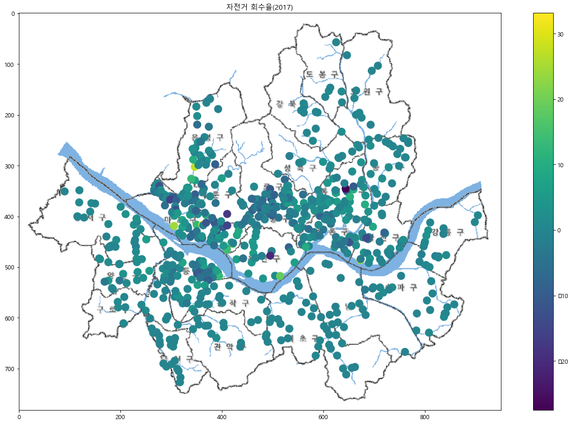
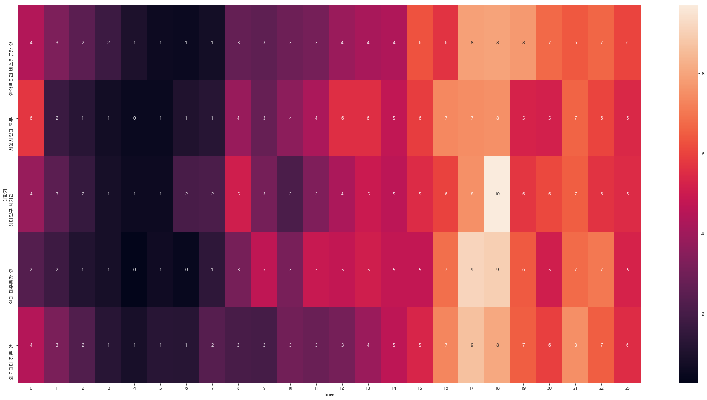

### 경희대학교 산업경영공학과 김태호(2015100915)

# 지난 1년간 서울시 공공자전거 대여소별 이용 분석 


```python
# 구글맵으로 자세히 보기
map1 = folium.Map(location=[37.5502, 126.982], zoom_start=12)

for n in TotalData_17.index:
    folium.CircleMarker([TotalData_17['위도'][n], TotalData_17['경도'][n]], 
                        radius = TotalData_17['17년_하루평균대여'][n]*0.5, 
                        color='#3186cc', fill_color='#3186cc', fill=True, popup= '{}    {}대'.format(TotalData_17['17_대여소명'][n],
                        TotalData_17['17년_하루평균대여'][n])).add_to(map1)

map2 = folium.Map(location=[37.5502, 126.982], zoom_start=12)

for n in TotalData_18.index:
    folium.CircleMarker([TotalData_18['위도'][n], TotalData_18['경도'][n]], 
                        radius = TotalData_18['18년_하루평균대여'][n]*0.5, 
                        color='#3186cc', fill_color='#3186cc', fill=True, popup= '{}    {}대'.format(TotalData_18['18_대여소명'][n],
                        TotalData_18['18년_하루평균대여'][n])).add_to(map2)
```


```python
print('17년_하루평균대여 비교')
map1
```

    17년_하루평균대여 비교
    


```python
print('18년_하루평균대여 비교')
map2
```

    18년_하루평균대여 비교
    


        * 17년, 18년에 대여건수를 보면 둘다 대부분 한강공원근처의 대여소들이 대여건수가 높았다.
        * 1년간 대여소의 수와 대여건수는 전반적으로  많이 늘었고 특히  강북과 강남, 외곽지역의 증가율이 가장크다.
        * 따릉이를 이용하는 수 많은 사람들중 다수가 한강공원 근처와 대학가에서 이용하고 있다.
        * 대학교 근처에서 이용건수가 많은 것으로 보아 등하교시 이용한다고 추측할 수 있다.
        * 대여건수가 적은 곳은 대부분 서울외곽 지역으로 나타났다.
        * 서울중심에서 멀어질 수 록 자전거 이용률이 낮아지는 것을 알 수 있다.

### 년도별 회수율 비교


```python
TotalData_17 = TotalData_17.sort_values(by="17년_회수율", ascending=True)
return_17 =  TotalData_17.iloc[0:10,[2,9]].reset_index(drop='True')
TotalData_18 = TotalData_18.sort_values(by="18년_회수율", ascending=True)
return_18 =  TotalData_18.iloc[0:10,[2,9]].reset_index(drop='True')
Total_return_H = pd.concat([return_17, return_18], axis = 1)

Total_return_H.head()
```


<div>
<style scoped>
    .dataframe tbody tr th:only-of-type {
        vertical-align: middle;
    }

    .dataframe tbody tr th {
        vertical-align: top;
    }

    .dataframe thead th {
        text-align: right;
    }
</style>
<table border="1" class="dataframe">
  <thead>
    <tr style="text-align: right;">
      <th></th>
      <th>17_대여소명</th>
      <th>17년_회수율</th>
      <th>18_대여소명</th>
      <th>18년_회수율</th>
    </tr>
  </thead>
  <tbody>
    <tr>
      <th>0</th>
      <td>서울시립대 정문 앞</td>
      <td>-27.49</td>
      <td>여의도역 1번출구 옆</td>
      <td>-42.84</td>
    </tr>
    <tr>
      <th>1</th>
      <td>여의도역 1번출구 옆</td>
      <td>-23.03</td>
      <td>서울시립대 정문 앞</td>
      <td>-28.44</td>
    </tr>
    <tr>
      <th>2</th>
      <td>녹사평역1번출구</td>
      <td>-20.61</td>
      <td>양재역 11번 출구 앞</td>
      <td>-23.72</td>
    </tr>
    <tr>
      <th>3</th>
      <td>봉원고가차도 밑</td>
      <td>-17.51</td>
      <td>서울광장 옆</td>
      <td>-19.36</td>
    </tr>
    <tr>
      <th>4</th>
      <td>상암월드컵파크 1단지 교차로</td>
      <td>-15.55</td>
      <td>봉원고가차도 밑</td>
      <td>-18.39</td>
    </tr>
  </tbody>
</table>
</div>


```python
TotalData_17 = TotalData_17.sort_values(by="17년_회수율", ascending=False)
return_17 =  TotalData_17.iloc[0:10,[2,9]].reset_index(drop='True')
TotalData_18 = TotalData_18.sort_values(by="18년_회수율", ascending=False)
return_18 =  TotalData_18.iloc[0:10,[2,9]].reset_index(drop='True')
Total_return_L = pd.concat([return_17, return_18], axis = 1)

Total_return_L.head()
```


<div>
<style scoped>
    .dataframe tbody tr th:only-of-type {
        vertical-align: middle;
    }

    .dataframe tbody tr th {
        vertical-align: top;
    }

    .dataframe thead th {
        text-align: right;
    }
</style>
<table border="1" class="dataframe">
  <thead>
    <tr style="text-align: right;">
      <th></th>
      <th>17_대여소명</th>
      <th>17년_회수율</th>
      <th>18_대여소명</th>
      <th>18년_회수율</th>
    </tr>
  </thead>
  <tbody>
    <tr>
      <th>0</th>
      <td>홍대입구역 2번출구 앞</td>
      <td>33.13</td>
      <td>홍대입구역 2번출구 앞</td>
      <td>51.81</td>
    </tr>
    <tr>
      <th>1</th>
      <td>CJ 드림시티</td>
      <td>27.32</td>
      <td>뚝섬유원지역 1번출구 앞</td>
      <td>38.32</td>
    </tr>
    <tr>
      <th>2</th>
      <td>마포구민체육센터 앞</td>
      <td>24.58</td>
      <td>CJ 드림시티</td>
      <td>23.83</td>
    </tr>
    <tr>
      <th>3</th>
      <td>뚝섬유원지역 1번출구 앞</td>
      <td>23.17</td>
      <td>마포구민체육센터 앞</td>
      <td>21.99</td>
    </tr>
    <tr>
      <th>4</th>
      <td>서빙고동 주민센터 앞</td>
      <td>18.75</td>
      <td>노량진역 5번출구</td>
      <td>20.41</td>
    </tr>
  </tbody>
</table>
</div>


```python
# 17년도 회수율
t = TotalData_sample_17['위도']
y = TotalData_sample_17['경도']
z = TotalData_sample_17['17년_회수율']
plt.figure(figsize=(19,12))
plt.scatter(y,t,s=150,c=z)
plt.colorbar()
plt.title('자전거 회수율(2017)')
plt.imshow(img)

# 18년도 회수율
t = TotalData_sample_18['위도']
y = TotalData_sample_18['경도']
z = TotalData_sample_18['18년_회수율']
plt.figure(figsize=(19,12))
plt.scatter(y,t,s=150,c=z)
plt.colorbar()
plt.title('자전거 회수율(2018)')
plt.imshow(img)
plt.show()
```





        회수율이 낮은 대여소를 살펴보면 주로 학교나 회사가 밀집되어 있는 곳이었고 회수율이 높은 대여소를 살펴보면 주로 주거지역이었다. 그리고 지도를 보면 알 수 있듯이 1년간 회수율이 0에 가까운 곳의 분포가 더 높아 졌다는것을 알 수 있다.

        * 이를 통해 주로 퇴근을 하거나 하교할때 따릉이를 많이 이용한다고 추측할 수 있다.
        * 1년간 대여소간의 자전거 회수에 대한 문제가 많이 해소됬다는 것을 알 수 있다.

### 2. 시간대별 대여소 이용건수 데이터 분석

### 시간대별 이용건수 비교 분석

위의 서울시지도를 배경으로 하고 경도와 위도를 각각 x축 y축으로 놓아 산점도를 표시할 것이다. 그림상의 픽셀과 위도 경도의 위치를 맞추기 위하여 특수한 공식으로 위도와 경도값을 바꾼다.


```python
TotalData_sample = TotalData.copy()
TotalData_sample['위도'] = ((max(TotalData_sample['위도'])-TotalData_sample['위도'])/
                          (max(TotalData_sample['위도'])-min(TotalData_sample['위도'])))*670+57
TotalData_sample['경도'] = ((TotalData_sample['경도']-min(TotalData_sample['경도']))/
                          (max(TotalData_sample['경도'])-min(TotalData_sample['경도'])))*815+90
```


```python
# 새벽시간대 이용경향 비교
t = TotalData_sample['위도']
y = TotalData_sample['경도']
z = (TotalData_sample['시간당이용건수(새벽)']/max(TotalData_sample['시간당이용건수(새벽)']))
k = TotalData_sample['시간당이용건수(새벽)']
plt.figure(figsize=(19,12))
plt.scatter(y,t,s=k,c=z) #원의크기는 이용건수의 절대적인 크기, 원의색은 상대적인 크기를 나타낸다.
plt.colorbar()
plt.title('시간당이용건수(새벽)')
plt.imshow(img)

# 출근시간대 이용경향 비교
t = TotalData_sample['위도']
y = TotalData_sample['경도']
z = (TotalData_sample['시간당이용건수(출근)']/max(TotalData_sample['시간당이용건수(출근)']))
k = TotalData_sample['시간당이용건수(출근)']
plt.figure(figsize=(19,12))
plt.scatter(y,t,s=k,c=z)
plt.colorbar()
plt.title('시간당이용건수(출근)')
plt.imshow(img)

# 낮시간대 이용경향 비교
t = TotalData_sample['위도']
y = TotalData_sample['경도']
z = (TotalData_sample['시간당이용건수(낮)']/max(TotalData_sample['시간당이용건수(낮)']))
k = TotalData_sample['시간당이용건수(낮)']
plt.figure(figsize=(19,12))
plt.scatter(y,t,s=k,c=z)
plt.colorbar()
plt.title('시간당이용건수(낮)')
plt.imshow(img)

# 퇴근시간대 이용경향 비교
t = TotalData_sample['위도']
y = TotalData_sample['경도']
z = (TotalData_sample['시간당이용건수(퇴근)']/max(TotalData_sample['시간당이용건수(퇴근)']))
k = TotalData_sample['시간당이용건수(퇴근)']
plt.figure(figsize=(19,12))
plt.scatter(y,t,s=k,c=z)
plt.colorbar()
plt.title('시간당이용건수(퇴근)')
plt.imshow(img)

# 밤시간대 이용경향 비교
t = TotalData_sample['위도']
y = TotalData_sample['경도']
z = (TotalData_sample['시간당이용건수(밤)']/max(TotalData_sample['시간당이용건수(밤)']))
k = TotalData_sample['시간당이용건수(밤)']
plt.figure(figsize=(19,12))
plt.scatter(y,t,s=k,c=z)
plt.colorbar()
plt.title('시간당이용건수(밤)')
plt.imshow(img)
plt.show()
```


```python
TotalData_time = TotalData.copy()
map3 = folium.Map(location=[37.5502, 126.982], zoom_start=12)
TotalData_time = TotalData_time.sort_values(by="시간당이용건수(새벽)", ascending=False) 
TotalData_time = TotalData_time.reset_index(drop='True') # index를 다시 설정
for n in range(50):
    folium.CircleMarker([TotalData_time['위도'][n], TotalData_time['경도'][n]], 
                        radius = TotalData_time['시간당이용건수(새벽)'][n]*0.15,
                        color='#3186cc', fill_color='#3186cc', fill=True, popup= '{}    {}대'.format(TotalData_time['대여소명'][n],
                        TotalData_time['시간당이용건수(새벽)'][n])).add_to(map3)
    
map4 = folium.Map(location=[37.5502, 126.982], zoom_start=12)
TotalData_time = TotalData_time.sort_values(by="시간당이용건수(출근)", ascending=False) 
TotalData_time = TotalData_time.reset_index(drop='True') # index를 다시 설정
for n in range(50):
    folium.CircleMarker([TotalData_time['위도'][n], TotalData_time['경도'][n]], 
                        radius = TotalData_time['시간당이용건수(출근)'][n]*(0.05),
                        color='#3186cc', fill_color='#3186cc', fill=True, popup= '{}    {}대'.format(TotalData_time['대여소명'][n],
                        TotalData_time['시간당이용건수(출근)'][n])).add_to(map4)
    
map5 = folium.Map(location=[37.5502, 126.982], zoom_start=12)
TotalData_time = TotalData_time.sort_values(by="시간당이용건수(낮)", ascending=False) 
TotalData_time = TotalData_time.reset_index(drop='True') # index를 다시 설정
for n in range(50):
    folium.CircleMarker([TotalData_time['위도'][n], TotalData_time['경도'][n]], 
                        radius = TotalData_time['시간당이용건수(낮)'][n]*(12/181),
                        color='#3186cc', fill_color='#3186cc', fill=True,popup= '{}    {}대'.format(TotalData_time['대여소명'][n],
                        TotalData_time['시간당이용건수(낮)'][n])).add_to(map5)
    
map6 = folium.Map(location=[37.5502, 126.982], zoom_start=12)
TotalData_time = TotalData_time.sort_values(by="시간당이용건수(퇴근)", ascending=False) 
TotalData_time = TotalData_time.reset_index(drop='True') # index를 다시 설정
for n in range(50):
    folium.CircleMarker([TotalData_time['위도'][n], TotalData_time['경도'][n]], 
                        radius = TotalData_time['시간당이용건수(퇴근)'][n]*(0.03),
                        color='#3186cc', fill_color='#3186cc', fill=True, popup= '{}    {}대'.format(TotalData_time['대여소명'][n],
                        TotalData_time['시간당이용건수(퇴근)'][n])).add_to(map6)
    
map7 = folium.Map(location=[37.5502, 126.982], zoom_start=12)
TotalData_time = TotalData_time.sort_values(by="시간당이용건수(밤)", ascending=False) 
TotalData_time = TotalData_time.reset_index(drop='True') # index를 다시 설정
for n in range(50):
    folium.CircleMarker([TotalData_time['위도'][n], TotalData_time['경도'][n]], 
                        radius = TotalData_time['시간당이용건수(밤)'][n]*0.05,
                        color='#3186cc', fill_color='#3186cc', fill=True, popup= '{}    {}대'.format(TotalData_time['대여소명'][n],
                        TotalData_time['시간당이용건수(밤)'][n])).add_to(map7)
```


```python
print('시간당이용건수(새벽)')
map3
```

    시간당이용건수(새벽)
    


```python
print('시간당이용건수(출근)')
map4
```

    시간당이용건수(출근)
    


```python
print('시간당이용건수(낮)')
map5
```

    시간당이용건수(낮)
    


```python
print('시간당이용건수(퇴근)')
map6
```

    시간당이용건수(퇴근)
    


```python
print('시간당이용건수(밤)')
map7
```

    시간당이용건수(밤)
    


### 장소의 특징별 이용건수 비교 분석

장소를 '서울시 지적편집도'를 기준으로 번화가, 공원, 주거지역, 대학가, 회사근처로 나누고 해당하는 대여소중 대여건수가 일정량 이상 되는 대여소의 24시간동안 이용건수를 한 시간마다 비교한다.


```python
# 번화가의 시간당 이용경향 비교
TD_time1 = TD_time[TD_time["대여소번호"] == 811].copy()
q = int(sum(TD_time1['이용건수']))
TD_time1['이용건수'] =  list(map(lambda x : (x/q)*100 ,TD_time1['이용건수']))
TD_time2 = TD_time[TD_time["대여소번호"] == 1503].copy()
q = int(sum(TD_time2['이용건수']))
TD_time2['이용건수'] =  list(map(lambda x : (x/q)*100 ,TD_time2['이용건수']))
TD_time3 = TD_time[TD_time["대여소번호"] == 1222].copy()
q = int(sum(TD_time3['이용건수']))
TD_time3['이용건수'] =  list(map(lambda x : (x/q)*100 ,TD_time3['이용건수']))
TD_time4 = TD_time[TD_time["대여소번호"] == 113].copy()
q = int(sum(TD_time4['이용건수']))
TD_time4['이용건수'] =  list(map(lambda x : (x/q)*100 ,TD_time4['이용건수']))
TD_time5 = TD_time[TD_time["대여소번호"] == 2102].copy()
q = int(sum(TD_time5['이용건수']))
TD_time5['이용건수'] =  list(map(lambda x : (x/q)*100 ,TD_time5['이용건수']))
TD_time_part = pd.concat([TD_time1,TD_time2,TD_time3,TD_time4,TD_time5])
TD_time_part.rename(columns={TD_time_part.columns[2] : '번화가', 
                          TD_time_part.columns[6] : 'Time', TD_time_part.columns[7] : '이용률'}, inplace=True) # 열의 이름을 바꾼다.
TD_time_pv = TD_time_part.pivot('번화가', "Time", "이용률")
TD_time_pv.head()
plt.figure(figsize=(30,15))
sns.heatmap(TD_time_pv, annot=True, fmt=".0f")
plt.show()

# 공원의 시간당 이용경향 비교
TD_time1 = TD_time[TD_time["대여소번호"] == 2274].copy()
q = int(sum(TD_time1['이용건수']))
TD_time1['이용건수'] =  list(map(lambda x : (x/q)*100 ,TD_time1['이용건수']))
TD_time2 = TD_time[TD_time["대여소번호"] == 510].copy()
q = int(sum(TD_time2['이용건수']))
TD_time2['이용건수'] =  list(map(lambda x : (x/q)*100 ,TD_time2['이용건수']))
TD_time3 = TD_time[TD_time["대여소번호"] == 152].copy()
q = int(sum(TD_time3['이용건수']))
TD_time3['이용건수'] =  list(map(lambda x : (x/q)*100 ,TD_time3['이용건수']))
TD_time4 = TD_time[TD_time["대여소번호"] == 502].copy()
q = int(sum(TD_time4['이용건수']))
TD_time4['이용건수'] =  list(map(lambda x : (x/q)*100 ,TD_time4['이용건수']))
TD_time5 = TD_time[TD_time["대여소번호"] == 1209].copy()
q = int(sum(TD_time5['이용건수']))
TD_time5['이용건수'] =  list(map(lambda x : (x/q)*100 ,TD_time5['이용건수']))
TD_time_part = pd.concat([TD_time1,TD_time2,TD_time3,TD_time4,TD_time5])
TD_time_part.rename(columns={TD_time_part.columns[2] : '공원', 
                          TD_time_part.columns[6] : 'Time', TD_time_part.columns[7] : '이용률'}, inplace=True) # 열의 이름을 바꾼다.
TD_time_pv = TD_time_part.pivot('공원', "Time", "이용률")
TD_time_pv.head()
plt.figure(figsize=(30,15))
sns.heatmap(TD_time_pv, annot=True, fmt=".0f")
plt.show()

# 주거지역의 시간당 이용경향 비교
TD_time1 = TD_time[TD_time["대여소번호"] == 144].copy()
q = int(sum(TD_time1['이용건수']))
TD_time1['이용건수'] =  list(map(lambda x : (x/q)*100 ,TD_time1['이용건수']))
TD_time2 = TD_time[TD_time["대여소번호"] == 103].copy()
q = int(sum(TD_time2['이용건수']))
TD_time2['이용건수'] =  list(map(lambda x : (x/q)*100 ,TD_time2['이용건수']))
TD_time3 = TD_time[TD_time["대여소번호"] == 922].copy()
q = int(sum(TD_time3['이용건수']))
TD_time3['이용건수'] =  list(map(lambda x : (x/q)*100 ,TD_time3['이용건수']))
TD_time4 = TD_time[TD_time["대여소번호"] == 536].copy()
q = int(sum(TD_time4['이용건수']))
TD_time4['이용건수'] =  list(map(lambda x : (x/q)*100 ,TD_time4['이용건수']))
TD_time5 = TD_time[TD_time["대여소번호"] == 906].copy()
q = int(sum(TD_time5['이용건수']))
TD_time5['이용건수'] =  list(map(lambda x : (x/q)*100 ,TD_time5['이용건수']))
TD_time_part = pd.concat([TD_time1,TD_time2,TD_time3,TD_time4,TD_time5])
TD_time_part.rename(columns={TD_time_part.columns[2] : '주거지역', 
                          TD_time_part.columns[6] : 'Time', TD_time_part.columns[7] : '이용률'}, inplace=True) # 열의 이름을 바꾼다.
TD_time_pv = TD_time_part.pivot('주거지역', "Time", "이용률")
TD_time_pv.head()
plt.figure(figsize=(30,15))
sns.heatmap(TD_time_pv, annot=True, fmt=".0f")
plt.show()

# 대학가의 시간당 이용경향 비교
TD_time1 = TD_time[TD_time["대여소번호"] == 358].copy()
q = int(sum(TD_time1['이용건수']))
TD_time1['이용건수'] =  list(map(lambda x : (x/q)*100 ,TD_time1['이용건수']))
TD_time2 = TD_time[TD_time["대여소번호"] == 141].copy()
q = int(sum(TD_time2['이용건수']))
TD_time2['이용건수'] =  list(map(lambda x : (x/q)*100 ,TD_time2['이용건수']))
TD_time3 = TD_time[TD_time["대여소번호"] == 1308].copy()
q = int(sum(TD_time3['이용건수']))
TD_time3['이용건수'] =  list(map(lambda x : (x/q)*100 ,TD_time3['이용건수']))
TD_time4 = TD_time[TD_time["대여소번호"] == 639].copy()
q = int(sum(TD_time4['이용건수']))
TD_time4['이용건수'] =  list(map(lambda x : (x/q)*100 ,TD_time4['이용건수']))
TD_time5 = TD_time[TD_time["대여소번호"] == 634].copy()
q = int(sum(TD_time5['이용건수']))
TD_time5['이용건수'] =  list(map(lambda x : (x/q)*100 ,TD_time5['이용건수']))
TD_time_part = pd.concat([TD_time1,TD_time2,TD_time3,TD_time4,TD_time5])
TD_time_part.rename(columns={TD_time_part.columns[2] : '대학가', 
                          TD_time_part.columns[6] : 'Time', TD_time_part.columns[7] : '이용률'}, inplace=True) # 열의 이름을 바꾼다.
TD_time_pv = TD_time_part.pivot('대학가', "Time", "이용률")
TD_time_pv.head()
plt.figure(figsize=(30,15))
sns.heatmap(TD_time_pv, annot=True, fmt=".0f")
plt.show()

# 회사근처의 시간당 이용경향 비교
TD_time1 = TD_time[TD_time["대여소번호"] == 316].copy()
q = int(sum(TD_time1['이용건수']))
TD_time1['이용건수'] =  list(map(lambda x : (x/q)*100 ,TD_time1['이용건수']))
TD_time2 = TD_time[TD_time["대여소번호"] == 310].copy()
q = int(sum(TD_time2['이용건수']))
TD_time2['이용건수'] =  list(map(lambda x : (x/q)*100 ,TD_time2['이용건수']))
TD_time3 = TD_time[TD_time["대여소번호"] == 321].copy()
q = int(sum(TD_time3['이용건수']))
TD_time3['이용건수'] =  list(map(lambda x : (x/q)*100 ,TD_time3['이용건수']))
TD_time4 = TD_time[TD_time["대여소번호"] == 309].copy()
q = int(sum(TD_time4['이용건수']))
TD_time4['이용건수'] =  list(map(lambda x : (x/q)*100 ,TD_time4['이용건수']))
TD_time5 = TD_time[TD_time["대여소번호"] == 331].copy()
q = int(sum(TD_time5['이용건수']))
TD_time5['이용건수'] =  list(map(lambda x : (x/q)*100 ,TD_time5['이용건수']))
TD_time_part = pd.concat([TD_time1,TD_time2,TD_time3,TD_time4,TD_time5])
TD_time_part.rename(columns={TD_time_part.columns[2] : '회사근처', 
                          TD_time_part.columns[6] : 'Time', TD_time_part.columns[7] : '이용률'}, inplace=True) # 열의 이름을 바꾼다.
TD_time_pv = TD_time_part.pivot('회사근처', "Time", "이용률")
TD_time_pv.head()
plt.figure(figsize=(30,15))
sns.heatmap(TD_time_pv, annot=True, fmt=".0f")
plt.show()
```





## (6) 참고문헌

- "파이썬으로 데이터 주무르기 독특한 예제를 통해 배우는 데이터 분석 입문", 민형기 지음, 비제이퍼블릭, 2017년 12월 29일 출간<br>


- "점프 투 파이썬", 박응용 지음, 이지스퍼블리싱, 2016년 06월 03일 출간<br>


- 정부 3.0 공공 데이터<br>
http://www.data.go.kr/


- 서울시 열린 데이터 광장<br>
http://data.seoul.go.kr/


- 서울시설공단 페이지<br>
http://www.sisul.or.kr/open_content/main/


- 서울지도<br>
http://gis.seoul.go.kr/


- 위키피디아<br>
https://www.wikipedia.org/


- 코딩도장<br>
https://dojang.io/


- 위키독스<br>
https://wikidocs.net/book/1


- Welcome to Dr.Sungwon('Python 질의응답'게시판)<br>
http://mobilelab.khu.ac.kr/webpythonbbs/


- PinkWink<br>
https://pinkwink.kr/


- GitHub<br>
https://github.com/github


- matplotlib<br>
https://matplotlib.org/


- pandas<br>
https://pandas.pydata.org/
