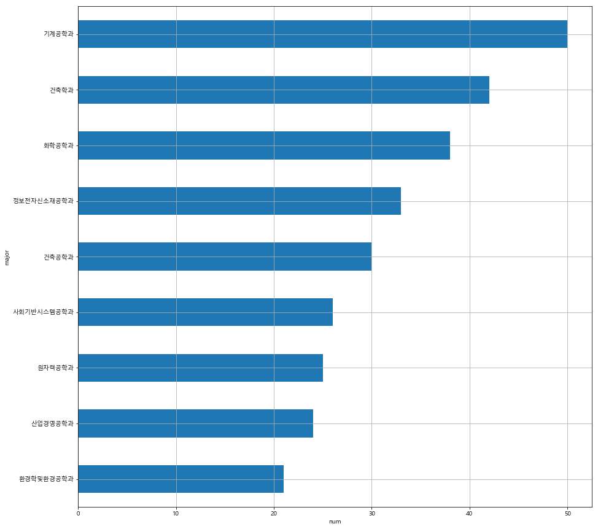

### 경희대학교 산업경영공학과 2015100915 김태호

# 경희대학교 공과대학 시간표 분석

BeautifulSoup와 urllib, selenium을 사용하여 수강목록의 데이터가 있는  '에브리타임'에서 데이터를 가져와서 분석해본다.


```python
from urllib.request import urlopen
from bs4 import BeautifulSoup
import pandas as pd
import numpy as np
import matplotlib.pyplot as plt
%matplotlib inline
from matplotlib import font_manager, rc
path = "c:/Windows/Fonts/malgun.ttf"
font_name = font_manager.FontProperties(fname=path).get_name()
rc('font', family=font_name)
from selenium import webdriver
import urllib.request
import urllib.parse
import time
import re #정규식
```

### 자동으로 공대 강좌목록 가져오기


```python
url = 'https://everytime.kr/timetable'
driver = webdriver.Chrome('../driver/chromedriver.exe')
driver.get(url)
time.sleep(3)
user_id = input('에브리타임 아이디를 입력해주세요.: ')
et_login = driver.find_element_by_name("userid")
et_login.clear()
et_login.send_keys(user_id)

user_pw = input('에브리타임 비밀번호를 입력해주세요.: ')
et_login = driver.find_element_by_name("password")
et_login.clear()
et_login.send_keys(user_pw) #자신의 비번을 넣으세요

driver.find_element_by_xpath("""//*[@id="container"]/form/p[3]/input""").click()
time.sleep(3)
while True:
    try:
        driver.find_element_by_xpath("""//*[@id="sheet"]/ul/li[3]/a""").click()
        time.sleep(2)
        break
    except:
        continue
timetable_all = pd.DataFrame()
timetable_all
graph = {}
while True:
    try:
        driver.find_element_by_xpath("""//*[@id="container"]/ul/li[1]""").click()
        time.sleep(2)
        break
    except:
        continue
for i in range(9):
    while True:
        try:
            driver.find_element_by_xpath("""//*[@id="subjects"]/div[1]/a[4]""").click()
            time.sleep(2)
            break
        except:
            continue
    while i == 0:
        try:
            driver.find_element_by_xpath("""//*[@id="subjectCategoryFilter"]/div/ul/li[2]""").click()
            time.sleep(2)
            break
        except:
            continue
    while True:
        try:
            driver.find_element_by_xpath("""//*[@id="subjectCategoryFilter"]/div/ul/ul[2]/li["""+str((i+1))+"""]""").click()
            time.sleep(2)
            break
        except:
            continue
#     while True:
#         try:
#             driver.find_element_by_xpath("""//*[@id="subjectCategoryFilter"]/div/ul/ul[2]/ul["""+str((i+1))+"""]/li""").click()
#             time.sleep(2)
#             break
#         except:
#             continue
    page = driver.page_source
    soup = BeautifulSoup(page, "html.parser")
    contents = []
    tmp = soup.find('div','list').find('tbody').find_all('td')
    for i in tmp:
        tmp = i.get_text()
        contents.append(tmp)
    contents = np.array(contents)
    column = []
    tmp = tmp = soup.find('div','list').find('thead').find_all('th')
    for i in tmp:
        tmp = str(i).lstrip('<th>').split('<div>')
        column.append(tmp[0])
    timetable = pd.DataFrame(contents.reshape(len(contents)//12,12), columns=column)
    del(timetable['계획서']) ;del(timetable['강의평'])
    major = soup.find('a','item active').get_text().split(':')[1]
    graph[str(major)] = len(timetable)
    timetable_all = pd.concat([timetable_all,timetable],ignore_index=True)
    timetable.to_excel('../data/19년 1학기 '+major+' 강좌.xls',encoding = 'utf8',sheet_name=major,index = False) # 학과 별로 저장
timetable_all.to_excel('../data/19년 1학기 공과대학 강좌.xls',encoding = 'utf8',sheet_name=major,index = False) # 공대 전체 데이터 저장
time.sleep(2)
driver.close()
```

    에브리타임 아이디를 입력해주세요.: xoghsms
    에브리타임 비밀번호를 입력해주세요.: B586092
    

### 저장된 데이터 확인


```python
timetable = pd.read_excel('../data/19년 1학기 산업경영공학과 강좌.xls', encoding = 'utf8') 
timetable.head()
```


<div>
<style scoped>
    .dataframe tbody tr th:only-of-type {
        vertical-align: middle;
    }

    .dataframe tbody tr th {
        vertical-align: top;
    }

    .dataframe thead th {
        text-align: right;
    }
</style>
<table border="1" class="dataframe">
  <thead>
    <tr style="text-align: right;">
      <th></th>
      <th>대상학년</th>
      <th>강좌코드</th>
      <th>강좌명</th>
      <th>교수명</th>
      <th>학점</th>
      <th>강의시간/강의실</th>
      <th>이수구분</th>
      <th>담은 인원</th>
      <th>정원</th>
      <th>특이사항</th>
    </tr>
  </thead>
  <tbody>
    <tr>
      <th>0</th>
      <td>2</td>
      <td>IE201-00</td>
      <td>경제성공학</td>
      <td>김장호</td>
      <td>3</td>
      <td>화 10:30-11:45 (공148)목 10:30-11:45 (공148)</td>
      <td>전공선택(05)</td>
      <td>79</td>
      <td>0</td>
      <td>영어</td>
    </tr>
    <tr>
      <th>1</th>
      <td>4</td>
      <td>IE414-00</td>
      <td>금융공학</td>
      <td>김장호</td>
      <td>3</td>
      <td>화 13:30-14:45 (공148)목 13:30-14:45 (공148)</td>
      <td>전공선택(05)</td>
      <td>68</td>
      <td>0</td>
      <td>영어</td>
    </tr>
    <tr>
      <th>2</th>
      <td>4</td>
      <td>IE411-00</td>
      <td>연구연수활동1(산업경영공학)</td>
      <td>반상우</td>
      <td>1</td>
      <td>금 - (공367)</td>
      <td>전공선택(05)</td>
      <td>0</td>
      <td>0</td>
      <td>수강신청기간에 본인이 직접 수강신청 하여야 하며, 신청서는 학과사무실로 3월 6일까...</td>
    </tr>
    <tr>
      <th>3</th>
      <td>3</td>
      <td>IE308-00</td>
      <td>인간공학</td>
      <td>반상우</td>
      <td>3</td>
      <td>월 15:00-16:15 (공367)수 15:00-16:15 (공367)</td>
      <td>전공선택(05)</td>
      <td>80</td>
      <td>0</td>
      <td>영어(부분)</td>
    </tr>
    <tr>
      <th>4</th>
      <td>4</td>
      <td>IE423-03</td>
      <td>창의적종합설계1(산업경영공학)</td>
      <td>반상우</td>
      <td>3</td>
      <td>월 16:30-19:15 (공522호)</td>
      <td>전공필수(04)</td>
      <td>21</td>
      <td>0</td>
      <td>NaN</td>
    </tr>
  </tbody>
</table>
</div>


```python
timetable_all = pd.read_excel('../data/19년 1학기 공과대학 강좌.xls',encoding = 'utf8') 
timetable_all.head()
```


<div>
<style scoped>
    .dataframe tbody tr th:only-of-type {
        vertical-align: middle;
    }

    .dataframe tbody tr th {
        vertical-align: top;
    }

    .dataframe thead th {
        text-align: right;
    }
</style>
<table border="1" class="dataframe">
  <thead>
    <tr style="text-align: right;">
      <th></th>
      <th>대상학년</th>
      <th>강좌코드</th>
      <th>강좌명</th>
      <th>교수명</th>
      <th>학점</th>
      <th>강의시간/강의실</th>
      <th>이수구분</th>
      <th>담은 인원</th>
      <th>정원</th>
      <th>특이사항</th>
    </tr>
  </thead>
  <tbody>
    <tr>
      <th>0</th>
      <td>2.0</td>
      <td>NE201-00</td>
      <td>원자및핵물리</td>
      <td>김광표</td>
      <td>3</td>
      <td>월 09:00-10:15 (공365)수 09:00-10:15 (공365)</td>
      <td>전공필수(04)</td>
      <td>40</td>
      <td>0</td>
      <td>영어(부분), 2018 경희 Fellow(교육) 선정자</td>
    </tr>
    <tr>
      <th>1</th>
      <td>3.0</td>
      <td>NE311-00</td>
      <td>원자로이론I</td>
      <td>김명현</td>
      <td>3</td>
      <td>월 10:30-11:45 (공365)수 10:30-11:45 (공365)</td>
      <td>전공필수(04)</td>
      <td>61</td>
      <td>0</td>
      <td>영어</td>
    </tr>
    <tr>
      <th>2</th>
      <td>4.0</td>
      <td>NE412-00</td>
      <td>노심안전공학</td>
      <td>김명현</td>
      <td>3</td>
      <td>화 10:30-11:45 (공206)목 10:30-11:45 (공206)</td>
      <td>전공선택(05)</td>
      <td>36</td>
      <td>0</td>
      <td>영어</td>
    </tr>
    <tr>
      <th>3</th>
      <td>2.0</td>
      <td>NE203-00</td>
      <td>핵공학개론I</td>
      <td>김형대</td>
      <td>3</td>
      <td>화 15:00-16:15 (공365호)목 15:00-16:15 (공365호)</td>
      <td>전공필수(04)</td>
      <td>51</td>
      <td>0</td>
      <td>영어(부분)</td>
    </tr>
    <tr>
      <th>4</th>
      <td>4.0</td>
      <td>NE413-00</td>
      <td>로심설계</td>
      <td>주형국</td>
      <td>3</td>
      <td>화 16:30-18:20 (공206)목 16:30-18:20 (공206)</td>
      <td>전공선택(05)</td>
      <td>10</td>
      <td>0</td>
      <td>영어, 화,목요일 16:30 ~ 18:20 / 공272</td>
    </tr>
  </tbody>
</table>
</div>


## 학과별 전공과목 수 비교


```python
maj = list(graph.keys())
num = list(graph.values())
graph_df = {'major':maj, 'num':num}
graph_df = pd.DataFrame(graph_df)
graph_df = graph_df.set_index('major')
graph_df.sort_values(by=['num'], axis=0, ascending=False)
```


<div>
<style scoped>
    .dataframe tbody tr th:only-of-type {
        vertical-align: middle;
    }

    .dataframe tbody tr th {
        vertical-align: top;
    }

    .dataframe thead th {
        text-align: right;
    }
</style>
<table border="1" class="dataframe">
  <thead>
    <tr style="text-align: right;">
      <th></th>
      <th>num</th>
    </tr>
    <tr>
      <th>major</th>
      <th></th>
    </tr>
  </thead>
  <tbody>
    <tr>
      <th>기계공학과</th>
      <td>50</td>
    </tr>
    <tr>
      <th>건축학과</th>
      <td>42</td>
    </tr>
    <tr>
      <th>화학공학과</th>
      <td>38</td>
    </tr>
    <tr>
      <th>정보전자신소재공학과</th>
      <td>33</td>
    </tr>
    <tr>
      <th>건축공학과</th>
      <td>30</td>
    </tr>
    <tr>
      <th>사회기반시스템공학과</th>
      <td>26</td>
    </tr>
    <tr>
      <th>원자력공학과</th>
      <td>25</td>
    </tr>
    <tr>
      <th>산업경영공학과</th>
      <td>24</td>
    </tr>
    <tr>
      <th>환경학및환경공학과</th>
      <td>21</td>
    </tr>
  </tbody>
</table>
</div>


### 그래프


```python
plt.figure()
graph_df.sort_values(by=['num'])['num'].plot(kind='barh', grid=True, figsize=(15,15))
plt.xlabel('num')
```


    Text(0.5, 0, 'num')





***산업경영공학과는 학생 수 도 많은데 열린 과목 수는 뒤에서 두 번째라 충격적이었다***
