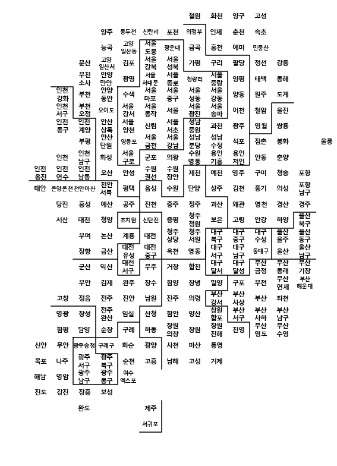
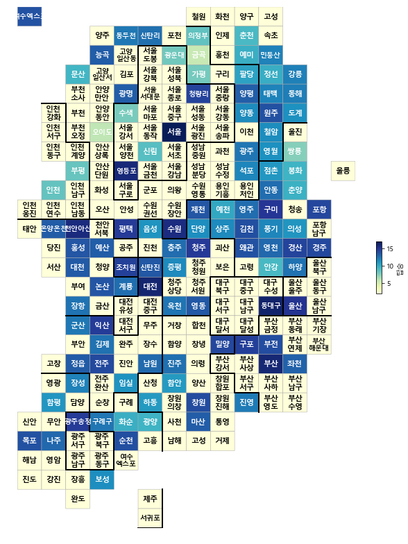
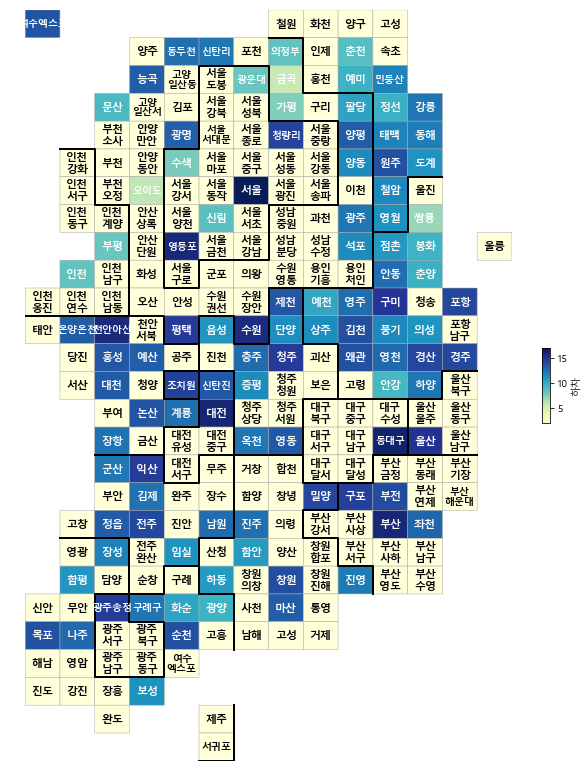
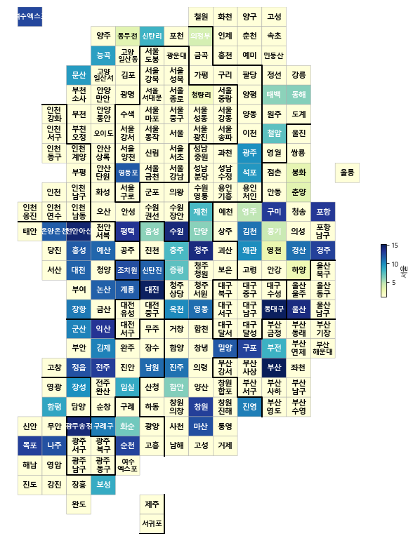
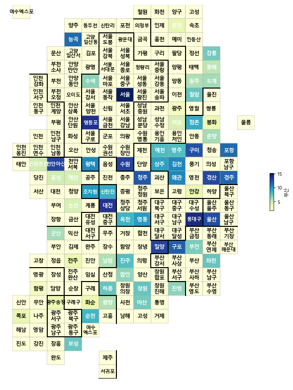
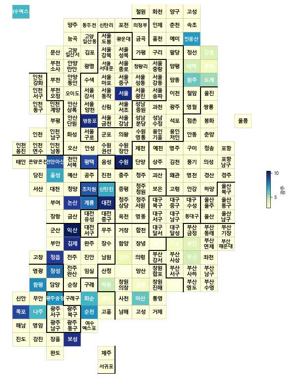
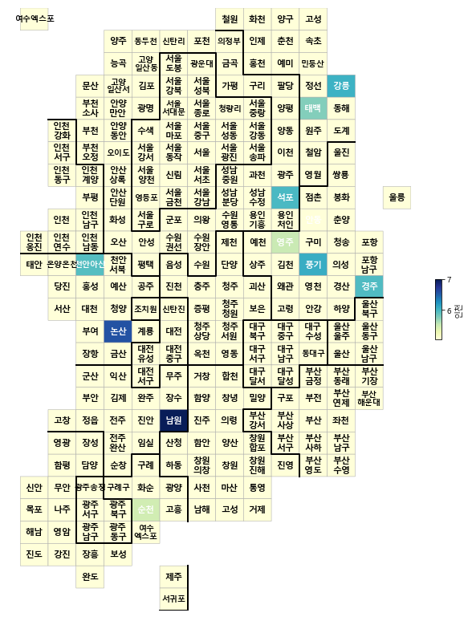
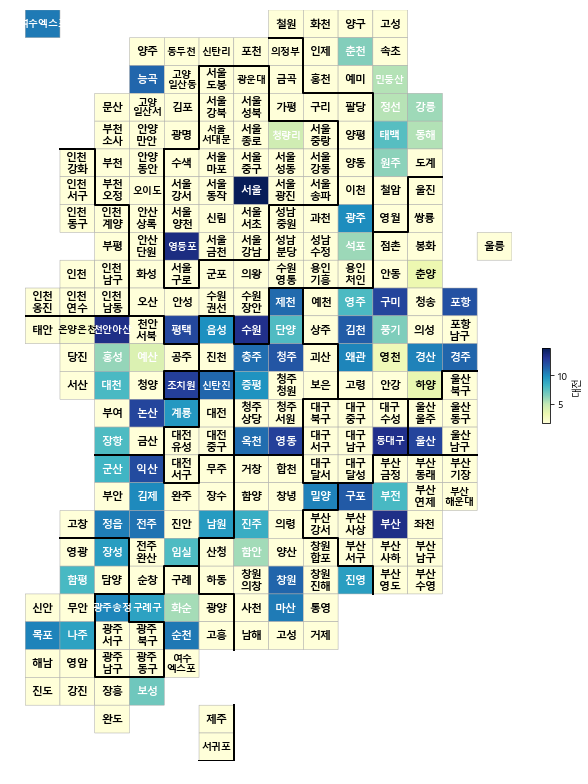

### 경희대학교 산업경영공학과 김태호(2015100915)

# 2016년 1년간 기차역간 수송량 분석 및 마케팅 활용 방안

#### 기차역간 수송량이 나와 있는 데이터를 이용하여 알아보기 편하게 catogram으로 시각화 한 후 서로 수송량이 높은 역들을 알아내어 코레일에서 어떻게 해야 효율적으로 마케팅을 할 수 있을지 알아본다


```python
import pandas as pd
import numpy as np

import platform
import matplotlib.pyplot as plt

%matplotlib inline

path = "c:/Windows/Fonts/malgun.ttf"
from matplotlib import font_manager, rc
if platform.system() == 'Darwin':
    rc('font', family='AppleGothic')
elif platform.system() == 'Windows':
    font_name = font_manager.FontProperties(fname=path).get_name()
    rc('font', family=font_name)
else:
    print('Unknown system... sorry~~~~')    

plt.rcParams['axes.unicode_minus'] = False
```


```python
raw_data = pd.read_excel("../data/한국철도공사_2016년_역간_OD자료.xlsx",header=3)
raw_data.head()
```


<div>
<style scoped>
    .dataframe tbody tr th:only-of-type {
        vertical-align: middle;
    }

    .dataframe tbody tr th {
        vertical-align: top;
    }

    .dataframe thead th {
        text-align: right;
    }
</style>
<table border="1" class="dataframe">
  <thead>
    <tr style="text-align: right;">
      <th></th>
      <th>착   역 
                       Destination Station


 발  역
 Origin Station</th>
      <th>Unnamed: 1</th>
      <th>Unnamed: 2</th>
      <th>서울</th>
      <th>영등포</th>
      <th>수원</th>
      <th>평택</th>
      <th>천안아산</th>
      <th>조치원</th>
      <th>신탄진</th>
      <th>...</th>
      <th>함안</th>
      <th>진주</th>
      <th>하동</th>
      <th>광양</th>
      <th>보성</th>
      <th>화순</th>
      <th>광명</th>
      <th>울산</th>
      <th>포항</th>
      <th>합계</th>
    </tr>
  </thead>
  <tbody>
    <tr>
      <th>0</th>
      <td>NaN</td>
      <td>NaN</td>
      <td>NaN</td>
      <td>NaN</td>
      <td>NaN</td>
      <td>NaN</td>
      <td>NaN</td>
      <td>NaN</td>
      <td>NaN</td>
      <td>NaN</td>
      <td>...</td>
      <td>NaN</td>
      <td>NaN</td>
      <td>NaN</td>
      <td>NaN</td>
      <td>NaN</td>
      <td>NaN</td>
      <td>NaN</td>
      <td>NaN</td>
      <td>NaN</td>
      <td>NaN</td>
    </tr>
    <tr>
      <th>1</th>
      <td>NaN</td>
      <td>NaN</td>
      <td>NaN</td>
      <td>Seoul</td>
      <td>Yeongdeungpo</td>
      <td>Suwon</td>
      <td>Pyeongtaek</td>
      <td>CheonanAsan</td>
      <td>Jochiwon</td>
      <td>Sintanjin</td>
      <td>...</td>
      <td>Haman</td>
      <td>Jinju</td>
      <td>Hadong</td>
      <td>Gwangyang</td>
      <td>Boseong</td>
      <td>Hwasun</td>
      <td>Gwangmyeong</td>
      <td>Ulsan</td>
      <td>Pohang</td>
      <td>NaN</td>
    </tr>
    <tr>
      <th>2</th>
      <td>NaN</td>
      <td>NaN</td>
      <td>NaN</td>
      <td>NaN</td>
      <td>NaN</td>
      <td>NaN</td>
      <td>NaN</td>
      <td>NaN</td>
      <td>NaN</td>
      <td>NaN</td>
      <td>...</td>
      <td>NaN</td>
      <td>NaN</td>
      <td>NaN</td>
      <td>NaN</td>
      <td>NaN</td>
      <td>NaN</td>
      <td>NaN</td>
      <td>NaN</td>
      <td>NaN</td>
      <td>Total</td>
    </tr>
    <tr>
      <th>3</th>
      <td>NaN</td>
      <td>NaN</td>
      <td>NaN</td>
      <td>NaN</td>
      <td>NaN</td>
      <td>NaN</td>
      <td>NaN</td>
      <td>NaN</td>
      <td>NaN</td>
      <td>NaN</td>
      <td>...</td>
      <td>NaN</td>
      <td>NaN</td>
      <td>NaN</td>
      <td>NaN</td>
      <td>NaN</td>
      <td>NaN</td>
      <td>NaN</td>
      <td>NaN</td>
      <td>NaN</td>
      <td>NaN</td>
    </tr>
    <tr>
      <th>4</th>
      <td>서울</td>
      <td>NaN</td>
      <td>Seoul</td>
      <td>0</td>
      <td>121705</td>
      <td>1335737</td>
      <td>686491</td>
      <td>1895049</td>
      <td>234574</td>
      <td>102706</td>
      <td>...</td>
      <td>496</td>
      <td>57863</td>
      <td>NaN</td>
      <td>NaN</td>
      <td>5063</td>
      <td>825</td>
      <td>NaN</td>
      <td>1149024</td>
      <td>514896</td>
      <td>23793106</td>
    </tr>
  </tbody>
</table>
<p>5 rows × 109 columns</p>
</div>


* 필요없는 부분을 제거한다.


```python
del raw_data['Unnamed: 1']
del raw_data['Unnamed: 2']
raw_data.drop([0],inplace=True)
raw_data.drop([1],inplace=True)
raw_data.drop([2],inplace=True)
raw_data.drop([3],inplace=True)
raw_data.rename(columns={raw_data.columns[0]:"ID"}, inplace=True)
raw_data.reset_index(inplace=True)
del raw_data['index']
raw_data.head()
```


<div>
<style scoped>
    .dataframe tbody tr th:only-of-type {
        vertical-align: middle;
    }

    .dataframe tbody tr th {
        vertical-align: top;
    }

    .dataframe thead th {
        text-align: right;
    }
</style>
<table border="1" class="dataframe">
  <thead>
    <tr style="text-align: right;">
      <th></th>
      <th>ID</th>
      <th>서울</th>
      <th>영등포</th>
      <th>수원</th>
      <th>평택</th>
      <th>천안아산</th>
      <th>조치원</th>
      <th>신탄진</th>
      <th>대전</th>
      <th>옥천</th>
      <th>...</th>
      <th>함안</th>
      <th>진주</th>
      <th>하동</th>
      <th>광양</th>
      <th>보성</th>
      <th>화순</th>
      <th>광명</th>
      <th>울산</th>
      <th>포항</th>
      <th>합계</th>
    </tr>
  </thead>
  <tbody>
    <tr>
      <th>0</th>
      <td>서울</td>
      <td>0</td>
      <td>121705</td>
      <td>1335737</td>
      <td>686491</td>
      <td>1895049</td>
      <td>234574</td>
      <td>102706</td>
      <td>2900921</td>
      <td>25100</td>
      <td>...</td>
      <td>496</td>
      <td>57863</td>
      <td>NaN</td>
      <td>NaN</td>
      <td>5063</td>
      <td>825</td>
      <td>NaN</td>
      <td>1149024</td>
      <td>514896</td>
      <td>23793106</td>
    </tr>
    <tr>
      <th>1</th>
      <td>영등포</td>
      <td>128006</td>
      <td>NaN</td>
      <td>1105671</td>
      <td>687801</td>
      <td>1044996</td>
      <td>289795</td>
      <td>111471</td>
      <td>922881</td>
      <td>22288</td>
      <td>...</td>
      <td>323</td>
      <td>15606</td>
      <td>NaN</td>
      <td>NaN</td>
      <td>4523</td>
      <td>757</td>
      <td>NaN</td>
      <td>NaN</td>
      <td>NaN</td>
      <td>8549279</td>
    </tr>
    <tr>
      <th>2</th>
      <td>수원</td>
      <td>1376031</td>
      <td>1081174</td>
      <td>0</td>
      <td>416542</td>
      <td>708650</td>
      <td>310272</td>
      <td>94906</td>
      <td>684726</td>
      <td>17408</td>
      <td>...</td>
      <td>631</td>
      <td>742</td>
      <td>NaN</td>
      <td>NaN</td>
      <td>3250</td>
      <td>750</td>
      <td>NaN</td>
      <td>68833</td>
      <td>54</td>
      <td>6856996</td>
    </tr>
    <tr>
      <th>3</th>
      <td>평택</td>
      <td>676230</td>
      <td>671865</td>
      <td>436359</td>
      <td>0</td>
      <td>85608</td>
      <td>102991</td>
      <td>35009</td>
      <td>244432</td>
      <td>6625</td>
      <td>...</td>
      <td>105</td>
      <td>324</td>
      <td>NaN</td>
      <td>NaN</td>
      <td>539</td>
      <td>180</td>
      <td>NaN</td>
      <td>NaN</td>
      <td>NaN</td>
      <td>2679023</td>
    </tr>
    <tr>
      <th>4</th>
      <td>천안아산</td>
      <td>1877918</td>
      <td>1043413</td>
      <td>743602</td>
      <td>102383</td>
      <td>0</td>
      <td>292550</td>
      <td>90450</td>
      <td>792067</td>
      <td>14809</td>
      <td>...</td>
      <td>134</td>
      <td>2226</td>
      <td>NaN</td>
      <td>NaN</td>
      <td>1055</td>
      <td>155</td>
      <td>NaN</td>
      <td>150636</td>
      <td>65829</td>
      <td>7292509</td>
    </tr>
  </tbody>
</table>
<p>5 rows × 107 columns</p>
</div>


* NaN 인 값을 0으로 바꿔준다.

* 값들의 **최대값과 최소값이 차이가 너무 크기때문에 비교하기가 힘들어** 모든 값에 1을 더하고(log0은 -inf이기 때문에 0을 1로 바꿔준다.) log를 씌운다.


```python
raw_data.fillna(0, inplace=True)
raw_data.rename(columns = {'합계':'탑승'}, inplace=True)
raw_data['하차']= list(raw_data.iloc[105,:])[1:]
raw_data.drop([105],inplace=True)
raw_data['탑승-하차']= raw_data['탑승']-raw_data['하차']
raw_data.head()
```


<div>
<style scoped>
    .dataframe tbody tr th:only-of-type {
        vertical-align: middle;
    }

    .dataframe tbody tr th {
        vertical-align: top;
    }

    .dataframe thead th {
        text-align: right;
    }
</style>
<table border="1" class="dataframe">
  <thead>
    <tr style="text-align: right;">
      <th></th>
      <th>ID</th>
      <th>서울</th>
      <th>영등포</th>
      <th>수원</th>
      <th>평택</th>
      <th>천안아산</th>
      <th>조치원</th>
      <th>신탄진</th>
      <th>대전</th>
      <th>옥천</th>
      <th>...</th>
      <th>하동</th>
      <th>광양</th>
      <th>보성</th>
      <th>화순</th>
      <th>광명</th>
      <th>울산</th>
      <th>포항</th>
      <th>탑승</th>
      <th>하차</th>
      <th>탑승-하차</th>
    </tr>
  </thead>
  <tbody>
    <tr>
      <th>0</th>
      <td>서울</td>
      <td>0</td>
      <td>121705</td>
      <td>1335737</td>
      <td>686491</td>
      <td>1895049</td>
      <td>234574</td>
      <td>102706</td>
      <td>2900921</td>
      <td>25100</td>
      <td>...</td>
      <td>0</td>
      <td>0</td>
      <td>5063</td>
      <td>825</td>
      <td>0</td>
      <td>1149024</td>
      <td>514896</td>
      <td>23793106</td>
      <td>24290985</td>
      <td>-497879</td>
    </tr>
    <tr>
      <th>1</th>
      <td>영등포</td>
      <td>128006</td>
      <td>0</td>
      <td>1105671</td>
      <td>687801</td>
      <td>1044996</td>
      <td>289795</td>
      <td>111471</td>
      <td>922881</td>
      <td>22288</td>
      <td>...</td>
      <td>0</td>
      <td>0</td>
      <td>4523</td>
      <td>757</td>
      <td>0</td>
      <td>0</td>
      <td>0</td>
      <td>8549279</td>
      <td>8559289</td>
      <td>-10010</td>
    </tr>
    <tr>
      <th>2</th>
      <td>수원</td>
      <td>1376031</td>
      <td>1081174</td>
      <td>0</td>
      <td>416542</td>
      <td>708650</td>
      <td>310272</td>
      <td>94906</td>
      <td>684726</td>
      <td>17408</td>
      <td>...</td>
      <td>0</td>
      <td>0</td>
      <td>3250</td>
      <td>750</td>
      <td>0</td>
      <td>68833</td>
      <td>54</td>
      <td>6856996</td>
      <td>6917681</td>
      <td>-60685</td>
    </tr>
    <tr>
      <th>3</th>
      <td>평택</td>
      <td>676230</td>
      <td>671865</td>
      <td>436359</td>
      <td>0</td>
      <td>85608</td>
      <td>102991</td>
      <td>35009</td>
      <td>244432</td>
      <td>6625</td>
      <td>...</td>
      <td>0</td>
      <td>0</td>
      <td>539</td>
      <td>180</td>
      <td>0</td>
      <td>0</td>
      <td>0</td>
      <td>2679023</td>
      <td>2667166</td>
      <td>11857</td>
    </tr>
    <tr>
      <th>4</th>
      <td>천안아산</td>
      <td>1877918</td>
      <td>1043413</td>
      <td>743602</td>
      <td>102383</td>
      <td>0</td>
      <td>292550</td>
      <td>90450</td>
      <td>792067</td>
      <td>14809</td>
      <td>...</td>
      <td>0</td>
      <td>0</td>
      <td>1055</td>
      <td>155</td>
      <td>0</td>
      <td>150636</td>
      <td>65829</td>
      <td>7292509</td>
      <td>7274913</td>
      <td>17596</td>
    </tr>
  </tbody>
</table>
<p>5 rows × 109 columns</p>
</div>


* 역의 탑승량과 하차량을 비교하기 위하여 **'탑승-하차'** 데이터도 만든다.


```python
raw_data_p1 = raw_data.iloc[:,1:].applymap(lambda x : np.log(float(x)+1))
raw_data = pd.concat([raw_data.iloc[:,0:1],raw_data_p1],axis = 1)
raw_data.head()
```

    C:\Users\study\Anaconda3\lib\site-packages\ipykernel_launcher.py:1: RuntimeWarning: invalid value encountered in log
      """Entry point for launching an IPython kernel.
    


<div>
<style scoped>
    .dataframe tbody tr th:only-of-type {
        vertical-align: middle;
    }

    .dataframe tbody tr th {
        vertical-align: top;
    }

    .dataframe thead th {
        text-align: right;
    }
</style>
<table border="1" class="dataframe">
  <thead>
    <tr style="text-align: right;">
      <th></th>
      <th>ID</th>
      <th>서울</th>
      <th>영등포</th>
      <th>수원</th>
      <th>평택</th>
      <th>천안아산</th>
      <th>조치원</th>
      <th>신탄진</th>
      <th>대전</th>
      <th>옥천</th>
      <th>...</th>
      <th>하동</th>
      <th>광양</th>
      <th>보성</th>
      <th>화순</th>
      <th>광명</th>
      <th>울산</th>
      <th>포항</th>
      <th>탑승</th>
      <th>하차</th>
      <th>탑승-하차</th>
    </tr>
  </thead>
  <tbody>
    <tr>
      <th>0</th>
      <td>서울</td>
      <td>0.000000</td>
      <td>11.709364</td>
      <td>14.104995</td>
      <td>13.439350</td>
      <td>14.454756</td>
      <td>12.365531</td>
      <td>11.539636</td>
      <td>14.880539</td>
      <td>10.130663</td>
      <td>...</td>
      <td>0.0</td>
      <td>0.0</td>
      <td>8.529912</td>
      <td>6.716595</td>
      <td>0.0</td>
      <td>13.954424</td>
      <td>13.151722</td>
      <td>16.984906</td>
      <td>17.005616</td>
      <td>NaN</td>
    </tr>
    <tr>
      <th>1</th>
      <td>영등포</td>
      <td>11.759840</td>
      <td>0.000000</td>
      <td>13.915964</td>
      <td>13.441256</td>
      <td>13.859525</td>
      <td>12.576933</td>
      <td>11.621529</td>
      <td>13.735257</td>
      <td>10.011849</td>
      <td>...</td>
      <td>0.0</td>
      <td>0.0</td>
      <td>8.417152</td>
      <td>6.630683</td>
      <td>0.0</td>
      <td>0.000000</td>
      <td>0.000000</td>
      <td>15.961358</td>
      <td>15.962528</td>
      <td>NaN</td>
    </tr>
    <tr>
      <th>2</th>
      <td>수원</td>
      <td>14.134715</td>
      <td>13.893559</td>
      <td>0.000000</td>
      <td>12.939745</td>
      <td>13.471118</td>
      <td>12.645208</td>
      <td>11.460653</td>
      <td>13.436775</td>
      <td>9.764743</td>
      <td>...</td>
      <td>0.0</td>
      <td>0.0</td>
      <td>8.086718</td>
      <td>6.621406</td>
      <td>0.0</td>
      <td>11.139453</td>
      <td>4.007333</td>
      <td>15.740780</td>
      <td>15.749591</td>
      <td>NaN</td>
    </tr>
    <tr>
      <th>3</th>
      <td>평택</td>
      <td>13.424290</td>
      <td>13.417814</td>
      <td>12.986223</td>
      <td>0.000000</td>
      <td>11.357546</td>
      <td>11.542407</td>
      <td>10.463389</td>
      <td>12.406697</td>
      <td>8.798757</td>
      <td>...</td>
      <td>0.0</td>
      <td>0.0</td>
      <td>6.291569</td>
      <td>5.198497</td>
      <td>0.0</td>
      <td>0.000000</td>
      <td>0.000000</td>
      <td>14.800963</td>
      <td>14.796527</td>
      <td>9.380758</td>
    </tr>
    <tr>
      <th>4</th>
      <td>천안아산</td>
      <td>14.445675</td>
      <td>13.858009</td>
      <td>13.519263</td>
      <td>11.536486</td>
      <td>0.000000</td>
      <td>12.586394</td>
      <td>11.412564</td>
      <td>13.582403</td>
      <td>9.603058</td>
      <td>...</td>
      <td>0.0</td>
      <td>0.0</td>
      <td>6.962243</td>
      <td>5.049856</td>
      <td>0.0</td>
      <td>11.922628</td>
      <td>11.094831</td>
      <td>15.802358</td>
      <td>15.799943</td>
      <td>9.775484</td>
    </tr>
  </tbody>
</table>
<p>5 rows × 109 columns</p>
</div>


```python
station = list(raw_data["ID"])
```

* github에서 미리 받아온 catogram을 받아온다.


```python
draw_korea_raw = pd.read_excel('../data/05. draw_korea_raw.xlsx', 
                               encoding="EUC-KR")
draw_korea_raw
```


<div>
<style scoped>
    .dataframe tbody tr th:only-of-type {
        vertical-align: middle;
    }

    .dataframe tbody tr th {
        vertical-align: top;
    }

    .dataframe thead th {
        text-align: right;
    }
</style>
<table border="1" class="dataframe">
  <thead>
    <tr style="text-align: right;">
      <th></th>
      <th>0</th>
      <th>1</th>
      <th>2</th>
      <th>3</th>
      <th>4</th>
      <th>5</th>
      <th>6</th>
      <th>7</th>
      <th>8</th>
      <th>9</th>
      <th>10</th>
      <th>11</th>
      <th>12</th>
      <th>13</th>
    </tr>
  </thead>
  <tbody>
    <tr>
      <th>0</th>
      <td>NaN</td>
      <td>NaN</td>
      <td>NaN</td>
      <td>NaN</td>
      <td>NaN</td>
      <td>NaN</td>
      <td>NaN</td>
      <td>철원</td>
      <td>화천</td>
      <td>양구</td>
      <td>고성(강원)</td>
      <td>NaN</td>
      <td>NaN</td>
      <td>NaN</td>
    </tr>
    <tr>
      <th>1</th>
      <td>NaN</td>
      <td>NaN</td>
      <td>NaN</td>
      <td>양주</td>
      <td>동두천</td>
      <td>연천</td>
      <td>포천</td>
      <td>의정부</td>
      <td>인제</td>
      <td>춘천</td>
      <td>속초</td>
      <td>NaN</td>
      <td>NaN</td>
      <td>NaN</td>
    </tr>
    <tr>
      <th>2</th>
      <td>NaN</td>
      <td>NaN</td>
      <td>NaN</td>
      <td>고양 덕양</td>
      <td>고양 일산동</td>
      <td>서울 도봉</td>
      <td>서울 노원</td>
      <td>남양주</td>
      <td>홍천</td>
      <td>횡성</td>
      <td>양양</td>
      <td>NaN</td>
      <td>NaN</td>
      <td>NaN</td>
    </tr>
    <tr>
      <th>3</th>
      <td>NaN</td>
      <td>NaN</td>
      <td>파주</td>
      <td>고양 일산서</td>
      <td>김포</td>
      <td>서울 강북</td>
      <td>서울 성북</td>
      <td>가평</td>
      <td>구리</td>
      <td>하남</td>
      <td>정선</td>
      <td>강릉</td>
      <td>NaN</td>
      <td>NaN</td>
    </tr>
    <tr>
      <th>4</th>
      <td>NaN</td>
      <td>NaN</td>
      <td>부천 소사</td>
      <td>안양 만안</td>
      <td>광명</td>
      <td>서울 서대문</td>
      <td>서울 종로</td>
      <td>서울 동대문</td>
      <td>서울 중랑</td>
      <td>양평</td>
      <td>태백</td>
      <td>동해</td>
      <td>NaN</td>
      <td>NaN</td>
    </tr>
    <tr>
      <th>5</th>
      <td>NaN</td>
      <td>인천 강화</td>
      <td>부천 원미</td>
      <td>안양 동안</td>
      <td>서울 은평</td>
      <td>서울 마포</td>
      <td>서울 중구</td>
      <td>서울 성동</td>
      <td>서울 강동</td>
      <td>여주</td>
      <td>원주</td>
      <td>삼척</td>
      <td>NaN</td>
      <td>NaN</td>
    </tr>
    <tr>
      <th>6</th>
      <td>NaN</td>
      <td>인천 서구</td>
      <td>부천 오정</td>
      <td>시흥</td>
      <td>서울 강서</td>
      <td>서울 동작</td>
      <td>서울 용산</td>
      <td>서울 광진</td>
      <td>서울 송파</td>
      <td>이천</td>
      <td>평창</td>
      <td>울진</td>
      <td>NaN</td>
      <td>NaN</td>
    </tr>
    <tr>
      <th>7</th>
      <td>NaN</td>
      <td>인천 동구</td>
      <td>인천 계양</td>
      <td>안산 상록</td>
      <td>서울 양천</td>
      <td>서울 관악</td>
      <td>서울 서초</td>
      <td>성남 중원</td>
      <td>과천</td>
      <td>광주</td>
      <td>영월</td>
      <td>영덕</td>
      <td>NaN</td>
      <td>NaN</td>
    </tr>
    <tr>
      <th>8</th>
      <td>NaN</td>
      <td>NaN</td>
      <td>인천 부평</td>
      <td>안산 단원</td>
      <td>서울 영등포</td>
      <td>서울 금천</td>
      <td>서울 강남</td>
      <td>성남 분당</td>
      <td>성남 수정</td>
      <td>용인 수지</td>
      <td>문경</td>
      <td>봉화</td>
      <td>NaN</td>
      <td>울릉</td>
    </tr>
    <tr>
      <th>9</th>
      <td>NaN</td>
      <td>인천 중구</td>
      <td>인천 남구</td>
      <td>화성</td>
      <td>서울 구로</td>
      <td>군포</td>
      <td>의왕</td>
      <td>수원 영통</td>
      <td>용인 기흥</td>
      <td>용인 처인</td>
      <td>안동</td>
      <td>영양</td>
      <td>NaN</td>
      <td>NaN</td>
    </tr>
    <tr>
      <th>10</th>
      <td>인천 옹진</td>
      <td>인천 연수</td>
      <td>인천 남동</td>
      <td>오산</td>
      <td>안성</td>
      <td>수원 권선</td>
      <td>수원 장안</td>
      <td>제천</td>
      <td>예천</td>
      <td>영주</td>
      <td>구미</td>
      <td>청송</td>
      <td>포항 북구</td>
      <td>NaN</td>
    </tr>
    <tr>
      <th>11</th>
      <td>태안</td>
      <td>아산</td>
      <td>천안 동남</td>
      <td>천안 서북</td>
      <td>평택</td>
      <td>음성</td>
      <td>수원 팔달</td>
      <td>단양</td>
      <td>상주</td>
      <td>김천</td>
      <td>군위</td>
      <td>의성</td>
      <td>포항 남구</td>
      <td>NaN</td>
    </tr>
    <tr>
      <th>12</th>
      <td>NaN</td>
      <td>당진</td>
      <td>홍성</td>
      <td>예산</td>
      <td>공주</td>
      <td>진천</td>
      <td>충주</td>
      <td>청주 흥덕</td>
      <td>괴산</td>
      <td>칠곡</td>
      <td>영천</td>
      <td>경산</td>
      <td>경주</td>
      <td>NaN</td>
    </tr>
    <tr>
      <th>13</th>
      <td>NaN</td>
      <td>서산</td>
      <td>보령</td>
      <td>청양</td>
      <td>세종</td>
      <td>대전 대덕</td>
      <td>증평</td>
      <td>청주 청원</td>
      <td>보은</td>
      <td>고령</td>
      <td>청도</td>
      <td>성주</td>
      <td>울산 북구</td>
      <td>NaN</td>
    </tr>
    <tr>
      <th>14</th>
      <td>NaN</td>
      <td>NaN</td>
      <td>부여</td>
      <td>논산</td>
      <td>계룡</td>
      <td>대전 동구</td>
      <td>청주 상당</td>
      <td>청주 서원</td>
      <td>대구 북구</td>
      <td>대구 중구</td>
      <td>대구 수성</td>
      <td>울산 울주</td>
      <td>울산 동구</td>
      <td>NaN</td>
    </tr>
    <tr>
      <th>15</th>
      <td>NaN</td>
      <td>NaN</td>
      <td>서천</td>
      <td>금산</td>
      <td>대전 유성</td>
      <td>대전 중구</td>
      <td>옥천</td>
      <td>영동</td>
      <td>대구 서구</td>
      <td>대구 남구</td>
      <td>대구 동구</td>
      <td>울산 중구</td>
      <td>울산 남구</td>
      <td>NaN</td>
    </tr>
    <tr>
      <th>16</th>
      <td>NaN</td>
      <td>NaN</td>
      <td>군산</td>
      <td>익산</td>
      <td>대전 서구</td>
      <td>무주</td>
      <td>거창</td>
      <td>합천</td>
      <td>대구 달서</td>
      <td>대구 달성</td>
      <td>부산 금정</td>
      <td>부산 동래</td>
      <td>부산 기장</td>
      <td>NaN</td>
    </tr>
    <tr>
      <th>17</th>
      <td>NaN</td>
      <td>NaN</td>
      <td>부안</td>
      <td>김제</td>
      <td>완주</td>
      <td>장수</td>
      <td>함양</td>
      <td>창녕</td>
      <td>밀양</td>
      <td>부산 북구</td>
      <td>부산 부산진</td>
      <td>부산 연제</td>
      <td>부산 해운대</td>
      <td>NaN</td>
    </tr>
    <tr>
      <th>18</th>
      <td>NaN</td>
      <td>고창</td>
      <td>정읍</td>
      <td>전주 덕진</td>
      <td>진안</td>
      <td>남원</td>
      <td>진주</td>
      <td>의령</td>
      <td>부산 강서</td>
      <td>부산 사상</td>
      <td>부산 동구</td>
      <td>부산 중구</td>
      <td>NaN</td>
      <td>NaN</td>
    </tr>
    <tr>
      <th>19</th>
      <td>NaN</td>
      <td>영광</td>
      <td>장성</td>
      <td>전주 완산</td>
      <td>임실</td>
      <td>산청</td>
      <td>함안</td>
      <td>양산</td>
      <td>창원 합포</td>
      <td>부산 서구</td>
      <td>부산 사하</td>
      <td>부산 남구</td>
      <td>NaN</td>
      <td>NaN</td>
    </tr>
    <tr>
      <th>20</th>
      <td>NaN</td>
      <td>함평</td>
      <td>담양</td>
      <td>순창</td>
      <td>구례</td>
      <td>하동</td>
      <td>창원 의창</td>
      <td>창원 성산</td>
      <td>창원 진해</td>
      <td>김해</td>
      <td>부산 영도</td>
      <td>부산 수영</td>
      <td>NaN</td>
      <td>NaN</td>
    </tr>
    <tr>
      <th>21</th>
      <td>신안</td>
      <td>무안</td>
      <td>광주 광산</td>
      <td>곡성</td>
      <td>화순</td>
      <td>광양</td>
      <td>사천</td>
      <td>창원 회원</td>
      <td>통영</td>
      <td>NaN</td>
      <td>NaN</td>
      <td>NaN</td>
      <td>NaN</td>
      <td>NaN</td>
    </tr>
    <tr>
      <th>22</th>
      <td>목포</td>
      <td>나주</td>
      <td>광주 서구</td>
      <td>광주 북구</td>
      <td>순천</td>
      <td>고흥</td>
      <td>남해</td>
      <td>고성(경남)</td>
      <td>거제</td>
      <td>NaN</td>
      <td>NaN</td>
      <td>NaN</td>
      <td>NaN</td>
      <td>NaN</td>
    </tr>
    <tr>
      <th>23</th>
      <td>해남</td>
      <td>영암</td>
      <td>광주 남구</td>
      <td>광주 동구</td>
      <td>여수</td>
      <td>NaN</td>
      <td>NaN</td>
      <td>NaN</td>
      <td>NaN</td>
      <td>NaN</td>
      <td>NaN</td>
      <td>NaN</td>
      <td>NaN</td>
      <td>NaN</td>
    </tr>
    <tr>
      <th>24</th>
      <td>진도</td>
      <td>강진</td>
      <td>장흥</td>
      <td>보성</td>
      <td>NaN</td>
      <td>NaN</td>
      <td>NaN</td>
      <td>NaN</td>
      <td>NaN</td>
      <td>NaN</td>
      <td>NaN</td>
      <td>NaN</td>
      <td>NaN</td>
      <td>NaN</td>
    </tr>
    <tr>
      <th>25</th>
      <td>NaN</td>
      <td>NaN</td>
      <td>완도</td>
      <td>NaN</td>
      <td>NaN</td>
      <td>제주</td>
      <td>NaN</td>
      <td>NaN</td>
      <td>NaN</td>
      <td>NaN</td>
      <td>NaN</td>
      <td>NaN</td>
      <td>NaN</td>
      <td>NaN</td>
    </tr>
    <tr>
      <th>26</th>
      <td>NaN</td>
      <td>NaN</td>
      <td>NaN</td>
      <td>NaN</td>
      <td>NaN</td>
      <td>서귀포</td>
      <td>NaN</td>
      <td>NaN</td>
      <td>NaN</td>
      <td>NaN</td>
      <td>NaN</td>
      <td>NaN</td>
      <td>NaN</td>
      <td>NaN</td>
    </tr>
  </tbody>
</table>
</div>


* 이제 각 행정 구역의 화면상 좌표를 얻기 위해 pivot_table의 반대 개념으로 **.stack()** 명령을 사용한다.


```python
draw_korea_raw_stacked = pd.DataFrame(draw_korea_raw.stack())
draw_korea_raw_stacked.reset_index(inplace=True)
draw_korea_raw_stacked.rename(columns={'level_0':'y', 'level_1':'x', 0:'ID'}, 
                              inplace=True)

draw_korea = draw_korea_raw_stacked
draw_korea.head()
```


<div>
<style scoped>
    .dataframe tbody tr th:only-of-type {
        vertical-align: middle;
    }

    .dataframe tbody tr th {
        vertical-align: top;
    }

    .dataframe thead th {
        text-align: right;
    }
</style>
<table border="1" class="dataframe">
  <thead>
    <tr style="text-align: right;">
      <th></th>
      <th>y</th>
      <th>x</th>
      <th>ID</th>
    </tr>
  </thead>
  <tbody>
    <tr>
      <th>0</th>
      <td>0</td>
      <td>7</td>
      <td>철원</td>
    </tr>
    <tr>
      <th>1</th>
      <td>0</td>
      <td>8</td>
      <td>화천</td>
    </tr>
    <tr>
      <th>2</th>
      <td>0</td>
      <td>9</td>
      <td>양구</td>
    </tr>
    <tr>
      <th>3</th>
      <td>0</td>
      <td>10</td>
      <td>고성(강원)</td>
    </tr>
    <tr>
      <th>4</th>
      <td>1</td>
      <td>3</td>
      <td>양주</td>
    </tr>
  </tbody>
</table>
</div>


* 실제역의 이름과 지명은 다르기 때문에 실제역이 있는 지역의 이름을 역이름으로 바꿔주기 위한 dict를 만들어준다.


```python
set(station) - set(draw_korea['ID'].unique())

changename = {'서울 노원':'광운대', "광주 광산":'광주송정', "곡성":'구례구', "부산 북구":'구포', '남양주':'금곡', '고양 덕양':'능곡', '대전 동구':'대전',
 '보령':'대천', '삼척':'도계', '대구 동구':'동대구', '창원 회원':'마산', '파주':'문산', '양양':'민둥산', '부산 동구':'부산',
 '부산 부산진':'부전', '부천 원미':'부천', '인천 부평':'부평', '서울 용산':'서울', '용인 수지':'석포', '서울 은평':'수색', '수원 팔달':'수원',
 '서울 관악':'신림', '연천':'신탄리', '대전 대덕':'신탄진', '영덕':'쌍룡', '청도':'안강', '여주':'양동', '여수':'여수 엑스포',
 '서울 영등포':'영등포', '횡성':'예미', '시흥':'오이도', '아산':'온양온천', '칠곡':'왜관', '울산 중구':'울산', '인천 중구':'인천',
 '서천':'장항', '전주 덕진':'전주', '문경':'점촌', '세종':'조치원', '부산 중구':'좌천', '김해':'진영', '창원 성산':'창원',
 '천안 동남':'천안아산', '평창':'철암', '서울 동대문':'청량리', '청주 흥덕':'청주', '영양':'춘양', '하남':'팔당', '포항 북구':'포항',
 '군위':'풍기', '성주':'하양', '합계':'합계'}
```


```python
for (key,value) in changename.items():
    draw_korea.loc[draw_korea['ID'] == key, 'ID'] = value
draw_korea.head()
```


<div>
<style scoped>
    .dataframe tbody tr th:only-of-type {
        vertical-align: middle;
    }

    .dataframe tbody tr th {
        vertical-align: top;
    }

    .dataframe thead th {
        text-align: right;
    }
</style>
<table border="1" class="dataframe">
  <thead>
    <tr style="text-align: right;">
      <th></th>
      <th>y</th>
      <th>x</th>
      <th>ID</th>
    </tr>
  </thead>
  <tbody>
    <tr>
      <th>0</th>
      <td>0</td>
      <td>7</td>
      <td>철원</td>
    </tr>
    <tr>
      <th>1</th>
      <td>0</td>
      <td>8</td>
      <td>화천</td>
    </tr>
    <tr>
      <th>2</th>
      <td>0</td>
      <td>9</td>
      <td>양구</td>
    </tr>
    <tr>
      <th>3</th>
      <td>0</td>
      <td>10</td>
      <td>고성(강원)</td>
    </tr>
    <tr>
      <th>4</th>
      <td>1</td>
      <td>3</td>
      <td>양주</td>
    </tr>
  </tbody>
</table>
</div>


```python
set(station) - set(draw_korea['ID'].unique())
```


    {'여수엑스포'}


* 먼저 ID 컬럼에서 지도에 표기할때 시 이름 구 이름으로 줄을 나누기 위해 분리한다


```python
BORDER_LINES = [
    [(5, 1), (5,2), (7,2), (7,3), (11,3), (11,0)], # 인천
    [(5,4), (5,5), (2,5), (2,7), (4,7), (4,9), (7,9), 
     (7,7), (9,7), (9,5), (10,5), (10,4), (5,4)], # 서울
    [(1,7), (1,8), (3,8), (3,10), (10,10), (10,7), 
     (12,7), (12,6), (11,6), (11,5), (12, 5), (12,4), 
     (11,4), (11,3)], # 경기도
    [(8,10), (8,11), (6,11), (6,12)], # 강원도
    [(12,5), (13,5), (13,4), (14,4), (14,5), (15,5), 
     (15,4), (16,4), (16,2)], # 충청북도
    [(16,4), (17,4), (17,5), (16,5), (16,6), (19,6), 
     (19,5), (20,5), (20,4), (21,4), (21,3), (19,3), (19,1)], # 전라북도
    [(13,5), (13,6), (16,6)], # 대전시
    [(13,5), (14,5)], #세종시
    [(21,2), (21,3), (22,3), (22,4), (24,4), (24,2), (21,2)], #광주
    [(20,5), (21,5), (21,6), (23,6)], #전라남도
    [(10,8), (12,8), (12,9), (14,9), (14,8), (16,8), (16,6)], #충청북도
    [(14,9), (14,11), (14,12), (13,12), (13,13)], #경상북도
    [(15,8), (17,8), (17,10), (16,10), (16,11), (14,11)], #대구
    [(17,9), (18,9), (18,8), (19,8), (19,9), (20,9), (20,10), (21,10)], #부산
    [(16,11), (16,13)], #울산
#     [(9,14), (9,15)], 
    [(27,5), (27,6), (25,6)],
]
```


```python
plt.figure(figsize=(8, 11))

# 지역 이름 표시
for idx, row in draw_korea.iterrows():
    
    # 광역시는 구 이름이 겹치는 경우가 많아서 시단위 이름도 같이 표시한다. 
    # (중구, 서구)
    if len(row['ID'].split())==2:
        dispname = '{}\n{}'.format(row['ID'].split()[0], row['ID'].split()[1])
    elif row['ID'][:2]=='고성':
        dispname = '고성'
    else:
        dispname = row['ID']

    # 서대문구, 서귀포시 같이 이름이 3자 이상인 경우에 작은 글자로 표시한다.
    if len(dispname.splitlines()[-1]) >= 3:
        fontsize, linespacing = 9.5, 1.5
    else:
        fontsize, linespacing = 11, 1.2

    plt.annotate(dispname, (row['x']+0.5, row['y']+0.5), weight='bold',
                 fontsize=fontsize, ha='center', va='center', 
                 linespacing=linespacing)
    
# 시도 경계 그린다.
for path in BORDER_LINES:
    ys, xs = zip(*path)
    plt.plot(xs, ys, c='black', lw=1.5)

plt.gca().invert_yaxis()
#plt.gca().set_aspect(1)

plt.axis('off')

plt.tight_layout()
plt.show()
```





```python
raw_data = pd.merge( draw_korea,raw_data, how='outer', on=['ID'])
raw_data.fillna(0, inplace=True)
raw_data.head()
```


<div>
<style scoped>
    .dataframe tbody tr th:only-of-type {
        vertical-align: middle;
    }

    .dataframe tbody tr th {
        vertical-align: top;
    }

    .dataframe thead th {
        text-align: right;
    }
</style>
<table border="1" class="dataframe">
  <thead>
    <tr style="text-align: right;">
      <th></th>
      <th>y</th>
      <th>x</th>
      <th>ID</th>
      <th>서울</th>
      <th>영등포</th>
      <th>수원</th>
      <th>평택</th>
      <th>천안아산</th>
      <th>조치원</th>
      <th>신탄진</th>
      <th>...</th>
      <th>하동</th>
      <th>광양</th>
      <th>보성</th>
      <th>화순</th>
      <th>광명</th>
      <th>울산</th>
      <th>포항</th>
      <th>탑승</th>
      <th>하차</th>
      <th>탑승-하차</th>
    </tr>
  </thead>
  <tbody>
    <tr>
      <th>0</th>
      <td>0.0</td>
      <td>7.0</td>
      <td>철원</td>
      <td>0.0</td>
      <td>0.0</td>
      <td>0.0</td>
      <td>0.0</td>
      <td>0.0</td>
      <td>0.0</td>
      <td>0.0</td>
      <td>...</td>
      <td>0.0</td>
      <td>0.0</td>
      <td>0.0</td>
      <td>0.0</td>
      <td>0.0</td>
      <td>0.0</td>
      <td>0.0</td>
      <td>0.0</td>
      <td>0.0</td>
      <td>0.0</td>
    </tr>
    <tr>
      <th>1</th>
      <td>0.0</td>
      <td>8.0</td>
      <td>화천</td>
      <td>0.0</td>
      <td>0.0</td>
      <td>0.0</td>
      <td>0.0</td>
      <td>0.0</td>
      <td>0.0</td>
      <td>0.0</td>
      <td>...</td>
      <td>0.0</td>
      <td>0.0</td>
      <td>0.0</td>
      <td>0.0</td>
      <td>0.0</td>
      <td>0.0</td>
      <td>0.0</td>
      <td>0.0</td>
      <td>0.0</td>
      <td>0.0</td>
    </tr>
    <tr>
      <th>2</th>
      <td>0.0</td>
      <td>9.0</td>
      <td>양구</td>
      <td>0.0</td>
      <td>0.0</td>
      <td>0.0</td>
      <td>0.0</td>
      <td>0.0</td>
      <td>0.0</td>
      <td>0.0</td>
      <td>...</td>
      <td>0.0</td>
      <td>0.0</td>
      <td>0.0</td>
      <td>0.0</td>
      <td>0.0</td>
      <td>0.0</td>
      <td>0.0</td>
      <td>0.0</td>
      <td>0.0</td>
      <td>0.0</td>
    </tr>
    <tr>
      <th>3</th>
      <td>0.0</td>
      <td>10.0</td>
      <td>고성(강원)</td>
      <td>0.0</td>
      <td>0.0</td>
      <td>0.0</td>
      <td>0.0</td>
      <td>0.0</td>
      <td>0.0</td>
      <td>0.0</td>
      <td>...</td>
      <td>0.0</td>
      <td>0.0</td>
      <td>0.0</td>
      <td>0.0</td>
      <td>0.0</td>
      <td>0.0</td>
      <td>0.0</td>
      <td>0.0</td>
      <td>0.0</td>
      <td>0.0</td>
    </tr>
    <tr>
      <th>4</th>
      <td>1.0</td>
      <td>3.0</td>
      <td>양주</td>
      <td>0.0</td>
      <td>0.0</td>
      <td>0.0</td>
      <td>0.0</td>
      <td>0.0</td>
      <td>0.0</td>
      <td>0.0</td>
      <td>...</td>
      <td>0.0</td>
      <td>0.0</td>
      <td>0.0</td>
      <td>0.0</td>
      <td>0.0</td>
      <td>0.0</td>
      <td>0.0</td>
      <td>0.0</td>
      <td>0.0</td>
      <td>0.0</td>
    </tr>
  </tbody>
</table>
<p>5 rows × 111 columns</p>
</div>


* 이제 위 raw_data 데이터에서 지도에 표현하고자 하는 데이터가 **탑승**이라면 이 값들이 아까 만든 각 해당 기차역에 위치하면 된다.


```python
mapdata = raw_data.pivot_table(index='y', columns='x', values='탑승')
masked_mapdata = np.ma.masked_where(np.isnan(mapdata), mapdata)
```

* 지도로 시각화 하기 위한 함수를 만든다


```python
def drawKorea(targetData, blockedMap, cmapname):
    gamma = 0.75

    whitelabelmin = (max(blockedMap[targetData]) - 
                                     min(blockedMap[targetData]))*0.25 + \
                                                                min(blockedMap[targetData])

    datalabel = targetData

    vmin = min(blockedMap[blockedMap[targetData]>0][targetData])
    vmax = max(blockedMap[targetData])

    mapdata = blockedMap.pivot_table(index='y', columns='x', values=targetData)
    masked_mapdata = np.ma.masked_where(np.isnan(mapdata), mapdata)
    
    plt.figure(figsize=(9, 11))
    plt.pcolor(masked_mapdata, vmin=vmin, vmax=vmax, cmap=cmapname, 
               edgecolor='#aaaaaa', linewidth=0.5)

    # 지역 이름 표시
    for idx, row in blockedMap.iterrows():
        # 광역시는 구 이름이 겹치는 경우가 많아서 시단위 이름도 같이 표시한다. 
        #(중구, 서구)
        if len(row['ID'].split())==2:
            dispname = '{}\n{}'.format(row['ID'].split()[0], row['ID'].split()[1])
        elif row['ID'][:2]=='고성':
            dispname = '고성'
        else:
            dispname = row['ID']

        # 서대문구, 서귀포시 같이 이름이 3자 이상인 경우에 작은 글자로 표시한다.
        if len(dispname.splitlines()[-1]) >= 3:
            fontsize, linespacing = 10.0, 1.1
        else:
            fontsize, linespacing = 11, 1.

        annocolor = 'white' if row[targetData] > whitelabelmin else 'black'
        plt.annotate(dispname, (row['x']+0.5, row['y']+0.5), weight='bold',
                     fontsize=fontsize, ha='center', va='center', color=annocolor,
                     linespacing=linespacing)

    # 시도 경계 그린다.
    for path in BORDER_LINES:
        ys, xs = zip(*path)
        plt.plot(xs, ys, c='black', lw=2)

    plt.gca().invert_yaxis()

    plt.axis('off')

    cb = plt.colorbar(shrink=.1, aspect=10)
    cb.set_label(datalabel)

    plt.tight_layout()
    plt.show()
```

## 데이터 시각화

### 전체 기차역 탑승량 비교


```python
drawKorea('탑승', raw_data, 'YlGnBu')
```





* 각 **광역시, 도 별 주요 거점 역**들이 존재하여 그 역을 기준으로 주위 역의 이용이 높고 전체적으로 **서울, 부산, 대구, 대전 등 광역시**의 이용량이 높고 인구수 대비 **강원도 지역**의 수송량또한 전반적으로 많은 편으로 보인다. 

### 전체 기차역 하차량 비교


```python
drawKorea('하차', raw_data, 'YlGnBu')
```





* 승차량과 하차량이 거의 비슷하다는 것을 알 수 있다. 따라서 코레일에서 **기차표를 판매할때 왕복권을 할인하여 파는 것과 같은 마케팅**을 한다면 소비자들의 니즈를 더 충족 시킬 수 있을 것이다.

### 주요 거점 역별 출발지 비교

#### 1. 서울


```python
drawKorea('서울', raw_data, 'YlGnBu')
```





#### 2. 부산


```python
drawKorea('부산', raw_data, 'YlGnBu')
```





#### 3. 광주


```python
drawKorea('광주', raw_data, 'YlGnBu')
```





#### 4. 인천


```python
drawKorea('인천', raw_data, 'YlGnBu')
```





#### 5. 대전


```python
drawKorea('대전', raw_data, 'YlGnBu')
```





## 결론

#### 위의 자료를 이용하여 우리 지역에 많이 오는 지역을 조사하여 해당 지역와 같이 마케팅을 하면 더 큰 이율을 창출 할 수 있을 것이다.
