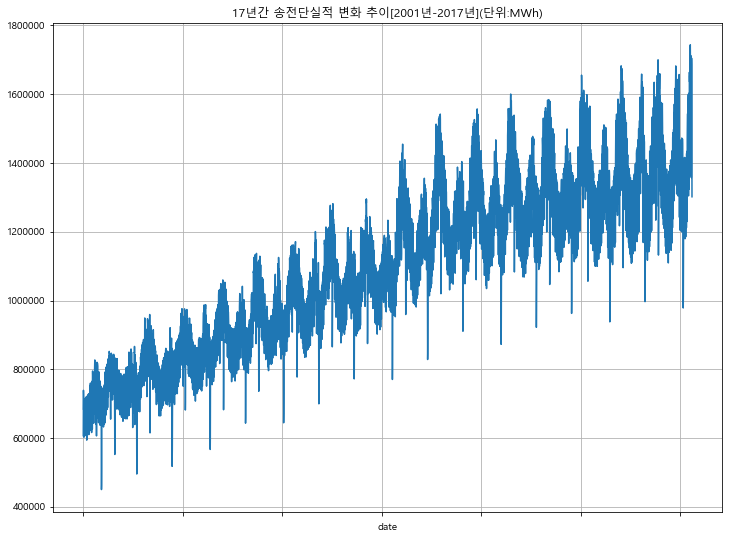
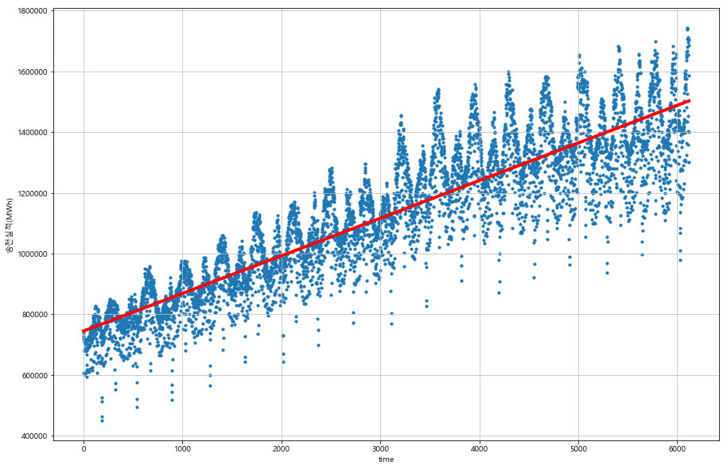
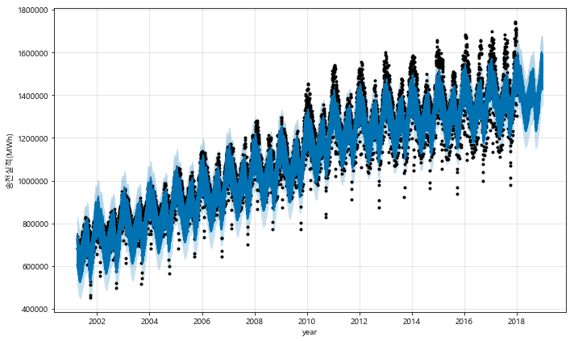
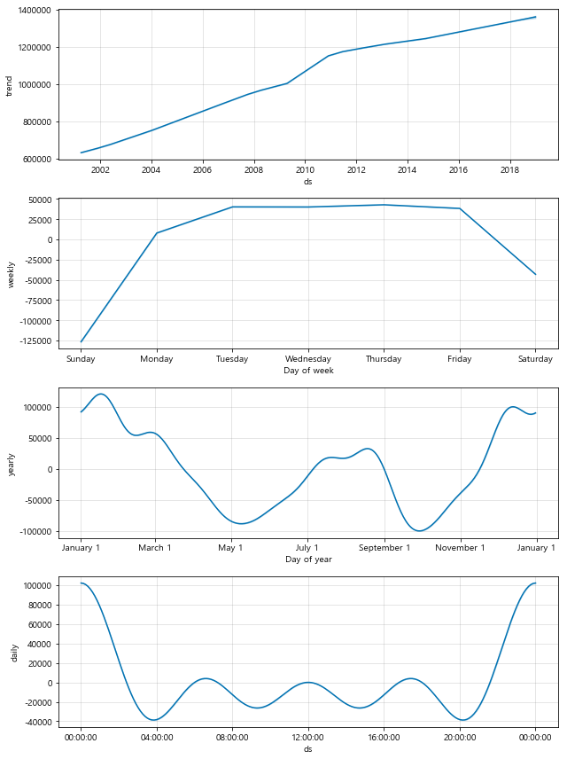

### 경희대학교 산업경영공학과 김태호(2015100915)

# 한국전력거래소 17년간 발전실적 분석및 예측

* 한국전력거래소의 2001년부터 2017년까지의 발전실적을 가져와 시간의 흐름에 따른 변화를 살펴보고 앞으로의 발전 실적에 대해 예측을 해본다.
* 시계열데이터를 fbprophet이라는 모듈을 사용하여 분석하여 예측해 본다.


```python
import warnings
warnings.filterwarnings("ignore")
import pandas as pd
import pandas_datareader.data as web
import numpy as np
import matplotlib.pyplot as plt
%matplotlib inline

from fbprophet import Prophet
from datetime import datetime
```


```python
path = "c:/Windows/Fonts/malgun.ttf"
import platform
from matplotlib import font_manager, rc
if platform.system() == 'Darwin':
    rc('font', family='AppleGothic')
elif platform.system() == 'Windows':
    font_name = font_manager.FontProperties(fname=path).get_name()
    rc('font', family=font_name)
else:
    print('Unknown system... sorry~~~~')    

plt.rcParams['axes.unicode_minus'] = False
```


```python
electric_sending = pd.read_csv('../data/2001년_이후_일별_송전단실적_총합_정보.csv', engine= 'python') 
electric_sending = electric_sending[electric_sending[' 송전단실적 합계(MWh)'].notnull()] # null 값 없애기
electric_sending.head()
```


<div>
<style scoped>
    .dataframe tbody tr th:only-of-type {
        vertical-align: middle;
    }

    .dataframe tbody tr th {
        vertical-align: top;
    }

    .dataframe thead th {
        text-align: right;
    }
</style>
<table border="1" class="dataframe">
  <thead>
    <tr style="text-align: right;">
      <th></th>
      <th>년</th>
      <th>월</th>
      <th>일</th>
      <th>송전단실적 합계(MWh)</th>
    </tr>
  </thead>
  <tbody>
    <tr>
      <th>0</th>
      <td>2001</td>
      <td>4</td>
      <td>1</td>
      <td>606955.2747</td>
    </tr>
    <tr>
      <th>1</th>
      <td>2001</td>
      <td>4</td>
      <td>2</td>
      <td>719433.3379</td>
    </tr>
    <tr>
      <th>2</th>
      <td>2001</td>
      <td>4</td>
      <td>3</td>
      <td>738837.1730</td>
    </tr>
    <tr>
      <th>3</th>
      <td>2001</td>
      <td>4</td>
      <td>4</td>
      <td>727158.4834</td>
    </tr>
    <tr>
      <th>4</th>
      <td>2001</td>
      <td>4</td>
      <td>5</td>
      <td>681998.4485</td>
    </tr>
  </tbody>
</table>
</div>


```python
electric_sending['date'] = electric_sending['년'].apply(lambda x : str(x)) +'-' \
                            + electric_sending['월'].apply(lambda x : str(x)) +'-' \
                            + electric_sending['일'].apply(lambda x : str(x))
del electric_sending["년"]
del electric_sending["월"]
del electric_sending["일"]
electric_sending.head()
```


<div>
<style scoped>
    .dataframe tbody tr th:only-of-type {
        vertical-align: middle;
    }

    .dataframe tbody tr th {
        vertical-align: top;
    }

    .dataframe thead th {
        text-align: right;
    }
</style>
<table border="1" class="dataframe">
  <thead>
    <tr style="text-align: right;">
      <th></th>
      <th>송전단실적 합계(MWh)</th>
      <th>date</th>
    </tr>
  </thead>
  <tbody>
    <tr>
      <th>0</th>
      <td>606955.2747</td>
      <td>2001-4-1</td>
    </tr>
    <tr>
      <th>1</th>
      <td>719433.3379</td>
      <td>2001-4-2</td>
    </tr>
    <tr>
      <th>2</th>
      <td>738837.1730</td>
      <td>2001-4-3</td>
    </tr>
    <tr>
      <th>3</th>
      <td>727158.4834</td>
      <td>2001-4-4</td>
    </tr>
    <tr>
      <th>4</th>
      <td>681998.4485</td>
      <td>2001-4-5</td>
    </tr>
  </tbody>
</table>
</div>


```python
electric_sending_1 = electric_sending.set_index("date")
electric_sending_1.head()
```


<div>
<style scoped>
    .dataframe tbody tr th:only-of-type {
        vertical-align: middle;
    }

    .dataframe tbody tr th {
        vertical-align: top;
    }

    .dataframe thead th {
        text-align: right;
    }
</style>
<table border="1" class="dataframe">
  <thead>
    <tr style="text-align: right;">
      <th></th>
      <th>송전단실적 합계(MWh)</th>
    </tr>
    <tr>
      <th>date</th>
      <th></th>
    </tr>
  </thead>
  <tbody>
    <tr>
      <th>2001-4-1</th>
      <td>606955.2747</td>
    </tr>
    <tr>
      <th>2001-4-2</th>
      <td>719433.3379</td>
    </tr>
    <tr>
      <th>2001-4-3</th>
      <td>738837.1730</td>
    </tr>
    <tr>
      <th>2001-4-4</th>
      <td>727158.4834</td>
    </tr>
    <tr>
      <th>2001-4-5</th>
      <td>681998.4485</td>
    </tr>
  </tbody>
</table>
</div>


#### 17년간 송전단실적 변화 추이를 그래프로 나타내어 본다


```python
electric_sending_1[' 송전단실적 합계(MWh)'].plot(figsize=(12,9), grid=True,title = "17년간 송전단실적 변화 추이[2001년-2017년](단위:MWh)");
```





### 17년간의 데이터를 이용하여 선형 회귀 분석을 해본다


```python
time = np.arange(0,len(electric_sending_1))
MWh = electric_sending_1[' 송전단실적 합계(MWh)'].values

fx = np.linspace(0, time[-1], 1000)
fp1 = np.polyfit(time, MWh, 1)
f1 = np.poly1d(fp1)
fp1
```


    array([1.23816187e+02, 7.45179273e+05])


```python
plt.figure(figsize=(15,10))
plt.scatter(time, MWh, s=10)

plt.plot(fx, f1(fx), lw=4, label='f1',c = 'red')
plt.xlabel("time") 
plt.ylabel("송전실적(MWh)") 

plt.grid(True, linestyle='-', color='0.75')

plt.show()
```





### 17년간의 데이터를 이용하여 2018년도의 송전량을 예측해본다.


```python
df = pd.DataFrame({'ds':electric_sending["date"], 'y':electric_sending[' 송전단실적 합계(MWh)']})
df.reset_index(inplace=True)
df['ds'] =  pd.to_datetime(df['ds'])


m = Prophet(yearly_seasonality=True, daily_seasonality=True)
m.fit(df)
```


    <fbprophet.forecaster.Prophet at 0x2039e7f8940>


```python
future = m.make_future_dataframe(periods=365)
future.tail()
```


<div>
<style scoped>
    .dataframe tbody tr th:only-of-type {
        vertical-align: middle;
    }

    .dataframe tbody tr th {
        vertical-align: top;
    }

    .dataframe thead th {
        text-align: right;
    }
</style>
<table border="1" class="dataframe">
  <thead>
    <tr style="text-align: right;">
      <th></th>
      <th>ds</th>
    </tr>
  </thead>
  <tbody>
    <tr>
      <th>6479</th>
      <td>2018-12-27</td>
    </tr>
    <tr>
      <th>6480</th>
      <td>2018-12-28</td>
    </tr>
    <tr>
      <th>6481</th>
      <td>2018-12-29</td>
    </tr>
    <tr>
      <th>6482</th>
      <td>2018-12-30</td>
    </tr>
    <tr>
      <th>6483</th>
      <td>2018-12-31</td>
    </tr>
  </tbody>
</table>
</div>


```python
forecast = m.predict(future)
forecast[['ds', 'yhat', 'yhat_lower', 'yhat_upper']].tail()
```


<div>
<style scoped>
    .dataframe tbody tr th:only-of-type {
        vertical-align: middle;
    }

    .dataframe tbody tr th {
        vertical-align: top;
    }

    .dataframe thead th {
        text-align: right;
    }
</style>
<table border="1" class="dataframe">
  <thead>
    <tr style="text-align: right;">
      <th></th>
      <th>ds</th>
      <th>yhat</th>
      <th>yhat_lower</th>
      <th>yhat_upper</th>
    </tr>
  </thead>
  <tbody>
    <tr>
      <th>6479</th>
      <td>2018-12-27</td>
      <td>1.592441e+06</td>
      <td>1.511890e+06</td>
      <td>1.670860e+06</td>
    </tr>
    <tr>
      <th>6480</th>
      <td>2018-12-28</td>
      <td>1.588012e+06</td>
      <td>1.512791e+06</td>
      <td>1.660921e+06</td>
    </tr>
    <tr>
      <th>6481</th>
      <td>2018-12-29</td>
      <td>1.506943e+06</td>
      <td>1.428594e+06</td>
      <td>1.577516e+06</td>
    </tr>
    <tr>
      <th>6482</th>
      <td>2018-12-30</td>
      <td>1.424124e+06</td>
      <td>1.352407e+06</td>
      <td>1.499014e+06</td>
    </tr>
    <tr>
      <th>6483</th>
      <td>2018-12-31</td>
      <td>1.559662e+06</td>
      <td>1.479290e+06</td>
      <td>1.635239e+06</td>
    </tr>
  </tbody>
</table>
</div>


```python
m.plot(forecast,xlabel = "year",ylabel="송전실적(MWh)");
```





#### 예측한 그래프를 보면 2018년에도 그전과 비슷하게 상승하고 있는 것을 알 수 있다.


```python
m.plot_components(forecast);
```





### 결론

#### trend를 보면 2009년에 갑작스럽게 양이 늘어난 구간을 제외하고는 송전량이 꾸준한 양으로 증가하고있다.
#### 주말에는 주중에비해 송전량이 적은 것으로 보아 직원들이 많이 출근하지 않는 주말에는 송전량이 적은 것으로 추측할 수 있다.
#### 1년간의 추세를 보면 겨울과 여름에 송전량이 많은 것으로 보아 에어컨이나 난방기구를 많이 작동하기 때문이라고 추측할 수 있다.
#### 제일 아래에 daily 그래프는 관련된 data가 없으므로 필요 없는 그래프이다. 
