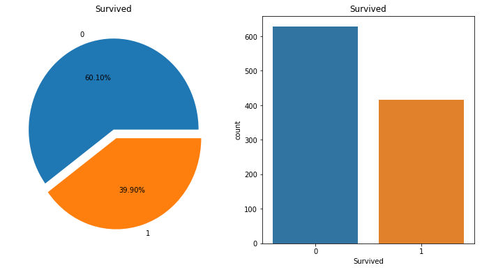

```python
import pandas as pd
import numpy as np
import sys
```

# Problem definition

Using data from passengers on the Titanic, try to find survival rates based on the characteristics of passengers.

# Data definition

### Data explanation
**survival** : Survival [0 = No, 1 = Yes]

**pclass** :	Ticket class	[1 = 1st(Upper), 2 = 2nd(Middle), 3 = 3rd(Lower)]

**sex** :	Sex	

**Age** :	Age in years	

**sibsp** :	# of siblings / spouses aboard the Titanic	

**parch** :	# of parents / children aboard the Titanic	

**ticket** :	Ticket number	

**fare** :	Passenger fare	

**cabin** :	Cabin number	

**embarked** :	Port of Embarkation	C = Cherbourg, Q = Queenstown, S = Southampton


```python
train_f = pd.read_csv("../data/train.csv")
test_f = pd.read_csv("../data/test.csv")
test_a =pd.read_csv("../data/gender_submission.csv")
```


```python
train_f.head()
```


<div>
<style scoped>
    .dataframe tbody tr th:only-of-type {
        vertical-align: middle;
    }

    .dataframe tbody tr th {
        vertical-align: top;
    }

    .dataframe thead th {
        text-align: right;
    }
</style>
<table border="1" class="dataframe">
  <thead>
    <tr style="text-align: right;">
      <th></th>
      <th>PassengerId</th>
      <th>Survived</th>
      <th>Pclass</th>
      <th>Name</th>
      <th>Sex</th>
      <th>Age</th>
      <th>SibSp</th>
      <th>Parch</th>
      <th>Ticket</th>
      <th>Fare</th>
      <th>Cabin</th>
      <th>Embarked</th>
    </tr>
  </thead>
  <tbody>
    <tr>
      <th>0</th>
      <td>1</td>
      <td>0</td>
      <td>3</td>
      <td>Braund, Mr. Owen Harris</td>
      <td>male</td>
      <td>22.0</td>
      <td>1</td>
      <td>0</td>
      <td>A/5 21171</td>
      <td>7.2500</td>
      <td>NaN</td>
      <td>S</td>
    </tr>
    <tr>
      <th>1</th>
      <td>2</td>
      <td>1</td>
      <td>1</td>
      <td>Cumings, Mrs. John Bradley (Florence Briggs Th...</td>
      <td>female</td>
      <td>38.0</td>
      <td>1</td>
      <td>0</td>
      <td>PC 17599</td>
      <td>71.2833</td>
      <td>C85</td>
      <td>C</td>
    </tr>
    <tr>
      <th>2</th>
      <td>3</td>
      <td>1</td>
      <td>3</td>
      <td>Heikkinen, Miss. Laina</td>
      <td>female</td>
      <td>26.0</td>
      <td>0</td>
      <td>0</td>
      <td>STON/O2. 3101282</td>
      <td>7.9250</td>
      <td>NaN</td>
      <td>S</td>
    </tr>
    <tr>
      <th>3</th>
      <td>4</td>
      <td>1</td>
      <td>1</td>
      <td>Futrelle, Mrs. Jacques Heath (Lily May Peel)</td>
      <td>female</td>
      <td>35.0</td>
      <td>1</td>
      <td>0</td>
      <td>113803</td>
      <td>53.1000</td>
      <td>C123</td>
      <td>S</td>
    </tr>
    <tr>
      <th>4</th>
      <td>5</td>
      <td>0</td>
      <td>3</td>
      <td>Allen, Mr. William Henry</td>
      <td>male</td>
      <td>35.0</td>
      <td>0</td>
      <td>0</td>
      <td>373450</td>
      <td>8.0500</td>
      <td>NaN</td>
      <td>S</td>
    </tr>
  </tbody>
</table>
</div>


```python
test_f.head()
```


<div>
<style scoped>
    .dataframe tbody tr th:only-of-type {
        vertical-align: middle;
    }

    .dataframe tbody tr th {
        vertical-align: top;
    }

    .dataframe thead th {
        text-align: right;
    }
</style>
<table border="1" class="dataframe">
  <thead>
    <tr style="text-align: right;">
      <th></th>
      <th>PassengerId</th>
      <th>Pclass</th>
      <th>Name</th>
      <th>Sex</th>
      <th>Age</th>
      <th>SibSp</th>
      <th>Parch</th>
      <th>Ticket</th>
      <th>Fare</th>
      <th>Cabin</th>
      <th>Embarked</th>
    </tr>
  </thead>
  <tbody>
    <tr>
      <th>0</th>
      <td>892</td>
      <td>3</td>
      <td>Kelly, Mr. James</td>
      <td>male</td>
      <td>34.5</td>
      <td>0</td>
      <td>0</td>
      <td>330911</td>
      <td>7.8292</td>
      <td>NaN</td>
      <td>Q</td>
    </tr>
    <tr>
      <th>1</th>
      <td>893</td>
      <td>3</td>
      <td>Wilkes, Mrs. James (Ellen Needs)</td>
      <td>female</td>
      <td>47.0</td>
      <td>1</td>
      <td>0</td>
      <td>363272</td>
      <td>7.0000</td>
      <td>NaN</td>
      <td>S</td>
    </tr>
    <tr>
      <th>2</th>
      <td>894</td>
      <td>2</td>
      <td>Myles, Mr. Thomas Francis</td>
      <td>male</td>
      <td>62.0</td>
      <td>0</td>
      <td>0</td>
      <td>240276</td>
      <td>9.6875</td>
      <td>NaN</td>
      <td>Q</td>
    </tr>
    <tr>
      <th>3</th>
      <td>895</td>
      <td>3</td>
      <td>Wirz, Mr. Albert</td>
      <td>male</td>
      <td>27.0</td>
      <td>0</td>
      <td>0</td>
      <td>315154</td>
      <td>8.6625</td>
      <td>NaN</td>
      <td>S</td>
    </tr>
    <tr>
      <th>4</th>
      <td>896</td>
      <td>3</td>
      <td>Hirvonen, Mrs. Alexander (Helga E Lindqvist)</td>
      <td>female</td>
      <td>22.0</td>
      <td>1</td>
      <td>1</td>
      <td>3101298</td>
      <td>12.2875</td>
      <td>NaN</td>
      <td>S</td>
    </tr>
  </tbody>
</table>
</div>


```python
test_a.head()
```


<div>
<style scoped>
    .dataframe tbody tr th:only-of-type {
        vertical-align: middle;
    }

    .dataframe tbody tr th {
        vertical-align: top;
    }

    .dataframe thead th {
        text-align: right;
    }
</style>
<table border="1" class="dataframe">
  <thead>
    <tr style="text-align: right;">
      <th></th>
      <th>PassengerId</th>
      <th>Survived</th>
    </tr>
  </thead>
  <tbody>
    <tr>
      <th>0</th>
      <td>892</td>
      <td>0</td>
    </tr>
    <tr>
      <th>1</th>
      <td>893</td>
      <td>1</td>
    </tr>
    <tr>
      <th>2</th>
      <td>894</td>
      <td>0</td>
    </tr>
    <tr>
      <th>3</th>
      <td>895</td>
      <td>0</td>
    </tr>
    <tr>
      <th>4</th>
      <td>896</td>
      <td>1</td>
    </tr>
  </tbody>
</table>
</div>


```python
test_td = pd.concat([test_f, test_a], axis=1)
test_td = test_td.iloc[:,[0,12,1,2,3,4,5,6,7,8,9,10]]
titanic_df = pd.concat([train_f, test_td], axis=0)
titanic_df.head()
```


<div>
<style scoped>
    .dataframe tbody tr th:only-of-type {
        vertical-align: middle;
    }

    .dataframe tbody tr th {
        vertical-align: top;
    }

    .dataframe thead th {
        text-align: right;
    }
</style>
<table border="1" class="dataframe">
  <thead>
    <tr style="text-align: right;">
      <th></th>
      <th>PassengerId</th>
      <th>Survived</th>
      <th>Pclass</th>
      <th>Name</th>
      <th>Sex</th>
      <th>Age</th>
      <th>SibSp</th>
      <th>Parch</th>
      <th>Ticket</th>
      <th>Fare</th>
      <th>Cabin</th>
      <th>Embarked</th>
    </tr>
  </thead>
  <tbody>
    <tr>
      <th>0</th>
      <td>1</td>
      <td>0</td>
      <td>3</td>
      <td>Braund, Mr. Owen Harris</td>
      <td>male</td>
      <td>22.0</td>
      <td>1</td>
      <td>0</td>
      <td>A/5 21171</td>
      <td>7.2500</td>
      <td>NaN</td>
      <td>S</td>
    </tr>
    <tr>
      <th>1</th>
      <td>2</td>
      <td>1</td>
      <td>1</td>
      <td>Cumings, Mrs. John Bradley (Florence Briggs Th...</td>
      <td>female</td>
      <td>38.0</td>
      <td>1</td>
      <td>0</td>
      <td>PC 17599</td>
      <td>71.2833</td>
      <td>C85</td>
      <td>C</td>
    </tr>
    <tr>
      <th>2</th>
      <td>3</td>
      <td>1</td>
      <td>3</td>
      <td>Heikkinen, Miss. Laina</td>
      <td>female</td>
      <td>26.0</td>
      <td>0</td>
      <td>0</td>
      <td>STON/O2. 3101282</td>
      <td>7.9250</td>
      <td>NaN</td>
      <td>S</td>
    </tr>
    <tr>
      <th>3</th>
      <td>4</td>
      <td>1</td>
      <td>1</td>
      <td>Futrelle, Mrs. Jacques Heath (Lily May Peel)</td>
      <td>female</td>
      <td>35.0</td>
      <td>1</td>
      <td>0</td>
      <td>113803</td>
      <td>53.1000</td>
      <td>C123</td>
      <td>S</td>
    </tr>
    <tr>
      <th>4</th>
      <td>5</td>
      <td>0</td>
      <td>3</td>
      <td>Allen, Mr. William Henry</td>
      <td>male</td>
      <td>35.0</td>
      <td>0</td>
      <td>0</td>
      <td>373450</td>
      <td>8.0500</td>
      <td>NaN</td>
      <td>S</td>
    </tr>
  </tbody>
</table>
</div>


```python
titanic_df.to_csv("../data/titanic_df.csv")
```


```python
titanic_df = pd.read_csv("../data/titanic_df.csv")
```


```python
# Check the summary of your current data
titanic_df.info()
```

    <class 'pandas.core.frame.DataFrame'>
    RangeIndex: 1309 entries, 0 to 1308
    Data columns (total 13 columns):
    Unnamed: 0     1309 non-null int64
    PassengerId    1309 non-null int64
    Survived       1309 non-null int64
    Pclass         1309 non-null int64
    Name           1309 non-null object
    Sex            1309 non-null object
    Age            1046 non-null float64
    SibSp          1309 non-null int64
    Parch          1309 non-null int64
    Ticket         1309 non-null object
    Fare           1308 non-null float64
    Cabin          295 non-null object
    Embarked       1307 non-null object
    dtypes: float64(2), int64(6), object(5)
    memory usage: 133.0+ KB
    

# Data preprocessing

In fact, there is information that the accident first carried women and the elderly on lifeboats.
Based on this information, we remove features from the data that would not have a significant impact on the survival forecast. 
Delete columns with too many null values and convert women to 0 and men to 1.


```python
del titanic_df["Name"]
del titanic_df["Ticket"]
del titanic_df["Cabin"]
del titanic_df["Embarked"]
del titanic_df["Unnamed: 0"]
```


```python
titanic_df.loc[titanic_df["Sex"] == "female",["Sex"]] = 0
titanic_df.loc[titanic_df["Sex"] == "male",["Sex"]] = 1
titanic_df = titanic_df.dropna()
```


```python
titanic_df.head()
```


<div>
<style scoped>
    .dataframe tbody tr th:only-of-type {
        vertical-align: middle;
    }

    .dataframe tbody tr th {
        vertical-align: top;
    }

    .dataframe thead th {
        text-align: right;
    }
</style>
<table border="1" class="dataframe">
  <thead>
    <tr style="text-align: right;">
      <th></th>
      <th>PassengerId</th>
      <th>Survived</th>
      <th>Pclass</th>
      <th>Sex</th>
      <th>Age</th>
      <th>SibSp</th>
      <th>Parch</th>
      <th>Fare</th>
    </tr>
  </thead>
  <tbody>
    <tr>
      <th>0</th>
      <td>1</td>
      <td>0</td>
      <td>3</td>
      <td>1</td>
      <td>22.0</td>
      <td>1</td>
      <td>0</td>
      <td>7.2500</td>
    </tr>
    <tr>
      <th>1</th>
      <td>2</td>
      <td>1</td>
      <td>1</td>
      <td>0</td>
      <td>38.0</td>
      <td>1</td>
      <td>0</td>
      <td>71.2833</td>
    </tr>
    <tr>
      <th>2</th>
      <td>3</td>
      <td>1</td>
      <td>3</td>
      <td>0</td>
      <td>26.0</td>
      <td>0</td>
      <td>0</td>
      <td>7.9250</td>
    </tr>
    <tr>
      <th>3</th>
      <td>4</td>
      <td>1</td>
      <td>1</td>
      <td>0</td>
      <td>35.0</td>
      <td>1</td>
      <td>0</td>
      <td>53.1000</td>
    </tr>
    <tr>
      <th>4</th>
      <td>5</td>
      <td>0</td>
      <td>3</td>
      <td>1</td>
      <td>35.0</td>
      <td>0</td>
      <td>0</td>
      <td>8.0500</td>
    </tr>
  </tbody>
</table>
</div>


```python
titanic_df.describe()
```


<div>
<style scoped>
    .dataframe tbody tr th:only-of-type {
        vertical-align: middle;
    }

    .dataframe tbody tr th {
        vertical-align: top;
    }

    .dataframe thead th {
        text-align: right;
    }
</style>
<table border="1" class="dataframe">
  <thead>
    <tr style="text-align: right;">
      <th></th>
      <th>PassengerId</th>
      <th>Survived</th>
      <th>Pclass</th>
      <th>Sex</th>
      <th>Age</th>
      <th>SibSp</th>
      <th>Parch</th>
      <th>Fare</th>
    </tr>
  </thead>
  <tbody>
    <tr>
      <th>count</th>
      <td>1045.000000</td>
      <td>1045.000000</td>
      <td>1045.000000</td>
      <td>1045.000000</td>
      <td>1045.000000</td>
      <td>1045.000000</td>
      <td>1045.000000</td>
      <td>1045.000000</td>
    </tr>
    <tr>
      <th>mean</th>
      <td>654.990431</td>
      <td>0.399043</td>
      <td>2.206699</td>
      <td>0.628708</td>
      <td>29.851837</td>
      <td>0.503349</td>
      <td>0.421053</td>
      <td>36.686080</td>
    </tr>
    <tr>
      <th>std</th>
      <td>377.650551</td>
      <td>0.489936</td>
      <td>0.841542</td>
      <td>0.483382</td>
      <td>14.389194</td>
      <td>0.912471</td>
      <td>0.840052</td>
      <td>55.732533</td>
    </tr>
    <tr>
      <th>min</th>
      <td>1.000000</td>
      <td>0.000000</td>
      <td>1.000000</td>
      <td>0.000000</td>
      <td>0.170000</td>
      <td>0.000000</td>
      <td>0.000000</td>
      <td>0.000000</td>
    </tr>
    <tr>
      <th>25%</th>
      <td>326.000000</td>
      <td>0.000000</td>
      <td>1.000000</td>
      <td>0.000000</td>
      <td>21.000000</td>
      <td>0.000000</td>
      <td>0.000000</td>
      <td>8.050000</td>
    </tr>
    <tr>
      <th>50%</th>
      <td>662.000000</td>
      <td>0.000000</td>
      <td>2.000000</td>
      <td>1.000000</td>
      <td>28.000000</td>
      <td>0.000000</td>
      <td>0.000000</td>
      <td>15.750000</td>
    </tr>
    <tr>
      <th>75%</th>
      <td>973.000000</td>
      <td>1.000000</td>
      <td>3.000000</td>
      <td>1.000000</td>
      <td>39.000000</td>
      <td>1.000000</td>
      <td>1.000000</td>
      <td>35.500000</td>
    </tr>
    <tr>
      <th>max</th>
      <td>1307.000000</td>
      <td>1.000000</td>
      <td>3.000000</td>
      <td>1.000000</td>
      <td>80.000000</td>
      <td>8.000000</td>
      <td>6.000000</td>
      <td>512.329200</td>
    </tr>
  </tbody>
</table>
</div>


* The summary of titanic_df shows that the survival rate is very low at 37.7%.
* Gender also shows that there are more males than females, and the average age group was lower than expected at 30.

# Data Visualization


```python
import matplotlib.pyplot as plt
import seaborn as sns
%matplotlib inline

f,ax=plt.subplots(1,2,figsize=(12,6))

titanic_df['Survived'].value_counts().plot.pie(explode=[0,0.1],autopct='%1.2f%%',ax=ax[0])
ax[0].set_title('Survived')
ax[0].set_ylabel('')

sns.countplot('Survived',data=titanic_df,ax=ax[1])
ax[1].set_title('Survived')
plt.show()
```





* Blue indicates death and orange indicates survivors.


```python
plt.figure(figsize=[12,4])
plt.subplot(121)
sns.barplot('Pclass', 'Survived', data=titanic_df)
plt.subplot(122)
sns.countplot('Sex',hue='Survived',data=titanic_df)
plt.show()
```


* Comparing the survival rate by seat rating, one can see that the expensive seat has higher survival rate.

* If you look at the graph on the right, it shows female deaths, female survivors, male deaths, and male survivors from the left. And we can see survival rate of female  is much higher than male.


```python
ax = titanic_df["Age"].hist(bins=15, color='teal', alpha=0.8)
ax.set(xlabel='Age', ylabel='Count')
plt.show()
```


* The age distribution of passengers shows that they are concentrated in their 20s and 30s.


```python
f,ax = plt.subplots(figsize=(12,6))
g = sns.kdeplot(titanic_df["Age"][(titanic_df["Survived"] == 0) & (titanic_df["Age"].notnull())], 
                ax = ax, color="Blue", shade = True)
g = sns.kdeplot(titanic_df["Age"][(titanic_df["Survived"] == 1) & (titanic_df["Age"].notnull())], 
                ax =g, color="Green", shade= True)
g.set_xlabel("Age")
g.set_ylabel("Frequency")
g = g.legend(["Not Survived","Survived"])
```


* The most important part of this graph comparing survival rate and age is the green section, which represents a high percentage of survivors, and the purple section, which represents a high percentage of deaths.

* Age under 17 group have a very high survival rate compared to other age groups.

* Age between 17~35 group have a very high death rate compared to other age groups.

#### By analyzing the overall data, one can see that the younger , female and more expensive class of seats have higher survival rate. If we don't think about class of seats, people tried to protect the weak first in the accident.

# Data Division


```python
# The train_test_split of sklearn makes it easy to divide data into a single line.
from sklearn.model_selection import train_test_split

train, test = train_test_split(titanic_df, test_size=0.2)
```


```python
import pickle
with open('../data/fifa_train.pkl', 'wb') as train_df:
    pickle.dump(train, train_df)
    
with open('../data/fifa_test.pkl', 'wb') as test_df:
    pickle.dump(test, test_df)
```


```python
with open('../data/fifa_train.pkl', 'rb') as train_df:
    train = pickle.load(train_df)
    
with open('../data/fifa_test.pkl', 'rb') as test_df:
    test = pickle.load(test_df)
```

# Setting Optimal Parameters for a Model

We can deduce these values(max_depth, min_samples_split,mins_samples_leaf, random_state) through repetition.


```python
from sklearn import tree
from sklearn import preprocessing
```


```python
X_train = train[['Pclass', 'Sex', 'Age', 'SibSp', 'Parch', 'Fare']]
y_train = train[['Survived']]

X_test = test[['Pclass', 'Sex', 'Age', 'SibSp', 'Parch', 'Fare']]
y_test = test[['Survived']]
```


```python
depth = list(range(1,100,5))
sample_split = list(range(2,100,5))
sample_leaf = list(range(2,100,5))
random_state = list(range(1,100,5))
clf_list = []
for i in depth:
    for j in sample_split:
        for k in sample_leaf:
            for l in random_state:
                clf_list.append(tree.DecisionTreeClassifier(max_depth=i, 
                                  min_samples_split=j,
                                  min_samples_leaf=k, 
                                  random_state=l).fit(X_train, y_train))
```


```python
clf_list[-5:]
```


    [DecisionTreeClassifier(class_weight=None, criterion='gini', max_depth=96,
                 max_features=None, max_leaf_nodes=None,
                 min_impurity_decrease=0.0, min_impurity_split=None,
                 min_samples_leaf=97, min_samples_split=97,
                 min_weight_fraction_leaf=0.0, presort=False, random_state=96,
                 splitter='best')]


```python
from sklearn.metrics import accuracy_score
accuracy_score_list = {}
for clf in clf_list:
    pred = clf.predict(X_test)
    accuracy_score_list[clf] = accuracy_score(y_test, pred)
```


```python
len(accuracy_score_list)
```


    160000


Choose the optimal clf with the highest accuracy among the 160,000 clf values.


```python
max_accuracy = max(list(accuracy_score_list.values()))
best_clf = list(accuracy_score_list.keys())[list(accuracy_score_list.values()).index(max_accuracy)]
best_clf
```


    DecisionTreeClassifier(class_weight=None, criterion='gini', max_depth=6,
                max_features=None, max_leaf_nodes=None,
                min_impurity_decrease=0.0, min_impurity_split=None,
                min_samples_leaf=2, min_samples_split=52,
                min_weight_fraction_leaf=0.0, presort=False, random_state=1,
                splitter='best')


# Model test


```python
pred = best_clf.predict(X_test)
```

Check the accuracy of the model prediction.


```python
print("accuracy : " + str( accuracy_score(y_test, pred)) )
```

    accuracy : 0.8325358851674641
    

Compare the actual and predicted values. 


```python
comparison = pd.DataFrame({'prediction':pred, 'ground_truth':y_test["Survived"]}) 
comparison
```


<div>
<style scoped>
    .dataframe tbody tr th:only-of-type {
        vertical-align: middle;
    }

    .dataframe tbody tr th {
        vertical-align: top;
    }

    .dataframe thead th {
        text-align: right;
    }
</style>
<table border="1" class="dataframe">
  <thead>
    <tr style="text-align: right;">
      <th></th>
      <th>prediction</th>
      <th>ground_truth</th>
    </tr>
  </thead>
  <tbody>
    <tr>
      <th>167</th>
      <td>0</td>
      <td>0</td>
    </tr>
    <tr>
      <th>900</th>
      <td>0</td>
      <td>0</td>
    </tr>
    <tr>
      <th>345</th>
      <td>1</td>
      <td>1</td>
    </tr>
    <tr>
      <th>369</th>
      <td>1</td>
      <td>1</td>
    </tr>
    <tr>
      <th>645</th>
      <td>0</td>
      <td>1</td>
    </tr>
    <tr>
      <th>69</th>
      <td>0</td>
      <td>0</td>
    </tr>
    <tr>
      <th>463</th>
      <td>0</td>
      <td>0</td>
    </tr>
    <tr>
      <th>943</th>
      <td>1</td>
      <td>1</td>
    </tr>
    <tr>
      <th>1084</th>
      <td>0</td>
      <td>0</td>
    </tr>
    <tr>
      <th>684</th>
      <td>0</td>
      <td>0</td>
    </tr>
    <tr>
      <th>521</th>
      <td>0</td>
      <td>0</td>
    </tr>
    <tr>
      <th>220</th>
      <td>0</td>
      <td>1</td>
    </tr>
  </tbody>
</table>
<p>209 rows × 2 columns</p>
</div>


# Decision tree Visualization


```python
import os
os.environ["PATH"] += os.pathsep + 'C:/Program Files (x86)/Graphviz2.38/bin/'
import graphviz
dot_data = tree.export_graphviz(best_clf, out_file=None)
graph = graphviz.Source(dot_data)
graph.render("titanic survived")

dot_data = tree.export_graphviz(best_clf, out_file=None, 
                         feature_names=['Pclass', 'Sex', 'Age', 'SibSp', 'Parch', 'Fare'],  
                         class_names=['Not Survived', 'Survived'],  
                         filled=True, rounded=True,  
                         special_characters=True)  
graph = graphviz.Source(dot_data)  
graph
```


# Setting Optimal Parameters for Randomforest


```python
from sklearn import datasets
from sklearn import tree
from sklearn.ensemble import RandomForestClassifier
from sklearn.model_selection import cross_val_score
```


```python
if not sys.warnoptions:
    import warnings
    warnings.simplefilter("ignore")
estimators = list(range(1,200))
clf_list2 = []
for i in estimators:
    clf_list2.append(RandomForestClassifier(n_estimators=i).fit(X_train, y_train))
```


```python
clf_list2[-5:]
```


    [RandomForestClassifier(bootstrap=True, class_weight=None, criterion='gini',
                 max_depth=None, max_features='auto', max_leaf_nodes=None,
                 min_impurity_decrease=0.0, min_impurity_split=None,
                 min_samples_leaf=1, min_samples_split=2,
                 min_weight_fraction_leaf=0.0, n_estimators=199, n_jobs=1,
                 oob_score=False, random_state=None, verbose=0,
                 warm_start=False)]


```python
from sklearn.metrics import accuracy_score
accuracy_score_list2 = {}
for clf in clf_list2:
    pred2 = clf.predict(X_test)
    accuracy_score_list2[clf] = accuracy_score(y_test, pred2)
```


```python
len(accuracy_score_list2)
```


    199


Choose the optimal clf with the highest accuracy among the 199 clf values.


```python
max_accuracy2 = max(list(accuracy_score_list2.values()))
best_clf2 = list(accuracy_score_list2.keys())[list(accuracy_score_list2.values()).index(max_accuracy2)]
best_clf2
```


    RandomForestClassifier(bootstrap=True, class_weight=None, criterion='gini',
                max_depth=None, max_features='auto', max_leaf_nodes=None,
                min_impurity_decrease=0.0, min_impurity_split=None,
                min_samples_leaf=1, min_samples_split=2,
                min_weight_fraction_leaf=0.0, n_estimators=29, n_jobs=1,
                oob_score=False, random_state=None, verbose=0,
                warm_start=False)


# Randomforest Test


```python
pred2 = best_clf2.predict(X_test)
```

Check the accuracy of the model prediction.


```python
print("accuracy : " + str( accuracy_score(y_test, pred2)) )
```

    accuracy : 0.8373205741626795
    

Compare the actual and predicted values.


```python
comparison2 = pd.DataFrame({'prediction':pred2, 'ground_truth':y_test["Survived"]}) 
comparison2
```


<div>
<style scoped>
    .dataframe tbody tr th:only-of-type {
        vertical-align: middle;
    }

    .dataframe tbody tr th {
        vertical-align: top;
    }

    .dataframe thead th {
        text-align: right;
    }
</style>
<table border="1" class="dataframe">
  <thead>
    <tr style="text-align: right;">
      <th></th>
      <th>prediction</th>
      <th>ground_truth</th>
    </tr>
  </thead>
  <tbody>
    <tr>
      <th>167</th>
      <td>0</td>
      <td>0</td>
    </tr>
    <tr>
      <th>900</th>
      <td>0</td>
      <td>0</td>
    </tr>
    <tr>
      <th>345</th>
      <td>1</td>
      <td>1</td>
    </tr>
    <tr>
      <th>369</th>
      <td>1</td>
      <td>1</td>
    </tr>
    <tr>
      <th>645</th>
      <td>1</td>
      <td>1</td>
    </tr>
    <tr>
      <th>69</th>
      <td>0</td>
      <td>0</td>
    </tr>
    <tr>
      <th>463</th>
      <td>0</td>
      <td>0</td>
    </tr>
    <tr>
      <th>943</th>
      <td>1</td>
      <td>1</td>
    </tr>
    <tr>
      <th>1084</th>
      <td>0</td>
      <td>0</td>
    </tr>
    <tr>
      <th>684</th>
      <td>0</td>
      <td>0</td>
    </tr>
    <tr>
      <th>521</th>
      <td>0</td>
      <td>0</td>
    </tr>
    <tr>
      <th>220</th>
      <td>0</td>
      <td>1</td>
    </tr>
  </tbody>
</table>
<p>209 rows × 2 columns</p>
</div>


# Cross_Validation


```python
def cross_validation(classifier,features, labels):
    cv_scores = []

    for i in range(10):
        scores = cross_val_score(classifier, features, labels, cv=10, scoring='accuracy')
        cv_scores.append(scores.mean())
    
    return cv_scores
```


```python
dt_cv_scores = cross_validation(best_clf, X_test, y_test)
```


```python
if not sys.warnoptions:
    import warnings
    warnings.simplefilter("ignore")
rf_cv_scores = cross_validation(best_clf2, X_test, y_test)
```

# Randomforest VS Decision tree


```python
cv_list = [    
            ['random_forest',rf_cv_scores],
            ['decision_tree',dt_cv_scores],
          ]
df = pd.DataFrame.from_items(cv_list)
```


```python
df.plot()
```


    <matplotlib.axes._subplots.AxesSubplot at 0x1ad431ac240>


# Accuracy of Decision Tree


```python
np.mean(dt_cv_scores)
```


    0.7894372294372294


# Accuracy of Randomforest


```python
np.mean(rf_cv_scores)
```


    0.7577835497835498


# conclusion

#### In fact, we need to get better results from the random forest model..

#### However, in this report, the two models were obtained repeatedly to improve the predictability of test data while adjusting all the detailed figures.

#### In short, the above result is that there is a probability of being overfit.

#### Therefore, if you do not adjust the detailed figure and set it to the auto, results are as shown in the graph below.


```python
cv_list = [    
            ['random_forest',cross_validation(RandomForestClassifier(), X_test, y_test)],
            ['decision_tree',cross_validation(tree.DecisionTreeClassifier(), X_test, y_test)],
          ]
df = pd.DataFrame.from_items(cv_list)
df.plot()
```


    <matplotlib.axes._subplots.AxesSubplot at 0x1ad5d9bf860>


# etc..

The autosklearn package is said to be a way to obtain appropriate parameter values for different models. I would like to try autosklearn in the next report.
