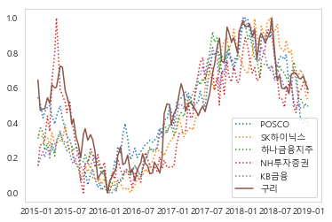
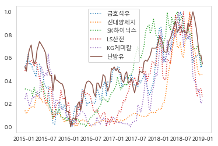
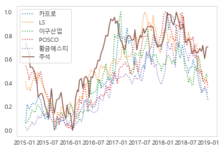
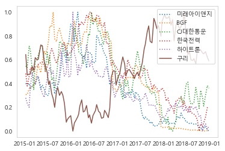
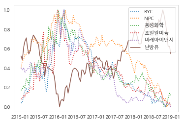
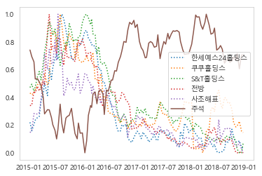

# 원자재가격과 주가의 관계 분석

### 경희대학교 산업경영공학과 김태호 [Github](https://github.com/hwangtoemat)


```python
import pandas as pd
from pandas import Series,DataFrame
import numpy as np
from dateutil.parser import parse
import dateutil

# For Visualization
import matplotlib.pyplot as plt
from matplotlib import pyplot
import seaborn as sns
sns.set_style('whitegrid')
%matplotlib inline

# For time stamps
from datetime import datetime

import warnings
warnings.filterwarnings("ignore")
import pandas as pd
import numpy as np
import matplotlib.pyplot as plt
%matplotlib inline
from datetime import datetime

path = "c:/Windows/Fonts/malgun.ttf"
import platform
from matplotlib import font_manager, rc
if platform.system() == 'Darwin':
    rc('font', family='AppleGothic')
elif platform.system() == 'Windows':
    font_name = font_manager.FontProperties(fname=path).get_name()
    rc('font', family=font_name)
else:
    print('Unknown system... sorry~~~~')    

plt.rcParams['axes.unicode_minus'] = False
```

### 데이터 전처리

KOSPI만 선택


```python
item_Charge = pd.read_csv("st_data_itemChargeFull.tsv", sep = '\t')
item_Charge['date'] = item_Charge['date'].apply(str)
item_Charge['date'] = item_Charge['date'].apply(dateutil.parser.parse)
KOSPI = item_Charge.loc[item_Charge[list(item_Charge.columns)[2]]=="KOSPI",:]
KOSPI.head()
```


<div>
<style scoped>
    .dataframe tbody tr th:only-of-type {
        vertical-align: middle;
    }

    .dataframe tbody tr th {
        vertical-align: top;
    }

    .dataframe thead th {
        text-align: right;
    }
</style>
<table border="1" class="dataframe">
  <thead>
    <tr style="text-align: right;">
      <th></th>
      <th>itemcode</th>
      <th>itemname</th>
      <th>market</th>
      <th>date</th>
      <th>close_val</th>
      <th>change_val</th>
      <th>change_rate</th>
      <th>acc_quant</th>
      <th>debt_total</th>
      <th>face_val</th>
      <th>...</th>
      <th>operating_profit</th>
      <th>operating_profit_increasing_rate</th>
      <th>prev_quant</th>
      <th>property_total</th>
      <th>reserve_ratio</th>
      <th>roa</th>
      <th>roe</th>
      <th>sales</th>
      <th>sales_increasing_rate</th>
      <th>trade_stop_yn</th>
    </tr>
  </thead>
  <tbody>
    <tr>
      <th>0</th>
      <td>000020</td>
      <td>동화약품</td>
      <td>KOSPI</td>
      <td>2015-01-07</td>
      <td>5540.0</td>
      <td>70.0</td>
      <td>1.26</td>
      <td>42517.0</td>
      <td>732.0</td>
      <td>1000</td>
      <td>...</td>
      <td>112.0</td>
      <td>NaN</td>
      <td>62744.0</td>
      <td>3706.0</td>
      <td>967.43</td>
      <td>NaN</td>
      <td>NaN</td>
      <td>3066.0</td>
      <td>NaN</td>
      <td>N</td>
    </tr>
    <tr>
      <th>1</th>
      <td>000020</td>
      <td>동화약품</td>
      <td>KOSPI</td>
      <td>2015-01-13</td>
      <td>5600.0</td>
      <td>40.0</td>
      <td>0.71</td>
      <td>39527.0</td>
      <td>732.0</td>
      <td>1000</td>
      <td>...</td>
      <td>112.0</td>
      <td>NaN</td>
      <td>62744.0</td>
      <td>3706.0</td>
      <td>967.43</td>
      <td>NaN</td>
      <td>NaN</td>
      <td>3066.0</td>
      <td>NaN</td>
      <td>N</td>
    </tr>
    <tr>
      <th>2</th>
      <td>000020</td>
      <td>동화약품</td>
      <td>KOSPI</td>
      <td>2015-01-16</td>
      <td>5640.0</td>
      <td>-110.0</td>
      <td>-1.95</td>
      <td>57341.0</td>
      <td>732.0</td>
      <td>1000</td>
      <td>...</td>
      <td>112.0</td>
      <td>NaN</td>
      <td>62744.0</td>
      <td>3706.0</td>
      <td>967.43</td>
      <td>NaN</td>
      <td>NaN</td>
      <td>3066.0</td>
      <td>NaN</td>
      <td>N</td>
    </tr>
    <tr>
      <th>3</th>
      <td>000020</td>
      <td>동화약품</td>
      <td>KOSPI</td>
      <td>2015-01-19</td>
      <td>5680.0</td>
      <td>40.0</td>
      <td>0.70</td>
      <td>49574.0</td>
      <td>732.0</td>
      <td>1000</td>
      <td>...</td>
      <td>112.0</td>
      <td>NaN</td>
      <td>62744.0</td>
      <td>3706.0</td>
      <td>967.43</td>
      <td>NaN</td>
      <td>NaN</td>
      <td>3066.0</td>
      <td>NaN</td>
      <td>N</td>
    </tr>
    <tr>
      <th>4</th>
      <td>000020</td>
      <td>동화약품</td>
      <td>KOSPI</td>
      <td>2015-01-22</td>
      <td>5550.0</td>
      <td>-60.0</td>
      <td>-1.08</td>
      <td>77386.0</td>
      <td>732.0</td>
      <td>1000</td>
      <td>...</td>
      <td>112.0</td>
      <td>NaN</td>
      <td>62744.0</td>
      <td>3706.0</td>
      <td>967.43</td>
      <td>NaN</td>
      <td>NaN</td>
      <td>3066.0</td>
      <td>NaN</td>
      <td>N</td>
    </tr>
  </tbody>
</table>
<p>5 rows × 27 columns</p>
</div>


```python
KOSPI_=KOSPI.pivot_table('close_val',index='date',columns='itemname')
KOSPI_clo = KOSPI_.dropna(axis = 1 ).fillna(method='ffill').pct_change().fillna(0)
KOSPI_val = KOSPI_.dropna(axis = 1 ).fillna(method='ffill')
KOSPI_val.head()
```


<div>
<style scoped>
    .dataframe tbody tr th:only-of-type {
        vertical-align: middle;
    }

    .dataframe tbody tr th {
        vertical-align: top;
    }

    .dataframe thead th {
        text-align: right;
    }
</style>
<table border="1" class="dataframe">
  <thead>
    <tr style="text-align: right;">
      <th>itemname</th>
      <th>AJ렌터카</th>
      <th>AK홀딩스</th>
      <th>BGF</th>
      <th>BNK금융지주</th>
      <th>BYC</th>
      <th>BYC우</th>
      <th>CJ</th>
      <th>CJ CGV</th>
      <th>CJ대한통운</th>
      <th>CJ씨푸드</th>
      <th>...</th>
      <th>후성</th>
      <th>휠라코리아</th>
      <th>휴니드</th>
      <th>휴비스</th>
      <th>휴스틸</th>
      <th>휴켐스</th>
      <th>흥국화재</th>
      <th>흥국화재2우B</th>
      <th>흥국화재우</th>
      <th>흥아해운</th>
    </tr>
    <tr>
      <th>date</th>
      <th></th>
      <th></th>
      <th></th>
      <th></th>
      <th></th>
      <th></th>
      <th></th>
      <th></th>
      <th></th>
      <th></th>
      <th></th>
      <th></th>
      <th></th>
      <th></th>
      <th></th>
      <th></th>
      <th></th>
      <th></th>
      <th></th>
      <th></th>
      <th></th>
    </tr>
  </thead>
  <tbody>
    <tr>
      <th>2015-01-07</th>
      <td>17750.0</td>
      <td>86600.0</td>
      <td>74500.0</td>
      <td>13500.0</td>
      <td>252000.0</td>
      <td>168500.0</td>
      <td>158500.0</td>
      <td>59800.0</td>
      <td>183500.0</td>
      <td>2595.0</td>
      <td>...</td>
      <td>3080.0</td>
      <td>119000.0</td>
      <td>4510.0</td>
      <td>11600.0</td>
      <td>17350.0</td>
      <td>25550.0</td>
      <td>3730.0</td>
      <td>6140.0</td>
      <td>2460.0</td>
      <td>2805.0</td>
    </tr>
    <tr>
      <th>2015-01-13</th>
      <td>17650.0</td>
      <td>88000.0</td>
      <td>73700.0</td>
      <td>14000.0</td>
      <td>254000.0</td>
      <td>170000.0</td>
      <td>161500.0</td>
      <td>60500.0</td>
      <td>192000.0</td>
      <td>2590.0</td>
      <td>...</td>
      <td>3245.0</td>
      <td>118000.0</td>
      <td>4820.0</td>
      <td>11750.0</td>
      <td>17600.0</td>
      <td>25200.0</td>
      <td>3900.0</td>
      <td>6200.0</td>
      <td>2465.0</td>
      <td>2655.0</td>
    </tr>
    <tr>
      <th>2015-01-16</th>
      <td>17300.0</td>
      <td>92300.0</td>
      <td>75100.0</td>
      <td>14000.0</td>
      <td>252500.0</td>
      <td>169000.0</td>
      <td>164500.0</td>
      <td>59300.0</td>
      <td>182000.0</td>
      <td>2560.0</td>
      <td>...</td>
      <td>3215.0</td>
      <td>115000.0</td>
      <td>4970.0</td>
      <td>11800.0</td>
      <td>17150.0</td>
      <td>26800.0</td>
      <td>4230.0</td>
      <td>6160.0</td>
      <td>2410.0</td>
      <td>2710.0</td>
    </tr>
    <tr>
      <th>2015-01-19</th>
      <td>17250.0</td>
      <td>88200.0</td>
      <td>75100.0</td>
      <td>14250.0</td>
      <td>252500.0</td>
      <td>170500.0</td>
      <td>164500.0</td>
      <td>59300.0</td>
      <td>182000.0</td>
      <td>2540.0</td>
      <td>...</td>
      <td>3160.0</td>
      <td>115500.0</td>
      <td>5050.0</td>
      <td>11800.0</td>
      <td>16850.0</td>
      <td>27050.0</td>
      <td>4190.0</td>
      <td>6300.0</td>
      <td>2450.0</td>
      <td>2575.0</td>
    </tr>
    <tr>
      <th>2015-01-22</th>
      <td>17000.0</td>
      <td>90300.0</td>
      <td>75000.0</td>
      <td>13950.0</td>
      <td>251000.0</td>
      <td>175000.0</td>
      <td>168500.0</td>
      <td>59600.0</td>
      <td>172000.0</td>
      <td>2520.0</td>
      <td>...</td>
      <td>3205.0</td>
      <td>116000.0</td>
      <td>5090.0</td>
      <td>11650.0</td>
      <td>16800.0</td>
      <td>26800.0</td>
      <td>4175.0</td>
      <td>6180.0</td>
      <td>2495.0</td>
      <td>2570.0</td>
    </tr>
  </tbody>
</table>
<p>5 rows × 802 columns</p>
</div>


```python
st_data_goodsForeign = pd.read_csv("st_data_goodsForeign.tsv", sep = '\t')
st_data_goodsForeign['date'] = st_data_goodsForeign['date'].apply(str)
st_data_goodsForeign['date'] = st_data_goodsForeign['date'].apply(dateutil.parser.parse)
st_data_goodsForeign.head()
```


<div>
<style scoped>
    .dataframe tbody tr th:only-of-type {
        vertical-align: middle;
    }

    .dataframe tbody tr th {
        vertical-align: top;
    }

    .dataframe thead th {
        text-align: right;
    }
</style>
<table border="1" class="dataframe">
  <thead>
    <tr style="text-align: right;">
      <th></th>
      <th>itemcode</th>
      <th>itemname</th>
      <th>date</th>
      <th>close_val</th>
      <th>change_val</th>
      <th>open_val</th>
      <th>high_val</th>
      <th>low_val</th>
    </tr>
  </thead>
  <tbody>
    <tr>
      <th>0</th>
      <td>LME@AAY</td>
      <td>알루미늄합금</td>
      <td>2015-01-07</td>
      <td>1790.0</td>
      <td>-15.0</td>
      <td>1790.0</td>
      <td>1790.0</td>
      <td>1780.0</td>
    </tr>
    <tr>
      <th>1</th>
      <td>LME@AAY</td>
      <td>알루미늄합금</td>
      <td>2015-01-13</td>
      <td>1835.0</td>
      <td>NaN</td>
      <td>1835.0</td>
      <td>1835.0</td>
      <td>1825.0</td>
    </tr>
    <tr>
      <th>2</th>
      <td>LME@AAY</td>
      <td>알루미늄합금</td>
      <td>2015-01-16</td>
      <td>1820.0</td>
      <td>NaN</td>
      <td>1820.0</td>
      <td>1820.0</td>
      <td>1810.0</td>
    </tr>
    <tr>
      <th>3</th>
      <td>LME@AAY</td>
      <td>알루미늄합금</td>
      <td>2015-01-19</td>
      <td>1820.0</td>
      <td>NaN</td>
      <td>1820.0</td>
      <td>1820.0</td>
      <td>1810.0</td>
    </tr>
    <tr>
      <th>4</th>
      <td>LME@AAY</td>
      <td>알루미늄합금</td>
      <td>2015-01-22</td>
      <td>1870.0</td>
      <td>10.0</td>
      <td>1870.0</td>
      <td>1870.0</td>
      <td>1860.0</td>
    </tr>
  </tbody>
</table>
</div>


```python
goodsForeign=st_data_goodsForeign.pivot_table('close_val',index='date',columns='itemname')
goodsForeign_clo = goodsForeign.fillna(method='ffill').pct_change().fillna(0)
goodsForeign_val = goodsForeign.fillna(method='ffill')
goodsForeign_val.head()
```


<div>
<style scoped>
    .dataframe tbody tr th:only-of-type {
        vertical-align: middle;
    }

    .dataframe tbody tr th {
        vertical-align: top;
    }

    .dataframe thead th {
        text-align: right;
    }
</style>
<table border="1" class="dataframe">
  <thead>
    <tr style="text-align: right;">
      <th>itemname</th>
      <th>구리</th>
      <th>난방유</th>
      <th>납</th>
      <th>니켈</th>
      <th>대두</th>
      <th>대두박</th>
      <th>대두유</th>
      <th>설탕</th>
      <th>소맥</th>
      <th>쌀</th>
      <th>아연</th>
      <th>알루미늄합금</th>
      <th>옥수수</th>
      <th>주석</th>
      <th>천연가스</th>
    </tr>
    <tr>
      <th>date</th>
      <th></th>
      <th></th>
      <th></th>
      <th></th>
      <th></th>
      <th></th>
      <th></th>
      <th></th>
      <th></th>
      <th></th>
      <th></th>
      <th></th>
      <th></th>
      <th></th>
      <th></th>
    </tr>
  </thead>
  <tbody>
    <tr>
      <th>2015-01-07</th>
      <td>6170.0</td>
      <td>1.6999</td>
      <td>1820.0</td>
      <td>15455.0</td>
      <td>1065.6</td>
      <td>368.5</td>
      <td>32.98</td>
      <td>14.78</td>
      <td>579.4</td>
      <td>11.410</td>
      <td>2145.5</td>
      <td>1790.0</td>
      <td>411.4</td>
      <td>19680.0</td>
      <td>2.871</td>
    </tr>
    <tr>
      <th>2015-01-13</th>
      <td>5915.0</td>
      <td>1.6330</td>
      <td>1800.5</td>
      <td>14780.0</td>
      <td>1015.6</td>
      <td>349.7</td>
      <td>32.39</td>
      <td>14.87</td>
      <td>548.0</td>
      <td>11.240</td>
      <td>2083.0</td>
      <td>1835.0</td>
      <td>400.2</td>
      <td>19555.0</td>
      <td>2.943</td>
    </tr>
    <tr>
      <th>2015-01-16</th>
      <td>5660.0</td>
      <td>1.6656</td>
      <td>1766.5</td>
      <td>14360.0</td>
      <td>1003.0</td>
      <td>326.2</td>
      <td>33.39</td>
      <td>15.33</td>
      <td>532.6</td>
      <td>11.325</td>
      <td>2056.5</td>
      <td>1820.0</td>
      <td>401.0</td>
      <td>19325.0</td>
      <td>3.127</td>
    </tr>
    <tr>
      <th>2015-01-19</th>
      <td>5671.0</td>
      <td>1.6411</td>
      <td>1827.5</td>
      <td>14400.0</td>
      <td>1003.0</td>
      <td>326.2</td>
      <td>33.39</td>
      <td>15.33</td>
      <td>532.6</td>
      <td>11.325</td>
      <td>2068.5</td>
      <td>1820.0</td>
      <td>401.0</td>
      <td>19280.0</td>
      <td>2.995</td>
    </tr>
    <tr>
      <th>2015-01-22</th>
      <td>5742.0</td>
      <td>1.6379</td>
      <td>1881.5</td>
      <td>14720.0</td>
      <td>988.6</td>
      <td>330.1</td>
      <td>31.97</td>
      <td>15.91</td>
      <td>533.6</td>
      <td>11.160</td>
      <td>2144.0</td>
      <td>1870.0</td>
      <td>399.2</td>
      <td>19580.0</td>
      <td>2.835</td>
    </tr>
  </tbody>
</table>
</div>


```python
TD = pd.concat([KOSPI_val,goodsForeign_val],axis=1)
TD = TD.reset_index().fillna(method='ffill')
for i in range(0,336):
    if i%3 != 0:
        TD.drop( i,inplace = True)
FTD = TD.set_index('date')
FTD.head()
```


<div>
<style scoped>
    .dataframe tbody tr th:only-of-type {
        vertical-align: middle;
    }

    .dataframe tbody tr th {
        vertical-align: top;
    }

    .dataframe thead th {
        text-align: right;
    }
</style>
<table border="1" class="dataframe">
  <thead>
    <tr style="text-align: right;">
      <th>itemname</th>
      <th>AJ렌터카</th>
      <th>AK홀딩스</th>
      <th>BGF</th>
      <th>BNK금융지주</th>
      <th>BYC</th>
      <th>BYC우</th>
      <th>CJ</th>
      <th>CJ CGV</th>
      <th>CJ대한통운</th>
      <th>CJ씨푸드</th>
      <th>...</th>
      <th>대두박</th>
      <th>대두유</th>
      <th>설탕</th>
      <th>소맥</th>
      <th>쌀</th>
      <th>아연</th>
      <th>알루미늄합금</th>
      <th>옥수수</th>
      <th>주석</th>
      <th>천연가스</th>
    </tr>
    <tr>
      <th>date</th>
      <th></th>
      <th></th>
      <th></th>
      <th></th>
      <th></th>
      <th></th>
      <th></th>
      <th></th>
      <th></th>
      <th></th>
      <th></th>
      <th></th>
      <th></th>
      <th></th>
      <th></th>
      <th></th>
      <th></th>
      <th></th>
      <th></th>
      <th></th>
      <th></th>
    </tr>
  </thead>
  <tbody>
    <tr>
      <th>2015-01-07</th>
      <td>17750.0</td>
      <td>86600.0</td>
      <td>74500.0</td>
      <td>13500.0</td>
      <td>252000.0</td>
      <td>168500.0</td>
      <td>158500.0</td>
      <td>59800.0</td>
      <td>183500.0</td>
      <td>2595.0</td>
      <td>...</td>
      <td>368.5</td>
      <td>32.98</td>
      <td>14.78</td>
      <td>579.4</td>
      <td>11.410</td>
      <td>2145.5</td>
      <td>1790.0</td>
      <td>411.4</td>
      <td>19680.0</td>
      <td>2.871</td>
    </tr>
    <tr>
      <th>2015-01-19</th>
      <td>17250.0</td>
      <td>88200.0</td>
      <td>75100.0</td>
      <td>14250.0</td>
      <td>252500.0</td>
      <td>170500.0</td>
      <td>164500.0</td>
      <td>59300.0</td>
      <td>182000.0</td>
      <td>2540.0</td>
      <td>...</td>
      <td>326.2</td>
      <td>33.39</td>
      <td>15.33</td>
      <td>532.6</td>
      <td>11.325</td>
      <td>2068.5</td>
      <td>1820.0</td>
      <td>401.0</td>
      <td>19280.0</td>
      <td>2.995</td>
    </tr>
    <tr>
      <th>2015-02-03</th>
      <td>17350.0</td>
      <td>98000.0</td>
      <td>85000.0</td>
      <td>14450.0</td>
      <td>282000.0</td>
      <td>171500.0</td>
      <td>173000.0</td>
      <td>60200.0</td>
      <td>200000.0</td>
      <td>2525.0</td>
      <td>...</td>
      <td>340.6</td>
      <td>30.80</td>
      <td>14.47</td>
      <td>513.6</td>
      <td>10.385</td>
      <td>2146.5</td>
      <td>1840.0</td>
      <td>401.0</td>
      <td>18950.0</td>
      <td>2.754</td>
    </tr>
    <tr>
      <th>2015-02-12</th>
      <td>16500.0</td>
      <td>91500.0</td>
      <td>88000.0</td>
      <td>14450.0</td>
      <td>295000.0</td>
      <td>170500.0</td>
      <td>177500.0</td>
      <td>64700.0</td>
      <td>197000.0</td>
      <td>2600.0</td>
      <td>...</td>
      <td>330.5</td>
      <td>32.01</td>
      <td>15.04</td>
      <td>521.2</td>
      <td>10.330</td>
      <td>2129.5</td>
      <td>1785.0</td>
      <td>398.2</td>
      <td>17900.0</td>
      <td>2.713</td>
    </tr>
    <tr>
      <th>2015-02-27</th>
      <td>16800.0</td>
      <td>101000.0</td>
      <td>89800.0</td>
      <td>14900.0</td>
      <td>304500.0</td>
      <td>186500.0</td>
      <td>173500.0</td>
      <td>64300.0</td>
      <td>181000.0</td>
      <td>2610.0</td>
      <td>...</td>
      <td>353.7</td>
      <td>32.80</td>
      <td>13.77</td>
      <td>517.4</td>
      <td>10.470</td>
      <td>2060.5</td>
      <td>1800.0</td>
      <td>401.2</td>
      <td>17920.0</td>
      <td>2.734</td>
    </tr>
  </tbody>
</table>
<p>5 rows × 817 columns</p>
</div>


```python
del TD['date']
TD.head()
corr = TD.corr(method = 'pearson')
corr_TD = corr.iloc[:-16,-15:]
corr_TD.head()
```


<div>
<style scoped>
    .dataframe tbody tr th:only-of-type {
        vertical-align: middle;
    }

    .dataframe tbody tr th {
        vertical-align: top;
    }

    .dataframe thead th {
        text-align: right;
    }
</style>
<table border="1" class="dataframe">
  <thead>
    <tr style="text-align: right;">
      <th>itemname</th>
      <th>구리</th>
      <th>난방유</th>
      <th>납</th>
      <th>니켈</th>
      <th>대두</th>
      <th>대두박</th>
      <th>대두유</th>
      <th>설탕</th>
      <th>소맥</th>
      <th>쌀</th>
      <th>아연</th>
      <th>알루미늄합금</th>
      <th>옥수수</th>
      <th>주석</th>
      <th>천연가스</th>
    </tr>
    <tr>
      <th>itemname</th>
      <th></th>
      <th></th>
      <th></th>
      <th></th>
      <th></th>
      <th></th>
      <th></th>
      <th></th>
      <th></th>
      <th></th>
      <th></th>
      <th></th>
      <th></th>
      <th></th>
      <th></th>
    </tr>
  </thead>
  <tbody>
    <tr>
      <th>AJ렌터카</th>
      <td>0.253434</td>
      <td>0.357430</td>
      <td>-0.180675</td>
      <td>0.491654</td>
      <td>-0.115987</td>
      <td>0.033026</td>
      <td>-0.198628</td>
      <td>-0.551920</td>
      <td>0.578182</td>
      <td>0.134875</td>
      <td>-0.117926</td>
      <td>0.354760</td>
      <td>0.391342</td>
      <td>-0.238737</td>
      <td>0.049452</td>
    </tr>
    <tr>
      <th>AK홀딩스</th>
      <td>0.284143</td>
      <td>0.319556</td>
      <td>-0.028906</td>
      <td>0.572011</td>
      <td>0.177118</td>
      <td>0.423597</td>
      <td>-0.119239</td>
      <td>-0.449531</td>
      <td>0.480114</td>
      <td>0.331932</td>
      <td>-0.006332</td>
      <td>0.668936</td>
      <td>0.434461</td>
      <td>-0.125864</td>
      <td>-0.080484</td>
    </tr>
    <tr>
      <th>BGF</th>
      <td>-0.840062</td>
      <td>-0.796421</td>
      <td>-0.665365</td>
      <td>-0.663681</td>
      <td>0.135000</td>
      <td>-0.171780</td>
      <td>0.112896</td>
      <td>0.434287</td>
      <td>-0.213475</td>
      <td>-0.261622</td>
      <td>-0.742201</td>
      <td>-0.237837</td>
      <td>0.009903</td>
      <td>-0.649587</td>
      <td>-0.506187</td>
    </tr>
    <tr>
      <th>BNK금융지주</th>
      <td>0.085814</td>
      <td>0.101259</td>
      <td>-0.238705</td>
      <td>0.352453</td>
      <td>0.075016</td>
      <td>0.130878</td>
      <td>-0.052747</td>
      <td>-0.365024</td>
      <td>0.446003</td>
      <td>0.125338</td>
      <td>-0.264136</td>
      <td>0.536734</td>
      <td>0.446926</td>
      <td>-0.389719</td>
      <td>-0.135423</td>
    </tr>
    <tr>
      <th>BYC</th>
      <td>-0.787079</td>
      <td>-0.844172</td>
      <td>-0.445330</td>
      <td>-0.739622</td>
      <td>0.107104</td>
      <td>-0.327591</td>
      <td>0.282540</td>
      <td>0.573646</td>
      <td>-0.448948</td>
      <td>-0.358966</td>
      <td>-0.559299</td>
      <td>-0.355283</td>
      <td>-0.213558</td>
      <td>-0.434541</td>
      <td>-0.579782</td>
    </tr>
  </tbody>
</table>
</div>


## 데이터 시각화

### 원자재 가격과 양의 상관관계를 갖는 주식


```python
corr_TD.iloc[:,0].sort_values(ascending=False).head()
```


    itemname
    POSCO     0.890243
    SK하이닉스    0.885247
    하나금융지주    0.865733
    NH투자증권    0.858859
    KB금융      0.854524
    Name: 구리, dtype: float64


```python
from sklearn import preprocessing

col = ['POSCO', 'SK하이닉스', '하나금융지주', 'NH투자증권', 'KB금융', '구리']

x = FTD[col].values
min_max_scaler = preprocessing.MinMaxScaler()

x_scaled = min_max_scaler.fit_transform(x.astype(float))
cu = pd.DataFrame(x_scaled, columns = col, index = FTD.index)

cu.head()
```


<div>
<style scoped>
    .dataframe tbody tr th:only-of-type {
        vertical-align: middle;
    }

    .dataframe tbody tr th {
        vertical-align: top;
    }

    .dataframe thead th {
        text-align: right;
    }
</style>
<table border="1" class="dataframe">
  <thead>
    <tr style="text-align: right;">
      <th></th>
      <th>POSCO</th>
      <th>SK하이닉스</th>
      <th>하나금융지주</th>
      <th>NH투자증권</th>
      <th>KB금융</th>
      <th>구리</th>
    </tr>
    <tr>
      <th>date</th>
      <th></th>
      <th></th>
      <th></th>
      <th></th>
      <th></th>
      <th></th>
    </tr>
  </thead>
  <tbody>
    <tr>
      <th>2015-01-07</th>
      <td>0.546296</td>
      <td>0.330261</td>
      <td>0.309278</td>
      <td>0.155107</td>
      <td>0.154161</td>
      <td>0.644206</td>
    </tr>
    <tr>
      <th>2015-01-19</th>
      <td>0.513889</td>
      <td>0.324117</td>
      <td>0.371134</td>
      <td>0.274905</td>
      <td>0.195089</td>
      <td>0.471332</td>
    </tr>
    <tr>
      <th>2015-02-03</th>
      <td>0.428241</td>
      <td>0.319508</td>
      <td>0.344624</td>
      <td>0.274905</td>
      <td>0.234652</td>
      <td>0.479647</td>
    </tr>
    <tr>
      <th>2015-02-12</th>
      <td>0.462963</td>
      <td>0.318740</td>
      <td>0.243004</td>
      <td>0.306431</td>
      <td>0.203274</td>
      <td>0.479647</td>
    </tr>
    <tr>
      <th>2015-02-27</th>
      <td>0.490741</td>
      <td>0.317972</td>
      <td>0.284242</td>
      <td>0.438840</td>
      <td>0.263302</td>
      <td>0.543911</td>
    </tr>
  </tbody>
</table>
</div>


```python
plt.plot(cu['POSCO'],ls = ":", label = 'POSCO')
plt.plot(cu['SK하이닉스'],ls = ":", label = 'SK하이닉스')
plt.plot(cu['하나금융지주'],ls = ":", label = '하나금융지주')
plt.plot(cu['NH투자증권'],ls = ":", label = 'NH투자증권')
plt.plot(cu['KB금융'],ls = ":", label = 'KB금융')
plt.plot(cu['구리'], label = '구리')

plt.legend(loc = 'best')
plt.grid()
plt.show()
plt.savefig('구리.jpg')
```





    <Figure size 432x288 with 0 Axes>


```python
corr_TD.iloc[:,1].sort_values(ascending=False).head()
```


    itemname
    금호석유      0.849365
    신대양제지     0.792479
    SK하이닉스    0.788649
    LS산전      0.786274
    KG케미칼     0.779705
    Name: 난방유, dtype: float64


```python
from sklearn import preprocessing

col = ['금호석유', '신대양제지', 'SK하이닉스', 'LS산전', 'KG케미칼', '난방유']

x = FTD[col].values
min_max_scaler = preprocessing.MinMaxScaler()

x_scaled = min_max_scaler.fit_transform(x.astype(float))
cu = pd.DataFrame(x_scaled, columns = col, index = FTD.index)

cu.head()
```


<div>
<style scoped>
    .dataframe tbody tr th:only-of-type {
        vertical-align: middle;
    }

    .dataframe tbody tr th {
        vertical-align: top;
    }

    .dataframe thead th {
        text-align: right;
    }
</style>
<table border="1" class="dataframe">
  <thead>
    <tr style="text-align: right;">
      <th></th>
      <th>금호석유</th>
      <th>신대양제지</th>
      <th>SK하이닉스</th>
      <th>LS산전</th>
      <th>KG케미칼</th>
      <th>난방유</th>
    </tr>
    <tr>
      <th>date</th>
      <th></th>
      <th></th>
      <th></th>
      <th></th>
      <th></th>
      <th></th>
    </tr>
  </thead>
  <tbody>
    <tr>
      <th>2015-01-07</th>
      <td>0.508148</td>
      <td>0.141916</td>
      <td>0.330261</td>
      <td>0.486553</td>
      <td>0.241379</td>
      <td>0.524168</td>
    </tr>
    <tr>
      <th>2015-01-19</th>
      <td>0.555556</td>
      <td>0.112575</td>
      <td>0.324117</td>
      <td>0.545232</td>
      <td>0.295977</td>
      <td>0.483911</td>
    </tr>
    <tr>
      <th>2015-02-03</th>
      <td>0.629630</td>
      <td>0.143713</td>
      <td>0.319508</td>
      <td>0.545232</td>
      <td>0.218391</td>
      <td>0.624538</td>
    </tr>
    <tr>
      <th>2015-02-12</th>
      <td>0.540741</td>
      <td>0.159880</td>
      <td>0.318740</td>
      <td>0.559902</td>
      <td>0.178161</td>
      <td>0.670546</td>
    </tr>
    <tr>
      <th>2015-02-27</th>
      <td>0.551111</td>
      <td>0.171257</td>
      <td>0.317972</td>
      <td>0.579462</td>
      <td>0.221264</td>
      <td>0.711625</td>
    </tr>
  </tbody>
</table>
</div>


```python
plt.plot(cu['금호석유'],ls = ":", label = '금호석유')
plt.plot(cu['신대양제지'],ls = ":", label = '신대양제지')
plt.plot(cu['SK하이닉스'],ls = ":", label = 'SK하이닉스')
plt.plot(cu['LS산전'],ls = ":", label = 'LS산전')
plt.plot(cu['KG케미칼'],ls = ":", label = 'KG케미칼')
plt.plot(cu['난방유'], label = '난방유')

plt.legend(loc = 'best')
plt.grid()
plt.show()
```





```python
corr_TD.iloc[:,13].sort_values(ascending=False).head()
```


    itemname
    카프로      0.838551
    LS       0.837574
    이구산업     0.816536
    POSCO    0.803074
    황금에스티    0.779738
    Name: 주석, dtype: float64


```python
from sklearn import preprocessing

col = ['카프로', 'LS', '이구산업', 'POSCO', '황금에스티', '주석']

x = FTD[col].values
min_max_scaler = preprocessing.MinMaxScaler()

x_scaled = min_max_scaler.fit_transform(x.astype(float))
cu = pd.DataFrame(x_scaled, columns = col, index = FTD.index)

cu.head()
```


<div>
<style scoped>
    .dataframe tbody tr th:only-of-type {
        vertical-align: middle;
    }

    .dataframe tbody tr th {
        vertical-align: top;
    }

    .dataframe thead th {
        text-align: right;
    }
</style>
<table border="1" class="dataframe">
  <thead>
    <tr style="text-align: right;">
      <th></th>
      <th>카프로</th>
      <th>LS</th>
      <th>이구산업</th>
      <th>POSCO</th>
      <th>황금에스티</th>
      <th>주석</th>
    </tr>
    <tr>
      <th>date</th>
      <th></th>
      <th></th>
      <th></th>
      <th></th>
      <th></th>
      <th></th>
    </tr>
  </thead>
  <tbody>
    <tr>
      <th>2015-01-07</th>
      <td>0.061184</td>
      <td>0.410669</td>
      <td>0.062035</td>
      <td>0.546296</td>
      <td>0.024415</td>
      <td>0.741765</td>
    </tr>
    <tr>
      <th>2015-01-19</th>
      <td>0.218421</td>
      <td>0.347163</td>
      <td>0.064516</td>
      <td>0.513889</td>
      <td>0.000000</td>
      <td>0.694706</td>
    </tr>
    <tr>
      <th>2015-02-03</th>
      <td>0.179605</td>
      <td>0.359018</td>
      <td>0.096774</td>
      <td>0.428241</td>
      <td>0.018820</td>
      <td>0.655882</td>
    </tr>
    <tr>
      <th>2015-02-12</th>
      <td>0.187500</td>
      <td>0.332769</td>
      <td>0.114144</td>
      <td>0.462963</td>
      <td>0.034588</td>
      <td>0.532353</td>
    </tr>
    <tr>
      <th>2015-02-27</th>
      <td>0.228947</td>
      <td>0.402202</td>
      <td>0.168734</td>
      <td>0.490741</td>
      <td>0.072228</td>
      <td>0.534706</td>
    </tr>
  </tbody>
</table>
</div>


```python
plt.plot(cu['카프로'],ls = ":", label = '카프로')
plt.plot(cu['LS'],ls = ":", label = 'LS')
plt.plot(cu['이구산업'],ls = ":", label = '이구산업')
plt.plot(cu['POSCO'],ls = ":", label = 'POSCO')
plt.plot(cu['황금에스티'],ls = ":", label = '황금에스티')
plt.plot(cu['주석'], label = '주석')

plt.legend(loc = 'best')
plt.grid()
plt.show()
```





### 원자재 가격과 음의 상관관계를 갖는 주식


```python
corr_TD.iloc[:,0].sort_values(ascending=True).head()
```


    itemname
    미래아이앤지   -0.871926
    BGF      -0.840062
    CJ대한통운   -0.820994
    한국전력     -0.798898
    하이트론     -0.793636
    Name: 구리, dtype: float64


```python
col = ['미래아이앤지', 'BGF', 'CJ대한통운', '한국전력', '하이트론', '구리']

x = FTD[col].values
min_max_scaler = preprocessing.MinMaxScaler()

x_scaled = min_max_scaler.fit_transform(x.astype(float))
cu = pd.DataFrame(x_scaled, columns = col, index = FTD.index)

cu.head()
```


<div>
<style scoped>
    .dataframe tbody tr th:only-of-type {
        vertical-align: middle;
    }

    .dataframe tbody tr th {
        vertical-align: top;
    }

    .dataframe thead th {
        text-align: right;
    }
</style>
<table border="1" class="dataframe">
  <thead>
    <tr style="text-align: right;">
      <th></th>
      <th>미래아이앤지</th>
      <th>BGF</th>
      <th>CJ대한통운</th>
      <th>한국전력</th>
      <th>하이트론</th>
      <th>구리</th>
    </tr>
    <tr>
      <th>date</th>
      <th></th>
      <th></th>
      <th></th>
      <th></th>
      <th></th>
      <th></th>
    </tr>
  </thead>
  <tbody>
    <tr>
      <th>2015-01-07</th>
      <td>0.401904</td>
      <td>0.306223</td>
      <td>0.547739</td>
      <td>0.483740</td>
      <td>0.279188</td>
      <td>0.644206</td>
    </tr>
    <tr>
      <th>2015-01-19</th>
      <td>0.381209</td>
      <td>0.308971</td>
      <td>0.532663</td>
      <td>0.379404</td>
      <td>0.231810</td>
      <td>0.471332</td>
    </tr>
    <tr>
      <th>2015-02-03</th>
      <td>0.401904</td>
      <td>0.354307</td>
      <td>0.713568</td>
      <td>0.460705</td>
      <td>0.200508</td>
      <td>0.479647</td>
    </tr>
    <tr>
      <th>2015-02-12</th>
      <td>0.354305</td>
      <td>0.368045</td>
      <td>0.683417</td>
      <td>0.531165</td>
      <td>0.370558</td>
      <td>0.479647</td>
    </tr>
    <tr>
      <th>2015-02-27</th>
      <td>0.377070</td>
      <td>0.376288</td>
      <td>0.522613</td>
      <td>0.525745</td>
      <td>0.494078</td>
      <td>0.543911</td>
    </tr>
  </tbody>
</table>
</div>


```python
plt.plot(cu['미래아이앤지'],ls = ":", label = '미래아이앤지')
plt.plot(cu['BGF'],ls = ":", label = 'BGF')
plt.plot(cu['CJ대한통운'],ls = ":", label = 'CJ대한통운')
plt.plot(cu['한국전력'],ls = ":", label = '한국전력')
plt.plot(cu['하이트론'],ls = ":", label = '하이트론')
plt.plot(cu['구리'], label = '구리')

plt.legend(loc = 'best')
plt.grid()
plt.show()
```





```python
corr_TD.iloc[:,1].sort_values(ascending=True).head()
```


    itemname
    BYC      -0.844172
    NPC      -0.827650
    동성화학     -0.823397
    조일알미늄    -0.821647
    미래아이앤지   -0.814216
    Name: 난방유, dtype: float64


```python
col = ['BYC', 'NPC', '동성화학', '조일알미늄', '미래아이앤지', '난방유']

x = FTD[col].values
min_max_scaler = preprocessing.MinMaxScaler()

x_scaled = min_max_scaler.fit_transform(x.astype(float))
cu = pd.DataFrame(x_scaled, columns = col, index = FTD.index)

plt.plot(cu['BYC'],ls = ":", label = 'BYC')
plt.plot(cu['NPC'],ls = ":", label = 'NPC')
plt.plot(cu['동성화학'],ls = ":", label = '동성화학')
plt.plot(cu['조일알미늄'],ls = ":", label = '조일알미늄')
plt.plot(cu['미래아이앤지'],ls = ":", label = '미래아이앤지')
plt.plot(cu['난방유'], label = '난방유')

plt.legend(loc = 'best')
plt.grid()
plt.show()
```





```python
corr_TD.iloc[:,13].sort_values(ascending=True).head()
```


    itemname
    한세예스24홀딩스   -0.901462
    쿠쿠홀딩스       -0.885435
    S&T홀딩스      -0.884960
    전방          -0.870637
    사조해표        -0.868335
    Name: 주석, dtype: float64


```python
col = ['한세예스24홀딩스', '쿠쿠홀딩스', 'S&T홀딩스', '전방', '사조해표', '주석']

x = FTD[col].values
min_max_scaler = preprocessing.MinMaxScaler()

x_scaled = min_max_scaler.fit_transform(x.astype(float))
cu = pd.DataFrame(x_scaled, columns = col, index = FTD.index)

plt.plot(cu['한세예스24홀딩스'],ls = ":", label = '한세예스24홀딩스')
plt.plot(cu['쿠쿠홀딩스'],ls = ":", label = '쿠쿠홀딩스')
plt.plot(cu['S&T홀딩스'],ls = ":", label = 'S&T홀딩스')
plt.plot(cu['전방'],ls = ":", label = '전방')
plt.plot(cu['사조해표'],ls = ":", label = '사조해표')
plt.plot(cu['주석'], label = '주석')

plt.legend(loc = 'best')
plt.grid()
plt.show()
```




